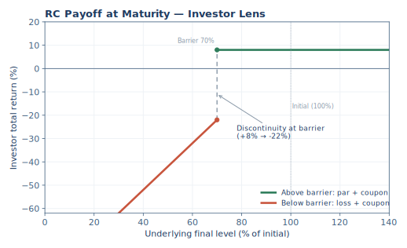
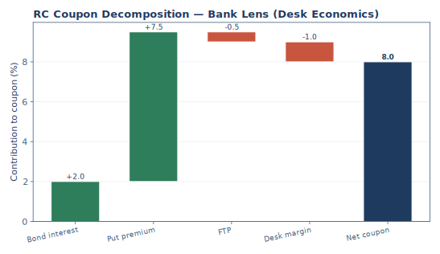
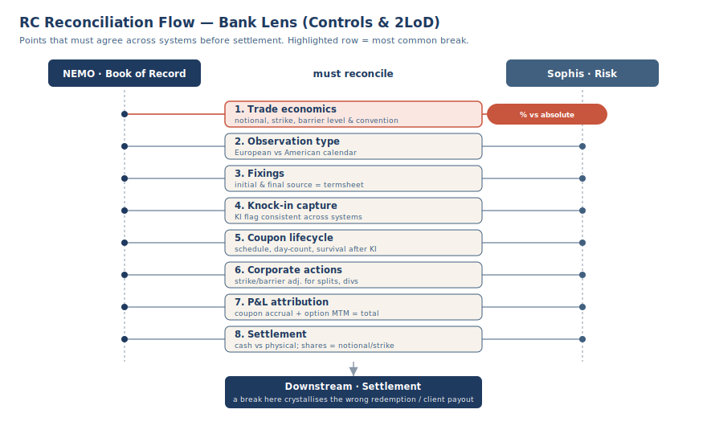

# The Structured Products Desk Bible

## Second Edition

**A Complete Guide to Derivatives, Structured Products, and Desk Operations**

*From First Principles to Professional Practice*

---

**Version:** 2.0
**Classification:** INTERNAL — CONFIDENTIAL
**Date:** June 2026

---

# How to Use This Book

This book is designed to take you from zero finance knowledge to a professional-level understanding of structured products. You do not need any prior experience. You do not need a finance degree. You need only curiosity and the willingness to learn.

**If you are a complete beginner**, start at Part 0 and read sequentially. Every concept builds on the previous one. You will never encounter a term that has not already been explained.

**If you have some finance experience**, you may skip Part 0 and begin at Part 1 (Foundations). If you find any concept unfamiliar, go back — it was explained earlier.

**If you are an experienced professional**, you may jump directly to the product deep dives in Part 5, the operational guide in Part 6, or the quick reference in Part 7.

**Reading paths by role:**

| Your Role | Recommended Path |
|-----------|-----------------|
| New Joiner (no finance background) | Part 0 → 1 → 2 → 3 → 4 → selected products from Part 5 |
| New Joiner (finance background) | Part 1 → 2 → 3 → 4 → Part 5 |
| Product Control / Operations | Part 2 → 6 → 4 → 7 → selected products from Part 5 |
| Risk Analyst | Parts 1.4–1.6 → 2.7 → 4 → selected products from Part 5 (note: Sections 1.7-1.9 cover rates and credit) |
| Trader | Parts 4 → 5 → 7 |
| Interview Preparation | Part 0 → 1 → 2 → product interview questions in Part 5 → Part 7.5 |

Every chapter ends with mental models — memorable one-line summaries that help you remember concepts, not just definitions.

Every product chapter includes interview questions — so you can test your own understanding and prepare for professional conversations.

---

# PART 0 — HOW FINANCE WORKS

*This part assumes you know nothing about finance. If you already understand markets, bonds, stocks, interest, and derivatives, skip to Part 1.*

---

## 0.1 What Is a Financial Market?

### The Village Marketplace

Imagine a small village with a marketplace in the center of town. Every morning, farmers bring their vegetables, bakers bring their bread, and craftspeople bring their furniture. Buyers walk through the stalls, compare prices, and buy what they need.

This is a market. At its core, a market is simply a place where buyers and sellers meet to exchange things.

A financial market works the same way — except instead of vegetables and bread, people buy and sell financial instruments: ownership stakes in companies, loans to governments, contracts that protect against risk, and agreements to exchange payments in the future.

### Why Markets Exist

Markets exist because different people have different needs at different times.

A company might need money today to build a factory, but will not earn revenue from that factory for three years. An investor might have money today that they do not need until retirement in twenty years. The market connects them: the company gets the money it needs now, and the investor gets paid back later — with extra compensation for waiting and for taking the risk that the company might fail.

This is the fundamental purpose of financial markets: to connect people who have money with people who need money, in a way that compensates both sides fairly.

### Types of Financial Markets

There are many types of financial markets, but the main ones are:

**Stock markets** — where people buy and sell ownership stakes in companies. When you buy a share of Apple, you own a tiny fraction of the company. If Apple does well, your share becomes more valuable. If Apple does poorly, your share loses value.

**Bond markets** — where people buy and sell loans. When a government or a company needs to borrow money, it issues bonds. Investors buy those bonds (lending their money) and receive regular interest payments in return. At the end of the loan period, the borrower pays back the original amount.

**Commodity markets** — where people buy and sell physical goods like oil, gold, wheat, and copper.

**Foreign exchange (FX) markets** — where people buy and sell currencies. If a European company needs to pay an American supplier, it must exchange euros for dollars.

**Derivatives markets** — where people buy and sell contracts whose value depends on something else. We will spend a great deal of time in this market. For now, just know that it exists.

### How Trading Works

In the village marketplace, a farmer sets a price for tomatoes. A buyer either pays that price or negotiates a lower one. They agree on a price, exchange money for tomatoes, and the transaction is complete.

Financial markets work similarly, but much faster and at much larger scale. Instead of standing in a marketplace, buyers and sellers submit electronic orders to exchanges (organized markets with transparent prices) or negotiate directly with each other in over-the-counter (OTC) markets, where two parties agree on terms privately.

Most structured products are traded OTC — meaning the bank and the client negotiate directly, rather than trading on an exchange.

### Why This Matters for Structured Products

Every structured product that you will encounter in this book is created, priced, and traded in these financial markets. The bank uses bond markets to fund the product, derivatives markets to hedge the risk, and OTC markets to sell the product to clients. Understanding what a market is — a place where buyers and sellers meet — is the foundation for everything that follows.

> **Mental Model:** A financial market is a village marketplace for money and risk. Different people bring different needs, and the market matches them.

---

## 0.2 Why Companies Need Capital

### The Bakery Problem

Imagine you own a small bakery. Business is good — so good that you want to open a second location across town. But opening a new bakery costs money: you need to rent a building, buy ovens, hire staff, and buy ingredients. You estimate this will cost $200,000.

You have three choices:

1. **Wait and save.** You could set aside some of your profits each month until you have $200,000. This might take five years. By then, someone else may have opened a bakery across town.

2. **Borrow the money.** You could go to a bank and take out a loan for $200,000. You would pay the money back over time, plus interest. You keep full ownership of your bakery, but you have a fixed obligation to repay the loan regardless of how business goes.

3. **Sell a share of your business.** You could find an investor willing to give you $200,000 in exchange for, say, 30% ownership of your entire bakery business. You never have to pay the money back, but the investor now owns a piece of your profits — forever.

This is the fundamental choice that every company faces: **borrow money (debt) or sell ownership (equity).**

### Capital at Scale

What works for a bakery works for every company in the world. Apple needs capital to develop new products. Tesla needs capital to build factories. Governments need capital to build roads, schools, and hospitals.

The word "capital" simply means money that is used to fund an activity. When a company needs capital, it goes to the financial markets and either borrows money (by issuing bonds) or sells ownership (by issuing shares).

The financial markets exist to make this process efficient, transparent, and fair.

### Why This Matters for Structured Products

Structured products are built on top of these capital markets. When a bank creates a structured product, it typically issues a bond (borrowing money from the investor) and uses derivatives to shape the risk and return of that bond. The investor's money becomes the bank's capital, and the structured product defines what the investor gets back.

Understanding that companies need capital — and that they raise it by issuing debt or equity — is essential because every structured product begins with this act: an issuer borrowing money from an investor.

> **Mental Model:** Capital is the fuel that makes businesses run. Companies raise capital by borrowing (debt) or sharing ownership (equity). Structured products are a specialized form of debt.

---

## 0.3 Debt vs Equity

### Lending vs Owning

When you lend money to a friend, you expect to get your money back, plus a little extra for the inconvenience of not having it while they used it. You do not own any part of whatever they did with the money. Whether they used it to start a successful business or buy an expensive dinner, you are owed the same amount.

When you invest in a friend's business by taking a share of ownership, you do not expect regular repayments. Instead, you share in whatever happens — if the business thrives, your share becomes very valuable; if the business fails, you could lose everything.

This is the difference between debt and equity.

### Debt: You Are a Lender

**Debt** is a loan. When you buy a bond, you are lending money to the issuer (a company or government). In return, the issuer promises to:

1. Pay you regular interest payments (called **coupons**) throughout the life of the loan.
2. Return your original money (called the **principal**) at the end of the loan period (called **maturity**).

As a lender, your upside is limited — you receive your coupons and your principal back, nothing more. But your downside is also limited — you get paid before equity holders in almost every situation. If the company struggles, it must still pay its debts before its owners see any profit.

**Example:** You buy a 5-year government bond for $1,000. The bond pays 3% per year. Each year, you receive $30. At the end of 5 years, you get your $1,000 back. Total received: $1,150. Your return is predictable and fixed.

### Equity: You Are an Owner

**Equity** is ownership. When you buy a share of stock, you own a small fraction of the company. In return, you get:

1. A claim on the company's future profits (sometimes paid as **dividends**).
2. The right to vote on major company decisions.
3. The potential for your shares to increase in value if the company does well.

As an owner, your upside is unlimited — if the company becomes the next Apple, your shares could be worth many times what you paid. But your downside is also larger — if the company goes bankrupt, shareholders are the last to be paid, and you could lose your entire investment.

**Example:** You buy 10 shares of a company for $100 each ($1,000 total). A year later, the company has done well and each share is worth $130. Your investment is now worth $1,300 — a 30% return. But if the company had done poorly, each share might be worth $70, and your investment would have fallen to $700.

### The Risk-Return Tradeoff

Notice the pattern:

| | Debt (Bonds) | Equity (Stocks) |
|---|---|---|
| What you are | Lender | Owner |
| Upside | Fixed (coupons + principal) | Unlimited |
| Downside | Low (paid first if trouble) | High (paid last, can lose everything) |
| Return | Lower, but more predictable | Higher, but more uncertain |

This is the **risk-return tradeoff**: higher potential returns come with higher risk. This principle governs everything in finance. It is the reason that structured products exist — they allow investors to choose precisely where on this spectrum they want to sit.

### Why This Matters for Structured Products

Most structured products are legally classified as debt — they are bonds issued by a bank. The investor lends money to the bank, and the bank promises to pay it back at maturity. But unlike a simple bond, the amount paid back depends on what happens in the markets.

A structured product takes the predictability of debt and combines it with the market exposure of equity (or rates, or credit). This is what makes structured products "structured" — they are engineered combinations of debt and derivatives that create customized risk and return profiles.

> **Mental Model:** Debt = lending (predictable, limited upside). Equity = owning (unpredictable, unlimited upside). Structured products sit between the two — they are technically debt, but their payoff depends on market performance.

---

## 0.4 Risk and Return

### The Savings Account and the Startup

Imagine you have $10,000 to invest. You have two options:

**Option A:** Put it in a savings account at your local bank. The bank guarantees you will get your money back, plus 2% interest per year. After one year, you will have $10,200. The outcome is almost perfectly certain.

**Option B:** Invest it in your friend's new restaurant. If the restaurant succeeds, your investment could double to $20,000 or more. If the restaurant fails — which is common for new restaurants — you could lose everything. The outcome is highly uncertain.

Most people intuitively understand that Option B should offer a higher potential return than Option A. Nobody would risk losing their money in a restaurant if they could earn the same return in a risk-free savings account. The higher return of Option B is compensation for the higher risk.

This is the **risk-return tradeoff** — the most fundamental principle in all of finance.

### What Is Risk?

Risk, in finance, is not about bad outcomes specifically. Risk is about **uncertainty** — the possibility that what actually happens will be different from what you expected.

A savings account has very low risk because the outcome is almost certain: you know exactly how much money you will have in a year. A stock investment has higher risk because the outcome is uncertain: the stock could go up 50% or down 50%, and you cannot know in advance.

Risk is measured in many ways, but the most common intuition is simple: **the wider the range of possible outcomes, the higher the risk.**

### The Risk Spectrum

Every investment falls somewhere on a spectrum:

```
LOW RISK                                                    HIGH RISK
LOW RETURN                                                HIGH RETURN
    |                                                          |
    |  Savings   Government   Corporate   Stocks   Startups   |
    |  Account     Bonds        Bonds               & Crypto  |
    |   (~2%)     (~3-4%)      (~4-6%)   (~8-10%)  (???%)     |
```

Notice that the expected returns increase as you move right — but so does the uncertainty of those returns. Government bonds almost always pay what they promise. Stocks sometimes deliver 30% returns and sometimes lose 40%. Startups can make you rich or wipe you out.

### Why Risk-Return Matters for Structured Products

Structured products exist because different investors want different positions on this spectrum. Some investors want bond-like safety but with slightly higher returns. Others want stock-like returns but with some protection against losses. Structured products are engineered to create precisely these combinations.

For example:
- A **Principal Protected Note** sits near the left of the spectrum — the investor's principal is guaranteed, but they participate in some of the upside of a stock index.
- A **Reverse Convertible** sits further right — the investor earns a much higher coupon than a bond, but takes on the risk of losing money if a stock drops below a certain level.

Every structured product represents a deliberate choice about how much risk to take and how much return to seek.

> **Mental Model:** Risk is uncertainty. Higher uncertainty demands higher compensation. Structured products let investors choose their exact position on the risk-return spectrum.

---

## 0.5 What Is Interest?

### The Price of Borrowing Money

Imagine your friend asks to borrow $1,000 for one year. You agree — but you face a real cost. For the next twelve months, you cannot use that money yourself. You cannot invest it, you cannot spend it, and you bear the risk that your friend might not pay you back.

You would reasonably ask for something in return for these costs. That "something" is **interest** — a payment from the borrower to the lender that compensates for the time, risk, and opportunity cost of lending money.

If you agree on 5% annual interest, your friend will pay you back $1,050 at the end of the year: your original $1,000 (the **principal**) plus $50 in interest.

### Why Interest Exists

Interest exists for three reasons:

1. **Time preference.** People generally prefer to have money now rather than later. If you lend your money away, you are giving up the ability to use it today. Interest compensates you for this sacrifice.

2. **Inflation.** Over time, prices tend to rise. The $1,000 your friend borrows today might only buy $970 worth of goods a year from now. Interest ensures that your money retains its purchasing power.

3. **Credit risk.** There is a chance your friend might not pay you back. Interest compensates you for bearing this risk. The riskier the borrower, the higher the interest rate you would demand.

### Interest Rates

An **interest rate** is simply the price of borrowing money, expressed as a percentage per year.

- The government might borrow at 3% per year — low rate, because governments almost always pay their debts.
- A large corporation might borrow at 5% per year — higher rate, because corporations are riskier than governments.
- A startup might borrow at 12% per year — much higher rate, because startups frequently fail.

The interest rate reflects how risky the lender considers the borrower to be.

### Coupons and Yield

When a bond pays regular interest, those payments are called **coupons**. The name comes from the old days when paper bonds had physical coupons attached — the bondholder would literally clip a coupon and present it to the bank to collect their interest payment.

**Yield** is a broader measure of the total return an investor earns on a bond, taking into account not just the coupon payments but also any difference between what they paid for the bond and what they receive at maturity.

For now, you can think of yield as "the total annual return on a bond." We will refine this concept later.

### Why Interest Matters for Structured Products

Interest is woven into every structured product. When a bank creates a structured product, it borrows money from the investor (via a bond) and pays them interest (via a coupon). The coupon on a structured product is typically higher than the coupon on a plain bond — but in exchange, the investor takes on additional risk linked to the markets.

Understanding interest is essential because:
- The **coupon** on every structured product is funded by interest, option premiums, or both.
- The **discount rate** used to value future payments depends on interest rates.
- **Yield curves** (which we will cover in Part 1) describe how interest rates change with time, and many structured products are built around these curves.

> **Mental Model:** Interest is rent for money. The riskier the borrower, the higher the rent. Coupons are the regular interest payments on a bond. Yield is the total return.

---

## 0.6 Time Value of Money

### Would You Rather Have $100 Today or $100 Next Year?

This question seems simple, and the answer is obvious: you would rather have $100 today. But why?

Three reasons:

1. **You can invest it.** If you put $100 in a savings account at 5% interest, you will have $105 in a year. So $100 today is worth more than $100 next year.

2. **Inflation erodes value.** $100 buys slightly less each year as prices rise. A dollar today has more purchasing power than a dollar in the future.

3. **The future is uncertain.** You know you have $100 today. A promise of $100 next year carries the risk that the promise might not be kept.

This is the **time value of money** — the principle that money available today is worth more than the same amount in the future.

### Present Value

If $100 today is worth more than $100 next year, then how much is $100 next year worth today?

The answer depends on the interest rate. If the rate is 5%, then:

**$100 received in one year is worth $100 / 1.05 = $95.24 today.**

This is called the **present value** — the current worth of a future payment, after accounting for the time value of money. The process of calculating present value is called **discounting**.

Think of it this way: if you had $95.24 today and invested it at 5%, you would have exactly $100 in one year. So receiving $95.24 today is economically identical to receiving $100 in one year.

### Compounding

**Compounding** is the process of earning interest on your interest. It is one of the most powerful forces in finance.

**Example:**
- Year 0: You invest $1,000 at 5% per year.
- Year 1: You earn $50 in interest. Balance: $1,050.
- Year 2: You earn 5% on $1,050 (not just $1,000). Interest: $52.50. Balance: $1,102.50.
- Year 3: You earn 5% on $1,102.50. Interest: $55.13. Balance: $1,157.63.

Each year, the interest grows because you are earning interest on the interest from previous years. Over long periods, this effect is dramatic.

### Why Time Value of Money Matters for Structured Products

The time value of money is used constantly in structured products:

- **Pricing a structured product** requires calculating the present value of all future payments (coupons, principal repayment, contingent payoffs).
- **Comparing investments** requires converting all future cash flows to present values so they can be compared on an equal basis.
- **Funding and FTP** — the internal cost of capital that a bank uses to build structured products — is based on the time value of money.

Every number you see in a structured product — the coupon, the price, the fair value — is ultimately derived from discounting future cash flows back to the present.

> **Mental Model:** A dollar today is worth more than a dollar tomorrow. Present value tells you what future money is worth right now. Compounding is interest earning interest.

---

## 0.7 What Banks Actually Do

### The Bank as an Ecosystem

When most people think of a bank, they picture a building where you deposit money and take out loans. This is **commercial banking** — and it is important, but it is only a small part of what large banks do.

The banks that create and trade structured products are primarily **investment banks** (or the investment banking divisions of large universal banks). Investment banks do not take deposits from ordinary customers. Instead, they operate in the financial markets, serving companies, governments, and institutional investors.

### The Two Main Businesses

**Commercial banking** is straightforward: take deposits from savers, lend money to borrowers, and earn the difference in interest rates. This is the oldest form of banking.

**Investment banking** is more complex. It has several major activities:

| Activity | What It Means | Example |
|----------|--------------|---------|
| **Advisory** | Helping companies with mergers, acquisitions, and strategic decisions | Advising a tech company on acquiring a competitor |
| **Underwriting** | Helping companies raise capital by issuing stocks or bonds | Managing an IPO (Initial Public Offering — when a company sells shares to the public for the first time) or a bond issuance |
| **Sales** | Selling financial products to clients (pension funds, insurance companies, corporations, wealthy individuals) | Calling a pension fund to offer a structured product |
| **Trading** | Buying and selling financial instruments, managing risk | Hedging the exposure created by a structured product |
| **Structuring** | Designing custom financial products that meet specific client needs | Creating a Phoenix Autocallable that provides income with conditional protection |
| **Research** | Analyzing markets, companies, and economies to provide insights | Publishing a report on interest rate trends |

### Where Structured Products Fit

Structured products sit at the intersection of Sales, Trading, and Structuring:

- **Structurers** design the product — choosing the underlying asset, the barrier levels, the coupon, and the maturity that match what the client wants.
- **Sales** present the product to clients and explain how it meets their investment objectives.
- **Traders** hedge the risk — once the product is sold, the trading desk must manage the bank's exposure to the underlying markets.

This is the core activity of a structured products desk: create a product that the client wants, sell it, and then hedge the risk so the bank earns a profit regardless of which direction the market moves.

### Why This Matters

Understanding the bank's structure helps you understand who does what and why. When we discuss product lifecycle, booking, and risk management later in this book, you will need to know that structured products involve multiple teams working together, each with a different role and perspective.

> **Mental Model:** A bank is an ecosystem, not a monolith. Structurers design, Sales sells, Traders hedge, Risk monitors, Operations processes. Structured products flow through all of them.

---

## 0.8 What Is a Derivative?

### A Side Bet on Something Else

Imagine you and a friend are watching a football match. Neither of you is playing in the game, but you make a $20 bet on who will win. Your bet has real financial value — one of you will gain $20, the other will lose $20 — but the value of your bet is entirely **derived** from the outcome of the game.

You are not playing football. You are not buying tickets to the game. You are making a contract between the two of you whose value depends on something else.

This is, in essence, a derivative.

### The Financial Definition

A **derivative** is a financial contract between two parties whose value is derived from the performance of an underlying asset, index, or reference rate.

The "underlying" could be almost anything:
- A stock (like Apple or Toyota)
- A stock index (like the S&P 500)
- An interest rate (like the rate at which banks lend to each other)
- A commodity (like oil, gold, or wheat)
- A currency exchange rate (like euros per dollar)
- The creditworthiness of a company

The derivative itself is not the underlying. It is a contract *about* the underlying.

### The Three Main Types of Derivatives

Almost every derivative in the world falls into one of three categories:

**1. Futures and Forwards** — An agreement to buy or sell something at a specific price on a specific future date.

*Analogy:* You agree with a car dealer to buy a car in six months at today's price, regardless of what happens to car prices between now and then. If prices rise, you got a bargain. If prices fall, you overpaid. Either way, both sides are locked in.

**2. Options** — The right, but not the obligation, to buy or sell something at a specific price before a specific date.

*Analogy:* You pay the car dealer $500 for the right to buy a car at today's price within the next six months. If prices rise, you exercise your right and buy at the lower price. If prices fall, you walk away — you lose the $500 you paid, but nothing more. The key difference from a forward is that you have a *choice*, not an obligation.

**3. Swaps** — An agreement between two parties to exchange cash flows over time.

*Analogy:* You have a fixed-rate mortgage and your neighbor has a variable-rate mortgage. You are worried rates might fall (making you overpay), and your neighbor is worried rates might rise (making them overpay). You agree to swap your interest payments: you pay their variable rate, they pay your fixed rate. Neither of you refinances your actual mortgage — you just exchange the difference.

### Why This Matters for Structured Products

Structured products are built from derivatives. A structured product is typically a bond combined with one or more options, swaps, or other derivative contracts. Understanding what derivatives are — contracts whose value depends on something else — is the first step to understanding how structured products work.

We will spend most of Part 1 building a deep understanding of options, swaps, and other derivatives. For now, just remember: a derivative is a contract about something else.

> **Mental Model:** A derivative is a financial side bet. Its value depends on something else — a stock, a rate, a commodity. The three types are forwards (locked-in future trade), options (the right to choose), and swaps (exchange of cash flows).

---

## 0.9 Why Derivatives Were Invented

### The Farmer and the Baker

Derivatives were not invented by Wall Street. They were invented by farmers.

Imagine a wheat farmer in Kansas. Every spring, the farmer plants wheat. Every autumn, the farmer harvests it and sells it at whatever the market price happens to be. The problem is that the farmer does not know in spring what the price will be in autumn. If wheat prices drop during the summer, the farmer could lose money on the entire crop.

Now imagine a baker in the same town who needs wheat to make bread. The baker faces the opposite problem: if wheat prices rise during the summer, the baker's costs increase and profits shrink.

Both the farmer and the baker face uncertainty. But their uncertainties are mirror images of each other:
- The farmer is hurt by low prices (receives less for the crop)
- The baker is hurt by high prices (pays more for ingredients)

The solution is simple: the farmer and the baker agree in spring on a fixed price for wheat to be delivered in autumn. Now neither of them has to worry about price fluctuations. The farmer knows exactly how much revenue the crop will generate. The baker knows exactly how much the ingredients will cost.

This agreement is a **forward contract** — the oldest type of derivative. It was invented not for speculation but for **hedging**: reducing uncertainty by locking in a known outcome.

### The Airline and the Oil Producer

The same logic applies across the modern economy:

**Airlines** need jet fuel, which is derived from oil. If oil prices spike, airline profits can disappear overnight. Airlines use derivatives (futures and options on oil) to lock in their fuel costs months or years in advance.

**Exporters** sell goods in foreign currencies. If the currency moves against them between the time they agree on a sale and the time they receive payment, their profit can evaporate. Exporters use currency forwards to lock in exchange rates.

**Pension funds** need to pay retirees a fixed income for decades. If interest rates fall, the pension fund's investments may not generate enough income. Pension funds use interest rate swaps to guarantee their future income.

In every case, the derivative serves the same purpose: it transforms an uncertain future into a predictable one.

### From Hedging to Speculation to Structured Products

Once derivative contracts existed for hedging, people realized they could also be used for other purposes:

**Speculation** — taking a directional view on where a market will move, without owning the underlying asset. Buying an option on a stock is cheaper than buying the stock itself, and the leverage can magnify returns (and losses).

**Structured products** — combining derivatives with bonds to create customized risk and return profiles for investors. This is where our story begins: a bank takes a simple bond, adds derivatives, and creates a product that gives the investor exactly the risk and return they want.

> **Mental Model:** Derivatives were invented to solve a real-world problem: uncertainty. The farmer and the baker both needed to plan ahead. The derivative contract — an agreement about the future — let them both sleep at night.

---

## 0.10 Why Structured Products Exist

### The Pension Fund's Problem

Consider a large pension fund responsible for paying retirement income to thousands of former employees. The fund holds billions of dollars in bonds and stocks. Its investment team faces a dilemma:

- **Bonds are safe but pay low returns.** In a low-interest-rate environment, bond coupons might be 2-3% per year — barely enough to keep up with inflation, let alone fund growing pension obligations.
- **Stocks offer higher returns but are unpredictable.** The stock market might return 15% one year and lose 20% the next. The pension fund cannot afford large losses because it has obligations to pay retirees every month.

What the pension fund really wants is something in between: higher income than bonds, but with some protection against the worst stock market outcomes.

This is exactly what structured products provide.

### The Five Reasons Clients Buy Structured Products

**1. Income Generation** — "I need higher yield than bonds offer."

A structured product can pay a coupon of 6-10% per year — far higher than a plain bond. The catch: the investor takes on some market risk (typically through selling an option, which generates the premium that funds the higher coupon).

**2. Downside Protection** — "I want market exposure, but with a safety net."

Some structured products guarantee that the investor will get their principal back at maturity, regardless of market performance. The tradeoff: the investor gives up some upside participation.

**3. Yield Enhancement** — "I believe the market will be stable, and I want to be rewarded for that view."

If an investor believes a stock will not fall significantly, they can sell an option (through a structured product) and earn the option premium as an enhanced coupon. They are essentially being paid for taking on a risk they believe is unlikely to materialize.

**4. Leverage** — "I want amplified exposure to a market move."

Some structured products magnify the investor's participation in market gains (and sometimes losses). A small market move translates into a larger gain or loss for the investor.

**5. Capital Protection** — "I cannot afford to lose my principal."

Principal protected notes guarantee the return of the investor's initial investment, while allowing participation in market upside. The tradeoff: limited upside and potentially lower returns.

### The Bank's Perspective

From the bank's perspective, structured products serve a different purpose: they allow the bank to earn a margin by combining derivatives with bonds and selling the package to clients. The bank:

1. Borrows money from the investor (by issuing a bond)
2. Uses derivatives to shape the payoff
3. Hedges its risk in the market
4. Earns a margin (the difference between what it charges the client and what the hedge costs)

If the bank hedges correctly, it earns its margin regardless of what happens in the market. The structured product business is not about betting on markets — it is about manufacturing customized financial products and earning a manufacturing margin.

### Why Not Just Buy Stocks and Bonds?

A reasonable question. The answer is that many investors have specific constraints that simple stocks and bonds cannot satisfy:

| Client Need | Why Stocks/Bonds Don't Work | What Structured Products Offer |
|------------|---------------------------|-------------------------------|
| Need 6% yield, can't afford losses > 20% | Bonds pay 3%; stocks might lose 30% | Reverse Convertible: 6% coupon, loss only if stock falls > 30% |
| Must guarantee principal | Stocks have no floor | Principal Protected Note: 100% capital back + some upside |
| Want exposure to market upside without buying stocks | Regulatory or mandate constraints | Structured note with equity participation |
| Need income but believe market will be stable | Savings accounts pay nearly nothing | Autocallable: high coupon paid regularly as long as market stays above a threshold |

Structured products fill the gap between what investors need and what simple securities can provide.

> **Mental Model:** Structured products exist because investors' needs do not fit neatly into "stocks" or "bonds." Structured products are custom solutions: the bank borrows from the investor, uses derivatives to shape the risk, hedges its own exposure, and earns a manufacturing margin.

---

## 0.11 The Investment Banking Ecosystem

### Who Does What

A structured products desk does not operate in isolation. It sits within a larger investment banking ecosystem where multiple teams work together to create, sell, trade, and manage products.

**Sales** — The client-facing team. Salespeople understand what clients need and present products that meet those needs. A salesperson might call a pension fund to offer a Phoenix Autocallable that provides 8% income with conditional capital protection. Sales does not design products or manage risk — they are the bridge between the bank and its clients.

**Structurers** — The product designers. Structurers take a client's requirements (desired yield, acceptable risk level, preferred maturity, investment size) and engineer a product that meets those requirements. They decide what derivatives to embed, how to set barrier levels, and how to price the product so it is attractive to the client while profitable for the bank.

**Traders** — The risk managers of the desk. Once a structured product is sold, the bank has exposure to the underlying markets. Traders manage this exposure by hedging — taking offsetting positions in the market so that the bank's profit comes from its margin, not from market direction. Traders continuously adjust their hedges as markets move.

**Quants (Quantitative Analysts)** — The mathematicians and modelers. Quants build the pricing models that structurers and traders use to value products and calculate risk. They develop the mathematical frameworks for pricing exotic options, calibrating volatility surfaces, and running simulations.

**Risk Management** — The independent oversight function. Risk managers monitor the trading desk's exposures, ensure that risk limits are not breached, and challenge the assumptions in pricing models. They report to senior management and are deliberately separate from the revenue-generating teams.

**Product Control** — The P&L verification team. Product controllers independently verify the desk's profit and loss calculations, reconcile positions between systems, and ensure that the bank's books are accurate. They catch errors before they become problems.

**Operations** — The processing team. Operations handles the mechanics of structured products: booking trades into systems, processing coupon payments, handling maturity and settlement, managing corporate actions, and ensuring that the right amounts flow to the right places at the right times.

**Compliance and Legal** — Ensure that products comply with regulations, that client documentation is correct, and that the bank's activities are legally sound.

### Why Every Role Matters

In structured products, a mistake by any team can have real consequences:

- If Sales misdescribes a product, the client may not understand the risks they are taking.
- If Structurers misprice a product, the bank could lose money on every trade.
- If Traders fail to hedge properly, the bank is exposed to market risk.
- If Operations books a trade incorrectly, payments may be wrong and P&L may be misstated.
- If Risk Management fails to catch an excessive exposure, the bank could suffer large losses.

Structured products are complex enough that no single person or team can manage them alone. The ecosystem works because each team handles its piece, and handoffs between teams are carefully defined.

> **Mental Model:** A structured products desk is a factory. Sales brings orders, Structurers design the product, Traders manage the risk, Operations processes the trade, Risk monitors the exposure, and Product Control verifies the books. Every role is essential.

---

## 0.12 Front Office vs Middle Office vs Back Office

### The Restaurant Analogy

Think of a restaurant:

- The **kitchen** is where the food is made. The chefs create dishes, manage ingredients, and ensure quality. This is where revenue is generated — without the kitchen, there is nothing to sell.
- The **floor manager** monitors the restaurant: Are tables turning over? Are wait times acceptable? Is the kitchen producing dishes safely? The manager does not cook, but they ensure the restaurant operates within acceptable standards.
- The **dishwashers and accounting team** handle everything behind the scenes: cleaning equipment, paying suppliers, managing payroll, ensuring health codes are met. Without them, the restaurant would shut down — but they do not directly generate revenue.

A bank works the same way:

### Front Office — The Kitchen

The front office generates revenue. It includes:
- **Sales** — bringing in client business
- **Trading** — managing market positions and hedging
- **Structuring** — designing products

Front office staff are measured primarily on the revenue and profit they produce. They interact directly with clients and markets.

### Middle Office — The Floor Manager

The middle office monitors and controls. It includes:
- **Risk Management** — monitoring exposures and ensuring limits are respected
- **Product Control** — verifying P&L and reconciling positions
- **Compliance** — ensuring regulatory adherence

Middle office staff do not generate revenue, but they prevent losses and ensure the front office operates within safe boundaries. They are deliberately independent from the front office to avoid conflicts of interest.

### Back Office — The Dishwashers and Accountants

The back office processes and settles. It includes:
- **Operations** — booking trades, processing payments, handling settlements
- **Finance** — accounting, reporting, regulatory filings
- **Technology** — maintaining trading systems, databases, and infrastructure

Back office staff ensure that every trade is properly recorded, every payment is correctly made, and every report is accurately filed. Without them, the bank could not function — but they are furthest from the revenue-generating activity.

### Why This Matters for Structured Products

When you work with structured products, you will interact with all three offices:
- The **front office** designs and sells the product
- The **middle office** monitors the risk and verifies the P&L
- The **back office** books the trade, processes coupon payments, and handles maturity

Understanding which office is responsible for what will help you navigate the bank and understand why certain processes and controls exist.

> **Mental Model:** Front Office = revenue. Middle Office = controls. Back Office = processing. All three are essential. Structured products flow through all of them, from design to settlement.

---

### Part 0 — Knowledge Check

**Review Questions:**

1. What is the difference between debt and equity? Which typically offers higher returns, and why?
2. Explain the time value of money in one sentence. Why does it matter for pricing financial products?
3. Name the three main types of derivatives and give a one-sentence description of each.
4. Why did derivatives originally come into existence? Give a real-world example.
5. What are the five main reasons that clients buy structured products?

**Scenario Questions:**

1. A pension fund wants higher returns than bonds but cannot afford to lose more than 10% of its investment. Which type of structured product might suit this client, and why?
2. An airline wants to protect itself against rising oil prices over the next two years. What type of derivative would help, and how would it work?
3. A bank sells a structured product to an investor. The market moves against the investor, but the bank still earns a profit. How is this possible?

**Desk Question:**

A new client calls Sales and says: "I want guaranteed returns of 10% per year with no risk of loss." Explain why this request is impossible, using the concepts of risk, return, and interest rates from this chapter.

---

### Part 0 — Mental Models Summary

| Concept | Mental Model |
|---------|-------------|
| Financial market | A village marketplace for money and risk |
| Capital | The fuel that makes businesses run |
| Debt | Lending — predictable, limited upside |
| Equity | Owning — unpredictable, unlimited upside |
| Risk | Uncertainty — the wider the range of outcomes, the higher the risk |
| Interest | Rent for money |
| Present value | What future money is worth today |
| Bank | An ecosystem — Structurers design, Sales sells, Traders hedge |
| Derivative | A financial side bet — its value depends on something else |
| Forward | Locked-in future trade |
| Option | The right to choose |
| Swap | Exchange of cash flows |
| Structured product | Custom solution — bond + derivatives, manufactured by the bank |
| Front Office | The kitchen — generates revenue |
| Middle Office | The floor manager — controls risk |
| Back Office | The dishwashers — processes trades |

---

# PART 1 — FOUNDATIONS

*This part teaches the financial concepts you need before studying any structured product. Every term introduced here will be used repeatedly in Parts 2 through 7. Take your time with these concepts — they are the foundation of everything that follows.*

---

## 1.1 Core Trading Concepts

### Buying and Selling: Long vs Short

In everyday life, when you buy something, you own it. When you sell something you own, you no longer own it. Finance works the same way, but with different vocabulary.

**Going Long** means buying something — taking ownership with the expectation that its value will increase.

*Example:* You buy 100 shares of Apple at $150 each. You are "long" Apple. If Apple rises to $170, you make $20 per share ($2,000 profit). If Apple falls to $130, you lose $20 per share ($2,000 loss).

**Going Short** means selling something you do not own — with the obligation to buy it back later. This sounds strange, but it is a fundamental part of financial markets.

*Analogy:* Imagine you borrow your neighbor's lawnmower and immediately sell it to someone else for $200. You now owe your neighbor a lawnmower. If lawnmower prices drop to $150, you can buy a new one for $150, return it to your neighbor, and pocket the $50 difference. But if prices rise to $250, you have to buy one at the higher price and you lose $50.

Short selling works the same way with financial assets: you borrow shares, sell them immediately, and hope to buy them back later at a lower price.

| Position | You Expect | You Profit When | You Lose When |
|----------|-----------|----------------|---------------|
| Long (buy) | Price to rise | Price rises | Price falls |
| Short (sell) | Price to fall | Price falls | Price rises |

**Why this matters for structured products:** Every structured product involves the bank taking a combination of long and short positions. When a bank sells a structured product, it is typically long the bond component and short some form of option. Understanding long and short is essential to understanding product construction.

### Bid, Offer, and Spread

In the village marketplace, a farmer might want to sell tomatoes for $3 per pound, while a buyer is only willing to pay $2.50. The gap between what the buyer wants to pay and what the seller wants to receive is the basis of all trading.

**Bid** — the price a buyer is willing to pay. "I'll buy at $2.50."

**Offer (or Ask)** — the price a seller is willing to accept. "I'll sell at $3.00."

**Spread** — the gap between the bid and the offer. In this case, $0.50.

In financial markets, there is almost always a spread between the bid and the offer. Market makers — firms that stand ready to buy and sell — earn their living from this spread. They buy at the bid price and sell at the offer price, earning the difference.

A **tight spread** (small gap) means the asset is liquid — many buyers and sellers compete, pushing prices close together. Government bonds have tight spreads. A **wide spread** (large gap) means the asset is less liquid. Exotic structured products have wide spreads.

### Profit and Loss (P&L)

**Profit and Loss**, universally abbreviated as **P&L**, is simply the measurement of how much money you have made or lost on a position or a portfolio.

If you bought a stock at $100 and it is now worth $110, your **unrealized P&L** is +$10 (unrealized because you have not sold yet). If you sell at $110, your **realized P&L** is +$10 (realized because the gain is locked in).

### Mark-to-Market

**Mark-to-market** (abbreviated MTM) means revaluing a position at its current market price. Every trading desk marks its portfolio to market every day — meaning it recalculates the value of every position using today's market prices.

*Why it matters:* Mark-to-market is how banks measure daily P&L. If the market moves against a position, the MTM loss appears immediately — even if the trade has not matured. This daily discipline ensures that problems are identified quickly, not hidden until maturity.

### Leverage

**Leverage** means using borrowed money or derivative contracts to amplify your exposure beyond what your own capital would allow.

*Analogy:* You have $100,000 and want to buy a house worth $500,000. You put down $100,000 (20%) and borrow $400,000 from a bank. You are "leveraged" 5-to-1: for every dollar of your own money, you control five dollars of property.

If the house rises 10% to $550,000, your $100,000 investment has gained $50,000 — a 50% return. But if the house falls 10% to $450,000, your $100,000 investment has lost $50,000 — a 50% loss. Leverage amplifies both gains and losses.

In structured products, leverage appears in products like Airbag Notes and Warrants, where the investor's return is a multiple of the underlying market move.

### Liquidity

**Liquidity** describes how easily something can be bought or sold without significantly affecting its price.

Cash is the most liquid asset — you can always spend it. A house is illiquid — selling it takes time and effort, and you might have to accept a lower price to sell quickly.

In financial markets:
- Government bonds are highly liquid (huge market, many buyers and sellers)
- Structured products are relatively illiquid (customized, fewer buyers, wider spreads)

**Why this matters:** Investors in structured products should generally plan to hold until maturity. Selling early is possible but may result in a significant loss due to wide bid-offer spreads.

### Carry

**Carry** is the net cost or benefit of holding a position over time.

*Example:* If you borrow money at 3% to invest in a bond paying 5%, your carry is +2% (you earn more than you pay). This is called **positive carry**. If the bond pays only 2%, your carry is -1% — you are losing money every day just by holding the position. This is **negative carry**.

Carry is a critical concept for trading desks because it determines whether a position earns or costs money simply by existing, before any market movement occurs.

> **Mental Model:** Long = bought, expect price to rise. Short = sold, expect price to fall. Spread = the gap between buy and sell prices. P&L = how much you made or lost. Mark-to-market = revalue everything at today's prices. Leverage = amplification. Liquidity = ease of trading. Carry = cost of holding.

---

## 1.2 Options From Zero

### The Reservation at a Restaurant

Imagine you are planning a special dinner. You call a restaurant and make a reservation for Saturday night. The reservation costs nothing (or perhaps a small deposit). If Saturday comes and you decide to go, the table is yours. If something comes up and you decide not to go, you simply cancel — you lose the deposit, but nothing else.

The restaurant reservation is an option. You paid a small amount (the deposit) for the *right, but not the obligation*, to dine there. You will exercise this right if conditions are favorable (you still want to go), and let it expire if conditions are not favorable (you changed your plans).

Financial options work the same way.

### What Is an Option?

An **option** is a contract that gives the buyer the right, but not the obligation, to buy or sell an underlying asset at a specified price, on or before a specified date.

There are two types of options:

**Call Option** — the right to **buy** at a specified price.

*Analogy:* You pay a real estate developer $5,000 for the right to buy a house for $300,000 any time in the next six months. If the house is worth $350,000 in three months, you exercise your right and buy at $300,000 — instantly making $50,000 (minus the $5,000 you paid for the option). If the house drops to $250,000, you walk away — you lose only the $5,000 option cost.

**Put Option** — the right to **sell** at a specified price.

*Analogy:* You own a painting worth $10,000. You are worried it might decrease in value. You pay $500 for the right to sell the painting for $9,000 at any time in the next year. If the painting drops to $6,000, you exercise your right and sell at $9,000 — protecting yourself from most of the loss. If the painting rises to $12,000, you let the option expire and sell at the higher market price.

A put option is insurance. You pay a premium to protect against downside risk.

### Key Option Terminology

Every option has four essential features:

| Term | Meaning | Restaurant Analogy |
|------|---------|-------------------|
| **Premium** | The price paid for the option | The deposit you pay for the reservation |
| **Strike Price** | The specified price at which you can buy or sell | The price of the dinner — agreed in advance |
| **Expiry (Expiration)** | The date after which the option no longer exists | Saturday night — after that, the reservation is gone |
| **Underlying** | The asset the option is based on | The table at the restaurant |

### How to Read a Payoff Diagram

Before we go further, you need to learn how to read a **payoff diagram** — a simple chart that shows how much money you make or lose at expiry, depending on where the underlying price ends up.

A payoff diagram has two axes:

- **Horizontal axis (X):** The price of the underlying asset at expiry.
- **Vertical axis (Y):** Your profit or loss.

The horizontal line at Y = 0 is the breakeven point — above this line you are profitable, below it you are losing money.

**Call option payoff (buyer):**

```
Profit
  |          ╱
  |         ╱
  |        ╱
  |-------╱--------  ← Breakeven (Strike + Premium)
  |      ╱
--+-----*-----------  ← Zero line
  |     Strike
  |
  | - - - - - - - -  ← Maximum loss = Premium paid
  |
  +-------------------→ Underlying Price
```

Below the strike price, the call expires worthless and the buyer loses the premium. Above the strike price, the call gains value dollar-for-dollar with the underlying. The breakeven point is the strike price plus the premium paid.

**Put option payoff (buyer):**

```
Profit
  |
  ╲         |
   ╲        |
    ╲       |
     ╲------+--------  ← Breakeven (Strike - Premium)
      ╲     |
-------*----+---------  ← Zero line
       Strike
             |
  - - - - - -|- - - -  ← Maximum loss = Premium paid
             |
  +-------------------→ Underlying Price
```

Above the strike price, the put expires worthless and the buyer loses the premium. Below the strike price, the put gains value as the underlying falls.

### Moneyness: ITM, ATM, OTM

Options are described by their relationship to the current price of the underlying:

**In-the-Money (ITM)** — the option has intrinsic value right now.
- A call is ITM when the underlying price is above the strike (you could buy below market price).
- A put is ITM when the underlying price is below the strike (you could sell above market price).

**At-the-Money (ATM)** — the underlying price equals (or is very close to) the strike.

**Out-of-the-Money (OTM)** — the option has no intrinsic value right now.
- A call is OTM when the underlying price is below the strike.
- A put is OTM when the underlying price is above the strike.

*Example:* A stock trades at $100. A call option with a $90 strike is ITM (you can buy at $90, worth $100 — $10 of intrinsic value). A call with a $100 strike is ATM. A call with a $110 strike is OTM (no value unless the stock rises above $110).

### Intrinsic Value and Time Value

The price (premium) of an option has two components:

**Intrinsic value** — the amount of money the option would be worth if exercised right now. For a call: max(underlying price - strike, 0). For a put: max(strike - underlying price, 0). OTM options have zero intrinsic value.

**Time value** — the extra amount the option is worth because there is still time for the underlying to move favorably. Time value is always positive (or zero at expiry) because more time means more possibility.

**Option Premium = Intrinsic Value + Time Value**

*Analogy:* You are selling your house. A buyer offers you $300,000 today. Your house was appraised at $280,000 (intrinsic value). The extra $20,000 reflects the buyer's belief that the house could appreciate further, the neighborhood is improving, and the market is strong. That $20,000 is time value.

As expiry approaches, time value decays toward zero — a concept called **time decay** (which we will explore in detail under the Greek letter Theta).

### Exercise Styles

Options differ in *when* they can be exercised:

**European** — can only be exercised on the expiry date. Think: you must decide on the exact day.

**American** — can be exercised at any time before or on the expiry date. Think: you can choose any day.

**Bermudan** — can be exercised on specific dates before expiry (for example, quarterly). Think: a middle ground between European and American — you have a few specific windows.

Most structured products use European-style options (exercise only at maturity), which simplifies pricing and reduces operational complexity.

### Buying vs Selling Options

So far, we have discussed buying options. But every option that is bought must also be sold by someone. The seller of an option has a very different risk profile from the buyer:

| | Option Buyer | Option Seller |
|---|---|---|
| Pays | Premium (upfront cost) | Nothing (receives premium) |
| Right/Obligation | Right, but not obligation | Obligation if buyer exercises |
| Maximum loss | Premium paid | Potentially unlimited (calls) or large (puts) |
| Maximum gain | Potentially unlimited (calls) or large (puts) | Premium received |
| View | The underlying will move significantly | The underlying will not move significantly |

**This is critical for structured products:** In most structured products, the investor is *selling* an option to the bank (usually a put). The premium from selling this option funds the enhanced coupon. This is why structured products can pay higher coupons than bonds — the investor is earning option premium in addition to bond interest. But the investor is also taking on the risk that the option could be exercised against them.

### Common Mistakes

1. **Confusing option buyer and seller risk.** The buyer's maximum loss is the premium. The seller's loss can be enormous. In structured products, the investor is usually the seller.
2. **Thinking OTM options are worthless.** They have no intrinsic value but may have significant time value.
3. **Ignoring exercise style.** European options can only be exercised at expiry. Most structured products use European-style. American barriers behave very differently from European barriers.

> **Mental Model:** Call = Reservation (right to buy). Put = Insurance (right to sell). Premium = the price of the option. Strike = the agreed price. ITM/ATM/OTM = where is the underlying relative to the strike? Intrinsic value = real value now. Time value = possibility value.

---

## 1.3 Barriers and Digitals

### The Tripwire

Imagine a security system with a laser tripwire across a hallway. The system is inactive until someone breaks the beam. The moment someone crosses the beam, the alarm activates and stays active.

A **barrier** in financial options works similarly. It is a preset price level that, when crossed by the underlying asset, either activates or deactivates an option.

### Knock-In Barriers

A **knock-in barrier** activates an option when the underlying price crosses the barrier level.

*Analogy:* You buy an insurance policy that only becomes active if a specific event occurs. For example: "This flood insurance policy only activates if the river level reaches 10 feet." Until the river hits 10 feet, the policy is dormant. Once the river crosses that threshold, the insurance kicks in.

A **knock-in put** works the same way: the put option does not exist until the underlying price falls below the barrier level. Once the barrier is breached, the put activates and the investor faces downside risk.

**Why this matters:** In many structured products (like Reverse Convertibles), the investor sells a knock-in put. As long as the underlying stays above the barrier, the put never activates and the investor keeps their full principal. But if the underlying falls below the barrier, the put activates and the investor may lose money at maturity.

### Knock-Out Barriers

A **knock-out barrier** is the opposite: it deactivates an option when the underlying price crosses the barrier level.

*Analogy:* You have a gym membership that automatically cancels if you go more than three months without visiting. The membership is active by default, but a specific condition (three months of inactivity) causes it to terminate.

A **knock-out call** works similarly: the call option exists and has value, but if the underlying price rises above a certain level, the option is extinguished. The investor loses the option entirely.

### European vs American Barrier Observation

The word "barrier" tells you there is a threshold. But when and how is the threshold checked? This matters enormously.

**European barrier (discrete observation)** — the barrier is only checked on specific dates (usually the final observation date at maturity). The underlying could drop below the barrier during the life of the product and recover before the observation date, and the barrier would not be considered breached.

**American barrier (continuous observation)** — the barrier is checked every moment of every trading day. If the underlying touches the barrier at any point, even for an instant, the barrier is breached.

*Example:* An investor holds a Reverse Convertible with a knock-in barrier at $70 (current stock price: $100).

- With a **European barrier**, the stock could fall to $60 during the life of the product, but if it recovers to $80 by the maturity observation date, the barrier has not been breached. The investor keeps their principal.
- With an **American barrier**, the moment the stock touches $70 at any time, the barrier is breached. Even if the stock later recovers to $120, the put option has been activated.

American barriers are riskier for the investor (more chances for the barrier to be hit) and therefore result in higher coupons (compensation for the additional risk).

### Digital (Binary) Payoffs

A **digital option** (also called a **binary option**) pays a fixed amount if a condition is met, and nothing if it is not.

*Analogy:* A light switch. It is either ON or OFF. There is no dimmer. If the stock finishes above the strike, you receive a fixed payment ($1,000). If it finishes below, you receive nothing.

Contrast this with a standard option, which pays proportionally — the further the stock is above the strike, the more you receive (like a dimmer switch that gets brighter as you turn it).

**Digital coupon notes** use this mechanism: the investor receives a fixed coupon if the underlying is above a certain level on the observation date, and zero if it is below. There is no partial coupon.

### Why Barriers and Digitals Matter

Barriers and digitals are the building blocks of structured products. They create the "conditional" nature of most structured product payoffs:

- **Reverse Convertibles** use knock-in barriers to determine whether the investor bears downside risk.
- **Phoenix Autocallables** use barriers at multiple levels: one barrier for coupon payment, another for autocall (early redemption).
- **Digital coupon notes** use digital payoffs to create all-or-nothing coupon payments.
- **Range accruals** use daily barriers to determine which days count toward a coupon.

Understanding barriers and digitals is understanding the mechanics of structured products.

### A Note on Barrier Terminology

As you progress through this book, you will encounter the word "barrier" used in three distinct contexts. To avoid confusion, we distinguish them now:

- **Capital barrier** (also called the knock-in barrier) — the price level that determines whether the investor's principal is at risk. If the underlying falls below this level, the investor may lose money at maturity.
- **Coupon barrier** — the price level that determines whether a conditional coupon is paid. In a Phoenix Autocallable, the coupon is only paid if the underlying is above the coupon barrier on the observation date.
- **Autocall barrier** — the price level that triggers early redemption. If the underlying is above this level on an observation date, the product is redeemed early and the investor receives their principal plus any due coupon.

These three barriers are often set at different levels within the same product. A Phoenix Autocallable might have an autocall barrier at 100% (initial price), a coupon barrier at 70%, and a capital barrier (knock-in) at 60%.

> **Mental Model:** Knock-In = tripwire that activates something (dormant until crossed). Knock-Out = tripwire that deactivates something (active until crossed). European barrier = checked once at the end. American barrier = checked constantly. Digital = light switch — on or off, no in-between. Three barrier types: capital (principal risk), coupon (payment condition), autocall (early redemption trigger).

---

## 1.4 Greeks — How Risk Is Measured

### Why We Need Greeks

If you own a stock, measuring your risk is simple: if the stock goes up, you make money; if it goes down, you lose money. The only thing that matters is the direction of the price.

Options are different. An option's value depends on many things simultaneously: the underlying price, how much time is left until expiry, how volatile the underlying is, and what interest rates are doing. Change any one of these factors and the option's value changes.

The **Greeks** are a set of measurements that tell you how sensitive an option's price is to each of these factors. Each Greek is named after a letter of the Greek alphabet.

A stock's risk is one-dimensional — it goes up or down. An option's risk is multi-dimensional — it depends on price, time, volatility, and rates simultaneously. The Greeks are the toolkit for measuring each dimension. We start with the most important (Delta — you will use it every day) and build outward: Gamma tells you how fast Delta changes, Vega captures volatility sensitivity, and Theta measures time decay. Together, they form a system that traders use to manage risk.

### Delta — Directional Sensitivity

**Delta** measures how much an option's price changes when the underlying asset price changes by one unit.

*Analogy:* Delta is like the steering wheel of a car. It tells you which direction you are going and how much the car turns when you move the wheel.

- A call option with a Delta of 0.50 means: if the stock rises by $1, the option price rises by approximately $0.50.
- A put option has negative Delta (typically between -1 and 0) because puts increase in value when the underlying falls.

**Delta ranges:**
- Call Delta: 0 (deep OTM) to 1 (deep ITM). ATM calls have Delta around 0.50.
- Put Delta: -1 (deep ITM) to 0 (deep OTM). ATM puts have Delta around -0.50.

**For structured products:** Delta tells the trading desk how much exposure it has to the underlying market. If the desk has sold a structured product and is "short Delta," it means the desk will lose money if the underlying rises. The desk hedges this by buying the underlying asset until the net Delta is zero (called **Delta-neutral** hedging).

### Gamma — How Delta Changes

**Gamma** measures how much Delta itself changes when the underlying price moves.

*Analogy:* If Delta is the steering wheel, Gamma is how sensitive the steering is. A car with high Gamma has very responsive steering — a small turn of the wheel changes your direction dramatically. A car with low Gamma has sluggish steering — you have to turn the wheel a lot to change direction.

High Gamma means Delta changes rapidly with small price movements. This creates hedging challenges because the trading desk must constantly readjust its hedge. Products near their barrier levels have very high Gamma — Delta can swing violently as the underlying price approaches the barrier, making hedging difficult and expensive.

### Vega — Volatility Sensitivity

**Vega** measures how much an option's price changes when the expected volatility of the underlying changes.

*Analogy:* Think of how umbrella prices respond to weather forecasts. If the forecast changes from "30% chance of rain" to "60% chance of rain," umbrella prices jump — not because it is raining now, but because the expectation of rain has changed. Vega works the same way: it measures how much your option's price changes when the market's volatility forecast (implied volatility) changes, even if nothing has happened yet in the underlying market.

Options become more valuable when volatility increases because higher volatility means a greater chance of a large favorable move.

- **Long Vega** means you benefit when volatility increases (option buyers are long Vega).
- **Short Vega** means you lose when volatility increases (option sellers are short Vega).

**For structured products:** Most structured products involve selling options, which means the investor is typically **short Vega**. If market volatility increases unexpectedly, the value of the option the investor has sold increases, which means the structured product's value decreases for the investor. This is one of the key risks in structured products.

### Theta — Time Decay

**Theta** measures how much an option's price decreases each day, purely from the passage of time.

*Analogy:* Think of an ice cream cone on a hot day. Every minute that passes, a little more ice cream melts. The cone is losing value over time, even if nothing else changes.

Options work the same way. Every day that passes, the time value of the option decreases. This is called **time decay**. An option that expires in one year has more time value than an identical option that expires in one month, because there is more time for a favorable move to occur.

- Theta is almost always negative for option buyers (they lose value over time).
- Theta is positive for option sellers (they benefit as the option they sold loses value).

**For structured products:** Investors in structured products are typically option sellers (short Vega, positive Theta). They benefit from time decay — as time passes, the options embedded in the product decay in value, which is favorable for the investor. This is one reason structured products pay enhanced coupons: the investor is earning the time decay premium.

### Worked Example: Greeks in Action

You are a trader on the structured products desk. You have sold 100 put options on a stock trading at $100, with a strike of $100 and 6 months to expiry. Your Greeks are:

| Greek | Value | What It Means |
|-------|-------|--------------|
| Delta | -50 | If the stock rises $1, your position loses $50 (you are short puts) |
| Gamma | 3 | If the stock moves $1, your Delta changes by 3 |
| Theta | +$15/day | You earn $15 per day from time decay |
| Vega | -$200 per vol point | If implied volatility rises 1%, your position loses $200 |

**Day 1:** The stock drops $2.

- **Delta P&L:** -50 × (-$2) = +$100 (the stock fell, which is good for short puts — wait, that is wrong for short puts. Let us be precise.)
- Your Delta is -50, meaning for each $1 the stock *rises*, you *lose* $50. The stock fell $2, so: P&L from Delta = -(-50) × (-$2) = -$100. You lost $100.
- **Gamma effect:** After the $2 drop, your Delta changed. New Delta ≈ -50 + (3 × (−2)) = -50 − 6 = **-56**. Your exposure to further drops has increased.
- **Theta P&L:** +$15 (you earned one day of time decay).
- **Net Day 1 P&L:** approximately -$100 + $15 = **-$85**.

**What the trader does next:** The trader's Delta was -50, so to be Delta-neutral, the trader had previously sold 50 shares short. After the stock dropped, Delta is now -56. The trader must sell 6 more shares short to restore Delta neutrality. This is dynamic hedging in action — adjusting the hedge as Greeks change.

This example shows why the Greeks are a *system*, not isolated numbers. Delta told the trader their directional exposure. Gamma warned that the exposure would change with the stock price. Theta provided income. The trader uses all of them together to manage the position.

### Rho — Interest Rate Sensitivity

**Rho** measures how much an option's price changes when interest rates change.

Rho is typically the smallest of the Greeks for equity options, but it becomes important for:
- Long-dated options (more time for rates to matter)
- Interest rate products (where rates are the underlying)
- All structured products (because the funding cost depends on interest rates)

### Convexity

**Convexity** describes the curvature of the relationship between price and an input. A linear instrument (like a stock) moves proportionally — if the stock goes up $1, your profit increases by a fixed amount. A convex instrument (like an option) moves non-proportionally — the rate of change itself changes.

A long option position is **convex** (beneficial curvature — the more the market moves in your favor, the faster your profits accelerate). A short option position is **concave** (harmful curvature — the more the market moves against you, the faster your losses accelerate).

### Linear vs Non-Linear Payoffs

**Linear payoff:** Your profit or loss changes in a straight line with the underlying. Stocks, futures, and forwards have linear payoffs. If a stock goes up $10, your P&L changes by exactly $10 per share.

**Non-linear payoff:** Your profit or loss does not change in a straight line. Options have non-linear payoffs. A small move in the underlying near the strike price causes a large change in the option's value, while a small move far from the strike causes almost no change.

Structured products have non-linear payoffs because they contain embedded options. This non-linearity is what makes them both useful (customized risk profiles) and complex (harder to hedge and understand).

### Common Mistakes

1. **Treating Greeks as static.** Greeks change constantly as the underlying moves, time passes, and volatility shifts. Yesterday's Delta hedge is wrong today.
2. **Ignoring Gamma near barriers.** When the underlying approaches a barrier level, Gamma spikes and Delta can swing violently. Hedging becomes expensive and difficult — this is when the desk earns its margin.
3. **Thinking Theta is always the investor's friend.** Theta benefits option sellers (including most structured product investors), but if the underlying moves against the position, Delta and Vega losses can overwhelm Theta gains.

> **Mental Model:** Delta = steering (which direction and how much exposure). Gamma = steering sensitivity (how fast Delta changes — spikes near barriers). Vega = umbrella price sensitivity (changes in the volatility forecast move your position). Theta = melting ice cream (time erodes option value). Rho = interest rate sensitivity (usually small for equity options). Convexity = curvature (are gains accelerating or losses accelerating?).

---

## 1.5 Volatility

### Calm Seas vs Stormy Seas

Imagine two sailors. Both need to cross a lake to reach the other shore. Sailor A crosses on a calm day — the water is flat, the boat barely rocks, and the journey is smooth and predictable. Sailor B crosses during a storm — the boat is tossed by waves, the journey is wild and uncertain, and the final position could be very different from what Sailor B expected.

Both sailors are crossing the same lake (same distance, same destination). But the experience — the uncertainty of the journey — is completely different.

**Volatility** measures this uncertainty. In financial markets, volatility measures how much an asset's price fluctuates over time. A stock that moves 1% per day is less volatile than a stock that moves 5% per day, even if both stocks end up at the same price after a year.

### Implied Volatility vs Realized Volatility

There are two types of volatility, and understanding the difference is critical:

**Realized volatility** (also called historical volatility) is what actually happened — how much the asset's price fluctuated over a past period. It is a fact. You can calculate it from historical prices.

**Implied volatility** is what the market expects to happen — how much the asset's price is expected to fluctuate in the future. It is not a fact but a market estimate, derived from the prices of options.

*Analogy:* Imagine you are looking at weather forecasts.
- **Realized volatility** is yesterday's actual weather: "It rained 2 inches yesterday." It is a measured fact.
- **Implied volatility** is tomorrow's forecast: "There is a 60% chance of heavy rain tomorrow." It is an expectation based on current information.

Option prices depend on implied volatility. If the market expects a stock to be very volatile in the future, options on that stock are expensive (high implied volatility). If the market expects calm conditions, options are cheap (low implied volatility).

### Volatility Term Structure

Implied volatility is not the same for all expiry dates. A one-month option might have a different implied volatility than a one-year option on the same underlying.

The **volatility term structure** describes how implied volatility changes across different expiry dates:

```
Implied
Volatility
    |
    |        ╱───────────
    |      ╱
    |    ╱
    |  ╱
    |╱
    +───────────────────→ Time to Expiry
       1m  3m  6m  1y  2y
```

In the diagram above, short-dated options have lower implied volatility than long-dated options. This is the most common pattern: uncertainty tends to increase with the time horizon (more time for unexpected events to occur).

However, during market stress (like a financial crisis), the term structure can invert: short-dated volatility spikes above long-dated volatility because the market expects chaos in the near term but expects things to stabilize eventually.

### Volatility Skew and Smile

Implied volatility is also not the same for all strike prices. For equity options, the pattern typically looks like this:

```
Implied
Volatility
    |
  ╲ |
   ╲|     
    ╲     
     ╲        ───────────
      ╲──────╱
       Strike
    Low strikes    ATM    High strikes
    (OTM Puts)            (OTM Calls)
```

This downward-sloping pattern is called the **volatility skew**. OTM puts (low strike prices) have higher implied volatility than ATM options. This means the market charges more for downside protection than for upside speculation.

**Why does skew exist?** Because investors fear large downward moves more than they expect large upward moves. Demand for protective puts is high, which pushes up their prices (and therefore their implied volatility). This fear premium is baked into option prices and affects every structured product that contains embedded puts.

### Variance

**Variance** is the statistical measure of how spread out a set of values is from the average. In finance, variance is the square of volatility. A volatility of 20% corresponds to a variance of 0.04 (0.20 x 0.20).

Variance is important because some derivative products (Variance Swaps, which we will cover in Part 5) trade variance directly rather than volatility. The distinction matters for pricing and risk management, but for intuition, you can think of variance as "volatility squared."

### Why Clients Consistently Misprice Volatility

One of the most important insights in structured products: clients systematically underestimate the probability of large market moves.

Most people think in terms of average market behavior. "The stock market returns about 8% per year." This is true on average, but it hides enormous variation. In any given year, the market might return +30% or -40%. These extreme outcomes occur more frequently than most people expect.

The evidence is striking: on October 19, 1987, the S&P 500 fell over 20% in a single day. A standard statistical model (the normal distribution) would predict such an event should occur roughly once every 10,000 years. The market has experienced multiple such "impossible" moves since then — in 2008 (financial crisis), 2010 (flash crash), 2020 (pandemic sell-off). The left tail of the return distribution is far fatter than standard models suggest.

This is why structured products can offer enhanced coupons. The bank buys options (paying implied volatility) and embeds them in structured products sold to investors who believe that extreme outcomes are unlikely. The investor earns the option premium (as an enhanced coupon), and the bank earns a margin. If the investor is right and the market is calm, the investor earns the coupon. If the investor is wrong and the market moves dramatically, the investor may lose money.

> **Mental Model:** Volatility = storminess of the sea. Implied vol = the weather forecast. Realized vol = yesterday's actual weather. Skew = the market charges more for downside protection. Clients underestimate storms, which is why structured product coupons are high.

---

## 1.6 Correlation and Baskets

### The Orchestra and the Soloists

Imagine an orchestra. If all the musicians play the same note at the same time, the sound is loud but monotonous. If each musician plays independently — ignoring everyone else — the sound is chaotic and unpredictable. Real orchestras are somewhere in between: the musicians are somewhat synchronized, but each plays their own part.

**Correlation** measures how synchronized two things are. In finance, correlation measures how much two assets tend to move together.

- **Correlation of +1:** The two assets move in perfect lockstep. When one goes up, the other always goes up by a proportional amount.
- **Correlation of 0:** The two assets are completely independent. Knowing what one does tells you nothing about what the other will do.
- **Correlation of -1:** The two assets move in perfectly opposite directions. When one goes up, the other always goes down.

### Why Correlation Matters for Structured Products

Many structured products are linked to a **basket** — a group of underlying assets (for example, a basket of three stocks: Apple, Samsung, and Toyota).

The payoff of a basket product often depends on the **worst performer** in the basket. This is called a **worst-of** payoff: the investor's return is determined by whichever stock in the basket performs the worst.

*Example:* An investor holds a worst-of Reverse Convertible linked to Apple, Samsung, and Toyota. At maturity:
- Apple is up 15%
- Samsung is up 5%
- Toyota is down 12%

The investor's payoff is based on Toyota (the worst performer), not the average of the three. If Toyota has breached the barrier, the investor may lose money — even though the other two stocks performed well.

### Correlation and Pricing

Here is the key insight: **lower correlation makes worst-of products riskier for the investor, and therefore they pay higher coupons.**

When correlation is high, the stocks in the basket tend to move together. If one is doing well, the others probably are too. The chance that one stock falls dramatically while the others rise is low.

When correlation is low, the stocks move independently. There is a much higher probability that at least one stock will fall significantly, even if the others are fine. The worst-of mechanism amplifies this risk.

This is why worst-of products pay higher coupons than single-stock products: the investor is taking on correlation risk — the risk that the worst performer in the basket will be much worse than the average performer.

### Tail Risk

**Tail risk** refers to the risk of extreme, unlikely events — the "tails" of the probability distribution. A stock's return distribution has two tails: the right tail (extreme positive returns) and the left tail (extreme negative returns).

In practice, extreme negative events (market crashes, financial crises) occur more frequently than standard models predict. This is why the left tail is "fat" — there are more extreme negative outcomes than a normal distribution would suggest.

Structured products that involve selling options are exposed to tail risk: the investor earns steady coupons in normal markets but faces significant losses in extreme market moves. Understanding tail risk is essential for honestly assessing the risks of structured products.

> **Mental Model:** Correlation = synchronization. High correlation = musicians playing together (safer for worst-of products). Low correlation = musicians playing independently (riskier for worst-of products, higher coupons). Tail risk = extreme events happen more often than you think.

---

*From here, we shift focus. Sections 1.1-1.6 covered concepts rooted in equities and options. Sections 1.7-1.9 introduce the world of interest rates and credit — equally important for structured products, and essential for understanding swaps, rate trades, steepeners, and credit-linked notes. Many structured products reference interest rates rather than stocks, and some depend on whether a company defaults rather than how its stock price moves.*

---

## 1.7 Yield Curves, Spot Rates, and Forward Rates

### The Price of Waiting

In Section 0.5, we learned that interest is the price of borrowing money. Now we need to go deeper, because interest rates are not a single number — they form a complex landscape that changes constantly.

When you lend money, the interest rate you demand depends on how long you are lending for. Lending money for one month is very different from lending it for thirty years. The longer you lend, the more uncertainty you face: more time for inflation to erode your money's value, more time for the borrower to get into trouble, and more time for unexpected events to occur.

This relationship between lending period and interest rate is captured by the **yield curve**.

### What Is a Yield Curve?

A **yield curve** is a graph showing the interest rate (yield) for different lending periods (maturities), all for the same type of borrower.

The most important yield curve in finance is the government bond yield curve — the rates at which a government borrows for different periods.

```
Yield (%)
    |
  5 |                              ╱────────
    |                          ╱──╱
  4 |                      ╱──╱
    |                  ╱──╱
  3 |              ╱──╱
    |          ╱──╱
  2 |      ╱──╱
    |  ╱──╱
  1 |╱╱
    +──────────────────────────────────→ Maturity
     1m  3m  6m  1y  2y  5y  10y  30y
```

This upward-sloping curve is the **normal** shape: longer maturities pay higher yields. This makes intuitive sense — you demand more compensation for lending your money for longer.

**Flat curve** — Short-term and long-term rates are similar. This often signals economic uncertainty.

**Inverted curve** — Short-term rates are higher than long-term rates. This is unusual and often signals that the market expects an economic downturn (investors expect central banks to cut rates in the future).

### Spot Rates and Forward Rates

**Spot rate** — The interest rate for lending from today until a specific future date. "The 5-year spot rate is 3.5%" means lending money for 5 years starting today earns 3.5% per year.

**Forward rate** — The interest rate implied by the yield curve for lending between two future dates. "The 1-year rate, 2 years forward" is the rate the market implies for lending money for one year, starting two years from now.

*Analogy:* Spot rate is the price of a hotel room for tonight. Forward rate is the price of a hotel room for a specific night next year. Both are real prices, but the forward rate is derived from the relationship between different booking periods.

### Worked Example: Spot and Forward Rates

Suppose the yield curve shows:
- 1-year spot rate: 3.0%
- 2-year spot rate: 3.5%

What is the implied 1-year forward rate, one year from now?

If you lend $1,000 for two years at 3.5%, you receive: $1,000 × 1.035 × 1.035 = $1,071.23.

If you lend $1,000 for one year at 3.0% and then relend for another year at the forward rate (F), you should get the same result: $1,000 × 1.03 × (1 + F) = $1,071.23.

Solving: (1 + F) = $1,071.23 / $1,030 = 1.04, so **F = 4.0%**.

The market implies that the one-year rate, one year from now, will be 4.0%. This is higher than today's 3.0% one-year rate — the upward-sloping yield curve implies that rates will rise.

Forward rates are critical for pricing structured products because many products make payments at future dates, and the value of those payments depends on the interest rates expected to prevail at those future times.

> **Mental Model:** Yield curve = the price of waiting, plotted over time. Normal curve = longer = higher rate. Inverted curve = warning sign. Spot rate = today's rate for a given term. Forward rate = the market's implied future rate, derived from the curve.

---

## 1.8 Benchmark Rates, Swaps, and Rate Options

### Benchmark Rates: SOFR, EURIBOR, and the LIBOR Transition

Central to the interest rate world are **benchmark rates** — reference rates that underpin trillions of dollars of financial contracts.

**LIBOR** (London Interbank Offered Rate) was historically the most important benchmark rate. It measured the rate at which large banks lent to each other. However, LIBOR was phased out after 2021 due to manipulation scandals and a decline in the transactions it was supposed to measure.

**SOFR** (Secured Overnight Financing Rate) has replaced LIBOR for US dollar transactions. SOFR is based on actual overnight lending transactions secured by US Treasury bonds, making it more robust and harder to manipulate.

**EURIBOR** (Euro Interbank Offered Rate) remains the key benchmark for euro-denominated transactions.

Many structured products reference these benchmark rates — for example, a product might pay a coupon equal to "SOFR + 2%."

### CMS Rates

**CMS** stands for **Constant Maturity Swap** rate. A CMS rate is the current market rate for an interest rate swap of a specific maturity.

*Analogy:* Think of CMS rates as real-time price quotes for fixed-rate mortgages of different lengths. The "2-year CMS rate" is today's price for locking in a 2-year fixed-rate deal. The "30-year CMS rate" is today's price for a 30-year fixed-rate deal. The difference between them tells you how much extra the market charges for locking in a rate for a longer period.

*Example:* The "10-year CMS rate" is the current fixed rate on a 10-year interest rate swap. If today's 10-year CMS rate is 4.2%, that means the market is currently pricing 10-year fixed-rate swaps at 4.2%.

CMS rates are important because many structured products — particularly Steepener Notes — are linked to the difference between two CMS rates. For example, a Steepener might pay a coupon based on the 30-year CMS rate minus the 2-year CMS rate. This difference is called the **CMS spread** and reflects the slope (steepness) of the yield curve.

### Swaps: A Conceptual Introduction

We defined swaps briefly in Part 0 as "exchange agreements." Here is a slightly more detailed introduction, which will be expanded fully in Part 5.

An **interest rate swap** is an agreement between two parties to exchange interest rate payments:
- One party pays a **fixed rate** (for example, 3% per year)
- The other party pays a **floating rate** (for example, SOFR, which changes periodically)

```
Party A                         Party B
(Fixed Payer)                   (Floating Payer)

        ──── Fixed Rate (3%) ────→
        ←── Floating Rate (SOFR) ──
```

Why would anyone do this? Because Party A might have a floating-rate obligation that it wants to convert to fixed (certainty), while Party B might have a fixed-rate obligation that it wants to convert to floating (because it expects rates to fall).

### Worked Example: Interest Rate Swap Cash Flows

A company has a $10 million floating-rate loan at SOFR. It enters into a 3-year swap where it pays 3% fixed and receives SOFR floating. On a $10 million notional (the face value on which payments are calculated):

| Year | SOFR (actual) | Company Pays Fixed | Company Receives Floating | Net Swap Payment |
|:----:|:-------------:|:-----------------:|:------------------------:|:---------------:|
| 1 | 2.5% | $300,000 | $250,000 | Company pays $50,000 |
| 2 | 3.5% | $300,000 | $350,000 | Company receives $50,000 |
| 3 | 4.0% | $300,000 | $400,000 | Company receives $100,000 |

Combined with its floating-rate loan, the company's total interest cost is effectively locked at 3% — exactly what the swap was designed to achieve. In Year 1, rates were lower than 3%, so the swap cost money. In Years 2-3, rates rose above 3%, and the swap saved money.

Swaps are the most heavily traded derivatives in the world. Understanding them is essential for structured rate products and steepener notes.

### Caps, Floors, and Swaptions

**Cap** — An option on an interest rate that pays out when the rate exceeds a specified level (the cap rate). It protects the holder against rising interest rates.

*Analogy:* A cap is like a fixed-rate ceiling on a variable mortgage. No matter how high rates go, you never pay more than the cap rate. If you have a floating-rate loan at SOFR and you buy a 5% cap, your effective rate will never exceed 5% — the cap pays you the difference whenever SOFR rises above 5%.

**Floor** — An option on an interest rate that pays out when the rate falls below a specified level. It protects the holder against falling interest rates.

*Analogy:* A floor is like a guaranteed minimum return on a savings account. No matter how low market rates go, you will earn at least the floor rate.

**Swaption** — An option to enter into an interest rate swap at a future date. It gives the holder the right, but not the obligation, to start receiving (or paying) a fixed rate at a predetermined level.

*Analogy:* A swaption is like a reservation at a gym. You pay a small fee today for the right to sign up for a 2-year membership at today's rate, any time in the next three months. If membership prices rise, you exercise your reservation and lock in the lower rate. If prices fall, you let it expire and sign up at the cheaper rate. A swaption gives you the same flexibility with interest rates.

These instruments are building blocks for structured rate products. A Callable Range Accrual, for example, contains embedded caps and floors that determine the coupon.

> **Mental Model:** SOFR/EURIBOR = the benchmark rate that floating payments reference. CMS = today's fixed-rate swap quote for a given maturity. CMS spread = steepness of the curve. Cap = ceiling on rates (like a fixed-rate mortgage cap). Floor = minimum rate. Swaption = reservation to enter a swap later.

---

## 1.9 Credit Risk

### Lending to Your Neighbor

Imagine two neighbors ask to borrow $1,000 from you.

**Neighbor A** has a steady job, no debt, and has always repaid loans on time. You are confident they will pay you back.

**Neighbor B** lost their job last month, has significant credit card debt, and has a history of late payments. You are much less confident they will pay you back.

You would lend to Neighbor A at a low interest rate (say, 3%). For Neighbor B, you would either refuse to lend or demand a much higher rate (say, 12%) to compensate for the risk that they might not repay.

This is **credit risk** — the risk that a borrower will fail to meet their financial obligations.

### Credit Spread

The difference in interest rate between a risky borrower and a risk-free borrower is called the **credit spread**.

If a US government bond (considered risk-free) yields 3%, and a corporate bond from the same company yields 5%, the credit spread is 2% (or 200 **basis points** — a basis point is 1/100th of a percent).

The credit spread reflects the market's assessment of the borrower's likelihood of defaulting. Wider spreads mean more risk. Narrower spreads mean less risk.

**Why credit spreads matter for structured products:** Every structured product is issued by a bank. The coupon on the product includes compensation for the bank's own credit risk. If the bank's creditworthiness deteriorates, the value of the structured product decreases — even if the underlying market performs well. This is called **issuer credit risk** and is a risk that many investors overlook.

### Recovery Rate

If a borrower defaults, the lender usually does not lose everything. The **recovery rate** is the percentage of the loan that the lender recovers after default.

*Example:* A company goes bankrupt and defaults on its bonds. Its assets are sold, and bondholders receive 40 cents for every dollar they were owed. The recovery rate is 40%.

Recovery rates vary by the type of debt and the borrower:
- Senior secured debt: recovery rates of 50-70% are common
- Senior unsecured debt (most corporate bonds): recovery rates of 30-50%
- Subordinated debt: recovery rates of 10-30%

### Credit Default Swaps — The Basics

A **Credit Default Swap** (CDS) is a derivative contract that provides insurance against the default of a borrower.

*Analogy:* A CDS is exactly like insurance on a loan. Imagine you have lent money to a company and you are worried they might not pay it back. You can buy a CDS from another party (the "protection seller"). You pay the protection seller a regular fee (the **CDS spread**, quoted in basis points per year), and in return, the protection seller promises to compensate you if the company defaults.

```
Protection Buyer                    Protection Seller
(worried about default)             (takes the risk)

    ──── CDS Spread (regular fee) ────→
    ←── Payment if default occurs ─────
```

If the company defaults, the protection seller pays the protection buyer the loss amount (principal minus recovery value). If the company does not default, the protection buyer has paid the CDS spread "for nothing" — like paying insurance premiums without making a claim.

CDS are critical for structured products because:
- **Credit-Linked Notes (CLNs)** embed a CDS: the investor sells credit protection and earns the CDS spread as a coupon.
- **First-to-Default notes** combine multiple CDS on different borrowers, with the investor bearing the loss on whichever defaults first.
- CDS spreads are used to price the credit risk component of many structured products.

We will explore CDS in full detail in Part 5 (Swaps).

### Credit Events

A **credit event** is a formally defined occurrence that triggers a CDS payout. Under ISDA (International Swaps and Derivatives Association) standards, the main credit events are:

**Bankruptcy** — The borrower files for bankruptcy or is unable to pay its debts. This is the most clear-cut credit event.

**Failure to Pay** — The borrower misses a scheduled payment (interest or principal) and fails to correct the miss within a specified grace period. This is the most common credit event.

**Restructuring** — The borrower renegotiates the terms of its debt in a way that is unfavorable to lenders (for example, extending the maturity, reducing the coupon, or converting debt to equity). This is the most contentious credit event because it can be ambiguous.

ISDA is the industry body that standardizes derivative contracts. When we say a CDS is "ISDA standard," we mean it uses the standard legal definitions and documentation that the industry has agreed upon. This standardization is essential because it ensures that all parties agree on what constitutes a credit event and how settlement occurs.

### Model Risk

**Model risk** is the risk that the mathematical model used to price or hedge a product is wrong or inappropriate.

All derivative prices are based on models — mathematical representations of how markets behave. These models make assumptions (about volatility, correlation, interest rate behavior, and default probabilities) that may not hold in reality.

*Analogy:* Model risk is like navigating a city with a road map from ten years ago. The map was accurate when it was printed, but since then new highways have been built, old roads have been closed, and neighborhoods have changed. The map works fine for the parts of the city that have not changed, but it can lead you dangerously astray in the areas that have. Financial models face the same limitation: they are calibrated to historical conditions, and when the market enters territory the model has never seen, the model's guidance becomes unreliable.

Model risk is particularly relevant for:
- Complex portfolio credit products (like CDO tranches — Collateralized Debt Obligations, which package many credit exposures into slices of risk) where correlation assumptions have an enormous impact on pricing
- Products with barriers near the current market level, where small model errors can cause large hedging mistakes
- Long-dated products where assumptions about future volatility and rates become increasingly uncertain

> **Mental Model:** Credit risk = the risk that a borrower won't pay you back. Credit spread = the extra interest you demand for taking that risk. Recovery rate = what you get back after default. CDS = insurance on a loan. Credit event = the trigger for insurance payout (bankruptcy, failure to pay, restructuring). Model risk = the risk that your math is wrong.

---

### Part 1 — Knowledge Check

**Review Questions:**

1. Explain the difference between long and short positions. Which profits when prices rise?
2. What is the difference between a call option and a put option? Give a real-world analogy for each.
3. Name all five Greeks and describe what each one measures in one sentence.
4. What is the difference between implied volatility and realized volatility?
5. Explain why low correlation makes worst-of products riskier for the investor.

**Scenario Questions:**

1. An investor sells a knock-in put with a barrier at 70% of the initial stock price. The stock falls to 65% during the product's life but recovers to 85% by maturity. Under a European barrier, what happens? Under an American barrier, what happens?
2. A trading desk is short Vega on a portfolio of structured products. The market experiences a volatility spike. What happens to the desk's P&L, and what action might the desk take?
3. The yield curve inverts — short-term rates move above long-term rates. How does this affect a Steepener Note that pays a coupon based on the 30-year CMS rate minus the 2-year CMS rate?

**Desk Question:**

A client asks: "If I sell puts through a structured product, I'm essentially selling insurance. But insurance companies are profitable. So selling puts should be profitable too, right?" Explain why this analogy is partly correct and partly misleading, using the concepts of volatility, tail risk, and the difference between diversifiable and non-diversifiable risk.

---

### Part 1 — Mental Models Summary

| Concept | Mental Model |
|---------|-------------|
| Long | You bought it — you want the price to rise |
| Short | You sold it — you want the price to fall |
| Spread | The gap between buy and sell prices — the market maker's profit |
| Mark-to-Market | Revalue everything at today's prices — daily discipline |
| Leverage | Amplification — magnifies gains AND losses |
| Call | A reservation — the right to buy |
| Put | Insurance — the right to sell |
| Premium | The price of the option |
| Strike | The agreed price — the trigger level |
| ITM/ATM/OTM | Where is the underlying relative to the strike? |
| Time Value | Possibility value — more time = more possibility |
| Knock-In | Tripwire that activates something |
| Knock-Out | Tripwire that deactivates something |
| European Barrier | Checked once at the end |
| American Barrier | Checked constantly |
| Digital | Light switch — on or off |
| Delta | Steering wheel — which direction and how much exposure |
| Gamma | Steering sensitivity — how fast Delta changes, spikes near barriers |
| Vega | Umbrella price sensitivity — changes in the volatility forecast move your position |
| Theta | Melting ice cream — time erodes value |
| Volatility | Storminess of the sea |
| Implied Vol | Weather forecast — what the market expects |
| Realized Vol | Yesterday's actual weather — what happened |
| Skew | The market charges more for downside protection |
| Correlation | Synchronization — how much things move together |
| Worst-of | You are only as strong as your weakest link |
| Yield Curve | The price of waiting, plotted over time |
| Forward Rate | The market's implied future rate, derived from the curve |
| SOFR/EURIBOR | The benchmark rate that floating payments reference |
| CMS | Today's fixed-rate swap quote for a given maturity |
| CMS Spread | Steepness of the yield curve |
| Cap/Floor | Ceiling/minimum on interest rates |
| Credit Spread | The extra interest demanded for taking credit risk |
| CDS | Insurance on a loan |
| Model Risk | The risk that your math is wrong — like navigating with an outdated map |

---

# PART 2 — THE STRUCTURED PRODUCTS FRAMEWORK

*You now understand markets, trading, options, rates, and credit. This part answers the next question: how does a bank take these building blocks and construct a structured product?*

---

## 2.1 What Is a Structured Product?

### The Custom Kitchen

Mass-produced furniture serves most people well enough. But some clients have unusual spaces, specific materials in mind, or a particular aesthetic. They hire a carpenter to build something custom.

A structured product is custom financial furniture. Standard investments — stocks, bonds, index funds — serve most investors. But some clients need something specific: higher income than bonds, some downside protection, exposure to a particular market, or a payoff tied to a specific scenario. A bank designs a product that fits those exact requirements.

### The Formula

At its simplest, every structured product follows one formula:

**Structured Product = Bond + Derivative(s)**

The bond component provides the funding (the investor lends money to the bank). The derivative component shapes the risk and return (determining what the investor gets back at maturity).

*Example:* A Reverse Convertible = Bond + Short Put. The investor lends the bank money (the bond), and simultaneously sells the bank a put option on a stock. The premium from selling the put funds an enhanced coupon. But if the stock falls below the barrier, the investor bears the loss.

### Risk Transfer: What the Client Thinks vs What the Desk Sees

This is one of the most important concepts in structured products.

**The client thinks:** "I am buying a high-yield investment with some protection."

**The desk sees:** "The client is lending us money and selling us an option. We are buying that option cheaply, hedging it in the market, and earning the difference."

Both perspectives are correct — they are two sides of the same trade. The client gets a product that meets their investment objective. The bank gets an option at a favorable price and earns a manufacturing margin.

This asymmetry of perspective is not a flaw. It is how markets work. The client values the certainty and structure of the product. The bank values the optionality and earns a margin for providing that structure.

> **Professor Note:** If you remember only one thing from this chapter, remember this: a structured product is a bond combined with one or more derivatives. The bond provides funding. The derivatives shape the payoff. Everything else — coupons, barriers, autocalls — is just specific choices about which derivatives to embed.

---

## 2.2 Product Construction Principles

### Decomposition: Taking Things Apart

Every structured product, no matter how complex it appears, can be broken into simple components. This process is called **decomposition**, and it is the most important analytical skill on a structured products desk.

Take a Reverse Convertible paying a 7% coupon with a 70% knock-in barrier on a stock trading at $100:

| Component | What It Is | Economic Purpose |
|-----------|-----------|-----------------|
| Bond | Lending $100 to the issuer at the issuer's credit curve | Provides funding to the bank |
| Short Knock-In Put | Selling a put with strike $100, KI barrier at $70 | Generates premium to fund the enhanced coupon |
| FTP (Funds Transfer Pricing) | Internal cost of the bank's funding | Covers the bank's borrowing cost |
| Desk Margin | The bank's profit | Compensation for structuring and risk management |

The 7% coupon is not magic — it comes from somewhere:

**Coupon = Bond interest + Put premium - FTP - Desk margin**

If the bond interest is 2%, the put premium is equivalent to 6%, FTP is 0.5%, and the desk margin is 0.5%, the investor receives: 2% + 6% - 0.5% - 0.5% = **7%**.

### Funds Transfer Pricing (FTP)

**FTP** is the internal rate at which a bank's treasury lends money to its trading desks. Think of it as the wholesale price of money inside the bank.

When the structured products desk issues a note to an investor, it receives cash. But that cash has a cost — the bank's own borrowing cost. FTP represents this cost. It is deducted from the coupon budget before the investor's coupon is set.

### Desk Margin

The **desk margin** is the bank's profit on each structured product. It covers the costs of structuring, hedging, risk management, and operations. Typical margins are 0.25% to 1.5% of notional, depending on product complexity and competition.

The margin is invisible to the client — it is embedded in the pricing. The client sees a 7% coupon and decides whether that meets their objectives. The bank has already ensured that the economics work at that coupon level after deducting FTP and margin.

### Desk Perspective

| Role | What Construction Means to Them |
|------|-------------------------------|
| **Structurers** | Choose which derivatives to embed, set barrier/coupon levels to balance client attractiveness with desk profitability |
| **Traders** | Must hedge every component. Decomposition tells them exactly what positions they need to take |
| **Product Control** | Verify that each component is correctly valued and that the sum matches the product's market price |
| **Risk** | Assess the Greeks of each component to understand the overall risk profile |
| **Operations** | Book each component correctly in the systems |

### Common Mistakes

1. **Thinking the coupon is free money.** The enhanced coupon is funded by selling an option. The investor earns more than a bond *because they are taking more risk*.
2. **Ignoring issuer credit risk.** The bond component means the investor is exposed to the bank's creditworthiness, not just the underlying market.
3. **Confusing the product with the underlying.** Buying a structured product linked to Apple is not the same as buying Apple stock. The derivative component fundamentally changes the risk profile.

---

## 2.3 The Four-Leg Framework

### How Money Actually Flows

When a bank sells a structured product, multiple things happen simultaneously across different parts of the bank. The **Four-Leg Framework** maps these flows.

*Analogy:* Think of a water treatment plant. Water enters from a river (raw input), flows through filtration (processing), gets stored in a reservoir (internal management), and is distributed to homes (final output). Each stage is a different "leg" of the system. Money flows through a structured product the same way.

### The Four Legs

**Leg 1 — Note Leg (Client ↔ Issuer)**

This is what the client sees. The investor buys a note from the issuer (often a Special Purpose Vehicle, or SPV, set up by the bank). The investor pays the principal and receives coupon payments and eventual redemption. The note is a debt security — legally, the client is lending money to the issuer.

**Leg 2 — Issuer Leg (Issuer ↔ Bank Balance Sheet)**

The issuer passes the investor's money to the bank's balance sheet. This creates an internal liability — the bank owes the issuer the money needed to pay the investor back at maturity. This leg is invisible to the client.

**Leg 3 — Deposit Leg (Bank ↔ Treasury)**

The bank's treasury manages the funding internally. The deposit leg represents the FTP cost — the internal price at which treasury provides funding to the structured products desk. Treasury earns the FTP rate; the desk pays it.

**Leg 4 — Hedge Leg (Desk ↔ Market)**

The trading desk hedges the embedded derivatives in the external market. If the product contains a short put, the desk buys protective positions (Delta hedge, Vega hedge) in the market. The cost of hedging is factored into the product's pricing.

### How P&L Flows Across Legs

```
INVESTOR ──── Principal ────→ ISSUER ──── Funding ────→ BANK
    ↑                            ↑                       BALANCE
    │                            │                       SHEET
    │ Coupons / Redemption       │ Internal                │
    │                            │ Liability               │
                                                          │
                                    FTP Cost              │
                              TREASURY ←──────────────────┘
                                                          │
                                    Hedge Costs           │
                              MARKET ←── Hedge Leg ───────┘
                                         (Delta, Vega,
                                          Options, Swaps)
```

The bank's profit is the difference between what it receives from the investor (via the note leg) and what it pays out across the other three legs (issuer liability, FTP, and hedging costs).

### Worked Example

A bank sells a 1-year Reverse Convertible with $1,000,000 **notional** (the face value of the contract — the amount on which all payments are calculated), 7% coupon, linked to a stock index.

| Leg | Flow | Amount |
|-----|------|--------|
| Note Leg | Investor pays principal | +$1,000,000 received |
| Note Leg | Bank pays 7% coupon | -$70,000 over the year |
| Deposit Leg | Treasury charges FTP at 2% | -$20,000 |
| Hedge Leg | Desk buys hedge (put premium equivalent) | -$45,000 |
| Desk Margin | Remaining | +$5,000 (0.5%) |

The $70,000 coupon is funded by: $20,000 (FTP/bond interest) + $45,000 (option premium from selling the put) + $5,000 (margin the bank keeps).

> **Professor Note:** If you remember only one thing from the Four-Leg Framework, remember this: the investor sees one product, but inside the bank, money flows through four separate channels. Understanding these channels is how you understand where profit comes from and where risk lives.

### Desk Perspective

| Role | What the Four-Leg Framework Means |
|------|----------------------------------|
| **Traders** | They live in Leg 4. Their job is to hedge the derivatives efficiently so that the hedge cost stays below what was assumed in pricing |
| **Structurers** | They design the product across all four legs — balancing investor attractiveness (Leg 1) against internal costs (Legs 2-4) |
| **Product Control** | They reconcile all four legs to ensure total P&L is correct |
| **Treasury** | They manage Leg 3 — providing funding at FTP and managing the bank's overall balance sheet |
| **Operations** | They process flows across all legs — booking, payments, settlements |

### Common Mistakes

1. **Thinking the bank profits from market direction.** The bank profits from its margin, not from the market moving in any particular direction. If hedged correctly, the bank earns its margin regardless of market performance.
2. **Ignoring the deposit leg.** FTP is a real cost that reduces the coupon budget. In a rising rate environment, FTP increases, which either reduces coupons or requires restructuring.
3. **Confusing the note leg with the total product.** The note is what the investor sees, but the real economics are determined across all four legs.

---

## 2.4 Capital Protection Spectrum

### How Much Can You Lose?

Every structured product sits somewhere on a spectrum from "you cannot lose any money" to "you could lose everything."

```
FULL PROTECTION          CONDITIONAL PROTECTION          NO PROTECTION
(Principal guaranteed)   (Protected unless barrier hit)  (Full market exposure)
      |                           |                            |
     PPN                   RC / Phoenix                     Warrant
  (safest)              Airbag / FCN                  Accumulator
                         (most common)                  (riskiest)
      |                           |                            |
  Low coupon              Medium-high coupon              Highest coupon
```

**Full protection:** The investor's principal is guaranteed regardless of market performance. The tradeoff is lower participation in market upside. Example: Principal Protected Note.

**Conditional protection:** The investor's principal is protected *unless* a specific condition is met (typically a barrier breach). Most structured products fall here. Example: Reverse Convertible with 70% barrier — principal is safe unless the stock falls more than 30%.

**No protection:** The investor is fully exposed to market movements, sometimes with leverage. Example: Warrants, Accumulators.

The fundamental law: **more protection = lower coupon. Less protection = higher coupon.** The protection is not free — it is funded by giving up potential return.

### Desk Perspective

| Role | What the Protection Spectrum Means |
|------|-----------------------------------|
| **Sales** | Must clearly communicate the protection level to clients. Mis-selling protection features is a compliance risk |
| **Structurers** | Adjust barrier levels to move products along the spectrum — balancing client demand for protection against the coupon budget |
| **Risk** | Monitors how close the underlying is to barrier levels. Conditional protection becomes no protection when barriers are breached |

### Common Mistakes

1. **Confusing conditional protection with guaranteed protection.** A 70% barrier means the investor can lose 30%+ of their investment. This is not "protected."
2. **Ignoring the probability of barrier breach.** A 60% barrier looks protective, but over a 5-year period, many stocks will fall 40% at some point.
3. **Not understanding that protection has a cost.** A higher barrier (more protection) means a lower coupon. There is no free protection.

---

## 2.5 Product Lifecycle

### From Idea to Settlement

A structured product does not just appear. It goes through a defined lifecycle:

**1. Origination** — A client expresses a need. Sales and Structuring discuss what product might work.

**2. Structuring** — The structurer designs the product: chooses the underlying, sets the barrier, determines the coupon, and selects the maturity. The structurer runs pricing models to ensure the economics work for both client and bank.

**3. Pricing** — The desk calculates the fair value of the product, including all derivative components, FTP, and margin. The client receives a **termsheet** (the document that lists every detail of the product — coupon, barrier, maturity, underlying, and all other terms) showing the final terms.

**4. Execution** — The client agrees to the terms. The trade is executed.

**5. Booking** — Operations enters the trade into the bank's systems (NEMO, Sophis, or Murex, depending on the product type).

**6. Life of the product** — During the product's life, several events may occur:
- **Coupon observations** — On scheduled dates, the system checks whether coupon conditions are met.
- **Barrier observations** — The system monitors whether the underlying has breached any barriers.
- **Autocall checks** — For autocallable products, the system checks on each observation date whether the autocall condition is triggered.
- **Corporate actions** — If the underlying stock has a stock split, merger, or dividend, the product terms may need adjustment.

**7. Maturity or Early Redemption** — The product reaches its scheduled maturity (or is autocalled early). The final payoff is calculated based on the product terms and market conditions.

**8. Settlement** — The bank pays the investor the final redemption amount (either cash or, in some cases, physical delivery of shares).

---

## 2.6 Trade Lifecycle

### Who Does What, When

The product lifecycle describes what happens to the product. The trade lifecycle describes who is responsible at each stage.

| Stage | Front Office | Middle Office | Back Office |
|-------|-------------|--------------|-------------|
| **Pre-trade** | Sales discusses with client; Structurer designs and prices | Risk reviews product risk profile | — |
| **Execution** | Trader executes the hedge | — | — |
| **Booking** | — | — | Operations books the trade in systems |
| **Daily life** | Trader manages the hedge (Delta, Vega) | Risk monitors exposures; Product Control verifies P&L | Operations processes fixings and coupon payments |
| **Events** | Trader adjusts hedge for barriers, autocalls | Risk escalates if limits are approached | Operations processes autocall or barrier events |
| **Maturity** | — | Product Control verifies final P&L | Operations calculates final payoff and processes settlement |

> **Professor Note:** If you remember only one thing about the trade lifecycle, remember this: the front office makes the trade, the middle office watches the trade, and the back office processes the trade. All three must agree for the system to work.

---

## 2.7 How Desks Hedge

### Why Hedging Exists

When a bank sells a structured product, it takes on risk. If the bank does nothing, it is exposed to market movements — essentially making a bet with the client's money. Banks do not want to bet. They want to earn a manufacturing margin with minimal market exposure.

**Hedging** is the process of taking offsetting positions in the market to neutralize the risk from structured products.

*Analogy:* Think of the trading desk as a kitchen that runs like a casino. In Section 0.12, we compared the front office to a kitchen — where revenue is generated. But this kitchen does not gamble on each dish turning out perfectly. It follows tested recipes (hedging strategies) to earn a consistent margin, just as a casino sets the mathematical odds in its favor across many bets. Individual trades may gain or lose, but the desk earns its margin on average — by design, not by luck.

### What Gets Hedged

| Greek | What the Desk Hedges | How |
|-------|---------------------|-----|
| **Delta** | Directional exposure to the underlying | Buy or sell the underlying stock/index to maintain Delta-neutral |
| **Gamma** | Sensitivity of Delta to price moves | Trade options to manage Gamma; near barriers, Gamma spikes and hedging becomes expensive |
| **Vega** | Exposure to volatility changes | Trade options or variance swaps to offset Vega |
| **Rho** | Interest rate exposure | Trade interest rate swaps |
| **Credit** | Issuer or reference entity default risk | Trade CDS or credit index products |

### Dynamic Hedging

Hedging is not a one-time activity. As markets move, the Greeks change, and the hedge must be adjusted. This is called **dynamic hedging** — the desk continuously rebalances its positions to stay risk-neutral.

Delta hedging is the most frequent adjustment — often multiple times per day. Vega hedging is less frequent but equally important. Near barrier levels, hedging becomes particularly challenging because Gamma spikes and Delta can change dramatically with small price moves.

### What Happens in Stress

During market crises, hedging breaks down in predictable ways:

- **Liquidity disappears.** The desk needs to trade to rebalance, but markets become illiquid.
- **Correlation spikes.** Assets that normally move independently start moving together, amplifying losses on basket products.
- **Volatility jumps.** Vega losses hit immediately as implied vol reprices.
- **Gaps occur.** Prices jump past barrier levels without trading through them, making continuous hedging impossible.

The desk's risk management framework must account for these stress scenarios. This is why the product pricing includes a margin — part of it covers the expected cost of hedging imperfections.

### Desk Perspective

| Role | What Hedging Means |
|------|-------------------|
| **Traders** | Their primary daily activity. A well-hedged book earns margin steadily. A poorly hedged book bleeds money or creates large risk |
| **Structurers** | Design products that are hedgeable. Products that cannot be hedged efficiently will not be approved |
| **Risk** | Monitors hedge effectiveness. Challenges assumptions about correlation, volatility, and liquidity |
| **Product Control** | Verifies that hedging P&L matches theoretical expectations |

### Common Mistakes

1. **Assuming hedging eliminates all risk.** Hedging reduces risk but cannot eliminate it entirely. Model assumptions, liquidity constraints, and gap risk mean residual risk always remains.
2. **Thinking hedging is free.** Every hedge has a cost — bid-offer spreads, market impact, and financing. These costs are factored into the product margin.
3. **Ignoring correlation risk.** Hedging individual Greeks is straightforward. Hedging the interaction between multiple risk factors (Delta-Vega cross-effects, correlation changes) is much harder.

---

## 2.8 The Systems: A First Look

### Three Systems, Three Purposes

Before diving into product deep dives, you need to understand the three core systems that process structured products. Each product chapter will reference these systems, so this primer ensures you are never lost.

**NEMO** — The book of record. NEMO is the system where trades are entered and where the official position record lives. When someone asks "what trades do we have?", the answer comes from NEMO. It stores trade details: notional, strike, barrier, maturity, counterparty.

**Sophis** — The pricing and risk engine. Sophis calculates the market value of each trade using mathematical models. It produces the Greeks (Delta, Gamma, Vega) that traders use to hedge, and the daily P&L that Product Control verifies. When someone asks "what is this trade worth?", the answer comes from Sophis.

**Murex** — The rates and multi-leg booking system. Murex handles products that require the four-leg framework: Structured Rate Trades (SRT) and Steepener Notes (STEG) are booked in Murex because they require separate Note, Issuer, Deposit, and Hedge legs. Murex also handles vanilla swaps.

### Which System Handles Which Product?

| Product Family | Book of Record | Pricing/Risk | Four-Leg? |
|---------------|---------------|-------------|:---------:|
| Equity-Linked Notes (ELN) | NEMO | Sophis | No |
| Credit-Linked Notes (CLN) | NEMO | Sophis | No |
| Structured Rate Trades (SRT) | Murex | Murex | Yes |
| Steepener Notes (STEG) | Murex | Murex | Yes |
| Swaps | Murex | Murex | Varies |

### How Information Flows

```
TRADE ENTRY ──→ NEMO or MUREX (booking)
                    │
                    ▼
              SOPHIS or MUREX (pricing & risk)
                    │
                    ▼
              PRODUCT CONTROL (reconciliation & P&L verification)
```

NEMO and Sophis must agree on every trade. If NEMO says a trade has a strike of 95% but Sophis has 95 (absolute price), the position is misbooked and the P&L will be wrong. This is one of the most common reconciliation errors.

> **Professor Note:** If you remember only one thing about the systems, remember this: NEMO holds the trades, Sophis prices them, and Murex handles rates products with four legs. Every product chapter will tell you which system applies.

### Common Mistakes

1. **Assuming all products use the same system.** ELN/CLN use NEMO+Sophis. SRT/STEG use Murex. Using the wrong system causes booking errors.
2. **Confusing NEMO's trade record with Sophis's valuation.** NEMO stores what the trade *is*. Sophis calculates what the trade *is worth*. They must reconcile, but they serve different purposes.
3. **Ignoring the four-leg framework.** SRT and STEG products are booked as four separate legs in Murex. Misunderstanding the leg structure causes reconciliation breaks.

---

### Part 2 — Knowledge Check

**Review Questions:**
1. What is the formula for a structured product? What role does each component play?
2. Name the four legs in the Four-Leg Framework and explain what each one does.
3. Why does more capital protection result in a lower coupon?
4. What is FTP, and why does it matter for structured product pricing?
5. Name the three core systems and explain which products each handles.

**Scenario Questions:**
1. A client asks why their Reverse Convertible pays 7% when bonds only pay 3%. Using decomposition, explain where the extra 4% comes from.
2. The market drops 15% in a single day. Describe what happens to the hedging desk's Delta, Gamma, and Vega positions, and what actions the desk would take.
3. A Product Control analyst discovers that NEMO records a strike as 95% while Sophis uses an absolute price of $95. The stock price at trade inception was $100. Is there a problem? Explain.

**Desk Question:**
A junior trader says: "If we hedge perfectly, we earn the margin with zero risk. So why do we need a risk management team?" Explain why this statement is wrong.

### Part 2 — Mental Models Summary

| Concept | Mental Model |
|---------|-------------|
| Structured Product | Custom financial furniture — built to client specifications |
| Decomposition | Taking apart a product into its simple components |
| Coupon source | Bond interest + Option premium - FTP - Margin |
| Four-Leg Framework | Water treatment plant — money flows through four channels |
| Note Leg | What the client sees |
| Hedge Leg | What the trader does |
| Capital Protection | More protection = lower coupon, always |
| Hedging | The casino — earn the edge, don't gamble |
| Dynamic hedging | Continuous rebalancing as markets move |
| NEMO | What the trade IS |
| Sophis | What the trade is WORTH |
| Murex | The four-leg rates system |

---

# PART 3 — PRODUCT TAXONOMY

*You now understand the framework: bond + derivatives, four legs, hedging, and systems. The next question is: what specific products can be built within this framework? Part 3 maps the entire landscape — six families, forty-nine products — so that when you encounter any product in Part 5, you already know where it fits and what family it belongs to.*

---

## 3.1 Product Family Overview

Structured products are organized into six families. Each family is defined by its underlying risk factor — the market variable that drives the product's payoff.

| Family | Underlying Risk Factor | Products | Key Characteristic |
|--------|----------------------|:--------:|-------------------|
| **Equity-Linked Notes (ELN)** | Stock or equity index prices | 15 | Investor sells an equity option; earns enhanced coupon |
| **Swaps** | Interest rates, equity returns, credit, FX, commodities | 8 | Two parties exchange cash flows; no principal exchange (usually) |
| **Structured Rate Trades (SRT)** | Interest rates (CMS, SOFR) | 5 | Coupon depends on rate levels or ranges; booked in Murex |
| **Steepener Notes (STEG)** | Yield curve slope (CMS spread) | 4 | Coupon depends on yield curve steepness |
| **Credit-Linked Notes (CLN)** | Creditworthiness of a reference entity | 5 | Investor sells credit protection; earns CDS premium as coupon |
| **Other** | Various | 7 | Structured deposits, accumulators, options, forwards |

---

## 3.2 Classification Dimensions

Any structured product can be classified along six dimensions:

**By underlying:** Equity, rates, credit, FX, commodity, or hybrid.

**By coupon type:**
- *Fixed* — coupon is guaranteed regardless of market conditions (e.g., FCN)
- *Conditional* — coupon depends on the underlying being above a threshold (e.g., Phoenix)
- *Accrual* — coupon accumulates day by day based on a condition (e.g., Range Accrual)
- *None* — no coupon; return comes from capital appreciation (e.g., PPN, Warrant)

**By capital protection:** Full, conditional (barrier-dependent), or none.

**By optionality:**
- *Autocallable* — the product can redeem early if a condition is met
- *Callable* — the issuer can choose to redeem early
- *Puttable* — the investor can choose to redeem early (rare)
- *None* — runs to maturity

**By complexity:**
- *Simple* — closed-form pricing (a direct formula gives you the price), 1-2 components (RC, PPN)
- *Medium* — requires simulation (running thousands of random price paths through a computer to estimate the price), 3-4 components (Phoenix, FCN)
- *Complex* — path-dependent (the payoff depends not just on where the price ends up, but on the entire path it took to get there), multi-observation, correlation-dependent (worst-of Phoenix, Tranche)

**By booking system:** NEMO+Sophis (ELN, CLN) or Murex (SRT, STEG, Swaps).

---

## 3.3 ELN Family Tree

The Reverse Convertible is the seed from which the entire ELN family grows. Every variant in the RC sub-family adds exactly one feature to the base product. Understanding the RC means understanding the core of every product below it.

```
Equity-Linked Notes
│
├── Reverse Convertible Variants
│   ├── Reverse Convertible (RC) ............ Core product: fixed coupon, knock-in put
│   ├── Discounted RC (DRC) ................ Instead of a coupon, investor buys at a discount (e.g., pays $95 for $100 par)
│   ├── Knock-Out Discounted RC (KODRC) .... Adds a KO barrier above — if stock rises enough, the put is extinguished
│   ├── Callable RC (CRC) .................. Bank can redeem early — adds reinvestment risk for the investor
│   └── Airbag / Leveraged RC .............. Below the barrier, losses are amplified by a leverage factor
│
├── Autocallable Variants
│   ├── Fixed Coupon Note (FCN) ............. Like an RC with automatic early redemption if the stock is above a level on observation dates
│   ├── Phoenix Autocallable ................ Coupon is conditional — paid only if stock is above a threshold, with memory for missed coupons
│   └── Callable Range Accrual ELN .......... Coupon accrues day-by-day depending on whether the stock stays in a range
│
└── Other ELNs
    ├── Principal Protected Note (PPN) ...... Full capital protection — investor cannot lose principal, but gives up most upside
    ├── Bonus / Participation Note .......... Investor participates in upside; a floor protects against moderate losses
    ├── Issuer Callable Note (ICN) .......... Fixed coupon with issuer call right — no barrier, no put
    ├── Digital Coupon Notes ................ All-or-nothing coupon: full coupon if stock is above threshold, zero if below
    ├── Booster Note ....................... Leveraged upside participation — gains are multiplied, but so are losses
    ├── Digital Coupon Knock-In Put ......... Combines digital coupon with a knock-in barrier — most complex ELN variant
    └── Warrant / Turbo Certificate ......... Pure option exposure without a bond wrapper — no coupon, no protection
```

**The unifying theme:** All ELNs involve the investor taking equity risk (usually by selling a put option) in exchange for enhanced income or participation.

---

## 3.4 Swaps Family Tree

Swaps are the plumbing of the financial system — they let institutions exchange one type of cash flow for another. The Interest Rate Swap is the foundation; every other swap applies the same "exchange" mechanism to a different underlying.

```
Swaps
│
├── Rate Swaps
│   ├── Interest Rate Swap (IRS) ........... The most traded derivative in the world: exchange fixed for floating rate payments
│   └── Vanilla Swap (VLSP) ................ A standard IRS with simplified terms
│
├── Asset Swaps
│   ├── Total Return Swap (TRS) ............ One party receives the total return of an asset without owning it
│   ├── Equity Swap ....................... Exchange equity returns for a financing rate — used for tax-efficient exposure
│   └── Commodity Swap .................... Lock in a fixed commodity price vs floating market price
│
├── Currency Swaps
│   └── Cross-Currency Swap ................ Exchange interest payments in two different currencies, with principal exchange
│
└── Volatility / Credit Swaps
    ├── Variance Swap ..................... A bet on how volatile a market will actually be vs how volatile it was expected to be
    └── Credit Default Swap (CDS) ......... Insurance on a loan — pay a regular premium, receive compensation if the borrower defaults
```

**The unifying theme:** Every swap is an exchange agreement — two parties trade one set of cash flows for another, each preferring what the other has.

---

## 3.5 SRT Family Tree

Structured Rate Trades embed interest rate derivatives into a note structure. They are all booked in Murex with the four-leg framework, and their coupons depend on where interest rates are — not on equity prices.

```
Structured Rate Trades
│
├── Callable
│   ├── IR Callable Fixed Rate Swap ........ Fixed coupon, but the issuer can redeem early if rates move in its favor
│   └── IR Callable Range Accrual .......... Coupon accrues daily when a reference rate stays within a defined range; issuer can call
│
├── Non-Callable
│   └── IR Non-Callable Range Accrual ...... Same as callable range accrual, but runs to maturity — no early redemption
│
├── Accreting
│   └── IR Accreting Callable / ZCL ........ No periodic coupons — the notional grows over time, and the investor receives the total at maturity
│
└── Digital
    └── Digital Cap-Floor .................. Pays a fixed amount if a rate is above a cap or below a floor; nothing otherwise
```

**The unifying theme:** All SRT products pay coupons linked to interest rate levels. The investor is expressing a view on where rates will be, not on equity or credit markets.

---

## 3.6 STEG Family Tree

```
Steepener Notes
│
├── Vanilla Steepener ..................... Coupon = CMS30Y - CMS2Y
├── Range-Accrual Steepener ............... Coupon accrues when spread in range
├── Callable Steepener .................... + Issuer call right
└── TARN Steepener ........................ Coupon capped at lifetime total
```

**The unifying theme:** All STEG products pay coupons linked to the difference between long-term and short-term interest rates. They profit when the yield curve is steep and suffer when it flattens or inverts.

---

## 3.7 CLN Family Tree

Credit-Linked Notes apply the same "investor sells protection" logic as put-selling ELNs, but in the credit world. Instead of selling equity downside risk, the investor sells default risk — and earns a CDS-like premium as a coupon.

```
Credit-Linked Notes
│
├── Single-Name
│   ├── Vanilla CLN ....................... Investor sells credit protection on one company; earns CDS spread as coupon
│   └── Skew CLN .......................... Like a Vanilla CLN but with modified recovery terms that shift payout under default
│
├── Basket
│   ├── First-to-Default (FTD) ............ Investor sells protection on a basket of 5-10 companies; first default triggers loss
│   └── Nth-to-Default (NTD) .............. Like FTD but the Nth default triggers loss — second-to-default is less risky than first-to-default
│
└── Portfolio
    └── Synthetic CDO Tranche ............. Investor takes a slice of credit risk on a large portfolio (100+ names); complex correlation exposure
```

**The unifying theme:** All CLNs involve the investor selling credit protection. The investor earns a CDS-like premium as a coupon and bears the loss if a credit event occurs.

---

## 3.8 Other Products

| Product | Type | Key Feature |
|---------|------|------------|
| Structured Deposits | Deposit + derivative | Capital guaranteed by deposit insurance |
| Accumulators | Forward + KO barrier | Daily accumulation of shares at discount |
| Decumulators | Forward + KO barrier | Daily sale of shares at premium |
| Option on Risk Control | Option on managed fund | Exposure to risk-controlled strategy |
| Equity Linked Option | Standalone option | Pure option exposure, no bond wrapper |
| Forwards | Forward contract | Obligatory future purchase/sale |
| Vanilla Options | Standalone option | Calls or puts without structure |

> **Professor Note:** If you remember only one thing from the taxonomy, remember this: ELNs sell equity risk, CLNs sell credit risk, SRTs/STEGs sell rate risk, and Swaps exchange cash flows. Every product in this book fits one of these patterns.

### Common Mistakes

1. **Thinking product families are unrelated.** Many products share building blocks. A Callable Range Accrual ELN and a Callable Range Accrual SRT use the same accrual mechanism but on different underlyings.
2. **Ignoring the system implications.** The family determines the booking system. Confusing a rates product with an equity product leads to booking errors.
3. **Treating the taxonomy as rigid.** Some products (like Callable Range Accrual ELN) span families. The taxonomy is a guide, not a wall.

---

# PART 4 — PRODUCT COMPARISON MATRICES

*Part 3 showed you what products exist. Part 4 shows you how they differ. These matrices let you compare products side by side — which coupon type, which barrier, which system, which risks. Use them as reference tables when you need to distinguish between variants, or when a client asks "what is the difference between an FCN and a Phoenix?" You do not need to memorize these tables — they are designed to be looked up, not read sequentially.*

---

**Abbreviation Legend for Part 4:**

| Abbreviation | Meaning |
|:------------:|---------|
| KI | Knock-In (barrier that activates risk) |
| KO | Knock-Out (barrier that extinguishes risk) |
| RC | Reverse Convertible |
| DRC | Discounted Reverse Convertible |
| KODRC | Knock-Out Discounted RC |
| CRC | Callable Reverse Convertible |
| FCN | Fixed Coupon Note |
| PPN | Principal Protected Note |
| ICN | Issuer Callable Note |
| CRA | Callable Range Accrual |
| FTD | First-to-Default |
| NTD | Nth-to-Default |
| CDS | Credit Default Swap |
| IRS | Interest Rate Swap |
| TRS | Total Return Swap |

---

## 4.1 ELN Master Comparison Matrix

### How to Read This Matrix

Think of this table like a restaurant menu with columns for price, spice level, and portion size. You do not read it top to bottom — you look at the columns that matter most for your situation. For structured products, start with **Coupon** (what the investor earns) and **Protection** (how much the investor can lose). These two columns tell you the fundamental tradeoff of each product.

**Worked Scenario:** A client says: "I want an equity-linked product with a fixed coupon of at least 6%, some downside protection, and I don't mind if it gets called early." Looking at the matrix below, scan the Coupon column for "Fixed, high" or "Fixed," then check the Autocall column for "Yes," and the Protection column for "Conditional." The products that match: **FCN** (Fixed Coupon Note — fixed coupon, autocall, conditional protection) and **Phoenix** (conditional coupon with memory, autocall, conditional protection). Since the client wants a *fixed* coupon, the FCN is the better fit. The Phoenix would work only if the client accepts that coupon payment depends on the underlying being above a threshold.

| Product | Coupon | Barrier | Autocall | Protection | Put Type | Primary Greeks | System | Complexity |
|---------|--------|---------|:--------:|------------|----------|---------------|--------|:----------:|
| PPN | None (participation) | None | No | Full | None (long call) | Delta, Vega | NEMO/Sophis | Simple |
| RC | Fixed, high | KI | No | Conditional | Short KI put | Delta, Vega, Gamma | NEMO/Sophis | Simple |
| DRC | Discount to entry | KI | No | Conditional | Short KI put (discounted) | Delta, Vega | NEMO/Sophis | Simple |
| KODRC | Discount + fixed | KI + KO | No | Conditional | Short KI put + long KO | Delta, Vega, Gamma | NEMO/Sophis | Medium |
| CRC | Fixed | KI | No (callable) | Conditional | Short KI put | Delta, Vega | NEMO/Sophis | Medium |
| Airbag | Fixed | KI | No | Conditional (leveraged) | Short leveraged put | Delta, Gamma | NEMO/Sophis | Medium |
| FCN | Fixed | KI | Yes | Conditional | Short KI put | Delta, Vega | NEMO/Sophis | Medium |
| Phoenix | Conditional | KI (coupon + autocall) | Yes | Conditional | Short KI put | Delta, Vega, Correlation | NEMO/Sophis | Complex |
| CRA ELN | Accrual | Range | Callable | Conditional | Short put + range | Delta, Vega, Gamma | NEMO/Sophis | Complex |
| Bonus | None (participation) | KO (floor) | No | Conditional floor | Long KO put spread | Delta, Vega | NEMO/Sophis | Medium |
| ICN | Fixed | None | Callable | None | None explicit | Rho, Vega | NEMO/Sophis | Simple |
| Digital | Digital (all-or-nothing) | Digital barrier | No | Conditional | Short digital put | Delta, Gamma | NEMO/Sophis | Medium |
| Booster | None (leveraged participation) | None | No | None | Long leveraged call | Delta, Vega | NEMO/Sophis | Medium |
| Digital KI Put | Digital | KI | No | Conditional | Short KI digital put | Delta, Gamma | NEMO/Sophis | Complex |
| Warrant | None (leverage) | None (or KO) | No | None | Long call/put | Delta, Gamma, Vega | NEMO/Sophis | Simple |

---

## 4.2 Reverse Convertible Variant Comparison

| Feature | RC | DRC | KODRC | CRC | Airbag |
|---------|:--:|:---:|:-----:|:---:|:------:|
| Entry price | Par (100%) | Discount (e.g., 95%) | Discount | Par | Par |
| Coupon type | Fixed high | Discount is the return | Fixed + discount | Fixed | Fixed |
| KI barrier | Yes | Yes | Yes | Yes | Yes |
| KO barrier | No | No | Yes | No | No |
| Issuer callable | No | No | No | Yes | No |
| Below-barrier behavior | Linear loss | Linear loss | If KO not hit: linear loss | Linear loss | Leveraged loss |
| Key addition vs RC | — | Discount replaces coupon | + KO protection | + Call right | + Leverage |

**Reading this table:** Each variant adds exactly one feature to the base Reverse Convertible. DRC replaces the coupon with a discount. KODRC adds a knock-out barrier above. CRC gives the issuer a call right. Airbag adds leverage below the barrier.

---

## 4.3 Autocallable Variant Comparison

| Feature | FCN | Phoenix |
|---------|:---:|:-------:|
| Coupon type | Fixed (guaranteed each period) | Conditional (paid only if above coupon barrier) |
| Memory feature | No | Yes (missed coupons accumulate and pay on next qualifying date) |
| Autocall | Yes (observation dates) | Yes (observation dates) |
| KI barrier for principal | Yes | Yes |
| Underlying | Single stock or worst-of basket | Usually worst-of basket |
| Key difference | Simpler — coupon always paid until autocall or maturity | More complex — coupon depends on observation, memory creates path dependency |

---

## 4.4 Swaps Comparison Matrix

| Swap | Leg A Pays | Leg B Pays | Physical Exchange? | Typical Users |
|------|-----------|-----------|:-----------------:|--------------|
| IRS | Fixed rate | Floating rate (SOFR) | No | Banks, corporates hedging rate exposure |
| TRS | Total return of asset | Financing rate | No | Hedge funds, banks seeking synthetic exposure |
| Equity Swap | Equity return | Financing rate | No | Funds, tax-efficient exposure |
| Variance Swap | Fixed variance strike | Realized variance | No | Volatility traders, hedge funds |
| Currency Swap | Interest in currency A | Interest in currency B | Yes (principal) | Corporates with multi-currency debt |
| Commodity Swap | Fixed commodity price | Floating commodity price | No | Producers, consumers hedging commodity exposure |
| CDS | CDS spread (regular) | Payment on credit event | No | Banks, hedge funds, credit investors |
| VLSP | Fixed rate | Floating rate | No | Standard vanilla IRS variant |

---

## 4.5 SRT Family Comparison

| Feature | IR Callable FRN | IR Accreting/ZCL | Non-Callable RA | Callable RA | Digital Cap-Floor |
|---------|:--------------:|:----------------:|:--------------:|:----------:|:-----------------:|
| Coupon type | Fixed | Zero (return at maturity) | Accrual | Accrual | Digital |
| Callable | Yes | Yes | No | Yes | No |
| Rate reference | Fixed rate | Accreting notional | SOFR/CMS in range | SOFR/CMS in range | Rate vs cap/floor |
| Key risk | Early redemption | Notional growth | Range breaks | Range breaks + call | Rate level |
| Booking | Murex 4-leg | Murex 4-leg | Murex 4-leg | Murex 4-leg | Murex 4-leg |

---

## 4.6 STEG Family Comparison

| Feature | Vanilla | Range-Accrual | Callable | TARN |
|---------|:-------:|:------------:|:--------:|:----:|
| Coupon formula | CMS30Y - CMS2Y | CMS spread in range × accrual factor | CMS30Y - CMS2Y | CMS30Y - CMS2Y |
| Floor | Yes (e.g., 0%) | Yes | Yes | Yes |
| Cap | Sometimes | Sometimes | Sometimes | Lifetime cap (Target) |
| Callable | No | No | Yes | No |
| Path-dependent | No | Yes (daily accrual) | No | Yes (lifetime accumulation) |
| Key risk | Curve flattening | Curve flattening + range break | Curve flattening + early call | Curve flattening + target hit |

---

## 4.7 CLN Family Comparison

| Feature | Vanilla CLN | Skew CLN | FTD | NTD | Synthetic Tranche |
|---------|:-----------:|:--------:|:---:|:---:|:-----------------:|
| Reference | Single entity | Single entity | Basket (5-10) | Basket (5-10) | Portfolio (100+) |
| Loss trigger | Default of reference | Default of reference | First default in basket | Nth default in basket | Portfolio losses in tranche band |
| Correlation exposure | None | None | Short correlation | Long correlation (reversal at extremes) | Complex |
| Recovery | Standard | Skewed (modified terms) | Standard per entity | Standard per entity | Model-dependent |
| Coupon source | CDS spread | Modified CDS spread | Basket CDS spreads | Basket CDS spreads | Tranche spread |
| Complexity | Simple | Medium | Medium | Complex | Very complex |

---

## 4.8 Cross-Family Comparisons

### By Risk Profile

| Risk Profile | Products |
|-------------|----------|
| **Short volatility** (profit from calm markets) | RC, DRC, KODRC, CRC, Airbag, Phoenix, FCN, Digital, all CLNs |
| **Long volatility** (profit from volatile markets) | PPN, Warrant, Vanilla Options |
| **Long correlation** (profit from high correlation; MTM convention) | Worst-of Phoenix, worst-of FCN, FTD |
| **Short curve steepness** (profit from steep curve) | All STEGs |
| **Rate-directional** (profit from specific rate levels) | All SRTs |

### By Booking System

| System | Product Families |
|--------|-----------------|
| NEMO + Sophis | All ELNs, all CLNs |
| Murex (four-leg) | All SRTs, all STEGs |
| Murex | All Swaps |

> **Professor Note:** If you remember only one thing from the comparison matrices, remember this: most structured products are short volatility — the investor earns an enhanced coupon by selling an option and is hurt by large market moves. The few products that are long volatility (PPN, Warrants) offer lower income but benefit from large moves.

---

### Part 3-4 — Knowledge Check

**Review Questions:**
1. Name the six product families and the primary risk factor for each.
2. What are the six classification dimensions for structured products?
3. What is the key difference between a Phoenix Autocallable and a Fixed Coupon Note?
4. Name three products that are short volatility and one that is long volatility.
5. Which products are booked in Murex, and why?

**Scenario Questions:**
1. A client wants equity exposure with guaranteed principal return. Which product family and specific product would you recommend?
2. A portfolio manager believes the yield curve will steepen. Which product family would benefit, and which specific products might they consider?
3. A risk analyst notices that correlation across a basket of stocks has dropped from 0.7 to 0.3. Which products in the bank's portfolio become riskier?

**Desk Question:**
A structurer is designing a new product. The client wants: 6%+ annual coupon, some capital protection, linked to a single stock, and maturity of 2 years. Using the ELN comparison matrix, which products could meet these requirements? Which would you recommend, and why?

---

# PART 5 — PRODUCT DEEP DIVES

*This is the heart of the book. Each chapter teaches one product from first principles — starting with why it exists, building intuition through analogy and story, and progressing to the mechanics, risks, and operational details that professionals need. You now have the foundation from Parts 0-4. Every concept referenced here was taught there.*

---

## 5.1 EQUITY-LINKED NOTES

---

### 5.1.1 Principal Protected Note (PPN)

---


#### §1. Explain Like I'm New

Imagine you have $100,000 to invest. You want to participate in the stock market — if the market goes up, you want to share in the gains. But you absolutely cannot afford to lose your original $100,000. Perhaps it is your retirement savings, or money set aside for your child's education.

A regular stock investment cannot guarantee that. If the market falls 30%, your $100,000 becomes $70,000. That is unacceptable to you.

A savings account guarantees your principal, but pays 2-3% per year. That is safe but insufficient — you need your money to grow.

A **Principal Protected Note (PPN)** solves this problem. It guarantees that you will receive your full $100,000 back at maturity, no matter what happens in the market. On top of that guarantee, you receive some percentage of the market's upside — typically 50-80% of the gains.

If the market rises 20%, you might receive 12% (at 60% participation). If the market falls 30%, you still receive your full $100,000. Your worst case is zero return — never a loss of principal.


#### §2. Real-World Analogy

Think of a PPN as a seat belt in a sports car.

You are driving a fast car (the stock market). Without a seat belt, if you crash (the market falls), you could be seriously hurt (lose your investment). With a seat belt (the principal protection), you are protected in a crash — but the seat belt restricts your movement slightly, so you cannot lean out the window to enjoy the wind as much as the driver without a seat belt (reduced upside participation).

The seat belt has a cost — it is built into the car's design. Similarly, the principal protection in a PPN has a cost — it is funded by reducing the investor's participation in market gains.

Another way to think about it: a PPN is like paying a premium for a no-deductible insurance policy on your investment. You are guaranteed to get your money back, but the insurance premium comes out of your potential upside.


#### §3. What Problem Does This Solve?

PPNs solve the **fear of loss** problem.

Many investors — pension funds with legal obligations, individuals approaching retirement, foundations with capital preservation mandates, insurance companies with regulatory capital requirements — cannot afford to lose their principal. Their investment policy or legal constraints prohibit principal loss.

But these same investors also need growth. Bonds pay too little. Cash pays almost nothing. They need exposure to markets that can generate meaningful returns.

The PPN bridges this gap: guaranteed principal return + market participation. The investor gives up some upside in exchange for eliminating downside risk entirely.

| Client Type | Why They Need a PPN |
|------------|-------------------|
| Pension fund | Must preserve capital to meet future obligations; regulators penalize losses |
| Retiree | Cannot afford to lose savings; needs growth to keep up with inflation |
| Foundation | Endowment must be preserved; only investment income can be spent |
| Insurance company | Regulatory capital requirements demand principal protection |
| Risk-averse individual | Psychologically unable to tolerate market losses, but wants better returns than cash |


#### §4. Product DNA

| Field | Value |
|-------|-------|
| **Full Name** | Principal Protected Note |
| **Abbreviation** | PPN |
| **Family** | Equity-Linked Notes |
| **Complexity Score** | 2 / 10 |
| **Complexity Rationale** | Two components (ZCB + call option), no barriers, no path dependency, single underlying |
| **Underlying Asset Class** | Equity (index-linked) |
| **Capital Protection** | 100% at maturity |
| **Coupon Type** | None — return via equity participation |
| **Maturity** | 3-5 years |
| **Liquidity** | Secondary market (bid-offer spread widens in stress) |
| **Primary System** | Murex |
| **ISDA Required** | No — issued as note |

**DNA Atlas Fields:**
- Primary Risk: Opportunity cost (capped upside via participation rate). Interest rate risk affects ZCB value. Issuer credit risk
- Typical Buyer: Risk-averse retail and institutional investors: pension funds, retirees, foundations with capital preservation mandates
- Typical Use Case: Capital-guaranteed equity exposure. Bridge between cash deposits and direct equity investment
- Building Blocks: Zero-coupon bond (principal protection) + European call option (equity upside)
- Key Hedge: Long ZCB (matched maturity) + long call option (delta-hedged)
- Similar Products: Bonus Note (5.1.8 — also protected), Structured Deposit (5.6.1 — deposit wrapper), Shark Fin (5.6.9 — barrier-enhanced PPN)
- Most Important Greek: Delta (equity participation sensitivity)

**Comparison Matrix Fields:**
- Complexity: 2
- Yield Potential: Low-Moderate (participation rate typically 50-80% of index return)
- Capital Protection: 100% at maturity
- Credit Exposure: Issuer (note format)
- Liquidity: Secondary market
- Path Dependency: No (European observation at maturity only)
- Volatility Sensitivity: Long vega (long call option)
- Correlation Sensitivity: None (single index)
- Client Type: Retail / Institutional (pension, foundation)
- Market Environment: Best when rates are high (cheaper ZCB = higher participation) and vol is low (cheaper call)

#### §5. Who Touches This Product

| Role | Responsibility |
|------|---------------|
| **Structurer** | Sizes participation rate given ZCB cost and option premium. Selects index, maturity, and strike |
| **Trader** | Delta-hedges the embedded call option. Manages ZCB interest rate exposure |
| **Sales** | Presents capital guarantee story. Explains participation rate trade-off to conservative clients |
| **Risk Management** | Monitors credit exposure to issuer. Tracks option Greeks (delta, vega, gamma) |
| **Product Control** | Daily P&L attribution between ZCB accretion and option MTM. Independent Price Verification (IPV) of call option |
| **Operations** | Processes maturity settlement. Calculates final index return and participation payout |
| **Legal / Compliance** | Reviews term sheet for retail suitability. Ensures capital guarantee language is precise |
| **Quantitative Analytics** | Prices embedded call option. Calibrates vol surface for participation rate calculation |

#### §6. Product Evolution

| Stage | Product | What Was Added | Why |
|:-----:|---------|---------------|-----|
| 1 | Bank deposit | — (baseline) | Fixed interest, capital guaranteed, zero market exposure |
| 2 | Equity index fund | Market participation | Full upside and downside, no capital protection |
| 3 | Principal Protected Note | Capital guarantee + capped participation | Guarantees principal via ZCB funding; trades full participation for downside elimination |

#### §7. How the Bank Makes Money

| Revenue Component | Detail |
|------------------|--------|
| **Structuring fee** | 1-2% embedded in note price at issuance |
| **Bid-offer spread** | Captures spread between option cost and implied participation rate |
| **Funding advantage** | Issues note at sub-LIBOR effective rate vs own funding curve |
| **Hedging P&L** | Earns from delta-hedging the embedded call (realized vs implied vol) |

#### §8. Why This Product Exists (Client Perspective)

1. **Capital certainty.** The investor knows their principal is guaranteed at maturity, regardless of market performance.
2. **Market participation.** Unlike a bond or deposit, the investor benefits if markets rise.
3. **Behavioral comfort.** The guarantee removes the anxiety of watching daily market movements. The investor can hold through volatility without panic-selling.
4. **Regulatory compliance.** Some investors are required by law or mandate to protect their principal.
5. **Simplicity.** The payoff is straightforward: you get your money back plus a share of any gains. No barriers, no conditions, no knock-in risk.


#### §9. The Three Scenarios

| Scenario | Market Condition | Outcome for Investor |
|----------|-----------------|---------------------|
| **Best case** | Underlying performs strongly | Maximum return captured (subject to any participation cap or barrier) |
| **Base case** | Underlying is flat or moderately positive | Moderate return or coupon income depending on structure |
| **Worst case** | Underlying declines significantly | Capital at risk if below protection level; coupon may partially offset |

*Detailed scenario analysis with specific numbers follows in §10.*

#### §10. What Happens When Markets Move

**Scenario 1 — The market rises strongly (e.g., +25% over 3 years):**
The investor receives their $100,000 principal plus participation in the gain. At 60% participation: $100,000 + (60% × 25% × $100,000) = **$115,000**. The investor earns 15% — less than the full 25% market return, but with zero risk of loss.

**Scenario 2 — The market rises modestly (e.g., +5% over 3 years):**
The investor receives $100,000 + (60% × 5% × $100,000) = **$103,000**. A modest return, but still positive and still protected.

**Scenario 3 — The market falls significantly (e.g., -35% over 3 years):**
The investor receives their full **$100,000**. The protection worked. A direct stock investment would have been worth only $65,000.

**Scenario 4 — The market falls and recovers (e.g., drops -40% in year 2, recovers to +10% by maturity):**
The investor receives $100,000 + (60% × 10% × $100,000) = **$106,000**. Only the final level matters — the journey does not. This is a key feature: the PPN is not path-dependent.


#### §11. Formal Definition

A **Principal Protected Note** is a structured product consisting of a zero-coupon bond and a call option on an underlying asset or index. At maturity, the investor receives:

**Redemption = Principal + Participation Rate × max(Final Level / Initial Level - 1, 0) × Principal**

Where:
- **Principal** = the investor's initial investment (100% guaranteed)
- **Participation Rate** = the percentage of market gains the investor receives (typically 50-80%)
- **Final Level** = the closing price of the underlying on the observation date
- **Initial Level** = the closing price of the underlying on the trade date

The participation rate is less than 100% because the cost of the principal protection (the zero-coupon bond) uses up part of the investment, leaving less capital available to buy the call option.


#### §12. Product Construction

*Dependency: This section builds on the decomposition framework taught in Section 2.2.*

A PPN is decomposed into two components:

| Component | What It Is | Purpose |
|-----------|-----------|---------|
| Zero-coupon bond | A bond that pays no coupons but is bought at a discount and matures at par | Guarantees the principal at maturity |
| Call option | A long call on the underlying index/stock | Provides upside participation |

**How the construction works:**

Step 1: The investor pays $100 (par).

Step 2: The bank uses most of that $100 to buy a zero-coupon bond. If the 3-year risk-free rate is 4%, the present value of $100 in 3 years is approximately $88.90. So the bank pays $88.90 for the bond, which will grow to $100 at maturity.

Step 3: The remaining $100 - $88.90 = **$11.10** is the "option budget." The bank uses this to buy a call option on the underlying index.

Step 4: If a 3-year ATM call option costs $18.50, the $11.10 budget can only buy 60% of a call option. This 60% becomes the participation rate.

Step 5: The bank deducts its margin (say $1.50), which reduces the option budget to $9.60, and the participation rate to approximately 52%.

**The decomposition equation:**

**PPN = Zero-coupon bond (guarantees $100) + 52% × Call option (provides upside)**

| Flow | Amount |
|------|--------|
| Investor pays | $100.00 |
| Zero-coupon bond cost | -$88.90 |
| Bank margin | -$1.50 |
| Option budget remaining | $9.60 |
| Call option cost (full) | $18.50 |
| Participation rate | $9.60 / $18.50 = **~52%** |

> **Professor Note:** If you remember only one thing from this chapter, remember this: the PPN's participation rate is not arbitrary. It is determined by arithmetic: whatever money is left after buying the zero-coupon bond (and paying the bank's margin) is spent on a call option. Higher interest rates mean a cheaper bond, more money for options, and higher participation. Lower interest rates mean an expensive bond, less money for options, and lower participation. This is why PPNs are more attractive in high-rate environments.


#### §13. Lifecycle

| Stage | Detail |
|-------|--------|
| **Trade date** | Terms agreed: index, maturity, participation rate. Pricing locks ZCB yield and option cost |
| **Issue date** | Note issued. Investor pays par. Bank buys ZCB and call option |
| **Interim** | Mark-to-market driven by index level, rates, and vol. No coupons paid |
| **Maturity** | Index final fixing. Payout = max(par, par × (1 + PR × index return)). Settlement T+2 |

#### §14. Desk Reality

```
Investor
Return (%)
    |
    |              ╱ (participation slope, e.g., 52%)
    |            ╱
    |          ╱
    |        ╱
  0%|------*---------  ← If market falls: return = 0% (principal protected)
    |      Initial
    |      Level
    |
    +-------------------→ Underlying Final Level
```

- **Below initial level:** Investor receives exactly 100% of principal. Return = 0%.
- **Above initial level:** Investor receives 100% + (Participation Rate × market gain).
- **No coupon payments during the life.** All return comes at maturity.
- **Not path-dependent.** Only the final level on the observation date matters.


#### §15. Risk Analysis

| Risk | Description | Severity |
|------|------------|:--------:|
| **Opportunity cost** | If markets rise strongly, the investor captures only a fraction of the gain. A direct stock investment would have earned more. | Medium |
| **Issuer credit risk** | The principal guarantee is only as strong as the issuing bank. If the bank defaults, the investor may lose their principal despite the "guarantee." | Medium |
| **Inflation risk** | If the market is flat, the investor receives zero return. After inflation, the real value of their principal has decreased. | Medium |
| **Liquidity risk** | PPNs are difficult to sell before maturity. The secondary market is thin, and the investor may receive less than the fair value. | Medium |
| **Low-rate risk** | In a low interest rate environment, the zero-coupon bond is expensive, leaving very little option budget. Participation rates may be unattractive (e.g., 30-40%). | High |
| **No income** | PPNs typically pay no coupons during the life of the product. Investors who need regular income should consider other products. | Low |


#### §16. Booking and Systems

*Dependency: This section references the systems primer in Section 2.8.*

| Aspect | Detail |
|--------|--------|
| **Book of record** | NEMO |
| **Pricing/Risk system** | Sophis |
| **Booking structure** | Single trade: note (with embedded call option) |
| **Four-leg framework?** | No — PPNs are booked as a single note in NEMO |
| **Key booking fields** | Notional, strike (initial level), maturity, participation rate, underlying |
| **Coupon schedule** | None — all return at maturity |
| **Observation dates** | Single final observation date |

**Lifecycle events:**
- **Trade date:** PPN is booked in NEMO. Initial level is set.
- **During life:** No coupon observations. No barrier monitoring. Sophis reprices daily for mark-to-market.
- **Final observation:** Underlying closing price is recorded.
- **Maturity:** Redemption amount calculated and settled. Investor receives principal + participation amount (if any).


#### §17. Red Flags

| Red Flag | What It Means | Action |
|----------|--------------|--------|
| Participation rate mismatch | NEMO and Sophis show different participation rates | Check termsheet; correct the system with the wrong value |
| Initial level discrepancy | NEMO records initial level as a percentage, Sophis as an absolute price | Standardize — both must use the same convention |
| Missing final observation | No closing price recorded on observation date | Contact market data team; use fallback fixing source per termsheet |
| Redemption amount mismatch | Calculated redemption differs between systems | Recalculate manually using the formula; identify which system has the error |
| Issuer credit adjustment | Sophis P&L includes an issuer credit spread adjustment that NEMO does not | Ensure credit valuation adjustment (CVA) is applied consistently |


#### §18. Worked Example

**Product:** 3-year PPN linked to the S&P 500
**Notional:** $1,000,000
**Participation rate:** 55%
**Initial S&P 500 level:** 5,000

**At maturity, the S&P 500 closes at 6,250 (+25%):**

Redemption = $1,000,000 + 55% × max(6,250/5,000 - 1, 0) × $1,000,000
Redemption = $1,000,000 + 55% × 25% × $1,000,000
Redemption = $1,000,000 + $137,500
**Redemption = $1,137,500**

Investor return: **+13.75%** over 3 years (~4.4% annualized). A direct S&P 500 investment would have returned 25%. The investor gave up 11.25% of return in exchange for complete downside protection.

**At maturity, the S&P 500 closes at 4,000 (-20%):**

Redemption = $1,000,000 + 55% × max(4,000/5,000 - 1, 0) × $1,000,000
Redemption = $1,000,000 + 55% × 0 × $1,000,000
**Redemption = $1,000,000**

Investor receives full principal. A direct S&P 500 investment would have lost $200,000.


#### §19. Knowledge Check

1. **Explain how a PPN is constructed.** Walk through the decomposition step by step.
2. **Why is the participation rate less than 100%?** What determines it?
3. **How do interest rates affect PPN attractiveness?** Why are PPNs better in high-rate environments?
4. **What is the main risk of a PPN for the investor?** (Hint: it is not market risk.)
5. **A client says: "The bank guarantees my principal, so there is zero risk." Is this correct?** Explain.
6. **Draw the payoff diagram of a PPN at maturity.**
7. **If interest rates are 1% and a 3-year ATM call option costs $15, what is the approximate participation rate on a PPN? Show your work.**


**Mental Models**

| Concept | Mental Model |
|---------|-------------|
| PPN | Seat belt in a sports car — protected in a crash, but restricted movement |
| Participation rate | Whatever is left after buying the safety net |
| Zero-coupon bond | The safety net — grows to $100 by maturity |
| Call option | The market ticket — gives upside exposure |
| Interest rates & PPNs | Higher rates = cheaper safety net = more money for the market ticket |
| Issuer credit risk | The guarantee is only as good as the guarantor |


**Key Takeaways**

1. A PPN guarantees 100% principal return at maturity. The worst case is zero return, never a loss.
2. The product is constructed from a zero-coupon bond (protection) and a call option (participation).
3. The participation rate is determined by arithmetic: money left after the bond and margin pay for a fraction of a call option.
4. Higher interest rates make PPNs more attractive because the zero-coupon bond is cheaper.
5. The principal "guarantee" is subject to issuer credit risk — if the bank defaults, the guarantee fails.
6. PPNs pay no coupons during the life of the product. All return comes at maturity.
7. PPNs are long volatility — meaning the investor benefits from higher volatility, because it makes the embedded call option more valuable. This is unusual: most structured products (like Reverse Convertibles) are short volatility.


#### §20. Common Mistakes

1. **Thinking "protected" means "risk-free."** The principal is guaranteed by the issuing bank, not by a government. If the bank defaults (as Lehman Brothers did in 2008), the protection fails.
2. **Ignoring the opportunity cost.** In a strong bull market, a PPN returns significantly less than a direct stock investment. The protection has a real cost.
3. **Expecting income.** PPNs pay no coupons. Investors who need regular income should consider yield-generating products like Reverse Convertibles or Phoenix Autocallables.
4. **Ignoring the interest rate environment.** When rates are very low, the zero-coupon bond is expensive, leaving minimal option budget. A PPN with 30% participation is rarely attractive.
5. **Confusing participation in gains with participation in the market.** If the market rises 20% and participation is 55%, the investor earns 11% — not 20%.

### Desk Perspective

| Role | What PPN Means to Them |
|------|----------------------|
| **Trader** | The desk is long a call option — it benefits from rising markets and rising volatility. Hedging involves selling Delta (selling stock as the market rises) and managing Vega. PPN positions are relatively simple to hedge compared to barrier products. |
| **Structurer** | Must balance the participation rate against market competitiveness. In low-rate environments, PPNs become hard to structure attractively. May add features (caps, averaging, basket) to improve participation. |
| **Product Control** | Verify that the zero-coupon bond is valued correctly on the bank's credit curve, and that the call option is priced consistently with the desk's volatility surface. |
| **Risk** | Monitor Delta and Vega exposure. PPNs are long Vega — a volatility spike increases the value of the embedded call. Credit risk on the issuer must be monitored. |
| **Operations** | Simple lifecycle — no coupon observations, no barriers to monitor. Key task: ensure the final observation is correctly captured and the redemption amount is calculated accurately. |

### Knowledge Check

**Review Questions:**
1. What two components make up a PPN? What is the purpose of each?
2. Why is the participation rate on a PPN always less than 100%?
3. How do interest rates affect the attractiveness of a PPN?
4. What is the main risk that the "principal guarantee" does not protect against?
5. Why is a PPN described as a "long volatility" product?

**Scenario Questions:**
1. Interest rates fall from 4% to 1%. How does this affect the PPN's participation rate, and why?
2. A client invested $500,000 in a 5-year PPN with 60% participation. At maturity, the underlying index is down 15%. What does the client receive? What would they have received from a direct index investment?
3. Two banks offer PPNs on the same underlying with the same maturity. Bank A offers 55% participation. Bank B offers 65% participation. What might explain the difference?

**Desk Question:**
A client says: "PPNs seem like free money — I get protected downside and participate in the upside. Why doesn't everyone just buy PPNs?" Explain the tradeoffs, including opportunity cost, participation rate mechanics, issuer risk, and the interest rate environment.

### Visual Learning Recommendations

1. **Payoff diagram** — PPN vs direct stock investment at maturity (side by side)
2. **Construction waterfall** — $100 → zero-coupon bond cost → margin → option budget → participation rate
3. **Interest rate sensitivity chart** — Participation rate vs prevailing interest rate (showing why higher rates = better PPNs)
4. **Timeline** — 3-year PPN lifecycle: trade date → (no events) → final observation → maturity/settlement
5. **Comparison table** — PPN vs bond vs stock: risk, return, protection, income

### Dependency References

| Concept Used | Where It Was Taught |
|-------------|-------------------|
| Zero-coupon bond, present value, discounting | Section 0.6 (Time Value of Money) |
| Call option, premium, strike | Section 1.2 (Options From Zero) |
| Option value, intrinsic vs time value | Section 1.2 (Options From Zero) |
| Delta, Vega | Section 1.4 (Greeks) |
| Product decomposition, Funds Transfer Pricing (FTP), margin | Section 2.2 (Product Construction) |
| Capital protection spectrum | Section 2.4 (Capital Protection Spectrum) |
| NEMO/Sophis booking | Section 2.8 (Systems Primer) |

---


#### §21. Visual Specifications

**Visual 1: Payoff at Maturity vs Index Return**
- **Asset filename:** payoff_ppn_participation_01.svg
- **Caption:** "Payoff at Maturity vs Index Return"
- **Diagram elements:** X-axis: index return (-40% to +60%). Y-axis: investor payout. Flat line at par for negative returns. Upward-sloping line above par at participation rate slope. Dashed line shows unprotected equity for comparison
- **Reuse status:** Adapt from standard payoff template
**Visual 2: PPN Construction: ZCB + Call Option**
- **Asset filename:** construction_ppn_zcb_call_02.svg
- **Caption:** "PPN Construction: ZCB + Call Option"
- **Diagram elements:** Stacked bar: ZCB component (e.g., 85% of notional) + call option premium (e.g., 15%). Arrow showing how ZCB accretes to par at maturity. Separate box showing call option payoff
- **Reuse status:** Adapt from product construction template
**Visual 3: PPN Lifecycle: Issue to Maturity**
- **Asset filename:** lifecycle_ppn_timeline_03.svg
- **Caption:** "PPN Lifecycle: Issue to Maturity"
- **Diagram elements:** Horizontal timeline from issue to maturity (3-5 years). Mark: issue date, interim MTM observations, maturity fixing, settlement. Show ZCB accretion path below
- **Reuse status:** Adapt from lifecycle template
**Visual 4: PPN Risk Heatmap**
- **Asset filename:** risk_ppn_heatmap_04.svg
- **Caption:** "PPN Risk Heatmap"
- **Diagram elements:** Grid: risk types (market, credit, liquidity, operational) vs severity (low/med/high). Colour-coded cells. Market risk LOW (protected), Credit risk MEDIUM (issuer), Liquidity risk MEDIUM
- **Reuse status:** Adapt from risk heatmap template
**Visual 5: PPN vs Direct Equity vs Deposit**
- **Asset filename:** comparison_ppn_vs_equity_05.svg
- **Caption:** "PPN vs Direct Equity vs Deposit"
- **Diagram elements:** Three-column comparison showing payoff profiles across scenarios (-30%, flat, +20%, +40%). Highlight where PPN wins (downside) and loses (upside cap)
- **Reuse status:** New — comparison panel
**Visual 6: PPN Suitability Decision Tree**
- **Asset filename:** decision_ppn_suitability_06.svg
- **Caption:** "PPN Suitability Decision Tree"
- **Diagram elements:** Decision tree: Can client tolerate principal loss? NO → PPN candidate. Does client need current income? YES → consider coupon-bearing alternative. Does client want full upside? YES → PPN may not suit
- **Reuse status:** Adapt from decision tree template

#### §22. Related Chapters / Dependency References

| Concept Used | Where It Was Taught |
|-------------|-------------------|
| Zero-coupon bond mechanics | Section 1.1 (Bond Foundations) |
| European call option pricing | Section 1.2 (Options From Zero) |
| Participation rate calculation | Section 2.2 (Product Construction) |
| Equity index mechanics | Section 1.4 (Equity Essentials) |
| Issuer credit risk | Section 1.9 (Credit Risk) |
| Enhanced PPN with barrier | Shark Fin (5.6.9) |
| Capital protection via deposit wrapper | Structured Deposit (5.6.1) |
### 5.1.2 Reverse Convertible (Enhanced Return Note)

---

*The PPN (Section 5.1.1) protected 100% of the investor's principal. The Reverse Convertible removes that guarantee — the investor accepts full downside equity exposure below a barrier in exchange for a significantly higher coupon. This is the fundamental tradeoff at the heart of most ELNs: more yield for less protection. This chapter reads the product through two lenses: what it means for **the investor**, and what it means for **the bank** — the latter split into the desk's market economics (1st line of defence) and the controls and reconciliation that surround it (2nd line of defence).*

#### §1. Explain Like I'm New

A bank advisor offers a client two choices: a 3-year bond paying 2% per year, or a structured product paying 8% per year for the same 3 years. The natural question is: where does the extra 6% come from?

The answer is that the extra income is payment for taking on a specific risk. In a **Reverse Convertible**, the investor does two things at once: lends money to the bank (like a bond) and sells the bank a put option on a stock or index. The premium the bank pays for that put option is added to the bond coupon, creating the enhanced yield.

The tradeoff: if the stock falls below a certain level (the **capital barrier**, also called the knock-in barrier), the investor may lose part of their principal at maturity. If the stock stays above the barrier for the life of the product, the investor keeps full principal plus all the enhanced coupons. In effect, the investor is paid to accept a specific, bounded risk — a generous coupon as long as the stock does not crash through the barrier, and a potentially large loss if it does.

#### §2. Real-World Analogy

A Reverse Convertible is like a homeowner selling earthquake insurance on their own house.

The homeowner lives in a region that occasionally has earthquakes. An insurer offers $5,000 per year if the homeowner agrees to cover any earthquake damage themselves — no payout if a quake hits. In most years there is no earthquake and the homeowner pockets the $5,000; over five years that is $25,000 of extra income. But if a major earthquake strikes, the homeowner bears the full repair cost — $100,000 or more.

The $5,000 is the enhanced coupon. The earthquake is the barrier breach. The repair cost is the principal loss. As with real insurance, the premium reflects the probability and severity of the event: higher risk (lower barrier, more volatile stock) means a higher coupon; lower risk means a lower coupon. In this analogy the investor is the insurer — collecting premium and bearing the tail — while the bank is the policyholder, paying premium to be protected.

#### §3. What Problem Does This Solve?

Reverse Convertibles solve the **yield starvation** problem.

When interest rates are low, bonds pay very little — sometimes 1-2% per year. Many investors need higher income: pension funds paying retirees, insurance companies meeting policyholder obligations, or individuals seeking retirement income.

These investors are often willing to accept some risk of loss — they just do not want unlimited stock market exposure. A Reverse Convertible offers a middle path: higher income than bonds, with a defined level of downside protection (the barrier acts as a cushion).

| Investor Need | Why Bonds Fail | What the RC Offers |
|--------------|---------------|-------------------|
| 6%+ income per year | Bonds pay 2% | Enhanced coupon funded by put premium |
| Some protection | Stocks can fall 50%+ | Barrier at 60-70% — investor is protected unless stock falls more than 30-40% |
| Certainty of income | Stock dividends vary | Fixed coupon paid regardless of market (as long as not knocked in at maturity) |

#### §4. Product DNA

| Field | Value |
|-------|-------|
| **Full Name** | Reverse Convertible |
| **Abbreviation** | RC |
| **Family** | Equity-Linked Notes |
| **Complexity Score** | 3 / 10 |
| **Complexity Rationale** | Enhanced yield note with embedded short put. Single barrier, single underlying, conditional principal return |
| **Underlying Asset Class** | Equity (single stock or index) |
| **Capital Protection** | Conditional (protected above put strike) |
| **Coupon Type** | Fixed coupon (above-market) |
| **Maturity** | 6-18 months typically |
| **Liquidity** | Secondary market |
| **Primary System** | Murex |
| **ISDA Required** | No — issued as note |

**DNA Atlas Fields:**
- Primary Risk: Underlying falling below put strike — investor receives depreciated shares instead of cash. Full equity downside below strike
- Typical Buyer: Yield-seeking investors with moderate bullish view on underlying. Private banking clients, high-net-worth individuals
- Typical Use Case: Yield enhancement when investor is willing to buy underlying at a discount (put strike) if market falls
- Building Blocks: Fixed-rate note (coupon payments) + short put option (sold by investor to bank)
- Key Hedge: Long put option (delta-hedged), fixed-rate bond hedge
- Similar Products: DRC (5.1.4 — discounted variant), KODRC (5.1.5 — knock-out barrier), Phoenix (5.1.3 — autocallable with memory coupon)
- Most Important Greek: Delta (put sensitivity to underlying price)

**Comparison Matrix Fields:**
- Complexity: 3
- Yield Potential: High (above-market fixed coupon funded by put premium)
- Capital Protection: Conditional (principal at risk below put strike)
- Credit Exposure: Issuer (note format)
- Liquidity: Secondary market
- Path Dependency: No (European put, maturity observation only)
- Volatility Sensitivity: Short vega (investor sold put)
- Correlation Sensitivity: None (single underlying)
- Client Type: Private banking / High-net-worth
- Market Environment: Best when mildly bullish or neutral. Poor in sharp declines (full downside below strike)

#### §5. Who Touches This Product

| Role | Responsibility |
|------|---------------|
| **Structurer** | Sets coupon level based on put premium, strike distance, and maturity. Selects underlying |
| **Trader** | Delta-hedges the short put. Manages gamma risk near strike at maturity |
| **Sales** | Explains yield-for-risk trade-off. Ensures client understands physical delivery risk |
| **Risk Management** | Monitors potential share delivery exposure. Tracks put Greeks as maturity approaches |
| **Product Control** | P&L attribution between fixed coupon accrual and put option MTM. Independent Price Verification (IPV) of put component |
| **Operations** | Processes coupon payments. Handles share delivery if put is in-the-money at maturity |
| **Legal / Compliance** | Ensures client understands they may receive shares worth less than investment. Suitability review |
| **Quantitative Analytics** | Prices embedded put option. Calculates fair coupon for given strike and maturity |

#### §6. Product Evolution

| Stage | Product | What Was Added | Why |
|:-----:|---------|---------------|-----|
| 1 | Corporate bond | — (baseline) | Fixed coupon, full principal return, credit risk only |
| 2 | Reverse Convertible | Short put option embedded | Higher coupon funded by put premium. Principal at risk if underlying falls below strike |
| 3 | DRC / KODRC variants | Discount + barrier features | Lower entry price (DRC) or barrier protection (KODRC) added to base RC structure |

---

#### §7. THE INVESTOR LENS

**Why the investor buys it**

1. **Enhanced yield.** The coupon is significantly higher than comparable bonds — typically 6-12% vs 2-3% on bonds.
2. **Defined risk.** The investor knows exactly when they face loss: only if the stock falls below the barrier. This is clearer than open-ended stock market risk.
3. **View expression.** An investor who believes a stock will not fall more than 30% in the next year can monetize that view by selling the put and earning the premium.
4. **Diversification of income sources.** The coupon comes from option premium, not just interest — a different source of return.
5. **Behavioral fit.** Many investors prefer a high, visible coupon even if the theoretical expected return is similar to a direct stock investment. The coupon feels like "income," which is psychologically reassuring.

**Position taken**

The investor simultaneously holds a long bond (lends principal to the issuer) and a **short** knock-in put (sold to the bank). Net, the investor is **short volatility** (hurt by volatile markets) and carries full equity downside below the strike. With a single underlying there is no correlation exposure; on a worst-of basket the investor is additionally long correlation (see §15 and the worst-of products).

**Payoff & scenarios**

The investor's payoff has two zones. Above the barrier at maturity: the investor receives 100% principal plus coupon (return = coupon rate). Below the barrier at maturity: the investor receives (Final / Initial) × principal plus coupon — the further below the barrier, the larger the loss. The payoff is **discontinuous** at the barrier: a stock finishing at 70.01% returns full principal, while 69.99% triggers knock-in and reduces principal.



**Product:** 1-year RC, $100,000 notional, 8% coupon, stock initial price $100, knock-in barrier at $70 (70%), European observation.

- **Stock finishes at $110 (+10%):** Barrier not breached. The investor receives $100,000 principal + $8,000 coupon = **$108,000**. Excellent outcome.
- **Stock drops to $75 during the year but finishes at $85:** European barrier — only checked at maturity. The stock is above $70 at maturity, so the barrier is not breached. The investor receives $100,000 + $8,000 = **$108,000**. The mid-life drop to $75 does not matter.
- **Stock finishes at $65 (−35%):** Below the $70 barrier at maturity. Knock-in is triggered. The investor's principal is reduced by the full stock decline: redemption = $100,000 × ($65 / $100) = $65,000, plus the $8,000 coupon already paid. **Total received: $73,000.** Net loss: $27,000. The coupon cushioned the blow but did not prevent a significant loss.
- **Stock finishes at $30 (−70%):** Catastrophic decline. Barrier breached. Redemption = $100,000 × ($30 / $100) = $30,000 + $8,000 coupon = **$38,000**. Net loss: $62,000. The 8% coupon is small comfort against a 70% crash — this is the tail risk the investor is compensated for.

**Risks to the investor**

| Risk | Description | Severity |
|------|------------|:--------:|
| **Barrier breach (capital risk)** | If the underlying falls below the barrier, the investor loses principal in proportion to the stock's decline. Losses can be very large. | High |
| **Gap risk** | The stock may jump past the barrier (e.g. overnight after bad earnings) without trading through it, making the breach sudden and unhedgeable. | High |
| **Issuer credit risk** | The investor is exposed to the bank's creditworthiness. If the issuer defaults, the investor may not receive coupons or principal. | Medium |
| **Illiquidity** | Selling an RC before maturity typically involves a wide bid-offer spread and potential loss, even if the underlying has performed well. | Medium |
| **Correlation risk (worst-of)** | If the RC is linked to a basket (worst-of), low correlation between stocks increases the probability that at least one stock breaches the barrier. | Medium-High |
| **Tail risk** | Enhanced coupons create a pattern of frequent small gains and rare large losses. This pattern is psychologically deceptive — the investor feels successful until a tail event occurs. | High |

#### §8. THE BANK LENS — Desk Economics (1st Line of Defence)

**What the desk books**

The desk's position is the mirror image of the investor's. Where the investor is short the knock-in put, the desk is **long** that put (bought from the investor); alongside it the desk has issued a note, which is a funding liability. The investor's enhanced coupon is, to the desk, the cost of the put premium plus funding, returned to the client.

**Greeks & hedging**

The desk is long the embedded knock-in put and delta-hedges by trading the underlying. Because the payoff is discontinuous at the barrier, the option's gamma spikes as the underlying approaches the barrier and hedging becomes expensive and error-prone — this is where the desk's structuring margin is earned or lost. The desk monitors delta and gamma closely as maturity and the barrier approach; risk management may impose limits on concentrated barrier exposure.


**How the bank makes money**

| Revenue Component | Detail |
|------------------|--------|
| **Structuring fee** | Embedded in spread between option premium received and coupon paid |
| **Bid-offer on put** | Captures spread on embedded put option |
| **Hedging P&L** | Delta-hedging profits from realized vs implied vol spread |
| **Funding benefit** | Effective funding below bank's unsecured rate |

**The coupon decomposition (from Section 2.2):**

Coupon = Bond interest + Put premium − Funds Transfer Pricing (FTP) − Desk margin

For an 8% coupon: bond interest (bank's credit curve) ~2.0%; put premium (value of the KI put sold) ~7.5%; FTP (internal funding cost) −0.5%; desk margin −1.0%; **net coupon 8.0%**. The 7.5% put premium is the key — it is high because the investor is selling a meaningful option: the right for the bank to "put" devalued shares to the investor if the stock falls below the barrier.



**P&L drivers**

Day to day, desk P&L is driven by realized-versus-implied volatility on the delta hedge, moves in the underlying near the barrier (gamma), funding, and the mark-to-market of the embedded put. Product Control attributes P&L between fixed-coupon accrual and put-option MTM, and performs Independent Price Verification (IPV) of the put component.

#### §9. THE BANK LENS — Controls & Reconciliation (2nd Line of Defence)

**Booking & systems**

| Aspect | Detail |
|--------|--------|
| **Book of record** | NEMO |
| **Pricing/Risk system** | Sophis |
| **Booking structure** | Single note with embedded KI put option |
| **Four-leg framework?** | No |
| **Key booking fields** | Notional, strike (initial level), barrier level, barrier type (European/American), coupon rate, coupon frequency, maturity, underlying(s) |
| **Coupon schedule** | Fixed payments on scheduled dates (e.g. quarterly) |
| **Barrier monitoring** | European: single check at maturity. American: continuous monitoring via market data feed |

**Reconciliation points**

| Recon point | What must agree | RC-specific break |
|-------------|-----------------|-------------------|
| **Trade economics** | Notional, strike (initial level), barrier level **and convention**, coupon rate & frequency, maturity, underlying ID | Barrier stored as absolute price in NEMO ($70) but % in Sophis (70%) — consistent only if the initial level is exactly $100 |
| **Observation type** | European (maturity-only) vs American (continuous) | American barrier flagged but only daily closes monitored → intraday breaches missed |
| **Fixings** | Initial and final fixing **source** matches the termsheet | Different vendors report different closing prices on the final observation |
| **Barrier event capture** | Knock-in flag consistent across NEMO and Sophis | Trade knocked in on an intraday touch but the flag is not set → redemption miscalculated |
| **Coupon lifecycle** | Schedule, day-count, whether the coupon survives a knock-in | Coupon paid on a knocked-in trade where the termsheet says it should stop |
| **Corporate actions** | Strike/barrier adjusted for dividends, splits, mergers | Underlying split not propagated → barrier off by the split ratio |
| **P&L attribution** | Coupon accrual + put MTM reconciles to total | Unexplained P&L points to a stale vol surface or a wrong fixing |
| **Settlement** | Cash vs physical; shares = notional / strike; delivery-versus-payment | Physical delivery booked as cash, or the wrong share count delivered |



**Common breaks & red flags**

| Red Flag | What It Means | 2LoD Action |
|----------|---------------|-------------|
| Barrier stored as absolute price in one system, percentage in another | NEMO: barrier = $70. Sophis: barrier = 70%. Consistent only if initial level is $100. | Verify both systems use the same convention before relying on either valuation |
| Coupon paid on a knocked-in trade | Some RCs pay coupons regardless of knock-in, some stop. | Verify the coupon convention against the termsheet |
| American barrier flagged but no intraday monitoring | Daily-close checks miss intraday breaches | Ensure real-time or intraday monitoring is in place |
| Final observation price mismatch | Different data sources report different closing prices | Use the fixing source specified in the termsheet |
| Physical settlement confusion | Some RCs deliver shares rather than cash if knocked in | Confirm the settlement convention — cash or physical |

**Control implication**

Each break has a direct consequence the 2nd line must size before it reaches the books or the client. A barrier-convention error misstates whether the investor breached — driving the wrong redemption and the wrong client payout. A missed knock-in understates desk risk and overstates the investor's protection simultaneously. A fixing mismatch breaks both valuation and redemption at once. The reconciliation exists precisely to catch these inconsistencies before settlement crystallises them.

#### §10. Formal Definition

A **Reverse Convertible** (also called an Enhanced Return Note) is a structured product consisting of a bond plus a short knock-in put option. At maturity:

- If the underlying price has **not** breached the knock-in barrier: **Redemption = 100% of Principal**
- If the underlying price **has** breached the knock-in barrier: **Redemption = Principal × (Final Level / Initial Level)**

The investor also receives periodic fixed coupon payments throughout the life of the product, regardless of barrier breach.

**Key parameters:** coupon — fixed, paid periodically (quarterly, semi-annually, or annually); barrier — typically 60-80% of initial level; barrier observation — European (checked only at maturity) or American (checked continuously); underlying — single stock, stock index, or worst-of basket; maturity — typically 1-3 years.

#### §11. Lifecycle

| Stage | Detail |
|-------|--------|
| **Trade date** | Terms agreed: underlying, strike (e.g. 90% of spot), coupon, maturity. Book in NEMO; set initial level, barrier, coupon schedule |
| **Issue date** | Note issued at par. The investor sells the put protection to the bank. Coupon schedule begins |
| **Coupon dates** | Fixed coupons paid (e.g. quarterly), guaranteed regardless of underlying performance (subject to termsheet convention on knock-in) |
| **Barrier monitoring (American)** | Daily check — has the underlying touched the barrier? If yes, flag the trade as "knocked in" |
| **Final observation** | Record the closing price from the termsheet fixing source. Determine whether the barrier is breached (European) or was breached (American) |
| **Maturity** | If underlying ≥ strike: the investor receives par. If underlying < strike: the investor receives shares at the strike price (worth less than par). Settle |

#### §12. Worked Example (both lenses)

**Product:** 1-year RC on Toyota stock. **Notional:** $500,000. **Coupon:** 9% annual, paid quarterly (2.25% per quarter). **Initial stock price:** $180. **Knock-in barrier:** 65% = $117 (European observation). **Maturity:** 1 year.

**Quarterly coupon payments:** $500,000 × 2.25% = $11,250 per quarter = $45,000 total.

*Investor lens:*
- **Toyota closes at $155 (−13.9%):** above the barrier ($117). No knock-in. The investor receives $500,000 principal + $45,000 total coupons = **$545,000**. Net return: +9%.
- **Toyota closes at $100 (−44.4%):** below the barrier ($117). Knock-in triggered. Redemption = $500,000 × ($100/$180) = **$277,778**, plus $45,000 in coupons already received. Total: **$322,778**. Net loss: **$177,222** (−35.4%). The 9% coupon was overwhelmed by the capital loss.

*Bank lens:*
- In the first scenario the desk's long put expires worthless; the desk keeps its structuring margin and net hedging P&L, having funded the $45,000 of coupons. Product Control confirms the put MTM rolls to zero and the coupon accrual closes out.
- In the second scenario the desk's long put is deep in the money: the investor delivers value equal to the shortfall (physical shares worth $277,778 against $500,000 notional), offsetting the desk's redemption obligation. The 2nd line must confirm the redemption math (notional × final/initial), the share count (notional / strike), and that NEMO and Sophis agree before settlement.

#### §13. Knowledge Check

1. **What is the investor really doing when they buy a Reverse Convertible?** (Answer: lending money and selling a put option.)
2. **Where does the enhanced coupon come from?** Decompose it.
3. **What is the difference between a European and American barrier on an RC, and which is riskier for the investor?**
4. **A client says: "I bought an RC with a 70% barrier, so my maximum loss is 30%." Is this correct?** Explain.
5. **Why does higher volatility result in higher RC coupons?**
6. **What is gap risk, and why is it particularly dangerous for Reverse Convertibles?**
7. **Draw the payoff diagram of a Reverse Convertible at maturity, showing both the knocked-in and non-knocked-in outcomes.**
8. **(Controls / 2LoD)** Name three reconciliation breaks specific to an RC and the consequence of each for the investor's redemption.
9. **(Desk economics / 1LoD)** What position does the desk hold against the investor, and how does the desk's gamma behave as the underlying approaches the barrier? Why is that where the margin is made or lost?

**Mental Models**

| Concept | Mental Model |
|---------|-------------|
| Reverse Convertible | A homeowner selling earthquake insurance on their house — they earn premiums, but pay dearly if the earthquake hits |
| Enhanced coupon | Not free money — it is the price the bank pays the investor for bearing barrier risk |
| Barrier | The earthquake threshold — the level at which the insurance kicks in (against the investor) |
| European vs American barrier | Annual earthquake check (European) vs 24/7 seismic monitoring (American) |
| Knock-in | The earthquake hits — the investor's insurance obligation is triggered |
| Coupon vs capital loss | The coupon is the investor's annual premium income; the capital loss is the earthquake repair bill |
| 2LoD reconciliation | The building inspector — confirms the contract terms and the damage assessment match before anyone pays out |

**Key Takeaways**

1. An RC is a bond + a short knock-in put. The investor earns an enhanced coupon by selling downside risk to the bank.
2. The coupon is not free — it is the premium for the put option the investor has sold to the bank.
3. If the barrier is not breached, the investor keeps full principal plus coupons. If breached, principal is reduced by the full stock decline.
4. American barriers are riskier than European barriers for the investor — more chances for the barrier to be hit.
5. The payoff is discontinuous at the barrier — a small price difference can mean full principal or significant loss.
6. Tail risk is the dominant risk: frequent small gains (coupons) masked by rare large losses (barrier breach).
7. RCs are short volatility products for the investor — the investor benefits from calm markets and is hurt by volatile ones; the desk holds the offsetting long-put position.
8. For the 2nd line, the dominant control risks are barrier convention, observation type, fixings, and knock-in capture — each can misstate the redemption.

#### §14. Common Mistakes

1. **"My maximum loss is 30% because the barrier is at 70%."** Wrong. The barrier determines *when* losses start, not *how much*. If the stock falls to 20%, the investor loses 80% of principal — far more than 30%.
2. **Focusing on the coupon and ignoring the put.** The coupon is attractive, but the investor is selling insurance. The premium should be compared to the risk, not evaluated in isolation.
3. **Comparing RC coupons across different underlyings without adjusting for risk.** A 12% coupon on a volatile tech stock is not "better" than a 7% coupon on a stable utility — the higher coupon reflects higher risk.
4. **Ignoring the barrier observation type.** American barriers are breached far more often than European barriers because any intraday touch counts. The coupon difference may not adequately compensate for the risk difference.
5. **Assuming the stock will "recover."** With an American barrier, once knock-in has occurred, recovery does not undo it.
6. **(Controls) Trusting a single system's barrier value.** Because the barrier can be stored as a percentage or an absolute price, the 2nd line must reconcile the convention across NEMO and Sophis rather than assume they agree.

### Knowledge Check

**Review Questions:**
1. *(Investor)* What two financial instruments make up a Reverse Convertible?
2. *(Investor)* Why is the RC coupon higher than a bond coupon? Where does the extra yield come from?
3. *(Investor)* What is the difference between a European and American knock-in barrier?
4. *(Investor)* What happens to the investor's principal if the barrier is breached at maturity?
5. *(Investor)* Why are RCs described as "short volatility" products?
6. *(Desk economics / 1LoD)* The investor is short the put; what is the desk, and which way does the desk's vega and gamma point? Where does the desk's structuring margin come from?
7. *(Controls / 2LoD)* Which booking fields must reconcile between NEMO and Sophis for an RC, and which single field most often differs by convention?

**Scenario Questions:**
1. An investor holds a 1-year RC with a 65% American barrier. The stock drops to 64% on Day 100 but recovers to 90% by maturity. What is the investor's redemption? Would the answer change if the barrier were European?
2. Implied volatility on a stock increases from 25% to 40%. How does this affect the value of the embedded put, and what happens to the RC's mark-to-market value for the investor?
3. A Product Control analyst notices that NEMO records the barrier as 65% but Sophis records it as $65. The initial stock price was $100. Is there a problem?

**Desk Question:**
A junior structurer proposes an RC with a 50% barrier on a volatile tech stock, paying a 15% coupon. The barrier has a 25% probability of being breached. Should the desk approve this product? Discuss from both the client suitability and desk risk perspectives.

### Visual Learning Recommendations

*Investor lens:*
1. **Payoff diagram** — RC at maturity showing the discontinuity at the barrier
2. **Coupon decomposition waterfall** — Bond interest + put premium - FTP - margin = coupon
4. **European vs American barrier comparison** — Same stock path, different outcomes depending on barrier type
5. **Risk-return scatter** — RC vs bond vs stock, plotting expected return against maximum loss

*Bank lens — desk economics (1LoD):*
3. **Desk position & hedge map** — The desk is long the KI put; show the delta hedge in the underlying and the gamma profile spiking near the barrier
6. **Barrier proximity timeline** — Stock price path showing approach to barrier, with desk Gamma/Delta annotations

*Bank lens — controls & reconciliation (2LoD):*
7. **RC reconciliation flow** — Trade economics flowing NEMO ↔ Sophis ↔ downstream, highlighting the eight recon points (trade economics, observation type, fixings, knock-in capture, coupon lifecycle, corporate actions, P&L attribution, settlement) and where each break surfaces

### Dependency References

| Concept Used | Where It Was Taught |
|-------------|-------------------|
| Put option, knock-in | Section 1.2 (Options), Section 1.3 (Barriers) |
| Capital barrier, coupon barrier, autocall barrier | Section 1.3 (Barrier Terminology Note) |
| Delta, Gamma, Vega | Section 1.4 (Greeks) |
| Implied volatility, short Vega | Section 1.5 (Volatility) |
| Product decomposition, coupon formula | Section 2.2 (Product Construction) |
| Conditional capital protection | Section 2.4 (Capital Protection Spectrum) |
| NEMO/Sophis booking | Section 2.8 (Systems Primer) |

---


#### §21. Visual Specifications

**Visual 1: RC Payoff at Maturity**
- **Asset filename:** payoff_rc_put_01.svg
- **Caption:** "RC Payoff at Maturity"
- **Diagram elements:** X-axis: underlying price at maturity. Y-axis: total return (coupon + principal). Flat at par + coupon above strike. Declining below strike (share delivery loss minus coupon). Show strike level clearly
- **Reuse status:** Adapt from payoff template
- **Production status:** `[generated — assets/rc/payoff_rc_put_01.svg]`
**Visual 2: RC Construction: Note + Short Put**
- **Asset filename:** construction_rc_note_put_02.svg
- **Caption:** "RC Construction: Note + Short Put"
- **Diagram elements:** Two components: fixed-rate note (coupon stream) + short put option (premium funds above-market coupon). Show premium flow from put to coupon enhancement
- **Reuse status:** Adapt from construction template
**Visual 3: RC Lifecycle: Issue to Maturity**
- **Asset filename:** lifecycle_rc_timeline_03.svg
- **Caption:** "RC Lifecycle: Issue to Maturity"
- **Diagram elements:** Timeline showing coupon dates, maturity observation, and two outcomes (cash settlement vs share delivery). Mark strike level on underlying price path
- **Reuse status:** Adapt from lifecycle template
**Visual 4: RC Risk Heatmap**
- **Asset filename:** risk_rc_heatmap_04.svg
- **Caption:** "RC Risk Heatmap"
- **Diagram elements:** Risk grid: market risk HIGH (short put), credit risk MEDIUM (issuer), liquidity risk MEDIUM, operational risk LOW. Highlight share delivery as key operational risk
- **Reuse status:** Adapt from risk heatmap template
**Visual 5: RC vs Corporate Bond vs Direct Equity**
- **Asset filename:** comparison_rc_vs_bond_05.svg
- **Caption:** "RC vs Corporate Bond vs Direct Equity"
- **Diagram elements:** Three-column comparison: yield, capital risk, upside participation across scenarios. Show RC coupon advantage but principal risk disadvantage
- **Reuse status:** New — comparison panel
**Visual 6: RC Suitability Decision Tree**
- **Asset filename:** decision_rc_suitability_06.svg
- **Caption:** "RC Suitability Decision Tree"
- **Diagram elements:** Decision tree: Is client willing to own underlying at strike? YES → RC candidate. Does client need guaranteed principal? YES → not suitable. Is client view bullish/neutral? YES → proceed
- **Reuse status:** Adapt from decision tree template
**Visual 7: RC Desk Position & Hedge (Bank Lens — Desk Economics)**
- **Asset filename:** desk_rc_hedge_gamma_07.svg
- **Caption:** "RC Desk Position: Long the KI Put, Delta-Hedged"
- **Diagram elements:** Show the desk long the embedded knock-in put (mirror of the investor's short put), the offsetting delta hedge in the underlying, and the gamma profile spiking as spot approaches the barrier. Annotate where hedging cost erodes structuring margin
- **Reuse status:** New — desk-economics panel
- **Production status:** `[generated — assets/rc/desk_rc_hedge_gamma_07.svg]`
**Visual 8: RC Reconciliation Flow (Bank Lens — Controls & 2LoD)**
- **Asset filename:** controls_rc_recon_flow_08.svg
- **Caption:** "RC Reconciliation Flow: NEMO ↔ Sophis ↔ Downstream"
- **Diagram elements:** Swimlane flow across book-of-record (NEMO), pricing/risk (Sophis), and downstream settlement. Mark the eight reconciliation points (trade economics, observation type, fixings, knock-in capture, coupon lifecycle, corporate actions, P&L attribution, settlement); flag the barrier convention (% vs absolute) as the most common break and its redemption consequence
- **Reuse status:** New — controls/reconciliation panel
- **Production status:** `[generated — assets/rc/controls_rc_recon_flow_08.svg]`

#### §22. Related Chapters / Dependency References

| Concept Used | Where It Was Taught |
|-------------|-------------------|
| Put option mechanics | Section 1.2 (Options From Zero) |
| Equity risk, dividend yield | Section 1.4 (Equity Essentials) |
| Physical vs cash settlement | Section 2.4 (Settlement) |
| Product decomposition | Section 2.2 (Product Construction) |
| Capital protection comparison | PPN (5.1.1) |
| Discounted entry variant | DRC (5.1.4) |
| Barrier-enhanced variant | KODRC (5.1.5) |
| Callable coupon variant | Phoenix (5.1.3) |
### 5.1.3 Phoenix Autocallable

---

*The Reverse Convertible (Section 5.1.2) paid a fixed coupon over a single observation period. The Phoenix Autocallable adds two features: periodic barrier observations with memory coupons (missed coupons can be recovered if the underlying rebounds), and an autocall mechanism that terminates the note early when the underlying trades above a call level. These additions create a path-dependent product with multiple possible outcomes.*

#### §1. Explain Like I'm New

Imagine you sign a rental agreement with a twist. You agree to rent out your apartment for up to 3 years. Every quarter, the landlord checks a condition:

- If the apartment's market value is above a certain threshold (say, its original purchase price), the lease automatically ends — you get your apartment back plus all the accumulated rent.
- If the apartment's value is above a lower threshold (say, 80% of original), you still earn rent that quarter.
- If the apartment's value has dropped below that lower threshold, you earn no rent that quarter — but the missed rent is remembered. If the value recovers above the threshold on any future check, you receive all the missed rent payments at once.
- If the apartment's value drops below a much lower threshold (say, 60%) by the final check and never recovered, you lose part of the apartment's value.

A **Phoenix Autocallable** works just like this:

- **Autocall barrier** (e.g., 100%): If the underlying is above this level on an observation date, the product redeems early. The investor gets their principal back plus coupons.
- **Coupon barrier** (e.g., 70%): If the underlying is above this level, the investor earns the coupon for that period. If below, no coupon — but it is remembered.
- **Memory feature**: Missed coupons accumulate. When the underlying next rises above the coupon barrier, all missed coupons are paid at once.
- **Capital barrier / knock-in** (e.g., 60%): If the underlying falls below this level at maturity (or touches it with American observation), the investor loses principal.

The Phoenix is the most popular structured product in the world. It offers high conditional income, the possibility of early redemption, and a cushion against moderate market declines.


#### §2. Real-World Analogy

A Phoenix Autocallable is like a performance-based employment contract with a buyout clause.

You sign a 3-year contract with a company. Every quarter, they review your performance:

- **If the company's stock is doing great** (above the autocall level), they buy out your contract early — you receive your full bonus and leave. This is the autocall.
- **If the company is doing okay** (stock above the coupon barrier but below autocall), you earn your quarterly bonus.
- **If the company is struggling** (stock below the coupon barrier), your bonus is deferred — but not lost. When the company recovers, all deferred bonuses are paid at once. This is the memory feature.
- **If the company collapses** (stock below the capital barrier at the end), you lose part of your severance. This is the knock-in.

The name "Phoenix" comes from the memory feature — like the mythical bird, the missed coupons rise from the ashes when conditions improve.


#### §3. What Problem Does This Solve?

The Phoenix solves the **income with early exit** problem.

Many investors want regular income but also want the flexibility to exit if markets perform well. They do not want to be locked into a 3-year product if the market has already risen significantly in year one.

The autocall feature provides this: if the market is above the starting level on any observation date, the product redeems early and the investor gets their money back to reinvest at current conditions.

Meanwhile, the conditional coupon with memory provides a balanced income stream that adapts to market conditions — paying when things are reasonable, deferring when they are not, and catching up when they recover.

| Client Need | How the Phoenix Delivers |
|------------|------------------------|
| Regular income | Quarterly conditional coupons (e.g., 8-12% annualized) |
| Early exit when markets are up | Autocall feature redeems early if underlying is above initial level |
| Tolerance for moderate decline | Coupon paid even if stock is down, as long as it is above the coupon barrier |
| Fear of permanent loss | Capital barrier (e.g., 60%) provides a cushion against moderate declines |
| Recovery participation | Memory feature ensures no coupons are permanently lost — they are paid when the stock recovers |


#### §4. Product DNA

| Field | Value |
|-------|-------|
| **Full Name** | Phoenix Autocallable |
| **Abbreviation** | Phoenix |
| **Family** | Equity-Linked Notes |
| **Complexity Score** | 6 / 10 |
| **Complexity Rationale** | Autocallable with memory coupon feature, barrier observation, early termination |
| **Underlying Asset Class** | Equity (single stock or basket) |
| **Capital Protection** | Conditional (protected above barrier) |
| **Coupon Type** | Contingent coupon with memory feature |
| **Maturity** | 1-5 years |
| **Liquidity** | Secondary market (autocall shortens expected life) |
| **Primary System** | Murex |
| **ISDA Required** | No — issued as note |

**DNA Atlas Fields:**
- Primary Risk: Barrier breach causing principal loss. Autocall in favourable scenario limits upside. Memory coupon complexity
- Typical Buyer: Yield-seeking investors comfortable with conditional downside. Private banking, wealth management
- Typical Use Case: Enhanced yield with early exit potential. Memory feature catches up missed coupons if market recovers
- Building Blocks: Fixed-rate note + short down-and-in put + binary coupon options + autocall triggers
- Key Hedge: Long DI put, delta-hedge equity, short autocall replication
- Similar Products: RC (5.1.2 — simpler), KODRC (5.1.5 — barrier but no autocall), Snowball (5.6.10 — cumulative coupon)
- Most Important Greek: Delta (equity sensitivity) + Gamma (near barrier/autocall)

**Comparison Matrix Fields:**
- Complexity: 6
- Yield Potential: High (contingent coupons above market rate)
- Capital Protection: Conditional (barrier-protected)
- Credit Exposure: Issuer (note format)
- Liquidity: Secondary market
- Path Dependency: Yes (periodic barrier observation + autocall dates)
- Volatility Sensitivity: Short vega below barrier, long vega above
- Correlation Sensitivity: Low unless worst-of variant
- Client Type: Private banking / Wealth management
- Market Environment: Best in range-bound or mildly bullish markets

#### §5. Who Touches This Product

| Role | Responsibility |
|------|---------------|
| **Structurer** | Designs Phoenix Autocallable terms: strike, barrier, coupon, maturity. Optimises structure for client and bank |
| **Trader** | Hedges embedded options. Manages Greeks (delta, gamma, vega). Prices secondary market |
| **Sales** | Distributes Phoenix Autocallable to target clients. Explains payoff scenarios and risk-return profile |
| **Risk Management** | Monitors option Greeks, barrier proximity, concentration risk. Sets trading limits |
| **Product Control** | Daily P&L attribution between note accrual and option MTM. Independent price verification |
| **Operations** | Processes coupon payments and maturity settlement. Handles physical delivery if applicable |
| **Legal / Compliance** | Reviews term sheet for regulatory compliance. Ensures suitability for target investor base |
| **Quantitative Analytics** | Prices embedded derivatives. Calibrates volatility surface. Provides model validation |

#### §6. Product Evolution

| Stage | Product | What Was Added | Why |
|:-----:|---------|---------------|-----|
| 1 | Plain vanilla bond | — (baseline) | Fixed coupon, full principal return |
| 2 | Equity-linked note | Equity participation or option embedded | Market return exposure with note wrapper |
| 3 | Phoenix Autocallable | Specific structural features added | Product-specific innovation: Autocallable with memory coupon feature, barrier observation, early termination |

#### §7. How the Bank Makes Money

| Revenue Component | Detail |
|------------------|--------|
| **Structuring fee** | Embedded in note price at issuance (typically 1-3%) |
| **Bid-offer spread** | Spread between option cost and terms offered to investor |
| **Hedging P&L** | Delta-hedging profits from realized vs implied vol differential |
| **Funding advantage** | Issues note at sub-market effective funding rate |

#### §8. Why This Product Exists (Client Perspective)

1. **High conditional income.** Coupons of 8-12% annualized, significantly above bonds.
2. **Memory feature.** Missed coupons are not lost — they accumulate and pay out when conditions improve. This reduces the penalty for temporary market downturns.
3. **Autocall provides liquidity.** The investor is not locked in for the full maturity. If markets perform well, they receive their principal back early.
4. **Worst-of basket enhances coupons.** Phoenix products are often linked to a basket of stocks (worst-of), which increases the coupon because the investor is taking on correlation risk (Section 1.6).
5. **Psychological comfort.** The structure — regular coupons, memory, early redemption — feels like a "smart bond" to many investors, even though the risk profile is fundamentally different from a bond.


#### §9. The Three Scenarios

| Scenario | Market Condition | Outcome for Investor |
|----------|-----------------|---------------------|
| **Best case** | Underlying performs strongly | Maximum return captured (subject to any participation cap or barrier) |
| **Base case** | Underlying is flat or moderately positive | Moderate return or coupon income depending on structure |
| **Worst case** | Underlying declines significantly | Capital at risk if below protection level; coupon may partially offset |

*Detailed scenario analysis with specific numbers follows in §10.*

#### §10. What Happens When Markets Move

**Product:** 3-year Phoenix Autocallable on worst-of basket (Apple, Toyota, Samsung)
**Notional:** $200,000
**Coupon:** 10% p.a. (2.5% per quarter), conditional on worst performer being above 70% coupon barrier
**Autocall barrier:** 100% of initial levels (checked quarterly starting Q4)
**Capital barrier:** 60% knock-in (European, checked at maturity)
**Memory:** Yes

**Scenario 1 — Strong market, early autocall in Q4:**
All three stocks are above 100% at the Q4 observation. Product autocalls. Investor receives $200,000 principal + 4 quarterly coupons (4 × $5,000 = $20,000) = **$220,000** after 1 year.

**Scenario 2 — Dip and recovery with memory:**
- Q1-Q2: Worst performer (Toyota) is at 75% — above coupon barrier. Coupons paid: 2 × $5,000 = $10,000.
- Q3-Q4: Toyota drops to 65% — below 70% coupon barrier. No coupon paid. But coupons are *remembered*.
- Q5: Toyota recovers to 72% — above coupon barrier. Investor receives Q5 coupon PLUS two missed coupons (Q3 and Q4): 3 × $5,000 = **$15,000 in one payment**. The Phoenix rises.
- Q6: All stocks above 100%. Product autocalls. Investor receives $200,000 + remaining coupons.

**Scenario 3 — Persistent decline, no knock-in:**
Worst performer stays between 62-68% for the entire 3 years. Coupon barrier (70%) is never cleared after Q2. Many coupons are missed and never recovered because the stock never goes back above 70%. At maturity, worst performer is at 63% — above the 60% capital barrier. Investor receives full $200,000 principal but only 2 coupons ($10,000). Disappointing but not catastrophic.

**Scenario 4 — Crash and knock-in:**
Samsung crashes to 45% by maturity. Capital barrier (60%) is breached. Investor receives $200,000 × (45%/100%) = **$90,000** plus whatever coupons were paid. If only 3 coupons were paid ($15,000), total is $105,000. Net loss: **$95,000** (-47.5%).


#### §11. Formal Definition

A **Phoenix Autocallable** is a structured product with:

**Autocall:** On each observation date (typically quarterly, starting after a no-call period — the initial quarters during which autocall cannot trigger), if the underlying (or worst-of basket) is at or above the autocall barrier, the product redeems at 100% of principal plus any due coupons.

**Conditional coupon:** On each observation date, if the underlying is at or above the coupon barrier, the coupon is paid. If below, no coupon is paid for that period.

**Memory feature:** Missed coupons accumulate. On any observation date where the coupon condition is met, all previously missed coupons are also paid.

**Capital protection:** At maturity (if not autocalled), if the underlying has breached the knock-in barrier: Redemption = Principal × (Final Level / Initial Level). If the knock-in barrier has not been breached: Redemption = 100% of Principal.


#### §12. Product Construction

*Dependency: Builds on Section 2.2 (Decomposition), Section 1.2 (Options), Section 1.3 (Barriers), Section 1.6 (Correlation).*

| Component | What It Is | Purpose |
|-----------|-----------|---------|
| Bond | Investor lends principal to issuer | Provides funding |
| Short knock-in put | Investor sells a put with KI barrier | Generates capital risk premium |
| Short autocall option | Investor sells the issuer the right to redeem early | Generates autocall premium |
| Digital coupon options | Series of conditional payments based on barrier observation | Determines coupon payment schedule |
| Memory feature | Accumulates unpaid coupons | Adds value to the investor; costs the bank additional premium |

The Phoenix is more complex to decompose than the RC because it has multiple embedded options:
- A knock-in put (same as the RC)
- A series of digital options for each coupon observation
- An autocall feature that functions like a series of knock-out barriers
- The memory provision that links coupon payments across periods

The interaction between these components — particularly the correlation between basket underlyings — makes the Phoenix challenging to price. Monte Carlo simulation (running thousands of random price paths) is required.


#### §13. Lifecycle

| Stage | Detail |
|-------|--------|
| **Trade date** | Terms agreed: underlying, strike/barrier, coupon, maturity. Pricing finalised |
| **Issue date** | Note issued. Investor pays par (or discount). Bank establishes hedge |
| **Coupon dates** | Periodic observations and coupon payments (if applicable). Barrier monitoring |
| **Maturity** | Final observation. Settlement: cash (par or adjusted) or physical delivery. T+2 settlement |

#### §14. Desk Reality

The Phoenix payoff is **path-dependent**: the outcome depends on the entire sequence of observations, not just the final level.

**Decision tree on each observation date:**

```
Observation Date
       │
       ├── Worst performer ≥ Autocall barrier?
       │         YES → AUTOCALL: Redeem 100% + all due coupons. Product ends.
       │         NO  ↓
       │
       ├── Worst performer ≥ Coupon barrier?
       │         YES → Pay coupon + any memorized coupons
       │         NO  → No coupon this period (memorize it)
       │
       └── Continue to next observation date
```

**At final maturity (if not autocalled):**

```
       ├── Was knock-in barrier breached?
       │         NO  → Redeem 100% of principal
       │         YES → Redeem Principal × (Worst Final / Worst Initial)
```


#### §15. Risk Analysis

| Risk | Description | Severity |
|------|------------|:--------:|
| **Worst-of risk** | Payoff is determined by the worst performer. One crashing stock ruins the investment even if the other two perform well. | High |
| **Correlation risk** | Lower correlation between basket stocks increases the probability that at least one will breach barriers. | High |
| **No coupon periods** | If the worst performer stays below the coupon barrier for extended periods, the investor receives no income — even with memory, the coupons are only recovered if the stock recovers. | Medium |
| **Autocall timing risk** | If the product autocalls early (e.g., after 3 months), the investor received a high annualized return but must now reinvest at potentially less attractive terms. | Medium |
| **Capital loss after knock-in** | If the knock-in barrier is breached and the worst performer remains depressed at maturity, the investor can lose a large portion of principal. | High |
| **Complexity risk** | The product has multiple barriers (autocall, coupon, capital) and the memory feature. Misunderstanding any of these can lead to surprise outcomes. | Medium |


#### §16. Booking and Systems

| Aspect | Detail |
|--------|--------|
| **Book of record** | NEMO |
| **Pricing/Risk system** | Sophis |
| **Booking structure** | Single note with multiple embedded options |
| **Four-leg framework?** | No |
| **Key booking fields** | Notional, underlyings (basket), initial levels, autocall barrier, coupon barrier, capital barrier, barrier types, coupon rate, coupon frequency, observation dates, memory (Y/N), maturity |
| **Observation dates** | Quarterly (typically) — each date requires checking autocall, coupon, and potentially capital barrier |
| **Memory tracking** | System must track the number of missed coupons and pay them when conditions are met |

**Lifecycle events (complex):**
- **Trade date:** Book in NEMO. Record initial levels for all basket stocks.
- **Each observation date:**
  1. Check all underlying closing prices. Identify worst performer.
  2. Compare worst performer to autocall barrier. If above → process autocall redemption.
  3. If no autocall, compare worst performer to coupon barrier. If above → pay coupon + any memorized coupons.
  4. If below coupon barrier → record missed coupon in memory counter.
- **Barrier monitoring (if American capital barrier):** Continuous monitoring of all underlyings against capital barrier.
- **Final observation:** If not autocalled, determine if capital barrier was breached. Calculate final redemption.
- **Settlement:** Process final payment.


#### §17. Red Flags

| Red Flag | What It Means | Action |
|----------|--------------|--------|
| Memory counter mismatch | NEMO and Sophis disagree on how many coupons are memorized | Manually trace each observation date's coupon payment/skip |
| Worst-of determination error | Systems disagree on which stock is the worst performer | Verify that both systems use the same initial levels and fixing sources |
| Autocall not triggered when it should have been | System did not process autocall because of a data error on observation date | Check fixing data; if autocall condition was met, process retroactively |
| Coupon paid when it should not have been | Worst performer was below coupon barrier but coupon was processed | Investigate; may require reversal and client notification |
| Capital barrier applied to wrong stock | System checked barrier against the average or best performer, not worst | Verify worst-of logic in the booking |


#### §18. Worked Example

**Product:** 2-year Phoenix on worst-of (Stock A, Stock B, Stock C)
**Notional:** $1,000,000
**Coupon:** 3% per quarter (12% p.a.), conditional
**Autocall barrier:** 100% (checked quarterly from Q2)
**Coupon barrier:** 65%
**Capital barrier:** 55% knock-in (European)
**Memory:** Yes

**Initial levels:** A = $100, B = $50, C = $200

| Quarter | A Level | B Level | C Level | Worst | Autocall? | Coupon? | Memory | Payment |
|:-------:|:-------:|:-------:|:-------:|:-----:|:---------:|:-------:|:------:|--------:|
| Q1 | $95 | $45 | $190 | B (90%) | N/A (no-call) | Yes (90%>65%) | 0 | $30,000 |
| Q2 | $88 | $30 | $180 | B (60%) | No (60%<100%) | No (60%<65%) | 1 | $0 |
| Q3 | $92 | $28 | $175 | B (56%) | No | No (56%<65%) | 2 | $0 |
| Q4 | $98 | $36 | $185 | B (72%) | No (72%<100%) | Yes (72%>65%) | 0 | **$90,000** |
| Q5 | $105 | $42 | $210 | B (84%) | No (84%<100%) | Yes (84%>65%) | 0 | $30,000 |
| Q6 | $110 | $48 | $220 | B (96%) | No (96%<100%) | Yes (96%>65%) | 0 | $30,000 |
| Q7 | $115 | $52 | $230 | B (104%) | No (B 104%, but need ALL ≥100%) | Yes | 0 | $30,000 |
| Q8 | $120 | $55 | $240 | B (110%) | Yes (all ≥100%) | Yes | 0 | $30,000 |

**Q4 memory payout:** Coupon condition is met. Memory has 2 stored coupons. Payment = current coupon + 2 memorized = 3 × $30,000 = $90,000.

**Q8 autocall:** All stocks above 100%. Product redeems. Investor receives $1,000,000 principal.

**Total coupons received:** $30,000 + $0 + $0 + $90,000 + $30,000 + $30,000 + $30,000 + $30,000 = **$240,000**
**Total returned:** $1,000,000 + $240,000 = **$1,240,000** over 2 years. Return: 24% (12% annualized).


#### §19. Knowledge Check

1. **Explain the three barriers in a Phoenix Autocallable and what each one controls.**
2. **What is the memory feature, and why does it make the product more attractive to investors?**
3. **Why are Phoenix products usually linked to worst-of baskets? How does correlation affect pricing?**
4. **A Phoenix has a coupon barrier of 70% and an autocall barrier of 100%. The worst performer is at 95%. What happens on this observation date?**
5. **What makes the Phoenix harder to price than a Reverse Convertible?**
6. **A client holds a Phoenix that has not paid a coupon for 4 quarters. 5 coupons are memorized. On Q6, the worst performer is at 72% (above the 70% coupon barrier). How much does the client receive?**
7. **Why is a Phoenix a "short correlation" product?**


**Mental Models**

| Concept | Mental Model |
|---------|-------------|
| Phoenix Autocallable | A performance-based contract with a buyout clause and deferred bonus |
| Autocall | The buyout — if things are going well, both sides walk away happy |
| Conditional coupon | The quarterly bonus — paid only if performance meets the threshold |
| Memory | Deferred bonus — missed payments are remembered and paid when performance recovers |
| Worst-of | You are only as strong as your weakest team member |
| Coupon barrier vs capital barrier | The coupon barrier is the "okay" threshold; the capital barrier is the "disaster" threshold |
| Path dependency | Every quarterly check matters — the journey determines the destination |


**Key Takeaways**

1. A Phoenix has three barriers: autocall (early redemption), coupon (income payment), and capital (principal risk). Each is set at a different level.
2. The memory feature accumulates missed coupons and pays them when conditions improve. No coupon is permanently lost unless the product reaches maturity without the condition being met.
3. Phoenix products are usually worst-of basket linked, making the investor long correlation (MTM convention) — lower correlation between stocks increases risk and coupon. (The investor *structurally sold* the correlation premium, but the economic sensitivity is long: rising correlation reduces worst-of risk.)
4. The product is path-dependent: the sequence of observations determines the total return.
5. Autocall is likely in rising markets, returning the investor's capital early for reinvestment.
6. The Phoenix is the most traded structured product globally because it combines high income, memory, and early exit in one package.


#### §20. Common Mistakes

1. **Treating the coupon as guaranteed.** It is conditional. If the worst performer stays below the coupon barrier, no coupon is paid — memory only helps if recovery occurs.
2. **Ignoring worst-of risk.** In a 3-stock basket, the probability that *at least one* stock breaches a barrier is much higher than the probability for any single stock.
3. **Assuming autocall is certain.** Autocall requires *all* basket stocks to be above the autocall barrier. If one stock lags, autocall does not trigger even if the others are up 30%.
4. **Forgetting issuer credit risk.** The memory feature means large accumulated coupon payments could be due. If the issuer defaults before paying, the investor loses those memorized coupons.
5. **Comparing Phoenix coupons across different baskets.** A Phoenix on three volatile, uncorrelated stocks will pay a much higher coupon than one on three stable, correlated stocks — but the risk is commensurately higher.

### Desk Perspective

| Role | What the Phoenix Means to Them |
|------|-------------------------------|
| **Trader** | Complex hedging: multiple barriers, path dependency, correlation exposure. Must manage Delta and Gamma across all basket underlyings simultaneously. Near barriers, hedging costs increase significantly. |
| **Structurer** | The Phoenix is the workhorse product. Structurers tune the three barrier levels and coupon rate to balance attractiveness against profitability. Basket composition is critical — stock selection drives correlation and therefore pricing. |
| **Product Control** | Must verify memory tracking, worst-of determination, autocall processing, and coupon calculations on every observation date. Multi-stock products are more error-prone than single-stock products. |
| **Risk** | Monitors correlation assumptions, concentration risk (many products on similar baskets), and barrier proximity. A market sell-off that pushes multiple Phoenix products toward barriers simultaneously creates concentrated risk. |
| **Operations** | Most operationally intensive product: quarterly observations, conditional coupons, memory tracking, potential autocall processing. Each observation date requires a multi-step workflow. |

### Knowledge Check

**Review Questions:**
1. What are the three barriers in a Phoenix Autocallable, and what does each control?
2. How does the memory feature work? Give an example with specific numbers.
3. Why is a Phoenix a "short correlation" product?
4. What makes the Phoenix path-dependent?
5. Which system is used for booking and pricing a Phoenix?

**Scenario Questions:**
1. A Phoenix has a coupon barrier at 70%, autocall at 100%, and KI at 60%. The worst performer is at 68% on Q3. What happens? What if it recovers to 73% on Q4?
2. Correlation between three basket stocks drops from 0.8 to 0.3. How does this affect the bank's pricing of a new Phoenix on this basket?
3. A Phoenix autocalls after one quarter. The investor earned a 3% coupon (12% annualized). They are happy. Should they be? What are the implications for reinvestment?

**Desk Question:**
An operations analyst discovers that the system paid a coupon on Q3 even though the worst performer was at 68% (below the 70% coupon barrier). The error affected a $5 million notional trade. Describe the steps to resolve this, including which teams need to be involved.

### Visual Learning Recommendations

1. **Decision tree flowchart** — Observation date logic: check autocall → check coupon → memory → continue
2. **Timeline with observation outcomes** — 8-quarter example showing autocall check, coupon payment, memory accumulation, and eventual autocall or maturity
3. **Worst-of scatter plot** — Three stock paths over time, highlighting which is worst at each observation date
4. **Correlation impact diagram** — High vs low correlation: probability of at least one stock breaching the barrier
5. **Barrier level diagram** — Visual showing the three barrier levels (autocall, coupon, capital) with zones labeled

### Dependency References

| Concept Used | Where It Was Taught |
|-------------|-------------------|
| Put option, knock-in barrier | Section 1.2 (Options), Section 1.3 (Barriers) |
| Capital, coupon, autocall barrier distinction | Section 1.3 (Barrier Terminology Note) |
| Digital payoff (conditional coupon) | Section 1.3 (Digitals) |
| Delta, Gamma, Vega | Section 1.4 (Greeks) |
| Correlation, worst-of, basket | Section 1.6 (Correlation and Baskets) |
| Product decomposition | Section 2.2 (Product Construction) |
| NEMO/Sophis booking | Section 2.8 (Systems Primer) |

---


#### §21. Visual Specifications

**Visual 1: Phoenix Autocallable Payoff at Maturity**
- **Asset filename:** payoff_phoenix_maturity_01.svg
- **Caption:** "Phoenix Autocallable Payoff at Maturity"
- **Diagram elements:** X-axis: underlying price. Y-axis: investor total return. Key levels marked (strike, barrier if applicable). Compare with unstructured alternative
- **Reuse status:** Adapt from payoff template
**Visual 2: Phoenix Autocallable Product Construction**
- **Asset filename:** construction_phoenix_components_02.svg
- **Caption:** "Phoenix Autocallable Product Construction"
- **Diagram elements:** Component decomposition: each building block in separate box. Arrows showing how they combine to create the product. Cost allocation visible
- **Reuse status:** Adapt from construction template
**Visual 3: Phoenix Autocallable Lifecycle Timeline**
- **Asset filename:** lifecycle_phoenix_timeline_03.svg
- **Caption:** "Phoenix Autocallable Lifecycle Timeline"
- **Diagram elements:** Horizontal timeline from issue to maturity. Key events: issue, coupon dates, observation dates, maturity. Underlying price path overlay
- **Reuse status:** Adapt from lifecycle template
**Visual 4: Phoenix Autocallable Risk Heatmap**
- **Asset filename:** risk_phoenix_heatmap_04.svg
- **Caption:** "Phoenix Autocallable Risk Heatmap"
- **Diagram elements:** Grid: risk types (market, credit, liquidity, operational) vs severity (low/med/high). Colour-coded cells appropriate for Phoenix Autocallable
- **Reuse status:** Adapt from risk heatmap template
**Visual 5: Phoenix Autocallable vs Alternatives**
- **Asset filename:** comparison_phoenix_vs_alternatives_05.svg
- **Caption:** "Phoenix Autocallable vs Alternatives"
- **Diagram elements:** Multi-column comparison showing payoff across scenarios (-30%, flat, +15%, +30%). Compare with direct investment and simpler structured product
- **Reuse status:** New — comparison panel
**Visual 6: Phoenix Autocallable Suitability Decision Tree**
- **Asset filename:** decision_phoenix_suitability_06.svg
- **Caption:** "Phoenix Autocallable Suitability Decision Tree"
- **Diagram elements:** Decision tree guiding investor suitability. Key questions: risk tolerance, income need, market view, time horizon
- **Reuse status:** Adapt from decision tree template

#### §22. Related Chapters / Dependency References

| Concept Used | Where It Was Taught |
|-------------|-------------------|
| Equity fundamentals | Section 1.4 (Equity Essentials) |
| Options mechanics | Section 1.2 (Options From Zero) |
| Product decomposition | Section 2.2 (Product Construction) |
| RC | 5.1.2 — simpler |
| KODRC | 5.1.5 — barrier but no autocall |
| Snowball | 5.6.10 — cumulative coupon |
### 5.1.4 Discounted Reverse Convertible (DRC)

---

*This product is identical to the Reverse Convertible (5.1.2) you just learned, except the investor pays less than 100% of par instead of receiving periodic coupons. That single change transforms the return source from coupon income to a built-in purchase discount.*


#### §1. Explain Like I'm New

Maria is comparing two bank offers for a 1-year investment. The first pays her 8% in quarterly coupons on a $100,000 note. The second lets her buy the exact same note for $92,000 instead of $100,000 — no coupons, but she gets $100,000 back at maturity if all goes well.

Both offers give her roughly 8% return. The difference is timing: the first sends her checks throughout the year, while the second gives her the return upfront as a lower purchase price.

That is a **Discounted Reverse Convertible**. Instead of receiving periodic coupon payments, the investor buys the note at a discount to its face value. The gap between the purchase price and the $100,000 redemption amount IS the investor's return. Like a standard RC, the investor has sold a put option to the bank — but instead of the put premium being packaged as a coupon, it is packaged as a reduced purchase price.

The risk is identical: if the underlying stock falls below the capital barrier (the knock-in level), the investor's redemption at maturity is reduced based on the stock's decline — measured against the face value, not the purchase price.


#### §2. Real-World Analogy

A Discounted RC is like buying a discounted gift card.

You walk into a store and buy a $100 gift card for $90. The $10 discount is your return — you know exactly what you stand to gain at the moment of purchase. There are no monthly rewards, no loyalty points accumulating over time. Your profit is locked in upfront.

But there is a catch: if the store's financial health deteriorates badly (the stock drops below the barrier), your gift card may not be redeemable at full face value. A troubled store might only honor $60 of your $100 card. You paid $90, so you lose $30.

The gift card discount is the put premium. The store's financial health is the stock price. The threshold at which redemption is reduced is the capital barrier. Just like a gift card buyer, the DRC investor gets their "interest" at the point of purchase rather than waiting for periodic payments.


#### §3. What Problem Does This Solve?

Some investors prefer simplicity over cash flow. A standard RC with quarterly coupons creates four payment events, four tax events, and four reinvestment decisions. A DRC collapses all of that into one number: the purchase discount.

| Investor Need | Why Standard RC Is Imperfect | What the DRC Offers |
|--------------|------------------------------|---------------------|
| Simple return calculation | Must track 4 coupon payments | One number: (100 - purchase price) / purchase price |
| Tax efficiency | Coupons taxed as income in some jurisdictions | Discount may qualify as capital gains |
| No reinvestment decisions | Must decide what to do with each coupon | Full return embedded at purchase |


#### §4. Product DNA

| Field | Value |
|-------|-------|
| **Full Name** | Discounted Reverse Convertible |
| **Abbreviation** | DRC |
| **Family** | Equity-Linked Notes |
| **Complexity Score** | 3 / 10 |
| **Complexity Rationale** | RC variant issued at discount. Lower entry price reduces break-even. Same put exposure |
| **Underlying Asset Class** | Equity (single stock or index) |
| **Capital Protection** | Conditional (protected above adjusted strike) |
| **Coupon Type** | None or reduced coupon — return via discount |
| **Maturity** | 6-18 months |
| **Liquidity** | Secondary market |
| **Primary System** | Murex |
| **ISDA Required** | No — issued as note |

**DNA Atlas Fields:**
- Primary Risk: Underlying falling below adjusted strike. Similar to RC but break-even is lower due to discount
- Typical Buyer: Yield-seeking investors wanting lower break-even entry. Private banking clients
- Typical Use Case: Lower effective entry point than RC. Discount acts as additional buffer against losses
- Building Blocks: Discounted note (issued below par) + short put option
- Key Hedge: Long put option (delta-hedged), discount bond hedge
- Similar Products: RC (5.1.2 — full price), KODRC (5.1.5 — barrier version), CRC (5.1.6 — callable)
- Most Important Greek: Delta (put sensitivity)

**Comparison Matrix Fields:**
- Complexity: 3
- Yield Potential: Moderate (via discount rather than coupon)
- Capital Protection: Conditional (discount provides buffer)
- Credit Exposure: Issuer
- Liquidity: Secondary market
- Path Dependency: No
- Volatility Sensitivity: Short vega
- Correlation Sensitivity: None
- Client Type: Private banking
- Market Environment: Best when mildly bullish with desire for lower break-even

#### §5. Who Touches This Product

| Role | Responsibility |
|------|---------------|
| **Structurer** | Designs Discounted Reverse Convertible terms: strike, barrier, coupon, maturity. Optimises structure for client and bank |
| **Trader** | Hedges embedded options. Manages Greeks (delta, gamma, vega). Prices secondary market |
| **Sales** | Distributes Discounted Reverse Convertible to target clients. Explains payoff scenarios and risk-return profile |
| **Risk Management** | Monitors option Greeks, barrier proximity, concentration risk. Sets trading limits |
| **Product Control** | Daily P&L attribution between note accrual and option MTM. Independent price verification |
| **Operations** | Processes coupon payments and maturity settlement. Handles physical delivery if applicable |
| **Legal / Compliance** | Reviews term sheet for regulatory compliance. Ensures suitability for target investor base |
| **Quantitative Analytics** | Prices embedded derivatives. Calibrates volatility surface. Provides model validation |

#### §6. Product Evolution

| Stage | Product | What Was Added | Why |
|:-----:|---------|---------------|-----|
| 1 | Plain vanilla bond | — (baseline) | Fixed coupon, full principal return |
| 2 | Equity-linked note | Equity participation or option embedded | Market return exposure with note wrapper |
| 3 | Discounted Reverse Convertible | Specific structural features added | Product-specific innovation: RC variant issued at discount. Lower entry price reduces break-even. Same put exposure |

#### §7. How the Bank Makes Money

| Revenue Component | Detail |
|------------------|--------|
| **Structuring fee** | Embedded in note price at issuance (typically 1-3%) |
| **Bid-offer spread** | Spread between option cost and terms offered to investor |
| **Hedging P&L** | Delta-hedging profits from realized vs implied vol differential |
| **Funding advantage** | Issues note at sub-market effective funding rate |

#### §8. Why This Product Exists (Client Perspective)

1. **Upfront certainty.** The investor knows their maximum return at the moment of purchase — no dependency on future coupon schedules.
2. **Tax structuring.** In certain jurisdictions, the discount may receive more favorable tax treatment than periodic coupon income.
3. **Cash flow simplicity.** No coupons to track, reinvest, or report. One purchase, one redemption.
4. **Same risk, different packaging.** Investors who like the RC risk profile but prefer zero-coupon economics choose the DRC.
5. **Psychological clarity.** Paying $92,000 for something worth $100,000 feels like a deal — more tangible than receiving 8% over time.


#### §9. The Three Scenarios

| Scenario | Market Condition | Outcome for Investor |
|----------|-----------------|---------------------|
| **Best case** | Underlying performs strongly | Maximum return captured (subject to any participation cap or barrier) |
| **Base case** | Underlying is flat or moderately positive | Moderate return or coupon income depending on structure |
| **Worst case** | Underlying declines significantly | Capital at risk if below protection level; coupon may partially offset |

*Detailed scenario analysis with specific numbers follows in §10.*

#### §10. What Happens When Markets Move

**Product:** 1-year DRC, $100,000 face value, purchase price $92,000 (8% discount), stock initial price $100, capital barrier (KI) at 70%, European observation.

**Scenario 1 — Stock finishes at $115 (+15%):**
Barrier not breached. Investor receives $100,000 face value. Paid $92,000. **Profit: $8,000 (8.7% return).** The stock's strong performance does not increase the payout — the return is capped at the discount.

**Scenario 2 — Stock finishes at $75 (-25%):**
Above the 70% barrier. Investor receives $100,000. Paid $92,000. **Profit: $8,000 (8.7%).** Same outcome as Scenario 1. The DRC investor does not care how the stock performs as long as it stays above the barrier.

**Scenario 3 — Stock finishes at $60 (-40%):**
Below the 70% barrier. Knock-in triggered. Redemption = $100,000 × ($60 / $100) = $60,000. Paid $92,000. **Loss: $32,000 (-34.8%).** The discount provided no meaningful cushion against a 40% stock decline.

**Scenario 4 — Stock finishes at exactly $70 (barrier level):**
European observation — the barrier is checked at maturity. Stock is at the barrier. Depending on the termsheet convention ("below" vs "at or below"), this may or may not trigger knock-in. **Always verify the termsheet convention.**


#### §11. Formal Definition

A **Discounted Reverse Convertible (DRC)** is a structured product consisting of a zero-coupon bond purchased at a discount to par, plus a short knock-in put option. At maturity:

- If the underlying has **not** breached the capital barrier: **Redemption = 100% of Face Value**
- If the underlying **has** breached the capital barrier: **Redemption = Face Value × (Final Level / Initial Level)**

The investor receives no periodic coupons. The return is the difference between the discounted purchase price and the face value redemption.

**Key parameters:**
- **Purchase price:** Typically 88-95% of face value
- **Barrier:** Typically 60-80% of initial level
- **Barrier observation:** European or American
- **Underlying:** Single stock, index, or worst-of basket
- **Maturity:** Typically 6 months to 2 years


#### §12. Product Construction

*Dependency: Builds on Section 2.2 (Decomposition) and Section 1.2 (Options).*

| Component | What It Is | Economic Purpose |
|-----------|-----------|-----------------|
| Zero-coupon bond | Investor lends $92,000; bank returns $100,000 at maturity | The $8,000 gap includes bond interest + put premium |
| Short knock-in put | Investor sells a put with KI barrier at 70% | Generates premium — packaged as the discount |

**The discount decomposition (adapted from Section 2.2):**

Discount = Bond yield + Put premium - Funds Transfer Pricing (FTP) - Desk margin

For an 8% discount (purchase price 92%):
- Bond yield (implied by zero-coupon structure): ~2.0%
- Put premium (value of the KI put sold): ~7.5%
- FTP (internal funding cost): -0.5%
- Desk margin: -1.0%
- **Net discount: 8.0%**

The put premium is the same as in a standard RC — the only difference is how it reaches the investor: as a reduced purchase price instead of periodic cash payments.

> **Professor Note:** If you remember only one thing from this chapter, remember this: a DRC and an RC with the same barrier and maturity have the same risk — the difference is whether you receive your return as quarterly checks or as a lower purchase price.


#### §13. Lifecycle

| Stage | Detail |
|-------|--------|
| **Trade date** | Terms agreed: underlying, strike/barrier, coupon, maturity. Pricing finalised |
| **Issue date** | Note issued. Investor pays par (or discount). Bank establishes hedge |
| **Coupon dates** | Periodic observations and coupon payments (if applicable). Barrier monitoring |
| **Maturity** | Final observation. Settlement: cash (par or adjusted) or physical delivery. T+2 settlement |

#### §14. Desk Reality

```
Investor
Return (%)
    |
+8.7%|─────────────────────*  ← Discount return
     |                     |
   0%|─────────────────────|────────
     |                     |
     |                  ╱  |
     |                ╱    |
     |              ╱      |
     |            ╱   Barrier breached:
     |          ╱    face value reduced by
     |        ╱      full stock decline
     |      ╱
     +───────────────|─────────────→
                   70%            100%
                (barrier)     (initial)
           Underlying at Maturity (% of Initial)
```

The shape is nearly identical to the RC payoff. The only difference: the flat portion above the barrier shows +8.7% (discount return on invested capital) rather than the coupon return. Below the barrier, losses are calculated against face value, so the investor's percentage loss on invested capital is slightly amplified.


#### §15. Risk Analysis

| Risk | Description | Severity |
|------|------------|:--------:|
| **Barrier breach** | If the stock falls below the capital barrier, redemption is reduced based on the stock's decline from initial level | High |
| **Amplified loss percentage** | The investor paid less than face value but loses relative to face value. A 40% stock decline causes a 34.8% loss on a 92% purchase price | Medium |
| **No coupon cushion** | In a standard RC, coupons received before a breach partially offset capital loss. In a DRC, the discount is embedded upfront — no ongoing income cushions a late-life decline | Medium |
| **Issuer credit risk** | The investor is exposed to the bank's creditworthiness | Medium |
| **Illiquidity** | Selling before maturity involves bid-offer spread and potential loss | Medium |
| **Gap risk** | The stock may jump past the barrier without trading through it | High |


#### §16. Booking and Systems

| Aspect | Detail |
|--------|--------|
| **Book of record** | NEMO |
| **Pricing/Risk system** | Sophis |
| **Booking structure** | Single note with embedded KI put, issue price < 100% |
| **Four-leg framework?** | No |
| **Key booking fields** | Face value, issue price (discount), initial level, barrier level, barrier type, underlying(s), maturity |
| **Coupon schedule** | None — zero-coupon structure |
| **Barrier monitoring** | European: single check at maturity. American: continuous |

**Lifecycle events:**
- **Trade date:** Book in NEMO. Set face value, issue price, initial level, barrier, maturity.
- **No coupon dates:** Unlike the RC, there are no periodic payment events.
- **Barrier monitoring (American):** Daily check of underlying vs barrier level.
- **Final observation:** Record closing price. Determine barrier breach.
- **Maturity:** If no knock-in: return face value. If knocked in: return face value × (Final/Initial). Settle.

**Desk Perspective:**

| Role | What the DRC Means to Them |
|------|---------------------------|
| **Trader** | Same hedge as RC — long KI put, Delta hedge with stock. Zero-coupon structure means no periodic cash flow management, simplifying the hedge book. |
| **Structurer** | Sets the discount and barrier. Clients seeking capital gains tax treatment over income tax are the primary audience. Must explain that economic risk is identical to a standard RC. |
| **Product Control** | Verifies that the issue price reflects the correct put premium. No coupon accrual to track — simpler P&L than RC. Reconciles between NEMO and Sophis. |
| **Risk** | Same barrier monitoring as RC. Zero-coupon structure does not change the risk profile — Delta and Gamma exposure near the barrier is identical. |
| **Operations** | Simpler lifecycle than RC: no coupon payments. Only two cash events — initial purchase and maturity settlement. Must ensure issue price is correctly captured in NEMO. |


#### §17. Red Flags

| Red Flag | What It Means | Action |
|----------|--------------|--------|
| Issue price recorded as 100% in one system | If NEMO shows 100% but the trade was done at 92%, all P&L calculations are wrong | Verify issue price matches the termsheet in both NEMO and Sophis |
| Face value vs invested amount confusion | Notional is $100,000 (face value), but cash outlay was $92,000. Risk reports must clarify which base they use | Ensure reports state whether returns are on invested capital or face value |
| Accrued discount not reflected in valuation | The discount accretes (increases in book value gradually toward face value) over the product's life. Mid-life valuation should reflect partial accretion | Verify that the valuation model accretes the discount correctly |
| Barrier percentage applied to wrong base | Barrier is 70% of initial stock price, not 70% of issue price | Ensure barrier is calculated from stock initial level |
| Settlement amount uses issue price instead of face value | On redemption without knock-in, the investor receives face value ($100,000), not purchase price ($92,000) | Verify settlement uses face value as the redemption base |


#### §18. Worked Example

**Product:** 1-year DRC on Samsung stock
**Face value:** $500,000
**Issue price:** 91% = $455,000 (9% discount)
**Initial stock price:** $72
**Capital barrier:** 65% = $46.80 (European observation)
**Maturity:** 1 year

**No coupon payments during the year.**

**At maturity, Samsung closes at $68 (-5.6%):**
Stock is above the barrier ($46.80). No knock-in. Investor receives $500,000 face value. Paid $455,000. **Profit: $45,000 (9.9% return on invested capital).**

**At maturity, Samsung closes at $40 (-44.4%):**
Stock is below the barrier ($46.80). Knock-in triggered. Redemption = $500,000 × ($40 / $72) = **$277,778**. Paid $455,000. **Loss: $177,222 (-38.9%).** No coupon income to offset.


#### §19. Knowledge Check

1. **How does a DRC differ from a standard RC in terms of investor return?**
2. **Why might a DRC produce a slightly worse percentage loss than a standard RC when the barrier is breached?**
3. **In what tax jurisdictions would a DRC be more attractive than a standard RC?**
4. **Draw the payoff diagram for a DRC and identify where it differs from the RC diagram.**
5. **A Product Control analyst sees that the DRC's notional is $1,000,000 but NEMO shows cash received as $910,000. Explain the discrepancy.**


**Mental Models**

| Concept | Mental Model |
|---------|-------------|
| Discounted RC | A discounted gift card — your return is locked in at purchase, not paid over time |
| Discount vs coupon | Same ingredients, different recipe — the put premium funds the discount instead of coupons |
| Amplified loss | Paying $92 for a $100 card means losing $32 when it drops to $60 — a 34.8% loss on $92, not 32% |
| Zero-coupon simplicity | No quarterly checks, no reinvestment decisions — one buy, one sell |
| Issue price vs face value | You paid $92, but the card says $100 — these are different numbers and must not be confused |


**Key Takeaways**

1. A DRC is a zero-coupon RC where the put premium is delivered as a purchase discount instead of periodic coupons.
2. The risk profile is identical to a standard RC with the same barrier and maturity — only the return packaging differs.
3. Losses on invested capital are slightly amplified because the investor paid less than face value but loses relative to face value.
4. No coupon cushion exists — there are no interim cash flows to partially offset a late-life barrier breach.
5. Operationally simpler than an RC: no coupon schedule, no periodic payment processing, just one purchase and one redemption.


#### §20. Common Mistakes

1. **"The DRC is safer because I pay less."** Wrong. Paying $92,000 instead of $100,000 does not reduce risk. The barrier and underlying are the same — the probability of loss is identical.
2. **Confusing face value with invested amount.** The investor paid $92,000 but the note has a $100,000 face value. Barrier levels and redemption amounts are based on face value, not invested capital.
3. **Assuming the discount equals the return.** A 9% discount does not mean a 9% return — the return on invested capital is 9/91 = 9.9%. The denominators differ.
4. **Ignoring the lack of coupon cushion.** In a standard RC, if the barrier is breached at month 10, the investor has already received 3 coupon payments. In a DRC, no interim income offsets a late breach.
5. **Reporting notional as the investment amount.** Operations must record both face value (for barrier and redemption) and issue price (for cash flow and P&L). Using only one leads to incorrect risk reports.

### Knowledge Check

**Review Questions:**
1. What is the core structural difference between a DRC and a standard RC?
2. Why is the return on invested capital higher than the discount percentage?
3. What two systems book a DRC, and what role does each play?
4. Why does a DRC have slightly amplified percentage losses compared to a standard RC?
5. What is the booking significance of issue price vs face value?

**Scenario Questions:**
1. An investor holds a 1-year DRC with a 70% European barrier. Issue price is 90%. The stock finishes at 65%. Calculate the redemption amount and the investor's return on invested capital.
2. Two investors buy the same underlying risk: one in an RC (8% coupon, quarterly), one in a DRC (8% discount). The barrier is breached at month 9. Who is worse off at maturity, and why?
3. Product Control notices that NEMO records the DRC notional as $920,000 (cash paid) rather than $1,000,000 (face value). What calculations are affected?

**Desk Question:**
A structurer is pitching a DRC to a client who currently holds a standard RC with 6 months remaining. The client asks: "Why would I switch? The risk is the same." What factors beyond risk should the structurer highlight?

### Visual Learning Recommendations

1. **Payoff comparison: RC vs DRC** — Side-by-side payoff diagrams showing identical shapes but different Y-axis labels (coupon return vs discount return) — P1
2. **Purchase price vs face value diagram** — Visual showing the $92,000 outflow, $100,000 inflow, and the $8,000 gap as the return — P1
3. **Coupon cushion comparison** — Timeline showing RC with periodic coupon receipts vs DRC with no interim cash flows, highlighting the difference when a late barrier breach occurs — P2
4. **Construction waterfall** — Bond yield + Put premium - FTP - Margin = Discount (adapted from RC waterfall) — P2
5. **Tax treatment comparison table** — Side-by-side showing jurisdictions where discount receives capital gains vs income treatment — P3

### Dependency References

| Concept Used | Where It Was Taught |
|-------------|-------------------|
| Put option, knock-in | Section 1.2 (Options), Section 1.3 (Barriers) |
| Capital barrier | Section 1.3 (Barrier Terminology Note) |
| Delta, Gamma | Section 1.4 (Greeks) |
| Product decomposition, coupon formula | Section 2.2 (Product Construction) |
| Zero-coupon bond | Section 1.7 (Yield Curves, Spot Rates, and Forward Rates) |
| NEMO/Sophis booking | Section 2.8 (Systems Primer) |

---


#### §21. Visual Specifications

**Visual 1: Discounted Reverse Convertible Payoff at Maturity**
- **Asset filename:** payoff_drc_maturity_01.svg
- **Caption:** "Discounted Reverse Convertible Payoff at Maturity"
- **Diagram elements:** X-axis: underlying price. Y-axis: investor total return. Key levels marked (strike, barrier if applicable). Compare with unstructured alternative
- **Reuse status:** Adapt from payoff template
**Visual 2: Discounted Reverse Convertible Product Construction**
- **Asset filename:** construction_drc_components_02.svg
- **Caption:** "Discounted Reverse Convertible Product Construction"
- **Diagram elements:** Component decomposition: each building block in separate box. Arrows showing how they combine to create the product. Cost allocation visible
- **Reuse status:** Adapt from construction template
**Visual 3: Discounted Reverse Convertible Lifecycle Timeline**
- **Asset filename:** lifecycle_drc_timeline_03.svg
- **Caption:** "Discounted Reverse Convertible Lifecycle Timeline"
- **Diagram elements:** Horizontal timeline from issue to maturity. Key events: issue, coupon dates, observation dates, maturity. Underlying price path overlay
- **Reuse status:** Adapt from lifecycle template
**Visual 4: Discounted Reverse Convertible Risk Heatmap**
- **Asset filename:** risk_drc_heatmap_04.svg
- **Caption:** "Discounted Reverse Convertible Risk Heatmap"
- **Diagram elements:** Grid: risk types (market, credit, liquidity, operational) vs severity (low/med/high). Colour-coded cells appropriate for Discounted Reverse Convertible
- **Reuse status:** Adapt from risk heatmap template
**Visual 5: Discounted Reverse Convertible vs Alternatives**
- **Asset filename:** comparison_drc_vs_alternatives_05.svg
- **Caption:** "Discounted Reverse Convertible vs Alternatives"
- **Diagram elements:** Multi-column comparison showing payoff across scenarios (-30%, flat, +15%, +30%). Compare with direct investment and simpler structured product
- **Reuse status:** New — comparison panel
**Visual 6: Discounted Reverse Convertible Suitability Decision Tree**
- **Asset filename:** decision_drc_suitability_06.svg
- **Caption:** "Discounted Reverse Convertible Suitability Decision Tree"
- **Diagram elements:** Decision tree guiding investor suitability. Key questions: risk tolerance, income need, market view, time horizon
- **Reuse status:** Adapt from decision tree template

#### §22. Related Chapters / Dependency References

| Concept Used | Where It Was Taught |
|-------------|-------------------|
| Equity fundamentals | Section 1.4 (Equity Essentials) |
| Options mechanics | Section 1.2 (Options From Zero) |
| Product decomposition | Section 2.2 (Product Construction) |
| RC | 5.1.2 — full price |
| KODRC | 5.1.5 — barrier version |
| CRC | 5.1.6 — callable |
### 5.1.5 Knock-Out Discounted Reverse Convertible (KODRC)

---

*This product is identical to the Discounted RC (5.1.4) you just learned, except it adds a knock-out barrier above the initial stock price. If the stock rises above this level, the embedded put is extinguished and the investor's downside risk disappears entirely.*


#### §1. Explain Like I'm New

David has just learned about the DRC — he likes the discount, but he keeps thinking: "What if there were a way to make the risk go away if the stock does well?"

A bank offers him exactly that. David buys a 1-year note for $93,000 (face value $100,000). Like the DRC, there are no coupons — his return is the $7,000 discount. But this product has two barriers:

- A **capital barrier (knock-in)** at 70%: if the stock falls below this level, David's principal is at risk — just like the DRC.
- A **knock-out barrier** at 120%: if the stock rises above this level at any point during the year, the put option embedded in the note is extinguished. Once knocked out, David's downside risk disappears. He is guaranteed to receive the full $100,000 at maturity, no matter what happens to the stock afterward.

The knock-out barrier is a safety release valve. It costs money — David's discount is smaller than a plain DRC (7% instead of 9%) because part of the put premium pays for this protective feature.


#### §2. Real-World Analogy

A KODRC is like climbing a rock face with a safety rope attached to a hook above you.

You start climbing (investing at a discount). Below you is a dangerous cliff edge (the capital barrier at 70%). If you slip and fall past it, you get hurt — your principal is reduced. But above you, anchored to the rock, is a safety hook (the knock-out barrier at 120%). If you climb high enough to reach it, the rope locks in place. Even if you lose your grip later, the rope catches you and you cannot fall past the hook. Your risk has been eliminated.

The climbing discount is your return. The cliff below is the KI barrier. The hook above is the KO barrier. Once you reach the hook, the rope permanently protects you.

The trade-off: a climbing route with a safety hook costs more than one without (smaller discount), but the protection is real. Experienced climbers who expect to reach the hook see it as cheap insurance.


#### §3. What Problem Does This Solve?

Some investors want the DRC's enhanced return but are uncomfortable with permanent downside exposure. They want a product where good stock performance actively eliminates their risk, rather than merely avoiding the bad outcome.

| Investor Need | Why DRC Is Imperfect | What the KODRC Offers |
|--------------|----------------------|----------------------|
| Risk that can be eliminated | DRC risk exists until maturity | If stock rises above KO level, risk vanishes |
| Psychological comfort | DRC investor worries until maturity | After KO trigger, investor can stop watching |
| Moderate return with conditional safety | DRC has no upside trigger | KO provides a "mission accomplished" moment |


#### §4. Product DNA

| Field | Value |
|-------|-------|
| **Full Name** | Knock-Out Discounted Reverse Convertible |
| **Abbreviation** | KODRC |
| **Family** | Equity-Linked Notes |
| **Complexity Score** | 4 / 10 |
| **Complexity Rationale** | DRC with knock-out barrier. If underlying stays above barrier, put expires worthless. Barrier adds complexity |
| **Underlying Asset Class** | Equity (single stock) |
| **Capital Protection** | Enhanced conditional protection (barrier must be breached) |
| **Coupon Type** | None or reduced — return via discount |
| **Maturity** | 6-18 months |
| **Liquidity** | Secondary market |
| **Primary System** | Murex |
| **ISDA Required** | No — issued as note |

**DNA Atlas Fields:**
- Primary Risk: Barrier breach converting protected position to exposed. Sudden jump from full protection to full equity downside at barrier
- Typical Buyer: Investors wanting buffer protection with barrier. Private banking, sophisticated retail
- Typical Use Case: Higher protection than DRC via barrier. Investor only loses if barrier is breached AND underlying below strike at maturity
- Building Blocks: Discounted note + short down-and-in put option
- Key Hedge: Long DI put, delta-hedge near barrier, barrier replication
- Similar Products: DRC (5.1.4 — no barrier), RC (5.1.2 — no discount/barrier), Shark Fin (5.6.9 — up-and-out barrier)
- Most Important Greek: Gamma (concentrated near barrier level)

**Comparison Matrix Fields:**
- Complexity: 4
- Yield Potential: Moderate (via discount + barrier premium)
- Capital Protection: Enhanced conditional (barrier + strike)
- Credit Exposure: Issuer
- Liquidity: Secondary market
- Path Dependency: Yes (continuous or discrete barrier observation)
- Volatility Sensitivity: Concentrated near barrier
- Correlation Sensitivity: None
- Client Type: Private banking
- Market Environment: Best when underlying expected to stay well above barrier

#### §5. Who Touches This Product

| Role | Responsibility |
|------|---------------|
| **Structurer** | Designs Knock-Out Discounted Reverse Convertible terms: strike, barrier, coupon, maturity. Optimises structure for client and bank |
| **Trader** | Hedges embedded options. Manages Greeks (delta, gamma, vega). Prices secondary market |
| **Sales** | Distributes Knock-Out Discounted Reverse Convertible to target clients. Explains payoff scenarios and risk-return profile |
| **Risk Management** | Monitors option Greeks, barrier proximity, concentration risk. Sets trading limits |
| **Product Control** | Daily P&L attribution between note accrual and option MTM. Independent price verification |
| **Operations** | Processes coupon payments and maturity settlement. Handles physical delivery if applicable |
| **Legal / Compliance** | Reviews term sheet for regulatory compliance. Ensures suitability for target investor base |
| **Quantitative Analytics** | Prices embedded derivatives. Calibrates volatility surface. Provides model validation |

#### §6. Product Evolution

| Stage | Product | What Was Added | Why |
|:-----:|---------|---------------|-----|
| 1 | Plain vanilla bond | — (baseline) | Fixed coupon, full principal return |
| 2 | Equity-linked note | Equity participation or option embedded | Market return exposure with note wrapper |
| 3 | Knock-Out Discounted Reverse Convertible | Specific structural features added | Product-specific innovation: DRC with knock-out barrier. If underlying stays above barrier, put expires worthless. Barrier adds complexity |

#### §7. How the Bank Makes Money

| Revenue Component | Detail |
|------------------|--------|
| **Structuring fee** | Embedded in note price at issuance (typically 1-3%) |
| **Bid-offer spread** | Spread between option cost and terms offered to investor |
| **Hedging P&L** | Delta-hedging profits from realized vs implied vol differential |
| **Funding advantage** | Issues note at sub-market effective funding rate |

#### §8. Why This Product Exists (Client Perspective)

1. **Risk elimination.** The KO barrier provides a path to zero downside risk — no other RC variant offers this.
2. **Behavioral appeal.** Once the KO triggers, the investor knows the outcome: full face value at maturity. This certainty is psychologically powerful.
3. **Bullish view expression.** An investor who expects the stock to rise can monetize that view: if the stock does rise past the KO, the investor locks in a risk-free return.
4. **Reduced monitoring burden.** After KO, the investor no longer needs to track the stock or worry about the capital barrier.
5. **Controlled cost.** The smaller discount (vs a plain DRC) is the known price of the KO protection.


#### §9. The Three Scenarios

| Scenario | Market Condition | Outcome for Investor |
|----------|-----------------|---------------------|
| **Best case** | Underlying performs strongly | Maximum return captured (subject to any participation cap or barrier) |
| **Base case** | Underlying is flat or moderately positive | Moderate return or coupon income depending on structure |
| **Worst case** | Underlying declines significantly | Capital at risk if below protection level; coupon may partially offset |

*Detailed scenario analysis with specific numbers follows in §10.*

#### §10. What Happens When Markets Move

**Product:** 1-year KODRC, $100,000 face value, purchase price $93,000 (7% discount), stock initial $100, capital barrier (KI) at 70%, knock-out barrier at 120%, American observation for both.

**Scenario 1 — Stock rises to $125 in month 4, finishes at $95:**
KO barrier (120%) hit in month 4. Put is extinguished. Even though the stock falls to $95 by maturity, the investor receives $100,000. Paid $93,000. **Profit: $7,000 (7.5%).** The KO locked in safety.

**Scenario 2 — Stock stays between $75 and $115 all year, finishes at $90:**
Neither barrier hit. Capital barrier not breached (stock stayed above $70). Investor receives $100,000. Paid $93,000. **Profit: $7,000 (7.5%).** Same result as the KO scenario — but achieved by avoiding both barriers rather than triggering the KO.

**Scenario 3 — Stock drops to $60 (-40%), KO never triggered:**
Capital barrier breached (below $70). KO never hit. Redemption = $100,000 × ($60 / $100) = $60,000. Paid $93,000. **Loss: $33,000 (-35.5%).** Without the KO trigger, the product behaves like a standard DRC.

**Scenario 4 — Stock spikes to $125 (KO triggered), then crashes to $50:**
KO hit at $125 — put extinguished. Even after the crash to $50, the investor receives $100,000. Paid $93,000. **Profit: $7,000 (7.5%).** This is the KODRC's defining advantage: once knocked out, even a catastrophic decline cannot harm the investor.


#### §11. Formal Definition

A **Knock-Out Discounted Reverse Convertible (KODRC)** is a DRC with an additional knock-out barrier above the initial stock level. The product consists of a zero-coupon bond purchased at a discount, a short knock-in put, and a long knock-out feature on that put. At maturity:

- If the KO barrier **has been hit** (at any time): **Redemption = 100% of Face Value** (put extinguished, risk eliminated)
- If the KO barrier was **not hit** and the KI barrier was **not breached**: **Redemption = 100% of Face Value**
- If the KO barrier was **not hit** and the KI barrier **was breached**: **Redemption = Face Value × (Final / Initial)**

**Key parameters:**
- **Purchase price:** Typically 90-96% of face value (smaller discount than a plain DRC)
- **Capital barrier (KI):** Typically 60-75% of initial level
- **Knock-out barrier:** Typically 110-130% of initial level
- **Barrier observation:** Typically American (continuous) for both barriers
- **Maturity:** Typically 6 months to 2 years


#### §12. Product Construction

*Dependency: Builds on Section 2.2 (Decomposition) and Section 1.3 (Barriers).*

| Component | What It Is | Economic Purpose |
|-----------|-----------|-----------------|
| Zero-coupon bond | Investor lends $93,000; bank returns $100,000 | The $7,000 gap is the net premium |
| Short KI put | Investor sells a put with KI at 70% | Generates put premium |
| Long KO feature | Put is extinguished if stock hits 120% | Costs money — reduces the available premium |

**The discount decomposition:**

Gross put premium: ~7.5%
Cost of KO feature: ~-2.0%
Net put premium available: ~5.5%
Bond yield: ~2.0%
Funds Transfer Pricing (FTP): -0.5%
Desk margin: ~-0.5% (lower margin due to smaller premium pool)
**Net discount: ~7.0%**

The KO feature costs approximately 2% of the premium. This is why the KODRC discount (7%) is smaller than the DRC discount (9%) — the investor is paying for downside protection.

> **Professor Note:** If you remember only one thing from this chapter, remember this: the KO barrier is a one-way door — once the stock crosses it, the investor's risk is permanently eliminated, even if the stock later crashes through the capital barrier.


#### §13. Lifecycle

| Stage | Detail |
|-------|--------|
| **Trade date** | Terms agreed: underlying, strike/barrier, coupon, maturity. Pricing finalised |
| **Issue date** | Note issued. Investor pays par (or discount). Bank establishes hedge |
| **Coupon dates** | Periodic observations and coupon payments (if applicable). Barrier monitoring |
| **Maturity** | Final observation. Settlement: cash (par or adjusted) or physical delivery. T+2 settlement |

#### §14. Desk Reality

```
Investor
Return (%)
    |
+7.5%|─ ─ ─ ─ ─ ─ ─ ─ ─ ─ ─*  ← If KO triggered:
     |                       |     guaranteed return
   0%|─────────────────────|─|────────
     |                     | |
     |                  ╱  | |
     |                ╱    | |
     |              ╱      | |
     |            ╱   KI   |KO
     |          ╱   barrier|barrier
     |        ╱      70%   | 120%
     |      ╱              |
     +───────────────|─────|─────→
                   70%   120%
           Underlying at Maturity (% of Initial)
```

Three zones:
- **KO triggered (stock hits 120% at any time):** Risk eliminated. Investor receives face value. Return = discount %.
- **Between barriers, no KO:** Investor receives face value. Return = discount %. Same outcome but risk persisted until maturity.
- **KI breached, no KO:** Redemption = Face Value × (Final/Initial). Loss on invested capital.


#### §15. Risk Analysis

| Risk | Description | Severity |
|------|------------|:--------:|
| **Capital barrier breach without KO** | If the stock declines without first rising to the KO, the investor faces the same loss as a DRC | High |
| **KO never triggered** | A sideways-moving stock may never reach the KO barrier, leaving the investor exposed to downside for the full term | Medium |
| **Smaller discount** | The cost of the KO feature reduces the investor's return compared to a plain DRC | Low |
| **Path dependency** | The outcome depends on the stock's path, not just its final level. A stock that rises then falls has a different outcome than one that just falls | Medium |
| **Issuer credit risk** | Exposure to the bank's creditworthiness | Medium |
| **Near-KO volatility** | If the stock hovers near the KO level, the desk faces intense hedging activity — Gamma is high near both barriers | Medium |


#### §16. Booking and Systems

| Aspect | Detail |
|--------|--------|
| **Book of record** | NEMO |
| **Pricing/Risk system** | Sophis |
| **Booking structure** | Single note with embedded KI put + KO feature |
| **Four-leg framework?** | No |
| **Key booking fields** | Face value, issue price, initial level, KI barrier, KO barrier, barrier type (both), underlying(s), maturity |
| **Coupon schedule** | None — zero-coupon structure |
| **Barrier monitoring** | Both KI and KO typically American: continuous monitoring required |

**Lifecycle events:**
- **Trade date:** Book in NEMO. Set face value, issue price, initial level, KI barrier, KO barrier, maturity.
- **Daily monitoring:** Check underlying against BOTH barriers. If KO hit: flag trade as "knocked out" — risk eliminated.
- **If KO triggered:** No further monitoring needed. Redemption is guaranteed at face value.
- **Final observation (if KO not triggered):** Check KI breach. Calculate redemption.
- **Maturity:** If KO was hit OR KI not breached: return face value. If KI breached: return face value × (Final/Initial).

**Desk Perspective:**

| Role | What the KODRC Means to Them |
|------|------------------------------|
| **Trader** | Must hedge both KI and KO barriers. Near the KO, the put value drops rapidly (it is about to be extinguished). Near the KI, Gamma spikes. The two-barrier structure creates more complex hedging than a plain DRC. |
| **Structurer** | Balances the KI and KO levels to achieve a marketable discount. Moving the KO closer (easier to trigger) costs more, reducing the discount. Must explain the path-dependency to clients. |
| **Product Control** | Must track KO status — once triggered, the product's risk profile changes fundamentally. Verify that Sophis correctly reflects the KO state. |
| **Risk** | Monitors proximity to both barriers simultaneously. After KO, the position becomes a simple bond — risk reports should reflect this. |
| **Operations** | Must maintain KO status flag. If KO triggers mid-life, update the trade status. Two barriers require two monitoring feeds. |


#### §17. Red Flags

| Red Flag | What It Means | Action |
|----------|--------------|--------|
| KO triggered but trade still shows risk in Sophis | After KO, the embedded put is extinguished. If Sophis still values the put, P&L is wrong | Update KO status flag in both NEMO and Sophis |
| KI and KO barrier levels swapped | KI should be below initial (e.g., 70%), KO above (e.g., 120%). If reversed, all monitoring is wrong | Verify barrier directions match the termsheet |
| Only one barrier being monitored | Both KI and KO require continuous monitoring (if American). A system tracking only KI misses the KO trigger | Ensure both barriers have active monitoring feeds |
| Issue price not reflecting KO cost | The KODRC discount should be smaller than a comparable DRC. If the issue price matches a plain DRC, the KO feature may not be priced | Verify pricing reflects both KI put and KO feature |
| Post-KO trade still generating risk sensitivities | After KO, Delta, Gamma, and Vega should be zero. If risk reports still show Greek exposure, the model has not recognized the KO | Verify risk model updates after KO event |


#### §18. Worked Example

**Product:** 1-year KODRC on Nestlé stock
**Face value:** $400,000
**Issue price:** 93% = $372,000 (7% discount)
**Initial stock price:** CHF 105
**Capital barrier (KI):** 70% = CHF 73.50 (American)
**Knock-out barrier:** 115% = CHF 120.75 (American)
**Maturity:** 1 year

**Scenario A — Stock hits CHF 122 in month 5:**
KO triggered. Put extinguished. Regardless of subsequent performance, investor receives $400,000 at maturity. Paid $372,000. **Profit: $28,000 (7.5%).**

**Scenario B — Stock never exceeds CHF 118, finishes at CHF 95:**
KO not triggered. Stock above KI barrier (CHF 73.50). Investor receives $400,000. **Profit: $28,000 (7.5%).** Same profit, but risk persisted until maturity.

**Scenario C — Stock drops to CHF 65, KO never triggered:**
KI breached. Redemption = $400,000 × (65 / 105) = **$247,619**. Paid $372,000. **Loss: $124,381 (-33.4%).**


#### §19. Knowledge Check

1. **What happens to the embedded put option when the KO barrier is triggered?**
2. **Why is the KODRC discount smaller than a plain DRC discount?**
3. **Explain the path dependency in a KODRC with a concrete example.**
4. **After the KO triggers, what is the risk profile of the remaining position?**
5. **A trader says "the KODRC has Gamma risk at two price levels." Explain what this means and why.**


**Mental Models**

| Concept | Mental Model |
|---------|-------------|
| KODRC | Rock climbing with a safety rope — reach the hook above and your fall risk disappears |
| KO barrier | The safety hook — once you clip in, you are protected |
| KI barrier | The cliff edge below — falling past it means injury |
| Path dependency | It matters whether you climbed up first then fell, or just fell |
| Smaller discount | The safety rope costs money — you pay for protection with a smaller return |


**Key Takeaways**

1. A KODRC is a DRC with an additional knock-out barrier above the initial stock level that permanently eliminates downside risk when triggered.
2. The KO feature costs money, resulting in a smaller discount than a plain DRC with the same capital barrier.
3. Path dependency matters: a stock that rises to 125% then falls to 60% has a different outcome than one that just falls to 60%.
4. After KO, the position becomes a simple zero-coupon bond — all option risk vanishes.
5. Two barriers require two monitoring feeds, and Operations must maintain a KO status flag that changes the product's risk profile when triggered.


#### §20. Common Mistakes

1. **"The KO makes this product risk-free."** Only if the KO is triggered. If the stock declines without first rising to the KO level, the investor faces the same barrier breach risk as a plain DRC.
2. **Ignoring path dependency.** Two stocks finishing at 80% can have completely different outcomes: one hit 120% first (KO triggered, full face value returned) while the other stayed below 115% (KO never triggered, standard DRC outcome).
3. **Assuming the KO barrier resets.** The KO is a one-time event. Once the put is knocked out, it stays knocked out. There is no mechanism to re-activate the put.
4. **Forgetting to update systems after KO.** After the KO triggers, the product's risk profile changes fundamentally. If systems still show the embedded put, risk reports, P&L, and Greeks will all be wrong.
5. **Comparing KODRC discounts to DRC discounts without adjusting.** A 7% KODRC discount vs a 9% DRC discount does not mean the KODRC is worse — the 2% difference bought KO protection.

### Knowledge Check

**Review Questions:**
1. What two barriers does a KODRC have, and what does each one do?
2. Why is the discount on a KODRC smaller than on a plain DRC?
3. What happens to the position's risk profile after the KO barrier is triggered?
4. What is the difference between American and European observation for the KO barrier?
5. What three components make up a KODRC?

**Scenario Questions:**
1. A KODRC has a KI at 65% and KO at 125%. The stock rises to 126% in month 3, then drops to 55% by maturity. What does the investor receive? Would this change if the KO were European (checked only at maturity)?
2. A risk analyst sees that a KODRC position still shows Delta exposure of -0.35 even though the KO was triggered two weeks ago. What is wrong?
3. Two KODRC products have identical terms except the KO barrier: Product A at 110%, Product B at 130%. Which has a larger discount, and why?

**Desk Question:**
A portfolio manager holds five KODRCs on different underlyings. Three have already knocked out. The manager asks: "Should I treat the knocked-out positions differently in my risk reporting?" Discuss the implications for portfolio risk aggregation.

### Visual Learning Recommendations

1. **Dual-barrier payoff diagram** — Payoff chart showing KI zone (below, losses), middle zone (no trigger, full face value), and KO zone (above, risk eliminated) — P1
2. **Path dependency comparison** — Two stock price paths with the same final price but different outcomes (one hits KO, one does not) — P1
3. **Construction waterfall** — Gross put premium - KO cost = Net premium available for discount — P2
4. **Barrier monitoring timeline** — Horizontal timeline showing KI and KO monitoring windows with trigger events marked — P2
5. **DRC vs KODRC trade-off table** — Side-by-side comparing discount size, risk profile, and monitoring requirements — P3

### Dependency References

| Concept Used | Where It Was Taught |
|-------------|-------------------|
| Put option, knock-in, knock-out | Section 1.2 (Options), Section 1.3 (Barriers) |
| Capital barrier | Section 1.3 (Barrier Terminology Note) |
| American vs European barrier | Section 1.3 (Barriers) |
| Delta, Gamma | Section 1.4 (Greeks) |
| Product decomposition | Section 2.2 (Product Construction) |
| Zero-coupon bond | Section 1.7 (Yield Curves, Spot Rates, and Forward Rates) |
| NEMO/Sophis booking | Section 2.8 (Systems Primer) |

---


#### §21. Visual Specifications

**Visual 1: Knock-Out Discounted Reverse Convertible Payoff at Maturity**
- **Asset filename:** payoff_kodrc_maturity_01.svg
- **Caption:** "Knock-Out Discounted Reverse Convertible Payoff at Maturity"
- **Diagram elements:** X-axis: underlying price. Y-axis: investor total return. Key levels marked (strike, barrier if applicable). Compare with unstructured alternative
- **Reuse status:** Adapt from payoff template
**Visual 2: Knock-Out Discounted Reverse Convertible Product Construction**
- **Asset filename:** construction_kodrc_components_02.svg
- **Caption:** "Knock-Out Discounted Reverse Convertible Product Construction"
- **Diagram elements:** Component decomposition: each building block in separate box. Arrows showing how they combine to create the product. Cost allocation visible
- **Reuse status:** Adapt from construction template
**Visual 3: Knock-Out Discounted Reverse Convertible Lifecycle Timeline**
- **Asset filename:** lifecycle_kodrc_timeline_03.svg
- **Caption:** "Knock-Out Discounted Reverse Convertible Lifecycle Timeline"
- **Diagram elements:** Horizontal timeline from issue to maturity. Key events: issue, coupon dates, observation dates, maturity. Underlying price path overlay
- **Reuse status:** Adapt from lifecycle template
**Visual 4: Knock-Out Discounted Reverse Convertible Risk Heatmap**
- **Asset filename:** risk_kodrc_heatmap_04.svg
- **Caption:** "Knock-Out Discounted Reverse Convertible Risk Heatmap"
- **Diagram elements:** Grid: risk types (market, credit, liquidity, operational) vs severity (low/med/high). Colour-coded cells appropriate for Knock-Out Discounted Reverse Convertible
- **Reuse status:** Adapt from risk heatmap template
**Visual 5: Knock-Out Discounted Reverse Convertible vs Alternatives**
- **Asset filename:** comparison_kodrc_vs_alternatives_05.svg
- **Caption:** "Knock-Out Discounted Reverse Convertible vs Alternatives"
- **Diagram elements:** Multi-column comparison showing payoff across scenarios (-30%, flat, +15%, +30%). Compare with direct investment and simpler structured product
- **Reuse status:** New — comparison panel
**Visual 6: Knock-Out Discounted Reverse Convertible Suitability Decision Tree**
- **Asset filename:** decision_kodrc_suitability_06.svg
- **Caption:** "Knock-Out Discounted Reverse Convertible Suitability Decision Tree"
- **Diagram elements:** Decision tree guiding investor suitability. Key questions: risk tolerance, income need, market view, time horizon
- **Reuse status:** Adapt from decision tree template

#### §22. Related Chapters / Dependency References

| Concept Used | Where It Was Taught |
|-------------|-------------------|
| Equity fundamentals | Section 1.4 (Equity Essentials) |
| Options mechanics | Section 1.2 (Options From Zero) |
| Product decomposition | Section 2.2 (Product Construction) |
| DRC | 5.1.4 — no barrier |
| RC | 5.1.2 — no discount/barrier |
| Shark Fin | 5.6.9 — up-and-out barrier |
### 5.1.6 Callable Reverse Convertible (CRC)

---

*This product is identical to the Reverse Convertible (5.1.2) you just learned, except the issuer has the right to redeem the note early on specified dates. That single change gives the investor a higher coupon but introduces reinvestment risk.*


#### §1. Explain Like I'm New

Priya buys a 3-year RC paying 9% per year with a 70% capital barrier. She expects to collect $9,000 per year for three years on her $100,000 investment. But after one year, the stock has risen to $120 and interest rates have dropped. The bank looks at Priya's note and thinks: "We are paying 9% on this note, but the embedded put is now deeply out of the money — the stock is far above the barrier. We are overpaying."

In a standard RC, the bank is stuck — the note runs to maturity. But in a **Callable Reverse Convertible**, the bank reserved the right to redeem Priya's note early. The bank calls the note: Priya receives her $100,000 principal back plus any accrued coupon, and the note terminates.

Priya earned one year of 9% — excellent. But now she must reinvest $100,000 in a market where rates have fallen and RC coupons are lower. She might only find 6% on a new note.

The callable feature benefits the issuer, not the investor. In exchange for giving the bank this early redemption right, Priya received a higher coupon than she would on a non-callable RC — perhaps 9% instead of 7%. That extra 2% is the price the bank paid for the call option.


#### §2. Real-World Analogy

A Callable RC is like renting an apartment at below-market rent with a landlord's break clause.

You sign a 3-year lease at $1,200 per month — well below the market rate of $1,500. The low rent is your reward. But the lease includes a clause: the landlord can terminate the lease at the end of any year, with 30 days' notice.

In most years, the landlord keeps you because the arrangement is still profitable. But if the rental market heats up and comparable apartments rent for $2,000, the landlord exercises the break clause. You must find a new apartment, likely at a higher rent.

The below-market rent is the enhanced coupon. The landlord's break clause is the issuer's call right. The new, higher rent is reinvestment risk. You got a great deal while it lasted, but the landlord ended it when keeping you was no longer in their interest.


#### §3. What Problem Does This Solve?

Many investors want even higher yields than a standard RC offers. They are willing to accept the possibility that their high-yielding position might be taken away from them early.

| Investor Need | Why Standard RC Falls Short | What the CRC Offers |
|--------------|----------------------------|---------------------|
| Yield above 8% | RC coupon limited by put premium | Extra coupon from selling the call right |
| Short-term high income | RC locks in for full term | If called early, high income concentrated in a shorter period |
| View on stability | No mechanism to express a call view | Call probability is priced — informed investors can assess whether the extra coupon is sufficient |


#### §4. Product DNA

| Field | Value |
|-------|-------|
| **Full Name** | Callable Reverse Convertible |
| **Abbreviation** | CRC |
| **Family** | Equity-Linked Notes |
| **Complexity Score** | 5 / 10 |
| **Complexity Rationale** | RC with bank call right. Bank can terminate early in favourable scenarios. Extra coupon for call optionality |
| **Underlying Asset Class** | Equity (single stock or index) |
| **Capital Protection** | Conditional (same as RC) |
| **Coupon Type** | Enhanced fixed coupon (higher than RC due to call optionality sold) |
| **Maturity** | 1-3 years |
| **Liquidity** | Secondary market |
| **Primary System** | Murex |
| **ISDA Required** | No — issued as note |

**DNA Atlas Fields:**
- Primary Risk: Same downside as RC plus reinvestment risk if called early. Bank calls when position profitable for investor
- Typical Buyer: Yield-maximising investors willing to accept call risk. Private banking
- Typical Use Case: Higher coupon than standard RC by selling bank call right. Trade-off: potential early termination
- Building Blocks: Fixed-rate note + short put + short Bermudan call (both sold by investor)
- Key Hedge: Long put + long Bermudan call, delta-hedge
- Similar Products: RC (5.1.2 — without call), Phoenix (5.1.3 — autocall vs bank call), ICN (5.1.11 — issuer callable)
- Most Important Greek: Vega (swaption/call vol sensitivity)

**Comparison Matrix Fields:**
- Complexity: 5
- Yield Potential: Very high (double optionality premium)
- Capital Protection: Conditional (same as RC)
- Credit Exposure: Issuer
- Liquidity: Secondary market
- Path Dependency: Yes (call observation dates)
- Volatility Sensitivity: Short vega (sold both put and call)
- Correlation Sensitivity: None
- Client Type: Private banking
- Market Environment: Best in stable markets (neither put triggered nor call exercised)

#### §5. Who Touches This Product

| Role | Responsibility |
|------|---------------|
| **Structurer** | Designs Callable Reverse Convertible terms: strike, barrier, coupon, maturity. Optimises structure for client and bank |
| **Trader** | Hedges embedded options. Manages Greeks (delta, gamma, vega). Prices secondary market |
| **Sales** | Distributes Callable Reverse Convertible to target clients. Explains payoff scenarios and risk-return profile |
| **Risk Management** | Monitors option Greeks, barrier proximity, concentration risk. Sets trading limits |
| **Product Control** | Daily P&L attribution between note accrual and option MTM. Independent price verification |
| **Operations** | Processes coupon payments and maturity settlement. Handles physical delivery if applicable |
| **Legal / Compliance** | Reviews term sheet for regulatory compliance. Ensures suitability for target investor base |
| **Quantitative Analytics** | Prices embedded derivatives. Calibrates volatility surface. Provides model validation |

#### §6. Product Evolution

| Stage | Product | What Was Added | Why |
|:-----:|---------|---------------|-----|
| 1 | Plain vanilla bond | — (baseline) | Fixed coupon, full principal return |
| 2 | Equity-linked note | Equity participation or option embedded | Market return exposure with note wrapper |
| 3 | Callable Reverse Convertible | Specific structural features added | Product-specific innovation: RC with bank call right. Bank can terminate early in favourable scenarios. Extra coupon for call optionality |

#### §7. How the Bank Makes Money

| Revenue Component | Detail |
|------------------|--------|
| **Structuring fee** | Embedded in note price at issuance (typically 1-3%) |
| **Bid-offer spread** | Spread between option cost and terms offered to investor |
| **Hedging P&L** | Delta-hedging profits from realized vs implied vol differential |
| **Funding advantage** | Issues note at sub-market effective funding rate |

#### §8. Why This Product Exists (Client Perspective)

1. **Higher coupon.** The CRC pays more than a standard RC because the investor is selling two options: the put (barrier risk) and the call (early redemption risk).
2. **Income maximization.** Investors who prioritize current income over term certainty prefer the CRC's enhanced yield.
3. **Call probability assessment.** Sophisticated investors can estimate the probability of being called and decide whether the extra coupon adequately compensates.
4. **Short-duration preference.** If the note is called early, the investor recovers principal sooner than expected — useful in rising-rate environments.
5. **Yield curve positioning.** In flat or inverted yield curve environments, the call premium is higher, making CRCs more attractive relative to standard RCs.


#### §9. The Three Scenarios

| Scenario | Market Condition | Outcome for Investor |
|----------|-----------------|---------------------|
| **Best case** | Underlying performs strongly | Maximum return captured (subject to any participation cap or barrier) |
| **Base case** | Underlying is flat or moderately positive | Moderate return or coupon income depending on structure |
| **Worst case** | Underlying declines significantly | Capital at risk if below protection level; coupon may partially offset |

*Detailed scenario analysis with specific numbers follows in §10.*

#### §10. What Happens When Markets Move

**Product:** 3-year CRC, $100,000 notional, 10% annual coupon, stock initial $100, capital barrier (KI) at 70%, callable annually by the issuer, European barrier observation.

**Scenario 1 — Stock at $115 after Year 1, issuer calls:**
The stock is well above the barrier and the call level. The issuer exercises the call. Priya receives $100,000 principal + $10,000 coupon for Year 1. **Total: $110,000.** The note terminates. Priya must reinvest at current rates.

**Scenario 2 — Stock at $85 after Year 1, no call. Stock at $95 at maturity:**
The issuer does not call in Year 1 (the put still has meaningful value). Stock finishes above the 70% barrier at maturity. Priya receives $100,000 + $30,000 total coupons (3 years × 10%). **Total: $130,000.**

**Scenario 3 — Stock drops to $55 at maturity (-45%), never called:**
Capital barrier breached. Redemption = $100,000 × ($55 / $100) = $55,000. Plus $30,000 in total coupons. **Total: $85,000. Net loss: $15,000.** The coupons partially cushioned the loss, but a 45% stock decline overwhelmed them.

**Scenario 4 — Stock rises slowly, called after Year 2:**
Issuer calls after Year 2. Priya receives $100,000 + $20,000 (2 coupons). **Total: $120,000.** She earned the enhanced yield for 2 of 3 years.


#### §11. Formal Definition

A **Callable Reverse Convertible (CRC)** is a standard RC with an embedded issuer call option. The issuer has the right — but not the obligation — to redeem the note early at par (100% of principal) on specified call dates.

At maturity (if not called):
- If the capital barrier has **not** been breached: **Redemption = 100% of Principal**
- If the capital barrier **has** been breached: **Redemption = Principal × (Final / Initial)**

If called before maturity:
- **Redemption = 100% of Principal + accrued coupon**

**Key parameters:**
- **Coupon:** Higher than a non-callable RC (typically +1-3% above comparable RC)
- **Call dates:** Typically annual or semi-annual
- **Call notice period:** Usually 5-30 business days before the call date (specified in the no-call period definition)
- **No-call period:** The initial period during which the issuer cannot call (typically 6-12 months)
- **Barrier:** Same structure as standard RC


#### §12. Product Construction

*Dependency: Builds on Section 2.2 (Decomposition) and Section 1.2 (Options).*

| Component | What It Is | Economic Purpose |
|-----------|-----------|-----------------|
| Bond | Investor lends $100,000 to the issuer | Provides funding; pays base interest |
| Short KI put | Investor sells a put with KI barrier at 70% | Generates put premium for coupon enhancement |
| Short call (Bermudan) | Investor sells the issuer a call right on the note | Generates additional premium — further enhances coupon |

**The coupon decomposition:**

Coupon = Bond interest + Put premium + Call premium - Funds Transfer Pricing (FTP) - Desk margin

For a 10% coupon:
- Bond interest: ~2.0%
- Put premium (KI put): ~7.5%
- Call premium (Bermudan call): ~2.0%
- FTP: -0.5%
- Desk margin: -1.0%
- **Net coupon: 10.0%**

The 2% call premium is the key addition. The investor is selling two options: one against their principal (the put) and one against their future cash flows (the call). Both generate premium that flows to the coupon.

> **Professor Note:** If you remember only one thing from this chapter, remember this: the issuer calls when it is no longer profitable to keep paying the high coupon — this happens when the stock is high and the put is worthless, which is exactly when the investor would most want to keep the position.


#### §13. Lifecycle

| Stage | Detail |
|-------|--------|
| **Trade date** | Terms agreed: underlying, strike/barrier, coupon, maturity. Pricing finalised |
| **Issue date** | Note issued. Investor pays par (or discount). Bank establishes hedge |
| **Coupon dates** | Periodic observations and coupon payments (if applicable). Barrier monitoring |
| **Maturity** | Final observation. Settlement: cash (par or adjusted) or physical delivery. T+2 settlement |

#### §14. Desk Reality

```
Investor
Return (%)
    |
+10%|────────────────────*  ← Annual coupon
    |                    |    (if held to maturity)
  0%|────────────────────|────────
    |                    |
    |                 ╱  |
    |               ╱    |
    |             ╱      |
    |           ╱   Barrier breached:
    |         ╱    principal reduced
    |       ╱
    +──────────────|─────────────→
                 70%           100%
              (barrier)    (initial)
         Underlying at Maturity (% of Initial)

    CALL OVERLAY:
    At each call date, if issuer exercises:
    Investor receives 100% principal + accrued
    coupon. Note terminates. ←── Reinvestment
                                  risk begins
```

The payoff at maturity is identical to the standard RC. The callable feature adds a path-dependent overlay: at each call date, the issuer may terminate the note, truncating the investor's income stream.


#### §15. Risk Analysis

| Risk | Description | Severity |
|------|------------|:--------:|
| **Barrier breach** | Same capital risk as a standard RC — if the stock falls below the barrier, principal is reduced | High |
| **Call risk (reinvestment)** | If called, the investor must reinvest at prevailing rates, which are likely lower (the issuer calls when rates have moved against the investor) | Medium-High |
| **Adverse selection** | The issuer calls when it benefits the issuer, not the investor. The investor is always called at the worst time from their perspective | Medium |
| **Shortened income stream** | A 3-year 10% coupon becomes a 1-year 10% coupon if called after Year 1 — total income drops from $30,000 to $10,000 | Medium |
| **Issuer credit risk** | Exposure to the bank's creditworthiness | Medium |
| **Illiquidity** | Selling before maturity (or before a call date) involves bid-offer spread | Medium |


#### §16. Booking and Systems

| Aspect | Detail |
|--------|--------|
| **Book of record** | NEMO |
| **Pricing/Risk system** | Sophis |
| **Booking structure** | Single note with embedded KI put + Bermudan call |
| **Four-leg framework?** | No |
| **Key booking fields** | Notional, initial level, barrier, coupon rate, call dates, no-call period (the initial period during which the issuer cannot exercise), call notice period, underlying(s), maturity |
| **Coupon schedule** | Fixed payments on scheduled dates (quarterly or semi-annually) |
| **Call monitoring** | Track call dates. Before each call date, the desk decides whether to exercise |

**Lifecycle events:**
- **Trade date:** Book in NEMO. Set all parameters including call schedule and no-call period.
- **Coupon dates:** Process fixed coupon payments.
- **Call decision dates:** Before each call date, the desk evaluates whether calling is profitable. If the stock is high and the put is out of the money, the issuer calls.
- **If called:** Pay principal + accrued coupon. Terminate the note. Update NEMO status.
- **If not called:** Continue to next coupon/call date.
- **Final observation (if never called):** Determine barrier breach. Calculate redemption.

**Desk Perspective:**

| Role | What the CRC Means to Them |
|------|---------------------------|
| **Trader** | Manages the call decision. When the stock is high and the put is worth little, the cost of continuing to pay the enhanced coupon exceeds the value of the put — the rational decision is to call. Hedges both the KI put and the Bermudan call. |
| **Structurer** | Sets the coupon to be attractive enough to compensate for call risk. Must explain reinvestment risk to clients. The no-call period length affects the call premium and therefore the coupon. |
| **Product Control** | Verifies coupon calculations and call decision P&L. Must reconcile the value of the outstanding call right between NEMO and Sophis. |
| **Risk** | Monitors both barrier proximity and call decision timing. The call right creates interest rate sensitivity — if rates drop, the call becomes more valuable to the issuer. |
| **Operations** | Manages call notices (must be sent within the contractual notice period). Processes call settlement: principal return + accrued coupon. Must update NEMO to reflect early termination. |


#### §17. Red Flags

| Red Flag | What It Means | Action |
|----------|--------------|--------|
| Call date passed but no call decision recorded | Every call date requires a documented decision (call or no-call). Missing documentation creates audit risk | Ensure the desk records the call/no-call decision for every call date |
| Coupon paid after call | If the note was called, no further coupons should be paid. A post-call coupon is a cash control failure | Verify that coupon schedule terminates on call date |
| No-call period not enforced | If the system allows a call within the no-call period, the call is contractually invalid | Verify that the no-call period is correctly configured |
| Call notice not sent within contractual window | Most CRCs require 5-30 business days' notice before the call date. A late notice may invalidate the call | Track notice deadlines and confirm delivery |
| Bermudan call valued as European | A Bermudan call (exercisable on multiple dates) is worth more than a European call (single date). Using the wrong model undervalues the issuer's option | Verify that Sophis uses a Bermudan pricing model, not European |


#### §18. Worked Example

**Product:** 3-year CRC on LVMH stock
**Notional:** $600,000
**Coupon:** 10% annual, paid semi-annually (5% per half-year = $30,000)
**Initial stock price:** €820
**Capital barrier:** 70% = €574 (European observation)
**Call dates:** Semi-annually, after a 1-year no-call period
**Maturity:** 3 years

**Year 1:** Stock at €890. No-call period — issuer cannot call. Investor receives 2 × $30,000 = $60,000 in coupons.

**Year 2 decision:** Stock at €950 (+16%). The put is deeply out of the money. Issuer calls. Investor receives $600,000 principal + $30,000 accrued (half-year coupon). **Total received: $600,000 + $60,000 (Year 1) + $30,000 (Year 2 half-year) = $690,000.** Total return: $90,000 (15%) over 1.5 years.

**If not called, held to maturity at €750 (-8.5%):** Stock above barrier. Investor receives $600,000 + $180,000 total coupons (3 years). **Total: $780,000.** Return: 30%.


#### §19. Knowledge Check

1. **Why does a CRC pay a higher coupon than a comparable non-callable RC?**
2. **When does the issuer rationally decide to call a CRC?**
3. **What is reinvestment risk, and why is it particularly relevant for CRC investors?**
4. **Explain the concept of adverse selection in the context of a CRC call decision.**
5. **A CRC has a 1-year no-call period. Why does this exist, and how does its length affect the coupon?**


**Mental Models**

| Concept | Mental Model |
|---------|-------------|
| Callable RC | Renting at below-market rate with a landlord's break clause — great deal while it lasts, but the landlord ends it when keeping you is no longer in their interest |
| Call premium | The rent discount you received in exchange for accepting the break clause |
| Reinvestment risk | Finding a new apartment after the landlord terminates — likely at a higher rent |
| Adverse selection | The landlord only terminates when it benefits the landlord, never when it benefits you |
| No-call period | A lease minimum — the landlord cannot terminate in the first year regardless of market conditions |


**Key Takeaways**

1. A CRC is an RC where the issuer has the right to redeem the note early, paying the investor 100% of principal plus accrued coupon.
2. The higher coupon (vs a non-callable RC) is funded by the call premium the investor sells to the issuer.
3. The issuer calls when the stock is high and the put is worthless — exactly when the investor would prefer to keep the position.
4. Reinvestment risk is the primary cost: the investor must reinvest at lower rates after being called.
5. The no-call period protects the investor from immediate calls and affects the call premium (and therefore the coupon).


#### §20. Common Mistakes

1. **"I will collect the 10% coupon for the full 3 years."** The issuer can call the note early. A 3-year CRC often lives only 1-2 years. Planning for the full income stream is unrealistic.
2. **Ignoring reinvestment risk.** Being called early feels like a positive event (principal returned, coupon earned), but the investor must now reinvest in a market where the equivalent product pays less.
3. **Comparing CRC coupons to non-callable RC coupons directly.** A 10% CRC vs a 7% RC does not mean the CRC is "better." The extra 3% compensates for call risk. Apples-to-oranges comparisons mislead clients.
4. **Assuming the no-call period guarantees the full first year's coupon.** The no-call period means the issuer cannot call during that time, but it does not protect against barrier breach or other risks.
5. **Forgetting to process the call notice.** A missed call notice can invalidate the call or create contractual disputes. Operations must track notice deadlines rigorously.

### Knowledge Check

**Review Questions:**
1. What two options has the CRC investor sold, and what does each generate?
2. What is a no-call period, and why is it included in CRC termsheets?
3. What system books a CRC, and how does the call right affect booking compared to a standard RC?
4. Why does the issuer typically call when the stock has risen?
5. What is the difference between a Bermudan and European call option?

**Scenario Questions:**
1. A CRC pays 10% annually on $500,000, with a 1-year no-call period and annual call dates. The issuer calls after Year 2. Calculate the investor's total return in dollars and as a percentage.
2. An investor holds two positions: a 3-year RC at 7% and a 3-year CRC at 10%, both on the same underlying with the same barrier. The CRC is called after Year 1. After reinvesting at 6%, which investor earns more over 3 years?
3. Operations failed to send the call notice within the required 15-business-day window. The call date passes without the notice. What are the consequences?

**Desk Question:**
A structurer is debating between offering a client a 3-year non-callable RC at 8% or a 3-year CRC at 11%. The client prioritizes income stability. Which product should the structurer recommend, and how should reinvestment risk be explained?

### Visual Learning Recommendations

1. **CRC payoff with call overlay** — RC payoff diagram with call dates marked on a timeline, showing truncation points — P1
2. **Coupon decomposition comparison** — Waterfall showing RC decomposition vs CRC decomposition, highlighting the additional call premium — P1
3. **Call decision tree** — At each call date: stock high + put worthless → Call. Otherwise → Continue — P2
4. **Reinvestment risk timeline** — Investor receives high coupon (10%), gets called, must reinvest at lower rate (6%), showing income drop over the full original term — P1
5. **No-call period diagram** — Timeline showing the no-call window, first eligible call date, and subsequent call dates — P2

### Dependency References

| Concept Used | Where It Was Taught |
|-------------|-------------------|
| Put option, knock-in | Section 1.2 (Options), Section 1.3 (Barriers) |
| Call option, Bermudan exercise | Section 1.2 (Options) |
| Capital barrier | Section 1.3 (Barrier Terminology Note) |
| Delta, Gamma, Vega | Section 1.4 (Greeks) |
| Product decomposition, coupon formula | Section 2.2 (Product Construction) |
| NEMO/Sophis booking | Section 2.8 (Systems Primer) |

---


#### §21. Visual Specifications

**Visual 1: Callable Reverse Convertible Payoff at Maturity**
- **Asset filename:** payoff_crc_maturity_01.svg
- **Caption:** "Callable Reverse Convertible Payoff at Maturity"
- **Diagram elements:** X-axis: underlying price. Y-axis: investor total return. Key levels marked (strike, barrier if applicable). Compare with unstructured alternative
- **Reuse status:** Adapt from payoff template
**Visual 2: Callable Reverse Convertible Product Construction**
- **Asset filename:** construction_crc_components_02.svg
- **Caption:** "Callable Reverse Convertible Product Construction"
- **Diagram elements:** Component decomposition: each building block in separate box. Arrows showing how they combine to create the product. Cost allocation visible
- **Reuse status:** Adapt from construction template
**Visual 3: Callable Reverse Convertible Lifecycle Timeline**
- **Asset filename:** lifecycle_crc_timeline_03.svg
- **Caption:** "Callable Reverse Convertible Lifecycle Timeline"
- **Diagram elements:** Horizontal timeline from issue to maturity. Key events: issue, coupon dates, observation dates, maturity. Underlying price path overlay
- **Reuse status:** Adapt from lifecycle template
**Visual 4: Callable Reverse Convertible Risk Heatmap**
- **Asset filename:** risk_crc_heatmap_04.svg
- **Caption:** "Callable Reverse Convertible Risk Heatmap"
- **Diagram elements:** Grid: risk types (market, credit, liquidity, operational) vs severity (low/med/high). Colour-coded cells appropriate for Callable Reverse Convertible
- **Reuse status:** Adapt from risk heatmap template
**Visual 5: Callable Reverse Convertible vs Alternatives**
- **Asset filename:** comparison_crc_vs_alternatives_05.svg
- **Caption:** "Callable Reverse Convertible vs Alternatives"
- **Diagram elements:** Multi-column comparison showing payoff across scenarios (-30%, flat, +15%, +30%). Compare with direct investment and simpler structured product
- **Reuse status:** New — comparison panel
**Visual 6: Callable Reverse Convertible Suitability Decision Tree**
- **Asset filename:** decision_crc_suitability_06.svg
- **Caption:** "Callable Reverse Convertible Suitability Decision Tree"
- **Diagram elements:** Decision tree guiding investor suitability. Key questions: risk tolerance, income need, market view, time horizon
- **Reuse status:** Adapt from decision tree template

#### §22. Related Chapters / Dependency References

| Concept Used | Where It Was Taught |
|-------------|-------------------|
| Equity fundamentals | Section 1.4 (Equity Essentials) |
| Options mechanics | Section 1.2 (Options From Zero) |
| Product decomposition | Section 2.2 (Product Construction) |
| RC | 5.1.2 — without call |
| Phoenix | 5.1.3 — autocall vs bank call |
| ICN | 5.1.11 — issuer callable |
### 5.1.7 Airbag / Leveraged Reverse Convertible

---

*This product is identical to the Reverse Convertible (5.1.2) you just learned, except the capital barrier is higher and losses below the barrier are calculated relative to the barrier level, not the initial level. That change creates a wider safety zone but a steeper drop if the barrier is breached.*


#### §1. Explain Like I'm New

Tomás is looking at two RC options on the same stock. Both pay a 7% coupon. The first has a capital barrier at 65% — the stock must fall 35% before Tomás loses money. The second has a barrier at 80% — the stock only needs to fall 20%.

At first glance, the higher barrier seems strictly worse. But the second product has a twist: if the stock does fall below 80%, Tomás's loss is calculated differently. Instead of losing 1% of principal for every 1% the stock falls from $100, he loses based on how far the stock fell below the barrier.

If the stock finishes at $60:
- **Standard RC (65% barrier):** Breached. Redemption = $60/$100 = 60%. Loss: 40%.
- **Airbag (80% barrier):** Breached. Redemption = $60/$80 × 100% = 75%. Loss: 25%.

The Airbag investor actually loses less at $60 than the standard RC investor, despite having a higher (easier to hit) barrier. The trade-off is in the zone between the two barriers: at $70, the standard RC investor is safe (above 65%) while the Airbag investor is already in trouble (below 80%).

This is an **Airbag Reverse Convertible** — a wider cushion that absorbs more of the impact when you hit it, but triggers at smaller bumps.


#### §2. Real-World Analogy

An Airbag RC is like a ski slope with a wider run but a steeper drop-off.

Imagine two ski runs down the same mountain. Run A is narrow — the marked trail is just 20 meters wide, with a gentle slope beyond the edge. Run B is 35 meters wide — much more room to maneuver — but beyond the edge, the terrain drops away sharply.

On Run A, you are more likely to stay in bounds, but if you go off-piste, the landing is relatively soft. On Run B, you have a wider margin of error, but skiing off the edge means a steeper, faster descent.

The width of the run is the barrier distance from the initial price. The gradient beyond the edge is the leverage factor below the barrier. Run B (the Airbag) gives you more room to make mistakes, but punishes you differently when you do go off course.

Most recreational skiers prefer Run B: the wider trail means they rarely go off-piste, and the steep drop-off beyond the edge is a risk they accept in exchange for that wider margin.


#### §3. What Problem Does This Solve?

Some investors want more protection against moderate stock declines but are willing to accept a different loss profile in extreme scenarios. The standard RC barrier at 65% provides no protection for a stock that falls 36%. The Airbag barrier at 80% starts protecting from a 21% decline.

| Investor Need | Why Standard RC Falls Short | What the Airbag Offers |
|--------------|----------------------------|------------------------|
| Protection from moderate declines (20-35%) | RC barrier at 65% misses these | Higher barrier at 75-80% catches them |
| Loss mitigation in severe declines | RC loss = full stock decline | Airbag loss calculated from barrier, not initial price |
| Wider safety cushion | RC cushion is narrow (30-40%) | Airbag cushion is wider (20-25% decline before breach) |


#### §4. Product DNA

| Field | Value |
|-------|-------|
| **Full Name** | Airbag Note |
| **Abbreviation** | Airbag |
| **Family** | Equity-Linked Notes |
| **Complexity Score** | 4 / 10 |
| **Complexity Rationale** | Leveraged RC with airbag protection zone between strike and barrier. Amplified upside participation above strike |
| **Underlying Asset Class** | Equity (single stock or index) |
| **Capital Protection** | Partial (airbag absorbs losses between strike and barrier) |
| **Coupon Type** | None — return via leveraged participation |
| **Maturity** | 2-5 years |
| **Liquidity** | Secondary market |
| **Primary System** | Murex |
| **ISDA Required** | No — issued as note |

**DNA Atlas Fields:**
- Primary Risk: Full loss below airbag barrier. In airbag zone, losses are cushioned. Above strike, leveraged participation
- Typical Buyer: Investors seeking leveraged upside with partial downside buffer. Institutional, private banking
- Typical Use Case: Leveraged upside (e.g., 150% participation) with airbag buffer zone on downside
- Building Blocks: Leveraged call + short put spread (strike to barrier) + long digital at barrier
- Key Hedge: Delta-hedge leveraged call, put spread replication
- Similar Products: PPN (5.1.1 — full protection), RC (5.1.2 — no leverage), Booster (5.1.13 — leveraged upside)
- Most Important Greek: Delta (leveraged equity sensitivity)

**Comparison Matrix Fields:**
- Complexity: 4
- Yield Potential: High (leveraged upside participation)
- Capital Protection: Partial (airbag zone provides buffer)
- Credit Exposure: Issuer
- Liquidity: Secondary market
- Path Dependency: No (or European observation)
- Volatility Sensitivity: Complex (long call vega + short put spread vega)
- Correlation Sensitivity: None
- Client Type: Institutional / Private banking
- Market Environment: Best in moderately bullish markets

#### §5. Who Touches This Product

| Role | Responsibility |
|------|---------------|
| **Structurer** | Designs Airbag Note terms: strike, barrier, coupon, maturity. Optimises structure for client and bank |
| **Trader** | Hedges embedded options. Manages Greeks (delta, gamma, vega). Prices secondary market |
| **Sales** | Distributes Airbag Note to target clients. Explains payoff scenarios and risk-return profile |
| **Risk Management** | Monitors option Greeks, barrier proximity, concentration risk. Sets trading limits |
| **Product Control** | Daily P&L attribution between note accrual and option MTM. Independent price verification |
| **Operations** | Processes coupon payments and maturity settlement. Handles physical delivery if applicable |
| **Legal / Compliance** | Reviews term sheet for regulatory compliance. Ensures suitability for target investor base |
| **Quantitative Analytics** | Prices embedded derivatives. Calibrates volatility surface. Provides model validation |

#### §6. Product Evolution

| Stage | Product | What Was Added | Why |
|:-----:|---------|---------------|-----|
| 1 | Plain vanilla bond | — (baseline) | Fixed coupon, full principal return |
| 2 | Equity-linked note | Equity participation or option embedded | Market return exposure with note wrapper |
| 3 | Airbag Note | Specific structural features added | Product-specific innovation: Leveraged RC with airbag protection zone between strike and barrier. Amplified upside participation above strike |

#### §7. How the Bank Makes Money

| Revenue Component | Detail |
|------------------|--------|
| **Structuring fee** | Embedded in note price at issuance (typically 1-3%) |
| **Bid-offer spread** | Spread between option cost and terms offered to investor |
| **Hedging P&L** | Delta-hedging profits from realized vs implied vol differential |
| **Funding advantage** | Issues note at sub-market effective funding rate |

#### §8. Why This Product Exists (Client Perspective)

1. **Wider protection zone.** The higher barrier means the stock must fall less before triggering a loss — providing more day-to-day comfort.
2. **Moderated losses in severe declines.** Below the barrier, losses are calculated from the barrier level, softening the impact compared to a standard RC at the same final stock price.
3. **Same coupon, different risk shape.** The Airbag coupon is comparable to a standard RC because the higher barrier (more likely to trigger) offsets the modified loss formula (softer impact).
4. **View on moderate risk.** Investors who believe a 20-30% decline is unlikely but a 40%+ crash is very unlikely favor the Airbag's wider cushion.
5. **Behavioral preference.** A higher barrier feels like "more protection," which is psychologically reassuring even though the product triggers more easily.


#### §9. The Three Scenarios

| Scenario | Market Condition | Outcome for Investor |
|----------|-----------------|---------------------|
| **Best case** | Underlying performs strongly | Maximum return captured (subject to any participation cap or barrier) |
| **Base case** | Underlying is flat or moderately positive | Moderate return or coupon income depending on structure |
| **Worst case** | Underlying declines significantly | Capital at risk if below protection level; coupon may partially offset |

*Detailed scenario analysis with specific numbers follows in §10.*

#### §10. What Happens When Markets Move

**Product:** 1-year Airbag RC, $100,000 notional, 7% coupon, stock initial $100, capital barrier (KI) at 75%, European observation.

**Scenario 1 — Stock finishes at $110 (+10%):**
Above barrier. Investor receives $100,000 + $7,000 coupon = **$107,000.** Same as a standard RC.

**Scenario 2 — Stock finishes at $80 (-20%):**
Above the 75% barrier. No breach. Investor receives $100,000 + $7,000 = **$107,000.** A standard RC with a 65% barrier would also pass, but a standard RC with a 75% barrier and standard loss formula would have been breached.

**Scenario 3 — Stock finishes at $60 (-40%):**
Below barrier. Redemption = $100,000 × ($60 / $75) = **$80,000**. Plus $7,000 coupon. **Total: $87,000. Loss: $13,000 (-13%).** Compare to a standard RC at 65% barrier with the same final price: Redemption = $60,000. Total: $67,000. Loss: $33,000 (-33%). The Airbag investor loses significantly less.

**Scenario 4 — Stock finishes at $30 (-70%):**
Severe decline. Redemption = $100,000 × ($30 / $75) = **$40,000**. Plus $7,000. **Total: $47,000. Loss: $53,000 (-53%).** Even the Airbag cannot fully protect against a catastrophic decline, but the loss is still less than a standard RC ($30,000 + $7,000 = $37,000, loss $63,000).


#### §11. Formal Definition

An **Airbag Reverse Convertible** (also called a Leveraged RC) is an RC with a modified loss formula below the capital barrier. At maturity:

- If the underlying has **not** breached the capital barrier: **Redemption = 100% of Principal**
- If the underlying **has** breached the capital barrier: **Redemption = Principal × (Final Level / Barrier Level)**

The leverage factor is implicit: Leverage = Initial Level / Barrier Level. For a barrier at 75%, Leverage = 100/75 = 1.33×.

**Key parameters:**
- **Barrier:** Typically 70-85% (higher than standard RC)
- **Coupon:** Comparable to a standard RC (the higher barrier probability offsets the softer loss formula)
- **Leverage factor:** Initial / Barrier (e.g., 1.33× for 75% barrier)
- **Barrier observation:** European or American


#### §12. Product Construction

*Dependency: Builds on Section 2.2 (Decomposition) and Section 1.2 (Options).*

| Component | What It Is | Economic Purpose |
|-----------|-----------|-----------------|
| Bond | Investor lends $100,000 to the issuer | Provides funding; pays base interest |
| Short modified KI put | Investor sells a put with KI at 75%, with strike at the barrier (not the initial level) | Generates premium. The modified strike changes the loss formula |

**The key difference in construction:**

In a standard RC, the embedded put has a strike at 100% (the initial level). When the barrier is breached, the investor participates 1:1 in the stock's decline from 100%.

In an Airbag, the embedded put has a strike at the barrier level (75%). When the barrier is breached, the investor participates in the stock's decline from 75%, not from 100%. This creates a leverage factor of 100/75 = 1.33× on the decline measured from the barrier, but the absolute dollar loss is actually less.

> **Professor Note:** If you remember only one thing from this chapter, remember this: the Airbag gives you a wider cushion (higher barrier) at the cost of a steeper drop once the cushion fails — but for most decline levels, the Airbag investor still loses less than the standard RC investor.


#### §13. Lifecycle

| Stage | Detail |
|-------|--------|
| **Trade date** | Terms agreed: underlying, strike/barrier, coupon, maturity. Pricing finalised |
| **Issue date** | Note issued. Investor pays par (or discount). Bank establishes hedge |
| **Coupon dates** | Periodic observations and coupon payments (if applicable). Barrier monitoring |
| **Maturity** | Final observation. Settlement: cash (par or adjusted) or physical delivery. T+2 settlement |

#### §14. Desk Reality

```
Investor
Return (%)
    |
 +7%|──────────────────────*  ← Coupon
    |                      |
  0%|──────────────────────|────────
    |                      |
    |                   ╱  |
    |                 ╱    |
    |               ╱     Barrier = 75%
    |             ╱        (higher than
    |           ╱           standard RC)
    |         ╱  Loss = Final / 75%
    |       ╱    (not Final / 100%)
    +──────────────|───────────────→
                 75%             100%
              (barrier)      (initial)
         Underlying at Maturity (% of Initial)
```

Below the barrier, the slope is steeper than a standard RC (because the denominator is 75, not 100), but the line starts from a higher point (the barrier is at 75%, not 65%). The net effect: for moderate declines below the barrier, the Airbag investor loses less.


#### §15. Risk Analysis

| Risk | Description | Severity |
|------|------------|:--------:|
| **Higher trigger probability** | The 75% barrier is hit by a 25% stock decline; a 65% barrier requires a 35% decline. The Airbag triggers more easily | Medium-High |
| **Leverage below barrier** | The effective leverage factor (1.33× in this example) means the slope of losses is steeper per unit of decline from the barrier | Medium |
| **Zone of disadvantage** | Between the two barrier levels (e.g., stock at 70%), the standard RC investor is safe while the Airbag investor has breached. This is the Airbag's weak zone | Medium |
| **Barrier breach** | If the stock falls severely, the Airbag still results in large losses, though smaller than a standard RC | High |
| **Complexity** | The modified loss formula is harder for investors to understand than the simple Final/Initial formula | Low |
| **Issuer credit risk** | Exposure to the bank's creditworthiness | Medium |


#### §16. Booking and Systems

| Aspect | Detail |
|--------|--------|
| **Book of record** | NEMO |
| **Pricing/Risk system** | Sophis |
| **Booking structure** | Single note with modified KI put (strike at barrier, not initial) |
| **Four-leg framework?** | No |
| **Key booking fields** | Notional, initial level, barrier level (also the effective strike), barrier type, coupon rate, underlying(s), maturity |
| **Coupon schedule** | Fixed payments on scheduled dates |
| **Barrier monitoring** | European or American, same as standard RC |

**Lifecycle events:**
- **Trade date:** Book in NEMO. Critically: the put strike must be set at the barrier level (75%), not the initial level (100%).
- **Coupon dates:** Process fixed coupon payments. No conditionality.
- **Barrier monitoring:** Same as RC. The only difference is the redemption calculation if breached.
- **Maturity:** If no breach: return 100% principal. If breached: return Principal × (Final / Barrier). Settle.

**Desk Perspective:**

| Role | What the Airbag Means to Them |
|------|------------------------------|
| **Trader** | The modified put strike (at barrier, not initial) changes the Delta profile. Near the barrier, Delta jumps more sharply because the leverage factor amplifies the sensitivity. Hedging is more aggressive near the barrier. |
| **Structurer** | Must clearly explain the trade-off: wider protection zone vs modified loss formula. Many clients intuitively understand "higher barrier = more protection" but miss the leverage effect. |
| **Product Control** | Must verify the redemption formula uses Final/Barrier, not Final/Initial. A formula error here produces materially different payoffs. |
| **Risk** | The higher barrier means more positions approach the breach zone in moderate sell-offs. The book has more barrier risk than equivalent standard RCs. |
| **Operations** | The redemption calculation at maturity uses a different formula. The barrier level serves double duty: as the knock-in trigger AND as the denominator in the loss calculation. |


#### §17. Red Flags

| Red Flag | What It Means | Action |
|----------|--------------|--------|
| Put strike recorded as initial level (100%) instead of barrier level (75%) | This changes the redemption formula from Final/Barrier to Final/Initial — a completely different product | Verify put strike matches the barrier level in the termsheet |
| Redemption calculated as Final/Initial instead of Final/Barrier | At $60 final: correct = $60/$75 = 80%. Incorrect = $60/$100 = 60%. A 20% error in redemption | Verify the formula in both NEMO and Sophis |
| Leverage factor not documented | The implicit leverage (Initial/Barrier) should be recorded for risk reporting | Calculate and store the leverage factor (e.g., 1.33×) |
| Standard RC template used for Airbag | If NEMO has a standard RC booking template, the Airbag's modified formula may not be supported | Verify that the system supports the modified redemption formula |
| Barrier and strike treated as separate parameters | In the Airbag, the barrier and the put strike are the same number (75%). If they are entered separately and differ, the product is mispriced | Confirm barrier = put strike in both systems |


#### §18. Worked Example

**Product:** 1-year Airbag RC on Adidas stock
**Notional:** $300,000
**Coupon:** 7.5% annual, paid semi-annually (3.75% per half-year = $11,250)
**Initial stock price:** €210
**Capital barrier:** 75% = €157.50 (European observation)
**Leverage factor:** 210 / 157.50 = 1.33×
**Maturity:** 1 year

**At maturity, Adidas closes at €180 (-14.3%):**
Above barrier (€157.50). Investor receives $300,000 + $22,500 coupons = **$322,500.** Return: +7.5%.

**At maturity, Adidas closes at €140 (-33.3%):**
Below barrier (€157.50). Redemption = $300,000 × (€140 / €157.50) = **$266,667**. Plus $22,500 coupons. **Total: $289,167. Loss: $10,833 (-3.6%).** Compare to standard RC (65% barrier): not breached at €140 (= 66.7%), so investor gets $322,500. The Airbag is worse in this zone — the standard RC's lower barrier saved it.

**At maturity, Adidas closes at €100 (-52.4%):**
Below both barriers. Airbag: Redemption = $300,000 × (€100 / €157.50) = **$190,476**. Standard RC: Redemption = $300,000 × (€100 / €210) = **$142,857**. The Airbag investor recovers $47,619 more.


#### §19. Knowledge Check

1. **What is the leverage factor in an Airbag RC, and how is it calculated?**
2. **Why does the Airbag have a higher barrier than a standard RC but sometimes produce smaller losses?**
3. **At what stock price level is the Airbag investor worse off than a standard RC investor?**
4. **How does the put strike differ between a standard RC and an Airbag?**
5. **A client says: "The 75% barrier means I lose 25% of my money if the stock drops below it." Correct this.**


**Mental Models**

| Concept | Mental Model |
|---------|-------------|
| Airbag RC | A ski slope — wider trail (higher barrier, more room to stay safe) but a steeper drop-off if you go out of bounds |
| Higher barrier trade-off | Wider safety cushion, but it triggers at smaller bumps |
| Final/Barrier formula | Losses measured from the edge of the trail, not from the top of the mountain |
| Leverage factor | The steepness of the drop — Initial/Barrier determines how quickly losses accumulate below the barrier |
| Zone of disadvantage | The stretch between the two barrier levels where the standard RC is safe but the Airbag is already in trouble |


**Key Takeaways**

1. An Airbag RC has a higher barrier than a standard RC, providing a wider cushion against moderate declines.
2. Below the barrier, losses are calculated as Final/Barrier (not Final/Initial), creating an implicit leverage factor of Initial/Barrier.
3. For severe declines, the Airbag investor loses less than a standard RC investor at the same final stock price.
4. The zone of disadvantage lies between the two barrier levels — here, the standard RC passes while the Airbag is breached.
5. The put strike equals the barrier level, not the initial level — a critical distinction for booking and reconciliation.


#### §20. Common Mistakes

1. **"Higher barrier means more risk."** Partly true: the barrier triggers more easily. But the modified loss formula means losses below the barrier are less severe than a standard RC. The total risk profile is a trade-off, not strictly worse.
2. **Using Final/Initial for the redemption calculation.** The Airbag formula is Final/Barrier. Using Initial as the denominator underestimates the redemption amount and produces the wrong payoff.
3. **Ignoring the zone of disadvantage.** Between the two barrier levels (e.g., 65-75%), the standard RC is safe while the Airbag is breached. Investors must understand this specific price range.
4. **Treating leverage as "bad."** The leverage factor (1.33×) sounds alarming, but it applies to a decline measured from a lower base (the barrier). The absolute dollar loss is still typically less than a standard RC.
5. **Assuming the same coupon implies the same risk.** An Airbag at 7% and a standard RC at 7% have different risk shapes: the Airbag trades trigger frequency for loss severity.

### Knowledge Check

**Review Questions:**
1. What is the redemption formula for an Airbag RC when the barrier is breached?
2. How is the leverage factor calculated, and what does it represent?
3. Why is the coupon on an Airbag comparable to a standard RC despite the higher barrier?
4. What is the put strike in an Airbag, and how does it differ from a standard RC?
5. What is the "zone of disadvantage" for an Airbag investor?

**Scenario Questions:**
1. Two products on the same stock (initial $100): Standard RC (barrier 65%, 7% coupon) and Airbag (barrier 80%, 7% coupon). Stock finishes at $55. Calculate the redemption and loss for each. Which investor is better off?
2. A Product Control analyst runs the Airbag redemption as $100,000 × ($60/$100) = $60,000. The barrier is 75%. What is the correct calculation, and how large is the error?
3. An investor is choosing between a standard RC with a 65% barrier and an Airbag with a 78% barrier. At what final stock price range is the standard RC superior?

**Desk Question:**
A risk manager notices that the desk's Airbag book has 15 positions with barriers between 75% and 82%. In a 20% market sell-off, many of these barriers will be breached. How does this differ from the barrier risk profile of a standard RC book, and what should the risk manager prepare for?

### Visual Learning Recommendations

1. **Airbag vs Standard RC payoff comparison** — Overlaid payoff diagrams showing the different slopes and barrier positions — P1
2. **Zone of disadvantage diagram** — Highlighted region between the two barrier levels where the standard RC outperforms — P1
3. **Loss comparison table** — At five stock levels ($80, $70, $60, $50, $40), showing the redemption and loss for both standard RC and Airbag — P2
4. **Leverage factor visualization** — How the slope changes with different barrier levels (70%, 75%, 80%), showing steeper slopes for higher barriers — P2
5. **Coupon and barrier monitoring timeline** — Quarterly coupon schedule with the higher Airbag barrier marked, showing the wider protection zone relative to a standard RC timeline — P1

### Dependency References

| Concept Used | Where It Was Taught |
|-------------|-------------------|
| Put option, knock-in | Section 1.2 (Options), Section 1.3 (Barriers) |
| Capital barrier | Section 1.3 (Barrier Terminology Note) |
| Delta, Gamma | Section 1.4 (Greeks) |
| Product decomposition, coupon formula | Section 2.2 (Product Construction) |
| Leverage, payoff slope | Section 1.2 (Options — payoff diagrams) |
| NEMO/Sophis booking | Section 2.8 (Systems Primer) |

---


#### §21. Visual Specifications

**Visual 1: Airbag Note Payoff at Maturity**
- **Asset filename:** payoff_airbag_maturity_01.svg
- **Caption:** "Airbag Note Payoff at Maturity"
- **Diagram elements:** X-axis: underlying price. Y-axis: investor total return. Key levels marked (strike, barrier if applicable). Compare with unstructured alternative
- **Reuse status:** Adapt from payoff template
**Visual 2: Airbag Note Product Construction**
- **Asset filename:** construction_airbag_components_02.svg
- **Caption:** "Airbag Note Product Construction"
- **Diagram elements:** Component decomposition: each building block in separate box. Arrows showing how they combine to create the product. Cost allocation visible
- **Reuse status:** Adapt from construction template
**Visual 3: Airbag Note Lifecycle Timeline**
- **Asset filename:** lifecycle_airbag_timeline_03.svg
- **Caption:** "Airbag Note Lifecycle Timeline"
- **Diagram elements:** Horizontal timeline from issue to maturity. Key events: issue, coupon dates, observation dates, maturity. Underlying price path overlay
- **Reuse status:** Adapt from lifecycle template
**Visual 4: Airbag Note Risk Heatmap**
- **Asset filename:** risk_airbag_heatmap_04.svg
- **Caption:** "Airbag Note Risk Heatmap"
- **Diagram elements:** Grid: risk types (market, credit, liquidity, operational) vs severity (low/med/high). Colour-coded cells appropriate for Airbag Note
- **Reuse status:** Adapt from risk heatmap template
**Visual 5: Airbag Note vs Alternatives**
- **Asset filename:** comparison_airbag_vs_alternatives_05.svg
- **Caption:** "Airbag Note vs Alternatives"
- **Diagram elements:** Multi-column comparison showing payoff across scenarios (-30%, flat, +15%, +30%). Compare with direct investment and simpler structured product
- **Reuse status:** New — comparison panel
**Visual 6: Airbag Note Suitability Decision Tree**
- **Asset filename:** decision_airbag_suitability_06.svg
- **Caption:** "Airbag Note Suitability Decision Tree"
- **Diagram elements:** Decision tree guiding investor suitability. Key questions: risk tolerance, income need, market view, time horizon
- **Reuse status:** Adapt from decision tree template

#### §22. Related Chapters / Dependency References

| Concept Used | Where It Was Taught |
|-------------|-------------------|
| Equity fundamentals | Section 1.4 (Equity Essentials) |
| Options mechanics | Section 1.2 (Options From Zero) |
| Product decomposition | Section 2.2 (Product Construction) |
| PPN | 5.1.1 — full protection |
| RC | 5.1.2 — no leverage |
| Booster | 5.1.13 — leveraged upside |
### 5.1.8 Bonus / Participation Note

---

*This product combines elements of the PPN (5.1.1) — upside participation — with elements of the RC (5.1.2) — barrier-based downside risk. The result is a note that offers a guaranteed minimum return (the bonus floor) and participation in stock gains, protected by a knock-out barrier that can void the guarantee.*


#### §1. Explain Like I'm New

Kenji wants to invest in a stock he likes, but he wants two things that seem contradictory: he wants to benefit if the stock goes up, AND he wants a guaranteed minimum return if the stock goes sideways.

A bank offers him a 2-year Bonus Note linked to the Nikkei index. The terms:
- If the Nikkei finishes above its starting level, Kenji earns the full index return (100% participation).
- If the Nikkei finishes flat or slightly down — anywhere above the knockout barrier at 70% — Kenji still receives a **bonus** return of 110% (a guaranteed 10% gain).
- But if the Nikkei ever drops below 70% during the two years, the bonus guarantee is **knocked out**. Kenji then receives only the actual index performance — which could be a loss.

The bonus floor is the safety net. The knock-out barrier is the condition under which the safety net is removed. As long as the market avoids a crash, Kenji gets either the upside or the guaranteed minimum — whichever is higher.


#### §2. Real-World Analogy

A Bonus Note is like setting up a market stall with a rain guarantee from the market organizer.

You rent a stall at an outdoor market. The organizer offers a deal: if the weather is decent (stock stays above the barrier), you are guaranteed to earn at least $500 for the day, even if foot traffic is slow (the bonus floor). If the sun shines and crowds flock to the market (stock rises), you earn based on actual sales — potentially much more than $500 (upside participation).

But the guarantee has a condition: if a severe thunderstorm hits (stock drops below the KO barrier), the guarantee is void. In a storm, you earn only whatever sales you manage to make from the few remaining customers — which could be far less than $500.

The stall rent is your investment. The guaranteed $500 is the bonus floor. Sunny skies with big crowds represent the upside. The severe thunderstorm is the barrier breach that voids the guarantee. Most market days are fine — you either do well or collect the guaranteed minimum. Only a catastrophic storm takes away your safety net.


#### §3. What Problem Does This Solve?

Many investors want upside exposure but fear flat markets more than crashes. In a flat market, stocks earn nothing but bonds at least pay interest. The Bonus Note solves this by guaranteeing a minimum return even when the market is flat, while preserving full upside participation.

| Investor Need | Why Standard Products Fail | What the Bonus Note Offers |
|--------------|----------------------------|---------------------------|
| Upside participation | Bonds cap your return at the coupon | Full participation in stock gains |
| Protection from flat markets | Stocks earn nothing in flat markets | Guaranteed 10%+ even if stock is flat |
| Not pure protection | PPNs sacrifice upside for safety | Full upside above the bonus level |


#### §4. Product DNA

| Field | Value |
|-------|-------|
| **Full Name** | Bonus Note |
| **Abbreviation** | Bonus |
| **Family** | Equity-Linked Notes |
| **Complexity Score** | 4 / 10 |
| **Complexity Rationale** | Capital-protected participation note with bonus minimum return if underlying stays above barrier |
| **Underlying Asset Class** | Equity (index or stock) |
| **Capital Protection** | Conditional (bonus forfeited if barrier breached, but principal returned at maturity) |
| **Coupon Type** | Bonus coupon if barrier not breached |
| **Maturity** | 3-5 years |
| **Liquidity** | Secondary market |
| **Primary System** | Murex |
| **ISDA Required** | No — issued as note |

**DNA Atlas Fields:**
- Primary Risk: Barrier breach eliminates bonus. Below barrier, product behaves like direct equity (full loss exposure)
- Typical Buyer: Conservative investors wanting equity exposure with minimum return guarantee
- Typical Use Case: Guaranteed minimum bonus return (e.g., 15%) if underlying stays above barrier. Full participation above that
- Building Blocks: ZCB + European call + short down-and-in put + bonus coupon mechanism
- Key Hedge: ZCB hedge, delta-hedge call, DI put replication
- Similar Products: PPN (5.1.1 — guaranteed protection), Shark Fin (5.6.9 — barrier with rebate), Phoenix (5.1.3 — conditional coupon)
- Most Important Greek: Gamma (near barrier) + Delta (participation)

**Comparison Matrix Fields:**
- Complexity: 4
- Yield Potential: Moderate-High (bonus + participation above bonus level)
- Capital Protection: Conditional (barrier-dependent)
- Credit Exposure: Issuer
- Liquidity: Secondary market
- Path Dependency: Yes (continuous barrier observation)
- Volatility Sensitivity: Short vega near barrier
- Correlation Sensitivity: None
- Client Type: Retail / Private banking
- Market Environment: Best when expecting moderate positive returns with low downside risk

#### §5. Who Touches This Product

| Role | Responsibility |
|------|---------------|
| **Structurer** | Designs Bonus Note terms: strike, barrier, coupon, maturity. Optimises structure for client and bank |
| **Trader** | Hedges embedded options. Manages Greeks (delta, gamma, vega). Prices secondary market |
| **Sales** | Distributes Bonus Note to target clients. Explains payoff scenarios and risk-return profile |
| **Risk Management** | Monitors option Greeks, barrier proximity, concentration risk. Sets trading limits |
| **Product Control** | Daily P&L attribution between note accrual and option MTM. Independent price verification |
| **Operations** | Processes coupon payments and maturity settlement. Handles physical delivery if applicable |
| **Legal / Compliance** | Reviews term sheet for regulatory compliance. Ensures suitability for target investor base |
| **Quantitative Analytics** | Prices embedded derivatives. Calibrates volatility surface. Provides model validation |

#### §6. Product Evolution

| Stage | Product | What Was Added | Why |
|:-----:|---------|---------------|-----|
| 1 | Plain vanilla bond | — (baseline) | Fixed coupon, full principal return |
| 2 | Equity-linked note | Equity participation or option embedded | Market return exposure with note wrapper |
| 3 | Bonus Note | Specific structural features added | Product-specific innovation: Capital-protected participation note with bonus minimum return if underlying stays above barrier |

#### §7. How the Bank Makes Money

| Revenue Component | Detail |
|------------------|--------|
| **Structuring fee** | Embedded in note price at issuance (typically 1-3%) |
| **Bid-offer spread** | Spread between option cost and terms offered to investor |
| **Hedging P&L** | Delta-hedging profits from realized vs implied vol differential |
| **Funding advantage** | Issues note at sub-market effective funding rate |

#### §8. Why This Product Exists (Client Perspective)

1. **Best-of-both returns.** The investor earns the higher of the bonus floor or the actual stock return — upside is uncapped (or has a high cap).
2. **Flat market protection.** Even if the stock goes nowhere, the bonus floor delivers a meaningful return.
3. **Participation in growth.** Unlike fixed-coupon products (RC, DRC), the Bonus Note lets the investor benefit from strong stock performance.
4. **Conditional guarantee.** The knock-out barrier makes the product cheaper than a fully guaranteed product — the guarantee is real but contingent on no severe crash.
5. **Diversification appeal.** The Bonus Note behaves like a stock in rising markets and like a guaranteed product in flat markets — two return profiles in one.


#### §9. The Three Scenarios

| Scenario | Market Condition | Outcome for Investor |
|----------|-----------------|---------------------|
| **Best case** | Underlying performs strongly | Maximum return captured (subject to any participation cap or barrier) |
| **Base case** | Underlying is flat or moderately positive | Moderate return or coupon income depending on structure |
| **Worst case** | Underlying declines significantly | Capital at risk if below protection level; coupon may partially offset |

*Detailed scenario analysis with specific numbers follows in §10.*

#### §10. What Happens When Markets Move

**Product:** 2-year Bonus Note, $100,000 notional, bonus level 110%, participation 100%, KO barrier at 70% (American, continuous), linked to the Nikkei.

**Scenario 1 — Nikkei finishes at 125% of initial (+25%):**
Investor earns the stock return: $100,000 × 125% = **$125,000.** Stock return exceeds the bonus level — the investor gets the higher amount. **Profit: $25,000 (25%).**

**Scenario 2 — Nikkei finishes at 95% (-5%), barrier never touched:**
Stock return would be $95,000 (a $5,000 loss). But the bonus floor applies: $100,000 × 110% = **$110,000.** Investor receives the bonus. **Profit: $10,000 (10%).** The guarantee turned a flat market into a positive return.

**Scenario 3 — Nikkei drops to 65% at month 8 (KO triggered), finishes at 90%:**
KO barrier (70%) was breached at month 8. The bonus guarantee is voided. Investor receives the actual stock performance: $100,000 × 90% = **$90,000.** **Loss: $10,000 (-10%).** Without the KO, the investor would have received $110,000 (the bonus). The barrier breach cost $20,000.

**Scenario 4 — Nikkei drops to 55% and finishes at 55%:**
KO triggered. No bonus. Redemption = $100,000 × 55% = **$55,000.** **Loss: $45,000 (-45%).** The guarantee is gone, and the investor participates fully in the decline.


#### §11. Formal Definition

A **Bonus / Participation Note** is a structured product that pays the investor the higher of a guaranteed bonus level or the actual stock return, contingent on the underlying never breaching a knock-out barrier during the product's life.

At maturity:
- If the KO barrier was **never breached**: **Redemption = Principal × MAX(Bonus Level, Final/Initial × Participation Rate)**
- If the KO barrier **was breached**: **Redemption = Principal × (Final Level / Initial Level)**

**Key parameters:**
- **Bonus level:** Typically 105-125% (the guaranteed minimum return if KO not triggered)
- **Participation rate:** Typically 90-100% (percentage of stock return the investor receives above the bonus)
- **KO barrier:** Typically 60-75% of initial level (American observation — continuous monitoring)
- **No coupon:** Return comes from capital appreciation and/or the bonus, not periodic income
- **Maturity:** Typically 1-3 years


#### §12. Product Construction

*Dependency: Builds on Section 2.2 (Decomposition), Section 1.2 (Options), and PPN (5.1.1).*

| Component | What It Is | Economic Purpose |
|-----------|-----------|-----------------|
| Zero-coupon bond | Investor lends $100,000; bank returns at maturity | Provides the principal floor |
| Long call option | Participation in stock upside | Funded by the bonus structure economics |
| Short KO put (down-and-out — the put disappears if the stock drops below the barrier) | The bonus guarantee — a put sold by the bank that knocks out if the barrier is breached | The KO feature makes this put cheaper, funding the bonus level |

**The economic logic:**

The bank creates the bonus guarantee by buying a down-and-out put for the investor. This put pays the difference between the bonus level and the stock return, but only if the barrier was never breached (knocked out). Because the KO feature eliminates the put in crash scenarios, the put is cheaper than a full guarantee — making the product economically viable.

> **Professor Note:** If you remember only one thing from this chapter, remember this: the Bonus Note gives you the best of both worlds — guaranteed minimum return OR stock market upside — but the guarantee evaporates if the market crashes through the barrier. The safety net has a hole in the middle, and severe storms rip right through it.


#### §13. Lifecycle

| Stage | Detail |
|-------|--------|
| **Trade date** | Terms agreed: underlying, strike/barrier, coupon, maturity. Pricing finalised |
| **Issue date** | Note issued. Investor pays par (or discount). Bank establishes hedge |
| **Coupon dates** | Periodic observations and coupon payments (if applicable). Barrier monitoring |
| **Maturity** | Final observation. Settlement: cash (par or adjusted) or physical delivery. T+2 settlement |

#### §14. Desk Reality

```
Investor
Return (%)
    |
    |                         ╱
    |                       ╱
    |                     ╱  Participation
+10%|─ ─ ─ ─ ─ ─ ─ ─ ─*╱    in upside
    |     Bonus floor   |
    |     (guaranteed)  |
  0%|───────────────────|────────
    |                   |
    |  If KO triggered: |
    |  no floor,        |
    |  follow stock  ╱  |
    |              ╱    |
    +──────|──────|─────|────→
         70%    100%  110%
        (KO)  (initial)(bonus)
       Underlying at Maturity (% of Initial)
```

Two regimes:
- **KO never triggered:** Investor receives MAX(110%, stock return). Below 110%, the floor kicks in. Above 110%, participation kicks in.
- **KO triggered:** Floor is voided. Investor receives the actual stock return. This can be positive (if stock recovers after the breach) or negative.


#### §15. Risk Analysis

| Risk | Description | Severity |
|------|------------|:--------:|
| **KO barrier breach** | If breached, the bonus guarantee vanishes. The investor is left with unprotected stock exposure | High |
| **Path dependency** | A stock that dips below 70% then recovers to 110% produces a worse outcome than one that stays above 70% and finishes at 95% | High |
| **No coupon income** | The Bonus Note pays no periodic income. All return is at maturity | Medium |
| **Participation cap** | Some Bonus Notes cap upside participation (e.g., 150% cap). The investor misses returns above the cap | Medium |
| **Issuer credit risk** | Exposure to the bank's creditworthiness | Medium |
| **Illiquidity** | Selling before maturity involves bid-offer spread. The complex payoff structure makes mid-life valuation challenging | Medium |


#### §16. Booking and Systems

| Aspect | Detail |
|--------|--------|
| **Book of record** | NEMO |
| **Pricing/Risk system** | Sophis |
| **Booking structure** | Single note with embedded down-and-out put + call option |
| **Four-leg framework?** | No |
| **Key booking fields** | Notional, initial level, bonus level, participation rate, KO barrier, barrier type (American), underlying(s), maturity |
| **Coupon schedule** | None — zero-coupon structure |
| **Barrier monitoring** | American (continuous): daily or intraday check of underlying vs KO barrier |

**Lifecycle events:**
- **Trade date:** Book in NEMO. Set initial level, bonus level, participation rate, KO barrier, maturity.
- **Barrier monitoring:** Continuous. If KO triggered: flag trade as "knocked out." The bonus guarantee is void.
- **No coupon dates:** No periodic payments. All return at maturity.
- **Final observation:** Record closing price. Determine barrier status.
- **Maturity calculation:**
  - If KO not triggered: Redemption = MAX(Bonus Level, Final/Initial × Participation) × Notional
  - If KO triggered: Redemption = (Final/Initial) × Notional

**Desk Perspective:**

| Role | What the Bonus Note Means to Them |
|------|----------------------------------|
| **Trader** | Hedges both the down-and-out put and the call. Near the KO barrier, the put value swings rapidly — Gamma is high. After KO, the position simplifies to a call option with no floor. |
| **Structurer** | Balances the bonus level, participation rate, and KO barrier. Higher bonus = lower participation or closer KO barrier. Must explain that the guarantee is conditional, not absolute. |
| **Product Control** | Must track KO status. Before KO, the product has a complex payoff. After KO, it simplifies to a stock-linked note. Valuation models must handle both states. |
| **Risk** | Monitors KO barrier proximity. The book's risk profile changes discontinuously at the KO level — a position that was "guaranteed minimum 10%" becomes "unprotected stock exposure" in an instant. |
| **Operations** | Maintains KO status flag. At maturity, must apply the correct formula (MAX with bonus if no KO, or simple stock return if KO). Must not apply the bonus floor to knocked-out positions. |


#### §17. Red Flags

| Red Flag | What It Means | Action |
|----------|--------------|--------|
| Bonus applied to knocked-out position | If the KO was triggered but the system still applies the bonus floor, the redemption amount is overstated | Verify KO status flag before maturity calculation |
| KO barrier monitored at close only | If the termsheet specifies American (continuous) observation but the system only checks at close, intraday breaches are missed | Ensure monitoring matches the barrier observation type |
| Participation rate not applied to upside | If the stock finishes at 130% with 90% participation, the return is 90% × 30% = 27%, not 30% | Verify that participation rate is applied in the calculation |
| Bonus level confused with participation cap | The bonus level (110%) is the minimum return. A participation cap (if any) is the maximum. These are different parameters | Ensure both are correctly stored and applied |
| MAX function not applied at maturity | Redemption should be MAX(bonus, stock return) when KO is not triggered. If the system uses only the bonus OR only the stock return, the payoff is wrong | Verify the MAX operator is in the maturity calculation |


#### §18. Worked Example

**Product:** 2-year Bonus Note on HSBC stock
**Notional:** $400,000
**Initial stock price:** HK$65
**Bonus level:** 112% = HK$72.80 equivalent
**Participation rate:** 100%
**KO barrier:** 70% = HK$45.50 (American)
**Maturity:** 2 years

**At maturity, HSBC at HK$75 (+15.4%), KO never triggered:**
Stock return = 15.4%. Bonus level = 12%. Stock return > bonus. Redemption = $400,000 × 115.4% = **$461,538.** The investor earned the stock return.

**At maturity, HSBC at HK$62 (-4.6%), KO never triggered:**
Stock return = -4.6%. Bonus floor applies. Redemption = $400,000 × 112% = **$448,000. Profit: $48,000 (12%).** The guarantee turned a loss into a gain.

**HSBC drops to HK$44 at month 14 (KO triggered), finishes at HK$60:**
KO hit. Bonus voided. Redemption = $400,000 × ($60/$65) = **$369,231.** **Loss: $30,769 (-7.7%).** Without the KO breach, the investor would have received $448,000.


#### §19. Knowledge Check

1. **What determines whether the investor receives the bonus level or the stock return?**
2. **Why is the KO barrier typically observed continuously (American) rather than at maturity only?**
3. **How does the Bonus Note combine features from both the PPN and the RC?**
4. **A Bonus Note has a 112% bonus and 100% participation. The stock finishes at 108%, KO not triggered. What does the investor receive?**
5. **Why is the Bonus Note described as a "best of both worlds" product, and what is the catch?**


**Mental Models**

| Concept | Mental Model |
|---------|-------------|
| Bonus Note | A market stall with a rain guarantee — earn your sales or the guaranteed minimum, unless a severe storm voids the guarantee |
| Bonus floor | The guaranteed minimum — your safety net for flat or mildly negative markets |
| Upside participation | Sunny days at the market — when crowds come, you earn based on actual sales |
| KO barrier | The severe thunderstorm threshold — cross it and the guarantee is void |
| Path dependency | A storm on Day 50 that clears by closing day still voids the guarantee — it matters when the barrier was touched, not just where the stock finishes |


**Key Takeaways**

1. A Bonus Note pays the higher of a guaranteed bonus level or the stock return, contingent on the KO barrier never being breached.
2. If the KO is breached, the bonus guarantee vanishes and the investor receives the actual stock return, which can be a loss.
3. The product combines PPN-style upside participation with RC-style barrier risk, creating a "best of both worlds" profile with a conditional safety net.
4. No periodic coupons — all return is at maturity, making this a capital appreciation product.
5. The KO barrier is typically American (continuous), meaning any intraday breach voids the guarantee permanently.


#### §20. Common Mistakes

1. **"The bonus guarantees me 10%."** Only if the KO barrier is never breached. A 30%+ stock decline voids the guarantee entirely. The bonus is conditional, not absolute.
2. **Ignoring path dependency.** A stock that dips to 69% on one day then recovers to 105% by maturity still loses the bonus. The intraday breach is permanent.
3. **Comparing to a PPN without noting the KO risk.** A PPN protects principal unconditionally. A Bonus Note's floor is conditional on the KO. These are fundamentally different products.
4. **Confusing the bonus level with a coupon.** The bonus level (112%) is a redemption amount, not an annual coupon. On a 2-year product, 112% represents approximately 6% annualized, not 12%.
5. **Assuming the MAX function is always applied.** After KO, the MAX function is disabled. The investor receives the actual stock return, even if it is below the bonus level. Operations must check KO status before applying the formula.

### Knowledge Check

**Review Questions:**
1. What two components of the Bonus Note payoff does the MAX function combine?
2. What happens to the bonus guarantee when the KO barrier is breached?
3. What is the participation rate, and how does it affect the investor's upside return?
4. Why is the KO barrier typically American rather than European?
5. What booking system records a Bonus Note, and what key fields must be captured?

**Scenario Questions:**
1. A Bonus Note has a 115% bonus, 90% participation, and 65% KO barrier. The stock finishes at +22%, KO never triggered. Calculate the investor's return. Now recalculate if participation were 100%.
2. An investor holds two Bonus Notes on the same stock. Note A has a 70% KO barrier and 108% bonus. Note B has a 60% KO barrier and 118% bonus. The stock drops to 62% at month 6 then recovers to 100%. Compare the outcomes.
3. Operations applies the bonus floor (110%) to a position that was knocked out two months ago. The stock finishes at 95%. What is the correct redemption, and how much was overpaid?

**Desk Question:**
A portfolio manager wants to express a bullish view on the S&P 500 with some downside protection. The choices are: (a) PPN with 80% participation, (b) Bonus Note with 110% floor and 100% participation but 70% KO barrier, (c) Standard RC with 8% coupon. Recommend the Bonus Note and explain the risk-return trade-offs vs each alternative.

### Visual Learning Recommendations

1. **Bonus Note payoff diagram** — Showing the flat bonus floor, the upside participation slope above it, and the unprotected decline below the KO barrier — P1
2. **KO barrier impact comparison** — Two paths: stock dips below KO then recovers (no bonus) vs stock stays above KO (bonus applies) — P1
3. **PPN vs RC vs Bonus Note comparison** — Three payoff diagrams side-by-side showing how the Bonus Note bridges the gap between protection and participation — P2
4. **Construction diagram** — Zero-coupon bond + call option + down-and-out put = Bonus Note — P2
5. **Scenario outcome matrix** — Table showing outcomes at five stock levels with and without KO breach — P3

### Dependency References

| Concept Used | Where It Was Taught |
|-------------|-------------------|
| Put option, knock-out | Section 1.2 (Options), Section 1.3 (Barriers) |
| Call option, participation | Section 1.2 (Options) |
| Capital protection spectrum | Section 2.4 (Capital Protection Spectrum) |
| Product decomposition | Section 2.2 (Product Construction) |
| PPN structure (participation + protection) | Section 5.1.1 (PPN) |
| NEMO/Sophis booking | Section 2.8 (Systems Primer) |

---


#### §21. Visual Specifications

**Visual 1: Bonus Note Payoff at Maturity**
- **Asset filename:** payoff_bonus_maturity_01.svg
- **Caption:** "Bonus Note Payoff at Maturity"
- **Diagram elements:** X-axis: underlying price. Y-axis: investor total return. Key levels marked (strike, barrier if applicable). Compare with unstructured alternative
- **Reuse status:** Adapt from payoff template
**Visual 2: Bonus Note Product Construction**
- **Asset filename:** construction_bonus_components_02.svg
- **Caption:** "Bonus Note Product Construction"
- **Diagram elements:** Component decomposition: each building block in separate box. Arrows showing how they combine to create the product. Cost allocation visible
- **Reuse status:** Adapt from construction template
**Visual 3: Bonus Note Lifecycle Timeline**
- **Asset filename:** lifecycle_bonus_timeline_03.svg
- **Caption:** "Bonus Note Lifecycle Timeline"
- **Diagram elements:** Horizontal timeline from issue to maturity. Key events: issue, coupon dates, observation dates, maturity. Underlying price path overlay
- **Reuse status:** Adapt from lifecycle template
**Visual 4: Bonus Note Risk Heatmap**
- **Asset filename:** risk_bonus_heatmap_04.svg
- **Caption:** "Bonus Note Risk Heatmap"
- **Diagram elements:** Grid: risk types (market, credit, liquidity, operational) vs severity (low/med/high). Colour-coded cells appropriate for Bonus Note
- **Reuse status:** Adapt from risk heatmap template
**Visual 5: Bonus Note vs Alternatives**
- **Asset filename:** comparison_bonus_vs_alternatives_05.svg
- **Caption:** "Bonus Note vs Alternatives"
- **Diagram elements:** Multi-column comparison showing payoff across scenarios (-30%, flat, +15%, +30%). Compare with direct investment and simpler structured product
- **Reuse status:** New — comparison panel
**Visual 6: Bonus Note Suitability Decision Tree**
- **Asset filename:** decision_bonus_suitability_06.svg
- **Caption:** "Bonus Note Suitability Decision Tree"
- **Diagram elements:** Decision tree guiding investor suitability. Key questions: risk tolerance, income need, market view, time horizon
- **Reuse status:** Adapt from decision tree template

#### §22. Related Chapters / Dependency References

| Concept Used | Where It Was Taught |
|-------------|-------------------|
| Equity fundamentals | Section 1.4 (Equity Essentials) |
| Options mechanics | Section 1.2 (Options From Zero) |
| Product decomposition | Section 2.2 (Product Construction) |
| PPN | 5.1.1 — guaranteed protection |
| Shark Fin | 5.6.9 — barrier with rebate |
| Phoenix | 5.1.3 — conditional coupon |
### 5.1.9 Fixed Coupon Note (FCN)

*This product combines two concepts you already know: the barrier risk from the Reverse Convertible (Section 5.1.2) and the autocall mechanism from the Phoenix (Section 5.1.3). The FCN removes the conditional coupon and the memory feature, replacing them with a simple fixed coupon. The result is a product with guaranteed periodic income, automatic early redemption when markets are strong, and capital risk when markets crash.*


#### §1. Explain Like I'm New

Sofia manages a small wealth advisory practice. Her clients want income above deposit rates, but several were burned by a Phoenix product that skipped coupon payments during a market dip. They understood the mechanics — the coupons were conditional — but they hated the unpredictable cash flow.

Sofia needs a product that pays a guaranteed fixed coupon every quarter, no matter what happens to the stock. She is willing to accept two trade-offs: the note might redeem early if the stock performs well, and she could lose capital if the stock crashes at maturity.

The **Fixed Coupon Note** solves this. It pays a fixed coupon every period regardless of the underlying's performance. If the stock rises above a trigger level on an observation date, the note redeems early at par. If the stock falls below a capital barrier at maturity, the investor loses capital proportional to the decline.

The FCN is the most widely traded structured product globally. In Asia, it accounts for the majority of all equity-linked note issuance.


#### §2. Real-World Analogy

An FCN is like a vending machine lease.

You own a prime location in a shopping mall. A vending machine company leases the spot and pays you a fixed monthly rent — $500 regardless of how many drinks the machine sells. The lease has two special terms:

**Quarterly review clause:** Every quarter, the company reviews foot traffic. If traffic exceeds a threshold, the company terminates the lease, returns your deposit in full, and relocates the machine. You keep all rent collected but must find a new tenant.

**End-of-lease performance clause:** If foot traffic has collapsed by the lease expiration — below 70% of the initial level — you forfeit part of your deposit proportional to the decline.

The fixed rent is the FCN's fixed coupon. The quarterly review is the autocall observation. The deposit return is your principal redemption.


#### §3. What Problem Does This Solve?

The FCN bridges a specific gap in the structured product spectrum:

| Client Need | How the FCN Delivers |
|------------|---------------------|
| Predictable income | Fixed coupon paid every quarter, regardless of stock level |
| Higher yield than deposits | Coupon of 5-8% p.a. from selling put risk |
| Early exit when markets rally | Autocall redeems note at par if stock exceeds trigger |
| Simplicity over Phoenix | No conditional coupon, no memory tracking |
| Limited downside tolerance | Capital barrier protects against moderate declines |


#### §4. Product DNA

| Field | Value |
|-------|-------|
| **Full Name** | Fixed Coupon Note |
| **Abbreviation** | FCN |
| **Family** | Equity-Linked Notes |
| **Complexity Score** | 6 / 10 |
| **Complexity Rationale** | RC variant paying guaranteed fixed coupons with autocall feature. Combines RC downside with Phoenix-like autocall |
| **Underlying Asset Class** | Equity (single stock or basket) |
| **Capital Protection** | Conditional (protected above barrier at maturity) |
| **Coupon Type** | Fixed guaranteed coupon (paid regardless) |
| **Maturity** | 1-3 years |
| **Liquidity** | Secondary market |
| **Primary System** | Murex |
| **ISDA Required** | No — issued as note |

**DNA Atlas Fields:**
- Primary Risk: Barrier breach at maturity with loss. Autocall limits upside. Guaranteed coupons partially offset losses
- Typical Buyer: Income-focused investors comfortable with conditional downside. Asia-Pacific private banking
- Typical Use Case: Guaranteed income stream regardless of performance. Autocall provides early exit in bullish scenario
- Building Blocks: Fixed coupon note + short put + autocall binary options
- Key Hedge: Long put (delta-hedged), autocall replication
- Similar Products: RC (5.1.2 — no autocall), Phoenix (5.1.3 — contingent coupon), ICN (5.1.11 — issuer callable)
- Most Important Greek: Delta (equity) + Gamma (near autocall/barrier levels)

**Comparison Matrix Fields:**
- Complexity: 6
- Yield Potential: High (guaranteed fixed coupons)
- Capital Protection: Conditional (barrier at maturity)
- Credit Exposure: Issuer
- Liquidity: Secondary market
- Path Dependency: Yes (autocall dates + maturity barrier)
- Volatility Sensitivity: Short vega
- Correlation Sensitivity: None or low (single underlying)
- Client Type: Private banking (especially APAC)
- Market Environment: Best in mildly bullish or range-bound markets

#### §5. Who Touches This Product

| Role | Responsibility |
|------|---------------|
| **Structurer** | Designs Fixed Coupon Note terms: strike, barrier, coupon, maturity. Optimises structure for client and bank |
| **Trader** | Hedges embedded options. Manages Greeks (delta, gamma, vega). Prices secondary market |
| **Sales** | Distributes Fixed Coupon Note to target clients. Explains payoff scenarios and risk-return profile |
| **Risk Management** | Monitors option Greeks, barrier proximity, concentration risk. Sets trading limits |
| **Product Control** | Daily P&L attribution between note accrual and option MTM. Independent price verification |
| **Operations** | Processes coupon payments and maturity settlement. Handles physical delivery if applicable |
| **Legal / Compliance** | Reviews term sheet for regulatory compliance. Ensures suitability for target investor base |
| **Quantitative Analytics** | Prices embedded derivatives. Calibrates volatility surface. Provides model validation |

#### §6. Product Evolution

| Stage | Product | What Was Added | Why |
|:-----:|---------|---------------|-----|
| 1 | Plain vanilla bond | — (baseline) | Fixed coupon, full principal return |
| 2 | Equity-linked note | Equity participation or option embedded | Market return exposure with note wrapper |
| 3 | Fixed Coupon Note | Specific structural features added | Product-specific innovation: RC variant paying guaranteed fixed coupons with autocall feature. Combines RC downside with Phoenix-like autocall |

#### §7. How the Bank Makes Money

| Revenue Component | Detail |
|------------------|--------|
| **Structuring fee** | Embedded in note price at issuance (typically 1-3%) |
| **Bid-offer spread** | Spread between option cost and terms offered to investor |
| **Hedging P&L** | Delta-hedging profits from realized vs implied vol differential |
| **Funding advantage** | Issues note at sub-market effective funding rate |

#### §8. Why This Product Exists (Client Perspective)

1. **Guaranteed income.** Unlike Phoenix, the coupon is paid every period with certainty. Cash flow planning is straightforward.
2. **Enhanced yield.** 5-8% annualized versus sub-2% on bank deposits, funded by selling put risk.
3. **Autocall provides liquidity.** If markets rally, the investor receives principal back early for reinvestment.
4. **Simpler than Phoenix.** No conditional coupon barriers, no memory feature, no need to track which coupons were missed or recovered.
5. **Familiar structure.** The FCN feels like a bond with a higher yield. Most clients find it easier to explain to their end-investors than a Phoenix.


#### §9. The Three Scenarios

| Scenario | Market Condition | Outcome for Investor |
|----------|-----------------|---------------------|
| **Best case** | Underlying performs strongly | Maximum return captured (subject to any participation cap or barrier) |
| **Base case** | Underlying is flat or moderately positive | Moderate return or coupon income depending on structure |
| **Worst case** | Underlying declines significantly | Capital at risk if below protection level; coupon may partially offset |

*Detailed scenario analysis with specific numbers follows in §10.*

#### §10. What Happens When Markets Move

**Product:** 2-year FCN on a single stock
**Notional:** $200,000
**Coupon:** 6% p.a. (1.5% per quarter = $3,000)
**Autocall barrier:** 100% of initial, checked quarterly starting Q2
**Capital barrier:** 70% knock-in (European, checked at maturity)

**Scenario 1 — Autocall in Q2:**
Stock at 105% after Q2. Autocall triggered. Sofia receives $200,000 principal + 2 × $3,000 = $206,000. Return: 3% in 6 months. She must now reinvest at current market rates.

**Scenario 2 — Full term, no barrier breach:**
Stock fluctuates between 75-95% for 2 years. Never reaches 100% for autocall. At maturity: 85% — above 70% barrier. Sofia receives $200,000 + 8 × $3,000 = $224,000. Return: 12% over 2 years.

**Scenario 3 — Barrier breach at maturity:**
Stock crashes to 60% at maturity. Below 70% barrier (European, so only checked at maturity). Redemption: $200,000 × 60/100 = $120,000. Plus 8 × $3,000 = $24,000 coupons. **Total: $144,000.** Loss: $56,000 (28%).

**Scenario 4 — Late autocall:**
Stock stays at 90% through Q5. No autocall. Stock rises to 102% at Q6. Autocall triggered. Sofia receives $200,000 + 6 × $3,000 = $218,000. Return: 9% over 1.5 years.


#### §11. Formal Definition

A **Fixed Coupon Note (FCN)** is a structured product with:

**Fixed coupon:** A predetermined coupon paid every observation period regardless of the underlying's level. Unlike a Phoenix, the coupon has no condition and no memory.

**Autocall:** On each observation date (typically quarterly, after a no-call period), if the underlying is at or above the autocall barrier, the product redeems at 100% of principal plus the current coupon.

**Capital protection:** At maturity (if not autocalled), if the underlying has breached the knock-in barrier: Redemption = Principal × (Final Level / Initial Level). If not breached: Redemption = 100% of Principal.

The FCN is structurally identical to a Phoenix without the conditional coupon and without the memory feature. The coupon is lower than a comparable Phoenix because the investor receives guaranteed payments rather than conditional ones.


#### §12. Product Construction

| Component | What It Is | Purpose |
|-----------|-----------|---------|
| Bond | Investor lends principal to issuer | Provides funding, pays fixed coupons |
| Short knock-in put | Investor sells a put with KI barrier | Generates premium to enhance coupon |
| Autocall feature | Note terminates if stock ≥ autocall level | Limits duration; creates reinvestment risk |

**Coupon decomposition:**
Fixed Coupon = Bond yield + Put premium − Funds Transfer Pricing (FTP) − Desk margin

The put premium is lower than a non-autocallable RC because the autocall reduces the expected duration of the put. A shorter expected life means less time for the stock to drop below the barrier, which reduces the put premium available to fund the coupon.

> **Professor Note:** If you remember only one thing from this chapter, remember this: the FCN pays a lower coupon than a comparable RC or Phoenix because the autocall shortens the expected life of the embedded put, reducing the premium available to fund the coupon.


#### §13. Lifecycle

| Stage | Detail |
|-------|--------|
| **Trade date** | Terms agreed: underlying, strike/barrier, coupon, maturity. Pricing finalised |
| **Issue date** | Note issued. Investor pays par (or discount). Bank establishes hedge |
| **Coupon dates** | Periodic observations and coupon payments (if applicable). Barrier monitoring |
| **Maturity** | Final observation. Settlement: cash (par or adjusted) or physical delivery. T+2 settlement |

#### §14. Desk Reality

**At each quarterly observation (after no-call period):**
- If Underlying ≥ Autocall Barrier → Note redeems at 100% + coupon
- If Underlying < Autocall Barrier → Coupon paid, note continues

**At maturity (if not previously autocalled):**
- If Underlying ≥ Capital Barrier → 100% redemption + final coupon
- If Underlying < Capital Barrier → (Final / Initial) × 100% + final coupon

```
Investor Return (%)
|
|  100%+coupons ──────────────────────
|                                    |
|                                    |
|                    Capital         |
|                    Barrier         |
|                       |           Loss
|                       |          /
|                       |        /
|                       |      /
|                       |    /
|                       |  /
+───────────────────────+─────────────
0%         70%        100%
      Underlying at Maturity (% of Initial)
```

The payoff is identical to an RC at maturity. The difference is purely in the path: the FCN can terminate early via autocall, while the RC always runs to maturity.


#### §15. Risk Analysis

| Risk | Description | Severity |
|------|------------|:--------:|
| **Capital loss** | If stock falls below barrier at maturity, investor loses principal proportional to the decline | High |
| **Reinvestment risk** | Autocall forces early redemption when conditions are best, requiring reinvestment at potentially lower yields | Medium |
| **Opportunity cost** | Investor misses stock upside — if stock rises 50%, FCN returns only coupons plus par | Medium |
| **Autocall timing** | Early autocall limits total coupon income; no autocall extends exposure to downside risk | Medium |
| **Issuer credit risk** | If issuing bank defaults, investor may lose principal regardless of stock performance | Low |
| **Liquidity risk** | Secondary market for FCNs may be thin; early exit before autocall may be at a discount | Medium |


#### §16. Booking and Systems

| Field | Value |
|-------|-------|
| **Booking system** | NEMO (book of record) |
| **Pricing system** | Sophis (pricing and risk) |
| **Four-Leg** | No |
| **Product type** | Equity-Linked Note — Fixed Coupon Autocallable |
| **Observation frequency** | Quarterly |
| **Autocall check** | Each observation date: compare underlying close to autocall barrier |
| **Coupon payment** | Fixed, paid on each observation date regardless of underlying level |
| **Barrier observation** | European (maturity only) |

**Desk Perspective:**

| Role | What the FCN Means to Them |
|------|---------------------------|
| **Trader** | Hedges the short KI put and the autocall optionality. The autocall creates negative convexity — the note terminates when the hedge is easiest (stock above strike). Must manage the risk that autocall does NOT trigger, extending the put duration |
| **Structurer** | Sets the coupon rate to balance competitiveness (investors compare across issuers) with margin. Step-down autocall variants are popular — the autocall barrier decreases over time, increasing autocall probability |
| **Product Control** | Verifies each quarterly observation: is the close above or below the autocall barrier? Small differences (stock at 99.95% vs 100.05%) determine whether a $500K note redeems or continues for another quarter |
| **Risk** | Monitors the gap between current stock level and autocall barrier. Large positions near the autocall barrier create concentration risk — a 1% move can trigger or prevent millions in redemptions |
| **Operations** | Processes quarterly coupon payments (every period, not conditional). On autocall, processes early redemption: return principal + final coupon, update NEMO to reflect termination |


#### §17. Red Flags

| Red Flag | What It Means | Action |
|----------|--------------|--------|
| **Coupon not paid despite FCN terms** | FCN coupons are unconditional. A missed payment is a processing failure, not a product feature | Investigate immediately — unlike Phoenix, there is no coupon barrier condition |
| **Autocall triggered but note not redeemed** | If the underlying closed above the autocall barrier on the observation date, the note MUST redeem. Failure to process is a booking error | Verify the observation date close price against the autocall barrier |
| **Post-autocall coupon paid** | After autocall, no further coupons should be paid. A post-redemption payment is a cash control failure | Verify that the coupon schedule terminated on the autocall date |
| **Barrier observation applied before maturity** | European barrier means the barrier is checked ONLY at maturity. Applying American-style observation mid-life changes the product's risk profile | Confirm barrier observation type in the termsheet and Sophis configuration |
| **Autocall barrier not step-down adjusted** | If the FCN uses step-down autocall (e.g., 100%, 95%, 90%), each observation date has a different barrier. Using the wrong barrier invalidates the autocall decision | Verify the step-down schedule and confirm the correct barrier for each date |


#### §18. Worked Example

**Product:** 2-year FCN on Unilever
**Notional:** $500,000
**Coupon:** 6% p.a., paid quarterly (1.5% per quarter = $7,500)
**Initial stock price:** €50
**Autocall barrier:** 100% = €50, checked quarterly starting Q2
**Capital barrier:** 70% = €35 (European observation)
**Maturity:** 2 years (8 quarterly observation dates)

**Outcome A — Autocall at Q4 (1 year):**
Unilever at €53. Above €50 autocall barrier. Note redeems. Received: 4 × $7,500 = $30,000 coupons + $500,000 principal. **Total: $530,000.** Return: $30,000 / $500,000 = 6% over 1 year.

**Outcome B — Full term, no breach:**
Unilever fluctuates between €40-€48 for 2 years. Never reaches €50 for autocall. At maturity: €45 (90% of initial). Above €35 barrier. Received: 8 × $7,500 = $60,000 coupons + $500,000 principal. **Total: $560,000.** Return: 12% over 2 years.

**Outcome C — Barrier breach:**
Unilever crashes to €28 at maturity (56% of initial). Below €35 barrier. Redemption: $500,000 × 28/50 = $280,000. Plus 8 × $7,500 = $60,000 coupons. **Total: $340,000.** Loss: $160,000 (32%).


#### §19. Knowledge Check

1. **Why does an FCN pay a lower coupon than a comparable Phoenix on the same underlying?**
2. **What is the relationship between the autocall barrier level and the coupon rate an FCN can offer?**
3. **Explain why an FCN investor faces reinvestment risk. When is this risk most costly?**
4. **A step-down FCN has autocall barriers of 100%, 95%, 90%, 85%. Why does this structure exist, and who benefits?**
5. **An FCN and an RC have identical terms except the FCN has an autocall. Which pays a higher coupon, and why?**


**Mental Models**

| Concept | Mental Model |
|---------|-------------|
| Fixed coupon | The fixed rent on a vending machine lease — paid regardless of machine sales |
| Autocall | The quarterly review clause — landlord reclaims the space when traffic is high |
| Capital barrier | The performance clause — you lose your deposit if traffic collapses |
| Reinvestment risk | Finding a new tenant after the vending company leaves — likely at a lower rent |
| FCN vs Phoenix | Same building, different lease terms — FCN has fixed rent (lower rate); Phoenix has variable rent (higher rate when conditions are met) |


**Key Takeaways**

1. An FCN pays a guaranteed fixed coupon every period regardless of the underlying's performance, unlike the Phoenix where coupons are conditional.
2. Investors buy FCNs for predictable enhanced income in a low-rate environment.
3. The core risk is capital loss if the underlying falls below the barrier at maturity — the same risk as the RC.
4. The autocall feature redeems the note early when markets are strong, creating reinvestment risk.
5. FCNs are booked in NEMO and priced in Sophis, with no four-leg structure.


#### §20. Common Mistakes

1. **Confusing FCN with Phoenix.** The FCN has NO conditional coupon and NO memory. The coupon is paid every period. If you find yourself tracking whether coupons were "missed," you are thinking of a Phoenix, not an FCN.
2. **Assuming autocall is always beneficial.** Autocall terminates the note when conditions are best for the investor — precisely when the enhanced yield is most attractive. The investor is forced to reinvest at potentially lower rates.
3. **Ignoring the coupon-barrier trade-off.** A higher coupon requires selling a more valuable put, which typically means a higher barrier (less protection). The coupon is not free income — it is compensation for capital risk.
4. **Treating the coupon as risk-free return.** The 6% coupon can be entirely consumed by capital loss. Eight quarters of $7,500 coupons ($60,000) do not offset a 40% principal loss ($200,000).
5. **Comparing FCN coupon to Phoenix coupon on a headline basis.** Phoenix may advertise 10% vs FCN at 6%, but the Phoenix coupon is conditional. On a probability-weighted basis, the expected income may be similar.

### Desk Perspective

| Role | What the FCN Means to Them |
|------|---------------------------|
| **Trader** | Hedges the short KI put and autocall optionality. Autocall creates negative convexity — the note terminates precisely when the hedge is simplest. Must manage extension risk if autocall does not trigger |
| **Structurer** | Sets coupon rate to be competitive across issuers. Step-down autocall variants increase autocall probability and are popular with distributors. Must explain reinvestment risk to clients |
| **Product Control** | Verifies quarterly autocall observations. Reconciles NEMO positions against Sophis valuations. A 0.1% difference in the closing price can determine whether a note autocalls or continues |
| **Risk** | Monitors concentration near autocall barriers. A cluster of FCNs with similar autocall levels creates binary exposure — a small move triggers mass redemption or extension |
| **Operations** | Processes quarterly fixed coupon payments and autocall redemptions. Unlike Phoenix, every coupon is paid — no conditional logic required |

### Knowledge Check

**Review Questions:**
1. What are the three embedded components in an FCN?
2. How does an FCN coupon differ from a Phoenix coupon?
3. What happens to the investor's principal if the underlying finishes at 65% of initial, with a 70% European barrier?
4. Why is the FCN coupon typically lower than an RC coupon on the same underlying?
5. What is a step-down autocall, and why is it used?

**Scenario Questions:**
1. An FCN investor receives 6 quarterly coupons and then the note autocalls. The coupon was 6% p.a. Calculate the investor's total return over the holding period.
2. Two FCNs are offered on the same stock with the same maturity. FCN A has a 70% barrier and 6% coupon. FCN B has an 80% barrier and 8% coupon. Which is riskier, and why does it pay more?
3. An FCN autocalls after Q2. The investor originally chose the FCN over a 2-year deposit paying 3% p.a. Compare the outcomes and identify the scenario where the deposit would have been better.

**Desk Question:**
An FCN on Unilever is approaching its Q4 observation date. The stock closed at 99.8% of the autocall barrier yesterday. You are in Product Control. What steps do you take to prepare for tomorrow's observation, and what operational consequences follow from a 100.2% close versus a 99.5% close?

### Visual Learning Recommendations

1. **FCN payoff with autocall overlay** — RC-style payoff diagram with autocall trigger marked on the x-axis and a timeline showing potential early termination dates (P1)
2. **FCN vs Phoenix comparison** — Side-by-side payoff and cash flow comparison highlighting fixed vs conditional coupon and the absence of memory (P1)
3. **Autocall decision tree** — Quarterly observation flowchart: stock above/below autocall → redeem or continue → next quarter (P2)
4. **Step-down autocall timeline** — Timeline showing decreasing autocall barriers over the product life (P2)
5. **Coupon decomposition comparison** — FCN vs RC vs Phoenix: how the same put premium funds different coupon structures (P3)

### Dependency References

| Concept Used | Where It Was Taught |
|-------------|-------------------|
| Put option, knock-in barrier | Section 1.2 (Options), Section 1.3 (Barriers) |
| Autocall mechanism, memory feature | Section 5.1.3 (Phoenix) |
| Coupon decomposition, FTP | Section 2.2 (Product Construction) |
| Capital barrier, European observation | Section 1.3 (Barriers), Section 5.1.2 (RC) |
| NEMO/Sophis booking | Section 2.8 (Systems Primer) |
| Reinvestment risk | Section 5.1.6 (CRC) |

---


#### §21. Visual Specifications

**Visual 1: Fixed Coupon Note Payoff at Maturity**
- **Asset filename:** payoff_fcn_maturity_01.svg
- **Caption:** "Fixed Coupon Note Payoff at Maturity"
- **Diagram elements:** X-axis: underlying price. Y-axis: investor total return. Key levels marked (strike, barrier if applicable). Compare with unstructured alternative
- **Reuse status:** Adapt from payoff template
**Visual 2: Fixed Coupon Note Product Construction**
- **Asset filename:** construction_fcn_components_02.svg
- **Caption:** "Fixed Coupon Note Product Construction"
- **Diagram elements:** Component decomposition: each building block in separate box. Arrows showing how they combine to create the product. Cost allocation visible
- **Reuse status:** Adapt from construction template
**Visual 3: Fixed Coupon Note Lifecycle Timeline**
- **Asset filename:** lifecycle_fcn_timeline_03.svg
- **Caption:** "Fixed Coupon Note Lifecycle Timeline"
- **Diagram elements:** Horizontal timeline from issue to maturity. Key events: issue, coupon dates, observation dates, maturity. Underlying price path overlay
- **Reuse status:** Adapt from lifecycle template
**Visual 4: Fixed Coupon Note Risk Heatmap**
- **Asset filename:** risk_fcn_heatmap_04.svg
- **Caption:** "Fixed Coupon Note Risk Heatmap"
- **Diagram elements:** Grid: risk types (market, credit, liquidity, operational) vs severity (low/med/high). Colour-coded cells appropriate for Fixed Coupon Note
- **Reuse status:** Adapt from risk heatmap template
**Visual 5: Fixed Coupon Note vs Alternatives**
- **Asset filename:** comparison_fcn_vs_alternatives_05.svg
- **Caption:** "Fixed Coupon Note vs Alternatives"
- **Diagram elements:** Multi-column comparison showing payoff across scenarios (-30%, flat, +15%, +30%). Compare with direct investment and simpler structured product
- **Reuse status:** New — comparison panel
**Visual 6: Fixed Coupon Note Suitability Decision Tree**
- **Asset filename:** decision_fcn_suitability_06.svg
- **Caption:** "Fixed Coupon Note Suitability Decision Tree"
- **Diagram elements:** Decision tree guiding investor suitability. Key questions: risk tolerance, income need, market view, time horizon
- **Reuse status:** Adapt from decision tree template

#### §22. Related Chapters / Dependency References

| Concept Used | Where It Was Taught |
|-------------|-------------------|
| Equity fundamentals | Section 1.4 (Equity Essentials) |
| Options mechanics | Section 1.2 (Options From Zero) |
| Product decomposition | Section 2.2 (Product Construction) |
| RC | 5.1.2 — no autocall |
| Phoenix | 5.1.3 — contingent coupon |
| ICN | 5.1.11 — issuer callable |
### 5.1.10 Callable Range Accrual ELN (CRA ELN)

*This product adds a concept from the interest rates world — range accrual — to the equity-linked note framework. Instead of paying a full coupon every period like the FCN, the CRA ELN accrues coupon day-by-day based on whether the underlying stays within a specified range. The issuer can also call the note early. The result is a product suited to range-bound market views.*


#### §1. Explain Like I'm New

James runs a pension fund's alternatives allocation. His investment committee has approved equity-linked notes for yield enhancement, but his analysts believe the market will trade sideways for the next two years — not crashing, but not rallying either.

Standard FCNs and RCs pay the same coupon regardless of whether the market moves 1% or 20%. James wants a product that rewards him specifically for being right about a range-bound market: the more days the stock stays within a predicted range, the more income he earns.

The **Callable Range Accrual ELN** does exactly this. Each day, the product checks whether the stock is within a specified range (e.g., 80%-120% of the initial level). If yes, that day accrues a fraction of the coupon. If no, nothing accrues for that day. At the end of each quarter, the accrued amount is paid. The issuer also has the right to call the note early.


#### §2. Real-World Analogy

A CRA ELN is like a solar panel investment.

You install solar panels on your roof. Your energy income depends on sunshine — but not in a simple way. You earn electricity credits only when sunlight is within a productive range. On cloudy days (below range), the panels produce nothing. On extremely hot days (above range), the panels overheat and shut down for safety. Only moderate, productive sunshine days earn income.

**Range monitoring:** Each day, the weather station records whether sunshine was within the productive range. At the end of the month, you are paid based on how many productive days occurred out of the total.

**Utility buyback clause:** The utility company can buy back your panel installation at annual review dates if energy prices drop — returning your original investment but ending your income stream.

**Storm damage clause:** If a severe storm destroys the panels at the end of the contract (stock below capital barrier), you lose part of your original investment.


#### §3. What Problem Does This Solve?

The CRA ELN solves the **range-bound market yield** problem.

| Client Need | How the CRA ELN Delivers |
|------------|-------------------------|
| Sideways market view | Earns income precisely when the stock stays within a range |
| Higher potential yield | Maximum coupon rate is higher than FCN because the investor takes on accrual risk |
| Graduated payoff | Coupon is proportional to days in range — not all-or-nothing |
| Callable income | Issuer call right funds a higher maximum coupon rate |


#### §4. Product DNA

| Field | Value |
|-------|-------|
| **Full Name** | Callable Range Accrual ELN |
| **Abbreviation** | CRA ELN |
| **Family** | Equity-Linked Notes |
| **Complexity Score** | 6 / 10 |
| **Complexity Rationale** | Range accrual coupon on equity underlying with issuer call right. Days in range determine coupon. Most complex ELN coupon |
| **Underlying Asset Class** | Equity (index) |
| **Capital Protection** | 100% at maturity |
| **Coupon Type** | Accrual coupon (proportional to days in range) |
| **Maturity** | 3-7 years |
| **Liquidity** | Secondary market |
| **Primary System** | Murex |
| **ISDA Required** | No — issued as note |

**DNA Atlas Fields:**
- Primary Risk: Days outside range reduce coupon to zero. Call risk if accrual is favourable. Dual optionality exposure
- Typical Buyer: Yield-seeking institutional investors with range-bound equity view
- Typical Use Case: Enhanced yield from selling range and call optionality. Higher coupon than vanilla notes
- Building Blocks: Fixed note + strip of daily digital options on equity index + short Bermudan call
- Key Hedge: Daily digital option strip, call option hedge
- Similar Products: NCRA (5.3.3 — rates version), CRA SRT (5.3.4 — rates + call), Digital (5.1.12 — simpler equity digital)
- Most Important Greek: Digital gamma (near range boundaries)

**Comparison Matrix Fields:**
- Complexity: 6
- Yield Potential: Very high (if index stays in range)
- Capital Protection: 100% at maturity
- Credit Exposure: Issuer
- Liquidity: Secondary market
- Path Dependency: Yes (daily range + call dates)
- Volatility Sensitivity: Short vega (sold digital options)
- Correlation Sensitivity: None
- Client Type: Institutional
- Market Environment: Best when equity index expected to trade in defined range

#### §5. Who Touches This Product

| Role | Responsibility |
|------|---------------|
| **Structurer** | Designs Callable Range Accrual ELN terms: strike, barrier, coupon, maturity. Optimises structure for client and bank |
| **Trader** | Hedges embedded options. Manages Greeks (delta, gamma, vega). Prices secondary market |
| **Sales** | Distributes Callable Range Accrual ELN to target clients. Explains payoff scenarios and risk-return profile |
| **Risk Management** | Monitors option Greeks, barrier proximity, concentration risk. Sets trading limits |
| **Product Control** | Daily P&L attribution between note accrual and option MTM. Independent price verification |
| **Operations** | Processes coupon payments and maturity settlement. Handles physical delivery if applicable |
| **Legal / Compliance** | Reviews term sheet for regulatory compliance. Ensures suitability for target investor base |
| **Quantitative Analytics** | Prices embedded derivatives. Calibrates volatility surface. Provides model validation |

#### §6. Product Evolution

| Stage | Product | What Was Added | Why |
|:-----:|---------|---------------|-----|
| 1 | Plain vanilla bond | — (baseline) | Fixed coupon, full principal return |
| 2 | Equity-linked note | Equity participation or option embedded | Market return exposure with note wrapper |
| 3 | Callable Range Accrual ELN | Specific structural features added | Product-specific innovation: Range accrual coupon on equity underlying with issuer call right. Days in range determine coupon. Most complex ELN coupon |

#### §7. How the Bank Makes Money

| Revenue Component | Detail |
|------------------|--------|
| **Structuring fee** | Embedded in note price at issuance (typically 1-3%) |
| **Bid-offer spread** | Spread between option cost and terms offered to investor |
| **Hedging P&L** | Delta-hedging profits from realized vs implied vol differential |
| **Funding advantage** | Issues note at sub-market effective funding rate |

#### §8. Why This Product Exists (Client Perspective)

1. **Express a market view.** The CRA ELN rewards the investor for correctly predicting range-bound conditions.
2. **Higher maximum coupon.** If the stock stays in range every day, the full coupon (typically 8-12% p.a.) exceeds what an FCN offers.
3. **Graduated risk.** Unlike a digital coupon that pays all-or-nothing, the range accrual provides proportional income — 90% of days in range earns 90% of the maximum coupon.
4. **Call premium boost.** The issuer call right adds premium that funds a higher maximum coupon rate.


#### §9. The Three Scenarios

| Scenario | Market Condition | Outcome for Investor |
|----------|-----------------|---------------------|
| **Best case** | Underlying performs strongly | Maximum return captured (subject to any participation cap or barrier) |
| **Base case** | Underlying is flat or moderately positive | Moderate return or coupon income depending on structure |
| **Worst case** | Underlying declines significantly | Capital at risk if below protection level; coupon may partially offset |

*Detailed scenario analysis with specific numbers follows in §10.*

#### §10. What Happens When Markets Move

**Product:** 2-year CRA ELN on a single stock
**Notional:** $300,000
**Maximum coupon:** 10% p.a. (2.5% per quarter = $7,500 if 100% of days in range)
**Range:** 80%-120% of initial
**Call dates:** Semi-annually, after a 6-month no-call period
**Capital barrier:** 65% knock-in (European)

**Scenario 1 — Perfect range, full coupon:**
Stock stays between 82%-118% for all 8 quarters. Every trading day accrues. Investor receives 8 × $7,500 = $60,000 coupons + $300,000 principal. **Total: $360,000.** Return: 20% over 2 years.

**Scenario 2 — Partial accrual:**
Stock spends 70% of trading days in range (brief dips below 80% and spikes above 120%). Quarterly coupon: $7,500 × 70% = $5,250. Over 8 quarters: $42,000 + $300,000. **Total: $342,000.** Return: 14%.

**Scenario 3 — Stock drifts out of range, barrier breach:**
Stock trends downward, spending only 30% of days in range. At maturity: stock at 55%. Below 65% barrier. Coupons: 8 × $7,500 × 30% = $18,000. Redemption: $300,000 × 55/100 = $165,000. **Total: $183,000.** Loss: $117,000 (39%).

**Scenario 4 — Issuer calls after strong accrual:**
Stock stays in range perfectly for 6 months. Issuer calls at the first eligible date. Investor receives $300,000 + 2 × $7,500 = $315,000. Return: 5% over 6 months. Must reinvest.


#### §11. Formal Definition

A **Callable Range Accrual ELN** is a structured product with:

**Range accrual coupon:** Daily accrual rate = (Annual coupon / Trading days per year). On each trading day, if the underlying closes within the specified range (lower bound to upper bound), one day of coupon accrues. Period coupon = Daily rate × Days in range during the period.

**Issuer call right:** The issuer may redeem the note at par on specified call dates, after a no-call period.

**Capital protection:** At maturity (if not called), if the underlying has breached the knock-in barrier: Redemption = Principal × (Final / Initial). If not breached: 100% of Principal.


#### §12. Product Construction

| Component | What It Is | Purpose |
|-----------|-----------|---------|
| Bond | Investor lends principal to issuer | Provides funding |
| Short knock-in put | Investor sells a put with KI barrier | Generates premium for coupon enhancement |
| Series of daily digital options | Each day: digital pays if stock is in range | Creates the day-by-day accrual mechanism |
| Short Bermudan call | Investor sells the issuer the right to redeem early | Generates call premium to boost maximum coupon |

**Coupon decomposition:**
Max Coupon = Bond yield + Put premium + Call premium + Digital option portfolio value − Funds Transfer Pricing (FTP) − Desk margin

The CRA ELN has the most complex decomposition in the ELN family because the coupon depends on a series of daily digital options — one for each trading day — rather than a single put or call.

> **Professor Note:** If you remember only one thing from this chapter, remember this: the CRA ELN coupon is proportional to the number of days the stock stays within the range — it is not all-or-nothing, and it is not guaranteed.


#### §13. Lifecycle

| Stage | Detail |
|-------|--------|
| **Trade date** | Terms agreed: underlying, strike/barrier, coupon, maturity. Pricing finalised |
| **Issue date** | Note issued. Investor pays par (or discount). Bank establishes hedge |
| **Coupon dates** | Periodic observations and coupon payments (if applicable). Barrier monitoring |
| **Maturity** | Final observation. Settlement: cash (par or adjusted) or physical delivery. T+2 settlement |

#### §14. Desk Reality

**Each trading day:**
- If Lower Bound ≤ Stock ≤ Upper Bound → Day accrues
- If Stock < Lower Bound or Stock > Upper Bound → No accrual

**Each quarter:** Coupon = Max rate × (Days in range / Total trading days)

**At each call date:** Issuer may redeem at 100% + accrued coupon

**At maturity (if not called):**
- If Stock ≥ Capital Barrier → 100% + final coupon
- If Stock < Capital Barrier → (Final / Initial) × 100% + final coupon

```
Daily Accrual Logic:

            Lower       Upper
            Bound       Bound
              |           |
  No accrual  | ACCRUES   | No accrual
  ◄──────────►|◄─────────►|◄──────────►
              |           |
         80% of      120% of
         Initial      Initial
```

The payoff at maturity follows the standard RC pattern. The innovation is in the coupon mechanism: daily observation rather than periodic.


#### §15. Risk Analysis

| Risk | Description | Severity |
|------|------------|:--------:|
| **Accrual risk** | If stock moves outside the range, coupon income drops to zero for those days | High |
| **Capital loss** | Same as RC — barrier breach at maturity causes proportional loss | High |
| **Call risk** | Issuer calls when the range accrual is performing well, ending income | Medium |
| **Range narrowing** | In volatile markets, the stock frequently exits the range, reducing accrual | Medium |
| **Directional drift** | A trending market (up or down) is worse than a range-bound market | Medium |
| **Complexity risk** | Investors may not understand the daily accrual mechanism and assume guaranteed coupons | Medium |


#### §16. Booking and Systems

| Field | Value |
|-------|-------|
| **Booking system** | NEMO |
| **Pricing system** | Sophis |
| **Four-Leg** | No |
| **Product type** | Equity-Linked Note — Range Accrual Callable |
| **Daily observation** | Stock close compared to range bounds each trading day |
| **Coupon calculation** | Days in range / Total trading days × Max coupon rate |
| **Call observation** | Semi-annual (or as specified) |

**Desk Perspective:**

| Role | What the CRA ELN Means to Them |
|------|-------------------------------|
| **Trader** | Hedges a portfolio of daily digital options on the stock. When the stock is near a range boundary, the Gamma exposure is significant — small moves determine whether each day accrues. This makes the daily P&L volatile near boundaries |
| **Structurer** | Sets the range width to balance coupon attractiveness with accrual probability. Narrower range = higher max coupon but lower expected accrual. Must educate clients on the range-bound market view required |
| **Product Control** | Must verify the daily fixing source (exchange close) and track the running accrual counter. At each quarter-end, calculates the exact coupon based on accrual days. Any dispute over a single day's fixing can change the coupon |
| **Risk** | Monitors the stock's distance from range boundaries. Cluster risk: many CRA ELNs on the same stock with similar ranges creates correlated accrual exposure |
| **Operations** | Tracks daily accrual status (in-range or out-of-range). Processes quarterly coupon based on accrual count. On issuer call, processes early redemption and stops daily monitoring |


#### §17. Red Flags

| Red Flag | What It Means | Action |
|----------|--------------|--------|
| **Accrual count mismatch between NEMO and Sophis** | Daily accrual tracking must agree across systems. A one-day discrepancy changes the coupon | Reconcile daily fixing records and accrual counters |
| **Non-trading day counted as accrual day** | Weekends and holidays should not count toward accrual. Including them inflates the coupon | Verify the trading day calendar used for accrual |
| **Range bounds incorrectly set after corporate action** | Stock splits or dividends change the absolute price level. Range bounds must be adjusted | Confirm range bounds are adjusted for corporate actions |
| **Call processed on non-call date** | The issuer can only call on specified dates. Processing a call between dates is contractually invalid | Verify call date schedule |
| **Quarterly coupon paid as full amount despite partial accrual** | The coupon must reflect the actual accrual percentage, not the maximum rate | Compare accrual days to total days before paying |


#### §18. Worked Example

**Product:** 2-year CRA ELN on Barclays
**Notional:** $400,000
**Maximum coupon:** 10% p.a., paid quarterly (2.5% = $10,000 per quarter at full accrual)
**Initial stock price:** £200
**Range:** 80%-120% = £160-£240
**Call dates:** Semi-annually, after 6-month no-call period
**Capital barrier:** 65% = £130 (European)
**Trading days per quarter:** 63

**Quarter 1:** Barclays trades between £185-£215. In range all 63 days. Coupon: $10,000 × 63/63 = **$10,000.**

**Quarter 2:** Barclays dips to £155 for 8 days (below range), then recovers. In range 55 of 63 days. Coupon: $10,000 × 55/63 = **$8,730.** First call date: issuer does not call (accrual is high — valuable to keep the note).

**Quarter 3:** Market rallies. Barclays at £245 for 12 days (above range). In range 51 of 63 days. Coupon: $10,000 × 51/63 = **$8,095.**

**If note runs to maturity at £190 (95% of initial):** Above £130 barrier. Total coupons over 8 quarters (assuming ~85% average accrual): 8 × $10,000 × 85% = $68,000. Principal: $400,000. **Total: $468,000.** Return: 17%.

**If note runs to maturity at £120 (60% of initial):** Below £130 barrier. Redemption: $400,000 × 120/200 = $240,000. Plus ~$50,000 coupons (lower accrual due to stock drifting below range). **Total: $290,000.** Loss: $110,000 (27.5%).


#### §19. Knowledge Check

1. **How does a range accrual coupon differ from a fixed coupon and a conditional coupon?**
2. **Why does a CRA ELN have a higher maximum coupon rate than a comparable FCN?**
3. **What market view is a CRA ELN investor expressing?**
4. **Explain how a narrow range (90%-110%) versus a wide range (70%-130%) affects both the maximum coupon and the expected accrual.**
5. **A CRA ELN has 55 days in range out of 63 trading days in Q1. Calculate the coupon if the maximum quarterly rate is $12,000.**


**Mental Models**

| Concept | Mental Model |
|---------|-------------|
| Range accrual | Solar panels earning only on productive-sunshine days — too cloudy or too hot means no output |
| Range boundaries | The productive-sunshine window — a specific band where income is generated |
| Partial accrual | Partial sunshine month — 70% productive days earns 70% of maximum income |
| Issuer call | Utility buyback — the company ends your contract when energy economics shift |
| CRA ELN vs FCN | Solar panel income (weather-dependent) vs fixed rent (guaranteed). Higher ceiling, lower floor |


**Key Takeaways**

1. A CRA ELN pays a coupon proportional to the number of days the underlying stays within a specified range.
2. Investors buy CRA ELNs when they believe the market will trade sideways within a defined band.
3. The core risk is that the stock drifts outside the range, reducing coupon income to zero for those days.
4. The issuer call right funds a higher maximum coupon but creates reinvestment risk.
5. CRA ELNs are booked in NEMO and priced in Sophis, with daily accrual tracking required.


#### §20. Common Mistakes

1. **Assuming the coupon is guaranteed.** The maximum coupon is paid only if the stock is in range every single trading day. Any day outside the range reduces the coupon proportionally.
2. **Confusing range accrual with a coupon barrier.** A coupon barrier is all-or-nothing per period. Range accrual is proportional — 80% of days in range pays 80% of the maximum coupon.
3. **Ignoring boundary risk.** When the stock is near a range boundary, each day's accrual is uncertain. A stock at 79.9% of initial earns nothing; at 80.1% it earns a full day. This creates significant day-to-day variability.
4. **Using calendar days instead of trading days.** Accrual counts trading days only. Weekends and holidays do not count. Using calendar days overstates or understates the coupon.
5. **Expecting range accrual to work in trending markets.** The CRA ELN is designed for range-bound markets. A stock that trends steadily upward or downward will spend many days outside the range, producing low accrual.

### Desk Perspective

| Role | What the CRA ELN Means to Them |
|------|-------------------------------|
| **Trader** | Manages a portfolio of daily digital options near range boundaries. Gamma exposure spikes when the stock is near 80% or 120% of initial |
| **Structurer** | Designs the range width and call schedule. Narrower ranges offer higher coupons but lower expected accrual. Must communicate this trade-off clearly |
| **Product Control** | Tracks daily accrual and reconciles the running total between NEMO and Sophis. Quarterly coupon calculation is a multi-step process |
| **Risk** | Monitors proximity to range boundaries. A stock at 79% requires close attention — one day's move determines accrual for that day |
| **Operations** | Records daily in-range/out-of-range status. Calculates and pays quarterly coupons. Adjusts range boundaries for corporate actions |

### Knowledge Check

**Review Questions:**
1. What is the daily accrual mechanism in a CRA ELN?
2. How is the quarterly coupon calculated?
3. What are the three risk components of a CRA ELN (accrual risk, capital risk, call risk)?
4. Why must range boundaries be adjusted for corporate actions like stock splits?
5. What market view does a CRA ELN investor hold?

**Scenario Questions:**
1. A CRA ELN has a range of 85%-115%. In Q1, the stock trades at 84% for 10 days, then between 90%-110% for 45 days, then at 118% for 8 days. How many accrual days out of 63? Calculate the coupon if the maximum quarterly amount is $15,000.
2. The issuer calls a CRA ELN after Q2. The investor had 95% accrual in Q1 and 88% in Q2. Was the call decision rational from the issuer's perspective? Why?
3. Two CRA ELNs are offered on the same stock. CRA A has a 75%-125% range and 8% max coupon. CRA B has a 90%-110% range and 14% max coupon. Which is riskier from an accrual perspective?

**Desk Question:**
A CRA ELN on Barclays shows 48 accrual days out of 63 in Q3. Product Control reports 50 accrual days. You discover that two public holidays were incorrectly counted as trading days. Walk through the impact on the coupon payment and what steps Operations must take.

### Visual Learning Recommendations

1. **Range accrual timeline** — Day-by-day chart showing stock price against range boundaries, with accrual/non-accrual days color-coded (P1)
2. **CRA ELN payoff at maturity** — Standard barrier payoff diagram with coupon scenarios overlaid (partial vs full accrual) (P1)
3. **Range width comparison** — Side-by-side: narrow range (higher max coupon, fewer accrual days) vs wide range (lower max coupon, more accrual days) (P2)
4. **Coupon calculation waterfall** — Max rate → accrual percentage → actual coupon, with worked numbers (P2)
5. **CRA ELN vs FCN cash flow comparison** — Quarter-by-quarter coupon comparison showing guaranteed vs accrual-dependent income (P3)

### Dependency References

| Concept Used | Where It Was Taught |
|-------------|-------------------|
| Put option, knock-in barrier | Section 1.2 (Options), Section 1.3 (Barriers) |
| Digital (binary) option | Section 1.3 (Barriers) |
| Callable mechanism, no-call period | Section 5.1.6 (CRC) |
| Coupon decomposition, FTP | Section 2.2 (Product Construction) |
| NEMO/Sophis booking | Section 2.8 (Systems Primer) |
| Autocall and fixed coupon concepts | Section 5.1.9 (FCN) |

---


#### §21. Visual Specifications

**Visual 1: Callable Range Accrual ELN Payoff at Maturity**
- **Asset filename:** payoff_cra eln_maturity_01.svg
- **Caption:** "Callable Range Accrual ELN Payoff at Maturity"
- **Diagram elements:** X-axis: underlying price. Y-axis: investor total return. Key levels marked (strike, barrier if applicable). Compare with unstructured alternative
- **Reuse status:** Adapt from payoff template
**Visual 2: Callable Range Accrual ELN Product Construction**
- **Asset filename:** construction_cra eln_components_02.svg
- **Caption:** "Callable Range Accrual ELN Product Construction"
- **Diagram elements:** Component decomposition: each building block in separate box. Arrows showing how they combine to create the product. Cost allocation visible
- **Reuse status:** Adapt from construction template
**Visual 3: Callable Range Accrual ELN Lifecycle Timeline**
- **Asset filename:** lifecycle_cra eln_timeline_03.svg
- **Caption:** "Callable Range Accrual ELN Lifecycle Timeline"
- **Diagram elements:** Horizontal timeline from issue to maturity. Key events: issue, coupon dates, observation dates, maturity. Underlying price path overlay
- **Reuse status:** Adapt from lifecycle template
**Visual 4: Callable Range Accrual ELN Risk Heatmap**
- **Asset filename:** risk_cra eln_heatmap_04.svg
- **Caption:** "Callable Range Accrual ELN Risk Heatmap"
- **Diagram elements:** Grid: risk types (market, credit, liquidity, operational) vs severity (low/med/high). Colour-coded cells appropriate for Callable Range Accrual ELN
- **Reuse status:** Adapt from risk heatmap template
**Visual 5: Callable Range Accrual ELN vs Alternatives**
- **Asset filename:** comparison_cra eln_vs_alternatives_05.svg
- **Caption:** "Callable Range Accrual ELN vs Alternatives"
- **Diagram elements:** Multi-column comparison showing payoff across scenarios (-30%, flat, +15%, +30%). Compare with direct investment and simpler structured product
- **Reuse status:** New — comparison panel
**Visual 6: Callable Range Accrual ELN Suitability Decision Tree**
- **Asset filename:** decision_cra eln_suitability_06.svg
- **Caption:** "Callable Range Accrual ELN Suitability Decision Tree"
- **Diagram elements:** Decision tree guiding investor suitability. Key questions: risk tolerance, income need, market view, time horizon
- **Reuse status:** Adapt from decision tree template

#### §22. Related Chapters / Dependency References

| Concept Used | Where It Was Taught |
|-------------|-------------------|
| Equity fundamentals | Section 1.4 (Equity Essentials) |
| Options mechanics | Section 1.2 (Options From Zero) |
| Product decomposition | Section 2.2 (Product Construction) |
| NCRA | 5.3.3 — rates version |
| CRA SRT | 5.3.4 — rates + call |
| Digital | 5.1.12 — simpler equity digital |
### 5.1.11 Issuer Callable Note (ICN)

*This product strips the equity derivative entirely from the structured note framework. Unlike the CRC, which combines a callable feature with an RC's barrier and put, the ICN has no equity exposure, no barrier, and no embedded put. It is simply a bond with an enhanced coupon and an issuer call right. That single feature — the call — is the only source of the enhanced yield.*


#### §1. Explain Like I'm New

Anika is a corporate treasury manager. Her company has $2 million in cash reserves that must remain accessible within 2-3 years. Bank deposits pay 2% per year. Corporate bonds pay more but tie up capital for 5-10 years.

Anika wants a product that pays more than deposits but returns her capital within a defined timeframe. She does not want equity risk — her company's board prohibits equity-linked investments for treasury reserves.

The **Issuer Callable Note** offers 4% per year — double the deposit rate — with one catch: the issuing bank can redeem the note early. If interest rates drop, the bank will call the note and refinance at lower rates, forcing Anika to reinvest her cash at the new, lower rates.

The ICN is the simplest structured product in the ELN family. There is no stock, no barrier, no put option. The enhanced yield comes entirely from the investor selling the bank a call right on the note itself.


#### §2. Real-World Analogy

An ICN is like a fixed-term savings bond with an early redemption clause.

You deposit $100,000 in a 3-year savings bond at your bank. The bank offers 4% per year — higher than the standard 2% savings account — because you agree to one condition: the bank can return your money early at any annual anniversary.

Why would the bank do this? If market interest rates drop to 1%, the bank is paying you 4% on money it could now fund at 1%. The rational move is to return your deposit and stop overpaying. You get your $100,000 back, but now you can only reinvest at 1%.

The higher interest rate (4% vs 2%) is your compensation for accepting this uncertainty. The extra 2% is the price of the call option you have sold to the bank.


#### §3. What Problem Does This Solve?

The ICN solves the **low-yield, no-equity-risk** problem.

| Client Need | How the ICN Delivers |
|------------|---------------------|
| Higher than deposit rates | Enhanced coupon funded by the call option premium |
| No equity exposure | No stock, no barrier, no put — pure fixed income |
| Capital preservation | Principal returned at par on call or at maturity |
| Defined maturity | Maximum term is specified; actual term may be shorter |
| Regulatory simplicity | No equity derivative component simplifies suitability classification |


#### §4. Product DNA

| Field | Value |
|-------|-------|
| **Full Name** | Issuer Callable Note |
| **Abbreviation** | ICN |
| **Family** | Equity-Linked Notes |
| **Complexity Score** | 3 / 10 |
| **Complexity Rationale** | Equity-linked note with issuer call right on predetermined dates. Higher coupon for callability. No autocall trigger |
| **Underlying Asset Class** | Equity (single stock or index) |
| **Capital Protection** | Conditional (depends on variant) |
| **Coupon Type** | Enhanced fixed or contingent coupon |
| **Maturity** | 2-5 years |
| **Liquidity** | Secondary market |
| **Primary System** | Murex |
| **ISDA Required** | No — issued as note |

**DNA Atlas Fields:**
- Primary Risk: Call exercised when profitable for bank. Reinvestment risk for investor. Same directional risk as underlying note type
- Typical Buyer: Yield-seeking investors willing to accept early termination risk
- Typical Use Case: Higher coupon than non-callable equivalent. Trade-off: bank can terminate at will on call dates
- Building Blocks: Underlying ELN structure + short Bermudan call to issuer
- Key Hedge: Long Bermudan call, underlying ELN hedge
- Similar Products: CRC (5.1.6 — callable RC), Phoenix (5.1.3 — autocall vs discretionary call), IR Callable (5.3.1 — rates version)
- Most Important Greek: Vega (call option vol sensitivity)

**Comparison Matrix Fields:**
- Complexity: 3
- Yield Potential: High (call premium enhances coupon)
- Capital Protection: Varies by underlying note type
- Credit Exposure: Issuer
- Liquidity: Secondary market
- Path Dependency: Yes (call observation dates)
- Volatility Sensitivity: Short vega (sold call)
- Correlation Sensitivity: None
- Client Type: Private banking / Institutional
- Market Environment: Best when expecting stable markets (low call probability)

#### §5. Who Touches This Product

| Role | Responsibility |
|------|---------------|
| **Structurer** | Designs Issuer Callable Note terms: strike, barrier, coupon, maturity. Optimises structure for client and bank |
| **Trader** | Hedges embedded options. Manages Greeks (delta, gamma, vega). Prices secondary market |
| **Sales** | Distributes Issuer Callable Note to target clients. Explains payoff scenarios and risk-return profile |
| **Risk Management** | Monitors option Greeks, barrier proximity, concentration risk. Sets trading limits |
| **Product Control** | Daily P&L attribution between note accrual and option MTM. Independent price verification |
| **Operations** | Processes coupon payments and maturity settlement. Handles physical delivery if applicable |
| **Legal / Compliance** | Reviews term sheet for regulatory compliance. Ensures suitability for target investor base |
| **Quantitative Analytics** | Prices embedded derivatives. Calibrates volatility surface. Provides model validation |

#### §6. Product Evolution

| Stage | Product | What Was Added | Why |
|:-----:|---------|---------------|-----|
| 1 | Plain vanilla bond | — (baseline) | Fixed coupon, full principal return |
| 2 | Equity-linked note | Equity participation or option embedded | Market return exposure with note wrapper |
| 3 | Issuer Callable Note | Specific structural features added | Product-specific innovation: Equity-linked note with issuer call right on predetermined dates. Higher coupon for callability. No autocall trigger |

#### §7. How the Bank Makes Money

| Revenue Component | Detail |
|------------------|--------|
| **Structuring fee** | Embedded in note price at issuance (typically 1-3%) |
| **Bid-offer spread** | Spread between option cost and terms offered to investor |
| **Hedging P&L** | Delta-hedging profits from realized vs implied vol differential |
| **Funding advantage** | Issues note at sub-market effective funding rate |

#### §8. Why This Product Exists (Client Perspective)

1. **No equity risk.** The only risks are issuer credit and call timing. No stock can crash and destroy your principal.
2. **Enhanced yield.** Typically 1-3% above equivalent deposit rates, funded by the call option premium.
3. **Capital certainty.** The investor receives 100% of principal at call or maturity. No barrier, no knock-in, no recovery calculation.
4. **Treasury-suitable.** Corporate treasurers and institutional investors restricted from equity products can still access enhanced yields.


#### §9. The Three Scenarios

| Scenario | Market Condition | Outcome for Investor |
|----------|-----------------|---------------------|
| **Best case** | Underlying performs strongly | Maximum return captured (subject to any participation cap or barrier) |
| **Base case** | Underlying is flat or moderately positive | Moderate return or coupon income depending on structure |
| **Worst case** | Underlying declines significantly | Capital at risk if below protection level; coupon may partially offset |

*Detailed scenario analysis with specific numbers follows in §10.*

#### §10. What Happens When Markets Move

**Product:** 3-year ICN
**Notional:** $1,000,000
**Coupon:** 4% p.a. (paid annually = $40,000)
**Call dates:** Annually, after a 1-year no-call period
**Maturity:** 3 years

**Scenario 1 — Rates drop, called at Year 2:**
Interest rates fall from 3% to 1.5%. The bank is paying 4% on money it can now fund at 1.5%. Issuer calls at Year 2. Anika receives $1,000,000 + $40,000 (Year 2 coupon). **Total received: $1,080,000** (including Year 1 coupon). She must reinvest at 1.5%.

**Scenario 2 — Rates rise, held to maturity:**
Interest rates rise from 3% to 5%. The bank is paying 4% — below market rate. No incentive to call. Note runs to maturity. Anika receives $1,000,000 + 3 × $40,000 = $1,120,000. She earned 4% while the market offered 5%. Opportunity cost: $30,000 over 3 years.

**Scenario 3 — Rates stable, held to maturity:**
Rates stay at 3%. Bank pays 4%. Not enough incentive to call (transaction costs exceed the benefit). Note matures. **Total: $1,120,000.** Return: 12% over 3 years.

**Scenario 4 — Issuer defaults:**
The issuing bank enters resolution. Anika's note is an unsecured obligation. Recovery depends on the resolution process — she may receive 40-60 cents on the dollar. **Loss: $400,000-$600,000.** This is the hidden risk: the enhanced coupon compensates for both call risk AND credit risk.


#### §11. Formal Definition

An **Issuer Callable Note (ICN)** is a structured product with:

**Fixed coupon:** A predetermined coupon paid annually (or semi-annually) for the life of the note.

**Issuer call right:** The issuer may redeem the note at 100% of par on specified call dates, after a no-call period. The call decision is at the issuer's sole discretion.

**No equity component:** The ICN has no underlying stock, no barrier, and no embedded put option. The investor's return is the coupon stream plus full principal at call or maturity.

The ICN is the simplest product in the structured notes spectrum. Its enhanced yield comes entirely from two sources: the call option premium and the issuer's credit spread.


#### §12. Product Construction

| Component | What It Is | Purpose |
|-----------|-----------|---------|
| Bond | Investor lends principal to issuer | Provides funding and coupon stream |
| Short Bermudan call on bond | Investor sells issuer the right to redeem early | Generates call premium to enhance coupon |

**Coupon decomposition:**
Enhanced Coupon = Risk-free rate + Call option premium + Issuer credit spread

There is no put premium, no equity derivative, and no Funds Transfer Pricing (FTP)/margin in the traditional sense. The ICN's pricing is a pure rates/credit exercise.

> **Professor Note:** If you remember only one thing from this chapter, remember this: the ICN's enhanced coupon comes entirely from two sources — the call option you sold and the credit risk of the issuer. There is no equity risk, no barrier, and no put.


#### §13. Lifecycle

| Stage | Detail |
|-------|--------|
| **Trade date** | Terms agreed: underlying, strike/barrier, coupon, maturity. Pricing finalised |
| **Issue date** | Note issued. Investor pays par (or discount). Bank establishes hedge |
| **Coupon dates** | Periodic observations and coupon payments (if applicable). Barrier monitoring |
| **Maturity** | Final observation. Settlement: cash (par or adjusted) or physical delivery. T+2 settlement |

#### §14. Desk Reality

**At each call date (after no-call period):**
- Issuer decides: call (return principal + coupon) or continue

**At maturity (if not called):**
- Investor receives 100% of principal + final coupon

```
Investor Return (%)
|
|  Par + coupons  ────────────────────
|                                    |
|  (No barrier, no equity risk)      |
|                                    |
|  Only risk: issuer credit default  |
|                                    |
|  Recovery value if issuer defaults |
+────────────────────────────────────
       Call           Maturity
       Dates
         Time →
```

The payoff is fundamentally different from all other ELN products: it is a horizontal line at par (plus coupons) with the only downside being issuer default.


#### §15. Risk Analysis

| Risk | Description | Severity |
|------|------------|:--------:|
| **Reinvestment risk** | Issuer calls when rates drop, forcing reinvestment at lower yields | High |
| **Issuer credit risk** | If the issuing bank defaults, the investor is an unsecured creditor | Medium |
| **Opportunity cost** | If rates rise, the investor is locked into a below-market coupon | Medium |
| **Call timing uncertainty** | The investor cannot predict when the issuer will call | Low |
| **Liquidity risk** | Secondary market may be thin; selling before call or maturity may be at a discount | Low |


#### §16. Booking and Systems

| Field | Value |
|-------|-------|
| **Booking system** | NEMO |
| **Pricing system** | Sophis |
| **Four-Leg** | No |
| **Product type** | Structured Note — Issuer Callable Fixed Rate |
| **Coupon payment** | Fixed, annual or semi-annual |
| **Call observation** | Annual (or as specified), at issuer's discretion |
| **Barrier** | None |

**Desk Perspective:**

| Role | What the ICN Means to Them |
|------|---------------------------|
| **Trader** | The ICN is a rates product hedged with swaptions, not equity options. The hedge is the right to enter a swap at the note's coupon rate — structurally a Bermudan swaption. No equity Greeks to manage |
| **Structurer** | Sets the coupon by evaluating the swaption premium and issuer credit spread. Must compete with deposit rates and other bank issuers. The no-call period length significantly affects the coupon |
| **Product Control** | Verifies coupon payments and call decisions. The call decision is driven by rates, not equity — must monitor the yield curve, not a stock price |
| **Risk** | Monitors interest rate sensitivity (Dollar Value of One Basis Point (DV01)) and issuer credit spread. No equity Greeks. The risk profile is closer to a corporate bond than an ELN |
| **Operations** | Processes annual coupon payments and potential call redemptions. Simpler than FCN — no daily observations, no barrier checks, no stock price monitoring |


#### §17. Red Flags

| Red Flag | What It Means | Action |
|----------|--------------|--------|
| **Call decision not documented** | Every call date requires a recorded decision (call or no-call), even if the decision is to continue | Ensure the rates desk records the call/no-call decision |
| **Coupon paid after call** | Post-call coupon payments are a cash control failure | Verify the coupon schedule terminates on the call date |
| **Equity Greeks appearing in risk reports** | ICNs have zero equity exposure. Delta, Gamma, or Vega on an ICN indicate a booking error | Check that the product is classified correctly in Sophis |
| **No-call period not enforced** | A call within the no-call period is contractually invalid | Verify the no-call period in the system matches the termsheet |
| **ICN valued using equity models** | ICNs should be valued using swaption/rates models, not equity barrier models | Confirm the correct pricing model is assigned |


#### §18. Worked Example

**Product:** 3-year ICN issued by the bank
**Notional:** $2,000,000
**Coupon:** 4% p.a., paid annually ($80,000 per year)
**Initial market rate:** 2.5% for 3-year deposits
**Call dates:** Annually, after a 1-year no-call period
**Underlying:** Novartis (CHF 90) — not applicable (ICN has no equity)

**Year 1:** Market rates at 2.8%. No-call period. Anika receives $80,000 coupon. Running total: $80,000.

**Year 2:** Market rates drop to 1.8%. The bank is paying 4% on money it can now fund at 1.8%. The call saves the bank $44,000/year (2.2% × $2M). Issuer calls. Anika receives $2,000,000 principal + $80,000 coupon. **Total received: $2,160,000.** Return: $160,000 / $2,000,000 = 8% over 2 years.

**Anika reinvests at 1.8%.** Over the remaining 1 year, she earns $2,000,000 × 1.8% = $36,000. If she had held the ICN to maturity (had rates not dropped), she would have earned $80,000. Reinvestment cost: $44,000.

**If held to maturity (rates stable):** 3 × $80,000 = $240,000 coupons + $2,000,000 principal. **Total: $2,240,000.** Return: 12% over 3 years (4% p.a.).


#### §19. Knowledge Check

1. **What are the two sources of the ICN's enhanced coupon?**
2. **Why does the issuer call an ICN when interest rates drop?**
3. **How does an ICN differ from a CRC in terms of risk profile?**
4. **An ICN pays 4% while deposits pay 2%. Where does the extra 2% come from?**
5. **Why is an ICN hedged with swaptions rather than equity options?**


**Mental Models**

| Concept | Mental Model |
|---------|-------------|
| ICN | A savings bond with an early redemption clause — higher rate in exchange for the bank's right to return your money |
| Call premium | The extra interest you earn for accepting the uncertainty of when you get your money back |
| Reinvestment risk | Being forced to move your savings to a lower-rate account when the bank returns your deposit |
| Credit risk | The risk that the bank itself fails — your enhanced deposit becomes an unsecured claim |
| ICN vs CRC | Same landlord's break clause, but the ICN apartment has no earthquake risk (no equity exposure) |


**Key Takeaways**

1. An ICN is a structured note that pays an enhanced fixed coupon in exchange for the issuer's right to redeem early.
2. Clients buy ICNs for higher-than-deposit yields without equity exposure.
3. The core risk is reinvestment — the issuer calls when rates drop, forcing reinvestment at lower yields.
4. The ICN has no stock, no barrier, and no put — it is the simplest structured product.
5. ICNs are booked in NEMO, priced using swaption models in Sophis, with no equity Greeks.


#### §20. Common Mistakes

1. **Treating the ICN as risk-free.** The enhanced coupon compensates for two real risks: call timing and issuer credit. A 4% ICN from a bank is not the same as a 4% government bond.
2. **Expecting equity-like returns.** The ICN yields 1-3% above deposits, not 8-12% like an FCN or RC. The absence of equity risk means the absence of equity premium.
3. **Ignoring issuer credit risk.** The ICN is an unsecured obligation. If the bank enters resolution, the investor is a general creditor. The enhanced coupon is partly compensation for this credit risk.
4. **Assuming the call is automatic.** The call is at the issuer's discretion based on rates, funding costs, and other factors. It is not triggered by a market level.
5. **Comparing ICN yield directly to FCN yield.** The FCN's higher coupon compensates for equity risk (barrier breach). Comparing 4% ICN to 6% FCN without considering the risk difference is misleading.

### Desk Perspective

| Role | What the ICN Means to Them |
|------|---------------------------|
| **Trader** | Hedges with Bermudan swaptions. No equity Greeks. Risk is purely rates and credit |
| **Structurer** | Competes on coupon rate across issuers. The no-call period and call frequency are the main design levers |
| **Product Control** | Monitors yield curve for call likelihood. Verifies no equity models are applied |
| **Risk** | Tracks DV01 and credit spread sensitivity. No barrier or equity risk to monitor |
| **Operations** | Simplest processing — annual coupon and potential call. No daily observations |

### Knowledge Check

**Review Questions:**
1. What two sources fund the ICN's enhanced coupon?
2. Why does the ICN have no barrier and no put option?
3. What triggers the issuer's call decision?
4. How does the ICN's risk profile differ from an FCN?
5. What type of model does Sophis use to price an ICN?

**Scenario Questions:**
1. An ICN pays 4% annually on $1M. Market rates drop from 3% to 1%. The issuer calls at Year 2. Calculate the investor's total return and the reinvestment cost over the remaining year.
2. Two ICNs are offered: ICN A pays 3.5% with a 2-year no-call. ICN B pays 4.5% with a 6-month no-call. Which offers more call protection, and why does it pay less?
3. An ICN issuer enters resolution with 45% recovery. The investor holds $500,000 in ICNs. Calculate the recovery amount. Would the outcome be different if this were a deposit covered by deposit insurance?

**Desk Question:**
You are a Risk analyst reviewing the bank's ICN book. You notice that several ICNs have been booked with Delta and Gamma values in Sophis. Explain why this is incorrect, what the likely cause is, and what steps you would take to remediate.

### Visual Learning Recommendations

1. **ICN payoff timeline** — Timeline showing coupon payments, potential call dates, and maturity with rate scenarios overlaid (P1)
2. **ICN vs CRC comparison** — Side-by-side showing the ICN as a "CRC without equity" — same call mechanics, no barrier (P1)
3. **Coupon decomposition comparison** — ICN (risk-free + call + credit) vs FCN (risk-free + put + autocall - FTP) (P2)
4. **Interest rate scenario tree** — Rates up (not called, opportunity cost) vs rates down (called, reinvestment risk) (P2)
5. **Product complexity spectrum** — ICN → RC → FCN → Phoenix → CRA ELN, showing increasing complexity (P3)

### Dependency References

| Concept Used | Where It Was Taught |
|-------------|-------------------|
| Call option, Bermudan exercise | Section 1.2 (Options) |
| Callable mechanism, reinvestment risk | Section 5.1.6 (CRC) |
| Interest rates, yield curve | Section 1.7 (Yield Curves, Spot Rates, and Forward Rates) |
| Swaptions | Section 1.8 (Benchmark Rates, Swaps, and Rate Options) |
| NEMO/Sophis booking | Section 2.8 (Systems Primer) |
| Issuer credit risk | Section 1.9 (Credit Risk) |

---


#### §21. Visual Specifications

**Visual 1: Issuer Callable Note Payoff at Maturity**
- **Asset filename:** payoff_icn_maturity_01.svg
- **Caption:** "Issuer Callable Note Payoff at Maturity"
- **Diagram elements:** X-axis: underlying price. Y-axis: investor total return. Key levels marked (strike, barrier if applicable). Compare with unstructured alternative
- **Reuse status:** Adapt from payoff template
**Visual 2: Issuer Callable Note Product Construction**
- **Asset filename:** construction_icn_components_02.svg
- **Caption:** "Issuer Callable Note Product Construction"
- **Diagram elements:** Component decomposition: each building block in separate box. Arrows showing how they combine to create the product. Cost allocation visible
- **Reuse status:** Adapt from construction template
**Visual 3: Issuer Callable Note Lifecycle Timeline**
- **Asset filename:** lifecycle_icn_timeline_03.svg
- **Caption:** "Issuer Callable Note Lifecycle Timeline"
- **Diagram elements:** Horizontal timeline from issue to maturity. Key events: issue, coupon dates, observation dates, maturity. Underlying price path overlay
- **Reuse status:** Adapt from lifecycle template
**Visual 4: Issuer Callable Note Risk Heatmap**
- **Asset filename:** risk_icn_heatmap_04.svg
- **Caption:** "Issuer Callable Note Risk Heatmap"
- **Diagram elements:** Grid: risk types (market, credit, liquidity, operational) vs severity (low/med/high). Colour-coded cells appropriate for Issuer Callable Note
- **Reuse status:** Adapt from risk heatmap template
**Visual 5: Issuer Callable Note vs Alternatives**
- **Asset filename:** comparison_icn_vs_alternatives_05.svg
- **Caption:** "Issuer Callable Note vs Alternatives"
- **Diagram elements:** Multi-column comparison showing payoff across scenarios (-30%, flat, +15%, +30%). Compare with direct investment and simpler structured product
- **Reuse status:** New — comparison panel
**Visual 6: Issuer Callable Note Suitability Decision Tree**
- **Asset filename:** decision_icn_suitability_06.svg
- **Caption:** "Issuer Callable Note Suitability Decision Tree"
- **Diagram elements:** Decision tree guiding investor suitability. Key questions: risk tolerance, income need, market view, time horizon
- **Reuse status:** Adapt from decision tree template

#### §22. Related Chapters / Dependency References

| Concept Used | Where It Was Taught |
|-------------|-------------------|
| Equity fundamentals | Section 1.4 (Equity Essentials) |
| Options mechanics | Section 1.2 (Options From Zero) |
| Product decomposition | Section 2.2 (Product Construction) |
| CRC | 5.1.6 — callable RC |
| Phoenix | 5.1.3 — autocall vs discretionary call |
| IR Callable | 5.3.1 — rates version |
### 5.1.12 Digital Coupon Note

*This product replaces the RC's guaranteed coupon with an all-or-nothing payment. On each observation date, if the underlying is above a coupon barrier, the full coupon is paid. If below, zero is paid — no partial credit, no memory, no catch-up. The Digital Coupon Note is the Phoenix without memory: what you miss is gone forever.*


#### §1. Explain Like I'm New

Miguel manages a pension fund's structured product allocation. He has been evaluating Phoenix products but dislikes the memory feature — it makes the valuation complex and hard to explain to the fund's trustees. He wants a simpler structure: either the coupon is paid or it is not. No accumulation, no catch-up, no deferred payments.

His analysts believe the underlying stock will stay above 75% of its current level for most quarters. They want a product that pays a high coupon in "normal" quarters and accepts zero coupon in "stress" quarters, with the simplicity of a binary outcome.

The **Digital Coupon Note** provides this. Each quarter, it checks the stock level against a coupon barrier. Above the barrier: full coupon paid. Below: nothing. It is a pass/fail system with no partial grades.


#### §2. Real-World Analogy

A Digital Coupon Note is like a university pass/fail exam.

In a standard graded course, you receive a percentage score — 85% means you earned 85% of the available marks. In a pass/fail course, you either pass (full credit) or fail (no credit). Scoring 69% and scoring 12% produce the same outcome: fail.

The Digital Coupon Note works the same way. The coupon barrier is the passing grade. If the stock is above the barrier on the observation date: full coupon (pass). If below, even by 0.1%: zero coupon (fail). There is no 80% coupon for being "almost" above the barrier.

Unlike the Phoenix (which has memory — like a professor who lets you retake failed exams), the Digital Coupon Note has no second chances. A failed quarter is a zero.


#### §3. What Problem Does This Solve?

The Digital Coupon Note addresses the **simple conditional income** need:

| Client Need | How the Digital Coupon Note Delivers |
|------------|-------------------------------------|
| High coupon when conditions are met | Pays full coupon (8-12% p.a.) when stock ≥ barrier |
| Simple valuation | Binary outcome per period — no memory tracking, no accumulation |
| Higher per-period coupon than FCN | Conditional payment = higher rate (investor bears coupon risk) |
| Transparency | Easy to explain: "above the line, you get paid; below, you don't" |


#### §4. Product DNA

| Field | Value |
|-------|-------|
| **Full Name** | Digital Coupon Note |
| **Abbreviation** | Digital |
| **Family** | Equity-Linked Notes |
| **Complexity Score** | 4 / 10 |
| **Complexity Rationale** | Binary coupon structure — pays fixed coupon if underlying above digital strike, zero otherwise. Clean yes/no outcome |
| **Underlying Asset Class** | Equity (single stock or index) |
| **Capital Protection** | 100% at maturity |
| **Coupon Type** | Digital coupon (all-or-nothing based on observation) |
| **Maturity** | 1-3 years |
| **Liquidity** | Secondary market |
| **Primary System** | Murex |
| **ISDA Required** | No — issued as note |

**DNA Atlas Fields:**
- Primary Risk: Missing coupon if underlying below strike on observation date. Near-strike, small move causes large P&L swing
- Typical Buyer: Income-focused investors with directional equity view. Prefer defined outcomes over variable participation
- Typical Use Case: Clear binary outcome: coupon paid or not. Easier to understand than participation or range accrual
- Building Blocks: Fixed note + strip of digital call options on equity observation dates
- Key Hedge: Digital option replication via tight call spreads
- Similar Products: CRA ELN (5.1.10 — range-based digital), Digital CF (5.3.5 — rates digital), Phoenix (5.1.3 — contingent coupon)
- Most Important Greek: Digital gamma (discontinuous payoff at strike)

**Comparison Matrix Fields:**
- Complexity: 4
- Yield Potential: Moderate-High (if above strike on all dates)
- Capital Protection: 100% at maturity
- Credit Exposure: Issuer
- Liquidity: Secondary market
- Path Dependency: Yes (periodic observation dates)
- Volatility Sensitivity: Concentrated near digital strike
- Correlation Sensitivity: None
- Client Type: Retail / Private banking
- Market Environment: Best with strong bullish view (all coupons paid) or hedged view

#### §5. Who Touches This Product

| Role | Responsibility |
|------|---------------|
| **Structurer** | Designs Digital Coupon Note terms: strike, barrier, coupon, maturity. Optimises structure for client and bank |
| **Trader** | Hedges embedded options. Manages Greeks (delta, gamma, vega). Prices secondary market |
| **Sales** | Distributes Digital Coupon Note to target clients. Explains payoff scenarios and risk-return profile |
| **Risk Management** | Monitors option Greeks, barrier proximity, concentration risk. Sets trading limits |
| **Product Control** | Daily P&L attribution between note accrual and option MTM. Independent price verification |
| **Operations** | Processes coupon payments and maturity settlement. Handles physical delivery if applicable |
| **Legal / Compliance** | Reviews term sheet for regulatory compliance. Ensures suitability for target investor base |
| **Quantitative Analytics** | Prices embedded derivatives. Calibrates volatility surface. Provides model validation |

#### §6. Product Evolution

| Stage | Product | What Was Added | Why |
|:-----:|---------|---------------|-----|
| 1 | Plain vanilla bond | — (baseline) | Fixed coupon, full principal return |
| 2 | Equity-linked note | Equity participation or option embedded | Market return exposure with note wrapper |
| 3 | Digital Coupon Note | Specific structural features added | Product-specific innovation: Binary coupon structure — pays fixed coupon if underlying above digital strike, zero otherwise. Clean yes/no outcome |

#### §7. How the Bank Makes Money

| Revenue Component | Detail |
|------------------|--------|
| **Structuring fee** | Embedded in note price at issuance (typically 1-3%) |
| **Bid-offer spread** | Spread between option cost and terms offered to investor |
| **Hedging P&L** | Delta-hedging profits from realized vs implied vol differential |
| **Funding advantage** | Issues note at sub-market effective funding rate |

#### §8. Why This Product Exists (Client Perspective)

1. **Higher per-period coupon.** The conditional payment risk funds a higher coupon than a guaranteed FCN — typically 8-12% p.a. versus 5-7% for an FCN.
2. **Simplicity over Phoenix.** No memory mechanism, no deferred coupon tracking. Each period is independent.
3. **Clear risk/reward.** The investor knows exactly what they get in each scenario: full coupon or zero. No ambiguity.
4. **Barrier cushion.** The coupon barrier (typically 70-80%) provides a substantial cushion — the stock must decline significantly before coupons are affected.


#### §9. The Three Scenarios

| Scenario | Market Condition | Outcome for Investor |
|----------|-----------------|---------------------|
| **Best case** | Underlying performs strongly | Maximum return captured (subject to any participation cap or barrier) |
| **Base case** | Underlying is flat or moderately positive | Moderate return or coupon income depending on structure |
| **Worst case** | Underlying declines significantly | Capital at risk if below protection level; coupon may partially offset |

*Detailed scenario analysis with specific numbers follows in §10.*

#### §10. What Happens When Markets Move

**Product:** 3-year Digital Coupon Note on a single stock
**Notional:** $250,000
**Coupon:** 9% p.a. (2.25% per quarter = $5,625), conditional on stock ≥ 75% coupon barrier
**Capital barrier:** 65% knock-in (European)
**Autocall:** None

**Scenario 1 — Stock stays above coupon barrier:**
Stock fluctuates between 80%-115% for 3 years. Coupon barrier (75%) never breached on any observation date. All 12 quarterly coupons paid: 12 × $5,625 = $67,500. Principal: $250,000. **Total: $317,500.** Return: 27%.

**Scenario 2 — Coupon missed in two quarters:**
Stock dips to 72% in Q4 and 74% in Q5. Coupon barrier (75%) breached on those dates. Zero coupon for those 2 quarters. Recovers to 85% for Q6 onward. 10 × $5,625 = $56,250 coupons + $250,000 principal. **Total: $306,250.** Return: 22.5%.

**Scenario 3 — Persistent decline, barrier breach:**
Stock trends down. Below coupon barrier (75%) for 8 of 12 quarters. At maturity: 55% of initial. Below 65% capital barrier. Coupons received: 4 × $5,625 = $22,500. Redemption: $250,000 × 55/100 = $137,500. **Total: $160,000.** Loss: $90,000 (36%).

**Scenario 4 — Single bad quarter then recovery:**
Stock crashes to 60% in Q3 (below coupon barrier), then recovers to 95% by Q4. No memory — the Q3 coupon is lost forever. Miguel receives 11 × $5,625 = $61,875 coupons. At maturity (95%): above capital barrier. **Total: $311,875.** Return: 24.75%.


#### §11. Formal Definition

A **Digital Coupon Note** is a structured product with:

**Digital coupon:** On each observation date, if the underlying is at or above the coupon barrier, the full coupon is paid. If below, zero coupon is paid. There is no memory — missed coupons are permanently lost.

**Capital protection:** At maturity, if the underlying has breached the knock-in barrier: Redemption = Principal × (Final / Initial). If not breached: 100% of Principal.

**No autocall:** The note runs to maturity (no early redemption trigger).

The Digital Coupon Note is a Phoenix without memory and without autocall. Each observation period is independent — the outcome depends only on the stock level at that observation date.


#### §12. Product Construction

| Component | What It Is | Purpose |
|-----------|-----------|---------|
| Bond | Investor lends principal to issuer | Provides funding |
| Short knock-in put | Investor sells a put with KI barrier | Generates premium for coupon enhancement |
| Series of digital call options | Each observation: pays fixed amount if stock ≥ coupon barrier | Creates the conditional coupon mechanism |

**Coupon decomposition:**
Digital Coupon = Bond yield + Put premium + Digital option portfolio value − Funds Transfer Pricing (FTP) − Desk margin

Each quarterly coupon is funded by a separate digital call option. The digital call pays a fixed amount if the stock is above the coupon barrier at expiry — exactly the definition from Section 1.3 (Barriers).

> **Professor Note:** If you remember only one thing from this chapter, remember this: the Digital Coupon Note pays a higher coupon than the FCN because each payment carries a risk of not being paid — and unlike the Phoenix, there is no memory to recover missed coupons.


#### §13. Lifecycle

| Stage | Detail |
|-------|--------|
| **Trade date** | Terms agreed: underlying, strike/barrier, coupon, maturity. Pricing finalised |
| **Issue date** | Note issued. Investor pays par (or discount). Bank establishes hedge |
| **Coupon dates** | Periodic observations and coupon payments (if applicable). Barrier monitoring |
| **Maturity** | Final observation. Settlement: cash (par or adjusted) or physical delivery. T+2 settlement |

#### §14. Desk Reality

**At each observation date:**
- If Underlying ≥ Coupon Barrier → Full coupon paid
- If Underlying < Coupon Barrier → Zero coupon (permanently lost)

**At maturity:**
- If Underlying ≥ Capital Barrier → 100% redemption
- If Underlying < Capital Barrier → (Final / Initial) × 100%

```
Coupon Payment Logic:

                 Coupon
                 Barrier
                   |
  Zero coupon      | Full coupon
  (fail)           | (pass)
  ◄───────────────►|◄───────────────►
                   |
              75% of Initial

No memory: missed coupons are gone.
```


#### §15. Risk Analysis

| Risk | Description | Severity |
|------|------------|:--------:|
| **Coupon risk** | If stock is below the coupon barrier on an observation date, the coupon is zero with no recovery | High |
| **Capital loss** | Barrier breach at maturity causes proportional capital loss | High |
| **No memory** | Unlike Phoenix, missed coupons are permanently lost — no catch-up mechanism | Medium |
| **Binary cliff** | Stock at 74.9% earns zero; stock at 75.1% earns full coupon. Small moves create all-or-nothing outcomes | Medium |
| **Correlation (worst-of)** | If linked to a basket, coupon depends on the worst performer | Medium |
| **Issuer credit risk** | If issuing bank defaults, investor may lose principal | Low |


#### §16. Booking and Systems

| Field | Value |
|-------|-------|
| **Booking system** | NEMO |
| **Pricing system** | Sophis |
| **Four-Leg** | No |
| **Product type** | Equity-Linked Note — Digital Coupon |
| **Coupon observation** | Quarterly: compare stock close to coupon barrier |
| **Coupon payment** | Full amount if above barrier; zero if below |
| **Memory** | None |
| **Capital barrier** | European (maturity only) |

**Desk Perspective:**

| Role | What the Digital Coupon Note Means to Them |
|------|------------------------------------------|
| **Trader** | Hedges a series of digital call options, one per observation date. Near the coupon barrier, the digital options have extreme Gamma — the payout jumps from zero to full at the barrier. This creates significant hedging cost near the barrier |
| **Structurer** | Sets the coupon barrier to balance attractiveness (high probability of payment) with coupon level (lower barrier = more likely to pay = lower coupon). Must explain the "no memory" feature clearly |
| **Product Control** | Verifies the stock closing price on each observation date against the coupon barrier. A difference of $0.01 can determine whether a $5,625 coupon is paid or not |
| **Risk** | Monitors proximity to coupon barrier. Digital options near expiry with spot near the barrier create "pin risk" — extreme sensitivity to small price moves |
| **Operations** | Processes conditional coupon payments: check barrier, pay if above, record zero if below. No memory tracking required (simpler than Phoenix) |


#### §17. Red Flags

| Red Flag | What It Means | Action |
|----------|--------------|--------|
| **Coupon paid when stock was below barrier** | A conditional coupon paid incorrectly is a direct cash loss | Verify the observation date close price against the coupon barrier before payment |
| **Coupon not paid when stock was above barrier** | A missed payment when the condition was met creates a client claim | Verify immediately — this is a processing error |
| **Memory logic applied** | Digital Coupon Notes have NO memory. If deferred coupons appear in the system, the product is misconfigured | Confirm that the product type does not include memory |
| **Coupon barrier confused with capital barrier** | The coupon barrier (e.g., 75%) determines coupon payment. The capital barrier (e.g., 65%) determines principal redemption. They are separate levels | Verify both barriers are correctly configured |
| **Closing price from wrong exchange** | If the stock trades on multiple exchanges, the observation must use the contractual exchange | Confirm the fixing source matches the termsheet |


#### §18. Worked Example

**Product:** 3-year Digital Coupon Note on BHP
**Notional:** $350,000
**Coupon:** 9% p.a. (2.25% per quarter = $7,875), conditional on stock ≥ 75% coupon barrier
**Initial stock price:** A$50
**Coupon barrier:** 75% = A$37.50
**Capital barrier:** 65% = A$32.50 (European)
**Maturity:** 3 years (12 quarterly observations)

**Quarter-by-quarter:**

| Quarter | BHP Price | % of Initial | ≥ 75%? | Coupon |
|:-------:|:---------:|:------------:|:------:|:-----:|
| Q1 | A$52 | 104% | Yes | $7,875 |
| Q2 | A$48 | 96% | Yes | $7,875 |
| Q3 | A$41 | 82% | Yes | $7,875 |
| Q4 | A$36 | 72% | No | $0 |
| Q5 | A$34 | 68% | No | $0 |
| Q6 | A$39 | 78% | Yes | $7,875 |
| Q7 | A$42 | 84% | Yes | $7,875 |
| Q8 | A$45 | 90% | Yes | $7,875 |
| Q9-Q12 | A$43-48 | 86-96% | Yes | 4 × $7,875 |

**Total coupons:** 10 × $7,875 = $78,750 (missed Q4 and Q5 — permanently lost)
**Maturity at A$45 (90%):** Above A$32.50 barrier. Principal: $350,000.
**Total: $428,750.** Return: $78,750 / $350,000 = 22.5% over 3 years.

**If maturity at A$30 (60%):** Below barrier. Redemption: $350,000 × 30/50 = $210,000. Plus $78,750 coupons. **Total: $288,750.** Loss: $61,250 (17.5%).


#### §19. Knowledge Check

1. **How does a Digital Coupon Note differ from a Phoenix in terms of coupon mechanics?**
2. **Why does the Digital Coupon Note pay a higher per-period coupon than an FCN?**
3. **Explain "pin risk" in the context of a Digital Coupon Note approaching an observation date.**
4. **An investor missed 3 of 12 quarterly coupons on a Digital Coupon Note. Can any of these be recovered? Why or why not?**
5. **Compare the risk/reward of a Digital Coupon Note with a 75% coupon barrier versus a Phoenix with a 75% coupon barrier and memory.**


**Mental Models**

| Concept | Mental Model |
|---------|-------------|
| Digital coupon | Pass/fail exam — above the line is full credit, below is zero. No partial marks |
| No memory | No retakes — a failed exam stays failed. You cannot make up the grade later |
| Coupon barrier | The passing grade — the minimum stock level required for payment |
| Binary cliff | The difference between 74.9% and 75.1% is the difference between zero and full payment |
| Digital vs Phoenix | Pass/fail course (Digital) vs course with retakes (Phoenix). Digital is simpler but less forgiving |


**Key Takeaways**

1. A Digital Coupon Note pays an all-or-nothing coupon each period based on whether the underlying is above a coupon barrier.
2. Investors buy Digital Coupon Notes for higher conditional coupons than FCNs and simpler mechanics than Phoenix.
3. The core risk is that missed coupons are permanent — there is no memory feature to recover them.
4. The binary cliff near the coupon barrier creates extreme sensitivity: small price moves determine full payment or zero.
5. Digital Coupon Notes are booked in NEMO, priced in Sophis, with no memory logic and no autocall.


#### §20. Common Mistakes

1. **Assuming Digital Coupon Note has memory.** It does not. Missed coupons are gone. If an investor expects missed coupons to "catch up" later, they are thinking of a Phoenix.
2. **Underestimating binary cliff risk.** The coupon barrier creates an all-or-nothing outcome. Being 0.1% below the barrier is as costly as being 20% below. This makes the product riskier near the barrier than its headline coupon suggests.
3. **Confusing coupon barrier with capital barrier.** The coupon barrier (e.g., 75%) determines coupon payment. The capital barrier (e.g., 65%) determines principal redemption. They are different levels with different consequences.
4. **Comparing the headline coupon to an FCN without adjusting for probability.** A 9% digital coupon that pays 10 of 12 quarters produces $78,750. A 6% FCN that pays 12 of 12 quarters produces $63,000. The effective comparison depends on how many quarters the coupon is likely to be paid.
5. **Forgetting that each observation is independent.** The stock could be at 90% in Q3 and 72% in Q4. Q3's strong performance does not help Q4. Each observation is a standalone event.

### Desk Perspective

| Role | What the Digital Coupon Note Means to Them |
|------|------------------------------------------|
| **Trader** | Hedges a series of digital call options. Pin risk near the barrier creates volatile P&L. May use call spreads to approximate the digital payoff |
| **Structurer** | Balances coupon level against coupon barrier. A 70% barrier pays more than 80% but has higher miss probability. Must explain the no-memory feature |
| **Product Control** | Verifies each observation date: binary check against coupon barrier. Any fixing dispute changes the coupon from zero to full or vice versa |
| **Risk** | Monitors digital option Greeks near barriers. Gamma becomes infinite at the barrier in theory; in practice, manages through spread approximations |
| **Operations** | Simpler than Phoenix — no memory tracking. Each quarter: check barrier, pay or don't pay |

### Knowledge Check

**Review Questions:**
1. What determines whether a Digital Coupon Note pays its coupon each period?
2. What is the difference between the coupon barrier and the capital barrier?
3. Why does the Digital Coupon Note not have a memory feature?
4. What is "pin risk" and why is it relevant to Digital Coupon Notes?
5. How does the Digital Coupon Note's construction differ from the FCN's?

**Scenario Questions:**
1. A Digital Coupon Note has a 75% coupon barrier. The stock closes at 74.8% on Q3's observation date and 76.2% on Q4's. What is the coupon outcome for each quarter? What would change if this were a Phoenix?
2. An investor compares two products: a Digital Coupon Note at 9% p.a. with a 75% barrier, and an FCN at 6% p.a. with the same barrier. If the investor expects the stock to breach the coupon barrier in 2 of 12 quarters, which product produces higher total income?
3. A Digital Coupon Note's stock drops to 55% at maturity after breaching the coupon barrier in 6 of 12 quarters. Calculate the investor's total return with $200,000 notional and 9% p.a. coupon.

**Desk Question:**
You are in Product Control on an observation date. The Digital Coupon Note has a 75% coupon barrier. The stock closed at exactly 75.00% of the initial level. The termsheet says "at or above" the barrier. One system recorded the close as 74.997% due to rounding. Walk through the issue, the financial impact, and how you would resolve it.

### Visual Learning Recommendations

1. **Digital coupon observation timeline** — Quarter-by-quarter timeline showing stock level versus coupon barrier, with pass/fail icons for each observation (P1)
2. **Digital vs Phoenix coupon comparison** — Side-by-side cash flow showing: Digital (missed = zero), Phoenix (missed = deferred, then paid on recovery) (P1)
3. **Binary cliff visualization** — Payoff diagram showing the discontinuity at the coupon barrier (P2)
4. **Digital coupon decomposition** — Individual digital call options mapped to each observation date (P2)
5. **Coupon probability distribution** — Expected total coupon as a function of stock volatility and barrier level (P3)

### Dependency References

| Concept Used | Where It Was Taught |
|-------------|-------------------|
| Digital (binary) option | Section 1.3 (Barriers) |
| Put option, knock-in barrier | Section 1.2 (Options), Section 1.3 (Barriers) |
| Conditional coupon, memory feature | Section 5.1.3 (Phoenix) |
| Coupon decomposition, FTP | Section 2.2 (Product Construction) |
| NEMO/Sophis booking | Section 2.8 (Systems Primer) |

---


#### §21. Visual Specifications

**Visual 1: Digital Coupon Note Payoff at Maturity**
- **Asset filename:** payoff_digital_maturity_01.svg
- **Caption:** "Digital Coupon Note Payoff at Maturity"
- **Diagram elements:** X-axis: underlying price. Y-axis: investor total return. Key levels marked (strike, barrier if applicable). Compare with unstructured alternative
- **Reuse status:** Adapt from payoff template
**Visual 2: Digital Coupon Note Product Construction**
- **Asset filename:** construction_digital_components_02.svg
- **Caption:** "Digital Coupon Note Product Construction"
- **Diagram elements:** Component decomposition: each building block in separate box. Arrows showing how they combine to create the product. Cost allocation visible
- **Reuse status:** Adapt from construction template
**Visual 3: Digital Coupon Note Lifecycle Timeline**
- **Asset filename:** lifecycle_digital_timeline_03.svg
- **Caption:** "Digital Coupon Note Lifecycle Timeline"
- **Diagram elements:** Horizontal timeline from issue to maturity. Key events: issue, coupon dates, observation dates, maturity. Underlying price path overlay
- **Reuse status:** Adapt from lifecycle template
**Visual 4: Digital Coupon Note Risk Heatmap**
- **Asset filename:** risk_digital_heatmap_04.svg
- **Caption:** "Digital Coupon Note Risk Heatmap"
- **Diagram elements:** Grid: risk types (market, credit, liquidity, operational) vs severity (low/med/high). Colour-coded cells appropriate for Digital Coupon Note
- **Reuse status:** Adapt from risk heatmap template
**Visual 5: Digital Coupon Note vs Alternatives**
- **Asset filename:** comparison_digital_vs_alternatives_05.svg
- **Caption:** "Digital Coupon Note vs Alternatives"
- **Diagram elements:** Multi-column comparison showing payoff across scenarios (-30%, flat, +15%, +30%). Compare with direct investment and simpler structured product
- **Reuse status:** New — comparison panel
**Visual 6: Digital Coupon Note Suitability Decision Tree**
- **Asset filename:** decision_digital_suitability_06.svg
- **Caption:** "Digital Coupon Note Suitability Decision Tree"
- **Diagram elements:** Decision tree guiding investor suitability. Key questions: risk tolerance, income need, market view, time horizon
- **Reuse status:** Adapt from decision tree template

#### §22. Related Chapters / Dependency References

| Concept Used | Where It Was Taught |
|-------------|-------------------|
| Equity fundamentals | Section 1.4 (Equity Essentials) |
| Options mechanics | Section 1.2 (Options From Zero) |
| Product decomposition | Section 2.2 (Product Construction) |
| CRA ELN | 5.1.10 — range-based digital |
| Digital CF | 5.3.5 — rates digital |
| Phoenix | 5.1.3 — contingent coupon |
### 5.1.13 Booster Note

*This product sits at the opposite end of the capital protection spectrum from the PPN. Where the PPN protects capital and limits participation to below 100%, the Booster Note offers leveraged participation above 100% but provides zero capital protection. Every percentage point of decline hits the investor's principal directly. The Booster rewards aggressive bullish views.*


#### §1. Explain Like I'm New

Elena is a high-net-worth investor with a strong conviction that a specific technology stock will rise over the next two years. She could simply buy the stock, but she wants to amplify her returns if she is right.

A standard equity investment gives her 1:1 participation — if the stock rises 20%, she gains 20%. Elena wants 1.5:1 — if the stock rises 20%, she gains 30%. She is willing to accept full downside exposure (no protection) in exchange for this leveraged upside.

The **Booster Note** provides this asymmetry. On the upside, returns are multiplied by a participation rate (e.g., 150%). On the downside, losses are 1:1 — the same as owning the stock directly. There is no barrier, no coupon, and no capital protection. It is a pure directional bet with amplified gains.


#### §2. Real-World Analogy

A Booster Note is like a trampoline at the bottom of a hill.

Imagine hiking on a hill that slopes in both directions. Walking downhill (stock decline), gravity affects you normally — each step down is a step down. But at the base of the uphill slope, there is a trampoline. Walking uphill (stock rise), the trampoline amplifies each step — every step gains 1.5× the altitude.

If you reach the trampoline (stock above initial), you bounce higher than you would by walking. If you trip and fall downhill (stock below initial), there is no trampoline to break your fall — you slide at normal speed.

The trampoline is the leveraged participation. The absence of a safety net is the absence of capital protection.


#### §3. What Problem Does This Solve?

The Booster Note solves the **leveraged directional exposure** problem.

| Client Need | How the Booster Delivers |
|------------|------------------------|
| Strong bullish conviction | 150% participation on upside amplifies gains |
| No need for protection | Full downside mirrors direct stock ownership |
| No coupon dilution | Zero-coupon structure — all value goes to participation leverage |
| Tax or regulatory structure | Note wrapper may be more efficient than leveraged stock positions |


#### §4. Product DNA

| Field | Value |
|-------|-------|
| **Full Name** | Booster Note |
| **Abbreviation** | Booster |
| **Family** | Equity-Linked Notes |
| **Complexity Score** | 4 / 10 |
| **Complexity Rationale** | Leveraged participation note — amplified upside (e.g., 200%) up to a cap, with direct downside exposure below strike |
| **Underlying Asset Class** | Equity (index) |
| **Capital Protection** | None (full equity downside below strike) |
| **Coupon Type** | None — return via leveraged participation |
| **Maturity** | 2-5 years |
| **Liquidity** | Secondary market |
| **Primary System** | Murex |
| **ISDA Required** | No — issued as note |

**DNA Atlas Fields:**
- Primary Risk: Full downside below strike. Upside capped despite leverage. No capital protection
- Typical Buyer: Moderately bullish investors wanting amplified returns within a range
- Typical Use Case: Double (or more) participation in moderate upside. Caps limit extreme outperformance but leverage amplifies moderate gains
- Building Blocks: Leveraged call spread + equity forward below strike
- Key Hedge: Delta-hedge leveraged position, call spread replication
- Similar Products: Airbag (5.1.7 — leverage with protection), PPN (5.1.1 — protected no leverage), Warrant (5.1.15 — pure leverage)
- Most Important Greek: Delta (leveraged equity sensitivity)

**Comparison Matrix Fields:**
- Complexity: 4
- Yield Potential: High (leveraged participation up to cap)
- Capital Protection: None (full downside below strike)
- Credit Exposure: Issuer
- Liquidity: Secondary market
- Path Dependency: No (European observation at maturity)
- Volatility Sensitivity: Long vega (leveraged call spread)
- Correlation Sensitivity: None
- Client Type: Retail / Institutional
- Market Environment: Best when expecting moderate positive returns (leverage amplifies within cap range)

#### §5. Who Touches This Product

| Role | Responsibility |
|------|---------------|
| **Structurer** | Designs Booster Note terms: strike, barrier, coupon, maturity. Optimises structure for client and bank |
| **Trader** | Hedges embedded options. Manages Greeks (delta, gamma, vega). Prices secondary market |
| **Sales** | Distributes Booster Note to target clients. Explains payoff scenarios and risk-return profile |
| **Risk Management** | Monitors option Greeks, barrier proximity, concentration risk. Sets trading limits |
| **Product Control** | Daily P&L attribution between note accrual and option MTM. Independent price verification |
| **Operations** | Processes coupon payments and maturity settlement. Handles physical delivery if applicable |
| **Legal / Compliance** | Reviews term sheet for regulatory compliance. Ensures suitability for target investor base |
| **Quantitative Analytics** | Prices embedded derivatives. Calibrates volatility surface. Provides model validation |

#### §6. Product Evolution

| Stage | Product | What Was Added | Why |
|:-----:|---------|---------------|-----|
| 1 | Plain vanilla bond | — (baseline) | Fixed coupon, full principal return |
| 2 | Equity-linked note | Equity participation or option embedded | Market return exposure with note wrapper |
| 3 | Booster Note | Specific structural features added | Product-specific innovation: Leveraged participation note — amplified upside (e.g., 200%) up to a cap, with direct downside exposure below strike |

#### §7. How the Bank Makes Money

| Revenue Component | Detail |
|------------------|--------|
| **Structuring fee** | Embedded in note price at issuance (typically 1-3%) |
| **Bid-offer spread** | Spread between option cost and terms offered to investor |
| **Hedging P&L** | Delta-hedging profits from realized vs implied vol differential |
| **Funding advantage** | Issues note at sub-market effective funding rate |

#### §8. Why This Product Exists (Client Perspective)

1. **Leveraged gains.** A 20% stock rise becomes a 30% return at 150% participation — 50% more income from the same market move.
2. **Capped downside at 100%.** Unlike margin lending, the investor cannot lose more than the invested amount. Maximum loss is the full notional.
3. **Simplicity.** No barrier, no coupon, no autocall, no memory. The payoff depends only on the final stock price relative to the initial level.
4. **No margin calls.** Unlike leveraged stock positions, the Booster Note requires no margin maintenance during the life of the product.


#### §9. The Three Scenarios

| Scenario | Market Condition | Outcome for Investor |
|----------|-----------------|---------------------|
| **Best case** | Underlying performs strongly | Maximum return captured (subject to any participation cap or barrier) |
| **Base case** | Underlying is flat or moderately positive | Moderate return or coupon income depending on structure |
| **Worst case** | Underlying declines significantly | Capital at risk if below protection level; coupon may partially offset |

*Detailed scenario analysis with specific numbers follows in §10.*

#### §10. What Happens When Markets Move

**Product:** 2-year Booster Note on a single stock
**Notional:** $400,000
**Participation rate:** 150% above initial
**Cap:** 45% total return (stock rise of 30% = 30% × 1.5 = 45%)
**Capital protection:** None (1:1 downside)
**Coupon:** None (zero-coupon)

**Scenario 1 — Stock rises 20%:**
Return = 20% × 150% = 30%. Below 45% cap. Elena receives $400,000 × 130% = **$520,000.** Gain: $120,000. Versus direct stock: $400,000 × 120% = $480,000. Booster advantage: $40,000.

**Scenario 2 — Stock rises 40%:**
Return = 40% × 150% = 60%. Exceeds 45% cap. Capped at 45%. Elena receives $400,000 × 145% = **$580,000.** Gain: $180,000. Direct stock would yield $560,000 (40% gain). Booster advantage: $20,000. But if uncapped, she would have received $640,000.

**Scenario 3 — Stock falls 15%:**
Return = -15% × 100% = -15%. No leverage on downside. Elena receives $400,000 × 85% = **$340,000.** Loss: $60,000. Identical to owning the stock directly.

**Scenario 4 — Stock falls 40%:**
Return = -40%. Elena receives $400,000 × 60% = **$240,000.** Loss: $160,000. No protection, no barrier, no cushion. Same as direct ownership.


#### §11. Formal Definition

A **Booster Note** is a structured product with:

**Leveraged upside:** If the underlying finishes above the initial level, the investor receives: Principal × (1 + Stock Return × Participation Rate), subject to any cap.

**1:1 downside:** If the underlying finishes below the initial level, the investor receives: Principal × (Final / Initial). No leverage, no protection.

**Cap (optional):** The total return may be capped at a maximum percentage. If Stock Return × Participation Rate exceeds the cap, the investor receives the cap.

**Zero-coupon:** No periodic coupon payments. All economic value is directed to the upside participation.

Formal payout:
- If Final ≥ Initial: MIN(Participation Rate × (Final/Initial − 1), Cap) + 1) × Principal
- If Final < Initial: (Final / Initial) × Principal


#### §12. Product Construction

| Component | What It Is | Purpose |
|-----------|-----------|---------|
| Zero-coupon bond | Bond redeemed at par at maturity | Provides funding and principal return |
| Long call options (quantity > 1) | Multiple ATM calls on the underlying | Creates leveraged upside participation |
| Short OTM call (if capped) | Sold call at the cap level | Funds the extra long calls; limits upside |

**Construction math (simplified):**
The investor's notional funds a zero-coupon bond plus extra call options. No put is sold (unlike RC/FCN). The extra calls are funded by: (a) the dividend income forwarded to the desk, and (b) the cap (if present) which generates premium from the short OTM call.

Example: $400,000 notional, 2 years, 150% participation, 45% cap.
- Zero-coupon bond: $400,000 × discount factor → ~$380,000
- Option budget: ~$20,000 + dividend income + short call premium
- Long 1.5 ATM calls − short 1 OTM call = net leveraged position

> **Professor Note:** If you remember only one thing from this chapter, remember this: the Booster Note gives you more than 1:1 on the way up but offers nothing extra on the way down — it is a bet that amplifies conviction, not a product that cushions mistakes.


#### §13. Lifecycle

| Stage | Detail |
|-------|--------|
| **Trade date** | Terms agreed: underlying, strike/barrier, coupon, maturity. Pricing finalised |
| **Issue date** | Note issued. Investor pays par (or discount). Bank establishes hedge |
| **Coupon dates** | Periodic observations and coupon payments (if applicable). Barrier monitoring |
| **Maturity** | Final observation. Settlement: cash (par or adjusted) or physical delivery. T+2 settlement |

#### §14. Desk Reality

```
Investor Return (%)
|
|          /  ← 150% participation
|        /      (leveraged)
|      / . . . . Cap (45%)
|    /
|  /
| / ← Slope = 1.5x above initial
|/
+──────────────────────────────────
|\ ← Slope = 1.0x below initial
|  \    (no leverage on downside)
|    \
|      \
|        \
|          \
+───────────────────────────────────
0%        100%
      Underlying at Maturity (% of Initial)
```

Above initial: the payoff line has a steeper slope (1.5×). Below initial: the payoff line has a normal slope (1.0×). The cap creates a horizontal ceiling.


#### §15. Risk Analysis

| Risk | Description | Severity |
|------|------------|:--------:|
| **Full capital risk** | No protection. A 50% stock decline = 50% principal loss | High |
| **Cap limits upside** | In strong markets, the cap prevents the investor from capturing the full leveraged return | Medium |
| **No income** | Zero-coupon structure means no periodic cash flow during the holding period | Medium |
| **Opportunity cost** | If the stock is flat, the investor earns zero while deposits or bonds would have earned interest | Medium |
| **Dividend forfeiture** | The investor does not receive dividends — they are used to fund the leveraged participation | Medium |
| **Issuer credit risk** | If the issuing bank defaults, the investor is an unsecured creditor | Low |


#### §16. Booking and Systems

| Field | Value |
|-------|-------|
| **Booking system** | NEMO |
| **Pricing system** | Sophis |
| **Four-Leg** | No |
| **Product type** | Equity-Linked Note — Booster / Leveraged Participation |
| **Coupon** | None (zero-coupon) |
| **Observation** | Maturity only (European, single observation) |
| **Participation rate** | > 100% (e.g., 150%) |
| **Cap** | Optional; if present, limits total return |

**Desk Perspective:**

| Role | What the Booster Note Means to Them |
|------|-------------------------------------|
| **Trader** | Holds long call options and possibly short OTM calls. Delta is > 1.0 above initial (leveraged) and 1.0 below. Must hedge the discontinuity in Delta at the initial level |
| **Structurer** | Sets participation rate and cap to balance attractiveness with pricing feasibility. Higher participation requires either a tighter cap or a longer maturity to fund the extra calls |
| **Product Control** | Verifies the participation rate and cap at maturity. Simple calculation but large notionals mean dollar errors are significant |
| **Risk** | Monitors the leveraged Delta exposure. Above initial, the note's sensitivity to stock moves is amplified. This creates larger P&L swings than a standard RC or FCN |
| **Operations** | Simplest operational processing — no coupon payments during the life. Single maturity calculation: determine final stock level, apply participation or downside formula, settle |


#### §17. Red Flags

| Red Flag | What It Means | Action |
|----------|--------------|--------|
| **Participation rate applied to downside** | Below initial, the participation rate is 100% (1:1). Applying 150% to the downside overstates the loss | Verify that the payout formula distinguishes upside from downside |
| **Cap not applied** | If the leveraged return exceeds the cap but the full amount is paid, the bank overpays | Verify cap application in the redemption calculation |
| **Dividends paid to investor** | Dividends fund the leveraged participation. Paying them to the investor double-counts the economics | Confirm that dividend handling matches the termsheet |
| **Bond component accruing coupons** | Booster Notes are zero-coupon. Any coupon accrual in NEMO is a booking error | Verify the product is booked as zero-coupon |
| **Final fixing from wrong date or source** | The maturity observation determines the entire payout. A wrong date or source price changes the outcome | Confirm the fixing date and source against the termsheet |


#### §18. Worked Example

**Product:** 2-year Booster Note on ASML
**Notional:** $400,000
**Participation rate:** 150% above initial
**Cap:** 45% total return
**Initial stock price:** €700
**Capital protection:** None
**Coupon:** None

**Outcome A — ASML at €840 (+20%):**
Above initial. Return = 20% × 150% = 30%. Below 45% cap. Redemption: $400,000 × 130% = **$520,000.** Gain: $120,000. Direct stock gain would be $80,000. Booster excess return: $40,000.

**Outcome B — ASML at €910 (+30%):**
Above initial. Return = 30% × 150% = 45%. Equals 45% cap exactly. Redemption: $400,000 × 145% = **$580,000.** Gain: $180,000. Direct stock gain would be $120,000. Booster excess: $60,000.

**Outcome C — ASML at €980 (+40%):**
Above initial. Return = 40% × 150% = 60%. Exceeds cap. Capped at 45%. Redemption: $400,000 × 145% = **$580,000.** Gain: $180,000. Direct stock gain would be $160,000. Booster excess: only $20,000. Cap limits the advantage.

**Outcome D — ASML at €560 (-20%):**
Below initial. Return = -20% × 100% = -20%. No leverage on downside. Redemption: $400,000 × 80% = **$320,000.** Loss: $80,000. Identical to direct stock ownership.


#### §19. Knowledge Check

1. **Why does a Booster Note offer zero capital protection?**
2. **How does the cap affect the Booster Note's risk/reward profile?**
3. **What funds the leveraged participation in a Booster Note?**
4. **Compare the Booster Note to the PPN: how are they on opposite ends of the capital protection spectrum?**
5. **An investor holds a Booster Note with 150% participation and a 45% cap. The stock rises 50%. What is the investor's return? What would it be without the cap?**


**Mental Models**

| Concept | Mental Model |
|---------|-------------|
| Booster Note | A trampoline on a hillside — bounces you higher on the way up, but no safety net on the way down |
| Leveraged participation | The trampoline's spring — amplifies upward movement by 1.5× |
| Cap | A ceiling above the trampoline — limits how high you can bounce |
| No capital protection | No safety net — if you fall, gravity is the same as for everyone else |
| Booster vs PPN | Trampoline without net (Booster) vs safety net without trampoline (PPN). You cannot have both |


**Key Takeaways**

1. A Booster Note provides leveraged participation on the upside (e.g., 150%) with no capital protection on the downside.
2. Investors buy Booster Notes when they have strong bullish conviction and are comfortable with full downside exposure.
3. The core risk is full capital loss — a 50% stock decline causes a 50% loss with no cushion.
4. The cap limits upside in strongly rising markets, creating an asymmetry that favors moderate gains.
5. Booster Notes are zero-coupon, booked in NEMO, priced in Sophis, with single maturity observation.


#### §20. Common Mistakes

1. **Assuming leverage works on the downside.** It does not. Below the initial level, the investor participates 1:1, not 1.5:1. The leverage is upside-only.
2. **Ignoring the cap.** In strongly rising markets, the cap limits returns. An investor who buys a Booster Note on a stock that rises 50% but has a 45% cap earns 45%, not 75%.
3. **Forgetting dividend forfeiture.** The investor does not receive dividends. For high-dividend stocks, this can significantly reduce the net benefit of the leveraged participation.
4. **Treating the Booster as a protected product.** It is not. There is no barrier, no coupon cushion, no floor. The investor's first dollar of loss matches the stock's first percent of decline.
5. **Comparing only upside to direct stock ownership.** The Booster outperforms direct ownership on the upside (up to the cap) but underperforms on the downside because the investor has forfeited dividends without any protection in return.

### Desk Perspective

| Role | What the Booster Note Means to Them |
|------|-------------------------------------|
| **Trader** | Manages long call options. Delta > 1.0 above initial level. Hedging is simpler than barrier products — no discontinuity at a barrier level, just the cap |
| **Structurer** | Balances participation rate, cap, and maturity. Higher participation or wider cap requires longer maturity or lower-dividend underlyings |
| **Product Control** | Verifies maturity calculation: participation formula above initial, linear below. Confirms cap application |
| **Risk** | Monitors amplified Delta exposure above initial. The leveraged position creates larger MTM swings than a standard note |
| **Operations** | Simplest processing in the ELN family — no coupons, no observations during life, single maturity settlement |

### Knowledge Check

**Review Questions:**
1. What is the participation rate and how does it affect the Booster Note's upside?
2. Why is the Booster Note zero-coupon?
3. What role does the cap play in the Booster Note's construction?
4. How does the downside of a Booster Note compare to direct stock ownership?
5. Where does the Booster Note sit on the capital protection spectrum relative to PPN and RC?

**Scenario Questions:**
1. A Booster Note has 150% participation and a 40% cap. The stock rises 35%. Calculate the investor's return. What if the stock had risen 25%?
2. An investor paid $500,000 for a 2-year Booster Note. The stock declines 30%. Compare the loss to (a) direct stock ownership and (b) an RC with a 70% barrier.
3. ASML pays a 1% annual dividend. An investor holds a 2-year Booster Note with 150% participation. The stock rises 10%. Calculate the Booster return and compare it to direct stock ownership including dividends.

**Desk Question:**
A Booster Note on ASML is approaching maturity. ASML closed at €699 yesterday (initial was €700). The Trader reports that a close above €700 tomorrow would shift the note's payout from the downside formula to the leveraged upside formula. Explain the P&L impact of a €1 move across the initial level and why this creates hedging challenges.

### Visual Learning Recommendations

1. **Booster payoff diagram** — Standard payoff chart showing the steeper slope above initial (150%) and normal slope below, with cap marked (P1)
2. **Booster vs PPN vs RC comparison** — Three payoff profiles overlaid: PPN (protection, limited upside), RC (coupon, barrier risk), Booster (leveraged upside, full downside) (P1)
3. **Cap impact visualization** — Two Booster payoffs: with cap and without cap, showing where the cap binds (P2)
4. **Construction comparison** — How the same notional is deployed: PPN (bond + small call), RC (bond + short put), Booster (bond + large call) (P2)
5. **Capital protection spectrum** — Linear spectrum from PPN (100% protection) through RC (partial) to Booster (zero), showing the participation trade-off at each point (P3)

### Dependency References

| Concept Used | Where It Was Taught |
|-------------|-------------------|
| Call option, participation rate | Section 1.2 (Options) |
| Capital protection spectrum | Section 2.4 (Capital Protection Spectrum) |
| Zero-coupon bond | Section 0.5 (Interest) |
| Product decomposition, Funds Transfer Pricing (FTP) | Section 2.2 (Product Construction) |
| PPN structure (protection + participation trade-off) | Section 5.1.1 (PPN) |
| Bonus structure (participation + floor) | Section 5.1.8 (Bonus) |
| NEMO/Sophis booking | Section 2.8 (Systems Primer) |

---


#### §21. Visual Specifications

**Visual 1: Booster Note Payoff at Maturity**
- **Asset filename:** payoff_booster_maturity_01.svg
- **Caption:** "Booster Note Payoff at Maturity"
- **Diagram elements:** X-axis: underlying price. Y-axis: investor total return. Key levels marked (strike, barrier if applicable). Compare with unstructured alternative
- **Reuse status:** Adapt from payoff template
**Visual 2: Booster Note Product Construction**
- **Asset filename:** construction_booster_components_02.svg
- **Caption:** "Booster Note Product Construction"
- **Diagram elements:** Component decomposition: each building block in separate box. Arrows showing how they combine to create the product. Cost allocation visible
- **Reuse status:** Adapt from construction template
**Visual 3: Booster Note Lifecycle Timeline**
- **Asset filename:** lifecycle_booster_timeline_03.svg
- **Caption:** "Booster Note Lifecycle Timeline"
- **Diagram elements:** Horizontal timeline from issue to maturity. Key events: issue, coupon dates, observation dates, maturity. Underlying price path overlay
- **Reuse status:** Adapt from lifecycle template
**Visual 4: Booster Note Risk Heatmap**
- **Asset filename:** risk_booster_heatmap_04.svg
- **Caption:** "Booster Note Risk Heatmap"
- **Diagram elements:** Grid: risk types (market, credit, liquidity, operational) vs severity (low/med/high). Colour-coded cells appropriate for Booster Note
- **Reuse status:** Adapt from risk heatmap template
**Visual 5: Booster Note vs Alternatives**
- **Asset filename:** comparison_booster_vs_alternatives_05.svg
- **Caption:** "Booster Note vs Alternatives"
- **Diagram elements:** Multi-column comparison showing payoff across scenarios (-30%, flat, +15%, +30%). Compare with direct investment and simpler structured product
- **Reuse status:** New — comparison panel
**Visual 6: Booster Note Suitability Decision Tree**
- **Asset filename:** decision_booster_suitability_06.svg
- **Caption:** "Booster Note Suitability Decision Tree"
- **Diagram elements:** Decision tree guiding investor suitability. Key questions: risk tolerance, income need, market view, time horizon
- **Reuse status:** Adapt from decision tree template

#### §22. Related Chapters / Dependency References

| Concept Used | Where It Was Taught |
|-------------|-------------------|
| Equity fundamentals | Section 1.4 (Equity Essentials) |
| Options mechanics | Section 1.2 (Options From Zero) |
| Product decomposition | Section 2.2 (Product Construction) |
| Airbag | 5.1.7 — leverage with protection |
| PPN | 5.1.1 — protected no leverage |
| Warrant | 5.1.15 — pure leverage |
### 5.1.14 Digital Coupon Knock-In Put

*This product combines every major ELN feature the reader has encountered: digital coupon (from 5.1.12), knock-in put (from 5.1.2), and autocall (from 5.1.3). It is the ELN family's capstone — the most complex product in Part 5.1. If you understand the Digital KI Put, you understand the full ELN toolkit.*

**How This Differs From the Digital Coupon Note (5.1.12):** The Digital Coupon Note pays an all-or-nothing coupon per period and runs to maturity with no early termination. The Digital KI Put adds autocall: on each eligible observation date, the issuer first checks whether the stock has risen above the autocall barrier. If it has, the note terminates early with full principal plus any coupon due that period. If not, the digital coupon test applies — stock above the coupon barrier pays full coupon; below pays zero. This three-barrier structure (autocall, coupon, capital) makes the Digital KI Put the most feature-rich product in the ELN family.


#### §1. Explain Like I'm New

Yuki runs the structured products desk at a family office in Tokyo. She has placed clients in Reverse Convertibles, Phoenix notes, and Digital Coupon Notes. Her most sophisticated clients now ask: "Can we get a higher coupon by combining the best features of all three?"

The answer is the **Digital KI Put**. It takes the digital coupon mechanism (from the Digital Coupon Note), adds the autocall feature (from the Phoenix), and retains the knock-in put for capital risk (from the Reverse Convertible). The result is the highest-coupon product in the ELN family — but also the most complex.

Why does combining features produce a higher coupon? Each feature the investor accepts adds risk premium:
- The **digital coupon** means the investor may receive zero coupon in some periods (coupon risk)
- The **autocall** means the issuer can terminate the note early, shortening the investor's income stream (call risk)
- The **knock-in put** means the investor's capital is at risk if the stock declines sharply (capital risk)

Each of these risks generates option premium for the desk. All three premiums are stacked into the coupon, producing the highest conditional yield in the ELN family — typically 10-15% p.a.


#### §2. Real-World Analogy

A Digital KI Put is like a talent competition show.

Each round of the competition (each quarter), a contestant either passes or fails the challenge (digital coupon). A brilliant performance in Round 1 does not help if you fail Round 2 — each round is judged independently (no memory). If the judges are sufficiently impressed early on, they can declare a winner and end the competition (autocall). But if the contestant's overall score at the finale drops below a safety threshold, they owe a financial penalty (knock-in barrier breach at maturity).

The prize money per round is high precisely because the rules are demanding: pass/fail judging, no second chances, and a penalty for poor performance. A simpler competition (like an FCN, which pays the prize regardless of performance) offers lower prize money because the contestant bears less risk.

The Digital KI Put is the competition with the toughest rules — and the biggest prizes.


#### §3. What Problem Does This Solve?

The Digital KI Put addresses the **maximum conditional yield** need:

| Client Need | How the Digital KI Put Delivers |
|------------|--------------------------------|
| Highest possible coupon in ELN family | Stacks three risk premiums: digital, autocall, KI put |
| Autocall for early exit in bull markets | Terminates with full principal if stock rises above autocall level |
| Sophisticated view expression | Rewards clients who believe stock will stay in a range — not too low (coupon/capital barriers) but possibly rising (autocall) |
| Capital efficiency | High coupon per unit of notional deployed |


#### §4. Product DNA

| Field | Value |
|-------|-------|
| **Full Name** | Digital Coupon Knock-In Put |
| **Abbreviation** | DKIP |
| **Family** | Equity-Linked Notes |
| **Complexity Score** | 7 / 10 |
| **Complexity Rationale** | Combines digital coupon with knock-in put barrier. Coupon if above digital strike; principal at risk if barrier breached |
| **Underlying Asset Class** | Equity (single stock) |
| **Capital Protection** | Conditional (barrier-protected principal) |
| **Coupon Type** | Digital coupon (binary observation) |
| **Maturity** | 1-3 years |
| **Liquidity** | Secondary market |
| **Primary System** | Murex |
| **ISDA Required** | No — issued as note |

**DNA Atlas Fields:**
- Primary Risk: Barrier breach exposes principal to equity downside. Missing digital coupons if below digital strike. Dual conditional risk
- Typical Buyer: Yield-seeking investors comfortable with barrier risk and digital coupon uncertainty
- Typical Use Case: Higher yield than plain digital or plain RC. Sells both digital optionality and barrier put for maximum coupon
- Building Blocks: Digital coupon options + short down-and-in put option
- Key Hedge: Long DI put, digital replication, delta-hedge
- Similar Products: Digital (5.1.12 — digital only), RC (5.1.2 — put only), Phoenix (5.1.3 — autocall with barrier)
- Most Important Greek: Gamma (near barrier AND near digital strike — dual sensitivity)

**Comparison Matrix Fields:**
- Complexity: 7
- Yield Potential: Very high (double optionality sold)
- Capital Protection: Conditional (barrier + strike)
- Credit Exposure: Issuer
- Liquidity: Secondary market
- Path Dependency: Yes (digital observation + barrier monitoring)
- Volatility Sensitivity: Short vega (sold digital + put)
- Correlation Sensitivity: None
- Client Type: Private banking
- Market Environment: Best in mildly bullish with low expected vol

#### §5. Who Touches This Product

| Role | Responsibility |
|------|---------------|
| **Structurer** | Designs Digital Coupon Knock-In Put terms: strike, barrier, coupon, maturity. Optimises structure for client and bank |
| **Trader** | Hedges embedded options. Manages Greeks (delta, gamma, vega). Prices secondary market |
| **Sales** | Distributes Digital Coupon Knock-In Put to target clients. Explains payoff scenarios and risk-return profile |
| **Risk Management** | Monitors option Greeks, barrier proximity, concentration risk. Sets trading limits |
| **Product Control** | Daily P&L attribution between note accrual and option MTM. Independent price verification |
| **Operations** | Processes coupon payments and maturity settlement. Handles physical delivery if applicable |
| **Legal / Compliance** | Reviews term sheet for regulatory compliance. Ensures suitability for target investor base |
| **Quantitative Analytics** | Prices embedded derivatives. Calibrates volatility surface. Provides model validation |

#### §6. Product Evolution

| Stage | Product | What Was Added | Why |
|:-----:|---------|---------------|-----|
| 1 | Plain vanilla bond | — (baseline) | Fixed coupon, full principal return |
| 2 | Equity-linked note | Equity participation or option embedded | Market return exposure with note wrapper |
| 3 | Digital Coupon Knock-In Put | Specific structural features added | Product-specific innovation: Combines digital coupon with knock-in put barrier. Coupon if above digital strike; principal at risk if barrier breached |

#### §7. How the Bank Makes Money

| Revenue Component | Detail |
|------------------|--------|
| **Structuring fee** | Embedded in note price at issuance (typically 1-3%) |
| **Bid-offer spread** | Spread between option cost and terms offered to investor |
| **Hedging P&L** | Delta-hedging profits from realized vs implied vol differential |
| **Funding advantage** | Issues note at sub-market effective funding rate |

#### §8. Why This Product Exists (Client Perspective)

1. **Maximum coupon.** The triple risk premium produces the highest coupon in the ELN family — typically 10-15% p.a. versus 8-12% for Digital Coupon Notes and 5-7% for FCNs.
2. **Autocall provides upside exit.** If the stock rallies, the note terminates early with full principal — the investor can reinvest at prevailing rates.
3. **Familiar building blocks.** Sophisticated investors who have held RCs, Phoenix notes, and Digital Coupon Notes already understand each component individually. The Digital KI Put combines them.
4. **View expression.** Ideal for investors who believe a stock will remain range-bound to mildly bullish — they earn a high coupon while the stock stays in the range.


#### §9. The Three Scenarios

| Scenario | Market Condition | Outcome for Investor |
|----------|-----------------|---------------------|
| **Best case** | Underlying performs strongly | Maximum return captured (subject to any participation cap or barrier) |
| **Base case** | Underlying is flat or moderately positive | Moderate return or coupon income depending on structure |
| **Worst case** | Underlying declines significantly | Capital at risk if below protection level; coupon may partially offset |

*Detailed scenario analysis with specific numbers follows in §10.*

#### §10. What Happens When Markets Move

**Product:** 2-year Digital KI Put on a single stock
**Notional:** $400,000
**Coupon:** 12% p.a. (3% per quarter = $12,000), conditional on stock ≥ 70% coupon barrier
**Autocall barrier:** 100% of initial (checked quarterly after Year 1)
**Capital barrier:** 60% knock-in (European)
**Maturity:** 2 years (8 quarterly observations; autocall eligible from Q5)

**Scenario 1 — Stock rises, autocall in Q5:**
Stock trades between 85%-105% for 4 quarters, all above 70% coupon barrier. All 4 digital coupons paid: 4 × $12,000 = $48,000. In Q5, stock closes at 102%. Autocall triggered. Investor receives $400,000 principal + $48,000 prior coupons + Q5 coupon ($12,000). **Total: $460,000.** Annualized return: ~12% over 15 months.

**Scenario 2 — Stock stays in range, no autocall:**
Stock fluctuates between 75%-98% for all 8 quarters. Always above 70% coupon barrier, always below 100% autocall barrier. All 8 coupons paid: 8 × $12,000 = $96,000. At maturity, stock at 90% — above 60% capital barrier. Principal: $400,000. **Total: $496,000.** Return: 24% over 2 years.

**Scenario 3 — Mixed coupons, no capital loss:**
Stock dips below 70% coupon barrier in Q3 and Q6. Zero coupon for those quarters. 6 × $12,000 = $72,000 coupons. At maturity, stock at 75% — above 60% capital barrier. Principal: $400,000. **Total: $472,000.** Return: 18%.

**Scenario 4 — Persistent decline, capital loss:**
Stock trends down. Below coupon barrier (70%) for 5 of 8 quarters. At maturity: 50% of initial, below 60% capital barrier. Coupons received: 3 × $12,000 = $36,000. Redemption: $400,000 × 50/100 = $200,000. **Total: $236,000.** Loss: $164,000 (41%).


#### §11. Formal Definition

A **Digital Coupon Knock-In Put** is a structured product with:

**Digital coupon:** On each observation date, if the underlying is at or above the coupon barrier, the full coupon is paid. If below, zero is paid. There is no memory — missed coupons are permanently lost.

**Autocall:** On eligible observation dates (typically after a no-call period), if the underlying is at or above the autocall barrier, the note terminates with full principal redemption plus any coupon due that period.

**Capital protection:** At maturity, if the underlying has breached the knock-in barrier: Redemption = Principal × (Final / Initial). If not breached: 100% of Principal.

The Digital KI Put combines the digital coupon mechanism (from 5.1.12), the autocall feature (from 5.1.3), and the knock-in put (from 5.1.2). Three barriers operate simultaneously: autocall barrier (above), coupon barrier (middle), capital barrier (below).


#### §12. Product Construction

| Component | What It Is | Purpose |
|-----------|-----------|---------|
| Bond | Investor lends principal to issuer | Provides funding |
| Short knock-in put | Investor sells a put with KI barrier | Generates premium for coupon enhancement |
| Series of digital call options | Each observation: pays fixed amount if stock ≥ coupon barrier | Creates conditional coupon mechanism |
| Short callable right | Issuer buys the right to terminate early above autocall barrier | Shortens expected life, generates additional premium |

**Coupon decomposition:**
Digital KI Put Coupon = Bond yield + Put premium + Digital option portfolio + Autocall premium − Funds Transfer Pricing (FTP) − Desk margin

This is the richest coupon decomposition in the ELN family. Three separate option premiums contribute:
1. **Put premium** — compensation for capital risk below the KI barrier
2. **Digital option portfolio** — compensation for binary coupon risk each period
3. **Autocall premium** — compensation for the issuer's right to terminate early

> **Professor Note:** If you remember only one thing from this chapter, remember this: the Digital KI Put earns the highest coupon in the ELN family because it stacks three risk premiums. Every feature the investor accepts — digital coupon, autocall, knock-in put — adds premium to the coupon. The investor is compensated for complexity, but also exposed to every risk the family offers.


#### §13. Lifecycle

| Stage | Detail |
|-------|--------|
| **Trade date** | Terms agreed: underlying, strike/barrier, coupon, maturity. Pricing finalised |
| **Issue date** | Note issued. Investor pays par (or discount). Bank establishes hedge |
| **Coupon dates** | Periodic observations and coupon payments (if applicable). Barrier monitoring |
| **Maturity** | Final observation. Settlement: cash (par or adjusted) or physical delivery. T+2 settlement |

#### §14. Desk Reality

**At each observation date (in order of priority):**
1. **Autocall check** (if eligible): If Underlying ≥ Autocall Barrier → Note terminates, full principal + period coupon
2. **Digital coupon check**: If Underlying ≥ Coupon Barrier → Full coupon paid
3. **If Underlying < Coupon Barrier** → Zero coupon (permanently lost)

**At maturity (if not autocalled):**
- If Underlying ≥ Capital Barrier → 100% redemption
- If Underlying < Capital Barrier → (Final / Initial) × 100%

```
Three-Barrier Structure:

  Autocall Barrier ─── 100% ──── If stock ≥ here: note terminates, full principal

  Coupon Barrier ───── 70% ───── If stock ≥ here: full coupon paid
                                 If stock < here: zero coupon

  Capital Barrier ──── 60% ───── If stock < here at maturity: capital loss

  Stock at 0% ────────────────── Maximum loss = 100% of principal
```


#### §15. Risk Analysis

| Risk | Description | Severity |
|------|------------|:--------:|
| **Complexity risk** | Three interacting barriers create outcomes that are difficult to predict and explain | High |
| **Capital loss** | KI barrier breach at maturity causes proportional capital loss, magnified by missed coupons | High |
| **Coupon risk** | Digital coupon is all-or-nothing per period with no memory — missed coupons are permanent | High |
| **Autocall reinvestment risk** | Early termination forces reinvestment at potentially lower rates | Medium |
| **Model risk** | Pricing requires modelling three correlated barrier events — model assumptions significantly affect valuation | Medium |
| **Binary cliff** | Small price moves near any barrier create discontinuous outcomes (coupon/no coupon, autocall/continue, protect/loss) | Medium |


#### §16. Booking and Systems

| Field | Value |
|-------|-------|
| **Booking system** | NEMO |
| **Pricing system** | Sophis |
| **Four-Leg** | No |
| **Product type** | Equity-Linked Note — Digital Coupon Autocallable with Knock-In Put |
| **Observation sequence** | Each date: (1) check autocall eligibility and barrier, (2) if not autocalled, check digital coupon barrier |
| **Coupon payment** | Full amount if above coupon barrier; zero if below |
| **Memory** | None |
| **Capital barrier** | European (maturity only) |
| **Autocall** | Quarterly after no-call period |

**Lifecycle events:**
- **Trade date:** Book in NEMO. Set initial level, three barriers (autocall, coupon, capital), coupon schedule, no-call period, maturity.
- **Observation dates (no-call period):** Check stock level against coupon barrier only. Above: pay full coupon. Below: zero.
- **Observation dates (autocall eligible):** Check stock level against autocall barrier first. If triggered: terminate note, pay final coupon and return principal. If not triggered: check coupon barrier as above.
- **Barrier monitoring:** European — single check at maturity for capital barrier.
- **Maturity (if not autocalled):** Record closing price. If above capital barrier: return 100% principal. If below: return (Final / Initial) × principal.


#### §17. Red Flags

| Red Flag | What It Means | Action |
|----------|--------------|--------|
| **Autocall not checked before coupon** | The observation sequence matters: autocall takes priority. If autocall is triggered, there is no separate coupon check — the note terminates | Verify that the system checks autocall first on each eligible observation date |
| **Coupon paid after autocall** | If the note autocalled in Q5, no coupon should be paid for Q6 onward | Verify the note's status before processing any payment |
| **Memory logic applied** | Digital KI Put has NO memory. If deferred coupons appear, the product is misconfigured | Confirm the product type does not include memory |
| **Three barriers confused** | Autocall barrier (e.g., 100%), coupon barrier (e.g., 70%), and capital barrier (e.g., 60%) are separate levels with different consequences | Verify all three are correctly stored and independently monitored |
| **No-call period ignored** | Autocall is typically not eligible in the first year. If an autocall is triggered during the no-call period, it is an error | Verify autocall eligibility dates against the termsheet |


#### §18. Worked Example

**Product:** 2-year Digital KI Put on Samsung
**Notional:** $500,000
**Coupon:** 12% p.a. (3% per quarter = $15,000), conditional on stock ≥ 70% coupon barrier
**Initial stock price:** $60
**Coupon barrier:** 70% = $42
**Autocall barrier:** 100% = $60 (eligible from Q5)
**Capital barrier:** 60% = $36 (European)
**Maturity:** 2 years (8 quarterly observations)

**Quarter-by-quarter:**

| Quarter | Samsung Price | % of Initial | Autocall? | ≥ 70%? | Coupon |
|:-------:|:------------:|:------------:|:---------:|:------:|:-----:|
| Q1 | $58 | 96.7% | N/A (no-call) | Yes | $15,000 |
| Q2 | $55 | 91.7% | N/A (no-call) | Yes | $15,000 |
| Q3 | $48 | 80.0% | N/A (no-call) | Yes | $15,000 |
| Q4 | $40 | 66.7% | N/A (no-call) | No | $0 |
| Q5 | $43 | 71.7% | No (< 100%) | Yes | $15,000 |
| Q6 | $50 | 83.3% | No (< 100%) | Yes | $15,000 |
| Q7 | $56 | 93.3% | No (< 100%) | Yes | $15,000 |
| Q8 | $52 | 86.7% | No (< 100%) | Yes | $15,000 |

**Total coupons:** 7 × $15,000 = $105,000 (missed Q4 — permanently lost)
**Maturity at $52 (86.7%):** Above $36 capital barrier. Principal: $500,000.
**Total: $605,000.** Return: $105,000 / $500,000 = 21% over 2 years.

**If autocalled in Q6 at $61 (101.7%):** Autocall triggered. Coupons through Q6: Q1-Q3 paid + Q4 missed + Q5-Q6 paid = 5 × $15,000 = $75,000. Principal: $500,000. **Total: $575,000.** Return: 15% over 18 months.

**If maturity at $32 (53.3%):** Below $36 capital barrier. Redemption: $500,000 × 32/60 = $266,667. Plus coupons (assume 3 paid): $45,000. **Total: $311,667.** Loss: $188,333 (37.7%).


#### §19. Knowledge Check

1. **What three types of option premium are embedded in the Digital KI Put's coupon, and how does each contribute?**
2. **Why must the autocall check be performed before the digital coupon check on each observation date?**
3. **Compare the Digital KI Put to the Phoenix. What features do they share? What differs?**
4. **An investor held a Digital KI Put that autocalled in Q6. They complain that they "lost" the remaining coupons. Explain why the autocall actually benefits them.**
5. **Explain why the Digital KI Put has the highest coupon in the ELN family.**


**Mental Models**

| Concept | Mental Model |
|---------|-------------|
| Digital KI Put | Talent competition — pass/fail each round, winner declared early, penalty for poor finale |
| Three barriers | Traffic lights: green (autocall — go home with prize), yellow (coupon barrier — paid if above), red (capital barrier — losses if below) |
| No memory | Each round is judged fresh — a perfect Round 1 does not save a failed Round 2 |
| Coupon stacking | Three premiums layered: digital risk + call risk + put risk = highest coupon |
| Capstone product | The Swiss Army knife of ELNs — every blade (feature) is deployed |


**Key Takeaways**

1. The Digital KI Put combines digital coupon, autocall, and knock-in put — the most feature-rich product in the ELN family.
2. Three barriers operate simultaneously: autocall (above), coupon (middle), capital (below). On each observation date, autocall is checked first.
3. The triple risk premium produces the highest coupon in the ELN family — typically 10-15% p.a.
4. Missed coupons are permanent (no memory), autocall shortens the expected income stream, and capital is at risk below the KI barrier.
5. The Digital KI Put is the capstone product — understanding it means understanding the full ELN toolkit.


#### §20. Common Mistakes

1. **Checking coupon before autocall.** The autocall takes priority. If the stock is above the autocall barrier, the note terminates — no separate coupon check is needed. Getting the sequence wrong produces incorrect payments.
2. **Assuming memory exists.** The "digital" in Digital KI Put means binary: paid or not paid, per period. There is no Phoenix-style catch-up for missed coupons.
3. **Confusing the three barriers.** Autocall barrier (e.g., 100%), coupon barrier (e.g., 70%), and capital barrier (e.g., 60%) are independent levels. Each triggers a different outcome.
4. **Underestimating complexity risk.** The interaction between three barriers makes outcomes hard to predict. A stock can miss coupons while avoiding autocall and capital loss, or get autocalled after missing several coupons.
5. **Treating the high coupon as "free money."** The 12% coupon reflects three layers of risk the investor bears. In adverse scenarios, the combination of missed coupons and capital loss can overwhelm years of coupon income.

### Desk Perspective

| Role | What the Digital KI Put Means to Them |
|------|--------------------------------------|
| **Trader** | Most complex hedge book in the ELN family. Three sets of options interact — correlation between barrier events affects hedging cost. Near the coupon barrier, digital option Greeks spike; near the autocall barrier, the callable option Greeks dominate |
| **Structurer** | Must calibrate three barriers to produce an attractive coupon while managing risk. The client conversation is the most demanding: "Your coupon is conditional each quarter with no catch-up, the bank can terminate early, and your capital is at risk below 60%" |
| **Product Control** | Verifies the observation sequence on each date: autocall check first, then digital coupon check. Reconciles three separate barrier events across NEMO and Sophis. Most reconciliation-intensive ELN product |
| **Risk** | Monitors three barrier proximities simultaneously. Scenario analysis requires modelling all combinations: autocall vs no autocall, coupon vs no coupon, barrier breach vs no breach |
| **Operations** | Most complex ELN lifecycle: track autocall eligibility, process conditional coupons, monitor capital barrier, handle potential early termination. Clear standard operating procedures needed for each observation date |

### Knowledge Check

**Review Questions:**
1. What three barriers does the Digital KI Put have, and what does each one control?
2. Why must the autocall check be performed before the digital coupon check?
3. How does the Digital KI Put's coupon compare to the Digital Coupon Note's and the FCN's? Why?
4. What happens to coupons missed before an autocall event?
5. Why is the Digital KI Put considered the "capstone" of the ELN family?

**Scenario Questions:**
1. A Digital KI Put has a 70% coupon barrier, 100% autocall barrier, and 60% capital barrier. In Q5, the stock closes at 101%. What happens? What would have happened if the stock closed at 99%?
2. An investor holds a Digital KI Put that missed coupons in Q2, Q4, and Q7. The note was not autocalled. At maturity, the stock is at 65%. Calculate the total return on a $300,000 notional with 12% p.a. coupon (3% per quarter, 8 total quarters).
3. Compare two products: (A) a Digital Coupon Note at 9% p.a. with no autocall, and (B) a Digital KI Put at 12% p.a. with autocall. Both have a 70% coupon barrier and 60% capital barrier. Under what market conditions does each product produce a better outcome?

**Desk Question:**
You are the Structurer pricing a new Digital KI Put for a client. The client wants the coupon barrier lowered from 70% to 60% (same as the capital barrier). Explain how this changes the product's risk profile, the coupon level, and why the desk might push back on this structure.

### Visual Learning Recommendations

1. **Three-barrier interaction diagram** — Vertical axis showing autocall barrier (100%), coupon barrier (70%), and capital barrier (60%) with a stock path weaving between them, annotated with outcomes at each level (P1)
2. **Digital KI Put vs Digital Coupon Note comparison** — Side-by-side cash flow timelines showing: Digital Coupon Note (runs to maturity, no autocall) vs Digital KI Put (potential early termination, same digital coupon logic) (P1)
3. **Observation date decision tree** — Step-by-step flowchart: Is stock ≥ autocall barrier? → Yes: terminate. No → Is stock ≥ coupon barrier? → Yes: pay coupon. No: zero coupon (P2)
4. **Coupon decomposition comparison** — Waterfall chart comparing coupon components: FCN, Digital Coupon Note, Digital KI Put — showing how each additional feature adds premium (P2)
5. **ELN family complexity spectrum** — Linear spectrum from simplest (PPN) to most complex (Digital KI Put), showing which features each product adds along the way (P3)

### Dependency References

| Concept Used | Where It Was Taught |
|-------------|-------------------|
| Digital (binary) option, digital coupon | Section 1.3 (Barriers), Section 5.1.12 (Digital Coupon Note) |
| Put option, knock-in barrier | Section 1.2 (Options), Section 1.3 (Barriers) |
| Autocall mechanism, memory (for contrast) | Section 5.1.3 (Phoenix) |
| Coupon decomposition, FTP | Section 2.2 (Product Construction) |
| Capital protection spectrum | Section 2.4 (Capital Protection Spectrum) |
| NEMO/Sophis booking | Section 2.8 (Systems Primer) |

---


#### §21. Visual Specifications

**Visual 1: Digital Coupon Knock-In Put Payoff at Maturity**
- **Asset filename:** payoff_dkip_maturity_01.svg
- **Caption:** "Digital Coupon Knock-In Put Payoff at Maturity"
- **Diagram elements:** X-axis: underlying price. Y-axis: investor total return. Key levels marked (strike, barrier if applicable). Compare with unstructured alternative
- **Reuse status:** Adapt from payoff template
**Visual 2: Digital Coupon Knock-In Put Product Construction**
- **Asset filename:** construction_dkip_components_02.svg
- **Caption:** "Digital Coupon Knock-In Put Product Construction"
- **Diagram elements:** Component decomposition: each building block in separate box. Arrows showing how they combine to create the product. Cost allocation visible
- **Reuse status:** Adapt from construction template
**Visual 3: Digital Coupon Knock-In Put Lifecycle Timeline**
- **Asset filename:** lifecycle_dkip_timeline_03.svg
- **Caption:** "Digital Coupon Knock-In Put Lifecycle Timeline"
- **Diagram elements:** Horizontal timeline from issue to maturity. Key events: issue, coupon dates, observation dates, maturity. Underlying price path overlay
- **Reuse status:** Adapt from lifecycle template
**Visual 4: Digital Coupon Knock-In Put Risk Heatmap**
- **Asset filename:** risk_dkip_heatmap_04.svg
- **Caption:** "Digital Coupon Knock-In Put Risk Heatmap"
- **Diagram elements:** Grid: risk types (market, credit, liquidity, operational) vs severity (low/med/high). Colour-coded cells appropriate for Digital Coupon Knock-In Put
- **Reuse status:** Adapt from risk heatmap template
**Visual 5: Digital Coupon Knock-In Put vs Alternatives**
- **Asset filename:** comparison_dkip_vs_alternatives_05.svg
- **Caption:** "Digital Coupon Knock-In Put vs Alternatives"
- **Diagram elements:** Multi-column comparison showing payoff across scenarios (-30%, flat, +15%, +30%). Compare with direct investment and simpler structured product
- **Reuse status:** New — comparison panel
**Visual 6: Digital Coupon Knock-In Put Suitability Decision Tree**
- **Asset filename:** decision_dkip_suitability_06.svg
- **Caption:** "Digital Coupon Knock-In Put Suitability Decision Tree"
- **Diagram elements:** Decision tree guiding investor suitability. Key questions: risk tolerance, income need, market view, time horizon
- **Reuse status:** Adapt from decision tree template

#### §22. Related Chapters / Dependency References

| Concept Used | Where It Was Taught |
|-------------|-------------------|
| Equity fundamentals | Section 1.4 (Equity Essentials) |
| Options mechanics | Section 1.2 (Options From Zero) |
| Product decomposition | Section 2.2 (Product Construction) |
| Digital | 5.1.12 — digital only |
| RC | 5.1.2 — put only |
| Phoenix | 5.1.3 — autocall with barrier |
### 5.1.15 Warrant / Turbo Certificate

*Every ELN product in this family has contained a bond component — the investor lends money to the issuer, and the bond provides funding for the embedded option. The Warrant strips the bond away entirely. What remains is pure option exposure in a securitized wrapper: no coupon, no principal protection, no barrier cushion. The investor pays a premium and participates directly in the underlying's price movement. The Turbo Certificate adds a knock-out barrier that reduces cost but introduces sudden-death risk.*

**How This Differs From Other ELN Products:** All previous ELN products (5.1.1 through 5.1.14) combine a bond with one or more options. The Warrant has no bond. It is a securitized option — an option packaged as a tradeable security listed on an exchange. The investor buys leverage directly. There is no coupon, no capital barrier, and no autocall. If the underlying moves favorably, the warrant gains value. If not, the investor loses the premium paid — potentially all of it.


#### §1. Explain Like I'm New

Omar is a portfolio manager at a London-based investment firm. He is bullish on Volkswagen over the next six months but does not want to commit €500,000 to buying shares directly. He wants to deploy €50,000 for the same directional exposure — accepting that if he is wrong, he could lose the entire €50,000.

A **Warrant** makes this possible. Omar pays a premium (€50,000) for the right to benefit from Volkswagen's price movement, with leverage that amplifies his exposure. If Volkswagen rises 10%, his warrant might rise 50%. If Volkswagen falls 10%, his warrant might fall 50%. The amplification works in both directions.

A **Turbo Certificate** adds a twist: it includes a knock-out barrier. If Volkswagen's price drops below a specified level at any point, the turbo is immediately terminated and becomes worthless (or worth a small residual). The knock-out reduces the premium (making the turbo cheaper than a vanilla warrant) but introduces the risk of sudden, total loss even if the stock eventually recovers.

Unlike every other product in Part 5.1, there is no bond, no coupon, and no capital protection. The warrant is pure leverage.


#### §2. Real-World Analogy

A Warrant is like a prospector's mining claim.

You pay a fee (the premium) to secure the exclusive right to mine gold from a specific plot for a fixed period. If the plot contains gold (the stock rises above your strike price), you extract it and profit — potentially many times your claim fee. If the plot is barren (the stock stays flat or declines), you lose the claim fee entirely when the license expires. There is no partial refund, no guaranteed minimum discovery, and no one to share the loss.

The **Turbo Certificate** adds a flood-zone clause to the claim. If the groundwater level rises above a threshold (the knock-out barrier), your mining rights are automatically cancelled — even if you believe the water will recede and gold lies just below. The flood clause makes the claim cheaper to buy but introduces the risk that you lose access to the plot before its natural expiry.

The warrant's leverage is the prospector's amplifier: a small claim fee controls access to a large plot. But unlike a structured note (where the bond provides a safety net), the prospector has no safety net. The claim fee is both the maximum and the minimum at risk.


#### §3. What Problem Does This Solve?

The Warrant addresses the **leveraged directional exposure** need:

| Client Need | How the Warrant Delivers |
|------------|-------------------------|
| Bullish or bearish view with limited capital | Small premium controls large notional exposure |
| Defined maximum loss | Maximum loss = premium paid. No margin calls, no additional liability |
| Exchange-traded liquidity | Listed on exchanges with continuous market-making |
| Short-term tactical trading | Maturities from weeks to years, enabling precise timing |


#### §4. Product DNA

| Field | Value |
|-------|-------|
| **Full Name** | Warrant / Turbo Certificate |
| **Abbreviation** | Warrant |
| **Family** | Equity-Linked Notes |
| **Complexity Score** | 3 / 10 |
| **Complexity Rationale** | Leveraged exposure instrument — direct participation in underlying with gearing. Simplest leveraged product |
| **Underlying Asset Class** | Equity (stock, index, commodity, FX) |
| **Capital Protection** | None (option can expire worthless — lose entire premium) |
| **Coupon Type** | None — return via leveraged price movement |
| **Maturity** | Weeks to 2 years |
| **Liquidity** | Exchange-traded (high liquidity) |
| **Primary System** | Exchange systems |
| **ISDA Required** | No — exchange-traded |

**DNA Atlas Fields:**
- Primary Risk: Total loss of premium if out-of-money at expiry. Leverage amplifies losses. Time decay erodes value
- Typical Buyer: Directional traders, retail speculators, hedgers seeking cheap protection
- Typical Use Case: Cheap leveraged exposure to underlying. Small capital outlay controls larger notional
- Building Blocks: Standardised call or put option. Turbo variant adds knock-out barrier for cheaper premium
- Key Hedge: Delta-hedge underlying, manage time decay
- Similar Products: Booster (5.1.13 — note-wrapped leverage), Vanilla Options (5.6.3 — over-the-counter (OTC) options), ELO (5.6.4 — equity-linked option)
- Most Important Greek: Delta + Theta (leverage and time decay)

**Comparison Matrix Fields:**
- Complexity: 3
- Yield Potential: Very high (leveraged upside, limited to premium on downside)
- Capital Protection: None (premium at risk)
- Credit Exposure: Exchange counterparty
- Liquidity: Exchange-traded (high)
- Path Dependency: No (European) or Yes (Turbo with barrier)
- Volatility Sensitivity: Long vega (long option)
- Correlation Sensitivity: None
- Client Type: Retail / Active traders
- Market Environment: Best for short-term directional views or portfolio hedging

#### §5. Who Touches This Product

| Role | Responsibility |
|------|---------------|
| **Structurer** | Designs Warrant / Turbo Certificate terms: strike, barrier, coupon, maturity. Optimises structure for client and bank |
| **Trader** | Hedges embedded options. Manages Greeks (delta, gamma, vega). Prices secondary market |
| **Sales** | Distributes Warrant / Turbo Certificate to target clients. Explains payoff scenarios and risk-return profile |
| **Risk Management** | Monitors option Greeks, barrier proximity, concentration risk. Sets trading limits |
| **Product Control** | Daily P&L attribution between note accrual and option MTM. Independent price verification |
| **Operations** | Processes coupon payments and maturity settlement. Handles physical delivery if applicable |
| **Legal / Compliance** | Reviews term sheet for regulatory compliance. Ensures suitability for target investor base |
| **Quantitative Analytics** | Prices embedded derivatives. Calibrates volatility surface. Provides model validation |

#### §6. Product Evolution

| Stage | Product | What Was Added | Why |
|:-----:|---------|---------------|-----|
| 1 | Plain vanilla bond | — (baseline) | Fixed coupon, full principal return |
| 2 | Equity-linked note | Equity participation or option embedded | Market return exposure with note wrapper |
| 3 | Warrant / Turbo Certificate | Specific structural features added | Product-specific innovation: Leveraged exposure instrument — direct participation in underlying with gearing. Simplest leveraged product |

#### §7. How the Bank Makes Money

| Revenue Component | Detail |
|------------------|--------|
| **Structuring fee** | Embedded in note price at issuance (typically 1-3%) |
| **Bid-offer spread** | Spread between option cost and terms offered to investor |
| **Hedging P&L** | Delta-hedging profits from realized vs implied vol differential |
| **Funding advantage** | Issues note at sub-market effective funding rate |

#### §8. Why This Product Exists (Client Perspective)

1. **Leverage.** A €50,000 warrant investment can deliver the same price exposure as €500,000 in shares. This frees capital for other uses.
2. **Defined risk.** The maximum loss is the premium paid. Unlike leveraged share purchases on margin, there are no margin calls.
3. **Flexibility.** Available as call warrants (bullish) and put warrants (bearish). The investor can express either direction.
4. **Liquidity.** Exchange-listed with a designated market maker. The investor can enter and exit during trading hours at transparent prices.
5. **Cost efficiency.** For turbos, the knock-out barrier reduces the premium further, making the leverage even greater.


#### §9. The Three Scenarios

| Scenario | Market Condition | Outcome for Investor |
|----------|-----------------|---------------------|
| **Best case** | Underlying performs strongly | Maximum return captured (subject to any participation cap or barrier) |
| **Base case** | Underlying is flat or moderately positive | Moderate return or coupon income depending on structure |
| **Worst case** | Underlying declines significantly | Capital at risk if below protection level; coupon may partially offset |

*Detailed scenario analysis with specific numbers follows in §10.*

#### §10. What Happens When Markets Move

**Product:** 6-month Call Warrant on a stock
**Premium paid:** €5,000 (for 1,000 warrants at €5 each)
**Strike price:** €150 (at-the-money)
**Current stock price:** €150
**Ratio:** 1:1 (1 warrant = exposure to 1 share)

**Scenario 1 — Stock rises to €180 (+20%):**
Intrinsic value per warrant: €180 − €150 = €30. Total value: 1,000 × €30 = €30,000. Profit: €30,000 − €5,000 = **€25,000 (+500%)**. A 20% stock move produced a 500% warrant return.

**Scenario 2 — Stock rises to €155 (+3.3%):**
Intrinsic value: €155 − €150 = €5. Total: 1,000 × €5 = €5,000. Profit: €5,000 − €5,000 = **€0 (break-even)**. The stock rose, but only enough to recover the premium.

**Scenario 3 — Stock finishes at €145 (−3.3%):**
Warrant expires out of the money. Intrinsic value: €0 (stock below strike, no right to exercise). Total loss: **€5,000 (−100%)**. A 3.3% stock decline caused a 100% warrant loss.

**Scenario 4 — Turbo Call Warrant with KO at €140:**
Same parameters, but with a knock-out barrier at €140. Premium: €3,000 (cheaper due to KO risk).
Stock drops to €139 in Month 2 → KO triggered. Turbo terminates immediately. Residual value: €0. **Loss: €3,000 (−100%)**, even though the stock later recovers to €170.


#### §11. Formal Definition

A **Warrant** is a securitized option issued by a bank, giving the holder the right to participate in the price movement of an underlying asset. At expiry, the warrant pays the intrinsic value:

- **Call Warrant:** Max(0, Final Price − Strike Price) × Ratio
- **Put Warrant:** Max(0, Strike Price − Final Price) × Ratio

Warrants are cash-settled (no physical delivery of the underlying).

A **Turbo Certificate** (also: Turbo Warrant, Knock-Out Certificate) adds a knock-out barrier:
- If the underlying touches the barrier at any point during the life, the turbo terminates immediately and becomes worthless (or pays a small residual value).
- The barrier is American (continuous monitoring).
- The knock-out eliminates the warrant's deep out-of-the-money scenarios, reducing its time value and making it cheaper than a vanilla warrant with the same strike.

**Key parameters:**
- **Strike price:** The reference level for calculating the payout
- **Knock-out barrier (turbos only):** The level that terminates the product
- **Ratio:** Number of warrants per unit of underlying (e.g., 10:1 means 10 warrants = 1 share of exposure)
- **Maturity:** Weeks to years
- **Type:** Call (bullish) or Put (bearish)


#### §12. Product Construction

| Component | What It Is | Purpose |
|-----------|-----------|---------|
| Call option (call warrant) | Long call at the strike price | Provides leveraged upside exposure |
| Put option (put warrant) | Long put at the strike price | Provides leveraged downside exposure |
| Knock-out feature (turbo only) | American barrier that terminates the product | Reduces premium by eliminating deep out-of-money scenarios |

**No bond component.** Unlike every other product in Part 5.1, the warrant has no bond wrapper. The investor buys pure optionality.

**Pricing:**
Warrant Price = Intrinsic Value + Time Value

- **Intrinsic value:** The immediate exercise value (positive if in-the-money, zero if out-of-the-money)
- **Time value:** The value of remaining optionality — decays toward zero as maturity approaches (Theta from Section 1.4)

For Turbo Certificates, the knock-out barrier eliminates most of the time value, so the turbo trades close to its intrinsic value. This gives the turbo near-1:1 sensitivity to the underlying (high Delta), creating even greater leverage than a vanilla warrant.

> **Professor Note:** If you remember only one thing from this chapter, remember this: the warrant is the only product in Part 5.1 without a bond. Every other ELN has a bond providing funding, coupons, or capital protection. The warrant strips all of that away, leaving pure option exposure. The investor's maximum loss is the premium paid, but that premium can go to zero.


#### §13. Lifecycle

| Stage | Detail |
|-------|--------|
| **Trade date** | Terms agreed: underlying, strike/barrier, coupon, maturity. Pricing finalised |
| **Issue date** | Note issued. Investor pays par (or discount). Bank establishes hedge |
| **Coupon dates** | Periodic observations and coupon payments (if applicable). Barrier monitoring |
| **Maturity** | Final observation. Settlement: cash (par or adjusted) or physical delivery. T+2 settlement |

#### §14. Desk Reality

**Call Warrant at expiry:**
```
Warrant
Value (€)
    |
    |                          ╱
    |                        ╱
    |                      ╱   Slope = ratio
    |                    ╱
    |                  ╱
    |                ╱
  0 |──────────────*────────────→ Stock Price (€)
    |            Strike
    |
    Break-even = Strike + Premium paid per warrant
```

**Turbo Call Warrant at expiry (if not knocked out):**
```
Turbo
Value (€)
    |
    |                          ╱
    |                        ╱
    |                      ╱
    |                    ╱
    |                  ╱
  0 |────────────────*────────────→ Stock Price (€)
    |     ↑        Strike
    |     KO
    |   Barrier
    |   (instant
    |   termination)
```

Two distinct regions:
- **Below strike (call) or above strike (put):** Value is zero. The option expires worthless.
- **Above strike (call) or below strike (put):** Value increases linearly with the stock price at the ratio rate.

There is no barrier cushion — unlike an RC, there is no "safe zone" between a barrier and the strike. The transition from worthless to valuable happens at a single point.


#### §15. Risk Analysis

| Risk | Description | Severity |
|------|------------|:--------:|
| **Total premium loss** | If the underlying finishes below the strike (call) or above the strike (put), the warrant expires worthless — 100% loss | High |
| **Time decay (Theta)** | The warrant loses value every day as maturity approaches, even if the stock price is unchanged | High |
| **Leverage amplification** | Percentage losses are amplified — a small adverse stock move creates a large percentage warrant loss | High |
| **Knock-out risk (turbos)** | If the stock briefly touches the KO barrier, the turbo terminates immediately. Recovery after KO is irrelevant | High |
| **Volatility sensitivity (Vega)** | Warrant value is sensitive to implied volatility changes. A decline in implied vol reduces the warrant's value even if the stock price is unchanged | Medium |
| **Liquidity risk** | While exchange-listed, bid-offer spreads may widen in volatile markets or for less popular underlyings | Low |


#### §16. Booking and Systems

| Field | Value |
|-------|-------|
| **Booking system** | NEMO |
| **Pricing system** | Sophis |
| **Four-Leg** | No |
| **Product type** | Warrant (Call/Put) or Turbo Certificate |
| **Trading venue** | Exchange-listed (e.g., Euronext, SIX, Börse Frankfurt) |
| **Market-making** | Issuing bank provides continuous two-sided quotes during trading hours |
| **Settlement** | Cash: Max(0, Final − Strike) × Ratio for calls; Max(0, Strike − Final) × Ratio for puts |
| **KO monitoring (turbos)** | Continuous — any intraday touch during exchange hours terminates the product |

**Lifecycle events:**
- **Listing date:** Warrant is listed on the exchange. NEMO records the issuance: strike, ratio, maturity, type (call/put), KO barrier (if turbo).
- **Trading:** Market maker provides continuous bid-offer quotes. Investors buy and sell at exchange prices.
- **KO event (turbos):** If the underlying touches the KO barrier intraday, the turbo is immediately terminated. Settlement = residual value (typically zero or the difference between the KO level and the next available price).
- **Corporate actions:** Stock splits, dividends, and mergers require adjustment to the strike and/or ratio. These are governed by exchange rules.
- **Expiry:** If in-the-money: cash settlement = (Final − Strike) × Ratio (for calls). If out-of-the-money: expires worthless. No action required from the investor.


#### §17. Red Flags

| Red Flag | What It Means | Action |
|----------|--------------|--------|
| **Ratio mismatch** | If the system records a 1:1 ratio but the warrant is actually 10:1, payouts will be 10× too large or small | Verify the ratio against the termsheet and exchange listing |
| **KO event not detected (turbos)** | If the stock touched the KO barrier intraday but the system only checks daily closes, the turbo may not be terminated | Ensure real-time intraday barrier monitoring for turbo certificates |
| **Residual value calculation** | Some turbos pay a small residual on KO (the difference between the KO level and the next traded price). Others pay zero | Verify the residual value convention against the termsheet |
| **Call/Put type reversed** | Booking a call warrant as a put (or vice versa) inverts the entire payoff direction | Verify the type matches the termsheet and exchange listing |
| **Corporate action adjustment missed** | A stock split changes the ratio and/or strike. If not adjusted, all subsequent valuations are wrong | Monitor corporate action announcements and apply adjustments per exchange rules |


#### §18. Worked Example

**Product:** 9-month Call Warrant on Volkswagen
**Number of warrants:** 5,000
**Premium per warrant:** €10
**Total investment:** €50,000
**Strike price:** €150
**Volkswagen current price:** €150 (at-the-money)
**Ratio:** 1:1
**Maturity:** 9 months

**At expiry, Volkswagen at €195 (+30%):**
Intrinsic value per warrant: €195 − €150 = €45. Total: 5,000 × €45 = €225,000. Profit: €225,000 − €50,000 = **€175,000 (+350%)**. A 30% stock move produced a 350% return.

**At expiry, Volkswagen at €160 (+6.7%):**
Intrinsic value: €160 − €150 = €10. Total: 5,000 × €10 = €50,000. Profit: €50,000 − €50,000 = **€0 (break-even)**. The stock needed to rise by exactly the premium amount to break even.

**At expiry, Volkswagen at €148 (−1.3%):**
Intrinsic value: €0. Warrant expires out of the money. Total loss: **€50,000 (−100%)**. A 1.3% decline wiped out the entire investment.

**Turbo variant — KO at €135:**
Same parameters. Premium: €7 per warrant (cheaper due to KO risk). Total: €35,000.
If Volkswagen drops to €134.50 at any point → KO triggered. Turbo terminates immediately. **Loss: €35,000 (−100%)**, regardless of subsequent stock recovery.

If Volkswagen never hits €135 and expires at €195: Intrinsic value per warrant: €195 − €150 = €45. Total: 5,000 × €45 = €225,000. Profit: €225,000 − €35,000 = **€190,000 (+543%)**. The turbo's lower cost amplifies the return percentage versus the vanilla warrant.


#### §19. Knowledge Check

1. **What is the fundamental difference between a warrant and every other product in Part 5.1?**
2. **Explain why a warrant can lose 100% of its value while the underlying stock declines only 5%.**
3. **What is the difference between a vanilla warrant and a turbo certificate? Why is the turbo cheaper?**
4. **How does time decay (Theta) affect a warrant's value as maturity approaches?**
5. **An investor holds a turbo call that was knocked out. The stock recovers above the strike by expiry. Does the investor profit? Why or why not?**


**Mental Models**

| Concept | Mental Model |
|---------|-------------|
| Warrant | Mining claim — pay for the right to extract value; if the plot is barren, you lose the fee |
| Premium | The claim fee — your total risk. No additional liability beyond what you paid |
| Strike price | The depth at which gold starts — value only exists below this depth (for calls, above the strike) |
| Time decay | The claim's expiry date — every day the license gets closer to expiring, the claim loses value |
| Turbo KO | Flood clause — automatic cancellation if conditions deteriorate, even temporarily |
| Leverage | A small claim fee controlling a large plot — amplifies both discovery (gain) and failure (loss) |


**Key Takeaways**

1. A Warrant is a securitized option — the only product in Part 5.1 with no bond component.
2. The investor's maximum loss is the premium paid. Maximum gain is theoretically unlimited for calls.
3. Leverage amplifies returns in both directions: small stock moves create large percentage changes in the warrant's value.
4. A Turbo Certificate adds a knock-out barrier that terminates the product if the stock touches the barrier at any point. The KO makes the turbo cheaper but introduces sudden-death risk.
5. Warrants decay over time (Theta). Holding a warrant in a flat market results in a loss from time decay alone.


#### §20. Common Mistakes

1. **Treating warrants like shares.** Shares do not expire. Warrants do. An investor who holds a warrant in a flat market loses money from time decay, even if the stock price is unchanged.
2. **Ignoring the break-even point.** A call warrant profits only if the stock rises above the strike PLUS the premium paid per warrant. A stock that rises from €150 to €155 does not profit if the premium was €10.
3. **Assuming turbos can recover after KO.** Once knocked out, the turbo is dead. The stock's subsequent recovery is irrelevant to the turbo holder.
4. **Misunderstanding the ratio.** If the ratio is 10:1, the investor needs 10 warrants for exposure to 1 share. Forgetting the ratio leads to investment-size errors.
5. **Comparing warrant returns to stock returns without adjusting for risk.** A warrant that returned 500% did so because of leverage — the same leverage that could have produced a −100% return. The percentage return is not comparable to stock returns without adjusting for the different capital at risk.

### Desk Perspective

| Role | What the Warrant Means to Them |
|------|-------------------------------|
| **Trader** | Manages a flow book of long and short options. Delta-hedges continuously by trading the underlying stock. Turbo KO events require immediate position flattening — the hedge must be unwound the moment the barrier is hit |
| **Structurer** | Designs warrant parameters for exchange listing: strike, maturity, ratio, KO level (for turbos). Balances leverage (retail appeal) with manageable hedging cost (desk constraint) |
| **Product Control** | Monitors market-maker quotes against exchange obligations (maximum spread, minimum quote size). Validates daily settlement prices. Reconciles warrant book between NEMO and exchange records |
| **Risk** | Manages aggregate Greeks across the warrant book. Concentrated Gamma near popular strike levels creates directional risk during sharp moves. KO events cause sudden position changes requiring rapid rebalancing |
| **Operations** | Processes exchange settlement, KO events (turbos), and expiry. Handles corporate actions (stock splits, dividends) that require adjustment to strike and ratio per exchange rules |

### Knowledge Check

**Review Questions:**
1. What component is present in all other Part 5.1 products but absent from the warrant?
2. What determines whether a warrant expires with value or worthless?
3. How does a turbo certificate's knock-out barrier affect its price relative to a vanilla warrant?
4. What is the maximum loss for a warrant investor?
5. Why do warrants lose value over time even when the stock price does not change?

**Scenario Questions:**
1. An investor buys 2,000 call warrants at €8 each (€16,000 total). Strike is €100, ratio is 1:1. At expiry, the stock is at €115. Calculate the profit. What stock price would produce a break-even result?
2. A turbo call warrant has a strike of €100 and a KO barrier at €92. The stock drops from €105 to €91 on a Monday morning, then recovers to €110 by Friday. What is the turbo holder's outcome? Compare this to a vanilla warrant holder's outcome.
3. An investor compares buying 500 shares at €100 each (€50,000 total) versus buying 5,000 call warrants at €10 each (€50,000 total) with a strike of €100. If the stock rises to €130, compare the returns. If the stock falls to €95, compare the losses.

**Desk Question:**
The desk issues a turbo call warrant with a KO barrier at €85 on a stock trading at €100. Over the next week, the stock drops to €86 in regular trading but gaps down to €82 in after-hours trading on bad earnings. The exchange's KO monitoring applies only during regular trading hours. The stock opens at €79 the next morning. When is the KO triggered, what is the settlement, and what risk management issue does this gap event expose?

### Visual Learning Recommendations

1. **Warrant payoff diagram (call and put)** — Classic hockey-stick payoff showing zero value below strike and linear gain above, with break-even point marked (P1)
2. **Turbo vs vanilla warrant comparison** — Overlaid payoffs: vanilla warrant (full payoff curve) vs turbo (same curve but terminated at KO barrier) with cost comparison (P1)
3. **Leverage comparison table** — Stock vs warrant returns for the same underlying move: +10% stock → +50% warrant, −10% stock → −50% warrant, showing amplification in both directions (P2)
4. **Time decay visualization** — Warrant value declining over time with stock price held constant, showing the Theta erosion curve accelerating near expiry (P2)
5. **ELN family tree** — All 15 products in Part 5.1, organized from most bond-like (PPN) to least bond-like (Warrant), showing which components each product contains (P3)

### Dependency References

| Concept Used | Where It Was Taught |
|-------------|-------------------|
| Call option, put option | Section 1.2 (Options) |
| Knock-out barrier | Section 1.3 (Barriers) |
| Delta, Gamma, Theta, Vega | Section 1.4 (Greeks) |
| Implied volatility | Section 1.5 (Volatility) |
| Leverage and capital efficiency | Section 0.6 (Understanding Risk) |
| NEMO/Sophis booking | Section 2.8 (Systems Primer) |

---

## 5.2 SWAPS

---


#### §21. Visual Specifications

**Visual 1: Warrant / Turbo Certificate Payoff at Maturity**
- **Asset filename:** payoff_warrant_maturity_01.svg
- **Caption:** "Warrant / Turbo Certificate Payoff at Maturity"
- **Diagram elements:** X-axis: underlying price. Y-axis: investor total return. Key levels marked (strike, barrier if applicable). Compare with unstructured alternative
- **Reuse status:** Adapt from payoff template
**Visual 2: Warrant / Turbo Certificate Product Construction**
- **Asset filename:** construction_warrant_components_02.svg
- **Caption:** "Warrant / Turbo Certificate Product Construction"
- **Diagram elements:** Component decomposition: each building block in separate box. Arrows showing how they combine to create the product. Cost allocation visible
- **Reuse status:** Adapt from construction template
**Visual 3: Warrant / Turbo Certificate Lifecycle Timeline**
- **Asset filename:** lifecycle_warrant_timeline_03.svg
- **Caption:** "Warrant / Turbo Certificate Lifecycle Timeline"
- **Diagram elements:** Horizontal timeline from issue to maturity. Key events: issue, coupon dates, observation dates, maturity. Underlying price path overlay
- **Reuse status:** Adapt from lifecycle template
**Visual 4: Warrant / Turbo Certificate Risk Heatmap**
- **Asset filename:** risk_warrant_heatmap_04.svg
- **Caption:** "Warrant / Turbo Certificate Risk Heatmap"
- **Diagram elements:** Grid: risk types (market, credit, liquidity, operational) vs severity (low/med/high). Colour-coded cells appropriate for Warrant / Turbo Certificate
- **Reuse status:** Adapt from risk heatmap template
**Visual 5: Warrant / Turbo Certificate vs Alternatives**
- **Asset filename:** comparison_warrant_vs_alternatives_05.svg
- **Caption:** "Warrant / Turbo Certificate vs Alternatives"
- **Diagram elements:** Multi-column comparison showing payoff across scenarios (-30%, flat, +15%, +30%). Compare with direct investment and simpler structured product
- **Reuse status:** New — comparison panel
**Visual 6: Warrant / Turbo Certificate Suitability Decision Tree**
- **Asset filename:** decision_warrant_suitability_06.svg
- **Caption:** "Warrant / Turbo Certificate Suitability Decision Tree"
- **Diagram elements:** Decision tree guiding investor suitability. Key questions: risk tolerance, income need, market view, time horizon
- **Reuse status:** Adapt from decision tree template

#### §22. Related Chapters / Dependency References

| Concept Used | Where It Was Taught |
|-------------|-------------------|
| Equity fundamentals | Section 1.4 (Equity Essentials) |
| Options mechanics | Section 1.2 (Options From Zero) |
| Product decomposition | Section 2.2 (Product Construction) |
| Booster | 5.1.13 — note-wrapped leverage |
| Vanilla Options | 5.6.3 — OTC options |
| ELO | 5.6.4 — equity-linked option |
### 5.2.1 Interest Rate Swap (IRS)

---


#### §1. Explain Like I'm New

Imagine two homeowners living on the same street.

**Homeowner A** has a fixed-rate mortgage at 4% per year. She chose fixed because she wanted certainty — the same payment every month, no surprises. But now she thinks interest rates are going to fall. If rates drop to 2%, she will still be paying 4%, while new borrowers pay only 2%. She is overpaying.

**Homeowner B** has a variable-rate mortgage tied to the central bank rate. He chose variable because rates were low when he signed up — he was paying only 2.5%. But now he is worried that rates might rise. If rates climb to 6%, his mortgage payments could become unaffordable.

They face opposite fears:
- **A** is locked into a high fixed rate and wants to switch to variable.
- **B** is exposed to rising rates and wants to switch to fixed.

The solution: they agree to swap their interest payments. **A pays B's variable rate. B pays A's fixed rate.** Neither actually changes their mortgage — they just exchange the difference between their payments.

This is an **Interest Rate Swap**. It is the most heavily traded derivative in the world, with hundreds of trillions of dollars in notional outstanding. Banks, corporations, pension funds, and governments all use interest rate swaps to manage their interest rate exposure.


#### §2. Real-World Analogy

An IRS is like two farmers exchanging crops.

Farmer A grows wheat but wants corn. Farmer B grows corn but wants wheat. Instead of each farmer plowing up their fields and planting new crops (expensive and time-consuming), they agree to exchange their harvests. Farmer A gives Farmer B wheat; Farmer B gives Farmer A corn. Both get what they want without changing their underlying farms.

An IRS works the same way. Company A has a fixed-rate obligation but wants floating exposure. Company B has a floating-rate obligation but wants fixed certainty. They swap the interest payments. Neither changes their actual loan — they just exchange the cash flow difference.

The key insight: a swap does not require either party to take out a new loan or cancel an existing one. It is an overlay that transforms the nature of an existing obligation.


#### §3. What Problem Does This Solve?

The IRS solves the **interest rate mismatch** problem.

Companies, banks, and governments frequently find themselves on the wrong side of interest rate movements:

| Who | Their Problem | How a Swap Fixes It |
|-----|-------------|-------------------|
| Company with floating-rate debt | Worried rates will rise, increasing borrowing costs | Enter a swap: pay fixed, receive floating. Net effect: fixed-rate borrowing |
| Pension fund with fixed-rate investments | Needs to match floating-rate liabilities | Enter a swap: receive fixed, pay floating. Transforms asset to floating |
| Bank with deposits (floating) funding fixed-rate mortgages | Rate increase raises deposit costs but mortgage income stays flat | Enter a swap: pay fixed, receive floating. Aligns asset and liability |
| Government issuing floating-rate bonds | Wants budget certainty on debt service costs | Enter a swap: pay fixed, receive floating. Locks in debt service cost |


#### §4. Product DNA

| Field | Value |
|-------|-------|
| **Full Name** | Interest Rate Swap |
| **Abbreviation** | IRS |
| **Family** | Swaps |
| **Complexity Score** | 3 / 10 |
| **Complexity Rationale** | Fixed-for-floating rate exchange. Most liquid OTC derivative. Foundation for all structured rate products |
| **Underlying Asset Class** | Rates |
| **Capital Protection** | N/A (swap — no principal exchanged) |
| **Coupon Type** | Fixed coupon exchanged for floating |
| **Maturity** | 1-30 years |
| **Liquidity** | OTC (very liquid for standard tenors) |
| **Primary System** | Murex |
| **ISDA Required** | Yes — ISDA Master Agreement |

**DNA Atlas Fields:**
- Primary Risk: Interest rate moves against position. MTM exposure grows with maturity. Counterparty credit risk
- Typical Buyer: Banks (ALM), corporations (hedging), institutional investors (duration management)
- Typical Use Case: Transform fixed-rate exposure to floating or vice versa. Core hedging instrument for rate risk
- Building Blocks: Fixed leg (coupon bond equivalent) vs floating leg (FRN equivalent)
- Key Hedge: Offsetting IRS, futures strip, swaption for optionality
- Similar Products: XCCY (5.2.6 — cross-currency), IR Callable (5.3.1 — callable variant), VLSP (5.2.8 — vanilla swap plus)
- Most Important Greek: DV01 / Duration (interest rate sensitivity per basis point)

**Comparison Matrix Fields:**
- Complexity: 3
- Yield Potential: Market rate (no yield enhancement — hedging instrument)
- Capital Protection: N/A (swap)
- Credit Exposure: Counterparty (bilateral, mitigated by CSA)
- Liquidity: OTC (very liquid)
- Path Dependency: No
- Volatility Sensitivity: Low (linear product)
- Correlation Sensitivity: None
- Client Type: Banks, Corporates, Institutional
- Market Environment: Used in all rate environments for hedging

#### §5. Who Touches This Product

| Role | Responsibility |
|------|---------------|
| **Structurer** | Designs Interest Rate Swap terms: notional, tenor, fixing conventions, special features |
| **Trader** | Manages Interest Rate Swap book. Delta-hedges primary risk. Manages portfolio Greeks |
| **Sales** | Presents Interest Rate Swap to clients for hedging or investment. Explains risk-return trade-off |
| **Risk Management** | Monitors counterparty exposure, MTM limits, Greek limits. Stress-tests Interest Rate Swap portfolio |
| **Product Control** | Daily P&L attribution for Interest Rate Swap book. Independent price verification |
| **Operations** | Confirms trade details (ISDA). Processes periodic payments. Manages collateral (CSA) |
| **Legal / Compliance** | ISDA Master Agreement and CSA negotiation. Trade reporting. Regulatory compliance |
| **Quantitative Analytics** | Prices Interest Rate Swap and calibrates models. Develops risk analytics and sensitivities |

#### §6. Product Evolution

| Stage | Product | What Was Added | Why |
|:-----:|---------|---------------|-----|
| 1 | Loan / deposit | — (baseline) | Simple lending/borrowing relationship |
| 2 | Interest rate swap | Periodic cash flow exchange | Transform rate exposure between fixed and floating |
| 3 | Interest Rate Swap | Specific swap features added | Extended swap concept: Fixed-for-floating rate exchange. Most liquid OTC derivative. Foundation for all structured rate products |

#### §7. How the Bank Makes Money

| Revenue Component | Detail |
|------------------|--------|
| **Bid-offer spread** | Captures spread between buy and sell pricing |
| **Hedging P&L** | Profits from managing hedge portfolio (realized vs implied) |
| **Funding benefit** | Earns funding spread on collateral received under CSA |
| **Structuring fee** | Fee for custom features beyond vanilla terms |

#### §8. Why This Product Exists (Client Perspective)

1. **Risk management.** Convert floating-rate exposure to fixed (or vice versa) without restructuring existing debt.
2. **Cost optimization.** If Company A can borrow cheaply at fixed rates and Company B can borrow cheaply at floating rates, a swap allows both to achieve their preferred exposure at lower total cost (comparative advantage).
3. **Speculation.** A trader who expects rates to fall can enter a receive-fixed swap — profiting as the fixed rate they receive becomes more valuable relative to the falling floating rate.
4. **Asset-liability matching.** Align the interest rate profile of assets with liabilities.
5. **No upfront cost.** Unlike buying a bond or an option, entering a swap typically requires no upfront payment (the swap is priced so that its initial value is zero).


#### §9. The Three Scenarios

| Scenario | Market Condition | Outcome for Investor |
|----------|-----------------|---------------------|
| **Best case** | Underlying performs strongly | Maximum return captured (subject to any participation cap or barrier) |
| **Base case** | Underlying is flat or moderately positive | Moderate return or coupon income depending on structure |
| **Worst case** | Underlying declines significantly | Capital at risk if below protection level; coupon may partially offset |

*Detailed scenario analysis with specific numbers follows in §10.*

#### §10. What Happens When Markets Move

**Product:** 5-year IRS, $10 million notional. Company pays fixed 3.5%, receives floating SOFR. Payments are annual.

**Scenario 1 — Rates rise (SOFR goes to 5.0%):**
- Company pays: $10M × 3.5% = $350,000
- Company receives: $10M × 5.0% = $500,000
- **Net: Company receives $150,000.** The swap is profitable — the company locked in at 3.5% when the market rate is now 5.0%.

**Scenario 2 — Rates fall (SOFR drops to 2.0%):**
- Company pays: $10M × 3.5% = $350,000
- Company receives: $10M × 2.0% = $200,000
- **Net: Company pays $150,000.** The swap costs money — the company is paying 3.5% when they could be paying only 2.0%. But if the company entered the swap to hedge a floating-rate loan, the lower loan cost offsets this.

**Scenario 3 — Rates stay at 3.5%:**
- Company pays: $350,000
- Company receives: $350,000
- **Net: zero.** The swap has no net cost. The company achieved certainty at no net cost.

**Scenario 4 — Rates are volatile (alternate between 2% and 5%):**
Some years the swap costs money, some years it saves money. Over time, the fixed rate represents the market's average expectation. The company has traded uncertainty for certainty.


#### §11. Formal Definition

An **Interest Rate Swap (IRS)** is a derivative contract in which two parties agree to exchange interest rate payments on a specified notional amount for a defined period.

**Fixed leg:** One party pays a fixed rate (the "swap rate") on the notional, at regular intervals.

**Floating leg:** The other party pays a floating rate (typically SOFR, EURIBOR, or another benchmark rate) on the same notional, at the same intervals.

**Key terms:**
- **Notional:** The amount on which payments are calculated. It is never exchanged — it is a reference amount only.
- **Tenor:** The length of the swap (e.g., 5 years, 10 years, 30 years).
- **Payment frequency:** How often payments are exchanged (quarterly, semi-annually, annually).
- **Day count convention:** The method for calculating the exact fraction of a year for each period. ACT/360 divides the actual number of days by 360; 30/360 treats every month as exactly 30 days. Different conventions produce slightly different payment amounts on the same notional.
- **Netting:** On each payment date, only the difference between the two legs is exchanged. If the fixed payment is $350,000 and the floating payment is $500,000, the net payment is $150,000 from the floating payer to the fixed payer.


#### §12. Product Construction

Unlike structured notes (which are bonds + derivatives), an IRS is a pure derivative — there is no bond component.

```
Fixed Payer (Company)              Floating Payer (Bank)
         │                                  │
         │──── Fixed Rate (3.5%) ──────────→│
         │                                  │
         │←── Floating Rate (SOFR) ─────────│
         │                                  │
```

No principal is exchanged. No option is embedded. The swap is simply an agreement to exchange two streams of cash flows over time.

**At inception, the swap has zero market value.** The fixed rate is set so that the present value of expected fixed payments equals the present value of expected floating payments. This is why no money changes hands at the start.

**As rates change, the swap develops value.** If rates rise after inception, the receive-floating position gains value (receiving more than expected). If rates fall, it loses value.

> **Professor Note:** If you remember only one thing from this chapter, remember this: an IRS does not move money at inception. It creates two future payment streams that offset each other at the start. Value emerges only when rates move away from what was expected. The swap rate is the market's best estimate of where rates will average over the life of the swap.


#### §13. Lifecycle

| Stage | Detail |
|-------|--------|
| **Trade date** | Terms agreed: notional, tenor, rate conventions, special features. ISDA documentation |
| **Effective date** | Swap becomes active. First accrual period begins |
| **Periodic payments** | Scheduled cash flow exchanges on payment dates. Netting applied |
| **Maturity** | Final exchange of cash flows. Trade terminated. Collateral returned |

#### §14. Desk Reality

Unlike options and structured notes, an IRS has a **linear payoff**. There are no barriers, no knock-ins, no discontinuities. The P&L changes proportionally with rate movements.

For the fixed payer:
- **Rates rise → positive P&L** (receiving more floating, paying same fixed)
- **Rates fall → negative P&L** (receiving less floating, paying same fixed)

The swap's mark-to-market value at any point is the present value of all remaining net cash flows, discounted at current market rates.

```
P&L for
Fixed Payer
    |
    |              ╱
    |            ╱
    |          ╱
    |        ╱
  0 |------*----------  ← At inception: zero value
    |    ╱ (swap rate)
    |  ╱
    |╱
    +──────────────────→ Market Rate
```


#### §15. Risk Analysis

| Risk | Description | Severity |
|------|------------|:--------:|
| **Interest rate risk** | The core risk. If rates move against the position, the swap loses value. | High |
| **Counterparty credit risk** | If the other party defaults, you may not receive the floating payments owed to you. Mitigated by collateral agreements (CSA/ISDA). | Medium |
| **Basis risk** | The floating rate on the swap (SOFR) may not move exactly in line with the rate on the underlying obligation being hedged. | Low-Medium |
| **Liquidity risk** | Standard swaps are highly liquid. Non-standard tenors or currencies may be less liquid. | Low |
| **Curve risk** | The swap's value depends on the entire yield curve, not just a single rate. Changes in the shape of the curve (steepening, flattening) affect valuation. | Medium |


#### §16. Booking and Systems

| Aspect | Detail |
|--------|--------|
| **Book of record** | Murex |
| **Pricing/Risk system** | Murex |
| **Booking structure** | Two-leg trade (fixed leg + floating leg) |
| **Four-leg framework?** | No (IRS is a standalone derivative, not a structured note) |
| **Key booking fields** | Notional, fixed rate, floating rate index (SOFR/EURIBOR), tenor, payment frequency, day-count convention, start date, end date, counterparty |
| **Payment schedule** | Regular payments (quarterly/semi-annually/annually) — net settlement on each date |
| **ISDA documentation** | Governed by ISDA Master Agreement and Credit Support Annex (CSA) |

**Lifecycle events:**
- **Trade date:** Book in Murex. Both legs entered with matching notional, dates, and conventions.
- **Each payment date:** Calculate fixed amount and floating amount. Net the two. Transfer the net payment.
- **Rate fixing:** Before each floating payment, the floating rate must be "fixed" — observed and recorded from the benchmark source (e.g., SOFR published by the Federal Reserve Bank of New York).
- **Collateral management:** Under the CSA, the party with a negative mark-to-market posts collateral to the other party. Collateral amounts are recalculated daily.
- **Maturity:** Final net payment is exchanged. Swap is closed.


#### §17. Red Flags

| Red Flag | What It Means | Action |
|----------|--------------|--------|
| Day count mismatch | Fixed leg uses 30/360, floating leg uses ACT/360 — this is normal and correct, but if one system applies the wrong convention, payments will differ | Verify conventions match the confirmation |
| Fixing date mismatch | System uses a different date for SOFR observation than specified in the contract | Check ISDA fixing conventions; SOFR typically fixes T-2 |
| Notional discrepancy | One system records $10M, another records $10.5M (e.g., after an amend) | Verify against trade confirmation |
| Collateral dispute | Counterparty disagrees on MTM and required collateral amount | Reconcile valuations; differences often stem from curve construction methodology |
| Accrued interest error | System calculates accrued interest using the wrong period | Verify start/end dates for the current accrual period |


#### §18. Worked Example

**Product:** 3-year IRS
**Notional:** $50,000,000
**Company pays:** Fixed 3.0%
**Company receives:** Floating SOFR
**Payment frequency:** Annual
**Day count:** ACT/360 (floating), 30/360 (fixed)

| Year | SOFR (avg) | Fixed Payment | Floating Receipt | Net |
|:----:|:----------:|:------------:|:----------------:|----:|
| 1 | 2.5% | $1,500,000 | $1,250,000 | Company pays **$250,000** |
| 2 | 3.8% | $1,500,000 | $1,900,000 | Company receives **$400,000** |
| 3 | 4.5% | $1,500,000 | $2,250,000 | Company receives **$750,000** |

**3-year net result:** -$250,000 + $400,000 + $750,000 = **Company received $900,000 net** over three years.

The company locked in at 3.0% when rates averaged 3.6% over the period. The swap was profitable in hindsight — but its purpose was certainty, not speculation. Even if rates had fallen, the company would have had predictable costs.


#### §19. Knowledge Check

1. **What is an interest rate swap? Describe it in one sentence.**
2. **Why does no money change hands at inception?** What determines the fixed rate?
3. **A company has a floating-rate loan and wants to fix its borrowing cost. What swap does it enter?** (Pay fixed, receive floating.)
4. **If rates rise after entering a pay-fixed swap, does the swap gain or lose value for the fixed payer?** Why?
5. **What is the notional of a swap? Is it exchanged?**
6. **What is netting, and why is it important for swap cash flows?**
7. **Explain counterparty credit risk in a swap and how it is mitigated.**


**Mental Models**

| Concept | Mental Model |
|---------|-------------|
| Interest Rate Swap | Two farmers exchanging crops — each gets what they want without changing their farm |
| Fixed payer | Wants certainty — locks in a known cost |
| Floating receiver | Profits if rates rise above the fixed rate |
| Notional | A reference number — like a ruler used to measure, never exchanged |
| Zero initial value | The swap is a fair bet at inception — both sides agree the expected value is equal |
| Netting | Only the difference is exchanged — like settling poker debts at the end of the night |


**Key Takeaways**

1. An IRS exchanges fixed interest payments for floating interest payments on a notional amount.
2. No principal is exchanged — the notional is a reference for calculating payments.
3. At inception, the swap has zero value. Value develops as rates diverge from the fixed rate.
4. The swap is a linear instrument — no barriers, no knock-ins, no optionality.
5. IRS is the most liquid derivative in the world. It is the foundation for all structured rate products (SRT, STEG).
6. Swaps are booked in Murex and governed by ISDA Master Agreements.
7. Understanding the IRS is prerequisite for understanding CMS rates, which drive Steepener Notes.


#### §20. Common Mistakes

1. **Thinking the notional is exchanged.** It is not. The notional is only a reference for calculating payments.
2. **Confusing "pay fixed" with "pay a premium."** There is no upfront cost to enter a swap. "Pay fixed" means you make regular fixed payments and receive regular floating payments.
3. **Thinking the fixed rate is set by the bank.** The fixed rate (swap rate) is determined by the market — it reflects the market's expectation of where floating rates will average over the life of the swap.
4. **Ignoring the difference between hedging and speculation.** A company hedging a floating-rate loan with a pay-fixed swap is reducing risk. A hedge fund entering the same swap without an underlying exposure is speculating on rates.
5. **Forgetting about basis risk.** If the company's floating-rate loan is based on a different rate than the swap's floating leg (e.g., loan based on prime rate, swap based on SOFR), the hedge is imperfect.

### Desk Perspective

| Role | What the IRS Means to Them |
|------|--------------------------|
| **Trader** | IRS positions are the largest component of rates trading books. Hedging is straightforward (offset with other swaps) but requires careful management of curve risk across many tenors. |
| **Structurer** | The IRS is a building block. Understanding it is essential for constructing SRT and STEG products, which embed swap-like features in a note wrapper. |
| **Product Control** | Verify swap valuations daily. Curve construction methodology (which points on the yield curve are used, interpolation method) is the most common source of valuation differences. |
| **Risk** | Monitor DV01 (Dollar Value of a 01 — the P&L impact of a 1 basis point rate move) across the curve. Concentration risk arises from large positions at specific tenors. |
| **Operations** | Process regular net payments, manage rate fixings, and handle collateral calls under the CSA. ISDA documentation must be in place before trading. |

### Knowledge Check

**Review Questions:**
1. What are the two legs of an interest rate swap?
2. Why does the swap have zero value at inception?
3. What is the notional, and is it ever exchanged?
4. What happens to the value of a pay-fixed swap if interest rates rise?
5. How does a company use an IRS to convert a floating-rate loan to a fixed-rate obligation?

**Scenario Questions:**
1. A pension fund has fixed-rate bond investments and floating-rate liabilities. What swap should it enter to reduce its mismatch, and why?
2. The 5-year swap rate is 3.5%. SOFR is currently 2.8%. Does this mean the fixed payer is overpaying? Explain.
3. A counterparty on a swap defaults when the swap has a positive mark-to-market value of $2 million for your bank. What happens? How does the CSA help?

**Desk Question:**
A trader notices that the 5-year swap rate has moved from 3.5% to 3.8% over the past week, but the 2-year swap rate has moved from 3.0% to 3.1%. What does this tell you about the market's view of future rates? How does this affect the bank's STEG products?

### Visual Learning Recommendations

1. **Two-party flow diagram** — Fixed payer ↔ Floating payer, with arrows showing payment directions
2. **Cash flow timeline** — 5-year swap with annual payments, showing fixed amounts and variable floating amounts
3. **Swap valuation chart** — How mark-to-market value changes as rates move up/down from inception
4. **Yield curve overlay** — Showing how the swap rate relates to the spot curve
5. **Netting example** — Table showing fixed payment, floating payment, and net transfer on each date

### Dependency References

| Concept Used | Where It Was Taught |
|-------------|-------------------|
| Interest, interest rates | Section 0.5 (What Is Interest?) |
| Yield curves, spot rates, forward rates | Section 1.7 (Yield Curves) |
| SOFR, EURIBOR, benchmark rates | Section 1.8 (Benchmark Rates) |
| Swap concept, CMS rates | Section 1.8 (Swaps introduction) |
| Murex booking | Section 2.8 (Systems Primer) |

---


#### §21. Visual Specifications

**Visual 1: Interest Rate Swap Cash Flow Diagram**
- **Asset filename:** flow_irs_cash_flows_01.svg
- **Caption:** "Interest Rate Swap Cash Flow Diagram"
- **Diagram elements:** Bilateral flow diagram showing periodic exchanges between two counterparties. Fixed vs floating legs clearly labelled. Payment dates marked on timeline
- **Reuse status:** Adapt from swap flow template
**Visual 2: Interest Rate Swap Component Structure**
- **Asset filename:** construction_irs_components_02.svg
- **Caption:** "Interest Rate Swap Component Structure"
- **Diagram elements:** Decomposition showing building blocks. Each component in separate box with arrows showing how they combine
- **Reuse status:** Adapt from construction template
**Visual 3: Interest Rate Swap Lifecycle Timeline**
- **Asset filename:** lifecycle_irs_timeline_03.svg
- **Caption:** "Interest Rate Swap Lifecycle Timeline"
- **Diagram elements:** Horizontal timeline from effective date to maturity. Key events marked: trade date, effective, payment dates, maturity
- **Reuse status:** Adapt from lifecycle template
**Visual 4: Interest Rate Swap Risk Heatmap**
- **Asset filename:** risk_irs_heatmap_04.svg
- **Caption:** "Interest Rate Swap Risk Heatmap"
- **Diagram elements:** Grid: risk types (market, credit, liquidity, operational) vs severity. Colour-coded cells appropriate for Interest Rate Swap
- **Reuse status:** Adapt from risk heatmap template
**Visual 5: Interest Rate Swap vs Vanilla Alternative**
- **Asset filename:** comparison_irs_vs_vanilla_05.svg
- **Caption:** "Interest Rate Swap vs Vanilla Alternative"
- **Diagram elements:** Side-by-side comparison showing key differences from vanilla swap. Highlight unique features
- **Reuse status:** New — comparison panel
**Visual 6: Interest Rate Swap Scenario Analysis**
- **Asset filename:** scenario_irs_rate_paths_06.svg
- **Caption:** "Interest Rate Swap Scenario Analysis"
- **Diagram elements:** Three rate path scenarios (rates up, stable, down) showing P&L impact. Clearly labelled outcomes
- **Reuse status:** Adapt from scenario template

#### §22. Related Chapters / Dependency References

| Concept Used | Where It Was Taught |
|-------------|-------------------|
| Interest rate risk | Section 1.8 (Interest Rate Risk) |
| Yield curve mechanics | Section 1.7 (Yield Curves) |
| Product decomposition | Section 2.2 (Product Construction) |
| XCCY | 5.2.6 — cross-currency |
| IR Callable | 5.3.1 — callable variant |
| VLSP | 5.2.8 — vanilla swap plus |
### 5.2.2 Total Return Swap (TRS)

*The IRS exchanged fixed interest payments for floating interest payments — both parties exchanged interest, nothing more. The Total Return Swap goes further: one party pays the entire economic return on an asset (capital gains plus income), while the other pays a financing rate. The TRS gives synthetic ownership — all the economics of holding an asset without ever buying it.*

**How This Differs From the IRS (5.2.1):** In an IRS, both legs are interest payments — fixed versus floating. In a TRS, one leg is the total return on a reference asset (price change + dividends or coupons), and the other leg is a financing rate (typically SOFR + a spread). The IRS transfers interest rate risk. The TRS transfers asset ownership risk.


#### §1. Explain Like I'm New

Dmitri manages a $2 billion hedge fund specializing in equity strategies. He wants exposure to a portfolio of European bank stocks but faces three problems: buying the shares would consume capital he needs for margin on other positions, cross-border settlement is complex, and his fund structure cannot hold certain foreign securities directly.

A **Total Return Swap** solves all three problems. Dmitri enters a TRS with a bank. The bank agrees to pay Dmitri the total return on the European bank portfolio — every percentage point of price movement and every dividend. In exchange, Dmitri pays the bank a financing rate (SOFR + 0.50% per year). No shares change hands. No settlement infrastructure is needed. Dmitri gets 100% of the economic exposure without owning a single share.

If the portfolio rises 15%, the bank pays Dmitri 15% of the notional. If the portfolio falls 10%, Dmitri pays the bank 10% plus the financing cost. The TRS gives Dmitri exactly the returns of ownership — and exactly the risks.


#### §2. Real-World Analogy

A Total Return Swap is like renting a car on a long-term lease with full economic exposure.

You pay a monthly rental fee (the financing rate) to the car dealership. In exchange, you get all the benefits of the car: you drive it, use it, benefit from it. If the car appreciates (a classic car that gains value), you benefit at the end of the lease. If the car depreciates (normal wear), you bear the cost.

You never own the car. You never took out a loan to buy it. But economically, you experienced everything an owner would — the appreciation, the depreciation, the running costs. The rental fee is the price you pay for this synthetic ownership.

A TRS works identically: the total return receiver gets all the economics of asset ownership (price changes + income) while paying a rental fee (financing rate). The total return payer (the bank) holds the actual asset and passes through its returns.


#### §3. What Problem Does This Solve?

The TRS addresses the **synthetic exposure** need:

| Client Need | How the TRS Delivers |
|------------|---------------------|
| Asset exposure without ownership | Provides full economic return without buying the asset |
| Capital efficiency | No upfront purchase price — only the financing spread and margin |
| Regulatory or structural barriers | Access restricted markets, securities, or asset classes through a swap |
| Balance sheet optimization | Assets stay off the client's balance sheet |


#### §4. Product DNA

| Field | Value |
|-------|-------|
| **Full Name** | Total Return Swap |
| **Abbreviation** | TRS |
| **Family** | Swaps |
| **Complexity Score** | 5 / 10 |
| **Complexity Rationale** | Exchange total return of reference asset for funding rate. Synthetic asset ownership without balance sheet impact |
| **Underlying Asset Class** | Multi-asset (equity, credit, loans) |
| **Capital Protection** | N/A (swap — unfunded or partially funded) |
| **Coupon Type** | Total return (price + income) vs funding rate |
| **Maturity** | 1-5 years |
| **Liquidity** | OTC (bilateral) |
| **Primary System** | Murex |
| **ISDA Required** | Yes — ISDA |

**DNA Atlas Fields:**
- Primary Risk: Full market risk of reference asset. Counterparty risk. Funding spread can change. Mark-to-market volatility
- Typical Buyer: Hedge funds (leveraged exposure), banks (regulatory capital management), institutions (synthetic access)
- Typical Use Case: Synthetic exposure to assets without owning them. Off-balance-sheet. Leverage. Access to illiquid markets
- Building Blocks: Total return leg (reference asset P&L) vs funding leg (SOFR + spread)
- Key Hedge: Hedge reference asset directly or via proxy
- Similar Products: Equity Swap (5.2.3 — equity-specific), CDS (5.2.5 — credit protection), Variance Swap (5.2.4 — vol exposure)
- Most Important Greek: Delta (reference asset sensitivity)

**Comparison Matrix Fields:**
- Complexity: 5
- Yield Potential: Market return of reference asset minus funding cost
- Capital Protection: N/A (swap)
- Credit Exposure: Counterparty (bilateral)
- Liquidity: OTC
- Path Dependency: No
- Volatility Sensitivity: Depends on reference asset
- Correlation Sensitivity: None unless basket
- Client Type: Hedge funds, Banks, Institutional
- Market Environment: Used for synthetic access, leverage, and regulatory arbitrage

#### §5. Who Touches This Product

| Role | Responsibility |
|------|---------------|
| **Structurer** | Designs Total Return Swap terms: notional, tenor, fixing conventions, special features |
| **Trader** | Manages Total Return Swap book. Delta-hedges primary risk. Manages portfolio Greeks |
| **Sales** | Presents Total Return Swap to clients for hedging or investment. Explains risk-return trade-off |
| **Risk Management** | Monitors counterparty exposure, MTM limits, Greek limits. Stress-tests Total Return Swap portfolio |
| **Product Control** | Daily P&L attribution for Total Return Swap book. Independent price verification |
| **Operations** | Confirms trade details (ISDA). Processes periodic payments. Manages collateral (CSA) |
| **Legal / Compliance** | ISDA Master Agreement and CSA negotiation. Trade reporting. Regulatory compliance |
| **Quantitative Analytics** | Prices Total Return Swap and calibrates models. Develops risk analytics and sensitivities |

#### §6. Product Evolution

| Stage | Product | What Was Added | Why |
|:-----:|---------|---------------|-----|
| 1 | Loan / deposit | — (baseline) | Simple lending/borrowing relationship |
| 2 | Interest rate swap | Periodic cash flow exchange | Transform rate exposure between fixed and floating |
| 3 | Total Return Swap | Specific swap features added | Extended swap concept: Exchange total return of reference asset for funding rate. Synthetic asset ownership without balance sheet impact |

#### §7. How the Bank Makes Money

| Revenue Component | Detail |
|------------------|--------|
| **Bid-offer spread** | Captures spread between buy and sell pricing |
| **Hedging P&L** | Profits from managing hedge portfolio (realized vs implied) |
| **Funding benefit** | Earns funding spread on collateral received under CSA |
| **Structuring fee** | Fee for custom features beyond vanilla terms |

#### §8. Why This Product Exists (Client Perspective)

1. **Leverage.** A $100M TRS requires only margin (e.g., $10M), not the full $100M purchase price.
2. **Market access.** Access assets that are difficult to buy directly (foreign securities, restricted shares, illiquid bonds).
3. **Balance sheet treatment.** The asset does not appear on the client's balance sheet, which may have regulatory or accounting advantages.
4. **Operational simplicity.** No custody, no settlement, no corporate action processing — the bank handles all of this.
5. **Short exposure.** A TRS can be structured to give the client short exposure (paying total return = profiting from decline).

#### Why This Product Exists

**1. Typical Buyer**

Hedge funds seeking leveraged equity or credit exposure. Asset managers accessing restricted or foreign markets. Banks optimizing balance sheet usage. Prime brokerage clients seeking financing for large positions.

**2. Problem Being Solved**

The TRS provides economic ownership without legal ownership. Clients who cannot, should not, or prefer not to buy an asset outright can still capture its full return stream through a swap.

**3. How The Client Makes Money**

Best case: the reference asset appreciates significantly — the client receives large total return payments while paying only a small financing spread. A $100M TRS on an asset that rises 20% pays $20M minus financing costs (~$1.5M), netting ~$18.5M. Typical successful outcome: moderate asset appreciation exceeds the financing cost, generating leveraged returns.

**4. How The Bank Makes Money**

The bank earns revenue from:
- **Financing spread:** The spread above SOFR (e.g., +50bp) is the bank's primary income — compensation for funding the asset
- **Bid-offer spread:** The bank earns the spread on entering and unwinding the swap
- **Delta hedging P&L:** The bank holds the reference asset to hedge, and may earn carry or lending fees
- **Prime brokerage margin:** Margin posted by the client can be deployed

The bank's profitability depends on its funding cost — a bank that can fund cheaply profits more from the financing spread.

**5. Market Conditions Where Demand Increases**

Demand rises when: equity markets are trending (clients want leveraged directional exposure), cross-border barriers increase (regulatory changes restrict direct ownership), or prime brokerage financing becomes competitive (lower TRS spreads attract more flow).

**6. When This Product Makes Sense**

Suitable for sophisticated institutional investors who understand leverage, have strong views on asset returns, and benefit from off-balance-sheet treatment or operational simplicity. Ideal when the client has a capital constraint but a high-conviction trade.

**7. When This Product Is Usually A Poor Choice**

Unsuitable for investors who cannot manage leveraged exposure or do not understand that the TRS amplifies losses as well as gains. A poor choice when the financing spread exceeds expected asset returns, or when the client needs actual ownership rights (voting, governance). Not appropriate for retail investors.


#### §9. The Three Scenarios

| Scenario | Market Condition | Outcome for Investor |
|----------|-----------------|---------------------|
| **Best case** | Underlying performs strongly | Maximum return captured (subject to any participation cap or barrier) |
| **Base case** | Underlying is flat or moderately positive | Moderate return or coupon income depending on structure |
| **Worst case** | Underlying declines significantly | Capital at risk if below protection level; coupon may partially offset |

*Detailed scenario analysis with specific numbers follows in §10.*

#### §10. What Happens When Markets Move

**Product:** 1-year TRS on a stock portfolio
**Notional:** $50,000,000
**Client receives:** Total return on portfolio (price change + dividends)
**Client pays:** SOFR + 0.50% (assume SOFR = 4.5%, so 5.0% total)

**Scenario 1 — Portfolio rises 12%, pays 2% dividends:**
Client receives: $50M × (12% + 2%) = $7,000,000. Client pays: $50M × 5.0% = $2,500,000. **Net: Client receives $4,500,000.** Leveraged profit.

**Scenario 2 — Portfolio flat, pays 2% dividends:**
Client receives: $50M × 2% = $1,000,000. Client pays: $2,500,000. **Net: Client pays $1,500,000.** Dividends do not cover financing cost.

**Scenario 3 — Portfolio falls 8%, pays 2% dividends:**
Client receives: $50M × (−8% + 2%) = −$3,000,000 net return. Client also pays: $2,500,000 financing. **Net: Client pays $5,500,000.** Leverage amplifies losses.

**Scenario 4 — Portfolio rises 25%:**
Client receives: $50M × 25% = $12,500,000. Client pays: $2,500,000. **Net: Client receives $10,000,000.** The TRS delivered $10M profit on margin of ~$5M — a 200% return on capital deployed.


#### §11. Formal Definition

A **Total Return Swap (TRS)** is a derivative contract in which:

**Total return leg:** One party (the total return payer, typically the bank) pays the total economic return on a reference asset — comprising capital appreciation (or depreciation) and any income (dividends, coupons).

**Financing leg:** The other party (the total return receiver, typically the client) pays a financing rate, usually a benchmark rate (SOFR/EURIBOR) plus a spread.

**Key terms:**
- **Reference asset:** The asset whose returns are swapped (stock, index, bond, loan, or portfolio)
- **Notional:** The amount on which returns and financing are calculated
- **Reset frequency:** How often the total return is calculated and settled (monthly, quarterly)
- **Financing spread:** The bank's spread above the benchmark rate

If the reference asset declines, the total return receiver pays the bank the depreciation amount plus the financing rate.


#### §12. Product Construction

```
Total Return Receiver (Client)          Total Return Payer (Bank)
         │                                        │
         │←── Total Return (price Δ + income) ────│
         │                                        │
         │──── Financing Rate (SOFR + spread) ───→│
         │                                        │
                                          Bank holds the
                                          reference asset
                                          as hedge
```

The TRS is a pure derivative — no bond component, no embedded option. The bank typically holds the reference asset to hedge its obligation, but this is a hedging choice, not a structural requirement.

**Value at inception:** Near zero, like an IRS. The financing spread is set so that the expected total return equals the financing cost.

> **Professor Note:** If you remember only one thing from this chapter, remember this: a TRS gives you all the returns of owning an asset without actually owning it. The financing rate is the price you pay for this synthetic ownership. If the asset's return exceeds the financing rate, you profit. If not, you lose — and leverage makes the loss larger.


#### §13. Lifecycle

| Stage | Detail |
|-------|--------|
| **Trade date** | Terms agreed: notional, tenor, rate conventions, special features. ISDA documentation |
| **Effective date** | Swap becomes active. First accrual period begins |
| **Periodic payments** | Scheduled cash flow exchanges on payment dates. Netting applied |
| **Maturity** | Final exchange of cash flows. Trade terminated. Collateral returned |

#### §14. Desk Reality

The TRS has a **linear payoff** — no barriers, no knock-ins, no discontinuities.

For the total return receiver:
- **Asset rises → positive P&L** (receives total return, pays financing)
- **Asset falls → negative P&L** (pays depreciation plus financing)

```
P&L for Total
Return Receiver
    |
    |              ╱
    |            ╱
    |          ╱
    |        ╱
  0 |------*──────────  ← Break-even: total return = financing cost
    |    ╱
    |  ╱
    |╱
    +──────────────────→ Reference Asset Return (%)
         Financing cost shifts the break-even to the right
```

The break-even point is where the asset's total return equals the financing rate. Below this point, the receiver loses money.


#### §15. Risk Analysis

| Risk | Description | Severity |
|------|------------|:--------:|
| **Market risk** | Full exposure to reference asset price movements, amplified by leverage | High |
| **Financing cost risk** | If SOFR rises, the financing leg becomes more expensive | Medium |
| **Counterparty risk** | If the bank defaults, the client may not receive owed total return payments | Medium |
| **Leverage risk** | Small asset declines create large percentage losses on the margin deployed | High |
| **Liquidity risk** | Unwinding a TRS before maturity may involve a wide bid-offer spread | Medium |
| **Dividend/income risk** | If expected dividends are cut, total return is lower than anticipated | Low-Medium |


#### §16. Booking and Systems

| Field | Value |
|-------|-------|
| **Booking system** | Murex |
| **Pricing system** | Murex |
| **Four-Leg** | No |
| **Product type** | Total Return Swap |
| **Key booking fields** | Notional, reference asset, financing spread, reset frequency, start/end dates, counterparty |
| **Payment schedule** | Periodic resets (monthly or quarterly): net total return versus financing |
| **ISDA documentation** | Governed by ISDA Master Agreement and CSA. TRS-specific terms under ISDA Equity Definitions |

**Lifecycle events:**
- **Trade date:** Book in Murex. Record reference asset, notional, financing spread, reset schedule.
- **Each reset date:** Calculate total return on reference asset (price change + accrued dividends). Calculate financing amount. Net settle.
- **Margin management:** Client posts initial margin and variation margin based on mark-to-market.
- **Corporate actions:** Dividends, splits, and mergers on the reference asset are passed through to the total return receiver.
- **Maturity/termination:** Final reset and settlement. Any open total return is settled.


#### §17. Red Flags

| Red Flag | What It Means | Action |
|----------|--------------|--------|
| **Dividend not included in total return** | Total return must include income (dividends/coupons), not just price change | Verify that all income events are captured in the total return calculation |
| **Financing rate on wrong notional** | If the notional has been adjusted (e.g., partial unwind) and the system still uses the original notional | Verify current notional matches the live trade |
| **Price source mismatch** | Reference asset price from a different exchange or time zone than specified | Use the contractual price source and fixing time |
| **Reset date misalignment** | System resets on a different date than the contract specifies | Verify reset dates match the confirmation |
| **Corporate action adjustment missed** | A stock split changes the reference price but the system does not adjust | Monitor corporate actions and apply adjustments per ISDA rules |


#### §18. Worked Example

**Product:** 1-year TRS on the S&P 500 Total Return Index
**Notional:** $100,000,000
**Client receives:** Total return on S&P 500 TR
**Client pays:** SOFR + 0.40% (assume SOFR = 4.5%, so 4.9% total)
**Reset:** Quarterly

| Quarter | S&P 500 TR Return | Total Return Received | Financing Paid | Net |
|:-------:|:-----------------:|:--------------------:|:--------------:|----:|
| Q1 | +4.0% | $4,000,000 | $1,225,000 | Client receives **$2,775,000** |
| Q2 | −2.0% | −$2,000,000 | $1,225,000 | Client pays **$3,225,000** |
| Q3 | +5.0% | $5,000,000 | $1,225,000 | Client receives **$3,775,000** |
| Q4 | +3.0% | $3,000,000 | $1,225,000 | Client receives **$1,775,000** |

**Annual total return:** +10.0%. Client received: $10,000,000 total return − $4,900,000 financing = **$5,100,000 net.**

If the client posted $10M margin, the return on capital deployed was 51%.


#### §19. Knowledge Check

1. **What is the difference between a TRS and an IRS?**
2. **Why would a hedge fund use a TRS instead of buying the asset directly?**
3. **What components make up the "total return" in a TRS?**
4. **If the reference asset declines, who pays whom?**
5. **Explain how leverage works in a TRS and why it amplifies both gains and losses.**


**Mental Models**

| Concept | Mental Model |
|---------|-------------|
| Total Return Swap | Car rental — you get all the benefits and costs of driving, but never own the car |
| Financing rate | The rental fee — the cost of synthetic ownership |
| Total return | Everything the car delivers: appreciation, depreciation, and fuel savings (income) |
| Leverage | A small rental deposit controls a large asset |
| Counterparty risk | If the rental company goes bankrupt, your "lease" may be worthless |


**Key Takeaways**

1. A TRS provides the full economic return of an asset (price change + income) without ownership.
2. The total return receiver pays a financing rate (SOFR + spread) for this synthetic exposure.
3. Leverage amplifies both gains and losses — a 10% asset move can create a much larger return on margin deployed.
4. TRS is widely used by hedge funds, prime brokerage clients, and institutions seeking balance sheet efficiency.
5. TRS is booked in Murex, governed by ISDA, and requires careful management of margin, resets, and corporate actions.


#### §20. Common Mistakes

1. **Forgetting that total return includes income.** Price change alone is not total return. Dividends, coupons, and other income must be included.
2. **Ignoring financing costs.** The asset must return more than the financing rate for the receiver to profit. In a flat market, the financing cost is a pure loss.
3. **Underestimating leverage.** A $100M TRS on $10M margin means a 10% asset decline wipes out 100% of the margin. Leverage cuts both ways.
4. **Assuming the bank bears the asset risk.** The bank holds the asset as a hedge but passes all economic returns and losses to the total return receiver. The bank's risk is counterparty risk on the client, not asset risk.
5. **Conflating TRS with equity swap.** An equity swap is a specific type of TRS where the reference asset is equity. A TRS can reference bonds, loans, indices, or portfolios — it is the broader category.

### Desk Perspective

| Role | What the TRS Means to Them |
|------|---------------------------|
| **Trader** | Manages the hedge (typically holding the reference asset). Earns the financing spread. Monitors counterparty exposure, especially on large leveraged positions. Must manage dividend risk and corporate actions |
| **Structurer** | Sets the financing spread based on the bank's funding cost, credit quality of the client, and the liquidity of the reference asset. More liquid assets command tighter spreads |
| **Product Control** | Verifies total return calculations on each reset: price change + income events. Reconciles the reference asset's performance between Murex and market data |
| **Risk** | Monitors concentrated counterparty exposure. A large TRS book creates significant credit exposure if clients cannot meet margin calls during market declines |
| **Operations** | Processes periodic resets, margin calls, dividend pass-throughs, and corporate actions. Ensures ISDA documentation and CSA are in place before trading |

### Knowledge Check

**Review Questions:**
1. What two legs make up a Total Return Swap?
2. What is included in "total return" beyond price change?
3. Why does no upfront payment change hands at inception?
4. How does a TRS provide leverage?
5. What booking system is used for TRS?

**Scenario Questions:**
1. A client enters a $200M TRS on a bond portfolio. The portfolio declines 5% and pays 3% income. The financing rate is 5.2%. Calculate the client's net P&L for the period.
2. A hedge fund uses a TRS to gain $500M equity exposure with $50M margin. The reference index rises 8%. Calculate the return on margin. What happens if the index falls 12% instead?
3. A bank holds the reference asset as a hedge for a TRS. The reference company announces a special dividend of 5%. How does this affect the TRS cash flows?

**Desk Question:**
A prime brokerage client has a $300M TRS on a concentrated portfolio of 5 tech stocks. One stock drops 40% after an earnings miss, causing the portfolio to decline 12%. The client's margin is $30M. Walk through the margin call process, the risk to the bank, and what happens if the client cannot post additional margin.

### Visual Specifications

| Visual ID | Type | Priority | Purpose | Caption | Location | Reuse |
|-----------|------|:--------:|---------|---------|----------|:-----:|
| FLOW_TRS_01 | Cash Flow Diagram | P1 | Show the two-way flow: total return versus financing rate | Total Return Swap: payment flows between receiver and payer | §7 | High |
| PAYOFF_TRS_01 | Payoff Diagram | P1 | Show linear payoff with break-even point shifted by financing cost | TRS receiver P&L as a function of reference asset return | §8 | High |
| TIMELINE_TRS_01 | Timeline | P1 | Show quarterly resets with total return and financing amounts | TRS lifecycle: quarterly reset and settlement timeline | §12 | Medium |
| COMPARE_TRS_01 | Comparison Chart | P2 | Compare TRS economics with direct asset purchase and IRS | TRS vs direct ownership vs IRS: structural comparison | §3 | Medium |
| LIFECYCLE_TRS_01 | Lifecycle Diagram | P2 | Show margin posting, resets, corporate actions, and maturity | TRS operational lifecycle from trade to maturity | §10 | Medium |

### Dependency References

| Concept Used | Where It Was Taught |
|-------------|-------------------|
| Swap structure, netting, notional | Section 5.2.1 (IRS) |
| Interest rates, SOFR, EURIBOR | Section 1.8 (Benchmark Rates) |
| Derivatives concept | Section 0.8 (What Is a Derivative?) |
| Counterparty risk, ISDA/CSA | Section 5.2.1 (IRS), Section 1.9 (Credit Risk) |
| Delta hedging | Section 2.7 (How Desks Hedge) |
| Murex booking | Section 2.8 (Systems Primer) |

---


#### §21. Visual Specifications

**Visual 1: Total Return Swap Cash Flow Diagram**
- **Asset filename:** flow_trs_cash_flows_01.svg
- **Caption:** "Total Return Swap Cash Flow Diagram"
- **Diagram elements:** Bilateral flow diagram showing periodic exchanges between two counterparties. Fixed vs floating legs clearly labelled. Payment dates marked on timeline
- **Reuse status:** Adapt from swap flow template
**Visual 2: Total Return Swap Component Structure**
- **Asset filename:** construction_trs_components_02.svg
- **Caption:** "Total Return Swap Component Structure"
- **Diagram elements:** Decomposition showing building blocks. Each component in separate box with arrows showing how they combine
- **Reuse status:** Adapt from construction template
**Visual 3: Total Return Swap Lifecycle Timeline**
- **Asset filename:** lifecycle_trs_timeline_03.svg
- **Caption:** "Total Return Swap Lifecycle Timeline"
- **Diagram elements:** Horizontal timeline from effective date to maturity. Key events marked: trade date, effective, payment dates, maturity
- **Reuse status:** Adapt from lifecycle template
**Visual 4: Total Return Swap Risk Heatmap**
- **Asset filename:** risk_trs_heatmap_04.svg
- **Caption:** "Total Return Swap Risk Heatmap"
- **Diagram elements:** Grid: risk types (market, credit, liquidity, operational) vs severity. Colour-coded cells appropriate for Total Return Swap
- **Reuse status:** Adapt from risk heatmap template
**Visual 5: Total Return Swap vs Vanilla Alternative**
- **Asset filename:** comparison_trs_vs_vanilla_05.svg
- **Caption:** "Total Return Swap vs Vanilla Alternative"
- **Diagram elements:** Side-by-side comparison showing key differences from vanilla swap. Highlight unique features
- **Reuse status:** New — comparison panel
**Visual 6: Total Return Swap Scenario Analysis**
- **Asset filename:** scenario_trs_rate_paths_06.svg
- **Caption:** "Total Return Swap Scenario Analysis"
- **Diagram elements:** Three rate path scenarios (rates up, stable, down) showing P&L impact. Clearly labelled outcomes
- **Reuse status:** Adapt from scenario template

#### §22. Related Chapters / Dependency References

| Concept Used | Where It Was Taught |
|-------------|-------------------|
| Product decomposition | Section 2.2 (Product Construction) |
| Equity Swap | 5.2.3 — equity-specific |
| CDS | 5.2.5 — credit protection |
| Variance Swap | 5.2.4 — vol exposure |
### 5.2.3 Equity Swap

*The TRS gave you the total return on any reference asset — stocks, bonds, loans, or portfolios. The Equity Swap narrows the focus to equities specifically. One party pays the return on a stock or equity index, the other pays a financing rate. Where the TRS is the general concept, the Equity Swap is its most common application.*

**How This Differs From the TRS (5.2.2):** The Equity Swap is a TRS where the reference asset is specifically equity — a single stock, basket, or index. The mechanics are identical, but the equity context introduces specific considerations: dividend treatment (gross vs net), equity market conventions, and corporate action complexity.


#### §1. Explain Like I'm New

Natasha is a corporate treasurer at a European conglomerate. The company holds a large block of Nestlé shares — a strategic investment worth CHF 500 million. The board wants to reduce equity exposure without selling the shares publicly, which would signal a loss of confidence and depress the share price.

An **Equity Swap** provides the solution. Natasha enters into a swap where the company pays the return on Nestlé to a bank and receives a financing rate (SOFR + 0.30%). If Nestlé rises 5%, the company pays the bank 5% of the notional. If Nestlé falls 5%, the bank pays the company 5%. The company still owns the shares (maintaining voting rights and public appearance) but has transferred the economic exposure to the bank.

The equity swap effectively converts the company's equity position into a cash-like return (the financing rate) without a public sale.


#### §2. Real-World Analogy

An Equity Swap is like a film royalty deal.

A film studio owns the distribution rights to a movie. The studio is uncertain about the film's box office performance. It enters into a deal with an investor: the investor pays the studio a guaranteed annual fee (the financing rate), and in return receives all the box office and streaming revenue (equity return). If the film is a hit, the investor profits handsomely. If the film flops, the investor loses money — but the studio has locked in its guaranteed fee.

The equity swap works the same way: one party receives the economic performance of a stock (the "box office") and pays a financing rate (the "guarantee fee"). Neither party transfers ownership of the stock — just the economic return.


#### §3. What Problem Does This Solve?

The Equity Swap addresses the **equity exposure management** need:

| Client Need | How the Equity Swap Delivers |
|------------|----------------------------|
| Reduce equity exposure without selling | Pay equity return to bank, receive financing rate |
| Gain equity exposure without buying | Receive equity return from bank, pay financing rate |
| Tax optimization | Swap returns may receive different tax treatment than dividends |
| Concentrated stock diversification | Hedge a single-stock position while retaining ownership |


#### §4. Product DNA

| Field | Value |
|-------|-------|
| **Full Name** | Equity Swap |
| **Abbreviation** | EqSwap |
| **Family** | Swaps |
| **Complexity Score** | 5 / 10 |
| **Complexity Rationale** | Swap of equity return for fixed or floating rate. Standardised TRS for equity underlyings |
| **Underlying Asset Class** | Equity |
| **Capital Protection** | N/A (swap) |
| **Coupon Type** | Equity return vs funding rate |
| **Maturity** | 6 months - 5 years |
| **Liquidity** | OTC (bilateral) |
| **Primary System** | Murex |
| **ISDA Required** | Yes — ISDA Equity Definitions |

**DNA Atlas Fields:**
- Primary Risk: Full equity market risk. Dividend risk. Counterparty credit risk
- Typical Buyer: Institutional investors, hedge funds, asset managers seeking synthetic equity exposure
- Typical Use Case: Synthetic equity exposure without share ownership. Dividend capture. Tax efficiency in some jurisdictions
- Building Blocks: Equity return leg + funding/fixed rate leg
- Key Hedge: Delta-hedge equity leg, manage dividend risk
- Similar Products: TRS (5.2.2 — broader asset class), IRS (5.2.1 — rates only), Variance Swap (5.2.4 — vol not direction)
- Most Important Greek: Delta (equity sensitivity)

**Comparison Matrix Fields:**
- Complexity: 5
- Yield Potential: Equity market return minus funding spread
- Capital Protection: N/A (swap)
- Credit Exposure: Counterparty
- Liquidity: OTC
- Path Dependency: No
- Volatility Sensitivity: Full equity vol exposure
- Correlation Sensitivity: None (single) or Low (basket)
- Client Type: Institutional / Hedge funds
- Market Environment: Used in all equity environments for synthetic exposure

#### §5. Who Touches This Product

| Role | Responsibility |
|------|---------------|
| **Structurer** | Designs Equity Swap terms: notional, tenor, fixing conventions, special features |
| **Trader** | Manages Equity Swap book. Delta-hedges primary risk. Manages portfolio Greeks |
| **Sales** | Presents Equity Swap to clients for hedging or investment. Explains risk-return trade-off |
| **Risk Management** | Monitors counterparty exposure, MTM limits, Greek limits. Stress-tests Equity Swap portfolio |
| **Product Control** | Daily P&L attribution for Equity Swap book. Independent price verification |
| **Operations** | Confirms trade details (ISDA). Processes periodic payments. Manages collateral (CSA) |
| **Legal / Compliance** | ISDA Master Agreement and CSA negotiation. Trade reporting. Regulatory compliance |
| **Quantitative Analytics** | Prices Equity Swap and calibrates models. Develops risk analytics and sensitivities |

#### §6. Product Evolution

| Stage | Product | What Was Added | Why |
|:-----:|---------|---------------|-----|
| 1 | Loan / deposit | — (baseline) | Simple lending/borrowing relationship |
| 2 | Interest rate swap | Periodic cash flow exchange | Transform rate exposure between fixed and floating |
| 3 | Equity Swap | Specific swap features added | Extended swap concept: Swap of equity return for fixed or floating rate. Standardised TRS for equity underlyings |

#### §7. How the Bank Makes Money

| Revenue Component | Detail |
|------------------|--------|
| **Bid-offer spread** | Captures spread between buy and sell pricing |
| **Hedging P&L** | Profits from managing hedge portfolio (realized vs implied) |
| **Funding benefit** | Earns funding spread on collateral received under CSA |
| **Structuring fee** | Fee for custom features beyond vanilla terms |

#### §8. Why This Product Exists (Client Perspective)

1. **Monetize without selling.** Corporate insiders and strategic holders can reduce exposure without triggering a public sale.
2. **Tax efficiency.** Depending on jurisdiction, swap returns may be taxed differently than dividends or capital gains.
3. **Cross-border access.** Access equity markets where direct ownership is restricted or operationally complex.
4. **Short exposure.** Pay equity return to create a synthetic short position without borrowing shares.

#### Why This Product Exists

**1. Typical Buyer**

Corporate treasurers hedging strategic equity holdings. Hedge funds seeking leveraged or short equity exposure. Wealth management clients with concentrated stock positions. Pension funds accessing international equity markets.

**2. Problem Being Solved**

Equity swaps separate economic ownership from legal ownership. Clients can adjust their equity exposure without buying or selling shares in the market, avoiding market impact, regulatory disclosure, and operational complexity.

**3. How The Client Makes Money**

For a return receiver: best case is significant equity appreciation. A $100M equity swap on a stock that rises 20% pays $20M minus financing costs. For a return payer (hedging): the client locks in a financing rate, eliminating equity risk on a concentrated position — "making money" means avoiding losses.

**4. How The Bank Makes Money**

- **Financing spread:** Charged above the benchmark rate (typically 20-100bp depending on client credit and underlying liquidity)
- **Bid-offer spread:** On entry and exit
- **Stock lending revenue:** The bank may hold the shares as a hedge and earn stock lending fees
- **Dividend arbitrage:** Differences between gross and net dividend treatment can create opportunities

**5. Market Conditions Where Demand Increases**

Demand rises in volatile equity markets (hedging demand increases), during tax-season optimization, when regulatory changes restrict direct ownership, or when a concentrated stock holder faces lock-up expirations and wants synthetic diversification.

**6. When This Product Makes Sense**

Suitable for institutional investors with concentrated equity positions, cross-border exposure needs, or leverage requirements. The client should understand that the swap amplifies exposure and that financing costs erode returns in flat markets.

**7. When This Product Is Usually A Poor Choice**

Unsuitable when the client values voting rights or governance participation (the swap does not transfer these), when financing costs exceed expected equity returns, or for investors who cannot manage margin calls during market downturns. Not appropriate for retail investors.


#### §9. The Three Scenarios

| Scenario | Market Condition | Outcome for Investor |
|----------|-----------------|---------------------|
| **Best case** | Underlying performs strongly | Maximum return captured (subject to any participation cap or barrier) |
| **Base case** | Underlying is flat or moderately positive | Moderate return or coupon income depending on structure |
| **Worst case** | Underlying declines significantly | Capital at risk if below protection level; coupon may partially offset |

*Detailed scenario analysis with specific numbers follows in §10.*

#### §10. What Happens When Markets Move

**Product:** 1-year Equity Swap on Nestlé
**Notional:** CHF 100,000,000
**Client receives:** Nestlé total return (price change + dividends)
**Client pays:** SOFR + 0.40% (assume 5.0% total financing)

**Scenario 1 — Nestlé rises 10%, pays 3% dividend:**
Client receives: CHF 100M × 13% = CHF 13,000,000. Client pays: CHF 5,000,000. **Net: CHF 8,000,000 profit.**

**Scenario 2 — Nestlé flat, pays 3% dividend:**
Client receives: CHF 3,000,000. Client pays: CHF 5,000,000. **Net: CHF 2,000,000 loss.** Dividends do not cover financing.

**Scenario 3 — Nestlé falls 15%, pays 3% dividend:**
Client receives: CHF 100M × (−15% + 3%) = −CHF 12,000,000. Plus financing: CHF 5,000,000. **Net: CHF 17,000,000 loss.**

**Scenario 4 — Pay equity return (hedging a position):**
Company pays Nestlé return, receives financing. Nestlé falls 10%: company pays −10% (receives 10% from bank). Combined with the shares the company holds (which fell 10%), the equity loss is offset. The company earns the financing rate on the hedged position.


#### §11. Formal Definition

An **Equity Swap** is a derivative contract in which:

**Equity leg:** One party pays the return on a specified equity (stock, basket, or index) — comprising price change and dividends.

**Financing leg:** The other party pays a financing rate (SOFR/EURIBOR + spread).

The equity swap is a total return swap where the reference asset is specifically equity. Settlement is typically periodic (monthly or quarterly), with net payments exchanged.

**Dividend treatment:**
- **Gross dividends:** The full declared dividend is included in the equity return
- **Net dividends:** Dividends are adjusted for withholding tax. The termsheet specifies gross or net


#### §12. Product Construction

```
Equity Return Receiver              Equity Return Payer (Bank)
         │                                        │
         │←── Equity Return (price Δ + dividends) │
         │                                        │
         │──── Financing Rate (SOFR + spread) ───→│
         │                                        │
```

Structurally identical to a TRS but with equity-specific conventions. The bank typically holds the reference shares as a Delta hedge.

> **Professor Note:** If you remember only one thing from this chapter, remember this: an equity swap lets you own the economic returns of a stock without owning the stock itself. This separation of economic and legal ownership is the single most powerful concept in equity derivatives.


#### §13. Lifecycle

| Stage | Detail |
|-------|--------|
| **Trade date** | Terms agreed: notional, tenor, rate conventions, special features. ISDA documentation |
| **Effective date** | Swap becomes active. First accrual period begins |
| **Periodic payments** | Scheduled cash flow exchanges on payment dates. Netting applied |
| **Maturity** | Final exchange of cash flows. Trade terminated. Collateral returned |

#### §14. Desk Reality

Linear payoff, identical to TRS. For the equity return receiver:

```
P&L for Equity
Return Receiver
    |
    |              ╱
    |            ╱
    |          ╱
    |        ╱
  0 |------*──────────  ← Break-even: equity return = financing rate
    |    ╱
    |  ╱
    |╱
    +──────────────────→ Equity Return (%)
```

The break-even is where the equity total return (price + dividends) equals the financing rate. Below this, the receiver loses money.


#### §15. Risk Analysis

| Risk | Description | Severity |
|------|------------|:--------:|
| **Equity market risk** | Full exposure to the reference equity's price movements | High |
| **Dividend risk** | Unexpected dividend cuts reduce the total return received | Medium |
| **Financing cost risk** | Rising benchmark rates increase the financing leg | Medium |
| **Counterparty risk** | If the bank defaults, owed equity return payments may not be received | Medium |
| **Tax risk** | Changes in dividend withholding tax treatment can affect net returns | Low-Medium |
| **Liquidity risk** | Unwinding before maturity may involve a wide bid-offer spread, especially for single-stock swaps | Medium |


#### §16. Booking and Systems

| Field | Value |
|-------|-------|
| **Booking system** | Murex |
| **Pricing system** | Murex |
| **Four-Leg** | No |
| **Product type** | Equity Swap |
| **Key booking fields** | Notional, reference equity, financing spread, dividend treatment (gross/net), reset frequency, counterparty |
| **Payment schedule** | Periodic resets (monthly/quarterly) |
| **ISDA documentation** | ISDA Master Agreement, CSA, ISDA Equity Definitions |


#### §17. Red Flags

| Red Flag | What It Means | Action |
|----------|--------------|--------|
| **Gross vs net dividend mismatch** | One system uses gross dividends, the other net. This changes the equity return calculation | Verify dividend treatment matches the confirmation |
| **Ex-dividend date alignment** | The system credits the dividend on a different date than the contractual convention | Verify ex-date treatment per ISDA Equity Definitions |
| **Currency mismatch** | Reference equity in CHF but swap settled in USD — FX rate must be applied | Confirm whether the swap has FX conversion or is quanto |
| **Corporate action adjustment** | Stock split, merger, or spin-off changes the reference equity's terms | Apply corporate action adjustments per ISDA rules |
| **Reset period misalignment** | Different systems use different start/end dates for the reset period | Verify reset dates match the trade confirmation |


#### §18. Worked Example

**Product:** 1-year Equity Swap on Nestlé
**Notional:** CHF 50,000,000
**Client receives:** Nestlé total return (price + dividends)
**Client pays:** SOFR + 0.35% (assume 5.0% total)
**Reset:** Quarterly
**Nestlé initial price:** CHF 100

| Quarter | Nestlé Return | Equity Received | Financing Paid | Net |
|:-------:|:------------:|:--------------:|:--------------:|----:|
| Q1 | +3.0% | CHF 1,500,000 | CHF 625,000 | Client receives **CHF 875,000** |
| Q2 | −1.5% (incl div) | −CHF 750,000 | CHF 625,000 | Client pays **CHF 1,375,000** |
| Q3 | +4.5% (incl div) | CHF 2,250,000 | CHF 625,000 | Client receives **CHF 1,625,000** |
| Q4 | +2.0% | CHF 1,000,000 | CHF 625,000 | Client receives **CHF 375,000** |

**Annual result:** Client received CHF 4,000,000 equity return − CHF 2,500,000 financing = **CHF 1,500,000 net profit.**


#### §19. Knowledge Check

1. **How does an equity swap differ from a TRS?**
2. **Explain the difference between gross and net dividend treatment in an equity swap.**
3. **A corporate insider wants to reduce equity exposure without selling shares. How does an equity swap achieve this?**
4. **What determines the financing spread on an equity swap?**
5. **Why might an equity swap receive different tax treatment than direct stock ownership?**


**Mental Models**

| Concept | Mental Model |
|---------|-------------|
| Equity Swap | Film royalty deal — pay a guaranteed fee, receive the economic performance |
| Economic vs legal ownership | Renting vs owning — all the experience without the title deed |
| Financing spread | The rental fee for borrowing someone else's equity returns |
| Dividend treatment | Gross = full box office revenue; Net = revenue after the cinema's cut (tax) |
| Hedging a position | Paying the return away = locking in a financing rate instead of equity risk |


**Key Takeaways**

1. An equity swap is a TRS specifically referencing equity — the client receives equity returns and pays a financing rate.
2. The swap separates economic and legal ownership, enabling exposure changes without public sales.
3. Dividend treatment (gross vs net) materially affects the economics and must be specified contractually.
4. The swap is linear — no barriers, no optionality. Gains and losses move proportionally with the equity.
5. Equity swaps are booked in Murex, governed by ISDA, and settled periodically.


#### §20. Common Mistakes

1. **Ignoring dividend treatment.** The difference between gross and net dividends can be 15-30% of the dividend amount. A swap priced on gross dividends that settles net creates a systematic loss.
2. **Assuming legal ownership transfers.** The equity swap transfers economic exposure, not legal ownership. The return receiver does not gain voting rights, governance rights, or regulatory disclosure obligations.
3. **Forgetting the financing cost in flat markets.** If the equity is flat and pays a 2% dividend, but the financing rate is 5%, the receiver loses 3% per year.
4. **Confusing a hedge with a sale.** A corporate insider paying equity return via a swap is not a sale — they still own the shares. But regulators may treat it as a constructive sale depending on jurisdiction.
5. **Ignoring quanto risk.** If the swap notional is in USD but the reference equity trades in CHF, FX movements affect the return unless the swap is explicitly "quanto" (FX-hedged).

### Desk Perspective

| Role | What the Equity Swap Means to Them |
|------|-----------------------------------|
| **Trader** | Delta-hedges by holding the reference shares. Manages dividend risk (declared vs expected) and stock lending income. Single-stock swaps create concentrated exposure |
| **Structurer** | Sets the financing spread based on funding cost, stock borrow cost, and dividend pass-through economics. Must specify gross vs net dividend treatment clearly |
| **Product Control** | Verifies equity return calculations including corporate actions and dividends. Reconciles the reference equity's performance between Murex and market data sources |
| **Risk** | Monitors equity exposure, counterparty credit (especially for leveraged clients), and concentration risk in single-stock positions. Dividend risk is a distinct factor |
| **Operations** | Processes dividend pass-throughs, corporate actions, periodic resets, and margin calls. Must coordinate with the stock lending desk when the bank holds shares as hedge |

### Knowledge Check

**Review Questions:**
1. What makes an equity swap different from a general TRS?
2. What is the difference between gross and net dividend treatment?
3. Does an equity swap transfer voting rights to the return receiver?
4. What happens when the reference equity pays a dividend during the swap?
5. How does a corporate insider use an equity swap to reduce exposure?

**Scenario Questions:**
1. A pension fund enters a CHF 200M equity swap receiving the SPI index return, paying 4.8% financing. The SPI returns 7% (including 2% dividends) over the year. Calculate the net P&L. What if the SPI returned −3%?
2. A corporate insider holds 1 million shares of Company X at €50. They enter an equity swap paying the return on 500,000 shares. Company X rises 20%. What is the insider's net position?
3. An equity swap specifies gross dividend treatment. The reference stock pays a €2 dividend with 15% withholding tax. What equity return is credited to the receiver? How would this differ under net dividend treatment?

**Desk Question:**
A client has a $500M equity swap receiving the return on a concentrated basket of 3 tech stocks. One stock announces a 10:1 stock split. How does the split affect the swap terms, what operational steps are needed, and what risks arise if the adjustment is delayed?

### Visual Specifications

| Visual ID | Type | Priority | Purpose | Caption | Location | Reuse |
|-----------|------|:--------:|---------|---------|----------|:-----:|
| FLOW_EQSWAP_01 | Cash Flow Diagram | P1 | Show equity return versus financing rate flows | Equity Swap: payment flows between return receiver and payer | §7 | High |
| COMPARE_EQSWAP_01 | Comparison Chart | P1 | Compare equity swap vs direct ownership vs TRS | Equity swap vs direct stock purchase: features and trade-offs | §3 | Medium |
| PAYOFF_EQSWAP_01 | Payoff Diagram | P2 | Show linear payoff with break-even at financing rate | Equity swap receiver P&L as a function of equity return | §8 | High |
| LIFECYCLE_EQSWAP_01 | Lifecycle Diagram | P2 | Show reset, dividend, corporate action, and maturity events | Equity swap lifecycle: from trade date to maturity | §10 | Medium |
| DIAGRAM_EQSWAP_01 | System Flow Diagram | P3 | Show Murex booking, ISDA documentation, and settlement flow | Equity swap operational flow: booking to settlement | §10 | Medium |

### Dependency References

| Concept Used | Where It Was Taught |
|-------------|-------------------|
| Total Return Swap concept | Section 5.2.2 (TRS) |
| Swap structure, netting | Section 5.2.1 (IRS) |
| Equity, dividends | Section 0.3 (Debt vs Equity) |
| SOFR, EURIBOR | Section 1.8 (Benchmark Rates) |
| Counterparty risk, ISDA | Section 1.9 (Credit Risk), Section 5.2.1 (IRS) |
| Murex booking | Section 2.8 (Systems Primer) |

---


#### §21. Visual Specifications

**Visual 1: Equity Swap Cash Flow Diagram**
- **Asset filename:** flow_eqswap_cash_flows_01.svg
- **Caption:** "Equity Swap Cash Flow Diagram"
- **Diagram elements:** Bilateral flow diagram showing periodic exchanges between two counterparties. Fixed vs floating legs clearly labelled. Payment dates marked on timeline
- **Reuse status:** Adapt from swap flow template
**Visual 2: Equity Swap Component Structure**
- **Asset filename:** construction_eqswap_components_02.svg
- **Caption:** "Equity Swap Component Structure"
- **Diagram elements:** Decomposition showing building blocks. Each component in separate box with arrows showing how they combine
- **Reuse status:** Adapt from construction template
**Visual 3: Equity Swap Lifecycle Timeline**
- **Asset filename:** lifecycle_eqswap_timeline_03.svg
- **Caption:** "Equity Swap Lifecycle Timeline"
- **Diagram elements:** Horizontal timeline from effective date to maturity. Key events marked: trade date, effective, payment dates, maturity
- **Reuse status:** Adapt from lifecycle template
**Visual 4: Equity Swap Risk Heatmap**
- **Asset filename:** risk_eqswap_heatmap_04.svg
- **Caption:** "Equity Swap Risk Heatmap"
- **Diagram elements:** Grid: risk types (market, credit, liquidity, operational) vs severity. Colour-coded cells appropriate for Equity Swap
- **Reuse status:** Adapt from risk heatmap template
**Visual 5: Equity Swap vs Vanilla Alternative**
- **Asset filename:** comparison_eqswap_vs_vanilla_05.svg
- **Caption:** "Equity Swap vs Vanilla Alternative"
- **Diagram elements:** Side-by-side comparison showing key differences from vanilla swap. Highlight unique features
- **Reuse status:** New — comparison panel
**Visual 6: Equity Swap Scenario Analysis**
- **Asset filename:** scenario_eqswap_rate_paths_06.svg
- **Caption:** "Equity Swap Scenario Analysis"
- **Diagram elements:** Three rate path scenarios (rates up, stable, down) showing P&L impact. Clearly labelled outcomes
- **Reuse status:** Adapt from scenario template

#### §22. Related Chapters / Dependency References

| Concept Used | Where It Was Taught |
|-------------|-------------------|
| Equity fundamentals | Section 1.4 (Equity Essentials) |
| Options mechanics | Section 1.2 (Options From Zero) |
| Product decomposition | Section 2.2 (Product Construction) |
| TRS | 5.2.2 — broader asset class |
| IRS | 5.2.1 — rates only |
| Variance Swap | 5.2.4 — vol not direction |
### 5.2.4 Variance Swap

*The IRS traded interest rate risk. The TRS traded asset return risk. The Variance Swap trades something more abstract: the volatility of an asset's returns. One party pays a fixed amount representing expected variance, and the other pays realized variance — how much the asset actually moved. The Variance Swap is the purest way to trade volatility as a standalone asset.*

**How This Differs From the IRS (5.2.1) and TRS (5.2.2):** The IRS swaps interest rates. The TRS swaps asset returns. The Variance Swap swaps variance — the square of volatility. The payoff depends not on where the asset ends up, but on how much it moved along the way. A stock can finish exactly where it started and still produce a large variance swap payout if it was volatile during the period.


#### §1. Explain Like I'm New

Kwame is a risk manager at a sovereign wealth fund. His portfolio contains $20 billion in global equities. He does not want to hedge the direction of the market — he has a long-term bullish view. But he is worried about periods of extreme turbulence: the kind of violent swings that force portfolio rebalancing, trigger risk limits, and create operational stress.

A **Variance Swap** lets Kwame trade volatility directly. He enters a contract where he receives a payment if the market moves more than expected (high realized variance) and pays if the market moves less than expected (low realized variance). If a crisis hits and volatility spikes, the variance swap pays out — offsetting the stress on the rest of his portfolio.

The key insight: a Variance Swap does not care whether the market goes up or down. It only cares about how much the market moves. Large daily moves in either direction increase realized variance and generate a payout.


#### §2. Real-World Analogy

A Variance Swap is like weather insurance for a farmer — but instead of insuring against drought or flood, you are insuring against weather unpredictability itself.

The farmer's crop grows best when the weather is stable: sunny days followed by sunny days, or rainy days followed by rainy days. The crop suffers when the weather is chaotic: sun, then storm, then heatwave, then frost — even if the average temperature over the season is perfectly normal.

A variance swap works the same way. It pays off when market conditions are chaotic (high variance) — regardless of whether the market trends up or down. The "weather insurance" pays the farmer when conditions are turbulent, offsetting crop losses from unpredictable conditions.

The fixed amount the farmer pays (the variance strike) represents the insurer's expectation of how turbulent the season will be. If actual turbulence exceeds this expectation, the insurance pays out. If conditions are calm, the farmer loses the premium.


#### §3. What Problem Does This Solve?

The Variance Swap addresses the **pure volatility exposure** need:

| Client Need | How the Variance Swap Delivers |
|------------|-------------------------------|
| Hedge portfolio volatility | Buy variance — receive payout when markets are turbulent |
| Trade volatility as an asset class | Express views on whether markets will be more or less volatile than implied |
| Tail risk protection | Variance payoff is convex — extreme moves produce disproportionately large payouts |
| Volatility income | Sell variance — earn premium in calm markets |


#### §4. Product DNA

| Field | Value |
|-------|-------|
| **Full Name** | Variance Swap |
| **Abbreviation** | VarSwap |
| **Family** | Swaps |
| **Complexity Score** | 7 / 10 |
| **Complexity Rationale** | Swap paying realised variance vs fixed variance strike. Pure volatility exposure without directional bias. Convex payoff |
| **Underlying Asset Class** | Equity (volatility) |
| **Capital Protection** | N/A (swap — can have large negative MTM) |
| **Coupon Type** | Realised variance vs strike variance |
| **Maturity** | 1 month - 2 years |
| **Liquidity** | OTC (index var swaps reasonably liquid) |
| **Primary System** | Murex |
| **ISDA Required** | Yes — ISDA |

**DNA Atlas Fields:**
- Primary Risk: Variance is convex — large moves cause outsized P&L. Gap risk. Realised vol spikes can cause extreme losses for short position
- Typical Buyer: Hedge funds (vol trading), dealers (managing vol book), institutional (tail hedging)
- Typical Use Case: Pure vol exposure. No delta. No gamma hedging needed (it IS gamma). Convexity means long var benefits from vol spikes
- Building Blocks: Variance swap = portfolio of options across all strikes (log contract replication)
- Key Hedge: Replicating portfolio of OTM options, delta-hedged. Vega hedge via swaptions or options
- Similar Products: Cliquet (5.6.11 — periodic vol exposure), Vanilla Options (5.6.3 — directional + vol), TRS (5.2.2 — asset return)
- Most Important Greek: Vega (volatility sensitivity — this IS the vol product)

**Comparison Matrix Fields:**
- Complexity: 7
- Yield Potential: Unlimited (long position profits from vol spike)
- Capital Protection: N/A (swap — can lose significantly)
- Credit Exposure: Counterparty
- Liquidity: OTC (index tenors liquid)
- Path Dependency: Yes (daily realised vol observation)
- Volatility Sensitivity: Maximum — this is a pure vol instrument
- Correlation Sensitivity: None (single underlying variance)
- Client Type: Hedge funds, Dealers, Sophisticated institutional
- Market Environment: Best for expressing pure volatility views. Long var = long tail risk hedge

#### §5. Who Touches This Product

| Role | Responsibility |
|------|---------------|
| **Structurer** | Designs Variance Swap terms: notional, tenor, fixing conventions, special features |
| **Trader** | Manages Variance Swap book. Delta-hedges primary risk. Manages portfolio Greeks |
| **Sales** | Presents Variance Swap to clients for hedging or investment. Explains risk-return trade-off |
| **Risk Management** | Monitors counterparty exposure, MTM limits, Greek limits. Stress-tests Variance Swap portfolio |
| **Product Control** | Daily P&L attribution for Variance Swap book. Independent price verification |
| **Operations** | Confirms trade details (ISDA). Processes periodic payments. Manages collateral (CSA) |
| **Legal / Compliance** | ISDA Master Agreement and CSA negotiation. Trade reporting. Regulatory compliance |
| **Quantitative Analytics** | Prices Variance Swap and calibrates models. Develops risk analytics and sensitivities |

#### §6. Product Evolution

| Stage | Product | What Was Added | Why |
|:-----:|---------|---------------|-----|
| 1 | Loan / deposit | — (baseline) | Simple lending/borrowing relationship |
| 2 | Interest rate swap | Periodic cash flow exchange | Transform rate exposure between fixed and floating |
| 3 | Variance Swap | Specific swap features added | Extended swap concept: Swap paying realised variance vs fixed variance strike. Pure volatility exposure without directional bias. Convex payoff |

#### §7. How the Bank Makes Money

| Revenue Component | Detail |
|------------------|--------|
| **Bid-offer spread** | Captures spread between buy and sell pricing |
| **Hedging P&L** | Profits from managing hedge portfolio (realized vs implied) |
| **Funding benefit** | Earns funding spread on collateral received under CSA |
| **Structuring fee** | Fee for custom features beyond vanilla terms |

#### §8. Why This Product Exists (Client Perspective)

1. **Pure volatility exposure.** No directional view required — the payoff depends only on realized variance, not market direction.
2. **Convexity.** Variance payoff is convex: a move from 20% vol to 30% vol pays more than a move from 10% to 20%. This makes long variance a natural tail-risk hedge.
3. **No Delta hedging.** Unlike options (which have Delta and must be continuously hedged), a variance swap has zero Delta by construction.
4. **Standardized and liquid.** Variance swaps on major indices (S&P 500, EURO STOXX 50) are actively traded with good liquidity.

#### Why This Product Exists

**1. Typical Buyer**

Hedge funds running volatility strategies. Risk managers seeking portfolio-level tail hedges. Insurance companies managing annuity guarantees. Proprietary trading desks expressing volatility views.

**2. Problem Being Solved**

Options provide volatility exposure but are "contaminated" by directional risk (Delta). A variance swap provides pure volatility exposure — the payoff depends only on how much the underlying moves, not which direction. This makes it the cleanest instrument for trading the concept taught in Section 1.5 (Volatility).

**3. How The Client Makes Money**

Long variance: best case is a market crisis where realized volatility spikes to 40-60% against an implied strike of 20%. On a $10M vega notional, a 20-point variance increase could pay $10-20M. Short variance: best case is a calm market where realized volatility stays below the strike, and the seller collects the variance premium.

**4. How The Bank Makes Money**

- **Bid-offer spread:** The bank buys variance at a lower implied vol than it sells, capturing the spread
- **Replication premium:** The bank replicates the variance swap using options across strikes. The cost of replication is typically less than the variance swap price, creating a structural margin
- **Volatility surface trading:** The bank can express views on the volatility surface while servicing client flow

**5. Market Conditions Where Demand Increases**

Demand for long variance increases before anticipated volatility events (elections, central bank decisions, earnings seasons) or during early stages of market stress. Demand for short variance increases in prolonged calm markets when investors seek yield through volatility selling.

**6. When This Product Makes Sense**

Suitable for sophisticated investors who understand variance (not just volatility), convexity, and the distinction between implied and realized volatility. Ideal for tail-risk hedging or expressing pure volatility views.

**7. When This Product Is Usually A Poor Choice**

Unsuitable for investors who are actually seeking directional hedges (options are better). Short variance positions carry unlimited loss potential — a poor choice for investors who cannot absorb a realized vol spike to 80%+. Not appropriate for investors who confuse volatility level with volatility direction.


#### §9. The Three Scenarios

| Scenario | Market Condition | Outcome for Investor |
|----------|-----------------|---------------------|
| **Best case** | Underlying performs strongly | Maximum return captured (subject to any participation cap or barrier) |
| **Base case** | Underlying is flat or moderately positive | Moderate return or coupon income depending on structure |
| **Worst case** | Underlying declines significantly | Capital at risk if below protection level; coupon may partially offset |

*Detailed scenario analysis with specific numbers follows in §10.*

#### §10. What Happens When Markets Move

**Product:** 1-year Variance Swap on the EURO STOXX 50
**Variance notional:** $250,000 per variance point
**Variance strike:** 20% (expressed in volatility terms; variance strike = 400 in variance terms)
**Settlement:** At maturity, based on realized variance over the life

**Scenario 1 — Realized vol = 22%:**
Realized variance = 22² = 484. Strike variance = 20² = 400. Payoff: $250,000 × (484 − 400) = $250,000 × 84 = **$21,000,000 to long variance.**

**Scenario 2 — Realized vol = 18%:**
Realized variance = 18² = 324. Payoff: $250,000 × (324 − 400) = $250,000 × (−76) = **$19,000,000 to short variance** (long variance pays).

**Scenario 3 — Crisis: Realized vol = 40%:**
Realized variance = 40² = 1,600. Payoff: $250,000 × (1,600 − 400) = **$300,000,000 to long variance.** The convexity is dramatic — a doubling of vol produces a 4× increase in variance.

**Scenario 4 — Very calm market: Realized vol = 12%:**
Realized variance = 12² = 144. Payoff: $250,000 × (144 − 400) = **$64,000,000 to short variance.**


#### §11. Formal Definition

A **Variance Swap** is a derivative contract that pays the difference between realized variance and a fixed variance strike.

**Payoff at maturity:**
Payoff = Variance Notional × (Realized Variance − Variance Strike)

Where:
- **Realized Variance** = the annualized variance of daily returns on the reference asset, calculated as the sum of squared daily log-returns scaled to an annual basis
- **Variance Strike** = the fixed variance level agreed at inception (often quoted as the square of implied volatility)
- **Variance Notional** = the dollar amount per variance point

The payoff is **linear in variance** (which means it is **convex in volatility**). This convexity is the key feature: large volatility moves produce disproportionately large payoffs.


#### §12. Product Construction

A variance swap is a pure derivative — no bond, no embedded option in the traditional sense. However, the bank replicates it using a portfolio of options across all strikes on the reference asset.

**Replication:**
A variance swap can be perfectly replicated by a portfolio of out-of-the-money options at every strike, weighted by 1/K² (where K is the strike price). This is a fundamental result from financial mathematics — variance is the integral of all option prices across the strike spectrum.

> **Professor Note:** If you remember only one thing from this chapter, remember this: a variance swap pays based on how much the market moves, not where it ends up. The payoff is convex — a market that moves twice as much in volatility terms produces four times the variance payout. This convexity makes long variance the most powerful tail-risk hedge available.


#### §13. Lifecycle

| Stage | Detail |
|-------|--------|
| **Trade date** | Terms agreed: notional, tenor, rate conventions, special features. ISDA documentation |
| **Effective date** | Swap becomes active. First accrual period begins |
| **Periodic payments** | Scheduled cash flow exchanges on payment dates. Netting applied |
| **Maturity** | Final exchange of cash flows. Trade terminated. Collateral returned |

#### §14. Desk Reality

```
Payoff ($)
for Long
Variance
    |
    |                    ╱
    |                  ╱  ← Payoff is linear in variance
    |                ╱       (convex in volatility)
    |              ╱
    |            ╱
  0 |──────────*─────────  ← Variance Strike (e.g., 400 = 20²)
    |        ╱
    |      ╱
    |    ╱
    +──────────────────→ Realized Variance
         (Realized Vol²)
```

The payoff chart is a straight line in variance space. But because variance = vol², the same chart plotted against volatility would show a curve — accelerating payoff as vol increases.


#### §15. Risk Analysis

| Risk | Description | Severity |
|------|------------|:--------:|
| **Unlimited loss (short variance)** | Realized variance has no upper bound — a short variance position faces theoretically unlimited loss | Critical |
| **Convexity risk** | The convex payoff means small changes in realized vol can produce large P&L swings, especially at high vol levels | High |
| **Gap risk** | Large overnight price moves (gaps) contribute disproportionately to realized variance | High |
| **Mark-to-market volatility** | The variance swap's value fluctuates with implied volatility, creating interim P&L swings even before settlement | Medium |
| **Correlation with portfolio** | Long variance typically profits during market crashes — but the timing and magnitude may not perfectly offset portfolio losses | Medium |
| **Replication risk** | The bank's hedge (options portfolio) may not perfectly replicate the variance swap in illiquid or extreme markets | Medium |


#### §16. Booking and Systems

| Field | Value |
|-------|-------|
| **Booking system** | Murex |
| **Pricing system** | Murex |
| **Four-Leg** | No |
| **Product type** | Variance Swap |
| **Key booking fields** | Variance notional, variance strike (or vol strike), reference asset, observation period, day count |
| **Settlement** | At maturity: single payment based on realized variance vs strike |
| **ISDA documentation** | ISDA Master Agreement, CSA, ISDA Equity Definitions (variance swap supplement) |


#### §17. Red Flags

| Red Flag | What It Means | Action |
|----------|--------------|--------|
| **Realized variance calculation methodology** | Different methods for calculating daily returns (close-to-close vs intraday) produce different realized variance | Verify the calculation methodology matches the confirmation |
| **Holiday/weekend treatment** | How non-trading days are handled in the variance calculation varies by contract | Verify whether weekends/holidays are included or excluded |
| **Variance notional vs vega notional confusion** | Vega notional × 2 × strike = variance notional. Confusing the two produces dramatically wrong payoffs | Verify which notional convention is used |
| **Ex-dividend adjustment** | Large special dividends can inflate daily returns. Some contracts adjust for dividends, others do not | Check the dividend adjustment clause |
| **Cap on realized variance** | Some contracts cap realized variance at 2.5× the strike to limit losses for the short side | Verify whether a cap exists and at what level |


#### §18. Worked Example

**Product:** 6-month Variance Swap on EURO STOXX 50
**Vega notional:** €100,000 per volatility point
**Variance strike:** 22% vol (variance strike = 484)
**Variance notional:** €100,000 / (2 × 22) = €2,273 per variance point

**Outcome — Realized vol = 28%:**
Realized variance = 28² = 784.
Payoff: €2,273 × (784 − 484) = €2,273 × 300 = **€681,818 to long variance.**

**In vega terms:** Vol moved from 22% strike to 28% realized = 6 vol points. Approximate payout: €100,000 × 6 = €600,000. The actual payout (€681,818) is higher due to convexity — the variance swap overperforms a simple vega-based estimate.

**If realized vol = 15%:**
Realized variance = 225. Payoff: €2,273 × (225 − 484) = €2,273 × (−259) = **€588,636 to short variance.**


#### §19. Knowledge Check

1. **What does a variance swap pay based on? How is this different from an option?**
2. **Explain the difference between being "long variance" and "long volatility."**
3. **Why is the variance swap payoff convex in volatility?**
4. **A short variance seller says their maximum loss is limited. Are they correct?**
5. **How is a variance swap replicated using options?**


**Mental Models**

| Concept | Mental Model |
|---------|-------------|
| Variance Swap | Weather insurance — pays when conditions are turbulent, regardless of whether temperature goes up or down |
| Variance strike | The insurer's expectation of turbulence — the "normal" level of weather variation |
| Convexity | Compound interest on volatility — doubling vol quadruples the payout |
| Long variance | Buying storm insurance — profitable when chaos arrives |
| Short variance | Selling storm insurance — profitable in calm weather, catastrophic in storms |
| Realized vs implied | Actual weather vs forecasted weather — the difference determines the payout |


**Key Takeaways**

1. A variance swap pays the difference between realized variance and a fixed strike, providing pure volatility exposure.
2. The payoff is linear in variance, which means it is convex in volatility — large vol moves produce disproportionately large payoffs.
3. Long variance is a natural tail-risk hedge: it profits most during market crises when vol spikes.
4. Short variance carries unlimited loss potential — selling variance is like selling storm insurance.
5. Variance swaps are booked in Murex and settled at maturity based on the observed daily returns of the reference asset.


#### §20. Common Mistakes

1. **Confusing variance with volatility.** Variance = vol². A move from 20% to 30% vol is a 10-point vol move but a 500-point variance move (900 − 400). The payout is in variance, not vol.
2. **Underestimating short variance risk.** Realized vol can spike to 80%+ in crises. Short variance on a €100K vega notional could lose €10M+ in such an event.
3. **Confusing vega notional with variance notional.** These are different conventions. Using the wrong one produces payoffs that are off by a factor related to the strike.
4. **Thinking variance swaps have directional exposure.** They do not. A stock can rise 20% and produce high variance if it did so with large daily swings. Direction does not matter — only magnitude of moves.
5. **Ignoring the cap.** Many variance swaps include a cap on realized variance (e.g., 2.5× strike). This limits the short side's exposure but also caps the long side's payout. Always check.

### Desk Perspective

| Role | What the Variance Swap Means to Them |
|------|-------------------------------------|
| **Trader** | Replicates the variance swap using a strip of options across all strikes. Must continuously re-hedge as the implied volatility surface moves. Convexity means P&L accelerates at high vol levels |
| **Structurer** | Prices the variance strike by reading the implied volatility surface. Must explain convexity to clients: "If vol doubles, your payout quadruples." Sets cap levels for short variance clients |
| **Product Control** | Verifies realized variance calculations daily: accumulates squared daily returns. Must reconcile against the contractual calculation methodology (close-to-close, holiday treatment) |
| **Risk** | Monitors aggregate variance exposure across the book. Long variance positions profit in crises but bleed premium in calm markets. Short variance positions are the most dangerous exposure on the desk |
| **Operations** | Processes the single settlement payment at maturity. Must verify the realized variance calculation matches the contractual specification — small differences in methodology produce large payment differences |

### Knowledge Check

**Review Questions:**
1. What is the difference between variance and volatility?
2. What makes a variance swap "convex" in volatility?
3. What is the reference used to calculate realized variance?
4. How is a variance swap replicated?
5. What is a variance cap and why does it exist?

**Scenario Questions:**
1. A variance swap has a strike of 18% vol and €50,000 vega notional. Realized vol is 25%. Calculate the approximate payoff using vega notional. Then calculate the exact payoff using variance notional. Why do they differ?
2. A hedge fund sells variance on the S&P 500 with a strike of 15% and $500,000 vega notional. A market crash causes realized vol to reach 60%. Calculate the loss. Explain why selling variance is described as "picking up pennies in front of a steamroller."
3. Two variance swaps on the same index have strikes of 20% and 30% respectively. If realized vol is 35%, which swap produces a larger payoff per unit of vega notional? Why?

**Desk Question:**
The desk has sold $2M vega notional of variance swaps on the EURO STOXX 50 at a 20% strike. Implied vol has risen from 20% to 28% over the past week. The trader reports that the mark-to-market loss is larger than a simple 8-point vol move would suggest. Explain why, referencing convexity, and describe what risk limits should be in place for short variance positions.

### Visual Specifications

| Visual ID | Type | Priority | Purpose | Caption | Location | Reuse |
|-----------|------|:--------:|---------|---------|----------|:-----:|
| PAYOFF_VARSWAP_01 | Payoff Diagram | P1 | Show linear payoff in variance space with convexity annotation | Variance swap payoff: linear in variance, convex in volatility | §8 | High |
| COMPARE_VARSWAP_01 | Comparison Chart | P1 | Compare variance swap vs options for volatility exposure | Variance swap vs straddle: pure vol exposure vs directional + vol exposure | §3 | Medium |
| DIAGRAM_VARSWAP_01 | Cash Flow Diagram | P1 | Show the single settlement at maturity: realized vs strike | Variance swap settlement: single payment based on realized vs implied variance | §7 | Medium |
| TIMELINE_VARSWAP_01 | Timeline | P2 | Show daily return observations accumulating into realized variance | Variance swap: daily return observations building realized variance over time | §12 | Low |
| PAYOFF_VARSWAP_02 | Payoff Diagram | P2 | Show the same payoff plotted in volatility space (curved) | Variance swap payoff in volatility space: convexity visualized | §8 | Medium |

### Dependency References

| Concept Used | Where It Was Taught |
|-------------|-------------------|
| Volatility, implied vs realized | Section 1.5 (Volatility) |
| Swap structure | Section 5.2.1 (IRS) |
| Options, strike price | Section 1.2 (Options) |
| Vega (sensitivity to vol) | Section 1.4 (Greeks) |
| Derivatives concept | Section 0.8 (What Is a Derivative?) |
| Murex booking | Section 2.8 (Systems Primer) |

---


#### §21. Visual Specifications

**Visual 1: Variance Swap Cash Flow Diagram**
- **Asset filename:** flow_varswap_cash_flows_01.svg
- **Caption:** "Variance Swap Cash Flow Diagram"
- **Diagram elements:** Bilateral flow diagram showing periodic exchanges between two counterparties. Fixed vs floating legs clearly labelled. Payment dates marked on timeline
- **Reuse status:** Adapt from swap flow template
**Visual 2: Variance Swap Component Structure**
- **Asset filename:** construction_varswap_components_02.svg
- **Caption:** "Variance Swap Component Structure"
- **Diagram elements:** Decomposition showing building blocks. Each component in separate box with arrows showing how they combine
- **Reuse status:** Adapt from construction template
**Visual 3: Variance Swap Lifecycle Timeline**
- **Asset filename:** lifecycle_varswap_timeline_03.svg
- **Caption:** "Variance Swap Lifecycle Timeline"
- **Diagram elements:** Horizontal timeline from effective date to maturity. Key events marked: trade date, effective, payment dates, maturity
- **Reuse status:** Adapt from lifecycle template
**Visual 4: Variance Swap Risk Heatmap**
- **Asset filename:** risk_varswap_heatmap_04.svg
- **Caption:** "Variance Swap Risk Heatmap"
- **Diagram elements:** Grid: risk types (market, credit, liquidity, operational) vs severity. Colour-coded cells appropriate for Variance Swap
- **Reuse status:** Adapt from risk heatmap template
**Visual 5: Variance Swap vs Vanilla Alternative**
- **Asset filename:** comparison_varswap_vs_vanilla_05.svg
- **Caption:** "Variance Swap vs Vanilla Alternative"
- **Diagram elements:** Side-by-side comparison showing key differences from vanilla swap. Highlight unique features
- **Reuse status:** New — comparison panel
**Visual 6: Variance Swap Scenario Analysis**
- **Asset filename:** scenario_varswap_rate_paths_06.svg
- **Caption:** "Variance Swap Scenario Analysis"
- **Diagram elements:** Three rate path scenarios (rates up, stable, down) showing P&L impact. Clearly labelled outcomes
- **Reuse status:** Adapt from scenario template

#### §22. Related Chapters / Dependency References

| Concept Used | Where It Was Taught |
|-------------|-------------------|
| Equity fundamentals | Section 1.4 (Equity Essentials) |
| Options mechanics | Section 1.2 (Options From Zero) |
| Product decomposition | Section 2.2 (Product Construction) |
| Cliquet | 5.6.11 — periodic vol exposure |
| Vanilla Options | 5.6.3 — directional + vol |
| TRS | 5.2.2 — asset return |
### 5.2.5 Credit Default Swap (CDS)

*The IRS transferred interest rate risk. The TRS transferred asset return risk. The Variance Swap transferred volatility risk. The Credit Default Swap transfers credit risk — the risk that a borrower fails to pay its debts. A CDS is insurance on a loan. The protection buyer pays a regular premium; the protection seller pays out if the borrower defaults. Part 1.9 introduced the CDS concept. This chapter covers the full product mechanics.*

**How This Differs From the IRS (5.2.1):** Both are swaps with periodic payments. But an IRS exchanges interest rate cash flows, and neither side faces a potential "event" payment. A CDS has a regular leg (premium payments) and a contingent leg (payment only if a credit event occurs). The CDS is an insurance contract in swap form.


#### §1. Explain Like I'm New

Isabella is a portfolio manager at a European insurance company. Her portfolio holds €200 million in corporate bonds from various issuers. She is comfortable with the credit quality of most issuers but is worried about one: a large energy company whose debt she holds €30 million of. Recent earnings have been weak, and she is concerned about a potential default.

She could sell the bonds, but the market is illiquid — selling would mean accepting a steep discount. Instead, she buys a **Credit Default Swap** on the energy company. She pays a regular premium (the CDS spread — say, 250 basis points per year, or €750,000 annually on €30M). In return, if the energy company defaults, the protection seller compensates Isabella for her loss.

The CDS allows Isabella to keep the bonds (maintaining her portfolio composition and client relationships) while transferring the default risk to someone else. It is credit insurance — and like all insurance, you hope you never need to collect.


#### §2. Real-World Analogy

A CDS is like a home warranty plan.

You own a house with aging appliances — the furnace, water heater, and electrical panel are all 15 years old. You could replace them all now (sell the bonds), but that is expensive and disruptive. Instead, you buy a home warranty: you pay an annual fee (CDS spread), and if any appliance fails (credit event), the warranty company pays for the replacement (default payment).

If nothing breaks (no credit event), you have paid the warranty premium "for nothing" — but you had peace of mind. If the furnace fails in January (the company defaults), the warranty pays for a new one — saving you thousands.

The warranty premium reflects the condition of your appliances (credit quality of the reference entity). A newer house with modern appliances (investment-grade company) has a low premium. An older house with aging equipment (high-yield company) has a high premium.


#### §3. What Problem Does This Solve?

The CDS addresses the **credit risk transfer** need:

| Client Need | How the CDS Delivers |
|------------|---------------------|
| Hedge credit exposure without selling bonds | Buy protection — keep the bonds, transfer the default risk |
| Express a negative credit view | Buy protection on a company you believe will deteriorate — profit from spread widening |
| Earn credit income without owning bonds | Sell protection — receive the CDS spread as income, bear the default risk |
| Portfolio credit management | Adjust credit exposure dynamically without trading the underlying bonds |


#### §4. Product DNA

| Field | Value |
|-------|-------|
| **Full Name** | Credit Default Swap |
| **Abbreviation** | CDS |
| **Family** | Swaps |
| **Complexity Score** | 5 / 10 |
| **Complexity Rationale** | Credit protection contract — buyer pays spread for protection against credit event. Foundation of credit derivatives |
| **Underlying Asset Class** | Credit |
| **Capital Protection** | N/A (swap — notional at risk for protection seller) |
| **Coupon Type** | CDS spread (periodic premium) |
| **Maturity** | 1-10 years (5Y most liquid) |
| **Liquidity** | OTC (index CDS very liquid, single-name varies) |
| **Primary System** | Murex |
| **ISDA Required** | Yes — ISDA Credit Definitions |

**DNA Atlas Fields:**
- Primary Risk: Credit event of reference entity. Jump-to-default risk. Recovery rate uncertainty. Counterparty risk on protection seller
- Typical Buyer: Banks (hedging loan books), hedge funds (credit trading), insurance (selling protection for yield)
- Typical Use Case: Hedge credit exposure without selling bonds. Express credit views. Regulatory capital relief
- Building Blocks: CDS = credit insurance contract. Protection buyer pays spread. Protection seller pays loss given default
- Key Hedge: Offsetting CDS, basis trade (CDS vs bond spread), index hedge
- Similar Products: CLN (5.5.1 — funded credit), FTD (5.5.3 — basket CDS), Synthetic CDO (5.5.5 — tranched CDS portfolio)
- Most Important Greek: Credit spread delta (Credit Spread Sensitivity (CS01) — spread sensitivity per basis point)

**Comparison Matrix Fields:**
- Complexity: 5
- Yield Potential: CDS spread (for seller) — typically 50-500bps depending on credit quality
- Capital Protection: N/A (swap — seller has notional at risk)
- Credit Exposure: Counterparty + reference entity
- Liquidity: OTC (5Y IG liquid, HY less so)
- Path Dependency: No (credit event is binary)
- Volatility Sensitivity: Low (credit, not vol)
- Correlation Sensitivity: None (single name)
- Client Type: Banks, Hedge funds, Insurance
- Market Environment: Used across credit environments for hedging and trading

#### §5. Who Touches This Product

| Role | Responsibility |
|------|---------------|
| **Structurer** | Designs Credit Default Swap terms: notional, tenor, fixing conventions, special features |
| **Trader** | Manages Credit Default Swap book. Delta-hedges primary risk. Manages portfolio Greeks |
| **Sales** | Presents Credit Default Swap to clients for hedging or investment. Explains risk-return trade-off |
| **Risk Management** | Monitors counterparty exposure, MTM limits, Greek limits. Stress-tests Credit Default Swap portfolio |
| **Product Control** | Daily P&L attribution for Credit Default Swap book. Independent price verification |
| **Operations** | Confirms trade details (ISDA). Processes periodic payments. Manages collateral (CSA) |
| **Legal / Compliance** | ISDA Master Agreement and CSA negotiation. Trade reporting. Regulatory compliance |
| **Quantitative Analytics** | Prices Credit Default Swap and calibrates models. Develops risk analytics and sensitivities |

#### §6. Product Evolution

| Stage | Product | What Was Added | Why |
|:-----:|---------|---------------|-----|
| 1 | Loan / deposit | — (baseline) | Simple lending/borrowing relationship |
| 2 | Interest rate swap | Periodic cash flow exchange | Transform rate exposure between fixed and floating |
| 3 | Credit Default Swap | Specific swap features added | Extended swap concept: Credit protection contract — buyer pays spread for protection against credit event. Foundation of credit derivatives |

#### §7. How the Bank Makes Money

| Revenue Component | Detail |
|------------------|--------|
| **Bid-offer spread** | Captures spread between buy and sell pricing |
| **Hedging P&L** | Profits from managing hedge portfolio (realized vs implied) |
| **Funding benefit** | Earns funding spread on collateral received under CSA |
| **Structuring fee** | Fee for custom features beyond vanilla terms |

#### §8. Why This Product Exists (Client Perspective)

1. **Credit hedging.** Protect against default without selling the underlying bond position.
2. **Speculation.** Take a view on credit quality: buy protection if bearish, sell protection if bullish.
3. **Relative value.** Trade the difference between CDS spread and bond spread when they diverge (basis trades).
4. **Income generation.** Selling CDS protection generates regular premium income — similar to selling insurance.

#### Why This Product Exists

**1. Typical Buyer**

Protection buyers: banks hedging loan portfolios, bond investors managing credit risk, hedge funds expressing bearish credit views. Protection sellers: insurance companies seeking credit premium, pension funds writing credit protection for yield, hedge funds expressing bullish credit views.

**2. Problem Being Solved**

Corporate bonds are illiquid — buying and selling them to adjust credit exposure is slow, expensive, and market-moving. The CDS provides a liquid, standardized way to transfer credit risk without trading the underlying bonds.

**3. How The Client Makes Money**

Protection buyer (hedger): profits when the reference entity defaults or deteriorates — the CDS payout offsets bond losses. In a typical default with 40% recovery, a $10M CDS pays $6M. Protection seller: profits when the reference entity does not default — keeps the full CDS premium over the contract's life. On a 5-year CDS at 200bp on $10M, the seller earns $1M over 5 years if no default occurs.

**4. How The Bank Makes Money**

- **Bid-offer spread:** The bank buys protection at a lower spread than it sells protection, capturing the difference
- **Market-making flow:** High-volume CDS trading generates consistent bid-offer income
- **CVA/DVA management:** The bank prices counterparty risk into CDS trades and manages CVA (Credit Valuation Adjustment) as a revenue center
- **Structuring into CLNs:** CDS is the core building block for Credit-Linked Notes — the bank embeds CDS protection in note form and earns a structuring fee

**5. Market Conditions Where Demand Increases**

Protection buying increases when credit spreads widen, economic outlook deteriorates, or a specific issuer's credit quality is questioned. Protection selling increases in tight spread environments when investors seek yield. Index CDS (CDX, iTraxx) volume increases around economic data releases and credit events.

**6. When This Product Makes Sense**

Suitable for institutional investors who understand credit risk, default mechanics, and ISDA standard documentation. Ideal for hedging existing credit exposure or expressing pure credit views without bond market friction.

**7. When This Product Is Usually A Poor Choice**

Unsuitable for investors who do not understand contingent settlement mechanics or who cannot manage the potential for large, sudden payouts (protection sellers). A poor choice when the CDS-bond basis makes protection artificially expensive. Not appropriate for retail investors.


#### §9. The Three Scenarios

| Scenario | Market Condition | Outcome for Investor |
|----------|-----------------|---------------------|
| **Best case** | Underlying performs strongly | Maximum return captured (subject to any participation cap or barrier) |
| **Base case** | Underlying is flat or moderately positive | Moderate return or coupon income depending on structure |
| **Worst case** | Underlying declines significantly | Capital at risk if below protection level; coupon may partially offset |

*Detailed scenario analysis with specific numbers follows in §10.*

#### §10. What Happens When Markets Move

**Product:** 5-year CDS on an energy company
**Notional:** €30,000,000
**CDS spread:** 250bp (2.50% per year)
**Annual premium:** €30M × 2.50% = €750,000

**Scenario 1 — No default, spreads stable:**
Protection buyer pays €750,000 × 5 = €3,750,000 over 5 years. No credit event. **Cost: €3,750,000.** The insurance was not needed — like paying car insurance for 5 years without an accident.

**Scenario 2 — No default, spreads tighten to 100bp:**
Protection buyer continues paying €750,000/year. But the CDS now has positive mark-to-market value (the market charges only 100bp for new protection, buyer locked in at 250bp). The buyer could unwind for a profit. **MTM gain: ~€3.4M** (approximate, depends on remaining tenor and discount rates).

**Scenario 3 — Default in Year 3, recovery = 40%:**
Credit event occurs. Protection buyer has paid 2.5 × €750,000 = €1,875,000 in premiums. Settlement: protection seller pays €30M × (1 − 40%) = **€18,000,000** to the protection buyer. Net: €18M − €1.875M = **€16,125,000 profit.** The insurance paid off.

**Scenario 4 — Restructuring (soft credit event):**
The company restructures its debt, extending maturities. This triggers a "restructuring" credit event under ISDA. The protection buyer delivers bonds to the protection seller and receives par (€30M). The bonds may be trading at 70 cents, so the buyer effectively receives €30M − €21M = **€9M in compensation** (minus premiums paid).


#### §11. Formal Definition

A **Credit Default Swap (CDS)** is a derivative contract that transfers credit risk from one party to another.

**Protection buyer:** Pays a regular premium (the CDS spread, quoted in basis points per year) on the notional amount for the life of the contract.

**Protection seller:** Agrees to compensate the protection buyer if a credit event occurs on the reference entity.

**Credit events** (as defined by ISDA):
- **Bankruptcy** — the reference entity files for bankruptcy
- **Failure to Pay** — a missed payment on debt obligations beyond a grace period
- **Restructuring** — debt terms are modified unfavorably for creditors

**Settlement:**
- **Physical settlement:** Protection buyer delivers defaulted bonds; receives par (100%) from protection seller
- **Cash settlement:** Protection seller pays (100% − Recovery Rate) × Notional. An auction determines the recovery rate
- **Auction settlement:** ISDA conducts a credit event auction to determine the final price of deliverable obligations


#### §12. Product Construction

```
Protection Buyer                    Protection Seller
(hedges credit risk)                (bears credit risk)

    ──── CDS Spread (quarterly) ────→

    ←── Payment if credit event ─────
         (100% - Recovery) × Notional
```

The CDS is a pure derivative — no bond, no option. The protection buyer pays a regular fee. The protection seller receives the fee and bears the contingent risk.

**At inception:** The CDS spread is set so that the present value of expected premium payments equals the present value of expected default payments. No money changes hands at inception.

> **Professor Note:** If you remember only one thing from this chapter, remember this: a CDS is credit insurance in swap form. The spread is the insurance premium. The credit event is the claim. The recovery rate determines how much the insurer pays. Everything else is detail.


#### §13. Lifecycle

| Stage | Detail |
|-------|--------|
| **Trade date** | Terms agreed: notional, tenor, rate conventions, special features. ISDA documentation |
| **Effective date** | Swap becomes active. First accrual period begins |
| **Periodic payments** | Scheduled cash flow exchanges on payment dates. Netting applied |
| **Maturity** | Final exchange of cash flows. Trade terminated. Collateral returned |

#### §14. Desk Reality

The CDS has two distinct states:

**No credit event (most likely):**
- Protection buyer pays CDS spread quarterly — a steady, predictable cost
- Protection seller receives the spread — steady, predictable income
- At maturity, the CDS expires and no further payments are made

**Credit event occurs:**
- Premium payments stop
- Protection seller pays: (100% − Recovery Rate) × Notional
- This payment compensates the protection buyer for the loss on the reference entity's debt

```
Protection Buyer's P&L:

  No default:         Loss = Total premiums paid
                      (insurance cost)

  Default (40% rec):  Gain = 60% × Notional − Premiums paid
                      (insurance payout)

  The CDS is binary: either nothing happens (cost)
  or a credit event occurs (large payout)
```


#### §15. Risk Analysis

| Risk | Description | Severity |
|------|------------|:--------:|
| **Credit event risk (sellers)** | If the reference entity defaults, the protection seller faces a large, sudden payment | High |
| **Spread risk** | CDS mark-to-market changes as spreads move — widening benefits buyers, tightening benefits sellers | Medium-High |
| **Counterparty risk** | If the protection seller defaults simultaneously with the reference entity ("wrong-way risk"), the buyer gets no protection | High |
| **Basis risk** | CDS spread may not move in line with the underlying bond spread | Medium |
| **Legal risk** | Disputes over whether an event qualifies as a "credit event" under ISDA definitions | Medium |
| **Recovery rate uncertainty** | The actual recovery rate is unknown until after default and auction — it can differ significantly from market assumptions | Medium |


#### §16. Booking and Systems

| Field | Value |
|-------|-------|
| **Booking system** | Murex |
| **Pricing system** | Murex |
| **Four-Leg** | No |
| **Product type** | Credit Default Swap |
| **Key booking fields** | Notional, reference entity, CDS spread, maturity, ISDA definitions version, settlement type |
| **Payment schedule** | Quarterly premium payments (IMM dates: March 20, June 20, Sep 20, Dec 20) |
| **ISDA documentation** | ISDA Master Agreement, CSA, ISDA Credit Definitions (2014 version) |

**Lifecycle events:**
- **Trade date:** Book in Murex. Record reference entity, notional, CDS spread, maturity, ISDA version.
- **Quarterly premium:** Protection buyer pays spread × notional × day fraction.
- **Credit event:** If a credit event is declared by the ISDA Determinations Committee, trigger settlement process.
- **Auction:** ISDA conducts an auction to determine the final price (recovery rate). Settlement = (100% − auction price) × notional.
- **Maturity:** If no credit event, the CDS expires. No further payments.


#### §17. Red Flags

| Red Flag | What It Means | Action |
|----------|--------------|--------|
| **ISDA definitions version mismatch** | 2003 vs 2014 ISDA Credit Definitions have different credit event triggers (notably "restructuring") | Verify which version applies to the trade |
| **Accrued premium after credit event** | Premium accrued from the last payment date to the credit event date must be paid by the buyer | Ensure accrued premium is calculated correctly |
| **Recovery rate assumption** | Systems may use an assumed recovery rate for MTM but the actual recovery is determined by auction | Distinguish between assumed recovery (for valuation) and actual recovery (for settlement) |
| **Reference obligation confusion** | The CDS references a specific entity, but deliverable obligations may differ from the reference obligation | Verify deliverable obligation criteria per ISDA definitions |
| **Upfront payment convention** | Post-2009, standardized CDS trade at fixed coupons (100bp or 500bp) with an upfront payment to adjust. Systems must handle both the running spread and the upfront correctly | Verify upfront payment and running coupon are both captured |


#### §18. Worked Example

**Product:** 5-year CDS on Petrobras
**Notional:** $20,000,000
**CDS spread:** 300bp (3.00% per year)
**Quarterly premium:** $20M × 3.00% / 4 = $150,000

**Year-by-year (no default):**

| Year | Premium Paid | Cumulative Cost |
|:----:|:-----------:|:---------------:|
| 1 | $600,000 | $600,000 |
| 2 | $600,000 | $1,200,000 |
| 3 | $600,000 | $1,800,000 |
| 4 | $600,000 | $2,400,000 |
| 5 | $600,000 | $3,000,000 |

**Total cost if no default: $3,000,000.** The insurance was not needed.

**If default in Year 2 (after 6 quarterly premiums), recovery = 35%:**
Premiums paid: 6 × $150,000 = $900,000. Settlement: $20M × (100% − 35%) = **$13,000,000 payout.** Net: $13M − $0.9M = **$12,100,000 profit.**

**If spreads widen to 600bp after Year 1 (no default):**
The protection buyer holds a contract paying 300bp for protection now worth 600bp. The mark-to-market gain is approximately the present value of 300bp × remaining notional × remaining years ≈ **$2.1M.** The buyer could unwind for a profit.


#### §19. Knowledge Check

1. **What is a CDS and what risk does it transfer?**
2. **Name three ISDA-defined credit events.**
3. **Explain the difference between physical and cash settlement for a CDS.**
4. **A CDS has a spread of 500bp. What does this imply about the reference entity?**
5. **What is "wrong-way risk" in the context of a CDS?**


**Mental Models**

| Concept | Mental Model |
|---------|-------------|
| CDS | Home warranty — pay annual fee, get compensated if something breaks |
| CDS spread | The warranty premium — reflects the condition and age of the appliances (credit quality) |
| Credit event | The furnace breaks — the warranty claim triggers a payout |
| Recovery rate | The salvage value of the broken furnace — what is left after the failure |
| Protection buyer | The homeowner — pays premiums for peace of mind |
| Protection seller | The warranty company — collects premiums and bears the repair cost |


**Key Takeaways**

1. A CDS transfers credit risk: the protection buyer pays a regular premium (spread), and the protection seller pays out if a credit event occurs.
2. Credit events are defined by ISDA: bankruptcy, failure to pay, and restructuring.
3. Settlement can be physical (deliver bonds, receive par) or via ISDA auction (cash based on auction-determined recovery rate).
4. The CDS is the building block for Credit-Linked Notes — understanding the CDS is prerequisite for Part 5.5.
5. CDS is booked in Murex, traded on standardized IMM dates, and governed by ISDA Credit Definitions.


#### §20. Common Mistakes

1. **Confusing CDS spread with probability of default.** The spread reflects default probability, recovery assumption, and market risk premium. A 300bp spread does not mean a 3% chance of default.
2. **Assuming the protection seller always pays 100%.** The seller pays (100% − Recovery Rate). If recovery is 40%, the payout is 60% of notional — not 100%.
3. **Ignoring accrued premium.** When a credit event occurs between premium payment dates, the buyer still owes the accrued premium from the last payment date to the event date.
4. **Treating the CDS as a bond.** A CDS is a derivative — it can have negative value (for the buyer) or positive value. It is not a bond with a coupon. The "spread" is not a coupon — it is an insurance premium.
5. **Forgetting wrong-way risk.** If the protection seller's creditworthiness is correlated with the reference entity (e.g., both are banks in the same country), the protection may fail precisely when it is needed most.

### Desk Perspective

| Role | What the CDS Means to Them |
|------|---------------------------|
| **Trader** | Manages a book of credit exposures. Hedges by buying/selling offsetting CDS or trading the underlying bonds. Must monitor the ISDA Determinations Committee for credit event declarations |
| **Structurer** | Uses CDS as the building block for CLN products. The CDS spread becomes the CLN coupon enhancement. Must price the credit risk accurately and explain settlement mechanics to clients |
| **Product Control** | Verifies CDS valuations using credit curves and recovery assumptions. Monitors the spread-to-bond basis. Reconciles upfront payments and running coupons across systems |
| **Risk** | Monitors concentrated credit exposures across the CDS book. Jump-to-default risk — the sudden loss if a reference entity defaults — requires stress testing and scenario analysis |
| **Operations** | Processes quarterly premiums on IMM dates, manages ISDA documentation, and coordinates credit event settlement (auction participation, deliverable obligation identification, payment processing) |

### Knowledge Check

**Review Questions:**
1. What are the two legs of a CDS?
2. What three credit events are defined by ISDA?
3. How does cash settlement differ from physical settlement?
4. What determines the CDS spread at inception?
5. Why is the CDS important for Credit-Linked Notes?

**Scenario Questions:**
1. A bank holds €50M in bonds from Company X and buys €50M of CDS protection at 200bp. Company X defaults with 45% recovery. Calculate the CDS payout and the net impact on the bank.
2. A hedge fund sells $100M of CDS protection on a BBB-rated company at 150bp. After 2 years, the company's spreads widen to 400bp. Calculate the approximate mark-to-market loss for the seller. What happens if the company subsequently defaults with 30% recovery?
3. Two CDS contracts reference the same entity. Contract A uses 2003 ISDA definitions; Contract B uses 2014 definitions. The entity restructures its debt. Does both contracts trigger? Why might they differ?

**Desk Question:**
The ISDA Determinations Committee has declared a credit event on a reference entity in the bank's CDS book. The bank is a net protection buyer with €200M notional. Walk through the settlement process: the auction, the recovery rate determination, the payment calculation, and the operational steps required to settle the trade.

### Visual Specifications

| Visual ID | Type | Priority | Purpose | Caption | Location | Reuse |
|-----------|------|:--------:|---------|---------|----------|:-----:|
| FLOW_CDS_01 | Cash Flow Diagram | P1 | Show premium leg vs contingent leg between protection buyer and seller | Credit Default Swap: premium payments vs contingent protection payout | §7 | High |
| LIFECYCLE_CDS_01 | Lifecycle Diagram | P1 | Show CDS lifecycle from trade to maturity or credit event | CDS lifecycle: quarterly premiums, credit event trigger, and settlement | §10 | High |
| DIAGRAM_CDS_01 | Decision Tree | P1 | Show credit event determination: is it bankruptcy, failure to pay, or restructuring? | CDS credit event decision tree: determining the trigger type | §6 | Medium |
| COMPARE_CDS_01 | Comparison Chart | P2 | Compare CDS protection vs selling the bond for credit risk management | CDS hedging vs bond sale: trade-offs for credit risk reduction | §3 | Medium |
| WATERFALL_CDS_01 | Waterfall Diagram | P2 | Show settlement waterfall: notional → recovery rate → protection payout | CDS settlement calculation: from notional to net payout | §12 | Medium |

### Dependency References

| Concept Used | Where It Was Taught |
|-------------|-------------------|
| Credit risk, credit spread, recovery rate | Section 1.9 (Credit Risk) |
| CDS concept, protection buyer/seller | Section 1.9 (Credit Default Swaps — The Basics) |
| Credit events, ISDA | Section 1.9 (Credit Events) |
| Swap structure | Section 5.2.1 (IRS) |
| Counterparty risk, CSA | Section 5.2.1 (IRS), Section 1.9 (Credit Risk) |
| Murex booking | Section 2.8 (Systems Primer) |

---


#### §21. Visual Specifications

**Visual 1: Credit Default Swap Cash Flow Diagram**
- **Asset filename:** flow_cds_cash_flows_01.svg
- **Caption:** "Credit Default Swap Cash Flow Diagram"
- **Diagram elements:** Bilateral flow diagram showing periodic exchanges between two counterparties. Fixed vs floating legs clearly labelled. Payment dates marked on timeline
- **Reuse status:** Adapt from swap flow template
**Visual 2: Credit Default Swap Component Structure**
- **Asset filename:** construction_cds_components_02.svg
- **Caption:** "Credit Default Swap Component Structure"
- **Diagram elements:** Decomposition showing building blocks. Each component in separate box with arrows showing how they combine
- **Reuse status:** Adapt from construction template
**Visual 3: Credit Default Swap Lifecycle Timeline**
- **Asset filename:** lifecycle_cds_timeline_03.svg
- **Caption:** "Credit Default Swap Lifecycle Timeline"
- **Diagram elements:** Horizontal timeline from effective date to maturity. Key events marked: trade date, effective, payment dates, maturity
- **Reuse status:** Adapt from lifecycle template
**Visual 4: Credit Default Swap Risk Heatmap**
- **Asset filename:** risk_cds_heatmap_04.svg
- **Caption:** "Credit Default Swap Risk Heatmap"
- **Diagram elements:** Grid: risk types (market, credit, liquidity, operational) vs severity. Colour-coded cells appropriate for Credit Default Swap
- **Reuse status:** Adapt from risk heatmap template
**Visual 5: Credit Default Swap vs Vanilla Alternative**
- **Asset filename:** comparison_cds_vs_vanilla_05.svg
- **Caption:** "Credit Default Swap vs Vanilla Alternative"
- **Diagram elements:** Side-by-side comparison showing key differences from vanilla swap. Highlight unique features
- **Reuse status:** New — comparison panel
**Visual 6: Credit Default Swap Scenario Analysis**
- **Asset filename:** scenario_cds_rate_paths_06.svg
- **Caption:** "Credit Default Swap Scenario Analysis"
- **Diagram elements:** Three rate path scenarios (rates up, stable, down) showing P&L impact. Clearly labelled outcomes
- **Reuse status:** Adapt from scenario template

#### §22. Related Chapters / Dependency References

| Concept Used | Where It Was Taught |
|-------------|-------------------|
| Credit risk fundamentals | Section 1.9 (Credit Risk) |
| Product decomposition | Section 2.2 (Product Construction) |
| CLN | 5.5.1 — funded credit |
| FTD | 5.5.3 — basket CDS |
| Synthetic CDO | 5.5.5 — tranched CDS portfolio |
### 5.2.6 Cross-Currency Swap

*The IRS exchanged fixed for floating interest rates — both in the same currency. The TRS exchanged total return for a financing rate. The Cross-Currency Swap adds a new dimension: it exchanges cash flows in two different currencies. Principal is exchanged at the start and returned at the end. Between those dates, each party pays interest in the currency it received.*

**How This Differs From the IRS (5.2.1):** An IRS has one currency. A cross-currency swap has two: each party borrows in one currency and lends in the other. The key structural difference is the exchange of principal — IRS has no principal exchange (only notional), but a cross-currency swap physically exchanges principal at inception and re-exchanges at maturity.


#### §1. Explain Like I'm New

Akira is a corporate treasurer at a Japanese electronics company. The company needs $500 million to fund a new factory in Texas. It can borrow cheaply in Japanese yen (at 0.5%) but would pay a premium to borrow in U.S. dollars (4.5%) because American banks do not know the company well.

A **Cross-Currency Swap** solves this. Akira borrows ¥75 billion in Tokyo at 0.5%. He then enters a cross-currency swap with a global bank: the bank gives Akira $500 million and Akira gives the bank ¥75 billion (at the current exchange rate of ¥150/$). For the next 5 years, Akira pays dollar interest (4.2%) to the bank, and the bank pays yen interest (0.5%) to Akira. At maturity, they reverse the principal exchange: Akira returns the $500 million, the bank returns the ¥75 billion.

The result: Akira gets his dollar funding at a rate lower than he could have borrowed directly, because the bank passes on its dollar funding advantage.


#### §2. Real-World Analogy

A Cross-Currency Swap is like a holiday home exchange.

Two families — one in Tokyo, one in New York — agree to swap homes for a year. At the start, they exchange house keys (principal exchange). During the year, each family pays the other's local utility bills — the Tokyo family pays New York electricity in dollars, the New York family pays Tokyo gas in yen (interest payments in each currency). At the end of the year, they return the keys and move back to their own homes (re-exchange of principal).

Neither family "bought" the other's home. They exchanged assets temporarily, each paying the running costs in the other's currency. If exchange rates changed during the year, one family might feel the utilities were cheaper or more expensive — but the house keys are returned at the original agreed terms.


#### §3. What Problem Does This Solve?

The Cross-Currency Swap addresses the **foreign currency funding** need:

| Client Need | How the Cross-Currency Swap Delivers |
|------------|-------------------------------------|
| Borrow in a foreign currency cheaply | Access the bank's funding advantage in that currency |
| Hedge FX exposure on foreign debt | Lock in the exchange rate for principal repayment |
| Convert asset cash flows to home currency | Receive domestic currency interest, pay foreign currency interest |
| Exploit funding cost differentials | Arbitrage between two capital markets |


#### §4. Product DNA

| Field | Value |
|-------|-------|
| **Full Name** | Cross-Currency Swap |
| **Abbreviation** | XCCY |
| **Family** | Swaps |
| **Complexity Score** | 5 / 10 |
| **Complexity Rationale** | Exchange of principal and interest in two currencies. Combines IRS with FX forward. Complex due to dual-currency cash flows |
| **Underlying Asset Class** | FX + Rates |
| **Capital Protection** | N/A (swap — principals exchanged) |
| **Coupon Type** | Interest in both currencies |
| **Maturity** | 1-30 years |
| **Liquidity** | OTC (liquid for major pairs) |
| **Primary System** | Murex |
| **ISDA Required** | Yes — ISDA |

**DNA Atlas Fields:**
- Primary Risk: FX risk on principal exchange. Interest rate risk in both currencies. Basis spread risk. Counterparty credit risk
- Typical Buyer: Multinational corporates (hedging foreign debt), banks (funding in foreign currencies), sovereigns
- Typical Use Case: Convert foreign currency debt to domestic. Access cheaper funding in foreign markets. Hedge long-dated FX exposure
- Building Blocks: Two IRS legs in different currencies + FX forward for principal exchange
- Key Hedge: IRS in each currency, FX forwards/options
- Similar Products: IRS (5.2.1 — single currency), DCI (5.6.8 — FX-linked deposit), Commodity Swap (5.2.7 — different underlying)
- Most Important Greek: FX delta + Dollar Value of One Basis Point (DV01) in both currencies (dual sensitivity)

**Comparison Matrix Fields:**
- Complexity: 5
- Yield Potential: Basis spread (typically negative for USD borrower)
- Capital Protection: N/A (swap)
- Credit Exposure: Counterparty (bilateral)
- Liquidity: OTC (major pairs liquid)
- Path Dependency: No
- Volatility Sensitivity: Moderate (both rate and FX vol)
- Correlation Sensitivity: Cross-currency basis correlation
- Client Type: Corporates, Banks, Sovereigns
- Market Environment: Used when funding in foreign currency is cheaper or when hedging FX debt

#### §5. Who Touches This Product

| Role | Responsibility |
|------|---------------|
| **Structurer** | Designs Cross-Currency Swap terms: notional, tenor, fixing conventions, special features |
| **Trader** | Manages Cross-Currency Swap book. Delta-hedges primary risk. Manages portfolio Greeks |
| **Sales** | Presents Cross-Currency Swap to clients for hedging or investment. Explains risk-return trade-off |
| **Risk Management** | Monitors counterparty exposure, MTM limits, Greek limits. Stress-tests Cross-Currency Swap portfolio |
| **Product Control** | Daily P&L attribution for Cross-Currency Swap book. Independent price verification |
| **Operations** | Confirms trade details (ISDA). Processes periodic payments. Manages collateral (CSA) |
| **Legal / Compliance** | ISDA Master Agreement and CSA negotiation. Trade reporting. Regulatory compliance |
| **Quantitative Analytics** | Prices Cross-Currency Swap and calibrates models. Develops risk analytics and sensitivities |

#### §6. Product Evolution

| Stage | Product | What Was Added | Why |
|:-----:|---------|---------------|-----|
| 1 | Loan / deposit | — (baseline) | Simple lending/borrowing relationship |
| 2 | Interest rate swap | Periodic cash flow exchange | Transform rate exposure between fixed and floating |
| 3 | Cross-Currency Swap | Specific swap features added | Extended swap concept: Exchange of principal and interest in two currencies. Combines IRS with FX forward. Complex due to dual-currency cash flows |

#### §7. How the Bank Makes Money

| Revenue Component | Detail |
|------------------|--------|
| **Bid-offer spread** | Captures spread between buy and sell pricing |
| **Hedging P&L** | Profits from managing hedge portfolio (realized vs implied) |
| **Funding benefit** | Earns funding spread on collateral received under CSA |
| **Structuring fee** | Fee for custom features beyond vanilla terms |

#### §8. Why This Product Exists (Client Perspective)

1. **Cheaper foreign funding.** Companies with strong credit in their home market can access foreign currencies at better rates through a swap than by borrowing directly abroad.
2. **FX risk management.** The principal exchange at maturity locks in an exchange rate, eliminating FX exposure on the principal.
3. **Liability management.** Convert foreign currency debt into domestic currency obligations without refinancing.
4. **Regulatory capital efficiency.** Some jurisdictions treat swapped funding differently from direct foreign borrowing.

#### Why This Product Exists

**1. Typical Buyer**

Multinational corporations funding foreign subsidiaries. Sovereign borrowers accessing deep capital markets (e.g., USD or EUR). Banks managing multi-currency balance sheets. Supranational institutions (World Bank, EIB) issuing in one currency and swapping to another.

**2. Problem Being Solved**

Global companies need funding in currencies where they have no credit reputation. A Japanese company is well-known to Tokyo banks but unknown to New York banks. The cross-currency swap allows the company to borrow where it is known (JPY) and convert that funding to where it is needed (USD).

**3. How The Client Makes Money**

The client "makes money" by saving on borrowing costs. If direct USD borrowing costs 4.5% and the swapped cost is 4.2%, the saving is 30bp per year on $500M = $1.5M annually. Over a 5-year swap, the total saving is approximately $7.5M. The client also eliminates FX risk on the principal.

**4. How The Bank Makes Money**

- **Client economics:** The client saves borrowing costs by accessing the bank's funding advantage. The saving must exceed the swap's transaction costs to be worthwhile.
- **Bank economics:** The bank earns a spread embedded in the swap rates — typically 5-15bp built into the cross-currency basis. On a $500M swap, this generates $250K-$750K annually.
- **Hedging economics:** The FX desk hedges the currency exposure using spot and forward FX markets. The rates desk hedges the interest rate exposure using IRS. Residual risk: cross-currency basis risk (the spread between swap-implied and market FX forward rates) is the hardest to hedge perfectly. The structured rates desk typically manages the hedge.
- **Distribution economics:** Cross-currency swaps are relationship products — they cement long-term banking relationships with large corporates and sovereigns. The bank earns the swap spread but also gains access to the client's broader banking business (lending, FX, advisory).

The bank prefers structuring these swaps over holding outright FX risk because the swap creates a matched book (client flows offset each other), and the bank's funding advantage in certain currencies is a comparative advantage that generates recurring revenue.

**5. Market Conditions Where Demand Increases**

Demand rises when: interest rate differentials between currencies widen (creating larger savings from swapping), when FX volatility increases (making FX hedging more valuable), or when specific currencies experience funding stress (e.g., USD shortage during crises).

**6. When This Product Makes Sense**

Suitable for large institutional borrowers with multi-currency funding needs and long-dated liabilities. The client should have a clear cost saving from swapping versus direct borrowing, and the swap tenor should match the underlying liability.

**7. When This Product Is Usually A Poor Choice**

Unsuitable for short-dated funding (transaction costs outweigh savings) or for clients who do not have a genuine multi-currency funding need. Not appropriate when the cross-currency basis is unfavorable (making swapped funding more expensive than direct borrowing). Also unsuitable for clients who cannot manage the ongoing interest payments in two currencies.


#### §9. The Three Scenarios

| Scenario | Market Condition | Outcome for Investor |
|----------|-----------------|---------------------|
| **Best case** | Underlying performs strongly | Maximum return captured (subject to any participation cap or barrier) |
| **Base case** | Underlying is flat or moderately positive | Moderate return or coupon income depending on structure |
| **Worst case** | Underlying declines significantly | Capital at risk if below protection level; coupon may partially offset |

*Detailed scenario analysis with specific numbers follows in §10.*

#### §10. What Happens When Markets Move

**Product:** 5-year Cross-Currency Swap
**Principals:** ¥75 billion ↔ $500 million (rate: ¥150/$)
**Akira pays:** USD 4.2% on $500M
**Akira receives:** JPY 0.5% on ¥75B

**Scenario 1 — Rates and FX stable:**
Annual flows: Akira pays $21M USD interest, receives ¥375M JPY interest. At maturity, re-exchange ¥75B ↔ $500M at original rate. **Cost: the net interest differential, offset by the saving versus direct USD borrowing.**

**Scenario 2 — JPY weakens to ¥180/$:**
The swap's principal re-exchange is at the original rate (¥150/$), so Akira returns $500M and receives ¥75B regardless. If he had borrowed USD directly, he would be unaffected. The swap **protects** Akira from FX moves on the principal. His ¥75B yen borrowing is repaid with the ¥75B he receives back. **FX risk eliminated on principal.**

**Scenario 3 — USD rates rise to 6%:**
Akira is locked in at 4.2% on the swap. If he had borrowed floating-rate USD, he would now pay 6%. **The fixed rate on the swap protects against rate rises.**

**Scenario 4 — Counterparty default:**
If the bank defaults mid-swap, Akira loses the remaining interest payments and, critically, may not receive his ¥75B back at maturity. **Counterparty risk is the primary risk** — mitigated by CSA margin agreements.


#### §11. Formal Definition

A **Cross-Currency Swap** is a derivative contract in which two parties exchange principal and interest payments in two different currencies.

**Three phases:**
1. **Initial exchange:** Principals are exchanged at the spot FX rate (Party A delivers Currency 1, Party B delivers Currency 2)
2. **Periodic payments:** Each party pays interest on the principal it received, in the currency it received. Payments can be fixed-fixed, fixed-floating, or floating-floating
3. **Final exchange:** At maturity, the original principals are re-exchanged at the same FX rate as inception (not the prevailing rate)

The re-exchange at the original rate is what distinguishes a cross-currency swap from an FX forward — it provides full FX hedging on the principal amount for the life of the swap.


#### §12. Product Construction

```
                  Initial Exchange
Akira (JPY) ────── ¥75B ──────→ Bank
Akira (JPY) ←───── $500M ─────── Bank

              During Life (Semi-Annual)
Akira ────── USD 4.2% on $500M ──→ Bank
Akira ←───── JPY 0.5% on ¥75B ──── Bank

                  Final Exchange
Akira ────── $500M ──────────→ Bank
Akira ←───── ¥75B ───────────── Bank
```

(See Figure 5.2.6-01)

The cross-currency swap is a pure derivative — no bond component, no embedded option.

> **Professor Note:** If you remember only one thing from this chapter, remember this: a cross-currency swap exchanges principal twice (at start and at maturity) at the same FX rate. This is what makes it an FX hedge on the principal — the re-exchange rate is locked in on day one, regardless of where the exchange rate moves during the life of the swap.


#### §13. Lifecycle

| Stage | Detail |
|-------|--------|
| **Trade date** | Terms agreed: notional, tenor, rate conventions, special features. ISDA documentation |
| **Effective date** | Swap becomes active. First accrual period begins |
| **Periodic payments** | Scheduled cash flow exchanges on payment dates. Netting applied |
| **Maturity** | Final exchange of cash flows. Trade terminated. Collateral returned |

#### §14. Desk Reality

The cross-currency swap does not have a traditional "payoff diagram" because it is a series of cash flows in two currencies, not a single terminal payoff.

The value of the swap changes with:
- **Interest rate differentials** between the two currencies
- **FX rate movements** (affecting the mark-to-market of future cash flows)
- **Cross-currency basis** (the market-implied spread between currencies)

```
Value to Party Receiving Foreign Currency:

  + │                    ╱
    │                  ╱
    │                ╱
  0 │──────────────*────────  ← Value = 0 at inception
    │            ╱
    │          ╱
  − │        ╱
    +──────────────────────→
         Domestic Currency Strengthens →
```

(See Figure 5.2.6-02)

If the domestic currency strengthens, the foreign currency principal owed at maturity is worth less in domestic terms — positive MTM for the party receiving foreign currency (who will return cheaper foreign currency).


#### §15. Risk Analysis

| Risk | Description | Severity |
|------|------------|:--------:|
| **FX risk (mark-to-market)** | Exchange rate moves create MTM gains/losses even though principal re-exchange is at the original rate | High |
| **Interest rate risk** | Changes in rates in either currency affect the swap's value | Medium |
| **Cross-currency basis risk** | The basis spread can widen or tighten, affecting valuation | Medium |
| **Counterparty risk** | Principal exchange creates large settlement exposure — if the counterparty defaults at maturity, the full principal is at risk | High |
| **Funding risk** | If the client's underlying funding is floating, rate changes affect their net cost | Medium |
| **Settlement risk (Herstatt risk)** | Time zone differences mean one leg may settle before the other — risk of paying without receiving | Medium |


#### §16. Booking and Systems

| Field | Value |
|-------|-------|
| **Booking system** | Murex |
| **Pricing system** | Murex |
| **Four-Leg** | No |
| **Product type** | Cross-Currency Swap |
| **Key booking fields** | Two notionals (each currency), FX rate, two interest rates (fixed or floating), payment frequencies, start/end dates |
| **Payment schedule** | Semi-annual or quarterly in each currency |
| **ISDA documentation** | ISDA Master Agreement, CSA, ISDA Rate Definitions |

**Lifecycle events:**
- **Trade date:** Book in Murex with both currency notionals, FX rate, and rate terms.
- **Initial exchange (T+2):** Physical exchange of principals.
- **Each payment date:** Both parties pay interest in the currency they received.
- **MTM margin:** CSA requires collateral posting as FX and rates move.
- **Final exchange:** Re-exchange of original principals at the original FX rate.


#### §17. Red Flags

| Red Flag | What It Means | Action |
|----------|--------------|--------|
| **FX rate mismatch at inception** | The system FX rate differs from the agreed spot rate used for principal exchange | Verify the exact FX rate in the confirmation matches the system |
| **Interest payment currency confusion** | A payment is booked in the wrong currency | Verify each leg pays in the currency of the principal it received |
| **Cross-currency basis not reflected in valuation** | The system uses par rates without the basis adjustment, mispricing the swap | Ensure the cross-currency basis curve is applied in Murex |
| **Settlement date misalignment across time zones** | JPY leg settles in Tokyo hours, USD leg settles in New York hours | Coordinate settlement timing, use CLS (Continuous Linked Settlement) where available |
| **Notional mismatch after partial unwind** | A partial termination reduces one notional but not the other proportionally | Verify both notionals are adjusted consistently after any amendment |


#### §18. Worked Example

**Product:** 5-year Cross-Currency Swap (JPY ↔ USD)
**Notionals:** ¥15,000,000,000 ↔ $100,000,000 (rate: ¥150/$)
**Akira pays:** USD 4.2% semi-annual on $100M
**Akira receives:** JPY 0.5% semi-annual on ¥15B

| Period | USD Interest Paid | JPY Interest Received | Net Cost |
|:------:|:-----------------:|:--------------------:|:--------:|
| H1 Year 1 | $2,100,000 | ¥37,500,000 | USD cost net of JPY receipt |
| H2 Year 1 | $2,100,000 | ¥37,500,000 | (same pattern each period) |
| ... | ... | ... | ... |
| H2 Year 5 | $2,100,000 | ¥37,500,000 | |
| **Maturity** | Returns $100M | Receives ¥15B | Principal re-exchanged at ¥150/$ |

**Total USD interest paid over 5 years:** $2,100,000 × 10 = $21,000,000 (4.2% × $100M × 5).
**Total JPY interest received:** ¥37,500,000 × 10 = ¥375,000,000 (0.5% × ¥15B × 5).

If Akira could only borrow USD directly at 4.5%, the swap saves 30bp × $100M × 5 years = **$1,500,000** in interest costs, plus full FX hedging on the $100M principal.

(See Figure 5.2.6-03)


#### §19. Knowledge Check

1. **Why does a cross-currency swap exchange principal but an IRS does not?**
2. **What is the cross-currency basis and how does it affect swap pricing?**
3. **Explain why the final exchange uses the original FX rate, not the prevailing rate.**
4. **What is Herstatt risk and how is it mitigated in cross-currency swaps?**
5. **A Japanese company wants to fund a US subsidiary. Walk through how a cross-currency swap achieves this more cheaply than direct USD borrowing.**


**Mental Models**

| Concept | Mental Model |
|---------|-------------|
| Cross-currency swap | Holiday home exchange — swap keys, pay each other's bills, return keys at the end |
| Principal exchange | The house keys — exchanged at start, returned at end, always at the original terms |
| Interest payments | Utility bills — each family pays the other's local costs in the local currency |
| Cross-currency basis | The "convenience fee" for accessing a specific currency through a swap rather than borrowing directly |
| Re-exchange at original rate | A guaranteed return policy — no matter how exchange rates move, you return at the original price |


**Key Takeaways**

1. A cross-currency swap exchanges principal and interest in two currencies, with principal re-exchanged at maturity at the original FX rate.
2. The re-exchange at the original rate provides full FX hedging on the principal — this is the product's defining feature.
3. Companies use cross-currency swaps to access cheaper foreign funding by exploiting their home-market credit advantage.
4. Counterparty risk is elevated because of the large principal exchange — CSA margin agreements are essential.
5. Cross-currency swaps are booked in Murex, governed by ISDA, and require careful management of two-currency settlement.


#### §20. Common Mistakes

1. **Confusing a cross-currency swap with an FX forward.** An FX forward exchanges principal once at a future date. A cross-currency swap exchanges principal at start AND end, with interest payments in between. The swap provides both FX hedging and funding.
2. **Forgetting the principal exchange.** Unlike an IRS (where notional is only a reference amount), a cross-currency swap physically exchanges principal. This creates real settlement exposure.
3. **Ignoring the cross-currency basis.** The basis is a market-determined spread that affects the economics of the swap. A negative basis means swapping into a currency costs less than the interest rate differential suggests; a positive basis means it costs more.
4. **Assuming both legs must be fixed.** Cross-currency swaps can be fixed-fixed, fixed-floating, or floating-floating. The structure depends on the client's funding and hedging needs.
5. **Underestimating settlement risk.** Time zone differences mean one currency leg may settle hours before the other. If the counterparty defaults between settlements, the party that paid first loses the principal.

### Desk Perspective

| Role | What the Cross-Currency Swap Means to Them |
|------|------------------------------------------|
| **Trader** | Manages FX exposure from the principal exchange and interest rate risk in two currencies simultaneously. Cross-currency basis is the key risk factor — it is volatile and difficult to hedge perfectly. Must coordinate with both rates and FX desks |
| **Structurer** | Designs the swap to minimize the client's all-in cost of foreign funding. Must price the cross-currency basis correctly and explain why the swapped rate differs from the direct borrowing rate. Sets the FX rate for principal exchange |
| **Product Control** | Verifies two-currency valuations using separate discount curves for each leg. Cross-currency basis curves must be calibrated correctly. MTM changes can be large due to FX moves on the principal |
| **Risk** | Monitors aggregate FX and interest rate exposure across the cross-currency swap book. Jump risk from counterparty default is significant because of principal exchange. Wrong-way risk if the counterparty's credit is correlated with its domestic currency |
| **Operations** | Manages settlement in two currencies, two time zones. CLS (Continuous Linked Settlement) reduces Herstatt risk but is not available for all currency pairs. Must process both legs of every periodic payment and the final principal re-exchange |

### Desk Reality

**What keeps traders awake:** Cross-currency basis moves. The basis can gap 20-30bp overnight during funding stress (e.g., year-end USD squeeze), creating large MTM swings on a book of long-dated swaps.

**Most important risk:** FX exposure on the principal. A ¥150/$ rate moving to ¥130/$ on a ¥75B/$500M swap creates a ¥7.7B MTM move. The principal is the dominant risk factor, dwarfing interest rate sensitivity.

**Typical junior mistake:** Booking the swap with the wrong principal exchange date or forgetting to book the final re-exchange, leaving the system showing an open FX position at maturity.

**Hardest operational issue:** Settlement timing across time zones. A USD/JPY swap where the JPY leg settles in Tokyo (4am London) and the USD leg settles in New York (2pm London) creates a window of settlement exposure. CLS mitigates this but is not used for all trades.

**Most misunderstood concept:** The re-exchange at the original FX rate. New joiners frequently ask "but what if the FX rate has moved?" — the answer is that the re-exchange at the original rate IS the FX hedge. That is the entire purpose of the product.

### Knowledge Check

**Review Questions:**
1. What three phases make up a cross-currency swap?
2. Why is principal physically exchanged in a cross-currency swap but not in an IRS?
3. What is the cross-currency basis?
4. At what FX rate is the principal re-exchanged at maturity?
5. What booking system is used for cross-currency swaps?

**Scenario Questions:**
1. A European company borrows €200M at 3.5% and enters a cross-currency swap to receive €200M and pay $220M at 4.8% (FX rate €1 = $1.10). Over 3 years, what are the company's annual cash flows on the swap? What happens at maturity?
2. A cross-currency swap has a notional of $100M/¥15B. At inception FX was ¥150/$. Six months later, FX is ¥140/$. Calculate the approximate MTM change on the principal exchange leg only.
3. A bank enters a USD/GBP cross-currency swap. The GBP leg settles at 4pm London, the USD leg settles at 3pm New York. Describe the Herstatt risk and two ways to mitigate it.

**Desk Question:**
Year-end is approaching and the USD cross-currency basis has widened by 25bp in the past week due to seasonal funding pressure. Your desk has a $5B notional book of EUR/USD cross-currency swaps. Explain how the basis widening affects the book's MTM, which clients are likely calling, and what trading actions you would consider.

### Visual Specifications (Publication Assets)

**Figure 5.2.6-01 — Cross-Currency Swap Cash Flow Structure**
- Visual ID: FLOW_CCY_SWAP_01
- Type: Cash Flow Diagram
- Priority: P1
- Purpose: Illustrate the three-phase cash flow structure — initial exchange, periodic payments, final re-exchange
- Visual Description: Three-panel horizontal layout showing the lifecycle. Panel 1: arrows showing principal exchange (Currency A left-to-right, Currency B right-to-left). Panel 2: periodic interest arrows in both directions with currency labels. Panel 3: reverse principal exchange with "at original FX rate" annotation.
- Diagram Elements: Party A (client), Party B (bank), Currency A principal, Currency B principal, Currency A interest arrows, Currency B interest arrows, FX rate label, timeline bar
- Caption: Cross-currency swap lifecycle: principal exchange, periodic interest payments, and re-exchange at original FX rate
- Location: §7
- Reuse Potential: High
- Future Asset Filename: flow_currency_swap_01.svg

**Figure 5.2.6-02 — Cross-Currency Swap MTM Sensitivity to FX**
- Visual ID: PAYOFF_CCY_SWAP_01
- Type: Payoff Diagram
- Priority: P1
- Purpose: Show how the swap's mark-to-market value changes as the domestic currency strengthens or weakens
- Visual Description: Single-axis chart with the X-axis showing FX rate movement (domestic currency strengthening left, weakening right) and Y-axis showing MTM value. A diagonal line crosses zero at inception FX rate.
- Diagram Elements: Zero line, inception FX rate marker, MTM line, labeled zones ("Gain" and "Loss"), domestic/foreign currency labels
- Axis Definitions: Y: Mark-to-Market Value ($M), X: Exchange Rate Movement (domestic strengthens →)
- Caption: Cross-currency swap MTM sensitivity: value changes as exchange rates move from inception
- Location: §8
- Reuse Potential: Medium
- Future Asset Filename: payoff_currency_swap_01.svg

**Figure 5.2.6-03 — Worked Example Timeline**
- Visual ID: TIMELINE_CCY_SWAP_01
- Type: Timeline
- Priority: P2
- Purpose: Show the 5-year cash flow timeline with specific dollar and yen amounts at each semi-annual payment
- Visual Description: Horizontal timeline with 10 semi-annual payment dates plus initial and final exchanges. Above the line: USD payments. Below the line: JPY receipts. Bookended by large principal exchange arrows.
- Diagram Elements: 12 date markers, USD interest amounts, JPY interest amounts, initial principal exchange, final principal re-exchange, net annual cost annotation
- Caption: 5-year JPY/USD cross-currency swap: semi-annual cash flows and principal exchanges
- Location: §12
- Reuse Potential: Medium
- Future Asset Filename: timeline_currency_swap_01.svg

**Figure 5.2.6-04 — Cross-Currency Basis Visualization**
- Visual ID: DIAGRAM_CCY_SWAP_01
- Type: Comparison Chart
- Priority: P2
- Purpose: Show how the cross-currency basis affects the all-in cost of swapped funding versus direct borrowing
- Visual Description: Bar chart comparing three funding options: (1) direct USD borrowing rate, (2) JPY borrowing + swap without basis, (3) JPY borrowing + swap with basis. The basis appears as an additional cost/saving on option 3.
- Diagram Elements: Three vertical bars, rate labels, basis spread annotation, "saving" bracket between options 1 and 3
- Axis Definitions: Y: All-In Funding Cost (%), X: Funding Method (categorical)
- Caption: Impact of cross-currency basis on swapped funding cost versus direct borrowing
- Location: §4
- Reuse Potential: Low (unique to cross-currency swap)
- Future Asset Filename: diagram_currency_swap_01.svg

**Figure 5.2.6-05 — Settlement Risk and CLS**
- Visual ID: LIFECYCLE_CCY_SWAP_01
- Type: System Flow Diagram
- Priority: P3
- Purpose: Show settlement timing across time zones and how CLS mitigates Herstatt risk
- Visual Description: Dual-timeline showing Tokyo settlement window and New York settlement window on a 24-hour clock. A danger zone is highlighted between the two settlement windows. A second diagram shows CLS as an intermediary receiving and delivering both currencies simultaneously.
- Diagram Elements: Tokyo clock, New York clock, danger zone (Herstatt risk window), CLS intermediary box, simultaneous settlement arrows
- Caption: Cross-currency swap settlement risk: time zone exposure and CLS mitigation
- Location: §11
- Reuse Potential: Medium
- Future Asset Filename: lifecycle_currency_swap_01.svg

### Dependency References

| Concept Used | Where It Was Taught |
|-------------|-------------------|
| Swap structure, netting | Section 5.2.1 (IRS) |
| Interest rates, SOFR, EURIBOR | Section 1.8 (Benchmark Rates) |
| FX concepts, exchange rates | Section 0.5 (Currency Basics) |
| Counterparty risk, ISDA/CSA | Section 5.2.1 (IRS), Section 1.9 (Credit Risk) |
| Forward rates, yield curves | Section 1.7 (Yield Curves) |
| Murex booking | Section 2.8 (Systems Primer) |

---


#### §21. Visual Specifications

**Visual 1: Cross-Currency Swap Cash Flow Diagram**
- **Asset filename:** flow_xccy_cash_flows_01.svg
- **Caption:** "Cross-Currency Swap Cash Flow Diagram"
- **Diagram elements:** Bilateral flow diagram showing periodic exchanges between two counterparties. Fixed vs floating legs clearly labelled. Payment dates marked on timeline
- **Reuse status:** Adapt from swap flow template
**Visual 2: Cross-Currency Swap Component Structure**
- **Asset filename:** construction_xccy_components_02.svg
- **Caption:** "Cross-Currency Swap Component Structure"
- **Diagram elements:** Decomposition showing building blocks. Each component in separate box with arrows showing how they combine
- **Reuse status:** Adapt from construction template
**Visual 3: Cross-Currency Swap Lifecycle Timeline**
- **Asset filename:** lifecycle_xccy_timeline_03.svg
- **Caption:** "Cross-Currency Swap Lifecycle Timeline"
- **Diagram elements:** Horizontal timeline from effective date to maturity. Key events marked: trade date, effective, payment dates, maturity
- **Reuse status:** Adapt from lifecycle template
**Visual 4: Cross-Currency Swap Risk Heatmap**
- **Asset filename:** risk_xccy_heatmap_04.svg
- **Caption:** "Cross-Currency Swap Risk Heatmap"
- **Diagram elements:** Grid: risk types (market, credit, liquidity, operational) vs severity. Colour-coded cells appropriate for Cross-Currency Swap
- **Reuse status:** Adapt from risk heatmap template
**Visual 5: Cross-Currency Swap vs Vanilla Alternative**
- **Asset filename:** comparison_xccy_vs_vanilla_05.svg
- **Caption:** "Cross-Currency Swap vs Vanilla Alternative"
- **Diagram elements:** Side-by-side comparison showing key differences from vanilla swap. Highlight unique features
- **Reuse status:** New — comparison panel
**Visual 6: Cross-Currency Swap Scenario Analysis**
- **Asset filename:** scenario_xccy_rate_paths_06.svg
- **Caption:** "Cross-Currency Swap Scenario Analysis"
- **Diagram elements:** Three rate path scenarios (rates up, stable, down) showing P&L impact. Clearly labelled outcomes
- **Reuse status:** Adapt from scenario template

#### §22. Related Chapters / Dependency References

| Concept Used | Where It Was Taught |
|-------------|-------------------|
| Interest rate risk | Section 1.8 (Interest Rate Risk) |
| Yield curve mechanics | Section 1.7 (Yield Curves) |
| Product decomposition | Section 2.2 (Product Construction) |
| IRS | 5.2.1 — single currency |
| DCI | 5.6.8 — FX-linked deposit |
| Commodity Swap | 5.2.7 — different underlying |
### 5.2.7 Commodity Swap

*The IRS exchanged interest rate cash flows. The cross-currency swap exchanged cash flows in two currencies. The Commodity Swap exchanges a fixed price for a floating commodity price. One party locks in a price for a commodity (oil, gas, metals, agricultural products), and the other party takes the price risk. No physical commodity changes hands — only cash flows.*

**How This Differs From the IRS (5.2.1):** In an IRS, the floating leg references an interest rate (SOFR). In a commodity swap, the floating leg references a commodity price (e.g., Brent crude oil). The IRS hedges interest rate risk. The commodity swap hedges commodity price risk. Both are cash-settled swaps with periodic payments.


#### §1. Explain Like I'm New

Fatima is the fuel procurement manager at a Middle Eastern airline. The airline burns 2 million barrels of jet fuel per year. Fuel is its largest operating cost — over 30% of total expenses. When oil prices spike, the airline's margins collapse. When prices fall, margins expand. This volatility makes budgeting nearly impossible.

A **Commodity Swap** gives Fatima price certainty. She enters a swap where the airline pays a fixed price per barrel ($85) and receives the floating market price of jet fuel. If jet fuel rises to $100, the swap pays the airline $15/barrel — offsetting the higher fuel cost. If jet fuel falls to $70, the airline pays the swap $15/barrel — but enjoys cheaper fuel at the pump. Either way, the airline's effective fuel cost is locked at $85/barrel.

The commodity swap does not deliver physical fuel. It is a financial contract that compensates for price differences, netting cash at each settlement.


#### §2. Real-World Analogy

A Commodity Swap is like a grocery delivery subscription with a fixed monthly fee.

You sign up for a weekly grocery delivery at a fixed price of $100/week. The actual cost of the groceries fluctuates — some weeks the ingredients cost $120 (you benefit from the fixed price), some weeks they cost $80 (the service benefits). You always pay $100 regardless.

The grocery service has taken on your price risk. If food prices spike during a drought, the service absorbs the extra cost. If food prices drop due to a bumper harvest, the service profits from the difference.

A commodity swap works identically: the fixed-price payer (the airline) locks in a cost, and the floating-price payer (the bank) absorbs the commodity price volatility. Neither party delivers groceries (or oil) — they just settle the price difference in cash.


#### §3. What Problem Does This Solve?

The Commodity Swap addresses the **commodity price risk** need:

| Client Need | How the Commodity Swap Delivers |
|------------|--------------------------------|
| Lock in production costs | Pay fixed price, receive floating — stabilize input costs |
| Lock in sales revenue | Receive fixed price, pay floating — stabilize output revenue |
| Budget certainty | Fixed commodity cost enables reliable financial planning |
| No physical delivery | Cash-settled — no storage, logistics, or quality issues |


#### §4. Product DNA

| Field | Value |
|-------|-------|
| **Full Name** | Commodity Swap |
| **Abbreviation** | CommSwap |
| **Family** | Swaps |
| **Complexity Score** | 4 / 10 |
| **Complexity Rationale** | Fixed-for-floating exchange on commodity price. Physical or financial settlement. Hedging tool for producers and consumers |
| **Underlying Asset Class** | Commodities |
| **Capital Protection** | N/A (swap) |
| **Coupon Type** | Fixed vs floating commodity price |
| **Maturity** | 1 month - 5 years |
| **Liquidity** | OTC (bilateral, some exchange-cleared) |
| **Primary System** | Murex / Endur |
| **ISDA Required** | Yes — ISDA |

**DNA Atlas Fields:**
- Primary Risk: Commodity price volatility. Basis risk (hedge vs actual commodity). Contango/backwardation. Physical delivery risk
- Typical Buyer: Commodity producers (lock in selling price), consumers (lock in buying price), traders
- Typical Use Case: Lock in commodity price for budget certainty. Producers hedge revenue, consumers hedge costs
- Building Blocks: Fixed-price leg vs floating-price leg (referenced to commodity benchmark)
- Key Hedge: Offsetting commodity swap, futures, options on commodity
- Similar Products: IRS (5.2.1 — rate version), Equity Swap (5.2.3 — equity version), Forward (5.6.2 — single settlement)
- Most Important Greek: Commodity delta (price sensitivity)

**Comparison Matrix Fields:**
- Complexity: 4
- Yield Potential: Fixed price vs market price difference
- Capital Protection: N/A (swap)
- Credit Exposure: Counterparty
- Liquidity: OTC (varies by commodity)
- Path Dependency: No
- Volatility Sensitivity: Full commodity vol exposure
- Correlation Sensitivity: None
- Client Type: Producers, Consumers, Trading firms
- Market Environment: Used when commodity exposure needs hedging or expressing views

#### §5. Who Touches This Product

| Role | Responsibility |
|------|---------------|
| **Structurer** | Designs Commodity Swap terms: notional, tenor, fixing conventions, special features |
| **Trader** | Manages Commodity Swap book. Delta-hedges primary risk. Manages portfolio Greeks |
| **Sales** | Presents Commodity Swap to clients for hedging or investment. Explains risk-return trade-off |
| **Risk Management** | Monitors counterparty exposure, MTM limits, Greek limits. Stress-tests Commodity Swap portfolio |
| **Product Control** | Daily P&L attribution for Commodity Swap book. Independent price verification |
| **Operations** | Confirms trade details (ISDA). Processes periodic payments. Manages collateral (CSA) |
| **Legal / Compliance** | ISDA Master Agreement and CSA negotiation. Trade reporting. Regulatory compliance |
| **Quantitative Analytics** | Prices Commodity Swap and calibrates models. Develops risk analytics and sensitivities |

#### §6. Product Evolution

| Stage | Product | What Was Added | Why |
|:-----:|---------|---------------|-----|
| 1 | Loan / deposit | — (baseline) | Simple lending/borrowing relationship |
| 2 | Interest rate swap | Periodic cash flow exchange | Transform rate exposure between fixed and floating |
| 3 | Commodity Swap | Specific swap features added | Extended swap concept: Fixed-for-floating exchange on commodity price. Physical or financial settlement. Hedging tool for producers and consumers |

#### §7. How the Bank Makes Money

| Revenue Component | Detail |
|------------------|--------|
| **Bid-offer spread** | Captures spread between buy and sell pricing |
| **Hedging P&L** | Profits from managing hedge portfolio (realized vs implied) |
| **Funding benefit** | Earns funding spread on collateral received under CSA |
| **Structuring fee** | Fee for custom features beyond vanilla terms |

#### §8. Why This Product Exists (Client Perspective)

1. **Cost certainty.** Airlines, manufacturers, and utilities lock in commodity costs to protect margins.
2. **Revenue certainty.** Producers (mining, agriculture, energy) lock in sales prices to secure cash flows.
3. **Simplicity.** Cash-settled — no need to arrange physical delivery, storage, or quality inspection.
4. **Flexibility.** Can be structured on any commodity with a liquid reference price (oil, gas, metals, power, agricultural).

#### Why This Product Exists

**1. Typical Buyer**

Airlines hedging fuel costs. Mining companies locking in metals revenue. Utilities hedging natural gas or electricity procurement. Agricultural companies managing crop price risk. Energy companies stabilizing oil and gas revenue.

**2. Problem Being Solved**

Commodity-dependent businesses face input or output price volatility that makes financial planning unreliable. A commodity swap converts volatile commodity exposure into a fixed, predictable cost or revenue stream.

**3. How The Client Makes Money**

The client does not "make money" on the swap in isolation — the swap is a hedge, not a speculative instrument. The client benefits when commodity prices move against them: if fuel rises from $85 to $100, the swap pays $15/barrel, protecting the airline's margin. In the opposite scenario, the airline pays the swap but benefits from cheaper fuel at the pump. The economic benefit is stability, not directional profit.

**4. How The Bank Makes Money**

- **Client economics:** The client gains budget certainty. The swap premium (embedded in the fixed price) is the cost of this certainty — typically 1-3% above the fair forward price.
- **Bank economics:** The bank earns the structuring spread embedded in the fixed price. On a $85 fixed price where the fair forward is $84, the bank earns $1/barrel × volume. On 2M barrels, this is $2M.
- **Hedging economics:** The commodities desk hedges using exchange-traded futures (ICE Brent, NYMEX WTI, LME metals). The desk earns the basis between the swap price and the futures hedge. Residual risks include basis risk (jet fuel vs Brent crude differential), timing risk (swap settlement dates vs futures expiry), and roll risk (rolling futures contracts at each expiry). The commodities trading desk manages the hedge.
- **Distribution economics:** Commodity swaps are typically sold through the bank's commodities sales team to corporate clients. The sales credit is shared between the commodities and structured products desks. Repeat business from corporates creates a recurring revenue stream.

The bank prefers structuring over holding because its expertise is in managing basis risk between the client's specific commodity exposure and liquid futures markets — this is a service the client cannot replicate efficiently.

**5. Market Conditions Where Demand Increases**

Demand increases when commodity prices are volatile or trending upward (consumers want to lock in), when forward curves are in backwardation (making fixed-price locking attractive for producers), or during geopolitical events that threaten supply.

**6. When This Product Makes Sense**

Suitable for businesses with material commodity exposure (fuel, metals, energy, agricultural inputs) where price volatility significantly affects margins. The client should have a genuine physical exposure to hedge, not a speculative view.

**7. When This Product Is Usually A Poor Choice**

Unsuitable for speculators who do not have physical commodity exposure — futures or options are more appropriate. A poor choice when the swap tenor extends beyond the client's forecasting horizon (e.g., hedging 5 years of fuel when the flight schedule is uncertain beyond 2 years). Not appropriate when basis risk between the swap's reference commodity and the client's actual commodity is large and unmanageable.


#### §9. The Three Scenarios

| Scenario | Market Condition | Outcome for Investor |
|----------|-----------------|---------------------|
| **Best case** | Underlying performs strongly | Maximum return captured (subject to any participation cap or barrier) |
| **Base case** | Underlying is flat or moderately positive | Moderate return or coupon income depending on structure |
| **Worst case** | Underlying declines significantly | Capital at risk if below protection level; coupon may partially offset |

*Detailed scenario analysis with specific numbers follows in §10.*

#### §10. What Happens When Markets Move

**Product:** 1-year Commodity Swap on Jet Fuel
**Volume:** 500,000 barrels (quarterly settlement)
**Fixed price:** $85/barrel
**Reference:** Platts Jet Fuel (Singapore)

**Scenario 1 — Jet fuel averages $95:**
Each quarter: airline receives ($95 − $85) × 125,000 barrels = $1,250,000. **Annual gain: $5,000,000.** The swap compensates for the higher fuel cost.

**Scenario 2 — Jet fuel averages $80:**
Each quarter: airline pays ($85 − $80) × 125,000 = $625,000. **Annual cost: $2,500,000.** The airline "overpays" on the swap but underpays at the pump.

**Scenario 3 — Jet fuel spikes to $130 (supply crisis):**
Each quarter: airline receives ($130 − $85) × 125,000 = $5,625,000. **Annual gain: $22,500,000.** The swap is a lifeline — without it, the airline's fuel bill would have increased by $22.5M.

**Scenario 4 — Jet fuel drops to $60 (oversupply):**
Each quarter: airline pays ($85 − $60) × 125,000 = $3,125,000. **Annual cost: $12,500,000.** The airline locked in at $85 and cannot benefit from cheap fuel. This is the cost of certainty.


#### §11. Formal Definition

A **Commodity Swap** is a derivative contract in which one party pays a fixed commodity price and the other pays a floating commodity price, with settlement based on the difference.

**Fixed leg:** The hedger pays a fixed price per unit (e.g., $85/barrel) on a specified volume.

**Floating leg:** The hedger receives the average market price over the settlement period, based on a specified reference (e.g., Platts Jet Fuel Singapore, ICE Brent, LME Copper).

**Settlement:** Cash-settled. At each settlement date, the fixed and floating prices are compared, and the difference is paid by the losing party. No physical commodity is delivered.

**Key terms:**
- **Notional volume:** The quantity of commodity (barrels, tonnes, MWh)
- **Reference price:** The commodity benchmark used for the floating leg
- **Settlement frequency:** Monthly, quarterly, or per the agreed schedule
- **Asian average:** Many commodity swaps use the arithmetic average of daily prices over the period (not a single fixing), reducing manipulation risk


#### §12. Product Construction

```
Fixed Price Payer (Airline)        Floating Price Payer (Bank)
         │                                      │
         │──── Fixed: $85/barrel ──────────────→│
         │                                      │
         │←──── Floating: Market price/bbl ─────│
         │                                      │
         Net settlement = (Floating − Fixed) × Volume
         If floating > fixed → bank pays airline
         If fixed > floating → airline pays bank
```

(See Figure 5.2.7-01)

> **Professor Note:** If you remember only one thing from this chapter, remember this: a commodity swap turns a volatile commodity cost into a fixed, predictable cost. The airline pays $85/barrel no matter what. If fuel costs $100, the swap pays the airline $15. If fuel costs $60, the airline pays the swap $25. The fixed price is the airline's budget — everything else is noise.


#### §13. Lifecycle

| Stage | Detail |
|-------|--------|
| **Trade date** | Terms agreed: notional, tenor, rate conventions, special features. ISDA documentation |
| **Effective date** | Swap becomes active. First accrual period begins |
| **Periodic payments** | Scheduled cash flow exchanges on payment dates. Netting applied |
| **Maturity** | Final exchange of cash flows. Trade terminated. Collateral returned |

#### §14. Desk Reality

The commodity swap has a **linear payoff** — identical in structure to an IRS.

```
P&L for Fixed
Price Payer
(Airline)
    |
    |              ╱
    |            ╱
    |          ╱
    |        ╱
  0 |──────*───────────  ← Fixed Price ($85/bbl)
    |    ╱
    |  ╱
    |╱
    +──────────────────→ Floating Commodity Price ($/bbl)
```

(See Figure 5.2.7-02)

Above $85: the airline profits on the swap (compensated for higher fuel cost). Below $85: the airline loses on the swap (but pays less at the pump). The total cost — physical fuel plus swap — always equals approximately $85/barrel.


#### §15. Risk Analysis

| Risk | Description | Severity |
|------|------------|:--------:|
| **Basis risk** | The swap references Brent crude but the airline burns jet fuel — the price correlation is high but imperfect | High |
| **Volume risk** | If the airline's actual fuel consumption differs from the hedged volume, the hedge is imperfect | Medium |
| **Counterparty risk** | If the bank defaults when commodity prices have moved in the airline's favor, the airline loses the swap's positive value | Medium |
| **Opportunity cost** | If commodity prices fall significantly, the fixed-price payer cannot benefit from cheaper prices | Medium |
| **Roll risk** | The bank's hedge uses exchange-traded futures that must be rolled at expiry — the roll cost can erode the hedge's economics | Low-Medium |
| **Mark-to-market volatility** | Commodity prices can swing 5-10% in a day, creating large MTM movements on the swap | High |


#### §16. Booking and Systems

| Field | Value |
|-------|-------|
| **Booking system** | Murex |
| **Pricing system** | Murex |
| **Four-Leg** | No |
| **Product type** | Commodity Swap |
| **Key booking fields** | Notional volume, commodity reference, fixed price, settlement frequency, averaging method, start/end dates |
| **Payment schedule** | Monthly or quarterly, based on averaging period |
| **ISDA documentation** | ISDA Master Agreement, CSA, ISDA Commodity Definitions |


#### §17. Red Flags

| Red Flag | What It Means | Action |
|----------|--------------|--------|
| **Averaging period mismatch** | The system uses a different set of daily prices than the contract specifies | Verify the exact averaging dates and price source (e.g., Platts vs ICE) |
| **Volume rollover error** | A partial hedge or volume amendment changes the quarterly volume but the system retains the old figure | Verify current notional volume matches the live trade |
| **Basis commodity confusion** | The swap references "ICE Brent" but the system uses "WTI" for floating price | Verify the exact commodity reference code matches the confirmation |
| **Holiday calendar misalignment** | Different commodity markets have different holiday calendars (e.g., Chinese metals holidays vs London holidays) | Use the contractual holiday calendar for price observation |
| **Asian average vs end-of-month fixing** | The contract specifies an Asian average (all business days) but the system uses a single month-end fixing | Verify the averaging methodology matches the trade terms |


#### §18. Worked Example

**Product:** 1-year Commodity Swap on Brent Crude Oil
**Notional:** 100,000 barrels per quarter (400,000 barrels total)
**Fixed price:** $82/barrel
**Reference:** ICE Brent (daily average over each quarter)
**Settlement:** Quarterly, cash

| Quarter | Brent Avg ($/bbl) | Fixed ($/bbl) | Difference | Settlement |
|:-------:|:-----------------:|:-------------:|:----------:|:----------:|
| Q1 | $88 | $82 | +$6 | Bank pays airline **$600,000** |
| Q2 | $78 | $82 | −$4 | Airline pays bank **$400,000** |
| Q3 | $92 | $82 | +$10 | Bank pays airline **$1,000,000** |
| Q4 | $75 | $82 | −$7 | Airline pays bank **$700,000** |

**Annual average Brent: $83.25.** Net annual result: airline received $1,600,000 − $1,100,000 = **$500,000 net gain.** The swap stabilized the airline's fuel cost at approximately $82/barrel regardless of quarterly volatility.

(See Figure 5.2.7-03)


#### §19. Knowledge Check

1. **What is a commodity swap and how does it differ from a commodity futures contract?**
2. **Why do most commodity swaps use an Asian average rather than a single fixing?**
3. **What is basis risk in a commodity swap? Give an example.**
4. **An airline hedges 50% of its fuel consumption. If fuel prices spike 40%, what is the airline's effective cost increase?**
5. **Explain why a commodity swap is cash-settled rather than physically settled.**


**Mental Models**

| Concept | Mental Model |
|---------|-------------|
| Commodity swap | Grocery subscription — fixed weekly fee regardless of ingredient prices |
| Fixed price | Your budget — the number you put in the financial plan |
| Floating price | The market reality — what the commodity actually costs |
| Basis risk | Subscribing to a vegetable box when you actually want organic fruit — similar but not identical |
| Asian average | Weighing yourself every day and using the monthly average, not just one reading |
| Opportunity cost | The regret of buying the subscription when groceries were cheap all month |


**Key Takeaways**

1. A commodity swap exchanges a fixed commodity price for a floating market price, providing budget certainty.
2. Settlement is cash-based — no physical commodity is delivered.
3. Most commodity swaps use an Asian average (average of daily prices) to reduce manipulation risk.
4. Basis risk — the difference between the swap's reference commodity and the client's actual commodity — is the primary hedging challenge.
5. Commodity swaps are booked in Murex, governed by ISDA Commodity Definitions, and typically settled monthly or quarterly.


#### §20. Common Mistakes

1. **Confusing commodity swaps with futures.** Futures are exchange-traded, standardized, and require margin. Commodity swaps are OTC, customizable, and settled per ISDA. A swap can reference any commodity with a published price; futures exist only for major commodities.
2. **Ignoring basis risk.** An airline hedging with a Brent crude swap is not perfectly hedged — jet fuel and Brent crude have correlated but different prices. The "crack spread" (refining margin) is unhedged.
3. **Hedging beyond the planning horizon.** Locking in a 5-year fuel price when flight schedules are uncertain beyond 18 months creates over-hedging risk.
4. **Treating the swap as a profit center.** If fuel prices drop and the swap loses money, the hedge is still "working" — the airline benefits from cheaper physical fuel. The swap loss is offset by the physical gain. Viewing the swap in isolation distorts the picture.
5. **Forgetting the Asian average.** If the swap uses an Asian average and the system values it using a single end-of-month price, the valuation will be systematically wrong.

### Desk Perspective

| Role | What the Commodity Swap Means to Them |
|------|--------------------------------------|
| **Trader** | Hedges the swap using exchange-traded commodity futures. Must manage basis risk between the swap's reference commodity and the futures hedge. Roll costs at futures expiry are a key P&L factor. Commodity markets can be illiquid in far-dated tenors |
| **Structurer** | Designs the swap to match the client's physical exposure as closely as possible — matching the reference commodity, averaging period, and volume profile. Must explain basis risk to the client. Embeds the bank's spread in the fixed price |
| **Product Control** | Verifies commodity prices from the agreed source (Platts, ICE, NYMEX). Calculates Asian averages correctly for settlement. Reconciles the swap valuation against the futures curve used for hedging |
| **Risk** | Monitors commodity price exposure, basis risk (swap reference vs futures hedge), and concentration risk in specific commodities. Commodity prices can gap overnight — stress testing for large price moves is essential |
| **Operations** | Processes periodic settlements based on averaged commodity prices. Must verify the exact price source, averaging dates, holiday calendar, and volume for each settlement. Commodity market conventions differ by commodity (oil vs metals vs power) |

### Desk Reality

**What keeps traders awake:** Basis risk blowouts. The "crack spread" between crude oil and jet fuel can widen from $5/barrel to $25/barrel in a supply disruption. The trader hedges jet fuel exposure with crude futures, and the basis move creates a loss that no amount of crude hedging can offset.

**Most important risk:** Roll risk on far-dated hedges. Commodity futures are liquid for 2-3 months but become illiquid beyond 12 months. Rolling the futures hedge every month incurs costs that can total 2-5% of notional per year on a long-dated swap.

**Typical junior mistake:** Using the wrong price source for settlement. Platts Singapore Jet Fuel and ICE Gasoil are different benchmarks with different price levels. Booking the swap against the wrong index creates a systematic settlement error.

**Hardest operational issue:** Asian averaging — collecting 60+ daily prices per quarter, handling holidays and missing prices, and computing the arithmetic average correctly. Errors here directly affect the settlement payment.

**Most misunderstood concept:** That the swap "lost money" when commodity prices fall. Junior analysts report a swap loss without realizing the physical side (cheaper fuel) offsets it. The hedge must be evaluated together with the physical exposure, not in isolation.

### Knowledge Check

**Review Questions:**
1. What are the two legs of a commodity swap?
2. What is an Asian average and why is it used?
3. What is basis risk in the context of a commodity swap?
4. How does a commodity swap differ from a commodity future?
5. Is a commodity swap physically or cash-settled?

**Scenario Questions:**
1. An airline enters a 500,000 barrel/year jet fuel swap at $85/barrel. Jet fuel averages $95 in H1 and $75 in H2. Calculate the H1 and H2 settlement amounts and the annual net result.
2. A mining company wants to lock in its copper revenue. It produces 10,000 tonnes/year and enters a swap at $8,500/tonne. Copper averages $9,200/tonne. Does the swap help or hurt the mining company? Calculate the net impact.
3. An airline hedges with a Brent crude swap at $80/barrel. The jet fuel/Brent basis widens from $5 to $15. The airline's actual jet fuel cost is Brent + basis. What is the effective fuel cost? Has the hedge worked?

**Desk Question:**
Your desk runs a book of commodity swaps across crude oil, jet fuel, natural gas, and copper. The oil trading desk uses NYMEX WTI futures to hedge, but many swaps reference ICE Brent. Explain the basis risk this creates, how you would monitor it, and what circumstances would cause the largest losses.

### Visual Specifications (Publication Assets)

**Figure 5.2.7-01 — Commodity Swap Cash Flow Structure**
- Visual ID: FLOW_COMM_SWAP_01
- Type: Cash Flow Diagram
- Priority: P1
- Purpose: Show the two-way flow — fixed price versus floating commodity price with cash settlement
- Visual Description: Two-party diagram with the airline on the left and the bank on the right. Fixed price arrow flows right, floating price arrow flows left. A "net settlement" box below shows the cash difference calculation.
- Diagram Elements: Airline (fixed payer), Bank (floating payer), fixed price arrow ($85/bbl), floating price arrow (market price), net settlement formula, cash settlement arrow
- Caption: Commodity swap: fixed price versus floating market price with net cash settlement
- Location: §7
- Reuse Potential: High
- Future Asset Filename: flow_commodity_swap_01.svg

**Figure 5.2.7-02 — Commodity Swap Payoff Diagram**
- Visual ID: PAYOFF_COMM_SWAP_01
- Type: Payoff Diagram
- Priority: P1
- Purpose: Show linear payoff for the fixed-price payer with break-even at the fixed price
- Visual Description: Standard linear payoff chart with the X-axis showing the floating commodity price and Y-axis showing the P&L for the fixed payer. The line crosses zero at the fixed price ($85). Annotations show "Swap pays airline" above zero and "Airline pays swap" below.
- Diagram Elements: Zero line, fixed price marker ($85), payoff line, gain/loss zone labels
- Axis Definitions: Y: P&L for Fixed-Price Payer ($), X: Floating Commodity Price ($/barrel)
- Caption: Commodity swap payoff: the fixed-price payer profits when commodity prices rise above the fixed price
- Location: §8
- Reuse Potential: High
- Future Asset Filename: payoff_commodity_swap_01.svg

**Figure 5.2.7-03 — Worked Example Quarterly Settlement**
- Visual ID: TIMELINE_COMM_SWAP_01
- Type: Timeline
- Priority: P2
- Purpose: Show the quarterly settlement amounts over the 1-year worked example
- Visual Description: Horizontal timeline with 4 quarterly settlement dates. Above each date: a bar showing the floating price. Below each date: a bar showing the fixed price. The gap between the bars is labeled with the settlement amount and direction. A cumulative net line runs along the bottom.
- Diagram Elements: 4 quarterly date markers, floating price bars, fixed price line, settlement amounts, net cumulative line
- Axis Definitions: Y: Price ($/barrel), X: Time (quarters)
- Caption: 1-year Brent crude commodity swap: quarterly settlements showing price differences and net flows
- Location: §12
- Reuse Potential: Medium
- Future Asset Filename: timeline_commodity_swap_01.svg

**Figure 5.2.7-04 — Basis Risk Illustration**
- Visual ID: DIAGRAM_COMM_SWAP_01
- Type: Comparison Chart
- Priority: P2
- Purpose: Show the gap between the swap reference commodity (Brent crude) and the client's actual commodity (jet fuel) to illustrate basis risk
- Visual Description: Dual-line chart showing Brent crude and jet fuel prices over 12 months. The vertical gap between the lines varies, widening during stress periods. An annotation highlights a period where basis risk creates an unhedged loss.
- Diagram Elements: Brent crude price line, jet fuel price line, basis spread shading, stress period annotation, basis risk loss callout
- Axis Definitions: Y: Price ($/barrel), X: Time (months)
- Caption: Basis risk: the gap between the swap reference price (Brent) and the actual cost (jet fuel) creates residual exposure
- Location: §9 (unique to commodity swap)
- Reuse Potential: Low
- Future Asset Filename: diagram_commodity_swap_01.svg

**Figure 5.2.7-05 — Hedging Stack: Futures Roll Lifecycle**
- Visual ID: LIFECYCLE_COMM_SWAP_01
- Type: Lifecycle Diagram
- Priority: P3
- Purpose: Show how the bank hedges a 1-year commodity swap by rolling exchange-traded futures contracts monthly
- Visual Description: Horizontal timeline showing the 12-month swap period. Below the timeline: a staircase of overlapping futures contracts, each with a different expiry month. Arrows show the "roll" from one contract to the next. Roll cost annotations appear at each transition.
- Diagram Elements: Swap period bar, 12 futures contract bars (staircase), roll arrows, roll cost labels, basis annotation
- Caption: Commodity swap hedge lifecycle: rolling exchange-traded futures to maintain the hedge over the swap period
- Location: §10
- Reuse Potential: Medium
- Future Asset Filename: lifecycle_commodity_swap_01.svg

### Dependency References

| Concept Used | Where It Was Taught |
|-------------|-------------------|
| Swap structure, netting | Section 5.2.1 (IRS) |
| Derivatives concept | Section 0.8 (What Is a Derivative?) |
| Forward prices, futures | Section 1.7 (Yield Curves, Forward Rates) |
| Counterparty risk, ISDA/CSA | Section 5.2.1 (IRS), Section 1.9 (Credit Risk) |
| Delta hedging | Section 2.7 (How Desks Hedge) |
| Murex booking | Section 2.8 (Systems Primer) |

---


#### §21. Visual Specifications

**Visual 1: Commodity Swap Cash Flow Diagram**
- **Asset filename:** flow_commswap_cash_flows_01.svg
- **Caption:** "Commodity Swap Cash Flow Diagram"
- **Diagram elements:** Bilateral flow diagram showing periodic exchanges between two counterparties. Fixed vs floating legs clearly labelled. Payment dates marked on timeline
- **Reuse status:** Adapt from swap flow template
**Visual 2: Commodity Swap Component Structure**
- **Asset filename:** construction_commswap_components_02.svg
- **Caption:** "Commodity Swap Component Structure"
- **Diagram elements:** Decomposition showing building blocks. Each component in separate box with arrows showing how they combine
- **Reuse status:** Adapt from construction template
**Visual 3: Commodity Swap Lifecycle Timeline**
- **Asset filename:** lifecycle_commswap_timeline_03.svg
- **Caption:** "Commodity Swap Lifecycle Timeline"
- **Diagram elements:** Horizontal timeline from effective date to maturity. Key events marked: trade date, effective, payment dates, maturity
- **Reuse status:** Adapt from lifecycle template
**Visual 4: Commodity Swap Risk Heatmap**
- **Asset filename:** risk_commswap_heatmap_04.svg
- **Caption:** "Commodity Swap Risk Heatmap"
- **Diagram elements:** Grid: risk types (market, credit, liquidity, operational) vs severity. Colour-coded cells appropriate for Commodity Swap
- **Reuse status:** Adapt from risk heatmap template
**Visual 5: Commodity Swap vs Vanilla Alternative**
- **Asset filename:** comparison_commswap_vs_vanilla_05.svg
- **Caption:** "Commodity Swap vs Vanilla Alternative"
- **Diagram elements:** Side-by-side comparison showing key differences from vanilla swap. Highlight unique features
- **Reuse status:** New — comparison panel
**Visual 6: Commodity Swap Scenario Analysis**
- **Asset filename:** scenario_commswap_rate_paths_06.svg
- **Caption:** "Commodity Swap Scenario Analysis"
- **Diagram elements:** Three rate path scenarios (rates up, stable, down) showing P&L impact. Clearly labelled outcomes
- **Reuse status:** Adapt from scenario template

#### §22. Related Chapters / Dependency References

| Concept Used | Where It Was Taught |
|-------------|-------------------|
| Product decomposition | Section 2.2 (Product Construction) |
| IRS | 5.2.1 — rate version |
| Equity Swap | 5.2.3 — equity version |
| Forward | 5.6.2 — single settlement |
### 5.2.8 Vanilla Swap (VLSP)

*You have now learned seven swap products — from the conceptual IRS to specialized TRS, Equity, Variance, CDS, Cross-Currency, and Commodity Swaps. The Vanilla Swap (VLSP) returns to the beginning: it is the simplest, most standardized interest rate swap. Where the IRS chapter introduced the swap concept, this chapter covers how the most standard swap is actually traded, cleared, and risk-managed in practice.*

**How This Differs From the IRS (5.2.1):** The IRS pilot introduced the concept of a swap: fixed versus floating payments. The VLSP covers the plain vanilla swap as a market-standard product: standardized terms, central clearing, IMM dates, Dollar Value of One Basis Point (DV01)-based risk management, and the role of the VLSP as the building block for every structured rate product in Batches 6-7. The IRS taught you what a swap is. The VLSP teaches you how it works in production.


#### §1. Explain Like I'm New

Daniel is a portfolio manager at a pension fund. The fund has $2 billion in corporate bonds paying fixed coupons. Daniel believes interest rates will rise over the next 3 years, which would reduce the value of his fixed-rate bonds.

He enters a **Vanilla Swap** (VLSP): the fund pays a fixed rate (4.0%) and receives SOFR (floating). If rates rise — say SOFR increases from 4.0% to 5.5% — the swap pays the fund the difference: it receives 5.5% and pays 4.0%, netting 1.5% on the notional. This gain offsets the loss in value of the fund's fixed-rate bonds.

The VLSP is the most traded derivative in the world. Trillions of dollars in notional change hands every day. It is the reference product for interest rate risk management — every other rate product (SRT, STEG, swaptions, caps, floors) is ultimately priced and hedged using vanilla swaps.


#### §2. Real-World Analogy

A Vanilla Swap is like a standard bread recipe.

Every bread starts with four ingredients: flour, water, yeast, salt. The standard recipe — perfectly measured, universally understood — is what every baker learns first. Artisan breads, sourdough, brioche, and focaccia are all variations that add complexity, but they all start from the standard recipe.

The VLSP is the standard recipe for interest rate products. It is the simplest possible swap: fixed rate versus floating rate, standard terms, standard dates, standard documentation. Every structured rate product you will learn in Batches 6-7 (callable swaps, range accruals, digital cap-floors) starts with a VLSP and adds features. Understanding the standard recipe is prerequisite for understanding everything that follows.


#### §3. What Problem Does This Solve?

The VLSP addresses the **interest rate risk management** need:

| Client Need | How the VLSP Delivers |
|------------|----------------------|
| Hedge fixed-rate bond portfolio against rising rates | Pay fixed, receive floating — profit when rates rise |
| Convert floating-rate debt to fixed | Pay fixed on swap, offset floating payments on debt |
| Express an interest rate view | Position the swap to profit from expected rate movements |
| Benchmark pricing | VLSP rates are the reference for pricing all other rate products |


#### §4. Product DNA

| Field | Value |
|-------|-------|
| **Full Name** | Vanilla Swap Plus |
| **Abbreviation** | VLSP |
| **Family** | Swaps |
| **Complexity Score** | 2 / 10 |
| **Complexity Rationale** | Enhanced IRS with additional features — spread compression, amortisation, or cap/floor. Intermediate between IRS and structured rate trades |
| **Underlying Asset Class** | Rates |
| **Capital Protection** | N/A (swap) |
| **Coupon Type** | Fixed vs structured floating |
| **Maturity** | 2-10 years |
| **Liquidity** | OTC (less liquid than vanilla IRS) |
| **Primary System** | Murex |
| **ISDA Required** | Yes — ISDA |

**DNA Atlas Fields:**
- Primary Risk: Same as IRS plus feature-specific risks — cap/floor gamma, amortisation scheduling, spread basis risk
- Typical Buyer: Banks, corporates seeking customised rate hedges beyond vanilla IRS
- Typical Use Case: Tailored rate hedge. Captures specific view on rate path that vanilla IRS cannot express
- Building Blocks: IRS + one or more of: amortising notional, cap/floor, step-up/step-down, spread adjustment
- Key Hedge: IRS hedge + feature-specific hedges (cap/floor options, amortisation schedule)
- Similar Products: IRS (5.2.1 — vanilla), IR Callable (5.3.1 — callable), NCRA (5.3.3 — range accrual)
- Most Important Greek: DV01 + Vega (if cap/floor embedded)

**Comparison Matrix Fields:**
- Complexity: 2
- Yield Potential: Slightly above IRS rate (for additional features)
- Capital Protection: N/A (swap)
- Credit Exposure: Counterparty
- Liquidity: OTC (less liquid than IRS)
- Path Dependency: Depends on features
- Volatility Sensitivity: Low to moderate (cap/floor adds vega)
- Correlation Sensitivity: None
- Client Type: Banks, Corporates
- Market Environment: Used when vanilla IRS is too simple but structured rate trade is too complex

#### §5. Who Touches This Product

| Role | Responsibility |
|------|---------------|
| **Structurer** | Designs Vanilla Swap Plus terms: notional, tenor, fixing conventions, special features |
| **Trader** | Manages Vanilla Swap Plus book. Delta-hedges primary risk. Manages portfolio Greeks |
| **Sales** | Presents Vanilla Swap Plus to clients for hedging or investment. Explains risk-return trade-off |
| **Risk Management** | Monitors counterparty exposure, MTM limits, Greek limits. Stress-tests Vanilla Swap Plus portfolio |
| **Product Control** | Daily P&L attribution for Vanilla Swap Plus book. Independent price verification |
| **Operations** | Confirms trade details (ISDA). Processes periodic payments. Manages collateral (CSA) |
| **Legal / Compliance** | ISDA Master Agreement and CSA negotiation. Trade reporting. Regulatory compliance |
| **Quantitative Analytics** | Prices Vanilla Swap Plus and calibrates models. Develops risk analytics and sensitivities |

#### §6. Product Evolution

| Stage | Product | What Was Added | Why |
|:-----:|---------|---------------|-----|
| 1 | Loan / deposit | — (baseline) | Simple lending/borrowing relationship |
| 2 | Interest rate swap | Periodic cash flow exchange | Transform rate exposure between fixed and floating |
| 3 | Vanilla Swap Plus | Specific swap features added | Extended swap concept: Enhanced IRS with additional features — spread compression, amortisation, or cap/floor. Intermediate between IRS and structured rate trades |

#### §7. How the Bank Makes Money

| Revenue Component | Detail |
|------------------|--------|
| **Bid-offer spread** | Captures spread between buy and sell pricing |
| **Hedging P&L** | Profits from managing hedge portfolio (realized vs implied) |
| **Funding benefit** | Earns funding spread on collateral received under CSA |
| **Structuring fee** | Fee for custom features beyond vanilla terms |

#### §8. Why This Product Exists (Client Perspective)

1. **Rate hedging.** Convert fixed-rate exposure to floating or vice versa — the fundamental tool for managing interest rate risk.
2. **Liquidity.** The most liquid derivative market in the world — tight bid-offer spreads, available in all major currencies, tenors from 1 to 50 years.
3. **Standardization.** IMM dates, standard tenors, central clearing — the VLSP is operationally simple compared to exotic swaps.
4. **Building block.** Used as the hedging instrument for every structured rate product.

#### Why This Product Exists

**1. Typical Buyer**

Banks managing their own interest rate exposure. Pension funds hedging fixed-rate bond portfolios. Corporate treasurers converting floating-rate debt to fixed. Mortgage lenders hedging pipeline risk. Central banks implementing monetary policy via swap operations.

**2. Problem Being Solved**

Interest rate risk is universal — every fixed-rate asset or liability creates exposure to rate changes. The VLSP provides the simplest, most liquid tool to transfer that risk between parties with different views or different natural exposures.

**3. How The Client Makes Money**

Pay-fixed receiver: profits when rates rise above the fixed rate. On a $100M 5-year swap at 4.0%, if SOFR averages 5.0%, the client receives approximately $1M/year net — $5M over the life. Receive-fixed payer: profits when rates fall. Both sides benefit from the hedge matching their underlying exposure.

**4. How The Bank Makes Money**

- **Client economics:** The client gains certainty on interest rate exposure. The cost is the bid-offer spread on the swap rate.
- **Bank economics:** The bank earns the bid-offer spread — typically 0.5-2bp on liquid tenors. On a $500M swap, 1bp = $50K per year × 5 years ≈ $250K present value. High volumes make this profitable.
- **Hedging economics:** The rates desk hedges using other VLSPs, government bond futures, and short-term rate futures. The desk runs a portfolio of swaps and hedges the aggregate DV01 (dollar value of a basis point) and curve risk. Residual risks include curve shape changes (steepening/flattening) and basis risk between swap rates and futures. The rates trading desk manages the hedge.
- **Distribution economics:** VLSPs are flow products — high volume, low margin, relationship-driven. The bank's rates sales team handles distribution. Revenue comes from volume, not individual trade margin. Client relationships built on swap flow lead to higher-margin structured product business (Batches 6-7).

The bank prefers structuring and market-making over taking directional positions because the bid-offer spread is a consistent, low-risk revenue stream, while directional rate risk can produce large losses.

**5. Market Conditions Where Demand Increases**

Demand increases before central bank meetings (hedging rate decision risk), during periods of high rate volatility, when yield curves are steep (creating incentives to swap between fixed and floating), and during periods of heavy bond issuance (issuers need to swap fixed coupons to floating).

**6. When This Product Makes Sense**

Suitable for any institutional investor or corporate with interest rate exposure. The VLSP is appropriate for virtually every rate-sensitive entity — its simplicity and liquidity make it the default choice for rate risk management.

**7. When This Product Is Usually A Poor Choice**

Unsuitable for clients who need optionality (caps, floors, swaptions are better for asymmetric hedging). A poor choice when the client's rate exposure is not large enough to justify the swap's operational requirements (minimum notional, ISDA documentation). Not appropriate for retail investors.


#### §9. The Three Scenarios

| Scenario | Market Condition | Outcome for Investor |
|----------|-----------------|---------------------|
| **Best case** | Underlying performs strongly | Maximum return captured (subject to any participation cap or barrier) |
| **Base case** | Underlying is flat or moderately positive | Moderate return or coupon income depending on structure |
| **Worst case** | Underlying declines significantly | Capital at risk if below protection level; coupon may partially offset |

*Detailed scenario analysis with specific numbers follows in §10.*

#### §10. What Happens When Markets Move

**Product:** 5-year VLSP
**Notional:** $200,000,000
**Client pays:** Fixed 4.0% (semi-annual)
**Client receives:** SOFR (compounded in arrears, semi-annual)

**Scenario 1 — SOFR averages 5.0%:**
Each period: client receives 5.0%, pays 4.0%. Net: +1.0% × $200M / 2 = **$1,000,000 per half-year.** Over 5 years: **$10,000,000 net gain.**

**Scenario 2 — SOFR averages 3.5%:**
Each period: client receives 3.5%, pays 4.0%. Net: −0.5% × $200M / 2 = **$500,000 per half-year loss.** Over 5 years: **$5,000,000 net loss.** But if the client has a fixed-rate bond portfolio, the bonds gained value from lower rates — the swap loss is offset.

**Scenario 3 — SOFR spikes to 7.0%:**
Net: +3.0% × $200M / 2 = **$3,000,000 per half-year gain.** The swap massively offsets the loss in the client's fixed-rate bonds.

**Scenario 4 — Rates unchanged at 4.0%:**
Net: 0%. The swap produces no gain or loss. The client paid nothing for the hedge (no upfront premium) and rates did not move.


#### §11. Formal Definition

A **Vanilla Swap (VLSP)** is a plain vanilla interest rate swap: the most standardized form of the IRS.

**Fixed leg:** One party pays a fixed rate (the "swap rate") on a notional amount.

**Floating leg:** The other party pays a floating rate (SOFR, EURIBOR, or another benchmark) on the same notional.

**Key conventions:**
- **Notional:** Reference amount only — not exchanged (unlike cross-currency swaps)
- **Standard tenors:** 1Y, 2Y, 3Y, 5Y, 7Y, 10Y, 15Y, 20Y, 30Y, 50Y
- **IMM dates:** Standard start dates on the 3rd Wednesday of March, June, September, December
- **Central clearing:** Most VLSPs are centrally cleared through CCPs (LCH, CME) post-2009 regulatory reform
- **Day count:** Typically ACT/360 for the floating leg, 30/360 for the fixed leg
- **DV01:** The dollar value of a 1 basis point move — the primary risk metric


#### §12. Product Construction

```
Fixed Rate Payer (Client)         Floating Rate Payer (Bank)
         │                                      │
         │──── Fixed Rate (4.0%) ──────────────→│
         │                                      │
         │←──── SOFR (floating) ────────────────│
         │                                      │
         Net settlement each period:
         (SOFR − Fixed Rate) × Notional × Day Fraction
```

(See Figure 5.2.8-01)

The VLSP has zero value at inception — the fixed rate is set so that the present value of fixed payments equals the present value of expected floating payments.

> **Professor Note:** If you remember only one thing from this chapter, remember this: the VLSP is the foundation of all interest rate derivatives. Every structured rate product in Batches 6-7 is priced by starting with a VLSP and adding features (callability, range accrual, digital payoff). If you understand the VLSP, you understand the building block of the entire rates business.


#### §13. Lifecycle

| Stage | Detail |
|-------|--------|
| **Trade date** | Terms agreed: notional, tenor, rate conventions, special features. ISDA documentation |
| **Effective date** | Swap becomes active. First accrual period begins |
| **Periodic payments** | Scheduled cash flow exchanges on payment dates. Netting applied |
| **Maturity** | Final exchange of cash flows. Trade terminated. Collateral returned |

#### §14. Desk Reality

The VLSP has a **linear payoff** — identical to the IRS.

```
P&L for Fixed
Rate Payer
    |
    |              ╱
    |            ╱
    |          ╱
    |        ╱
  0 |──────*───────────  ← Swap Rate (4.0%)
    |    ╱
    |  ╱
    |╱
    +──────────────────→ Realized SOFR (%)
```

(See Figure 5.2.8-02)

When SOFR exceeds the fixed rate, the fixed payer profits. When SOFR is below the fixed rate, the fixed payer loses.


#### §15. Risk Analysis

| Risk | Description | Severity |
|------|------------|:--------:|
| **Interest rate risk** | The primary risk — rate changes create MTM gains/losses | High |
| **Curve risk** | Changes in the yield curve shape (steepening/flattening) affect the swap value differently than a parallel shift | Medium |
| **Counterparty risk** | Mitigated by central clearing for standard VLSPs — residual risk exists for non-cleared swaps | Low-Medium |
| **Basis risk** | SOFR vs EURIBOR, OIS vs term SOFR — benchmark basis changes affect the floating leg value | Low-Medium |
| **Fixing risk** | The daily SOFR fixing determines the floating leg — errors or anomalies in the fixing affect payments | Low |
| **Operational risk** | Central clearing requires daily margin management; a failure to post margin triggers a default cascade | Medium |


#### §16. Booking and Systems

| Field | Value |
|-------|-------|
| **Booking system** | Murex |
| **Pricing system** | Murex |
| **Four-Leg** | No |
| **Product type** | Vanilla Interest Rate Swap (VLSP) |
| **Key booking fields** | Notional, fixed rate, floating index (SOFR/EURIBOR), payment frequency, day-count conventions, start/end dates, clearing status |
| **Payment schedule** | Semi-annual (fixed), quarterly or semi-annual (floating) |
| **ISDA documentation** | ISDA Master Agreement, CSA. If centrally cleared: CCP rulebook replaces bilateral ISDA for clearing-eligible trades |
| **Central clearing** | LCH SwapClear, CME Clearing — mandatory for standard tenors in USD, EUR, GBP, JPY |


#### §17. Red Flags

| Red Flag | What It Means | Action |
|----------|--------------|--------|
| **Day count convention mismatch** | Fixed leg uses 30/360, floating uses ACT/360 — mixing these up changes the payment amount | Verify each leg's day count matches the confirmation |
| **SOFR compounding method** | "Compounded in arrears" vs "simple average" vs "term SOFR" produce different floating amounts | Verify the exact SOFR calculation method per the trade terms |
| **Clearing status confusion** | A trade booked as bilateral but eligible for clearing creates regulatory capital issues | Verify whether the trade is cleared or bilateral and book accordingly |
| **DV01 mismatch between systems** | Murex and the risk system show different DV01 for the same trade | Reconcile the discount curve, day count, and payment schedule between systems |
| **IMM date roll** | Standard IMM start dates must match the actual start date of the trade | Verify whether the trade starts on an IMM date or a custom date |


#### §18. Worked Example

**Product:** 3-year VLSP
**Notional:** $100,000,000
**Client pays:** Fixed 3.80% (semi-annual, 30/360)
**Client receives:** SOFR compounded in arrears (semi-annual, ACT/360)

| Period | SOFR (annualized) | Floating Received | Fixed Paid | Net |
|:------:|:-----------------:|:----------------:|:----------:|----:|
| H1 Y1 | 4.50% | $2,250,000 | $1,900,000 | **+$350,000** |
| H2 Y1 | 4.80% | $2,400,000 | $1,900,000 | **+$500,000** |
| H1 Y2 | 4.20% | $2,100,000 | $1,900,000 | **+$200,000** |
| H2 Y2 | 3.50% | $1,750,000 | $1,900,000 | **−$150,000** |
| H1 Y3 | 3.00% | $1,500,000 | $1,900,000 | **−$400,000** |
| H2 Y3 | 2.80% | $1,400,000 | $1,900,000 | **−$500,000** |

**Total net: $350K + $500K + $200K − $150K − $400K − $500K = $0.**

In this example, rates started above the fixed rate (profitable) but fell below later (loss). Over the full life, the swap approximately broke even — consistent with fair pricing at inception.

(See Figure 5.2.8-03)


#### §19. Knowledge Check

1. **What is a VLSP and why is it considered the most fundamental rate derivative?**
2. **What is DV01 and how is it used to manage a swap book?**
3. **Why are most VLSPs centrally cleared? What was the regulatory driver?**
4. **Explain the difference between SOFR compounded in arrears and term SOFR.**
5. **A pension fund has $1B in fixed-rate bonds and wants to hedge against rising rates. Design a VLSP hedge and explain how it works.**


**Mental Models**

| Concept | Mental Model |
|---------|-------------|
| VLSP | Standard bread recipe — the simplest version, from which all others are built |
| Fixed rate | The recipe's exact measurements — predetermined, unchanging |
| Floating rate | The oven temperature — it fluctuates, and the bread's quality depends on it |
| DV01 | How much the bread's value changes per degree of oven temperature change |
| Central clearing | A professional kitchen inspector — ensures both bakers follow the recipe and post collateral |
| IMM dates | Standard baking days — everyone bakes on the same schedule for market consistency |


**Key Takeaways**

1. The VLSP is the plain vanilla interest rate swap — the most liquid derivative in the world and the building block for all structured rate products.
2. One party pays fixed, the other pays floating (SOFR/EURIBOR). No principal is exchanged.
3. DV01 is the primary risk metric — the dollar value of a 1bp rate move.
4. Most VLSPs are centrally cleared through CCPs (LCH, CME) under post-2009 regulatory reform.
5. The VLSP is the foundation for Batches 6-7: every SRT and STEG product starts with a VLSP and adds features.


#### §20. Common Mistakes

1. **Treating the VLSP as exotic.** The VLSP is the simplest rate derivative. If you cannot explain a VLSP clearly, you cannot understand any structured rate product. Start here.
2. **Confusing notional with principal.** The VLSP notional is never exchanged — it is only a reference amount for calculating payments. This differs from cross-currency swaps (where principal IS exchanged).
3. **Ignoring day-count conventions.** The fixed leg (30/360) and floating leg (ACT/360) use different day counts. This means the payment amounts are not simply "rate × notional / 2" — the day-count fraction matters.
4. **Assuming central clearing eliminates counterparty risk.** Clearing reduces bilateral counterparty risk but introduces CCP risk. If a CCP fails (an extreme event), all cleared trades are affected.
5. **Forgetting that the VLSP is the hedge for everything.** When you learn SRT and STEG products in Batches 6-7, remember: the bank hedges every structured rate product by stripping out the embedded VLSP and hedging it separately. The VLSP is not just a product — it is a hedging instrument.

### Desk Perspective

| Role | What the VLSP Means to Them |
|------|---------------------------|
| **Trader** | Runs a portfolio of VLSPs measured by DV01 and curve risk. Hedges using government bond futures and other VLSPs. The VLSP book is the largest book on the rates desk by notional. Bid-offer spread is the primary revenue source — margins are thin but volume is enormous |
| **Structurer** | Uses VLSPs as the hedging building block for all structured rate products (Batches 6-7). Strips the VLSP component out of every SRT and STEG product to price and hedge it. The VLSP rate is the anchor for all structured rate pricing |
| **Product Control** | Values VLSPs using SOFR/EURIBOR discount curves. Curve calibration is critical — a 0.1bp error in the curve affects millions of dollars of MTM across the book. Reconciles DV01 between Murex and the risk system daily |
| **Risk** | Monitors aggregate DV01 and curve risk (2s10s, 5s30s) across the VLSP book. The VLSP book is the largest rate exposure on the bank's balance sheet. Stress tests include parallel shifts, curve steepening/flattening, and rate jump scenarios |
| **Operations** | Processes semi-annual payment calculations, central clearing margin (initial and variation), and SOFR fixings. Clearing-house communications, margin calls, and settlement are daily tasks. Must manage the transition from LIBOR to SOFR for legacy trades |

### Desk Reality

**What keeps traders awake:** Curve risk. A $10B DV01-neutral swap book can still lose $5M+ if the 2s10s spread steepens 5bp unexpectedly. DV01 hedging neutralizes parallel shifts but not curve shape changes, and curve moves are the dominant risk factor.

**Most important risk:** Central clearing margin. In volatile markets, the CCP can call for additional margin intraday. If the desk cannot post margin in time, the CCP can liquidate positions — creating a forced sale at the worst possible moment.

**Typical junior mistake:** Quoting swap rates without adjusting for the correct day count. A $500M swap where the junior uses 30/360 for both legs instead of ACT/360 for the floating leg can produce a $200K+ pricing error.

**Hardest operational issue:** SOFR fixing calculation. SOFR is compounded in arrears, meaning the exact floating payment is not known until 2 business days before the payment date. This creates a "fixing race" where operations must calculate the compounded rate from ~180 daily fixings and confirm the payment amount with the counterparty within hours.

**Most misunderstood concept:** That a zero-value-at-inception swap is "free." The VLSP costs nothing to enter (no upfront premium), but it carries market risk from day one. A 50bp rate move on a $500M swap creates a $2.5M MTM change. "No cost" does not mean "no risk."

### Knowledge Check

**Review Questions:**
1. What are the two legs of a VLSP?
2. What does DV01 measure?
3. What is an IMM date?
4. What is central clearing and why is it mandatory for standard VLSPs?
5. Why is the VLSP called the "building block" for structured rate products?

**Scenario Questions:**
1. A pension fund enters a $500M 10-year VLSP paying 4.0% fixed, receiving SOFR. SOFR averages 4.5% over the first year. Calculate the approximate net payment for the year. What is the DV01 on this swap (approximate)?
2. A corporate treasurer has $200M in floating-rate debt at SOFR + 1.0%. She enters a VLSP receiving SOFR, paying 3.5% fixed. What is her all-in fixed cost? Why did she enter the swap?
3. The yield curve steepens: 2-year rates fall 20bp, 10-year rates rise 10bp. A trader has a flat DV01 position (long 2-year, short 10-year). Is the trader's P&L positive, negative, or zero? Explain.

**Desk Question:**
The rates desk runs a $50B notional VLSP book. The desk is DV01-neutral but has $3M of 2s10s curve risk. The Fed announces an unexpected 50bp rate cut. Walk through how the cut affects: (a) the swap book's MTM, (b) the curve shape, (c) the DV01 and curve risk positions, and (d) the margin calls from the central clearing house.

### Visual Specifications (Publication Assets)

**Figure 5.2.8-01 — VLSP Cash Flow Structure**
- Visual ID: FLOW_VLSP_01
- Type: Cash Flow Diagram
- Priority: P1
- Purpose: Show the two-way flow — fixed rate versus floating rate (SOFR)
- Visual Description: Two-party diagram with the fixed payer on the left and the floating payer (bank) on the right. Fixed rate arrow flows right, SOFR arrow flows left. Notional is shown as a reference amount below, with a "NOT exchanged" annotation.
- Diagram Elements: Fixed payer (client), Floating payer (bank), fixed rate arrow (4.0%), SOFR arrow, notional reference box, "no principal exchange" annotation
- Caption: Vanilla Swap (VLSP): fixed rate versus SOFR floating rate — notional is a reference only
- Location: §7
- Reuse Potential: High
- Future Asset Filename: flow_vlsp_01.svg

**Figure 5.2.8-02 — VLSP Payoff Diagram**
- Visual ID: PAYOFF_VLSP_01
- Type: Payoff Diagram
- Priority: P1
- Purpose: Show linear payoff for the fixed-rate payer with break-even at the swap rate
- Visual Description: Standard linear payoff chart. X-axis: realized SOFR rate. Y-axis: P&L for fixed payer. Line crosses zero at the swap rate. Labeled zones for gain and loss.
- Diagram Elements: Zero line, swap rate marker (4.0%), payoff line, gain/loss zone labels
- Axis Definitions: Y: P&L for Fixed-Rate Payer ($), X: Realized SOFR (%)
- Caption: VLSP payoff: the fixed-rate payer profits when SOFR exceeds the fixed swap rate
- Location: §8
- Reuse Potential: High
- Future Asset Filename: payoff_vlsp_01.svg

**Figure 5.2.8-03 — Worked Example Semi-Annual Cash Flows**
- Visual ID: TIMELINE_VLSP_01
- Type: Timeline
- Priority: P2
- Purpose: Show the 3-year semi-annual cash flow timeline with specific amounts
- Visual Description: Horizontal timeline with 6 semi-annual payment dates. Above each date: a bar showing the floating payment received. Below: a bar showing the fixed payment paid. The gap is labeled with the net amount. A trendline shows SOFR declining over the period.
- Diagram Elements: 6 date markers, floating payment bars, fixed payment bars, net amount labels, SOFR trendline, break-even annotation
- Caption: 3-year VLSP: semi-annual cash flows showing the transition from net positive to net negative as SOFR declines
- Location: §12
- Reuse Potential: Medium
- Future Asset Filename: timeline_vlsp_01.svg

**Figure 5.2.8-04 — DV01 Curve Risk Decomposition**
- Visual ID: DIAGRAM_VLSP_01
- Type: Comparison Chart
- Priority: P2
- Purpose: Show how a swap's DV01 is distributed across the yield curve ("bucket DV01"), illustrating why parallel-shift hedging leaves curve risk
- Visual Description: Bar chart showing DV01 sensitivity in different tenor buckets (1Y, 2Y, 3Y, 5Y, 7Y, 10Y). For a 5-year swap, the bars are concentrated in the 3-5Y bucket. A second overlay shows how a steepener trade (long 2Y, short 10Y) creates offsetting DV01 but residual curve exposure.
- Diagram Elements: Tenor bucket bars, DV01 values per bucket, hedge position overlay, residual curve risk annotation
- Axis Definitions: Y: DV01 ($/bp), X: Tenor Bucket (years)
- Caption: DV01 bucket decomposition: where a 5-year VLSP's interest rate sensitivity sits on the curve (unique to VLSP)
- Location: §9
- Reuse Potential: Low
- Future Asset Filename: diagram_vlsp_01.svg

**Figure 5.2.8-05 — Central Clearing Flow**
- Visual ID: LIFECYCLE_VLSP_01
- Type: System Flow Diagram
- Priority: P3
- Purpose: Show how a VLSP flows from execution to central clearing — trade, novation, margin, and settlement
- Visual Description: Flow diagram showing: (1) Client and Bank agree on swap terms, (2) Trade submitted to CCP (LCH/CME), (3) CCP novates — becomes counterparty to both sides, (4) Daily margin calls (initial + variation), (5) Periodic payment settlement through CCP.
- Diagram Elements: Client, Bank, CCP (LCH/CME), trade submission arrow, novation arrows, margin flow arrows, settlement arrows, "bilateral → cleared" transition label
- Caption: Central clearing lifecycle: how a VLSP moves from bilateral execution to CCP-cleared settlement
- Location: §10
- Reuse Potential: Medium
- Future Asset Filename: lifecycle_vlsp_01.svg

### Dependency References

| Concept Used | Where It Was Taught |
|-------------|-------------------|
| Interest rate swap concept | Section 5.2.1 (IRS) |
| SOFR, EURIBOR, benchmark rates | Section 1.8 (Benchmark Rates) |
| Yield curves, forward rates | Section 1.7 (Yield Curves) |
| Caps, floors, swaptions | Section 1.8 (Caps, Floors, Swaptions) |
| Counterparty risk, ISDA/CSA | Section 5.2.1 (IRS), Section 1.9 (Credit Risk) |
| Murex booking | Section 2.8 (Systems Primer) |

---

## 5.3 STRUCTURED RATE TRADES

*You have just completed the Swaps family — eight products built on the simple exchange of cash flows between two counterparties. We now turn to Structured Rate Trades (SRT) — products whose payoffs depend on interest rate levels, ranges, and curve shapes. The building blocks for this family were taught in Section 1.7 (Yield Curves, Spot Rates, and Forward Rates), Section 1.8 (Benchmark Rates, Swaps, and Rate Options), and Section 5.2.1 (IRS). Every SRT product is booked in Murex with four legs — Note, Issuer, Deposit, and Hedge — a structure you first encountered in Section 2.7 (The Four-Leg Structure).*

---


#### §21. Visual Specifications

**Visual 1: Vanilla Swap Plus Cash Flow Diagram**
- **Asset filename:** flow_vlsp_cash_flows_01.svg
- **Caption:** "Vanilla Swap Plus Cash Flow Diagram"
- **Diagram elements:** Bilateral flow diagram showing periodic exchanges between two counterparties. Fixed vs floating legs clearly labelled. Payment dates marked on timeline
- **Reuse status:** Adapt from swap flow template
**Visual 2: Vanilla Swap Plus Component Structure**
- **Asset filename:** construction_vlsp_components_02.svg
- **Caption:** "Vanilla Swap Plus Component Structure"
- **Diagram elements:** Decomposition showing building blocks. Each component in separate box with arrows showing how they combine
- **Reuse status:** Adapt from construction template
**Visual 3: Vanilla Swap Plus Lifecycle Timeline**
- **Asset filename:** lifecycle_vlsp_timeline_03.svg
- **Caption:** "Vanilla Swap Plus Lifecycle Timeline"
- **Diagram elements:** Horizontal timeline from effective date to maturity. Key events marked: trade date, effective, payment dates, maturity
- **Reuse status:** Adapt from lifecycle template
**Visual 4: Vanilla Swap Plus Risk Heatmap**
- **Asset filename:** risk_vlsp_heatmap_04.svg
- **Caption:** "Vanilla Swap Plus Risk Heatmap"
- **Diagram elements:** Grid: risk types (market, credit, liquidity, operational) vs severity. Colour-coded cells appropriate for Vanilla Swap Plus
- **Reuse status:** Adapt from risk heatmap template
**Visual 5: Vanilla Swap Plus vs Vanilla Alternative**
- **Asset filename:** comparison_vlsp_vs_vanilla_05.svg
- **Caption:** "Vanilla Swap Plus vs Vanilla Alternative"
- **Diagram elements:** Side-by-side comparison showing key differences from vanilla swap. Highlight unique features
- **Reuse status:** New — comparison panel
**Visual 6: Vanilla Swap Plus Scenario Analysis**
- **Asset filename:** scenario_vlsp_rate_paths_06.svg
- **Caption:** "Vanilla Swap Plus Scenario Analysis"
- **Diagram elements:** Three rate path scenarios (rates up, stable, down) showing P&L impact. Clearly labelled outcomes
- **Reuse status:** Adapt from scenario template

#### §22. Related Chapters / Dependency References

| Concept Used | Where It Was Taught |
|-------------|-------------------|
| Interest rate risk | Section 1.8 (Interest Rate Risk) |
| Yield curve mechanics | Section 1.7 (Yield Curves) |
| Product decomposition | Section 2.2 (Product Construction) |
| IRS | 5.2.1 — vanilla |
| IR Callable | 5.3.1 — callable |
| NCRA | 5.3.3 — range accrual |
### 5.3.1 IR Callable Fixed Rate Swap

---

#### §1. Explain Like I'm New

Tomoko manages treasury at a regional Japanese bank with ¥50 billion in floating-rate deposits. Every quarter, her funding cost bounces with SOFR — last year it swung from 3.8% to 5.1%, making her budget projections unreliable. She wants to lock in a fixed rate, but she doesn't want to be trapped for five years if rates drop sharply after year one. The IR Callable offers her exactly this: a fixed coupon of 4.25% per year, paid quarterly, with the bank's right to terminate the swap after the first year. In exchange for accepting the bank's call right, Tomoko receives a higher fixed rate than a plain vanilla swap would offer — perhaps 30 basis points more. She is essentially selling the bank an option on the swap's early termination, and the premium for that option is embedded in her higher coupon.

#### §2. Core Analogy

Think of a fixed-rent apartment with a landlord's break clause. You sign a five-year lease at $2,000 per month — above the market rate of $1,800 — because the landlord reserves the right to terminate your lease after the first year. As long as rents stay high, the landlord keeps you as a tenant and you enjoy above-market stability. But if rents crash to $1,400, the landlord terminates your lease and re-lets to a new tenant at the lower rate. You earned above-market rent while it lasted, but your tenancy was never guaranteed for the full term.

#### §3. What Problem Does It Solve

| Client Need | How the Product Delivers |
|------------|------------------------|
| Lock in a fixed rate above current market levels | Coupon includes an embedded option premium — the client earns more than a vanilla swap |
| Budget certainty for near-term planning | Fixed quarterly coupons eliminate rate uncertainty during the non-call period |
| Flexibility to accept early termination risk | Call right means the client accepts reinvestment risk in exchange for a higher rate |
| Access structured rate exposure without derivatives expertise | Product is packaged as a note — no ISDA required from the client's perspective |

#### §4. Product DNA


| **Field** | **Value** |
|---|---|
| **Full Name** | IR Callable Fixed Rate Swap |
| **Abbreviation** | IR Callable |
| **Family** | Structured Rate Trades |
| **Complexity Score** | 5 / 10 |
| **Complexity Rationale** | Fixed coupon + embedded receiver swaption (call right). Four-leg SRT. Multiple exercise dates |
| **Underlying Asset Class** | Rates (SOFR / EURIBOR) |
| **Capital Protection** | None (swap — notional not at risk but MTM can be negative) |
| **Coupon Type** | Enhanced fixed coupon (above-market rate funded by embedded swaption premium) |
| **Maturity** | 5–30 years (callable after non-call period, typically 1–5 years) |
| **Liquidity** | OTC — unwind at MTM |
| **Primary System** | Murex (primary, four-leg structure), Sophis (risk) |
| **ISDA Required** | No — issued as note (no derivatives documentation from client) |


**DNA Atlas Fields:**
- Primary Risk: Interest rate risk. Bank exercises call when rates move against investor. Reinvestment risk on early termination
- Typical Buyer: Insurance companies, pension funds seeking fixed-rate income with yield pickup over vanilla swaps
- Typical Use Case: Yield enhancement on fixed income allocation. Investor sells optionality (call right) in exchange for above-market fixed rate
- Building Blocks: Interest rate swap + embedded receiver swaption sold to bank
- Key Hedge: Receiver swaption, IRS delta hedge
- Similar Products: IRS (5.2.1), Callable STEG (5.4.3), ZCL (5.3.2)
- Most Important Greek: Vega (swaption vol sensitivity)

**Comparison Matrix Fields:**
- Complexity: 5
- Yield Potential: Moderate (above-market fixed rate)
- Capital Protection: None (swap — notional not at risk but MTM can be negative)
- Credit Exposure: Counterparty (bilateral swap)
- Liquidity: OTC — unwind at MTM
- Path Dependency: No (European-style call)
- Volatility Sensitivity: Short vega (sold swaption)
- Correlation Sensitivity: None
- Client Type: Institutional (insurance, pension)
- Market Environment: Best when rates expected stable or rising slowly (call less likely exercised)

#### §5. Family Position

```
Rates
└── Structured Rate Trades (SRT)
    └── Fixed Rate Products
        └── IR Callable Fixed Rate Swap  ← You are here
```

#### §6. Product Evolution

| Stage | Product | What Was Added | Why |
|:-----:|---------|---------------|-----|
| 1 | Vanilla IRS (VLSP) | — (baseline) | Simplest rate exchange — fixed vs floating |
| 2 | Callable IRS | Issuer's right to terminate early | Banks wanted to capture falling-rate scenarios without locking capital for the full term |
| 3 | IR Callable SRT (Murex 4-leg) | Four-leg booking structure (Note, Issuer, Deposit, Hedge) | Operational infrastructure needed for structured note issuance and risk management |

#### §7. Why The Market Invented This Product

In the early 2000s, banks held large portfolios of fixed-rate assets funded by floating-rate deposits. A vanilla swap could fix the rate, but trapped the bank if rates fell significantly — the swap had negative mark-to-market and could not be easily unwound. The callable structure solved this by giving the issuing bank the right to terminate when rates dropped below the fixed coupon, effectively embedding a receiver swaption. Clients accepted the call risk because the embedded option premium boosted their coupon 20-40 basis points above vanilla swap levels. The product became a staple of bank treasury desks worldwide, particularly in Japan and Europe where low-rate environments made the incremental yield attractive.

#### §8. Why Clients Buy It

1. **Higher coupon** — the embedded option premium adds 20-40bp over vanilla swap rates for a 5-year non-call-1 structure
2. **Near-term certainty** — fixed payments during the non-call period provide budget stability
3. **View expression** — clients who believe rates will stay elevated earn the call premium without being called
4. **Simplicity** — packaged as a note, requiring no derivatives documentation from the investor
5. **Liquid secondary market** — standard callable structures trade actively in the interdealer market

#### §9. Why This Product Exists

**Typical Buyer:** Regional banks and insurance companies with floating-rate liabilities seeking fixed-rate income with yield enhancement. Typically institutional, $500M+ AUM, moderate derivatives sophistication.

**Problem Being Solved:** Yield enhancement and income generation. Clients want a fixed rate above vanilla swap levels and are willing to accept early termination risk.

**How The Client Makes Money:** If SOFR stays above 4.25% for the full 5-year term, the client earns $10,625,000 in total coupons on a $50M notional — more than a vanilla swap would have paid. Best case: rates rise further and the swap is never called, locking in above-market fixed income for the full term.

**How The Bank Makes Money:**

| Area | Detail |
|------|--------|
| **Client economics** | Client receives 4.25% fixed, pays SOFR floating. The 4.25% includes an embedded option premium — the "fair" swap rate might be 3.95%, so the client is paid ~30bp for selling the call option |
| **Bank economics** | The bank captures the structuring spread (5-10bp) between the embedded swaption value and the coupon premium paid to the client. Additional revenue from bid-offer on the swaption hedge |
| **Hedging economics** | Rates desk hedges the fixed leg with vanilla swaps and the call option with a receiver swaption. Residual risk: swaption volatility (vega), correlation between rates and call exercise |
| **Distribution economics** | Sales credit 3-5bp on notional. Strong repeat business — treasurers roll callable structures at maturity |

The bank prefers structuring over holding the risk: the embedded swaption is hedged immediately, leaving only the structuring spread as retained profit.

**Market Conditions Where Demand Increases:** Demand rises when the yield curve is steep (more premium for selling optionality), when implied swaption volatility is high (larger option premium = higher coupon), and when central bank policy is expected to be stable (clients believe rates won't trigger the call).

**When This Product Makes Sense:** For investors with a view that rates will remain stable or rise moderately, who want above-market fixed income, and who can tolerate reinvestment risk if the swap is called early.

**When This Product Is Usually A Poor Choice:** For investors who need guaranteed fixed income for the full term (use a vanilla swap instead). Also unsuitable when the yield curve is flat — the option premium is small, making the coupon uplift minimal relative to the reinvestment risk.

#### §10. What Happens If...

**Scenario A — Rates rise to 5.50%:** The swap is deep in-the-money for the client. The bank does not call. Client earns the full 4.25% for 5 years. Total coupons: $10,625,000. Best outcome.

**Scenario B — Rates stay at 4.00%:** Swap is close to at-the-money. Bank may or may not call depending on swaption economics. If held, client earns 4.25% with slight positive carry over SOFR.

**Scenario C — Rates drop to 2.50% after year 1:** Bank calls the swap immediately after the non-call period. Client has earned 4 quarterly coupons of $531,250 = $2,125,000 total. Now must reinvest at 2.50% — significantly below the original 4.25%.

**Scenario D — Rates spike to 6.00% then crash to 2.00%:** Client enjoys high-coupon payments while rates are elevated. When rates crash, the bank calls. Client captured above-market income during the volatile period but loses the fixed rate going forward.

#### §11. Formal Definition

An IR Callable Fixed Rate Swap is a structured rate product in which the investor receives a fixed coupon above vanilla swap levels in exchange for granting the issuing bank the right to terminate the trade on predetermined call dates. The fixed coupon includes an embedded option premium — specifically, the client is implicitly selling a receiver swaption to the bank. The product is booked in Murex with four legs: Note (client-facing fixed coupon), Issuer (funding), Deposit (collateral), and Hedge (rates desk's offsetting swap and swaption positions). Callable structures are described as "Non-Call N" where N is the lockout period in years (e.g., NC1 = callable after 1 year). Call dates are typically quarterly or semi-annual after the non-call period expires.

#### §12. Product Construction

The IR Callable is built from two components:

1. **Vanilla fixed-rate swap** — client receives 3.95% fixed, pays SOFR floating
2. **Short receiver swaption** — client sells the bank the right to cancel the swap

The swaption premium (worth approximately 30bp annualized) is added to the vanilla swap rate:

```
Vanilla swap rate:          3.95%
+ Swaption premium (ann.):  0.30%
─────────────────────────────────
IR Callable coupon:         4.25%
```

> **Professor Note:** If you remember only one thing from this chapter, remember this: the extra coupon in a callable swap is not free money — it is the premium you earn for selling the bank an option to terminate the trade when rates move in their favor.

(See Figure 5.3.1-01)

#### §13. Product Lifecycle

| Stage | What Happens | Who Is Involved | What Can Go Wrong |
|:-----:|-------------|----------------|-------------------|
| **Pre-trade** | Structurer prices the embedded swaption using the bank's vol surface. Sales presents the coupon uplift vs vanilla swap | Structurer, Sales, Client | Mispricing the swaption → coupon too high (bank loses) or too low (client walks) |
| **Trade date** | All four legs booked in Murex: Note leg (fixed coupon to client), Issuer leg (bank funding), Deposit leg (client collateral), Hedge leg (vanilla swap + swaption) | Operations, Trader | Booking the four legs with mismatched notionals or dates |
| **During life** | Quarterly coupon payments calculated and settled. On each call date after the non-call period, the bank decides whether to exercise the call | Trader (call decision), Product Control (valuation), Operations (settlements) | Missing a call date decision. Incorrect day-count fraction on coupon |
| **Termination** | If called: all four legs close on the call date. If matured: final coupon paid, deposit returned, legs unwound | Operations, Product Control | Settlement timing mismatch between the four legs |

(See Figure 5.3.1-02)

#### §14. Payoff Logic

The client's return depends entirely on how long the swap survives:

```
P&L ($)
  │
  │    ╱ Not called (full 5yr)
  │   ╱  
  │  ╱   
  │ ╱    
  │╱─────────── Called after NC period
  │
  ├──────────────────────── Time
  │
```
*Caption: IR Callable payoff — client earns fixed coupon until call or maturity. Call truncates the income stream.*

**Payoff formula:**
- Each period: Client receives $50M × 4.25% / 4 = $531,250
- If called after N periods: total return = $531,250 × N
- If held to maturity (20 periods): total return = $10,625,000

(See Figure 5.3.1-03)

#### §15. Risks

| Risk | Description | Severity |
|------|------------|:--------:|
| **Reinvestment risk** | If the swap is called, the client must reinvest at prevailing (likely lower) rates | High |
| **Interest rate risk (DV01)** | The swap's mark-to-market changes with rate movements — unfavorable for the fixed-rate receiver if rates rise sharply before a call | Medium |
| **Swaption volatility (vega)** | Changes in implied volatility affect the value of the embedded option, impacting MTM | Medium |
| **Call timing risk** | The bank exercises the call at the time most favorable to itself, which is the time least favorable to the client | Medium |
| **Credit risk** | Counterparty default risk on the bank paying the fixed coupon | Low |
| **Liquidity risk** | Secondary market may be thin for non-standard tenors or non-call periods | Low |

#### §16. Booking And Systems

| Field | Value |
|-------|-------|
| **Booking system** | Murex |
| **Pricing system** | Murex (swaption vol surface) |
| **Four-Leg** | Yes |
| **Note leg** | Fixed coupon to client: $50M, 4.25% quarterly, Act/360 |
| **Issuer leg** | Bank funding: SOFR + spread |
| **Deposit leg** | Client collateral: $50M cash deposit |
| **Hedge leg** | Vanilla swap (receive fixed, pay floating) + short receiver swaption |
| **ISDA documentation** | Not required from client (note format). Bank hedges under ISDA/CSA |
| **Day count** | Act/360 (USD), 30/360 (EUR) |
| **Payment frequency** | Quarterly |
| **Call dates** | Quarterly after non-call period (NC1 = after year 1) |

#### §17. Red Flags

| Red Flag | What It Means | Action |
|----------|--------------|--------|
| Coupon payment differs from $531,250 by more than $100 | Day count fraction error or notional mismatch between legs | Verify Act/360 calculation and leg notionals in Murex |
| Swaption hedge shows large vega P&L on a calm day | Swaption may be booked with wrong vol surface or wrong expiry | Check swaption parameters vs trade confirmation |
| Call decision not recorded by call date + 2 business days | Missed call decision — bank may have auto-exercised or defaulted to hold | Escalate to Trader immediately — call window may close |
| Deposit leg shows different notional than Note leg | Legs were booked asynchronously with a notional error | Reconcile all four leg notionals to trade confirmation |
| Hedge leg P&L diverges from Note leg P&L by > 5% | Hedge is not properly offsetting the client-facing position | Check that hedge tenors and notionals match the structured note |

#### §18. Worked Example

**Terms:** $50M notional, 5-year, fixed 4.25% quarterly (Act/360), non-call 1 year, callable quarterly thereafter.

| Period | Dates | Day Count | Fixed Coupon | Cumulative |
|:------:|-------|:---------:|:------------:|:----------:|
| Q1 | Mar-Jun 2025 | 91/360 | $537,153 | $537,153 |
| Q2 | Jun-Sep 2025 | 92/360 | $543,056 | $1,080,208 |
| Q3 | Sep-Dec 2025 | 91/360 | $537,153 | $1,617,361 |
| Q4 | Dec-Mar 2026 | 90/360 | $531,250 | $2,148,611 |

*Note: Using Act/360, each quarter's coupon = $50M × 4.25% × (actual days / 360). The table above shows exact day-count-sensitive amounts. For simplicity in scenario analysis, we use the approximate quarterly amount of $531,250 ($50M × 4.25% / 4).*

**Call scenario:** If the bank calls after Q4 (year 1), the client receives $2,148,611 total and must reinvest $50M at prevailing rates. If 3-year SOFR swaps are now at 3.00%, the client's reinvestment return falls by ~125bp annually.

**Hold scenario:** If never called, the client receives approximately $10,625,000 over 20 quarters — an annualized return of 4.25%.

(See Figure 5.3.1-04)

#### §19. Interview Questions

1. What is the vanilla swap rate equivalent if the IR Callable pays 4.25% with a non-call-1 structure?
2. How are the four legs of an SRT trade structured in Murex?
3. If implied swaption volatility doubles, what happens to the value of an existing IR Callable for the client?
4. A treasurer holds an IR Callable paying 4.50% NC2. Rates drop to 2.00% just before the first call date. Should she expect to be called? What should she prepare?
5. Your desk has 200 IR Callable trades outstanding. Rates have dropped 150bp. The Trader asks you to model the expected call schedule. What factors beyond the rate level affect the call decision?


**Mental Models**

| Concept | Mental Model |
|---------|-------------|
| IR Callable | Fixed-rent apartment with a landlord's break clause — above-market rent, but no guarantee of full tenancy |
| Embedded swaption | Insurance premium paid to the landlord — embedded in the higher rent |
| Non-call period | Lease lock-in — guaranteed tenancy before the break clause activates |
| Call exercise | Landlord terminates when market rents drop below your rent |
| Reinvestment risk | Finding a new apartment after eviction — likely at a lower quality/price ratio |
| Four-leg structure | Four interconnected gears — Note, Issuer, Deposit, Hedge — all must turn together |


**Key Takeaways**

1. An IR Callable is a fixed-rate swap where the bank can terminate early, compensating the client with an above-market coupon.
2. Regional banks and corporate treasurers buy it for yield enhancement when they believe rates will remain stable.
3. Reinvestment risk is the core danger — being called when rates are low forces reinvestment at inferior levels.
4. The higher coupon is the annualized premium from an embedded receiver swaption sold by the client to the bank.
5. All SRT products are booked in Murex with four legs: Note, Issuer, Deposit, and Hedge.

#### §20. Common Mistakes

**1. Treating the extra coupon as "free yield."** The coupon uplift is compensation for selling an option. The client is taking on reinvestment risk — the premium can be fully consumed if the swap is called at the worst time.

**2. Ignoring the non-call period when comparing products.** A 5NC1 (callable after 1 year) has very different risk from a 5NC3 (callable after 3 years). Longer non-call periods provide more income certainty but lower coupon uplift.

**3. Confusing the client's call right with the bank's call right.** In an IR Callable, the BANK calls, not the client. The client has no right to terminate early. This is the opposite of a puttable swap.

**4. Booking the hedge leg with the wrong swaption expiry.** The swaption hedge must match the call dates exactly — a NC1 quarterly callable has up to 16 call dates, each requiring a separate swaption (or a Bermudan swaption).

**5. Forgetting that all four legs must settle simultaneously on a call date.** If the Note leg is terminated but the Deposit leg is not released, the client's cash is trapped. All four legs must be coordinated.

---

**Who Touches This Product**

| Role | Responsibility | Primary Concern | Typical Question |
|------|---------------|----------------|-----------------|
| **Trader** | Manages the swaption book, decides whether to exercise the call on each call date | "Is the swap deep enough out-of-the-money to justify calling?" | "What is the breakeven rate for calling this trade vs holding to next call date?" |
| **Structurer** | Prices the embedded swaption, sets the coupon uplift, designs the non-call structure | "Is the vol surface correctly calibrated for Bermudan swaptions?" | "Can I offer 5bp more coupon by extending the non-call period from 1 year to 2 years?" |
| **Sales** | Presents the yield enhancement story to treasury clients, manages reinvestment expectations | "Will the client understand that being called is not a loss event?" | "How does this 5NC1 compare to the 3-year vanilla swap the client is also considering?" |
| **Risk** | Monitors DV01, vega, and the callable book's overall Greeks | "What is the aggregate vega exposure across all outstanding callables?" | "If vol spikes 5 points, what is the P&L impact on the callable book?" |
| **Product Control** | Values all four legs daily, verifies P&L attribution between rate and vol components | "Are the four legs producing offsetting P&L or is there a break?" | "Why does the Note leg P&L not match the Hedge leg P&L this month?" |
| **Operations** | Settles coupon payments, processes call exercises, ensures four-leg coordination | "Did we receive the call notice within the contractual window?" | "The call was exercised yesterday — when should I expect the deposit leg to release?" |
| **Legal** | Reviews the note documentation, ensures call mechanics are clearly specified | "Are the call notification requirements consistent with market standard?" | "If we miss the call notification deadline, does the call right extend to the next date?" |
| **Model Validation** | Validates the swaption pricing model, verifies Bermudan swaption calibration | "Does the model correctly price the co-terminal swaption smile?" | "What is the model risk on a 5NC1 Bermudan vs. a strip of European swaptions?" |

---

**Desk Reality**

**What keeps traders awake:** A portfolio of 200+ callable trades approaching their first call dates simultaneously — if rates drop overnight, the entire book may need to be called and the swaption portfolio restructured in a single session.

**Most important risk:** Vega — the value of the embedded swaption can swing dramatically with changes in implied volatility, even when rates don't move. A 3-point vol move on a $500M callable book can generate $2-3M of P&L.

**Typical junior mistake:** Booking the hedge swaption with European exercise instead of Bermudan — a NC1 callable has multiple exercise dates, not just one. The hedge must match the call schedule.

**Hardest operational issue:** Coordinating the simultaneous settlement of all four legs on a call date, especially when the deposit leg requires cash transfer across different custodians or time zones.

**Most misunderstood concept:** The relationship between the non-call period and the coupon uplift. A longer non-call period means the client has more guaranteed income, so the coupon uplift for selling the call should be *lower*, not higher — the bank's option is worth less when it can't be exercised for longer.

---

**Knowledge Check**

*Review Questions:*
1. What are the four legs of an SRT product in Murex?
2. How does the non-call period affect the callable swap's coupon?
3. What type of option is the client implicitly selling in an IR Callable?
4. Why does the bank call the swap when rates drop significantly?
5. What is the difference between a 5NC1 and a 5NC3 callable?

*Scenario Questions:*
6. A client holds a $100M IR Callable at 4.50% NC1. After 6 months, 5-year SOFR swaps drop from 4.20% to 2.80%. What should the client expect at the first call date? What is their reinvestment risk?
7. Implied swaption volatility has risen 4 points since trade inception. The rate level hasn't changed. How does this affect the MTM of the callable from the client's perspective?
8. You are asked to price a 7NC2 callable in EUR. The 7-year EUR swap rate is 3.10%. Implied Bermudan swaption vol is 55bp. How would you estimate the coupon uplift?

*Desk Question:*
9. Your callable book has $2B outstanding with staggered call dates. Rates dropped 100bp overnight. Walk through your first-morning priorities: which trades to evaluate, what data to gather, and how to communicate call decisions.

---

#### §21. Visual Specifications

**Visual 1:**

| Field | Value |
|-------|-------|
| **Figure Number** | Figure 5.3.1-01 |
| **Visual ID** | FLOW_IR_CALLABLE_01 |
| **Type** | Cash Flow Diagram |
| **Priority** | P1 |
| **Purpose** | Show the four-leg structure of the IR Callable SRT |
| **Visual Description** | Four-panel diagram showing the Note leg (fixed coupon to client), Issuer leg (bank funding), Deposit leg (client collateral), and Hedge leg (vanilla swap + swaption). Arrows show cash flows between the four legs and external counterparties. Dashed line indicates the call option overlay |
| **Diagram Elements** | Four boxes (Note, Issuer, Deposit, Hedge), client box, bank box, coupon arrows, funding arrows, collateral arrows, hedge arrows, call option dashed overlay |
| **Axis Definitions** | N/A (flow diagram) |
| **Caption** | IR Callable SRT: four-leg structure showing Note, Issuer, Deposit, and Hedge interconnections |
| **Location** | §12 |
| **Reuse Potential** | High — template for all SRT products |
| **Future Asset Filename** | flow_ir_callable_01.svg |

**Visual 2:**

| Field | Value |
|-------|-------|
| **Figure Number** | Figure 5.3.1-02 |
| **Visual ID** | LIFECYCLE_IR_CALLABLE_01 |
| **Type** | Lifecycle Diagram |
| **Priority** | P1 |
| **Purpose** | Show the product lifecycle from pre-trade through call or maturity |
| **Visual Description** | Horizontal timeline with four stages (pre-trade, trade date, during life, termination). Call dates marked after the non-call period. Branch point at each call date: "Called" exits the timeline; "Not called" continues to next call date or maturity |
| **Diagram Elements** | Timeline axis, stage markers, non-call period shading, call date decision diamonds, "Called"/"Not Called" branches, maturity endpoint |
| **Axis Definitions** | X: Time (years), annotated with call dates |
| **Caption** | IR Callable lifecycle: non-call period followed by quarterly call decisions until maturity |
| **Location** | §13 |
| **Reuse Potential** | High — callable lifecycle template for CRA SRT, Callable STEG |
| **Future Asset Filename** | lifecycle_ir_callable_01.svg |

**Visual 3:**

| Field | Value |
|-------|-------|
| **Figure Number** | Figure 5.3.1-03 |
| **Visual ID** | PAYOFF_IR_CALLABLE_01 |
| **Type** | Payoff Diagram |
| **Priority** | P2 |
| **Purpose** | Show the client's cumulative return under call and hold scenarios |
| **Visual Description** | Two-line chart: one line shows cumulative coupon income if held to maturity (straight line to $10.6M), other line shows truncated income if called after year 1 (line stops at $2.1M, with reinvestment at lower rate shown as dashed continuation). Gap between the lines represents reinvestment risk |
| **Diagram Elements** | X-axis (Time/years), Y-axis (Cumulative P&L), two scenario lines, call point marker, reinvestment gap shading |
| **Axis Definitions** | Y: Cumulative P&L ($), X: Time (years) |
| **Caption** | IR Callable: cumulative income under hold-to-maturity vs called-after-year-1 scenarios |
| **Location** | §14 |
| **Reuse Potential** | Medium — callable cumulative income template |
| **Future Asset Filename** | payoff_ir_callable_01.svg |

**Visual 4:**

| Field | Value |
|-------|-------|
| **Figure Number** | Figure 5.3.1-04 |
| **Visual ID** | TIMELINE_IR_CALLABLE_01 |
| **Type** | Timeline |
| **Priority** | P2 |
| **Purpose** | Show the worked example cash flows quarter by quarter |
| **Visual Description** | Horizontal timeline showing 20 quarterly periods. Fixed coupon arrows pointing up at each period. Non-call period (Q1-Q4) shaded. Call dates (Q5 onward) marked with decision diamonds. Worked example amounts labeled at key periods |
| **Diagram Elements** | Timeline axis, 20 quarterly markers, upward coupon arrows with amounts, non-call shading, call decision diamonds |
| **Axis Definitions** | X: Time (quarters), annotations at Q1, Q4, Q8, Q20 |
| **Caption** | IR Callable worked example: $50M notional, 4.25% quarterly, quarterly call after year 1 |
| **Location** | §18 |
| **Reuse Potential** | Medium — periodic coupon timeline |
| **Future Asset Filename** | timeline_ir_callable_01.svg |

**Visual 5:**

| Field | Value |
|-------|-------|
| **Figure Number** | Figure 5.3.1-05 |
| **Visual ID** | DIAGRAM_IR_CALLABLE_01 |
| **Type** | Comparison Chart |
| **Priority** | P3 |
| **Purpose** | Compare coupon levels across different non-call periods |
| **Visual Description** | Bar chart comparing coupon rates for 5NC1, 5NC2, 5NC3, and 5-year vanilla swap. Bars decrease in height from NC1 (highest coupon) to vanilla (lowest). Annotation: "Longer non-call = lower coupon uplift" |
| **Diagram Elements** | X-axis (product type), Y-axis (coupon rate %), four bars, annotation text, vanilla swap reference line |
| **Axis Definitions** | Y: Coupon Rate (%), X: Product Structure |
| **Caption** | Coupon uplift decreases as the non-call period lengthens — the bank's option is worth less |
| **Location** | §9 |
| **Reuse Potential** | Low — specific to callable coupon comparison |
| **Future Asset Filename** | diagram_ir_callable_01.svg |

**Visual 6:**

| Field | Value |
|-------|-------|
| **Figure Number** | Figure 5.3.1-06 |
| **Visual ID** | WATERFALL_IR_CALLABLE_01 |
| **Type** | Waterfall Diagram |
| **Priority** | P3 |
| **Purpose** | Show the construction decomposition: vanilla swap rate + swaption premium = callable coupon |
| **Visual Description** | Three-step waterfall: starting at 3.95% (vanilla swap rate), adding 0.30% (swaption premium), arriving at 4.25% (IR Callable coupon). Each step labeled with the component and its source |
| **Diagram Elements** | Three waterfall bars, labels, connecting arrows, final total bar |
| **Axis Definitions** | Y: Rate (%), X: Component |
| **Caption** | IR Callable construction: vanilla swap rate plus embedded swaption premium equals the callable coupon |
| **Location** | §12 |
| **Reuse Potential** | Medium — construction waterfall for rate products |
| **Future Asset Filename** | waterfall_ir_callable_01.svg |

---

#### §22. Related Chapters / Dependency References

| Concept Used | Where It Was Taught |
|-------------|-------------------|
| Interest rate swap mechanics | Section 5.2.1 (IRS) |
| VLSP as the simplest swap | Section 5.2.8 (VLSP) |
| SOFR, EURIBOR, benchmark rates | Section 1.8 (Benchmark Rates) |
| Yield curves, forward rates, discount factors | Section 1.7 (Yield Curves) |
| Swaptions, caps, floors | Section 1.8 (Caps, Floors, Swaptions) |
| Callable concept (issuer call right) | Section 5.1.6 (CRC) |
| Four-leg structure | Section 2.7 (The Four-Leg Structure) |
| Counterparty risk, ISDA/CSA | Section 5.2.1 (IRS), Section 1.9 (Credit Risk) |
| Murex booking | Section 2.8 (Systems Primer) |
| DV01, curve risk | Section 5.2.8 (VLSP) |

---

### 5.3.2 Zero-Coupon Linked Note (ZCL)

---

*The IR Callable paid a fixed quarterly coupon, with the bank's right to terminate early. The Zero-Coupon Linked Note eliminates periodic coupons entirely. Instead, the investor's return accretes inside the note — no cash is paid until maturity. That single change converts the product from an income instrument to a capital appreciation instrument, appealing to clients who want to lock in a total return without reinvestment decisions along the way.*

#### §1. Explain Like I'm New

Henrik is a pension fund manager in Stockholm responsible for matching long-dated liabilities 20 years into the future. He doesn't need quarterly income — his liabilities don't pay out for decades. What he needs is a guaranteed total return at maturity with no reinvestment risk. The Zero-Coupon Linked Note gives him exactly this: he invests $30 million today, receives nothing for 7 years, and at maturity collects $38.8 million — a locked-in 29.4% total return. There are no coupon decisions, no reinvestment headaches, and no cash flow management. His return is fixed from day one, accreting inside the note like compound interest in a savings account he cannot touch.

#### §2. Core Analogy

Think of a wine barrel aging in a cellar. You buy the barrel today and leave it untouched for seven years. No one drinks from it, no one bottles it early. Each year, the wine improves in value — not because anyone adds to it, but because time itself does the work. At the end, you open the barrel and sell wine worth far more than the original grape juice. The ZCL works the same way: your investment accretes value silently, and you collect the full aged amount only at maturity.

#### §3. What Problem Does It Solve

| Client Need | How the Product Delivers |
|------------|------------------------|
| Match long-dated liabilities without reinvestment risk | No coupons to reinvest — total return is locked in at inception |
| Avoid cash flow management complexity | Zero periodic payments means no reinvestment decisions |
| Tax-efficient accumulation | Many jurisdictions tax coupon income annually but defer tax on accretion until maturity |
| Duration matching for pension liabilities | Long-dated maturity with predictable terminal value matches liability cash flows |

#### §4. Product DNA


| **Field** | **Value** |
|---|---|
| **Full Name** | Zero-Coupon Linked Note |
| **Abbreviation** | ZCL |
| **Family** | Structured Rate Trades |
| **Complexity Score** | 4 / 10 |
| **Complexity Rationale** | Zero-coupon accretion. No periodic cash flows. Four-leg SRT. Single embedded swap |
| **Underlying Asset Class** | Rates (SOFR / EURIBOR) |
| **Capital Protection** | 100% at maturity (ZCB structure) |
| **Coupon Type** | None — return via discount accretion (zero coupon) |
| **Maturity** | 10–30 years (long duration to match liability profiles) |
| **Liquidity** | Secondary market (duration-dependent pricing) |
| **Primary System** | Murex (primary, four-leg structure), Sophis (risk) |
| **ISDA Required** | No — issued as note |


**DNA Atlas Fields:**
- Primary Risk: Duration risk (long-dated ZCB sensitivity). Issuer credit risk over multi-year term
- Typical Buyer: Pension funds, insurance companies, endowments with long-dated liabilities
- Typical Use Case: Liability matching without reinvestment risk. Total return locked at inception
- Building Blocks: Zero-coupon bond + interest rate swap (accreting notional)
- Key Hedge: Zero-coupon government bonds, IRS
- Similar Products: IR Callable (5.3.1), PPN (5.1.1 — also uses ZCB), Vanilla STEG (5.4.1)
- Most Important Greek: Dollar Value of One Basis Point (DV01) / Duration (interest rate sensitivity)

**Comparison Matrix Fields:**
- Complexity: 4
- Yield Potential: Moderate (locked-in accretion rate)
- Capital Protection: 100% at maturity (ZCB structure)
- Credit Exposure: Issuer (note format)
- Liquidity: Secondary market (duration-dependent pricing)
- Path Dependency: No
- Volatility Sensitivity: Low (no embedded options)
- Correlation Sensitivity: None
- Client Type: Institutional (pension, insurance)
- Market Environment: Best when locking in attractive long-term rates

#### §5. Family Position

```
Rates
└── Structured Rate Trades (SRT)
    └── Zero-Coupon Products
        └── Zero-Coupon Linked Note (ZCL)  ← You are here
```

#### §6. Product Evolution

| Stage | Product | What Was Added | Why |
|:-----:|---------|---------------|-----|
| 1 | Zero-coupon government bond | — (baseline) | Simplest form: buy at discount, receive par at maturity |
| 2 | Zero-coupon corporate note | Credit risk of the issuer | Higher yield than government bonds for accepting credit risk |
| 3 | Zero-Coupon Linked Note (ZCL) | Structured rate exposure, accreting notional, four-leg SRT booking | Customizable terminal value, embedded rate view, operational infrastructure for banks |

#### §7. Why The Market Invented This Product

Pension funds and insurance companies faced a structural mismatch: their liabilities were long-dated and predictable, but available fixed-income instruments either paid coupons (creating reinvestment risk) or were too short-dated. Government zero-coupon bonds existed but offered low yields. The ZCL solved this by combining the zero-coupon structure with structured rate exposure — embedding a swap inside the note that allowed customization of the accretion rate above government bond yields. The four-leg Murex booking infrastructure made it operationally feasible for bank balance sheets. Adoption accelerated in Europe and Japan where low base rates made the accretion premium attractive for liability-driven investors.

#### §8. Why Clients Buy It

1. **Zero reinvestment risk** — no coupons to reinvest at unknown future rates
2. **Predictable terminal value** — the exact maturity amount is known at trade inception
3. **Tax efficiency** — accretion may be taxed at maturity rather than annually in certain jurisdictions
4. **Duration match** — long tenor matches pension and insurance liabilities naturally
5. **Higher yield than government zeros** — the embedded rate structure provides a premium over risk-free accretion

#### §9. Why This Product Exists

**Typical Buyer:** Pension funds and insurance companies with long-dated, predictable liabilities. Typically institutional, $1B+ AUM, high derivatives sophistication. Served by institutional sales desks.

**Problem Being Solved:** Liability management and yield enhancement. Clients need a guaranteed terminal value that exceeds government bond yields without creating reinvestment obligations.

**How The Client Makes Money:** Henrik invests $30M and receives $38,818,432 at maturity — a total return of 29.4% over 7 years (3.75% annually compounded). If he had bought a 7-year government zero at 2.80%, his terminal value would have been $36,297,685 — $2.5M less.

**How The Bank Makes Money:**

| Area | Detail |
|------|--------|
| **Client economics** | Client buys the note at par ($30M), receives accreted value at maturity ($38.8M). No periodic cash flows |
| **Bank economics** | Structuring spread: 5-8bp embedded in the accretion rate. The "fair" accretion rate might be 3.80%, but the client receives 3.75% — the 5bp difference accumulates over 7 years |
| **Hedging economics** | Rates desk hedges with a zero-coupon swap or strip of government bonds. Residual risk: curve risk between the hedge tenor and the ZCL maturity |
| **Distribution economics** | Sales credit 3-5bp on notional. Pension fund relationships are long-term — one ZCL sale often leads to a portfolio of structured rate products |

**Market Conditions Where Demand Increases:** Demand rises when the yield curve is steep (long-end rates create attractive accretion), when pension fund deficits widen (driving liability-matching purchases), and when tax law favors accretion over income (deferred taxation).

**When This Product Makes Sense:** For investors who have no need for periodic income, want a guaranteed terminal value, and are willing to accept credit risk on the issuing bank for the full tenor.

**When This Product Is Usually A Poor Choice:** For investors who need periodic cash flow, have short investment horizons, or cannot tolerate the mark-to-market volatility of a long-duration zero-coupon instrument.

#### §10. What Happens If...

**Scenario A — Rates drop 100bp after inception:** The ZCL's market value increases significantly (long duration = high rate sensitivity). Henrik could sell at a premium if he needs liquidity. Terminal value unchanged — $38.8M at maturity.

**Scenario B — Rates rise 150bp:** Market value drops sharply. If Henrik holds to maturity, he still receives $38.8M — but the opportunity cost is real. He could have invested at a higher accretion rate.

**Scenario C — Issuer defaults in year 5:** Henrik loses the accreted value. His claim in bankruptcy is for the accreted notional at the time of default ($36.1M), not the original $30M investment. Recovery depends on the bank's seniority and resolution proceedings.

**Scenario D — Rates stay unchanged:** Henrik earns exactly 3.75% compounded annually. Terminal value: $38,818,432. This is the base case — no surprises, no reinvestment decisions.

#### §11. Formal Definition

A Zero-Coupon Linked Note (ZCL) is a structured rate product that pays no periodic coupons. Instead, the investor's return accretes within the note at a fixed annual rate, compounding until maturity. The accreted notional at maturity equals the original investment multiplied by (1 + accretion rate) raised to the power of the number of years. The product is booked in Murex with four legs: Note (accreting zero-coupon obligation to client), Issuer (bank funding), Deposit (client's initial investment held as collateral), and Hedge (zero-coupon swap or bond strip matching the accretion profile). The ZCL has higher duration than a coupon-paying note of the same maturity because all cash flows are concentrated at a single point.

#### §12. Product Construction

The ZCL is built from two components:

1. **Zero-coupon bond** — client pays $30M today, receives the accreted value at maturity
2. **Accretion swap** — embedded rate structure that sets the accretion rate above government bond yields

```
Client investment:          $30,000,000
× (1 + 3.75%)^7 =          $38,818,432
─────────────────────────────────────────
Total return at maturity:   $8,818,432 (29.4%)
```

> **Professor Note:** If you remember only one thing from this chapter, remember this: a zero-coupon note trades reinvestment risk for duration risk — you eliminate the problem of reinvesting coupons but amplify your sensitivity to rate changes because all your cash flows arrive at a single point in the future.

(See Figure 5.3.2-01)

#### §13. Product Lifecycle

| Stage | What Happens | Who Is Involved | What Can Go Wrong |
|:-----:|-------------|----------------|-------------------|
| **Pre-trade** | Structurer prices the accretion rate using the zero-coupon swap curve. Sales presents the terminal value and yield comparison vs government zeros | Structurer, Sales, Client | Accretion rate set too low relative to government zeros — client walks |
| **Trade date** | Four legs booked in Murex: Note leg (accreting zero-coupon), Issuer leg (funding), Deposit leg (client's $30M), Hedge leg (zero-coupon swap or bond strip) | Operations, Trader | Accreting schedule not correctly entered — notional grows at the wrong rate |
| **During life** | No coupon payments. Daily valuation reflects rate moves and accreted notional. The accreted notional increases on each anniversary | Product Control (valuation), Risk (duration monitoring) | Model incorrectly computes accreted notional. Duration risk underestimated as maturity approaches |
| **Maturity** | Final payment of $38,818,432 to the client. All four legs closed. Deposit released | Operations, Product Control | Settlement amount mismatch between accreted notional and payment instruction |

(See Figure 5.3.2-02)

#### §14. Payoff Logic

The ZCL has no intermediate payoffs — all return is concentrated at maturity:

```
P&L ($)
  │
  │                              * $38.8M (maturity)
  │                           ╱
  │                        ╱
  │                     ╱
  │                  ╱
  │               ╱
  │            ╱
  │         ╱
  │      ╱
  │   ╱
  │╱ $30M (inception)
  ├──────────────────────────── Time
  0   1   2   3   4   5   6   7 years
```
*Caption: ZCL accretion curve — notional grows at 3.75% compounded annually with no intermediate cash flows.*

**Payoff formula:** Terminal value = $30M × (1.0375)^7 = $38,818,432

(See Figure 5.3.2-03)

#### §15. Risks

| Risk | Description | Severity |
|------|------------|:--------:|
| **Duration risk** | Long duration (≈ 7 years for a 7-year ZCL vs ≈ 5.5 years for a 7-year coupon bond) amplifies MTM sensitivity to rate changes | High |
| **Credit risk** | No coupon recovery during the life — if the issuer defaults, all accreted value is at risk | High |
| **Liquidity risk** | Zero-coupon structures are less liquid than coupon bonds in the secondary market | Medium |
| **Opportunity cost** | If rates rise after inception, the locked-in accretion rate may be below market | Medium |
| **Mark-to-market volatility** | High duration means larger MTM swings than coupon-paying instruments of the same maturity | Medium |

#### §16. Booking And Systems

| Field | Value |
|-------|-------|
| **Booking system** | Murex |
| **Pricing system** | Murex (zero-coupon swap curve) |
| **Four-Leg** | Yes |
| **Note leg** | Accreting zero-coupon: $30M initial, 3.75% annual accretion, 7-year |
| **Issuer leg** | Bank funding: SOFR + spread |
| **Deposit leg** | Client collateral: $30M cash |
| **Hedge leg** | Zero-coupon swap or strip of government bonds matching accretion profile |
| **ISDA documentation** | Not required from client (note format) |
| **Day count** | 30/360 for accretion calculation |
| **Payment frequency** | Zero — single payment at maturity |

#### §17. Red Flags

| Red Flag | What It Means | Action |
|----------|--------------|--------|
| Accreted notional in system doesn't match (1+r)^n formula | Accretion schedule was entered incorrectly | Recalculate manually and compare to system value on each anniversary date |
| Hedge leg duration differs from Note leg duration by > 0.5 years | Duration mismatch between the structured note and its hedge | Rebalance the hedge portfolio — add or subtract bond strips |
| Market value shows a gain on a day when rates rose | Possible sign error in duration calculation or wrong curve applied | Verify that the valuation model uses the correct zero-coupon curve |
| Deposit leg shows partial withdrawal before maturity | Operational error — the deposit should be locked for the full term | Escalate immediately — unauthorized collateral release |
| No accreted notional update on anniversary date | System failed to process the annual accretion step | Manually trigger the accretion update and verify the new notional |

#### §18. Worked Example

**Terms:** $30M initial notional, 7-year, 3.75% annual accretion, zero coupon, 30/360 day count.

| Year | Accreted Notional | Annual Growth |
|:----:|:-----------------:|:------------:|
| 0 | $30,000,000.00 | — |
| 1 | $31,125,000.00 | $1,125,000 |
| 2 | $32,292,187.50 | $1,167,188 |
| 3 | $33,503,144.53 | $1,210,957 |
| 4 | $34,759,512.45 | $1,256,368 |
| 5 | $36,062,994.17 | $1,303,482 |
| 6 | $37,415,356.45 | $1,352,362 |
| 7 | $38,818,432.32 | $1,403,076 |

**Total return:** $38,818,432 − $30,000,000 = $8,818,432 (29.4%)
**Annualized return:** 3.75% compounded

*Note: Each year's growth is larger than the previous year because the accretion is compounding on a growing base — year 7 growth ($1,403,076) is 24.7% larger than year 1 growth ($1,125,000).*

(See Figure 5.3.2-04)

#### §19. Interview Questions

1. Why does a ZCL have higher duration than a coupon-paying bond of the same maturity?
2. What are the four legs of a ZCL trade in Murex?
3. A ZCL has an accretion rate of 3.75% and government zero yields are 2.80%. What is the approximate credit spread the investor is earning?
4. A pension fund manager is choosing between a 10-year ZCL and a 10-year coupon bond for liability matching. What factors should she consider beyond yield?
5. Your desk discovers that accreted notionals in Murex are 0.5% lower than manual calculations for a portfolio of 50 ZCLs. What is your investigation process?


**Mental Models**

| Concept | Mental Model |
|---------|-------------|
| ZCL | Wine barrel aging — buy today, collect the full aged value at maturity |
| Accretion | Compound interest in a locked savings account — grows each year without withdrawal |
| Duration risk | A seesaw — longer duration = more amplified MTM movement for each rate change |
| Zero-coupon vs coupon | Lump sum at the end vs installments along the way — same total, different timing risk |
| Credit risk on ZCL | All eggs in one basket at one moment — no coupons cushion a late-life default |


**Key Takeaways**

1. A ZCL pays no coupons — all return accretes within the note and is paid as a single lump sum at maturity.
2. Pension funds and insurers buy it for liability matching because the predictable terminal value eliminates reinvestment risk.
3. Duration risk is the core danger — a ZCL's duration equals its maturity, making it highly sensitive to rate changes.
4. The accretion rate is fixed at inception, so the investor cannot benefit from rising rates without selling the note.
5. All ZCL trades are booked in Murex with four legs, with the Note leg showing an accreting notional schedule.

#### §20. Common Mistakes

**1. Comparing a ZCL yield directly to a coupon bond yield.** The ZCL's 3.75% is a compounded accretion rate, not a coupon yield. A coupon bond paying 3.75% has reinvestment risk that the ZCL does not — the two are not directly comparable.

**2. Underestimating MTM volatility.** A 7-year ZCL has duration of approximately 7 years (all cash flows at maturity). A 7-year coupon bond might have duration of 5.5 years. The ZCL will move roughly 27% more in value for the same rate change.

**3. Treating the accretion as "guaranteed."** The accretion is contractually fixed, but payment depends on the issuer surviving to maturity. If the bank defaults, the accreted value is a claim in bankruptcy — not a guarantee.

**4. Forgetting to update the accreted notional in the system.** Some booking systems require manual anniversary updates. If the notional isn't stepped up, the valuation, risk metrics, and hedge ratios are all wrong.

**5. Ignoring the tax implications of accretion.** In some jurisdictions, the annual accretion is taxable even though no cash is received (phantom income). Clients must understand this before investing.

---

**Who Touches This Product**

| Role | Responsibility | Primary Concern | Typical Question |
|------|---------------|----------------|-----------------|
| **Trader** | Manages the zero-coupon swap hedge, monitors duration exposure | "Is the portfolio duration within limits after adding this 7-year ZCL?" | "What is the DV01 of the ZCL book and how does it compare to my hedge?" |
| **Structurer** | Prices the accretion rate using the zero-coupon swap curve, compares to government zero yields | "Is the spread over government zeros sufficient to attract pension fund buyers?" | "If I extend the tenor from 7 to 10 years, how much can I increase the accretion rate?" |
| **Sales** | Presents the ZCL as a liability-matching tool, explains the terminal value guarantee | "Does the client understand that duration risk makes the MTM volatile even though the terminal value is fixed?" | "How does this ZCL compare to the client's existing zero-coupon government bond allocation?" |
| **Risk** | Monitors duration, credit exposure (growing with accretion), and concentration risk | "The accreted notional grows every year — is our credit limit set on initial or accreted notional?" | "What is the portfolio's key rate duration exposure from ZCL positions?" |
| **Product Control** | Values the accreting note daily, verifies the accretion schedule matches the booking | "Does the system correctly compute the accreted notional today?" | "Why does the ZCL show a $50K P&L break between the Note leg and the Hedge leg?" |
| **Operations** | Processes the annual accretion update, prepares for the single maturity payment | "Is the accreted notional correct as of the last anniversary?" | "The ZCL matures next week — have we confirmed the final payment amount with the custodian?" |
| **Legal** | Reviews the note documentation for accretion mechanics and default provisions | "If the issuer defaults, is the claim based on initial notional or accreted notional?" | "Does the term sheet clearly define the compounding convention (annual, semi-annual, continuous)?" |
| **Model Validation** | Validates the zero-coupon pricing model and accretion methodology | "Is the model correctly discounting a single cash flow at the zero-coupon rate?" | "What is the model risk from interpolating the zero-coupon curve at the exact maturity date?" |

---

**Desk Reality**

**What keeps traders awake:** A large ZCL book has enormous duration — a $500M portfolio of 10-year ZCLs has DV01 of approximately $500K per basis point. A 20bp overnight rate move generates $10M of P&L.

**Most important risk:** Duration — ZCLs have the highest duration-per-dollar of any SRT product because all cash flows are at maturity. The hedge must be perfectly duration-matched or the portfolio will bleed.

**Typical junior mistake:** Setting credit limits on the initial notional ($30M) instead of the accreted notional (which grows to $38.8M by maturity). The credit exposure increases every year even though no additional money is lent.

**Hardest operational issue:** Ensuring the annual accretion step is correctly processed in Murex. Some systems require manual intervention; others auto-accrete. A missed accretion step cascades through valuation, risk, and settlement.

**Most misunderstood concept:** That a ZCL's yield is lower than it appears. The 3.75% accretion rate is a gross figure — after adjusting for the issuer's credit spread and the embedded structuring fee, the risk-free component might be only 2.80%. The remaining 0.95% is compensation for credit risk and illiquidity.

---

**Knowledge Check**

*Review Questions:*
1. How does a ZCL differ from a coupon-paying bond of the same maturity?
2. Why does a ZCL have higher duration than a coupon bond?
3. What does the accreted notional represent at any point during the ZCL's life?
4. How is the ZCL booked in Murex (four legs)?
5. What happens to the investor's claim if the issuer defaults before maturity?

*Scenario Questions:*
6. A pension fund holds a $50M, 10-year ZCL accreting at 4.00%. After 3 years, rates drop 75bp. What happens to the market value? Is the fund's terminal value affected?
7. Your ZCL portfolio has total accreted notional of $800M with average duration of 8 years. A rate rise of 10bp is expected. Estimate the MTM impact.
8. A client asks whether they should choose a 7-year ZCL at 3.75% or a 7-year coupon bond at 3.90%. What should you advise, and what additional information do you need?

*Desk Question:*
9. You discover that 15 ZCL trades in Murex have not had their accretion updated for the last anniversary. Walk through your remediation process, including who you need to notify and what systems you need to correct.

---

#### §21. Visual Specifications

**Visual 1:**

| Field | Value |
|-------|-------|
| **Figure Number** | Figure 5.3.2-01 |
| **Visual ID** | FLOW_ZCL_01 |
| **Type** | Cash Flow Diagram |
| **Priority** | P1 |
| **Purpose** | Show the four-leg structure with accreting notional |
| **Visual Description** | Four-panel diagram similar to IR Callable but with the Note leg showing an accreting bar that grows each year. No coupon arrows — only a single payment arrow at maturity. Deposit leg static. Hedge leg shows a zero-coupon swap or bond strip |
| **Diagram Elements** | Four boxes (Note, Issuer, Deposit, Hedge), accreting bar on Note leg, single maturity payment arrow, year markers |
| **Axis Definitions** | N/A (flow diagram) |
| **Caption** | ZCL four-leg structure: accreting notional with no periodic payments |
| **Location** | §12 |
| **Reuse Potential** | Medium — accreting notional variant of the SRT four-leg template |
| **Future Asset Filename** | flow_zcl_01.svg |

**Visual 2:**

| Field | Value |
|-------|-------|
| **Figure Number** | Figure 5.3.2-02 |
| **Visual ID** | LIFECYCLE_ZCL_01 |
| **Type** | Lifecycle Diagram |
| **Priority** | P1 |
| **Purpose** | Show the ZCL lifecycle from inception to maturity with annual accretion steps |
| **Visual Description** | Horizontal timeline with annual markers. At each anniversary, a step-up in accreted notional is shown. No coupon events. Single maturity payment at the end. Annotated with dollar amounts at each anniversary |
| **Diagram Elements** | Timeline axis, annual step-up markers, notional amounts, maturity payment arrow |
| **Axis Definitions** | X: Time (years), Y: Accreted notional ($) |
| **Caption** | ZCL lifecycle: silent accretion for 7 years, single payment at maturity |
| **Location** | §13 |
| **Reuse Potential** | Medium — accreting lifecycle template |
| **Future Asset Filename** | lifecycle_zcl_01.svg |

**Visual 3:**

| Field | Value |
|-------|-------|
| **Figure Number** | Figure 5.3.2-03 |
| **Visual ID** | PAYOFF_ZCL_01 |
| **Type** | Payoff Diagram |
| **Priority** | P2 |
| **Purpose** | Show the accretion curve over the 7-year term |
| **Visual Description** | Single exponential curve from $30M (year 0) to $38.8M (year 7). Dotted horizontal line at $30M (breakeven). Shaded area between the curve and the $30M line represents accumulated return. Annotation: "3.75% compounded annually" |
| **Diagram Elements** | Accretion curve, breakeven line, shaded return area, year markers with dollar amounts |
| **Axis Definitions** | Y: Accreted Notional ($), X: Time (years) |
| **Caption** | ZCL accretion: $30M grows to $38.8M over 7 years at 3.75% compounded annually |
| **Location** | §14 |
| **Reuse Potential** | Low — specific to zero-coupon accretion |
| **Future Asset Filename** | payoff_zcl_01.svg |

**Visual 4:**

| Field | Value |
|-------|-------|
| **Figure Number** | Figure 5.3.2-04 |
| **Visual ID** | TIMELINE_ZCL_01 |
| **Type** | Timeline |
| **Priority** | P2 |
| **Purpose** | Show the worked example year-by-year accretion schedule |
| **Visual Description** | Table-timeline hybrid showing each year's accreted notional and annual growth. Bar chart alongside with growing bars representing the annual growth amount, demonstrating the compounding effect |
| **Diagram Elements** | 7 annual bars, notional labels, growth amount labels, compounding annotation |
| **Axis Definitions** | X: Year, Y: Notional ($) |
| **Caption** | ZCL worked example: each year's growth is larger than the last due to compounding |
| **Location** | §18 |
| **Reuse Potential** | Low — specific to ZCL accretion schedule |
| **Future Asset Filename** | timeline_zcl_01.svg |

**Visual 5:**

| Field | Value |
|-------|-------|
| **Figure Number** | Figure 5.3.2-05 |
| **Visual ID** | DIAGRAM_ZCL_01 |
| **Type** | Comparison Chart |
| **Priority** | P3 |
| **Purpose** | Compare ZCL terminal value vs government zero and coupon bond under different rate scenarios |
| **Visual Description** | Three-scenario bar chart: (1) rates unchanged — ZCL terminal $38.8M, (2) rates drop 100bp — ZCL still $38.8M but higher MTM, (3) rates rise 100bp — ZCL still $38.8M but lower MTM. Side comparison with coupon bond showing reinvestment risk under same scenarios |
| **Diagram Elements** | Three scenario clusters, ZCL bars (constant terminal value), coupon bond bars (variable due to reinvestment), MTM annotation |
| **Axis Definitions** | Y: Terminal Value ($M), X: Scenario |
| **Caption** | ZCL vs coupon bond: terminal value is fixed regardless of rate moves, but MTM varies |
| **Location** | §10 |
| **Reuse Potential** | Low — specific to ZCL comparison |
| **Future Asset Filename** | diagram_zcl_01.svg |

**Visual 6:**

| Field | Value |
|-------|-------|
| **Figure Number** | Figure 5.3.2-06 |
| **Visual ID** | WATERFALL_ZCL_01 |
| **Type** | Waterfall Diagram |
| **Priority** | P3 |
| **Purpose** | Decompose the ZCL accretion rate into components |
| **Visual Description** | Three-step waterfall: government zero rate (2.80%) + credit spread (0.70%) + structuring fee absorbed by bank (0.25% — shown as deducted from gross rate 3.80% to client's 3.75%) |
| **Diagram Elements** | Three waterfall steps, rate labels, final client rate bar |
| **Axis Definitions** | Y: Rate (%), X: Component |
| **Caption** | ZCL accretion rate decomposition: risk-free rate + credit spread − structuring fee |
| **Location** | §12 |
| **Reuse Potential** | Medium — rate decomposition template |
| **Future Asset Filename** | waterfall_zcl_01.svg |

---

#### §22. Related Chapters / Dependency References

| Concept Used | Where It Was Taught |
|-------------|-------------------|
| Interest rate swap mechanics | Section 5.2.1 (IRS) |
| IR Callable concept and four-leg structure | Section 5.3.1 (IR Callable) |
| VLSP as the simplest swap | Section 5.2.8 (VLSP) |
| Zero-coupon bond pricing | Section 1.7 (Yield Curves) |
| Discount factors and present value | Section 1.7 (Yield Curves) |
| Duration and convexity | Section 1.7 (Yield Curves) |
| SOFR, EURIBOR | Section 1.8 (Benchmark Rates) |
| Credit risk and default | Section 1.9 (Credit Risk) |
| Four-leg structure | Section 2.7 (The Four-Leg Structure) |
| Murex booking | Section 2.8 (Systems Primer) |

---

### 5.3.3 Non-Callable Range Accrual (NCRA)

---

*The IR Callable paid a fixed coupon with a call right. The ZCL eliminated coupons entirely. The Non-Callable Range Accrual reintroduces coupons but makes them conditional: you earn interest only on the days when a reference rate stays within a predefined range. That single change transforms the product from a fixed-income instrument to a rate-view instrument, rewarding investors who correctly predict that rates will remain range-bound.*

#### §1. Explain Like I'm New

Priya is a portfolio manager at an Indian insurance company. She believes SOFR will stay between 2.50% and 5.50% for the next five years — not crashing to zero and not spiking above 6%. She wants an investment that rewards this view with a coupon higher than a plain vanilla bond. The NCRA gives her exactly this: a 5.10% annual coupon, but only on the days when 6-month SOFR stays within her predicted range. If SOFR is in the range every single day, she earns the full 5.10%. If SOFR spikes above 5.50% for 30 days in a quarter, she earns a proportionally reduced coupon for those days. The "non-callable" part means nobody can terminate the trade early — Priya is guaranteed to hold for the full 5 years, earning her range-dependent coupon each quarter.

#### §2. Core Analogy

Think of a commission-based salesperson with a territory restriction. You earn your full commission only on the days you work inside your assigned territory. Step outside the boundary — even for a day — and you forfeit that day's pay. The more days you stay in your territory, the closer your actual paycheck is to the maximum. The NCRA works the same way: the reference rate is the salesperson, the range is the territory, and the coupon is the commission.

The critical insight: if the salesperson is sent to a distant office for an entire month, that month's paycheck is zero — regardless of how productive the other eleven months were. Each day's accrual is independent, and sustained out-of-range periods create coupon holes that cannot be recovered later.

#### §3. What Problem Does It Solve

| Client Need | How the Product Delivers |
|------------|------------------------|
| Express a view that rates will remain range-bound | Coupon accrues only when the reference rate is within the investor's predicted range |
| Earn above-market yield for accepting conditionality | NCRA coupon (5.10%) exceeds vanilla bond yield (~3.80%) because the coupon is conditional |
| Guaranteed product term without early termination risk | Non-callable — no call right means the investor controls the duration |
| Diversify fixed-income portfolio with structured exposure | Rate-view product adds a different return driver than traditional bonds |

#### §4. Product DNA


| **Field** | **Value** |
|---|---|
| **Full Name** | Non-Callable Range Accrual |
| **Abbreviation** | NCRA |
| **Family** | Structured Rate Trades |
| **Complexity Score** | 6 / 10 |
| **Complexity Rationale** | Conditional coupon via daily range accrual. Strip of digital options. Multiple observation dates |
| **Underlying Asset Class** | Rates (6-month SOFR, daily observation) |
| **Capital Protection** | 100% at maturity (principal returned regardless of coupon) |
| **Coupon Type** | Accrual coupon (proportional to days SOFR stays in predefined range) |
| **Maturity** | 5–10 years |
| **Liquidity** | Secondary market |
| **Primary System** | Murex (primary), Sophis (risk) |
| **ISDA Required** | No — issued as note |


**DNA Atlas Fields:**
- Primary Risk: Reference rate falling outside range. Days-outside-range reduce coupon. Range set at inception — no adjustment
- Typical Buyer: Yield-seeking investors with stable rate view
- Typical Use Case: Enhanced yield when investor believes reference rate will remain range-bound
- Building Blocks: Fixed-rate note + strip of digital options (one per accrual day)
- Key Hedge: Strip of digital options on reference rate, IRS
- Similar Products: CRA SRT (5.3.4 — adds callability), NCRA ELN variant (5.1.10), RA STEG (5.4.2)
- Most Important Greek: Digital gamma (sensitivity near range boundaries)

**Comparison Matrix Fields:**
- Complexity: 6
- Yield Potential: High (if rate stays in range)
- Capital Protection: 100% at maturity (principal returned regardless of coupon)
- Credit Exposure: Issuer (note format)
- Liquidity: Secondary market
- Path Dependency: Yes (daily observation within range)
- Volatility Sensitivity: Short vega on reference rate
- Correlation Sensitivity: None
- Client Type: Institutional / Private banking
- Market Environment: Best in stable rate environments. Poor when rates trend strongly

#### §5. Family Position

```
Rates
└── Structured Rate Trades (SRT)
    └── Range Accrual Products
        └── Non-Callable Range Accrual (NCRA)  ← You are here
```

#### §6. Product Evolution

| Stage | Product | What Was Added | Why |
|:-----:|---------|---------------|-----|
| 1 | Vanilla IRS (VLSP) | — (baseline) | Fixed vs floating — unconditional coupon |
| 2 | CRA ELN (5.1.10) | Range accrual on equity | First application of daily range accrual — coupon depends on days in range |
| 3 | Non-Callable Range Accrual | Range accrual on rates, non-callable, four-leg SRT | Applied the range accrual concept to interest rates with structured note booking |

#### §7. Why The Market Invented This Product

In the early 2010s, central banks held rates in narrow corridors for extended periods. Investors observed that rates were range-bound but couldn't profit from this view using traditional instruments — vanilla bonds paid the same regardless of rate behavior. The range accrual structure, already proven in equity markets (CRA ELN), was adapted for rates: if the reference rate stayed within a corridor, the investor earned a premium coupon. The non-callable variant was created for investors who wanted rate-view exposure without the reinvestment risk of a callable structure. The daily observation mechanism was borrowed from the CRA ELN template but applied to benchmark rates (SOFR, EURIBOR) instead of equity indices.

#### §8. Why Clients Buy It

1. **Premium coupon** — 5.10% vs approximately 3.80% for a vanilla fixed-rate bond, a 130bp uplift
2. **Express a rate-stability view** — rewards conviction that rates will remain range-bound
3. **Non-callable** — no reinvestment risk from early termination
4. **Daily observation** — maximizes accrual opportunity (every day in range counts)
5. **Transparent mechanics** — the range and reference rate are objectively observable

#### §9. Why This Product Exists

**Typical Buyer:** Insurance companies and pension funds with a view that interest rates will remain stable within a corridor. Typically institutional, $1B+ AUM, high derivatives sophistication. Served by institutional sales desks.

**Problem Being Solved:** Yield enhancement through rate-view expression. Clients want to monetize their conviction that rates will stay range-bound.

**How The Client Makes Money:** If 6M SOFR stays in the [2.50%, 5.50%] range every day for 5 years, Priya earns the full 5.10% — approximately $3,825,000 per year on a $75M notional, totaling $19,125,000 over the term. If SOFR is in range 75% of the time, she earns approximately $14,344,000 — still well above the $14,250,000 from a vanilla bond at 3.80%.

**How The Bank Makes Money:**

| Area | Detail |
|------|--------|
| **Client economics** | Client receives 5.10% × (days in range / total days) per quarter. Maximum income = 5.10%, minimum = 0%. The premium over vanilla rates compensates for the conditionality |
| **Bank economics** | Structuring spread: 8-12bp. The bank prices the range accrual using a strip of digital options and retains the difference between the fair value and the client coupon |
| **Hedging economics** | Rates desk hedges with a strip of daily digital caps and floors. The hedging cost depends on implied volatility and the width of the range. Residual risk: smile/skew on digital options, correlation between the reference rate and the observation dates |
| **Distribution economics** | Sales credit 5-8bp on notional. Range accruals are popular in Asia and Europe — repeat business from institutional investors |

**Market Conditions Where Demand Increases:** Demand rises when implied rate volatility is high (digital option premiums are large, funding a higher client coupon), when central banks signal rate stability, and when the yield curve is flat (fewer alternatives for yield enhancement).

**When This Product Makes Sense:** For investors with strong conviction that rates will remain in a specific corridor, who want above-market yield, and who are comfortable with the risk of reduced coupons if rates break out of the range.

**When This Product Is Usually A Poor Choice:** For investors who cannot tolerate variable income, who have no view on rate stability, or who expect rates to be volatile. Also poor when the range is too narrow (high probability of breakout) or too wide (minimal coupon uplift over vanilla).

#### §10. What Happens If...

**Scenario A — SOFR stays in range every day:** Full coupon: $75M × 5.10% = $3,825,000 per year. 5-year total: $19,125,000. Best outcome.

**Scenario B — SOFR in range 75% of days:** Annual coupon: $75M × 5.10% × 75% = $2,868,750. Still above the vanilla bond ($2,850,000 at 3.80%). Acceptable outcome.

**Scenario C — SOFR spikes above 5.50% for an entire quarter:** That quarter's coupon = $0. If the other three quarters are fully in range, annual coupon = $75M × 5.10% × 75% = $2,868,750. One bad quarter reduces the annual return to approximately 3.83%.

**Scenario D — SOFR drops below 2.50% for 6 months:** Two quarters earn zero. Annual coupon = $75M × 5.10% × 50% = $1,912,500 — only 2.55% annualized. Significantly below vanilla bond levels.

#### §11. Formal Definition

A Non-Callable Range Accrual (NCRA) is a structured rate product that pays a conditional coupon based on the number of days a reference rate (typically 6-month SOFR or EURIBOR) stays within a predefined range during each accrual period. The coupon formula is: Coupon = Notional × Accrual Rate × (Days In Range / Total Days In Period) / Periods Per Year. The product is non-callable — neither the bank nor the investor can terminate early. It is booked in Murex with four legs: Note (conditional coupon obligation), Issuer (bank funding), Deposit (client collateral), and Hedge (strip of daily digital cap and floor options). The range is fixed at inception and does not change during the life of the note.

#### §12. Product Construction

The NCRA is built from three components:

1. **Vanilla fixed-rate bond** — provides the base return framework
2. **Strip of long digital floor options** — pay $1 for each day SOFR is above the lower bound
3. **Strip of short digital cap options** — cancel the payout for each day SOFR is above the upper bound

```
If SOFR ∈ [2.50%, 5.50%]:  Accrue at 5.10%
If SOFR < 2.50%:            Accrue at 0%
If SOFR > 5.50%:            Accrue at 0%
```

The combination creates a corridor: the investor earns only when the rate is inside both bounds.

> **Professor Note:** If you remember only one thing from this chapter, remember this: a range accrual note pays you for being right about where rates won't go — it rewards your conviction that rates will stay inside a corridor, and the wider your corridor, the lower your coupon premium.

(See Figure 5.3.3-01)

#### §13. Product Lifecycle

| Stage | What Happens | Who Is Involved | What Can Go Wrong |
|:-----:|-------------|----------------|-------------------|
| **Pre-trade** | Structurer prices the digital option strip using the bank's rate vol surface. Range boundaries and accrual rate are determined by client's view and market pricing | Structurer, Sales, Client | Range set too narrow (client suffers frequent zero-coupon quarters) or too wide (coupon barely exceeds vanilla) |
| **Trade date** | Four legs booked in Murex. Daily observation mechanism configured for the reference rate | Operations, Trader | Observation rate source incorrect (e.g., wrong SOFR fixing page) |
| **During life** | Each business day, the reference rate is observed. An accrual counter tracks days in range vs total days per quarter. Quarterly coupons are calculated and paid | Product Control, Operations | Missing a daily observation. Accrual counter reset incorrectly at quarter end |
| **Maturity** | Final quarterly coupon paid. Principal returned. All four legs closed | Operations, Product Control | Final quarter's accrual count disputed — reference rate on the boundary |

(See Figure 5.3.3-02)

#### §14. Payoff Logic

The NCRA's coupon varies with the number of days in range:

```
Quarterly
Coupon ($)
  │
  │── $956,250 ──── Maximum (100% days in range)
  │                ╲
  │                  ╲
  │                    ╲
  │                      ╲
  │                        ╲
  │── $0 ────────────────── Minimum (0% days in range)
  ├────────────────────────── % Days in Range
  0%                       100%
```
*Caption: NCRA quarterly coupon — linear relationship between days in range and coupon amount. $0 if rate is outside the range every day, $956,250 if inside every day.*

**Coupon formula per quarter:**
Quarterly Coupon = $75M × 5.10% × (Days In Range / Total Days) / 4

(See Figure 5.3.3-03)

#### §15. Risks

| Risk | Description | Severity |
|------|------------|:--------:|
| **Range breakout risk** | If SOFR moves outside [2.50%, 5.50%], the coupon drops to zero for those days | High |
| **Asymmetric view risk** | The range is symmetric but rate distributions are not — rates can spike faster than they fall | Medium |
| **Observation risk** | Daily fixing source must be accurate — a wrong fixing can incorrectly exclude or include a day | Medium |
| **Boundary risk** | When SOFR is near 2.50% or 5.50%, small movements cross the boundary and create volatile accrual | Medium |
| **Opportunity cost** | If the NCRA earns below the vanilla rate due to range breakouts, the investor has underperformed without the benefit of a callable exit | Low |
| **Credit risk** | Counterparty default risk on the issuing bank | Low |

#### §16. Booking And Systems

| Field | Value |
|-------|-------|
| **Booking system** | Murex |
| **Pricing system** | Murex (digital option strip pricing) |
| **Four-Leg** | Yes |
| **Note leg** | Conditional coupon: $75M, 5.10% × (days in range / total days), quarterly, Act/360 |
| **Issuer leg** | Bank funding: SOFR + spread |
| **Deposit leg** | Client collateral: $75M cash |
| **Hedge leg** | Strip of daily digital caps (strike 5.50%) + digital floors (strike 2.50%) on 6M SOFR |
| **ISDA documentation** | Not required from client (note format) |
| **Observation rate** | 6-month SOFR (daily fixing, Fed-published) |
| **Range** | [2.50%, 5.50%] — fixed at inception |
| **Day count** | Act/360 |
| **Payment frequency** | Quarterly |

#### §17. Red Flags

| Red Flag | What It Means | Action |
|----------|--------------|--------|
| Accrual counter shows 0 days in range for a quarter when SOFR was near the boundary | Observation source may use a different SOFR fixing than the trade confirmation specifies | Verify the exact SOFR fixing page and time used for the observation |
| Quarterly coupon is exactly $956,250 for 3 consecutive quarters | Suspiciously perfect — may indicate the accrual counter is defaulting to 100% rather than counting | Audit the daily observation log for actual in-range/out-of-range counts |
| Hedge leg P&L diverges from Note leg P&L by > 10% on a day with no rate move | Digital option hedge may be stale or incorrectly calibrated | Recalibrate the digital strip hedge using current vol surface |
| Reference rate on boundary (exactly 2.50% or 5.50%) with disputed in/out decision | Contract may define "inclusive" or "exclusive" boundary differently than the system | Check the term sheet — typically boundaries are inclusive (≥ lower, ≤ upper) |
| Deposit notional differs from Note notional after a corporate action | Rare but possible if the reference rate index is restructured | Reconcile all four legs to the original trade confirmation |

#### §18. Worked Example

**Terms:** $75M notional, 5-year, accrual rate 5.10%, range [2.50%, 5.50%] on 6M SOFR, quarterly, Act/360, non-callable.

**Year 1 detail:**

| Quarter | Days In Range | Total Days | Accrual Fraction | Quarterly Coupon |
|:-------:|:------------:|:----------:|:----------------:|:----------------:|
| Q1 | 65 | 90 | 72.2% | $690,625 |
| Q2 | 90 | 91 | 98.9% | $945,742 |
| Q3 | 30 | 92 | 32.6% | $311,821 |
| Q4 | 88 | 92 | 95.7% | $914,674 |
| **Total Year 1** | | | | **$2,862,861** |

**Effective Year 1 rate:** $2,862,861 / $75,000,000 = 3.82% (vs maximum 5.10%, vs vanilla 3.80%)

In this scenario, Q3's rate spike above 5.50% for 62 days cost Priya approximately $600,000 in that quarter alone. But the other three quarters' strong in-range performance still delivered a return marginally above vanilla levels.

(See Figure 5.3.3-04)

#### §19. Interview Questions

1. What is the maximum and minimum coupon an NCRA investor can earn in a single quarter?
2. How does the range width affect the NCRA's coupon rate?
3. If 6M SOFR is exactly at 5.50% on a given observation day, does the day count as in-range or out-of-range?
4. Explain why Q3 in the worked example produced only $311,821 when the maximum quarterly coupon is approximately $956,250.
5. The desk is pricing an NCRA with a range of [3.00%, 4.50%] vs [2.00%, 6.00%]. Which range produces a higher accrual rate for the client, and why might the client still prefer the wider range?


**Mental Models**

| Concept | Mental Model |
|---------|-------------|
| Range accrual | Commission-based salesperson with a territory restriction — earn only on days inside the boundary |
| Days in range | Attendance record — every day inside the range is a day you get paid |
| Range boundaries | Electric fence — one step outside and the current stops flowing |
| Non-callable | Unbreakable contract — you're in for the full term, for better or worse |
| Coupon conditionality | Performance bonus — you get the full bonus only if you meet the conditions every day |


**Key Takeaways**

1. An NCRA pays a conditional coupon based on the fraction of days a reference rate stays within a predefined range.
2. Insurance companies and pension funds buy it to monetize a rate-stability view with a premium coupon above vanilla levels.
3. Range breakout risk is the core danger — if the reference rate leaves the corridor, the coupon drops to zero for those days.
4. The product is non-callable, meaning the investor is committed for the full term regardless of performance.
5. The wider the range, the higher the probability of earning the full coupon — but the lower the premium rate offered.

#### §20. Common Mistakes

**1. Assuming the coupon is "fixed at 5.10%."** It is the maximum, not the guaranteed rate. Actual earnings depend entirely on how many days the reference rate stays in the range.

**2. Setting the range based on current rates without considering historical volatility.** A range of [4.00%, 4.50%] might look safe today but has high breakout probability based on 5-year historical rate distributions.

**3. Confusing the observation rate with the coupon rate.** The 6M SOFR is observed daily to determine accrual; the 5.10% is the maximum coupon rate if the observation is favorable. They are separate concepts.

**4. Not understanding that "non-callable" means the investor cannot exit.** Unlike the IR Callable, there is no early termination option for either party. If rates break out permanently, the investor earns zero coupons for the remainder but must hold to maturity.

**5. Ignoring boundary behavior.** When SOFR oscillates near 2.50% or 5.50%, the accrual becomes volatile from day to day. This "boundary whipsaw" can cause significant uncertainty in quarterly income projections.

---

**Who Touches This Product**

| Role | Responsibility | Primary Concern | Typical Question |
|------|---------------|----------------|-----------------|
| **Trader** | Manages the digital option strip hedge, monitors range proximity | "How many days until the reference rate hits the boundary?" | "What is the delta of the range accrual book when SOFR is 10bp from the upper barrier?" |
| **Structurer** | Prices the digital strip, designs the range, sets the accrual rate | "Is the range wide enough to be commercially attractive but narrow enough to generate a meaningful coupon premium?" | "If I narrow the range by 50bp on each side, how much can I increase the accrual rate?" |
| **Sales** | Presents the range accrual concept, helps clients choose appropriate ranges | "Does the client understand that a narrower range means higher coupon but higher risk of zero-coupon quarters?" | "Our client earned 3.82% last year — is she happy with that vs the 3.80% vanilla alternative?" |
| **Risk** | Monitors the aggregate digital option exposure, gap risk near boundaries | "What is the notional at risk if SOFR moves 25bp outside the range?" | "How correlated are the range accrual positions across the book — could a rate move trigger simultaneous zero-coupon quarters?" |
| **Product Control** | Validates daily observations, verifies accrual counters, reconciles quarterly coupons | "Did today's SOFR observation correctly update the accrual counter?" | "The Q3 coupon was $311,821 — does this match 30 out of 92 days at 5.10% on $75M?" |
| **Operations** | Processes daily observations, calculates quarterly coupons, settles payments | "Are all observation dates correctly sourced from the published SOFR fixing?" | "The client disputes Q3's accrual count — how do I verify day-by-day observations?" |
| **Legal** | Reviews the range definition, boundary inclusion/exclusion rules | "Does the contract define the range as inclusive (≥ and ≤) or exclusive (> and <)?" | "If the SOFR fixing methodology changes mid-trade, what fallback applies to the range accrual?" |
| **Model Validation** | Validates the digital option pricing model, particularly near the boundaries | "Does the model correctly price digital options with daily monitoring near the barrier?" | "What is the model risk from using Black-Scholes digital pricing vs. a more sophisticated model for daily barrier monitoring?" |

---

**Desk Reality**

**What keeps traders awake:** SOFR drifting toward a range boundary — at 5.40% with an upper boundary of 5.50%, the digital option gamma spikes and the hedge becomes extremely sensitive. A $500M NCRA book near the boundary can generate $1M+ of P&L from a single basis point move.

**Most important risk:** Digital option gamma near the boundaries. When SOFR is far from the boundaries, the hedge is stable. When SOFR approaches a boundary, the hedge cost explodes because the digital options become highly sensitive to small rate moves.

**Typical junior mistake:** Pricing the hedge using European-style digital options when the actual product requires daily digital observations. Daily monitoring is materially more expensive to hedge than periodic observation — the pricing must reflect the monitoring frequency.

**Hardest operational issue:** Maintaining the daily observation log. Each NCRA trade requires a record of whether the reference rate was in or out of range for every business day. With 50+ NCRA trades and 250+ business days per year, that's 12,500+ individual observations per year to track and reconcile.

**Most misunderstood concept:** The relationship between range width and coupon level. Many clients think a wider range is "always better" because the coupon is more likely to accrue. But a wider range means the digital options are cheaper, so the coupon premium over vanilla is smaller. The optimal range balances high accrual probability against a meaningful coupon uplift.

---

**Knowledge Check**

*Review Questions:*
1. What determines the NCRA's quarterly coupon amount?
2. Why is the NCRA coupon higher than a vanilla fixed-rate bond?
3. What does "non-callable" mean for the NCRA investor?
4. How does the range width affect the coupon rate?
5. What reference rate is observed daily in the worked example?

*Scenario Questions:*
6. An NCRA has a range of [3.00%, 5.00%] and SOFR rises from 4.80% to 5.20% over 10 business days, then returns to 4.50% for the rest of the quarter (82 days total). How many days are in range? What is the accrual fraction?
7. Two NCRAs have ranges [2.00%, 6.00%] and [3.50%, 4.50%] on the same notional. One pays 4.50% and the other pays 6.80%. Which is which, and why?
8. SOFR has been at exactly 5.50% (the upper boundary) for the past 5 business days. Is the client earning or not earning during these days?

*Desk Question:*
9. Your NCRA book shows that 35% of all trades have SOFR within 25bp of a range boundary. Describe your risk management priorities and what hedging adjustments you would consider.

---

#### §21. Visual Specifications

**Visual 1:**

| Field | Value |
|-------|-------|
| **Figure Number** | Figure 5.3.3-01 |
| **Visual ID** | FLOW_NCRA_01 |
| **Type** | Cash Flow Diagram |
| **Priority** | P1 |
| **Purpose** | Show the four-leg structure with the conditional coupon mechanism |
| **Visual Description** | Four-panel SRT diagram with the Note leg showing a variable coupon arrow (height depends on days in range). A "range gate" symbol between the reference rate and the coupon arrow: when rate is in range, gate is open (coupon flows); when rate is out of range, gate is closed (no coupon). Accrual counter shown as a running tally |
| **Diagram Elements** | Four boxes (Note, Issuer, Deposit, Hedge), range gate, variable coupon arrow, accrual counter, reference rate indicator |
| **Axis Definitions** | N/A (flow diagram) |
| **Caption** | NCRA four-leg structure: coupon flows only when the reference rate passes through the range gate |
| **Location** | §12 |
| **Reuse Potential** | High — range accrual template for CRA SRT, RA STEG |
| **Future Asset Filename** | flow_ncra_01.svg |

**Visual 2:**

| Field | Value |
|-------|-------|
| **Figure Number** | Figure 5.3.3-02 |
| **Visual ID** | LIFECYCLE_NCRA_01 |
| **Type** | Lifecycle Diagram |
| **Priority** | P1 |
| **Purpose** | Show the NCRA lifecycle with daily observation and quarterly settlement |
| **Visual Description** | Horizontal timeline with quarterly markers. Within each quarter, a mini-chart shows the reference rate path relative to the range boundaries. Days inside the range are shaded green; days outside are shaded red. Quarterly coupon arrows vary in height based on the green fraction |
| **Diagram Elements** | Timeline axis, quarterly segments, mini rate-path charts, range boundary lines, green/red shading, variable coupon arrows |
| **Axis Definitions** | X: Time (quarters), Y within mini-charts: Rate (%) |
| **Caption** | NCRA lifecycle: daily observations determine quarterly coupon amounts |
| **Location** | §13 |
| **Reuse Potential** | High — range accrual lifecycle template |
| **Future Asset Filename** | lifecycle_ncra_01.svg |

**Visual 3:**

| Field | Value |
|-------|-------|
| **Figure Number** | Figure 5.3.3-03 |
| **Visual ID** | PAYOFF_NCRA_01 |
| **Type** | Payoff Diagram |
| **Priority** | P2 |
| **Purpose** | Show the linear relationship between days in range and quarterly coupon |
| **Visual Description** | Straight line from origin (0% days, $0 coupon) to (100% days, $956,250 coupon). Worked example markers at Q1 (72.2%, $690,625), Q2 (98.9%, $945,742), Q3 (32.6%, $311,821), Q4 (95.7%, $914,674) |
| **Diagram Elements** | Linear payoff line, four scenario markers, annotations with amounts |
| **Axis Definitions** | Y: Quarterly Coupon ($), X: % Days in Range |
| **Caption** | NCRA payoff: coupon is linearly proportional to the fraction of days the reference rate stays in range |
| **Location** | §14 |
| **Reuse Potential** | Medium — range accrual payoff template |
| **Future Asset Filename** | payoff_ncra_01.svg |

**Visual 4:**

| Field | Value |
|-------|-------|
| **Figure Number** | Figure 5.3.3-04 |
| **Visual ID** | TIMELINE_NCRA_01 |
| **Type** | Timeline |
| **Priority** | P2 |
| **Purpose** | Show the worked example quarterly accrual results |
| **Visual Description** | Four quarterly bars with heights proportional to accrual fraction. Q1: 72.2% ($690,625), Q2: 98.9% ($945,742), Q3: 32.6% ($311,821), Q4: 95.7% ($914,674). Horizontal dashed line at maximum ($956,250). Rate path shown above as context |
| **Diagram Elements** | Four accrual bars, maximum coupon reference line, rate path context, dollar annotations |
| **Axis Definitions** | X: Quarter, Y: Coupon Amount ($) |
| **Caption** | NCRA Year 1: Q3's rate spike above the range reduced accrual to 32.6%, cutting that quarter's coupon by two-thirds |
| **Location** | §18 |
| **Reuse Potential** | Medium — quarterly accrual results template |
| **Future Asset Filename** | timeline_ncra_01.svg |

**Visual 5:**

| Field | Value |
|-------|-------|
| **Figure Number** | Figure 5.3.3-05 |
| **Visual ID** | DIAGRAM_NCRA_01 |
| **Type** | Comparison Chart |
| **Priority** | P3 |
| **Purpose** | Compare accrual rates for different range widths |
| **Visual Description** | Scatter plot: X-axis is range width (in bp), Y-axis is accrual rate (%). Points for [2.50-5.50] (300bp range, 5.10%), [3.00-5.00] (200bp, 6.20%), [3.50-4.50] (100bp, 8.00%), [2.00-6.00] (400bp, 4.30%). Annotation: "Narrower range = higher coupon = higher risk" |
| **Diagram Elements** | Scatter points, trend line, range width labels, rate annotations |
| **Axis Definitions** | Y: Accrual Rate (%), X: Range Width (bp) |
| **Caption** | Narrower ranges command higher accrual rates because the probability of rate breakout is higher |
| **Location** | §9 |
| **Reuse Potential** | Low — specific to range width comparison |
| **Future Asset Filename** | diagram_ncra_01.svg |

**Visual 6:**

| Field | Value |
|-------|-------|
| **Figure Number** | Figure 5.3.3-06 |
| **Visual ID** | DECISION_TREE_NCRA_01 |
| **Type** | Decision Tree |
| **Priority** | P3 |
| **Purpose** | Show the daily observation decision logic |
| **Visual Description** | Simple decision tree: "Is today's SOFR fixing ≥ 2.50% AND ≤ 5.50%?" → YES: "Accrue at 5.10% for this day" → NO: "No accrual for this day." Loop back to next business day. End: "Sum all accrual days for quarterly coupon" |
| **Diagram Elements** | Decision diamond, YES/NO branches, accrual/no-accrual outcomes, loop arrow, quarterly sum box |
| **Axis Definitions** | N/A (decision tree) |
| **Caption** | NCRA daily observation: each business day, a single yes/no test determines whether that day accrues |
| **Location** | §11 |
| **Reuse Potential** | High — daily observation decision template for all range accrual products |
| **Future Asset Filename** | decision_tree_ncra_01.svg |

---

#### §22. Related Chapters / Dependency References

| Concept Used | Where It Was Taught |
|-------------|-------------------|
| Range accrual concept (equity) | Section 5.1.10 (CRA ELN) |
| Interest rate swap mechanics | Section 5.2.1 (IRS) |
| IR Callable and four-leg structure | Section 5.3.1 (IR Callable) |
| SOFR, EURIBOR, benchmark rates | Section 1.8 (Benchmark Rates) |
| Yield curves, forward rates | Section 1.7 (Yield Curves) |
| Digital options concept | Section 1.3 (Barrier and Digital Options) |
| Caps and floors | Section 1.8 (Caps, Floors, Swaptions) |
| Four-leg structure | Section 2.7 (The Four-Leg Structure) |
| Murex booking | Section 2.8 (Systems Primer) |

---

### 5.3.4 Callable Range Accrual SRT (CRA SRT)

---

*The NCRA paid a conditional coupon based on days in range, but the investor was locked in for the full term. The Callable Range Accrual adds the bank's right to terminate early — combining the range accrual coupon mechanism with the callable feature from Section 5.3.1. That single change increases the coupon rate (because the client is selling both a range view AND a call option) but introduces reinvestment risk on top of range breakout risk.*

#### §1. Explain Like I'm New

Kenji is a senior treasury officer at a Japanese regional bank. He wants the highest possible coupon from a structured rate product and is willing to accept two risks: range breakout (SOFR leaving his predicted corridor) and early termination (the bank calling the note). A plain NCRA at 5.10% isn't enough — Kenji wants more. The CRA SRT gives him 5.40% per year, accruing on the days 6M SOFR stays within [2.00%, 5.00%], with the bank's right to call after 2 years. The extra 30bp over the NCRA comes from the embedded swaption premium — Kenji is selling both a rate-range view and a call option, and gets paid for both.

#### §2. Core Analogy

Think of a freelance contractor with a performance clause and a termination clause. You earn your daily rate only when you complete a specific task (range condition), AND the company can end your contract at any quarterly review (call right). You accept both conditions because the daily rate is higher than what a permanent employee earns. If business is strong, the company keeps you and you keep earning. If business drops, the company terminates you and you must find a new contract — likely at a lower rate.

The dual risk is what distinguishes you from two colleagues: one is a permanent employee (Vanilla IR Swap — neither condition), and the other is a contractor with only the quarterly review but no task requirement (IR Callable — call right only). You accept both constraints because your daily rate exceeds what either colleague earns.

#### §3. What Problem Does It Solve

| Client Need | How the Product Delivers |
|------------|------------------------|
| Maximum coupon from structured rate exposure | Combines range accrual premium + call option premium = highest available coupon |
| Express dual view: rates stable AND rates not crashing | Client benefits when rates stay in range AND the bank doesn't call |
| Accept higher risk for higher return | Two risk factors (range + call) provide two sources of premium |
| Structured note format without ISDA | Packaged as a note — no derivatives documentation required |

#### §4. Product DNA


| **Field** | **Value** |
|---|---|
| **Full Name** | Callable Range Accrual SRT |
| **Abbreviation** | CRA SRT |
| **Family** | Structured Rate Trades |
| **Complexity Score** | 7 / 10 |
| **Complexity Rationale** | Combines range accrual + callable. Dual embedded options (digital strip + swaption). Path-dependent |
| **Underlying Asset Class** | Rates (6-month SOFR, daily observation) |
| **Capital Protection** | 100% at maturity |
| **Coupon Type** | Accrual coupon (range-dependent) — enhanced by embedded call premium |
| **Maturity** | 5–15 years (callable after non-call period) |
| **Liquidity** | OTC — model-dependent |
| **Primary System** | Murex (primary), Sophis (risk) |
| **ISDA Required** | No — issued as note |


**DNA Atlas Fields:**
- Primary Risk: Range accrual risk + callability risk. Bank calls when range accrual is profitable for investor
- Typical Buyer: Yield-seeking institutional investors willing to sell callability for extra coupon
- Typical Use Case: Maximum yield enhancement — sells both range risk and call optionality
- Building Blocks: NCRA + receiver swaption sold to bank
- Key Hedge: Digital option strip + receiver swaption
- Similar Products: NCRA (5.3.3 — without call), IR Callable (5.3.1 — without range), CRA ELN (5.1.10)
- Most Important Greek: Vega (combined digital vol + swaption vol)

**Comparison Matrix Fields:**
- Complexity: 7
- Yield Potential: Very high (double optionality sold)
- Capital Protection: 100% at maturity
- Credit Exposure: Issuer or counterparty
- Liquidity: OTC — model-dependent
- Path Dependency: Yes (daily range observation + call dates)
- Volatility Sensitivity: Short vega (both digital and swaption)
- Correlation Sensitivity: None
- Client Type: Sophisticated institutional
- Market Environment: Best when rates stable and low vol expected

#### §5. Family Position

```
Rates
└── Structured Rate Trades (SRT)
    └── Range Accrual Products
        ├── Non-Callable Range Accrual (NCRA)
        └── Callable Range Accrual (CRA SRT)  ← You are here
```

#### §6. Product Evolution

| Stage | Product | What Was Added | Why |
|:-----:|---------|---------------|-----|
| 1 | NCRA (5.3.3) | — (baseline for this evolution) | Conditional coupon based on days in range, non-callable |
| 2 | IR Callable (5.3.1) | Call right (no range accrual) | Bank's right to terminate for reinvestment premium |
| 3 | CRA SRT | Combined range accrual + call right | Maximum coupon by stacking two premium sources |

#### §7. Why The Market Invented This Product

By the mid-2010s, Japanese and Asian regional banks were the largest buyers of structured rate products. The NCRA was popular but its coupon was limited by the range accrual premium alone. Banks realized they could offer even higher coupons by combining the range accrual with a callable feature — effectively asking the investor to sell two options (range digital + receiver swaption) instead of one. The dual-premium structure became the most popular SRT variant in Asia, where yield-hungry institutional investors were comfortable with both range and call risks. The product's success was driven by the prolonged low-rate environment in Japan, where the extra 20-40bp over the NCRA was highly valued.

#### §8. Why Clients Buy It

1. **Highest coupon in the SRT family** — dual premium (range + call) produces 20-40bp above the NCRA
2. **Leveraged rate-stability view** — rewards conviction that rates stay range-bound AND the call is not triggered
3. **Proven structure** — combines two well-understood features (range accrual from NCRA, call from IR Callable)
4. **Note format** — no ISDA documentation required from the investor
5. **Scalable** — standard structure allows large notional trades with tight pricing

#### §9. Why This Product Exists

**Typical Buyer:** Japanese regional banks and Asian insurance companies seeking maximum yield from structured rate products. Typically institutional, $500M+ AUM, high derivatives sophistication. Served by institutional sales desks with strong Asia relationships.

**Problem Being Solved:** Maximum yield enhancement through dual-premium exposure. Clients want the highest possible coupon and are willing to accept both range breakout risk and reinvestment risk.

**How The Client Makes Money:** If 6M SOFR stays in [2.00%, 5.00%] every day for 5 years and the bank never calls, Kenji earns 5.40% on $60M = $3,240,000 per year, totaling $16,200,000. If called after 2 years with full range accrual, he earns $6,480,000 — equivalent to 5.40% for 2 years — and must reinvest.

**How The Bank Makes Money:**

| Area | Detail |
|------|--------|
| **Client economics** | Client receives 5.40% × (days in range / total days) per quarter. Maximum = 5.40%, minimum = 0%. The premium over NCRA (5.10%) comes from the embedded call option |
| **Bank economics** | Structuring spread: 10-15bp. The bank prices both the digital strip and the swaption, retaining the difference between fair value and client coupon |
| **Hedging economics** | Rates desk hedges with: (1) daily digital cap/floor strip (range), (2) Bermudan receiver swaption (call). Residual: correlation between range accrual performance and call exercise decision |
| **Distribution economics** | Sales credit 5-8bp on notional. CRA SRT is the most profitable SRT variant for the bank due to dual structuring spread |

**Market Conditions Where Demand Increases:** Demand rises when implied rate volatility is high (both premiums are larger), when central banks signal stability with future uncertainty (rate range is exploitable, call risk is tolerable), and when Japanese yen deposit rates are near zero (any structured yield is valuable).

**When This Product Makes Sense:** For investors who have high conviction on rate stability, are comfortable with reinvestment risk, and prioritize maximum coupon over predictability.

**When This Product Is Usually A Poor Choice:** For investors who need guaranteed income, who cannot tolerate the dual risk of zero coupons AND early termination, or who have short investment horizons (non-call period may consume most of the holding period).

#### §10. What Happens If...

**Scenario A — SOFR in range, never called:** Full 5-year term, full coupon. Total: $60M × 5.40% × 5 = $16,200,000. Best outcome.

**Scenario B — SOFR in range 80% of days, never called:** Annual coupon: $60M × 5.40% × 80% = $2,592,000. 5-year total: $12,960,000. Still above vanilla (3.80% = $11,400,000).

**Scenario C — SOFR in range, called after 2 years:** Kenji earns $6,480,000 over 2 years. Must reinvest $60M at prevailing rates — likely lower (the bank wouldn't call if rates hadn't dropped).

**Scenario D — SOFR breaks range in year 1, called after 2 years:** Kenji earns reduced coupons (e.g., 60% accrual) for year 1 ($1,944,000) and 90% for year 2 ($2,916,000). Total: $4,860,000. Then called. Worst realistic outcome — reduced income followed by forced reinvestment.

#### §11. Formal Definition

A Callable Range Accrual SRT (CRA SRT) is a structured rate product that combines a conditional range accrual coupon with the issuing bank's right to terminate the trade on predetermined call dates. The coupon accrues daily based on whether the reference rate (typically 6-month SOFR) falls within a predefined range: Coupon = Notional × Accrual Rate × (Days In Range / Total Days) / Periods Per Year. The callable feature allows the bank to terminate after a non-call period, typically on quarterly dates. The product is booked in Murex with four legs: Note (conditional coupon with call), Issuer (funding), Deposit (collateral), and Hedge (digital option strip + Bermudan swaption). The accrual rate exceeds both the NCRA and IR Callable because the investor is selling two embedded options.

#### §12. Product Construction

The CRA SRT is built from three components:

1. **NCRA base** — conditional coupon based on days in range (provides ~5.10%)
2. **Short receiver swaption** — bank's right to call (provides ~0.30% additional premium)
3. **Net structuring** — combined premium minus fees = 5.40% client coupon

```
NCRA accrual rate:            5.10%
+ Swaption premium (ann.):    0.30%
─────────────────────────────────────
CRA SRT coupon (max):         5.40%
× (days in range / total days)
```

> **Professor Note:** If you remember only one thing from this chapter, remember this: the CRA SRT offers the highest coupon in the SRT family because the investor is selling two options — a range view and a call right — and getting paid for both. But stacking risks means the worst case is also worse: zero coupons followed by early termination.

(See Figure 5.3.4-01)

#### §13. Product Lifecycle

| Stage | What Happens | Who Is Involved | What Can Go Wrong |
|:-----:|-------------|----------------|-------------------|
| **Pre-trade** | Structurer prices both the digital strip and the swaption. Combined premium determines the accrual rate. Non-call period and range boundaries are negotiated | Structurer, Sales, Client | Mispricing the correlation between range performance and call exercise — if the bank calls precisely when accrual is poor, the client receives the worst of both risks |
| **Trade date** | Four legs booked in Murex: Note leg (conditional callable coupon), Issuer, Deposit, Hedge (digital strip + swaption) | Operations, Trader | Booking the hedge as two separate trades (digital strip and swaption) that don't correctly reference the same master trade |
| **During life** | Daily observation for range accrual. Quarterly coupon calculation. On each call date after the non-call period, bank decides whether to call | Product Control, Trader (call decision), Operations | Call decision timing conflicts with range accrual quarter-end — if called mid-quarter, partial accrual must be calculated |
| **Termination** | If called: all four legs close, partial quarter coupon paid. If matured: final quarterly coupon paid, principal returned | Operations, Product Control | Partial quarter accrual calculation on call date — days in range must be counted up to the call date, not quarter end |

(See Figure 5.3.4-02)

#### §14. Payoff Logic

The CRA SRT's coupon depends on two factors: days in range AND whether the bank has called:

```
Quarterly
Coupon ($)
  │
  │── $810,000 ──── Maximum (100% in range, not called)
  │               ╲
  │                 ╲
  │                   ╲
  │── $0 ──────────── Minimum (0% in range OR called)
  ├────────────────────── % Days in Range
  0%                    100%
  
  CALL EVENT: If called, final partial quarter
  is prorated to the call date.
```
*Caption: CRA SRT quarterly coupon — linear in days in range, terminated if called.*

**Coupon formula per quarter:**
Quarterly Coupon = $60M × 5.40% × (Days In Range / Total Days) / 4

Maximum quarterly coupon: $60M × 5.40% / 4 = $810,000

(See Figure 5.3.4-03)

#### §15. Risks

| Risk | Description | Severity |
|------|------------|:--------:|
| **Range breakout risk** | SOFR leaving [2.00%, 5.00%] reduces or eliminates the coupon | High |
| **Reinvestment risk** | Bank calls when rates drop, forcing reinvestment at lower levels | High |
| **Correlation risk** | Range breakout and call exercise may coincide — worst case is zero coupons then termination | Medium |
| **Digital gamma near boundaries** | Hedge becomes expensive and volatile when SOFR approaches range limits | Medium |
| **Swaption vega risk** | Changes in implied volatility affect the callable component's MTM | Medium |
| **Credit risk** | Counterparty default risk on the issuing bank | Low |

#### §16. Booking And Systems

| Field | Value |
|-------|-------|
| **Booking system** | Murex |
| **Pricing system** | Murex (combined digital strip + swaption pricing) |
| **Four-Leg** | Yes |
| **Note leg** | Conditional callable coupon: $60M, 5.40% × (days in range / total days), quarterly, callable after year 2 |
| **Issuer leg** | Bank funding: SOFR + spread |
| **Deposit leg** | Client collateral: $60M cash |
| **Hedge leg** | Digital cap/floor strip (range [2.00%, 5.00%] on 6M SOFR) + Bermudan receiver swaption (quarterly exercise after NC2) |
| **ISDA documentation** | Not required from client (note format) |
| **Observation rate** | 6-month SOFR (daily fixing) |
| **Range** | [2.00%, 5.00%] — fixed at inception |
| **Call dates** | Quarterly after year 2 (NC2) |
| **Day count** | Act/360 |

#### §17. Red Flags

| Red Flag | What It Means | Action |
|----------|--------------|--------|
| Accrual counter and call date fall on the same day with conflicting instructions | System may process the call before finishing the quarter's accrual count | Verify that accrual is calculated up to and including the call date before processing termination |
| Hedge leg shows swaption P&L and digital P&L moving in the same direction | Possible correlation breakdown — the two hedges should partially offset in many scenarios | Review the correlation assumptions in the pricing model |
| Client receives a coupon on a quarter where the note was called | Post-call coupon was incorrectly generated | Check the call exercise date and verify no payments are processed after it |
| Range accrual shows 100% for 4 consecutive quarters after rates were volatile | Accrual counter may be stuck at a default value | Audit the daily observation log against published SOFR fixings |
| Deposit leg not released within T+2 of call exercise | Operational delay in coordinating four-leg settlement | Escalate to Operations — client's collateral is trapped |

#### §18. Worked Example

**Terms:** $60M notional, 5-year NC2, accrual rate 5.40%, range [2.00%, 5.00%] on 6M SOFR, quarterly, Act/360.

**Year 1 (non-call period):**

| Quarter | Days In Range | Total Days | Coupon |
|:-------:|:------------:|:----------:|:------:|
| Q1 | 70 | 90 | $630,000 |
| Q2 | 85 | 91 | $756,593 |
| Q3 | 60 | 92 | $528,261 |
| Q4 | 88 | 92 | $775,304 |
| **Year 1 Total** | | | **$2,690,159** |

**Effective Year 1 rate:** $2,690,159 / $60,000,000 = 4.48% (vs max 5.40%, vs vanilla 3.80%)

**Call scenario:** If called after year 2 with average 85% days in range, two-year total coupons ≈ $5,508,000 (4.59% annualized). Kenji must then reinvest at prevailing rates — likely below 5.40%.

**Maximum quarterly coupon:** $60M × 5.40% / 4 = $810,000

(See Figure 5.3.4-04)

#### §19. Interview Questions

1. Why does the CRA SRT offer a higher coupon than both the NCRA and the IR Callable?
2. What two embedded options is the investor selling in a CRA SRT?
3. If the bank calls a CRA SRT mid-quarter, how is the final coupon calculated?
4. Explain why the worst-case scenario for a CRA SRT is more severe than for either the NCRA or the IR Callable alone.
5. The desk has a $1B CRA SRT portfolio. SOFR is at 4.95% (5bp inside the upper boundary) and 3-year swap rates have dropped 80bp. Describe the competing risks and how you would manage them.


**Mental Models**

| Concept | Mental Model |
|---------|-------------|
| CRA SRT | Freelance contractor — earn daily rate only when performing (range), with the company able to end your contract (call) |
| Dual premium | Stacking two insurance policies — you earn two premiums but face two types of claims |
| Range + call correlation | If you're fired precisely when your commissions are lowest, you get the worst of both worlds |
| Non-call period | Probation period — your contract is safe until probation ends, then reviews begin |
| Maximum coupon | The theoretical ceiling — achieved only if you hit every target and survive every review |


**Key Takeaways**

1. A CRA SRT combines range accrual and callable features, offering the highest coupon in the SRT family.
2. Japanese regional banks and Asian insurance companies buy it for maximum yield from structured rate exposure.
3. Dual risk (range breakout + early termination) means the worst case is more severe than either risk alone.
4. The accrual rate exceeds the NCRA because the investor sells both a digital option strip and a swaption.
5. The hedge is complex: a strip of daily digital options plus a Bermudan swaption, with correlation risk between them.

#### §20. Common Mistakes

**1. Adding the premiums linearly.** The CRA SRT's coupon is not simply NCRA coupon + swaption premium. The correlation between range performance and call exercise affects the combined pricing — the actual premium may be more or less than the sum of parts.

**2. Assuming the call is independent of range performance.** The bank is more likely to call when rates drop — which is the same scenario where SOFR may approach or breach the lower range boundary. The two risks can coincide, creating a "double hit."

**3. Quoting the 5.40% as the "yield" of the product.** The 5.40% is the maximum possible coupon if every day is in range. Actual yield depends on range accrual performance. Clients should be quoted the expected yield based on rate forecasts, not the maximum.

**4. Booking the digital strip and swaption as independent trades.** They must reference the same master trade in Murex so that a call event simultaneously terminates both the accrual and the swaption position.

**5. Not modeling the partial-quarter accrual on a mid-quarter call date.** If the bank calls on day 45 of a 91-day quarter, the accrual counter must stop at day 45 and the coupon must be prorated — the system may not handle this automatically.

---

**Who Touches This Product**

| Role | Responsibility | Primary Concern | Typical Question |
|------|---------------|----------------|-----------------|
| **Trader** | Manages combined digital strip + swaption hedge, makes call decisions considering range performance | "If I call this trade, do I lose the remaining swaption premium?" | "SOFR is at 4.90% — should I call now before it potentially breaches the range, or hold and collect more premium?" |
| **Structurer** | Prices the combined structure, models the correlation between range and call components | "Is the correlation assumption between range accrual and call exercise correctly priced?" | "If I tighten the range by 25bp on each side and shorten the NC from 2 years to 1, what is the net coupon change?" |
| **Sales** | Presents the dual-premium story, explains the risk stacking to sophisticated clients | "Does the client understand that this product has TWO ways to underperform?" | "Kenji earned 4.48% in Year 1 vs the 3.80% vanilla. How do I frame the Q3 underperformance constructively?" |
| **Risk** | Monitors aggregate exposure to both digital gamma and swaption vega across the CRA SRT book | "What is the combined risk if SOFR spikes 50bp AND vol rises 3 points simultaneously?" | "How correlated is our CRA SRT book with our standalone NCRA and IR Callable books?" |
| **Product Control** | Values the complex combination daily, verifies that call events correctly terminate accrual | "Does the system stop the accrual counter on the call exercise date?" | "The Note leg shows a coupon payment after the call date — is this a legitimate partial-quarter payment or an error?" |
| **Operations** | Manages the intersection of daily observations and quarterly call decisions | "If we call on day 60 of a 91-day quarter, how do I calculate the partial coupon?" | "The call was exercised but the deposit release is delayed by 3 days — should I escalate?" |
| **Legal** | Reviews documentation for the interaction between range accrual and call provisions | "If the bank calls mid-quarter, does the client receive the partial quarter coupon or nothing?" | "The term sheet references 'quarterly coupon dates' for both accrual settlement and call exercise — are these the same dates?" |
| **Model Validation** | Validates the combined pricing model, particularly the correlation between digital and swaption components | "Does the model correctly capture the co-dependency between range accrual value and call exercise value?" | "What is the model risk from assuming zero correlation between the digital strip and the swaption when they reference the same rate?" |

---

**Desk Reality**

**What keeps traders awake:** A large CRA SRT book where SOFR is simultaneously near a range boundary AND near the call exercise threshold. The combined gamma from both the digital options and the swaption can create enormous P&L swings — a $500M book near both boundaries might see $3-5M of P&L from a 2bp move.

**Most important risk:** The correlation between range and call events. If rates drop below the range (zero coupons) and trigger a call simultaneously, the client gets the worst of both features. The hedge for this correlation is expensive and imperfect.

**Typical junior mistake:** Pricing the CRA SRT as "NCRA price + swaption price" without adjusting for the correlation between the two embedded options. The combined structure has cross-gammas that the individual components don't have.

**Hardest operational issue:** Processing a mid-quarter call. The accrual counter must stop on the exact call date, the partial quarter coupon must be calculated based on days in range up to that date (not quarter-end), and all four legs must settle simultaneously. This requires manual intervention in most booking systems.

**Most misunderstood concept:** That the call right is valuable precisely when range accrual is likely to be poor. The bank calls when rates drop — and if rates drop fast enough to breach the lower range boundary, the client has already been earning reduced coupons. The call and the range are not independent risks — they are correlated, and the correlation works against the investor.

---

**Knowledge Check**

*Review Questions:*
1. What two embedded options does the CRA SRT investor sell?
2. Why does the CRA SRT offer a higher coupon than the NCRA?
3. What happens to the accrual counter if the bank calls mid-quarter?
4. How does the non-call period affect the coupon uplift from the callable feature?
5. Why is the worst case for a CRA SRT more severe than for an NCRA or IR Callable alone?

*Scenario Questions:*
6. A CRA SRT has a range of [2.00%, 5.00%] and is callable NC2 quarterly. In year 3, SOFR drops from 3.00% to 1.50%. What happens to the accrual? What is the bank likely to do at the next call date?
7. Two CRA SRTs have the same range but different non-call periods: NC1 at 5.80% and NC3 at 5.20%. Explain the coupon difference and which an investor with high rate-stability conviction should prefer.
8. The bank calls a CRA SRT on day 45 of a 91-day quarter. Of the 45 days, 38 were in range. Calculate the partial quarter coupon on a $60M notional with a 5.40% accrual rate.

*Desk Question:*
9. Your CRA SRT book is $800M with staggered NC periods. A central bank announcement is expected tomorrow that could move rates 50bp in either direction. Walk through your pre-announcement risk management plan, including how you'd assess the combined range and call risks.

---

#### §21. Visual Specifications

**Visual 1:**

| Field | Value |
|-------|-------|
| **Figure Number** | Figure 5.3.4-01 |
| **Visual ID** | FLOW_CRA_SRT_01 |
| **Type** | Cash Flow Diagram |
| **Priority** | P1 |
| **Purpose** | Show the four-leg structure with both range gate and call overlay |
| **Visual Description** | NCRA flow diagram (from 5.3.3) with an additional call option overlay on the Note leg — dashed line indicating the bank's right to terminate. Two gates on the coupon: range gate (daily) and call gate (quarterly after NC period). Both must be open for coupons to flow |
| **Diagram Elements** | Four boxes, range gate, call gate overlay, variable coupon arrow, call dates marked |
| **Axis Definitions** | N/A (flow diagram) |
| **Caption** | CRA SRT: dual-gate structure — coupons flow only when the rate is in range AND the note has not been called |
| **Location** | §12 |
| **Reuse Potential** | Medium — callable range accrual template |
| **Future Asset Filename** | flow_cra_srt_01.svg |

**Visual 2:**

| Field | Value |
|-------|-------|
| **Figure Number** | Figure 5.3.4-02 |
| **Visual ID** | LIFECYCLE_CRA_SRT_01 |
| **Type** | Lifecycle Diagram |
| **Priority** | P1 |
| **Purpose** | Show the CRA SRT lifecycle with daily observations, quarterly settlements, and call decisions |
| **Visual Description** | Combined NCRA lifecycle (daily observations, quarterly coupons) with IR Callable overlay (call decision diamonds after NC period). Non-call period clearly shaded. Branch points at each call date |
| **Diagram Elements** | Timeline, quarterly segments, mini rate-path charts, range shading, call decision diamonds, "Called"/"Not Called" branches |
| **Axis Definitions** | X: Time (years/quarters) |
| **Caption** | CRA SRT lifecycle: daily range observations with quarterly call decisions after the non-call period |
| **Location** | §13 |
| **Reuse Potential** | Medium — callable range accrual lifecycle |
| **Future Asset Filename** | lifecycle_cra_srt_01.svg |

**Visual 3:**

| Field | Value |
|-------|-------|
| **Figure Number** | Figure 5.3.4-03 |
| **Visual ID** | PAYOFF_CRA_SRT_01 |
| **Type** | Payoff Diagram |
| **Priority** | P2 |
| **Purpose** | Show the CRA SRT coupon as a function of days in range, compared to NCRA and IR Callable |
| **Visual Description** | Three lines on the same chart: (1) IR Callable = flat line at $810,000 regardless of range (no range condition), (2) NCRA = line from $0 to $956,250 (higher max, lower slope), (3) CRA SRT = line from $0 to $810,000 (highest rate but conditional). Annotations explain the tradeoffs |
| **Diagram Elements** | Three payoff lines, labels, tradeoff annotations |
| **Axis Definitions** | Y: Quarterly Coupon ($), X: % Days in Range |
| **Caption** | CRA SRT vs NCRA vs IR Callable: the CRA SRT's higher rate comes with conditionality that the IR Callable lacks |
| **Location** | §14 |
| **Reuse Potential** | Low — specific to SRT product comparison |
| **Future Asset Filename** | payoff_cra_srt_01.svg |

**Visual 4:**

| Field | Value |
|-------|-------|
| **Figure Number** | Figure 5.3.4-04 |
| **Visual ID** | TIMELINE_CRA_SRT_01 |
| **Type** | Timeline |
| **Priority** | P2 |
| **Purpose** | Show the worked example quarterly results with call scenario |
| **Visual Description** | 8 quarterly bars (2 years to call) with varying heights based on days in range. After Q8, a "CALLED" marker terminates the timeline. Comparison dotted line shows what the remaining 12 quarters would have paid if not called |
| **Diagram Elements** | 8 accrual bars, call marker, dotted continuation, dollar annotations |
| **Axis Definitions** | X: Quarter, Y: Coupon Amount ($) |
| **Caption** | CRA SRT worked example: 8 quarters of range-dependent coupons, then called — dotted line shows missed future income |
| **Location** | §18 |
| **Reuse Potential** | Low — specific to CRA SRT worked example |
| **Future Asset Filename** | timeline_cra_srt_01.svg |

**Visual 5:**

| Field | Value |
|-------|-------|
| **Figure Number** | Figure 5.3.4-05 |
| **Visual ID** | DIAGRAM_CRA_SRT_01 |
| **Type** | Comparison Chart |
| **Priority** | P3 |
| **Purpose** | Compare the coupon components of all SRT products |
| **Visual Description** | Stacked bar chart: for each SRT product (IR Callable, ZCL, NCRA, CRA SRT), show the coupon decomposition into vanilla swap rate + range premium + call premium + structuring fee. CRA SRT has the tallest bar (most premium sources) |
| **Diagram Elements** | Four stacked bars, component labels, total rate annotations |
| **Axis Definitions** | Y: Rate (%), X: Product |
| **Caption** | SRT coupon decomposition: the CRA SRT stacks range and call premiums for the highest total coupon |
| **Location** | §9 |
| **Reuse Potential** | Low — specific to SRT family comparison |
| **Future Asset Filename** | diagram_cra_srt_01.svg |

**Visual 6:**

| Field | Value |
|-------|-------|
| **Figure Number** | Figure 5.3.4-06 |
| **Visual ID** | DECISION_TREE_CRA_SRT_01 |
| **Type** | Decision Tree |
| **Priority** | P3 |
| **Purpose** | Show the dual decision process: daily range check AND quarterly call check |
| **Visual Description** | Two-level decision tree: Level 1 (daily): "Is SOFR in [2.00%, 5.00%]?" → YES: accrue, NO: don't accrue. Level 2 (quarterly after NC): "Does the bank exercise the call?" → YES: terminate all legs, pay partial quarter. → NO: continue to next quarter |
| **Diagram Elements** | Two decision diamonds, YES/NO branches, accrue/terminate outcomes, loop arrows |
| **Axis Definitions** | N/A (decision tree) |
| **Caption** | CRA SRT dual-decision: daily range check determines accrual, quarterly call check determines survival |
| **Location** | §11 |
| **Reuse Potential** | Medium — callable range accrual decision template |
| **Future Asset Filename** | decision_tree_cra_srt_01.svg |

---

#### §22. Related Chapters / Dependency References

| Concept Used | Where It Was Taught |
|-------------|-------------------|
| Non-Callable Range Accrual mechanics | Section 5.3.3 (NCRA) |
| IR Callable and call mechanics | Section 5.3.1 (IR Callable) |
| Range accrual concept (equity) | Section 5.1.10 (CRA ELN) |
| Interest rate swap mechanics | Section 5.2.1 (IRS) |
| SOFR, EURIBOR, benchmark rates | Section 1.8 (Benchmark Rates) |
| Digital options concept | Section 1.3 (Barrier and Digital Options) |
| Swaptions | Section 1.8 (Caps, Floors, Swaptions) |
| Four-leg structure | Section 2.7 (The Four-Leg Structure) |
| Murex booking | Section 2.8 (Systems Primer) |

---

### 5.3.5 Digital Cap-Floor Note

---

*The range accrual products paid you for days inside a range. The Digital Cap-Floor Note takes a different approach: instead of accruing interest day by day, it pays a fixed digital payout whenever the reference rate crosses a predetermined level. It's a binary bet on the rate level — either the rate is above (or below) the threshold and you get paid, or it isn't and you get nothing.*

#### §1. Explain Like I'm New

Lucia is a risk manager at an Italian utility company with $400 million of floating-rate debt. She is worried about SOFR rising above 5.00% — at that level, her interest expense begins to threaten the company's profit margin. She doesn't want a traditional interest rate cap because the premium is expensive and she doesn't need proportional protection — she just needs a fixed payment whenever rates breach her danger threshold. The Digital Cap-Floor Note gives her exactly this: if 3-month SOFR is at or above 5.00% on any quarterly observation date, she receives a flat payment of 0.75% × $40M = $300,000 for that quarter. If SOFR is below 5.00%, she receives nothing. It's a binary outcome — either the rate is in the danger zone and she gets compensated, or it's not and she doesn't.

#### §2. Core Analogy

Think of a home insurance policy with a fixed payout. If your house floods (rate breach), you receive a predetermined payment of $10,000 — regardless of whether the flood caused $5,000 or $50,000 in actual damage. If your house doesn't flood, you receive nothing and you've paid the premium for peace of mind. The Digital Cap pays you a fixed amount whenever the "flood" (rate above threshold) occurs.

The Digital Floor works in reverse: it's like drought insurance. If rainfall drops below a critical level (rate falls below the floor strike), you receive a fixed payment. Now combine both policies — flood insurance plus drought insurance — and you have a Digital Cap-Floor: protection against rates going too high OR too low, with a fixed payment in either direction. Lucia buys only the cap because her specific risk is rates rising, but the structure can be tailored to protect against either extreme or both.

#### §3. What Problem Does It Solve

| Client Need | How the Product Delivers |
|------------|------------------------|
| Protection against rates exceeding a specific level | Fixed digital payout whenever SOFR ≥ strike on observation dates |
| Simpler and cheaper than traditional caps | No proportional payout calculation — binary yes/no decision |
| Budget certainty on protection payments | Payout is a fixed percentage per period, not variable with rate level |
| Hedge floating-rate debt at specific thresholds | Payments offset increased interest expense when rates breach the danger level |

#### §4. Product DNA


| **Field** | **Value** |
|---|---|
| **Full Name** | Digital Cap-Floor Note |
| **Abbreviation** | Digital CF |
| **Family** | Structured Rate Trades |
| **Complexity Score** | 5 / 10 |
| **Complexity Rationale** | Strip of digital caplets. Binary payoff at each observation. Four-leg SRT structure |
| **Underlying Asset Class** | Rates (3-month SOFR, quarterly observation) |
| **Capital Protection** | 100% at maturity |
| **Coupon Type** | Digital coupon (binary — full or zero per observation period) |
| **Maturity** | 3–7 years |
| **Liquidity** | Secondary market |
| **Primary System** | Murex (primary), Sophis (risk) |
| **ISDA Required** | No — issued as note |


**DNA Atlas Fields:**
- Primary Risk: Digital payoff — small rate move across strike causes large P&L swing. Discontinuous payoff at cap/floor levels
- Typical Buyer: Institutional investors seeking defined-outcome rate exposure
- Typical Use Case: Binary view on rates — pay enhanced coupon if rate above/below digital strike
- Building Blocks: Fixed-rate note + digital cap/floor options
- Key Hedge: Digital options, call/put spreads as digital approximation
- Similar Products: Digital Note (5.1.12 — equity), NCRA (5.3.3 — range), Vanilla STEG (5.4.1)
- Most Important Greek: Digital gamma (discontinuous payoff at strike)

**Comparison Matrix Fields:**
- Complexity: 5
- Yield Potential: High (if rate on correct side of digital strike)
- Capital Protection: 100% at maturity
- Credit Exposure: Issuer (note format)
- Liquidity: Secondary market
- Path Dependency: Yes (observation dates)
- Volatility Sensitivity: Concentrated near digital strike
- Correlation Sensitivity: None
- Client Type: Institutional
- Market Environment: Best with strong directional rate view

#### §5. Family Position

```
Rates
└── Structured Rate Trades (SRT)
    └── Digital Rate Products
        └── Digital Cap-Floor Note  ← You are here
```

#### §6. Product Evolution

| Stage | Product | What Was Added | Why |
|:-----:|---------|---------------|-----|
| 1 | Vanilla interest rate cap | — (baseline) | Proportional payout when rate exceeds strike — standard hedge for floating-rate borrowers |
| 2 | Digital equity note (5.1.12) | Binary payout on equity level | Simplified payoff: all-or-nothing instead of proportional |
| 3 | Digital Cap-Floor Note | Binary payout on rate level, SRT note format | Applied the digital concept to rates with structured note packaging and four-leg booking |

#### §7. Why The Market Invented This Product

Traditional interest rate caps were expensive because they provided proportional protection — the higher rates went above the strike, the more they paid. Many borrowers didn't need proportional protection; they just needed a fixed offset payment when rates breached a specific threshold. The digital structure, borrowed from equity markets where Digital Notes (5.1.12) were already successful, provided this simpler payoff at a lower premium. Corporate treasurers adopted the product because the fixed payout was easier to budget and the premium was typically 30-50% lower than a vanilla cap with the same strike. The SRT note packaging made it accessible to clients without ISDA documentation.

#### §8. Why Clients Buy It

1. **Lower premium than vanilla caps** — digital payout eliminates the expensive proportional protection
2. **Fixed payout** — predictable $300,000 per quarter when triggered, regardless of how high rates go
3. **Simple decision framework** — binary outcome is easier to explain to management and board
4. **Hedges a specific threshold** — targets the exact rate level where the company's margin is threatened
5. **Note format** — no ISDA required from the corporate borrower

#### §9. Why This Product Exists

**Typical Buyer:** Corporate treasurers and utilities with floating-rate debt who need protection above a specific rate threshold. Typically corporate, $1B+ revenue, moderate derivatives sophistication. Served by corporate banking desks.

**Problem Being Solved:** Risk transfer — hedging floating-rate exposure above a specific level at a lower cost than traditional caps.

**How The Client Makes Money:** If SOFR rises to 5.50% and stays there for 8 of 12 quarters, Lucia receives 8 × $300,000 = $2,400,000 in digital payouts. Her premium cost is $740,000 per year (185bp on $40M), or $2,220,000 over 3 years. Net benefit: $2,400,000 − $2,220,000 = $180,000. If SOFR rises to 7.00%, she still receives $300,000 per triggered quarter — the digital payout does not increase with the severity of the rate breach.

**How The Bank Makes Money:**

| Area | Detail |
|------|--------|
| **Client economics** | Client pays annual premium of 185bp ($740,000) and receives $300,000 per triggered quarter. Breakeven: approximately 2.5 triggered quarters per year |
| **Bank economics** | Structuring spread: 10-20bp on the digital strip pricing. The bank sells the strip at a slight premium to the hedge cost |
| **Hedging economics** | Rates desk hedges with a strip of digital caplets. Residual risk: digital gamma near the strike — the hedge becomes discontinuous when SOFR is close to 5.00% |
| **Distribution economics** | Sales credit 5-10bp on notional. Corporate hedging is relationship-driven — one digital cap sale often leads to broader treasury management services |

**Market Conditions Where Demand Increases:** Demand rises when rates are rising toward a perceived danger level, when traditional cap premiums are expensive (high implied volatility), and when corporate borrowers need to hedge within tight budget constraints.

**When This Product Makes Sense:** For borrowers who need protection above a specific threshold, who want a lower premium than a vanilla cap, and who can accept that the payout doesn't increase if rates go significantly above the strike.

**When This Product Is Usually A Poor Choice:** For borrowers who need proportional protection (use a vanilla cap instead). Also poor when rates are well below the strike (low probability of triggering) or when the payout amount is too small relative to the actual interest cost increase (underinsured).

#### §10. What Happens If...

**Scenario A — SOFR stays at 4.50% (below strike):** No quarterly payouts triggered. Lucia pays $740,000/year in premium with no benefit. Total cost: $2,220,000 over 3 years. The insurance was not needed.

**Scenario B — SOFR rises to 5.50%:** All 12 quarterly observations trigger. Lucia receives 12 × $300,000 = $3,600,000. Net after premium: $3,600,000 − $2,220,000 = $1,380,000.

**Scenario C — SOFR oscillates around 5.00%:** 4 of 12 quarters trigger. Lucia receives 4 × $300,000 = $1,200,000. Net: $1,200,000 − $2,220,000 = −$1,020,000. Partial offset — better than no hedge, but the premium wasn't fully recovered.

**Scenario D — SOFR spikes to 8.00%:** All quarters trigger. Lucia receives $3,600,000. But her actual incremental interest cost at 8.00% vs 5.00% on $400M of floating debt is $12M/year — the digital payout covers only a fraction. She is underinsured for extreme moves.

#### §11. Formal Definition

A Digital Cap-Floor Note is a structured rate product that pays a fixed digital amount whenever the reference rate (typically 3-month SOFR) is above a predetermined cap strike or below a predetermined floor strike on periodic observation dates. The payout is binary: if the rate is at or above the cap strike, the holder receives a fixed payment (e.g., 0.75% of notional per quarter). If the rate is below the strike, the holder receives nothing. The product is booked in Murex with four legs: Note (digital payout obligation), Issuer (funding), Deposit (premium reserve), and Hedge (strip of digital caplets or floorlets). Unlike a vanilla cap, the payout does not increase with the distance above the strike — it is all-or-nothing at each observation date.

#### §12. Product Construction

The Digital Cap-Floor is built from a strip of binary options on the reference rate:

```
For each quarterly observation:
  IF 3M SOFR ≥ 5.00%: Pay $300,000
  IF 3M SOFR < 5.00%: Pay $0
```

The strip of 12 quarterly digital caplets (3-year term) creates a "staircase" protection:

```
Payout ($)
  │
  │── $300,000 ──── Digital cap payout
  │              │
  │              │
  │── $0 ────────┘
  ├──────────────────────── 3M SOFR (%)
        4.0%    5.0%    6.0%
              Strike
```
*Caption: Digital cap — flat payout above the strike, zero below. No proportional increase.*

> **Professor Note:** If you remember only one thing from this chapter, remember this: a digital cap pays a fixed amount when rates cross your danger line — it's insurance with a predetermined claim, not proportional coverage. Simple, but it can leave you underinsured in extreme scenarios.

(See Figure 5.3.5-01)

#### §13. Product Lifecycle

| Stage | What Happens | Who Is Involved | What Can Go Wrong |
|:-----:|-------------|----------------|-------------------|
| **Pre-trade** | Structurer prices the digital caplet strip using the bank's vol surface and digital option models. Strike and payout amount negotiated based on the client's hedging need | Structurer, Sales, Client | Strike set at a level that is too unlikely to trigger (client never gets paid) or too likely (premium is expensive) |
| **Trade date** | Four legs booked in Murex: Note leg (digital payout obligation), Issuer leg (funding), Deposit leg (premium reserve), Hedge leg (strip of digital caplets) | Operations, Trader | Digital strike entered incorrectly — one caplet has 4.50% instead of 5.00% |
| **During life** | On each quarterly observation date, the reference rate is checked against the strike. If triggered, payout is made. Premium is collected quarterly | Product Control, Operations | Observation date falls on a holiday — which fixing applies? |
| **Maturity** | Final observation, final payout (if triggered), all legs closed | Operations, Product Control | Dispute over the final observation rate source or timing |

(See Figure 5.3.5-02)

#### §14. Payoff Logic

The Digital Cap has a discontinuous payoff — a step function at the strike:

```
Quarterly
Payout ($)
  │
  │── $300,000 ──────────────────
  │                              │
  │                              │
  │                              │
  │── $0 ────────────────────────┘
  ├──────────────────────────────── 3M SOFR (%)
  3.0%    4.0%    5.0%    6.0%   7.0%
                  Strike
```
*Caption: Digital cap payoff — all-or-nothing at 5.00%. No increase for rates above the strike.*

**Net P&L per quarter:**
- Triggered: $300,000 − $185,000 = +$115,000
- Not triggered: $0 − $185,000 = −$185,000

(See Figure 5.3.5-03)

#### §15. Risks

| Risk | Description | Severity |
|------|------------|:--------:|
| **Binary risk near strike** | When SOFR is near 5.00%, small moves determine a $300,000 swing (from $0 to $300K or vice versa) | High |
| **Underinsurance risk** | If rates go very high (8%+), the fixed $300K payout doesn't scale — actual interest costs may far exceed the hedge | Medium |
| **Premium drag** | Quarterly premium of $185,000 is paid regardless of whether the cap triggers | Medium |
| **Observation timing risk** | The specific SOFR fixing on the observation date determines the payout — intraday rate levels are irrelevant | Medium |
| **Model risk** | Digital options near the strike are sensitive to the pricing model's assumptions about rate distribution (normal vs lognormal) | Low |
| **Credit risk** | Counterparty default risk on the bank paying the digital payout | Low |

#### §16. Booking And Systems

| Field | Value |
|-------|-------|
| **Booking system** | Murex |
| **Pricing system** | Murex (digital caplet pricing) |
| **Four-Leg** | Yes |
| **Note leg** | Digital cap: $40M notional, 0.75% quarterly payout if 3M SOFR ≥ 5.00%, 12 quarterly observations |
| **Issuer leg** | Bank funding |
| **Deposit leg** | Premium reserve: client pays 185bp per annum quarterly |
| **Hedge leg** | Strip of 12 digital caplets (strike 5.00%, quarterly expiry) |
| **ISDA documentation** | Not required from client (note format) |
| **Observation rate** | 3-month SOFR (quarterly fixing, 2 business days before period end) |
| **Strike** | 5.00% |
| **Day count** | Act/360 |

#### §17. Red Flags

| Red Flag | What It Means | Action |
|----------|--------------|--------|
| Payout triggered on a day when SOFR was reported at 4.98% | Observation date mismatch — the system may be using a different fixing date or rate source | Verify the exact observation date and SOFR fixing page specified in the term sheet |
| Hedge P&L shows large gains/losses when SOFR hasn't moved | Digital gamma spike — SOFR is near the strike and the digital option is highly sensitive | This is expected behavior near the strike — verify that the hedge is correctly sized |
| Premium payment missed for one quarter | Client may be in arrears or the payment instruction was not processed | Contact Operations — missed premium may trigger a default clause |
| All 4 digital caplets in a year triggered but only 3 payouts were made | One payout may have been netted against the premium incorrectly | Reconcile the payout schedule against the observation dates |
| Hedge leg shows 13 digital caplets instead of 12 | An extra caplet was booked — possibly a correction that was added instead of replacing | Audit the hedge leg against the trade confirmation |

#### §18. Worked Example

**Terms:** $40M notional, 3-year, digital cap at 5.00%, payout 0.75% per quarter ($300,000) if 3M SOFR ≥ 5.00%, premium 185bp per annum ($740,000/year, $185,000/quarter).

| Quarter | 3M SOFR | Triggered? | Payout | Premium | Net |
|:-------:|:-------:|:----------:|:------:|:-------:|:---:|
| Q1 | 4.80% | No | $0 | −$185,000 | −$185,000 |
| Q2 | 5.20% | Yes | $300,000 | −$185,000 | +$115,000 |
| Q3 | 5.50% | Yes | $300,000 | −$185,000 | +$115,000 |
| Q4 | 4.90% | No | $0 | −$185,000 | −$185,000 |

**Year 1 total:** Payouts $600,000 − Premium $740,000 = Net −$140,000

In this scenario, 2 of 4 quarters triggered. Lucia's breakeven is approximately 2.5 triggered quarters per year. Year 1 was slightly below breakeven, but the protection offset a portion of her increased interest expense during Q2-Q3.

(See Figure 5.3.5-04)

#### §19. Interview Questions

1. What is the difference between a digital cap and a vanilla interest rate cap?
2. Why is the digital cap premium typically lower than a vanilla cap premium with the same strike?
3. If SOFR is at 5.01% on the observation date, what is the payout? If SOFR is at 8.00%, what is the payout?
4. Explain why the digital cap leaves Lucia "underinsured" when rates spike to 8.00%.
5. Your desk has a $2B portfolio of digital caps at various strikes. SOFR moves from 4.95% to 5.05% in a single day. Describe the P&L impact and hedging challenge.


**Mental Models**

| Concept | Mental Model |
|---------|-------------|
| Digital cap | Flood insurance with a fixed payout — $10,000 whether the flood causes $5K or $50K damage |
| Strike level | Flood line — below it, no payout; above it, full payout |
| Binary payoff | Light switch — on or off, no dimmer |
| Premium | Insurance premium — paid every quarter regardless of whether the "flood" occurs |
| Underinsurance | Wearing a raincoat in a hurricane — some protection, but not enough for the worst case |


**Key Takeaways**

1. A Digital Cap-Floor pays a fixed amount whenever the reference rate crosses a predetermined threshold — binary, not proportional.
2. Corporate treasurers buy it for cheaper protection than vanilla caps when they need a specific-level hedge.
3. Binary risk near the strike is the core danger — a 1bp rate move at the strike creates a $300,000 swing.
4. The fixed payout means the product can underinsure in extreme scenarios where rates spike far above the strike.
5. The product is booked in Murex with four legs, with the hedge leg containing a strip of digital caplets.

#### §20. Common Mistakes

**1. Expecting the payout to increase with rates.** The digital cap pays $300,000 whether SOFR is at 5.01% or 10.00%. For proportional protection, use a vanilla cap.

**2. Setting the strike at the current rate level.** If SOFR is already at 4.90% and the strike is 5.00%, the digital options are expensive (high probability of triggering). Setting the strike further out-of-the-money reduces the premium but also the protection probability.

**3. Ignoring the "cliff" risk near the strike.** When SOFR is near 5.00%, the digital option's delta becomes very large. A 1bp move can flip the payout from $0 to $300,000. The hedge becomes discontinuous and expensive to manage.

**4. Comparing the annualized payout to the premium without considering trigger probability.** The maximum annualized payout is 3.00% (4 quarters × 0.75%), and the premium is 1.85%. But the expected payout depends on the probability of triggering, which may be much less than 100%.

**5. Using the same observation date convention as vanilla caps without checking.** Digital caps may use "2 business days before period end" while vanilla caps use "2 business days before period start." A mismatched convention means the rate observed for hedging and the rate observed for the payout are different.

---

**Who Touches This Product**

| Role | Responsibility | Primary Concern | Typical Question |
|------|---------------|----------------|-----------------|
| **Trader** | Manages the digital caplet strip hedge, monitors delta near the strike | "SOFR is 4bp from the strike — what is the digital delta of the book?" | "Should I hedge the digital with a tight call spread (vanilla caps at 4.95% and 5.05%) to smooth the discontinuity?" |
| **Structurer** | Prices the digital caplet strip, designs the payout and premium structure | "Is the digital pricing consistent with the vanilla cap/floor smile?" | "Can I offer a higher payout per quarter by reducing the number of observation dates from 12 to 4?" |
| **Sales** | Presents the digital cap as a lower-cost alternative to vanilla caps, manages underinsurance expectations | "Does the client understand that the payout is fixed regardless of how high rates go?" | "Lucia's actual interest cost increase at SOFR = 7% is $8M — how do I explain that the digital only pays $1.2M?" |
| **Risk** | Monitors aggregate digital exposure, especially the cliff risk near strikes | "What is the total notional at risk if SOFR crosses the 5.00% strike?" | "How many digital caps in the book are within 10bp of their strike?" |
| **Product Control** | Verifies observation rates, validates binary payouts, reconciles premiums | "Was today's SOFR observation correctly applied to all digital caps with a 5.00% strike?" | "The payout was triggered but the system shows $280,000 instead of $300,000 — is this a day count adjustment or an error?" |
| **Operations** | Processes quarterly observations, pays digital payouts, collects premiums | "Is the observation date consistent with the term sheet — 2 business days before period end or period start?" | "The client says they should have been paid last quarter but SOFR was 4.99% — how do I confirm?" |
| **Legal** | Reviews the digital payout provisions, observation date definitions | "How is the observation rate defined — is it the official Fed SOFR fixing or a screen rate?" | "If the SOFR fixing methodology changes mid-trade, does the digital strike need to be adjusted?" |
| **Model Validation** | Validates the digital option pricing, particularly the behavior near the strike | "Does the model correctly price the digital payoff discontinuity, or does it use a call spread approximation?" | "What is the model risk from using a 1bp call spread to proxy the digital vs. an exact digital model?" |

---

**Desk Reality**

**What keeps traders awake:** SOFR sitting at 4.98% on the eve of an observation date with $500M of digital caps at the 5.00% strike. A 2bp move overnight determines $3.75M of payouts (one way or the other), and the hedge is nearly impossible to manage with conventional instruments at this proximity.

**Most important risk:** Digital discontinuity near the strike. Vanilla options have smooth deltas; digital options have a delta that spikes toward infinity as the rate approaches the strike. This makes hedging extremely difficult and expensive when SOFR is within 5-10bp of a widely-used strike level.

**Typical junior mistake:** Hedging a digital caplet with a single vanilla caplet at the same strike. A vanilla caplet has a smooth payoff, not a step function. The correct hedge is a tight call spread (e.g., buy a cap at 4.975% and sell a cap at 5.025%) that approximates the digital step. The tighter the spread, the better the approximation — but also the more expensive.

**Hardest operational issue:** Determining the exact SOFR fixing that applies to the observation date. Different term sheets may reference different fixing times, different publication sources, or different lag conventions. A 1bp difference in the fixing can flip a $300,000 payout.

**Most misunderstood concept:** The relationship between the digital payout and the premium. Clients often think "I pay 185bp and can earn 300bp, so it's always profitable." But the breakeven requires triggering in approximately 2.5 of every 4 quarters — which implies SOFR must be above 5.00% about 60% of the time. If the forward curve implies SOFR will be below 5.00% most of the time, the expected payout is below the premium.

---

**Knowledge Check**

*Review Questions:*
1. What is the difference between a digital cap and a vanilla interest rate cap?
2. How is the digital payout calculated for each quarter?
3. What is the breakeven trigger frequency for the worked example?
4. Why is the digital cap premium lower than a vanilla cap premium?
5. How is the Digital Cap-Floor Note booked in Murex (four legs)?

*Scenario Questions:*
6. A client holds a digital cap at 5.00% with a quarterly payout of 0.50%. SOFR is at 4.95% with 3 days until the observation. What is the client's risk/reward for those 3 days?
7. Two digital caps have strikes at 5.00% and 6.00% on the same notional. Which has a higher premium, and why?
8. SOFR rises steadily from 4.00% to 7.00% over 12 quarters. Compare the total payout from a digital cap (strike 5.00%, payout 0.75%) to a vanilla cap (strike 5.00%, notional $40M).

*Desk Question:*
9. Your digital cap book has $3B notional with strikes concentrated at 5.00%, 5.25%, and 5.50%. SOFR is at 5.10%. Walk through your risk management priorities, including which strikes you are most concerned about and why.

---

#### §21. Visual Specifications

**Visual 1:**

| Field | Value |
|-------|-------|
| **Figure Number** | Figure 5.3.5-01 |
| **Visual ID** | PAYOFF_DIGITAL_CF_01 |
| **Type** | Payoff Diagram |
| **Priority** | P1 |
| **Purpose** | Show the step-function payoff of the digital cap |
| **Visual Description** | Step function: flat at $0 from 0% to 5.00%, then vertical step up to $300,000 at 5.00%, then flat at $300,000 from 5.00% onward. Comparison with a vanilla cap payoff (diagonal line above strike) overlaid in lighter color |
| **Diagram Elements** | Digital step function (bold), vanilla cap line (light), strike marker, payout annotations |
| **Axis Definitions** | Y: Quarterly Payout ($), X: 3M SOFR (%) |
| **Caption** | Digital cap vs vanilla cap: the digital pays a fixed $300,000 above 5.00%; the vanilla pays proportionally |
| **Location** | §14 |
| **Reuse Potential** | High — digital payoff template (similar to Digital Note 5.1.12 but on rates axis) |
| **Future Asset Filename** | payoff_digital_cf_01.svg |

**Visual 2:**

| Field | Value |
|-------|-------|
| **Figure Number** | Figure 5.3.5-02 |
| **Visual ID** | LIFECYCLE_DIGITAL_CF_01 |
| **Type** | Lifecycle Diagram |
| **Priority** | P1 |
| **Purpose** | Show the quarterly observation-and-payout cycle |
| **Visual Description** | 12-quarter timeline. At each quarter, a binary decision: SOFR ≥ 5.00%? If yes: green upward arrow ($300K payout). If no: red X (no payout). Premium arrows pointing down at every quarter regardless. Net P&L annotated at bottom |
| **Diagram Elements** | Timeline, 12 observation points, green payout arrows, red X marks, downward premium arrows, net P&L running total |
| **Axis Definitions** | X: Quarter, Y: Payment ($) |
| **Caption** | Digital cap lifecycle: 12 quarterly binary observations with fixed payouts and running premium |
| **Location** | §13 |
| **Reuse Potential** | Medium — quarterly digital observation template |
| **Future Asset Filename** | lifecycle_digital_cf_01.svg |

**Visual 3:**

| Field | Value |
|-------|-------|
| **Figure Number** | Figure 5.3.5-03 |
| **Visual ID** | FLOW_DIGITAL_CF_01 |
| **Type** | Cash Flow Diagram |
| **Priority** | P2 |
| **Purpose** | Show the four-leg structure with the binary payout mechanism |
| **Visual Description** | Four-panel SRT diagram. Note leg shows a binary switch: when SOFR ≥ strike, the switch is ON and the payout arrow appears. When SOFR < strike, the switch is OFF. Premium arrow flows from client to bank on every quarter |
| **Diagram Elements** | Four boxes, binary switch on Note leg, conditional payout arrow, unconditional premium arrow |
| **Axis Definitions** | N/A (flow diagram) |
| **Caption** | Digital Cap-Floor four-leg structure: binary switch determines whether the quarterly payout flows |
| **Location** | §12 |
| **Reuse Potential** | Medium — digital rate product flow template |
| **Future Asset Filename** | flow_digital_cf_01.svg |

**Visual 4:**

| Field | Value |
|-------|-------|
| **Figure Number** | Figure 5.3.5-04 |
| **Visual ID** | TIMELINE_DIGITAL_CF_01 |
| **Type** | Timeline |
| **Priority** | P2 |
| **Purpose** | Show the worked example quarterly results |
| **Visual Description** | 4 quarterly bars for Year 1. Q1: no payout (red, −$185K net). Q2: payout (green, +$115K net). Q3: payout (green, +$115K net). Q4: no payout (red, −$185K net). Running total at bottom: −$140K |
| **Diagram Elements** | 4 bars (2 red, 2 green), net P&L labels, running total, SOFR level annotations |
| **Axis Definitions** | X: Quarter, Y: Net P&L ($) |
| **Caption** | Digital cap Year 1: 2 of 4 quarters triggered — net cost of $140,000 (below breakeven of 2.5 triggers) |
| **Location** | §18 |
| **Reuse Potential** | Low — specific to Digital Cap-Floor worked example |
| **Future Asset Filename** | timeline_digital_cf_01.svg |

**Visual 5:**

| Field | Value |
|-------|-------|
| **Figure Number** | Figure 5.3.5-05 |
| **Visual ID** | DIAGRAM_DIGITAL_CF_01 |
| **Type** | Comparison Chart |
| **Priority** | P3 |
| **Purpose** | Compare total payouts: digital cap vs vanilla cap across different rate scenarios |
| **Visual Description** | Two-line chart: X-axis is average SOFR level over 3 years. Digital cap line is flat at $0 below strike, steps to $3.6M above strike (all 12 quarters triggered). Vanilla cap line rises linearly above strike. Lines cross at a specific rate level — below the crossover, digital is preferable; above it, vanilla provides more protection |
| **Diagram Elements** | Two payout lines, crossover point, "Digital wins" and "Vanilla wins" annotations |
| **Axis Definitions** | Y: Total 3-Year Payout ($), X: Average SOFR Level (%) |
| **Caption** | Digital vs vanilla cap: the digital is more cost-effective for moderate rate increases; the vanilla provides more protection for extreme spikes |
| **Location** | §9 |
| **Reuse Potential** | Low — specific to digital vs vanilla comparison |
| **Future Asset Filename** | diagram_digital_cf_01.svg |

**Visual 6:**

| Field | Value |
|-------|-------|
| **Figure Number** | Figure 5.3.5-06 |
| **Visual ID** | DECISION_TREE_DIGITAL_CF_01 |
| **Type** | Decision Tree |
| **Priority** | P3 |
| **Purpose** | Show the quarterly observation decision logic |
| **Visual Description** | Simple decision tree: "Is 3M SOFR ≥ 5.00% on observation date?" → YES: "Pay $300,000" → NO: "Pay $0." Both branches lead to "Collect $185,000 premium." Loop to next quarter. End: "Sum all payouts for total hedge value" |
| **Diagram Elements** | Decision diamond, YES/NO branches, payout/no-payout outcomes, premium collection, loop arrow |
| **Axis Definitions** | N/A (decision tree) |
| **Caption** | Digital cap quarterly observation: one binary check determines the quarter's payout |
| **Location** | §11 |
| **Reuse Potential** | Medium — quarterly digital observation template |
| **Future Asset Filename** | decision_tree_digital_cf_01.svg |

---

#### §22. Related Chapters / Dependency References

| Concept Used | Where It Was Taught |
|-------------|-------------------|
| Digital options concept (binary payoff) | Section 1.3 (Barrier and Digital Options) |
| Digital Coupon Note (equity digital) | Section 5.1.12 (Digital Note) |
| Interest rate caps and floors | Section 1.8 (Caps, Floors, Swaptions) |
| Interest rate swap mechanics | Section 5.2.1 (IRS) |
| SOFR, benchmark rates | Section 1.8 (Benchmark Rates) |
| Four-leg SRT structure | Section 5.3.1 (IR Callable) |
| Range accrual comparison | Section 5.3.3 (NCRA) |
| Murex booking | Section 2.8 (Systems Primer) |

---

## 5.4 STEEPENER NOTES

*You have just completed the Structured Rate Trades family — five products whose payoffs depend on the level of a single interest rate. We now turn to Steepener Notes (STEG) — products whose payoffs depend on the slope of the yield curve: the difference between a long-term rate and a short-term rate. The building blocks for this family were taught in Section 1.7 (Yield Curves, Spot Rates, and Forward Rates), Section 1.8 (Benchmark Rates — including CMS rates), and the SRT family (Section 5.3) established the four-leg booking structure in Murex. Every STEG product references two CMS (Constant Maturity Swap) rates — typically CMS30Y and CMS2Y — and pays the investor based on the spread between them.*

---

### 5.4.1 Vanilla Steepener Note

---

#### §1. Explain Like I'm New

Chen Wei manages a $2 billion fixed-income portfolio at a Chinese insurance company. He believes the yield curve will remain steep — that 30-year interest rates will stay well above 2-year rates — for the next five years. Ordinary bonds pay him a fixed coupon regardless of the curve's shape. Chen wants an investment that rewards him for being right about the curve. The Vanilla Steepener Note gives him exactly this: a leveraged coupon based on the difference between the 30-year swap rate (CMS30Y) and the 2-year swap rate (CMS2Y). In Year 1, he receives a fixed 5.00%. From Year 2 onward, his coupon equals 4 times the CMS spread — if 30-year rates are 4.50% and 2-year rates are 3.80%, the spread is 0.70%, and his coupon is 4 × 0.70% = 2.80%. If the curve steepens further, his coupon rises. If it flattens or inverts, his coupon drops to zero.

#### §2. Core Analogy

Think of a hydroelectric dam. The electricity generated depends on the height difference between the water reservoir above and the turbine below — the greater the drop, the more power produced. If the reservoir level falls to match the turbine level, the water stops flowing and no electricity is generated. The CMS30Y rate is the reservoir level, the CMS2Y rate is the turbine level, and the coupon is the electricity. A steep curve is a tall dam with strong flow. A flat curve is a dam with no drop.

#### §3. What Problem Does It Solve

| Client Need | How the Product Delivers |
|------------|------------------------|
| Express a view on yield curve slope | Coupon directly linked to CMS30Y - CMS2Y spread |
| Earn above-market yield when curve is steep | Leverage factor (4×) amplifies a positive spread into a meaningful coupon |
| Benefit from central bank policy divergence | Short end driven by policy rates, long end by growth/inflation expectations — divergence = steeper curve |
| Diversify rate exposure beyond absolute level | Return depends on curve shape, not on whether rates are high or low |

#### §4. Product DNA


| **Field** | **Value** |
|---|---|
| **Full Name** | Vanilla Steepener Note |
| **Abbreviation** | Vanilla STEG |
| **Family** | Steepener Notes |
| **Complexity Score** | 5 / 10 |
| **Complexity Rationale** | Leveraged CMS spread coupon (CMS30Y - CMS2Y). Floor, cap. CMS convexity adjustment. Building block for STEG family |
| **Underlying Asset Class** | Rates (CMS30Y − CMS2Y swap curve slope) |
| **Capital Protection** | 100% at maturity |
| **Coupon Type** | Leveraged CMS spread coupon with floor and cap |
| **Maturity** | 10–30 years |
| **Liquidity** | Secondary market |
| **Primary System** | Murex (primary), Sophis (risk) |
| **ISDA Required** | No — issued as note |


**DNA Atlas Fields:**
- Primary Risk: Curve flattening or inversion. Coupon = CMS30 - CMS2 (or similar). If spread narrows, coupon drops. Can reach zero
- Typical Buyer: Institutional investors with steepening view on yield curve
- Typical Use Case: Express curve steepening view with leveraged exposure
- Building Blocks: Fixed-rate note + CMS spread option (long CMS30, short CMS2)
- Key Hedge: CMS spread swaps, CMS cap/floor
- Similar Products: RA STEG (5.4.2 — adds range), Callable STEG (5.4.3 — adds call), IRS (5.2.1 — linear rate)
- Most Important Greek: CMS spread delta (sensitivity to curve shape)

**Comparison Matrix Fields:**
- Complexity: 5
- Yield Potential: High (if curve steepens)
- Capital Protection: 100% at maturity
- Credit Exposure: Issuer (note format)
- Liquidity: Secondary market
- Path Dependency: Yes (periodic coupon observations)
- Volatility Sensitivity: Long vega on CMS spread
- Correlation Sensitivity: CMS rate correlation (long-short rate correlation)
- Client Type: Institutional
- Market Environment: Best when expecting yield curve steepening

#### §5. Family Position

```
Rates
└── Steepener Notes (STEG)
    └── Vanilla Steepener  ← You are here
```

#### §6. Product Evolution

| Stage | Product | What Was Added | Why |
|:-----:|---------|---------------|-----|
| 1 | Vanilla IRS (VLSP) | — (baseline) | Fixed vs floating at a single maturity point |
| 2 | CMS swap | Reference to a constant maturity point on the curve | Allows exposure to a specific tenor of the curve that resets periodically |
| 3 | Vanilla Steepener | Coupon = leveraged difference between two CMS rates | Allows investors to express a view on curve shape, not just level |

#### §7. Why The Market Invented This Product

Through the 2000s and 2010s, institutional investors observed that yield curves in major economies were persistently upward-sloping — 30-year rates consistently exceeded 2-year rates by 50-200 basis points. Yet no standard fixed-income product rewarded investors for this structural feature. A vanilla bond paid the same coupon regardless of the curve's shape. The steepener note filled this gap by linking the coupon directly to the slope. Banks could manufacture the product by entering offsetting CMS swaps — receiving CMS30Y and paying CMS2Y — and passing the spread (with leverage) to the investor. The CMS convexity adjustment, a technical pricing nuance unique to CMS products, created a structuring opportunity: the "fair" spread was slightly different from the quoted CMS rates, and the bank captured the difference.

#### §8. Why Clients Buy It

1. **Curve view expression** — direct exposure to yield curve slope, not available from vanilla bonds
2. **Leveraged coupon** — 4× leverage turns a 0.70% spread into a 2.80% coupon
3. **Year 1 fixed coupon** — 5.00% in Year 1 provides income certainty while the investor evaluates the curve
4. **Structural view** — investors who believe the curve will remain steep earn a persistent income stream
5. **Downside floor** — coupon is floored at 0%, so the investor never owes money if the curve inverts

#### §9. Why This Product Exists

**Typical Buyer:** Insurance companies and pension funds with a structural view that the yield curve will remain upward-sloping. Typically institutional, $1B+ AUM, high derivatives sophistication.

**Problem Being Solved:** Curve view monetization. Clients want to profit from the shape of the yield curve, not just the level of rates.

**How The Client Makes Money:** If the CMS spread averages 1.00% over 5 years, Chen earns an average leveraged coupon of 4.00% (4 × 1.00%). On $50M notional, that is $2,000,000 per year, or $10,000,000 total — comparable to a vanilla bond at 4.00% but with exposure to a different risk factor.

**How The Bank Makes Money:**

| Area | Detail |
|------|--------|
| **Client economics** | Client receives Year 1 fixed 5.00%, then 4 × max(0, CMS30Y - CMS2Y), capped at 10.00%. Downside: $0 if curve flattens or inverts |
| **Bank economics** | CMS convexity adjustment creates structuring margin of 8-15bp. The bank captures the difference between the theoretical CMS spread and the coupon paid to the client |
| **Hedging economics** | Rates desk hedges with CMS swaps: receive CMS30Y, pay CMS2Y. The leverage is hedged by scaling the CMS swap notional. Residual risk: CMS convexity, correlation between 2Y and 30Y points |
| **Distribution economics** | Sales credit 5-8bp on notional. Steepeners are popular in Asia and Europe |

**Market Conditions Where Demand Increases:** Demand rises when the curve is steep (clients want to lock in the favorable spread), when central banks are expected to cut short-term rates (steepening the curve), and when inflation expectations push long-end rates higher.

**When This Product Makes Sense:** For investors who believe the yield curve will remain steep or steepen further, and who want leveraged exposure to the curve slope rather than the absolute rate level.

**When This Product Is Usually A Poor Choice:** For investors who need income certainty (the leveraged coupon is volatile), who expect curve flattening or inversion, or who cannot tolerate zero-coupon quarters.

**Yield Curve Dynamics:**

The steepener's coupon depends on the shape of the swap curve. Three curve regimes:

```
Rate (%)
  │
  │    Steep curve (CMS30Y >> CMS2Y)
  │    ╱──────────────────────── CMS30Y = 5.00%
  │   ╱                          Spread = 2.00%
  │  ╱                           Coupon = 4 × 2.00% = 8.00%
  │ ╱──────────────────────────── CMS2Y = 3.00%
  │
  │    Flat curve (CMS30Y ≈ CMS2Y)
  │    ════════════════════════ CMS30Y = 4.00%
  │    ════════════════════════ CMS2Y = 4.00%
  │                              Spread = 0, Coupon = 0%
  │
  │    Inverted curve (CMS30Y < CMS2Y)
  │    ────────────────────────── CMS2Y = 4.50%
  │    ──────────────────── CMS30Y = 4.00%
  │                              Spread = -0.50%, Floor → Coupon = 0%
  ├──────────────────────────────── Tenor
  2Y                            30Y
```

#### §10. What Happens If...

**Scenario A — Curve steepens (CMS30Y=5.50%, CMS2Y=3.00%):** Spread = 2.50%. Coupon = 4 × 2.50% = 10.00% (at cap). Quarterly payment = $50M × 10.00% / 4 = $1,250,000. Best outcome.

**Scenario B — Curve stays moderately steep (spread ~0.70%):** Coupon = 2.80%. Quarterly = $350,000. Acceptable — comparable to vanilla rates.

**Scenario C — Curve flattens (CMS30Y=4.00%, CMS2Y=4.00%):** Spread = 0. Coupon = 0%. Chen receives nothing. His Year 1 fixed coupon ($2,500,000) is the only income.

**Scenario D — Curve inverts (CMS30Y=3.50%, CMS2Y=4.50%):** Spread = -1.00%. Floor at 0% protects Chen from negative coupons, but he earns nothing until the curve normalizes.

#### §11. Formal Definition

A Vanilla Steepener Note is a structured rate product whose coupon is a leveraged function of the CMS spread — the difference between a long-term constant maturity swap rate and a short-term constant maturity swap rate. The coupon formula is: Coupon = Leverage × max(0, CMS_Long - CMS_Short), subject to a cap. Typically, Year 1 pays a fixed coupon to provide initial income certainty, while subsequent years pay the leveraged CMS spread. The product is booked in Murex with four legs: Note (CMS spread-linked coupon), Issuer (bank funding), Deposit (client collateral), and Hedge (CMS swaps — receive CMS_Long, pay CMS_Short). The CMS convexity adjustment — a technical pricing correction arising from the fact that CMS rates have a different payment frequency than the rates they reference — creates the structuring margin.

#### §12. Product Construction

The Vanilla Steepener is built from three components:

1. **CMS receiver swap (30Y)** — receive the 30-year swap rate quarterly
2. **CMS payer swap (2Y)** — pay the 2-year swap rate quarterly
3. **Leverage + floor + cap** — 4× the net spread, floored at 0%, capped at 10%

```
Year 1:     Fixed coupon:           5.00%
Year 2-5:   4 × max(0, CMS30Y − CMS2Y), cap 10%
```

> **Professor Note:** If you remember only one thing from this chapter, remember this: a steepener pays you for the shape of the yield curve, not the level. You can earn a high coupon when rates are low (if the curve is steep) or earn nothing when rates are high (if the curve is flat). Shape, not level, drives your return.

(See Figure 5.4.1-01)

#### §13. Product Lifecycle

| Stage | What Happens | Who Is Involved | What Can Go Wrong |
|:-----:|-------------|----------------|-------------------|
| **Pre-trade** | Structurer prices the CMS spread with convexity adjustment. Leverage, floor, and cap calibrated. Year 1 fixed coupon negotiated | Structurer, Sales, Client | CMS convexity mispriced — coupon set too high (bank loses) or too low (client walks) |
| **Trade date** | Four legs booked in Murex: Note leg (CMS spread coupon), Issuer (funding), Deposit (collateral), Hedge (CMS30Y receiver + CMS2Y payer swaps) | Operations, Trader | CMS fixing source misspecified — wrong rate published |
| **During life** | On each quarterly fixing date, CMS30Y and CMS2Y are observed. Coupon = 4 × max(0, spread), capped. Payment settled | Product Control, Operations | CMS fixing methodology changes (LIBOR→SOFR transition disrupted CMS calculations globally) |
| **Maturity** | Final CMS observation, final coupon, principal returned, all legs closed | Operations, Product Control | Final fixing disputed due to holiday calendar mismatch |

(See Figure 5.4.1-02)

#### §14. Payoff Logic

The steepener coupon is a leveraged, floored, capped function of the CMS spread:

```
Annual
Coupon (%)
  │
  │── 10.00% ───────── Cap ─────────
  │                  ╱
  │                ╱
  │              ╱  Slope = 4× leverage
  │            ╱
  │          ╱
  │── 0.00% ╱────── Floor ──────────
  │
  ├──────────────────────────────── CMS Spread (%)
 -1.0%   0%    1.0%    2.0%   2.5%+
```
*Caption: Vanilla Steepener coupon — 4× leverage with 0% floor and 10% cap. Breakeven spread: 0%.*

(See Figure 5.4.1-03)

#### §15. Risks

| Risk | Description | Severity |
|------|------------|:--------:|
| **Curve flattening risk** | If CMS30Y - CMS2Y compresses to zero, the coupon drops to zero | High |
| **Curve inversion risk** | If short rates exceed long rates, the floor protects but the investor earns nothing indefinitely | High |
| **CMS convexity risk** | The theoretical relationship between CMS rates and their underlying swap rates has a convexity bias that can shift | Medium |
| **Leverage amplification** | 4× leverage amplifies both gains and losses in coupon terms | Medium |
| **Year 1 vs Year 2+ disconnect** | The Year 1 fixed coupon creates expectations that may not be met by the leveraged CMS coupon | Low |
| **Credit risk** | Counterparty default risk on the issuing bank | Low |

**Curve Risk Explanation:** The steepener's sensitivity to curve changes can be decomposed into two key rate durations:
- **CMS30Y sensitivity (positive):** When CMS30Y rises, the spread widens and the coupon increases
- **CMS2Y sensitivity (negative):** When CMS2Y rises, the spread narrows and the coupon decreases

A parallel shift in the curve (both rates move equally) has minimal effect. A curve flattening (CMS2Y rises while CMS30Y falls) has maximum negative impact.

#### §16. Booking And Systems

| Field | Value |
|-------|-------|
| **Booking system** | Murex |
| **Pricing system** | Murex (CMS convexity model) |
| **Four-Leg** | Yes |
| **Note leg** | CMS spread coupon: $50M, Y1 fixed 5.00%, Y2-5 = 4 × max(0, CMS30Y - CMS2Y) cap 10%, quarterly |
| **Issuer leg** | Bank funding: SOFR + spread |
| **Deposit leg** | Client collateral: $50M cash |
| **Hedge leg** | CMS30Y receiver swap + CMS2Y payer swap, scaled for 4× leverage, with cap and floor swaption overlays |
| **ISDA documentation** | Not required from client (note format) |
| **CMS fixing** | ICESWAP (30Y and 2Y USD swap rates) |
| **Day count** | 30/360 |
| **Payment frequency** | Quarterly |

#### §17. Red Flags

| Red Flag | What It Means | Action |
|----------|--------------|--------|
| Coupon payment in Year 2 is higher than 10% annualized | Cap was not applied correctly | Verify cap logic in the booking system |
| CMS30Y and CMS2Y fixings are from different publication sources | Rates must be from the same source and same fixing time | Reconcile fixing sources to the term sheet |
| Coupon is non-zero when CMS30Y < CMS2Y | Floor is not functioning — system may be using absolute value of spread | Check that the max(0, ...) floor is correctly implemented |
| Hedge leg shows large P&L when CMS spread hasn't moved | CMS convexity adjustment may have shifted | Recalibrate the CMS convexity model |
| Year 1 coupon payment differs from $625,000 | Notional or rate error | Verify: $50M × 5.00% / 4 = $625,000 |

#### §18. Worked Example

**Terms:** $50M notional, 5-year, Year 1 fixed 5.00%, Years 2-5 = 4 × max(0, CMS30Y - CMS2Y), floor 0%, cap 10%, quarterly.

**Year 1 (fixed):** $50M × 5.00% / 4 = $625,000 per quarter. Total: $2,500,000.

**Year 2 (leveraged CMS spread):**

| Quarter | CMS30Y | CMS2Y | Spread | × 4 | Coupon | Payment |
|:-------:|:------:|:-----:|:------:|:---:|:------:|:-------:|
| Q5 | 4.50% | 3.80% | 0.70% | 2.80% | 2.80% | $350,000 |
| Q6 | 4.40% | 3.90% | 0.50% | 2.00% | 2.00% | $250,000 |
| Q7 | 4.20% | 4.10% | 0.10% | 0.40% | 0.40% | $50,000 |
| Q8 | 4.00% | 4.20% | -0.20% | Floor | 0.00% | $0 |
| **Year 2 Total** | | | | | | **$650,000** |

**Effective Year 2 rate:** $650,000 / $50,000,000 = 1.30%

The curve flattened significantly during Year 2. Q8's inversion produced a zero coupon. Year 2's effective rate (1.30%) was well below Year 1's fixed rate (5.00%).

(See Figure 5.4.1-04)

#### §19. Interview Questions

1. What two CMS rates determine the steepener's coupon?
2. If CMS30Y is 4.00% and CMS2Y is 4.00%, what is the coupon on a 4× steepener?
3. Why does the steepener include a Year 1 fixed coupon instead of starting immediately with the CMS spread?
4. What is the CMS convexity adjustment and why does it matter for pricing steepeners?
5. Your desk has $1B in steepener notes. The Fed raises short-term rates by 75bp while long-term rates rise only 25bp. Describe the impact on the steepener book.


**Mental Models**

| Concept | Mental Model |
|---------|-------------|
| Steepener | Hydroelectric dam — power depends on the height difference, not the absolute water level |
| CMS spread | The slope of a hill — steeper hill = more energy, flat ground = no movement |
| Leverage | Gearing on a bicycle — amplifies each pedal stroke, but also makes you feel every bump |
| Floor at 0% | Safety net — you can stop earning but you never owe |
| Cap at 10% | Speed limit — limits how fast your coupon can grow even on the steepest curve |
| Curve flattening | The dam reservoir dropping to match the turbine — water stops flowing |


**Key Takeaways**

1. A Vanilla Steepener pays a leveraged coupon based on the CMS spread — the difference between long-term and short-term swap rates.
2. Insurance companies and pension funds buy it to monetize a structural view that the curve will remain steep.
3. Curve flattening and inversion are the core dangers — both produce zero coupons.
4. The 4× leverage amplifies both the upside and the sensitivity to spread compression.
5. All STEG products are booked in Murex with four legs, with the Hedge leg containing offsetting CMS swaps.

#### §20. Common Mistakes

**1. Confusing the CMS spread with the absolute rate level.** The steepener pays based on CMS30Y minus CMS2Y, not on either rate individually. Both rates can rise (rates are "high") but if they rise equally, the spread is unchanged and the coupon stays the same.

**2. Assuming Year 1's fixed coupon is indicative of future performance.** The 5.00% Year 1 rate is a marketing feature — it has no relationship to what the CMS spread will deliver in Years 2-5.

**3. Ignoring the cap when modeling upside.** In a strongly steepening environment, the coupon hits 10% and stays there. The cap limits total return even in the best-case scenario.

**4. Treating the 4× leverage as "free" amplification.** Leverage works in both directions — a 0.25% spread narrowing reduces the coupon by 1.00% (4 × 0.25%). The client is taking 4× the curve risk.

**5. Not understanding that CMS rates are different from spot swap rates.** CMS rates are constant maturity swap rates that reset periodically — they are not the same as the spot 30-year or 2-year swap rate. The CMS convexity adjustment accounts for the difference between CMS and spot rates.

---

**Who Touches This Product**

| Role | Responsibility | Primary Concern | Typical Question |
|------|---------------|----------------|-----------------|
| **Trader** | Manages CMS swap hedges, monitors curve slope exposure | "What is the aggregate Dollar Value of One Basis Point (DV01) on the 2Y and 30Y points of the curve?" | "If the 2s30s spread narrows 20bp, what is the P&L impact across the steepener book?" |
| **Structurer** | Prices CMS spread with convexity adjustment, designs leverage/floor/cap | "Is the CMS convexity adjustment correctly calibrated to the current vol surface?" | "Can I offer 5× leverage instead of 4× if I lower the cap from 10% to 8%?" |
| **Sales** | Presents the curve view story, manages expectations about Year 2+ income | "Does the client understand that Year 2 income depends entirely on the curve shape?" | "Chen earned 5.00% in Year 1 and 1.30% in Year 2 — how do I explain the drop?" |
| **Risk** | Monitors curve exposure, key rate durations at 2Y and 30Y points | "What is the portfolio's sensitivity to a parallel shift vs a twist?" | "How does the 4× leverage affect the DV01 decomposition?" |
| **Product Control** | Values the CMS spread daily, verifies coupon calculations | "Does the CMS convexity model produce consistent valuations?" | "The Q8 coupon was $0 — is the floor correctly applied?" |
| **Operations** | Processes CMS fixings, calculates quarterly coupons, settles payments | "Is the CMS fixing source (ICESWAP) correctly configured?" | "The fixing for Q7 shows CMS30Y at 4.20% but the market screen shows 4.22% — which is correct?" |
| **Legal** | Reviews CMS definitions, fixing source specifications, fallback language | "What happens if the CMS fixing source is discontinued?" | "Does the ISDA CMS fallback apply to structured notes?" |
| **Model Validation** | Validates the CMS convexity model and pricing methodology | "Is the convexity adjustment consistent with market-implied volatilities?" | "What is the model risk from using a simplified convexity correction vs a full Monte Carlo?" |

---

**Desk Reality**

**What keeps traders awake:** A central bank meeting that could flatten the curve overnight — if the Fed raises short-term rates aggressively while long-term rates stay anchored, a $2B steepener book can lose $5-10M in a single session.

**Most important risk:** Curve twist — when 2-year and 30-year rates move in opposite directions. A 50bp flattening (2Y up 25bp, 30Y down 25bp) with 4× leverage reduces the annual coupon by 2.00% on the entire book.

**Typical junior mistake:** Hedging only the net DV01 (the difference between 30Y and 2Y sensitivity) instead of hedging each key rate duration separately. The net DV01 can be zero while the individual sensitivities are enormous — a curve twist would produce massive P&L despite the "hedged" net position.

**Hardest operational issue:** CMS fixing source reconciliation. The term sheet may reference "USD CMS 30Y as published by ICESWAP" but the exact publication time, rounding convention, and holiday calendar can differ between sources. A 1bp difference on a $1B book is $100,000 of coupon.

**Most misunderstood concept:** CMS convexity. When a client asks "why does the bank charge me for CMS convexity?", the answer is: CMS rates are not the same as spot swap rates because they reset at a frequency that differs from the underlying swap's fixed leg. This mismatch creates a systematic bias that must be priced — it is not a bank fee, it is a genuine pricing component.

---

**Knowledge Check**

*Review Questions:*
1. What does "CMS" stand for and how does a CMS rate differ from a spot swap rate?
2. What are the four legs of a STEG trade in Murex?
3. Why does the Vanilla Steepener include a Year 1 fixed coupon?
4. What is the maximum coupon the investor can earn per quarter?
5. How does a parallel rate shift (both CMS30Y and CMS2Y move equally) affect the steepener coupon?

*Scenario Questions:*
6. CMS30Y drops from 4.50% to 4.00% while CMS2Y rises from 3.80% to 4.20%. What happens to the coupon and why?
7. An investor holds a 4× steepener and a 2× steepener on the same notional. The CMS spread narrows by 30bp. Which product loses more coupon income and by how much?
8. You are asked to price a steepener using CMS10Y - CMS2Y instead of CMS30Y - CMS2Y. How would you expect the coupon to differ and why?

*Desk Question:*
9. Your steepener book is $3B with an average leverage of 4×. A Fed meeting is in two days. Markets expect a 50bp short-rate hike with 10bp long-rate increase. Walk through your pre-meeting risk management plan.

---

#### §21. Visual Specifications

**Visual 1:**

| Field | Value |
|-------|-------|
| **Figure Number** | Figure 5.4.1-01 |
| **Visual ID** | FLOW_VSTEG_01 |
| **Type** | Cash Flow Diagram |
| **Priority** | P1 |
| **Purpose** | Show the four-leg structure with CMS spread coupon mechanism |
| **Visual Description** | Four-panel diagram with the Note leg showing a coupon arrow whose height varies with the CMS spread. A "yield curve slope meter" between the CMS30Y and CMS2Y inputs feeds into the leverage multiplier, then into the coupon. Deposit and Issuer legs static |
| **Diagram Elements** | Four boxes (Note, Issuer, Deposit, Hedge), yield curve slope meter, leverage multiplier, variable coupon arrow, CMS30Y and CMS2Y input labels |
| **Axis Definitions** | N/A (flow diagram) |
| **Caption** | Vanilla Steepener four-leg structure: CMS spread drives the leveraged coupon |
| **Location** | §12 |
| **Reuse Potential** | High — template for all STEG products |
| **Future Asset Filename** | flow_vsteg_01.svg |

**Visual 2:**

| Field | Value |
|-------|-------|
| **Figure Number** | Figure 5.4.1-02 |
| **Visual ID** | LIFECYCLE_VSTEG_01 |
| **Type** | Lifecycle Diagram |
| **Priority** | P1 |
| **Purpose** | Show the steepener lifecycle from Year 1 fixed through leveraged CMS spread |
| **Visual Description** | Horizontal timeline: Year 1 shows fixed coupon bars at $625K. Years 2-5 show variable coupon bars whose height depends on the CMS spread. A yield curve shape indicator above each quarter shows the curve slope at that fixing |
| **Diagram Elements** | Timeline, fixed coupon bars (Year 1), variable bars (Years 2-5), curve shape indicators, CMS fixing annotations |
| **Axis Definitions** | X: Time (years/quarters), Y: Coupon Payment ($) |
| **Caption** | Vanilla Steepener lifecycle: fixed Year 1 followed by CMS spread-dependent coupons |
| **Location** | §13 |
| **Reuse Potential** | High — steepener lifecycle template |
| **Future Asset Filename** | lifecycle_vsteg_01.svg |

**Visual 3:**

| Field | Value |
|-------|-------|
| **Figure Number** | Figure 5.4.1-03 |
| **Visual ID** | PAYOFF_VSTEG_01 |
| **Type** | Payoff Diagram |
| **Priority** | P2 |
| **Purpose** | Show the leveraged coupon as a function of CMS spread with floor and cap |
| **Visual Description** | Kinked line: flat at 0% from negative spreads to 0%, then 4× slope from 0% to 2.50%, then flat at 10% (cap). Three scenario markers: steep (2.00% spread, 8.00% coupon), moderate (0.70%, 2.80%), flat (0%, 0%) |
| **Diagram Elements** | Payoff line, floor label, cap label, leverage slope annotation, three scenario markers |
| **Axis Definitions** | Y: Annual Coupon (%), X: CMS Spread (CMS30Y - CMS2Y) (%) |
| **Caption** | Steepener payoff: 4× leverage with 0% floor and 10% cap |
| **Location** | §14 |
| **Reuse Potential** | High — leveraged spread payoff template |
| **Future Asset Filename** | payoff_vsteg_01.svg |

**Visual 4:**

| Field | Value |
|-------|-------|
| **Figure Number** | Figure 5.4.1-04 |
| **Visual ID** | TIMELINE_VSTEG_01 |
| **Type** | Timeline |
| **Priority** | P2 |
| **Purpose** | Show the worked example quarterly payments |
| **Visual Description** | 8 quarterly bars: 4 fixed at $625K (Year 1), then 4 variable ($350K, $250K, $50K, $0). CMS spread values annotated above each bar. Curve flattening visible in the declining bar heights |
| **Diagram Elements** | 8 bars (4 fixed, 4 variable), CMS spread labels, payment annotations, Year 1/Year 2 separator |
| **Axis Definitions** | X: Quarter, Y: Coupon Payment ($) |
| **Caption** | Vanilla Steepener worked example: Year 1 fixed $625K/quarter; Year 2 drops as the curve flattens |
| **Location** | §18 |
| **Reuse Potential** | Medium — steepener worked example template |
| **Future Asset Filename** | timeline_vsteg_01.svg |

**Visual 5:**

| Field | Value |
|-------|-------|
| **Figure Number** | Figure 5.4.1-05 |
| **Visual ID** | CURVE_VSTEG_01 |
| **Type** | Yield Curve Diagram |
| **Priority** | P3 |
| **Purpose** | Show three curve regimes and their impact on the steepener coupon |
| **Visual Description** | Three yield curves plotted on the same axes: steep (upward sloping, large spread), flat (horizontal, zero spread), inverted (downward sloping, negative spread). Each annotated with the resulting coupon. Arrow from the 2Y and 30Y points showing the spread measurement |
| **Diagram Elements** | Three yield curves, 2Y and 30Y markers, spread measurement arrows, coupon annotations |
| **Axis Definitions** | Y: Rate (%), X: Tenor (2Y to 30Y) |
| **Caption** | Yield curve shapes: steep (high coupon), flat (zero coupon), inverted (zero coupon, floor protects) |
| **Location** | §9 |
| **Reuse Potential** | High — yield curve regime diagram for all STEG products |
| **Future Asset Filename** | curve_vsteg_01.svg |

**Visual 6:**

| Field | Value |
|-------|-------|
| **Figure Number** | Figure 5.4.1-06 |
| **Visual ID** | WATERFALL_VSTEG_01 |
| **Type** | Waterfall Diagram |
| **Priority** | P3 |
| **Purpose** | Show the construction decomposition: CMS receiver + CMS payer + leverage |
| **Visual Description** | Three-step waterfall: CMS30Y received (4.50%), minus CMS2Y paid (3.80%), equals raw spread (0.70%), times 4× leverage = 2.80% coupon. Convexity adjustment shown as a small deduction |
| **Diagram Elements** | Waterfall bars, rate labels, leverage multiplier, convexity deduction |
| **Axis Definitions** | Y: Rate (%), X: Component |
| **Caption** | Vanilla Steepener construction: receive CMS30Y, pay CMS2Y, apply leverage, adjust for convexity |
| **Location** | §12 |
| **Reuse Potential** | Medium — CMS spread construction template |
| **Future Asset Filename** | waterfall_vsteg_01.svg |

---

#### §22. Related Chapters / Dependency References

| Concept Used | Where It Was Taught |
|-------------|-------------------|
| Yield curves, spot rates, forward rates | Section 1.7 (Yield Curves) |
| CMS rates, benchmark rates | Section 1.8 (Benchmark Rates) |
| Swaptions, caps, floors | Section 1.8 (Caps, Floors, Swaptions) |
| Interest rate swap mechanics | Section 5.2.1 (IRS) |
| VLSP as simplest swap | Section 5.2.8 (VLSP) |
| Four-leg SRT structure | Section 5.3.1 (IR Callable) |
| Range accrual concept | Section 5.3.3 (NCRA) |
| Four-leg structure | Section 2.7 (The Four-Leg Structure) |
| Murex booking | Section 2.8 (Systems Primer) |
| DV01, curve risk | Section 5.2.8 (VLSP) |

---

### 5.4.2 Range Accrual Steepener (RA STEG)

---

*The Vanilla Steepener paid a coupon directly based on the CMS spread level. The Range Accrual Steepener takes a different approach: instead of paying the spread itself, it pays a fixed coupon rate on the days when the CMS spread stays within a predefined range. This is the same range accrual mechanism you learned in Section 5.3.3 (NCRA) and Section 5.1.10 (CRA ELN), but applied to the yield curve slope instead of a single interest rate.*

#### §1. Explain Like I'm New

Yuna manages the fixed-income allocation at a Korean insurance company. She believes the yield curve will stay moderately steep — not collapsing to flat, but not steepening dramatically either. The Vanilla Steepener would reward an extremely steep curve but pay nothing if the curve flattens. Yuna wants a product that rewards curve stability — her view is about where the slope will stay, not where it will go. The RA STEG gives her a 5.50% coupon on the days when the CMS spread (CMS30Y - CMS2Y) stays between 0.25% and 2.50%. If the spread is too narrow (below 0.25%) or too wide (above 2.50%), she earns nothing for those days.

#### §2. Core Analogy

Think of a greenhouse with climate control. Plants grow best when the temperature difference between inside and outside falls within a specific range — say, 10°C to 25°C warmer inside. Too little difference (no heating advantage) and growth stops. Too much difference (overheating) and the plants wilt. The greenhouse produces a crop only on the days when the differential is in the optimal zone. The CMS spread is the temperature differential, the range is the growing zone, and the coupon is the crop yield.

The counterintuitive twist: a heatwave (dramatically steep curve) is just as damaging as a cold snap (flat curve). You don't get extra crop for extra warmth — once the differential leaves the optimal zone in either direction, production stops entirely. This is what distinguishes the RA STEG from the Vanilla Steepener, which always rewards more steepness.

#### §3. What Problem Does It Solve

| Client Need | How the Product Delivers |
|------------|------------------------|
| Express a view on curve shape stability | Coupon accrues only when the CMS spread stays within a predicted range |
| Earn above-market yield for accepting conditionality | 5.50% exceeds vanilla bond yield (~3.80%) because the coupon is conditional on spread range |
| Different risk profile from Vanilla STEG | RA STEG rewards stability; Vanilla STEG rewards maximum steepness |
| Combine range accrual expertise from rates with curve exposure | Borrows the range accrual mechanism from NCRA and applies it to the CMS spread |

#### §4. Product DNA


| **Field** | **Value** |
|---|---|
| **Full Name** | Range Accrual Steepener |
| **Abbreviation** | RA STEG |
| **Family** | Steepener Notes |
| **Complexity Score** | 7 / 10 |
| **Complexity Rationale** | Range accrual on CMS spread (not single rate). Daily observation on spread creates strip of digital spread options |
| **Underlying Asset Class** | Rates (CMS30Y − CMS2Y spread, daily observation) |
| **Capital Protection** | 100% at maturity |
| **Coupon Type** | Accrual coupon (proportional to days CMS spread stays in range) |
| **Maturity** | 5–15 years |
| **Liquidity** | OTC — model-dependent |
| **Primary System** | Murex (primary), Sophis (risk) |
| **ISDA Required** | No — issued as note |


**DNA Atlas Fields:**
- Primary Risk: Dual risk — curve must steepen AND reference rate must stay in range. Two conditions must be met simultaneously
- Typical Buyer: Yield-seeking institutional investors with stable-rate + steepening view
- Typical Use Case: Maximum yield from combined curve and range view
- Building Blocks: Vanilla STEG + range accrual digital strip
- Key Hedge: CMS spread swap + digital option strip
- Similar Products: Vanilla STEG (5.4.1 — without range), NCRA (5.3.3 — range without curve), CRA SRT (5.3.4)
- Most Important Greek: CMS spread delta + digital gamma (dual sensitivity)

**Comparison Matrix Fields:**
- Complexity: 7
- Yield Potential: Very high (dual optionality sold)
- Capital Protection: 100% at maturity
- Credit Exposure: Issuer (note format)
- Liquidity: OTC — model-dependent
- Path Dependency: Yes (daily range + periodic curve observation)
- Volatility Sensitivity: Short vega (range) + long vega (curve)
- Correlation Sensitivity: CMS rate correlation
- Client Type: Sophisticated institutional
- Market Environment: Best when expecting stable rates + steepening curve

#### §5. Family Position

```
Rates
└── Steepener Notes (STEG)
    ├── Vanilla Steepener (5.4.1)
    └── Range Accrual Steepener  ← You are here
```

#### §6. Product Evolution

| Stage | Product | What Was Added | Why |
|:-----:|---------|---------------|-----|
| 1 | NCRA (5.3.3) | Range accrual on a single rate | Daily observation, conditional coupon based on days in range |
| 2 | Vanilla STEG (5.4.1) | Leveraged CMS spread coupon | Curve slope as the payoff driver |
| 3 | RA STEG | Range accrual applied to CMS spread | Combines the observation mechanism (NCRA) with the spread driver (STEG) |

#### §7. Why The Market Invented This Product

By the late 2010s, institutional investors had two curve products available: the Vanilla Steepener (which rewarded maximum steepness) and the NCRA (which rewarded rate-level stability). Neither rewarded curve shape stability. The RA STEG filled this gap by applying the range accrual mechanism to the CMS spread. Investors who believed the curve would stay moderately steep — not flattening or steepening dramatically — could now monetize that view. The hedging complexity was higher (digital options on a spread rather than a single rate), but the structuring margin was also larger, making it profitable for banks.

#### §8. Why Clients Buy It

1. **Curve stability view** — rewards the view that the CMS spread will stay within a specific corridor
2. **Premium coupon** — 5.50% exceeds both vanilla bonds (~3.80%) and moderate Vanilla STEG coupons
3. **Different risk profile** — RA STEG benefits from stability, unlike Vanilla STEG which benefits from maximum steepness
4. **Proven mechanism** — range accrual is well-understood from NCRA and CRA ELN
5. **Daily observation** — maximizes accrual opportunity (every day in range counts)

#### §9. Why This Product Exists

**Typical Buyer:** Korean and Japanese insurance companies with a view that the yield curve slope will remain stable in a moderate range. Typically institutional, $1B+ AUM.

**Problem Being Solved:** Yield enhancement through curve-stability expression. Clients want to earn a premium for the view that the curve will remain moderately steep.

**How The Client Makes Money:** If the CMS spread stays in [0.25%, 2.50%] every day, Yuna earns the full 5.50% — $3,300,000 per year on $60M. If the spread is in range 80% of the time, she earns $2,640,000 — still above vanilla.

**How The Bank Makes Money:**

| Area | Detail |
|------|--------|
| **Client economics** | Client receives 5.50% × (days in range / total days). Maximum = 5.50%, minimum = 0% |
| **Bank economics** | Structuring spread: 12-18bp. Digital spread options are more complex to price than single-rate digitals, creating wider margins |
| **Hedging economics** | Rates desk hedges with digital cap and floor on the CMS spread. Residual: correlation between CMS30Y and CMS2Y affects the spread distribution and hence the digital option value |
| **Distribution economics** | Sales credit 5-8bp on notional |

**Yield Curve Dynamics:**

```
CMS Spread (%)
  │
  │── 2.50% ──── Upper boundary ────────
  │          │                          │
  │          │   ACCRUAL ZONE           │
  │          │   (Coupon accrues)       │
  │          │                          │
  │── 0.25% ──── Lower boundary ────────
  │          │
  │── 0.00% ──── Flat curve
  │
  ├──────────────────────────────── Time
```

**When This Product Makes Sense:** For investors who believe the curve will stay moderately steep — not flattening to zero but not steepening dramatically.

**When This Product Is Usually A Poor Choice:** For investors who expect the curve to steepen significantly (use a Vanilla STEG) or who expect flattening or inversion (use a vanilla bond).

#### §10. What Happens If...

**Scenario A — CMS spread stays in [0.25%, 2.50%] every day:** Full coupon: $60M × 5.50% = $3,300,000 per year. Best outcome.

**Scenario B — Spread in range 80% of days:** $3,300,000 × 80% = $2,640,000 per year. Still above vanilla.

**Scenario C — Curve flattens, spread drops below 0.25% for an entire quarter:** That quarter's coupon = $0. If other quarters are fully in range, annual coupon ≈ $2,475,000 (75%).

**Scenario D — Curve steepens dramatically, spread exceeds 2.50%:** Paradoxically, a very steep curve produces zero coupons. The investor is penalized for being "too right" about steepening.

#### §11. Formal Definition

A Range Accrual Steepener (RA STEG) is a structured rate product that pays a conditional coupon based on the number of days the CMS spread (CMS_Long - CMS_Short) stays within a predefined range during each accrual period. The coupon formula is: Coupon = Notional × Accrual Rate × (Days In Range / Total Days) / Periods Per Year. The range is defined by upper and lower bounds on the CMS spread, not on individual rates. The product is booked in Murex with four legs: Note (conditional coupon), Issuer (funding), Deposit (collateral), and Hedge (digital spread option strip — caps and floors on the CMS spread).

#### §12. Product Construction

The RA STEG is built from three components:

1. **Long digital floor on CMS spread** — pays $1 for each day spread is above the lower bound (0.25%)
2. **Short digital cap on CMS spread** — cancels payout for each day spread exceeds the upper bound (2.50%)
3. **Fixed coupon rate** — 5.50% applied to the fraction of accrual days

```
If CMS30Y - CMS2Y ∈ [0.25%, 2.50%]:  Accrue at 5.50%
If spread < 0.25%:                     No accrual
If spread > 2.50%:                     No accrual
```

> **Professor Note:** If you remember only one thing from this chapter, remember this: the RA STEG pays you for the yield curve being "just right" — not too flat and not too steep. Unlike the Vanilla Steepener which rewards maximum steepness, the RA STEG rewards curve stability in a Goldilocks zone.

(See Figure 5.4.2-01)

#### §13. Product Lifecycle

| Stage | What Happens | Who Is Involved | What Can Go Wrong |
|:-----:|-------------|----------------|-------------------|
| **Pre-trade** | Structurer prices the digital spread option strip. Range boundaries chosen based on historical CMS spread distribution | Structurer, Sales, Client | Range set based on current spread without considering that the spread distribution may shift |
| **Trade date** | Four legs booked in Murex. Daily observation mechanism configured for CMS spread | Operations, Trader | CMS30Y and CMS2Y observation sources mismatched — spread calculation uses rates from different fixing times |
| **During life** | Each business day, CMS30Y and CMS2Y are observed and the spread calculated. Accrual counter tracks days in range | Product Control, Operations | CMS fixing source change (e.g., LIBOR transition) invalidates spread observations |
| **Maturity** | Final quarterly coupon, principal returned, all legs closed | Operations, Product Control | Final-quarter spread observation disputed — CMS rate on the boundary |

(See Figure 5.4.2-02)

#### §14. Payoff Logic

```
Quarterly
Coupon ($)
  │
  │── $825,000 ── Maximum (100% days in range)
  │              ╲
  │                ╲
  │                  ╲
  │── $0 ──────────── Minimum (0% in range)
  ├───────────────────── % Days CMS Spread in [0.25%, 2.50%]
  0%                   100%
```
*Caption: RA STEG quarterly coupon — linear in days the CMS spread is in range.*

**Coupon formula per quarter:** $60M × 5.50% × (Days In Range / Total Days) / 4

(See Figure 5.4.2-03)

#### §15. Risks

| Risk | Description | Severity |
|------|------------|:--------:|
| **Spread breakout risk (lower)** | CMS spread drops below 0.25% — curve flattening eliminates coupon | High |
| **Spread breakout risk (upper)** | CMS spread exceeds 2.50% — extreme steepening eliminates coupon | Medium |
| **Spread observation risk** | Daily CMS fixing source must be accurate for both CMS30Y and CMS2Y | Medium |
| **Correlation risk** | The correlation between CMS30Y and CMS2Y determines spread volatility and breakout probability | Medium |
| **Boundary risk** | When the spread is near 0.25% or 2.50%, small movements create volatile accrual | Medium |
| **Credit risk** | Counterparty default risk on the issuing bank | Low |

**Curve Risk Explanation:** The RA STEG has a unique risk profile: it loses value from both curve flattening (spread < 0.25%) AND extreme steepening (spread > 2.50%). The hedge must protect against both tails of the spread distribution, making it more complex than the Vanilla STEG's one-directional risk.

#### §16. Booking And Systems

| Field | Value |
|-------|-------|
| **Booking system** | Murex |
| **Pricing system** | Murex (digital spread option pricing with CMS convexity) |
| **Four-Leg** | Yes |
| **Note leg** | Conditional coupon: $60M, 5.50% × (days CMS spread in [0.25%, 2.50%] / total days), quarterly |
| **Issuer leg** | Bank funding: SOFR + spread |
| **Deposit leg** | Client collateral: $60M cash |
| **Hedge leg** | Strip of daily digital spread caps (strike 2.50%) + spread floors (strike 0.25%) on CMS30Y - CMS2Y |
| **ISDA documentation** | Not required from client (note format) |
| **Observation rates** | CMS30Y and CMS2Y (daily ICESWAP fixing) |
| **Range** | CMS30Y - CMS2Y ∈ [0.25%, 2.50%] |
| **Day count** | Act/360 |

#### §17. Red Flags

| Red Flag | What It Means | Action |
|----------|--------------|--------|
| Accrual counter shows days in range when CMS spread was outside the corridor | Spread calculation may use different observation times for CMS30Y and CMS2Y | Verify both CMS rates are from the same fixing source and time |
| Quarterly coupon exceeds $825,000 | Day count or notional error | Verify max = $60M × 5.50% / 4 = $825,000 |
| CMS spread on boundary (exactly 0.25% or 2.50%) with disputed accrual | Contract may define inclusive or exclusive boundaries | Check term sheet — typically inclusive |
| Full accrual for 5 consecutive quarters despite CMS spread volatility | Counter may be defaulting to 100% | Audit daily observation log |
| Hedge leg shows large P&L when CMS spread hasn't moved | Digital spread option may be mispriced due to correlation shift | Recalibrate with updated CMS30Y-CMS2Y correlation |

#### §18. Worked Example

**Terms:** $60M notional, 5-year, accrual rate 5.50%, range [0.25%, 2.50%] on CMS30Y - CMS2Y, quarterly, Act/360.

**Year 1 detail:**

| Quarter | Days In Range | Total Days | Accrual Fraction | Quarterly Coupon |
|:-------:|:------------:|:----------:|:----------------:|:----------------:|
| Q1 | 75 | 90 | 83.3% | $687,500 |
| Q2 | 88 | 91 | 96.7% | $797,802 |
| Q3 | 50 | 92 | 54.3% | $448,370 |
| Q4 | 85 | 92 | 92.4% | $762,228 |
| **Total Year 1** | | | | **$2,695,900** |

**Effective Year 1 rate:** $2,695,900 / $60,000,000 = 4.49%

In Q3, the CMS spread steepened beyond 2.50% for 42 days — an extreme steepening event that paradoxically reduced Yuna's income. The other quarters' moderate steepening kept the spread in range.

(See Figure 5.4.2-04)

#### §19. Interview Questions

1. Why can the RA STEG investor lose income from both curve flattening AND extreme steepening?
2. How does the RA STEG's range accrual mechanism differ from the NCRA's?
3. If the CMS spread is exactly at 2.50% (the upper boundary), does the day count as in range?
4. Why is the RA STEG's hedge more complex than the NCRA's hedge?
5. Your desk has $500M in RA STEG notes with a range of [0.25%, 2.50%]. The CMS spread has been at 0.30% for 5 days and is trending downward. Describe your risk management approach.


**Mental Models**

| Concept | Mental Model |
|---------|-------------|
| RA STEG | Greenhouse — plants grow only when the temperature differential is in the optimal range |
| CMS spread range | Goldilocks zone — not too flat, not too steep, just right |
| Upper boundary breakout | Overheating — too much steepening kills the crop |
| Lower boundary breakout | No heating advantage — flat curve provides no growth conditions |
| Daily observation | Daily temperature check — each day either produces or doesn't |


**Key Takeaways**

1. An RA STEG pays a conditional coupon based on the fraction of days the CMS spread stays within a predefined range.
2. Unlike the Vanilla STEG, the RA STEG penalizes extreme steepening — the investor wants stability, not maximum slope.
3. The hedge involves digital spread options (on CMS30Y - CMS2Y), which are more complex than single-rate digitals.
4. The correlation between CMS30Y and CMS2Y drives the spread distribution and breakout probability.
5. The accrual rate (5.50%) exceeds the Vanilla STEG's expected coupon because the investor is selling digital spread options.

#### §20. Common Mistakes

**1. Assuming the RA STEG always benefits from a steep curve.** Unlike the Vanilla STEG, the RA STEG has an upper boundary. Extreme steepening (spread > 2.50%) produces zero coupons — being "too right" about steepening is penalized.

**2. Using single-rate range accrual intuition for spread range accrual.** The CMS spread is driven by TWO rates, not one. The spread can change even when both rates move in the same direction — what matters is the relative movement.

**3. Setting the range based on the current spread without considering historical distribution.** If the CMS spread is currently 1.50% and the range is [0.25%, 2.50%], it looks centered. But the historical distribution may be skewed — spreads may be more likely to compress than to widen.

**4. Ignoring the correlation between CMS30Y and CMS2Y.** If the two rates are highly correlated, the spread is stable and breakout probability is low. If correlation breaks down, the spread can move violently.

**5. Comparing the RA STEG coupon directly to the NCRA coupon.** The NCRA's accrual depends on a single rate level; the RA STEG's accrual depends on a spread between two rates. The risk factors are fundamentally different.

---

**Who Touches This Product**

| Role | Responsibility | Primary Concern | Typical Question |
|------|---------------|----------------|-----------------|
| **Trader** | Manages digital spread option hedge, monitors CMS spread proximity to boundaries | "What is the spread delta when CMS30Y - CMS2Y is 5bp from a boundary?" | "Should I hedge the upper boundary separately from the lower boundary?" |
| **Structurer** | Prices digital spread options with CMS convexity and correlation adjustments | "Is the CMS30Y-CMS2Y correlation assumption in the pricing model still valid?" | "If I narrow the range by 25bp on each side, how much can I increase the coupon?" |
| **Sales** | Explains the "penalized for extreme steepening" concept to clients | "Does the client understand that the RA STEG is a stability bet, not a steepening bet?" | "Yuna earned 4.49% last year — how does she feel about Q3's steepening-induced loss?" |
| **Risk** | Monitors aggregate digital spread exposure and correlation risk | "What is the book's sensitivity to a correlation breakdown between CMS30Y and CMS2Y?" | "How many RA STEG trades have spreads within 10bp of either boundary?" |
| **Product Control** | Validates daily CMS spread observations, verifies accrual counters | "Is the daily CMS spread calculation using consistent fixing sources?" | "Q3 shows 50/92 days in range — does this match the daily CMS30Y - CMS2Y observations?" |
| **Operations** | Processes daily observations of two CMS rates, calculates quarterly coupons | "Are both CMS30Y and CMS2Y observed from the same source at the same time?" | "The client disputes Q3's accrual — how do I verify the day-by-day CMS spread observations?" |
| **Legal** | Reviews the CMS spread definition, boundary rules, and CMS fallback provisions | "If one CMS rate's fixing methodology changes but the other doesn't, what happens to the spread definition?" | "Does the contract define the spread as CMS30Y minus CMS2Y, or could it be computed differently?" |
| **Model Validation** | Validates the digital spread option pricing model and correlation assumptions | "Does the model correctly capture the bimodal breakout risk (both upper and lower boundaries)?" | "What is the model risk from assuming constant correlation between CMS30Y and CMS2Y?" |

---

**Desk Reality**

**What keeps traders awake:** A regime change in the CMS30Y-CMS2Y correlation. In normal markets, the two rates move together (high correlation = stable spread = low breakout risk). If a market shock causes 2-year rates to spike while 30-year rates stay anchored, the correlation breaks and the spread collapses — triggering lower-boundary breakouts across the entire RA STEG book.

**Most important risk:** Correlation. The CMS30Y-CMS2Y correlation drives the spread distribution. High correlation means the spread is stable and the accrual is healthy. Low correlation means the spread is volatile and boundary crossings become frequent.

**Typical junior mistake:** Hedging the RA STEG with individual CMS rate digitals (one digital on CMS30Y and one on CMS2Y) instead of a digital on the spread itself. The spread digital is NOT the combination of two individual digitals — the correlation affects the spread distribution in ways that individual rate digitals cannot replicate.

**Hardest operational issue:** Calculating the daily CMS spread from two separate fixings. Both CMS30Y and CMS2Y must be sourced from the same publication, at the same time, using the same methodology. Any mismatch creates a spurious spread observation that could incorrectly include or exclude a day from the accrual count.

**Most misunderstood concept:** The upper boundary. Clients often ask "why should I be penalized for the curve steepening?" The answer is: the RA STEG is designed for curve stability, not maximum steepness. If you want unlimited upside from steepening, buy a Vanilla STEG. The RA STEG pays a premium coupon specifically because you are selling digital spread options at both boundaries — the upper boundary is part of what makes your coupon higher than the Vanilla STEG's expected coupon.

---

**Knowledge Check**

*Review Questions:*
1. What determines the RA STEG's quarterly coupon?
2. How does the RA STEG differ from the NCRA in terms of the observation variable?
3. Why does the RA STEG have an upper boundary on the CMS spread range?
4. What role does the CMS30Y-CMS2Y correlation play in pricing?
5. What is the maximum quarterly coupon for the worked example?

*Scenario Questions:*
6. The CMS spread has been at 2.45% for 5 days and is trending upward. What risks does the RA STEG investor face?
7. An RA STEG has a range of [0.50%, 3.00%] while another has [0.10%, 2.00%]. Both have the same notional. Which has a higher accrual rate and why?
8. CMS30Y rises from 4.50% to 5.00% while CMS2Y rises from 3.50% to 4.10%. Did the CMS spread widen or narrow? What is the impact on the RA STEG?

*Desk Question:*
9. Your RA STEG book has $800M outstanding. The CMS30Y-CMS2Y correlation has dropped from 0.90 to 0.75 over the past month. Walk through your risk assessment and hedging adjustments.

---

#### §21. Visual Specifications

**Visual 1:**

| Field | Value |
|-------|-------|
| **Figure Number** | Figure 5.4.2-01 |
| **Visual ID** | FLOW_RASTEG_01 |
| **Type** | Cash Flow Diagram |
| **Priority** | P1 |
| **Purpose** | Show the four-leg structure with CMS spread range gate |
| **Visual Description** | STEG four-panel diagram with a "spread range gate" between the CMS30Y - CMS2Y calculation and the coupon. When spread is in [0.25%, 2.50%], gate opens; otherwise closed. Accrual counter shown |
| **Diagram Elements** | Four boxes, spread calculation, range gate, variable coupon arrow, accrual counter |
| **Axis Definitions** | N/A (flow diagram) |
| **Caption** | RA STEG: coupon flows only when the CMS spread passes through the range gate |
| **Location** | §12 |
| **Reuse Potential** | Medium — spread range accrual template |
| **Future Asset Filename** | flow_rasteg_01.svg |

**Visual 2:**

| Field | Value |
|-------|-------|
| **Figure Number** | Figure 5.4.2-02 |
| **Visual ID** | LIFECYCLE_RASTEG_01 |
| **Type** | Lifecycle Diagram |
| **Priority** | P1 |
| **Purpose** | Show the RA STEG lifecycle with daily spread observation |
| **Visual Description** | Timeline with quarterly segments. Within each quarter, a mini-chart shows the CMS spread path relative to [0.25%, 2.50%] boundaries. Days inside green, outside red. Variable coupon arrows |
| **Diagram Elements** | Timeline, quarterly segments, mini spread-path charts, boundary lines, shading, variable coupons |
| **Axis Definitions** | X: Time (quarters), Y within mini-charts: CMS Spread (%) |
| **Caption** | RA STEG lifecycle: daily CMS spread observations determine quarterly coupons |
| **Location** | §13 |
| **Reuse Potential** | Medium — spread range lifecycle template |
| **Future Asset Filename** | lifecycle_rasteg_01.svg |

**Visual 3:**

| Field | Value |
|-------|-------|
| **Figure Number** | Figure 5.4.2-03 |
| **Visual ID** | PAYOFF_RASTEG_01 |
| **Type** | Payoff Diagram |
| **Priority** | P2 |
| **Purpose** | Show the linear accrual relationship |
| **Visual Description** | Linear from (0%, $0) to (100%, $825,000). Worked example markers at Q1-Q4 accrual fractions |
| **Diagram Elements** | Linear line, four scenario markers, dollar annotations |
| **Axis Definitions** | Y: Quarterly Coupon ($), X: % Days CMS Spread in Range |
| **Caption** | RA STEG payoff: coupon is linear in the fraction of days the CMS spread is in the range |
| **Location** | §14 |
| **Reuse Potential** | Medium — spread accrual payoff template |
| **Future Asset Filename** | payoff_rasteg_01.svg |

**Visual 4:**

| Field | Value |
|-------|-------|
| **Figure Number** | Figure 5.4.2-04 |
| **Visual ID** | TIMELINE_RASTEG_01 |
| **Type** | Timeline |
| **Priority** | P2 |
| **Purpose** | Show the worked example quarterly results |
| **Visual Description** | Four bars: Q1 (83.3%, $687.5K), Q2 (96.7%, $797.8K), Q3 (54.3%, $448.4K), Q4 (92.4%, $762.2K). CMS spread path above |
| **Diagram Elements** | Four accrual bars, max line ($825K), CMS spread context, annotations |
| **Axis Definitions** | X: Quarter, Y: Coupon Amount ($) |
| **Caption** | RA STEG Year 1: Q3's extreme steepening beyond the upper boundary cut accrual to 54.3% |
| **Location** | §18 |
| **Reuse Potential** | Low — specific to RA STEG worked example |
| **Future Asset Filename** | timeline_rasteg_01.svg |

**Visual 5:**

| Field | Value |
|-------|-------|
| **Figure Number** | Figure 5.4.2-05 |
| **Visual ID** | DIAGRAM_RASTEG_01 |
| **Type** | Comparison Chart |
| **Priority** | P3 |
| **Purpose** | Compare Vanilla STEG vs RA STEG response to different curve regimes |
| **Visual Description** | Side-by-side bar chart: for three regimes (moderate steep, very steep, flat), show the coupon from each product. Vanilla STEG earns most in "very steep"; RA STEG earns most in "moderate steep" |
| **Diagram Elements** | Six bars (2 products × 3 regimes), labels, "RA wins" / "Vanilla wins" annotations |
| **Axis Definitions** | Y: Annual Coupon (%), X: Curve Regime |
| **Caption** | Vanilla STEG vs RA STEG: the RA STEG outperforms in moderate steepening but underperforms in extreme steepening |
| **Location** | §9 |
| **Reuse Potential** | Low — specific to STEG comparison |
| **Future Asset Filename** | diagram_rasteg_01.svg |

**Visual 6:**

| Field | Value |
|-------|-------|
| **Figure Number** | Figure 5.4.2-06 |
| **Visual ID** | DECISION_TREE_RASTEG_01 |
| **Type** | Decision Tree |
| **Priority** | P3 |
| **Purpose** | Show the daily CMS spread observation decision logic |
| **Visual Description** | Decision tree: "Is today's CMS30Y - CMS2Y ≥ 0.25% AND ≤ 2.50%?" → YES: accrue → NO: don't accrue. Loop to next day. Sum for quarterly coupon |
| **Diagram Elements** | Decision diamond, YES/NO branches, accrual/no-accrual outcomes, loop arrow |
| **Axis Definitions** | N/A (decision tree) |
| **Caption** | RA STEG daily observation: one spread check determines each day's accrual |
| **Location** | §11 |
| **Reuse Potential** | Medium — spread observation decision template |
| **Future Asset Filename** | decision_tree_rasteg_01.svg |

---

#### §22. Related Chapters / Dependency References

| Concept Used | Where It Was Taught |
|-------------|-------------------|
| Range accrual mechanism (single rate) | Section 5.3.3 (NCRA) |
| Range accrual on equity | Section 5.1.10 (CRA ELN) |
| Vanilla Steepener and CMS spread | Section 5.4.1 (Vanilla STEG) |
| CMS rates, benchmark rates | Section 1.8 (Benchmark Rates) |
| Yield curves | Section 1.7 (Yield Curves) |
| Digital options concept | Section 1.3 (Barrier and Digital Options) |
| Four-leg structure | Section 2.7 (The Four-Leg Structure) |
| Murex booking | Section 2.8 (Systems Primer) |

---

### 5.4.3 Callable Steepener (Callable STEG)

---

*The Vanilla Steepener paid a leveraged CMS spread coupon for the full term. The Callable Steepener adds the bank's right to terminate early — the same callable feature from Section 5.3.1 (IR Callable). The result: a higher leverage factor (4.5× instead of 4×) and a higher Year 1 fixed coupon (6.00% instead of 5.00%) because the client is selling both curve exposure and a call option.*

#### §1. Explain Like I'm New

Ricardo is an asset manager at a Brazilian investment firm. He believes the yield curve will stay steep for at least two years, and he wants the highest possible coupon from a curve product. The Vanilla Steepener offers 4× leverage with a 5.00% Year 1 coupon. The Callable STEG offers 4.5× leverage with a 6.00% Year 1 coupon — a significant uplift. The catch: the bank can call the note after two years. If the curve flattens (reducing the bank's coupon obligation), the bank terminates the trade and Ricardo must reinvest.

Why would Ricardo accept this? Because his conviction is specifically about the near term — he believes the curve will steepen over the next two to three years. If he's right, the bank won't call (the coupon obligation is justified by the hedge economics), and Ricardo earns a coupon that no non-callable product can match. If the curve eventually flattens in year four or five, the bank calls — but by then Ricardo has already collected three or four years of elevated coupons. He is trading long-term certainty for short-term outperformance.

#### §2. Core Analogy

Think of a seasonal fruit stand at a farmers' market. Your profit depends on the spread between wholesale prices (2-year rate) and retail prices (30-year rate) — the wider the spread, the bigger your margin. You earn more than a permanent store because you accept a revocable market license: the market authority can close your stall at any quarterly review. As long as margins are healthy, they keep you. But when margins shrink, they revoke your license and give your spot to someone else.

Here's what makes the deal interesting: when the market authority revokes your license, it's precisely when fruit margins are thin everywhere. You're forced to look for a new stall at a time when no location offers good margins. This is the reinvestment trap — the call happens exactly when alternatives are worst.

#### §3. What Problem Does It Solve

| Client Need | How the Product Delivers |
|------------|------------------------|
| Maximum coupon from curve exposure | Dual premium: curve view + call option = highest available STEG coupon |
| Higher leverage than Vanilla STEG | 4.5× vs 4× — the call premium funds the additional leverage |
| Express view that curve will stay steep for the near term | Non-call period provides guaranteed exposure during the conviction window |
| Accept reinvestment risk for a higher return | Call risk traded for enhanced leverage and fixed coupon |

#### §4. Product DNA


| **Field** | **Value** |
|---|---|
| **Full Name** | Callable Steepener |
| **Abbreviation** | Callable STEG |
| **Family** | Steepener Notes |
| **Complexity Score** | 6 / 10 |
| **Complexity Rationale** | Leveraged CMS spread + Bermudan call right. CMS convexity × swaption interaction. Reinvestment risk |
| **Underlying Asset Class** | Rates (CMS30Y − CMS2Y spread) |
| **Capital Protection** | 100% at maturity (or on call date) |
| **Coupon Type** | Enhanced leveraged CMS spread coupon (call premium funds additional yield) |
| **Maturity** | 10–30 years (callable after non-call period) |
| **Liquidity** | OTC — model-dependent |
| **Primary System** | Murex (primary) |
| **ISDA Required** | No — issued as note |


**DNA Atlas Fields:**
- Primary Risk: Callability risk + curve risk. Bank calls when steepener coupon is high (good for investor). Reinvestment risk
- Typical Buyer: Institutional investors selling call optionality for enhanced steepener coupon
- Typical Use Case: Yield pickup over vanilla STEG by selling bank's right to terminate early
- Building Blocks: Vanilla STEG + Bermudan swaption sold to bank
- Key Hedge: CMS spread swap + Bermudan swaption
- Similar Products: Vanilla STEG (5.4.1 — without call), IR Callable (5.3.1 — without curve), Callable STEG variants
- Most Important Greek: Vega (swaption) + CMS spread delta

**Comparison Matrix Fields:**
- Complexity: 6
- Yield Potential: High (above vanilla STEG)
- Capital Protection: 100% at maturity (or on call date)
- Credit Exposure: Issuer (note format)
- Liquidity: OTC — model-dependent
- Path Dependency: Yes (coupon observation + call dates)
- Volatility Sensitivity: Short vega (sold swaption)
- Correlation Sensitivity: CMS rate correlation
- Client Type: Institutional
- Market Environment: Best when expecting gradual steepening (bank less likely to call)

#### §5. Family Position

```
Rates
└── Steepener Notes (STEG)
    ├── Vanilla Steepener (5.4.1)
    ├── Range Accrual Steepener (5.4.2)
    └── Callable Steepener  ← You are here
```

#### §6. Product Evolution

| Stage | Product | What Was Added | Why |
|:-----:|---------|---------------|-----|
| 1 | Vanilla STEG (5.4.1) | — (baseline for STEG) | Leveraged CMS spread coupon |
| 2 | IR Callable (5.3.1) | Call right (no CMS spread) | Bank's termination right for premium |
| 3 | Callable STEG | Leveraged CMS spread + call right | Maximum STEG coupon through dual premium |

#### §7. Why The Market Invented This Product

The Vanilla Steepener was limited in the leverage it could offer because the bank retained the curve risk for the full term. Adding a call option allowed banks to manage their exposure — if the curve flattened, they could terminate rather than continuing to pay a coupon on a trade that had become unprofitable to hedge. This risk transfer (call option) freed capital for higher leverage, creating a product with superior coupon economics for investors willing to accept reinvestment risk.

#### §8. Why Clients Buy It

1. **Highest STEG coupon** — dual premium (curve view + call option) = maximum leverage and fixed coupon
2. **Higher Year 1 fixed** — 6.00% vs 5.00% for the Vanilla STEG
3. **Higher leverage** — 4.5× vs 4× amplifies a given CMS spread into a larger coupon
4. **Proven structure** — combines two well-understood features from earlier chapters
5. **Near-term view expression** — investors confident about the next 2 years of curve shape

#### §9. Why This Product Exists

**Typical Buyer:** Asset managers and insurance companies seeking the highest coupon from curve-linked products. Typically institutional, $500M+ AUM.

**Problem Being Solved:** Maximum yield from curve view expression plus willingness to accept reinvestment risk.

**How The Client Makes Money:** If the CMS spread averages 1.00% and the note is never called, Ricardo earns Year 1 at 6.00% ($3,000,000) plus Years 2-7 at 4.50% average (4.5 × 1.00%). Over 7 years: approximately $16,500,000 total.

**How The Bank Makes Money:**

| Area | Detail |
|------|--------|
| **Client economics** | Year 1 fixed 6.00%, then 4.5 × max(0, CMS30Y - CMS2Y) cap 12%. Callable quarterly after NC2 |
| **Bank economics** | CMS convexity adjustment + swaption premium. Combined structuring spread: 12-20bp |
| **Hedging economics** | CMS swaps (scaled 4.5×) + Bermudan swaption. Residual: CMS convexity × swaption interaction |
| **Distribution economics** | Sales credit 5-8bp |

**When This Product Makes Sense:** For investors with high conviction about curve steepness in the near term, comfortable with reinvestment risk after the non-call period.

**When This Product Is Usually A Poor Choice:** For investors who need guaranteed long-term income (the call can truncate the income stream) or who expect curve flattening.

#### §10. What Happens If...

**Scenario A — Curve stays steep, never called:** Full 7-year term at elevated coupons. Best outcome.

**Scenario B — Curve flattens, called after year 2:** Ricardo earns $3,000,000 (Year 1 fixed) + $1,350,000 (Year 2 CMS spread) = $4,350,000 total. Must reinvest at lower curve-linked returns.

**Scenario C — Curve steepens dramatically:** Coupon hits the 12% cap. Bank does not call — the note is profitable for the client but the bank's hedge cost is manageable.

**Scenario D — Curve inverts in Year 2, called after NC period:** Ricardo earns Year 1 fixed ($3,000,000), Year 2 zero ($0), and is called. Worst outcome: one year of fixed income, one year of nothing, then forced reinvestment.

#### §11. Formal Definition

A Callable Steepener (Callable STEG) is a structured rate product that combines a leveraged CMS spread coupon with the issuing bank's right to terminate on predetermined call dates. The coupon formula after Year 1 is: Coupon = Leverage × max(0, CMS_Long - CMS_Short), capped, with the bank's call right exercisable quarterly after a non-call period. The product is booked in Murex with four legs: Note (CMS spread coupon with call), Issuer, Deposit, Hedge (CMS swaps + Bermudan swaption). The enhanced leverage and Year 1 coupon reflect the embedded swaption premium.

#### §12. Product Construction

```
Year 1:     Fixed coupon:                6.00%
Year 2-7:   4.5 × max(0, CMS30Y − CMS2Y), cap 12%
Call right:  Quarterly after Year 2 (NC2)
```

The extra coupon vs Vanilla STEG comes from two sources:

```
Vanilla STEG leverage:         4.0×
+ Swaption premium (leverage):  0.5× additional
─────────────────────────────────
Callable STEG leverage:        4.5×

Vanilla STEG Year 1:           5.00%
+ Swaption premium (fixed):    1.00%
─────────────────────────────────
Callable STEG Year 1:          6.00%
```

> **Professor Note:** If you remember only one thing from this chapter, remember this: the extra coupon and leverage in a Callable Steepener are not free — they are the premium you earn for giving the bank the right to end the trade when the curve turns against you. Higher coupon, shorter expected holding period.

(See Figure 5.4.3-01)

#### §13. Product Lifecycle

| Stage | What Happens | Who Is Involved | What Can Go Wrong |
|:-----:|-------------|----------------|-------------------|
| **Pre-trade** | Structurer prices CMS spread with convexity + swaption. Leverage, fixed coupon, and NC period calibrated | Structurer, Sales, Client | Mispricing the interaction between CMS convexity and call exercise |
| **Trade date** | Four legs in Murex: Note (callable CMS coupon), Issuer, Deposit, Hedge (CMS swaps + swaption) | Operations, Trader | Swaption hedge mismatched to call schedule |
| **During life** | Quarterly CMS fixings → coupon calculation. On each call date post-NC, bank decides whether to call | Product Control, Trader (call), Operations | Call decision timing conflicts with CMS fixing date |
| **Termination** | If called: all four legs close, partial quarter settled. If matured: final coupon, principal returned | Operations, Product Control | Four-leg settlement coordination on call date |

(See Figure 5.4.3-02)

#### §14. Payoff Logic

```
Annual
Coupon (%)
  │
  │── 12.00% ───── Cap ───────────────
  │              ╱
  │            ╱  Slope = 4.5× leverage
  │          ╱
  │── 0.00% ╱──── Floor ──────────────
  │
  ├──────────────────────────────── CMS Spread (%)
 -1.0%  0%   1.0%   2.0%   2.67%+
  
  CALL EVENT: Bank may terminate quarterly after NC2.
```

**Max quarterly coupon:** $50M × 12.00% / 4 = $1,500,000

(See Figure 5.4.3-03)

#### §15. Risks

| Risk | Description | Severity |
|------|------------|:--------:|
| **Curve flattening risk** | Reduced CMS spread → lower or zero coupons | High |
| **Reinvestment risk** | Bank calls when curve flattens → forced reinvestment at lower spread levels | High |
| **Call-curve correlation** | Bank calls precisely when reinvestment options are worst | Medium |
| **CMS convexity × swaption interaction** | Combined hedge has cross-Greeks that are difficult to manage | Medium |
| **Leverage amplification** | 4.5× magnifies both gains and losses | Medium |
| **Credit risk** | Counterparty default risk | Low |

#### §16. Booking And Systems

| Field | Value |
|-------|-------|
| **Booking system** | Murex |
| **Pricing system** | Murex (CMS convexity + swaption model) |
| **Four-Leg** | Yes |
| **Note leg** | Callable CMS coupon: $50M, Y1 fixed 6.00%, Y2-7 = 4.5 × max(0, CMS30Y - CMS2Y) cap 12%, callable NC2 quarterly |
| **Issuer leg** | Bank funding: SOFR + spread |
| **Deposit leg** | Client collateral: $50M cash |
| **Hedge leg** | CMS30Y receiver + CMS2Y payer (4.5× scaled) + Bermudan swaption (quarterly exercise after NC2) + cap swaption overlay |
| **Call dates** | Quarterly after Year 2 |
| **Day count** | 30/360 |

#### §17. Red Flags

| Red Flag | What It Means | Action |
|----------|--------------|--------|
| Coupon exceeds 12% annualized | Cap not applied | Verify cap logic |
| Call exercised during non-call period | Booking error — NC2 not correctly set | Check call schedule against term sheet |
| Swaption P&L diverges from Note leg P&L | Swaption may reference wrong call dates | Reconcile swaption parameters |
| Year 1 coupon differs from $750,000/quarter | Notional or rate error | Verify: $50M × 6.00% / 4 = $750,000 |
| Deposit not released within T+2 of call | Operational delay in four-leg settlement | Escalate to Operations |

#### §18. Worked Example

**Terms:** $50M notional, 7-year NC2, Year 1 fixed 6.00%, Years 2-7 = 4.5 × max(0, CMS30Y - CMS2Y), floor 0%, cap 12%, quarterly.

**Year 1 (fixed):** $50M × 6.00% / 4 = $750,000/quarter. Total: $3,000,000.

**Year 2 (CMS spread):**

| Quarter | CMS30Y | CMS2Y | Spread | × 4.5 | Coupon | Payment |
|:-------:|:------:|:-----:|:------:|:-----:|:------:|:-------:|
| Q5 | 4.60% | 3.70% | 0.90% | 4.05% | 4.05% | $506,250 |
| Q6 | 4.70% | 3.60% | 1.10% | 4.95% | 4.95% | $618,750 |
| Q7 | 4.40% | 4.00% | 0.40% | 1.80% | 1.80% | $225,000 |
| Q8 | 4.20% | 4.30% | -0.10% | Floor | 0.00% | $0 |
| **Year 2 Total** | | | | | | **$1,350,000** |

**If called after Year 2:** Total income = $3,000,000 + $1,350,000 = $4,350,000. Ricardo must reinvest $50M at prevailing (likely lower) CMS spread levels.

(See Figure 5.4.3-04)

#### §19. Interview Questions

1. Why does the Callable STEG offer higher leverage than the Vanilla STEG?
2. What two embedded options is the investor effectively selling?
3. If the bank calls the note when the CMS spread is at zero, what is the investor's reinvestment challenge?
4. How does the NC2 period affect the Year 1 fixed coupon?
5. Your Callable STEG book has $1B outstanding with NC periods ending next month. The CMS spread has narrowed from 1.20% to 0.30%. Describe the call decision process and its implications.


**Mental Models**

| Concept | Mental Model |
|---------|-------------|
| Callable STEG | Seasonal fruit stand with revocable market license — higher margins but the authority can close you |
| Dual premium | Two insurance policies — earn premiums for selling both curve view and call option |
| Non-call period | Guaranteed market license duration before reviews begin |
| Higher leverage | Bigger inventory — more produce to sell, more to lose if margins collapse |
| Call decision | Market authority reviewing whether your stall is still viable |


**Key Takeaways**

1. A Callable STEG combines leveraged CMS spread coupons with the bank's call right for the highest STEG coupon.
2. The enhanced leverage (4.5×) and Year 1 fixed (6.00%) are funded by the embedded swaption premium.
3. Reinvestment risk from the call compounds curve flattening risk — both can coincide.
4. The hedge is complex: CMS swaps at 4.5× scale plus a Bermudan swaption.
5. Near-term view expression: the non-call period provides guaranteed exposure before the call right activates.

#### §20. Common Mistakes

**1. Comparing Year 1 fixed coupons across STEG products as a quality indicator.** The higher Year 1 coupon (6.00% vs 5.00%) is compensation for the call risk, not evidence that the Callable STEG is a "better" product.

**2. Ignoring the call-curve correlation.** The bank calls when the curve flattens — the same moment when reinvestment options are worst. The call and curve risks are positively correlated.

**3. Treating the 4.5× leverage as incrementally risky vs 4×.** The difference in leverage (0.5×) means a 0.20% spread narrowing costs an additional 0.10% of coupon per year. On a $500M book, that is $500,000 of extra sensitivity.

**4. Quoting the 12% cap as the "upside potential."** The cap is reached when the CMS spread exceeds 2.67% (12% / 4.5). The probability of sustained spreads above 2.67% is historically low.

**5. Forgetting the partial-quarter accrual on a mid-quarter call.** Same issue as CRA SRT — the CMS fixing and coupon must be calculated up to the call date, not quarter-end.

---

**Who Touches This Product**

| Role | Responsibility | Primary Concern | Typical Question |
|------|---------------|----------------|-----------------|
| **Trader** | Manages combined CMS swap + swaption hedge, makes call decisions | "Is the curve flat enough to justify calling vs holding for remaining swaption value?" | "The CMS spread is 0.15% — should I call now or wait one more quarter?" |
| **Structurer** | Prices combined CMS spread + call structure | "Is the CMS convexity adjustment properly scaled for 4.5× leverage?" | "If I extend the NC from 2 to 3 years, how much leverage can I add?" |
| **Sales** | Presents the enhanced coupon story, manages call expectations | "Does Ricardo understand that Year 1's 6.00% includes a call premium?" | "How do I explain the call decision when Ricardo asks why the bank terminated his high-coupon note?" |
| **Risk** | Monitors combined CMS + swaption exposure | "What is the aggregate vega exposure from the swaption overlay on the STEG book?" | "If we call $500M of Callable STEGs, what is the impact on our CMS swap book?" |
| **Product Control** | Values the combined structure, verifies call events terminate coupons | "Does the system stop coupon accrual on the call date?" | "The Note leg shows a coupon after the call — is this a legitimate partial quarter?" |
| **Operations** | Manages CMS fixings + call processing | "Was the call notice issued within the contractual window?" | "When should the deposit leg release after a call exercise?" |
| **Legal** | Reviews callable provisions and CMS definitions | "If the bank misses a call notification deadline, does the call right lapse?" | "Can the client challenge a call decision?" |
| **Model Validation** | Validates CMS convexity × swaption combined pricing | "Does the model correctly capture the interaction between CMS convexity and call exercise?" | "What is the model risk from pricing the CMS component and swaption component independently?" |

---

**Desk Reality**

**What keeps traders awake:** A large callable STEG book approaching the end of the non-call period when the curve has been flattening. The call decision affects $500M+ of notes simultaneously, and each call triggers CMS swap unwinds and swaption expiry — a complex operational event that must be executed cleanly.

**Most important risk:** Call-curve correlation. When the curve flattens, the bank's optimal call strategy produces maximum reinvestment pain for the investor. The bank calls precisely when the investor's alternative investments offer the lowest curve-linked returns.

**Typical junior mistake:** Pricing the CMS component and the swaption component independently and adding them together. The correct price requires a model that captures the interaction — the CMS convexity adjustment changes when the swaption is exercised, because the hedge portfolio changes at the call date.

**Hardest operational issue:** Simultaneously processing the call exercise, final partial coupon, four-leg settlement, and CMS swap unwind. Each step has dependencies: the partial coupon depends on the CMS fixing, the fixing depends on the call date, the four-leg settlement depends on the coupon calculation, and the CMS swap unwind depends on the four-leg settlement.

**Most misunderstood concept:** That the Callable STEG's higher Year 1 coupon is the call premium, not a prediction of future performance. Investors who see 6.00% Year 1 and expect similar performance from Years 2+ are conflating the fixed period with the floating period.

---

**Knowledge Check**

*Review Questions:*
1. What two premiums fund the Callable STEG's higher leverage and fixed coupon?
2. How does the non-call period affect the swaption's value?
3. What is the maximum quarterly coupon for the worked example?
4. Why does the bank call when the curve flattens?
5. How does the Callable STEG differ from the CRA SRT (Section 5.3.4)?

*Scenario Questions:*
6. A Callable STEG has leverage of 5× and cap of 15%. The CMS spread is 3.20%. What is the coupon rate?
7. Ricardo's Callable STEG is called after Year 2. He earned $4,350,000 total. The best available reinvestment option is a Vanilla STEG at 3.5× leverage. Is he better or worse off than if he'd bought the Vanilla STEG originally?
8. The bank has $2B in Callable STEGs with NC2. The non-call period expires next month. CMS spread is at 0.40%. Walk through the call vs hold analysis.

*Desk Question:*
9. Your callable STEG book has staggered NC periods. Three tranches ($300M each) have NC periods expiring in March, June, and September. The CMS spread has been declining steadily. How do you manage the staggered call decisions?

---

#### §21. Visual Specifications

**Visual 1:**

| Field | Value |
|-------|-------|
| **Figure Number** | Figure 5.4.3-01 |
| **Visual ID** | FLOW_CSTEG_01 |
| **Type** | Cash Flow Diagram |
| **Priority** | P1 |
| **Purpose** | Show the four-leg structure with CMS spread coupon and call overlay |
| **Visual Description** | Vanilla STEG flow with dashed call option overlay on the Note leg. CMS spread feeds into leverage multiplier, then into coupon, with call gate that can terminate all flows |
| **Diagram Elements** | Four boxes, CMS spread input, leverage multiplier, coupon arrow, call overlay dashed line, NC period shading |
| **Axis Definitions** | N/A (flow diagram) |
| **Caption** | Callable STEG: leveraged CMS spread coupon with the bank's right to terminate after NC2 |
| **Location** | §12 |
| **Reuse Potential** | Medium — callable steepener template |
| **Future Asset Filename** | flow_csteg_01.svg |

**Visual 2:**

| Field | Value |
|-------|-------|
| **Figure Number** | Figure 5.4.3-02 |
| **Visual ID** | LIFECYCLE_CSTEG_01 |
| **Type** | Lifecycle Diagram |
| **Priority** | P1 |
| **Purpose** | Show the callable steepener lifecycle with NC period and call decisions |
| **Visual Description** | Timeline: Year 1 fixed bars, then CMS spread bars. NC2 shading. Call decision diamonds at each quarterly date post-NC. "Called"/"Not Called" branches |
| **Diagram Elements** | Timeline, fixed/variable bars, NC shading, call diamonds, branches |
| **Axis Definitions** | X: Time (years/quarters) |
| **Caption** | Callable STEG lifecycle: fixed Year 1, then CMS spread coupons with quarterly call decisions after NC2 |
| **Location** | §13 |
| **Reuse Potential** | Medium — callable steepener lifecycle |
| **Future Asset Filename** | lifecycle_csteg_01.svg |

**Visual 3:**

| Field | Value |
|-------|-------|
| **Figure Number** | Figure 5.4.3-03 |
| **Visual ID** | PAYOFF_CSTEG_01 |
| **Type** | Payoff Diagram |
| **Priority** | P2 |
| **Purpose** | Compare Callable STEG payoff (4.5× leverage, 12% cap) to Vanilla STEG (4× leverage, 10% cap) |
| **Visual Description** | Two kinked lines on the same axes. Callable STEG has steeper slope (4.5×) and higher cap (12%). Vanilla STEG has lower slope (4×) and lower cap (10%). Annotation: "Higher leverage = higher reward AND higher sensitivity" |
| **Diagram Elements** | Two payoff lines, leverage labels, cap labels, comparison annotations |
| **Axis Definitions** | Y: Annual Coupon (%), X: CMS Spread (%) |
| **Caption** | Callable STEG vs Vanilla STEG: higher leverage and cap, funded by the call option premium |
| **Location** | §14 |
| **Reuse Potential** | Low — specific to STEG comparison |
| **Future Asset Filename** | payoff_csteg_01.svg |

**Visual 4:**

| Field | Value |
|-------|-------|
| **Figure Number** | Figure 5.4.3-04 |
| **Visual ID** | TIMELINE_CSTEG_01 |
| **Type** | Timeline |
| **Priority** | P2 |
| **Purpose** | Show the worked example with Year 1 fixed + Year 2 CMS spread + call |
| **Visual Description** | 8 quarterly bars: 4 fixed at $750K, 4 variable ($506K, $619K, $225K, $0). "CALLED" marker after Q8. Dotted continuation shows missed coupons |
| **Diagram Elements** | 8 bars, call marker, dotted continuation, dollar annotations |
| **Axis Definitions** | X: Quarter, Y: Coupon Payment ($) |
| **Caption** | Callable STEG worked example: $4,350,000 earned over 2 years before call — dotted line shows missed future income |
| **Location** | §18 |
| **Reuse Potential** | Low — specific to Callable STEG worked example |
| **Future Asset Filename** | timeline_csteg_01.svg |

**Visual 5:**

| Field | Value |
|-------|-------|
| **Figure Number** | Figure 5.4.3-05 |
| **Visual ID** | CURVE_CSTEG_01 |
| **Type** | Yield Curve Diagram |
| **Priority** | P3 |
| **Purpose** | Show the curve shape evolution that triggers a call decision |
| **Visual Description** | Two yield curves: inception (steep, large spread) and call date (flat, zero spread). Arrow showing the flattening. Annotation: "Spread narrowing triggers the call" |
| **Diagram Elements** | Two yield curves, spread measurement arrows, call decision annotation |
| **Axis Definitions** | Y: Rate (%), X: Tenor (2Y to 30Y) |
| **Caption** | Callable STEG call trigger: curve flattening reduces the coupon and motivates the bank to terminate |
| **Location** | §10 |
| **Reuse Potential** | Medium — curve evolution diagram |
| **Future Asset Filename** | curve_csteg_01.svg |

**Visual 6:**

| Field | Value |
|-------|-------|
| **Figure Number** | Figure 5.4.3-06 |
| **Visual ID** | DIAGRAM_CSTEG_01 |
| **Type** | Comparison Chart |
| **Priority** | P3 |
| **Purpose** | Compare Year 1 fixed coupons and leverage across all STEG products |
| **Visual Description** | Grouped bar chart: for Vanilla STEG, RA STEG, and Callable STEG, show Year 1 fixed rate and leverage factor. Callable STEG has both the highest Year 1 and highest leverage |
| **Diagram Elements** | Three product groups, two bars each (Year 1, leverage), annotations |
| **Axis Definitions** | Y: Rate (%) / Leverage (×), X: Product |
| **Caption** | STEG comparison: Callable STEG offers the highest fixed coupon and leverage, funded by the call option |
| **Location** | §9 |
| **Reuse Potential** | Low — specific to STEG family comparison |
| **Future Asset Filename** | diagram_csteg_01.svg |

---

#### §22. Related Chapters / Dependency References

| Concept Used | Where It Was Taught |
|-------------|-------------------|
| Vanilla Steepener and CMS spread | Section 5.4.1 (Vanilla STEG) |
| IR Callable and call mechanics | Section 5.3.1 (IR Callable) |
| Callable Range Accrual | Section 5.3.4 (CRA SRT) |
| CMS rates | Section 1.8 (Benchmark Rates) |
| Swaptions | Section 1.8 (Caps, Floors, Swaptions) |
| Four-leg structure | Section 2.7 (The Four-Leg Structure) |
| Murex booking | Section 2.8 (Systems Primer) |

---

### 5.4.4 TARN Steepener

---

*The previous three steepener products — Vanilla, Range Accrual, and Callable — differ in their coupon mechanism but share one feature: the note has a fixed maturity date. The TARN Steepener introduces a fundamentally different concept: a Target Accumulation Redemption Note. The note redeems automatically when cumulative coupons reach a predetermined target. The product has no fixed maturity — it terminates whenever the target is hit, whether that takes two years or ten.*

#### §1. Explain Like I'm New

Fatima manages a fixed-income portfolio at a UAE sovereign wealth fund. She wants exposure to the yield curve slope but with a built-in "take profit" mechanism. She doesn't want to hold a steepener for 10 years — she wants to earn a total return of 15% and then exit. The TARN Steepener gives her exactly this: a 5× leveraged CMS spread coupon that accumulates quarter by quarter. When cumulative coupons reach 15% of the notional ($6,000,000 on a $40M note), the note automatically redeems at par and terminates. If the curve is steep, she reaches the target quickly. If the curve flattens, it takes longer — potentially up to the 10-year maximum maturity.

#### §2. Core Analogy

Think of a loyalty card at a coffee shop. Every time you buy a coffee, you earn a stamp. Once you collect 10 stamps, you automatically redeem a free coffee and start over with a new card. The size of each stamp depends on the quality of the coffee — premium blends (steep curve) earn larger stamps, drip coffee (flat curve) earns smaller stamps. If you only buy drip coffee, it takes many visits to fill the card. If you buy premium espresso every time, you fill it quickly. The TARN works the same way: each quarter's coupon is a "stamp," and the 15% target is the "full card."

#### §3. What Problem Does It Solve

| Client Need | How the Product Delivers |
|------------|------------------------|
| Defined total return target | Note automatically redeems when cumulative coupons reach 15% |
| Built-in "take profit" mechanism | No need to actively decide when to sell — redemption is automatic |
| Exposure to curve slope with a safety valve | 10-year maximum maturity ensures the note eventually terminates |
| High leverage for faster target achievement | 5× leverage accelerates coupon accumulation |

#### §4. Product DNA


| **Field** | **Value** |
|---|---|
| **Full Name** | TARN Steepener |
| **Abbreviation** | TARN STEG |
| **Family** | Steepener Notes |
| **Complexity Score** | 8 / 10 |
| **Complexity Rationale** | Leveraged CMS spread with target accumulation and automatic redemption. Path-dependent. Monte Carlo pricing |
| **Underlying Asset Class** | Rates (CMS30Y − CMS2Y spread) |
| **Capital Protection** | 100% at maturity or target date |
| **Coupon Type** | Leveraged CMS spread coupon with cumulative target cap |
| **Maturity** | 10 years maximum (terminates early if target reached) |
| **Liquidity** | OTC — model-dependent |
| **Primary System** | Murex (primary), Sophis (risk) |
| **ISDA Required** | No — issued as note |


**DNA Atlas Fields:**
- Primary Risk: Target reached = early termination. If curve steepens rapidly, target met quickly and product terminates. Reinvestment risk in favourable environment
- Typical Buyer: Institutional investors wanting defined total return from curve steepening
- Typical Use Case: Target total coupon from steepener — product terminates once total paid reaches target
- Building Blocks: Vanilla STEG + target accumulation trigger + early termination mechanism
- Key Hedge: CMS spread swap + path-dependent autocall replication
- Similar Products: Vanilla STEG (5.4.1), Callable STEG (5.4.3 — bank calls vs auto-terminate), Snowball (5.6.10 — accumulation)
- Most Important Greek: CMS spread delta + path-dependent gamma

**Comparison Matrix Fields:**
- Complexity: 8
- Yield Potential: Capped at target (e.g., 15% total)
- Capital Protection: 100% at maturity or target date
- Credit Exposure: Issuer (note format)
- Liquidity: OTC — model-dependent
- Path Dependency: Very high (accumulated coupon determines termination)
- Volatility Sensitivity: Complex (affects path to target)
- Correlation Sensitivity: CMS rate correlation
- Client Type: Sophisticated institutional
- Market Environment: Best when expecting moderate steepening (too fast = early termination)

#### §5. Family Position

```
Rates
└── Steepener Notes (STEG)
    ├── Vanilla Steepener (5.4.1)
    ├── Range Accrual Steepener (5.4.2)
    ├── Callable Steepener (5.4.3)
    └── TARN Steepener  ← You are here
```

#### §6. Product Evolution

| Stage | Product | What Was Added | Why |
|:-----:|---------|---------------|-----|
| 1 | Vanilla STEG (5.4.1) | Leveraged CMS spread coupon | Curve slope as payoff driver |
| 2 | Callable STEG (5.4.3) | Bank's early termination right | Banks wanted exit flexibility |
| 3 | TARN STEG | Target-based automatic redemption | Investors wanted a defined total return with automatic exit |

#### §7. Why The Market Invented This Product

Institutional investors liked the steepener concept but had two concerns: (1) uncertain holding period — a 10-year steepener might produce volatile income for a decade, and (2) no automatic profit-taking mechanism — they had to actively decide when to sell. The TARN solved both problems by setting a cumulative coupon target that, once reached, automatically redeemed the note. This appeal to sovereign wealth funds and pension funds with defined-return targets — they could allocate to a "15% total return product" rather than an "unknown-return-for-10-years product." The path dependency made the TARN more complex to price (requiring Monte Carlo simulation) but the clarity of the return target made it easier to sell.

#### §8. Why Clients Buy It

1. **Defined total return** — 15% target is known at inception, providing return certainty
2. **Automatic profit-taking** — no active management needed to realize the target
3. **High leverage** — 5× CMS spread accelerates target achievement
4. **Maximum maturity safety valve** — 10-year cap ensures the note eventually terminates
5. **View expression** — steep curve = fast target achievement = higher annualized return

#### §9. Why This Product Exists

**Typical Buyer:** Sovereign wealth funds and pension funds with specific return targets. Typically institutional, $5B+ AUM, high derivatives sophistication.

**Problem Being Solved:** Defined-return investing within a structured rate product. Clients want to know their total return at inception while accepting uncertainty about the holding period.

**How The Client Makes Money:** Fatima's target is 15% of $40M = $6,000,000. If the curve is steep, she reaches the target in 2.5 years (annualized ~6.00%). If the curve is moderate, she reaches it in 5 years (~3.00%). If the curve flattens significantly, she may take 10 years (~1.50%). The total return is the same ($6,000,000); only the time to achieve it varies.

**How The Bank Makes Money:**

| Area | Detail |
|------|--------|
| **Client economics** | Client receives 5 × max(0, CMS30Y - CMS2Y), no cap. Once cumulative coupons reach 15% of notional ($6M), note redeems. Max maturity 10 years |
| **Bank economics** | Structuring spread: 15-25bp. Monte Carlo pricing creates wider margins due to model complexity |
| **Hedging economics** | CMS swaps (5× scaled). Path-dependent target mechanism cannot be perfectly hedged — residual risk on the timing of target achievement. Banks often hedge with a combination of CMS swaps and digital corridor options |
| **Distribution economics** | Sales credit 5-10bp. TARN products command premium sales credit due to complexity |

**When This Product Makes Sense:** For investors with a specific total return target, who want automatic redemption, and who accept uncertainty about the holding period.

**When This Product Is Usually A Poor Choice:** For investors who need income certainty per period (coupons vary), who want a guaranteed short holding period (curve flattening extends it), or who cannot tolerate the path dependency.

#### §10. What Happens If...

**Scenario A — Steep curve, fast target:** CMS spread averages 1.50%, coupon ~7.50% per year. Target reached in approximately 2 years. Annualized return: ~7.50%. Best outcome — high annualized return.

**Scenario B — Moderate curve, medium target:** CMS spread averages 0.80%, coupon ~4.00%. Target reached in approximately 3.75 years. Annualized return: ~4.00%.

**Scenario C — Curve flattens for 3 years, then steepens:** Zero coupons for 12 quarters, then rapid accumulation. Target eventually reached in year 7. Annualized return: ~2.14%. The total return is the same ($6M), but the time value is lower.

**Scenario D — Curve inverts for the full 10 years:** Zero coupons for the entire term. At maturity, cumulative coupons are $0 and the note redeems at par. The client receives principal back but earned nothing. Worst outcome.

#### §11. Formal Definition

A TARN Steepener is a structured rate product whose coupon is a leveraged function of the CMS spread, with an automatic early redemption feature triggered when cumulative coupons reach a predetermined target. The coupon formula per period is: Coupon = Leverage × max(0, CMS_Long - CMS_Short). Cumulative coupons are tracked quarter by quarter. When the cumulative total reaches the target percentage of notional, the note pays a truncated final coupon (exactly reaching the target) and redeems at par. If the target is not reached by the maximum maturity, the note redeems at par with whatever cumulative coupons were earned. The product is path-dependent: the order and magnitude of quarterly coupons determine the redemption date. Pricing requires Monte Carlo simulation. Booked in Murex with four legs: Note (TARN coupon), Issuer, Deposit, Hedge (CMS swaps + path-dependent overlay).

#### §12. Product Construction

The TARN STEG combines a high-leverage steepener with a target accumulation mechanism:

```
Each quarter:  Coupon = 5 × max(0, CMS30Y − CMS2Y)
Accumulator:   Track cumulative coupons as % of notional
Target:        15.00%  (= $6,000,000 on $40M)
Trigger:       When cumulative ≥ target → redeem at par
                 Final coupon is truncated to exactly reach target
Max maturity:  10 years (safety valve)
```

> **Professor Note:** If you remember only one thing from this chapter, remember this: the TARN Steepener guarantees your total return (15%) but not your holding period. A steep curve gets you there faster — a flat curve makes you wait. The total destination is fixed; the speed of the journey is not.

(See Figure 5.4.4-01)

#### §13. Product Lifecycle

| Stage | What Happens | Who Is Involved | What Can Go Wrong |
|:-----:|-------------|----------------|-------------------|
| **Pre-trade** | Structurer prices with Monte Carlo simulation modeling the CMS spread distribution and target achievement timing. Leverage and target calibrated | Structurer, Sales, Client | Monte Carlo model underestimates spread volatility → target achievement probability mispriced |
| **Trade date** | Four legs in Murex. Target accumulation counter initialized at 0% | Operations, Trader | Target counter not correctly linked to coupon accumulation logic |
| **During life** | Each quarter: CMS fixing → coupon calculation → accumulation counter update. When counter ≥ target, trigger early redemption | Product Control, Operations | Counter not updated correctly — misses the target achievement quarter |
| **Termination** | Target reached: final truncated coupon paid, principal returned, all legs closed. OR maturity: final coupon (if any), principal returned | Operations, Product Control | Truncated final coupon calculation error — pays over or under the target |

(See Figure 5.4.4-02)

#### §14. Payoff Logic

The TARN's cumulative return has a ceiling:

```
Cumulative
Coupons (%)
  │
  │── 15.00% ── TARGET ──── REDEMPTION ──
  │                       ╱
  │                    ╱
  │                 ╱   (steep curve → fast)
  │              ╱
  │           ╱
  │        ╱     (moderate curve → medium)
  │     ╱
  │  ╱
  │╱─────────────── (flat curve → slow/never)
  ├──────────────────────────────── Time
  0   1   2   3   4   5   ...  10 years
```
*Caption: TARN accumulation paths — steeper curves reach the target faster, but the total return is the same.*

(See Figure 5.4.4-03)

#### §15. Risks

| Risk | Description | Severity |
|------|------------|:--------:|
| **Extension risk** | Curve flattening delays target achievement, extending the holding period | High |
| **Path dependency risk** | The order of coupon payments matters — early zero coupons are worse than late zero coupons due to time value | Medium |
| **Truncation risk** | The final coupon is truncated to exactly hit the target — the investor may "leave money on the table" if the last quarter's CMS spread would have produced a large coupon | Medium |
| **No periodic income certainty** | Each quarter's coupon depends on the CMS spread — no guaranteed minimum | Medium |
| **Model risk** | Monte Carlo pricing is sensitive to assumed CMS spread distribution and correlation | Medium |
| **Credit risk** | Counterparty default before target achievement | Low |

**Curve Risk Explanation:** The TARN has asymmetric timing risk. A steep curve in early quarters reaches the target fast — the investor gets the same $6M but in less time (higher annualized return). A flat curve in early quarters extends the holding period — the investor eventually gets $6M but the annualized return is lower. In the extreme, the curve inverts for 10 years and the investor gets nothing.

#### §16. Booking And Systems

| Field | Value |
|-------|-------|
| **Booking system** | Murex |
| **Pricing system** | Murex (Monte Carlo with CMS convexity and target logic) |
| **Four-Leg** | Yes |
| **Note leg** | TARN CMS coupon: $40M, 5 × max(0, CMS30Y - CMS2Y), target 15% ($6M), max 10yr |
| **Issuer leg** | Bank funding |
| **Deposit leg** | Client collateral: $40M cash |
| **Hedge leg** | CMS30Y receiver + CMS2Y payer (5× scaled), with path-dependent digital corridor overlay |
| **Target** | 15.00% of notional = $6,000,000 cumulative |
| **Max maturity** | 10 years |
| **Day count** | 30/360 |

#### §17. Red Flags

| Red Flag | What It Means | Action |
|----------|--------------|--------|
| Cumulative counter exceeds 15.00% | Truncation logic failed — the final coupon was not properly capped | Calculate the correct truncated coupon and adjust the final payment |
| Note continues to pay coupons after the target was reached | System did not trigger early redemption | Verify target trigger logic and process manual redemption |
| Hedge leg remains active after early redemption | Four-leg settlement not coordinated | Unwind the CMS swap positions and close all legs |
| Monte Carlo valuation differs from market mid by > 5% | Model calibration issue — CMS spread distribution assumptions may be stale | Recalibrate the Monte Carlo with current CMS volatility and correlation |
| Target counter shows 0% after 8 quarters of positive coupons | Counter not linked to coupon payments | Manually reconstruct the counter from payment history |

#### §18. Worked Example

**Terms:** $40M notional, 10-year max, 5 × max(0, CMS30Y - CMS2Y), target 15% ($6,000,000).

| Quarter | CMS30Y | CMS2Y | Spread | × 5 | Full Payment | Cumulative | Status |
|:-------:|:------:|:-----:|:------:|:---:|:----------:|:----------:|:------:|
| Q1 | 4.50% | 3.40% | 1.10% | 5.50% | $550,000 | $550,000 | |
| Q2 | 4.60% | 3.50% | 1.10% | 5.50% | $550,000 | $1,100,000 | |
| Q3 | 4.40% | 3.60% | 0.80% | 4.00% | $400,000 | $1,500,000 | |
| Q4 | 4.30% | 3.80% | 0.50% | 2.50% | $250,000 | $1,750,000 | |
| Q5 | 4.50% | 3.30% | 1.20% | 6.00% | $600,000 | $2,350,000 | |
| Q6 | 4.70% | 3.20% | 1.50% | 7.50% | $750,000 | $3,100,000 | |
| Q7 | 4.80% | 3.10% | 1.70% | 8.50% | $850,000 | $3,950,000 | |
| Q8 | 4.90% | 3.00% | 1.90% | 9.50% | $950,000 | $4,900,000 | |
| Q9 | 5.00% | 2.90% | 2.10% | 10.50% | $1,050,000 | $5,950,000 | |
| Q10 | 5.10% | 2.80% | 2.30% | 11.50% | *$50,000* | $6,000,000 | **TARGET** |

**Q10 truncation:** The full quarterly coupon would have been $40M × 11.50% / 4 = $1,150,000. But only $50,000 was needed to reach the $6,000,000 target. The note pays $50,000, redeems at par, and terminates.

**Total return:** $6,000,000 over 10 quarters (2.5 years). Annualized: 6.00%.

**If the curve had been steeper (all quarters at 1.50% spread):** Target reached in ~8 quarters (2 years). Annualized: ~7.50%.

**If the curve had been flatter (all quarters at 0.50% spread):** Target reached in ~24 quarters (6 years). Annualized: ~2.50%.

(See Figure 5.4.4-04)

#### §19. Interview Questions

1. What determines when a TARN Steepener redeems?
2. Why is the TARN path-dependent?
3. If the final quarter's full coupon would be $1,150,000 but only $50,000 is needed to reach the target, what happens to the remaining $1,100,000?
4. How does the TARN's total return compare across different curve environments?
5. Your desk has a $500M TARN STEG portfolio. Half the trades have accumulated 12% toward a 15% target. The CMS spread has been widening. What is your expected hedging challenge over the next few quarters?


**Mental Models**

| Concept | Mental Model |
|---------|-------------|
| TARN | Coffee shop loyalty card — collect stamps (coupons) until you reach the target (free coffee), then start over (redeem) |
| Target accumulation | Savings jar — each quarter drops in a coin (coupon), and when the jar is full, you empty it and take the cash |
| Truncated final coupon | Last coin in the jar — only the amount needed to fill the jar, not the whole coin |
| Path dependency | Two routes to the summit — same destination, different speed depending on the trail (curve shape) |
| Extension risk | Traffic jam on the way to the summit — you still arrive, but much later than planned |
| 10-year max maturity | Highway toll deadline — if you haven't reached the summit by the deadline, you get off wherever you are |


**Key Takeaways**

1. A TARN Steepener automatically redeems when cumulative coupons reach a predetermined target — the total return is known at inception.
2. Sovereign wealth funds and pension funds buy it for defined-return investing with automatic profit-taking.
3. Extension risk is the core danger — curve flattening delays target achievement and reduces the annualized return.
4. The final coupon is truncated to exactly reach the target — the investor cannot overshoot.
5. Pricing requires Monte Carlo simulation due to path dependency, making the TARN the most complex STEG product.

#### §20. Common Mistakes

**1. Assuming the annualized return is fixed at 6%.** The total return ($6M = 15%) is fixed, but the time to achieve it varies. Annualized return ranges from ~1.5% (10 years) to ~7.5% (2 years) depending on the curve path.

**2. Ignoring the truncation on the final coupon.** In the worked example, Q10 would have paid $1,150,000 but the investor received only $50,000. The "lost" $1,100,000 is not a loss — it was never owed because the target was already nearly reached.

**3. Comparing the TARN's 5× leverage to other STEGs' leverage.** The TARN has no cap (unlike the Vanilla and Callable STEGs). The target mechanism acts as a natural cap on total return, so a higher leverage can be offered without unlimited bank liability.

**4. Not understanding that zero-coupon quarters extend the holding period.** If the curve flattens for 8 quarters, the target counter stays frozen. Those 2 years of zero income are "wasted" — the investor receives nothing and the clock runs down toward the 10-year max.

**5. Modeling the TARN as a series of independent caplets.** The TARN is path-dependent — the value of each future coupon depends on all prior coupons (because they accumulate toward the target). A simple sum of independent caplets misses this dependency entirely.

---

**Who Touches This Product**

| Role | Responsibility | Primary Concern | Typical Question |
|------|---------------|----------------|-----------------|
| **Trader** | Manages CMS swap hedge, monitors target accumulation and expected redemption timing | "How close are the largest TARN trades to their target?" | "If the CMS spread jumps 30bp, how many TARNs trigger redemption this quarter?" |
| **Structurer** | Prices with Monte Carlo, designs target and leverage parameters | "Is the Monte Carlo calibration using current CMS volatility and correlation?" | "If I raise the target from 15% to 20%, how does the expected maturity change?" |
| **Sales** | Presents the defined-return concept, manages expectation about timing uncertainty | "Does Fatima understand that 15% is guaranteed only if the target is reached?" | "The TARN has been accumulating slowly — how do I frame the longer-than-expected holding period?" |
| **Risk** | Monitors path-dependent exposure, aggregate target proximity across the TARN book | "What fraction of the TARN book is within 2% of their target?" | "If 20% of the book triggers simultaneously, what is the CMS swap unwind impact?" |
| **Product Control** | Validates cumulative counter, verifies truncation logic | "Is the counter correctly accumulating across quarters?" | "The Q10 coupon was $50,000 — does this match target minus cumulative?" |
| **Operations** | Manages quarterly accumulation updates, processes early redemption | "Has the target been reached? If so, when should the four-leg settlement occur?" | "The target was reached mid-quarter — how do I calculate the exact truncated coupon?" |
| **Legal** | Reviews target mechanics, truncation provisions, and max maturity terms | "What happens if the target is reached between two fixing dates?" | "Does the max maturity provision override the target mechanism?" |
| **Model Validation** | Validates the Monte Carlo pricing model and path-dependent logic | "Does the Monte Carlo correctly handle the target trigger and truncation?" | "What is the model risk from the assumed CMS30Y-CMS2Y correlation over 10 years?" |

---

**Desk Reality**

**What keeps traders awake:** A cluster of TARN STEGs all approaching their targets simultaneously during a steep-curve environment. If 30 trades with $2B total notional all trigger redemption in the same quarter, the CMS swap unwinds hit the market at once — a concentrated market event that can move CMS rates and disrupt the hedging of remaining TARN trades.

**Most important risk:** Target clustering. When the CMS spread is wide, many TARNs accumulate quickly and approach their targets at the same time. The resulting simultaneous redemptions create a cliff in the desk's CMS swap exposure that is difficult to manage smoothly.

**Typical junior mistake:** Valuing the TARN using a deterministic (single-path) CMS spread forecast instead of a full Monte Carlo simulation. The TARN's value depends on the entire distribution of possible CMS spread paths, not just the expected path, because the target trigger is a nonlinear event.

**Hardest operational issue:** Calculating the truncated final coupon. The system must detect that the cumulative counter has reached (or exceeded) the target during a quarter, compute the exact shortfall, and limit the coupon to that shortfall. Many booking systems do not handle this automatically and require manual intervention.

**Most misunderstood concept:** That the TARN's "guaranteed" 15% return is conditional on the curve eventually producing positive coupons. If the curve stays flat or inverted for 10 years, the note matures with zero coupons paid. The 15% is a target, not a guarantee — the guarantee is only that the note will never pay MORE than 15%.

---

**Knowledge Check**

*Review Questions:*
1. What triggers the TARN Steepener's automatic early redemption?
2. Why is the TARN the most complex product in the STEG family?
3. What happens to the final coupon when the target is reached mid-quarter?
4. How does the 10-year maximum maturity function as a safety valve?
5. Why does the TARN have no cap on the coupon rate?

*Scenario Questions:*
6. A TARN STEG has a 20% target and 5× leverage. The CMS spread has averaged 0.80% over 8 quarters. How much has accumulated? How many more quarters at this pace to reach the target?
7. Two TARN STEGs have the same leverage but different targets: 10% and 25%. Which will have a higher annualized return in a consistently steep environment, and why?
8. The CMS spread has been zero for 12 quarters (3 years). Then it jumps to 2.00% and stays there. How quickly does the TARN reach its 15% target from this point?

*Desk Question:*
9. Your TARN book has 50 trades totaling $4B. Of these, 15 trades ($1.2B) have accumulated between 13% and 14.5% toward their 15% target. The CMS spread is currently 1.80% and rising. Walk through your risk management for the next two quarters.

---

#### §21. Visual Specifications

**Visual 1:**

| Field | Value |
|-------|-------|
| **Figure Number** | Figure 5.4.4-01 |
| **Visual ID** | FLOW_TARNSTEG_01 |
| **Type** | Cash Flow Diagram |
| **Priority** | P1 |
| **Purpose** | Show the four-leg structure with target accumulation counter |
| **Visual Description** | STEG four-panel diagram with a prominent "target accumulation counter" gauge on the Note leg. Counter shows fill level (e.g., 75% of target reached). When counter reaches 100%, a "REDEEM" signal triggers four-leg settlement |
| **Diagram Elements** | Four boxes, CMS spread input, leverage multiplier, coupon arrow, accumulation gauge, REDEEM trigger |
| **Axis Definitions** | N/A (flow diagram) |
| **Caption** | TARN STEG: coupon accumulates toward a 15% target — redemption triggers automatically when the gauge reaches 100% |
| **Location** | §12 |
| **Reuse Potential** | Medium — target accumulation template |
| **Future Asset Filename** | flow_tarnsteg_01.svg |

**Visual 2:**

| Field | Value |
|-------|-------|
| **Figure Number** | Figure 5.4.4-02 |
| **Visual ID** | LIFECYCLE_TARNSTEG_01 |
| **Type** | Lifecycle Diagram |
| **Priority** | P1 |
| **Purpose** | Show the TARN lifecycle from inception to target achievement or maturity |
| **Visual Description** | Timeline with quarterly bars of varying height (coupon amounts). Running cumulative line climbs toward the 15% target. When the line reaches the target, a "REDEEMED" marker terminates the timeline. Alternative dotted path shows slower accumulation reaching 10-year max |
| **Diagram Elements** | Quarterly bars, cumulative line, target threshold, REDEEMED marker, alternative slow path (dotted) |
| **Axis Definitions** | X: Time (quarters), Y: Cumulative Coupons (% of notional) |
| **Caption** | TARN lifecycle: fast accumulation reaches the target in 10 quarters; slow path (dotted) may take the full 10 years |
| **Location** | §13 |
| **Reuse Potential** | Medium — target accumulation lifecycle |
| **Future Asset Filename** | lifecycle_tarnsteg_01.svg |

**Visual 3:**

| Field | Value |
|-------|-------|
| **Figure Number** | Figure 5.4.4-03 |
| **Visual ID** | PAYOFF_TARNSTEG_01 |
| **Type** | Payoff Diagram |
| **Priority** | P2 |
| **Purpose** | Show multiple accumulation paths to the same target |
| **Visual Description** | Three curved lines all ending at the 15% target: fast (steep curve, reaches in ~2yr), medium (~4yr), slow (~8yr). Horizontal dashed line at 15%. 10-year max maturity marker. Annotation: "Same destination, different journey" |
| **Diagram Elements** | Three accumulation paths, target line, maturity marker, speed annotations |
| **Axis Definitions** | Y: Cumulative Coupons (% of notional), X: Time (years) |
| **Caption** | TARN accumulation paths: steep, moderate, and flat curves all aim for 15% but arrive at different speeds |
| **Location** | §14 |
| **Reuse Potential** | Medium — target accumulation paths diagram |
| **Future Asset Filename** | payoff_tarnsteg_01.svg |

**Visual 4:**

| Field | Value |
|-------|-------|
| **Figure Number** | Figure 5.4.4-04 |
| **Visual ID** | TIMELINE_TARNSTEG_01 |
| **Type** | Timeline |
| **Priority** | P2 |
| **Purpose** | Show the worked example 10-quarter accumulation |
| **Visual Description** | 10 quarterly bars with amounts ($550K, $550K, $400K, $250K, $600K, $750K, $850K, $950K, $1,050K, $50K truncated). Running cumulative total reaching $6,000,000. Q10 bar shown in different color (truncated) |
| **Diagram Elements** | 10 bars (9 full, 1 truncated), cumulative line, target line, truncation annotation |
| **Axis Definitions** | X: Quarter, Y: Coupon Amount ($) |
| **Caption** | TARN worked example: 9 full coupons plus one truncated coupon reach the $6M target in 2.5 years |
| **Location** | §18 |
| **Reuse Potential** | Low — specific to TARN worked example |
| **Future Asset Filename** | timeline_tarnsteg_01.svg |

**Visual 5:**

| Field | Value |
|-------|-------|
| **Figure Number** | Figure 5.4.4-05 |
| **Visual ID** | DIAGRAM_TARNSTEG_01 |
| **Type** | Comparison Chart |
| **Priority** | P3 |
| **Purpose** | Compare all four STEG products' key characteristics |
| **Visual Description** | Four-column comparison table rendered as a visual: Vanilla STEG (4×, 10% cap, fixed maturity), RA STEG (5.50% conditional, range), Callable STEG (4.5×, 12% cap, callable), TARN STEG (5×, no cap, target). Highlights: TARN has highest leverage and no cap but target-limited total return |
| **Diagram Elements** | Four product columns, key metrics (leverage, cap, termination type, max coupon), comparison arrows |
| **Axis Definitions** | N/A (comparison table) |
| **Caption** | STEG family comparison: four products with different coupon mechanisms, termination triggers, and risk profiles |
| **Location** | §9 |
| **Reuse Potential** | Low — specific to STEG family comparison |
| **Future Asset Filename** | diagram_tarnsteg_01.svg |

**Visual 6:**

| Field | Value |
|-------|-------|
| **Figure Number** | Figure 5.4.4-06 |
| **Visual ID** | CURVE_TARNSTEG_01 |
| **Type** | Yield Curve Diagram |
| **Priority** | P3 |
| **Purpose** | Show how different curve shapes affect accumulation speed |
| **Visual Description** | Two side-by-side panels: Left shows a steep yield curve with "Fast accumulation" annotation; Right shows a flat curve with "Slow accumulation." Below each, a mini accumulation gauge showing 75% full (steep) vs 15% full (flat) after the same number of quarters |
| **Diagram Elements** | Two yield curves, accumulation gauges, speed annotations |
| **Axis Definitions** | Y: Rate (%), X: Tenor (2Y to 30Y) |
| **Caption** | TARN: curve steepness determines accumulation speed — same target, different pace |
| **Location** | §10 |
| **Reuse Potential** | Low — specific to TARN curve relationship |
| **Future Asset Filename** | curve_tarnsteg_01.svg |

---

#### §22. Related Chapters / Dependency References

| Concept Used | Where It Was Taught |
|-------------|-------------------|
| Vanilla Steepener and CMS spread | Section 5.4.1 (Vanilla STEG) |
| Callable Steepener and call mechanics | Section 5.4.3 (Callable STEG) |
| CMS rates, benchmark rates | Section 1.8 (Benchmark Rates) |
| Yield curves | Section 1.7 (Yield Curves) |
| Path dependency concept | Section 5.1.3 (Phoenix Autocallable — memory feature) |
| Monte Carlo pricing | Section 1.6 (Simulation Methods) |
| Four-leg structure | Section 2.7 (The Four-Leg Structure) |
| Murex booking | Section 2.8 (Systems Primer) |

---

## 5.5 CREDIT-LINKED NOTES

---

### 5.5.1 Vanilla Credit-Linked Note (CLN)

---


#### §1. Explain Like I'm New

Imagine you are a wealthy individual with $1 million to invest. A friend approaches you with a proposition: "I will pay you 5% per year — much higher than any bank account. All you have to do is agree that if Company X goes bankrupt, you will absorb the loss."

You know Company X — it is a large, established corporation. Bankruptcy seems unlikely. You think: "I am being paid 5% per year for a risk that will almost certainly never happen. This is easy money."

This is, in essence, what a **Credit-Linked Note (CLN)** does. The investor lends money to a bank (like a bond) and simultaneously sells credit protection on a reference entity (a company or government). The investor earns the CDS spread — the insurance premium — as an enhanced coupon. But if the reference entity defaults, the investor absorbs the loss.

The CLN combines two things the investor already understands from earlier chapters:
- A **bond** (Section 0.3 — you are lending money)
- A **Credit Default Swap** (Section 1.9 — you are selling insurance on a loan)

The CLN wraps these into a single product: Bond + Short CDS = CLN.


#### §2. Real-World Analogy

A CLN is like being a bail bondsman.

When someone is arrested, they can post bail to be released pending trial. If they cannot afford bail, they go to a bail bondsman. The bondsman puts up the bail money and charges the defendant a non-refundable fee (typically 10% of the bail amount). If the defendant shows up for trial, the bondsman gets the bail money back and keeps the fee. If the defendant skips town (defaults), the bondsman loses the bail money.

In a CLN:
- The **bail money** is the investor's principal.
- The **fee** is the enhanced coupon (the CDS spread).
- The **defendant showing up** is the reference entity not defaulting.
- The **defendant skipping town** is the credit event — the investor loses part or all of their principal.

Just like a bail bondsman, the CLN investor earns a regular income for taking on the risk that someone else will not meet their obligations.


#### §3. What Problem Does This Solve?

CLNs solve the **credit access** problem.

Many investors want to earn credit spreads — the premium paid for taking default risk — but cannot easily access the CDS market. The CDS market is an over-the-counter institutional market that requires ISDA documentation, collateral agreements, and significant infrastructure. Most investors (especially retail and smaller institutional investors) are excluded.

A CLN packages CDS exposure into a note format that any investor can buy, just like buying a bond. The bank acts as intermediary: it enters the CDS market on its own behalf and passes the economics to the investor via the note.

| Investor Need | Why Direct CDS Doesn't Work | What the CLN Offers |
|--------------|--------------------------|-------------------|
| Earn credit spread income | CDS requires ISDA, CSA, margin calls | CLN is a note — buy it like a bond, earn the spread |
| Take a view on corporate credit | CDS minimum trade sizes are large ($5-10M) | CLN can be issued in smaller denominations |
| Express credit conviction | CDS market has bilateral counterparty risk | CLN has unilateral risk (investor risk to issuer, not bilateral) |


#### §4. Product DNA

| Field | Value |
|-------|-------|
| **Full Name** | Vanilla Credit-Linked Note |
| **Abbreviation** | CLN |
| **Family** | Credit-Linked Notes |
| **Complexity Score** | 4 / 10 |
| **Complexity Rationale** | Funded credit derivative — combines note with embedded CDS. Investor sells credit protection through note purchase |
| **Underlying Asset Class** | Credit |
| **Capital Protection** | Conditional (principal at risk on credit event) |
| **Coupon Type** | Fixed coupon (includes CDS spread) |
| **Maturity** | 3-5 years |
| **Liquidity** | Secondary market (limited) |
| **Primary System** | Murex |
| **ISDA Required** | No — issued as note |

**DNA Atlas Fields:**
- Primary Risk: Credit event of reference entity causes principal loss. Dual credit exposure: reference entity AND issuer. Recovery rate uncertainty
- Typical Buyer: Yield-seeking investors wanting credit spread exposure in funded format
- Typical Use Case: Access to CDS-like exposure without ISDA agreement. Funded format suits investors who cannot enter OTC derivatives
- Building Blocks: Fixed-rate note + embedded CDS (investor is protection seller)
- Key Hedge: CDS on reference entity, credit index hedge
- Similar Products: CDS (5.2.5 — unfunded version), Skew CLN (5.5.2 — recovery skew), FTD (5.5.3 — basket credit)
- Most Important Greek: Credit spread delta (Credit Spread Sensitivity (CS01))

**Comparison Matrix Fields:**
- Complexity: 4
- Yield Potential: Credit spread above risk-free (typically 100-300bps)
- Capital Protection: Conditional (credit event → principal loss)
- Credit Exposure: Reference entity + Issuer (dual credit)
- Liquidity: Secondary market (limited)
- Path Dependency: No (credit event is binary)
- Volatility Sensitivity: Low
- Correlation Sensitivity: None (single reference entity)
- Client Type: Institutional credit investors
- Market Environment: Best when credit spread adequately compensates for default risk

#### §5. Who Touches This Product

| Role | Responsibility |
|------|---------------|
| **Structurer** | Designs Vanilla Credit-Linked Note terms: strike, barrier, coupon, maturity. Optimises structure for client and bank |
| **Trader** | Hedges embedded options. Manages Greeks (delta, gamma, vega). Prices secondary market |
| **Sales** | Distributes Vanilla Credit-Linked Note to target clients. Explains payoff scenarios and risk-return profile |
| **Risk Management** | Monitors option Greeks, barrier proximity, concentration risk. Sets trading limits |
| **Product Control** | Daily P&L attribution between note accrual and option MTM. Independent price verification |
| **Operations** | Processes coupon payments and maturity settlement. Handles physical delivery if applicable |
| **Legal / Compliance** | Reviews term sheet for regulatory compliance. Ensures suitability for target investor base |
| **Quantitative Analytics** | Prices embedded derivatives. Calibrates volatility surface. Provides model validation |

#### §6. Product Evolution

| Stage | Product | What Was Added | Why |
|:-----:|---------|---------------|-----|
| 1 | Plain vanilla bond | — (baseline) | Fixed coupon, full principal return |
| 2 | Equity-linked note | Equity participation or option embedded | Market return exposure with note wrapper |
| 3 | Vanilla Credit-Linked Note | Specific structural features added | Product-specific innovation: Funded credit derivative — combines note with embedded CDS. Investor sells credit protection through note purchase |

#### §7. How the Bank Makes Money

| Revenue Component | Detail |
|------------------|--------|
| **Structuring fee** | Embedded in note price at issuance (typically 1-3%) |
| **Bid-offer spread** | Spread between option cost and terms offered to investor |
| **Hedging P&L** | Delta-hedging profits from realized vs implied vol differential |
| **Funding advantage** | Issues note at sub-market effective funding rate |

#### §8. Why This Product Exists (Client Perspective)

1. **Enhanced yield.** CLN coupons include the CDS spread, which adds 1-5% above bond yields depending on the reference entity's creditworthiness.
2. **Credit exposure without CDS infrastructure.** Investors can access credit markets through a familiar bond-like instrument.
3. **View expression.** An investor who believes a company will not default can monetize that view by earning the CDS spread.
4. **Diversification.** Credit risk is a different risk factor from equity or interest rate risk. CLNs add diversification to a portfolio.
5. **Defined exposure.** The investor knows exactly which company's default risk they are taking — unlike a bond fund where credit risk is spread across many names.


#### §9. The Three Scenarios

| Scenario | Market Condition | Outcome for Investor |
|----------|-----------------|---------------------|
| **Best case** | Underlying performs strongly | Maximum return captured (subject to any participation cap or barrier) |
| **Base case** | Underlying is flat or moderately positive | Moderate return or coupon income depending on structure |
| **Worst case** | Underlying declines significantly | Capital at risk if below protection level; coupon may partially offset |

*Detailed scenario analysis with specific numbers follows in §10.*

#### §10. What Happens When Markets Move

**Product:** 3-year CLN on Reference Entity "Acme Corp"
**Notional:** $500,000
**Coupon:** 5.5% per year (= risk-free rate 2.5% + CDS spread 3.0%)
**Recovery rate assumption:** 40%

**Scenario 1 — No credit event (most likely):**
Acme Corp does not default. Investor receives 3 years of coupons ($27,500 per year = $82,500 total) and full principal at maturity ($500,000). **Total: $582,500.** The investor earned 5.5% per year with no loss.

**Scenario 2 — Credit event in Year 2 (Acme Corp defaults):**
Acme Corp defaults. Recovery rate is 40%, meaning bondholders recover $0.40 per dollar. The CLN settles:
- Investor receives: $500,000 × 40% = **$200,000** (recovery amount)
- Plus coupons already received: 2 × $27,500 = $55,000
- **Total received: $255,000.** Net loss: **$245,000** (-49%).

The 5.5% coupon earned over two years ($55,000) is a small fraction of the $300,000 capital loss. This illustrates why the CDS spread is not "free money" — it is compensation for a real risk of significant loss.

**Scenario 3 — Credit event with low recovery (20%):**
Acme Corp defaults with only 20% recovery. Investor receives $500,000 × 20% = $100,000 + coupons. **Much larger loss.**

**Scenario 4 — Near-miss (credit spreads widen but no default):**
Acme Corp faces financial difficulty and its CDS spread widens from 300bp to 800bp, but it does not default. The CLN's mark-to-market value drops significantly (the market is pricing in a higher probability of default). If the investor holds to maturity and no default occurs, they still receive full principal + coupons. But if they must sell before maturity, they will realize a loss.


#### §11. Formal Definition

A **Credit-Linked Note (CLN)** is a structured product in which the investor lends money to the issuer and simultaneously sells credit protection on a reference entity. At maturity:

- **If no credit event occurs:** Redemption = 100% of Principal. Coupons are paid throughout.
- **If a credit event occurs:** Redemption = Principal × Recovery Rate. Remaining coupons are cancelled.

**Key terms:**
- **Reference entity:** The company or government whose default risk the investor bears.
- **Credit event:** A formally defined occurrence (bankruptcy, failure to pay, restructuring) that triggers settlement.
- **Recovery rate:** The fraction of the principal that is recovered after default (typically 30-60% for senior debt).
- **CDS spread:** The annual premium for credit protection, expressed in basis points. This funds the enhanced coupon.
- **ISDA definitions:** Credit events are defined under ISDA standards (Section 1.9).


#### §12. Product Construction

*Dependency: Builds on Section 1.9 (Credit Risk) and Section 2.2 (Decomposition).*

| Component | What It Is | Purpose |
|-----------|-----------|---------|
| Bond | Investor lends principal to issuer | Provides funding, pays base interest |
| Short CDS | Investor sells credit protection on reference entity | Generates CDS spread as enhanced coupon |

**Coupon decomposition:**

Coupon = Bond interest (risk-free + issuer spread) + CDS spread - Bank margin

For a 5.5% coupon:
- Risk-free rate: ~2.5%
- CDS spread on Acme Corp: ~3.5%
- Bank margin: -0.5%
- **Net coupon: 5.5%**

**The dual credit exposure:** The CLN investor is exposed to two credit risks:
1. **Reference entity default risk** — if Acme Corp defaults, the investor loses principal.
2. **Issuer credit risk** — if the issuing bank defaults, the investor may not receive coupons or principal regardless of what happens to Acme Corp.

This dual exposure is important and frequently overlooked. The investor is simultaneously lending to the bank and insuring Acme Corp.


#### §13. Lifecycle

| Stage | Detail |
|-------|--------|
| **Trade date** | Terms agreed: underlying, strike/barrier, coupon, maturity. Pricing finalised |
| **Issue date** | Note issued. Investor pays par (or discount). Bank establishes hedge |
| **Coupon dates** | Periodic observations and coupon payments (if applicable). Barrier monitoring |
| **Maturity** | Final observation. Settlement: cash (par or adjusted) or physical delivery. T+2 settlement |

#### §14. Desk Reality

```
Investor
Return
    |
+5.5%|────────────────────────── ← If no credit event: full coupon, full principal
    |
  0% |──────────────────────────
    |
    |
-60% |        ●                  ← If credit event (40% recovery): lose 60% of principal
    |
    +─────────────────────────→ Time
                              Maturity
```

The CLN payoff is **binary at the credit event level:** either the reference entity defaults (large loss) or it does not (full return). There is no in-between — unlike equity-linked products where the loss is proportional to the stock decline.

However, the **mark-to-market** value fluctuates continuously based on the reference entity's CDS spread. If the market perceives higher default risk (wider CDS spreads), the CLN loses value even without an actual default.


#### §15. Risk Analysis

| Risk | Description | Severity |
|------|------------|:--------:|
| **Reference entity default** | If the reference entity defaults, the investor loses (1 - Recovery Rate) × Principal. This can be 50-80% of the investment. | High |
| **Recovery rate uncertainty** | The actual recovery rate is unknown until after default. The assumed recovery in pricing may differ from realized recovery. | Medium |
| **Dual credit exposure** | The investor is exposed to both the reference entity AND the issuing bank. If either defaults, the investor suffers. | Medium |
| **Spread widening (MTM risk)** | If the reference entity's creditworthiness deteriorates, the CLN loses mark-to-market value even without a default. | Medium |
| **Illiquidity** | CLNs are less liquid than bonds. Selling before maturity may involve a significant bid-offer spread. | Medium |
| **Wrong-way risk** | If the issuer and reference entity are correlated (e.g., both are banks in the same country), a credit crisis could trigger both defaults simultaneously. | High |


#### §16. Booking and Systems

| Aspect | Detail |
|--------|--------|
| **Book of record** | NEMO |
| **Pricing/Risk system** | Sophis |
| **Booking structure** | Single note with embedded CDS |
| **Four-leg framework?** | No |
| **Key booking fields** | Notional, reference entity, coupon rate, maturity, credit event definitions, recovery rate assumption, ISDA version |
| **Coupon schedule** | Regular fixed payments (quarterly or semi-annually) |
| **Credit event monitoring** | Ongoing — requires monitoring of ISDA credit event determinations |

**Lifecycle events:**
- **Trade date:** Book in NEMO. Record reference entity, coupon schedule, credit event definitions.
- **Coupon dates:** Process regular coupon payments.
- **Credit event monitoring:** Watch for ISDA credit event determinations on the reference entity. Sources: ISDA Determinations Committee (the industry body that officially rules on whether a credit event has occurred) announcements, market news.
- **If credit event occurs:** Cease coupon payments. Determine recovery rate (through ISDA auction process). Calculate settlement: Investor receives notional × recovery rate. Remaining coupons cancelled.
- **Maturity (if no credit event):** Return 100% of principal.


#### §17. Red Flags

| Red Flag | What It Means | Action |
|----------|--------------|--------|
| Reference entity mismatch | NEMO and Sophis reference different legal entities (e.g., parent vs subsidiary) | Verify RED code (Reference Entity Database — a standardized identifier that ensures both systems reference the exact same legal entity) matches in both systems |
| Recovery rate assumption differs | Sophis uses 40% for pricing, NEMO uses 35% | Align to the market-standard recovery rate for the entity's seniority |
| Credit event triggered but note not settled | ISDA determined a credit event, but the system has not processed the settlement | Investigate — may be a timing issue or a failure to monitor ISDA determinations |
| CDS spread used for pricing differs from market | Internal CDS curve differs from market quotes | Recalibrate the CDS curve; stale curves lead to incorrect valuations |
| Coupon paid after credit event | System paid a coupon on a date after the credit event | Reverse the payment; investigate why the credit event flag was not set |


#### §18. Worked Example

**Product:** 5-year CLN on "BankCorp" (a large commercial bank)
**Notional:** $2,000,000
**Coupon:** 4.8% per year (risk-free 2.0% + CDS spread 3.2% - margin 0.4%)
**Payment frequency:** Semi-annual
**Recovery rate assumption:** 45%

**No credit event — full term:**
- Semi-annual coupon: $2,000,000 × 4.8% / 2 = $48,000 per period
- Total coupons over 5 years: 10 × $48,000 = $480,000
- Principal at maturity: $2,000,000
- **Total return: $2,480,000 (+24% over 5 years, 4.8% annualized)**

**Credit event in Year 3 (BankCorp defaults, 45% recovery):**
- Coupons received (6 semi-annual periods): 6 × $48,000 = $288,000
- Recovery on principal: $2,000,000 × 45% = $900,000
- **Total received: $1,188,000.** Net loss: **$812,000** (-40.6%).
- The 3 years of 4.8% coupon ($288,000) covered less than a third of the capital loss ($1,100,000).


#### §19. Knowledge Check

1. **What is a CLN? Explain it in terms of its two components.**
2. **Where does the enhanced coupon on a CLN come from?**
3. **What is "dual credit exposure" in a CLN, and why does it matter?**
4. **A CLN on Company X has a coupon of 6%. The risk-free rate is 2.5%. What does the 3.5% excess coupon represent?**
5. **What is wrong-way risk, and give an example involving a CLN.**
6. **The CDS spread on the reference entity widens from 200bp to 500bp. The entity has not defaulted. What happens to the CLN's mark-to-market value?**
7. **Compare the risk profile of a CLN to a corporate bond issued by the reference entity. What is similar? What is different?**


**Mental Models**

| Concept | Mental Model |
|---------|-------------|
| CLN | Bail bondsman — earn a fee for posting bail; lose the bail money if the defendant skips town |
| CDS spread as coupon | The insurance premium the investor earns for taking default risk |
| Credit event | The defendant skipping town — a formally defined trigger event |
| Recovery rate | What you recover from the wreckage — typically 30-60 cents on the dollar |
| Dual credit exposure | Two padlocks on the same chain — if either one breaks, you lose |
| Spread widening without default | The defendant starts acting suspiciously — the market gets nervous, your position loses value, but the bail has not been forfeited yet |


**Key Takeaways**

1. A CLN = Bond + Short CDS. The investor earns the CDS spread as an enhanced coupon.
2. If no credit event occurs, the investor receives full coupons and principal — a bond-like return.
3. If a credit event occurs, the investor loses (1 - Recovery Rate) × Principal. Losses are typically 50-70% of the investment.
4. The investor faces dual credit exposure: reference entity default risk AND issuer credit risk.
5. CLNs provide access to credit markets without requiring CDS infrastructure.
6. The mark-to-market value fluctuates with CDS spreads, even without a credit event.
7. CLNs are booked in NEMO and priced in Sophis, not Murex.


#### §20. Common Mistakes

1. **Treating the coupon as free income.** The enhanced coupon is the CDS spread — it is compensation for bearing the risk that the reference entity defaults. It is insurance premium, not a gift.
2. **Ignoring issuer credit risk.** The investor is exposed to two credit risks: the reference entity AND the issuing bank. If the issuer defaults, the investor loses regardless of the reference entity's health.
3. **Underestimating tail risk.** Defaults are rare but devastating. Earning 5% per year for 4 years ($200,000 on $1M) and then losing 60% of principal ($600,000) in year 5 produces a net loss of $400,000.
4. **Ignoring recovery rate uncertainty.** CLNs are priced assuming a recovery rate (e.g., 40%). Actual recovery rates vary widely — Lehman Brothers' senior debt recovered only ~28 cents on the dollar.
5. **Assuming credit events are obvious.** "Restructuring" credit events can be ambiguous and disputed. The ISDA Determinations Committee process can take weeks, during which the CLN's fate is uncertain.

### Desk Perspective

| Role | What the CLN Means to Them |
|------|--------------------------|
| **Trader** | The desk is long CDS protection (bought from the investor via the note). It hedges by selling CDS in the interbank market. The margin is earned from the spread between the CDS rate embedded in the note and the market CDS rate. |
| **Structurer** | Selects the reference entity, sets the coupon (CDS spread minus margin), and ensures the product meets client suitability requirements. Reference entity selection is critical — clients want names they recognize and can assess. |
| **Product Control** | Verifies CDS curve calibration, monitors credit event determinations, and reconciles CLN valuations between NEMO and Sophis. |
| **Risk** | Monitors credit exposure concentration (many CLNs on the same reference entity or industry), wrong-way risk (issuer-reference correlation), and CDS basis (difference between CLN-implied spread and market CDS spread). |
| **Operations** | Monitors ISDA credit event determinations. If a credit event occurs, processes the settlement: calculate recovery amount, reverse any post-event coupon accruals, and settle the note. |

### Knowledge Check

**Review Questions:**
1. What two financial instruments make up a CLN?
2. What is the "dual credit exposure" in a CLN?
3. What is a credit event? Name the three main types under ISDA.
4. What happens to the investor's principal if the reference entity defaults with a 40% recovery rate?
5. Why are CLNs booked in NEMO/Sophis rather than Murex?

**Scenario Questions:**
1. An investor holds a CLN on a bank that is in the same country as the issuing bank. Why might a risk manager flag this as a concern?
2. The CDS spread on the reference entity narrows from 300bp to 100bp after purchase. No credit event occurred. How does this affect the CLN's mark-to-market value? Would the investor benefit from selling early?
3. Two CLNs offer the same 5% coupon. CLN A references an investment-grade company. CLN B references a high-yield (lower credit rating, higher default risk) company. Which has a higher risk-free rate component, and which has a higher CDS spread component?

**Desk Question:**
A credit event occurs on a reference entity. The ISDA Determinations Committee determines that a "Failure to Pay" event has occurred. The recovery rate auction sets recovery at 35%. Walk through the settlement process from the perspective of Operations, including what payments stop, what calculations are performed, and what the investor ultimately receives.

### Visual Learning Recommendations

1. **CLN structure diagram** — Investor → Issuer → CDS market, showing principal, coupon, and protection flows
2. **Credit event settlement flowchart** — Credit event triggered → ISDA determination → Recovery auction → Settlement
3. **Payoff comparison** — CLN vs corporate bond: similar upside (coupons), similar downside (default loss), but CLN has dual credit exposure
4. **CDS spread timeline** — Showing how spread changes affect MTM value without triggering a credit event
5. **Risk waterfall** — Illustrating the dual credit exposure: reference entity risk + issuer risk

### Dependency References

| Concept Used | Where It Was Taught |
|-------------|-------------------|
| Debt, bonds, coupon, principal | Sections 0.3 (Debt vs Equity), 0.5 (Interest) |
| Credit risk, credit spread, recovery rate | Section 1.9 (Credit Risk) |
| CDS, credit events, ISDA | Section 1.9 (Credit Risk) |
| Product decomposition, Funds Transfer Pricing (FTP), margin | Section 2.2 (Product Construction) |
| NEMO/Sophis booking | Section 2.8 (Systems Primer) |
| CLN family tree, positioning | Section 3.7 (CLN Family Tree) |

---


#### §21. Visual Specifications

**Visual 1: Vanilla Credit-Linked Note Payoff at Maturity**
- **Asset filename:** payoff_cln_maturity_01.svg
- **Caption:** "Vanilla Credit-Linked Note Payoff at Maturity"
- **Diagram elements:** X-axis: underlying price. Y-axis: investor total return. Key levels marked (strike, barrier if applicable). Compare with unstructured alternative
- **Reuse status:** Adapt from payoff template
**Visual 2: Vanilla Credit-Linked Note Product Construction**
- **Asset filename:** construction_cln_components_02.svg
- **Caption:** "Vanilla Credit-Linked Note Product Construction"
- **Diagram elements:** Component decomposition: each building block in separate box. Arrows showing how they combine to create the product. Cost allocation visible
- **Reuse status:** Adapt from construction template
**Visual 3: Vanilla Credit-Linked Note Lifecycle Timeline**
- **Asset filename:** lifecycle_cln_timeline_03.svg
- **Caption:** "Vanilla Credit-Linked Note Lifecycle Timeline"
- **Diagram elements:** Horizontal timeline from issue to maturity. Key events: issue, coupon dates, observation dates, maturity. Underlying price path overlay
- **Reuse status:** Adapt from lifecycle template
**Visual 4: Vanilla Credit-Linked Note Risk Heatmap**
- **Asset filename:** risk_cln_heatmap_04.svg
- **Caption:** "Vanilla Credit-Linked Note Risk Heatmap"
- **Diagram elements:** Grid: risk types (market, credit, liquidity, operational) vs severity (low/med/high). Colour-coded cells appropriate for Vanilla Credit-Linked Note
- **Reuse status:** Adapt from risk heatmap template
**Visual 5: Vanilla Credit-Linked Note vs Alternatives**
- **Asset filename:** comparison_cln_vs_alternatives_05.svg
- **Caption:** "Vanilla Credit-Linked Note vs Alternatives"
- **Diagram elements:** Multi-column comparison showing payoff across scenarios (-30%, flat, +15%, +30%). Compare with direct investment and simpler structured product
- **Reuse status:** New — comparison panel
**Visual 6: Vanilla Credit-Linked Note Suitability Decision Tree**
- **Asset filename:** decision_cln_suitability_06.svg
- **Caption:** "Vanilla Credit-Linked Note Suitability Decision Tree"
- **Diagram elements:** Decision tree guiding investor suitability. Key questions: risk tolerance, income need, market view, time horizon
- **Reuse status:** Adapt from decision tree template

#### §22. Related Chapters / Dependency References

| Concept Used | Where It Was Taught |
|-------------|-------------------|
| Credit risk fundamentals | Section 1.9 (Credit Risk) |
| Product decomposition | Section 2.2 (Product Construction) |
| CDS | 5.2.5 — unfunded version |
| Skew CLN | 5.5.2 — recovery skew |
| FTD | 5.5.3 — basket credit |
### 5.5.2 Skew Credit-Linked Note (Skew CLN)

---

*The Vanilla CLN (Section 5.5.1) had a fixed recovery rate assumption — if the reference entity defaulted, the investor's loss was calculated using a predetermined recovery rate. The Skew CLN makes recovery dynamic: the actual recovery rate at the time of default determines the investor's loss. This introduces credit curve exposure and makes the product more sensitive to the market's view of expected recovery.*

#### §1. Explain Like I'm New

Meet Priya, a portfolio manager at a Singapore-based insurance company. She has been investing in Vanilla CLNs for three years and understands the basic trade: lend money, earn an enhanced coupon, and absorb the loss if the reference company defaults.

But Priya has noticed something. When defaults happen, the recovery rate — how much investors get back — varies enormously. For investment-grade companies, recovery is typically 40-60%. For distressed or subordinated debt, recovery can be as low as 10-20%. The standard CLN treats recovery as a single number. Priya wants a product that explicitly accounts for this variation.

A **Skew CLN** modifies the standard CLN by changing how recovery is calculated or applied after a credit event. Instead of settling at whatever the market recovery rate turns out to be, the Skew CLN applies a predetermined recovery formula — sometimes a fixed recovery rate, sometimes a leveraged or modified recovery that amplifies or dampens the loss.

Think of it this way: a Vanilla CLN is standard car insurance where the insurer pays whatever the repair bill is. A **Skew CLN** is car insurance with a modified deductible structure — perhaps you absorb the first $5,000 of damage regardless, or perhaps the payout is capped at 50% of the car's value. The insurance still works the same way, but the terms of the payout are skewed.

#### §2. Real-World Analogy

A Skew CLN is like **car insurance with tiered deductible levels**.

With standard car insurance, if your car is damaged, the insurer assesses the damage and pays the repair cost minus your deductible. Simple.

With a tiered deductible policy, the payout depends on the severity of the damage:
- **Minor damage (< $2,000):** You pay everything — no claim.
- **Moderate damage ($2,000-$10,000):** Insurer pays 50% of the cost above $2,000.
- **Major damage (> $10,000):** Insurer pays 80% of the cost above $2,000.

In a Skew CLN:
- The **car** is the reference entity's debt.
- The **damage** is the credit event.
- The **tiered payout structure** is the modified recovery mechanism.
- The **premium you pay** (higher than standard insurance) reflects the modified terms.

Just as tiered insurance changes *how much* you receive after an accident without changing *whether* you are insured, a Skew CLN changes *how much* recovery the investor receives after a credit event without changing the basic CLN structure.

#### §3. What Problem Does This Solve?

Skew CLNs solve the **recovery uncertainty problem**.

In a Vanilla CLN, the investor's loss after a credit event depends entirely on the market-determined recovery rate. This rate is unknown in advance and can vary from 10% to 80% depending on the reference entity's assets, seniority, and circumstances. The investor has no control over this outcome.

A Skew CLN allows the investor (or the structurer) to modify the recovery terms:

| Investor Need | Why Vanilla CLN Falls Short | What Skew CLN Offers |
|--------------|---------------------------|---------------------|
| Predictable worst-case loss | Recovery rate is unknown until after default | Fixed recovery variant: investor knows exact loss if default occurs |
| Higher coupon for more risk | Vanilla CLN recovery is market-standard | Zero-recovery variant: investor absorbs 100% loss, earns highest coupon |
| Reduced loss severity | Vanilla CLN applies full market recovery | Digital recovery variant: investor receives fixed amount (e.g., 50%) regardless of actual recovery |

#### §4. Product DNA


| **Field** | **Value** |
|---|---|
| **Full Name** | Skew Credit-Linked Note |
| **Abbreviation** | Skew CLN |
| **Family** | Credit-Linked Notes |
| **Complexity Score** | 5 / 10 |
| **Complexity Rationale** | Vanilla CLN (4) + modified recovery mechanism adds one structural feature layer |
| **Underlying Asset Class** | Credit (single reference entity) |
| **Capital Protection** | Conditional (protected if no credit event) |
| **Coupon Type** | Fixed (enhanced by modified recovery terms) |
| **Maturity** | 3–5 years |
| **Liquidity** | OTC — model-dependent |
| **Primary System** | NEMO (primary), Sophis (risk) |
| **ISDA Required** | No — issued as note |


**DNA Atlas Fields:**
- Primary Risk: Credit default of reference entity. Non-linear recovery exposure — loss depends on actual recovery rate vs assumed
- Typical Buyer: Credit investors with specific recovery rate views
- Typical Use Case: Express view on recovery rate distribution, not just default probability
- Building Blocks: CLN + digital/barrier recovery payoff
- Key Hedge: CDS + recovery rate swaps
- Similar Products: Vanilla CLN (5.5.1 — standard recovery), FTD (5.5.3 — basket credit), CDS (5.2.5)
- Most Important Greek: Recovery delta (sensitivity to assumed recovery rate)

**Comparison Matrix Fields:**
- Complexity: 5
- Yield Potential: Moderate-High (credit spread + recovery skew premium)
- Capital Protection: Conditional (protected if no credit event)
- Credit Exposure: Reference entity + issuer
- Liquidity: OTC — model-dependent
- Path Dependency: No (credit event is binary)
- Volatility Sensitivity: Low (credit, not vol, driven)
- Correlation Sensitivity: None (single reference entity)
- Client Type: Institutional credit investors
- Market Environment: Best when credit spread compensates for default risk

#### §5. Who Touches This Product

| Role | What They Do |
|------|-------------|
| **Structurer** | Designs the recovery modification to match client risk appetite. Calibrates the coupon enhancement against the modified recovery terms |
| **Trader** | Hedges with CDS and recovery swaps. Manages the recovery basis risk between the structured terms and market recovery |
| **Sales** | Explains the recovery modification to clients. Must clearly articulate how the modified recovery changes the risk/return profile vs Vanilla CLN |
| **Quant** | Models the recovery distribution and prices the modification. Recovery assumptions directly affect the premium |
| **Risk Manager** | Monitors recovery basis risk. Stress-tests under extreme recovery scenarios (very low and very high) |
| **Operations** | Processes credit event settlement under modified terms. Must apply the correct recovery formula, not the standard market recovery |
| **Compliance** | Verifies client suitability for modified recovery products. Ensures disclosure documents clearly explain the non-standard recovery terms |
| **Product Control** | Marks the position using the structured recovery terms. Reconciles against standard CDS recovery assumptions |

#### §6. Product Evolution

**Ancestor:** Vanilla CLN (5.5.1)

The Vanilla CLN established the CLN framework: bond + short CDS = enhanced coupon with credit event risk. The Skew CLN evolved from investor demand for more precise control over recovery outcomes.

**Evolution path:**
1. **Vanilla CLN** — Standard recovery: investor receives market recovery rate after default
2. **Skew CLN** — Modified recovery: investor receives a predetermined or formula-based recovery amount

**Why the modification exists:**
- Investors who want maximum yield accept zero or reduced recovery (higher coupon)
- Investors who want predictable worst-case accept fixed recovery (slightly lower coupon, but known downside)
- Banks benefit because modified recovery terms can be hedged more precisely using recovery swaps

#### §7. How the Bank Makes Money

The bank earns money from the Skew CLN through three channels:

1. **Structuring fee.** The recovery modification is a customization that the bank prices. The bank's model determines the fair value of the modification, and the bank retains a margin between the fair value and the terms offered to the investor.

2. **CDS spread arbitrage.** The bank sells standard CDS protection in the market and buys modified-recovery protection from the investor. The difference in pricing reflects the recovery modification value.

3. **Recovery swap margin.** When hedging, the bank may use recovery swaps (derivatives that exchange fixed recovery for actual recovery). The bank earns the bid-offer spread on these hedges.

| Revenue Source | Mechanism | Typical Size |
|---------------|-----------|:------------:|
| Structuring fee | Charged at inception, embedded in coupon | 20-50bp per annum |
| CDS spread differential | Standard CDS vs modified-recovery CDS pricing | 10-30bp per annum |
| Recovery swap bid-offer | Hedging the recovery modification | 5-15bp per annum |

#### §8. Why This Product Exists (Client Perspective)

**When it makes sense:**
- Investor has a strong credit view and wants to maximize yield: zero-recovery Skew CLN pays the highest coupon
- Investor wants predictable worst-case: fixed-recovery Skew CLN provides known maximum loss
- Investor portfolio requires specific loss-given-default assumptions for capital modeling

**When it is a poor choice:**
- Investor does not understand the recovery modification and treats it as a standard CLN
- Investor cannot absorb the potentially larger loss under zero-recovery terms
- Reference entity has highly uncertain recovery prospects (e.g., emerging market sovereign with unpredictable asset base)

#### §9. The Three Scenarios

**Product:** 3-year Skew CLN on "GlobalCorp" with **zero recovery** modification
**Notional:** $500,000
**Coupon:** 7.5% per year (vs 5.5% for Vanilla CLN on same reference entity)
**Recovery modification:** Fixed at 0% (investor absorbs 100% loss on default)

**Scenario 1 — No credit event (most likely):**
GlobalCorp does not default. Investor receives 3 years of coupons ($37,500/year = $112,500 total) and full principal ($500,000). **Total: $612,500.** The investor earned 7.5% per year — 2% more than the Vanilla CLN — because they accepted zero recovery terms.

**Scenario 2 — Credit event occurs (Year 2):**
GlobalCorp defaults. Under standard recovery (40%), a Vanilla CLN investor would receive $200,000 back. Under zero-recovery terms, the Skew CLN investor receives **$0** of principal. Plus coupons already received: 2 × $37,500 = $75,000. **Total received: $75,000. Net loss: $425,000 (-85%).** The higher coupon provided only $20,000 more than the Vanilla CLN coupons ($55,000), but the additional loss from zero recovery is $200,000.

**Scenario 3 — Credit event with high actual recovery (70%):**
GlobalCorp defaults but actual market recovery is 70%. A Vanilla CLN investor receives $350,000. The Skew CLN investor still receives **$0** — the zero-recovery modification applies regardless of actual recovery. This scenario illustrates the downside of the modification: the investor gave up $350,000 of recovery for an extra 2% annual coupon.

#### §10. What Happens When Markets Move

| Market Condition | Impact on Skew CLN | Why |
|-----------------|-------------------|-----|
| Credit spreads widen sharply | MTM drops more than Vanilla CLN | Zero-recovery means total loss on default — higher loss-given-default amplifies spread sensitivity |
| Credit spreads tighten | MTM rises, but less than expected | Recovery modification has less value when default probability is low |
| Recovery rate expectations rise | Skew CLN becomes less attractive | Investor is locked into zero recovery while market expects higher recovery |
| Recovery rate expectations fall | Skew CLN becomes more attractive | Fixed recovery (even zero) may be better than very low uncertain recovery |

#### §11. Formal Definition

A **Skew Credit-Linked Note (Skew CLN)** is a credit-linked note in which the recovery mechanism upon a credit event is modified from the standard market recovery rate.

**Common modifications:**

| Variant | Recovery on Default | Coupon Impact | Investor Use Case |
|---------|:-------------------:|:-------------:|-------------------|
| Zero-recovery CLN | 0% (investor loses 100%) | Highest coupon | Maximize yield, accept full loss risk |
| Fixed-recovery CLN | Predetermined rate (e.g., 30%, 50%) | Moderate enhancement | Predictable worst-case scenario |
| Digital-recovery CLN | Binary: 0% or 100% depending on recovery threshold | Variable | Precise view on recovery outcome |

**Formal payoff:**

At maturity:
- **No credit event:** Redemption = 100% of Principal. All coupons paid.
- **Credit event (zero-recovery variant):** Redemption = 0%. Remaining coupons cancelled.
- **Credit event (fixed-recovery variant):** Redemption = Fixed Recovery Rate × Principal. Remaining coupons cancelled.

**Coupon formula:**
Skew CLN Coupon = Vanilla CLN Coupon + Recovery Modification Premium

For zero-recovery: the Recovery Modification Premium compensates the investor for giving up recovery rights. This premium depends on the expected recovery rate and default probability.

#### §12. Product Construction

*Dependency: Builds on Vanilla CLN (5.5.1 §7) and CDS (5.2.5).*

| Component | What It Is | Purpose |
|-----------|-----------|---------|
| Bond | Investor lends principal to issuer | Provides funding |
| Short CDS (modified) | Investor sells credit protection with modified recovery | Generates enhanced coupon |
| Recovery modification | Contractual override of standard recovery | Changes the loss-given-default |

**Construction waterfall (zero-recovery variant):**

Standard CLN coupon (5.5%): Bond interest (2.5%) + CDS spread (3.5%) − Margin (0.5%)
Recovery modification premium: +2.0%
**Skew CLN coupon: 7.5%**

The additional 2.0% compensates the investor for accepting zero recovery instead of the expected 40% market recovery. The bank calculates this premium based on: (Expected Recovery Rate) × (Default Probability) × (Time to Maturity).

#### §13. Lifecycle

| Stage | What Happens | Key Actions |
|-------|-------------|-------------|
| **Pre-trade** | Structurer designs recovery modification. Credit analysis performed on reference entity. Investor reviews modified terms | Credit approval, documentation review |
| **Trade date** | CLN issued. Investor pays principal. Bank enters offsetting CDS position | Booking in NEMO, risk setup in Sophis |
| **During life** | Coupons paid. Credit monitored. MTM calculated using modified recovery assumptions | Coupon processing, daily P&L, credit monitoring |
| **Maturity / Credit event** | If no default: principal returned. If default: modified recovery applied | Settlement using contractual recovery terms, NOT market recovery |

#### §14. Desk Reality

**What textbooks don't tell you:**

The hardest part of Skew CLNs is hedging the recovery basis. The bank sells standard CDS protection (with standard recovery) and buys modified-recovery protection from the investor. If a credit event occurs, the bank must pay out at standard recovery in the CDS market but receives zero (or fixed) recovery from the CLN. This mismatch — the **recovery basis** — must be hedged separately, usually with recovery swaps.

Recovery swaps are illiquid for most reference entities. This means the bank often carries unhedged recovery basis risk, which appears as a model-dependent P&L item. Traders watch recovery swap markets closely, but many names simply don't trade in recovery swap form.

The second desk reality: investors sometimes do not fully understand the zero-recovery modification. A 2% coupon enhancement seems attractive, but the investor is giving up potentially $200,000+ of recovery on a $500,000 note. Sales must ensure clients understand this asymmetry.

#### §15. Risk Analysis

| Risk | Description | Severity | Unique to Skew CLN? |
|------|------------|:--------:|:--------------------:|
| Credit event risk | Reference entity defaults | High | No (shared with Vanilla CLN) |
| Recovery basis risk | Difference between contractual and market recovery | High | YES — the defining risk |
| Issuer credit risk | Issuing bank defaults | Medium | No (shared with Vanilla CLN) |
| MTM volatility | Spread changes affect value more due to higher LGD | Medium | YES — amplified by zero recovery |
| Liquidity risk | Modified CLNs are less liquid than standard CLNs | Medium | YES — non-standard terms |
| Model risk | Recovery distribution assumptions affect pricing | Medium | YES — recovery model dependency |

#### §16. Booking and Systems

| System | Role |
|--------|------|
| NEMO | Primary booking — records the CLN with modified recovery terms |
| Sophis | Risk and P&L — calculates Greeks using modified recovery assumptions |

**Key booking difference from Vanilla CLN:** The recovery override field must be populated. If left at the default (market recovery), the P&L will be incorrect. This is a common booking error flagged by Product Control.

#### §17. Red Flags

| Red Flag | What It Means | Action |
|----------|-------------|--------|
| Recovery field shows "market" instead of fixed value | Booking error — modified recovery not entered | Correct immediately; P&L is wrong |
| MTM moves opposite to CDS spread direction | Recovery assumption mismatch in model | Check recovery model inputs |
| Investor queries on "expected recovery" after credit event | Investor may expect market recovery, not contractual zero | Escalate to Sales and Compliance |
| Recovery swap hedge is absent | Unhedged recovery basis risk | Escalate to Risk Manager |

#### §18. Worked Example

**Product:** 3-year Skew CLN (zero-recovery) on "MegaBank Corp"
**Notional:** $1,000,000
**Coupon:** 7.00% per year
**Recovery modification:** Fixed at 0%
**Comparable Vanilla CLN coupon:** 4.80%
**Reference entity CDS spread:** 250bp

**Year 1:** No credit event. Coupon paid: $1,000,000 × 7.00% = $70,000.
**Year 2:** No credit event. Coupon paid: $70,000. Cumulative coupons: $140,000.
**Year 3 (Month 2):** Credit event — MegaBank Corp declared bankruptcy.

**Settlement under zero-recovery terms:**
- Principal returned: $1,000,000 × 0% = **$0**
- Accrued coupon (2 months of Year 3): $70,000 × (2/12) = $11,667 (cancelled — no accrued coupon after credit event)
- **Total received:** $140,000 (coupons from Years 1-2)
- **Net loss:** $860,000 (-86%)

**Comparison with Vanilla CLN (40% recovery):**
- Principal returned: $1,000,000 × 40% = $400,000
- Coupons received: 2 × $48,000 = $96,000
- **Total received:** $496,000
- **Net loss:** $504,000 (-50.4%)

**The extra coupon earned ($44,000 more over 2 years) does not compensate for the extra loss ($356,000 more).**

#### §19. Knowledge Check

**Review Questions:**
1. What distinguishes a Skew CLN from a Vanilla CLN?
2. Name three common recovery modification variants.
3. Why does a zero-recovery Skew CLN pay a higher coupon than a Vanilla CLN?
4. What is recovery basis risk, and why is it unique to Skew CLNs?
5. Which booking field must be overridden when entering a Skew CLN in NEMO?

**Scenario Questions:**
1. An investor holds a zero-recovery Skew CLN earning 7% and a Vanilla CLN earning 5% on the same reference entity. The reference entity defaults with 60% recovery. Compare the outcomes.
2. A structurer is designing a Skew CLN for a client who wants "predictable worst-case loss." Which recovery variant should they recommend, and why?
3. Credit spreads on the reference entity tighten from 250bp to 80bp. The Skew CLN has 2 years remaining. Should the investor consider selling? Why or why not?

**Desk Question:**
A credit event has occurred on a Skew CLN with zero-recovery terms. The ISDA Determinations Committee sets market recovery at 55%. Operations receives settlement instructions. Walk through the process: what recovery rate is applied, how does this differ from the standard CLN settlement process, and what reconciliation steps does Product Control perform?

#### §20. Common Mistakes

1. **Confusing contractual recovery with market recovery.** The Skew CLN's recovery is determined by the contract, not by the ISDA auction. Operations must apply the contractual terms.
2. **Underestimating the recovery give-up.** A 2% coupon enhancement over 3 years = $60,000 on $1M. Zero recovery vs 40% recovery = $400,000 difference. The math is heavily asymmetric.
3. **Failing to book the recovery override.** If the NEMO recovery field defaults to "market," all P&L and risk calculations are wrong.
4. **Assuming recovery basis can always be hedged.** Recovery swaps are illiquid for most names. The bank may carry unhedged recovery basis risk.

#### §21. Visual Specifications

**Visual 1: Recovery Comparison Payoff**
- **Figure:** Figure 5.5.2-01
- **Visual ID:** VIS-SKCLN-01
- **Type:** Payoff Diagram
- **Priority:** P1
- **Caption:** "Investor payout comparison: Vanilla CLN (market recovery) vs Zero-Recovery Skew CLN vs Fixed-Recovery Skew CLN across recovery rate outcomes"
- **X-axis:** Actual market recovery rate (0% to 80%)
- **Y-axis:** Investor total payout (% of notional)
- **Diagram elements:** Three lines — Vanilla CLN (diagonal, payout = recovery), Zero-recovery (flat at 0%), Fixed-recovery at 30% (flat at 30%). Shaded area between Vanilla and Zero shows the "recovery give-up"
- **Data source:** Worked example parameters
- **Reuse status:** Adapt from Vanilla CLN payoff template
- **Asset filename:** payoff_skew_cln_recovery_comparison_01.svg

**Visual 2: Three-Party Structure with Skewed Recovery**
- **Figure:** Figure 5.5.2-02
- **Visual ID:** VIS-SKCLN-02
- **Type:** Cash Flow Diagram
- **Priority:** P1
- **Caption:** "Skew CLN three-party structure showing modified recovery path after credit event"
- **Diagram elements:** Investor → Bank → Reference Entity. Normal flows: principal in, enhanced coupon out. Credit event flows: modified recovery (not market recovery) returned to investor. Highlight the modification point
- **Reuse status:** Adapt from Vanilla CLN 3-party template
- **Asset filename:** flow_skew_cln_three_party_02.svg

**Visual 3: Coupon Decomposition Waterfall**
- **Figure:** Figure 5.5.2-03
- **Visual ID:** VIS-SKCLN-03
- **Type:** Waterfall Diagram
- **Priority:** P2
- **Caption:** "Skew CLN coupon construction: how the recovery modification premium enhances the coupon above Vanilla CLN levels"
- **Diagram elements:** Stacked bars: Bond interest (2.5%) + CDS spread (3.5%) − Margin (0.5%) = Vanilla coupon (5.5%) + Recovery modification premium (2.0%) = Skew coupon (7.5%)
- **Reuse status:** Adapt from CLN construction waterfall
- **Asset filename:** waterfall_skew_cln_coupon_03.svg

**Visual 4: Scenario Comparison**
- **Figure:** Figure 5.5.2-04
- **Visual ID:** VIS-SKCLN-04
- **Type:** Comparison Chart
- **Priority:** P2
- **Caption:** "P&L comparison across three outcomes: no default, default with 40% market recovery, default with 70% market recovery — Vanilla CLN vs Zero-Recovery Skew CLN"
- **Diagram elements:** Grouped bar chart. Three scenario groups. Each group: Vanilla CLN bar and Skew CLN bar. Shows total return (coupons + recovery). Annotation showing the asymmetry
- **Reuse status:** New variant — scenario comparison
- **Asset filename:** comparison_skew_cln_scenarios_04.svg

**Visual 5: Lifecycle Timeline**
- **Figure:** Figure 5.5.2-05
- **Visual ID:** VIS-SKCLN-05
- **Type:** Lifecycle Diagram
- **Priority:** P3
- **Caption:** "Skew CLN lifecycle: from structuring through settlement, highlighting the modified recovery decision point"
- **Diagram elements:** Timeline: Pre-trade (design recovery mod) → Trade date (booking with recovery override) → During life (monitoring + coupons) → Maturity/Credit event (apply contractual recovery, NOT market)
- **Reuse status:** Reuse lifecycle template
- **Asset filename:** lifecycle_skew_cln_05.svg

**Visual 6: Decision Tree**
- **Figure:** Figure 5.5.2-06
- **Visual ID:** VIS-SKCLN-06
- **Type:** Decision Tree
- **Priority:** P3
- **Caption:** "Credit event settlement decision tree: standard CLN path vs Skew CLN modified recovery path"
- **Diagram elements:** Diamond: Credit event? → No: full principal + coupons. Yes → Diamond: Standard or Skew? → Standard: apply ISDA auction recovery → Skew: apply contractual recovery (0% / fixed %). Terminal nodes show investor payout
- **Reuse status:** Adapt from CDS decision tree
- **Asset filename:** decision_skew_cln_settlement_06.svg

#### §22. Related Chapters / Dependency References

| Concept Used | Where It Was Taught |
|-------------|-------------------|
| Credit risk, credit spread, recovery rate | Section 1.9 (Credit Risk) |
| CDS mechanics, credit events, ISDA | CDS (5.2.5) — canonical source for credit event definitions |
| CLN structure, coupon decomposition, dual credit exposure | Vanilla CLN (5.5.1) |
| Product decomposition, Funds Transfer Pricing (FTP), margin | Section 2.2 (Product Construction) |
| NEMO/Sophis booking | Section 2.8 (Systems Primer) |
| CLN family positioning | Section 3.7 (CLN Family Tree) |

---

### 5.5.3 First-to-Default Note (FTD)

---

*The Vanilla CLN (Section 5.5.1) referenced a single credit. The First-to-Default Note references a basket of credits — typically 5 to 10 names — and triggers a loss when the first entity in the basket defaults. The investor earns a higher coupon because the probability of at least one default in a basket exceeds the probability of any single name defaulting.*

#### §1. Explain Like I'm New

Meet Tomás, a fixed-income portfolio manager at a Mexican pension fund. Tomás has been investing in Vanilla CLNs — single-name credit-linked notes — for several years. He earns 5-6% coupons by taking default risk on individual companies. But Tomás wants higher yield without moving to lower-quality reference entities.

His structurer proposes: "Instead of selling protection on one company, sell protection on a **basket** of five investment-grade companies. You will earn a much higher coupon. The catch: if **any one** of the five defaults, you absorb the loss."

This is a **First-to-Default Note (FTD)**. The investor sells credit protection on a basket of reference entities — typically 5 to 10 companies. The investor earns a significantly enhanced coupon because the probability that *at least one* company in the basket defaults is much higher than the probability that any *specific* company defaults. But the investor only loses on the *first* default — not on all subsequent defaults.

In Section 1.6, you learned that correlation measures how synchronized assets are. You learned this in the context of equity baskets: when stocks in a worst-of product have low correlation, the investor faces more risk because one stock can fall while others rise.

**The same principle applies to credit baskets, but with defaults instead of stock prices.** When companies in an FTD basket have low default correlation, the probability that *at least one* defaults is high — even if each individual company is safe. This is the key insight: **FTD investors are long credit correlation** — they benefit when default correlation is high (defaults either all happen or none do, reducing the probability of an isolated first default). The investor is *structurally* short correlation in the sense of having sold the correlation premium, but the economic sensitivity is long: rising correlation helps the FTD position. See the Correlation Convention Framework for the distinction between structural and MTM conventions.

#### §2. Real-World Analogy

An FTD is like a **domino chain**.

Imagine five dominoes standing in a row. Each domino represents a company. You place a bet: "If any domino falls, I lose." A friend bets you $50 per month that all five will stay standing. If any single domino topples — regardless of which one — you lose your $500 stake.

In an FTD:
- The **five dominoes** are the five reference entities in the basket.
- The **monthly $50** is the enhanced coupon.
- **Any domino falling** is the first credit event in the basket.
- Your **$500 stake** is the principal at risk.
- The **stability of each domino** is the creditworthiness of each reference entity.

The crucial insight: five dominoes are harder to keep standing than one. Even if each domino has only a 2% chance of falling, the probability that *at least one* falls is much higher — roughly 10% (minus a correction for correlation). That is why the FTD coupon is much higher than a single-name CLN coupon.

#### §3. What Problem Does This Solve?

FTDs solve the **yield enhancement for credit portfolios** problem.

Single-name CLNs on investment-grade entities pay modest coupons (3-5%). To earn higher yields, investors would normally need to move down the credit spectrum to high-yield or distressed names — but many institutional investors have credit quality mandates that prevent this.

The FTD allows investors to earn high-yield-level coupons (7-12%) while referencing only investment-grade companies. The higher coupon comes not from lower credit quality but from *basket* risk — the probability that at least one of several good companies defaults.

| Investor Need | Why Single-Name CLN Falls Short | What FTD Offers |
|--------------|-------------------------------|----------------|
| Higher yield within IG mandate | Single-name IG coupon is modest (3-5%) | Basket of 5 IG names yields 7-12% |
| Diversified credit exposure | Single-name = concentrated risk | Basket = exposure to 5-10 names (but first-default trigger concentrates loss) |
| Credit view expression | Single-name = view on one company | Basket = view on entire sector or credit environment |

#### §4. Product DNA


| **Field** | **Value** |
|---|---|
| **Full Name** | First-to-Default Note |
| **Abbreviation** | FTD |
| **Family** | Credit-Linked Notes |
| **Complexity Score** | 7 / 10 |
| **Complexity Rationale** | Single-name CLN (4) + basket mechanics + credit correlation + first-default trigger. Correlation-dependent pricing |
| **Underlying Asset Class** | Credit (basket of 5–10 reference entities) |
| **Capital Protection** | Conditional (protected if no credit event in basket) |
| **Coupon Type** | Fixed (enhanced by basket risk premium) |
| **Maturity** | 3–5 years |
| **Liquidity** | OTC — model-dependent |
| **Primary System** | NEMO (primary), Sophis (risk) |
| **ISDA Required** | No — issued as note |


**DNA Atlas Fields:**
- Primary Risk: First default in basket triggers full loss. Probability driven by correlation — low correlation = higher risk
- Typical Buyer: Yield-seeking credit investors willing to take basket default risk
- Typical Use Case: Enhanced yield by selling first-default protection on basket of 3-7 names
- Building Blocks: CLN + first-to-default CDS on basket
- Key Hedge: Individual CDS on each basket constituent + correlation hedge
- Similar Products: CLN (5.5.1 — single name), NTD (5.5.4 — Nth default), Worst-of Autocallable (5.6.12 — equity worst-of)
- Most Important Greek: Credit spread delta (per name) + correlation

**Comparison Matrix Fields:**
- Complexity: 7
- Yield Potential: High (basket credit spread, not just single name)
- Capital Protection: Conditional (protected if zero defaults in basket)
- Credit Exposure: Basket reference entities + issuer
- Liquidity: OTC — model-dependent
- Path Dependency: No (first default is binary)
- Volatility Sensitivity: Low
- Correlation Sensitivity: Very high — low correlation increases FTD risk
- Client Type: Institutional credit
- Market Environment: Best when all basket constituents are investment-grade with tight spreads

#### §5. Who Touches This Product

| Role | What They Do |
|------|-------------|
| **Structurer** | Selects basket composition, calibrates coupon against basket default probability and correlation |
| **Trader** | Hedges with individual CDS on each basket name. Manages correlation exposure — the hardest hedging challenge |
| **Sales** | Explains basket mechanics and correlation risk. Must ensure client understands that *any* default triggers loss, not just the "weakest" name |
| **Quant** | Models basket default probabilities using copula models. Correlation assumptions are the primary pricing input |
| **Risk Manager** | Monitors individual name credit quality AND basket correlation. Stress-tests correlation scenarios |
| **Operations** | Monitors all basket names for credit events. Must determine *which* name defaulted first and apply correct settlement |
| **Compliance** | Verifies suitability for basket credit products. Ensures investor understands multi-name exposure |
| **Product Control** | Marks the position using correlated default model. Validates correlation inputs against market data |

#### §6. Product Evolution

**Ancestor:** Vanilla CLN (5.5.1)

**Evolution path:**
1. **Vanilla CLN** — Single reference entity, single credit event trigger
2. **FTD** — Basket of reference entities, first-default trigger (this chapter)
3. **NTD** — Basket, Nth-default trigger (5.5.4 — next chapter)
4. **Synthetic CDO** — Large portfolio, tranched loss allocation (5.5.5)

**Why FTDs were created:** Banks discovered that investors would accept basket default risk for significantly higher coupons. The key innovation was applying **credit correlation modeling** — borrowed from the equity world (Section 1.6) — to credit baskets. This created a new source of yield without requiring lower credit quality.

#### §7. How the Bank Makes Money

| Revenue Source | Mechanism | Typical Size |
|---------------|-----------|:------------:|
| Structuring fee | Embedded in coupon — bank retains margin between modeled fair coupon and offered coupon | 30-80bp per annum |
| Correlation trading | Bank buys individual CDS hedges (uncorrelated) and sells correlated basket protection to investor. The correlation premium is the bank's edge | 20-50bp per annum |
| Bid-offer on hedges | Bank crosses individual CDS at bid-offer spread | 5-15bp per name |

The correlation premium is the primary profit driver. The bank's model assigns a value to the correlation exposure; the market price of individual CDS hedges reflects uncorrelated default probabilities. The difference is the bank's compensation for warehousing correlation risk.

#### §8. Why This Product Exists (Client Perspective)

**When it makes sense:**
- Investor believes all five basket names will survive — FTD is the most efficient way to monetize that view
- Investor needs yield above single-name CLN levels but cannot invest in high-yield credits
- Investor has a view that credit correlation will remain high (defaults won't cluster)

**When it is a poor choice:**
- Investor does not understand that *any* single default triggers full loss
- Investor treats FTD coupon as "free money" — the coupon compensates for real basket default risk
- Sector-concentrated basket (e.g., five banks) — contagion risk means a single stress event could cascade
- Investor cannot distinguish between individual credit risk and correlation risk

#### §9. The Three Scenarios

**Product:** 5-year FTD on basket of 5 IG companies
**Basket:** Company A (200bp), Company B (180bp), Company C (250bp), Company D (150bp), Company E (220bp)
**Notional:** $1,000,000
**Coupon:** 9.5% per year (vs 4.5% for single-name CLN on any individual name)
**Recovery rate:** 40% (standard)

**Scenario 1 — No credit event in basket (most likely):**
All five companies survive to maturity. Investor receives 5 years of coupons ($95,000/year = $475,000) and full principal ($1,000,000). **Total: $1,475,000.** The investor earned 9.5% per year — more than double the single-name CLN coupon.

**Scenario 2 — Company C defaults in Year 3:**
Company C (the widest spread in the basket) defaults. Recovery rate: 40%.
- Principal returned: $1,000,000 × 40% = $400,000
- Coupons received: 3 × $95,000 = $285,000
- **Total received: $685,000. Net loss: $315,000 (-31.5%).**
- Note: Companies A, B, D, E may be perfectly healthy. The investor loses on the *first* default regardless.

**Scenario 3 — Two defaults (Company C in Year 2, Company D in Year 4):**
Company C defaults first (Year 2). The FTD settles on the first default:
- Principal returned: $1,000,000 × 40% = $400,000
- Coupons received: 2 × $95,000 = $190,000
- **Total received: $590,000. Net loss: $410,000 (-41%).**
- Company D's subsequent default in Year 4 does not affect the FTD investor — the note already settled on the first default.

#### §10. What Happens When Markets Move

| Market Condition | Impact on FTD | Why |
|-----------------|--------------|-----|
| One basket name's spread widens dramatically | FTD MTM drops sharply | The "weakest link" drives the basket — any single deterioration matters |
| All basket names tighten together | FTD MTM rises | Lower basket default probability → higher value |
| Credit correlation increases | FTD MTM rises, coupon seems excessive | Higher correlation = defaults cluster → but *first* default probability drops because names move together |
| Credit correlation decreases | FTD MTM drops | Lower correlation = defaults are independent → higher probability that *at least one* defaults |
| Sector-wide stress (e.g., banking crisis) | FTD at severe risk | Contagion can cause multiple defaults — the first one triggers loss, and the investor may have picked a correlated basket |

#### §11. Formal Definition

A **First-to-Default Note (FTD)** is a credit-linked note referencing a basket of N reference entities (typically 5-10) in which the investor sells credit protection triggered by the **first** credit event in the basket.

At maturity:
- **No credit event in basket:** Redemption = 100% of Principal. All coupons paid.
- **First credit event occurs:** Redemption = Principal × Recovery Rate of the defaulted entity. Remaining coupons cancelled. Subsequent defaults are irrelevant.

**Correlation and pricing:**

The FTD coupon depends critically on **default correlation** — the tendency for defaults to occur together.

| Correlation Level | Effect on FTD | Intuition |
|:-----------------:|--------------|-----------|
| **Low** (0.1-0.3) | High first-default probability → HIGH coupon | Companies default independently. With 5 independent names, the chance that *at least one* defaults is high. Like 5 dice — the chance of at least one six is much higher than the chance of a specific die showing six |
| **Medium** (0.3-0.6) | Moderate probability → MODERATE coupon | Some clustering. Defaults are partially linked but not fully synchronized |
| **High** (0.7-0.9) | Low first-default probability → LOW coupon | Companies default together or not at all. The basket behaves almost like a single name. If one defaults, all likely default — but the probability of *any* default is lower |

**Key insight:** FTD investors are **long correlation** (under the MTM sensitivity convention). They profit when correlation is high (defaults are rare because companies move together) and lose when correlation is low (independent defaults make the first default highly probable). Note: the investor *structurally sold* the first-default premium, which some practitioners describe as "selling correlation." V1.0.1 uses the MTM convention — see Correlation Convention Framework.

This parallels worst-of equity products (Section 1.6): worst-of investors are also long correlation (MTM convention) — they profit when stocks move together and lose when stocks move independently. Like FTD investors, worst-of investors *structurally sold* the correlation premium, but the economic sensitivity is long: rising correlation reduces worst-of risk.

#### §12. Product Construction

*Dependency: Builds on Vanilla CLN (5.5.1 §7) and CDS (5.2.5).*

| Component | What It Is | Purpose |
|-----------|-----------|---------|
| Bond | Investor lends principal to issuer | Provides funding |
| Short basket CDS | Investor sells first-to-default protection on N names | Generates basket premium as enhanced coupon |

**Coupon decomposition:**

FTD Coupon > Sum of individual CDS spreads? **No.** FTD coupon is LESS than the sum of all individual CDS spreads but MORE than any single CDS spread.

For a basket of 5 names with individual CDS spreads of 150-250bp:
- Sum of all CDS spreads: ~1,000bp (if you sold 5 separate CDS)
- FTD coupon: ~550-700bp (you only lose on the *first* default, not all five)
- Single-name CLN coupon: ~200bp (you only have one name's risk)

The FTD coupon sits between single-name and sum-of-all because the investor takes *first*-default risk but not *all*-default risk.

#### §13. Lifecycle

| Stage | What Happens | Key Actions |
|-------|-------------|-------------|
| **Pre-trade** | Structurer selects basket. Quant models default correlation. Investor reviews basket composition and coupon | Basket approval, credit analysis on all N names |
| **Trade date** | FTD issued. Investor pays principal. Bank enters N individual CDS hedges | Booking in NEMO, risk setup in Sophis with basket model |
| **During life** | Coupons paid. All N names monitored for credit events. MTM reflects correlation model | Continuous credit monitoring, correlation updates |
| **First default** | ISDA Determinations Committee confirms credit event. FTD settles on defaulted entity | Settlement at defaulted entity's recovery rate. Note terminated |
| **Post-settlement** | Remaining N-1 names are irrelevant to the FTD investor. Bank's CDS hedges on surviving names are unwound | Hedge unwind, P&L recognition |

#### §14. Desk Reality

**What textbooks don't tell you:**

**Correlation hedging is the hardest part.** The bank hedges individual name risk with CDS on each basket name. But the *correlation* risk — the joint probability of defaults — cannot be hedged with single-name CDS. Correlation is a portfolio-level risk factor. Traders manage it by maintaining a "correlation book" — a portfolio of FTDs and NTDs where long and short correlation positions partially offset.

**Basket selection is an art.** The structurer must balance: (1) names that investors recognize and accept, (2) names with sufficient CDS liquidity for hedging, (3) names with moderate correlation (too high = low coupon, too low = investor complaint when one defaults). The most common mistake is sector-concentrated baskets (e.g., 5 European banks) where a single event can trigger contagion.

**The "weakest link" problem.** FTD investors focus excessively on the weakest credit in the basket. If one name's CDS spread is 500bp and the others are 150bp, the FTD behaves almost like a single-name CLN on the weak name. Good basket design avoids extreme outliers.

#### §15. Risk Analysis

| Risk | Description | Severity | Unique to FTD? |
|------|------------|:--------:|:--------------:|
| First-default risk | Any single name's default triggers loss | High | YES — basket amplifies default probability |
| Credit correlation risk | Changes in default correlation affect pricing | High | YES — the defining risk factor |
| Concentration risk | Sector-concentrated basket amplifies contagion | High | YES — basket composition matters |
| Individual name spread risk | Widening of any name's spread reduces MTM | Medium | Amplified in FTD (weakest link) |
| Issuer credit risk | Issuing bank defaults | Medium | No (shared with all CLNs) |
| Model risk | Copula model assumptions drive pricing | Medium | YES — correlation model dependency |
| Liquidity risk | FTDs are less liquid than single-name CLNs | Medium | YES — basket + correlation = complex secondary market |

#### §16. Booking and Systems

| System | Role |
|--------|------|
| NEMO | Primary booking — records FTD with basket definition and first-default trigger |
| Sophis | Risk — runs basket correlation model, calculates spread sensitivity per name |

**Key booking requirements:**
- All N reference entities must be individually entered
- First-default trigger must be specified (not sum-of-defaults)
- Correlation model inputs must be maintained and updated
- Credit event monitoring must cover ALL basket names simultaneously

#### §17. Red Flags

| Red Flag | What It Means | Action |
|----------|-------------|--------|
| One basket name's spread exceeds 500bp | FTD dominated by single weak name | Alert Risk Manager — basket may need restructuring |
| Correlation model shows extreme values (<0.1 or >0.9) | Model may be miscalibrated | Validate correlation inputs against market data |
| Basket names are in same sector/country | Contagion risk not captured by correlation model | Stress-test with sector-wide credit event |
| MTM changes don't match single-name CDS moves | Correlation model may be stale | Update correlation inputs, recalibrate |
| Operations doesn't monitor all basket names | A credit event could be missed | Ensure alerts are set for all N names |

#### §18. Worked Example

**Product:** 5-year FTD on 5 investment-grade companies
**Basket:**

| Company | Sector | CDS Spread | Individual Default Probability (5yr) |
|---------|--------|:----------:|:------------------------------------:|
| AlphaTech | Technology | 180bp | 3.6% |
| BetaBank | Financials | 220bp | 4.4% |
| GammaPharma | Healthcare | 150bp | 3.0% |
| DeltaEnergy | Energy | 250bp | 5.0% |
| EpsilonRetail | Consumer | 200bp | 4.0% |

**Notional:** $1,000,000
**Basket default correlation:** 0.30
**FTD coupon:** 9.50% per year

**Step 1 — Individual default probabilities:**
Sum of individual default probabilities (independent): 1 − (1−0.036)(1−0.044)(1−0.030)(1−0.050)(1−0.040) = 1 − 0.964 × 0.956 × 0.970 × 0.950 × 0.960 = 1 − 0.8117 = **18.83%**

**Step 2 — Correlation adjustment:**
With correlation at 0.30, defaults are partially clustered. The effective first-default probability is reduced from the independent case but still much higher than any single name. Modeled first-default probability: approximately **14.5%** (correlation reduces the probability because defaults tend to happen together or not at all).

**Step 3 — Coupon justification:**
- Sum of all 5 CDS spreads: 1,000bp = 10.0%
- FTD coupon: 950bp = 9.5%
- Any single name: 150-250bp = 1.5-2.5%
- FTD coupon is 4-6× any single name but below the sum of all five

**Step 4 — Default scenario:**
Year 3: DeltaEnergy defaults. Recovery rate: 35%.
- Principal returned: $1,000,000 × 35% = $350,000
- Coupons received: 3 × $95,000 = $285,000
- **Total received: $635,000. Net loss: $365,000 (-36.5%).**
- AlphaTech, BetaBank, GammaPharma, EpsilonRetail are irrelevant post-settlement.

#### §19. Knowledge Check

**Review Questions:**
1. How does an FTD differ from a Vanilla CLN in terms of the trigger mechanism?
2. Why is the FTD coupon higher than a single-name CLN but lower than the sum of all individual CDS spreads?
3. Explain how default correlation affects FTD pricing. What happens when correlation is low?
4. FTD investors are long correlation under the MTM convention, yet are sometimes described as *structurally* short correlation. Explain the distinction between these two conventions.
5. How does the bank hedge an FTD position?

**Scenario Questions:**
1. An FTD basket contains 5 technology companies. A global chip shortage causes stress across the sector. Why is this basket construction problematic for the investor?
2. Two FTDs have identical baskets, but FTD A was priced when correlation was 0.5 and FTD B when correlation was 0.2. Which has the higher coupon, and why?
3. After purchase, one basket name's CDS spread widens from 200bp to 600bp while the others remain stable. How does this affect the FTD's MTM value? Does it still behave like a "basket" product?

**Desk Question:**
A credit event is confirmed on one of five basket names. Operations must settle the FTD. Walk through: How is the defaulted entity identified? What determines the recovery rate? What happens to the CDS hedges on the four surviving names? What P&L entries does the desk record?

#### §20. Common Mistakes

1. **Treating FTD coupon as "free money."** The coupon compensates for basket default risk, which is substantially higher than single-name risk.
2. **Ignoring correlation.** A sector-concentrated basket with high correlation behaves almost like a single-name CLN — the "basket" provides no real diversification of risk.
3. **Focusing only on the weakest name.** While the weakest name is most likely to default first, the FTD coupon reflects *all* names' contributions. A basket of four strong names and one weak name is not the same as a single-name CLN on the weak name.
4. **Confusing FTD with portfolio diversification.** FTDs give investors exposure to more names, but the first-to-default trigger *concentrates* loss — the investor loses on a single event, not a portfolio average.

#### §21. Visual Specifications

**Visual 1: Basket Default Visualization**
- **Figure:** Figure 5.5.3-01
- **Visual ID:** VIS-FTD-01
- **Type:** Portfolio Loss Diagram
- **Priority:** P1
- **Caption:** "Five reference entities in basket — first default triggers loss; surviving entities become irrelevant"
- **Diagram elements:** 5 company icons in a row. One highlighted red (defaulted). Arrow from red icon to "Loss = Notional × (1 − Recovery)." Remaining 4 greyed out with label "Irrelevant post-default." Annotation: "ANY one default triggers — not the worst, not the weakest, just the FIRST"
- **Reuse status:** NEW template — basket default
- **Asset filename:** portfolio_ftd_basket_default_01.svg

**Visual 2: Credit Correlation Impact**
- **Figure:** Figure 5.5.3-02
- **Visual ID:** VIS-FTD-02
- **Type:** Correlation Illustration
- **Priority:** P1
- **Caption:** "How default correlation affects first-default probability: low correlation increases risk, high correlation decreases risk"
- **Diagram elements:** Three panels: Low correlation (ρ=0.1) — 5 independent dots, high P(first default), high coupon. Medium (ρ=0.4) — partially clustered dots, moderate P, moderate coupon. High (ρ=0.8) — tightly clustered dots, low P, low coupon. Bar chart below showing FTD coupon for each
- **Reuse status:** NEW template — credit correlation
- **Asset filename:** correlation_ftd_default_impact_02.svg

**Visual 3: FTD Cash Flow Structure**
- **Figure:** Figure 5.5.3-03
- **Visual ID:** VIS-FTD-03
- **Type:** Cash Flow Diagram
- **Priority:** P2
- **Caption:** "FTD cash flow: investor sells basket protection, bank hedges with individual CDS on each name"
- **Diagram elements:** Investor → Bank (principal, coupons). Bank → 5 individual CDS positions (hedges). On default: Bank pays investor recovery, CDS on defaulted name pays bank, remaining 4 CDS unwound
- **Reuse status:** Adapt from CLN 3-party template
- **Asset filename:** flow_ftd_basket_structure_03.svg

**Visual 4: FTD vs Vanilla CLN Comparison**
- **Figure:** Figure 5.5.3-04
- **Visual ID:** VIS-FTD-04
- **Type:** Comparison Chart
- **Priority:** P2
- **Caption:** "Risk-return profile: single-name CLN vs FTD — higher coupon comes from basket default probability, not lower credit quality"
- **Diagram elements:** Grouped bars. Coupon comparison (CLN ~4.5% vs FTD ~9.5%). Default probability comparison (CLN ~4% vs FTD ~14.5%). Loss-given-default identical (both 60% at 40% recovery). Risk/reward ratio annotation
- **Reuse status:** Adapt from family comparison template
- **Asset filename:** comparison_ftd_vs_vanilla_cln_04.svg

**Visual 5: Lifecycle Timeline**
- **Figure:** Figure 5.5.3-05
- **Visual ID:** VIS-FTD-05
- **Type:** Lifecycle Diagram
- **Priority:** P3
- **Caption:** "FTD lifecycle: basket monitoring period, first-default trigger, settlement, and hedge unwind"
- **Diagram elements:** Timeline: Pre-trade (basket selection) → Trade date (N CDS hedges) → During life (monitor ALL names) → First default (settlement at recovery) → Post-settlement (unwind remaining hedges)
- **Reuse status:** Reuse lifecycle template
- **Asset filename:** lifecycle_ftd_05.svg

**Visual 6: Default Sequence Timeline**
- **Figure:** Figure 5.5.3-06
- **Visual ID:** VIS-FTD-06
- **Type:** Timeline
- **Priority:** P3
- **Caption:** "Which company defaults first? Timeline showing credit event trigger point and irrelevance of subsequent defaults"
- **Diagram elements:** Horizontal timeline (5 years). 5 company labels above. Company C defaults at Year 3 (red marker). Company D defaults at Year 4 (grey marker — "too late, FTD already settled"). Annotation: "First = Only"
- **Reuse status:** NEW template — default sequence
- **Asset filename:** timeline_ftd_default_sequence_06.svg

#### §22. Related Chapters / Dependency References

| Concept Used | Where It Was Taught |
|-------------|-------------------|
| Credit risk, credit spread, recovery rate | Section 1.9 (Credit Risk) |
| CDS mechanics, credit events, ISDA | CDS (5.2.5) — canonical source |
| CLN structure, dual credit exposure | Vanilla CLN (5.5.1) |
| Correlation, baskets, worst-of | Section 1.6 (Correlation and Baskets) — equity correlation bridged to credit correlation in this chapter |
| Product decomposition, Funds Transfer Pricing (FTP) | Section 2.2 (Product Construction) |
| NEMO/Sophis booking | Section 2.8 (Systems Primer) |

---

### 5.5.4 Nth-to-Default Note (NTD)

---

*The First-to-Default Note (Section 5.5.3) triggered on the first default in a basket. The Nth-to-Default Note moves the trigger deeper: the investor is protected against the first (N-1) defaults and only takes a loss on the Nth. This provides more protection than FTD but less coupon, creating a spectrum of credit risk tranching within a single basket.*

#### §1. Explain Like I'm New

Meet Kenji, a credit strategist at a Japanese insurance company. Kenji has studied the FTD (5.5.3) and understands that the investor loses when the *first* company in the basket defaults. But Kenji has a different view: he believes that isolated, one-off defaults are likely — a single company might fail due to company-specific problems. What he thinks is *unlikely* is that *multiple* companies default — because that would require a systemic crisis affecting the entire sector.

Kenji's structurer offers him a solution: "Instead of losing on the *first* default, what if you only lose on the *second* default? Or the *third*?" This way, Kenji is protected against isolated failures and only loses if defaults start clustering — which he considers unlikely.

This is an **Nth-to-Default Note (NTD)**. The "N" refers to which default number triggers the loss. A 2nd-to-default (2TD) triggers on the second default. A 3rd-to-default (3TD) triggers on the third. The higher N is, the lower the risk (more defaults needed before the investor loses) and the lower the coupon.

If FTD is a domino chain where the first falling domino triggers the alarm, NTD is a **fire alarm system with a threshold**: the alarm doesn't sound until N sensors detect smoke. A single sensor tripping (isolated fire) doesn't trigger evacuation — only when multiple sensors activate (widespread fire) does the alarm go off.

#### §2. Real-World Analogy

An NTD is like a **fire alarm system with a multi-sensor threshold**.

In a building, each floor has a smoke sensor. A standard fire alarm (like an FTD) triggers when *any single* sensor detects smoke — even if it's just burnt toast on the third floor. False alarms are frequent and disruptive.

A multi-sensor alarm system (like an NTD) requires N sensors to trip before the evacuation alarm sounds:
- **1-sensor threshold (FTD):** Any smoke anywhere → alarm. Most sensitive. Most false alarms.
- **2-sensor threshold (2TD):** Smoke on two floors → alarm. Filters out isolated incidents.
- **3-sensor threshold (3TD):** Smoke on three floors → alarm. Only triggers for building-wide fire.
- **5-sensor threshold (5TD in a 5-name basket):** Every sensor must trip → alarm. Only triggers for total catastrophe.

In an NTD:
- Each **sensor** is a reference entity.
- **Smoke** is a credit event (default).
- The **threshold (N)** determines how many defaults trigger investor loss.
- A **higher threshold** means less risk, lower premium, and fewer false alarms.

The building owner pays less for a 3-sensor alarm system than a 1-sensor system because the 3-sensor system is less likely to trigger.

#### §3. What Problem Does This Solve?

NTDs solve the **precision credit view expression** problem.

FTDs give investors a binary choice: take first-default risk (high coupon, high risk) or don't invest at all. NTDs allow investors to express a more nuanced view: "I believe isolated defaults may happen, but systematic defaults are unlikely."

| Investor Need | Why FTD Falls Short | What NTD Offers |
|--------------|-------------------|----------------|
| Protection against isolated defaults | FTD triggers on first default — no protection | NTD skips the first N-1 defaults |
| Nuanced credit view | FTD is binary: all-or-nothing basket risk | NTD allows calibrated risk: 2TD, 3TD, 4TD, etc. |
| Lower cost for credit exposure | FTD coupon is high because first-default risk is high | NTD coupon scales inversely with N — 3TD is much cheaper than 1TD |
| Systemic risk position | FTD doesn't distinguish idiosyncratic from systemic | NTD inherently separates them: low N = idiosyncratic risk, high N = systemic risk |

#### §4. Product DNA


| **Field** | **Value** |
|---|---|
| **Full Name** | Nth-to-Default Note |
| **Abbreviation** | NTD |
| **Family** | Credit-Linked Notes |
| **Complexity Score** | 8 / 10 |
| **Complexity Rationale** | FTD (7) + Nth-default threshold + correlation reversal effect. Nonlinear correlation sensitivity |
| **Underlying Asset Class** | Credit (basket of 5–10 reference entities) |
| **Capital Protection** | Conditional (protected if fewer than N defaults) |
| **Coupon Type** | Fixed |
| **Maturity** | 3–5 years |
| **Liquidity** | OTC — model-dependent |
| **Primary System** | NEMO (primary), Sophis (risk) |
| **ISDA Required** | No — issued as note |


**DNA Atlas Fields:**
- Primary Risk: Nth default in basket. Correlation reversal — high correlation INCREASES NTD risk (opposite of FTD). All-or-nothing default threshold
- Typical Buyer: Institutional credit investors seeking specific correlation exposure
- Typical Use Case: Tail credit risk exposure — protected against first N-1 defaults, exposed to Nth
- Building Blocks: CLN + Nth-to-default CDS on basket
- Key Hedge: Individual CDS + correlation-dependent basket hedges
- Similar Products: FTD (5.5.3 — first default), Synthetic CDO (5.5.5 — tranched), CLN (5.5.1)
- Most Important Greek: Credit spread delta + correlation (reversed from FTD)

**Comparison Matrix Fields:**
- Complexity: 8
- Yield Potential: Moderate (lower than FTD — more defaults needed to trigger)
- Capital Protection: Conditional (protected if fewer than N defaults)
- Credit Exposure: Basket reference entities + issuer
- Liquidity: OTC — model-dependent
- Path Dependency: No (counting defaults, not timing)
- Volatility Sensitivity: Low
- Correlation Sensitivity: Very high — reversed from FTD (high correlation increases NTD risk)
- Client Type: Sophisticated institutional credit
- Market Environment: Best for precise correlation views

#### §5. Who Touches This Product

| Role | What They Do |
|------|-------------|
| **Structurer** | Selects N and basket composition. Must explain the correlation reversal effect to clients and internal stakeholders |
| **Trader** | Hedges with individual CDS and manages correlation book. NTD correlation exposure is opposite to FTD at certain correlation levels — critical for portfolio management |
| **Sales** | Explains the N-threshold and correlation reversal. Must ensure client understands why 2TD may actually become *riskier* at very high correlation |
| **Quant** | Models basket default probabilities with Nth-default trigger. Correlation sensitivity analysis is essential — the non-monotonic behavior requires careful calibration |
| **Risk Manager** | Monitors correlation exposure direction (long or short?). Stress-tests the correlation reversal threshold |
| **Operations** | Tracks cumulative defaults in basket. Must count defaults accurately — the Nth default triggers settlement |
| **Compliance** | Verifies suitability for complex correlation products. NTD correlation reversal makes suitability assessment harder |
| **Product Control** | Validates Nth-default model inputs. Checks that correlation sensitivity has correct sign |

#### §6. Product Evolution

**Ancestor:** FTD (5.5.3)

**Evolution:** FTD → NTD is a direct generalization. FTD is simply the special case where N=1.

| Product | N | Description |
|---------|:-:|-------------|
| FTD | 1 | First default triggers loss |
| 2TD | 2 | Second default triggers loss |
| 3TD | 3 | Third default triggers loss |
| NTD | N | Nth default triggers loss |
| Last-to-default | 5 (in 5-name basket) | All must default before loss |

**The generalization from FTD to NTD is mathematically clean but introduces a fundamentally new risk behavior: correlation reversal.**

#### §7. How the Bank Makes Money

Revenue sources are similar to FTD but with an additional dimension:

| Revenue Source | Mechanism | Typical Size |
|---------------|-----------|:------------:|
| Structuring fee | Embedded in coupon | 20-60bp per annum |
| Correlation trading | NTD correlation exposure can be opposite to FTD — bank uses NTD to hedge FTD book | 15-40bp per annum |
| Model edge | Correlation reversal behavior is complex — bank's superior modeling creates pricing advantage | 10-30bp per annum |

The key difference from FTD: NTDs are valuable to the bank's correlation book because they provide *offsetting* correlation exposure. A bank that is short correlation from FTDs can go long correlation through NTDs, reducing net correlation risk.

#### §8. Why This Product Exists (Client Perspective)

**When it makes sense:**
- Investor believes isolated (idiosyncratic) defaults are possible but systemic defaults are unlikely
- Investor wants basket credit exposure at a lower coupon than FTD
- Investor wants to express a specific view on credit correlation

**When it is a poor choice:**
- Investor does not understand the correlation reversal effect
- Investor assumes "higher N = always less risk" — this is approximately true but breaks down at extreme correlation levels
- Reference entities in the basket have high contagion risk (e.g., banks that lend to each other)

#### §9. The Three Scenarios

**Product:** 5-year 2nd-to-Default (2TD) on same basket as FTD example
**Basket:** AlphaTech (180bp), BetaBank (220bp), GammaPharma (150bp), DeltaEnergy (250bp), EpsilonRetail (200bp)
**Notional:** $1,000,000
**Coupon:** 5.0% per year (vs 9.5% for FTD on same basket)
**Recovery rate:** 40%

**Scenario 1 — No defaults or only one default:**
Zero or one company defaults during the 5-year term. The 2TD does NOT trigger.
- If zero defaults: Full coupons + principal. **Total: $1,250,000.**
- If one default (e.g., DeltaEnergy in Year 3): 2TD investor is unaffected — still receives coupons and full principal. **Total: $1,250,000.** (The FTD investor would have lost $315,000 in this scenario.)

**Scenario 2 — Two defaults (Year 3 and Year 4):**
DeltaEnergy defaults in Year 3 (first default — no trigger). BetaBank defaults in Year 4 (second default — triggers 2TD).
- Principal returned: $1,000,000 × 40% = $400,000
- Coupons received: 4 × $50,000 = $200,000
- **Total received: $600,000. Net loss: $400,000 (-40%).**

**Scenario 3 — Rapid clustering (two defaults in Year 1):**
Systemic crisis causes DeltaEnergy and BetaBank to default within months of each other in Year 1. Second default triggers 2TD.
- Principal returned: $1,000,000 × 40% = $400,000
- Coupons received: 1 × $50,000 = $50,000
- **Total received: $450,000. Net loss: $550,000 (-55%).**
- The 2TD investor loses *more* than Scenario 2 because fewer coupons were collected before trigger.

#### §10. What Happens When Markets Move

| Market Condition | Impact on 2TD | Comparison to FTD |
|-----------------|--------------|-------------------|
| One name's spread widens | Limited MTM impact | FTD impact much larger — single name drives FTD |
| Two names' spreads widen | Significant MTM drop | FTD already triggered — 2TD now at risk |
| All spreads widen together | Moderate impact | FTD impact proportionally larger |
| Correlation increases (moderate) | 2TD MTM generally rises | FTD MTM also rises — same direction |
| Correlation increases (extreme, >0.85) | **2TD MTM may DROP** — correlation reversal | FTD MTM continues rising — this is the key difference |
| Correlation decreases | 2TD MTM generally drops | FTD MTM drops more — same direction, larger magnitude |

#### §11. Formal Definition

An **Nth-to-Default Note (NTD)** is a credit-linked note referencing a basket of reference entities in which the investor sells credit protection triggered by the **Nth** credit event in the basket. Defaults 1 through N-1 do not trigger any loss to the investor.

**The Correlation Reversal Effect — Highest-Priority Educational Risk:**

For FTD (N=1), the relationship between correlation and risk is straightforward: higher correlation → lower first-default probability → lower risk.

For NTD (N≥2), the relationship becomes **non-monotonic** at extreme correlation levels:

| Correlation | FTD (N=1) Risk | 2TD (N=2) Risk | 3TD (N=3) Risk |
|:-----------:|:--------------:|:--------------:|:--------------:|
| **Low (0.1)** | HIGH — many independent defaults likely | LOW — two independent defaults unlikely | VERY LOW — three independent defaults very unlikely |
| **Medium (0.4)** | MODERATE | MODERATE | LOW |
| **High (0.8)** | LOW — defaults cluster, so all-or-nothing | **MODERATE-HIGH — if defaults cluster, multiple defaults occur together** | MODERATE — clustering makes 3+ defaults possible |
| **Very High (0.95)** | VERY LOW — almost acts like single name | **HIGH — if one defaults, all default together, so 2nd default is almost certain** | HIGH — same clustering logic |

**Why the reversal happens:** At very high correlation, defaults either all happen or none happen. If *any* default occurs, it's likely that *multiple* defaults follow immediately (contagion, systemic crisis). For FTD, this means fewer total default events (good for FTD). For NTD, this means *when* the first default occurs, the Nth default follows quickly (bad for NTD).

**Intuition:** Imagine correlation = 1.0 (perfect). Either all 5 companies default or none do. FTD risk = probability of the single event "all default" = very low. 2TD risk = also the probability of "all default" = same as FTD. At perfect correlation, FTD and 2TD have **identical** risk. But between moderate and perfect correlation, 2TD risk *increases* as correlation rises — this is the reversal.

#### §12. Product Construction

*Dependency: Builds on FTD (5.5.3 §12).*

| Component | What It Is | Purpose |
|-----------|-----------|---------|
| Bond | Investor lends principal to issuer | Provides funding |
| Short Nth-to-default CDS | Investor sells Nth-default protection on basket | Generates Nth-default premium as coupon |

**Coupon scaling (same basket, same tenor):**

| Product | Coupon | Risk | Correlation Sensitivity |
|---------|:------:|:----:|:----------------------:|
| FTD (N=1) | 9.5% | Highest | Long correlation (MTM: risk falls as ρ rises) |
| 2TD (N=2) | 5.0% | Medium | Short correlation (reversed from FTD: high ρ → clustered defaults → higher NTD risk) |
| 3TD (N=3) | 2.5% | Lower | Short correlation (reversal from FTD amplified at moderate ρ) |
| 4TD (N=4) | 1.0% | Low | Short correlation (high ρ → if defaults cluster, 4th-default threshold breached) |
| 5TD (N=5) | 0.3% | Lowest | Short correlation (high ρ → all-or-nothing → if one defaults, all do → 5TD triggered; ≈ CDO super-senior) |

Coupon decreases with N because more defaults are needed to trigger loss. At N=5 (last-to-default), the coupon is minimal because *all* companies must default.

#### §13. Lifecycle

| Stage | What Happens | Key Actions |
|-------|-------------|-------------|
| **Pre-trade** | Structurer selects N and basket. Correlation reversal analysis performed | Basket approval, correlation stress testing |
| **Trade date** | NTD issued. Bank enters individual CDS hedges and correlation hedges | Booking in NEMO with Nth trigger, Sophis with correlation model |
| **During life** | Coupons paid. Default counter maintained. N-1 defaults do not trigger | Default counting, continuous credit monitoring |
| **Defaults 1 to N-1** | Each default is recorded but does NOT trigger settlement. Coupon continues | Default counter updated, recovery on defaulted name is irrelevant to NTD |
| **Nth default** | Settlement triggered. Recovery applied on Nth defaulted entity | Settlement at Nth entity's recovery rate. Note terminated |

#### §14. Desk Reality

**What textbooks don't tell you:**

**The correlation reversal is real and traders know it.** A bank whose raw position is short correlation from selling FTDs cannot simply buy NTDs as a "hedge" without understanding the reversal. At very high correlation, both FTD and NTD can lose money simultaneously. The correlation reversal means that NTD is NOT always a clean hedge for FTD.

**Default counting is operationally non-trivial.** In a crisis, credit events can be disputed, partially resolved, or trigger cascading effects. Operations must maintain a definitive count of confirmed defaults. A restructuring event on Company A that is later resolved does not count as a "default" unless the ISDA Determinations Committee confirms it.

**NTD investors often underestimate clustering risk.** A 2TD investor who thinks "one default is fine" may not realize that in a crisis, the first and second defaults can occur within days of each other. The protection provided by the "first default buffer" evaporates in systemic events.

#### §15. Risk Analysis

| Risk | Description | Severity | Unique to NTD? |
|------|------------|:--------:|:--------------:|
| Nth-default trigger risk | Multiple defaults needed — lower probability but catastrophic if reached | High | YES |
| Correlation reversal risk | At high correlation, NTD becomes riskier instead of safer | Very High | YES — the signature risk |
| Default clustering risk | Multiple defaults occurring in rapid succession | High | Amplified in NTD |
| Individual name spread risk | Spread widening on any name | Medium | Less than FTD — buffered by N threshold |
| Model risk | Copula model drives pricing; correlation reversal is model-dependent | High | YES — non-monotonic sensitivity is hard to model |
| Issuer credit risk | Issuing bank defaults | Medium | No (shared with all CLNs) |

#### §16. Booking and Systems

| System | Role |
|--------|------|
| NEMO | Primary booking — records NTD with N parameter and basket definition |
| Sophis | Risk — runs Nth-default correlation model, tracks default counter |

**Key booking difference from FTD:** The N parameter (trigger threshold) must be correctly specified. A 2TD booked as FTD (N=1) would settle on the wrong default event. This is a critical booking error.

#### §17. Red Flags

| Red Flag | What It Means | Action |
|----------|-------------|--------|
| N parameter is 1 in a product sold as 2TD | Booking error — product is actually an FTD | Correct immediately |
| Default counter not updated after confirmed credit event | Next default may trigger unexpectedly | Update counter, verify with ISDA determinations |
| Correlation model shows NTD sensitivity changing sign | Correlation reversal threshold is near current market level | Alert trader — risk direction may flip |
| Multiple basket names in same industry/geography | Clustering risk is high — N-1 buffer may be insufficient | Stress-test with sector-wide defaults |

#### §18. Worked Example

**Product:** 5-year 2nd-to-Default (2TD) on 5-name basket
**Same basket as FTD example:**
AlphaTech (180bp), BetaBank (220bp), GammaPharma (150bp), DeltaEnergy (250bp), EpsilonRetail (200bp)
**Notional:** $1,000,000
**Coupon:** 5.0% per year
**Default correlation:** 0.30

**Year 1:** No defaults. Coupon: $50,000.
**Year 2:** DeltaEnergy defaults (credit event confirmed by ISDA). This is Default #1. The 2TD does NOT trigger. Investor continues receiving coupons. Default counter: 1 of 2 needed.
**Year 3:** No additional defaults. Coupon: $50,000. Cumulative coupons: $150,000.
**Year 4:** BetaBank defaults. This is Default #2. **The 2TD triggers.**

**Settlement:**
- Recovery rate on BetaBank (the Nth defaulter): 45%
- Principal returned: $1,000,000 × 45% = $450,000
- Coupons received: 4 × $50,000 = $200,000
- **Total received: $650,000. Net loss: $350,000 (-35%).**

**Correlation comparison (same basket, same scenario):**

| Metric | FTD (settled Year 2) | 2TD (settled Year 4) |
|--------|:--------------------:|:--------------------:|
| Trigger event | DeltaEnergy default (Year 2) | BetaBank default (Year 4) |
| Coupons collected | $190,000 (2 × $95,000) | $200,000 (4 × $50,000) |
| Recovery received | $350,000 (35% of $1M) | $450,000 (45% of $1M) |
| Total received | $540,000 | $650,000 |
| Net loss | -$460,000 (-46%) | -$350,000 (-35%) |

The 2TD investor collected 2 extra years of coupons and had a different recovery rate. Despite lower annual coupons, the 2TD delivered a better outcome in this scenario.

#### §19. Knowledge Check

**Review Questions:**
1. What does the "N" in NTD represent?
2. How does the coupon change as N increases? Why?
3. Explain the correlation reversal effect for 2TD. At what correlation level does the reversal occur?
4. Why is NTD complexity rated 8/10 while FTD is 7/10?
5. What operational challenge does default counting present?

**Scenario Questions:**
1. An investor holds a 3TD on a 5-name basket. Two defaults have occurred. The investor says "I have one default buffer left, I'm safe." What risk is the investor ignoring?
2. A correlation regime shift moves market correlation from 0.3 to 0.8. How does this affect the risk of a 2TD compared to an FTD?
3. A 2TD basket has had one default (Default #1). The investor wants to sell the note in the secondary market. What factors determine the sale price?

**Desk Question:**
A 2TD has experienced one confirmed default. The correlation model shows that the 2TD's sensitivity to correlation has flipped from negative (like FTD) to positive. Explain what happened, why it matters for hedging, and what the trader should do.

#### §20. Common Mistakes

1. **Assuming NTD is always safer than FTD.** At extreme correlation levels, NTD can be *riskier* due to the correlation reversal effect.
2. **Ignoring the default counter.** After N-1 defaults, the NTD effectively becomes a single-name CLN on the next-weakest credit. The "basket protection" has been consumed.
3. **Using NTD as a simple FTD hedge.** The correlation reversal means NTD is not always a clean offset for FTD positions — at high correlation, both can lose money.
4. **Mislabeling NTD correlation direction.** Under the MTM convention, all NTD tranches (N≥2) are short correlation — their risk rises as ρ rises (high correlation → defaults cluster → the Nth default becomes more likely). Only the FTD (N=1) is long correlation. Do not carry the FTD's long-correlation intuition over to higher-N tranches; the direction reverses at N≥2.

#### §21. Visual Specifications

**Visual 1: Nth-Default Trigger Mechanism**
- **Figure:** Figure 5.5.4-01
- **Visual ID:** VIS-NTD-01
- **Type:** Portfolio Loss Diagram
- **Priority:** P1
- **Caption:** "Nth-to-default mechanism: defaults 1 through N-1 are absorbed without triggering loss; the Nth default triggers settlement"
- **Diagram elements:** 5 company icons. Sequential defaults labeled #1, #2, ... #N. Defaults before N shown in amber (absorbed). Default #N shown in red (triggers settlement). Investor protected zone (defaults 1 to N-1) and loss zone (default N+) clearly demarcated
- **Reuse status:** Adapt from FTD basket default template
- **Asset filename:** portfolio_ntd_nth_trigger_01.svg

**Visual 2: Correlation Reversal**
- **Figure:** Figure 5.5.4-02
- **Visual ID:** VIS-NTD-02
- **Type:** Correlation Illustration
- **Priority:** P1
- **Caption:** "Correlation reversal: FTD risk decreases monotonically with correlation, but 2TD risk reverses at high correlation — the defining feature of NTD"
- **X-axis:** Default correlation (0 to 1.0)
- **Y-axis:** Default probability / Risk level
- **Diagram elements:** Two curves. FTD curve: monotonically decreasing (high risk at low ρ, low risk at high ρ). 2TD curve: decreasing from low ρ to moderate ρ, then INCREASING from moderate ρ to high ρ. Reversal point clearly labeled. Optional 3TD curve showing earlier reversal
- **Reuse status:** Adapt from FTD credit correlation template
- **Asset filename:** correlation_ntd_reversal_02.svg

**Visual 3: FTD vs NTD Comparison**
- **Figure:** Figure 5.5.4-03
- **Visual ID:** VIS-NTD-03
- **Type:** Comparison Chart
- **Priority:** P2
- **Caption:** "FTD vs 2TD vs 3TD: coupon, risk, and correlation sensitivity comparison for the same 5-name basket"
- **Diagram elements:** Table/chart comparing FTD, 2TD, 3TD across: coupon level, default trigger, correlation sensitivity direction, worked example outcome. Clear color coding
- **Reuse status:** Adapt from family comparison template
- **Asset filename:** comparison_ntd_ftd_family_03.svg

**Visual 4: Default Sequence with Threshold**
- **Figure:** Figure 5.5.4-04
- **Visual ID:** VIS-NTD-04
- **Type:** Timeline
- **Priority:** P2
- **Caption:** "Default sequence timeline for 2TD: first default is absorbed (amber), second default triggers settlement (red)"
- **Diagram elements:** Horizontal timeline (5 years). Default #1 at Year 2 (amber marker, "Absorbed — no trigger"). Default #2 at Year 4 (red marker, "2TD triggered — settlement"). Coupon payments shown as green ticks continuing through Default #1 and stopping at Default #2
- **Reuse status:** Adapt from FTD default sequence template
- **Asset filename:** timeline_ntd_default_sequence_04.svg

**Visual 5: Lifecycle Timeline**
- **Figure:** Figure 5.5.4-05
- **Visual ID:** VIS-NTD-05
- **Type:** Lifecycle Diagram
- **Priority:** P3
- **Caption:** "NTD lifecycle: basket monitoring, default counting, Nth trigger, and settlement"
- **Diagram elements:** Timeline: Pre-trade → Trade date → During life (with default counter overlay showing 0/N, 1/N, ..., N/N) → Nth default trigger → Settlement
- **Reuse status:** Reuse lifecycle template
- **Asset filename:** lifecycle_ntd_05.svg

**Visual 6: Premium vs N Curve**
- **Figure:** Figure 5.5.4-06
- **Visual ID:** VIS-NTD-06
- **Type:** Payoff Diagram
- **Priority:** P3
- **Caption:** "NTD coupon scaling: how coupon decreases as N increases, for a 5-name basket at correlation = 0.30"
- **X-axis:** N (1=FTD, 2=2TD, 3=3TD, 4=4TD, 5=5TD/Last-to-Default)
- **Y-axis:** Annual coupon (%)
- **Diagram elements:** Descending curve: FTD 9.5% → 2TD 5.0% → 3TD 2.5% → 4TD 1.0% → 5TD 0.3%. Annotation: "Each step removes the most likely default trigger"
- **Reuse status:** New variant — premium scaling
- **Asset filename:** payoff_ntd_premium_vs_n_06.svg

#### §22. Related Chapters / Dependency References

| Concept Used | Where It Was Taught |
|-------------|-------------------|
| Credit risk, credit spread, recovery rate | Section 1.9 (Credit Risk) |
| CDS mechanics, credit events, ISDA | CDS (5.2.5) — canonical source |
| CLN structure, dual credit exposure | Vanilla CLN (5.5.1) |
| Basket credit defaults, first-default trigger | FTD (5.5.3) — direct prerequisite |
| Correlation, baskets, worst-of | Section 1.6 (Correlation and Baskets) |
| Credit correlation bridge | FTD (5.5.3 §11) — equity-to-credit correlation |
| Product decomposition, Funds Transfer Pricing (FTP) | Section 2.2 (Product Construction) |
| NEMO/Sophis booking | Section 2.8 (Systems Primer) |

---

### 5.5.5 Synthetic CDO Tranche

---

*Previous CLNs (Sections 5.5.1–5.5.4) referenced single credits or small baskets. The Synthetic CDO Tranche references a large portfolio (50–125 credits) and slices the aggregate loss into tranches — equity, mezzanine, senior — each absorbing losses in sequence. This is the most complex credit structure in the Bible, combining portfolio credit risk, tranche mechanics, and correlation sensitivity.*

#### §1. Explain Like I'm New

Meet Aliyah, a senior credit analyst at a large European asset management firm. Aliyah has progressed through the CLN family: she understands single-name CLNs, Skew CLNs, FTDs, and NTDs. Each of these products references a small basket of 5-10 companies. But the credit market is much larger — banks hold portfolios of hundreds or thousands of credit exposures.

Aliyah's structurer explains: "Imagine a portfolio of 100 corporate credit exposures. Some of these companies will default over the next 5 years. The question is: *how many* will default, and *how much* total loss will the portfolio suffer? We can divide the portfolio's total loss into **slices** — called **tranches** — and sell each slice to a different investor based on their risk appetite."

This is a **Synthetic CDO Tranche**. "CDO" stands for Collateralized Debt Obligation. "Synthetic" means the portfolio is constructed using CDS contracts (synthetic credit exposure) rather than actual bonds or loans. "Tranche" means the investor buys a specific *slice* of the portfolio's total credit risk.

Think of it as a **highrise building in a flood zone**:
- The **ground floor** (the equity tranche) absorbs the first losses — the first few feet of floodwater. The ground-floor tenant pays the lowest rent but faces the most risk.
- The **middle floors** (mezzanine tranches) are affected only after the ground floor is completely flooded. Higher risk than top floors, but protected from small floods.
- The **top floors** (senior tranches) are only affected in catastrophic floods that submerge the entire building. These tenants pay the highest rent (or in CDO terms, *receive* the lowest coupon) because they are safest.
- The **penthouse** (super-senior tranche) is only affected if the flood exceeds all previous records. Almost never happens — almost zero coupon, almost zero risk.

The key innovation: the **same portfolio** of credit risk is divided into layers with completely different risk profiles. An investor who wants high risk and high return takes the equity tranche. An investor who wants low risk takes the senior tranche. Both are exposed to the same portfolio — just different slices of it.

#### §2. Real-World Analogy

A Synthetic CDO Tranche is like a **highrise building in a flood zone with tiered insurance**.

Imagine a 10-story building by a river. Each floor is occupied by a different tenant. The building has a history: small floods happen occasionally, medium floods every few decades, and a catastrophic flood has never been recorded but is theoretically possible.

The landlord offers different rental terms by floor:
- **Floor 1 (Equity, 0-3% of building height):** Rent is very cheap. But the tenant knows that any flood — even a small one — will damage their unit first. They accept this because the rent savings are substantial.
- **Floors 2-4 (Mezzanine, 3-7%):** Moderate rent. These tenants are protected from minor floods but will be affected by significant ones.
- **Floors 5-8 (Senior, 7-15%):** Higher rent. Only a major flood reaches these floors.
- **Floors 9-10 (Super-senior, 15-100%):** Premium rent. Only a once-in-a-century catastrophic flood would reach the penthouse.

In a Synthetic CDO:
- The **building** is the reference portfolio (100+ CDS contracts).
- The **flood** is portfolio credit losses (defaults).
- Each **floor** is a tranche defined by attachment and detachment points.
- The **rent differential** is the coupon differential — equity tranche pays the highest coupon, super-senior pays the lowest.
- The **flood height** is the cumulative portfolio loss percentage.

#### §3. What Problem Does This Solve?

Synthetic CDO tranches solve the **credit risk redistribution** problem.

Banks hold large portfolios of credit risk from their lending and trading activities. They may want to reduce their credit exposure (for regulatory capital purposes or risk management) without selling the underlying loans. A Synthetic CDO allows the bank to *transfer* specific layers of credit risk to investors who want that exposure.

| Market Need | Why Other Products Fall Short | What Synthetic CDO Offers |
|------------|------------------------------|--------------------------|
| Large portfolio credit transfer | CLNs transfer single-name risk. FTDs transfer small-basket risk | CDO transfers risk on 100+ names simultaneously |
| Risk layering | FTDs are all-or-nothing | CDO tranches allow investors to choose their risk level |
| Regulatory capital relief | Single-name CDS provides limited capital relief | CDO equity tranche sale provides concentrated capital relief |
| Customized credit exposure | CLNs offer fixed risk profiles | CDO tranches offer equity (high risk/return) through super-senior (minimal risk/return) |

#### §4. Product DNA


| **Field** | **Value** |
|---|---|
| **Full Name** | Synthetic CDO Tranche |
| **Abbreviation** | CDO |
| **Family** | Credit-Linked Notes |
| **Complexity Score** | 10 / 10 |
| **Complexity Rationale** | NTD (8) + tranching + attachment/detachment points + portfolio-level modeling + copula dependency + 2008 financial crisis context. Most complex product in the universe |
| **Underlying Asset Class** | Credit (portfolio of 100+ reference entities via CDS) |
| **Capital Protection** | Tranche-dependent (senior protected by subordination, equity tranche = first loss) |
| **Coupon Type** | Fixed or floating (varies by tranche seniority) |
| **Maturity** | 5–7 years |
| **Liquidity** | OTC — model-dependent, index tranches more liquid |
| **Primary System** | NEMO (primary), Sophis (risk) |
| **ISDA Required** | Yes — ISDA Credit Definitions (unfunded tranches) |


**DNA Atlas Fields:**
- Primary Risk: Portfolio credit losses reaching tranche attachment point. Equity tranche = first loss. Senior tranche = protected but catastrophic loss scenario
- Typical Buyer: Banks (regulatory capital relief), hedge funds (leveraged credit), insurance (yield on senior tranches)
- Typical Use Case: Credit risk transfer via tranching. Equity tranche buyers seek yield. Senior buyers seek safety with spread pickup
- Building Blocks: CDS portfolio + tranching waterfall (attachment/detachment points) + copula dependency model
- Key Hedge: Index CDS, single-name CDS, correlation trading (base correlation)
- Similar Products: NTD (5.5.4 — simpler basket), FTD (5.5.3 — first loss), CLN (5.5.1)
- Most Important Greek: Base correlation (drives tranche pricing)

**Comparison Matrix Fields:**
- Complexity: 10
- Yield Potential: Varies by tranche (equity = very high, senior = low)
- Capital Protection: Tranche-dependent (senior protected by subordination)
- Credit Exposure: Portfolio of 50-125 reference entities
- Liquidity: OTC — model-dependent, index tranches more liquid
- Path Dependency: Yes (loss accumulation through portfolio)
- Volatility Sensitivity: Low (credit, not vol)
- Correlation Sensitivity: Extreme — correlation drives all tranche pricing. Highest of any product
- Client Type: Banks, hedge funds, insurance
- Market Environment: Best in stable credit markets. 2008 crisis demonstrated catastrophic tail risk

#### §5. Who Touches This Product

| Role | What They Do |
|------|-------------|
| **Structurer** | Designs portfolio composition, tranche structure (attachment/detachment points), and pricing. This is the most complex structuring exercise in the product universe |
| **Trader** | Hedges with index CDS (e.g., CDX, iTraxx) and individual CDS. Manages the correlation book — the most challenging hedging problem. Monitors the "correlation smile" |
| **Sales** | Explains tranche mechanics to sophisticated institutional investors. Must clearly communicate that the equity tranche can lose 100% even if only 3% of the portfolio defaults |
| **Quant** | Develops and maintains the Gaussian copula model (or successor models). Validates correlation assumptions. Performs model risk assessment. This is the most model-dependent product in the book |
| **Risk Manager** | Monitors portfolio credit quality, tranche sensitivity, correlation exposure, and model risk. Performs scenario analysis: what happens under 2008-like conditions? |
| **Operations** | Tracks credit events across 100+ reference entities. Determines which tranche absorbs each loss. Calculates notional depletion for affected tranches |
| **Compliance** | Verifies investor sophistication and suitability for tranched credit products. Ensures disclosure of model risk and 2008 context |
| **Product Control** | Marks tranches using correlation-dependent models. Validates model outputs against market-traded tranche prices |

#### §6. Product Evolution

**Ancestor:** NTD (5.5.4) → FTD (5.5.3) → Vanilla CLN (5.5.1)

**Evolution path:**
1. **Vanilla CLN** — Single-name credit-linked note
2. **FTD/NTD** — Small basket (5-10 names) with Nth-default trigger
3. **Synthetic CDO** — Large portfolio (100+) with tranched loss allocation

**Historical context:**

Synthetic CDOs were widely used in the early 2000s. Before the 2007-2008 financial crisis, CDO issuance grew rapidly. The Gaussian copula model, introduced by David Li in 2000, provided a tractable way to price correlation in large credit portfolios. Banks used this model to price and trade CDO tranches.

**What happened in 2008:** The Gaussian copula model assumed a specific, constant correlation structure. In reality, default correlations spiked dramatically during the crisis. Companies that the model predicted would default independently instead defaulted together — contagion effects that the model underestimated. Losses on equity and mezzanine tranches were far larger than the model predicted. Some senior tranches that were rated AAA also suffered losses.

**Post-crisis evolution:** The CDO market contracted significantly. Models were enhanced to incorporate stochastic correlation, jump-to-default risk, and tail dependence. Regulation tightened. Modern synthetic CDOs are traded primarily among sophisticated institutional investors with explicit model risk awareness.

**Mechanical lesson:** The 2008 crisis demonstrated that correlation assumptions are the most critical and least stable input in portfolio credit models. When these assumptions fail, the damage is concentrated in the tranches that assumed they were protected.

#### §7. How the Bank Makes Money

| Revenue Source | Mechanism | Typical Size |
|---------------|-----------|:------------:|
| Structuring fee | Complex structuring = large fee. Multiple tranches = multiple investor relationships | 50-200bp upfront |
| Correlation trading | Bank warehouses correlation risk between different tranches. The "correlation smile" creates arbitrage opportunities | 20-80bp per annum |
| Index-tranche basis | Bank trades index CDS and tranche CDS at different correlation assumptions | 10-40bp per annum |
| Capital relief | If the bank is transferring its own credit portfolio risk, regulatory capital savings are significant | Variable, substantial |

The CDO structuring business is among the most profitable in investment banking — and among the most model-dependent. The bank's edge is its ability to model, price, and hedge correlation risk across a large portfolio.

#### §8. Why This Product Exists (Client Perspective)

**When it makes sense:**
- Sophisticated institutional investor seeking leveraged credit exposure (equity tranche)
- Insurance company or pension fund seeking protected credit exposure with yield above government bonds (senior tranche)
- Bank seeking regulatory capital relief by transferring portfolio credit risk
- Hedge fund seeking specific correlation exposure for relative value strategies

**When it is a poor choice:**
- Investor does not understand tranche mechanics, attachment/detachment points, or correlation effects
- Investor treats the credit rating of a tranche as sufficient analysis (the 2008 crisis showed that ratings were inadequate)
- Investor cannot independently assess the underlying portfolio quality
- Investor cannot absorb total loss on equity tranche

#### §9. The Three Scenarios

**Product:** 5-year Synthetic CDO on portfolio of 100 investment-grade CDS
**Portfolio notional:** $1,000,000,000 ($1 billion)
**Average CDS spread:** 100bp
**Tranche structure:**

| Tranche | Attachment | Detachment | Notional | Coupon |
|---------|:----------:|:----------:|:--------:|:-----:|
| Equity | 0% | 3% | $30,000,000 | 25.0% |
| Mezzanine | 3% | 7% | $40,000,000 | 8.0% |
| Senior | 7% | 15% | $80,000,000 | 2.5% |
| Super-senior | 15% | 100% | $850,000,000 | 0.15% |

**Investor:** Aliyah's fund purchases the Mezzanine tranche ($40M notional, 3-7% attachment/detachment, 8.0% coupon).

**Scenario 1 — Moderate defaults (portfolio loss = 2%):**
Over 5 years, 4 out of 100 companies default. Portfolio losses total $20M (2% of $1B). All losses are absorbed by the equity tranche (0-3% band). The mezzanine tranche is untouched.
- Aliyah receives 5 years of coupons: 5 × ($40M × 8%) = $16M
- Full principal returned: $40M
- **Total: $56M. No loss.**
- Equity tranche: absorbed $20M of losses out of $30M notional. Equity investor lost 67%.

**Scenario 2 — Elevated defaults (portfolio loss = 5%):**
Over 5 years, 10 companies default. Portfolio losses total $50M (5% of $1B).
- First $30M (0-3%): absorbed by equity tranche → equity tranche wiped out (100% loss)
- Next $20M (3-5%): absorbed by mezzanine tranche → mezzanine loses $20M out of $40M notional
- Aliyah's mezzanine position: notional reduced from $40M to $20M
- Coupons received (on declining notional): approximately $14M
- Principal returned: $20M
- **Total: $34M out of $40M invested. Net loss: $6M (-15%).**
- Senior tranche: untouched (losses stopped at 5%, below 7% attachment)

**Scenario 3 — Crisis (portfolio loss = 12%):**
Severe economic crisis. 25 companies default. Portfolio losses total $120M (12% of $1B).
- 0-3%: equity tranche wiped out ($30M loss, 100%)
- 3-7%: mezzanine tranche wiped out ($40M loss, 100%)
- 7-12%: senior tranche absorbs $50M of $80M notional
- Aliyah's mezzanine position: **total loss of $40M principal (-100%).** Coupons received before wipeout provide partial recovery.
- Senior tranche: 62.5% loss
- Super-senior: untouched (losses stopped at 12%, below 15% attachment)

#### §10. What Happens When Markets Move

| Market Condition | Impact on Equity Tranche | Impact on Mezzanine | Impact on Senior |
|-----------------|------------------------|--------------------:|-----------------|
| Portfolio spreads widen 50bp | Large MTM loss | Moderate MTM loss | Small MTM loss |
| Portfolio spreads tighten 50bp | Large MTM gain | Moderate MTM gain | Small MTM gain |
| Correlation increases | MTM RISES (equity benefits from clustering — all-or-nothing) | MTM DROPS (mezz suffers — if defaults cluster, they blow through equity into mezz) | MTM RISES (senior benefits — clustering means fewer total loss events) |
| Correlation decreases | MTM DROPS (more independent defaults eat into equity) | MTM RISES (mezz benefits — independent defaults stop in equity) | MTM DROPS (more spread-out losses more likely to reach senior) |
| 5 defaults cluster rapidly | Equity may be wiped out; mezz at risk | Depends on total loss vs attachment | Likely untouched |
| Single large default (5% LGD) | Equity absorbs most/all | Small or no impact | No impact |

**Critical insight:** Equity and senior tranches have *opposite* correlation sensitivities. Equity is *long* correlation (benefits when defaults cluster). Senior is also *long* correlation at moderate levels. Mezzanine has the most complex correlation profile — it is *short* correlation at most levels (it gets hurt by clustering because clustered defaults blow through equity into mezzanine).

#### §11. Formal Definition

A **Synthetic CDO (Collateralized Debt Obligation)** is a structured product that references a portfolio of credit exposures (typically 100+ CDS contracts) and divides the portfolio's credit losses into **tranches** — sequential layers defined by attachment and detachment points.

**Key terms:**

| Term | Definition |
|------|-----------|
| **Attachment point** | The portfolio loss level at which the tranche starts absorbing losses (e.g., 3% for mezzanine) |
| **Detachment point** | The portfolio loss level at which the tranche is fully wiped out (e.g., 7% for mezzanine) |
| **Tranche width** | Detachment − Attachment (e.g., 7% − 3% = 4%) |
| **Tranche notional** | Portfolio notional × Tranche width (e.g., $1B × 4% = $40M) |
| **Subordination** | The amount of loss protection below the tranche (equity has zero subordination, mezzanine has equity subordination) |
| **Portfolio loss** | Total losses from defaults in the reference portfolio, as % of portfolio notional |

**Loss allocation waterfall:**

```
Portfolio losses flow downward through tranches:

Loss = 0%                                    ─── No tranche affected
  │
  ▼
Loss = 0-3%    →  EQUITY absorbs          ─── First loss position
  │
  ▼
Loss = 3-7%    →  MEZZANINE absorbs       ─── After equity exhausted
  │
  ▼
Loss = 7-15%   →  SENIOR absorbs          ─── After mezz exhausted
  │
  ▼
Loss = 15-100% →  SUPER-SENIOR absorbs    ─── Catastrophic scenario only
```

**Tranche payoff at maturity:**

For a tranche with attachment A and detachment D:
- If Portfolio Loss ≤ A: Tranche loss = 0% (fully protected by subordination)
- If A < Portfolio Loss < D: Tranche loss = (Portfolio Loss − A) / (D − A) × 100%
- If Portfolio Loss ≥ D: Tranche loss = 100% (fully wiped out)

**Example (Mezzanine 3-7%):**
- Portfolio loss = 2%: Mezzanine loss = 0% (below 3% attachment)
- Portfolio loss = 5%: Mezzanine loss = (5% − 3%) / (7% − 3%) = 50%
- Portfolio loss = 8%: Mezzanine loss = 100% (above 7% detachment)

#### §12. Product Construction

*Dependency: Builds on NTD (5.5.4), FTD (5.5.3), CDS (5.2.5).*

| Component | What It Is | Purpose |
|-----------|-----------|---------|
| Reference portfolio | 100+ CDS contracts on different entities | Defines the credit risk universe |
| Loss allocation rules | Attachment/detachment points per tranche | Determines which losses hit which investor |
| Funded structure | Investor deposits principal (collateral) | Funds the tranche — investor has cash at risk |
| Coupon mechanism | Spread income from portfolio CDS minus losses | Compensates investor based on tranche risk |

**Construction differs fundamentally from single-name CLN:**

In a CLN, one investor takes one company's credit risk. In a CDO, the *same portfolio* of risk is divided into layers. The structurer's key decision is where to place the attachment and detachment points. These boundaries determine:
- How much protection each tranche has (subordination)
- The coupon each tranche earns (risk-based pricing)
- The correlation sensitivity of each tranche

**Standard tranche structure (CDX/iTraxx indices):**

| Tranche | Attachment | Detachment | Risk Profile |
|---------|:----------:|:----------:|-------------|
| Equity | 0% | 3% | First loss. Highest coupon. Leveraged exposure to portfolio spread moves |
| Mezzanine Junior | 3% | 7% | Protected by equity. Exposed to moderate portfolio stress |
| Mezzanine Senior | 7% | 10% | Protected by equity + junior mezz. Exposed to significant stress |
| Senior | 10% | 15% | Multiple layers of subordination. Exposed only to severe stress |
| Super-Senior | 15% | 30% (or 100%) | Maximum subordination. Exposed only to catastrophic stress |

#### §13. Lifecycle

| Stage | What Happens | Key Actions |
|-------|-------------|-------------|
| **Pre-trade** | Structurer designs portfolio and tranche structure. Quant models portfolio loss distribution using correlation assumptions. Legal documents prepared | Portfolio approval, tranche pricing, model validation, legal documentation |
| **Trade date** | CDO issued. Investors purchase specific tranches. Bank enters portfolio CDS positions | Booking all tranches in NEMO, risk setup in Sophis with portfolio model |
| **During life** | Coupons paid on surviving notional. Portfolio monitored for credit events. Losses allocated to tranches per waterfall | Credit event monitoring (100+ names), notional depletion tracking, coupon recalculation |
| **Credit events** | ISDA confirms default. Loss = (1 − Recovery) × Defaulted notional. Loss allocated starting from equity tranche upward | Tranche notional reduction, coupon recalculation on reduced notional |
| **Maturity** | Surviving tranche notional returned to investors. All CDS positions expire | Final settlement, P&L recognition |

#### §14. Desk Reality

**What textbooks don't tell you:**

**Correlation is not a number — it's a surface.** The Gaussian copula uses a single correlation parameter. In practice, the market prices different tranches at different "implied correlations." This creates the **correlation smile** (or skew): equity tranches trade at one implied correlation, mezzanine at another, senior at another. The bank must manage a *surface* of correlation exposures, not a single number.

**Model risk is not hypothetical — it materialized.** The 2008 crisis proved that the Gaussian copula model systematically underestimated tail dependence (the tendency for defaults to cluster in extreme scenarios). Modern models incorporate stochastic correlation and jump-to-default, but the fundamental lesson remains: all CDO prices are model-dependent, and models are wrong at the extremes.

**The equity tranche is the canary.** The equity tranche is the first to absorb losses and the most sensitive to portfolio deterioration. Its mark-to-market moves the fastest and the most. Traders watch equity tranche prices as an early-warning indicator for the entire portfolio.

**Notional depletion creates operational complexity.** As defaults occur, tranche notionals decline. Coupons are paid on the *surviving* notional, not the original. Operations must track the cumulative loss, determine which tranches are affected, and recalculate coupons every time a credit event is confirmed.

#### §15. Risk Analysis

| Risk | Description | Severity | Unique to CDO? |
|------|------------|:--------:|:--------------:|
| Portfolio credit loss | Defaults in 100+ name portfolio | High | Scale is unique — magnitude of portfolio matters |
| Tranche position risk | Equity absorbs first, senior last | Very High | YES — the defining structural risk |
| Correlation risk | Changes in default correlation shift value between tranches | Very High | YES — correlation is the primary pricing input |
| Model risk | Gaussian copula (or successors) may fail to capture tail dependence | Very High | YES — most model-dependent product in the book |
| Concentration risk | Portfolio overweight in sector/geography | High | Amplified at portfolio scale |
| Systemic risk | Economy-wide defaults exceed model expectations | Very High | 2008 demonstrated this risk |
| Liquidity risk | Tranches, especially off-the-run, can be highly illiquid | High | YES — bespoke tranches have minimal secondary market |
| Notional depletion risk | As losses accumulate, tranche notionals decline, changing risk profile | Medium | YES — dynamic risk profile |

#### §16. Booking and Systems

| System | Role |
|--------|------|
| NEMO | Primary booking — records each tranche as a separate position with attachment/detachment |
| Sophis | Risk — runs portfolio correlation model, calculates tranche sensitivities, tracks loss allocation |

**Key booking requirements:**
- Portfolio definition: all 100+ reference entities must be entered
- Tranche definition: attachment point, detachment point, notional
- Loss allocation engine: must correctly waterfall losses from equity upward
- Notional depletion tracking: surviving notional must be updated after each credit event
- Coupon recalculation: coupons paid on surviving notional only

#### §17. Red Flags

| Red Flag | What It Means | Action |
|----------|-------------|--------|
| Equity tranche notional declining rapidly | Portfolio defaults exceeding expectations | Alert Risk Manager — mezzanine may be at risk |
| Correlation model shows extreme implied correlation | Market stress or model miscalibration | Validate model, compare to traded tranche prices |
| Portfolio concentrated in one sector (>25%) | Contagion risk amplified | Stress-test with sector-wide default scenario |
| Mezzanine coupon calculated on original notional | Booking error — coupon should use surviving notional | Correct immediately; P&L is overstated |
| Implied correlation differs significantly from historical | Model-market disconnect | Investigate — may indicate mispricing or regime change |
| Multiple credit events in short period | Portfolio stress — losses may accelerate | Review tranche subordination adequacy |

#### §18. Worked Example

**Product:** 5-year Synthetic CDO Mezzanine Tranche (3-7%)
**Portfolio:** 100 investment-grade CDS, each $10M notional = $1B total
**Average CDS spread:** 100bp
**Portfolio default correlation:** 0.25
**Mezzanine tranche notional:** $40M (= $1B × 4%)
**Mezzanine coupon:** 8.0% per year

**Year 1:** No defaults. Coupon: $40M × 8% = $3,200,000.

**Year 2:** Company #47 defaults. Recovery: 40%. Loss = $10M × (1 − 0.40) = $6M.
Portfolio loss = $6M / $1B = **0.6%**. This is below 3% attachment.
→ Equity tranche absorbs full $6M. Equity notional: $30M − $6M = $24M.
→ Mezzanine: untouched. Coupon: $3,200,000.

**Year 3:** Companies #12 and #83 default. Recovery: 35% each. Loss = 2 × $10M × 0.65 = $13M.
Cumulative portfolio loss = ($6M + $13M) / $1B = **1.9%**. Still below 3%.
→ Equity absorbs $13M. Equity notional: $24M − $13M = $11M.
→ Mezzanine: untouched. Coupon: $3,200,000.

**Year 4:** Companies #5, #29, and #61 default. Recovery: 40%, 30%, 45%. Loss = $6M + $7M + $5.5M = $18.5M.
Cumulative portfolio loss = ($6M + $13M + $18.5M) / $1B = **3.75%**.

Now losses have breached the 3% attachment point:
→ Equity tranche absorbs up to 3%: equity takes an additional $11M (its remaining notional). **Equity is wiped out (100% loss).**
→ Remaining loss above 3%: $18.5M − $11M = $7.5M. Wait — cumulative loss is $37.5M = 3.75% of $1B. Loss in the 3-7% band = (3.75% − 3%) / 4% × $40M = **$7.5M**.
→ Mezzanine notional: $40M − $7.5M = **$32.5M**.
→ Coupon for Year 4 (on average surviving notional ≈ $36.25M): approximately **$2,900,000**.

**Year 5:** Two more defaults. Cumulative loss reaches 5.2%.
→ Loss in mezzanine band: (5.2% − 3%) / 4% × $40M = $22M.
→ Mezzanine surviving notional: $40M − $22M = **$18M**.
→ Coupon for Year 5 (on average ≈ $25M): approximately **$2,000,000**.

**Final settlement:** Surviving mezzanine notional returned: $18M.

**Total received:** $3.2M + $3.2M + $3.2M + $2.9M + $2.0M + $18M = **$32.5M on $40M invested.**
**Net loss: $7.5M (-18.75%).**

**Comparison across tranches (same portfolio, same defaults):**

| Tranche | Invested | Coupons Received | Principal Returned | Total | Net Return |
|---------|:--------:|:----------------:|:-----------------:|:-----:|:----------:|
| Equity (0-3%) | $30M | ~$11M | $0 | $11M | -63% |
| Mezzanine (3-7%) | $40M | ~$14.5M | $18M | $32.5M | -19% |
| Senior (7-15%) | $80M | ~$10M | $80M | $90M | +12.5% |
| Super-Senior (15-100%) | $850M | ~$6.4M | $850M | $856.4M | +0.75% |

**Key observation:** The same 5.2% portfolio loss produces wildly different outcomes: equity loses 63%, mezzanine loses 19%, senior gains 12.5%, super-senior gains 0.75%. This is the power of tranching — and its danger.

#### §19. Knowledge Check

**Review Questions:**
1. What do attachment and detachment points define?
2. How does the loss allocation waterfall work? Which tranche absorbs losses first?
3. What is subordination, and how does it protect higher tranches?
4. Why is the equity tranche called "first loss"?
5. What role does default correlation play in CDO pricing? Which tranche is most sensitive to correlation?
6. What happened to Synthetic CDO pricing during the 2008 financial crisis, and what was the primary model failure?

**Scenario Questions:**
1. A portfolio has 100 CDS at $10M each. After 3 years, cumulative defaults have caused 4.5% portfolio losses. Calculate the loss absorbed by each tranche (0-3%, 3-7%, 7-15%, 15-100%).
2. Default correlation increases from 0.25 to 0.50. How does this affect the equity tranche vs the mezzanine tranche? Why do they move in opposite directions?
3. An investor holds the senior tranche (7-15%). The equity tranche has been wiped out and the mezzanine is 60% depleted. What is the effective subordination remaining for the senior tranche?

**Desk Question:**
Three defaults occur in the same month. Operations must allocate losses across tranches. The cumulative portfolio loss moves from 2.5% to 4.8%. Walk through: which tranche absorbs losses first, how the equity tranche depletion is calculated, when the mezzanine starts absorbing, and how coupon payments on the mezzanine are recalculated for the next period.

#### §20. Common Mistakes

1. **Trusting ratings over analysis.** Pre-2008, many senior tranches received AAA ratings based on models that underestimated correlation. The lesson: tranche risk depends on correlation assumptions, which change.
2. **Ignoring correlation sensitivity.** Equity and senior tranches have *opposite* correlation sensitivities. Treating them as similar because they reference the same portfolio is a fundamental error.
3. **Confusing portfolio diversification with tranche safety.** A portfolio of 100 names is diversified at the portfolio level. But the equity tranche concentrates the first 3% of losses — it can be wiped out by just a few defaults.
4. **Forgetting notional depletion.** After defaults, tranche notionals decline. Coupons are paid on surviving notional, not original. Failing to track depletion overstates income.
5. **Assuming constant correlation.** Correlation is not a constant — it increases during stress (defaults cluster). The model that works in calm markets may fail spectacularly in crisis.
6. **Treating super-senior as risk-free.** Super-senior tranches suffered losses in 2008. No tranche is risk-free when correlation assumptions break down.

#### §21. Visual Specifications

**Visual 1: Tranche Waterfall**
- **Figure:** Figure 5.5.5-01
- **Visual ID:** VIS-SCDO-01
- **Type:** Waterfall Diagram
- **Priority:** P1
- **Caption:** "Portfolio loss allocation waterfall: losses flow from equity tranche upward through mezzanine, senior, and super-senior"
- **Diagram elements:** Vertical waterfall with 4 layers (equity 0-3%, mezz 3-7%, senior 7-15%, super-senior 15-100%). Portfolio loss shown as rising water level. Color intensity increases with loss severity. At 5% loss: equity flooded, mezz partially flooded, senior/super-senior dry. Labels: "First Loss," "Second Loss," "Third Loss," "Catastrophic Only"
- **Reuse status:** NEW template — tranche waterfall
- **Asset filename:** waterfall_scdo_tranche_loss_01.svg

**Visual 2: Attachment/Detachment Bands**
- **Figure:** Figure 5.5.5-02
- **Visual ID:** VIS-SCDO-02
- **Type:** Tranche Diagram
- **Priority:** P1
- **Caption:** "Tranche bands showing attachment points, detachment points, notionals, and coupons for a standard synthetic CDO structure"
- **Diagram elements:** Horizontal stacked bar representing 0-100% portfolio loss axis. Four colored bands: Equity (0-3%, red), Mezzanine (3-7%, orange), Senior (7-15%, yellow), Super-Senior (15-100%, green). Each band labeled with: attachment %, detachment %, notional, coupon. Annotation: "Attachment = where losses START affecting this tranche. Detachment = where this tranche is WIPED OUT"
- **Reuse status:** NEW template — tranche bands
- **Asset filename:** tranche_scdo_attachment_detachment_02.svg

**Visual 3: Portfolio Loss Distribution**
- **Figure:** Figure 5.5.5-03
- **Visual ID:** VIS-SCDO-03
- **Type:** Portfolio Loss Diagram
- **Priority:** P2
- **Caption:** "Portfolio loss distribution with tranche overlays: the probability that losses reach each tranche level"
- **Diagram elements:** Bell-curve-like loss distribution (x-axis: portfolio loss %, y-axis: probability). Fat left tail. Tranche boundaries overlaid as vertical lines at 3%, 7%, 15%. Shaded areas under the curve for each tranche region. Labels: "High probability — equity absorbs," "Medium probability — mezz at risk," "Low probability — senior affected," "Tail risk — super-senior"
- **Reuse status:** NEW template — portfolio loss distribution
- **Asset filename:** distribution_scdo_portfolio_loss_03.svg

**Visual 4: Correlation Effect on Tranches**
- **Figure:** Figure 5.5.5-04
- **Visual ID:** VIS-SCDO-04
- **Type:** Correlation Illustration
- **Priority:** P2
- **Caption:** "How default correlation affects tranche values: equity benefits from high correlation while mezzanine suffers — opposite sensitivities to the same risk factor"
- **Diagram elements:** Two-panel chart. Panel 1: X-axis = correlation (0 to 1), Y-axis = tranche value. Equity curve rising, mezz curve falling, senior curve slightly rising. Panel 2: Intuition boxes — Low correlation: "many small independent defaults → eat through equity" vs High correlation: "few but large clustered defaults → either no loss or massive loss → blow through into mezz/senior"
- **Reuse status:** Adapt from FTD/NTD correlation template
- **Asset filename:** correlation_scdo_tranche_sensitivity_04.svg

**Visual 5: CDO Structure Flow**
- **Figure:** Figure 5.5.5-05
- **Visual ID:** VIS-SCDO-05
- **Type:** Cash Flow Diagram
- **Priority:** P3
- **Caption:** "Synthetic CDO structure: 100+ reference entity CDS portfolio, loss allocation through SPV to tranche investors"
- **Diagram elements:** Left: 100+ CDS contracts (represented as grid of small squares). Center: Portfolio/SPV box aggregating losses. Right: four tranche investors (equity, mezz, senior, super-senior) receiving coupons and absorbing losses in order. Arrows showing premium flows in, loss flows out
- **Reuse status:** NEW template — CDO structure flow
- **Asset filename:** flow_scdo_structure_05.svg

**Visual 6: Worked Example Default Timeline**
- **Figure:** Figure 5.5.5-06
- **Visual ID:** VIS-SCDO-06
- **Type:** Timeline
- **Priority:** P3
- **Caption:** "Five-year default timeline showing cumulative portfolio loss and tranche impact at each stage"
- **Diagram elements:** Horizontal timeline (5 years). Default events marked at Years 2, 3, 4, 5. Running cumulative loss bar below (0.6% → 1.9% → 3.75% → 5.2%). Tranche status indicators: equity (green → amber → red → WIPED), mezz (green → green → amber → partially depleted)
- **Reuse status:** Adapt from default sequence template
- **Asset filename:** timeline_scdo_default_sequence_06.svg

#### §22. Related Chapters / Dependency References

| Concept Used | Where It Was Taught |
|-------------|-------------------|
| Credit risk, credit spread, recovery rate | Section 1.9 (Credit Risk) |
| CDS mechanics, credit events, ISDA | CDS (5.2.5) — canonical source |
| CLN structure, dual credit exposure | Vanilla CLN (5.5.1) |
| Basket credit defaults, first-default trigger | FTD (5.5.3) |
| Nth-default trigger, correlation reversal | NTD (5.5.4) |
| Correlation, baskets | Section 1.6 (Correlation and Baskets) |
| Credit correlation bridge | FTD (5.5.3 §11) — equity-to-credit correlation |
| Model risk | Section 1.9 (Model Risk) |
| Product decomposition | Section 2.2 (Product Construction) |
| NEMO/Sophis booking | Section 2.8 (Systems Primer) |

---

## 5.6 OTHER STRUCTURED PRODUCTS

### 5.6.1 Structured Deposit

---

#### §1. Explain Like I'm New

Imagine you walk into a bank and ask: "I want something safer than buying stocks but better than a savings account." The banker says: "We have a Structured Deposit. Your principal is guaranteed — just like a normal deposit — but instead of a fixed interest rate, your return depends on how the stock market performs."

If the market goes up, you earn more than a regular deposit. If the market goes down, you still get your full deposit back. You cannot lose your principal.

A **Structured Deposit** is a bank deposit where the interest payment is linked to the performance of a market index, stock, currency, or other underlying. The principal is fully protected by the bank's deposit insurance scheme (where available) or by the bank's own guarantee. The variable return replaces the fixed interest rate of a traditional deposit.

This is the simplest structured product. It is a PPN (Principal Protected Note) wrapped in a deposit format rather than a note format. The economic exposure is identical — Bond + Call Option = Capital Protection + Upside — but the legal wrapper is a deposit, which in many jurisdictions carries deposit insurance protection that a note does not.

#### §2. Real-World Analogy

A Structured Deposit is like a savings account at a casino.

You deposit $1,000 at the casino's bank. The casino guarantees you will get your $1,000 back at the end of the year no matter what. But instead of earning a fixed 2% interest rate, the casino says: "We will pay you interest based on how well our VIP tables perform this year."

If the VIP tables have a great year, you earn 5% or more. If the VIP tables have a terrible year, you earn 0%. Either way, your $1,000 is safe.

In a Structured Deposit:
- The **casino's bank** is the issuing bank.
- The **$1,000 deposit** is the investor's principal (protected).
- The **VIP table performance** is the underlying market index.
- The **variable interest** is the participation-based return.
- The **guarantee** is deposit insurance + bank's credit.

Unlike a PPN (which is a note and carries issuer credit risk like a bond), the Structured Deposit in many jurisdictions is covered by deposit guarantee schemes — an additional layer of safety.

#### §3. What Problem Does This Solve?

Structured Deposits solve the **conservative investor access** problem.

Many retail investors want some market exposure but are unwilling to accept any principal risk. They keep money in savings accounts earning minimal interest. A Structured Deposit gives them market-linked upside while maintaining the safety profile they require.

| Investor Need | Why Savings Accounts Fail | What the Structured Deposit Offers |
|--------------|--------------------------|-----------------------------------|
| Beat inflation | Savings rates often below inflation | Market-linked return can exceed inflation in positive markets |
| Market participation | Savings accounts have zero market exposure | Participation in index/equity/FX performance |
| Principal safety | N/A — savings accounts are safe | Equally safe: deposit insurance + bank guarantee |
| Simplicity | N/A — savings accounts are simple | Simple: deposit money, wait, collect return |

#### §4. Product DNA

| Field | Value |
|-------|-------|
| **Full Name** | Structured Deposit |
| **Abbreviation** | SD |
| **Family** | Other |
| **Complexity Score** | 2 / 10 |
| **Complexity Rationale** | PPN mechanics (2) in deposit wrapper. No additional structural features |
| **Underlying Asset Class** | Equity index, single stock, FX, commodity (most commonly equity index) |
| **Capital Protection** | Full (100%). Deposit insurance where available + bank guarantee |
| **Coupon Type** | None — return is variable participation at maturity |
| **Maturity** | Typically 1-3 years (shorter than PPN due to deposit format) |
| **Liquidity** | Maturity only. Early withdrawal may forfeit variable return |
| **Four-Leg Product** | No |
| **Primary System** | Murex (equity-linked) |
| **ISDA Required** | No — deposit agreement, not derivative documentation |

**DNA Atlas Fields:**
- Primary Risk: Opportunity cost (zero return in flat/down markets)
- Typical Buyer: Retail, mass affluent
- Typical Use Case: Replace savings allocation with market-linked upside
- Building Blocks: Deposit + Call Option
- Key Hedge: Delta-hedge (futures/options on underlying)
- Similar Products: PPN (note format), Capital Guaranteed Fund
- Most Important Greek: Vega (option value drives participation)

**Comparison Matrix Fields:**
- Complexity: 2
- Yield Potential: Low (participation-based, no coupon)
- Capital Protection: Full (deposit insured)
- Credit Exposure: Issuer (mitigated by deposit insurance)
- Liquidity: Maturity only
- Path Dependency: None
- Volatility Sensitivity: Long vol (higher vol = higher option value at inception)
- Correlation Sensitivity: None (single underlying)
- Client Type: Retail
- Market Environment: Low rate (savings alternatives unattractive)

#### §5. Who Touches This Product

| Role | Responsibility |
|------|---------------|
| **Structurer** | Designs return formula. Sets participation rate based on option pricing. Selects underlying |
| **Trader** | Prices the embedded call option. Delta-hedges using futures or vanilla options |
| **Sales** | Distributes to retail/mass affluent clients. Explains return scenarios |
| **Risk** | Monitors delta, vega, gamma exposures. Ensures hedge adequacy |
| **Product Control** | Independent valuation of embedded option. Verifies day-one P&L |
| **Operations** | Books deposit + embedded option. Processes maturity settlement |
| **Legal/Compliance** | Ensures deposit classification. Verifies deposit insurance eligibility. KYD/product governance |
| **Quantitative Analytics** | Provides option pricing model. Calibrates to market vol surface |

#### §6. Product Evolution

The Structured Deposit is the ancestral structured product — the first form in which banks offered market-linked returns to retail clients.

| Era | Development |
|-----|------------|
| **1990s** | Banks begin offering index-linked deposits to retail clients in Europe and Asia. Deposit insurance provides marketing advantage over investment funds |
| **2000s** | Regulatory frameworks formalize structured deposit classification. MiFID distinguishes deposits from securities. Product expands globally |
| **2010s** | Low interest rate environment makes structured deposits less attractive (low option budgets). Some markets see decline |
| **2020s** | Rising rates restore option budgets. Renewed interest. Digital distribution channels enable smaller ticket sizes |

**Key regulatory distinction:** In the EU, structured deposits fall under MiFID II but are NOT classified as securities. They carry deposit guarantee scheme protection (up to €100,000 per depositor per bank). This is the primary structural advantage over PPNs.

#### §7. How the Bank Makes Money

The bank earns a margin by retaining a portion of the option budget.

| Component | Flow |
|-----------|------|
| Deposit principal | Client deposits $100. Bank has use of $100 for the term |
| Bank's funding benefit | Bank funds at deposit rate (below wholesale funding). Saves ~0.5-1.0% vs bond issuance |
| Option budget | Interest that would have been paid as fixed deposit rate (~3-4% for 2-year) |
| Option cost | ATM call option on underlying costs ~2.5-3.5% for 2-year |
| Margin | Option budget minus option cost = bank profit (~0.3-0.5%) |
| Participation rate | Client receives: (Option budget - Margin) / Option cost × 100% |

**Example:** 2-year deposit. Fixed rate alternative: 3.5%. Option cost for ATM call: 3.0%. Bank retains 0.5% margin. Option budget for client: 3.0%. Participation rate: 3.0% / 3.0% = 100%.

In practice, participation rates for Structured Deposits are often higher than for PPNs because the bank's funding cost is lower (deposit vs bond issuance).

#### §8. Why This Product Exists (Client Perspective)

1. **Deposit insurance.** Unlike a PPN, a Structured Deposit may be covered by national deposit guarantee schemes. This provides protection even if the bank fails — something a PPN cannot offer
2. **No downside.** The client cannot lose principal. In any market scenario, the worst outcome is 0% return (equivalent to keeping cash)
3. **Simplicity.** No derivative documentation. No ISDA. Open a deposit account, sign terms, deposit money
4. **Market access.** Retail clients gain equity market exposure without opening a brokerage account or understanding options

#### §9. The Three Scenarios

**Terms:** $100,000 Structured Deposit, 2-year, 100% participation in EuroStoxx 50, capital guaranteed.

| Scenario | Market Move | Investor Receives | Return |
|----------|:----------:|:-----------------:|:------:|
| **Bull** | Index +25% | $100,000 + $25,000 = $125,000 | +25.0% |
| **Base** | Index +5% | $100,000 + $5,000 = $105,000 | +5.0% |
| **Bear** | Index -20% | $100,000 (capital guarantee) | 0.0% |

**Key insight:** In the bear scenario, the investor receives exactly their deposit back. The "cost" of protection is the forgone fixed deposit rate (~3.5% per year = ~7% over 2 years). The investor gave up ~$7,000 in guaranteed interest for the chance to earn more if markets rose.

#### §10. What Happens When Markets Move

| Market Condition | Impact on Product | Impact on Bank's Hedge |
|-----------------|-------------------|----------------------|
| **Underlying rises** | Higher payout to investor | Delta-hedge gains offset payout |
| **Underlying falls** | Zero return. Capital returned | Delta-hedge loses, but option expires worthless — no payout to fund |
| **Volatility rises** | No impact on existing product (already issued) | Mark-to-market gain on embedded option. Positive for bank if hedged |
| **Volatility falls** | No impact on existing product | Mark-to-market loss on embedded option |
| **Interest rates rise** | No impact on existing fixed-term deposit | Future issuance: higher option budget = better participation rates |
| **Interest rates fall** | No impact on existing product | Future issuance: lower option budget = worse participation rates |

#### §11. Formal Definition

A Structured Deposit is a deposit whose return R at maturity T is defined as:

R = max(0, PR × (S_T / S_0 - 1))

Where:
- PR = participation rate (0% < PR ≤ 100%, sometimes > 100%)
- S_0 = underlying level at inception
- S_T = underlying level at maturity
- max(0, ...) ensures capital protection (return cannot be negative)

The depositor receives: Principal × (1 + R)

**Decomposition:**
- Structured Deposit = Risk-Free Deposit + Long Call Option (participation rate × ATM)
- The risk-free deposit component provides principal protection
- The call option provides market-linked upside
- The participation rate is determined by the option budget (forgone fixed interest) divided by the call option premium

This is economically identical to a PPN. The distinction is legal (deposit vs note), regulatory (deposit insurance vs issuer credit), and distributional (retail banking vs capital markets).

#### §12. Product Construction

| Component | Value | Purpose |
|-----------|:-----:|---------|
| Risk-free deposit | 100% of notional | Principal protection. Returns to 100% at maturity |
| Long call option (ATM) | ~3.0% of notional | Market-linked upside. Funded by forgone fixed interest |
| Forgone fixed interest | ~3.5% | This is the "cost" of the structured return — the guaranteed interest the client gives up |
| Bank margin | ~0.5% | Bank's profit. Deducted from option budget |

**Construction waterfall:**
```
Fixed deposit rate:     3.50%
- Bank margin:         -0.50%
= Option budget:        3.00%
÷ ATM call cost:        3.00%
= Participation rate:   100%
```

#### §13. Lifecycle

| Stage | Timing | Action |
|-------|--------|--------|
| **Origination** | T-30 to T-5 | Structurer designs terms. Trader prices option. Legal confirms deposit classification |
| **Distribution** | T-5 to T | Sales offers to retail network. Client signs deposit agreement |
| **Trade date** | T | Client deposits funds. Bank books deposit + hedge. Option premium locked |
| **During life** | T to T+2Y | No observations, no barriers, no coupons. Trader manages delta hedge daily. Operations: nothing to process |
| **Final observation** | T+2Y-2bd | Underlying level recorded |
| **Maturity** | T+2Y | Payoff calculated. Principal + variable return credited to client's account |

**Simplicity note:** The Structured Deposit has the simplest lifecycle of any structured product. No intermediate events. No barriers to monitor. No coupons to process. One observation at maturity. One settlement.

#### §14. Desk Reality

**What traders think about:**
The Structured Deposit is a "bread and butter" product. High volume, low complexity, small individual margin, large aggregate revenue. The delta hedge is straightforward — long call option hedged with futures. The main risk is vega: if implied volatility drops after issuance, the mark-to-market on the hedge book falls. But since the product is held to maturity by retail clients, the bank rarely faces early termination requests.

**What structurers think about:**
Participation rate is the single competitive metric. Clients compare: "Bank A offers 90% participation, Bank B offers 100%." The structurer's job is to maximize participation by minimizing margin, negotiating option pricing with the trader, and selecting underlyings with favorable vol/dividend characteristics. Lower-dividend underlyings produce higher participation rates (cheaper calls).

**What operations thinks about:**
Structured Deposits are operationally light. No fixings during life. One settlement at maturity. The main challenge is volume — a retail bank may have thousands of individual structured deposits, each with slightly different terms, all maturing around the same dates. Batch processing and automated maturity settlement are essential.

#### §15. Risk Analysis

| Risk | Severity | Description |
|------|:--------:|------------|
| **Opportunity cost** | Medium | If markets fall, investor earns 0% vs the ~3.5% they would have earned from a fixed deposit |
| **Issuer credit risk** | Low | Mitigated by deposit insurance. But deposit insurance has limits (e.g., €100K) — amounts above the limit carry bank credit risk |
| **Early withdrawal risk** | Low | Most structured deposits penalize early withdrawal by forfeiting the variable return. Some forfeit a portion of principal for very early exit |
| **Inflation risk** | Medium | In bear markets, 0% nominal return = negative real return after inflation |
| **Participation risk** | Low | In low-rate environments, participation rates can be very low (30-50%), making the product unattractive even if markets rise significantly |

**Greeks profile:**

| Greek | Value | Significance |
|-------|:-----:|-------------|
| Delta | 0 → 1 (as underlying rises) | Increases as option moves into the money |
| Gamma | Moderate near ATM | Highest sensitivity near the strike |
| Vega | Positive | Trader is long vol — benefits from vol increase |
| Theta | Negative | Time decay works against the option component |
| Rho | Positive | Higher rates = higher option budget = better product at inception |

#### §16. Booking and Systems

| Dimension | Detail |
|-----------|--------|
| **Primary system** | Murex (equity-linked structured deposits) |
| **Booking model** | Deposit leg + embedded option leg. Two-leg structure |
| **Valuation model** | Black-Scholes for European call. Adjust for dividends, borrowing costs |
| **Market data** | Spot level, implied volatility surface, dividend forecast, risk-free rate |
| **Settlement** | Cash settlement at maturity. Principal + variable return to client's deposit account |
| **Regulatory classification** | Deposit (not security). MiFID II product governance applies but securities regulation does not |

#### §17. Red Flags

| Red Flag | Why It Matters |
|----------|---------------|
| Participation rate below 50% | Product is unattractive. Client gives up guaranteed interest for very limited upside. Structurer should reassess underlying or tenor |
| Deposit amount exceeds insurance limit | Above-limit amount carries bank credit risk without deposit insurance. Client may not understand this |
| Underlying has high dividend yield | Dividends reduce call option value and participation rate. May produce misleadingly low participation |
| "Capital guaranteed" marketing without deposit insurance disclosure | Client may assume government guarantee when product only has bank guarantee |
| Very short tenor (< 1 year) | Low option budget. Participation rate will be poor. Product adds little value vs fixed deposit |

#### §18. Worked Example

**Terms:**
- Notional: €100,000
- Underlying: EuroStoxx 50 (initial level: 4,500)
- Tenor: 2 years
- Participation rate: 95%
- Capital protection: 100%
- No cap

**Scenario A — Market rises 18%:**
- S_T = 4,500 × 1.18 = 5,310
- Return = 95% × 18% = 17.1%
- Payout = €100,000 × (1 + 0.171) = €117,100
- Comparison: Fixed deposit at 3.5% p.a. = €107,123

**Scenario B — Market falls 12%:**
- S_T = 4,500 × 0.88 = 3,960
- Return = max(0, 95% × (-12%)) = 0%
- Payout = €100,000
- Comparison: Fixed deposit at 3.5% p.a. = €107,123. Opportunity cost: €7,123

**Scenario C — Market flat:**
- S_T = 4,500
- Return = 95% × 0% = 0%
- Payout = €100,000
- Comparison: Fixed deposit at 3.5% p.a. = €107,123. Opportunity cost: €7,123

#### §19. Knowledge Check

**Review Questions:**
1. What is the key difference between a Structured Deposit and a PPN?
2. How is the participation rate determined?
3. What is the "cost" of capital protection in a Structured Deposit?
4. Why might a Structured Deposit have a higher participation rate than a comparable PPN?
5. What role does deposit insurance play, and what are its limits?

**Scenario Questions:**
1. Interest rates rise from 2% to 5%. How does this affect the attractiveness of newly issued Structured Deposits?
2. A client has €250,000 to invest. The deposit insurance limit is €100,000. What risk does the client face that a smaller depositor does not?
3. Two Structured Deposits are offered on the same index with the same maturity. One has 85% participation, the other has 110% participation with a 25% cap. Which is better if you expect 30% market growth? Which is better if you expect 10% growth?

**Desk Question:**
A retail client says: "Why should I accept a 90% participation rate when I can just buy an index ETF and get 100% of the return?" Explain the trade-offs, including capital protection, opportunity cost, dividend income, and the cost of the embedded option.

**Interview Layer Candidates:** Q1, Q3, Desk Q1

**Examiner Notes Candidates:** Q3, Desk Q1

#### §20. Common Mistakes

1. **Treating 0% return as "no cost."** The real cost is the forgone fixed interest rate — potentially 3-7% over the product's life
2. **Assuming deposit insurance covers unlimited amounts.** Most deposit guarantee schemes have per-depositor limits. Amounts above the limit carry bank credit risk
3. **Comparing participation rate across different underlyings.** A 90% participation on a high-dividend index is not comparable to 100% participation on a low-dividend index — the underlying characteristics drive the difference
4. **Ignoring the cap.** Some Structured Deposits include a cap on maximum return. A 110% participation with a 20% cap is worse than 85% participation with no cap if markets rise more than ~24%
5. **Confusing "capital guaranteed" with "risk-free."** The deposit is credit-risk-free (with insurance) but carries opportunity cost risk and inflation risk

#### §21. Visual Specifications

| # | Priority | Visual | Type | Description |
|:-:|:--------:|--------|------|-------------|
| 1 | P1 | Payoff diagram: SD vs fixed deposit vs direct index | Payoff comparison | Three lines: SD (kinked at 0%), fixed deposit (flat), direct index (linear through origin) |
| 2 | P1 | Construction waterfall | Waterfall | Fixed rate → margin → option budget → participation rate |
| 3 | P2 | Participation rate sensitivity | Sensitivity chart | Participation rate as function of: interest rate, volatility, tenor |
| 4 | P2 | Deposit insurance coverage diagram | Structure | €100K insured layer + uninsured excess |
| 5 | P3 | Lifecycle timeline | Timeline | Trade date → (quiet period) → final observation → settlement |
| 6 | P3 | Comparison table: SD vs PPN vs savings | Comparison | Risk, return, insurance, format, documentation |

#### §22. Related Chapters / Dependency References

| Concept Used | Where It Was Taught |
|-------------|-------------------|
| Zero-coupon bond, present value | Section 0.6 (Time Value of Money) |
| Call option, premium, participation | Section 1.2 (Options From Zero) |
| Delta, Vega, Gamma | Section 1.4 (Greeks) |
| Product decomposition, Funds Transfer Pricing (FTP), margin | Section 2.2 (Product Construction) |
| Capital protection spectrum | Section 2.4 (Capital Protection Spectrum) |
| PPN construction and mechanics | PPN (5.1.1) |
| Murex booking | Section 2.8 (Systems Primer) |

---

### 5.6.2 Forward

---

*The Structured Deposit (Section 5.6.1) protected the investor's principal and linked returns to market performance. The Forward removes protection entirely: it is a binding obligation to buy or sell an asset at a predetermined price on a future date. There is no optionality — both parties must perform. The payoff is linear and symmetric, making the Forward the simplest derivative structure.*

#### §1. Explain Like I'm New

Imagine you are a wheat farmer. It is March, and you will harvest your wheat in September. You do not know what wheat will cost in September — it could be $5 per bushel or $3 per bushel. You need certainty to plan your finances.

A grain merchant approaches you and says: "I will agree today to buy your wheat in September at $4 per bushel, regardless of what the market price is then." You agree. You have locked in your price. If wheat rises to $5, you miss out on the extra dollar. If wheat falls to $3, you are protected. Either way, you know exactly what you will receive.

This is a **Forward contract**. It is an agreement between two parties to buy or sell an asset at a fixed price on a future date. No money changes hands today. No optionality — both parties are obligated to perform.

The Forward is the oldest and simplest derivative. It predates options, swaps, and every structured product in this book. Every other derivative can be understood as a modification of a Forward.

#### §2. Real-World Analogy

A Forward is like a handshake deal at a car dealership.

You walk into a dealership today and say: "I want to buy that car, but I need it delivered in 6 months." The dealer says: "Fine. The price today is $40,000. I will hold it for you at $40,000 + storage cost. You must buy it in 6 months at $40,500."

You shake hands. No deposit. No option to walk away. In 6 months:
- If car prices have risen to $45,000, you got a great deal — you pay only $40,500
- If car prices have fallen to $35,000, you overpaid — but you are obligated to buy at $40,500

In a Forward:
- The **car** is the underlying asset
- The **$40,500** is the forward price
- The **6 months** is the settlement date
- The **handshake** is the binding obligation
- The **storage cost** is the cost of carry (interest, storage, minus any income from the asset)

Unlike an option, there is no premium. Unlike a swap, there is only one exchange. A Forward is a single future transaction agreed upon today.

#### §3. What Problem Does This Solve?

Forwards solve the **price certainty** problem.

Any party with a future obligation to buy or sell an asset faces price risk. A Forward eliminates that risk by fixing the price today.

| User | Problem | Forward Solution |
|------|---------|-----------------|
| Farmer | Does not know future crop price | Sells forward — locks in revenue |
| Airline | Does not know future fuel cost | Buys forward — locks in cost |
| Exporter | Does not know future FX rate | Sells FX forward — locks in domestic revenue |
| Fund manager | Wants future equity exposure at today's price | Buys equity forward — locks in entry price |

#### §4. Product DNA

| Field | Value |
|-------|-------|
| **Full Name** | Forward Contract |
| **Abbreviation** | FWD |
| **Family** | Other |
| **Complexity Score** | 2 / 10 |
| **Complexity Rationale** | Linear payoff. No optionality. No barriers. Single settlement. Foundation derivative |
| **Underlying Asset Class** | Any: equity, FX, commodity, interest rate, credit |
| **Capital Protection** | None — linear exposure in both directions |
| **Coupon Type** | None |
| **Maturity** | Typically 1 month to 2 years. Can be longer for specific hedging needs |
| **Liquidity** | OTC — negotiated unwind with counterparty |
| **Four-Leg Product** | No |
| **Primary System** | Murex |
| **ISDA Required** | Yes — OTC derivative |

**DNA Atlas Fields:**
- Primary Risk: Adverse price movement (linear, unlimited in both directions)
- Typical Buyer: Corporates (hedging), institutional investors (asset allocation)
- Typical Use Case: Lock in future purchase/sale price. Eliminate price uncertainty
- Building Blocks: Forward = agreement to exchange asset for cash at future date
- Key Hedge: Offsetting forward, or underlying + funding position
- Similar Products: Futures (exchange-traded forward), FX forward, NDF
- Most Important Greek: Delta (always ≈ 1 for long forward)

**Comparison Matrix Fields:**
- Complexity: 2
- Yield Potential: None (not a yield product)
- Capital Protection: None
- Credit Exposure: Counterparty (bilateral OTC)
- Liquidity: OTC negotiated
- Path Dependency: None
- Volatility Sensitivity: None (linear payoff, no optionality)
- Correlation Sensitivity: None
- Client Type: Institutional / Corporate
- Market Environment: Any (hedging tool, not directional view)

#### §5. Who Touches This Product

| Role | Responsibility |
|------|---------------|
| **Structurer** | Rarely involved — Forwards are standard products. May structure non-standard terms (deferred settlement, partial delivery) |
| **Trader** | Prices the forward using cost-of-carry model. Manages portfolio of forwards. Delta is trivial (≈1) but funding and counterparty risk matter |
| **Sales** | Offers to corporate and institutional clients for hedging. Explains forward pricing vs spot |
| **Risk** | Monitors counterparty credit exposure (potential future exposure increases with tenor and volatility). Monitors wrong-way risk |
| **Product Control** | Verifies forward prices against market. Checks cost-of-carry assumptions (interest rates, dividends, storage) |
| **Operations** | Books trade. Manages settlement. Handles physical vs cash settlement logistics |
| **Legal/Compliance** | ISDA Master Agreement. CSA for collateral. Trade confirmation |
| **Quantitative Analytics** | Limited involvement — pricing is analytical (cost-of-carry), not model-dependent |

#### §6. Product Evolution

| Era | Development |
|-----|------------|
| **Ancient** | Forward contracts on grain documented in Mesopotamia (~2000 BCE) and medieval Europe. The oldest derivative |
| **17th century** | Rice forwards in Osaka (Dōjima Rice Exchange). First organized forward trading |
| **1970s** | FX forwards become critical after Bretton Woods collapse. Floating exchange rates create hedging demand |
| **1980s** | Interest rate forwards (FRAs) emerge. Equity forwards grow with institutional asset management |
| **2000s** | OTC forward market dwarfs exchange-traded futures. Notional outstanding in trillions |
| **2010s** | Post-crisis reforms push standardized forwards toward central clearing. Non-deliverable forwards (NDFs) grow for emerging market currencies |

#### §7. How the Bank Makes Money

The bank earns a bid-offer spread on the forward price.

| Component | Detail |
|-----------|--------|
| **Forward price (mid)** | F = S × e^((r - q) × T), where S = spot, r = funding rate, q = income yield (dividends, convenience yield), T = time |
| **Bid** | F_bid = F_mid - spread/2. Price at which bank buys from client |
| **Offer** | F_offer = F_mid + spread/2. Price at which bank sells to client |
| **Spread** | Typically 0.1-0.5% of notional for liquid underlyings. Wider for illiquid or long-dated |
| **Additional margin** | Funding cost (bank's credit spread above risk-free), credit charge for counterparty risk |

There is no embedded option, no structural margin, and no coupon manipulation. The economics are transparent: the client pays the forward price, which equals spot + cost of carry + bank's spread.

#### §8. Why This Product Exists (Client Perspective)

1. **Price certainty.** The single most important reason. A corporate treasurer can budget with certainty
2. **No upfront cost.** Unlike an option, a Forward requires no premium. The "cost" is the obligation to perform even if the market moves favorably
3. **Customization.** OTC forwards can be tailored to exact amounts, dates, and delivery terms. Futures contracts are standardized
4. **Simplicity.** No barriers, no triggers, no conditions. One price, one date, one settlement

#### §9. The Three Scenarios

**Terms:** Long forward on 1,000 shares of ABC Corp. Forward price: $100. Settlement: 6 months.

| Scenario | Spot at Maturity | Investor P&L | Investor Outcome |
|----------|:----------------:|:------------:|:----------------:|
| **Bull** | $120 | +$20,000 | Bought at $100, worth $120. Profit |
| **Base** | $100 | $0 | Bought at $100, worth $100. Break-even |
| **Bear** | $75 | -$25,000 | Bought at $100, worth $75. Loss |

**Key insight:** The Forward has linear, symmetric payoff. There is no protection. The investor gains dollar-for-dollar above the forward price and loses dollar-for-dollar below it. This is the defining characteristic that distinguishes a Forward from an option.

#### §10. What Happens When Markets Move

| Market Condition | Impact on Long Forward | Impact on Short Forward |
|-----------------|----------------------|------------------------|
| **Underlying rises** | Positive MTM (asset worth more than agreed price) | Negative MTM |
| **Underlying falls** | Negative MTM (asset worth less than agreed price) | Positive MTM |
| **Volatility changes** | No direct impact (no optionality) | No direct impact |
| **Interest rates rise** | Forward price for new contracts increases. Existing contract MTM may change slightly | Opposite |
| **Dividends announced** | Forward price for new contracts decreases. Existing contract gains value if long | Opposite |

#### §11. Formal Definition

A Forward contract obliges the buyer to purchase, and the seller to sell, a specified quantity of an underlying asset at a pre-agreed price F on a specified future date T.

**Forward price at inception (no-arbitrage):**

F = S_0 × e^((r - q) × T)

Where:
- S_0 = current spot price
- r = risk-free rate (continuously compounded)
- q = continuous income yield (dividends for equities, foreign rate for FX, convenience yield for commodities)
- T = time to maturity in years

**Value of existing forward at time t (after inception):**

V_t = (F_t - F_0) × e^(-r × (T-t)) × N

Where F_t is the current forward price, F_0 is the contracted forward price, and N is the notional.

At inception, V_0 = 0 (no money changes hands). At maturity, V_T = (S_T - F_0) × N.

**No optionality means:** No premium, no gamma, no vega. Delta ≈ 1 for the long position, -1 for the short. The Forward is a pure directional instrument.

#### §12. Product Construction

| Component | Value | Purpose |
|-----------|:-----:|---------|
| Obligation to buy/sell | 0 upfront | Binding commitment. No premium |
| Cost of carry | (r - q) × T | Included in forward price. Accounts for funding, dividends, storage |
| Bid-offer spread | ~0.1-0.5% | Bank's profit |

**The Forward has no "construction" in the structured product sense.** It is not decomposed into bond + option. It is a single obligation. This is what makes it the building block for all other derivatives.

**Relationship to other products:**
- Forward = Call Option - Put Option (put-call parity)
- Forward = Futures + basis risk (if marked to market daily)
- Swap = Series of forwards
- Structured Product = Bond + Options/Forwards

#### §13. Lifecycle

| Stage | Timing | Action |
|-------|--------|--------|
| **Negotiation** | T-1 to T | Parties agree on price, quantity, settlement date, delivery terms |
| **Trade date** | T | Forward confirmed. No cash flows. ISDA confirmation exchanged |
| **During life** | T to T+6M | Daily mark-to-market. Collateral calls under CSA if applicable. No intermediate settlements |
| **Settlement** | T+6M | Physical delivery: buyer pays F, seller delivers asset. OR Cash settlement: loser pays winner the MTM difference |

**Settlement types:**
- **Physical:** Common for commodities and FX. Actual delivery of underlying
- **Cash:** Common for equity indices and NDFs. Net payment of (S_T - F) × N

#### §14. Desk Reality

**What traders think about:**
Forwards are delta-one products. The hedge is the underlying itself. A trader who sells a forward buys the underlying and borrows to fund it (or uses futures). The main concern is funding cost — the bank's cost of carry may differ from the theoretical risk-free rate, creating P&L. For FX forwards, the trader thinks about the interest rate differential between the two currencies.

**What structurers think about:**
Forwards are rarely "structured" — they are building blocks used inside other products. A structurer cares about forwards because they determine the cost-of-carry component in every structured product pricing. Understanding forward pricing is prerequisite for understanding any structured product.

**What operations thinks about:**
Settlement logistics. Physical delivery requires coordination of asset transfer, payment, and confirmation. For FX forwards, settlement risk (Herstatt risk) is a key concern — one leg may settle before the other due to time zone differences. CLS (Continuous Linked Settlement) mitigates this for major currencies.

#### §15. Risk Analysis

| Risk | Severity | Description |
|------|:--------:|------------|
| **Market risk** | High | Unlimited loss potential in both directions. Linear exposure with no floor or ceiling |
| **Counterparty risk** | Medium-High | OTC bilateral contract. If counterparty defaults when forward has positive MTM, value is lost. Mitigated by CSA/collateral |
| **Settlement risk** | Medium | Physical delivery: risk that one party delivers but the other does not pay. CLS mitigates for FX |
| **Liquidity risk** | Medium | Cannot close out on exchange. Must negotiate unwind with original counterparty or novate to third party |
| **Basis risk** | Low | If hedging with futures instead of matching forward, basis risk arises from contract specification differences |

**Greeks profile:**

| Greek | Value | Significance |
|-------|:-----:|-------------|
| Delta | ≈ 1 (long) / ≈ -1 (short) | Linear exposure. No optionality |
| Gamma | 0 | No convexity. Linear payoff |
| Vega | 0 | No vol sensitivity. No optionality |
| Theta | ≈ 0 (small funding component) | No time decay in the option sense. Small carry effect |
| Rho | Positive (long) | Higher rates increase forward price, benefiting long position at inception |

#### §16. Booking and Systems

| Dimension | Detail |
|-----------|--------|
| **Primary system** | Murex |
| **Booking model** | Single-leg forward trade. Notional, forward price, settlement date, settlement type |
| **Valuation model** | Cost-of-carry (analytical). No Monte Carlo needed |
| **Market data** | Spot price, interest rate curve, dividend/income yield, counterparty credit spread |
| **Settlement** | Physical delivery or cash settlement (specified at trade inception) |
| **Collateral** | CSA governs margin/collateral exchange. Daily or weekly MTM-based calls |

#### §17. Red Flags

| Red Flag | Why It Matters |
|----------|---------------|
| Forward price significantly above/below theoretical | Indicates mispricing or embedded credit/liquidity charge. Verify cost-of-carry inputs |
| No CSA/collateral agreement | Uncollateralized forward = full counterparty credit exposure. Unacceptable for large notionals |
| Physical delivery on illiquid underlying | Delivery failure risk. May be unable to source asset at settlement |
| Corporate client using forward as speculation, not hedge | Regulatory and suitability concern. Forwards for hedging are treated differently from speculative positions |
| Very long tenor (> 5 years) | Counterparty credit exposure grows with tenor. Cost-of-carry assumptions become uncertain |

#### §18. Worked Example

**Terms:**
- Underlying: 10,000 shares of XYZ Corp
- Spot price: $50.00
- Risk-free rate: 4% (continuously compounded)
- Dividend yield: 1.5% (continuous)
- Tenor: 6 months (0.5 years)

**Forward price:**
F = $50.00 × e^((0.04 - 0.015) × 0.5) = $50.00 × e^(0.0125) = $50.00 × 1.01258 = $50.63

**At maturity — Scenario A (S_T = $55.00):**
- Long forward P&L = ($55.00 - $50.63) × 10,000 = +$43,700
- Short forward P&L = ($50.63 - $55.00) × 10,000 = -$43,700

**At maturity — Scenario B (S_T = $45.00):**
- Long forward P&L = ($45.00 - $50.63) × 10,000 = -$56,300
- Short forward P&L = ($50.63 - $45.00) × 10,000 = +$56,300

**Mid-life valuation (3 months in, S = $52.00):**
- New 3-month forward: F_3 = $52.00 × e^((0.04-0.015)×0.25) = $52.32
- Value of existing long = ($52.32 - $50.63) × e^(-0.04×0.25) × 10,000 = $16,731

#### §19. Knowledge Check

**Review Questions:**
1. Why does a Forward contract require no upfront payment?
2. What determines the forward price, and how does it differ from the spot price?
3. What is the fundamental difference between a Forward and an option?
4. What is settlement risk, and how does CLS mitigate it?
5. Why is the Forward considered the "building block" of all derivatives?

**Scenario Questions:**
1. You are long a 6-month equity forward at $100. After 3 months, the stock is at $110 and interest rates have risen by 1%. Is your forward worth more or less than simply ($110 - $100) × notional? Why?
2. A corporate treasurer needs to hedge a €10M receivable due in 9 months. Should they buy or sell a EUR/USD forward? What happens if the EUR strengthens vs the USD?
3. Two forwards on the same stock with the same maturity have different prices: Bank A quotes $50.63, Bank B quotes $51.10. What might explain the difference?

**Desk Question:**
An intern asks: "If Forwards are so simple, why does the bank even need traders for them?" Explain the value the bank provides, including funding, counterparty intermediation, customization, and risk management.

**Interview Layer Candidates:** Q3, Q5, Desk Q1
**Examiner Notes Candidates:** Q3, Desk Q1

#### §20. Common Mistakes

1. **Thinking Forwards are "free."** No premium ≠ no cost. The cost is the obligation to perform even if the market moves in your favor. This is opportunity cost, not zero cost
2. **Confusing Forwards with Futures.** Futures are exchange-traded, standardized, marked-to-market daily. Forwards are OTC, customized, settled at maturity. The economics are similar but the mechanics differ
3. **Forgetting counterparty risk.** A Forward is only as good as the counterparty's ability to pay. Without collateral, a large positive MTM is an unsecured credit exposure
4. **Using spot price as forward price.** The forward price includes cost of carry. F ≠ S unless r = q (interest rate equals income yield)
5. **Ignoring the funding component.** The bank does not fund at risk-free. The bank's credit spread above risk-free is embedded in the forward price

#### §21. Visual Specifications

| # | Priority | Visual | Type | Description |
|:-:|:--------:|--------|------|-------------|
| 1 | P1 | Forward payoff diagram (long and short) | Payoff | Two lines crossing at forward price. Linear, symmetric. No kink |
| 2 | P1 | Forward vs option payoff comparison | Payoff comparison | Forward (linear) vs call option (kinked) vs put option (kinked). Shows why Forward has no premium |
| 3 | P2 | Cost-of-carry diagram | Waterfall | Spot + interest - dividends = forward price |
| 4 | P2 | Settlement flow (physical vs cash) | Flow | Two paths: physical (asset + cash exchange) vs cash (net payment) |
| 5 | P3 | Forward as building block | Structure | Forward decomposes into long call + short put. Shows put-call parity |
| 6 | P3 | Counterparty credit exposure over time | Line chart | Potential future exposure grows with tenor and volatility |

#### §22. Related Chapters / Dependency References

| Concept Used | Where It Was Taught |
|-------------|-------------------|
| Spot price, bid-offer | Section 1.1 (Core Trading Concepts) |
| Call and put options | Section 1.2 (Options From Zero) |
| Delta | Section 1.4 (Greeks) |
| Forward rates, cost of carry | Section 1.7 (Yield Curves, Spot Rates, Forward Rates) |
| Product decomposition | Section 2.2 (Product Construction) |
| Counterparty risk | Section 1.9 (Credit Risk) |
| Murex booking | Section 2.8 (Systems Primer) |

---

### 5.6.3 Vanilla Options

---

*The Forward (Section 5.6.2) created a symmetric obligation for both parties. The Vanilla Option breaks that symmetry: the buyer pays a premium for the right — but not the obligation — to buy (call) or sell (put) at a fixed strike price. This asymmetric payoff is the building block for most structured products in this Bible.*

#### §1. Explain Like I'm New

Imagine you are thinking about buying a house. You find one you love for $500,000, but you are not sure — maybe you will get a job in another city, or maybe you want to wait and see if prices drop. The seller offers a deal: "Pay me $10,000 now, and I will guarantee you the right to buy this house at $500,000 any time in the next 6 months. If you decide not to buy, you lose the $10,000, but you are not obligated to buy."

This is an **option**. You have paid for the **right but not the obligation** to transact at a fixed price in the future.

A **Vanilla Option** is the simplest form of this right. A **call option** gives you the right to buy. A **put option** gives you the right to sell. "Vanilla" means no exotic features — no barriers, no knock-ins, no autocalls, no digital payoffs. Just a strike price and an expiry date.

Section 1.2 taught you what options are. This chapter teaches how they are traded, booked, hedged, and managed on a structured products desk.

#### §2. Real-World Analogy

A Vanilla Option is like a rain check at a store.

A store advertises a TV for $800, but they sell out before you arrive. The store gives you a rain check: "Come back within 30 days, and we guarantee you can buy the TV at $800." If the TV price rises to $1,000 during those 30 days, your rain check saves you $200. If the price drops to $600, you throw away the rain check and buy at the lower price.

In a Vanilla Option:
- The **rain check** is the option contract
- The **$800 guaranteed price** is the strike price
- The **30 days** is the time to expiry
- The **store's promise** is the seller's obligation
- The **cost of the rain check** (if any) is the option premium

Unlike the rain check (which is usually free), a Vanilla Option has a premium — the price you pay for the right. The premium is not refundable. If you do not exercise, you lose the premium but nothing more.

#### §3. What Problem Does This Solve?

Vanilla Options solve the **asymmetric exposure** problem.

A Forward gives you both upside and downside exposure. An option gives you only one side. You choose which risk to keep and which to eliminate.

| Need | Forward Solution | Option Solution |
|------|:----------------:|:---------------:|
| Protect against price drop | Short forward (but lose upside) | Buy put (keep upside, pay premium) |
| Participate in price rise | Long forward (but keep downside) | Buy call (limit downside to premium) |
| Earn income | N/A | Sell options (earn premium, take risk) |
| Express directional view with limited risk | N/A | Buy options (max loss = premium) |

#### §4. Product DNA

| Field | Value |
|-------|-------|
| **Full Name** | Vanilla Option (Call / Put) |
| **Abbreviation** | VO |
| **Family** | Other |
| **Complexity Score** | 3 / 10 |
| **Complexity Rationale** | Single strike, single expiry, no exotic features. One step above Forward (adds optionality) |
| **Underlying Asset Class** | Any: equity, FX, commodity, interest rate |
| **Capital Protection** | Long option: max loss = premium. Short option: unlimited potential loss |
| **Coupon Type** | None |
| **Maturity** | 1 week to 5+ years. Most liquid: 1-12 months |
| **Liquidity** | Exchange-traded: high. OTC: negotiated |
| **Four-Leg Product** | No |
| **Primary System** | Murex |
| **ISDA Required** | OTC: Yes. Exchange-traded: No (exchange rules govern) |

**DNA Atlas Fields:**
- Primary Risk: Premium loss (long), unlimited loss (short)
- Typical Buyer: Hedgers (corporates, funds), speculators, structured product desks (as building block)
- Typical Use Case: Hedge directional risk, express view with limited risk, earn premium income
- Building Blocks: Option = asymmetric payoff. Building block of all structured products
- Key Hedge: Delta-hedge (underlying), gamma management (re-hedging frequency)
- Similar Products: Warrant (exchange-listed option), ELO (option on listed stock), Cap/Floor (rate options)
- Most Important Greek: Delta (directional exposure), Vega (vol sensitivity)

**Comparison Matrix Fields:**
- Complexity: 3
- Yield Potential: None (not a yield product)
- Capital Protection: Long: max loss = premium. Short: none
- Credit Exposure: Exchange: clearing house. OTC: counterparty
- Liquidity: Exchange: high. OTC: negotiated
- Path Dependency: None (European). Low (American — early exercise)
- Volatility Sensitivity: High (vega is the defining characteristic)
- Correlation Sensitivity: None (single underlying)
- Client Type: All
- Market Environment: Any

#### §5. Who Touches This Product

| Role | Responsibility |
|------|---------------|
| **Structurer** | Uses vanilla options as building blocks inside structured products. Rarely trades vanilla options directly |
| **Trader** | Prices options. Manages delta, gamma, vega, theta across the portfolio. Core trading activity. Options trading is the highest-skill role on many desks |
| **Sales** | Offers to clients for hedging and investment. Explains Greeks in client-friendly terms |
| **Risk** | Monitors portfolio Greeks (especially gamma and vega). Stress-tests option book under extreme scenarios |
| **Product Control** | Independent valuation. Vol surface verification. Model reserve assessment |
| **Operations** | Exercise/assignment processing. Premium settlement. Expiry management |
| **Legal/Compliance** | ISDA for OTC. Exchange rules for listed. Suitability assessment for retail clients selling options |
| **Quantitative Analytics** | Pricing model development (Black-Scholes, local vol, stochastic vol). Vol surface calibration. Exotic model calibration starts from vanilla calibration |

#### §6. Product Evolution

| Era | Development |
|-----|------------|
| **1637** | Tulip options in Dutch Republic — the first speculative options bubble |
| **1973** | Black-Scholes-Merton model published. CBOE opens. Modern options market begins |
| **1980s** | OTC options market grows. Interest rate options (caps, floors, swaptions) emerge |
| **1990s** | Exotic options proliferate. Volatility smile/skew recognized and modeled |
| **2000s** | Electronic trading. Options become building blocks in structured product factories |
| **2010s-present** | Zero-day-to-expiry (0DTE) options surge in retail trading. Vol products (VIX options) grow |

#### §7. How the Bank Makes Money

| Revenue Source | Mechanism |
|---------------|-----------|
| **Bid-offer spread** | Buy option at implied vol of 18%, sell at 19%. Spread = bank's profit on each trade |
| **Vol positioning** | If trader believes implied vol is too high, sell options and profit as vol decreases. This is proprietary risk-taking |
| **Gamma scalping** | Delta-hedge a long gamma position. Buy low (after drops), sell high (after rises). Profit if realized vol > implied vol |
| **Structured product margin** | Embed vanilla options inside structured products (RC, PPN, Phoenix). Sell the structured product at a markup over the sum of its parts |

#### §8. Why This Product Exists (Client Perspective)

1. **Asymmetric risk.** The buyer can never lose more than the premium. Unlimited upside (call) or downside protection (put)
2. **Leverage.** A small premium controls a large notional exposure. $5 premium controls $100 of underlying = 20× leverage
3. **Hedging precision.** Tailor the hedge to exact strike, expiry, and amount needed
4. **Income generation.** Selling options generates premium income — a strategy used by covered call writers and structured product issuers

#### §9. The Three Scenarios

**Terms:** Long 1 call option on ABC Corp. Strike: $100. Premium: $5. Notional: 100 shares. Expiry: 3 months.

| Scenario | Spot at Expiry | Option Payoff | Net P&L (after premium) |
|----------|:--------------:|:------------:|:-----------------------:|
| **Bull** | $120 | $20 per share | +$15 × 100 = +$1,500 |
| **Base** | $105 | $5 per share | $0 × 100 = $0 (break-even) |
| **Bear** | $90 | $0 (expires worthless) | -$5 × 100 = -$500 (premium lost) |

**Key insight:** The break-even is not the strike price — it is strike + premium ($105). The option buyer needs the underlying to move enough to cover the premium paid. This is why sellers of options win more often than buyers — most options expire at or near the money.

#### §10. What Happens When Markets Move

| Market Condition | Impact on Long Call | Impact on Long Put |
|-----------------|--------------------|--------------------|
| **Underlying rises** | Value increases (higher delta) | Value decreases |
| **Underlying falls** | Value decreases | Value increases (higher absolute delta) |
| **Volatility rises** | Value increases (positive vega) | Value increases (positive vega) |
| **Volatility falls** | Value decreases | Value decreases |
| **Time passes** | Value decreases (theta decay) | Value decreases (theta decay) |
| **Interest rates rise** | Call value increases slightly | Put value decreases slightly |

#### §11. Formal Definition

A European call option gives the holder the right to buy the underlying at strike K on expiry date T.

**Call payoff:** max(S_T - K, 0)
**Put payoff:** max(K - S_T, 0)

**Black-Scholes call price:**
C = S_0 × N(d_1) - K × e^(-rT) × N(d_2)

Where:
- d_1 = [ln(S_0/K) + (r - q + σ²/2) × T] / (σ × √T)
- d_2 = d_1 - σ × √T
- N(·) = standard normal cumulative distribution function
- σ = implied volatility
- r = risk-free rate
- q = dividend yield

**Put-call parity:** C - P = S_0 × e^(-qT) - K × e^(-rT)

This means: Long Call + Short Put = Forward. Options and forwards are connected through put-call parity. This is the foundation of all structured product pricing.

#### §12. Product Construction

There is no "construction" of a vanilla option — it IS the building block. But understanding how options construct other products is essential:

| Structured Product | Option Construction |
|-------------------|-------------------|
| PPN | Bond + Long Call |
| RC | Bond + Short Put |
| Collar | Long Put + Short Call |
| Bull Call Spread | Long Call (low K) + Short Call (high K) |
| Straddle | Long Call + Long Put (same K) |
| Forward | Long Call + Short Put (same K) |

Every structured product in this book is built from combinations of vanilla options and bonds.

#### §13. Lifecycle

| Stage | Timing | Action |
|-------|--------|--------|
| **Trade** | T | Buyer pays premium. Seller receives premium. Position established |
| **During life** | T to expiry | Trader delta-hedges daily. Mark-to-market based on vol surface, spot, time. For American options: monitor for early exercise |
| **Near expiry** | T-2 to expiry | Gamma increases for near-the-money options. Pin risk: large hedging flows near the strike. Exercise decisions for American/Bermudan |
| **Expiry** | Expiry date | European: automatic exercise if in-the-money (by convention, > threshold). American: final exercise decision. Assignment for short positions |
| **Settlement** | Expiry+2 | Cash settlement: net payment. Physical settlement: delivery of underlying vs payment of strike |

#### §14. Desk Reality

**What traders think about:**
Vanilla options are the core of the trading desk. The trader manages a portfolio of thousands of options across strikes and expiries — the "vol surface." The primary concerns are: (1) Is my vol surface correctly calibrated to the market? (2) What is my gamma exposure near key strikes? (3) Am I net long or short vega — do I benefit from vol rising or falling? (4) Can I recycle flow — use a client's sell to offset another client's buy?

**What structurers think about:**
Vanilla options are inputs. The structurer buys puts and calls from the trader (at internal transfer prices) and packages them into structured products. The structurer cares about the implied vol level (higher vol = more expensive options = lower participation/coupon for clients) and the vol skew (puts more expensive than calls = RC coupons affected differently than PPN participation).

**What operations thinks about:**
Exercise and assignment. On expiry day, operations must process thousands of exercises. In-the-money options are auto-exercised. Borderline cases need trader confirmation. Failed exercises or assignment errors can be costly. Physical settlement requires delivery logistics.

#### §15. Risk Analysis

| Risk | Severity | Description |
|------|:--------:|------------|
| **Delta risk** | High | Directional exposure to underlying. Managed by delta-hedging |
| **Gamma risk** | High | Rate of change of delta. High gamma near strikes at expiry. Hedging cost increases |
| **Vega risk** | High | Sensitivity to implied volatility changes. The primary risk factor for option portfolios |
| **Theta risk** | Medium | Time decay. Predictable daily cost for long option positions |
| **Pin risk** | Medium | At expiry, options near the strike oscillate between in-the-money and out-of-the-money. Difficult to hedge |
| **Model risk** | Medium | Black-Scholes assumes constant vol. Real vol is stochastic, creating skew and smile. Model choice affects pricing |

**Greeks profile:**

| Greek | Call | Put | Significance |
|-------|:----:|:---:|-------------|
| Delta | 0 to +1 | -1 to 0 | Directional exposure |
| Gamma | + (highest ATM) | + (highest ATM) | Hedging frequency driver |
| Vega | + | + | Both benefit from vol increase |
| Theta | - | - | Both lose value over time |
| Rho | + | - | Rate sensitivity |

#### §16. Booking and Systems

| Dimension | Detail |
|-----------|--------|
| **Primary system** | Murex (OTC and structured). Exchange systems for listed options |
| **Booking model** | Option type (call/put), strike, expiry, exercise style (European/American), notional, premium |
| **Valuation model** | Black-Scholes (European). Binomial/trinomial tree (American). Local vol or stochastic vol for exotic calibration |
| **Market data** | Spot, vol surface (by strike and expiry), interest rate curve, dividend schedule |
| **Settlement** | Premium: T+1 or T+2. Exercise: T+2 after expiry |

#### §17. Red Flags

| Red Flag | Why It Matters |
|----------|---------------|
| Retail client selling naked options | Unlimited loss potential. Suitability risk. Requires explicit risk acknowledgment |
| Option price inconsistent with vol surface | Possible mis-mark. Product Control should investigate |
| Large gamma concentration near expiry | Pin risk. Trader may face large unexpected hedging costs |
| Implied vol significantly above realized vol | Option may be overpriced. Buyer should consider whether the risk justifies the premium |
| Very long-dated option (> 5 years) | Model uncertainty increases. Vol forecasting becomes unreliable. Illiquid |

#### §18. Worked Example

**Terms:**
- Long 1 European put option on SPX
- Strike: 5,000
- Current spot: 5,200
- Implied vol: 18%
- Risk-free rate: 4%
- Dividend yield: 1.5%
- Expiry: 6 months
- Notional multiplier: $100

**Black-Scholes pricing:**
- d_1 = [ln(5200/5000) + (0.04 - 0.015 + 0.0162) × 0.5] / (0.18 × √0.5)
- d_1 = [0.0392 + 0.0206] / 0.1273 = 0.4695
- d_2 = 0.4695 - 0.1273 = 0.3422
- N(-d_1) = N(-0.4695) = 0.3193
- N(-d_2) = N(-0.3422) = 0.3661
- P = 5000 × e^(-0.02) × 0.3661 - 5200 × e^(-0.0075) × 0.3193
- P = 4901 × 0.3661 - 5161 × 0.3193
- P = 1794 - 1648 = $146 per unit

**Premium paid:** $146 × 100 = $14,600

**Greeks at inception:**
- Delta: -0.32 (put moves $0.32 for each $1 drop in SPX)
- Gamma: 0.0018
- Vega: $730 per 1% vol increase
- Theta: -$3.50 per day

#### §19. Knowledge Check

**Review Questions:**
1. What is the fundamental difference between a call option and a put option?
2. Why does an option have time value in addition to intrinsic value?
3. What is put-call parity, and why is it important for structured products?
4. What is pin risk, and when does it occur?
5. How do options serve as building blocks for structured products? Give three examples.

**Scenario Questions:**
1. You own a portfolio of stocks worth $1M and want to protect against a 10% decline over 3 months. Implied vol is 20%. How would you use put options, and approximately what would it cost?
2. Implied vol on a stock is 25%. Realized vol over the past month has been 15%. If you sell a 1-month ATM call, under what conditions do you profit?
3. A trader is short 1,000 call options on XYZ at strike $50, delta-hedged. XYZ is at $49.95 on expiry day. Describe the pin risk problem.

**Desk Question:**
A junior trader says: "Selling options is better than buying them because most options expire worthless — so the seller wins most of the time." Evaluate this statement, discussing expected value, tail risk, portfolio impact, and the concept of "picking up nickels in front of a steamroller."

**Interview Layer Candidates:** Q3, Q5, Desk Q1
**Examiner Notes Candidates:** Q5, Desk Q1

#### §20. Common Mistakes

1. **Buying options without understanding theta.** Time decay is relentless. Buying OTM short-dated options is the most common way retail traders lose money
2. **Selling options without understanding tail risk.** Options sellers win small amounts frequently and lose large amounts rarely. The average is not the experience
3. **Using Black-Scholes blindly.** The model assumes constant vol, log-normal returns, and continuous hedging — none of which hold exactly. The market prices in skew and smile for a reason
4. **Confusing implied vol with realized vol.** Implied vol is the market's expectation embedded in option prices. Realized vol is what actually happened. The difference drives P&L for vol traders
5. **Ignoring early exercise for American options.** Deep ITM American puts and calls on high-dividend stocks may be exercised early. Ignoring this undervalues the option

#### §21. Visual Specifications

| # | Priority | Visual | Type | Description |
|:-:|:--------:|--------|------|-------------|
| 1 | P1 | Call and put payoff diagrams (long and short) | Payoff set | Four hockey sticks: long call, short call, long put, short put |
| 2 | P1 | Option P&L including premium | Payoff | Same four payoffs shifted down by premium amount. Shows break-even points |
| 3 | P2 | Greeks visualization (delta, gamma, vega, theta vs spot) | Multi-panel chart | Four charts showing each Greek as function of spot price |
| 4 | P2 | Volatility surface (3D) | Surface chart | Strike × expiry × implied vol. Shows smile/skew |
| 5 | P3 | Put-call parity diagram | Construction | Long call + short put = forward. Visual decomposition |
| 6 | P3 | Options as building blocks | Structure | How call + put combinations build RC, PPN, collar, spread |

#### §22. Related Chapters / Dependency References

| Concept Used | Where It Was Taught |
|-------------|-------------------|
| Options: calls, puts, strikes, premium | Section 1.2 (Options From Zero) |
| Greeks: delta, gamma, vega, theta | Section 1.4 (Greeks) |
| Volatility: implied vs realized, surface | Section 1.5 (Volatility) |
| Forward pricing, put-call parity | Forward (5.6.2) — preceding chapter |
| Product decomposition | Section 2.2 (Product Construction) |
| Murex booking | Section 2.8 (Systems Primer) |

---

### 5.6.4 Equity-Linked Option (ELO)

---

*Vanilla Options (Section 5.6.3) are traded between institutional counterparties via exchanges or OTC markets. The Equity-Linked Option wraps the identical option payoff in a retail-friendly product format — term sheet, minimum ticket, simplified documentation — making vanilla option economics accessible to private banking and mass affluent clients who cannot or do not trade options directly.*

#### §1. Explain Like I'm New

Imagine you believe a particular stock — say, Apple — is going to rise over the next year. You could buy the stock for $200, but that means putting $200 at risk. Instead, your bank offers you an **Equity-Linked Option** (ELO): pay $15 today, and if Apple is above $200 in one year, you receive the difference. If Apple finishes at $230, you collect $30. If Apple finishes below $200, you lose only the $15 premium.

An ELO is a vanilla option — typically a call — packaged and sold as a standalone investment product to retail or mass affluent clients. It is NOT structurally different from the vanilla options described in Section 5.6.3. The difference is in the packaging: an ELO is marketed as a product with a term sheet, minimum ticket, and retail distribution infrastructure, whereas a vanilla option is a trading instrument.

The ELO bridges the gap between the options desk (which trades vanilla options all day) and the retail client (who wants a simple, branded product with defined terms).

#### §2. Real-World Analogy

An ELO is like a pre-packaged gift set at a perfume counter.

The perfume (the vanilla option) is available in bulk to any wholesale buyer (institutional traders). But the perfume counter wraps the same perfume in a nice box, adds a card with usage instructions, and sells it as a gift set at a slightly higher price. The perfume inside is identical. The packaging, distribution channel, and client experience are different.

In an ELO:
- The **perfume** is the vanilla option
- The **gift box** is the term sheet and product wrapper
- The **usage instructions** are the investor guide and scenario analysis
- The **retail markup** is the bank's structuring and distribution margin
- The **perfume counter** is the retail distribution network

The client pays a premium for convenience, simplicity, and access to a product they might not know how to buy on their own.

#### §3. What Problem Does This Solve?

ELOs solve the **retail access** problem.

Most retail investors cannot or do not trade options directly. Exchange membership, margin requirements, options approval, and complexity prevent access. An ELO wraps a vanilla option in a client-friendly format that can be sold through a bank's retail or private banking channel.

| Barrier | How ELO Solves It |
|---------|------------------|
| Options approval | Not required — ELO is sold as investment product, not derivative trade |
| Margin requirements | Not required — client pays premium upfront. No margin calls |
| Strike/expiry selection | Pre-selected by structurer. Client chooses from menu of products |
| Documentation | Simplified term sheet instead of ISDA/exchange rules |

#### §4. Product DNA

| Field | Value |
|-------|-------|
| **Full Name** | Equity-Linked Option |
| **Abbreviation** | ELO |
| **Family** | Other |
| **Complexity Score** | 3 / 10 |
| **Complexity Rationale** | Same as vanilla option (3). No additional structural features beyond packaging |
| **Underlying Asset Class** | Single equity (most common), equity index, basket |
| **Capital Protection** | None — max loss is premium paid |
| **Coupon Type** | None |
| **Maturity** | Typically 6 months to 2 years |
| **Liquidity** | Limited — early redemption at bank's discretion, typically at bid price |
| **Four-Leg Product** | No |
| **Primary System** | Murex |
| **ISDA Required** | No — product wrapper with term sheet |

**DNA Atlas Fields:**
- Primary Risk: Total loss of premium if underlying does not move favorably
- Typical Buyer: Retail, mass affluent, private banking clients
- Typical Use Case: Directional bet with defined maximum loss. Alternative to direct stock purchase
- Building Blocks: Long call option (most common) or long put option
- Key Hedge: Delta-hedge (underlying shares or futures)
- Similar Products: Vanilla Option (5.6.3), Warrant, ETF with options overlay
- Most Important Greek: Delta (directional), Vega (vol sensitivity)

**Comparison Matrix Fields:**
- Complexity: 3
- Yield Potential: Unlimited (call) or limited to strike (put)
- Capital Protection: None (max loss = premium)
- Credit Exposure: Issuer (bank)
- Liquidity: Limited (early redemption at bank's discretion)
- Path Dependency: None (European)
- Volatility Sensitivity: High (long vega)
- Correlation Sensitivity: None (single stock) or moderate (basket)
- Client Type: Retail / Private banking
- Market Environment: Bullish (call ELO) or bearish (put ELO)

#### §5. Who Touches This Product

| Role | Responsibility |
|------|---------------|
| **Structurer** | Selects underlying, strike, tenor. Designs term sheet. Sets retail pricing with margin above theoretical value |
| **Trader** | Prices the underlying vanilla option. Delta-hedges. Same as vanilla option trading |
| **Sales** | Primary distribution to retail/private banking. Explains scenarios, max loss, break-even |
| **Risk** | Monitors Greeks, counterparty exposure (limited — client prepays premium) |
| **Product Control** | Verifies pricing margin. Independent valuation |
| **Operations** | Premium collection. Maturity processing. Client communication at expiry |
| **Legal/Compliance** | Product governance. KYD. Suitability. Marketing material review |
| **Quantitative Analytics** | Same pricing models as vanilla options |

#### §6. Product Evolution

| Era | Development |
|-----|------------|
| **1990s** | Banks begin repackaging OTC options as retail products. "Warrant" and "ELO" labels emerge |
| **2000s** | Structured product desks build ELO factories. Menu-based approach: pick stock, pick tenor, get price |
| **2010s** | Listed structured products (certificati, turbos) compete with bank-issued ELOs. Fee transparency increases |
| **2020s** | Retail options trading explodes via apps (Robinhood). Traditional ELOs face competition from direct option access. Banks pivot to more complex payoffs (barriers, digitals) to differentiate |

#### §7. How the Bank Makes Money

| Component | Detail |
|-----------|--------|
| **Option theoretical value** | Calculated via Black-Scholes or local vol model. Example: $14.20 |
| **Structuring margin** | Bank adds 3-5% markup. Example: $0.50 |
| **Distribution fee** | Sales channel takes 1-2%. Example: $0.30 |
| **Client price** | $14.20 + $0.50 + $0.30 = $15.00 |

The bank profits from the difference between the client price and the theoretical value. Since the client cannot easily compare the ELO price to the exchange-traded option price (different format, different terms), the margin is less transparent than for vanilla options.

#### §8. Why This Product Exists (Client Perspective)

1. **Simplicity.** Client receives a term sheet with three scenarios. No option chain to navigate
2. **Defined risk.** Maximum loss is the premium paid. No margin calls, no early exercise surprises
3. **Access.** No options approval, no exchange membership, no margin account required
4. **Leverage.** Small premium controls large exposure. $15 premium on $200 stock = 13× leverage

#### §9. The Three Scenarios

**Terms:** ELO on ABC Corp. Strike: $200. Premium: $15. Notional: 100 shares. Tenor: 1 year. European call.

| Scenario | Stock at Expiry | ELO Payoff | Net P&L (after premium) |
|----------|:--------------:|:----------:|:-----------------------:|
| **Bull** | $240 | $40 per share | +$25 × 100 = +$2,500 |
| **Base** | $215 | $15 per share | $0 × 100 = $0 (break-even) |
| **Bear** | $180 | $0 (expires worthless) | -$15 × 100 = -$1,500 (premium lost) |

#### §10. What Happens When Markets Move

The ELO is a vanilla option — all Greeks behave identically to those described in §5.6.3. What differs is the client experience and the practical consequences for each scenario.

**Scenario 1 — Stock rises steadily (bull case).** Apple climbs from $200 to $240 over the year. The ELO's intrinsic value rises in lockstep. The client receives $40 per share at expiry, netting $18.79 per share after the $21.21 premium. The bank's delta hedge captures the same move in the opposite direction — the bank is indifferent to the direction. The client sees a simple maturity statement: "Your ELO paid $40 per share."

**Scenario 2 — Stock drops below strike (bear case).** Apple falls to $170. The ELO expires worthless. The client loses the entire $10,605 premium. Unlike a stock investor who lost $15,000 on paper but still holds shares that might recover, the ELO client's loss is final — there are no shares to hold. The defined-loss feature is also the no-recovery feature.

**Scenario 3 — Stock hovers near strike (theta decay).** Apple trades sideways between $195 and $210 all year. The ELO's time value erodes daily, accelerating in the final months. If Apple finishes at $210, the client receives $10 per share but paid $21.21 — a net loss of $11.21 per share despite the stock being above the strike. This scenario catches retail clients off guard: the stock went up, but the ELO lost money because the move was smaller than the premium.

**Scenario 4 — Volatility spike without directional move.** A market shock sends Apple's implied vol from 22% to 45%, but the stock itself stays near $200. If the client could sell the ELO mid-life, it would be worth significantly more (higher vol = higher option value). But most ELO programs do not offer liquid secondary markets. The client cannot monetise the vol spike — they must wait for expiry. This is the key difference from a vanilla option: institutional traders can sell the vol; ELO clients are locked in until maturity.

#### §11. Formal Definition

ELO payoff is identical to the vanilla option payoff:

**ELO Call payoff:** max(S_T - K, 0)
**ELO Put payoff:** max(K - S_T, 0)

Where K = strike price, S_T = underlying at expiry.

The ELO price = Black-Scholes theoretical value + structuring margin + distribution fee.

There is no structural difference from a vanilla option. The formal definition, decomposition, and pricing are identical. The difference is purely in distribution wrapper, documentation, and client channel.

#### §12. Product Construction

| Component | Purpose |
|-----------|---------|
| Vanilla call or put option | Core exposure |
| Term sheet wrapper | Client-friendly documentation |
| Structuring margin | Bank profit |
| Distribution channel | Retail/private banking access |

**There is no product construction in the structured product sense.** The ELO does not combine a bond with an option. It IS the option, repackaged.

#### §13. Lifecycle

| Stage | Timing | Action |
|-------|--------|--------|
| **Product design** | T-30 | Structurer selects stock/strike/tenor menu for upcoming issuance cycle |
| **Marketing** | T-14 to T | Sales prepares indicative terms. Distribution to client advisors |
| **Subscription** | T-3 to T | Clients subscribe. Premium collected |
| **Trade date** | T | ELO issued. Bank books hedge (delta-hedge the vanilla option position) |
| **During life** | T to expiry | No client-facing events. Trader manages hedge. Client receives periodic valuation statements |
| **Expiry** | Maturity | Option exercised automatically if ITM. Cash settlement to client's account |
| **Post-expiry** | T+2 | Settlement. Client notified of outcome |

#### §14. Desk Reality

**What traders think about:**
ELOs are vanilla options. The trader prices and hedges them identically. The only difference is the hedge has an additional margin baked in (the structuring fee), which provides a small day-one P&L. Volume of ELOs helps the desk build a diversified option book. Single-stock ELOs can be harder to hedge than index products due to single-stock liquidity and borrow costs.

**What structurers think about:**
Which stocks and strikes will sell. The structurer curates a menu — popular stocks, round strikes, attractive break-even levels. The game is margin maximization: find the sweet spot where the margin is large enough for the bank but the product is still attractive vs. alternatives (ETFs, direct stock, competing banks).

**What operations thinks about:**
Volume. ELO programs can produce hundreds of individual positions per issuance cycle. Each has slightly different terms. Maturity processing must be automated. Client communication (maturity notices, outcome letters) must be templated.

#### §15. Risk Analysis

Identical to Vanilla Options (§5.6.3 §15). Additional risks:

| Risk | Severity | Description |
|------|:--------:|------------|
| **Reputational risk** | Medium | If ELOs consistently expire worthless, retail clients may perceive the bank as selling "losing products." Suitability documentation critical |
| **Concentration risk** | Medium | If many ELOs are written on the same popular stock, the desk accumulates concentrated single-stock exposure |
| **Mis-selling risk** | Medium | Retail clients may not understand that most options expire near or below break-even. Clear scenario disclosure required |

#### §16. Booking and Systems

| Dimension | Detail |
|-----------|--------|
| **Primary system** | Murex |
| **Booking model** | Vanilla option + wrapper identifier linking to term sheet |
| **Valuation model** | Black-Scholes / local vol (identical to vanilla options) |
| **Market data** | Same as vanilla options: spot, vol surface, rates, dividends |
| **Settlement** | Cash settlement at maturity |

#### §17. Red Flags

| Red Flag | Why It Matters |
|----------|---------------|
| Structuring margin > 10% of premium | Excessive. Client is overpaying relative to theoretical value |
| ELO on illiquid stock | Delta-hedging difficult. Wide bid-offer on underlying passes through to client pricing |
| Short-dated ELO (< 3 months) | Theta decay rapid. Likely to expire worthless unless deep ITM |
| Client portfolio concentrated in ELOs | Client may not understand aggregate risk. Suitability review needed |
| No scenario analysis in term sheet | Regulatory and suitability red flag. Client must see loss scenario |

#### §18. Worked Example

**Terms:**
- Underlying: Apple Inc. (AAPL)
- Spot: $200
- Strike: $200 (ATM)
- Tenor: 1 year
- Implied vol: 22%
- Risk-free rate: 4.5%
- Dividend yield: 0.5%
- Black-Scholes theoretical: $20.30

**Bank pricing:**
- Theoretical: $20.30
- Structuring margin (3%): $0.61
- Distribution fee (1.5%): $0.30
- Client price: $21.21 per share
- Notional: 500 shares. Total premium: $10,605

**Outcome — AAPL at $230 at expiry:**
- Payoff: ($230 - $200) × 500 = $15,000
- Net P&L: $15,000 - $10,605 = +$4,395 (+41.4% return on premium)

**Outcome — AAPL at $200 at expiry:**
- Payoff: $0
- Net P&L: -$10,605 (total premium lost)

**Break-even:** $200 + $21.21 = $221.21 (AAPL must rise 10.6% for client to break even)

#### §19. Knowledge Check

**Review Questions:**
1. What is the difference between an ELO and a vanilla option?
2. Why does an ELO cost more than the equivalent exchange-traded option?
3. What is the maximum loss on an ELO?
4. Why might a bank prefer to sell ELOs rather than letting clients trade options directly?
5. How does the bank hedge an ELO?

**Scenario Questions:**
1. Two banks offer ELOs on the same stock, same strike, same tenor. Bank A charges $21, Bank B charges $24. The Black-Scholes value is $20.30. What explains the difference, and which should the client choose?
2. A private banking client wants to buy 50 ELOs on Tesla with a 3-month expiry. Implied vol is 45%. What concerns would you raise?
3. Apple announces a $5 special dividend after an ELO is issued at strike $200. How does this affect the ELO holder?

**Desk Question:**
A competitor begins offering ELOs with zero structuring margin (charging only the theoretical option value). How should the bank respond? Discuss sustainability, client acquisition cost, and cross-selling strategy.

**Interview Layer Candidates:** Q1, Q2, Desk Q1
**Examiner Notes Candidates:** Q2, Desk Q1

#### §20. Common Mistakes

1. **Thinking the ELO is a different product from a vanilla option.** It is the same product. The only difference is packaging and distribution
2. **Ignoring the structuring margin.** The gap between the ELO price and the theoretical option value is pure profit for the bank. Sophisticated clients compare
3. **Assuming the bank wants the ELO to expire worthless.** The bank is delta-hedged. It profits from the margin regardless of the outcome. The P&L from the option payoff is hedged away
4. **Comparing ELO return to stock return.** The ELO has leverage — $21 controls $200 of exposure. Percentage returns on premium are not comparable to percentage returns on stock. Risk-adjusted comparison needed
5. **Not understanding break-even.** The stock must rise past strike + premium for the client to profit. For an ATM ELO, this can require a 5-15% move

#### §21. Visual Specifications

| # | Priority | Visual | Type | Description |
|:-:|:--------:|--------|------|-------------|
| 1 | P1 | ELO payoff vs direct stock purchase | Payoff comparison | ELO (hockey stick from premium) vs stock (linear from purchase price). Shows leverage and break-even |
| 2 | P1 | ELO pricing waterfall | Waterfall | Theoretical → structuring margin → distribution fee → client price |
| 3 | P2 | ELO vs vanilla option: same product, different wrapper | Comparison diagram | Side-by-side: same option, different term sheet, different distribution channel |
| 4 | P2 | Break-even analysis sensitivity | Chart | Break-even as function of implied vol, tenor, strike |
| 5 | P3 | ELO lifecycle timeline | Timeline | Product design → marketing → subscription → trade → expiry → settlement |
| 6 | P3 | ELO decision tree for client | Decision tree | Should you buy ELO vs stock vs ETF vs option? Based on risk tolerance, access, view strength |

#### §22. Related Chapters / Dependency References

| Concept Used | Where It Was Taught |
|-------------|-------------------|
| Options: calls, puts, premium, payoff | Section 1.2 (Options From Zero) |
| Greeks: delta, gamma, vega, theta | Section 1.4 (Greeks) |
| Volatility, implied vs realized | Section 1.5 (Volatility) |
| Black-Scholes pricing | Vanilla Options (5.6.3) |
| Product distribution, margin | Section 2.2 (Product Construction) |
| Murex booking | Section 2.8 (Systems Primer) |

---

### 5.6.5 Option on Reverse Convertible (Option on RC)

---

*Vanilla Options (Section 5.6.3) gave the right to buy or sell an asset. The Option on Reverse Convertible gives the right to enter into an RC (Section 5.1.2) at a future date — it is an option on a structured product, not an option on a single asset. This adds a layer of optionality: the investor decides whether the RC's terms are attractive at the option's expiry before committing.*

#### §1. Explain Like I'm New

You already know what a Reverse Convertible (RC) is from Section 5.1.2: a product that pays a high coupon but risks converting your principal into shares if the stock falls below a barrier. Now imagine a product where you have the **right but not the obligation** to enter into an RC at a future date.

An **Option on a Reverse Convertible** gives the holder the right to purchase (or be entered into) an RC with pre-agreed terms on a future date. If market conditions at that future date make the RC attractive, the holder exercises. If conditions are unfavorable, the holder walks away, losing only the premium paid for the option.

This creates a two-layer product: the outer layer is an option (the right to enter), and the inner layer is an RC (the product you may or may not enter). The combination produces a product with a deferred entry decision — the client does not commit to the RC today but reserves the right to enter later.

In practice, this is used when a client wants RC-like income but is uncertain about timing or market conditions. The option gives them the flexibility to observe the market before committing.

#### §2. Real-World Analogy

An Option on an RC is like a reservation deposit for a timeshare.

You pay $500 to hold the right to sign a timeshare contract at a fixed price ($20,000/year) at any point in the next 3 months. During those 3 months, you visit the property, check the neighborhood, and evaluate whether the rental income covers your costs.

If the property looks good: you sign the timeshare contract (exercise the option → enter the RC).
If the property looks bad: you walk away and lose the $500 deposit (let the option expire).

In an Option on RC:
- The **$500 deposit** is the option premium
- The **timeshare contract** is the RC with pre-agreed terms
- The **3 months** is the option expiry period
- The **rental income** is the RC coupon
- The **property value risk** is the downside conversion risk of the RC

The key insight: you are paying for the right to defer your decision. The timeshare (RC) is risky — you want more information before committing.

#### §3. What Problem Does This Solve?

Options on RCs solve the **entry timing** problem.

An investor who wants RC income faces a dilemma: enter now (when conditions may not be ideal) or wait (and risk missing a good entry). The Option on RC allows the investor to lock in RC terms today while deferring the entry decision.

| Problem | RC Solution | Option on RC Solution |
|---------|:----------:|:--------------------:|
| Want high income | High coupon from day 1 | High coupon only after exercise — but flexibility to wait |
| Uncertain about entry timing | Must commit today | Lock in terms, decide later |
| Concerned about near-term volatility | Immediate barrier risk | Observe vol first, enter only if favorable |
| Want defined downside during waiting period | N/A — RC has conversion risk | Max loss = option premium during waiting period |

#### §4. Product DNA

| Field | Value |
|-------|-------|
| **Full Name** | Option on Reverse Convertible |
| **Abbreviation** | Opt-on-RC |
| **Family** | Other |
| **Complexity Score** | 5 / 10 |
| **Complexity Rationale** | Two-layer structure: option (3) on RC (3). Combined complexity exceeds individual layers. Requires understanding of both option mechanics and RC mechanics |
| **Underlying Asset Class** | Single equity or equity index (the RC's underlying) |
| **Capital Protection** | During option period: max loss = premium. After exercise (in RC): barrier-dependent protection |
| **Coupon Type** | None during option period. Fixed coupon after exercise (RC coupon) |
| **Maturity** | Option period: 1-6 months. RC period: 6-18 months after exercise |
| **Liquidity** | Very limited. Two-layer structure makes early exit complex |
| **Four-Leg Product** | No (option layer is single instrument. RC layer is two-leg if exercised) |
| **Primary System** | Murex |
| **ISDA Required** | Yes — OTC derivative |

**DNA Atlas Fields:**
- Primary Risk: Premium loss (if not exercised) or conversion risk (if exercised into RC)
- Typical Buyer: Sophisticated retail, private banking, institutional (yield hunters with timing views)
- Typical Use Case: Defer RC entry while locking in terms during uncertain markets
- Building Blocks: Call option on an RC (which itself = Bond + Short Put)
- Key Hedge: Compound option Greeks — delta-hedge requires option-on-option modeling
- Similar Products: Forward-starting RC, callable RC, ELO (option layer only)
- Most Important Greek: Delta of outer option (sensitivity to RC value changes)

**Comparison Matrix Fields:**
- Complexity: 5
- Yield Potential: High (RC coupon after exercise)
- Capital Protection: Partial (premium loss during option; barrier-dependent after exercise)
- Credit Exposure: Issuer
- Liquidity: Very limited
- Path Dependency: Low (European option on RC)
- Volatility Sensitivity: Complex (vol affects both option layer and RC layer oppositely)
- Correlation Sensitivity: None
- Client Type: Sophisticated retail / Institutional
- Market Environment: Uncertain (client wants optionality on entry)

#### §5. Who Touches This Product

| Role | Responsibility |
|------|---------------|
| **Structurer** | Designs compound structure. Sets option premium, RC terms (coupon, barrier, tenor). Must price two layers consistently |
| **Trader** | Prices compound option. Hedges using single-layer options and underlying. Manages compound Greeks |
| **Sales** | Explains two-phase product to sophisticated clients. Emphasizes flexibility and defined risk |
| **Risk** | Monitors compound Greeks. Stress-tests through exercise/non-exercise scenarios |
| **Product Control** | Independent valuation of compound structure. Verifies layer consistency |
| **Operations** | Manages exercise decision processing. Transitions from option booking to RC booking upon exercise |
| **Legal/Compliance** | Compound product documentation. Enhanced suitability requirements (two-layer product) |
| **Quantitative Analytics** | Compound option pricing model. Vol-of-vol considerations |

#### §6. Product Evolution

| Era | Development |
|-----|------------|
| **2000s** | RCs become popular yield-enhancement products. Banks begin offering flexibility features |
| **2005-2008** | Option on RC emerges as niche product for clients who want RC income but fear near-term volatility. Pre-crisis demand for yield drives uptake |
| **2010s** | Post-crisis, product use declines. Clients burned by RC conversions are cautious about even deferred RC entry. Demand shifts to simpler products |
| **2020s** | Modest revival in private banking as rising rates make RC coupons more attractive. Option layer provides comfort for cautious yield seekers |

#### §7. How the Bank Makes Money

| Component | Detail |
|-----------|--------|
| **Option premium** | Client pays premium for the right to enter RC. Bank earns margin on option pricing |
| **RC margin (if exercised)** | If client exercises, the bank earns the standard RC structuring margin (short put premium minus coupon obligation) |
| **Vol carry** | Bank is short compound vol. If realized vol < implied vol, bank profits on the option layer |
| **Non-exercise profit** | If client does not exercise, the bank keeps the full premium with no further obligation |

#### §8. Why This Product Exists (Client Perspective)

1. **Timing flexibility.** Lock in attractive RC terms without immediate commitment
2. **Defined risk during waiting.** Maximum loss is the option premium until the exercise decision
3. **Information advantage.** Observe market conditions, earnings, dividends before deciding
4. **Psychological comfort.** Easier to commit to paying a small premium than to entering a risky RC immediately

#### §9. The Three Scenarios

**Terms:** Option on RC. Option premium: 2% of notional. Option expiry: 3 months. RC terms if exercised: 12% annual coupon, 60% barrier, 1-year tenor. Notional: $100,000.

| Scenario | Market at Option Expiry | Exercise Decision | Final Outcome |
|----------|:----------------------:|:-----------------:|:-------------:|
| **Bull** | Stock +15%, vol stable | Exercise. RC coupon = 12%. Stock stays above barrier → full principal + coupon | Net: +12% coupon - 2% premium = +10% |
| **Base** | Stock flat, vol elevated | Exercise. RC coupon = 12%. Barrier not breached | Net: +12% coupon - 2% premium = +10% |
| **Bear** | Stock -25%, vol spiking | Do NOT exercise. Walk away | Net: -2% (premium lost). Avoided RC that would have converted |

**Key insight:** In the bear scenario, the option saved the client from a 25%+ loss. The 2% premium was insurance against entering a bad RC.

#### §10. What Happens When Markets Move

| Market Condition | Impact on Option on RC |
|-----------------|----------------------|
| **Underlying rises** | RC becomes more valuable (farther from barrier). Option to enter RC gains value |
| **Underlying falls sharply** | RC becomes risky (closer to barrier). Option to enter loses value — but max loss is premium |
| **Volatility rises** | Complex effect. Option layer gains value (higher optionality). RC layer loses value (barrier more likely to breach). Net effect depends on which dominates |
| **Volatility falls** | Option layer loses value. RC layer gains value. Net effect: typically negative for the option holder |
| **Time passes (during option period)** | Option value decays (theta). Approaching decision point |

#### §11. Formal Definition

An Option on RC is a compound option: an option whose underlying is itself a derivative product (the RC).

**Value at option expiry T_opt:**

V(T_opt) = max(RC_value(T_opt) - K_opt, 0)

Where:
- RC_value(T_opt) = mark-to-market value of the RC at the option expiry date
- K_opt = exercise price of the option (often set to 100% of RC notional)

**If exercised:** The holder enters the RC with pre-agreed terms. From this point, the product behaves as a standard RC (Bond + Short Put, barrier-dependent principal).

**RC value at T_opt depends on:**
- Current spot level relative to RC barrier
- Remaining RC tenor
- Implied volatility
- Interest rates
- Dividend forecasts

**Compound option feature:** Pricing requires modeling the distribution of the RC value at T_opt, which itself depends on the distribution of the underlying at RC maturity. This is a two-layer stochastic problem.

#### §12. Product Construction

| Component | Value | Purpose |
|-----------|:-----:|---------|
| Call option on RC | ~2% of notional | Right to enter the RC. Premium is the cost of flexibility |
| RC (conditional) | Activated only upon exercise | Income-generating product. Bond (100% notional) + short put (barrier, coupon funding) |
| Two-phase timeline | Option phase + RC phase | Separates decision period from exposure period |

#### §13. Lifecycle

| Stage | Timing | Action |
|-------|--------|--------|
| **Trade date** | T | Client pays option premium. Bank books compound option |
| **Option period** | T to T+3M | Client observes market. Bank manages compound option hedge. No coupon, no barrier monitoring |
| **Option expiry** | T+3M | Client decides: exercise (enter RC) or expire (walk away) |
| **If exercise:** | T+3M | RC starts. Coupon accrual begins. Barrier monitoring begins |
| **RC period** | T+3M to T+15M | Standard RC lifecycle. Coupon payments. Barrier observation |
| **RC maturity** | T+15M | RC settles: full principal (if barrier unbreached) or shares (if breached) |
| **If no exercise:** | T+3M | Product terminates. Premium lost. No further obligations |

#### §14. Desk Reality

**What traders think about:**
Compound option Greeks are non-trivial. The delta of the option on RC depends on the delta of the RC itself, which depends on the underlying, barrier, and vol. Gamma is second-order compound — "gamma of gamma." Vega is particularly tricky: higher vol makes the option more valuable (option layer) but makes the RC less valuable (more barrier breach risk). The trader must decide which effect dominates and hedge accordingly.

**What structurers think about:**
Option on RC exists because clients want RC income but fear commitment. The structurer must set the option premium low enough to be attractive (otherwise the client just buys the RC directly) but high enough to cover the compound option cost. The RC terms must be competitive even with the added premium cost.

**What operations thinks about:**
The exercise decision is the critical operational event. On option expiry day, operations must: (1) confirm exercise/non-exercise with client, (2) if exercise: transition the booking from compound option to active RC, (3) begin RC lifecycle management (coupon, barrier, settlement). This transition must be seamless.

#### §15. Risk Analysis

| Risk | Severity | Description |
|------|:--------:|------------|
| **Compound model risk** | High | Pricing a compound option requires assumptions about the distribution of the RC value, not just the underlying. Model uncertainty is higher than single-layer products |
| **Vega-vega risk** | Medium-High | Sensitivity to changes in the volatility of volatility. Difficult to hedge |
| **Exercise decision risk** | Medium | Client may exercise into a losing RC or fail to exercise into a winning one. Bank must provide clear decision framework |
| **Premium loss risk** | Low-Medium | If client does not exercise, 2% premium is lost. Known and bounded |
| **Post-exercise risks** | Same as RC | Barrier breach, conversion, coupon, credit — all standard RC risks |

#### §16. Booking and Systems

| Dimension | Detail |
|-----------|--------|
| **Primary system** | Murex |
| **Booking model** | Phase 1: Compound call option. Phase 2 (if exercised): RC (bond + short put) |
| **Valuation model** | Compound option model (nested Black-Scholes or Monte Carlo for path-dependent RC variants) |
| **Market data** | Spot, vol surface (with term structure for compound tenor), rates, dividends, barrier parameters |
| **Settlement** | Premium at trade date. RC settlement at RC maturity (if exercised) |

#### §17. Red Flags

| Red Flag | Why It Matters |
|----------|---------------|
| Option premium > 5% of notional | Expensive optionality. Client should consider entering RC directly |
| Option period > 6 months | Theta decay erodes option value. Long option periods rarely justified |
| RC barrier > 80% (shallow) | RC is already risky. Adding an option layer doesn't fix bad RC terms |
| Client does not understand two-phase structure | High mis-selling risk. Must confirm client understands both the option and the underlying RC |
| Exercise decision made without analysis | Client should evaluate RC fair value at option expiry, not exercise based on gut feeling |

#### §18. Worked Example

**Terms:**
- Notional: €200,000
- Underlying: EuroStoxx 50 (initial level: 4,500)
- Option period: 3 months. Option premium: 1.5% (€3,000)
- RC terms (if exercised): 10% annual coupon, 65% barrier, 1-year tenor

**Scenario A — Exercise, barrier unbreached:**
- At option expiry (3M): EuroStoxx at 4,600. RC looks attractive. Client exercises
- RC period: EuroStoxx never drops below 2,925 (65% × 4,500). Coupon: 10% × €200,000 = €20,000
- Final payout: €200,000 + €20,000 = €220,000
- Net P&L: €220,000 - €200,000 - €3,000 = +€17,000 (+8.5% on notional)

**Scenario B — Exercise, barrier breached:**
- At option expiry: client exercises
- RC period: EuroStoxx drops to 2,800 (below 2,925 barrier). Closes at 3,600 at maturity
- Client receives: (3,600/4,500) × €200,000 + €20,000 coupon = €160,000 + €20,000 = €180,000
- Net P&L: €180,000 - €200,000 - €3,000 = -€23,000 (-11.5%)

**Scenario C — No exercise:**
- At option expiry: EuroStoxx at 3,200 (-29%). RC would be dangerous. Client does not exercise
- Net P&L: -€3,000 (premium lost). Client avoided potential -35%+ loss in RC

#### §19. Knowledge Check

**Review Questions:**
1. What is a compound option, and how does the Option on RC qualify as one?
2. Why does volatility have conflicting effects on the two layers of this product?
3. Under what market conditions should the holder exercise the option?
4. What is the maximum loss during the option period? After exercise?
5. How does the Option on RC differ from a forward-starting RC?

**Scenario Questions:**
1. An Option on RC has an option premium of 3% and the RC offers a 10% coupon for 1 year. If the client believes there is a 50% chance of exercising, what is the expected net return? Is this better than a fixed deposit at 4%?
2. Implied vol spikes 10 points during the option period. How does this affect the option value and the decision to exercise?
3. The underlying drops 5% during the option period but stabilizes. Should the client exercise into the RC? What factors determine the answer?

**Desk Question:**
A client asks: "If I'm going to pay 1.5% premium and then still take RC risk, why not just buy the RC directly and earn 1.5% more in coupon?" Explain the value of optionality, the non-linear nature of the benefit, and when the premium is worth paying.

**Interview Layer Candidates:** Q1, Q5, Desk Q1
**Examiner Notes Candidates:** Q1, Desk Q1

#### §20. Common Mistakes

1. **Adding complexity for optionality that is rarely used.** If the client exercises 90% of the time, the option premium is wasted cost with no benefit. Option on RC makes sense only when exercise probability is genuinely uncertain (40-70%)
2. **Ignoring the compound nature of the Greeks.** The option on RC is not the same as an option on the underlying. Its Greeks depend on the RC value, which itself depends on spot, vol, barrier, and rates. Single-layer hedging is insufficient
3. **Comparing option premium directly to RC coupon.** The premium buys optionality (flexibility), not yield. Subtracting premium from coupon ignores the insurance value of walking away in adverse scenarios
4. **Exercising based on spot alone.** The exercise decision should consider the full RC fair value at option expiry — spot, vol, barrier distance, rates — not just whether the stock went up or down
5. **Assuming the bank wants the client to exercise.** The bank is hedged either way. The bank profits from the margin, not the exercise outcome

#### §21. Visual Specifications

| # | Priority | Visual | Type | Description |
|:-:|:--------:|--------|------|-------------|
| 1 | P1 | Two-phase timeline: option period vs RC period | Timeline | Clear separation of decision phase and exposure phase |
| 2 | P1 | Payoff comparison: Option on RC vs direct RC | Payoff comparison | Shows the downside truncation during option period |
| 3 | P2 | Exercise decision tree | Decision tree | At option expiry: spot, vol, barrier distance → exercise/expire |
| 4 | P2 | Compound Greeks visualization | Multi-panel | How delta, vega of outer option depend on inner RC parameters |
| 5 | P3 | Premium vs coupon tradeoff | Sensitivity | Net yield as function of exercise probability |
| 6 | P3 | Scenario matrix (3×2) | Table | Three market scenarios × exercise/no-exercise |

#### §22. Related Chapters / Dependency References

| Concept Used | Where It Was Taught |
|-------------|-------------------|
| Options: calls, puts, premium | Section 1.2 (Options From Zero) |
| Barriers, knock-in/knock-out | Section 1.3 (Barriers and Digitals) |
| Greeks | Section 1.4 (Greeks) |
| Reverse Convertible mechanics | RC (5.1.2) |
| Product construction | Section 2.2 (Product Construction) |
| Vanilla option pricing | Vanilla Options (5.6.3) |
| Murex booking | Section 2.8 (Systems Primer) |

---

### 5.6.6 Accumulator

---

*Previous products in this family offered single-point exposure — one forward, one option, one payoff at maturity. The Accumulator creates a series of daily purchase obligations at a discount to market, with a knock-out barrier that terminates the structure if the price rises too far. This makes it a high-frequency directional product with embedded exotic option features.*

#### §1. Explain Like I'm New

Imagine you want to buy shares of a company over time, like a savings plan. But instead of buying at whatever the market price is each week, your bank offers a deal: "We will sell you shares every week at a fixed discount price — say 10% below today's market price. But there are two conditions: (1) if the stock rises above a certain level, the deal ends automatically, and (2) if the stock falls below the fixed price, you must buy double the amount."

This is an **Accumulator**. It allows the investor to accumulate shares over time at a pre-agreed discount to the current market price. The trade-off: the investor takes on a leveraged commitment if the stock falls and gives up the product if the stock rises above a knock-out barrier.

The street nickname is **"I-kill-you-later"** — a dark pun on "accumulator" that reflects the product's ability to produce devastating losses in a falling market, because the investor is obligated to keep buying (at double size) as the stock drops.

#### §2. Real-World Analogy

An Accumulator is like a wholesale coffee bean contract with a roaster.

You are a café owner. A coffee roaster says: "I will sell you coffee beans every month at $8/kg — that's 10% below today's market price of $8.90. But here are the rules:

1. If coffee prices rise above $10/kg, the deal ends automatically (you were getting a good deal, so I cut it off).
2. If coffee prices drop below $8/kg, you must buy double the usual amount at $8/kg (you committed to this price, and now it's above market).
3. The deal lasts 12 months, with monthly purchases."

In an Accumulator:
- The **café owner** is the investor
- The **coffee beans** are the shares
- The **$8/kg** is the accumulation (strike) price (set at a discount to spot)
- The **$10/kg** is the knock-out barrier
- The **monthly purchases** are the periodic accumulation events
- The **double amount when below strike** is the gearing (leverage) feature

The café owner gets a guaranteed discount — but if prices crash, they are locked into buying expensive beans at double volume. This is why the product has earned its grim nickname.

#### §3. What Problem Does This Solve?

Accumulators solve the **discounted acquisition** problem — but create new risks in the process.

| Need | How Accumulator Addresses It | What It Costs |
|------|:---------------------------:|:-------------:|
| Buy shares at a discount | Strike set 5-15% below spot | Must buy at strike even if spot falls further |
| Build position gradually | Weekly/daily accumulation events | Position grows over time — no control over timing |
| Avoid overpaying | Knock-out cancels if stock rises too much | Lose the discount if stock rises above KO |
| No upfront premium | Zero premium — "free" discount | Risk is hidden in the double-down feature |

#### §4. Product DNA

| Field | Value |
|-------|-------|
| **Full Name** | Accumulator |
| **Abbreviation** | ACCUM |
| **Family** | Other |
| **Complexity Score** | 6 / 10 |
| **Complexity Rationale** | Periodic accumulation (4), knock-out (1), gearing below strike (1). Path-dependent. Multiple observation dates. Leveraged downside |
| **Underlying Asset Class** | Single equity (most common), equity index, FX |
| **Capital Protection** | None — unlimited downside with gearing |
| **Coupon Type** | None — the "income" is the discount on shares purchased |
| **Maturity** | Typically 6-12 months |
| **Liquidity** | Very limited — OTC, difficult to unwind |
| **Four-Leg Product** | No |
| **Primary System** | Murex |
| **ISDA Required** | Yes — OTC derivative |

**DNA Atlas Fields:**
- Primary Risk: Leveraged loss in falling market (double accumulation below strike)
- Typical Buyer: High-net-worth private banking clients, institutional (equity desk clients)
- Typical Use Case: Build equity position at guaranteed discount
- Building Blocks: Strip of daily/weekly forward purchases + knock-out + gearing
- Key Hedge: Daily forward hedging + barrier hedging (digital risk near KO)
- Similar Products: Decumulator (reverse), Forward (single date), Dollar-Cost Averaging (no contractual obligation)
- Most Important Greek: Delta (directional, increases with gearing) + Vega (barrier sensitivity)

**Comparison Matrix Fields:**
- Complexity: 6
- Yield Potential: Discount on acquisition (not yield per se)
- Capital Protection: None
- Credit Exposure: Counterparty (bilateral OTC)
- Liquidity: Very limited
- Path Dependency: High (daily observations, knock-out, gearing)
- Volatility Sensitivity: High (knock-out barrier + gearing sensitivity)
- Correlation Sensitivity: None (single stock)
- Client Type: High-net-worth / Institutional
- Market Environment: Moderately bullish (expects gradual rise, not crash)

#### §5. Who Touches This Product

| Role | Responsibility |
|------|---------------|
| **Structurer** | Sets strike discount, knock-out level, gearing ratio, accumulation frequency. Balances attractiveness vs risk |
| **Trader** | Prices strip of forwards with embedded knock-out and gearing. Complex daily hedging — each observation creates new forward exposure |
| **Sales** | Offers to sophisticated private banking and institutional clients. Must ensure client understands gearing risk. The "I-kill-you-later" disclosure |
| **Risk** | Critical role. Monitors cumulative exposure as client accumulates shares. Stress-tests gearing scenarios. Counterparty credit exposure grows daily |
| **Product Control** | Independent valuation of remaining forward strip + knock-out + gearing. Complex mark-to-market |
| **Operations** | Daily/weekly settlement processing. Each observation date = potential delivery. Track cumulative shares delivered. Monitor knock-out event |
| **Legal/Compliance** | Enhanced suitability documentation. Client must demonstrate understanding of gearing and unlimited downside. Risk disclosure critical |
| **Quantitative Analytics** | Path-dependent pricing model (Monte Carlo with barrier + gearing). Daily accrual modeling |

#### §6. Product Evolution

| Era | Development |
|-----|------------|
| **2000s** | Accumulators gain popularity in Asian private banking markets (Hong Kong, Singapore). Clients want discounted stock acquisition |
| **2007-2008** | Financial crisis destroys accumulator holders. Markets fall 40-60%. Gearing doubles the losses. The "I-kill-you-later" name enters common use. Lawsuits follow |
| **2010s** | Regulatory scrutiny increases. Stricter suitability requirements. Product survives but with better risk disclosure and lower gearing |
| **2020s** | Product remains niche. Popular with experienced institutional clients who understand and accept the risk. Retail distribution severely restricted in many jurisdictions |

#### §7. How the Bank Makes Money

| Component | Detail |
|-----------|--------|
| **Forward strip pricing** | Bank prices a strip of forward purchases at the accumulation strike. The discount (spot - strike) is funded by the short put (gearing) and knock-out components |
| **Knock-out value** | The knock-out caps the bank's downside if the stock rises too much. This has positive value to the bank (like a free option) |
| **Gearing value** | The 2× gearing below strike = the client sells a put option to the bank. The premium from this embedded put funds the strike discount |
| **Net margin** | Discount offered < value of knock-out + gearing. The difference is bank profit |

**Economic decomposition:** Accumulator = strip of forwards (buy at strike) + short knock-out call (caps upside) + short put (creates gearing). The client gets the discount. The bank gets the embedded optionality.

#### §8. Why This Product Exists (Client Perspective)

1. **Guaranteed discount.** Buy shares at 5-15% below market. Every accumulation event delivers shares at the discount price (as long as spot > strike)
2. **Zero premium.** No upfront cost. The discount is "free" — funded by the gearing and knock-out
3. **Gradual position building.** Accumulate over time rather than buying a large block at once
4. **Contrarian view expression.** Client believes the stock will trade sideways to slightly up — perfect for accumulator economics

#### §9. The Three Scenarios

**Terms:** Accumulator on ABC Corp. Spot: $100. Strike (accumulation price): $90 (10% discount). Knock-out: $110. Gearing: 2× below strike. Daily accumulation: 100 shares (200 if below strike). Tenor: 250 business days (1 year).

| Scenario | Stock Path | Shares Accumulated | Average Cost | Outcome |
|----------|:----------:|:------------------:|:------------:|:-------:|
| **Bull** | Rises gradually to $115 by day 100 | 10,000 shares in 100 days at $90 | $90 | Knock-out triggered. Client owns 10,000 shares bought at $90, worth $115 each. Profit: $250,000 |
| **Base** | Trades between $90 and $110 all year | 25,000 shares over 250 days at $90 | $90 | Full accumulation. Client owns 25,000 shares at $90 vs current $100. Profit: $250,000 |
| **Bear** | Falls to $60 over the year | 50,000 shares (2× gearing when below $90) at $90 | $90 | Client owns 50,000 shares at $90 cost basis, worth $60. Loss: ($90-$60) × 50,000 = -$1,500,000 |

**Key insight:** In the bear scenario, gearing doubles the shares accumulated while the stock price falls. The client is forced to buy 200 shares per day at $90 while the stock trades at $60 — and cannot stop. This is the "I-kill-you-later" risk.

#### §10. What Happens When Markets Move

| Market Condition | Impact |
|-----------------|--------|
| **Stock rises gradually** | Best case. Client accumulates at discount. Knock-out may trigger early, capping the benefit but locking in profit |
| **Stock rises sharply** | Knock-out triggers quickly. Few shares accumulated. Client profits on small position but loses the ongoing discount |
| **Stock trades sideways** | Good case. Full accumulation at discount. Client builds large position below market |
| **Stock falls gradually** | Bad case. Gearing kicks in. Client buys 2× below strike. Cumulative exposure grows. Losses mount |
| **Stock crashes** | Worst case. Client accumulates massive position at strike price well above market. Losses can be 3-5× the initial notional |
| **Volatility rises** | Knock-out value increases (good for bank). Gearing risk increases (bad for client). Higher vol = more expensive product at inception |

#### §11. Formal Definition

An Accumulator obliges the buyer to purchase N shares at each observation date t_i at the accumulation strike K, subject to:

**Daily accumulation (if no knock-out):**
- If S(t_i) ≥ K: buy N shares at K (standard accumulation)
- If S(t_i) < K: buy G × N shares at K (geared accumulation, typically G=2)

**Knock-out condition:**
- If S(t_i) ≥ KO at any observation date: product terminates. No further accumulation

**Parameters:**
- K = accumulation strike (typically 85-95% of initial spot)
- KO = knock-out barrier (typically 103-115% of initial spot)
- N = daily/weekly accumulation quantity
- G = gearing factor (typically 2×)
- t_i = observation dates (daily or weekly)
- T = final maturity

**Decomposition:**
- Accumulator = Σ_i [Long Forward(K, t_i) + Short Put(K, t_i, quantity=(G-1)×N)] × Knock-out(KO)
- The strip of forwards provides the discounted acquisition
- The strip of short puts creates the gearing
- The knock-out caps the upside

#### §12. Product Construction

| Component | Value | Purpose |
|-----------|:-----:|---------|
| Strip of forward purchases | N shares at K per observation | Discounted share acquisition |
| Strip of short puts | (G-1)×N shares at K per observation | Funds the discount. Creates gearing below strike |
| Knock-out barrier (up-and-out) | KO level (103-115% of spot) | Caps upside. Terminates product if stock rises too much |
| Net premium | Zero (by design) | Forward discount funded by embedded puts and knock-out |

**Zero-premium mechanics:** The value of the discount (buying below spot) is funded by two features: (1) the gearing puts (client sells downside to the bank), and (2) the knock-out call (client sells upside to the bank). These two embedded options offset the cost of the discount. The structurer balances strike, knock-out, and gearing to achieve zero premium.

#### §13. Lifecycle

| Stage | Timing | Action |
|-------|--------|--------|
| **Trade date** | T | Terms agreed. No premium. ISDA confirmation |
| **Daily observations** | T+1 to maturity | Each business day: check spot vs knock-out. If no knock-out: if spot ≥ strike, deliver N shares at strike. If spot < strike, deliver G×N shares at strike |
| **Settlement** | Each observation + 2bd | Shares delivered. Cash collected from client |
| **Knock-out event** | Any day S ≥ KO | Product terminates. Final settlement of that day's accumulation. No further obligations |
| **Maturity** | T+12M (if no KO) | Final observation and settlement. Product ends |

#### §14. Desk Reality

**What traders think about:**
Accumulators are hedging nightmares in stressed markets. When the stock is falling below the strike, the trader's short put exposure grows daily (new put obligation every observation date). The delta exposure compounds — each day adds more short put delta on top of the existing position. In a crash, the trader's hedge book can grow exponentially. The knock-out is the trader's relief valve — when it triggers, all the remaining forward+put obligations disappear, and the trader books a gain on the remaining option strip.

**What structurers think about:**
Pricing the zero-premium balance. The strike discount, knock-out level, and gearing ratio are interconnected. More discount → needs more gearing or lower knock-out. Higher knock-out → needs more gearing or less discount. The structurer's art is finding the combination that looks attractive to the client (large discount, distant knock-out) while maintaining sufficient gearing to fund the product.

**What operations thinks about:**
Daily processing. Each observation date requires: (1) spot level capture, (2) knock-out check, (3) accumulation quantity calculation (N or G×N), (4) share delivery instruction, (5) cash settlement processing. For a book of 100 accumulators, this means 100 daily calculations and settlements. System automation is essential.

#### §15. Risk Analysis

| Risk | Severity | Description |
|------|:--------:|------------|
| **Leveraged market risk** | Very High | 2× gearing below strike means losses grow twice as fast as the stock drops. In a 50% crash, the loss can be 3-5× the initial notional |
| **Concentration risk** | High | Accumulator builds a growing position in a single stock. Position size increases daily, especially in falling markets (gearing) |
| **Liquidity risk** | High | OTC product with daily obligations. Cannot easily unwind. Must negotiate termination with bank |
| **Knock-out timing risk** | Medium | Knock-out may trigger early in a short-lived spike, terminating the product before the client has accumulated meaningfully |
| **Counterparty risk** | Medium | Growing exposure over time. If bank defaults, client loses remaining forward strip value |
| **Cash flow risk** | High | Client must fund daily share purchases. In falling markets, 2× accumulation doubles the cash outflow |

#### §16. Booking and Systems

| Dimension | Detail |
|-----------|--------|
| **Primary system** | Murex |
| **Booking model** | Strip of forwards + embedded puts + knock-out barrier. Single trade with daily accrual schedule |
| **Valuation model** | Monte Carlo with path-dependent knock-out and gearing. Daily observation grid |
| **Market data** | Spot, vol surface, dividends, borrow costs, interest rates |
| **Settlement** | Daily or weekly: shares vs cash. T+2 settlement per observation |
| **Collateral** | Typically uncollateralized for private banking. Institutional: may require margin |

#### §17. Red Flags

| Red Flag | Why It Matters |
|----------|---------------|
| Gearing > 2× | Extreme downside leverage. Client losses can grow 3-4× in falling markets |
| Strike discount > 15% | Looks too attractive. Usually funded by aggressive gearing or tight knock-out |
| Client lacks cash reserves for geared accumulation | If stock falls and gearing doubles the required purchases, client may face liquidity crisis |
| Multiple accumulators on correlated stocks | Concentrated directional risk. Portfolio of accumulators on tech stocks = leveraged tech bet |
| No loss simulation shown to client | Client must see the bear scenario with gearing. Suitability failure if not disclosed |

#### §18. Worked Example

**Terms:**
- Underlying: Samsung Electronics
- Spot: KRW 70,000
- Strike: KRW 63,000 (10% discount)
- Knock-out: KRW 77,000 (10% above spot)
- Gearing: 2× below strike
- Accumulation: 500 shares per trading day (1,000 if below strike)
- Tenor: 250 trading days (1 year)
- No premium

**Scenario A — Knock-out at day 80:**
- Stock rises to KRW 77,000 on day 80
- Accumulated: 80 × 500 = 40,000 shares at KRW 63,000
- Total cost: 40,000 × 63,000 = KRW 2.52B
- Market value: 40,000 × 77,000 = KRW 3.08B
- Profit: KRW 560M (+22.2%)

**Scenario B — Sideways market, no KO:**
- Stock trades between 63,000 and 77,000 all year
- All 250 days above strike: 250 × 500 = 125,000 shares at KRW 63,000
- Total cost: KRW 7.875B
- Market value (at 70,000): KRW 8.75B
- Profit: KRW 875M (+11.1%)

**Scenario C — Stock crashes to KRW 40,000:**
- First 50 days above strike: 50 × 500 = 25,000 shares at 63,000
- Remaining 200 days below strike (geared): 200 × 1,000 = 200,000 shares at 63,000
- Total shares: 225,000 at 63,000
- Total cost: KRW 14.175B
- Market value (at 40,000): KRW 9.0B
- Loss: KRW 5.175B (-36.5%)

#### §19. Knowledge Check

**Review Questions:**
1. Why is the Accumulator sometimes called "I-kill-you-later"?
2. How does the zero-premium structure work? What funds the strike discount?
3. What happens to the client's obligation when the stock drops below the strike?
4. Why does the knock-out exist, and whose interest does it serve?
5. How does the Accumulator decompose into forwards, puts, and a knock-out?

**Scenario Questions:**
1. A client has accumulators on three bank stocks, each with 2× gearing. A financial crisis causes all three stocks to fall 40%. Describe the cascading risk
2. The knock-out is set at 105% of spot. Compare this to a knock-out at 115%. How does this change the risk/reward for the client?
3. An accumulator client wants to terminate mid-life. The stock has fallen 20% below the strike. Explain what the termination cost would look like and why

**Desk Question:**
The head of risk asks you to explain why accumulators create increasing delta exposure in falling markets, and why this makes them harder to risk-manage than a simple short put of the same notional. Explain the compounding effect of daily gearing.

**Interview Layer Candidates:** Q1, Q5, Desk Q1
**Examiner Notes Candidates:** Q1, Desk Q1

#### §20. Common Mistakes

1. **Focusing on the discount and ignoring the gearing.** The 10% discount looks attractive. The 2× gearing in a 30% crash is catastrophic. The discount is the bait; the gearing is the hook
2. **Treating the accumulator as a dollar-cost averaging plan.** DCA is voluntary — you can stop buying. An accumulator is contractual — you must keep buying, at double size, in the worst scenario
3. **Not stress-testing the cash flow.** In a falling market, the client must fund 2× the daily accumulation. If the client cannot fund this, they face forced unwind at distressed prices
4. **Assuming the knock-out protects the client.** The knock-out protects the bank (caps the discount the bank must provide) and limits the client's upside. It does NOT protect against downside
5. **Ignoring the "maximum pain" scenario.** The stock drops just below the strike all year (gearing active) but recovers just before maturity. Client has accumulated 2× shares at above-market prices for 12 months, with the final price near but still below strike

#### §21. Visual Specifications

| # | Priority | Visual | Type | Description |
|:-:|:--------:|--------|------|-------------|
| 1 | P1 | Accumulation diagram: daily shares accumulated vs stock path | Dual-axis chart | Stock price (line) vs cumulative shares (stepped area). Shows gearing doubling below strike |
| 2 | P1 | P&L diagram across stock prices at maturity | Payoff | Non-linear: steep negative slope below strike (geared), moderate positive slope above strike, flat above KO |
| 3 | P2 | Decomposition: forwards + puts + knock-out | Construction | Visual showing three components combining into accumulator |
| 4 | P2 | Cash flow timeline in bear scenario | Timeline | Daily cash outflows doubling when stock drops below strike |
| 5 | P3 | Accumulator vs direct purchase vs DCA | Comparison | Three strategies compared across market scenarios |
| 6 | P3 | Risk heatmap: loss as function of stock drop and time | Heatmap | Axes: % stock drop × days elapsed. Colors: green (profit) to deep red (severe loss) |

#### §22. Related Chapters / Dependency References

| Concept Used | Where It Was Taught |
|-------------|-------------------|
| Forward contracts | Forward (5.6.2) |
| Put options, premium, strike | Section 1.2 (Options From Zero) |
| Barriers, knock-out | Section 1.3 (Barriers and Digitals) |
| Delta, gamma, vega | Section 1.4 (Greeks) |
| Volatility sensitivity | Section 1.5 (Volatility) |
| Murex booking | Section 2.8 (Systems Primer) |
| Decumulator (reverse product) | Decumulator (5.6.7) — next chapter |

---

### 5.6.7 Decumulator

---

*The Accumulator (Section 5.6.6) obligated the investor to buy shares daily at a discount. The Decumulator reverses the direction: the investor is obligated to sell shares daily at a premium to market, with a knock-out barrier if the price falls too far. It is the mirror image of the Accumulator, used by shareholders who want to monetise an existing position at above-market prices.*

#### §1. Explain Like I'm New

If an Accumulator helps you buy shares at a discount over time, a **Decumulator** does the opposite: it helps you sell shares at a premium over time.

Imagine you own a large block of shares — perhaps you are a company founder, an early employee with stock options, or a fund manager reducing a position. You want to sell gradually (to avoid crashing the market price) and you want a guaranteed minimum selling price. Your bank offers a Decumulator: "We will buy your shares every week at a fixed price — say 5% above today's market price. But if the stock drops below a certain level, the deal ends automatically, and if the stock rises above the fixed price, you must sell double the amount."

The structure is exactly the mirror image of the Accumulator:
- **Accumulator** = discounted buying + gearing if stock falls + knock-out if stock rises
- **Decumulator** = premium selling + gearing if stock rises + knock-out if stock falls

#### §2. Real-World Analogy

A Decumulator is like a harvest contract for a vineyard owner.

You own a vineyard and need to sell your grape harvest over the next 12 months. A wine merchant offers a contract: "I will buy your grapes every month at $12/kg — that is 10% above today's market price of $11/kg. But:

1. If grape prices drop below $9/kg, the deal ends automatically (the market has moved too far against me).
2. If grape prices rise above $12/kg, you must sell me double the usual amount at $12/kg (you committed to this price, and now it is below market).
3. The deal lasts 12 months."

In a Decumulator:
- The **vineyard owner** is the investor selling shares
- The **grapes** are the shares
- The **$12/kg** is the decumulation (strike) price (set at a premium to spot)
- The **$9/kg** is the knock-out barrier
- The **monthly sales** are the periodic decumulation events
- The **double amount when above strike** is the gearing feature

The vineyard owner gets a guaranteed premium price — but if grape prices soar, they must sell at double volume at the now-below-market fixed price. The pain is symmetric to the Accumulator, but in the opposite direction.

#### §3. What Problem Does This Solve?

Decumulators solve the **orderly disposal** problem for large shareholders.

| Need | How Decumulator Addresses It | What It Costs |
|------|:---------------------------:|:-------------:|
| Sell at above-market price | Strike set 5-10% above spot | Must sell at strike even if spot rises further |
| Avoid market impact | Gradual daily/weekly selling | Selling schedule is fixed — cannot pause |
| Price floor guarantee | Sell at strike as long as product is active | Knock-out terminates product if stock falls below floor |
| No upfront cost | Zero premium | Gearing risk if stock rises significantly |

#### §4. Product DNA

| Field | Value |
|-------|-------|
| **Full Name** | Decumulator |
| **Abbreviation** | DECUM |
| **Family** | Other |
| **Complexity Score** | 6 / 10 |
| **Complexity Rationale** | Mirror of Accumulator (6). Same mechanisms reversed: periodic selling, knock-out (down), gearing (up) |
| **Underlying Asset Class** | Single equity (most common), equity index, FX |
| **Capital Protection** | None — opportunity cost if stock rises significantly with gearing |
| **Coupon Type** | None — the "income" is the premium on shares sold |
| **Maturity** | Typically 6-12 months |
| **Liquidity** | Very limited — OTC, difficult to unwind |
| **Four-Leg Product** | No |
| **Primary System** | Murex |
| **ISDA Required** | Yes — OTC derivative |

**DNA Atlas Fields:**
- Primary Risk: Opportunity cost + geared selling in rising market
- Typical Buyer: Founders, insiders, funds reducing positions, corporates divesting
- Typical Use Case: Orderly share disposal at guaranteed premium
- Building Blocks: Strip of daily/weekly forward sales + knock-out + gearing
- Key Hedge: Daily forward hedging + barrier hedging
- Similar Products: Accumulator (reverse), Forward (single date), VWAP selling program
- Most Important Greek: Delta (directional, becomes more negative with gearing)

**Comparison Matrix Fields:**
- Complexity: 6
- Yield Potential: Premium on disposal (not yield)
- Capital Protection: None
- Credit Exposure: Counterparty (bilateral OTC)
- Liquidity: Very limited
- Path Dependency: High (daily observations, knock-out, gearing)
- Volatility Sensitivity: High (knock-out barrier + gearing sensitivity)
- Correlation Sensitivity: None (single stock)
- Client Type: High-net-worth / Institutional / Corporate
- Market Environment: Moderately bearish or neutral (expects sideways to slight decline)

#### §5. Who Touches This Product

| Role | Responsibility |
|------|---------------|
| **Structurer** | Sets strike premium, knock-out level, gearing ratio, decumulation frequency. Mirror of Accumulator design |
| **Trader** | Prices strip of forward sales with knock-out and gearing. Manages daily hedging — must buy shares as client sells them |
| **Sales** | Offers to institutional clients, founders, insiders. Must ensure client understands gearing risk if stock rallies |
| **Risk** | Monitors cumulative selling exposure. Stress-tests gearing scenarios in rising markets |
| **Product Control** | Independent valuation of remaining forward strip + knock-out + gearing |
| **Operations** | Daily/weekly settlement processing. Track cumulative shares sold. Monitor knock-out event. Coordinate with custody for share delivery |
| **Legal/Compliance** | Insider trading compliance (if seller is insider). Lock-up period coordination. Pre-clearance requirements |
| **Quantitative Analytics** | Path-dependent pricing model (Monte Carlo). Mirror of Accumulator model |

#### §6. Product Evolution

| Era | Development |
|-----|------------|
| **2000s** | Decumulators emerge alongside Accumulators. Used primarily by founders and insiders seeking orderly disposal with premium pricing |
| **2007-2008** | Financial crisis: Decumulator holders benefit — knock-out triggers as stocks crash, limiting further selling obligations. But product also terminates, leaving holders with remaining shares at depressed prices |
| **2010s** | Insider compliance regimes tighten. Decumulators must be structured to comply with 10b5-1 plans (US) and similar regimes globally |
| **2020s** | Tech sector IPOs and SPAC mergers create new demand. Founders with large post-lockup positions use Decumulators for orderly selling |

#### §7. How the Bank Makes Money

| Component | Detail |
|-----------|--------|
| **Forward strip pricing** | Bank prices a strip of forward purchases from client at the decumulation strike. The premium (strike - spot) is funded by the short call (gearing) and knock-out |
| **Knock-out value** | Down knock-out caps bank's obligation if stock crashes. Positive value to bank |
| **Gearing value** | 2× gearing above strike = client sells a call option to bank. Premium from embedded call funds the strike premium |
| **Net margin** | Premium offered < value of knock-out + gearing. Difference is bank profit |

**Economic decomposition:** Decumulator = strip of forward sales (sell at strike) + short knock-out put (caps downside protection) + short call (creates gearing). Mirror image of Accumulator decomposition.

#### §8. Why This Product Exists (Client Perspective)

1. **Guaranteed premium.** Sell shares at 5-10% above market. Every decumulation event delivers proceeds above current market value
2. **Zero premium.** No cost to enter. Premium selling is "free" — funded by gearing and knock-out
3. **Orderly disposal.** Avoid market impact from block sales. Spread selling over 6-12 months
4. **Compliance-friendly.** Pre-programmed selling schedule can be structured as a 10b5-1 plan for insider compliance

#### §9. The Three Scenarios

**Terms:** Decumulator on XYZ Corp. Spot: $100. Strike (selling price): $108 (8% premium). Knock-out: $85 (down). Gearing: 2× above strike. Daily decumulation: 1,000 shares (2,000 if above strike). Tenor: 250 trading days. Client holds 400,000 shares.

| Scenario | Stock Path | Shares Sold | Average Price | Outcome |
|----------|:----------:|:-----------:|:-------------:|:-------:|
| **Bear** | Falls to $85, knock-out triggers day 60 | 60,000 shares at $108 | $108 | KO triggered. Sold 60,000 at $108 vs market $85. Excellent exit on those shares. 340,000 remain |
| **Base** | Trades $85-$108 all year | 250,000 shares at $108 | $108 | Full decumulation. Sold 250,000 at premium. 150,000 remain |
| **Bull** | Rises to $140 | ~500,000 shares at $108 (2× geared) | $108 | Client must sell 2× daily at $108 while stock is at $140. Selling at $32 below market. Opportunity cost on 2× volume |

**Key insight:** In the bull scenario, gearing forces the client to sell at double volume at a price well below market. If the stock rises from $100 to $140, the client sells at $108 — a 23% discount to the $140 market price. With 2× gearing, the opportunity cost is massive.

#### §10. What Happens When Markets Move

| Market Condition | Impact |
|-----------------|--------|
| **Stock falls gradually** | Good for client. Selling at premium above declining market. Knock-out may trigger, capping the benefit but locking in gains |
| **Stock falls sharply** | Knock-out triggers quickly. Few shares sold at premium. Product terminates. Client retains remaining shares at depressed value |
| **Stock trades sideways** | Good case. Full decumulation at premium |
| **Stock rises gradually** | Bad case. Gearing kicks in. Client sells 2× above strike at below-market price. Opportunity cost grows |
| **Stock rallies sharply** | Worst case. Client sells massive volume at strike price well below market. Opportunity cost can exceed the premium benefit multiple times over |
| **Volatility rises** | Knock-out value changes. Gearing risk increases |

#### §11. Formal Definition

A Decumulator obliges the seller to sell N shares at each observation date t_i at the decumulation strike K, subject to:

**Daily decumulation (if no knock-out):**
- If S(t_i) ≤ K: sell N shares at K (standard decumulation — selling at premium)
- If S(t_i) > K: sell G × N shares at K (geared decumulation — selling below market at double volume)

**Knock-out condition:**
- If S(t_i) ≤ KO at any observation date: product terminates. No further decumulation

**Parameters:**
- K = decumulation strike (typically 105-110% of initial spot)
- KO = knock-out barrier (typically 80-90% of initial spot)
- N = daily/weekly decumulation quantity
- G = gearing factor (typically 2×)
- t_i = observation dates
- T = final maturity

**Decomposition:**
- Decumulator = Σ_i [Short Forward(K, t_i) + Short Call(K, t_i, quantity=(G-1)×N)] × Knock-out(KO, down)
- Mirror image of Accumulator

#### §12. Product Construction

| Component | Value | Purpose |
|-----------|:-----:|---------|
| Strip of forward sales | N shares at K per observation | Premium share disposal |
| Strip of short calls | (G-1)×N shares at K per observation | Funds the premium. Creates gearing above strike |
| Knock-out barrier (down-and-out) | KO level (80-90% of spot) | Terminates product if stock falls too far. Caps bank's obligation |
| Net premium | Zero (by design) | Selling premium funded by embedded calls and knock-out |

#### §13. Lifecycle

| Stage | Timing | Action |
|-------|--------|--------|
| **Trade date** | T | Terms agreed. No premium. ISDA confirmation. Pre-clearance (if insider) |
| **Daily observations** | T+1 to maturity | Each business day: check spot vs knock-out. If no knock-out: if spot ≤ strike, sell N shares at strike. If spot > strike, sell G×N shares at strike |
| **Settlement** | Each observation + 2bd | Client delivers shares. Bank pays strike price × quantity |
| **Knock-out event** | Any day S ≤ KO | Product terminates. Final settlement. No further obligations |
| **Maturity** | T+12M (if no KO) | Final observation and settlement |

#### §14. Desk Reality

**What traders think about:**
Decumulator hedging is the mirror of Accumulator hedging. When the stock rises above the strike, the trader must buy more shares (to offset the geared selling from the client). In a rallying market, this creates an increasing short delta position. The trader's relief is the knock-out on the downside — if the stock crashes, the remaining forward+call obligations disappear.

**What structurers think about:**
Decumulator clients are typically founders or insiders. The structurer must work closely with Legal to ensure the product complies with insider trading regulations. The structure must qualify as a pre-arranged trading plan (e.g., Rule 10b5-1 in the US). This limits flexibility: once entered, the terms cannot be modified.

**What operations thinks about:**
Share delivery logistics. The client must deliver physical shares each observation date. Custody coordination is critical. If the client's shares are locked up, pledged, or subject to transfer restrictions, the decumulator may fail to settle. Pre-trade confirmation of share availability is essential.

#### §15. Risk Analysis

| Risk | Severity | Description |
|------|:--------:|------------|
| **Opportunity cost risk** | Very High | In a rallying market, geared selling at strike creates massive opportunity cost. Selling at $108 when market is $140 at 2× volume |
| **Exhaustion risk** | High | If gearing forces 2× selling, the client may exhaust their share position before maturity. Must verify sufficient shares |
| **Insider compliance risk** | High | If seller is insider, any deviation from pre-arranged plan may constitute insider trading. Zero flexibility |
| **Knock-out timing risk** | Medium | Down knock-out may trigger on a brief dip, terminating the product prematurely. Client retains shares at depressed prices |
| **Counterparty risk** | Medium | If bank defaults, client loses the guaranteed premium on remaining forward strip |

#### §16. Booking and Systems

| Dimension | Detail |
|-----------|--------|
| **Primary system** | Murex |
| **Booking model** | Strip of forward sales + embedded calls + down-and-out knock-out barrier |
| **Valuation model** | Monte Carlo with path-dependent knock-out and gearing (mirror of Accumulator model) |
| **Market data** | Spot, vol surface, dividends, borrow costs, interest rates |
| **Settlement** | Daily or weekly: shares (from client) vs cash (from bank). T+2 settlement |
| **Compliance** | 10b5-1 plan documentation (if insider). Pre-clearance records |

#### §17. Red Flags

| Red Flag | Why It Matters |
|----------|---------------|
| Client does not have enough shares for full geared decumulation | If stock rallies and gearing doubles the selling, client may run out of shares to deliver. Settlement failure |
| Gearing > 2× | Extreme opportunity cost in rally. Client losses can exceed total premium benefit |
| Insider client modifying terms after trade | 10b5-1 plan violation. Regulatory and legal risk |
| Knock-out very close to spot (< 10%) | Product may terminate quickly on minor dip, providing little value |
| No rally stress test shown to client | Client must understand the opportunity cost of geared selling at $108 when stock is at $150+ |

#### §18. Worked Example

**Terms:**
- Underlying: Meta Platforms (META)
- Spot: $500
- Strike: $540 (8% premium)
- Knock-out: $425 (15% below spot)
- Gearing: 2× above strike
- Decumulation: 200 shares per trading day (400 if above strike)
- Tenor: 250 trading days
- Client's total holding: 150,000 shares

**Scenario A — Stock falls to KO ($425, day 100):**
- 100 days below strike: sell 200/day × 100 = 20,000 shares at $540
- Proceeds: 20,000 × $540 = $10.8M
- Market value if sold at spot: 20,000 × $425 = $8.5M
- Premium captured: $2.3M
- Remaining: 130,000 shares (at depressed price)

**Scenario B — Sideways all year:**
- 250 days below strike: sell 200/day × 250 = 50,000 shares at $540
- Proceeds: 50,000 × $540 = $27.0M
- Market value at spot ($500): $25.0M
- Premium captured: $2.0M (8% on proceeds vs market)
- Remaining: 100,000 shares

**Scenario C — Stock rallies to $700:**
- First 50 days below strike: 50 × 200 = 10,000 at $540
- Next 200 days above strike (geared): 200 × 400 = 80,000 at $540
- Total sold: 90,000 at $540. Proceeds: $48.6M
- Market value: 90,000 × $700 = $63.0M
- Opportunity cost: $14.4M
- Remaining: 60,000 shares (but missed $160/share on 80,000 geared shares)

#### §19. Knowledge Check

**Review Questions:**
1. How is a Decumulator the mirror image of an Accumulator?
2. What funds the selling premium in a zero-premium Decumulator?
3. Under what circumstances does gearing hurt the Decumulator client?
4. Why is insider trading compliance particularly important for Decumulators?
5. What is the maximum number of shares a client might sell over the life of the product?

**Scenario Questions:**
1. A founder holds 500,000 shares of a company trading at $50. They enter a Decumulator at $54 strike, $42.50 knock-out, 2× gearing, 500 shares/day for 250 days. Calculate the maximum shares sold if: (a) stock stays between $42.50 and $54, (b) stock rises above $54 immediately
2. The stock drops to $43 (just above the $42.50 knock-out) and stays there for 200 days, then drops to $42 triggering knock-out. How many shares were sold? At what premium to the final market price?
3. A competitor offers a Decumulator with the same strike premium but no gearing and no knock-out. How would the pricing differ? Why can't this be zero-premium?

**Desk Question:**
A client says: "The Decumulator is strictly better than selling shares on the open market — I get an 8% premium with no cost." Explain why this is wrong, covering: gearing risk, knock-out termination, lock-in, and opportunity cost. When IS a Decumulator better than market selling?

**Interview Layer Candidates:** Q1, Q2, Desk Q1
**Examiner Notes Candidates:** Q1, Desk Q1

#### §20. Common Mistakes

1. **Thinking the premium selling is free.** The premium is funded by the gearing (client sells a call) and the knock-out (client gives up protection). The premium is compensation for risk, not a gift
2. **Underestimating the rally scenario.** Founders often believe their stock will not rally significantly — this is anchoring bias. If the stock doubles, the geared selling creates opportunity cost that far exceeds the premium earned
3. **Not verifying share availability.** If gearing forces 2× selling for an extended period, the client must have sufficient unencumbered shares. Pledged, locked-up, or restricted shares cannot be delivered
4. **Conflating Decumulator with a trading plan.** A 10b5-1 trading plan sells at market prices. A Decumulator sells at a fixed premium but with gearing and knock-out. The regulatory wrapper may be similar but the economic exposure is fundamentally different
5. **Ignoring knock-out as a risk.** The down knock-out terminates the product when the client most needs it (stock is falling). After knock-out, the client is left with remaining shares at depressed prices and no premium selling mechanism

#### §21. Visual Specifications

| # | Priority | Visual | Type | Description |
|:-:|:--------:|--------|------|-------------|
| 1 | P1 | Decumulation diagram: daily shares sold vs stock path | Dual-axis chart | Stock price (line) vs cumulative shares sold (stepped area). Mirror of Accumulator visual |
| 2 | P1 | P&L/opportunity cost diagram | Payoff | Premium captured below strike, opportunity cost above strike (geared). Knock-out truncation |
| 3 | P2 | Accumulator vs Decumulator mirror comparison | Side-by-side | Same structure, opposite direction. Highlights symmetry |
| 4 | P2 | Share inventory depletion in rally scenario | Bar chart | Starting shares → daily sales → geared sales → remaining shares over time |
| 5 | P3 | Insider compliance timeline | Timeline | Pre-clearance → trade date → observation period → 10b5-1 documentation |
| 6 | P3 | Decumulator decision framework | Decision tree | When Decumulator > market selling, when market selling > Decumulator |

#### §22. Related Chapters / Dependency References

| Concept Used | Where It Was Taught |
|-------------|-------------------|
| Forward contracts, obligation | Forward (5.6.2) |
| Call options, premium, strike | Section 1.2 (Options From Zero) |
| Barriers, knock-out (down-and-out) | Section 1.3 (Barriers and Digitals) |
| Delta, gamma, vega | Section 1.4 (Greeks) |
| Accumulator (mirror product) | Accumulator (5.6.6) — preceding chapter |
| Insider trading, compliance | Section 1.9 (Credit Risk — corporate governance context) |
| Murex booking | Section 2.8 (Systems Primer) |

### 5.6.8 Dual Currency Investment (DCI)

*How This Differs From Structured Deposit (5.6.1): The Structured Deposit links your interest to an equity index. The DCI links your principal repayment to a foreign exchange rate. Both are deposit wrappers. Both guarantee your principal under certain conditions. But where the Structured Deposit risks earning zero interest, the DCI risks receiving your principal back in a weaker currency — which means the actual amount you get could be worth less than what you deposited.*

---

#### §1. Explain Like I'm New

Imagine you are standing at an airport currency exchange booth. You have $100,000 in US dollars, and you are about to fly to Europe. The exchange booth offers you a deal: "Deposit your dollars with us for 3 months. We will pay you 8% annualised interest — four times what your bank offers. But here is the catch: if the euro weakens below a certain level during those 3 months, we will return your money in euros instead of dollars."

You think about it. Right now, €1 = $1.10. The exchange booth sets the strike at $1.08. If the euro stays above $1.08, you get your dollars back plus the high interest. If the euro falls below $1.08, you receive euros — and those euros are now worth less than your original dollars.

This is a **Dual Currency Investment**. You deposit money in one currency. You earn an above-market interest rate. But the bank has the right to repay your principal in a different, potentially weaker, currency. You are selling a currency option to the bank, and the option premium is paid to you as enhanced interest.

The DCI is the most common FX-linked structured product in private banking. It is simple, short-term, and widely offered across Asia, Switzerland, and the Middle East.

#### §2. Real-World Analogy

A DCI is like an airport currency exchange booth with a loyalty programme.

You deposit $100 at the booth. The booth says: "Leave your money here for a month. We will pay you $2 in interest — much better than the bank. But if the exchange rate moves against you, we will give you back your money in the foreign currency instead of your home currency."

In this analogy:
- The **deposit** is your principal
- The **$2 interest** is the enhanced coupon (funded by the option premium)
- The **foreign currency return** is the conversion risk
- The **exchange rate threshold** is the strike price
- The **booth** is the issuing bank

The booth benefits because it has acquired an FX option from you cheaply. You benefit if exchange rates cooperate. You lose if the foreign currency weakens significantly and you receive back less purchasing power than you deposited.

#### §3. What Problem Does This Solve?

DCIs solve the **yield enhancement in low-rate environments** problem for clients with multi-currency exposure.

| User | Problem | DCI Solution |
|------|---------|-------------|
| Private banking client | Low deposit rates, holds multiple currencies | Earns 3-10× market deposit rate by accepting currency conversion risk |
| Corporate treasurer | Holds surplus foreign currency that will be needed later | Earns enhanced yield on idle FX balances. Accepts conversion into a currency they also use |
| Expatriate | Holds savings in home currency, earns local currency salary | Enhanced yield on home-currency deposits. Conversion into local currency is acceptable |

The key insight: DCIs work best for clients who are genuinely comfortable receiving either currency. A client who will be devastated by conversion into the alternate currency should not buy a DCI.

#### §4. Product DNA

| Field | Value |
|-------|-------|
| **Full Name** | Dual Currency Investment |
| **Abbreviation** | DCI |
| **Family** | Other |
| **Complexity Score** | 3 / 10 |
| **Complexity Rationale** | Deposit + single FX option. One strike, one observation. Simple two-currency mechanics |
| **Underlying Asset Class** | Foreign Exchange (currency pair) |
| **Capital Protection** | Full in base currency if FX stays above strike. Nominal in alternate currency if converted |
| **Coupon Type** | Fixed enhanced coupon (above-market deposit rate) |
| **Maturity** | Typically 1 week to 3 months. Rarely beyond 6 months |
| **Liquidity** | Held to maturity. Early termination possible with penalty |
| **Four-Leg Product** | No |
| **Primary System** | Murex (FX options desk) |
| **ISDA Required** | No — structured as deposit, not OTC derivative |

**DNA Atlas Fields:**
- Primary Risk: Currency conversion — principal returned in weaker currency
- Typical Buyer: Private banking clients, corporate treasurers with multi-currency operations
- Typical Use Case: Yield enhancement on short-term deposits
- Building Blocks: Time deposit + short FX put option (on base currency vs alternate currency)
- Key Hedge: Long FX put option in same currency pair and strike
- Similar Products: Structured Deposit (5.6.1), Reverse Convertible (5.1.2 — same "short put" concept but on equity)
- Most Important Greek: Delta (FX spot sensitivity drives conversion probability)

**Comparison Matrix Fields:**
- Complexity: 3
- Yield Potential: High (3-10× market deposit rate)
- Capital Protection: Conditional (protected if no conversion)
- Credit Exposure: Issuer (deposit, not OTC)
- Liquidity: Hold-to-maturity
- Path Dependency: None (single observation at maturity)
- Volatility Sensitivity: Short vega (higher vol = higher coupon but higher conversion risk)
- Correlation Sensitivity: None (single currency pair)
- Client Type: Private banking / Corporate
- Market Environment: Best when FX vol is elevated (higher premiums) and client has genuine dual-currency needs

#### §5. Who Touches This Product

| Role | Responsibility |
|------|---------------|
| **Structurer** | Sets strike level, tenor, and coupon for each currency pair. Balances client yield expectations against conversion probability |
| **Trader** | Prices the embedded FX put option. Hedges with vanilla FX options. Manages FX delta and vega exposure across DCI book |
| **Sales** | Core private banking offering. Explains conversion risk to clients. Matches DCI parameters to client's multi-currency profile |
| **Risk** | Monitors aggregate FX exposure across DCI book. Watches for concentration in single currency pairs. Monitors implied vol changes |
| **Product Control** | Verifies DCI pricing against FX option market. Checks that enhanced coupon corresponds to fair option premium |
| **Operations** | Manages deposit booking. Handles currency conversion at maturity if triggered. Coordinates settlement in either currency |
| **Legal/Compliance** | Deposit classification (not derivative — different regulatory treatment). Suitability documentation for conversion risk |
| **Quantitative Analytics** | FX option pricing models. Smile/skew adjustments for out-of-the-money puts. Minimal involvement — standard Black-Scholes FX |

#### §6. Product Evolution

| Era | Development |
|-----|------------|
| **1990s** | DCIs emerge in Asian private banking (Hong Kong, Singapore). USD/HKD and USD/JPY pairs dominate. Simple structure meets high demand for yield enhancement |
| **2000s** | Proliferation across Swiss private banking. EUR/CHF becomes a major pair. Tenors shorten to 1-2 weeks as clients seek rapid reinvestment |
| **2008-2010** | Financial crisis exposes conversion risk. Clients who held USD/JPY DCIs received yen at unfavourable rates. Risk disclosures tighten |
| **2010s** | Regulatory focus on suitability. Some jurisdictions classify DCIs as derivatives (requiring ISDA). Others maintain deposit classification. Asian markets continue strong demand |
| **2020s** | Digital platforms enable automated DCI pricing and execution. Ultra-short tenors (1 week, 2 weeks) become standard. Remains a core private banking product |

#### §7. How the Bank Makes Money

| Component | Detail |
|-----------|--------|
| **Enhanced coupon paid to client** | Funded by the premium from the embedded FX put option the client has sold |
| **Option premium retained** | Bank pays client ~70-85% of the theoretical option premium as enhanced coupon. Retains 15-30% as structuring margin |
| **Bid-offer on FX option** | Bank hedges by buying the same put option in the interbank market at mid or better. Spread = profit |
| **Deposit spread** | Bank funds the deposit at wholesale rates, lends at retail. Small additional margin |
| **Conversion execution** | If conversion triggers, bank may execute FX at a slight spread to the fixing rate |

**Typical economics (USD 1M, 1 month, USD/JPY):**
- Theoretical FX put premium: ~0.8% of notional
- Client receives as enhanced coupon: ~0.6% (annualised ~7.2%)
- Bank retains: ~0.2% = $2,000 per $1M per month
- High volume, low margin. Profitability comes from scale — a large private bank may have $5-10 billion in DCIs outstanding at any time.

#### §8. Why This Product Exists (Client Perspective)

1. **Yield enhancement.** In a world of near-zero deposit rates, a DCI paying 6-10% annualised is compelling — if you accept the conversion risk
2. **Natural multi-currency exposure.** A client who holds both USD and JPY, or both EUR and CHF, may genuinely not care which currency their principal is returned in
3. **Short tenor.** Most DCIs mature in 1-4 weeks. If converted, the client can simply hold the alternate currency and wait for a better rate to convert back
4. **No complexity premium.** The DCI is simple enough that clients understand the risk. There is no hidden optionality or path dependency to confuse the outcome

#### §9. The Three Scenarios

**Terms:** USD 1,000,000 DCI. Base currency: USD. Alternate currency: EUR. Spot: EUR/USD 1.1000. Strike: 1.0800. Tenor: 1 month. Enhanced coupon: 8% annualised (= 0.667% for 1 month = $6,667).

| Scenario | EUR/USD at Maturity | Outcome | Client Receives |
|----------|:-------------------:|---------|:---------------:|
| **Bull (EUR strong)** | 1.1200 | No conversion. EUR above strike | $1,000,000 + $6,667 interest |
| **Base** | 1.0800 | At the strike. No conversion (at-the-money) | $1,000,000 + $6,667 interest |
| **Bear (EUR weak)** | 1.0400 | Conversion. EUR below strike | €925,926 + $6,667 interest |

**Bear scenario analysis:**
- Client deposited $1,000,000. Receives €925,926 (= $1,000,000 / 1.0800 strike rate).
- Those euros are now worth: €925,926 × 1.0400 = $962,963.
- Net position: $962,963 + $6,667 interest = $969,630.
- Loss vs original deposit: $30,370 (3.0%).
- The enhanced coupon ($6,667) partially offsets the conversion loss, but not fully.

**Key insight:** The DCI coupon is high because the client is selling an option. In the bear scenario, the option is exercised against the client. The coupon never fully compensates for a large adverse FX move — it is a partial buffer, not protection.

#### §10. What Happens When Markets Move

| Market Condition | Impact on DCI Holder |
|-----------------|---------------------|
| **Base currency strengthens** (alternate weakens) | Conversion probability increases. If converted, client receives alternate currency worth less. Higher risk |
| **Base currency weakens** (alternate strengthens) | Conversion probability decreases. Client likely receives base currency back. Lower risk |
| **FX volatility rises** | Future DCIs offer higher coupons (option premium increases). Existing DCIs: conversion risk increases |
| **Interest rates rise (base currency)** | Deposit rate increases. DCI coupon may increase slightly. Forward FX rate shifts |
| **Interest rates rise (alternate currency)** | Forward FX rate shifts in favour of alternate currency. Conversion less likely |

#### §11. Formal Definition

A Dual Currency Investment is a short-term deposit in a base currency, combined with a short put option on the base currency versus an alternate currency, struck at a pre-agreed conversion rate.

**Payoff at maturity:**

If S_T ≥ K: Principal returned in base currency + enhanced coupon
If S_T < K: Principal converted to alternate currency at rate K + enhanced coupon in base currency

Where:
- S_T = spot FX rate at maturity (alternate currency per unit of base currency)
- K = strike (conversion) rate
- Enhanced coupon = deposit interest + option premium retained by client

**Decomposition:**

DCI = Time Deposit (base currency) + Short Put Option (base vs alternate, strike K)

The short put premium is paid to the client as the difference between the enhanced coupon and the market deposit rate.

#### §12. Product Construction

| Component | Value | Purpose |
|-----------|:-----:|---------|
| Time deposit (base currency) | ~100% of principal | Capital base. Earns market deposit rate |
| Short FX put option | Premium ~0.5-1.5% | Client sells right for bank to convert principal. Premium funds enhanced coupon |
| Structuring margin | ~15-30% of option premium | Bank's profit |

**If you remember only one thing from this chapter, remember this:** A DCI is a deposit where you sell a currency option to the bank. The option premium is your enhanced interest. If the option is exercised, your money comes back in a different currency.

#### §13. Lifecycle

| Stage | Timing | Action |
|-------|--------|--------|
| **Pricing** | T-1 to T | Bank prices FX put option. Sets strike and coupon based on client's yield target and acceptable conversion probability |
| **Trade date** | T | Client places deposit. DCI terms confirmed. No separate option documentation (embedded in deposit terms) |
| **During life** | T to T+1M | Deposit accrues interest. Bank hedges FX exposure. No interim payments or observations |
| **Fixing** | T+1M-2BD | FX rate fixed against agreed source (typically ECB, WMR, or Bloomberg) |
| **Maturity** | T+1M | If no conversion: principal + interest in base currency. If conversion: principal converted at strike rate + interest in base currency |
| **Reinvestment** | T+1M+1BD | Client frequently rolls into new DCI (common pattern: continuous rolling DCIs) |

#### §14. Desk Reality

**What traders think about:**
DCIs generate large volumes of short-dated FX options (1 week to 3 months). The DCI book creates a significant short gamma position — the bank is long the put options that clients have sold. Traders manage this by delta-hedging the aggregate FX exposure. The main risk is gap moves over weekends or holidays when the FX market is closed but positions are live. Smile/skew is important: the puts are typically out-of-the-money, so the implied vol used for pricing includes the skew premium.

**What structurers think about:**
Strike selection. The strike determines both the coupon and the conversion probability. Clients want high coupons (deep strikes) but low conversion probability (far-from-spot strikes). These are contradictory — the structurer must find the right balance. The "sweet spot" is typically a 10-25 delta put (10-25% probability of conversion).

**What operations thinks about:**
Currency settlement logistics. If conversion triggers, operations must deliver the alternate currency to the client's account. For some currency pairs (emerging markets), settlement can take T+2 or longer. Clients must have accounts in both currencies. The highest-volume DCI days create settlement peaks that require operational capacity planning.

#### §15. Risk Analysis

| Risk | Severity | Description |
|------|:--------:|------------|
| **Conversion risk** | High | Principal returned in weaker currency. Unlimited downside in base-currency terms if alternate currency depreciates sharply |
| **Opportunity cost** | Medium | If base currency strengthens significantly, client would have been better off with a regular deposit + separate FX trade |
| **Reinvestment risk** | Medium | After conversion, client holds alternate currency. Rolling into a new DCI in the opposite direction may lock in losses |
| **Issuer risk** | Low | Structured as deposit — may be covered by deposit insurance (jurisdiction-dependent, subject to limits) |
| **Liquidity risk** | Low | Short tenor means limited lock-up. Early termination usually possible with penalty |

**Greeks profile:**

| Greek | Value | Significance |
|-------|:-----:|-------------|
| Delta | Short (client is short the put) | FX spot move toward strike increases conversion probability |
| Gamma | Short | Acceleration near strike — small FX moves have increasing impact on conversion probability |
| Vega | Short | Higher vol increases option value — bad for client (higher conversion risk), offset by higher future coupons |
| Theta | Long | Time decay benefits client — each day that passes without conversion reduces remaining risk |
| Rho | Mixed | Interest rate differentials affect forward FX rate and therefore strike positioning |

#### §16. Booking and Systems

| Dimension | Detail |
|-----------|--------|
| **Primary system** | Murex (FX options desk) or Treasury system (deposit desk) |
| **Booking model** | Deposit + embedded FX put option. Some banks book as single structured deposit; others book deposit and option separately |
| **Valuation model** | Garman-Kohlhagen (Black-Scholes adapted for FX). Standard closed-form. No Monte Carlo needed |
| **Market data** | Spot FX rate, FX implied volatility surface (smile/skew), interest rate curves for both currencies |
| **Settlement** | Base currency or alternate currency depending on fixing vs strike |
| **Regulatory treatment** | Jurisdiction-dependent: deposit (bank regulation) vs derivative (securities regulation). Affects capital treatment and investor protection |

#### §17. Red Flags

| Red Flag | Why It Matters |
|----------|---------------|
| Client has no use for the alternate currency | Conversion creates a forced FX position the client must unwind — possibly at further loss |
| Strike very close to spot (high delta) | Conversion is likely. Client is selling a near-the-money option for an only modestly enhanced coupon. Poor risk/reward |
| Very long tenor DCI (> 6 months) | Unusual. Conversion probability increases with tenor. Client should understand the extended exposure |
| Rolling DCIs after conversion | Client converts to EUR, then rolls into EUR/USD DCI. If converted again, back to USD at a worse rate. "Round-trip" losses compound |
| DCI on volatile or illiquid currency pair | Emerging market pairs can gap. Coupon may not compensate for tail risk. Suitability concern |

#### §18. Worked Example

**Terms:**
- Principal: USD 1,000,000
- Base currency: USD. Alternate currency: CHF
- Spot: USD/CHF 0.8800
- Strike: 0.8600
- Tenor: 1 month (30 days)
- Enhanced coupon: 7.2% annualised (= 0.60% for 1 month = $6,000)
- Market deposit rate: 1.5% annualised (= $1,250 for 1 month)
- Implied option premium: ~0.80% of notional = $8,000
- Client receives: $6,000 (75% of premium). Bank retains: $2,000 (25%)

**At maturity — Scenario A (USD/CHF = 0.9000, USD strengthens):**
- CHF has weakened vs USD. But the strike is in USD/CHF terms.
- Actually: if we quote USD/CHF, higher = USD stronger. Strike 0.8600 means "bank can convert USD to CHF at 0.8600."
- Convention: client deposits USD. Bank has right to return CHF instead.
- At 0.9000: USD is stronger than strike. No conversion.
- Client receives: $1,000,000 + $6,000 = $1,006,000

**At maturity — Scenario B (USD/CHF = 0.8400, USD weakens):**
- USD/CHF at 0.8400 < strike 0.8600. Conversion triggers.
- Client receives: $1,000,000 × 0.8600 = CHF 860,000 + $6,000 interest
- CHF 860,000 converted back to USD at spot 0.8400: CHF 860,000 / 0.8400 = $1,023,810
- Net position: $1,023,810 + $6,000 = $1,029,810
- In this case, conversion actually benefits the client — they received CHF at a rate better than current spot.

**At maturity — Scenario C (USD/CHF = 0.8000, USD weakens sharply):**
- Conversion triggers. Client receives CHF 860,000 + $6,000.
- CHF 860,000 at spot 0.8000 = $1,075,000.
- Net: $1,081,000. Even better — the "worst case" of receiving CHF when CHF is strengthening is actually favourable.

**Key insight for DCI:** The "risk" of conversion is receiving the alternate currency. Whether that is actually harmful depends on which direction the exchange rate moved. The risk is real when the alternate currency weakens after conversion — the client holds a depreciating asset.

#### §19. Knowledge Check

**Review Questions:**
1. What is the embedded option in a DCI, and who is the buyer and seller of that option?
2. Why does a DCI pay a higher interest rate than a standard deposit?
3. What happens at maturity if the FX rate is exactly at the strike level?
4. Why are short-tenor DCIs (1-4 weeks) more common than long-tenor DCIs?
5. How does FX volatility affect the coupon offered on a new DCI?

**Scenario Questions:**
1. A private banking client holds USD 5M and needs EUR in 3 months for a property purchase. They are considering a 1-month USD/EUR DCI. If converted, they receive euros early. Is this a good use case? What are the risks?
2. A client has been rolling weekly USD/JPY DCIs for 6 months. The yen has weakened from 145 to 155 during that period. The client has been converted twice and converted back twice. What is the likely net outcome, and why might this pattern be problematic?
3. Two DCIs on the same currency pair and tenor are offered: one with a 5% coupon and 15-delta strike, another with 9% coupon and 30-delta strike. Which is riskier, and why?

**Desk Question:**
A client complains: "I keep getting converted in my DCIs. I have been rolled three times and each time I end up worse off." How would you diagnose the problem, and what would you recommend?

**Interview Layer Candidates:** Q1, Q5, Desk Q1
**Examiner Notes Candidates:** Q1, Desk Q1

#### §20. Common Mistakes

1. **Treating the enhanced coupon as "free yield."** The coupon is funded by an option premium the client has sold. It is compensation for risk, not free money
2. **Ignoring the "round-trip" problem.** Client converts USD to EUR. Rolls into EUR/USD DCI. Converts back to USD at a worse rate. Each conversion crystallises a loss. Continuous rolling can compound these losses
3. **Using DCIs on currencies the client does not want.** A DCI works when the client is genuinely happy with either currency. If conversion into the alternate currency is unacceptable, the client should not sell the option
4. **Confusing deposit insurance coverage.** DCI may or may not be covered by deposit guarantee schemes depending on jurisdiction and structure. Clients should verify before assuming protection
5. **Pricing only the at-the-money vol.** DCI puts are typically out-of-the-money. The skew premium matters. Using ATM vol underprices the option and overprices the DCI coupon

#### §21. Visual Specifications

| # | Priority | Visual | Type | Description |
|:-:|:--------:|--------|------|-------------|
| 1 | P1 | DCI payoff diagram | Payoff | Two-regime payoff: flat (base currency returned) above strike, sloping (alternate currency value) below strike. Shows conversion threshold |
| 2 | P1 | DCI vs standard deposit comparison | Comparison | Side-by-side: standard deposit (flat low yield) vs DCI (high yield with conversion zone). Shows the risk-return tradeoff |
| 3 | P2 | DCI construction waterfall | Waterfall | Deposit base → short FX put → premium → enhanced coupon. Shows how the coupon is funded |
| 4 | P2 | Currency conversion flow | Flow | Two paths: no conversion (base currency returned) vs conversion (alternate currency delivered). Settlement mechanics |
| 5 | P3 | DCI rolling pattern diagram | Timeline | Shows 4 consecutive DCIs with 2 conversions and 2 non-conversions. Illustrates the "round-trip" risk |
| 6 | P3 | Strike selection sensitivity | Sensitivity | Coupon vs conversion probability at different strike levels. Shows the tradeoff curve |

#### §22. Related Chapters / Dependency References

| Concept Used | Where It Was Taught |
|-------------|-------------------|
| Options (puts) | Section 1.2 (Options From Zero) |
| Barriers and digitals | Section 1.3 (Barriers and Digitals) |
| Delta, gamma, vega | Section 1.4 (Greeks) |
| Volatility, smile/skew | Section 1.5 (Volatility) |
| Deposit wrapper structure | Section 5.6.1 (Structured Deposit) |
| Short put economics (yield enhancement) | Section 5.1.2 (Reverse Convertible) |
| Forward FX rates | Section 1.7 (Yield Curves) |

### 5.6.9 Shark Fin Note

*How This Differs From PPN (5.1.1): The PPN gives you capital protection plus upside participation with no ceiling. The Shark Fin also gives you capital protection plus upside participation — but adds a barrier. If the underlying rises too much and breaches the barrier, your participation is capped at a fixed rebate instead of the full gain. You still profit, but less than you would have without the barrier. The barrier does not destroy your return — it merely reduces it.*

---

#### §1. Explain Like I'm New

Imagine you go on a fishing trip with a catch limit. The fishing company says: "You can keep every fish you catch, up to a point. If you catch more than 20 fish, the game warden steps in — you must return everything over 20, but you still get to keep a consolation prize of 10 fish."

Without the limit, catching 30 fish means keeping 30. With the limit, catching 30 fish means keeping only 10. You still walk away with something, but far less than you earned.

A **Shark Fin Note** works the same way. It is a capital-protected note where you participate in the upside of an underlying asset — unless the asset rises too much and breaches an upper barrier. If the barrier is breached, your upside is capped at a fixed rebate. If the barrier is never breached, you keep the full participation.

The payoff chart has a distinctive shape: a rising line that abruptly drops to a flat level at the barrier, creating the profile of a shark's dorsal fin — hence the name.

The Shark Fin is popular in Asian private banking markets, particularly Hong Kong, Taiwan, and mainland China. It appeals to conservative investors who want upside exposure but are willing to accept a cap in exchange for capital protection.

#### §2. Real-World Analogy

A Shark Fin Note is like a fishing trip with a catch limit.

You pay for a fishing charter. The captain guarantees you will not lose your charter fee (capital protection). If you catch fish, you keep them (participation in upside). But the harbour has a conservation rule: if any angler catches more than 20 fish in a day, the excess must be released and the angler receives a fixed consolation award of 10 fish.

In this analogy:
- The **charter fee** is your invested principal (protected)
- The **fish you catch** is the underlying asset's return
- The **20-fish limit** is the knock-out barrier
- The **10-fish consolation** is the fixed rebate
- The **conservation rule** is the barrier observation

If the fishing is moderate (underlying rises but stays below the barrier), you keep everything. If the fishing is spectacular (underlying breaches the barrier), you receive the rebate — still positive, but less than the full catch.

#### §3. What Problem Does This Solve?

Shark Fins solve the **"I want upside but fear overpaying for it"** problem.

| User | Problem | Shark Fin Solution |
|------|---------|-------------------|
| Conservative investor | Wants equity exposure with capital protection, but finds PPN participation too expensive | Sells barrier optionality (up-and-out) to cheapen the participation. Gets higher participation rate than PPN for the same cost |
| Wealth manager | Needs to offer clients capital-protected equity exposure in a low-rate environment | Shark Fin offers better participation than PPN because the barrier optionality funds a cheaper call option |
| Institutional allocator | Wants structured equity exposure with a defined worst case | Capital protection ensures no loss. Barrier cap limits maximum gain but defines the return envelope precisely |

The key trade-off: compared to a PPN, the Shark Fin offers higher participation (or lower cost) in exchange for accepting the barrier cap. The investor bets that the underlying will rise moderately, not dramatically.

#### §4. Product DNA

| Field | Value |
|-------|-------|
| **Full Name** | Shark Fin Note (Knock-Out Capital Protected Note) |
| **Abbreviation** | SHRK |
| **Family** | Other |
| **Complexity Score** | 4 / 10 |
| **Complexity Rationale** | Capital protected + single up-and-out barrier. One barrier, one rebate level. PPN variant with barrier mechanic |
| **Underlying Asset Class** | Equity index (most common), single stock, commodity |
| **Capital Protection** | 100% at maturity (principal guaranteed) |
| **Coupon Type** | None — return delivered as participation in underlying at maturity |
| **Maturity** | Typically 1-3 years |
| **Liquidity** | Secondary market with bid-offer spread. Less liquid than standard PPN |
| **Four-Leg Product** | No |
| **Primary System** | Murex |
| **ISDA Required** | No — issued as note (securities law) |

**DNA Atlas Fields:**
- Primary Risk: Barrier breach caps the return at rebate level. Opportunity cost if underlying surges
- Typical Buyer: Conservative private banking clients seeking capital-protected equity exposure with enhanced participation
- Typical Use Case: Capital-protected equity participation with higher participation rate than vanilla PPN
- Building Blocks: Zero-coupon bond + up-and-in call spread (or: long call + short up-and-out call with rebate)
- Key Hedge: Long up-and-out call replication via dynamic barrier hedging
- Similar Products: PPN (5.1.1 — no barrier), Bonus Certificate (5.1.8 — barrier below, not above)
- Most Important Greek: Delta (equity exposure), Vega (vol affects barrier probability and participation cost)

**Comparison Matrix Fields:**
- Complexity: 4
- Yield Potential: Moderate (participation capped by barrier)
- Capital Protection: 100%
- Credit Exposure: Issuer (note format)
- Liquidity: Secondary market
- Path Dependency: Yes (continuous barrier observation)
- Volatility Sensitivity: Mixed — higher vol increases barrier breach probability but also makes participation cheaper
- Correlation Sensitivity: None (single underlying)
- Client Type: Private banking / Conservative institutional
- Market Environment: Best when expecting moderate upside. Poor when expecting sharp rally (barrier likely breached)

#### §5. Who Touches This Product

| Role | Responsibility |
|------|---------------|
| **Structurer** | Sets barrier level, participation rate, and rebate. Optimises the three-way tradeoff: higher barrier → higher participation but lower rebate. Prices the up-and-out call option |
| **Trader** | Hedges the barrier risk dynamically. Manages delta near the barrier — gamma increases sharply as the underlying approaches the knock-out level |
| **Sales** | Positions to conservative clients as "PPN with better participation." Explains the barrier cap. Most common objection: "What if I miss a big rally?" |
| **Risk** | Monitors barrier proximity. Watches for pin risk near the barrier level. Aggregate exposure to barrier breach across Shark Fin book |
| **Product Control** | Verifies barrier pricing (up-and-out call vs standard call). Checks rebate calculation. Validates participation rate against market |
| **Operations** | Barrier monitoring (continuous or discrete observation). Settlement in either participation or rebate mode. Fixing source verification |
| **Legal/Compliance** | Note prospectus. Barrier observation terms. Rebate calculation methodology. Client suitability for barrier products |
| **Quantitative Analytics** | Barrier option pricing (analytical or Monte Carlo for discrete barriers). Smile/skew impact on barrier probability. Rebate valuation |

#### §6. Product Evolution

| Era | Development |
|-----|------------|
| **Early 2000s** | Shark Fin Notes emerge in Hong Kong and Taiwan as alternatives to PPNs. Low interest rates make PPN participation expensive — barrier reduces cost |
| **2005-2007** | Rapid growth in Asian private banking. Variants appear: bull Shark Fin (upside barrier), bear Shark Fin (downside barrier), double Shark Fin (both barriers) |
| **2008-2010** | Crisis validates capital protection feature. Shark Fins with no barrier breach return 100%. Products with breached barriers return the rebate — still positive |
| **2010s** | Continuous barrier observation becomes standard (vs discrete). Digital platforms enable automated pricing. Product remains a staple in HK, TW, China |
| **2020s** | Post-pandemic demand surge. Ultra-low rates make participation expensive — Shark Fin's barrier-funded enhancement is attractive. ESG-linked Shark Fins appear |

#### §7. How the Bank Makes Money

| Component | Detail |
|-----------|--------|
| **Zero-coupon bond** | Purchased at discount. Matures at par = capital protection. Bank earns funding spread |
| **Option budget** | Bond discount − 100 = available premium for options |
| **Long call option** | Purchased with option budget. Provides upside participation |
| **Short up-and-out feature** | Client implicitly sells the knock-out feature. Premium received reduces the call cost, enabling higher participation |
| **Rebate** | Funded from the residual up-and-out premium. Small cost to the bank |
| **Structuring margin** | 0.5-1.5% of notional. Embedded in participation rate (client gets slightly less participation than theoretical) |

**Why the Shark Fin gives better participation than PPN:**
A standard PPN uses the entire option budget to buy a vanilla call. A Shark Fin uses the option budget to buy a call AND sells the knock-out feature. The knock-out premium subsidises the call purchase, enabling a higher participation rate for the same option budget.

#### §8. Why This Product Exists (Client Perspective)

1. **Better participation than PPN.** The barrier optionality subsidises the call option, giving the client a higher participation rate for the same principal protection
2. **Defined return envelope.** The investor knows exactly the range of outcomes: 0% (flat market) to rebate% (barrier breached) to full participation% (market rises but stays below barrier)
3. **Capital protection.** 100% principal returned at maturity regardless of market outcome
4. **Moderate-bull view.** Ideal for clients who expect the market to rise moderately (10-30%) but not dramatically (50%+). The barrier penalty only hurts if the market surges

#### §9. The Three Scenarios

**Terms:** USD 1,000,000 Shark Fin Note. Underlying: S&P 500. Maturity: 2 years. Participation: 80%. Barrier: 140% of initial (up-and-out, continuous). Rebate: 5% of notional.

| Scenario | S&P Performance | Barrier Breached? | Client Return | Client Receives |
|----------|:---------------:|:-----------------:|:-------------:|:---------------:|
| **Bull (moderate)** | +25% | No | 80% × 25% = 20% | $1,200,000 |
| **Bull (strong)** | +50% | Yes (crossed 140%) | Rebate = 5% | $1,050,000 |
| **Bear** | -15% | No | 0% (capital protected) | $1,000,000 |

**Key insight:** The strong bull scenario is the "worst" positive outcome. The investor would have earned 80% × 50% = 40% without the barrier, but receives only 5%. The barrier costs the investor 35% of return in this scenario. This is the price paid for the enhanced participation rate in the moderate-bull scenario.

#### §10. What Happens When Markets Move

| Market Condition | Impact on Shark Fin Holder |
|-----------------|--------------------------|
| **Underlying rises moderately** | Best case — full participation, no barrier breach |
| **Underlying rises sharply** | Barrier breached — return capped at rebate. Worst positive outcome |
| **Underlying falls** | Capital protected — principal returned. No participation (zero coupon) |
| **Volatility rises** | Mixed — barrier breach more likely (bad), but future Shark Fins offer better terms |
| **Interest rates rise** | Zero-coupon bond cheaper → more option budget → better participation or higher rebate |

#### §11. Formal Definition

A Shark Fin Note is a capital-protected structured note combining a zero-coupon bond with a long up-and-out call option and a rebate.

**Payoff at maturity:**

If barrier never breached:
  Payoff = 100% + max(0, Participation × (S_T/S_0 - 1)) × 100%

If barrier breached at any time during life:
  Payoff = 100% + Rebate%

Where:
- S_T = underlying level at maturity
- S_0 = underlying level at inception
- Participation = participation rate (e.g., 80%)
- Barrier = knock-out level (e.g., 140% of S_0), observed continuously
- Rebate = fixed percentage paid if barrier is breached (e.g., 5%)

**Decomposition:**

Shark Fin = Zero-coupon bond (100% at maturity) + Long call (strike = S_0) − Short up-and-out call premium + Rebate on knock-out

Alternatively: Shark Fin = Zero-coupon bond + Up-and-out call with rebate

#### §12. Product Construction

| Component | Value | Purpose |
|-----------|:-----:|---------|
| Zero-coupon bond | ~92-96% of notional (2yr) | Capital protection at maturity |
| Up-and-out call option (with rebate) | ~4-8% of notional | Upside participation if barrier not breached; rebate if breached |
| Structuring margin | ~0.5-1.5% | Bank profit (embedded in participation rate) |

**If you remember only one thing from this chapter, remember this:** The Shark Fin gives you better participation than a PPN by adding a barrier that caps your return if the market rises too much. You are selling the "home run" scenario to fund better participation in the "base hit" scenario.

#### §13. Lifecycle

| Stage | Timing | Action |
|-------|--------|--------|
| **Pricing** | T-5 to T | Structurer prices up-and-out call option. Sets participation, barrier, and rebate to match client's view and market conditions |
| **Trade date** | T | Note issued. Zero-coupon bond purchased. Barrier option executed. Capital protection locked |
| **During life** | T to T+2Y | Continuous barrier monitoring. If underlying touches barrier, product switches to rebate mode. No interim payments |
| **Barrier event** | If triggered | Barrier breach recorded. From this point, maturity payout is fixed at 100% + rebate. Remaining optionality extinguished |
| **Maturity** | T+2Y | If no breach: 100% + participation × underlying return. If breach: 100% + rebate |

#### §14. Desk Reality

**What traders think about:**
Barrier hedging near the knock-out level. As the underlying approaches the barrier, delta and gamma become unstable. A trader holding a Shark Fin book with barriers at 140% will see hedging costs spike when the index is at 135-139% of initial. If the barrier is breached, all delta disappears instantly — the payout becomes fixed. This "cliff" in the Greeks is the primary risk management challenge. Traders also watch for "pin risk" — the underlying hovering near the barrier at observation times.

**What structurers think about:**
The three-way optimisation: participation rate, barrier level, and rebate. Client wants high participation (80%+), high barrier (150%+), and high rebate (10%+). These are contradictory — increasing one requires decreasing another. The structurer's job is finding the combination that matches the client's market view. A client expecting 20% upside wants a barrier above 120% — but that makes the knock-out cheap and barely improves participation vs a PPN.

**What operations thinks about:**
Barrier monitoring. Continuous observation requires real-time data feeds. The barrier source (exchange closing price vs intraday high) must be clearly specified. A disputed barrier breach — "did the index really touch 140%?" — creates operational and legal risk. Clean data and documented methodology matter.

#### §15. Risk Analysis

| Risk | Severity | Description |
|------|:--------:|------------|
| **Barrier breach (opportunity cost)** | High | If the underlying surges past the barrier, the investor receives only the rebate — potentially missing a 30-40% gain |
| **Zero return (flat/down market)** | Medium | Capital is protected but no return earned. Opportunity cost vs holding a fixed deposit |
| **Issuer credit risk** | Medium | Capital protection is only as good as the issuer's ability to pay at maturity |
| **Liquidity risk** | Low-Medium | Secondary market exists but bid-offer spreads widen near barrier or in stressed markets |
| **Model risk** | Low | Barrier option pricing depends on volatility model. Discrete vs continuous barrier can create pricing differences |

**Greeks profile:**

| Greek | Value | Significance |
|-------|:-----:|-------------|
| Delta | Positive (if no barrier breach) | Exposure to underlying. Drops to zero if barrier breached |
| Gamma | Positive far from barrier; spikes near barrier | Hedging difficulty increases sharply near barrier level |
| Vega | Mixed | Higher vol increases barrier probability (bad) but cheapens future structures |
| Theta | Slightly positive | Time decay of barrier probability benefits holder slightly |

#### §16. Booking and Systems

| Dimension | Detail |
|-----------|--------|
| **Primary system** | Murex |
| **Booking model** | Zero-coupon bond + up-and-out call option (with rebate). May be booked as single exotic option or decomposed |
| **Valuation model** | Analytical (closed-form for continuous barrier) or Monte Carlo (for discrete barrier observation). Smile-adjusted barrier pricing |
| **Market data** | Underlying spot, implied volatility surface (skew matters for OTM barriers), interest rate curve, dividend yield |
| **Settlement** | Cash at maturity. Participation amount or rebate depending on barrier status |
| **Barrier monitoring** | Continuous (intraday high) or discrete (daily close). Must be specified at inception |

#### §17. Red Flags

| Red Flag | Why It Matters |
|----------|---------------|
| Barrier too close to spot (e.g., 110%) | High probability of breach. Client likely receives rebate, not participation. Poor structure |
| Rebate is zero or near-zero | Client receives nothing if barrier breached. All upside sacrificed for marginally better participation |
| Client expects strong bull market | Shark Fin is wrong product — barrier will likely be breached. Client should buy a PPN or direct equity |
| Continuous barrier on volatile underlying | Intraday spikes can breach the barrier even if closing prices stay below. Client may not understand continuous observation |
| Very long maturity (> 5 years) | Barrier breach probability increases with time. Capital protection value eroded by inflation |

#### §18. Worked Example

**Terms:**
- Notional: USD 1,000,000
- Underlying: Hang Seng Index (HSI)
- HSI initial level: 20,000
- Maturity: 2 years
- Participation: 85%
- Barrier: 130% of initial = 26,000 (continuous observation)
- Rebate: 6%
- Capital protection: 100%

**Construction:**
- 2-year zero-coupon bond at 96.5% = $965,000 cost → matures at $1,000,000
- Option budget: $1,000,000 - $965,000 - $10,000 (margin) = $25,000
- Up-and-out call (85% participation, barrier 130%, rebate 6%): costs ~$25,000

**At maturity — Scenario A (HSI = 24,000, +20%, barrier NOT breached):**
- Return = 85% × 20% = 17%
- Client receives: $1,000,000 × (1 + 0.17) = $1,170,000
- Profit: $170,000

**At maturity — Scenario B (HSI peaked at 27,000 then fell to 22,000, barrier WAS breached):**
- Barrier breached when HSI hit 26,000. Rebate mode activated.
- Return = 6% (fixed rebate, regardless of final level)
- Client receives: $1,000,000 × (1 + 0.06) = $1,060,000
- Profit: $60,000
- Without barrier: would have earned 85% × 10% = 8.5% = $85,000. Barrier cost client $25,000

**At maturity — Scenario C (HSI = 17,000, -15%, barrier NOT breached):**
- Capital protection. Return = 0%
- Client receives: $1,000,000
- Compared to direct HSI investment: saved $150,000 loss

#### §19. Knowledge Check

**Review Questions:**
1. Why does a Shark Fin Note offer higher participation than an equivalent PPN?
2. What is the rebate, and when is it paid instead of participation?
3. How does the barrier observation method (continuous vs discrete) affect the probability of a barrier breach?
4. What type of market view makes a Shark Fin attractive compared to a standard PPN?
5. How does a Shark Fin differ from a Bonus Certificate in its use of barriers?

**Scenario Questions:**
1. You hold a 2-year Shark Fin on the S&P 500 with barrier at 140%. After 6 months, the S&P is at 135% of initial and rising steadily. What are you hoping happens, and what is the trader on the other side hoping for?
2. A client is choosing between: (A) PPN with 60% participation and no barrier, or (B) Shark Fin with 85% participation and barrier at 130% with 5% rebate. Under what market scenario does each product outperform the other?
3. Two Shark Fins on the same underlying and maturity are offered: one with barrier at 120%/rebate 8%, another at 150%/rebate 3%. Which has more barrier risk and why?

**Desk Question:**
A client holds a Shark Fin where the underlying is at 128% of initial with 2 months to maturity, and the barrier is at 130%. The client asks: "Should I try to sell this in the secondary market before the barrier is breached?" How would you think about this question?

**Interview Layer Candidates:** Q1, Q5, Desk Q1
**Examiner Notes Candidates:** Q2, Desk Q1

#### §20. Common Mistakes

1. **Ignoring the barrier in the "best case" analysis.** Clients and salespeople calculate the "best case" as participation × maximum expected return, ignoring that a strong rally breaches the barrier and caps the return at the rebate
2. **Confusing Shark Fin barrier with RC barrier.** In an RC, the barrier causes capital loss. In a Shark Fin, the barrier caps the gain but preserves capital. These are fundamentally different — one is a downside risk event, the other is an upside limitation event
3. **Underestimating continuous barrier risk.** Intraday volatility means the underlying can breach a barrier even if it closes below it. A barrier at 130% that is "safe" on closing prices may be breached by intraday spikes
4. **Setting the barrier too low for the client's view.** If a client expects 25% upside and the barrier is at 120%, the barrier will almost certainly be breached. The structure defeats its own purpose
5. **Ignoring the rebate level.** A zero-rebate Shark Fin means the client receives nothing for the knock-out scenario. The rebate is the consolation prize — it should be meaningful

#### §21. Visual Specifications

| # | Priority | Visual | Type | Description |
|:-:|:--------:|--------|------|-------------|
| 1 | P1 | Shark Fin payoff diagram | Payoff | Distinctive "fin" shape: rising line (participation) from 100% up to barrier, then horizontal drop to rebate level. Capital protection floor at 100% below |
| 2 | P1 | Shark Fin vs PPN payoff comparison | Comparison | PPN (smooth rising line, lower slope) vs Shark Fin (steeper line, then drop at barrier). Shows participation tradeoff |
| 3 | P2 | Construction waterfall | Waterfall | Bond (96.5%) + up-and-out call (3.5%) + margin → 100% protected + participation if no breach + rebate if breach |
| 4 | P2 | Barrier observation diagram | Timeline | Shows continuous vs discrete barrier monitoring. Intraday spike breaches continuous barrier but not discrete |
| 5 | P3 | Greeks near barrier | Multi-panel | Delta, gamma behaviour as underlying approaches barrier. Shows the "cliff" effect at barrier breach |
| 6 | P3 | Three-way tradeoff sensitivity | Surface | Participation vs barrier vs rebate: shows how changing one affects the others |

#### §22. Related Chapters / Dependency References

| Concept Used | Where It Was Taught |
|-------------|-------------------|
| Capital protection, zero-coupon bond construction | Section 5.1.1 (PPN) |
| Barriers and knock-out mechanics | Section 1.3 (Barriers and Digitals) |
| Options, call payoff | Section 1.2 (Options From Zero) |
| Delta, gamma, vega | Section 1.4 (Greeks) |
| Volatility, smile/skew | Section 1.5 (Volatility) |
| Structured Deposit (deposit wrapper comparison) | Section 5.6.1 (Structured Deposit) |
| Bonus Certificate (barrier below, not above) | Section 5.1.8 (Bonus / Participation Note) |

### 5.6.10 Snowball Note

*How This Differs From Phoenix Autocallable (5.1.3): The Phoenix has a "memory" feature: if a coupon is missed and the condition is later met, the missed coupon is paid. But each coupon is a fixed amount. The Snowball has a fundamentally different mechanism: missed coupons are not just remembered — they accumulate. Each period without a coupon payment, the "snowball" of owed coupons grows. When the condition is finally met, the entire accumulated snowball is paid at once. This means each observation date becomes more consequential as the snowball grows — creating a dramatically different risk profile from the Phoenix.*

---

#### §1. Explain Like I'm New

Imagine a snowball rolling downhill. It starts small. Each metre it rolls, it picks up more snow. The longer it rolls, the bigger it gets. If someone catches it after 3 metres, they hold a modest snowball. If it rolls for 30 metres, they hold a boulder of snow.

A **Snowball Note** works exactly like this. The investor earns a coupon each period — but only if the underlying asset is above a certain level. If the underlying falls below that level, the coupon is not paid. Instead, the unpaid coupon is added to a growing "snowball." On the next observation date where the underlying recovers above the threshold, the entire snowball — all accumulated missed coupons — is paid at once.

The longer the underlying stays below the threshold, the larger the snowball grows. When it finally pays out, the accumulated amount can be enormous. But if the underlying never recovers, or if the product is autocalled early, the snowball may never fully pay out.

This is the most popular structured product in China and one of the most-traded in South Korea. It combines the autocall mechanics of a Phoenix with a cumulative coupon mechanism that creates a fundamentally different investment experience.

#### §2. Real-World Analogy

A Snowball Note is like a rolling snowball downhill.

A child pushes a small snowball at the top of a hill. Each second it rolls, it picks up more snow and grows. If it hits a tree (coupon barrier met), the child collects the snowball — the longer it rolled, the more snow they get. If it reaches the bottom of the hill without hitting anything (maturity without coupon trigger), the child gets nothing — the snow melts. If a park ranger stops the snowball early (autocall), the child gets whatever has accumulated so far.

In this analogy:
- The **initial push** is the starting coupon amount per period
- The **rolling and growing** is the accumulation of missed coupons
- The **tree** is the coupon observation barrier
- The **park ranger** is the autocall trigger
- The **hill bottom** is maturity
- The **melting** is the potential loss at maturity if the underlying has fallen significantly

The critical insight: the snowball only grows when it is NOT paid. Periods of non-payment make the eventual payout larger — but also increase the risk that the payout never comes.

#### §3. What Problem Does This Solve?

Snowballs solve the **"I want higher coupons for waiting"** problem.

| User | Problem | Snowball Solution |
|------|---------|------------------|
| Yield-seeking investor | Standard autocallable coupons are modest. Wants compensation for taking risk over extended periods | Snowball accumulates missed coupons. If the product survives and the condition is eventually met, the payout is much larger than individual fixed coupons |
| Client with recovery view | Believes the market is temporarily depressed and will recover | Snowball rewards patience. The longer the market stays depressed before recovering, the larger the coupon payout when it does recover |
| Asian private banking client | Wants structured yield product aligned with local market preference | Snowball is the dominant product type in China and Korea. Familiar structure with known risk profile |

#### §4. Product DNA

| Field | Value |
|-------|-------|
| **Full Name** | Snowball Autocallable Note |
| **Abbreviation** | SNOW |
| **Family** | Other |
| **Complexity Score** | 7 / 10 |
| **Complexity Rationale** | Autocall + conditional coupon + cumulative accumulation. Path-dependent — coupon amount depends on entire history of missed coupons. Multiple observation dates |
| **Underlying Asset Class** | Equity index (CSI 300, KOSPI most common), single stock |
| **Capital Protection** | Conditional — protected if no knock-in barrier breach. At risk if barrier breached and underlying below strike at maturity |
| **Coupon Type** | Conditional cumulative (snowball accumulation) |
| **Maturity** | Typically 1-2 years |
| **Liquidity** | OTC — limited secondary market |
| **Four-Leg Product** | No |
| **Primary System** | Murex |
| **ISDA Required** | Yes (OTC derivative) or No (note format, depending on jurisdiction) |

**DNA Atlas Fields:**
- Primary Risk: Knock-in barrier breach + underlying below strike at maturity = capital loss. Accumulation creates "all-or-nothing" coupon dynamic
- Typical Buyer: Yield-seeking private banking clients (Asia-Pacific), institutional investors with recovery views
- Typical Use Case: Enhanced yield with cumulative coupon mechanism. Recovery play on temporarily depressed markets
- Building Blocks: Autocallable note + cumulative coupon counter + knock-in put (capital risk)
- Key Hedge: Dynamic delta hedging + vol surface management + autocall probability modelling
- Similar Products: Phoenix Autocallable (5.1.3 — memory, not accumulation), FCN (5.1.9 — fixed coupon, no accumulation), TARN STEG (5.4.4 — accumulates received coupons, not missed ones)
- Most Important Greek: Delta (equity exposure), Vega (vol sensitivity through autocall and barrier)

**Comparison Matrix Fields:**
- Complexity: 7
- Yield Potential: Very high (accumulated coupons can exceed annualised rates of 30-50%)
- Capital Protection: Conditional (knock-in barrier)
- Credit Exposure: Issuer or counterparty
- Liquidity: OTC / limited
- Path Dependency: Very high — cumulative coupon depends on entire path
- Volatility Sensitivity: Short vega (short options via autocall and barrier)
- Correlation Sensitivity: None for single-underlying version; high for basket version
- Client Type: Private banking (Asia) / Institutional
- Market Environment: Best when expecting temporary dip followed by recovery. Worst when expecting prolonged downturn

#### §5. Who Touches This Product

| Role | Responsibility |
|------|---------------|
| **Structurer** | Designs the accumulation mechanism, sets coupon rate per period, autocall barrier, knock-in barrier, and observation frequency. Balances yield enhancement against capital risk |
| **Trader** | Hedges the autocall and barrier exposure. Manages the vol surface risk. Snowball creates a complex delta profile — delta depends on how much coupon has accumulated |
| **Sales** | Core product in Asia-Pacific markets. Explains the accumulation mechanics and the distinction from Phoenix memory. Manages client expectations about path dependency |
| **Risk** | Monitors aggregate exposure to barrier breach. Watches for concentration in single underlyings. Stress-tests the impact of prolonged market downturns on snowball accumulation and capital risk |
| **Product Control** | Verifies snowball accumulation calculations. Checks autocall probability. Validates coupon amounts against observation history |
| **Operations** | Tracks cumulative coupon counter across observation dates. Records barrier status (breached/not breached). Manages autocall settlements and coupon payments |
| **Legal/Compliance** | Suitability for retail investors. Disclosure of maximum loss. Regulatory classification (OTC vs note). Client understanding of accumulation mechanics |
| **Quantitative Analytics** | Monte Carlo pricing (analytical solutions not available for cumulative structures). Path-dependent payoff modelling. Autocall probability calibration |

#### §6. Product Evolution

| Era | Development |
|-----|------------|
| **2010s** | Snowball Notes emerge in China as a variation on autocallable structures. Chinese investors familiar with structured deposits seek higher yield |
| **2015-2018** | Rapid adoption in China and South Korea. CSI 300 and KOSPI become dominant underlyings. Product volumes grow to hundreds of billions of RMB |
| **2019** | Snowball becomes the #1 structured product by volume in China. Regulatory attention increases. CSRC monitors systemic risk from concentrated Snowball positions |
| **2020-2021** | COVID volatility triggers widespread barrier breaches. Some investors face large losses. Regulatory tightening: minimum investment thresholds raised, suitability requirements strengthened |
| **2022-2025** | Market maturation. Better risk disclosure. Institutional adoption alongside retail. Product design evolves: longer no-call periods, more conservative barriers |

#### §7. How the Bank Makes Money

| Component | Detail |
|-----------|--------|
| **Option premium (implicit)** | Client is short a knock-in put (capital risk) and short autocall optionality. Combined premium funds the cumulative coupon |
| **Structuring margin** | 1-3% of notional. Higher than standard autocallable due to complexity premium |
| **Hedging profit** | Dynamic hedging of the autocall and barrier. Banks earn bid-offer on the vol surface and autocall replication |
| **Funding benefit** | Client's principal funds the bank for the product's life. Bank earns the spread between deposit rate and wholesale funding cost |

**Snowball economics differ from Phoenix:**
In a Phoenix, the missed coupon (when paid via memory) is the same fixed amount. In a Snowball, the accumulated coupon grows each period. This means the bank's potential payout liability increases over time — the longer the coupon goes unpaid, the larger the eventual bill. The bank prices this by charging a higher effective structuring margin upfront.

#### §8. Why This Product Exists (Client Perspective)

1. **Compensation for patience.** If the market dips temporarily and recovers, the Snowball pays all missed coupons at once — rewarding the investor for staying through the downturn
2. **Higher potential yield.** The accumulation mechanism means a single coupon payment can equal 6-12 months of missed individual coupons. Annualised return can far exceed standard autocallable rates
3. **Recovery play.** Investors who believe a market downturn is temporary can use Snowballs to earn enhanced returns on the recovery
4. **Market familiarity (Asia).** In China and Korea, the Snowball is as familiar as the RC is in Switzerland. Clients understand the structure and can compare offerings easily

#### §9. The Three Scenarios

**Terms:** USD 1,000,000 Snowball on CSI 300. Maturity: 1 year (12 monthly observations). Coupon: 2% per month (24% annualised). Autocall barrier: 100% of initial. Coupon barrier: 80% of initial. Knock-in barrier: 75% of initial (continuous). No-call period: 3 months.

| Scenario | Path | Outcome | Client Receives |
|----------|------|---------|:---------------:|
| **Autocall (Month 6)** | CSI below 100% for months 1-5 (5 missed coupons), above 100% at month 6 | Autocalled. Snowball pays accumulated coupons: 6 × 2% = 12% | $1,120,000 |
| **Full ride (no autocall, no KI)** | CSI stays between 75-100% for all 12 months. Above 80% at month 12 | Maturity. Snowball pays 12 × 2% = 24% | $1,240,000 |
| **Knock-in loss** | CSI drops below 75% (KI breached). Finishes at 70% of initial | Capital loss. No snowball coupon. Principal reduced by market decline | $700,000 |

**Key insight:** The "full ride" scenario is the best possible outcome — 12 months of accumulated coupons paid at once. But this requires the underlying to stay in a narrow band (above knock-in but below autocall) for the entire year. This is the paradox of the Snowball: the best outcome requires the underlying to perform poorly enough to avoid autocall but well enough to avoid knock-in.

#### §10. What Happens When Markets Move

| Market Condition | Impact on Snowball Holder |
|-----------------|--------------------------|
| **Underlying rises above autocall** | Product autocalled. Accumulated snowball paid. Positive outcome but limits further accumulation |
| **Underlying stays in range (above KI, below autocall)** | Snowball continues growing. Each month adds another coupon to the accumulation. Best for eventual payout but extends risk period |
| **Underlying falls below knock-in** | Capital at risk. If underlying stays below strike at maturity, investor loses principal. Snowball coupon may not be paid |
| **Underlying recovers after near-miss** | Snowball pays out all accumulated coupons. The recovery reward is proportional to how long the market was depressed |
| **Volatility rises** | Autocall and KI barrier probabilities both change. Higher vol generally increases barrier breach risk |

#### §11. Formal Definition

A Snowball Note is an autocallable structured note with a cumulative coupon mechanism where unpaid coupons accumulate and are paid in full when the coupon condition is next met or upon autocall.

**Coupon at observation date t:**

If underlying ≥ coupon barrier at date t:
  Coupon_t = coupon rate per period × number of periods since last coupon payment (or since inception)

If underlying < coupon barrier at date t:
  Coupon_t = 0. Unpaid amount added to snowball accumulator.

**Autocall at observation date t (after no-call period):**

If underlying ≥ autocall barrier:
  Product redeems at 100% + Coupon_t (which includes all accumulated unpaid coupons)

**At maturity (if not autocalled):**

If knock-in barrier was never breached:
  Payoff = 100% + Coupon_T (accumulated)

If knock-in barrier was breached AND underlying < strike at maturity:
  Payoff = 100% × (S_T / S_0). Capital loss. No coupon.

If knock-in barrier was breached AND underlying ≥ strike at maturity:
  Payoff = 100% + Coupon_T (accumulated)

**Accumulation formula:**
Snowball_t = Σ (coupon rate × 1 period) for each period from last payment date to current date

#### §12. Product Construction

| Component | Value | Purpose |
|-----------|:-----:|---------|
| Principal investment | 100% | Investor's capital at risk |
| Short knock-in put | Premium funds part of coupon | Client sells capital protection — premium flows to coupon |
| Short autocall option | Premium funds part of coupon | Client sells early redemption right — premium flows to coupon |
| Cumulative coupon counter | 2% per month, accumulating | Tracks unpaid coupons and pays them on trigger or maturity |

**If you remember only one thing from this chapter, remember this:** The Snowball grows when you do NOT get paid. Each missed coupon makes the next payout bigger — but also increases the stakes if the payout never comes. The product rewards patience but punishes a market that never recovers.

#### §13. Lifecycle

| Stage | Timing | Action |
|-------|--------|--------|
| **Trade date** | T | Snowball Note issued. Initial observation level set. Snowball counter = 0 |
| **No-call period** | Months 1-3 | Coupon observations occur but autocall cannot trigger. Snowball may begin accumulating |
| **Monthly observations** | Months 1-12 | On each date: check coupon barrier (pay or accumulate), check autocall barrier (redeem or continue) |
| **Coupon payment** | When triggered | If underlying ≥ coupon barrier: pay accumulated snowball. Counter resets to 0 |
| **Autocall** | Months 4-12 | If underlying ≥ autocall barrier: redeem at 100% + accumulated coupon |
| **Barrier monitoring** | Continuous | Knock-in barrier observed continuously. If breached, capital protection removed |
| **Maturity** | Month 12 | If not autocalled: pay 100% + accumulated coupon (if no KI or if above strike). OR pay market value (if KI and below strike) |

#### §14. Desk Reality

**What traders think about:**
The Snowball creates a non-linear hedging problem. As the snowball accumulates, the bank's potential payout liability grows — which changes the delta and gamma profile of the hedge. A Snowball that has accumulated 6 months of unpaid coupons has a much larger potential payout than one with 1 month accumulated. The trader must dynamically adjust hedges as the accumulation grows. Near autocall observation dates, the hedging becomes especially complex: if the underlying is just below the autocall barrier, a small move up triggers a large payout (the entire accumulated snowball), creating a discontinuous payoff.

**What structurers think about:**
Calibrating the coupon rate. In China, competition drives Snowball coupons to aggressive levels (20-30% annualised). The structurer must ensure the option premium from the knock-in put and autocall optionality is sufficient to fund these coupons even in the worst-case accumulation scenario (12 months of unpaid coupons paid at once). Mispricing the accumulation risk is the biggest structuring error.

**What operations thinks about:**
Tracking the snowball counter accurately. Each observation date requires: (1) fixing the underlying level, (2) comparing to coupon barrier and autocall barrier, (3) updating the accumulation counter, (4) calculating any coupon payment including the accumulated amount. A single error in the counter propagates to all future calculations. Systems must track the full observation history, not just the current state.

#### §15. Risk Analysis

| Risk | Severity | Description |
|------|:--------:|------------|
| **Capital loss (knock-in + below strike)** | Very High | If barrier breached and underlying below strike at maturity, investor loses principal proportionally. No floor |
| **Accumulation concentration** | High | Large accumulated snowball creates "all-or-nothing" dynamic. The payout is either very large (if triggered) or zero (if barrier breached) |
| **Autocall timing** | Medium | Early autocall limits accumulation. Late autocall maximises accumulation but extends risk period |
| **Market gap risk** | Medium | Sudden market drop can breach knock-in barrier without passing through intermediate levels. Common in Asian equity indices |
| **Counterparty risk** | Medium | OTC format. Large accumulated snowball represents significant counterparty exposure if payout is triggered |

**Greeks profile:**

| Greek | Value | Significance |
|-------|:-----:|-------------|
| Delta | Varies with accumulation | Larger accumulation = larger delta near autocall barrier (bigger payout = bigger hedge) |
| Gamma | Very high near autocall barrier | Small move triggers large discontinuous payout. Hedging difficulty peaks |
| Vega | Short | Investor is short options. Higher vol hurts through barrier risk |
| Theta | Complex | Time brings each observation closer — affects both autocall probability and barrier risk |

#### §16. Booking and Systems

| Dimension | Detail |
|-----------|--------|
| **Primary system** | Murex |
| **Booking model** | Path-dependent exotic option. Must track observation history and accumulation counter |
| **Valuation model** | Monte Carlo simulation (required — no analytical solution for cumulative payoff). Typically 50,000-100,000 paths |
| **Market data** | Underlying spot, implied volatility surface, interest rate curve, dividend yield, correlation (for basket variants) |
| **Settlement** | Cash at autocall or maturity. Payment = 100% × notional + accumulated coupon × notional |
| **Special requirements** | Observation date calendar, barrier monitoring system, accumulation counter logic |

#### §17. Red Flags

| Red Flag | Why It Matters |
|----------|---------------|
| Very high coupon rate (> 30% annualised) | May indicate aggressive barrier levels. The coupon is funded by risk — higher coupon = more risk |
| Knock-in barrier close to spot (e.g., 70-75% for volatile underlying) | High probability of capital loss in a significant downturn. CSI 300 dropped 30%+ multiple times in 2015-2022 |
| Client does not understand accumulation vs memory | Will expect Phoenix-style fixed coupon payouts and be confused by the growing snowball amount |
| No-call period is very short (1 month) | Product likely autocalls early with minimal accumulation. Client receives a small coupon and must reinvest |
| Concentrated exposure (single stock, not index) | Single-stock Snowballs have much higher barrier breach risk than index-linked. Suitability concern |

#### §18. Worked Example

**Terms:**
- Notional: RMB 10,000,000 (USD ~1,400,000)
- Underlying: CSI 300 Index
- Initial level: 4,000
- Maturity: 12 months (monthly observations)
- Coupon rate: 2% per month (24% annualised)
- Autocall barrier: 100% of initial (4,000)
- Coupon barrier: 80% of initial (3,200)
- Knock-in barrier: 75% of initial (3,000), continuous
- No-call period: 3 months

**Observation history:**

| Month | CSI 300 | % of Initial | Above Coupon (80%)? | Above Autocall (100%)? | Snowball | Action |
|:-----:|:-------:|:------------:|:-------------------:|:---------------------:|:--------:|--------|
| 1 | 3,800 | 95% | Yes | No (no-call) | 2% | Coupon paid: RMB 200,000 |
| 2 | 3,600 | 90% | Yes | No (no-call) | 2% | Coupon paid: RMB 200,000 |
| 3 | 3,100 | 77.5% | No | No (no-call) | 2% | Not paid. Snowball = 2% |
| 4 | 3,050 | 76.25% | No | No | 4% | Not paid. Snowball = 4% |
| 5 | 3,300 | 82.5% | Yes | No | 6% | Snowball paid: 6% = RMB 600,000 (3 months of accumulation). Counter resets |
| 6 | 3,900 | 97.5% | Yes | No | 2% | Coupon paid: RMB 200,000 |
| 7 | 4,100 | 102.5% | Yes | Yes | 2% | Autocalled! Coupon: RMB 200,000 + principal returned |

**Total coupons received:** 200K + 200K + 600K + 200K + 200K = RMB 1,400,000
**Annualised return:** 1,400,000 / 10,000,000 / (7/12) = 24%
**Total received at autocall:** RMB 10,000,000 + 200,000 = RMB 10,200,000 (plus prior coupons)

**Key observation:** Month 5 paid out 3 months of accumulated coupons at once (RMB 600,000). This is the snowball effect — the missed months 3-4 made the month 5 payout 3× a normal coupon.

#### §19. Knowledge Check

**Review Questions:**
1. How does the Snowball accumulation mechanism differ from the Phoenix memory feature?
2. What happens to the accumulated snowball if the knock-in barrier is breached?
3. Why does the "full ride" scenario (no autocall, no knock-in, all 12 months accumulated) represent both the best and riskiest outcome?
4. How does the snowball accumulation affect the bank's hedging challenge?
5. Why are Snowball Notes particularly popular in China compared to standard Phoenix Autocallables?

**Scenario Questions:**
1. A Snowball has accumulated 8 months of unpaid coupons (8 × 2% = 16% of notional). The underlying is at 99% of initial with 1 month to maturity. Autocall barrier is 100%. What is the trader on the other side of this trade thinking?
2. Two identical Snowballs are issued on the same day. One autocalls at month 3 (small snowball). The other autocalls at month 11 (large snowball). Which client earned more in absolute terms? Which earned a better annualised return?
3. A client is choosing between a Snowball with 2% monthly coupon and 75% KI barrier, and a Phoenix with 1.5% monthly coupon and 70% KI barrier. Under what market paths does each product outperform?

**Desk Question:**
A client holds a Snowball that has accumulated 6 months of coupons (12% of notional). The underlying has just breached the knock-in barrier. The client asks: "Do I still get my accumulated coupons?" What is the answer, and what are the client's remaining outcomes?

**Interview Layer Candidates:** Q1, Q3, Desk Q1
**Examiner Notes Candidates:** Q1, Desk Q1

#### §20. Common Mistakes

1. **Confusing Snowball accumulation with Phoenix memory.** Phoenix memory pays the same fixed coupon retroactively. Snowball accumulates actual missed amounts — the payout grows with each missed period. Different mechanics, different risk
2. **Assuming the snowball always pays out.** The snowball only pays when the coupon condition is met. If the underlying stays below the coupon barrier permanently, or if the knock-in is breached and the underlying finishes below strike, the accumulated snowball is lost
3. **Ignoring the "sweet spot" paradox.** The best outcome requires the underlying to stay in the range between knock-in and autocall for as long as possible. This is a narrow band that requires a specific market path — not a general bullish or bearish view
4. **Underestimating the discontinuity at autocall.** An accumulated snowball of 10% of notional creates a large discontinuous payout at the autocall barrier. A tiny move from 99.9% to 100.1% triggers a massive payment. This creates hedging challenges for the bank and "near-miss" frustration for the investor
5. **Not tracking the accumulation counter.** Operational errors in the counter propagate forward. A missed observation or incorrect fixing cascades through all subsequent calculations

#### §21. Visual Specifications

| # | Priority | Visual | Type | Description |
|:-:|:--------:|--------|------|-------------|
| 1 | P1 | Snowball accumulation timeline | Timeline | Monthly observations showing accumulation growing (months with missed coupons) and snowball payouts (months where condition met). Shows the "growing snowball" effect |
| 2 | P1 | Snowball vs Phoenix coupon comparison | Comparison | Side-by-side: Phoenix (fixed coupons, memory pays same amount) vs Snowball (accumulated coupons, payout grows). Shows the mechanical difference |
| 3 | P2 | Three-scenario path diagram | Path | Three paths through observation dates: autocall (early exit), full ride (best case), knock-in (worst case). Shows the narrow "sweet spot" band |
| 4 | P2 | Accumulated coupon vs time chart | Bar chart | Growing bar chart showing accumulated snowball at each observation date. Highlights the increasing stake as time passes |
| 5 | P3 | Hedging challenge near autocall | Delta diagram | Delta profile with small vs large accumulated snowball. Shows how accumulation amplifies the hedging discontinuity |
| 6 | P3 | Snowball payoff at maturity (with and without KI) | Payoff | Two-regime payoff: with accumulated coupon (above strike) vs capital loss (below strike, after KI). Shows the binary outcome |

#### §22. Related Chapters / Dependency References

| Concept Used | Where It Was Taught |
|-------------|-------------------|
| Autocall mechanics, observation dates | Section 5.1.3 (Phoenix Autocallable) |
| Memory coupon feature | Section 5.1.3 (Phoenix Autocallable) |
| Fixed coupon autocallable | Section 5.1.9 (FCN) |
| Knock-in barrier (capital risk) | Section 1.3 (Barriers and Digitals), Section 5.1.2 (RC) |
| Target accumulation (different concept: accumulates received, not missed) | Section 5.4.4 (TARN Steepener) |
| Delta, gamma, hedging discontinuity | Section 1.4 (Greeks) |
| Volatility, path dependency | Section 1.5 (Volatility) |
| Correlation (for basket variants) | Section 1.6 (Correlation and Baskets) |

### 5.6.11 Cliquet / Ratchet Note

*How This Differs From PPN (5.1.1) and Shark Fin (5.6.9): The PPN and Shark Fin both measure performance from start to finish — a single observation of where the underlying ends relative to where it started. The Cliquet breaks the investment period into multiple sub-periods and measures performance separately in each one. Each sub-period's return is locked in (or "ratcheted"), subject to caps and floors. The total return is the sum of all the locked-in sub-period returns. This means the path matters in a fundamentally different way: a stock that rises 5% per quarter for four quarters gives a different result than a stock that rises 20% in the last quarter alone.*

---

#### §1. Explain Like I'm New

Imagine you are paid a monthly salary with a performance bonus. Each month, your bonus is calculated based on that month's results — not the year's results. If you have a great January, that bonus is locked in. If February is terrible, you might get zero bonus for February, but your January bonus is safe. At year end, your total bonus is the sum of all monthly bonuses.

Now add a twist: each month's bonus is capped at $500 (no matter how great the month) and floored at $0 (you never owe money back for a bad month). Over 12 months, your maximum bonus is $6,000 (12 × $500) and your minimum is $0 (12 × $0).

A **Cliquet Note** (also called a Ratchet Note) works exactly like this. The investment period is divided into sub-periods (monthly, quarterly, or annually). In each sub-period, the underlying's return is measured, capped at a local maximum, and floored at a local minimum. At maturity, the total return is the sum of all sub-period returns, possibly subject to a global cap and floor on the total.

The Cliquet is one of the most mathematically elegant structured products. Beneath its surface, it decomposes into a strip of **forward-starting options** — each sub-period is essentially a separate option that begins when the previous one ends. Understanding this decomposition is the key to understanding the product.

#### §2. Real-World Analogy

A Cliquet is like a monthly salary with a performance cap.

You work for a company that pays a base salary plus a performance component. Each month:
- If your performance metric is positive, you earn a bonus equal to the percentage gain, capped at 3%
- If your performance metric is negative, you earn zero bonus (floor at 0%)
- Your bonus is locked in and cannot be clawed back

At the end of the year, your total performance pay is the sum of all 12 monthly bonuses.

In this analogy:
- Each **month** is a sub-period (reset period)
- The **performance metric** is the underlying asset's return in that sub-period
- The **3% cap** is the local cap per period
- The **0% floor** is the local floor per period
- The **total performance pay** is the Cliquet's total return
- The **locked-in** feature is the ratchet — once earned, it cannot be taken away

The key difference from a standard investment: a standard investment measures performance from start to finish. The Cliquet measures performance period by period and sums the results. These can give very different outcomes for the same total market move.

#### §3. What Problem Does This Solve?

Cliquets solve the **"I want to lock in gains along the way"** problem.

| User | Problem | Cliquet Solution |
|------|---------|-----------------|
| Conservative investor | Fears giving back gains in a market correction | Cliquet locks in each period's return. A great Q1 followed by a terrible Q2 still keeps the Q1 gain |
| Insurance company | Needs guaranteed minimum return with equity-linked upside for policyholders | Cliquet with global floor provides guaranteed minimum plus periodic equity participation |
| Wealth manager | Client wants equity exposure but worries about timing | Cliquet reduces timing risk by measuring returns over many short periods, not one long period |

The trade-off: the local cap limits each period's contribution. In a strong trending market, the Cliquet underperforms a direct investment because each period's gain is capped. The Cliquet works best in choppy, range-bound markets where gains and losses alternate.

#### §4. Product DNA

| Field | Value |
|-------|-------|
| **Full Name** | Cliquet Note (Ratchet Note) |
| **Abbreviation** | CLIQ |
| **Family** | Other |
| **Complexity Score** | 7 / 10 |
| **Complexity Rationale** | Serial forward-starting options. Multiple reset periods. Local + global caps/floors. Path-dependent — total return depends on sequence of periodic returns |
| **Underlying Asset Class** | Equity index (most common), single stock |
| **Capital Protection** | Typically 100% (funded by zero-coupon bond) |
| **Coupon Type** | None — return delivered as sum of periodic locked-in returns |
| **Maturity** | Typically 3-5 years |
| **Liquidity** | Secondary market with spread. Model-dependent pricing |
| **Four-Leg Product** | No |
| **Primary System** | Murex |
| **ISDA Required** | No — issued as note (securities law) |

**DNA Atlas Fields:**
- Primary Risk: Local caps limit upside in trending markets. Global floor prevents loss but caps total return. Opportunity cost in strong bull markets
- Typical Buyer: Insurance-linked structured products, conservative private banking, institutional investors with path-sensitive mandates
- Typical Use Case: Capital-protected equity participation with periodic lock-in of gains. Insurance-wrapped accumulation products
- Building Blocks: Zero-coupon bond + strip of forward-starting call options (each with local cap) + global floor/cap on total
- Key Hedge: Strip of forward-starting options, repriced at each reset. Vol surface risk across the term structure
- Similar Products: PPN (5.1.1 — single-period participation), Shark Fin (5.6.9 — single period with barrier), TARN STEG (5.4.4 — accumulation with target)
- Most Important Greek: Vega (forward vol sensitivity across the entire term structure)

**Comparison Matrix Fields:**
- Complexity: 7
- Yield Potential: Moderate — capped per period, but consistent in range-bound markets
- Capital Protection: 100% (typical)
- Credit Exposure: Issuer (note format)
- Liquidity: Secondary market (model-dependent)
- Path Dependency: Very high — periodic returns, not final level, determine payoff
- Volatility Sensitivity: Long vega (long forward-starting options). Forward vol curve matters
- Correlation Sensitivity: None (single underlying)
- Client Type: Insurance / Private banking / Conservative institutional
- Market Environment: Best in choppy/range-bound markets. Poor in strong trending markets (cap binds repeatedly)

#### §5. Who Touches This Product

| Role | Responsibility |
|------|---------------|
| **Structurer** | Designs the reset frequency, local cap/floor, global cap/floor. Prices the strip of forward-starting options. Optimises cap level against total expected return |
| **Trader** | Hedges the strip of forward-starting options. Manages forward vol exposure across multiple tenors. At each reset, the next option becomes a vanilla option (repriced) |
| **Sales** | Positions to insurance clients and conservative investors. Explains periodic lock-in advantage. Common objection: "The cap seems too low" |
| **Risk** | Monitors forward vol exposure. Cliquet books create term-structure vol risk. Stress-tests under trending vs choppy market scenarios |
| **Product Control** | Verifies each period's return calculation. Checks local cap/floor application. Validates global cap/floor at maturity |
| **Operations** | Records each reset observation. Calculates periodic return with cap/floor. Maintains running total. Manages settlement at maturity |
| **Legal/Compliance** | Note prospectus. Reset methodology. Fixing source. Insurance regulatory requirements (if insurance-wrapped) |
| **Quantitative Analytics** | Forward-starting option pricing. Forward vol surface modelling. Correlation between periodic returns (autocorrelation). Monte Carlo for global cap/floor interaction |

#### §6. Product Evolution

| Era | Development |
|-----|------------|
| **1990s** | Cliquets emerge in France (where the name originates — "cliquet" is French for "ratchet"). Used in insurance-linked products (contrats en unités de compte) |
| **2000s** | Global adoption. Equity-linked Cliquets become popular in Switzerland and Asia. Variants proliferate: compound ratchet, reverse cliquet, rainbow cliquet |
| **2006-2007** | Peak complexity. Multi-asset Cliquets (worst-of cliquet, best-of cliquet). Some structures so complex that even the issuing bank struggles to hedge them |
| **2008-2010** | Crisis reveals hedging challenges. Many Cliquet books suffer losses from vol surface moves. Simplification trend begins |
| **2010s-2020s** | Standardisation. Simple annual-reset Cliquets with clear caps/floors remain popular. Insurance-linked demand steady. Exotic variants decline |

#### §7. How the Bank Makes Money

| Component | Detail |
|-----------|--------|
| **Zero-coupon bond** | Purchased at discount. Matures at par = capital protection |
| **Option budget** | Bond discount − par = available premium for the option strip |
| **Forward-starting call strip** | Purchased with option budget. Each call covers one sub-period. Local cap makes each call a call spread (long call + short call at cap) |
| **Structuring margin** | 0.5-1.5% embedded in local cap level. Client gets slightly lower cap than theoretical |
| **Vol surface profit** | Bank prices forward vol, hedges at realised. Spread between implied forward vol and realised vol is a profit source |

**Why the cap exists:**
Without a local cap, each sub-period would require a full call option, which is expensive. With a cap, each sub-period is a call spread (long call at reset strike, short call at cap), which is much cheaper. The cap is not a design choice — it is an economic necessity to make the product affordable within the option budget.

#### §8. Why This Product Exists (Client Perspective)

1. **Lock-in of gains.** Each period's positive return is locked in and cannot be lost to future market declines. This is the core appeal — protection against giving back gains
2. **Reduced timing risk.** Performance is measured over many short periods, not one long period. A client who invests at a market peak still captures gains from any positive sub-periods along the way
3. **Capital protection with equity upside.** The Cliquet combines 100% capital protection with equity participation — funded by the cap on each period
4. **Consistent returns in choppy markets.** A market that rises 3% and falls 3% repeatedly gives a Cliquet a positive return (3% locked in each up period, 0% in each down period) while giving a direct investment approximately zero return

#### §9. The Three Scenarios

**Terms:** USD 1,000,000 Cliquet on EuroStoxx 50. Maturity: 4 years. Reset: annual (4 periods). Local cap: 5% per year. Local floor: 0% per year. Global floor: 0%. Global cap: 20%.

| Year | EuroStoxx Return | Local Return (capped/floored) |
|:----:|:----------------:|:-----------------------------:|
| 1 | +8% | +5% (capped) |
| 2 | -12% | 0% (floored) |
| 3 | +15% | +5% (capped) |
| 4 | +3% | +3% (uncapped) |

**Total Cliquet return:** 5% + 0% + 5% + 3% = 13%
**Client receives:** $1,000,000 × (1 + 13%) = $1,130,000

**Comparison to direct investment:**
EuroStoxx total return: (1.08)(0.88)(1.15)(1.03) - 1 = +12.6%
Direct investment: $1,000,000 × (1.126) = $1,126,000

**In this scenario, the Cliquet outperforms direct investment** ($1,130,000 vs $1,126,000) because the caps and floors smooth the choppy path.

**Alternative scenario (strong trending market):**

| Year | EuroStoxx Return | Local Return |
|:----:|:----------------:|:------------:|
| 1 | +20% | +5% (capped) |
| 2 | +15% | +5% (capped) |
| 3 | +10% | +5% (capped) |
| 4 | +5% | +5% (capped) |

**Total Cliquet return:** 5% + 5% + 5% + 5% = 20% (global cap applies: 20%)
**Direct investment:** (1.20)(1.15)(1.10)(1.05) - 1 = +59.3%

**In a strong bull market, the Cliquet massively underperforms** (20% vs 59.3%) because the cap binds every year.

#### §10. What Happens When Markets Move

| Market Condition | Impact on Cliquet Holder |
|-----------------|--------------------------|
| **Strong trending bull market** | Cap binds every period. Cliquet significantly underperforms direct investment. Worst relative outcome |
| **Choppy/range-bound market** | Cap and floor alternate. Cliquet often outperforms because floors protect in down periods. Best relative outcome |
| **Strong bear market** | Floor protects each period. Capital protection at maturity. Cliquet returns 0% (or global floor) |
| **Volatile with moderate trend** | Mixed. Some periods capped, some floored. Cliquet smooths the experience |
| **Forward volatility changes** | Directly affects pricing. Higher forward vol = higher option value = better terms for future Cliquets |

#### §11. Formal Definition

A Cliquet Note divides the investment period into N sub-periods. In each sub-period, the underlying's return is measured, subject to a local cap C_L and local floor F_L. The total return is the sum of all sub-period returns, subject to a global cap C_G and global floor F_G.

**Periodic return for sub-period i:**

R_i = max(F_L, min(C_L, (S_i / S_{i-1}) - 1))

Where S_i is the underlying level at the end of sub-period i, and S_{i-1} is the level at the start (= end of previous sub-period).

**Total Cliquet return:**

R_total = max(F_G, min(C_G, Σ R_i for i = 1 to N))

**Payoff at maturity:**

Payoff = 100% × (1 + R_total)

**Decomposition into forward-starting options:**

Each sub-period is equivalent to:
- Long a forward-starting call option (strike = S_{i-1}, starts at beginning of period i)
- Short a forward-starting call option (strike = S_{i-1} × (1 + C_L), starts at same time)
- The combination is a forward-starting call spread per period

The full Cliquet = zero-coupon bond + Σ (forward-starting call spreads) + global floor put + short global cap call

#### §12. Product Construction

| Component | Value | Purpose |
|-----------|:-----:|---------|
| Zero-coupon bond | ~85-92% of notional (4yr) | Capital protection at maturity |
| Strip of forward-starting call spreads | ~8-15% of notional | Periodic participation with local cap |
| Global floor | Typically 0% | Ensures total return ≥ 0% (funded by the cap) |
| Global cap | Typically 15-25% | Limits maximum total return. Funds better periodic caps |
| Structuring margin | ~0.5-1.5% | Embedded in local cap level |

**If you remember only one thing from this chapter, remember this:** A Cliquet is a series of separate options, one for each sub-period, chained together. Each option starts fresh at the previous one's ending level. Understanding this — that a single complex product decomposes into many simple options — is the key to pricing and hedging it.

#### §13. Lifecycle

| Stage | Timing | Action |
|-------|--------|--------|
| **Trade date** | T | Note issued. Zero-coupon bond purchased. First forward-starting call spread begins. Initial level S_0 recorded |
| **During period 1** | T to T+1Y | Underlying observed. At reset: period 1 return calculated, capped/floored, locked in |
| **Reset date** | T+1Y | Period 1 return locked. Period 2 call spread starts at new level S_1. Strike "ratchets" to current level |
| **Subsequent periods** | T+1Y to T+4Y | Same process. Each reset locks in the periodic return and starts a new option at the current level |
| **Maturity** | T+4Y | Sum of all periodic returns calculated. Global cap/floor applied. Total return + principal paid |

#### §14. Desk Reality

**What traders think about:**
Forward vol. The Cliquet is a strip of forward-starting options, so the trader is exposed to forward-forward volatility across the entire term structure. Period 1 uses spot vol. Period 2 uses 1Y-forward-1Y vol. Period 3 uses 2Y-forward-1Y vol. If the forward vol surface shifts, the entire strip reprices. This makes Cliquets a primary source of forward vol exposure on the trading desk. At each reset date, one forward-starting option becomes a vanilla option (repriced using current spot vol), and the remaining options are still forward-starting. The trader's exposure "evolves" through the product's life.

**What structurers think about:**
The local cap calibration. A higher local cap gives the client better per-period participation but reduces the number of periods that can be funded (or requires a lower global cap). The structurer models multiple cap/floor combinations under different market scenarios (trending, choppy, crisis) to find the combination that gives the most attractive expected return profile. The forward vol surface determines the cost of each forward-starting call spread — and this surface can change significantly between pricing and execution.

**What operations thinks about:**
Reset observation accuracy. Each reset requires a precise fixing of the underlying level, which becomes the new starting level for the next period. A 0.1% error in a reset observation propagates through all subsequent periods. The fixing source, methodology, and time must be exactly specified. For multi-year Cliquets, operational continuity across staff changes is important — the person managing resets in year 4 may not be the person who set up the trade in year 1.

#### §15. Risk Analysis

| Risk | Severity | Description |
|------|:--------:|------------|
| **Cap drag (trending market)** | High | In a strong bull market, the cap binds every period. The Cliquet dramatically underperforms. This is the primary risk — opportunity cost, not capital loss |
| **Forward vol risk** | High | The Cliquet is sensitive to the shape of the forward vol surface. Changes in forward vol reprices the entire option strip |
| **Global cap limitation** | Medium | Even if each period contributes its maximum, the global cap limits total return. Client may not realise the global cap binds |
| **Issuer credit risk** | Medium | Capital protection depends on issuer solvency over a multi-year term |
| **Model risk** | Medium | Forward vol surface modelling is complex. Different models produce different prices. Mark-to-market can vary between dealers |

**Greeks profile:**

| Greek | Value | Significance |
|-------|:-----:|-------------|
| Delta | Varies per period | Current period has standard delta. Future periods have forward-starting delta |
| Gamma | Low for future periods (forward-starting) | Current period has normal gamma. Future periods have attenuated gamma |
| Vega | Long, spread across forward vol surface | Primary risk. Each period's option is sensitive to its specific forward vol |
| Theta | Small per period | Current period decays. Future periods are less sensitive to time |

#### §16. Booking and Systems

| Dimension | Detail |
|-----------|--------|
| **Primary system** | Murex |
| **Booking model** | Zero-coupon bond + strip of forward-starting call spreads. May be booked as single exotic or decomposed into individual call spreads per period |
| **Valuation model** | Closed-form (if local caps/floors only) or Monte Carlo (if global caps/floors or auto-correlation modelling). Forward vol surface calibration required |
| **Market data** | Underlying spot, full implied volatility surface (all tenors and strikes), interest rate curve, dividend term structure |
| **Settlement** | Cash at maturity. Sum of periodic returns + 100% |
| **Special requirements** | Reset calendar, reset fixing source, forward vol surface calibration, running total tracker |

#### §17. Red Flags

| Red Flag | Why It Matters |
|----------|---------------|
| Local cap very low (< 2% per period) | Limited upside per period. Even in favourable markets, total return may be unimpressive. Client may feel the product "never works" |
| Long maturity with annual resets and no global floor | Many periods with small caps may sum to a disappointing total. Client expected more from 5 years of equity exposure |
| Client expects trending bull market | Cliquet will massively underperform. Cap binds every period. Wrong product for this view |
| Forward vol surface inverted or steep | Pricing may be unfavourable. Far-dated forward-starting options may be expensive if forward vol is high |
| Global cap too low relative to sum of local caps | Global cap binds before all local caps contribute. Client should understand the binding constraint |

#### §18. Worked Example

**Terms:**
- Notional: EUR 1,000,000
- Underlying: EuroStoxx 50
- Maturity: 5 years
- Reset: annual (5 periods)
- Local cap: 4% per year
- Local floor: -1% per year (investor absorbs first 1% of decline per period)
- Global cap: 18%
- Global floor: 0%
- Capital protection: 100%

**Scenario — choppy market (Cliquet's sweet spot):**

| Year | EuroStoxx Return | Local Return | Running Total |
|:----:|:----------------:|:------------:|:-------------:|
| 1 | +7% | +4% (capped) | 4% |
| 2 | -5% | -1% (floored) | 3% |
| 3 | +3% | +3% (uncapped) | 6% |
| 4 | -8% | -1% (floored) | 5% |
| 5 | +6% | +4% (capped) | 9% |

**Total return:** 9% (below global cap of 18%)
**Client receives:** EUR 1,090,000

**EuroStoxx total (buy-and-hold):** (1.07)(0.95)(1.03)(0.92)(1.06) - 1 = +1.8%
**Direct investment:** EUR 1,018,000

**Cliquet outperforms by EUR 72,000** in this choppy scenario because the floors limited losses and the caps still allowed meaningful gains.

**Option decomposition for this example:**
- Period 1: Long call (strike = 100%), short call (strike = 104%), long put (strike = 99%). All starting at inception.
- Period 2: Long call (strike = S_1), short call (strike = 1.04 × S_1), long put (strike = 0.99 × S_1). Forward-starting at year 1.
- Periods 3-5: Same structure, each forward-starting at the previous reset.

#### §19. Knowledge Check

**Review Questions:**
1. How does a Cliquet decompose into forward-starting options?
2. What is the difference between the local cap/floor and the global cap/floor?
3. In what type of market environment does a Cliquet outperform direct investment? When does it underperform?
4. Why is forward volatility (not just spot volatility) important for Cliquet pricing?
5. What is the "ratchet" feature, and why does it give the product its name?

**Scenario Questions:**
1. A 4-year Cliquet with annual resets has a local cap of 5% and local floor of 0%. After 3 years, the periodic returns have been: +5%, +5%, +5%. What is the total so far, and what range of outcomes is possible in the final year?
2. Two Cliquets on the same underlying: one with quarterly resets and 2% local cap, another with annual resets and 6% local cap. Both are 4 years. Which structure benefits more from a choppy market? Which benefits more from a trending market?
3. A client holds a Cliquet where the underlying dropped 20% in year 1 but has since recovered. The local floor limited year 1's contribution to -2%. The client says: "I wish I had bought a standard PPN instead." Under what subsequent market path would the Cliquet outperform the PPN? When would the PPN win?

**Desk Question:**
A trader has a large Cliquet book with annual resets. The next reset is in 2 weeks. The current period's return is +3.8% (close to the 4% local cap). Explain what happens to the trader's hedging if the underlying rises another 0.5% versus falls 0.5% in the next 2 weeks.

**Interview Layer Candidates:** Q1, Q4, Desk Q1
**Examiner Notes Candidates:** Q1, Desk Q1

#### §20. Common Mistakes

1. **Comparing Cliquet returns to buy-and-hold without accounting for path.** A Cliquet that returns 12% over 5 years may look disappointing vs a market that returned 40% — but the Cliquet holder never experienced the drawdowns that the buy-and-hold investor suffered
2. **Ignoring the global cap.** A 5-year Cliquet with 5% local cap has a theoretical maximum of 25% per year (5 × 5%). But a global cap of 18% means the actual maximum is 18%. Clients often focus on the local cap and miss the global limit
3. **Treating all sub-periods as independent.** While each sub-period's option is technically independent, the global cap/floor creates dependence. If early periods contribute a lot, later periods' contributions may be capped by the global limit
4. **Using spot vol for all periods.** Period 1 is priced with spot vol. Period 3 is priced with 2Y-forward-1Y vol. These can be very different. Using spot vol for all periods misprices the product
5. **Confusing Cliquet with Asian option.** An Asian option averages the underlying's level over time. A Cliquet sums capped/floored periodic returns. These are different: the Asian option smooths the level, the Cliquet smooths the returns

#### §21. Visual Specifications

| # | Priority | Visual | Type | Description |
|:-:|:--------:|--------|------|-------------|
| 1 | P1 | Cliquet periodic return diagram | Bar chart | Stacked bar chart showing each period's contribution (capped/floored). Shows how total return is built from individual periods |
| 2 | P1 | Cliquet vs buy-and-hold in choppy market | Comparison | Two lines: buy-and-hold (volatile, ending near start) vs Cliquet (smooth staircase, ending higher). Shows the lock-in advantage |
| 3 | P2 | Forward-starting option decomposition | Structure | Strip of call spreads, each starting at the previous reset level. Shows the "chain of options" structure |
| 4 | P2 | Local cap/floor and global cap/floor interaction | Payoff diagram | Nested constraints: local cap per period, global cap on total. Shows how both can bind |
| 5 | P3 | Cliquet in trending vs choppy markets | Dual scenario | Side-by-side: same total market return achieved via trending path (Cliquet loses) vs choppy path (Cliquet wins) |
| 6 | P3 | Forward vol surface sensitivity | Heat map | How changes in forward vol at different tenors affect the Cliquet price. Shows which periods contribute most to vol risk |

#### §22. Related Chapters / Dependency References

| Concept Used | Where It Was Taught |
|-------------|-------------------|
| Call and put options, payoff charts | Section 1.2 (Options From Zero) |
| Delta, gamma, vega | Section 1.4 (Greeks) |
| Volatility, implied vol surface | Section 1.5 (Volatility) |
| Forward rates, term structure | Section 1.7 (Yield Curves) |
| Capital protection, zero-coupon bond construction | Section 5.1.1 (PPN) |
| Barrier as participation modifier | Section 5.6.9 (Shark Fin Note) |
| Target accumulation (related accumulation concept) | Section 5.4.4 (TARN Steepener) |
| Vanilla options (building block for Cliquet decomposition) | Section 5.6.3 (Vanilla Options) |

### 5.6.12 Worst-of Autocallable

*How This Differs From Phoenix Autocallable (5.1.3): The Phoenix Autocallable is linked to a single underlying — one stock or one index. The Worst-of Autocallable is linked to a basket of multiple stocks (typically 3-5). Every observation — autocall, coupon, and barrier — is determined by whichever stock in the basket has performed the worst. This "worst-of" mechanism fundamentally changes the product's risk profile: the investor is now exposed to correlation risk. When stocks move independently (low correlation), the probability that at least one stock falls below the barrier is much higher than for a single stock. The bank compensates for this risk with a significantly higher coupon.*

---

#### §1. Explain Like I'm New

Imagine you are running a relay race with a team of four runners. The team's time is not the average of all four runners — it is determined by the **slowest runner**. If three runners are fast but one trips and crawls, the team's official time is terrible.

A **Worst-of Autocallable** works the same way. It is linked to a basket of stocks — say Apple, Toyota, and Nestlé. The product pays a high coupon and has autocall and barrier features, just like a Phoenix Autocallable. But every single feature is evaluated based on whichever stock has performed the worst:

- **Autocall?** Only if the worst-performing stock is above the autocall level
- **Coupon?** Only if the worst-performing stock is above the coupon barrier
- **Barrier breach?** Triggered if the worst-performing stock falls below the knock-in barrier

The worst-of mechanism means the investor is betting that ALL stocks in the basket will perform acceptably. Even if four out of five stocks are up 20%, a single stock down 40% can trigger a barrier breach and cause a loss.

Why would anyone accept this risk? Because the coupon is much higher. A single-stock Phoenix might pay 6% per year. A worst-of Phoenix on three stocks might pay 12-15% per year. The extra coupon compensates for the correlation risk — the risk that the stocks will move independently and one will drag the basket down.

This is the **most-traded structured product in the world**. Every structured products desk globally prices and hedges worst-of autocallables. It is the final product in this book because it draws on concepts from every prior chapter: options, barriers, autocall mechanics, Greeks, volatility, and — critically — correlation.

#### §2. Real-World Analogy

A Worst-of Autocallable is like a relay race judged by the slowest runner.

A coach enters a team of four runners in a relay race. The race sponsor offers a deal: "If all four runners finish under 12 seconds, your team wins $1,000. If any runner finishes over 15 seconds, your team is disqualified and must pay a penalty."

The coach's calculation:
- Each runner individually is fast — only 10% chance of exceeding 15 seconds
- But the question is: what is the probability that at least ONE of the four exceeds 15 seconds?
- If the runners are perfectly synchronised (high correlation — they train together, run in similar conditions), the probability is close to 10%
- If the runners are independent (low correlation — different sports, different conditions), the probability is much higher: roughly 1 - (0.9)^4 = 34%

In this analogy:
- Each **runner** is a stock in the basket
- The **12-second threshold** is the autocall barrier
- The **15-second threshold** is the knock-in barrier
- The **$1,000 prize** is the coupon
- The **penalty** is the capital loss
- The **team synchronisation** is correlation

The key insight: adding more runners (stocks) to the team (basket) always increases the probability that at least one will perform poorly. This is why worst-of products pay higher coupons than single-stock products — and why understanding correlation is essential.

#### §3. What Problem Does This Solve?

Worst-of Autocallables solve the **"I need higher yield than a single-stock autocallable provides"** problem.

| User | Problem | Worst-of Solution |
|------|---------|-------------------|
| Yield-seeking investor | Single-stock autocallable coupon (5-8%) is insufficient for return targets | Worst-of pays 10-18% by adding correlation risk. Higher coupon for higher risk |
| Private banking client | Wants structured yield exposure across multiple blue-chip names | Basket provides diversification in name exposure while the worst-of mechanism provides yield enhancement |
| Bank structurer | Needs to create competitive yield products in a low-vol environment | Correlation premium allows higher coupons even when single-stock vol is low. Worst-of is the primary tool for yield enhancement |

#### §4. Product DNA

| Field | Value |
|-------|-------|
| **Full Name** | Worst-of Autocallable Note (Worst-of Phoenix) |
| **Abbreviation** | WOAC |
| **Family** | Other |
| **Complexity Score** | 8 / 10 |
| **Complexity Rationale** | Phoenix mechanics applied to multi-asset basket. Correlation-dependent pricing. Worst-of observation across 3-5 stocks. Quanto adjustment for cross-listed baskets. All Phoenix complexity plus correlation dimension |
| **Underlying Asset Class** | Basket of 3-5 equities (single stocks, occasionally indices) |
| **Capital Protection** | Conditional — protected if worst-of stock stays above knock-in barrier |
| **Coupon Type** | Conditional periodic (paid if worst-of stock above coupon barrier). May include memory feature |
| **Maturity** | Typically 1-3 years |
| **Liquidity** | OTC — secondary market with model-dependent pricing |
| **Four-Leg Product** | No |
| **Primary System** | Murex |
| **ISDA Required** | Yes (OTC derivative) or No (note format, jurisdiction-dependent) |

**DNA Atlas Fields:**
- Primary Risk: Worst-performing stock drives all outcomes. Low correlation increases risk of at least one stock breaching barrier. Capital loss if barrier breached and worst-of below strike at maturity
- Typical Buyer: Yield-seeking private banking and retail investors globally
- Typical Use Case: Enhanced yield from correlation premium. Blue-chip basket with above-market coupons
- Building Blocks: Autocallable note (Phoenix mechanics) + worst-of observation on basket + knock-in put on worst performer
- Key Hedge: Basket option replication. Delta hedging each stock. Correlation exposure hedged via dispersion trades or basket vs single-stock vol
- Similar Products: Phoenix Autocallable (5.1.3 — single stock), FCN (5.1.9 — single stock, fixed coupon), Snowball (5.6.10 — cumulative coupon)
- Most Important Greek: Correlation (drives the worst-of premium), Delta (per stock), Vega (per stock and basket)

**Comparison Matrix Fields:**
- Complexity: 8
- Yield Potential: Very high (10-18% annualised for 3-stock basket)
- Capital Protection: Conditional (knock-in barrier on worst-of)
- Credit Exposure: Issuer or counterparty
- Liquidity: OTC / model-dependent
- Path Dependency: Yes (autocall observations, barrier monitoring)
- Volatility Sensitivity: Short vega (short options via barrier and autocall). Each stock's vol matters independently
- Correlation Sensitivity: Very high. Low correlation = higher risk, higher coupon. High correlation = lower risk, lower coupon
- Client Type: Private banking / Retail
- Market Environment: Best when expecting stable markets across all basket constituents. Worst when any single stock faces idiosyncratic risk

#### §5. Who Touches This Product

| Role | Responsibility |
|------|---------------|
| **Structurer** | Selects basket stocks (sector diversification, vol level, correlation). Sets coupon, barriers, and tenor. Optimises the three-way tradeoff: coupon vs barrier vs correlation |
| **Trader** | Hedges each stock's delta and vega independently. Manages correlation exposure — the hardest risk to hedge. Uses dispersion trades (long single-stock vol, short basket vol) to manage correlation |
| **Sales** | Highest-volume structured product globally. Explains worst-of mechanics and correlation risk. Key client education: "Why does adding a third stock increase the coupon?" |
| **Risk** | Monitors aggregate correlation exposure across worst-of book. Watches for name concentration (many products on the same stocks). Stress-tests under correlation break scenarios |
| **Product Control** | Verifies worst-of pricing against individual stock vol, pairwise correlations, and basket vol. Checks that implied correlation is consistent across products |
| **Operations** | Tracks each stock in the basket at every observation. Determines the worst performer. Manages corporate actions (dividends, stock splits, M&A) on any basket constituent — a single corporate action can change the worst-of dynamics |
| **Legal/Compliance** | Basket composition disclosure. Suitability for retail (worst-of is complex). Prospectus must clearly explain the worst-of mechanism. MiFID/PRIIPs KID complexity classification |
| **Quantitative Analytics** | Multi-asset option pricing. Correlation modelling (Gaussian copula, local correlation, stochastic correlation). Quanto adjustment for cross-listed stocks. Monte Carlo with correlation matrix |

#### §6. Product Evolution

| Era | Development |
|-----|------------|
| **Late 1990s** | Worst-of payoffs emerge in OTC exotic options. Initially bespoke institutional trades |
| **2000-2005** | Swiss and German banks begin issuing worst-of autocallables to retail investors. Coupon enhancement from correlation premium proves popular |
| **2006-2007** | Rapid growth. 3-stock worst-of becomes the standard format. Banks build dedicated worst-of pricing and hedging infrastructure |
| **2008-2010** | Financial crisis: correlations spike to near 1.0, then collapse. Many worst-of barriers breached when individual stocks fall sharply while others recover. Banks suffer hedging losses as correlation models fail under stress |
| **2010s** | Market maturation. Better risk disclosure. Regulatory scrutiny (EU PRIIPs KID, MiFID suitability). Worst-of becomes the #1 structured product globally by issuance volume |
| **2020s** | COVID volatility creates another correlation stress test. Post-COVID: worst-of volumes recover rapidly. Product remains dominant. ESG-screened baskets emerge. Autocall step-down features become standard |

#### §7. How the Bank Makes Money

| Component | Detail |
|-----------|--------|
| **Correlation premium** | The primary source. The bank sells the worst-of product at an implied correlation lower than the expected realised correlation. If realised correlation is higher than implied (stocks move together more than priced), the bank profits |
| **Single-stock vol bid-offer** | Bank buys and sells vol on each stock. Spread is amplified by the number of stocks in the basket |
| **Structuring margin** | 1-3% of notional. Higher than single-stock autocallable due to complexity premium and correlation risk |
| **Autocall reinvestment** | When products autocall, clients typically reinvest immediately. The bank earns margin again on the new product. High autocall rates generate continuous flow |
| **Dividend estimation** | Bank uses its dividend forecast for pricing. If actual dividends differ from implied, P&L is generated |

**Why worst-of coupons are so much higher than single-stock:**
A single-stock RC with 70% barrier might pay 6%. A 3-stock worst-of with the same 70% barrier on each stock might pay 14%. The extra 8% comes from the correlation premium — the investor is selling the right for the bank to deliver the worst-performing stock. The bank can hedge this by buying correlation (long basket vol, short single-stock vol). The spread between the investor's implied correlation and the hedge cost is the bank's profit.

#### §8. Why This Product Exists (Client Perspective)

1. **Yield enhancement.** Worst-of coupons are 1.5-3× higher than equivalent single-stock products. In a low-yield world, this premium is compelling
2. **Blue-chip basket.** Clients perceive the basket as "diversified" — they own exposure to Apple, Toyota, and Nestlé, not a single risky stock. This perception is partially correct (name diversification) and partially wrong (worst-of concentrates risk on the weakest name)
3. **Familiarity.** The worst-of autocallable is the most commonly offered structured product globally. Clients understand the format, can compare offerings, and have a track record of investing in them
4. **Market view alignment.** Clients who believe blue-chip stocks will remain stable can monetise that view through the correlation premium. They are selling insurance against idiosyncratic stock risk

#### §9. The Three Scenarios

**Terms:** USD 1,000,000 Worst-of Autocallable. Basket: Apple (AAPL), Toyota (TM), Nestlé (NESN). Maturity: 2 years (quarterly observations). Coupon: 3.5% per quarter (14% annualised) with memory. Autocall barrier: 100%. Coupon barrier: 70%. Knock-in barrier: 60% (continuous). No-call period: 6 months.

| Scenario | Stock Performances | Worst-of | Outcome | Client Receives |
|----------|-------------------|:--------:|---------|:---------------:|
| **Autocall (Q3)** | AAPL +15%, TM +8%, NESN +5% | NESN at 105% | Autocalled. 3 coupons paid | $1,000,000 + $105,000 |
| **Full ride** | All stay 70-100% for 2 years. At maturity: AAPL +20%, TM -5%, NESN +10% | TM at 95% (above coupon barrier) | 8 coupons paid. Principal returned | $1,000,000 + $280,000 |
| **Barrier breach** | AAPL +10%, TM -5%, NESN -45% (Nestlé crisis) | NESN at 55% (below 60% KI) | KI breached. At maturity NESN at 60% | NESN shares worth $600,000 |

**Key insight — Scenario 3:** Apple and Toyota performed fine. But Nestlé had a company-specific crisis. The investor loses 40% of principal because of a single stock. This is the defining risk of worst-of: one bad stock ruins the basket. The coupon (14% annualised) partially compensates, but a 40% loss on principal overwhelms the coupons received.

**Why correlation matters:**
- **High correlation:** All three stocks tend to move together. If NESN falls 45%, AAPL and TM probably also fell significantly. The worst-of is bad, but it would have been bad even with a single stock. Risk is similar to single-stock.
- **Low correlation:** NESN can fall 45% while AAPL and TM are fine. The investor suffers a worst-of-specific loss — one they would not have experienced with a single well-chosen stock. This is the correlation risk being sold.

#### §10. What Happens When Markets Move

| Market Condition | Impact on Worst-of Holder |
|-----------------|--------------------------|
| **All stocks rise** | Best case — autocall triggers, coupons paid. Product behaves like a single-stock autocallable |
| **One stock falls, others rise** | Worst-of mechanism activates. Coupon may be missed (if worst-of below coupon barrier). Barrier breach if one stock falls significantly |
| **All stocks fall together** | Barrier breach likely. But this is also when correlation is high — the worst-of penalty is smallest because all stocks are similarly affected |
| **Correlation drops** | Stocks move independently. Probability that at least one breaches the barrier increases. Worst scenario for worst-of holder |
| **Volatility rises** | Individual stock barrier breach probability increases. More vol on any stock increases worst-of risk |
| **Corporate action on one stock** | Dividend cut, M&A, or scandal on a single stock can cause idiosyncratic crash. Worst-of amplifies this single-stock event |

#### §11. Formal Definition

A Worst-of Autocallable is an autocallable structured note where all payoff-relevant observations (autocall, coupon, barrier) are evaluated using the worst-performing stock in a basket of N underlyings.

**Worst-of performance at time t:**

WO_t = min(S_i(t) / S_i(0)) for i = 1 to N

Where S_i(t) is the price of stock i at time t and S_i(0) is its initial price.

**Autocall at observation date t (after no-call period):**

If WO_t ≥ Autocall Barrier: Product redeems at 100% + due coupons

**Coupon at observation date t:**

If WO_t ≥ Coupon Barrier: Coupon paid (with memory if applicable)
If WO_t < Coupon Barrier: Coupon missed

**Knock-in barrier (continuous):**

If min(S_i(t) / S_i(0)) < KI Barrier for any stock i at any time t: Barrier breached

**At maturity (if not autocalled):**

If KI not breached: 100% + final coupon (if applicable)
If KI breached AND WO_T ≥ Strike: 100% + final coupon
If KI breached AND WO_T < Strike: Physical delivery of worst-performing stock (or cash equivalent)

**Physical delivery:** Client receives N_shares of the worst-performing stock, where N_shares = Notional / (Strike Price of worst-performing stock)

#### §12. Product Construction

| Component | Value | Purpose |
|-----------|:-----:|---------|
| Principal investment | 100% | Investor's capital at risk |
| Short worst-of knock-in put | Large premium | Client sells put on worst-of. Premium funds coupons. Correlation premium is the key driver |
| Short autocall option (worst-of) | Premium | Client sells autocall right. Additional coupon funding |
| Conditional coupon mechanism | 3.5%/quarter | Paid from option premiums. Conditional on worst-of above coupon barrier |

**If you remember only one thing from this chapter, remember this:** A Worst-of Autocallable is a bet that ALL stocks in the basket will behave. The coupon is high because one bad stock can ruin the deal — and the probability that at least one stock misbehaves is much higher than the probability that any specific stock misbehaves. This gap between "any one" and "at least one" is correlation risk, and it is the engine that powers the entire worst-of market.

#### §13. Lifecycle

| Stage | Timing | Action |
|-------|--------|--------|
| **Trade date** | T | Note issued. Initial levels for all basket stocks recorded. Barriers set as percentages of initial levels |
| **No-call period** | Months 1-6 | Coupon observations occur. Autocall cannot trigger. Barrier monitoring active |
| **Quarterly observations** | Q1-Q8 | On each date: determine worst-of level. Check coupon barrier, autocall barrier. Apply memory if applicable |
| **Continuous barrier** | Throughout | Monitor each stock individually. If any stock falls below its individual KI level (= KI% × S_i(0)), barrier is breached |
| **Autocall** | Q3-Q8 | If worst-of ≥ autocall barrier: redeem at 100% + accumulated coupons |
| **Maturity** | Q8 (2 years) | If not autocalled: assess KI status and worst-of level. Pay principal + coupon, or deliver worst-of stock |
| **Corporate action** | If triggered | Dividend adjustments, stock splits, M&A on any basket stock require contract adjustment. Disruption event provisions may apply |

#### §14. Desk Reality

**What traders think about:**
Correlation. The worst-of trader's primary risk is correlation exposure. The bank is structurally long correlation (benefits when stocks move together). The trader hedges this by trading **dispersion** — buying single-stock volatility and selling basket volatility. When realised correlation is lower than implied (stocks move independently), dispersion profits offset worst-of losses, and vice versa.

The second concern is idiosyncratic risk. A single stock crashing (CEO scandal, accounting fraud, product recall) is the nightmare scenario — it triggers barrier breach on many worst-of products simultaneously. Traders monitor name concentration across their book: if AAPL appears in 200 worst-of products, an Apple-specific crash creates a systemic hedging challenge.

**What structurers think about:**
Basket selection. The ideal basket has: (1) moderately high implied vol on each stock (generates option premium for coupons), (2) moderate pairwise correlations (not too high — low correlation premium; not too low — too risky), (3) liquid single-stock options (for hedging), (4) no upcoming corporate events (M&A, spinoffs). Cross-sector baskets (tech + auto + consumer staples) typically offer the best correlation premium because sectors tend to have lower cross-sector correlation than within-sector.

**What operations thinks about:**
Multiple stocks mean multiple fixing sources, multiple dividend schedules, multiple corporate action calendars. A single stock split or special dividend on one basket constituent requires recalculation of all barriers and the worst-of determination. Operations must track N stocks × M observation dates. The most common operational error: using the wrong fixing source for one stock, which cascades through the worst-of determination.

#### §15. Risk Analysis

| Risk | Severity | Description |
|------|:--------:|------------|
| **Idiosyncratic stock crash** | Very High | One stock in the basket collapses while others are fine. Worst-of mechanism delivers the entire loss. The defining risk |
| **Correlation breakdown** | High | Stocks that historically moved together begin moving independently. Probability of at least one breaching barrier increases |
| **Capital loss (KI + worst-of below strike)** | High | If barrier breached, investor receives shares of the worst-performing stock — potentially at a large loss |
| **Coupon miss** | Medium | If worst-of is between coupon barrier and autocall barrier, coupons may be intermittent. Memory helps but does not eliminate missed income |
| **Model risk** | Medium | Correlation modelling is inherently uncertain. Copula models (Gaussian, Student-t) can produce materially different prices |
| **Quanto risk** | Medium | If basket contains stocks denominated in different currencies, FX adjustments introduce additional risk factors |

**Greeks profile:**

| Greek | Value | Significance |
|-------|:-----:|-------------|
| Delta | Per stock: depends on worst-of status | Worst-performing stock has the highest delta. Delta "jumps" between stocks as worst-of identity changes |
| Gamma | Per stock: highest for worst-of stock near barriers | Barrier proximity creates gamma spikes. Multiple barriers = multiple gamma concentrations |
| Vega | Per stock: short | Higher vol on any stock increases worst-of risk. Bank is long vol through the hedge |
| Correlation | Long | Higher correlation benefits worst-of holder. Lower correlation benefits bank. This is the primary risk factor unique to worst-of |

#### §16. Booking and Systems

| Dimension | Detail |
|-----------|--------|
| **Primary system** | Murex |
| **Booking model** | Multi-asset exotic option. Requires basket definition, correlation matrix, per-stock barriers |
| **Valuation model** | Monte Carlo simulation (required — no analytical solution for multi-asset barriers). Correlation matrix calibrated from implied correlations (basket vol vs single-stock vols). Typically 100,000+ paths |
| **Market data** | Per-stock: spot, implied vol surface, dividend forecast, borrow cost. Basket: implied correlation matrix, basket vol (if traded). FX rates for quanto adjustment |
| **Settlement** | Cash or physical delivery of worst-performing stock |
| **Special requirements** | Corporate action handling for each stock. Quanto adjustment engine. Correlation matrix maintenance |

#### §17. Red Flags

| Red Flag | Why It Matters |
|----------|---------------|
| Basket contains highly correlated stocks (same sector) | Low correlation premium = low extra coupon for worst-of. Client gets worst-of risk with minimal yield enhancement over single-stock |
| Basket contains stock with upcoming corporate event | M&A, spinoff, or restructuring on one stock creates operational and pricing uncertainty |
| Very high coupon (> 20% annualised) | Usually indicates very low implied correlation or very close barriers. The risk is proportional to the coupon |
| Client does not understand that ONE stock drives the outcome | Most common misunderstanding. Client thinks "diversified basket" means "diversified risk." The opposite is true for worst-of |
| Knock-in barrier tight (70%+ of initial) | Moderate decline in any single stock triggers capital risk. In a 5-stock basket, the probability is significant |

#### §18. Worked Example

**Terms:**
- Notional: EUR 500,000
- Basket: Siemens (SIE), LVMH (MC), ASML (ASML)
- Initial levels: SIE = €180, MC = €900, ASML = €700
- Maturity: 18 months (quarterly observations, 6 total)
- Coupon: 3.0% per quarter (12% annualised) with memory
- Autocall barrier: 100% (starting Q3)
- Coupon barrier: 70%
- Knock-in barrier: 60% (continuous)
- No-call period: 6 months (2 quarters)

**Observation history:**

| Quarter | SIE (% init) | MC (% init) | ASML (% init) | Worst-of | Action |
|:-------:|:------------:|:-----------:|:--------------:|:--------:|--------|
| Q1 | 95% | 102% | 88% | ASML 88% | Coupon paid (88% > 70%): €15,000 |
| Q2 | 92% | 98% | 75% | ASML 75% | Coupon paid (75% > 70%): €15,000 |
| Q3 | 105% | 110% | 82% | ASML 82% | No autocall (82% < 100%). Coupon paid: €15,000 |
| Q4 | 108% | 95% | 91% | ASML 91% | No autocall (91% < 100%). Coupon paid: €15,000 |
| Q5 | 112% | 105% | 103% | ASML 103% | Autocall! (103% ≥ 100%). Coupon: €15,000. Principal returned |

**Total received:** 5 × €15,000 + €500,000 = €575,000
**Return:** 15% over 15 months = 12% annualised
**KI barrier was never breached** (ASML's lowest was 75%, above 60% KI)

**Key observation:** ASML was the worst-of stock in every single quarter. The product's fate was entirely determined by ASML's performance. Siemens and LVMH were irrelevant to the payout — only ASML mattered. This is the reality of worst-of: one stock dominates.

**What if ASML had fallen to 55% in Q2?**
- KI barrier breached (55% < 60%)
- If at maturity ASML finishes at 65%: **below strike (100%)**, so **physical delivery applies**. Shares delivered: €500,000 / €700 = 714 ASML shares. Worth 714 × (0.65 × €700) = €324,870. Loss: €175,130 (partially offset by coupons received).
- If at maturity ASML finishes at 55%: below strike. Physical delivery: €500,000 / €700 = 714 ASML shares. Worth 714 × (0.55 × €700) = €274,890. Loss: €225,110

#### §19. Knowledge Check

**Review Questions:**
1. Why does a worst-of autocallable pay a higher coupon than an equivalent single-stock autocallable?
2. How does correlation between basket stocks affect the risk and pricing of a worst-of product?
3. What is dispersion trading, and how does the bank use it to hedge worst-of correlation exposure?
4. Why is the barrier on a worst-of product more dangerous than the same barrier on a single-stock product?
5. What is the "one bad stock" risk, and how does basket composition affect it?

**Scenario Questions:**
1. A 3-stock worst-of basket has AAPL, TM, and NESN. After 6 months, AAPL is at 115%, TM at 105%, and NESN at 72%. The coupon barrier is 70% and the KI barrier is 60%. What is the client's primary concern, and what is the trader's primary concern at this point?
2. Two worst-of products have identical terms except the basket: Product A has 3 tech stocks (high intra-sector correlation), Product B has a tech stock, a utility stock, and a consumer staple (low cross-sector correlation). Which product pays a higher coupon and why?
3. A client holds a worst-of autocallable where the knock-in barrier has been breached by Stock C (which fell to 58%). Stocks A and B are at 110% and 105%. Stock C has recovered to 75%. It is 3 months before maturity. What are the possible outcomes?

**Desk Question:**
A junior structurer proposes a 5-stock worst-of autocallable with stocks from 5 different countries, denominated in 5 different currencies. The coupon would be 22% annualised. As a senior structurer, what concerns would you raise?

**Interview Layer Candidates:** Q1, Q2, Desk Q1
**Examiner Notes Candidates:** Q2, Desk Q1

#### §20. Common Mistakes

1. **Thinking "basket" means "diversified."** In worst-of, more stocks = more risk, not less. Each additional stock increases the probability that at least one will underperform. The basket does not diversify — it concentrates risk on the weakest link
2. **Ignoring correlation.** The worst-of coupon is funded by correlation risk. When correlations break down (stocks move independently), the probability of barrier breach increases sharply. Clients who do not understand correlation should not hold worst-of products
3. **Focusing on the average basket performance.** The average performance of 3 stocks can be +10% while the worst-of is -30%. Average performance is irrelevant — only the worst performer matters
4. **Underestimating idiosyncratic risk.** A company-specific event (fraud, product recall, regulatory action) can crash a single stock while the market is fine. This is the exact scenario where worst-of delivers the maximum loss
5. **Not checking quanto risk.** A basket with stocks in different currencies introduces FX risk. AAPL in USD, Toyota in JPY, Nestlé in CHF — the performance of each must be measured in the product's base currency. Quanto adjustments can be material

#### §21. Visual Specifications

| # | Priority | Visual | Type | Description |
|:-:|:--------:|--------|------|-------------|
| 1 | P1 | Worst-of observation diagram | Multi-stock chart | 3 stock lines showing divergent paths. Worst-of line (lowest at each point) highlighted. Shows how one stock determines the basket |
| 2 | P1 | Correlation impact on worst-of probability | Comparison | Two scenarios: high correlation (stocks move together, worst-of close to average) vs low correlation (stocks diverge, worst-of much lower than average). Shows why correlation matters |
| 3 | P2 | Worst-of autocall decision tree | Decision tree | Quarterly observation: check worst-of vs autocall barrier, vs coupon barrier, vs KI. Shows the three-level evaluation |
| 4 | P2 | Single-stock vs worst-of coupon comparison | Bar chart | Same barrier, same tenor: single-stock coupon (6%) vs 3-stock worst-of (14%). Shows the correlation premium |
| 5 | P3 | Basket selection criteria | Matrix | Sector, vol, correlation, liquidity for typical basket combinations. Shows what makes a good vs bad basket |
| 6 | P3 | Dispersion hedging diagram | Flow | Bank's hedge: long single-stock vol + short basket vol = **short** correlation (dispersion trade). Shows how the bank manages worst-of risk |

#### §22. Related Chapters / Dependency References

| Concept Used | Where It Was Taught |
|-------------|-------------------|
| Options, puts, calls | Section 1.2 (Options From Zero) |
| Barriers and knock-in | Section 1.3 (Barriers and Digitals) |
| Delta, gamma, vega | Section 1.4 (Greeks) |
| Volatility, implied vol surface | Section 1.5 (Volatility) |
| Correlation, worst-of payoff, baskets | Section 1.6 (Correlation and Baskets) |
| Autocall mechanics, memory coupon, observation dates | Section 5.1.3 (Phoenix Autocallable) |
| Fixed coupon autocallable | Section 5.1.9 (FCN) |
| Reverse Convertible (short put economics) | Section 5.1.2 (Reverse Convertible) |
| Cumulative coupon (related mechanism) | Section 5.6.10 (Snowball Note) |
| Forward-starting options | Section 5.6.11 (Cliquet / Ratchet Note) |


# PART 6 — THE OPERATIONAL ECOSYSTEM

*How the infrastructure around structured products works — from market conventions to regulatory compliance. Part 5 told you what each product is and how it works. Part 6 tells you how those products are documented, valued, controlled, and governed in practice.*

---

## 6.1 Market Conventions

*How the market speaks — the conventions that govern when, how, and on what basis payments are calculated*

### Why Conventions Exist

Imagine two neighbors agree to share the cost of a fence. One neighbor calculates the total in meters, the other in feet. One measures from the front of the property, the other from the back. One expects payment on the first of the month, the other on the last.

Without shared conventions, even a simple agreement becomes an argument.

Financial markets are the same, except the sums are measured in millions. When a bank in London sells a structured note to a pension fund in New York, with an underlying stock listed in Tokyo, every party must agree on precisely how dates are counted, which calendars determine business days, when payments settle, and how interest accrues. Market conventions are the shared language that makes this possible.

Every field you will encounter in a termsheet (Section 6.2), every booking parameter in Part 5's §16 sections, and every clause in the ISDA Master Agreement (Section 6.3) rests on these conventions. Get them wrong by one day, one calendar, or one day count method, and the numbers stop matching between counterparties.

---

### Business Day Conventions

A "business day" sounds simple — Monday through Friday, excluding weekends. But in practice, business days depend on where you are.

New Year's Day is a holiday in most countries, but January 2 is only a holiday in some. Chinese New Year shuts down Hong Kong but not London. Eid al-Fitr closes markets in Dubai but not in New York. Thanksgiving is a US holiday that does not exist in Europe. When a structured product references "the next business day," the answer depends entirely on which country's calendar you are using.

A **business day** is a day on which commercial banks and financial markets are open for business in the relevant jurisdiction(s). The termsheet and confirmation will specify which jurisdiction(s) apply — and multiple can apply simultaneously.

Now, the question: what happens when a scheduled payment date falls on a non-business day?

**Following Business Day Convention.** Move the date forward to the next business day. If a coupon is due on Saturday, it is paid on Monday (assuming Monday is not also a holiday).

**Modified Following Business Day Convention.** Move the date forward to the next business day — *unless* that would push the date into the next calendar month. If it would, move backward to the preceding business day instead.

This is the market standard for most structured products. The reason is straightforward: if a coupon is due on Friday, January 31 but the 31st is a holiday, the Following convention would move the payment to Monday, February 3. That pushes the payment into February, which changes the accrual period, the month-end accounting, and potentially the day count calculation. Modified Following avoids this by moving the date backward to Thursday, January 30 instead.

**Preceding Business Day Convention.** Move the date backward to the most recent business day. If a coupon is due on Saturday, it is paid on Friday. This convention is less common for coupon payments but appears in some contexts (for example, period-end dates in certain swap structures).

**No Adjustment.** Use the calendar date regardless of whether it is a business day. The date is the date; payments may be delayed but the economic date is unchanged. This is rare for payment dates but can apply to observation and fixing dates in specific structures.

**Worked Example: Saturday, December 31**

A structured note has a semi-annual coupon due on December 31. December 31 falls on a Saturday. January 1 and January 2 are public holidays. The next business day is Monday, January 3.

| Convention | Adjusted Date | Reasoning |
|-----------|--------------|-----------|
| Following | January 3 (Monday) | Next business day after December 31 |
| Modified Following | December 30 (Friday) | January 3 is in the next month (January), so move backward instead |
| Preceding | December 30 (Friday) | Previous business day before December 31 |
| No Adjustment | December 31 (Saturday) | Date stands; payment settles on next available day but economic date is unchanged |

In practice, this product would almost certainly use Modified Following. The payment would occur on Friday, December 30, keeping everything within the December accrual period and the same calendar year.

---

### Day Count Conventions

A day count convention answers a deceptively simple question: *what fraction of a year does this period represent?*

If you lend someone $1,000,000 at 5% per year, but the coupon period is only 90 days, how much do you owe? The answer is $1,000,000 × 5% × (day count fraction). The day count fraction depends entirely on which convention you use.

A **day count fraction** (also called a day count basis or accrual basis) is the formula used to calculate the proportion of a year that a given period represents. Different markets use different formulas, and the dollar differences are material.

**ACT/360 (Actual/360)**

Count the actual number of calendar days in the period. Divide by 360.

This convention treats the year as having 360 days, even though actual years have 365 (or 366). This means every coupon payment is slightly larger than it would be under ACT/365, because you are dividing by a smaller number. ACT/360 is the standard convention for money market instruments, SOFR-based floating rates, EUR and USD interest rate swaps, and most floating-rate notes.

Day count fraction = Actual days / 360

**ACT/365 (Actual/365 Fixed)**

Count the actual number of calendar days in the period. Divide by 365.

This convention is the standard for GBP-denominated instruments. It does not adjust for leap years — it always uses 365, even in a leap year. This is why it is sometimes called "ACT/365 Fixed."

Day count fraction = Actual days / 365

**ACT/ACT (Actual/Actual)**

Count the actual number of calendar days in the period. Divide by the actual number of days in the relevant year (or coupon period, depending on the variant). In a leap year, the denominator is 366; otherwise, 365.

ACT/ACT is the standard for most government bonds (US Treasuries, Gilts, Bunds). It is the most precise convention because it accounts for leap years. There are several variants (ACT/ACT ISDA, ACT/ACT ICMA), which differ in how they handle periods that span a leap year boundary. For our purposes, the key point is that ACT/ACT adjusts for reality.

Day count fraction = Actual days / Actual days in year (or period)

**30/360 (Bond Basis)**

Assume every month has exactly 30 days and every year has exactly 360 days. If a period runs from March 15 to June 15, the convention counts 90 days (3 months × 30 days), even though the actual number of calendar days is 92.

This convention is used for many US corporate bonds, some structured notes, and some fixed-rate legs of swaps. Its simplicity makes calculations easy — every semi-annual period is exactly 180 days — but it does not reflect the actual passage of time.

Day count fraction = (360 × (Y₂ − Y₁) + 30 × (M₂ − M₁) + (D₂ − D₁)) / 360

**30E/360 (Eurobond Basis)**

Similar to 30/360, but with different rules for end-of-month dates. If the start date is the 31st, it becomes the 30th. If the end date is the 31st, it also becomes the 30th. The "E" stands for European.

This convention is used for Eurobonds and many EUR-denominated fixed-rate instruments.

**Worked Example: The Dollar Difference**

A structured note pays a 5% annual coupon on $100,000,000 notional. The coupon period runs from March 15 to September 15 — 184 actual calendar days.

| Convention | Day Count Fraction | Coupon Payment |
|-----------|-------------------|----------------|
| ACT/360 | 184 / 360 = 0.51111 | $100M × 5% × 0.51111 = **$2,555,556** |
| ACT/365 | 184 / 365 = 0.50411 | $100M × 5% × 0.50411 = **$2,520,548** |
| 30/360 | 180 / 360 = 0.50000 | $100M × 5% × 0.50000 = **$2,500,000** |

The difference between ACT/360 and 30/360 on this single coupon payment is **$55,556**. Over the life of a multi-year product with multiple coupon periods, these differences compound. On a desk that manages billions in notional, getting the day count convention wrong is not a rounding error — it is a material booking mistake.

---

### Calendar Conventions

Markets in different countries operate on different schedules. When a structured product involves parties, underlyings, or currencies in multiple jurisdictions, the question of "which calendar?" becomes critical.

**Trading Calendar.** Determines when a particular exchange or market is open for trading. This matters for observation dates — if the termsheet says "the closing price on June 15," but the exchange is closed on June 15, you need a fallback.

**Settlement Calendar.** Determines when settlement can occur in a particular jurisdiction. This may differ from the trading calendar. A trade can execute on a day when the exchange is open, but settlement may be delayed if the payment system in the settlement currency's jurisdiction is closed.

**Business Calendar (Union Calendar).** When a trade involves multiple jurisdictions, the business calendar is typically the *union* of all relevant holiday calendars. A day is a non-business day if it is a holiday in *any* of the specified jurisdictions. This is the most conservative approach — it has the most holidays.

Example: A USD/EUR cross-currency swap references both New York and London calendars. Independence Day (July 4) is a holiday in New York but not London. Under a union calendar, July 4 is a non-business day for this trade because it is a holiday in at least one jurisdiction.

**Joint Calendar (Intersection Calendar).** Less common, but used in some contexts. A day is a non-business day only if it is a holiday in *all* specified jurisdictions. This produces fewer holidays than the union approach.

**TARGET Calendar.** The TARGET (Trans-European Automated Real-time Gross settlement Express Transfer) calendar is used for all EUR-denominated settlements processed through the TARGET2 payment system. TARGET holidays are standardized across the Eurozone: New Year's Day, Good Friday, Easter Monday, May 1 (Labour Day), December 25, and December 26. This calendar is specified in virtually every EUR swap and structured note confirmation.

**Why calendars matter for structured products:**

- **Barrier observations.** If a barrier is monitored continuously but the exchange is closed for a local holiday, the barrier cannot be breached on that day. The calendar determines which days count.
- **Coupon accrual.** Day count fractions depend on the number of days in a period, and business day adjustments depend on the calendar.
- **Fixing dates.** Floating-rate coupons fix against reference rates on specific dates. If the fixing date falls on a holiday in the rate's publication calendar, the fallback provisions apply.
- **Settlement.** A trade cannot settle if the payment system in the settlement currency is closed.

---

### Settlement Conventions

When a trade is executed, the securities and cash do not change hands immediately. Settlement occurs after a specified number of business days.

**T+0 (Same-day settlement).** Cash and securities are exchanged on the trade date. This is unusual for structured products but occurs in some money market transactions.

**T+1 (Next-day settlement).** Settlement occurs one business day after the trade date. Some equity markets have moved to T+1 (the US moved to T+1 in May 2024).

**T+2 (Standard settlement).** Settlement occurs two business days after the trade date. This has been the global standard for most securities since the mid-2010s, when markets moved from T+3 to reduce settlement risk. Most structured products settle on a T+2 basis.

**T+3 (Three-day settlement).** Historically the standard before the T+2 transition. Still applies in some emerging markets.

The "T" is the trade date, and the "+" refers to *business* days, not calendar days. If you execute a trade on Friday (T), T+2 is Tuesday, not Sunday.

**Delivery versus Payment (DvP).** The standard settlement mechanism for most securities transactions. The securities and the cash move simultaneously — neither party releases their side until both sides are ready. This eliminates settlement risk: the risk that one party delivers but the other fails to pay.

**Free of Payment (FoP).** Delivery of securities without a corresponding cash payment. Used in specific contexts such as collateral transfers under a CSA (Section 6.3), internal transfers between accounts, or corporate actions like stock splits.

**Cash Settlement vs Physical Delivery.** This distinction matters enormously for structured products and connects directly to Part 5.

In **cash settlement**, the redemption amount is calculated as a cash value and paid to the investor. The investor never receives the underlying securities. Most structured notes are cash-settled.

In **physical delivery**, the investor receives actual shares of the underlying instead of cash. This occurs in some Reverse Convertibles when the barrier is breached — instead of receiving a cash amount reflecting the stock's depreciated value, the investor receives the actual shares. The economic outcome is similar, but the tax, accounting, and operational implications differ significantly.

---

### Observation Conventions

Observation conventions determine *when* and *how often* the underlying is checked against barriers, triggers, and fixing levels. This is where structured products come alive — the observation convention can mean the difference between full principal repayment and a significant loss.

**Continuous Observation (American-style).** The barrier is monitored at every traded price during market hours on every trading day. If the underlying touches the barrier at any point — even for a single transaction at 2:47 PM on a quiet Tuesday — the barrier event is triggered.

This is the most aggressive form of observation for the investor. More observation points mean more chances for the barrier to be hit.

**Daily Observation (Closing Price).** The barrier is checked only once per day, using the official closing price. The underlying could trade below the barrier during the day, recover by the close, and the barrier would not be breached.

**Periodic Observation (Discrete).** The barrier is checked only on specific dates listed in the termsheet — typically matching coupon observation dates (quarterly, semi-annually). The underlying could spend months below the barrier, but if it is above the barrier on every observation date, no barrier event occurs.

**The practical difference is enormous:**

Consider a stock at $100 with a knock-in barrier at $70. During a market selloff, the stock drops to $68 on a Wednesday afternoon but recovers to $73 by the close.

| Observation Convention | Barrier Breached? | Investor Outcome |
|----------------------|-------------------|------------------|
| Continuous | Yes — the stock traded at $68 | Knock-in put activated; investor faces downside risk at maturity |
| Daily (closing) | No — closing price was $73 | No barrier event; principal protected (subject to maturity observation) |
| Periodic (quarterly) | No — unless the observation date was that Wednesday | No barrier event unless checked that day |

This connects directly to Part 1, Section 1.3, where we introduced European vs American barrier observation. American barriers use continuous or daily observation. European barriers use periodic (often single-date) observation at maturity. The coupon premium reflects this difference — American barriers pay higher coupons because they are riskier for the investor.

---

### Floating Rate Mechanics

Many structured products reference floating interest rates — either as the coupon on a floating-rate note, as the reference rate in a swap, or as a component in a rate-linked structured product. Since the transition away from LIBOR, the floating rate landscape has changed fundamentally.

**SOFR (Secured Overnight Financing Rate).** The replacement for USD LIBOR. SOFR is based on overnight repurchase agreement (repo) transactions secured by US Treasury securities. It is published daily by the Federal Reserve Bank of New York. Unlike LIBOR, which was based on bank estimates, SOFR is based on actual transactions — roughly $1 trillion in daily volume.

SOFR is an overnight rate, meaning it applies for a single day. To create a term rate equivalent to the old 3-month LIBOR, SOFR must be compounded over the relevant period. This compounding — SOFR compounded in arrears — means the rate for a coupon period is not known until the end of the period, which is a significant operational change from the old LIBOR world where the rate was fixed at the start.

**EURIBOR (Euro Interbank Offered Rate).** The benchmark rate for EUR-denominated instruments. Unlike SOFR, EURIBOR survived the benchmark reform and continues as a forward-looking term rate (1-week, 1-month, 3-month, 6-month, 12-month). It is based on contributions from a panel of Eurozone banks.

**SONIA (Sterling Overnight Index Average).** The replacement for GBP LIBOR. Like SOFR, SONIA is an overnight rate based on actual transactions. It is published by the Bank of England and used for GBP-denominated derivatives and floating-rate instruments.

**Fixing Lag.** In the LIBOR era, the rate was typically fixed two business days before the start of the accrual period. This "2-day fixing lag" gave counterparties time to calculate and settle payments. In the post-LIBOR world, overnight rates like SOFR are fixed daily, and the compounded rate is typically calculated with a lookback period (e.g., the rate used for each day is the rate published two business days prior) to give operational breathing room.

**Reset Dates.** The dates on which the floating rate resets for the next accrual period. For a quarterly-pay floating-rate note, the reset dates typically coincide with the coupon dates. Between resets, the rate is fixed — payments are predictable.

**Stub Periods.** When a trade's start date does not align with the standard rate reset schedule, the first (or last) accrual period will be shorter or longer than the standard period. This non-standard period is called a stub.

- **Short first stub:** The trade starts partway through a period, so the first period is shorter than normal.
- **Long first stub:** The trade starts before the standard period start, so the first period is longer than normal.
- **Short last stub** and **long last stub:** Same concept at the end of the trade.

Stubs affect the day count fraction calculation and must be handled correctly in system booking.

**Broken Dates.** Non-standard period lengths that do not align with the regular payment schedule. Similar to stubs, but can occur at any point in the trade's life due to amendments, novations, or non-standard terms.

**End-of-Month Rule.** If a payment or reset date falls on the last business day of a month, all subsequent payment or reset dates also fall on the last business day of their respective months. This prevents "date drift" where a date that starts at month-end gradually shifts earlier in the month due to business day adjustments.

Example: A swap with quarterly payments starting on February 28 (last business day of February in a non-leap year). Under the end-of-month rule, the next payment date is March 31 (last business day of March), then June 30, then September 30 — always the last business day of the month.

**Compounding vs Simple Interest for Overnight Rates.** When SOFR or SONIA is used as the reference rate, the market standard is compounding in arrears. This means the daily rates are compounded (interest on interest) over the accrual period to produce the period rate. Simple interest would just average the daily rates. The difference is small for short periods but becomes material for longer accrual periods.

SOFR compounded in arrears for a quarterly period:

Rate = [∏(1 + SOFRᵢ × dᵢ/360) − 1] × 360/D

Where SOFRᵢ is the rate for each day, dᵢ is the number of days that rate applies (usually 1, but 3 over weekends), and D is the total actual days in the period.

---

### Coupon Mechanics

Coupons are the regular payments that structured products make to investors. The mechanics of how coupons accrue, who receives them, and how they compound are governed by specific conventions.

**Accrual.** Interest on a coupon accrues day by day from the previous coupon date (or issue date, for the first period) to the current coupon date. The accrued interest at any point in time equals:

Accrued Interest = Notional × Coupon Rate × Day Count Fraction (from last coupon date to today)

This matters for secondary market trading — if an investor sells a note between coupon dates, the buyer must compensate the seller for interest that has accrued but not yet been paid. This is the difference between clean price and dirty price (covered in Section 6.2).

**Record Date.** The date on which the registrar determines who owns the note and is therefore entitled to receive the next coupon. Typically 1-2 business days before the payment date. If you own the note on the record date, you receive the coupon — even if you sell the note the next day.

**Ex-Date.** The first date on which a buyer of the note does NOT receive the upcoming coupon. The ex-date is typically one business day before the record date. If you buy the note on or after the ex-date, you will not receive the next coupon.

The relationship is: Ex-Date → Record Date → Payment Date

**Compounding.** In some structures, if a coupon is not paid in a given period (for example, a memory coupon in a Phoenix Autocallable where the observation condition was not met), the unpaid coupon may compound — earning interest on itself — until it is eventually paid. The compounding convention (simple or compound, and the compounding rate) is specified in the termsheet.

**Day Count Application to Coupons.** Putting it all together, a coupon payment is calculated as:

Coupon Payment = Notional × Coupon Rate × Day Count Fraction × [Coupon Condition]

Where the Day Count Fraction is determined by the day count convention (ACT/360, 30/360, etc.), and the Coupon Condition is 1 for unconditional coupons, or a binary (0 or 1) outcome for conditional coupons like digitals and Phoenix structures.

---

### Common Mistakes

1. **Using the wrong day count convention.** This is the most common convention error on the desk. A trade booked with ACT/365 instead of ACT/360 will produce incorrect coupon amounts on every single payment date. On a $100M notional at 5%, the difference per semi-annual coupon can exceed $30,000. Always confirm the day count convention against the termsheet before booking.

2. **Confusing Modified Following with Following.** A coupon date of January 31 (Saturday) under Following moves to February 2 (Monday). Under Modified Following, it moves backward to January 30 (Friday). If you apply the wrong convention, the accrual period is wrong, the day count fraction is wrong, and the coupon amount is wrong. Modified Following is the market default — but always verify from the confirmation.

3. **Forgetting the calendar.** A trade referencing a US underlying, settled in EUR, with a Japanese counterparty may need to respect three separate holiday calendars. US holidays affect observation dates, TARGET holidays affect EUR settlement, and Tokyo holidays affect counterparty availability. Booking the trade with only one calendar will produce incorrect observation and settlement dates.

4. **Ignoring the end-of-month rule.** A swap starting on January 31 should, under the end-of-month rule, have subsequent dates on February 28/29, March 31, April 30, and so on. If you ignore this rule and simply add months, you get February 28, March 28, April 28 — a permanently shifted schedule that compounds errors across the life of the trade.

5. **Assuming SOFR behaves like LIBOR.** LIBOR was fixed at the start of the period. SOFR compounded in arrears is not known until the end of the period. This means coupon amounts cannot be calculated until the period is nearly complete. Systems that assume the rate is known at period start will produce incorrect interim valuations.

6. **Miscounting days across weekends and holidays.** T+2 means two *business* days, not two calendar days. A trade executed on Thursday settles on Monday (skipping Saturday and Sunday). A trade executed on Wednesday before a Thursday public holiday settles on Monday (skipping Thursday, Saturday, and Sunday). Getting this wrong delays settlement and triggers fails.

> **Professor Note:** If you remember only one thing from this section, remember this: conventions are not preferences — they are contractual obligations. The termsheet specifies ACT/360 or 30/360, Modified Following or Following, T+2 or T+3, continuous or daily observation. Each choice has precise economic consequences. A $100M trade with the wrong day count convention will pay the wrong coupon on every single payment date, and neither counterparty's system will flag it as an error — it will simply calculate a different number. The convention is the contract. Read it. Book it. Verify it.

Every §16 (Booking and Systems) section in Part 5 specifies the system and key booking fields for each product. This section teaches the conventions that those fields rely on. When you see "Day Count: ACT/360" or "Business Day Convention: Modified Following" in a booking screen, you now know exactly what those fields mean, why they matter, and what goes wrong when they are incorrect.

---

## 6.2 Reading a Termsheet

*What the document says — a field-by-field guide to structured product documentation*

### The Blueprint

A termsheet is like an architectural blueprint. Every line specifies a precise measurement, material, or specification. An architect who misreads a blueprint builds the wrong building. A desk professional who misreads a termsheet books the wrong trade.

Unlike a blueprint, however, a termsheet does not come with illustrations. It is a dense, text-heavy document, typically 3-10 pages long, packed with dates, percentages, conventions, and legal references. It looks intimidating. But like any document, once you know what each field means and where to find it, reading a termsheet becomes systematic.

This section teaches you to read a termsheet the way a pilot reads a checklist — every item, in order, with full understanding of what each one means and what happens if it is wrong.

---

### What a Termsheet Is

A **termsheet** (also called a term sheet, pricing supplement, or product supplement) is a summary document that lists all economic and legal terms of a structured product trade. It is the single reference point that both parties — the issuer and the investor — use to confirm what was agreed.

**Indicative Termsheet.** A proposal. Issued during the pre-trade phase, it shows approximate terms based on current market conditions. Key terms like coupons, barriers, and participation rates may change before the trade is finalized. The header will typically say "INDICATIVE TERMS — SUBJECT TO CHANGE." An indicative termsheet is not binding.

**Final Termsheet.** Binding. Issued after the trade is priced and executed. The terms are fixed and reflect the actual economics of the trade. The final termsheet is the basis for the confirmation (Section 6.3) and the booking in systems.

**Who produces it:** The structurer drafts the termsheet based on the product design and pricing. Legal reviews it for accuracy and compliance. Sales sends it to the client. After execution, Operations uses it as the primary reference for booking.

**Standard layout:** While formats vary by bank, most termsheets follow a consistent structure:

| Section | What It Contains |
|---------|-----------------|
| **Header** | Product name, ISIN/CUSIP, indicative or final status, date |
| **Parties** | Issuer, calculation agent, paying agent, investor (for bilateral trades) |
| **Underlying** | Reference asset(s), exchange, Bloomberg/Reuters ticker |
| **Economics** | Notional, coupon, strike, barrier, participation, cap/floor |
| **Dates** | Trade date, issue date, observation dates, maturity, payment dates |
| **Conventions** | Day count, business day convention, settlement calendar, settlement type |
| **Legal** | Governing law, ISDA definitions, market disruption provisions, corporate action adjustments |
| **Settlement** | Settlement currency, settlement type (cash/physical), settlement date |

---

### Date Fields

Dates are the skeleton of a structured product. Every cash flow, every observation, every economic event is anchored to a date. A single incorrect date can cause a missed coupon observation, a delayed settlement, or a booking error that persists for the life of the trade.

**Trade Date.** The date on which the trade is agreed between the two parties. This is when the economic terms are locked in. The trade date establishes the legal existence of the transaction.

**Booking Date.** The date on which the trade is entered into the bank's systems (NEMO, Sophis, or Murex, as described in Part 5's §16 sections). The booking date may differ from the trade date — a trade agreed on a Friday afternoon might not be booked until Monday. The booking date matters for system reconciliation and audit trails, but the economic terms are governed by the trade date.

**Effective Date.** The date on which the trade's economics begin. For swaps, this is when cash flows start accruing. For notes, the effective date may coincide with the issue date. The effective date is not always the same as the trade date — a swap agreed on March 15 might have an effective date of March 17 (T+2).

**Issue Date.** The date on which a note is formally issued to investors. This is when the investor's cash is exchanged for the note and the security legally exists. For structured notes, the issue date is the starting point for the first accrual period.

**Settlement Date.** The date on which cash and securities are actually exchanged. For an initial purchase, this is when the investor pays and receives the note. For a maturity payment, this is when the issuer pays the redemption amount. Settlement follows trade date by the applicable settlement convention (typically T+2).

**Maturity Date.** The final date of the product's life. On this date (or the next business day per the business day convention), the product terminates and the final redemption is paid. This is not negotiable after issuance.

**Observation Date(s).** The dates on which the underlying is checked against barriers, autocall triggers, or coupon conditions. A Phoenix Autocallable with quarterly observations will have observation dates every three months. These are among the most important dates in the termsheet — they determine whether coupons are paid, whether barriers are breached, and whether the product autocalls.

**Valuation Date.** The date on which the final value of the underlying is determined for the purpose of calculating the redemption amount. This is typically the last observation date (for autocallables) or the maturity observation date (for non-autocallable products). The closing price on the valuation date determines the final payoff.

**Determination Date.** The date on which the calculation agent formally determines an outcome — for example, whether a barrier has been breached, whether an autocall condition has been met, or what the final redemption amount is. This may be the same as the observation date or a specified number of business days after.

**Fixing Date.** The date on which a floating rate or reference price is observed and fixed for the purpose of calculating a payment. For SOFR-based coupons, the fixing date is each business day during the accrual period. For equity-linked products, the fixing date is when the initial reference level is set (often the trade date or issue date).

**Reset Date.** The date on which a floating rate resets for the next accrual period. For a quarterly-pay floating-rate note, the reset date is typically 2 business days before the start of each new accrual period (the "fixing lag" from Section 6.1).

**Roll Date.** The date on which a position moves from one contract period to the next. This is most relevant for products linked to futures contracts or for rolling swap positions. The roll date determines which contract month the product references.

**Payment Date(s).** The dates on which coupon payments or principal payments are made to the investor. Payment dates are subject to business day conventions — if a payment date falls on a holiday, the convention determines which day the payment actually occurs.

**Record Date.** The cutoff date for determining who is entitled to receive a payment. If you own the note on the record date, you receive the upcoming coupon. Typically set 1-2 business days before the payment date.

**Ex-Date.** The first date on which a purchaser of the note will NOT receive the upcoming payment. If you buy the note on the ex-date or later, you do not get the next coupon. The ex-date is typically one business day before the record date. This matters for secondary market trading — the note's price drops by approximately the coupon amount on the ex-date.

---

### Economics Fields

These are the numbers that define the payoff. Every economics field maps directly to a component in the product decomposition framework taught in Part 2.

**Notional / Face Value.** The reference amount on which all calculations are based. A $10,000,000 notional structured note means all coupons, barriers, and redemption amounts are calculated as percentages of $10,000,000. The investor's initial investment equals the notional multiplied by the issue price.

**Issue Price.** The price at which the note is issued, expressed as a percentage of notional. An issue price of 100% (par) means the investor pays the full notional. An issue price of 99% means the investor pays $9,900,000 on a $10,000,000 notional — the 1% discount may reflect structuring fees or market conditions. Discount Reverse Convertibles (Part 5) are issued below par by design.

**Clean Price.** The quoted price of the note excluding accrued interest. This is what you see on trading screens and what dealers quote to each other. Clean price facilitates comparison because it strips out the coupon accrual effect that would otherwise make prices change daily.

**Dirty Price.** The actual amount the buyer pays, including accrued interest. Dirty Price = Clean Price + Accrued Interest. When you buy a note between coupon dates, you pay the dirty price — compensating the seller for interest that has accrued since the last coupon.

**Accrued Interest.** The interest that has accumulated since the last coupon payment (or issue date). Calculated using the day count convention specified in the termsheet. Accrued interest resets to zero immediately after each coupon payment.

**Strike.** The reference level for option payoffs. In a Reverse Convertible, the strike is typically set at the underlying's closing price on the trade date (100% of initial level). In a Principal Protected Note, the strike determines the level above which the investor participates in upside. The strike may be expressed as a percentage of the initial level or as an absolute price.

**Barrier.** The level that triggers a change in payoff. A knock-in barrier at 70% means the put option activates if the underlying falls to 70% of its initial level. A knock-out barrier at 130% means the option is extinguished if the underlying rises to 130%. The barrier level, observation convention (Section 6.1), and barrier type (knock-in vs knock-out) together define the conditional protection structure.

**Participation Rate.** The percentage of the underlying's performance that the investor receives. A participation rate of 60% on upside means if the underlying rises 20%, the investor earns 12% (60% × 20%). This appears primarily in Principal Protected Notes and Booster Notes.

**Cap.** The maximum return the investor can receive, regardless of how well the underlying performs. A cap of 15% means even if the underlying rises 50%, the investor receives only 15%. Caps appear in products like capped PPNs and some FCNs.

**Floor.** The minimum return the investor is guaranteed. A floor of 0% means the investor cannot lose money (full principal protection). A floor of -10% means the maximum loss is 10% of the notional. Floors appear in Principal Protected Notes and Airbag structures.

**Trigger / Autocall Level.** The level at which early redemption is triggered. Typically expressed as a percentage of the initial level. If the underlying is at or above the autocall level on an observation date, the product terminates early and the investor receives their notional plus any accrued or conditional coupon. Autocall levels can be fixed (e.g., 100% on every date) or declining (e.g., 100% in year 1, 95% in year 2, 90% in year 3).

**Buffer.** The range of downside protection expressed as a percentage. A 30% buffer means the investor is protected against the first 30% of decline. If the underlying falls 25%, the investor loses nothing. If the underlying falls 35%, the investor loses only 5% (the decline beyond the buffer). Buffers differ from barriers — a barrier is all-or-nothing (protection until breached, then full exposure), while a buffer absorbs losses up to the buffer level.

**Coupon Rate.** The periodic return paid to the investor, expressed as an annualized percentage. A 7% semi-annual coupon on $10,000,000 pays $10,000,000 × 7% × Day Count Fraction per period. The coupon may be fixed (unconditional), conditional (paid only if an observation condition is met), or memory (conditional with ability to recover missed payments).

**Funding Spread.** The spread over the reference rate that reflects the issuer's cost of borrowing. This appears in the pricing breakdown rather than the client-facing termsheet. It represents FTP (Funds Transfer Pricing) discussed in Part 2 — the internal cost that reduces the coupon budget.

**Discount Spread.** The spread used to discount future cash flows when calculating the present value of the product. This includes the issuer's credit spread and is used in mark-to-market valuation, not in coupon calculations.

---

### Convention Fields

These fields specify *how* the economics are calculated. They reference the conventions taught in Section 6.1.

**Business Day Convention.** Specifies which business day convention applies to payment and observation dates (Modified Following, Following, Preceding, or No Adjustment). As discussed in Section 6.1, this determines what happens when a scheduled date falls on a holiday.

**Day Count Convention.** Specifies the day count basis for interest calculations (ACT/360, ACT/365, 30/360, ACT/ACT, or 30E/360). This determines the fraction of a year used in every coupon and accrual calculation.

**Settlement Calendar.** Specifies which jurisdiction's calendar governs settlement dates. A note settling in USD will reference the New York calendar. A note settling in EUR will reference the TARGET calendar. A cross-currency product may reference multiple calendars.

**Settlement Type.** Cash or Physical. Cash settlement means the investor receives a cash payment. Physical settlement means the investor receives shares of the underlying. Most structured notes are cash-settled, but some Reverse Convertibles and DRCs may deliver shares if the barrier is breached.

**Settlement Currency.** The currency in which all payments are made. A note linked to a Japanese stock but denominated in USD will have all coupon and redemption payments in USD. Any currency conversion is handled by the issuer (and the FX risk may or may not be hedged — this is a separate consideration).

**Exercise Style.** European, American, or Bermudan. This describes when the embedded option can be exercised, and connects directly to Part 1, Section 1.2. Most structured products use European exercise (option exercisable only at maturity), but autocallable features effectively create early exercise opportunities on discrete observation dates (Bermudan-like behavior).

---

### Legal Fields

These fields define the legal framework that governs the trade. They connect to Section 6.3 and are often the most overlooked — and most dangerous — section of the termsheet.

**Calculation Agent.** The entity responsible for determining outcomes under the termsheet — including whether barriers have been breached, what coupon amounts are due, and what the final redemption amount is. The calculation agent is almost always the issuing bank. This means the bank acts as both counterparty and referee, which creates a conflict of interest that is managed through standard market practice and regulatory oversight.

**Governing Law.** The jurisdiction whose law governs the contract. English law and New York law are the most common for international structured products. The governing law determines how disputes are resolved and how contractual terms are interpreted.

**ISDA Definitions.** The version of the ISDA definitions that applies. Common references include the 2006 ISDA Definitions (for interest rate terms), the 2002 ISDA Equity Derivatives Definitions (for equity-linked terms), and the 2014 ISDA Credit Derivatives Definitions (for credit-linked terms). These definitions are incorporated by reference — meaning the termsheet does not reproduce every definition, but instead says "as defined in the 2006 ISDA Definitions." If you have not read the relevant ISDA definitions, you may not fully understand the termsheet.

**Market Disruption Event.** The provisions that define what happens if normal market conditions are disrupted. A market disruption event might include exchange closure, trading suspension, material change in the calculation methodology, or failure of the underlying to be available. The consequences typically include postponement of the observation or fixing date, with fallback procedures if the disruption persists. These clauses are critical — during COVID-19, market disruption provisions were triggered across many structured products when exchanges imposed short-selling bans and trading halts.

**Corporate Action Adjustment.** How the trade's terms adjust in response to corporate events affecting the underlying — stock splits, mergers, tender offers, special dividends, and spin-offs. If the underlying stock has a 2-for-1 split, the strike and barrier levels must be adjusted to reflect the new price. The adjustment methodology is specified in the ISDA definitions referenced by the termsheet.

---

### Common Termsheet Misreading Mistakes

1. **Confusing clean price and dirty price.** An investor sees a note quoted at 99.50 and assumes this is what they will pay per 100 of notional. But 99.50 may be the clean price. If the note has been accruing interest for three months at 6%, the accrued interest is approximately 1.50, making the dirty price 101.00. The investor actually pays $10,100,000 on a $10,000,000 notional, not $9,950,000. Always clarify whether a quoted price is clean or dirty.

2. **Ignoring the settlement date gap.** The trade is agreed on Monday, but settlement is T+2 — Wednesday. If the investor is expecting to fund on Monday, they will miss the settlement. Worse, if the investor needs the redemption proceeds on the maturity date itself, they will not receive funds until T+2 business days after maturity. The settlement lag affects cash management and must be planned.

3. **Not reading the business day convention.** A quarterly coupon schedule with dates on March 31, June 30, September 30, and December 31 looks straightforward. But under Modified Following, if any of these dates falls on a weekend or holiday, the adjusted date changes — and with it, the accrual period and the coupon amount. Ignoring this leads to booking errors that compound across the trade's life.

4. **Skipping the corporate action clause.** An investor buys a Reverse Convertible linked to a stock. Six months later, the company announces a merger. The investor assumes the product will simply continue with the merged company's stock. But the termsheet's corporate action clause may specify that a merger triggers an early termination event, with the calculation agent determining a fair value payment. The investor receives a cash settlement amount that may differ significantly from what they expected. Always read how the product handles mergers, delistings, and tender offers.

5. **Assuming observation = European when it is American.** The termsheet specifies "Barrier Observation: Continuous." The investor reads "barrier at 70%" and mentally calculates that the stock needs to fall 30% by maturity to trigger the knock-in. In reality, continuous observation means the barrier can be triggered at any point during the product's life — including an intraday flash crash that recovers within minutes. The observation convention dramatically changes the probability of the barrier being hit.

6. **Misreading the autocall level as fixed when it is declining.** The termsheet shows an initial autocall level of 100%, but a careful read of the schedule reveals that the level steps down by 5% each year: 100% in year 1, 95% in year 2, 90% in year 3. An investor who only reads the first line assumes the stock must recover to its initial level for autocall. In reality, by year 3, the stock only needs to be at 90% of the initial level. This changes the expected life of the product and, consequently, the expected return.

> **Professor Note:** The most dangerous termsheet misread is not getting a number wrong — it is skipping a section entirely. Specifically, the Market Disruption Event and Corporate Action Adjustment clauses. These clauses sit at the end of the termsheet, buried in legal language, and most people never read them. Until the day a stock gets delisted, a company gets acquired, or an exchange shuts down unexpectedly. Then those clauses become the *only* thing that matters, and the person who did not read them discovers that the trade settles at a price they did not expect, on a date they did not expect, using a methodology they do not understand. Read every clause. Especially the ones you think will never apply.

---

## 6.3 Documentation & Legal Framework

*What the contract means — the legal architecture that governs structured product trades*

### Building Codes and Blueprints

If the termsheet is a blueprint, the ISDA Master Agreement is the building code. The termsheet says *what* you are building. The Master Agreement says what happens if things go wrong.

A city does not require building codes because buildings always collapse. It requires them because when a building *does* have a problem — a fire, a flood, an earthquake — there must be pre-established rules for how to respond. Who is responsible? What are the minimum safety standards? How is damage assessed?

The legal framework for structured products works the same way. The ISDA Master Agreement, the CSA, and the confirmations exist not for the 99% of trades that settle normally, but for the 1% where something goes wrong — a counterparty defaults, a market disruption occurs, a force majeure event strikes. The legal documentation is the contingency plan.

Every structured product lives inside this legal architecture. Understanding it is essential not because you will negotiate ISDA agreements (that is the job of the legal team), but because the documentation affects how the desk books, values, and risk-manages every trade.

---

### ISDA Master Agreement

The **ISDA Master Agreement** (published by the International Swaps and Derivatives Association) is the foundation of the global derivatives market. It is a standardized contract that governs all over-the-counter derivative trades between two parties.

**Why it exists.** Without the ISDA Master Agreement, every single derivative trade would require its own standalone contract. Two banks that trade 500 derivatives between them would need 500 separate legal agreements, each negotiated from scratch. This would be impractical, expensive, and slow.

The ISDA Master Agreement solves this by creating a single umbrella contract. Once two parties sign a Master Agreement, every subsequent derivative trade between them is governed by that agreement. Individual trades are documented as "Confirmations" — short documents that specify the economic terms of each trade by reference to the Master Agreement's standard terms.

**Structure.** The ISDA documentation architecture has three layers:

| Layer | What It Is | How It Works |
|-------|-----------|-------------|
| **Master Agreement** | The standard contract (published by ISDA, rarely modified) | Sets the baseline rules: events of default, termination, netting, representations |
| **Schedule** | The negotiated modifications to the Master Agreement | Customizes the standard terms: threshold amounts, cross-default provisions, additional termination events, elections |
| **Confirmations** | The trade-specific documents | Records the economic terms of each individual trade: notional, coupon, dates, underlying |

Think of it as a franchise agreement. The Master Agreement is the franchise manual (standard rules). The Schedule is the local customization (we agreed to modify rules 7 and 12 for our specific relationship). Each Confirmation is an individual transaction within the franchise (today we did this specific trade).

**Events of Default.** These are the triggers that allow one party to terminate all outstanding trades with the other. The standard events include:

- **Failure to Pay.** A party fails to make a payment when due and does not remedy the failure within the grace period (typically 1-3 business days).
- **Breach of Agreement.** A party violates a term of the Master Agreement or Schedule and does not cure the breach within 30 days of notice.
- **Credit Support Default.** A party fails to meet its collateral obligations under the CSA (see below).
- **Misrepresentation.** A representation made by a party proves to have been materially false.
- **Default Under Specified Transaction.** A party defaults on another specified financial transaction (cross-default).
- **Cross Default.** A party defaults on other indebtedness above a specified threshold amount.
- **Bankruptcy.** A party files for bankruptcy, becomes insolvent, or has a receiver appointed.
- **Merger Without Assumption.** A party merges with another entity that does not assume the obligations under the Master Agreement.

When an Event of Default occurs, the non-defaulting party has the right (but not the obligation) to designate an Early Termination Date — the date on which all outstanding trades are terminated and netted.

**Termination Events.** Unlike Events of Default (which involve fault), Termination Events are no-fault triggers. Neither party did anything wrong, but circumstances make it impossible or impractical to continue the trades.

- **Illegality.** A change in law makes it illegal for one party to perform its obligations.
- **Force Majeure.** An event beyond the parties' control (natural disaster, war, pandemic, exchange closure) prevents performance for a sustained period.
- **Tax Event.** A change in tax law results in one party being required to gross up payments (pay additional amounts to compensate for withholding taxes).
- **Tax Event Upon Merger.** A merger triggers a tax event that would not have occurred absent the merger.

**Close-Out Netting.** When trades are terminated early (whether due to default or a termination event), all outstanding transactions under the Master Agreement are valued and netted to a single amount. One party owes the other a net payment.

Why does this matter? Without netting, the defaulting party could selectively honor profitable trades and walk away from losing ones. Netting prevents this cherry-picking by aggregating all trades to a single net exposure.

Example: Bank A and Bank B have 50 outstanding derivatives. Bank A is in-the-money on 30 trades (aggregate value: +$200M) and out-of-the-money on 20 trades (aggregate value: -$180M). Under close-out netting, the net exposure is $20M — Bank B owes Bank A $20M. Without netting, Bank B could default on the 30 losing trades (-$200M to Bank B) while demanding payment on the 20 profitable trades (+$180M to Bank B), creating a gross exposure of $380M instead of a net exposure of $20M.

**Payment Netting.** Distinct from close-out netting, payment netting aggregates payments in the same currency due on the same date. If Bank A owes Bank B $5M in USD on March 15, and Bank B owes Bank A $3M in USD on March 15, payment netting reduces this to a single payment: Bank A pays Bank B $2M. This reduces settlement risk and operational complexity.

**The Schedule.** The Schedule is where the two parties customize the Master Agreement for their specific relationship. Key negotiated terms include:

- **Threshold Amount.** The exposure level below which collateral is not required (see CSA section below).
- **Cross-Default Threshold.** The amount of other indebtedness default that triggers cross-default.
- **Specified Entities.** Affiliates whose default can trigger cross-default.
- **Additional Termination Events.** Custom triggers beyond the standard list (for example, a credit rating downgrade below a specified level).
- **Transfer provisions.** Whether and how trades can be transferred to affiliates.

**2002 vs 1992 Master Agreement.** The 1992 ISDA Master Agreement used two alternative methods for determining the close-out amount: "Market Quotation" (obtaining dealer quotes) and "Loss" (calculating a party's actual loss). The 2002 version replaced both with a single "Close-out Amount" methodology, which gives more flexibility and is generally considered more robust. Most new relationships now use the 2002 version, but many legacy agreements from the 1992 era remain in effect.

---

### CSA (Credit Support Annex)

The **Credit Support Annex** is the collateral agreement that sits alongside the ISDA Master Agreement. If the Master Agreement is the building code, the CSA is the insurance policy — it reduces the risk of loss if the building catches fire.

**Why it exists.** When two parties have outstanding derivatives, they are exposed to each other's credit risk. If Bank A owes $50M to Bank B, and Bank A defaults, Bank B may lose the full $50M. The CSA reduces this exposure by requiring the party that is "out of the money" (the party that owes more) to post collateral — assets that the other party can seize in the event of default.

**Key terms:**

**Threshold.** The exposure level below which no collateral is required. If the threshold is $10M, the out-of-the-money party does not need to post collateral until the exposure exceeds $10M. A threshold of zero means collateral is required from the first dollar of exposure. Lower thresholds provide better credit protection but impose greater operational and funding costs.

**Independent Amount (IA).** Additional collateral that must be posted regardless of the current exposure. Similar to initial margin in exchange-traded futures. The IA provides a buffer against sudden adverse moves. For example, a CSA might require a $5M Independent Amount plus collateral on any exposure above the threshold.

**Minimum Transfer Amount (MTA).** The minimum amount of collateral that must be transferred in any single call. If the MTA is $250,000, a collateral call for $200,000 would not be made — the exposure would need to exceed the threshold by at least $250,000 before a transfer is triggered. The MTA avoids the operational burden of transferring trivially small amounts of collateral every day.

**Eligible Collateral.** Not all assets can be posted as collateral. The CSA specifies which types are acceptable:

| Collateral Type | Typical Haircut | Why the Haircut |
|----------------|----------------|-----------------|
| Cash (USD, EUR, GBP) | 0% | Cash is cash — no price risk |
| US Treasuries (< 1 year) | 0.5% - 1% | Minimal price risk, highly liquid |
| US Treasuries (1-10 years) | 1% - 3% | Some interest rate risk |
| US Treasuries (> 10 years) | 3% - 6% | Significant interest rate risk |
| Government bonds (G7) | 1% - 5% | Similar to Treasuries, with some liquidity variance |
| Corporate bonds (investment grade) | 5% - 15% | Credit risk and liquidity risk |
| Equities (major indices) | 10% - 25% | Price volatility |

**Haircuts.** The percentage reduction applied to the market value of non-cash collateral. If an entity posts $10M in 10-year US Treasuries and the haircut is 3%, the collateral is valued at $9.7M for the purpose of meeting the collateral requirement. Haircuts protect against the risk that the collateral itself loses value — if the posting party defaults and the collateral must be liquidated, the haircut provides a buffer against adverse price moves during the liquidation period.

**Valuation Agent.** The party responsible for calculating the exposure and making collateral calls. Typically one of the two counterparties (often alternating, or the party with the larger portfolio). The Valuation Agent runs the mark-to-market, compares it against the threshold and MTA, and issues a collateral call (or return) as appropriate.

**Dispute Resolution.** If the two parties disagree on the exposure calculation (which happens regularly, as each party uses its own pricing models), the CSA specifies a dispute resolution process. Typically, the disputing party must still post the undisputed amount (the lower of the two calculated amounts) while the dispute is resolved. The resolution may involve obtaining third-party valuations or averaging the two parties' calculations.

**Bilateral vs Cleared CSA.** In bilateral trades (between two specific counterparties), the CSA is negotiated as part of the ISDA documentation. In cleared trades (executed through a central counterparty or CCP), the collateral terms are standardized by the clearinghouse — initial margin and variation margin are calculated centrally, and there is no bilateral negotiation.

**How CSA terms affect XVA.** The CSA terms directly influence the valuation adjustments (XVA) discussed in Section 6.7. A CSA with a zero threshold and daily margin calls significantly reduces Credit Valuation Adjustment (CVA) because the counterparty exposure is continuously collateralized. A CSA with a high threshold or infrequent margin calls leaves more uncollateralized exposure, increasing CVA. The Funding Valuation Adjustment (FVA) is affected by the cost of funding the collateral posted. The collateral currency (a CSA might specify USD cash as eligible collateral) affects the discount rate used for valuation.

---

### Confirmations

A **confirmation** is the trade-specific document that records the economic terms of an individual derivative transaction under the ISDA Master Agreement. If the Master Agreement is the franchise manual and the Schedule is the local customization, the confirmation is the receipt for each individual order.

**What a confirmation contains:** All the economic terms from the termsheet (Section 6.2) are replicated in the confirmation, plus references to the applicable ISDA definitions. The confirmation ties the trade to the legal framework — it says "this trade is governed by the ISDA Master Agreement dated [date] between [Party A] and [Party B], as modified by the Schedule, and the terms of this trade are as set forth below."

**Confirmation matching.** Both parties must agree on every term in the confirmation. After a trade is executed, each side produces its version of the confirmation. The operations teams compare the two versions (a process called "matching") and resolve any discrepancies. A matched confirmation means both parties agree on all terms.

**Long-form vs short-form confirmations:**

- **Long-form confirmation:** Contains all terms explicitly, including definitions that would otherwise be incorporated by reference. Used for complex or non-standard trades where precision is critical.
- **Short-form confirmation:** References the ISDA definitions and Master Confirmation Agreement (if one exists) for standard terms, and only specifies the trade-specific variables (notional, dates, levels). Used for standard, repeat trade types.

**Master Confirmation Agreements (MCAs).** When two parties regularly trade the same type of product (for example, they trade Phoenix Autocallables every week), they may negotiate an MCA that pre-agrees the standard terms for that product type. Each individual trade then requires only a brief "transaction supplement" specifying the variable terms (notional, coupon, underlying, dates). MCAs dramatically reduce documentation time and confirmation backlog.

**Confirmation backlog risk.** Unconfirmed trades create operational and legal risk. If a trade is executed but not confirmed, and a dispute arises, the parties may disagree on the terms. Regulators (including the SEC, FCA, and ESMA) require firms to confirm trades within specified timeframes. A large confirmation backlog is a red flag in regulatory examinations and internal audits.

---

### Novation & Assignment

Derivatives contracts are bilateral — they exist between two specific parties. But circumstances change, and sometimes one party needs to transfer its position to a third party.

**Novation.** Replacing one party to a trade with a new party. The original trade between Party A and Party B is terminated, and a new trade is established between Party A and Party C, on the same economic terms. All three parties must consent.

*Analogy:* You have a gym membership contract with Gym X. You want to transfer it to your friend. The gym, you, and your friend all must agree. The gym cancels your membership and creates a new one for your friend on the same terms.

**When novation is used:**
- A client wants to exit a trade before maturity (they novate their position to another counterparty).
- A bank is restructuring its portfolio and transfers trades from one entity to another.
- A counterparty is acquired, and the acquiring entity assumes the positions.
- Portfolio rebalancing — a hedge fund wants to consolidate its derivatives positions with fewer counterparties.

**Process:** Novation follows the ISDA Novation Protocol. The transferor (outgoing party) proposes the novation. The remaining party (the party that is not changing) must consent. The transferee (incoming party) must agree to assume the obligations. The trade is then "stepped" — the original trade is terminated and a new trade is created, with the transferee stepping into the transferor's shoes.

**Assignment.** Transferring rights under a contract to a third party. Unlike novation, assignment transfers *rights* (the right to receive payments) but may not transfer *obligations* (the obligation to make payments) without consent. Assignment is more limited than novation and is less common in derivatives markets, where obligations are as important as rights.

The key distinction: novation replaces a party entirely (rights AND obligations). Assignment transfers specific rights and may leave the original party with continuing obligations.

---

### Legal Events

Structured products exist in the real world, and the real world does not always cooperate with financial models. The legal framework must address what happens when the assumptions underlying the trade break down.

**Market Disruption Event.** A condition that prevents the calculation agent from determining a price or rate in the normal way. Examples include:

- **Exchange closure:** The relevant stock exchange is closed on a scheduled observation date (beyond the normal holiday calendar).
- **Trading suspension:** The underlying security is suspended from trading by the exchange.
- **Material change in formula:** The index calculation methodology is materially changed.
- **Failure of the underlying to trade:** The underlying is listed but no trades occur at or near the relevant time.

**Consequences of a Market Disruption Event:**

The termsheet's market disruption provisions typically specify a cascading set of responses:

1. **Postponement.** The observation or fixing date is moved to the next scheduled trading day that is not a disrupted day.
2. **Maximum postponement period.** If the disruption persists for a specified number of trading days (typically 5-8), the postponement ends and the calculation agent uses its best estimate of the price that would have prevailed.
3. **Fallback determination.** If the maximum postponement period expires, the calculation agent determines the price in good faith using whatever information is available.

**Additional Disruption Events.** These are events that affect the parties' ability to trade or hedge, rather than the underlying itself:

- **Change in Law.** A change in law or regulation makes it illegal, impractical, or materially more expensive for a party to maintain its hedge position.
- **Insolvency Filing.** The issuer of the underlying security files for bankruptcy.
- **Hedging Disruption.** A party is unable to hedge or maintain its hedge for the trade due to market conditions.
- **Increased Cost of Hedging.** A material increase in the cost of maintaining the hedge (for example, due to new taxes or regulatory requirements).

**Extraordinary Events.** These are corporate events affecting the underlying that go beyond normal corporate actions:

- **Merger Event.** The underlying company merges with or is acquired by another entity. The trade terms may need to be adjusted to reference the surviving entity, or the trade may be terminated.
- **Tender Offer.** A party offers to buy a significant percentage of the outstanding shares. This may trigger a delisting or liquidity event.
- **Delisting.** The underlying is removed from trading on its primary exchange. The calculation agent must determine how to continue observing the underlying, or may terminate the trade.
- **Nationalization.** A government takes ownership of the underlying entity.

**Force Majeure.** An event beyond the control of either party that prevents performance. The ISDA Master Agreement (2002 version) includes a force majeure provision that applies when an event "beyond the control of the parties" and "that could not, after all reasonable efforts, be overcome" prevents a party from making or receiving payments.

The standard process: a waiting period of up to 8 local business days, after which either party may designate an early termination date. The terminated trades are valued at fair value (Close-out Amount), and the net payment is made.

The COVID-19 pandemic tested force majeure provisions extensively. In most cases, derivatives trades continued because electronic markets remained open, but the experience reinforced the importance of understanding exactly what the documentation says — and what it does not say.

---

### Close-Out Netting (Deeper)

Close-out netting is so important to the functioning of the derivatives market that it deserves deeper treatment.

**What it means in practice.** Upon an Event of Default, the non-defaulting party:

1. Designates an Early Termination Date.
2. Calculates the Close-out Amount for each terminated transaction.
3. Nets all Close-out Amounts, together with any unpaid amounts, to a single net figure.
4. One party pays the other the net amount.

**Why it matters for capital and credit.** Without netting, a bank's credit exposure to a counterparty equals the sum of all positive mark-to-market values across all trades. With netting, the exposure equals the *net* mark-to-market across all trades. This difference is enormous.

Example: A bank has 200 trades with a counterparty. 100 trades have positive MTM (the counterparty owes the bank) totaling $500M. 100 trades have negative MTM (the bank owes the counterparty) totaling $480M.

| Measure | Without Netting | With Netting |
|---------|----------------|--------------|
| Credit exposure | $500M (sum of all positive) | $20M (net of all trades) |
| Capital required (simplified) | Based on $500M | Based on $20M |

The capital savings from netting are substantial. This is why banks insist on signing ISDA Master Agreements before trading — without the legal framework for netting, the capital cost of each trade would be dramatically higher.

**Netting enforceability.** Close-out netting only works if it is legally enforceable in the defaulting party's jurisdiction. If a court in the defaulting party's country does not recognize netting — for example, if local bankruptcy law requires all creditors to be treated equally and does not permit netting of bilateral obligations — then the netting agreement has no effect.

Banks obtain legal opinions (typically from ISDA or from local counsel) confirming the enforceability of netting in each jurisdiction where they have counterparties. These netting opinions are maintained and updated regularly. Trading with counterparties in jurisdictions where netting is not enforceable requires significantly more credit risk capital and is approached with caution.

---

### Compression & Tear-Up

Over time, a derivatives portfolio between two counterparties accumulates trades — many of which partially or fully offset each other. Compression and tear-up are mechanisms for cleaning up this accumulated complexity.

**Portfolio Compression.** The process of terminating offsetting positions and replacing them with a smaller number of trades that produce the same net economic exposure. Two parties with 500 outstanding swaps might find that 300 of them can be replaced by 50 trades, with identical net cash flows.

Compression is typically facilitated by a third-party service provider (such as TriOptima or Capitalab) that analyzes the portfolios of multiple dealers simultaneously to identify the maximum number of trades that can be eliminated.

**Tear-Up.** The voluntary termination of a trade before maturity. The two parties agree to cancel the trade, with one party making a payment to the other equal to the current mark-to-market value.

**Why desks do compression and tear-up:**

- **Reduce operational burden.** Fewer trades means fewer confirmations to match, fewer payments to process, fewer mark-to-market calculations, and fewer potential booking errors.
- **Reduce counterparty exposure.** Fewer gross trades reduces the gross notional outstanding, which can reduce capital requirements even when netting is in place (because regulatory capital calculations sometimes use gross notional as an input).
- **Reduce capital requirements.** Regulatory frameworks (Basel III and beyond) impose capital charges based on measures that include gross notional, trade count, and complexity. Compression directly reduces these inputs.
- **Portfolio hygiene.** A cleaner portfolio is easier to risk-manage, easier to explain to regulators, and less prone to operational errors.

---

### Common Mistakes

1. **Confusing novation with assignment.** Novation replaces a party entirely — both rights and obligations transfer. Assignment transfers rights only and may not relieve the assigning party of its obligations. If a desk professional processes an assignment as a novation (or vice versa), the legal status of the trade is incorrect. The original party may still be on the hook for obligations they believe were transferred.

2. **Not checking netting enforceability.** A desk assumes that close-out netting will work because the ISDA Master Agreement is in place. But if the counterparty is domiciled in a jurisdiction where netting is not legally enforceable, the agreement is worthless in a default scenario. The bank's credit exposure is the gross amount, not the net. Always verify that a valid netting opinion exists for the counterparty's jurisdiction.

3. **Ignoring the Minimum Transfer Amount in collateral disputes.** During a dispute, one party calculates the exposure at $12M, the other at $9M. The CSA threshold is $10M and the MTA is $500,000. Party A believes it is owed $2M in collateral ($12M - $10M threshold). Party B believes no collateral is due ($9M is below the $10M threshold). Under dispute resolution, the undisputed amount must be posted — but if the undisputed excess is below the MTA, no transfer occurs. Desk professionals who ignore the MTA during disputes create unnecessary friction with counterparties and may escalate situations that should resolve naturally.

4. **Assuming all collateral is eligible.** A counterparty attempts to post corporate bonds as collateral. The CSA may only permit cash and government bonds. Accepting ineligible collateral — even temporarily — can create legal ambiguity about whether the collateral is enforceable. Always verify eligibility against the CSA before accepting any non-cash collateral.

5. **Failing to update the confirmation backlog.** A desk executes trades faster than Operations can confirm them. After a month, there are 50 unconfirmed trades. If a dispute arises on any of those trades, there is no bilateral agreement on the terms. Regulators view confirmation backlogs as evidence of weak controls. A backlog above regulatory thresholds triggers supervisory action and can restrict the desk's ability to trade.

> **Professor Note:** If you remember only one thing from this section, remember this: the ISDA Master Agreement is not a document you sign and forget. It is the document that determines what happens on the worst day — the day a counterparty defaults, a market shuts down, or a force majeure event strikes. On that day, the Master Agreement, the Schedule, and the CSA are the only things that matter. The termsheet tells you what the trade should have been. The legal documentation tells you what actually happens. Every clause that seemed academic on the day you signed it becomes the governing reality on the day something goes wrong. Respect the documentation. Read the Schedule. Know the CSA terms. Understand what triggers default and what happens when it is triggered. This is not legal trivia — it is operational survival.


## 6.4 Credit & Capital Structure

*Who gets paid when things go wrong — the hierarchy of claims, restructuring mechanics, and resolution frameworks*

Think of a company's capital structure as an apartment building. The ground floor tenants (senior secured creditors) get out first in a fire. The penthouse residents (equity holders) get out last — if they get out at all. Understanding which floor you are on determines whether you survive a default.

Every structured product references an issuer, a counterparty, or a basket of companies. When one of those entities runs into trouble, the question that matters is not just "did they default?" but "where does my claim sit in the queue?" This chapter teaches you to answer that question.

### The Capital Hierarchy

When a company raises money, it creates layers of claims — each with different priority, different risk, and different return. These layers are the company's **capital structure**. If the company fails, creditors are paid in strict order from the top down. Money runs out before everyone is paid. The lower you sit, the less you recover.

Here is the full stack, from most senior (safest) to most junior (riskiest):

**1. Senior Secured Debt**

Backed by specific assets — a factory, a fleet of ships, a portfolio of receivables. If the company defaults, the secured creditor can seize those assets. This is the safest form of lending because the creditor has a direct claim on something tangible.

*Analogy:* A pawnshop loan. You hand over your watch, you get cash. If you do not repay, the pawnshop keeps the watch. The pawnshop does not care whether you can repay — it has the collateral.

**2. Senior Unsecured Debt**

No specific collateral, but the creditor has a general claim on the company's assets after secured creditors are paid. Most investment-grade corporate bonds sit here.

*Analogy:* An unsecured personal loan from a bank. The bank trusts your ability to repay based on your income and credit history, but it has no specific asset to seize if you default. It gets in line behind the mortgage holder (secured creditor) and hopes there is enough left.

**3. Senior Preferred (within the unsecured layer)**

Paid before senior non-preferred debt but after senior secured. This distinction became important after 2016 when European regulators created the "senior non-preferred" category. Before that, all senior unsecured debt was treated equally.

**4. Senior Non-Preferred**

The "bail-in-able" senior layer, created specifically by EU regulation (the Bank Recovery and Resolution Directive, or BRRD). It ranks below senior preferred in the loss hierarchy. Its purpose is simple: give regulators a layer of debt they can write down to recapitalize a failing bank without touching depositors or senior preferred bondholders.

**5. Subordinated Debt / Tier 2**

Explicitly junior to all senior debt. In a bank's regulatory capital structure, Tier 2 capital absorbs losses after a bank fails but before senior creditors take losses. Tier 2 bonds typically pay higher coupons than senior bonds from the same issuer — the investor is compensated for being further back in the queue.

**6. Additional Tier 1 (AT1) / CoCos**

The most junior form of bank debt, designed to absorb losses while the bank is still alive — a going concern. AT1 instruments are contingent capital: they convert to equity or are written down when the bank's capital ratio falls below a trigger level. We cover AT1 in detail below.

**7. Preferred Equity**

A hybrid — it looks like equity (no maturity date, dividends instead of coupons) but behaves partly like debt (fixed dividend payments, priority over common equity). Preferred equity sits junior to all debt but senior to common shares.

**8. Common Equity**

Last in line, first to absorb losses. Common shareholders receive whatever is left after every other claim has been paid — which, in a default, is usually nothing. Common equity provides the highest upside in good times (unlimited participation in profits) and the highest risk in bad times (total loss).

| Layer | Priority | Typical Coupon | Typical Investor | Loss Absorption |
|-------|----------|---------------|-----------------|-----------------|
| Senior Secured | 1st (highest) | Lowest (L+100-200bp) | Banks, insurance, pension funds | Last to absorb losses |
| Senior Unsecured | 2nd | Low-moderate (L+150-300bp) | Broad institutional | After secured |
| Senior Preferred | 3rd | Moderate | Bond funds, insurance | After secured |
| Senior Non-Preferred | 4th | Moderate-high | Institutional investors seeking yield | Bail-in layer |
| Subordinated / Tier 2 | 5th | Higher (L+300-500bp) | Yield-seeking institutional | After non-preferred |
| AT1 / CoCos | 6th | Highest debt coupon (6-9%) | Specialist credit funds, HNW | Going-concern loss absorber |
| Preferred Equity | 7th | Dividend (5-8%) | Income investors | After all debt |
| Common Equity | 8th (lowest) | Variable (dividends) | Everyone | First to absorb losses |

> **Professor Note:** When you look at a CLN referencing a bank, the first question is: which layer of the capital structure is the reference obligation? A CLN referencing senior unsecured debt has a very different risk profile than one referencing AT1. Same bank, same credit risk on the surface — but completely different recovery expectations if things go wrong.

### Recovery Waterfall

When a company defaults, creditors rarely lose everything. Some money is recovered through the sale of assets, restructuring, or liquidation. The percentage recovered is called the **recovery rate** — expressed in cents on the dollar (or cents on the euro).

Recovery rates vary dramatically by seniority. Here are approximate historical averages, based on decades of Moody's and S&P default studies:

| Seniority | Typical Recovery Rate | What This Means |
|-----------|--------------------|----------------|
| Senior Secured | ~65-70% | Creditor recovers 65-70 cents per dollar owed |
| Senior Unsecured | ~40-50% | Creditor recovers 40-50 cents per dollar owed |
| Subordinated | ~20-30% | Creditor recovers 20-30 cents per dollar owed |
| Preferred Equity | ~10-15% | Small recovery, if any |
| Common Equity | ~0-5% | Almost always wiped out |

These are averages. Individual recoveries can be much higher or much lower. A company with valuable real estate might yield 80% recovery even on unsecured debt. A company with mostly intangible assets (a technology firm, for example) might yield only 20%.

**Why recovery matters for structured products:**

When a CLN investor sells credit protection, their loss in a credit event is (1 - Recovery Rate) x Notional. If recovery is 40%, the investor loses 60% of their notional. If recovery is 20%, they lose 80%. The difference between 40% and 20% recovery on a $10 million CLN is $2 million — this is not a rounding error.

Recovery rate assumptions are also embedded in CDS pricing. The standard CDS pricing model assumes a fixed recovery rate (typically 40% for investment-grade corporates, 25% for high-yield). If the actual recovery turns out to be lower than assumed, the protection buyer receives less than expected — and the protection seller loses more.

### AT1 & Contingent Convertibles (CoCos)

AT1 instruments deserve special attention because they break the normal rules of credit. In most debt instruments, a credit event requires an actual default — the borrower misses a payment or files for bankruptcy. AT1 instruments can impose losses on investors while the bank is still operating.

**What AT1 is:** Additional Tier 1 capital is the most junior form of bank debt. Regulators require banks to hold AT1 as part of their capital buffer. AT1 absorbs losses on a going-concern basis — meaning it takes hits while the bank is still alive, not just after it fails.

**How AT1 works:** AT1 bonds have a trigger mechanism tied to the bank's Common Equity Tier 1 (CET1) ratio — the ratio of core equity capital to risk-weighted assets. If the CET1 ratio falls below a specified threshold, the AT1 bond either converts to equity or is written down.

**Conversion triggers:**
- **Low trigger:** CET1 ratio falls below 5.125%. This is the standard under Basel III for most AT1 instruments.
- **High trigger:** CET1 ratio falls below 7%. Some jurisdictions or individual bank issuances set a higher threshold, providing earlier loss absorption.

**Two types of AT1:**
1. **Conversion to equity:** The AT1 bond converts into common shares at a predetermined conversion price. The bondholder becomes a shareholder — their fixed-income claim is gone, replaced by equity that may be worth significantly less. This dilutes existing shareholders.
2. **Principal write-down:** The face value of the AT1 bond is written down — either permanently (the money is gone forever) or temporarily (the face value can be written back up if the bank recovers). Permanent write-down is the harsher outcome.

**Point of Non-Viability (PONV):** Even if the CET1 ratio stays above the contractual trigger, regulators can force conversion or write-down at the Point of Non-Viability — the moment when the regulator determines that the bank would fail without public support. PONV is a discretionary power, not a mechanical formula. The regulator decides.

**Why AT1 matters for structured products:** A CLN that references an AT1 obligation has fundamentally different default mechanics than one referencing senior bonds. The AT1 can be written down without a traditional credit event (no bankruptcy, no failure to pay). The investor in a CLN referencing AT1 must understand that their principal can be impaired by regulatory action, not just by market forces.

*The Credit Suisse AT1 write-down in March 2023 illustrated this risk: $17 billion of AT1 bonds were written to zero while equity holders received approximately $3.2 billion in the UBS merger — inverting the normal creditor hierarchy. This was possible because the AT1 contractual terms explicitly allowed regulatory write-down, and Swiss financial law (FINMA's emergency ordinance) authorized it.*

### Bail-In Framework

Before 2008, when a major bank failed, governments faced an ugly choice: let the bank collapse (risking systemic contagion) or bail it out with taxpayer money (rewarding reckless behavior). The 2008 financial crisis demonstrated the cost of both options.

**Bail-in** is the regulatory alternative: the power to write down or convert creditors' claims to recapitalize a failing bank WITHOUT taxpayer money. Instead of the government injecting capital, the bank's own creditors absorb the losses.

**How bail-in works:**

Losses are applied in reverse seniority order — starting from the bottom of the capital structure and working up, stopping when the bank has enough capital to continue operating:

1. Common equity is written off first
2. AT1 is converted or written down
3. Tier 2 subordinated debt is written down or converted
4. Senior non-preferred debt is written down or converted
5. Senior preferred debt is written down or converted (only if all layers below are exhausted)
6. Deposits above the insured threshold may be bailed in as a last resort

The process stops as soon as the bank is recapitalized — the regulator does not wipe out more creditors than necessary.

**TLAC (Total Loss-Absorbing Capacity):**

The Financial Stability Board requires Global Systemically Important Banks (G-SIBs) to maintain a minimum level of loss-absorbing resources — equity plus bail-in-able debt. The TLAC requirement ensures that G-SIBs have enough "fuel" to be recapitalized through bail-in without taxpayer support. The minimum TLAC is 18% of risk-weighted assets (plus a leverage-based requirement).

**MREL (Minimum Requirement for own funds and Eligible Liabilities):**

MREL is the EU equivalent of TLAC, applied to all EU banks (not just G-SIBs). MREL requirements are set by the Single Resolution Board for eurozone banks and by national resolution authorities for non-eurozone EU banks.

**Why bail-in matters for structured products:**

A note holder in a CLN referencing a bank may face bail-in losses even without a traditional "credit event" as defined by ISDA. The ISDA Determinations Committee must decide whether a bail-in action constitutes a "Restructuring" credit event — and this decision is not automatic. Under the 2014 ISDA Credit Derivatives Definitions, a "Governmental Intervention" credit event was added specifically to address bail-in scenarios. Under the older 2003 definitions, bail-in might not trigger a credit event at all.

This creates a genuine risk: a CLN investor could see the reference entity's bonds written down by regulators, suffer a real economic loss — and yet receive no CDS payout because the bail-in does not meet the contractual definition of a credit event.

### CDS Restructuring Clauses

This is one of the most important — and most frequently misunderstood — aspects of credit derivatives. The restructuring clause in a CDS contract determines whether a debt restructuring triggers a credit event and, if so, which bonds can be delivered in settlement. Getting this wrong can mean the difference between full protection and no protection at all.

**What restructuring means in CDS:** A restructuring credit event occurs when the reference entity modifies the terms of its debt in a way that is adverse to creditors. This includes:
- Extending the maturity date (forcing creditors to wait longer for repayment)
- Reducing the coupon (creditors receive less interest)
- Changing the currency of payment (moving from a hard currency to a weaker one)
- Subordinating the obligation (moving the creditor further back in the queue)
- Reducing the principal amount

Not every modification counts. The change must be material, it must be adverse, and it must result from a deterioration in the reference entity's creditworthiness (a voluntary refinancing at better terms does not count).

**The four restructuring clause types:**

**Full Restructuring (FR / Old R)**

Any qualifying restructuring triggers a credit event. The protection buyer can deliver any bond of the reference entity with maturity up to 30 years. This is the broadest trigger — it gives the protection buyer the maximum cheapest-to-deliver optionality.

*Where it is used:* This was the original CDS convention. It is no longer the standard in any major market for new trades, but legacy positions may still reference it.

**Modified Restructuring (MR / Mod R)**

Restructuring triggers a credit event, BUT the deliverable obligations are limited to bonds maturing within 30 months of the CDS maturity date. This restriction limits the cheapest-to-deliver optionality — the protection buyer cannot deliver a 30-year bond trading at 40 cents to settle a 5-year CDS.

*Where it is used:* This was the North American convention for investment-grade CDS before the market moved to No Restructuring.

**Modified Modified Restructuring (MMR / Mod Mod R)**

Restructuring triggers a credit event. Deliverable obligations for restructured debt are limited to bonds maturing within 60 months of the CDS maturity. For non-restructured debt, the limit is 30 months. This is a compromise between FR and MR — broader than MR but narrower than FR.

*Where it is used:* This was the European convention before the 2009 Big Bang and 2009 Small Bang Protocols standardized the market.

**No Restructuring (NR / No R)**

Restructuring is NOT a credit event. Only bankruptcy and failure to pay trigger protection. This is the narrowest trigger — the protection buyer receives no payout if the reference entity restructures its debt, no matter how adverse the restructuring is.

*Where it is used:* North American convention for single-name CDS. The rationale: US Chapter 11 bankruptcy makes restructuring outside of bankruptcy relatively rare.

**Regional conventions:**

| Region | Standard Clause | Rationale |
|--------|----------------|-----------|
| Europe (pre-2014) | MMR | Compromise between FR and NR; restructuring is more common in Europe than the US |
| Europe (post-2014) | CR (full restructuring under 2014 definitions) | Simplified under Big Bang Protocol; 2014 definitions also added Governmental Intervention |
| North America | Initially MR, now NR | US bankruptcy code makes restructuring outside of bankruptcy rare |
| Asia | Varies | Market-by-market convention; Japan uses MR, others vary |
| Emerging Markets | Typically FR or CR | Restructuring is common in EM; broader protection is valued |

**Impact on pricing:** The restructuring clause directly affects the CDS spread. Broader triggers mean more protection, which costs more:

FR spread > MMR spread > MR spread > NR spread

The difference can be material — 10 to 30 basis points for investment-grade names, and more for names where restructuring is a realistic scenario.

**Impact on CLN products:** A CLN referencing a CDS with No Restructuring will NOT trigger on restructuring — the investor keeps their coupon even if the reference entity restructures its debt. Under Full Restructuring, the same restructuring would trigger a credit event and the investor would lose principal. The restructuring clause is not a technicality — it defines the scope of the insurance.

> **Professor Note:** When reviewing a CLN termsheet, the restructuring clause is one of the first things to check. A CLN with NR is a cheaper product (lower credit protection cost, therefore higher coupon to the investor) but provides narrower protection. An investor in a CLN referencing a European bank under NR might think they are protected against credit deterioration — but a bail-in restructuring would not trigger their CDS. The restructuring clause is buried in the legal documentation, but it determines whether the product does what the investor expects.

### Reference Obligations & Deliverable Obligations

Two related but distinct concepts that often cause confusion:

**Reference obligation:** The specific bond or loan identified in the CDS contract that is used to determine whether a credit event has occurred. The reference obligation is usually a senior unsecured bond of the reference entity. If a credit event occurs on any obligation that ranks equally or senior to the reference obligation, the CDS triggers.

**Deliverable obligation:** The bonds or loans that the protection buyer can deliver to the protection seller in physical settlement (or that are used to determine the recovery rate in an auction). The deliverable obligation does not have to be the reference obligation — it can be any bond that meets the deliverable obligation criteria specified in the CDS contract.

**Cheapest-to-deliver (CTD):** The protection buyer has the right to deliver the cheapest eligible obligation. In practice, this means delivering the longest-dated, lowest-coupon bond — which typically trades at the deepest discount to par. The CTD option gives the protection buyer additional value beyond pure default protection.

*Example:* A company defaults. Its 5-year bond trades at 45 cents. Its 30-year bond trades at 35 cents (longer bonds are more sensitive to default risk). Under Full Restructuring, the protection buyer can deliver the 30-year bond at 35 cents and receive par (100 cents), pocketing a 65-cent recovery. Under Modified Restructuring (30-month limit), if the CDS has only 2 years remaining, the buyer can only deliver bonds maturing within 30 months — probably the 5-year bond at 45 cents, receiving a 55-cent recovery.

The restructuring clause and the CTD option interact: broader restructuring clauses expand the set of deliverable obligations, increasing the CTD option value.

### Credit Event Auction Mechanics

When a credit event occurs, the market needs a mechanism to determine the recovery rate and settle all outstanding CDS contracts. Since the mid-2000s, this has been handled through ISDA's standardized auction process.

**The ISDA Determinations Committee:**

The Determinations Committee (DC) is a panel of 15 dealer and non-dealer institutions that vote on whether a credit event has occurred. A supermajority (80% or 12 of 15 members) is required to declare a credit event. If the vote is inconclusive, the question goes to an external review panel.

The DC decides:
- Whether a credit event has occurred
- Which credit event type (bankruptcy, failure to pay, restructuring, or governmental intervention)
- Whether to hold an auction
- The auction date and deliverable obligation details

**The auction process:**

1. **Initial market midpoint:** Dealers submit two-way markets (bid and offer) on the reference entity's deliverable obligations. The midpoint of these markets establishes an initial estimate of recovery.

2. **Physical settlement requests:** Market participants who want to settle physically (deliver bonds for par) submit their requests. The net open interest — the excess of buy or sell requests — determines the direction and size of the auction.

3. **Limit order submission:** Dealers and other participants submit limit orders to fill the net open interest. These orders are combined with the initial market midpoint to determine the final price.

4. **Final price determination:** The auction clears at a single final price — this is the recovery rate for all CDS contracts referencing this entity.

**Settlement:**
- **Cash settlement amount** = (100% - Auction Final Price) x Notional
- If the auction final price is 35%, the cash settlement amount is 65% of notional
- Every CDS contract on the reference entity settles at the same recovery rate — ensuring consistency and eliminating disputes

*Example:* Lehman Brothers' CDS auction in October 2008 settled at a final price of 8.625% — meaning protection sellers paid 91.375% of notional to protection buyers. On approximately $400 billion of outstanding CDS notional, this triggered enormous settlement flows. The auction mechanism prevented what could have been a chaotic bilateral settlement process.

### Common Mistakes

1. **Assuming all "senior" debt is equal.** After the introduction of senior non-preferred, there are now multiple tiers within "senior." A CLN referencing senior non-preferred has a lower recovery expectation than one referencing senior preferred — even though both are technically "senior."

2. **Ignoring the restructuring clause in CLN termsheets.** A CLN with NR and a CLN with CR on the same reference entity have fundamentally different risk profiles. The NR version pays a higher coupon (because the embedded CDS is cheaper) but provides no protection against restructuring. Investors who focus only on the coupon and ignore the restructuring clause are taking more risk than they realize.

3. **Treating recovery rates as fixed.** The standard CDS pricing assumption of 40% recovery is a modeling convenience, not a guarantee. Actual recoveries in major defaults have ranged from under 10% (Lehman Brothers senior debt: ~21%, AT1 in Credit Suisse: 0%) to over 80%. Structured product investors who assume 40% recovery may be dangerously wrong.

4. **Confusing AT1 write-down with a traditional credit event.** An AT1 write-down is not necessarily a credit event under ISDA definitions — it depends on the specific CDS documentation and whether the Determinations Committee rules it as a Governmental Intervention or other credit event. Investors who buy CLNs referencing AT1 must understand this distinction.

5. **Forgetting that bail-in changes the rules.** Pre-2008, bank creditors expected government bailouts. Post-2012, the regulatory framework explicitly requires bail-in before any public support. Structured product investors referencing bank debt must price this regime change — the historical default data from the bailout era is no longer a reliable guide to future recoveries.

> **Professor Note:** The capital structure is not just an academic exercise. Every CLN, every FTD basket (see SS5.5.3), every synthetic CDO tranche is a bet on where losses stop in the capital structure. The Credit Suisse AT1 episode in 2023 taught the market a brutal lesson: the contractual terms matter more than the assumed hierarchy. Read the documentation. Understand which layer you are exposed to. Never assume that "senior means safe" or that "the hierarchy always holds."

---

## 6.5 Valuation & Fair Value

*How we know what things are worth — the hierarchy, the process, and the governance*

Valuing a structured product is like appraising a custom-built house. A standard apartment in a building with recent sales? Easy — just look at comparable transactions (Level 1). A renovated brownstone in a neighborhood with some sales data? Harder — you need to adjust comparables (Level 2). A one-of-a-kind mansion with no comparables? You need an expert valuation model (Level 3). Structured products work the same way.

This chapter covers how structured products are valued, who verifies those valuations, and what happens when reasonable people disagree about what something is worth.

### What Is Fair Value?

**Fair value** is the price at which an asset could be exchanged between willing, knowledgeable parties in an orderly transaction. It is not a fire sale price (where the seller is desperate). It is not a theoretical model price (disconnected from what anyone would actually pay). It is the price that would prevail in normal market conditions.

Two accounting standards define fair value for financial instruments:

- **IFRS 13** (International Financial Reporting Standards) — used by most of the world outside the United States
- **ASC 820** (Accounting Standards Codification) — the US equivalent under US GAAP

Both standards define fair value as an exit price — what you would receive to sell an asset or pay to transfer a liability in an orderly transaction between market participants. The key phrase is "orderly transaction" — it excludes forced sales, fire sales, and transactions between related parties.

For structured products, fair value is not always obvious. A bespoke 7-year autocallable linked to a basket of three emerging market stocks with a 60% knock-in barrier does not have a quoted market price. Someone must estimate what this product is worth — and that estimation process is where valuation risk lives.

### Mark-to-Market vs Mark-to-Model

Section 1.1 introduced **mark-to-market** — revaluing positions at current market prices every day. But what happens when there is no market price?

**Mark-to-Market (MTM):**

Valuation based on observable market prices. The price comes from the market — an exchange, a broker quote, a consensus pricing service. The trader does not choose the price; the market provides it.

*When it is used:* Liquid instruments with active markets — exchange-traded options, government bonds, major equity indices, index CDS, liquid interest rate swaps.

**Mark-to-Model (MTMod):**

Valuation based on a mathematical model when market prices are not available. The trader inputs market data (volatility, interest rates, credit spreads, correlation) into a pricing model, and the model produces a price.

*When it is used:* Illiquid or bespoke instruments without direct market prices — most structured products, exotic options, bespoke CDO tranches, long-dated barrier options on illiquid underlyings.

**The problem with mark-to-model:** The valuation depends on the model and its assumptions. Different models give different prices. Different assumptions about volatility, correlation, or recovery rates give different prices. The person setting the mark has some degree of discretion — and that discretion can be used honestly (best estimate of fair value) or dishonestly (inflating or deflating the mark to benefit the desk's P&L).

This is why independent verification exists. The trader marks the book. Product Control checks the marks. The valuation committee resolves disputes. Every check exists because mark-to-model creates room for error or manipulation.

### Fair Value Hierarchy

The fair value hierarchy classifies financial instruments into three levels based on the observability of the inputs used to value them. This classification determines how much scrutiny the valuation receives.

**Level 1: Quoted prices in active markets**

The simplest case. The instrument has a directly quoted price in a market where similar instruments are actively traded. No adjustment is necessary — the quoted price IS the fair value.

*Examples:*
- Exchange-traded equity options on major indices (SPX options with liquid strikes and maturities)
- US Treasury bonds
- Major stock exchange closing prices
- Liquid futures contracts

*Structured products at Level 1:* Almost none. Structured products are OTC, bespoke, and rarely trade in active secondary markets. Even if a structured note is listed on an exchange (as some European retail notes are), the listing itself does not guarantee active trading.

**Level 2: Observable inputs other than Level 1 prices**

The instrument does not have a direct quoted price, but its value can be determined using observable market data. The valuation model is straightforward, and all significant inputs come from the market — the only thing missing is a direct price for the specific instrument.

*Examples:*
- Interest rate swaps (valued using observable swap curves — the swap itself has no quoted price, but the inputs are all observable)
- Vanilla European options on liquid equities (valued using observable volatility surfaces)
- Most single-name CDS on investment-grade corporates (valued using observable CDS spreads)
- Simple structured products with liquid underlyings (a Reverse Convertible on the Eurostoxx 50 with a standard maturity)

*What makes it Level 2:* The inputs are observable (yield curves, vol surfaces, credit spreads, dividend forecasts from the market), even though the product itself has no quoted price. The model is well-understood and calibrated to market data.

**Level 3: Unobservable inputs**

The instrument's value depends materially on inputs that are NOT observable in the market. These inputs come from the bank's own models, historical analysis, or expert judgment. Level 3 valuations carry the highest uncertainty.

*Examples:*
- Bespoke CDO tranches (correlation between 100+ names is not directly observable)
- Worst-of products with illiquid underlyings (no liquid vol surface for the underlying; correlation between basket members is estimated)
- Long-dated barrier options on single stocks (no liquid vol data beyond 3-5 years; the 10-year vol surface is extrapolated)
- Structured products with non-standard payoffs where no comparable market data exists

*What makes it Level 3:* At least one significant input is unobservable. The valuation depends on assumptions that cannot be verified against market data. Different assumptions produce materially different prices.

**Which products fall where:**

| Product Family | Typical Level | Key Determinant |
|---------------|--------------|-----------------|
| Exchange-traded options (vanilla, liquid) | Level 1 | Direct quoted prices available |
| Reverse Convertible (major index) | Level 2 | Observable vol surface, liquid underlying |
| Phoenix Autocallable (liquid single stock) | Level 2 | Observable vol surface, but autocall modeling adds complexity |
| Worst-of Phoenix (basket, liquid stocks) | Level 2-3 | Correlation is partially observable (index correlation) but basket-specific correlation may not be |
| Vanilla CLN (IG single name) | Level 2 | CDS spreads are observable |
| First-to-Default (5-name basket) | Level 3 | Basket default correlation is unobservable |
| Synthetic CDO tranche | Level 3 | Base correlation surface is model-dependent |
| Long-dated (10Y+) exotic on single stock | Level 3 | Vol surface extrapolation, dividend assumptions are unobservable |
| Interest Rate Swap (vanilla) | Level 2 | Observable swap curves |
| CMS Steepener | Level 2-3 | CMS convexity adjustment uses partially unobservable inputs |

> **Professor Note:** Level classification is not permanent. A product can migrate between levels as market conditions change. During the 2008 crisis, instruments that had been Level 2 for years suddenly became Level 3 when the markets they depended on froze and prices became unobservable. When the market recovers and liquidity returns, they migrate back. The level is about what is observable today, not what was observable yesterday.

### Independent Price Verification (IPV)

Traders set their own marks. They decide what each position in their book is worth at the end of every day. This creates an obvious conflict of interest: the trader's P&L — and therefore their bonus — depends on the valuations they set.

**Independent Price Verification** is the process by which Product Control independently verifies the prices used by the trading desk. It is the single most important control in the valuation chain.

**The IPV process:**

1. **Trader marks the book.** At end-of-day, the trader inputs prices (or the system calculates them from the trader's market data inputs) for every position. This produces the desk's P&L.

2. **Product Control obtains independent prices.** PC sources prices from external providers that are independent of the trading desk:
   - **Consensus pricing services:** Markit Totem (now IHS Markit) aggregates pricing submissions from multiple dealers. Bloomberg BVAL provides evaluated prices. These are the gold standard for IPV because they reflect multiple independent views.
   - **Broker quotes:** PC requests quotes from 3 or more external dealers. For illiquid positions, this may be the only source.
   - **Exchange prices:** For listed underlyings, exchange closing prices are used to verify the spot price inputs.
   - **Model-based revaluation:** PC runs the bank's pricing model using independently sourced market data (not the trader's data) to produce an independent price.

3. **Compare: trader mark vs independent price.** PC calculates the difference between the trader's mark and the independent price for every position.

4. **Tolerance check.** If the difference is within the pre-defined tolerance threshold, the mark is accepted. If outside tolerance, the mark is challenged.

5. **Resolution.** Challenged marks are investigated. The trader must justify their mark. If the justification is valid (for example, the trader has better information about a specific position), the mark may stand. If the justification is insufficient, the mark is adjusted to the independent price. Material disputes are escalated to the Valuation Committee.

**Tolerance thresholds:**

Tolerances are set based on the instrument's liquidity and complexity:

| Level | Typical Tolerance | Rationale |
|-------|------------------|-----------|
| Level 1 | 0.1-0.25% | Quoted prices — very little room for disagreement |
| Level 2 | 0.5-1.0% | Observable inputs but model-dependent — moderate room for disagreement |
| Level 3 | 2-5% | Unobservable inputs — wider tolerance, but MUCH more scrutiny |

A wider tolerance does not mean less oversight. Level 3 positions receive the most intensive review — deeper investigation, more frequent challenges, mandatory Valuation Committee review, and higher reserve requirements. The tolerance is wider because reasonable models can legitimately produce a wider range of prices, not because the bank cares less about accuracy.

**Escalation path:**

Failed IPV (mark outside tolerance, trader cannot justify) leads to:
1. Mark adjustment — the position is remarked to the independent price
2. P&L impact — the adjustment flows through the desk's P&L (positive or negative)
3. Pattern review — if a trader consistently marks outside tolerance, this is flagged as a potential control issue
4. Valuation Committee review — material adjustments are reported to the committee

### Valuation Committees

The Valuation Committee is the governance body that oversees the bank's valuation practices. It provides the escalation point for valuation disputes, approves Level 3 methodologies, and ensures that the bank's marks are defensible to auditors and regulators.

**Composition:**
- Senior traders (desk heads or their delegates)
- Risk managers (independent from the trading desk)
- Product Control heads
- CFO or Finance representative
- Quantitative Analytics representative (for model methodology questions)

**Mandate:**
- Approve Level 3 valuation methodologies and any changes to them
- Review IPV exceptions and challenged marks
- Approve reserve levels (see SS6.6 for detail)
- Review stale prices (positions that have not been independently verified for an extended period)
- Investigate large unexplained P&L

**Frequency:**
- Monthly meetings for routine review
- Ad hoc meetings for material events (credit events, market dislocations, large trade bookings)
- Quarterly deep-dive reviews (alignment with financial reporting calendar)

### Valuation Adjustments

The mid-market model price is a theoretical starting point. It assumes perfect liquidity, zero credit risk, zero funding cost, and a single correct model. Reality is messier. **Valuation adjustments** bridge the gap between the theoretical model price and the fair value that appears in the bank's books.

The main types of valuation adjustments (each covered in detail in SS6.6):

| Adjustment | What It Captures |
|-----------|-----------------|
| **Bid-offer** | Cost of closing the position at the bid (for long positions) or offer (for short positions) rather than mid-market |
| **Liquidity** | Additional cost of closing large or illiquid positions where the bid-offer does not fully capture market impact |
| **Model uncertainty** | Range of prices produced by different reasonable models — reserve covers this range |
| **CVA (Credit Valuation Adjustment)** | Risk that the counterparty defaults before the trade matures |
| **DVA (Debit Valuation Adjustment)** | Risk that the bank itself defaults — the bank's own credit risk benefits its mark (controversial) |
| **FVA (Funding Valuation Adjustment)** | Cost of funding uncollateralized derivatives positions |

These adjustments are not optional. They are required by accounting standards and regulatory expectations. A bank that reports mid-market prices without adjustments is overstating the value of its portfolio.

### Day One P&L

When a bank books a new structured product trade, the pricing model may show an immediate profit — the difference between the price charged to the client and the bank's internal model value. This is called **Day One P&L** (or inception profit).

**When Day One P&L is legitimate:**

If the product is Level 2 — all significant inputs are observable — the Day One P&L represents the real manufacturing margin. The bank bought derivatives at observable market prices, packaged them into a structured note, and sold the note at a markup. The margin is real because the inputs are verifiable.

*Example:* A bank sells a Reverse Convertible on the Eurostoxx 50. The put option is valued using observable volatility from the listed options market. The zero-coupon bond is valued using observable swap rates. The bank charges the client 1% more than the sum of the parts. This 1% margin is legitimate Day One P&L — it can be recognized immediately because the inputs are observable and the model is calibrated to market data.

**When Day One P&L is suspicious:**

If the product is Level 3 — significant inputs are unobservable — the Day One P&L may come from model assumptions rather than from a genuine margin. The model says the product is worth X, the bank charges X + margin, but nobody actually knows if X is correct because the inputs cannot be verified.

*Example:* A bank sells a bespoke CDO tranche. The model uses a correlation assumption of 30% to value the tranche. At 30% correlation, the model says the fair value is $95. The bank sells the tranche at $100, showing $5 of Day One P&L. But if the true correlation is 25%, the fair value is $90 — and the real margin is $10, not $5. If the true correlation is 35%, the fair value is $98 — and the real margin is only $2. The Day One P&L depends entirely on an unobservable input.

**Regulatory treatment:**

Both IFRS 13 and ASC 820 require caution with Day One P&L on Level 3 instruments:
- Day One P&L must typically be **deferred** — not recognized immediately in the income statement
- The deferred amount is **amortized** over the life of the trade, or released when the inputs become observable
- The intent is to prevent banks from manufacturing phantom profits by choosing favorable model assumptions

Day One P&L is a significant audit focus area. External auditors specifically test whether the bank's Day One P&L on Level 3 instruments is appropriately deferred and whether the amortization schedule is reasonable.

### Common Mistakes

1. **Confusing mark-to-market with mark-to-model accuracy.** A mark-to-market price is (nearly) objective — it comes from the market. A mark-to-model price is an estimate that depends on assumptions. Treating a Level 3 mark-to-model price with the same confidence as a Level 1 quoted price is a fundamental error.

2. **Assuming IPV catches everything.** IPV catches systematic mispricing and large discrepancies. It does not catch small, persistent bias — a trader who consistently marks 20 basis points above fair value on a 500bp-wide instrument may stay within tolerance for months. This is why pattern analysis and reserve adequacy reviews supplement IPV.

3. **Ignoring valuation adjustments.** Mid-market model price is not fair value. A position worth $10 million mid-market might have a fair value of $9.2 million after bid-offer, liquidity, model, and credit adjustments. Ignoring these adjustments overstates the portfolio's value.

4. **Treating Level classification as a badge of shame.** Level 3 does not mean "bad" or "suspicious." It means the valuation relies on unobservable inputs. Many legitimate, well-understood products are Level 3 simply because their underlyings or tenors lack liquid market data. The classification determines the governance requirement, not the quality of the investment.

5. **Misunderstanding Day One P&L.** Some people assume all Day One P&L is profit. Others assume all Day One P&L is fake. Neither is correct. Day One P&L on Level 2 instruments with observable inputs represents genuine manufacturing margin. Day One P&L on Level 3 instruments with unobservable inputs must be deferred because its reliability cannot be verified. The distinction is about input observability, not about the product's legitimacy.

> **Professor Note:** If you remember only one thing from this chapter, remember this: the fair value of a structured product is not a number — it is a number surrounded by governance. The trader proposes a mark. Product Control verifies it independently. The Valuation Committee adjudicates disputes. Reserves are held for uncertainty. Auditors review the entire process. Each layer exists because the previous one is not sufficient on its own. Remove any layer, and the system becomes vulnerable to error or manipulation.

---

## 6.6 Product Control

*How we verify the numbers — the daily discipline of P&L, reserves, and month-end*

Product Control is the financial equivalent of air traffic control. Traders are the pilots — they fly the trades. Product Control watches every flight on the radar, verifies altitude and heading, and raises the alarm when something deviates from the flight plan. Without Product Control, the trading floor is flying blind.

Section 0.12 introduced Product Control as the P&L verification team. Section 2.3 showed how money flows through the Four-Leg Framework. Section 6.5 covered IPV and valuation governance. This chapter goes deeper — into the daily mechanics of P&L explain, the reserve framework, and the month-end process that holds the entire structured products business together.

### What Product Control Does

**The PC mandate:** Independent verification of trading P&L, position valuations, and risk sensitivities. Product Control exists to answer one question every day: *"Is the P&L number correct, and do we understand why it changed?"*

Product Control is not the same as Risk Management. Risk asks: "Could we lose money?" — looking forward at potential future losses. Product Control asks: "Did we lose money, and does the number make sense?" — looking backward at what actually happened.

Product Control is not the same as Operations. Ops processes trades — booking, payments, settlements, confirmations. Product Control verifies the economics — prices, P&L, reserves.

**The PC team structure:**

Product Control is typically organized by product family or trading desk:
- **Equity Derivatives PC** — covers ELN products (Reverse Convertibles, Phoenix, Autocallables, Worst-of, etc.)
- **Rates PC** — covers SRT and STEG products plus the swap book
- **Credit PC** — covers CLN products, CDS book, and credit correlation (FTD, CDO tranches)
- **Cross-Asset PC** — covers hybrid products and the XVA desk (CVA/DVA/FVA)

Each PC team has a lead (VP or Director level) who reports to the Head of Product Control, who typically reports to the CFO — ensuring independence from the front office revenue chain.

### P&L Explain

This is the single most important concept in Product Control. If you understand P&L Explain, you understand the core of what PC does every day.

**What P&L Explain is:**

Every trading day, the desk's positions change in value. Some positions gain, some lose. The net change is the desk's daily P&L. P&L Explain decomposes that number into components — each component attributable to a specific risk factor.

*Analogy:* Imagine you weigh yourself every morning. On Monday you weigh 170 lbs, on Tuesday you weigh 172 lbs. You gained 2 lbs. But why? P&L Explain is like breaking down the weight change: +0.5 lbs from the pizza you ate, +1.0 lbs from water retention, +0.8 lbs from muscle gain at the gym, -0.3 lbs from the morning run. Total explained: +2.0 lbs. If the explained components add up to the actual change, the explanation is complete. If they do not — say the components add up to +1.5 lbs but you gained 2.0 lbs — you have 0.5 lbs of unexplained change, and you need to figure out where it came from.

**Why P&L Explain exists:**

If the desk made $500,000 yesterday, management needs to know WHY. Was it because the market moved in their favor (Delta P&L)? Was it because volatility changed (Vega P&L)? Was it because a day passed and time decay worked for us (Theta P&L)? Or was it because someone booked a new trade with a manufacturing margin (New Deal P&L)?

Without P&L Explain, the desk could make $500,000 for reasons nobody understands — and lose $5,000,000 the next day for reasons nobody anticipated. P&L Explain connects the daily number to the risk factors, giving management visibility into what is driving returns.

**The standard P&L attribution:**

| Component | What It Captures | Typical Driver |
|-----------|-----------------|---------------|
| **Delta P&L** | Change in value due to underlying price move | Stock or index moved up or down |
| **Gamma P&L** | Change in value due to convexity — Delta changing as the underlying moves | Large underlying move (Gamma is the second-order effect) |
| **Vega P&L** | Change in value due to implied volatility change | Vol surface shifted up or down |
| **Theta P&L** | Time decay — value change from one day passing | Always negative for long options, positive for short options |
| **Rho P&L** | Change in value due to interest rate change | Rate curve shifted |
| **Credit P&L** | Change in value due to credit spread change | Credit spreads of reference entities widened or tightened |
| **Dividend P&L** | Change in value due to dividend estimate change | Dividend forecast for underlying was revised |
| **Funding P&L** | Change in value due to funding cost change | Bank's funding spread moved |
| **New Deals** | P&L from trades booked today | Manufacturing margin on new trades captured at inception |
| **Unexplained** | The residual — what the model cannot attribute | Should be small; large unexplained = problem |

**How the math works:**

Each component is calculated using the relevant Greek (see SS1.4) multiplied by the change in the corresponding risk factor:

- Delta P&L = Delta x Change in Underlying Price
- Vega P&L = Vega x Change in Implied Volatility
- Theta P&L = Theta x 1 day
- Rho P&L = Rho x Change in Interest Rate
- Credit P&L = CS01 x Change in Credit Spread

The sum of all components should equal the total P&L. Any difference is the Unexplained residual.

**Worked example — P&L Explain for a Reverse Convertible book:**

The desk runs a book of Reverse Convertibles on European equities. Yesterday's P&L attribution:

| Component | Amount | Explanation |
|-----------|--------|-------------|
| Delta P&L | +$120,000 | European equities rose 1.5%. The desk is short puts, so it benefits from rising markets |
| Gamma P&L | -$8,000 | The move was moderate; Gamma effect is small and negative because short Gamma positions lose on large moves |
| Vega P&L | -$30,000 | Implied volatility rose 0.5 vols across the surface. The desk is short Vega, so rising vol hurts |
| Theta P&L | +$45,000 | One day of time decay on the short put portfolio. Time decay works in the desk's favor |
| Rho P&L | +$5,000 | Interest rates rose slightly; minor positive effect on the bond component |
| Dividend P&L | +$3,000 | No material dividend forecast changes; small adjustment from ex-dividend effects |
| New Deals | +$15,000 | One new Reverse Convertible was booked with a $15,000 manufacturing margin |
| Unexplained | -$5,000 | Small residual — within tolerance |
| **Total P&L** | **+$145,000** | |
| **Total Explained** | **+$150,000** | Sum of all attributed components |
| **Unexplained** | **-$5,000** | Difference between total P&L and total explained |

The Unexplained of -$5,000 on a $145,000 total P&L is approximately 3.4% — well within a typical tolerance of 5-10%. This P&L Explain **passes**. PC signs off.

**What happens when Unexplained is large:**

If the Unexplained were -$50,000 instead of -$5,000, the P&L Explain would fail. PC would then:

1. **Challenge the trader's marks.** Are the end-of-day prices correct? Did the trader use stale market data? Was a fixing missed?

2. **Check for booking errors.** Was a trade booked twice? Was a notional entered incorrectly? Was a trade booked in the wrong book?

3. **Check for model issues.** Did the model calibrate correctly? Was a new model version deployed overnight that changed valuations? Did the vol surface shift in a way the standard Greeks do not capture (skew or term structure moves)?

4. **Check for corporate actions.** Did a stock in the portfolio go ex-dividend? Was there a stock split or merger? Were the system corporate action adjustments applied correctly?

5. **Escalate.** If the cause cannot be identified within the morning review window, the Unexplained is escalated to the desk head, risk management, and — if material — the Valuation Committee.

**Unexplained tolerance thresholds:**

| Measure | Typical Threshold |
|---------|------------------|
| Percentage of gross P&L | 5-10% |
| Absolute dollar amount | $25,000-$100,000 (varies by desk size) |
| Percentage of portfolio value | 0.01-0.05% |

The threshold depends on the desk's size, complexity, and historical Unexplained levels. A large equity derivatives desk with $500 million in daily notional turnover will have a higher absolute threshold than a small credit desk.

### Flash P&L vs Official P&L

Not all P&L numbers are created equal. The desk produces two versions of P&L each day, and understanding the difference is essential.

**Flash P&L:**

The preliminary P&L produced early morning — often by 7:00 or 8:00 AM — using end-of-day positions and the latest available market data. Flash P&L is the number that senior management sees first thing in the morning. It answers the question: "Roughly, how did we do yesterday?"

Flash P&L is fast but imprecise. It may use:
- Previous day's closing prices (not yet verified by IPV)
- Preliminary market data (some fixings may not yet be available)
- Unadjusted positions (late bookings may not yet be reflected)

**Official P&L:**

The verified, reconciled P&L produced after the full IPV, P&L Explain, and reserve adjustment process — typically completed by midday or early afternoon. Official P&L is the number that goes into the bank's books and records.

Official P&L incorporates:
- IPV-adjusted marks (trader marks adjusted where challenged)
- Complete P&L Explain sign-off
- Reserve adjustments (new reserves booked, existing reserves updated)
- All trade bookings including late entries
- Corporate action adjustments

**Why they differ:**

| Source of Difference | Typical Impact |
|---------------------|---------------|
| IPV adjustments | Small to moderate — marks shifted to independent prices |
| Late bookings | Small — trades entered after flash cut-off |
| Reserve changes | Can be material — new reserves can significantly reduce official P&L |
| Corporate actions | Usually small — but a missed dividend adjustment can be large |
| Data corrections | Fixing errors, rate corrections, holiday calendar adjustments |

Management watches the difference between flash and official. A consistent pattern where official is materially lower than flash may indicate systematic overmarking by the desk — a red flag that triggers deeper investigation.

### Reserve Framework

Reserves are valuation adjustments that reduce the mid-market model price to a more conservative, realistic fair value. They exist because the model price assumes perfect conditions — instant liquidity, zero transaction costs, no model uncertainty — that do not exist in reality.

Section 6.5 introduced valuation adjustments conceptually. Here, we cover every reserve type in operational detail.

**Bid-Offer Reserve**

The most fundamental reserve. Mid-market is a theoretical price — nobody actually transacts at mid-market. You sell at the bid (lower) and buy at the offer (higher). The bid-offer reserve adjusts positions from mid-market to exit price.

*Calculation:* Half the bid-offer spread multiplied by the position size. If a position has a mid-market value of $100, and the bid-offer spread is 2% ($1 either side of mid), the bid-offer reserve is $1 per unit of position.

*Products most affected:* Illiquid single-stock notes where the underlying option has a wide bid-offer spread. Index-linked products with liquid underlying options have tighter spreads and smaller reserves.

*Example:* A book of 50 Reverse Convertibles on illiquid European mid-cap stocks. Each position has a notional of EUR 1 million. The average bid-offer spread on the embedded put options is 3% of mid-market value. Total bid-offer reserve: 50 x EUR 1M x 1.5% (half-spread) = EUR 750,000.

**Model Reserve**

When model uncertainty is material — when different reasonable models produce materially different prices — a model reserve covers the range of uncertainty.

*How determined:*
1. Run the primary pricing model (the model used for daily valuation)
2. Run one or more challenger models (alternative models that are also reasonable)
3. Calculate the difference in valuation between the primary and challenger models
4. The reserve is the difference, or a fraction of it, depending on the bank's reserve policy

*Products most affected:* Level 3 products where unobservable inputs drive the valuation. Correlation-dependent structures (FTD baskets, CDO tranches, worst-of products) are the primary candidates because correlation models are notoriously imprecise.

*Example:* A bespoke CDO tranche is valued at EUR 5 million using the primary Gaussian copula model with base correlation. A challenger model using a stochastic correlation approach values the same tranche at EUR 4.6 million. The model reserve is EUR 400,000 — the full difference.

**Liquidity Reserve**

The bid-offer reserve assumes you can close a position at the quoted bid or offer. But what if your position is so large that selling it would move the market? The liquidity reserve covers this additional market impact.

*Calculation:* Estimated market impact of liquidating the position over a realistic timeframe. This depends on position size relative to average daily volume, the market's depth and resilience, and the timeframe assumed for orderly liquidation (typically 10-30 business days).

*Products most affected:* Large single-name positions in illiquid underlyings. A $50 million Reverse Convertible on a mid-cap stock with average daily option volume of $5 million would require 10+ days to unwind — and the market would move against the desk during that period.

**Day One Reserve (Inception Profit Deferral)**

Section 6.5 explained Day One P&L conceptually. The Day One reserve is the operational implementation: when a Level 3 trade is booked and the model shows Day One P&L, that profit is deferred into a reserve rather than being recognized immediately.

*Amortization:* The deferred Day One P&L is released over the life of the trade on a straight-line basis, or upon occurrence of observable evidence that supports the model valuation (e.g., a comparable trade prices in the market).

*Regulatory requirement:* IFRS 13 and ASC 820 mandate deferral when the valuation depends on unobservable inputs. Failure to defer is an audit finding.

**Parameter Uncertainty Reserve**

When the model itself is accepted but specific input parameters are uncertain, parameter uncertainty reserves cover the valuation impact of that uncertainty.

*Vol Reserve:* Shift the implied volatility surface by a specified amount (e.g., +/- 1 vol point) and take the P&L impact as the reserve. Applied to positions where the vol surface is illiquid or extrapolated — long-dated options on single stocks, out-of-the-money options with no observable market price.

*Correlation Reserve:* Shift the correlation assumption by a specified amount (e.g., +/- 5%) and take the P&L impact as the reserve. Applied to worst-of products, FTD baskets, and any product where correlation is a key driver but is not directly observable. Correlation reserves can be very material — a 5% correlation shift on a large worst-of book can change P&L by millions.

*Lambda (Mean Reversion) Reserve:* For rate products where the mean-reversion speed parameter drives the valuation (CMS products, Steepeners), shift the parameter and take the impact. Mean reversion is one of the most difficult parameters to estimate — it has an enormous impact on long-dated rate exotic pricing but is inherently unobservable.

*Dividend Reserve:* For equity derivatives with maturities beyond the observable dividend horizon (typically 2-3 years), the desk must estimate future dividends. Shift the dividend assumption by a specified amount and take the P&L impact. This becomes material for 5-year or longer structures.

**Funding Reserve**

Uncollateralized derivatives positions require the bank to fund the mark-to-market value. If the bank is owed $10 million on an uncollateralized trade, it must fund that receivable at its own borrowing rate. The funding reserve covers the risk that funding costs increase over the life of the trade.

*When it applies:* Positions where the counterparty does not post collateral — typically trades with corporates, sovereign wealth funds, or other entities that do not enter CSA (Credit Support Annex) agreements.

**Credit Reserve (Prudent Credit Adjustment)**

CVA (Credit Valuation Adjustment) captures the expected cost of counterparty default on derivatives. But CVA models have their own uncertainty. The credit reserve is a prudential buffer on top of CVA — an additional adjustment for model risk within the CVA calculation itself.

**Concentration Reserve**

When a position in a single name or sector exceeds normal diversification assumptions, a concentration reserve is held. The standard bid-offer and liquidity reserves assume normal market conditions. Concentrated positions may face wider spreads, less depth, and higher market impact than diversified portfolios.

*Example:* The desk has 30% of its Vega exposure in a single large-cap technology stock due to a series of popular structured notes. If the desk needs to reduce this exposure, selling so much Vega in one name will impact the vol surface for that stock. The concentration reserve covers this additional risk.

### Reserve Governance

Reserves are not set by traders — and they are not set by Product Control alone. The governance framework ensures that reserves are adequate, consistently applied, and independently approved.

**Who sets reserves:** Product Control proposes reserve levels based on their analysis (IPV results, model comparisons, liquidity assessments). The Valuation Committee reviews and approves the proposed levels.

**Review frequency:**
- Monthly: routine review of all reserve categories
- Quarterly: deep-dive review aligned with financial reporting. The quarterly review typically involves external auditor participation.
- Ad hoc: material events (market dislocation, credit event, large new trade) trigger immediate reserve reassessment

**Release criteria:** Reserves are released (reduced) only when the uncertainty they cover is resolved:
- The trade matures (no remaining uncertainty)
- Market data becomes observable (Level 3 inputs become Level 2)
- The position is reduced or closed (smaller position = smaller reserve)
- A valuation methodology change is approved (new model reduces the range of uncertainty)

Reserve releases flow through P&L — a reserve release is a positive P&L event. This creates an incentive to release reserves prematurely, which is why release criteria are strictly controlled and require committee approval.

### Month-End Process

At the end of every month, Product Control runs a formal close process that produces the official P&L for financial reporting. This is when the full weight of PC's governance comes together.

**The monthly P&L close:**

1. **Position reconciliation.** PC confirms that all positions in the trading system match the official books and records. Any breaks (differences) are investigated and resolved.

2. **Final IPV.** All positions receive a final independent price verification as of month-end. Level 3 positions receive enhanced scrutiny — PC may obtain additional broker quotes or run additional model comparisons.

3. **P&L Explain sign-off.** The month-to-date P&L Explain must pass — the cumulative Unexplained for the month must be within tolerance.

4. **Reserve adequacy review.** PC proposes updated reserve levels based on the month's activity: new trades, expired trades, market data changes, model updates. The Valuation Committee reviews and approves.

5. **Formal sign-off.** The desk head, PC lead, Risk lead, and CFO representative each sign off on the month's official P&L. This is a governance act — each signatory is confirming that the numbers are correct to the best of their knowledge.

**Quarter-end and year-end:**

Quarter-end and year-end processes add additional layers:
- External auditor review of Level 3 valuations
- Day One P&L deferral review (is the amortization schedule still appropriate?)
- Impairment testing (are any positions permanently impaired?)
- Disclosure preparation (Level 3 disclosures in financial statements)

### Product Control by Product Family

Different product families present different challenges for Product Control. Here is what PC watches most closely for each family:

| Family | Key PC Challenges |
|--------|------------------|
| **ELN** (RC, Phoenix, Autocall, etc.) | Barrier proximity monitoring — a stock approaching a barrier creates Gamma risk and mark sensitivity. Vol surface IPV on single-stock underlyings. Autocall probability assessment — early redemption changes the expected P&L profile. Worst-of correlation verification |
| **Swaps** (IRS, TRS, CDS, etc.) | Curve marking — the full yield curve must be verified independently across all tenors. Basis risk between different rate benchmarks. Long-dated curve extrapolation beyond observable tenors |
| **SRT** (Rate-linked notes) | Rate model calibration — mean reversion, vol-of-vol parameters are unobservable. CMS convexity adjustment verification. Swaption vol surface IPV |
| **STEG** (Steepener notes) | Curve steepness sensitivity — small changes in the 2s10s or 2s30s slope have large P&L impact. Correlation between rate points — not independently observable. Long-dated vol verification |
| **CLN** (Credit-linked notes) | Credit spread IPV — single-name CDS spreads for less liquid names may have limited consensus data. Recovery rate assumptions verification. Default probability model calibration |
| **FTD / CDO** (First-to-default, tranched credit) | Correlation calibration — the most critical and most uncertain input. Tranche delta verification. Base correlation surface construction and IPV. Model reserve adequacy — these are almost always Level 3 |

### Common Mistakes

1. **Treating P&L Explain as a mechanical exercise.** P&L Explain is not just arithmetic — it is detective work. The components may add up, but do they make sense? A Delta P&L of +$500,000 when the market moved 0.1% implies an enormous Delta position — is that right? P&L Explain that passes numerically but fails the sanity test is not a pass.

2. **Ignoring consistently small Unexplained in one direction.** An Unexplained of +$10,000 every day for 20 days is $200,000 of unattributed P&L. Each day passes the threshold individually, but the cumulative pattern signals a systematic issue — perhaps a model limitation, a data feed error, or a deliberate mark bias. PC must monitor Unexplained trends, not just daily levels.

3. **Confusing Flash P&L with Official P&L.** Flash is a preliminary estimate. Official is the audited number. Management decisions, risk reports, and financial statements should all reference Official P&L. Using Flash for anything other than early-morning situational awareness is a control failure.

4. **Under-reserving Level 3 positions.** The temptation is to hold minimal reserves to maximize reported P&L. The consequence is that when the position is eventually unwound, the realized P&L is materially worse than the reported P&L — creating a sudden loss that surprises management and auditors. Adequate reserves today prevent unpleasant surprises tomorrow.

5. **Releasing reserves without proper justification.** Reserve releases increase P&L. A desk under pressure to meet targets may request reserve releases with insufficient justification. PC and the Valuation Committee must ensure that releases are driven by genuine reduction in uncertainty, not by P&L management.

6. **Not understanding the reserve interactions.** A single position may attract bid-offer reserve, model reserve, parameter uncertainty reserve, AND liquidity reserve simultaneously. These reserves are not mutually exclusive — they cover different sources of uncertainty. Double-counting is a risk (if model reserve already captures the vol uncertainty, a separate vol parameter reserve may be partially redundant), but under-counting is worse. PC must understand what each reserve covers and ensure comprehensive coverage without material overlap.

> **Professor Note:** If you remember only one thing from this chapter, remember this: Product Control's job is to make the invisible visible. The trader sees P&L as a single number. PC decomposes that number into its causes, verifies each cause independently, holds reserves for what cannot be verified, and presents the result to management in a form that can be understood, challenged, and relied upon. Every reserve, every P&L Explain, every IPV check exists because someone, somewhere, once lost money that nobody could explain — and the control was built to make sure it does not happen again.


## 6.7 Treasury, Capital & XVA

### How the Bank Prices Its Own Costs — Funding, Capital Consumption, and Valuation Adjustments

Imagine you run a restaurant. Your menu prices must cover more than just ingredients (the hedge). They must also cover rent (funding cost), insurance (capital), the health inspector's requirements (regulatory capital), and the cost of extending credit to regular customers who run tabs (CVA). Treasury, Capital, and XVA are the structured products desk's equivalent of these overhead costs. They are invisible to the customer but critical to profitability.

Part 2 taught you the product construction formula: **Coupon = Bond Yield + Option Premium - FTP - Margin.** That formula told you *that* FTP exists and *that* it reduces the coupon. This section teaches you *how* FTP works, *why* Treasury charges it, and what other invisible costs — XVA and capital consumption — sit between the desk's gross revenue and its actual profit.

---

### Treasury Function

Treasury is the department that manages the bank's money at the enterprise level. It raises funding in the capital markets, allocates funding costs to business lines, manages the bank's liquidity buffers, and controls the interest rate risk of the banking book.

Treasury is NOT the trading desk. Think of Treasury as the landlord of a building, and the structured products desk as a tenant. The desk does not negotiate the bank's borrowing costs any more than a restaurant tenant negotiates the building's mortgage. The desk pays an internal rent — the Funds Transfer Price — and Treasury manages the building.

**Key Treasury responsibilities:**

| Responsibility | What It Means |
|---------------|---------------|
| **Raise funding** | Treasury issues bonds, commercial paper, and certificates of deposit in the capital markets to raise the money the bank lends and invests |
| **Allocate funding costs** | Treasury charges each desk an internal rate (FTP) that reflects the true cost of funding that desk's activities |
| **Manage liquidity buffers** | Treasury holds high-quality liquid assets (HQLA) to meet regulatory requirements and survive stress scenarios |
| **Manage interest rate risk of the banking book** | Treasury ensures that the bank's overall interest rate exposure (from all its assets and liabilities) stays within risk appetite |

The structured products desk interacts with Treasury primarily through FTP. Every time the desk issues a structured note, it is borrowing from the bank's balance sheet — and Treasury charges for that borrowing.

---

### FTP Methodology

In Part 2 Section 2.2, you learned that FTP is a cost component in the product formula. In the Four-Leg Framework (Section 2.3), you saw the Deposit Leg — the leg where Treasury charges the desk for funding. This section explains how that charge is calculated.

**What FTP is:** FTP (Funds Transfer Price) is the internal cost charged to the trading desk for the funding embedded in a structured product. When the bank issues a 5-year structured note, it needs to fund that note for 5 years. FTP is the price Treasury charges the desk for that 5-year funding.

**The FTP curve:** Treasury does not charge a single rate. It constructs an internal funding curve — a set of rates for different tenors — based on three components:

1. **The bank's external borrowing costs.** Treasury monitors the bank's bond spreads, commercial paper rates, and other market funding costs. If the bank borrows at 5-year swap rate + 80 basis points, that spread feeds into the 5-year FTP.

2. **A term premium.** Longer-dated funding costs more than short-dated funding. A 1-year structured note costs less to fund than a 5-year note because the bank is committing its balance sheet for a shorter period.

3. **A liquidity premium.** Some positions are harder to fund than others. Illiquid collateral, hard-to-repo securities, or products with uncertain maturity profiles attract an additional liquidity charge.

**Illustrative FTP curve:**

| Tenor | FTP Rate (illustrative) | Components |
|-------|:-----------------------:|-----------|
| 1 year | 1.20% | External cost 0.60% + term premium 0.30% + liquidity 0.30% |
| 3 years | 1.80% | External cost 0.70% + term premium 0.60% + liquidity 0.50% |
| 5 years | 2.40% | External cost 0.80% + term premium 0.90% + liquidity 0.70% |
| 10 years | 3.10% | External cost 0.90% + term premium 1.20% + liquidity 1.00% |

**FTP for structured products:** The FTP charge depends on the product's maturity and its funding profile.

- A **1-year note** gets 1-year FTP. Simple.
- A **5-year note** gets 5-year FTP. Also simple.
- An **autocallable with expected life of 1.5 years** is more complex. The note has a 5-year legal maturity but is expected to autocall after 1.5 years. Treasury typically charges based on the expected life, with an adjustment for early termination optionality. If the autocall does not trigger, the desk may face a higher FTP charge as the remaining life extends.

This expected-life adjustment is one of the most debated aspects of FTP methodology. If Treasury charges 5-year FTP on a product that usually autocalls in 18 months, the product becomes uncompetitively expensive. If Treasury charges 18-month FTP and the product does not autocall, the desk has underfunded its position.

**FTP and profitability — the "hidden killer":**

Consider a 3-year ELN with a 6% coupon. The desk prices it as follows:

| Component | Amount |
|-----------|:------:|
| Bond yield (what the bank earns from investing the principal) | 3.50% |
| Option premium (from selling the embedded put) | 3.80% |
| Total revenue | 7.30% |
| Coupon paid to investor | -6.00% |
| FTP charge from Treasury | -1.80% |
| **Desk margin** | **-0.50%** |

The product looks profitable before FTP: 7.30% revenue minus 6.00% coupon = 1.30% margin. But after the 1.80% FTP charge, the desk is *losing* 50 basis points per year. The product destroys value.

This is why FTP is called the "hidden killer" of structured product margins. A structurer who ignores FTP will design products that appear profitable but actually cost the bank money.

---

### Liquidity Regulation

Treasury does not operate in a vacuum. Regulators require the bank to hold enough liquid assets to survive a crisis. These requirements directly affect the cost of structured products.

**LCR (Liquidity Coverage Ratio)**

The LCR requires the bank to hold enough high-quality liquid assets (HQLA) to cover 30 days of net cash outflows under a stress scenario. The formula is simple in concept:

LCR = HQLA / Net Cash Outflows over 30 days >= 100%

Structured products that create potential outflow obligations consume LCR. For example, if the bank has sold a structured note that could require a large cash payout upon autocall within the next 30 days, that potential outflow reduces the LCR ratio. Treasury must hold additional HQLA to compensate — and it charges the desk for this.

**NSFR (Net Stable Funding Ratio)**

The NSFR takes a longer view. The bank's available stable funding (equity, long-term debt, stable deposits) must exceed its required stable funding over a 1-year horizon.

NSFR = Available Stable Funding / Required Stable Funding >= 100%

Long-dated structured products require stable funding. A 10-year CLN requires the bank to commit funding for a decade — this requires stable funding sources, which are more expensive than short-term borrowing.

**HQLA (High-Quality Liquid Assets)**

HQLA is the buffer Treasury holds to meet the LCR. It consists of:

| Category | Examples | Haircut |
|----------|----------|:-------:|
| Level 1 | Cash, central bank reserves, government bonds | 0% |
| Level 2A | Certain corporate bonds (AA- or better), covered bonds | 15% |
| Level 2B | Certain corporate bonds (A+ to BBB-), equities in major indices | 25-50% |

The bank must hold HQLA that earns a low return. The opportunity cost of holding low-yielding government bonds instead of higher-yielding assets is a real cost that flows through to desks via FTP.

**Why it matters for structured products:** Every structured product creates a funding obligation. The desk must factor in the liquidity cost — a product that creates large potential outflows (e.g., a callable note with short call dates) costs more in LCR terms than a product with predictable, scheduled cash flows.

---

### ALM (Asset-Liability Management)

ALM is the discipline of matching the maturity and interest rate profile of the bank's assets (what the bank owns or is owed) with its liabilities (what the bank owes).

When the bank issues a 5-year structured note, it creates a 5-year liability — it owes the investor their coupon payments and principal at maturity. If the bank hedges that note with a 3-month rolling derivative position, there is a **maturity mismatch**: the liability is long-dated but the asset (the hedge) is short-dated. If interest rates change significantly, the cost of rolling the hedge may exceed what was assumed in the original pricing.

Treasury manages ALM at the enterprise level — aggregating all the bank's assets and liabilities to identify mismatches. The structured products desk manages its own hedge tenor: matching the hedge maturity to the product maturity where possible, or accepting and pricing the mismatch where it is not.

In practice, ALM risk for the structured products desk is most acute for products with uncertain maturities — autocallables, callable notes, and products with optional early termination. The desk books a hedge for the expected life, but if the product does not terminate as expected, the hedge must be extended at whatever market rates prevail at that time.

---

### XVA Framework

XVA stands for a family of Valuation Adjustments — corrections to the model price of a derivative that reflect real-world costs the model does not capture. If you think of the model price as the "theoretical" value of a trade in a frictionless world, XVAs are the adjustments that bring the price back to reality.

Each XVA addresses a different cost:

---

**CVA (Credit Valuation Adjustment)**

CVA is the cost of counterparty credit risk — the expected loss from the counterparty defaulting on their derivative obligations.

When the bank enters a derivative trade with a counterparty, there is a risk that the counterparty will default before the trade matures. If the trade has positive value to the bank at the time of default (the counterparty owes the bank money), the bank suffers a loss.

The concept is straightforward:

**CVA approximately equals Probability of Default x Loss Given Default x Expected Positive Exposure**

- **Probability of Default (PD):** How likely is the counterparty to default? This is inferred from CDS spreads or internal credit ratings.
- **Loss Given Default (LGD):** If the counterparty defaults, how much does the bank lose? Typically 60-70% (recovery rates of 30-40%).
- **Expected Positive Exposure (EPE):** Over the life of the trade, how much is the counterparty expected to owe the bank on average?

CVA is charged to the trade. A trade with a BBB-rated counterparty has a higher CVA charge than the same trade with a AA-rated counterparty. The desk must earn enough margin to cover this charge.

Many banks have a dedicated **CVA desk** that manages counterparty credit risk centrally. The CVA desk aggregates all the bank's derivative exposures, hedges the credit risk using CDS, and charges each trading desk a CVA for each new trade.

---

**DVA (Debit Valuation Adjustment)**

DVA is the symmetric counterpart to CVA. It represents the bank's own credit risk from the counterparty's perspective.

Here is the counterintuitive part: DVA means the bank *benefits* when its own creditworthiness deteriorates. Why? Because if the bank is more likely to default, its obligations to counterparties become less valuable — from an accounting perspective, the bank's liabilities decrease.

This creates an uncomfortable situation: a bank that is approaching distress would report a DVA gain in its earnings. The bank's credit spreads widen, its obligations become less certain, and accounting rules require it to recognize a profit.

**Accounting treatment:** IFRS 13 requires banks to recognize DVA in fair value measurements. However, Basel III partially excludes DVA gains from regulatory capital, acknowledging that a bank cannot practically monetize a gain that only arises from its own deterioration.

DVA is conceptually important but operationally less central than CVA. Most desk-level discussions focus on CVA, not DVA.

---

**FVA (Funding Valuation Adjustment)**

FVA captures the cost or benefit of funding uncollateralized derivative exposures.

When a derivative trade is fully collateralized — covered by a Credit Support Annex (CSA) with zero threshold and daily margin calls — the bank does not need to fund its exposure from its own balance sheet. The collateral covers the mark-to-market. In this case, FVA is approximately zero.

But when a trade is uncollateralized (no CSA, or a CSA with a high threshold), the bank must fund any positive mark-to-market from its own balance sheet. This funding has a cost — the bank must borrow to finance the exposure.

**When FVA matters:**
- Trades with corporate clients who do not post collateral: **high FVA**
- Trades with institutional counterparties under full CSA: **low FVA**
- Trades with sovereigns or supranationals (typically uncollateralized): **high FVA**

**The FVA debate:** Academics have argued that FVA is double-counting — that the funding cost is already reflected in the discount rate used to value the derivative. Practitioners counter that FVA is a real cost that the desk incurs: if the desk must borrow money from Treasury (at FTP rates) to fund an uncollateralized exposure, that cost is real regardless of what the discount rate says. In practice, most banks charge FVA and consider it a real cost of doing business.

---

**ColVA (Collateral Valuation Adjustment)**

ColVA captures the cost or benefit of posting specific types of collateral under a CSA.

If the CSA specifies that collateral must be posted in EUR cash, but the bank's natural funding currency is USD, the bank incurs a cost to convert or source EUR cash. Similarly, if the CSA allows government bonds as collateral but the bank holds mostly corporate bonds, there is an opportunity cost in purchasing or sourcing the required collateral.

ColVA is typically small relative to CVA and FVA, but it can be material for trades with restrictive CSA terms — particularly cross-currency CSAs where the bank must hold collateral in a currency it does not naturally fund in.

---

**MVA (Margin Valuation Adjustment)**

MVA captures the cost of posting initial margin over the life of a trade.

Initial margin (IM) is a buffer that protects against losses during the close-out period if a counterparty defaults. It must be posted as cash or high-quality securities. Unlike variation margin (which reflects mark-to-market and is exchanged daily), initial margin is held in segregated accounts and cannot be reused. The bank must fund this margin for the life of the trade.

MVA is the present value of the expected funding cost of initial margin over the trade's life.

**When MVA matters:**
- **Cleared trades:** The CCP determines IM using its own models (e.g., SPAN, PRISMA). IM can be substantial for complex or long-dated trades.
- **Bilateral trades subject to UMR (Uncleared Margin Rules):** Counterparties above the threshold must exchange IM on uncleared derivatives. The IM is calculated using ISDA SIMM or a regulatory schedule.

For long-dated structured products with large notionals, MVA can be a meaningful cost — particularly when the bank's cost of funding significantly exceeds the return earned on the posted collateral.

---

**KVA (Capital Valuation Adjustment)**

KVA captures the cost of holding regulatory capital against a trade over its lifetime.

Regulatory capital is expensive. The bank's equity capital has a high required return — typically 10-15% (the bank's cost of equity). When a trade consumes regulatory capital, the bank must hold equity against that trade for its entire life. KVA is the present value of the expected cost of that capital over the trade's life.

**How KVA affects pricing:** A trade that consumes significant capital must earn enough to justify that capital consumption. If the KVA charge exceeds the desk's margin on the trade, the trade destroys shareholder value — even if it is profitable before capital costs.

KVA is increasingly factored into trade pricing, especially for capital-intensive products like CLNs, CDOs, and long-dated cross-currency swaps. Banks that ignore KVA in pricing will accumulate trades that appear profitable but do not earn their cost of capital.

---

### XVA Impact on Structured Products — Worked Example

To make these concepts concrete, consider a simplified pricing for a **5-year CLN on a BBB-rated reference entity**, sold to an uncollateralized corporate counterparty.

| Component | Amount | Explanation |
|-----------|:------:|-------------|
| Model price (mid) | $100.00 | Fair value assuming frictionless markets |
| CVA charge | -$0.80 | Counterparty default risk over 5 years |
| FVA charge | -$0.30 | Funding cost of uncollateralized exposure |
| KVA charge | -$0.50 | Capital consumption over 5 years (CLNs are capital-intensive) |
| MVA charge | -$0.10 | Initial margin funding cost |
| **Total XVA** | **-$1.70** | |
| **Fair value (post-XVA)** | **$98.30** | |

Without XVA adjustments, the desk would sell this CLN at $100 — giving the investor $1.70 of value that the bank is not being compensated for. The desk would appear profitable in the model but would be losing money in reality, because the model ignores funding costs, capital costs, and counterparty credit risk.

> **Professor Note:** XVA is the bridge between the theoretical world of models and the real world of bank economics. A desk that prices without XVA is like a restaurant that sets menu prices based on ingredient costs alone — ignoring rent, insurance, and staff. They will be busy (because prices are too low) but unprofitable.

---

### Capital Framework

Regulatory capital is the equity buffer that banks must hold to absorb losses. The more risk a bank takes, the more capital it must hold. Since capital is expensive, products that consume more capital must earn higher returns to justify their existence.

---

**RWA (Risk-Weighted Assets)**

RWA is the bank's total assets adjusted for risk. Riskier assets receive higher weights, requiring more capital.

| Asset Type | Risk Weight | Capital Required (at 10%) |
|-----------|:----------:|:-------------------------:|
| Cash and government bonds | 0% | $0 per $100 |
| AAA-rated corporate bonds | 20% | $2 per $100 |
| A-rated corporate loans | 50% | $5 per $100 |
| Unrated corporate exposures | 100% | $10 per $100 |
| Sub-investment grade loans | 150% | $15 per $100 |
| Derivatives | Calculated via SA-CCR | Varies — often material |

The bank must hold capital equal to a percentage of total RWA — typically 8% minimum under Basel III, with additional buffers pushing the effective requirement to 10-13%. Products that generate high RWA consume expensive capital and must earn proportionally higher returns.

---

**SA-CCR (Standardised Approach for Counterparty Credit Risk)**

SA-CCR is the Basel III method for calculating the exposure amount of derivative trades. It replaced the older Current Exposure Method (CEM) and Standardised Method (SM).

SA-CCR calculates exposure as:

**EAD = alpha x (Replacement Cost + PFE)**

Where:
- **alpha** = 1.4 (a regulatory scaling factor)
- **Replacement Cost (RC)** = the current exposure — what the bank would lose if the counterparty defaulted today
- **Potential Future Exposure (PFE)** = the estimated maximum increase in exposure over the margin period of risk

PFE depends on the derivative type, notional, remaining maturity, and netting and collateral arrangements. Complex derivatives with long maturities and large notionals generate high PFE, which generates high EAD, which generates high RWA, which generates high capital consumption.

**Why SA-CCR matters for structured products:** A 10-year interest rate swap on $100M notional generates far more SA-CCR exposure than a 1-year equity option on $10M notional. The capital cost of the swap is correspondingly higher, and the desk must price this capital cost into the product.

---

**EAD (Exposure at Default)**

EAD is the estimated exposure to a counterparty at the time of default. Under SA-CCR, it is calculated as:

**EAD = 1.4 x (Replacement Cost + PFE)**

EAD is used in two key processes:
1. **Capital calculation:** EAD feeds into the RWA calculation, which determines how much capital the bank must hold.
2. **Credit limit management:** The bank sets limits on how much exposure it will take to any single counterparty. EAD is the measure used to track exposure against those limits.

---

**PFE (Potential Future Exposure)**

PFE is the maximum expected exposure over a future time horizon at a given confidence level — typically 97.5%. It answers the question: "If markets move against us, how bad could our exposure get?"

PFE is used for:
- **Credit limit monitoring:** Ensuring that the bank's total exposure to a counterparty (including potential future increases) stays within approved limits.
- **Capital calculation:** PFE is a component of SA-CCR exposure.

For structured products, PFE can be particularly high for long-dated derivatives with path-dependent features — autocallable notes, for example, have uncertain lives and payoff profiles that make PFE estimation complex.

---

**RAROC (Risk-Adjusted Return on Capital)**

RAROC is the metric that answers the question every bank manager asks: "Is this trade worth the capital it consumes?"

**RAROC = (Revenue - Costs - Expected Loss) / Capital Consumed**

Consider two trades:

| | Trade A | Trade B |
|-|:-------:|:-------:|
| Annual revenue | $1,000,000 | $500,000 |
| Annual costs | $200,000 | $100,000 |
| Expected loss | $100,000 | $50,000 |
| Net income | $700,000 | $350,000 |
| Capital consumed | $50,000,000 | $5,000,000 |
| **RAROC** | **1.4%** | **7.0%** |

Trade A earns twice as much revenue, but it consumes ten times as much capital. Its RAROC of 1.4% is below the bank's typical hurdle rate of 10-12%. Trade B earns less revenue but is far more capital-efficient.

**How RAROC affects structuring:** Desks increasingly optimize products for RAROC, not just margin. A structurer might redesign a product to reduce its capital consumption — for example, by adding collateral provisions, shortening the maturity, or reducing the notional — even if these changes slightly reduce the margin, because the RAROC improvement makes the trade more valuable to shareholders.

---

### Capital Optimization

Smart desks do not accept high capital consumption as a given. They actively manage it.

**Netting:** Trades under the same ISDA netting agreement offset each other. If the bank has a $10M positive exposure and a $7M negative exposure to the same counterparty under the same netting agreement, the net exposure is $3M — not $10M. This dramatically reduces capital requirements. Desks actively seek to build balanced portfolios with counterparties to benefit from netting.

**Collateral:** CSA collateral reduces exposure. If a counterparty posts $5M of collateral against a $5M exposure, the bank's net exposure — and capital consumption — is zero. Negotiating strong CSA terms (low thresholds, frequent margin calls, broad eligible collateral) is a capital optimization strategy.

**Central clearing:** Cleared trades attract lower capital charges than bilateral trades because the CCP interposes itself as the counterparty to both sides, reducing counterparty credit risk. Desks consider clearing eligibility when designing products.

**Trade compression:** Over time, a desk accumulates many trades with the same counterparty that partially offset each other. Trade compression eliminates redundant trades, reducing gross notional and capital consumption without changing the net risk. Compression cycles are typically run quarterly with the help of services like TriOptima or Quantile.

---

### Common Mistakes

1. **Ignoring FTP when designing products.** A product that looks attractive before FTP may destroy value after FTP. Always price with the full FTP curve. A structurer who quotes a 7% coupon to sales without checking the FTP charge is guessing, not pricing.

2. **Treating XVA as a rounding error.** On a single trade, XVA may be small relative to the notional. But across a portfolio of thousands of trades, XVA charges are a major cost. A desk that systematically undercharges XVA will accumulate hidden losses.

3. **Confusing CVA with credit risk on the reference entity.** CVA is the cost of *counterparty* default risk — the risk that the party you are trading with defaults. This is different from the credit risk of the reference entity in a CLN (which is the risk you are deliberately taking). A CLN on a BBB corporate sold to a BBB counterparty has credit risk in both directions.

4. **Assuming capital is free.** Capital has a cost — the bank's cost of equity. A trade that earns $500K but consumes $10M of capital earns a 5% return on capital. If the bank's cost of equity is 12%, the trade is destroying shareholder value despite being nominally profitable.

5. **Optimizing for revenue instead of RAROC.** The largest trades are not necessarily the best trades. A $200M trade that earns $2M margin but consumes $100M of capital (RAROC = 2%) is worse for the bank than a $20M trade that earns $500K margin but consumes $3M of capital (RAROC = 17%).

6. **Not understanding the FTP expected-life problem for autocallables.** An autocallable with a 5-year legal maturity but 1.5-year expected life creates a tension: should FTP be based on 5 years or 1.5 years? The answer affects the coupon by potentially 100+ basis points. Structurers must understand how Treasury resolves this for their bank.

> **Professor Note:** If you remember only one thing from this section, remember this: the model gives you the theoretical price. FTP tells you what it costs to fund. XVA tells you what it costs to bear real-world frictions. Capital tells you what it costs to hold the risk. A trade is only profitable if revenue exceeds all four costs — not just the hedge.

---

## 6.8 Model Risk Management

### How We Govern the Models — Validation, Limitations, and the Discipline of Knowing What We Do Not Know

Models are like maps. A good map helps you navigate confidently. But every map has limitations: it may be outdated, it may not show elevation, it may distort distances at the edges. Model Risk Management is the discipline of knowing where the map is accurate, where it is approximate, and where it is dangerously wrong.

Part 1 Section 1.9 introduced model risk as "the risk that your math is wrong." This section expands on that introduction. Model risk has two sources. The first is that the model is *inherently* wrong — it makes assumptions that do not reflect reality. The second is that the model is *used* incorrectly — correct model, wrong inputs, wrong application. Both sources can produce large losses.

---

### The Regulatory Foundation

Model risk is not just an internal concern. Regulators have formalized expectations for how banks govern their models.

**SR 11-7** (United States, Federal Reserve/OCC): "Guidance on Model Risk Management." This document establishes that banks must have a formal framework for identifying, measuring, and controlling model risk. It requires independent validation, ongoing monitoring, and clear documentation of model limitations.

**SS1/23** (United Kingdom, PRA): The PRA's supervisory statement on model risk management. It requires banks to maintain a model inventory, assign risk ratings, and ensure that model risk is integrated into the bank's overall risk management framework.

Both standards share a common philosophy: *a model is useful, but a model you do not understand is dangerous.*

---

### The Model Lifecycle

Models are not built once and forgotten. They follow a lifecycle — and every stage has governance requirements.

**1. Development**

The Quant team builds the model. They choose the mathematical methodology (Black-Scholes? Local Vol? Stochastic Vol?), define the calibration approach (which market data does the model fit to?), and test the model against known benchmarks.

Development is where the critical design decisions are made: which simplifications are acceptable? Which market features does the model capture, and which does it ignore? A model that captures every feature of reality would be too slow to use in practice. A model that ignores too many features will produce prices that diverge from market reality. The art of quant development is finding the right balance.

**2. Documentation**

Every model must be documented before it can be validated. The model documentation typically includes:

| Section | Contents |
|---------|----------|
| **Purpose** | What the model prices and why it was built |
| **Methodology** | The mathematical framework — equations, derivations, assumptions |
| **Assumptions** | Every simplification the model makes (constant rates? continuous hedging? no jumps?) |
| **Calibration** | How the model is fitted to market data — which data, which method, how often |
| **Testing** | Results of accuracy tests, convergence tests, and boundary condition tests |
| **Limitations** | Explicit statements about what the model cannot do or where it may be unreliable |
| **Usage guidelines** | Which products the model can price, and any restrictions on parameter ranges |

The documentation is not an afterthought. It is the contract between the model developers and the model users. If a limitation is not documented, users cannot be expected to know about it.

**3. Validation**

Independent review by the Model Validation team — a team that did NOT build the model. Validation is covered in detail below.

**4. Approval**

The Model Risk Management (MRM) committee reviews the validation report and decides:
- **Approve:** The model is fit for purpose. It may be used in production.
- **Conditional approval:** The model may be used, but with restrictions (e.g., "not for barriers below 50%" or "with a model reserve of X").
- **Reject:** The model is not fit for purpose. It must be reworked before resubmission.

**5. Implementation**

The approved model is coded into the bank's pricing systems — Sophis for ELN/CLN products, Murex for SRT/STEG products (as described in Part 2 Section 2.8). Implementation is itself a source of model risk: the code may not perfectly match the mathematics. This is why implementation testing is a validation requirement.

**6. Monitoring**

Once live, the model is monitored for ongoing performance. Does it still calibrate well to current market data? Are the P&L predictions consistent with realized P&L? Has the market changed in ways that violate the model's assumptions?

Monitoring is continuous. The model does not stop being risky just because it was validated once.

**7. Material Change**

If the model is significantly changed — a new calibration method, a new payoff type, a different numerical scheme — it must be re-validated. Not every change triggers re-validation: minor parameter updates (recalibrating to today's vol surface) are routine. But structural changes (switching from Local Vol to Stochastic Vol) require a full validation cycle.

**8. Retirement**

When a model is replaced by a newer version or is no longer needed (because the products it priced have all matured), it is decommissioned. Retirement must be documented: which model replaced it, why, and what legacy positions (if any) remain on the old model.

---

### Model Validation

Model validation is the independent assessment of whether a model is fit for purpose. It is performed by the **Model Validation team** — a team that is organizationally separate from both the Quant team (who built the model) and the Trading desk (who use the model). Independence is critical: if the builders validate their own work, they have a natural incentive to overlook weaknesses.

**What validators check:**

| Check | What It Means |
|-------|---------------|
| **Mathematical correctness** | Are the equations right? Is the derivation free of errors? Does the model solve the correct problem? |
| **Conceptual soundness** | Are the assumptions appropriate for the product being priced? Is a Gaussian copula suitable for a CDO? Is Black-Scholes suitable for a barrier option? |
| **Implementation testing** | Does the code match the math? Validators run independent implementations and compare results |
| **Calibration quality** | Does the model fit market data well? Are there systematic biases? Does the calibration produce stable parameters? |
| **Stability** | Do small input changes cause large output changes? An unstable model produces unreliable prices |
| **Boundary behavior** | Does the model behave correctly at extreme values? What happens when vol is very high, or when the spot is near the barrier, or when the maturity is very short? |
| **Benchmarking** | How does the model compare to alternative approaches? If the primary model says $100 and the benchmark says $97, what explains the difference? |

Validation is not a pass/fail test. The validator's goal is to *quantify* the model's strengths and weaknesses, not to declare it perfect. Every model has limitations. The question is whether those limitations are understood, documented, and appropriately managed.

---

### Challenger Models

A challenger model is an alternative model used to benchmark the primary (production) model. It serves as a reality check.

For example, if the desk prices worst-of autocallables using a **Local Volatility + Monte Carlo** model, the challenger might use a **Stochastic Volatility + Monte Carlo** model. Both models should produce similar prices for vanilla products (where the choice of model matters less) but may diverge for complex products (where model assumptions become more important).

The difference between the primary model price and the challenger model price is a measure of **model uncertainty**. This difference often drives the **Model Reserve** — a reserve that Product Control holds against positions where model risk is material (as discussed in Section 6.6).

| Primary Model | Challenger Model | Typical Products |
|--------------|-----------------|-----------------|
| Local Vol + Monte Carlo | Stochastic Vol + Monte Carlo | Worst-of autocallables, barrier products |
| Black-Scholes (analytic) | Local Vol + Monte Carlo | Vanilla ELNs, single-stock options |
| Hull-White 1-factor | Hull-White 2-factor or SABR | CMS swaps, SRT products |
| Gaussian Copula | Student-t Copula or Stochastic Correlation | CDOs, FTDs |

The challenger model does not need to be "better" than the primary model. It needs to be *different enough* to reveal where the primary model's assumptions matter most.

---

### Backtesting

Backtesting compares model predictions against realized outcomes. It is the most direct test of whether a model works.

**P&L backtesting:** Each day, the model predicts how the P&L should change based on the Greeks and observed market moves. The predicted P&L (from Greeks) is compared to the actual P&L (from re-marking the portfolio). Persistent differences — actual P&L consistently higher or lower than predicted — indicate a model problem.

**Pricing backtesting:** At trade inception, the model produces a price. Over time, the trade can be compared to subsequent market prices (if observable) or to the prices the product trades at in the secondary market. Systematic pricing bias (the model consistently overprices or underprices) indicates a calibration issue.

**Traffic light approach:**

| Zone | Meaning | Action |
|------|---------|--------|
| **Green** | Model performs within statistical expectations. Exceptions are within the expected frequency (e.g., fewer than 5 exceptions in 250 trading days at 99% confidence) | Normal monitoring continues |
| **Yellow** | Borderline performance. Exceptions are higher than expected but not dramatically so | Enhanced monitoring. Root cause investigation. Model may need recalibration |
| **Red** | Model performance is unacceptable. Exceptions significantly exceed expectations | Immediate remediation. Model may be suspended. Positions may be marked with an additional reserve |

---

### Sensitivity Testing

Sensitivity testing answers the question: "Which inputs matter most, and where is the model fragile?"

**Bump-and-reprice:** Shift one input at a time (spot price up 1%, vol up 1 point, rate up 25 basis points) and observe how the output changes. This is the standard method for computing Greeks, but it is also a model diagnostic tool. If the model produces Greeks that are extremely sensitive to the bump size, the model may be numerically unstable.

**Stress testing:** Apply extreme scenarios — a market crash (spot down 30%, vol up 20 points), a correlation breakdown (correlation drops from 0.7 to 0.2), a credit event (recovery rate at 10% instead of 40%). Stress tests reveal where the model behaves differently from market reality under extreme conditions.

What you learn from sensitivity testing is where the model is robust and where it is fragile. A model that produces stable, well-behaved prices across a wide range of inputs is more trustworthy than a model that produces erratic results near barriers, at extreme vols, or for very long maturities.

---

### Model Inventory

The model inventory is a central register of every model used in the bank. Regulators expect the bank to know exactly which models it uses, who owns them, and whether they are validated.

**Required information per model:**

| Field | Example |
|-------|---------|
| Model name | "EQ-LV-MC-01: Equity Local Vol Monte Carlo" |
| Purpose | Pricing and risk for single-stock and worst-of autocallable ELNs |
| Owner | Equity Quant desk |
| Validator | Model Validation team, Lead: J. Smith |
| Approval date | 2024-03-15 |
| Next review date | 2025-03-15 (annual cycle) |
| Risk rating | High (material notional, complex payoffs, significant model assumptions) |
| Known limitations | "Does not capture stochastic vol dynamics. Not suitable for products with barriers below 50%." |

**Model risk rating** is typically High / Medium / Low, based on:
- **Materiality:** How much notional is priced by this model? A $10B portfolio model is High; a $50M portfolio model may be Low.
- **Complexity:** How many simplifying assumptions does the model make? A Black-Scholes model has fewer model risk concerns than a multi-factor stochastic model with correlation.
- **Data quality:** How reliable are the inputs? Models calibrated to liquid, exchange-traded options have lower data risk than models calibrated to illiquid OTC quotes.

---

### Model Limitations

Every model has limitations. The question is whether the desk *knows* and *documents* them.

**Common limitations for structured product models:**

| Model | Limitation | Practical Impact |
|-------|-----------|-----------------|
| Black-Scholes | Assumes constant volatility | Misprices products with barrier features, which are sensitive to the vol surface |
| Gaussian copula | Assumes normal (Gaussian) dependence between defaults | Underestimates tail dependence — correlation in extreme scenarios. This was a contributing factor to CDO losses in 2008 |
| Local Volatility | Assumes a deterministic volatility surface | The vol surface moves stochastically in reality. This creates hedging error, especially for products with forward-starting features |
| All continuous-time models | Assume continuous hedging | Hedging is discrete in reality — the desk rebalances once or twice a day, not continuously. Transaction costs and market gaps create hedging slippage |

Limitations must be documented and communicated to users — traders, risk managers, and Product Control. A limitation that exists only in the quant's head is not a managed risk.

**Usage restrictions** are the operational consequence of limitations. If validation determines that the Local Vol model is unreliable for barriers below 50%, the model approval may include a restriction: "This model may not be used for products with barriers below 50% of spot." Trades that violate usage restrictions must use an alternative model or receive a model reserve.

---

### Expert Judgment and Model Override

Sometimes the model gives a price that the desk believes is wrong. Perhaps the model does not capture a known market effect, or the market is dislocated and model assumptions are temporarily invalid.

In these situations, the desk may apply an **expert judgment override** — adjusting the model price based on market knowledge.

**When overrides are used:**
- The model does not capture a specific market feature (e.g., a dividend cut that the model does not yet reflect)
- The model is being applied outside its validated range (e.g., pricing a 15-year product with a model validated only to 10 years)
- The market is dislocated (e.g., during a crisis, when model calibration breaks down)

**Governance requirements:** Any override must be:
1. **Documented** — what was the model price, what is the adjusted price, and what is the rationale?
2. **Justified** — the explanation must be specific and substantive, not "the trader thinks the model is wrong"
3. **Approved** — a senior person (Head of Trading or Head of Quants) must sign off
4. **Reviewed by MRM** — the Model Risk Management team reviews overrides periodically to ensure they are not being abused
5. **Time-limited** — overrides should not persist indefinitely. If the model needs a permanent adjustment, the model should be changed

**The danger of ungoverned overrides:** Without governance, overrides become a mechanism for traders to manipulate marks. A trader who disagrees with the model price could simply "override" it to a more favorable level, masking losses. This is why override governance is taken seriously by regulators and auditors.

---

### Model Risk for Structured Products

Different product families have different model risk profiles. The table below summarizes the key model risks for each family covered in Part 5.

| Product Family | Key Model Risks | Most Sensitive Parameter |
|---------------|----------------|------------------------|
| **ELN (vanilla)** | Vol surface calibration, barrier proximity effects, dividend assumptions | Implied volatility near the barrier |
| **ELN (worst-of)** | Correlation modeling, copula choice, joint distribution assumptions | Correlation between underlyings |
| **Swaps** | Curve extrapolation beyond liquid points, convexity adjustments, basis risk between indices | Long-end rate assumptions |
| **SRT** | Rate model choice (Hull-White vs SABR), CMS convexity adjustment, rate distribution | CMS convexity correction |
| **STEG** | Correlation between rate tenors (2-year vs 10-year), curve dynamics under stress | Rate-rate correlation |
| **CLN** | Credit spread dynamics, jump-to-default modeling, recovery rate assumptions | Recovery rate at default |
| **CDO / FTD** | Correlation modeling (Gaussian copula limitations), base correlation methodology, tail dependence | Default correlation |

The pattern is clear: the more complex the product, the more assumptions the model makes, and the higher the model risk. A vanilla ELN on a single stock has relatively low model risk — the vol surface is liquid, the payoff is simple, and Black-Scholes (with adjustments) is well understood. A CDO tranche has high model risk — correlation is not directly observable, the copula choice is debatable, and small changes in assumptions can produce large price differences.

---

### Common Mistakes

1. **Trusting the model output without understanding the assumptions.** A model price is only as good as the assumptions behind it. A trader who quotes a price without knowing which model produced it, and what that model assumes, is quoting a number they do not understand.

2. **Assuming validation means the model is correct.** Validation means the model has been independently reviewed and found fit for purpose *within its limitations*. It does not mean the model is perfect. The validation report documents what the model cannot do — read it.

3. **Not updating challenger model comparisons.** Challenger model benchmarks are most useful when run regularly. A challenger comparison from two years ago may not reflect current market conditions or the current portfolio composition.

4. **Applying a model outside its validated range without an override.** If the model is validated for maturities up to 10 years but the desk uses it for a 15-year product, the prices may be unreliable. This requires a formal override with appropriate reserves.

5. **Treating model risk as a quant problem.** Model risk belongs to everyone who uses the model. Traders are responsible for understanding the limitations of the models they rely on. Product Control is responsible for ensuring that model reserves reflect actual model uncertainty. Risk managers are responsible for stress-testing model assumptions. Model risk is not delegated to the quant team and forgotten.

> **Professor Note:** If you remember only one thing from this section, remember this: the map is not the territory. Every model simplifies reality to make it tractable. The discipline of model risk management is not to eliminate simplification — that would make models unusable — but to *know* where the simplifications matter and to *reserve* against the uncertainty they create.

---

## 6.9 Operations

### How Trades Flow Through the System — Booking, Settlement, Reconciliation, and the Discipline of Getting It Right

Operations is the logistics network of a structured products desk. If the front office is the factory that designs and builds products, Operations is the shipping, warehousing, and delivery system that ensures every product reaches its destination correctly and on time. A brilliant product that is booked incorrectly, settled late, or reconciled wrong is a failed delivery — regardless of how elegant the design.

Part 2 Section 2.6 introduced the trade lifecycle from the perspective of front, middle, and back office. Each product chapter in Part 5 includes Section 16 (Booking and Systems), which describes how that specific product is booked. This section goes deeper into the operational machinery that applies across all products: the detailed workflow from trade capture to maturity, the systems of checks and reconciliation that prevent errors, and the lifecycle events that require operational attention.

---

### Trade Lifecycle — The Operational View

The operational trade lifecycle has eight stages. Each stage has its own procedures, checks, and failure modes.

**1. Trade Capture**

The structurer finalizes the product terms with the client. Once terms are agreed, the trade is entered into the booking system — NEMO for ELN and CLN products, Murex for SRT, STEG, and Swaps (as established in Part 2 Section 2.8).

The person entering the trade fills in a trade capture form with the key economic terms: notional, underlying, strike, barrier levels, maturity date, coupon schedule, counterparty, settlement currency, and observation conventions. The system validates these fields against business rules before accepting the trade.

**2. Trade Enrichment**

Once the core economic terms are entered, the system automatically populates secondary fields that derive from the primary inputs:

| Enriched Field | How It Is Determined |
|---------------|---------------------|
| Settlement dates | Calculated from trade date + settlement lag, adjusted for business day conventions and the applicable settlement calendar |
| Counterparty SSI | Pulled from the static data repository based on the counterparty ID and settlement currency |
| Day count convention | Populated based on the product template (e.g., ACT/360 for money market products, 30/360 for bond-like products) |
| Holiday calendar | Determined by the settlement location, exchange location, and currency of the trade |
| Coupon observation dates | Generated from the coupon schedule template, adjusted for holidays and business day conventions |

Enrichment errors are subtle and dangerous. If the system populates the wrong holiday calendar, every coupon date in the product's life may be shifted by a day — causing discrepancies with the counterparty and potentially triggering settlement fails.

**3. Trade Validation (Four-Eyes Check)**

No trade is booked without independent verification. A second person — typically an operations analyst or a senior operations officer — reviews the booking against the termsheet or trade confirmation.

The validator checks:
- Do the key economic terms (notional, strike, barrier, maturity, coupon) match the termsheet?
- Are the observation dates correct?
- Is the counterparty correctly identified?
- Are the settlement instructions correct?
- Does the booking use the correct product template?

If discrepancies are found, the trade is rejected back to the originator for correction before it enters the book of record.

**4. Confirmation**

After the trade is booked and validated, a confirmation is generated and sent to the counterparty. The confirmation is the legal record of the trade — it specifies all economic terms, observation conventions, calculation agent provisions, and fallback procedures.

The counterparty reviews the confirmation and either confirms (agrees to the terms as stated) or disputes (identifies discrepancies). Disputed confirmations must be resolved before settlement.

Unconfirmed trades are a risk: if the parties disagree on terms and the disagreement is not discovered until a payment is due, the resolution can be costly and contentious.

**5. Settlement**

On the settlement date, cash and/or securities are exchanged according to the standing settlement instructions (SSI).

For a new structured note issue: the investor sends the principal to the bank. For coupon payments: the bank sends the coupon amount to the investor. For maturity: the final payoff is calculated and settled — either as a cash amount or as physical delivery of securities.

Settlement follows the **DvP (Delivery versus Payment)** principle where applicable: securities and cash are exchanged simultaneously to eliminate the risk that one party delivers without receiving payment.

**6. Daily Maintenance**

Once a trade is live, it requires daily operational attention:

- **Fixings:** On observation dates, the underlying price is recorded. For equity-linked products, this is typically the official closing price from the relevant exchange.
- **Coupon observation:** For conditional coupons, the underlying level is compared against the coupon barrier. If the condition is met, a coupon payment is scheduled.
- **Barrier monitoring:** For products with American (continuous) barriers, the underlying price is monitored against the barrier level throughout each trading day. For European (discrete) barriers, monitoring occurs only on specified observation dates.

**7. Lifecycle Events**

Lifecycle events are the milestones that change the trade's status or trigger cash flows:

| Event | What Happens | Operational Action |
|-------|-------------|-------------------|
| Autocall trigger | Underlying is above autocall level on observation date | Calculate early redemption amount. Schedule settlement. Notify counterparty. Close the trade. |
| Barrier breach | Underlying crosses the knock-in barrier | Update barrier status in the system. Adjust hedge booking if needed. No cash flow — but the trade's payoff profile changes. |
| Coupon payment | Coupon condition met on observation date | Calculate coupon amount. Generate payment instruction. Send payment. |
| Credit event (CLN) | Reference entity experiences a credit event | Determine event type. Calculate recovery. Process credit event settlement per ISDA terms. |
| Corporate action | Stock split, merger, dividend, etc. | Apply adjustment to strike, barrier, notional per the product's terms. Update the system. Notify counterparty. |

**8. Maturity / Termination**

At maturity, the final payoff is calculated based on the product's terms and the final fixing. The final settlement is processed, the trade is marked as matured in the booking system, and it is archived.

For products that terminate early (autocall, credit event, issuer call), the same process applies at the termination date rather than the legal maturity date.

---

### Booking Workflow — Deeper

The booking workflow is the most error-prone stage of the trade lifecycle, because it is where human judgment meets system constraints.

**Trade capture form:** The form varies by product family, but typically includes:

| Field Category | Specific Fields |
|---------------|----------------|
| **Economic terms** | Notional, underlying(s), strike level, barrier level(s), maturity date, coupon rate, coupon frequency |
| **Product structure** | Product type (RC, Autocallable, CLN, etc.), observation convention (European/American), settlement type (cash/physical) |
| **Counterparty** | Counterparty name, counterparty ID, ISDA agreement reference, CSA reference |
| **System fields** | Booking system (NEMO/Murex), trading book, trader ID, structurer ID |
| **Settlement** | Settlement currency, settlement lag, SSI reference |

**Validation rules** in the booking system catch common errors:

- Does the maturity date fall on a business day? If not, apply the business day convention.
- Is the notional within the counterparty's credit limit?
- Is the counterparty approved for this product type?
- Are the observation dates consistent with the coupon schedule?
- Is the product template correct for the product type?

**Amendment process:** After a trade is booked, terms may need to change — a notional reduction, a maturity extension, or a restructuring of the coupon. Every amendment follows a formal workflow:

1. Trader or structurer submits an amendment request with the proposed changes and the reason
2. Operations reviews the amendment for completeness and system feasibility
3. A second person (four-eyes check) verifies the amendment
4. The amendment is booked in the system with a full audit trail (who changed what, when, and why)
5. A new confirmation is sent to the counterparty reflecting the amended terms

Amendments without proper governance are a major operational risk — and a common focus of audit findings.

---

### Static Data

Static data is the reference data that does not change frequently — counterparty details, instrument definitions, settlement instructions, calendar definitions, and market data source mappings. It is the foundation on which the entire operational infrastructure rests.

**Why static data matters:** If the counterparty's SSI is wrong, the settlement will fail — money will be sent to the wrong account. If the holiday calendar is wrong, coupon dates will be wrong — the trade will pay on the wrong day. If the underlying instrument definition is wrong, fixings will reference the wrong price.

Static data errors are insidious because they are silent. The system does not know the data is wrong — it processes trades normally, using the incorrect data. The error is only discovered when a settlement fails, a coupon is missed, or a reconciliation break appears.

**Static data governance:**

| Aspect | Standard |
|--------|----------|
| **Who maintains it** | A dedicated static data team, separate from trading and operations |
| **How changes are approved** | Four-eyes principle: one person proposes a change, another approves it |
| **Reconciliation** | Periodic reconciliation against external sources (exchanges, clearing houses, counterparties) |
| **Quality checks** | Automated checks for completeness, consistency, and validity |

**Golden Source:** Every data element has a single authoritative system — the "golden source." When two systems disagree, the golden source is the tiebreaker.

| Data Type | Golden Source |
|-----------|-------------|
| Counterparty data | CRM or counterparty master database |
| Instrument data | Booking system (NEMO for ELN/CLN, Murex for SRT/STEG) |
| Market data | Pricing system (Sophis for ELN/CLN, Murex for SRT/STEG) |
| Settlement instructions | SSI database or settlement system |
| Holiday calendars | Market data vendor or internal calendar management system |

When a reconciliation break occurs, the first question is always: "Which system is the golden source for this data?" The golden source wins.

---

### Cash Reconciliation

Cash reconciliation is the daily comparison of expected cash flows against actual cash movements. It is the operational equivalent of checking your bank statement against your receipts.

**Nostro reconciliation:** The bank's internal records say it should have received $1M in coupon payments and paid $500K in settlements today. The bank's actual bank account (the nostro account) shows $995K received and $500K paid. The $5K difference is a "break" — and it must be investigated.

**What breaks look like:**

| Break Type | Example | Likely Cause |
|-----------|---------|-------------|
| Amount mismatch | Expected $1,000,000; received $999,722.22 | Day count calculation difference (ACT/360 vs ACT/365) |
| Missing payment | Expected a coupon payment; nothing received | Counterparty paid late, or payment is stuck in the clearing system |
| Unexpected payment | Received cash with no matching expected flow | A trade was amended but the expected flow was not updated |
| Rounding difference | Expected $100,000.00; received $100,000.01 | Rounding convention difference between systems |

**Investigation process:**
1. **Identify:** The reconciliation system flags the break
2. **Research:** Trace the expected flow back to the trade booking. Compare the calculation with the counterparty's calculation. Check for calendar differences, day count differences, or amendment history.
3. **Resolve:** Correct the error (in the system or by contacting the counterparty) and process any resulting cash flows
4. **Document:** Record the cause, the resolution, and any systemic fix to prevent recurrence

**Escalation:** Unresolved breaks exceeding a threshold (typically defined by dollar amount and age) are escalated to management. The escalation framework ensures that no break is forgotten.

| Break Age | Escalation Level |
|-----------|-----------------|
| 1 business day | Operations analyst investigates |
| 3 business days | Team lead reviews and assigns priority |
| 5 business days | Operations manager is informed |
| 10 business days | Department head and senior management are notified |

---

### Trade Reconciliation

Trade reconciliation is the front-to-back comparison of positions — ensuring that the front office systems (NEMO, Murex) agree with the back office systems (settlement system, accounting system) on what trades exist and what their terms are.

**What it catches:**

| Discrepancy | Meaning | Common Cause |
|------------|---------|-------------|
| Missing trade | Front office shows a trade that back office does not | Trade was entered in NEMO/Murex but not propagated to the settlement system |
| Duplicate booking | Two records for the same trade | Trade was entered twice (perhaps after a system error and retry) |
| Terms mismatch | Notional in NEMO is $10M; notional in settlement system is $1M | Decimal error during booking, or amendment not reflected in both systems |
| Status mismatch | NEMO shows the trade as live; settlement system shows it as matured | Lifecycle event (autocall, maturity) processed in one system but not the other |

Trade reconciliation is performed daily for active products. Breaks are investigated and resolved using the same identify-research-resolve-document process as cash reconciliation.

---

### Settlement

Settlement is where the abstract world of bookings becomes the concrete world of money and securities changing hands.

**Settlement workflow:**

```
Trade Date  →  +Settlement Lag  →  Settlement Date  →  DvP Instruction  →  Cash/Securities Exchange
   (T)            (typically T+2)        (T+2)           (sent to CSD)        (executed via CSD)
```

**Fails management:** A settlement fail occurs when one party does not deliver on the settlement date. This can happen because:
- The seller does not have the securities to deliver
- The buyer does not have the cash to pay
- Settlement instructions are wrong (wrong account, wrong currency)
- A system or communication failure prevents the instruction from reaching the CSD (Central Securities Depository)

**Consequences of fails:**

| Consequence | Description |
|------------|-------------|
| **Fails charges** | Many CSDs and settlement systems impose monetary penalties for late settlement (e.g., CSDR in Europe). These charges accrue daily until the fail is resolved. |
| **Buy-in** | If the seller fails to deliver securities after a specified period, the buyer can execute a buy-in — purchasing the securities in the open market and charging the price difference to the failing seller. |
| **Reputational damage** | Persistent settlement fails damage the bank's reputation with counterparties and custodians. |

**Settlement types per product family:**

| Product Family | Typical Settlement |
|---------------|-------------------|
| **ELN** | Cash settlement (final redemption paid in cash) or physical delivery of shares if barrier is breached and product terms require physical settlement |
| **Swaps** | Net cash settlement of periodic payments — only the net difference between the two legs is exchanged |
| **SRT** | Cash settlement of coupon payments. At maturity, the notional principal is returned (unless the rate conditions trigger a different outcome) |
| **CLN** | Cash settlement if no credit event occurs. If a credit event occurs, physical delivery of the reference obligation (bonds of the defaulted entity) or cash settlement at recovery value |

---

### Corporate Actions — Systematic Treatment

Corporate actions are changes to a company's share structure or capital — stock splits, mergers, dividends, spin-offs. For structured products linked to equities, these events require precise adjustments to the product's terms. A missed or miscalculated corporate action adjustment can result in material financial loss.

**Stock Split**

When a company splits its shares, the strike, barrier, and unit quantity are adjusted by the split ratio to maintain economic equivalence.

*Example:* A 2-for-1 stock split on a Reverse Convertible.
- Before split: Strike = $100, Barrier = $70, Notional shares = 10,000
- After split: Strike = $50, Barrier = $35, Notional shares = 20,000
- The economic exposure is unchanged — the investor's position is worth the same.

**Reverse Stock Split**

The opposite adjustment. A 1-for-5 reverse split:
- Before: Strike = $10, Barrier = $7, Notional shares = 50,000
- After: Strike = $50, Barrier = $35, Notional shares = 10,000

**Merger**

When the underlying company is acquired or merges with another entity, the successor entity replaces the original underlying. The ISDA Equity Definitions define the adjustment methodology — typically, the calculation agent determines a fair adjustment ratio based on the merger terms.

If Company A (the underlying) is acquired by Company B at a ratio of 0.8 shares of B per share of A, the product's underlying becomes Company B, and the strike and barrier are adjusted by the 0.8 ratio.

**Tender Offer**

A tender offer may trigger an **Extraordinary Event** under the ISDA Equity Definitions. If the tender results in a change of control, the product may be terminated early at its fair market value (Cancellation and Payment), or the terms may be adjusted to reflect the new corporate structure.

**Rights Issue**

When a company issues new shares at a discount to existing shareholders, this dilutes the value of existing shares. The strike and barrier must be adjusted to reflect the dilution effect.

The adjustment factor is typically calculated as: R = (Market Price) / (Market Price + Rights Value per Share)

Strike and barrier are multiplied by R to maintain economic equivalence.

**Spin-Off**

When a company separates a business unit into a new independent company, existing shareholders receive shares in the new entity. For structured products, the basket may need to include the new entity, or the terms may be adjusted to reflect the value allocated to the spin-off.

**Special Dividend**

Ordinary dividends are anticipated in the product's pricing and do not trigger adjustments. But dividends that exceed a threshold (defined in the product's terms or in the ISDA Equity Definitions) are classified as **extraordinary dividends** and trigger an adjustment — typically, the strike is reduced by the extraordinary dividend amount per share.

**ISDA Fallback Provisions**

The ISDA 2002 Equity Definitions provide a cascade of adjustment methods:

| Priority | Method | Description |
|:--------:|--------|-------------|
| 1 | Calculation Agent Adjustment | The calculation agent (typically the bank) determines an appropriate adjustment to maintain economic equivalence |
| 2 | Modified Calculation Agent Adjustment | The calculation agent adjusts, but the method is constrained by reference to the relevant exchange's adjustment to listed options |
| 3 | Cancellation and Payment | The trade is terminated at its fair market value — used when no reasonable adjustment is possible |

**Why corporate actions are operationally dangerous:** They require immediate identification (often within hours of announcement), correct mathematical calculation, system update across all relevant platforms (NEMO, Sophis, Murex), and client notification — all within tight deadlines. A stock split announced on Friday afternoon must be reflected in the systems by Monday morning. A missed adjustment means every subsequent fixing, coupon observation, and barrier check will be calculated against the wrong levels.

---

### Trade Amendments

After a trade is booked, its terms may need to change. Common reasons include:

- The client requests a partial unwind (reducing the notional)
- The client and bank agree to extend the maturity
- A restructuring changes the coupon or barrier terms
- A booking error is discovered and must be corrected

**Approval workflow:**

1. Trader or structurer submits the amendment request, specifying the proposed changes and the commercial rationale
2. Operations reviews the request for completeness and checks that the system can accommodate the change
3. Four-eyes verification: a second operations analyst confirms the amendment details against the original booking
4. The amendment is executed in the booking system
5. An amended confirmation is generated and sent to the counterparty
6. Product Control reviews the P&L impact of the amendment

**Audit trail:** Every amendment is recorded with:
- What was changed (old value and new value)
- Who requested the change
- Who approved the change
- When the change was made
- Why the change was made

The audit trail is non-negotiable. Amendments without documentation are a control failure — and a regulatory red flag.

---

### Trade Breaks

A trade break is a discrepancy between two systems or two parties that should agree but do not. Trade breaks are the symptoms of operational errors, system failures, or process gaps.

**Types of trade breaks:**

| Break Type | Description | Example |
|-----------|-------------|---------|
| **Position break** | Two internal systems disagree on the position | NEMO shows 10,000 shares underlying; Sophis shows 10,500 shares |
| **Cash break** | Expected cash flow does not match actual cash flow | Expected $500K coupon; received $495K |
| **Confirmation break** | The bank and counterparty disagree on trade terms | Bank's confirmation says strike = 95%; counterparty says strike = 90% |
| **Valuation break** | Front office and Product Control disagree on the trade's value | Trader marks the trade at $102; independent valuation says $99 |

**Investigation — systematic approach:**

1. Check the original booking: is the trade correctly entered?
2. Check the amendment history: was the trade changed after booking, and was the change reflected in all systems?
3. Check the enrichment: did the system populate the secondary fields correctly?
4. Check the counterparty records: does the counterparty's version match ours?
5. Check the market data: are both systems using the same market data?

**Resolution:** Once the cause is identified, the error is corrected in the relevant system. The correction is documented, and the root cause is analyzed to determine whether a systemic fix is needed to prevent recurrence.

**Escalation schedule:**

| Break Age | Action |
|-----------|--------|
| 0-1 day | Operations analyst owns the investigation |
| 1-3 days | Escalated to team lead for prioritization |
| 3-5 days | Escalated to desk head / operations manager |
| 5+ days | Escalated to department head and senior management. Reported in operational risk metrics. |

Unresolved breaks that persist beyond the escalation thresholds are reported in the bank's operational risk reporting and may be flagged by internal audit.

---

### Lifecycle Events — Detailed

Lifecycle events are the moments during a trade's life where something happens that requires operational action. Each product family has its own set of lifecycle events, but the operational principles are consistent.

**Fixings**

On observation dates, the underlying price must be captured from the correct source. For equity-linked products, the fixing source is typically the official closing price from the relevant exchange (e.g., the NYSE official closing price for US-listed stocks, the Xetra closing price for German-listed stocks).

Operations must ensure:
- The correct fixing source is used (per the product's terms)
- The fixing is captured at the correct time (closing auction, not intraday)
- The fixing is applied to the correct observation date (accounting for holidays and business day adjustments)
- If the fixing source is unavailable (market disruption), the fallback procedure is followed per the product's terms

**Coupon Payments**

For products with conditional coupons (e.g., Phoenix Autocallables, Reverse Convertibles with coupon barriers), the coupon payment depends on whether the underlying meets the coupon condition on the observation date.

The operational workflow:
1. Capture the fixing on the observation date
2. Compare the fixing to the coupon barrier
3. If the condition is met, calculate the coupon amount
4. Generate the payment instruction
5. Send the payment on the payment date (typically 2-5 business days after the observation date)

For memory coupons (as taught in Section 5.1.3, Phoenix Autocallable), Operations must also check whether previously missed coupons are recoverable — adding complexity to the calculation.

**Barrier Observations**

Barrier monitoring requires knowing the observation convention specified in the product's terms:

| Convention | Monitoring Approach |
|-----------|-------------------|
| **Continuous (American)** | The underlying is monitored throughout every trading day. If the price touches the barrier at any point — even intraday — the barrier is breached. |
| **Daily close (discrete)** | The barrier is checked only against the official closing price on each trading day. Intraday breaches do not count. |
| **Periodic (European-style)** | The barrier is checked only on specified observation dates (e.g., quarterly, or only at maturity). |

Getting the observation convention wrong is one of the most consequential operational errors. If the system is set to daily close observation but the product's terms specify continuous monitoring, a barrier breach could be missed — or vice versa, a barrier breach could be incorrectly recorded.

**Autocall Checks**

On autocall observation dates (typically quarterly or semi-annually), Operations checks whether the underlying is above the autocall level:

1. Capture the fixing on the autocall observation date
2. Compare the fixing to the autocall barrier (e.g., 100% of initial level)
3. If the underlying is at or above the autocall level, the product terminates early
4. Calculate the early redemption amount (typically 100% of notional plus any accrued or memory coupons)
5. Schedule the redemption payment
6. Notify the counterparty of the early termination
7. Close the trade in the booking system

If the autocall does not trigger, the trade continues to the next observation date.

---

### Common Mistakes

1. **Treating booking as a clerical task.** Booking is the foundation of every subsequent operational process — P&L, risk, settlement, lifecycle events. A booking error propagates through every downstream system. A strike entered as 95 instead of 95% (or vice versa) will cause a reconciliation break in every system that references the trade.

2. **Not verifying the fixing source.** The product's terms specify which price source to use for fixings. Using the wrong source (e.g., Bloomberg closing price instead of the exchange official closing price) can result in a different fixing value — and a different coupon or payoff.

3. **Assuming the system handles corporate actions automatically.** Some systems have automated corporate action processing; many do not. Even automated systems require human verification. A stock split that is correctly identified but incorrectly applied (e.g., the ratio is entered as 2.0 instead of 0.5 for a reverse split) will corrupt every subsequent calculation.

4. **Ignoring unconfirmed trades.** An unconfirmed trade is a ticking time bomb. The bank and the counterparty may disagree on terms without knowing it. When a payment comes due and the amounts do not match, resolving the dispute can be costly. Best practice: escalate any trade that remains unconfirmed beyond 5 business days.

5. **Not documenting trade break resolutions.** Fixing a break without documenting the cause and the fix is like patching a leak without finding the source. The same error will recur. Every break resolution must include a root cause analysis and, where appropriate, a systemic fix.

6. **Confusing barrier observation conventions.** Continuous observation and daily-close observation produce different outcomes for the same product and market path. A product that should monitor continuously but is set to daily close may miss a barrier breach — resulting in an incorrect payoff and a potential dispute with the counterparty.

> **Professor Note:** If you remember only one thing from this section, remember this: the front office designs the product and the hedge. Operations makes it real. Every coupon payment, every fixing, every barrier check, every settlement — these are the moments where the product's promises are either kept or broken. Operations does not create the P&L, but Operations can destroy it.


## 6.10 The Practitioner's Desk

*How the desk actually talks and works — vocabulary, organization, and the daily rhythm of structured products*

### The Language of the Desk

Every profession has its own language. A surgeon does not say "cut the skin open" — they say "make an incision." A lawyer does not say "the contract is broken" — they say "the party is in material breach." The structured products desk has its own vocabulary too, and understanding this vocabulary is the difference between understanding the concepts and being able to work on the desk.

This section bridges that gap. Parts 1 through 5 taught you what structured products are, how they work, and how to analyze them. This section teaches you how the people who trade them every day actually communicate.

---

### Desk Organization

**Flow Book vs Exotic Book**

Most structured products desks divide their trading activity into two books:

The **flow book** handles standardized, high-volume products: vanilla Reverse Convertibles, standard FCNs, plain autocallables on major indices. These products follow established templates, price quickly, and trade frequently. The flow book is the assembly line — efficient, predictable, high throughput.

The **exotic book** handles complex, bespoke structures: worst-of autocallables with custom barriers, path-dependent payoffs, multi-asset structures, CDO tranches. These products require significant structuring effort, careful model selection, and individual risk assessment. The exotic book is the custom workshop — slower, more skilled, higher margin per trade.

| Dimension | Flow Book | Exotic Book |
|-----------|-----------|-------------|
| Products | Standard RCs, FCNs, vanilla swaps | Worst-of, path-dependent, CDOs, bespoke |
| Volume | High (dozens per day) | Low (a few per week) |
| Margin per trade | Low ($5K–$50K) | High ($50K–$500K+) |
| Pricing | Automated or semi-automated | Manual, model-intensive |
| Hedging | Delta + Vega, relatively straightforward | Multi-Greek, correlation, gap risk |
| Model risk | Low (well-understood models) | High (model choice matters significantly) |
| Trader skill | Efficient execution, position management | Deep mathematical understanding, judgment |

**Inventory**

The desk's **inventory** is its outstanding portfolio of risk positions. "The desk has $500M of short vega inventory" means the desk has sold $500M notional of products that are short volatility — it will lose money if implied vol rises. Inventory management is one of the trader's core responsibilities: too much inventory in one direction creates concentration risk; too little means the desk is not earning its margin.

**Axed**

When a desk is **axed** in a product, it is actively trying to trade it. "We're axed in 1-year Euro Stoxx autocalls" means the desk is marketing that product aggressively — typically because it helps the desk's inventory position (e.g., buying back some of its short vega by selling autocallables that create offsetting risk).

---

### Risk Warehousing

Instead of hedging every single product perfectly and immediately, a structured products desk typically accumulates risk from multiple trades and hedges the **net position**. This is called **risk warehousing**.

*Analogy:* Think of a shipping company. It would be inefficient to send a separate truck for every single package. Instead, the company warehouses packages at a distribution center, groups them by destination, and sends full trucks. The structured products desk does the same with risk — it warehouses individual trade risks, nets them against each other, and hedges the residual.

**Why desks do it:**

1. **Offsetting risks cancel out.** If the desk sells a product that is short vega on the S&P 500 and another product that is long vega on the S&P 500, the net vega may be close to zero — no hedge needed.
2. **Lower transaction costs.** One large hedge trade is cheaper than ten small ones (lower bid-offer spread relative to size).
3. **Better execution.** The desk can time its hedges to coincide with favorable market conditions rather than hedging reactively after every client trade.

**The risk:**

Warehouse risk is the risk that accumulated inventory moves against the desk before it can be hedged or offloaded. If the desk has $200M of short gamma inventory and the market gaps through a barrier level overnight, the losses can be severe. Risk limits exist precisely to prevent excessive warehousing.

---

### Hedge Vocabulary

| Term | Meaning | Example |
|------|---------|---------|
| **Internal hedge** | Hedge executed with another desk within the same bank | SP desk buys vol from the flow options desk |
| **External hedge** | Hedge executed in the external market | Buying listed options on an exchange |
| **Back-to-back** | An offsetting trade with an external party that exactly mirrors the client risk | Zero residual risk, but lower margin |
| **Delta neutral** | Net delta exposure is zero — no directional risk | Does NOT mean zero risk (gamma, vega remain) |
| **Flat** | No position in a particular risk factor | "The desk is flat gamma" = zero net gamma |
| **Covered** | The risk has been hedged | "The vega is covered" |
| **Residual** | Risk that remains after hedging | Model error, basis risk, gap risk |
| **Unwind** | Close out a position or trade | "We unwound the hedge" |

---

### Greeks Positioning Language

Part 1 taught what the Greeks **are**. This section teaches how the desk **talks** about them.

**Long Gamma**

The desk benefits from large market moves in either direction. When the market moves, long gamma positions generate positive P&L because the delta hedge creates a "buy low, sell high" dynamic. The desk buys as the market falls (becoming more negative delta, requiring more long stock) and sells as the market rises.

Typical of desks that have **bought** options. Rare for structured product desks, which usually sell options to clients.

**Short Gamma**

The desk loses from large market moves. Near barrier levels, short gamma becomes extremely painful because delta changes rapidly — the desk must buy high and sell low to maintain delta neutrality. This is the dominant position for most structured product desks, because clients buy products that embed short put options.

*Why it matters:* A trader who says "I'm short 50 million gamma in AAPL" is telling you that a 1% move in Apple creates approximately $500K of P&L impact that must be hedged immediately. Near barriers, this can spike dramatically.

**Long Vega**

The desk benefits from rising implied volatility. Less common for structured product desks. When present, it is usually because the desk bought back some of its short vega exposure through listed options or variance swaps.

**Short Vega**

The desk loses from rising implied volatility. This is the natural position for a structured product desk — because the products sold to clients embed options, and selling options creates short vega. A vol spike can create significant mark-to-market losses across the entire portfolio.

**Long Correlation**

The desk's **net (hedged)** position benefits when asset correlations increase. Worst-of products create long correlation exposure for the hedged desk: when correlations are high, the basket moves together, reducing the probability that the worst performer hits the barrier. This benefits the desk's hedged book. (Note: the **investor** sold the embedded put and is structurally short correlation; the desk is long the put and hedges its raw short-correlation exposure via dispersion trades to achieve a net long-correlation position.)

**Short Correlation**

The desk loses when correlations increase. Less common for structured products; more typical of correlation trading desks or certain CDO structures.

| Family | Typical Desk Greek Position |
|--------|---------------------------|
| ELN (RC, FCN, Phoenix) | Short gamma, short vega, long correlation (worst-of, **net/hedged** position) |
| Swaps | Varies — rate swaps are directional; equity swaps depend on structure |
| SRT | Long convexity (CMS products), moderate vega |
| STEG | Sensitive to curve steepness, moderate rate-tenor correlation |
| CLN | Short credit spread, short jump-to-default risk |

---

### Role-Specific Vocabulary

**Structurer Language**

| Term | Meaning |
|------|---------|
| Reverse inquiry | Client asks for a bespoke product rather than choosing from a menu |
| Bespoke | Custom-designed for a specific client |
| Vanilla wrapper | Simple product structure wrapping complex economics |
| Pricing request / RFQ | Client asks for a price on a specific product specification |
| Indication | Preliminary price (not binding) |
| Firm price | Binding price the desk commits to trade at |
| Payoff diagram | Visual representation of the product's return profile |
| Barrier shift | Adjusting the barrier level to change the risk/return trade-off |

**Trader Language**

| Term | Meaning |
|------|---------|
| Axed | Actively looking to trade a specific product or risk |
| Lifted | Sold. "We got lifted on the 3-year autocall" = client bought it |
| Working | Actively trying to execute a hedge in the market |
| Hit the bid | Sold at the bid price (accepting lower price for speed) |
| Paying the offer | Bought at the offer price |
| Size | Large notional. "There's size in the name" = large trades happening |
| Bid-offer | Spread between buy and sell price — the desk's compensation |
| Scratched | Executed at no profit or loss |
| Stuffed | Holding unwanted inventory that is hard to offload |

**Sales Language**

| Term | Meaning |
|------|---------|
| Suitability | Whether the product fits the client's risk profile and objectives |
| Target market | Intended client segment for a product (MiFID II requirement) |
| IOI (Indication of Interest) | Early-stage expression of interest from a client |
| Pre-trade disclosure | Risk, cost, and conflict information provided before execution |
| Execution-only | Client makes their own investment decision; bank provides no advice |
| Advisory | Bank recommends the product; higher suitability obligation |

**Risk Language**

| Term | Meaning |
|------|---------|
| Limit breach | A risk limit has been exceeded — must be reported and remediated |
| VaR | Maximum expected loss at a given confidence level over a given horizon |
| Stress test | Hypothetical extreme scenario applied to the portfolio |
| Scenario analysis | "What if" analysis for specific market conditions |
| Concentration risk | Too much exposure to one name, sector, or risk factor |
| Notional limit | Maximum notional per counterparty, product, or underlying |

**Product Control Language**

| Term | Meaning |
|------|---------|
| Flash | Preliminary P&L estimate (pre-IPV, pre-reserves) |
| Official | Verified, reconciled P&L — the number that matters |
| Unexplained | P&L not attributable to any risk factor — a red flag |
| Reserve | Valuation adjustment for uncertainty |
| IPV break | Independent price differs from trader mark beyond tolerance |
| New deal P&L | Manufacturing margin captured on trade date |

**Operations Language**

| Term | Meaning |
|------|---------|
| Break | Discrepancy between two records that should match |
| Fail | Settlement that did not occur on the expected date |
| SSI | Standard Settlement Instructions — pre-agreed bank accounts |
| Static data | Reference data that rarely changes (counterparty, calendar) |
| Golden source | The single authoritative system for a given data type |
| Four-eyes | Two-person review requirement for trade booking |

---

### How a Trade Flows Through the Desk

Here is the end-to-end journey of a 1-year Phoenix Autocallable on the Euro Stoxx 50:

**Day 0 — Origination**
1. A private bank client tells their relationship manager they want enhanced yield on European equities with some downside protection.
2. **Sales** calls the structuring desk with the client profile: risk tolerance = moderate, investment horizon = 1 year, target coupon = 8%+.
3. **Structurer** designs a Phoenix Autocallable: 1-year, quarterly observation, 10% conditional coupon, 70% knock-in barrier, 100% autocall barrier on Euro Stoxx 50. Runs the pricing model.
4. Structurer sends an indicative termsheet to Sales with an 11% coupon (manufacturing margin embedded).

**Day 1 — Execution**
5. Sales presents the termsheet to the client. Client accepts.
6. Sales confirms the trade internally. **Trader** receives the risk.
7. Trader executes the hedge: sells the embedded put option in the interbank market (or warehouses the risk if the desk already needs that exposure), buys delta in Euro Stoxx 50 futures.
8. **Operations** books the trade in NEMO. Four-eyes check against the termsheet.
9. Confirmation sent to counterparty.

**Day 2 — Settlement**
10. Client pays the notional amount. Cash settles via DvP.

**Days 3–365 — Daily Life**
11. Every day: **Trader** manages the hedge (rebalances delta, monitors gamma near barrier). **Product Control** runs P&L explain and IPV. **Risk** monitors exposure against limits.
12. Every quarter: **Operations** checks the Euro Stoxx 50 closing price against the autocall barrier (100%) and coupon barrier.
13. If autocall triggers: Operations processes early redemption, returns notional + coupon to client. Trade ends.
14. If coupon barrier is met but no autocall: Operations processes coupon payment.
15. If coupon barrier is missed: coupon is stored in memory for potential future payment.

**Maturity**
16. Final observation: check Euro Stoxx 50 level vs knock-in barrier and coupon barrier.
17. **Operations** calculates final payoff, initiates settlement.
18. **Product Control** verifies final P&L. Trade is archived.

---

### Day in the Life

| Time | Structurer | Trader | Sales | Risk | Product Control | Operations |
|------|-----------|--------|-------|------|----------------|------------|
| 7:00 | Review overnight pricing requests | Check flash P&L, review positions | Morning prep, review IOIs | Review overnight limit usage | Produce flash P&L | Process overnight fixings |
| 9:00 | Client call — bespoke product discussion | Market opens — execute hedges | Client calls — present indications | Challenge pricing assumptions | Begin IPV checks | Reconcile settlements |
| 12:00 | Run pricing for afternoon inquiries | Manage gamma near barriers | Follow up on outstanding IOIs | Review stress test results | Complete P&L explain | Investigate breaks |
| 15:00 | Finalize termsheets for next-day | Rebalance delta before close | Confirm executed trades with clients | Investigate limit breaches | Challenge trader marks | Confirm new trades |
| 17:00 | Calibration review, next-day prep | Sign off daily P&L | Prepare next-day materials | Prepare risk report | Sign off official P&L | Process lifecycle events |

---

### Common Mistakes

1. **Confusing "short gamma" with "short delta."** Short gamma means you lose from large moves in either direction. Short delta means you lose if the market rises. A desk can be delta-neutral and still have massive short gamma — this is the normal state for a structured products desk near barrier levels.

2. **Thinking "internal hedge" means "no risk."** An internal hedge transfers risk to another desk within the bank — it does not eliminate risk from the bank's perspective. The consolidated risk remains the same. Internal hedges are useful for desk-level risk management but do not reduce the bank's aggregate exposure.

3. **Assuming flow products are simple.** Flow products have simple structures but complex risk management at scale. A desk that has sold 500 autocallables on the same index has massive concentrated gamma and vega exposure that requires sophisticated portfolio-level hedging.

4. **Using desk vocabulary without understanding the underlying concept.** Saying "I'm long correlation" without understanding that this means the desk benefits from assets moving together — and that a correlation breakdown would cause losses — is dangerous. Vocabulary must be backed by understanding.

5. **Ignoring the difference between flash and official P&L.** Flash P&L is an estimate. Official P&L is the verified number. Trading decisions should not be based on flash P&L alone, and management should not react to flash numbers without waiting for the official reconciliation.

> **Professor Note:** If you remember only one thing from this section, remember this: the structured products desk is short gamma and short vega by construction. Clients buy products that embed options — and when the bank sells those options, it becomes short gamma and short vega. Every other aspect of desk management — hedging, risk limits, P&L explain, reserves — follows from this fundamental positioning.

---

## 6.11 Regulatory Framework

*What the regulators require — the rules that govern structured product design, distribution, and risk management*

### The Building Codes of Finance

Regulations are the building codes of finance. Just as a building must meet fire safety, structural integrity, and accessibility requirements regardless of how beautiful the architecture is, a structured product must meet suitability, transparency, and capital requirements regardless of how elegant the financial engineering is.

This section covers the major regulatory frameworks that affect structured products. The goal is not to make you a compliance expert — it is to ensure you understand which rules apply, why they exist, and how they affect the products you will work with.

---

### MiFID II — Markets in Financial Instruments Directive

MiFID II is the European Union's comprehensive framework governing financial markets, investor protection, and transparency. It took effect in January 2018 and fundamentally changed how structured products are designed, distributed, and monitored.

**Product Governance**

Under MiFID II, every financial product must have a clearly defined **target market** — the type of client for whom the product is designed.

The manufacturer (the bank that creates the product) must specify:

| Target Market Dimension | What Must Be Defined |
|------------------------|---------------------|
| Client type | Retail, Professional, Eligible Counterparty |
| Knowledge and experience | What the client needs to understand |
| Financial situation | Minimum wealth, income, loss-bearing capacity |
| Risk tolerance | Willingness to accept losses |
| Investment objective | Growth, income, preservation, hedging |
| Needs and objectives | What problem the product solves |

The manufacturer must also define a **negative target market** — clients who should NOT buy the product under any circumstances. For example, a worst-of autocallable with a 60% barrier should never be sold to a retail client with no derivatives experience and low loss tolerance.

The **distributor** (the sales team or external bank that sells the product) must independently assess whether each client falls within the target market. Selling outside the target market is a regulatory breach.

**Suitability and Appropriateness**

Part 5 of the Bible already covers suitability extensively (105 mentions). MiFID II adds specific procedural requirements:

- **Advisory sales**: the bank must conduct a full suitability assessment — checking knowledge, experience, financial situation, investment objectives, and risk tolerance. The assessment must be documented and provided to the client.
- **Execution-only sales**: the bank must conduct an appropriateness assessment — checking only whether the client has sufficient knowledge and experience to understand the product's risks. If the client fails, the bank must warn them (but the client may still proceed).
- **Portfolio management**: the strictest standard — the bank must ensure the product is suitable within the context of the client's entire portfolio.

**Cost Transparency**

All costs must be disclosed to the client, both in monetary terms and as a percentage:
- Manufacturing costs (structuring, hedging, model costs)
- Distribution costs (sales commission, trailer fees)
- Ongoing costs (management fees, custody fees)
- Exit costs (early redemption penalties)
- Performance-related costs (if applicable)

The disclosure must show the cumulative effect of costs on the client's return — in plain language, before the trade is executed.

**Best Execution**

When executing client orders, the bank must take all sufficient steps to achieve the best possible result for the client, considering:
- Price
- Costs
- Speed
- Likelihood of execution
- Settlement
- Size
- Nature of the order

For structured products, best execution is complex because most products are bespoke OTC instruments with no secondary market. The bank must demonstrate that the pricing was fair relative to the underlying risks.

**Product Intervention**

Regulators can ban or restrict products they consider harmful. ESMA (the European Securities and Markets Authority) has used this power to:
- Ban binary options for retail clients (2018)
- Restrict CFD leverage for retail clients
- Require enhanced warnings for complex products

---

### PRIIPs — Key Information Documents

The PRIIPs regulation (Packaged Retail and Insurance-based Investment Products) requires that every packaged retail investment product comes with a **Key Information Document (KID)** — a standardized, three-page summary that retail investors must receive before investing.

**KID Contents**

| Section | What It Contains |
|---------|-----------------|
| What is this product? | Product description, objectives, intended investor, maturity |
| What are the risks? | Summary Risk Indicator (SRI: 1-7 scale) |
| What could I get in return? | Performance scenarios (favorable, moderate, unfavorable, stress) |
| What happens if the company cannot pay? | Issuer default consequences |
| What are the costs? | Entry, exit, ongoing, performance costs |
| How long should I hold it? | Recommended holding period |
| How can I complain? | Complaints procedure |

**Summary Risk Indicator (SRI)**

The SRI combines market risk and credit risk into a single score from 1 (lowest risk) to 7 (highest risk):

| SRI | Risk Level | Typical Structured Products |
|:---:|-----------|---------------------------|
| 1 | Lowest risk | Capital-guaranteed deposits |
| 2 | Low risk | Principal Protected Notes on major indices |
| 3 | Medium-low | Callable notes with full coupon protection |
| 4 | Medium | Standard autocallables with conditional protection |
| 5 | Medium-high | Reverse Convertibles, Phoenix notes |
| 6 | High | Worst-of autocallables, leveraged products |
| 7 | Highest risk | Warrants, turbos, CDO equity tranches |

Market risk is measured by VaR-equivalent volatility (how much the product's value could fluctuate). Credit risk is based on the issuer's credit rating.

**Performance Scenarios**

The KID must show projected returns under four scenarios, calculated using historical data and forward-looking simulation:
- **Favorable** (approximately 90th percentile outcome)
- **Moderate** (approximately 50th percentile outcome)
- **Unfavorable** (approximately 10th percentile outcome)
- **Stress** (extreme adverse scenario)

These scenarios are controversial because they are based on historical data that may not predict future performance, and the methodology can make some products appear more attractive than their actual risk warrants.

---

### EMIR — European Market Infrastructure Regulation

EMIR is the EU framework governing OTC derivatives. It was introduced after the 2008 financial crisis to reduce systemic risk in the derivatives market.

**Three Pillars of EMIR**

**1. Reporting**

All derivative trades must be reported to a registered Trade Repository within one business day of execution. The report must include:
- Trade identifiers (UTI — Unique Trade Identifier)
- Counterparty details (LEI — Legal Entity Identifier)
- Trade economics (notional, maturity, underlying, price)
- Valuation updates (daily mark-to-market)

Failure to report is a regulatory breach. Most banks automate reporting through middleware that extracts trade details from booking systems (NEMO, Murex) and transmits to the repository.

**2. Clearing Obligation**

Standardized OTC derivatives must be cleared through a **Central Counterparty (CCP)**:
- **Cleared products**: interest rate swaps (IRS) in major currencies, CDS index products (iTraxx, CDX)
- **Not cleared**: most structured products (too bespoke for CCP standardization), single-name CDS, exotic options

How a CCP works:
- When two parties execute a trade, the CCP interposes itself between them via novation
- Party A faces the CCP, and the CCP faces Party B — the CCP becomes the counterparty to both
- The CCP requires initial margin (collateral against potential losses) and daily variation margin (mark-to-market settlement)
- If one party defaults, the CCP uses its default waterfall: defaulter's margin → default fund contribution → CCP's own capital → surviving members' default fund

**3. Risk Mitigation for Non-Cleared Trades**

Derivatives that are not cleared must comply with risk mitigation requirements:
- **Timely confirmation**: within T+1 for electronic, T+2 for non-electronic
- **Portfolio reconciliation**: periodic comparison of positions with counterparties (daily for large portfolios, weekly or quarterly for smaller ones)
- **Portfolio compression**: regular exercises to reduce gross outstanding notional
- **Dispute resolution**: formal process for valuation disputes, with escalation to senior management

---

### UMR — Uncleared Margin Rules

The Uncleared Margin Rules are a global regulation (implemented via national law in each jurisdiction) requiring bilateral exchange of margin for non-cleared derivatives.

**Variation Margin (VM)**

Daily exchange of collateral to reflect changes in the mark-to-market value of the portfolio. If the portfolio value moves in your favor, the counterparty posts collateral to you; if it moves against you, you post to them.

VM has been required for most counterparties since 2017.

**Initial Margin (IM)**

Additional collateral to cover potential future exposure — the risk that the portfolio value could change between the last VM exchange and the close-out of the position after a counterparty default.

IM is required for counterparties whose aggregate average notional amount (AANA) of non-cleared derivatives exceeds regulatory thresholds. Implementation was phased in from 2016 to 2022.

**ISDA SIMM (Standard Initial Margin Model)**

The industry-standard model for calculating bilateral IM:
- Sensitivity-based: calculates IM using risk sensitivities (delta, vega, curvature) rather than full revaluation
- Calibrated to a 10-day, 99% confidence level — meaning the IM should cover losses in 99% of 10-day periods
- Updated annually to reflect current market conditions
- Approved by regulators in most jurisdictions

**Impact on Structured Products**

UMR increases the cost of bilateral (non-cleared) trades by requiring funded collateral. This cost flows into product pricing via MVA (see §6.7). Products that would have been economically viable before UMR may become too expensive after the margin funding cost is included.

**Segregation**

Bilateral IM must be held by an independent third-party custodian — neither party may use or rehypothecate it. This ensures the collateral is available if either party defaults.

---

### Basel Framework — Practical Impact

The Basel framework (Basel III, with Basel IV changes being implemented) sets global minimum standards for bank capital and liquidity. For structured products professionals, the key question is: how does Basel affect the products we trade?

**Credit Risk Capital (SA-CCR)**

The Standardised Approach for Counterparty Credit Risk (covered in §6.7) determines the exposure amount for derivative trades. Higher exposure → higher RWA → higher capital → higher cost.

**Market Risk Capital (FRTB)**

The Fundamental Review of the Trading Book (FRTB) overhauls how banks calculate market risk capital:

| Approach | How It Works | Capital Impact |
|----------|-------------|---------------|
| Standardised (SA) | Formula-based, prescribed risk weights | Higher capital, simpler to implement |
| Internal Models (IMA) | Bank's own VaR/ES models, regulator-approved | Lower capital, but each desk must qualify independently |

FRTB introduces desk-level model approval — each trading desk must individually qualify to use internal models. Desks that fail qualification must use the standardised approach, which typically results in higher capital charges.

**CVA Capital**

A dedicated capital charge for CVA risk — the risk that the bank's CVA changes due to credit spread movements. Banks must hold capital against this risk, which flows into KVA and product pricing.

**Impact on Product Design**

Products that generate high RWA or high market risk capital are less profitable after capital charges. This creates a direct incentive for capital-efficient structuring:
- Products cleared through CCPs have lower capital charges than bilateral products
- Collateralized trades have lower exposure than uncollateralized trades
- Shorter-dated products consume less capital than longer-dated products
- Well-hedged books generate less residual risk capital than directional books

---

### Dodd-Frank — US Regulatory Framework

The Dodd-Frank Wall Street Reform and Consumer Protection Act (2010) is the US equivalent of EMIR for OTC derivatives regulation.

**Title VII** governs swap dealers:
- **Registration**: entities that deal in swaps above de minimis thresholds must register with the CFTC (commodity/rates) or SEC (security-based)
- **Clearing**: standardized swaps must be cleared through a DCO (Derivatives Clearing Organization)
- **Reporting**: all swaps must be reported to a Swap Data Repository (SDR)
- **Margin**: similar to UMR — bilateral margin requirements for non-cleared swaps

**Cross-Border Implications**

Trades between US and non-US entities may be subject to both Dodd-Frank and EMIR (or other local regulations). Substituted compliance provisions exist to reduce duplicative requirements, but the interaction remains complex.

---

### MAR — Market Abuse Regulation

MAR prohibits three categories of market abuse:

1. **Insider dealing**: trading on material non-public information (MNPI)
2. **Market manipulation**: artificially affecting the price or supply of a financial instrument
3. **Unlawful disclosure**: sharing MNPI with others without a legitimate reason

**Relevance to Structured Products**

The desk holds significant MNPI:
- Barrier levels of outstanding products (a stock approaching a barrier could trigger large hedging activity)
- Client order flow (knowing that large client orders are coming)
- Autocall observation dates and levels

Using this information to benefit the desk or personal accounts is illegal. Banks maintain **Chinese walls** — information barriers between departments — and monitor trading activity for potential abuse.

---

### Common Mistakes

1. **Assuming suitability is just a checkbox exercise.** Suitability under MiFID II is substantive — the bank must genuinely assess whether the product is right for the client. Rubber-stamping suitability assessments exposes the bank to regulatory sanctions and client lawsuits.

2. **Ignoring the negative target market.** Defining who should NOT buy the product is as important as defining who should. Regulators specifically check whether products were sold to clients in the negative target market.

3. **Treating the PRIIPs KID as a marketing document.** The KID is a regulatory disclosure document, not a sales tool. Presenting it selectively or emphasizing favorable scenarios while downplaying stress scenarios is a regulatory breach.

4. **Assuming non-cleared means unregulated.** Non-cleared derivatives are subject to EMIR risk mitigation requirements (timely confirmation, portfolio reconciliation, dispute resolution) and UMR margin requirements. "Non-cleared" does not mean "unregulated."

5. **Forgetting cross-border regulatory interaction.** A trade between a London desk and a New York client may be subject to MiFID II, EMIR, Dodd-Frank, and local margin rules simultaneously. Compliance must consider all applicable regimes.

> **Professor Note:** If you remember only one thing about regulation, remember this: regulation exists because the 2008 crisis demonstrated that unregulated derivatives could threaten the entire financial system. Every rule — clearing, margin, reporting, capital, suitability — is a response to a specific failure. Understanding *why* a regulation exists makes compliance intuitive rather than burdensome.

---

## Part 6 — Knowledge Check

### Review Questions

1. A coupon payment date falls on Saturday, December 31. The business day convention is Modified Following, and the relevant calendar is London. When is the coupon paid? What if the convention were Following instead?

2. You are reading a termsheet for a 1-year Reverse Convertible. The Issue Price is 100%, but the settlement amount at maturity says "Clean Price." The trade has been outstanding for 6 months. A colleague says the investor will receive exactly 100% of their notional back (plus coupon) if no barrier is breached. Is this correct? Explain the difference between clean price and dirty price.

3. A bank enters into a derivative with a counterparty. The CSA specifies a Threshold of €10M, an MTA of €500K, and eligible collateral of cash only. The current exposure is €12M. How much collateral should the counterparty post? What if the exposure were €10.3M?

4. A company has the following capital structure: €5B senior secured bonds, €3B senior unsecured bonds, €2B subordinated debt, €1B AT1, €4B common equity. The company defaults and the total recovery is €6B. How is the recovery distributed across creditors?

5. Classify the following structured products into Fair Value Hierarchy levels (1, 2, or 3): (a) a 6-month Reverse Convertible on Apple, (b) a 5-year CDO tranche on a bespoke portfolio, (c) a 1-year autocallable on the Euro Stoxx 50, (d) a 10-year worst-of on three emerging market stocks with no liquid options market.

6. The desk made €800K yesterday. P&L Explain shows: Delta P&L +€500K, Vega P&L −€150K, Theta P&L +€200K, New deals +€50K, Unexplained +€200K. The unexplained threshold is 10% of gross P&L. Should Product Control escalate? What would you investigate?

7. A Reverse Convertible has a notional of €10M, a 6-month tenor, and the underlying stock has a bid-offer spread of 2%. What is the approximate bid-offer reserve? Why does this reserve exist?

8. A bank trades a 5-year interest rate swap with a BBB-rated corporate counterparty. No CSA is in place. Which XVA charges apply? Which would be eliminated if the counterparty posted daily variation margin under a CSA?

9. A quant team has built a new pricing model for worst-of autocallables using stochastic local volatility. The model has been tested internally and shows good calibration to market data. Before the desk can use it for live trading, what governance steps must it go through?

10. A 2-for-1 stock split is announced for the underlying of a Phoenix Autocallable. The original terms are: initial spot = $200, knock-in barrier = 70% ($140), autocall barrier = 100% ($200), coupon barrier = 80% ($160). What are the adjusted terms after the split? Which system fields need to be updated?

### Scenario Questions

1. You are a new Product Control analyst. Your flash P&L shows the desk made €2M yesterday. By 2pm, the P&L Explain is complete: Delta €1.2M, Theta €0.3M, New deals €0.1M — total explained €1.6M. Unexplained is €400K (25% of total). The trader says "that's just noise, it'll wash out tomorrow." What do you do?

2. A CLN references a European bank that has just announced a voluntary restructuring of its subordinated debt — extending the maturity by 3 years and reducing the coupon by 100bps. The CDS on this reference entity is documented under No Restructuring (NR). Sales is fielding calls from nervous CLN investors. What should investors be told? What if the CDS were documented under Full Restructuring (FR)?

3. Your bank has sold a 1-year Phoenix Autocallable on a single stock. The stock has been trading at 72% of its initial level — just above the 70% knock-in barrier. A major competitor announces a tender offer for the stock, and the share price jumps to 120% of the initial level overnight. Describe the impact on: (a) the desk's hedge, (b) Operations, (c) Product Control, (d) the client.

### Desk Question

A junior structurer says: "We do not need to worry about XVA charges — they are just accounting adjustments, not real costs." Explain why this statement is wrong. In your answer, describe at least three XVA charges and explain how each represents a real economic cost to the bank.

---

## Part 6 — Mental Models Summary

| Concept | Mental Model |
|---------|-------------|
| Modified Following | The "do not cross the month" rule — move forward to the next business day, unless it pushes you into the next month, then move backward |
| Day Count Convention | The ruler that measures time — but different rulers give different answers for the same period |
| ACT/360 vs 30/360 | On a $100M notional, the wrong ruler costs you $10,000+ per coupon |
| Clean vs Dirty Price | Clean = the sticker price on the car. Dirty = the sticker price plus the fuel already in the tank |
| Termsheet | The architectural blueprint — every field specifies a precise measurement |
| ISDA Master Agreement | The building code — the termsheet says what you are building; the Master Agreement says what happens when things go wrong |
| CSA Threshold | The deductible on your insurance — you absorb the first $X of exposure before collateral kicks in |
| Close-out Netting | The "no cherry-picking" rule — upon default, all trades are settled together, not individually |
| Capital Hierarchy | The apartment building — ground floor gets out first in a fire, penthouse last |
| Recovery Waterfall | The queue at the ATM — senior creditors get paid first, equity holders get what is left |
| AT1 / CoCos | The ejection seat — designed to absorb losses before the plane crashes |
| Restructuring Clause | The insurance policy fine print — FR covers everything including fender-benders; NR only covers total write-offs |
| Fair Value Hierarchy | The house appraisal — market comps (L1), adjusted comps (L2), expert opinion (L3) |
| IPV | The second opinion — an independent doctor checking the surgeon's diagnosis |
| P&L Explain | The financial autopsy — dissecting yesterday's result into its causes |
| Unexplained P&L | The smoke detector — small amounts of smoke are normal; large amounts mean something is burning |
| Reserves | The rainy-day fund — set aside for the things the model might be wrong about |
| Bid-Offer Reserve | The exit toll — you cannot sell at mid; you sell at the bid |
| Model Reserve | The margin of error — different reasonable models give different prices |
| Day One P&L | The "too good to be true" check — did you really make money, or did your model assume you did? |
| CVA | The tab insurance — the cost of the customer potentially not paying their bill |
| FVA | The rent — the cost of funding the money you have lent out |
| KVA | The opportunity cost — the capital tied up in this trade could be earning returns elsewhere |
| FTP | The internal rent — Treasury charges the desk for using the bank's balance sheet |
| SA-CCR | The exposure meter — measures how much the bank could lose if the counterparty defaults |
| RWA | The risk-adjusted size — not all assets are equally risky; risk weights reflect this |
| RAROC | The true profitability — revenue means nothing if the capital consumed to earn it is excessive |
| Model Lifecycle | The car inspection — build it, test it, certify it, monitor it, eventually retire it |
| Backtesting | The reality check — did the model's predictions match what actually happened? |
| Challenger Model | The second opinion — a different approach to the same problem, to see if the answer changes |
| Model Inventory | The fleet register — every model in the bank is registered, rated, and tracked |
| Golden Source | The single source of truth — one authoritative system per data type, no arguments |
| Trade Break | The mismatched puzzle piece — two records that should agree but do not |
| Corporate Action | The rule change mid-game — the underlying changes, so the contract must adjust |
| Flow vs Exotic | Assembly line vs custom workshop — high volume and low margin vs low volume and high margin |
| Risk Warehouse | The shipping depot — accumulate risks, group them, and hedge in bulk rather than one at a time |
| Short Gamma | Losing in earthquakes — the desk hurts from large sudden moves in any direction |
| Short Vega | Losing in storms — the desk hurts when volatility rises across the market |
| Long Correlation | Benefiting from herding — the desk profits when assets move together |
| Suitability | The prescription — the right medicine for the right patient, not every medicine for every patient |
| SRI | The nutritional label — a standardized score so consumers can compare risks across products |
| Central Clearing | The trusted middleman — the CCP stands between buyer and seller, guaranteeing both sides |
| UMR | The bilateral safety net — collateral required even when no CCP is involved |

---
