# The Structured Products Desk Bible

## Second Edition

**A Complete Guide to Derivatives, Structured Products, and Desk Operations**

*From First Principles to Professional Practice*

---

**Version:** 2.1
**Classification:** INTERNAL — CONFIDENTIAL
**Date:** June 2026

---

# Preface {#preface}

When I began working alongside a structured-products trading desk, I quickly learned that the hardest part was not the mathematics. It was that the same trade meant different things depending on where you sat. To the investor it was a payoff and a risk. To the desk it was a hedge and a margin. To me, on the second line of defence, it was a set of numbers that had to reconcile — and a loss to the bank if they did not. No single book spoke all three languages at once.

This book is my attempt to write the one I wished I had. It starts from absolute zero — no finance background assumed — and builds, concept by concept, to a professional understanding of forty-nine products across six families. Every product is read through two lenses that never collapse into one: what happens to the **investor**, and what happens to the **bank** — both the desk that prices and hedges it (the first line of defence) and the controls that reconcile and protect it (the second line). That dual-lens discipline is the spine of the book, because it is the discipline the work itself demands.

I have tried to keep three promises throughout. First, that nothing is hand-waved: every worked example is computed, every diagram is generated from the same numbers the text uses, and every claim about correlation, payoff, or risk is one I would defend on a desk. Second, that the book is honest about the bank's side — funding, hedging, capital, reconciliation — and not only the marketing-brochure investor view. Third, that it stays navigable: a library you can read cover to cover, or open to a single page and trust.

This is a living document. It is held together by an automated quality gate — a semantic linter, a regression suite, structural and numeric audits, and a link-integrity check — so that as it grows, it does not drift. If you find an error, it is mine, and I would like to know.

My hope is simple: that a newcomer can open Part 0 knowing nothing, and close Part 7 able to hold their own on a desk, in product control, or in an interview — and that they will understand not just *what* these products do, but *who* bears each risk, and why.

*Shubhankar Kumar*

---

## Colophon {#colophon}

This is the central volume of a six-document library — one teaching Bible (this volume, Parts 0–7) and five companions (Solutions Manual, Comparison Matrices, Product DNA Atlas, Interview System, Market Infrastructure Encyclopedia). See [The Companion Library](#companion-library) for what each is and when to use it, or open the [Start Here](START_HERE.md) page for the full library map.

Every numbered section and Part carries a stable anchor (e.g. `#sec-5-1-1`, `#part-6`); in-text references are clickable. The book is produced in two editions from a single source: a cross-linked, searchable **HTML edition** for daily use, and self-contained **PDF/DOCX** editions for print. Correctness is held by an automated quality gate — a 22-rule semantic linter, a 21-test regression suite, structural and numeric audits, and a link-integrity check — run on every change.

## Changelog {#changelog}

| Version | Date | Summary |
|---------|------|---------|
| **2.1** | Jun 2026 | Navigation layer: 122 stable heading anchors, 381 cross-references converted to links, per-chapter prerequisite links, ecosystem usage guide, HTML edition, link-integrity gate. |
| **2.0** | Jun 2026 | Dual-lens rebuild (investor + bank, 1st & 2nd line of defence) across all 49 products; 174 generated diagrams; §6.12 Reconciliation Casebook; knowledge graph; full structural, integrity, and numeric audits. |
| **1.0.1** | Jun 2026 | Errata pass: 9 corrections to the canonical MTM correlation convention and worked examples; semantic linter and regression suite established. |
| **1.0** | Jun 2026 | First edition — 49 products across six families, foundations (Parts 0–4), operations (Part 6). |

---

# Table of Contents {#table-of-contents}

- [PART 0 — HOW FINANCE WORKS](#part-0)
  - [0.1 What Is a Financial Market?](#sec-0-1)
  - [0.2 Why Companies Need Capital](#sec-0-2)
  - [0.3 Debt vs Equity](#sec-0-3)
  - [0.4 Risk and Return](#sec-0-4)
  - [0.5 What Is Interest?](#sec-0-5)
  - [0.6 Time Value of Money](#sec-0-6)
  - [0.7 What Banks Actually Do](#sec-0-7)
  - [0.8 What Is a Derivative?](#sec-0-8)
  - [0.9 Why Derivatives Were Invented](#sec-0-9)
  - [0.10 Why Structured Products Exist](#sec-0-10)
  - [0.11 The Investment Banking Ecosystem](#sec-0-11)
  - [0.12 Front Office vs Middle Office vs Back Office](#sec-0-12)
- [PART 1 — FOUNDATIONS](#part-1)
  - [1.1 Core Trading Concepts](#sec-1-1)
  - [1.2 Options From Zero](#sec-1-2)
  - [1.3 Barriers and Digitals](#sec-1-3)
  - [1.4 Greeks — How Risk Is Measured](#sec-1-4)
  - [1.5 Volatility](#sec-1-5)
  - [1.6 Correlation and Baskets](#sec-1-6)
  - [1.7 Yield Curves, Spot Rates, and Forward Rates](#sec-1-7)
  - [1.8 Benchmark Rates, Swaps, and Rate Options](#sec-1-8)
  - [1.9 Credit Risk](#sec-1-9)
- [PART 2 — THE STRUCTURED PRODUCTS FRAMEWORK](#part-2)
  - [2.1 What Is a Structured Product?](#sec-2-1)
  - [2.2 Product Construction Principles](#sec-2-2)
  - [2.3 The Four-Leg Framework](#sec-2-3)
  - [2.4 Capital Protection Spectrum](#sec-2-4)
  - [2.5 Product Lifecycle](#sec-2-5)
  - [2.6 Trade Lifecycle](#sec-2-6)
  - [2.7 How Desks Hedge](#sec-2-7)
  - [2.8 The Systems: A First Look](#sec-2-8)
- [PART 3 — PRODUCT TAXONOMY](#part-3)
  - [3.1 Product Family Overview](#sec-3-1)
  - [3.2 Classification Dimensions](#sec-3-2)
  - [3.3 ELN Family Tree](#sec-3-3)
  - [3.4 Swaps Family Tree](#sec-3-4)
  - [3.5 SRT Family Tree](#sec-3-5)
  - [3.6 STEG Family Tree](#sec-3-6)
  - [3.7 CLN Family Tree](#sec-3-7)
  - [3.8 Other Products](#sec-3-8)
- [PART 4 — PRODUCT COMPARISON MATRICES](#part-4)
  - [4.1 ELN Master Comparison Matrix](#sec-4-1)
  - [4.2 Reverse Convertible Variant Comparison](#sec-4-2)
  - [4.3 Autocallable Variant Comparison](#sec-4-3)
  - [4.4 Swaps Comparison Matrix](#sec-4-4)
  - [4.5 SRT Family Comparison](#sec-4-5)
  - [4.6 STEG Family Comparison](#sec-4-6)
  - [4.7 CLN Family Comparison](#sec-4-7)
  - [4.8 Cross-Family Comparisons](#sec-4-8)
- [PART 5 — PRODUCT DEEP DIVES](#part-5)
  - [5.1 EQUITY-LINKED NOTES](#sec-5-1)
    - [5.1.1 Principal Protected Note (PPN)](#sec-5-1-1)
    - [5.1.2 Reverse Convertible (Enhanced Return Note)](#sec-5-1-2)
    - [5.1.3 Phoenix Autocallable](#sec-5-1-3)
    - [5.1.4 Discounted Reverse Convertible (DRC)](#sec-5-1-4)
    - [5.1.5 Knock-Out Discounted Reverse Convertible (KODRC)](#sec-5-1-5)
    - [5.1.6 Callable Reverse Convertible (CRC)](#sec-5-1-6)
    - [5.1.7 Airbag / Leveraged Reverse Convertible](#sec-5-1-7)
    - [5.1.8 Bonus / Participation Note](#sec-5-1-8)
    - [5.1.9 Fixed Coupon Note (FCN)](#sec-5-1-9)
    - [5.1.10 Callable Range Accrual ELN (CRA ELN)](#sec-5-1-10)
    - [5.1.11 Issuer Callable Note (ICN)](#sec-5-1-11)
    - [5.1.12 Digital Coupon Note](#sec-5-1-12)
    - [5.1.13 Booster Note](#sec-5-1-13)
    - [5.1.14 Digital Coupon Knock-In Put](#sec-5-1-14)
    - [5.1.15 Warrant / Turbo Certificate](#sec-5-1-15)
  - [5.2 SWAPS](#sec-5-2)
    - [5.2.1 Interest Rate Swap (IRS)](#sec-5-2-1)
    - [5.2.2 Total Return Swap (TRS)](#sec-5-2-2)
    - [5.2.3 Equity Swap](#sec-5-2-3)
    - [5.2.4 Variance Swap](#sec-5-2-4)
    - [5.2.5 Credit Default Swap (CDS)](#sec-5-2-5)
    - [5.2.6 Cross-Currency Swap](#sec-5-2-6)
    - [5.2.7 Commodity Swap](#sec-5-2-7)
    - [5.2.8 Vanilla Swap (VLSP)](#sec-5-2-8)
  - [5.3 STRUCTURED RATE TRADES](#sec-5-3)
    - [5.3.1 IR Callable Fixed Rate Swap](#sec-5-3-1)
    - [5.3.2 Zero-Coupon Linked Note (ZCL)](#sec-5-3-2)
    - [5.3.3 Non-Callable Range Accrual (NCRA)](#sec-5-3-3)
    - [5.3.4 Callable Range Accrual SRT (CRA SRT)](#sec-5-3-4)
    - [5.3.5 Digital Cap-Floor Note](#sec-5-3-5)
  - [5.4 STEEPENER NOTES](#sec-5-4)
    - [5.4.1 Vanilla Steepener Note](#sec-5-4-1)
    - [5.4.2 Range Accrual Steepener (RA STEG)](#sec-5-4-2)
    - [5.4.3 Callable Steepener (Callable STEG)](#sec-5-4-3)
    - [5.4.4 TARN Steepener](#sec-5-4-4)
  - [5.5 CREDIT-LINKED NOTES](#sec-5-5)
    - [5.5.1 Vanilla Credit-Linked Note (CLN)](#sec-5-5-1)
    - [5.5.2 Skew Credit-Linked Note (Skew CLN)](#sec-5-5-2)
    - [5.5.3 First-to-Default Note (FTD)](#sec-5-5-3)
    - [5.5.4 Nth-to-Default Note (NTD)](#sec-5-5-4)
    - [5.5.5 Synthetic CDO Tranche](#sec-5-5-5)
  - [5.6 OTHER STRUCTURED PRODUCTS](#sec-5-6)
    - [5.6.1 Structured Deposit](#sec-5-6-1)
    - [5.6.2 Forward](#sec-5-6-2)
    - [5.6.3 Vanilla Options](#sec-5-6-3)
    - [5.6.4 Equity-Linked Option (ELO)](#sec-5-6-4)
    - [5.6.5 Option on Reverse Convertible (Option on RC)](#sec-5-6-5)
    - [5.6.6 Accumulator](#sec-5-6-6)
    - [5.6.7 Decumulator](#sec-5-6-7)
    - [5.6.8 Dual Currency Investment (DCI)](#sec-5-6-8)
    - [5.6.9 Shark Fin Note](#sec-5-6-9)
    - [5.6.10 Snowball Note](#sec-5-6-10)
    - [5.6.11 Cliquet / Ratchet Note](#sec-5-6-11)
    - [5.6.12 Worst-of Autocallable](#sec-5-6-12)
- [PART 6 — DESK OPERATIONS & CONTROL](#part-6)
  - [6.1 Market Conventions](#sec-6-1)
  - [6.2 Reading a Termsheet](#sec-6-2)
  - [6.3 Documentation & Legal Framework](#sec-6-3)
  - [6.4 Credit & Capital Structure](#sec-6-4)
  - [6.5 Valuation & Fair Value](#sec-6-5)
  - [6.6 Product Control](#sec-6-6)
  - [6.7 Treasury, Capital & XVA](#sec-6-7)
  - [6.8 Model Risk Management](#sec-6-8)
  - [6.9 Operations](#sec-6-9)
  - [6.10 The Practitioner's Desk](#sec-6-10)
  - [6.11 Regulatory Framework](#sec-6-11)
  - [6.12 The 2nd-Line Reconciliation Casebook](#sec-6-12)
- [PART 7 — QUICK REFERENCE](#part-7)
  - [7.1 Knowledge Check](#sec-7-1)
  - [7.2 Mental Models Summary](#sec-7-2)

---

# How to Use This Book

This book is designed to take you from zero finance knowledge to a professional-level understanding of structured products. You do not need any prior experience. You do not need a finance degree. You need only curiosity and the willingness to learn.

**If you are a complete beginner**, start at [Part 0](#part-0) and read sequentially. Every concept builds on the previous one. You will never encounter a term that has not already been explained.

**If you have some finance experience**, you may skip [Part 0](#part-0) and begin at [Part 1](#part-1) (Foundations). If you find any concept unfamiliar, go back — it was explained earlier.

**If you are an experienced professional**, you may jump directly to the product deep dives in [Part 5](#part-5), the operational guide in [Part 6](#part-6), or the quick reference in [Part 7](#part-7).

**Reading paths by role:**

| Your Role | Recommended Path |
|-----------|-----------------|
| New Joiner (no finance background) | [Part 0](#part-0) → 1 → 2 → 3 → 4 → selected products from [Part 5](#part-5) |
| New Joiner (finance background) | [Part 1](#part-1) → 2 → 3 → 4 → [Part 5](#part-5) |
| Product Control / Operations | [Part 2](#part-2) → 6 → 4 → 7 → selected products from [Part 5](#part-5) |
| Risk Analyst | Parts 1.4–1.6 → 2.7 → 4 → selected products from [Part 5](#part-5) (note: Sections 1.7-1.9 cover rates and credit) |
| Trader | Parts 4 → 5 → 7 |
| Interview Preparation | [Part 0](#part-0) → 1 → 2 → product interview questions in [Part 5](#part-5) → [Part 7](#part-7) (Quick Reference) |

Every chapter ends with mental models — memorable one-line summaries that help you remember concepts, not just definitions.

Every product chapter includes interview questions — so you can test your own understanding and prepare for professional conversations.

---

# The Companion Library — What to Read, and When {#companion-library}

This book is the centre of a small library. The main volume (Parts 0–7) teaches structured products from first principles; five companions surround it, each for a different moment in your work. You do not need all of them at once — use this map to reach for the right one.

| Companion | Use it when you want to… | Best read |
|-----------|--------------------------|-----------|
| **This Bible** (Parts 0–7) | Learn a product or concept from the ground up, with intuition, mechanics, the two lenses (investor and bank), and worked examples. | Cover-to-cover for learning; by chapter for reference. |
| **Solutions Manual** | Work through *how a structurer decides* — a 10-step decision model, the personas, and a library of scenario walk-throughs ("client wants X, which product and why"). | Alongside [Part 2](#part-2) and [Part 5](#part-5), when you want applied decision practice. |
| **Product Comparison Matrices** | Tell two similar products apart fast — coupon type, barrier, booking system, risk — in side-by-side tables and decision trees. | As a lookup, when a client or interviewer asks "what's the difference between an FCN and a Phoenix?" |
| **Product DNA Atlas** | Recall one product at a glance — a single reference card per product (the "DNA": payoff, risks, system, lifecycle). | As a fast flip-card deck, beside the full chapters. |
| **Interview System** | Prepare for a desk, product-control, or risk interview — graded Q&A, traps, and model answers. | In the run-up to interviews, after you have learned the products. |
| **Market Infrastructure Encyclopedia** | Look up a termsheet field, a market convention, or an operational term. | As a reference, when reading real termsheets or booking screens. |

**How the pieces connect.** Every numbered section, Part, and product chapter in this book carries a stable anchor (for example `#sec-5-1-1` for Reverse Convertibles, `#part-6` for Operations). Throughout the text, references like [Part 5](#part-5) or [§5.1.1](#sec-5-1-1) are clickable — they jump you straight to the right place. In the **digital (HTML) edition**, these links also reach across into the companions; in the **print (PDF) editions**, each document is self-contained with its own linked table of contents.

**Two editions, two purposes.** Use the **HTML edition** for day-to-day work — it is searchable, fully cross-linked across every document, and fastest for looking things up. Use the **print PDF/DOCX** when you want to read offline or carry a bound copy. The content is identical; only the navigation differs.

---

# PART 0 — HOW FINANCE WORKS {#part-0}

*This part assumes you know nothing about finance. If you already understand markets, bonds, stocks, interest, and derivatives, skip to [Part 1](#part-1).*

---

## 0.1 What Is a Financial Market? {#sec-0-1}

### The Village Marketplace

Imagine a small village with a marketplace in the center of town. Every morning, farmers bring their vegetables, bakers bring their bread, and craftspeople bring their furniture. Buyers walk through the stalls, compare prices, and buy what they need.

This is a market. At its core, a market is simply a place where buyers and sellers meet to exchange things.

A financial market works the same way — except instead of vegetables and bread, people buy and sell financial instruments: ownership stakes in companies, loans to governments, contracts that protect against risk, and agreements to exchange payments in the future.

### Why Markets Exist

Markets exist because different people have different needs at different times.

A company might need money today to build a factory, but will not earn revenue from that factory for three years. An investor might have money today that they do not need until retirement in twenty years. The market connects them: the company gets the money it needs now, and the investor gets paid back later — with extra compensation for waiting and for taking the risk that the company might fail.

This is the fundamental purpose of financial markets: to connect people who have money with people who need money, in a way that compensates both sides fairly.

### Types of Financial Markets

There are many types of financial markets, but the main ones are:

**Stock markets** — where people buy and sell ownership stakes in companies. When you buy a share of Apple, you own a tiny fraction of the company. If Apple does well, your share becomes more valuable. If Apple does poorly, your share loses value.

**Bond markets** — where people buy and sell loans. When a government or a company needs to borrow money, it issues bonds. Investors buy those bonds (lending their money) and receive regular interest payments in return. At the end of the loan period, the borrower pays back the original amount.

**Commodity markets** — where people buy and sell physical goods like oil, gold, wheat, and copper.

**Foreign exchange (FX) markets** — where people buy and sell currencies. If a European company needs to pay an American supplier, it must exchange euros for dollars.

**Derivatives markets** — where people buy and sell contracts whose value depends on something else. We will spend a great deal of time in this market. For now, just know that it exists.

### How Trading Works

In the village marketplace, a farmer sets a price for tomatoes. A buyer either pays that price or negotiates a lower one. They agree on a price, exchange money for tomatoes, and the transaction is complete.

Financial markets work similarly, but much faster and at much larger scale. Instead of standing in a marketplace, buyers and sellers submit electronic orders to exchanges (organized markets with transparent prices) or negotiate directly with each other in over-the-counter (OTC) markets, where two parties agree on terms privately.

Most structured products are traded OTC — meaning the bank and the client negotiate directly, rather than trading on an exchange.

### Why This Matters for Structured Products

Every structured product that you will encounter in this book is created, priced, and traded in these financial markets. The bank uses bond markets to fund the product, derivatives markets to hedge the risk, and OTC markets to sell the product to clients. Understanding what a market is — a place where buyers and sellers meet — is the foundation for everything that follows.

> **Mental Model:** A financial market is a village marketplace for money and risk. Different people bring different needs, and the market matches them.

---

## 0.2 Why Companies Need Capital {#sec-0-2}

### The Bakery Problem

Imagine you own a small bakery. Business is good — so good that you want to open a second location across town. But opening a new bakery costs money: you need to rent a building, buy ovens, hire staff, and buy ingredients. You estimate this will cost $200,000.

You have three choices:

1. **Wait and save.** You could set aside some of your profits each month until you have $200,000. This might take five years. By then, someone else may have opened a bakery across town.

2. **Borrow the money.** You could go to a bank and take out a loan for $200,000. You would pay the money back over time, plus interest. You keep full ownership of your bakery, but you have a fixed obligation to repay the loan regardless of how business goes.

3. **Sell a share of your business.** You could find an investor willing to give you $200,000 in exchange for, say, 30% ownership of your entire bakery business. You never have to pay the money back, but the investor now owns a piece of your profits — forever.

This is the fundamental choice that every company faces: **borrow money (debt) or sell ownership (equity).**

### Capital at Scale

What works for a bakery works for every company in the world. Apple needs capital to develop new products. Tesla needs capital to build factories. Governments need capital to build roads, schools, and hospitals.

The word "capital" simply means money that is used to fund an activity. When a company needs capital, it goes to the financial markets and either borrows money (by issuing bonds) or sells ownership (by issuing shares).

The financial markets exist to make this process efficient, transparent, and fair.

### Why This Matters for Structured Products

Structured products are built on top of these capital markets. When a bank creates a structured product, it typically issues a bond (borrowing money from the investor) and uses derivatives to shape the risk and return of that bond. The investor's money becomes the bank's capital, and the structured product defines what the investor gets back.

Understanding that companies need capital — and that they raise it by issuing debt or equity — is essential because every structured product begins with this act: an issuer borrowing money from an investor.

> **Mental Model:** Capital is the fuel that makes businesses run. Companies raise capital by borrowing (debt) or sharing ownership (equity). Structured products are a specialized form of debt.

---

## 0.3 Debt vs Equity {#sec-0-3}

### Lending vs Owning

When you lend money to a friend, you expect to get your money back, plus a little extra for the inconvenience of not having it while they used it. You do not own any part of whatever they did with the money. Whether they used it to start a successful business or buy an expensive dinner, you are owed the same amount.

When you invest in a friend's business by taking a share of ownership, you do not expect regular repayments. Instead, you share in whatever happens — if the business thrives, your share becomes very valuable; if the business fails, you could lose everything.

This is the difference between debt and equity.

### Debt: You Are a Lender

**Debt** is a loan. When you buy a bond, you are lending money to the issuer (a company or government). In return, the issuer promises to:

1. Pay you regular interest payments (called **coupons**) throughout the life of the loan.
2. Return your original money (called the **principal**) at the end of the loan period (called **maturity**).

As a lender, your upside is limited — you receive your coupons and your principal back, nothing more. But your downside is also limited — you get paid before equity holders in almost every situation. If the company struggles, it must still pay its debts before its owners see any profit.

**Example:** You buy a 5-year government bond for $1,000. The bond pays 3% per year. Each year, you receive $30. At the end of 5 years, you get your $1,000 back. Total received: $1,150. Your return is predictable and fixed.

### Equity: You Are an Owner

**Equity** is ownership. When you buy a share of stock, you own a small fraction of the company. In return, you get:

1. A claim on the company's future profits (sometimes paid as **dividends**).
2. The right to vote on major company decisions.
3. The potential for your shares to increase in value if the company does well.

As an owner, your upside is unlimited — if the company becomes the next Apple, your shares could be worth many times what you paid. But your downside is also larger — if the company goes bankrupt, shareholders are the last to be paid, and you could lose your entire investment.

**Example:** You buy 10 shares of a company for $100 each ($1,000 total). A year later, the company has done well and each share is worth $130. Your investment is now worth $1,300 — a 30% return. But if the company had done poorly, each share might be worth $70, and your investment would have fallen to $700.

### The Risk-Return Tradeoff

Notice the pattern:

| | Debt (Bonds) | Equity (Stocks) |
|---|---|---|
| What you are | Lender | Owner |
| Upside | Fixed (coupons + principal) | Unlimited |
| Downside | Low (paid first if trouble) | High (paid last, can lose everything) |
| Return | Lower, but more predictable | Higher, but more uncertain |

This is the **risk-return tradeoff**: higher potential returns come with higher risk. This principle governs everything in finance. It is the reason that structured products exist — they allow investors to choose precisely where on this spectrum they want to sit.

### Why This Matters for Structured Products

Most structured products are legally classified as debt — they are bonds issued by a bank. The investor lends money to the bank, and the bank promises to pay it back at maturity. But unlike a simple bond, the amount paid back depends on what happens in the markets.

A structured product takes the predictability of debt and combines it with the market exposure of equity (or rates, or credit). This is what makes structured products "structured" — they are engineered combinations of debt and derivatives that create customized risk and return profiles.

> **Mental Model:** Debt = lending (predictable, limited upside). Equity = owning (unpredictable, unlimited upside). Structured products sit between the two — they are technically debt, but their payoff depends on market performance.

---

## 0.4 Risk and Return {#sec-0-4}

### The Savings Account and the Startup

Imagine you have $10,000 to invest. You have two options:

**Option A:** Put it in a savings account at your local bank. The bank guarantees you will get your money back, plus 2% interest per year. After one year, you will have $10,200. The outcome is almost perfectly certain.

**Option B:** Invest it in your friend's new restaurant. If the restaurant succeeds, your investment could double to $20,000 or more. If the restaurant fails — which is common for new restaurants — you could lose everything. The outcome is highly uncertain.

Most people intuitively understand that Option B should offer a higher potential return than Option A. Nobody would risk losing their money in a restaurant if they could earn the same return in a risk-free savings account. The higher return of Option B is compensation for the higher risk.

This is the **risk-return tradeoff** — the most fundamental principle in all of finance.

### What Is Risk?

Risk, in finance, is not about bad outcomes specifically. Risk is about **uncertainty** — the possibility that what actually happens will be different from what you expected.

A savings account has very low risk because the outcome is almost certain: you know exactly how much money you will have in a year. A stock investment has higher risk because the outcome is uncertain: the stock could go up 50% or down 50%, and you cannot know in advance.

Risk is measured in many ways, but the most common intuition is simple: **the wider the range of possible outcomes, the higher the risk.**

### The Risk Spectrum

Every investment falls somewhere on a spectrum:

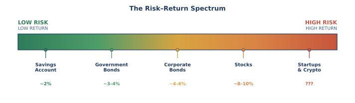


Notice that the expected returns increase as you move right — but so does the uncertainty of those returns. Government bonds almost always pay what they promise. Stocks sometimes deliver 30% returns and sometimes lose 40%. Startups can make you rich or wipe you out.

### Why Risk-Return Matters for Structured Products

Structured products exist because different investors want different positions on this spectrum. Some investors want bond-like safety but with slightly higher returns. Others want stock-like returns but with some protection against losses. Structured products are engineered to create precisely these combinations.

For example:
- A **Principal Protected Note** sits near the left of the spectrum — the investor's principal is guaranteed, but they participate in some of the upside of a stock index.
- A **Reverse Convertible** sits further right — the investor earns a much higher coupon than a bond, but takes on the risk of losing money if a stock drops below a certain level.

Every structured product represents a deliberate choice about how much risk to take and how much return to seek.

> **Mental Model:** Risk is uncertainty. Higher uncertainty demands higher compensation. Structured products let investors choose their exact position on the risk-return spectrum.

---

## 0.5 What Is Interest? {#sec-0-5}

### The Price of Borrowing Money

Imagine your friend asks to borrow $1,000 for one year. You agree — but you face a real cost. For the next twelve months, you cannot use that money yourself. You cannot invest it, you cannot spend it, and you bear the risk that your friend might not pay you back.

You would reasonably ask for something in return for these costs. That "something" is **interest** — a payment from the borrower to the lender that compensates for the time, risk, and opportunity cost of lending money.

If you agree on 5% annual interest, your friend will pay you back $1,050 at the end of the year: your original $1,000 (the **principal**) plus $50 in interest.

### Why Interest Exists

Interest exists for three reasons:

1. **Time preference.** People generally prefer to have money now rather than later. If you lend your money away, you are giving up the ability to use it today. Interest compensates you for this sacrifice.

2. **Inflation.** Over time, prices tend to rise. The $1,000 your friend borrows today might only buy $970 worth of goods a year from now. Interest ensures that your money retains its purchasing power.

3. **Credit risk.** There is a chance your friend might not pay you back. Interest compensates you for bearing this risk. The riskier the borrower, the higher the interest rate you would demand.

### Interest Rates

An **interest rate** is simply the price of borrowing money, expressed as a percentage per year.

- The government might borrow at 3% per year — low rate, because governments almost always pay their debts.
- A large corporation might borrow at 5% per year — higher rate, because corporations are riskier than governments.
- A startup might borrow at 12% per year — much higher rate, because startups frequently fail.

The interest rate reflects how risky the lender considers the borrower to be.

### Coupons and Yield

When a bond pays regular interest, those payments are called **coupons**. The name comes from the old days when paper bonds had physical coupons attached — the bondholder would literally clip a coupon and present it to the bank to collect their interest payment.

**Yield** is a broader measure of the total return an investor earns on a bond, taking into account not just the coupon payments but also any difference between what they paid for the bond and what they receive at maturity.

For now, you can think of yield as "the total annual return on a bond." We will refine this concept later.

### Why Interest Matters for Structured Products

Interest is woven into every structured product. When a bank creates a structured product, it borrows money from the investor (via a bond) and pays them interest (via a coupon). The coupon on a structured product is typically higher than the coupon on a plain bond — but in exchange, the investor takes on additional risk linked to the markets.

Understanding interest is essential because:
- The **coupon** on every structured product is funded by interest, option premiums, or both.
- The **discount rate** used to value future payments depends on interest rates.
- **Yield curves** (which we will cover in [Part 1](#part-1)) describe how interest rates change with time, and many structured products are built around these curves.

> **Mental Model:** Interest is rent for money. The riskier the borrower, the higher the rent. Coupons are the regular interest payments on a bond. Yield is the total return.

---

## 0.6 Time Value of Money {#sec-0-6}

### Would You Rather Have $100 Today or $100 Next Year?

This question seems simple, and the answer is obvious: you would rather have $100 today. But why?

Three reasons:

1. **You can invest it.** If you put $100 in a savings account at 5% interest, you will have $105 in a year. So $100 today is worth more than $100 next year.

2. **Inflation erodes value.** $100 buys slightly less each year as prices rise. A dollar today has more purchasing power than a dollar in the future.

3. **The future is uncertain.** You know you have $100 today. A promise of $100 next year carries the risk that the promise might not be kept.

This is the **time value of money** — the principle that money available today is worth more than the same amount in the future.

### Present Value

If $100 today is worth more than $100 next year, then how much is $100 next year worth today?

The answer depends on the interest rate. If the rate is 5%, then:

**$100 received in one year is worth $100 / 1.05 = $95.24 today.**

This is called the **present value** — the current worth of a future payment, after accounting for the time value of money. The process of calculating present value is called **discounting**.

Think of it this way: if you had $95.24 today and invested it at 5%, you would have exactly $100 in one year. So receiving $95.24 today is economically identical to receiving $100 in one year.

### Compounding

**Compounding** is the process of earning interest on your interest. It is one of the most powerful forces in finance.

**Example:**
- Year 0: You invest $1,000 at 5% per year.
- Year 1: You earn $50 in interest. Balance: $1,050.
- Year 2: You earn 5% on $1,050 (not just $1,000). Interest: $52.50. Balance: $1,102.50.
- Year 3: You earn 5% on $1,102.50. Interest: $55.13. Balance: $1,157.63.

Each year, the interest grows because you are earning interest on the interest from previous years. Over long periods, this effect is dramatic.

### Why Time Value of Money Matters for Structured Products

The time value of money is used constantly in structured products:

- **Pricing a structured product** requires calculating the present value of all future payments (coupons, principal repayment, contingent payoffs).
- **Comparing investments** requires converting all future cash flows to present values so they can be compared on an equal basis.
- **Funding and FTP** — the internal cost of capital that a bank uses to build structured products — is based on the time value of money.

Every number you see in a structured product — the coupon, the price, the fair value — is ultimately derived from discounting future cash flows back to the present.

> **Mental Model:** A dollar today is worth more than a dollar tomorrow. Present value tells you what future money is worth right now. Compounding is interest earning interest.

---

## 0.7 What Banks Actually Do {#sec-0-7}

### The Bank as an Ecosystem

When most people think of a bank, they picture a building where you deposit money and take out loans. This is **commercial banking** — and it is important, but it is only a small part of what large banks do.

The banks that create and trade structured products are primarily **investment banks** (or the investment banking divisions of large universal banks). Investment banks do not take deposits from ordinary customers. Instead, they operate in the financial markets, serving companies, governments, and institutional investors.

### The Two Main Businesses

**Commercial banking** is straightforward: take deposits from savers, lend money to borrowers, and earn the difference in interest rates. This is the oldest form of banking.

**Investment banking** is more complex. It has several major activities:

| Activity | What It Means | Example |
|----------|--------------|---------|
| **Advisory** | Helping companies with mergers, acquisitions, and strategic decisions | Advising a tech company on acquiring a competitor |
| **Underwriting** | Helping companies raise capital by issuing stocks or bonds | Managing an IPO (Initial Public Offering — when a company sells shares to the public for the first time) or a bond issuance |
| **Sales** | Selling financial products to clients (pension funds, insurance companies, corporations, wealthy individuals) | Calling a pension fund to offer a structured product |
| **Trading** | Buying and selling financial instruments, managing risk | Hedging the exposure created by a structured product |
| **Structuring** | Designing custom financial products that meet specific client needs | Creating a Phoenix Autocallable that provides income with conditional protection |
| **Research** | Analyzing markets, companies, and economies to provide insights | Publishing a report on interest rate trends |

### Where Structured Products Fit

Structured products sit at the intersection of Sales, Trading, and Structuring:

- **Structurers** design the product — choosing the underlying asset, the barrier levels, the coupon, and the maturity that match what the client wants.
- **Sales** present the product to clients and explain how it meets their investment objectives.
- **Traders** hedge the risk — once the product is sold, the trading desk must manage the bank's exposure to the underlying markets.

This is the core activity of a structured products desk: create a product that the client wants, sell it, and then hedge the risk so the bank earns a profit regardless of which direction the market moves.

### Why This Matters

Understanding the bank's structure helps you understand who does what and why. When we discuss product lifecycle, booking, and risk management later in this book, you will need to know that structured products involve multiple teams working together, each with a different role and perspective.

> **Mental Model:** A bank is an ecosystem, not a monolith. Structurers design, Sales sells, Traders hedge, Risk monitors, Operations processes. Structured products flow through all of them.

---

## 0.8 What Is a Derivative? {#sec-0-8}

### A Side Bet on Something Else

Imagine you and a friend are watching a football match. Neither of you is playing in the game, but you make a $20 bet on who will win. Your bet has real financial value — one of you will gain $20, the other will lose $20 — but the value of your bet is entirely **derived** from the outcome of the game.

You are not playing football. You are not buying tickets to the game. You are making a contract between the two of you whose value depends on something else.

This is, in essence, a derivative.

### The Financial Definition

A **derivative** is a financial contract between two parties whose value is derived from the performance of an underlying asset, index, or reference rate.

The "underlying" could be almost anything:
- A stock (like Apple or Toyota)
- A stock index (like the S&P 500)
- An interest rate (like the rate at which banks lend to each other)
- A commodity (like oil, gold, or wheat)
- A currency exchange rate (like euros per dollar)
- The creditworthiness of a company

The derivative itself is not the underlying. It is a contract *about* the underlying.

### The Three Main Types of Derivatives

Almost every derivative in the world falls into one of three categories:

**1. Futures and Forwards** — An agreement to buy or sell something at a specific price on a specific future date.

*Analogy:* You agree with a car dealer to buy a car in six months at today's price, regardless of what happens to car prices between now and then. If prices rise, you got a bargain. If prices fall, you overpaid. Either way, both sides are locked in.

**2. Options** — The right, but not the obligation, to buy or sell something at a specific price before a specific date.

*Analogy:* You pay the car dealer $500 for the right to buy a car at today's price within the next six months. If prices rise, you exercise your right and buy at the lower price. If prices fall, you walk away — you lose the $500 you paid, but nothing more. The key difference from a forward is that you have a *choice*, not an obligation.

**3. Swaps** — An agreement between two parties to exchange cash flows over time.

*Analogy:* You have a fixed-rate mortgage and your neighbor has a variable-rate mortgage. You are worried rates might fall (making you overpay), and your neighbor is worried rates might rise (making them overpay). You agree to swap your interest payments: you pay their variable rate, they pay your fixed rate. Neither of you refinances your actual mortgage — you just exchange the difference.

### Why This Matters for Structured Products

Structured products are built from derivatives. A structured product is typically a bond combined with one or more options, swaps, or other derivative contracts. Understanding what derivatives are — contracts whose value depends on something else — is the first step to understanding how structured products work.

We will spend most of [Part 1](#part-1) building a deep understanding of options, swaps, and other derivatives. For now, just remember: a derivative is a contract about something else.

> **Mental Model:** A derivative is a financial side bet. Its value depends on something else — a stock, a rate, a commodity. The three types are forwards (locked-in future trade), options (the right to choose), and swaps (exchange of cash flows).

---

## 0.9 Why Derivatives Were Invented {#sec-0-9}

### The Farmer and the Baker

Derivatives were not invented by Wall Street. They were invented by farmers.

Imagine a wheat farmer in Kansas. Every spring, the farmer plants wheat. Every autumn, the farmer harvests it and sells it at whatever the market price happens to be. The problem is that the farmer does not know in spring what the price will be in autumn. If wheat prices drop during the summer, the farmer could lose money on the entire crop.

Now imagine a baker in the same town who needs wheat to make bread. The baker faces the opposite problem: if wheat prices rise during the summer, the baker's costs increase and profits shrink.

Both the farmer and the baker face uncertainty. But their uncertainties are mirror images of each other:
- The farmer is hurt by low prices (receives less for the crop)
- The baker is hurt by high prices (pays more for ingredients)

The solution is simple: the farmer and the baker agree in spring on a fixed price for wheat to be delivered in autumn. Now neither of them has to worry about price fluctuations. The farmer knows exactly how much revenue the crop will generate. The baker knows exactly how much the ingredients will cost.

This agreement is a **forward contract** — the oldest type of derivative. It was invented not for speculation but for **hedging**: reducing uncertainty by locking in a known outcome.

### The Airline and the Oil Producer

The same logic applies across the modern economy:

**Airlines** need jet fuel, which is derived from oil. If oil prices spike, airline profits can disappear overnight. Airlines use derivatives (futures and options on oil) to lock in their fuel costs months or years in advance.

**Exporters** sell goods in foreign currencies. If the currency moves against them between the time they agree on a sale and the time they receive payment, their profit can evaporate. Exporters use currency forwards to lock in exchange rates.

**Pension funds** need to pay retirees a fixed income for decades. If interest rates fall, the pension fund's investments may not generate enough income. Pension funds use interest rate swaps to guarantee their future income.

In every case, the derivative serves the same purpose: it transforms an uncertain future into a predictable one.

### From Hedging to Speculation to Structured Products

Once derivative contracts existed for hedging, people realized they could also be used for other purposes:

**Speculation** — taking a directional view on where a market will move, without owning the underlying asset. Buying an option on a stock is cheaper than buying the stock itself, and the leverage can magnify returns (and losses).

**Structured products** — combining derivatives with bonds to create customized risk and return profiles for investors. This is where our story begins: a bank takes a simple bond, adds derivatives, and creates a product that gives the investor exactly the risk and return they want.

> **Mental Model:** Derivatives were invented to solve a real-world problem: uncertainty. The farmer and the baker both needed to plan ahead. The derivative contract — an agreement about the future — let them both sleep at night.

---

## 0.10 Why Structured Products Exist {#sec-0-10}

### The Pension Fund's Problem

Consider a large pension fund responsible for paying retirement income to thousands of former employees. The fund holds billions of dollars in bonds and stocks. Its investment team faces a dilemma:

- **Bonds are safe but pay low returns.** In a low-interest-rate environment, bond coupons might be 2-3% per year — barely enough to keep up with inflation, let alone fund growing pension obligations.
- **Stocks offer higher returns but are unpredictable.** The stock market might return 15% one year and lose 20% the next. The pension fund cannot afford large losses because it has obligations to pay retirees every month.

What the pension fund really wants is something in between: higher income than bonds, but with some protection against the worst stock market outcomes.

This is exactly what structured products provide.

### The Five Reasons Clients Buy Structured Products

**1. Income Generation** — "I need higher yield than bonds offer."

A structured product can pay a coupon of 6-10% per year — far higher than a plain bond. The catch: the investor takes on some market risk (typically through selling an option, which generates the premium that funds the higher coupon).

**2. Downside Protection** — "I want market exposure, but with a safety net."

Some structured products guarantee that the investor will get their principal back at maturity, regardless of market performance. The tradeoff: the investor gives up some upside participation.

**3. Yield Enhancement** — "I believe the market will be stable, and I want to be rewarded for that view."

If an investor believes a stock will not fall significantly, they can sell an option (through a structured product) and earn the option premium as an enhanced coupon. They are essentially being paid for taking on a risk they believe is unlikely to materialize.

**4. Leverage** — "I want amplified exposure to a market move."

Some structured products magnify the investor's participation in market gains (and sometimes losses). A small market move translates into a larger gain or loss for the investor.

**5. Capital Protection** — "I cannot afford to lose my principal."

Principal protected notes guarantee the return of the investor's initial investment, while allowing participation in market upside. The tradeoff: limited upside and potentially lower returns.

### The Bank's Perspective

From the bank's perspective, structured products serve a different purpose: they allow the bank to earn a margin by combining derivatives with bonds and selling the package to clients. The bank:

1. Borrows money from the investor (by issuing a bond)
2. Uses derivatives to shape the payoff
3. Hedges its risk in the market
4. Earns a margin (the difference between what it charges the client and what the hedge costs)

If the bank hedges correctly, it earns its margin regardless of what happens in the market. The structured product business is not about betting on markets — it is about manufacturing customized financial products and earning a manufacturing margin.

### Why Not Just Buy Stocks and Bonds?

A reasonable question. The answer is that many investors have specific constraints that simple stocks and bonds cannot satisfy:

| Client Need | Why Stocks/Bonds Don't Work | What Structured Products Offer |
|------------|---------------------------|-------------------------------|
| Need 6% yield, can't afford losses > 20% | Bonds pay 3%; stocks might lose 30% | Reverse Convertible: 6% coupon, loss only if stock falls > 30% |
| Must guarantee principal | Stocks have no floor | Principal Protected Note: 100% capital back + some upside |
| Want exposure to market upside without buying stocks | Regulatory or mandate constraints | Structured note with equity participation |
| Need income but believe market will be stable | Savings accounts pay nearly nothing | Autocallable: high coupon paid regularly as long as market stays above a threshold |

Structured products fill the gap between what investors need and what simple securities can provide.

> **Mental Model:** Structured products exist because investors' needs do not fit neatly into "stocks" or "bonds." Structured products are custom solutions: the bank borrows from the investor, uses derivatives to shape the risk, hedges its own exposure, and earns a manufacturing margin.

---

## 0.11 The Investment Banking Ecosystem {#sec-0-11}

### Who Does What

A structured products desk does not operate in isolation. It sits within a larger investment banking ecosystem where multiple teams work together to create, sell, trade, and manage products.

**Sales** — The client-facing team. Salespeople understand what clients need and present products that meet those needs. A salesperson might call a pension fund to offer a Phoenix Autocallable that provides 8% income with conditional capital protection. Sales does not design products or manage risk — they are the bridge between the bank and its clients.

**Structurers** — The product designers. Structurers take a client's requirements (desired yield, acceptable risk level, preferred maturity, investment size) and engineer a product that meets those requirements. They decide what derivatives to embed, how to set barrier levels, and how to price the product so it is attractive to the client while profitable for the bank.

**Traders** — The risk managers of the desk. Once a structured product is sold, the bank has exposure to the underlying markets. Traders manage this exposure by hedging — taking offsetting positions in the market so that the bank's profit comes from its margin, not from market direction. Traders continuously adjust their hedges as markets move.

**Quants (Quantitative Analysts)** — The mathematicians and modelers. Quants build the pricing models that structurers and traders use to value products and calculate risk. They develop the mathematical frameworks for pricing exotic options, calibrating volatility surfaces, and running simulations.

**Risk Management** — The independent oversight function. Risk managers monitor the trading desk's exposures, ensure that risk limits are not breached, and challenge the assumptions in pricing models. They report to senior management and are deliberately separate from the revenue-generating teams.

**Product Control** — The P&L verification team. Product controllers independently verify the desk's profit and loss calculations, reconcile positions between systems, and ensure that the bank's books are accurate. They catch errors before they become problems.

**Operations** — The processing team. Operations handles the mechanics of structured products: booking trades into systems, processing coupon payments, handling maturity and settlement, managing corporate actions, and ensuring that the right amounts flow to the right places at the right times.

**Compliance and Legal** — Ensure that products comply with regulations, that client documentation is correct, and that the bank's activities are legally sound.

### Why Every Role Matters

In structured products, a mistake by any team can have real consequences:

- If Sales misdescribes a product, the client may not understand the risks they are taking.
- If Structurers misprice a product, the bank could lose money on every trade.
- If Traders fail to hedge properly, the bank is exposed to market risk.
- If Operations books a trade incorrectly, payments may be wrong and P&L may be misstated.
- If Risk Management fails to catch an excessive exposure, the bank could suffer large losses.

Structured products are complex enough that no single person or team can manage them alone. The ecosystem works because each team handles its piece, and handoffs between teams are carefully defined.

> **Mental Model:** A structured products desk is a factory. Sales brings orders, Structurers design the product, Traders manage the risk, Operations processes the trade, Risk monitors the exposure, and Product Control verifies the books. Every role is essential.

---

## 0.12 Front Office vs Middle Office vs Back Office {#sec-0-12}

### The Restaurant Analogy

Think of a restaurant:

- The **kitchen** is where the food is made. The chefs create dishes, manage ingredients, and ensure quality. This is where revenue is generated — without the kitchen, there is nothing to sell.
- The **floor manager** monitors the restaurant: Are tables turning over? Are wait times acceptable? Is the kitchen producing dishes safely? The manager does not cook, but they ensure the restaurant operates within acceptable standards.
- The **dishwashers and accounting team** handle everything behind the scenes: cleaning equipment, paying suppliers, managing payroll, ensuring health codes are met. Without them, the restaurant would shut down — but they do not directly generate revenue.

A bank works the same way:

### Front Office — The Kitchen

The front office generates revenue. It includes:
- **Sales** — bringing in client business
- **Trading** — managing market positions and hedging
- **Structuring** — designing products

Front office staff are measured primarily on the revenue and profit they produce. They interact directly with clients and markets.

### Middle Office — The Floor Manager

The middle office monitors and controls. It includes:
- **Risk Management** — monitoring exposures and ensuring limits are respected
- **Product Control** — verifying P&L and reconciling positions
- **Compliance** — ensuring regulatory adherence

Middle office staff do not generate revenue, but they prevent losses and ensure the front office operates within safe boundaries. They are deliberately independent from the front office to avoid conflicts of interest.

### Back Office — The Dishwashers and Accountants

The back office processes and settles. It includes:
- **Operations** — booking trades, processing payments, handling settlements
- **Finance** — accounting, reporting, regulatory filings
- **Technology** — maintaining trading systems, databases, and infrastructure

Back office staff ensure that every trade is properly recorded, every payment is correctly made, and every report is accurately filed. Without them, the bank could not function — but they are furthest from the revenue-generating activity.

### Why This Matters for Structured Products

When you work with structured products, you will interact with all three offices:
- The **front office** designs and sells the product
- The **middle office** monitors the risk and verifies the P&L
- The **back office** books the trade, processes coupon payments, and handles maturity

Understanding which office is responsible for what will help you navigate the bank and understand why certain processes and controls exist.

> **Mental Model:** Front Office = revenue. Middle Office = controls. Back Office = processing. All three are essential. Structured products flow through all of them, from design to settlement.

---

### Part 0 — Knowledge Check

**Review Questions:**

1. What is the difference between debt and equity? Which typically offers higher returns, and why?
2. Explain the time value of money in one sentence. Why does it matter for pricing financial products?
3. Name the three main types of derivatives and give a one-sentence description of each.
4. Why did derivatives originally come into existence? Give a real-world example.
5. What are the five main reasons that clients buy structured products?

**Scenario Questions:**

1. A pension fund wants higher returns than bonds but cannot afford to lose more than 10% of its investment. Which type of structured product might suit this client, and why?
2. An airline wants to protect itself against rising oil prices over the next two years. What type of derivative would help, and how would it work?
3. A bank sells a structured product to an investor. The market moves against the investor, but the bank still earns a profit. How is this possible?

**Desk Question:**

A new client calls Sales and says: "I want guaranteed returns of 10% per year with no risk of loss." Explain why this request is impossible, using the concepts of risk, return, and interest rates from this chapter.

---

### Part 0 — Mental Models Summary

| Concept | Mental Model |
|---------|-------------|
| Financial market | A village marketplace for money and risk |
| Capital | The fuel that makes businesses run |
| Debt | Lending — predictable, limited upside |
| Equity | Owning — unpredictable, unlimited upside |
| Risk | Uncertainty — the wider the range of outcomes, the higher the risk |
| Interest | Rent for money |
| Present value | What future money is worth today |
| Bank | An ecosystem — Structurers design, Sales sells, Traders hedge |
| Derivative | A financial side bet — its value depends on something else |
| Forward | Locked-in future trade |
| Option | The right to choose |
| Swap | Exchange of cash flows |
| Structured product | Custom solution — bond + derivatives, manufactured by the bank |
| Front Office | The kitchen — generates revenue |
| Middle Office | The floor manager — controls risk |
| Back Office | The dishwashers — processes trades |

---

# PART 1 — FOUNDATIONS {#part-1}

*This part teaches the financial concepts you need before studying any structured product. Every term introduced here will be used repeatedly in Parts 2 through 7. Take your time with these concepts — they are the foundation of everything that follows.*

---

## 1.1 Core Trading Concepts {#sec-1-1}

### Buying and Selling: Long vs Short

In everyday life, when you buy something, you own it. When you sell something you own, you no longer own it. Finance works the same way, but with different vocabulary.

**Going Long** means buying something — taking ownership with the expectation that its value will increase.

*Example:* You buy 100 shares of Apple at $150 each. You are "long" Apple. If Apple rises to $170, you make $20 per share ($2,000 profit). If Apple falls to $130, you lose $20 per share ($2,000 loss).

**Going Short** means selling something you do not own — with the obligation to buy it back later. This sounds strange, but it is a fundamental part of financial markets.

*Analogy:* Imagine you borrow your neighbor's lawnmower and immediately sell it to someone else for $200. You now owe your neighbor a lawnmower. If lawnmower prices drop to $150, you can buy a new one for $150, return it to your neighbor, and pocket the $50 difference. But if prices rise to $250, you have to buy one at the higher price and you lose $50.

Short selling works the same way with financial assets: you borrow shares, sell them immediately, and hope to buy them back later at a lower price.

| Position | You Expect | You Profit When | You Lose When |
|----------|-----------|----------------|---------------|
| Long (buy) | Price to rise | Price rises | Price falls |
| Short (sell) | Price to fall | Price falls | Price rises |

**Why this matters for structured products:** Every structured product involves the bank taking a combination of long and short positions. When a bank sells a structured product, it is typically long the bond component and short some form of option. Understanding long and short is essential to understanding product construction.

### Bid, Offer, and Spread

In the village marketplace, a farmer might want to sell tomatoes for $3 per pound, while a buyer is only willing to pay $2.50. The gap between what the buyer wants to pay and what the seller wants to receive is the basis of all trading.

**Bid** — the price a buyer is willing to pay. "I'll buy at $2.50."

**Offer (or Ask)** — the price a seller is willing to accept. "I'll sell at $3.00."

**Spread** — the gap between the bid and the offer. In this case, $0.50.

In financial markets, there is almost always a spread between the bid and the offer. Market makers — firms that stand ready to buy and sell — earn their living from this spread. They buy at the bid price and sell at the offer price, earning the difference.

A **tight spread** (small gap) means the asset is liquid — many buyers and sellers compete, pushing prices close together. Government bonds have tight spreads. A **wide spread** (large gap) means the asset is less liquid. Exotic structured products have wide spreads.

### Profit and Loss (P&L)

**Profit and Loss**, universally abbreviated as **P&L**, is simply the measurement of how much money you have made or lost on a position or a portfolio.

If you bought a stock at $100 and it is now worth $110, your **unrealized P&L** is +$10 (unrealized because you have not sold yet). If you sell at $110, your **realized P&L** is +$10 (realized because the gain is locked in).

### Mark-to-Market

**Mark-to-market** (abbreviated MTM) means revaluing a position at its current market price. Every trading desk marks its portfolio to market every day — meaning it recalculates the value of every position using today's market prices.

*Why it matters:* Mark-to-market is how banks measure daily P&L. If the market moves against a position, the MTM loss appears immediately — even if the trade has not matured. This daily discipline ensures that problems are identified quickly, not hidden until maturity.

### Leverage

**Leverage** means using borrowed money or derivative contracts to amplify your exposure beyond what your own capital would allow.

*Analogy:* You have $100,000 and want to buy a house worth $500,000. You put down $100,000 (20%) and borrow $400,000 from a bank. You are "leveraged" 5-to-1: for every dollar of your own money, you control five dollars of property.

If the house rises 10% to $550,000, your $100,000 investment has gained $50,000 — a 50% return. But if the house falls 10% to $450,000, your $100,000 investment has lost $50,000 — a 50% loss. Leverage amplifies both gains and losses.

In structured products, leverage appears in products like Airbag Notes and Warrants, where the investor's return is a multiple of the underlying market move.

### Liquidity

**Liquidity** describes how easily something can be bought or sold without significantly affecting its price.

Cash is the most liquid asset — you can always spend it. A house is illiquid — selling it takes time and effort, and you might have to accept a lower price to sell quickly.

In financial markets:
- Government bonds are highly liquid (huge market, many buyers and sellers)
- Structured products are relatively illiquid (customized, fewer buyers, wider spreads)

**Why this matters:** Investors in structured products should generally plan to hold until maturity. Selling early is possible but may result in a significant loss due to wide bid-offer spreads.

### Carry

**Carry** is the net cost or benefit of holding a position over time.

*Example:* If you borrow money at 3% to invest in a bond paying 5%, your carry is +2% (you earn more than you pay). This is called **positive carry**. If the bond pays only 2%, your carry is -1% — you are losing money every day just by holding the position. This is **negative carry**.

Carry is a critical concept for trading desks because it determines whether a position earns or costs money simply by existing, before any market movement occurs.

> **Mental Model:** Long = bought, expect price to rise. Short = sold, expect price to fall. Spread = the gap between buy and sell prices. P&L = how much you made or lost. Mark-to-market = revalue everything at today's prices. Leverage = amplification. Liquidity = ease of trading. Carry = cost of holding.

---

## 1.2 Options From Zero {#sec-1-2}

### The Reservation at a Restaurant

Imagine you are planning a special dinner. You call a restaurant and make a reservation for Saturday night. The reservation costs nothing (or perhaps a small deposit). If Saturday comes and you decide to go, the table is yours. If something comes up and you decide not to go, you simply cancel — you lose the deposit, but nothing else.

The restaurant reservation is an option. You paid a small amount (the deposit) for the *right, but not the obligation*, to dine there. You will exercise this right if conditions are favorable (you still want to go), and let it expire if conditions are not favorable (you changed your plans).

Financial options work the same way.

### What Is an Option?

An **option** is a contract that gives the buyer the right, but not the obligation, to buy or sell an underlying asset at a specified price, on or before a specified date.

There are two types of options:

**Call Option** — the right to **buy** at a specified price.

*Analogy:* You pay a real estate developer $5,000 for the right to buy a house for $300,000 any time in the next six months. If the house is worth $350,000 in three months, you exercise your right and buy at $300,000 — instantly making $50,000 (minus the $5,000 you paid for the option). If the house drops to $250,000, you walk away — you lose only the $5,000 option cost.

**Put Option** — the right to **sell** at a specified price.

*Analogy:* You own a painting worth $10,000. You are worried it might decrease in value. You pay $500 for the right to sell the painting for $9,000 at any time in the next year. If the painting drops to $6,000, you exercise your right and sell at $9,000 — protecting yourself from most of the loss. If the painting rises to $12,000, you let the option expire and sell at the higher market price.

A put option is insurance. You pay a premium to protect against downside risk.

### Key Option Terminology

Every option has four essential features:

| Term | Meaning | Restaurant Analogy |
|------|---------|-------------------|
| **Premium** | The price paid for the option | The deposit you pay for the reservation |
| **Strike Price** | The specified price at which you can buy or sell | The price of the dinner — agreed in advance |
| **Expiry (Expiration)** | The date after which the option no longer exists | Saturday night — after that, the reservation is gone |
| **Underlying** | The asset the option is based on | The table at the restaurant |

### How to Read a Payoff Diagram

Before we go further, you need to learn how to read a **payoff diagram** — a simple chart that shows how much money you make or lose at expiry, depending on where the underlying price ends up.

A payoff diagram has two axes:

- **Horizontal axis (X):** The price of the underlying asset at expiry.
- **Vertical axis (Y):** Your profit or loss.

The horizontal line at Y = 0 is the breakeven point — above this line you are profitable, below it you are losing money.

**Call option payoff (buyer):**

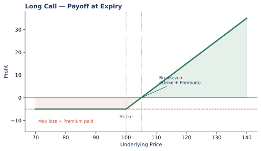


Below the strike price, the call expires worthless and the buyer loses the premium. Above the strike price, the call gains value dollar-for-dollar with the underlying. The breakeven point is the strike price plus the premium paid.

**Put option payoff (buyer):**

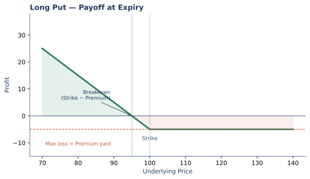


Above the strike price, the put expires worthless and the buyer loses the premium. Below the strike price, the put gains value as the underlying falls.

### Moneyness: ITM, ATM, OTM

Options are described by their relationship to the current price of the underlying:

**In-the-Money (ITM)** — the option has intrinsic value right now.
- A call is ITM when the underlying price is above the strike (you could buy below market price).
- A put is ITM when the underlying price is below the strike (you could sell above market price).

**At-the-Money (ATM)** — the underlying price equals (or is very close to) the strike.

**Out-of-the-Money (OTM)** — the option has no intrinsic value right now.
- A call is OTM when the underlying price is below the strike.
- A put is OTM when the underlying price is above the strike.

*Example:* A stock trades at $100. A call option with a $90 strike is ITM (you can buy at $90, worth $100 — $10 of intrinsic value). A call with a $100 strike is ATM. A call with a $110 strike is OTM (no value unless the stock rises above $110).

### Intrinsic Value and Time Value

The price (premium) of an option has two components:

**Intrinsic value** — the amount of money the option would be worth if exercised right now. For a call: max(underlying price - strike, 0). For a put: max(strike - underlying price, 0). OTM options have zero intrinsic value.

**Time value** — the extra amount the option is worth because there is still time for the underlying to move favorably. Time value is always positive (or zero at expiry) because more time means more possibility.

**Option Premium = Intrinsic Value + Time Value**

*Analogy:* You are selling your house. A buyer offers you $300,000 today. Your house was appraised at $280,000 (intrinsic value). The extra $20,000 reflects the buyer's belief that the house could appreciate further, the neighborhood is improving, and the market is strong. That $20,000 is time value.

As expiry approaches, time value decays toward zero — a concept called **time decay** (which we will explore in detail under the Greek letter Theta).

### Exercise Styles

Options differ in *when* they can be exercised:

**European** — can only be exercised on the expiry date. Think: you must decide on the exact day.

**American** — can be exercised at any time before or on the expiry date. Think: you can choose any day.

**Bermudan** — can be exercised on specific dates before expiry (for example, quarterly). Think: a middle ground between European and American — you have a few specific windows.

Most structured products use European-style options (exercise only at maturity), which simplifies pricing and reduces operational complexity.

### Buying vs Selling Options

So far, we have discussed buying options. But every option that is bought must also be sold by someone. The seller of an option has a very different risk profile from the buyer:

| | Option Buyer | Option Seller |
|---|---|---|
| Pays | Premium (upfront cost) | Nothing (receives premium) |
| Right/Obligation | Right, but not obligation | Obligation if buyer exercises |
| Maximum loss | Premium paid | Potentially unlimited (calls) or large (puts) |
| Maximum gain | Potentially unlimited (calls) or large (puts) | Premium received |
| View | The underlying will move significantly | The underlying will not move significantly |

**This is critical for structured products:** In most structured products, the investor is *selling* an option to the bank (usually a put). The premium from selling this option funds the enhanced coupon. This is why structured products can pay higher coupons than bonds — the investor is earning option premium in addition to bond interest. But the investor is also taking on the risk that the option could be exercised against them.

### Common Mistakes

1. **Confusing option buyer and seller risk.** The buyer's maximum loss is the premium. The seller's loss can be enormous. In structured products, the investor is usually the seller.
2. **Thinking OTM options are worthless.** They have no intrinsic value but may have significant time value.
3. **Ignoring exercise style.** European options can only be exercised at expiry. Most structured products use European-style. American barriers behave very differently from European barriers.

> **Mental Model:** Call = Reservation (right to buy). Put = Insurance (right to sell). Premium = the price of the option. Strike = the agreed price. ITM/ATM/OTM = where is the underlying relative to the strike? Intrinsic value = real value now. Time value = possibility value.

---

## 1.3 Barriers and Digitals {#sec-1-3}

### The Tripwire

Imagine a security system with a laser tripwire across a hallway. The system is inactive until someone breaks the beam. The moment someone crosses the beam, the alarm activates and stays active.

A **barrier** in financial options works similarly. It is a preset price level that, when crossed by the underlying asset, either activates or deactivates an option.

### Knock-In Barriers

A **knock-in barrier** activates an option when the underlying price crosses the barrier level.

*Analogy:* You buy an insurance policy that only becomes active if a specific event occurs. For example: "This flood insurance policy only activates if the river level reaches 10 feet." Until the river hits 10 feet, the policy is dormant. Once the river crosses that threshold, the insurance kicks in.

A **knock-in put** works the same way: the put option does not exist until the underlying price falls below the barrier level. Once the barrier is breached, the put activates and the investor faces downside risk.

**Why this matters:** In many structured products (like Reverse Convertibles), the investor sells a knock-in put. As long as the underlying stays above the barrier, the put never activates and the investor keeps their full principal. But if the underlying falls below the barrier, the put activates and the investor may lose money at maturity.

### Knock-Out Barriers

A **knock-out barrier** is the opposite: it deactivates an option when the underlying price crosses the barrier level.

*Analogy:* You have a gym membership that automatically cancels if you go more than three months without visiting. The membership is active by default, but a specific condition (three months of inactivity) causes it to terminate.

A **knock-out call** works similarly: the call option exists and has value, but if the underlying price rises above a certain level, the option is extinguished. The investor loses the option entirely.

### European vs American Barrier Observation

The word "barrier" tells you there is a threshold. But when and how is the threshold checked? This matters enormously.

**European barrier (discrete observation)** — the barrier is only checked on specific dates (usually the final observation date at maturity). The underlying could drop below the barrier during the life of the product and recover before the observation date, and the barrier would not be considered breached.

**American barrier (continuous observation)** — the barrier is checked every moment of every trading day. If the underlying touches the barrier at any point, even for an instant, the barrier is breached.

*Example:* An investor holds a Reverse Convertible with a knock-in barrier at $70 (current stock price: $100).

- With a **European barrier**, the stock could fall to $60 during the life of the product, but if it recovers to $80 by the maturity observation date, the barrier has not been breached. The investor keeps their principal.
- With an **American barrier**, the moment the stock touches $70 at any time, the barrier is breached. Even if the stock later recovers to $120, the put option has been activated.

American barriers are riskier for the investor (more chances for the barrier to be hit) and therefore result in higher coupons (compensation for the additional risk).

### Digital (Binary) Payoffs

A **digital option** (also called a **binary option**) pays a fixed amount if a condition is met, and nothing if it is not.

*Analogy:* A light switch. It is either ON or OFF. There is no dimmer. If the stock finishes above the strike, you receive a fixed payment ($1,000). If it finishes below, you receive nothing.

Contrast this with a standard option, which pays proportionally — the further the stock is above the strike, the more you receive (like a dimmer switch that gets brighter as you turn it).

**Digital coupon notes** use this mechanism: the investor receives a fixed coupon if the underlying is above a certain level on the observation date, and zero if it is below. There is no partial coupon.

### Why Barriers and Digitals Matter

Barriers and digitals are the building blocks of structured products. They create the "conditional" nature of most structured product payoffs:

- **Reverse Convertibles** use knock-in barriers to determine whether the investor bears downside risk.
- **Phoenix Autocallables** use barriers at multiple levels: one barrier for coupon payment, another for autocall (early redemption).
- **Digital coupon notes** use digital payoffs to create all-or-nothing coupon payments.
- **Range accruals** use daily barriers to determine which days count toward a coupon.

Understanding barriers and digitals is understanding the mechanics of structured products.

### A Note on Barrier Terminology

As you progress through this book, you will encounter the word "barrier" used in three distinct contexts. To avoid confusion, we distinguish them now:

- **Capital barrier** (also called the knock-in barrier) — the price level that determines whether the investor's principal is at risk. If the underlying falls below this level, the investor may lose money at maturity.
- **Coupon barrier** — the price level that determines whether a conditional coupon is paid. In a Phoenix Autocallable, the coupon is only paid if the underlying is above the coupon barrier on the observation date.
- **Autocall barrier** — the price level that triggers early redemption. If the underlying is above this level on an observation date, the product is redeemed early and the investor receives their principal plus any due coupon.

These three barriers are often set at different levels within the same product. A Phoenix Autocallable might have an autocall barrier at 100% (initial price), a coupon barrier at 70%, and a capital barrier (knock-in) at 60%.

> **Mental Model:** Knock-In = tripwire that activates something (dormant until crossed). Knock-Out = tripwire that deactivates something (active until crossed). European barrier = checked once at the end. American barrier = checked constantly. Digital = light switch — on or off, no in-between. Three barrier types: capital (principal risk), coupon (payment condition), autocall (early redemption trigger).

---

## 1.4 Greeks — How Risk Is Measured {#sec-1-4}

### Why We Need Greeks

If you own a stock, measuring your risk is simple: if the stock goes up, you make money; if it goes down, you lose money. The only thing that matters is the direction of the price.

Options are different. An option's value depends on many things simultaneously: the underlying price, how much time is left until expiry, how volatile the underlying is, and what interest rates are doing. Change any one of these factors and the option's value changes.

The **Greeks** are a set of measurements that tell you how sensitive an option's price is to each of these factors. Each Greek is named after a letter of the Greek alphabet.

A stock's risk is one-dimensional — it goes up or down. An option's risk is multi-dimensional — it depends on price, time, volatility, and rates simultaneously. The Greeks are the toolkit for measuring each dimension. We start with the most important (Delta — you will use it every day) and build outward: Gamma tells you how fast Delta changes, Vega captures volatility sensitivity, and Theta measures time decay. Together, they form a system that traders use to manage risk.

### Delta — Directional Sensitivity

**Delta** measures how much an option's price changes when the underlying asset price changes by one unit.

*Analogy:* Delta is like the steering wheel of a car. It tells you which direction you are going and how much the car turns when you move the wheel.

- A call option with a Delta of 0.50 means: if the stock rises by $1, the option price rises by approximately $0.50.
- A put option has negative Delta (typically between -1 and 0) because puts increase in value when the underlying falls.

**Delta ranges:**
- Call Delta: 0 (deep OTM) to 1 (deep ITM). ATM calls have Delta around 0.50.
- Put Delta: -1 (deep ITM) to 0 (deep OTM). ATM puts have Delta around -0.50.

**For structured products:** Delta tells the trading desk how much exposure it has to the underlying market. If the desk has sold a structured product and is "short Delta," it means the desk will lose money if the underlying rises. The desk hedges this by buying the underlying asset until the net Delta is zero (called **Delta-neutral** hedging).

### Gamma — How Delta Changes

**Gamma** measures how much Delta itself changes when the underlying price moves.

*Analogy:* If Delta is the steering wheel, Gamma is how sensitive the steering is. A car with high Gamma has very responsive steering — a small turn of the wheel changes your direction dramatically. A car with low Gamma has sluggish steering — you have to turn the wheel a lot to change direction.

High Gamma means Delta changes rapidly with small price movements. This creates hedging challenges because the trading desk must constantly readjust its hedge. Products near their barrier levels have very high Gamma — Delta can swing violently as the underlying price approaches the barrier, making hedging difficult and expensive.

### Vega — Volatility Sensitivity

**Vega** measures how much an option's price changes when the expected volatility of the underlying changes.

*Analogy:* Think of how umbrella prices respond to weather forecasts. If the forecast changes from "30% chance of rain" to "60% chance of rain," umbrella prices jump — not because it is raining now, but because the expectation of rain has changed. Vega works the same way: it measures how much your option's price changes when the market's volatility forecast (implied volatility) changes, even if nothing has happened yet in the underlying market.

Options become more valuable when volatility increases because higher volatility means a greater chance of a large favorable move.

- **Long Vega** means you benefit when volatility increases (option buyers are long Vega).
- **Short Vega** means you lose when volatility increases (option sellers are short Vega).

**For structured products:** Most structured products involve selling options, which means the investor is typically **short Vega**. If market volatility increases unexpectedly, the value of the option the investor has sold increases, which means the structured product's value decreases for the investor. This is one of the key risks in structured products.

### Theta — Time Decay

**Theta** measures how much an option's price decreases each day, purely from the passage of time.

*Analogy:* Think of an ice cream cone on a hot day. Every minute that passes, a little more ice cream melts. The cone is losing value over time, even if nothing else changes.

Options work the same way. Every day that passes, the time value of the option decreases. This is called **time decay**. An option that expires in one year has more time value than an identical option that expires in one month, because there is more time for a favorable move to occur.

- Theta is almost always negative for option buyers (they lose value over time).
- Theta is positive for option sellers (they benefit as the option they sold loses value).

**For structured products:** Investors in structured products are typically option sellers (short Vega, positive Theta). They benefit from time decay — as time passes, the options embedded in the product decay in value, which is favorable for the investor. This is one reason structured products pay enhanced coupons: the investor is earning the time decay premium.

### Worked Example: Greeks in Action

You are a trader on the structured products desk. You have sold 100 put options on a stock trading at $100, with a strike of $100 and 6 months to expiry. Your Greeks are:

| Greek | Value | What It Means |
|-------|-------|--------------|
| Delta | -50 | If the stock rises $1, your position loses $50 (you are short puts) |
| Gamma | 3 | If the stock moves $1, your Delta changes by 3 |
| Theta | +$15/day | You earn $15 per day from time decay |
| Vega | -$200 per vol point | If implied volatility rises 1%, your position loses $200 |

**Day 1:** The stock drops $2.

- **Delta P&L:** -50 × (-$2) = +$100 (the stock fell, which is good for short puts — wait, that is wrong for short puts. Let us be precise.)
- Your Delta is -50, meaning for each $1 the stock *rises*, you *lose* $50. The stock fell $2, so: P&L from Delta = -(-50) × (-$2) = -$100. You lost $100.
- **Gamma effect:** After the $2 drop, your Delta changed. New Delta ≈ -50 + (3 × (−2)) = -50 − 6 = **-56**. Your exposure to further drops has increased.
- **Theta P&L:** +$15 (you earned one day of time decay).
- **Net Day 1 P&L:** approximately -$100 + $15 = **-$85**.

**What the trader does next:** The trader's Delta was -50, so to be Delta-neutral, the trader had previously sold 50 shares short. After the stock dropped, Delta is now -56. The trader must sell 6 more shares short to restore Delta neutrality. This is dynamic hedging in action — adjusting the hedge as Greeks change.

This example shows why the Greeks are a *system*, not isolated numbers. Delta told the trader their directional exposure. Gamma warned that the exposure would change with the stock price. Theta provided income. The trader uses all of them together to manage the position.

### Rho — Interest Rate Sensitivity

**Rho** measures how much an option's price changes when interest rates change.

Rho is typically the smallest of the Greeks for equity options, but it becomes important for:
- Long-dated options (more time for rates to matter)
- Interest rate products (where rates are the underlying)
- All structured products (because the funding cost depends on interest rates)

### Convexity

**Convexity** describes the curvature of the relationship between price and an input. A linear instrument (like a stock) moves proportionally — if the stock goes up $1, your profit increases by a fixed amount. A convex instrument (like an option) moves non-proportionally — the rate of change itself changes.

A long option position is **convex** (beneficial curvature — the more the market moves in your favor, the faster your profits accelerate). A short option position is **concave** (harmful curvature — the more the market moves against you, the faster your losses accelerate).

### Linear vs Non-Linear Payoffs

**Linear payoff:** Your profit or loss changes in a straight line with the underlying. Stocks, futures, and forwards have linear payoffs. If a stock goes up $10, your P&L changes by exactly $10 per share.

**Non-linear payoff:** Your profit or loss does not change in a straight line. Options have non-linear payoffs. A small move in the underlying near the strike price causes a large change in the option's value, while a small move far from the strike causes almost no change.

Structured products have non-linear payoffs because they contain embedded options. This non-linearity is what makes them both useful (customized risk profiles) and complex (harder to hedge and understand).

### Common Mistakes

1. **Treating Greeks as static.** Greeks change constantly as the underlying moves, time passes, and volatility shifts. Yesterday's Delta hedge is wrong today.
2. **Ignoring Gamma near barriers.** When the underlying approaches a barrier level, Gamma spikes and Delta can swing violently. Hedging becomes expensive and difficult — this is when the desk earns its margin.
3. **Thinking Theta is always the investor's friend.** Theta benefits option sellers (including most structured product investors), but if the underlying moves against the position, Delta and Vega losses can overwhelm Theta gains.

> **Mental Model:** Delta = steering (which direction and how much exposure). Gamma = steering sensitivity (how fast Delta changes — spikes near barriers). Vega = umbrella price sensitivity (changes in the volatility forecast move your position). Theta = melting ice cream (time erodes option value). Rho = interest rate sensitivity (usually small for equity options). Convexity = curvature (are gains accelerating or losses accelerating?).

---

## 1.5 Volatility {#sec-1-5}

### Calm Seas vs Stormy Seas

Imagine two sailors. Both need to cross a lake to reach the other shore. Sailor A crosses on a calm day — the water is flat, the boat barely rocks, and the journey is smooth and predictable. Sailor B crosses during a storm — the boat is tossed by waves, the journey is wild and uncertain, and the final position could be very different from what Sailor B expected.

Both sailors are crossing the same lake (same distance, same destination). But the experience — the uncertainty of the journey — is completely different.

**Volatility** measures this uncertainty. In financial markets, volatility measures how much an asset's price fluctuates over time. A stock that moves 1% per day is less volatile than a stock that moves 5% per day, even if both stocks end up at the same price after a year.

### Implied Volatility vs Realized Volatility

There are two types of volatility, and understanding the difference is critical:

**Realized volatility** (also called historical volatility) is what actually happened — how much the asset's price fluctuated over a past period. It is a fact. You can calculate it from historical prices.

**Implied volatility** is what the market expects to happen — how much the asset's price is expected to fluctuate in the future. It is not a fact but a market estimate, derived from the prices of options.

*Analogy:* Imagine you are looking at weather forecasts.
- **Realized volatility** is yesterday's actual weather: "It rained 2 inches yesterday." It is a measured fact.
- **Implied volatility** is tomorrow's forecast: "There is a 60% chance of heavy rain tomorrow." It is an expectation based on current information.

Option prices depend on implied volatility. If the market expects a stock to be very volatile in the future, options on that stock are expensive (high implied volatility). If the market expects calm conditions, options are cheap (low implied volatility).

### Volatility Term Structure

Implied volatility is not the same for all expiry dates. A one-month option might have a different implied volatility than a one-year option on the same underlying.

The **volatility term structure** describes how implied volatility changes across different expiry dates:

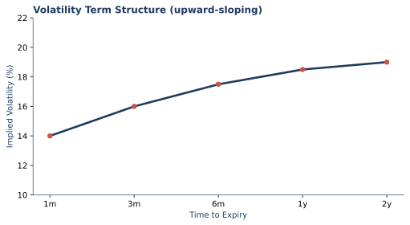


In the diagram above, short-dated options have lower implied volatility than long-dated options. This is the most common pattern: uncertainty tends to increase with the time horizon (more time for unexpected events to occur).

However, during market stress (like a financial crisis), the term structure can invert: short-dated volatility spikes above long-dated volatility because the market expects chaos in the near term but expects things to stabilize eventually.

### Volatility Skew and Smile

Implied volatility is also not the same for all strike prices. For equity options, the pattern typically looks like this:

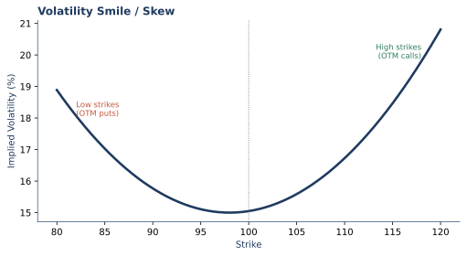


This downward-sloping pattern is called the **volatility skew**. OTM puts (low strike prices) have higher implied volatility than ATM options. This means the market charges more for downside protection than for upside speculation.

**Why does skew exist?** Because investors fear large downward moves more than they expect large upward moves. Demand for protective puts is high, which pushes up their prices (and therefore their implied volatility). This fear premium is baked into option prices and affects every structured product that contains embedded puts.

### Variance

**Variance** is the statistical measure of how spread out a set of values is from the average. In finance, variance is the square of volatility. A volatility of 20% corresponds to a variance of 0.04 (0.20 x 0.20).

Variance is important because some derivative products (Variance Swaps, which we will cover in [Part 5](#part-5)) trade variance directly rather than volatility. The distinction matters for pricing and risk management, but for intuition, you can think of variance as "volatility squared."

### Why Clients Consistently Misprice Volatility

One of the most important insights in structured products: clients systematically underestimate the probability of large market moves.

Most people think in terms of average market behavior. "The stock market returns about 8% per year." This is true on average, but it hides enormous variation. In any given year, the market might return +30% or -40%. These extreme outcomes occur more frequently than most people expect.

The evidence is striking: on October 19, 1987, the S&P 500 fell over 20% in a single day. A standard statistical model (the normal distribution) would predict such an event should occur roughly once every 10,000 years. The market has experienced multiple such "impossible" moves since then — in 2008 (financial crisis), 2010 (flash crash), 2020 (pandemic sell-off). The left tail of the return distribution is far fatter than standard models suggest.

This is why structured products can offer enhanced coupons. The bank buys options (paying implied volatility) and embeds them in structured products sold to investors who believe that extreme outcomes are unlikely. The investor earns the option premium (as an enhanced coupon), and the bank earns a margin. If the investor is right and the market is calm, the investor earns the coupon. If the investor is wrong and the market moves dramatically, the investor may lose money.

> **Mental Model:** Volatility = storminess of the sea. Implied vol = the weather forecast. Realized vol = yesterday's actual weather. Skew = the market charges more for downside protection. Clients underestimate storms, which is why structured product coupons are high.

---

## 1.6 Correlation and Baskets {#sec-1-6}

### The Orchestra and the Soloists

Imagine an orchestra. If all the musicians play the same note at the same time, the sound is loud but monotonous. If each musician plays independently — ignoring everyone else — the sound is chaotic and unpredictable. Real orchestras are somewhere in between: the musicians are somewhat synchronized, but each plays their own part.

**Correlation** measures how synchronized two things are. In finance, correlation measures how much two assets tend to move together.

- **Correlation of +1:** The two assets move in perfect lockstep. When one goes up, the other always goes up by a proportional amount.
- **Correlation of 0:** The two assets are completely independent. Knowing what one does tells you nothing about what the other will do.
- **Correlation of -1:** The two assets move in perfectly opposite directions. When one goes up, the other always goes down.

### Why Correlation Matters for Structured Products

Many structured products are linked to a **basket** — a group of underlying assets (for example, a basket of three stocks: Apple, Samsung, and Toyota).

The payoff of a basket product often depends on the **worst performer** in the basket. This is called a **worst-of** payoff: the investor's return is determined by whichever stock in the basket performs the worst.

*Example:* An investor holds a worst-of Reverse Convertible linked to Apple, Samsung, and Toyota. At maturity:
- Apple is up 15%
- Samsung is up 5%
- Toyota is down 12%

The investor's payoff is based on Toyota (the worst performer), not the average of the three. If Toyota has breached the barrier, the investor may lose money — even though the other two stocks performed well.

### Correlation and Pricing

Here is the key insight: **lower correlation makes worst-of products riskier for the investor, and therefore they pay higher coupons.**

When correlation is high, the stocks in the basket tend to move together. If one is doing well, the others probably are too. The chance that one stock falls dramatically while the others rise is low.

When correlation is low, the stocks move independently. There is a much higher probability that at least one stock will fall significantly, even if the others are fine. The worst-of mechanism amplifies this risk.

This is why worst-of products pay higher coupons than single-stock products: the investor is taking on correlation risk — the risk that the worst performer in the basket will be much worse than the average performer.

### Tail Risk

**Tail risk** refers to the risk of extreme, unlikely events — the "tails" of the probability distribution. A stock's return distribution has two tails: the right tail (extreme positive returns) and the left tail (extreme negative returns).

In practice, extreme negative events (market crashes, financial crises) occur more frequently than standard models predict. This is why the left tail is "fat" — there are more extreme negative outcomes than a normal distribution would suggest.

Structured products that involve selling options are exposed to tail risk: the investor earns steady coupons in normal markets but faces significant losses in extreme market moves. Understanding tail risk is essential for honestly assessing the risks of structured products.

> **Mental Model:** Correlation = synchronization. High correlation = musicians playing together (safer for worst-of products). Low correlation = musicians playing independently (riskier for worst-of products, higher coupons). Tail risk = extreme events happen more often than you think.

---

*From here, we shift focus. Sections 1.1-1.6 covered concepts rooted in equities and options. Sections 1.7-1.9 introduce the world of interest rates and credit — equally important for structured products, and essential for understanding swaps, rate trades, steepeners, and credit-linked notes. Many structured products reference interest rates rather than stocks, and some depend on whether a company defaults rather than how its stock price moves.*

---

## 1.7 Yield Curves, Spot Rates, and Forward Rates {#sec-1-7}

### The Price of Waiting

In [Section 0.5](#sec-0-5), we learned that interest is the price of borrowing money. Now we need to go deeper, because interest rates are not a single number — they form a complex landscape that changes constantly.

When you lend money, the interest rate you demand depends on how long you are lending for. Lending money for one month is very different from lending it for thirty years. The longer you lend, the more uncertainty you face: more time for inflation to erode your money's value, more time for the borrower to get into trouble, and more time for unexpected events to occur.

This relationship between lending period and interest rate is captured by the **yield curve**.

### What Is a Yield Curve?

A **yield curve** is a graph showing the interest rate (yield) for different lending periods (maturities), all for the same type of borrower.

The most important yield curve in finance is the government bond yield curve — the rates at which a government borrows for different periods.

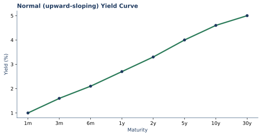


This upward-sloping curve is the **normal** shape: longer maturities pay higher yields. This makes intuitive sense — you demand more compensation for lending your money for longer.

**Flat curve** — Short-term and long-term rates are similar. This often signals economic uncertainty.

**Inverted curve** — Short-term rates are higher than long-term rates. This is unusual and often signals that the market expects an economic downturn (investors expect central banks to cut rates in the future).

### Spot Rates and Forward Rates

**Spot rate** — The interest rate for lending from today until a specific future date. "The 5-year spot rate is 3.5%" means lending money for 5 years starting today earns 3.5% per year.

**Forward rate** — The interest rate implied by the yield curve for lending between two future dates. "The 1-year rate, 2 years forward" is the rate the market implies for lending money for one year, starting two years from now.

*Analogy:* Spot rate is the price of a hotel room for tonight. Forward rate is the price of a hotel room for a specific night next year. Both are real prices, but the forward rate is derived from the relationship between different booking periods.

### Worked Example: Spot and Forward Rates

Suppose the yield curve shows:
- 1-year spot rate: 3.0%
- 2-year spot rate: 3.5%

What is the implied 1-year forward rate, one year from now?

If you lend $1,000 for two years at 3.5%, you receive: $1,000 × 1.035 × 1.035 = $1,071.23.

If you lend $1,000 for one year at 3.0% and then relend for another year at the forward rate (F), you should get the same result: $1,000 × 1.03 × (1 + F) = $1,071.23.

Solving: (1 + F) = $1,071.23 / $1,030 = 1.04, so **F = 4.0%**.

The market implies that the one-year rate, one year from now, will be 4.0%. This is higher than today's 3.0% one-year rate — the upward-sloping yield curve implies that rates will rise.

Forward rates are critical for pricing structured products because many products make payments at future dates, and the value of those payments depends on the interest rates expected to prevail at those future times.

> **Mental Model:** Yield curve = the price of waiting, plotted over time. Normal curve = longer = higher rate. Inverted curve = warning sign. Spot rate = today's rate for a given term. Forward rate = the market's implied future rate, derived from the curve.

---

## 1.8 Benchmark Rates, Swaps, and Rate Options {#sec-1-8}

### Benchmark Rates: SOFR, EURIBOR, and the LIBOR Transition

Central to the interest rate world are **benchmark rates** — reference rates that underpin trillions of dollars of financial contracts.

**LIBOR** (London Interbank Offered Rate) was historically the most important benchmark rate. It measured the rate at which large banks lent to each other. However, LIBOR was phased out after 2021 due to manipulation scandals and a decline in the transactions it was supposed to measure.

**SOFR** (Secured Overnight Financing Rate) has replaced LIBOR for US dollar transactions. SOFR is based on actual overnight lending transactions secured by US Treasury bonds, making it more robust and harder to manipulate.

**EURIBOR** (Euro Interbank Offered Rate) remains the key benchmark for euro-denominated transactions.

Many structured products reference these benchmark rates — for example, a product might pay a coupon equal to "SOFR + 2%."

### CMS Rates

**CMS** stands for **Constant Maturity Swap** rate. A CMS rate is the current market rate for an interest rate swap of a specific maturity.

*Analogy:* Think of CMS rates as real-time price quotes for fixed-rate mortgages of different lengths. The "2-year CMS rate" is today's price for locking in a 2-year fixed-rate deal. The "30-year CMS rate" is today's price for a 30-year fixed-rate deal. The difference between them tells you how much extra the market charges for locking in a rate for a longer period.

*Example:* The "10-year CMS rate" is the current fixed rate on a 10-year interest rate swap. If today's 10-year CMS rate is 4.2%, that means the market is currently pricing 10-year fixed-rate swaps at 4.2%.

CMS rates are important because many structured products — particularly Steepener Notes — are linked to the difference between two CMS rates. For example, a Steepener might pay a coupon based on the 30-year CMS rate minus the 2-year CMS rate. This difference is called the **CMS spread** and reflects the slope (steepness) of the yield curve.

### Swaps: A Conceptual Introduction

We defined swaps briefly in [Part 0](#part-0) as "exchange agreements." Here is a slightly more detailed introduction, which will be expanded fully in [Part 5](#part-5).

An **interest rate swap** is an agreement between two parties to exchange interest rate payments:
- One party pays a **fixed rate** (for example, 3% per year)
- The other party pays a **floating rate** (for example, SOFR, which changes periodically)

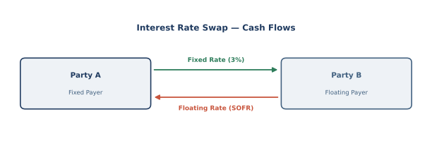


Why would anyone do this? Because Party A might have a floating-rate obligation that it wants to convert to fixed (certainty), while Party B might have a fixed-rate obligation that it wants to convert to floating (because it expects rates to fall).

### Worked Example: Interest Rate Swap Cash Flows

A company has a $10 million floating-rate loan at SOFR. It enters into a 3-year swap where it pays 3% fixed and receives SOFR floating. On a $10 million notional (the face value on which payments are calculated):

| Year | SOFR (actual) | Company Pays Fixed | Company Receives Floating | Net Swap Payment |
|:----:|:-------------:|:-----------------:|:------------------------:|:---------------:|
| 1 | 2.5% | $300,000 | $250,000 | Company pays $50,000 |
| 2 | 3.5% | $300,000 | $350,000 | Company receives $50,000 |
| 3 | 4.0% | $300,000 | $400,000 | Company receives $100,000 |

Combined with its floating-rate loan, the company's total interest cost is effectively locked at 3% — exactly what the swap was designed to achieve. In Year 1, rates were lower than 3%, so the swap cost money. In Years 2-3, rates rose above 3%, and the swap saved money.

Swaps are the most heavily traded derivatives in the world. Understanding them is essential for structured rate products and steepener notes.

### Caps, Floors, and Swaptions

**Cap** — An option on an interest rate that pays out when the rate exceeds a specified level (the cap rate). It protects the holder against rising interest rates.

*Analogy:* A cap is like a fixed-rate ceiling on a variable mortgage. No matter how high rates go, you never pay more than the cap rate. If you have a floating-rate loan at SOFR and you buy a 5% cap, your effective rate will never exceed 5% — the cap pays you the difference whenever SOFR rises above 5%.

**Floor** — An option on an interest rate that pays out when the rate falls below a specified level. It protects the holder against falling interest rates.

*Analogy:* A floor is like a guaranteed minimum return on a savings account. No matter how low market rates go, you will earn at least the floor rate.

**Swaption** — An option to enter into an interest rate swap at a future date. It gives the holder the right, but not the obligation, to start receiving (or paying) a fixed rate at a predetermined level.

*Analogy:* A swaption is like a reservation at a gym. You pay a small fee today for the right to sign up for a 2-year membership at today's rate, any time in the next three months. If membership prices rise, you exercise your reservation and lock in the lower rate. If prices fall, you let it expire and sign up at the cheaper rate. A swaption gives you the same flexibility with interest rates.

These instruments are building blocks for structured rate products. A Callable Range Accrual, for example, contains embedded caps and floors that determine the coupon.

> **Mental Model:** SOFR/EURIBOR = the benchmark rate that floating payments reference. CMS = today's fixed-rate swap quote for a given maturity. CMS spread = steepness of the curve. Cap = ceiling on rates (like a fixed-rate mortgage cap). Floor = minimum rate. Swaption = reservation to enter a swap later.

---

## 1.9 Credit Risk {#sec-1-9}

### Lending to Your Neighbor

Imagine two neighbors ask to borrow $1,000 from you.

**Neighbor A** has a steady job, no debt, and has always repaid loans on time. You are confident they will pay you back.

**Neighbor B** lost their job last month, has significant credit card debt, and has a history of late payments. You are much less confident they will pay you back.

You would lend to Neighbor A at a low interest rate (say, 3%). For Neighbor B, you would either refuse to lend or demand a much higher rate (say, 12%) to compensate for the risk that they might not repay.

This is **credit risk** — the risk that a borrower will fail to meet their financial obligations.

### Credit Spread

The difference in interest rate between a risky borrower and a risk-free borrower is called the **credit spread**.

If a US government bond (considered risk-free) yields 3%, and a corporate bond from the same company yields 5%, the credit spread is 2% (or 200 **basis points** — a basis point is 1/100th of a percent).

The credit spread reflects the market's assessment of the borrower's likelihood of defaulting. Wider spreads mean more risk. Narrower spreads mean less risk.

**Why credit spreads matter for structured products:** Every structured product is issued by a bank. The coupon on the product includes compensation for the bank's own credit risk. If the bank's creditworthiness deteriorates, the value of the structured product decreases — even if the underlying market performs well. This is called **issuer credit risk** and is a risk that many investors overlook.

### Recovery Rate

If a borrower defaults, the lender usually does not lose everything. The **recovery rate** is the percentage of the loan that the lender recovers after default.

*Example:* A company goes bankrupt and defaults on its bonds. Its assets are sold, and bondholders receive 40 cents for every dollar they were owed. The recovery rate is 40%.

Recovery rates vary by the type of debt and the borrower:
- Senior secured debt: recovery rates of 50-70% are common
- Senior unsecured debt (most corporate bonds): recovery rates of 30-50%
- Subordinated debt: recovery rates of 10-30%

### Credit Default Swaps — The Basics

A **Credit Default Swap** (CDS) is a derivative contract that provides insurance against the default of a borrower.

*Analogy:* A CDS is exactly like insurance on a loan. Imagine you have lent money to a company and you are worried they might not pay it back. You can buy a CDS from another party (the "protection seller"). You pay the protection seller a regular fee (the **CDS spread**, quoted in basis points per year), and in return, the protection seller promises to compensate you if the company defaults.

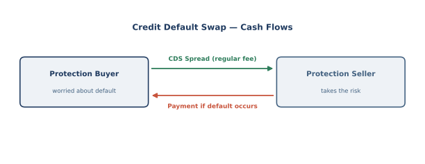


If the company defaults, the protection seller pays the protection buyer the loss amount (principal minus recovery value). If the company does not default, the protection buyer has paid the CDS spread "for nothing" — like paying insurance premiums without making a claim.

CDS are critical for structured products because:
- **Credit-Linked Notes (CLNs)** embed a CDS: the investor sells credit protection and earns the CDS spread as a coupon.
- **First-to-Default notes** combine multiple CDS on different borrowers, with the investor bearing the loss on whichever defaults first.
- CDS spreads are used to price the credit risk component of many structured products.

We will explore CDS in full detail in [Part 5](#part-5) (Swaps).

### Credit Events

A **credit event** is a formally defined occurrence that triggers a CDS payout. Under ISDA (International Swaps and Derivatives Association) standards, the main credit events are:

**Bankruptcy** — The borrower files for bankruptcy or is unable to pay its debts. This is the most clear-cut credit event.

**Failure to Pay** — The borrower misses a scheduled payment (interest or principal) and fails to correct the miss within a specified grace period. This is the most common credit event.

**Restructuring** — The borrower renegotiates the terms of its debt in a way that is unfavorable to lenders (for example, extending the maturity, reducing the coupon, or converting debt to equity). This is the most contentious credit event because it can be ambiguous.

ISDA is the industry body that standardizes derivative contracts. When we say a CDS is "ISDA standard," we mean it uses the standard legal definitions and documentation that the industry has agreed upon. This standardization is essential because it ensures that all parties agree on what constitutes a credit event and how settlement occurs.

### Model Risk

**Model risk** is the risk that the mathematical model used to price or hedge a product is wrong or inappropriate.

All derivative prices are based on models — mathematical representations of how markets behave. These models make assumptions (about volatility, correlation, interest rate behavior, and default probabilities) that may not hold in reality.

*Analogy:* Model risk is like navigating a city with a road map from ten years ago. The map was accurate when it was printed, but since then new highways have been built, old roads have been closed, and neighborhoods have changed. The map works fine for the parts of the city that have not changed, but it can lead you dangerously astray in the areas that have. Financial models face the same limitation: they are calibrated to historical conditions, and when the market enters territory the model has never seen, the model's guidance becomes unreliable.

Model risk is particularly relevant for:
- Complex portfolio credit products (like CDO tranches — Collateralized Debt Obligations, which package many credit exposures into slices of risk) where correlation assumptions have an enormous impact on pricing
- Products with barriers near the current market level, where small model errors can cause large hedging mistakes
- Long-dated products where assumptions about future volatility and rates become increasingly uncertain

> **Mental Model:** Credit risk = the risk that a borrower won't pay you back. Credit spread = the extra interest you demand for taking that risk. Recovery rate = what you get back after default. CDS = insurance on a loan. Credit event = the trigger for insurance payout (bankruptcy, failure to pay, restructuring). Model risk = the risk that your math is wrong.

---

### Part 1 — Knowledge Check

**Review Questions:**

1. Explain the difference between long and short positions. Which profits when prices rise?
2. What is the difference between a call option and a put option? Give a real-world analogy for each.
3. Name all five Greeks and describe what each one measures in one sentence.
4. What is the difference between implied volatility and realized volatility?
5. Explain why low correlation makes worst-of products riskier for the investor.

**Scenario Questions:**

1. An investor sells a knock-in put with a barrier at 70% of the initial stock price. The stock falls to 65% during the product's life but recovers to 85% by maturity. Under a European barrier, what happens? Under an American barrier, what happens?
2. A trading desk is short Vega on a portfolio of structured products. The market experiences a volatility spike. What happens to the desk's P&L, and what action might the desk take?
3. The yield curve inverts — short-term rates move above long-term rates. How does this affect a Steepener Note that pays a coupon based on the 30-year CMS rate minus the 2-year CMS rate?

**Desk Question:**

A client asks: "If I sell puts through a structured product, I'm essentially selling insurance. But insurance companies are profitable. So selling puts should be profitable too, right?" Explain why this analogy is partly correct and partly misleading, using the concepts of volatility, tail risk, and the difference between diversifiable and non-diversifiable risk.

---

### Part 1 — Mental Models Summary

| Concept | Mental Model |
|---------|-------------|
| Long | You bought it — you want the price to rise |
| Short | You sold it — you want the price to fall |
| Spread | The gap between buy and sell prices — the market maker's profit |
| Mark-to-Market | Revalue everything at today's prices — daily discipline |
| Leverage | Amplification — magnifies gains AND losses |
| Call | A reservation — the right to buy |
| Put | Insurance — the right to sell |
| Premium | The price of the option |
| Strike | The agreed price — the trigger level |
| ITM/ATM/OTM | Where is the underlying relative to the strike? |
| Time Value | Possibility value — more time = more possibility |
| Knock-In | Tripwire that activates something |
| Knock-Out | Tripwire that deactivates something |
| European Barrier | Checked once at the end |
| American Barrier | Checked constantly |
| Digital | Light switch — on or off |
| Delta | Steering wheel — which direction and how much exposure |
| Gamma | Steering sensitivity — how fast Delta changes, spikes near barriers |
| Vega | Umbrella price sensitivity — changes in the volatility forecast move your position |
| Theta | Melting ice cream — time erodes value |
| Volatility | Storminess of the sea |
| Implied Vol | Weather forecast — what the market expects |
| Realized Vol | Yesterday's actual weather — what happened |
| Skew | The market charges more for downside protection |
| Correlation | Synchronization — how much things move together |
| Worst-of | You are only as strong as your weakest link |
| Yield Curve | The price of waiting, plotted over time |
| Forward Rate | The market's implied future rate, derived from the curve |
| SOFR/EURIBOR | The benchmark rate that floating payments reference |
| CMS | Today's fixed-rate swap quote for a given maturity |
| CMS Spread | Steepness of the yield curve |
| Cap/Floor | Ceiling/minimum on interest rates |
| Credit Spread | The extra interest demanded for taking credit risk |
| CDS | Insurance on a loan |
| Model Risk | The risk that your math is wrong — like navigating with an outdated map |

---

# PART 2 — THE STRUCTURED PRODUCTS FRAMEWORK {#part-2}

*You now understand markets, trading, options, rates, and credit. This part answers the next question: how does a bank take these building blocks and construct a structured product?*

---

## 2.1 What Is a Structured Product? {#sec-2-1}

### The Custom Kitchen

Mass-produced furniture serves most people well enough. But some clients have unusual spaces, specific materials in mind, or a particular aesthetic. They hire a carpenter to build something custom.

A structured product is custom financial furniture. Standard investments — stocks, bonds, index funds — serve most investors. But some clients need something specific: higher income than bonds, some downside protection, exposure to a particular market, or a payoff tied to a specific scenario. A bank designs a product that fits those exact requirements.

### The Formula

At its simplest, every structured product follows one formula:

**Structured Product = Bond + Derivative(s)**

The bond component provides the funding (the investor lends money to the bank). The derivative component shapes the risk and return (determining what the investor gets back at maturity).

*Example:* A Reverse Convertible = Bond + Short Put. The investor lends the bank money (the bond), and simultaneously sells the bank a put option on a stock. The premium from selling the put funds an enhanced coupon. But if the stock falls below the barrier, the investor bears the loss.

### Risk Transfer: What the Client Thinks vs What the Desk Sees

This is one of the most important concepts in structured products.

**The client thinks:** "I am buying a high-yield investment with some protection."

**The desk sees:** "The client is lending us money and selling us an option. We are buying that option cheaply, hedging it in the market, and earning the difference."

Both perspectives are correct — they are two sides of the same trade. The client gets a product that meets their investment objective. The bank gets an option at a favorable price and earns a manufacturing margin.

This asymmetry of perspective is not a flaw. It is how markets work. The client values the certainty and structure of the product. The bank values the optionality and earns a margin for providing that structure.

> **Professor Note:** If you remember only one thing from this chapter, remember this: a structured product is a bond combined with one or more derivatives. The bond provides funding. The derivatives shape the payoff. Everything else — coupons, barriers, autocalls — is just specific choices about which derivatives to embed.

---

## 2.2 Product Construction Principles {#sec-2-2}

### Decomposition: Taking Things Apart

Every structured product, no matter how complex it appears, can be broken into simple components. This process is called **decomposition**, and it is the most important analytical skill on a structured products desk.

Take a Reverse Convertible paying a 7% coupon with a 70% knock-in barrier on a stock trading at $100:

| Component | What It Is | Economic Purpose |
|-----------|-----------|-----------------|
| Bond | Lending $100 to the issuer at the issuer's credit curve | Provides funding to the bank |
| Short Knock-In Put | Selling a put with strike $100, KI barrier at $70 | Generates premium to fund the enhanced coupon |
| FTP (Funds Transfer Pricing) | Internal cost of the bank's funding | Covers the bank's borrowing cost |
| Desk Margin | The bank's profit | Compensation for structuring and risk management |

The 7% coupon is not magic — it comes from somewhere:

**Coupon = Bond interest + Put premium - FTP - Desk margin**

If the bond interest is 2%, the put premium is equivalent to 6%, FTP is 0.5%, and the desk margin is 0.5%, the investor receives: 2% + 6% - 0.5% - 0.5% = **7%**.

### Funds Transfer Pricing (FTP)

**FTP** is the internal rate at which a bank's treasury lends money to its trading desks. Think of it as the wholesale price of money inside the bank.

When the structured products desk issues a note to an investor, it receives cash. But that cash has a cost — the bank's own borrowing cost. FTP represents this cost. It is deducted from the coupon budget before the investor's coupon is set.

### Desk Margin

The **desk margin** is the bank's profit on each structured product. It covers the costs of structuring, hedging, risk management, and operations. Typical margins are 0.25% to 1.5% of notional, depending on product complexity and competition.

The margin is invisible to the client — it is embedded in the pricing. The client sees a 7% coupon and decides whether that meets their objectives. The bank has already ensured that the economics work at that coupon level after deducting FTP and margin.

### Desk Perspective

| Role | What Construction Means to Them |
|------|-------------------------------|
| **Structurers** | Choose which derivatives to embed, set barrier/coupon levels to balance client attractiveness with desk profitability |
| **Traders** | Must hedge every component. Decomposition tells them exactly what positions they need to take |
| **Product Control** | Verify that each component is correctly valued and that the sum matches the product's market price |
| **Risk** | Assess the Greeks of each component to understand the overall risk profile |
| **Operations** | Book each component correctly in the systems |

### Common Mistakes

1. **Thinking the coupon is free money.** The enhanced coupon is funded by selling an option. The investor earns more than a bond *because they are taking more risk*.
2. **Ignoring issuer credit risk.** The bond component means the investor is exposed to the bank's creditworthiness, not just the underlying market.
3. **Confusing the product with the underlying.** Buying a structured product linked to Apple is not the same as buying Apple stock. The derivative component fundamentally changes the risk profile.

---

## 2.3 The Four-Leg Framework {#sec-2-3}

### How Money Actually Flows

When a bank sells a structured product, multiple things happen simultaneously across different parts of the bank. The **Four-Leg Framework** maps these flows.

*Analogy:* Think of a water treatment plant. Water enters from a river (raw input), flows through filtration (processing), gets stored in a reservoir (internal management), and is distributed to homes (final output). Each stage is a different "leg" of the system. Money flows through a structured product the same way.

### The Four Legs

**Leg 1 — Note Leg (Client ↔ Issuer)**

This is what the client sees. The investor buys a note from the issuer (often a Special Purpose Vehicle, or SPV, set up by the bank). The investor pays the principal and receives coupon payments and eventual redemption. The note is a debt security — legally, the client is lending money to the issuer.

**Leg 2 — Issuer Leg (Issuer ↔ Bank Balance Sheet)**

The issuer passes the investor's money to the bank's balance sheet. This creates an internal liability — the bank owes the issuer the money needed to pay the investor back at maturity. This leg is invisible to the client.

**Leg 3 — Deposit Leg (Bank ↔ Treasury)**

The bank's treasury manages the funding internally. The deposit leg represents the FTP cost — the internal price at which treasury provides funding to the structured products desk. Treasury earns the FTP rate; the desk pays it.

**Leg 4 — Hedge Leg (Desk ↔ Market)**

The trading desk hedges the embedded derivatives in the external market. If the product contains a short put, the desk buys protective positions (Delta hedge, Vega hedge) in the market. The cost of hedging is factored into the product's pricing.

### How P&L Flows Across Legs

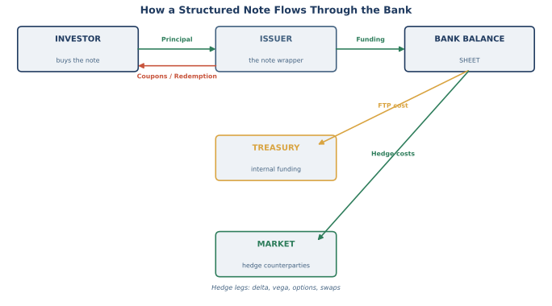


The bank's profit is the difference between what it receives from the investor (via the note leg) and what it pays out across the other three legs (issuer liability, FTP, and hedging costs).

### Worked Example

A bank sells a 1-year Reverse Convertible with $1,000,000 **notional** (the face value of the contract — the amount on which all payments are calculated), 7% coupon, linked to a stock index.

| Leg | Flow | Amount |
|-----|------|--------|
| Note Leg | Investor pays principal | +$1,000,000 received |
| Note Leg | Bank pays 7% coupon | -$70,000 over the year |
| Deposit Leg | Treasury charges FTP at 2% | -$20,000 |
| Hedge Leg | Desk buys hedge (put premium equivalent) | -$45,000 |
| Desk Margin | Remaining | +$5,000 (0.5%) |

The $70,000 coupon is funded by: $20,000 (FTP/bond interest) + $45,000 (option premium from selling the put) + $5,000 (margin the bank keeps).

> **Professor Note:** If you remember only one thing from the Four-Leg Framework, remember this: the investor sees one product, but inside the bank, money flows through four separate channels. Understanding these channels is how you understand where profit comes from and where risk lives.

### Desk Perspective

| Role | What the Four-Leg Framework Means |
|------|----------------------------------|
| **Traders** | They live in Leg 4. Their job is to hedge the derivatives efficiently so that the hedge cost stays below what was assumed in pricing |
| **Structurers** | They design the product across all four legs — balancing investor attractiveness (Leg 1) against internal costs (Legs 2-4) |
| **Product Control** | They reconcile all four legs to ensure total P&L is correct |
| **Treasury** | They manage Leg 3 — providing funding at FTP and managing the bank's overall balance sheet |
| **Operations** | They process flows across all legs — booking, payments, settlements |

### Common Mistakes

1. **Thinking the bank profits from market direction.** The bank profits from its margin, not from the market moving in any particular direction. If hedged correctly, the bank earns its margin regardless of market performance.
2. **Ignoring the deposit leg.** FTP is a real cost that reduces the coupon budget. In a rising rate environment, FTP increases, which either reduces coupons or requires restructuring.
3. **Confusing the note leg with the total product.** The note is what the investor sees, but the real economics are determined across all four legs.

---

## 2.4 Capital Protection Spectrum {#sec-2-4}

### How Much Can You Lose?

Every structured product sits somewhere on a spectrum from "you cannot lose any money" to "you could lose everything."

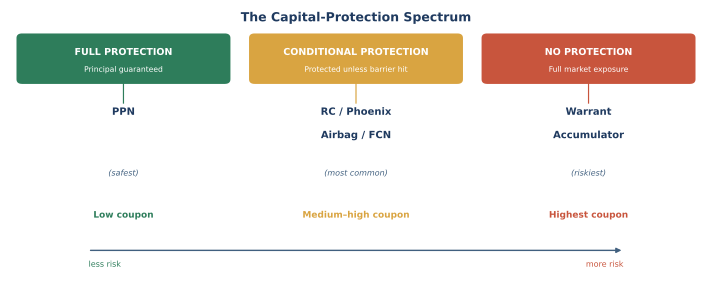


**Full protection:** The investor's principal is guaranteed regardless of market performance. The tradeoff is lower participation in market upside. Example: Principal Protected Note.

**Conditional protection:** The investor's principal is protected *unless* a specific condition is met (typically a barrier breach). Most structured products fall here. Example: Reverse Convertible with 70% barrier — principal is safe unless the stock falls more than 30%.

**No protection:** The investor is fully exposed to market movements, sometimes with leverage. Example: Warrants, Accumulators.

The fundamental law: **more protection = lower coupon. Less protection = higher coupon.** The protection is not free — it is funded by giving up potential return.

### Desk Perspective

| Role | What the Protection Spectrum Means |
|------|-----------------------------------|
| **Sales** | Must clearly communicate the protection level to clients. Mis-selling protection features is a compliance risk |
| **Structurers** | Adjust barrier levels to move products along the spectrum — balancing client demand for protection against the coupon budget |
| **Risk** | Monitors how close the underlying is to barrier levels. Conditional protection becomes no protection when barriers are breached |

### Common Mistakes

1. **Confusing conditional protection with guaranteed protection.** A 70% barrier means the investor can lose 30%+ of their investment. This is not "protected."
2. **Ignoring the probability of barrier breach.** A 60% barrier looks protective, but over a 5-year period, many stocks will fall 40% at some point.
3. **Not understanding that protection has a cost.** A higher barrier (more protection) means a lower coupon. There is no free protection.

---

## 2.5 Product Lifecycle {#sec-2-5}

### From Idea to Settlement

A structured product does not just appear. It goes through a defined lifecycle:

**1. Origination** — A client expresses a need. Sales and Structuring discuss what product might work.

**2. Structuring** — The structurer designs the product: chooses the underlying, sets the barrier, determines the coupon, and selects the maturity. The structurer runs pricing models to ensure the economics work for both client and bank.

**3. Pricing** — The desk calculates the fair value of the product, including all derivative components, FTP, and margin. The client receives a **termsheet** (the document that lists every detail of the product — coupon, barrier, maturity, underlying, and all other terms) showing the final terms.

**4. Execution** — The client agrees to the terms. The trade is executed.

**5. Booking** — Operations enters the trade into the bank's systems (NEMO, Sophis, or Murex, depending on the product type).

**6. Life of the product** — During the product's life, several events may occur:
- **Coupon observations** — On scheduled dates, the system checks whether coupon conditions are met.
- **Barrier observations** — The system monitors whether the underlying has breached any barriers.
- **Autocall checks** — For autocallable products, the system checks on each observation date whether the autocall condition is triggered.
- **Corporate actions** — If the underlying stock has a stock split, merger, or dividend, the product terms may need adjustment.

**7. Maturity or Early Redemption** — The product reaches its scheduled maturity (or is autocalled early). The final payoff is calculated based on the product terms and market conditions.

**8. Settlement** — The bank pays the investor the final redemption amount (either cash or, in some cases, physical delivery of shares).

---

## 2.6 Trade Lifecycle {#sec-2-6}

### Who Does What, When

The product lifecycle describes what happens to the product. The trade lifecycle describes who is responsible at each stage.

| Stage | Front Office | Middle Office | Back Office |
|-------|-------------|--------------|-------------|
| **Pre-trade** | Sales discusses with client; Structurer designs and prices | Risk reviews product risk profile | — |
| **Execution** | Trader executes the hedge | — | — |
| **Booking** | — | — | Operations books the trade in systems |
| **Daily life** | Trader manages the hedge (Delta, Vega) | Risk monitors exposures; Product Control verifies P&L | Operations processes fixings and coupon payments |
| **Events** | Trader adjusts hedge for barriers, autocalls | Risk escalates if limits are approached | Operations processes autocall or barrier events |
| **Maturity** | — | Product Control verifies final P&L | Operations calculates final payoff and processes settlement |

> **Professor Note:** If you remember only one thing about the trade lifecycle, remember this: the front office makes the trade, the middle office watches the trade, and the back office processes the trade. All three must agree for the system to work.

---

## 2.7 How Desks Hedge {#sec-2-7}

### Why Hedging Exists

When a bank sells a structured product, it takes on risk. If the bank does nothing, it is exposed to market movements — essentially making a bet with the client's money. Banks do not want to bet. They want to earn a manufacturing margin with minimal market exposure.

**Hedging** is the process of taking offsetting positions in the market to neutralize the risk from structured products.

*Analogy:* Think of the trading desk as a kitchen that runs like a casino. In [Section 0.12](#sec-0-12), we compared the front office to a kitchen — where revenue is generated. But this kitchen does not gamble on each dish turning out perfectly. It follows tested recipes (hedging strategies) to earn a consistent margin, just as a casino sets the mathematical odds in its favor across many bets. Individual trades may gain or lose, but the desk earns its margin on average — by design, not by luck.

### What Gets Hedged

| Greek | What the Desk Hedges | How |
|-------|---------------------|-----|
| **Delta** | Directional exposure to the underlying | Buy or sell the underlying stock/index to maintain Delta-neutral |
| **Gamma** | Sensitivity of Delta to price moves | Trade options to manage Gamma; near barriers, Gamma spikes and hedging becomes expensive |
| **Vega** | Exposure to volatility changes | Trade options or variance swaps to offset Vega |
| **Rho** | Interest rate exposure | Trade interest rate swaps |
| **Credit** | Issuer or reference entity default risk | Trade CDS or credit index products |

### Dynamic Hedging

Hedging is not a one-time activity. As markets move, the Greeks change, and the hedge must be adjusted. This is called **dynamic hedging** — the desk continuously rebalances its positions to stay risk-neutral.

Delta hedging is the most frequent adjustment — often multiple times per day. Vega hedging is less frequent but equally important. Near barrier levels, hedging becomes particularly challenging because Gamma spikes and Delta can change dramatically with small price moves.

### What Happens in Stress

During market crises, hedging breaks down in predictable ways:

- **Liquidity disappears.** The desk needs to trade to rebalance, but markets become illiquid.
- **Correlation spikes.** Assets that normally move independently start moving together, amplifying losses on basket products.
- **Volatility jumps.** Vega losses hit immediately as implied vol reprices.
- **Gaps occur.** Prices jump past barrier levels without trading through them, making continuous hedging impossible.

The desk's risk management framework must account for these stress scenarios. This is why the product pricing includes a margin — part of it covers the expected cost of hedging imperfections.

### Desk Perspective

| Role | What Hedging Means |
|------|-------------------|
| **Traders** | Their primary daily activity. A well-hedged book earns margin steadily. A poorly hedged book bleeds money or creates large risk |
| **Structurers** | Design products that are hedgeable. Products that cannot be hedged efficiently will not be approved |
| **Risk** | Monitors hedge effectiveness. Challenges assumptions about correlation, volatility, and liquidity |
| **Product Control** | Verifies that hedging P&L matches theoretical expectations |

### Common Mistakes

1. **Assuming hedging eliminates all risk.** Hedging reduces risk but cannot eliminate it entirely. Model assumptions, liquidity constraints, and gap risk mean residual risk always remains.
2. **Thinking hedging is free.** Every hedge has a cost — bid-offer spreads, market impact, and financing. These costs are factored into the product margin.
3. **Ignoring correlation risk.** Hedging individual Greeks is straightforward. Hedging the interaction between multiple risk factors (Delta-Vega cross-effects, correlation changes) is much harder.

---

## 2.8 The Systems: A First Look {#sec-2-8}

### Three Systems, Three Purposes

Before diving into product deep dives, you need to understand the three core systems that process structured products. Each product chapter will reference these systems, so this primer ensures you are never lost.

**NEMO** — The book of record. NEMO is the system where trades are entered and where the official position record lives. When someone asks "what trades do we have?", the answer comes from NEMO. It stores trade details: notional, strike, barrier, maturity, counterparty.

**Sophis** — The pricing and risk engine. Sophis calculates the market value of each trade using mathematical models. It produces the Greeks (Delta, Gamma, Vega) that traders use to hedge, and the daily P&L that Product Control verifies. When someone asks "what is this trade worth?", the answer comes from Sophis.

**Murex** — The rates and multi-leg booking system. Murex handles products that require the four-leg framework: Structured Rate Trades (SRT) and Steepener Notes (STEG) are booked in Murex because they require separate Note, Issuer, Deposit, and Hedge legs. Murex also handles vanilla swaps.

### Which System Handles Which Product?

| Product Family | Book of Record | Pricing/Risk | Four-Leg? |
|---------------|---------------|-------------|:---------:|
| Equity-Linked Notes (ELN) | NEMO | Sophis | No |
| Credit-Linked Notes (CLN) | NEMO | Sophis | No |
| Structured Rate Trades (SRT) | Murex | Murex | Yes |
| Steepener Notes (STEG) | Murex | Murex | Yes |
| Swaps | Murex | Murex | Varies |

### How Information Flows

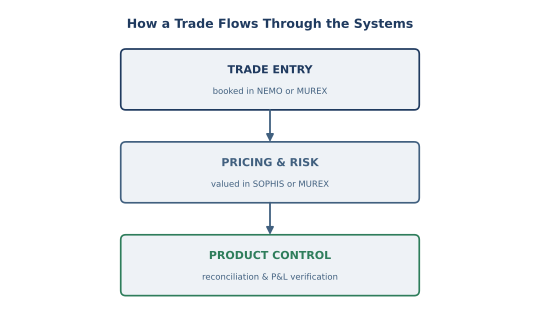


NEMO and Sophis must agree on every trade. If NEMO says a trade has a strike of 95% but Sophis has 95 (absolute price), the position is misbooked and the P&L will be wrong. This is one of the most common reconciliation errors.

> **Professor Note:** If you remember only one thing about the systems, remember this: NEMO holds the trades, Sophis prices them, and Murex handles rates products with four legs. Every product chapter will tell you which system applies.

### Common Mistakes

1. **Assuming all products use the same system.** ELN/CLN use NEMO+Sophis. SRT/STEG use Murex. Using the wrong system causes booking errors.
2. **Confusing NEMO's trade record with Sophis's valuation.** NEMO stores what the trade *is*. Sophis calculates what the trade *is worth*. They must reconcile, but they serve different purposes.
3. **Ignoring the four-leg framework.** SRT and STEG products are booked as four separate legs in Murex. Misunderstanding the leg structure causes reconciliation breaks.

---

### Part 2 — Knowledge Check

**Review Questions:**
1. What is the formula for a structured product? What role does each component play?
2. Name the four legs in the Four-Leg Framework and explain what each one does.
3. Why does more capital protection result in a lower coupon?
4. What is FTP, and why does it matter for structured product pricing?
5. Name the three core systems and explain which products each handles.

**Scenario Questions:**
1. A client asks why their Reverse Convertible pays 7% when bonds only pay 3%. Using decomposition, explain where the extra 4% comes from.
2. The market drops 15% in a single day. Describe what happens to the hedging desk's Delta, Gamma, and Vega positions, and what actions the desk would take.
3. A Product Control analyst discovers that NEMO records a strike as 95% while Sophis uses an absolute price of $95. The stock price at trade inception was $100. Is there a problem? Explain.

**Desk Question:**
A junior trader says: "If we hedge perfectly, we earn the margin with zero risk. So why do we need a risk management team?" Explain why this statement is wrong.

### Part 2 — Mental Models Summary

| Concept | Mental Model |
|---------|-------------|
| Structured Product | Custom financial furniture — built to client specifications |
| Decomposition | Taking apart a product into its simple components |
| Coupon source | Bond interest + Option premium - FTP - Margin |
| Four-Leg Framework | Water treatment plant — money flows through four channels |
| Note Leg | What the client sees |
| Hedge Leg | What the trader does |
| Capital Protection | More protection = lower coupon, always |
| Hedging | The casino — earn the edge, don't gamble |
| Dynamic hedging | Continuous rebalancing as markets move |
| NEMO | What the trade IS |
| Sophis | What the trade is WORTH |
| Murex | The four-leg rates system |

---

# PART 3 — PRODUCT TAXONOMY {#part-3}

*You now understand the framework: bond + derivatives, four legs, hedging, and systems. The next question is: what specific products can be built within this framework? [Part 3](#part-3) maps the entire landscape — six families, forty-nine products — so that when you encounter any product in [Part 5](#part-5), you already know where it fits and what family it belongs to.*

---

## 3.1 Product Family Overview {#sec-3-1}

Structured products are organized into six families. Each family is defined by its underlying risk factor — the market variable that drives the product's payoff.

| Family | Underlying Risk Factor | Products | Key Characteristic |
|--------|----------------------|:--------:|-------------------|
| **Equity-Linked Notes (ELN)** | Stock or equity index prices | 15 | Investor sells an equity option; earns enhanced coupon |
| **Swaps** | Interest rates, equity returns, credit, FX, commodities | 8 | Two parties exchange cash flows; no principal exchange (usually) |
| **Structured Rate Trades (SRT)** | Interest rates (CMS, SOFR) | 5 | Coupon depends on rate levels or ranges; booked in Murex |
| **Steepener Notes (STEG)** | Yield curve slope (CMS spread) | 4 | Coupon depends on yield curve steepness |
| **Credit-Linked Notes (CLN)** | Creditworthiness of a reference entity | 5 | Investor sells credit protection; earns CDS premium as coupon |
| **Other** | Various | 7 | Structured deposits, accumulators, options, forwards |

---

## 3.2 Classification Dimensions {#sec-3-2}

Any structured product can be classified along six dimensions:

**By underlying:** Equity, rates, credit, FX, commodity, or hybrid.

**By coupon type:**
- *Fixed* — coupon is guaranteed regardless of market conditions (e.g., FCN)
- *Conditional* — coupon depends on the underlying being above a threshold (e.g., Phoenix)
- *Accrual* — coupon accumulates day by day based on a condition (e.g., Range Accrual)
- *None* — no coupon; return comes from capital appreciation (e.g., PPN, Warrant)

**By capital protection:** Full, conditional (barrier-dependent), or none.

**By optionality:**
- *Autocallable* — the product can redeem early if a condition is met
- *Callable* — the issuer can choose to redeem early
- *Puttable* — the investor can choose to redeem early (rare)
- *None* — runs to maturity

**By complexity:**
- *Simple* — closed-form pricing (a direct formula gives you the price), 1-2 components (RC, PPN)
- *Medium* — requires simulation (running thousands of random price paths through a computer to estimate the price), 3-4 components (Phoenix, FCN)
- *Complex* — path-dependent (the payoff depends not just on where the price ends up, but on the entire path it took to get there), multi-observation, correlation-dependent (worst-of Phoenix, Tranche)

**By booking system:** NEMO+Sophis (ELN, CLN) or Murex (SRT, STEG, Swaps).

---

## 3.3 ELN Family Tree {#sec-3-3}

The Reverse Convertible is the seed from which the entire ELN family grows. Every variant in the RC sub-family adds exactly one feature to the base product. Understanding the RC means understanding the core of every product below it.

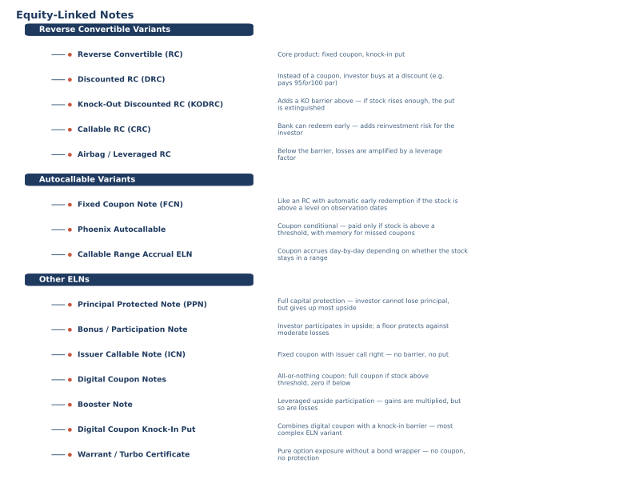


**The unifying theme:** All ELNs involve the investor taking equity risk (usually by selling a put option) in exchange for enhanced income or participation.

---

## 3.4 Swaps Family Tree {#sec-3-4}

Swaps are the plumbing of the financial system — they let institutions exchange one type of cash flow for another. The Interest Rate Swap is the foundation; every other swap applies the same "exchange" mechanism to a different underlying.

```
Swaps
│
├── Rate Swaps
│   ├── Interest Rate Swap (IRS) ........... The most traded derivative in the world: exchange fixed for floating rate payments
│   └── Vanilla Swap (VLSP) ................ A standard IRS with simplified terms
│
├── Asset Swaps
│   ├── Total Return Swap (TRS) ............ One party receives the total return of an asset without owning it
│   ├── Equity Swap ....................... Exchange equity returns for a financing rate — used for tax-efficient exposure
│   └── Commodity Swap .................... Lock in a fixed commodity price vs floating market price
│
├── Currency Swaps
│   └── Cross-Currency Swap ................ Exchange interest payments in two different currencies, with principal exchange
│
└── Volatility / Credit Swaps
    ├── Variance Swap ..................... A bet on how volatile a market will actually be vs how volatile it was expected to be
    └── Credit Default Swap (CDS) ......... Insurance on a loan — pay a regular premium, receive compensation if the borrower defaults
```

**The unifying theme:** Every swap is an exchange agreement — two parties trade one set of cash flows for another, each preferring what the other has.

---

## 3.5 SRT Family Tree {#sec-3-5}

Structured Rate Trades embed interest rate derivatives into a note structure. They are all booked in Murex with the four-leg framework, and their coupons depend on where interest rates are — not on equity prices.

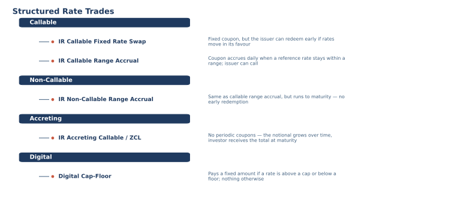


**The unifying theme:** All SRT products pay coupons linked to interest rate levels. The investor is expressing a view on where rates will be, not on equity or credit markets.

---

## 3.6 STEG Family Tree {#sec-3-6}

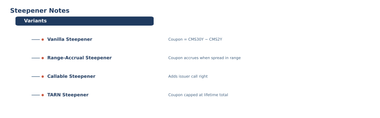


**The unifying theme:** All STEG products pay coupons linked to the difference between long-term and short-term interest rates. They profit when the yield curve is steep and suffer when it flattens or inverts.

---

## 3.7 CLN Family Tree {#sec-3-7}

Credit-Linked Notes apply the same "investor sells protection" logic as put-selling ELNs, but in the credit world. Instead of selling equity downside risk, the investor sells default risk — and earns a CDS-like premium as a coupon.

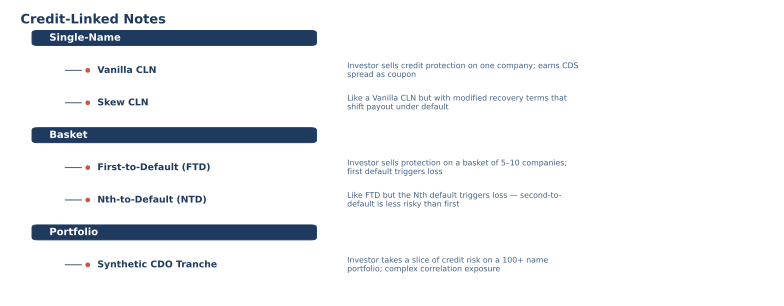


**The unifying theme:** All CLNs involve the investor selling credit protection. The investor earns a CDS-like premium as a coupon and bears the loss if a credit event occurs.

---

## 3.8 Other Products {#sec-3-8}

| Product | Type | Key Feature |
|---------|------|------------|
| Structured Deposits | Deposit + derivative | Capital guaranteed by deposit insurance |
| Accumulators | Forward + KO barrier | Daily accumulation of shares at discount |
| Decumulators | Forward + KO barrier | Daily sale of shares at premium |
| Option on Risk Control | Option on managed fund | Exposure to risk-controlled strategy |
| Equity Linked Option | Standalone option | Pure option exposure, no bond wrapper |
| Forwards | Forward contract | Obligatory future purchase/sale |
| Vanilla Options | Standalone option | Calls or puts without structure |

> **Professor Note:** If you remember only one thing from the taxonomy, remember this: ELNs sell equity risk, CLNs sell credit risk, SRTs/STEGs sell rate risk, and Swaps exchange cash flows. Every product in this book fits one of these patterns.

### Common Mistakes

1. **Thinking product families are unrelated.** Many products share building blocks. A Callable Range Accrual ELN and a Callable Range Accrual SRT use the same accrual mechanism but on different underlyings.
2. **Ignoring the system implications.** The family determines the booking system. Confusing a rates product with an equity product leads to booking errors.
3. **Treating the taxonomy as rigid.** Some products (like Callable Range Accrual ELN) span families. The taxonomy is a guide, not a wall.

---

# PART 4 — PRODUCT COMPARISON MATRICES {#part-4}

*[Part 3](#part-3) showed you what products exist. [Part 4](#part-4) shows you how they differ. These matrices let you compare products side by side — which coupon type, which barrier, which system, which risks. Use them as reference tables when you need to distinguish between variants, or when a client asks "what is the difference between an FCN and a Phoenix?" You do not need to memorize these tables — they are designed to be looked up, not read sequentially.*

---

**Abbreviation Legend for [Part 4](#part-4):**

| Abbreviation | Meaning |
|:------------:|---------|
| KI | Knock-In (barrier that activates risk) |
| KO | Knock-Out (barrier that extinguishes risk) |
| RC | Reverse Convertible |
| DRC | Discounted Reverse Convertible |
| KODRC | Knock-Out Discounted RC |
| CRC | Callable Reverse Convertible |
| FCN | Fixed Coupon Note |
| PPN | Principal Protected Note |
| ICN | Issuer Callable Note |
| CRA | Callable Range Accrual |
| FTD | First-to-Default |
| NTD | Nth-to-Default |
| CDS | Credit Default Swap |
| IRS | Interest Rate Swap |
| TRS | Total Return Swap |

---

## 4.1 ELN Master Comparison Matrix {#sec-4-1}

### How to Read This Matrix

Think of this table like a restaurant menu with columns for price, spice level, and portion size. You do not read it top to bottom — you look at the columns that matter most for your situation. For structured products, start with **Coupon** (what the investor earns) and **Protection** (how much the investor can lose). These two columns tell you the fundamental tradeoff of each product.

**Worked Scenario:** A client says: "I want an equity-linked product with a fixed coupon of at least 6%, some downside protection, and I don't mind if it gets called early." Looking at the matrix below, scan the Coupon column for "Fixed, high" or "Fixed," then check the Autocall column for "Yes," and the Protection column for "Conditional." The products that match: **FCN** (Fixed Coupon Note — fixed coupon, autocall, conditional protection) and **Phoenix** (conditional coupon with memory, autocall, conditional protection). Since the client wants a *fixed* coupon, the FCN is the better fit. The Phoenix would work only if the client accepts that coupon payment depends on the underlying being above a threshold.

| Product | Coupon | Barrier | Autocall | Protection | Put Type | Primary Greeks | System | Complexity |
|---------|--------|---------|:--------:|------------|----------|---------------|--------|:----------:|
| PPN | None (participation) | None | No | Full | None (long call) | Delta, Vega | NEMO/Sophis | Simple |
| RC | Fixed, high | KI | No | Conditional | Short KI put | Delta, Vega, Gamma | NEMO/Sophis | Simple |
| DRC | Discount to entry | KI | No | Conditional | Short KI put (discounted) | Delta, Vega | NEMO/Sophis | Simple |
| KODRC | Discount + fixed | KI + KO | No | Conditional | Short KI put + long KO | Delta, Vega, Gamma | NEMO/Sophis | Medium |
| CRC | Fixed | KI | No (callable) | Conditional | Short KI put | Delta, Vega | NEMO/Sophis | Medium |
| Airbag | Fixed | KI | No | Conditional (leveraged) | Short leveraged put | Delta, Gamma | NEMO/Sophis | Medium |
| FCN | Fixed | KI | Yes | Conditional | Short KI put | Delta, Vega | NEMO/Sophis | Medium |
| Phoenix | Conditional | KI (coupon + autocall) | Yes | Conditional | Short KI put | Delta, Vega, Correlation | NEMO/Sophis | Complex |
| CRA ELN | Accrual | Range | Callable | Conditional | Short put + range | Delta, Vega, Gamma | NEMO/Sophis | Complex |
| Bonus | None (participation) | KO (floor) | No | Conditional floor | Long KO put spread | Delta, Vega | NEMO/Sophis | Medium |
| ICN | Fixed | None | Callable | None | None explicit | Rho, Vega | NEMO/Sophis | Simple |
| Digital | Digital (all-or-nothing) | Digital barrier | No | Conditional | Short digital put | Delta, Gamma | NEMO/Sophis | Medium |
| Booster | None (leveraged participation) | None | No | None | Long leveraged call | Delta, Vega | NEMO/Sophis | Medium |
| Digital KI Put | Digital | KI | No | Conditional | Short KI digital put | Delta, Gamma | NEMO/Sophis | Complex |
| Warrant | None (leverage) | None (or KO) | No | None | Long call/put | Delta, Gamma, Vega | NEMO/Sophis | Simple |

---

## 4.2 Reverse Convertible Variant Comparison {#sec-4-2}

| Feature | RC | DRC | KODRC | CRC | Airbag |
|---------|:--:|:---:|:-----:|:---:|:------:|
| Entry price | Par (100%) | Discount (e.g., 95%) | Discount | Par | Par |
| Coupon type | Fixed high | Discount is the return | Fixed + discount | Fixed | Fixed |
| KI barrier | Yes | Yes | Yes | Yes | Yes |
| KO barrier | No | No | Yes | No | No |
| Issuer callable | No | No | No | Yes | No |
| Below-barrier behavior | Linear loss | Linear loss | If KO not hit: linear loss | Linear loss | Leveraged loss |
| Key addition vs RC | — | Discount replaces coupon | + KO protection | + Call right | + Leverage |

**Reading this table:** Each variant adds exactly one feature to the base Reverse Convertible. DRC replaces the coupon with a discount. KODRC adds a knock-out barrier above. CRC gives the issuer a call right. Airbag adds leverage below the barrier.

---

## 4.3 Autocallable Variant Comparison {#sec-4-3}

| Feature | FCN | Phoenix |
|---------|:---:|:-------:|
| Coupon type | Fixed (guaranteed each period) | Conditional (paid only if above coupon barrier) |
| Memory feature | No | Yes (missed coupons accumulate and pay on next qualifying date) |
| Autocall | Yes (observation dates) | Yes (observation dates) |
| KI barrier for principal | Yes | Yes |
| Underlying | Single stock or worst-of basket | Usually worst-of basket |
| Key difference | Simpler — coupon always paid until autocall or maturity | More complex — coupon depends on observation, memory creates path dependency |

---

## 4.4 Swaps Comparison Matrix {#sec-4-4}

| Swap | Leg A Pays | Leg B Pays | Physical Exchange? | Typical Users |
|------|-----------|-----------|:-----------------:|--------------|
| IRS | Fixed rate | Floating rate (SOFR) | No | Banks, corporates hedging rate exposure |
| TRS | Total return of asset | Financing rate | No | Hedge funds, banks seeking synthetic exposure |
| Equity Swap | Equity return | Financing rate | No | Funds, tax-efficient exposure |
| Variance Swap | Fixed variance strike | Realized variance | No | Volatility traders, hedge funds |
| Currency Swap | Interest in currency A | Interest in currency B | Yes (principal) | Corporates with multi-currency debt |
| Commodity Swap | Fixed commodity price | Floating commodity price | No | Producers, consumers hedging commodity exposure |
| CDS | CDS spread (regular) | Payment on credit event | No | Banks, hedge funds, credit investors |
| VLSP | Fixed rate | Floating rate | No | Standard vanilla IRS variant |

---

## 4.5 SRT Family Comparison {#sec-4-5}

| Feature | IR Callable FRN | IR Accreting/ZCL | Non-Callable RA | Callable RA | Digital Cap-Floor |
|---------|:--------------:|:----------------:|:--------------:|:----------:|:-----------------:|
| Coupon type | Fixed | Zero (return at maturity) | Accrual | Accrual | Digital |
| Callable | Yes | Yes | No | Yes | No |
| Rate reference | Fixed rate | Accreting notional | SOFR/CMS in range | SOFR/CMS in range | Rate vs cap/floor |
| Key risk | Early redemption | Notional growth | Range breaks | Range breaks + call | Rate level |
| Booking | Murex 4-leg | Murex 4-leg | Murex 4-leg | Murex 4-leg | Murex 4-leg |

---

## 4.6 STEG Family Comparison {#sec-4-6}

| Feature | Vanilla | Range-Accrual | Callable | TARN |
|---------|:-------:|:------------:|:--------:|:----:|
| Coupon formula | CMS30Y - CMS2Y | CMS spread in range × accrual factor | CMS30Y - CMS2Y | CMS30Y - CMS2Y |
| Floor | Yes (e.g., 0%) | Yes | Yes | Yes |
| Cap | Sometimes | Sometimes | Sometimes | Lifetime cap (Target) |
| Callable | No | No | Yes | No |
| Path-dependent | No | Yes (daily accrual) | No | Yes (lifetime accumulation) |
| Key risk | Curve flattening | Curve flattening + range break | Curve flattening + early call | Curve flattening + target hit |

---

## 4.7 CLN Family Comparison {#sec-4-7}

| Feature | Vanilla CLN | Skew CLN | FTD | NTD | Synthetic Tranche |
|---------|:-----------:|:--------:|:---:|:---:|:-----------------:|
| Reference | Single entity | Single entity | Basket (5-10) | Basket (5-10) | Portfolio (100+) |
| Loss trigger | Default of reference | Default of reference | First default in basket | Nth default in basket | Portfolio losses in tranche band |
| Correlation exposure | None | None | Short correlation | Long correlation (reversal at extremes) | Complex |
| Recovery | Standard | Skewed (modified terms) | Standard per entity | Standard per entity | Model-dependent |
| Coupon source | CDS spread | Modified CDS spread | Basket CDS spreads | Basket CDS spreads | Tranche spread |
| Complexity | Simple | Medium | Medium | Complex | Very complex |

---

## 4.8 Cross-Family Comparisons {#sec-4-8}

### By Risk Profile

| Risk Profile | Products |
|-------------|----------|
| **Short volatility** (profit from calm markets) | RC, DRC, KODRC, CRC, Airbag, Phoenix, FCN, Digital, all CLNs |
| **Long volatility** (profit from volatile markets) | PPN, Warrant, Vanilla Options |
| **Long correlation** (profit from high correlation; MTM convention) | Worst-of Phoenix, worst-of FCN, FTD |
| **Short curve steepness** (profit from steep curve) | All STEGs |
| **Rate-directional** (profit from specific rate levels) | All SRTs |

### By Booking System

| System | Product Families |
|--------|-----------------|
| NEMO + Sophis | All ELNs, all CLNs |
| Murex (four-leg) | All SRTs, all STEGs |
| Murex | All Swaps |

> **Professor Note:** If you remember only one thing from the comparison matrices, remember this: most structured products are short volatility — the investor earns an enhanced coupon by selling an option and is hurt by large market moves. The few products that are long volatility (PPN, Warrants) offer lower income but benefit from large moves.

---

### Part 3-4 — Knowledge Check

**Review Questions:**
1. Name the six product families and the primary risk factor for each.
2. What are the six classification dimensions for structured products?
3. What is the key difference between a Phoenix Autocallable and a Fixed Coupon Note?
4. Name three products that are short volatility and one that is long volatility.
5. Which products are booked in Murex, and why?

**Scenario Questions:**
1. A client wants equity exposure with guaranteed principal return. Which product family and specific product would you recommend?
2. A portfolio manager believes the yield curve will steepen. Which product family would benefit, and which specific products might they consider?
3. A risk analyst notices that correlation across a basket of stocks has dropped from 0.7 to 0.3. Which products in the bank's portfolio become riskier?

**Desk Question:**
A structurer is designing a new product. The client wants: 6%+ annual coupon, some capital protection, linked to a single stock, and maturity of 2 years. Using the ELN comparison matrix, which products could meet these requirements? Which would you recommend, and why?

---

# PART 5 — PRODUCT DEEP DIVES {#part-5}

*This is the heart of the book. Each chapter teaches one product from first principles — starting with why it exists, building intuition through analogy and story, and progressing to the mechanics, risks, and operational details that professionals need. You now have the foundation from Parts 0-4. Every concept referenced here was taught there.*

---

## 5.1 EQUITY-LINKED NOTES {#sec-5-1}

---

### 5.1.1 Principal Protected Note (PPN) {#sec-5-1-1}

> **Prerequisites:** none — a foundation product, start here &nbsp;|&nbsp; **Key concepts:** Zero-coupon bond, European call option, participation rate

---

*A Principal Protected Note guarantees 100% of the investor's principal at maturity while still offering a share of the market's upside — the opposite trade to a Reverse Convertible, which surrenders protection for a higher coupon. The investor here gives up a portion of the upside (participation below 100%) in exchange for eliminating downside risk entirely. This chapter reads the product through two lenses: what it means for **the investor**, and what it means for **the bank** — the latter split into the desk's market economics (1st line of defence) and the controls and reconciliation that surround it (2nd line of defence).*

#### §1. Explain Like I'm New

Consider an investor with $100,000 to invest. The investor wants to participate in the stock market — if the market goes up, the investor wants to share in the gains. But the investor absolutely cannot afford to lose the original $100,000. Perhaps it is retirement savings, or money set aside for a child's education.

A regular stock investment cannot guarantee that. If the market falls 30%, the $100,000 becomes $70,000. That is unacceptable to this investor.

A savings account guarantees principal, but pays 2-3% per year. That is safe but insufficient — the money needs to grow.

A **Principal Protected Note (PPN)** solves this problem. It guarantees that the investor will receive the full $100,000 back at maturity, no matter what happens in the market. On top of that guarantee, the investor receives some percentage of the market's upside — typically 50-80% of the gains.

If the market rises 20%, the investor might receive 12% (at 60% participation). If the market falls 30%, the investor still receives the full $100,000. The worst case is zero return — never a loss of principal.

#### §2. Real-World Analogy

A PPN is like a seat belt in a sports car.

The driver is in a fast car (the stock market). Without a seat belt, in a crash (the market falls) the driver could be seriously hurt (lose the investment). With a seat belt (the principal protection), the driver is protected in a crash — but the seat belt restricts movement slightly, so the driver cannot lean out the window to enjoy the wind as much as a driver without a seat belt (reduced upside participation).

The seat belt has a cost — it is built into the car's design. Similarly, the principal protection in a PPN has a cost — it is funded by reducing the investor's participation in market gains.

Another way to frame it: a PPN is like paying a premium for a no-deductible insurance policy on an investment. The investor is guaranteed to get the money back, but the insurance premium comes out of the potential upside.

#### §3. What Problem Does This Solve?

PPNs solve the **fear of loss** problem.

Many investors — pension funds with legal obligations, individuals approaching retirement, foundations with capital preservation mandates, insurance companies with regulatory capital requirements — cannot afford to lose their principal. Their investment policy or legal constraints prohibit principal loss.

But these same investors also need growth. Bonds pay too little. Cash pays almost nothing. They need exposure to markets that can generate meaningful returns.

The PPN bridges this gap: guaranteed principal return + market participation. The investor gives up some upside in exchange for eliminating downside risk entirely.

| Client Type | Why They Need a PPN |
|------------|-------------------|
| Pension fund | Must preserve capital to meet future obligations; regulators penalize losses |
| Retiree | Cannot afford to lose savings; needs growth to keep up with inflation |
| Foundation | Endowment must be preserved; only investment income can be spent |
| Insurance company | Regulatory capital requirements demand principal protection |
| Risk-averse individual | Psychologically unable to tolerate market losses, but wants better returns than cash |

#### §4. Product DNA

| Field | Value |
|-------|-------|
| **Full Name** | Principal Protected Note |
| **Abbreviation** | PPN |
| **Family** | Equity-Linked Notes |
| **Complexity Score** | 2 / 10 |
| **Complexity Rationale** | Two components (ZCB + call option), no barriers, no path dependency, single underlying |
| **Underlying Asset Class** | Equity (index-linked) |
| **Capital Protection** | 100% at maturity |
| **Coupon Type** | None — return via equity participation |
| **Maturity** | 3-5 years |
| **Liquidity** | Secondary market (bid-offer spread widens in stress) |
| **Primary System** | Murex |
| **ISDA Required** | No — issued as note |

**DNA Atlas Fields:**
- Primary Risk: Opportunity cost (capped upside via participation rate). Interest rate risk affects ZCB value. Issuer credit risk
- Typical Buyer: Risk-averse retail and institutional investors: pension funds, retirees, foundations with capital preservation mandates
- Typical Use Case: Capital-guaranteed equity exposure. Bridge between cash deposits and direct equity investment
- Building Blocks: Zero-coupon bond (principal protection) + European call option (equity upside)
- Key Hedge: Long ZCB (matched maturity) + long call option (delta-hedged)
- Similar Products: Bonus Note (5.1.8 — also protected), Structured Deposit (5.6.1 — deposit wrapper), Shark Fin (5.6.9 — barrier-enhanced PPN)
- Most Important Greek: Delta (equity participation sensitivity)

**Comparison Matrix Fields:**
- Complexity: 2
- Yield Potential: Low-Moderate (participation rate typically 50-80% of index return)
- Capital Protection: 100% at maturity
- Credit Exposure: Issuer (note format)
- Liquidity: Secondary market
- Path Dependency: No (European observation at maturity only)
- Volatility Sensitivity: Long vega (long call option)
- Correlation Sensitivity: None (single index)
- Client Type: Retail / Institutional (pension, foundation)
- Market Environment: Best when rates are high (cheaper ZCB = higher participation) and vol is low (cheaper call)

#### §5. Who Touches This Product

| Role | Responsibility |
|------|---------------|
| **Structurer** | Sizes participation rate given ZCB cost and option premium. Selects index, maturity, and strike |
| **Trader** | Delta-hedges the embedded call option. Manages ZCB interest rate exposure |
| **Sales** | Presents capital guarantee story. Explains participation rate trade-off to conservative clients |
| **Risk Management** | Monitors credit exposure to issuer. Tracks option Greeks (delta, vega, gamma) |
| **Product Control** | Daily P&L attribution between ZCB accretion and option MTM. Independent Price Verification (IPV) of call option |
| **Operations** | Processes maturity settlement. Calculates final index return and participation payout |
| **Legal / Compliance** | Reviews term sheet for retail suitability. Ensures capital guarantee language is precise |
| **Quantitative Analytics** | Prices embedded call option. Calibrates vol surface for participation rate calculation |

#### §6. Product Evolution

| Stage | Product | What Was Added | Why |
|:-----:|---------|---------------|-----|
| 1 | Bank deposit | — (baseline) | Fixed interest, capital guaranteed, zero market exposure |
| 2 | Equity index fund | Market participation | Full upside and downside, no capital protection |
| 3 | Principal Protected Note | Capital guarantee + capped participation | Guarantees principal via ZCB funding; trades full participation for downside elimination |

---

#### §7. THE INVESTOR LENS

**Why the investor buys it**

1. **Capital certainty.** The investor knows their principal is guaranteed at maturity, regardless of market performance.
2. **Market participation.** Unlike a bond or deposit, the investor benefits if markets rise.
3. **Behavioral comfort.** The guarantee removes the anxiety of watching daily market movements. The investor can hold through volatility without panic-selling.
4. **Regulatory compliance.** Some investors are required by law or mandate to protect their principal.
5. **Simplicity.** The payoff is straightforward: the investor gets the money back plus a share of any gains. No barriers, no conditions, no knock-in risk.

**Position taken**

The investor simultaneously holds a long zero-coupon bond (which accretes to par and guarantees the principal) and a **long** call option on the underlying (which provides the upside participation). Net, the investor is **long volatility** (helped by a more valuable embedded call) and carries no downside below the initial level — the ZCB floor absorbs any market decline. With a single index there is no correlation exposure.

**Payoff & scenarios**

The investor's payoff has two zones. Below the initial level at maturity: the investor receives exactly 100% of principal (return = 0%) — the ZCB floor holds regardless of how far the market has fallen. Above the initial level at maturity: the investor receives 100% of principal plus the participation rate multiplied by the market gain. The payoff is **continuous and not path-dependent** — only the final level on the observation date matters, never the journey.

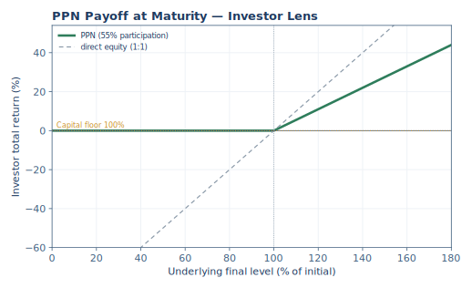

**Product:** 3-year PPN, $100,000 notional, 60% participation, European observation at maturity.

- **Market rises strongly (+25% over 3 years):** The investor receives $100,000 principal plus participation in the gain. At 60% participation: $100,000 + (60% × 25% × $100,000) = **$115,000**. The investor earns 15% — less than the full 25% market return, but with zero risk of loss.
- **Market rises modestly (+5% over 3 years):** The investor receives $100,000 + (60% × 5% × $100,000) = **$103,000**. A modest return, but still positive and still protected.
- **Market falls significantly (−35% over 3 years):** The investor receives the full **$100,000**. The protection worked. A direct stock investment would have been worth only $65,000.
- **Market falls and recovers (drops −40% in year 2, recovers to +10% by maturity):** The investor receives $100,000 + (60% × 10% × $100,000) = **$106,000**. Only the final level matters — the journey does not. This is a key feature: the PPN is not path-dependent.

**Risks to the investor**

| Risk | Description | Severity |
|------|------------|:--------:|
| **Opportunity cost** | If markets rise strongly, the investor captures only a fraction of the gain. A direct stock investment would have earned more. | Medium |
| **Issuer credit risk** | The principal guarantee is only as strong as the issuing bank. If the bank defaults, the investor may lose their principal despite the "guarantee." | Medium |
| **Inflation risk** | If the market is flat, the investor receives zero return. After inflation, the real value of their principal has decreased. | Medium |
| **Liquidity risk** | PPNs are difficult to sell before maturity. The secondary market is thin, and the investor may receive less than the fair value. | Medium |
| **Low-rate risk** | In a low interest rate environment, the zero-coupon bond is expensive, leaving very little option budget. Participation rates may be unattractive (e.g., 30-40%). | High |
| **No income** | PPNs typically pay no coupons during the life of the product. Investors who need regular income should consider other products. | Low |

#### §8. THE BANK LENS — Desk Economics (1st Line of Defence)

**What the desk books**

The desk's position is the mirror image of the investor's upside. Where the investor is long the embedded call, the desk is **short** that call (sold to the investor); alongside it the desk has issued a note, a funding liability, and holds a zero-coupon bond position that accretes to par to fund the 100% principal floor. The investor's participation in market gains is, to the desk, the cost of the call it has sold, funded out of the option budget left after the ZCB is purchased.

**Greeks & hedging**

The desk is short the embedded call and delta-hedges by buying the underlying as the market rises and selling as it falls. Because the embedded call is a plain vanilla European option with no barrier, the gamma is smooth and well-behaved — there is no discontinuity to spike hedging costs, so PPN positions are relatively simple to hedge compared with barrier products. The desk also carries vega (short, against the investor's long-vega call) and interest-rate exposure through the ZCB. Risk management monitors delta and vega as well as credit exposure to the issuer.

**How the bank makes money**

| Revenue Component | Detail |
|------------------|--------|
| **Structuring fee** | 1-2% embedded in note price at issuance |
| **Bid-offer spread** | Captures spread between option cost and implied participation rate |
| **Funding advantage** | Issues note at sub-LIBOR effective rate vs own funding curve |
| **Hedging P&L** | Earns from delta-hedging the embedded call (realized vs implied vol) |

**The construction decomposition (from [Section 2.2](#sec-2-2)):**

A PPN is built from two components: a zero-coupon bond that guarantees the principal, and a call option that provides the upside. The investor pays $100 (par). The bank uses most of that to buy a zero-coupon bond — if the 3-year risk-free rate is 4%, the present value of $100 in 3 years is approximately **$88.90**, so the bank pays $88.90 for the bond, which grows to $100 at maturity. The remaining $100 − $88.90 = **$11.10** is the "option budget." The bank deducts its margin (say **$1.50**), leaving **$9.60** to buy the call. If a 3-year ATM call costs $18.50, the $9.60 budget buys $9.60 / $18.50 ≈ **52%** of a call — and that 52% becomes the participation rate.

**PPN = Zero-coupon bond (guarantees $100) + ~52% × Call option (provides upside)**

| Flow | Amount |
|------|--------|
| Investor pays | $100.00 |
| Zero-coupon bond cost | -$88.90 |
| Bank margin | -$1.50 |
| Option budget remaining | $9.60 |
| Call option cost (full) | $18.50 |
| Participation rate | $9.60 / $18.50 = **~52%** |

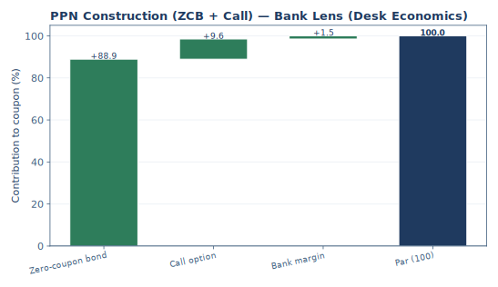

The participation rate is not arbitrary: it is determined by arithmetic. Whatever money is left after buying the zero-coupon bond (and paying the bank's margin) is spent on the call option. Higher interest rates mean a cheaper bond, more money for options, and higher participation; lower rates mean an expensive bond, less option budget, and lower participation. This is why PPNs are more attractive in high-rate environments.

**P&L drivers**

Day to day, desk P&L is driven by realized-versus-implied volatility on the delta hedge, moves in the underlying (delta/gamma on the short call), the level of rates (ZCB accretion and discounting), and the mark-to-market of the embedded call. Product Control attributes P&L between zero-coupon bond accretion and call-option MTM, and performs Independent Price Verification (IPV) of the call component.

#### §9. THE BANK LENS — Controls & Reconciliation (2nd Line of Defence)

**Booking & systems**

| Aspect | Detail |
|--------|--------|
| **Book of record** | NEMO |
| **Pricing/Risk system** | Sophis |
| **Booking structure** | Single trade: note (with embedded call option) |
| **Four-leg framework?** | No — PPNs are booked as a single note in NEMO |
| **Key booking fields** | Notional, strike (initial level), maturity, participation rate, underlying |
| **Coupon schedule** | None — all return at maturity |
| **Observation dates** | Single final observation date |

**Reconciliation points**

| Recon point | What must agree | PPN-specific break |
|-------------|-----------------|--------------------|
| **Participation rate** | Participation rate matches the termsheet across NEMO and Sophis | NEMO and Sophis show different participation rates → wrong redemption and wrong MTM |
| **Cap (if any)** | Any participation cap or maximum return is recorded identically in both systems | Cap present on termsheet but missing in one system → upside overstated |
| **ZCB / floor** | The zero-coupon bond accretion path and the 100% principal floor reconcile across systems | Floor accretion stale or mismatched → MTM and guaranteed redemption misstated |
| **Trade economics** | Notional, strike (initial level), maturity, underlying ID, and convention | Initial level stored as % in one system, absolute price in another |
| **Fixings** | Initial and final fixing **source** matches the termsheet | Different vendors report different closing prices on the final observation |
| **Issuer credit / CVA** | Credit valuation adjustment applied consistently across systems | Sophis P&L includes an issuer credit spread adjustment that NEMO does not |
| **P&L attribution** | ZCB accretion + call MTM reconciles to total | Unexplained P&L points to a stale vol surface or a wrong fixing |
| **Settlement** | Redemption = max(par, par × (1 + PR × index return)); cash settlement; delivery-versus-payment | Redemption miscalculated or settled as the wrong amount |

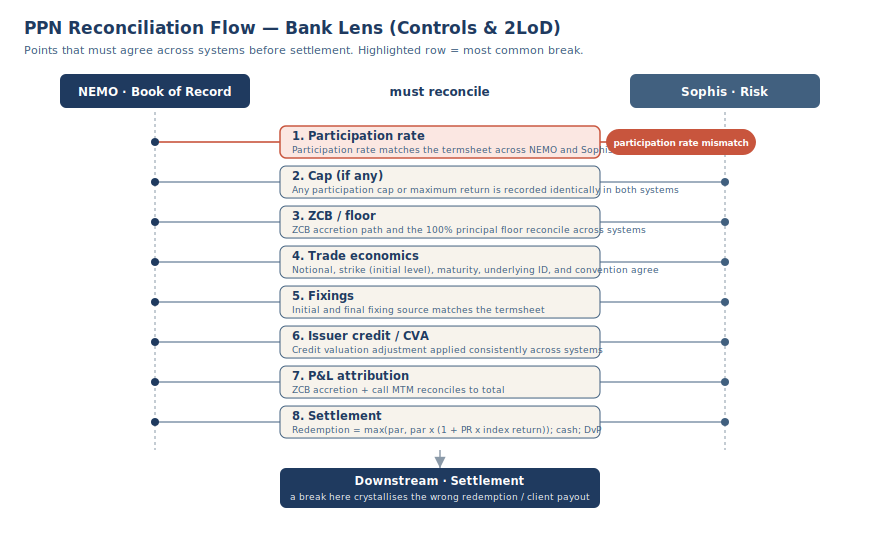

**Common breaks & red flags**

| Red Flag | What It Means | 2LoD Action |
|----------|---------------|-------------|
| Participation rate mismatch | NEMO and Sophis show different participation rates | Check termsheet; correct the system with the wrong value before relying on either valuation |
| Initial level discrepancy | NEMO records initial level as a percentage, Sophis as an absolute price | Standardize — confirm both systems use the same convention |
| Missing final observation | No closing price recorded on observation date | Contact market data team; use the fallback fixing source per termsheet |
| Redemption amount mismatch | Calculated redemption differs between systems | Recalculate manually using the formula; identify which system has the error |
| Issuer credit adjustment | Sophis P&L includes an issuer credit spread adjustment that NEMO does not | Ensure credit valuation adjustment (CVA) is applied consistently |

**Control implication**

Each break has a direct consequence the 2nd line must size before it reaches the books or the client. A participation-rate mismatch drives the wrong upside payout — the single field most likely to misstate a PPN redemption, since the entire return above par scales off it. A stale or mismatched ZCB/floor accretion misstates the guaranteed redemption and the daily mark simultaneously. And the floor itself is only as good as the issuer: the "100% protection" is the bank's promise, not a government guarantee, so a missing or inconsistent issuer credit adjustment (CVA) understates the true risk to the investor's principal. The reconciliation exists precisely to catch these inconsistencies before settlement crystallises them.

#### §10. Formal Definition

A **Principal Protected Note** is a structured product consisting of a zero-coupon bond and a call option on an underlying asset or index. At maturity, the investor receives:

**Redemption = Principal + Participation Rate × max(Final Level / Initial Level − 1, 0) × Principal**

Where:
- **Principal** = the investor's initial investment (100% guaranteed)
- **Participation Rate** = the percentage of market gains the investor receives (typically 50-80%)
- **Final Level** = the closing price of the underlying on the observation date
- **Initial Level** = the closing price of the underlying on the trade date

The participation rate is less than 100% because the cost of the principal protection (the zero-coupon bond) uses up part of the investment, leaving less capital available to buy the call option.

#### §11. Lifecycle

| Stage | Detail |
|-------|--------|
| **Trade date** | Terms agreed: index, maturity, participation rate. Pricing locks ZCB yield and option cost. Book in NEMO; set initial level |
| **Issue date** | Note issued. Investor pays par. Bank buys ZCB and call option |
| **Interim** | Mark-to-market driven by index level, rates, and vol. No coupons paid. Sophis reprices daily |
| **Final observation** | Underlying closing price recorded from the termsheet fixing source |
| **Maturity** | Payout = max(par, par × (1 + PR × index return)). Settlement T+2 |

#### §12. Worked Example (both lenses)

**Product:** 3-year PPN linked to the S&P 500. **Notional:** $1,000,000. **Participation rate:** 55%. **Initial S&P 500 level:** 5,000.

*Investor lens:*

**At maturity, the S&P 500 closes at 6,250 (+25%):**

Redemption = $1,000,000 + 55% × max(6,250/5,000 − 1, 0) × $1,000,000
Redemption = $1,000,000 + 55% × 25% × $1,000,000
Redemption = $1,000,000 + $137,500
**Redemption = $1,137,500**

Investor return: **+13.75%** over 3 years (~4.4% annualized). A direct S&P 500 investment would have returned 25%. The investor gave up 11.25% of return in exchange for complete downside protection.

**At maturity, the S&P 500 closes at 4,000 (−20%):**

Redemption = $1,000,000 + 55% × max(4,000/5,000 − 1, 0) × $1,000,000
Redemption = $1,000,000 + 55% × 0 × $1,000,000
**Redemption = $1,000,000**

Investor receives full principal. A direct S&P 500 investment would have lost $200,000.

*Bank lens:*
- In the first scenario the desk's short call finishes in the money: the desk owes the $137,500 participation amount, offset by the gains on its delta hedge accumulated as the index rose, plus its structuring margin. Product Control confirms the call MTM and the ZCB accretion (now at par) reconcile to the $1,137,500 redemption.
- In the second scenario the desk's short call expires worthless; the ZCB has accreted to par and funds the $1,000,000 principal floor in full. The desk keeps its structuring margin and net hedging P&L. The 2nd line confirms the redemption math (max of par and the participation formula), the participation rate, and that NEMO and Sophis agree before settlement.

#### §13. Knowledge Check

1. *(Investor)* **Explain how a PPN is constructed.** Walk through the decomposition step by step.
2. *(Investor)* **Why is the participation rate less than 100%?** What determines it?
3. *(Investor)* **How do interest rates affect PPN attractiveness?** Why are PPNs better in high-rate environments?
4. *(Investor)* **What is the main risk of a PPN for the investor?** (Hint: it is not market risk.)
5. *(Investor)* **A client says: "The bank guarantees my principal, so there is zero risk." Is this correct?** Explain.
6. *(Investor)* **Draw the payoff diagram of a PPN at maturity.**
7. *(Investor)* **If interest rates are 1% and a 3-year ATM call option costs $15, what is the approximate participation rate on a PPN? Show your work.**
8. **(Desk economics / 1LoD)** What position does the desk hold against the investor, and why is the desk's gamma smooth (rather than spiked) on a PPN? Where does the desk's structuring margin come from?
9. **(Controls / 2LoD)** Name three reconciliation breaks specific to a PPN and the consequence of each for the investor's redemption.

**Mental Models**

| Concept | Mental Model |
|---------|-------------|
| PPN | Seat belt in a sports car — protected in a crash, but restricted movement |
| Participation rate | Whatever is left after buying the safety net |
| Zero-coupon bond | The safety net — grows to $100 by maturity |
| Call option | The market ticket — gives upside exposure |
| Interest rates & PPNs | Higher rates = cheaper safety net = more money for the market ticket |
| Issuer credit risk | The guarantee is only as good as the guarantor |
| 2LoD reconciliation | The building inspector — confirms participation rate, floor, and redemption math agree across systems before anyone pays out |

**Key Takeaways**

1. A PPN guarantees 100% principal return at maturity. The worst case is zero return, never a loss.
2. The product is constructed from a zero-coupon bond (protection) and a call option (participation). The investor is long the call; the desk holds the offsetting short-call position.
3. The participation rate is determined by arithmetic: money left after the bond and margin pay for a fraction of a call option.
4. Higher interest rates make PPNs more attractive because the zero-coupon bond is cheaper.
5. The principal "guarantee" is subject to issuer credit risk — if the bank defaults, the guarantee fails. The floor is only as good as the issuer.
6. PPNs pay no coupons during the life of the product. All return comes at maturity.
7. PPNs are long volatility for the investor — the investor benefits from higher volatility, because it makes the embedded call more valuable. This is unusual: most structured products (like Reverse Convertibles) are short volatility.
8. For the 2nd line, the dominant control risks are the participation rate, any cap, the ZCB/floor accretion, fixings, and consistent issuer credit (CVA) treatment — each can misstate the redemption.

#### §14. Common Mistakes

1. **Thinking "protected" means "risk-free."** The principal is guaranteed by the issuing bank, not by a government. If the bank defaults (as Lehman Brothers did in 2008), the protection fails.
2. **Ignoring the opportunity cost.** In a strong bull market, a PPN returns significantly less than a direct stock investment. The protection has a real cost.
3. **Expecting income.** PPNs pay no coupons. Investors who need regular income should consider yield-generating products like Reverse Convertibles or Phoenix Autocallables.
4. **Ignoring the interest rate environment.** When rates are very low, the zero-coupon bond is expensive, leaving minimal option budget. A PPN with 30% participation is rarely attractive.
5. **Confusing participation in gains with participation in the market.** If the market rises 20% and participation is 55%, the investor earns 11% — not 20%.
6. **(Controls) Trusting a single system's participation rate or floor.** Because the participation rate drives the entire upside and the ZCB accretion drives the floor, the 2nd line must reconcile both across NEMO and Sophis rather than assume they agree — and confirm the issuer credit (CVA) is applied consistently, since the floor is only as good as the issuer.
### Knowledge Check

**Review Questions:**
1. What two components make up a PPN? What is the purpose of each?
2. Why is the participation rate on a PPN always less than 100%?
3. How do interest rates affect the attractiveness of a PPN?
4. What is the main risk that the "principal guarantee" does not protect against?
5. Why is a PPN described as a "long volatility" product?


**Dual-lens questions:**
- *(Desk economics / 1LoD)* What position does the desk hold against the investor, and what is its primary Greek / hedging risk?
- *(Controls / 2LoD)* Which booking and risk-system fields must reconcile for this product, and which is the most common break?
**Scenario Questions:**
1. Interest rates fall from 4% to 1%. How does this affect the PPN's participation rate, and why?
2. A client invested $500,000 in a 5-year PPN with 60% participation. At maturity, the underlying index is down 15%. What does the client receive? What would they have received from a direct index investment?
3. Two banks offer PPNs on the same underlying with the same maturity. Bank A offers 55% participation. Bank B offers 65% participation. What might explain the difference?

**Desk Question:**
A client says: "PPNs seem like free money — I get protected downside and participate in the upside. Why doesn't everyone just buy PPNs?" Explain the tradeoffs, including opportunity cost, participation rate mechanics, issuer risk, and the interest rate environment.

### Visual Learning Recommendations

1. **Payoff diagram** — PPN vs direct stock investment at maturity (side by side)
2. **Construction waterfall** — $100 → zero-coupon bond cost → margin → option budget → participation rate
3. **Interest rate sensitivity chart** — Participation rate vs prevailing interest rate (showing why higher rates = better PPNs)
4. **Timeline** — 3-year PPN lifecycle: trade date → (no events) → final observation → maturity/settlement
5. **Comparison table** — PPN vs bond vs stock: risk, return, protection, income

### Dependency References

| Concept Used | Where It Was Taught |
|-------------|-------------------|
| Zero-coupon bond, present value, discounting | [Section 0.6](#sec-0-6) (Time Value of Money) |
| Call option, premium, strike | [Section 1.2](#sec-1-2) (Options From Zero) |
| Option value, intrinsic vs time value | [Section 1.2](#sec-1-2) (Options From Zero) |
| Delta, Vega | [Section 1.4](#sec-1-4) (Greeks) |
| Product decomposition, Funds Transfer Pricing (FTP), margin | [Section 2.2](#sec-2-2) (Product Construction) |
| Capital protection spectrum | [Section 2.4](#sec-2-4) (Capital Protection Spectrum) |
| NEMO/Sophis booking | [Section 2.8](#sec-2-8) (Systems Primer) |

---


#### Visual Specifications

**Visual 1: Payoff at Maturity vs Index Return**
- **Asset filename:** payoff_ppn_participation_01.svg
- **Caption:** "Payoff at Maturity vs Index Return"
- **Diagram elements:** X-axis: index return (-40% to +60%). Y-axis: investor payout. Flat line at par for negative returns. Upward-sloping line above par at participation rate slope. Dashed line shows unprotected equity for comparison
- **Reuse status:** Adapt from standard payoff template
**Visual 2: PPN Construction: ZCB + Call Option**
- **Asset filename:** construction_ppn_zcb_call_02.svg
- **Caption:** "PPN Construction: ZCB + Call Option"
- **Diagram elements:** Stacked bar: ZCB component (e.g., 85% of notional) + call option premium (e.g., 15%). Arrow showing how ZCB accretes to par at maturity. Separate box showing call option payoff
- **Reuse status:** Adapt from product construction template
**Visual 3: PPN Lifecycle: Issue to Maturity**
- **Asset filename:** lifecycle_ppn_timeline_03.svg
- **Caption:** "PPN Lifecycle: Issue to Maturity"
- **Diagram elements:** Horizontal timeline from issue to maturity (3-5 years). Mark: issue date, interim MTM observations, maturity fixing, settlement. Show ZCB accretion path below
- **Reuse status:** Adapt from lifecycle template
**Visual 4: PPN Risk Heatmap**
- **Asset filename:** risk_ppn_heatmap_04.svg
- **Caption:** "PPN Risk Heatmap"
- **Diagram elements:** Grid: risk types (market, credit, liquidity, operational) vs severity (low/med/high). Colour-coded cells. Market risk LOW (protected), Credit risk MEDIUM (issuer), Liquidity risk MEDIUM
- **Reuse status:** Adapt from risk heatmap template
**Visual 5: PPN vs Direct Equity vs Deposit**
- **Asset filename:** comparison_ppn_vs_equity_05.svg
- **Caption:** "PPN vs Direct Equity vs Deposit"
- **Diagram elements:** Three-column comparison showing payoff profiles across scenarios (-30%, flat, +20%, +40%). Highlight where PPN wins (downside) and loses (upside cap)
- **Reuse status:** New — comparison panel
**Visual 6: PPN Suitability Decision Tree**
- **Asset filename:** decision_ppn_suitability_06.svg
- **Caption:** "PPN Suitability Decision Tree"
- **Diagram elements:** Decision tree: Can client tolerate principal loss? NO → PPN candidate. Does client need current income? YES → consider coupon-bearing alternative. Does client want full upside? YES → PPN may not suit
- **Reuse status:** Adapt from decision tree template


**Dual-lens visuals (generated):**
- `assets/ppn/controls_ppn_recon_08.svg` `[generated]`
- `assets/ppn/payoff_ppn_01.svg` `[generated]`
- `assets/ppn/waterfall_ppn_09.svg` `[generated]`
#### Dependency References

| Concept Used | Where It Was Taught |
|-------------|-------------------|
| Zero-coupon bond mechanics | [Section 1.1](#sec-1-1) (Bond Foundations) |
| European call option pricing | [Section 1.2](#sec-1-2) (Options From Zero) |
| Participation rate calculation | [Section 2.2](#sec-2-2) (Product Construction) |
| Equity index mechanics | [Section 1.4](#sec-1-4) (Equity Essentials) |
| Issuer credit risk | [Section 1.9](#sec-1-9) (Credit Risk) |
| Enhanced PPN with barrier | Shark Fin (5.6.9) |
| Capital protection via deposit wrapper | Structured Deposit (5.6.1) |
### 5.1.2 Reverse Convertible (Enhanced Return Note) {#sec-5-1-2}

> **Prerequisites:** [PPN](#sec-5-1-1) &nbsp;|&nbsp; **Key concepts:** Short put, yield enhancement, conditional capital return

---

*The PPN ([Section 5.1.1](#sec-5-1-1)) protected 100% of the investor's principal. The Reverse Convertible removes that guarantee — the investor accepts full downside equity exposure below a barrier in exchange for a significantly higher coupon. This is the fundamental tradeoff at the heart of most ELNs: more yield for less protection. This chapter reads the product through two lenses: what it means for **the investor**, and what it means for **the bank** — the latter split into the desk's market economics (1st line of defence) and the controls and reconciliation that surround it (2nd line of defence).*

#### §1. Explain Like I'm New

A bank advisor offers a client two choices: a 3-year bond paying 2% per year, or a structured product paying 8% per year for the same 3 years. The natural question is: where does the extra 6% come from?

The answer is that the extra income is payment for taking on a specific risk. In a **Reverse Convertible**, the investor does two things at once: lends money to the bank (like a bond) and sells the bank a put option on a stock or index. The premium the bank pays for that put option is added to the bond coupon, creating the enhanced yield.

The tradeoff: if the stock falls below a certain level (the **capital barrier**, also called the knock-in barrier), the investor may lose part of their principal at maturity. If the stock stays above the barrier for the life of the product, the investor keeps full principal plus all the enhanced coupons. In effect, the investor is paid to accept a specific, bounded risk — a generous coupon as long as the stock does not crash through the barrier, and a potentially large loss if it does.

#### §2. Real-World Analogy

A Reverse Convertible is like a homeowner selling earthquake insurance on their own house.

The homeowner lives in a region that occasionally has earthquakes. An insurer offers $5,000 per year if the homeowner agrees to cover any earthquake damage themselves — no payout if a quake hits. In most years there is no earthquake and the homeowner pockets the $5,000; over five years that is $25,000 of extra income. But if a major earthquake strikes, the homeowner bears the full repair cost — $100,000 or more.

The $5,000 is the enhanced coupon. The earthquake is the barrier breach. The repair cost is the principal loss. As with real insurance, the premium reflects the probability and severity of the event: higher risk (lower barrier, more volatile stock) means a higher coupon; lower risk means a lower coupon. In this analogy the investor is the insurer — collecting premium and bearing the tail — while the bank is the policyholder, paying premium to be protected.

#### §3. What Problem Does This Solve?

Reverse Convertibles solve the **yield starvation** problem.

When interest rates are low, bonds pay very little — sometimes 1-2% per year. Many investors need higher income: pension funds paying retirees, insurance companies meeting policyholder obligations, or individuals seeking retirement income.

These investors are often willing to accept some risk of loss — they just do not want unlimited stock market exposure. A Reverse Convertible offers a middle path: higher income than bonds, with a defined level of downside protection (the barrier acts as a cushion).

| Investor Need | Why Bonds Fail | What the RC Offers |
|--------------|---------------|-------------------|
| 6%+ income per year | Bonds pay 2% | Enhanced coupon funded by put premium |
| Some protection | Stocks can fall 50%+ | Barrier at 60-70% — investor is protected unless stock falls more than 30-40% |
| Certainty of income | Stock dividends vary | Fixed coupon paid regardless of market (as long as not knocked in at maturity) |

#### §4. Product DNA

| Field | Value |
|-------|-------|
| **Full Name** | Reverse Convertible |
| **Abbreviation** | RC |
| **Family** | Equity-Linked Notes |
| **Complexity Score** | 3 / 10 |
| **Complexity Rationale** | Enhanced yield note with embedded short put. Single barrier, single underlying, conditional principal return |
| **Underlying Asset Class** | Equity (single stock or index) |
| **Capital Protection** | Conditional (protected above put strike) |
| **Coupon Type** | Fixed coupon (above-market) |
| **Maturity** | 6-18 months typically |
| **Liquidity** | Secondary market |
| **Primary System** | Murex |
| **ISDA Required** | No — issued as note |

**DNA Atlas Fields:**
- Primary Risk: Underlying falling below put strike — investor receives depreciated shares instead of cash. Full equity downside below strike
- Typical Buyer: Yield-seeking investors with moderate bullish view on underlying. Private banking clients, high-net-worth individuals
- Typical Use Case: Yield enhancement when investor is willing to buy underlying at a discount (put strike) if market falls
- Building Blocks: Fixed-rate note (coupon payments) + short put option (sold by investor to bank)
- Key Hedge: Long put option (delta-hedged), fixed-rate bond hedge
- Similar Products: DRC (5.1.4 — discounted variant), KODRC (5.1.5 — knock-out barrier), Phoenix (5.1.3 — autocallable with memory coupon)
- Most Important Greek: Delta (put sensitivity to underlying price)

**Comparison Matrix Fields:**
- Complexity: 3
- Yield Potential: High (above-market fixed coupon funded by put premium)
- Capital Protection: Conditional (principal at risk below put strike)
- Credit Exposure: Issuer (note format)
- Liquidity: Secondary market
- Path Dependency: No (European put, maturity observation only)
- Volatility Sensitivity: Short vega (investor sold put)
- Correlation Sensitivity: None (single underlying)
- Client Type: Private banking / High-net-worth
- Market Environment: Best when mildly bullish or neutral. Poor in sharp declines (full downside below strike)

#### §5. Who Touches This Product

| Role | Responsibility |
|------|---------------|
| **Structurer** | Sets coupon level based on put premium, strike distance, and maturity. Selects underlying |
| **Trader** | Delta-hedges the short put. Manages gamma risk near strike at maturity |
| **Sales** | Explains yield-for-risk trade-off. Ensures client understands physical delivery risk |
| **Risk Management** | Monitors potential share delivery exposure. Tracks put Greeks as maturity approaches |
| **Product Control** | P&L attribution between fixed coupon accrual and put option MTM. Independent Price Verification (IPV) of put component |
| **Operations** | Processes coupon payments. Handles share delivery if put is in-the-money at maturity |
| **Legal / Compliance** | Ensures client understands they may receive shares worth less than investment. Suitability review |
| **Quantitative Analytics** | Prices embedded put option. Calculates fair coupon for given strike and maturity |

#### §6. Product Evolution

| Stage | Product | What Was Added | Why |
|:-----:|---------|---------------|-----|
| 1 | Corporate bond | — (baseline) | Fixed coupon, full principal return, credit risk only |
| 2 | Reverse Convertible | Short put option embedded | Higher coupon funded by put premium. Principal at risk if underlying falls below strike |
| 3 | DRC / KODRC variants | Discount + barrier features | Lower entry price (DRC) or barrier protection (KODRC) added to base RC structure |

---

#### §7. THE INVESTOR LENS

**Why the investor buys it**

1. **Enhanced yield.** The coupon is significantly higher than comparable bonds — typically 6-12% vs 2-3% on bonds.
2. **Defined risk.** The investor knows exactly when they face loss: only if the stock falls below the barrier. This is clearer than open-ended stock market risk.
3. **View expression.** An investor who believes a stock will not fall more than 30% in the next year can monetize that view by selling the put and earning the premium.
4. **Diversification of income sources.** The coupon comes from option premium, not just interest — a different source of return.
5. **Behavioral fit.** Many investors prefer a high, visible coupon even if the theoretical expected return is similar to a direct stock investment. The coupon feels like "income," which is psychologically reassuring.

**Position taken**

The investor simultaneously holds a long bond (lends principal to the issuer) and a **short** knock-in put (sold to the bank). Net, the investor is **short volatility** (hurt by volatile markets) and carries full equity downside below the strike. With a single underlying there is no correlation exposure; on a worst-of basket the investor is additionally long correlation (see the worst-of products).

**Payoff & scenarios**

The investor's payoff has two zones. Above the barrier at maturity: the investor receives 100% principal plus coupon (return = coupon rate). Below the barrier at maturity: the investor receives (Final / Initial) × principal plus coupon — the further below the barrier, the larger the loss. The payoff is **discontinuous** at the barrier: a stock finishing at 70.01% returns full principal, while 69.99% triggers knock-in and reduces principal.


**Product:** 1-year RC, $100,000 notional, 8% coupon, stock initial price $100, knock-in barrier at $70 (70%), European observation.

- **Stock finishes at $110 (+10%):** Barrier not breached. The investor receives $100,000 principal + $8,000 coupon = **$108,000**. Excellent outcome.
- **Stock drops to $75 during the year but finishes at $85:** European barrier — only checked at maturity. The stock is above $70 at maturity, so the barrier is not breached. The investor receives $100,000 + $8,000 = **$108,000**. The mid-life drop to $75 does not matter.
- **Stock finishes at $65 (−35%):** Below the $70 barrier at maturity. Knock-in is triggered. The investor's principal is reduced by the full stock decline: redemption = $100,000 × ($65 / $100) = $65,000, plus the $8,000 coupon already paid. **Total received: $73,000.** Net loss: $27,000. The coupon cushioned the blow but did not prevent a significant loss.
- **Stock finishes at $30 (−70%):** Catastrophic decline. Barrier breached. Redemption = $100,000 × ($30 / $100) = $30,000 + $8,000 coupon = **$38,000**. Net loss: $62,000. The 8% coupon is small comfort against a 70% crash — this is the tail risk the investor is compensated for.

**Risks to the investor**

| Risk | Description | Severity |
|------|------------|:--------:|
| **Barrier breach (capital risk)** | If the underlying falls below the barrier, the investor loses principal in proportion to the stock's decline. Losses can be very large. | High |
| **Gap risk** | The stock may jump past the barrier (e.g. overnight after bad earnings) without trading through it, making the breach sudden and unhedgeable. | High |
| **Issuer credit risk** | The investor is exposed to the bank's creditworthiness. If the issuer defaults, the investor may not receive coupons or principal. | Medium |
| **Illiquidity** | Selling an RC before maturity typically involves a wide bid-offer spread and potential loss, even if the underlying has performed well. | Medium |
| **Correlation risk (worst-of)** | If the RC is linked to a basket (worst-of), low correlation between stocks increases the probability that at least one stock breaches the barrier. | Medium-High |
| **Tail risk** | Enhanced coupons create a pattern of frequent small gains and rare large losses. This pattern is psychologically deceptive — the investor feels successful until a tail event occurs. | High |

#### §8. THE BANK LENS — Desk Economics (1st Line of Defence)

**What the desk books**

The desk's position is the mirror image of the investor's. Where the investor is short the knock-in put, the desk is **long** that put (bought from the investor); alongside it the desk has issued a note, which is a funding liability. The investor's enhanced coupon is, to the desk, the cost of the put premium plus funding, returned to the client.

**Greeks & hedging**

The desk is long the embedded knock-in put and delta-hedges by trading the underlying. Because the payoff is discontinuous at the barrier, the option's gamma spikes as the underlying approaches the barrier and hedging becomes expensive and error-prone — this is where the desk's structuring margin is earned or lost. The desk monitors delta and gamma closely as maturity and the barrier approach; risk management may impose limits on concentrated barrier exposure.


**How the bank makes money**

| Revenue Component | Detail |
|------------------|--------|
| **Structuring fee** | Embedded in spread between option premium received and coupon paid |
| **Bid-offer on put** | Captures spread on embedded put option |
| **Hedging P&L** | Delta-hedging profits from realized vs implied vol spread |
| **Funding benefit** | Effective funding below bank's unsecured rate |

**The coupon decomposition (from [Section 2.2](#sec-2-2)):**

Coupon = Bond interest + Put premium − Funds Transfer Pricing (FTP) − Desk margin

For an 8% coupon: bond interest (bank's credit curve) ~2.0%; put premium (value of the KI put sold) ~7.5%; FTP (internal funding cost) −0.5%; desk margin −1.0%; **net coupon 8.0%**. The 7.5% put premium is the key — it is high because the investor is selling a meaningful option: the right for the bank to "put" devalued shares to the investor if the stock falls below the barrier.


**P&L drivers**

Day to day, desk P&L is driven by realized-versus-implied volatility on the delta hedge, moves in the underlying near the barrier (gamma), funding, and the mark-to-market of the embedded put. Product Control attributes P&L between fixed-coupon accrual and put-option MTM, and performs Independent Price Verification (IPV) of the put component.

#### §9. THE BANK LENS — Controls & Reconciliation (2nd Line of Defence)

**Booking & systems**

| Aspect | Detail |
|--------|--------|
| **Book of record** | NEMO |
| **Pricing/Risk system** | Sophis |
| **Booking structure** | Single note with embedded KI put option |
| **Four-leg framework?** | No |
| **Key booking fields** | Notional, strike (initial level), barrier level, barrier type (European/American), coupon rate, coupon frequency, maturity, underlying(s) |
| **Coupon schedule** | Fixed payments on scheduled dates (e.g. quarterly) |
| **Barrier monitoring** | European: single check at maturity. American: continuous monitoring via market data feed |

**Reconciliation points**

| Recon point | What must agree | RC-specific break |
|-------------|-----------------|-------------------|
| **Trade economics** | Notional, strike (initial level), barrier level **and convention**, coupon rate & frequency, maturity, underlying ID | Barrier stored as absolute price in NEMO ($70) but % in Sophis (70%) — consistent only if the initial level is exactly $100 |
| **Observation type** | European (maturity-only) vs American (continuous) | American barrier flagged but only daily closes monitored → intraday breaches missed |
| **Fixings** | Initial and final fixing **source** matches the termsheet | Different vendors report different closing prices on the final observation |
| **Barrier event capture** | Knock-in flag consistent across NEMO and Sophis | Trade knocked in on an intraday touch but the flag is not set → redemption miscalculated |
| **Coupon lifecycle** | Schedule, day-count, whether the coupon survives a knock-in | Coupon paid on a knocked-in trade where the termsheet says it should stop |
| **Corporate actions** | Strike/barrier adjusted for dividends, splits, mergers | Underlying split not propagated → barrier off by the split ratio |
| **P&L attribution** | Coupon accrual + put MTM reconciles to total | Unexplained P&L points to a stale vol surface or a wrong fixing |
| **Settlement** | Cash vs physical; shares = notional / strike; delivery-versus-payment | Physical delivery booked as cash, or the wrong share count delivered |


**Common breaks & red flags**

| Red Flag | What It Means | 2LoD Action |
|----------|---------------|-------------|
| Barrier stored as absolute price in one system, percentage in another | NEMO: barrier = $70. Sophis: barrier = 70%. Consistent only if initial level is $100. | Verify both systems use the same convention before relying on either valuation |
| Coupon paid on a knocked-in trade | Some RCs pay coupons regardless of knock-in, some stop. | Verify the coupon convention against the termsheet |
| American barrier flagged but no intraday monitoring | Daily-close checks miss intraday breaches | Ensure real-time or intraday monitoring is in place |
| Final observation price mismatch | Different data sources report different closing prices | Use the fixing source specified in the termsheet |
| Physical settlement confusion | Some RCs deliver shares rather than cash if knocked in | Confirm the settlement convention — cash or physical |

**Control implication**

Each break has a direct consequence the 2nd line must size before it reaches the books or the client. A barrier-convention error misstates whether the investor breached — driving the wrong redemption and the wrong client payout. A missed knock-in understates desk risk and overstates the investor's protection simultaneously. A fixing mismatch breaks both valuation and redemption at once. The reconciliation exists precisely to catch these inconsistencies before settlement crystallises them.

#### §10. Formal Definition

A **Reverse Convertible** (also called an Enhanced Return Note) is a structured product consisting of a bond plus a short knock-in put option. At maturity:

- If the underlying price has **not** breached the knock-in barrier: **Redemption = 100% of Principal**
- If the underlying price **has** breached the knock-in barrier: **Redemption = Principal × (Final Level / Initial Level)**

The investor also receives periodic fixed coupon payments throughout the life of the product, regardless of barrier breach.

**Key parameters:** coupon — fixed, paid periodically (quarterly, semi-annually, or annually); barrier — typically 60-80% of initial level; barrier observation — European (checked only at maturity) or American (checked continuously); underlying — single stock, stock index, or worst-of basket; maturity — typically 1-3 years.

#### §11. Lifecycle

| Stage | Detail |
|-------|--------|
| **Trade date** | Terms agreed: underlying, strike (= initial level, 100%), coupon, maturity. Book in NEMO; set initial level, barrier, coupon schedule |
| **Issue date** | Note issued at par. The investor sells the put protection to the bank. Coupon schedule begins |
| **Coupon dates** | Fixed coupons paid (e.g. quarterly), guaranteed regardless of underlying performance (subject to termsheet convention on knock-in) |
| **Barrier monitoring (American)** | Daily check — has the underlying touched the barrier? If yes, flag the trade as "knocked in" |
| **Final observation** | Record the closing price from the termsheet fixing source. Determine whether the barrier is breached (European) or was breached (American) |
| **Maturity** | If underlying ≥ strike: the investor receives par. If underlying < strike: the investor receives shares at the strike price (worth less than par). Settle |

#### §12. Worked Example (both lenses)

**Product:** 1-year RC on Toyota stock. **Notional:** $500,000. **Coupon:** 9% annual, paid quarterly (2.25% per quarter). **Initial stock price:** $180. **Knock-in barrier:** 65% = $117 (European observation). **Maturity:** 1 year.

**Quarterly coupon payments:** $500,000 × 2.25% = $11,250 per quarter = $45,000 total.

*Investor lens:*
- **Toyota closes at $155 (−13.9%):** above the barrier ($117). No knock-in. The investor receives $500,000 principal + $45,000 total coupons = **$545,000**. Net return: +9%.
- **Toyota closes at $100 (−44.4%):** below the barrier ($117). Knock-in triggered. Redemption = $500,000 × ($100/$180) = **$277,778**, plus $45,000 in coupons already received. Total: **$322,778**. Net loss: **$177,222** (−35.4%). The 9% coupon was overwhelmed by the capital loss.

*Bank lens:*
- In the first scenario the desk's long put expires worthless; the desk keeps its structuring margin and net hedging P&L, having funded the $45,000 of coupons. Product Control confirms the put MTM rolls to zero and the coupon accrual closes out.
- In the second scenario the desk's long put is deep in the money: the investor delivers value equal to the shortfall (physical shares worth $277,778 against $500,000 notional), offsetting the desk's redemption obligation. The 2nd line must confirm the redemption math (notional × final/initial), the share count (notional / strike), and that NEMO and Sophis agree before settlement.

#### §13. Knowledge Check

1. **What is the investor really doing when they buy a Reverse Convertible?** (Answer: lending money and selling a put option.)
2. **Where does the enhanced coupon come from?** Decompose it.
3. **What is the difference between a European and American barrier on an RC, and which is riskier for the investor?**
4. **A client says: "I bought an RC with a 70% barrier, so my maximum loss is 30%." Is this correct?** Explain.
5. **Why does higher volatility result in higher RC coupons?**
6. **What is gap risk, and why is it particularly dangerous for Reverse Convertibles?**
7. **Draw the payoff diagram of a Reverse Convertible at maturity, showing both the knocked-in and non-knocked-in outcomes.**
8. **(Controls / 2LoD)** Name three reconciliation breaks specific to an RC and the consequence of each for the investor's redemption.
9. **(Desk economics / 1LoD)** What position does the desk hold against the investor, and how does the desk's gamma behave as the underlying approaches the barrier? Why is that where the margin is made or lost?

**Mental Models**

| Concept | Mental Model |
|---------|-------------|
| Reverse Convertible | A homeowner selling earthquake insurance on their house — they earn premiums, but pay dearly if the earthquake hits |
| Enhanced coupon | Not free money — it is the price the bank pays the investor for bearing barrier risk |
| Barrier | The earthquake threshold — the level at which the insurance kicks in (against the investor) |
| European vs American barrier | Annual earthquake check (European) vs 24/7 seismic monitoring (American) |
| Knock-in | The earthquake hits — the investor's insurance obligation is triggered |
| Coupon vs capital loss | The coupon is the investor's annual premium income; the capital loss is the earthquake repair bill |
| 2LoD reconciliation | The building inspector — confirms the contract terms and the damage assessment match before anyone pays out |

**Key Takeaways**

1. An RC is a bond + a short knock-in put. The investor earns an enhanced coupon by selling downside risk to the bank.
2. The coupon is not free — it is the premium for the put option the investor has sold to the bank.
3. If the barrier is not breached, the investor keeps full principal plus coupons. If breached, principal is reduced by the full stock decline.
4. American barriers are riskier than European barriers for the investor — more chances for the barrier to be hit.
5. The payoff is discontinuous at the barrier — a small price difference can mean full principal or significant loss.
6. Tail risk is the dominant risk: frequent small gains (coupons) masked by rare large losses (barrier breach).
7. RCs are short volatility products for the investor — the investor benefits from calm markets and is hurt by volatile ones; the desk holds the offsetting long-put position.
8. For the 2nd line, the dominant control risks are barrier convention, observation type, fixings, and knock-in capture — each can misstate the redemption.

#### §14. Common Mistakes

1. **"My maximum loss is 30% because the barrier is at 70%."** Wrong. The barrier determines *when* losses start, not *how much*. If the stock falls to 20%, the investor loses 80% of principal — far more than 30%.
2. **Focusing on the coupon and ignoring the put.** The coupon is attractive, but the investor is selling insurance. The premium should be compared to the risk, not evaluated in isolation.
3. **Comparing RC coupons across different underlyings without adjusting for risk.** A 12% coupon on a volatile tech stock is not "better" than a 7% coupon on a stable utility — the higher coupon reflects higher risk.
4. **Ignoring the barrier observation type.** American barriers are breached far more often than European barriers because any intraday touch counts. The coupon difference may not adequately compensate for the risk difference.
5. **Assuming the stock will "recover."** With an American barrier, once knock-in has occurred, recovery does not undo it.
6. **(Controls) Trusting a single system's barrier value.** Because the barrier can be stored as a percentage or an absolute price, the 2nd line must reconcile the convention across NEMO and Sophis rather than assume they agree.

### Knowledge Check

**Review Questions:**
1. *(Investor)* What two financial instruments make up a Reverse Convertible?
2. *(Investor)* Why is the RC coupon higher than a bond coupon? Where does the extra yield come from?
3. *(Investor)* What is the difference between a European and American knock-in barrier?
4. *(Investor)* What happens to the investor's principal if the barrier is breached at maturity?
5. *(Investor)* Why are RCs described as "short volatility" products?
6. *(Desk economics / 1LoD)* The investor is short the put; what is the desk, and which way does the desk's vega and gamma point? Where does the desk's structuring margin come from?
7. *(Controls / 2LoD)* Which booking fields must reconcile between NEMO and Sophis for an RC, and which single field most often differs by convention?


**Dual-lens questions:**
- *(Desk economics / 1LoD)* What does the desk book against the investor (it is long the embedded put), and how does gamma near the barrier drive the hedging cost?
- *(Controls / 2LoD)* Which booking / fixing / barrier-event fields must reconcile across NEMO and Sophis, and which is the most common break?
**Scenario Questions:**
1. An investor holds a 1-year RC with a 65% American barrier. The stock drops to 64% on Day 100 but recovers to 90% by maturity. What is the investor's redemption? Would the answer change if the barrier were European?
2. Implied volatility on a stock increases from 25% to 40%. How does this affect the value of the embedded put, and what happens to the RC's mark-to-market value for the investor?
3. A Product Control analyst notices that NEMO records the barrier as 65% but Sophis records it as $65. The initial stock price was $100. Is there a problem?

**Desk Question:**
A junior structurer proposes an RC with a 50% barrier on a volatile tech stock, paying a 15% coupon. The barrier has a 25% probability of being breached. Should the desk approve this product? Discuss from both the client suitability and desk risk perspectives.

### Visual Learning Recommendations

*Investor lens:*
1. **Payoff diagram** — RC at maturity showing the discontinuity at the barrier
2. **Coupon decomposition waterfall** — Bond interest + put premium - FTP - margin = coupon
4. **European vs American barrier comparison** — Same stock path, different outcomes depending on barrier type
5. **Risk-return scatter** — RC vs bond vs stock, plotting expected return against maximum loss

*Bank lens — desk economics (1LoD):*
3. **Desk position & hedge map** — The desk is long the KI put; show the delta hedge in the underlying and the gamma profile spiking near the barrier
6. **Barrier proximity timeline** — Stock price path showing approach to barrier, with desk Gamma/Delta annotations

*Bank lens — controls & reconciliation (2LoD):*
7. **RC reconciliation flow** — Trade economics flowing NEMO ↔ Sophis ↔ downstream, highlighting the eight recon points (trade economics, observation type, fixings, knock-in capture, coupon lifecycle, corporate actions, P&L attribution, settlement) and where each break surfaces

### Dependency References

| Concept Used | Where It Was Taught |
|-------------|-------------------|
| Put option, knock-in | [Section 1.2](#sec-1-2) (Options), [Section 1.3](#sec-1-3) (Barriers) |
| Capital barrier, coupon barrier, autocall barrier | [Section 1.3](#sec-1-3) (Barrier Terminology Note) |
| Delta, Gamma, Vega | [Section 1.4](#sec-1-4) (Greeks) |
| Implied volatility, short Vega | [Section 1.5](#sec-1-5) (Volatility) |
| Product decomposition, coupon formula | [Section 2.2](#sec-2-2) (Product Construction) |
| Conditional capital protection | [Section 2.4](#sec-2-4) (Capital Protection Spectrum) |
| NEMO/Sophis booking | [Section 2.8](#sec-2-8) (Systems Primer) |

---


#### Visual Specifications

**Visual 1: RC Payoff at Maturity**
- **Asset filename:** payoff_rc_put_01.svg
- **Caption:** "RC Payoff at Maturity"
- **Diagram elements:** X-axis: underlying price at maturity. Y-axis: total return (coupon + principal). Flat at par + coupon above strike. Declining below strike (share delivery loss minus coupon). Show strike level clearly
- **Reuse status:** Adapt from payoff template
- **Production status:** `[generated — assets/rc/payoff_rc_put_01.svg]`
**Visual 2: RC Construction: Note + Short Put**
- **Asset filename:** construction_rc_note_put_02.svg
- **Caption:** "RC Construction: Note + Short Put"
- **Diagram elements:** Two components: fixed-rate note (coupon stream) + short put option (premium funds above-market coupon). Show premium flow from put to coupon enhancement
- **Reuse status:** Adapt from construction template
**Visual 3: RC Lifecycle: Issue to Maturity**
- **Asset filename:** lifecycle_rc_timeline_03.svg
- **Caption:** "RC Lifecycle: Issue to Maturity"
- **Diagram elements:** Timeline showing coupon dates, maturity observation, and two outcomes (cash settlement vs share delivery). Mark strike level on underlying price path
- **Reuse status:** Adapt from lifecycle template
**Visual 4: RC Risk Heatmap**
- **Asset filename:** risk_rc_heatmap_04.svg
- **Caption:** "RC Risk Heatmap"
- **Diagram elements:** Risk grid: market risk HIGH (short put), credit risk MEDIUM (issuer), liquidity risk MEDIUM, operational risk LOW. Highlight share delivery as key operational risk
- **Reuse status:** Adapt from risk heatmap template
**Visual 5: RC vs Corporate Bond vs Direct Equity**
- **Asset filename:** comparison_rc_vs_bond_05.svg
- **Caption:** "RC vs Corporate Bond vs Direct Equity"
- **Diagram elements:** Three-column comparison: yield, capital risk, upside participation across scenarios. Show RC coupon advantage but principal risk disadvantage
- **Reuse status:** New — comparison panel
**Visual 6: RC Suitability Decision Tree**
- **Asset filename:** decision_rc_suitability_06.svg
- **Caption:** "RC Suitability Decision Tree"
- **Diagram elements:** Decision tree: Is client willing to own underlying at strike? YES → RC candidate. Does client need guaranteed principal? YES → not suitable. Is client view bullish/neutral? YES → proceed
- **Reuse status:** Adapt from decision tree template
**Visual 7: RC Desk Position & Hedge (Bank Lens — Desk Economics)**
- **Asset filename:** desk_rc_hedge_gamma_07.svg
- **Caption:** "RC Desk Position: Long the KI Put, Delta-Hedged"
- **Diagram elements:** Show the desk long the embedded knock-in put (mirror of the investor's short put), the offsetting delta hedge in the underlying, and the gamma profile spiking as spot approaches the barrier. Annotate where hedging cost erodes structuring margin
- **Reuse status:** New — desk-economics panel
- **Production status:** `[generated — assets/rc/desk_rc_hedge_gamma_07.svg]`
**Visual 8: RC Reconciliation Flow (Bank Lens — Controls & 2LoD)**
- **Asset filename:** controls_rc_recon_flow_08.svg
- **Caption:** "RC Reconciliation Flow: NEMO ↔ Sophis ↔ Downstream"
- **Diagram elements:** Swimlane flow across book-of-record (NEMO), pricing/risk (Sophis), and downstream settlement. Mark the eight reconciliation points (trade economics, observation type, fixings, knock-in capture, coupon lifecycle, corporate actions, P&L attribution, settlement); flag the barrier convention (% vs absolute) as the most common break and its redemption consequence
- **Reuse status:** New — controls/reconciliation panel
- **Production status:** `[generated — assets/rc/controls_rc_recon_flow_08.svg]`

#### Dependency References

| Concept Used | Where It Was Taught |
|-------------|-------------------|
| Put option mechanics | [Section 1.2](#sec-1-2) (Options From Zero) |
| Equity risk, dividend yield | [Section 1.4](#sec-1-4) (Equity Essentials) |
| Physical vs cash settlement | [Section 2.4](#sec-2-4) (Settlement) |
| Product decomposition | [Section 2.2](#sec-2-2) (Product Construction) |
| Capital protection comparison | PPN (5.1.1) |
| Discounted entry variant | DRC (5.1.4) |
| Barrier-enhanced variant | KODRC (5.1.5) |
| Callable coupon variant | Phoenix (5.1.3) |
### 5.1.3 Phoenix Autocallable {#sec-5-1-3}

> **Prerequisites:** [RC](#sec-5-1-2) &nbsp;|&nbsp; **Key concepts:** Autocall trigger, memory coupon, barrier observation, early termination

---

*The Reverse Convertible ([Section 5.1.2](#sec-5-1-2)) paid a fixed coupon over a single observation period. The Phoenix Autocallable adds two features: periodic barrier observations with memory coupons (missed coupons can be recovered if the underlying rebounds), and an autocall mechanism that terminates the note early when the underlying trades above a call level. These additions create a path-dependent product with multiple possible outcomes. This chapter reads the product through two lenses: what it means for **the investor**, and what it means for **the bank** — the latter split into the desk's market economics (1st line of defence) and the controls and reconciliation that surround it (2nd line of defence).*

#### §1. Explain Like I'm New

Consider a rental agreement with a twist. A landlord rents out an apartment for up to 3 years. Every quarter, the contract checks a condition:

- If the apartment's market value is above a certain threshold (say, its original purchase price), the lease automatically ends — the owner gets the apartment back plus all the accumulated rent.
- If the apartment's value is above a lower threshold (say, 80% of original), the owner still earns rent that quarter.
- If the apartment's value has dropped below that lower threshold, no rent is earned that quarter — but the missed rent is remembered. If the value recovers above the threshold on any future check, all the missed rent payments are received at once.
- If the apartment's value drops below a much lower threshold (say, 60%) by the final check and never recovered, the owner loses part of the apartment's value.

A **Phoenix Autocallable** works just like this:

- **Autocall barrier** (e.g., 100%): If the underlying is above this level on an observation date, the product redeems early. The investor gets their principal back plus coupons.
- **Coupon barrier** (e.g., 70%): If the underlying is above this level, the investor earns the coupon for that period. If below, no coupon — but it is remembered.
- **Memory feature**: Missed coupons accumulate. When the underlying next rises above the coupon barrier, all missed coupons are paid at once.
- **Capital barrier / knock-in** (e.g., 60%): If the underlying falls below this level at maturity (or touches it with American observation), the investor loses principal.

The Phoenix is the most popular structured product in the world. It offers high conditional income, the possibility of early redemption, and a cushion against moderate market declines.

#### §2. Real-World Analogy

A Phoenix Autocallable is like a performance-based employment contract with a buyout clause.

An employee signs a 3-year contract with a company. Every quarter, performance is reviewed:

- **If the company's stock is doing great** (above the autocall level), the company buys out the contract early — the employee receives the full bonus and leaves. This is the autocall.
- **If the company is doing okay** (stock above the coupon barrier but below autocall), the employee earns the quarterly bonus.
- **If the company is struggling** (stock below the coupon barrier), the bonus is deferred — but not lost. When the company recovers, all deferred bonuses are paid at once. This is the memory feature.
- **If the company collapses** (stock below the capital barrier at the end), the employee loses part of the severance. This is the knock-in.

The name "Phoenix" comes from the memory feature — like the mythical bird, the missed coupons rise from the ashes when conditions improve. In this analogy the investor is the employee — collecting deferred bonuses and bearing the tail if the company collapses — while the bank is the employer that holds the right to buy out the contract early.

#### §3. What Problem Does This Solve?

The Phoenix solves the **income with early exit** problem.

Many investors want regular income but also want the flexibility to exit if markets perform well. They do not want to be locked into a 3-year product if the market has already risen significantly in year one.

The autocall feature provides this: if the market is above the starting level on any observation date, the product redeems early and the investor gets their money back to reinvest at current conditions.

Meanwhile, the conditional coupon with memory provides a balanced income stream that adapts to market conditions — paying when things are reasonable, deferring when they are not, and catching up when they recover.

| Investor Need | How the Phoenix Delivers |
|------------|------------------------|
| Regular income | Quarterly conditional coupons (e.g., 8-12% annualized) |
| Early exit when markets are up | Autocall feature redeems early if underlying is above initial level |
| Tolerance for moderate decline | Coupon paid even if stock is down, as long as it is above the coupon barrier |
| Fear of permanent loss | Capital barrier (e.g., 60%) provides a cushion against moderate declines |
| Recovery participation | Memory feature ensures no coupons are permanently lost — they are paid when the stock recovers |

#### §4. Product DNA

| Field | Value |
|-------|-------|
| **Full Name** | Phoenix Autocallable |
| **Abbreviation** | Phoenix |
| **Family** | Equity-Linked Notes |
| **Complexity Score** | 6 / 10 |
| **Complexity Rationale** | Autocallable with memory coupon feature, barrier observation, early termination |
| **Underlying Asset Class** | Equity (single stock or basket) |
| **Capital Protection** | Conditional (protected above barrier) |
| **Coupon Type** | Contingent coupon with memory feature |
| **Maturity** | 1-5 years |
| **Liquidity** | Secondary market (autocall shortens expected life) |
| **Primary System** | Murex |
| **ISDA Required** | No — issued as note |

**DNA Atlas Fields:**
- Primary Risk: Barrier breach causing principal loss. Autocall in favourable scenario limits upside. Memory coupon complexity
- Typical Buyer: Yield-seeking investors comfortable with conditional downside. Private banking, wealth management
- Typical Use Case: Enhanced yield with early exit potential. Memory feature catches up missed coupons if market recovers
- Building Blocks: Fixed-rate note + short down-and-in put + binary coupon options + autocall triggers
- Key Hedge: Long DI put, delta-hedge equity, short autocall replication
- Similar Products: RC (5.1.2 — simpler), KODRC (5.1.5 — barrier but no autocall), Snowball (5.6.10 — cumulative coupon)
- Most Important Greek: Delta (equity sensitivity) + Gamma (near barrier/autocall)

**Comparison Matrix Fields:**
- Complexity: 6
- Yield Potential: High (contingent coupons above market rate)
- Capital Protection: Conditional (barrier-protected)
- Credit Exposure: Issuer (note format)
- Liquidity: Secondary market
- Path Dependency: Yes (periodic barrier observation + autocall dates)
- Volatility Sensitivity: Short vega below barrier, long vega above
- Correlation Sensitivity: Low unless worst-of variant
- Client Type: Private banking / Wealth management
- Market Environment: Best in range-bound or mildly bullish markets

#### §5. Who Touches This Product

| Role | Responsibility |
|------|---------------|
| **Structurer** | Designs Phoenix Autocallable terms: strike, barrier, coupon, maturity. Optimises structure for client and bank |
| **Trader** | Hedges embedded options. Manages Greeks (delta, gamma, vega). Prices secondary market |
| **Sales** | Distributes Phoenix Autocallable to target clients. Explains payoff scenarios and risk-return profile |
| **Risk Management** | Monitors option Greeks, barrier proximity, concentration risk. Sets trading limits |
| **Product Control** | Daily P&L attribution between note accrual and option MTM. Independent price verification |
| **Operations** | Processes coupon payments and maturity settlement. Handles physical delivery if applicable |
| **Legal / Compliance** | Reviews term sheet for regulatory compliance. Ensures suitability for target investor base |
| **Quantitative Analytics** | Prices embedded derivatives. Calibrates volatility surface. Provides model validation |

#### §6. Product Evolution

| Stage | Product | What Was Added | Why |
|:-----:|---------|---------------|-----|
| 1 | Plain vanilla bond | — (baseline) | Fixed coupon, full principal return |
| 2 | Equity-linked note | Equity participation or option embedded | Market return exposure with note wrapper |
| 3 | Phoenix Autocallable | Specific structural features added | Product-specific innovation: Autocallable with memory coupon feature, barrier observation, early termination |

---

#### §7. THE INVESTOR LENS

**Why the investor buys it**

1. **High conditional income.** Coupons of 8-12% annualized, significantly above bonds.
2. **Memory feature.** Missed coupons are not lost — they accumulate and pay out when conditions improve. This reduces the penalty for temporary market downturns.
3. **Autocall provides liquidity.** The investor is not locked in for the full maturity. If markets perform well, they receive their principal back early.
4. **Worst-of basket enhances coupons.** Phoenix products are often linked to a basket of stocks (worst-of), which increases the coupon because the investor is taking on correlation risk ([Section 1.6](#sec-1-6)).
5. **Psychological comfort.** The structure — regular coupons, memory, early redemption — feels like a "smart bond" to many investors, even though the risk profile is fundamentally different from a bond.

**Position taken**

The investor simultaneously holds a long bond (lends principal to the issuer) and a series of **short** embedded options sold to the bank: a short knock-in put (capital risk), a series of short digital coupon options (the conditional coupons), and a short autocall option (the bank's right to redeem early). Net, the investor is **short volatility** below the barrier (hurt by volatile markets) and carries full equity downside below the capital barrier. On a worst-of basket the investor is additionally exposed to correlation: the payoff is set by the worst performer, so the investor is structurally **short correlation** premium — though the MTM sensitivity is long correlation, since rising correlation reduces worst-of risk (see §13 and the worst-of products).

**Payoff & scenarios**

The investor's payoff is path-dependent — the outcome depends on the entire sequence of observations, not just the final level. On each observation date the worst performer is checked against three barriers in turn: at or above the autocall barrier redeems the note early at par plus all due coupons; at or above the coupon barrier pays the coupon (plus any memorized coupons); below the coupon barrier pays nothing but memorizes the coupon. If the note runs to maturity without autocalling, the capital barrier determines whether principal is returned in full or reduced by the worst performer's decline.

**Product:** 3-year Phoenix Autocallable on worst-of basket (Apple, Toyota, Samsung). **Notional:** $200,000. **Coupon:** 10% p.a. (2.5% per quarter), conditional on worst performer being above the 70% coupon barrier. **Autocall barrier:** 100% of initial levels (checked quarterly starting Q4). **Capital barrier:** 60% knock-in (European, checked at maturity). **Memory:** Yes.

- **Scenario 1 — Strong market, early autocall in Q4:** All three stocks are above 100% at the Q4 observation. The product autocalls. The investor receives $200,000 principal + 4 quarterly coupons (4 × $5,000 = $20,000) = **$220,000** after 1 year.
- **Scenario 2 — Dip and recovery with memory:** Q1-Q2, the worst performer (Toyota) is at 75% — above the coupon barrier, so coupons are paid: 2 × $5,000 = $10,000. Q3-Q4, Toyota drops to 65% — below the 70% coupon barrier, so no coupon is paid, but the coupons are *remembered*. Q5, Toyota recovers to 72% — above the coupon barrier, so the investor receives the Q5 coupon PLUS two missed coupons (Q3 and Q4): 3 × $5,000 = **$15,000 in one payment**. The Phoenix rises. Q6, all stocks above 100% — the product autocalls and the investor receives $200,000 + remaining coupons.
- **Scenario 3 — Persistent decline, no knock-in:** The worst performer stays between 62-68% for the entire 3 years. The coupon barrier (70%) is never cleared after Q2. Many coupons are missed and never recovered because the stock never goes back above 70%. At maturity, the worst performer is at 63% — above the 60% capital barrier. The investor receives full $200,000 principal but only 2 coupons ($10,000). Disappointing but not catastrophic.
- **Scenario 4 — Crash and knock-in:** Samsung crashes to 45% by maturity. The capital barrier (60%) is breached. The investor receives $200,000 × (45%/100%) = **$90,000** plus whatever coupons were paid. If only 3 coupons were paid ($15,000), the total is $105,000. Net loss: **$95,000** (-47.5%).

**Risks to the investor**

| Risk | Description | Severity |
|------|------------|:--------:|
| **Worst-of risk** | Payoff is determined by the worst performer. One crashing stock ruins the investment even if the other two perform well. | High |
| **Correlation risk** | Lower correlation between basket stocks increases the probability that at least one will breach barriers. | High |
| **No coupon periods** | If the worst performer stays below the coupon barrier for extended periods, the investor receives no income — even with memory, the coupons are only recovered if the stock recovers. | Medium |
| **Autocall timing risk** | If the product autocalls early (e.g., after 3 months), the investor received a high annualized return but must now reinvest at potentially less attractive terms. | Medium |
| **Capital loss after knock-in** | If the knock-in barrier is breached and the worst performer remains depressed at maturity, the investor can lose a large portion of principal. | High |
| **Complexity risk** | The product has multiple barriers (autocall, coupon, capital) and the memory feature. Misunderstanding any of these can lead to surprise outcomes. | Medium |

#### §8. THE BANK LENS — Desk Economics (1st Line of Defence)

**What the desk books**

The desk's position is the mirror image of the investor's. Where the investor is short the embedded options, the desk is **long** them (bought from the investor): long the down-and-in put (capital risk), long the series of digital coupon options, and long the autocall option (the right to redeem the note early). Alongside these the desk has issued a note, which is a funding liability. The investor's conditional coupon is, to the desk, the cost of the option premiums plus funding, returned to the client. The memory provision links the digital coupons across periods, adding value to the investor and costing the bank additional premium.

**Greeks & hedging**

The desk delta-hedges the basket by trading each underlying, and must manage delta and gamma across all basket names simultaneously because the worst-of payoff couples them. The product is path-dependent, so the hedge changes as each observation date approaches. Because the payoffs are discontinuous, gamma spikes in two places: near the **capital barrier** (the knock-in put becomes sharply convex) and near the **autocall barrier** (the digital/short-autocall replication produces a large jump in the hedge as the note approaches early redemption). This **pin risk near the autocall barrier** is the desk's signature exposure: a worst performer hovering at 100% on an observation date forces the desk to unwind a large hedge if the note autocalls, or carry it if it does not. The digital coupon options carry the same cliff-edge digital risk at the coupon barrier. Risk management monitors barrier proximity and may impose limits on concentrated barrier and autocall exposure.

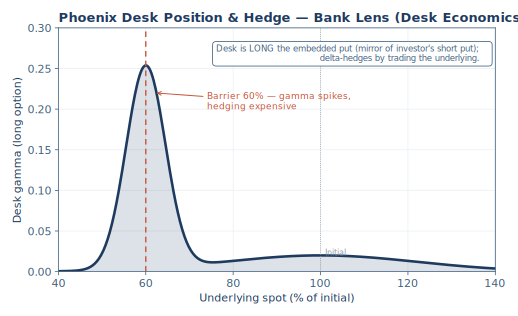

**How the bank makes money**

| Revenue Component | Detail |
|------------------|--------|
| **Structuring fee** | Embedded in note price at issuance (typically 1-3%) |
| **Bid-offer spread** | Spread between option cost and terms offered to investor |
| **Hedging P&L** | Delta-hedging profits from realized vs implied vol differential |
| **Funding advantage** | Issues note at sub-market effective funding rate |

**The coupon decomposition:**

Coupon = Bond interest + Net option premium − Funds Transfer Pricing (FTP) − Desk margin

For a 10% p.a. conditional coupon, the dominant block is the net premium the investor pays away by selling the embedded options — the knock-in put, the digital coupon options, and the autocall option — net of the memory provision the bank funds back to the investor. Bond interest comes from the bank's credit curve; FTP is the internal funding cost; the residual is desk margin. The premium on the digital and autocall options is what makes the contingent coupon so much higher than a bond coupon — it is the price of the conditionality and the early-redemption right the investor has sold.

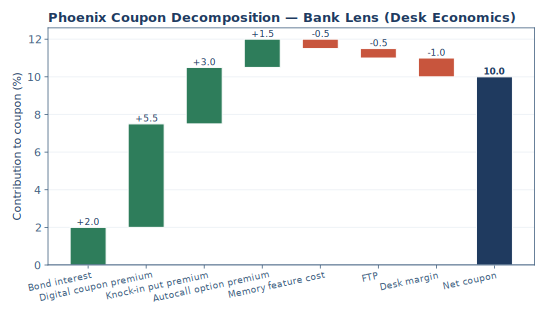

**P&L drivers**

Day to day, desk P&L is driven by realized-versus-implied volatility on the delta hedge across the basket, moves in the underlyings near the capital and autocall barriers (gamma and pin risk), correlation marks on the worst-of, funding, and the mark-to-market of the embedded options. Because the Phoenix has multiple embedded options and a path-dependent payoff, Monte Carlo simulation is required to revalue it. Product Control attributes P&L between note accrual and option MTM and performs independent price verification.

#### §9. THE BANK LENS — Controls & Reconciliation (2nd Line of Defence)

**Booking & systems**

| Aspect | Detail |
|--------|--------|
| **Book of record** | NEMO |
| **Pricing/Risk system** | Sophis |
| **Booking structure** | Single note with multiple embedded options |
| **Four-leg framework?** | No |
| **Key booking fields** | Notional, underlyings (basket), initial levels, autocall barrier, coupon barrier, capital barrier, barrier types, coupon rate, coupon frequency, observation dates, memory (Y/N), maturity |
| **Observation dates** | Quarterly (typically) — each date requires checking autocall, coupon, and potentially capital barrier |
| **Memory tracking** | System must track the number of missed coupons and pay them when conditions are met |

**Reconciliation points**

| Recon point | What must agree | Phoenix-specific break |
|-------------|-----------------|------------------------|
| **Trade economics** | Notional, initial levels, all three barriers **and convention** (% vs absolute), coupon rate & frequency, maturity, underlying IDs | Barrier stored as % in one system and absolute price in the other — consistent only if the initial level matches the assumed reference |
| **Observation schedule** | The full set of observation dates, the no-call period, and the autocall start date agree across NEMO and Sophis | A missing or misdated observation skips an autocall or coupon check entirely |
| **Worst-of determination** | Both systems use the same initial levels and fixing sources to identify the worst performer | Systems disagree on which stock is worst → wrong barrier comparison |
| **Coupon barrier / digital capture** | Coupon-paid vs coupon-missed flag for each observation date is consistent | Coupon paid when the worst performer was below the coupon barrier, or skipped when it was above |
| **Memory-coupon accrual** | The memorized-coupon counter and accumulated amount agree across systems | NEMO and Sophis disagree on how many coupons are memorized → wrong catch-up payment |
| **Autocall event capture** | The autocall trigger flag and early-redemption date are consistent across systems | Autocall condition met but not processed (or processed late) → note carried when it should have terminated |
| **Capital barrier event** | Knock-in flag at maturity (European) or on touch (American) consistent across NEMO and Sophis | Capital barrier checked against the average or best performer, not the worst |
| **P&L attribution** | Note accrual + option MTM reconciles to total | Unexplained P&L points to a stale vol/correlation surface or a wrong fixing |

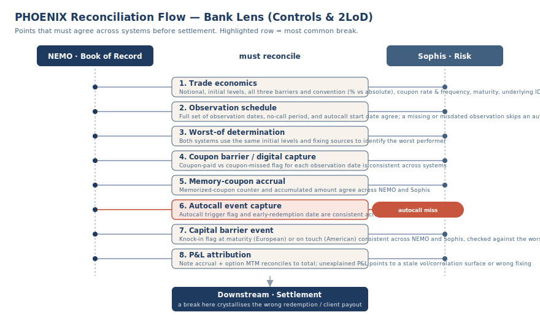

**Common breaks & red flags**

| Red Flag | What It Means | 2LoD Action |
|----------|---------------|-------------|
| Memory counter mismatch | NEMO and Sophis disagree on how many coupons are memorized | Manually trace each observation date's coupon payment/skip and reconcile the counter |
| Worst-of determination error | Systems disagree on which stock is the worst performer | Verify that both systems use the same initial levels and fixing sources |
| Autocall not triggered when it should have been | System did not process autocall because of a data error on the observation date | Check fixing data; if the autocall condition was met, process retroactively |
| Coupon paid when it should not have been | Worst performer was below the coupon barrier but the coupon was processed | Investigate; may require reversal and client notification |
| Capital barrier applied to wrong stock | System checked the barrier against the average or best performer, not the worst | Verify the worst-of logic in the booking |

**Control implication**

Each break has a direct consequence the 2nd line must size before it reaches the books or the client. The two control points that distinguish the Phoenix from a simple barrier note are **autocall event capture** and **memory-coupon tracking**. A missed autocall leaves a note live that should have redeemed — overstating desk risk, mis-stating expected life, and delaying the investor's principal — while a spurious autocall terminates a note early and crystallises the wrong redemption. A memory-counter error mis-states the catch-up payment due on recovery, paying the investor too little or too much and breaking P&L attribution at the same time. Because both depend on a correct worst-of determination on every observation date, the reconciliation must run on each scheduled date — not just at maturity — to catch these inconsistencies before settlement crystallises them.

#### §10. Formal Definition

A **Phoenix Autocallable** is a structured product with:

**Autocall:** On each observation date (typically quarterly, starting after a no-call period — the initial quarters during which autocall cannot trigger), if the underlying (or worst-of basket) is at or above the autocall barrier, the product redeems at 100% of principal plus any due coupons.

**Conditional coupon:** On each observation date, if the underlying is at or above the coupon barrier, the coupon is paid. If below, no coupon is paid for that period.

**Memory feature:** Missed coupons accumulate. On any observation date where the coupon condition is met, all previously missed coupons are also paid.

**Capital protection:** At maturity (if not autocalled), if the underlying has breached the knock-in barrier: Redemption = Principal × (Final Level / Initial Level). If the knock-in barrier has not been breached: Redemption = 100% of Principal.

#### §11. Lifecycle

| Stage | Detail |
|-------|--------|
| **Trade date** | Terms agreed: underlying, strike/barrier, coupon, maturity. Pricing finalised. Book in NEMO; record initial levels for all basket stocks |
| **Issue date** | Note issued. The investor pays par (or discount). The bank establishes the hedge |
| **Coupon dates** | Periodic observations and coupon payments (if applicable). Barrier monitoring. On each observation date: check all underlying closing prices and identify the worst performer; compare to the autocall barrier (if above, process autocall redemption); if no autocall, compare to the coupon barrier (if above, pay coupon plus any memorized coupons; if below, record a missed coupon in the memory counter) |
| **Barrier monitoring (American capital barrier)** | Continuous monitoring of all underlyings against the capital barrier |
| **Final observation** | If not autocalled, determine whether the capital barrier was breached. Calculate final redemption |
| **Maturity** | Settlement: cash (par or adjusted) or physical delivery. T+2 settlement |

#### §12. Worked Example (both lenses)

**Product:** 2-year Phoenix on worst-of (Stock A, Stock B, Stock C). **Notional:** $1,000,000. **Coupon:** 3% per quarter (12% p.a.), conditional. **Autocall barrier:** 100% (checked quarterly from Q2). **Coupon barrier:** 65%. **Capital barrier:** 55% knock-in (European). **Memory:** Yes.

**Initial levels:** A = $100, B = $50, C = $200

| Quarter | A Level | B Level | C Level | Worst | Autocall? | Coupon? | Memory | Payment |
|:-------:|:-------:|:-------:|:-------:|:-----:|:---------:|:-------:|:------:|--------:|
| Q1 | $95 | $45 | $190 | B (90%) | N/A (no-call) | Yes (90%>65%) | 0 | $30,000 |
| Q2 | $88 | $30 | $180 | B (60%) | No (60%<100%) | No (60%<65%) | 1 | $0 |
| Q3 | $92 | $28 | $175 | B (56%) | No | No (56%<65%) | 2 | $0 |
| Q4 | $98 | $36 | $185 | B (72%) | No (72%<100%) | Yes (72%>65%) | 0 | **$90,000** |
| Q5 | $105 | $42 | $210 | B (84%) | No (84%<100%) | Yes (84%>65%) | 0 | $30,000 |
| Q6 | $110 | $48 | $220 | B (96%) | No (96%<100%) | Yes (96%>65%) | 0 | $30,000 |
| Q7 | $115 | $48 | $230 | B (96%) | No (B 96% < 100%) | Yes | 0 | $30,000 |
| Q8 | $120 | $55 | $240 | B (110%) | Yes (all ≥100%) | Yes | 0 | $30,000 |

**Q4 memory payout:** Coupon condition is met. Memory has 2 stored coupons. Payment = current coupon + 2 memorized = 3 × $30,000 = $90,000.

**Q8 autocall:** All stocks above 100%. Product redeems. Investor receives $1,000,000 principal.

**Total coupons received:** $30,000 + $0 + $0 + $90,000 + $30,000 + $30,000 + $30,000 + $30,000 = **$240,000**
**Total returned:** $1,000,000 + $240,000 = **$1,240,000** over 2 years. Return: 24% (12% annualized).

*Investor lens:* The investor collects $240,000 of conditional coupons — including the $90,000 Q4 catch-up that recovers the two missed Q2/Q3 coupons via the memory feature — and receives full principal back when the note autocalls at Q8. Total $1,240,000, a 24% return (12% annualized).

*Bank lens:* The desk holds the long embedded options against the investor. Through Q2-Q3 the digital coupon options are out of the money (worst performer below the 65% coupon barrier) and the knock-in put gains value as B approaches the 55% capital barrier; from Q4 the basket recovers, the desk funds the $90,000 memory catch-up, and at Q8 the autocall terminates the structure and the desk unwinds the basket hedge. The 2nd line must confirm on each observation date that the worst-of determination, the memory counter (2 stored at Q3, cleared at Q4), the coupon-paid flags, and the Q8 autocall event all agree between NEMO and Sophis before each payment and the final redemption settle.

#### §13. Knowledge Check

1. **Explain the three barriers in a Phoenix Autocallable and what each one controls.** *(Investor)*
2. **What is the memory feature, and why does it make the product more attractive to investors?** *(Investor)*
3. **Why are Phoenix products usually linked to worst-of baskets? How does correlation affect pricing?** *(Investor)*
4. **A Phoenix has a coupon barrier of 70% and an autocall barrier of 100%. The worst performer is at 95%. What happens on this observation date?** *(Investor)*
5. **What makes the Phoenix harder to price than a Reverse Convertible?** *(Investor)*
6. **A client holds a Phoenix that has not paid a coupon for 4 quarters. 5 coupons are memorized. On Q6, the worst performer is at 72% (above the 70% coupon barrier). How much does the client receive?** *(Investor)*
7. **The Phoenix investor sold the correlation premium embedded in the basket. Explain why this makes the investor *structurally* short, yet long correlation under the MTM convention.** *(Investor)*
8. **(Desk economics / 1LoD)** What package of embedded options does the desk hold long against the investor, and where does the desk's gamma spike? Explain the pin risk near the autocall barrier and why it is the desk's signature exposure.
9. **(Controls / 2LoD)** On each observation date, which fields must reconcile between NEMO and Sophis for a Phoenix, and why are autocall event capture and the memory-coupon counter the two breaks most specific to this product?

**Mental Models**

| Concept | Mental Model |
|---------|-------------|
| Phoenix Autocallable | A performance-based contract with a buyout clause and deferred bonus |
| Autocall | The buyout — if things are going well, both sides walk away happy |
| Conditional coupon | The quarterly bonus — paid only if performance meets the threshold |
| Memory | Deferred bonus — missed payments are remembered and paid when performance recovers |
| Worst-of | A team is only as strong as its weakest member |
| Coupon barrier vs capital barrier | The coupon barrier is the "okay" threshold; the capital barrier is the "disaster" threshold |
| Path dependency | Every quarterly check matters — the journey determines the destination |
| 2LoD reconciliation | The auditor who re-runs every quarterly check — confirming the worst-of, the memory counter, and the autocall flag agree before any payment is made |

**Key Takeaways**

1. A Phoenix has three barriers: autocall (early redemption), coupon (income payment), and capital (principal risk). Each is set at a different level.
2. The memory feature accumulates missed coupons and pays them when conditions improve. No coupon is permanently lost unless the product reaches maturity without the condition being met.
3. Phoenix products are usually worst-of basket linked, making the investor long correlation (MTM convention) — lower correlation between stocks increases risk and coupon. (The investor *structurally sold* the correlation premium, but the economic sensitivity is long: rising correlation reduces worst-of risk.)
4. The product is path-dependent: the sequence of observations determines the total return.
5. Autocall is likely in rising markets, returning the investor's capital early for reinvestment.
6. The Phoenix is the most traded structured product globally because it combines high income, memory, and early exit in one package. The desk holds the offsetting long-option package and carries pin risk near the autocall barrier.
7. For the 2nd line, the dominant control risks are observation-schedule integrity, worst-of determination, memory-coupon accrual, and autocall event capture — each must be reconciled on every observation date, not just at maturity.

#### §14. Common Mistakes

1. **Treating the coupon as guaranteed.** It is conditional. If the worst performer stays below the coupon barrier, no coupon is paid — memory only helps if recovery occurs.
2. **Ignoring worst-of risk.** In a 3-stock basket, the probability that *at least one* stock breaches a barrier is much higher than the probability for any single stock.
3. **Assuming autocall is certain.** Autocall requires *all* basket stocks to be above the autocall barrier. If one stock lags, autocall does not trigger even if the others are up 30%.
4. **Forgetting issuer credit risk.** The memory feature means large accumulated coupon payments could be due. If the issuer defaults before paying, the investor loses those memorized coupons.
5. **Comparing Phoenix coupons across different baskets.** A Phoenix on three volatile, uncorrelated stocks will pay a much higher coupon than one on three stable, correlated stocks — but the risk is commensurately higher.
6. **(Controls) Reconciling only at maturity.** The Phoenix must be reconciled on every observation date — autocall capture, the memory counter, and the worst-of determination can each drift between NEMO and Sophis at any quarterly check, long before maturity.
### Knowledge Check

**Review Questions:**
1. What are the three barriers in a Phoenix Autocallable, and what does each control?
2. How does the memory feature work? Give an example with specific numbers.
3. The Phoenix investor sold the correlation premium embedded in the basket — explain why this is *structurally* short but long correlation under the MTM convention.
4. What makes the Phoenix path-dependent?
5. Which system is used for booking and pricing a Phoenix?


**Dual-lens questions:**
- *(Desk economics / 1LoD)* What position does the desk hold against the investor, and what is its primary Greek / hedging risk?
- *(Controls / 2LoD)* Which booking and risk-system fields must reconcile for this product, and which is the most common break?
**Scenario Questions:**
1. A Phoenix has a coupon barrier at 70%, autocall at 100%, and KI at 60%. The worst performer is at 68% on Q3. What happens? What if it recovers to 73% on Q4?
2. Correlation between three basket stocks drops from 0.8 to 0.3. How does this affect the bank's pricing of a new Phoenix on this basket?
3. A Phoenix autocalls after one quarter. The investor earned a 3% coupon (12% annualized). They are happy. Should they be? What are the implications for reinvestment?

**Desk Question:**
An operations analyst discovers that the system paid a coupon on Q3 even though the worst performer was at 68% (below the 70% coupon barrier). The error affected a $5 million notional trade. Describe the steps to resolve this, including which teams need to be involved.

### Visual Learning Recommendations

1. **Decision tree flowchart** — Observation date logic: check autocall → check coupon → memory → continue
2. **Timeline with observation outcomes** — 8-quarter example showing autocall check, coupon payment, memory accumulation, and eventual autocall or maturity
3. **Worst-of scatter plot** — Three stock paths over time, highlighting which is worst at each observation date
4. **Correlation impact diagram** — High vs low correlation: probability of at least one stock breaching the barrier
5. **Barrier level diagram** — Visual showing the three barrier levels (autocall, coupon, capital) with zones labeled

### Dependency References

| Concept Used | Where It Was Taught |
|-------------|-------------------|
| Put option, knock-in barrier | [Section 1.2](#sec-1-2) (Options), [Section 1.3](#sec-1-3) (Barriers) |
| Capital, coupon, autocall barrier distinction | [Section 1.3](#sec-1-3) (Barrier Terminology Note) |
| Digital payoff (conditional coupon) | [Section 1.3](#sec-1-3) (Digitals) |
| Delta, Gamma, Vega | [Section 1.4](#sec-1-4) (Greeks) |
| Correlation, worst-of, basket | [Section 1.6](#sec-1-6) (Correlation and Baskets) |
| Product decomposition | [Section 2.2](#sec-2-2) (Product Construction) |
| NEMO/Sophis booking | [Section 2.8](#sec-2-8) (Systems Primer) |

---


#### Visual Specifications

**Visual 1: Phoenix Autocallable Payoff at Maturity**
- **Asset filename:** payoff_phoenix_maturity_01.svg
- **Caption:** "Phoenix Autocallable Payoff at Maturity"
- **Diagram elements:** X-axis: underlying price. Y-axis: investor total return. Key levels marked (strike, barrier if applicable). Compare with unstructured alternative
- **Reuse status:** Adapt from payoff template
**Visual 2: Phoenix Autocallable Product Construction**
- **Asset filename:** construction_phoenix_components_02.svg
- **Caption:** "Phoenix Autocallable Product Construction"
- **Diagram elements:** Component decomposition: each building block in separate box. Arrows showing how they combine to create the product. Cost allocation visible
- **Reuse status:** Adapt from construction template
**Visual 3: Phoenix Autocallable Lifecycle Timeline**
- **Asset filename:** lifecycle_phoenix_timeline_03.svg
- **Caption:** "Phoenix Autocallable Lifecycle Timeline"
- **Diagram elements:** Horizontal timeline from issue to maturity. Key events: issue, coupon dates, observation dates, maturity. Underlying price path overlay
- **Reuse status:** Adapt from lifecycle template
**Visual 4: Phoenix Autocallable Risk Heatmap**
- **Asset filename:** risk_phoenix_heatmap_04.svg
- **Caption:** "Phoenix Autocallable Risk Heatmap"
- **Diagram elements:** Grid: risk types (market, credit, liquidity, operational) vs severity (low/med/high). Colour-coded cells appropriate for Phoenix Autocallable
- **Reuse status:** Adapt from risk heatmap template
**Visual 5: Phoenix Autocallable vs Alternatives**
- **Asset filename:** comparison_phoenix_vs_alternatives_05.svg
- **Caption:** "Phoenix Autocallable vs Alternatives"
- **Diagram elements:** Multi-column comparison showing payoff across scenarios (-30%, flat, +15%, +30%). Compare with direct investment and simpler structured product
- **Reuse status:** New — comparison panel
**Visual 6: Phoenix Autocallable Suitability Decision Tree**
- **Asset filename:** decision_phoenix_suitability_06.svg
- **Caption:** "Phoenix Autocallable Suitability Decision Tree"
- **Diagram elements:** Decision tree guiding investor suitability. Key questions: risk tolerance, income need, market view, time horizon
- **Reuse status:** Adapt from decision tree template


**Dual-lens visuals (generated):**
- `assets/phoenix/controls_phoenix_recon_08.svg` `[generated]`
- `assets/phoenix/desk_phoenix_gamma_07.svg` `[generated]`
- `assets/phoenix/waterfall_phoenix_09.svg` `[generated]`
#### Dependency References

| Concept Used | Where It Was Taught |
|-------------|-------------------|
| Equity fundamentals | [Section 1.4](#sec-1-4) (Equity Essentials) |
| Options mechanics | [Section 1.2](#sec-1-2) (Options From Zero) |
| Product decomposition | [Section 2.2](#sec-2-2) (Product Construction) |
| RC | 5.1.2 — simpler |
| KODRC | 5.1.5 — barrier but no autocall |
| Snowball | 5.6.10 — cumulative coupon |
### 5.1.4 Discounted Reverse Convertible (DRC) {#sec-5-1-4}

> **Prerequisites:** [RC](#sec-5-1-2) &nbsp;|&nbsp; **Key concepts:** Discount pricing, break-even calculation, adjusted strike

---

*This product is identical to the Reverse Convertible (5.1.2), except the investor pays less than 100% of par instead of receiving periodic coupons. That single change transforms the return source from coupon income to a built-in purchase discount. Like the RC chapter, it is read through two lenses: the **investor** and the **bank** (desk economics, 1st line; controls and reconciliation, 2nd line).*

#### §1. Explain Like I'm New

Maria is comparing two bank offers for a 1-year investment. The first pays 8% in quarterly coupons on a $100,000 note. The second lets her buy the same note for $92,000 instead of $100,000 — no coupons, but $100,000 back at maturity if all goes well. Both give roughly an 8% return; the difference is timing — periodic checks versus the return delivered upfront as a lower purchase price.

That is a **Discounted Reverse Convertible**. Instead of periodic coupons, the investor buys the note at a discount to face value. The gap between the purchase price and the $100,000 redemption is the investor's return. As in a standard RC, the investor has sold a put option to the bank — but the put premium is packaged as a reduced purchase price rather than a coupon.

The risk is identical: if the underlying falls below the capital barrier (the knock-in level), the redemption at maturity is reduced based on the stock's decline — measured against face value, not the purchase price.

#### §2. Real-World Analogy

A Discounted RC is like buying a discounted gift card.

A shopper buys a $100 gift card for $90. The $10 discount is the return — known exactly at the moment of purchase, with no monthly rewards accruing over time. The profit is locked in upfront. But there is a catch: if the store's financial health deteriorates badly (the stock drops below the barrier), the card may not be redeemable at full face value — a troubled store might honor only $60 of a $100 card. Having paid $90, the buyer loses $30.

The gift-card discount is the put premium; the store's health is the stock price; the threshold at which redemption is reduced is the capital barrier. Like the gift-card buyer, the DRC investor takes their "interest" at purchase rather than waiting for periodic payments.

#### §3. What Problem Does This Solve?

Some investors prefer simplicity over cash flow. A standard RC with quarterly coupons creates four payment events, four tax events, and four reinvestment decisions. A DRC collapses all of that into one number: the purchase discount.

| Investor Need | Why Standard RC Is Imperfect | What the DRC Offers |
|--------------|------------------------------|---------------------|
| Simple return calculation | Must track 4 coupon payments | One number: (100 − purchase price) / purchase price |
| Tax efficiency | Coupons taxed as income in some jurisdictions | Discount may qualify as capital gains |
| No reinvestment decisions | Must decide what to do with each coupon | Full return embedded at purchase |

#### §4. Product DNA

| Field | Value |
|-------|-------|
| **Full Name** | Discounted Reverse Convertible |
| **Abbreviation** | DRC |
| **Family** | Equity-Linked Notes |
| **Complexity Score** | 3 / 10 |
| **Complexity Rationale** | RC variant issued at discount. Lower entry price reduces break-even. Same put exposure |
| **Underlying Asset Class** | Equity (single stock or index) |
| **Capital Protection** | Conditional (protected above adjusted strike) |
| **Coupon Type** | None or reduced coupon — return via discount |
| **Maturity** | 6-18 months |
| **Liquidity** | Secondary market |
| **Primary System** | Murex |
| **ISDA Required** | No — issued as note |

**DNA Atlas Fields:**
- Primary Risk: Underlying falling below adjusted strike. Similar to RC but break-even is lower due to discount
- Typical Buyer: Yield-seeking investors wanting lower break-even entry. Private banking clients
- Typical Use Case: Lower effective entry point than RC. Discount acts as additional buffer against losses
- Building Blocks: Discounted note (issued below par) + short put option
- Key Hedge: Long put option (delta-hedged), discount bond hedge
- Similar Products: RC (5.1.2 — full price), KODRC (5.1.5 — barrier version), CRC (5.1.6 — callable)
- Most Important Greek: Delta (put sensitivity)

**Comparison Matrix Fields:**
- Complexity: 3
- Yield Potential: Moderate (via discount rather than coupon)
- Capital Protection: Conditional (discount provides buffer)
- Credit Exposure: Issuer
- Liquidity: Secondary market
- Path Dependency: No
- Volatility Sensitivity: Short vega
- Correlation Sensitivity: None
- Client Type: Private banking
- Market Environment: Best when mildly bullish with desire for lower break-even

#### §5. Who Touches This Product

| Role | Responsibility |
|------|---------------|
| **Structurer** | Designs DRC terms: strike, barrier, discount, maturity. Optimises structure for client and bank |
| **Trader** | Hedges embedded options. Manages Greeks (delta, gamma, vega). Prices secondary market |
| **Sales** | Distributes DRC to target clients. Explains payoff scenarios and risk-return profile |
| **Risk Management** | Monitors option Greeks, barrier proximity, concentration risk. Sets trading limits |
| **Product Control** | Daily P&L attribution between note accretion and option MTM. Independent price verification |
| **Operations** | Processes maturity settlement. Handles physical delivery if applicable |
| **Legal / Compliance** | Reviews term sheet for regulatory compliance. Ensures suitability for target investor base |
| **Quantitative Analytics** | Prices embedded derivatives. Calibrates volatility surface. Provides model validation |

#### §6. Product Evolution

| Stage | Product | What Was Added | Why |
|:-----:|---------|---------------|-----|
| 1 | Plain vanilla bond | — (baseline) | Fixed coupon, full principal return |
| 2 | Reverse Convertible | Short put option embedded | Higher return funded by put premium |
| 3 | Discounted Reverse Convertible | Premium delivered as a discount, not a coupon | Zero-coupon packaging; lower entry price reduces break-even. Same put exposure |

---

#### §7. THE INVESTOR LENS

**Why the investor buys it**

1. **Upfront certainty.** The maximum return is known at purchase — no dependency on future coupon schedules.
2. **Tax structuring.** In certain jurisdictions the discount may receive more favourable treatment than periodic coupon income.
3. **Cash-flow simplicity.** No coupons to track, reinvest, or report — one purchase, one redemption.
4. **Same risk, different packaging.** Investors who like the RC risk profile but prefer zero-coupon economics choose the DRC.
5. **Psychological clarity.** Paying $92,000 for something worth $100,000 feels tangible.

**Position taken**

Same as the RC: the investor holds a discounted (zero-coupon) bond and a **short** knock-in put sold to the bank. Net, the investor is **short volatility** and carries full equity downside below the strike, measured against face value. Single underlying → no correlation exposure.

**Payoff & scenarios**

Above the barrier at maturity the investor receives 100% of face value (return = the discount on invested capital). Below the barrier the redemption is face × (final/initial), so losses are measured against face value — slightly amplifying the percentage loss on the lower invested amount. The payoff shape is the RC's; only the flat level (discount return) and the loss base (face) differ.

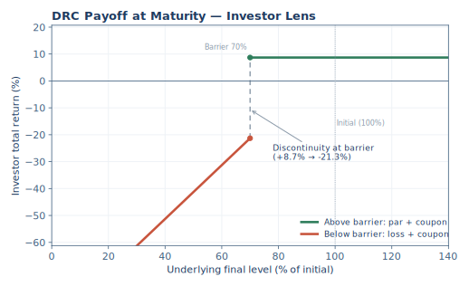

**Product:** 1-year DRC, $100,000 face value, purchase price $92,000 (8% discount), stock initial $100, capital barrier (KI) 70%, European observation.

- **Stock finishes at $115 (+15%):** Barrier not breached. The investor receives $100,000 face. Paid $92,000. **Profit $8,000 (8.7%).** Strong performance does not increase the payout — return is capped at the discount.
- **Stock finishes at $75 (−25%):** Above the 70% barrier. The investor receives $100,000. **Profit $8,000 (8.7%).** Same as above — the DRC investor is indifferent to performance above the barrier.
- **Stock finishes at $60 (−40%):** Below the barrier. Knock-in. Redemption = $100,000 × ($60/$100) = $60,000. Paid $92,000. **Loss $32,000 (−34.8%).** The discount gave no meaningful cushion against a 40% decline.
- **Stock finishes at exactly $70 (barrier):** European observation checks at maturity. At the barrier, the "below" vs "at or below" termsheet convention decides knock-in. **Always verify the convention.**

**Risks to the investor**

| Risk | Description | Severity |
|------|------------|:--------:|
| **Barrier breach** | Below the barrier, redemption is reduced by the stock's decline from initial | High |
| **Amplified loss percentage** | Paid below face but loses against face: a 40% decline → 34.8% loss on a 92% price | Medium |
| **No coupon cushion** | No interim income to offset a late-life decline (unlike the RC's coupons) | Medium |
| **Issuer credit risk** | Exposure to the bank's creditworthiness | Medium |
| **Illiquidity** | Selling before maturity involves a bid-offer spread and potential loss | Medium |
| **Gap risk** | The stock may jump past the barrier without trading through it | High |

#### §8. THE BANK LENS — Desk Economics (1st Line of Defence)

**What the desk books**

The mirror of the investor: the desk is **long** the embedded knock-in put (bought from the investor) and has issued a zero-coupon note below par. The investor's discount is, to the desk, the put premium plus bond yield returned via a lower issue price rather than coupons.

**Greeks & hedging**

Identical to the RC — the desk is long the KI put and delta-hedges by trading the underlying. Gamma spikes as the underlying approaches the barrier and hedging becomes expensive; this is where structuring margin is earned or lost. The zero-coupon structure simplifies the hedge book (no periodic cash flows) but does not change the Greeks.

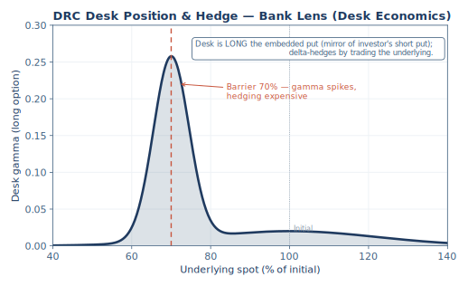

**How the bank makes money**

| Revenue Component | Detail |
|------------------|--------|
| **Structuring fee** | Embedded in the issue price (typically 1-3%) |
| **Bid-offer spread** | Spread between option cost and terms offered to the investor |
| **Hedging P&L** | Delta-hedging profits from realized vs implied vol differential |
| **Funding advantage** | Issues the note at a sub-market effective funding rate |

**The discount decomposition (from [Section 2.2](#sec-2-2)):**

Discount = Bond yield + Put premium − FTP − Desk margin. For an 8% discount (issue 92%): bond yield ~2.0%; put premium ~7.5%; FTP −0.5%; desk margin −1.0%; **net discount 8.0%**. The put premium is identical to a standard RC — only the delivery differs (lower price, not coupons).


**P&L drivers**

Realized-versus-implied vol on the delta hedge, moves near the barrier (gamma), funding, the put MTM, and the **accretion** of the discount toward face value over the life. Product Control attributes P&L between accretion and put MTM — simpler than the RC because there is no coupon accrual.

#### §9. THE BANK LENS — Controls & Reconciliation (2nd Line of Defence)

**Booking & systems**

| Aspect | Detail |
|--------|--------|
| **Book of record** | NEMO |
| **Pricing/Risk system** | Sophis |
| **Booking structure** | Single note with embedded KI put, issue price < 100% |
| **Four-leg framework?** | No |
| **Key booking fields** | Face value, issue price (discount), initial level, barrier level, barrier type, underlying(s), maturity |
| **Coupon schedule** | None — zero-coupon structure |
| **Barrier monitoring** | European: single check at maturity. American: continuous |

**Reconciliation points**

| Recon point | What must agree | DRC-specific break |
|-------------|-----------------|--------------------|
| **Trade economics** | Face value, issue price, barrier level & convention, maturity, underlying ID | Barrier applied to issue price instead of initial stock level |
| **Issue price vs face** | Cash paid (issue) vs redemption base (face) | Issue price recorded as 100% — every P&L number then wrong |
| **Discount accretion** | Book value accretes toward face over the life | Valuation model fails to accrete → mid-life MTM wrong |
| **Observation type** | European vs American | American flagged but only daily closes monitored |
| **Fixings** | Initial and final fixing source = termsheet | Vendor disagreement on the final close |
| **Knock-in capture** | KI flag consistent across NEMO and Sophis | Intraday breach not flagged → redemption miscalculated |
| **P&L attribution** | Accretion + put MTM = total | Unexplained P&L points to wrong accretion or stale vol |
| **Settlement** | Redeem at **face** (not issue price); shares = face / strike | Settlement uses issue price → investor underpaid |

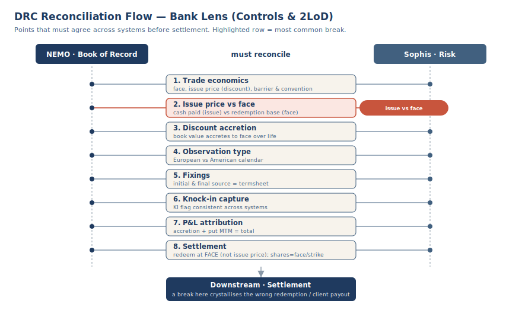

**Common breaks & red flags**

| Red Flag | What It Means | 2LoD Action |
|----------|---------------|-------------|
| Issue price recorded as 100% | NEMO shows par but the trade was at 92% — all P&L wrong | Verify issue price matches the termsheet in NEMO and Sophis |
| Face value vs invested amount confusion | Notional $100,000 (face) but cash outlay $92,000 | Ensure reports state the base — invested capital or face |
| Accretion not reflected in valuation | Discount accretes toward face over the life | Verify the model accretes correctly |
| Barrier on wrong base | Barrier is 70% of initial stock, not 70% of issue price | Confirm barrier is calculated from the stock initial level |
| Settlement uses issue price | On redemption without KI, the investor receives **face** ($100,000), not $92,000 | Verify settlement uses face as the redemption base |

**Control implication**

The defining DRC control risk is the **issue-price / face-value distinction**. Because cash paid (92%) and the redemption base (100%) differ, any system that conflates them misstates P&L, the barrier base, or the settlement amount. The 2nd line must confirm both numbers are captured and used in the right place — invested capital for return/P&L, face for barrier and redemption.

#### §10. Formal Definition

A **Discounted Reverse Convertible (DRC)** is a zero-coupon bond purchased at a discount to par plus a short knock-in put. At maturity:

- If the underlying has **not** breached the barrier: **Redemption = 100% of Face Value**
- If the underlying **has** breached the barrier: **Redemption = Face Value × (Final Level / Initial Level)**

No periodic coupons are paid; the return is the gap between the discounted purchase price and the face-value redemption.

**Key parameters:** purchase price typically 88-95% of face; barrier typically 60-80% of initial; observation European or American; underlying single stock, index, or worst-of basket; maturity 6 months to 2 years.

#### §11. Lifecycle

| Stage | Detail |
|-------|--------|
| **Trade date** | Terms agreed: underlying, strike/barrier, discount, maturity. Book in NEMO; set face value, issue price, initial level, barrier |
| **Issue date** | Note issued below par. The investor pays the discounted price; the desk establishes the hedge |
| **(No coupon dates)** | Zero-coupon — no periodic payment events. Barrier monitored (American) |
| **Final observation** | Record the closing price from the termsheet source. Determine barrier breach |
| **Maturity** | If no KI: redeem at face. If KI: redeem at face × (final/initial). Settle (T+2) |

#### §12. Worked Example (both lenses)

**Product:** 1-year DRC on Samsung. **Face value:** $500,000. **Issue price:** 91% = $455,000 (9% discount). **Initial:** $72. **Capital barrier:** 65% = $46.80 (European). **Maturity:** 1 year. No coupons.

*Investor lens:*
- **Samsung closes at $68 (−5.6%):** above the barrier ($46.80). No KI. The investor receives $500,000 face. Paid $455,000. **Profit $45,000 (9.9% on invested capital).**
- **Samsung closes at $40 (−44.4%):** below the barrier. KI. Redemption = $500,000 × ($40/$72) = **$277,778**. Paid $455,000. **Loss $177,222 (−38.9%).** No coupon income to offset.

*Bank lens:*
- First scenario: the desk's long put expires worthless; it keeps structuring margin and net hedging P&L. Product Control confirms the discount has fully accreted to face and the put MTM rolls to zero.
- Second scenario: the desk's long put is deep in the money; the investor delivers value (shares worth $277,778 against $500,000 face), offsetting the desk's payout. The 2nd line confirms the redemption uses **face** (not the $455,000 issue price), the share count (face / strike), and that NEMO and Sophis agree before settlement.

#### §13. Knowledge Check

1. *(Investor)* How does a DRC differ from a standard RC in terms of investor return?
2. *(Investor)* Why might a DRC produce a slightly worse percentage loss than a standard RC when the barrier is breached?
3. *(Investor)* In what tax jurisdictions would a DRC be more attractive than a standard RC?
4. *(Investor)* Draw the payoff diagram for a DRC and identify where it differs from the RC diagram.
5. *(Desk economics / 1LoD)* The investor is short the put; what does the desk hold, and how does the absence of coupons change the desk's hedge book versus an RC (and what stays the same)?
6. *(Controls / 2LoD)* NEMO shows the DRC notional as $1,000,000 but cash received as $910,000. Explain the discrepancy and list every calculation that depends on getting it right.

**Mental Models**

| Concept | Mental Model |
|---------|-------------|
| Discounted RC | A discounted gift card — the return is locked in at purchase, not paid over time |
| Discount vs coupon | Same ingredients, different recipe — the put premium funds the discount instead of coupons |
| Amplified loss | Paying $92 for a $100 card means losing $32 when it drops to $60 — a 34.8% loss on $92, not 32% |
| Zero-coupon simplicity | No quarterly checks, no reinvestment — one buy, one sell |
| Issue price vs face value | Paid $92, but the card says $100 — different numbers, never to be confused |
| 2LoD reconciliation | The auditor checking that the price paid and the face redeemed are each used in the right calculation |

**Key Takeaways**

1. A DRC is a zero-coupon RC where the put premium is delivered as a purchase discount instead of coupons.
2. The risk profile is identical to a standard RC with the same barrier and maturity — only the packaging differs.
3. Losses on invested capital are slightly amplified because the investor paid below face but loses against face.
4. No coupon cushion exists — no interim cash flows offset a late-life barrier breach.
5. Operationally simpler than an RC for the desk (no coupon schedule), but the 2nd line gains a new control: issue price vs face.
6. For the desk, the position and Greeks are the RC's; for the 2nd line, the dominant control is the issue-price/face distinction plus discount accretion.

#### §14. Common Mistakes

1. **"The DRC is safer because I pay less."** Wrong. Paying $92,000 instead of $100,000 does not reduce risk — the barrier and underlying are the same, so the probability of loss is identical.
2. **Confusing face value with invested amount.** The investor paid $92,000 but the note has $100,000 face. Barriers and redemptions are based on face, not invested capital.
3. **Assuming the discount equals the return.** A 9% discount is not a 9% return — the return on invested capital is 9/91 = 9.9%. The denominators differ.
4. **Ignoring the lack of coupon cushion.** In an RC, a month-10 breach still leaves coupons already received; in a DRC, no interim income offsets a late breach.
5. **Reporting notional as the investment amount.** Operations must record both face (for barrier and redemption) and issue price (for cash flow and P&L). Using only one produces incorrect risk reports.
6. **(Controls) Forgetting discount accretion.** Mid-life valuation must accrete the discount toward face; a model that holds book value flat understates value through the life.

### Knowledge Check

**Review Questions:**
1. *(Investor)* What is the core structural difference between a DRC and a standard RC?
2. *(Investor)* Why is the return on invested capital higher than the discount percentage?
3. *(Controls / 2LoD)* What two systems book a DRC, what role does each play, and which two fields must never be conflated?
4. *(Investor)* Why does a DRC have slightly amplified percentage losses compared to a standard RC?
5. *(Desk economics / 1LoD)* The desk is long the put; how does the zero-coupon structure simplify the desk's P&L attribution versus an RC, and what new accretion term appears?


**Dual-lens questions:**
- *(Desk economics / 1LoD)* What does the desk book against the investor (it is long the embedded put), and how does gamma near the barrier drive the hedging cost?
- *(Controls / 2LoD)* Which booking / fixing / barrier-event fields must reconcile across NEMO and Sophis, and which is the most common break?
**Scenario Questions:**
1. An investor holds a 1-year DRC with a 70% European barrier. Issue price is 90%. The stock finishes at 65%. Calculate the redemption amount and the investor's return on invested capital.
2. Two investors buy the same underlying risk: one in an RC (8% coupon, quarterly), one in a DRC (8% discount). The barrier is breached at month 9. Who is worse off at maturity, and why?
3. Product Control notices that NEMO records the DRC notional as $920,000 (cash paid) rather than $1,000,000 (face value). What calculations are affected?

**Desk Question:**
A structurer is pitching a DRC to a client who currently holds a standard RC with 6 months remaining. The client asks: "Why would I switch? The risk is the same." What factors beyond risk should the structurer highlight?

### Visual Learning Recommendations

1. **Payoff comparison: RC vs DRC** — Side-by-side payoff diagrams showing identical shapes but different Y-axis labels (coupon return vs discount return) — P1
2. **Purchase price vs face value diagram** — Visual showing the $92,000 outflow, $100,000 inflow, and the $8,000 gap as the return — P1
3. **Coupon cushion comparison** — Timeline showing RC with periodic coupon receipts vs DRC with no interim cash flows, highlighting the difference when a late barrier breach occurs — P2
4. **Construction waterfall** — Bond yield + Put premium - FTP - Margin = Discount (adapted from RC waterfall) — P2
5. **Tax treatment comparison table** — Side-by-side showing jurisdictions where discount receives capital gains vs income treatment — P3

### Dependency References

| Concept Used | Where It Was Taught |
|-------------|-------------------|
| Put option, knock-in | [Section 1.2](#sec-1-2) (Options), [Section 1.3](#sec-1-3) (Barriers) |
| Capital barrier | [Section 1.3](#sec-1-3) (Barrier Terminology Note) |
| Delta, Gamma | [Section 1.4](#sec-1-4) (Greeks) |
| Product decomposition, coupon formula | [Section 2.2](#sec-2-2) (Product Construction) |
| Zero-coupon bond | [Section 1.7](#sec-1-7) (Yield Curves, Spot Rates, and Forward Rates) |
| NEMO/Sophis booking | [Section 2.8](#sec-2-8) (Systems Primer) |

---


#### Visual Specifications

**Visual 1: Discounted Reverse Convertible Payoff at Maturity**
- **Asset filename:** payoff_drc_maturity_01.svg
- **Caption:** "Discounted Reverse Convertible Payoff at Maturity"
- **Diagram elements:** X-axis: underlying price. Y-axis: investor total return. Key levels marked (strike, barrier if applicable). Compare with unstructured alternative
- **Reuse status:** Adapt from payoff template
- **Production status:** `[generated — assets/drc/payoff_drc_maturity_01.svg]`
**Visual 2: Discounted Reverse Convertible Product Construction**
- **Asset filename:** construction_drc_components_02.svg
- **Caption:** "Discounted Reverse Convertible Product Construction"
- **Diagram elements:** Component decomposition: each building block in separate box. Arrows showing how they combine to create the product. Cost allocation visible
- **Reuse status:** Adapt from construction template
**Visual 3: Discounted Reverse Convertible Lifecycle Timeline**
- **Asset filename:** lifecycle_drc_timeline_03.svg
- **Caption:** "Discounted Reverse Convertible Lifecycle Timeline"
- **Diagram elements:** Horizontal timeline from issue to maturity. Key events: issue, coupon dates, observation dates, maturity. Underlying price path overlay
- **Reuse status:** Adapt from lifecycle template
**Visual 4: Discounted Reverse Convertible Risk Heatmap**
- **Asset filename:** risk_drc_heatmap_04.svg
- **Caption:** "Discounted Reverse Convertible Risk Heatmap"
- **Diagram elements:** Grid: risk types (market, credit, liquidity, operational) vs severity (low/med/high). Colour-coded cells appropriate for Discounted Reverse Convertible
- **Reuse status:** Adapt from risk heatmap template
**Visual 5: Discounted Reverse Convertible vs Alternatives**
- **Asset filename:** comparison_drc_vs_alternatives_05.svg
- **Caption:** "Discounted Reverse Convertible vs Alternatives"
- **Diagram elements:** Multi-column comparison showing payoff across scenarios (-30%, flat, +15%, +30%). Compare with direct investment and simpler structured product
- **Reuse status:** New — comparison panel
**Visual 6: Discounted Reverse Convertible Suitability Decision Tree**
- **Asset filename:** decision_drc_suitability_06.svg
- **Caption:** "Discounted Reverse Convertible Suitability Decision Tree"
- **Diagram elements:** Decision tree guiding investor suitability. Key questions: risk tolerance, income need, market view, time horizon
- **Reuse status:** Adapt from decision tree template
**Visual 7: DRC Desk Position & Hedge (Bank Lens — Desk Economics)**
- **Asset filename:** desk_drc_hedge_gamma_07.svg
- **Caption:** "DRC Desk Position: Long the KI Put, Delta-Hedged"
- **Diagram elements:** Desk long the embedded KI put (mirror of investor's short put), delta hedge in the underlying, gamma spiking near the barrier; zero-coupon means no coupon cash-flow management
- **Reuse status:** New — desk-economics panel
- **Production status:** `[generated — assets/drc/desk_drc_hedge_gamma_07.svg]`
**Visual 8: DRC Reconciliation Flow (Bank Lens — Controls & 2LoD)**
- **Asset filename:** controls_drc_recon_flow_08.svg
- **Caption:** "DRC Reconciliation Flow: NEMO ↔ Sophis ↔ Downstream"
- **Diagram elements:** Swimlane across book-of-record, risk, and settlement; eight recon points; the **issue price vs face value** distinction flagged as the most common break, with discount-accretion and settlement-at-face consequences
- **Reuse status:** New — controls/reconciliation panel
- **Production status:** `[generated — assets/drc/controls_drc_recon_flow_08.svg]`
**Visual 9: DRC Discount Decomposition (Bank Lens — Desk Economics)**
- **Asset filename:** waterfall_drc_discount_09.svg
- **Caption:** "DRC Discount Decomposition: Bond Yield + Put Premium − FTP − Margin"
- **Diagram elements:** Waterfall from bond yield (+2.0) and put premium (+7.5) net of FTP (−0.5) and desk margin (−1.0) to the 8.0 net discount
- **Reuse status:** New — desk-economics panel
- **Production status:** `[generated — assets/drc/waterfall_drc_discount_09.svg]`

#### Dependency References

| Concept Used | Where It Was Taught |
|-------------|-------------------|
| Equity fundamentals | [Section 1.4](#sec-1-4) (Equity Essentials) |
| Options mechanics | [Section 1.2](#sec-1-2) (Options From Zero) |
| Product decomposition | [Section 2.2](#sec-2-2) (Product Construction) |
| RC | 5.1.2 — full price |
| KODRC | 5.1.5 — barrier version |
| CRC | 5.1.6 — callable |
### 5.1.5 Knock-Out Discounted Reverse Convertible (KODRC) {#sec-5-1-5}

> **Prerequisites:** [RC](#sec-5-1-2) &nbsp;|&nbsp; **Key concepts:** Knock-out barrier, continuous monitoring, barrier gap risk

---

*This product is identical to the Discounted RC (5.1.4), except it adds a knock-out barrier above the initial stock price. If the stock rises above this level, the embedded put is extinguished and the investor's downside risk disappears entirely. This chapter reads the product through two lenses: what it means for **the investor**, and what it means for **the bank** — the latter split into the desk's market economics (1st line of defence) and the controls and reconciliation that surround it (2nd line of defence).*

#### §1. Explain Like I'm New

Imagine an investor who likes the DRC's discount but keeps asking: "What if there were a way to make the risk go away if the stock does well?"

A bank offers exactly that. The investor buys a 1-year note for $93,000 (face value $100,000). Like the DRC, there are no coupons — the return is the $7,000 discount. But this product has two barriers:

- A **capital barrier (knock-in)** at 70%: if the stock falls below this level, the investor's principal is at risk — just like the DRC.
- A **knock-out barrier** at 120%: if the stock rises above this level at any point during the year, the put option embedded in the note is extinguished. Once knocked out, the investor's downside risk disappears. The investor is guaranteed to receive the full $100,000 at maturity, no matter what happens to the stock afterward.

The knock-out barrier is a safety release valve. It costs money — the investor's discount is smaller than a plain DRC (7% instead of 9%) because part of the put premium pays for this protective feature.

#### §2. Real-World Analogy

A KODRC is like climbing a rock face with a safety rope attached to a hook above.

The climber starts climbing (the investor invests at a discount). Below is a dangerous cliff edge (the capital barrier at 70%). Slipping and falling past it means injury — the investor's principal is reduced. But above, anchored to the rock, is a safety hook (the knock-out barrier at 120%). If the climber reaches it, the rope locks in place. Even if grip is lost later, the rope catches the climber, who cannot fall past the hook. The risk has been eliminated.

The climbing discount is the investor's return. The cliff below is the KI barrier. The hook above is the KO barrier. Once the hook is reached, the rope permanently protects the climber.

The trade-off: a climbing route with a safety hook costs more than one without (smaller discount), but the protection is real. Experienced climbers who expect to reach the hook see it as cheap insurance.

#### §3. What Problem Does This Solve?

Some investors want the DRC's enhanced return but are uncomfortable with permanent downside exposure. They want a product where good stock performance actively eliminates their risk, rather than merely avoiding the bad outcome.

| Investor Need | Why DRC Is Imperfect | What the KODRC Offers |
|--------------|----------------------|----------------------|
| Risk that can be eliminated | DRC risk exists until maturity | If stock rises above KO level, risk vanishes |
| Psychological comfort | DRC investor worries until maturity | After KO trigger, investor can stop watching |
| Moderate return with conditional safety | DRC has no upside trigger | KO provides a "mission accomplished" moment |

#### §4. Product DNA

| Field | Value |
|-------|-------|
| **Full Name** | Knock-Out Discounted Reverse Convertible |
| **Abbreviation** | KODRC |
| **Family** | Equity-Linked Notes |
| **Complexity Score** | 4 / 10 |
| **Complexity Rationale** | DRC with knock-out barrier. If underlying stays above barrier, put expires worthless. Barrier adds complexity |
| **Underlying Asset Class** | Equity (single stock) |
| **Capital Protection** | Enhanced conditional protection (barrier must be breached) |
| **Coupon Type** | None or reduced — return via discount |
| **Maturity** | 6-18 months |
| **Liquidity** | Secondary market |
| **Primary System** | Murex |
| **ISDA Required** | No — issued as note |

**DNA Atlas Fields:**
- Primary Risk: Barrier breach converting protected position to exposed. Sudden jump from full protection to full equity downside at barrier
- Typical Buyer: Investors wanting buffer protection with barrier. Private banking, sophisticated retail
- Typical Use Case: Higher protection than DRC via barrier. Investor only loses if barrier is breached AND underlying below strike at maturity
- Building Blocks: Discounted note + short down-and-in put option
- Key Hedge: Long DI put, delta-hedge near barrier, barrier replication
- Similar Products: DRC (5.1.4 — no barrier), RC (5.1.2 — no discount/barrier), Shark Fin (5.6.9 — up-and-out barrier)
- Most Important Greek: Gamma (concentrated near barrier level)

**Comparison Matrix Fields:**
- Complexity: 4
- Yield Potential: Moderate (via discount + barrier premium)
- Capital Protection: Enhanced conditional (barrier + strike)
- Credit Exposure: Issuer
- Liquidity: Secondary market
- Path Dependency: Yes (continuous or discrete barrier observation)
- Volatility Sensitivity: Concentrated near barrier
- Correlation Sensitivity: None
- Client Type: Private banking
- Market Environment: Best when underlying expected to stay well above barrier

#### §5. Who Touches This Product

| Role | Responsibility |
|------|---------------|
| **Structurer** | Designs Knock-Out Discounted Reverse Convertible terms: strike, barrier, coupon, maturity. Optimises structure for client and bank |
| **Trader** | Hedges embedded options. Manages Greeks (delta, gamma, vega). Prices secondary market |
| **Sales** | Distributes Knock-Out Discounted Reverse Convertible to target clients. Explains payoff scenarios and risk-return profile |
| **Risk Management** | Monitors option Greeks, barrier proximity, concentration risk. Sets trading limits |
| **Product Control** | Daily P&L attribution between note accrual and option MTM. Independent price verification |
| **Operations** | Processes coupon payments and maturity settlement. Handles physical delivery if applicable |
| **Legal / Compliance** | Reviews term sheet for regulatory compliance. Ensures suitability for target investor base |
| **Quantitative Analytics** | Prices embedded derivatives. Calibrates volatility surface. Provides model validation |

#### §6. Product Evolution

| Stage | Product | What Was Added | Why |
|:-----:|---------|---------------|-----|
| 1 | Plain vanilla bond | — (baseline) | Fixed coupon, full principal return |
| 2 | Equity-linked note | Equity participation or option embedded | Market return exposure with note wrapper |
| 3 | Knock-Out Discounted Reverse Convertible | Specific structural features added | Product-specific innovation: DRC with knock-out barrier. If underlying stays above barrier, put expires worthless. Barrier adds complexity |

---

#### §7. THE INVESTOR LENS

**Why the investor buys it**

1. **Risk elimination.** The KO barrier provides a path to zero downside risk — no other RC variant offers this.
2. **Behavioral appeal.** Once the KO triggers, the investor knows the outcome: full face value at maturity. This certainty is psychologically powerful.
3. **Bullish view expression.** An investor who expects the stock to rise can monetize that view: if the stock does rise past the KO, the investor locks in a risk-free return.
4. **Reduced monitoring burden.** After KO, the investor no longer needs to track the stock or worry about the capital barrier.
5. **Controlled cost.** The smaller discount (vs a plain DRC) is the known price of the KO protection.

**Position taken**

The investor simultaneously holds a long discounted bond (lends $93,000, receives $100,000 face at maturity) and a **short** knock-in put (sold to the bank), combined with a long knock-out feature on that put. Net, the investor is **short volatility** below the capital barrier and carries full equity downside below the strike — unless the knock-out extinguishes the put first, after which the investor holds only the bond. With a single underlying there is no correlation exposure. The product is path-dependent: the outcome depends on whether the stock ever touches the KO level, not just on its final price.

**Payoff & scenarios**

The investor's payoff has three zones. If the KO barrier (120%) is hit at any time, the put is extinguished and the investor receives 100% of face value regardless of subsequent performance. If neither barrier is hit, the investor receives 100% of face value. If the KI barrier (70%) is breached without the KO ever triggering, the investor receives Face Value × (Final / Initial) — a loss in proportion to the stock's decline.

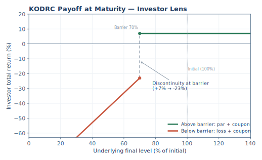

**Product:** 1-year KODRC, $100,000 face value, purchase price $93,000 (7% discount), stock initial $100, capital barrier (KI) at 70%, knock-out barrier at 120%, American observation for both.

- **Scenario 1 — Stock rises to $125 in month 4, finishes at $95:** KO barrier (120%) hit in month 4. Put is extinguished. Even though the stock falls to $95 by maturity, the investor receives $100,000. Paid $93,000. **Profit: $7,000 (7.5%).** The KO locked in safety.
- **Scenario 2 — Stock stays between $75 and $115 all year, finishes at $90:** Neither barrier hit. Capital barrier not breached (stock stayed above $70). Investor receives $100,000. Paid $93,000. **Profit: $7,000 (7.5%).** Same result as the KO scenario — but achieved by avoiding both barriers rather than triggering the KO.
- **Scenario 3 — Stock drops to $60 (−40%), KO never triggered:** Capital barrier breached (below $70). KO never hit. Redemption = $100,000 × ($60 / $100) = $60,000. Paid $93,000. **Loss: $33,000 (−35.5%).** Without the KO trigger, the product behaves like a standard DRC.
- **Scenario 4 — Stock spikes to $125 (KO triggered), then crashes to $50:** KO hit at $125 — put extinguished. Even after the crash to $50, the investor receives $100,000. Paid $93,000. **Profit: $7,000 (7.5%).** This is the KODRC's defining advantage: once knocked out, even a catastrophic decline cannot harm the investor.

**Risks to the investor**

| Risk | Description | Severity |
|------|------------|:--------:|
| **Capital barrier breach without KO** | If the stock declines without first rising to the KO, the investor faces the same loss as a DRC | High |
| **KO never triggered** | A sideways-moving stock may never reach the KO barrier, leaving the investor exposed to downside for the full term | Medium |
| **Smaller discount** | The cost of the KO feature reduces the investor's return compared to a plain DRC | Low |
| **Path dependency** | The outcome depends on the stock's path, not just its final level. A stock that rises then falls has a different outcome than one that just falls | Medium |
| **Issuer credit risk** | Exposure to the bank's creditworthiness | Medium |
| **Near-KO volatility** | If the stock hovers near the KO level, the desk faces intense hedging activity — Gamma is high near both barriers | Medium |

#### §8. THE BANK LENS — Desk Economics (1st Line of Defence)

**What the desk books**

The desk's position is the mirror image of the investor's. Where the investor is short the knock-in put, the desk is **long** that put (bought from the investor); the desk also holds the offsetting short knock-out feature, and has issued a discounted note, which is a funding liability. The investor's $7,000 discount is, to the desk, the net put premium (after paying for the KO feature) plus funding, returned to the client. Once the KO is triggered, the desk's long put is extinguished and the position collapses to a simple bond — all option risk vanishes.

**Greeks & hedging**

The desk is long the embedded knock-in put and short the knock-out feature, and delta-hedges by trading the underlying. The two-barrier structure creates more complex hedging than a plain DRC: near the KI, gamma spikes as the payoff turns discontinuous; near the KO, the put value drops rapidly because the option is about to be extinguished, so the desk must unwind hedge as the stock approaches 120%. Gamma is therefore concentrated at *two* price levels — the defining hedging challenge of this product. Risk management monitors proximity to both barriers simultaneously; after the KO event, the position becomes a simple bond and risk reports should show zero Greeks.

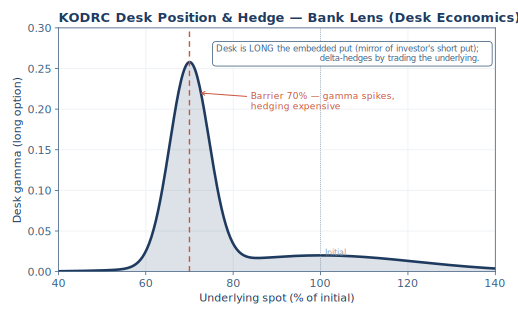

**How the bank makes money**

| Revenue Component | Detail |
|------------------|--------|
| **Structuring fee** | Embedded in note price at issuance (typically 1-3%) |
| **Bid-offer spread** | Spread between option cost and terms offered to investor |
| **Hedging P&L** | Delta-hedging profits from realized vs implied vol differential |
| **Funding advantage** | Issues note at sub-market effective funding rate |

**The discount decomposition (from [Section 2.2](#sec-2-2)):**

Gross put premium ~7.5%; cost of KO feature ~−2.0%; net put premium available ~5.5%; bond yield ~2.5%; Funds Transfer Pricing (FTP) −0.5%; desk margin ~−0.5% (lower margin due to smaller premium pool); **net discount ~7.0%**. The KO feature costs approximately 2% of the premium. This is why the KODRC discount (7%) is smaller than the DRC discount (9%) — the investor is paying for downside protection, and that 2% is the desk's cost of buying back the up-and-out feature on the put.

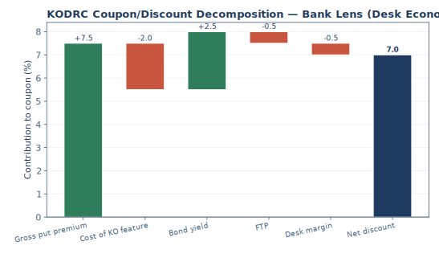

**P&L drivers**

Day to day, desk P&L is driven by realized-versus-implied volatility on the delta hedge, moves in the underlying near *either* barrier (gamma at the KI, rapid value decay at the KO), funding on the discounted note, and the mark-to-market of the embedded put. The structurer balances the KI and KO levels to achieve a marketable discount — moving the KO closer (easier to trigger) costs more and reduces the discount. Product Control attributes daily P&L between note accrual and option MTM, and performs Independent Price Verification of the put component. Critically, once the KO triggers the product's risk profile changes fundamentally: Product Control must verify the put MTM has rolled to zero and the position is marked as a plain bond.

#### §9. THE BANK LENS — Controls & Reconciliation (2nd Line of Defence)

**Booking & systems**

| Aspect | Detail |
|--------|--------|
| **Book of record** | NEMO |
| **Pricing/Risk system** | Sophis |
| **Booking structure** | Single note with embedded KI put + KO feature |
| **Four-leg framework?** | No |
| **Key booking fields** | Face value, issue price, initial level, KI barrier, KO barrier, barrier type (both), underlying(s), maturity |
| **Coupon schedule** | None — zero-coupon structure |
| **Barrier monitoring** | Both KI and KO typically American: continuous monitoring required |

**Reconciliation points**

| Recon point | What must agree | KODRC-specific break |
|-------------|-----------------|----------------------|
| **Trade economics** | Face value, issue price, initial level, KI barrier, KO barrier **and convention** (% vs absolute), maturity, underlying ID | KI/KO stored as absolute price in NEMO but % in Sophis — consistent only if initial level matches exactly |
| **Barrier direction** | KI below initial (70%), KO above initial (120%) consistent across systems | KI and KO levels swapped → all monitoring is wrong |
| **Observation type** | American (continuous) on both barriers vs daily-close checks | American barrier flagged but only daily closes monitored → intraday touch of KI or KO missed |
| **Fixings** | Initial and final fixing **source** matches the termsheet | Different vendors report different closing prices on the final observation |
| **KO event capture** | Knock-out flag consistent across NEMO and Sophis; put extinguished once set | KO hit intraday but flag not set → Sophis still values the extinguished put, P&L wrong |
| **KI event capture** | Knock-in flag consistent across NEMO and Sophis | Trade knocked in on an intraday touch but the flag is not set → redemption miscalculated |
| **Pricing reflects KO cost** | Issue price reflects both KI put premium and KO feature cost | Issue price matches a plain DRC → KO feature not priced |
| **P&L attribution & settlement** | Note accrual + put MTM reconciles to total; post-KO Greeks are zero; redemption = face × final/initial when KI breached | Post-KO trade still generating Delta/Gamma/Vega; or redemption math / share count wrong at settlement |

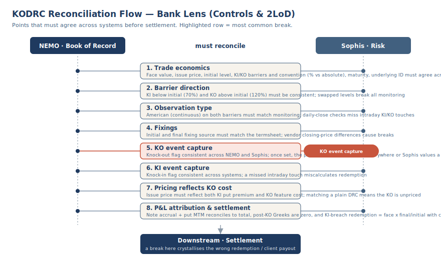

**Common breaks & red flags**

| Red Flag | What It Means | 2LoD Action |
|----------|--------------|-------------|
| KO triggered but trade still shows risk in Sophis | After KO, the embedded put is extinguished. If Sophis still values the put, P&L is wrong | Update KO status flag in both NEMO and Sophis before relying on either valuation |
| KI and KO barrier levels swapped | KI should be below initial (e.g., 70%), KO above (e.g., 120%). If reversed, all monitoring is wrong | Verify barrier directions match the termsheet |
| Only one barrier being monitored | Both KI and KO require continuous monitoring (if American). A system tracking only KI misses the KO trigger | Ensure both barriers have active monitoring feeds |
| Issue price not reflecting KO cost | The KODRC discount should be smaller than a comparable DRC. If the issue price matches a plain DRC, the KO feature may not be priced | Verify pricing reflects both KI put and KO feature |
| Post-KO trade still generating risk sensitivities | After KO, Delta, Gamma, and Vega should be zero. If risk reports still show Greek exposure, the model has not recognized the KO | Verify the risk model updates after the KO event |

**Control implication**

The defining control risk of a KODRC is **knock-out / early-redemption event capture**. Unlike a plain RC, a single mid-life event — the KO touch — permanently transforms the product from an option-bearing note into a plain bond. If that event is missed or not propagated to Sophis, the desk continues to value and risk-manage an option that no longer exists: P&L is overstated, phantom Greeks distort the risk reports, and a hedge may be run against a position that has ceased to exist. Conversely, a missed KI touch understates desk risk and overstates the investor's protection. Because both barriers are American, the 2nd line must confirm that intraday touches on *either* barrier are captured and that the KO flag, once set, irreversibly extinguishes the put in every system before settlement crystallises the redemption.

#### §10. Formal Definition

A **Knock-Out Discounted Reverse Convertible (KODRC)** is a DRC with an additional knock-out barrier above the initial stock level. The product consists of a zero-coupon bond purchased at a discount, a short knock-in put, and a long knock-out feature on that put. At maturity:

- If the KO barrier **has been hit** (at any time): **Redemption = 100% of Face Value** (put extinguished, risk eliminated)
- If the KO barrier was **not hit** and the KI barrier was **not breached**: **Redemption = 100% of Face Value**
- If the KO barrier was **not hit** and the KI barrier **was breached**: **Redemption = Face Value × (Final / Initial)**

**Key parameters:**
- **Purchase price:** Typically 90-96% of face value (smaller discount than a plain DRC)
- **Capital barrier (KI):** Typically 60-75% of initial level
- **Knock-out barrier:** Typically 110-130% of initial level
- **Barrier observation:** Typically American (continuous) for both barriers
- **Maturity:** Typically 6 months to 2 years

#### §11. Lifecycle

| Stage | Detail |
|-------|--------|
| **Trade date** | Terms agreed: underlying, strike/barrier, coupon, maturity. Pricing finalised. Book in NEMO; set face value, issue price, initial level, KI barrier, KO barrier, maturity |
| **Issue date** | Note issued. Investor pays par (or discount). Bank establishes hedge |
| **Daily monitoring** | Check underlying against BOTH barriers. If KO hit: flag trade as "knocked out" — risk eliminated, no further monitoring needed, redemption guaranteed at face value |
| **Final observation (if KO not triggered)** | Check KI breach. Calculate redemption |
| **Maturity** | If KO was hit OR KI not breached: return face value. If KI breached: return face value × (Final/Initial). Settlement: cash (par or adjusted) or physical delivery. T+2 settlement |

#### §12. Worked Example (both lenses)

**Product:** 1-year KODRC on Nestlé stock. **Face value:** $400,000. **Issue price:** 93% = $372,000 (7% discount). **Initial stock price:** CHF 105. **Capital barrier (KI):** 70% = CHF 73.50 (American). **Knock-out barrier:** 115% = CHF 120.75 (American). **Maturity:** 1 year.

*Investor lens:*
- **Scenario A — Stock hits CHF 122 in month 5:** KO triggered. Put extinguished. Regardless of subsequent performance, investor receives $400,000 at maturity. Paid $372,000. **Profit: $28,000 (7.5%).**
- **Scenario B — Stock never exceeds CHF 118, finishes at CHF 95:** KO not triggered. Stock above KI barrier (CHF 73.50). Investor receives $400,000. **Profit: $28,000 (7.5%).** Same profit, but risk persisted until maturity.
- **Scenario C — Stock drops to CHF 65, KO never triggered:** KI breached. Redemption = $400,000 × (65 / 105) = **$247,619**. Paid $372,000. **Loss: $124,381 (−33.4%).**

*Bank lens:*
- In Scenario A the desk's long put is knocked out when the stock touches CHF 122: the put MTM rolls to zero and the position becomes a plain bond returning $400,000 face. The desk keeps its structuring margin and net hedging P&L. The 2nd line must confirm the KO flag is set in both NEMO and Sophis and that all post-KO Greeks read zero — otherwise the desk runs a phantom hedge.
- In Scenario C the desk's long knock-in put is in the money: the investor bears the shortfall, so the desk's redemption obligation falls to $400,000 × (65/105) = $247,619, offsetting the long-put value. The 2nd line must confirm the redemption math (face × final/initial), the share count if physically settled (notional / strike), that the KO flag was never erroneously set, and that NEMO and Sophis agree before settlement.

#### §13. Knowledge Check

1. *(Investor)* **What happens to the embedded put option when the KO barrier is triggered?**
2. *(Investor)* **Why is the KODRC discount smaller than a plain DRC discount?**
3. *(Investor)* **Explain the path dependency in a KODRC with a concrete example.**
4. *(Investor)* **After the KO triggers, what is the risk profile of the remaining position?**
5. *(Desk economics / 1LoD)* **A trader says "the KODRC has Gamma risk at two price levels." Explain what this means and why, and how the desk's hedge behaves as the stock approaches each barrier.**
6. *(Desk economics / 1LoD)* **What position does the desk hold against the investor before the KO is triggered, and what does that position become the instant the KO is hit? Where does the desk's margin come from?**
7. *(Controls / 2LoD)* **A KODRC was knocked out two weeks ago. Name three reconciliation checks the 2nd line must perform, and the consequence for P&L and risk if the KO event was not propagated to Sophis.**

**Mental Models**

| Concept | Mental Model |
|---------|-------------|
| KODRC | Rock climbing with a safety rope — reaching the hook above removes the fall risk |
| KO barrier | The safety hook — once the climber clips in, they are protected |
| KI barrier | The cliff edge below — falling past it means injury |
| Path dependency | It matters whether the stock climbed up first then fell, or just fell |
| Smaller discount | The safety rope costs money — the investor pays for protection with a smaller return |
| 2LoD KO-event capture | The belay check — confirming the rope actually locked before anyone trusts the protection |

**Key Takeaways**

1. A KODRC is a DRC with an additional knock-out barrier above the initial stock level that permanently eliminates the investor's downside risk when triggered.
2. The KO feature costs money, resulting in a smaller discount than a plain DRC with the same capital barrier.
3. Path dependency matters: a stock that rises to 125% then falls to 60% has a different outcome than one that just falls to 60%.
4. After KO, the investor's position becomes a simple zero-coupon bond — and so does the desk's; all option risk vanishes on both sides.
5. The desk is long the embedded KI put (offsetting the investor's short) with gamma concentrated at two barrier levels; once the KO fires, the desk's option risk is extinguished too.
6. For the 2nd line, the dominant control risk is KO/KI event capture: a missed or unpropagated knock-out leaves the desk valuing and hedging a put that no longer exists, producing overstated P&L and phantom Greeks.

#### §14. Common Mistakes

1. **"The KO makes this product risk-free."** Only if the KO is triggered. If the stock declines without first rising to the KO level, the investor faces the same barrier breach risk as a plain DRC.
2. **Ignoring path dependency.** Two stocks finishing at 80% can have completely different outcomes: one hit 120% first (KO triggered, full face value returned) while the other stayed below 115% (KO never triggered, standard DRC outcome).
3. **Assuming the KO barrier resets.** The KO is a one-time event. Once the put is knocked out, it stays knocked out. There is no mechanism to re-activate the put.
4. **Forgetting to update systems after KO.** After the KO triggers, the product's risk profile changes fundamentally. If systems still show the embedded put, risk reports, P&L, and Greeks will all be wrong.
5. **Comparing KODRC discounts to DRC discounts without adjusting.** A 7% KODRC discount vs a 9% DRC discount does not mean the KODRC is worse — the 2% difference bought KO protection.
6. **(Controls) Trusting that a knock-out has propagated everywhere.** Because the KO event silently transforms the product into a plain bond, the 2nd line must reconcile the KO flag across NEMO and Sophis rather than assume a touch in the monitoring feed has flowed through to valuation and risk — an unpropagated KO leaves phantom option exposure on the books.
### Knowledge Check

**Review Questions:**
1. What two barriers does a KODRC have, and what does each one do?
2. Why is the discount on a KODRC smaller than on a plain DRC?
3. What happens to the position's risk profile after the KO barrier is triggered?
4. What is the difference between American and European observation for the KO barrier?
5. What three components make up a KODRC?


**Dual-lens questions:**
- *(Desk economics / 1LoD)* What position does the desk hold against the investor, and what is its primary Greek / hedging risk?
- *(Controls / 2LoD)* Which booking and risk-system fields must reconcile for this product, and which is the most common break?
**Scenario Questions:**
1. A KODRC has a KI at 65% and KO at 125%. The stock rises to 126% in month 3, then drops to 55% by maturity. What does the investor receive? Would this change if the KO were European (checked only at maturity)?
2. A risk analyst sees that a KODRC position still shows Delta exposure of -0.35 even though the KO was triggered two weeks ago. What is wrong?
3. Two KODRC products have identical terms except the KO barrier: Product A at 110%, Product B at 130%. Which has a larger discount, and why?

**Desk Question:**
A portfolio manager holds five KODRCs on different underlyings. Three have already knocked out. The manager asks: "Should I treat the knocked-out positions differently in my risk reporting?" Discuss the implications for portfolio risk aggregation.

### Visual Learning Recommendations

1. **Dual-barrier payoff diagram** — Payoff chart showing KI zone (below, losses), middle zone (no trigger, full face value), and KO zone (above, risk eliminated) — P1
2. **Path dependency comparison** — Two stock price paths with the same final price but different outcomes (one hits KO, one does not) — P1
3. **Construction waterfall** — Gross put premium - KO cost = Net premium available for discount — P2
4. **Barrier monitoring timeline** — Horizontal timeline showing KI and KO monitoring windows with trigger events marked — P2
5. **DRC vs KODRC trade-off table** — Side-by-side comparing discount size, risk profile, and monitoring requirements — P3

### Dependency References

| Concept Used | Where It Was Taught |
|-------------|-------------------|
| Put option, knock-in, knock-out | [Section 1.2](#sec-1-2) (Options), [Section 1.3](#sec-1-3) (Barriers) |
| Capital barrier | [Section 1.3](#sec-1-3) (Barrier Terminology Note) |
| American vs European barrier | [Section 1.3](#sec-1-3) (Barriers) |
| Delta, Gamma | [Section 1.4](#sec-1-4) (Greeks) |
| Product decomposition | [Section 2.2](#sec-2-2) (Product Construction) |
| Zero-coupon bond | [Section 1.7](#sec-1-7) (Yield Curves, Spot Rates, and Forward Rates) |
| NEMO/Sophis booking | [Section 2.8](#sec-2-8) (Systems Primer) |

---


#### Visual Specifications

**Visual 1: Knock-Out Discounted Reverse Convertible Payoff at Maturity**
- **Asset filename:** payoff_kodrc_maturity_01.svg
- **Caption:** "Knock-Out Discounted Reverse Convertible Payoff at Maturity"
- **Diagram elements:** X-axis: underlying price. Y-axis: investor total return. Key levels marked (strike, barrier if applicable). Compare with unstructured alternative
- **Reuse status:** Adapt from payoff template
**Visual 2: Knock-Out Discounted Reverse Convertible Product Construction**
- **Asset filename:** construction_kodrc_components_02.svg
- **Caption:** "Knock-Out Discounted Reverse Convertible Product Construction"
- **Diagram elements:** Component decomposition: each building block in separate box. Arrows showing how they combine to create the product. Cost allocation visible
- **Reuse status:** Adapt from construction template
**Visual 3: Knock-Out Discounted Reverse Convertible Lifecycle Timeline**
- **Asset filename:** lifecycle_kodrc_timeline_03.svg
- **Caption:** "Knock-Out Discounted Reverse Convertible Lifecycle Timeline"
- **Diagram elements:** Horizontal timeline from issue to maturity. Key events: issue, coupon dates, observation dates, maturity. Underlying price path overlay
- **Reuse status:** Adapt from lifecycle template
**Visual 4: Knock-Out Discounted Reverse Convertible Risk Heatmap**
- **Asset filename:** risk_kodrc_heatmap_04.svg
- **Caption:** "Knock-Out Discounted Reverse Convertible Risk Heatmap"
- **Diagram elements:** Grid: risk types (market, credit, liquidity, operational) vs severity (low/med/high). Colour-coded cells appropriate for Knock-Out Discounted Reverse Convertible
- **Reuse status:** Adapt from risk heatmap template
**Visual 5: Knock-Out Discounted Reverse Convertible vs Alternatives**
- **Asset filename:** comparison_kodrc_vs_alternatives_05.svg
- **Caption:** "Knock-Out Discounted Reverse Convertible vs Alternatives"
- **Diagram elements:** Multi-column comparison showing payoff across scenarios (-30%, flat, +15%, +30%). Compare with direct investment and simpler structured product
- **Reuse status:** New — comparison panel
**Visual 6: Knock-Out Discounted Reverse Convertible Suitability Decision Tree**
- **Asset filename:** decision_kodrc_suitability_06.svg
- **Caption:** "Knock-Out Discounted Reverse Convertible Suitability Decision Tree"
- **Diagram elements:** Decision tree guiding investor suitability. Key questions: risk tolerance, income need, market view, time horizon
- **Reuse status:** Adapt from decision tree template


**Dual-lens visuals (generated):**
- `assets/kodrc/controls_kodrc_recon_08.svg` `[generated]`
- `assets/kodrc/desk_kodrc_gamma_07.svg` `[generated]`
- `assets/kodrc/payoff_kodrc_01.svg` `[generated]`
- `assets/kodrc/waterfall_kodrc_09.svg` `[generated]`
#### Dependency References

| Concept Used | Where It Was Taught |
|-------------|-------------------|
| Equity fundamentals | [Section 1.4](#sec-1-4) (Equity Essentials) |
| Options mechanics | [Section 1.2](#sec-1-2) (Options From Zero) |
| Product decomposition | [Section 2.2](#sec-2-2) (Product Construction) |
| DRC | 5.1.4 — no barrier |
| RC | 5.1.2 — no discount/barrier |
| Shark Fin | 5.6.9 — up-and-out barrier |
### 5.1.6 Callable Reverse Convertible (CRC) {#sec-5-1-6}

> **Prerequisites:** [RC](#sec-5-1-2) &nbsp;|&nbsp; **Key concepts:** Bermudan exercise, embedded swaption, reinvestment risk

---

*This product is identical to the Reverse Convertible (5.1.2) just covered, except the issuer has the right to redeem the note early on specified dates. That single change gives the investor a higher coupon but introduces reinvestment risk. This chapter reads the product through two lenses: what it means for **the investor**, and what it means for **the bank** — the latter split into the desk's market economics (1st line of defence) and the controls and reconciliation that surround it (2nd line of defence).*

#### §1. Explain Like I'm New

A private banking client buys a 3-year RC paying 9% per year with a 70% capital barrier. The client expects to collect $9,000 per year for three years on a $100,000 investment. But after one year, the stock has risen to $120 and interest rates have dropped. The bank looks at the note and thinks: "We are paying 9% on this note, but the embedded put is now deeply out of the money — the stock is far above the barrier. We are overpaying."

In a standard RC, the bank is stuck — the note runs to maturity. But in a **Callable Reverse Convertible**, the bank reserved the right to redeem the note early. The bank calls the note: the investor receives $100,000 principal back plus any accrued coupon, and the note terminates.

The investor earned one year of 9% — excellent. But now the investor must reinvest $100,000 in a market where rates have fallen and RC coupons are lower. The investor might only find 6% on a new note.

The callable feature benefits the issuer, not the investor. In exchange for giving the bank this early redemption right, the investor received a higher coupon than a non-callable RC would pay — perhaps 9% instead of 7%. That extra 2% is the price the bank paid for the call option.

#### §2. Real-World Analogy

A Callable RC is like renting an apartment at below-market rent with a landlord's break clause.

A tenant signs a 3-year lease at $1,200 per month — well below the market rate of $1,500. The low rent is the tenant's reward. But the lease includes a clause: the landlord can terminate the lease at the end of any year, with 30 days' notice.

In most years, the landlord keeps the tenant because the arrangement is still profitable. But if the rental market heats up and comparable apartments rent for $2,000, the landlord exercises the break clause. The tenant must find a new apartment, likely at a higher rent.

The below-market rent is the enhanced coupon. The landlord's break clause is the issuer's call right. The new, higher rent is reinvestment risk. The tenant got a great deal while it lasted, but the landlord ended it when keeping the tenant was no longer in the landlord's interest. In this analogy the investor is the tenant — enjoying the discount and bearing the early-termination risk — while the bank is the landlord, holding the break clause.

#### §3. What Problem Does This Solve?

Callable Reverse Convertibles solve the **yield-maximisation** problem for investors who already accept barrier risk and want still more income.

Many investors want even higher yields than a standard RC offers. They are willing to accept the possibility that their high-yielding position might be taken away from them early.

| Investor Need | Why Standard RC Falls Short | What the CRC Offers |
|--------------|----------------------------|---------------------|
| Yield above 8% | RC coupon limited by put premium | Extra coupon from selling the call right |
| Short-term high income | RC locks in for full term | If called early, high income concentrated in a shorter period |
| View on stability | No mechanism to express a call view | Call probability is priced — informed investors can assess whether the extra coupon is sufficient |

#### §4. Product DNA

| Field | Value |
|-------|-------|
| **Full Name** | Callable Reverse Convertible |
| **Abbreviation** | CRC |
| **Family** | Equity-Linked Notes |
| **Complexity Score** | 5 / 10 |
| **Complexity Rationale** | RC with bank call right. Bank can terminate early in favourable scenarios. Extra coupon for call optionality |
| **Underlying Asset Class** | Equity (single stock or index) |
| **Capital Protection** | Conditional (same as RC) |
| **Coupon Type** | Enhanced fixed coupon (higher than RC due to call optionality sold) |
| **Maturity** | 1-3 years |
| **Liquidity** | Secondary market |
| **Primary System** | Murex |
| **ISDA Required** | No — issued as note |

**DNA Atlas Fields:**
- Primary Risk: Same downside as RC plus reinvestment risk if called early. Bank calls when position profitable for investor
- Typical Buyer: Yield-maximising investors willing to accept call risk. Private banking
- Typical Use Case: Higher coupon than standard RC by selling bank call right. Trade-off: potential early termination
- Building Blocks: Fixed-rate note + short put + short Bermudan call (both sold by the investor)
- Key Hedge: Long put + long Bermudan call, delta-hedge
- Similar Products: RC (5.1.2 — without call), Phoenix (5.1.3 — autocall vs bank call), ICN (5.1.11 — issuer callable)
- Most Important Greek: Vega (swaption/call vol sensitivity)

**Comparison Matrix Fields:**
- Complexity: 5
- Yield Potential: Very high (double optionality premium)
- Capital Protection: Conditional (same as RC)
- Credit Exposure: Issuer
- Liquidity: Secondary market
- Path Dependency: Yes (call observation dates)
- Volatility Sensitivity: Short vega (the investor sold both put and call)
- Correlation Sensitivity: None
- Client Type: Private banking
- Market Environment: Best in stable markets (neither put triggered nor call exercised)

#### §5. Who Touches This Product

| Role | Responsibility |
|------|---------------|
| **Structurer** | Designs Callable Reverse Convertible terms: strike, barrier, coupon, maturity. Optimises structure for client and bank |
| **Trader** | Hedges embedded options. Manages Greeks (delta, gamma, vega). Prices secondary market |
| **Sales** | Distributes Callable Reverse Convertible to target clients. Explains payoff scenarios and risk-return profile |
| **Risk Management** | Monitors option Greeks, barrier proximity, concentration risk. Sets trading limits |
| **Product Control** | Daily P&L attribution between note accrual and option MTM. Independent price verification |
| **Operations** | Processes coupon payments and maturity settlement. Handles physical delivery if applicable |
| **Legal / Compliance** | Reviews term sheet for regulatory compliance. Ensures suitability for target investor base |
| **Quantitative Analytics** | Prices embedded derivatives. Calibrates volatility surface. Provides model validation |

#### §6. Product Evolution

| Stage | Product | What Was Added | Why |
|:-----:|---------|---------------|-----|
| 1 | Plain vanilla bond | — (baseline) | Fixed coupon, full principal return |
| 2 | Equity-linked note | Equity participation or option embedded | Market return exposure with note wrapper |
| 3 | Callable Reverse Convertible | Specific structural features added | Product-specific innovation: RC with bank call right. Bank can terminate early in favourable scenarios. Extra coupon for call optionality |

---

#### §7. THE INVESTOR LENS

**Why the investor buys it**

1. **Higher coupon.** The CRC pays more than a standard RC because the investor is selling two options: the put (barrier risk) and the call (early redemption risk).
2. **Income maximisation.** Investors who prioritise current income over term certainty prefer the CRC's enhanced yield.
3. **Call probability assessment.** Sophisticated investors can estimate the probability of being called and decide whether the extra coupon adequately compensates.
4. **Short-duration preference.** If the note is called early, the investor recovers principal sooner than expected — useful in rising-rate environments.
5. **Yield curve positioning.** In flat or inverted yield curve environments, the call premium is higher, making CRCs more attractive relative to standard RCs.

**Position taken**

The investor simultaneously holds a long bond (lends principal to the issuer), a **short** knock-in put (sold to the bank), and a **short** Bermudan call right on the note (also sold to the bank). Net, the investor is **short volatility** — hurt by volatile markets on the put — and additionally short the call optionality, which exposes the investor to early redemption and the reinvestment risk that follows. With a single underlying there is no correlation exposure.

**Payoff & scenarios**

The investor's payoff at maturity is identical to the standard RC: above the barrier, the investor receives 100% principal plus coupons; below the barrier, the investor receives (Final / Initial) × principal plus coupons, and the payoff is **discontinuous** at the barrier. The callable feature adds a path-dependent overlay — at each call date the issuer may terminate the note, returning 100% principal plus accrued coupon and truncating the investor's income stream.

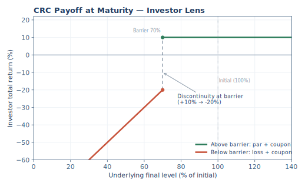

**Product:** 3-year CRC, $100,000 notional, 10% annual coupon, stock initial $100, capital barrier (KI) at 70%, callable annually by the issuer, European barrier observation.

- **Scenario 1 — Stock at $115 after Year 1, issuer calls:** The stock is well above the barrier and the call level. The issuer exercises the call. The investor receives $100,000 principal + $10,000 coupon for Year 1. **Total: $110,000.** The note terminates. The investor must reinvest at current rates.
- **Scenario 2 — Stock at $85 after Year 1, no call. Stock at $95 at maturity:** The issuer does not call in Year 1 (the put still has meaningful value). The stock finishes above the 70% barrier at maturity. The investor receives $100,000 + $30,000 total coupons (3 years × 10%). **Total: $130,000.**
- **Scenario 3 — Stock drops to $55 at maturity (−45%), never called:** Capital barrier breached. Redemption = $100,000 × ($55 / $100) = $55,000. Plus $30,000 in total coupons. **Total: $85,000. Net loss: $15,000.** The coupons partially cushioned the loss, but a 45% stock decline overwhelmed them.
- **Scenario 4 — Stock rises slowly, called after Year 2:** The issuer calls after Year 2. The investor receives $100,000 + $20,000 (2 coupons). **Total: $120,000.** The investor earned the enhanced yield for 2 of 3 years.

**Risks to the investor**

| Risk | Description | Severity |
|------|------------|:--------:|
| **Barrier breach** | Same capital risk as a standard RC — if the stock falls below the barrier, principal is reduced | High |
| **Call risk (reinvestment)** | If called, the investor must reinvest at prevailing rates, which are likely lower (the issuer calls when rates have moved against the investor) | Medium-High |
| **Adverse selection** | The issuer calls when it benefits the issuer, not the investor. The investor is always called at the worst time from their perspective | Medium |
| **Shortened income stream** | A 3-year 10% coupon becomes a 1-year 10% coupon if called after Year 1 — total income drops from $30,000 to $10,000 | Medium |
| **Issuer credit risk** | Exposure to the bank's creditworthiness | Medium |
| **Illiquidity** | Selling before maturity (or before a call date) involves bid-offer spread | Medium |

#### §8. THE BANK LENS — Desk Economics (1st Line of Defence)

**What the desk books**

The desk's position is the mirror image of the investor's. Where the investor is short the knock-in put, the desk is **long** that put (bought from the investor); where the investor is short the Bermudan call right on the note, the desk is **long** that call — it holds the right to redeem the note early. Alongside these, the desk has issued a note, which is a funding liability. The investor's enhanced coupon is, to the desk, the cost of the put premium plus the call premium plus funding, returned to the client. The desk's call right is the lever the CRC adds over a plain RC: at each call date the desk decides whether to exercise. When the stock is high and the put is worth little, the cost of continuing to pay the enhanced coupon exceeds the value of the put, and the rational decision is to call.

**Greeks & hedging**

The desk is long the embedded knock-in put and the embedded Bermudan call, and delta-hedges by trading the underlying. Because the put's payoff is discontinuous at the barrier, gamma spikes as the underlying approaches the barrier and hedging becomes expensive and error-prone — this is where the desk's structuring margin is earned or lost. The Bermudan call adds vega and interest-rate sensitivity: if rates drop, the call becomes more valuable to the issuer, which is why the desk treats the call right as a rate-sensitive position. The desk monitors delta, gamma, vega, and barrier proximity closely as maturity, the barrier, and each call date approach; risk management may impose limits on concentrated barrier exposure.


**How the bank makes money**

| Revenue Component | Detail |
|------------------|--------|
| **Structuring fee** | Embedded in note price at issuance (typically 1-3%) |
| **Bid-offer spread** | Spread between option cost and terms offered to the investor |
| **Hedging P&L** | Delta-hedging profits from realised vs implied vol differential |
| **Funding advantage** | Issues note at sub-market effective funding rate |

**The coupon decomposition:**

Coupon = Bond interest + Put premium + Call premium − Funds Transfer Pricing (FTP) − Desk margin

For a 10% coupon: bond interest (bank's credit curve) ~2.0%; put premium (KI put) ~7.5%; call premium (Bermudan call) ~2.0%; FTP (internal funding cost) −0.5%; desk margin −1.0%; **net coupon 10.0%**. The 2% call premium is the key addition over a plain RC. The investor is selling two options: one against their principal (the put) and one against their future cash flows (the call). Both generate premium that flows to the coupon.

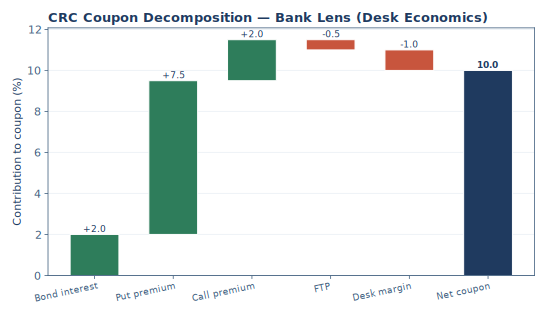

**P&L drivers**

Day to day, desk P&L is driven by realised-versus-implied volatility on the delta hedge, moves in the underlying near the barrier (gamma), the mark-to-market of the embedded put and Bermudan call, interest-rate moves that revalue the call right, funding, and the call decision itself at each call date. The trader manages the call decision: calling crystallises the value of the call right when the stock is high and the put is worthless. Product Control attributes P&L between fixed-coupon accrual and option MTM, performs Independent Price Verification (IPV) of the embedded options, and verifies call-decision P&L.

#### §9. THE BANK LENS — Controls & Reconciliation (2nd Line of Defence)

**Booking & systems**

| Aspect | Detail |
|--------|--------|
| **Book of record** | NEMO |
| **Pricing/Risk system** | Sophis |
| **Booking structure** | Single note with embedded KI put + Bermudan call |
| **Four-leg framework?** | No |
| **Key booking fields** | Notional, initial level, barrier, coupon rate, call dates, no-call period (the initial period during which the issuer cannot exercise), call notice period, underlying(s), maturity |
| **Coupon schedule** | Fixed payments on scheduled dates (quarterly or semi-annually) |
| **Call monitoring** | Track call dates. Before each call date, the desk decides whether to exercise |

**Reconciliation points**

| Recon point | What must agree | CRC-specific break |
|-------------|-----------------|--------------------|
| **Trade economics** | Notional, initial level, barrier level **and convention**, coupon rate & frequency, maturity, underlying ID | Barrier stored as absolute price in NEMO but % in Sophis — consistent only if the initial level matches the conversion |
| **Observation type** | European (maturity-only) vs American (continuous) barrier | American barrier flagged but only daily closes monitored → intraday breaches missed |
| **Fixings** | Initial and final fixing **source** matches the termsheet | Different vendors report different closing prices on the final observation |
| **Barrier event capture** | Knock-in flag consistent across NEMO and Sophis | Trade knocked in on a breach but the flag is not set → redemption miscalculated |
| **Call schedule & no-call period** | Call dates, no-call period, and call notice period agree across NEMO and Sophis and against the termsheet | System allows a call inside the no-call period → contractually invalid call |
| **Call decision & exercise capture** | Documented call/no-call decision for every call date; if called, early termination flagged | Call date passed with no recorded decision, or call exercised but note not terminated in NEMO |
| **Coupon lifecycle** | Schedule, day-count, and that coupon stops on the call date | Coupon paid after the note was called → cash control failure |
| **P&L attribution / option model** | Coupon accrual + put MTM + Bermudan call MTM reconciles to total; call valued on a Bermudan model | Bermudan call valued as European → call right and P&L understated |

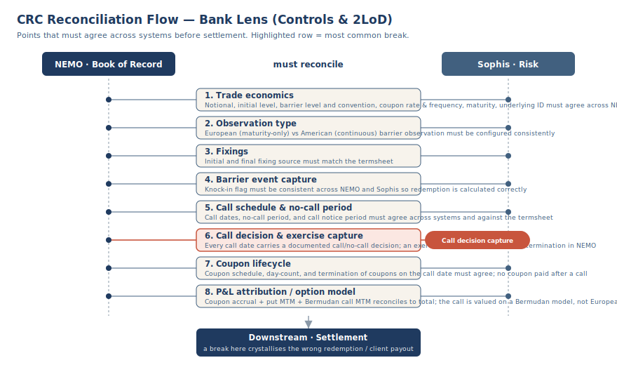

**Common breaks & red flags**

| Red Flag | What It Means | 2LoD Action |
|----------|---------------|-------------|
| Call date passed but no call decision recorded | Every call date requires a documented decision (call or no-call). Missing documentation creates audit risk | Ensure the desk records the call/no-call decision for every call date |
| Coupon paid after call | If the note was called, no further coupons should be paid. A post-call coupon is a cash control failure | Verify that the coupon schedule terminates on the call date |
| No-call period not enforced | If the system allows a call within the no-call period, the call is contractually invalid | Verify that the no-call period is correctly configured in both systems |
| Call notice not sent within contractual window | Most CRCs require 5-30 business days' notice before the call date. A late notice may invalidate the call | Track notice deadlines and confirm delivery |
| Bermudan call valued as European | A Bermudan call (exercisable on multiple dates) is worth more than a European call (single date). Using the wrong model undervalues the issuer's option | Verify that Sophis uses a Bermudan pricing model, not European |

**Control implication**

Each break has a direct consequence the 2nd line must size before it reaches the books or the client. The CRC's distinctive control risks centre on the call right: a missed or undocumented call decision leaves the note's status ambiguous, and a call notice sent outside the contractual window can invalidate an exercise the desk has already priced as crystallised. The 2nd line must confirm that every call date carries a documented decision, that the call notice was delivered within the no-call and notice-period constraints, and — critically — that an exercised call is captured as an early redemption: the note terminated in NEMO, the coupon schedule stopped on the call date, and the principal-plus-accrued payment booked. A failure to capture the early redemption pays coupons on a dead note and overstates outstanding risk; a Bermudan call mismodelled as European misstates the value of the very optionality the extra coupon was sold for. The reconciliation exists precisely to catch these inconsistencies before settlement crystallises them.

#### §10. Formal Definition

A **Callable Reverse Convertible (CRC)** is a standard RC with an embedded issuer call option. The issuer has the right — but not the obligation — to redeem the note early at par (100% of principal) on specified call dates.

At maturity (if not called):
- If the capital barrier has **not** been breached: **Redemption = 100% of Principal**
- If the capital barrier **has** been breached: **Redemption = Principal × (Final / Initial)**

If called before maturity:
- **Redemption = 100% of Principal + accrued coupon**

**Key parameters:**
- **Coupon:** Higher than a non-callable RC (typically +1-3% above comparable RC)
- **Call dates:** Typically annual or semi-annual
- **Call notice period:** Usually 5-30 business days before the call date (specified in the no-call period definition)
- **No-call period:** The initial period during which the issuer cannot call (typically 6-12 months)
- **Barrier:** Same structure as standard RC

#### §11. Lifecycle

| Stage | Detail |
|-------|--------|
| **Trade date** | Terms agreed: underlying, strike/barrier, coupon, maturity. Book in NEMO; set all parameters including call schedule and no-call period. Pricing finalised |
| **Issue date** | Note issued. The investor pays par (or discount). The bank establishes the hedge |
| **Coupon dates** | Periodic observations and coupon payments. Barrier monitoring |
| **Call decision dates** | Before each call date, the desk evaluates whether calling is profitable. If the stock is high and the put is out of the money, the issuer calls |
| **If called** | Pay principal + accrued coupon. Terminate the note. Update NEMO status to early-redeemed |
| **If not called** | Continue to the next coupon / call date |
| **Maturity (if never called)** | Final observation. Determine barrier breach. Calculate redemption. Settlement: cash (par or adjusted) or physical delivery. T+2 settlement |

#### §12. Worked Example (both lenses)

**Product:** 3-year CRC on LVMH stock. **Notional:** $600,000. **Coupon:** 10% annual, paid semi-annually (5% per half-year = $30,000). **Initial stock price:** €820. **Capital barrier:** 70% = €574 (European observation). **Call dates:** Semi-annually, after a 1-year no-call period. **Maturity:** 3 years.

*Investor lens:*
- **Year 1:** Stock at €890. No-call period — the issuer cannot call. The investor receives 2 × $30,000 = $60,000 in coupons.
- **Year 2 decision:** Stock at €950 (+16%). The put is deeply out of the money. The issuer calls. The investor receives $600,000 principal + $30,000 accrued (half-year coupon). **Total received: $600,000 + $60,000 (Year 1) + $30,000 (Year 2 half-year) = $690,000.** Total return: $90,000 (15%) over 1.5 years.
- **If not called, held to maturity at €750 (−8.5%):** Stock above barrier. The investor receives $600,000 + $180,000 total coupons (3 years). **Total: $780,000.** Return: 30%.

*Bank lens:*
In the call scenario the desk's long put is deeply out of the money and its long Bermudan call is in the money: with the stock at €950 the cost of continuing the 10% coupon exceeds the residual put value, so the desk exercises its call, returns $600,000 principal plus the $30,000 accrued half-year coupon, and stops paying the enhanced coupon — crystallising the value of the call right and keeping its structuring margin and net hedging P&L. The 2nd line must confirm the call decision is documented, the notice was sent within the contractual window, the early redemption is captured in NEMO (note terminated, coupon schedule stopped on the call date), and that NEMO and Sophis agree on the principal-plus-accrued payment before settlement. In the held-to-maturity scenario the desk's put expires worthless, the call right lapses unexercised, and Product Control confirms the option MTMs roll to zero and the coupon accrual closes out.

#### §13. Knowledge Check

1. **Why does a CRC pay a higher coupon than a comparable non-callable RC?** *(Investor)*
2. **When does the issuer rationally decide to call a CRC?** *(Investor)*
3. **What is reinvestment risk, and why is it particularly relevant for CRC investors?** *(Investor)*
4. **Explain the concept of adverse selection in the context of a CRC call decision.** *(Investor)*
5. **A CRC has a 1-year no-call period. Why does this exist, and how does its length affect the coupon?** *(Investor)*
6. **(Desk economics / 1LoD)** What two options is the desk long against the investor, and how does the desk decide whether to exercise its call right at a call date? Why does the call become more valuable to the desk when the stock is high or rates fall?
7. **(Controls / 2LoD)** Name three reconciliation breaks specific to a CRC's call feature and the consequence of each — including what must be true in NEMO once a call is exercised.

**Mental Models**

| Concept | Mental Model |
|---------|-------------|
| Callable RC | Renting at below-market rate with a landlord's break clause — great deal while it lasts, but the landlord ends it when keeping the tenant is no longer in their interest |
| Call premium | The rent discount the investor received in exchange for accepting the break clause |
| Reinvestment risk | Finding a new apartment after the landlord terminates — likely at a higher rent |
| Adverse selection | The landlord only terminates when it benefits the landlord, never when it benefits the tenant |
| No-call period | A lease minimum — the landlord cannot terminate in the first year regardless of market conditions |
| Desk call right | The landlord's option — the desk is long the break clause the investor is short |
| 2LoD call capture | The building registry — confirms the lease actually ended, on the right date, before anyone stops paying or moves on |

**Key Takeaways**

1. A CRC is an RC where the issuer has the right to redeem the note early, paying the investor 100% of principal plus accrued coupon.
2. The higher coupon (vs a non-callable RC) is funded by the call premium the investor sells to the issuer; the desk holds the offsetting long call right.
3. The issuer calls when the stock is high and the put is worthless — exactly when the investor would prefer to keep the position.
4. Reinvestment risk is the primary cost: the investor must reinvest at lower rates after being called.
5. The no-call period protects the investor from immediate calls and affects the call premium (and therefore the coupon).
6. For the 2nd line, the dominant control risks are the call-decision and notice capture, no-call-period enforcement, coupon termination on call, and Bermudan-vs-European model use — each can misstate the note's status, P&L, or whether a coupon should still be paid.

#### §14. Common Mistakes

1. **"The investor will collect the 10% coupon for the full 3 years."** The issuer can call the note early. A 3-year CRC often lives only 1-2 years. Planning for the full income stream is unrealistic.
2. **Ignoring reinvestment risk.** Being called early feels like a positive event (principal returned, coupon earned), but the investor must now reinvest in a market where the equivalent product pays less.
3. **Comparing CRC coupons to non-callable RC coupons directly.** A 10% CRC vs a 7% RC does not mean the CRC is "better." The extra 3% compensates for call risk. Apples-to-oranges comparisons mislead clients.
4. **Assuming the no-call period guarantees the full first year's coupon.** The no-call period means the issuer cannot call during that time, but it does not protect against barrier breach or other risks.
5. **Forgetting to process the call notice.** A missed call notice can invalidate the call or create contractual disputes. Operations must track notice deadlines rigorously.
6. **(Controls) Treating an exercised call as a non-event in the book of record.** When the desk calls, the 2nd line must confirm the early redemption is captured — note terminated in NEMO, coupon schedule stopped on the call date, and principal-plus-accrued booked — otherwise the bank pays coupons on a dead note and overstates outstanding risk.
### Knowledge Check

**Review Questions:**
1. What two options has the CRC investor sold, and what does each generate?
2. What is a no-call period, and why is it included in CRC termsheets?
3. What system books a CRC, and how does the call right affect booking compared to a standard RC?
4. Why does the issuer typically call when the stock has risen?
5. What is the difference between a Bermudan and European call option?


**Dual-lens questions:**
- *(Desk economics / 1LoD)* What position does the desk hold against the investor, and what is its primary Greek / hedging risk?
- *(Controls / 2LoD)* Which booking and risk-system fields must reconcile for this product, and which is the most common break?
**Scenario Questions:**
1. A CRC pays 10% annually on $500,000, with a 1-year no-call period and annual call dates. The issuer calls after Year 2. Calculate the investor's total return in dollars and as a percentage.
2. An investor holds two positions: a 3-year RC at 7% and a 3-year CRC at 10%, both on the same underlying with the same barrier. The CRC is called after Year 1. After reinvesting at 6%, which investor earns more over 3 years?
3. Operations failed to send the call notice within the required 15-business-day window. The call date passes without the notice. What are the consequences?

**Desk Question:**
A structurer is debating between offering a client a 3-year non-callable RC at 8% or a 3-year CRC at 11%. The client prioritizes income stability. Which product should the structurer recommend, and how should reinvestment risk be explained?

### Visual Learning Recommendations

1. **CRC payoff with call overlay** — RC payoff diagram with call dates marked on a timeline, showing truncation points — P1
2. **Coupon decomposition comparison** — Waterfall showing RC decomposition vs CRC decomposition, highlighting the additional call premium — P1
3. **Call decision tree** — At each call date: stock high + put worthless → Call. Otherwise → Continue — P2
4. **Reinvestment risk timeline** — Investor receives high coupon (10%), gets called, must reinvest at lower rate (6%), showing income drop over the full original term — P1
5. **No-call period diagram** — Timeline showing the no-call window, first eligible call date, and subsequent call dates — P2

### Dependency References

| Concept Used | Where It Was Taught |
|-------------|-------------------|
| Put option, knock-in | [Section 1.2](#sec-1-2) (Options), [Section 1.3](#sec-1-3) (Barriers) |
| Call option, Bermudan exercise | [Section 1.2](#sec-1-2) (Options) |
| Capital barrier | [Section 1.3](#sec-1-3) (Barrier Terminology Note) |
| Delta, Gamma, Vega | [Section 1.4](#sec-1-4) (Greeks) |
| Product decomposition, coupon formula | [Section 2.2](#sec-2-2) (Product Construction) |
| NEMO/Sophis booking | [Section 2.8](#sec-2-8) (Systems Primer) |

---


#### Visual Specifications

**Visual 1: Callable Reverse Convertible Payoff at Maturity**
- **Asset filename:** payoff_crc_maturity_01.svg
- **Caption:** "Callable Reverse Convertible Payoff at Maturity"
- **Diagram elements:** X-axis: underlying price. Y-axis: investor total return. Key levels marked (strike, barrier if applicable). Compare with unstructured alternative
- **Reuse status:** Adapt from payoff template
**Visual 2: Callable Reverse Convertible Product Construction**
- **Asset filename:** construction_crc_components_02.svg
- **Caption:** "Callable Reverse Convertible Product Construction"
- **Diagram elements:** Component decomposition: each building block in separate box. Arrows showing how they combine to create the product. Cost allocation visible
- **Reuse status:** Adapt from construction template
**Visual 3: Callable Reverse Convertible Lifecycle Timeline**
- **Asset filename:** lifecycle_crc_timeline_03.svg
- **Caption:** "Callable Reverse Convertible Lifecycle Timeline"
- **Diagram elements:** Horizontal timeline from issue to maturity. Key events: issue, coupon dates, observation dates, maturity. Underlying price path overlay
- **Reuse status:** Adapt from lifecycle template
**Visual 4: Callable Reverse Convertible Risk Heatmap**
- **Asset filename:** risk_crc_heatmap_04.svg
- **Caption:** "Callable Reverse Convertible Risk Heatmap"
- **Diagram elements:** Grid: risk types (market, credit, liquidity, operational) vs severity (low/med/high). Colour-coded cells appropriate for Callable Reverse Convertible
- **Reuse status:** Adapt from risk heatmap template
**Visual 5: Callable Reverse Convertible vs Alternatives**
- **Asset filename:** comparison_crc_vs_alternatives_05.svg
- **Caption:** "Callable Reverse Convertible vs Alternatives"
- **Diagram elements:** Multi-column comparison showing payoff across scenarios (-30%, flat, +15%, +30%). Compare with direct investment and simpler structured product
- **Reuse status:** New — comparison panel
**Visual 6: Callable Reverse Convertible Suitability Decision Tree**
- **Asset filename:** decision_crc_suitability_06.svg
- **Caption:** "Callable Reverse Convertible Suitability Decision Tree"
- **Diagram elements:** Decision tree guiding investor suitability. Key questions: risk tolerance, income need, market view, time horizon
- **Reuse status:** Adapt from decision tree template


**Dual-lens visuals (generated):**
- `assets/crc/controls_crc_recon_08.svg` `[generated]`
- `assets/crc/desk_crc_gamma_07.svg` `[generated]`
- `assets/crc/payoff_crc_01.svg` `[generated]`
- `assets/crc/waterfall_crc_09.svg` `[generated]`
#### Dependency References

| Concept Used | Where It Was Taught |
|-------------|-------------------|
| Equity fundamentals | [Section 1.4](#sec-1-4) (Equity Essentials) |
| Options mechanics | [Section 1.2](#sec-1-2) (Options From Zero) |
| Product decomposition | [Section 2.2](#sec-2-2) (Product Construction) |
| RC | 5.1.2 — without call |
| Phoenix | 5.1.3 — autocall vs bank call |
| ICN | 5.1.11 — issuer callable |
### 5.1.7 Airbag / Leveraged Reverse Convertible {#sec-5-1-7}

> **Prerequisites:** [RC](#sec-5-1-2) &nbsp;|&nbsp; **Key concepts:** Leverage ratio, put spread, cushion zone

---

*This product is identical to the Reverse Convertible (5.1.2), except the capital barrier is higher and losses below the barrier are calculated relative to the barrier level, not the initial level. That change creates a wider safety zone but a steeper drop if the barrier is breached. This chapter reads the product through two lenses: what it means for **the investor**, and what it means for **the bank** — the latter split into the desk's market economics (1st line of defence) and the controls and reconciliation that surround it (2nd line of defence).*

#### §1. Explain Like I'm New

Tomás is looking at two RC options on the same stock. Both pay a 7% coupon. The first has a capital barrier at 65% — the stock must fall 35% before the investor loses money. The second has a barrier at 80% — the stock only needs to fall 20%.

At first glance, the higher barrier seems strictly worse. But the second product has a twist: if the stock does fall below 80%, the loss is calculated differently. Instead of losing 1% of principal for every 1% the stock falls from $100, the investor loses based on how far the stock fell below the barrier.

If the stock finishes at $60:
- **Standard RC (65% barrier):** Breached. Redemption = $60/$100 = 60%. Loss: 40%.
- **Airbag (80% barrier):** Breached. Redemption = $60/$80 × 100% = 75%. Loss: 25%.

The Airbag investor actually loses less at $60 than the standard RC investor, despite having a higher (easier to hit) barrier. The trade-off is in the zone between the two barriers: at $70, the standard RC investor is safe (above 65%) while the Airbag investor is already in trouble (below 80%).

This is an **Airbag Reverse Convertible** — a wider cushion that absorbs more of the impact when it is hit, but triggers at smaller bumps.

#### §2. Real-World Analogy

An Airbag RC is like a ski slope with a wider run but a steeper drop-off.

Imagine two ski runs down the same mountain. Run A is narrow — the marked trail is just 20 meters wide, with a gentle slope beyond the edge. Run B is 35 meters wide — much more room to maneuver — but beyond the edge, the terrain drops away sharply.

On Run A, a skier is more likely to stay in bounds, but going off-piste means a relatively soft landing. On Run B, there is a wider margin of error, but skiing off the edge means a steeper, faster descent.

The width of the run is the barrier distance from the initial price. The gradient beyond the edge is the leverage factor below the barrier. Run B (the Airbag) gives more room to make mistakes, but punishes the skier differently when they do go off course.

Most recreational skiers prefer Run B: the wider trail means they rarely go off-piste, and the steep drop-off beyond the edge is a risk they accept in exchange for that wider margin.

#### §3. What Problem Does This Solve?

Some investors want more protection against moderate stock declines but are willing to accept a different loss profile in extreme scenarios. The standard RC barrier at 65% provides no protection for a stock that falls 36%. The Airbag barrier at 80% starts protecting from a 21% decline.

| Investor Need | Why Standard RC Falls Short | What the Airbag Offers |
|--------------|----------------------------|------------------------|
| Protection from moderate declines (20-35%) | RC barrier at 65% misses these | Higher barrier at 75-80% catches them |
| Loss mitigation in severe declines | RC loss = full stock decline | Airbag loss calculated from barrier, not initial price |
| Wider safety cushion | RC cushion is narrow (30-40%) | Airbag cushion is wider (20-25% decline before breach) |

#### §4. Product DNA

| Field | Value |
|-------|-------|
| **Full Name** | Airbag Note |
| **Abbreviation** | Airbag |
| **Family** | Equity-Linked Notes |
| **Complexity Score** | 4 / 10 |
| **Complexity Rationale** | Leveraged RC with airbag protection zone between strike and barrier. Amplified upside participation above strike |
| **Underlying Asset Class** | Equity (single stock or index) |
| **Capital Protection** | Partial (airbag absorbs losses between strike and barrier) |
| **Coupon Type** | Fixed coupon (comparable to RC); geared downside below the barrier |
| **Maturity** | 2-5 years |
| **Liquidity** | Secondary market |
| **Primary System** | Murex |
| **ISDA Required** | No — issued as note |

**DNA Atlas Fields:**
- Primary Risk: Full loss below airbag barrier. In airbag zone, losses are cushioned. Above strike, leveraged participation
- Typical Buyer: Investors seeking leveraged upside with partial downside buffer. Institutional, private banking
- Typical Use Case: Leveraged upside (e.g., 150% participation) with airbag buffer zone on downside
- Building Blocks: Leveraged call + short put spread (strike to barrier) + long digital at barrier
- Key Hedge: Delta-hedge leveraged call, put spread replication
- Similar Products: PPN (5.1.1 — full protection), RC (5.1.2 — no leverage), Booster (5.1.13 — leveraged upside)
- Most Important Greek: Delta (leveraged equity sensitivity)

**Comparison Matrix Fields:**
- Complexity: 4
- Yield Potential: High (leveraged upside participation)
- Capital Protection: Partial (airbag zone provides buffer)
- Credit Exposure: Issuer
- Liquidity: Secondary market
- Path Dependency: No (or European observation)
- Volatility Sensitivity: Complex (long call vega + short put spread vega)
- Correlation Sensitivity: None
- Client Type: Institutional / Private banking
- Market Environment: Best in moderately bullish markets

#### §5. Who Touches This Product

| Role | Responsibility |
|------|---------------|
| **Structurer** | Designs Airbag Note terms: strike, barrier, coupon, maturity. Optimises structure for client and bank |
| **Trader** | Hedges embedded options. Manages Greeks (delta, gamma, vega). Prices secondary market |
| **Sales** | Distributes Airbag Note to target clients. Explains payoff scenarios and risk-return profile |
| **Risk Management** | Monitors option Greeks, barrier proximity, concentration risk. Sets trading limits |
| **Product Control** | Daily P&L attribution between note accrual and option MTM. Independent price verification |
| **Operations** | Processes coupon payments and maturity settlement. Handles physical delivery if applicable |
| **Legal / Compliance** | Reviews term sheet for regulatory compliance. Ensures suitability for target investor base |
| **Quantitative Analytics** | Prices embedded derivatives. Calibrates volatility surface. Provides model validation |

#### §6. Product Evolution

| Stage | Product | What Was Added | Why |
|:-----:|---------|---------------|-----|
| 1 | Plain vanilla bond | — (baseline) | Fixed coupon, full principal return |
| 2 | Equity-linked note | Equity participation or option embedded | Market return exposure with note wrapper |
| 3 | Airbag Note | Specific structural features added | Product-specific innovation: Leveraged RC with airbag protection zone between strike and barrier. Amplified upside participation above strike |

---

#### §7. THE INVESTOR LENS

**Why the investor buys it**

1. **Wider protection zone.** The higher barrier means the stock must fall less before triggering a loss — providing more day-to-day comfort.
2. **Moderated losses in severe declines.** Below the barrier, losses are calculated from the barrier level, softening the impact compared to a standard RC at the same final stock price.
3. **Same coupon, different risk shape.** The Airbag coupon is comparable to a standard RC because the higher barrier (more likely to trigger) offsets the modified loss formula (softer impact).
4. **View on moderate risk.** Investors who believe a 20-30% decline is unlikely but a 40%+ crash is very unlikely favor the Airbag's wider cushion.
5. **Behavioral preference.** A higher barrier feels like "more protection," which is psychologically reassuring even though the product triggers more easily.

**Position taken**

The investor simultaneously holds a long bond (lends principal to the issuer) and a **short** modified knock-in put (sold to the bank). The critical structural difference from a standard RC is that the put's strike is set at the barrier level (e.g. 75%), not the initial level (100%). When the barrier is breached, the investor participates in the stock's decline measured from the barrier, creating an implicit leverage factor of Initial / Barrier (1.33× for a 75% barrier). Net, the investor is **short volatility** and carries leveraged equity downside below the barrier. With a single underlying there is no correlation exposure.

**Payoff & scenarios**

The investor's payoff has two zones. Above the barrier at maturity: the investor receives 100% principal plus coupon. Below the barrier at maturity: the investor receives (Final / Barrier) × principal plus coupon — a steeper slope than a standard RC because the denominator is the barrier (75%), not the initial level (100%), but starting from a higher point. The leverage factor (Initial / Barrier) governs how quickly losses accumulate below the barrier; the absolute dollar loss is still typically less than a standard RC at the same final price. The payoff is **discontinuous** at the barrier.

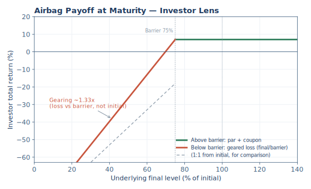

**Product:** 1-year Airbag RC, $100,000 notional, 7% coupon, stock initial $100, capital barrier (KI) at 75%, European observation.

- **Stock finishes at $110 (+10%):** Above barrier. The investor receives $100,000 + $7,000 coupon = **$107,000.** Same as a standard RC.
- **Stock finishes at $80 (−20%):** Above the 75% barrier. No breach. The investor receives $100,000 + $7,000 = **$107,000.** A standard RC with a 65% barrier would also pass, but a standard RC with a 75% barrier and standard loss formula would have been breached.
- **Stock finishes at $60 (−40%):** Below barrier. Redemption = $100,000 × ($60 / $75) = **$80,000**. Plus $7,000 coupon. **Total: $87,000. Loss: $13,000 (−13%).** Compare to a standard RC at 65% barrier with the same final price: Redemption = $60,000. Total: $67,000. Loss: $33,000 (−33%). The Airbag investor loses significantly less.
- **Stock finishes at $30 (−70%):** Severe decline. Redemption = $100,000 × ($30 / $75) = **$40,000**. Plus $7,000. **Total: $47,000. Loss: $53,000 (−53%).** Even the Airbag cannot fully protect against a catastrophic decline, but the loss is still less than a standard RC ($30,000 + $7,000 = $37,000, loss $63,000).

**Risks to the investor**

| Risk | Description | Severity |
|------|------------|:--------:|
| **Higher trigger probability** | The 75% barrier is hit by a 25% stock decline; a 65% barrier requires a 35% decline. The Airbag triggers more easily | Medium-High |
| **Leverage below barrier** | The effective leverage factor (1.33× in this example) means the slope of losses is steeper per unit of decline from the barrier | Medium |
| **Zone of disadvantage** | Between the two barrier levels (e.g., stock at 70%), the standard RC investor is safe while the Airbag investor has breached. This is the Airbag's weak zone | Medium |
| **Barrier breach** | If the stock falls severely, the Airbag still results in large losses, though smaller than a standard RC | High |
| **Complexity** | The modified loss formula is harder for investors to understand than the simple Final/Initial formula | Low |
| **Issuer credit risk** | Exposure to the bank's creditworthiness | Medium |

#### §8. THE BANK LENS — Desk Economics (1st Line of Defence)

**What the desk books**

The desk's position is the mirror image of the investor's. Where the investor is short the modified knock-in put, the desk is **long** that put (bought from the investor); alongside it the desk has issued a note, which is a funding liability. The key structural feature is that the put strike sits at the barrier level (75%), not the initial level — so the desk is long a put struck at the barrier, and the redemption it must compute on a breach is Final / Barrier rather than Final / Initial. The investor's coupon is, to the desk, the cost of the put premium plus funding, returned to the client.

**Greeks & hedging**

The desk is long the embedded modified knock-in put and delta-hedges by trading the underlying. Because the put strike is set at the barrier rather than the initial level, the leverage factor (Initial / Barrier) amplifies the sensitivity: near the barrier, delta jumps more sharply than for a standard RC, and gamma spikes harder as the underlying approaches the barrier. Hedging is therefore more aggressive and more error-prone near the barrier — this is where the desk's structuring margin is earned or lost. Because the higher barrier sits closer to spot, more of the book approaches the breach zone in moderate sell-offs; the book carries more barrier risk than an equivalent standard RC book, and risk management may impose limits on concentrated barrier exposure.

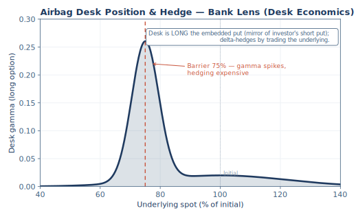

**How the bank makes money**

| Revenue Component | Detail |
|------------------|--------|
| **Structuring fee** | Embedded in note price at issuance (typically 1-3%) |
| **Bid-offer spread** | Spread between option cost and terms offered to investor |
| **Hedging P&L** | Delta-hedging profits from realized vs implied vol differential |
| **Funding advantage** | Issues note at sub-market effective funding rate |

The coupon decomposes the same way as a standard RC — bond interest plus the premium on the put the investor sold, less internal funding (FTP) and desk margin — but the premium reflects a put struck at the barrier (75%) rather than at the initial level. The higher barrier raises the probability of breach, while the modified Final / Barrier loss formula softens the payout per breach; these two effects roughly offset, which is why the Airbag coupon is comparable to a standard RC despite the higher, easier-to-hit barrier.

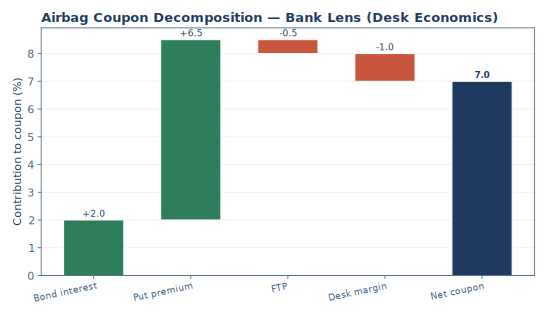

**P&L drivers**

Day to day, desk P&L is driven by realized-versus-implied volatility on the delta hedge, moves in the underlying near the barrier (gamma, amplified by the leverage factor), funding, and the mark-to-market of the embedded modified put. Product Control performs daily P&L attribution between note accrual and option MTM, and independent price verification of the put component — verifying, in particular, that the redemption math uses Final / Barrier, not Final / Initial.

#### §9. THE BANK LENS — Controls & Reconciliation (2nd Line of Defence)

**Booking & systems**

| Aspect | Detail |
|--------|--------|
| **Book of record** | NEMO |
| **Pricing/Risk system** | Sophis |
| **Booking structure** | Single note with modified KI put (strike at barrier, not initial) |
| **Four-leg framework?** | No |
| **Key booking fields** | Notional, initial level, barrier level (also the effective strike), barrier type, coupon rate, underlying(s), maturity |
| **Coupon schedule** | Fixed payments on scheduled dates |
| **Barrier monitoring** | European or American, same as standard RC |

At trade date, the put strike must be set at the barrier level (75%), not the initial level (100%). At coupon dates, fixed coupon payments are processed with no conditionality. Barrier monitoring is the same as an RC; the only difference is the redemption calculation if breached — return Principal × (Final / Barrier) rather than Principal × (Final / Initial).

**Reconciliation points**

| Recon point | What must agree | Airbag-specific break |
|-------------|-----------------|-----------------------|
| **Trade economics** | Notional, initial level, barrier level **and convention**, coupon rate & frequency, maturity, underlying ID | Barrier stored as absolute price in NEMO but % in Sophis — consistent only if the initial level is mapped correctly |
| **Put strike = barrier** | Put strike must equal the barrier level (75%), not the initial level (100%) | Strike booked at 100% → product silently reverts to a standard RC with the wrong loss formula |
| **Gearing factor** | Implicit leverage = Initial / Barrier (1.33×) recorded and consistent across NEMO, Sophis and risk reporting | Leverage factor not captured or stored inconsistently → risk reporting understates the steepness of the loss slope |
| **Redemption formula** | Breach redemption = Final / Barrier in both NEMO and Sophis | Formula stored as Final / Initial in one system → a 20% redemption error at $60 ($80k correct vs $60k wrong) |
| **Observation type** | European (maturity-only) vs American (continuous) | American barrier flagged but only daily closes monitored → intraday breaches missed |
| **Barrier event capture** | Knock-in flag consistent across NEMO and Sophis | Trade knocked in on an intraday touch but the flag is not set → redemption miscalculated |
| **Coupon lifecycle** | Schedule, day-count, whether the coupon survives a knock-in | Coupon paid on a knocked-in trade where the termsheet says it should stop |
| **P&L attribution** | Note accrual + modified-put MTM reconciles to total | Unexplained P&L points to a stale vol surface, a wrong fixing, or a Final/Initial redemption error |

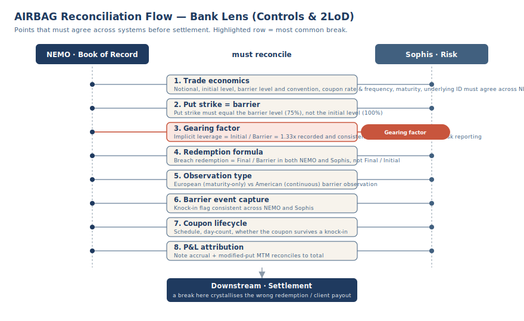

**Common breaks & red flags**

| Red Flag | What It Means | 2LoD Action |
|----------|---------------|-------------|
| Put strike recorded as initial level (100%) instead of barrier level (75%) | This changes the redemption formula from Final/Barrier to Final/Initial — a completely different product | Verify put strike matches the barrier level in the termsheet |
| Redemption calculated as Final/Initial instead of Final/Barrier | At $60 final: correct = $60/$75 = 80%. Incorrect = $60/$100 = 60%. A 20% error in redemption | Verify the formula in both NEMO and Sophis |
| Leverage factor not documented | The implicit leverage (Initial/Barrier) should be recorded for risk reporting | Calculate and store the leverage factor (e.g., 1.33×) |
| Standard RC template used for Airbag | If NEMO has a standard RC booking template, the Airbag's modified formula may not be supported | Verify that the system supports the modified redemption formula |
| Barrier and strike treated as separate parameters | In the Airbag, the barrier and the put strike are the same number (75%). If they are entered separately and differ, the product is mispriced | Confirm barrier = put strike in both systems |

**Control implication**

The dominant 2nd-line control on this product is the capture of the gearing factor and the modified loss formula. Because the barrier serves double duty — as the knock-in trigger and as the denominator in the loss calculation — a single mis-keyed field cascades: booking the put strike at 100% instead of 75% silently converts the Airbag into a standard RC, and computing redemption as Final / Initial rather than Final / Barrier misstates the client payout by a fixed multiple of the leverage factor (a 20% redemption error at $60). The implicit leverage (Initial / Barrier = 1.33×) must be calculated, stored, and reconciled across NEMO, Sophis and risk reporting, because nothing else in the trade record makes the steeper loss slope visible. The reconciliation exists precisely to catch these inconsistencies before settlement crystallises the wrong payout.

#### §10. Formal Definition

An **Airbag Reverse Convertible** (also called a Leveraged RC) is an RC with a modified loss formula below the capital barrier. At maturity:

- If the underlying has **not** breached the capital barrier: **Redemption = 100% of Principal**
- If the underlying **has** breached the capital barrier: **Redemption = Principal × (Final Level / Barrier Level)**

The leverage factor is implicit: Leverage = Initial Level / Barrier Level. For a barrier at 75%, Leverage = 100/75 = 1.33×.

**Key parameters:**
- **Barrier:** Typically 70-85% (higher than standard RC)
- **Coupon:** Comparable to a standard RC (the higher barrier probability offsets the softer loss formula)
- **Leverage factor:** Initial / Barrier (e.g., 1.33× for 75% barrier)
- **Barrier observation:** European or American

#### §11. Lifecycle

| Stage | Detail |
|-------|--------|
| **Trade date** | Terms agreed: underlying, strike/barrier, coupon, maturity. Pricing finalised. Book in NEMO; critically, the put strike must be set at the barrier level (75%), not the initial level (100%) |
| **Issue date** | Note issued. The investor pays par (or discount). The bank establishes the hedge |
| **Coupon dates** | Periodic observations and coupon payments (if applicable). Barrier monitoring. No conditionality |
| **Maturity** | Final observation. If no breach: return 100% principal. If breached: return Principal × (Final / Barrier). Settlement: cash (par or adjusted) or physical delivery. T+2 settlement |

#### §12. Worked Example (both lenses)

**Product:** 1-year Airbag RC on Adidas stock. **Notional:** $300,000. **Coupon:** 7.5% annual, paid semi-annually (3.75% per half-year = $11,250). **Initial stock price:** €210. **Capital barrier:** 75% = €157.50 (European observation). **Leverage factor:** 210 / 157.50 = 1.33×. **Maturity:** 1 year.

*Investor lens:*
- **At maturity, Adidas closes at €180 (−14.3%):** Above barrier (€157.50). The investor receives $300,000 + $22,500 coupons = **$322,500.** Return: +7.5%.
- **At maturity, Adidas closes at €140 (−33.3%):** Below barrier (€157.50). Redemption = $300,000 × (€140 / €157.50) = **$266,667**. Plus $22,500 coupons. **Total: $289,167. Loss: $10,833 (−3.6%).** Compare to standard RC (65% barrier): not breached at €140 (= 66.7%), so the investor gets $322,500. The Airbag is worse in this zone — the standard RC's lower barrier saved it.
- **At maturity, Adidas closes at €100 (−52.4%):** Below both barriers. Airbag: Redemption = $300,000 × (€100 / €157.50) = **$190,476**. Standard RC: Redemption = $300,000 × (€100 / €210) = **$142,857**. The Airbag investor recovers $47,619 more.

*Bank lens:*
In the first scenario the desk's long modified put expires worthless; the desk keeps its structuring margin and net hedging P&L, having funded the $22,500 of coupons, and Product Control confirms the put MTM rolls to zero. In the breach scenarios the desk's long put is in the money and offsets the desk's redemption obligation. The 2nd line must confirm the redemption math uses Final / Barrier (not Final / Initial), that the put strike and barrier both read €157.50 / 75%, that the stored leverage factor is 1.33×, and that NEMO and Sophis agree before settlement.

#### §13. Knowledge Check

1. *(Investor)* **What is the leverage factor in an Airbag RC, and how is it calculated?**
2. *(Investor)* **Why does the Airbag have a higher barrier than a standard RC but sometimes produce smaller losses?**
3. *(Investor)* **At what stock price level is the Airbag investor worse off than a standard RC investor?**
4. *(Investor)* **How does the put strike differ between a standard RC and an Airbag?**
5. *(Investor)* **A client says: "The 75% barrier means I lose 25% of my money if the stock drops below it." Correct this.**
6. **(Desk economics / 1LoD)** What position does the desk hold against the investor, and why does the desk's delta and gamma jump more sharply near the barrier than for a standard RC? Where is the desk's structuring margin made or lost?
7. **(Controls / 2LoD)** Name three reconciliation breaks specific to an Airbag — including the gearing factor — and the consequence of each for the investor's redemption.

**Mental Models**

| Concept | Mental Model |
|---------|-------------|
| Airbag RC | A ski slope — wider trail (higher barrier, more room to stay safe) but a steeper drop-off out of bounds |
| Higher barrier trade-off | Wider safety cushion, but it triggers at smaller bumps |
| Final/Barrier formula | Losses measured from the edge of the trail, not from the top of the mountain |
| Leverage factor | The steepness of the drop — Initial/Barrier determines how quickly losses accumulate below the barrier |
| Zone of disadvantage | The stretch between the two barrier levels where the standard RC is safe but the Airbag is already in trouble |
| 2LoD reconciliation | The trail inspector — confirms the barrier doubles as the put strike and that the loss is measured from the edge, not the summit, before anyone pays out |

**Key Takeaways**

1. An Airbag RC has a higher barrier than a standard RC, providing a wider cushion against moderate declines.
2. Below the barrier, losses are calculated as Final/Barrier (not Final/Initial), creating an implicit leverage factor of Initial/Barrier.
3. For severe declines, the Airbag investor loses less than a standard RC investor at the same final stock price.
4. The zone of disadvantage lies between the two barrier levels — here, the standard RC passes while the Airbag is breached.
5. The put strike equals the barrier level, not the initial level — a critical distinction for booking and reconciliation.
6. For the 2nd line, the dominant control risks are the put-strike-equals-barrier rule, the Final/Barrier redemption formula, and capture of the implicit leverage factor (Initial/Barrier) — each can misstate the redemption by a fixed multiple if booked wrong.

#### §14. Common Mistakes

1. **"Higher barrier means more risk."** Partly true: the barrier triggers more easily. But the modified loss formula means losses below the barrier are less severe than a standard RC. The total risk profile is a trade-off, not strictly worse.
2. **Using Final/Initial for the redemption calculation.** The Airbag formula is Final/Barrier. Using Initial as the denominator underestimates the redemption amount and produces the wrong payoff.
3. **Ignoring the zone of disadvantage.** Between the two barrier levels (e.g., 65-75%), the standard RC is safe while the Airbag is breached. Investors must understand this specific price range.
4. **Treating leverage as "bad."** The leverage factor (1.33×) sounds alarming, but it applies to a decline measured from a lower base (the barrier). The absolute dollar loss is still typically less than a standard RC.
5. **Assuming the same coupon implies the same risk.** An Airbag at 7% and a standard RC at 7% have different risk shapes: the Airbag trades trigger frequency for loss severity.
6. **(Controls) Booking the put strike at the initial level, or storing no leverage factor.** Because the barrier doubles as the put strike and as the loss-formula denominator, the 2nd line must confirm strike = barrier (75%) and that the implicit leverage (Initial/Barrier = 1.33×) is recorded and reconciled across NEMO and Sophis — rather than assume the standard RC template captured it.
### Knowledge Check

**Review Questions:**
1. What is the redemption formula for an Airbag RC when the barrier is breached?
2. How is the leverage factor calculated, and what does it represent?
3. Why is the coupon on an Airbag comparable to a standard RC despite the higher barrier?
4. What is the put strike in an Airbag, and how does it differ from a standard RC?
5. What is the "zone of disadvantage" for an Airbag investor?


**Dual-lens questions:**
- *(Desk economics / 1LoD)* What position does the desk hold against the investor, and what is its primary Greek / hedging risk?
- *(Controls / 2LoD)* Which booking and risk-system fields must reconcile for this product, and which is the most common break?
**Scenario Questions:**
1. Two products on the same stock (initial $100): Standard RC (barrier 65%, 7% coupon) and Airbag (barrier 80%, 7% coupon). Stock finishes at $55. Calculate the redemption and loss for each. Which investor is better off?
2. A Product Control analyst runs the Airbag redemption as $100,000 × ($60/$100) = $60,000. The barrier is 75%. What is the correct calculation, and how large is the error?
3. An investor is choosing between a standard RC with a 65% barrier and an Airbag with a 78% barrier. At what final stock price range is the standard RC superior?

**Desk Question:**
A risk manager notices that the desk's Airbag book has 15 positions with barriers between 75% and 82%. In a 20% market sell-off, many of these barriers will be breached. How does this differ from the barrier risk profile of a standard RC book, and what should the risk manager prepare for?

### Visual Learning Recommendations

1. **Airbag vs Standard RC payoff comparison** — Overlaid payoff diagrams showing the different slopes and barrier positions — P1
2. **Zone of disadvantage diagram** — Highlighted region between the two barrier levels where the standard RC outperforms — P1
3. **Loss comparison table** — At five stock levels ($80, $70, $60, $50, $40), showing the redemption and loss for both standard RC and Airbag — P2
4. **Leverage factor visualization** — How the slope changes with different barrier levels (70%, 75%, 80%), showing steeper slopes for higher barriers — P2
5. **Coupon and barrier monitoring timeline** — Quarterly coupon schedule with the higher Airbag barrier marked, showing the wider protection zone relative to a standard RC timeline — P1

### Dependency References

| Concept Used | Where It Was Taught |
|-------------|-------------------|
| Put option, knock-in | [Section 1.2](#sec-1-2) (Options), [Section 1.3](#sec-1-3) (Barriers) |
| Capital barrier | [Section 1.3](#sec-1-3) (Barrier Terminology Note) |
| Delta, Gamma | [Section 1.4](#sec-1-4) (Greeks) |
| Product decomposition, coupon formula | [Section 2.2](#sec-2-2) (Product Construction) |
| Leverage, payoff slope | [Section 1.2](#sec-1-2) (Options — payoff diagrams) |
| NEMO/Sophis booking | [Section 2.8](#sec-2-8) (Systems Primer) |

---


#### Visual Specifications

**Visual 1: Airbag Note Payoff at Maturity**
- **Asset filename:** payoff_airbag_maturity_01.svg
- **Caption:** "Airbag Note Payoff at Maturity"
- **Diagram elements:** X-axis: underlying price. Y-axis: investor total return. Key levels marked (strike, barrier if applicable). Compare with unstructured alternative
- **Reuse status:** Adapt from payoff template
**Visual 2: Airbag Note Product Construction**
- **Asset filename:** construction_airbag_components_02.svg
- **Caption:** "Airbag Note Product Construction"
- **Diagram elements:** Component decomposition: each building block in separate box. Arrows showing how they combine to create the product. Cost allocation visible
- **Reuse status:** Adapt from construction template
**Visual 3: Airbag Note Lifecycle Timeline**
- **Asset filename:** lifecycle_airbag_timeline_03.svg
- **Caption:** "Airbag Note Lifecycle Timeline"
- **Diagram elements:** Horizontal timeline from issue to maturity. Key events: issue, coupon dates, observation dates, maturity. Underlying price path overlay
- **Reuse status:** Adapt from lifecycle template
**Visual 4: Airbag Note Risk Heatmap**
- **Asset filename:** risk_airbag_heatmap_04.svg
- **Caption:** "Airbag Note Risk Heatmap"
- **Diagram elements:** Grid: risk types (market, credit, liquidity, operational) vs severity (low/med/high). Colour-coded cells appropriate for Airbag Note
- **Reuse status:** Adapt from risk heatmap template
**Visual 5: Airbag Note vs Alternatives**
- **Asset filename:** comparison_airbag_vs_alternatives_05.svg
- **Caption:** "Airbag Note vs Alternatives"
- **Diagram elements:** Multi-column comparison showing payoff across scenarios (-30%, flat, +15%, +30%). Compare with direct investment and simpler structured product
- **Reuse status:** New — comparison panel
**Visual 6: Airbag Note Suitability Decision Tree**
- **Asset filename:** decision_airbag_suitability_06.svg
- **Caption:** "Airbag Note Suitability Decision Tree"
- **Diagram elements:** Decision tree guiding investor suitability. Key questions: risk tolerance, income need, market view, time horizon
- **Reuse status:** Adapt from decision tree template


**Dual-lens visuals (generated):**
- `assets/airbag/controls_airbag_recon_08.svg` `[generated]`
- `assets/airbag/desk_airbag_gamma_07.svg` `[generated]`
- `assets/airbag/payoff_airbag_01.svg` `[generated]`
- `assets/airbag/waterfall_airbag_09.svg` `[generated]`
#### Dependency References

| Concept Used | Where It Was Taught |
|-------------|-------------------|
| Equity fundamentals | [Section 1.4](#sec-1-4) (Equity Essentials) |
| Options mechanics | [Section 1.2](#sec-1-2) (Options From Zero) |
| Product decomposition | [Section 2.2](#sec-2-2) (Product Construction) |
| PPN | 5.1.1 — full protection |
| RC | 5.1.2 — no leverage |
| Booster | 5.1.13 — leveraged upside |
### 5.1.8 Bonus / Participation Note {#sec-5-1-8}

> **Prerequisites:** [RC](#sec-5-1-2) &nbsp;|&nbsp; **Key concepts:** Down-and-in barrier, conditional bonus, continuous observation

---

*This product combines elements of the PPN (5.1.1) — upside participation — with elements of the RC (5.1.2) — barrier-based downside risk. The result is a note that offers the investor a guaranteed minimum return (the bonus floor) and participation in stock gains, protected by a knock-out barrier that can void the guarantee. This chapter reads the product through two lenses: what it means for **the investor**, and what it means for **the bank** — the latter split into the desk's market economics (1st line of defence) and the controls and reconciliation that surround it (2nd line of defence).*

#### §1. Explain Like I'm New

Consider an investor who wants to put money into a stock they like, but who wants two things that seem contradictory: to benefit if the stock goes up, AND to receive a guaranteed minimum return if the stock goes sideways.

A bank offers a 2-year Bonus Note linked to the Nikkei index. The terms:
- If the Nikkei finishes above its starting level, the investor earns the full index return (100% participation).
- If the Nikkei finishes flat or slightly down — anywhere above the knockout barrier at 70% — the investor still receives a **bonus** return of 110% (a guaranteed 10% gain).
- But if the Nikkei ever drops below 70% during the two years, the bonus guarantee is **knocked out**. The investor then receives only the actual index performance — which could be a loss.

The bonus floor is the safety net. The knock-out barrier is the condition under which the safety net is removed. As long as the market avoids a crash, the investor gets either the upside or the guaranteed minimum — whichever is higher.

#### §2. Real-World Analogy

A Bonus Note is like a market trader setting up a stall with a rain guarantee from the market organizer.

A trader rents a stall at an outdoor market. The organizer offers a deal: if the weather is decent (stock stays above the barrier), the trader is guaranteed to earn at least $500 for the day, even if foot traffic is slow (the bonus floor). If the sun shines and crowds flock to the market (stock rises), the trader earns based on actual sales — potentially much more than $500 (upside participation).

But the guarantee has a condition: if a severe thunderstorm hits (stock drops below the KO barrier), the guarantee is void. In a storm, the trader earns only whatever sales they manage to make from the few remaining customers — which could be far less than $500.

The stall rent is the investment. The guaranteed $500 is the bonus floor. Sunny skies with big crowds represent the upside. The severe thunderstorm is the barrier breach that voids the guarantee. Most market days are fine — the trader either does well or collects the guaranteed minimum. Only a catastrophic storm takes away the safety net.

#### §3. What Problem Does This Solve?

Many investors want upside exposure but fear flat markets more than crashes. In a flat market, stocks earn nothing but bonds at least pay interest. The Bonus Note solves this by guaranteeing a minimum return even when the market is flat, while preserving full upside participation.

| Investor Need | Why Standard Products Fail | What the Bonus Note Offers |
|--------------|----------------------------|---------------------------|
| Upside participation | Bonds cap the return at the coupon | Full participation in stock gains |
| Protection from flat markets | Stocks earn nothing in flat markets | Guaranteed 10%+ even if stock is flat |
| Not pure protection | PPNs sacrifice upside for safety | Full upside above the bonus level |

#### §4. Product DNA

| Field | Value |
|-------|-------|
| **Full Name** | Bonus Note |
| **Abbreviation** | Bonus |
| **Family** | Equity-Linked Notes |
| **Complexity Score** | 4 / 10 |
| **Complexity Rationale** | Participation note with a bonus minimum return if the barrier holds; principal exposed to full downside if the KO barrier is breached |
| **Underlying Asset Class** | Equity (index or stock) |
| **Capital Protection** | Conditional — if the KO barrier is breached the bonus is voided and principal tracks the underlying (full downside, no protection) |
| **Coupon Type** | Bonus coupon if barrier not breached |
| **Maturity** | 3-5 years |
| **Liquidity** | Secondary market |
| **Primary System** | Murex |
| **ISDA Required** | No — issued as note |

**DNA Atlas Fields:**
- Primary Risk: Barrier breach eliminates bonus. Below barrier, product behaves like direct equity (full loss exposure)
- Typical Buyer: Conservative investors wanting equity exposure with minimum return guarantee
- Typical Use Case: Guaranteed minimum bonus return (e.g., 15%) if underlying stays above barrier. Full participation above that
- Building Blocks: ZCB + European call + long down-and-out put + bonus coupon mechanism
- Key Hedge: ZCB hedge, delta-hedge call, DI put replication
- Similar Products: PPN (5.1.1 — guaranteed protection), Shark Fin (5.6.9 — barrier with rebate), Phoenix (5.1.3 — conditional coupon)
- Most Important Greek: Gamma (near barrier) + Delta (participation)

**Comparison Matrix Fields:**
- Complexity: 4
- Yield Potential: Moderate-High (bonus + participation above bonus level)
- Capital Protection: Conditional (barrier-dependent)
- Credit Exposure: Issuer
- Liquidity: Secondary market
- Path Dependency: Yes (continuous barrier observation)
- Volatility Sensitivity: Short vega near barrier
- Correlation Sensitivity: None
- Client Type: Retail / Private banking
- Market Environment: Best when expecting moderate positive returns with low downside risk

#### §5. Who Touches This Product

| Role | Responsibility |
|------|---------------|
| **Structurer** | Designs Bonus Note terms: strike, barrier, coupon, maturity. Optimises structure for client and bank |
| **Trader** | Hedges embedded options. Manages Greeks (delta, gamma, vega). Prices secondary market |
| **Sales** | Distributes Bonus Note to target clients. Explains payoff scenarios and risk-return profile |
| **Risk Management** | Monitors option Greeks, barrier proximity, concentration risk. Sets trading limits |
| **Product Control** | Daily P&L attribution between note accrual and option MTM. Independent price verification |
| **Operations** | Processes coupon payments and maturity settlement. Handles physical delivery if applicable |
| **Legal / Compliance** | Reviews term sheet for regulatory compliance. Ensures suitability for target investor base |
| **Quantitative Analytics** | Prices embedded derivatives. Calibrates volatility surface. Provides model validation |

#### §6. Product Evolution

| Stage | Product | What Was Added | Why |
|:-----:|---------|---------------|-----|
| 1 | Plain vanilla bond | — (baseline) | Fixed coupon, full principal return |
| 2 | Equity-linked note | Equity participation or option embedded | Market return exposure with note wrapper |
| 3 | Bonus Note | Specific structural features added | Product-specific innovation: Participation note with a bonus minimum return if the barrier holds; principal exposed to full downside if the KO barrier is breached |

---

#### §7. THE INVESTOR LENS

**Why the investor buys it**

1. **Best-of-both returns.** The investor earns the higher of the bonus floor or the actual stock return — upside is uncapped (or has a high cap).
2. **Flat market protection.** Even if the stock goes nowhere, the bonus floor delivers a meaningful return.
3. **Participation in growth.** Unlike fixed-coupon products (RC, DRC), the Bonus Note lets the investor benefit from strong stock performance.
4. **Conditional guarantee.** The knock-out barrier makes the product cheaper than a fully guaranteed product — the guarantee is real but contingent on no severe crash.
5. **Diversification appeal.** The Bonus Note behaves like a stock in rising markets and like a guaranteed product in flat markets — two return profiles in one.

**Position taken**

The investor holds a long bond (lends principal to the issuer) combined with a **long** call (participation in the upside) and a **long** down-and-out put bought from the bank (the bonus guarantee, which knocks out if the barrier is breached). The bonus floor is the value of that conditional put. Net, while the barrier is intact the investor is **long** the conditional guarantee and **short volatility near the barrier** (hurt by a path that pierces the KO). With a single underlying there is no correlation exposure. If the barrier is breached the conditional put disappears and the investor is left holding straight equity exposure below the floor.

**Payoff & scenarios**

The investor's payoff has two regimes. While the KO barrier is never breached: the investor receives MAX(bonus level, stock return × participation) — below the bonus level the floor kicks in, above it participation kicks in. If the KO barrier is breached at any point: the floor is voided and the investor receives the actual stock return, which can be positive (if the stock recovers after the breach) or negative. The product is **path-dependent** — it matters *when* the barrier was touched, not just where the stock finishes.

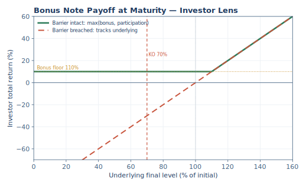

**Product:** 2-year Bonus Note, $100,000 notional, bonus level 110%, participation 100%, KO barrier at 70% (American, continuous), linked to the Nikkei.

- **Scenario 1 — Nikkei finishes at 125% of initial (+25%):** The investor earns the stock return: $100,000 × 125% = **$125,000.** Stock return exceeds the bonus level — the investor gets the higher amount. **Profit: $25,000 (25%).**
- **Scenario 2 — Nikkei finishes at 95% (−5%), barrier never touched:** Stock return would be $95,000 (a $5,000 loss). But the bonus floor applies: $100,000 × 110% = **$110,000.** The investor receives the bonus. **Profit: $10,000 (10%).** The guarantee turned a flat market into a positive return.
- **Scenario 3 — Nikkei drops to 65% at month 8 (KO triggered), finishes at 90%:** The KO barrier (70%) was breached at month 8. The bonus guarantee is voided. The investor receives the actual stock performance: $100,000 × 90% = **$90,000.** **Loss: $10,000 (−10%).** Without the KO, the investor would have received $110,000 (the bonus). The barrier breach cost $20,000.
- **Scenario 4 — Nikkei drops to 55% and finishes at 55%:** KO triggered. No bonus. Redemption = $100,000 × 55% = **$55,000.** **Loss: $45,000 (−45%).** The guarantee is gone, and the investor participates fully in the decline.

**Risks to the investor**

| Risk | Description | Severity |
|------|------------|:--------:|
| **KO barrier breach** | If breached, the bonus guarantee vanishes. The investor is left with unprotected stock exposure | High |
| **Path dependency** | A stock that dips below 70% then recovers to 110% produces a worse outcome than one that stays above 70% and finishes at 95% | High |
| **No coupon income** | The Bonus Note pays no periodic income. All return is at maturity | Medium |
| **Participation cap** | Some Bonus Notes cap upside participation (e.g., 150% cap). The investor misses returns above the cap | Medium |
| **Issuer credit risk** | Exposure to the bank's creditworthiness | Medium |
| **Illiquidity** | Selling before maturity involves bid-offer spread. The complex payoff structure makes mid-life valuation challenging | Medium |

#### §8. THE BANK LENS — Desk Economics (1st Line of Defence)

**What the desk books**

The desk's position is the mirror image of the investor's. Where the investor is long the call and long the down-and-out put (the bonus guarantee), the desk is **short** that call and **short** the down-and-out put it has sold to the investor; alongside them the desk has issued a note, a funding liability. The bonus floor — the investor's minimum return — is, to the desk, a short conditional put obligation; the participation above the floor is, to the desk, a short call obligation. The desk does not pay a periodic coupon; the entire return is delivered at maturity, so the desk's economics are concentrated in the embedded option structure and funding.

**Greeks & hedging**

The desk is short the embedded down-and-out put and short the call, and delta-hedges both by trading the underlying. Because the bonus is a knock-out structure, the put value swings rapidly as the underlying approaches the KO barrier — gamma is high near the barrier and hedging becomes expensive and error-prone, which is where structuring margin is earned or lost. The position is short vega near the barrier. The desk's risk profile changes **discontinuously** at the KO level: once the barrier is breached, the down-and-out put disappears and the position simplifies to a short call with no floor. Risk management monitors barrier proximity and may impose limits on concentrated barrier exposure.

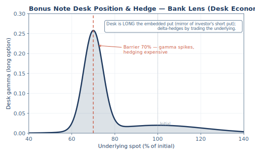

**How the bank makes money**

| Revenue Component | Detail |
|------------------|--------|
| **Structuring fee** | Embedded in note price at issuance (typically 1-3%) |
| **Bid-offer spread** | Spread between option cost and terms offered to investor |
| **Hedging P&L** | Delta-hedging profits from realized vs implied vol differential |
| **Funding advantage** | Issues note at sub-market effective funding rate |

**The economic decomposition:**

The investor's principal is invested in a zero-coupon bond that returns par at maturity (the principal floor). The remaining budget funds a long call (the participation) and the bonus guarantee. The bank creates the bonus guarantee by selling a **down-and-out put** to the investor: this put pays the difference between the bonus level and the stock return, but only if the barrier was never breached (otherwise it knocks out). Because the KO feature eliminates the put in crash scenarios, the put is cheaper than a full guarantee — making the product economically viable. The asymmetry is the heart of the structure: the investor gets a minimum return (the bonus) *plus* uncapped participation in gains above the bonus level, while the desk's cost of providing that asymmetric upside is reduced precisely because the floor evaporates if the barrier breaks.

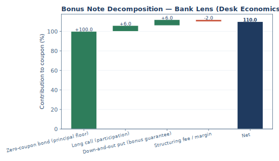

**P&L drivers**

Day to day, desk P&L is driven by realized-versus-implied volatility on the delta hedge, moves in the underlying near the KO barrier (gamma), the discontinuous jump in the position if the barrier is breached, funding, and the mark-to-market of the embedded down-and-out put and call. Product Control attributes P&L between note accrual and option MTM and performs independent price verification — and must track KO status, because before KO the product has a complex payoff and after KO it simplifies to a stock-linked note. Valuation models must handle both states.

#### §9. THE BANK LENS — Controls & Reconciliation (2nd Line of Defence)

**Booking & systems**

| Aspect | Detail |
|--------|--------|
| **Book of record** | NEMO |
| **Pricing/Risk system** | Sophis |
| **Booking structure** | Single note with embedded down-and-out put + call option |
| **Four-leg framework?** | No |
| **Key booking fields** | Notional, initial level, bonus level, participation rate, KO barrier, barrier type (American), underlying(s), maturity |
| **Coupon schedule** | None — zero-coupon structure |
| **Barrier monitoring** | American (continuous): daily or intraday check of underlying vs KO barrier |

**Reconciliation points**

| Recon point | What must agree | Bonus-specific break |
|-------------|-----------------|----------------------|
| **Trade economics** | Notional, initial level, KO barrier level **and convention**, underlying ID, maturity | KO barrier stored as absolute price in NEMO but % in Sophis — consistent only if the initial level matches exactly |
| **Bonus level** | Guaranteed minimum redemption (e.g., 110%) consistent across NEMO and Sophis | Bonus level stored against the wrong reference or confused with a participation cap → wrong floor applied |
| **Participation rate** | Percentage of stock return paid above the bonus (e.g., 100%) consistent across systems | Participation rate not applied to the upside, or applied to the whole return rather than the excess over initial |
| **Observation type** | American (continuous) vs close-only monitoring of the KO barrier | American KO flagged but only daily closes monitored → intraday breaches missed |
| **Barrier event capture** | KO (knock-out) flag consistent across NEMO and Sophis | Trade knocked out on an intraday touch but the flag is not set → bonus floor wrongly applied |
| **Maturity formula** | MAX(bonus, stock × participation) if no KO; (final/initial) if KO | MAX operator omitted, or bonus floor applied to a knocked-out position |
| **Corporate actions** | Initial level / barrier adjusted for dividends, splits, mergers | Underlying split not propagated → barrier off by the split ratio |
| **Settlement** | Cash vs physical; share count if physical; delivery-versus-payment | Physical delivery booked as cash, or the wrong share count delivered |

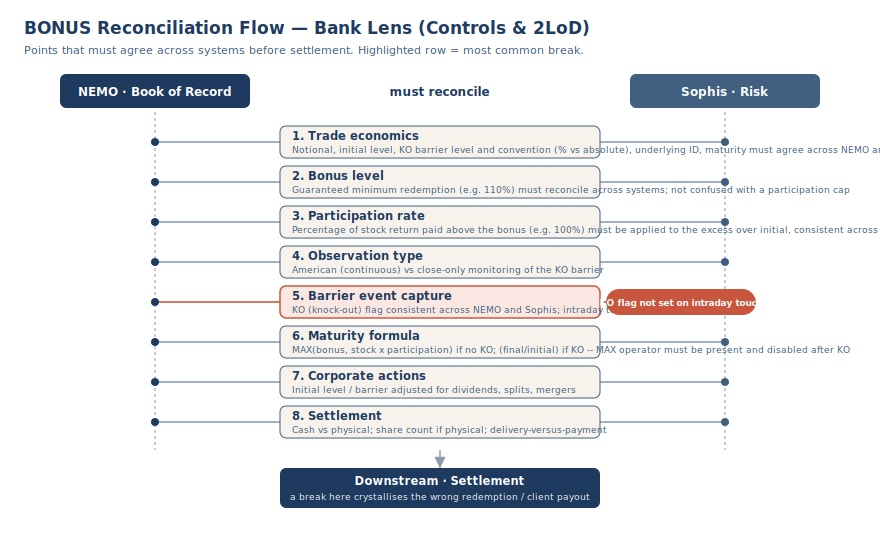

**Common breaks & red flags**

| Red Flag | What It Means | 2LoD Action |
|----------|---------------|-------------|
| Bonus applied to knocked-out position | If the KO was triggered but the system still applies the bonus floor, the redemption amount is overstated | Verify KO status flag before maturity calculation |
| KO barrier monitored at close only | If the termsheet specifies American (continuous) observation but the system only checks at close, intraday breaches are missed | Ensure monitoring matches the barrier observation type |
| Participation rate not applied to upside | If the stock finishes at 130% with 90% participation, the return is 90% × 30% = 27%, not 30% | Verify that participation rate is applied in the calculation |
| Bonus level confused with participation cap | The bonus level (110%) is the minimum return. A participation cap (if any) is the maximum. These are different parameters | Ensure both are correctly stored and applied |
| MAX function not applied at maturity | Redemption should be MAX(bonus, stock return) when KO is not triggered. If the system uses only the bonus OR only the stock return, the payoff is wrong | Verify the MAX operator is in the maturity calculation |

**Control implication**

Each break has a direct consequence the 2nd line must size before it reaches the books or the client. A bonus-level error misstates the guaranteed minimum redemption — overpaying or underpaying the investor at maturity. A participation-rate error misstates the upside the investor is owed above the floor. A barrier-type capture error — American flagged but only closes monitored — lets an intraday KO go undetected, so the system applies the bonus floor to a position that should be tracking the underlying, overstating the redemption and understating desk risk simultaneously. The reconciliation exists precisely to catch the bonus level, participation rate, and barrier-type capture before settlement crystallises them.

#### §10. Formal Definition

A **Bonus / Participation Note** is a structured product that pays the investor the higher of a guaranteed bonus level or the actual stock return, contingent on the underlying never breaching a knock-out barrier during the product's life.

At maturity:
- If the KO barrier was **never breached**: **Redemption = Principal × MAX(Bonus Level, Final/Initial × Participation Rate)**
- If the KO barrier **was breached**: **Redemption = Principal × (Final Level / Initial Level)**

**Key parameters:**
- **Bonus level:** Typically 105-125% (the guaranteed minimum return if KO not triggered)
- **Participation rate:** Typically 90-100% (percentage of stock return the investor receives above the bonus)
- **KO barrier:** Typically 60-75% of initial level (American observation — continuous monitoring)
- **No coupon:** Return comes from capital appreciation and/or the bonus, not periodic income
- **Maturity:** Typically 1-3 years

#### §11. Lifecycle

| Stage | Detail |
|-------|--------|
| **Trade date** | Terms agreed: underlying, strike/barrier, coupon, maturity. Pricing finalised. Book in NEMO; set initial level, bonus level, participation rate, KO barrier, maturity |
| **Issue date** | Note issued. Investor pays par (or discount). Bank establishes hedge |
| **Barrier monitoring** | Continuous (American). If KO triggered: flag the trade as "knocked out." The bonus guarantee is void. No periodic coupon payments |
| **Final observation** | Record the closing price. Determine barrier status (was the KO ever breached) |
| **Maturity** | If KO not triggered: Redemption = MAX(Bonus Level, Final/Initial × Participation) × Notional. If KO triggered: Redemption = (Final/Initial) × Notional. Settlement: cash (par or adjusted) or physical delivery. T+2 settlement |

#### §12. Worked Example (both lenses)

**Product:** 2-year Bonus Note on HSBC stock. **Notional:** $400,000. **Initial stock price:** HK$65. **Bonus level:** 112% = HK$72.80 equivalent. **Participation rate:** 100%. **KO barrier:** 70% = HK$45.50 (American). **Maturity:** 2 years.

*Investor lens:*
- **At maturity, HSBC at HK$75 (+15.4%), KO never triggered:** Stock return = 15.4%. Bonus level = 12%. Stock return > bonus. Redemption = $400,000 × 115.4% = **$461,538.** The investor earned the stock return.
- **At maturity, HSBC at HK$62 (−4.6%), KO never triggered:** Stock return = −4.6%. Bonus floor applies. Redemption = $400,000 × 112% = **$448,000. Profit: $48,000 (12%).** The guarantee turned a loss into a gain.
- **HSBC drops to HK$44 at month 14 (KO triggered), finishes at HK$60:** KO hit. Bonus voided. Redemption = $400,000 × ($60/$65) = **$369,231.** **Loss: $30,769 (−7.7%).** Without the KO breach, the investor would have received $448,000.

*Bank lens:*
In the first scenario the desk's short down-and-out put expires worthless and the short call is in the money to the investor; the desk pays the participation return out of the upside hedge and keeps its structuring margin and net hedging P&L. In the second scenario the desk's short down-and-out put is in the money — the desk delivers the bonus floor (112%) above where the stock actually finished, funded from the put structure. In the KO scenario the down-and-out put has knocked out: the desk's obligation simplifies to the straight stock return, and Product Control must confirm the KO flag is set, the bonus floor is *not* applied, and that NEMO and Sophis agree on the (final/initial) redemption math before settlement.

#### §13. Knowledge Check

1. **What determines whether the investor receives the bonus level or the stock return?**
2. **Why is the KO barrier typically observed continuously (American) rather than at maturity only?**
3. **How does the Bonus Note combine features from both the PPN and the RC?**
4. **A Bonus Note has a 112% bonus and 100% participation. The stock finishes at 108%, KO not triggered. What does the investor receive?**
5. **Why is the Bonus Note described as a "best of both worlds" product, and what is the catch?**
6. **(Desk economics / 1LoD)** What position does the desk hold against the investor, and how does the desk's gamma behave as the underlying approaches the KO barrier? What happens to the desk's position discontinuously once the barrier is breached?
7. **(Controls / 2LoD)** Name three reconciliation fields specific to a Bonus Note that must agree across NEMO and Sophis, and the consequence for the investor's redemption if each is wrong.

**Mental Models**

| Concept | Mental Model |
|---------|-------------|
| Bonus Note | A market stall with a rain guarantee — earn the stall's sales or the guaranteed minimum, unless a severe storm voids the guarantee |
| Bonus floor | The guaranteed minimum — the investor's safety net for flat or mildly negative markets |
| Upside participation | Sunny days at the market — when crowds come, the trader earns based on actual sales |
| KO barrier | The severe thunderstorm threshold — cross it and the guarantee is void |
| Path dependency | A storm on Day 50 that clears by closing day still voids the guarantee — it matters when the barrier was touched, not just where the stock finishes |
| Desk position | The bank is the market organizer who sold the rain guarantee — short the conditional put, hoping the storm never comes |
| 2LoD reconciliation | The building inspector — confirms the bonus level, participation rate, and KO status match before anyone pays out |

**Key Takeaways**

1. A Bonus Note pays the higher of a guaranteed bonus level or the stock return, contingent on the KO barrier never being breached.
2. If the KO is breached, the bonus guarantee vanishes and the investor receives the actual stock return, which can be a loss.
3. The product combines PPN-style upside participation with RC-style barrier risk, creating a "best of both worlds" profile with a conditional safety net.
4. No periodic coupons — all return is at maturity, making this a capital appreciation product.
5. The KO barrier is typically American (continuous), meaning any intraday breach voids the guarantee permanently.
6. The desk holds the mirror position — short the down-and-out put and short the call — and its risk profile changes discontinuously at the KO level, where gamma is high and the structuring margin is made or lost.
7. For the 2nd line, the dominant control risks are bonus-level capture, participation-rate application, observation type, and KO-flag capture — each can misstate the redemption.

#### §14. Common Mistakes

1. **"The bonus guarantees me 10%."** Only if the KO barrier is never breached. A 30%+ stock decline voids the guarantee entirely. The bonus is conditional, not absolute.
2. **Ignoring path dependency.** A stock that dips to 69% on one day then recovers to 105% by maturity still loses the bonus. The intraday breach is permanent.
3. **Comparing to a PPN without noting the KO risk.** A PPN protects principal unconditionally. A Bonus Note's floor is conditional on the KO. These are fundamentally different products.
4. **Confusing the bonus level with a coupon.** The bonus level (112%) is a redemption amount, not an annual coupon. On a 2-year product, 112% represents approximately 6% annualized, not 12%.
5. **Assuming the MAX function is always applied.** After KO, the MAX function is disabled. The investor receives the actual stock return, even if it is below the bonus level. Operations must check KO status before applying the formula.
6. **(Controls) Trusting a single system's bonus or barrier value.** Because the bonus level and participation rate drive the floor and the KO barrier can be stored as a percentage or an absolute price, the 2nd line must reconcile these fields and the KO status across NEMO and Sophis rather than assume they agree.
### Knowledge Check

**Review Questions:**
1. What two components of the Bonus Note payoff does the MAX function combine?
2. What happens to the bonus guarantee when the KO barrier is breached?
3. What is the participation rate, and how does it affect the investor's upside return?
4. Why is the KO barrier typically American rather than European?
5. What booking system records a Bonus Note, and what key fields must be captured?


**Dual-lens questions:**
- *(Desk economics / 1LoD)* What position does the desk hold against the investor, and what is its primary Greek / hedging risk?
- *(Controls / 2LoD)* Which booking and risk-system fields must reconcile for this product, and which is the most common break?
**Scenario Questions:**
1. A Bonus Note has a 115% bonus, 90% participation, and 65% KO barrier. The stock finishes at +22%, KO never triggered. Calculate the investor's return. Now recalculate if participation were 100%.
2. An investor holds two Bonus Notes on the same stock. Note A has a 70% KO barrier and 108% bonus. Note B has a 60% KO barrier and 118% bonus. The stock drops to 62% at month 6 then recovers to 100%. Compare the outcomes.
3. Operations applies the bonus floor (110%) to a position that was knocked out two months ago. The stock finishes at 95%. What is the correct redemption, and how much was overpaid?

**Desk Question:**
A portfolio manager wants to express a bullish view on the S&P 500 with some downside protection. The choices are: (a) PPN with 80% participation, (b) Bonus Note with 110% floor and 100% participation but 70% KO barrier, (c) Standard RC with 8% coupon. Recommend the Bonus Note and explain the risk-return trade-offs vs each alternative.

### Visual Learning Recommendations

1. **Bonus Note payoff diagram** — Showing the flat bonus floor, the upside participation slope above it, and the unprotected decline below the KO barrier — P1
2. **KO barrier impact comparison** — Two paths: stock dips below KO then recovers (no bonus) vs stock stays above KO (bonus applies) — P1
3. **PPN vs RC vs Bonus Note comparison** — Three payoff diagrams side-by-side showing how the Bonus Note bridges the gap between protection and participation — P2
4. **Construction diagram** — Zero-coupon bond + call option + down-and-out put = Bonus Note — P2
5. **Scenario outcome matrix** — Table showing outcomes at five stock levels with and without KO breach — P3

### Dependency References

| Concept Used | Where It Was Taught |
|-------------|-------------------|
| Put option, knock-out | [Section 1.2](#sec-1-2) (Options), [Section 1.3](#sec-1-3) (Barriers) |
| Call option, participation | [Section 1.2](#sec-1-2) (Options) |
| Capital protection spectrum | [Section 2.4](#sec-2-4) (Capital Protection Spectrum) |
| Product decomposition | [Section 2.2](#sec-2-2) (Product Construction) |
| PPN structure (participation + protection) | [Section 5.1.1](#sec-5-1-1) (PPN) |
| NEMO/Sophis booking | [Section 2.8](#sec-2-8) (Systems Primer) |

---


#### Visual Specifications

**Visual 1: Bonus Note Payoff at Maturity**
- **Asset filename:** payoff_bonus_maturity_01.svg
- **Caption:** "Bonus Note Payoff at Maturity"
- **Diagram elements:** X-axis: underlying price. Y-axis: investor total return. Key levels marked (strike, barrier if applicable). Compare with unstructured alternative
- **Reuse status:** Adapt from payoff template
**Visual 2: Bonus Note Product Construction**
- **Asset filename:** construction_bonus_components_02.svg
- **Caption:** "Bonus Note Product Construction"
- **Diagram elements:** Component decomposition: each building block in separate box. Arrows showing how they combine to create the product. Cost allocation visible
- **Reuse status:** Adapt from construction template
**Visual 3: Bonus Note Lifecycle Timeline**
- **Asset filename:** lifecycle_bonus_timeline_03.svg
- **Caption:** "Bonus Note Lifecycle Timeline"
- **Diagram elements:** Horizontal timeline from issue to maturity. Key events: issue, coupon dates, observation dates, maturity. Underlying price path overlay
- **Reuse status:** Adapt from lifecycle template
**Visual 4: Bonus Note Risk Heatmap**
- **Asset filename:** risk_bonus_heatmap_04.svg
- **Caption:** "Bonus Note Risk Heatmap"
- **Diagram elements:** Grid: risk types (market, credit, liquidity, operational) vs severity (low/med/high). Colour-coded cells appropriate for Bonus Note
- **Reuse status:** Adapt from risk heatmap template
**Visual 5: Bonus Note vs Alternatives**
- **Asset filename:** comparison_bonus_vs_alternatives_05.svg
- **Caption:** "Bonus Note vs Alternatives"
- **Diagram elements:** Multi-column comparison showing payoff across scenarios (-30%, flat, +15%, +30%). Compare with direct investment and simpler structured product
- **Reuse status:** New — comparison panel
**Visual 6: Bonus Note Suitability Decision Tree**
- **Asset filename:** decision_bonus_suitability_06.svg
- **Caption:** "Bonus Note Suitability Decision Tree"
- **Diagram elements:** Decision tree guiding investor suitability. Key questions: risk tolerance, income need, market view, time horizon
- **Reuse status:** Adapt from decision tree template


**Dual-lens visuals (generated):**
- `assets/bonus/controls_bonus_recon_08.svg` `[generated]`
- `assets/bonus/desk_bonus_gamma_07.svg` `[generated]`
- `assets/bonus/payoff_bonus_01.svg` `[generated]`
- `assets/bonus/waterfall_bonus_09.svg` `[generated]`
#### Dependency References

| Concept Used | Where It Was Taught |
|-------------|-------------------|
| Equity fundamentals | [Section 1.4](#sec-1-4) (Equity Essentials) |
| Options mechanics | [Section 1.2](#sec-1-2) (Options From Zero) |
| Product decomposition | [Section 2.2](#sec-2-2) (Product Construction) |
| PPN | 5.1.1 — guaranteed protection |
| Shark Fin | 5.6.9 — barrier with rebate |
| Phoenix | 5.1.3 — conditional coupon |
### 5.1.9 Fixed Coupon Note (FCN) {#sec-5-1-9}

> **Prerequisites:** PHOENIX &nbsp;|&nbsp; **Key concepts:** Guaranteed vs conditional coupon, step-down autocall

---

*This product combines two concepts taught earlier: the barrier risk from the Reverse Convertible ([Section 5.1.2](#sec-5-1-2)) and the autocall mechanism from the Phoenix ([Section 5.1.3](#sec-5-1-3)). The FCN removes the conditional coupon and the memory feature, replacing them with a simple fixed coupon. The result is a product with guaranteed periodic income for the investor, automatic early redemption when markets are strong, and capital risk when markets crash. This chapter reads the product through two lenses: what it means for **the investor**, and what it means for **the bank** — the latter split into the desk's market economics (1st line of defence) and the controls and reconciliation that surround it (2nd line of defence).*

#### §1. Explain Like I'm New

Sofia manages a small wealth advisory practice. Her clients want income above deposit rates, but several were burned by a Phoenix product that skipped coupon payments during a market dip. They understood the mechanics — the coupons were conditional — but they hated the unpredictable cash flow.

Sofia needs a product that pays a guaranteed fixed coupon every quarter, no matter what happens to the stock. She is willing to accept two trade-offs on her clients' behalf: the note might redeem early if the stock performs well, and the investor could lose capital if the stock crashes at maturity.

The **Fixed Coupon Note** solves this. It pays a fixed coupon every period regardless of the underlying's performance. If the stock rises above a trigger level on an observation date, the note redeems early at par. If the stock falls below a capital barrier at maturity, the investor loses capital proportional to the decline.

The FCN is the most widely traded structured product globally. In Asia, it accounts for the majority of all equity-linked note issuance.

#### §2. Real-World Analogy

An FCN is like a vending machine lease.

The landlord owns a prime location in a shopping mall. A vending machine company leases the spot and pays the landlord a fixed monthly rent — $500 regardless of how many drinks the machine sells. The lease has two special terms:

**Quarterly review clause:** Every quarter, the company reviews foot traffic. If traffic exceeds a threshold, the company terminates the lease, returns the deposit in full, and relocates the machine. The landlord keeps all rent collected but must find a new tenant.

**End-of-lease performance clause:** If foot traffic has collapsed by the lease expiration — below 70% of the initial level — the landlord forfeits part of the deposit proportional to the decline.

The fixed rent is the FCN's fixed coupon. The quarterly review is the autocall observation. The deposit return is the investor's principal redemption. In this analogy the investor is the landlord — collecting fixed rent and bearing the collapse risk — while the bank is the vending company that can hand the space back when traffic is high.

#### §3. What Problem Does This Solve?

The FCN bridges a specific gap in the structured product spectrum.

When interest rates are low, deposits and bonds pay very little. Income-focused investors — especially in Asia-Pacific private banking — want a predictable enhanced yield, and they are willing to accept some capital risk to get it. What they do not want is the unpredictable cash flow of a conditional-coupon product like the Phoenix.

| Client Need | How the FCN Delivers |
|------------|---------------------|
| Predictable income | Fixed coupon paid every quarter, regardless of stock level |
| Higher yield than deposits | Coupon of 5-8% p.a. from selling put risk |
| Early exit when markets rally | Autocall redeems note at par if stock exceeds trigger |
| Simplicity over Phoenix | No conditional coupon, no memory tracking |
| Limited downside tolerance | Capital barrier protects against moderate declines |

#### §4. Product DNA

| Field | Value |
|-------|-------|
| **Full Name** | Fixed Coupon Note |
| **Abbreviation** | FCN |
| **Family** | Equity-Linked Notes |
| **Complexity Score** | 6 / 10 |
| **Complexity Rationale** | RC variant paying guaranteed fixed coupons with autocall feature. Combines RC downside with Phoenix-like autocall |
| **Underlying Asset Class** | Equity (single stock or basket) |
| **Capital Protection** | Conditional (protected above barrier at maturity) |
| **Coupon Type** | Fixed guaranteed coupon (paid regardless) |
| **Maturity** | 1-3 years |
| **Liquidity** | Secondary market |
| **Primary System** | Murex |
| **ISDA Required** | No — issued as note |

**DNA Atlas Fields:**
- Primary Risk: Barrier breach at maturity with loss. Autocall limits upside. Guaranteed coupons partially offset losses
- Typical Buyer: Income-focused investors comfortable with conditional downside. Asia-Pacific private banking
- Typical Use Case: Guaranteed income stream regardless of performance. Autocall provides early exit in bullish scenario
- Building Blocks: Fixed coupon note + short put + autocall binary options
- Key Hedge: Long put (delta-hedged), autocall replication
- Similar Products: RC (5.1.2 — no autocall), Phoenix (5.1.3 — contingent coupon), ICN (5.1.11 — issuer callable)
- Most Important Greek: Delta (equity) + Gamma (near autocall/barrier levels)

**Comparison Matrix Fields:**
- Complexity: 6
- Yield Potential: High (guaranteed fixed coupons)
- Capital Protection: Conditional (barrier at maturity)
- Credit Exposure: Issuer
- Liquidity: Secondary market
- Path Dependency: Yes (autocall dates + maturity barrier)
- Volatility Sensitivity: Short vega
- Correlation Sensitivity: None or low (single underlying)
- Client Type: Private banking (especially APAC)
- Market Environment: Best in mildly bullish or range-bound markets

#### §5. Who Touches This Product

| Role | Responsibility |
|------|---------------|
| **Structurer** | Designs Fixed Coupon Note terms: strike, barrier, coupon, maturity. Optimises structure for client and bank |
| **Trader** | Hedges embedded options. Manages Greeks (delta, gamma, vega). Prices secondary market |
| **Sales** | Distributes Fixed Coupon Note to target clients. Explains payoff scenarios and risk-return profile |
| **Risk Management** | Monitors option Greeks, barrier proximity, concentration risk. Sets trading limits |
| **Product Control** | Daily P&L attribution between note accrual and option MTM. Independent price verification |
| **Operations** | Processes coupon payments and maturity settlement. Handles physical delivery if applicable |
| **Legal / Compliance** | Reviews term sheet for regulatory compliance. Ensures suitability for target investor base |
| **Quantitative Analytics** | Prices embedded derivatives. Calibrates volatility surface. Provides model validation |

#### §6. Product Evolution

| Stage | Product | What Was Added | Why |
|:-----:|---------|---------------|-----|
| 1 | Plain vanilla bond | — (baseline) | Fixed coupon, full principal return |
| 2 | Equity-linked note | Equity participation or option embedded | Market return exposure with note wrapper |
| 3 | Fixed Coupon Note | Specific structural features added | Product-specific innovation: RC variant paying guaranteed fixed coupons with autocall feature. Combines RC downside with Phoenix-like autocall |

---

#### §7. THE INVESTOR LENS

**Why the investor buys it**

1. **Guaranteed income.** Unlike a Phoenix, the coupon is paid every period with certainty, regardless of the underlying's level. Cash flow planning for the investor is straightforward.
2. **Enhanced yield.** 5-8% annualized versus sub-2% on bank deposits, funded by selling put risk to the bank.
3. **Autocall provides liquidity.** If markets rally, the investor receives principal back early for reinvestment.
4. **Simpler than Phoenix.** No conditional coupon barriers, no memory feature, no need to track which coupons were missed or recovered.
5. **Familiar structure.** The FCN feels like a bond with a higher yield. Sales find it easier to explain to end-investors than a Phoenix.

**Position taken**

The investor simultaneously holds a long bond (lends principal to the issuer), a **short** knock-in put (sold to the bank), and is short the autocall optionality (the bank may redeem the note early). Net, the investor is **short volatility** (hurt by volatile markets) and carries full equity downside below the barrier at maturity. Critically, the fixed coupon is **unconditional** — it is paid every period whether or not the barrier is approached or breached. With a single underlying there is no correlation exposure.

**Payoff & scenarios**

The investor's payoff at maturity has two zones, identical to an RC. Above the capital barrier at maturity: the investor receives 100% principal plus the fixed coupons (return = sum of coupons). Below the barrier at maturity: the investor receives (Final / Initial) × principal plus the fixed coupons — the further below the barrier, the larger the loss. The fixed coupons are paid in every scenario regardless of barrier breach. The path differs from an RC because the autocall can terminate the note early at par plus the coupon then due.

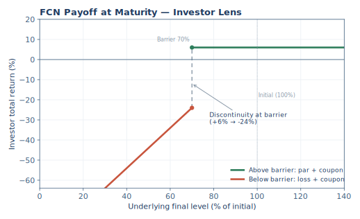

**Product:** 2-year FCN on a single stock. **Notional:** $200,000. **Coupon:** 6% p.a. (1.5% per quarter = $3,000). **Autocall barrier:** 100% of initial, checked quarterly starting Q2. **Capital barrier:** 70% knock-in (European, checked at maturity).

- **Scenario 1 — Autocall in Q2:** Stock at 105% after Q2. Autocall triggered. The investor receives $200,000 principal + 2 × $3,000 = **$206,000**. Return: 3% in 6 months. The investor must now reinvest at current market rates.
- **Scenario 2 — Full term, no barrier breach:** Stock fluctuates between 75-95% for 2 years. Never reaches 100% for autocall. At maturity: 85% — above 70% barrier. The investor receives $200,000 + 8 × $3,000 = **$224,000**. Return: 12% over 2 years.
- **Scenario 3 — Barrier breach at maturity:** Stock crashes to 60% at maturity. Below 70% barrier (European, so only checked at maturity). Redemption: $200,000 × 60/100 = $120,000. Plus 8 × $3,000 = $24,000 coupons. **Total: $144,000.** Loss: $56,000 (28%). The guaranteed coupons cushioned the blow but did not prevent a significant capital loss.
- **Scenario 4 — Late autocall:** Stock stays at 90% through Q5. No autocall. Stock rises to 102% at Q6. Autocall triggered. The investor receives $200,000 + 6 × $3,000 = **$218,000**. Return: 9% over 1.5 years.

**Risks to the investor**

| Risk | Description | Severity |
|------|------------|:--------:|
| **Capital loss** | If stock falls below barrier at maturity, the investor loses principal proportional to the decline | High |
| **Reinvestment risk** | Autocall forces early redemption when conditions are best, requiring the investor to reinvest at potentially lower yields | Medium |
| **Opportunity cost** | The investor misses stock upside — if stock rises 50%, the FCN returns only coupons plus par | Medium |
| **Autocall timing** | Early autocall limits total coupon income; no autocall extends the investor's exposure to downside risk | Medium |
| **Issuer credit risk** | If the issuing bank defaults, the investor may lose principal regardless of stock performance | Low |
| **Liquidity risk** | Secondary market for FCNs may be thin; early exit before autocall may be at a discount | Medium |

#### §8. THE BANK LENS — Desk Economics (1st Line of Defence)

**What the desk books**

The desk's position is the mirror image of the investor's. Where the investor is short the knock-in put, the desk is **long** that put (bought from the investor); alongside it the desk is short the autocall optionality returned to the investor and has issued a note, which is a funding liability. The investor's enhanced coupon is, to the desk, the cost of the put premium plus funding, returned to the client — and because the coupon is **unconditional**, the desk owes that fixed cash flow on every coupon date regardless of where the underlying trades.

**Greeks & hedging**

The desk is long the embedded knock-in put and delta-hedges by trading the underlying. The autocall creates negative convexity — the note terminates precisely when the hedge is simplest (stock above strike) — and the desk must manage extension risk if the autocall does NOT trigger, which lengthens the put's duration. Because the payoffs are discontinuous near the autocall and capital-barrier levels, gamma spikes as the underlying approaches those levels and hedging becomes expensive and error-prone — this is where the desk's structuring margin is earned or lost. The desk monitors delta and gamma closely as observation dates and the barrier approach; risk management may impose limits on concentrated barrier exposure.

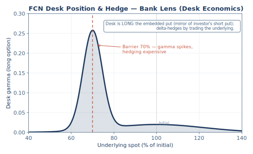

**How the bank makes money**

| Revenue Component | Detail |
|------------------|--------|
| **Structuring fee** | Embedded in note price at issuance (typically 1-3%) |
| **Bid-offer spread** | Spread between option cost and terms offered to investor |
| **Hedging P&L** | Delta-hedging profits from realized vs implied vol differential |
| **Funding advantage** | Issues note at sub-market effective funding rate |

**The coupon decomposition (from [Section 2.2](#sec-2-2)):**

Fixed Coupon = Bond yield + Put premium − Funds Transfer Pricing (FTP) − Desk margin

The put premium is lower than a non-autocallable RC because the autocall reduces the expected duration of the put. A shorter expected life means less time for the stock to drop below the barrier, which reduces the put premium available to fund the coupon. This is why the FCN pays a lower coupon than a comparable RC or Phoenix — but note the coupon itself is unconditional, so the desk funds it in full every period whether or not the barrier is in play.

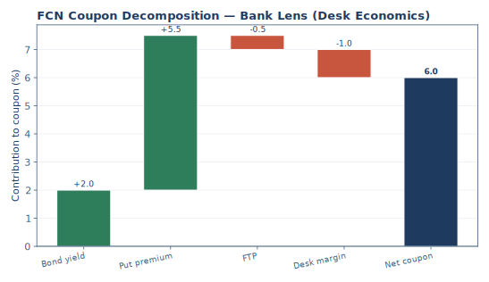

**P&L drivers**

Day to day, desk P&L is driven by realized-versus-implied volatility on the delta hedge, moves in the underlying near the autocall and capital barriers (gamma), funding, and the mark-to-market of the embedded put and autocall. Product Control attributes P&L between fixed-coupon accrual and option MTM, and performs Independent Price Verification (IPV) of the option component. Because the coupon is guaranteed, the coupon accrual leg is deterministic — the variability lives in the option MTM and the hedge.

#### §9. THE BANK LENS — Controls & Reconciliation (2nd Line of Defence)

**Booking & systems**

| Aspect | Detail |
|--------|--------|
| **Book of record** | NEMO |
| **Pricing/Risk system** | Sophis |
| **Booking structure** | Single note with embedded KI put + autocall (Equity-Linked Note — Fixed Coupon Autocallable) |
| **Four-leg framework?** | No |
| **Key booking fields** | Notional, strike (initial level), capital barrier level, autocall barrier (and step-down schedule if any), barrier type (European), coupon rate, coupon frequency, maturity, underlying(s) |
| **Coupon schedule** | Fixed payments on each observation date, paid regardless of underlying level (unconditional) |
| **Autocall check** | Each observation date: compare underlying close to autocall barrier |
| **Barrier observation** | European: single capital-barrier check at maturity |

**Reconciliation points**

| Recon point | What must agree | FCN-specific break |
|-------------|-----------------|-------------------|
| **Trade economics** | Notional, strike (initial level), capital barrier **and convention**, autocall barrier, coupon rate & frequency, maturity, underlying ID | Barrier stored as absolute price in NEMO but % in Sophis — consistent only if the initial level matches exactly |
| **Observation type** | European capital barrier (maturity-only) vs any American-style mid-life observation | European barrier observed American-style mid-life changes the risk profile |
| **Fixings** | Initial and final fixing **source** matches the termsheet | Different vendors report different closing prices on an observation or final date |
| **Autocall capture** | Autocall flag consistent across NEMO and Sophis on each observation date | Underlying closed above autocall barrier but note not redeemed — booking error |
| **Coupon lifecycle** | Fixed coupon schedule, day-count, termination of schedule on autocall | Post-autocall coupon paid, or a guaranteed coupon missed (processing failure) |
| **Corporate actions** | Strike/barrier/autocall adjusted for dividends, splits, mergers | Underlying split not propagated → barrier off by the split ratio |
| **P&L attribution** | Coupon accrual + option MTM reconciles to total | Unexplained P&L points to a stale vol surface or a wrong fixing |
| **Settlement** | Cash vs physical; shares = notional / strike; delivery-versus-payment | Physical delivery booked as cash, or the wrong share count delivered |

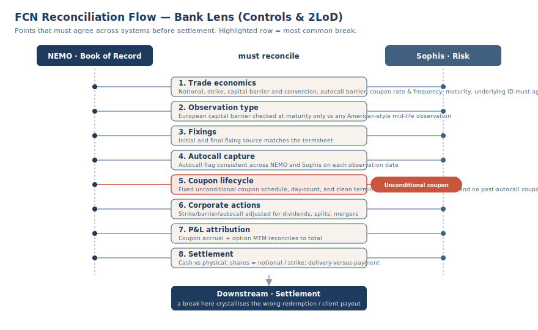

**Common breaks & red flags**

| Red Flag | What It Means | 2LoD Action |
|----------|---------------|-------------|
| **Coupon not paid despite FCN terms** | FCN coupons are unconditional. A missed payment is a processing failure, not a product feature | Investigate immediately — unlike Phoenix, there is no coupon barrier condition |
| **Autocall triggered but note not redeemed** | If the underlying closed above the autocall barrier on the observation date, the note MUST redeem. Failure to process is a booking error | Verify the observation date close price against the autocall barrier |
| **Post-autocall coupon paid** | After autocall, no further coupons should be paid. A post-redemption payment is a cash control failure | Verify that the coupon schedule terminated on the autocall date |
| **Barrier observation applied before maturity** | European barrier means the capital barrier is checked ONLY at maturity. Applying American-style observation mid-life changes the product's risk profile | Confirm barrier observation type in the termsheet and Sophis configuration |
| **Autocall barrier not step-down adjusted** | If the FCN uses step-down autocall (e.g., 100%, 95%, 90%), each observation date has a different barrier. Using the wrong barrier invalidates the autocall decision | Verify the step-down schedule and confirm the correct barrier for each date |

**Control implication**

Each break has a direct consequence the 2nd line must size before it reaches the books or the client. Because the fixed coupon is **unconditional**, the control focus splits in two: first, the guaranteed coupon schedule — confirming that every scheduled coupon is paid, that none is dropped (a missed payment is a pure processing failure with no product justification), and that the schedule terminates cleanly on autocall so no post-redemption coupon leaks out; and second, the capital/barrier leg — confirming the autocall decision uses the correct (possibly step-down) barrier on each observation date, that the European capital barrier is checked only at maturity, and that a breach drives the correct redemption math (notional × final/initial) and share count (notional / strike). The reconciliation exists precisely to catch these inconsistencies before settlement crystallises them.

#### §10. Formal Definition

A **Fixed Coupon Note (FCN)** is a structured product with:

**Fixed coupon:** A predetermined coupon paid every observation period regardless of the underlying's level. Unlike a Phoenix, the coupon has no condition and no memory.

**Autocall:** On each observation date (typically quarterly, after a no-call period), if the underlying is at or above the autocall barrier, the product redeems at 100% of principal plus the current coupon.

**Capital protection:** At maturity (if not autocalled), if the underlying has breached the knock-in barrier: Redemption = Principal × (Final Level / Initial Level). If not breached: Redemption = 100% of Principal.

The FCN is structurally identical to a Phoenix without the conditional coupon and without the memory feature. The coupon is lower than a comparable Phoenix because the investor receives guaranteed payments rather than conditional ones.

#### §11. Lifecycle

| Stage | Detail |
|-------|--------|
| **Trade date** | Terms agreed: underlying, strike/barrier, coupon, maturity. Pricing finalised. Book in NEMO |
| **Issue date** | Note issued. Investor pays par (or discount). Bank establishes hedge |
| **Coupon dates** | Periodic observations and fixed coupon payments (unconditional). Autocall check against the autocall barrier on each observation date after the no-call period |
| **Maturity** | Final observation (if not previously autocalled). Settlement: cash (par or adjusted) or physical delivery. T+2 settlement |

#### §12. Worked Example (both lenses)

**Product:** 2-year FCN on Unilever. **Notional:** $500,000. **Coupon:** 6% p.a., paid quarterly (1.5% per quarter = $7,500). **Initial stock price:** €50. **Autocall barrier:** 100% = €50, checked quarterly starting Q2. **Capital barrier:** 70% = €35 (European observation). **Maturity:** 2 years (8 quarterly observation dates).

*Investor lens:*
- **Outcome A — Autocall at Q4 (1 year):** Unilever at €53. Above €50 autocall barrier. Note redeems. Received: 4 × $7,500 = $30,000 coupons + $500,000 principal. **Total: $530,000.** Return: $30,000 / $500,000 = 6% over 1 year.
- **Outcome B — Full term, no breach:** Unilever fluctuates between €40-€48 for 2 years. Never reaches €50 for autocall. At maturity: €45 (90% of initial). Above €35 barrier. Received: 8 × $7,500 = $60,000 coupons + $500,000 principal. **Total: $560,000.** Return: 12% over 2 years.
- **Outcome C — Barrier breach:** Unilever crashes to €28 at maturity (56% of initial). Below €35 barrier. Redemption: $500,000 × 28/50 = $280,000. Plus 8 × $7,500 = $60,000 coupons. **Total: $340,000.** Loss: $160,000 (32%).

*Bank lens:*
In Outcome A the desk's long put expires worthless on early redemption; the desk keeps its structuring margin and net hedging P&L, having funded the four guaranteed $7,500 coupons, and the 2nd line confirms the autocall flag, the schedule termination, and that no post-autocall coupon leaks. In Outcome B the put again expires worthless at maturity; the desk has funded all eight unconditional coupons and Product Control confirms the put MTM rolls to zero. In Outcome C the desk's long put is deep in the money: the investor delivers value equal to the shortfall (redemption of $280,000 against $500,000 notional), offsetting the desk's obligation, while the eight $7,500 coupons were paid regardless. The 2nd line must confirm the redemption math (notional × final/initial), the share count (notional / strike), and that NEMO and Sophis agree before settlement.

#### §13. Knowledge Check

1. **Why does an FCN pay a lower coupon than a comparable Phoenix on the same underlying?** *(Investor)*
2. **What is the relationship between the autocall barrier level and the coupon rate an FCN can offer?** *(Investor)*
3. **Explain why an FCN investor faces reinvestment risk. When is this risk most costly?** *(Investor)*
4. **A step-down FCN has autocall barriers of 100%, 95%, 90%, 85%. Why does this structure exist, and who benefits?** *(Investor)*
5. **An FCN and an RC have identical terms except the FCN has an autocall. Which pays a higher coupon, and why?** *(Investor)*
6. **(Desk economics / 1LoD)** The investor sold the embedded put, so the desk is long it. How do the desk's gamma and convexity behave near the barrier, why is that where the structuring margin is made or lost, and why is the desk's coupon-funding obligation the same whether or not the barrier is in play?
7. **(Controls / 2LoD)** Name three reconciliation breaks specific to an FCN and the consequence of each. Why does the unconditional coupon shift part of the control focus onto the guaranteed coupon schedule rather than only the barrier leg?

**Mental Models**

| Concept | Mental Model |
|---------|-------------|
| Fixed coupon | The fixed rent on a vending machine lease — paid regardless of machine sales |
| Autocall | The quarterly review clause — the company reclaims the space when traffic is high |
| Capital barrier | The performance clause — the landlord loses the deposit if traffic collapses |
| Reinvestment risk | Finding a new tenant after the vending company leaves — likely at a lower rent |
| FCN vs Phoenix | Same building, different lease terms — FCN has fixed rent (lower rate); Phoenix has variable rent (higher rate when conditions are met) |
| 2LoD reconciliation | The building inspector — confirms the lease terms, the rent schedule, and the damage assessment all match before anyone pays out |

**Key Takeaways**

1. An FCN pays a guaranteed fixed coupon every period regardless of the underlying's performance, unlike the Phoenix where coupons are conditional.
2. Investors buy FCNs for predictable enhanced income in a low-rate environment.
3. The core risk to the investor is capital loss if the underlying falls below the barrier at maturity — the same risk as the RC; the desk holds the offsetting long-put position.
4. The autocall feature redeems the note early when markets are strong, creating reinvestment risk for the investor and negative convexity for the desk.
5. The FCN pays a lower coupon than a comparable RC or Phoenix because the autocall shortens the expected life of the embedded put, reducing the premium available to fund the coupon.
6. For the 2nd line, because the coupon is unconditional, the dominant control risks split across the guaranteed coupon schedule (no missed or post-autocall coupons) and the barrier/autocall leg (correct barrier per date, European maturity-only capital check, correct redemption math). FCNs are booked in NEMO and priced in Sophis, with no four-leg structure.

#### §14. Common Mistakes

1. **Confusing FCN with Phoenix.** The FCN has NO conditional coupon and NO memory. The coupon is paid every period. Tracking whether coupons were "missed" means thinking of a Phoenix, not an FCN.
2. **Assuming autocall is always beneficial.** Autocall terminates the note when conditions are best for the investor — precisely when the enhanced yield is most attractive. The investor is forced to reinvest at potentially lower rates.
3. **Ignoring the coupon-barrier trade-off.** A higher coupon requires selling a more valuable put, which typically means a higher barrier (less protection). The coupon is not free income — it is compensation for the investor's capital risk.
4. **Treating the coupon as risk-free return.** The 6% coupon can be entirely consumed by capital loss. Eight quarters of $7,500 coupons ($60,000) do not offset a 40% principal loss ($200,000).
5. **Comparing FCN coupon to Phoenix coupon on a headline basis.** Phoenix may advertise 10% vs FCN at 6%, but the Phoenix coupon is conditional. On a probability-weighted basis, the expected income may be similar.
6. **(Controls) Treating a missed coupon as a product feature.** Because the FCN coupon is unconditional, a coupon that is not paid is never explained by a barrier condition — it is a processing failure. The 2nd line must investigate it as a break, not rationalise it the way a missed Phoenix coupon could be.
### Knowledge Check

**Review Questions:**
1. What are the three embedded components in an FCN?
2. How does an FCN coupon differ from a Phoenix coupon?
3. What happens to the investor's principal if the underlying finishes at 65% of initial, with a 70% European barrier?
4. Why is the FCN coupon typically lower than an RC coupon on the same underlying?
5. What is a step-down autocall, and why is it used?


**Dual-lens questions:**
- *(Desk economics / 1LoD)* What position does the desk hold against the investor, and what is its primary Greek / hedging risk?
- *(Controls / 2LoD)* Which booking and risk-system fields must reconcile for this product, and which is the most common break?
**Scenario Questions:**
1. An FCN investor receives 6 quarterly coupons and then the note autocalls. The coupon was 6% p.a. Calculate the investor's total return over the holding period.
2. Two FCNs are offered on the same stock with the same maturity. FCN A has a 70% barrier and 6% coupon. FCN B has an 80% barrier and 8% coupon. Which is riskier, and why does it pay more?
3. An FCN autocalls after Q2. The investor originally chose the FCN over a 2-year deposit paying 3% p.a. Compare the outcomes and identify the scenario where the deposit would have been better.

**Desk Question:**
An FCN on Unilever is approaching its Q4 observation date. The stock closed at 99.8% of the autocall barrier yesterday. You are in Product Control. What steps do you take to prepare for tomorrow's observation, and what operational consequences follow from a 100.2% close versus a 99.5% close?

### Visual Learning Recommendations

1. **FCN payoff with autocall overlay** — RC-style payoff diagram with autocall trigger marked on the x-axis and a timeline showing potential early termination dates (P1)
2. **FCN vs Phoenix comparison** — Side-by-side payoff and cash flow comparison highlighting fixed vs conditional coupon and the absence of memory (P1)
3. **Autocall decision tree** — Quarterly observation flowchart: stock above/below autocall → redeem or continue → next quarter (P2)
4. **Step-down autocall timeline** — Timeline showing decreasing autocall barriers over the product life (P2)
5. **Coupon decomposition comparison** — FCN vs RC vs Phoenix: how the same put premium funds different coupon structures (P3)

### Dependency References

| Concept Used | Where It Was Taught |
|-------------|-------------------|
| Put option, knock-in barrier | [Section 1.2](#sec-1-2) (Options), [Section 1.3](#sec-1-3) (Barriers) |
| Autocall mechanism, memory feature | [Section 5.1.3](#sec-5-1-3) (Phoenix) |
| Coupon decomposition, FTP | [Section 2.2](#sec-2-2) (Product Construction) |
| Capital barrier, European observation | [Section 1.3](#sec-1-3) (Barriers), [Section 5.1.2](#sec-5-1-2) (RC) |
| NEMO/Sophis booking | [Section 2.8](#sec-2-8) (Systems Primer) |
| Reinvestment risk | [Section 5.1.6](#sec-5-1-6) (CRC) |

---


#### Visual Specifications

**Visual 1: Fixed Coupon Note Payoff at Maturity**
- **Asset filename:** payoff_fcn_maturity_01.svg
- **Caption:** "Fixed Coupon Note Payoff at Maturity"
- **Diagram elements:** X-axis: underlying price. Y-axis: investor total return. Key levels marked (strike, barrier if applicable). Compare with unstructured alternative
- **Reuse status:** Adapt from payoff template
**Visual 2: Fixed Coupon Note Product Construction**
- **Asset filename:** construction_fcn_components_02.svg
- **Caption:** "Fixed Coupon Note Product Construction"
- **Diagram elements:** Component decomposition: each building block in separate box. Arrows showing how they combine to create the product. Cost allocation visible
- **Reuse status:** Adapt from construction template
**Visual 3: Fixed Coupon Note Lifecycle Timeline**
- **Asset filename:** lifecycle_fcn_timeline_03.svg
- **Caption:** "Fixed Coupon Note Lifecycle Timeline"
- **Diagram elements:** Horizontal timeline from issue to maturity. Key events: issue, coupon dates, observation dates, maturity. Underlying price path overlay
- **Reuse status:** Adapt from lifecycle template
**Visual 4: Fixed Coupon Note Risk Heatmap**
- **Asset filename:** risk_fcn_heatmap_04.svg
- **Caption:** "Fixed Coupon Note Risk Heatmap"
- **Diagram elements:** Grid: risk types (market, credit, liquidity, operational) vs severity (low/med/high). Colour-coded cells appropriate for Fixed Coupon Note
- **Reuse status:** Adapt from risk heatmap template
**Visual 5: Fixed Coupon Note vs Alternatives**
- **Asset filename:** comparison_fcn_vs_alternatives_05.svg
- **Caption:** "Fixed Coupon Note vs Alternatives"
- **Diagram elements:** Multi-column comparison showing payoff across scenarios (-30%, flat, +15%, +30%). Compare with direct investment and simpler structured product
- **Reuse status:** New — comparison panel
**Visual 6: Fixed Coupon Note Suitability Decision Tree**
- **Asset filename:** decision_fcn_suitability_06.svg
- **Caption:** "Fixed Coupon Note Suitability Decision Tree"
- **Diagram elements:** Decision tree guiding investor suitability. Key questions: risk tolerance, income need, market view, time horizon
- **Reuse status:** Adapt from decision tree template


**Dual-lens visuals (generated):**
- `assets/fcn/controls_fcn_recon_08.svg` `[generated]`
- `assets/fcn/desk_fcn_gamma_07.svg` `[generated]`
- `assets/fcn/payoff_fcn_01.svg` `[generated]`
- `assets/fcn/waterfall_fcn_09.svg` `[generated]`
#### Dependency References

| Concept Used | Where It Was Taught |
|-------------|-------------------|
| Equity fundamentals | [Section 1.4](#sec-1-4) (Equity Essentials) |
| Options mechanics | [Section 1.2](#sec-1-2) (Options From Zero) |
| Product decomposition | [Section 2.2](#sec-2-2) (Product Construction) |
| RC | 5.1.2 — no autocall |
| Phoenix | 5.1.3 — contingent coupon |
| ICN | 5.1.11 — issuer callable |
### 5.1.10 Callable Range Accrual ELN (CRA ELN) {#sec-5-1-10}

> **Prerequisites:** DIGITAL · [CRC](#sec-5-1-6) &nbsp;|&nbsp; **Key concepts:** Range accrual mechanism, daily observation, digital strip + call

---

*This product adds a concept from the interest rates world — range accrual — to the equity-linked note framework. Instead of paying a full coupon every period like the FCN, the CRA ELN accrues coupon day-by-day based on whether the underlying stays within a specified range, and the issuer can call the note early. The result is a product suited to range-bound market views. This chapter reads the product through two lenses: what it means for **the investor**, and what it means for **the bank** — the latter split into the desk's market economics (1st line of defence) and the controls and reconciliation that surround it (2nd line of defence).*

#### §1. Explain Like I'm New

James runs a pension fund's alternatives allocation. His investment committee has approved equity-linked notes for yield enhancement, but his analysts believe the market will trade sideways for the next two years — not crashing, but not rallying either.

Standard FCNs and RCs pay the same coupon regardless of whether the market moves 1% or 20%. James wants a product that rewards him specifically for being right about a range-bound market: the more days the stock stays within a predicted range, the more income the fund earns.

The **Callable Range Accrual ELN** does exactly this. Each day, the product checks whether the stock is within a specified range (e.g., 80%-120% of the initial level). If yes, that day accrues a fraction of the coupon. If no, nothing accrues for that day. At the end of each quarter, the accrued amount is paid. The issuer also has the right to call the note early.

#### §2. Real-World Analogy

A CRA ELN is like a solar panel investment.

The owner installs solar panels on the roof. The energy income depends on sunshine — but not in a simple way. Electricity credits are earned only when sunlight is within a productive range. On cloudy days (below range), the panels produce nothing. On extremely hot days (above range), the panels overheat and shut down for safety. Only moderate, productive sunshine days earn income.

**Range monitoring:** Each day, the weather station records whether sunshine was within the productive range. At the end of the month, the owner is paid based on how many productive days occurred out of the total.

**Utility buyback clause:** The utility company can buy back the panel installation at annual review dates if energy prices drop — returning the original investment but ending the income stream.

**Storm damage clause:** If a severe storm destroys the panels at the end of the contract (stock below capital barrier), the owner loses part of the original investment.

In this analogy the investor is the panel owner — collecting variable income that depends on conditions staying in range — while the bank is the utility that holds the buyback right.

#### §3. What Problem Does This Solve?

The CRA ELN solves the **range-bound market yield** problem.

| Client Need | How the CRA ELN Delivers |
|------------|-------------------------|
| Sideways market view | Earns income precisely when the stock stays within a range |
| Higher potential yield | Maximum coupon rate is higher than FCN because the investor takes on accrual risk |
| Graduated payoff | Coupon is proportional to days in range — not all-or-nothing |
| Callable income | Issuer call right funds a higher maximum coupon rate |

#### §4. Product DNA

| Field | Value |
|-------|-------|
| **Full Name** | Callable Range Accrual ELN |
| **Abbreviation** | CRA ELN |
| **Family** | Equity-Linked Notes |
| **Complexity Score** | 6 / 10 |
| **Complexity Rationale** | Range accrual coupon on equity underlying with issuer call right. Days in range determine coupon. Most complex ELN coupon |
| **Underlying Asset Class** | Equity (index) |
| **Capital Protection** | Conditional — 65% knock-in barrier at maturity (principal reduced Final/Initial if breached) |
| **Coupon Type** | Accrual coupon (proportional to days in range) |
| **Maturity** | 3-7 years |
| **Liquidity** | Secondary market |
| **Primary System** | Murex |
| **ISDA Required** | No — issued as note |

**DNA Atlas Fields:**
- Primary Risk: Days outside range reduce coupon to zero. Call risk if accrual is favourable. Dual optionality exposure
- Typical Buyer: Yield-seeking institutional investors with range-bound equity view
- Typical Use Case: Enhanced yield from selling range and call optionality. Higher coupon than vanilla notes
- Building Blocks: Fixed note + strip of daily digital options on equity index + short Bermudan call
- Key Hedge: Daily digital option strip, call option hedge
- Similar Products: NCRA (5.3.3 — rates version), CRA SRT (5.3.4 — rates + call), Digital (5.1.12 — simpler equity digital)
- Most Important Greek: Digital gamma (near range boundaries)

**Comparison Matrix Fields:**
- Complexity: 6
- Yield Potential: Very high (if index stays in range)
- Capital Protection: Conditional (65% knock-in barrier at maturity)
- Credit Exposure: Issuer
- Liquidity: Secondary market
- Path Dependency: Yes (daily range + call dates)
- Volatility Sensitivity: Short vega (sold digital options)
- Correlation Sensitivity: None
- Client Type: Institutional
- Market Environment: Best when equity index expected to trade in defined range

#### §5. Who Touches This Product

| Role | Responsibility |
|------|---------------|
| **Structurer** | Designs Callable Range Accrual ELN terms: strike, barrier, coupon, maturity. Optimises structure for client and bank |
| **Trader** | Hedges embedded options. Manages Greeks (delta, gamma, vega). Prices secondary market |
| **Sales** | Distributes Callable Range Accrual ELN to target clients. Explains payoff scenarios and risk-return profile |
| **Risk Management** | Monitors option Greeks, barrier proximity, concentration risk. Sets trading limits |
| **Product Control** | Daily P&L attribution between note accrual and option MTM. Independent price verification |
| **Operations** | Processes coupon payments and maturity settlement. Handles physical delivery if applicable |
| **Legal / Compliance** | Reviews term sheet for regulatory compliance. Ensures suitability for target investor base |
| **Quantitative Analytics** | Prices embedded derivatives. Calibrates volatility surface. Provides model validation |

#### §6. Product Evolution

| Stage | Product | What Was Added | Why |
|:-----:|---------|---------------|-----|
| 1 | Plain vanilla bond | — (baseline) | Fixed coupon, full principal return |
| 2 | Equity-linked note | Equity participation or option embedded | Market return exposure with note wrapper |
| 3 | Callable Range Accrual ELN | Specific structural features added | Product-specific innovation: Range accrual coupon on equity underlying with issuer call right. Days in range determine coupon. Most complex ELN coupon |

---

#### §7. THE INVESTOR LENS

**Why the investor buys it**

1. **Express a market view.** The CRA ELN rewards the investor for correctly predicting range-bound conditions.
2. **Higher maximum coupon.** If the stock stays in range every day, the full coupon (typically 8-12% p.a.) exceeds what an FCN offers.
3. **Graduated risk.** Unlike a digital coupon that pays all-or-nothing, the range accrual provides proportional income — 90% of days in range earns 90% of the maximum coupon.
4. **Call premium boost.** The issuer call right adds premium that funds a higher maximum coupon rate.

**Position taken**

The investor holds a long bond (lends principal to the issuer) and simultaneously sells the bank a strip of daily digital options on the underlying and a short Bermudan call (the issuer's right to redeem early); on barrier-protected variants the investor also sells a short knock-in put. Net, the investor is **short volatility** (hurt by markets that swing the stock out of the range), short the range (income falls as the stock spends more days outside the band), and short the call (the issuer redeems early precisely when the accrual is most valuable to keep). With a single underlying there is no correlation exposure.

**Payoff & scenarios**

The investor's coupon is proportional to the number of days the underlying closes within the range during each period: a perfect period earns the maximum coupon, a half-in-range period earns roughly half. The payoff at maturity follows the standard RC pattern — full principal above the capital barrier, principal reduced proportionally below it — but the income stream is the day-by-day accrual, and the issuer may call the note early and end that income.

**Product:** 2-year CRA ELN on a single stock. **Notional:** $300,000. **Maximum coupon:** 10% p.a. (2.5% per quarter = $7,500 if 100% of days in range). **Range:** 80%-120% of initial. **Call dates:** Semi-annually, after a 6-month no-call period. **Capital barrier:** 65% knock-in (European).

- **Scenario 1 — Perfect range, full coupon:** Stock stays between 82%-118% for all 8 quarters. Every trading day accrues. The investor receives 8 × $7,500 = $60,000 coupons + $300,000 principal. **Total: $360,000.** Return: 20% over 2 years.
- **Scenario 2 — Partial accrual:** Stock spends 70% of trading days in range (brief dips below 80% and spikes above 120%). Quarterly coupon: $7,500 × 70% = $5,250. Over 8 quarters: $42,000 + $300,000. **Total: $342,000.** Return: 14%.
- **Scenario 3 — Stock drifts out of range, barrier breach:** Stock trends downward, spending only 30% of days in range. At maturity: stock at 55%. Below 65% barrier. Coupons: 8 × $7,500 × 30% = $18,000. Redemption: $300,000 × 55/100 = $165,000. **Total: $183,000.** Loss: $117,000 (39%).
- **Scenario 4 — Issuer calls after strong accrual:** Stock stays in range perfectly for 6 months. Issuer calls at the first eligible date. The investor receives $300,000 + 2 × $7,500 = $315,000. Return: 5% over 6 months. Must reinvest.

**Risks to the investor**

| Risk | Description | Severity |
|------|------------|:--------:|
| **Accrual risk** | If the stock moves outside the range, coupon income drops to zero for those days. | High |
| **Capital loss** | Same as RC — barrier breach at maturity causes a proportional loss of principal. | High |
| **Call risk** | The issuer calls when the range accrual is performing well, ending the investor's income. | Medium |
| **Range narrowing** | In volatile markets, the stock frequently exits the range, reducing accrual. | Medium |
| **Directional drift** | A trending market (up or down) is worse for the investor than a range-bound market. | Medium |
| **Complexity risk** | The investor may not understand the daily accrual mechanism and assume coupons are guaranteed. | Medium |

#### §8. THE BANK LENS — Desk Economics (1st Line of Defence)

**What the desk books**

The desk's position is the mirror image of the investor's. Where the investor sells the strip of daily digital options, the desk is **long** that digital strip (bought from the investor); where the investor sells the Bermudan call, the desk is **long** the right to call; alongside these the desk has issued a note, which is a funding liability. The maximum coupon the investor can earn is, to the desk, the value of the digital strip plus the call premium plus bond yield, net of funding and margin, returned to the client. Each trading day the desk's books recognise an accrual: if the close is between the lower and upper bound the day accrues, otherwise it does not, and the period coupon the desk owes is the maximum rate scaled by days-in-range over total trading days.

**Greeks & hedging**

The desk hedges a portfolio of daily digital options on the stock plus the embedded call. The dominant risk is **digital gamma near the range boundaries**: when the stock sits close to 80% or 120% of initial, a small move flips whether that day accrues, so the desk's delta jumps and its daily P&L becomes volatile precisely at the edges of the range. This boundary gamma is where the desk's structuring margin is earned or lost, and it is the desk's analogue of the investor's accrual risk. The desk also carries the call optionality — short to the investor's long, i.e. the desk decides whether to redeem — and manages reinvestment economics around each call date.

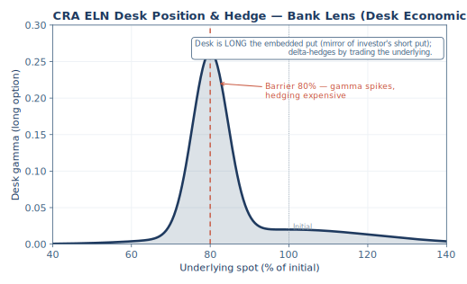

**How the bank makes money**

| Revenue Component | Detail |
|------------------|--------|
| **Structuring fee** | Embedded in note price at issuance (typically 1-3%) |
| **Bid-offer spread** | Spread between option cost and terms offered to investor |
| **Hedging P&L** | Delta-hedging profits from realized vs implied vol differential |
| **Funding advantage** | Issues note at sub-market effective funding rate |

**The coupon decomposition:**

Max Coupon = Bond yield + Put premium + Call premium + Digital option portfolio value − Funds Transfer Pricing (FTP) − Desk margin

The CRA ELN has the most complex decomposition in the ELN family because the coupon depends on a series of daily digital options — one for each trading day — rather than a single put or call. The digital option portfolio value is the engine of the maximum coupon; the call premium boosts it further; FTP and desk margin are deducted to arrive at the rate quoted to the investor.

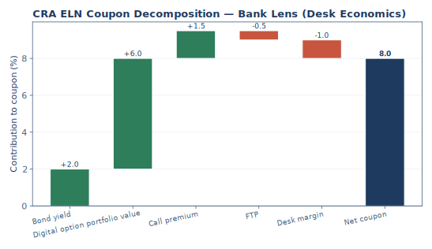

**P&L drivers**

Day to day, desk P&L is driven by realized-versus-implied volatility on the delta hedge, moves in the underlying near the range boundaries (digital gamma — small moves there determine whether each day accrues), the mark-to-market of the embedded call as call dates approach, funding, and the running accrual count. Product Control performs daily P&L attribution between the note accrual and the option MTM, and independent price verification of the embedded derivatives.

#### §9. THE BANK LENS — Controls & Reconciliation (2nd Line of Defence)

**Booking & systems**

| Field | Value |
|-------|-------|
| **Booking system** | NEMO |
| **Pricing system** | Sophis |
| **Four-Leg** | No |
| **Product type** | Equity-Linked Note — Range Accrual Callable |
| **Daily observation** | Stock close compared to range bounds each trading day |
| **Coupon calculation** | Days in range / Total trading days × Max coupon rate |
| **Call observation** | Semi-annual (or as specified) |

**Reconciliation points**

| Recon point | What must agree | CRA-specific break |
|-------------|-----------------|--------------------|
| **Trade economics** | Notional, strike (initial level), range bounds **and convention** (% vs absolute), max coupon rate & frequency, maturity, underlying ID | Range bound stored as % in NEMO (80%) but absolute price in Sophis ($160) — consistent only if the initial level matches |
| **Daily range-observation count** | The count of trading days observed in the period agrees across NEMO and Sophis | One system observes on a day the other treats as a holiday → observation count diverges |
| **Accrual factor (days-in-range / total)** | Days-in-range and total-trading-days both agree, so the accrual fraction reconciles | A one-day discrepancy in days-in-range changes the accrued coupon |
| **Trading-day calendar** | Accrual counts trading days only — weekends and holidays excluded | Non-trading day counted as an accrual day → coupon inflated |
| **Fixings** | Daily fixing **source** (exchange close) matches the termsheet for every observation | Different vendors report different daily closes near a range boundary → in/out flips |
| **Call capture** | Issuer-call flag, call date, and early-redemption amount consistent across systems | Call processed on a non-call date, or a call executed but not flagged downstream |
| **Corporate actions** | Range bounds and barrier adjusted for dividends, splits, mergers | Underlying split not propagated → range bounds off by the split ratio |
| **P&L attribution** | Note accrual + option (digital strip + call) MTM reconciles to total | Unexplained P&L points to a stale vol surface, a wrong daily fixing, or a mis-counted accrual day |

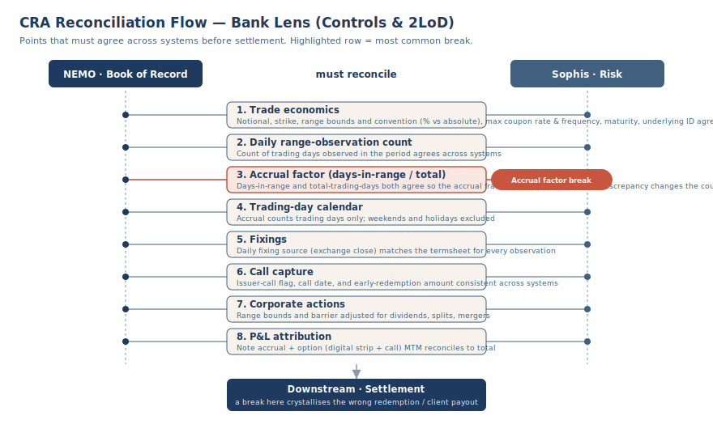

**Common breaks & red flags**

| Red Flag | What It Means | 2LoD Action |
|----------|---------------|-------------|
| Accrual count mismatch between NEMO and Sophis | Daily accrual tracking must agree across systems. A one-day discrepancy changes the coupon. | Reconcile daily fixing records and accrual counters |
| Non-trading day counted as accrual day | Weekends and holidays should not count toward accrual. Including them inflates the coupon. | Verify the trading day calendar used for accrual |
| Range bounds incorrectly set after corporate action | Stock splits or dividends change the absolute price level. Range bounds must be adjusted. | Confirm range bounds are adjusted for corporate actions |
| Call processed on non-call date | The issuer can only call on specified dates. Processing a call between dates is contractually invalid. | Verify call date schedule |
| Quarterly coupon paid as full amount despite partial accrual | The coupon must reflect the actual accrual percentage, not the maximum rate. | Compare accrual days to total days before paying |

**Control implication**

Each break has a direct consequence the 2nd line must size before it reaches the books or the client. Because the coupon is built one day at a time, the dominant control is a **daily accrual-count reconciliation**: days-in-range and total-trading-days must agree across NEMO and Sophis every period, and the trading-day calendar must exclude weekends and holidays — a single mis-counted day (a holiday treated as a trading day, or a boundary fixing flipped by a vendor difference) changes the coupon the investor is paid. Equally, **call capture** must be controlled: a call must be flagged on the correct date and the early-redemption amount propagated downstream, because a call processed on a non-call date is contractually invalid and a call executed but not captured leaves the note accruing on the books after it should have stopped. The reconciliation exists precisely to catch these inconsistencies before settlement crystallises them.

#### §10. Formal Definition

A **Callable Range Accrual ELN** is a structured product with:

**Range accrual coupon:** Daily accrual rate = (Annual coupon / Trading days per year). On each trading day, if the underlying closes within the specified range (lower bound to upper bound), one day of coupon accrues. Period coupon = Daily rate × Days in range during the period.

**Issuer call right:** The issuer may redeem the note at par on specified call dates, after a no-call period.

**Capital protection:** At maturity (if not called), if the underlying has breached the knock-in barrier: Redemption = Principal × (Final / Initial). If not breached: 100% of Principal.

#### §11. Lifecycle

| Stage | Detail |
|-------|--------|
| **Trade date** | Terms agreed: underlying, strike/barrier, coupon, maturity. Pricing finalised |
| **Issue date** | Note issued. Investor pays par (or discount). Bank establishes hedge |
| **Coupon dates** | Periodic observations and coupon payments (if applicable). Barrier monitoring |
| **Maturity** | Final observation. Settlement: cash (par or adjusted) or physical delivery. T+2 settlement |

#### §12. Worked Example (both lenses)

**Product:** 2-year CRA ELN on Barclays. **Notional:** $400,000. **Maximum coupon:** 10% p.a., paid quarterly (2.5% = $10,000 per quarter at full accrual). **Initial stock price:** £200. **Range:** 80%-120% = £160-£240. **Call dates:** Semi-annually, after 6-month no-call period. **Capital barrier:** 65% = £130 (European). **Trading days per quarter:** 63.

*Investor lens:*
- **Quarter 1:** Barclays trades between £185-£215. In range all 63 days. Coupon: $10,000 × 63/63 = **$10,000.**
- **Quarter 2:** Barclays dips to £155 for 8 days (below range), then recovers. In range 55 of 63 days. Coupon: $10,000 × 55/63 = **$8,730.** First call date: issuer does not call (accrual is high — valuable to keep the note).
- **Quarter 3:** Market rallies. Barclays at £245 for 12 days (above range). In range 51 of 63 days. Coupon: $10,000 × 51/63 = **$8,095.**
- **If note runs to maturity at £190 (95% of initial):** Above £130 barrier. Total coupons over 8 quarters (assuming ~85% average accrual): 8 × $10,000 × 85% = $68,000. Principal: $400,000. **Total: $468,000.** Return: 17%.
- **If note runs to maturity at £120 (60% of initial):** Below £130 barrier. Redemption: $400,000 × 120/200 = $240,000. Plus ~$50,000 coupons (lower accrual due to stock drifting below range). **Total: $290,000.** Loss: $110,000 (27.5%).

*Bank lens:*
The desk holds the offsetting long digital strip and long call. Each quarter Product Control reconciles the running accrual counter between NEMO and Sophis and recomputes the coupon from days-in-range over 63 — the Q3 figure of $8,095 (= $10,000 × 51/63) is the kind of number a single mis-counted day would distort, so the accrual count is verified against the trading-day calendar before the coupon is paid. At each call date the desk's call decision is captured and the call flag reconciled; if the note runs to the barrier-breach maturity the 2nd line confirms the redemption math (notional × final/initial) and that both systems agree before settlement.

#### §13. Knowledge Check

1. **How does a range accrual coupon differ from a fixed coupon and a conditional coupon?**
2. **Why does a CRA ELN have a higher maximum coupon rate than a comparable FCN?**
3. **What market view is a CRA ELN investor expressing?**
4. **Explain how a narrow range (90%-110%) versus a wide range (70%-130%) affects both the maximum coupon and the expected accrual.**
5. **A CRA ELN has 55 days in range out of 63 trading days in Q1. Calculate the coupon if the maximum quarterly rate is $12,000.**
6. **(Desk economics / 1LoD)** What position does the desk hold against the investor on the daily digital strip and the call, and how does the desk's gamma behave as the underlying approaches a range boundary? Why is that where the structuring margin is made or lost?
7. **(Controls / 2LoD)** Name three reconciliation breaks specific to a CRA ELN's accrual mechanism, and the consequence of each for the coupon the investor is paid.

**Mental Models**

| Concept | Mental Model |
|---------|-------------|
| Range accrual | Solar panels earning only on productive-sunshine days — too cloudy or too hot means no output |
| Range boundaries | The productive-sunshine window — a specific band where income is generated |
| Partial accrual | Partial sunshine month — 70% productive days earns 70% of maximum income |
| Issuer call | Utility buyback — the company ends the contract when energy economics shift |
| CRA ELN vs FCN | Solar panel income (weather-dependent) vs fixed rent (guaranteed). Higher ceiling, lower floor |
| Digital gamma at the boundary | The desk's daily coin-flip — at the edge of the range, one tick decides whether the day accrues |
| 2LoD accrual reconciliation | The meter reader — confirms the count of productive days matches before anyone is paid |

**Key Takeaways**

1. A CRA ELN pays a coupon proportional to the number of days the underlying stays within a specified range.
2. Investors buy CRA ELNs when they believe the market will trade sideways within a defined band.
3. The core risk is that the stock drifts outside the range, reducing coupon income to zero for those days.
4. The issuer call right funds a higher maximum coupon but creates reinvestment risk.
5. CRA ELNs are booked in NEMO and priced in Sophis, with daily accrual tracking required.
6. The desk holds the offsetting long digital strip and long call; its dominant risk is digital gamma at the range boundaries, which is the mirror of the investor's accrual risk.
7. For the 2nd line, the dominant control risks are the daily accrual count (days-in-range / total trading days), the trading-day calendar, daily fixings, and call capture — each can misstate the coupon or leave a called note accruing.

#### §14. Common Mistakes

1. **Assuming the coupon is guaranteed.** The maximum coupon is paid only if the stock is in range every single trading day. Any day outside the range reduces the coupon proportionally.
2. **Confusing range accrual with a coupon barrier.** A coupon barrier is all-or-nothing per period. Range accrual is proportional — 80% of days in range pays 80% of the maximum coupon.
3. **Ignoring boundary risk.** When the stock is near a range boundary, each day's accrual is uncertain. A stock at 79.9% of initial earns nothing; at 80.1% it earns a full day. This creates significant day-to-day variability.
4. **Using calendar days instead of trading days.** Accrual counts trading days only. Weekends and holidays do not count. Using calendar days overstates or understates the coupon.
5. **Expecting range accrual to work in trending markets.** The CRA ELN is designed for range-bound markets. A stock that trends steadily upward or downward will spend many days outside the range, producing low accrual.
6. **(Controls) Trusting a single system's accrual count or paying a coupon before the call flag is reconciled.** Because the coupon is built one day at a time and the note can be called, the 2nd line must reconcile the daily accrual count (days-in-range / total) across NEMO and Sophis and confirm call capture rather than assume the systems agree.
### Knowledge Check

**Review Questions:**
1. What is the daily accrual mechanism in a CRA ELN?
2. How is the quarterly coupon calculated?
3. What are the three risk components of a CRA ELN (accrual risk, capital risk, call risk)?
4. Why must range boundaries be adjusted for corporate actions like stock splits?
5. What market view does a CRA ELN investor hold?


**Dual-lens questions:**
- *(Desk economics / 1LoD)* What position does the desk hold against the investor, and what is its primary Greek / hedging risk?
- *(Controls / 2LoD)* Which booking and risk-system fields must reconcile for this product, and which is the most common break?
**Scenario Questions:**
1. A CRA ELN has a range of 85%-115%. In Q1, the stock trades at 84% for 10 days, then between 90%-110% for 45 days, then at 118% for 8 days. How many accrual days out of 63? Calculate the coupon if the maximum quarterly amount is $15,000.
2. The issuer calls a CRA ELN after Q2. The investor had 95% accrual in Q1 and 88% in Q2. Was the call decision rational from the issuer's perspective? Why?
3. Two CRA ELNs are offered on the same stock. CRA A has a 75%-125% range and 8% max coupon. CRA B has a 90%-110% range and 14% max coupon. Which is riskier from an accrual perspective?

**Desk Question:**
A CRA ELN on Barclays shows 48 accrual days out of 63 in Q3. Product Control reports 50 accrual days. You discover that two public holidays were incorrectly counted as trading days. Walk through the impact on the coupon payment and what steps Operations must take.

### Visual Learning Recommendations

1. **Range accrual timeline** — Day-by-day chart showing stock price against range boundaries, with accrual/non-accrual days color-coded (P1)
2. **CRA ELN payoff at maturity** — Standard barrier payoff diagram with coupon scenarios overlaid (partial vs full accrual) (P1)
3. **Range width comparison** — Side-by-side: narrow range (higher max coupon, fewer accrual days) vs wide range (lower max coupon, more accrual days) (P2)
4. **Coupon calculation waterfall** — Max rate → accrual percentage → actual coupon, with worked numbers (P2)
5. **CRA ELN vs FCN cash flow comparison** — Quarter-by-quarter coupon comparison showing guaranteed vs accrual-dependent income (P3)

### Dependency References

| Concept Used | Where It Was Taught |
|-------------|-------------------|
| Put option, knock-in barrier | [Section 1.2](#sec-1-2) (Options), [Section 1.3](#sec-1-3) (Barriers) |
| Digital (binary) option | [Section 1.3](#sec-1-3) (Barriers) |
| Callable mechanism, no-call period | [Section 5.1.6](#sec-5-1-6) (CRC) |
| Coupon decomposition, FTP | [Section 2.2](#sec-2-2) (Product Construction) |
| NEMO/Sophis booking | [Section 2.8](#sec-2-8) (Systems Primer) |
| Autocall and fixed coupon concepts | [Section 5.1.9](#sec-5-1-9) (FCN) |

---


#### Visual Specifications

**Visual 1: Callable Range Accrual ELN Payoff at Maturity**
- **Asset filename:** payoff_cra eln_maturity_01.svg
- **Caption:** "Callable Range Accrual ELN Payoff at Maturity"
- **Diagram elements:** X-axis: underlying price. Y-axis: investor total return. Key levels marked (strike, barrier if applicable). Compare with unstructured alternative
- **Reuse status:** Adapt from payoff template
**Visual 2: Callable Range Accrual ELN Product Construction**
- **Asset filename:** construction_cra eln_components_02.svg
- **Caption:** "Callable Range Accrual ELN Product Construction"
- **Diagram elements:** Component decomposition: each building block in separate box. Arrows showing how they combine to create the product. Cost allocation visible
- **Reuse status:** Adapt from construction template
**Visual 3: Callable Range Accrual ELN Lifecycle Timeline**
- **Asset filename:** lifecycle_cra eln_timeline_03.svg
- **Caption:** "Callable Range Accrual ELN Lifecycle Timeline"
- **Diagram elements:** Horizontal timeline from issue to maturity. Key events: issue, coupon dates, observation dates, maturity. Underlying price path overlay
- **Reuse status:** Adapt from lifecycle template
**Visual 4: Callable Range Accrual ELN Risk Heatmap**
- **Asset filename:** risk_cra eln_heatmap_04.svg
- **Caption:** "Callable Range Accrual ELN Risk Heatmap"
- **Diagram elements:** Grid: risk types (market, credit, liquidity, operational) vs severity (low/med/high). Colour-coded cells appropriate for Callable Range Accrual ELN
- **Reuse status:** Adapt from risk heatmap template
**Visual 5: Callable Range Accrual ELN vs Alternatives**
- **Asset filename:** comparison_cra eln_vs_alternatives_05.svg
- **Caption:** "Callable Range Accrual ELN vs Alternatives"
- **Diagram elements:** Multi-column comparison showing payoff across scenarios (-30%, flat, +15%, +30%). Compare with direct investment and simpler structured product
- **Reuse status:** New — comparison panel
**Visual 6: Callable Range Accrual ELN Suitability Decision Tree**
- **Asset filename:** decision_cra eln_suitability_06.svg
- **Caption:** "Callable Range Accrual ELN Suitability Decision Tree"
- **Diagram elements:** Decision tree guiding investor suitability. Key questions: risk tolerance, income need, market view, time horizon
- **Reuse status:** Adapt from decision tree template


**Dual-lens visuals (generated):**
- `assets/cra/controls_cra_recon_08.svg` `[generated]`
- `assets/cra/desk_cra_gamma_07.svg` `[generated]`
- `assets/cra/waterfall_cra_09.svg` `[generated]`
#### Dependency References

| Concept Used | Where It Was Taught |
|-------------|-------------------|
| Equity fundamentals | [Section 1.4](#sec-1-4) (Equity Essentials) |
| Options mechanics | [Section 1.2](#sec-1-2) (Options From Zero) |
| Product decomposition | [Section 2.2](#sec-2-2) (Product Construction) |
| NCRA | 5.3.3 — rates version |
| CRA SRT | 5.3.4 — rates + call |
| Digital | 5.1.12 — simpler equity digital |
### 5.1.11 Issuer Callable Note (ICN) {#sec-5-1-11}

> **Prerequisites:** [RC](#sec-5-1-2) &nbsp;|&nbsp; **Key concepts:** Bermudan call right, reinvestment risk

---

*This product strips the equity derivative entirely from the structured note framework. Unlike the CRC, which combines a callable feature with an RC's barrier and put, the ICN has no equity exposure, no barrier, and no embedded put. It is simply a bond with an enhanced coupon and an issuer call right. That single feature — the call — is the only source of the enhanced yield. This chapter reads the product through two lenses: what it means for **the investor**, and what it means for **the bank** — the latter split into the desk's market economics (1st line of defence) and the controls and reconciliation that surround it (2nd line of defence).*

#### §1. Explain Like I'm New

Anika is a corporate treasury manager. Her company has $2 million in cash reserves that must remain accessible within 2-3 years. Bank deposits pay 2% per year. Corporate bonds pay more but tie up capital for 5-10 years.

Anika wants a product that pays more than deposits but returns her capital within a defined timeframe. She does not want equity risk — her company's board prohibits equity-linked investments for treasury reserves.

The **Issuer Callable Note** offers 4% per year — double the deposit rate — with one catch: the issuing bank can redeem the note early. If interest rates drop, the bank will call the note and refinance at lower rates, forcing the investor to reinvest her cash at the new, lower rates.

The ICN is the simplest structured product in the ELN family. There is no stock, no barrier, no put option. The enhanced yield comes entirely from the investor selling the bank a call right on the note itself.

#### §2. Real-World Analogy

An ICN is like a fixed-term savings bond with an early redemption clause.

A saver deposits $100,000 in a 3-year savings bond at the bank. The bank offers 4% per year — higher than the standard 2% savings account — because the saver agrees to one condition: the bank can return the money early at any annual anniversary.

Why would the bank do this? If market interest rates drop to 1%, the bank is paying the saver 4% on money it could now fund at 1%. The rational move is to return the deposit and stop overpaying. The saver gets the $100,000 back, but now can only reinvest at 1%.

The higher interest rate (4% vs 2%) is the saver's compensation for accepting this uncertainty. The extra 2% is the price of the call option the saver has sold to the bank.

#### §3. What Problem Does This Solve?

The ICN solves the **low-yield, no-equity-risk** problem.

| Client Need | How the ICN Delivers |
|------------|---------------------|
| Higher than deposit rates | Enhanced coupon funded by the call option premium |
| No equity exposure | No stock, no barrier, no put — pure fixed income |
| Capital preservation | Principal returned at par on call or at maturity |
| Defined maturity | Maximum term is specified; actual term may be shorter |
| Regulatory simplicity | No equity derivative component simplifies suitability classification |

#### §4. Product DNA

| Field | Value |
|-------|-------|
| **Full Name** | Issuer Callable Note |
| **Abbreviation** | ICN |
| **Family** | Equity-Linked Notes |
| **Complexity Score** | 3 / 10 |
| **Complexity Rationale** | Issuer-callable funding note (no equity, no barrier). Bank holds the call right on predetermined dates; higher coupon compensates the investor for that callability |
| **Underlying Asset Class** | Interest rate / issuer credit (no equity underlying) |
| **Capital Protection** | Full par at call or maturity (issuer credit risk only) |
| **Coupon Type** | Enhanced fixed or contingent coupon |
| **Maturity** | 2-5 years |
| **Liquidity** | Secondary market |
| **Primary System** | Murex |
| **ISDA Required** | No — issued as note |

**DNA Atlas Fields:**
- Primary Risk: Call exercised when profitable for bank. Reinvestment risk for investor. Same directional risk as underlying note type
- Typical Buyer: Yield-seeking investors willing to accept early termination risk
- Typical Use Case: Higher coupon than non-callable equivalent. Trade-off: bank can terminate at will on call dates
- Building Blocks: Underlying ELN structure + short Bermudan call to issuer
- Key Hedge: Long Bermudan call, underlying ELN hedge
- Similar Products: CRC (5.1.6 — callable RC), Phoenix (5.1.3 — autocall vs discretionary call), IR Callable (5.3.1 — rates version)
- Most Important Greek: Vega (call option vol sensitivity)

**Comparison Matrix Fields:**
- Complexity: 3
- Yield Potential: High (call premium enhances coupon)
- Capital Protection: Full par at call/maturity (issuer credit risk only)
- Credit Exposure: Issuer
- Liquidity: Secondary market
- Path Dependency: Yes (call observation dates)
- Volatility Sensitivity: Short vega (sold call)
- Correlation Sensitivity: None
- Client Type: Private banking / Institutional
- Market Environment: Best when expecting stable markets (low call probability)

#### §5. Who Touches This Product

| Role | Responsibility |
|------|---------------|
| **Structurer** | Designs Issuer Callable Note terms: call schedule, no-call period, coupon, maturity. Optimises structure for client and bank |
| **Trader** | Hedges the issuer call with swaptions. Manages rate vega and DV01 (no equity Greeks). Prices secondary market |
| **Sales** | Distributes Issuer Callable Note to target clients. Explains payoff scenarios and risk-return profile |
| **Risk Management** | Monitors rate vega, DV01, and call-exercise risk. Sets trading limits |
| **Product Control** | Daily P&L attribution between note accrual and option MTM. Independent price verification |
| **Operations** | Processes coupon payments and call/maturity par redemption. Cash settlement (no physical delivery) |
| **Legal / Compliance** | Reviews term sheet for regulatory compliance. Ensures suitability for target investor base |
| **Quantitative Analytics** | Prices embedded derivatives. Calibrates volatility surface. Provides model validation |

#### §6. Product Evolution

| Stage | Product | What Was Added | Why |
|:-----:|---------|---------------|-----|
| 1 | Plain vanilla bond | — (baseline) | Fixed coupon, full principal return |
| 2 | Equity-linked note | Equity participation or option embedded | Market return exposure with note wrapper |
| 3 | Issuer Callable Note | Specific structural features added | Product-specific innovation: Issuer-callable funding note (no equity, no barrier). Bank holds the call right on predetermined dates; higher coupon compensates the investor for that callability |

---

#### §7. THE INVESTOR LENS

**Why the investor buys it**

1. **No equity risk.** The only risks are issuer credit and call timing. No stock can crash and destroy the investor's principal.
2. **Enhanced yield.** Typically 1-3% above equivalent deposit rates, funded by the call option premium.
3. **Capital certainty.** The investor receives 100% of principal at call or maturity. No barrier, no knock-in, no recovery calculation.
4. **Treasury-suitable.** Corporate treasurers and institutional investors restricted from equity products can still access enhanced yields.
5. **Regulatory simplicity.** The absence of an equity derivative component simplifies the suitability classification, opening the product to mandates that prohibit equity-linked exposure.

**Position taken**

The investor simultaneously holds a long bond (lends principal to the issuer) and a **short** Bermudan call sold to the issuer — the call right on the note itself. By selling that call, the investor gives the bank the optionality to redeem early on the scheduled call dates. Net, the investor is **short volatility** (the sold call loses value to the investor as rate volatility rises) and bears reinvestment risk: if the bank calls, the investor must redeploy capital at whatever rates then prevail. There is no equity exposure and no correlation exposure; the only market sensitivity is to interest rates and the issuer's credit spread.

**Payoff & scenarios**

The investor's payoff is fundamentally different from all other ELN products: it is a horizontal line at par (plus coupons) with the only downside being issuer default. There is no equity-linked payoff curve, no barrier, and no participation — the return is the coupon stream plus full principal at call or at maturity. The single uncertainty is *when* the principal is returned, which the issuer controls at its discretion on each call date after the no-call period.

**Product:** 3-year ICN, $1,000,000 notional, 4% p.a. coupon (paid annually = $40,000), call dates annually after a 1-year no-call period, maturity 3 years.

- **Scenario 1 — Rates drop, called at Year 2:** Interest rates fall from 3% to 1.5%. The bank is paying 4% on money it can now fund at 1.5%. Issuer calls at Year 2. The investor receives $1,000,000 + $40,000 (Year 2 coupon). **Total received: $1,080,000** (including Year 1 coupon). The investor must reinvest at 1.5%.
- **Scenario 2 — Rates rise, held to maturity:** Interest rates rise from 3% to 5%. The bank is paying 4% — below market rate. No incentive to call. Note runs to maturity. The investor receives $1,000,000 + 3 × $40,000 = $1,120,000. The investor earned 4% while the market offered 5%. Opportunity cost: $30,000 over 3 years.
- **Scenario 3 — Rates stable, held to maturity:** Rates stay at 3%. Bank pays 4%. Not enough incentive to call (transaction costs exceed the benefit). Note matures. **Total: $1,120,000.** Return: 12% over 3 years.
- **Scenario 4 — Issuer defaults:** The issuing bank enters resolution. The investor's note is an unsecured obligation. Recovery depends on the resolution process — the investor may receive 40-60 cents on the dollar. **Loss: $400,000-$600,000.** This is the hidden risk: the enhanced coupon compensates for both call risk AND credit risk.

**Risks to the investor**

| Risk | Description | Severity |
|------|------------|:--------:|
| **Reinvestment risk** | Issuer calls when rates drop, forcing reinvestment at lower yields | High |
| **Issuer credit risk** | If the issuing bank defaults, the investor is an unsecured creditor — the **only** capital-loss channel for an ICN | High |
| **Opportunity cost** | If rates rise, the investor is locked into a below-market coupon | Medium |
| **Call timing uncertainty** | The investor cannot predict when the issuer will call | Low |
| **Liquidity risk** | Secondary market may be thin; selling before call or maturity may be at a discount | Low |

#### §8. THE BANK LENS — Desk Economics (1st Line of Defence)

**What the desk books**

The desk's position is the mirror image of the investor's. Where the investor is short the Bermudan call, the desk — the issuer — is **long** that call (bought from the investor): the bank holds the right to redeem the note early at par on the scheduled call dates. Alongside it the desk has issued a note, which is a funding liability. The investor's enhanced coupon is, to the desk, the call premium plus the issuer's credit spread, returned to the client. Crucially, the call decision belongs to the desk: at each call date after the no-call period the desk chooses to exercise (call and refinance) or continue, driven entirely by where rates have moved — not by any equity level.

**Greeks & hedging**

This is a rates product, not an equity product. The desk hedges the embedded option with swaptions, not equity options: the call right on the note is structurally a Bermudan swaption — the right to enter a swap at the note's coupon rate. There are no equity Greeks to manage — no delta, no gamma, no equity vega. The desk's primary sensitivities are interest-rate vega (the value of the sold/bought call moves with rate volatility), DV01 (interest-rate level sensitivity), and the issuer's credit spread. The desk monitors the yield curve, because the call's value — and the decision to exercise — is governed by rates.

**How the bank makes money**

| Revenue Component | Detail |
|------------------|--------|
| **Structuring fee** | Embedded in note price at issuance (typically 1-3%) |
| **Bid-offer spread** | Spread between option cost and terms offered to investor |
| **Hedging P&L** | Swaption / rate-vol hedging P&L; the desk gains if the call is not exercised |
| **Funding advantage** | Issues note at sub-market effective funding rate |

**The coupon decomposition:**

Enhanced Coupon = Risk-free rate + Call option premium + Issuer credit spread

There is no put premium, no equity derivative, and no Funds Transfer Pricing (FTP)/margin in the traditional sense. The ICN's pricing is a pure rates/credit exercise. For a 4% coupon: the risk-free rate provides the base, the Bermudan call premium (the value of the call the investor sold to the bank) adds the call-funded enhancement, and the issuer credit spread compensates for the bank's unsecured credit. The call premium and the credit spread together are what lift the coupon above the deposit rate.

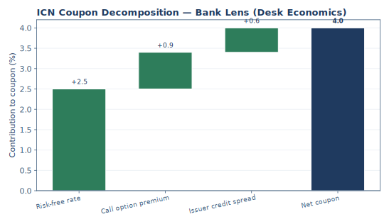

**P&L drivers**

Day to day, desk P&L is driven by moves in the yield curve and rate volatility on the swaption hedge, the issuer's credit spread, funding, and the mark-to-market of the embedded Bermudan call. Product Control attributes P&L between note accrual and the option MTM, and performs independent price verification — using swaption/rates models, never equity barrier models. The call exercise decision itself is a P&L event: calling crystallises the funding benefit when rates have fallen.

#### §9. THE BANK LENS — Controls & Reconciliation (2nd Line of Defence)

**Booking & systems**

| Field | Value |
|-------|-------|
| **Booking system** | NEMO |
| **Pricing system** | Sophis |
| **Four-Leg** | No |
| **Product type** | Structured Note — Issuer Callable Fixed Rate |
| **Coupon payment** | Fixed, annual or semi-annual |
| **Call observation** | Annual (or as specified), at issuer's discretion |
| **Barrier** | None |

The ICN is booked in NEMO and priced in Sophis using a swaption/rates model. The defining controls fields are the call schedule, the no-call period, and the capture of each call/no-call decision — there are no barrier or equity-observation fields to monitor.

**Reconciliation points**

| Recon point | What must agree | ICN-specific break |
|-------------|-----------------|--------------------|
| **Trade economics** | Notional, coupon rate & frequency, maturity, par redemption level | Coupon frequency stored as annual in NEMO but semi-annual in Sophis |
| **Call schedule & notice** | Call dates, no-call period, and notice period match the termsheet across NEMO and Sophis | No-call period in the system does not match the termsheet — a call could be modelled or actioned inside the protected window |
| **Call-exercise capture** | Each call/no-call decision is recorded on every call date and flagged consistently across systems | Call exercised but the redemption flag is not set → note keeps accruing coupons it should have stopped |
| **Coupon lifecycle** | Coupon schedule and day-count; schedule terminates on the call date | Post-call coupon paid on a redeemed note |
| **Pricing model assignment** | Swaption/rates model applied, not an equity barrier model | ICN valued with an equity model → wrong MTM and spurious equity Greeks |
| **Risk classification** | Product flagged as rates/credit with no equity Greeks | Delta/Gamma/Vega appearing on an ICN risk report → booking misclassification |
| **Settlement** | Cash redemption at par on call or maturity; T+2; delivery-versus-payment | Call redemption settled late or at the wrong principal amount |
| **Issuer credit** | Issuer identifier and credit spread feed match the issuing entity | Wrong issuer curve applied → misstated MTM and credit sensitivity |

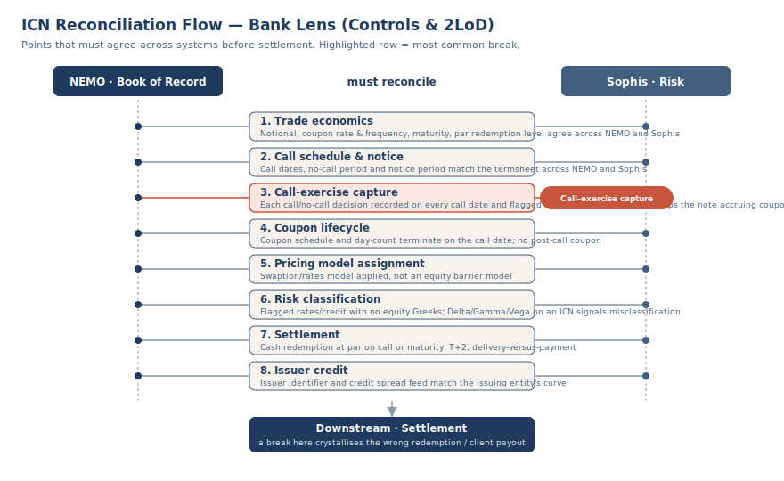

**Common breaks & red flags**

| Red Flag | What It Means | 2LoD Action |
|----------|---------------|-------------|
| **Call decision not documented** | Every call date requires a recorded decision (call or no-call), even if the decision is to continue | Ensure the rates desk records the call/no-call decision |
| **Coupon paid after call** | Post-call coupon payments are a cash control failure | Verify the coupon schedule terminates on the call date |
| **Equity Greeks appearing in risk reports** | ICNs have zero equity exposure. Delta, Gamma, or Vega on an ICN indicate a booking error | Check that the product is classified correctly in Sophis |
| **No-call period not enforced** | A call within the no-call period is contractually invalid | Verify the no-call period in the system matches the termsheet |
| **ICN valued using equity models** | ICNs should be valued using swaption/rates models, not equity barrier models | Confirm the correct pricing model is assigned |

**Control implication**

Each break has a direct consequence the 2nd line must size before it reaches the books or the client. The two breaks unique to this product are call-related. If the issuer-call notice and the no-call period are not faithfully reconciled between NEMO and Sophis, the system can model or action a call inside the protected window — a contractually invalid redemption. And if the call-exercise decision is not captured the moment it is made, the note keeps accruing coupons it should have stopped, a direct cash control failure. The reconciliation exists precisely to catch the call schedule, the call notice, and the early-redemption capture before settlement crystallises an error.

#### §10. Formal Definition

An **Issuer Callable Note (ICN)** is a structured product with:

**Fixed coupon:** A predetermined coupon paid annually (or semi-annually) for the life of the note.

**Issuer call right:** The issuer may redeem the note at 100% of par on specified call dates, after a no-call period. The call decision is at the issuer's sole discretion.

**No equity component:** The ICN has no underlying stock, no barrier, and no embedded put option. The investor's return is the coupon stream plus full principal at call or maturity.

The ICN is the simplest product in the structured notes spectrum. Its enhanced yield comes entirely from two sources: the call option premium and the issuer's credit spread.

#### §11. Lifecycle

| Stage | Detail |
|-------|--------|
| **Trade date** | Terms agreed: underlying, strike/barrier, coupon, maturity. Pricing finalised |
| **Issue date** | Note issued. Investor pays par (or discount). Bank establishes hedge |
| **Coupon dates** | Coupon payments on scheduled dates. Call dates after the no-call period |
| **Maturity** | Call or maturity: par redemption in cash. T+2 settlement |

#### §12. Worked Example (both lenses)

**Product:** 3-year ICN issued by the bank
**Notional:** $2,000,000
**Coupon:** 4% p.a., paid annually ($80,000 per year)
**Initial market rate:** 2.5% for 3-year deposits
**Call dates:** Annually, after a 1-year no-call period
**Underlying:** Novartis (CHF 90) — not applicable (ICN has no equity)

*Investor lens:*

**Year 1:** Market rates at 2.8%. No-call period. Anika receives $80,000 coupon. Running total: $80,000.

**Year 2:** Market rates drop to 1.8%. The bank is paying 4% on money it can now fund at 1.8%. The call saves the bank $44,000/year (2.2% × $2M). Issuer calls. Anika receives $2,000,000 principal + $80,000 coupon. **Total received: $2,160,000.** Return: $160,000 / $2,000,000 = 8% over 2 years.

**Anika reinvests at 1.8%.** Over the remaining 1 year, she earns $2,000,000 × 1.8% = $36,000. If she had held the ICN to maturity (had rates not dropped), she would have earned $80,000. Reinvestment cost: $44,000.

**If held to maturity (rates stable):** 3 × $80,000 = $240,000 coupons + $2,000,000 principal. **Total: $2,240,000.** Return: 12% over 3 years (4% p.a.).

*Bank lens:* At each call date after the no-call period the desk — long the Bermudan call — makes the exercise decision purely on rates. In Year 2, with funding at 1.8% against a 4% coupon, the call saves $44,000/year, so the desk calls and crystallises the funding benefit, redeeming at par. Product Control verifies the swaption hedge MTM rolls off, confirms the coupon schedule terminates on the call date so no post-call coupon accrues, and checks that NEMO and Sophis agree on the redemption and the call-exercise flag before settlement.

#### §13. Knowledge Check

1. **What are the two sources of the ICN's enhanced coupon?**
2. **Why does the issuer call an ICN when interest rates drop?**
3. **How does an ICN differ from a CRC in terms of risk profile?**
4. **An ICN pays 4% while deposits pay 2%. Where does the extra 2% come from?**
5. **Why is an ICN hedged with swaptions rather than equity options?**
6. **(Desk economics / 1LoD)** The investor is short the Bermudan call; what position does the desk hold, and on what basis does the desk decide whether to exercise the call at each call date? Where does the desk's enhancement come from given there is no put and no FTP?
7. **(Controls / 2LoD)** Name three reconciliation breaks specific to an ICN — including at least one tied to the call — and the consequence of each.

**Mental Models**

| Concept | Mental Model |
|---------|-------------|
| ICN | A savings bond with an early redemption clause — higher rate in exchange for the bank's right to return the principal early |
| Call premium | The extra interest the investor earns for accepting the uncertainty of when the principal is returned |
| Reinvestment risk | Being forced to move savings to a lower-rate account when the bank returns the deposit |
| Credit risk | The risk that the bank itself fails — the enhanced deposit becomes an unsecured claim |
| ICN vs CRC | Same landlord's break clause, but the ICN apartment has no earthquake risk (no equity exposure) |
| Issuer's call (bank lens) | The bank holds the break clause — it exercises only when refinancing cheaper makes it worthwhile |
| 2LoD call capture | The registrar logging the break-clause notice — confirms the redemption is recorded and coupons stop on the right date |

**Key Takeaways**

1. An ICN is a structured note that pays an enhanced fixed coupon in exchange for the issuer's right to redeem early.
2. Clients buy ICNs for higher-than-deposit yields without equity exposure.
3. The core risk is reinvestment — the issuer calls when rates drop, forcing reinvestment at lower yields.
4. The ICN has no stock, no barrier, and no put — it is the simplest structured product.
5. ICNs are booked in NEMO, priced using swaption models in Sophis, with no equity Greeks.
6. The investor is short the Bermudan call; the desk (issuer) is long it and decides — purely on rates — whether to call at each date. The investor's enhanced coupon is the call premium plus issuer credit spread.
7. For the 2nd line, the dominant control risks are call-schedule/no-call reconciliation, call-exercise capture, and pricing-model assignment — each can drive an invalid redemption, an over-accrued coupon, or a misstated MTM.

#### §14. Common Mistakes

1. **Treating the ICN as risk-free.** The enhanced coupon compensates for two real risks: call timing and issuer credit. A 4% ICN from a bank is not the same as a 4% government bond.
2. **Expecting equity-like returns.** The ICN yields 1-3% above deposits, not 8-12% like an FCN or RC. The absence of equity risk means the absence of equity premium.
3. **Ignoring issuer credit risk.** The ICN is an unsecured obligation. If the bank enters resolution, the investor is a general creditor. The enhanced coupon is partly compensation for this credit risk.
4. **Assuming the call is automatic.** The call is at the issuer's discretion based on rates, funding costs, and other factors. It is not triggered by a market level.
5. **Comparing ICN yield directly to FCN yield.** The FCN's higher coupon compensates for equity risk (barrier breach). Comparing 4% ICN to 6% FCN without considering the risk difference is misleading.
6. **(Controls) Assuming a recorded call is captured everywhere.** A call exercised by the desk must propagate to a redemption flag and a terminated coupon schedule in both NEMO and Sophis; the 2nd line must confirm the early-redemption capture rather than assume the systems agree, or the note will keep accruing coupons it should have stopped.
### Knowledge Check

**Review Questions:**
1. What two sources fund the ICN's enhanced coupon?
2. Why does the ICN have no barrier and no put option?
3. What triggers the issuer's call decision?
4. How does the ICN's risk profile differ from an FCN?
5. What type of model does Sophis use to price an ICN?


**Dual-lens questions:**
- *(Desk economics / 1LoD)* What position does the desk hold against the investor, and what is its primary Greek / hedging risk?
- *(Controls / 2LoD)* Which booking and risk-system fields must reconcile for this product, and which is the most common break?
**Scenario Questions:**
1. An ICN pays 4% annually on $1M. Market rates drop from 3% to 1%. The issuer calls at Year 2. Calculate the investor's total return and the reinvestment cost over the remaining year.
2. Two ICNs are offered: ICN A pays 3.5% with a 2-year no-call. ICN B pays 4.5% with a 6-month no-call. Which offers more call protection, and why does it pay less?
3. An ICN issuer enters resolution with 45% recovery. The investor holds $500,000 in ICNs. Calculate the recovery amount. Would the outcome be different if this were a deposit covered by deposit insurance?

**Desk Question:**
You are a Risk analyst reviewing the bank's ICN book. You notice that several ICNs have been booked with Delta and Gamma values in Sophis. Explain why this is incorrect, what the likely cause is, and what steps you would take to remediate.

### Visual Learning Recommendations

1. **ICN payoff timeline** — Timeline showing coupon payments, potential call dates, and maturity with rate scenarios overlaid (P1)
2. **ICN vs CRC comparison** — Side-by-side showing the ICN as a "CRC without equity" — same call mechanics, no barrier (P1)
3. **Coupon decomposition comparison** — ICN (risk-free + call + credit) vs FCN (risk-free + put + autocall - FTP) (P2)
4. **Interest rate scenario tree** — Rates up (not called, opportunity cost) vs rates down (called, reinvestment risk) (P2)
5. **Product complexity spectrum** — ICN → RC → FCN → Phoenix → CRA ELN, showing increasing complexity (P3)

### Dependency References

| Concept Used | Where It Was Taught |
|-------------|-------------------|
| Call option, Bermudan exercise | [Section 1.2](#sec-1-2) (Options) |
| Callable mechanism, reinvestment risk | [Section 5.1.6](#sec-5-1-6) (CRC) |
| Interest rates, yield curve | [Section 1.7](#sec-1-7) (Yield Curves, Spot Rates, and Forward Rates) |
| Swaptions | [Section 1.8](#sec-1-8) (Benchmark Rates, Swaps, and Rate Options) |
| NEMO/Sophis booking | [Section 2.8](#sec-2-8) (Systems Primer) |
| Issuer credit risk | [Section 1.9](#sec-1-9) (Credit Risk) |

---


#### Visual Specifications

**Visual 1: Issuer Callable Note Payoff at Maturity**
- **Asset filename:** payoff_icn_maturity_01.svg
- **Caption:** "Issuer Callable Note Payoff at Maturity"
- **Diagram elements:** X-axis: underlying price. Y-axis: investor total return. Key levels marked (strike, barrier if applicable). Compare with unstructured alternative
- **Reuse status:** Adapt from payoff template
**Visual 2: Issuer Callable Note Product Construction**
- **Asset filename:** construction_icn_components_02.svg
- **Caption:** "Issuer Callable Note Product Construction"
- **Diagram elements:** Component decomposition: each building block in separate box. Arrows showing how they combine to create the product. Cost allocation visible
- **Reuse status:** Adapt from construction template
**Visual 3: Issuer Callable Note Lifecycle Timeline**
- **Asset filename:** lifecycle_icn_timeline_03.svg
- **Caption:** "Issuer Callable Note Lifecycle Timeline"
- **Diagram elements:** Horizontal timeline from issue to maturity. Key events: issue, coupon dates, observation dates, maturity. Underlying price path overlay
- **Reuse status:** Adapt from lifecycle template
**Visual 4: Issuer Callable Note Risk Heatmap**
- **Asset filename:** risk_icn_heatmap_04.svg
- **Caption:** "Issuer Callable Note Risk Heatmap"
- **Diagram elements:** Grid: risk types (market, credit, liquidity, operational) vs severity (low/med/high). Colour-coded cells appropriate for Issuer Callable Note
- **Reuse status:** Adapt from risk heatmap template
**Visual 5: Issuer Callable Note vs Alternatives**
- **Asset filename:** comparison_icn_vs_alternatives_05.svg
- **Caption:** "Issuer Callable Note vs Alternatives"
- **Diagram elements:** Multi-column comparison showing payoff across scenarios (-30%, flat, +15%, +30%). Compare with direct investment and simpler structured product
- **Reuse status:** New — comparison panel
**Visual 6: Issuer Callable Note Suitability Decision Tree**
- **Asset filename:** decision_icn_suitability_06.svg
- **Caption:** "Issuer Callable Note Suitability Decision Tree"
- **Diagram elements:** Decision tree guiding investor suitability. Key questions: risk tolerance, income need, market view, time horizon
- **Reuse status:** Adapt from decision tree template


**Dual-lens visuals (generated):**
- `assets/icn/controls_icn_recon_08.svg` `[generated]`
- `assets/icn/waterfall_icn_09.svg` `[generated]`
#### Dependency References

| Concept Used | Where It Was Taught |
|-------------|-------------------|
| Equity fundamentals | [Section 1.4](#sec-1-4) (Equity Essentials) |
| Options mechanics | [Section 1.2](#sec-1-2) (Options From Zero) |
| Product decomposition | [Section 2.2](#sec-2-2) (Product Construction) |
| CRC | 5.1.6 — callable RC |
| Phoenix | 5.1.3 — autocall vs discretionary call |
| IR Callable | 5.3.1 — rates version |
### 5.1.12 Digital Coupon Note {#sec-5-1-12}

> **Prerequisites:** [RC](#sec-5-1-2) &nbsp;|&nbsp; **Key concepts:** Binary/digital payoff, digital gamma, call spread replication

---

*The Reverse Convertible ([Section 5.1.2](#sec-5-1-2)) paid a guaranteed coupon. The Digital Coupon Note replaces that guarantee with an all-or-nothing payment. On each observation date, if the underlying is above a coupon barrier, the full coupon is paid; if below, zero is paid — no partial credit, no memory, no catch-up. The Digital Coupon Note is the Phoenix without memory: a missed coupon is gone forever. This chapter reads the product through two lenses: what it means for **the investor**, and what it means for **the bank** — the latter split into the desk's market economics (1st line of defence) and the controls and reconciliation that surround it (2nd line of defence).*

#### §1. Explain Like I'm New

A pension fund manager evaluating structured product allocations has been looking at Phoenix products but dislikes the memory feature — it makes the valuation complex and hard to explain to the fund's trustees. The fund wants a simpler structure: either the coupon is paid or it is not. No accumulation, no catch-up, no deferred payments.

The fund's analysts believe the underlying stock will stay above 75% of its current level for most quarters. They want a product that pays a high coupon in "normal" quarters and accepts zero coupon in "stress" quarters, with the simplicity of a binary outcome.

The **Digital Coupon Note** provides this. Each quarter, it checks the stock level against a coupon barrier. Above the barrier: full coupon paid. Below: nothing. It is a pass/fail system with no partial grades. In effect, the investor accepts a specific, binary risk on each coupon — a generous payment whenever the stock holds above the line, and a complete zero whenever it does not.

#### §2. Real-World Analogy

A Digital Coupon Note is like a university pass/fail exam.

In a standard graded course, a score of 85% earns 85% of the available marks. In a pass/fail course, the result is either a pass (full credit) or a fail (no credit). Scoring 69% and scoring 12% produce the same outcome: fail.

The Digital Coupon Note works the same way. The coupon barrier is the passing grade. If the stock is above the barrier on the observation date: full coupon (pass). If below, even by 0.1%: zero coupon (fail). There is no 80% coupon for being "almost" above the barrier.

Unlike the Phoenix — which has memory, like a professor who lets a student retake failed exams — the Digital Coupon Note has no second chances. A failed quarter is a zero.

#### §3. What Problem Does This Solve?

The Digital Coupon Note addresses the **simple conditional income** need.

When interest rates are low, bonds and guaranteed-coupon notes pay little, and income-focused investors look for higher yield. The Digital Coupon Note offers a higher per-period coupon than a guaranteed FCN, in exchange for the risk that any given coupon may not be paid at all. Its appeal is transparency: a single, binary test per period, with no memory mechanism to track.

| Investor Need | How the Digital Coupon Note Delivers |
|------------|-------------------------------------|
| High coupon when conditions are met | Pays full coupon (8-12% p.a.) when stock ≥ barrier |
| Simple valuation | Binary outcome per period — no memory tracking, no accumulation |
| Higher per-period coupon than FCN | Conditional payment = higher rate (the investor bears coupon risk) |
| Transparency | Easy to explain: above the line, the investor is paid; below, the investor is not |

#### §4. Product DNA

| Field | Value |
|-------|-------|
| **Full Name** | Digital Coupon Note |
| **Abbreviation** | Digital |
| **Family** | Equity-Linked Notes |
| **Complexity Score** | 4 / 10 |
| **Complexity Rationale** | Binary coupon structure — pays fixed coupon if underlying above digital strike, zero otherwise. Clean yes/no outcome |
| **Underlying Asset Class** | Equity (single stock or index) |
| **Capital Protection** | Conditional — 65% knock-in barrier at maturity (principal reduced Final/Initial if breached) |
| **Coupon Type** | Digital coupon (all-or-nothing based on observation) |
| **Maturity** | 1-3 years |
| **Liquidity** | Secondary market |
| **Primary System** | Murex |
| **ISDA Required** | No — issued as note |

**DNA Atlas Fields:**
- Primary Risk: Missing coupon if underlying below strike on observation date. Near-strike, small move causes large P&L swing
- Typical Buyer: Income-focused investors with directional equity view. Prefer defined outcomes over variable participation
- Typical Use Case: Clear binary outcome: coupon paid or not. Easier to understand than participation or range accrual
- Building Blocks: Fixed note + strip of digital call options on equity observation dates
- Key Hedge: Digital option replication via tight call spreads
- Similar Products: CRA ELN (5.1.10 — range-based digital), Digital CF (5.3.5 — rates digital), Phoenix (5.1.3 — contingent coupon)
- Most Important Greek: Digital gamma (discontinuous payoff at strike)

**Comparison Matrix Fields:**
- Complexity: 4
- Yield Potential: Moderate-High (if above strike on all dates)
- Capital Protection: Conditional (65% knock-in barrier at maturity)
- Credit Exposure: Issuer
- Liquidity: Secondary market
- Path Dependency: Yes (periodic observation dates)
- Volatility Sensitivity: Concentrated near digital strike
- Correlation Sensitivity: None
- Client Type: Retail / Private banking
- Market Environment: Best with strong bullish view (all coupons paid) or hedged view

#### §5. Who Touches This Product

| Role | Responsibility |
|------|---------------|
| **Structurer** | Designs Digital Coupon Note terms: strike, barrier, coupon, maturity. Optimises structure for client and bank |
| **Trader** | Hedges embedded options. Manages Greeks (delta, gamma, vega). Prices secondary market |
| **Sales** | Distributes Digital Coupon Note to target clients. Explains payoff scenarios and risk-return profile |
| **Risk Management** | Monitors option Greeks, barrier proximity, concentration risk. Sets trading limits |
| **Product Control** | Daily P&L attribution between note accrual and option MTM. Independent price verification |
| **Operations** | Processes coupon payments and maturity settlement. Handles physical delivery if applicable |
| **Legal / Compliance** | Reviews term sheet for regulatory compliance. Ensures suitability for target investor base |
| **Quantitative Analytics** | Prices embedded derivatives. Calibrates volatility surface. Provides model validation |

#### §6. Product Evolution

| Stage | Product | What Was Added | Why |
|:-----:|---------|---------------|-----|
| 1 | Plain vanilla bond | — (baseline) | Fixed coupon, full principal return |
| 2 | Equity-linked note | Equity participation or option embedded | Market return exposure with note wrapper |
| 3 | Digital Coupon Note | Binary coupon structure | Pays fixed coupon if underlying above digital strike, zero otherwise. Clean yes/no outcome |

---

#### §7. THE INVESTOR LENS

**Why the investor buys it**

1. **Higher per-period coupon.** The conditional payment risk funds a higher coupon than a guaranteed FCN — typically 8-12% p.a. versus 5-7% for an FCN.
2. **Simplicity over Phoenix.** No memory mechanism, no deferred coupon tracking. Each period is independent.
3. **Clear risk/reward.** The investor knows exactly what they get in each scenario: full coupon or zero. No ambiguity.
4. **Barrier cushion.** The coupon barrier (typically 70-80%) provides a substantial cushion — the stock must decline significantly before coupons are affected.

**Position taken**

The investor simultaneously holds a long bond (lends principal to the issuer), a **short** knock-in put (sold to the bank, which generates premium), and is **short** a strip of digital call options — one per observation date — written to the bank. Net, the investor is **short volatility** and carries full equity downside below the capital barrier at maturity. With a single underlying there is no correlation exposure; on a worst-of basket the coupon depends on the worst performer and the investor is additionally exposed to dispersion.

**Payoff & scenarios**

The investor's coupon payoff is binary at each observation date and **discontinuous** at the coupon barrier: a stock finishing an observation at 75.1% of initial pays the full coupon, while 74.9% pays zero. There is no memory — a missed coupon is permanently lost. Separately, capital is returned in full at maturity unless the capital barrier is breached, in which case redemption falls proportionally with the stock.

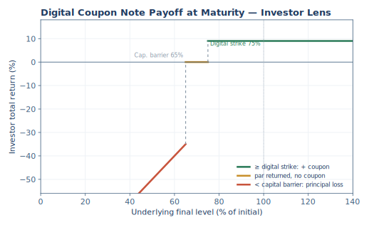

**Product:** 3-year Digital Coupon Note on a single stock. **Notional:** $250,000. **Coupon:** 9% p.a. (2.25% per quarter = $5,625), conditional on stock ≥ 75% coupon barrier. **Capital barrier:** 65% knock-in (European). **Autocall:** None.

- **Scenario 1 — Stock stays above coupon barrier:** Stock fluctuates between 80%-115% for 3 years. Coupon barrier (75%) never breached on any observation date. All 12 quarterly coupons paid: 12 × $5,625 = $67,500. Principal: $250,000. **Total: $317,500.** Return: 27%.
- **Scenario 2 — Coupon missed in two quarters:** Stock dips to 72% in Q4 and 74% in Q5. Coupon barrier (75%) breached on those dates. Zero coupon for those 2 quarters. Recovers to 85% for Q6 onward. 10 × $5,625 = $56,250 coupons + $250,000 principal. **Total: $306,250.** Return: 22.5%.
- **Scenario 3 — Persistent decline, barrier breach:** Stock trends down. Below coupon barrier (75%) for 8 of 12 quarters. At maturity: 55% of initial. Below 65% capital barrier. Coupons received: 4 × $5,625 = $22,500. Redemption: $250,000 × 55/100 = $137,500. **Total: $160,000.** Loss: $90,000 (36%).
- **Scenario 4 — Single bad quarter then recovery:** Stock crashes to 60% in Q3 (below coupon barrier), then recovers to 95% by Q4. No memory — the Q3 coupon is lost forever. The investor receives 11 × $5,625 = $61,875 coupons. At maturity (95%): above capital barrier. **Total: $311,875.** Return: 24.75%.

**Risks to the investor**

| Risk | Description | Severity |
|------|------------|:--------:|
| **Coupon risk** | If the stock is below the coupon barrier on an observation date, the coupon is zero with no recovery | High |
| **Capital loss** | A capital-barrier breach at maturity causes proportional capital loss for the investor | High |
| **No memory** | Unlike the Phoenix, missed coupons are permanently lost — no catch-up mechanism | Medium |
| **Binary cliff** | Stock at 74.9% earns zero; stock at 75.1% earns the full coupon. Small moves create all-or-nothing outcomes for the investor | Medium |
| **Correlation (worst-of)** | If linked to a basket, the coupon depends on the worst performer | Medium |
| **Issuer credit risk** | If the issuing bank defaults, the investor may lose principal | Low |

#### §8. THE BANK LENS — Desk Economics (1st Line of Defence)

**What the desk books**

The desk's position is the mirror image of the investor's. Where the investor is short the strip of digital call options, the desk is **long** that strip of digitals (bought from the investor); where the investor is short the knock-in put, the desk is **long** that put; and the desk has issued a note, which is a funding liability. The investor's enhanced, conditional coupon is, to the desk, the value of the digital options plus the put premium and funding, returned to the client.

**Greeks & hedging**

The desk is long a strip of digital call options, one per observation date, and delta-hedges by trading the underlying. A digital pays an all-or-nothing amount if the underlying is above the digital strike on the observation date, so the payoff is **discontinuous at the digital strike**: the desk's delta is discontinuous there and its gamma spikes — theoretically becoming infinite at the barrier — as spot approaches the digital strike near an observation date. This is the dominant feature of the position. The desk replicates each digital with a tight **call spread** around the strike, which bounds the gamma but leaves residual **pin risk**: with spot sitting on the strike near expiry, a fixing a fraction of a percent either way flips the whole coupon from zero to full. This is where the desk's structuring margin is earned or lost, and risk management monitors proximity to the coupon barrier and may limit concentrated digital exposure.

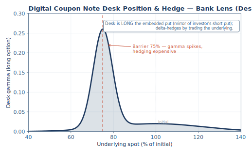

**How the bank makes money**

| Revenue Component | Detail |
|------------------|--------|
| **Structuring fee** | Embedded in note price at issuance (typically 1-3%) |
| **Bid-offer spread** | Spread between option cost and terms offered to the investor |
| **Hedging P&L** | Delta-hedging profits from realized vs implied vol differential |
| **Funding advantage** | Issues the note at a sub-market effective funding rate |

**The coupon decomposition (from [Section 2.2](#sec-2-2)):**

Digital Coupon = Bond yield + Put premium + Digital option portfolio value − Funds Transfer Pricing (FTP) − Desk margin

Each quarterly coupon is funded by a separate digital call option that pays a fixed amount if the stock is above the coupon barrier at that observation. For a 9% conditional coupon, an indicative split is: bond yield (bank's credit curve) ~2.0%; put premium (value of the KI put sold) ~3.0%; digital option portfolio value (the strip of digital calls) ~5.5%; FTP (internal funding cost) −0.5%; desk margin −1.0%; **net coupon 9.0%**. *(The source decomposition is qualitative; these component splits are inferred for illustration and must be calibrated to the live vol surface — only the 9.0% net coupon is a source figure.)* The digital option portfolio value is the key driver: it is high precisely because the investor is selling a meaningful series of binary options that pay the bank nothing but cost the investor a full coupon whenever the stock fails the test.

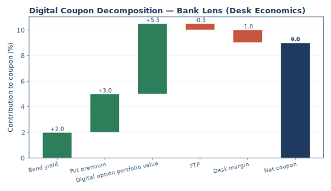

**P&L drivers**

Day to day, desk P&L is driven by realized-versus-implied volatility on the delta hedge, moves in the underlying near the digital strike (digital gamma / pin risk), the width and cost of the call-spread replication, funding, and the mark-to-market of the embedded put. Product Control attributes P&L between fixed-note accrual and option MTM, and performs independent price verification of the option components.

#### §9. THE BANK LENS — Controls & Reconciliation (2nd Line of Defence)

**Booking & systems**

| Aspect | Detail |
|--------|--------|
| **Book of record** | NEMO |
| **Pricing/Risk system** | Sophis |
| **Booking structure** | Single note with embedded KI put and a strip of digital call options |
| **Four-leg framework?** | No |
| **Product type** | Equity-Linked Note — Digital Coupon |
| **Key booking fields** | Notional, strike (initial level), digital strike / coupon barrier, capital barrier, barrier type (European/American), coupon rate, coupon frequency, maturity, underlying(s) |
| **Coupon observation** | Quarterly: compare stock close to the coupon barrier |
| **Coupon payment** | Full amount if at or above the barrier; zero if below |
| **Memory** | None |
| **Capital barrier** | European (maturity only) |

**Reconciliation points**

| Recon point | What must agree | Digital-specific break |
|-------------|-----------------|------------------------|
| **Trade economics** | Notional, strike (initial level), coupon rate & frequency, maturity, underlying ID | Coupon rate or frequency mismatch misstates the per-period digital amount |
| **Digital strike / coupon barrier** | Coupon-barrier level **and convention** (% vs absolute) agree across NEMO and Sophis | Digital strike stored as % in one system, absolute price in another — flips pass/fail near the line |
| **Capital barrier** | Capital-barrier level and convention agree, kept distinct from the coupon barrier | Coupon barrier (75%) confused with capital barrier (65%) — wrong test applied |
| **Observation fixing** | Each observation-date close, from the termsheet fixing source/exchange, agrees across systems | Different vendors/exchanges report different closes — a fraction of a percent flips the coupon |
| **Binary settle / no-settle capture** | The pass/fail result and the resulting coupon-paid/zero flag are captured identically across systems | Coupon paid when stock was below barrier, or zeroed when above |
| **Memory flag** | Product carries NO memory; no deferred-coupon accumulation | Memory logic applied → phantom deferred coupons appear |
| **P&L attribution** | Note accrual + option (put + digital strip) MTM reconciles to total | Unexplained P&L points to a stale vol surface or a wrong fixing |
| **Settlement** | Cash vs physical at maturity; shares = notional / strike if breached; delivery-versus-payment | Physical delivery booked as cash, or the wrong share count |

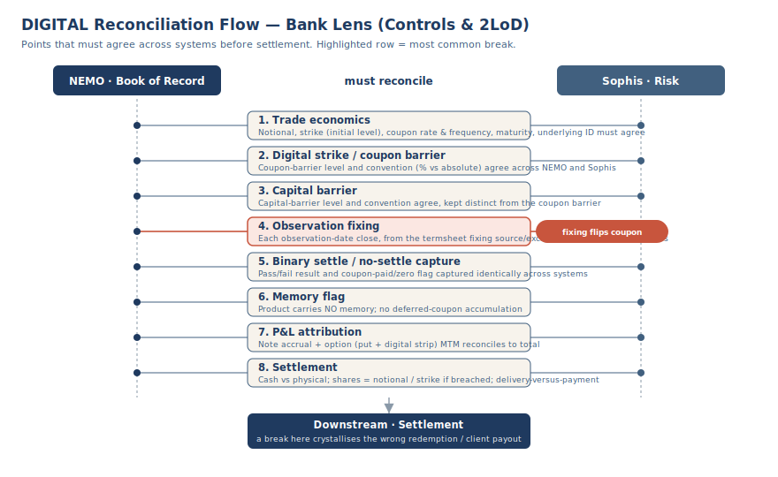

**Common breaks & red flags**

| Red Flag | What It Means | 2LoD Action |
|----------|---------------|-------------|
| Coupon paid when stock was below barrier | A conditional coupon paid incorrectly is a direct cash loss | Verify the observation-date close against the coupon barrier before payment |
| Coupon not paid when stock was above barrier | A missed payment when the condition was met creates a client claim | Verify immediately — this is a processing error |
| Memory logic applied | Digital Coupon Notes have NO memory. Deferred coupons in the system mean the product is misconfigured | Confirm the product type does not include memory |
| Coupon barrier confused with capital barrier | The coupon barrier (e.g. 75%) drives coupon payment; the capital barrier (e.g. 65%) drives principal redemption — separate levels | Verify both barriers are correctly configured and distinct |
| Closing price from wrong exchange | If the stock trades on multiple exchanges, the observation must use the contractual exchange | Confirm the fixing source matches the termsheet |

**Control implication**

The digital strike and the observation fixing are the two fields the 2nd line must reconcile most carefully, because the payoff is binary: there is no proportional zone to absorb a small error. A tiny fixing discrepancy — a stock recorded at 74.997% in one system and 75.00% in another — flips a whole $5,625 (or larger) coupon from full to zero, simultaneously creating a cash loss or a client claim and breaking P&L attribution. The reconciliation of the digital strike level, its convention, and the per-observation fixing source exists precisely to catch these inconsistencies before settlement crystallises them, since unlike a continuously varying payoff, there is no rounding that "almost" works.

#### §10. Formal Definition

A **Digital Coupon Note** is a structured product with:

**Digital coupon:** On each observation date, if the underlying is at or above the coupon barrier, the full coupon is paid. If below, zero coupon is paid. There is no memory — missed coupons are permanently lost.

**Capital protection:** At maturity, if the underlying has breached the knock-in barrier: Redemption = Principal × (Final / Initial). If not breached: 100% of Principal.

**No autocall:** The note runs to maturity (no early redemption trigger).

The Digital Coupon Note is a Phoenix without memory and without autocall. Each observation period is independent — the outcome depends only on the stock level at that observation date.

#### §11. Lifecycle

| Stage | Detail |
|-------|--------|
| **Trade date** | Terms agreed: underlying, strike/barrier, coupon, maturity. Pricing finalised |
| **Issue date** | Note issued. The investor pays par (or discount). The bank establishes the hedge |
| **Coupon dates** | Periodic observations and conditional coupon payments. Barrier monitoring |
| **Maturity** | Final observation. Settlement: cash (par or adjusted) or physical delivery. T+2 settlement |

#### §12. Worked Example (both lenses)

**Product:** 3-year Digital Coupon Note on BHP. **Notional:** $350,000. **Coupon:** 9% p.a. (2.25% per quarter = $7,875), conditional on stock ≥ 75% coupon barrier. **Initial stock price:** A$50. **Coupon barrier:** 75% = A$37.50. **Capital barrier:** 65% = A$32.50 (European). **Maturity:** 3 years (12 quarterly observations).

**Quarter-by-quarter:**

| Quarter | BHP Price | % of Initial | ≥ 75%? | Coupon |
|:-------:|:---------:|:------------:|:------:|:-----:|
| Q1 | A$52 | 104% | Yes | $7,875 |
| Q2 | A$48 | 96% | Yes | $7,875 |
| Q3 | A$41 | 82% | Yes | $7,875 |
| Q4 | A$36 | 72% | No | $0 |
| Q5 | A$34 | 68% | No | $0 |
| Q6 | A$39 | 78% | Yes | $7,875 |
| Q7 | A$42 | 84% | Yes | $7,875 |
| Q8 | A$45 | 90% | Yes | $7,875 |
| Q9-Q12 | A$43-48 | 86-96% | Yes | 4 × $7,875 |

*Investor lens:*
- **Total coupons:** 10 × $7,875 = $78,750 (missed Q4 and Q5 — permanently lost).
- **Maturity at A$45 (90%):** Above the A$32.50 barrier. Principal: $350,000. **Total: $428,750.** Return: $78,750 / $350,000 = 22.5% over 3 years.
- **If maturity at A$30 (60%):** Below the barrier. Redemption: $350,000 × 30/50 = $210,000. Plus $78,750 coupons. **Total: $288,750.** Loss: $61,250 (17.5%).

*Bank lens:*
In Q4 and Q5 the desk's long digital calls finish out-of-the-money: the digital test fails, no coupon is funded, and the desk keeps the value of those two digitals net of its hedging cost — but each was a knife-edge near the 75% line where pin risk peaked. On the paid quarters the desk funds $7,875 each from the corresponding digital. At the A$45 maturity the long KI put expires worthless; at the A$30 maturity the put is in the money and the redemption shortfall (notional × final/initial) offsets the desk's obligation. The 2nd line must confirm each observation fixing against the A$37.50 coupon barrier, the redemption math, and that NEMO and Sophis agree before settlement.

#### §13. Knowledge Check

1. **How does a Digital Coupon Note differ from a Phoenix in terms of coupon mechanics?**
2. **Why does the Digital Coupon Note pay a higher per-period coupon than an FCN?**
3. **Explain "pin risk" in the context of a Digital Coupon Note approaching an observation date.**
4. **An investor missed 3 of 12 quarterly coupons on a Digital Coupon Note. Can any of these be recovered? Why or why not?**
5. **Compare the risk/reward of a Digital Coupon Note with a 75% coupon barrier versus a Phoenix with a 75% coupon barrier and memory.**
6. **(Desk economics / 1LoD)** The investor is short the strip of digital calls; what is the desk, and how does the desk's delta and gamma behave as spot approaches the digital strike near an observation date? Why is the call-spread replication the place the margin is made or lost?
7. **(Controls / 2LoD)** Name three reconciliation breaks specific to a Digital Coupon Note and the consequence of each for whether a coupon is paid.

**Mental Models**

| Concept | Mental Model |
|---------|-------------|
| Digital coupon | Pass/fail exam — above the line is full credit, below is zero. No partial marks |
| No memory | No retakes — a failed exam stays failed. The grade cannot be made up later |
| Coupon barrier | The passing grade — the minimum stock level required for payment |
| Binary cliff | The difference between 74.9% and 75.1% is the difference between zero and full payment |
| Digital vs Phoenix | Pass/fail course (Digital) vs course with retakes (Phoenix). Digital is simpler but less forgiving |
| 2LoD reconciliation | The exam invigilator — confirms the recorded score and the pass mark match before any grade is awarded |

**Key Takeaways**

1. A Digital Coupon Note pays an all-or-nothing coupon each period based on whether the underlying is above a coupon barrier.
2. Investors buy Digital Coupon Notes for higher conditional coupons than FCNs and simpler mechanics than the Phoenix.
3. The core risk for the investor is that missed coupons are permanent — there is no memory feature to recover them.
4. The binary cliff near the coupon barrier creates extreme sensitivity: small price moves determine full payment or zero.
5. Digital Coupon Notes are booked in NEMO, priced in Sophis, with no memory logic and no autocall.
6. The desk is long the strip of digital calls and replicates each with a tight call spread; the residual pin risk near the digital strike is where the desk's margin is made or lost.
7. For the 2nd line, the dominant control risks are the digital-strike convention and the observation fixing — a fraction-of-a-percent error flips the entire coupon.

#### §14. Common Mistakes

1. **Assuming the Digital Coupon Note has memory.** It does not. Missed coupons are gone. An investor expecting missed coupons to "catch up" later is thinking of a Phoenix.
2. **Underestimating binary cliff risk.** The coupon barrier creates an all-or-nothing outcome. Being 0.1% below the barrier is as costly as being 20% below, making the product riskier near the barrier than its headline coupon suggests.
3. **Confusing coupon barrier with capital barrier.** The coupon barrier (e.g. 75%) determines coupon payment; the capital barrier (e.g. 65%) determines principal redemption. They are different levels with different consequences.
4. **Comparing the headline coupon to an FCN without adjusting for probability.** A 9% digital coupon that pays 10 of 12 quarters produces $78,750. A 6% FCN that pays 12 of 12 quarters produces $63,000. The effective comparison depends on how many quarters the coupon is likely to be paid.
5. **Forgetting that each observation is independent.** The stock could be at 90% in Q3 and 72% in Q4. Q3's strong performance does not help Q4. Each observation is a standalone event.
6. **(Controls) Trusting a single system's fixing or digital-strike value.** Because the payoff is binary and the strike can be stored as a percentage or an absolute price, the 2nd line must reconcile the digital-strike convention and the observation fixing across NEMO and Sophis rather than assume they agree — a tiny mismatch flips the whole coupon.
### Knowledge Check

**Review Questions:**
1. What determines whether a Digital Coupon Note pays its coupon each period?
2. What is the difference between the coupon barrier and the capital barrier?
3. Why does the Digital Coupon Note not have a memory feature?
4. What is "pin risk" and why is it relevant to Digital Coupon Notes?
5. How does the Digital Coupon Note's construction differ from the FCN's?


**Dual-lens questions:**
- *(Desk economics / 1LoD)* What position does the desk hold against the investor, and what is its primary Greek / hedging risk?
- *(Controls / 2LoD)* Which booking and risk-system fields must reconcile for this product, and which is the most common break?
**Scenario Questions:**
1. A Digital Coupon Note has a 75% coupon barrier. The stock closes at 74.8% on Q3's observation date and 76.2% on Q4's. What is the coupon outcome for each quarter? What would change if this were a Phoenix?
2. An investor compares two products: a Digital Coupon Note at 9% p.a. with a 75% barrier, and an FCN at 6% p.a. with the same barrier. If the investor expects the stock to breach the coupon barrier in 2 of 12 quarters, which product produces higher total income?
3. A Digital Coupon Note's stock drops to 55% at maturity after breaching the coupon barrier in 6 of 12 quarters. Calculate the investor's total return with $200,000 notional and 9% p.a. coupon.

**Desk Question:**
You are in Product Control on an observation date. The Digital Coupon Note has a 75% coupon barrier. The stock closed at exactly 75.00% of the initial level. The termsheet says "at or above" the barrier. One system recorded the close as 74.997% due to rounding. Walk through the issue, the financial impact, and how you would resolve it.

### Visual Learning Recommendations

1. **Digital coupon observation timeline** — Quarter-by-quarter timeline showing stock level versus coupon barrier, with pass/fail icons for each observation (P1)
2. **Digital vs Phoenix coupon comparison** — Side-by-side cash flow showing: Digital (missed = zero), Phoenix (missed = deferred, then paid on recovery) (P1)
3. **Binary cliff visualization** — Payoff diagram showing the discontinuity at the coupon barrier (P2)
4. **Digital coupon decomposition** — Individual digital call options mapped to each observation date (P2)
5. **Coupon probability distribution** — Expected total coupon as a function of stock volatility and barrier level (P3)

### Dependency References

| Concept Used | Where It Was Taught |
|-------------|-------------------|
| Digital (binary) option | [Section 1.3](#sec-1-3) (Barriers) |
| Put option, knock-in barrier | [Section 1.2](#sec-1-2) (Options), [Section 1.3](#sec-1-3) (Barriers) |
| Conditional coupon, memory feature | [Section 5.1.3](#sec-5-1-3) (Phoenix) |
| Coupon decomposition, FTP | [Section 2.2](#sec-2-2) (Product Construction) |
| NEMO/Sophis booking | [Section 2.8](#sec-2-8) (Systems Primer) |

---


#### Visual Specifications

**Visual 1: Digital Coupon Note Payoff at Maturity**
- **Asset filename:** payoff_digital_maturity_01.svg
- **Caption:** "Digital Coupon Note Payoff at Maturity"
- **Diagram elements:** X-axis: underlying price. Y-axis: investor total return. Key levels marked (strike, barrier if applicable). Compare with unstructured alternative
- **Reuse status:** Adapt from payoff template
**Visual 2: Digital Coupon Note Product Construction**
- **Asset filename:** construction_digital_components_02.svg
- **Caption:** "Digital Coupon Note Product Construction"
- **Diagram elements:** Component decomposition: each building block in separate box. Arrows showing how they combine to create the product. Cost allocation visible
- **Reuse status:** Adapt from construction template
**Visual 3: Digital Coupon Note Lifecycle Timeline**
- **Asset filename:** lifecycle_digital_timeline_03.svg
- **Caption:** "Digital Coupon Note Lifecycle Timeline"
- **Diagram elements:** Horizontal timeline from issue to maturity. Key events: issue, coupon dates, observation dates, maturity. Underlying price path overlay
- **Reuse status:** Adapt from lifecycle template
**Visual 4: Digital Coupon Note Risk Heatmap**
- **Asset filename:** risk_digital_heatmap_04.svg
- **Caption:** "Digital Coupon Note Risk Heatmap"
- **Diagram elements:** Grid: risk types (market, credit, liquidity, operational) vs severity (low/med/high). Colour-coded cells appropriate for Digital Coupon Note
- **Reuse status:** Adapt from risk heatmap template
**Visual 5: Digital Coupon Note vs Alternatives**
- **Asset filename:** comparison_digital_vs_alternatives_05.svg
- **Caption:** "Digital Coupon Note vs Alternatives"
- **Diagram elements:** Multi-column comparison showing payoff across scenarios (-30%, flat, +15%, +30%). Compare with direct investment and simpler structured product
- **Reuse status:** New — comparison panel
**Visual 6: Digital Coupon Note Suitability Decision Tree**
- **Asset filename:** decision_digital_suitability_06.svg
- **Caption:** "Digital Coupon Note Suitability Decision Tree"
- **Diagram elements:** Decision tree guiding investor suitability. Key questions: risk tolerance, income need, market view, time horizon
- **Reuse status:** Adapt from decision tree template


**Dual-lens visuals (generated):**
- `assets/digital/controls_digital_recon_08.svg` `[generated]`
- `assets/digital/desk_digital_gamma_07.svg` `[generated]`
- `assets/digital/payoff_digital_01.svg` `[generated]`
- `assets/digital/waterfall_digital_09.svg` `[generated]`
#### Dependency References

| Concept Used | Where It Was Taught |
|-------------|-------------------|
| Equity fundamentals | [Section 1.4](#sec-1-4) (Equity Essentials) |
| Options mechanics | [Section 1.2](#sec-1-2) (Options From Zero) |
| Product decomposition | [Section 2.2](#sec-2-2) (Product Construction) |
| CRA ELN | 5.1.10 — range-based digital |
| Digital CF | 5.3.5 — rates digital |
| Phoenix | 5.1.3 — contingent coupon |
### 5.1.13 Booster Note {#sec-5-1-13}

> **Prerequisites:** [PPN](#sec-5-1-1) &nbsp;|&nbsp; **Key concepts:** Leveraged call spread, participation cap

---

*This product sits at the opposite end of the capital protection spectrum from the PPN. Where the PPN protects capital and limits participation to below 100%, the Booster Note offers leveraged participation above the initial level but provides zero capital protection. Every percentage point of decline hits the investor's principal directly. The Booster rewards aggressive bullish views. This chapter reads the product through two lenses: what it means for **the investor**, and what it means for **the bank** — the latter split into the desk's market economics (1st line of defence) and the controls and reconciliation that surround it (2nd line of defence).*

#### §1. Explain Like I'm New

Consider a high-net-worth investor with a strong conviction that a specific technology stock will rise over the next two years. The investor could simply buy the stock, but wants to amplify the return if the view proves right.

A standard equity investment gives 1:1 participation — if the stock rises 20%, the investor gains 20%. The investor instead wants 1.5:1 — if the stock rises 20%, the gain is 30%. The investor is willing to accept full downside exposure (no protection) in exchange for this leveraged upside.

The **Booster Note** provides this asymmetry. On the upside, returns are multiplied by a participation rate (e.g., 150%), up to a cap. On the downside, losses are 1:1 — the same as owning the stock directly. There is no barrier, no coupon, and no capital protection. It is a pure directional bet with amplified gains.

#### §2. Real-World Analogy

A Booster Note is like a trampoline at the bottom of a hill.

Picture a hill that slopes in both directions. Walking downhill (stock decline), gravity acts normally — each step down is a step down. But at the base of the uphill slope there is a trampoline. Walking uphill (stock rise), the trampoline amplifies each step — every step gains 1.5× the altitude.

When the stock is above initial, the trampoline bounces the return higher than a direct holding would. When the stock is below initial, there is no trampoline to break the fall — the downside slides at normal (1:1) speed.

The trampoline is the leveraged participation. The absence of a safety net is the absence of capital protection.

#### §3. What Problem Does This Solve?

The Booster Note solves the **leveraged directional exposure** problem.

| Investor Need | How the Booster Delivers |
|------------|------------------------|
| Strong bullish conviction | 150% participation on the upside amplifies gains |
| No need for protection | Full downside mirrors direct stock ownership |
| No coupon dilution | Zero-coupon structure — all value goes to participation leverage |
| Tax or regulatory structure | Note wrapper may be more efficient than leveraged stock positions |

#### §4. Product DNA

| Field | Value |
|-------|-------|
| **Full Name** | Booster Note |
| **Abbreviation** | Booster |
| **Family** | Equity-Linked Notes |
| **Complexity Score** | 4 / 10 |
| **Complexity Rationale** | Leveraged participation note — amplified upside (150% in this chapter's examples) up to a cap, with direct downside exposure below strike |
| **Underlying Asset Class** | Equity (index) |
| **Capital Protection** | None (full equity downside below strike) |
| **Coupon Type** | None — return via leveraged upside participation (boosted, up to a cap) |
| **Maturity** | 2-5 years |
| **Liquidity** | Secondary market |
| **Primary System** | Murex |
| **ISDA Required** | No — issued as note |

**DNA Atlas Fields:**
- Primary Risk: Full downside below strike. Upside capped despite leverage. No capital protection
- Typical Buyer: Moderately bullish investors wanting amplified returns within a range
- Typical Use Case: Double (or more) participation in moderate upside. Caps limit extreme outperformance but leverage amplifies moderate gains
- Building Blocks: Leveraged call spread + equity forward below strike
- Key Hedge: Delta-hedge leveraged position, call spread replication
- Similar Products: Airbag (5.1.7 — leverage with protection), PPN (5.1.1 — protected no leverage), Warrant (5.1.15 — pure leverage)
- Most Important Greek: Delta (leveraged equity sensitivity)

**Comparison Matrix Fields:**
- Complexity: 4
- Yield Potential: High (leveraged participation up to cap)
- Capital Protection: None (full downside below strike)
- Credit Exposure: Issuer
- Liquidity: Secondary market
- Path Dependency: No (European observation at maturity)
- Volatility Sensitivity: Long vega (leveraged call spread)
- Correlation Sensitivity: None
- Client Type: Retail / Institutional
- Market Environment: Best when expecting moderate positive returns (leverage amplifies within cap range)

#### §5. Who Touches This Product

| Role | Responsibility |
|------|---------------|
| **Structurer** | Designs Booster Note terms: strike, participation rate, cap, maturity. Optimises structure for client and bank |
| **Trader** | Hedges embedded options. Manages Greeks (delta, gamma, vega). Prices secondary market |
| **Sales** | Distributes Booster Note to target clients. Explains payoff scenarios and risk-return profile |
| **Risk Management** | Monitors option Greeks, leverage proximity at the initial level, concentration risk. Sets trading limits |
| **Product Control** | Daily P&L attribution between note accrual and option MTM. Independent price verification |
| **Operations** | Processes maturity settlement. Handles physical delivery if applicable |
| **Legal / Compliance** | Reviews term sheet for regulatory compliance. Ensures suitability for target investor base |
| **Quantitative Analytics** | Prices embedded derivatives. Calibrates volatility surface. Provides model validation |

#### §6. Product Evolution

| Stage | Product | What Was Added | Why |
|:-----:|---------|---------------|-----|
| 1 | Plain vanilla bond | — (baseline) | Fixed coupon, full principal return |
| 2 | Equity-linked note | Equity participation or option embedded | Market return exposure with note wrapper |
| 3 | Booster Note | Leveraged participation added | Amplified upside (150% in this chapter's examples) up to a cap, with direct downside exposure below strike |

---

#### §7. THE INVESTOR LENS

**Why the investor buys it**

1. **Leveraged gains.** A 20% stock rise becomes a 30% return at 150% participation — 50% more return from the same market move.
2. **Capped downside at 100%.** Unlike margin lending, the investor cannot lose more than the invested amount. Maximum loss is the full notional.
3. **Simplicity.** No barrier, no coupon, no autocall, no memory. The payoff depends only on the final stock price relative to the initial level.
4. **No margin calls.** Unlike leveraged stock positions, the Booster Note requires no margin maintenance during the life of the product.

**Position taken**

The investor holds a long zero-coupon bond (lends principal to the issuer) plus a leveraged long call position — economically a **long call spread** when capped: long more than one at-the-money call (the leverage, e.g. 1.5×) and short an out-of-the-money call at the cap level. Below the initial level the investor carries full 1:1 equity downside via the embedded forward. Net, the investor is **long the underlying with amplified upside delta** and, through the option package, **long volatility** on the leveraged call spread. With a single underlying there is no correlation exposure. The investor also forgoes dividends, which fund the leverage.

**Payoff & scenarios**

The investor's payoff has two zones split at the initial level. Above the initial level: the return is multiplied by the participation rate (1.5×), subject to the cap — once leveraged return reaches the cap, the payoff is flat. Below the initial level: the return is 1:1, identical to owning the stock directly — no leverage and no protection. The slope of the payoff line is therefore steeper above the initial level (1.5×) than below it (1.0×), with a horizontal ceiling at the cap. The discontinuity in *slope* sits at the initial level, where delta steps from 1.0× to >1.0×.

**Product:** 2-year Booster Note on a single stock. **Notional:** $400,000. **Participation rate:** 150% above initial. **Cap:** 45% total return (stock rise of 30% = 30% × 1.5 = 45%). **Capital protection:** None (1:1 downside). **Coupon:** None (zero-coupon).

- **Stock rises 20%:** Return = 20% × 150% = 30%. Below the 45% cap. The investor receives $400,000 × 130% = **$520,000.** Gain: $120,000. Versus direct stock: $400,000 × 120% = $480,000. Booster advantage: $40,000.
- **Stock rises 40%:** Return = 40% × 150% = 60%. Exceeds the 45% cap. Capped at 45%. The investor receives $400,000 × 145% = **$580,000.** Gain: $180,000. Direct stock would yield $560,000 (40% gain). Booster advantage: $20,000. But if uncapped, the investor would have received $640,000.
- **Stock falls 15%:** Return = −15% × 100% = −15%. No leverage on the downside. The investor receives $400,000 × 85% = **$340,000.** Loss: $60,000. Identical to owning the stock directly.
- **Stock falls 40%:** Return = −40%. The investor receives $400,000 × 60% = **$240,000.** Loss: $160,000. No protection, no barrier, no cushion. Same as direct ownership.

**Risks to the investor**

| Risk | Description | Severity |
|------|------------|:--------:|
| **Full capital risk** | No protection. A 50% stock decline = 50% principal loss | High |
| **Cap limits upside** | In strong markets, the cap prevents the investor from capturing the full leveraged return | Medium |
| **No income** | Zero-coupon structure means no periodic cash flow during the holding period | Medium |
| **Opportunity cost** | If the stock is flat, the investor earns zero while deposits or bonds would have earned interest | Medium |
| **Dividend forfeiture** | The investor does not receive dividends — they are used to fund the leveraged participation | Medium |
| **Issuer credit risk** | If the issuing bank defaults, the investor is an unsecured creditor | Low |

#### §8. THE BANK LENS — Desk Economics (1st Line of Defence)

**What the desk books**

The desk's position is the mirror image of the investor's. Where the investor is long the leveraged call spread (long >1 ATM call, short an OTM call at the cap), the desk is **short** that call spread (it has sold the leveraged upside to the investor); alongside it the desk has issued a zero-coupon note, which is a funding liability, and is **long** the equity forward below the initial level (the mirror of the investor's 1:1 downside). The dividends the investor forgoes accrue to the desk and help fund the extra calls it must buy in the market to flatten its sold call-spread exposure.

**Greeks & hedging**

The desk is short the leveraged call spread and delta-hedges by trading the underlying. Above the initial level the note's delta is amplified (>1.0× because of the 1.5 participation), so the desk must carry a larger underlying hedge than for an unlevered note; at the cap the short OTM call caps the desk's delta. Below the initial level delta is 1.0×. The delta therefore **steps up at the initial level** — the desk must hedge that discontinuity in delta, and gamma concentrates there and at the cap, where hedging is most error-prone and where structuring margin is earned or lost. The desk is long vega on the leveraged call spread. Risk management monitors the amplified delta exposure, which produces larger MTM swings than a standard RC or FCN.

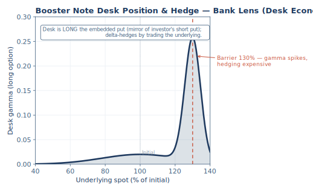

**How the bank makes money**

| Revenue Component | Detail |
|------------------|--------|
| **Structuring fee** | Embedded in note price at issuance (typically 1-3%) |
| **Bid-offer spread** | Spread between option cost and terms offered to the investor |
| **Hedging P&L** | Delta-hedging profits from realized vs implied vol differential |
| **Funding advantage** | Issues the note at a sub-market effective funding rate |

**The note decomposition (from [Section 2.2](#sec-2-2)):**

The investor's notional funds a zero-coupon bond plus the leveraged call package. No put is sold (unlike RC/FCN). The extra calls are funded by (a) the dividend income forwarded to the desk, and (b) the cap, which generates premium from the short OTM call.

For a $400,000 notional, 2-year, 150% participation, 45% cap structure:
- Zero-coupon bond: $400,000 × discount factor → ~$380,000
- Option budget: ~$20,000 + dividend income + short call premium
- Long 1.5 ATM calls − short 1 OTM call at the cap = net leveraged position

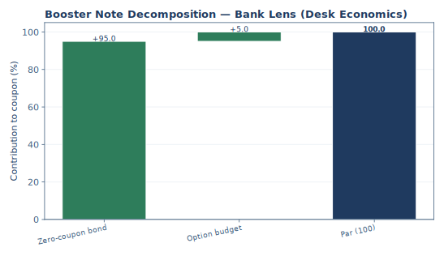

**P&L drivers**

Day to day, desk P&L is driven by realized-versus-implied volatility on the delta hedge, moves in the underlying near the initial level and near the cap (gamma), funding, dividend realisation versus the level priced in, and the mark-to-market of the embedded leveraged call spread. Product Control attributes P&L between zero-coupon note accrual and option MTM, and performs Independent Price Verification (IPV) of the option component.

#### §9. THE BANK LENS — Controls & Reconciliation (2nd Line of Defence)

**Booking & systems**

| Aspect | Detail |
|--------|--------|
| **Book of record** | NEMO |
| **Pricing/Risk system** | Sophis |
| **Booking structure** | Single zero-coupon note with embedded leveraged call spread |
| **Four-leg framework?** | No |
| **Key booking fields** | Notional, strike (initial level), participation rate (>100%, e.g. 150%), cap level, observation type (European/maturity-only), maturity, underlying |
| **Coupon** | None (zero-coupon) |
| **Observation** | Maturity only (European, single observation) |

**Reconciliation points**

| Recon point | What must agree | Booster-specific break |
|-------------|-----------------|------------------------|
| **Trade economics** | Notional, strike (initial level), participation rate, cap level **and convention**, maturity, underlying ID | Participation rate stored as 150% in NEMO but 1.5 (factor) in Sophis, or cap stored as total-return % vs stock-move % |
| **Participation / boost factor** | Leverage (e.g. 1.5×) applied above the initial level only | 150% participation mistakenly applied to the downside, overstating the loss |
| **Cap level** | Cap (e.g. 45% total return) and whether it binds on leveraged return | Cap not applied → bank overpays when leveraged return exceeds the cap |
| **Observation type** | European, maturity-only single observation | An interim observation booked that should not exist for a single-observation note |
| **Coupon / zero-coupon flag** | Booked as zero-coupon | Bond component accruing coupons → booking error |
| **Dividends** | Dividends fund the leverage and accrue to the desk | Dividends paid to the investor double-count the economics |
| **Fixings** | Final fixing date and source match the termsheet | Wrong date or source on the maturity observation changes the entire payout |
| **Settlement** | Cash vs physical; share count if physical; delivery-versus-payment | Physical delivery booked as cash, or wrong share count |

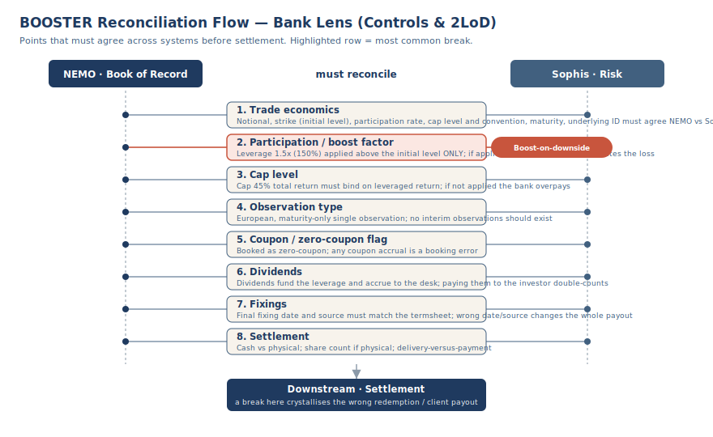

**Common breaks & red flags**

| Red Flag | What It Means | 2LoD Action |
|----------|---------------|-------------|
| Participation rate applied to downside | Below initial, the participation rate is 100% (1:1). Applying 150% to the downside overstates the loss | Verify the payout formula distinguishes upside (leveraged) from downside (1:1) |
| Cap not applied | If the leveraged return exceeds the cap but the full amount is paid, the bank overpays | Verify cap application in the redemption calculation |
| Dividends paid to investor | Dividends fund the leveraged participation. Paying them to the investor double-counts the economics | Confirm dividend handling matches the termsheet |
| Bond component accruing coupons | Booster Notes are zero-coupon. Any coupon accrual in NEMO is a booking error | Verify the product is booked as zero-coupon |
| Final fixing from wrong date or source | The maturity observation determines the entire payout. A wrong date or source price changes the outcome | Confirm the fixing date and source against the termsheet |

**Control implication**

Each break has a direct consequence the 2nd line must size before it reaches the books or the client. The dominant Booster-specific exposures are the **leverage (participation) factor** and the **cap**: if the 1.5× participation is mistakenly applied below the initial level, the redemption overstates the investor's loss; if the cap is not enforced when leveraged return exceeds it, the bank overpays a deep-in-the-money payout. Because the structure is zero-coupon with a single maturity observation, a wrong final fixing date or source mis-states the entire payout at once, and any coupon accrual or dividend leakage corrupts the funding of the leverage. The reconciliation exists precisely to confirm the participation factor, the cap level and convention, the zero-coupon flag, and the maturity fixing agree across NEMO and Sophis before settlement crystallises them.

#### §10. Formal Definition

A **Booster Note** is a structured product with:

**Leveraged upside:** If the underlying finishes above the initial level, the investor receives: Principal × (1 + Stock Return × Participation Rate), subject to any cap.

**1:1 downside:** If the underlying finishes below the initial level, the investor receives: Principal × (Final / Initial). No leverage, no protection.

**Cap (optional):** The total return may be capped at a maximum percentage. If Stock Return × Participation Rate exceeds the cap, the investor receives the cap.

**Zero-coupon:** No periodic coupon payments. All economic value is directed to the upside participation.

Formal payout:
- If Final ≥ Initial: (MIN(Participation Rate × (Final/Initial − 1), Cap) + 1) × Principal
- If Final < Initial: (Final / Initial) × Principal

#### §11. Lifecycle

| Stage | Detail |
|-------|--------|
| **Trade date** | Terms agreed: underlying, strike (initial level), participation rate, cap, maturity. Pricing finalised. Book in NEMO; set initial level, participation rate, cap, zero-coupon flag |
| **Issue date** | Note issued. The investor pays par (or discount). The bank establishes the hedge (leveraged long calls less short cap call, plus delta hedge) |
| **Life of note** | No coupons and no interim observations — single maturity observation only. The desk runs its delta hedge as the underlying moves relative to the initial level and the cap |
| **Maturity** | Final observation. Record the closing price from the termsheet fixing source. Apply the leveraged participation formula above initial or the 1:1 downside formula below initial; enforce the cap. Settlement: cash (par or adjusted) or physical delivery. T+2 settlement |

#### §12. Worked Example (both lenses)

**Product:** 2-year Booster Note on ASML. **Notional:** $400,000. **Participation rate:** 150% above initial. **Cap:** 45% total return. **Initial stock price:** €700. **Capital protection:** None. **Coupon:** None.

*Investor lens:*
- **Outcome A — ASML at €840 (+20%):** Above initial. Return = 20% × 150% = 30%. Below 45% cap. Redemption: $400,000 × 130% = **$520,000.** Gain: $120,000. Direct stock gain would be $80,000. Booster excess return: $40,000.
- **Outcome B — ASML at €910 (+30%):** Above initial. Return = 30% × 150% = 45%. Equals the 45% cap exactly. Redemption: $400,000 × 145% = **$580,000.** Gain: $180,000. Direct stock gain would be $120,000. Booster excess: $60,000.
- **Outcome C — ASML at €980 (+40%):** Above initial. Return = 40% × 150% = 60%. Exceeds cap. Capped at 45%. Redemption: $400,000 × 145% = **$580,000.** Gain: $180,000. Direct stock gain would be $160,000. Booster excess: only $20,000. The cap limits the advantage.
- **Outcome D — ASML at €560 (−20%):** Below initial. Return = −20% × 100% = −20%. No leverage on the downside. Redemption: $400,000 × 80% = **$320,000.** Loss: $80,000. Identical to direct stock ownership.

*Bank lens:*
In Outcomes A and B the desk's short leveraged call spread is in the money to the investor but below the cap, so the desk pays the participation it hedged for; in Outcome C the cap binds, the short OTM cap call offsets the extra long-call value, and the desk's payout is held at the capped 145% — the structuring margin and net hedging P&L are realised, funded in part by the forfeited dividends. In Outcome D the upside calls expire worthless and the desk's long equity forward delivers the 1:1 downside the investor bears. In every case the 2nd line must confirm the participation factor was applied above initial only, the cap was enforced, the note carried no coupon accrual, and NEMO and Sophis agree on the maturity fixing before settlement.

#### §13. Knowledge Check

1. **Why does a Booster Note offer zero capital protection?** *(Investor)*
2. **How does the cap affect the Booster Note's risk/reward profile?** *(Investor)*
3. **What funds the leveraged participation in a Booster Note?** *(Investor)*
4. **Compare the Booster Note to the PPN: how are they on opposite ends of the capital protection spectrum?** *(Investor)*
5. **An investor holds a Booster Note with 150% participation and a 45% cap. The stock rises 50%. What is the investor's return? What would it be without the cap?** *(Investor)*
6. **(Desk economics / 1LoD)** The investor is long the leveraged call spread; what does the desk hold against the investor, and how does the desk's delta behave as the underlying crosses the initial level and approaches the cap? Why is that step in delta where the hedging margin is made or lost?
7. **(Controls / 2LoD)** Name three reconciliation breaks specific to a Booster Note — including the participation factor and the cap — and the consequence of each for the investor's redemption.

**Mental Models**

| Concept | Mental Model |
|---------|-------------|
| Booster Note | A trampoline on a hillside — bounces the return higher on the way up, but no safety net on the way down |
| Leveraged participation | The trampoline's spring — amplifies upward movement by 1.5× |
| Cap | A ceiling above the trampoline — limits how high the return can bounce |
| No capital protection | No safety net — on the downside the loss is 1:1, the same as direct equity |
| Booster vs PPN | Trampoline without net (Booster) vs safety net without trampoline (PPN). One cannot have both |
| 2LoD reconciliation | The building inspector — confirms the participation factor, cap, and zero-coupon flag agree across systems before anyone settles |

**Key Takeaways**

1. A Booster Note provides leveraged participation on the upside (e.g., 150%) with no capital protection on the downside.
2. Investors buy Booster Notes when they have strong bullish conviction and are comfortable with full downside exposure.
3. The core risk is full capital loss — a 50% stock decline causes a 50% loss with no cushion.
4. The cap limits upside in strongly rising markets, creating an asymmetry that favors moderate gains.
5. Booster Notes are zero-coupon, booked in NEMO, priced in Sophis, with single maturity observation.
6. The desk holds the offsetting short leveraged call spread and a long equity forward; its delta steps up at the initial level, which is where the hedge and margin are concentrated.
7. For the 2nd line, the dominant control risks are the participation (boost) factor, the cap level and convention, the zero-coupon flag, and the maturity fixing — each can misstate the redemption.

#### §14. Common Mistakes

1. **Assuming leverage works on the downside.** It does not. Below the initial level, the investor participates 1:1, not 1.5:1. The leverage is upside-only.
2. **Ignoring the cap.** In strongly rising markets, the cap limits returns. An investor who buys a Booster Note on a stock that rises 50% but has a 45% cap earns 45%, not 75%.
3. **Forgetting dividend forfeiture.** The investor does not receive dividends. For high-dividend stocks, this can significantly reduce the net benefit of the leveraged participation.
4. **Treating the Booster as a protected product.** It is not. There is no barrier, no coupon cushion, no floor. The investor's first dollar of loss matches the stock's first percent of decline.
5. **Comparing only upside to direct stock ownership.** The Booster outperforms direct ownership on the upside (up to the cap) but underperforms on the downside because the investor has forfeited dividends without any protection in return.
6. **(Controls) Trusting a single system's participation or cap value.** Because the participation rate can be stored as a percentage (150%) or a factor (1.5), and the cap as total-return % or stock-move %, the 2nd line must reconcile both conventions across NEMO and Sophis rather than assume they agree.
### Knowledge Check

**Review Questions:**
1. What is the participation rate and how does it affect the Booster Note's upside?
2. Why is the Booster Note zero-coupon?
3. What role does the cap play in the Booster Note's construction?
4. How does the downside of a Booster Note compare to direct stock ownership?
5. Where does the Booster Note sit on the capital protection spectrum relative to PPN and RC?


**Dual-lens questions:**
- *(Desk economics / 1LoD)* What position does the desk hold against the investor, and what is its primary Greek / hedging risk?
- *(Controls / 2LoD)* Which booking and risk-system fields must reconcile for this product, and which is the most common break?
**Scenario Questions:**
1. A Booster Note has 150% participation and a 40% cap. The stock rises 35%. Calculate the investor's return. What if the stock had risen 25%?
2. An investor paid $500,000 for a 2-year Booster Note. The stock declines 30%. Compare the loss to (a) direct stock ownership and (b) an RC with a 70% barrier.
3. ASML pays a 1% annual dividend. An investor holds a 2-year Booster Note with 150% participation. The stock rises 10%. Calculate the Booster return and compare it to direct stock ownership including dividends.

**Desk Question:**
A Booster Note on ASML is approaching maturity. ASML closed at €699 yesterday (initial was €700). The Trader reports that a close above €700 tomorrow would shift the note's payout from the downside formula to the leveraged upside formula. Explain the P&L impact of a €1 move across the initial level and why this creates hedging challenges.

### Visual Learning Recommendations

1. **Booster payoff diagram** — Standard payoff chart showing the steeper slope above initial (150%) and normal slope below, with cap marked (P1)
2. **Booster vs PPN vs RC comparison** — Three payoff profiles overlaid: PPN (protection, limited upside), RC (coupon, barrier risk), Booster (leveraged upside, full downside) (P1)
3. **Cap impact visualization** — Two Booster payoffs: with cap and without cap, showing where the cap binds (P2)
4. **Construction comparison** — How the same notional is deployed: PPN (bond + small call), RC (bond + short put), Booster (bond + large call) (P2)
5. **Capital protection spectrum** — Linear spectrum from PPN (100% protection) through RC (partial) to Booster (zero), showing the participation trade-off at each point (P3)

### Dependency References

| Concept Used | Where It Was Taught |
|-------------|-------------------|
| Call option, participation rate | [Section 1.2](#sec-1-2) (Options) |
| Capital protection spectrum | [Section 2.4](#sec-2-4) (Capital Protection Spectrum) |
| Zero-coupon bond | [Section 0.5](#sec-0-5) (Interest) |
| Product decomposition, Funds Transfer Pricing (FTP) | [Section 2.2](#sec-2-2) (Product Construction) |
| PPN structure (protection + participation trade-off) | [Section 5.1.1](#sec-5-1-1) (PPN) |
| Bonus structure (participation + floor) | [Section 5.1.8](#sec-5-1-8) (Bonus) |
| NEMO/Sophis booking | [Section 2.8](#sec-2-8) (Systems Primer) |

---


#### Visual Specifications

**Visual 1: Booster Note Payoff at Maturity**
- **Asset filename:** payoff_booster_maturity_01.svg
- **Caption:** "Booster Note Payoff at Maturity"
- **Diagram elements:** X-axis: underlying price. Y-axis: investor total return. Key levels marked (strike, barrier if applicable). Compare with unstructured alternative
- **Reuse status:** Adapt from payoff template
**Visual 2: Booster Note Product Construction**
- **Asset filename:** construction_booster_components_02.svg
- **Caption:** "Booster Note Product Construction"
- **Diagram elements:** Component decomposition: each building block in separate box. Arrows showing how they combine to create the product. Cost allocation visible
- **Reuse status:** Adapt from construction template
**Visual 3: Booster Note Lifecycle Timeline**
- **Asset filename:** lifecycle_booster_timeline_03.svg
- **Caption:** "Booster Note Lifecycle Timeline"
- **Diagram elements:** Horizontal timeline from issue to maturity. Key events: issue, coupon dates, observation dates, maturity. Underlying price path overlay
- **Reuse status:** Adapt from lifecycle template
**Visual 4: Booster Note Risk Heatmap**
- **Asset filename:** risk_booster_heatmap_04.svg
- **Caption:** "Booster Note Risk Heatmap"
- **Diagram elements:** Grid: risk types (market, credit, liquidity, operational) vs severity (low/med/high). Colour-coded cells appropriate for Booster Note
- **Reuse status:** Adapt from risk heatmap template
**Visual 5: Booster Note vs Alternatives**
- **Asset filename:** comparison_booster_vs_alternatives_05.svg
- **Caption:** "Booster Note vs Alternatives"
- **Diagram elements:** Multi-column comparison showing payoff across scenarios (-30%, flat, +15%, +30%). Compare with direct investment and simpler structured product
- **Reuse status:** New — comparison panel
**Visual 6: Booster Note Suitability Decision Tree**
- **Asset filename:** decision_booster_suitability_06.svg
- **Caption:** "Booster Note Suitability Decision Tree"
- **Diagram elements:** Decision tree guiding investor suitability. Key questions: risk tolerance, income need, market view, time horizon
- **Reuse status:** Adapt from decision tree template


**Dual-lens visuals (generated):**
- `assets/booster/controls_booster_recon_08.svg` `[generated]`
- `assets/booster/desk_booster_gamma_07.svg` `[generated]`
- `assets/booster/waterfall_booster_09.svg` `[generated]`
#### Dependency References

| Concept Used | Where It Was Taught |
|-------------|-------------------|
| Equity fundamentals | [Section 1.4](#sec-1-4) (Equity Essentials) |
| Options mechanics | [Section 1.2](#sec-1-2) (Options From Zero) |
| Product decomposition | [Section 2.2](#sec-2-2) (Product Construction) |
| Airbag | 5.1.7 — leverage with protection |
| PPN | 5.1.1 — protected no leverage |
| Warrant | 5.1.15 — pure leverage |
### 5.1.14 Digital Coupon Knock-In Put {#sec-5-1-14}

> **Prerequisites:** DIGITAL · KODRC &nbsp;|&nbsp; **Key concepts:** Dual barrier (digital + KI), three-barrier interaction

---

*This product combines every major ELN feature the reader has encountered: digital coupon (from 5.1.12), knock-in put (from 5.1.2), and autocall (from 5.1.3). It is the ELN family's capstone — the most complex product in [Part 5](#part-5).1. If you understand the Digital KI Put, you understand the full ELN toolkit. This chapter reads the product through two lenses: what it means for **the investor**, and what it means for **the bank** — the latter split into the desk's market economics (1st line of defence) and the controls and reconciliation that surround it (2nd line of defence).*

**How This Differs From the Digital Coupon Note (5.1.12):** The Digital Coupon Note pays an all-or-nothing coupon per period and runs to maturity with no early termination. The Digital KI Put adds autocall: on each eligible observation date, the issuer first checks whether the stock has risen above the autocall barrier. If it has, the note terminates early with full principal plus any coupon due that period. If not, the digital coupon test applies — stock above the coupon barrier pays full coupon; below pays zero. This three-barrier structure (autocall, coupon, capital) makes the Digital KI Put the most feature-rich product in the ELN family.

#### §1. Explain Like I'm New

Yuki runs the structured products desk at a family office in Tokyo. She has placed clients in Reverse Convertibles, Phoenix notes, and Digital Coupon Notes. Her most sophisticated clients now ask: "Can we get a higher coupon by combining the best features of all three?"

The answer is the **Digital KI Put**. It takes the digital coupon mechanism (from the Digital Coupon Note), adds the autocall feature (from the Phoenix), and retains the knock-in put for capital risk (from the Reverse Convertible). The result is the highest-coupon product in the ELN family — but also the most complex.

Why does combining features produce a higher coupon? Each feature the investor accepts adds risk premium:
- The **digital coupon** means the investor may receive zero coupon in some periods (coupon risk)
- The **autocall** means the issuer can terminate the note early, shortening the investor's income stream (call risk)
- The **knock-in put** means the investor's capital is at risk if the stock declines sharply (capital risk)

Each of these risks generates option premium for the desk. All three premiums are stacked into the coupon, producing the highest conditional yield in the ELN family — typically 10-15% p.a.

#### §2. Real-World Analogy

A Digital KI Put is like a multi-round competition with strict scoring.

Each round of the competition (each quarter), the contestant either passes or fails the round's challenge (digital coupon). A strong performance in Round 1 does not carry forward if Round 2 is failed — each round is judged independently (no memory). If the scores are high enough early on, the judges can declare a result and end the competition (autocall). But if the overall standing at the finale falls below a defined threshold, a financial penalty is owed (knock-in barrier breach at maturity).

The reward per round is high precisely because the rules are demanding: pass/fail judging, no second chances, and a penalty for a poor finale. A simpler arrangement (such as an FCN, which pays out regardless of round-by-round performance) offers a smaller reward because less risk is borne.

The Digital KI Put is the version with the strictest rules — and the largest rewards.

#### §3. What Problem Does This Solve?

The Digital KI Put addresses the **maximum conditional yield** need:

| Client Need | How the Digital KI Put Delivers |
|------------|--------------------------------|
| Highest possible coupon in ELN family | Stacks three risk premiums: digital, autocall, KI put |
| Autocall for early exit in bull markets | Terminates with full principal if stock rises above autocall level |
| Sophisticated view expression | Rewards investors who believe the stock will stay in a range — not too low (coupon/capital barriers) but possibly rising (autocall) |
| Capital efficiency | High coupon per unit of notional deployed |

#### §4. Product DNA

| Field | Value |
|-------|-------|
| **Full Name** | Digital Coupon Knock-In Put |
| **Abbreviation** | DKIP |
| **Family** | Equity-Linked Notes |
| **Complexity Score** | 7 / 10 |
| **Complexity Rationale** | Combines digital coupon with knock-in put barrier. Coupon if above digital strike; principal at risk if barrier breached |
| **Underlying Asset Class** | Equity (single stock) |
| **Capital Protection** | Conditional (barrier-protected principal) |
| **Coupon Type** | Digital coupon (binary observation) |
| **Maturity** | 1-3 years |
| **Liquidity** | Secondary market |
| **Primary System** | Murex |
| **ISDA Required** | No — issued as note |

**DNA Atlas Fields:**
- Primary Risk: Barrier breach exposes principal to equity downside. Missing digital coupons if below digital strike. Dual conditional risk
- Typical Buyer: Yield-seeking investors comfortable with barrier risk and digital coupon uncertainty
- Typical Use Case: Higher yield than plain digital or plain RC. Sells both digital optionality and barrier put for maximum coupon
- Building Blocks: Digital coupon options + short down-and-in put option
- Key Hedge: Long DI put, digital replication, delta-hedge
- Similar Products: Digital (5.1.12 — digital only), RC (5.1.2 — put only), Phoenix (5.1.3 — autocall with barrier)
- Most Important Greek: Gamma (near barrier AND near digital strike — dual sensitivity)

**Comparison Matrix Fields:**
- Complexity: 7
- Yield Potential: Very high (double optionality sold)
- Capital Protection: Conditional (barrier + strike)
- Credit Exposure: Issuer
- Liquidity: Secondary market
- Path Dependency: Yes (digital observation + barrier monitoring)
- Volatility Sensitivity: Short vega (investor sold digital + put)
- Correlation Sensitivity: None
- Client Type: Private banking
- Market Environment: Best in mildly bullish with low expected vol

#### §5. Who Touches This Product

| Role | Responsibility |
|------|---------------|
| **Structurer** | Designs Digital Coupon Knock-In Put terms: strike, barrier, coupon, maturity. Optimises structure for client and bank |
| **Trader** | Hedges embedded options. Manages Greeks (delta, gamma, vega). Prices secondary market |
| **Sales** | Distributes Digital Coupon Knock-In Put to target clients. Explains payoff scenarios and risk-return profile |
| **Risk Management** | Monitors option Greeks, barrier proximity, concentration risk. Sets trading limits |
| **Product Control** | Daily P&L attribution between note accrual and option MTM. Independent price verification |
| **Operations** | Processes coupon payments and maturity settlement. Handles physical delivery if applicable |
| **Legal / Compliance** | Reviews term sheet for regulatory compliance. Ensures suitability for target investor base |
| **Quantitative Analytics** | Prices embedded derivatives. Calibrates volatility surface. Provides model validation |

#### §6. Product Evolution

| Stage | Product | What Was Added | Why |
|:-----:|---------|---------------|-----|
| 1 | Plain vanilla bond | — (baseline) | Fixed coupon, full principal return |
| 2 | Equity-linked note | Equity participation or option embedded | Market return exposure with note wrapper |
| 3 | Digital Coupon Knock-In Put | Specific structural features added | Product-specific innovation: Combines digital coupon with knock-in put barrier. Coupon if above digital strike; principal at risk if barrier breached |

---

#### §7. THE INVESTOR LENS

**Why the investor buys it**

1. **Maximum coupon.** The triple risk premium produces the highest coupon in the ELN family — typically 10-15% p.a. versus 8-12% for Digital Coupon Notes and 5-7% for FCNs.
2. **Autocall provides upside exit.** If the stock rallies above the autocall barrier, the note terminates early with full principal — the investor can reinvest at prevailing rates.
3. **Familiar building blocks.** Sophisticated investors who have held RCs, Phoenix notes, and Digital Coupon Notes already understand each component individually. The Digital KI Put combines them.
4. **View expression.** Ideal for investors who believe a stock will remain range-bound to mildly bullish — the investor earns a high coupon while the stock stays in the range.

**Position taken**

The investor simultaneously holds a long bond (lends principal to the issuer), a **short** down-and-in put (sold to the bank, putting capital at risk below the knock-in barrier), and is **long** a series of digital coupon options (each pays a fixed amount if the stock is at or above the digital coupon strike on an observation date). The investor has also sold the issuer a callable right (short the autocall). Net, across the digital and the put, the investor is **short volatility** (hurt by volatile markets) and carries full equity downside below the capital barrier once knocked in. With a single underlying there is no correlation exposure.

**Payoff & scenarios**

The investor's payoff is governed by three barriers operating simultaneously: the autocall barrier (above, e.g. 100%), the digital coupon barrier / strike (middle, e.g. 70%), and the capital barrier (below, e.g. 60%). On each observation date the autocall is checked first; if not triggered, the digital coupon test applies. At maturity, if the capital barrier has not been breached the investor receives 100% of principal; if breached, the investor receives (Final / Initial) × principal. The payoff is **discontinuous** at each barrier — a small move across the digital strike flips a full coupon to zero, and a small move across the capital barrier flips full principal to a proportional loss.

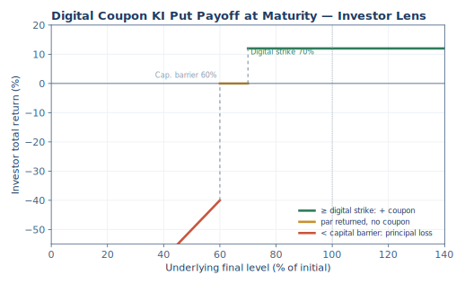

**Product:** 2-year Digital KI Put on a single stock, $400,000 notional, 12% p.a. coupon (3% per quarter = $12,000) conditional on stock ≥ 70% coupon barrier, autocall barrier 100% of initial (checked quarterly after Year 1), capital barrier 60% knock-in (European), maturity 2 years (8 quarterly observations; autocall eligible from Q5).

- **Scenario 1 — Stock rises, autocall in Q5:** Stock trades between 85%-105% for 4 quarters, all above the 70% coupon barrier. All 4 digital coupons paid: 4 × $12,000 = $48,000. In Q5, stock closes at 102%. Autocall triggered. The investor receives $400,000 principal + $48,000 prior coupons + Q5 coupon ($12,000). **Total: $460,000.** Annualized return: ~12% over 15 months.
- **Scenario 2 — Stock stays in range, no autocall:** Stock fluctuates between 75%-98% for all 8 quarters. Always above the 70% coupon barrier, always below the 100% autocall barrier. All 8 coupons paid: 8 × $12,000 = $96,000. At maturity, stock at 90% — above the 60% capital barrier. Principal: $400,000. **Total: $496,000.** Return: 24% over 2 years.
- **Scenario 3 — Mixed coupons, no capital loss:** Stock dips below the 70% coupon barrier in Q3 and Q6. Zero coupon for those quarters. 6 × $12,000 = $72,000 coupons. At maturity, stock at 75% — above the 60% capital barrier. Principal: $400,000. **Total: $472,000.** Return: 18%.
- **Scenario 4 — Persistent decline, capital loss:** Stock trends down. Below the coupon barrier (70%) for 5 of 8 quarters. At maturity: 50% of initial, below the 60% capital barrier. Coupons received: 3 × $12,000 = $36,000. Redemption: $400,000 × 50/100 = $200,000. **Total: $236,000.** Loss: $164,000 (41%).

**Risks to the investor**

| Risk | Description | Severity |
|------|------------|:--------:|
| **Complexity risk** | Three interacting barriers create outcomes that are difficult for the investor to predict and explain | High |
| **Capital loss** | KI barrier breach at maturity causes proportional capital loss for the investor, magnified by missed coupons | High |
| **Coupon risk** | The digital coupon is all-or-nothing per period with no memory — missed coupons are permanently lost to the investor | High |
| **Autocall reinvestment risk** | Early termination forces the investor to reinvest at potentially lower rates | Medium |
| **Model risk** | Pricing requires modelling three correlated barrier events — model assumptions significantly affect valuation | Medium |
| **Binary cliff** | Small price moves near any barrier create discontinuous outcomes for the investor (coupon/no coupon, autocall/continue, protect/loss) | Medium |

#### §8. THE BANK LENS — Desk Economics (1st Line of Defence)

**What the desk books**

The desk's position is the mirror image of the investor's. Where the investor is short the down-and-in put, the desk is **long** that put (bought from the investor); where the investor is long the digital coupon options, the desk is **short** the digital portfolio (it pays the binary coupon when the stock is above the digital strike); and where the investor is short the callable right, the desk is **long** the autocall (the right to terminate early). Alongside these the desk has issued a note, which is a funding liability. The investor's enhanced coupon is, to the desk, the cost of the put premium, the digital option portfolio, the autocall premium and funding, returned to the client.

**Greeks & hedging**

The desk delta-hedges the combined position by trading the underlying. Two regions dominate the gamma profile. Near the **digital strike** (the coupon barrier, e.g. 70%), the binary nature of the coupon means a small move in the underlying flips a full coupon payment to zero — the digital's gamma spikes sharply and changes sign across the strike, creating a "pin risk" the desk must manage on each observation date. Near the **capital (KI) barrier** (e.g. 60%), the embedded down-and-in put's gamma spikes as the underlying approaches the knock-in, because crossing it switches the investor's principal from protected to proportionally exposed. Near the autocall barrier (e.g. 100%), the callable Greeks dominate as early termination becomes likely. This is where the desk's structuring margin is earned or lost — managing discontinuous Greeks at three separate levels is the most demanding hedge book in the ELN family.

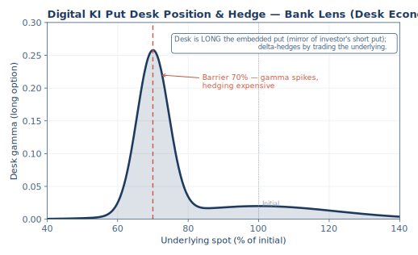

**How the bank makes money**

| Revenue Component | Detail |
|------------------|--------|
| **Structuring fee** | Embedded in note price at issuance (typically 1-3%) |
| **Bid-offer spread** | Spread between option cost and terms offered to investor |
| **Hedging P&L** | Delta-hedging profits from realized vs implied vol differential |
| **Funding advantage** | Issues note at sub-market effective funding rate |

**The coupon decomposition (from [Section 2.2](#sec-2-2)):**

Digital KI Put Coupon = Bond yield + Put premium + Digital option portfolio + Autocall premium − Funds Transfer Pricing (FTP) − Desk margin

This is the richest coupon decomposition in the ELN family. Three separate option premiums contribute:
1. **Put premium** — compensation for capital risk below the KI barrier
2. **Digital option portfolio** — compensation for binary coupon risk each period (paid above the digital strike)
3. **Autocall premium** — compensation for the issuer's right to terminate early

For an illustrative 12% coupon, the components combine roughly as follows (indicative split, consistent with the §10 decomposition — exact contributions depend on calibration): bond yield ~2.0%; put premium ~6.0%; digital option portfolio ~4.0%; autocall premium ~1.5%; FTP −0.5%; desk margin −1.0%; **net coupon ~12.0%**. The point is structural rather than precise: every feature the investor accepts stacks another premium into the coupon.

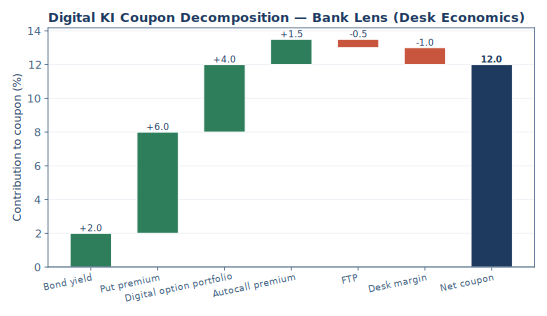

**P&L drivers**

Day to day, desk P&L is driven by realized-versus-implied volatility on the delta hedge, moves in the underlying near the digital strike and the KI barrier (gamma at two levels), the probability of autocall, funding, and the mark-to-market of the embedded put and digital portfolio. Product Control attributes P&L between note accrual and option MTM, and performs Independent Price Verification of the option components.

#### §9. THE BANK LENS — Controls & Reconciliation (2nd Line of Defence)

**Booking & systems**

| Aspect | Detail |
|--------|--------|
| **Book of record** | NEMO |
| **Pricing/Risk system** | Sophis |
| **Booking structure** | Single note — Digital Coupon Autocallable with Knock-In Put |
| **Four-leg framework?** | No |
| **Key booking fields** | Notional, initial level, three barriers (autocall, coupon/digital strike, capital), coupon rate & frequency, no-call period, maturity, underlying |
| **Observation sequence** | Each date: (1) check autocall eligibility and barrier, (2) if not autocalled, check digital coupon barrier |
| **Coupon payment** | Full amount if above coupon barrier; zero if below |
| **Memory** | None |
| **Capital barrier monitoring** | European — single check at maturity |
| **Autocall** | Quarterly after no-call period |

**Reconciliation points**

| Recon point | What must agree | DKIP-specific break |
|-------------|-----------------|---------------------|
| **Trade economics** | Notional, initial level, all three barriers **and convention** (% vs absolute), coupon rate & frequency, maturity, underlying ID | A barrier stored as absolute price in NEMO but % in Sophis — consistent only if the initial level matches exactly |
| **Digital coupon strike** | The digital strike (coupon barrier, e.g. 70% = $42) agrees across NEMO and Sophis | Digital strike off by convention → coupon fires on the wrong side of the cliff, paying or missing a full binary coupon |
| **Capital (KI) barrier** | The knock-in barrier (e.g. 60% = $36), European observation | KI barrier mis-stored → wrong redemption when the breach is assessed at maturity |
| **Autocall barrier & no-call period** | Autocall level (e.g. 100%) and eligibility dates (from Q5) consistent | Autocall flagged eligible inside the no-call window, or wrong level → spurious early termination |
| **Observation sequence** | Autocall checked before the digital coupon on each eligible date | Coupon check run before autocall → coupon paid on a note that should have terminated |
| **Fixings** | Initial and each observation/final fixing **source** matches the termsheet | Different vendors report different closes on a digital observation, flipping the binary outcome |
| **Binary settle / coupon capture** | Each digital observation result (paid/zero), the autocall flag, and the maturity capital-barrier result captured consistently across systems | A binary "paid" booked where the close was below the digital strike, or a missed coupon booked as paid; no-memory logic mis-applied as catch-up |
| **P&L attribution** | Note accrual + put MTM + digital portfolio MTM reconciles to total | Unexplained P&L points to a stale vol surface, a wrong fixing, or a mis-captured binary settle |

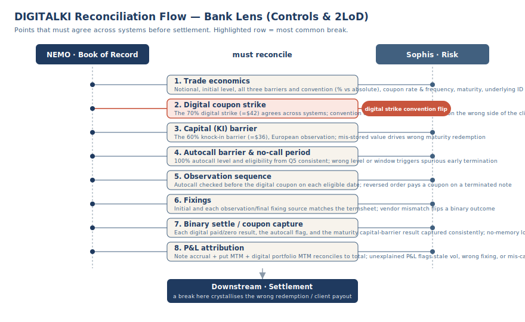

**Common breaks & red flags**

| Red Flag | What It Means | 2LoD Action |
|----------|---------------|-------------|
| **Autocall not checked before coupon** | The observation sequence matters: autocall takes priority. If autocall is triggered, there is no separate coupon check — the note terminates | Verify that the system checks autocall first on each eligible observation date |
| **Coupon paid after autocall** | If the note autocalled in Q5, no coupon should be paid for Q6 onward | Verify the note's status before processing any payment |
| **Memory logic applied** | The Digital KI Put has NO memory. If deferred coupons appear, the product is misconfigured | Confirm the product type does not include memory |
| **Three barriers confused** | Autocall barrier (e.g. 100%), coupon/digital strike (e.g. 70%), and capital barrier (e.g. 60%) are separate levels with different consequences | Verify all three are correctly stored and independently monitored |
| **No-call period ignored** | Autocall is typically not eligible in the first year. If an autocall is triggered during the no-call period, it is an error | Verify autocall eligibility dates against the termsheet |
| **Digital fixing flips the binary** | A close marginally above or below the digital strike from a non-termsheet source flips the full coupon | Use the fixing source specified in the termsheet for each digital observation |

**Control implication**

Each break has a direct consequence the 2nd line must size before it reaches the books or the client. A **digital fixing or digital-strike error** flips a binary outcome at the cliff — a full coupon is paid where none was due, or a due coupon is missed — and because the digital is all-or-nothing with no memory, the error cannot be smoothed away across periods; it must be caught on the observation date. A **missed or mis-stored KI-barrier capture** understates desk risk and overstates the investor's protection at maturity, driving the wrong redemption (notional × final/initial) and the wrong client payout. The reconciliation exists precisely to catch both the digital fixing flip and the capital-barrier capture before settlement crystallises them, alongside confirming the autocall-first observation sequence so coupons are not paid on a terminated note.

#### §10. Formal Definition

A **Digital Coupon Knock-In Put** is a structured product with:

**Digital coupon:** On each observation date, if the underlying is at or above the coupon barrier (digital strike), the full coupon is paid. If below, zero is paid. There is no memory — missed coupons are permanently lost.

**Autocall:** On eligible observation dates (typically after a no-call period), if the underlying is at or above the autocall barrier, the note terminates with full principal redemption plus any coupon due that period.

**Capital protection:** At maturity, if the underlying has breached the knock-in barrier: Redemption = Principal × (Final / Initial). If not breached: 100% of Principal.

The Digital KI Put combines the digital coupon mechanism (from 5.1.12), the autocall feature (from 5.1.3), and the knock-in put (from 5.1.2). Three barriers operate simultaneously: autocall barrier (above), coupon barrier (middle), capital barrier (below).

#### §11. Lifecycle

| Stage | Detail |
|-------|--------|
| **Trade date** | Terms agreed: underlying, strike/barrier, coupon, maturity. Book in NEMO; set initial level, three barriers (autocall, coupon, capital), coupon schedule, no-call period, maturity |
| **Issue date** | Note issued. The investor pays par (or discount). The bank establishes the hedge |
| **Coupon dates** | Periodic observations and coupon payments (if applicable). Barrier monitoring. On autocall-eligible dates: check autocall first; if not triggered, check the coupon barrier |
| **Barrier monitoring** | European — single check at maturity for the capital barrier |
| **Maturity (if not autocalled)** | Record the closing price. If above the capital barrier: return 100% principal. If below: return (Final / Initial) × principal. T+2 settlement |

#### §12. Worked Example (both lenses)

**Product:** 2-year Digital KI Put on Samsung. **Notional:** $500,000. **Coupon:** 12% p.a. (3% per quarter = $15,000), conditional on stock ≥ 70% coupon barrier. **Initial stock price:** $60. **Coupon barrier:** 70% = $42. **Autocall barrier:** 100% = $60 (eligible from Q5). **Capital barrier:** 60% = $36 (European). **Maturity:** 2 years (8 quarterly observations).

**Quarter-by-quarter:**

| Quarter | Samsung Price | % of Initial | Autocall? | ≥ 70%? | Coupon |
|:-------:|:------------:|:------------:|:---------:|:------:|:-----:|
| Q1 | $58 | 96.7% | N/A (no-call) | Yes | $15,000 |
| Q2 | $55 | 91.7% | N/A (no-call) | Yes | $15,000 |
| Q3 | $48 | 80.0% | N/A (no-call) | Yes | $15,000 |
| Q4 | $40 | 66.7% | N/A (no-call) | No | $0 |
| Q5 | $43 | 71.7% | No (< 100%) | Yes | $15,000 |
| Q6 | $50 | 83.3% | No (< 100%) | Yes | $15,000 |
| Q7 | $56 | 93.3% | No (< 100%) | Yes | $15,000 |
| Q8 | $52 | 86.7% | No (< 100%) | Yes | $15,000 |

*Investor lens:*
- **Total coupons:** 7 × $15,000 = $105,000 (missed Q4 — permanently lost).
- **Maturity at $52 (86.7%):** Above the $36 capital barrier. Principal: $500,000. **Total: $605,000.** Return: $105,000 / $500,000 = 21% over 2 years.
- **If autocalled in Q6 at $61 (101.7%):** Autocall triggered. Coupons through Q6: Q1-Q3 paid + Q4 missed + Q5-Q6 paid = 5 × $15,000 = $75,000. Principal: $500,000. **Total: $575,000.** Return: 15% over 18 months.
- **If maturity at $32 (53.3%):** Below the $36 capital barrier. Redemption: $500,000 × 32/60 = $266,667. Plus coupons (assume 3 paid): $45,000. **Total: $311,667.** Loss: $188,333 (37.7%).

*Bank lens:* In the base path, the desk's long KI put expires worthless (final $52 is above the $36 barrier), the short digital portfolio pays 7 of 8 binary coupons and the missed Q4 is a saving to the desk, and the desk keeps its structuring margin and net hedging P&L. In the autocall path, the desk's long callable right is exercised in Q6 — the note terminates, the hedge unwinds early, and the desk stops funding future coupons. In the loss path, the desk's long KI put is in the money (final $32 below $36): the investor delivers value equal to the shortfall, offsetting the desk's redemption obligation. In every path the 2nd line must confirm the binary coupon captures, the autocall flag, the redemption math (notional × final/initial), and that NEMO and Sophis agree before settlement.

#### §13. Knowledge Check

1. **What three types of option premium are embedded in the Digital KI Put's coupon, and how does each contribute?**
2. **Why must the autocall check be performed before the digital coupon check on each observation date?**
3. **Compare the Digital KI Put to the Phoenix. What features do they share? What differs?**
4. **An investor held a Digital KI Put that autocalled in Q6. They complain that they "lost" the remaining coupons. Explain why the autocall actually benefits them.**
5. **Explain why the Digital KI Put has the highest coupon in the ELN family.**
6. **(Desk economics / 1LoD)** What position does the desk hold against the investor across the put, the digital portfolio, and the autocall? At which two price levels does the desk's gamma spike, and why is that where the structuring margin is made or lost?
7. **(Controls / 2LoD)** Name three reconciliation breaks specific to a Digital KI Put — including one involving the digital strike and one involving the capital barrier — and the consequence of each for the investor's coupon or redemption.

**Mental Models**

| Concept | Mental Model |
|---------|-------------|
| Digital KI Put | A strict multi-round competition — pass/fail each round, result called early, penalty for a poor finale |
| Three barriers | Traffic lights: green (autocall — terminate with prize), yellow (coupon barrier — paid if above), red (capital barrier — losses if below) |
| No memory | Each round is judged fresh — a perfect Round 1 does not save a failed Round 2 |
| Coupon stacking | Three premiums layered: digital risk + call risk + put risk = highest coupon |
| Capstone product | The Swiss Army knife of ELNs — every feature is deployed |
| Dual gamma | The desk fights pin risk at two cliffs at once — the digital strike and the KI barrier |
| 2LoD reconciliation | The scorekeeper — confirms each round's pass/fail and the finale result match before any payout |

**Key Takeaways**

1. The Digital KI Put combines digital coupon, autocall, and knock-in put — the most feature-rich product in the ELN family.
2. Three barriers operate simultaneously: autocall (above), coupon (middle), capital (below). On each observation date, autocall is checked first.
3. The triple risk premium produces the highest coupon in the ELN family — typically 10-15% p.a.
4. Missed coupons are permanent (no memory), autocall shortens the expected income stream, and the investor's capital is at risk below the KI barrier.
5. The Digital KI Put is the capstone product — understanding it means understanding the full ELN toolkit. The desk holds the offsetting long-put, short-digital, long-autocall position.
6. For the 2nd line, the dominant control risks are the digital-strike fixing flip and the capital-barrier capture, plus the autocall-first observation sequence — each can misstate a coupon or the redemption.

#### §14. Common Mistakes

1. **Checking coupon before autocall.** The autocall takes priority. If the stock is above the autocall barrier, the note terminates — no separate coupon check is needed. Getting the sequence wrong produces incorrect payments.
2. **Assuming memory exists.** The "digital" in Digital KI Put means binary: paid or not paid, per period. There is no Phoenix-style catch-up for missed coupons.
3. **Confusing the three barriers.** Autocall barrier (e.g. 100%), coupon barrier (e.g. 70%), and capital barrier (e.g. 60%) are independent levels. Each triggers a different outcome.
4. **Underestimating complexity risk.** The interaction between three barriers makes outcomes hard to predict. A stock can miss coupons while avoiding autocall and capital loss, or get autocalled after missing several coupons.
5. **Treating the high coupon as "free money."** The 12% coupon reflects three layers of risk the investor bears. In adverse scenarios, the combination of missed coupons and capital loss can overwhelm years of coupon income.
6. **(Controls) Trusting a single system's barrier or digital-strike value.** Because the digital strike and the KI barrier can each be stored as a percentage or an absolute price, the 2nd line must reconcile the convention across NEMO and Sophis rather than assume they agree — a flipped digital fixing pays or misses a full binary coupon.
### Knowledge Check

**Review Questions:**
1. What three barriers does the Digital KI Put have, and what does each one control?
2. Why must the autocall check be performed before the digital coupon check?
3. How does the Digital KI Put's coupon compare to the Digital Coupon Note's and the FCN's? Why?
4. What happens to coupons missed before an autocall event?
5. Why is the Digital KI Put considered the "capstone" of the ELN family?


**Dual-lens questions:**
- *(Desk economics / 1LoD)* What position does the desk hold against the investor, and what is its primary Greek / hedging risk?
- *(Controls / 2LoD)* Which booking and risk-system fields must reconcile for this product, and which is the most common break?
**Scenario Questions:**
1. A Digital KI Put has a 70% coupon barrier, 100% autocall barrier, and 60% capital barrier. In Q5, the stock closes at 101%. What happens? What would have happened if the stock closed at 99%?
2. An investor holds a Digital KI Put that missed coupons in Q2, Q4, and Q7. The note was not autocalled. At maturity, the stock is at 65%. Calculate the total return on a $300,000 notional with 12% p.a. coupon (3% per quarter, 8 total quarters).
3. Compare two products: (A) a Digital Coupon Note at 9% p.a. with no autocall, and (B) a Digital KI Put at 12% p.a. with autocall. Both have a 70% coupon barrier and 60% capital barrier. Under what market conditions does each product produce a better outcome?

**Desk Question:**
You are the Structurer pricing a new Digital KI Put for a client. The client wants the coupon barrier lowered from 70% to 60% (same as the capital barrier). Explain how this changes the product's risk profile, the coupon level, and why the desk might push back on this structure.

### Visual Learning Recommendations

1. **Three-barrier interaction diagram** — Vertical axis showing autocall barrier (100%), coupon barrier (70%), and capital barrier (60%) with a stock path weaving between them, annotated with outcomes at each level (P1)
2. **Digital KI Put vs Digital Coupon Note comparison** — Side-by-side cash flow timelines showing: Digital Coupon Note (runs to maturity, no autocall) vs Digital KI Put (potential early termination, same digital coupon logic) (P1)
3. **Observation date decision tree** — Step-by-step flowchart: Is stock ≥ autocall barrier? → Yes: terminate. No → Is stock ≥ coupon barrier? → Yes: pay coupon. No: zero coupon (P2)
4. **Coupon decomposition comparison** — Waterfall chart comparing coupon components: FCN, Digital Coupon Note, Digital KI Put — showing how each additional feature adds premium (P2)
5. **ELN family complexity spectrum** — Linear spectrum from simplest (PPN) to most complex (Digital KI Put), showing which features each product adds along the way (P3)

### Dependency References

| Concept Used | Where It Was Taught |
|-------------|-------------------|
| Digital (binary) option, digital coupon | [Section 1.3](#sec-1-3) (Barriers), [Section 5.1.12](#sec-5-1-12) (Digital Coupon Note) |
| Put option, knock-in barrier | [Section 1.2](#sec-1-2) (Options), [Section 1.3](#sec-1-3) (Barriers) |
| Autocall mechanism, memory (for contrast) | [Section 5.1.3](#sec-5-1-3) (Phoenix) |
| Coupon decomposition, FTP | [Section 2.2](#sec-2-2) (Product Construction) |
| Capital protection spectrum | [Section 2.4](#sec-2-4) (Capital Protection Spectrum) |
| NEMO/Sophis booking | [Section 2.8](#sec-2-8) (Systems Primer) |

---


#### Visual Specifications

**Visual 1: Digital Coupon Knock-In Put Payoff at Maturity**
- **Asset filename:** payoff_dkip_maturity_01.svg
- **Caption:** "Digital Coupon Knock-In Put Payoff at Maturity"
- **Diagram elements:** X-axis: underlying price. Y-axis: investor total return. Key levels marked (strike, barrier if applicable). Compare with unstructured alternative
- **Reuse status:** Adapt from payoff template
**Visual 2: Digital Coupon Knock-In Put Product Construction**
- **Asset filename:** construction_dkip_components_02.svg
- **Caption:** "Digital Coupon Knock-In Put Product Construction"
- **Diagram elements:** Component decomposition: each building block in separate box. Arrows showing how they combine to create the product. Cost allocation visible
- **Reuse status:** Adapt from construction template
**Visual 3: Digital Coupon Knock-In Put Lifecycle Timeline**
- **Asset filename:** lifecycle_dkip_timeline_03.svg
- **Caption:** "Digital Coupon Knock-In Put Lifecycle Timeline"
- **Diagram elements:** Horizontal timeline from issue to maturity. Key events: issue, coupon dates, observation dates, maturity. Underlying price path overlay
- **Reuse status:** Adapt from lifecycle template
**Visual 4: Digital Coupon Knock-In Put Risk Heatmap**
- **Asset filename:** risk_dkip_heatmap_04.svg
- **Caption:** "Digital Coupon Knock-In Put Risk Heatmap"
- **Diagram elements:** Grid: risk types (market, credit, liquidity, operational) vs severity (low/med/high). Colour-coded cells appropriate for Digital Coupon Knock-In Put
- **Reuse status:** Adapt from risk heatmap template
**Visual 5: Digital Coupon Knock-In Put vs Alternatives**
- **Asset filename:** comparison_dkip_vs_alternatives_05.svg
- **Caption:** "Digital Coupon Knock-In Put vs Alternatives"
- **Diagram elements:** Multi-column comparison showing payoff across scenarios (-30%, flat, +15%, +30%). Compare with direct investment and simpler structured product
- **Reuse status:** New — comparison panel
**Visual 6: Digital Coupon Knock-In Put Suitability Decision Tree**
- **Asset filename:** decision_dkip_suitability_06.svg
- **Caption:** "Digital Coupon Knock-In Put Suitability Decision Tree"
- **Diagram elements:** Decision tree guiding investor suitability. Key questions: risk tolerance, income need, market view, time horizon
- **Reuse status:** Adapt from decision tree template


**Dual-lens visuals (generated):**
- `assets/digitalki/controls_digitalki_recon_08.svg` `[generated]`
- `assets/digitalki/desk_digitalki_gamma_07.svg` `[generated]`
- `assets/digitalki/payoff_digitalki_01.svg` `[generated]`
- `assets/digitalki/waterfall_digitalki_09.svg` `[generated]`
#### Dependency References

| Concept Used | Where It Was Taught |
|-------------|-------------------|
| Equity fundamentals | [Section 1.4](#sec-1-4) (Equity Essentials) |
| Options mechanics | [Section 1.2](#sec-1-2) (Options From Zero) |
| Product decomposition | [Section 2.2](#sec-2-2) (Product Construction) |
| Digital | 5.1.12 — digital only |
| RC | 5.1.2 — put only |
| Phoenix | 5.1.3 — autocall with barrier |
### 5.1.15 Warrant / Turbo Certificate {#sec-5-1-15}

> **Prerequisites:** [VO](#sec-5-6-3) &nbsp;|&nbsp; **Key concepts:** Exchange-traded leverage, time decay acceleration

---

*Every ELN product in this family has contained a bond component — the investor lends money to the issuer, and the bond provides funding for the embedded option. The Warrant strips the bond away entirely. What remains is pure option exposure in a securitized wrapper: no coupon, no principal protection, no barrier cushion. The investor pays a premium and participates directly in the underlying's price movement. The Turbo Certificate adds a knock-out barrier that reduces cost but introduces sudden-death risk. This chapter reads the product through two lenses: what it means for **the investor**, and what it means for **the bank** — the latter split into the desk's market economics (1st line of defence) and the controls and reconciliation that surround it (2nd line of defence).*

**How This Differs From Other ELN Products:** All previous ELN products (5.1.1 through 5.1.14) combine a bond with one or more options. The Warrant has no bond. It is a securitized option — an option packaged as a tradeable security listed on an exchange. The investor buys leverage directly. There is no coupon, no capital barrier, and no autocall. If the underlying moves favorably, the warrant gains value. If not, the investor loses the premium paid — potentially all of it.

#### §1. Explain Like I'm New

Omar is a portfolio manager at a London-based investment firm. He is bullish on Volkswagen over the next six months but does not want to commit €500,000 to buying shares directly. He wants to deploy €50,000 for the same directional exposure — accepting that if the view is wrong, the entire €50,000 could be lost.

A **Warrant** makes this possible. The investor pays a premium (€50,000) for the right to benefit from Volkswagen's price movement, with leverage that amplifies the exposure. If Volkswagen rises 10%, the warrant might rise 50%. If Volkswagen falls 10%, the warrant might fall 50%. The amplification works in both directions.

A **Turbo Certificate** adds a twist: it includes a knock-out barrier. If Volkswagen's price drops below a specified level at any point, the turbo is immediately terminated and becomes worthless (or worth a small residual). The knock-out reduces the premium (making the turbo cheaper than a vanilla warrant) but introduces the risk of sudden, total loss even if the stock eventually recovers.

Unlike every other product in [Part 5](#part-5).1, there is no bond, no coupon, and no capital protection. The warrant is pure leverage.

#### §2. Real-World Analogy

A Warrant is like a prospector's mining claim.

The prospector pays a fee (the premium) to secure the exclusive right to mine gold from a specific plot for a fixed period. If the plot contains gold (the stock rises above the strike price), the gold is extracted and the prospector profits — potentially many times the claim fee. If the plot is barren (the stock stays flat or declines), the claim fee is lost entirely when the license expires. There is no partial refund, no guaranteed minimum discovery, and no one to share the loss.

The **Turbo Certificate** adds a flood-zone clause to the claim. If the groundwater level rises above a threshold (the knock-out barrier), the mining rights are automatically cancelled — even if gold is believed to lie just below the rising water. The flood clause makes the claim cheaper to buy but introduces the risk that access to the plot is lost before its natural expiry.

The warrant's leverage is the prospector's amplifier: a small claim fee controls access to a large plot. But unlike a structured note (where the bond provides a safety net), the prospector has no safety net. The claim fee is both the maximum and the minimum at risk.

#### §3. What Problem Does This Solve?

The Warrant addresses the **leveraged directional exposure** need:

| Investor Need | How the Warrant Delivers |
|------------|-------------------------|
| Bullish or bearish view with limited capital | Small premium controls large notional exposure |
| Defined maximum loss | Maximum loss = premium paid. No margin calls, no additional liability |
| Exchange-traded liquidity | Listed on exchanges with continuous market-making |
| Short-term tactical trading | Maturities from weeks to years, enabling precise timing |

#### §4. Product DNA

| Field | Value |
|-------|-------|
| **Full Name** | Warrant / Turbo Certificate |
| **Abbreviation** | Warrant |
| **Family** | Equity-Linked Notes |
| **Complexity Score** | 3 / 10 |
| **Complexity Rationale** | Leveraged exposure instrument — direct participation in underlying with gearing. Simplest leveraged product |
| **Underlying Asset Class** | Equity (stock, index, commodity, FX) |
| **Capital Protection** | None (option can expire worthless — lose entire premium) |
| **Coupon Type** | None — return via leveraged price movement |
| **Maturity** | Weeks to 2 years |
| **Liquidity** | Exchange-traded (high liquidity) |
| **Primary System** | Exchange systems |
| **ISDA Required** | No — exchange-traded |

**DNA Atlas Fields:**
- Primary Risk: Total loss of premium if out-of-money at expiry. Leverage amplifies losses. Time decay erodes value
- Typical Buyer: Directional traders, retail speculators, hedgers seeking cheap protection
- Typical Use Case: Cheap leveraged exposure to underlying. Small capital outlay controls larger notional
- Building Blocks: Standardised call or put option. Turbo variant adds knock-out barrier for cheaper premium
- Key Hedge: Delta-hedge underlying, manage time decay
- Similar Products: Booster (5.1.13 — note-wrapped leverage), Vanilla Options (5.6.3 — over-the-counter (OTC) options), ELO (5.6.4 — equity-linked option)
- Most Important Greek: Delta + Theta (leverage and time decay)

**Comparison Matrix Fields:**
- Complexity: 3
- Yield Potential: Very high (leveraged upside, limited to premium on downside)
- Capital Protection: None (premium at risk)
- Credit Exposure: Exchange counterparty
- Liquidity: Exchange-traded (high)
- Path Dependency: No (European) or Yes (Turbo with barrier)
- Volatility Sensitivity: Long vega (long option)
- Correlation Sensitivity: None
- Client Type: Retail / Active traders
- Market Environment: Best for short-term directional views or portfolio hedging

#### §5. Who Touches This Product

| Role | Responsibility |
|------|---------------|
| **Structurer** | Designs Warrant / Turbo Certificate terms: strike, barrier, ratio, maturity. Optimises structure for client and bank |
| **Trader** | Hedges embedded options. Manages Greeks (delta, gamma, vega). Prices secondary market |
| **Sales** | Distributes Warrant / Turbo Certificate to target clients. Explains payoff scenarios and risk-return profile |
| **Risk Management** | Monitors option Greeks, barrier proximity, concentration risk. Sets trading limits |
| **Product Control** | Daily P&L attribution between intrinsic value and time-value (option MTM). Independent price verification |
| **Operations** | Processes exchange settlement and maturity. Handles KO events and corporate-action adjustments |
| **Legal / Compliance** | Reviews term sheet for regulatory compliance. Ensures suitability for target investor base |
| **Quantitative Analytics** | Prices embedded derivatives. Calibrates volatility surface. Provides model validation |

#### §6. Product Evolution

| Stage | Product | What Was Added | Why |
|:-----:|---------|---------------|-----|
| 1 | Plain vanilla bond | — (baseline) | Fixed coupon, full principal return |
| 2 | Equity-linked note | Equity participation or option embedded | Market return exposure with note wrapper |
| 3 | Warrant / Turbo Certificate | Bond stripped away — pure securitized option | Leveraged exposure instrument: direct participation in underlying with gearing. Simplest leveraged product |

---

#### §7. THE INVESTOR LENS

**Why the investor buys it**

1. **Leverage.** A €50,000 warrant investment can deliver the same price exposure as €500,000 in shares. This frees capital for other uses.
2. **Defined risk.** The maximum loss is the premium paid. Unlike leveraged share purchases on margin, there are no margin calls and no additional liability.
3. **Flexibility.** Available as call warrants (bullish) and put warrants (bearish). The investor can express either direction.
4. **Liquidity.** Exchange-listed with a designated market maker. The investor can enter and exit during trading hours at transparent prices.
5. **Cost efficiency.** For turbos, the knock-out barrier reduces the premium further, making the leverage even greater.

**Position taken**

The investor is **long** the warrant — a long call (bullish) or long put (bearish), held in securitized form. There is no bond, no coupon, and no capital protection: the position is pure, highly leveraged optionality. Net, the investor is **long volatility** (helped by rising implied vol, hurt by falling vol) and **short theta** (time decay erodes value daily). The maximum loss is the premium paid; for a Turbo, an intraday touch of the knock-out level terminates the position immediately, so the investor is additionally exposed to sudden-death barrier risk. With a single underlying there is no correlation exposure.

**Payoff & scenarios**

At expiry the warrant pays its intrinsic value, scaled by the ratio. The payoff has two distinct regions: **below the strike (call) or above the strike (put)** the warrant is worthless and the investor loses the entire premium; **above the strike (call) or below the strike (put)** value increases linearly with the underlying at the ratio rate. There is no barrier cushion — unlike an RC, there is no "safe zone" between a barrier and the strike. The transition from worthless to valuable happens at a single point. For a Turbo, the payoff is cut short entirely if the knock-out level is touched at any time during the life, regardless of where the underlying finishes.

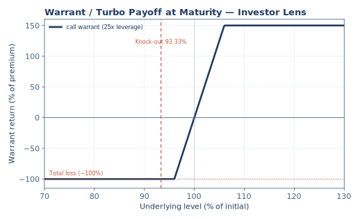

**Product:** 6-month Call Warrant on a stock. **Premium paid:** €5,000 (for 1,000 warrants at €5 each). **Strike price:** €150 (at-the-money). **Current stock price:** €150. **Ratio:** 1:1 (1 warrant = exposure to 1 share).

- **Scenario 1 — Stock rises to €180 (+20%):** Intrinsic value per warrant: €180 − €150 = €30. Total value: 1,000 × €30 = €30,000. Profit: €30,000 − €5,000 = **€25,000 (+500%)**. A 20% stock move produced a 500% warrant return.
- **Scenario 2 — Stock rises to €155 (+3.3%):** Intrinsic value: €155 − €150 = €5. Total: 1,000 × €5 = €5,000. Profit: €5,000 − €5,000 = **€0 (break-even)**. The stock rose, but only enough to recover the premium.
- **Scenario 3 — Stock finishes at €145 (−3.3%):** Warrant expires out of the money. Intrinsic value: €0 (stock below strike, no right to exercise). Total loss: **€5,000 (−100%)**. A 3.3% stock decline caused a 100% warrant loss.
- **Scenario 4 — Turbo Call Warrant with KO at €140:** Same parameters, but with a knock-out barrier at €140. Premium: €3,000 (cheaper due to KO risk). Stock drops to €139 in Month 2 → KO triggered. Turbo terminates immediately. Residual value: €0. **Loss: €3,000 (−100%)**, even though the stock later recovers to €170.

**Risks to the investor**

| Risk | Description | Severity |
|------|------------|:--------:|
| **Total premium loss** | If the underlying finishes below the strike (call) or above the strike (put), the warrant expires worthless — 100% loss. | High |
| **Time decay (Theta)** | The warrant loses value every day as maturity approaches, even if the stock price is unchanged. | High |
| **Leverage amplification** | Percentage losses are amplified — a small adverse stock move creates a large percentage warrant loss. | High |
| **Knock-out risk (turbos)** | If the stock briefly touches the KO barrier, the turbo terminates immediately. Recovery after KO is irrelevant. | High |
| **Volatility sensitivity (Vega)** | Warrant value is sensitive to implied volatility changes. A decline in implied vol reduces the warrant's value even if the stock price is unchanged. | Medium |
| **Liquidity risk** | While exchange-listed, bid-offer spreads may widen in volatile markets or for less popular underlyings. | Low |

#### §8. THE BANK LENS — Desk Economics (1st Line of Defence)

**What the desk books**

The desk's position is the mirror image of the investor's. Where the investor is long the warrant, the desk is **short** that warrant — short a call (or short a put) that it has issued and listed on the exchange. There is no bond leg: unlike every other [Part 5](#part-5).1 product, the warrant has no note wrapper providing funding or coupons, so the desk's only exposure is the short option it must hedge. For a Turbo, the desk is short an option that knocks out on an intraday touch of the barrier, which sharply alters the hedge the moment the level is hit.

**Greeks & hedging**

The desk is short the warrant and delta-hedges by trading the underlying. Because the investor is long gamma, the desk is **short gamma**, and the hedge must be rebalanced as the underlying moves — most aggressively near the strike, where gamma is largest. The desk is short vega (a rise in implied vol increases what it owes the holder) and earns theta as the warrant's time value decays. For a Turbo, gamma and delta spike near the knock-out level: the moment the barrier is touched the option terminates, and the desk must flatten its hedge instantly — a residual hedge left running after a KO is an immediate, unhedged exposure.

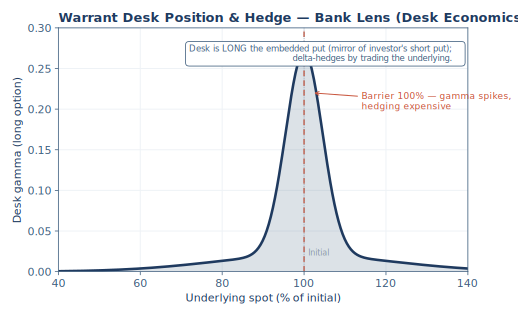

**How the bank makes money**

| Revenue Component | Detail |
|------------------|--------|
| **Structuring fee** | Embedded in the warrant's issue price (typically 1-3%) |
| **Bid-offer spread** | Spread between the option's cost and the terms offered to the investor; captured continuously through market-making |
| **Hedging P&L** | Delta-hedging profits from the realized-versus-implied volatility differential |
| **Funding advantage** | Premium received up front is funded at a sub-market effective rate |

**The price decomposition (from §12 Product Construction):**

Warrant Price = Intrinsic value + Time value + Funding/carry

For the at-the-money 6-month call above (strike €150, spot €150, €5 premium per warrant): intrinsic value is **€0.00** (the option is exactly at-the-money, so there is no immediate exercise value); the **€5.00** premium is therefore almost entirely **time value** — the price of remaining optionality that decays toward zero as maturity approaches — with a small embedded **funding/carry** component reflecting the cost of carrying the delta hedge. *(Source gives "Warrant Price = Intrinsic Value + Time Value" without a numeric split; the €5.00 premium on an ATM warrant is therefore time value plus carry — the funding/carry slice is inferred here as a small fraction of premium, illustratively ~€0.50, with the remaining ~€4.50 as pure time value.)* For a Turbo, the knock-out barrier eliminates most of the time value, so the turbo trades close to its intrinsic value — giving it near-1:1 sensitivity to the underlying (high delta) and even greater leverage than a vanilla warrant.

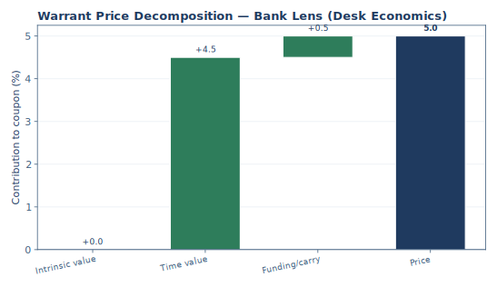

**P&L drivers**

Day to day, desk P&L is driven by realized-versus-implied volatility on the delta hedge, moves in the underlying near the strike (gamma), the mark-to-market of the short option's time value (theta and vega), funding, and — for Turbos — discrete jumps at knock-out events. Product Control attributes P&L between intrinsic value and option time-value MTM, and performs Independent Price Verification of the option component against exchange settlement prices.

#### §9. THE BANK LENS — Controls & Reconciliation (2nd Line of Defence)

**Booking & systems**

| Aspect | Detail |
|--------|--------|
| **Book of record** | NEMO |
| **Pricing/Risk system** | Sophis |
| **Four-leg framework?** | No |
| **Product type** | Warrant (Call/Put) or Turbo Certificate |
| **Trading venue** | Exchange-listed (e.g., Euronext, SIX, Börse Frankfurt) |
| **Market-making** | Issuing bank provides continuous two-sided quotes during trading hours |
| **Key booking fields** | Strike, ratio, maturity, type (call/put), KO barrier (if turbo), underlying identifier, exchange listing |
| **Settlement** | Cash: Max(0, Final − Strike) × Ratio for calls; Max(0, Strike − Final) × Ratio for puts |
| **KO monitoring (turbos)** | Continuous — any intraday touch during exchange hours terminates the product |

**Reconciliation points**

| Recon point | What must agree | Warrant-specific break |
|-------------|-----------------|------------------------|
| **Strike** | Strike price matches the termsheet and exchange listing across NEMO and Sophis | Strike stored differently between systems → payout miscalculated |
| **Knock-out level (turbos)** | KO barrier level and monitoring type (American/continuous) consistent across systems | KO level mis-stored or flagged as European → barrier breach missed |
| **Ratio / conversion** | Number of warrants per unit of underlying (e.g. 10:1) matches the termsheet | System records 1:1 but warrant is 10:1 → payouts 10× too large or small |
| **Call/Put type** | Type matches the termsheet and exchange listing | Call booked as put (or vice versa) inverts the entire payoff direction |
| **Exchange listing** | Listed identifier, venue, and market-maker obligations reconcile to NEMO and exchange records | Wrong listing reference → quotes and settlements reconciled against the wrong security |
| **Barrier/event capture (turbos)** | KO event flag consistent across NEMO, Sophis, and exchange | Intraday touch occurs but only daily closes monitored → turbo not terminated |
| **Residual value** | Residual-on-KO convention (zero vs small residual) matches the termsheet | Zero residual booked where a residual is due, or vice versa |
| **Corporate actions** | Strike and/or ratio adjusted for splits, dividends, mergers per exchange rules | Split not propagated → strike and ratio wrong, all subsequent valuations off |

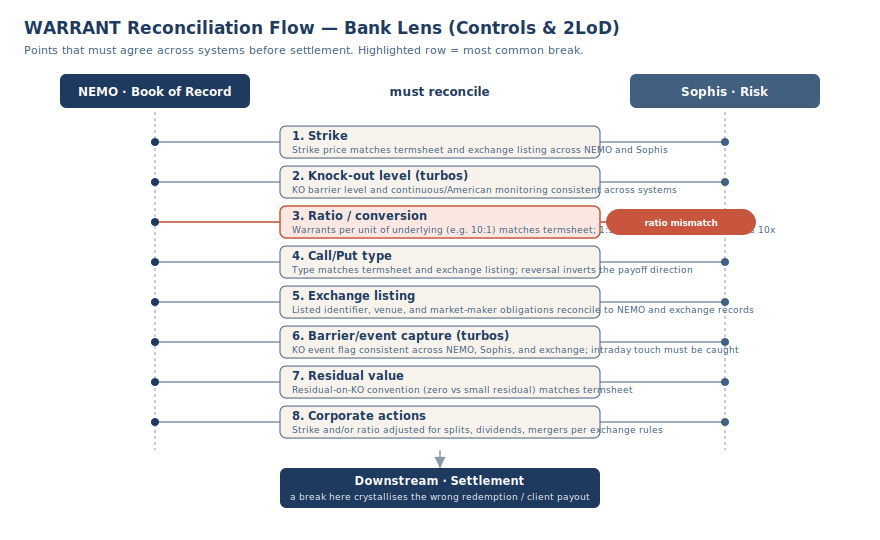

**Common breaks & red flags**

| Red Flag | What It Means | 2LoD Action |
|----------|---------------|-------------|
| Ratio mismatch | If the system records a 1:1 ratio but the warrant is actually 10:1, payouts will be 10× too large or small | Verify the ratio against the termsheet and exchange listing |
| KO event not detected (turbos) | If the stock touched the KO barrier intraday but the system only checks daily closes, the turbo may not be terminated | Ensure real-time intraday barrier monitoring for turbo certificates |
| Residual value calculation | Some turbos pay a small residual on KO (the difference between the KO level and the next traded price). Others pay zero | Verify the residual value convention against the termsheet |
| Call/Put type reversed | Booking a call warrant as a put (or vice versa) inverts the entire payoff direction | Verify the type matches the termsheet and exchange listing |
| Corporate action adjustment missed | A stock split changes the ratio and/or strike. If not adjusted, all subsequent valuations are wrong | Monitor corporate action announcements and apply adjustments per exchange rules |

**Control implication**

Each break has a direct consequence the 2nd line must size before it reaches the books or the client. The two dominant control risks for a warrant are **knock-out capture** and the **conversion ratio**. A missed intraday KO touch leaves a turbo that should be dead still booked as live — overstating both the investor's residual claim and the desk's hedged risk, while the desk's real hedge has already gone wrong. A ratio error silently scales every payout: a 10:1 warrant booked as 1:1 misstates redemption by a factor of ten. The reconciliation exists precisely to catch these inconsistencies — across NEMO, Sophis, and the exchange record — before settlement crystallises them.

#### §10. Formal Definition

A **Warrant** is a securitized option issued by a bank, giving the holder the right to participate in the price movement of an underlying asset. At expiry, the warrant pays the intrinsic value:

- **Call Warrant:** Max(0, Final Price − Strike Price) × Ratio
- **Put Warrant:** Max(0, Strike Price − Final Price) × Ratio

Warrants are cash-settled (no physical delivery of the underlying).

A **Turbo Certificate** (also: Turbo Warrant, Knock-Out Certificate) adds a knock-out barrier:
- If the underlying touches the barrier at any point during the life, the turbo terminates immediately and becomes worthless (or pays a small residual value).
- The barrier is American (continuous monitoring).
- The knock-out eliminates the warrant's deep out-of-the-money scenarios, reducing its time value and making it cheaper than a vanilla warrant with the same strike.

**Key parameters:**
- **Strike price:** The reference level for calculating the payout
- **Knock-out barrier (turbos only):** The level that terminates the product
- **Ratio:** Number of warrants per unit of underlying (e.g., 10:1 means 10 warrants = 1 share of exposure)
- **Maturity:** Weeks to years
- **Type:** Call (bullish) or Put (bearish)

#### §11. Lifecycle

| Stage | Detail |
|-------|--------|
| **Listing date** | Warrant is listed on the exchange. NEMO records the issuance: strike, ratio, maturity, type (call/put), KO barrier (if turbo). Bank establishes hedge |
| **Trading** | Market maker provides continuous bid-offer quotes. Investors buy and sell at exchange prices |
| **KO event (turbos)** | If the underlying touches the KO barrier intraday, the turbo is immediately terminated. Settlement = residual value (typically zero or the difference between the KO level and the next available price) |
| **Corporate actions** | Stock splits, dividends, and mergers require adjustment to the strike and/or ratio. These are governed by exchange rules |
| **Expiry** | If in-the-money: cash settlement = (Final − Strike) × Ratio (for calls). If out-of-the-money: expires worthless. No action required from the investor. T+2 settlement |

#### §12. Worked Example (both lenses)

**Product:** 9-month Call Warrant on Volkswagen. **Number of warrants:** 5,000. **Premium per warrant:** €10. **Total investment:** €50,000. **Strike price:** €150. **Volkswagen current price:** €150 (at-the-money). **Ratio:** 1:1. **Maturity:** 9 months.

*Investor lens:*
- **At expiry, Volkswagen at €195 (+30%):** Intrinsic value per warrant: €195 − €150 = €45. Total: 5,000 × €45 = €225,000. Profit: €225,000 − €50,000 = **€175,000 (+350%)**. A 30% stock move produced a 350% return.
- **At expiry, Volkswagen at €160 (+6.7%):** Intrinsic value: €160 − €150 = €10. Total: 5,000 × €10 = €50,000. Profit: €50,000 − €50,000 = **€0 (break-even)**. The stock needed to rise by exactly the premium amount to break even.
- **At expiry, Volkswagen at €148 (−1.3%):** Intrinsic value: €0. Warrant expires out of the money. Total loss: **€50,000 (−100%)**. A 1.3% decline wiped out the entire investment.
- **Turbo variant — KO at €135:** Same parameters. Premium: €7 per warrant (cheaper due to KO risk). Total: €35,000. If Volkswagen drops to €134.50 at any point → KO triggered. Turbo terminates immediately. **Loss: €35,000 (−100%)**, regardless of subsequent stock recovery. If Volkswagen never hits €135 and expires at €195: Intrinsic value per warrant: €195 − €150 = €45. Total: 5,000 × €45 = €225,000. Profit: €225,000 − €35,000 = **€190,000 (+543%)**. The turbo's lower cost amplifies the return percentage versus the vanilla warrant.

*Bank lens:*
In the +30% expiry, the desk is short the call it issued; against the €225,000 it owes the holder it relies on its delta hedge in Volkswagen stock, having earned the structuring margin and net hedging P&L on the way. Product Control confirms the intrinsic value and the time-value MTM (now zero at expiry) reconcile to the settlement. In the €148 expiry the short option dies worthless and the desk keeps the premium net of hedging cost. In the Turbo KO at €134.50, the desk must flatten its hedge the instant the barrier is touched; the 2nd line must confirm the KO event was captured intraday across NEMO, Sophis, and the exchange, that the ratio (1:1) and residual convention are correct, and that the dead turbo is no longer booked as live before settlement.

#### §13. Knowledge Check

1. **What is the fundamental difference between a warrant and every other product in [Part 5](#part-5).1?** *(Investor)*
2. **Explain why a warrant can lose 100% of its value while the underlying stock declines only 5%.** *(Investor)*
3. **What is the difference between a vanilla warrant and a turbo certificate? Why is the turbo cheaper?** *(Investor)*
4. **How does time decay (Theta) affect a warrant's value as maturity approaches?** *(Investor)*
5. **An investor holds a turbo call that was knocked out. The stock recovers above the strike by expiry. Does the investor profit? Why or why not?** *(Investor)*
6. **(Desk economics / 1LoD)** What position does the desk hold against the investor on a warrant, and which way do the desk's gamma, vega, and theta point? Where does the desk's structuring margin come from, and why is a Turbo's knock-out the moment the hedge is most dangerous?
7. **(Controls / 2LoD)** Name three reconciliation breaks specific to a warrant/turbo and the consequence of each for the investor's settlement.

**Mental Models**

| Concept | Mental Model |
|---------|-------------|
| Warrant | Mining claim — pay for the right to extract value; if the plot is barren, the fee is lost |
| Premium | The claim fee — the investor's total risk. No additional liability beyond what was paid |
| Strike price | The depth at which gold starts — value only exists above this depth (for calls) |
| Time decay | The claim's expiry date — every day the license gets closer to expiring, the claim loses value |
| Turbo KO | Flood clause — automatic cancellation if conditions deteriorate, even temporarily |
| Leverage | A small claim fee controlling a large plot — amplifies both discovery (gain) and failure (loss) |
| 2LoD reconciliation | The claims registry — confirms the strike, ratio, KO level, and listing match before any payout is settled |

**Key Takeaways**

1. A Warrant is a securitized option — the only product in [Part 5](#part-5).1 with no bond component.
2. The investor's maximum loss is the premium paid. Maximum gain is theoretically unlimited for calls.
3. Leverage amplifies returns in both directions: small stock moves create large percentage changes in the warrant's value.
4. A Turbo Certificate adds a knock-out barrier that terminates the product if the stock touches the barrier at any point. The KO makes the turbo cheaper but introduces sudden-death risk.
5. Warrants decay over time (Theta). Holding a warrant in a flat market results in a loss from time decay alone.
6. The investor is long the warrant; the desk holds the offsetting short-option position, short gamma and short vega, earning theta and flattening its hedge instantly on a Turbo KO.
7. For the 2nd line, the dominant control risks are knock-out capture, the conversion ratio, and call/put type — each can misstate the settlement across NEMO, Sophis, and the exchange.

#### §14. Common Mistakes

1. **Treating warrants like shares.** Shares do not expire. Warrants do. An investor who holds a warrant in a flat market loses money from time decay, even if the stock price is unchanged.
2. **Ignoring the break-even point.** A call warrant profits only if the stock rises above the strike PLUS the premium paid per warrant. A stock that rises from €150 to €155 does not profit if the premium was €10.
3. **Assuming turbos can recover after KO.** Once knocked out, the turbo is dead. The stock's subsequent recovery is irrelevant to the turbo holder.
4. **Misunderstanding the ratio.** If the ratio is 10:1, the investor needs 10 warrants for exposure to 1 share. Forgetting the ratio leads to investment-size errors.
5. **Comparing warrant returns to stock returns without adjusting for risk.** A warrant that returned 500% did so because of leverage — the same leverage that could have produced a −100% return. The percentage return is not comparable to stock returns without adjusting for the different capital at risk.
6. **(Controls) Trusting a single system's ratio or KO flag.** Because the ratio scales every payout and a missed intraday touch leaves a dead turbo booked as live, the 2nd line must reconcile the ratio, the KO level, and the KO event flag across NEMO, Sophis, and the exchange record rather than assume they agree.
### Knowledge Check

**Review Questions:**
1. What component is present in all other [Part 5](#part-5).1 products but absent from the warrant?
2. What determines whether a warrant expires with value or worthless?
3. How does a turbo certificate's knock-out barrier affect its price relative to a vanilla warrant?
4. What is the maximum loss for a warrant investor?
5. Why do warrants lose value over time even when the stock price does not change?


**Dual-lens questions:**
- *(Desk economics / 1LoD)* What position does the desk hold against the investor, and what is its primary Greek / hedging risk?
- *(Controls / 2LoD)* Which booking and risk-system fields must reconcile for this product, and which is the most common break?
**Scenario Questions:**
1. An investor buys 2,000 call warrants at €8 each (€16,000 total). Strike is €100, ratio is 1:1. At expiry, the stock is at €115. Calculate the profit. What stock price would produce a break-even result?
2. A turbo call warrant has a strike of €100 and a KO barrier at €92. The stock drops from €105 to €91 on a Monday morning, then recovers to €110 by Friday. What is the turbo holder's outcome? Compare this to a vanilla warrant holder's outcome.
3. An investor compares buying 500 shares at €100 each (€50,000 total) versus buying 5,000 call warrants at €10 each (€50,000 total) with a strike of €100. If the stock rises to €130, compare the returns. If the stock falls to €95, compare the losses.

**Desk Question:**
The desk issues a turbo call warrant with a KO barrier at €85 on a stock trading at €100. Over the next week, the stock drops to €86 in regular trading but gaps down to €82 in after-hours trading on bad earnings. The exchange's KO monitoring applies only during regular trading hours. The stock opens at €79 the next morning. When is the KO triggered, what is the settlement, and what risk management issue does this gap event expose?

### Visual Learning Recommendations

1. **Warrant payoff diagram (call and put)** — Classic hockey-stick payoff showing zero value below strike and linear gain above, with break-even point marked (P1)
2. **Turbo vs vanilla warrant comparison** — Overlaid payoffs: vanilla warrant (full payoff curve) vs turbo (same curve but terminated at KO barrier) with cost comparison (P1)
3. **Leverage comparison table** — Stock vs warrant returns for the same underlying move: +10% stock → +50% warrant, −10% stock → −50% warrant, showing amplification in both directions (P2)
4. **Time decay visualization** — Warrant value declining over time with stock price held constant, showing the Theta erosion curve accelerating near expiry (P2)
5. **ELN family tree** — All 15 products in [Part 5](#part-5).1, organized from most bond-like (PPN) to least bond-like (Warrant), showing which components each product contains (P3)


**Dual-lens visuals (generated):**
- `assets/warrant/controls_warrant_recon_08.svg` `[generated]`
- `assets/warrant/desk_warrant_gamma_07.svg` `[generated]`
- `assets/warrant/payoff_warrant_01.svg` `[generated]`
- `assets/warrant/waterfall_warrant_09.svg` `[generated]`
### Dependency References

| Concept Used | Where It Was Taught |
|-------------|-------------------|
| Call option, put option | [Section 1.2](#sec-1-2) (Options) |
| Knock-out barrier | [Section 1.3](#sec-1-3) (Barriers) |
| Delta, Gamma, Theta, Vega | [Section 1.4](#sec-1-4) (Greeks) |
| Implied volatility | [Section 1.5](#sec-1-5) (Volatility) |
| Leverage and capital efficiency | [Section 0.6](#sec-0-6) (Understanding Risk) |
| NEMO/Sophis booking | [Section 2.8](#sec-2-8) (Systems Primer) |

---

## 5.2 SWAPS {#sec-5-2}

---


#### Visual Specifications

**Visual 1: Warrant / Turbo Certificate Payoff at Maturity**
- **Asset filename:** payoff_warrant_maturity_01.svg
- **Caption:** "Warrant / Turbo Certificate Payoff at Maturity"
- **Diagram elements:** X-axis: underlying price. Y-axis: investor total return. Key levels marked (strike, barrier if applicable). Compare with unstructured alternative
- **Reuse status:** Adapt from payoff template
**Visual 2: Warrant / Turbo Certificate Product Construction**
- **Asset filename:** construction_warrant_components_02.svg
- **Caption:** "Warrant / Turbo Certificate Product Construction"
- **Diagram elements:** Component decomposition: each building block in separate box. Arrows showing how they combine to create the product. Cost allocation visible
- **Reuse status:** Adapt from construction template
**Visual 3: Warrant / Turbo Certificate Lifecycle Timeline**
- **Asset filename:** lifecycle_warrant_timeline_03.svg
- **Caption:** "Warrant / Turbo Certificate Lifecycle Timeline"
- **Diagram elements:** Horizontal timeline from issue to maturity. Key events: issue, coupon dates, observation dates, maturity. Underlying price path overlay
- **Reuse status:** Adapt from lifecycle template
**Visual 4: Warrant / Turbo Certificate Risk Heatmap**
- **Asset filename:** risk_warrant_heatmap_04.svg
- **Caption:** "Warrant / Turbo Certificate Risk Heatmap"
- **Diagram elements:** Grid: risk types (market, credit, liquidity, operational) vs severity (low/med/high). Colour-coded cells appropriate for Warrant / Turbo Certificate
- **Reuse status:** Adapt from risk heatmap template
**Visual 5: Warrant / Turbo Certificate vs Alternatives**
- **Asset filename:** comparison_warrant_vs_alternatives_05.svg
- **Caption:** "Warrant / Turbo Certificate vs Alternatives"
- **Diagram elements:** Multi-column comparison showing payoff across scenarios (-30%, flat, +15%, +30%). Compare with direct investment and simpler structured product
- **Reuse status:** New — comparison panel
**Visual 6: Warrant / Turbo Certificate Suitability Decision Tree**
- **Asset filename:** decision_warrant_suitability_06.svg
- **Caption:** "Warrant / Turbo Certificate Suitability Decision Tree"
- **Diagram elements:** Decision tree guiding investor suitability. Key questions: risk tolerance, income need, market view, time horizon
- **Reuse status:** Adapt from decision tree template

#### Dependency References

| Concept Used | Where It Was Taught |
|-------------|-------------------|
| Equity fundamentals | [Section 1.4](#sec-1-4) (Equity Essentials) |
| Options mechanics | [Section 1.2](#sec-1-2) (Options From Zero) |
| Product decomposition | [Section 2.2](#sec-2-2) (Product Construction) |
| Booster | 5.1.13 — note-wrapped leverage |
| Vanilla Options | 5.6.3 — OTC options |
| ELO | 5.6.4 — equity-linked option |
### 5.2.1 Interest Rate Swap (IRS) {#sec-5-2-1}

> **Prerequisites:** [FWD](#sec-5-6-2) &nbsp;|&nbsp; **Key concepts:** Swap valuation, DV01, fixed vs floating, yield curve

---

*Where a Reverse Convertible ([Section 5.1.1](#sec-5-1-1)) embeds an option inside a note, an Interest Rate Swap embeds nothing — it is a bilateral OTC contract in which two parties exchange two streams of interest payments on a notional that is never itself exchanged. There is no bond wrapper, no barrier, no embedded put or call: just a fixed leg and a floating leg. This chapter reads the product through two lenses: what it means for **the client** (the counterparty entering the swap), and what it means for **the bank** — the latter split into the desk's rate economics (1st line of defence) and the controls and reconciliation that surround it (2nd line of defence).*

#### §1. Explain Like I'm New

Imagine two homeowners living on the same street.

**Homeowner A** has a fixed-rate mortgage at 4% per year. She chose fixed because she wanted certainty — the same payment every month, no surprises. But now she thinks interest rates are going to fall. If rates drop to 2%, she will still be paying 4%, while new borrowers pay only 2%. She is overpaying.

**Homeowner B** has a variable-rate mortgage tied to the central bank rate. He chose variable because rates were low when he signed up — he was paying only 2.5%. But now he is worried that rates might rise. If rates climb to 6%, his mortgage payments could become unaffordable.

They face opposite fears:
- **A** is locked into a high fixed rate and wants to switch to variable.
- **B** is exposed to rising rates and wants to switch to fixed.

The solution: they agree to swap their interest payments. **A pays B's variable rate. B pays A's fixed rate.** Neither actually changes their mortgage — they just exchange the difference between their payments.

This is an **Interest Rate Swap**. It is the most heavily traded derivative in the world, with hundreds of trillions of dollars in notional outstanding. Banks, corporations, pension funds, and governments all use interest rate swaps to manage their interest rate exposure.

#### §2. Real-World Analogy

An IRS is like two farmers exchanging crops.

Farmer A grows wheat but wants corn. Farmer B grows corn but wants wheat. Instead of each farmer plowing up their fields and planting new crops (expensive and time-consuming), they agree to exchange their harvests. Farmer A gives Farmer B wheat; Farmer B gives Farmer A corn. Both get what they want without changing their underlying farms.

An IRS works the same way. Company A has a fixed-rate obligation but wants floating exposure. Company B has a floating-rate obligation but wants fixed certainty. They swap the interest payments. Neither changes their actual loan — they just exchange the cash flow difference.

The key insight: a swap does not require either party to take out a new loan or cancel an existing one. It is an overlay that transforms the nature of an existing obligation.

#### §3. What Problem Does This Solve?

The IRS solves the **interest rate mismatch** problem.

Companies, banks, and governments frequently find themselves on the wrong side of interest rate movements:

| Who | Their Problem | How a Swap Fixes It |
|-----|-------------|-------------------|
| Company with floating-rate debt | Worried rates will rise, increasing borrowing costs | Enter a swap: pay fixed, receive floating. Net effect: fixed-rate borrowing |
| Pension fund with fixed-rate investments | Needs to match floating-rate liabilities | Enter a swap: receive fixed, pay floating. Transforms asset to floating |
| Bank with deposits (floating) funding fixed-rate mortgages | Rate increase raises deposit costs but mortgage income stays flat | Enter a swap: pay fixed, receive floating. Aligns asset and liability |
| Government issuing floating-rate bonds | Wants budget certainty on debt service costs | Enter a swap: pay fixed, receive floating. Locks in debt service cost |

#### §4. Product DNA

| Field | Value |
|-------|-------|
| **Full Name** | Interest Rate Swap |
| **Abbreviation** | IRS |
| **Family** | Swaps |
| **Complexity Score** | 3 / 10 |
| **Complexity Rationale** | Fixed-for-floating rate exchange. Most liquid OTC derivative. Foundation for all structured rate products |
| **Underlying Asset Class** | Rates |
| **Capital Protection** | N/A (swap — no principal exchanged) |
| **Coupon Type** | Fixed coupon exchanged for floating |
| **Maturity** | 1-30 years |
| **Liquidity** | OTC (very liquid for standard tenors) |
| **Primary System** | Murex |
| **ISDA Required** | Yes — ISDA Master Agreement |

**DNA Atlas Fields:**
- Primary Risk: Interest rate moves against position. MTM exposure grows with maturity. Counterparty credit risk
- Typical Buyer: Banks (ALM), corporations (hedging), institutional investors (duration management)
- Typical Use Case: Transform fixed-rate exposure to floating or vice versa. Core hedging instrument for rate risk
- Building Blocks: Fixed leg (coupon bond equivalent) vs floating leg (FRN equivalent)
- Key Hedge: Offsetting IRS, futures strip, swaption for optionality
- Similar Products: XCCY (5.2.6 — cross-currency), IR Callable (5.3.1 — callable variant), VLSP (5.2.8 — vanilla swap plus)
- Most Important Greek: DV01 / Duration (interest rate sensitivity per basis point)

**Comparison Matrix Fields:**
- Complexity: 3
- Yield Potential: Market rate (no yield enhancement — hedging instrument)
- Capital Protection: N/A (swap)
- Credit Exposure: Counterparty (bilateral, mitigated by CSA)
- Liquidity: OTC (very liquid)
- Path Dependency: No
- Volatility Sensitivity: Low (linear product)
- Correlation Sensitivity: None
- Client Type: Banks, Corporates, Institutional
- Market Environment: Used in all rate environments for hedging

#### §5. Who Touches This Product

| Role | Responsibility |
|------|---------------|
| **Structurer** | Designs Interest Rate Swap terms: notional, tenor, fixing conventions, special features |
| **Trader** | Manages Interest Rate Swap book. Delta-hedges primary risk. Manages portfolio Greeks |
| **Sales** | Presents Interest Rate Swap to clients for hedging or investment. Explains risk-return trade-off |
| **Risk Management** | Monitors counterparty exposure, MTM limits, Greek limits. Stress-tests Interest Rate Swap portfolio |
| **Product Control** | Daily P&L attribution for Interest Rate Swap book. Independent price verification |
| **Operations** | Confirms trade details (ISDA). Processes periodic payments. Manages collateral (CSA) |
| **Legal / Compliance** | ISDA Master Agreement and CSA negotiation. Trade reporting. Regulatory compliance |
| **Quantitative Analytics** | Prices Interest Rate Swap and calibrates models. Develops risk analytics and sensitivities |

#### §6. Product Evolution

| Stage | Product | What Was Added | Why |
|:-----:|---------|---------------|-----|
| 1 | Loan / deposit | — (baseline) | Simple lending/borrowing relationship |
| 2 | Interest rate swap | Periodic cash flow exchange | Transform rate exposure between fixed and floating |
| 3 | Interest Rate Swap | Specific swap features added | Extended swap concept: Fixed-for-floating rate exchange. Most liquid OTC derivative. Foundation for all structured rate products |

---

#### §7. THE INVESTOR LENS

**Why the client enters it**

1. **Risk management.** The client can convert floating-rate exposure to fixed (or vice versa) without restructuring existing debt.
2. **Cost optimization.** If Company A can borrow cheaply at fixed rates and Company B can borrow cheaply at floating rates, a swap allows both to achieve their preferred exposure at lower total cost (comparative advantage).
3. **View expression.** A client who expects rates to fall can enter a receive-fixed swap — profiting as the fixed rate they receive becomes more valuable relative to the falling floating rate.
4. **Asset-liability matching.** The client aligns the interest rate profile of assets with liabilities.
5. **No upfront cost.** Unlike buying a bond or an option, entering a swap typically requires no upfront payment (the swap is priced so that its initial value is zero).

**Legs & position**

An IRS has two legs, and the client's position is defined entirely by which leg they pay and which they receive. There is no embedded option, no premium, no barrier — only the directional exposure that the leg choice creates.

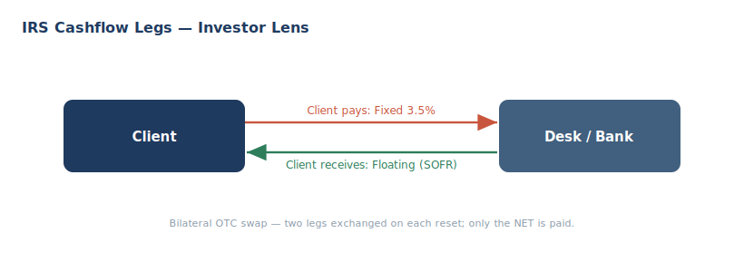

- **Pay-fixed / receive-floating client** is **short rates**: they pay a fixed rate and receive a floating rate that rises with the market. If rates rise, the floating leg they receive grows while the fixed leg they pay stays constant — the swap gains value for them. A company hedging a floating-rate loan typically takes this side, locking in a fixed cost.
- **Receive-fixed / pay-floating client** is **long rates**: they receive a fixed rate and pay a floating rate. If rates fall, the floating leg they pay shrinks while the fixed leg they receive stays constant — the swap gains value for them. A pension fund transforming fixed-rate assets to match floating liabilities, or a client expressing a view that rates will fall, takes this side.

The client's rate risk is measured by **DV01** — the change in the swap's mark-to-market value for a 1 basis point move in rates. The longer the tenor, the larger the DV01 and the more the position moves per basis point.

**Cashflows & scenarios**

On each payment date only the **net** difference between the two legs is exchanged. The notional is never paid — it is purely a reference figure for calculating each leg.

**Product:** 5-year IRS, $10 million notional. Company pays fixed 3.5%, receives floating SOFR. Payments are annual. (The company is therefore the pay-fixed / receive-floating, short-rates counterparty.)

- **Scenario 1 — Rates rise (SOFR goes to 5.0%):** Company pays $10M × 3.5% = $350,000; company receives $10M × 5.0% = $500,000. **Net: Company receives $150,000.** The swap is profitable — the company locked in at 3.5% when the market rate is now 5.0%.
- **Scenario 2 — Rates fall (SOFR drops to 2.0%):** Company pays $10M × 3.5% = $350,000; company receives $10M × 2.0% = $200,000. **Net: Company pays $150,000.** The swap costs money — the company is paying 3.5% when they could be paying only 2.0%. But if the company entered the swap to hedge a floating-rate loan, the lower loan cost offsets this.
- **Scenario 3 — Rates stay at 3.5%:** Company pays $350,000; company receives $350,000. **Net: zero.** The swap has no net cost. The company achieved certainty at no net cost.
- **Scenario 4 — Rates are volatile (alternate between 2% and 5%):** Some years the swap costs money, some years it saves money. Over time, the fixed rate represents the market's average expectation. The company has traded uncertainty for certainty.

**Risks to the client**

| Risk | Description | Severity |
|------|------------|:--------:|
| **Interest rate risk** | The core risk. If rates move against the position, the swap loses mark-to-market value for the client. | High |
| **Counterparty credit risk** | If the other party defaults, the client may not receive the payments owed to them. Mitigated by collateral agreements (CSA/ISDA). | Medium |
| **Basis risk** | The floating rate on the swap (SOFR) may not move exactly in line with the rate on the underlying obligation the client is hedging. | Low-Medium |
| **Liquidity risk** | Standard swaps are highly liquid. Non-standard tenors or currencies may be less liquid, widening the cost to unwind early. | Low |
| **Curve risk** | The swap's value depends on the entire yield curve, not just a single rate. Changes in the shape of the curve (steepening, flattening) affect valuation. | Medium |

#### §8. THE BANK LENS — Desk Economics (1st Line of Defence)

**What the desk books**

The desk takes the other side of the client's swap and books it as a two-leg trade (fixed leg + floating leg) in its rates book. Where the client pays fixed and receives floating, the desk receives fixed and pays floating — the mirror leg. No principal is booked, no option is embedded; the position is the present value of the remaining net cash flows. The desk does not want a directional rate view from a single client trade — it warehouses the resulting rate risk and hedges it down.

**Rate risk & hedging**

The desk's primary risk is **DV01** — the dollar value of a 1 basis point move in rates — measured tenor by tenor across the curve, not as a single number. A swap is a **linear** product: there is no equity-style gamma, no barrier, no discontinuity. The P&L changes proportionally with rate moves. The desk hedges the warehoused DV01 with **offsetting swaps, futures strips, or (for any optionality) swaptions**, and manages the residual **curve risk** — the exposure to the curve steepening or flattening across the many tenors the book spans. Concentration of DV01 at a particular tenor is the main risk-management concern.

**How the bank makes money**

| Revenue Component | Detail |
|------------------|--------|
| **Bid-offer spread** | Captures spread between buy and sell pricing |
| **Hedging P&L** | Profits from managing hedge portfolio (realized vs implied) |
| **Funding benefit** | Earns funding spread on collateral received under CSA |
| **Structuring fee** | Fee for custom features beyond vanilla terms |

**The desk spread decomposition:**

Unlike an ELN, an IRS has no coupon to decompose — the client pays no premium and there is no embedded option. The desk's economics come instead from the spread it charges around the mid-market swap rate, plus the funding benefit on CSA collateral. For a vanilla swap quoted at a 3.5% mid, the desk's gross spread can be decomposed roughly as: bid-offer spread (the markup around mid, the dominant component); hedging P&L (realized versus implied carry on the offsetting hedge); CSA funding benefit (the funding spread earned on collateral received); less the desk's own hedging and funding costs to run the position. The bid-offer and the CSA funding benefit are the two structural sources; the hedging P&L is the variable, market-dependent one.

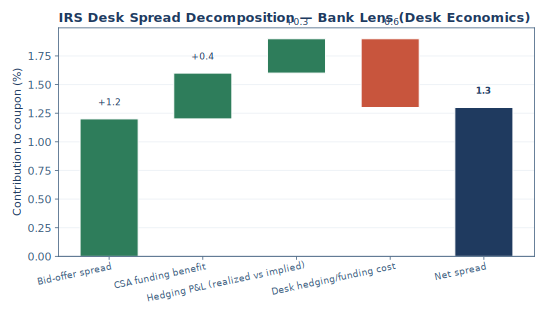

**P&L drivers**

Day to day, desk P&L is driven by moves in the yield curve against the warehoused DV01, the realized-versus-implied carry on the hedge portfolio, changes in the shape of the curve (steepening/flattening) against residual curve risk, and the funding spread earned on CSA collateral. Product Control attributes P&L daily and verifies swap valuations independently; curve construction methodology (which points on the curve are used and how they are interpolated) is the most common source of valuation differences.

#### §9. THE BANK LENS — Controls & Reconciliation (2nd Line of Defence)

**Booking & systems**

| Aspect | Detail |
|--------|--------|
| **Book of record** | Murex |
| **Pricing/Risk system** | Murex |
| **Booking structure** | Two-leg trade (fixed leg + floating leg) |
| **Four-leg framework?** | No (IRS is a standalone derivative, not a structured note) |
| **Key booking fields** | Notional, fixed rate, floating rate index (SOFR/EURIBOR), tenor, payment frequency, day-count convention, start date, end date, counterparty |
| **Payment schedule** | Regular payments (quarterly/semi-annually/annually) — net settlement on each date |
| **ISDA documentation** | Governed by ISDA Master Agreement and Credit Support Annex (CSA) |

**Reconciliation points**

| Recon point | What must agree | IRS-specific break |
|-------------|-----------------|--------------------|
| **ISDA / CSA terms** | Master Agreement and Credit Support Annex governing the trade — collateral eligibility, thresholds, netting set | Trade executed before ISDA/CSA is in place, or against the wrong netting set |
| **Trade economics** | Notional, fixed rate, floating index, tenor, payment frequency, start/end dates, counterparty | One system records $10M, another $10.5M after an amend; or wrong counterparty |
| **Reset / fixing source** | The floating-rate fixing — the benchmark, the fixing date convention, and the publishing source (e.g. SOFR published by the Federal Reserve Bank of New York) | System uses a different SOFR observation date than the contract (SOFR typically fixes T-2) |
| **Day-count / calendar** | Fixed-leg and floating-leg day-count conventions (e.g. 30/360 fixed, ACT/360 floating) and the payment calendar | A system applies the wrong convention to a leg, so the payment amount differs |
| **Leg PV reconciliation** | Present value of the fixed leg and the floating leg agree between front office and risk | Curve construction / interpolation differs, so leg PVs and total MTM diverge |
| **Payment netting** | On each date only the net of fixed and floating is exchanged | Gross payment sent instead of net, or netting applied to the wrong pair of legs |
| **Collateral (CSA)** | Daily MTM, margin call amount, and posted collateral agree with the counterparty | Counterparty disputes the MTM and the required collateral amount |
| **Novation / clearing** | If the trade is novated or cleared, the new counterparty / CCP and the trade record agree | Novation booked on one side only, or cleared trade not removed from the bilateral book |

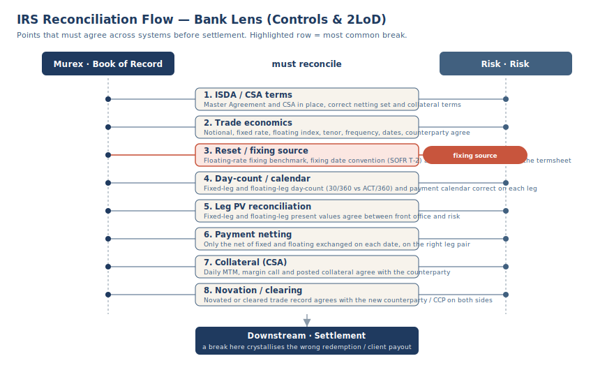

**Common breaks & red flags**

| Red Flag | What It Means | 2LoD Action |
|----------|---------------|-------------|
| Day count mismatch | Fixed leg uses 30/360, floating leg uses ACT/360 — this is normal and correct, but if one system applies the wrong convention, payments will differ | Verify conventions match the confirmation |
| Fixing date mismatch | System uses a different date for SOFR observation than specified in the contract | Check ISDA fixing conventions; SOFR typically fixes T-2 |
| Notional discrepancy | One system records $10M, another records $10.5M (e.g., after an amend) | Verify against trade confirmation |
| Collateral dispute | Counterparty disagrees on MTM and required collateral amount | Reconcile valuations; differences often stem from curve construction methodology |
| Accrued interest error | System calculates accrued interest using the wrong period | Verify start/end dates for the current accrual period |

**Control implication**

For an IRS the dominant controls are the **floating-rate fixing source**, the **reset / payment schedule**, and the **collateral (CSA) process** — together they determine whether each net payment and each daily margin call is correct. A wrong fixing source or fixing date misstates the floating leg, driving the wrong net payment to the wrong party. A reset or day-count error on either leg breaks the payment amount even when the rate is right. A CSA valuation difference — most often rooted in curve construction — breaks the daily collateral call, leaving the bank under- or over-collateralised against a live counterparty exposure. The reconciliation exists precisely to catch these inconsistencies before a payment settles or a margin call is made.

#### §10. Formal Definition

An **Interest Rate Swap (IRS)** is a derivative contract in which two parties agree to exchange interest rate payments on a specified notional amount for a defined period.

**Fixed leg:** One party pays a fixed rate (the "swap rate") on the notional, at regular intervals.

**Floating leg:** The other party pays a floating rate (typically SOFR, EURIBOR, or another benchmark rate) on the same notional, at the same intervals.

**Key terms:**
- **Notional:** The amount on which payments are calculated. It is never exchanged — it is a reference amount only.
- **Tenor:** The length of the swap (e.g., 5 years, 10 years, 30 years).
- **Payment frequency:** How often payments are exchanged (quarterly, semi-annually, annually).
- **Day count convention:** The method for calculating the exact fraction of a year for each period. ACT/360 divides the actual number of days by 360; 30/360 treats every month as exactly 30 days. Different conventions produce slightly different payment amounts on the same notional.
- **Netting:** On each payment date, only the difference between the two legs is exchanged. If the fixed payment is $350,000 and the floating payment is $500,000, the net payment is $150,000 from the floating payer to the fixed payer.

#### §11. Lifecycle

| Stage | Detail |
|-------|--------|
| **Trade date** | Terms agreed: notional, tenor, rate conventions, special features. ISDA documentation. Book in Murex — both legs entered with matching notional, dates, and conventions |
| **Effective date** | Swap becomes active. First accrual period begins |
| **Rate fixing** | Before each floating payment, the floating rate is "fixed" — observed and recorded from the benchmark source (e.g. SOFR published by the Federal Reserve Bank of New York) |
| **Periodic payments** | Scheduled cash flow exchanges on payment dates. Net settlement applied on each date |
| **Collateral management** | Under the CSA, the party with a negative mark-to-market posts collateral to the other party. Collateral amounts are recalculated daily |
| **Maturity** | Final net exchange of cash flows. Trade terminated. Collateral returned |

#### §12. Worked Example (both lenses)

**Product:** 3-year IRS. **Notional:** $50,000,000. **Company pays:** Fixed 3.0%. **Company receives:** Floating SOFR. **Payment frequency:** Annual. **Day count:** ACT/360 (floating), 30/360 (fixed). (The company is the pay-fixed / receive-floating, short-rates counterparty; the desk takes the receive-fixed / pay-floating side.)

| Year | SOFR (avg) | Fixed Payment | Floating Receipt | Net |
|:----:|:----------:|:------------:|:----------------:|----:|
| 1 | 2.5% | $1,500,000 | $1,250,000 | Company pays **$250,000** |
| 2 | 3.8% | $1,500,000 | $1,900,000 | Company receives **$400,000** |
| 3 | 4.5% | $1,500,000 | $2,250,000 | Company receives **$750,000** |

**3-year net result:** -$250,000 + $400,000 + $750,000 = **Company received $900,000 net** over three years.

*Client lens:*
The company locked in at 3.0% when rates averaged 3.6% over the period. The swap was profitable in hindsight — but its purpose was certainty, not speculation. Even if rates had fallen, the company would have had predictable costs. The pay-fixed position is short rates, so it gains as SOFR rises through Years 2 and 3.

*Bank lens:*
The desk holds the mirror position — receive-fixed, pay-floating — and is therefore long rates on this single trade, which it warehouses and hedges with offsetting swaps so the book's net DV01 stays within limit. Across the three years the desk pays the $900,000 net to the company, funded against its hedge P&L, the bid-offer earned at execution, and the CSA funding benefit on collateral. The 2nd line must confirm each year's floating fixing against the termsheet source, that each net amount (not gross) settled, and that the daily CSA collateral tracked the changing MTM as SOFR rose.

#### §13. Knowledge Check

1. **What is an interest rate swap? Describe it in one sentence.** *(Investor)*
2. **Why does no money change hands at inception?** What determines the fixed rate? *(Investor)*
3. **A company has a floating-rate loan and wants to fix its borrowing cost. What swap does it enter?** (Pay fixed, receive floating.) *(Investor)*
4. **If rates rise after entering a pay-fixed swap, does the swap gain or lose value for the fixed payer?** Why? *(Investor)*
5. **What is the notional of a swap? Is it exchanged?** *(Investor)*
6. **What is netting, and why is it important for swap cash flows?** *(Investor)*
7. **Explain counterparty credit risk in a swap and how it is mitigated.** *(Investor)*
8. **(Desk economics / 1LoD)** When a client enters a pay-fixed swap, what position does the desk take, what is its dominant rate Greek, and how does the desk hedge the warehoused risk? Where does the desk's spread come from given there is no coupon to decompose?
9. **(Controls / 2LoD)** Name three reconciliation breaks specific to an IRS — covering the floating fixing, the legs, and collateral — and the consequence of each for the net payment or the margin call.

**Mental Models**

| Concept | Mental Model |
|---------|-------------|
| Interest Rate Swap | Two farmers exchanging crops — each gets what they want without changing their farm |
| Fixed payer | Wants certainty — locks in a known cost; short rates, gains if rates rise |
| Floating receiver | Profits if rates rise above the fixed rate |
| Notional | A reference number — like a ruler used to measure, never exchanged |
| Zero initial value | The swap is a fair bet at inception — both sides agree the expected value is equal |
| Netting | Only the difference is exchanged — like settling poker debts at the end of the night |
| DV01 | The desk's speedometer for rate risk — dollars of P&L per 1 basis point move, summed across the curve |
| CSA collateral | The daily deposit each side posts so neither is over-exposed if the other defaults |

**Key Takeaways**

1. An IRS exchanges fixed interest payments for floating interest payments on a notional amount.
2. No principal is exchanged — the notional is a reference for calculating payments.
3. At inception, the swap has zero value. Value develops as rates diverge from the fixed rate.
4. The swap is a linear instrument — no barriers, no knock-ins, no optionality; the client's position is set purely by which leg they pay and which they receive (pay-fixed = short rates, receive-fixed = long rates).
5. IRS is the most liquid derivative in the world. It is the foundation for all structured rate products (SRT, STEG).
6. The desk takes the mirror legs, warehouses the rate risk, and manages it by DV01 and curve risk — earning the bid-offer and the CSA funding benefit rather than a coupon spread.
7. Swaps are booked in Murex and governed by ISDA Master Agreements.
8. For the 2nd line, the dominant control risks are the floating-rate fixing source, the reset/day-count schedule, leg PV reconciliation, payment netting, and CSA collateral — each can misstate a net payment or a daily margin call.

#### §14. Common Mistakes

1. **Thinking the notional is exchanged.** It is not. The notional is only a reference for calculating payments.
2. **Confusing "pay fixed" with "pay a premium."** There is no upfront cost to enter a swap. "Pay fixed" means the client makes regular fixed payments and receives regular floating payments.
3. **Thinking the fixed rate is set by the bank.** The fixed rate (swap rate) is determined by the market — it reflects the market's expectation of where floating rates will average over the life of the swap.
4. **Ignoring the difference between hedging and speculation.** A company hedging a floating-rate loan with a pay-fixed swap is reducing risk. A hedge fund entering the same swap without an underlying exposure is speculating on rates.
5. **Forgetting about basis risk.** If the client's floating-rate loan is based on a different rate than the swap's floating leg (e.g., loan based on prime rate, swap based on SOFR), the hedge is imperfect.
6. **(Controls) Trusting a single system's floating fixing or curve.** Because the floating leg depends on the fixing source and date, and the MTM depends on curve construction, the 2nd line must reconcile the fixing against the termsheet and the leg PVs across systems rather than assume they agree.
### Knowledge Check

**Review Questions:**
1. What are the two legs of an interest rate swap?
2. Why does the swap have zero value at inception?
3. What is the notional, and is it ever exchanged?
4. What happens to the value of a pay-fixed swap if interest rates rise?
5. How does a company use an IRS to convert a floating-rate loan to a fixed-rate obligation?


**Dual-lens questions:**
- *(Desk economics / 1LoD)* Which side of the swap does the desk take, and what is its primary risk (rate/curve/financing) and how is it hedged?
- *(Controls / 2LoD)* Which leg/fixing/collateral fields must reconcile across systems for this swap, and which is the most common break?
**Scenario Questions:**
1. A pension fund has fixed-rate bond investments and floating-rate liabilities. What swap should it enter to reduce its mismatch, and why?
2. The 5-year swap rate is 3.5%. SOFR is currently 2.8%. Does this mean the fixed payer is overpaying? Explain.
3. A counterparty on a swap defaults when the swap has a positive mark-to-market value of $2 million for your bank. What happens? How does the CSA help?

**Desk Question:**
A trader notices that the 5-year swap rate has moved from 3.5% to 3.8% over the past week, but the 2-year swap rate has moved from 3.0% to 3.1%. What does this tell you about the market's view of future rates? How does this affect the bank's STEG products?

### Visual Learning Recommendations

1. **Two-party flow diagram** — Fixed payer ↔ Floating payer, with arrows showing payment directions
2. **Cash flow timeline** — 5-year swap with annual payments, showing fixed amounts and variable floating amounts
3. **Swap valuation chart** — How mark-to-market value changes as rates move up/down from inception
4. **Yield curve overlay** — Showing how the swap rate relates to the spot curve
5. **Netting example** — Table showing fixed payment, floating payment, and net transfer on each date

### Dependency References

| Concept Used | Where It Was Taught |
|-------------|-------------------|
| Interest, interest rates | [Section 0.5](#sec-0-5) (What Is Interest?) |
| Yield curves, spot rates, forward rates | [Section 1.7](#sec-1-7) (Yield Curves) |
| SOFR, EURIBOR, benchmark rates | [Section 1.8](#sec-1-8) (Benchmark Rates) |
| Swap concept, CMS rates | [Section 1.8](#sec-1-8) (Swaps introduction) |
| Murex booking | [Section 2.8](#sec-2-8) (Systems Primer) |

---


#### Visual Specifications

**Visual 1: Interest Rate Swap Cash Flow Diagram**
- **Asset filename:** flow_irs_cash_flows_01.svg
- **Caption:** "Interest Rate Swap Cash Flow Diagram"
- **Diagram elements:** Bilateral flow diagram showing periodic exchanges between two counterparties. Fixed vs floating legs clearly labelled. Payment dates marked on timeline
- **Reuse status:** Adapt from swap flow template
**Visual 2: Interest Rate Swap Component Structure**
- **Asset filename:** construction_irs_components_02.svg
- **Caption:** "Interest Rate Swap Component Structure"
- **Diagram elements:** Decomposition showing building blocks. Each component in separate box with arrows showing how they combine
- **Reuse status:** Adapt from construction template
**Visual 3: Interest Rate Swap Lifecycle Timeline**
- **Asset filename:** lifecycle_irs_timeline_03.svg
- **Caption:** "Interest Rate Swap Lifecycle Timeline"
- **Diagram elements:** Horizontal timeline from effective date to maturity. Key events marked: trade date, effective, payment dates, maturity
- **Reuse status:** Adapt from lifecycle template
**Visual 4: Interest Rate Swap Risk Heatmap**
- **Asset filename:** risk_irs_heatmap_04.svg
- **Caption:** "Interest Rate Swap Risk Heatmap"
- **Diagram elements:** Grid: risk types (market, credit, liquidity, operational) vs severity. Colour-coded cells appropriate for Interest Rate Swap
- **Reuse status:** Adapt from risk heatmap template
**Visual 5: Interest Rate Swap vs Vanilla Alternative**
- **Asset filename:** comparison_irs_vs_vanilla_05.svg
- **Caption:** "Interest Rate Swap vs Vanilla Alternative"
- **Diagram elements:** Side-by-side comparison showing key differences from vanilla swap. Highlight unique features
- **Reuse status:** New — comparison panel
**Visual 6: Interest Rate Swap Scenario Analysis**
- **Asset filename:** scenario_irs_rate_paths_06.svg
- **Caption:** "Interest Rate Swap Scenario Analysis"
- **Diagram elements:** Three rate path scenarios (rates up, stable, down) showing P&L impact. Clearly labelled outcomes
- **Reuse status:** Adapt from scenario template


**Dual-lens visuals (generated):**
- `assets/irs/controls_irs_recon_08.svg` `[generated]`
- `assets/irs/legs_irs_01.svg` `[generated]`
- `assets/irs/waterfall_irs_09.svg` `[generated]`
#### Dependency References

| Concept Used | Where It Was Taught |
|-------------|-------------------|
| Interest rate risk | [Section 1.8](#sec-1-8) (Interest Rate Risk) |
| Yield curve mechanics | [Section 1.7](#sec-1-7) (Yield Curves) |
| Product decomposition | [Section 2.2](#sec-2-2) (Product Construction) |
| XCCY | 5.2.6 — cross-currency |
| IR Callable | 5.3.1 — callable variant |
| VLSP | 5.2.8 — vanilla swap plus |
### 5.2.2 Total Return Swap (TRS) {#sec-5-2-2}

> **Prerequisites:** [IRS](#sec-5-2-1) &nbsp;|&nbsp; **Key concepts:** Total return, synthetic ownership, funding spread

---

*The IRS ([Section 5.2.1](#sec-5-2-1)) exchanged fixed interest payments for floating interest payments — both parties exchanged interest, nothing more. The Total Return Swap goes further: one party pays the entire economic return on a reference asset (capital gains plus income), while the other pays a financing rate. The TRS gives the client synthetic ownership — all the economics of holding an asset without ever buying it. This chapter reads the product through two lenses: what it means for **the client** (the total-return receiver), and what it means for **the bank** — the latter split into the desk's market economics (1st line of defence) and the controls and reconciliation that surround it (2nd line of defence).*

#### §1. Explain Like I'm New

Dmitri manages a $2 billion hedge fund specializing in equity strategies. He wants exposure to a portfolio of European bank stocks but faces three problems: buying the shares would consume capital he needs for margin on other positions, cross-border settlement is complex, and his fund structure cannot hold certain foreign securities directly.

A **Total Return Swap** solves all three problems. Dmitri enters a TRS with a bank. The bank agrees to pay Dmitri the total return on the European bank portfolio — every percentage point of price movement and every dividend. In exchange, Dmitri pays the bank a financing rate (SOFR + 0.50% per year). No shares change hands. No settlement infrastructure is needed. Dmitri gets 100% of the economic exposure without owning a single share.

If the portfolio rises 15%, the bank pays Dmitri 15% of the notional. If the portfolio falls 10%, Dmitri pays the bank 10% plus the financing cost. The TRS gives Dmitri exactly the returns of ownership — and exactly the risks.

There is no note, no barrier, and no embedded option in a TRS. It is a bilateral OTC swap: the total-return receiver (the client) gets the asset's total return; the total-return payer (the bank) pays that and receives the funding leg in exchange.

#### §2. Real-World Analogy

A Total Return Swap is like renting a car on a long-term lease with full economic exposure.

The lessee pays a monthly rental fee (the financing rate) to the car dealership. In exchange, the lessee gets all the benefits of the car: they drive it, use it, benefit from it. If the car appreciates (a classic car that gains value), the lessee benefits at the end of the lease. If the car depreciates (normal wear), the lessee bears the cost.

The lessee never owns the car. The lessee never took out a loan to buy it. But economically, the lessee experienced everything an owner would — the appreciation, the depreciation, the running costs. The rental fee is the price paid for this synthetic ownership.

A TRS works identically: the total-return receiver (the client) gets all the economics of asset ownership (price changes + income) while paying a rental fee (financing rate). The total-return payer (the bank) holds the actual asset and passes through its returns.

#### §3. What Problem Does This Solve?

The TRS addresses the **synthetic exposure** need:

| Client Need | How the TRS Delivers |
|------------|---------------------|
| Asset exposure without ownership | Provides full economic return without buying the asset |
| Capital efficiency | No upfront purchase price — only the financing spread and margin |
| Regulatory or structural barriers | Access restricted markets, securities, or asset classes through a swap |
| Balance sheet optimization | Assets stay off the client's balance sheet |

When a client cannot, should not, or prefers not to buy an asset outright — because of capital constraints, cross-border settlement complexity, or fund-structure restrictions — the TRS still lets them capture its full return stream through a swap.

#### §4. Product DNA

| Field | Value |
|-------|-------|
| **Full Name** | Total Return Swap |
| **Abbreviation** | TRS |
| **Family** | Swaps |
| **Complexity Score** | 5 / 10 |
| **Complexity Rationale** | Exchange total return of reference asset for funding rate. Synthetic asset ownership without balance sheet impact |
| **Underlying Asset Class** | Multi-asset (equity, credit, loans) |
| **Capital Protection** | N/A (swap — unfunded or partially funded) |
| **Coupon Type** | Total return (price + income) vs funding rate |
| **Maturity** | 1-5 years |
| **Liquidity** | OTC (bilateral) |
| **Primary System** | Murex |
| **ISDA Required** | Yes — ISDA |

**DNA Atlas Fields:**
- Primary Risk: Full market risk of reference asset. Counterparty risk. Funding spread can change. Mark-to-market volatility
- Typical Buyer: Hedge funds (leveraged exposure), banks (regulatory capital management), institutions (synthetic access)
- Typical Use Case: Synthetic exposure to assets without owning them. Off-balance-sheet. Leverage. Access to illiquid markets
- Building Blocks: Total return leg (reference asset P&L) vs funding leg (SOFR + spread)
- Key Hedge: Hedge reference asset directly or via proxy
- Similar Products: Equity Swap (5.2.3 — equity-specific), CDS (5.2.5 — credit protection), Variance Swap (5.2.4 — vol exposure)
- Most Important Greek: Delta (reference asset sensitivity)

**Comparison Matrix Fields:**
- Complexity: 5
- Yield Potential: Market return of reference asset minus funding cost
- Capital Protection: N/A (swap)
- Credit Exposure: Counterparty (bilateral)
- Liquidity: OTC
- Path Dependency: No
- Volatility Sensitivity: Depends on reference asset
- Correlation Sensitivity: None unless basket
- Client Type: Hedge funds, Banks, Institutional
- Market Environment: Used for synthetic access, leverage, and regulatory arbitrage

#### §5. Who Touches This Product

| Role | Responsibility |
|------|---------------|
| **Structurer** | Designs Total Return Swap terms: notional, tenor, fixing conventions, special features |
| **Trader** | Manages Total Return Swap book. Delta-hedges primary risk. Manages portfolio Greeks |
| **Sales** | Presents Total Return Swap to clients for hedging or investment. Explains risk-return trade-off |
| **Risk Management** | Monitors counterparty exposure, MTM limits, Greek limits. Stress-tests Total Return Swap portfolio |
| **Product Control** | Daily P&L attribution for Total Return Swap book. Independent price verification |
| **Operations** | Confirms trade details (ISDA). Processes periodic payments. Manages collateral (CSA) |
| **Legal / Compliance** | ISDA Master Agreement and CSA negotiation. Trade reporting. Regulatory compliance |
| **Quantitative Analytics** | Prices Total Return Swap and calibrates models. Develops risk analytics and sensitivities |

#### §6. Product Evolution

| Stage | Product | What Was Added | Why |
|:-----:|---------|---------------|-----|
| 1 | Loan / deposit | — (baseline) | Simple lending/borrowing relationship |
| 2 | Interest rate swap | Periodic cash flow exchange | Transform rate exposure between fixed and floating |
| 3 | Total Return Swap | Total-return leg added | Extended swap concept: exchange total return of reference asset for funding rate. Synthetic asset ownership without balance sheet impact |

---

#### §7. THE INVESTOR LENS

**Why the client enters it**

1. **Leverage.** A $100M TRS requires only margin (e.g. $10M), not the full $100M purchase price. The client controls a large notional with a small capital outlay.
2. **Market access.** The client accesses assets that are difficult to buy directly — foreign securities, restricted shares, illiquid bonds.
3. **Balance sheet treatment.** The reference asset does not appear on the client's balance sheet, which may carry regulatory or accounting advantages.
4. **Operational simplicity.** No custody, no settlement, no corporate-action processing — the bank handles all of it.
5. **Short exposure.** A TRS can be structured so the client takes the total-return *payer* side — paying the asset's return and profiting from a decline — rather than the receiver side.

**Legs & position**

The client is the **total-return receiver**: the client **receives** the total return on the reference asset (price change + income) and **pays** the funding leg (SOFR + spread). Net, the client holds synthetic, leveraged long exposure to the reference asset — all the economics of ownership without legal ownership, no shares, no note, no embedded option. (A TRS can also be entered the other way, with the client paying total return to take synthetic short exposure; the receiver direction is the standard client case below.)

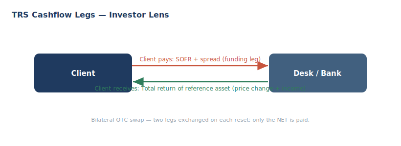

**Cashflows & scenarios**

**Product:** 1-year TRS on a stock portfolio. **Notional:** $50,000,000. **Client receives:** total return on portfolio (price change + dividends). **Client pays:** SOFR + 0.50% (assume SOFR = 4.5%, so 5.0% total).

- **Scenario 1 — Portfolio rises 12%, pays 2% dividends:** Client receives $50M × (12% + 2%) = $7,000,000. Client pays $50M × 5.0% = $2,500,000. **Net: client receives $4,500,000.** Leveraged profit.
- **Scenario 2 — Portfolio flat, pays 2% dividends:** Client receives $50M × 2% = $1,000,000. Client pays $2,500,000. **Net: client pays $1,500,000.** Dividends do not cover the financing cost.
- **Scenario 3 — Portfolio falls 8%, pays 2% dividends:** Client receives $50M × (−8% + 2%) = −$3,000,000 net return. Client also pays $2,500,000 financing. **Net: client pays $5,500,000.** Leverage amplifies losses.
- **Scenario 4 — Portfolio rises 25%:** Client receives $50M × 25% = $12,500,000. Client pays $2,500,000. **Net: client receives $10,000,000.** The TRS delivered $10M profit on margin of ~$5M — a 200% return on capital deployed.

The break-even point is where the asset's total return equals the financing rate. Below that point, the receiver loses money; the financing cost shifts the break-even to the right.

**Risks to the client**

| Risk | Description | Severity |
|------|------------|:--------:|
| **Market risk** | Full exposure to reference asset price movements, amplified by leverage | High |
| **Financing cost risk** | If SOFR rises, the financing leg becomes more expensive | Medium |
| **Counterparty risk** | If the bank defaults, the client may not receive owed total return payments | Medium |
| **Leverage risk** | Small asset declines create large percentage losses on the margin deployed | High |
| **Liquidity risk** | Unwinding a TRS before maturity may involve a wide bid-offer spread | Medium |
| **Dividend/income risk** | If expected dividends are cut, the total return is lower than anticipated | Low-Medium |

#### §8. THE BANK LENS — Desk Economics (1st Line of Defence)

**What the desk books**

The desk is the other side of the swap: the **total-return payer**. The desk **pays** the total return on the reference asset to the client and **receives** the funding leg (SOFR + spread). To neutralise the market risk it has taken on, the desk typically **holds the physical reference asset** (or borrows it) as a hedge, so the appreciation and income it owes the client are matched by what the held asset throws off. Holding the asset is a hedging choice, not a structural requirement, but it is the standard play.

**Risk & hedging**

The TRS has a **linear payoff** — no barriers, no knock-ins, no discontinuities. The desk's primary risk is delta on the reference asset, which it hedges by holding (or borrowing) the asset directly or via a proxy. Because the desk is long the asset against a short-total-return obligation, day-to-day market moves on the asset are largely offset; residual risks are financing cost, dividend timing, and corporate actions on the reference asset. The desk must fund the asset position, and its profitability turns on funding cheaply relative to the spread it charges. Risk management monitors concentrated counterparty exposure, because a large leveraged book creates significant credit exposure if a client cannot meet margin calls during a market decline.

**How the bank makes money**

| Revenue Component | Detail |
|------------------|--------|
| **Financing spread** | The spread above SOFR (e.g. +50bp) is the bank's primary income — compensation for funding the asset |
| **Bid-offer spread** | The bank earns the spread on entering and unwinding the swap |
| **Funding benefit** | Earns a funding benefit on collateral received under the CSA |
| **Delta-hedging P&L** | The bank holds the reference asset to hedge, and may earn carry or lending fees |

The financing spread is the core of the trade. A bank that can fund cheaply profits more from that spread. The structurer sets the spread based on the bank's funding cost, the credit quality of the client, and the liquidity of the reference asset — more liquid assets command tighter spreads.

**The financing-spread decomposition:**

The gross spread the client pays above the benchmark is built up from the bank's funding cost, the credit/financing charge on the client, the asset-financing and lending economics, and the desk margin that is left over. For an illustrative +50bp gross spread: the bank's funding/FTP cost consumes part of it, a counterparty credit/financing charge takes another part, asset-lending carry can add back a small benefit, and the residual is desk margin. (The source does not break out these component values numerically; the decomposition below is an inferred, illustrative split of the +50bp spread, not a sourced figure.)

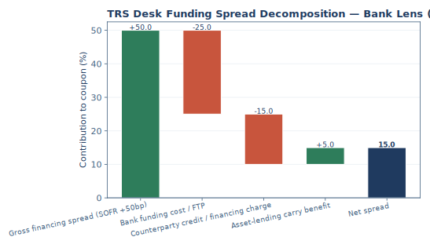

**P&L drivers**

Day to day, desk P&L is driven by the financing spread accrual, the bank's realised funding cost versus the charged spread, dividend timing on the reference asset, and the mark-to-market of the reference-asset hedge versus the total-return leg owed to the client. Product Control runs daily P&L attribution for the book and performs independent price verification, verifying the total-return calculation on each reset (price change + income events).

#### §9. THE BANK LENS — Controls & Reconciliation (2nd Line of Defence)

**Booking & systems**

| Aspect | Detail |
|--------|--------|
| **Booking system** | Murex |
| **Pricing system** | Murex |
| **Four-leg framework?** | No |
| **Product type** | Total Return Swap |
| **Key booking fields** | Notional, reference asset, financing spread, reset frequency, start/end dates, counterparty |
| **Payment schedule** | Periodic resets (monthly or quarterly): net total return versus financing |
| **ISDA documentation** | Governed by ISDA Master Agreement and CSA. TRS-specific terms under ISDA Equity Definitions |

**Reconciliation points**

| Recon point | What must agree | TRS-specific break |
|-------------|-----------------|--------------------|
| **ISDA / CSA** | ISDA Master Agreement and CSA in place and terms captured before trading | Trade booked before the CSA is executed → uncollateralised exposure |
| **Reset / valuation dates** | Reset and valuation dates in the system match the confirmation | System resets on a different date than the contract specifies |
| **Reference-asset price source** | Reference asset price from the contractual exchange, source, and fixing time | Price taken from a different exchange or time zone than specified |
| **Dividend / income pass-through** | All income (dividends, coupons) is captured in the total-return calculation | Dividend not included → total return understated to the receiver |
| **Leg PV** | PV of the total-return leg and the financing leg reconcile to the trade MTM | Stale price or wrong notional misstates one leg's PV |
| **Netting** | Net of total-return leg versus financing leg settles correctly each reset | Legs settled gross or on the wrong sign |
| **Financing accrual** | Financing applied to the current live notional and correct day-count | Notional adjusted on a partial unwind but the system still accrues on the original |
| **Collateral** | Variation/initial margin posted matches the mark-to-market under the CSA | Margin call sized off a stale MTM |

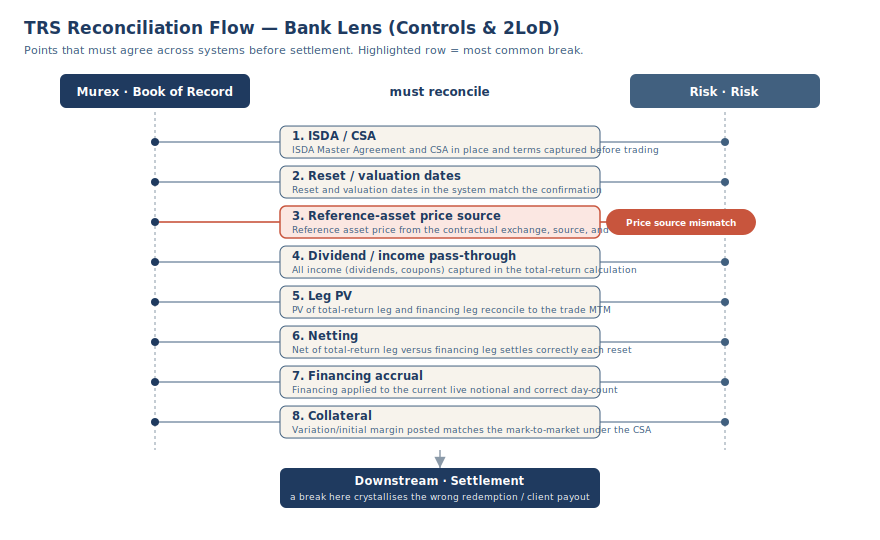

**Common breaks & red flags**

| Red Flag | What It Means | 2LoD Action |
|----------|---------------|-------------|
| **Dividend not included in total return** | Total return must include income (dividends/coupons), not just price change | Verify that all income events are captured in the total-return calculation |
| **Financing rate on wrong notional** | The notional has been adjusted (e.g. partial unwind) but the system still uses the original notional | Verify current notional matches the live trade |
| **Price source mismatch** | Reference asset price from a different exchange or time zone than specified | Use the contractual price source and fixing time |
| **Reset date misalignment** | System resets on a different date than the contract specifies | Verify reset dates match the confirmation |
| **Corporate action adjustment missed** | A stock split changes the reference price but the system does not adjust | Monitor corporate actions and apply adjustments per ISDA rules |

**Control implication**

Each break has a direct consequence the 2nd line must size before it reaches the books or the client. A wrong **reference-asset price source** misstates the total-return leg on both the reset payment and the MTM — the receiver is paid the wrong amount. A missed **dividend pass-through** silently understates the total return owed to the client, since income is part of the contractual return, not just price change. A **collateral** call sized off a stale mark leaves the bank under-collateralised against a leveraged counterparty exactly when the market is moving against the client. The reconciliation exists precisely to catch these inconsistencies before settlement crystallises them.

#### §10. Formal Definition

A **Total Return Swap (TRS)** is a derivative contract in which:

**Total return leg:** One party (the total-return payer, typically the bank) pays the total economic return on a reference asset — comprising capital appreciation (or depreciation) and any income (dividends, coupons).

**Financing leg:** The other party (the total-return receiver, typically the client) pays a financing rate, usually a benchmark rate (SOFR/EURIBOR) plus a spread.

**Key terms:**
- **Reference asset:** The asset whose returns are swapped (stock, index, bond, loan, or portfolio)
- **Notional:** The amount on which returns and financing are calculated
- **Reset frequency:** How often the total return is calculated and settled (monthly, quarterly)
- **Financing spread:** The bank's spread above the benchmark rate

If the reference asset declines, the total-return receiver pays the bank the depreciation amount plus the financing rate. Value at inception is near zero, like an IRS: the financing spread is set so that the expected total return equals the financing cost.

#### §11. Lifecycle

| Stage | Detail |
|-------|--------|
| **Trade date** | Terms agreed: notional, tenor, rate conventions, special features. Book in Murex; record reference asset, notional, financing spread, reset schedule. ISDA documentation |
| **Effective date** | Swap becomes active. First accrual period begins |
| **Each reset date** | Calculate total return on reference asset (price change + accrued dividends). Calculate financing amount. Net settle |
| **Margin management** | Client posts initial margin and variation margin based on mark-to-market |
| **Corporate actions** | Dividends, splits, and mergers on the reference asset are passed through to the total-return receiver |
| **Maturity / termination** | Final reset and settlement. Any open total return is settled. Collateral returned |

#### §12. Worked Example (both lenses)

**Product:** 1-year TRS on the S&P 500 Total Return Index. **Notional:** $100,000,000. **Client receives:** total return on S&P 500 TR. **Client pays:** SOFR + 0.40% (assume SOFR = 4.5%, so 4.9% total). **Reset:** quarterly.

| Quarter | S&P 500 TR Return | Total Return Received | Financing Paid | Net |
|:-------:|:-----------------:|:--------------------:|:--------------:|----:|
| Q1 | +4.0% | $4,000,000 | $1,225,000 | Client receives **$2,775,000** |
| Q2 | −2.0% | −$2,000,000 | $1,225,000 | Client pays **$3,225,000** |
| Q3 | +5.0% | $5,000,000 | $1,225,000 | Client receives **$3,775,000** |
| Q4 | +3.0% | $3,000,000 | $1,225,000 | Client receives **$1,775,000** |

*Client lens:*
**Annual total return:** +10.0%. Client received: $10,000,000 total return − $4,900,000 financing = **$5,100,000 net.** If the client posted $10M margin, the return on capital deployed was 51%.

*Bank lens:*
The desk pays the +10.0% total return ($10,000,000) to the client and receives $4,900,000 of financing, the net of which is matched by the appreciation and income on the reference asset it holds as a hedge — leaving the desk its financing spread and net hedging carry rather than asset risk. Product Control verifies each quarterly reset (price change + income) and reconciles the index performance between Murex and market data, while the 2nd line confirms the leg PVs net correctly, the financing accrues on the live $100,000,000 notional, and collateral matches the mark before each settlement.

#### §13. Knowledge Check

1. **What is the difference between a TRS and an IRS?**
2. **Why would a hedge fund use a TRS instead of buying the asset directly?**
3. **What components make up the "total return" in a TRS?**
4. **If the reference asset declines, who pays whom?**
5. **Explain how leverage works in a TRS and why it amplifies both gains and losses.**
6. **Draw the receiver's P&L as a function of the reference-asset return, marking the break-even where total return equals the financing cost.**
7. **(Desk economics / 1LoD)** What position does the desk hold against the client, how does it hedge it, and where does its margin come from given that the asset moves are largely offset?
8. **(Controls / 2LoD)** Name three reconciliation breaks specific to a TRS and the consequence of each for the client's reset payment or the bank's collateral.

**Mental Models**

| Concept | Mental Model |
|---------|-------------|
| Total Return Swap | Car rental — the client gets all the benefits and costs of driving, but never owns the car |
| Financing rate | The rental fee — the cost of synthetic ownership |
| Total return | Everything the car delivers: appreciation, depreciation, and fuel savings (income) |
| Leverage | A small rental deposit controls a large asset |
| Counterparty risk | If the rental company goes bankrupt, the "lease" may be worthless |
| 2LoD reconciliation | The lease auditor — confirms the mileage, the fee, and the deposit all match the contract before any money moves |

**Key Takeaways**

1. A TRS provides the full economic return of an asset (price change + income) without ownership.
2. The total-return receiver (the client) pays a financing rate (SOFR + spread) for this synthetic exposure.
3. Leverage amplifies both gains and losses — a 10% asset move can create a much larger return on margin deployed.
4. TRS is widely used by hedge funds, prime brokerage clients, and institutions seeking balance sheet efficiency.
5. TRS is booked in Murex, governed by ISDA, and requires careful management of margin, resets, and corporate actions.
6. The bank holds the asset as a hedge and earns the financing spread; its dominant exposure is counterparty risk on the client, not asset risk.
7. For the 2nd line, the dominant control risks are the reference-asset price source, dividend pass-through, financing accrual on the live notional, and collateral adequacy — each can misstate a reset payment or leave the bank under-collateralised.

#### §14. Common Mistakes

1. **Forgetting that total return includes income.** Price change alone is not total return. Dividends, coupons, and other income must be included.
2. **Ignoring financing costs.** The asset must return more than the financing rate for the receiver to profit. In a flat market, the financing cost is a pure loss.
3. **Underestimating leverage.** A $100M TRS on $10M margin means a 10% asset decline wipes out 100% of the margin. Leverage cuts both ways.
4. **Assuming the bank bears the asset risk.** The bank holds the asset as a hedge but passes all economic returns and losses to the total-return receiver. The bank's risk is counterparty risk on the client, not asset risk.
5. **Conflating TRS with equity swap.** An equity swap is a specific type of TRS where the reference asset is equity. A TRS can reference bonds, loans, indices, or portfolios — it is the broader category.
6. **(Controls) Trusting the booked notional after a partial unwind.** Because financing accrues on the live notional, the 2nd line must confirm the system uses the adjusted notional rather than the original before relying on the financing amount.
### Knowledge Check

**Review Questions:**
1. What two legs make up a Total Return Swap?
2. What is included in "total return" beyond price change?
3. Why does no upfront payment change hands at inception?
4. How does a TRS provide leverage?
5. What booking system is used for TRS?


**Dual-lens questions:**
- *(Desk economics / 1LoD)* Which side of the swap does the desk take, and what is its primary risk (rate/curve/financing) and how is it hedged?
- *(Controls / 2LoD)* Which leg/fixing/collateral fields must reconcile across systems for this swap, and which is the most common break?
**Scenario Questions:**
1. A client enters a $200M TRS on a bond portfolio. The portfolio declines 5% and pays 3% income. The financing rate is 5.2%. Calculate the client's net P&L for the period.
2. A hedge fund uses a TRS to gain $500M equity exposure with $50M margin. The reference index rises 8%. Calculate the return on margin. What happens if the index falls 12% instead?
3. A bank holds the reference asset as a hedge for a TRS. The reference company announces a special dividend of 5%. How does this affect the TRS cash flows?

**Desk Question:**
A prime brokerage client has a $300M TRS on a concentrated portfolio of 5 tech stocks. One stock drops 40% after an earnings miss, causing the portfolio to decline 12%. The client's margin is $30M. Walk through the margin call process, the risk to the bank, and what happens if the client cannot post additional margin.

### Visual Specifications

| Visual ID | Type | Priority | Purpose | Caption | Location | Reuse |
|-----------|------|:--------:|---------|---------|----------|:-----:|
| FLOW_TRS_01 | Cash Flow Diagram | P1 | Show the two-way flow: total return versus financing rate | Total Return Swap: payment flows between receiver and payer | §7 | High |
| PAYOFF_TRS_01 | Payoff Diagram | P1 | Show linear payoff with break-even point shifted by financing cost | TRS receiver P&L as a function of reference asset return | §8 | High |
| TIMELINE_TRS_01 | Timeline | P1 | Show quarterly resets with total return and financing amounts | TRS lifecycle: quarterly reset and settlement timeline | §12 | Medium |
| COMPARE_TRS_01 | Comparison Chart | P2 | Compare TRS economics with direct asset purchase and IRS | TRS vs direct ownership vs IRS: structural comparison | §3 | Medium |
| LIFECYCLE_TRS_01 | Lifecycle Diagram | P2 | Show margin posting, resets, corporate actions, and maturity | TRS operational lifecycle from trade to maturity | §10 | Medium |

### Dependency References

| Concept Used | Where It Was Taught |
|-------------|-------------------|
| Swap structure, netting, notional | [Section 5.2.1](#sec-5-2-1) (IRS) |
| Interest rates, SOFR, EURIBOR | [Section 1.8](#sec-1-8) (Benchmark Rates) |
| Derivatives concept | [Section 0.8](#sec-0-8) (What Is a Derivative?) |
| Counterparty risk, ISDA/CSA | [Section 5.2.1](#sec-5-2-1) (IRS), [Section 1.9](#sec-1-9) (Credit Risk) |
| Delta hedging | [Section 2.7](#sec-2-7) (How Desks Hedge) |
| Murex booking | [Section 2.8](#sec-2-8) (Systems Primer) |

---


#### Visual Specifications

**Visual 1: Total Return Swap Cash Flow Diagram**
- **Asset filename:** flow_trs_cash_flows_01.svg
- **Caption:** "Total Return Swap Cash Flow Diagram"
- **Diagram elements:** Bilateral flow diagram showing periodic exchanges between two counterparties. Fixed vs floating legs clearly labelled. Payment dates marked on timeline
- **Reuse status:** Adapt from swap flow template
**Visual 2: Total Return Swap Component Structure**
- **Asset filename:** construction_trs_components_02.svg
- **Caption:** "Total Return Swap Component Structure"
- **Diagram elements:** Decomposition showing building blocks. Each component in separate box with arrows showing how they combine
- **Reuse status:** Adapt from construction template
**Visual 3: Total Return Swap Lifecycle Timeline**
- **Asset filename:** lifecycle_trs_timeline_03.svg
- **Caption:** "Total Return Swap Lifecycle Timeline"
- **Diagram elements:** Horizontal timeline from effective date to maturity. Key events marked: trade date, effective, payment dates, maturity
- **Reuse status:** Adapt from lifecycle template
**Visual 4: Total Return Swap Risk Heatmap**
- **Asset filename:** risk_trs_heatmap_04.svg
- **Caption:** "Total Return Swap Risk Heatmap"
- **Diagram elements:** Grid: risk types (market, credit, liquidity, operational) vs severity. Colour-coded cells appropriate for Total Return Swap
- **Reuse status:** Adapt from risk heatmap template
**Visual 5: Total Return Swap vs Vanilla Alternative**
- **Asset filename:** comparison_trs_vs_vanilla_05.svg
- **Caption:** "Total Return Swap vs Vanilla Alternative"
- **Diagram elements:** Side-by-side comparison showing key differences from vanilla swap. Highlight unique features
- **Reuse status:** New — comparison panel
**Visual 6: Total Return Swap Scenario Analysis**
- **Asset filename:** scenario_trs_rate_paths_06.svg
- **Caption:** "Total Return Swap Scenario Analysis"
- **Diagram elements:** Three rate path scenarios (rates up, stable, down) showing P&L impact. Clearly labelled outcomes
- **Reuse status:** Adapt from scenario template


**Dual-lens visuals (generated):**
- `assets/trs/controls_trs_recon_08.svg` `[generated]`
- `assets/trs/legs_trs_01.svg` `[generated]`
- `assets/trs/waterfall_trs_09.svg` `[generated]`
#### Dependency References

| Concept Used | Where It Was Taught |
|-------------|-------------------|
| Product decomposition | [Section 2.2](#sec-2-2) (Product Construction) |
| Equity Swap | 5.2.3 — equity-specific |
| CDS | 5.2.5 — credit protection |
| Variance Swap | 5.2.4 — vol exposure |
### 5.2.3 Equity Swap {#sec-5-2-3}

> **Prerequisites:** TRS &nbsp;|&nbsp; **Key concepts:** Dividend risk (gross vs net), quanto, equity delta

---

*The TRS ([Section 5.2.2](#sec-5-2-2)) gave the client the total return on any reference asset — stocks, bonds, loans, or portfolios. The Equity Swap narrows the focus to equities specifically. It is a bilateral contract: one side receives the equity return (price change plus dividends) on a stock or index and pays a funding leg (a floating rate plus a spread); the other side is the exact reverse. There is no note, no barrier, and no embedded option — the payoff is linear. This chapter reads the product through two lenses: what it means for **the client**, and what it means for **the bank** — the latter split into the desk's market economics (1st line of defence) and the controls and reconciliation that surround it (2nd line of defence).*

**How This Differs From the TRS (5.2.2):** The Equity Swap is a TRS where the reference asset is specifically equity — a single stock, basket, or index. The mechanics are identical, but the equity context introduces specific considerations: dividend treatment (gross vs net), equity market conventions, and corporate action complexity.

#### §1. Explain Like I'm New

Natasha is a corporate treasurer at a European conglomerate. The company holds a large block of Nestlé shares — a strategic investment worth CHF 500 million. The board wants to reduce equity exposure without selling the shares publicly, which would signal a loss of confidence and depress the share price.

An **Equity Swap** provides the solution. The company enters into a swap where it pays the return on Nestlé to a bank and receives a financing rate (SOFR + 0.30%). If Nestlé rises 5%, the company pays the bank 5% of the notional. If Nestlé falls 5%, the bank pays the company 5%. The company still owns the shares (maintaining voting rights and public appearance) but has transferred the economic exposure to the bank.

The equity swap effectively converts the company's equity position into a cash-like return (the financing rate) without a public sale. Read the other way round, a client who holds no shares can receive the equity return and pay the financing rate — gaining synthetic exposure to the stock without ever buying it.

#### §2. Real-World Analogy

An Equity Swap is like a film royalty deal.

A film studio owns the distribution rights to a movie. The studio is uncertain about the film's box office performance. It enters into a deal with an investor: the investor pays the studio a guaranteed annual fee (the financing rate), and in return receives all the box office and streaming revenue (equity return). If the film is a hit, the investor profits handsomely. If the film flops, the investor loses money — but the studio has locked in its guaranteed fee.

The equity swap works the same way: one party receives the economic performance of a stock (the "box office") and pays a financing rate (the "guarantee fee"). Neither party transfers ownership of the stock — just the economic return.

#### §3. What Problem Does This Solve?

The Equity Swap addresses the **equity exposure management** need:

| Client Need | How the Equity Swap Delivers |
|------------|----------------------------|
| Reduce equity exposure without selling | Pay equity return to bank, receive financing rate |
| Gain equity exposure without buying | Receive equity return from bank, pay financing rate |
| Tax optimization | Swap returns may receive different tax treatment than dividends |
| Concentrated stock diversification | Hedge a single-stock position while retaining ownership |

#### §4. Product DNA

| Field | Value |
|-------|-------|
| **Full Name** | Equity Swap |
| **Abbreviation** | EqSwap |
| **Family** | Swaps |
| **Complexity Score** | 5 / 10 |
| **Complexity Rationale** | Swap of equity return for fixed or floating rate. Standardised TRS for equity underlyings |
| **Underlying Asset Class** | Equity |
| **Capital Protection** | N/A (swap) |
| **Coupon Type** | Equity return vs funding rate |
| **Maturity** | 6 months - 5 years |
| **Liquidity** | OTC (bilateral) |
| **Primary System** | Murex |
| **ISDA Required** | Yes — ISDA Equity Definitions |

**DNA Atlas Fields:**
- Primary Risk: Full equity market risk. Dividend risk. Counterparty credit risk
- Typical Buyer: Institutional investors, hedge funds, asset managers seeking synthetic equity exposure
- Typical Use Case: Synthetic equity exposure without share ownership. Dividend capture. Tax efficiency in some jurisdictions
- Building Blocks: Equity return leg + funding/fixed rate leg
- Key Hedge: Delta-hedge equity leg (hold the physical shares), manage dividend risk
- Similar Products: TRS (5.2.2 — broader asset class), IRS (5.2.1 — rates only), Variance Swap (5.2.4 — vol not direction)
- Most Important Greek: Delta (equity sensitivity) — delta-one, linear, no gamma

**Comparison Matrix Fields:**
- Complexity: 5
- Yield Potential: Equity market return minus funding spread
- Capital Protection: N/A (swap)
- Credit Exposure: Counterparty
- Liquidity: OTC
- Path Dependency: No
- Volatility Sensitivity: Full equity vol exposure (directional, not optionality)
- Correlation Sensitivity: None (single) or Low (basket)
- Client Type: Institutional / Hedge funds
- Market Environment: Used in all equity environments for synthetic exposure

#### §5. Who Touches This Product

| Role | Responsibility |
|------|---------------|
| **Structurer** | Designs Equity Swap terms: notional, tenor, fixing conventions, special features. Sets the financing spread based on funding cost, stock borrow cost, and dividend pass-through economics |
| **Trader** | Manages Equity Swap book. Delta-hedges the primary risk by holding the reference shares. Manages dividend risk and stock lending income |
| **Sales** | Presents Equity Swap to clients for hedging or investment. Explains risk-return trade-off |
| **Risk Management** | Monitors counterparty exposure, MTM limits, Greek limits. Stress-tests Equity Swap portfolio; watches single-stock concentration |
| **Product Control** | Daily P&L attribution for Equity Swap book. Independent price verification. Reconciles equity performance between Murex and market data |
| **Operations** | Confirms trade details (ISDA). Processes periodic payments and dividend pass-throughs. Manages collateral (CSA) |
| **Legal / Compliance** | ISDA Master Agreement and CSA negotiation. Trade reporting. Regulatory compliance |
| **Quantitative Analytics** | Prices Equity Swap and calibrates models. Develops risk analytics and sensitivities |

#### §6. Product Evolution

| Stage | Product | What Was Added | Why |
|:-----:|---------|---------------|-----|
| 1 | Loan / deposit | — (baseline) | Simple lending/borrowing relationship |
| 2 | Interest rate swap | Periodic cash flow exchange | Transform rate exposure between fixed and floating |
| 3 | Equity Swap | Specific swap features added | Extended swap concept: Swap of equity return for fixed or floating rate. Standardised TRS for equity underlyings |

---

#### §7. THE INVESTOR LENS

**Why the client enters it**

1. **Synthetic equity exposure.** The client gains the full economic return of a stock or index without owning the shares — avoiding custody, settlement, and the operational burden of a physical holding.
2. **Monetize without selling.** Read the other direction, a corporate insider or strategic holder can reduce exposure without triggering a public sale, preserving voting rights and public appearance.
3. **Leverage and access.** Notional is set by agreement, so the client can take amplified exposure for a modest collateral posting, and reach markets where direct ownership is restricted or operationally complex.
4. **Tax efficiency.** Depending on jurisdiction, swap returns may be taxed differently than dividends or capital gains.
5. **Short exposure.** By paying the equity return, the client creates a synthetic short position without borrowing shares.

**Legs & position**

The Equity Swap is bilateral and linear. As the typical equity-return receiver, the client **receives the equity return** (price change plus dividends) on the reference equity and **pays the funding leg** (a floating rate, e.g. SOFR, plus a spread). The mirror party receives funding and pays the equity return. There is no note, no barrier, and no embedded put or call — the client's position is simply long the equity (synthetically) and short the funding rate. A return payer is the reverse: short the equity, long funding. With a single underlying there is no correlation exposure; on a basket the receiver is additionally exposed to the basket composition.


**Cashflows & scenarios**

The client's net cashflow each period is the equity return received minus the financing paid. The break-even is the level at which the equity total return (price plus dividends) equals the financing rate; below that, the receiver is net negative.

**Product:** 1-year Equity Swap on Nestlé. **Notional:** CHF 100,000,000. **Client receives:** Nestlé total return (price change + dividends). **Client pays:** SOFR + 0.40% (assume 5.0% total financing).

- **Scenario 1 — Nestlé rises 10%, pays 3% dividend:** Client receives: CHF 100M × 13% = CHF 13,000,000. Client pays: CHF 5,000,000. **Net: CHF 8,000,000 profit.**
- **Scenario 2 — Nestlé flat, pays 3% dividend:** Client receives: CHF 3,000,000. Client pays: CHF 5,000,000. **Net: CHF 2,000,000 loss.** Dividends do not cover financing.
- **Scenario 3 — Nestlé falls 15%, pays 3% dividend:** Client receives: CHF 100M × (−15% + 3%) = −CHF 12,000,000. Plus financing: CHF 5,000,000. **Net: CHF 17,000,000 loss.**
- **Scenario 4 — Pay equity return (hedging a position):** The company pays the Nestlé return and receives financing. Nestlé falls 10%: the company pays −10% (i.e. receives 10% from the bank). Combined with the shares the company holds (which fell 10%), the equity loss is offset. The company earns the financing rate on the hedged position.

**Risks to the client**

| Risk | Description | Severity |
|------|------------|:--------:|
| **Equity market risk** | Full exposure to the reference equity's price movements. As the linear long, the receiver bears the entire downside. | High |
| **Financing cost risk** | Rising benchmark rates increase the financing leg; in flat markets, financing erodes the whole return. | Medium |
| **Dividend risk** | Unexpected dividend cuts reduce the total return received. | Medium |
| **Counterparty risk** | If the bank defaults, owed equity return payments may not be received. | Medium |
| **Tax risk** | Changes in dividend withholding tax treatment can affect net returns. | Low-Medium |
| **Liquidity risk** | Unwinding before maturity may involve a wide bid-offer spread, especially for single-stock swaps. | Medium |

#### §8. THE BANK LENS — Desk Economics (1st Line of Defence)

**What the desk books**

The desk's position is the mirror image of the client's. Where the client receives the equity return and pays funding, the desk **pays the equity return and receives funding** (and vice versa for a return-payer client). There is no embedded option to book — the swap is a pair of legs, an equity-return leg and a funding leg, settled net on each reset. The client's net return is, to the desk, the funding it collects less the equity performance it passes through, plus the structuring spread.

**Risk & hedging**

The desk hedges the equity leg by **holding the physical reference shares** — a **delta-one** hedge. Because the payoff is linear, the equity risk is purely directional: one share held per unit of notional/initial price, with delta of one and **no gamma and no optionality** to manage. If the desk pays the equity return to the client, it buys and holds the shares so its physical gains fund the payments; if it receives the equity return, it shorts (or lends out) the shares. Alongside the price hedge the desk manages **dividend risk** — the difference between declared and expected dividends, and the gross-versus-net pass-through — and earns stock lending income on the shares it holds.

**How the bank makes money**

| Revenue Component | Detail |
|------------------|--------|
| **Financing spread** | Charged above the benchmark rate (typically 20-100bp depending on client credit and underlying liquidity) |
| **Bid-offer spread** | On entry and exit |
| **Stock lending revenue** | The bank may hold the shares as a hedge and earn stock lending fees |
| **Dividend arbitrage** | Differences between gross and net dividend treatment can create opportunities |

**Spread decomposition:**

The desk's net spread builds up from the funding charge less its own costs. For a representative single-stock swap: financing spread charged to the client ~0.40%; stock lending revenue ~+0.15%; dividend pass-through benefit (gross-vs-net handling retained) ~+0.10%; the desk's own funding cost (FTP) ~−0.25%; bid-offer / hedge slippage ~−0.10%; **net spread ~0.30%**. The financing spread is the anchor; stock-lending and dividend handling on the physically held hedge are the equity-specific add-ons.

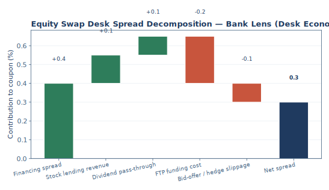

**P&L drivers**

Day to day, desk P&L is driven by the funding spread accrual, stock lending income on the physical hedge, the gap between declared and expected dividends, and small slippage on rebalancing the delta-one hedge across resets. Because the position is linear there is no gamma P&L — the dominant swings are dividend surprises, borrow-cost moves, and funding. Product Control attributes P&L across the equity leg and the funding leg and performs independent price verification of the reference equity's performance.

#### §9. THE BANK LENS — Controls & Reconciliation (2nd Line of Defence)

**Booking & systems**

| Aspect | Detail |
|--------|--------|
| **Booking system** | Murex |
| **Pricing/Risk system** | Murex |
| **Four-leg framework?** | No |
| **Product type** | Equity Swap |
| **Key booking fields** | Notional, reference equity, financing spread, dividend treatment (gross/net), reset frequency, counterparty |
| **Payment schedule** | Periodic resets (monthly/quarterly), net payments exchanged |
| **ISDA documentation** | ISDA Master Agreement, CSA, ISDA Equity Definitions |

**Reconciliation points**

| Recon point | What must agree | EqSwap-specific break |
|-------------|-----------------|-----------------------|
| **ISDA / CSA** | Master Agreement, CSA terms, ISDA Equity Definitions match the confirmation | Collateral terms in the CSA not reflected in the margin system |
| **Reset / valuation dates** | Start/end dates of each reset period match the trade confirmation | Different systems use different start/end dates → reset period misaligned |
| **Equity price source** | Reference equity fixing source matches the termsheet/confirmation | Different vendors report different closing prices on the valuation date |
| **Dividend pass-through & withholding** | Gross vs net treatment, and withholding tax %, match the confirmation | One system uses gross dividends, the other net → equity return miscalculated |
| **Corporate actions** | Stock split, merger, or spin-off adjustment applied per ISDA Equity Definitions | Underlying split not propagated → reference terms off by the split ratio |
| **Leg PV** | Equity-leg PV and funding-leg PV reconcile to total swap MTM | Unexplained P&L points to a stale dividend assumption or a wrong fixing |
| **Netting** | Net payment = equity leg − funding leg per the agreed convention | Legs settled gross or netted against the wrong counterparty set |
| **Collateral** | Posted/received collateral matches MTM under the CSA | Margin call sized off a stale MTM → under- or over-collateralised |

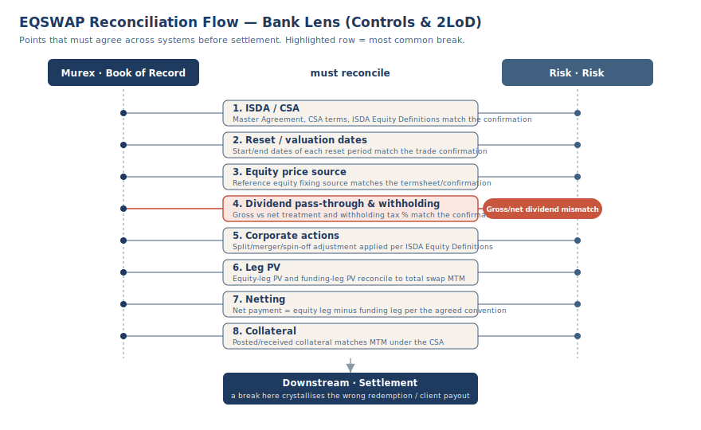

**Common breaks & red flags**

| Red Flag | What It Means | 2LoD Action |
|----------|---------------|-------------|
| **Gross vs net dividend mismatch** | One system uses gross dividends, the other net. This changes the equity return calculation. | Verify dividend treatment matches the confirmation before relying on either valuation |
| **Ex-dividend date alignment** | The system credits the dividend on a different date than the contractual convention. | Verify ex-date treatment per ISDA Equity Definitions |
| **Currency mismatch** | Reference equity in CHF but swap settled in USD — an FX rate must be applied. | Confirm whether the swap has FX conversion or is quanto |
| **Corporate action adjustment** | Stock split, merger, or spin-off changes the reference equity's terms. | Apply corporate action adjustments per ISDA rules before the next reset |
| **Reset period misalignment** | Different systems use different start/end dates for the reset period. | Verify reset dates match the trade confirmation |

**Control implication**

Each break has a direct consequence the 2nd line must size before it reaches the books or the counterparty. A **dividend pass-through / withholding** error — gross booked where net was agreed — systematically misstates the equity return on every dividend, by 15-30% of the dividend amount, in one party's favour. A **corporate-action** adjustment that is delayed or wrong (e.g. a stock split not propagated) leaves the reference terms off by the split ratio, corrupting every subsequent reset. A **price-source** mismatch breaks both the equity-leg valuation and the net settlement at once. The reconciliation exists precisely to catch these inconsistencies before the reset settlement crystallises them.

#### §10. Formal Definition

An **Equity Swap** is a derivative contract in which:

**Equity leg:** One party pays the return on a specified equity (stock, basket, or index) — comprising price change and dividends.

**Financing leg:** The other party pays a financing rate (SOFR/EURIBOR + spread).

The equity swap is a total return swap where the reference asset is specifically equity. Settlement is typically periodic (monthly or quarterly), with net payments exchanged.

**Dividend treatment:**
- **Gross dividends:** The full declared dividend is included in the equity return
- **Net dividends:** Dividends are adjusted for withholding tax. The termsheet specifies gross or net

#### §11. Lifecycle

| Stage | Detail |
|-------|--------|
| **Trade date** | Terms agreed: notional, tenor, rate conventions, special features. ISDA documentation |
| **Effective date** | Swap becomes active. First accrual period begins |
| **Reset dates** | Equity return and funding leg reset and netted; dividends passed through; corporate actions adjust terms |
| **Maturity** | Final exchange of cash flows. Trade terminated. Collateral returned |

#### §12. Worked Example (both lenses)

**Product:** 1-year Equity Swap on Nestlé. **Notional:** CHF 50,000,000. **Client receives:** Nestlé total return (price + dividends). **Client pays:** SOFR + 0.35% (assume 5.0% total). **Reset:** Quarterly. **Nestlé initial price:** CHF 100.

| Quarter | Nestlé Return | Equity Received | Financing Paid | Net |
|:-------:|:------------:|:--------------:|:--------------:|----:|
| Q1 | +3.0% | CHF 1,500,000 | CHF 625,000 | Client receives **CHF 875,000** |
| Q2 | −1.5% (incl div) | −CHF 750,000 | CHF 625,000 | Client pays **CHF 1,375,000** |
| Q3 | +4.5% (incl div) | CHF 2,250,000 | CHF 625,000 | Client receives **CHF 1,625,000** |
| Q4 | +2.0% | CHF 1,000,000 | CHF 625,000 | Client receives **CHF 375,000** |

*Client lens:*
- **Annual result:** Client received CHF 4,000,000 equity return − CHF 2,500,000 financing = **CHF 1,500,000 net profit.** The client captured the full Nestlé performance synthetically, paying away the financing rate, never holding a single share.

*Bank lens:*
- The desk paid the CHF 4,000,000 equity return to the client and collected CHF 2,500,000 in financing, funding the difference from its physically held Nestlé hedge: the shares it bought to hedge the equity leg appreciated by the same CHF 4,000,000 it owed, while it retained the financing spread, stock lending income, and the dividend pass-through margin. The delta-one hedge stays one-for-one across each quarterly reset — there is no gamma to rebalance. The 2nd line must confirm the equity return per quarter (notional × return), the gross/net dividend treatment on the Q2 and Q3 dividend-inclusive figures, the reset dates, and that the equity-leg and funding-leg PVs net correctly in Murex before each settlement.

#### §13. Knowledge Check

1. *(Investor)* **What is the client really doing when they enter an equity swap as the return receiver?** (Answer: receiving the equity return — price plus dividends — and paying a funding leg, gaining synthetic exposure without owning the shares.)
2. *(Investor)* **Explain the difference between gross and net dividend treatment in an equity swap.**
3. *(Investor)* **A corporate insider wants to reduce equity exposure without selling shares. How does an equity swap achieve this, and which leg do they pay?**
4. *(Investor)* **Why does the receiver lose money in a flat market even when the stock pays a dividend?** Decompose the cashflows.
5. *(Investor)* **Why might an equity swap receive different tax treatment than direct stock ownership?**
6. **(Desk economics / 1LoD)** **The client receives the equity return; what does the desk hold as a hedge, and why is the equity risk delta-one rather than gamma? Where does the desk's net spread come from?**
7. **(Controls / 2LoD)** **Which booking fields must reconcile in Murex for an equity swap, and which single field — if booked gross where net was agreed — systematically misstates the equity return on every dividend?**

**Mental Models**

| Concept | Mental Model |
|---------|-------------|
| Equity Swap | Film royalty deal — pay a guaranteed fee, receive the economic performance |
| Economic vs legal ownership | Renting vs owning — all the experience without the title deed |
| Financing spread | The rental fee for borrowing someone else's equity returns |
| Dividend treatment | Gross = full box office revenue; Net = revenue after the cinema's cut (tax) |
| Delta-one hedge | The desk simply holds the shares one-for-one — a mirror, not a moving target; no gamma to chase |
| Hedging a position | Paying the return away = locking in a financing rate instead of equity risk |
| 2LoD reconciliation | The building inspector — confirms the dividend treatment, reset dates, and corporate-action terms match before any reset pays out |

**Key Takeaways**

1. An equity swap is a TRS specifically referencing equity — the client receives equity returns and pays a financing rate; the bank takes the mirror leg.
2. The swap separates economic and legal ownership, enabling exposure changes without public sales.
3. Dividend treatment (gross vs net) materially affects the economics and must be specified contractually.
4. The swap is linear — no barriers, no optionality. Gains and losses move proportionally with the equity, and the desk hedges delta-one by holding the physical shares.
5. Equity swaps are booked in Murex, governed by ISDA, and settled periodically.
6. For the 2nd line, the dominant control risks are dividend pass-through / withholding, corporate actions, equity price source, and reset alignment — each can misstate the equity return or the net settlement.

#### §14. Common Mistakes

1. **Ignoring dividend treatment.** The difference between gross and net dividends can be 15-30% of the dividend amount. A swap priced on gross dividends that settles net creates a systematic loss.
2. **Assuming legal ownership transfers.** The equity swap transfers economic exposure, not legal ownership. The return receiver does not gain voting rights, governance rights, or regulatory disclosure obligations.
3. **Forgetting the financing cost in flat markets.** If the equity is flat and pays a 2% dividend, but the financing rate is 5%, the receiver loses 3% per year.
4. **Confusing a hedge with a sale.** A corporate insider paying equity return via a swap is not a sale — they still own the shares. But regulators may treat it as a constructive sale depending on jurisdiction.
5. **Ignoring quanto risk.** If the swap notional is in USD but the reference equity trades in CHF, FX movements affect the return unless the swap is explicitly "quanto" (FX-hedged).
6. **(Controls) Trusting a single system's dividend or corporate-action figure.** Because dividends can be booked gross or net and a split must be propagated per ISDA Equity Definitions, the 2nd line must reconcile dividend treatment and corporate-action adjustments across the booking and market-data sources rather than assume they agree.
### Knowledge Check

**Review Questions:**
1. What makes an equity swap different from a general TRS?
2. What is the difference between gross and net dividend treatment?
3. Does an equity swap transfer voting rights to the return receiver?
4. What happens when the reference equity pays a dividend during the swap?
5. How does a corporate insider use an equity swap to reduce exposure?


**Dual-lens questions:**
- *(Desk economics / 1LoD)* Which side of the swap does the desk take, and what is its primary risk (rate/curve/financing) and how is it hedged?
- *(Controls / 2LoD)* Which leg/fixing/collateral fields must reconcile across systems for this swap, and which is the most common break?
**Scenario Questions:**
1. A pension fund enters a CHF 200M equity swap receiving the SPI index return, paying 4.8% financing. The SPI returns 7% (including 2% dividends) over the year. Calculate the net P&L. What if the SPI returned −3%?
2. A corporate insider holds 1 million shares of Company X at €50. They enter an equity swap paying the return on 500,000 shares. Company X rises 20%. What is the insider's net position?
3. An equity swap specifies gross dividend treatment. The reference stock pays a €2 dividend with 15% withholding tax. What equity return is credited to the receiver? How would this differ under net dividend treatment?

**Desk Question:**
A client has a $500M equity swap receiving the return on a concentrated basket of 3 tech stocks. One stock announces a 10:1 stock split. How does the split affect the swap terms, what operational steps are needed, and what risks arise if the adjustment is delayed?

### Visual Specifications

| Visual ID | Type | Priority | Purpose | Caption | Location | Reuse |
|-----------|------|:--------:|---------|---------|----------|:-----:|
| FLOW_EQSWAP_01 | Cash Flow Diagram | P1 | Show equity return versus financing rate flows | Equity Swap: payment flows between return receiver and payer | §7 | High |
| COMPARE_EQSWAP_01 | Comparison Chart | P1 | Compare equity swap vs direct ownership vs TRS | Equity swap vs direct stock purchase: features and trade-offs | §3 | Medium |
| PAYOFF_EQSWAP_01 | Payoff Diagram | P2 | Show linear payoff with break-even at financing rate | Equity swap receiver P&L as a function of equity return | §8 | High |
| LIFECYCLE_EQSWAP_01 | Lifecycle Diagram | P2 | Show reset, dividend, corporate action, and maturity events | Equity swap lifecycle: from trade date to maturity | §10 | Medium |
| DIAGRAM_EQSWAP_01 | System Flow Diagram | P3 | Show Murex booking, ISDA documentation, and settlement flow | Equity swap operational flow: booking to settlement | §10 | Medium |

### Dependency References

| Concept Used | Where It Was Taught |
|-------------|-------------------|
| Total Return Swap concept | [Section 5.2.2](#sec-5-2-2) (TRS) |
| Swap structure, netting | [Section 5.2.1](#sec-5-2-1) (IRS) |
| Equity, dividends | [Section 0.3](#sec-0-3) (Debt vs Equity) |
| SOFR, EURIBOR | [Section 1.8](#sec-1-8) (Benchmark Rates) |
| Counterparty risk, ISDA | [Section 1.9](#sec-1-9) (Credit Risk), [Section 5.2.1](#sec-5-2-1) (IRS) |
| Murex booking | [Section 2.8](#sec-2-8) (Systems Primer) |

---


#### Visual Specifications

**Visual 1: Equity Swap Cash Flow Diagram**
- **Asset filename:** flow_eqswap_cash_flows_01.svg
- **Caption:** "Equity Swap Cash Flow Diagram"
- **Diagram elements:** Bilateral flow diagram showing periodic exchanges between two counterparties. Fixed vs floating legs clearly labelled. Payment dates marked on timeline
- **Reuse status:** Adapt from swap flow template
**Visual 2: Equity Swap Component Structure**
- **Asset filename:** construction_eqswap_components_02.svg
- **Caption:** "Equity Swap Component Structure"
- **Diagram elements:** Decomposition showing building blocks. Each component in separate box with arrows showing how they combine
- **Reuse status:** Adapt from construction template
**Visual 3: Equity Swap Lifecycle Timeline**
- **Asset filename:** lifecycle_eqswap_timeline_03.svg
- **Caption:** "Equity Swap Lifecycle Timeline"
- **Diagram elements:** Horizontal timeline from effective date to maturity. Key events marked: trade date, effective, payment dates, maturity
- **Reuse status:** Adapt from lifecycle template
**Visual 4: Equity Swap Risk Heatmap**
- **Asset filename:** risk_eqswap_heatmap_04.svg
- **Caption:** "Equity Swap Risk Heatmap"
- **Diagram elements:** Grid: risk types (market, credit, liquidity, operational) vs severity. Colour-coded cells appropriate for Equity Swap
- **Reuse status:** Adapt from risk heatmap template
**Visual 5: Equity Swap vs Vanilla Alternative**
- **Asset filename:** comparison_eqswap_vs_vanilla_05.svg
- **Caption:** "Equity Swap vs Vanilla Alternative"
- **Diagram elements:** Side-by-side comparison showing key differences from vanilla swap. Highlight unique features
- **Reuse status:** New — comparison panel
**Visual 6: Equity Swap Scenario Analysis**
- **Asset filename:** scenario_eqswap_rate_paths_06.svg
- **Caption:** "Equity Swap Scenario Analysis"
- **Diagram elements:** Three rate path scenarios (rates up, stable, down) showing P&L impact. Clearly labelled outcomes
- **Reuse status:** Adapt from scenario template


**Dual-lens visuals (generated):**
- `assets/eqswap/controls_eqswap_recon_08.svg` `[generated]`
- `assets/eqswap/legs_eqswap_01.svg` `[generated]`
- `assets/eqswap/waterfall_eqswap_09.svg` `[generated]`
#### Dependency References

| Concept Used | Where It Was Taught |
|-------------|-------------------|
| Equity fundamentals | [Section 1.4](#sec-1-4) (Equity Essentials) |
| Options mechanics | [Section 1.2](#sec-1-2) (Options From Zero) |
| Product decomposition | [Section 2.2](#sec-2-2) (Product Construction) |
| TRS | 5.2.2 — broader asset class |
| IRS | 5.2.1 — rates only |
| Variance Swap | 5.2.4 — vol not direction |
### 5.2.4 Variance Swap {#sec-5-2-4}

> **Prerequisites:** [VO](#sec-5-6-3) &nbsp;|&nbsp; **Key concepts:** Variance vs volatility, convexity, log contract replication

---

*The IRS traded interest rate risk. The TRS traded asset return risk. The Variance Swap trades something more abstract: the volatility of an asset's returns. It is a pure derivative — no note, no barrier, no embedded put or call — that pays the difference between realized variance and a fixed variance strike at maturity. One party (the long) profits when the asset moves more than expected; the other (the short) profits when it moves less. This chapter reads the product through two lenses: what it means for **the client**, and what it means for **the bank** — the latter split into the desk's market economics (1st line of defence) and the controls and reconciliation that surround it (2nd line of defence).*

#### §1. Explain Like I'm New

Kwame is a risk manager at a sovereign wealth fund. His portfolio contains $20 billion in global equities. He does not want to hedge the direction of the market — he has a long-term bullish view. But he is worried about periods of extreme turbulence: the kind of violent swings that force portfolio rebalancing, trigger risk limits, and create operational stress.

A **Variance Swap** lets the client trade volatility directly. The client enters a contract that pays out if the market moves more than expected (high realized variance) and costs the client if the market moves less than expected (low realized variance). If a crisis hits and volatility spikes, the variance swap pays out — offsetting the stress on the rest of the portfolio.

The key insight: a Variance Swap does not care whether the market goes up or down. It only cares about how much the market moves. Large daily moves in either direction increase realized variance and generate a payout to the party that is long variance.

#### §2. Real-World Analogy

A Variance Swap is like weather insurance for a farmer — but instead of insuring against drought or flood, the contract insures against weather unpredictability itself.

The farmer's crop grows best when the weather is stable: sunny days followed by sunny days, or rainy days followed by rainy days. The crop suffers when the weather is chaotic: sun, then storm, then heatwave, then frost — even if the average temperature over the season is perfectly normal.

A variance swap works the same way. It pays off when market conditions are chaotic (high variance) — regardless of whether the market trends up or down. The "weather insurance" pays the farmer when conditions are turbulent, offsetting crop losses from unpredictable conditions.

The fixed amount the farmer pays (the variance strike) represents the insurer's expectation of how turbulent the season will be. If actual turbulence exceeds this expectation, the insurance pays out. If conditions are calm, the farmer loses the premium. In this analogy the long-variance client is the policyholder buying protection, while the short-variance party (often the bank's counterparty, or the bank itself) is the insurer collecting premium.

#### §3. What Problem Does This Solve?

The Variance Swap addresses the **pure volatility exposure** need:

| Client Need | How the Variance Swap Delivers |
|------------|-------------------------------|
| Hedge portfolio volatility | Buy variance — receive payout when markets are turbulent |
| Trade volatility as an asset class | Express views on whether markets will be more or less volatile than implied |
| Tail risk protection | Variance payoff is convex — extreme moves produce disproportionately large payouts |
| Volatility income | Sell variance — earn premium in calm markets |

When a client needs pure volatility exposure, options fall short: they are "contaminated" by directional risk (delta) and must be continuously re-hedged to isolate the volatility view. A variance swap delivers the volatility exposure cleanly — the payoff depends only on how much the underlying moves, not which direction.

#### §4. Product DNA

| Field | Value |
|-------|-------|
| **Full Name** | Variance Swap |
| **Abbreviation** | VarSwap |
| **Family** | Swaps |
| **Complexity Score** | 7 / 10 |
| **Complexity Rationale** | Swap paying realised variance vs fixed variance strike. Pure volatility exposure without directional bias. Convex payoff |
| **Underlying Asset Class** | Equity (volatility) |
| **Capital Protection** | N/A (swap — can have large negative MTM) |
| **Coupon Type** | Realised variance vs strike variance |
| **Maturity** | 1 month - 2 years |
| **Liquidity** | OTC (index var swaps reasonably liquid) |
| **Primary System** | Murex |
| **ISDA Required** | Yes — ISDA |

**DNA Atlas Fields:**
- Primary Risk: Variance is convex — large moves cause outsized P&L. Gap risk. Realised vol spikes can cause extreme losses for short position
- Typical Buyer: Hedge funds (vol trading), dealers (managing vol book), institutional (tail hedging)
- Typical Use Case: Pure vol exposure. No delta. No gamma hedging needed (it IS gamma). Convexity means long var benefits from vol spikes
- Building Blocks: Variance swap = portfolio of options across all strikes (log contract replication)
- Key Hedge: Replicating portfolio of OTM options, delta-hedged. Vega hedge via swaptions or options
- Similar Products: Cliquet (5.6.11 — periodic vol exposure), Vanilla Options (5.6.3 — directional + vol), TRS (5.2.2 — asset return)
- Most Important Greek: Vega (volatility sensitivity — this IS the vol product)

**Comparison Matrix Fields:**
- Complexity: 7
- Yield Potential: Unlimited (long position profits from vol spike)
- Capital Protection: N/A (swap — can lose significantly)
- Credit Exposure: Counterparty
- Liquidity: OTC (index tenors liquid)
- Path Dependency: Yes (daily realised vol observation)
- Volatility Sensitivity: Maximum — this is a pure vol instrument
- Correlation Sensitivity: None (single underlying variance)
- Client Type: Hedge funds, Dealers, Sophisticated institutional
- Market Environment: Best for expressing pure volatility views. Long var = long tail risk hedge

#### §5. Who Touches This Product

| Role | Responsibility |
|------|---------------|
| **Structurer** | Designs Variance Swap terms: notional, tenor, fixing conventions, special features |
| **Trader** | Manages Variance Swap book. Delta-hedges primary risk. Manages portfolio Greeks |
| **Sales** | Presents Variance Swap to clients for hedging or investment. Explains risk-return trade-off |
| **Risk Management** | Monitors counterparty exposure, MTM limits, Greek limits. Stress-tests Variance Swap portfolio |
| **Product Control** | Daily P&L attribution for Variance Swap book. Independent price verification |
| **Operations** | Confirms trade details (ISDA). Processes periodic payments. Manages collateral (CSA) |
| **Legal / Compliance** | ISDA Master Agreement and CSA negotiation. Trade reporting. Regulatory compliance |
| **Quantitative Analytics** | Prices Variance Swap and calibrates models. Develops risk analytics and sensitivities |

#### §6. Product Evolution

| Stage | Product | What Was Added | Why |
|:-----:|---------|---------------|-----|
| 1 | Loan / deposit | — (baseline) | Simple lending/borrowing relationship |
| 2 | Interest rate swap | Periodic cash flow exchange | Transform rate exposure between fixed and floating |
| 3 | Variance Swap | Specific swap features added | Extended swap concept: Swap paying realised variance vs fixed variance strike. Pure volatility exposure without directional bias. Convex payoff |

---

#### §7. THE INVESTOR LENS

**Why the client enters it**

1. **Pure volatility exposure.** No directional view required — the payoff depends only on realized variance, not market direction. This is the cleanest instrument for trading the concept taught in [Section 1.5](#sec-1-5) (Volatility).
2. **Convexity.** The variance payoff is convex: a move from 20% vol to 30% vol pays more than a move from 10% to 20%. This makes long variance a natural tail-risk hedge.
3. **No delta hedging.** Unlike options (which have delta and must be continuously hedged), a variance swap has zero delta by construction.
4. **View expression.** A client with a view on whether the market will be more or less volatile than the implied strike can monetize that view directly, going long or short variance.
5. **Standardized and liquid.** Variance swaps on major indices (S&P 500, EURO STOXX 50) are actively traded with good liquidity.

**Legs & position (long/short variance)**

A variance swap has two sides. The party that is **long variance** profits if realized volatility exceeds the strike — this is the natural tail-risk hedge, profitable when chaos arrives. The party that is **short variance** profits if realized volatility stays below the strike — this is the volatility seller, collecting premium in calm markets but exposed to catastrophic loss in a spike.

There is no bond leg, no embedded put or call, and no barrier. The position is pure: long variance is long volatility (and long tail risk); short variance is short volatility. With a single underlying there is no correlation exposure. A long-variance client running a $10M vega notional against an implied strike of 20% is positioned to receive a large payout if realized volatility spikes to 40-60% in a market crisis; the short-variance party collects the variance premium so long as realized volatility stays below the strike.

**Payoff & scenarios**

The payoff is **linear in variance**, which means it is **convex in volatility**. At maturity the long-variance party receives Variance Notional × (Realized Variance − Variance Strike); when realized variance is below the strike, that quantity is negative and the long pays the short. Because variance is the square of volatility, the same payoff plotted against realized *volatility* is a curve that accelerates as vol rises: payoff = (realized² − strike²) × notional.

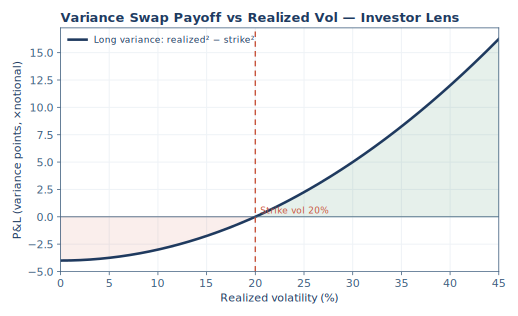

**Product:** 1-year Variance Swap on the EURO STOXX 50. **Variance notional:** $250,000 per variance point. **Variance strike:** 20% (expressed in volatility terms; variance strike = 400 in variance terms). **Settlement:** At maturity, based on realized variance over the life.

- **Scenario 1 — Realized vol = 22%:** Realized variance = 22² = 484. Strike variance = 20² = 400. Payoff: $250,000 × (484 − 400) = $250,000 × 84 = **$21,000,000 to long variance.**
- **Scenario 2 — Realized vol = 18%:** Realized variance = 18² = 324. Payoff: $250,000 × (324 − 400) = $250,000 × (−76) = **$19,000,000 to short variance** (long variance pays).
- **Scenario 3 — Crisis: Realized vol = 40%:** Realized variance = 40² = 1,600. Payoff: $250,000 × (1,600 − 400) = **$300,000,000 to long variance.** The convexity is dramatic — a doubling of vol produces a 4× increase in variance.
- **Scenario 4 — Very calm market: Realized vol = 12%:** Realized variance = 12² = 144. Payoff: $250,000 × (144 − 400) = **$64,000,000 to short variance.**

**Risks to the client**

| Risk | Description | Severity |
|------|------------|:--------:|
| **Unlimited loss (short variance)** | Realized variance has no upper bound — a short variance position faces theoretically unlimited loss | Critical |
| **Convexity risk** | The convex payoff means small changes in realized vol can produce large P&L swings, especially at high vol levels | High |
| **Gap risk** | Large overnight price moves (gaps) contribute disproportionately to realized variance | High |
| **Mark-to-market volatility** | The variance swap's value fluctuates with implied volatility, creating interim P&L swings even before settlement | Medium |
| **Correlation with portfolio** | Long variance typically profits during market crashes — but the timing and magnitude may not perfectly offset portfolio losses | Medium |
| **Replication risk** | The variance swap's economics rely on a replicating options portfolio that may not perfectly track in illiquid or extreme markets | Medium |

#### §8. THE BANK LENS — Desk Economics (1st Line of Defence)

**What the desk books**

The desk takes the other side of the client's position. Where the client is long variance, the desk is **short** variance; where the client is short variance, the desk is **long**. The booking is a single Variance Swap with no embedded note, put, or call — the economics are the variance strike, the variance notional, the reference asset, the observation period, and the day count. The client's variance strike is, to the desk, the level at which it has agreed to exchange realized variance for fixed variance.

**Replication & hedging**

The desk does not hold an opposite variance swap; it **replicates** the position. A variance swap can be perfectly replicated by a static strip of out-of-the-money options at every strike, weighted by 1/K² (where K is the strike price), combined with a dynamic delta hedge in the underlying. This is a fundamental result from financial mathematics — variance is the integral of all option prices across the strike spectrum. The desk continuously re-hedges the delta of that option strip as the implied volatility surface moves; because the payoff is convex, the desk's P&L accelerates at high vol levels (the position *is* gamma). The cost of assembling and maintaining the replicating strip is typically less than the variance swap price, creating a structural margin — but in illiquid or extreme markets the strip may not perfectly track, and that replication error is the desk's risk.

**How the bank makes money**

| Revenue Component | Detail |
|------------------|--------|
| **Bid-offer spread** | The bank buys variance at a lower implied vol than it sells, capturing the spread on the variance strike |
| **Replication premium** | The cost of replicating the variance swap with a strip of options is typically less than the variance swap price, creating a structural margin |
| **Hedging P&L** | Profits from managing the hedge portfolio (realized vs implied) |
| **Funding benefit** | Earns funding spread on collateral received under the CSA |
| **Structuring fee** | Fee for custom features beyond vanilla terms |

**The desk margin decomposition:**

The variance strike the client trades on is built from the cost of the replicating strip plus the desk's margin and bid-offer. In illustrative terms, against a vanilla mid variance strike the desk adds the replication cost it must fund, captures the bid-offer between buy and sell pricing, and retains a structuring margin for custom features. The replication premium — the gap between the variance swap price and the cheaper cost of the option strip — is the structural source of margin; bid-offer and funding sit on top.

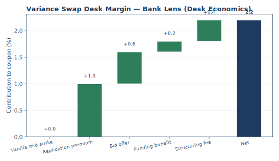

**P&L drivers**

Day to day, desk P&L is driven by realized-versus-implied volatility on the delta-hedged option strip, the convexity of the position as vol moves (P&L accelerating at high vol), funding on collateral, and the mark-to-market of the replicating portfolio against the booked variance swap. The dominant idiosyncratic risks are **replication error** (the strip failing to track the variance swap in illiquid or extreme markets) and **gap risk** (overnight jumps contributing disproportionately to realized variance and to the hedge slippage). Product Control attributes P&L for the variance book and performs independent price verification.

#### §9. THE BANK LENS — Controls & Reconciliation (2nd Line of Defence)

**Booking & systems**

| Aspect | Detail |
|--------|--------|
| **Booking system** | Murex |
| **Pricing system** | Murex |
| **Four-leg framework?** | No |
| **Product type** | Variance Swap |
| **Key booking fields** | Variance notional, variance strike (or vol strike), reference asset, observation period, day count |
| **Settlement** | At maturity: single payment based on realized variance vs strike |
| **ISDA documentation** | ISDA Master Agreement, CSA, ISDA Equity Definitions (variance swap supplement) |

**Reconciliation points**

| Recon point | What must agree | VarSwap-specific break |
|-------------|-----------------|------------------------|
| **ISDA / CSA** | Master Agreement, CSA terms, and ISDA Equity Definitions (variance swap supplement) reference the same confirmation | Trade booked against the wrong CSA or a stale supplement → collateral and netting wrong |
| **Realized-variance formula & fixing source** | The variance calculation method (close-to-close vs intraday), the fixing source, and the exact annualized variance formula match the confirmation | Close-to-close vs intraday return convention differs between systems → different realized variance |
| **Sampling frequency / annualization** | Daily sampling, holiday/weekend treatment, and the annualization factor agree with the contract | Non-trading days included in one system, excluded in another → realized variance miscalculated |
| **Strike** | Variance strike (and the vol-strike it derives from) is consistent across systems and the confirmation | Vol strike stored where variance strike is expected (or vice versa) → payoff off by a square |
| **Cap** | Whether a realized-variance cap exists (commonly 2.5× strike) and its exact level | Cap present in the confirmation but not flagged in the booking → short-side loss unbounded in system |
| **Variance notional vs vega notional** | Which notional convention is booked; vega notional × 2 × strike = variance notional | Vega notional booked as variance notional → payoff off by a factor related to the strike |
| **Leg PV / collateral** | Mark-to-market of the variance swap reconciles to the replicating portfolio; collateral called under the CSA matches the MTM | Stale vol surface → PV and collateral diverge between front office and risk |
| **Settlement** | Single maturity payment = variance notional × (realized variance − strike), capped if applicable | Settlement computed without the cap, or with the wrong notional convention |

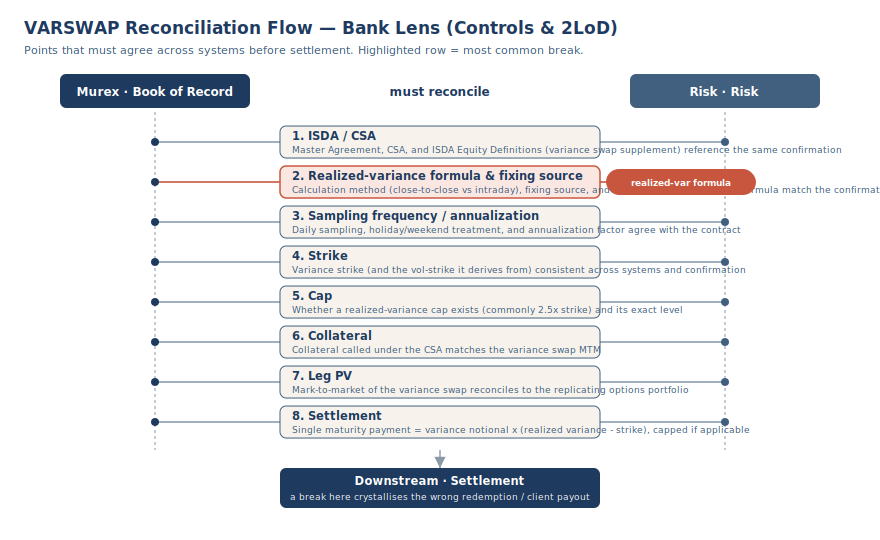

**Common breaks & red flags**

| Red Flag | What It Means | 2LoD Action |
|----------|---------------|-------------|
| Realized variance calculation methodology | Different methods for calculating daily returns (close-to-close vs intraday) produce different realized variance | Verify the calculation methodology matches the confirmation |
| Holiday / weekend treatment | How non-trading days are handled in the variance calculation varies by contract | Verify whether weekends/holidays are included or excluded |
| Variance notional vs vega notional confusion | Vega notional × 2 × strike = variance notional. Confusing the two produces dramatically wrong payoffs | Verify which notional convention is used |
| Ex-dividend adjustment | Large special dividends can inflate daily returns. Some contracts adjust for dividends, others do not | Check the dividend adjustment clause |
| Cap on realized variance | Some contracts cap realized variance at 2.5× the strike to limit losses for the short side | Verify whether a cap exists and at what level |

**Control implication**

The dominant control risk on a variance swap is the **realized-variance calculation itself**: the fixing source, the sampling frequency (and holiday/weekend treatment), and the annualization must reconcile exactly against the confirmation, because small methodology differences produce large payment differences on a convex payoff. Alongside it sits the **cap** (commonly 2.5× strike): if the cap is in the confirmation but not flagged in the booking, the system overstates the short side's loss in a spike and the settlement is computed wrong. A strike or notional-convention error (vol vs variance, vega vs variance) misstates the payoff by a square or by a strike-related factor. The reconciliation exists precisely to catch these inconsistencies before the single maturity settlement crystallises them.

#### §10. Formal Definition

A **Variance Swap** is a derivative contract that pays the difference between realized variance and a fixed variance strike.

**Payoff at maturity:**
Payoff = Variance Notional × (Realized Variance − Variance Strike)

Where:
- **Realized Variance** = the annualized variance of daily returns on the reference asset, calculated as the sum of squared daily log-returns scaled to an annual basis
- **Variance Strike** = the fixed variance level agreed at inception (often quoted as the square of implied volatility)
- **Variance Notional** = the dollar amount per variance point

The payoff is **linear in variance** (which means it is **convex in volatility**). This convexity is the key feature: large volatility moves produce disproportionately large payoffs.

#### §11. Lifecycle

| Stage | Detail |
|-------|--------|
| **Trade date** | Terms agreed: notional, tenor, rate conventions, special features. ISDA documentation |
| **Effective date** | Swap becomes active. First accrual period begins |
| **Observation & settlement** | Realized variance accrues from daily returns; a single net amount settles at maturity (no periodic exchange) |
| **Maturity** | Final exchange of cash flows. Trade terminated. Collateral returned |

#### §12. Worked Example (both lenses)

**Product:** 6-month Variance Swap on EURO STOXX 50. **Vega notional:** €100,000 per volatility point. **Variance strike:** 22% vol (variance strike = 484). **Variance notional:** €100,000 / (2 × 22) = €2,273 per variance point.

*Client lens:*
- **Realized vol = 28%:** Realized variance = 28² = 784. Payoff: €2,273 × (784 − 484) = €2,273 × 300 = **€681,818 to long variance.** In vega terms: vol moved from the 22% strike to 28% realized = 6 vol points; approximate payout €100,000 × 6 = €600,000. The actual payout (€681,818) is higher due to convexity — the variance swap overperforms a simple vega-based estimate.
- **If realized vol = 15%:** Realized variance = 225. Payoff: €2,273 × (225 − 484) = €2,273 × (−259) = **€588,636 to short variance.** The long-variance client pays this; the calm market overwhelmed the strike.

*Bank lens:*
- In the first scenario the desk is short variance against a long client: realized vol (28%) exceeded the strike (22%), so the desk pays €681,818. Its replicating option strip and delta hedge should have accrued gains as vol rose, offsetting the obligation; the convexity means the loss accelerated above the strike, which is why the strip is weighted 1/K². Product Control attributes the P&L between the realized-variance accrual and the replicating-portfolio MTM.
- In the second scenario realized vol (15%) was below the strike, so the desk (short variance) receives €588,636 from the long client. The 2nd line must confirm the realized-variance calculation (fixing source, sampling, annualization) matches the confirmation, that the variance notional (€2,273, derived as €100,000 / (2 × 22)) was used rather than the vega notional, and that any cap was applied before the single settlement.

#### §13. Knowledge Check

1. **What does a variance swap pay based on? How is this different from an option?**
2. **Explain the difference between being "long variance" and "long volatility."**
3. **Why is the variance swap payoff convex in volatility?**
4. **A short variance seller says their maximum loss is limited. Are they correct?**
5. **How is a variance swap replicated using options?**
6. **A client buys a variance swap with a 20% strike and is told "maximum loss is the premium." Is this correct?** Explain.
7. **Why does a realized-vol spike from 20% to 40% pay 4× the variance move, not 2×?**
8. **(Controls / 2LoD)** Name three reconciliation breaks specific to a variance swap (across the realized-variance formula, fixing source, sampling/annualization, strike, cap, and notional convention) and the consequence of each for the settlement payment.
9. **(Desk economics / 1LoD)** What position does the desk hold against a long-variance client, how does it replicate that position with a strip of options weighted 1/K² plus a delta hedge, and where does its margin and replication risk come from?

**Mental Models**

| Concept | Mental Model |
|---------|-------------|
| Variance Swap | Weather insurance — pays when conditions are turbulent, regardless of whether temperature goes up or down |
| Variance strike | The insurer's expectation of turbulence — the "normal" level of weather variation |
| Convexity | Compound interest on volatility — doubling vol quadruples the payout |
| Long variance | Buying storm insurance — profitable when chaos arrives |
| Short variance | Selling storm insurance — profitable in calm weather, catastrophic in storms |
| Realized vs implied | Actual weather vs forecasted weather — the difference determines the payout |
| Replication strip | The desk re-creates the insurance from many small option contracts (weighted 1/K²) rather than holding one matching policy |
| 2LoD reconciliation | The claims adjuster — confirms the realized-variance calculation and cap match the contract before the single payment |

**Key Takeaways**

1. A variance swap pays the difference between realized variance and a fixed strike, providing pure volatility exposure — no note, no barrier, no embedded put or call.
2. The payoff is linear in variance, which means it is convex in volatility — large vol moves produce disproportionately large payoffs.
3. Long variance is a natural tail-risk hedge: it profits most during market crises when vol spikes. Short variance carries unlimited loss potential — selling variance is like selling storm insurance.
4. The client is long or short variance; the desk takes the other side and replicates it with a static strip of options weighted 1/K² plus a dynamic delta hedge, earning the bid-offer and replication premium and bearing replication error and gap risk.
5. Variance swaps are booked in Murex and settled at maturity based on the observed daily returns of the reference asset.
6. For the 2nd line, the dominant control risks are the realized-variance calculation (fixing source, sampling/annualization), the strike and notional convention (vol vs variance, vega vs variance), and the cap (commonly 2.5× strike) — each can misstate the single settlement.

#### §14. Common Mistakes

1. **Confusing variance with volatility.** Variance = vol². A move from 20% to 30% vol is a 10-point vol move but a 500-point variance move (900 − 400). The payout is in variance, not vol.
2. **Underestimating short variance risk.** Realized vol can spike to 80%+ in crises. Short variance on a €100K vega notional could lose €10M+ in such an event.
3. **Confusing vega notional with variance notional.** These are different conventions. Using the wrong one produces payoffs that are off by a factor related to the strike.
4. **Thinking variance swaps have directional exposure.** They do not. A stock can rise 20% and produce high variance if it did so with large daily swings. Direction does not matter — only magnitude of moves.
5. **Ignoring the cap.** Many variance swaps include a cap on realized variance (e.g., 2.5× strike). This limits the short side's exposure but also caps the long side's payout. Always check.
6. **(Controls) Trusting a single system's realized-variance figure.** Because close-to-close vs intraday returns, holiday/weekend treatment, and annualization can differ between systems, the 2nd line must reconcile the realized-variance methodology and fixing source against the confirmation rather than assume the systems agree.
### Knowledge Check

**Review Questions:**
1. What is the difference between variance and volatility?
2. What makes a variance swap "convex" in volatility?
3. What is the reference used to calculate realized variance?
4. How is a variance swap replicated?
5. What is a variance cap and why does it exist?


**Dual-lens questions:**
- *(Desk economics / 1LoD)* Which side of the swap does the desk take, and what is its primary risk (rate/curve/financing) and how is it hedged?
- *(Controls / 2LoD)* Which leg/fixing/collateral fields must reconcile across systems for this swap, and which is the most common break?
**Scenario Questions:**
1. A variance swap has a strike of 18% vol and €50,000 vega notional. Realized vol is 25%. Calculate the approximate payoff using vega notional. Then calculate the exact payoff using variance notional. Why do they differ?
2. A hedge fund sells variance on the S&P 500 with a strike of 15% and $500,000 vega notional. A market crash causes realized vol to reach 60%. Calculate the loss. Explain why selling variance is described as "picking up pennies in front of a steamroller."
3. Two variance swaps on the same index have strikes of 20% and 30% respectively. If realized vol is 35%, which swap produces a larger payoff per unit of vega notional? Why?

**Desk Question:**
The desk has sold $2M vega notional of variance swaps on the EURO STOXX 50 at a 20% strike. Implied vol has risen from 20% to 28% over the past week. The trader reports that the mark-to-market loss is larger than a simple 8-point vol move would suggest. Explain why, referencing convexity, and describe what risk limits should be in place for short variance positions.

### Visual Specifications

| Visual ID | Type | Priority | Purpose | Caption | Location | Reuse |
|-----------|------|:--------:|---------|---------|----------|:-----:|
| PAYOFF_VARSWAP_01 | Payoff Diagram | P1 | Show linear payoff in variance space with convexity annotation | Variance swap payoff: linear in variance, convex in volatility | §8 | High |
| COMPARE_VARSWAP_01 | Comparison Chart | P1 | Compare variance swap vs options for volatility exposure | Variance swap vs straddle: pure vol exposure vs directional + vol exposure | §3 | Medium |
| DIAGRAM_VARSWAP_01 | Cash Flow Diagram | P1 | Show the single settlement at maturity: realized vs strike | Variance swap settlement: single payment based on realized vs implied variance | §7 | Medium |
| TIMELINE_VARSWAP_01 | Timeline | P2 | Show daily return observations accumulating into realized variance | Variance swap: daily return observations building realized variance over time | §12 | Low |
| PAYOFF_VARSWAP_02 | Payoff Diagram | P2 | Show the same payoff plotted in volatility space (curved) | Variance swap payoff in volatility space: convexity visualized | §8 | Medium |

### Dependency References

| Concept Used | Where It Was Taught |
|-------------|-------------------|
| Volatility, implied vs realized | [Section 1.5](#sec-1-5) (Volatility) |
| Swap structure | [Section 5.2.1](#sec-5-2-1) (IRS) |
| Options, strike price | [Section 1.2](#sec-1-2) (Options) |
| Vega (sensitivity to vol) | [Section 1.4](#sec-1-4) (Greeks) |
| Derivatives concept | [Section 0.8](#sec-0-8) (What Is a Derivative?) |
| Murex booking | [Section 2.8](#sec-2-8) (Systems Primer) |

---


#### Visual Specifications

**Visual 1: Variance Swap Cash Flow Diagram**
- **Asset filename:** flow_varswap_cash_flows_01.svg
- **Caption:** "Variance Swap Cash Flow Diagram"
- **Diagram elements:** Bilateral flow diagram showing periodic exchanges between two counterparties. Fixed vs floating legs clearly labelled. Payment dates marked on timeline
- **Reuse status:** Adapt from swap flow template
**Visual 2: Variance Swap Component Structure**
- **Asset filename:** construction_varswap_components_02.svg
- **Caption:** "Variance Swap Component Structure"
- **Diagram elements:** Decomposition showing building blocks. Each component in separate box with arrows showing how they combine
- **Reuse status:** Adapt from construction template
**Visual 3: Variance Swap Lifecycle Timeline**
- **Asset filename:** lifecycle_varswap_timeline_03.svg
- **Caption:** "Variance Swap Lifecycle Timeline"
- **Diagram elements:** Horizontal timeline from effective date to maturity. Key events marked: trade date, effective, payment dates, maturity
- **Reuse status:** Adapt from lifecycle template
**Visual 4: Variance Swap Risk Heatmap**
- **Asset filename:** risk_varswap_heatmap_04.svg
- **Caption:** "Variance Swap Risk Heatmap"
- **Diagram elements:** Grid: risk types (market, credit, liquidity, operational) vs severity. Colour-coded cells appropriate for Variance Swap
- **Reuse status:** Adapt from risk heatmap template
**Visual 5: Variance Swap vs Vanilla Alternative**
- **Asset filename:** comparison_varswap_vs_vanilla_05.svg
- **Caption:** "Variance Swap vs Vanilla Alternative"
- **Diagram elements:** Side-by-side comparison showing key differences from vanilla swap. Highlight unique features
- **Reuse status:** New — comparison panel
**Visual 6: Variance Swap Scenario Analysis**
- **Asset filename:** scenario_varswap_rate_paths_06.svg
- **Caption:** "Variance Swap Scenario Analysis"
- **Diagram elements:** Three rate path scenarios (rates up, stable, down) showing P&L impact. Clearly labelled outcomes
- **Reuse status:** Adapt from scenario template


**Dual-lens visuals (generated):**
- `assets/varswap/controls_varswap_recon_08.svg` `[generated]`
- `assets/varswap/payoff_varswap_01.svg` `[generated]`
- `assets/varswap/waterfall_varswap_09.svg` `[generated]`
#### Dependency References

| Concept Used | Where It Was Taught |
|-------------|-------------------|
| Equity fundamentals | [Section 1.4](#sec-1-4) (Equity Essentials) |
| Options mechanics | [Section 1.2](#sec-1-2) (Options From Zero) |
| Product decomposition | [Section 2.2](#sec-2-2) (Product Construction) |
| Cliquet | 5.6.11 — periodic vol exposure |
| Vanilla Options | 5.6.3 — directional + vol |
| TRS | 5.2.2 — asset return |
### 5.2.5 Credit Default Swap (CDS) {#sec-5-2-5}

> **Prerequisites:** [IRS](#sec-5-2-1) &nbsp;|&nbsp; **Key concepts:** Credit events, recovery rate, ISDA determinations

---

*Where an Interest Rate Swap ([Section 5.2.1](#sec-5-2-1)) exchanges two streams of interest payments and neither side faces an "event" payment, a Credit Default Swap transfers credit risk — the risk that a borrower fails to pay its debts. A CDS is a bilateral OTC contract with no bond wrapper, no barrier, and no embedded put or call: it has a regular premium leg and a contingent protection leg. The protection buyer pays a periodic premium (the CDS spread); the protection seller pays out only if a credit event occurs on the reference entity. This chapter reads the product through two lenses: what it means for **the client** (the counterparty buying or selling protection), and what it means for **the bank** — the latter split into the desk's credit economics (1st line of defence) and the controls and reconciliation that surround it (2nd line of defence).*

**How This Differs From the IRS (5.2.1):** Both are swaps with periodic payments. But an IRS exchanges interest rate cash flows, and neither side faces a potential "event" payment. A CDS has a regular leg (premium payments) and a contingent leg (payment only if a credit event occurs). The CDS is an insurance contract in swap form.

#### §1. Explain Like I'm New

Isabella is a portfolio manager at a European insurance company. Her portfolio holds €200 million in corporate bonds from various issuers. She is comfortable with the credit quality of most issuers but is worried about one: a large energy company whose debt she holds €30 million of. Recent earnings have been weak, and she is concerned about a potential default.

She could sell the bonds, but the market is illiquid — selling would mean accepting a steep discount. Instead, she buys a **Credit Default Swap** on the energy company. She pays a regular premium (the CDS spread — say, 250 basis points per year, or €750,000 annually on €30M). In return, if the energy company defaults, the protection seller compensates her for the loss.

The CDS allows Isabella to keep the bonds (maintaining her portfolio composition and client relationships) while transferring the default risk to the protection seller. It is credit insurance — and like all insurance, the protection buyer hopes never to need to collect.

#### §2. Real-World Analogy

A CDS is like a home warranty plan.

A homeowner owns a house with aging appliances — the furnace, water heater, and electrical panel are all 15 years old. The homeowner could replace them all now (the equivalent of selling the bonds), but that is expensive and disruptive. Instead, the homeowner buys a home warranty: an annual fee is paid (the CDS spread), and if any appliance fails (a credit event), the warranty company pays for the replacement (the default payment).

If nothing breaks (no credit event), the warranty premium has been paid "for nothing" — but the homeowner had peace of mind. If the furnace fails in January (the company defaults), the warranty pays for a new one — saving thousands.

The warranty premium reflects the condition of the appliances (the credit quality of the reference entity). A newer house with modern appliances (an investment-grade company) has a low premium. An older house with aging equipment (a high-yield company) has a high premium.

#### §3. What Problem Does This Solve?

The CDS addresses the **credit risk transfer** need:

| Client Need | How the CDS Delivers |
|------------|---------------------|
| Hedge credit exposure without selling bonds | Buy protection — keep the bonds, transfer the default risk |
| Express a negative credit view | Buy protection on a company expected to deteriorate — profit from spread widening |
| Earn credit income without owning bonds | Sell protection — receive the CDS spread as income, bear the default risk |
| Portfolio credit management | Adjust credit exposure dynamically without trading the underlying bonds |

#### §4. Product DNA

| Field | Value |
|-------|-------|
| **Full Name** | Credit Default Swap |
| **Abbreviation** | CDS |
| **Family** | Swaps |
| **Complexity Score** | 5 / 10 |
| **Complexity Rationale** | Credit protection contract — buyer pays spread for protection against credit event. Foundation of credit derivatives |
| **Underlying Asset Class** | Credit |
| **Capital Protection** | N/A (swap — notional at risk for protection seller) |
| **Coupon Type** | CDS spread (periodic premium) |
| **Maturity** | 1-10 years (5Y most liquid) |
| **Liquidity** | OTC (index CDS very liquid, single-name varies) |
| **Primary System** | Murex |
| **ISDA Required** | Yes — ISDA Credit Definitions |

**DNA Atlas Fields:**
- Primary Risk: Credit event of reference entity. Jump-to-default risk. Recovery rate uncertainty. Counterparty risk on protection seller
- Typical Buyer: Banks (hedging loan books), hedge funds (credit trading), insurance (selling protection for yield)
- Typical Use Case: Hedge credit exposure without selling bonds. Express credit views. Regulatory capital relief
- Building Blocks: CDS = credit insurance contract. Protection buyer pays spread. Protection seller pays loss given default
- Key Hedge: Offsetting CDS, basis trade (CDS vs bond spread), index hedge
- Similar Products: CLN (5.5.1 — funded credit), FTD (5.5.3 — basket CDS), Synthetic CDO (5.5.5 — tranched CDS portfolio)
- Most Important Greek: Credit spread delta (Credit Spread Sensitivity (CS01) — spread sensitivity per basis point)

**Comparison Matrix Fields:**
- Complexity: 5
- Yield Potential: CDS spread (for seller) — typically 50-500bps depending on credit quality
- Capital Protection: N/A (swap — seller has notional at risk)
- Credit Exposure: Counterparty + reference entity
- Liquidity: OTC (5Y IG liquid, HY less so)
- Path Dependency: No (credit event is binary)
- Volatility Sensitivity: Low (credit, not vol)
- Correlation Sensitivity: None (single name)
- Client Type: Banks, Hedge funds, Insurance
- Market Environment: Used across credit environments for hedging and trading

#### §5. Who Touches This Product

| Role | Responsibility |
|------|---------------|
| **Structurer** | Designs Credit Default Swap terms: notional, tenor, fixing conventions, special features |
| **Trader** | Manages Credit Default Swap book. Delta-hedges primary risk. Manages portfolio Greeks |
| **Sales** | Presents Credit Default Swap to clients for hedging or investment. Explains risk-return trade-off |
| **Risk Management** | Monitors counterparty exposure, MTM limits, Greek limits. Stress-tests Credit Default Swap portfolio |
| **Product Control** | Daily P&L attribution for Credit Default Swap book. Independent price verification |
| **Operations** | Confirms trade details (ISDA). Processes periodic payments. Manages collateral (CSA) |
| **Legal / Compliance** | ISDA Master Agreement and CSA negotiation. Trade reporting. Regulatory compliance |
| **Quantitative Analytics** | Prices Credit Default Swap and calibrates models. Develops risk analytics and sensitivities |

#### §6. Product Evolution

| Stage | Product | What Was Added | Why |
|:-----:|---------|---------------|-----|
| 1 | Loan / deposit | — (baseline) | Simple lending/borrowing relationship |
| 2 | Interest rate swap | Periodic cash flow exchange | Transform rate exposure between fixed and floating |
| 3 | Credit Default Swap | Specific swap features added | Extended swap concept: Credit protection contract — buyer pays spread for protection against credit event. Foundation of credit derivatives |

---

#### §7. THE INVESTOR LENS

**Why the client enters it**

1. **Credit hedging.** The client can protect against the default of a reference entity without selling the underlying bond position.
2. **View expression.** A client with a negative credit view buys protection on a company expected to deteriorate, profiting as spreads widen; a client with a positive credit view sells protection to earn the premium.
3. **Relative value.** The client trades the difference between the CDS spread and the bond spread when they diverge (basis trades).
4. **Income generation.** Selling CDS protection generates regular premium income — similar to selling insurance.
5. **Portfolio credit management.** The client adjusts credit exposure dynamically without trading the underlying bonds, which are often illiquid, slow, and market-moving to trade.

**Legs & position**

A CDS has two legs, and the client's position is defined entirely by which leg they pay and which they receive. There is no embedded option, no barrier, no bond — only the directional credit exposure that the buy/sell choice creates.

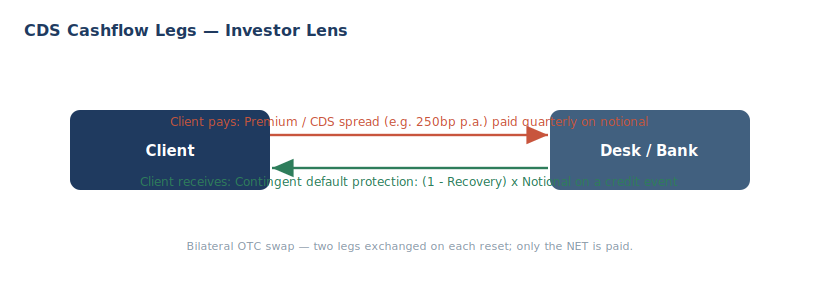

- **Protection buyer** is **short the reference entity's credit**: they pay the periodic premium (the CDS spread) on the notional and, if a credit event occurs, receive a contingent payout of (100% − Recovery Rate) × Notional from the protection seller. Premium payments then stop. A bank hedging a loan book, or a client expressing a bearish credit view, typically takes this side. The position gains value as the CDS spread widens (credit deteriorates).
- **Protection seller** is **long the reference entity's credit**: they receive the periodic premium and, if a credit event occurs, pay the contingent (100% − Recovery Rate) × Notional to the protection buyer. An insurance company seeking premium income, or a client expressing a bullish credit view, takes this side. The position gains value as the CDS spread tightens (credit improves) and earns the full premium if no credit event occurs.

The client's credit risk is measured by **CS01** — the change in the swap's mark-to-market value for a 1 basis point move in the credit spread. The protection seller additionally bears **jump-to-default** risk: the sudden, large contingent payment due if the reference entity defaults.

**Cashflows & scenarios**

On the premium leg, the protection buyer pays the spread × notional × day fraction on each (typically quarterly) payment date. The contingent leg pays only once, and only if a credit event occurs. The notional is never exchanged — it is the reference figure for both the premium and the contingent payment.

**Product:** 5-year CDS on an energy company. **Notional:** €30,000,000. **CDS spread:** 250bp (2.50% per year). **Annual premium:** €30M × 2.50% = €750,000. (The client is the protection buyer.)

- **Scenario 1 — No default, spreads stable:** Protection buyer pays €750,000 × 5 = €3,750,000 over 5 years. No credit event. **Cost: €3,750,000.** The insurance was not needed — like paying car insurance for 5 years without an accident.
- **Scenario 2 — No default, spreads tighten to 100bp:** Protection buyer continues paying €750,000/year. But the CDS now has positive mark-to-market value (the market charges only 100bp for new protection; the buyer locked in at 250bp). The buyer could unwind for a profit. **MTM gain: ~€3.4M** (approximate, depends on remaining tenor and discount rates).
- **Scenario 3 — Default in Year 3, recovery = 40%:** Credit event occurs. Protection buyer has paid 2.5 × €750,000 = €1,875,000 in premiums. Settlement: protection seller pays €30M × (1 − 40%) = **€18,000,000** to the protection buyer. Net: €18M − €1.875M = **€16,125,000 profit.** The insurance paid off.
- **Scenario 4 — Restructuring (soft credit event):** The company restructures its debt, extending maturities. This triggers a "restructuring" credit event under ISDA. The protection buyer delivers bonds to the protection seller and receives par (€30M). The bonds may be trading at 70 cents, so the buyer effectively receives €30M − €21M = **€9M in compensation** (minus premiums paid).

**Risks to the client**

| Risk | Description | Severity |
|------|------------|:--------:|
| **Credit event risk (sellers)** | If the reference entity defaults, the protection seller faces a large, sudden payment. | High |
| **Spread risk** | CDS mark-to-market changes as spreads move — widening benefits the protection buyer, tightening benefits the protection seller. | Medium-High |
| **Counterparty risk** | If the protection seller defaults simultaneously with the reference entity ("wrong-way risk"), the protection buyer gets no protection. | High |
| **Basis risk** | The CDS spread may not move in line with the underlying bond spread the client is hedging. | Medium |
| **Legal risk** | Disputes over whether an event qualifies as a "credit event" under ISDA definitions. | Medium |
| **Recovery rate uncertainty** | The actual recovery rate is unknown until after default and auction — it can differ significantly from market assumptions. | Medium |

#### §8. THE BANK LENS — Desk Economics (1st Line of Defence)

**What the desk books**

The desk takes the other side of the client's CDS and books it as a two-leg trade (premium leg + contingent protection leg) in its credit book. Where the client buys protection, the desk sells protection — receiving the premium and bearing the contingent payout; where the client sells protection, the desk buys it. No bond is booked, no option is embedded; the position is the present value of the expected premium payments less the present value of the expected default payment. The desk does not want a directional credit view from a single client trade — it warehouses the resulting credit risk and hedges it down.

**Credit risk & hedging**

The desk's primary risk is **CS01** — the dollar value of a 1 basis point move in the credit spread — measured name by name across the book, alongside **jump-to-default** risk, the sudden loss if a reference entity defaults outright. A CDS is binary on the contingent leg: either nothing happens (premium accrues) or a credit event triggers a large payout. The desk hedges its warehoused credit risk with **offsetting CDS, basis trades (CDS versus bond spread), or index hedges (CDX, iTraxx)**, and manages **recovery rate uncertainty** — the contingent payout depends on a recovery determined only at auction. Concentration of jump-to-default risk on a single reference entity is the main risk-management concern.

**How the bank makes money**

| Revenue Component | Detail |
|------------------|--------|
| **Bid-offer spread** | The bank buys protection at a lower spread than it sells protection, capturing the difference |
| **Market-making flow** | High-volume CDS trading generates consistent bid-offer income |
| **CVA/DVA management** | The bank prices counterparty risk into CDS trades and manages CVA (Credit Valuation Adjustment) as a revenue center |
| **Funding benefit** | Earns funding spread on collateral received under CSA |
| **Structuring into CLNs** | CDS is the core building block for Credit-Linked Notes — the bank embeds CDS protection in note form and earns a structuring fee |

**The desk spread decomposition:**

A CDS has no coupon to decompose in the way an ELN does — the client pays a periodic premium (the spread), and the desk's economics come from the markup it charges around the mid-market spread, plus market-making flow, CVA/DVA management, and the funding benefit on CSA collateral. *(The source does not provide a numeric decomposition for the CDS desk spread; the components below are inferred from the revenue table and labelled illustratively rather than taken from worked source figures.)* For a single-name CDS quoted around a mid spread, the desk's gross spread can be decomposed roughly as: bid-offer spread (the markup around mid, the dominant component); market-making flow income; CVA/DVA management; CSA funding benefit on collateral received; less the desk's own hedging and funding costs to run the position. The bid-offer and the CSA funding benefit are the structural sources; the hedging and flow P&L are the variable, market-dependent ones.

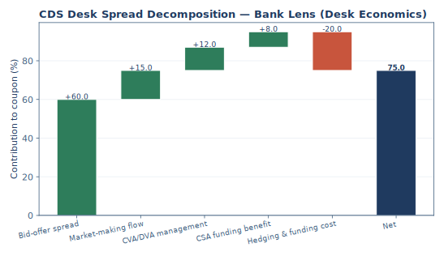

**P&L drivers**

Day to day, desk P&L is driven by moves in credit spreads against the warehoused CS01, the realized-versus-implied carry on the hedge portfolio (offsetting CDS, basis, index), jump-to-default events against concentrated single-name exposure, changes in recovery rate assumptions used for valuation, CVA/DVA on counterparty exposure, and the funding spread earned on CSA collateral. Product Control attributes P&L daily and verifies CDS valuations independently using credit curves and recovery assumptions; the spread-to-bond basis and the recovery assumption are the most common sources of valuation differences.

#### §9. THE BANK LENS — Controls & Reconciliation (2nd Line of Defence)

**Booking & systems**

| Aspect | Detail |
|--------|--------|
| **Book of record** | Murex |
| **Pricing/Risk system** | Murex |
| **Booking structure** | Two-leg trade (premium leg + contingent protection leg) |
| **Four-leg framework?** | No (CDS is a standalone derivative, not a structured note) |
| **Key booking fields** | Notional, reference entity, CDS spread, maturity, ISDA Credit Definitions version, settlement type |
| **Payment schedule** | Quarterly premium payments (IMM dates: March 20, June 20, Sep 20, Dec 20) |
| **ISDA documentation** | ISDA Master Agreement, CSA, ISDA Credit Definitions (2014 version) |

**Reconciliation points**

| Recon point | What must agree | CDS-specific break |
|-------------|-----------------|--------------------|
| **ISDA Credit Definitions** | Which ISDA Credit Definitions version governs the trade (2003 vs 2014) — they carry different credit-event triggers, notably "restructuring" | Trade booked under the wrong definitions version, so a restructuring triggers in one system but not another |
| **Reference entity / obligation** | The reference entity and its reference / deliverable obligations match the confirmation | Reference obligation confusion — deliverable obligations differ from the reference obligation |
| **Credit-event / auction** | Credit event declared by the ISDA Determinations Committee; auction-determined recovery used for settlement | Assumed recovery (for valuation) used in place of the actual auction recovery (for settlement) |
| **Premium accrual** | Premium accrued from the last payment date to the credit-event date, payable by the buyer | Accrued premium omitted or mis-dated when a credit event falls between payment dates |
| **Trade economics** | Notional, CDS spread, tenor, IMM payment schedule, counterparty | One system records a different notional or spread after an amend; or wrong counterparty |
| **Upfront / running coupon** | Standardized CDS trade at fixed coupons (100bp or 500bp) with an upfront payment to adjust — both must be captured | Running spread captured but upfront omitted, or vice versa |
| **Collateral (CSA)** | Daily MTM, margin call amount, and posted collateral agree with the counterparty | Counterparty disputes the MTM and the required collateral amount |
| **Leg PV reconciliation** | Present value of the premium leg and the contingent leg agree between front office and risk | Credit-curve / recovery-assumption differences, so leg PVs and total MTM diverge |

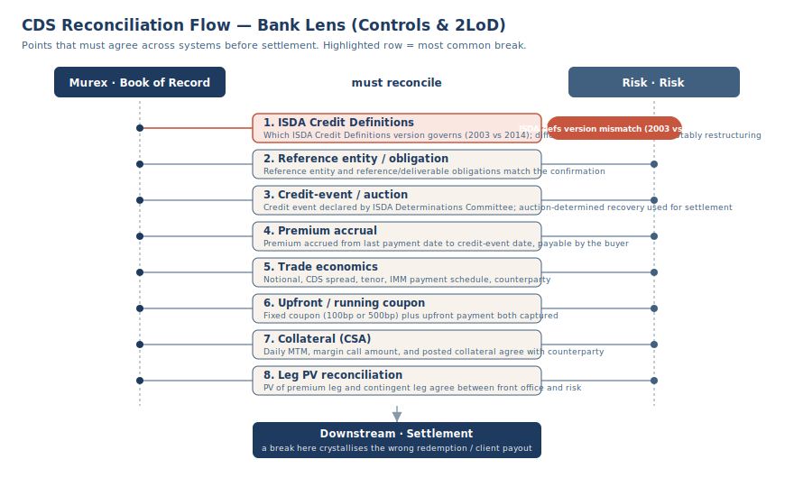

**Common breaks & red flags**

| Red Flag | What It Means | 2LoD Action |
|----------|---------------|-------------|
| ISDA definitions version mismatch | 2003 vs 2014 ISDA Credit Definitions have different credit event triggers (notably "restructuring") | Verify which version applies to the trade |
| Accrued premium after credit event | Premium accrued from the last payment date to the credit event date must be paid by the buyer | Ensure accrued premium is calculated correctly |
| Recovery rate assumption | Systems may use an assumed recovery rate for MTM but the actual recovery is determined by auction | Distinguish between assumed recovery (for valuation) and actual recovery (for settlement) |
| Reference obligation confusion | The CDS references a specific entity, but deliverable obligations may differ from the reference obligation | Verify deliverable obligation criteria per ISDA definitions |
| Upfront payment convention | Post-2009, standardized CDS trade at fixed coupons (100bp or 500bp) with an upfront payment to adjust. Systems must handle both the running spread and the upfront correctly | Verify upfront payment and running coupon are both captured |

**Control implication**

For a CDS the dominant controls are the **ISDA Credit Definitions version**, the **credit-event / auction settlement process**, and the **premium accrual and collateral (CSA) process** — together they determine whether each premium, each contingent payment, and each daily margin call is correct. A wrong definitions version misstates whether a restructuring even triggers, driving a payout (or no payout) to the wrong party. An auction-recovery error misstates the contingent payment — the seller pays (100% − Recovery), so a wrong recovery breaks the settlement amount. A missed accrued premium, or a CSA valuation difference rooted in the credit curve or recovery assumption, breaks the running cashflow or the daily collateral call, leaving the bank under- or over-collateralised against a live counterparty exposure. The reconciliation exists precisely to catch these inconsistencies before a premium settles, a credit event is settled, or a margin call is made.

#### §10. Formal Definition

A **Credit Default Swap (CDS)** is a derivative contract that transfers credit risk from one party to another.

**Protection buyer:** Pays a regular premium (the CDS spread, quoted in basis points per year) on the notional amount for the life of the contract.

**Protection seller:** Agrees to compensate the protection buyer if a credit event occurs on the reference entity.

**Credit events** (as defined by ISDA):
- **Bankruptcy** — the reference entity files for bankruptcy
- **Failure to Pay** — a missed payment on debt obligations beyond a grace period
- **Restructuring** — debt terms are modified unfavorably for creditors

**Settlement:**
- **Physical settlement:** Protection buyer delivers defaulted bonds; receives par (100%) from protection seller
- **Cash settlement:** Protection seller pays (100% − Recovery Rate) × Notional. An auction determines the recovery rate
- **Auction settlement:** ISDA conducts a credit event auction to determine the final price of deliverable obligations

**At inception:** The CDS spread is set so that the present value of expected premium payments equals the present value of expected default payments. No money changes hands at inception.

#### §11. Lifecycle

| Stage | Detail |
|-------|--------|
| **Trade date** | Terms agreed: notional, reference entity, CDS spread, maturity, settlement type. ISDA documentation. Book in Murex — record reference entity, notional, CDS spread, maturity, ISDA version |
| **Effective date** | Swap becomes active. First accrual period begins |
| **Quarterly premium** | Protection buyer pays spread × notional × day fraction on IMM dates. Netting applied |
| **Credit event** | If a credit event is declared by the ISDA Determinations Committee, trigger the settlement process. Premium payments stop; accrued premium to the event date is paid by the buyer |
| **Auction** | ISDA conducts an auction to determine the final price (recovery rate). Settlement = (100% − auction price) × notional |
| **Maturity** | If no credit event, the CDS expires. No further payments. Collateral returned |

#### §12. Worked Example (both lenses)

**Product:** 5-year CDS on Petrobras. **Notional:** $20,000,000. **CDS spread:** 300bp (3.00% per year). **Quarterly premium:** $20M × 3.00% / 4 = $150,000. (The client is the protection buyer; the desk sells protection.)

**Year-by-year (no default):**

| Year | Premium Paid | Cumulative Cost |
|:----:|:-----------:|:---------------:|
| 1 | $600,000 | $600,000 |
| 2 | $600,000 | $1,200,000 |
| 3 | $600,000 | $1,800,000 |
| 4 | $600,000 | $2,400,000 |
| 5 | $600,000 | $3,000,000 |

**Total cost if no default: $3,000,000.** The insurance was not needed.

**If default in Year 2 (after 6 quarterly premiums), recovery = 35%:**
Premiums paid: 6 × $150,000 = $900,000. Settlement: $20M × (100% − 35%) = **$13,000,000 payout.** Net: $13M − $0.9M = **$12,100,000 profit.**

**If spreads widen to 600bp after Year 1 (no default):**
The protection buyer holds a contract paying 300bp for protection now worth 600bp. The mark-to-market gain is approximately the present value of 300bp × remaining notional × remaining years ≈ **$2.1M.** The buyer could unwind for a profit.

*Client lens:*
As protection buyer, the client pays $150,000 quarterly. If the reference entity never defaults, the protection cost $3,000,000 over five years and was never collected on. If Petrobras defaults in Year 2 with 35% recovery, the client receives a $13,000,000 payout against $900,000 of premiums paid — a $12,100,000 profit that offsets the loss on the underlying bonds. If spreads widen to 600bp, the client holds protection now worth more than it paid for, an MTM gain of ~$2.1M that could be unwound. The protection buyer is short the reference entity's credit and gains as it deteriorates.

*Bank lens:*
The desk holds the mirror position — it sold protection, receiving the $150,000 quarterly premium, and is therefore long Petrobras credit on this single trade, which it warehouses and hedges with offsetting CDS or index hedges so the book's net CS01 and jump-to-default stay within limit. In the no-default path the desk keeps the $3,000,000 of premium less hedge costs; in the Year-2 default it owes the $13,000,000 settlement, funded against its hedge. The 2nd line must confirm the ISDA Credit Definitions version, that each quarterly premium and any accrued premium to the event date settled, that the auction-determined recovery (not the assumed 35% used for valuation) drove the settlement amount, and that daily CSA collateral tracked the changing MTM as spreads moved.

#### §13. Knowledge Check

1. **What is a CDS and what risk does it transfer?** *(Investor)*
2. **Name three ISDA-defined credit events.** *(Investor)*
3. **Explain the difference between physical and cash settlement for a CDS.** *(Investor)*
4. **A CDS has a spread of 500bp. What does this imply about the reference entity?** *(Investor)*
5. **What is "wrong-way risk" in the context of a CDS?** *(Investor)*
6. **(Desk economics / 1LoD)** When a client buys protection, what position does the desk take, what is its dominant credit Greek (and what additional binary risk does it carry), and how does the desk hedge the warehoused credit risk? Where does the desk's spread come from given the client pays a premium rather than a coupon to decompose?
7. **(Controls / 2LoD)** Name three reconciliation breaks specific to a CDS — covering the ISDA definitions version, the credit-event/auction recovery, and accrued premium or collateral — and the consequence of each for a premium, the contingent settlement, or the margin call.

**Mental Models**

| Concept | Mental Model |
|---------|-------------|
| CDS | Home warranty — pay annual fee, get compensated if something breaks |
| CDS spread | The warranty premium — reflects the condition and age of the appliances (credit quality) |
| Credit event | The furnace breaks — the warranty claim triggers a payout |
| Recovery rate | The salvage value of the broken furnace — what is left after the failure |
| Protection buyer | The homeowner — pays premiums for peace of mind; short the reference entity's credit |
| Protection seller | The warranty company — collects premiums and bears the repair cost; long the reference entity's credit |
| CS01 | The desk's speedometer for credit risk — dollars of P&L per 1 basis point move in the spread |
| Jump-to-default | The desk's tail risk — the sudden, large payout owed if a reference entity defaults outright |
| CSA collateral | The daily deposit each side posts so neither is over-exposed if the other defaults |

**Key Takeaways**

1. A CDS transfers credit risk: the protection buyer pays a regular premium (spread), and the protection seller pays out if a credit event occurs.
2. Credit events are defined by ISDA: bankruptcy, failure to pay, and restructuring.
3. Settlement can be physical (deliver bonds, receive par) or via ISDA auction (cash based on auction-determined recovery rate).
4. The CDS is binary on the contingent leg — no barriers, no optionality; the client's position is set purely by whether they buy protection (short credit) or sell protection (long credit).
5. The CDS is the building block for Credit-Linked Notes — understanding the CDS is prerequisite for [Part 5](#part-5).5.
6. The desk takes the mirror legs, warehouses the credit risk, and manages it by CS01 and jump-to-default — earning the bid-offer, market-making flow, CVA/DVA, and the CSA funding benefit rather than a coupon spread.
7. CDS is booked in Murex, traded on standardized IMM dates, and governed by ISDA Credit Definitions.
8. For the 2nd line, the dominant control risks are the ISDA Credit Definitions version, the credit-event/auction recovery, premium accrual, the upfront/running coupon split, leg PV reconciliation, and CSA collateral — each can misstate a premium, the contingent settlement, or a daily margin call.

#### §14. Common Mistakes

1. **Confusing CDS spread with probability of default.** The spread reflects default probability, recovery assumption, and market risk premium. A 300bp spread does not mean a 3% chance of default.
2. **Assuming the protection seller always pays 100%.** The seller pays (100% − Recovery Rate). If recovery is 40%, the payout is 60% of notional — not 100%.
3. **Ignoring accrued premium.** When a credit event occurs between premium payment dates, the buyer still owes the accrued premium from the last payment date to the event date.
4. **Treating the CDS as a bond.** A CDS is a derivative — it can have negative value (for the buyer) or positive value. It is not a bond with a coupon. The "spread" is not a coupon — it is an insurance premium.
5. **Forgetting wrong-way risk.** If the protection seller's creditworthiness is correlated with the reference entity (e.g., both are banks in the same country), the protection may fail precisely when it is needed most.
6. **(Controls)** Settling on the assumed recovery rather than the auction-determined recovery. Systems use an assumed recovery for daily MTM, but the contingent settlement must use the actual auction recovery — using the valuation assumption to pay the claim misstates the (100% − Recovery) × Notional payout.
### Knowledge Check

**Review Questions:**
1. What are the two legs of a CDS?
2. What three credit events are defined by ISDA?
3. How does cash settlement differ from physical settlement?
4. What determines the CDS spread at inception?
5. Why is the CDS important for Credit-Linked Notes?


**Dual-lens questions:**
- *(Desk economics / 1LoD)* Which side of the swap does the desk take, and what is its primary risk and hedge?
- *(Controls / 2LoD)* Which leg/fixing/collateral fields must reconcile, and which is the most common break?
**Scenario Questions:**
1. A bank holds €50M in bonds from Company X and buys €50M of CDS protection at 200bp. Company X defaults with 45% recovery. Calculate the CDS payout and the net impact on the bank.
2. A hedge fund sells $100M of CDS protection on a BBB-rated company at 150bp. After 2 years, the company's spreads widen to 400bp. Calculate the approximate mark-to-market loss for the seller. What happens if the company subsequently defaults with 30% recovery?
3. Two CDS contracts reference the same entity. Contract A uses 2003 ISDA definitions; Contract B uses 2014 definitions. The entity restructures its debt. Does both contracts trigger? Why might they differ?

**Desk Question:**
The ISDA Determinations Committee has declared a credit event on a reference entity in the bank's CDS book. The bank is a net protection buyer with €200M notional. Walk through the settlement process: the auction, the recovery rate determination, the payment calculation, and the operational steps required to settle the trade.

### Visual Specifications

| Visual ID | Type | Priority | Purpose | Caption | Location | Reuse |
|-----------|------|:--------:|---------|---------|----------|:-----:|
| FLOW_CDS_01 | Cash Flow Diagram | P1 | Show premium leg vs contingent leg between protection buyer and seller | Credit Default Swap: premium payments vs contingent protection payout | §7 | High |
| LIFECYCLE_CDS_01 | Lifecycle Diagram | P1 | Show CDS lifecycle from trade to maturity or credit event | CDS lifecycle: quarterly premiums, credit event trigger, and settlement | §10 | High |
| DIAGRAM_CDS_01 | Decision Tree | P1 | Show credit event determination: is it bankruptcy, failure to pay, or restructuring? | CDS credit event decision tree: determining the trigger type | §6 | Medium |
| COMPARE_CDS_01 | Comparison Chart | P2 | Compare CDS protection vs selling the bond for credit risk management | CDS hedging vs bond sale: trade-offs for credit risk reduction | §3 | Medium |
| WATERFALL_CDS_01 | Waterfall Diagram | P2 | Show settlement waterfall: notional → recovery rate → protection payout | CDS settlement calculation: from notional to net payout | §12 | Medium |

### Dependency References

| Concept Used | Where It Was Taught |
|-------------|-------------------|
| Credit risk, credit spread, recovery rate | [Section 1.9](#sec-1-9) (Credit Risk) |
| CDS concept, protection buyer/seller | [Section 1.9](#sec-1-9) (Credit Default Swaps — The Basics) |
| Credit events, ISDA | [Section 1.9](#sec-1-9) (Credit Events) |
| Swap structure | [Section 5.2.1](#sec-5-2-1) (IRS) |
| Counterparty risk, CSA | [Section 5.2.1](#sec-5-2-1) (IRS), [Section 1.9](#sec-1-9) (Credit Risk) |
| Murex booking | [Section 2.8](#sec-2-8) (Systems Primer) |

---


#### Visual Specifications

**Visual 1: Credit Default Swap Cash Flow Diagram**
- **Asset filename:** flow_cds_cash_flows_01.svg
- **Caption:** "Credit Default Swap Cash Flow Diagram"
- **Diagram elements:** Bilateral flow diagram showing periodic exchanges between two counterparties. Fixed vs floating legs clearly labelled. Payment dates marked on timeline
- **Reuse status:** Adapt from swap flow template
**Visual 2: Credit Default Swap Component Structure**
- **Asset filename:** construction_cds_components_02.svg
- **Caption:** "Credit Default Swap Component Structure"
- **Diagram elements:** Decomposition showing building blocks. Each component in separate box with arrows showing how they combine
- **Reuse status:** Adapt from construction template
**Visual 3: Credit Default Swap Lifecycle Timeline**
- **Asset filename:** lifecycle_cds_timeline_03.svg
- **Caption:** "Credit Default Swap Lifecycle Timeline"
- **Diagram elements:** Horizontal timeline from effective date to maturity. Key events marked: trade date, effective, payment dates, maturity
- **Reuse status:** Adapt from lifecycle template
**Visual 4: Credit Default Swap Risk Heatmap**
- **Asset filename:** risk_cds_heatmap_04.svg
- **Caption:** "Credit Default Swap Risk Heatmap"
- **Diagram elements:** Grid: risk types (market, credit, liquidity, operational) vs severity. Colour-coded cells appropriate for Credit Default Swap
- **Reuse status:** Adapt from risk heatmap template
**Visual 5: Credit Default Swap vs Vanilla Alternative**
- **Asset filename:** comparison_cds_vs_vanilla_05.svg
- **Caption:** "Credit Default Swap vs Vanilla Alternative"
- **Diagram elements:** Side-by-side comparison showing key differences from vanilla swap. Highlight unique features
- **Reuse status:** New — comparison panel
**Visual 6: Credit Default Swap Scenario Analysis**
- **Asset filename:** scenario_cds_rate_paths_06.svg
- **Caption:** "Credit Default Swap Scenario Analysis"
- **Diagram elements:** Three rate path scenarios (rates up, stable, down) showing P&L impact. Clearly labelled outcomes
- **Reuse status:** Adapt from scenario template


**Dual-lens visuals (generated):**
- `assets/cds/controls_cds_recon_08.svg` `[generated]`
- `assets/cds/legs_cds_01.svg` `[generated]`
- `assets/cds/waterfall_cds_09.svg` `[generated]`
#### Dependency References

| Concept Used | Where It Was Taught |
|-------------|-------------------|
| Credit risk fundamentals | [Section 1.9](#sec-1-9) (Credit Risk) |
| Product decomposition | [Section 2.2](#sec-2-2) (Product Construction) |
| CLN | 5.5.1 — funded credit |
| FTD | 5.5.3 — basket CDS |
| Synthetic CDO | 5.5.5 — tranched CDS portfolio |
### 5.2.6 Cross-Currency Swap {#sec-5-2-6}

> **Prerequisites:** [IRS](#sec-5-2-1) &nbsp;|&nbsp; **Key concepts:** Cross-currency basis, Herstatt risk, dual-currency PV

---

*Where an Interest Rate Swap ([Section 5.2.1](#sec-5-2-1)) exchanges fixed-for-floating interest in a single currency on a notional that is never itself exchanged, a Cross-Currency Swap adds a second dimension: it exchanges cash flows in two different currencies. Principal is exchanged at inception and re-exchanged at maturity, and between those dates each party pays interest in the currency it received. There is no bond wrapper, no barrier, no embedded put or call: just two interest legs in two currencies plus an initial and final exchange of principal, priced around the cross-currency basis. This chapter reads the product through two lenses: what it means for **the client** (the counterparty entering the swap), and what it means for **the bank** — the latter split into the desk's FX, rate and basis economics (1st line of defence) and the controls and reconciliation that surround it (2nd line of defence).*

#### §1. Explain Like I'm New

Akira is a corporate treasurer at a Japanese electronics company. The company needs $500 million to fund a new factory in Texas. It can borrow cheaply in Japanese yen (at 0.5%) but would pay a premium to borrow in U.S. dollars (4.5%) because American banks do not know the company well.

A **Cross-Currency Swap** solves this. Akira borrows ¥75 billion in Tokyo at 0.5%. He then enters a cross-currency swap with a global bank: the bank gives Akira $500 million and Akira gives the bank ¥75 billion (at the current exchange rate of ¥150/$). For the next 5 years, Akira pays dollar interest (4.2%) to the bank, and the bank pays yen interest (0.5%) to Akira. At maturity, they reverse the principal exchange: Akira returns the $500 million, the bank returns the ¥75 billion.

The result: Akira gets his dollar funding at a rate lower than he could have borrowed directly, because the bank passes on its dollar funding advantage.

#### §2. Real-World Analogy

A Cross-Currency Swap is like a holiday home exchange.

Two families — one in Tokyo, one in New York — agree to swap homes for a year. At the start, they exchange house keys (principal exchange). During the year, each family pays the other's local utility bills — the Tokyo family pays New York electricity in dollars, the New York family pays Tokyo gas in yen (interest payments in each currency). At the end of the year, they return the keys and move back to their own homes (re-exchange of principal).

Neither family bought the other's home. They exchanged assets temporarily, each paying the running costs in the other's currency. If exchange rates changed during the year, one family might feel the utilities were cheaper or more expensive — but the house keys are returned at the original agreed terms.

The key insight: the re-exchange of principal at maturity happens at the **original** FX rate agreed on day one, not the prevailing rate. That locked re-exchange rate is what turns the swap into an FX hedge on the principal.

#### §3. What Problem Does This Solve?

The Cross-Currency Swap addresses the **foreign currency funding** need:

| Client Need | How the Cross-Currency Swap Delivers |
|------------|-------------------------------------|
| Borrow in a foreign currency cheaply | Access the bank's funding advantage in that currency |
| Hedge FX exposure on foreign debt | Lock in the exchange rate for principal repayment |
| Convert asset cash flows to home currency | Receive domestic currency interest, pay foreign currency interest |
| Exploit funding cost differentials | Arbitrage between two capital markets |

#### §4. Product DNA

| Field | Value |
|-------|-------|
| **Full Name** | Cross-Currency Swap |
| **Abbreviation** | XCCY |
| **Family** | Swaps |
| **Complexity Score** | 5 / 10 |
| **Complexity Rationale** | Exchange of principal and interest in two currencies. Combines IRS with FX forward. Complex due to dual-currency cash flows |
| **Underlying Asset Class** | FX + Rates |
| **Capital Protection** | N/A (swap — principals exchanged) |
| **Coupon Type** | Interest in both currencies |
| **Maturity** | 1-30 years |
| **Liquidity** | OTC (liquid for major pairs) |
| **Primary System** | Murex |
| **ISDA Required** | Yes — ISDA |

**DNA Atlas Fields:**
- Primary Risk: FX risk on principal exchange. Interest rate risk in both currencies. Basis spread risk. Counterparty credit risk
- Typical Buyer: Multinational corporates (hedging foreign debt), banks (funding in foreign currencies), sovereigns
- Typical Use Case: Convert foreign currency debt to domestic. Access cheaper funding in foreign markets. Hedge long-dated FX exposure
- Building Blocks: Two IRS legs in different currencies + FX forward for principal exchange
- Key Hedge: IRS in each currency, FX forwards/options
- Similar Products: IRS (5.2.1 — single currency), DCI (5.6.8 — FX-linked deposit), Commodity Swap (5.2.7 — different underlying)
- Most Important Greek: FX delta + Dollar Value of One Basis Point (DV01) in both currencies (dual sensitivity)

**Comparison Matrix Fields:**
- Complexity: 5
- Yield Potential: Basis spread (typically negative for USD borrower)
- Capital Protection: N/A (swap)
- Credit Exposure: Counterparty (bilateral)
- Liquidity: OTC (major pairs liquid)
- Path Dependency: No
- Volatility Sensitivity: Moderate (both rate and FX vol)
- Correlation Sensitivity: Cross-currency basis correlation
- Client Type: Corporates, Banks, Sovereigns
- Market Environment: Used when funding in foreign currency is cheaper or when hedging FX debt

#### §5. Who Touches This Product

| Role | Responsibility |
|------|---------------|
| **Structurer** | Designs Cross-Currency Swap terms: notional, tenor, fixing conventions, special features |
| **Trader** | Manages Cross-Currency Swap book. Delta-hedges primary risk. Manages portfolio Greeks |
| **Sales** | Presents Cross-Currency Swap to clients for hedging or investment. Explains risk-return trade-off |
| **Risk Management** | Monitors counterparty exposure, MTM limits, Greek limits. Stress-tests Cross-Currency Swap portfolio |
| **Product Control** | Daily P&L attribution for Cross-Currency Swap book. Independent price verification |
| **Operations** | Confirms trade details (ISDA). Processes periodic payments. Manages collateral (CSA) |
| **Legal / Compliance** | ISDA Master Agreement and CSA negotiation. Trade reporting. Regulatory compliance |
| **Quantitative Analytics** | Prices Cross-Currency Swap and calibrates models. Develops risk analytics and sensitivities |

#### §6. Product Evolution

| Stage | Product | What Was Added | Why |
|:-----:|---------|---------------|-----|
| 1 | Loan / deposit | — (baseline) | Simple lending/borrowing relationship |
| 2 | Interest rate swap | Periodic cash flow exchange | Transform rate exposure between fixed and floating |
| 3 | Cross-Currency Swap | Two interest legs in two currencies + initial/final principal exchange | Extended swap concept: exchange of principal and interest in two currencies. Combines IRS with FX forward. Complex due to dual-currency cash flows |

---

#### §7. THE INVESTOR LENS

**Why the client enters it**

1. **Cheaper foreign funding.** A client with strong credit in its home market can access a foreign currency at a better rate through a swap than by borrowing directly abroad — the bank passes on its funding advantage in that currency.
2. **FX risk management.** The principal re-exchange at maturity is locked at the original FX rate, eliminating FX exposure on the principal of the foreign-currency liability.
3. **Liability management.** The client converts foreign currency debt into domestic currency obligations without refinancing the underlying loan.
4. **Regulatory capital efficiency.** Some jurisdictions treat swapped funding differently from direct foreign borrowing.
5. **Asset-liability matching.** The client aligns the currency and interest profile of its assets with its liabilities — receiving domestic-currency interest while paying foreign-currency interest.

**Legs & position**

A cross-currency swap has two interest legs in two currencies, bracketed by an exchange of principal at inception and a re-exchange at maturity. The client's position is defined by which currency principal it delivers and receives, and which interest leg it pays and receives. There is no embedded option, no premium, no barrier — only the directional FX, rate and basis exposure that the leg and currency choice creates.

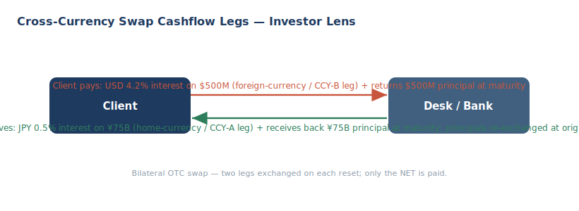

- At **inception**, the client delivers its home-currency principal (CCY-A, e.g. ¥75 billion) to the bank and receives the foreign-currency principal it needs (CCY-B, e.g. $500 million), exchanged at the spot FX rate (¥150/$).
- Over the **life**, the client **pays the foreign-currency interest leg** (CCY-B, e.g. USD 4.2% on $500M) and **receives the home-currency interest leg** (CCY-A, e.g. JPY 0.5% on ¥75B). Each party pays interest on the principal it received, in the currency it received.
- At **maturity**, the principals are **re-exchanged at the original FX rate** (¥150/$, not the prevailing rate): the client returns the foreign-currency principal ($500M) and receives back its home-currency principal (¥75B). This re-exchange at the original rate is what distinguishes the swap from an FX forward and is what provides full FX hedging on the principal.

The client's exposure is measured by **FX delta** (sensitivity to the FX rate on the future cash flows) and by **DV01 in both currencies** (the change in mark-to-market value for a 1 basis point move in each currency's rates), plus sensitivity to the **cross-currency basis**. The longer the tenor, the larger these sensitivities.

**Cashflows & scenarios**

On each payment date, each party pays interest in the currency of the principal it received; the principal itself moves only at inception and at maturity. The re-exchange at maturity is always at the original FX rate.

**Product:** 5-year Cross-Currency Swap. **Principals:** ¥75 billion ↔ $500 million (rate: ¥150/$). **Akira pays:** USD 4.2% on $500M. **Akira receives:** JPY 0.5% on ¥75B.

- **Scenario 1 — Rates and FX stable:** Annual flows: Akira pays $21M USD interest, receives ¥375M JPY interest. At maturity, re-exchange ¥75B ↔ $500M at the original rate. **Cost: the net interest differential, offset by the saving versus direct USD borrowing.**
- **Scenario 2 — JPY weakens to ¥180/$:** The swap's principal re-exchange is at the original rate (¥150/$), so Akira returns $500M and receives ¥75B regardless. If he had borrowed USD directly, he would be unaffected. The swap **protects** Akira from FX moves on the principal. His ¥75B yen borrowing is repaid with the ¥75B he receives back. **FX risk eliminated on principal.**
- **Scenario 3 — USD rates rise to 6%:** Akira is locked in at 4.2% on the swap. If he had borrowed floating-rate USD, he would now pay 6%. **The fixed rate on the swap protects against rate rises.**
- **Scenario 4 — Counterparty default:** If the bank defaults mid-swap, Akira loses the remaining interest payments and, critically, may not receive his ¥75B back at maturity. **Counterparty risk is the primary risk** — mitigated by CSA margin agreements.

**Risks to the client**

| Risk | Description | Severity |
|------|------------|:--------:|
| **FX risk (mark-to-market)** | Exchange rate moves create MTM gains/losses even though the principal re-exchange is at the original rate. | High |
| **Interest rate risk** | Changes in rates in either currency affect the swap's value. | Medium |
| **Cross-currency basis risk** | The basis spread can widen or tighten, affecting valuation and the all-in cost of swapped funding. | Medium |
| **Counterparty risk** | The principal exchange creates large settlement exposure — if the counterparty defaults at maturity, the full principal is at risk. Mitigated by CSA. | High |
| **Funding risk** | If the client's underlying funding is floating, rate changes affect its net cost. | Medium |
| **Settlement risk (Herstatt risk)** | Time-zone differences mean one leg may settle before the other — risk of paying without receiving. | Medium |

#### §8. THE BANK LENS — Desk Economics (1st Line of Defence)

**What the desk books**

The desk takes the other side of the client's swap and books it as a two-currency, two-interest-leg trade in its rates book, with the initial and final principal exchanges captured explicitly. Where the client delivers CCY-A principal and receives CCY-B principal, the desk receives CCY-A and pays CCY-B at inception, and reverses this at maturity at the original FX rate — the mirror exchange. Where the client pays the CCY-B interest leg and receives the CCY-A interest leg, the desk receives the CCY-B leg and pays the CCY-A leg. The position is the present value of the remaining cash flows in both currencies plus the re-exchange. The desk does not want a directional FX or rate view from a single client trade — it warehouses the resulting FX, rate and basis risk and hedges it down. The bank prefers structuring these swaps over holding outright FX risk because the swap creates a matched book (client flows offset each other), and the bank's funding advantage in certain currencies is a comparative advantage that generates recurring revenue.

**FX / rate / basis risk & hedging**

The desk's risks are **FX delta** on the principal and future cash flows, **DV01 in both currencies** (the dollar value of a 1 basis point move, measured curve-by-curve in each currency), and exposure to the **cross-currency basis**. A cross-currency swap is a linear product: there is no equity-style gamma, no barrier, no discontinuity — the P&L changes proportionally with FX and rate moves.

The FX desk hedges the currency exposure using spot and forward FX markets. The rates desk hedges the interest rate exposure using IRS in each currency. The residual and hardest risk to hedge is the **cross-currency basis risk** — the spread between swap-implied and market FX forward rates — which is volatile and difficult to hedge perfectly; the structured rates desk typically manages this hedge. FX exposure on the principal is the dominant risk factor: a ¥150/$ rate moving to ¥130/$ on a ¥75B/$500M swap creates a ¥7.7B MTM move, dwarfing interest rate sensitivity. The basis can gap 20-30bp overnight during funding stress (e.g. year-end USD squeeze), creating large MTM swings on a book of long-dated swaps. Concentration of FX delta or basis exposure is the main risk-management concern.

**How the bank makes money**

| Revenue Component | Detail |
|------------------|--------|
| **Bid-offer spread** | Captures spread between buy and sell pricing |
| **Hedging P&L** | Profits from managing hedge portfolio (realized vs implied) |
| **Funding benefit** | Earns funding spread on collateral received under CSA |
| **Structuring fee** | Fee for custom features beyond vanilla terms |

**The desk spread decomposition:**

The desk's economics come from a spread embedded in the swap rates — typically 5-15bp built into the cross-currency basis. On a $500M swap, this generates $250K-$750K annually. The gross spread can be decomposed roughly as: the basis/bid-offer spread (the markup built into the cross-currency basis, the dominant structural component); hedging P&L (realized versus implied carry on the offsetting FX forwards and IRS hedges); the CSA funding benefit (the funding spread earned on collateral received); less the desk's own hedging and funding costs to run the position. The bank also gains distribution value — cross-currency swaps are relationship products that cement long-term banking relationships with large corporates and sovereigns and open access to the client's broader business (lending, FX, advisory).

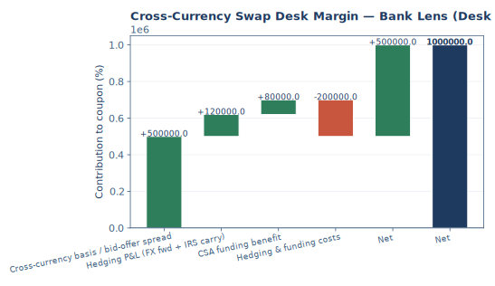

**P&L drivers**

Day to day, desk P&L is driven by FX moves on the warehoused principal and cash flows, moves in either currency's yield curve against the warehoused DV01, changes in the cross-currency basis against residual basis risk, the realized-versus-implied carry on the FX and IRS hedges, and the funding spread earned on CSA collateral. Product Control attributes P&L daily and verifies two-currency valuations independently, using separate discount curves for each leg; cross-currency basis curve construction and FX moves on the principal are the most common sources of large valuation changes.

#### §9. THE BANK LENS — Controls & Reconciliation (2nd Line of Defence)

**Booking & systems**

| Aspect | Detail |
|--------|--------|
| **Book of record** | Murex |
| **Pricing/Risk system** | Murex |
| **Booking structure** | Two-currency trade: two interest legs (one per currency) + initial and final principal exchange |
| **Four-leg framework?** | No (cross-currency swap is a standalone derivative, not a structured note) |
| **Key booking fields** | Two notionals (each currency), FX rate, two interest rates (fixed or floating), payment frequencies, day-count conventions, start/end dates, counterparty |
| **Payment schedule** | Semi-annual or quarterly in each currency |
| **ISDA documentation** | ISDA Master Agreement, CSA, ISDA Rate Definitions |

**Reconciliation points**

| Recon point | What must agree | XCCY-specific break |
|-------------|-----------------|---------------------|
| **ISDA / CSA terms** | Master Agreement, Credit Support Annex and ISDA Rate Definitions governing the trade — collateral eligibility, thresholds, netting set | Trade executed before ISDA/CSA is in place, or against the wrong netting set |
| **FX fixing rate** | The exact spot FX rate used for the initial principal exchange and locked for the final re-exchange matches the confirmation | The system FX rate differs from the agreed spot rate used for principal exchange, mispricing both exchanges |
| **CCY-A interest leg** | Notional, rate (fixed or floating), index, day-count, payment frequency and currency of the home-currency leg | Leg booked in the wrong currency, or a payment booked against the principal it did not receive |
| **CCY-B interest leg** | Notional, rate (fixed or floating), index, day-count, payment frequency and currency of the foreign-currency leg | Wrong rate or wrong currency on the foreign leg, so the payment amount differs |
| **Initial notional exchange** | Both currency principals and the exchange date (T+2) agree across systems | Initial exchange date or one principal amount mismatched, leaving an open FX position |
| **Final notional re-exchange** | Both principals re-exchanged at the **original** FX rate at maturity are booked | Final re-exchange not booked, leaving the system showing an open FX position at maturity |
| **Cross-currency basis** | The cross-currency basis curve is applied in valuation rather than par rates | System uses par rates without the basis adjustment, mispricing the swap |
| **Collateral currency (CSA)** | Daily MTM, margin call amount, posted collateral and the eligible collateral currency agree with the counterparty | Counterparty disputes the MTM/collateral, or collateral posted in the wrong currency |
| **Leg PV reconciliation** | Present value of each currency leg agrees between front office and risk, using separate discount curves | Curve / basis construction differs, so leg PVs and total MTM diverge |

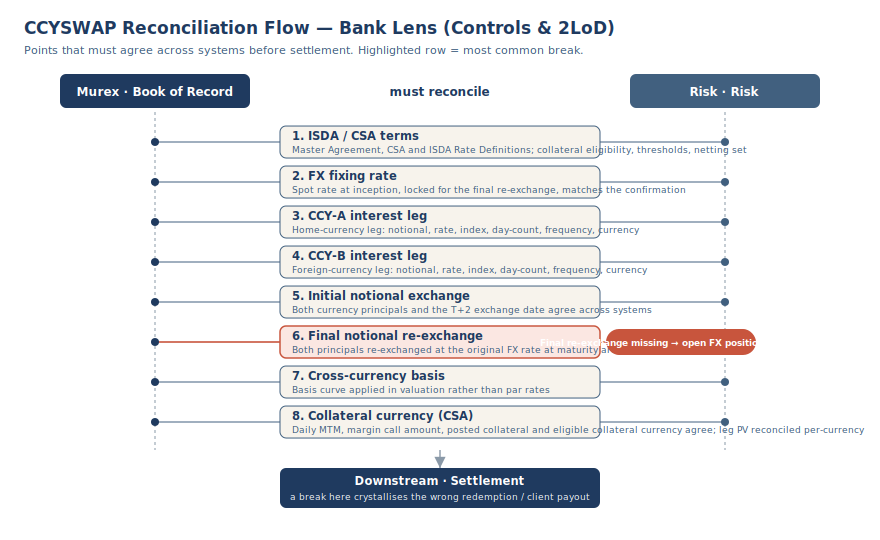

**Common breaks & red flags**

| Red Flag | What It Means | 2LoD Action |
|----------|---------------|-------------|
| **FX rate mismatch at inception** | The system FX rate differs from the agreed spot rate used for principal exchange | Verify the exact FX rate in the confirmation matches the system — it drives both the initial and final exchange |
| **Interest payment currency confusion** | A payment is booked in the wrong currency | Verify each leg pays in the currency of the principal it received |
| **Cross-currency basis not reflected in valuation** | The system uses par rates without the basis adjustment, mispricing the swap | Ensure the cross-currency basis curve is applied in Murex |
| **Settlement date misalignment across time zones** | JPY leg settles in Tokyo hours, USD leg settles in New York hours | Coordinate settlement timing; use CLS (Continuous Linked Settlement) where available |
| **Notional mismatch after partial unwind** | A partial termination reduces one notional but not the other proportionally | Verify both notionals are adjusted consistently after any amendment |
| **Final re-exchange missing** | The final principal re-exchange is not booked, leaving an open FX position at maturity | Verify the maturity re-exchange is booked at the original FX rate |

**Control implication**

For a cross-currency swap the dominant controls are the **initial and final notional exchange** and the **FX fixing rate** that governs them. The FX rate captured at inception is locked for the re-exchange at maturity, so a wrong fixing rate misprices both exchanges and the entire FX hedge; a missing or mis-dated final re-exchange leaves the system showing an open FX position against a live counterparty exposure. Secondary but material: each interest leg must be booked in the correct currency against the principal it received, the cross-currency basis must be applied in valuation, and the CSA collateral — in the eligible currency — must track the changing MTM as FX and rates move. Because the principal exchange creates large settlement exposure across two time zones, settlement timing (Herstatt risk, mitigated by CLS) is the operationally hardest control. The reconciliation exists precisely to catch these inconsistencies before a principal exchange settles or a margin call is made.

#### §10. Formal Definition

A **Cross-Currency Swap** is a derivative contract in which two parties exchange principal and interest payments in two different currencies.

**Three phases:**
1. **Initial exchange:** Principals are exchanged at the spot FX rate (Party A delivers Currency 1, Party B delivers Currency 2).
2. **Periodic payments:** Each party pays interest on the principal it received, in the currency it received. Payments can be fixed-fixed, fixed-floating, or floating-floating.
3. **Final exchange:** At maturity, the original principals are re-exchanged at the same FX rate as inception (not the prevailing rate).

The re-exchange at the original rate is what distinguishes a cross-currency swap from an FX forward — it provides full FX hedging on the principal amount for the life of the swap.

**Key terms:**
- **Two notionals:** One principal in each currency, exchanged at inception and re-exchanged at maturity. Unlike an IRS, the principal is physically exchanged.
- **FX fixing rate:** The spot rate at inception, which is locked and re-used for the final re-exchange.
- **Cross-currency basis:** A market-determined spread between the two currencies, built into the swap pricing.
- **Tenor:** The length of the swap (e.g., 5 years, up to 30 years).
- **Payment frequency:** How often interest is exchanged in each currency (quarterly, semi-annually).

#### §11. Lifecycle

| Stage | Detail |
|-------|--------|
| **Trade date** | Terms agreed: two notionals, FX rate, tenor, rate conventions, special features. ISDA documentation. Book in Murex — both currency legs and the initial/final principal exchanges entered with matching notionals, FX rate, dates, and conventions |
| **Effective date** | Swap becomes active. First accrual period begins |
| **Initial exchange (T+2)** | Physical exchange of principals at the spot FX rate |
| **Periodic payments** | Scheduled cash flow exchanges on payment dates; both parties pay interest in the currency they received. Netting applied within currency where applicable |
| **Collateral management** | Under the CSA, the party with a negative mark-to-market posts collateral in the eligible currency. Collateral amounts are recalculated daily as FX and rates move |
| **Maturity** | Final re-exchange of original principals at the original FX rate. Trade terminated. Collateral returned |

#### §12. Worked Example (both lenses)

**Product:** 5-year Cross-Currency Swap (JPY ↔ USD). **Notionals:** ¥15,000,000,000 ↔ $100,000,000 (rate: ¥150/$). **Akira pays:** USD 4.2% semi-annual on $100M. **Akira receives:** JPY 0.5% semi-annual on ¥15B. (Akira is the client, delivering JPY principal and receiving USD principal at inception; the desk takes the mirror side.)

| Period | USD Interest Paid | JPY Interest Received | Net Cost |
|:------:|:-----------------:|:--------------------:|:--------:|
| H1 Year 1 | $2,100,000 | ¥37,500,000 | USD cost net of JPY receipt |
| H2 Year 1 | $2,100,000 | ¥37,500,000 | (same pattern each period) |
| ... | ... | ... | ... |
| H2 Year 5 | $2,100,000 | ¥37,500,000 | |
| **Maturity** | Returns $100M | Receives ¥15B | Principal re-exchanged at ¥150/$ |

**Total USD interest paid over 5 years:** $2,100,000 × 10 = $21,000,000 (4.2% × $100M × 5).
**Total JPY interest received:** ¥37,500,000 × 10 = ¥375,000,000 (0.5% × ¥15B × 5).

If Akira could only borrow USD directly at 4.5%, the swap saves 30bp × $100M × 5 years = **$1,500,000** in interest costs, plus full FX hedging on the $100M principal.

*Client lens:*
The client accessed USD funding at 4.2% versus 4.5% direct, saving $1,500,000 over five years, and locked the ¥150/$ re-exchange rate so the $100M principal repayment is fully FX-hedged. The purpose was cheaper funding plus certainty on the principal, not speculation: regardless of where USD/JPY moves, the client returns $100M and receives back ¥15B at maturity, repaying its ¥15B home-currency borrowing.

*Bank lens:*
The desk holds the mirror position — receiving USD 4.2% and paying JPY 0.5%, receiving ¥15B and paying $100M at inception, reversed at the original ¥150/$ at maturity — and warehouses the FX, rate and basis risk, hedging the FX with spot/forward markets and the rates with IRS in each currency so the book's net FX delta and DV01 stay within limit. The desk earns the spread built into the cross-currency basis (5-15bp), the bid-offer at execution, and the CSA funding benefit. The 2nd line must confirm the ¥150/$ FX fixing against the termsheet, that each leg's interest settled in the correct currency, that both the initial and the final ¥15B/$100M exchanges are booked at the original rate, that the basis curve is applied, and that the daily CSA collateral tracked the changing MTM as FX and rates moved.

#### §13. Knowledge Check

1. **Why does a cross-currency swap exchange principal but an IRS does not?** *(Investor)*
2. **Explain why the final exchange uses the original FX rate, not the prevailing rate, and why that makes the swap an FX hedge on the principal.** *(Investor)*
3. **A Japanese company wants to fund a US subsidiary. Walk through how a cross-currency swap achieves this more cheaply than direct USD borrowing.** *(Investor)*
4. **Which interest leg does the client pay and which does it receive, and in which currency is each principal exchanged at inception and at maturity?** *(Investor)*
5. **What is Herstatt (settlement) risk and how is it mitigated in cross-currency swaps?** *(Investor)*
6. **Why is counterparty credit risk elevated relative to an IRS, and how is it mitigated?** *(Investor)*
7. **What is the cross-currency basis and how does it affect swap pricing?** *(Investor)*
8. **(Desk economics / 1LoD)** When a client enters a cross-currency swap, what mirror position does the desk book across the two interest legs and the two principal exchanges, what are its dominant risk factors (FX delta, DV01 in both currencies, basis), and how does it hedge each? Where does the desk's spread come from given there is no coupon to decompose?
9. **(Controls / 2LoD)** Name three reconciliation breaks specific to a cross-currency swap — covering the FX fixing rate, the interest legs, and the initial/final notional exchange — and the consequence of each for the FX hedge, a net payment, or the margin call.

**Mental Models**

| Concept | Mental Model |
|---------|-------------|
| Cross-currency swap | Holiday home exchange — swap keys, pay each other's bills, return keys at the end |
| Principal exchange | The house keys — exchanged at start, returned at end, always at the original terms |
| Interest payments | Utility bills — each family pays the other's local costs in the local currency |
| Cross-currency basis | The "convenience fee" for accessing a specific currency through a swap rather than borrowing directly |
| Re-exchange at original rate | A guaranteed return policy — no matter how exchange rates move, the principal is returned at the original price |
| FX delta on principal | The desk's speedometer for FX risk — the dominant risk factor, dwarfing rate sensitivity |
| CSA collateral | The daily deposit each side posts so neither is over-exposed if the other defaults |

**Key Takeaways**

1. A cross-currency swap exchanges principal and interest in two currencies, with principal re-exchanged at maturity at the original FX rate.
2. The re-exchange at the original rate provides full FX hedging on the principal — this is the product's defining feature.
3. Companies use cross-currency swaps to access cheaper foreign funding by exploiting their home-market credit advantage; the client pays the foreign-currency interest leg and receives the home-currency leg.
4. Counterparty risk is elevated because of the large principal exchange — CSA margin agreements are essential.
5. The product is linear — no barriers, no optionality; the client's exposure is set by which principal it delivers/receives and which interest leg it pays/receives, plus the cross-currency basis.
6. The desk takes the mirror legs and exchanges, warehouses the FX, rate and basis risk, and manages it by FX delta and DV01 in both currencies — earning the spread built into the basis, the bid-offer, and the CSA funding benefit rather than a coupon spread.
7. Cross-currency swaps are booked in Murex and governed by ISDA Master Agreements, CSA and ISDA Rate Definitions.
8. For the 2nd line, the dominant control risks are the FX fixing rate and the initial/final notional exchange — together they determine whether the FX hedge is correct — followed by the per-currency interest legs, the cross-currency basis in valuation, and the CSA collateral (in the eligible currency); each can misstate the hedge, a net payment, or a daily margin call.

#### §14. Common Mistakes

1. **Confusing a cross-currency swap with an FX forward.** An FX forward exchanges principal once at a future date. A cross-currency swap exchanges principal at start AND end, with interest payments in between. The swap provides both FX hedging and funding.
2. **Forgetting the principal exchange.** Unlike an IRS (where notional is only a reference amount), a cross-currency swap physically exchanges principal. This creates real settlement exposure.
3. **Ignoring the cross-currency basis.** The basis is a market-determined spread that affects the economics of the swap. A negative basis means swapping into a currency costs less than the interest rate differential suggests; a positive basis means it costs more.
4. **Assuming both legs must be fixed.** Cross-currency swaps can be fixed-fixed, fixed-floating, or floating-floating. The structure depends on the client's funding and hedging needs.
5. **Underestimating settlement risk.** Time-zone differences mean one currency leg may settle hours before the other. If the counterparty defaults between settlements, the party that paid first loses the principal.
6. **(Controls) Trusting a single system's FX fixing or assuming the final re-exchange is booked.** Because the entire FX hedge depends on the FX rate captured at inception being re-used at maturity, the 2nd line must reconcile the FX fixing against the termsheet and confirm both the initial and final notional exchanges are booked at the original rate, rather than assume they agree.
### Knowledge Check

**Review Questions:**
1. What three phases make up a cross-currency swap?
2. Why is principal physically exchanged in a cross-currency swap but not in an IRS?
3. What is the cross-currency basis?
4. At what FX rate is the principal re-exchanged at maturity?
5. What booking system is used for cross-currency swaps?


**Dual-lens questions:**
- *(Desk economics / 1LoD)* Which side of the swap does the desk take, and what is its primary risk and hedge?
- *(Controls / 2LoD)* Which leg/fixing/collateral fields must reconcile, and which is the most common break?
**Scenario Questions:**
1. A European company borrows €200M at 3.5% and enters a cross-currency swap to receive €200M and pay $220M at 4.8% (FX rate €1 = $1.10). Over 3 years, what are the company's annual cash flows on the swap? What happens at maturity?
2. A cross-currency swap has a notional of $100M/¥15B. At inception FX was ¥150/$. Six months later, FX is ¥140/$. Calculate the approximate MTM change on the principal exchange leg only.
3. A bank enters a USD/GBP cross-currency swap. The GBP leg settles at 4pm London, the USD leg settles at 3pm New York. Describe the Herstatt risk and two ways to mitigate it.

**Desk Question:**
Year-end is approaching and the USD cross-currency basis has widened by 25bp in the past week due to seasonal funding pressure. Your desk has a $5B notional book of EUR/USD cross-currency swaps. Explain how the basis widening affects the book's MTM, which clients are likely calling, and what trading actions you would consider.

### Visual Specifications (Publication Assets)

**Figure 5.2.6-01 — Cross-Currency Swap Cash Flow Structure**
- Visual ID: FLOW_CCY_SWAP_01
- Type: Cash Flow Diagram
- Priority: P1
- Purpose: Illustrate the three-phase cash flow structure — initial exchange, periodic payments, final re-exchange
- Visual Description: Three-panel horizontal layout showing the lifecycle. Panel 1: arrows showing principal exchange (Currency A left-to-right, Currency B right-to-left). Panel 2: periodic interest arrows in both directions with currency labels. Panel 3: reverse principal exchange with "at original FX rate" annotation.
- Diagram Elements: Party A (client), Party B (bank), Currency A principal, Currency B principal, Currency A interest arrows, Currency B interest arrows, FX rate label, timeline bar
- Caption: Cross-currency swap lifecycle: principal exchange, periodic interest payments, and re-exchange at original FX rate
- Location: §7
- Reuse Potential: High
- Future Asset Filename: flow_currency_swap_01.svg

**Figure 5.2.6-02 — Cross-Currency Swap MTM Sensitivity to FX**
- Visual ID: PAYOFF_CCY_SWAP_01
- Type: Payoff Diagram
- Priority: P1
- Purpose: Show how the swap's mark-to-market value changes as the domestic currency strengthens or weakens
- Visual Description: Single-axis chart with the X-axis showing FX rate movement (domestic currency strengthening left, weakening right) and Y-axis showing MTM value. A diagonal line crosses zero at inception FX rate.
- Diagram Elements: Zero line, inception FX rate marker, MTM line, labeled zones ("Gain" and "Loss"), domestic/foreign currency labels
- Axis Definitions: Y: Mark-to-Market Value ($M), X: Exchange Rate Movement (domestic strengthens →)
- Caption: Cross-currency swap MTM sensitivity: value changes as exchange rates move from inception
- Location: §8
- Reuse Potential: Medium
- Future Asset Filename: payoff_currency_swap_01.svg

**Figure 5.2.6-03 — Worked Example Timeline**
- Visual ID: TIMELINE_CCY_SWAP_01
- Type: Timeline
- Priority: P2
- Purpose: Show the 5-year cash flow timeline with specific dollar and yen amounts at each semi-annual payment
- Visual Description: Horizontal timeline with 10 semi-annual payment dates plus initial and final exchanges. Above the line: USD payments. Below the line: JPY receipts. Bookended by large principal exchange arrows.
- Diagram Elements: 12 date markers, USD interest amounts, JPY interest amounts, initial principal exchange, final principal re-exchange, net annual cost annotation
- Caption: 5-year JPY/USD cross-currency swap: semi-annual cash flows and principal exchanges
- Location: §12
- Reuse Potential: Medium
- Future Asset Filename: timeline_currency_swap_01.svg

**Figure 5.2.6-04 — Cross-Currency Basis Visualization**
- Visual ID: DIAGRAM_CCY_SWAP_01
- Type: Comparison Chart
- Priority: P2
- Purpose: Show how the cross-currency basis affects the all-in cost of swapped funding versus direct borrowing
- Visual Description: Bar chart comparing three funding options: (1) direct USD borrowing rate, (2) JPY borrowing + swap without basis, (3) JPY borrowing + swap with basis. The basis appears as an additional cost/saving on option 3.
- Diagram Elements: Three vertical bars, rate labels, basis spread annotation, "saving" bracket between options 1 and 3
- Axis Definitions: Y: All-In Funding Cost (%), X: Funding Method (categorical)
- Caption: Impact of cross-currency basis on swapped funding cost versus direct borrowing
- Location: §4
- Reuse Potential: Low (unique to cross-currency swap)
- Future Asset Filename: diagram_currency_swap_01.svg

**Figure 5.2.6-05 — Settlement Risk and CLS**
- Visual ID: LIFECYCLE_CCY_SWAP_01
- Type: System Flow Diagram
- Priority: P3
- Purpose: Show settlement timing across time zones and how CLS mitigates Herstatt risk
- Visual Description: Dual-timeline showing Tokyo settlement window and New York settlement window on a 24-hour clock. A danger zone is highlighted between the two settlement windows. A second diagram shows CLS as an intermediary receiving and delivering both currencies simultaneously.
- Diagram Elements: Tokyo clock, New York clock, danger zone (Herstatt risk window), CLS intermediary box, simultaneous settlement arrows
- Caption: Cross-currency swap settlement risk: time zone exposure and CLS mitigation
- Location: §11
- Reuse Potential: Medium
- Future Asset Filename: lifecycle_currency_swap_01.svg

### Dependency References

| Concept Used | Where It Was Taught |
|-------------|-------------------|
| Swap structure, netting | [Section 5.2.1](#sec-5-2-1) (IRS) |
| Interest rates, SOFR, EURIBOR | [Section 1.8](#sec-1-8) (Benchmark Rates) |
| FX concepts, exchange rates | [Section 0.5](#sec-0-5) (Currency Basics) |
| Counterparty risk, ISDA/CSA | [Section 5.2.1](#sec-5-2-1) (IRS), [Section 1.9](#sec-1-9) (Credit Risk) |
| Forward rates, yield curves | [Section 1.7](#sec-1-7) (Yield Curves) |
| Murex booking | [Section 2.8](#sec-2-8) (Systems Primer) |

---


#### Visual Specifications

**Visual 1: Cross-Currency Swap Cash Flow Diagram**
- **Asset filename:** flow_xccy_cash_flows_01.svg
- **Caption:** "Cross-Currency Swap Cash Flow Diagram"
- **Diagram elements:** Bilateral flow diagram showing periodic exchanges between two counterparties. Fixed vs floating legs clearly labelled. Payment dates marked on timeline
- **Reuse status:** Adapt from swap flow template
**Visual 2: Cross-Currency Swap Component Structure**
- **Asset filename:** construction_xccy_components_02.svg
- **Caption:** "Cross-Currency Swap Component Structure"
- **Diagram elements:** Decomposition showing building blocks. Each component in separate box with arrows showing how they combine
- **Reuse status:** Adapt from construction template
**Visual 3: Cross-Currency Swap Lifecycle Timeline**
- **Asset filename:** lifecycle_xccy_timeline_03.svg
- **Caption:** "Cross-Currency Swap Lifecycle Timeline"
- **Diagram elements:** Horizontal timeline from effective date to maturity. Key events marked: trade date, effective, payment dates, maturity
- **Reuse status:** Adapt from lifecycle template
**Visual 4: Cross-Currency Swap Risk Heatmap**
- **Asset filename:** risk_xccy_heatmap_04.svg
- **Caption:** "Cross-Currency Swap Risk Heatmap"
- **Diagram elements:** Grid: risk types (market, credit, liquidity, operational) vs severity. Colour-coded cells appropriate for Cross-Currency Swap
- **Reuse status:** Adapt from risk heatmap template
**Visual 5: Cross-Currency Swap vs Vanilla Alternative**
- **Asset filename:** comparison_xccy_vs_vanilla_05.svg
- **Caption:** "Cross-Currency Swap vs Vanilla Alternative"
- **Diagram elements:** Side-by-side comparison showing key differences from vanilla swap. Highlight unique features
- **Reuse status:** New — comparison panel
**Visual 6: Cross-Currency Swap Scenario Analysis**
- **Asset filename:** scenario_xccy_rate_paths_06.svg
- **Caption:** "Cross-Currency Swap Scenario Analysis"
- **Diagram elements:** Three rate path scenarios (rates up, stable, down) showing P&L impact. Clearly labelled outcomes
- **Reuse status:** Adapt from scenario template


**Dual-lens visuals (generated):**
- `assets/ccyswap/controls_ccyswap_recon_08.svg` `[generated]`
- `assets/ccyswap/legs_ccyswap_01.svg` `[generated]`
- `assets/ccyswap/waterfall_ccyswap_09.svg` `[generated]`
#### Dependency References

| Concept Used | Where It Was Taught |
|-------------|-------------------|
| Interest rate risk | [Section 1.8](#sec-1-8) (Interest Rate Risk) |
| Yield curve mechanics | [Section 1.7](#sec-1-7) (Yield Curves) |
| Product decomposition | [Section 2.2](#sec-2-2) (Product Construction) |
| IRS | 5.2.1 — single currency |
| DCI | 5.6.8 — FX-linked deposit |
| Commodity Swap | 5.2.7 — different underlying |
### 5.2.7 Commodity Swap {#sec-5-2-7}

> **Prerequisites:** [IRS](#sec-5-2-1) &nbsp;|&nbsp; **Key concepts:** Commodity benchmarks, Asian averaging, basis risk

---

*Where an Interest Rate Swap ([Section 5.2.1](#sec-5-2-1)) exchanges two streams of interest payments on a notional, a Commodity Swap exchanges a fixed commodity price for a floating commodity price. It is a bilateral OTC contract: one party pays a fixed price per unit on a specified volume and receives the floating market price of the commodity (typically the arithmetic average of a futures or spot index over the settlement period); the other party takes the mirror side. No physical commodity changes hands — only the net cash difference is settled. There is no bond wrapper, no barrier, no embedded put or call: just a fixed-price leg and a floating-price leg. This chapter reads the product through two lenses: what it means for **the client** (the counterparty entering the swap to hedge a commodity price), and what it means for **the bank** — the latter split into the desk's commodity-price economics (1st line of defence) and the controls and reconciliation that surround it (2nd line of defence).*

**How this differs from the IRS (5.2.1):** In an IRS the floating leg references an interest rate (SOFR). In a commodity swap the floating leg references a commodity price (e.g. ICE Brent crude oil). The IRS hedges interest rate risk; the commodity swap hedges commodity price risk. Both are cash-settled swaps with periodic net payments.

#### §1. Explain Like I'm New

Consider the fuel procurement function at a Middle Eastern airline. The airline burns 2 million barrels of jet fuel per year. Fuel is its largest operating cost — over 30% of total expenses. When oil prices spike, the airline's margins collapse; when prices fall, margins expand. This volatility makes budgeting nearly impossible.

A **Commodity Swap** gives the airline price certainty. The airline enters a swap where it pays a fixed price per barrel ($85) and receives the floating market price of jet fuel. If jet fuel rises to $100, the swap pays the airline $15/barrel — offsetting the higher fuel cost. If jet fuel falls to $70, the airline pays the swap $15/barrel — but enjoys cheaper fuel at the pump. Either way, the airline's effective fuel cost is locked at $85/barrel.

The commodity swap does not deliver physical fuel. It is a financial contract that compensates for price differences, netting cash at each settlement.

#### §2. Real-World Analogy

A Commodity Swap is like a grocery delivery subscription with a fixed monthly fee.

A household signs up for a weekly grocery delivery at a fixed price of $100/week. The actual cost of the groceries fluctuates — some weeks the ingredients cost $120 (the household benefits from the fixed price), some weeks they cost $80 (the service benefits). The household always pays $100 regardless.

The grocery service has taken on the household's price risk. If food prices spike during a drought, the service absorbs the extra cost. If food prices drop due to a bumper harvest, the service profits from the difference.

A commodity swap works identically: the fixed-price payer (the airline) locks in a cost, and the floating-price payer (the bank) absorbs the commodity price volatility. Neither party delivers groceries (or oil) — they just settle the price difference in cash.

#### §3. What Problem Does This Solve?

The Commodity Swap addresses the **commodity price risk** need:

| Client Need | How the Commodity Swap Delivers |
|------------|--------------------------------|
| Lock in production costs | Pay fixed price, receive floating — stabilize input costs |
| Lock in sales revenue | Receive fixed price, pay floating — stabilize output revenue |
| Budget certainty | Fixed commodity cost enables reliable financial planning |
| No physical delivery | Cash-settled — no storage, logistics, or quality issues |

#### §4. Product DNA

| Field | Value |
|-------|-------|
| **Full Name** | Commodity Swap |
| **Abbreviation** | CommSwap |
| **Family** | Swaps |
| **Complexity Score** | 4 / 10 |
| **Complexity Rationale** | Fixed-for-floating exchange on commodity price. Cash (financial) settlement — no physical delivery. Hedging tool for producers and consumers |
| **Underlying Asset Class** | Commodities |
| **Capital Protection** | N/A (swap — no principal exchanged) |
| **Coupon Type** | Fixed vs floating commodity price |
| **Maturity** | 1 month - 5 years |
| **Liquidity** | OTC (bilateral, some exchange-cleared) |
| **Primary System** | Murex / Endur |
| **ISDA Required** | Yes — ISDA Master Agreement |

**DNA Atlas Fields:**
- Primary Risk: Commodity price volatility. Basis risk (hedge vs actual commodity). Contango/backwardation. Counterparty credit risk
- Typical Buyer: Commodity producers (lock in selling price), consumers (lock in buying price), traders
- Typical Use Case: Lock in commodity price for budget certainty. Producers hedge revenue, consumers hedge costs
- Building Blocks: Fixed-price leg vs floating-price leg (referenced to commodity benchmark)
- Key Hedge: Offsetting commodity swap, exchange-traded futures, options on commodity
- Similar Products: IRS (5.2.1 — rate version), Equity Swap (5.2.3 — equity version), Forward (5.6.2 — single settlement)
- Most Important Greek: Commodity delta (price sensitivity)

**Comparison Matrix Fields:**
- Complexity: 4
- Yield Potential: Fixed price vs market price difference (no yield enhancement — hedging instrument)
- Capital Protection: N/A (swap)
- Credit Exposure: Counterparty (bilateral, mitigated by CSA)
- Liquidity: OTC (varies by commodity)
- Path Dependency: No
- Volatility Sensitivity: Full commodity price exposure (linear product)
- Correlation Sensitivity: None
- Client Type: Producers, Consumers, Trading firms
- Market Environment: Used when commodity exposure needs hedging or expressing views

#### §5. Who Touches This Product

| Role | Responsibility |
|------|---------------|
| **Structurer** | Designs Commodity Swap terms: notional volume, tenor, fixing conventions, averaging period, special features |
| **Trader** | Manages Commodity Swap book. Delta-hedges primary risk with futures. Manages portfolio Greeks and basis |
| **Sales** | Presents Commodity Swap to clients for hedging. Explains risk-return trade-off and basis risk |
| **Risk Management** | Monitors counterparty exposure, MTM limits, Greek limits. Stress-tests Commodity Swap portfolio |
| **Product Control** | Daily P&L attribution for Commodity Swap book. Independent price verification against agreed source |
| **Operations** | Confirms trade details (ISDA). Processes periodic averaged settlements. Manages collateral (CSA) |
| **Legal / Compliance** | ISDA Master Agreement, CSA and ISDA Commodity Definitions negotiation. Trade reporting. Regulatory compliance |
| **Quantitative Analytics** | Prices Commodity Swap and calibrates models. Develops risk analytics and sensitivities |

#### §6. Product Evolution

| Stage | Product | What Was Added | Why |
|:-----:|---------|---------------|-----|
| 1 | Loan / deposit | — (baseline) | Simple lending/borrowing relationship |
| 2 | Interest rate swap | Periodic cash flow exchange | Transform rate exposure between fixed and floating |
| 3 | Commodity Swap | Floating leg references a commodity price | Extended swap concept: fixed-for-floating exchange on commodity price. Cash settlement. Hedging tool for producers and consumers |

---

#### §7. THE INVESTOR LENS

**Why the client enters it**

1. **Cost certainty.** Airlines, manufacturers, and utilities lock in commodity costs to protect margins, converting a volatile input cost into a fixed, predictable one.
2. **Revenue certainty.** Producers (mining, agriculture, energy) lock in sales prices to secure cash flows, converting volatile output revenue into a stable stream.
3. **Budget certainty.** A fixed commodity cost or revenue enables reliable financial planning across the hedge horizon.
4. **Simplicity.** Cash-settled — no need to arrange physical delivery, storage, or quality inspection.
5. **Flexibility.** Can be structured on any commodity with a liquid reference price (oil, gas, metals, power, agricultural). The swap is priced so its initial value is zero, so entering it typically requires no upfront payment.

The client does not "make money" on the swap in isolation — it is a hedge, not a speculative instrument. The client benefits when commodity prices move against its physical position: if fuel rises from $85 to $100, the swap pays $15/barrel, protecting the airline's margin. In the opposite scenario the airline pays the swap but benefits from cheaper fuel at the pump. The economic benefit is stability, not directional profit.

**Legs & position**

A commodity swap has two legs, and the client's position is defined entirely by which leg it pays and which it receives. There is no embedded option, no premium, no barrier — only the directional exposure that the leg choice creates.

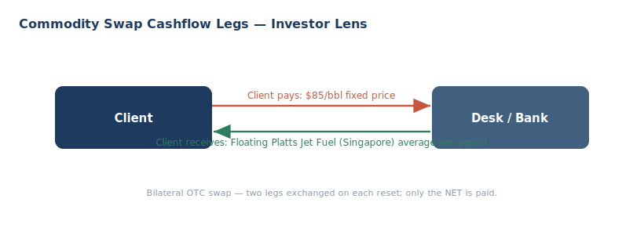

- **Pay-fixed / receive-floating client** (e.g. a consumer such as an airline) is **long the commodity** through the swap: it pays a fixed price and receives the floating market price. If the commodity price rises, the floating leg it receives grows while the fixed leg it pays stays constant — the swap gains value for the client, offsetting the higher physical cost. A consumer hedging an input cost typically takes this side, locking in a fixed cost.
- **Receive-fixed / pay-floating client** (e.g. a producer such as a miner) is **short the commodity** through the swap: it receives a fixed price and pays the floating market price. If the commodity price falls, the floating leg it pays shrinks while the fixed leg it receives stays constant — the swap gains value for the client, protecting its sales revenue. A producer locking in selling price takes this side.

The client's commodity risk is measured by **commodity delta** — the change in the swap's mark-to-market value for a unit move in the reference commodity price. The larger the notional volume and the longer the tenor, the larger the delta.

**Cashflows & scenarios**

On each settlement date only the **net** difference between the fixed price and the averaged floating price, multiplied by the volume, is exchanged. The notional volume is never delivered — it is purely a reference figure for calculating each leg.

**Product:** 1-year Commodity Swap on Jet Fuel. **Volume:** 500,000 barrels (quarterly settlement, 125,000 barrels per quarter). **Fixed price:** $85/barrel. **Reference:** Platts Jet Fuel (Singapore). (The airline is the pay-fixed / receive-floating, long-commodity counterparty.)

- **Scenario 1 — Jet fuel averages $95:** Each quarter the airline receives ($95 − $85) × 125,000 barrels = $1,250,000. **Annual gain: $5,000,000.** The swap compensates for the higher fuel cost.
- **Scenario 2 — Jet fuel averages $80:** Each quarter the airline pays ($85 − $80) × 125,000 = $625,000. **Annual cost: $2,500,000.** The airline "overpays" on the swap but underpays at the pump.
- **Scenario 3 — Jet fuel spikes to $130 (supply crisis):** Each quarter the airline receives ($130 − $85) × 125,000 = $5,625,000. **Annual gain: $22,500,000.** The swap is a lifeline — without it, the airline's fuel bill would have increased by $22.5M.
- **Scenario 4 — Jet fuel drops to $60 (oversupply):** Each quarter the airline pays ($85 − $60) × 125,000 = $3,125,000. **Annual cost: $12,500,000.** The airline locked in at $85 and cannot benefit from cheap fuel. This is the cost of certainty.

**Risks to the client**

| Risk | Description | Severity |
|------|------------|:--------:|
| **Commodity price risk** | The core exposure. If the commodity price moves against the position, the swap loses mark-to-market value for the client — though when used as a hedge this is offset by the physical exposure. | High |
| **Basis risk** | The swap may reference Brent crude while the airline burns jet fuel — the price correlation is high but imperfect, leaving the crack spread unhedged. | High |
| **Volume risk** | If the client's actual consumption or production differs from the hedged volume, the hedge is imperfect. | Medium |
| **Counterparty credit risk** | If the other party defaults when the swap has positive value to the client, the client loses that value. Mitigated by collateral agreements (CSA/ISDA). | Medium |
| **Opportunity cost** | If the commodity price falls significantly, the fixed-price payer cannot benefit from cheaper prices — the cost of certainty. | Medium |
| **Mark-to-market volatility** | Commodity prices can swing 5-10% in a day, creating large MTM movements on the swap. | High |

#### §8. THE BANK LENS — Desk Economics (1st Line of Defence)

**What the desk books**

The desk takes the other side of the client's swap and books it as a two-leg trade (fixed-price leg + floating-price leg) in its commodities book. Where the client pays fixed and receives the floating commodity price, the desk receives fixed and pays the floating commodity price — the mirror leg. No principal is booked, no option is embedded; the position is the present value of the remaining net cash flows. The desk does not want a directional commodity view from a single client trade — it warehouses the resulting commodity price risk and hedges it down.

**Commodity risk & hedging**

The desk's primary risk is **commodity delta** — the dollar value of a unit move in the reference commodity price, measured tenor by tenor across the forward curve, not as a single number. A swap is a **linear** product: there is no equity-style gamma, no barrier, no discontinuity. The P&L changes proportionally with the commodity price.

The desk hedges the warehoused delta with **exchange-traded futures (ICE Brent, NYMEX WTI, LME metals)** and offsetting commodity swaps, and manages the residual risks: **basis risk** (e.g. jet fuel vs Brent crude differential), **timing risk** (swap settlement dates vs futures expiry), and **roll risk** (rolling futures contracts at each expiry, which can total 2-5% of notional per year on a long-dated swap). Concentration of delta in a particular commodity or far-dated tenor is the main risk-management concern, as commodity futures are liquid for 2-3 months but become illiquid beyond 12 months.

**How the bank makes money**

| Revenue Component | Detail |
|------------------|--------|
| **Bid-offer spread** | Captures spread between buy and sell pricing |
| **Structuring spread** | Spread embedded in the fixed price above the fair forward price |
| **Hedging P&L** | Profits from managing the futures hedge portfolio (realized vs implied; basis) |
| **Funding benefit** | Earns funding spread on collateral received under CSA |

**The desk spread decomposition:**

Unlike an ELN, a commodity swap has no coupon to decompose — the client pays no premium and there is no embedded option. The desk's economics come instead from the spread it embeds in the fixed price around the fair forward, plus the basis it earns between the swap price and the futures hedge, plus the funding benefit on CSA collateral. On a $85 fixed price where the fair forward is $84, the bank earns $1/barrel × volume; on 2M barrels, this is $2M. The structuring spread (typically 1-3% above the fair forward) and the CSA funding benefit are the two structural sources; the hedging P&L (the basis between the swap and the futures hedge, less roll and funding costs) is the variable, market-dependent one.

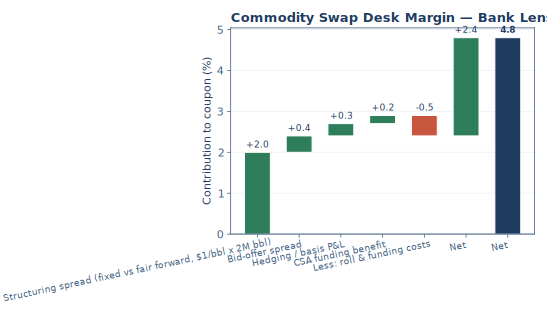

**P&L drivers**

Day to day, desk P&L is driven by moves in the commodity forward curve against the warehoused delta, the basis between the swap reference and the futures hedge, roll costs at each futures expiry, changes in the shape of the forward curve (contango/backwardation), and the funding spread earned on CSA collateral. Product Control attributes P&L daily and verifies swap valuations independently against the futures curve used for hedging; the averaging methodology and the price source are the most common sources of valuation differences.

#### §9. THE BANK LENS — Controls & Reconciliation (2nd Line of Defence)

**Booking & systems**

| Aspect | Detail |
|--------|--------|
| **Book of record** | Murex |
| **Pricing/Risk system** | Murex |
| **Booking structure** | Two-leg trade (fixed-price leg + floating-price leg) |
| **Four-leg framework?** | No (commodity swap is a standalone derivative, not a structured note) |
| **Key booking fields** | Notional volume, commodity reference, fixed price, settlement frequency, averaging method, start/end dates, counterparty |
| **Payment schedule** | Monthly or quarterly — net cash settlement on each date based on the averaging period |
| **ISDA documentation** | Governed by ISDA Master Agreement, Credit Support Annex (CSA), and ISDA Commodity Definitions |

**Reconciliation points**

| Recon point | What must agree | CommSwap-specific break |
|-------------|-----------------|-------------------------|
| **ISDA / CSA terms** | Master Agreement, CSA and ISDA Commodity Definitions governing the trade — collateral eligibility, thresholds, netting set | Trade executed before ISDA/CSA is in place, or against the wrong netting set |
| **Trade economics** | Notional volume, fixed price, commodity reference, settlement frequency, start/end dates, counterparty | One system records 400,000 bbl, another a stale volume after an amend; or wrong counterparty |
| **Commodity index / fixing source** | The floating-price benchmark — the exact commodity reference code and publishing source (e.g. ICE Brent, Platts Jet Fuel Singapore, NYMEX WTI, LME Copper) | Swap references "ICE Brent" but the system uses "WTI" for the floating price |
| **Averaging methodology** | The set of observation dates and method (Asian average of all business days vs single end-of-month fixing), and the holiday calendar used | Contract specifies an Asian average but the system uses a single month-end fixing, or the wrong market holiday calendar |
| **Settlement** | Cash-settled net amount = (floating average − fixed) × volume on each date; net not gross | Gross payment sent instead of net, or settlement against the wrong averaging window |
| **Leg PV reconciliation** | Present value of the fixed leg and the floating leg agree between front office and risk | Forward-curve construction differs, so leg PVs and total MTM diverge from the futures hedge curve |
| **Collateral (CSA)** | Daily MTM, margin call amount, and posted collateral agree with the counterparty | Counterparty disputes the MTM and the required collateral amount |
| **Novation / clearing** | If the trade is novated or cleared, the new counterparty / CCP and the trade record agree | Novation booked on one side only, or cleared trade not removed from the bilateral book |

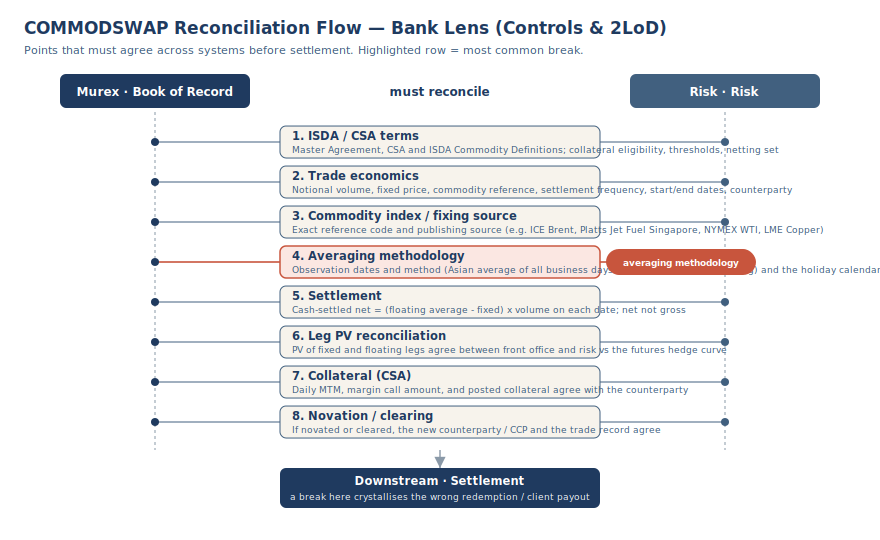

**Common breaks & red flags**

| Red Flag | What It Means | 2LoD Action |
|----------|---------------|-------------|
| Averaging period mismatch | The system uses a different set of daily prices than the contract specifies | Verify the exact averaging dates and price source (e.g. Platts vs ICE) against the confirmation |
| Asian average vs end-of-month fixing | The contract specifies an Asian average (all business days) but the system uses a single month-end fixing | Verify the averaging methodology matches the trade terms |
| Basis commodity confusion | The swap references "ICE Brent" but the system uses "WTI" for the floating price | Verify the exact commodity reference code matches the confirmation |
| Volume rollover error | A partial hedge or volume amendment changes the periodic volume but the system retains the old figure | Verify current notional volume matches the live trade |
| Holiday calendar misalignment | Different commodity markets have different holiday calendars (e.g. Chinese metals vs London) | Use the contractual holiday calendar for price observation |
| Collateral dispute | Counterparty disagrees on MTM and required collateral amount | Reconcile valuations; differences often stem from forward-curve construction methodology |

**Control implication**

For a commodity swap the dominant controls are the **commodity index / fixing source** and the **averaging methodology** — together they determine whether each net settlement is correct. A wrong reference index misstates the floating leg, driving the wrong net payment to the wrong party (booking the swap against the wrong index creates a systematic settlement error). An averaging error — using a single end-of-month fixing where the contract specifies an Asian average, or the wrong holiday calendar — distorts the floating average and the settlement even when the index is right, because Asian averaging requires correctly collecting 60+ daily prices per quarter, handling holidays and missing prices. A CSA valuation difference — most often rooted in forward-curve construction versus the futures hedge curve — breaks the daily collateral call, leaving the bank under- or over-collateralised against a live counterparty exposure. The reconciliation exists precisely to catch these inconsistencies before a settlement pays or a margin call is made.

#### §10. Formal Definition

A **Commodity Swap** is a derivative contract in which one party pays a fixed commodity price and the other pays a floating commodity price on a specified volume, with settlement based on the difference.

**Fixed leg:** The hedger pays a fixed price per unit (e.g. $85/barrel) on a specified volume, at regular intervals.

**Floating leg:** The other party pays the average market price over the settlement period, based on a specified reference (e.g. Platts Jet Fuel Singapore, ICE Brent, LME Copper).

**Settlement:** Cash-settled. At each settlement date, the fixed and floating prices are compared, and the net difference (multiplied by the volume) is paid by the losing party. No physical commodity is delivered.

**Key terms:**
- **Notional volume:** The quantity of commodity (barrels, tonnes, MWh). It is never delivered — it is a reference amount only.
- **Reference price:** The commodity benchmark used for the floating leg.
- **Settlement frequency:** Monthly, quarterly, or per the agreed schedule.
- **Asian average:** Many commodity swaps use the arithmetic average of daily prices over the period (not a single fixing), reducing manipulation risk.
- **Netting:** On each settlement date, only the net difference between the two legs is exchanged.

#### §11. Lifecycle

| Stage | Detail |
|-------|--------|
| **Trade date** | Terms agreed: notional volume, tenor, fixed price, reference index, averaging method, special features. ISDA documentation. Book in Murex — both legs entered with matching volume, dates, and conventions |
| **Effective date** | Swap becomes active. First accrual period begins |
| **Price observation** | Over each settlement period, the floating reference is observed and the Asian average computed from the agreed source (e.g. ICE Brent, Platts Jet Fuel Singapore) |
| **Periodic payments** | Scheduled cash flow exchanges on settlement dates. Net settlement applied on each date |
| **Collateral management** | Under the CSA, the party with a negative mark-to-market posts collateral to the other party. Collateral amounts are recalculated daily |
| **Maturity** | Final net exchange of cash flows. Trade terminated. Collateral returned |

#### §12. Worked Example (both lenses)

**Product:** 1-year Commodity Swap on Brent Crude Oil. **Notional:** 100,000 barrels per quarter (400,000 barrels total). **Fixed price:** $82/barrel. **Reference:** ICE Brent (daily average over each quarter). **Settlement:** Quarterly, cash. (The airline is the pay-fixed / receive-floating, long-commodity counterparty; the desk takes the receive-fixed / pay-floating side.)

| Quarter | Brent Avg ($/bbl) | Fixed ($/bbl) | Difference | Settlement |
|:-------:|:-----------------:|:-------------:|:----------:|:----------:|
| Q1 | $88 | $82 | +$6 | Bank pays airline **$600,000** |
| Q2 | $78 | $82 | −$4 | Airline pays bank **$400,000** |
| Q3 | $92 | $82 | +$10 | Bank pays airline **$1,000,000** |
| Q4 | $75 | $82 | −$7 | Airline pays bank **$700,000** |

**Annual average Brent: $83.25.** Net annual result: airline received $1,600,000 − $1,100,000 = **$500,000 net gain.** The swap stabilized the airline's fuel cost at approximately $82/barrel regardless of quarterly volatility.

*Client lens:*
The airline locked in at $82 when Brent averaged $83.25 over the period. The swap was profitable in hindsight — but its purpose was certainty, not speculation. Even if prices had fallen, the airline would have had predictable costs, with any swap loss offset by cheaper physical fuel. The pay-fixed position is long the commodity through the swap, so it gains as Brent rises above $82 in Q1 and Q3 and pays when it falls below in Q2 and Q4.

*Bank lens:*
The desk holds the mirror position — receive-fixed, pay-floating — and is therefore short Brent on this single trade, which it warehouses and hedges with ICE Brent futures so the book's net commodity delta stays within limit. Across the four quarters the desk pays the $500,000 net to the airline, funded against its hedge P&L, the structuring spread and basis earned at execution, and the CSA funding benefit on collateral. The 2nd line must confirm each quarter's ICE Brent average against the termsheet source and averaging window, that each net amount (not gross) settled, and that the daily CSA collateral tracked the changing MTM as Brent moved.

#### §13. Knowledge Check

1. **What is a commodity swap and how does it differ from a commodity futures contract?** *(Investor)*
2. **Why do most commodity swaps use an Asian average rather than a single fixing?** *(Investor)*
3. **A consumer wants to lock in its input cost. What swap does it enter?** (Pay fixed, receive floating — long the commodity through the swap.) *(Investor)*
4. **If the commodity price rises after entering a pay-fixed swap, does the swap gain or lose value for the fixed-price payer?** Why? *(Investor)*
5. **What is the notional volume of a commodity swap? Is it delivered?** *(Investor)*
6. **What is basis risk in a commodity swap? Give an example.** *(Investor)*
7. **Explain counterparty credit risk in a commodity swap and how it is mitigated.** *(Investor)*
8. **(Desk economics / 1LoD)** When a client enters a pay-fixed commodity swap, what position does the desk take, what is its dominant Greek, and how does the desk hedge the warehoused risk? Given there is no coupon to decompose, where does the desk's spread come from, and what residual risks (basis, timing, roll) remain?
9. **(Controls / 2LoD)** Name three reconciliation breaks specific to a commodity swap — covering the index/fixing source, the averaging methodology, and collateral — and the consequence of each for the net settlement or the margin call.

**Mental Models**

| Concept | Mental Model |
|---------|-------------|
| Commodity swap | Grocery subscription — fixed weekly fee regardless of ingredient prices |
| Fixed price | The budget — the number put in the financial plan |
| Floating price | The market reality — what the commodity actually costs |
| Pay-fixed payer | Wants certainty — locks in a known cost; long the commodity through the swap, gains if prices rise |
| Notional volume | A reference quantity — like a ruler used to measure, never delivered |
| Zero initial value | The swap is a fair bet at inception — both sides agree the expected value is equal |
| Basis risk | Subscribing to a vegetable box when the household actually wants organic fruit — similar but not identical |
| Asian average | Weighing every day and using the period average, not just one reading |
| Commodity delta | The desk's speedometer for price risk — dollars of P&L per unit move, summed across the forward curve |
| CSA collateral | The daily deposit each side posts so neither is over-exposed if the other defaults |

**Key Takeaways**

1. A commodity swap exchanges a fixed commodity price for a floating market price on a specified volume, providing budget certainty.
2. No physical commodity is delivered — settlement is cash-based, and the notional volume is a reference for calculating payments.
3. At inception, the swap has zero value. Value develops as the commodity price diverges from the fixed price.
4. The swap is a linear instrument — no barriers, no knock-ins, no optionality; the client's position is set purely by which leg it pays (pay-fixed = long the commodity through the swap, receive-fixed = short).
5. Most commodity swaps use an Asian average (average of daily prices) to reduce manipulation risk; basis risk — the difference between the swap's reference commodity and the client's actual commodity — is the primary hedging challenge.
6. The desk takes the mirror legs, warehouses the commodity price risk, and hedges it with exchange-traded futures — earning the bid-offer, the structuring spread embedded in the fixed price, and the basis, while managing roll and timing risk rather than a coupon spread.
7. Commodity swaps are booked in Murex and governed by ISDA Master Agreements and ISDA Commodity Definitions.
8. For the 2nd line, the dominant control risks are the commodity index / fixing source, the averaging methodology, settlement netting, leg PV reconciliation, and CSA collateral — each can misstate a net settlement or a daily margin call.

#### §14. Common Mistakes

1. **Confusing commodity swaps with futures.** Futures are exchange-traded, standardized, and require margin. Commodity swaps are OTC, customizable, and settled per ISDA. A swap can reference any commodity with a published price; futures exist only for major commodities.
2. **Ignoring basis risk.** An airline hedging with a Brent crude swap is not perfectly hedged — jet fuel and Brent crude have correlated but different prices. The "crack spread" (refining margin) is unhedged.
3. **Hedging beyond the planning horizon.** Locking in a 5-year fuel price when flight schedules are uncertain beyond 18 months creates over-hedging risk.
4. **Treating the swap as a profit center.** If the commodity price drops and the swap loses money, the hedge is still working — the airline benefits from cheaper physical fuel, and the swap loss is offset by the physical gain. Viewing the swap in isolation distorts the picture.
5. **(Controls)** **Forgetting the Asian average / wrong price source.** If the swap uses an Asian average and the system values it using a single end-of-month price — or uses the wrong benchmark (e.g. Platts Singapore Jet Fuel where the contract specifies ICE Gasoil) — the valuation and settlement will be systematically wrong. Verify the averaging methodology and exact index code against the confirmation.
### Knowledge Check

**Review Questions:**
1. What are the two legs of a commodity swap?
2. What is an Asian average and why is it used?
3. What is basis risk in the context of a commodity swap?
4. How does a commodity swap differ from a commodity future?
5. Is a commodity swap physically or cash-settled?


**Dual-lens questions:**
- *(Desk economics / 1LoD)* Which side of the swap does the desk take, and what is its primary risk and hedge?
- *(Controls / 2LoD)* Which leg/fixing/collateral fields must reconcile, and which is the most common break?
**Scenario Questions:**
1. An airline enters a 500,000 barrel/year jet fuel swap at $85/barrel. Jet fuel averages $95 in H1 and $75 in H2. Calculate the H1 and H2 settlement amounts and the annual net result.
2. A mining company wants to lock in its copper revenue. It produces 10,000 tonnes/year and enters a swap at $8,500/tonne. Copper averages $9,200/tonne. Does the swap help or hurt the mining company? Calculate the net impact.
3. An airline hedges with a Brent crude swap at $80/barrel. The jet fuel/Brent basis widens from $5 to $15. The airline's actual jet fuel cost is Brent + basis. What is the effective fuel cost? Has the hedge worked?

**Desk Question:**
Your desk runs a book of commodity swaps across crude oil, jet fuel, natural gas, and copper. The oil trading desk uses NYMEX WTI futures to hedge, but many swaps reference ICE Brent. Explain the basis risk this creates, how you would monitor it, and what circumstances would cause the largest losses.

### Visual Specifications (Publication Assets)

**Figure 5.2.7-01 — Commodity Swap Cash Flow Structure**
- Visual ID: FLOW_COMM_SWAP_01
- Type: Cash Flow Diagram
- Priority: P1
- Purpose: Show the two-way flow — fixed price versus floating commodity price with cash settlement
- Visual Description: Two-party diagram with the airline on the left and the bank on the right. Fixed price arrow flows right, floating price arrow flows left. A "net settlement" box below shows the cash difference calculation.
- Diagram Elements: Airline (fixed payer), Bank (floating payer), fixed price arrow ($85/bbl), floating price arrow (market price), net settlement formula, cash settlement arrow
- Caption: Commodity swap: fixed price versus floating market price with net cash settlement
- Location: §7
- Reuse Potential: High
- Future Asset Filename: flow_commodity_swap_01.svg

**Figure 5.2.7-02 — Commodity Swap Payoff Diagram**
- Visual ID: PAYOFF_COMM_SWAP_01
- Type: Payoff Diagram
- Priority: P1
- Purpose: Show linear payoff for the fixed-price payer with break-even at the fixed price
- Visual Description: Standard linear payoff chart with the X-axis showing the floating commodity price and Y-axis showing the P&L for the fixed payer. The line crosses zero at the fixed price ($85). Annotations show "Swap pays airline" above zero and "Airline pays swap" below.
- Diagram Elements: Zero line, fixed price marker ($85), payoff line, gain/loss zone labels
- Axis Definitions: Y: P&L for Fixed-Price Payer ($), X: Floating Commodity Price ($/barrel)
- Caption: Commodity swap payoff: the fixed-price payer profits when commodity prices rise above the fixed price
- Location: §8
- Reuse Potential: High
- Future Asset Filename: payoff_commodity_swap_01.svg

**Figure 5.2.7-03 — Worked Example Quarterly Settlement**
- Visual ID: TIMELINE_COMM_SWAP_01
- Type: Timeline
- Priority: P2
- Purpose: Show the quarterly settlement amounts over the 1-year worked example
- Visual Description: Horizontal timeline with 4 quarterly settlement dates. Above each date: a bar showing the floating price. Below each date: a bar showing the fixed price. The gap between the bars is labeled with the settlement amount and direction. A cumulative net line runs along the bottom.
- Diagram Elements: 4 quarterly date markers, floating price bars, fixed price line, settlement amounts, net cumulative line
- Axis Definitions: Y: Price ($/barrel), X: Time (quarters)
- Caption: 1-year Brent crude commodity swap: quarterly settlements showing price differences and net flows
- Location: §12
- Reuse Potential: Medium
- Future Asset Filename: timeline_commodity_swap_01.svg

**Figure 5.2.7-04 — Basis Risk Illustration**
- Visual ID: DIAGRAM_COMM_SWAP_01
- Type: Comparison Chart
- Priority: P2
- Purpose: Show the gap between the swap reference commodity (Brent crude) and the client's actual commodity (jet fuel) to illustrate basis risk
- Visual Description: Dual-line chart showing Brent crude and jet fuel prices over 12 months. The vertical gap between the lines varies, widening during stress periods. An annotation highlights a period where basis risk creates an unhedged loss.
- Diagram Elements: Brent crude price line, jet fuel price line, basis spread shading, stress period annotation, basis risk loss callout
- Axis Definitions: Y: Price ($/barrel), X: Time (months)
- Caption: Basis risk: the gap between the swap reference price (Brent) and the actual cost (jet fuel) creates residual exposure
- Location: §9 (unique to commodity swap)
- Reuse Potential: Low
- Future Asset Filename: diagram_commodity_swap_01.svg

**Figure 5.2.7-05 — Hedging Stack: Futures Roll Lifecycle**
- Visual ID: LIFECYCLE_COMM_SWAP_01
- Type: Lifecycle Diagram
- Priority: P3
- Purpose: Show how the bank hedges a 1-year commodity swap by rolling exchange-traded futures contracts monthly
- Visual Description: Horizontal timeline showing the 12-month swap period. Below the timeline: a staircase of overlapping futures contracts, each with a different expiry month. Arrows show the "roll" from one contract to the next. Roll cost annotations appear at each transition.
- Diagram Elements: Swap period bar, 12 futures contract bars (staircase), roll arrows, roll cost labels, basis annotation
- Caption: Commodity swap hedge lifecycle: rolling exchange-traded futures to maintain the hedge over the swap period
- Location: §10
- Reuse Potential: Medium
- Future Asset Filename: lifecycle_commodity_swap_01.svg

### Dependency References

| Concept Used | Where It Was Taught |
|-------------|-------------------|
| Swap structure, netting | [Section 5.2.1](#sec-5-2-1) (IRS) |
| Derivatives concept | [Section 0.8](#sec-0-8) (What Is a Derivative?) |
| Forward prices, futures | [Section 1.7](#sec-1-7) (Yield Curves, Forward Rates) |
| Counterparty risk, ISDA/CSA | [Section 5.2.1](#sec-5-2-1) (IRS), [Section 1.9](#sec-1-9) (Credit Risk) |
| Delta hedging | [Section 2.7](#sec-2-7) (How Desks Hedge) |
| Murex booking | [Section 2.8](#sec-2-8) (Systems Primer) |

---


#### Visual Specifications

**Visual 1: Commodity Swap Cash Flow Diagram**
- **Asset filename:** flow_commswap_cash_flows_01.svg
- **Caption:** "Commodity Swap Cash Flow Diagram"
- **Diagram elements:** Bilateral flow diagram showing periodic exchanges between two counterparties. Fixed vs floating legs clearly labelled. Payment dates marked on timeline
- **Reuse status:** Adapt from swap flow template
**Visual 2: Commodity Swap Component Structure**
- **Asset filename:** construction_commswap_components_02.svg
- **Caption:** "Commodity Swap Component Structure"
- **Diagram elements:** Decomposition showing building blocks. Each component in separate box with arrows showing how they combine
- **Reuse status:** Adapt from construction template
**Visual 3: Commodity Swap Lifecycle Timeline**
- **Asset filename:** lifecycle_commswap_timeline_03.svg
- **Caption:** "Commodity Swap Lifecycle Timeline"
- **Diagram elements:** Horizontal timeline from effective date to maturity. Key events marked: trade date, effective, payment dates, maturity
- **Reuse status:** Adapt from lifecycle template
**Visual 4: Commodity Swap Risk Heatmap**
- **Asset filename:** risk_commswap_heatmap_04.svg
- **Caption:** "Commodity Swap Risk Heatmap"
- **Diagram elements:** Grid: risk types (market, credit, liquidity, operational) vs severity. Colour-coded cells appropriate for Commodity Swap
- **Reuse status:** Adapt from risk heatmap template
**Visual 5: Commodity Swap vs Vanilla Alternative**
- **Asset filename:** comparison_commswap_vs_vanilla_05.svg
- **Caption:** "Commodity Swap vs Vanilla Alternative"
- **Diagram elements:** Side-by-side comparison showing key differences from vanilla swap. Highlight unique features
- **Reuse status:** New — comparison panel
**Visual 6: Commodity Swap Scenario Analysis**
- **Asset filename:** scenario_commswap_rate_paths_06.svg
- **Caption:** "Commodity Swap Scenario Analysis"
- **Diagram elements:** Three rate path scenarios (rates up, stable, down) showing P&L impact. Clearly labelled outcomes
- **Reuse status:** Adapt from scenario template


**Dual-lens visuals (generated):**
- `assets/commodswap/controls_commodswap_recon_08.svg` `[generated]`
- `assets/commodswap/legs_commodswap_01.svg` `[generated]`
- `assets/commodswap/waterfall_commodswap_09.svg` `[generated]`
#### Dependency References

| Concept Used | Where It Was Taught |
|-------------|-------------------|
| Product decomposition | [Section 2.2](#sec-2-2) (Product Construction) |
| IRS | 5.2.1 — rate version |
| Equity Swap | 5.2.3 — equity version |
| Forward | 5.6.2 — single settlement |
### 5.2.8 Vanilla Swap (VLSP) {#sec-5-2-8}

> **Prerequisites:** none — a foundation product, start here &nbsp;|&nbsp; **Key concepts:** Fixed vs floating rates, swap mechanics, cap/floor basics

---

*Where a Reverse Convertible ([Section 5.1.1](#sec-5-1-1)) embeds an option inside a note, a Vanilla Swap embeds nothing — it is the simplest, most standardized bilateral OTC interest-rate swap, in which two parties exchange two streams of interest payments on a notional that is never itself exchanged. There is no bond wrapper, no barrier, no embedded put or call: just a fixed leg and a floating leg. Where the IRS chapter (5.2.1) introduced the swap concept, this chapter reads the most standard swap as it is actually traded, cleared, and risk-managed — through two lenses: what it means for **the client** (the counterparty entering the swap), and what it means for **the bank** — the latter split into the desk's rate economics (1st line of defence) and the controls and reconciliation that surround it (2nd line of defence).*

**How This Differs From the IRS (5.2.1):** The IRS pilot introduced the concept of a swap — fixed versus floating payments. The VLSP covers the plain vanilla swap as a market-standard product: standardized terms, central clearing, IMM dates, Dollar Value of One Basis Point (DV01)-based risk management, and the role of the VLSP as the building block for every structured rate product in Batches 6-7. The IRS taught what a swap is. The VLSP shows how it works in production.

#### §1. Explain Like I'm New

Imagine a portfolio manager at a pension fund. The fund has $2 billion in corporate bonds paying fixed coupons. The manager believes interest rates will rise over the next 3 years, which would reduce the value of the fixed-rate bonds.

The fund enters a **Vanilla Swap** (VLSP): the fund pays a fixed rate (4.0%) and receives SOFR (floating). If rates rise — say SOFR increases from 4.0% to 5.5% — the swap pays the fund the difference: it receives 5.5% and pays 4.0%, netting 1.5% on the notional. This gain offsets the loss in value of the fund's fixed-rate bonds.

The VLSP is the most traded derivative in the world. Trillions of dollars in notional change hands every day. It is the reference product for interest rate risk management — every other rate product (SRT, STEG, swaptions, caps, floors) is ultimately priced and hedged using vanilla swaps.

#### §2. Real-World Analogy

A Vanilla Swap is like a standard bread recipe.

Every bread starts with four ingredients: flour, water, yeast, salt. The standard recipe — perfectly measured, universally understood — is what every baker learns first. Artisan breads, sourdough, brioche, and focaccia are all variations that add complexity, but they all start from the standard recipe.

The VLSP is the standard recipe for interest rate products. It is the simplest possible swap: fixed rate versus floating rate, standard terms, standard dates, standard documentation. Every structured rate product in Batches 6-7 (callable swaps, range accruals, digital cap-floors) starts with a VLSP and adds features. Understanding the standard recipe is prerequisite for understanding everything that follows.

#### §3. What Problem Does This Solve?

The VLSP addresses the **interest rate risk management** need:

| Client Need | How the VLSP Delivers |
|------------|----------------------|
| Hedge fixed-rate bond portfolio against rising rates | Pay fixed, receive floating — profit when rates rise |
| Convert floating-rate debt to fixed | Pay fixed on swap, offset floating payments on debt |
| Express an interest rate view | Position the swap to profit from expected rate movements |
| Benchmark pricing | VLSP rates are the reference for pricing all other rate products |

#### §4. Product DNA

| Field | Value |
|-------|-------|
| **Full Name** | Vanilla Swap |
| **Abbreviation** | VLSP |
| **Family** | Swaps |
| **Complexity Score** | 2 / 10 |
| **Complexity Rationale** | Plain-vanilla fixed-vs-floating interest-rate swap; the most standardized and liquid swap, and the building block for structured rate products |
| **Underlying Asset Class** | Rates |
| **Capital Protection** | N/A (swap) |
| **Coupon Type** | Fixed vs structured floating |
| **Maturity** | 2-10 years |
| **Liquidity** | OTC (less liquid than vanilla IRS) |
| **Primary System** | Murex |
| **ISDA Required** | Yes — ISDA |

**DNA Atlas Fields:**
- Primary Risk: Interest-rate / DV01 risk on the net of the fixed and floating legs
- Typical Buyer: Banks, corporates seeking customised rate hedges beyond vanilla IRS
- Typical Use Case: Tailored rate hedge. Captures specific view on rate path that vanilla IRS cannot express
- Building Blocks: Fixed leg + floating leg (SOFR)
- Key Hedge: Offsetting vanilla swaps; bond / STIR futures
- Similar Products: IRS (5.2.1 — vanilla), IR Callable (5.3.1 — callable), NCRA (5.3.3 — range accrual)
- Most Important Greek: DV01

**Comparison Matrix Fields:**
- Complexity: 2
- Yield Potential: Slightly above IRS rate (for additional features)
- Capital Protection: N/A (swap)
- Credit Exposure: Counterparty
- Liquidity: OTC (less liquid than IRS)
- Path Dependency: Depends on features
- Volatility Sensitivity: None (no embedded optionality)
- Correlation Sensitivity: None
- Client Type: Banks, Corporates
- Market Environment: Used when vanilla IRS is too simple but structured rate trade is too complex

#### §5. Who Touches This Product

| Role | Responsibility |
|------|---------------|
| **Structurer** | Designs Vanilla Swap terms: notional, tenor, fixing conventions, special features |
| **Trader** | Manages Vanilla Swap book. Delta-hedges primary risk. Manages portfolio Greeks |
| **Sales** | Presents Vanilla Swap to clients for hedging or investment. Explains risk-return trade-off |
| **Risk Management** | Monitors counterparty exposure, MTM limits, Greek limits. Stress-tests Vanilla Swap portfolio |
| **Product Control** | Daily P&L attribution for Vanilla Swap book. Independent price verification |
| **Operations** | Confirms trade details (ISDA). Processes periodic payments. Manages collateral (CSA) |
| **Legal / Compliance** | ISDA Master Agreement and CSA negotiation. Trade reporting. Regulatory compliance |
| **Quantitative Analytics** | Prices Vanilla Swap and calibrates models. Develops risk analytics and sensitivities |

#### §6. Product Evolution

| Stage | Product | What Was Added | Why |
|:-----:|---------|---------------|-----|
| 1 | Loan / deposit | — (baseline) | Simple lending/borrowing relationship |
| 2 | Interest rate swap | Periodic cash flow exchange | Transform rate exposure between fixed and floating |
| 3 | Vanilla Swap | Standardized, centrally cleared | Plain-vanilla fixed-vs-floating swap; the market-standard building block for structured rate products |

---

#### §7. THE INVESTOR LENS

**Why the client enters it**

1. **Rate hedging.** The client converts fixed-rate exposure to floating or vice versa — the fundamental tool for managing interest rate risk, without restructuring existing debt.
2. **Liquidity.** The most liquid derivative market in the world — tight bid-offer spreads, available in all major currencies, tenors from 1 to 50 years.
3. **Standardization.** IMM dates, standard tenors, central clearing — the VLSP is operationally simple compared to exotic swaps.
4. **View expression.** A client who expects rates to rise can enter a pay-fixed swap, positioning to profit from the expected rate movement.
5. **No upfront cost.** Entering a swap typically requires no upfront payment — the fixed rate is set so the swap has zero value at inception.

**Legs & position**

A VLSP has two legs, and the client's position is defined entirely by which leg they pay and which they receive. There is no embedded option, no premium, no barrier — only the directional exposure that the leg choice creates.

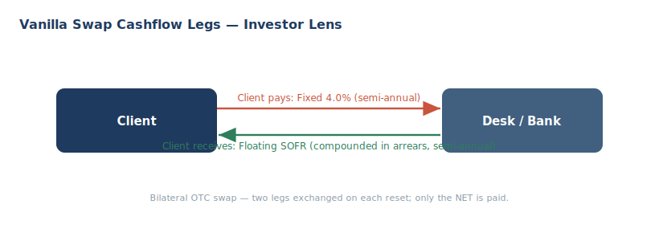

- **Pay-fixed / receive-floating client** is **short rates**: they pay a fixed rate and receive a floating rate (SOFR) that rises with the market. If rates rise, the floating leg they receive grows while the fixed leg they pay stays constant — the swap gains value for them. A pension fund hedging a fixed-rate bond portfolio against rising rates typically takes this side, as does a corporate converting floating-rate debt to fixed.
- **Receive-fixed / pay-floating client** is **long rates**: they receive a fixed rate and pay a floating rate. If rates fall, the floating leg they pay shrinks while the fixed leg they receive stays constant — the swap gains value for them. A client expressing a view that rates will fall takes this side.

The client's rate risk is measured by **DV01** — the change in the swap's mark-to-market value for a 1 basis point move in rates. The longer the tenor, the larger the DV01 and the more the position moves per basis point.

**Cashflows & scenarios**

On each payment date only the **net** difference between the two legs is exchanged, calculated as (SOFR − Fixed Rate) × Notional × Day Fraction. The notional is never paid — it is purely a reference figure for calculating each leg.

**Product:** 5-year VLSP, $200,000,000 notional. Client pays fixed 4.0% (semi-annual), receives SOFR (compounded in arrears, semi-annual). (The client is therefore the pay-fixed / receive-floating, short-rates counterparty.)

- **Scenario 1 — SOFR averages 5.0%:** Each period the client receives 5.0%, pays 4.0%. Net: +1.0% × $200M / 2 = **$1,000,000 per half-year.** Over 5 years: **$10,000,000 net gain.** The swap is profitable — the client locked in 4.0% while the market rate is now 5.0%.
- **Scenario 2 — SOFR averages 3.5%:** Each period the client receives 3.5%, pays 4.0%. Net: −0.5% × $200M / 2 = **$500,000 per half-year loss.** Over 5 years: **$5,000,000 net loss.** But if the client has a fixed-rate bond portfolio, the bonds gained value from lower rates — the swap loss is offset.
- **Scenario 3 — SOFR spikes to 7.0%:** Net: +3.0% × $200M / 2 = **$3,000,000 per half-year gain.** The swap massively offsets the loss in the client's fixed-rate bonds.
- **Scenario 4 — Rates unchanged at 4.0%:** Net: 0%. The swap produces no gain or loss. The client paid nothing for the hedge (no upfront premium) and rates did not move.

**Risks to the client**

| Risk | Description | Severity |
|------|------------|:--------:|
| **Interest rate risk** | The primary risk — rate changes create MTM gains/losses for the client | High |
| **Curve risk** | Changes in the yield curve shape (steepening/flattening) affect the swap value differently than a parallel shift | Medium |
| **Counterparty risk** | Mitigated by central clearing for standard VLSPs — residual risk exists for non-cleared swaps | Low-Medium |
| **Basis risk** | SOFR vs EURIBOR, OIS vs term SOFR — benchmark basis changes affect the floating leg value | Low-Medium |
| **Fixing risk** | The daily SOFR fixing determines the floating leg — errors or anomalies in the fixing affect payments | Low |
| **Operational risk** | Central clearing requires daily margin management; a failure to post margin triggers a default cascade | Medium |

#### §8. THE BANK LENS — Desk Economics (1st Line of Defence)

**What the desk books**

The desk takes the other side of the client's swap and books it as a two-leg trade (fixed leg + floating leg) in its rates book. Where the client pays fixed and receives floating, the desk receives fixed and pays floating — the mirror leg. No principal is booked, no option is embedded; the position is the present value of the remaining net cash flows. The desk does not want a directional rate view from a single client trade — it warehouses the resulting rate risk and hedges it down. The VLSP book is the largest book on the rates desk by notional.

**Rate risk & hedging**

The desk's primary risk is **DV01** — the dollar value of a 1 basis point move in rates — measured tenor by tenor across the curve, not as a single number. A VLSP is a **linear** product: there is no equity-style gamma, no barrier, no discontinuity. The P&L changes proportionally with rate moves. The desk hedges the warehoused DV01 with **other VLSPs, government bond futures, and short-term rate futures**, and manages the residual **curve risk** — the exposure to the curve steepening or flattening (2s10s, 5s30s) across the many tenors the book spans. DV01 hedging neutralizes parallel shifts but not curve shape changes, and curve moves are the dominant residual risk factor.

[margin/sensitivity panel]

**How the bank makes money**

| Revenue Component | Detail |
|------------------|--------|
| **Bid-offer spread** | Captures spread between buy and sell pricing |
| **Hedging P&L** | Profits from managing hedge portfolio (realized vs implied) |
| **Funding benefit** | Earns funding spread on collateral received under CSA |
| **Structuring fee** | Fee for custom features beyond vanilla terms |

**The desk spread decomposition:**

Unlike an ELN, a VLSP has no coupon to decompose — the client pays no premium and there is no embedded option. The desk's economics come instead from the spread it charges around the mid-market swap rate, plus the funding benefit on CSA collateral. The bid-offer spread is typically 0.5-2bp on liquid tenors; on a $500M swap, 1bp = $50K per year × 5 years ≈ $250K present value, and high volumes make this profitable. For a vanilla swap quoted at a 4.0% mid, the desk's gross spread can be decomposed roughly as: bid-offer spread (the markup around mid, the dominant component); hedging P&L (realized versus implied carry on the offsetting hedge); CSA funding benefit (the funding spread earned on collateral received); less the desk's own hedging and funding costs to run the position. The bid-offer and the CSA funding benefit are the two structural sources; the hedging P&L is the variable, market-dependent one.

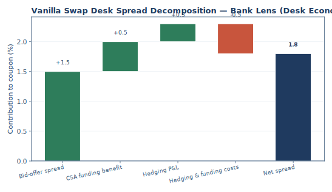

**P&L drivers**

Day to day, desk P&L is driven by moves in the yield curve against the warehoused DV01, the realized-versus-implied carry on the hedge portfolio, changes in the shape of the curve (steepening/flattening) against residual curve risk, and the funding spread earned on CSA collateral. VLSPs are flow products — high volume, low margin, relationship-driven — so revenue comes from volume, not individual trade margin. Product Control attributes P&L daily and verifies swap valuations independently using SOFR/EURIBOR discount curves; curve construction methodology (which points on the curve are used and how they are interpolated) is the most common source of valuation differences — a 0.1bp error in the curve affects millions of dollars of MTM across the book.

#### §9. THE BANK LENS — Controls & Reconciliation (2nd Line of Defence)

**Booking & systems**

| Aspect | Detail |
|--------|--------|
| **Book of record** | Murex |
| **Pricing/Risk system** | Murex |
| **Booking structure** | Two-leg trade (fixed leg + floating leg) |
| **Four-leg framework?** | No (VLSP is a standalone derivative, not a structured note) |
| **Key booking fields** | Notional, fixed rate, floating index (SOFR/EURIBOR), payment frequency, day-count conventions, start/end dates, clearing status |
| **Payment schedule** | Semi-annual (fixed), quarterly or semi-annual (floating) — net settlement on each date |
| **ISDA documentation** | ISDA Master Agreement and Credit Support Annex (CSA). If centrally cleared: CCP rulebook replaces bilateral ISDA for clearing-eligible trades |
| **Central clearing** | LCH SwapClear, CME Clearing — mandatory for standard tenors in USD, EUR, GBP, JPY |

**Reconciliation points**

| Recon point | What must agree | VLSP-specific break |
|-------------|-----------------|--------------------|
| **ISDA / CSA terms** | Master Agreement and Credit Support Annex governing the trade — collateral eligibility, thresholds, netting set; CCP rulebook if cleared | Trade executed before ISDA/CSA is in place, or against the wrong netting set |
| **Trade economics** | Notional, fixed rate, floating index, tenor, payment frequency, start/end dates, counterparty | One system records $100M, another $100.5M after an amend; or wrong counterparty |
| **Reset / fixing source** | The floating-rate fixing — the benchmark, the fixing convention, and the publishing source (e.g. SOFR published by the Federal Reserve Bank of New York), including SOFR compounding method | System uses a different SOFR observation or compounding method ("compounded in arrears" vs "simple average" vs "term SOFR") than the contract |
| **Day-count / calendar** | Fixed-leg and floating-leg day-count conventions (e.g. 30/360 fixed, ACT/360 floating) and the payment calendar | A system applies the wrong convention to a leg, so the payment amount differs |
| **Leg PV reconciliation** | Present value of the fixed leg and the floating leg agree between front office and risk | Curve construction / interpolation differs, so leg PVs, DV01, and total MTM diverge |
| **Payment netting** | On each date only the net of fixed and floating is exchanged | Gross payment sent instead of net, or netting applied to the wrong pair of legs |
| **Collateral (CSA)** | Daily MTM, margin call amount, and posted collateral agree with the counterparty or CCP | Counterparty disputes the MTM, or central-clearing margin (initial + variation) is mis-posted |
| **Clearing / IMM status** | Clearing status (cleared vs bilateral) and IMM start date agree across systems and the confirmation | Trade booked bilateral but eligible for clearing (capital issue), or IMM start date does not match the actual trade start |

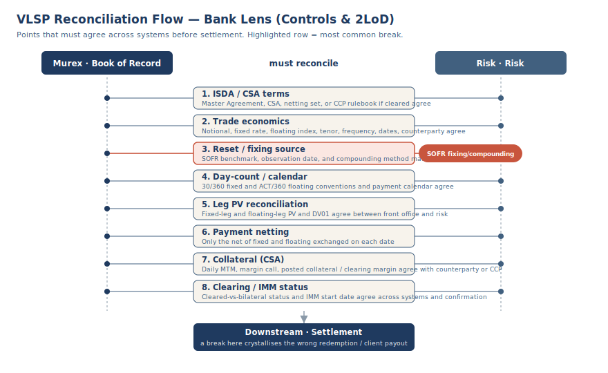

**Common breaks & red flags**

| Red Flag | What It Means | 2LoD Action |
|----------|---------------|-------------|
| **Day count convention mismatch** | Fixed leg uses 30/360, floating uses ACT/360 — this is normal and correct, but mixing these up changes the payment amount | Verify each leg's day count matches the confirmation |
| **SOFR compounding method** | "Compounded in arrears" vs "simple average" vs "term SOFR" produce different floating amounts | Verify the exact SOFR calculation method per the trade terms |
| **Clearing status confusion** | A trade booked as bilateral but eligible for clearing creates regulatory capital issues | Verify whether the trade is cleared or bilateral and book accordingly |
| **DV01 mismatch between systems** | Murex and the risk system show different DV01 for the same trade | Reconcile the discount curve, day count, and payment schedule between systems |
| **IMM date roll** | Standard IMM start dates must match the actual start date of the trade | Verify whether the trade starts on an IMM date or a custom date |

**Control implication**

For a VLSP the dominant controls are the **floating-rate fixing source and SOFR compounding method**, the **leg PV / DV01 reconciliation**, and the **collateral / clearing-margin process** — together they determine whether each net payment and each daily margin call is correct. A wrong fixing source, observation date, or compounding method misstates the floating leg, driving the wrong net payment to the wrong party. A day-count error on either leg breaks the payment amount even when the rate is right. A curve-construction difference breaks the DV01 and leg PV between systems and the daily collateral / variation-margin call, leaving the bank under- or over-collateralised against a live counterparty or CCP exposure. The reconciliation exists precisely to catch these inconsistencies before a payment settles or a margin call is made.

#### §10. Formal Definition

A **Vanilla Swap (VLSP)** is a plain vanilla interest rate swap: the most standardized form of the IRS.

**Fixed leg:** One party pays a fixed rate (the "swap rate") on a notional amount.

**Floating leg:** The other party pays a floating rate (SOFR, EURIBOR, or another benchmark) on the same notional.

**Key conventions:**
- **Notional:** Reference amount only — not exchanged (unlike cross-currency swaps)
- **Standard tenors:** 1Y, 2Y, 3Y, 5Y, 7Y, 10Y, 15Y, 20Y, 30Y, 50Y
- **IMM dates:** Standard start dates on the 3rd Wednesday of March, June, September, December
- **Central clearing:** Most VLSPs are centrally cleared through CCPs (LCH, CME) post-2009 regulatory reform
- **Day count:** Typically ACT/360 for the floating leg, 30/360 for the fixed leg
- **DV01:** The dollar value of a 1 basis point move — the primary risk metric
- **Netting:** On each payment date, only the difference between the two legs is exchanged: (SOFR − Fixed Rate) × Notional × Day Fraction

The VLSP has zero value at inception — the fixed rate is set so that the present value of fixed payments equals the present value of expected floating payments.

#### §11. Lifecycle

| Stage | Detail |
|-------|--------|
| **Trade date** | Terms agreed: notional, tenor, rate conventions, special features. ISDA documentation. Book in Murex — both legs entered with matching notional, dates, and conventions |
| **Effective date** | Swap becomes active. First accrual period begins |
| **Rate fixing** | Before each floating payment, the floating rate is "fixed" — observed and recorded from the benchmark source (e.g. SOFR published by the Federal Reserve Bank of New York); SOFR compounded in arrears is known ~2 business days before the payment date |
| **Periodic payments** | Scheduled cash flow exchanges on payment dates. Net settlement applied on each date |
| **Collateral / clearing margin** | Under the CSA (or CCP rulebook if cleared), the party with a negative mark-to-market posts collateral; central clearing requires initial and variation margin recalculated daily |
| **Maturity** | Final net exchange of cash flows. Trade terminated. Collateral returned |

#### §12. Worked Example (both lenses)

**Product:** 3-year VLSP. **Notional:** $100,000,000. **Client pays:** Fixed 3.80% (semi-annual, 30/360). **Client receives:** SOFR compounded in arrears (semi-annual, ACT/360). (The client is the pay-fixed / receive-floating, short-rates counterparty; the desk takes the receive-fixed / pay-floating side.)

| Period | SOFR (annualized) | Floating Received | Fixed Paid | Net |
|:------:|:-----------------:|:----------------:|:----------:|----:|
| H1 Y1 | 4.50% | $2,250,000 | $1,900,000 | **+$350,000** |
| H2 Y1 | 4.80% | $2,400,000 | $1,900,000 | **+$500,000** |
| H1 Y2 | 4.20% | $2,100,000 | $1,900,000 | **+$200,000** |
| H2 Y2 | 3.50% | $1,750,000 | $1,900,000 | **−$150,000** |
| H1 Y3 | 3.00% | $1,500,000 | $1,900,000 | **−$400,000** |
| H2 Y3 | 2.80% | $1,400,000 | $1,900,000 | **−$500,000** |

**Total net: $350K + $500K + $200K − $150K − $400K − $500K = $0.**

*Client lens:*
In this example, rates started above the fixed rate (profitable) but fell below later (loss). Over the full life, the swap approximately broke even — consistent with fair pricing at inception. The pay-fixed position is short rates, so it gains in H1 Y1 through H1 Y2 as SOFR sits above 3.80%, then loses through H2 Y2 to H2 Y3 as SOFR falls below the fixed rate. Even where the swap loses, its purpose was certainty: a client hedging a fixed-rate bond portfolio sees the falling-rate loss offset by the gain in bond value.

*Bank lens:*
The desk holds the mirror position — receive-fixed, pay-floating — and is therefore long rates on this single trade, which it warehouses and hedges with offsetting VLSPs and futures so the book's net DV01 stays within limit. Across the three years the net settles to $0 with the client, while the desk earns the bid-offer at execution and the CSA funding benefit on collateral. The 2nd line must confirm each period's SOFR fixing and compounding method against the termsheet source, that each net amount (not gross) settled, and that the daily CSA / clearing margin tracked the changing MTM as SOFR fell.

#### §13. Knowledge Check

1. **What is a VLSP and why is it considered the most fundamental rate derivative?** *(Investor)*
2. **Why does no money change hands at inception?** What determines the fixed rate? *(Investor)*
3. **A pension fund has $1B in fixed-rate bonds and wants to hedge against rising rates. Design a VLSP hedge and explain how it works.** (Pay fixed, receive floating.) *(Investor)*
4. **If rates rise after entering a pay-fixed swap, does the swap gain or lose value for the fixed payer?** Why? *(Investor)*
5. **What is the notional of a swap? Is it exchanged?** *(Investor)*
6. **What is netting, and why is it important for swap cash flows?** *(Investor)*
7. **Explain the difference between SOFR compounded in arrears and term SOFR.** *(Investor)*
8. **(Desk economics / 1LoD)** When a client enters a pay-fixed VLSP, what position does the desk take, what is its dominant rate Greek, and how does the desk hedge the warehoused risk? Where does the desk's spread come from given there is no coupon to decompose?
9. **(Controls / 2LoD)** Name three reconciliation breaks specific to a VLSP — covering the SOFR fixing/compounding, the legs (DV01/leg PV), and collateral/clearing margin — and the consequence of each for the net payment or the margin call.

**Mental Models**

| Concept | Mental Model |
|---------|-------------|
| VLSP | Standard bread recipe — the simplest version, from which all others are built |
| Fixed payer | Wants certainty — locks in a known cost; short rates, gains if rates rise |
| Floating receiver | Profits if rates rise above the fixed rate |
| Notional | A reference number — like a ruler used to measure, never exchanged |
| Zero initial value | The swap is a fair bet at inception — both sides agree the expected value is equal |
| DV01 | The desk's speedometer for rate risk — dollars of P&L per 1 basis point move, summed across the curve |
| Central clearing | A professional kitchen inspector — ensures both bakers follow the recipe and post collateral |
| CSA / clearing margin | The daily deposit each side posts so neither is over-exposed if the other defaults |

**Key Takeaways**

1. The VLSP is the plain vanilla interest rate swap — the most liquid derivative in the world and the building block for all structured rate products.
2. One party pays fixed, the other pays floating (SOFR/EURIBOR). No principal is exchanged — the notional is a reference for calculating payments.
3. At inception, the swap has zero value. Value develops as rates diverge from the fixed rate.
4. DV01 is the primary risk metric — the dollar value of a 1bp rate move; the swap is linear, with no barriers, no knock-ins, no optionality (pay-fixed = short rates, receive-fixed = long rates).
5. Most VLSPs are centrally cleared through CCPs (LCH, CME) under post-2009 regulatory reform; the VLSP is the foundation for Batches 6-7.
6. The desk takes the mirror legs, warehouses the rate risk, and manages it by DV01 and curve risk — earning the bid-offer and the CSA funding benefit rather than a coupon spread.
7. Swaps are booked in Murex and governed by ISDA Master Agreements (or the CCP rulebook when cleared).
8. For the 2nd line, the dominant control risks are the floating-rate fixing source and SOFR compounding method, the leg PV / DV01 reconciliation, day-count/clearing status, and the CSA / clearing-margin process — each can misstate a net payment or a daily margin call.

#### §14. Common Mistakes

1. **Treating the VLSP as exotic.** The VLSP is the simplest rate derivative. If a VLSP cannot be explained clearly, no structured rate product can be understood. Start here.
2. **Confusing notional with principal.** The VLSP notional is never exchanged — it is only a reference amount for calculating payments. This differs from cross-currency swaps (where principal IS exchanged).
3. **Confusing "pay fixed" with "pay a premium."** There is no upfront cost to enter a swap. "Pay fixed" means the client makes regular fixed payments and receives regular floating payments.
4. **Ignoring day-count conventions.** The fixed leg (30/360) and floating leg (ACT/360) use different day counts. The payment amounts are not simply "rate × notional / 2" — the day-count fraction matters.
5. **Assuming central clearing eliminates counterparty risk.** Clearing reduces bilateral counterparty risk but introduces CCP risk. If a CCP fails (an extreme event), all cleared trades are affected.
6. **(Controls)** Booking a clearing-eligible trade as bilateral, or letting Murex and the risk system disagree on DV01. A bilateral booking of a clearable trade creates regulatory capital issues, and a DV01 mismatch — usually rooted in the discount curve, day count, or payment schedule — breaks leg PV reconciliation and the daily margin call; reconcile the curve and conventions between systems before settlement.
### Knowledge Check

**Review Questions:**
1. What are the two legs of a VLSP?
2. What does DV01 measure?
3. What is an IMM date?
4. What is central clearing and why is it mandatory for standard VLSPs?
5. Why is the VLSP called the "building block" for structured rate products?


**Dual-lens questions:**
- *(Desk economics / 1LoD)* Which side of the swap does the desk take, and what is its primary risk and hedge?
- *(Controls / 2LoD)* Which leg/fixing/collateral fields must reconcile, and which is the most common break?
**Scenario Questions:**
1. A pension fund enters a $500M 10-year VLSP paying 4.0% fixed, receiving SOFR. SOFR averages 4.5% over the first year. Calculate the approximate net payment for the year. What is the DV01 on this swap (approximate)?
2. A corporate treasurer has $200M in floating-rate debt at SOFR + 1.0%. She enters a VLSP receiving SOFR, paying 3.5% fixed. What is her all-in fixed cost? Why did she enter the swap?
3. The yield curve steepens: 2-year rates fall 20bp, 10-year rates rise 10bp. A trader has a flat DV01 position (long 2-year, short 10-year). Is the trader's P&L positive, negative, or zero? Explain.

**Desk Question:**
The rates desk runs a $50B notional VLSP book. The desk is DV01-neutral but has $3M of 2s10s curve risk. The Fed announces an unexpected 50bp rate cut. Walk through how the cut affects: (a) the swap book's MTM, (b) the curve shape, (c) the DV01 and curve risk positions, and (d) the margin calls from the central clearing house.

### Visual Specifications (Publication Assets)

**Figure 5.2.8-01 — VLSP Cash Flow Structure**
- Visual ID: FLOW_VLSP_01
- Type: Cash Flow Diagram
- Priority: P1
- Purpose: Show the two-way flow — fixed rate versus floating rate (SOFR)
- Visual Description: Two-party diagram with the fixed payer on the left and the floating payer (bank) on the right. Fixed rate arrow flows right, SOFR arrow flows left. Notional is shown as a reference amount below, with a "NOT exchanged" annotation.
- Diagram Elements: Fixed payer (client), Floating payer (bank), fixed rate arrow (4.0%), SOFR arrow, notional reference box, "no principal exchange" annotation
- Caption: Vanilla Swap (VLSP): fixed rate versus SOFR floating rate — notional is a reference only
- Location: §7
- Reuse Potential: High
- Future Asset Filename: flow_vlsp_01.svg

**Figure 5.2.8-02 — VLSP Payoff Diagram**
- Visual ID: PAYOFF_VLSP_01
- Type: Payoff Diagram
- Priority: P1
- Purpose: Show linear payoff for the fixed-rate payer with break-even at the swap rate
- Visual Description: Standard linear payoff chart. X-axis: realized SOFR rate. Y-axis: P&L for fixed payer. Line crosses zero at the swap rate. Labeled zones for gain and loss.
- Diagram Elements: Zero line, swap rate marker (4.0%), payoff line, gain/loss zone labels
- Axis Definitions: Y: P&L for Fixed-Rate Payer ($), X: Realized SOFR (%)
- Caption: VLSP payoff: the fixed-rate payer profits when SOFR exceeds the fixed swap rate
- Location: §8
- Reuse Potential: High
- Future Asset Filename: payoff_vlsp_01.svg

**Figure 5.2.8-03 — Worked Example Semi-Annual Cash Flows**
- Visual ID: TIMELINE_VLSP_01
- Type: Timeline
- Priority: P2
- Purpose: Show the 3-year semi-annual cash flow timeline with specific amounts
- Visual Description: Horizontal timeline with 6 semi-annual payment dates. Above each date: a bar showing the floating payment received. Below: a bar showing the fixed payment paid. The gap is labeled with the net amount. A trendline shows SOFR declining over the period.
- Diagram Elements: 6 date markers, floating payment bars, fixed payment bars, net amount labels, SOFR trendline, break-even annotation
- Caption: 3-year VLSP: semi-annual cash flows showing the transition from net positive to net negative as SOFR declines
- Location: §12
- Reuse Potential: Medium
- Future Asset Filename: timeline_vlsp_01.svg

**Figure 5.2.8-04 — DV01 Curve Risk Decomposition**
- Visual ID: DIAGRAM_VLSP_01
- Type: Comparison Chart
- Priority: P2
- Purpose: Show how a swap's DV01 is distributed across the yield curve ("bucket DV01"), illustrating why parallel-shift hedging leaves curve risk
- Visual Description: Bar chart showing DV01 sensitivity in different tenor buckets (1Y, 2Y, 3Y, 5Y, 7Y, 10Y). For a 5-year swap, the bars are concentrated in the 3-5Y bucket. A second overlay shows how a steepener trade (long 2Y, short 10Y) creates offsetting DV01 but residual curve exposure.
- Diagram Elements: Tenor bucket bars, DV01 values per bucket, hedge position overlay, residual curve risk annotation
- Axis Definitions: Y: DV01 ($/bp), X: Tenor Bucket (years)
- Caption: DV01 bucket decomposition: where a 5-year VLSP's interest rate sensitivity sits on the curve (unique to VLSP)
- Location: §9
- Reuse Potential: Low
- Future Asset Filename: diagram_vlsp_01.svg

**Figure 5.2.8-05 — Central Clearing Flow**
- Visual ID: LIFECYCLE_VLSP_01
- Type: System Flow Diagram
- Priority: P3
- Purpose: Show how a VLSP flows from execution to central clearing — trade, novation, margin, and settlement
- Visual Description: Flow diagram showing: (1) Client and Bank agree on swap terms, (2) Trade submitted to CCP (LCH/CME), (3) CCP novates — becomes counterparty to both sides, (4) Daily margin calls (initial + variation), (5) Periodic payment settlement through CCP.
- Diagram Elements: Client, Bank, CCP (LCH/CME), trade submission arrow, novation arrows, margin flow arrows, settlement arrows, "bilateral → cleared" transition label
- Caption: Central clearing lifecycle: how a VLSP moves from bilateral execution to CCP-cleared settlement
- Location: §10
- Reuse Potential: Medium
- Future Asset Filename: lifecycle_vlsp_01.svg

### Dependency References

| Concept Used | Where It Was Taught |
|-------------|-------------------|
| Interest rate swap concept | [Section 5.2.1](#sec-5-2-1) (IRS) |
| SOFR, EURIBOR, benchmark rates | [Section 1.8](#sec-1-8) (Benchmark Rates) |
| Yield curves, forward rates | [Section 1.7](#sec-1-7) (Yield Curves) |
| Caps, floors, swaptions | [Section 1.8](#sec-1-8) (Caps, Floors, Swaptions) |
| Counterparty risk, ISDA/CSA | [Section 5.2.1](#sec-5-2-1) (IRS), [Section 1.9](#sec-1-9) (Credit Risk) |
| Murex booking | [Section 2.8](#sec-2-8) (Systems Primer) |

---


**Dual-lens visuals (generated):**
- `assets/vlsp/controls_vlsp_recon_08.svg` `[generated]`
- `assets/vlsp/legs_vlsp_01.svg` `[generated]`
- `assets/vlsp/waterfall_vlsp_09.svg` `[generated]`
## 5.3 STRUCTURED RATE TRADES {#sec-5-3}

*You have just completed the Swaps family — eight products built on the simple exchange of cash flows between two counterparties. We now turn to Structured Rate Trades (SRT) — products whose payoffs depend on interest rate levels, ranges, and curve shapes. The building blocks for this family were taught in [Section 1.7](#sec-1-7) (Yield Curves, Spot Rates, and Forward Rates), [Section 1.8](#sec-1-8) (Benchmark Rates, Swaps, and Rate Options), and [Section 5.2.1](#sec-5-2-1) (IRS). Every SRT product is booked in Murex with four legs — Note, Issuer, Deposit, and Hedge — a structure you first encountered in [Section 2.7](#sec-2-7) (The Four-Leg Structure).*

---


#### Visual Specifications

**Visual 1: Vanilla Swap Cash Flow Diagram**
- **Asset filename:** flow_vlsp_cash_flows_01.svg
- **Caption:** "Vanilla Swap Cash Flow Diagram"
- **Diagram elements:** Bilateral flow diagram showing periodic exchanges between two counterparties. Fixed vs floating legs clearly labelled. Payment dates marked on timeline
- **Reuse status:** Adapt from swap flow template
**Visual 2: Vanilla Swap Component Structure**
- **Asset filename:** construction_vlsp_components_02.svg
- **Caption:** "Vanilla Swap Component Structure"
- **Diagram elements:** Decomposition showing building blocks. Each component in separate box with arrows showing how they combine
- **Reuse status:** Adapt from construction template
**Visual 3: Vanilla Swap Lifecycle Timeline**
- **Asset filename:** lifecycle_vlsp_timeline_03.svg
- **Caption:** "Vanilla Swap Lifecycle Timeline"
- **Diagram elements:** Horizontal timeline from effective date to maturity. Key events marked: trade date, effective, payment dates, maturity
- **Reuse status:** Adapt from lifecycle template
**Visual 4: Vanilla Swap Risk Heatmap**
- **Asset filename:** risk_vlsp_heatmap_04.svg
- **Caption:** "Vanilla Swap Risk Heatmap"
- **Diagram elements:** Grid: risk types (market, credit, liquidity, operational) vs severity. Colour-coded cells appropriate for Vanilla Swap
- **Reuse status:** Adapt from risk heatmap template
**Visual 5: Vanilla Swap vs Vanilla Alternative**
- **Asset filename:** comparison_vlsp_vs_vanilla_05.svg
- **Caption:** "Vanilla Swap vs Vanilla Alternative"
- **Diagram elements:** Side-by-side comparison showing key differences from vanilla swap. Highlight unique features
- **Reuse status:** New — comparison panel
**Visual 6: Vanilla Swap Scenario Analysis**
- **Asset filename:** scenario_vlsp_rate_paths_06.svg
- **Caption:** "Vanilla Swap Scenario Analysis"
- **Diagram elements:** Three rate path scenarios (rates up, stable, down) showing P&L impact. Clearly labelled outcomes
- **Reuse status:** Adapt from scenario template

#### Dependency References

| Concept Used | Where It Was Taught |
|-------------|-------------------|
| Interest rate risk | [Section 1.8](#sec-1-8) (Interest Rate Risk) |
| Yield curve mechanics | [Section 1.7](#sec-1-7) (Yield Curves) |
| Product decomposition | [Section 2.2](#sec-2-2) (Product Construction) |
| IRS | 5.2.1 — vanilla |
| IR Callable | 5.3.1 — callable |
| NCRA | 5.3.3 — range accrual |
### 5.3.1 IR Callable Fixed Rate Swap {#sec-5-3-1}

> **Prerequisites:** [IRS](#sec-5-2-1) &nbsp;|&nbsp; **Key concepts:** Embedded swaption, four-leg SRT, non-call period

---

*An IR Callable Fixed Rate Swap is a Structured Rate Trade booked in Murex with the four-leg structure (Note, Issuer, Deposit, Hedge). It is a fixed-rate swap, packaged as a note, in which the issuing bank holds the right to terminate the trade early on predetermined call dates. The investor receives an enhanced fixed coupon — above vanilla swap levels — in exchange for granting the bank that call right. Economically the investor is short a swaption (the call), and the bank's desk is long it. This chapter reads the product through two lenses: what it means for **the investor** (the note/swap holder who receives the enhanced fixed rate), and what it means for **the bank** — the latter split into the desk's rate economics (1st line of defence) and the controls and reconciliation that surround it (2nd line of defence).*

#### §1. Explain Like I'm New

Consider a treasurer managing a regional Japanese bank with ¥50 billion in floating-rate deposits. Every quarter, the funding cost bounces with SOFR — over the last year it swung from 3.8% to 5.1%, making budget projections unreliable. The treasurer wants to lock in a fixed rate, but does not want to be trapped for five years if rates drop sharply after year one. The IR Callable offers exactly this: a fixed coupon of 4.25% per year, paid quarterly, with the bank's right to terminate the swap after the first year. In exchange for accepting the bank's call right, the investor receives a higher fixed rate than a plain vanilla swap would offer — perhaps 30 basis points more. The investor is essentially selling the bank an option on the swap's early termination, and the premium for that option is embedded in the higher coupon.

#### §2. Core Analogy

An IR Callable resembles a fixed-rent apartment with a landlord's break clause. A tenant signs a five-year lease at $2,000 per month — above the market rate of $1,800 — because the landlord reserves the right to terminate the lease after the first year. As long as rents stay high, the landlord keeps the tenant and the tenant enjoys above-market stability. But if rents crash to $1,400, the landlord terminates the lease and re-lets to a new tenant at the lower rate. The tenant earned above-market rent while it lasted, but the tenancy was never guaranteed for the full term. The landlord holds the break right; the tenant has granted it.

#### §3. What Problem Does It Solve

| Investor Need | How the Product Delivers |
|------------|------------------------|
| Lock in a fixed rate above current market levels | Coupon includes an embedded option premium — the investor earns more than a vanilla swap |
| Budget certainty for near-term planning | Fixed quarterly coupons eliminate rate uncertainty during the non-call period |
| Flexibility to accept early termination risk | Call right means the investor accepts reinvestment risk in exchange for a higher rate |
| Access structured rate exposure without derivatives expertise | Product is packaged as a note — no ISDA required from the investor's perspective |

#### §4. Product DNA

| **Field** | **Value** |
|---|---|
| **Full Name** | IR Callable Fixed Rate Swap |
| **Abbreviation** | IR Callable |
| **Family** | Structured Rate Trades |
| **Complexity Score** | 5 / 10 |
| **Complexity Rationale** | Fixed coupon + embedded receiver swaption (call right). Four-leg SRT. Multiple exercise dates |
| **Underlying Asset Class** | Rates (SOFR / EURIBOR) |
| **Capital Protection** | None (swap — notional not at risk but MTM can be negative) |
| **Coupon Type** | Enhanced fixed coupon (above-market rate funded by embedded swaption premium) |
| **Maturity** | 5–30 years (callable after non-call period, typically 1–5 years) |
| **Liquidity** | OTC — unwind at MTM |
| **Primary System** | Murex (primary, four-leg structure), Sophis (risk) |
| **ISDA Required** | No — issued as note (no derivatives documentation from client) |

**DNA Atlas Fields:**
- Primary Risk: Interest rate risk. Bank exercises call when rates move against investor. Reinvestment risk on early termination
- Typical Buyer: Insurance companies, pension funds seeking fixed-rate income with yield pickup over vanilla swaps
- Typical Use Case: Yield enhancement on fixed income allocation. Investor sells optionality (call right) in exchange for above-market fixed rate
- Building Blocks: Interest rate swap + embedded receiver swaption sold to bank
- Key Hedge: Receiver swaption, IRS delta hedge
- Similar Products: IRS (5.2.1), Callable STEG (5.4.3), ZCL (5.3.2)
- Most Important Greek: Vega (swaption vol sensitivity)

**Comparison Matrix Fields:**
- Complexity: 5
- Yield Potential: Moderate (above-market fixed rate)
- Capital Protection: None (swap — notional not at risk but MTM can be negative)
- Credit Exposure: Counterparty (bilateral swap)
- Liquidity: OTC — unwind at MTM
- Path Dependency: No (European-style call)
- Volatility Sensitivity: Short vega (sold swaption)
- Correlation Sensitivity: None
- Client Type: Institutional (insurance, pension)
- Market Environment: Best when rates expected stable or rising slowly (call less likely exercised)

#### §5. Family Position

```
Rates
└── Structured Rate Trades (SRT)
    └── Fixed Rate Products
        └── IR Callable Fixed Rate Swap  ← chapter focus
```

#### §6. Product Evolution

| Stage | Product | What Was Added | Why |
|:-----:|---------|---------------|-----|
| 1 | Vanilla IRS (VLSP) | — (baseline) | Simplest rate exchange — fixed vs floating |
| 2 | Callable IRS | Issuer's right to terminate early | Banks wanted to capture falling-rate scenarios without locking capital for the full term |
| 3 | IR Callable SRT (Murex 4-leg) | Four-leg booking structure (Note, Issuer, Deposit, Hedge) | Operational infrastructure needed for structured note issuance and risk management |

In the early 2000s, banks held large portfolios of fixed-rate assets funded by floating-rate deposits. A vanilla swap could fix the rate, but trapped the bank if rates fell significantly — the swap had negative mark-to-market and could not be easily unwound. The callable structure solved this by giving the issuing bank the right to terminate when rates dropped below the fixed coupon, effectively embedding a receiver swaption. Investors accepted the call risk because the embedded option premium boosted their coupon 20-40 basis points above vanilla swap levels. The product became a staple of bank treasury desks worldwide, particularly in Japan and Europe where low-rate environments made the incremental yield attractive.

---

#### §7. THE INVESTOR LENS

**Why the investor enters it**

1. **Higher coupon** — the embedded option premium adds 20-40bp over vanilla swap rates for a 5-year non-call-1 structure.
2. **Near-term certainty** — fixed payments during the non-call period provide budget stability.
3. **View expression** — investors who believe rates will stay elevated earn the call premium without being called.
4. **Simplicity** — packaged as a note, requiring no derivatives documentation from the investor.
5. **Liquid secondary market** — standard callable structures trade actively in the interdealer market.

The product suits investors with a view that rates will remain stable or rise moderately, who want above-market fixed income, and who can tolerate reinvestment risk if the swap is called early. It is a poor choice for investors who need guaranteed fixed income for the full term (a vanilla swap fits better), and unsuitable when the yield curve is flat — the option premium is small, making the coupon uplift minimal relative to the reinvestment risk.

**Legs & position**

The IR Callable is built from two components from the investor's perspective:

1. **Vanilla fixed-rate swap** — the investor receives 3.95% fixed, pays SOFR floating.
2. **Short receiver swaption** — the investor sells the bank the right to cancel the swap.

The investor is therefore **short the call** (short a receiver swaption): the bank holds the right to terminate, and the investor has granted it. The swaption premium (worth approximately 30bp annualized) is added to the vanilla swap rate:

```
Vanilla swap rate:          3.95%
+ Swaption premium (ann.):  0.30%
─────────────────────────────────
IR Callable coupon:         4.25%
```

The investor's position is thus: long the underlying fixed-rate swap (receive enhanced fixed, pay floating), short the bank's call right. Because the investor is short optionality, the investor is **short vega** — a rise in implied swaption volatility lowers the mark-to-market value of the position for the investor. The extra coupon is not free money: it is the premium the investor earns for selling the bank an option to terminate the trade when rates move in the bank's favour.

**Cashflows & scenarios**

The investor's return depends entirely on how long the swap survives. Each period the investor receives $50M × 4.25% / 4 = $531,250. If held to maturity (20 periods), total return = $10,625,000. If called after N periods, total return = $531,250 × N.

- **Scenario A — Rates rise to 5.50%:** The swap is deep in-the-money for the investor. The bank does not call. The investor earns the full 4.25% for 5 years. Total coupons: $10,625,000. Best outcome.
- **Scenario B — Rates stay at 4.00%:** Swap is close to at-the-money. The bank may or may not call depending on swaption economics. If held, the investor earns 4.25% with slight positive carry over SOFR.
- **Scenario C — Rates drop to 2.50% after year 1:** The bank calls the swap immediately after the non-call period. The investor has earned 4 quarterly coupons of $531,250 = $2,125,000 total. The investor must now reinvest at 2.50% — significantly below the original 4.25%.
- **Scenario D — Rates spike to 6.00% then crash to 2.00%:** The investor enjoys high-coupon payments while rates are elevated. When rates crash, the bank calls. The investor captured above-market income during the volatile period but loses the fixed rate going forward.

**Risks**

| Risk | Description | Severity |
|------|------------|:--------:|
| **Reinvestment risk** | If the swap is called, the investor must reinvest at prevailing (likely lower) rates | High |
| **Interest rate risk (DV01)** | The swap's mark-to-market changes with rate movements — unfavorable for the fixed-rate receiver if rates rise sharply before a call | Medium |
| **Swaption volatility (vega)** | Changes in implied volatility affect the value of the embedded option, impacting MTM; the investor is short vega | Medium |
| **Call timing risk** | The bank exercises the call at the time most favorable to itself, which is the time least favorable to the investor | Medium |
| **Credit risk** | Counterparty default risk on the bank paying the fixed coupon | Low |
| **Liquidity risk** | Secondary market may be thin for non-standard tenors or non-call periods | Low |

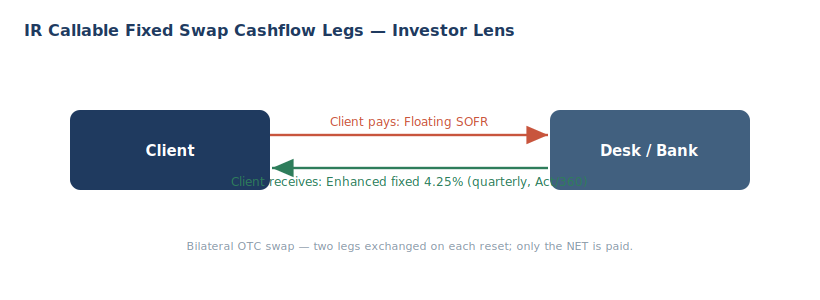

#### §8. THE BANK LENS — Desk Economics (1st Line of Defence)

**What the desk books**

The trade is booked in Murex with four legs, and the desk takes the offsetting side of the investor's position:

- **Note leg** — the client-facing fixed coupon: $50M, 4.25% quarterly, Act/360.
- **Issuer leg** — bank funding: SOFR + spread.
- **Deposit leg** — client collateral: $50M cash deposit.
- **Hedge leg** — the rates desk's offsetting positions: a vanilla swap (receive fixed, pay floating) plus a **short receiver swaption** position that the desk warehouses against the call.

Where the investor is short the call (short the receiver swaption), the desk is **long the call** — it holds the right to terminate the swap when rates drop below the fixed coupon. Economically the desk is long a Bermudan swaption (the call schedule has multiple exercise dates), and it hedges that optionality rather than holding the raw rate risk.

**Rate/vol risk & hedging**

The rates desk hedges the fixed leg with vanilla swaps and the call right with a receiver swaption. The residual risks are swaption volatility (vega) and the correlation between rates and call exercise. Because the desk is long the embedded swaption, it is **long vega** — its position gains value when implied volatility rises. A NC1 quarterly callable has up to 16 call dates, so the hedge must be a Bermudan swaption (or a strip matched to the call schedule), not a single European swaption. The desk monitors DV01 (rate sensitivity) and vega (vol sensitivity) across the callable book; a 3-point vol move on a $500M callable book can generate $2-3M of P&L. The bank prefers structuring over holding the risk: the embedded swaption is hedged immediately, leaving only the structuring spread as retained profit.

**How the bank makes money**

| Area | Detail |
|------|--------|
| **Client economics** | The investor receives 4.25% fixed, pays SOFR floating. The 4.25% includes an embedded option premium — the "fair" swap rate might be 3.95%, so the investor is paid ~30bp for selling the call option |
| **Bank economics** | The bank captures the structuring spread (5-10bp) between the embedded swaption value and the coupon premium paid to the investor. Additional revenue from bid-offer on the swaption hedge |
| **Hedging economics** | Rates desk hedges the fixed leg with vanilla swaps and the call option with a receiver swaption. Residual risk: swaption volatility (vega), correlation between rates and call exercise |
| **Distribution economics** | Sales credit 3-5bp on notional. Strong repeat business — treasurers roll callable structures at maturity |

Demand rises when the yield curve is steep (more premium for selling optionality), when implied swaption volatility is high (larger option premium = higher coupon), and when central bank policy is expected to be stable (investors believe rates won't trigger the call).

**Rate enhancement decomposition**

The investor's enhanced 4.25% coupon decomposes into the fair vanilla swap rate plus the swaption premium the investor pays for selling the call:

```
Vanilla swap rate:          3.95%
+ Swaption premium (ann.):  0.30%
─────────────────────────────────
IR Callable coupon:         4.25%
```

Within the 0.30% swaption premium the investor grants, the bank retains a structuring spread of roughly 5-10bp and passes the remainder back to the investor as coupon uplift; sales credit of 3-5bp on notional is taken on distribution. (The source quotes the 30bp premium and the 5-10bp structuring spread and 3-5bp sales credit; the precise split of the 30bp into retained-versus-passed-through is inferred from those ranges, not stated verbatim.)

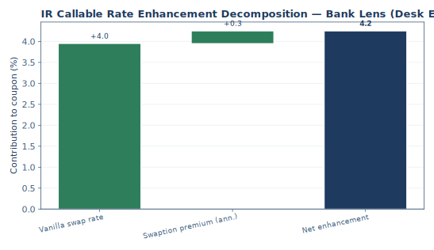

**P&L drivers**

Day to day, desk P&L is driven by: moves in the yield curve against the warehoused DV01 on the hedge swaps; changes in implied swaption volatility against the long-vega position embedded in the call (vega is the most important driver — the value of the swaption can swing dramatically with vol even when rates do not move); the realized call schedule versus the modelled one as rates approach the strike; and the structuring spread and bid-offer captured at inception. A portfolio of 200+ callable trades approaching their first call dates simultaneously is the desk's main concentration concern — if rates drop overnight, the entire book may need to be called and the swaption portfolio restructured in a single session.

#### §9. THE BANK LENS — Controls & Reconciliation (2nd Line of Defence)

**Booking & systems**

| Field | Value |
|-------|-------|
| **Booking system** | Murex |
| **Pricing system** | Murex (swaption vol surface) |
| **Four-Leg** | Yes |
| **Note leg** | Fixed coupon to client: $50M, 4.25% quarterly, Act/360 |
| **Issuer leg** | Bank funding: SOFR + spread |
| **Deposit leg** | Client collateral: $50M cash deposit |
| **Hedge leg** | Vanilla swap (receive fixed, pay floating) + short receiver swaption |
| **ISDA documentation** | Not required from client (note format). Bank hedges under ISDA/CSA |
| **Day count** | Act/360 (USD), 30/360 (EUR) |
| **Payment frequency** | Quarterly |
| **Call dates** | Quarterly after non-call period (NC1 = after year 1) |

All four legs are booked in Murex as a single structured note. The 2nd line's first concern is that the four legs are booked net and consistent — matching notionals and dates — and that the Hedge leg genuinely offsets the client-facing Note leg.

**Reconciliation points**

| Recon point | What must agree | IR-Callable-specific break |
|-------------|-----------------|----------------------------|
| **Four-leg net (Note vs Issuer vs Deposit vs Hedge)** | All four legs booked with matching notional, dates, and conventions; legs net to the intended structured position | Legs booked asynchronously with a notional error — e.g. Deposit leg shows a different notional than the Note leg |
| **Call schedule** | The call dates and non-call period in Murex match the trade confirmation (NC1 = callable quarterly after year 1) | Call schedule mis-booked — wrong non-call period or missing call dates |
| **Call notice & exercise capture** | Each call decision is recorded by call date + 2 business days; exercise/notice within the contractual window | Call decision not recorded by call date + 2 business days — bank may have auto-exercised or defaulted to hold; call window may close |
| **Rate fixing** | Floating SOFR fixing source and date convention match the termsheet; coupon uses the correct rate | Wrong fixing source/date misstates the floating leg and the net payment |
| **Day-count** | Act/360 (USD) / 30/360 (EUR) applied correctly to each coupon | Day-count fraction error — coupon payment differs from $531,250 by more than $100 |
| **Swaption hedge parameters** | Swaption vol surface, expiry, and Bermudan/European exercise match the call schedule | Swaption hedge shows large vega P&L on a calm day — wrong vol surface or wrong expiry; European booked instead of Bermudan |
| **Hedge offset (Note vs Hedge P&L)** | Hedge leg P&L offsets Note leg P&L within tolerance | Hedge leg P&L diverges from Note leg P&L by > 5% — hedge tenors/notionals do not match the structured note |
| **Collateral / four-leg settlement** | On a call date all four legs settle simultaneously; deposit released when Note leg terminates | Settlement timing mismatch between the four legs — Note leg terminated but Deposit leg not released, trapping client cash |

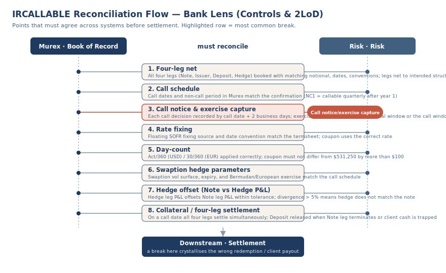

**Common breaks & red flags**

| Red Flag | What It Means | Action |
|----------|--------------|--------|
| Coupon payment differs from $531,250 by more than $100 | Day count fraction error or notional mismatch between legs | Verify Act/360 calculation and leg notionals in Murex |
| Swaption hedge shows large vega P&L on a calm day | Swaption may be booked with wrong vol surface or wrong expiry | Check swaption parameters vs trade confirmation |
| Call decision not recorded by call date + 2 business days | Missed call decision — bank may have auto-exercised or defaulted to hold | Escalate to Trader immediately — call window may close |
| Deposit leg shows different notional than Note leg | Legs were booked asynchronously with a notional error | Reconcile all four leg notionals to trade confirmation |
| Hedge leg P&L diverges from Note leg P&L by > 5% | Hedge is not properly offsetting the client-facing position | Check that hedge tenors and notionals match the structured note |

**Control implication**

For an IR Callable the dominant 2nd-line controls are the **four-leg net** and the **call-exercise capture**. The four legs (Note, Issuer, Deposit, Hedge) must be booked with matching notionals and dates so that they net to the intended structured position and the Hedge leg genuinely offsets the client-facing Note leg — a notional or date mismatch on any leg breaks the net P&L and can trap client cash on a call date. The call schedule and each call notice/exercise must be captured within the contractual window: a missed or unrecorded call decision (by call date + 2 business days) can let the call window close or trigger an unintended default to hold, with direct P&L and client consequences. Around these, the rate fixing, day-count, and collateral/settlement checks ensure each quarterly coupon and the final four-leg settlement are correct. The reconciliation exists precisely to catch these inconsistencies before a coupon settles or a call date passes.

#### §10. Formal Definition

An **IR Callable Fixed Rate Swap** is a structured rate product in which the investor receives a fixed coupon above vanilla swap levels in exchange for granting the issuing bank the right to terminate the trade on predetermined call dates. The fixed coupon includes an embedded option premium — specifically, the investor is implicitly selling a receiver swaption to the bank (the investor is short the call; the bank's desk is long it). The product is booked in Murex with four legs: Note (client-facing fixed coupon), Issuer (funding), Deposit (collateral), and Hedge (rates desk's offsetting swap and swaption positions). Callable structures are described as "Non-Call N" where N is the lockout period in years (e.g., NC1 = callable after 1 year). Call dates are typically quarterly or semi-annual after the non-call period expires.

#### §11. Lifecycle

| Stage | What Happens | Who Is Involved | What Can Go Wrong |
|:-----:|-------------|----------------|-------------------|
| **Pre-trade** | Structurer prices the embedded swaption using the bank's vol surface. Sales presents the coupon uplift vs vanilla swap | Structurer, Sales, Client | Mispricing the swaption → coupon too high (bank loses) or too low (client walks) |
| **Trade date** | All four legs booked in Murex: Note leg (fixed coupon to client), Issuer leg (bank funding), Deposit leg (client collateral), Hedge leg (vanilla swap + swaption) | Operations, Trader | Booking the four legs with mismatched notionals or dates |
| **During life** | Quarterly coupon payments calculated and settled. On each call date after the non-call period, the bank decides whether to exercise the call | Trader (call decision), Product Control (valuation), Operations (settlements) | Missing a call date decision. Incorrect day-count fraction on coupon |
| **Termination** | If called: all four legs close on the call date. If matured: final coupon paid, deposit returned, legs unwound | Operations, Product Control | Settlement timing mismatch between the four legs |

#### §12. Worked Example (both lenses)

**Terms:** $50M notional, 5-year, fixed 4.25% quarterly (Act/360), non-call 1 year, callable quarterly thereafter.

| Period | Dates | Day Count | Fixed Coupon | Cumulative |
|:------:|-------|:---------:|:------------:|:----------:|
| Q1 | Mar-Jun 2025 | 91/360 | $537,153 | $537,153 |
| Q2 | Jun-Sep 2025 | 92/360 | $543,056 | $1,080,208 |
| Q3 | Sep-Dec 2025 | 91/360 | $537,153 | $1,617,361 |
| Q4 | Dec-Mar 2026 | 90/360 | $531,250 | $2,148,611 |

*Note: Using Act/360, each quarter's coupon = $50M × 4.25% × (actual days / 360). The table above shows exact day-count-sensitive amounts. For simplicity in scenario analysis, the approximate quarterly amount of $531,250 ($50M × 4.25% / 4) is used.*

*Investor lens:*
If the bank calls after Q4 (year 1), the investor receives $2,148,611 total and must reinvest $50M at prevailing rates. If 3-year SOFR swaps are now at 3.00%, the investor's reinvestment return falls by ~125bp annually. If never called, the investor receives approximately $10,625,000 over 20 quarters — an annualized return of 4.25%. The enhanced coupon was the premium for selling the bank the call; being called early is the reinvestment risk that premium compensated.

*Bank lens:*
The desk holds the four legs and is long the call (the Bermudan receiver swaption), hedged with the offsetting vanilla swap and swaption. It retains the structuring spread (5-10bp of the ~30bp embedded premium) and the bid-offer on the swaption hedge; if rates fall to the 3.00% reinvestment level, the desk exercises the call after Q4 and unwinds all four legs simultaneously. The 2nd line must confirm each quarter's coupon against the Act/360 day count (the $537,153 / $543,056 / $531,250 amounts), that the call decision at Q4 was captured within the window, and that all four legs settled together on the call date.

#### §13. Knowledge Check

1. What type of option is the investor implicitly selling in an IR Callable, and who holds the call right? *(Investor)*
2. How does the non-call period affect the callable swap's coupon? *(Investor)*
3. Why does the bank call the swap when rates drop significantly? *(Investor)*
4. What is the difference between a 5NC1 and a 5NC3 callable? *(Investor)*
5. A client holds a $100M IR Callable at 4.50% NC1. After 6 months, 5-year SOFR swaps drop from 4.20% to 2.80%. What should the investor expect at the first call date, and what is the reinvestment risk? *(Investor)*
6. Implied swaption volatility has risen 4 points since trade inception, with no change in the rate level. How does this affect the MTM of the callable from the investor's perspective, and why? *(Investor)*
7. **(Desk economics / 1LoD)** When the investor enters an IR Callable, what position does the desk take in the embedded option (long or short the call), what is its dominant Greek, and how does the desk hedge a NC1 quarterly callable with up to 16 call dates? Where does the desk's retained profit come from?
8. **(Controls / 2LoD)** Name three reconciliation breaks specific to an IR Callable — covering the four-leg net, the call notice/exercise capture, and the day-count — and the consequence of each for the net payment, the call decision, or trapped client cash.

**Mental Models**

| Concept | Mental Model |
|---------|-------------|
| IR Callable | Fixed-rent apartment with a landlord's break clause — above-market rent, but no guarantee of full tenancy |
| Embedded swaption | Insurance premium the tenant pays the landlord — embedded in the higher rent |
| Non-call period | Lease lock-in — guaranteed tenancy before the break clause activates |
| Call exercise | Landlord (the bank) terminates when market rents drop below the tenant's rent |
| Reinvestment risk | Finding a new apartment after eviction — likely at a lower quality/price ratio |
| Four-leg structure | Four interconnected gears — Note, Issuer, Deposit, Hedge — all must turn together |
| Investor short the call / desk long it | The tenant grants the break right; the landlord holds it |

**Key Takeaways**

1. An IR Callable is a fixed-rate swap where the bank can terminate early, compensating the investor with an above-market coupon.
2. Regional banks and corporate treasurers buy it for yield enhancement when they believe rates will remain stable.
3. Reinvestment risk is the core danger — being called when rates are low forces reinvestment at inferior levels.
4. The higher coupon is the annualized premium from an embedded receiver swaption sold by the investor to the bank: the investor is short the call, the desk is long it.
5. All SRT products are booked in Murex with four legs: Note, Issuer, Deposit, and Hedge.
6. The desk warehouses the long call (a Bermudan swaption), hedges rate (DV01) and vol (long vega) risk, and retains the structuring spread (5-10bp) plus the swaption-hedge bid-offer.
7. For the 2nd line, the dominant control risks are the four-leg net (matching notionals/dates so the Hedge offsets the Note) and the call notice/exercise capture (recording each call decision within the window), supported by rate-fixing, day-count, and four-leg collateral/settlement checks — each can misstate a coupon, miss a call decision, or trap client cash.

#### §14. Common Mistakes

**1. Treating the extra coupon as "free yield."** The coupon uplift is compensation for selling an option. The investor is taking on reinvestment risk — the premium can be fully consumed if the swap is called at the worst time.

**2. Ignoring the non-call period when comparing products.** A 5NC1 (callable after 1 year) has very different risk from a 5NC3 (callable after 3 years). Longer non-call periods provide more income certainty but lower coupon uplift.

**3. Confusing the investor's position with the bank's call right.** In an IR Callable, the BANK calls, not the investor. The investor is short the call and has no right to terminate early; the desk is long the call. This is the opposite of a puttable swap.

**4. Booking the hedge leg with the wrong swaption expiry.** The swaption hedge must match the call dates exactly — a NC1 quarterly callable has up to 16 call dates, each requiring a separate swaption (or a Bermudan swaption).

**5. (Controls) Forgetting that all four legs must settle simultaneously on a call date.** If the Note leg is terminated but the Deposit leg is not released, the investor's cash is trapped. All four legs must be coordinated, and the 2nd line must confirm the four-leg net settlement and that the call exercise was captured within the contractual window.

**Dual-lens questions:**
- *(Desk economics / 1LoD)* What does the desk book across the four legs, and what is its primary rate/vol risk and hedge?
- *(Controls / 2LoD)* Which four-leg / fixing / accrual fields must reconcile, and which is the most common break?

**Dual-lens visuals (generated):**
- `assets/ircallable/controls_ircallable_recon_08.svg` `[generated]`
- `assets/ircallable/legs_ircallable_01.svg` `[generated]`
- `assets/ircallable/waterfall_ircallable_09.svg` `[generated]`
### 5.3.2 Zero-Coupon Linked Note (ZCL) {#sec-5-3-2}

> **Prerequisites:** [PPN](#sec-5-1-1) · [IRS](#sec-5-2-1) &nbsp;|&nbsp; **Key concepts:** Zero-coupon accretion, duration, liability matching

---

*Where an IR Callable pays a fixed quarterly coupon with the bank's right to terminate early, the Zero-Coupon Linked Note eliminates periodic coupons entirely. Instead, the return accretes inside the note — no cash is paid until maturity. That single change converts the product from an income instrument into a capital-appreciation instrument, appealing to clients who want to lock in a total return without reinvestment decisions along the way. This chapter reads the product through two lenses: what it means for **the investor** (the note holder), and what it means for **the bank** — the latter split into the desk's rate economics (1st line of defence) and the controls and reconciliation that surround the four-leg booking (2nd line of defence).*

#### §1. Explain Like I'm New

Consider a pension fund manager in Stockholm responsible for matching long-dated liabilities 20 years into the future. The fund does not need quarterly income — its liabilities do not pay out for decades. What it needs is a guaranteed total return at maturity with no reinvestment risk. The Zero-Coupon Linked Note provides exactly this: the investor invests $30 million today, receives nothing for 7 years, and at maturity collects $38.8 million — a locked-in 29.4% total return. There are no coupon decisions, no reinvestment headaches, and no cash-flow management. The return is fixed from day one, accreting inside the note like compound interest in a savings account that cannot be touched.

#### §2. Real-World Analogy

A ZCL is like a wine barrel aging in a cellar. The barrel is bought today and left untouched for seven years. No one drinks from it, no one bottles it early. Each year, the wine improves in value — not because anyone adds to it, but because time itself does the work. At the end, the barrel is opened and the wine is worth far more than the original grape juice. The ZCL works the same way: the investment accretes value silently, and the holder collects the full aged amount only at maturity.

#### §3. What Problem Does This Solve?

| Investor Need | How the Product Delivers |
|------------|------------------------|
| Match long-dated liabilities without reinvestment risk | No coupons to reinvest — total return is locked in at inception |
| Avoid cash-flow management complexity | Zero periodic payments means no reinvestment decisions |
| Tax-efficient accumulation | Many jurisdictions tax coupon income annually but defer tax on accretion until maturity |
| Duration matching for pension liabilities | Long-dated maturity with predictable terminal value matches liability cash flows |

#### §4. Product DNA

| **Field** | **Value** |
|---|---|
| **Full Name** | Zero-Coupon Linked Note |
| **Abbreviation** | ZCL |
| **Family** | Structured Rate Trades |
| **Complexity Score** | 4 / 10 |
| **Complexity Rationale** | Zero-coupon accretion. No periodic cash flows. Four-leg SRT. Single embedded swap |
| **Underlying Asset Class** | Rates (SOFR / EURIBOR) |
| **Capital Protection** | 100% at maturity, subject to issuer credit (ZCB structure) |
| **Coupon Type** | None — return via discount accretion (zero coupon) |
| **Maturity** | 10–30 years (long duration to match liability profiles) |
| **Liquidity** | Secondary market (duration-dependent pricing) |
| **Primary System** | Murex (primary, four-leg structure), Sophis (risk) |
| **ISDA Required** | No — issued as note |

**DNA Atlas Fields:**
- Primary Risk: Duration risk (long-dated ZCB sensitivity). Issuer credit risk over multi-year term
- Typical Buyer: Pension funds, insurance companies, endowments with long-dated liabilities
- Typical Use Case: Liability matching without reinvestment risk. Total return locked at inception
- Building Blocks: Zero-coupon bond + interest rate swap (accreting notional)
- Key Hedge: Zero-coupon government bonds, IRS
- Similar Products: IR Callable (5.3.1), PPN (5.1.1 — also uses ZCB), Vanilla STEG (5.4.1)
- Most Important Greek: Dollar Value of One Basis Point (DV01) / Duration (interest rate sensitivity)

**Comparison Matrix Fields:**
- Complexity: 4
- Yield Potential: Moderate (locked-in accretion rate)
- Capital Protection: 100% at maturity, subject to issuer credit (ZCB structure)
- Credit Exposure: Issuer (note format)
- Liquidity: Secondary market (duration-dependent pricing)
- Path Dependency: No
- Volatility Sensitivity: Low (no embedded options)
- Correlation Sensitivity: None
- Client Type: Institutional (pension, insurance)
- Market Environment: Best when locking in attractive long-term rates

#### §5. Who Touches This Product

| Role | Responsibility |
|------|---------------|
| **Structurer** | Prices the accretion rate using the zero-coupon swap curve; compares to government zero yields |
| **Trader** | Manages the zero-coupon swap hedge; monitors duration exposure and portfolio DV01 |
| **Sales** | Presents the ZCL as a liability-matching tool; explains the terminal-value guarantee and duration risk |
| **Risk Management** | Monitors duration, issuer credit exposure (growing with accretion), and concentration risk |
| **Product Control** | Values the accreting note daily; verifies the accretion schedule matches the booking |
| **Operations** | Processes the annual accretion update; prepares for the single maturity payment |
| **Legal / Compliance** | Reviews note documentation for accretion mechanics and default provisions |
| **Model Validation** | Validates the zero-coupon pricing model and accretion methodology |

#### §6. Product Evolution

| Stage | Product | What Was Added | Why |
|:-----:|---------|---------------|-----|
| 1 | Zero-coupon government bond | — (baseline) | Simplest form: buy at discount, receive par at maturity |
| 2 | Zero-coupon corporate note | Credit risk of the issuer | Higher yield than government bonds for accepting credit risk |
| 3 | Zero-Coupon Linked Note (ZCL) | Structured rate exposure, accreting notional, four-leg SRT booking | Customizable terminal value, embedded rate view, operational infrastructure for banks |

---

#### §7. THE INVESTOR LENS

**Why the investor buys it**

1. **Zero reinvestment risk** — no coupons to reinvest at unknown future rates.
2. **Predictable terminal value** — the exact maturity amount is known at trade inception.
3. **Tax efficiency** — accretion may be taxed at maturity rather than annually in certain jurisdictions.
4. **Duration match** — the long tenor matches pension and insurance liabilities naturally.
5. **Higher yield than government zeros** — the embedded rate structure provides a premium over risk-free accretion.

The product suits an investor who has no need for periodic income, wants a guaranteed terminal value, and is willing to accept credit risk on the issuing bank for the full tenor. It is usually a poor choice for an investor who needs periodic cash flow, has a short horizon, or cannot tolerate the mark-to-market volatility of a long-duration zero-coupon instrument.

**Position & redemption linkage**

The investor holds the note and takes no periodic cash flows. The entire return is embedded in a single redemption at maturity, linked to a fixed accretion rate set against the zero-coupon swap curve at inception. The accreted notional at maturity equals the original investment multiplied by (1 + accretion rate) raised to the power of the number of years:

```
Client investment:          $30,000,000
× (1 + 3.75%)^7 =          $38,818,432
─────────────────────────────────────────
Total return at maturity:   $8,818,432 (29.4%)
```

Because all cash flows are concentrated at a single point, a 7-year ZCL has duration of approximately 7 years (versus roughly 5.5 years for a 7-year coupon bond). The investor's rate risk is measured by **DV01** / duration: the change in the note's mark-to-market value for a 1 basis point move in rates. The investor trades reinvestment risk for duration risk — eliminating the problem of reinvesting coupons but amplifying sensitivity to rate changes.

**Payoff & scenarios**

The ZCL has no intermediate payoffs — all return is concentrated at maturity. The accreted notional grows on each anniversary and is paid as a single lump sum:

**Payoff formula:** Terminal value = $30M × (1.0375)^7 = $38,818,432

- **Scenario A — Rates drop 100bp after inception:** The note's market value increases significantly (long duration = high rate sensitivity). The investor could sell at a premium if liquidity is needed. Terminal value unchanged — $38.8M at maturity.
- **Scenario B — Rates rise 150bp:** Market value drops sharply. If held to maturity, the investor still receives $38.8M — but the opportunity cost is real; the capital could have been invested at a higher accretion rate.
- **Scenario C — Issuer defaults in year 5:** The investor loses the accreted value. The claim in bankruptcy is for the accreted notional at the time of default ($36.1M), not the original $30M investment. Recovery depends on the bank's seniority and resolution proceedings.
- **Scenario D — Rates stay unchanged:** The investor earns exactly 3.75% compounded annually. Terminal value: $38,818,432. This is the base case — no surprises, no reinvestment decisions.

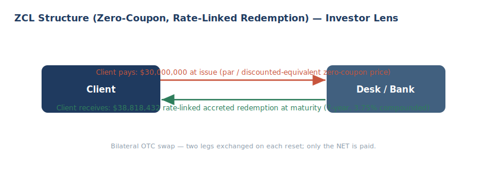

**Risks to the investor**

| Risk | Description | Severity |
|------|------------|:--------:|
| **Duration risk** | Long duration (≈ 7 years for a 7-year ZCL vs ≈ 5.5 years for a 7-year coupon bond) amplifies MTM sensitivity to rate changes | High |
| **Credit risk** | No coupon recovery during the life — if the issuer defaults, all accreted value is at risk | High |
| **Liquidity risk** | Zero-coupon structures are less liquid than coupon bonds in the secondary market | Medium |
| **Opportunity cost** | If rates rise after inception, the locked-in accretion rate may be below market | Medium |
| **Mark-to-market volatility** | High duration means larger MTM swings than coupon-paying instruments of the same maturity | Medium |

#### §8. THE BANK LENS — Desk Economics (1st Line of Defence)

**What the desk books**

The trade is booked in **Murex with four legs**, with no principal exchanged beyond the deposit collateral:

| Leg | Detail |
|-----|--------|
| **Note leg** | Accreting zero-coupon obligation to the client: $30M initial, 3.75% annual accretion, 7-year |
| **Issuer leg** | Bank funding: SOFR + spread |
| **Deposit leg** | Client collateral: $30M cash held for the full term |
| **Hedge leg** | Zero-coupon swap or strip of government bonds matching the accretion profile |

The desk warehouses the embedded rate exposure of the accreting Note leg and hedges it down. The accreted notional steps up on each anniversary, so the position the desk holds — and the duration it must match — grows over the life of the trade.

**Rate risk & hedging**

The desk's primary risk is **duration / DV01** — the dollar value of a 1 basis point move in rates. A ZCL has the highest duration-per-dollar of any SRT product because all cash flows land at a single maturity point: a $500M portfolio of 10-year ZCLs has DV01 of approximately $500K per basis point, so a 20bp overnight rate move generates $10M of P&L. The desk hedges with a **zero-coupon swap or a strip of government bonds** duration-matched to the Note leg. The residual exposure is **curve risk** between the hedge tenor and the ZCL maturity, plus the requirement to keep the hedge duration tracking the accreting notional as it steps up each year. The product is linear — no equity-style gamma, no barrier, no discontinuity.

**How the bank makes money**

| Area | Detail |
|------|--------|
| **Client economics** | Client buys the note at par ($30M), receives the accreted value at maturity ($38.8M). No periodic cash flows |
| **Bank economics** | Structuring spread: 5–8bp embedded in the accretion rate. The "fair" accretion rate might be 3.80%, but the client receives 3.75% — the 5bp difference accumulates over 7 years |
| **Hedging economics** | Rates desk hedges with a zero-coupon swap or strip of government bonds. Residual risk: curve risk between the hedge tenor and the ZCL maturity |
| **Distribution economics** | Sales credit 3–5bp on notional. Pension-fund relationships are long-term — one ZCL sale often leads to a portfolio of structured rate products |

**The accretion-rate decomposition:**

The client's 3.75% accretion rate is a gross figure. Decomposed, the risk-free component might be only 2.80% (the government zero rate); a further 0.70% compensates for credit and illiquidity; and the "fair" gross rate of roughly 3.80% is reduced to the client's 3.75% by the structuring fee the bank retains. The risk-free rate plus the credit spread are the two structural components delivered to the investor; the structuring fee is the desk's embedded margin.

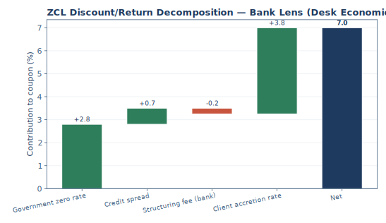

**P&L drivers**

Day to day, desk P&L is driven by moves in the yield curve against the warehoused duration/DV01, the realized-versus-implied carry on the zero-coupon hedge, changes in the shape of the curve against residual curve risk, and the funding spread on the SOFR + spread Issuer leg. Product Control values the accreting note daily and verifies the accretion schedule; the zero-coupon curve construction and interpolation at the exact maturity date are the most common sources of valuation difference.

#### §9. THE BANK LENS — Controls & Reconciliation (2nd Line of Defence)

**Booking & systems**

| Field | Value |
|-------|-------|
| **Book of record** | Murex |
| **Pricing/Risk system** | Murex (zero-coupon swap curve); Sophis (risk) |
| **Four-leg framework?** | Yes — Note, Issuer, Deposit, Hedge |
| **Note leg** | Accreting zero-coupon: $30M initial, 3.75% annual accretion, 7-year |
| **Issuer leg** | Bank funding: SOFR + spread |
| **Deposit leg** | Client collateral: $30M cash |
| **Hedge leg** | Zero-coupon swap or strip of government bonds matching accretion profile |
| **Day count** | 30/360 for accretion calculation |
| **Payment frequency** | Zero — single payment at maturity |
| **ISDA documentation** | Not required from client (note format) |

**Reconciliation points**

| Recon point | What must agree | ZCL-specific break |
|-------------|-----------------|--------------------|
| **Four-leg net** | Note, Issuer, Deposit and Hedge legs all booked in Murex and net to the intended structured position | A leg booked on one side only, so the net position and risk diverge |
| **Zero-coupon accretion** | Accreted notional in the system matches (1+r)^n on each anniversary; the annual step-up is processed | Accreting schedule entered incorrectly, or no accretion update on the anniversary date |
| **Rate fixing source** | The accretion rate / zero-coupon swap curve fixing source matches the termsheet (SOFR / EURIBOR) | A different curve or fixing source applied than the contract specifies |
| **Redemption formula** | Single maturity payment equals $30M × (1.0375)^7 = $38,818,432 | Settlement amount mismatch between accreted notional and payment instruction |
| **Day-count** | 30/360 applied to the accretion calculation on both the Note and Hedge legs | A system applies the wrong convention, so the accreted amount differs |
| **Collateral / Deposit** | Deposit leg ($30M client cash) remains locked for the full term | Deposit leg shows partial withdrawal before maturity — unauthorized collateral release |
| **Hedge duration** | Hedge-leg duration matches Note-leg duration within tolerance (< 0.5 years) | Duration mismatch between the structured note and its hedge; the book bleeds |
| **Curve / valuation** | Daily MTM uses the correct zero-coupon curve; gains/losses move in the correct direction with rates | Market value shows a gain on a day when rates rose — sign error or wrong curve applied |

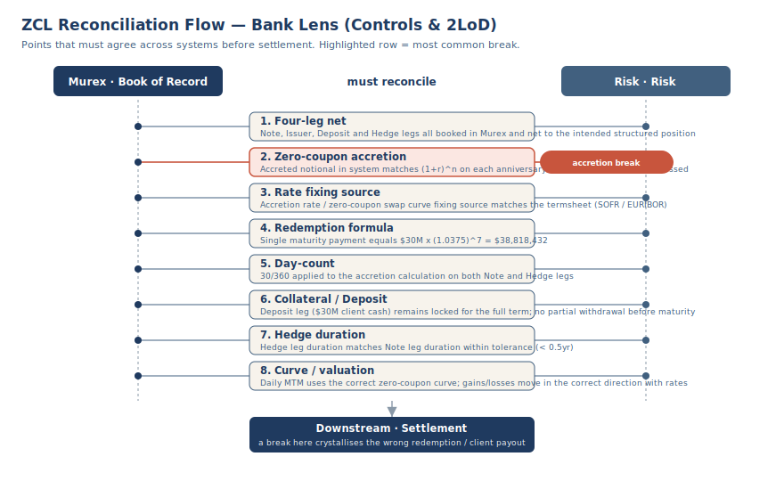

**Common breaks & red flags**

| Red Flag | What It Means | 2LoD Action |
|----------|---------------|-------------|
| Accreted notional in system doesn't match (1+r)^n formula | Accretion schedule was entered incorrectly | Recalculate manually and compare to system value on each anniversary date |
| Hedge-leg duration differs from Note-leg duration by > 0.5 years | Duration mismatch between the structured note and its hedge | Rebalance the hedge portfolio — add or subtract bond strips |
| Market value shows a gain on a day when rates rose | Possible sign error in duration calculation or wrong curve applied | Verify that the valuation model uses the correct zero-coupon curve |
| Deposit leg shows partial withdrawal before maturity | Operational error — the deposit should be locked for the full term | Escalate immediately — unauthorized collateral release |
| No accreted notional update on anniversary date | System failed to process the annual accretion step | Manually trigger the accretion update and verify the new notional |

**Control implication**

For a ZCL the dominant controls are the **zero-coupon accretion step**, the **redemption formula**, and the **Deposit (collateral) lock** — together they determine whether the single maturity payment is correct and whether the bank is correctly exposed throughout the life. A missed or mis-entered accretion step cascades through valuation, risk metrics, and hedge ratios, and ultimately into the wrong settlement amount. A redemption that does not reconcile to $30M × (1.0375)^7 misstates the only cash flow the investor ever receives. An unauthorized release of the Deposit leg leaves the structure under-collateralised against a live multi-year exposure. Because the issuer credit exposure grows with the accreted notional, credit limits set on the initial $30M rather than the accreted $38.8M understate the bank's exposure every year. The reconciliation exists precisely to catch these inconsistencies before the accretion, the redemption, or a collateral movement is processed.

#### §10. Formal Definition

A **Zero-Coupon Linked Note (ZCL)** is a structured rate product that pays no periodic coupons. Instead, the return accretes within the note at a fixed annual rate, compounding until maturity. The accreted notional at maturity equals the original investment multiplied by (1 + accretion rate) raised to the power of the number of years. The product is booked in Murex with four legs: **Note** (accreting zero-coupon obligation to the client), **Issuer** (bank funding), **Deposit** (client's initial investment held as collateral), and **Hedge** (zero-coupon swap or bond strip matching the accretion profile). The ZCL has higher duration than a coupon-paying note of the same maturity because all cash flows are concentrated at a single point.

#### §11. Lifecycle

| Stage | What Happens | Who Is Involved | What Can Go Wrong |
|:-----:|-------------|----------------|-------------------|
| **Pre-trade** | Structurer prices the accretion rate using the zero-coupon swap curve. Sales presents the terminal value and yield comparison vs government zeros | Structurer, Sales, Client | Accretion rate set too low relative to government zeros — client walks |
| **Trade date** | Four legs booked in Murex: Note leg (accreting zero-coupon), Issuer leg (funding), Deposit leg (client's $30M), Hedge leg (zero-coupon swap or bond strip) | Operations, Trader | Accreting schedule not correctly entered — notional grows at the wrong rate |
| **During life** | No coupon payments. Daily valuation reflects rate moves and accreted notional. The accreted notional increases on each anniversary | Product Control (valuation), Risk (duration monitoring) | Model incorrectly computes accreted notional. Duration risk underestimated as maturity approaches |
| **Maturity** | Final payment of $38,818,432 to the client. All four legs closed. Deposit released | Operations, Product Control | Settlement amount mismatch between accreted notional and payment instruction |

#### §12. Worked Example (both lenses)

**Terms:** $30M initial notional, 7-year, 3.75% annual accretion, zero coupon, 30/360 day count.

| Year | Accreted Notional | Annual Growth |
|:----:|:-----------------:|:------------:|
| 0 | $30,000,000.00 | — |
| 1 | $31,125,000.00 | $1,125,000 |
| 2 | $32,292,187.50 | $1,167,188 |
| 3 | $33,503,144.53 | $1,210,957 |
| 4 | $34,759,512.45 | $1,256,368 |
| 5 | $36,062,994.17 | $1,303,482 |
| 6 | $37,415,356.45 | $1,352,362 |
| 7 | $38,818,432.32 | $1,403,076 |

**Total return:** $38,818,432 − $30,000,000 = $8,818,432 (29.4%)
**Annualized return:** 3.75% compounded

*Note: Each year's growth is larger than the previous year because the accretion is compounding on a growing base — year 7 growth ($1,403,076) is 24.7% larger than year 1 growth ($1,125,000).*

*Investor lens:*
The investor invests $30M and receives $38,818,432 at maturity — a total return of 29.4% over 7 years (3.75% annually compounded). If the same capital had bought a 7-year government zero at 2.80%, the terminal value would have been $36,399,420 — about $2.4M less. The redemption is entirely embedded: no cash arrives for 7 years, and the predictable terminal value eliminates reinvestment risk. The trade-off is duration risk — the MTM moves sharply with rates even though the terminal value is fixed.

*Bank lens:*
The desk books the four legs in Murex, warehouses the accreting Note-leg duration, and hedges it with a duration-matched zero-coupon swap or bond strip. The 5bp gap between the "fair" 3.80% and the client's 3.75% accretion rate is the structuring margin, accumulating over 7 years. The 2nd line must confirm the accreted notional matches (1+r)^n on each anniversary, that the final redemption reconciles to $38,818,432, that the Deposit leg stays locked, and that the credit limit is set on the accreted notional (which reaches $36.1M by year 5) rather than the initial $30M.

#### §13. Knowledge Check

1. **How does a ZCL differ from a coupon-paying bond of the same maturity?** *(Investor)*
2. **Why does a ZCL have higher duration than a coupon bond?** *(Investor)*
3. **What does the accreted notional represent at any point during the ZCL's life?** *(Investor)*
4. **What happens to the investor's claim if the issuer defaults before maturity?** (Claim is for the accreted notional at default, e.g. ~$36.1M in year 5, not the original $30M.) *(Investor)*
5. **A ZCL has an accretion rate of 3.75% and government zero yields are 2.80%. What is the approximate credit/structuring premium the investor is earning?** *(Investor)*
6. **A pension fund holds a $50M, 10-year ZCL accreting at 4.00%. After 3 years, rates drop 75bp. What happens to the market value? Is the terminal value affected?** *(Investor)*
7. **A client asks whether to choose a 7-year ZCL at 3.75% or a 7-year coupon bond at 3.90%. What should be advised, and what additional information is needed?** *(Investor)*
8. **(Desk economics / 1LoD)** What are the four legs the desk books in Murex, what is the dominant rate Greek the desk warehouses, and how does the desk hedge it? Given there is no coupon, where does the desk's margin come from in the 3.75% accretion rate?
9. **(Controls / 2LoD)** Name three reconciliation breaks specific to a ZCL — covering the zero-coupon accretion, the redemption formula, and the Deposit/collateral lock — and the consequence of each for the maturity payment or the bank's exposure.

**Mental Models**

| Concept | Mental Model |
|---------|-------------|
| ZCL | Wine barrel aging — buy today, collect the full aged value at maturity |
| Accretion | Compound interest in a locked savings account — grows each year without withdrawal |
| Duration risk | A seesaw — longer duration = more amplified MTM movement for each rate change |
| Zero-coupon vs coupon | Lump sum at the end vs installments along the way — same total, different timing risk |
| Credit risk on ZCL | All eggs in one basket at one moment — no coupons cushion a late-life default |
| Four-leg booking | Note, Issuer, Deposit, Hedge — the desk's offsetting plumbing behind the single client redemption |
| Accreting credit limit | The exposure grows each year even though no new money is lent — set the limit on the accreted, not the initial, notional |

**Key Takeaways**

1. A ZCL pays no coupons — all return accretes within the note and is paid as a single lump sum at maturity.
2. Pension funds and insurers buy it for liability matching because the predictable terminal value eliminates reinvestment risk.
3. Duration risk is the core danger — a ZCL's duration equals its maturity, making it highly sensitive to rate changes.
4. The accretion rate is fixed at inception, so the investor cannot benefit from rising rates without selling the note.
5. All ZCL trades are booked in Murex with four legs (Note, Issuer, Deposit, Hedge), with the Note leg showing an accreting notional schedule.
6. The desk warehouses the accreting Note-leg duration, hedges it with a duration-matched zero-coupon swap or bond strip, and earns the structuring spread (e.g. 5bp) embedded in the accretion rate rather than a coupon.
7. For the 2nd line, the dominant control risks are the zero-coupon accretion step, the redemption formula, the Deposit/collateral lock, the rate-fixing source, the day-count, and the hedge-duration match — each can misstate the single maturity payment or the bank's growing exposure.

#### §14. Common Mistakes

**1. Comparing a ZCL yield directly to a coupon bond yield.** The ZCL's 3.75% is a compounded accretion rate, not a coupon yield. A coupon bond paying 3.75% has reinvestment risk that the ZCL does not — the two are not directly comparable.

**2. Underestimating MTM volatility.** A 7-year ZCL has duration of approximately 7 years (all cash flows at maturity). A 7-year coupon bond might have duration of 5.5 years. The ZCL will move roughly 27% more in value for the same rate change.

**3. Treating the accretion as "guaranteed."** The accretion is contractually fixed, but payment depends on the issuer surviving to maturity. If the bank defaults, the accreted value is a claim in bankruptcy — not a guarantee.

**4. Forgetting to update the accreted notional in the system.** Some booking systems require manual anniversary updates. If the notional isn't stepped up, the valuation, risk metrics, and hedge ratios are all wrong.

**5. Ignoring the tax implications of accretion.** In some jurisdictions, the annual accretion is taxable even though no cash is received (phantom income). Clients must understand this before investing.

**6. (Controls) Setting credit limits on the initial notional instead of the accreted notional.** The issuer credit exposure grows every year with accretion — from $30M to $38.8M by maturity — even though no additional money is lent. The 2nd line must confirm the credit limit and the daily collateral are measured against the accreted notional, not the original $30M.

**Dual-lens questions:**
- *(Desk economics / 1LoD)* What does the desk book across the four legs, and what is its primary rate/vol risk and hedge?
- *(Controls / 2LoD)* Which four-leg / fixing / accrual fields must reconcile, and which is the most common break?

**Dual-lens visuals (generated):**
- `assets/zcl/controls_zcl_recon_08.svg` `[generated]`
- `assets/zcl/legs_zcl_01.svg` `[generated]`
- `assets/zcl/waterfall_zcl_09.svg` `[generated]`
### 5.3.3 Non-Callable Range Accrual (NCRA) {#sec-5-3-3}

> **Prerequisites:** IR CALLABLE · DIGITAL CF &nbsp;|&nbsp; **Key concepts:** Range accrual on rates, digital option strip, days-in-range

---

*The IR Callable paid a fixed coupon with a call right. The ZCL eliminated coupons entirely. The Non-Callable Range Accrual reintroduces coupons but makes them conditional: interest accrues only on the days when a reference rate stays within a predefined range. That single change transforms the product from a fixed-income instrument into a rate-view instrument, rewarding the investor who correctly predicts that rates will remain range-bound. This chapter reads the product through two lenses: what it means for **the investor** (the note holder), and what it means for **the bank** — the latter split into the desk's rate economics (1st line of defence) and the controls and reconciliation that surround it (2nd line of defence).*

#### §1. Explain Like I'm New

Imagine a portfolio manager at an insurance company who believes SOFR will stay between 2.50% and 5.50% for the next five years — not crashing to zero and not spiking above 6%. The manager wants an investment that rewards this view with a coupon higher than a plain vanilla bond.

The NCRA gives exactly this: a 5.10% annual coupon, but only on the days when 6-month SOFR stays within the predicted range. If SOFR is in the range every single day, the investor earns the full 5.10%. If SOFR spikes above 5.50% for 30 days in a quarter, the investor earns a proportionally reduced coupon for those days. The "non-callable" part means nobody can terminate the trade early — the investor is committed to hold for the full 5 years, earning a range-dependent coupon each quarter.

#### §2. Real-World Analogy

An NCRA is like a commission-based salesperson with a territory restriction. The salesperson earns the full commission only on the days worked inside the assigned territory. A step outside the boundary — even for a day — forfeits that day's pay. The more days spent inside the territory, the closer the actual paycheck is to the maximum.

The NCRA works the same way: the reference rate is the salesperson, the range is the territory, and the coupon is the commission. The critical insight: if the salesperson is sent to a distant office for an entire month, that month's paycheck is zero — regardless of how productive the other eleven months were. Each day's accrual is independent, and sustained out-of-range periods create coupon holes that cannot be recovered later.

#### §3. What Problem Does This Solve?

The NCRA solves the **range-bound rate-view monetization** problem. An investor who is convinced rates will stay inside a corridor cannot express that view with a vanilla bond, which pays the same regardless of rate behaviour.

| Investor Need | How a Range Accrual Fixes It |
|---|---|
| Express a view that rates will remain range-bound | Coupon accrues only when the reference rate is within the predicted range |
| Earn above-market yield for accepting conditionality | NCRA coupon (5.10%) exceeds vanilla bond yield (~3.80%) because the coupon is conditional |
| Guaranteed product term without early termination risk | Non-callable — no call right means the investor controls the duration |
| Diversify fixed-income portfolio with structured exposure | Rate-view product adds a different return driver than traditional bonds |

#### §4. Product DNA

| Field | Value |
|---|---|
| **Full Name** | Non-Callable Range Accrual |
| **Abbreviation** | NCRA |
| **Family** | Structured Rate Trades |
| **Complexity Score** | 6 / 10 |
| **Complexity Rationale** | Conditional coupon via daily range accrual. Strip of digital options. Multiple observation dates |
| **Underlying Asset Class** | Rates (6-month SOFR, daily observation) |
| **Capital Protection** | 100% at maturity (principal returned regardless of coupon) |
| **Coupon Type** | Accrual coupon (proportional to days SOFR stays in predefined range) |
| **Maturity** | 5–10 years |
| **Liquidity** | Secondary market |
| **Primary System** | Murex (primary), Sophis (risk) |
| **ISDA Required** | No — issued as note |

**DNA Atlas Fields:**
- Primary Risk: Reference rate falling outside range. Days-outside-range reduce coupon. Range set at inception — no adjustment
- Typical Buyer: Yield-seeking investors with stable rate view
- Typical Use Case: Enhanced yield when investor believes reference rate will remain range-bound
- Building Blocks: Fixed-rate note + strip of digital options (one per accrual day)
- Key Hedge: Strip of digital options on reference rate, IRS
- Similar Products: CRA SRT (5.3.4 — adds callability), NCRA ELN variant (5.1.10), RA STEG (5.4.2)
- Most Important Greek: Digital gamma (sensitivity near range boundaries)

**Comparison Matrix Fields:**
- Complexity: 6
- Yield Potential: High (if rate stays in range)
- Capital Protection: 100% at maturity (principal returned regardless of coupon)
- Credit Exposure: Issuer (note format)
- Liquidity: Secondary market
- Path Dependency: Yes (daily observation within range)
- Volatility Sensitivity: Short vega on reference rate
- Correlation Sensitivity: None
- Client Type: Institutional / Private banking
- Market Environment: Best in stable rate environments. Poor when rates trend strongly

#### §5. Who Touches This Product

| Role | Responsibility |
|------|---------------|
| **Structurer** | Prices the digital option strip, designs the range, sets the accrual rate using the bank's rate vol surface |
| **Trader** | Manages the digital option strip hedge. Monitors range proximity and digital gamma near boundaries |
| **Sales** | Presents the range accrual concept, helps the investor choose an appropriate range and explains the risk-return trade-off |
| **Risk Management** | Monitors aggregate digital option exposure and gap risk near boundaries. Stress-tests the range accrual book |
| **Product Control** | Validates daily observations, verifies accrual counters, reconciles quarterly coupons |
| **Operations** | Processes daily observations, calculates quarterly coupons, settles payments. Sources observation dates from the published SOFR fixing |
| **Legal / Compliance** | Reviews the range definition and boundary inclusion/exclusion rules. SOFR fallback provisions |
| **Model Validation** | Validates the digital option pricing model, particularly near the boundaries and for daily monitoring |

#### §6. Product Evolution

| Stage | Product | What Was Added | Why |
|:-----:|---------|---------------|-----|
| 1 | Vanilla IRS (VLSP) | — (baseline) | Fixed vs floating — unconditional coupon |
| 2 | CRA ELN (5.1.10) | Range accrual on equity | First application of daily range accrual — coupon depends on days in range |
| 3 | Non-Callable Range Accrual | Range accrual on rates, non-callable, four-leg SRT | Applied the range accrual concept to interest rates with structured note booking |

---

#### §7. THE INVESTOR LENS

**Why the investor buys it**

1. **Premium coupon.** 5.10% versus approximately 3.80% for a vanilla fixed-rate bond — a 130bp uplift, in exchange for accepting conditionality.
2. **Express a rate-stability view.** The product rewards the investor's conviction that rates will remain range-bound; a vanilla bond pays the same regardless of rate behaviour.
3. **Non-callable.** No call right means no reinvestment risk from early termination — the investor controls the full 5-year duration.
4. **Daily observation.** Every day in range counts toward accrual, maximising the accrual opportunity.
5. **Transparent mechanics.** The range and the reference rate are objectively observable.

**Position & accrual mechanic**

The investor holds a fixed-rate note whose coupon is made conditional by an embedded strip of digital options. By accepting the range condition, the investor is effectively **short a strip of digital options** on the rate — having sold the range to the desk — and earns the option premium as a coupon uplift over vanilla. The investor is **long rate stability** and **short rate volatility** (short vega): the position gains when the rate stays calm inside the corridor and loses accrual when the rate breaks out.

The coupon accrues day by day. On each business day the reference rate is observed; if 6-month SOFR is inside [2.50%, 5.50%], that day accrues at the 5.10% rate, otherwise it accrues nothing. The quarterly coupon is then:

```
Coupon = max_coupon × (Days In Range / Total Days)
```

so the coupon scales linearly from $0 (no days in range) to the maximum (every day in range). The investor's most important sensitivity is **digital gamma** — accrual is most volatile when SOFR sits near 2.50% or 5.50%, where a small move flips a day in or out of range.

**Payoff & scenarios**

The coupon is a linear function of the fraction of days the reference rate stays in range. With $75M notional and a 5.10% accrual rate, the quarterly coupon runs from $0 (0% days in range) to a maximum of $956,250 (100% days in range).

```
Quarterly
Coupon ($)
  │
  │── $956,250 ──── Maximum (100% days in range)
  │                ╲
  │                  ╲
  │                    ╲
  │                      ╲
  │                        ╲
  │── $0 ────────────────── Minimum (0% days in range)
  ├────────────────────────── % Days in Range
  0%                       100%
```
*Caption: NCRA quarterly coupon — linear relationship between days in range and coupon amount. $0 if the rate is outside the range every day, $956,250 if inside every day.*

- **Scenario A — SOFR stays in range every day:** Full coupon: $75M × 5.10% = $3,825,000 per year. 5-year total: $19,125,000. Best outcome.
- **Scenario B — SOFR in range 75% of days:** Annual coupon: $75M × 5.10% × 75% = $2,868,750. Still above the vanilla bond ($2,850,000 at 3.80%). Acceptable outcome.
- **Scenario C — SOFR spikes above 5.50% for an entire quarter:** That quarter's coupon = $0. If the other three quarters are fully in range, annual coupon = $75M × 5.10% × 75% = $2,868,750. One bad quarter reduces the annual return to approximately 3.83%.
- **Scenario D — SOFR drops below 2.50% for 6 months:** Two quarters earn zero. Annual coupon = $75M × 5.10% × 50% = $1,912,500 — only 2.55% annualized. Significantly below vanilla bond levels.

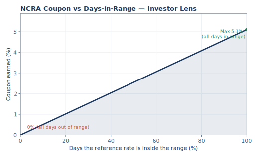

**Risks to the investor**

| Risk | Description | Severity |
|------|------------|:--------:|
| **Range breakout risk** | If SOFR moves outside [2.50%, 5.50%], the coupon drops to zero for those days | High |
| **Asymmetric view risk** | The range is symmetric but rate distributions are not — rates can spike faster than they fall | Medium |
| **Observation risk** | Daily fixing source must be accurate — a wrong fixing can incorrectly exclude or include a day | Medium |
| **Boundary risk** | When SOFR is near 2.50% or 5.50%, small movements cross the boundary and create volatile accrual | Medium |
| **Opportunity cost** | If the NCRA earns below the vanilla rate due to range breakouts, the investor has underperformed without the benefit of a callable exit | Low |
| **Credit risk** | Counterparty default risk on the issuing bank | Low |

#### §8. THE BANK LENS — Desk Economics (1st Line of Defence)

**What the desk books**

The desk books the NCRA in Murex as a **four-leg structured rate trade**:

| Leg | Detail |
|-----|--------|
| **Note leg** | Conditional coupon obligation to the investor: $75M, 5.10% × (days in range / total days), quarterly, Act/360 |
| **Issuer leg** | Bank funding: SOFR + spread |
| **Deposit leg** | Client collateral: $75M cash |
| **Hedge leg** | Strip of daily digital caps (strike 5.50%) + digital floors (strike 2.50%) on 6M SOFR |

The investor is short the range (short the digital strip), so the desk is on the mirror side: it is **short the accrual coupon to the investor and long the digital strip** — long the corridor, long rate stability, and long vega on the reference rate. Its building block is a vanilla fixed-rate bond plus a long digital floor strip (paying for each day SOFR is above the lower bound) and a short digital cap strip (cancelling the payout for each day SOFR is above the upper bound), combining to a corridor that pays only when the rate is inside both bounds.

**Rate option risk & hedging**

The desk's primary risk is **digital option gamma near the boundaries**. When SOFR is far from 2.50% and 5.50%, the hedge is stable. When SOFR approaches a boundary, the hedge cost explodes because the digital options become highly sensitive to small rate moves — at 5.40% with an upper boundary of 5.50%, the digital gamma spikes and the hedge becomes extremely sensitive. A $500M NCRA book near the boundary can generate $1M+ of P&L from a single basis point move. The desk hedges the warehoused exposure with a **strip of daily digital caps and floors**, replicated with tight option spreads (call spreads / put spreads) around each strike to bound the **pin risk** at the range boundaries. Residual risk is smile/skew on the digital options and the correlation between the reference rate and the observation dates. Pricing must reflect the **daily** monitoring frequency: daily digital observation is materially more expensive to hedge than periodic (European) observation.

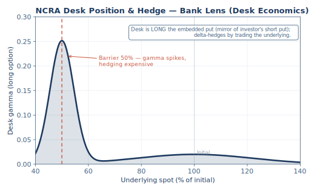

**How the bank makes money**

| Revenue Component | Detail |
|------------------|--------|
| **Structuring spread** | 8–12bp. The bank prices the range accrual using a strip of digital options and retains the difference between fair value and the client coupon |
| **Hedging P&L** | Profit from managing the digital strip hedge (realized vs implied vol) |
| **Distribution / sales credit** | 5–8bp on notional. Repeat business from institutional investors in Asia and Europe |
| **Funding benefit** | Bank funds at SOFR + spread against the $75M deposit leg |

**The desk coupon decomposition:**

The investor's coupon is funded out of the value the desk captures from being long the digital strip. For the 5.10% accrual rate, the gross economics decompose roughly as: the fair value of the digital option strip (the dominant component, which funds the bulk of the coupon premium over vanilla); the structuring spread of 8–12bp retained by the bank; the sales/distribution credit of 5–8bp; less the desk's own hedging cost (which depends on implied volatility and the width of the range) and funding cost on the deposit leg. The digital strip value and the structuring spread are the two structural sources; the hedging P&L is the variable, market-dependent one. *(The 8–12bp structuring spread and 5–8bp sales credit are sourced; the digital-strip and hedging-cost splits are inferred from the source's hedging-economics narrative, as the source gives no further dollar breakdown.)*

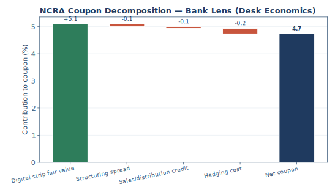

**P&L drivers**

Day to day, desk P&L is driven by the proximity of SOFR to the 2.50% / 5.50% boundaries (digital gamma), changes in implied rate volatility against the long-vega position, realized-versus-implied vol on the digital hedge, smile/skew moves on the digital options, and the funding spread earned on the deposit leg. Demand and margin rise when implied rate volatility is high (digital premiums fund a higher client coupon), when central banks signal rate stability, and when the curve is flat. Product Control attributes P&L daily; divergence between Note-leg and Hedge-leg P&L on a day with no rate move is the most common signal of a stale or mis-calibrated digital hedge.

#### §9. THE BANK LENS — Controls & Reconciliation (2nd Line of Defence)

**Booking & systems**

| Aspect | Detail |
|--------|--------|
| **Book of record** | Murex |
| **Pricing/Risk system** | Murex (digital option strip pricing); Sophis (risk) |
| **Booking structure** | Four-leg trade (Note, Issuer, Deposit, Hedge) |
| **Four-leg framework?** | Yes (structured rate note) |
| **Note leg** | Conditional coupon: $75M, 5.10% × (days in range / total days), quarterly, Act/360 |
| **Issuer leg** | Bank funding: SOFR + spread |
| **Deposit leg** | Client collateral: $75M cash |
| **Hedge leg** | Strip of daily digital caps (strike 5.50%) + digital floors (strike 2.50%) on 6M SOFR |
| **Observation rate** | 6-month SOFR (daily fixing, Fed-published) |
| **Range** | [2.50%, 5.50%] — fixed at inception |
| **Day count** | Act/360 |
| **Payment frequency** | Quarterly |
| **ISDA documentation** | Not required from client (note format) |

**Reconciliation points**

| Recon point | What must agree | NCRA-specific break |
|-------------|-----------------|---------------------|
| **Four-leg net** | Note, Issuer, Deposit, and Hedge legs reconcile to a single trade; deposit notional = note notional ($75M) | Deposit notional differs from Note notional after a corporate action / index restructuring |
| **Accrual factor / daily observation count** | The running count of in-range days vs total days per quarter, used in the coupon formula | Accrual counter defaults to 100%, or resets incorrectly at quarter end, or misses a daily observation |
| **Range boundaries** | The [2.50%, 5.50%] bounds and the inclusive/exclusive convention (≥ lower, ≤ upper) match the term sheet | System treats a boundary as exclusive when the contract is inclusive, flipping a day in/out |
| **Fixing source** | The exact SOFR fixing page, time, and tenor (6M, Fed-published) used for each daily observation | Observation source uses a different SOFR fixing than the trade confirmation specifies |
| **Day-count** | Act/360 applied to each quarterly accrual period | Wrong day-count or wrong total-days for the period misstates the accrual fraction |
| **Note vs Hedge P&L** | Note-leg conditional coupon value reconciles to the digital-strip Hedge-leg value | Hedge P&L diverges from Note P&L by > 10% on a day with no rate move (stale/incorrect calibration) |
| **Quarterly coupon** | Coupon = $75M × 5.10% × (days in range / total days) / 4 ties to the accrual count | Coupon paid does not match the audited in-range day count |
| **Collateral / deposit** | $75M deposit leg agrees across systems and the four-leg trade record | Deposit leg not reconciled to the original four-leg trade confirmation |

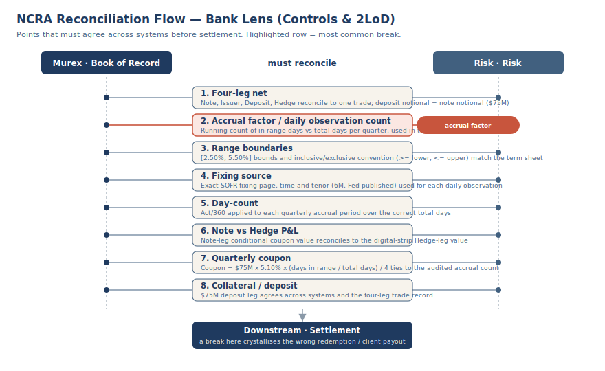

**Common breaks & red flags**

| Red Flag | What It Means | 2LoD Action |
|----------|---------------|-------------|
| Accrual counter shows 0 days in range for a quarter when SOFR was near the boundary | Observation source may use a different SOFR fixing than the trade confirmation | Verify the exact SOFR fixing page and time used for the observation |
| Quarterly coupon is exactly $956,250 for 3 consecutive quarters | Suspiciously perfect — accrual counter may default to 100% rather than counting | Audit the daily observation log for actual in-range/out-of-range counts |
| Hedge leg P&L diverges from Note leg P&L by > 10% on a day with no rate move | Digital option hedge may be stale or incorrectly calibrated | Recalibrate the digital strip hedge using the current vol surface |
| Reference rate on the boundary (exactly 2.50% or 5.50%) with disputed in/out decision | Contract may define "inclusive" or "exclusive" boundary differently than the system | Check the term sheet — boundaries are typically inclusive (≥ lower, ≤ upper) |
| Deposit notional differs from Note notional after a corporate action | Rare but possible if the reference rate index is restructured | Reconcile all four legs to the original trade confirmation |

**Control implication**

For an NCRA the dominant control is the **accrual factor** — the daily observation count that drives the coupon formula. Every quarter's coupon is `$75M × 5.10% × (days in range / total days) / 4`, so the entire economic outcome reduces to whether the daily in-range count is correct. That count depends on three sub-controls that must all agree with the term sheet: the **fixing source** (the exact SOFR page, time and tenor), the **range boundaries** and their inclusive/exclusive convention, and the **Act/360 day-count** over the correct total-days. A wrong fixing, a flipped boundary convention, or a miscounted day all corrupt the accrual factor and therefore the coupon. Around this, the **four-leg net** must tie (deposit = note notional) and the **Note-vs-Hedge P&L** reconciliation must hold so the conditional coupon and the digital-strip hedge stay consistent. The reconciliation exists precisely to catch a corrupted accrual count before a quarterly coupon settles.

#### §10. Formal Definition

A **Non-Callable Range Accrual (NCRA)** is a structured rate product that pays a conditional coupon based on the number of days a reference rate (typically 6-month SOFR or EURIBOR) stays within a predefined range during each accrual period.

**Coupon formula:** Coupon = Notional × Accrual Rate × (Days In Range / Total Days In Period) / Periods Per Year.

**Key terms:**
- **Non-callable:** Neither the bank nor the investor can terminate early.
- **Four-leg booking:** Booked in Murex with four legs — Note (conditional coupon obligation), Issuer (bank funding), Deposit (client collateral), and Hedge (strip of daily digital cap and floor options).
- **Range:** Fixed at inception (e.g. [2.50%, 5.50%]) and does not change during the life of the note. Boundaries are typically inclusive (≥ lower, ≤ upper).
- **Observation:** The reference rate is observed each business day from the published fixing; an accrual counter tracks days in range versus total days per quarter.

**Product construction (three components):**
1. **Vanilla fixed-rate bond** — provides the base return framework.
2. **Strip of long digital floor options** — pay for each day SOFR is above the lower bound.
3. **Strip of short digital cap options** — cancel the payout for each day SOFR is above the upper bound.

```
If SOFR ∈ [2.50%, 5.50%]:  Accrue at 5.10%
If SOFR < 2.50%:            Accrue at 0%
If SOFR > 5.50%:            Accrue at 0%
```

#### §11. Lifecycle

| Stage | Detail |
|-------|--------|
| **Pre-trade** | Structurer prices the digital option strip using the bank's rate vol surface. Range boundaries and accrual rate determined by the investor's view and market pricing. Risk: range set too narrow (frequent zero-coupon quarters) or too wide (coupon barely exceeds vanilla) |
| **Trade date** | Four legs booked in Murex. Daily observation mechanism configured for the reference rate. Risk: observation rate source incorrect (e.g. wrong SOFR fixing page) |
| **During life** | Each business day the reference rate is observed; an accrual counter tracks days in range vs total days per quarter. Quarterly coupons calculated and paid. Risk: missing a daily observation, or accrual counter reset incorrectly at quarter end |
| **Maturity** | Final quarterly coupon paid. Principal returned. All four legs closed. Risk: final quarter's accrual count disputed when the reference rate is on the boundary |

#### §12. Worked Example (both lenses)

**Terms:** $75M notional, 5-year, accrual rate 5.10%, range [2.50%, 5.50%] on 6M SOFR, quarterly, Act/360, non-callable.

**Year 1 detail:**

| Quarter | Days In Range | Total Days | Accrual Fraction | Quarterly Coupon |
|:-------:|:------------:|:----------:|:----------------:|:----------------:|
| Q1 | 65 | 90 | 72.2% | $690,625 |
| Q2 | 90 | 91 | 98.9% | $945,742 |
| Q3 | 30 | 92 | 32.6% | $311,821 |
| Q4 | 88 | 92 | 95.7% | $914,674 |
| **Total Year 1** | | | | **$2,862,861** |

**Effective Year 1 rate:** $2,862,861 / $75,000,000 = 3.82% (vs maximum 5.10%, vs vanilla 3.80%)

*Investor lens:*
In this scenario, Q3's rate spike above 5.50% for 62 days cost the investor approximately $600,000 in that quarter alone. But the other three quarters' strong in-range performance still delivered a return marginally above vanilla levels — an effective 3.82% versus the 3.80% vanilla alternative. The investor monetised a rate-stability view, but the single out-of-range quarter shows how breakout risk compresses the premium. Because the note is non-callable, the investor holds to maturity regardless.

*Bank lens:*
The desk holds the mirror position — long the digital strip / short the accrual to the investor — and pays the $2,862,861 Year 1 coupon out of the digital-strip value, retaining the 8–12bp structuring spread net of the 5–8bp sales credit and hedging cost. Q3's spike toward and through the 5.50% upper boundary is exactly where digital gamma is largest and the hedge most expensive. The 2nd line must confirm each quarter's in-range count against the SOFR fixing source — verifying, for example, that Q3's $311,821 matches 30 of 92 days at 5.10% on $75M — that the four legs tie, and that the Note-leg coupon reconciles to the Hedge-leg digital strip.

#### §13. Knowledge Check

1. **What determines the NCRA's quarterly coupon amount?** *(Investor)*
2. **Why is the NCRA coupon (5.10%) higher than a vanilla fixed-rate bond (~3.80%)?** *(Investor)*
3. **What does "non-callable" mean for the NCRA investor?** *(Investor)*
4. **How does the range width affect the coupon rate?** *(Investor)*
5. **If 6M SOFR is exactly at 5.50% on a given observation day, does the day count as in-range or out-of-range?** *(Investor)*
6. **What reference rate is observed daily in the worked example, and how often is the coupon paid?** *(Investor)*
7. **Explain why Q3 in the worked example produced only $311,821 when the maximum quarterly coupon is approximately $956,250.** *(Investor)*
8. **(Desk economics / 1LoD)** When the investor buys an NCRA, what position does the desk take across the four legs, what is its dominant Greek, and how does it hedge the warehoused risk? Why is the hedge cost largest when SOFR sits at 5.40% with an upper boundary of 5.50%?
9. **(Controls / 2LoD)** Name three reconciliation breaks specific to an NCRA — covering the accrual factor / daily observation count, the range boundaries, and the fixing source — and the consequence of each for the quarterly coupon.

**Mental Models**

| Concept | Mental Model |
|---------|-------------|
| Range accrual | Commission-based salesperson with a territory restriction — earn only on days inside the boundary |
| Days in range | Attendance record — every day inside the range is a day the coupon gets paid |
| Range boundaries | Electric fence — one step outside and the current stops flowing |
| Non-callable | Unbreakable contract — committed for the full term, for better or worse |
| Coupon conditionality | Performance bonus — the full bonus only if the condition is met every day |
| Digital gamma | The desk's tripwire — hedge cost explodes as SOFR nears a boundary |
| Accrual factor | The 2nd line's master dial — one number (days in range / total days) drives the whole coupon |

**Key Takeaways**

1. An NCRA pays a conditional coupon based on the fraction of days a reference rate stays within a predefined range: Coupon = max_coupon × (days in range / total days).
2. Insurance companies and pension funds buy it to monetize a rate-stability view with a premium coupon (5.10%) above vanilla levels (~3.80%).
3. Range breakout risk is the core danger — if the reference rate leaves the corridor, the coupon drops to zero for those days.
4. The product is non-callable, meaning the investor is committed for the full term regardless of performance.
5. The wider the range, the higher the probability of earning the full coupon — but the lower the premium rate offered.
6. The investor is short the digital strip (sold the range); the desk takes the mirror position — long the digital strip, long vega — and is exposed to digital gamma near the boundaries, which it hedges with a strip of daily digital caps and floors.
7. The trade is booked in Murex with four legs: Note, Issuer, Deposit, and Hedge.
8. For the 2nd line, the dominant control is the **accrual factor** — the daily in-range observation count — supported by the fixing source, range-boundary convention, Act/360 day-count, four-leg net, and collateral; a corrupted accrual count misstates the quarterly coupon.

#### §14. Common Mistakes

1. **Assuming the coupon is "fixed at 5.10%."** It is the maximum, not the guaranteed rate. Actual earnings depend entirely on how many days the reference rate stays in the range.
2. **Setting the range based on current rates without considering historical volatility.** A range of [4.00%, 4.50%] might look safe today but has high breakout probability based on 5-year historical rate distributions.
3. **Confusing the observation rate with the coupon rate.** The 6M SOFR is observed daily to determine accrual; the 5.10% is the maximum coupon rate if the observation is favourable. They are separate concepts.
4. **Not understanding that "non-callable" means the investor cannot exit.** Unlike the IR Callable, there is no early termination option for either party. If rates break out permanently, the investor earns zero coupons for the remainder but must hold to maturity.
5. **Pricing the desk hedge with European-style digital options when the product requires daily digital observations.** Daily monitoring is materially more expensive to hedge than periodic observation — the pricing must reflect the monitoring frequency.
6. **(Controls)** Trusting an accrual counter that reports 100% or resets cleanly at quarter end without auditing the daily observation log. The accrual factor is the key reconciliation: a counter defaulting to 100%, a flipped boundary convention, or a wrong SOFR fixing source all corrupt the in-range count and misstate the coupon — reconcile the day-by-day count to the fixing source and the four-leg trade record before the coupon settles.

**Dual-lens questions:**
- *(Desk economics / 1LoD)* What does the desk book across the four legs, and what is its primary rate/vol risk and hedge?
- *(Controls / 2LoD)* Which four-leg / fixing / accrual fields must reconcile, and which is the most common break?

**Dual-lens visuals (generated):**
- `assets/ncra/controls_ncra_recon_08.svg` `[generated]`
- `assets/ncra/desk_ncra_gamma_07.svg` `[generated]`
- `assets/ncra/payoff_ncra_01.svg` `[generated]`
- `assets/ncra/waterfall_ncra_09.svg` `[generated]`
### 5.3.4 Callable Range Accrual SRT (CRA SRT) {#sec-5-3-4}

> **Prerequisites:** NCRA · IR CALLABLE &nbsp;|&nbsp; **Key concepts:** Dual embedded options (digital strip + swaption), correlation

---

*Where a Non-Callable Range Accrual ([Section 5.3.3](#sec-5-3-3)) pays a conditional coupon based on days in range with the investor locked in for the full term, the Callable Range Accrual SRT adds the issuing bank's right to terminate early — combining the range accrual coupon mechanism with the callable feature from [Section 5.3.1](#sec-5-3-1). That single change increases the coupon rate (because the investor is selling both a range view AND a call option) but introduces reinvestment risk on top of range breakout risk. The product is a Structured Rate Trade booked in Murex with the four-leg structure (Note, Issuer, Deposit, Hedge). This chapter reads the product through two lenses: what it means for **the investor** (the note holder), and what it means for **the bank** — the latter split into the desk's rate economics (1st line of defence) and the controls and reconciliation that surround it (2nd line of defence).*

#### §1. Explain Like I'm New

Consider a senior treasury officer at a Japanese regional bank who wants the highest possible coupon from a structured rate product and is willing to accept two risks: range breakout (SOFR leaving a predicted corridor) and early termination (the bank calling the note). A plain NCRA at 5.10% is not enough. The CRA SRT pays 5.40% per year, accruing on the days 6M SOFR stays within [2.00%, 5.00%], with the bank's right to call after 2 years. The extra 30bp over the NCRA comes from the embedded swaption premium — the investor is selling both a rate-range view and a call option, and is paid for both.

#### §2. Real-World Analogy

A CRA SRT is like a freelance contractor with both a performance clause and a termination clause. The contractor earns the daily rate only when a specific task is completed (range condition), AND the company can end the contract at any quarterly review (call right). The contractor accepts both conditions because the daily rate is higher than what a permanent employee earns. If business is strong, the company keeps the contractor and earnings continue. If business drops, the company terminates the contract and the contractor must find a new one — likely at a lower rate.

The dual risk is what distinguishes this contractor from two colleagues: one is a permanent employee (Vanilla IR Swap — neither condition), and the other is a contractor with only the quarterly review but no task requirement (IR Callable — call right only). The contractor accepts both constraints because the daily rate exceeds what either colleague earns.

#### §3. What Problem Does This Solve?

| Investor Need | How the Product Delivers |
|------------|------------------------|
| Maximum coupon from structured rate exposure | Combines range accrual premium + call option premium = highest available coupon |
| Express dual view: rates stable AND rates not crashing | Investor benefits when rates stay in range AND the bank does not call |
| Accept higher risk for higher return | Two risk factors (range + call) provide two sources of premium |
| Structured note format without ISDA | Packaged as a note — no derivatives documentation required from the investor |

#### §4. Product DNA

| **Field** | **Value** |
|---|---|
| **Full Name** | Callable Range Accrual SRT |
| **Abbreviation** | CRA SRT |
| **Family** | Structured Rate Trades |
| **Complexity Score** | 7 / 10 |
| **Complexity Rationale** | Combines range accrual + callable. Dual embedded options (digital strip + swaption). Path-dependent |
| **Underlying Asset Class** | Rates (6-month SOFR, daily observation) |
| **Capital Protection** | 100% at maturity |
| **Coupon Type** | Accrual coupon (range-dependent) — enhanced by embedded call premium |
| **Maturity** | 5–15 years (callable after non-call period) |
| **Liquidity** | OTC — model-dependent |
| **Primary System** | Murex (primary), Sophis (risk) |
| **ISDA Required** | No — issued as note |

**DNA Atlas Fields:**
- Primary Risk: Range accrual risk + callability risk. Bank calls when range accrual is profitable for the investor
- Typical Buyer: Yield-seeking institutional investors willing to sell callability for extra coupon
- Typical Use Case: Maximum yield enhancement — sells both range risk and call optionality
- Building Blocks: NCRA + receiver swaption sold to bank
- Key Hedge: Digital option strip + receiver swaption
- Similar Products: NCRA (5.3.3 — without call), IR Callable (5.3.1 — without range), CRA ELN (5.1.10)
- Most Important Greek: Vega (combined digital vol + swaption vol)

**Comparison Matrix Fields:**
- Complexity: 7
- Yield Potential: Very high (double optionality sold)
- Capital Protection: 100% at maturity
- Credit Exposure: Issuer or counterparty
- Liquidity: OTC — model-dependent
- Path Dependency: Yes (daily range observation + call dates)
- Volatility Sensitivity: Short vega (both digital and swaption)
- Correlation Sensitivity: None
- Client Type: Sophisticated institutional
- Market Environment: Best when rates stable and low vol expected

#### §5. Who Touches This Product

| Role | Responsibility |
|------|---------------|
| **Structurer** | Prices the combined structure; models the correlation between the range and call components; negotiates non-call period and range boundaries |
| **Trader** | Manages the combined digital strip + swaption hedge; makes call decisions considering range performance |
| **Sales** | Presents the dual-premium story; explains the risk stacking to sophisticated clients |
| **Risk Management** | Monitors aggregate exposure to both digital gamma and swaption vega across the CRA SRT book |
| **Product Control** | Values the complex combination daily; verifies that call events correctly terminate accrual |
| **Operations** | Manages the intersection of daily observations and quarterly call decisions; handles four-leg settlement |
| **Legal / Compliance** | Reviews documentation for the interaction between range accrual and call provisions |
| **Model Validation** | Validates the combined pricing model, particularly the correlation between digital and swaption components |

#### §6. Product Evolution

| Stage | Product | What Was Added | Why |
|:-----:|---------|---------------|-----|
| 1 | NCRA (5.3.3) | — (baseline for this evolution) | Conditional coupon based on days in range, non-callable |
| 2 | IR Callable (5.3.1) | Call right (no range accrual) | Bank's right to terminate for reinvestment premium |
| 3 | CRA SRT | Combined range accrual + call right | Maximum coupon by stacking two premium sources |

---

#### §7. THE INVESTOR LENS

**Why the investor buys it**

1. **Highest coupon in the SRT family** — the dual premium (range + call) produces 20-40bp above the NCRA.
2. **Leveraged rate-stability view** — rewards conviction that rates stay range-bound AND the call is not triggered.
3. **Proven structure** — combines two well-understood features (range accrual from NCRA, call from IR Callable).
4. **Note format** — no ISDA documentation required from the investor.
5. **Scalable** — the standard structure allows large notional trades with tight pricing.

The typical buyer is a Japanese regional bank or Asian insurance company seeking maximum yield from structured rate products — typically institutional, $500M+ AUM, with high derivatives sophistication. The product makes sense for investors who have high conviction on rate stability, are comfortable with reinvestment risk, and prioritize maximum coupon over predictability. It is a poor choice for investors who need guaranteed income, who cannot tolerate the dual risk of zero coupons AND early termination, or who have short investment horizons (the non-call period may consume most of the holding period).

**Position & accrual + call**

The investor holds the Note leg and is **short two embedded options**: short the range (a digital option strip — the investor gives up coupon on any day SOFR is outside the corridor) AND short the issuer's call (a receiver swaption — the investor has sold the bank the right to terminate). The coupon accrues daily based on whether the reference rate (6-month SOFR, daily fixing) falls within [2.00%, 5.00%], and the bank may call quarterly after the non-call period (NC2).

The coupon is built from three components:

```
NCRA accrual rate:            5.10%
+ Swaption premium (ann.):    0.30%
─────────────────────────────────────
CRA SRT coupon (max):         5.40%
× (days in range / total days)
```

The investor receives 5.40% × (days in range / total days) per quarter. Maximum = 5.40%, minimum = 0%. The premium over the NCRA (5.10%) comes from the embedded call option the investor has sold.

**Payoff & scenarios**

The CRA SRT coupon depends on two factors: days in range AND whether the bank has called.

```
Quarterly
Coupon ($)
  │
  │── $810,000 ──── Maximum (100% in range, not called)
  │               ╲
  │                 ╲
  │                   ╲
  │── $0 ──────────── Minimum (0% in range OR called)
  ├────────────────────── % Days in Range
  0%                    100%

  CALL EVENT: If called, final partial quarter
  is prorated to the call date.
```
*CRA SRT quarterly coupon — linear in days in range, terminated if called.*

**Coupon formula per quarter:**
Quarterly Coupon = $60M × 5.40% × (Days In Range / Total Days) / 4

Maximum quarterly coupon: $60M × 5.40% / 4 = $810,000

Scenarios (on $60M notional):
- **Scenario A — SOFR in range, never called:** Full 5-year term, full coupon. Total: $60M × 5.40% × 5 = $16,200,000. Best outcome.
- **Scenario B — SOFR in range 80% of days, never called:** Annual coupon: $60M × 5.40% × 80% = $2,592,000. 5-year total: $12,960,000. Still above vanilla (3.80% = $11,400,000).
- **Scenario C — SOFR in range, called after 2 years:** The investor earns $6,480,000 over 2 years — equivalent to 5.40% for 2 years — and must reinvest $60M at prevailing rates, likely lower (the bank would not call if rates had not dropped).
- **Scenario D — SOFR breaks range in year 1, called after 2 years:** The investor earns reduced coupons (e.g., 60% accrual) for year 1 ($1,944,000) and 90% for year 2 ($2,916,000). Total: $4,860,000. Then called. Worst realistic outcome — reduced income followed by forced reinvestment.

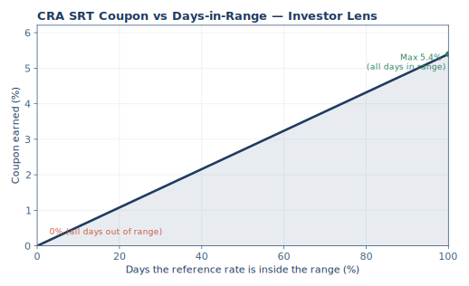

**Risks to the investor**

| Risk | Description | Severity |
|------|------------|:--------:|
| **Range breakout risk** | SOFR leaving [2.00%, 5.00%] reduces or eliminates the coupon | High |
| **Reinvestment risk** | Bank calls when rates drop, forcing the investor to reinvest at lower levels | High |
| **Correlation risk** | Range breakout and call exercise may coincide — worst case is zero coupons then termination | Medium |
| **Digital gamma near boundaries** | The hedge becomes expensive and volatile when SOFR approaches range limits, which can feed back into bid-offer the investor pays to unwind | Medium |
| **Swaption vega risk** | Changes in implied volatility affect the callable component's MTM | Medium |
| **Credit risk** | Counterparty default risk on the issuing bank | Low |

#### §8. THE BANK LENS — Desk Economics (1st Line of Defence)

**What the desk books**

The desk books the CRA SRT in Murex as a **four-leg trade**:

- **Note leg** — conditional callable coupon: $60M, 5.40% × (days in range / total days), quarterly, callable after year 2.
- **Issuer leg** — bank funding: SOFR + spread.
- **Deposit leg** — investor collateral: $60M cash.
- **Hedge leg** — digital cap/floor strip (range [2.00%, 5.00%] on 6M SOFR) + Bermudan receiver swaption (quarterly exercise after NC2).

The investor is short both embedded options, so the desk is **long both**: long the digital strip (the range view) and long the issuer's call (the receiver swaption). The desk warehouses both positions and hedges the rate and volatility risk down.

**Rate/vol risk & hedging**

The rates desk hedges with two instruments: (1) a daily digital cap/floor strip for the range, and (2) a Bermudan receiver swaption for the call. The residual is the correlation between range accrual performance and the call exercise decision. The combined gamma from both the digital options and the swaption can create large P&L swings — a book near both a range boundary AND the call exercise threshold sees significant P&L from small rate moves (illustratively, a $500M book near both boundaries might see $3-5M of P&L from a 2bp move). The two hedges should partially offset in many scenarios; if they move in the same direction it signals a correlation breakdown.

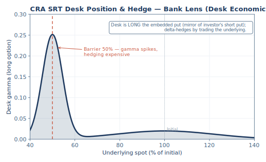

**How the bank makes money**

| Area | Detail |
|------|--------|
| **Client economics** | The investor receives 5.40% × (days in range / total days) per quarter. Maximum = 5.40%, minimum = 0%. The premium over NCRA (5.10%) comes from the embedded call option |
| **Bank economics** | Structuring spread: 10-15bp. The bank prices both the digital strip and the swaption, retaining the difference between fair value and the client coupon |
| **Hedging economics** | The rates desk hedges with (1) a daily digital cap/floor strip (range) and (2) a Bermudan receiver swaption (call). Residual: correlation between range accrual performance and the call exercise decision |
| **Distribution economics** | Sales credit 5-8bp on notional. The CRA SRT is the most profitable SRT variant for the bank due to the dual structuring spread |

**Coupon decomposition:**

```
NCRA accrual rate:            5.10%
+ Swaption premium (ann.):    0.30%
─────────────────────────────────────
CRA SRT coupon (max):         5.40%
```

The 5.40% maximum client coupon decomposes into an NCRA base of 5.10% (the range-accrual / digital-strip component) plus 0.30% of annualized swaption premium (the call component the investor sells). The bank retains a structuring spread of 10-15bp out of the priced fair value, and sales earns 5-8bp distribution credit. The combined premium is not simply the linear sum of the two parts — the correlation between range performance and call exercise affects the combined pricing, so the realised premium may be more or less than the sum of the components.

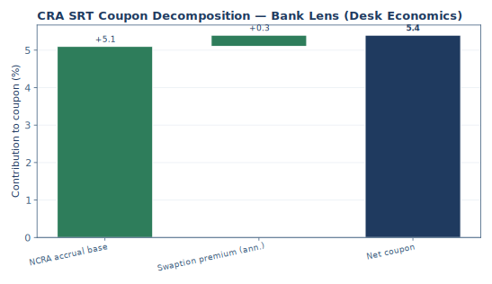

**P&L drivers**

Day to day, desk P&L is driven by SOFR moves against the digital-strip gamma (sharpest near the [2.00%, 5.00%] boundaries), changes in implied rate volatility against short vega on both the digital strip and the swaption, the realised path of days-in-range versus the priced accrual, and shifts in the swap curve that change the value of the Bermudan call. The dominant cross-risk is the correlation between range performance and the call decision: the call right is valuable precisely when range accrual is likely to be poor (rates dropping toward or through the lower boundary), so the two exposures are not independent.

#### §9. THE BANK LENS — Controls & Reconciliation (2nd Line of Defence)

**Booking & systems**

| Field | Value |
|-------|-------|
| **Booking system** | Murex |
| **Pricing system** | Murex (combined digital strip + swaption pricing) |
| **Four-Leg** | Yes |
| **Note leg** | Conditional callable coupon: $60M, 5.40% × (days in range / total days), quarterly, callable after year 2 |
| **Issuer leg** | Bank funding: SOFR + spread |
| **Deposit leg** | Client collateral: $60M cash |
| **Hedge leg** | Digital cap/floor strip (range [2.00%, 5.00%] on 6M SOFR) + Bermudan receiver swaption (quarterly exercise after NC2) |
| **ISDA documentation** | Not required from client (note format) |
| **Observation rate** | 6-month SOFR (daily fixing) |
| **Range** | [2.00%, 5.00%] — fixed at inception |
| **Call dates** | Quarterly after year 2 (NC2) |
| **Day count** | Act/360 |

**Reconciliation points**

| Recon point | What must agree | CRA SRT-specific break |
|-------------|-----------------|------------------------|
| **Four legs net** | Note, Issuer, Deposit, and Hedge legs reference the same master trade and net consistently across systems | Hedge booked as two separate trades (digital strip and swaption) that do not correctly reference the same master trade |
| **Accrual factor / observation count** | Daily days-in-range count agrees with the published SOFR fixing log over each quarter | Accrual counter stuck at a default value — e.g. 100% for 4 consecutive quarters after rates were volatile |
| **Range** | The corridor [2.00%, 5.00%] stored at inception matches the termsheet and the digital strip strikes | Range stored with different boundaries or convention in pricing vs booking system |
| **Fixing** | 6-month SOFR daily fixing source and date convention match the termsheet | System uses a different SOFR observation date or source than the contract |
| **Call schedule & exercise capture** | Quarterly call dates after NC2 and any exercised call are captured consistently; the call simultaneously terminates accrual and the swaption | Call exercise not propagated to all legs; a coupon generated on a quarter where the note was called |
| **Day-count** | Act/360 applied consistently to the accrual and coupon calculation | Wrong day-count convention applied, so the quarterly coupon amount differs |
| **Partial-quarter accrual on call** | On a mid-quarter call, days in range counted up to and including the call date (not quarter-end), coupon prorated | Accrual not stopped on the call date — full-quarter coupon paid, or accrual not prorated |
| **Collateral / Deposit** | $60M Deposit leg released within T+2 of call exercise; daily MTM and collateral track | Deposit leg not released within T+2 of call — client's collateral trapped |

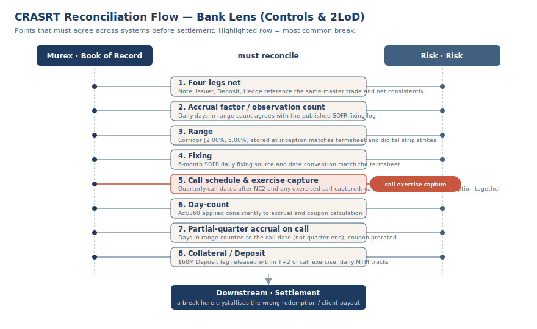

**Common breaks & red flags**

| Red Flag | What It Means | 2LoD Action |
|----------|--------------|-------------|
| Accrual counter and call date fall on the same day with conflicting instructions | System may process the call before finishing the quarter's accrual count | Verify that accrual is calculated up to and including the call date before processing termination |
| Hedge leg shows swaption P&L and digital P&L moving in the same direction | Possible correlation breakdown — the two hedges should partially offset in many scenarios | Review the correlation assumptions in the pricing model |
| Client receives a coupon on a quarter where the note was called | Post-call coupon was incorrectly generated | Check the call exercise date and verify no payments are processed after it |
| Range accrual shows 100% for 4 consecutive quarters after rates were volatile | Accrual counter may be stuck at a default value | Audit the daily observation log against published SOFR fixings |
| Deposit leg not released within T+2 of call exercise | Operational delay in coordinating four-leg settlement | Escalate to Operations — client's collateral is trapped |

**Control implication**

For a CRA SRT the dominant controls are the **daily accrual factor (observation count vs the SOFR fixing log)**, the **call schedule and exercise capture across all four legs**, and the **partial-quarter accrual on a mid-quarter call**. A stuck or wrong accrual counter misstates the coupon; a call event that does not propagate to all four legs can pay a coupon after termination or leave the swaption position live; a mid-quarter call that fails to stop the accrual counter on the exact call date overpays the investor. The four legs (Note, Issuer, Deposit, Hedge) must reference the same master trade so a call simultaneously terminates the accrual and the swaption, and the $60M Deposit must release within T+2. The reconciliation exists precisely to catch these inconsistencies before a coupon settles, a call processes, or collateral is trapped.

#### §10. Formal Definition

A **Callable Range Accrual SRT (CRA SRT)** is a structured rate product that combines a conditional range accrual coupon with the issuing bank's right to terminate the trade on predetermined call dates. The coupon accrues daily based on whether the reference rate (typically 6-month SOFR) falls within a predefined range:

Coupon = Notional × Accrual Rate × (Days In Range / Total Days) / Periods Per Year.

The callable feature allows the bank to terminate after a non-call period, typically on quarterly dates. The product is booked in Murex with four legs: Note (conditional coupon with call), Issuer (funding), Deposit (collateral), and Hedge (digital option strip + Bermudan swaption). The accrual rate exceeds both the NCRA and the IR Callable because the investor is selling two embedded options.

#### §11. Lifecycle

| Stage | What Happens | Who Is Involved | What Can Go Wrong |
|:-----:|-------------|----------------|-------------------|
| **Pre-trade** | Structurer prices both the digital strip and the swaption. Combined premium determines the accrual rate. Non-call period and range boundaries are negotiated | Structurer, Sales, Client | Mispricing the correlation between range performance and call exercise — if the bank calls precisely when accrual is poor, the investor receives the worst of both risks |
| **Trade date** | Four legs booked in Murex: Note leg (conditional callable coupon), Issuer, Deposit, Hedge (digital strip + swaption) | Operations, Trader | Booking the hedge as two separate trades (digital strip and swaption) that do not correctly reference the same master trade |
| **During life** | Daily observation for range accrual. Quarterly coupon calculation. On each call date after the non-call period, the bank decides whether to call | Product Control, Trader (call decision), Operations | Call decision timing conflicts with range accrual quarter-end — if called mid-quarter, partial accrual must be calculated |
| **Termination** | If called: all four legs close, partial quarter coupon paid. If matured: final quarterly coupon paid, principal returned | Operations, Product Control | Partial quarter accrual calculation on call date — days in range must be counted up to the call date, not quarter end |

#### §12. Worked Example (both lenses)

**Terms:** $60M notional, 5-year NC2, accrual rate 5.40%, range [2.00%, 5.00%] on 6M SOFR, quarterly, Act/360.

**Year 1 (non-call period):**

| Quarter | Days In Range | Total Days | Coupon |
|:-------:|:------------:|:----------:|:------:|
| Q1 | 70 | 90 | $630,000 |
| Q2 | 85 | 91 | $756,593 |
| Q3 | 60 | 92 | $528,261 |
| Q4 | 88 | 92 | $775,304 |
| **Year 1 Total** | | | **$2,690,159** |

**Effective Year 1 rate:** $2,690,159 / $60,000,000 = 4.48% (vs max 5.40%, vs vanilla 3.80%)

**Call scenario:** If called after year 2 with average 85% days in range, two-year total coupons ≈ $5,508,000 (4.59% annualized). The investor must then reinvest at prevailing rates — likely below 5.40%.

**Maximum quarterly coupon:** $60M × 5.40% / 4 = $810,000

*Investor lens:*
The investor earned an effective 4.48% in Year 1 — below the 5.40% maximum because SOFR was outside [2.00%, 5.00%] on some days each quarter, but well above the 3.80% vanilla rate. Q3 is the weakest quarter (60 of 92 days in range, $528,261) and reflects the range breakout risk the investor is short. Across two years to call, an average 85% days-in-range produces ≈ $5,508,000 (4.59% annualized), after which the investor faces reinvestment risk — having sold the call, the investor cannot prevent early termination and must redeploy $60M at lower prevailing rates.

*Bank lens:*
The desk holds the mirror position — long the digital strip and long the issuer's call — and pays the investor the accrued coupon each quarter, funded against the digital and swaption hedges plus the 10-15bp structuring spread. Across Year 1 the desk pays $2,690,159 on the Note leg. The 2nd line must confirm each quarter's days-in-range count against the published SOFR fixing log, that the Act/360 day-count produced each coupon (e.g. Q2 = $60M × 5.40% × 85/91 / 4 = $756,593), and that on any call the accrual stops on the exact call date with all four legs terminating together.

#### §13. Knowledge Check

1. **What two embedded options does the CRA SRT investor sell?** (The range — a digital option strip — and the issuer's call — a receiver swaption.) *(Investor)*
2. **Why does the CRA SRT offer a higher coupon than the NCRA?** *(Investor)*
3. **What happens to the accrual counter if the bank calls mid-quarter?** *(Investor)*
4. **How does the non-call period affect the coupon uplift from the callable feature?** *(Investor)*
5. **Why is the worst case for a CRA SRT more severe than for an NCRA or IR Callable alone?** *(Investor)*
6. **A CRA SRT has a range of [2.00%, 5.00%] and is callable NC2 quarterly. In year 3, SOFR drops from 3.00% to 1.50%. What happens to the accrual, and what is the bank likely to do at the next call date?** *(Investor)*
7. **The bank calls a CRA SRT on day 45 of a 91-day quarter. Of the 45 days, 38 were in range. Calculate the partial quarter coupon on a $60M notional with a 5.40% accrual rate.** *(Investor)*
8. **(Desk economics / 1LoD)** When the investor is short both the range and the call, what positions does the desk hold, what are its dominant Greeks, and how does the desk hedge each? Why is the correlation between range performance and the call decision the residual the desk cannot fully hedge?
9. **(Controls / 2LoD)** Name three reconciliation breaks specific to a CRA SRT — covering the daily accrual factor, the call exercise across all four legs, and the partial-quarter accrual on a mid-quarter call — and the consequence of each for the coupon or the collateral.

**Mental Models**

| Concept | Mental Model |
|---------|-------------|
| CRA SRT | Freelance contractor — earn the daily rate only when performing (range), with the company able to end the contract (call) |
| Dual premium | Stacking two insurance policies — the investor earns two premiums but faces two types of claims |
| Range + call correlation | If you are fired precisely when your commissions are lowest, you get the worst of both worlds |
| Non-call period | Probation period — the contract is safe until probation ends, then reviews begin |
| Maximum coupon | The theoretical ceiling — achieved only if every target is hit and every review survived |
| Four legs net (2LoD) | One master trade — a call must close all four legs at once, or accrual and the swaption fall out of step |

**Key Takeaways**

1. A CRA SRT combines range accrual and callable features, offering the highest coupon in the SRT family.
2. Japanese regional banks and Asian insurance companies buy it for maximum yield from structured rate exposure.
3. Dual risk (range breakout + early termination) means the worst case is more severe than either risk alone.
4. The accrual rate (5.40%) exceeds the NCRA (5.10%) because the investor sells both a digital option strip and a swaption — the desk is long both.
5. The hedge is complex: a strip of daily digital options plus a Bermudan swaption, with correlation risk between them that the desk cannot fully neutralise.
6. For the 2nd line, the dominant control risks are the daily accrual factor (observation count vs the SOFR fixing log), the call schedule and exercise capture across all four legs, the partial-quarter accrual on a mid-quarter call, the Act/360 day-count, and the $60M Deposit release within T+2 — each can misstate a coupon or trap collateral.

#### §14. Common Mistakes

1. **Adding the premiums linearly.** The CRA SRT's coupon is not simply NCRA coupon + swaption premium. The correlation between range performance and call exercise affects the combined pricing — the actual premium may be more or less than the sum of the parts.
2. **Assuming the call is independent of range performance.** The bank is more likely to call when rates drop — which is the same scenario where SOFR may approach or breach the lower range boundary. The two risks can coincide, creating a "double hit."
3. **Quoting the 5.40% as the "yield" of the product.** The 5.40% is the maximum possible coupon if every day is in range. Actual yield depends on range accrual performance. Investors should be quoted the expected yield based on rate forecasts, not the maximum.
4. **Booking the digital strip and swaption as independent trades.** They must reference the same master trade in Murex so that a call event simultaneously terminates both the accrual and the swaption position.
5. **(Controls)** **Not modeling the partial-quarter accrual on a mid-quarter call date.** If the bank calls on day 45 of a 91-day quarter, the accrual counter must stop at day 45 and the coupon must be prorated — the system may not handle this automatically, and 2LoD must verify the accrual stopped on the exact call date with all four legs settling together.

**Dual-lens questions:**
- *(Desk economics / 1LoD)* What does the desk book across the four legs, and what is its primary rate/vol risk and hedge?
- *(Controls / 2LoD)* Which four-leg / fixing / accrual fields must reconcile, and which is the most common break?

**Dual-lens visuals (generated):**
- `assets/crasrt/controls_crasrt_recon_08.svg` `[generated]`
- `assets/crasrt/desk_crasrt_gamma_07.svg` `[generated]`
- `assets/crasrt/payoff_crasrt_01.svg` `[generated]`
- `assets/crasrt/waterfall_crasrt_09.svg` `[generated]`
### 5.3.5 Digital Cap-Floor Note {#sec-5-3-5}

> **Prerequisites:** [IRS](#sec-5-2-1) · DIGITAL &nbsp;|&nbsp; **Key concepts:** Digital caplet strip, binary rate payoff

---

*Where a Range Accrual Note pays the investor for each day a reference rate sits inside a range, a Digital Cap-Floor Note takes a different approach: instead of accruing interest day by day, it pays a fixed digital coupon whenever the reference rate crosses a predetermined strike. The coupon is a binary function of the rate level — either the reference rate is on the paying side of the strike and the high coupon is paid, or it is not and the low (or zero) coupon is paid. It is a structured rate note in the Structured Rate Trade (SRT) family, wrapped as a note and booked in Murex with a four-leg structure. This chapter reads the product through two lenses: what it means for **the investor** (the note holder), and what it means for **the bank** — the latter split into the desk's rate-option economics (1st line of defence) and the controls and reconciliation that surround it (2nd line of defence).*

#### §1. Explain Like I'm New

Consider a risk manager at an Italian utility company with $400 million of floating-rate debt. The manager is worried about SOFR rising above 5.00% — at that level, the company's interest expense begins to threaten its profit margin. A traditional interest rate cap is expensive, and the company does not need proportional protection — it needs a fixed payment whenever rates breach the danger threshold. The Digital Cap-Floor Note delivers exactly this: if 3-month SOFR is at or above 5.00% on any quarterly observation date, the note pays a flat coupon of 0.75% × $40M = $300,000 for that quarter. If SOFR is below 5.00%, the coupon is zero. The outcome is binary — either the rate is in the danger zone and the coupon is paid, or it is not and nothing is paid.

#### §2. Real-World Analogy

A Digital Cap is like a home insurance policy with a fixed payout. If the house floods (rate breach), the policy pays a predetermined amount of $10,000 — regardless of whether the flood caused $5,000 or $50,000 in actual damage. If the house does not flood, nothing is paid and the premium bought peace of mind. The Digital Cap pays a fixed amount whenever the "flood" (rate above strike) occurs.

The Digital Floor works in reverse — it is like drought insurance. If rainfall drops below a critical level (rate falls below the floor strike), a fixed payment is made. Combine both — flood insurance plus drought insurance — and the result is a Digital Cap-Floor: protection against rates going too high OR too low, with a fixed coupon in either direction. An investor concerned only about rates rising buys the cap alone, but the structure can be tailored to either extreme or both.

#### §3. What Problem Does This Solve?

| Investor Need | How the Product Delivers |
|------------|------------------------|
| Protection against rates exceeding a specific level | Fixed digital coupon whenever SOFR ≥ strike on observation dates |
| Simpler and cheaper than traditional caps | No proportional payout calculation — binary yes/no decision |
| Budget certainty on protection payments | Coupon is a fixed percentage per period, not variable with rate level |
| Hedge floating-rate debt at specific thresholds | Coupons offset increased interest expense when rates breach the danger level |

#### §4. Product DNA

| **Field** | **Value** |
|---|---|
| **Full Name** | Digital Cap-Floor Note |
| **Abbreviation** | Digital CF |
| **Family** | Structured Rate Trades |
| **Complexity Score** | 5 / 10 |
| **Complexity Rationale** | Strip of digital caplets. Binary payoff at each observation. Four-leg SRT structure |
| **Underlying Asset Class** | Rates (3-month SOFR, quarterly observation) |
| **Capital Protection** | 100% at maturity |
| **Coupon Type** | Digital coupon (binary — full or zero per observation period) |
| **Maturity** | 3–7 years |
| **Liquidity** | Secondary market |
| **Primary System** | Murex (primary), Sophis (risk) |
| **ISDA Required** | No — issued as note |

**DNA Atlas Fields:**
- Primary Risk: Digital payoff — small rate move across strike causes large P&L swing. Discontinuous payoff at cap/floor levels
- Typical Buyer: Institutional investors seeking defined-outcome rate exposure
- Typical Use Case: Binary view on rates — pay enhanced coupon if rate above/below digital strike
- Building Blocks: Fixed-rate note + digital cap/floor options
- Key Hedge: Digital options, call/put spreads as digital approximation
- Similar Products: Digital Note (5.1.12 — equity), NCRA (5.3.3 — range), Vanilla STEG (5.4.1)
- Most Important Greek: Digital gamma (discontinuous payoff at strike)

**Comparison Matrix Fields:**
- Complexity: 5
- Yield Potential: High (if rate on correct side of digital strike)
- Capital Protection: 100% at maturity
- Credit Exposure: Issuer (note format)
- Liquidity: Secondary market
- Path Dependency: Yes (observation dates)
- Volatility Sensitivity: Concentrated near digital strike
- Correlation Sensitivity: None
- Client Type: Institutional
- Market Environment: Best with strong directional rate view

#### §5. Who Touches This Product

| Role | Responsibility |
|------|---------------|
| **Structurer** | Prices the digital caplet strip, designs the coupon and premium structure. Negotiates strike and payout amount against the investor's hedging need |
| **Trader** | Manages the digital caplet strip hedge. Monitors digital delta and gamma near the strike. Manages the embedded rate option risk |
| **Sales** | Presents the digital cap as a lower-cost alternative to vanilla caps. Manages underinsurance expectations with the investor |
| **Risk Management** | Monitors aggregate digital exposure, especially cliff risk near strikes. Stress-tests the book |
| **Product Control** | Verifies observation rates, validates binary coupons, reconciles premiums. Daily P&L attribution |
| **Operations** | Processes quarterly observations, pays digital coupons, collects premiums. Confirms observation date convention |
| **Legal / Compliance** | Reviews digital coupon provisions and observation-date definitions. Confirms the official SOFR fixing source |
| **Model Validation** | Validates digital option pricing, particularly behaviour near the strike and the call-spread approximation |

#### §6. Product Evolution

| Stage | Product | What Was Added | Why |
|:-----:|---------|---------------|-----|
| 1 | Vanilla interest rate cap | — (baseline) | Proportional payout when rate exceeds strike — standard hedge for floating-rate borrowers |
| 2 | Digital equity note (5.1.12) | Binary payout on equity level | Simplified payoff: all-or-nothing instead of proportional |
| 3 | Digital Cap-Floor Note | Binary payout on rate level, SRT note format | Applied the digital concept to rates with structured-note packaging and four-leg booking |

---

#### §7. THE INVESTOR LENS

**Why the investor buys it**

1. **Rate view / enhanced yield.** The investor expresses a directional view on rates: a fixed high coupon is earned in the periods where the reference rate is on the paying side of the digital strike, enhancing yield over a plain note.
2. **Lower premium than vanilla caps.** The digital coupon eliminates the expensive proportional protection, so the premium is typically 30-50% lower than a vanilla cap with the same strike.
3. **Fixed coupon.** The coupon is a predictable $300,000 per quarter when triggered, regardless of how high rates go — easy to budget.
4. **Simple decision framework.** The binary outcome is easier to explain to management and a board than a proportional payoff.
5. **Hedges a specific threshold.** The strike targets the exact rate level where the investor's margin is threatened.
6. **Note format.** No ISDA documentation is required from the investor.

**Position & coupon condition**

The investor holds a note whose coupon is a **digital function of a reference rate**. There is no proportional participation — the coupon is all-or-nothing at each observation date:

```
For each quarterly observation:
  IF 3M SOFR ≥ 5.00%: coupon = 0.75% of notional = $300,000
  IF 3M SOFR < 5.00%: coupon = $0
```

The investor is therefore **long the embedded digital rate option** (long the digital cap): the investor receives the high coupon when the reference rate is at or above the cap strike and the low (zero) coupon otherwise. The investor's rate risk is concentrated entirely at the strike — the position is most sensitive when SOFR is near 5.00%, where a small rate move flips the entire coupon.

**Payoff & scenarios**

The digital coupon is a step function of the reference rate: zero below the strike, a fixed high coupon at and above it, with no proportional increase for rates further above the strike.

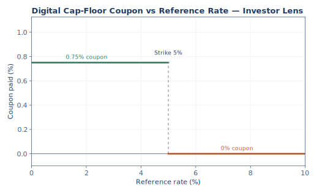

```
Quarterly
Coupon ($)
  │
  │── $300,000 ──────────────────
  │                              │
  │                              │
  │                              │
  │── $0 ────────────────────────┘
  ├──────────────────────────────── 3M SOFR (%)
  3.0%    4.0%    5.0%    6.0%   7.0%
                  Strike
```
*Caption: Digital cap coupon — all-or-nothing at 5.00%. No increase for rates above the strike.*

- **Scenario A — SOFR stays at 4.50% (below strike):** No quarterly coupons triggered. The investor pays $740,000/year in premium with no coupon benefit. Total cost: $2,220,000 over 3 years. The protection was not needed.
- **Scenario B — SOFR rises to 5.50%:** All 12 quarterly observations trigger. The investor receives 12 × $300,000 = $3,600,000. Net after premium: $3,600,000 − $2,220,000 = $1,380,000.
- **Scenario C — SOFR oscillates around 5.00%:** 4 of 12 quarters trigger. The investor receives 4 × $300,000 = $1,200,000. Net: $1,200,000 − $2,220,000 = −$1,020,000. Partial offset — better than no hedge, but the premium was not fully recovered.
- **Scenario D — SOFR spikes to 8.00%:** All quarters trigger. The investor receives $3,600,000. But the actual incremental interest cost at 8.00% vs 5.00% on $400M of floating debt is $12M/year — the digital coupon covers only a fraction. The investor is underinsured for extreme moves.

**Risks to the investor**

| Risk | Description | Severity |
|------|------------|:--------:|
| **Binary risk near strike** | When SOFR is near 5.00%, a small move determines a $300,000 swing in the coupon (from $0 to $300K or vice versa) | High |
| **Underinsurance risk** | If rates go very high (8%+), the fixed $300K coupon does not scale — actual interest costs may far exceed the hedge | Medium |
| **Premium drag** | Quarterly premium of $185,000 is paid regardless of whether the coupon triggers | Medium |
| **Observation timing risk** | The specific SOFR fixing on the observation date determines the coupon — intraday rate levels are irrelevant | Medium |
| **Model risk** | Digital options near the strike are sensitive to the pricing model's assumptions about rate distribution (normal vs lognormal) | Low |
| **Issuer credit risk** | The investor relies on the note issuer to pay the digital coupon and return principal at maturity; issuer default risk applies | Low |

#### §8. THE BANK LENS — Desk Economics (1st Line of Defence)

**What the desk books**

The desk takes the other side of the investor's note and is therefore **short the embedded digital rate option** — short the digital cap that the investor is long. It books the structured note in Murex with the standard **four-leg SRT structure**, which together net to the client economics:

| Leg | Content |
|-----|---------|
| **Note leg** | Digital cap: $40M notional, 0.75% quarterly coupon if 3M SOFR ≥ 5.00%, 12 quarterly observations (the digital coupon obligation owed to the investor) |
| **Issuer leg** | Bank funding (the issuer's funding of the note) |
| **Deposit leg** | Premium reserve: investor pays 185bp per annum, collected quarterly |
| **Hedge leg** | Strip of 12 digital caplets (strike 5.00%, quarterly expiry) hedging the desk's short digital position |

The Note, Issuer, Deposit and Hedge legs together must net to the economics shown to the investor — a fixed digital coupon funded by the premium and offset by the hedge.

**Rate option risk & hedging**

The desk's residual risk is **digital gamma near the strike**. A vanilla option has a smooth delta; the digital option's delta spikes toward infinity as SOFR approaches the strike, so the hedge becomes discontinuous and expensive to manage when SOFR is within 5-10bp of a widely-used strike level. The desk does not hedge a digital caplet with a single vanilla caplet at the same strike — that has a smooth payoff, not a step. The correct hedge is a **tight call/put spread** that approximates the digital step (for the cap: buy a cap at 4.975% and sell a cap at 5.025%). The tighter the spread, the better the approximation — but also the more expensive. The dominant management concern is **pin risk** when SOFR sits a few basis points from the strike on the eve of an observation date: a 2bp overnight move can flip $3.75M of coupons across a $500M book one way or the other.

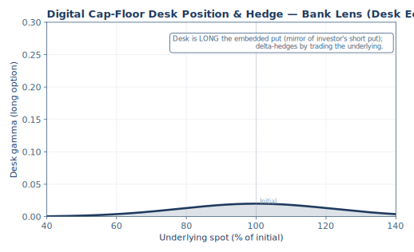

**How the bank makes money**

| Area | Detail |
|------|--------|
| **Client economics** | The investor pays an annual premium of 185bp ($740,000) and receives $300,000 per triggered quarter. Breakeven: approximately 2.5 triggered quarters per year |
| **Structuring spread** | 10-20bp on the digital strip pricing. The desk sells the strip at a slight premium to the hedge cost |
| **Hedging economics** | The rates desk hedges with a strip of digital caplets. Residual risk: digital gamma near the strike — the hedge becomes discontinuous when SOFR is close to 5.00% |
| **Distribution economics** | Sales credit 5-10bp on notional. Corporate hedging is relationship-driven — one digital cap sale often leads to broader treasury-management services |

**The desk coupon decomposition:**

The premium the investor pays decomposes into the cost of the embedded digital, the structuring spread, distribution credit, and the desk's hedge cost. Annualised, the investor pays 185bp of premium; against this the desk runs the digital strip hedge and captures a 10-20bp structuring spread (with 5-10bp routed to sales as distribution credit). The bulk of the premium funds the cost of the digital cap the desk is short; the structuring spread is the desk's margin over that hedge cost. *(Source quotes the premium 185bp, structuring spread 10-20bp and sales credit 5-10bp but does not split the residual hedge cost into an exact figure; the hedge-cost component below is inferred as the residual of premium less stated spreads.)*

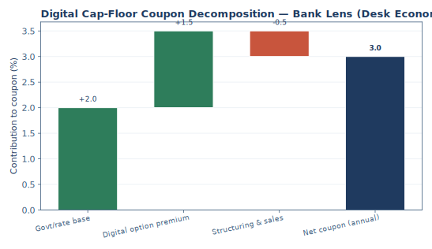

**P&L drivers**

Day to day, desk P&L is driven by SOFR's proximity to the strike against the warehoused digital gamma, the realized cost of rolling the tight call/put spreads versus the structuring spread captured at inception, changes in the rate-vol surface used to price the digital strip, and the timing of each quarterly observation. P&L can show large swings even when SOFR has barely moved, because the digital is highly sensitive near the strike. Product Control attributes P&L daily and verifies digital valuations independently; the model used near the strike (exact digital vs call-spread approximation) is the most common source of valuation differences.

#### §9. THE BANK LENS — Controls & Reconciliation (2nd Line of Defence)

**Booking & systems**

| Field | Value |
|-------|-------|
| **Book of record** | Murex |
| **Pricing system** | Murex (digital caplet pricing), Sophis (risk) |
| **Four-leg framework?** | Yes |
| **Note leg** | Digital cap: $40M notional, 0.75% quarterly coupon if 3M SOFR ≥ 5.00%, 12 quarterly observations |
| **Issuer leg** | Bank funding |
| **Deposit leg** | Premium reserve: investor pays 185bp per annum quarterly |
| **Hedge leg** | Strip of 12 digital caplets (strike 5.00%, quarterly expiry) |
| **ISDA documentation** | Not required from investor (note format) |
| **Observation rate** | 3-month SOFR (quarterly fixing, 2 business days before period end) |
| **Strike** | 5.00% |
| **Day count** | Act/360 |

**Reconciliation points**

| Recon point | What must agree | Digital CF-specific break |
|-------------|-----------------|--------------------------|
| **Note leg** | Digital coupon obligation: $40M notional, 0.75% coupon, 5.00% strike, 12 observations | Coupon or notional on the Note leg does not match the term sheet |
| **Issuer leg** | Bank funding amount and tenor consistent with the note | Funding leg booked against the wrong issuer entity or amount |
| **Deposit leg** | Premium reserve: 185bp per annum collected quarterly | Premium not collected, or netted against a coupon incorrectly |
| **Hedge leg** | Strip of 12 digital caplets at strike 5.00%, quarterly expiry | Hedge leg shows 13 caplets instead of 12 — a correction added rather than replacing |
| **Rate fixing source** | The 3M SOFR fixing — official Fed SOFR fixing vs a screen rate, and the correct fixing page | System uses a different SOFR fixing source than the term sheet; a 1bp difference flips a $300,000 coupon |
| **Digital strike & observation** | Strike 5.00% and observation convention (2 business days before period end) consistent across systems | One caplet entered at 4.50% instead of 5.00%, or observation date taken as 2 business days before period start |
| **Day-count / calendar** | Act/360 applied to the premium and coupon, with the correct payment calendar | Wrong convention applied, so a payment amount differs |
| **Collateral / settlement** | Coupon and premium cash flows settle on the correct dates; four legs net to the client economics | Coupon paid on a non-triggered quarter, or four legs fail to net to the investor's economics |

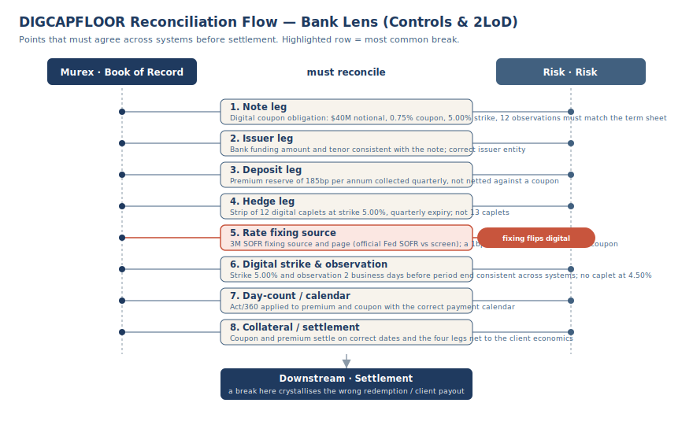

**Common breaks & red flags**

| Red Flag | What It Means | 2LoD Action |
|----------|---------------|-------------|
| Coupon triggered on a day when SOFR was reported at 4.98% | Observation-date mismatch — the system may be using a different fixing date or rate source | Verify the exact observation date and SOFR fixing page specified in the term sheet |
| Hedge P&L shows large gains/losses when SOFR has not moved | Digital gamma spike — SOFR is near the strike and the digital option is highly sensitive | Expected behaviour near the strike — verify that the hedge is correctly sized |
| Premium payment missed for one quarter | Investor may be in arrears or the payment instruction was not processed | Contact Operations — missed premium may trigger a default clause |
| All 4 digital caplets in a year triggered but only 3 coupons were paid | One coupon may have been netted against the premium incorrectly | Reconcile the coupon schedule against the observation dates |
| Hedge leg shows 13 digital caplets instead of 12 | An extra caplet was booked — possibly a correction added instead of replacing | Audit the hedge leg against the trade confirmation |

**Control implication**

For a Digital Cap-Floor Note the dominant controls are **four-leg net consistency**, the **rate fixing source**, and the **digital strike and observation convention** — together they determine whether each quarterly coupon is correct and whether the booked structure actually reproduces the client economics. The Note, Issuer, Deposit and Hedge legs must net to the fixed digital coupon shown to the investor; if they do not, the desk's economics or the investor's payout is misstated. A wrong fixing source or fixing date flips the digital — a 1bp difference in the SOFR observation can turn a $0 coupon into a $300,000 coupon or vice versa. A digital strike entered as 4.50% instead of 5.00%, or an observation taken 2 business days before period start instead of period end, breaks the trigger condition even when the rate is read correctly. The reconciliation exists precisely to catch these inconsistencies before a coupon settles.

#### §10. Formal Definition

A **Digital Cap-Floor Note** is a structured rate product that pays a fixed digital coupon whenever the reference rate (typically 3-month SOFR) is at or above a predetermined cap strike or below a predetermined floor strike on periodic observation dates. The coupon is binary: if the rate is at or above the cap strike, the investor receives a fixed coupon (e.g., 0.75% of notional per quarter); if the rate is below the strike, the investor receives nothing. The note is booked in Murex with four legs: Note (digital coupon obligation), Issuer (funding), Deposit (premium reserve), and Hedge (strip of digital caplets or floorlets). Unlike a vanilla cap, the coupon does not increase with the distance above the strike — it is all-or-nothing at each observation date.

**Key terms:**
- **Strike:** The cap (or floor) level against which the reference rate is compared — 5.00% in this chapter.
- **Reference rate:** The benchmark observed at each date (3-month SOFR), fixed 2 business days before period end.
- **Digital coupon:** The fixed amount paid when the trigger condition is met (0.75% of notional, $300,000 per quarter) — zero otherwise.
- **Observation date:** The quarterly date on which the reference rate is compared to the strike.
- **Four-leg structure:** Note, Issuer, Deposit and Hedge legs that together net to the client economics.

#### §11. Lifecycle

| Stage | Detail |
|-------|--------|
| **Pre-trade** | Structurer prices the digital caplet strip using the bank's vol surface and digital option models. Strike and coupon amount negotiated against the investor's hedging need. Risk: strike set too unlikely to trigger (investor never paid) or too likely (premium expensive) |
| **Trade date** | Four legs booked in Murex: Note leg (digital coupon obligation), Issuer leg (funding), Deposit leg (premium reserve), Hedge leg (strip of digital caplets). Risk: digital strike entered incorrectly — one caplet at 4.50% instead of 5.00% |
| **During life** | On each quarterly observation date, the reference rate is checked against the strike. If triggered, the coupon is paid. Premium is collected quarterly. Risk: observation date falls on a holiday — which fixing applies? |
| **Maturity** | Final observation, final coupon (if triggered), principal returned (100% capital protection), all legs closed. Risk: dispute over the final observation rate source or timing |

#### §12. Worked Example (both lenses)

**Terms:** $40M notional, 3-year, digital cap at 5.00%, coupon 0.75% per quarter ($300,000) if 3M SOFR ≥ 5.00%, premium 185bp per annum ($740,000/year, $185,000/quarter).

| Quarter | 3M SOFR | Triggered? | Coupon | Premium | Net |
|:-------:|:-------:|:----------:|:------:|:-------:|:---:|
| Q1 | 4.80% | No | $0 | −$185,000 | −$185,000 |
| Q2 | 5.20% | Yes | $300,000 | −$185,000 | +$115,000 |
| Q3 | 5.50% | Yes | $300,000 | −$185,000 | +$115,000 |
| Q4 | 4.90% | No | $0 | −$185,000 | −$185,000 |

**Year 1 total:** Coupons $600,000 − Premium $740,000 = Net −$140,000

*Investor lens:*
In this scenario, 2 of 4 quarters triggered. The investor's breakeven is approximately 2.5 triggered quarters per year. Year 1 was slightly below breakeven, but the protection offset a portion of the increased interest expense during Q2-Q3. The investor is long the digital cap: each triggered quarter pays the fixed $300,000 coupon, and the per-quarter net is +$115,000 when triggered ($300,000 − $185,000) and −$185,000 when not ($0 − $185,000), regardless of how far above 5.00% SOFR rises.

*Bank lens:*
The desk holds the mirror position — short the digital cap — and pays the $300,000 coupon in Q2 and Q3, funded against the 185bp premium it collects each quarter and its digital-caplet-strip hedge. The 2nd line must confirm each quarter's SOFR fixing against the term-sheet source, that the digital strike of 5.00% and the observation convention were applied correctly (Q1 at 4.80% and Q4 at 4.90% correctly did not trigger; Q2 at 5.20% and Q3 at 5.50% correctly did), and that the four legs net to the investor's economics.

#### §13. Knowledge Check

1. **What is the difference between a digital cap and a vanilla interest rate cap?** *(Investor)*
2. **How is the digital coupon calculated for each quarter, and what is the coupon if SOFR is at 5.01% versus 8.00%?** *(Investor)*
3. **An investor holds the note for protection above a specific rate threshold. Why does the fixed coupon leave the investor underinsured when rates spike to 8.00%?** *(Investor)*
4. **What is the breakeven trigger frequency for the worked example?** *(Investor)*
5. **Why is the digital cap premium lower than a vanilla cap premium with the same strike?** *(Investor)*
6. **What is the binary risk near the strike, and why is it the core danger?** *(Investor)*
7. **What does 100% capital protection mean for the investor, and what credit exposure remains?** *(Investor)*
8. **(Desk economics / 1LoD)** When the investor is long the digital cap, what position does the desk take, what is its dominant residual Greek, and how does the desk hedge it? Why is a single vanilla caplet at the strike the wrong hedge, and what does the desk use instead?
9. **(Controls / 2LoD)** Name three reconciliation breaks specific to a Digital Cap-Floor Note — covering the four-leg net, the rate fixing source, and the digital strike/observation — and the consequence of each for the coupon paid to the investor.

**Mental Models**

| Concept | Mental Model |
|---------|-------------|
| Digital cap | Flood insurance with a fixed payout — $10,000 whether the flood causes $5K or $50K damage |
| Strike level | Flood line — below it, no coupon; above it, full coupon |
| Binary payoff | Light switch — on or off, no dimmer |
| Premium | Insurance premium — paid every quarter regardless of whether the "flood" occurs |
| Underinsurance | Wearing a raincoat in a hurricane — some protection, but not enough for the worst case |
| Digital gamma (desk) | The desk's tripwire — delta spikes toward infinity as SOFR nears the strike, so the hedge is hardest exactly at 5.00% |
| Four-leg net | Note + Issuer + Deposit + Hedge must add back to the coupon the investor sees — if they do not, the booking is wrong |

**Key Takeaways**

1. A Digital Cap-Floor Note pays a fixed digital coupon whenever the reference rate crosses a predetermined strike — binary, not proportional.
2. The investor is long the embedded digital rate option; institutional and corporate buyers use it for cheaper protection than vanilla caps when they need a specific-level hedge.
3. Binary risk near the strike is the core danger — a 1bp rate move at the strike creates a $300,000 swing in the coupon.
4. The fixed coupon means the product can underinsure in extreme scenarios where rates spike far above the strike.
5. The note carries 100% capital protection at maturity but leaves the investor exposed to issuer credit.
6. The desk is short the digital, hedges with a tight call/put spread (not a single vanilla caplet), and earns the structuring spread over the hedge cost; its dominant residual risk is digital gamma / pin risk near the strike.
7. The note is booked in Murex with four legs — Note, Issuer, Deposit, Hedge.
8. For the 2nd line, the dominant control risks are four-leg net consistency, the rate fixing source, and the digital strike and observation convention — each can flip the digital and misstate the coupon by $300,000.

#### §14. Common Mistakes

1. **Expecting the coupon to increase with rates.** The digital cap pays $300,000 whether SOFR is at 5.01% or 10.00%. For proportional protection, a vanilla cap is required.

2. **Setting the strike at the current rate level.** If SOFR is already at 4.90% and the strike is 5.00%, the digital options are expensive (high probability of triggering). Setting the strike further out-of-the-money reduces the premium but also the protection probability.

3. **Ignoring the "cliff" risk near the strike.** When SOFR is near 5.00%, the digital option's delta becomes very large. A 1bp move can flip the coupon from $0 to $300,000. The hedge becomes discontinuous and expensive to manage.

4. **Comparing the annualised coupon to the premium without considering trigger probability.** The maximum annualised coupon is 3.00% (4 quarters × 0.75%), and the premium is 1.85%. But the expected coupon depends on the probability of triggering, which may be much less than 100%.

5. **Using the same observation date convention as vanilla caps without checking.** Digital caps may use "2 business days before period end" while vanilla caps use "2 business days before period start." A mismatched convention means the rate observed for hedging and the rate observed for the coupon are different.

6. **(Controls)** **Assuming the four legs are correct because the Note leg matches the term sheet.** The Note, Issuer, Deposit and Hedge legs must *net* to the client economics — a hedge leg with 13 caplets instead of 12, or a premium netted against a coupon, breaks the structure even when the Note leg's strike and coupon look right. The 2LoD check is the four-leg net, not any single leg in isolation.

**Dual-lens questions:**
- *(Desk economics / 1LoD)* What does the desk book across the four legs, and what is its primary rate/vol risk and hedge?
- *(Controls / 2LoD)* Which four-leg / fixing / accrual fields must reconcile, and which is the most common break?

**Dual-lens visuals (generated):**
- `assets/digcapfloor/controls_digcapfloor_recon_08.svg` `[generated]`
- `assets/digcapfloor/desk_digcapfloor_gamma_07.svg` `[generated]`
- `assets/digcapfloor/payoff_digcapfloor_01.svg` `[generated]`
- `assets/digcapfloor/waterfall_digcapfloor_09.svg` `[generated]`
## 5.4 STEEPENER NOTES {#sec-5-4}

*You have just completed the Structured Rate Trades family — five products whose payoffs depend on the level of a single interest rate. We now turn to Steepener Notes (STEG) — products whose payoffs depend on the slope of the yield curve: the difference between a long-term rate and a short-term rate. The building blocks for this family were taught in [Section 1.7](#sec-1-7) (Yield Curves, Spot Rates, and Forward Rates), [Section 1.8](#sec-1-8) (Benchmark Rates — including CMS rates), and the SRT family ([Section 5.3](#sec-5-3)) established the four-leg booking structure in Murex. Every STEG product references two CMS (Constant Maturity Swap) rates — typically CMS30Y and CMS2Y — and pays the investor based on the spread between them.*

---

### 5.4.1 Vanilla Steepener Note {#sec-5-4-1}

> **Prerequisites:** [IRS](#sec-5-2-1) &nbsp;|&nbsp; **Key concepts:** CMS spread, convexity adjustment, curve slope

---

*A Vanilla Steepener Note is a Structured Rate Trade booked in Murex with the four-leg structure (Note, Issuer, Deposit, Hedge). Its coupon depends on the slope of the yield curve: the coupon equals a leverage factor times the difference between a long-tenor CMS rate and a short-tenor CMS rate (CMS30Y − CMS2Y), floored at 0% and capped. The investor is long the curve slope — the coupon rises as the curve steepens and falls to the floor if the curve flattens or inverts. Economically the desk is short the CMS spread and hedges with CMS spread swaps and CMS cap/floor options. This chapter reads the product through two lenses: what it means for **the investor** (the note holder whose coupon tracks the curve slope), and what it means for **the bank** — the latter split into the desk's rate economics (1st line of defence) and the controls and reconciliation that surround the four-leg booking (2nd line of defence).*

#### §1. Explain Like I'm New

Consider a portfolio manager running a $2 billion fixed-income book at a Chinese insurance company. The manager believes the yield curve will remain steep — that 30-year interest rates will stay well above 2-year rates — for the next five years. Ordinary bonds pay a fixed coupon regardless of the curve's shape. The manager wants an investment that rewards a correct view about the curve. The Vanilla Steepener Note delivers exactly this: a leveraged coupon based on the difference between the 30-year swap rate (CMS30Y) and the 2-year swap rate (CMS2Y). In Year 1 the note pays a fixed 5.00%. From Year 2 onward, the coupon equals 4 times the CMS spread — if 30-year rates are 4.50% and 2-year rates are 3.80%, the spread is 0.70%, and the coupon is 4 × 0.70% = 2.80%. If the curve steepens further, the coupon rises. If it flattens or inverts, the coupon drops to zero.

#### §2. Core Analogy

A Vanilla Steepener resembles a hydroelectric dam. The electricity generated depends on the height difference between the water reservoir above and the turbine below — the greater the drop, the more power produced. If the reservoir level falls to match the turbine level, the water stops flowing and no electricity is generated. The CMS30Y rate is the reservoir level, the CMS2Y rate is the turbine level, and the coupon is the electricity. A steep curve is a tall dam with strong flow. A flat curve is a dam with no drop, and produces no coupon.

#### §3. What Problem Does It Solve

| Investor Need | How the Product Delivers |
|------------|------------------------|
| Express a view on yield curve slope | Coupon directly linked to the CMS30Y − CMS2Y spread |
| Earn above-market yield when the curve is steep | Leverage factor (4×) amplifies a positive spread into a meaningful coupon |
| Benefit from central bank policy divergence | Short end driven by policy rates, long end by growth/inflation expectations — divergence = steeper curve |
| Diversify rate exposure beyond absolute level | Return depends on curve shape, not on whether rates are high or low |

#### §4. Product DNA

| **Field** | **Value** |
|---|---|
| **Full Name** | Vanilla Steepener Note |
| **Abbreviation** | Vanilla STEG |
| **Family** | Steepener Notes |
| **Complexity Score** | 5 / 10 |
| **Complexity Rationale** | Leveraged CMS spread coupon (CMS30Y − CMS2Y). Floor, cap. CMS convexity adjustment. Building block for STEG family |
| **Underlying Asset Class** | Rates (CMS30Y − CMS2Y swap curve slope) |
| **Capital Protection** | 100% at maturity |
| **Coupon Type** | Leveraged CMS spread coupon with floor and cap |
| **Maturity** | 10–30 years |
| **Liquidity** | Secondary market |
| **Primary System** | Murex (primary), Sophis (risk) |
| **ISDA Required** | No — issued as note |

**DNA Atlas Fields:**
- Primary Risk: Curve flattening or inversion. Coupon = CMS30 − CMS2 (or similar). If the spread narrows, the coupon drops. Can reach zero
- Typical Buyer: Institutional investors with a steepening view on the yield curve
- Typical Use Case: Express a curve-steepening view with leveraged exposure
- Building Blocks: Fixed-rate note + CMS spread option (long CMS30, short CMS2)
- Key Hedge: CMS spread swaps, CMS cap/floor
- Similar Products: RA STEG (5.4.2 — adds range), Callable STEG (5.4.3 — adds call), IRS (5.2.1 — linear rate)
- Most Important Greek: CMS spread delta (sensitivity to curve shape)

**Comparison Matrix Fields:**
- Complexity: 5
- Yield Potential: High (if curve steepens)
- Capital Protection: 100% at maturity
- Credit Exposure: Issuer (note format)
- Liquidity: Secondary market
- Path Dependency: Yes (periodic coupon observations)
- Volatility Sensitivity: Long vega on CMS spread
- Correlation Sensitivity: CMS rate correlation (long-short rate correlation)
- Client Type: Institutional
- Market Environment: Best when expecting yield curve steepening

#### §5. Family Position

```
Rates
└── Steepener Notes (STEG)
    └── Vanilla Steepener Note  ← chapter focus
```

#### §6. Product Evolution

| Stage | Product | What Was Added | Why |
|:-----:|---------|---------------|-----|
| 1 | Vanilla IRS (VLSP) | — (baseline) | Fixed vs floating at a single maturity point |
| 2 | CMS swap | Reference to a constant maturity point on the curve | Allows exposure to a specific tenor of the curve that resets periodically |
| 3 | Vanilla Steepener | Coupon = leveraged difference between two CMS rates | Allows investors to express a view on curve shape, not just level |

Through the 2000s and 2010s, institutional investors observed that yield curves in major economies were persistently upward-sloping — 30-year rates consistently exceeded 2-year rates by 50-200 basis points. Yet no standard fixed-income product rewarded investors for this structural feature; a vanilla bond paid the same coupon regardless of the curve's shape. The steepener note filled this gap by linking the coupon directly to the slope. Banks could manufacture the product by entering offsetting CMS swaps — receiving CMS30Y and paying CMS2Y — and passing the spread, scaled by leverage, to the investor. The CMS convexity adjustment, a technical pricing nuance unique to CMS products, created a structuring opportunity: the "fair" spread was slightly different from the quoted CMS rates, and the bank captured the difference.

---

#### §7. THE INVESTOR LENS

**Why the investor buys it**

1. **Curve view expression** — direct exposure to yield curve slope, not available from vanilla bonds.
2. **Leveraged coupon** — 4× leverage turns a 0.70% spread into a 2.80% coupon.
3. **Year 1 fixed coupon** — 5.00% in Year 1 provides income certainty while the investor evaluates the curve.
4. **Structural view** — investors who believe the curve will remain steep earn a persistent income stream.
5. **Downside floor** — coupon is floored at 0%, so the investor never owes money if the curve inverts.

The product suits insurance companies and pension funds with a structural view that the yield curve will remain upward-sloping — typically institutional, $1B+ AUM, with high derivatives sophistication. It is a poor choice for investors who need income certainty (the leveraged coupon is volatile), who expect curve flattening or inversion, or who cannot tolerate zero-coupon quarters.

**Position & slope coupon**

The Vanilla Steepener is built from three components from the investor's perspective:

1. **CMS receiver exposure (30Y)** — the investor benefits from a rising long-tenor swap rate.
2. **CMS payer exposure (2Y)** — the investor benefits from a falling short-tenor swap rate.
3. **Leverage + floor + cap** — 4× the net spread, floored at 0%, capped at 10%.

```
Year 1:     Fixed coupon:           5.00%
Year 2-5:   4 × max(0, CMS30Y − CMS2Y), cap 10%
```

The investor is therefore **long the curve slope** (long the CMS spread): the coupon rises when the curve steepens and falls when it flattens. Because the investor holds a long CMS spread option, the investor is **long vega** on the CMS spread — a rise in the relevant implied volatility raises the value of the position. The Year 1 fixed coupon (5.00%) is a marketing feature that provides initial income certainty; from Year 2 the coupon is entirely a function of the curve's shape, not its level.

**Payoff & scenarios**

The steepener coupon is a leveraged, floored, capped function of the CMS spread:

```
Annual
Coupon (%)
  │
  │── 10.00% ───────── Cap ─────────
  │                  ╱
  │                ╱
  │              ╱  Slope = 4× leverage
  │            ╱
  │          ╱
  │── 0.00% ╱────── Floor ──────────
  │
  ├──────────────────────────────── CMS Spread (%)
 -1.0%   0%    1.0%    2.0%   2.5%+
```
*Caption: Vanilla Steepener coupon — 4× leverage with 0% floor and 10% cap. Breakeven spread: 0%.*

- **Scenario A — Curve steepens (CMS30Y=5.50%, CMS2Y=3.00%):** Spread = 2.50%. Coupon = 4 × 2.50% = 10.00% (at cap). Quarterly payment = $50M × 10.00% / 4 = $1,250,000. Best outcome.
- **Scenario B — Curve stays moderately steep (spread ~0.70%):** Coupon = 2.80%. Quarterly = $350,000. Acceptable — comparable to vanilla rates.
- **Scenario C — Curve flattens (CMS30Y=4.00%, CMS2Y=4.00%):** Spread = 0. Coupon = 0%. The investor receives nothing. The Year 1 fixed coupon ($2,500,000) is the only income.
- **Scenario D — Curve inverts (CMS30Y=3.50%, CMS2Y=4.50%):** Spread = −1.00%. The floor at 0% protects the investor from negative coupons, but the investor earns nothing until the curve normalizes.

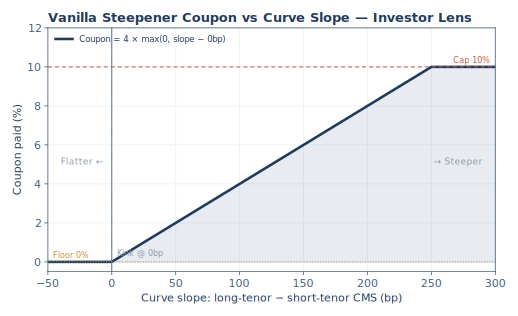

**Risks**

| Risk | Description | Severity |
|------|------------|:--------:|
| **Curve flattening risk** | If CMS30Y − CMS2Y compresses to zero, the coupon drops to zero | High |
| **Curve inversion risk** | If short rates exceed long rates, the floor protects but the investor earns nothing indefinitely | High |
| **CMS convexity risk** | The theoretical relationship between CMS rates and their underlying swap rates has a convexity bias that can shift | Medium |
| **Leverage amplification** | 4× leverage amplifies both gains and losses in coupon terms | Medium |
| **Year 1 vs Year 2+ disconnect** | The Year 1 fixed coupon creates expectations that may not be met by the leveraged CMS coupon | Low |
| **Credit risk** | Counterparty default risk on the issuing bank | Low |

#### §8. THE BANK LENS — Desk Economics (1st Line of Defence)

**What the desk books**

The trade is booked in Murex with four legs, and the desk takes the offsetting side of the investor's position:

- **Note leg** — the client-facing CMS spread coupon: $50M, Y1 fixed 5.00%, Y2-5 = 4 × max(0, CMS30Y − CMS2Y) cap 10%, quarterly.
- **Issuer leg** — bank funding: SOFR + spread.
- **Deposit leg** — client collateral: $50M cash deposit.
- **Hedge leg** — the rates desk's offsetting positions: a CMS30Y receiver swap and a CMS2Y payer swap, scaled for 4× leverage, with cap and floor swaption overlays.

Where the investor is long the curve slope (long the CMS spread), the desk is **short the CMS spread** — it has sold the investor a leveraged claim on CMS30Y − CMS2Y and warehouses the offsetting curve risk. Economically the desk receives CMS30Y and pays CMS2Y on its hedge swaps, scaling the notional for the 4× leverage, and overlays cap/floor swaptions to match the investor's floored and capped payoff. It hedges that curve and spread optionality rather than holding the raw slope risk.

**Curve/correlation risk & hedging**

The rates desk hedges the slope exposure with CMS swaps — receive CMS30Y, pay CMS2Y — and scales the CMS swap notional for the 4× leverage. The residual risks are CMS convexity and the correlation between the 2Y and 30Y points of the curve. The steepener's sensitivity to curve changes decomposes into two key rate durations: positive CMS30Y sensitivity (a rise in CMS30Y widens the spread and raises the coupon) and negative CMS2Y sensitivity (a rise in CMS2Y narrows the spread and lowers the coupon). A parallel shift in the curve (both rates move equally) has minimal effect; a curve flattening (CMS2Y rises while CMS30Y falls) has maximum negative impact for the long-slope investor and therefore maximum positive impact for the short-slope desk before hedging. Because the embedded coupon is a long CMS spread option from the investor's side, the desk is short that option and short vega on the spread; it hedges with cap/floor swaption overlays. A central bank meeting that flattens the curve overnight is the desk's main concern — a $2B steepener book can move $5-10M in a single session, and a 50bp flattening (2Y up 25bp, 30Y down 25bp) with 4× leverage shifts the annual coupon by 2.00% on the whole book. The dangerous junior error is hedging only the net DV01 (the difference between 30Y and 2Y sensitivity): the net can be zero while the individual key-rate sensitivities are enormous, so a curve twist produces massive P&L despite a "hedged" net position.

**How the bank makes money**

| Area | Detail |
|------|--------|
| **Client economics** | The investor receives Year 1 fixed 5.00%, then 4 × max(0, CMS30Y − CMS2Y), capped at 10.00%. Downside: $0 if the curve flattens or inverts |
| **Bank economics** | The CMS convexity adjustment creates a structuring margin of 8-15bp. The bank captures the difference between the theoretical CMS spread and the coupon paid to the client |
| **Hedging economics** | Rates desk hedges with CMS swaps: receive CMS30Y, pay CMS2Y. The leverage is hedged by scaling the CMS swap notional. Residual risk: CMS convexity, correlation between 2Y and 30Y points |
| **Distribution economics** | Sales credit 5-8bp on notional. Steepeners are popular in Asia and Europe |

Demand rises when the curve is steep (clients want to lock in the favorable spread), when central banks are expected to cut short-term rates (steepening the curve), and when inflation expectations push long-end rates higher.

**Coupon decomposition**

The investor's coupon decomposes into the raw CMS spread received on the hedge swaps, scaled by leverage, less the CMS convexity adjustment the bank prices and the structuring margin it retains:

```
CMS30Y received:            4.50%
− CMS2Y paid:               3.80%
─────────────────────────────────
Raw CMS spread:             0.70%
× 4 leverage:               2.80%   → investor coupon (this fixing)
```

Within the spread the bank prices the CMS convexity adjustment and retains a structuring margin of 8-15bp, taking sales credit of 5-8bp on notional at distribution. (The source quotes the 8-15bp structuring margin from the CMS convexity adjustment and the 5-8bp sales credit; the explicit split of the raw 0.70% spread into convexity-adjustment-versus-retained components is inferred from those ranges, not stated verbatim.)

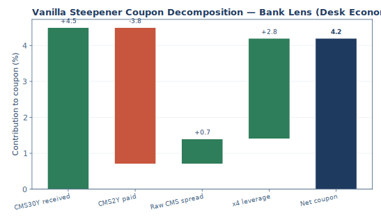

**P&L drivers**

Day to day, desk P&L is driven by: moves in the 2s30s curve slope against the warehoused CMS spread DV01 on the hedge swaps (a flattening twist is the dominant risk); shifts in the CMS convexity adjustment, which can generate hedge-leg P&L even when the CMS spread itself has not moved; changes in the correlation between the 2Y and 30Y points and in the implied vol used for the cap/floor overlays; and the structuring margin and bid-offer captured at inception. A $2B-$3B steepener book approaching a central-bank policy meeting that could flatten the curve is the desk's main concentration concern — the entire book's slope sensitivity reprices in a single session.

#### §9. THE BANK LENS — Controls & Reconciliation (2nd Line of Defence)

**Booking & systems**

| Field | Value |
|-------|-------|
| **Booking system** | Murex |
| **Pricing system** | Murex (CMS convexity model) |
| **Four-Leg** | Yes |
| **Note leg** | CMS spread coupon: $50M, Y1 fixed 5.00%, Y2-5 = 4 × max(0, CMS30Y − CMS2Y) cap 10%, quarterly |
| **Issuer leg** | Bank funding: SOFR + spread |
| **Deposit leg** | Client collateral: $50M cash deposit |
| **Hedge leg** | CMS30Y receiver swap + CMS2Y payer swap, scaled for 4× leverage, with cap and floor swaption overlays |
| **ISDA documentation** | Not required from client (note format). Bank hedges under ISDA/CSA |
| **CMS fixing** | ICESWAP (30Y and 2Y USD swap rates) |
| **Day count** | 30/360 |
| **Payment frequency** | Quarterly |

All four legs are booked in Murex as a single structured note. The 2nd line's first concern is that the four legs are booked net and consistent — matching notionals and dates — and that the Hedge leg (the CMS30Y receiver + CMS2Y payer swaps scaled for leverage) genuinely offsets the client-facing Note leg.

**Reconciliation points**

| Recon point | What must agree | Steepener-specific break |
|-------------|-----------------|---------------------------|
| **Four-leg net (Note vs Issuer vs Deposit vs Hedge)** | All four legs booked with matching notional, dates, and conventions; legs net to the intended structured position | Legs booked asynchronously with a notional error — e.g. Deposit leg shows a different notional than the Note leg |
| **CMS long-tenor fixing (CMS30Y)** | CMS30Y observed on the correct fixing date from ICESWAP at the contractual publication time | Wrong CMS30Y fixing source/time misstates the long leg of the spread and the net coupon |
| **CMS short-tenor fixing (CMS2Y)** | CMS2Y observed on the same fixing date and from the same source (ICESWAP) as CMS30Y | CMS30Y and CMS2Y taken from different publication sources or times — the spread, and the coupon, are wrong |
| **Leverage & floor/cap** | Leverage = 4×; coupon = 4 × max(0, spread) floored at 0% and capped at 10%, applied correctly each period | Floor not functioning (system uses absolute value of spread) or cap not applied (Year 2 coupon exceeds 10% annualized) |
| **Day-count** | 30/360 applied correctly to each coupon | Day-count fraction error — Year 1 coupon differs from $625,000 |
| **CMS convexity model** | Convexity adjustment calibrated to the current vol surface and consistent between pricing and risk | Hedge leg shows large P&L when the CMS spread has not moved — convexity adjustment has shifted |
| **Hedge offset (Note vs Hedge P&L)** | Hedge leg P&L offsets Note leg P&L within tolerance | Hedge leg P&L diverges from Note leg P&L — hedge tenors/notionals or leverage scaling do not match the structured note |
| **Collateral / four-leg settlement** | On each coupon date all four legs settle in line; deposit released when the Note leg matures | Settlement timing mismatch between the four legs — Note leg pays but Deposit leg not released, trapping client cash |

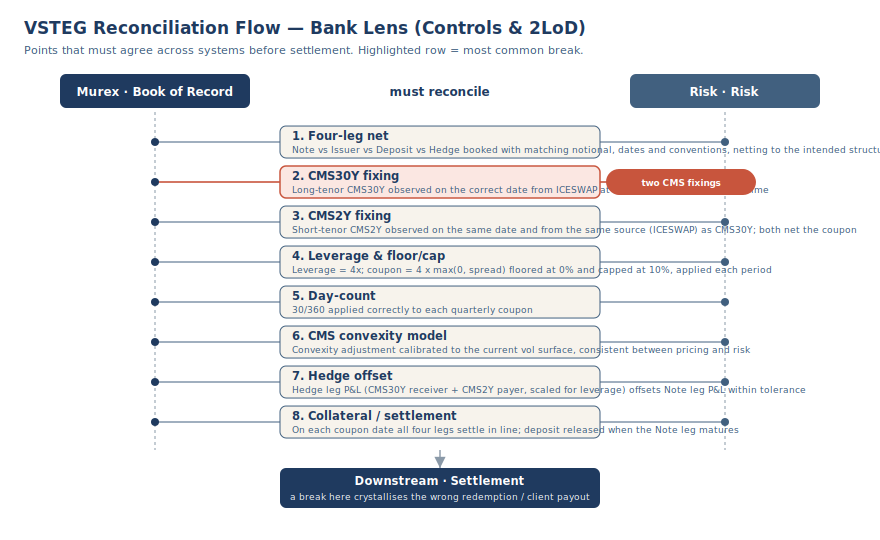

**Common breaks & red flags**

| Red Flag | What It Means | Action |
|----------|--------------|--------|
| Coupon payment in Year 2 is higher than 10% annualized | Cap was not applied correctly | Verify cap logic in the booking system |
| CMS30Y and CMS2Y fixings are from different publication sources | Rates must be from the same source and same fixing time | Reconcile fixing sources to the term sheet |
| Coupon is non-zero when CMS30Y < CMS2Y | Floor is not functioning — system may be using absolute value of the spread | Check that the max(0, ...) floor is correctly implemented |
| Hedge leg shows large P&L when the CMS spread hasn't moved | CMS convexity adjustment may have shifted | Recalibrate the CMS convexity model |
| Year 1 coupon payment differs from $625,000 | Notional or rate error | Verify: $50M × 5.00% / 4 = $625,000 |

**Control implication**

For a Vanilla Steepener the dominant 2nd-line controls are the **four-leg net** and the **two CMS fixings**. The four legs (Note, Issuer, Deposit, Hedge) must be booked with matching notionals and dates so that they net to the intended structured position and the Hedge leg genuinely offsets the client-facing Note leg — a notional or date mismatch on any leg breaks the net P&L and can trap client cash on a settlement date. The two CMS fixings net the coupon: CMS30Y and CMS2Y must be observed on the same fixing date, from the same source (ICESWAP), at the same publication time — because the coupon is 4 × (CMS30Y − CMS2Y), a fixing taken from a different source or time on either leg directly misstates the spread and therefore the payment (a 1bp difference on a $1B book is $100,000 of coupon). Around these, the leverage & floor/cap logic, the 30/360 day-count, the CMS convexity calibration, and the collateral/settlement checks ensure each quarterly coupon is correct. The reconciliation exists precisely to catch these inconsistencies before a coupon settles.

#### §10. Formal Definition

A **Vanilla Steepener Note** is a structured rate product whose coupon is a leveraged function of the CMS spread — the difference between a long-tenor constant maturity swap rate and a short-tenor constant maturity swap rate. The coupon formula is: Coupon = Leverage × max(0, CMS_Long − CMS_Short), subject to a cap. Typically, Year 1 pays a fixed coupon to provide initial income certainty, while subsequent years pay the leveraged CMS spread. The investor is long the curve slope (long the CMS spread); the desk is short it. The product is booked in Murex with four legs: Note (CMS spread-linked coupon), Issuer (funding), Deposit (collateral), and Hedge (CMS swaps — receive CMS_Long, pay CMS_Short, with cap/floor overlays). The CMS convexity adjustment — a technical pricing correction arising from the fact that CMS rates have a different payment frequency than the rates they reference — creates the structuring margin.

#### §11. Lifecycle

| Stage | What Happens | Who Is Involved | What Can Go Wrong |
|:-----:|-------------|----------------|-------------------|
| **Pre-trade** | Structurer prices the CMS spread with convexity adjustment. Leverage, floor, and cap calibrated. Year 1 fixed coupon negotiated | Structurer, Sales, Client | CMS convexity mispriced — coupon set too high (bank loses) or too low (client walks) |
| **Trade date** | Four legs booked in Murex: Note leg (CMS spread coupon), Issuer (funding), Deposit (collateral), Hedge (CMS30Y receiver + CMS2Y payer swaps) | Operations, Trader | CMS fixing source misspecified, or four legs booked with mismatched notionals/dates |
| **During life** | On each quarterly fixing date, CMS30Y and CMS2Y are observed. Coupon = 4 × max(0, spread), capped. Payment settled | Product Control, Operations | CMS fixing methodology changes (LIBOR→SOFR transition disrupted CMS calculations globally); floor/cap mis-applied |
| **Maturity** | Final CMS observation, final coupon, principal returned, all four legs closed | Operations, Product Control | Final fixing disputed due to holiday calendar mismatch; settlement timing mismatch between the four legs |

#### §12. Worked Example (both lenses)

**Terms:** $50M notional, 5-year, Year 1 fixed 5.00%, Years 2-5 = 4 × max(0, CMS30Y − CMS2Y), floor 0%, cap 10%, quarterly (30/360).

**Year 1 (fixed):** $50M × 5.00% / 4 = $625,000 per quarter. Total: $2,500,000.

**Year 2 (leveraged CMS spread):**

| Quarter | CMS30Y | CMS2Y | Spread | × 4 | Coupon | Payment |
|:-------:|:------:|:-----:|:------:|:---:|:------:|:-------:|
| Q5 | 4.50% | 3.80% | 0.70% | 2.80% | 2.80% | $350,000 |
| Q6 | 4.40% | 3.90% | 0.50% | 2.00% | 2.00% | $250,000 |
| Q7 | 4.20% | 4.10% | 0.10% | 0.40% | 0.40% | $50,000 |
| Q8 | 4.00% | 4.20% | -0.20% | Floor | 0.00% | $0 |
| **Year 2 Total** | | | | | | **$650,000** |

**Effective Year 2 rate:** $650,000 / $50,000,000 = 1.30%.

*Investor lens:*
In Year 1 the investor receives the fixed 5.00% — $625,000 per quarter, $2,500,000 total. From Year 2 the coupon tracks the curve slope. The curve flattened significantly during Year 2: Q5's 0.70% spread leveraged to a 2.80% coupon ($350,000), but the spread compressed each quarter, and Q8's inversion (−0.20% spread) produced a zero coupon under the floor. Year 2's effective rate of 1.30% was well below Year 1's fixed 5.00%. Being long the curve slope, the investor was rewarded while the curve was steep and earned nothing once it flattened — the floor at 0% ensured the investor never owed money, but the leveraged coupon delivered no income in the flat/inverted quarters.

*Bank lens:*
The desk holds the four legs and is short the CMS spread, hedged with the offsetting CMS30Y receiver + CMS2Y payer swaps scaled for the 4× leverage, plus cap/floor swaption overlays. As the curve flattened through Year 2, the investor's coupon fell toward the floor while the desk's short-slope hedge position offset the move; the desk retains the structuring margin (8-15bp from the CMS convexity adjustment) and the bid-offer on the CMS swap hedge. The 2nd line must confirm each quarter's coupon against the two CMS fixings observed on the same date from ICESWAP (the 4.50%/3.80%, 4.40%/3.90%, 4.20%/4.10%, 4.00%/4.20% pairs), that the 4× leverage and the 0% floor / 10% cap were applied (so Q8's −0.20% spread floors to $0), the 30/360 day-count, and that all four legs settled together each quarter.

#### §13. Knowledge Check

1. What two CMS rates determine the steepener's coupon, and which way does the investor want the slope to move? *(Investor)*
2. If CMS30Y is 4.00% and CMS2Y is 4.00%, what is the coupon on a 4× steepener? *(Investor)*
3. Why does the steepener include a Year 1 fixed coupon instead of starting immediately with the CMS spread? *(Investor)*
4. What is the maximum coupon the investor can earn per quarter, and what limits it? *(Investor)*
5. How does a parallel rate shift (both CMS30Y and CMS2Y move equally) affect the steepener coupon? *(Investor)*
6. CMS30Y drops from 4.50% to 4.00% while CMS2Y rises from 3.80% to 4.20%. What happens to the coupon and why? *(Investor)*
7. **(Desk economics / 1LoD)** When the investor enters a Vanilla Steepener, what position does the desk take in the CMS spread (long or short the slope), how does it hedge a 4× steepener with CMS swaps, and why is hedging only the net 2s30s DV01 dangerous? Where does the desk's retained margin come from?
8. **(Controls / 2LoD)** Name three reconciliation breaks specific to a Vanilla Steepener — covering the four-leg net, the two CMS fixings (CMS30Y and CMS2Y) and their source, and the floor/cap — and the consequence of each for the net coupon.

**Mental Models**

| Concept | Mental Model |
|---------|-------------|
| Steepener | Hydroelectric dam — power depends on the height difference, not the absolute water level |
| CMS spread | The slope of a hill — steeper hill = more energy, flat ground = no movement |
| Leverage | Gearing on a bicycle — amplifies each pedal stroke, but also transmits every bump |
| Floor at 0% | Safety net — the investor can stop earning but never owes |
| Cap at 10% | Speed limit — limits how fast the coupon can grow even on the steepest curve |
| Curve flattening | The dam reservoir dropping to match the turbine — water stops flowing |
| Investor long the slope / desk short it | The investor owns the dam's drop; the desk sold it and hedges the curve |

**Key Takeaways**

1. A Vanilla Steepener pays a leveraged coupon based on the CMS spread — the difference between long-tenor and short-tenor swap rates; the investor is long the curve slope, the desk is short it.
2. Insurance companies and pension funds buy it to monetize a structural view that the curve will remain steep.
3. Curve flattening and inversion are the core dangers — both produce zero coupons under the floor.
4. The 4× leverage amplifies both the upside and the sensitivity to spread compression.
5. All STEG products are booked in Murex with four legs (Note, Issuer, Deposit, Hedge), with the Hedge leg containing offsetting CMS swaps (receive CMS30Y, pay CMS2Y) scaled for leverage.
6. The desk warehouses the short CMS spread, hedges curve slope (2s30s key-rate DV01) and CMS convexity/correlation risk, and retains the structuring margin (8-15bp from the convexity adjustment) plus the CMS-swap bid-offer.
7. For the 2nd line, the dominant control risks are the four-leg net (matching notionals/dates so the Hedge offsets the Note) and the two CMS fixings (CMS30Y and CMS2Y observed on the same date, from the same source, at the same time, since the coupon is 4 × the spread between them), supported by leverage/floor/cap, day-count, convexity-calibration, and four-leg collateral/settlement checks — each can misstate a coupon or trap client cash.

#### §14. Common Mistakes

**1. Confusing the CMS spread with the absolute rate level.** The steepener pays based on CMS30Y minus CMS2Y, not on either rate individually. Both rates can rise (rates are "high") but if they rise equally, the spread is unchanged and the coupon stays the same.

**2. Assuming Year 1's fixed coupon is indicative of future performance.** The 5.00% Year 1 rate is a marketing feature — it has no relationship to what the CMS spread will deliver in Years 2-5.

**3. Ignoring the cap when modeling upside.** In a strongly steepening environment, the coupon hits 10% and stays there. The cap limits total return even in the best-case scenario.

**4. Treating the 4× leverage as "free" amplification.** Leverage works in both directions — a 0.25% spread narrowing reduces the coupon by 1.00% (4 × 0.25%). The investor is taking 4× the curve risk.

**5. Confusing the investor's slope position with the desk's.** The investor is long the curve slope (long the CMS spread) and profits when the curve steepens; the desk is short the slope and hedges with CMS spread swaps. Mixing up the direction reverses every hedge and P&L sign.

**6. (Controls) Taking the two CMS fixings from different sources or times.** CMS30Y and CMS2Y must be observed on the same fixing date, from the same source (ICESWAP), at the same publication time — because the coupon is 4 × (CMS30Y − CMS2Y), any mismatch on either fixing directly corrupts the spread and the payment. The 2nd line must reconcile both fixings to the term sheet and confirm the four-leg net settlement.

**Dual-lens questions:**
- *(Desk economics / 1LoD)* What does the desk book across the four legs, what is its slope/convexity risk, and how does it hedge with CMS swaps?
- *(Controls / 2LoD)* Which four-leg / CMS-fixing / leverage-floor-cap / accrual fields must reconcile, and which is the most common break?

**Dual-lens visuals (spec-only — require rendering):**
- `assets/vsteg/payoff_vsteg_01.svg` `[spec-only — requires rendering]`
- `assets/vsteg/waterfall_vsteg_01.svg` `[spec-only — requires rendering]`
- `assets/vsteg/controls_vsteg_recon_01.svg` `[spec-only — requires rendering]`
### 5.4.2 Range Accrual Steepener (RA STEG) {#sec-5-4-2}

> **Prerequisites:** VANILLA STEG · NCRA &nbsp;|&nbsp; **Key concepts:** Spread-based range accrual, dual-condition coupon

---

*A Range Accrual Steepener is a Structured Rate Trade booked in Murex with the four-leg structure (Note, Issuer, Deposit, Hedge). Where the Vanilla Steepener pays a coupon directly based on the CMS spread level, the Range Accrual Steepener pays a fixed coupon rate only on the days when the CMS spread (CMS30Y − CMS2Y) stays within a predefined range. It applies the same range accrual mechanism used in [Section 5.3.3](#sec-5-3-3) (NCRA) and [Section 5.1.10](#sec-5-1-10) (CRA ELN), but to the yield-curve slope rather than a single interest rate. Economically the investor is short a strip of digital spread options on the slope (long the slope-staying-in-range view); the bank's desk is long that strip. This chapter reads the product through two lenses: what it means for **the investor** (the note holder who receives the conditional accrual coupon), and what it means for **the bank** — the latter split into the desk's rate economics (1st line of defence) and the controls and reconciliation that surround the four-leg booking (2nd line of defence).*

#### §1. Explain Like I'm New

Consider a portfolio manager running the fixed-income allocation at a Korean insurance company. The view is that the yield curve will stay moderately steep — not collapsing to flat, but not steepening dramatically either. A Vanilla Steepener would reward an extremely steep curve but pay nothing if the curve flattens; the investor here wants a product that rewards curve stability — the view is about where the slope will stay, not where it will go. The RA STEG pays a 5.50% coupon on the days when the CMS spread (CMS30Y − CMS2Y) stays between 0.25% and 2.50%. If the spread is too narrow (below 0.25%) or too wide (above 2.50%), the investor earns nothing for those days.

#### §2. Core Analogy

An RA STEG resembles a greenhouse with climate control. Plants grow best when the temperature difference between inside and outside falls within a specific range — say, 10°C to 25°C warmer inside. Too little difference (no heating advantage) and growth stops. Too much difference (overheating) and the plants wilt. The greenhouse produces a crop only on the days when the differential is in the optimal zone. The CMS spread is the temperature differential, the range is the growing zone, and the coupon is the crop yield.

The counterintuitive twist: a heatwave (dramatically steep curve) is just as damaging as a cold snap (flat curve). There is no extra crop for extra warmth — once the differential leaves the optimal zone in either direction, production stops entirely. This is what distinguishes the RA STEG from the Vanilla Steepener, which always rewards more steepness.

#### §3. What Problem Does It Solve

| Investor Need | How the Product Delivers |
|------------|------------------------|
| Express a view on curve shape stability | Coupon accrues only when the CMS spread stays within a predicted range |
| Earn above-market yield for accepting conditionality | 5.50% exceeds vanilla bond yield (~3.80%) because the coupon is conditional on spread range |
| Different risk profile from Vanilla STEG | RA STEG rewards stability; Vanilla STEG rewards maximum steepness |
| Combine range accrual expertise from rates with curve exposure | Borrows the range accrual mechanism from NCRA and applies it to the CMS spread |

#### §4. Product DNA

| **Field** | **Value** |
|---|---|
| **Full Name** | Range Accrual Steepener |
| **Abbreviation** | RA STEG |
| **Family** | Steepener Notes |
| **Complexity Score** | 7 / 10 |
| **Complexity Rationale** | Range accrual on CMS spread (not single rate). Daily observation on spread creates strip of digital spread options |
| **Underlying Asset Class** | Rates (CMS30Y − CMS2Y spread, daily observation) |
| **Capital Protection** | 100% at maturity |
| **Coupon Type** | Accrual coupon (proportional to days CMS spread stays in range) |
| **Maturity** | 5–15 years |
| **Liquidity** | OTC — model-dependent |
| **Primary System** | Murex (primary), Sophis (risk) |
| **ISDA Required** | No — issued as note |

**DNA Atlas Fields:**
- Primary Risk: Spread-range risk — the CMS30Y−CMS2Y spread must stay within [0.25%, 2.50%]; coupon is lost on both flattening (spread < 0.25%) and extreme steepening (spread > 2.50%)
- Typical Buyer: Yield-seeking institutional investors with stable-rate + steepening view
- Typical Use Case: Maximum yield from combined curve and range view
- Building Blocks: Range-accrual digital spread strip (long digital floor at 0.25% + short digital cap at 2.50% on CMS30Y−CMS2Y)
- Key Hedge: CMS spread swap + digital option strip
- Similar Products: Vanilla STEG (5.4.1 — without range), NCRA (5.3.3 — range without curve), CRA SRT (5.3.4)
- Most Important Greek: CMS30Y−CMS2Y correlation (dominant driver); digital gamma and CMS-spread delta secondary

**Comparison Matrix Fields:**
- Complexity: 7
- Yield Potential: Very high (dual optionality sold)
- Capital Protection: 100% at maturity
- Credit Exposure: Issuer (note format)
- Liquidity: OTC — model-dependent
- Path Dependency: Yes (daily range + periodic curve observation)
- Volatility Sensitivity: Short vega (short the digital strip on the spread)
- Correlation Sensitivity: CMS rate correlation
- Client Type: Sophisticated institutional
- Market Environment: Best when expecting stable rates + steepening curve

#### §5. Family Position

```
Rates
└── Steepener Notes (STEG)
    ├── Vanilla Steepener (5.4.1)
    └── Range Accrual Steepener  ← chapter focus
```

#### §6. Product Evolution

| Stage | Product | What Was Added | Why |
|:-----:|---------|---------------|-----|
| 1 | NCRA (5.3.3) | Range accrual on a single rate | Daily observation, conditional coupon based on days in range |
| 2 | Vanilla STEG (5.4.1) | Leveraged CMS spread coupon | Curve slope as the payoff driver |
| 3 | RA STEG | Range accrual applied to CMS spread | Combines the observation mechanism (NCRA) with the spread driver (STEG) |

By the late 2010s, institutional investors had two curve products available: the Vanilla Steepener (which rewarded maximum steepness) and the NCRA (which rewarded rate-level stability). Neither rewarded curve shape stability. The RA STEG filled this gap by applying the range accrual mechanism to the CMS spread. Investors who believed the curve would stay moderately steep — not flattening or steepening dramatically — could now monetize that view. The hedging complexity was higher (digital options on a spread rather than a single rate), but the structuring margin was also larger, making it profitable for banks.

---

#### §7. THE INVESTOR LENS

**Why the investor buys it**

1. **Curve stability view** — the product rewards the view that the CMS spread will stay within a specific corridor.
2. **Premium coupon** — 5.50% exceeds both vanilla bonds (~3.80%) and moderate Vanilla STEG coupons.
3. **Different risk profile** — the RA STEG benefits from stability, unlike the Vanilla STEG which benefits from maximum steepness.
4. **Proven mechanism** — range accrual is well-understood from NCRA and CRA ELN.
5. **Daily observation** — every day in range counts, maximizing accrual opportunity.

The product suits investors who believe the curve will stay moderately steep — not flattening to zero but not steepening dramatically. It is a poor choice for investors who expect the curve to steepen significantly (a Vanilla STEG fits better) or who expect flattening or inversion (a vanilla bond fits better). The typical buyer is a Korean or Japanese insurance company with a view that the yield-curve slope will remain stable in a moderate range, typically institutional with $1B+ AUM.

**Position & accrual mechanism**

The RA STEG is built from three components from the investor's perspective:

1. **Long digital floor on CMS spread** — accrues for each day the spread is above the lower bound (0.25%).
2. **Short digital cap on CMS spread** — cancels accrual for each day the spread exceeds the upper bound (2.50%).
3. **Fixed coupon rate** — 5.50% applied to the fraction of accrual days.

```
If CMS30Y - CMS2Y ∈ [0.25%, 2.50%]:  Accrue at 5.50%
If spread < 0.25%:                     No accrual
If spread > 2.50%:                     No accrual
```

Each business day the CMS spread is observed and the day either qualifies (spread in range) or does not. The coupon accrues in proportion to the qualifying days:

**Coupon formula per quarter:** $60M × 5.50% × (Days In Range / Total Days) / 4

The investor is therefore **short a strip of digital spread options** on the slope (a long digital floor at 0.25% combined with a short digital cap at 2.50%) — long the view that the slope stays steep enough but not too steep. Because the investor sells the digital strip, the accrual rate (5.50%) exceeds the Vanilla STEG's expected coupon: the premium is compensation for the conditionality. Sensitivity is dual — short vega on the range and long vega on the curve — and the spread's behaviour is driven by the correlation between CMS30Y and CMS2Y.

**Payoff & scenarios**

```
Quarterly
Coupon ($)
  │
  │── $825,000 ── Maximum (100% days in range)
  │              ╲
  │                ╲
  │                  ╲
  │── $0 ──────────── Minimum (0% in range)
  ├───────────────────── % Days CMS Spread in [0.25%, 2.50%]
  0%                   100%
```
*Caption: RA STEG quarterly coupon — linear in days the CMS spread is in range.*

- **Scenario A — CMS spread stays in [0.25%, 2.50%] every day:** Full coupon: $60M × 5.50% = $3,300,000 per year. Best outcome.
- **Scenario B — Spread in range 80% of days:** $3,300,000 × 80% = $2,640,000 per year. Still above vanilla.
- **Scenario C — Curve flattens, spread drops below 0.25% for an entire quarter:** That quarter's coupon = $0. If other quarters are fully in range, annual coupon ≈ $2,475,000 (75%).
- **Scenario D — Curve steepens dramatically, spread exceeds 2.50%:** Paradoxically, a very steep curve produces zero coupons. The investor is penalized for being "too right" about steepening.

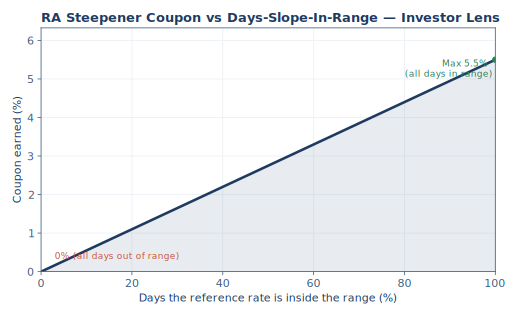

**Risks**

| Risk | Description | Severity |
|------|------------|:--------:|
| **Spread breakout risk (lower)** | CMS spread drops below 0.25% — curve flattening eliminates coupon | High |
| **Spread breakout risk (upper)** | CMS spread exceeds 2.50% — extreme steepening eliminates coupon | Medium |
| **Spread observation risk** | Daily CMS fixing source must be accurate for both CMS30Y and CMS2Y | Medium |
| **Correlation risk** | The correlation between CMS30Y and CMS2Y determines spread volatility and breakout probability | Medium |
| **Boundary risk** | When the spread is near 0.25% or 2.50%, small movements create volatile accrual | Medium |
| **Credit risk** | Counterparty default risk on the issuing bank | Low |

The RA STEG has a unique risk profile: it loses value from both curve flattening (spread < 0.25%) AND extreme steepening (spread > 2.50%). The hedge must protect against both tails of the spread distribution, making it more complex than the Vanilla STEG's one-directional risk.

#### §8. THE BANK LENS — Desk Economics (1st Line of Defence)

**What the desk books**

The trade is booked in Murex with four legs, and the desk takes the offsetting side of the investor's position:

- **Note leg** — the client-facing conditional coupon: $60M, 5.50% × (days CMS spread in [0.25%, 2.50%] / total days), quarterly, Act/360.
- **Issuer leg** — bank funding: SOFR + spread.
- **Deposit leg** — client collateral: $60M cash.
- **Hedge leg** — the rates desk's offsetting position: a strip of daily digital spread caps (strike 2.50%) and spread floors (strike 0.25%) on CMS30Y − CMS2Y.

Where the investor is short the digital spread strip on the slope, the desk is **long the digital strip** — long the daily digital floors and caps on the CMS spread, hedged with a CMS spread swap and the digital option strip rather than holding the raw curve risk. The strip is a digital on the *spread*, not the combination of two individual rate digitals: the CMS30Y−CMS2Y correlation affects the spread distribution in ways individual rate digitals cannot replicate.

**Curve/correlation risk & hedging**

The rates desk hedges with a CMS spread swap plus digital caps and floors on the CMS spread (strike 2.50% and 0.25%). The dominant residual is **correlation** between CMS30Y and CMS2Y, which determines the spread distribution and hence the breakout probability and digital-option value. High correlation means the two rates move together — stable spread, low breakout risk, healthy accrual. Low correlation means the spread is volatile and boundary crossings become frequent. A market shock that spikes 2-year rates while 30-year rates stay anchored breaks the correlation and collapses the spread, triggering lower-boundary breakouts across the entire RA STEG book. There is **pin risk** at the 0.25% and 2.50% thresholds: when the spread sits near a boundary, small movements flip days in and out of accrual, and the digital gamma is largest there. The desk hedges the upper boundary separately from the lower boundary because the risk is two-sided.

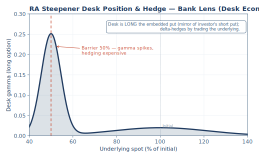

**How the bank makes money**

| Area | Detail |
|------|--------|
| **Client economics** | Client receives 5.50% × (days in range / total days). Maximum = 5.50%, minimum = 0% |
| **Bank economics** | Structuring spread: 12-18bp. Digital spread options are more complex to price than single-rate digitals, creating wider margins |
| **Hedging economics** | Rates desk hedges with digital cap and floor on the CMS spread. Residual: correlation between CMS30Y and CMS2Y affects the spread distribution and hence the digital option value |
| **Distribution economics** | Sales credit 5-8bp on notional |

Demand rises when investors expect stable rates and a moderately steepening curve, and when the structuring margin on the digital spread strip is attractive relative to single-rate digitals.

**Coupon decomposition**

The investor's conditional 5.50% accrual rate decomposes into the digital-spread-strip value the investor sells, less the structuring spread and sales credit the bank retains:

```
Digital spread strip value (max accrual rate):   5.50%
− Structuring spread (12-18bp):                  ~0.15%
− Sales credit (5-8bp):                          ~0.065%
─────────────────────────────────────────────────────
Net passed to investor (realized accrual):       ≈ 5.29%
```

The source quotes the 5.50% accrual rate, the 12-18bp structuring spread, and the 5-8bp sales credit. The precise split of the 5.50% into retained-versus-passed-through is **inferred** from those ranges (mid-points), not stated verbatim in the source.

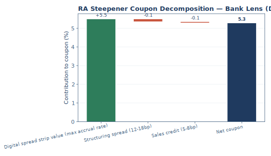

**P&L drivers**

Day to day, desk P&L is driven by: moves in the CMS spread relative to the 0.25% and 2.50% boundaries against the warehoused digital strip (pin risk is largest when the spread sits on a boundary); changes in the CMS30Y−CMS2Y correlation against the long digital-strip position (correlation is the most important driver — the value of the digital strip can swing materially with correlation even when the spread level does not move); the realized daily accrual count versus the modelled one; and the structuring spread (12-18bp) and bid-offer captured at inception. A $500M RA STEG book in which the CMS spread sits near a boundary while correlation is shifting is the desk's main concentration concern — a correlation regime change can trigger boundary breakouts across the entire book in a single move.

#### §9. THE BANK LENS — Controls & Reconciliation (2nd Line of Defence)

**Booking & systems**

| Field | Value |
|-------|-------|
| **Booking system** | Murex |
| **Pricing system** | Murex (digital spread option pricing with CMS convexity) |
| **Four-Leg** | Yes |
| **Note leg** | Conditional coupon: $60M, 5.50% × (days CMS spread in [0.25%, 2.50%] / total days), quarterly |
| **Issuer leg** | Bank funding: SOFR + spread |
| **Deposit leg** | Client collateral: $60M cash |
| **Hedge leg** | Strip of daily digital spread caps (strike 2.50%) + spread floors (strike 0.25%) on CMS30Y − CMS2Y |
| **ISDA documentation** | Not required from client (note format) |
| **Observation rates** | CMS30Y and CMS2Y (daily ICESWAP fixing) |
| **Range** | CMS30Y − CMS2Y ∈ [0.25%, 2.50%] |
| **Day count** | Act/360 |

All four legs are booked in Murex as a single structured note. The 2nd line's first concern is that the four legs are booked net and consistent — matching notionals and dates — and that the Hedge leg (the digital spread strip) genuinely offsets the client-facing Note leg.

**Reconciliation points**

| Recon point | What must agree | RA-STEG-specific break |
|-------------|-----------------|------------------------|
| **Four-leg net (Note vs Issuer vs Deposit vs Hedge)** | All four legs booked with matching notional, dates, and conventions; legs net to the intended structured position | Legs booked asynchronously with a notional error — e.g. Deposit leg shows a different notional ($60M) than the Note leg |
| **Accrual factor / daily slope observation count** | The accrual fraction in Murex equals (days CMS spread in [0.25%, 2.50%] / total days) per the daily observation log | Accrual counter shows days in range when the spread was outside the corridor, or defaults to 100% — e.g. Q3 shows 50/92 but the daily log disagrees |
| **CMS fixings & source (two rates)** | CMS30Y and CMS2Y both sourced from the same publication (daily ICESWAP), same time, same methodology, so the spread is consistent | CMS30Y and CMS2Y observed from different fixing times/sources — spurious spread observation includes or excludes a day |
| **Threshold / boundary convention** | Range bounds 0.25% and 2.50% booked correctly; inclusive-vs-exclusive boundary matches the term sheet | Spread exactly 0.25% or 2.50% with disputed accrual — inclusive/exclusive boundary mis-booked |
| **Day-count** | Act/360 applied correctly to each conditional coupon | Day-count fraction error — quarterly coupon exceeds the $825,000 maximum |
| **Digital spread hedge parameters** | Digital cap (2.50%) and floor (0.25%) strikes, correlation, and CMS convexity match the trade | Hedge leg shows large P&L when the CMS spread hasn't moved — correlation shift or mispriced spread digital |
| **Hedge offset (Note vs Hedge P&L)** | Hedge leg (digital strip) P&L offsets Note leg accrual P&L within tolerance | Hedge leg P&L diverges from Note leg P&L — strip tenors/strikes do not match the structured note |
| **Collateral / four-leg settlement** | All four legs settle consistently; deposit ($60M) released when the Note leg terminates at maturity | Settlement timing mismatch — Note leg coupon settled but Deposit leg not released, trapping client cash |

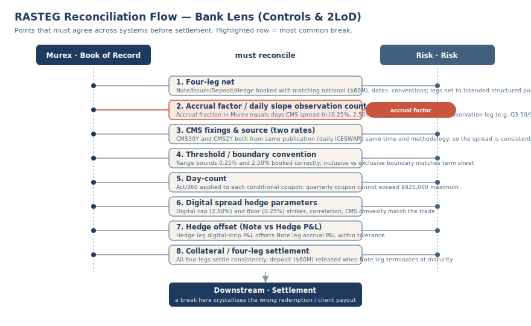

**Common breaks & red flags**

| Red Flag | What It Means | Action |
|----------|--------------|--------|
| Accrual counter shows days in range when CMS spread was outside the corridor | Spread calculation may use different observation times for CMS30Y and CMS2Y | Verify both CMS rates are from the same fixing source and time |
| Quarterly coupon exceeds $825,000 | Day count or notional error | Verify max = $60M × 5.50% / 4 = $825,000 |
| CMS spread on boundary (exactly 0.25% or 2.50%) with disputed accrual | Contract may define inclusive or exclusive boundaries | Check term sheet — typically inclusive |
| Full accrual for 5 consecutive quarters despite CMS spread volatility | Counter may be defaulting to 100% | Audit daily observation log |
| Hedge leg shows large P&L when CMS spread hasn't moved | Digital spread option may be mispriced due to correlation shift | Recalibrate with updated CMS30Y-CMS2Y correlation |

**Control implication**

For an RA STEG the dominant 2nd-line control is the **accrual factor** — the daily count of slope-in-range days. The four legs (Note, Issuer, Deposit, Hedge) must be booked with matching notionals and dates so that they net to the intended structured position and the Hedge leg (the digital spread strip) genuinely offsets the client-facing Note leg. The accrual fraction in Murex must equal the count of days the CMS spread (CMS30Y − CMS2Y) stayed in [0.25%, 2.50%] per the daily observation log, and that count is only as good as the two CMS fixings behind it: CMS30Y and CMS2Y must be sourced from the same publication, time, and methodology, or a spurious spread observation will incorrectly include or exclude a day. Around these, the threshold/boundary convention (inclusive vs exclusive at 0.25% / 2.50%), the Act/360 day-count, and the four-leg collateral/settlement checks ensure each conditional coupon and the final maturity settlement are correct. The reconciliation exists precisely to catch these inconsistencies before a coupon settles.

#### §10. Formal Definition

A **Range Accrual Steepener (RA STEG)** is a structured rate product that pays a conditional coupon based on the number of days the CMS spread (CMS_Long − CMS_Short) stays within a predefined range during each accrual period. The coupon formula is: Coupon = Notional × Accrual Rate × (Days In Range / Total Days) / Periods Per Year. The range is defined by upper and lower bounds on the CMS spread, not on individual rates. Economically the investor is short a strip of digital spread options on the slope (a long digital floor at the lower bound combined with a short digital cap at the upper bound); the bank's desk is long that strip. The product is booked in Murex with four legs: Note (conditional coupon), Issuer (funding), Deposit (collateral), and Hedge (digital spread option strip — caps and floors on the CMS spread).

#### §11. Lifecycle

| Stage | What Happens | Who Is Involved | What Can Go Wrong |
|:-----:|-------------|----------------|-------------------|
| **Pre-trade** | Structurer prices the digital spread option strip. Range boundaries chosen based on historical CMS spread distribution | Structurer, Sales, Client | Range set based on current spread without considering that the spread distribution may shift |
| **Trade date** | Four legs booked in Murex. Daily observation mechanism configured for the CMS spread | Operations, Trader | CMS30Y and CMS2Y observation sources mismatched — spread calculation uses rates from different fixing times |
| **During life** | Each business day, CMS30Y and CMS2Y are observed and the spread calculated. Accrual counter tracks days in range | Product Control, Operations | CMS fixing source change (e.g., LIBOR transition) invalidates spread observations |
| **Maturity** | Final quarterly coupon, principal returned, all legs closed | Operations, Product Control | Final-quarter spread observation disputed — CMS rate on the boundary |

#### §12. Worked Example (both lenses)

**Terms:** $60M notional, 5-year, accrual rate 5.50%, range [0.25%, 2.50%] on CMS30Y − CMS2Y, quarterly, Act/360.

**Year 1 detail:**

| Quarter | Days In Range | Total Days | Accrual Fraction | Quarterly Coupon |
|:-------:|:------------:|:----------:|:----------------:|:----------------:|
| Q1 | 75 | 90 | 83.3% | $687,500 |
| Q2 | 88 | 91 | 96.7% | $797,802 |
| Q3 | 50 | 92 | 54.3% | $448,370 |
| Q4 | 85 | 92 | 92.4% | $762,228 |
| **Total Year 1** | | | | **$2,695,900** |

**Effective Year 1 rate:** $2,695,900 / $60,000,000 = 4.49%

*Investor lens:*
In Q3, the CMS spread steepened beyond 2.50% for 42 days — an extreme steepening event that paradoxically reduced the investor's income, cutting Q3 accrual to 50/92 days (54.3%, $448,370). The other quarters' moderate steepening kept the spread in range, producing $687,500 (Q1), $797,802 (Q2), and $762,228 (Q4). The full Year 1 coupon of $2,695,900 represents an effective rate of 4.49% — still above the ~3.80% vanilla bond yield, but below the 5.50% maximum because the investor was "too right" about steepening in Q3. The maximum any quarter can pay is $60M × 5.50% / 4 = $825,000 (100% in range).

*Bank lens:*
The desk holds the four legs and is long the digital spread strip (digital floor at 0.25%, digital cap at 2.50% on CMS30Y − CMS2Y), hedged with the CMS spread swap and the strip. It retains the structuring spread (12-18bp of the 5.50% accrual rate) and the bid-offer on the digital-strip hedge. When the spread broke above 2.50% in Q3, the short digital cap cancelled accrual on 42 days, and the desk's hedge had to absorb the boundary pin risk and any correlation move. The 2nd line must confirm Q3's 50/92 days-in-range against the daily CMS30Y − CMS2Y observation log, that both CMS fixings came from the same source/time, that each coupon respects the Act/360 day count and the $825,000 maximum, and that the four legs net correctly.

#### §13. Knowledge Check

1. What determines the RA STEG's quarterly coupon? *(Investor)*
2. How does the RA STEG differ from the NCRA in terms of the observation variable? *(Investor)*
3. Why does the RA STEG have an upper boundary on the CMS spread range? *(Investor)*
4. If the CMS spread is exactly at 2.50% (the upper boundary), does the day count as in range? *(Investor)*
5. The CMS spread has been at 2.45% for 5 days and is trending upward. What risks does the RA STEG investor face? *(Investor)*
6. CMS30Y rises from 4.50% to 5.00% while CMS2Y rises from 3.50% to 4.10%. Did the CMS spread widen or narrow, and what is the impact on the RA STEG? *(Investor)*
7. **(Desk economics / 1LoD)** When the investor enters an RA STEG, what position does the desk take in the embedded digital spread strip (long or short the strip), what is its dominant risk, and how does the desk hedge the two boundaries (0.25% and 2.50%) on CMS30Y − CMS2Y? Where does the desk's retained profit come from?
8. **(Controls / 2LoD)** Name three reconciliation breaks specific to an RA STEG — covering the four-leg net, the accrual factor (daily slope-in-range observation count), and the two CMS fixings/source — and the consequence of each for the accrual count, the net coupon, or trapped client cash.

**Mental Models**

| Concept | Mental Model |
|---------|-------------|
| RA STEG | Greenhouse — plants grow only when the temperature differential is in the optimal range |
| CMS spread range | Goldilocks zone — not too flat, not too steep, just right |
| Upper boundary breakout | Overheating — too much steepening kills the crop |
| Lower boundary breakout | No heating advantage — flat curve provides no growth conditions |
| Daily observation | Daily temperature check — each day either produces or doesn't |
| Investor short the digital strip / desk long it | The investor sells the both-boundary digital strip; the desk warehouses it |
| Four-leg structure | Four interconnected gears — Note, Issuer, Deposit, Hedge — all must turn together |

**Key Takeaways**

1. An RA STEG pays a conditional coupon based on the fraction of days the CMS spread (CMS30Y − CMS2Y) stays within a predefined range [0.25%, 2.50%].
2. Unlike the Vanilla STEG, the RA STEG penalizes extreme steepening — the investor wants stability, not maximum slope; a spread above 2.50% produces zero accrual.
3. The hedge involves digital spread options (on CMS30Y − CMS2Y), which are more complex than single-rate digitals; the desk is long the strip while the investor is short it.
4. The correlation between CMS30Y and CMS2Y drives the spread distribution and breakout probability and is the desk's most important risk.
5. The accrual rate (5.50%) exceeds the Vanilla STEG's expected coupon because the investor is selling digital spread options at both boundaries.
6. All SRT products are booked in Murex with four legs: Note, Issuer, Deposit, and Hedge; the desk retains the structuring spread (12-18bp) plus the digital-strip bid-offer.
7. For the 2nd line, the dominant control is the accrual factor — the daily count of slope-in-range days — which is only as reliable as the two CMS fixings (CMS30Y and CMS2Y from the same source/time) behind it, supported by four-leg net, threshold/boundary, day-count, and collateral/settlement checks; each can misstate the accrual count, the coupon, or trap client cash.

#### §14. Common Mistakes

**1. Assuming the RA STEG always benefits from a steep curve.** Unlike the Vanilla STEG, the RA STEG has an upper boundary. Extreme steepening (spread > 2.50%) produces zero coupons — being "too right" about steepening is penalized.

**2. Using single-rate range accrual intuition for spread range accrual.** The CMS spread is driven by TWO rates, not one. The spread can change even when both rates move in the same direction — what matters is the relative movement.

**3. Setting the range based on the current spread without considering historical distribution.** If the CMS spread is currently 1.50% and the range is [0.25%, 2.50%], it looks centered. But the historical distribution may be skewed — spreads may be more likely to compress than to widen.

**4. Hedging the spread digital as two single-rate digitals.** The spread digital is NOT the combination of one digital on CMS30Y and one on CMS2Y — the CMS30Y−CMS2Y correlation affects the spread distribution in ways individual rate digitals cannot replicate. The desk is long a digital on the *spread*.

**5. (Controls) Trusting the accrual counter without auditing the daily observation log.** Full accrual for 5 consecutive quarters despite CMS spread volatility, or days counted in range when the spread was outside [0.25%, 2.50%], signals the counter may default to 100% or use mismatched CMS30Y/CMS2Y fixing times. The 2nd line must reconcile the accrual fraction to the day-by-day CMS spread observations and confirm both CMS rates share one source and time.

**Dual-lens questions:**
- *(Desk economics / 1LoD)* What does the desk book across the four legs, and what is its primary curve/correlation risk and hedge?
- *(Controls / 2LoD)* Which four-leg / CMS-fixing / accrual fields must reconcile, and which is the most common break?

**Dual-lens visuals (generated):**
- `assets/rasteg/controls_rasteg_recon_08.svg` `[generated]`
- `assets/rasteg/desk_rasteg_gamma_07.svg` `[generated]`
- `assets/rasteg/payoff_rasteg_01.svg` `[generated]`
- `assets/rasteg/waterfall_rasteg_09.svg` `[generated]`
### 5.4.3 Callable Steepener (Callable STEG) {#sec-5-4-3}

> **Prerequisites:** VANILLA STEG &nbsp;|&nbsp; **Key concepts:** CMS spread + Bermudan call, dual optionality

---

*A Callable Steepener (Callable STEG) is a Steepener Note booked in Murex with the four-leg structure (Note, Issuer, Deposit, Hedge). It pays a leveraged CMS spread coupon on the slope of the curve — leverage × max(0, CMS_Long − CMS_Short) — packaged as a note, in which the issuing bank holds the right to terminate the trade early on predetermined call dates. Relative to the Vanilla Steepener, the investor receives a higher leverage factor (4.5× instead of 4×) and a higher Year 1 fixed coupon (6.00% instead of 5.00%) in exchange for granting the bank that call right. Economically the investor is long the curve slope and short a Bermudan call (the issuer's termination right); the bank's desk is short the slope and long the call. This chapter reads the product through two lenses: what it means for **the investor** (the note holder who receives the enhanced slope-linked coupon), and what it means for **the bank** — the latter split into the desk's curve and rate economics (1st line of defence) and the controls and reconciliation that surround it (2nd line of defence).*

#### §1. Explain Like I'm New

Consider an asset manager at a Brazilian investment firm who believes the yield curve will stay steep for at least two years and wants the highest possible coupon from a curve product. The Vanilla Steepener offers 4× leverage with a 5.00% Year 1 coupon. The Callable STEG offers 4.5× leverage with a 6.00% Year 1 coupon — a significant uplift. The catch: the bank can call the note after two years. If the curve flattens (reducing the bank's coupon obligation), the bank terminates the trade and the investor must reinvest.

Why would an investor accept this? Because the conviction is specifically about the near term — a belief that the curve will steepen over the next two to three years. If that view is right, the bank will not call (the coupon obligation is justified by the hedge economics), and the investor earns a coupon that no non-callable product can match. If the curve eventually flattens in year four or five, the bank calls — but by then the investor has already collected three or four years of elevated coupons. The investor is trading long-term certainty for short-term outperformance.

#### §2. Core Analogy

A Callable STEG resembles a seasonal fruit stand at a farmers' market. Profit depends on the spread between wholesale prices (the 2-year rate) and retail prices (the 30-year rate) — the wider the spread, the bigger the margin. The stallholder earns more than a permanent store because the stall operates under a revocable market license: the market authority can close the stall at any quarterly review. As long as margins are healthy, the license is renewed. But when margins shrink, the authority revokes the license and gives the spot to someone else.

What makes the arrangement notable is that the market authority revokes the license precisely when fruit margins are thin everywhere. The stallholder is forced to look for a new stall at a time when no location offers good margins. This is the reinvestment trap — the call happens exactly when alternatives are worst. The market authority holds the revocation right; the stallholder has granted it.

#### §3. What Problem Does It Solve

| Investor Need | How the Product Delivers |
|------------|------------------------|
| Maximum coupon from curve exposure | Dual premium: curve view + call option = highest available STEG coupon |
| Higher leverage than Vanilla STEG | 4.5× vs 4× — the call premium funds the additional leverage |
| Express view that the curve will stay steep for the near term | Non-call period provides guaranteed exposure during the conviction window |
| Accept reinvestment risk for a higher return | Call risk traded for enhanced leverage and fixed coupon |

#### §4. Product DNA

| **Field** | **Value** |
|---|---|
| **Full Name** | Callable Steepener |
| **Abbreviation** | Callable STEG |
| **Family** | Steepener Notes |
| **Complexity Score** | 6 / 10 |
| **Complexity Rationale** | Leveraged CMS spread + Bermudan call right. CMS convexity × swaption interaction. Reinvestment risk |
| **Underlying Asset Class** | Rates (CMS30Y − CMS2Y spread) |
| **Capital Protection** | 100% at maturity (or on call date) |
| **Coupon Type** | Enhanced leveraged CMS spread coupon (call premium funds additional yield) |
| **Maturity** | 7–30 years (callable after the non-call period; the worked example uses a 7-year NC2 note) |
| **Liquidity** | OTC — model-dependent |
| **Primary System** | Murex (primary) |
| **ISDA Required** | No — issued as note |

**DNA Atlas Fields:**
- Primary Risk: Callability risk + curve risk. Bank calls when steepener coupon is high (good for investor). Reinvestment risk
- Typical Buyer: Institutional investors selling call optionality for enhanced steepener coupon
- Typical Use Case: Yield pickup over vanilla STEG by selling the bank's right to terminate early
- Building Blocks: Vanilla STEG + Bermudan swaption sold to bank
- Key Hedge: CMS spread swap + Bermudan swaption
- Similar Products: Vanilla STEG (5.4.1 — without call), IR Callable (5.3.1 — without curve), Callable STEG variants
- Most Important Greek: Vega (swaption) + CMS spread delta

**Comparison Matrix Fields:**
- Complexity: 6
- Yield Potential: High (above vanilla STEG)
- Capital Protection: 100% at maturity (or on call date)
- Credit Exposure: Issuer (note format)
- Liquidity: OTC — model-dependent
- Path Dependency: Yes (coupon observation + call dates)
- Volatility Sensitivity: Short vega (sold swaption)
- Correlation Sensitivity: CMS rate correlation
- Client Type: Institutional
- Market Environment: Best when expecting gradual steepening (bank less likely to call)

#### §5. Family Position

```
Rates
└── Steepener Notes (STEG)
    ├── Vanilla Steepener (5.4.1)
    ├── Range Accrual Steepener (5.4.2)
    └── Callable Steepener  ← chapter focus
```

#### §6. Product Evolution

| Stage | Product | What Was Added | Why |
|:-----:|---------|---------------|-----|
| 1 | Vanilla STEG (5.4.1) | — (baseline for STEG) | Leveraged CMS spread coupon |
| 2 | IR Callable (5.3.1) | Call right (no CMS spread) | Bank's termination right for premium |
| 3 | Callable STEG | Leveraged CMS spread + call right | Maximum STEG coupon through dual premium |

The Vanilla Steepener was limited in the leverage it could offer because the bank retained the curve risk for the full term. Adding a call option allowed banks to manage their exposure — if the curve flattened, they could terminate rather than continuing to pay a coupon on a trade that had become unprofitable to hedge. This risk transfer (the call option) freed capital for higher leverage, creating a product with superior coupon economics for investors willing to accept reinvestment risk. The structure combines two well-understood features from earlier chapters — the leveraged CMS spread coupon of the Vanilla STEG (5.4.1) and the issuer call right of the IR Callable (5.3.1) — into a single dual-premium note.

---

#### §7. THE INVESTOR LENS

**Why the investor buys it**

1. **Highest STEG coupon** — the dual premium (curve view + call option) delivers the maximum available leverage and fixed coupon.
2. **Higher Year 1 fixed** — 6.00% vs 5.00% for the Vanilla STEG.
3. **Higher leverage** — 4.5× vs 4× amplifies a given CMS spread into a larger coupon.
4. **Proven structure** — combines two well-understood features from earlier chapters.
5. **Near-term view expression** — the non-call period gives guaranteed exposure for investors confident about the next 2 years of curve shape.

The product suits investors with high conviction about curve steepness in the near term who are comfortable with reinvestment risk after the non-call period. It is a poor choice for investors who need guaranteed long-term income (the call can truncate the income stream) or who expect curve flattening.

**Position & slope + call**

The Callable STEG is built from two components from the investor's perspective:

1. **Leveraged CMS spread (long the slope)** — the investor receives 4.5 × max(0, CMS30Y − CMS2Y), capped at 12%. The investor is **long the curve slope**: the coupon rises as the long-maturity rate (CMS30Y) pulls away from the short-maturity rate (CMS2Y), and falls toward the floor as the curve flattens.
2. **Short the issuer call (short a Bermudan swaption)** — the investor sells the bank the right to terminate the note early on quarterly call dates after the non-call period.

The investor's position is therefore: **long the curve slope** (receive the enhanced leveraged CMS spread, subject to the 0% floor and 12% cap), and **short the bank's Bermudan call right**. Because the investor is short optionality, the investor is **short vega** — a rise in implied swaption volatility lowers the mark-to-market value of the position for the investor. The extra leverage (4.5× vs 4×) and the higher Year 1 fixed (6.00% vs 5.00%) are not free money:

```
Vanilla STEG leverage:         4.0×
+ Swaption premium (leverage):  0.5× additional
─────────────────────────────────
Callable STEG leverage:        4.5×

Vanilla STEG Year 1:           5.00%
+ Swaption premium (fixed):    1.00%
─────────────────────────────────
Callable STEG Year 1:          6.00%
```

The 0.5× of extra leverage and the 1.00% of extra Year 1 coupon are the premium the investor earns for selling the bank an option to terminate the trade when the curve moves in the bank's favour — that is, when the curve flattens and the coupon obligation becomes cheap for the bank to walk away from.

**Payoff & scenarios**

The product construction sets the coupon profile:

```
Year 1:     Fixed coupon:                6.00%
Year 2-7:   4.5 × max(0, CMS30Y − CMS2Y), cap 12%
Call right:  Quarterly after Year 2 (NC2)
```

The 12% cap is reached when the CMS spread exceeds 2.67% (12% / 4.5). The maximum quarterly coupon is $50M × 12.00% / 4 = $1,500,000. The investor's return depends both on the realised curve slope and on how long the note survives before the bank calls.

- **Scenario A — Curve stays steep, never called:** Full 7-year term at elevated coupons. Best outcome.
- **Scenario B — Curve flattens, called after year 2:** The investor earns $3,000,000 (Year 1 fixed) + $1,350,000 (Year 2 CMS spread) = $4,350,000 total, then must reinvest at lower curve-linked returns.
- **Scenario C — Curve steepens dramatically:** The coupon hits the 12% cap. The bank does not call — the note is profitable for the investor but the bank's hedge cost is manageable.
- **Scenario D — Curve inverts in Year 2, called after NC period:** The investor earns Year 1 fixed ($3,000,000), Year 2 zero ($0), and is called. Worst outcome: one year of fixed income, one year of nothing, then forced reinvestment.

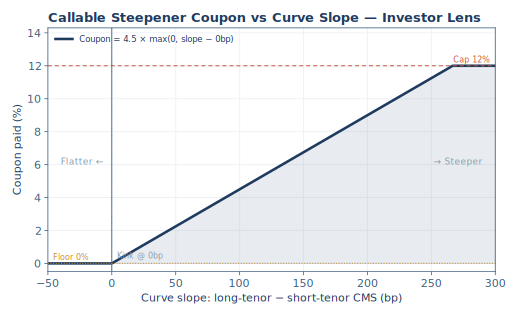

**Risks**

| Risk | Description | Severity |
|------|------------|:--------:|
| **Curve flattening risk** | Reduced CMS spread → lower or zero coupons | High |
| **Reinvestment risk** | Bank calls when the curve flattens → forced reinvestment at lower spread levels | High |
| **Call-curve correlation** | Bank calls precisely when reinvestment options are worst | Medium |
| **CMS convexity × swaption interaction** | Combined hedge has cross-Greeks that are difficult to manage | Medium |
| **Leverage amplification** | 4.5× magnifies both gains and losses | Medium |
| **Swaption volatility (vega)** | Changes in implied volatility affect the value of the embedded call, impacting MTM; the investor is short vega | Medium |
| **Credit risk** | Counterparty / issuer default risk (note format) | Low |

#### §8. THE BANK LENS — Desk Economics (1st Line of Defence)

**What the desk books**

The trade is booked in Murex with four legs, and the desk takes the offsetting side of the investor's position:

- **Note leg** — the client-facing callable CMS coupon: $50M, Y1 fixed 6.00%, Y2-7 = 4.5 × max(0, CMS30Y − CMS2Y) cap 12%, callable NC2 quarterly.
- **Issuer leg** — bank funding: SOFR + spread.
- **Deposit leg** — client collateral: $50M cash deposit.
- **Hedge leg** — the rates desk's offsetting positions: CMS30Y receiver + CMS2Y payer (4.5× scaled) + a **Bermudan swaption** (quarterly exercise after NC2) + cap swaption overlay.

Where the investor is long the curve slope and short the call, the desk is **short the curve slope and long the call**. On the slope, the desk receives the short-maturity rate and pays the long-maturity rate through the CMS swaps (CMS2Y payer offset / CMS30Y receiver hedge scaled 4.5×), so the desk is short the CMS spread that the investor is long. On the call, the desk holds the right to terminate the note when the curve flattens — economically the desk is **long a Bermudan swaption** (the call schedule has multiple quarterly exercise dates after NC2), and it hedges that optionality rather than holding the raw curve and rate risk.

**Curve/vol risk & hedging**

The rates desk hedges the leveraged CMS spread with CMS swaps scaled to 4.5× and the call right with a Bermudan swaption, with a cap swaption overlay for the 12% cap. The residual risks are the **CMS convexity × swaption interaction** (cross-Greeks between the curve hedge and the call) and the correlation between curve shape and call exercise. Because the desk is long the embedded Bermudan swaption, it is **long vega** — its position gains value when implied volatility rises (the investor, who sold it, is short vega). A quarterly callable after NC2 has many call dates, so the hedge must be a Bermudan swaption (or a strip matched to the call schedule), not a single European swaption. The desk monitors CMS spread delta (curve sensitivity) and vega (vol sensitivity) across the callable STEG book; the dominant concentration concern is a large callable STEG book approaching the end of the non-call period when the curve has been flattening — a single call decision can affect $500M+ of notes simultaneously, each triggering CMS swap unwinds and swaption expiry.

**How the bank makes money**

| Area | Detail |
|------|--------|
| **Client economics** | Year 1 fixed 6.00%, then 4.5 × max(0, CMS30Y - CMS2Y) cap 12%. Callable quarterly after NC2 |
| **Bank economics** | CMS convexity adjustment + swaption premium. Combined structuring spread: 12-20bp |
| **Hedging economics** | CMS swaps (scaled 4.5×) + Bermudan swaption. Residual: CMS convexity × swaption interaction |
| **Distribution economics** | Sales credit 5-8bp |

Demand rises when the curve is steep (more premium for selling curve optionality), when implied swaption volatility is high (larger embedded option premium = higher leverage and fixed coupon), and when central bank policy is expected to keep the curve gradually steepening (investors believe the curve will not flatten enough to trigger the call).

**Coupon decomposition**

The investor's enhanced coupon decomposes into the Vanilla STEG terms plus the swaption premium the investor pays for selling the call. The extra coupon vs Vanilla STEG comes from two sources:

```
Vanilla STEG leverage:         4.0×
+ Swaption premium (leverage):  0.5× additional
─────────────────────────────────
Callable STEG leverage:        4.5×

Vanilla STEG Year 1:           5.00%
+ Swaption premium (fixed):    1.00%
─────────────────────────────────
Callable STEG Year 1:          6.00%
```

Within the embedded swaption premium the investor grants, the bank retains a combined structuring spread of 12-20bp (CMS convexity adjustment + swaption premium) and passes the remainder back to the investor as the enhanced 4.5× leverage and 6.00% Year 1 coupon; sales credit of 5-8bp is taken on distribution. (The source quotes the 12-20bp combined structuring spread and the 5-8bp sales credit, and the 0.5×-leverage / 1.00%-fixed split versus Vanilla STEG; the precise division of the swaption premium into retained-versus-passed-through is inferred from those figures, not stated verbatim.)

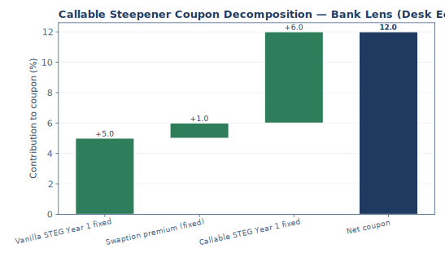

**P&L drivers**

Day to day, desk P&L is driven by: moves in the curve slope (the CMS30Y − CMS2Y spread) against the warehoused 4.5×-scaled CMS swap position; changes in implied swaption volatility against the long-vega position embedded in the call (the value of the Bermudan swaption can swing with vol even when the curve does not move); the CMS convexity × swaption interaction as the curve approaches the level where the call becomes optimal; the realised call schedule versus the modelled one as the curve flattens toward the call trigger; and the combined structuring spread (12-20bp) and sales credit (5-8bp) captured at inception. A callable STEG book with staggered NC periods all approaching their first call dates while the CMS spread declines is the desk's main concentration concern — calling $500M+ of notes in one session requires CMS swap unwinds and swaption expiry to be executed cleanly. The correct price requires a model that captures the interaction: the CMS convexity adjustment changes when the swaption is exercised, because the hedge portfolio changes at the call date — pricing the CMS component and the swaption component independently and adding them together is a junior mistake.

#### §9. THE BANK LENS — Controls & Reconciliation (2nd Line of Defence)

**Booking & systems**

| Field | Value |
|-------|-------|
| **Booking system** | Murex |
| **Pricing system** | Murex (CMS convexity + swaption model) |
| **Four-Leg** | Yes |
| **Note leg** | Callable CMS coupon: $50M, Y1 fixed 6.00%, Y2-7 = 4.5 × max(0, CMS30Y - CMS2Y) cap 12%, callable NC2 quarterly |
| **Issuer leg** | Bank funding: SOFR + spread |
| **Deposit leg** | Client collateral: $50M cash |
| **Hedge leg** | CMS30Y receiver + CMS2Y payer (4.5× scaled) + Bermudan swaption (quarterly exercise after NC2) + cap swaption overlay |
| **Call dates** | Quarterly after Year 2 |
| **Day count** | 30/360 |

All four legs are booked in Murex as a single structured note. The 2nd line's first concern is that the four legs are booked net and consistent — matching notionals and dates — and that the Hedge leg genuinely offsets the client-facing Note leg.

**Reconciliation points**

| Recon point | What must agree | Callable-STEG-specific break |
|-------------|-----------------|------------------------------|
| **Four-leg net (Note vs Issuer vs Deposit vs Hedge)** | All four legs booked with matching notional, dates, and conventions; legs net to the intended structured position | Legs booked asynchronously with a notional error — e.g. Deposit leg shows a different notional than the Note leg |
| **CMS30Y fixing (long leg)** | CMS30Y fixing source and date convention match the termsheet; the long-tenor rate feeds the spread correctly | Wrong CMS30Y source/date overstates or understates the spread and the coupon |
| **CMS2Y fixing (short leg)** | CMS2Y fixing source and date convention match the termsheet; the short-tenor rate feeds the spread correctly | Wrong CMS2Y source/date misstates the spread; two CMS fixings from inconsistent sources break the slope |
| **Call schedule** | The call dates and non-call period in Murex match the trade confirmation (NC2 = callable quarterly after year 2) | Call exercised during the non-call period — NC2 not correctly set in booking |
| **Call notice & exercise capture** | Each call decision is recorded within the contractual window; exercise/notice issued on time | Call notice not issued within the contractual window; deposit not released within T+2 of call |
| **Leverage & floor** | Leverage 4.5× and floor 0% / cap 12% applied correctly to the spread | Coupon exceeds 12% annualized (cap not applied); floor not applied on a negative spread |
| **Day-count** | 30/360 applied correctly to each coupon; Year 1 fixed = $750,000/quarter | Year 1 coupon differs from $750,000/quarter — notional or rate error |
| **Collateral / four-leg settlement** | On a call date all four legs settle simultaneously; deposit released when the Note leg terminates; partial-quarter accrual to the call date | Settlement timing mismatch — Note leg terminated but Deposit leg not released within T+2, trapping client cash |

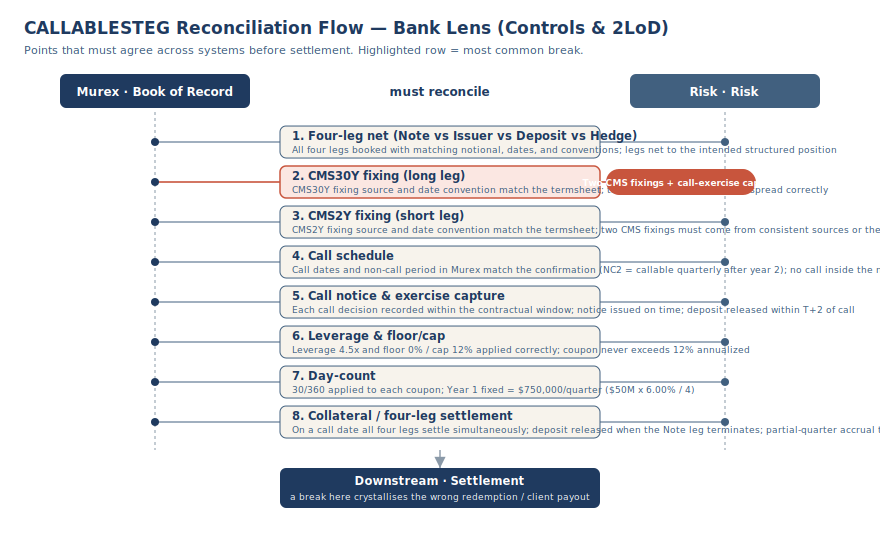

**Common breaks & red flags**

| Red Flag | What It Means | Action |
|----------|--------------|--------|
| Coupon exceeds 12% annualized | Cap not applied | Verify cap logic |
| Call exercised during non-call period | Booking error — NC2 not correctly set | Check call schedule against term sheet |
| Swaption P&L diverges from Note leg P&L | Swaption may reference wrong call dates | Reconcile swaption parameters |
| Year 1 coupon differs from $750,000/quarter | Notional or rate error | Verify: $50M × 6.00% / 4 = $750,000 |
| Deposit not released within T+2 of call | Operational delay in four-leg settlement | Escalate to Operations |
| Note leg shows a coupon after the call | Coupon accrual not stopped — or a legitimate partial quarter | Confirm partial-quarter accrual stops at the call date |

**Control implication**

For a Callable STEG the dominant 2nd-line controls are the **two CMS fixings** (CMS30Y and CMS2Y, each with the correct source and date) and the **call-exercise capture**. The coupon is driven by the slope CMS30Y − CMS2Y, so both fixings must be reconciled against the termsheet from consistent sources — a wrong source or date on either tenor misstates the spread, the leverage applies the error 4.5×, and the floor/cap can be mis-triggered. The call schedule and each call notice/exercise must be captured within the contractual window: a call exercised inside the non-call period (NC2 mis-booked), a call notice not issued on time, or a coupon that fails to stop on the call date each has direct P&L and client-cash consequences. Around these, the four-leg net, the leverage/floor/cap application, the day-count, and the collateral/settlement checks ensure each quarterly coupon and the final four-leg settlement are correct. The reconciliation exists precisely to catch these inconsistencies before a coupon settles or a call date passes.

#### §10. Formal Definition

A **Callable Steepener (Callable STEG)** is a structured rate product that combines a leveraged CMS spread coupon with the issuing bank's right to terminate on predetermined call dates. The coupon formula after Year 1 is: Coupon = Leverage × max(0, CMS_Long − CMS_Short), capped, with the bank's call right exercisable quarterly after a non-call period. The investor is long the curve slope and short the call (a Bermudan swaption sold to the bank); the bank's desk is short the slope and long the call. The product is booked in Murex with four legs: Note (callable CMS spread coupon), Issuer (funding), Deposit (collateral), and Hedge (CMS swaps + Bermudan swaption). The enhanced leverage (4.5×) and Year 1 coupon (6.00%) reflect the embedded swaption premium. Callable structures are described as "Non-Call N" where N is the lockout period in years (e.g., NC2 = callable after 2 years).

#### §11. Lifecycle

| Stage | What Happens | Who Is Involved | What Can Go Wrong |
|:-----:|-------------|----------------|-------------------|
| **Pre-trade** | Structurer prices the CMS spread with convexity + swaption. Leverage, fixed coupon, and NC period calibrated | Structurer, Sales, Client | Mispricing the interaction between CMS convexity and call exercise |
| **Trade date** | Four legs booked in Murex: Note (callable CMS coupon), Issuer, Deposit, Hedge (CMS swaps + swaption) | Operations, Trader | Swaption hedge mismatched to the call schedule |
| **During life** | Quarterly CMS fixings → coupon calculation. On each call date post-NC, the bank decides whether to call | Product Control, Trader (call), Operations | Call decision timing conflicts with the CMS fixing date |
| **Termination** | If called: all four legs close, partial quarter settled. If matured: final coupon, principal returned | Operations, Product Control | Four-leg settlement coordination on the call date |

#### §12. Worked Example (both lenses)

**Terms:** $50M notional, 7-year NC2, Year 1 fixed 6.00%, Years 2-7 = 4.5 × max(0, CMS30Y - CMS2Y), floor 0%, cap 12%, quarterly.

**Year 1 (fixed):** $50M × 6.00% / 4 = $750,000/quarter. Total: $3,000,000.

**Year 2 (CMS spread):**

| Quarter | CMS30Y | CMS2Y | Spread | × 4.5 | Coupon | Payment |
|:-------:|:------:|:-----:|:------:|:-----:|:------:|:-------:|
| Q5 | 4.60% | 3.70% | 0.90% | 4.05% | 4.05% | $506,250 |
| Q6 | 4.70% | 3.60% | 1.10% | 4.95% | 4.95% | $618,750 |
| Q7 | 4.40% | 4.00% | 0.40% | 1.80% | 1.80% | $225,000 |
| Q8 | 4.20% | 4.30% | -0.10% | Floor | 0.00% | $0 |
| **Year 2 Total** | | | | | | **$1,350,000** |

*Investor lens:*
If the CMS spread averages 1.00% and the note is never called, the investor earns Year 1 at 6.00% ($3,000,000) plus Years 2-7 at 4.50% average (4.5 × 1.00%), approximately $16,500,000 over 7 years. If called after Year 2, total income = $3,000,000 + $1,350,000 = $4,350,000, and the investor must reinvest $50M at prevailing (likely lower) CMS spread levels. The enhanced 4.5× leverage and 6.00% Year 1 coupon were the premium for selling the bank the call; being called early — precisely when the curve has flattened — is the reinvestment risk that premium compensated.

*Bank lens:*
The desk holds the four legs and is short the slope (the 4.5×-scaled CMS swaps) and long the call (the Bermudan swaption), hedged with the cap swaption overlay. It retains the combined structuring spread (12-20bp) plus the swaption-hedge economics; if the curve flattens to the level seen in Q8 (spread −0.10%, coupon floored at $0), the desk exercises the call after Year 2 and unwinds all four legs simultaneously. The 2nd line must confirm each quarter's coupon against the two CMS fixings (the $506,250 / $618,750 / $225,000 / $0 amounts and the 30/360 day count), that the Year 2 total reconciles to $1,350,000, that the call decision after Q8 was captured within the window, and that all four legs settled together with the partial quarter accrued to the call date.

#### §13. Knowledge Check

1. What two embedded premiums fund the Callable STEG's higher leverage and fixed coupon? *(Investor)*
2. How does the non-call period (NC2) affect the Year 1 fixed coupon and the swaption's value? *(Investor)*
3. Why does the bank call the note when the curve flattens? *(Investor)*
4. What is the maximum quarterly coupon for the worked example, and at what CMS spread is the 12% cap reached? *(Investor)*
5. A Callable STEG is called after Year 2 with $4,350,000 earned. The best available reinvestment is a Vanilla STEG at 3.5× leverage. Describe the investor's reinvestment challenge. *(Investor)*
6. Implied swaption volatility has risen since trade inception, with no change in the curve slope. How does this affect the MTM of the Callable STEG from the investor's perspective, and why? *(Investor)*
7. **(Desk economics / 1LoD)** When the investor enters a Callable STEG, what position does the desk take on the curve slope and on the embedded call (short or long each), what are its dominant Greeks, and how does the desk hedge a quarterly callable after NC2? Where does the desk's retained profit come from?
8. **(Controls / 2LoD)** Name three reconciliation breaks specific to a Callable STEG — covering the two CMS fixings (CMS30Y and CMS2Y source/date), the call notice/exercise capture, and the leverage/floor — and the consequence of each for the coupon, the call decision, or trapped client cash.

**Mental Models**

| Concept | Mental Model |
|---------|-------------|
| Callable STEG | Seasonal fruit stand with a revocable market license — higher margins, but the authority can close the stall |
| Dual premium | Two insurance policies — the investor earns premiums for selling both the curve view and the call option |
| Non-call period | Guaranteed market license duration before reviews begin |
| Higher leverage | Bigger inventory — more produce to sell, more to lose if margins collapse |
| Call decision | Market authority reviewing whether the stall is still viable |
| Investor long the slope / short the call; desk short the slope / long the call | The stallholder grants the revocation right; the market authority holds it |
| Four-leg structure | Four interconnected gears — Note, Issuer, Deposit, Hedge — all must turn together |

**Key Takeaways**

1. A Callable STEG combines leveraged CMS spread coupons (long the curve slope) with the bank's call right for the highest STEG coupon.
2. The enhanced leverage (4.5×) and Year 1 fixed (6.00%) are funded by the embedded swaption premium — the investor is short the call, the desk is long it.
3. Reinvestment risk from the call compounds curve flattening risk — both can coincide, because the bank calls precisely when the curve flattens and reinvestment options are worst.
4. The hedge is complex: CMS swaps at 4.5× scale plus a Bermudan swaption, with residual CMS convexity × swaption interaction; the desk is short the slope and long vega.
5. Near-term view expression: the non-call period provides guaranteed exposure before the call right activates.
6. All STEG products are booked in Murex with four legs: Note, Issuer, Deposit, and Hedge.
7. For the 2nd line, the dominant control risks are the two CMS fixings (CMS30Y and CMS2Y, each with the correct source and date so the slope is right) and the call notice/exercise capture (recording each call decision within the window, NC2 set correctly), supported by leverage/floor, day-count, and four-leg collateral/settlement checks — each can misstate a coupon, miss a call decision, or trap client cash.

#### §14. Common Mistakes

**1. Comparing Year 1 fixed coupons across STEG products as a quality indicator.** The higher Year 1 coupon (6.00% vs 5.00%) is compensation for the call risk, not evidence that the Callable STEG is a "better" product.

**2. Ignoring the call-curve correlation.** The bank calls when the curve flattens — the same moment when reinvestment options are worst. The call and curve risks are positively correlated.

**3. Treating the 4.5× leverage as incrementally risky vs 4×.** The difference in leverage (0.5×) means a 0.20% spread narrowing costs an additional 0.10% of coupon per year. On a $500M book, that is $500,000 of extra sensitivity.

**4. Quoting the 12% cap as the "upside potential."** The cap is reached when the CMS spread exceeds 2.67% (12% / 4.5). The probability of sustained spreads above 2.67% is historically low.

**5. Confusing the investor's position with the bank's call right.** In a Callable STEG, the BANK calls, not the investor. The investor is long the curve slope and short the call, and has no right to terminate early; the desk is short the slope and long the call.

**6. (Controls) Forgetting the partial-quarter accrual and four-leg settlement on a mid-quarter call.** The two CMS fixings and coupon must be calculated up to the call date, not quarter-end, and all four legs must settle simultaneously — if the Note leg is terminated but the Deposit leg is not released within T+2, client cash is trapped. The 2nd line must confirm the partial accrual, the four-leg net settlement, and that the call exercise was captured within the contractual window.

**Dual-lens questions:**
- *(Desk economics / 1LoD)* What does the desk book across the four legs, and what is its primary curve/vol risk and hedge (short the slope, long the Bermudan call, long vega)?
- *(Controls / 2LoD)* Which two CMS fixings / call-exercise / leverage-floor fields must reconcile, and which is the most common break?

**Dual-lens visuals (generated):**
- `assets/callablesteg/controls_callablesteg_recon_08.svg` `[generated]`
- `assets/callablesteg/payoff_callablesteg_01.svg` `[generated]`
- `assets/callablesteg/waterfall_callablesteg_09.svg` `[generated]`
### 5.4.4 TARN Steepener {#sec-5-4-4}

> **Prerequisites:** VANILLA STEG &nbsp;|&nbsp; **Key concepts:** Target accumulation, path-dependent termination, Monte Carlo

---

*A TARN Steepener (Target Accumulation Redemption Note Steepener) is a Steepener Note booked in Murex with the four-leg structure (Note, Issuer, Deposit, Hedge). Its coupon is a leveraged function of the yield-curve slope — leverage × max(0, CMS30Y − CMS2Y) — but the note has no fixed maturity: it auto-redeems early once cumulative coupons reach a predetermined target percentage of notional. Economically the investor is long the curve slope and short the target-redemption optionality, while the bank's desk is short the slope and long the auto-call. This chapter reads the product through two lenses: what it means for **the investor** (the note holder who receives the slope-linked coupon up to the target), and what it means for **the bank** — the latter split into the desk's rate economics (1st line of defence) and the controls and reconciliation that surround the four-leg booking (2nd line of defence).*

#### §1. Explain Like I'm New

Consider a fixed-income portfolio manager at a UAE sovereign wealth fund who wants exposure to the yield-curve slope but with a built-in "take profit" mechanism. The manager does not want to hold a steepener for 10 years; the aim is to earn a total return of 15% and then exit. The TARN Steepener delivers exactly this: a 5× leveraged CMS spread coupon that accumulates quarter by quarter. When cumulative coupons reach 15% of the notional ($6,000,000 on a $40M note), the note automatically redeems at par and terminates. If the curve is steep, the target is reached quickly. If the curve flattens, it takes longer — potentially up to the 10-year maximum maturity. The investor is long the curve slope and has sold the bank the optionality embedded in the automatic redemption.

#### §2. Core Analogy

A TARN Steepener resembles a loyalty card that redeems automatically. Each purchase earns a stamp; once the card holds ten stamps, it is redeemed automatically and a new card begins. The size of each stamp depends on quality — premium blends (a steep curve) earn larger stamps, while drip coffee (a flat curve) earns smaller stamps. A card filled only with small stamps takes many visits to complete; a card filled with large stamps completes quickly. The TARN works the same way: each quarter's coupon is a "stamp," and the 15% target is the "full card." The card holder collects the stamps (the investor is long the slope), but the redemption is triggered automatically rather than at the holder's discretion.

#### §3. What Problem Does It Solve

| Investor Need | How the Product Delivers |
|------------|------------------------|
| Defined total return target | Note automatically redeems when cumulative coupons reach 15% |
| Built-in "take profit" mechanism | No need to actively decide when to sell — redemption is automatic |
| Exposure to curve slope with a safety valve | 10-year maximum maturity ensures the note eventually terminates |
| High leverage for faster target achievement | 5× leverage accelerates coupon accumulation |

#### §4. Product DNA

| **Field** | **Value** |
|---|---|
| **Full Name** | TARN Steepener |
| **Abbreviation** | TARN STEG |
| **Family** | Steepener Notes |
| **Complexity Score** | 8 / 10 |
| **Complexity Rationale** | Leveraged CMS spread with target accumulation and automatic redemption. Path-dependent. Monte Carlo pricing |
| **Underlying Asset Class** | Rates (CMS30Y − CMS2Y spread) |
| **Capital Protection** | 100% at maturity or target date, subject to issuer credit |
| **Coupon Type** | Leveraged CMS spread coupon with cumulative target cap |
| **Maturity** | 10 years maximum (terminates early if target reached) |
| **Liquidity** | OTC — model-dependent |
| **Primary System** | Murex (primary), Sophis (risk) |
| **ISDA Required** | No — issued as note |

**DNA Atlas Fields:**
- Primary Risk: Target reached = early termination. If curve steepens rapidly, target met quickly and product terminates. Reinvestment risk in favourable environment
- Typical Buyer: Institutional investors wanting defined total return from curve steepening
- Typical Use Case: Target total coupon from steepener — product terminates once total paid reaches target
- Building Blocks: Vanilla STEG + target accumulation trigger + early termination mechanism
- Key Hedge: CMS spread swap + path-dependent autocall replication
- Most Important Greek: CMS spread delta + path-dependent gamma

**Comparison Matrix Fields:**
- Complexity: 8
- Yield Potential: Capped at target (e.g., 15% total)
- Capital Protection: 100% at maturity or target date, subject to issuer credit
- Credit Exposure: Issuer (note format)
- Liquidity: OTC — model-dependent
- Path Dependency: Very high (accumulated coupon determines termination)
- Volatility Sensitivity: Complex (affects path to target)
- Correlation Sensitivity: CMS rate correlation
- Client Type: Sophisticated institutional
- Market Environment: Best when expecting moderate steepening (too fast = early termination)

#### §5. Family Position

```
Rates
└── Steepener Notes (STEG)
    ├── Vanilla Steepener (5.4.1)
    ├── Range Accrual Steepener (5.4.2)
    ├── Callable Steepener (5.4.3)
    └── TARN Steepener  ← chapter focus
```

#### §6. Product Evolution

| Stage | Product | What Was Added | Why |
|:-----:|---------|---------------|-----|
| 1 | Vanilla STEG (5.4.1) | Leveraged CMS spread coupon | Curve slope as payoff driver |
| 2 | Callable STEG (5.4.3) | Bank's early termination right | Banks wanted exit flexibility |
| 3 | TARN STEG | Target-based automatic redemption | Investors wanted a defined total return with automatic exit |

Institutional investors liked the steepener concept but had two concerns: (1) uncertain holding period — a 10-year steepener might produce volatile income for a decade, and (2) no automatic profit-taking mechanism — they had to actively decide when to sell. The TARN solved both by setting a cumulative coupon target that, once reached, automatically redeemed the note. This appealed to sovereign wealth funds and pension funds with defined-return targets — they could allocate to a "15% total return product" rather than an "unknown-return-for-10-years product." The path dependency made the TARN more complex to price (requiring Monte Carlo simulation), but the clarity of the return target made it easier to sell.

---

#### §7. THE INVESTOR LENS

**Why the investor buys it**

1. **Defined total return** — the 15% target is known at inception, providing return certainty.
2. **Automatic profit-taking** — no active management is needed to realize the target; redemption is automatic.
3. **High leverage** — 5× CMS spread accelerates target achievement.
4. **Maximum maturity safety valve** — the 10-year cap ensures the note eventually terminates.
5. **View expression** — a steep curve produces fast target achievement and a higher annualized return.

The product suits investors with a specific total return target, who want automatic redemption, and who accept uncertainty about the holding period. It is a poor choice for investors who need income certainty per period (coupons vary), who want a guaranteed short holding period (curve flattening extends it), or who cannot tolerate the path dependency.

**Position & target mechanism**

The TARN is built from two components from the investor's perspective:

1. **Leveraged CMS steepener** — the investor is long the curve slope, receiving 5 × max(0, CMS30Y − CMS2Y) each quarter, with no per-period cap.
2. **Short the target-redemption optionality** — the investor has granted the auto-redemption feature: once cumulative coupons reach the 15% target, the note redeems at par and terminates, and the final coupon is truncated to exactly reach the target.

The investor is therefore **long the slope and short the auto-call**: long the steepening of the curve, but short the optionality that automatically redeems the note (and truncates the last coupon) once the target is met. The target mechanism acts as a natural cap on total return — the note can never pay more than 15% — which is what allows the higher 5× leverage to be offered. The accumulation logic is path-dependent: the order and magnitude of the quarterly coupons determine the redemption date.

```
Each quarter:  Coupon = 5 × max(0, CMS30Y − CMS2Y)
Accumulator:   Track cumulative coupons as % of notional
Target:        15.00%  (= $6,000,000 on $40M)
Trigger:       When cumulative ≥ target → redeem at par
                 Final coupon is truncated to exactly reach target
Max maturity:  10 years (safety valve)
```

**Payoff & scenarios**

The investor's total return is fixed at the $6,000,000 target (15% of notional); only the time to achieve it varies. If the curve is steep, the target is reached in roughly 2.5 years (annualized ~6.00%). If the curve is moderate, it is reached in about 5 years (~3.00%). If the curve flattens significantly, it may take 10 years (~1.50%). The total return is the same; only the speed differs.

- **Scenario A — Steep curve, fast target:** The CMS spread averages 1.50%, coupon ~7.50% per year. Target reached in approximately 2 years. Annualized return: ~7.50%. Best outcome — high annualized return.
- **Scenario B — Moderate curve, medium target:** The CMS spread averages 0.80%, coupon ~4.00%. Target reached in approximately 3.75 years. Annualized return: ~4.00%.
- **Scenario C — Curve flattens for 3 years, then steepens:** Zero coupons for 12 quarters, then rapid accumulation. Target eventually reached in year 7. Annualized return: ~2.14%. The total return is the same ($6M), but the time value is lower.
- **Scenario D — Curve inverts for the full 10 years:** Zero coupons for the entire term. At maturity, cumulative coupons are $0 and the note redeems at par. The investor receives principal back but earned nothing. Worst outcome.

The TARN has asymmetric timing risk for the investor. A steep curve in early quarters reaches the target fast — the investor gets the same $6M but in less time (higher annualized return). A flat curve in early quarters extends the holding period — the investor eventually gets $6M but the annualized return is lower. In the extreme, the curve inverts for 10 years and the investor gets nothing.

**Risks**

| Risk | Description | Severity |
|------|------------|:--------:|
| **Extension risk** | Curve flattening delays target achievement, extending the holding period | High |
| **Reinvestment risk** | If the curve steepens fast the target is hit quickly, giving a short life and forcing the investor to reinvest in a still-favourable environment | High |
| **Path dependency risk** | The order of coupon payments matters — early zero coupons are worse than late zero coupons due to time value | Medium |
| **Truncation risk** | The final coupon is truncated to exactly hit the target — the investor may "leave money on the table" if the last quarter's CMS spread would have produced a large coupon | Medium |
| **No periodic income certainty** | Each quarter's coupon depends on the CMS spread — no guaranteed minimum | Medium |
| **Model risk** | Monte Carlo pricing is sensitive to assumed CMS spread distribution and correlation | Medium |
| **Credit risk** | Counterparty (issuer) default before target achievement | Low |

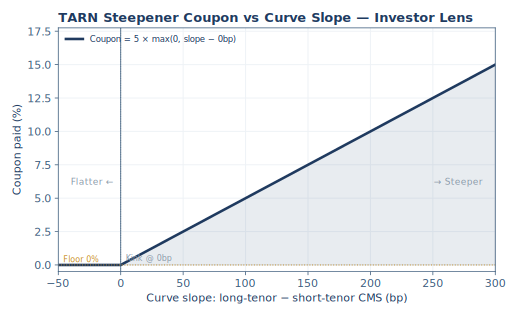

#### §8. THE BANK LENS — Desk Economics (1st Line of Defence)

**What the desk books**

The trade is booked in Murex with four legs, and the desk takes the offsetting side of the investor's position:

- **Note leg** — the client-facing TARN coupon: $40M, 5 × max(0, CMS30Y − CMS2Y), target 15% ($6M), max 10yr.
- **Issuer leg** — bank funding.
- **Deposit leg** — client collateral: $40M cash.
- **Hedge leg** — the rates desk's offsetting positions: a CMS30Y receiver + CMS2Y payer (5× scaled) — i.e. the desk is **short the CMS spread** — with a path-dependent digital corridor overlay against the target mechanism.

Where the investor is long the slope and short the auto-call, the desk is **short the curve slope (short the CMS spread) and long the TARN auto-call** — it holds the optionality that automatically redeems the note once cumulative coupons reach the target. The desk hedges the slope exposure and the path/timing exposure rather than holding the raw curve risk.

**Curve/path risk & hedging**

The rates desk hedges the slope coupon with CMS swaps scaled 5× and the target mechanism with a path-dependent digital corridor overlay. The residual risks are the path dependency and the timing of target achievement: the auto-redemption cannot be perfectly hedged because the redemption date depends on the entire distribution of CMS spread paths, not the expected path. The desk monitors CMS spread delta and path-dependent gamma across the TARN book; as trades approach their targets, the gamma on the redemption trigger sharpens, since a small move in the CMS spread can flip a trade between "not yet redeemed" and "redeemed this quarter." A cluster of trades approaching their targets simultaneously in a steep-curve environment is the desk's main concentration concern — if many trades trigger redemption in the same quarter, the CMS swap unwinds hit the market at once, a concentrated event that can move CMS rates and disrupt the hedging of the remaining TARN trades. The bank prefers structuring over holding the risk: the slope exposure is hedged immediately, leaving the structuring spread as retained profit.

**How the bank makes money**

| Area | Detail |
|------|--------|
| **Client economics** | The investor receives 5 × max(0, CMS30Y − CMS2Y), no per-period cap. Once cumulative coupons reach 15% of notional ($6M), the note redeems. Max maturity 10 years |
| **Bank economics** | Structuring spread: 15-25bp. Monte Carlo pricing creates wider margins due to model complexity |
| **Hedging economics** | CMS swaps (5× scaled). The path-dependent target mechanism cannot be perfectly hedged — residual risk on the timing of target achievement. Banks often hedge with a combination of CMS swaps and digital corridor options |
| **Distribution economics** | Sales credit 5-10bp. TARN products command premium sales credit due to complexity |

Demand rises when investors hold a defined-return objective, when the curve is expected to steepen moderately (too fast triggers early termination and reinvestment), and when the leverage-plus-target combination prices attractively against the structuring margin.

**Coupon decomposition**

The investor's leveraged slope coupon decomposes into the value of the underlying CMS-spread exposure the desk warehouses, less the value of the auto-redemption optionality the investor grants, plus the bank's retained structuring spread and sales credit:

```
CMS-spread (slope) exposure value:        ~17.5%   (gross leveraged steepener value)
− Auto-redemption optionality (granted):  ~(2.5%)  (target cap / truncation the investor sells)
─────────────────────────────────────────────────
= Investor target return:                  15.00%  ($6,000,000 on $40M)

Within the bank's margin:
+ Structuring spread:                       15-25bp
+ Sales credit (distribution):              5-10bp
```

(The source quotes the 15% target, the 15-25bp structuring spread, and the 5-10bp sales credit verbatim. The split of the gross leveraged-steepener value into the slope-exposure component versus the auto-redemption optionality the investor grants is **inferred** to net to the stated 15% target — the source does not decompose the 15% into these two components, so the ~17.5% / ~2.5% figures are illustrative of the direction, not stated verbatim.)

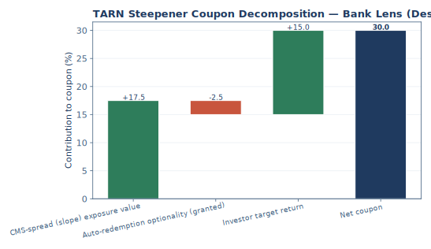

**P&L drivers**

Day to day, desk P&L is driven by: moves in the curve slope against the warehoused CMS spread delta on the hedge swaps; path-dependent gamma as trades approach their targets and the redemption trigger sharpens (the dominant driver — the timing of target achievement is a nonlinear event that the deterministic hedge cannot fully neutralize); the realized accumulation path versus the modelled one as the CMS spread moves; CMS30Y-CMS2Y correlation assumptions feeding the Monte Carlo valuation; and the structuring spread and bid-offer captured at inception. A cluster of TARN trades approaching their targets simultaneously in a wide-spread environment is the desk's main concentration concern — simultaneous redemptions create a cliff in the desk's CMS swap exposure that is difficult to manage smoothly.

#### §9. THE BANK LENS — Controls & Reconciliation (2nd Line of Defence)

**Booking & systems**

| Field | Value |
|-------|-------|
| **Booking system** | Murex |
| **Pricing system** | Murex (Monte Carlo with CMS convexity and target logic) |
| **Four-Leg** | Yes |
| **Note leg** | TARN CMS coupon: $40M, 5 × max(0, CMS30Y − CMS2Y), target 15% ($6M), max 10yr |
| **Issuer leg** | Bank funding |
| **Deposit leg** | Client collateral: $40M cash |
| **Hedge leg** | CMS30Y receiver + CMS2Y payer (5× scaled), with path-dependent digital corridor overlay |
| **Target** | 15.00% of notional = $6,000,000 cumulative |
| **Max maturity** | 10 years |
| **Day count** | 30/360 |

All four legs are booked in Murex as a single structured note. The 2nd line's first concern is that the four legs are booked net and consistent — matching notionals and dates — and that the Hedge leg genuinely offsets the client-facing Note leg.

**Reconciliation points**

| Recon point | What must agree | TARN-STEG-specific break |
|-------------|-----------------|--------------------------|
| **Four-leg net (Note vs Issuer vs Deposit vs Hedge)** | All four legs booked with matching notional, dates, and conventions; legs net to the intended structured position | Legs booked asynchronously with a notional error — e.g. Deposit leg shows a different notional than the Note leg |
| **CMS fixings & source (CMS30Y and CMS2Y)** | Both CMS30Y and CMS2Y fixings use the correct source and date convention from the termsheet; the spread is computed from the matching pair | Wrong fixing source/date on either CMS leg misstates the spread and the quarterly coupon |
| **Cumulative-coupon vs target tracking** | The accumulation counter sums each quarter's coupon correctly and is compared against the 15% ($6M) target each period | Counter not linked to coupon payments — shows 0% after positive coupons, or fails to flag that the target has been reached |
| **Auto-redemption trigger capture** | When cumulative ≥ target, early redemption is triggered and the final coupon truncated to exactly reach $6M | Cumulative counter exceeds 15.00% (truncation failed), or the note keeps paying coupons after the target was reached (trigger not fired) |
| **Leverage / floor** | The 5× leverage and the max(0, ·) floor are applied correctly so no negative coupon accrues and the multiplier matches the termsheet | Wrong leverage multiplier or floor not applied — coupon over/understated, or a negative spread produces a negative coupon |
| **Day-count** | 30/360 applied correctly to each coupon | Day-count fraction error — quarterly coupon differs from the expected amount |
| **Collateral / four-leg settlement** | On the redemption date all four legs settle simultaneously; deposit released and CMS hedge unwound when the Note leg terminates | Hedge leg remains active after early redemption, or Note leg terminated but Deposit leg not released, trapping client cash |

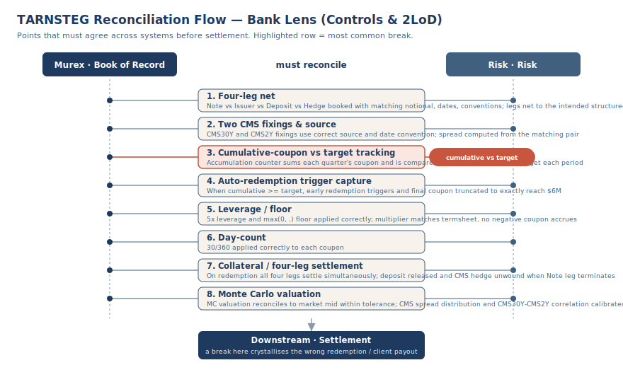

**Common breaks & red flags**

| Red Flag | What It Means | Action |
|----------|--------------|--------|
| Cumulative counter exceeds 15.00% | Truncation logic failed — the final coupon was not properly capped | Calculate the correct truncated coupon and adjust the final payment |
| Note continues to pay coupons after the target was reached | System did not trigger early redemption | Verify the target trigger logic and process manual redemption |
| Hedge leg remains active after early redemption | Four-leg settlement not coordinated | Unwind the CMS swap positions and close all legs |
| Monte Carlo valuation differs from market mid by > 5% | Model calibration issue — CMS spread distribution assumptions may be stale | Recalibrate the Monte Carlo with current CMS volatility and correlation |
| Target counter shows 0% after 8 quarters of positive coupons | Counter not linked to coupon payments | Manually reconstruct the counter from payment history |

**Control implication**

For a TARN Steepener the dominant 2nd-line controls are the **cumulative-coupon vs target tracking** and the **auto-redemption trigger capture**. The accumulation counter must sum each quarter's coupon correctly and be compared against the 15% ($6M) target every period — a counter that is not linked to coupon payments (showing 0% after positive coupons, or failing to flag the target) breaks the entire redemption logic and can let the note pay beyond what is owed. When the cumulative total reaches the target, the early redemption must fire and the final coupon must be truncated to exactly $6M — a failure here either overshoots the target (truncation failed) or keeps the note alive after it should have redeemed. Around these, the four-leg net, the two CMS fixings & source, the leverage/floor, the day-count, and the collateral/four-leg settlement checks ensure each quarterly coupon is correct and that, on redemption, all four legs settle together and the CMS hedge is unwound. The reconciliation exists precisely to catch these inconsistencies before a coupon settles or a redemption date passes.

#### §10. Formal Definition

A **TARN Steepener** is a structured rate product whose coupon is a leveraged function of the CMS spread, with an automatic early redemption feature triggered when cumulative coupons reach a predetermined target. The coupon formula per period is: Coupon = Leverage × max(0, CMS_Long − CMS_Short). Cumulative coupons are tracked quarter by quarter. When the cumulative total reaches the target percentage of notional, the note pays a truncated final coupon (exactly reaching the target) and redeems at par. If the target is not reached by the maximum maturity, the note redeems at par with whatever cumulative coupons were earned. The product is path-dependent: the order and magnitude of quarterly coupons determine the redemption date. Economically the investor is long the curve slope and short the auto-redemption optionality (the bank's desk is short the slope and long the auto-call). Pricing requires Monte Carlo simulation. The product is booked in Murex with four legs: Note (TARN coupon), Issuer (funding), Deposit (collateral), and Hedge (CMS swaps + path-dependent overlay).

#### §11. Lifecycle

| Stage | What Happens | Who Is Involved | What Can Go Wrong |
|:-----:|-------------|----------------|-------------------|
| **Pre-trade** | Structurer prices with Monte Carlo simulation modeling the CMS spread distribution and target achievement timing. Leverage and target calibrated | Structurer, Sales, Client | Monte Carlo model underestimates spread volatility → target achievement probability mispriced |
| **Trade date** | Four legs booked in Murex. Target accumulation counter initialized at 0% | Operations, Trader | Target counter not correctly linked to coupon accumulation logic |
| **During life** | Each quarter: CMS fixing → coupon calculation → accumulation counter update. When the counter ≥ target, trigger early redemption | Product Control, Operations | Counter not updated correctly — misses the target achievement quarter |
| **Termination** | Target reached: final truncated coupon paid, principal returned, all legs closed. OR maturity: final coupon (if any), principal returned, legs unwound | Operations, Product Control | Truncated final coupon calculation error — pays over or under the target |

#### §12. Worked Example (both lenses)

**Terms:** $40M notional, 10-year max, 5 × max(0, CMS30Y − CMS2Y), target 15% ($6,000,000).

| Quarter | CMS30Y | CMS2Y | Spread | × 5 | Full Payment | Cumulative | Status |
|:-------:|:------:|:-----:|:------:|:---:|:----------:|:----------:|:------:|
| Q1 | 4.50% | 3.40% | 1.10% | 5.50% | $550,000 | $550,000 | |
| Q2 | 4.60% | 3.50% | 1.10% | 5.50% | $550,000 | $1,100,000 | |
| Q3 | 4.40% | 3.60% | 0.80% | 4.00% | $400,000 | $1,500,000 | |
| Q4 | 4.30% | 3.80% | 0.50% | 2.50% | $250,000 | $1,750,000 | |
| Q5 | 4.50% | 3.30% | 1.20% | 6.00% | $600,000 | $2,350,000 | |
| Q6 | 4.70% | 3.20% | 1.50% | 7.50% | $750,000 | $3,100,000 | |
| Q7 | 4.80% | 3.10% | 1.70% | 8.50% | $850,000 | $3,950,000 | |
| Q8 | 4.90% | 3.00% | 1.90% | 9.50% | $950,000 | $4,900,000 | |
| Q9 | 5.00% | 2.90% | 2.10% | 10.50% | $1,050,000 | $5,950,000 | |
| Q10 | 5.10% | 2.80% | 2.30% | 11.50% | *$50,000* | $6,000,000 | **TARGET** |

**Q10 truncation:** The full quarterly coupon would have been $40M × 11.50% / 4 = $1,150,000. But only $50,000 was needed to reach the $6,000,000 target. The note pays $50,000, redeems at par, and terminates.

*Investor lens:*
Total return: $6,000,000 over 10 quarters (2.5 years). Annualized: 6.00%. If the curve had been steeper (all quarters at 1.50% spread), the target is reached in ~8 quarters (2 years), annualized ~7.50%. If the curve had been flatter (all quarters at 0.50% spread), the target is reached in ~24 quarters (6 years), annualized ~2.50%. The total return ($6M) is the same in every case; only the time to achieve it — and therefore the annualized return — varies. At Q10 the investor receives only the truncated $50,000 rather than the full $1,150,000: the "lost" $1,100,000 was never owed because the target was already nearly reached.

*Bank lens:*
The desk holds the four legs and is short the CMS spread (CMS30Y receiver + CMS2Y payer, 5× scaled) and long the TARN auto-call, hedged with the CMS swaps and the path-dependent digital corridor overlay. It retains the structuring spread (15-25bp) and the sales credit (5-10bp). As the cumulative counter climbs from $5,950,000 (Q9) toward the $6M target, the path-dependent gamma sharpens, and at Q10 the redemption triggers and the desk unwinds all four legs simultaneously. The 2nd line must confirm each quarter's coupon against the 5× leverage, the max(0, ·) floor and the 30/360 day count, that the cumulative counter (e.g. $5,950,000 at Q9) was tracked correctly against the $6M target, that the Q10 truncated coupon equals exactly target minus cumulative ($6,000,000 − $5,950,000 = $50,000), and that all four legs settled together when the auto-redemption fired.

#### §13. Knowledge Check

1. What triggers the TARN Steepener's automatic early redemption? *(Investor)*
2. Why is the TARN path-dependent, and why does it require Monte Carlo simulation rather than a sum of independent caplets? *(Investor)*
3. If the final quarter's full coupon would be $1,150,000 but only $50,000 is needed to reach the target, what does the investor receive and why? *(Investor)*
4. How does the TARN's total return compare across steep, moderate, and flat curve environments, and what varies? *(Investor)*
5. The CMS spread has been zero for 12 quarters (3 years), then jumps to 2.00% and stays there. How quickly does the TARN reach its 15% target from this point, and what risk has the investor borne? *(Investor)*
6. The curve steepens fast and the target is hit in two years rather than the expected five. What risk does the early redemption create for the investor? *(Investor)*
7. **(Desk economics / 1LoD)** When the investor enters a TARN Steepener, what position does the desk take across the four legs (long or short the curve slope, long or short the auto-call), what is its dominant Greek as trades approach the target, and how does the desk hedge the slope and the path/timing exposure? Where does the desk's retained profit come from?
8. **(Controls / 2LoD)** Name three reconciliation breaks specific to a TARN Steepener — covering the cumulative-coupon vs target tracking, the auto-redemption trigger capture, and the two CMS fixings/source — and the consequence of each for the redemption logic, the truncated final coupon, or the quarterly coupon.

**Mental Models**

| Concept | Mental Model |
|---------|-------------|
| TARN | Loyalty card that redeems automatically — collect stamps (coupons) until the card is full (the target), then it redeems on its own |
| Target accumulation | Savings jar — each quarter drops in a coin (coupon); when the jar is full, it is emptied automatically |
| Truncated final coupon | Last coin in the jar — only the amount needed to fill the jar, not the whole coin |
| Path dependency | Two routes to the same summit — same destination, different speed depending on the trail (curve shape) |
| Extension risk | Traffic jam on the way to the summit — the destination is still reached, but much later than planned |
| 10-year max maturity | Toll deadline — if the summit is not reached by the deadline, the note gets off wherever it is |
| Investor long slope / short the auto-call; desk short slope / long the auto-call | The investor collects the stamps but cannot stop the card redeeming; the desk warehouses the offsetting slope and holds the auto-redemption trigger |

**Key Takeaways**

1. A TARN Steepener automatically redeems when cumulative coupons reach a predetermined target (15%) — the total return is known at inception, but the holding period is not.
2. Sovereign wealth funds and pension funds buy it for defined-return investing with automatic profit-taking; the investor is long the curve slope and short the auto-redemption optionality.
3. Extension risk and reinvestment risk are the core dangers — curve flattening delays the target and lowers the annualized return, while a fast steepening hits the target quickly and forces reinvestment in a still-favourable environment.
4. The final coupon is truncated to exactly reach the target — the investor cannot overshoot, and the target mechanism is a natural cap that allows the higher 5× leverage.
5. Pricing requires Monte Carlo simulation due to path dependency, making the TARN the most complex STEG product.
6. The desk is short the CMS spread (CMS30Y receiver + CMS2Y payer, 5× scaled) and long the TARN auto-call, hedges the slope and the path/timing exposure with CMS swaps plus a digital corridor overlay, and retains the structuring spread (15-25bp) plus sales credit (5-10bp).
7. For the 2nd line, the dominant control risks are the cumulative-coupon vs target tracking and the auto-redemption trigger capture (with the final-coupon truncation), supported by the four-leg net, two CMS fixings/source, leverage/floor, day-count, and four-leg collateral/settlement checks — each can break the redemption logic, mis-pay the truncated coupon, misstate a quarterly coupon, or trap client cash.

#### §14. Common Mistakes

**1. Assuming the annualized return is fixed at 6%.** The total return ($6M = 15%) is fixed, but the time to achieve it varies. The annualized return ranges from ~1.5% (10 years) to ~7.5% (2 years) depending on the curve path.

**2. Ignoring the truncation on the final coupon.** In the worked example, Q10 would have paid $1,150,000 but the investor received only $50,000. The "lost" $1,100,000 is not a loss — it was never owed because the target was already nearly reached.

**3. Comparing the TARN's 5× leverage to other STEGs' leverage.** The TARN has no per-period cap (unlike the Vanilla and Callable STEGs). The target mechanism acts as a natural cap on total return, so a higher leverage can be offered without unlimited bank liability.

**4. Not understanding that zero-coupon quarters extend the holding period.** If the curve flattens for 8 quarters, the target counter stays frozen. Those two years of zero income are "wasted" — the investor receives nothing and the clock runs down toward the 10-year max.

**5. Confusing the investor's position with the bank's auto-call.** The investor is long the slope and short the auto-redemption optionality; the redemption fires automatically, not at the investor's discretion. The desk is short the slope and long the auto-call. Modeling the TARN as a series of independent caplets misses the path dependency entirely — the value of each future coupon depends on all prior coupons because they accumulate toward the target.

**6. (Controls) Forgetting that the cumulative counter must drive the redemption and the truncation.** If the counter is not linked to the coupon payments, it can show 0% after positive coupons or fail to flag that the target has been reached — so the note keeps paying beyond $6M, or the truncated final coupon is mis-calculated. The 2nd line must confirm the cumulative-coupon vs target tracking and the auto-redemption trigger capture, and that all four legs settle together on the redemption date.

**Dual-lens questions:**
- *(Desk economics / 1LoD)* What does the desk book across the four legs, what curve and path risk does it carry, and how does it hedge the slope and the timing of target achievement?
- *(Controls / 2LoD)* Which cumulative-coupon / auto-redemption / CMS-fixing fields must reconcile, and which is the most common break?

**Dual-lens visuals (generated):**
- `assets/tarnsteg/controls_tarnsteg_recon_08.svg` `[generated]`
- `assets/tarnsteg/payoff_tarnsteg_01.svg` `[generated]`
- `assets/tarnsteg/waterfall_tarnsteg_09.svg` `[generated]`
## 5.5 CREDIT-LINKED NOTES {#sec-5-5}

---

### 5.5.1 Vanilla Credit-Linked Note (CLN) {#sec-5-5-1}

> **Prerequisites:** CDS &nbsp;|&nbsp; **Key concepts:** Funded credit, note wrapper, dual credit exposure

---

*A Vanilla Credit-Linked Note is a single-name funded credit derivative. The investor lends principal to an issuer and, through the same note, sells credit protection on one reference entity — an embedded single-name CDS. In exchange the investor receives an enhanced coupon: the reference entity's CDS spread on top of the bond yield. If that one name suffers a credit event, the investor's principal is reduced to its recovery value. This chapter reads the product through two lenses: what it means for **the investor**, and what it means for **the bank** — the latter split into the desk's market economics (1st line of defence) and the controls and reconciliation that surround it (2nd line of defence).*

#### §1. Explain Like I'm New

Consider a wealthy individual with $1 million to invest. A counterparty offers a proposition: pay the investor 5% per year — well above a bank deposit — on the single condition that, if Company X goes bankrupt, the investor absorbs the loss.

Company X is a large, established corporation. Bankruptcy seems unlikely. The investor reasons that 5% per year is being paid for a risk that will almost certainly never occur — apparently easy income.

This is, in essence, what a **Credit-Linked Note (CLN)** does. The investor lends money to a bank (like a bond) and simultaneously sells credit protection on a single reference entity (a company or government). The investor earns the CDS spread — the insurance premium — as an enhanced coupon. But if the reference entity defaults, the investor absorbs the loss.

The CLN combines two things introduced in earlier chapters:
- A **bond** ([Section 0.3](#sec-0-3) — lending money to the issuer)
- A **Credit Default Swap** ([Section 1.9](#sec-1-9) — selling insurance on a single name)

The CLN wraps these into a single product: Bond + Short CDS = CLN.

#### §2. Real-World Analogy

A CLN is like being a bail bondsman.

When someone is arrested, they can post bail to be released pending trial. If they cannot afford bail, they go to a bail bondsman. The bondsman puts up the bail money and charges the defendant a non-refundable fee (typically 10% of the bail amount). If the defendant shows up for trial, the bondsman gets the bail money back and keeps the fee. If the defendant skips town (defaults), the bondsman loses the bail money.

In a CLN:
- The **bail money** is the investor's principal.
- The **fee** is the enhanced coupon (the CDS spread).
- The **defendant showing up** is the reference entity not defaulting.
- The **defendant skipping town** is the credit event — the investor loses part or all of the principal.

Like a bail bondsman, the CLN investor earns a regular income for taking on the risk that one named party will not meet its obligations.

#### §3. What Problem Does This Solve?

CLNs solve the **credit access** problem.

Many investors want to earn credit spreads — the premium paid for taking default risk — but cannot easily access the CDS market. The CDS market is an over-the-counter institutional market that requires ISDA documentation, collateral agreements, and significant infrastructure. Most investors (especially retail and smaller institutional investors) are excluded.

A CLN packages single-name CDS exposure into a note format that any investor can buy, just like buying a bond. The bank acts as intermediary: it enters the CDS market on its own behalf and passes the economics to the investor via the note.

| Investor Need | Why Direct CDS Doesn't Work | What the CLN Offers |
|--------------|--------------------------|-------------------|
| Earn credit spread income | CDS requires ISDA, CSA, margin calls | CLN is a note — buy it like a bond, earn the spread |
| Take a view on corporate credit | CDS minimum trade sizes are large ($5-10M) | CLN can be issued in smaller denominations |
| Express credit conviction | CDS market has bilateral counterparty risk | CLN has unilateral risk (investor risk to issuer, not bilateral) |

#### §4. Product DNA

| Field | Value |
|-------|-------|
| **Full Name** | Vanilla Credit-Linked Note |
| **Abbreviation** | CLN |
| **Family** | Credit-Linked Notes |
| **Complexity Score** | 4 / 10 |
| **Complexity Rationale** | Funded credit derivative — combines note with embedded single-name CDS. Investor sells credit protection through note purchase |
| **Underlying Asset Class** | Credit |
| **Capital Protection** | Conditional (principal at risk on credit event) |
| **Coupon Type** | Fixed coupon (includes CDS spread) |
| **Maturity** | 3-5 years |
| **Liquidity** | Secondary market (limited) |
| **Primary System** | Murex |
| **ISDA Required** | No — issued as note |

**DNA Atlas Fields:**
- Primary Risk: Credit event of the single reference entity causes principal loss. Dual credit exposure: reference entity AND issuer. Recovery rate uncertainty
- Typical Buyer: Yield-seeking investors wanting single-name credit spread exposure in funded format
- Typical Use Case: Access to CDS-like exposure without ISDA agreement. Funded format suits investors who cannot enter OTC derivatives
- Building Blocks: Fixed-rate note + embedded single-name CDS (investor is protection seller)
- Key Hedge: Single-name CDS on the reference entity, credit index hedge
- Similar Products: CDS (5.2.5 — unfunded version), Skew CLN (5.5.2 — recovery skew), FTD (5.5.3 — basket credit)
- Most Important Greek: Credit spread delta (Credit Spread Sensitivity (CS01))

**Comparison Matrix Fields:**
- Complexity: 4
- Yield Potential: Credit spread above risk-free (typically 100-300bps)
- Capital Protection: Conditional (credit event → principal loss)
- Credit Exposure: Reference entity + Issuer (dual credit)
- Liquidity: Secondary market (limited)
- Path Dependency: No (credit event is binary)
- Volatility Sensitivity: Low
- Correlation Sensitivity: None (single reference entity)
- Client Type: Institutional credit investors
- Market Environment: Best when the credit spread adequately compensates for default risk

#### §5. Who Touches This Product

| Role | Responsibility |
|------|---------------|
| **Structurer** | Designs Vanilla Credit-Linked Note terms: reference entity, coupon, maturity. Optimises structure for client and bank |
| **Trader** | Hedges the embedded single-name CDS. Manages credit spread sensitivity (CS01). Prices secondary market |
| **Sales** | Distributes the Vanilla Credit-Linked Note to target clients. Explains payoff scenarios and risk-return profile |
| **Risk Management** | Monitors single-name credit exposure, concentration risk, and wrong-way risk. Sets trading limits |
| **Product Control** | Daily P&L attribution between note accrual and CDS MTM. Independent price verification of the CDS curve |
| **Operations** | Processes coupon payments and maturity settlement. Handles credit-event settlement if applicable |
| **Legal / Compliance** | Reviews term sheet for regulatory compliance. Ensures suitability for the target investor base |
| **Quantitative Analytics** | Prices the embedded CDS. Calibrates the credit curve. Provides model validation |

#### §6. Product Evolution

| Stage | Product | What Was Added | Why |
|:-----:|---------|---------------|-----|
| 1 | Plain vanilla bond | — (baseline) | Fixed coupon, full principal return |
| 2 | Equity-linked note | Equity participation or option embedded | Market return exposure with note wrapper |
| 3 | Vanilla Credit-Linked Note | Embedded single-name CDS added | Funded credit derivative — combines note with embedded CDS. Investor sells single-name credit protection through note purchase |

---

#### §7. THE INVESTOR LENS

**Why the investor buys it**

1. **Enhanced yield.** CLN coupons include the CDS spread, which adds 1-5% above bond yields depending on the reference entity's creditworthiness.
2. **Credit exposure without CDS infrastructure.** The investor accesses credit markets through a familiar bond-like instrument, with no ISDA or CSA to negotiate.
3. **View expression.** An investor who believes one company will not default can monetize that view by earning the CDS spread.
4. **Diversification.** Credit risk is a different risk factor from equity or interest rate risk. CLNs add diversification to a portfolio.
5. **Defined exposure.** The investor knows exactly which single company's default risk is being taken — unlike a bond fund where credit risk is spread across many names.

**Position taken**

The investor simultaneously holds a long bond (lends principal to the issuer) and a **short** single-name CDS (sells credit protection on the reference entity to the bank). Net, the investor is **short credit on one name** — the investor has sold protection and is hurt if that reference entity's creditworthiness deteriorates or it defaults. Because there is a single reference entity, the position carries no correlation exposure; the investor's exposure is to one name's default and recovery.

**Payoff & scenarios**

The CLN payoff is **binary at the credit-event level:** either the reference entity defaults (large loss) or it does not (full return). There is no in-between — unlike equity-linked products where the loss is proportional to a price decline. The **mark-to-market** value, however, fluctuates continuously with the reference entity's CDS spread: wider spreads reduce the CLN's value even without an actual default.

**Product:** 3-year CLN on Reference Entity "Acme Corp". **Notional:** $500,000. **Coupon:** 5.5% per year (= risk-free rate 2.5% + CDS spread 3.0%). **Recovery rate assumption:** 40%.

- **Scenario 1 — No credit event (most likely):** Acme Corp does not default. The investor receives 3 years of coupons ($27,500 per year = $82,500 total) and full principal at maturity ($500,000). **Total: $582,500.** The investor earned 5.5% per year with no loss.
- **Scenario 2 — Credit event in Year 2 (Acme Corp defaults):** Recovery rate is 40%, meaning bondholders recover $0.40 per dollar. The CLN settles: the investor receives $500,000 × 40% = **$200,000** (recovery amount), plus coupons already received (2 × $27,500 = $55,000). **Total received: $255,000.** Net loss: **$245,000** (-49%). The 5.5% coupon earned over two years ($55,000) is a small fraction of the $300,000 capital loss — the CDS spread is not "free money" but compensation for a real risk of significant loss.
- **Scenario 3 — Credit event with low recovery (20%):** Acme Corp defaults with only 20% recovery. The investor receives $500,000 × 20% = $100,000 + coupons. **Much larger loss.**
- **Scenario 4 — Near-miss (credit spreads widen but no default):** Acme Corp faces financial difficulty and its CDS spread widens from 300bp to 800bp, but it does not default. The CLN's mark-to-market value drops significantly (the market is pricing in a higher probability of default). Held to maturity with no default, the investor still receives full principal + coupons. But selling before maturity realizes a loss.

**Risks to the investor**

| Risk | Description | Severity |
|------|------------|:--------:|
| **Reference entity default** | If the reference entity defaults, the investor loses (1 − Recovery Rate) × Principal. This can be 50-80% of the investment. | High |
| **Recovery rate uncertainty** | The actual recovery rate is unknown until after default. The assumed recovery in pricing may differ from realized recovery. | Medium |
| **Dual (double) credit exposure** | The investor is exposed to BOTH the reference entity AND the issuing bank. If either defaults, the investor suffers — the investor is simultaneously insuring the reference entity and lending to the issuer. | Medium |
| **Spread widening (MTM risk)** | If the reference entity's creditworthiness deteriorates, the CLN loses mark-to-market value even without a default. | Medium |
| **Illiquidity** | CLNs are less liquid than bonds. Selling before maturity may involve a significant bid-offer spread. | Medium |
| **Wrong-way risk** | If the issuer and reference entity are correlated (e.g., both are banks in the same country), a credit crisis could trigger both defaults simultaneously, compounding the double credit exposure. | High |

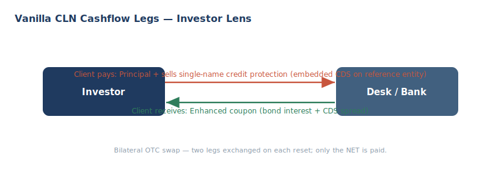

#### §8. THE BANK LENS — Desk Economics (1st Line of Defence)

**What the desk books**

The desk's position is the mirror image of the investor's. Where the investor is short the single-name CDS, the desk is **long** credit protection on the reference entity (bought from the investor via the note); alongside it the desk has issued a note, which is a funding liability. The investor's enhanced coupon is, to the desk, the cost of the CDS spread plus funding, returned to the client.

**Credit risk & hedging**

The desk is long single-name CDS protection on the reference entity and hedges by **selling CDS on that same name in the interbank market**, offsetting the protection it bought from the investor. The residual exposure the desk manages is credit spread sensitivity (CS01) and the CDS basis — the difference between the CLN-implied spread and the market CDS spread. Because the reference entity is a single name, the desk runs no correlation book on this trade; the risk it warehouses and lays off is the one name's spread and default risk.

**How the bank makes money**

| Revenue Component | Detail |
|------------------|--------|
| **Structuring fee** | Embedded in the note price at issuance (typically 1-3%) |
| **Bid-offer spread** | Spread between the CDS rate embedded in the note and the market CDS rate |
| **Hedging P&L** | Captured on laying off the single-name CDS and managing the basis |
| **Funding advantage** | Issues the note at a sub-market effective funding rate |

**The coupon decomposition (from [Section 2.2](#sec-2-2)):**

Coupon = Bond interest (risk-free + issuer spread) + CDS spread − Bank margin

For a 5.5% coupon: risk-free rate ~2.5%; CDS spread on Acme Corp ~3.0%; **net coupon 5.5%** (the desk's margin sits in the spread the note pays versus the spread the desk lays off). The CDS spread is the key component — it is the premium the investor earns for selling single-name protection, and the margin between the spread embedded in the note and the spread the desk pays to lay off the risk is where the desk's structuring P&L sits.

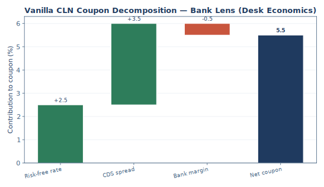

**P&L drivers**

Day to day, desk P&L is driven by moves in the reference entity's CDS spread (CS01), the CDS basis between the note-implied and market spread, funding, and the mark-to-market of the embedded single-name CDS. Product Control attributes P&L between fixed-coupon accrual and CDS MTM, and performs Independent Price Verification (IPV) of the CDS curve.

#### §9. THE BANK LENS — Controls & Reconciliation (2nd Line of Defence)

**Booking & systems**

| Aspect | Detail |
|--------|--------|
| **Book of record** | NEMO |
| **Pricing/Risk system** | Sophis |
| **Booking structure** | Single note with embedded single-name CDS |
| **Four-leg framework?** | No |
| **Key booking fields** | Notional, reference entity (RED code), coupon rate, maturity, credit event definitions, recovery rate assumption, ISDA version |
| **Coupon schedule** | Regular fixed payments (quarterly or semi-annually) |
| **Credit event monitoring** | Ongoing — requires monitoring of ISDA credit event determinations on the reference entity |

**Reconciliation points**

| Recon point | What must agree | CLN-specific break |
|-------------|-----------------|--------------------|
| **ISDA credit definitions** | The ISDA version and credit-event definitions (bankruptcy, failure to pay, restructuring) match the termsheet across systems | NEMO and Sophis reference different ISDA versions → a disputed "restructuring" event treated inconsistently |
| **Reference entity (RED code)** | NEMO and Sophis reference the exact same legal entity via the RED code (Reference Entity Database identifier) | Systems reference different legal entities (parent vs subsidiary) → protection bought on the wrong name |
| **Recovery rate assumption** | The recovery rate used for pricing matches across systems and the entity's seniority | Sophis uses 40%, NEMO uses 35% → valuation and settlement diverge |
| **Credit-event / auction recovery** | A determined credit event is captured and the auction-set recovery is applied; coupons cease | ISDA determined a credit event but the system has not processed settlement → stale valuation, coupons still paid |
| **CDS curve / spread** | The internal CDS curve used for pricing matches market quotes | Stale internal curve → incorrect valuation and CS01 |
| **Coupon lifecycle** | Coupon schedule, day-count, and cessation on a credit event | Coupon paid on a date after the credit event → overpayment |
| **Double credit exposure** | Both legs of the exposure (reference entity AND issuer) are captured and limits monitored | Only reference-entity exposure booked → issuer leg and wrong-way risk understated |
| **Settlement** | Cash vs physical; recovery amount = notional × recovery rate; delivery-versus-payment; T+2 | Wrong recovery applied, or settlement booked against the wrong leg |

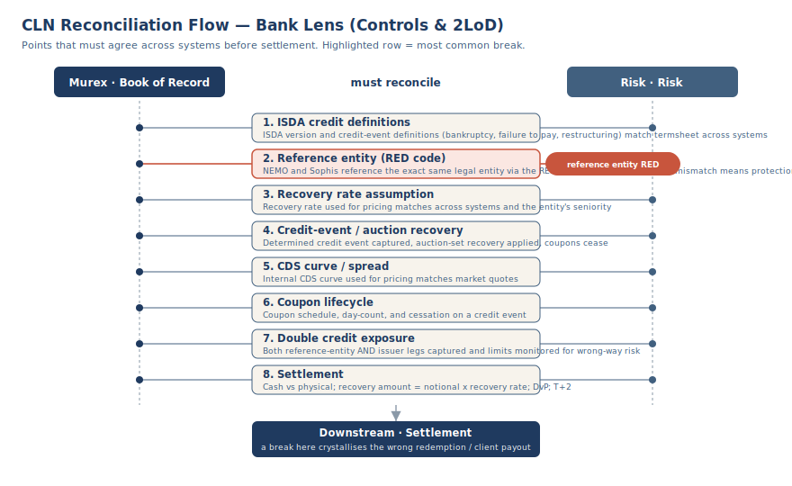

**Common breaks & red flags**

| Red Flag | What It Means | 2LoD Action |
|----------|---------------|-------------|
| Reference entity mismatch | NEMO and Sophis reference different legal entities (e.g., parent vs subsidiary) | Verify the RED code (Reference Entity Database — a standardized identifier ensuring both systems reference the exact same legal entity) matches in both systems |
| Recovery rate assumption differs | Sophis uses 40% for pricing, NEMO uses 35% | Align to the market-standard recovery rate for the entity's seniority |
| Credit event triggered but note not settled | ISDA determined a credit event, but the system has not processed the settlement | Investigate — may be a timing issue or a failure to monitor ISDA determinations |
| CDS spread used for pricing differs from market | Internal CDS curve differs from market quotes | Recalibrate the CDS curve; stale curves lead to incorrect valuations |
| Coupon paid after credit event | System paid a coupon on a date after the credit event | Reverse the payment; investigate why the credit event flag was not set |
| Issuer leg of exposure not captured | Only the reference entity is monitored, ignoring issuer credit risk | Confirm the double credit exposure (reference entity + issuer) is booked and limited |

**Control implication**

The dominant 2nd-line controls for a CLN are **reference-entity identification** and the **double credit exposure**. A RED-code mismatch means the bank has bought protection on the wrong legal entity — the investor's redemption on a credit event would be calculated against a name the trade does not actually reference. The double credit exposure means the 2nd line must confirm that BOTH the reference-entity leg and the issuer leg are captured, limited, and monitored for wrong-way correlation; capturing only one understates the investor's true risk and the desk's concentration. A credit-event/auction-recovery break drives both valuation and settlement at once. The reconciliation exists to catch these inconsistencies before settlement crystallises them.

#### §10. Formal Definition

A **Credit-Linked Note (CLN)** is a structured product in which the investor lends money to the issuer and simultaneously sells credit protection on a single reference entity. At maturity:

- **If no credit event occurs:** Redemption = 100% of Principal. Coupons are paid throughout.
- **If a credit event occurs:** Redemption = Principal × Recovery Rate. Remaining coupons are cancelled.

**Key terms:**
- **Reference entity:** The single company or government whose default risk the investor bears.
- **Credit event:** A formally defined occurrence (bankruptcy, failure to pay, restructuring) that triggers settlement.
- **Recovery rate:** The fraction of the principal recovered after default (typically 30-60% for senior debt).
- **CDS spread:** The annual premium for credit protection, in basis points. This funds the enhanced coupon.
- **ISDA definitions:** Credit events are defined under ISDA standards ([Section 1.9](#sec-1-9)).

#### §11. Lifecycle

| Stage | Detail |
|-------|--------|
| **Trade date** | Terms agreed: reference entity (RED code), coupon, maturity, credit event definitions, recovery assumption. Book in NEMO; pricing finalised |
| **Issue date** | Note issued. Investor pays par (or discount). The bank establishes the single-name CDS hedge |
| **Coupon dates** | Regular fixed coupon payments. Ongoing credit event monitoring |
| **Credit event monitoring** | Watch for ISDA Determinations Committee rulings on the reference entity. Sources: ISDA Determinations Committee announcements, market news |
| **If credit event occurs** | Cease coupon payments. Determine recovery rate via the ISDA auction process. Settlement: investor receives notional × recovery rate. Remaining coupons cancelled |
| **Maturity (if no credit event)** | Return 100% of principal. Final settlement T+2 |

#### §12. Worked Example (both lenses)

**Product:** 5-year CLN on "BankCorp" (a large commercial bank). **Notional:** $2,000,000. **Coupon:** 4.8% per year (risk-free 2.0% + CDS spread 3.2% − margin 0.4%). **Payment frequency:** Semi-annual. **Recovery rate assumption:** 45%.

*Investor lens:*

- **No credit event — full term:**
  - Semi-annual coupon: $2,000,000 × 4.8% / 2 = $48,000 per period
  - Total coupons over 5 years: 10 × $48,000 = $480,000
  - Principal at maturity: $2,000,000
  - **Total return: $2,480,000 (+24% over 5 years, 4.8% annualized)**
- **Credit event in Year 3 (BankCorp defaults, 45% recovery):**
  - Coupons received (6 semi-annual periods): 6 × $48,000 = $288,000
  - Recovery on principal: $2,000,000 × 45% = $900,000
  - **Total received: $1,188,000.** Net loss: **$812,000** (−40.6%).
  - The 3 years of 4.8% coupon ($288,000) covered less than a third of the capital loss ($1,100,000).

*Bank lens:*

- In the no-credit-event case the desk's long protection expires worthless against the investor's sold protection; the desk keeps its structuring margin and the net of its hedge, having funded the $480,000 of coupons. Product Control confirms the CDS MTM rolls to zero and the coupon accrual closes out.
- On the Year-3 credit event the desk's long single-name protection pays out: the investor absorbs the (1 − 45%) shortfall, delivering value that offsets the desk's redemption obligation, while the desk's interbank CDS hedge is settled through the same ISDA auction recovery of 45%. The 2nd line must confirm the recovery applied (45%, auction-set), the settlement amount (notional × recovery = $900,000), and that NEMO and Sophis agree on the reference entity (RED code) before settlement.

#### §13. Knowledge Check

1. **What is a CLN? Explain it in terms of its two components.** (Answer: a bond plus a short single-name CDS — lending principal and selling credit protection on one reference entity.)
2. **Where does the enhanced coupon on a CLN come from?**
3. **What is "dual (double) credit exposure" in a CLN, and why does it matter?**
4. **A CLN on Company X has a coupon of 6%. The risk-free rate is 2.5%. What does the 3.5% excess coupon represent?**
5. **What is wrong-way risk, and give an example involving a CLN.**
6. **The CDS spread on the reference entity widens from 200bp to 500bp with no default. What happens to the CLN's mark-to-market value?**
7. **Compare the risk profile of a CLN to a corporate bond issued by the reference entity. What is similar? What is different?**
8. **(Desk economics / 1LoD)** What position does the desk hold against the investor, and how does it lay that risk off? Where does the desk's margin on the CDS spread come from?
9. **(Controls / 2LoD)** Name three reconciliation breaks specific to a CLN — including the reference-entity RED code and the double credit exposure — and the consequence of each for the investor's redemption.

**Mental Models**

| Concept | Mental Model |
|---------|-------------|
| CLN | Bail bondsman — earn a fee for posting bail; lose the bail money if the defendant skips town |
| CDS spread as coupon | The insurance premium the investor earns for taking single-name default risk |
| Credit event | The defendant skipping town — a formally defined trigger event |
| Recovery rate | What is recovered from the wreckage — typically 30-60 cents on the dollar, set by the ISDA auction |
| Dual credit exposure | Two padlocks on the same chain — if either one (reference entity or issuer) breaks, the investor loses |
| Spread widening without default | The defendant starts acting suspiciously — the market gets nervous, the position loses value, but the bail has not been forfeited yet |
| 2LoD reconciliation | The clerk confirming the bail bond names the right defendant — verifies the RED code and both credit legs before anyone pays out |

**Key Takeaways**

1. A CLN = Bond + Short single-name CDS. The investor earns the CDS spread as an enhanced coupon.
2. If no credit event occurs, the investor receives full coupons and principal — a bond-like return.
3. If a credit event occurs, the investor loses (1 − Recovery Rate) × Principal. Losses are typically 50-70% of the investment.
4. The investor faces dual (double) credit exposure: reference entity default risk AND issuer credit risk.
5. CLNs provide access to single-name credit markets without requiring CDS infrastructure.
6. The mark-to-market value fluctuates with CDS spreads, even without a credit event.
7. The desk is long single-name protection (bought from the investor) and lays it off in the interbank CDS market; its margin is the spread between the note-embedded CDS rate and the market rate.
8. For the 2nd line, the dominant control risks are the reference-entity RED code and the double credit exposure — a mismatch on either misstates the investor's redemption or understates true risk.

#### §14. Common Mistakes

1. **Treating the coupon as free income.** The enhanced coupon is the CDS spread — compensation for bearing the risk that the reference entity defaults. It is insurance premium, not a gift.
2. **Ignoring issuer credit risk.** The investor is exposed to two credit risks: the reference entity AND the issuing bank. If the issuer defaults, the investor loses regardless of the reference entity's health.
3. **Underestimating tail risk.** Defaults are rare but devastating. Earning 5% per year for 4 years ($200,000 on $1M) and then losing 60% of principal ($600,000) in year 5 produces a net loss of $400,000.
4. **Ignoring recovery rate uncertainty.** CLNs are priced assuming a recovery rate (e.g., 40%). Actual recovery rates vary widely — Lehman Brothers' senior debt recovered only ~28 cents on the dollar.
5. **Assuming credit events are obvious.** "Restructuring" credit events can be ambiguous and disputed. The ISDA Determinations Committee process can take weeks, during which the CLN's fate is uncertain.
6. **(Controls) Trusting a single system's reference-entity field.** Because a CLN names one legal entity, the 2nd line must reconcile the RED code across NEMO and Sophis rather than assume they agree — a parent/subsidiary mismatch means protection was bought on the wrong name.
### Knowledge Check

**Review Questions:**
1. What two financial instruments make up a CLN?
2. What is the "dual credit exposure" in a CLN?
3. What is a credit event? Name the three main types under ISDA.
4. What happens to the investor's principal if the reference entity defaults with a 40% recovery rate?
5. Why are CLNs booked in NEMO/Sophis rather than Murex?


**Dual-lens questions:**
- *(Desk economics / 1LoD)* What does the desk book against the investor (raw single-name credit / CDS position), and how is it hedged?
- *(Controls / 2LoD)* Which credit-event / reference-entity (RED code) / recovery-rate fields must reconcile, and which is the most common break?
**Scenario Questions:**
1. An investor holds a CLN on a bank that is in the same country as the issuing bank. Why might a risk manager flag this as a concern?
2. The CDS spread on the reference entity narrows from 300bp to 100bp after purchase. No credit event occurred. How does this affect the CLN's mark-to-market value? Would the investor benefit from selling early?
3. Two CLNs offer the same 5% coupon. CLN A references an investment-grade company. CLN B references a high-yield (lower credit rating, higher default risk) company. Which has a higher risk-free rate component, and which has a higher CDS spread component?

**Desk Question:**
A credit event occurs on a reference entity. The ISDA Determinations Committee determines that a "Failure to Pay" event has occurred. The recovery rate auction sets recovery at 35%. Walk through the settlement process from the perspective of Operations, including what payments stop, what calculations are performed, and what the investor ultimately receives.

### Visual Learning Recommendations

1. **CLN structure diagram** — Investor → Issuer → CDS market, showing principal, coupon, and protection flows
2. **Credit event settlement flowchart** — Credit event triggered → ISDA determination → Recovery auction → Settlement
3. **Payoff comparison** — CLN vs corporate bond: similar upside (coupons), similar downside (default loss), but CLN has dual credit exposure
4. **CDS spread timeline** — Showing how spread changes affect MTM value without triggering a credit event
5. **Risk waterfall** — Illustrating the dual credit exposure: reference entity risk + issuer risk

### Dependency References

| Concept Used | Where It Was Taught |
|-------------|-------------------|
| Debt, bonds, coupon, principal | Sections 0.3 (Debt vs Equity), 0.5 (Interest) |
| Credit risk, credit spread, recovery rate | [Section 1.9](#sec-1-9) (Credit Risk) |
| CDS, credit events, ISDA | [Section 1.9](#sec-1-9) (Credit Risk) |
| Product decomposition, Funds Transfer Pricing (FTP), margin | [Section 2.2](#sec-2-2) (Product Construction) |
| NEMO/Sophis booking | [Section 2.8](#sec-2-8) (Systems Primer) |
| CLN family tree, positioning | [Section 3.7](#sec-3-7) (CLN Family Tree) |

---


#### Visual Specifications

**Visual 1: Vanilla Credit-Linked Note Payoff at Maturity**
- **Asset filename:** payoff_cln_maturity_01.svg
- **Caption:** "Vanilla Credit-Linked Note Payoff at Maturity"
- **Diagram elements:** X-axis: underlying price. Y-axis: investor total return. Key levels marked (strike, barrier if applicable). Compare with unstructured alternative
- **Reuse status:** Adapt from payoff template
**Visual 2: Vanilla Credit-Linked Note Product Construction**
- **Asset filename:** construction_cln_components_02.svg
- **Caption:** "Vanilla Credit-Linked Note Product Construction"
- **Diagram elements:** Component decomposition: each building block in separate box. Arrows showing how they combine to create the product. Cost allocation visible
- **Reuse status:** Adapt from construction template
**Visual 3: Vanilla Credit-Linked Note Lifecycle Timeline**
- **Asset filename:** lifecycle_cln_timeline_03.svg
- **Caption:** "Vanilla Credit-Linked Note Lifecycle Timeline"
- **Diagram elements:** Horizontal timeline from issue to maturity. Key events: issue, coupon dates, observation dates, maturity. Underlying price path overlay
- **Reuse status:** Adapt from lifecycle template
**Visual 4: Vanilla Credit-Linked Note Risk Heatmap**
- **Asset filename:** risk_cln_heatmap_04.svg
- **Caption:** "Vanilla Credit-Linked Note Risk Heatmap"
- **Diagram elements:** Grid: risk types (market, credit, liquidity, operational) vs severity (low/med/high). Colour-coded cells appropriate for Vanilla Credit-Linked Note
- **Reuse status:** Adapt from risk heatmap template
**Visual 5: Vanilla Credit-Linked Note vs Alternatives**
- **Asset filename:** comparison_cln_vs_alternatives_05.svg
- **Caption:** "Vanilla Credit-Linked Note vs Alternatives"
- **Diagram elements:** Multi-column comparison showing payoff across scenarios (-30%, flat, +15%, +30%). Compare with direct investment and simpler structured product
- **Reuse status:** New — comparison panel
**Visual 6: Vanilla Credit-Linked Note Suitability Decision Tree**
- **Asset filename:** decision_cln_suitability_06.svg
- **Caption:** "Vanilla Credit-Linked Note Suitability Decision Tree"
- **Diagram elements:** Decision tree guiding investor suitability. Key questions: risk tolerance, income need, market view, time horizon
- **Reuse status:** Adapt from decision tree template


**Dual-lens visuals (generated):**
- `assets/cln/controls_cln_recon_08.svg` `[generated]`
- `assets/cln/legs_cln_01.svg` `[generated]`
- `assets/cln/waterfall_cln_09.svg` `[generated]`
#### Dependency References

| Concept Used | Where It Was Taught |
|-------------|-------------------|
| Credit risk fundamentals | [Section 1.9](#sec-1-9) (Credit Risk) |
| Product decomposition | [Section 2.2](#sec-2-2) (Product Construction) |
| CDS | 5.2.5 — unfunded version |
| Skew CLN | 5.5.2 — recovery skew |
| FTD | 5.5.3 — basket credit |
### 5.5.2 Skew Credit-Linked Note (Skew CLN) {#sec-5-5-2}

> **Prerequisites:** CLN &nbsp;|&nbsp; **Key concepts:** Recovery rate distribution, non-linear recovery payoff

---

*The Vanilla CLN ([Section 5.5.1](#sec-5-5-1)) carried a fixed recovery-rate assumption — on a credit event, the investor's loss was computed using a predetermined recovery rate. The Skew CLN reshapes that recovery leg: instead of settling at whatever the market recovery rate turns out to be, it applies a predetermined or formula-based recovery (a fixed rate, zero recovery, or a digital threshold). This introduces explicit recovery-rate exposure — the "skew" of the product is in its recovery terms, not in its default trigger. The reference is a single credit entity, so the product carries no portfolio or tranche correlation exposure. This chapter reads the product through two lenses: what it means for **the investor**, and what it means for **the bank** — the latter split into the desk's market economics (1st line of defence) and the controls and reconciliation that surround it (2nd line of defence).*

#### §1. Explain Like I'm New

A bank advisor offers a credit investor two notes on the same reference company: a standard CLN paying 5.5% per year, or a modified note paying 7.5% per year for the same maturity. The natural question is: where does the extra 2% come from?

The answer is that the extra coupon pays for a specific change to the recovery terms. In a **Skew CLN**, the investor still lends principal and still sells credit protection on a single reference entity — but the recovery the investor receives after a default is fixed by contract rather than set by the market. In the zero-recovery variant, the investor receives nothing back on a default; in a fixed-recovery variant, the investor receives a predetermined percentage; in a digital variant, the investor receives a binary amount depending on whether actual recovery crosses a threshold.

The tradeoff: in exchange for the higher coupon, the investor gives up the market recovery they would have received under a Vanilla CLN. If the reference entity never defaults, the investor keeps the enhanced coupon and full principal. If it defaults, the investor's loss is governed by the contractual recovery formula — which may be far worse than the actual market recovery would have been. The investor is paid an enhanced coupon to take a precise view on recovery, not merely on default.

#### §2. Real-World Analogy

A Skew CLN is like car insurance with a modified, contractually fixed deductible structure.

With standard car insurance, if the car is damaged, the insurer assesses the actual repair bill and pays it minus a deductible — the payout tracks reality. With a modified-deductible policy, the payout is fixed in advance regardless of the actual damage: perhaps the policyholder absorbs the first portion of any loss no matter what, or the payout is capped at a set fraction of the car's value.

In a Skew CLN: the car is the reference entity's debt; the damage is the credit event; the contractually fixed payout structure is the modified recovery mechanism; and the higher premium reflects the modified terms. Just as a modified-deductible policy changes *how much* is paid after an accident without changing *whether* cover applies, a Skew CLN changes *how much* recovery the investor receives after a credit event without changing the basic CLN structure. Because the policy covers one named car — one reference entity — there is no question of correlation between several insured assets.

#### §3. What Problem Does This Solve?

Skew CLNs solve the **recovery-uncertainty problem**.

In a Vanilla CLN, the investor's loss after a credit event depends entirely on the market-determined recovery rate. That rate is unknown in advance and can range from roughly 10% to 80% depending on the reference entity's assets, seniority, and circumstances. The investor has no control over the outcome and cannot size a worst case precisely.

A Skew CLN lets the investor (or the structurer) fix the recovery terms, expressing a view on the recovery distribution rather than accepting it.

| Investor Need | Why Vanilla CLN Falls Short | What the Skew CLN Offers |
|--------------|---------------------------|---------------------|
| Predictable worst-case loss | Recovery rate is unknown until after default | Fixed-recovery variant: the investor knows the exact loss if default occurs |
| Higher coupon for more risk | Vanilla CLN recovery is market-standard | Zero-recovery variant: the investor absorbs a 100% loss and earns the highest coupon |
| Reduced loss severity / precise view | Vanilla CLN applies full market recovery | Digital-recovery variant: the investor receives a fixed amount (e.g. 50%) regardless of actual recovery |

#### §4. Product DNA

| **Field** | **Value** |
|---|---|
| **Full Name** | Skew Credit-Linked Note |
| **Abbreviation** | Skew CLN |
| **Family** | Credit-Linked Notes |
| **Complexity Score** | 5 / 10 |
| **Complexity Rationale** | Vanilla CLN (4) + modified recovery mechanism adds one structural feature layer |
| **Underlying Asset Class** | Credit (single reference entity) |
| **Capital Protection** | Conditional (protected if no credit event) |
| **Coupon Type** | Fixed (enhanced by modified recovery terms) |
| **Maturity** | 3–5 years |
| **Liquidity** | OTC — model-dependent |
| **Primary System** | NEMO (primary), Sophis (risk) |
| **ISDA Required** | No — issued as note |

**DNA Atlas Fields:**
- Primary Risk: Credit default of the reference entity. Non-linear recovery exposure — loss depends on actual recovery rate vs assumed
- Typical Buyer: Credit investors with specific recovery-rate views
- Typical Use Case: Express a view on the recovery-rate distribution, not just default probability
- Building Blocks: CLN + digital/barrier recovery payoff
- Key Hedge: CDS + recovery-rate swaps
- Similar Products: Vanilla CLN (5.5.1 — standard recovery), FTD (5.5.3 — basket credit), CDS (5.2.5)
- Most Important Greek: Recovery delta (sensitivity to assumed recovery rate)

**Comparison Matrix Fields:**
- Complexity: 5
- Yield Potential: Moderate-High (credit spread + recovery skew premium)
- Capital Protection: Conditional (protected if no credit event)
- Credit Exposure: Reference entity + issuer
- Liquidity: OTC — model-dependent
- Path Dependency: No (credit event is binary)
- Volatility Sensitivity: Low (credit, not vol, driven)
- Correlation Sensitivity: None (single reference entity)
- Client Type: Institutional credit investors
- Market Environment: Best when the credit spread compensates for default risk

#### §5. Who Touches This Product

| Role | Responsibility |
|------|-------------|
| **Structurer** | Designs the recovery modification to match client risk appetite. Calibrates the coupon enhancement against the modified recovery terms |
| **Trader** | Hedges with CDS and recovery swaps. Manages the recovery basis risk between the structured terms and market recovery |
| **Sales** | Explains the recovery modification to clients. Must clearly articulate how the modified recovery changes the risk/return profile vs the Vanilla CLN |
| **Quant** | Models the recovery distribution and prices the modification. Recovery assumptions directly affect the premium |
| **Risk Manager** | Monitors recovery basis risk. Stress-tests under extreme recovery scenarios (very low and very high) |
| **Operations** | Processes credit-event settlement under modified terms. Must apply the correct recovery formula, not the standard market recovery |
| **Compliance** | Verifies client suitability for modified-recovery products. Ensures disclosure documents clearly explain the non-standard recovery terms |
| **Product Control** | Marks the position using the structured recovery terms. Reconciles against standard CDS recovery assumptions |

#### §6. Product Evolution

| Stage | Product | What Was Added | Why |
|:-----:|---------|---------------|-----|
| 1 | Vanilla CLN (5.5.1) | — (baseline) | Bond + short CDS = enhanced coupon. Investor receives market recovery rate after default |
| 2 | Skew CLN | Modified recovery mechanism | Investor receives a predetermined or formula-based recovery amount, expressing a view on recovery |

The Vanilla CLN established the CLN framework: bond + short CDS = enhanced coupon with credit-event risk. The Skew CLN evolved from investor demand for more precise control over recovery outcomes. Investors who want maximum yield accept zero or reduced recovery (higher coupon); investors who want a predictable worst case accept fixed recovery (slightly lower coupon, but known downside). The bank benefits because modified recovery terms can be hedged more precisely using recovery swaps.

---

#### §7. THE INVESTOR LENS

**Why the investor buys it**

1. **Enhanced yield.** The coupon is meaningfully higher than a comparable Vanilla CLN — for example 7.5% vs 5.5% on the same reference entity — because the investor accepts modified (often worse) recovery terms.
2. **Predictable worst-case loss.** A fixed-recovery variant lets the investor size the exact loss-given-default in advance, which a Vanilla CLN cannot — useful for capital modelling.
3. **View expression on recovery.** An investor who believes actual recovery on a name will be very low can lock in a fixed recovery and be paid for that view, separately from the default-probability view.
4. **Tailored loss-given-default.** Portfolios that require specific loss-given-default assumptions can match them contractually rather than accept the market's uncertain recovery.

**Position & correlation direction**

The investor simultaneously holds a long bond (lends principal to the issuer) and a **short** CDS position on a single reference entity with a modified recovery leg (credit protection sold to the bank). Net, the investor is **long credit** (hurt by spread widening and by default) and carries the reference entity's default risk plus issuer credit risk. The defining sensitivity is **recovery delta** — exposure to the assumed recovery rate. Because the reference is a single credit entity, **the product carries no portfolio or tranche correlation exposure; there is no long/short correlation position to label.** The "skew" in the name is recovery-term skew, not correlation skew.

**Payoff & scenarios**

The investor's payoff has two zones. **No credit event:** the investor receives 100% of principal plus all coupons. **Credit event:** the investor receives the contractual recovery — 0% under the zero-recovery variant, the predetermined rate under the fixed-recovery variant, or the binary amount under the digital variant — and remaining coupons are cancelled. Critically, the redemption is governed by the **contractual** recovery formula and is **independent of the actual market recovery rate**: under a zero-recovery variant, the investor receives $0 even if the market recovery turns out to be 70%.

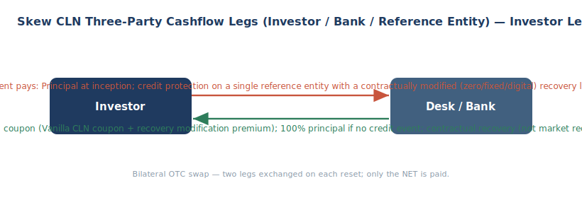

**Product:** 3-year Skew CLN on "GlobalCorp" with **zero-recovery** modification. **Notional:** $500,000. **Coupon:** 7.5% per year (vs 5.5% for a Vanilla CLN on the same reference entity). **Recovery modification:** Fixed at 0% (the investor absorbs a 100% loss on default).

- **No credit event (most likely):** GlobalCorp does not default. The investor receives 3 years of coupons ($37,500/year = $112,500 total) and full principal ($500,000). **Total: $612,500.** The investor earned 7.5% per year — 2% more than the Vanilla CLN — because the investor accepted zero-recovery terms.
- **Credit event in Year 2:** GlobalCorp defaults. Under standard recovery (40%) a Vanilla CLN investor would receive $200,000 back. Under zero-recovery terms the Skew CLN investor receives **$0** of principal, plus coupons already received: 2 × $37,500 = $75,000. **Total received: $75,000. Net loss: $425,000 (−85%).** The higher coupon provided only $20,000 more than the Vanilla CLN coupons ($55,000), but the additional loss from zero recovery is $200,000.
- **Credit event with high actual recovery (70%):** GlobalCorp defaults but actual market recovery is 70%. A Vanilla CLN investor receives $350,000. The Skew CLN investor still receives **$0** — the zero-recovery modification applies regardless of actual recovery. The investor gave up $350,000 of recovery for an extra 2% annual coupon.

**Risks to the investor**

| Risk | Description | Severity |
|------|------------|:--------:|
| **Credit event risk** | The reference entity defaults; the investor loses principal under the contractual recovery formula. | High |
| **Recovery basis risk (to the investor's outcome)** | The contractual recovery may be far worse than the actual market recovery the investor would otherwise have received — a fixed give-up crystallised on default. | High |
| **Issuer credit risk** | The investor is exposed to the issuing bank. If the issuer defaults, the investor may not receive coupons or principal. | Medium |
| **MTM volatility** | Spread moves affect value more than for a Vanilla CLN because the higher loss-given-default amplifies spread sensitivity. | Medium |
| **Liquidity** | Modified CLNs are less liquid than standard CLNs; non-standard recovery terms widen bid-offer. | Medium |
| **Model risk** | Pricing depends on recovery-distribution assumptions; the investor's mark depends on a model input they do not control. | Medium |

#### §8. THE BANK LENS — Desk Economics (1st Line of Defence)

**What the desk books**

The desk's position is the mirror image of the investor's. Where the investor is short the modified-recovery CDS, the desk is **long** that protection (bought from the investor); alongside it the desk has issued a note, which is a funding liability. The investor's enhanced coupon is, to the desk, the cost of the credit-protection premium plus funding, returned to the client. The recovery override sits in the CDS leg, not the bond leg.

**Recovery / skew risk & hedging**

The desk's defining exposure is **recovery basis**, not correlation. The desk sells standard CDS protection in the market (settling at standard market recovery) and buys modified-recovery protection from the investor. On a credit event, the desk must pay out at standard recovery in the CDS market but receives zero (or fixed) recovery from the CLN — this mismatch is the recovery basis and must be hedged separately, usually with **recovery swaps** (which exchange fixed recovery for actual recovery). The most important sensitivity is **recovery delta** — the position's response to a change in the assumed recovery rate — which the desk manages alongside credit spread (CS01) exposure. Recovery swaps are illiquid for most reference entities, so the desk often carries unhedged recovery basis as a model-dependent P&L item.

**How the bank makes money**

| Revenue Source | Mechanism | Typical Size |
|---------------|-----------|:------------:|
| Structuring fee | Charged at inception, embedded in coupon | 20-50bp per annum |
| CDS spread differential | Standard CDS vs modified-recovery CDS pricing | 10-30bp per annum |
| Recovery swap bid-offer | Hedging the recovery modification | 5-15bp per annum |

The bank prices the recovery modification with its model, retains a margin between the modelled fair value and the terms offered, captures the pricing differential between standard and modified-recovery CDS, and earns the bid-offer on any recovery-swap hedges.

**The coupon decomposition (from [Section 2.2](#sec-2-2)):**

Skew CLN Coupon = Vanilla CLN Coupon + Recovery Modification Premium

For the zero-recovery variant: standard CLN coupon 5.5% = bond interest 2.5% + CDS spread 3.5% − margin 0.5%; recovery modification premium +2.0%; **net Skew CLN coupon 7.5%.** The additional 2.0% compensates the investor for accepting zero recovery instead of the expected 40% market recovery. The bank calculates this premium based on (Expected Recovery Rate) × (Default Probability) × (Time to Maturity).

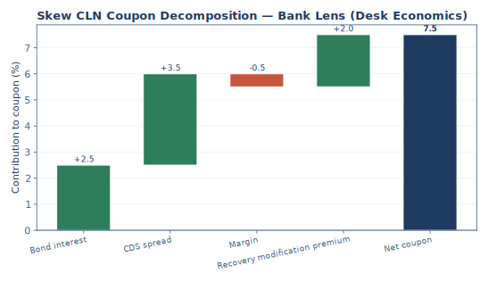

**P&L drivers**

Day to day, desk P&L is driven by moves in the reference entity's credit spread (CS01), shifts in the assumed recovery rate (recovery delta), the basis between contractual and market recovery, recovery-swap marks where they exist, funding, and the mark-to-market of the embedded modified-recovery CDS. Product Control attributes P&L between coupon accrual and credit-leg MTM and reconciles the position's recovery assumptions against standard CDS recovery.

#### §9. THE BANK LENS — Controls & Reconciliation (2nd Line of Defence)

**Booking & systems**

| Aspect | Detail |
|--------|--------|
| **Book of record** | NEMO |
| **Pricing/Risk system** | Sophis |
| **Booking structure** | Single note with embedded short CDS plus a recovery override on the credit leg |
| **ISDA Required** | No — issued as note; ISDA Credit Definitions still govern the credit-event determination |
| **Key booking fields** | Notional, reference entity, CDS spread, coupon rate & frequency, maturity, **recovery override** (contractual recovery rate), credit-event definition set |
| **Recovery field** | Must be populated with the contractual recovery; if left at the default ("market"), P&L and risk are wrong |
| **Settlement basis** | Contractual recovery applied on credit event — NOT the ISDA auction / market recovery |

**Reconciliation points**

| Recon point | What must agree | Skew-CLN-specific break |
|-------------|-----------------|-------------------|
| **ISDA Credit Definitions** | Credit-event set and Determinations Committee reference consistent across systems and termsheet | A credit event recognised under one definition set but not another → settlement triggered incorrectly |
| **Reference portfolio / entity** | Single reference entity identifier matches across NEMO, Sophis and the termsheet | Wrong reference entity mapped → protection on the incorrect name |
| **Recovery-skew / recovery-distribution model inputs** | Recovery-distribution / recovery-skew model inputs match between front office and risk | Recovery-skew input stale or divergent between systems → MTM and risk diverge |
| **Recovery override** | Contractual recovery rate in NEMO equals the value used in Sophis and on the termsheet | Recovery field shows "market" instead of the fixed value → P&L is wrong |
| **Credit-event / recovery determination** | On a credit event, contractual recovery applied — not the ISDA auction recovery | Operations applies market/auction recovery instead of contractual recovery |
| **Coupon lifecycle** | Coupon schedule, day-count, cancellation of remaining coupons on a credit event | Coupon paid (or accrued) after a credit event that should have stopped it |
| **P&L attribution** | Coupon accrual + credit-leg MTM reconciles to total | Unexplained P&L points to a recovery-model or recovery-basis mismatch |
| **Settlement** | Cash settlement amount = notional × contractual recovery; delivery-versus-payment | Settlement computed on market recovery, or wrong recovery applied |

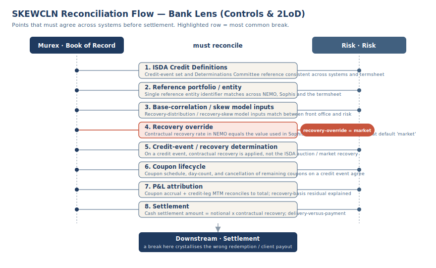

**Common breaks & red flags**

| Red Flag | What It Means | 2LoD Action |
|----------|---------------|-------------|
| Recovery field shows "market" instead of fixed value | Booking error — modified recovery not entered | Correct immediately; P&L and risk are wrong |
| MTM moves opposite to CDS spread direction | Recovery assumption mismatch in the model | Check recovery-model inputs across NEMO and Sophis |
| Investor queries "expected recovery" after a credit event | Investor may expect market recovery, not contractual zero/fixed | Escalate to Sales and Compliance |
| Recovery swap hedge absent | Unhedged recovery basis risk | Escalate to Risk Manager |
| Settlement uses ISDA auction recovery | Operations applied market, not contractual, recovery | Halt settlement; apply contractual recovery per termsheet |

**Control implication**

Each break has a direct consequence the 2nd line must size before it reaches the books or the client. A recovery-override error (field left at "market") misstates both the redemption the investor receives on default and the desk's P&L and risk simultaneously. A settlement computed on ISDA auction recovery instead of the contractual recovery pays the investor the wrong amount on the single event that matters most. A stale recovery-skew model input diverging between NEMO and Sophis breaks valuation and risk together. The reconciliation exists precisely to catch these inconsistencies before a credit event or settlement crystallises them.

#### §10. Formal Definition

A **Skew Credit-Linked Note (Skew CLN)** is a credit-linked note on a single reference entity in which the recovery mechanism upon a credit event is modified from the standard market recovery rate to a predetermined or formula-based recovery.

**Common modifications:**

| Variant | Recovery on Default | Coupon Impact | Investor Use Case |
|---------|:-------------------:|:-------------:|-------------------|
| Zero-recovery CLN | 0% (investor loses 100%) | Highest coupon | Maximize yield, accept full loss risk |
| Fixed-recovery CLN | Predetermined rate (e.g. 30%, 50%) | Moderate enhancement | Predictable worst-case scenario |
| Digital-recovery CLN | Binary: 0% or 100% depending on a recovery threshold | Variable | Precise view on the recovery outcome |

**Formal payoff** at maturity:
- **No credit event:** Redemption = 100% of Principal. All coupons paid.
- **Credit event (zero-recovery variant):** Redemption = 0%. Remaining coupons cancelled.
- **Credit event (fixed-recovery variant):** Redemption = Fixed Recovery Rate × Principal. Remaining coupons cancelled.

**Coupon formula:** Skew CLN Coupon = Vanilla CLN Coupon + Recovery Modification Premium. For zero recovery, the Recovery Modification Premium compensates the investor for giving up recovery rights and depends on the expected recovery rate and default probability.

#### §11. Lifecycle

| Stage | Detail | Key Actions |
|-------|--------|-------------|
| **Pre-trade** | Structurer designs the recovery modification. Credit analysis performed on the reference entity. Investor reviews modified terms | Credit approval, documentation review |
| **Trade date** | CLN issued. Investor pays principal. Bank enters the offsetting CDS position | Booking in NEMO (with recovery override), risk setup in Sophis |
| **During life** | Coupons paid. Credit monitored. MTM calculated using modified recovery assumptions | Coupon processing, daily P&L, credit monitoring |
| **Maturity / Credit event** | If no default: principal returned. If default: contractual recovery applied | Settlement using contractual recovery terms, NOT market/auction recovery |

#### §12. Worked Example (both lenses)

**Product:** 3-year Skew CLN (zero-recovery) on "MegaBank Corp". **Notional:** $1,000,000. **Coupon:** 7.00% per year. **Recovery modification:** Fixed at 0%. **Comparable Vanilla CLN coupon:** 4.80%. **Reference entity CDS spread:** 250bp.

**Year 1:** No credit event. Coupon paid: $1,000,000 × 7.00% = $70,000.
**Year 2:** No credit event. Coupon paid: $70,000. Cumulative coupons: $140,000.
**Year 3 (Month 2):** Credit event — MegaBank Corp declared bankruptcy.

*Investor lens:*

**Settlement under zero-recovery terms:**
- Principal returned: $1,000,000 × 0% = **$0**
- Accrued coupon (2 months of Year 3): $70,000 × (2/12) = $11,667 (cancelled — no accrued coupon after credit event)
- **Total received:** $140,000 (coupons from Years 1-2)
- **Net loss:** $860,000 (−86%)

**Comparison with a Vanilla CLN (40% recovery):**
- Principal returned: $1,000,000 × 40% = $400,000
- Coupons received: 2 × $48,000 = $96,000
- **Total received:** $496,000
- **Net loss:** $504,000 (−50.4%)

**The extra coupon earned ($44,000 more over 2 years) does not compensate for the extra loss ($356,000 more).**

*Bank lens:*
- Through Years 1-2 the desk funds the $70,000/year coupons and carries the long modified-recovery protection; Product Control confirms the coupon accrual and the credit-leg MTM reconcile, and that the recovery override (0%) used in Sophis matches NEMO and the termsheet.
- On the Year-3 credit event, the desk receives $0 contractual recovery from the CLN but must settle its market CDS hedge at the prevailing market/auction recovery — the recovery basis crystallises here. The 2nd line must confirm settlement is computed on the contractual 0% recovery (notional × 0% = $0 to the investor), that remaining coupons are cancelled, and that NEMO and Sophis agree before settlement.

#### §13. Knowledge Check

1. **What distinguishes a Skew CLN from a Vanilla CLN?** (Answer: the recovery mechanism is modified from market recovery to a predetermined or formula-based recovery.)
2. **Name three common recovery-modification variants.** (Zero-recovery, fixed-recovery, digital-recovery.)
3. **Why does a zero-recovery Skew CLN pay a higher coupon than a Vanilla CLN?** Decompose it.
4. **Is a single-name Skew CLN exposed to portfolio/tranche correlation? Explain.** (Answer: no — the reference is a single entity; the "skew" is in the recovery terms, not in correlation.)
5. **Credit spreads on the reference entity tighten from 250bp to 80bp with 2 years remaining. Should the investor consider selling? Why or why not?**
6. **(Desk economics / 1LoD)** What position does the desk hold against the investor, what is the recovery basis, and why can it leave the desk with model-dependent, unhedged P&L?
7. **(Controls / 2LoD)** A credit event has occurred on a zero-recovery Skew CLN and the ISDA Determinations Committee sets market recovery at 55%. Operations receives settlement instructions. What recovery rate is applied, how does this differ from standard CLN settlement, and what reconciliation steps does Product Control perform?

**Mental Models**

| Concept | Mental Model |
|---------|-------------|
| Skew CLN | Car insurance with a contractually fixed deductible — the payout is set in advance, not assessed against the actual damage |
| Recovery modification | Not free money — the enhanced coupon is the price for giving up market recovery on default |
| Recovery basis | The gap between what the desk pays out (market recovery) and what it receives (contractual recovery) on a credit event |
| Single-name credit | One insured car — no correlation between assets to manage |
| Recovery delta | The dial that measures how much the position moves when the assumed recovery rate changes |
| 2LoD reconciliation | The claims auditor — confirms the contractual recovery, not the market recovery, is the one applied before anyone pays out |

**Key Takeaways**

1. A Skew CLN is a single-name CLN (bond + short modified-recovery CDS) whose recovery leg is fixed by contract rather than set by the market.
2. The enhanced coupon is the Recovery Modification Premium — payment for the recovery the investor gives up on default.
3. If there is no credit event, the investor keeps full principal plus coupons. On a credit event, redemption follows the contractual recovery and remaining coupons are cancelled.
4. The defining risk is recovery basis — contractual recovery can be far worse than the market recovery the investor would otherwise have received.
5. The product is single-name: it carries no portfolio or tranche correlation exposure, and no long/short correlation position is taken.
6. The desk is long the modified-recovery protection; its recovery basis is often unhedged because recovery swaps are illiquid.
7. For the 2nd line, the dominant control risks are the recovery override field, the credit-event/recovery determination, the recovery-skew model inputs, and settlement — each can misstate the investor's redemption or the desk's P&L.

#### §14. Common Mistakes

1. **Confusing contractual recovery with market recovery.** The Skew CLN's recovery is determined by the contract, not by the ISDA auction. Operations must apply the contractual terms.
2. **Underestimating the recovery give-up.** A 2% coupon enhancement over 3 years is ~$60,000 on $1M; zero recovery vs 40% recovery is a $400,000 difference. The math is heavily asymmetric.
3. **Treating the product as correlation-driven.** This is a single-name CLN — the "skew" is in the recovery terms, not in portfolio or tranche correlation. There is no correlation position to label long or short.
4. **Assuming recovery basis can always be hedged.** Recovery swaps are illiquid for most names; the bank may carry unhedged recovery basis risk.
5. **(Controls) Failing to book the recovery override.** If the NEMO recovery field defaults to "market," all P&L and risk calculations are wrong — verify it is populated with the contractual rate and that Sophis agrees.

**Dual-lens questions:**
- *(Desk economics / 1LoD)* What does the desk book against the investor (raw single-name credit / CDS position), and how is it hedged?
- *(Controls / 2LoD)* Which credit-event / reference-entity (RED code) / recovery-rate fields must reconcile, and which is the most common break?

**Dual-lens visuals (generated):**
- `assets/skewcln/controls_skewcln_recon_08.svg` `[generated]`
- `assets/skewcln/legs_skewcln_01.svg` `[generated]`
- `assets/skewcln/waterfall_skewcln_09.svg` `[generated]`
### 5.5.3 First-to-Default Note (FTD) {#sec-5-5-3}

> **Prerequisites:** CLN &nbsp;|&nbsp; **Key concepts:** Basket credit, first-default trigger, credit correlation

---

*The Vanilla CLN ([Section 5.5.1](#sec-5-5-1)) referenced a single credit. The First-to-Default Note references a basket of credits — typically 5 to 10 names — and triggers a loss when the first entity in the basket defaults. The investor earns a higher coupon because the probability of at least one default in a basket exceeds the probability of any single name defaulting. This chapter reads the product through two lenses: what it means for **the investor**, and what it means for **the bank** — the latter split into the desk's market economics (1st line of defence) and the controls and reconciliation that surround it (2nd line of defence).*

#### §1. Explain Like I'm New

A fixed-income portfolio manager at a pension fund has been investing in Vanilla CLNs — single-name credit-linked notes — for several years, earning 5-6% coupons by taking default risk on individual companies. The manager wants higher yield without moving to lower-quality reference entities.

The structurer proposes an alternative: instead of selling protection on one company, the investor sells protection on a **basket** of five investment-grade companies and earns a much higher coupon. The catch is that if **any one** of the five defaults, the investor absorbs the loss.

This is a **First-to-Default Note (FTD)**. The investor sells credit protection on a basket of reference entities — typically 5 to 10 companies — and earns a significantly enhanced coupon because the probability that *at least one* company in the basket defaults is much higher than the probability that any *specific* company defaults. The investor only loses on the *first* default — not on all subsequent defaults.

In [Section 1.6](#sec-1-6), correlation was introduced as a measure of how synchronized assets are, in the context of equity baskets: when stocks in a worst-of product have low correlation, the investor faces more risk because one stock can fall while others rise.

**The same principle applies to credit baskets, but with defaults instead of stock prices.** When companies in an FTD basket have low default correlation, the probability that *at least one* defaults is high — even if each individual company is safe. This is the key insight: the FTD investor is **long correlation (under the MTM convention)** — benefiting when default correlation is high (defaults either all happen or none do, reducing the probability of an isolated first default). The investor is *structurally* short correlation in the sense of having sold the first-default premium, but the economic (MTM) sensitivity is long: rising correlation helps the FTD position. See the Correlation Convention Framework for the distinction between structural and MTM conventions.

#### §2. Real-World Analogy

An FTD is like a **domino chain**.

Imagine five dominoes standing in a row, each representing a company. A bet is placed: "If any domino falls, the bettor loses." A counterparty pays $50 per month so long as all five stay standing. If any single domino topples — regardless of which one — the bettor loses the $500 stake.

In an FTD:
- The **five dominoes** are the five reference entities in the basket.
- The **monthly $50** is the enhanced coupon.
- **Any domino falling** is the first credit event in the basket.
- The **$500 stake** is the principal at risk.
- The **stability of each domino** is the creditworthiness of each reference entity.

The crucial insight: five dominoes are harder to keep standing than one. Even if each domino has only a 2% chance of falling, the probability that *at least one* falls is much higher — roughly 10% (minus a correction for correlation). That is why the FTD coupon is much higher than a single-name CLN coupon.

#### §3. What Problem Does This Solve?

FTDs solve the **yield enhancement for credit portfolios** problem.

Single-name CLNs on investment-grade entities pay modest coupons (3-5%). To earn higher yields, investors would normally need to move down the credit spectrum to high-yield or distressed names — but many institutional investors have credit quality mandates that prevent this.

The FTD allows investors to earn high-yield-level coupons (7-12%) while referencing only investment-grade companies. The higher coupon comes not from lower credit quality but from *basket* risk — the probability that at least one of several good companies defaults.

| Investor Need | Why Single-Name CLN Falls Short | What FTD Offers |
|--------------|-------------------------------|----------------|
| Higher yield within IG mandate | Single-name IG coupon is modest (3-5%) | Basket of 5 IG names yields 7-12% |
| Diversified credit exposure | Single-name = concentrated risk | Basket = exposure to 5-10 names (but first-default trigger concentrates loss) |
| Credit view expression | Single-name = view on one company | Basket = view on entire sector or credit environment |

#### §4. Product DNA

| **Field** | **Value** |
|---|---|
| **Full Name** | First-to-Default Note |
| **Abbreviation** | FTD |
| **Family** | Credit-Linked Notes |
| **Complexity Score** | 7 / 10 |
| **Complexity Rationale** | Single-name CLN (4) + basket mechanics + credit correlation + first-default trigger. Correlation-dependent pricing |
| **Underlying Asset Class** | Credit (basket of 5–10 reference entities) |
| **Capital Protection** | Conditional (protected if no credit event in basket) |
| **Coupon Type** | Fixed (enhanced by basket risk premium) |
| **Maturity** | 3–5 years |
| **Liquidity** | OTC — model-dependent |
| **Primary System** | NEMO (primary), Sophis (risk) |
| **ISDA Required** | No — issued as note (basket references governed by ISDA Credit Definitions) |

**DNA Atlas Fields:**
- Primary Risk: First default in basket triggers full loss. Probability driven by correlation — low correlation = higher risk
- Typical Buyer: Yield-seeking credit investors willing to take basket default risk
- Typical Use Case: Enhanced yield by selling first-default protection on basket of 3-7 names
- Building Blocks: CLN + first-to-default CDS on basket
- Key Hedge: Individual CDS on each basket constituent + correlation hedge
- Similar Products: CLN (5.5.1 — single name), NTD (5.5.4 — Nth default), Worst-of Autocallable (5.6.12 — equity worst-of)
- Most Important Greek: Credit spread delta (per name) + correlation

**Comparison Matrix Fields:**
- Complexity: 7
- Yield Potential: High (basket credit spread, not just single name)
- Capital Protection: Conditional (protected if zero defaults in basket)
- Credit Exposure: Basket reference entities + issuer
- Liquidity: OTC — model-dependent
- Path Dependency: No (first default is binary)
- Volatility Sensitivity: Low
- Correlation Sensitivity: Very high — the FTD investor is long correlation (MTM); low correlation increases FTD risk
- Client Type: Institutional credit
- Market Environment: Best when all basket constituents are investment-grade with tight spreads

#### §5. Who Touches This Product

| Role | What They Do |
|------|-------------|
| **Structurer** | Selects basket composition, calibrates coupon against basket default probability and correlation |
| **Trader** | Hedges with individual CDS on each basket name. Manages correlation exposure — the hardest hedging challenge |
| **Sales** | Explains basket mechanics and correlation risk. Must ensure the investor understands that *any* default triggers loss, not just the "weakest" name |
| **Quant** | Models basket default probabilities using copula models. Correlation assumptions are the primary pricing input |
| **Risk Manager** | Monitors individual name credit quality AND basket correlation. Stress-tests correlation scenarios |
| **Operations** | Monitors all basket names for credit events. Must determine *which* name defaulted first and apply correct settlement |
| **Compliance** | Verifies suitability for basket credit products. Ensures the investor understands multi-name exposure |
| **Product Control** | Marks the position using correlated default model. Validates correlation inputs against market data |

#### §6. Product Evolution

**Ancestor:** Vanilla CLN (5.5.1)

**Evolution path:**
1. **Vanilla CLN** — Single reference entity, single credit event trigger
2. **FTD** — Basket of reference entities, first-default trigger (this chapter)
3. **NTD** — Basket, Nth-default trigger (5.5.4 — next chapter)
4. **Synthetic CDO** — Large portfolio, tranched loss allocation (5.5.5)

**Why FTDs were created:** Banks discovered that investors would accept basket default risk for significantly higher coupons. The key innovation was applying **credit correlation modeling** — borrowed from the equity world ([Section 1.6](#sec-1-6)) — to credit baskets. This created a new source of yield without requiring lower credit quality.

---

#### §7. THE INVESTOR LENS

**Why the investor buys it**

1. **Enhanced yield.** The coupon is significantly higher than comparable single-name CLNs — typically 7-12% vs 3-5% — without dropping below investment grade.
2. **Yield within mandate.** The investor can earn high-yield-level income while referencing only investment-grade names, staying inside a credit quality mandate.
3. **View expression.** An investor who believes all basket names will survive — that defaults will not cluster — can monetize that view efficiently through the first-default premium.
4. **Diversified reference exposure.** The note references 5-10 names rather than one, expressing a view on a sector or the broader credit environment.
5. **Behavioral fit.** A high, visible coupon on a basket of recognizable investment-grade names feels safer than a single-name CLN, even though the first-default trigger concentrates the loss.

**Position & correlation direction**

The investor simultaneously holds a long bond (lends principal to the issuer) and sells first-to-default protection on the basket (a short basket CDS). Net, the investor is **long correlation under the MTM convention**: the position gains value when default correlation rises (defaults cluster — names default together or not at all — so the probability of an isolated first default falls) and loses value when correlation falls (independent defaults make a first default highly likely). The investor is *structurally* short correlation — having sold the first-default premium — but the economic (MTM) sensitivity is long. The investor also carries full first-default credit risk on the basket and is short the basket default probability.

**Payoff & scenarios**

The investor's payoff has two outcomes. If no name in the basket defaults over the life of the note: the investor receives 100% principal plus all coupons. If any one name defaults first: the note settles on that defaulted entity at its recovery rate — redemption = Principal × Recovery Rate — remaining coupons are cancelled, and subsequent defaults are irrelevant. The loss depends on the recovery of the *first* defaulted name, not on which name it is.

**Product:** 5-year FTD on basket of 5 IG companies. **Basket:** Company A (200bp), Company B (180bp), Company C (250bp), Company D (150bp), Company E (220bp). **Notional:** $1,000,000. **Coupon:** 9.5% per year (vs 4.5% for single-name CLN on any individual name). **Recovery rate:** 40% (standard).

- **No credit event in basket (most likely):** All five companies survive to maturity. The investor receives 5 years of coupons ($95,000/year = $475,000) and full principal ($1,000,000). **Total: $1,475,000.** The investor earned 9.5% per year — more than double the single-name CLN coupon.
- **Company C defaults in Year 3:** Company C (the widest spread in the basket) defaults. Recovery rate: 40%. Principal returned: $1,000,000 × 40% = $400,000. Coupons received: 3 × $95,000 = $285,000. **Total received: $685,000. Net loss: $315,000 (-31.5%).** Companies A, B, D, E may be perfectly healthy — the investor loses on the *first* default regardless.
- **Two defaults (Company C in Year 2, Company D in Year 4):** Company C defaults first (Year 2). The FTD settles on the first default. Principal returned: $1,000,000 × 40% = $400,000. Coupons received: 2 × $95,000 = $190,000. **Total received: $590,000. Net loss: $410,000 (-41%).** Company D's subsequent default in Year 4 does not affect the FTD investor — the note already settled on the first default.

**Risks to the investor**

| Risk | Description | Severity |
|------|------------|:--------:|
| **First-default risk** | Any single name's default triggers full loss — the basket amplifies default probability relative to a single name. | High |
| **Credit correlation risk** | The FTD investor is long correlation (MTM). Falling default correlation raises the first-default probability and reduces MTM. | High |
| **Concentration / contagion risk** | A sector-concentrated basket (e.g. five banks) means a single stress event can cascade across names. | High |
| **Recovery risk** | Loss on the first default depends on the realized auction recovery rate, which is uncertain until the credit event is settled. | Medium-High |
| **Individual name spread risk** | Widening of any single name's spread reduces MTM — the "weakest link" drives the basket. | Medium |
| **Issuer credit risk** | The investor is exposed to the issuing bank. If the issuer defaults, coupons or principal may not be received. | Medium |
| **Model / liquidity risk** | Copula correlation assumptions drive pricing; FTDs trade in a thin, model-dependent secondary market. | Medium |

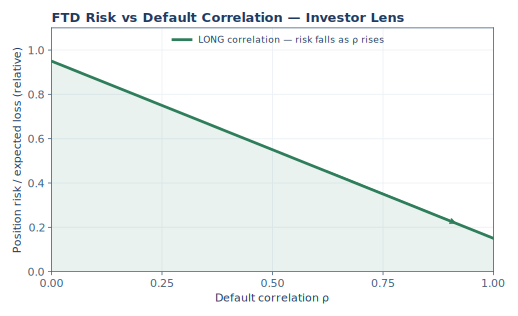

#### §8. THE BANK LENS — Desk Economics (1st Line of Defence)

**What the desk books**

The desk's position is the mirror image of the investor's. Where the investor sells first-to-default protection on the basket, the desk **buys** that first-default protection from the investor; alongside it the desk has issued a note, which is a funding liability. In raw correlation terms the desk is therefore **short correlation** (the mirror of the investor's long-correlation MTM position): the desk's raw book loses value when correlation rises and gains when correlation falls. After the desk lays off single-name and dispersion risk (below), the net correlation position is smaller and may even invert — desk correlation is always qualified as raw versus net.

**Credit/correlation risk & hedging**

The desk hedges individual name risk by buying or selling CDS on each basket name to neutralize single-name credit spread delta. But the *correlation* risk — the joint probability of defaults — cannot be hedged with single-name CDS, because correlation is a portfolio-level factor. The desk manages it through a "correlation book": a portfolio of FTDs and NTDs in which long and short correlation positions partially offset, supplemented by dispersion trades. As any single name's spread approaches a distressed level, the FTD behaves more like a single-name CLN on that name and the per-name spread sensitivity sharpens — this is where the hedge must be rebalanced and where structuring margin is earned or lost.

**How the bank makes money**

| Revenue Source | Mechanism | Typical Size |
|---------------|-----------|:------------:|
| Structuring fee | Embedded in coupon — bank retains margin between modeled fair coupon and offered coupon | 30-80bp per annum |
| Correlation trading | Bank buys individual CDS hedges (uncorrelated) and buys correlated basket protection from the investor. The correlation premium is the bank's edge | 20-50bp per annum |
| Bid-offer on hedges | Bank crosses individual CDS at bid-offer spread | 5-15bp per name |

The correlation premium is the primary profit driver. The bank's model assigns a value to the correlation exposure; the market price of individual CDS hedges reflects uncorrelated default probabilities. The difference is the bank's compensation for warehousing correlation risk.

**The coupon decomposition:**

FTD Coupon is LESS than the sum of all individual CDS spreads but MORE than any single CDS spread. For a basket of 5 names with individual CDS spreads of 150-250bp:
- Sum of all CDS spreads: ~1,000bp (if five separate CDS were sold)
- FTD coupon: ~900-950bp (e.g. 9.5% in the worked example — between a single-name CLN and the full sum of the basket CDS)
- Single-name CLN coupon: ~200bp (only one name's risk)

The FTD coupon sits between single-name and sum-of-all because the investor takes *first*-default risk but not *all*-default risk.

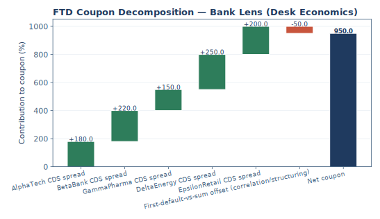

**P&L drivers**

Day to day, desk P&L is driven by moves in each basket name's CDS spread (per-name credit delta on the hedges), changes in the modeled default correlation (the raw short-correlation position), the carry on the correlation premium, and the mark-to-market of the basket protection under the copula model. Product Control marks the position using the correlated default model and validates the correlation inputs against market data.

#### §9. THE BANK LENS — Controls & Reconciliation (2nd Line of Defence)

**Booking & systems**

| Aspect | Detail |
|--------|--------|
| **Book of record** | NEMO |
| **Pricing/Risk system** | Sophis |
| **Booking structure** | Single note with embedded first-to-default basket CDS |
| **First-default trigger?** | Yes — must be specified as first-default, not sum-of-defaults |
| **Key booking fields** | Notional, all N reference entities & weights, individual CDS spreads, first-default trigger flag, recovery convention, correlation model inputs, coupon rate & frequency, maturity |
| **Credit monitoring** | All N basket names monitored simultaneously for credit events |

**Reconciliation points**

| Recon point | What must agree | FTD-specific break |
|-------------|-----------------|--------------------|
| **ISDA Credit Definitions** | Credit event types (bankruptcy, failure to pay, restructuring) and governing ISDA terms match the termsheet | Restructuring clause differs between termsheet and booked CDS terms — wrong events trigger or fail to trigger |
| **Basket reference names** | All N entities individually entered, matching legal reference obligations | One reference entity entered with the wrong legal name / RED code — credit event missed or misattributed |
| **Basket weights** | Per-name notional weights in NEMO match the model in Sophis | Equal-weight assumed in one system, custom weights in another — recovery and MTM miscalculated |
| **Credit-event determination & auction recovery** | First-defaulted name identified correctly; recovery = ISDA auction result | Recovery hard-coded at 40% when the auction settled at a different level — redemption misstated |
| **Correlation model inputs** | Copula correlation parameters in Sophis match the calibration of record | Stale or mismatched correlation input — MTM and risk diverge from market |
| **First-default trigger flag** | Trigger booked as first-default, not Nth-default or sum-of-defaults | Trigger mis-booked — loss recognized on the wrong event |
| **Coupon lifecycle** | Coupon schedule, day-count, and cancellation on first default agree | Coupon paid after a credit event that should have terminated the note |
| **Settlement** | Cash vs physical; redemption = Principal × recovery; hedge unwind on surviving names | Physical settlement booked as cash, or surviving-name hedges not unwound |

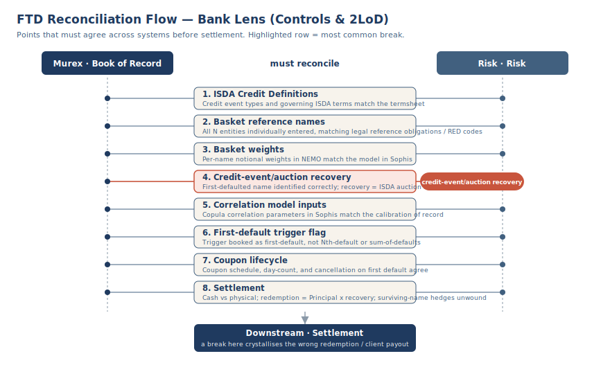

**Common breaks & red flags**

| Red Flag | What It Means | 2LoD Action |
|----------|---------------|-------------|
| One basket name's spread exceeds 500bp | FTD dominated by a single weak name | Alert Risk Manager — basket may need restructuring |
| Correlation model shows extreme values (<0.1 or >0.9) | Model may be miscalibrated | Validate correlation inputs against market data |
| Basket names are in the same sector/country | Contagion risk not captured by correlation model | Stress-test with a sector-wide credit event |
| MTM changes don't match single-name CDS moves | Correlation model may be stale | Update correlation inputs, recalibrate |
| Recovery rate hard-coded rather than from auction | Redemption may be misstated at settlement | Confirm recovery = ISDA auction result before settling |
| Operations does not monitor all basket names | A credit event could be missed | Ensure alerts are set for all N names |

**Control implication**

Each break has a direct consequence the 2nd line must size before it reaches the books or the investor. A wrong ISDA restructuring clause changes whether an event triggers at all. A mis-entered reference name or RED code means a real default is missed or attributed to the wrong entity — driving the wrong redemption. A hard-coded recovery rate that ignores the auction result misstates the investor's payout and the desk's hedge offset simultaneously. A stale correlation input misstates both MTM and the desk's raw correlation risk at once. The reconciliation exists precisely to catch these inconsistencies before settlement crystallises them.

#### §10. Formal Definition

A **First-to-Default Note (FTD)** is a credit-linked note referencing a basket of N reference entities (typically 5-10) in which the investor sells credit protection triggered by the **first** credit event in the basket.

At maturity:
- **No credit event in basket:** Redemption = 100% of Principal. All coupons paid.
- **First credit event occurs:** Redemption = Principal × Recovery Rate of the defaulted entity. Remaining coupons cancelled. Subsequent defaults are irrelevant.

**Correlation and pricing:**

The FTD coupon depends critically on **default correlation** — the tendency for defaults to occur together.

| Correlation Level | Effect on FTD | Intuition |
|:-----------------:|--------------|-----------|
| **Low** (0.1-0.3) | High first-default probability → HIGH coupon | Companies default independently. With 5 independent names, the chance that *at least one* defaults is high. Like 5 dice — the chance of at least one six is much higher than the chance of a specific die showing six |
| **Medium** (0.3-0.6) | Moderate probability → MODERATE coupon | Some clustering. Defaults are partially linked but not fully synchronized |
| **High** (0.7-0.9) | Low first-default probability → LOW coupon | Companies default together or not at all. The basket behaves almost like a single name. If one defaults, all likely default — but the probability of *any* default is lower |

**Key insight:** The FTD investor is **long correlation (under the MTM sensitivity convention)** — profiting when correlation is high (defaults are rare because companies move together) and losing when correlation is low (independent defaults make the first default highly probable). The investor *structurally sold* the first-default premium, which some practitioners describe as "selling correlation"; V1.0.1 uses the MTM convention as the headline label — see Correlation Convention Framework. This parallels worst-of equity products ([Section 1.6](#sec-1-6)): worst-of investors are also long correlation (MTM convention) — they profit when stocks move together and lose when stocks move independently. Like FTD investors, worst-of investors *structurally sold* the correlation premium, but the economic sensitivity is long: rising correlation reduces worst-of risk.

#### §11. Lifecycle

| Stage | What Happens | Key Actions |
|-------|-------------|-------------|
| **Pre-trade** | Structurer selects basket. Quant models default correlation. Investor reviews basket composition and coupon | Basket approval, credit analysis on all N names |
| **Trade date** | FTD issued. Investor pays principal. Bank enters N individual CDS hedges | Booking in NEMO, risk setup in Sophis with basket model |
| **During life** | Coupons paid. All N names monitored for credit events. MTM reflects correlation model | Continuous credit monitoring, correlation updates |
| **First default** | ISDA Determinations Committee confirms credit event. FTD settles on defaulted entity | Settlement at defaulted entity's auction recovery rate. Note terminated |
| **Post-settlement** | Remaining N-1 names are irrelevant to the FTD investor. Bank's CDS hedges on surviving names are unwound | Hedge unwind, P&L recognition |

#### §12. Worked Example (both lenses)

**Product:** 5-year FTD on 5 investment-grade companies.
**Basket:**

| Company | Sector | CDS Spread | Individual Default Probability (5yr) |
|---------|--------|:----------:|:------------------------------------:|
| AlphaTech | Technology | 180bp | 3.6% |
| BetaBank | Financials | 220bp | 4.4% |
| GammaPharma | Healthcare | 150bp | 3.0% |
| DeltaEnergy | Energy | 250bp | 5.0% |
| EpsilonRetail | Consumer | 200bp | 4.0% |

**Notional:** $1,000,000. **Basket default correlation:** 0.30. **FTD coupon:** 9.50% per year.

*Investor lens:*

**Step 1 — Individual default probabilities:** Sum of individual default probabilities (independent): 1 − (1−0.036)(1−0.044)(1−0.030)(1−0.050)(1−0.040) = 1 − 0.964 × 0.956 × 0.970 × 0.950 × 0.960 = 1 − 0.8153 = **18.5%**

**Step 2 — Correlation adjustment:** With correlation at 0.30, defaults are partially clustered. The effective first-default probability is reduced from the independent case but still much higher than any single name. Modeled first-default probability: approximately **14.5%** (correlation reduces the probability because defaults tend to happen together or not at all). This is the long-correlation (MTM) effect: higher correlation lowers the first-default probability and helps the investor.

**Step 3 — Coupon justification:** Sum of all 5 CDS spreads: 1,000bp = 10.0%. FTD coupon: 950bp = 9.5%. Any single name: 150-250bp = 1.5-2.5%. The FTD coupon is 4-6× any single name but below the sum of all five.

**Step 4 — Default scenario:** Year 3: DeltaEnergy defaults. Recovery rate: 35%. Principal returned: $1,000,000 × 35% = $350,000. Coupons received: 3 × $95,000 = $285,000. **Total received: $635,000. Net loss: $365,000 (-36.5%).** AlphaTech, BetaBank, GammaPharma, EpsilonRetail are irrelevant post-settlement.

*Bank lens:*
- In the no-default case the desk's bought first-default protection expires worthless; the desk keeps its structuring margin and net correlation carry, having funded the coupons, and unwinds the N CDS hedges at maturity. Product Control confirms the basket protection MTM rolls to zero.
- In the DeltaEnergy default the desk's bought protection pays out against its redemption obligation, and the CDS hedge on DeltaEnergy offsets the loss on that name; the four surviving-name hedges are unwound. The 2nd line must confirm the defaulted entity was correctly identified, that the 35% recovery matches the ISDA auction result (not a hard-coded 40%), and that NEMO and Sophis agree before settlement.

#### §13. Knowledge Check

1. **What is the investor really doing when they buy an FTD?** (Answer: lending principal and selling first-to-default protection on a basket of names.)
2. **Why is the FTD coupon higher than a single-name CLN but lower than the sum of all individual CDS spreads?**
3. **Explain how default correlation affects FTD pricing. Which way is the FTD investor positioned under the MTM convention, and what happens when correlation is low?**
4. **FTD investors are long correlation under the MTM convention, yet are sometimes described as *structurally* short correlation. Explain the distinction between these two conventions.**
5. **An investor says: "I hold a basket of 5 names, so my risk is diversified." Is this correct for an FTD?** Explain.
6. **Why is a sector-concentrated basket particularly dangerous for an FTD investor?**
7. **(Desk economics / 1LoD)** What position does the desk hold against the investor (in raw correlation terms), how does it hedge single-name versus correlation risk, and where is the structuring margin made or lost?
8. **(Controls / 2LoD)** Name three reconciliation breaks specific to an FTD — including the recovery-rate source — and the consequence of each for the investor's redemption.

**Mental Models**

| Concept | Mental Model |
|---------|-------------|
| First-to-Default Note | A bet that five dominoes all stay standing — premium collected monthly, full stake lost if any one topples |
| Enhanced coupon | Not free money — the price paid to the investor for selling first-default protection on the basket |
| First-default trigger | The first domino to fall ends the bet; subsequent falls are irrelevant |
| Long correlation (MTM) | The investor wins when defaults cluster (all or none) and loses when they are independent (a first default becomes likely) |
| Structurally short vs MTM long | The investor sold the premium (structurally short) but gains as correlation rises (MTM long) |
| Desk raw short correlation | The desk holds the mirror position; after dispersion hedging the net may differ — always qualify raw vs net |
| 2LoD reconciliation | The settlement referee — confirms the ISDA terms, the defaulted name, and the auction recovery match before anyone pays out |

**Key Takeaways**

1. An FTD is a bond + a short first-to-default basket CDS. The investor earns an enhanced coupon by selling first-default protection on a basket of names.
2. The coupon is not free — it is the premium for the first-default protection the investor has sold, and it sits between any single name and the sum of all names.
3. If no name defaults, the investor keeps full principal plus coupons. On the first default the note settles at that name's recovery rate and terminates; subsequent defaults are irrelevant.
4. The FTD investor is **long correlation under the MTM convention** — helped when correlation rises (defaults cluster) and hurt when it falls (independent defaults make a first default likely). The investor is only *structurally* short correlation.
5. The defining risk is credit correlation, amplified by sector concentration and contagion; loss-given-default depends on the auction recovery of the *first* defaulted name.
6. The desk's raw position is short correlation (the mirror); after single-name CDS and dispersion hedging the net correlation position is smaller and may invert — always qualified raw vs net.
7. For the 2nd line, the dominant control risks are ISDA credit definitions, basket names and weights, credit-event/auction recovery, and correlation model inputs — each can misstate the redemption or the MTM.

#### §14. Common Mistakes

1. **Treating the FTD coupon as "free money."** The coupon compensates for basket default risk, which is substantially higher than single-name risk.
2. **Calling the FTD investor "short correlation" without qualification.** The investor is *structurally* short (sold the premium) but **long correlation under the MTM convention** — rising correlation reduces first-default risk and helps the position. Never state the bare "short" claim.
3. **Ignoring correlation.** A sector-concentrated basket with high correlation behaves almost like a single-name CLN — the "basket" provides no real diversification of risk.
4. **Focusing only on the weakest name.** While the weakest name is most likely to default first, the FTD coupon reflects *all* names' contributions. A basket of four strong names and one weak name is not the same as a single-name CLN on the weak name.
5. **Confusing FTD with portfolio diversification.** FTDs give exposure to more names, but the first-to-default trigger *concentrates* loss — the investor loses on a single event, not a portfolio average.
6. **(Controls) Hard-coding the recovery rate.** Redemption uses the ISDA auction recovery of the first defaulted name, not a standing 40% assumption. The 2nd line must reconcile the booked recovery against the auction result before settlement.

**Dual-lens questions:**
- *(Desk economics / 1LoD)* What does the desk book against the investor (raw correlation/credit position), and how is it hedged?
- *(Controls / 2LoD)* Which credit-event / basket / model-input fields must reconcile, and which is the most common break?

**Dual-lens visuals (generated):**
- `assets/ftd/controls_ftd_recon_08.svg` `[generated]`
- `assets/ftd/payoff_ftd_01.svg` `[generated]`
- `assets/ftd/waterfall_ftd_09.svg` `[generated]`
### 5.5.4 Nth-to-Default Note (NTD) {#sec-5-5-4}

> **Prerequisites:** FTD &nbsp;|&nbsp; **Key concepts:** Nth-default threshold, correlation reversal, non-monotonic sensitivity

---

*The First-to-Default Note ([Section 5.5.3](#sec-5-5-3)) triggered on the first default in a basket. The Nth-to-Default Note moves the trigger deeper: the investor is protected against the first (N-1) defaults and only takes a loss on the Nth. This provides more protection than FTD but less coupon, creating a spectrum of credit risk tranching within a single basket. This chapter reads the product through two lenses: what it means for **the investor**, and what it means for **the bank** — the latter split into the desk's market economics (1st line of defence) and the controls and reconciliation that surround it (2nd line of defence).*

#### §1. Explain Like I'm New

A credit strategist at an insurance company has studied the FTD (5.5.3) and understands that the investor loses when the *first* company in the basket defaults. But the strategist holds a different view: isolated, one-off defaults are plausible — a single company might fail due to company-specific problems. What is considered *unlikely* is that *multiple* companies default at once, because that would require a systemic crisis affecting the entire sector.

The structurer offers a solution: instead of losing on the *first* default, the investor only loses on the *second* default — or the *third*. This way, the investor is protected against isolated failures and only takes a loss if defaults start clustering, which the strategist considers unlikely.

This is an **Nth-to-Default Note (NTD)**. The "N" refers to which default number triggers the loss. A 2nd-to-default (2TD) triggers on the second default. A 3rd-to-default (3TD) triggers on the third. The higher N is, the lower the risk (more defaults needed before the investor takes a loss) and the lower the coupon.

If FTD is a domino chain where the first falling domino triggers the alarm, NTD is a **fire alarm system with a threshold**: the alarm does not sound until N sensors detect smoke. A single sensor tripping (an isolated fire) does not trigger evacuation — only when multiple sensors activate (a widespread fire) does the alarm go off.

#### §2. Real-World Analogy

An NTD is like a **fire alarm system with a multi-sensor threshold**.

In a building, each floor has a smoke sensor. A standard fire alarm (like an FTD) triggers when *any single* sensor detects smoke — even if it is just burnt toast on the third floor. False alarms are frequent and disruptive.

A multi-sensor alarm system (like an NTD) requires N sensors to trip before the evacuation alarm sounds:
- **1-sensor threshold (FTD):** Any smoke anywhere → alarm. Most sensitive. Most false alarms.
- **2-sensor threshold (2TD):** Smoke on two floors → alarm. Filters out isolated incidents.
- **3-sensor threshold (3TD):** Smoke on three floors → alarm. Only triggers for a building-wide fire.
- **5-sensor threshold (5TD in a 5-name basket):** Every sensor must trip → alarm. Only triggers for total catastrophe.

In an NTD:
- Each **sensor** is a reference entity.
- **Smoke** is a credit event (default).
- The **threshold (N)** determines how many defaults trigger the investor's loss.
- A **higher threshold** means less risk, lower premium, and fewer false alarms.

The building owner pays less for a 3-sensor alarm system than a 1-sensor system because the 3-sensor system is less likely to trigger. In this analogy the investor is the alarm provider — collecting premium and bearing the cost when the threshold is reached — while the bank is the building owner, paying premium to be protected against the Nth default.

#### §3. What Problem Does This Solve?

NTDs solve the **precision credit view expression** problem.

FTDs give investors a binary choice: take first-default risk (high coupon, high risk) or do not invest at all. NTDs allow investors to express a more nuanced view: isolated defaults may happen, but systematic defaults are unlikely.

| Investor Need | Why FTD Falls Short | What NTD Offers |
|--------------|-------------------|----------------|
| Protection against isolated defaults | FTD triggers on the first default — no protection | NTD skips the first N-1 defaults |
| Nuanced credit view | FTD is binary: all-or-nothing basket risk | NTD allows calibrated risk: 2TD, 3TD, 4TD, etc. |
| Lower cost for credit exposure | FTD coupon is high because first-default risk is high | NTD coupon scales inversely with N — 3TD is much cheaper than 1TD |
| Systemic risk position | FTD does not distinguish idiosyncratic from systemic | NTD inherently separates them: low N = idiosyncratic risk, high N = systemic risk |

#### §4. Product DNA

| **Field** | **Value** |
|---|---|
| **Full Name** | Nth-to-Default Note |
| **Abbreviation** | NTD |
| **Family** | Credit-Linked Notes |
| **Complexity Score** | 8 / 10 |
| **Complexity Rationale** | FTD (7) + Nth-default threshold + correlation-direction reversal between FTD and NTD. Nonlinear correlation sensitivity |
| **Underlying Asset Class** | Credit (basket of 5–10 reference entities) |
| **Capital Protection** | Conditional (protected if fewer than N defaults) |
| **Coupon Type** | Fixed |
| **Maturity** | 3–5 years |
| **Liquidity** | OTC — model-dependent |
| **Primary System** | Murex (booking), NEMO (primary), Sophis (risk) |
| **ISDA Required** | No — issued as note |

**DNA Atlas Fields:**
- Primary Risk: Nth default in basket. Correlation direction reverses from FTD to NTD — for the NTD (N≥2), high correlation INCREASES risk (the opposite of FTD). All-or-nothing default threshold
- Typical Buyer: Institutional credit investors seeking specific correlation exposure
- Typical Use Case: Tail credit risk exposure — protected against the first N-1 defaults, exposed to the Nth
- Building Blocks: CLN + short Nth-to-default CDS on basket
- Key Hedge: Individual CDS + correlation-dependent basket hedges
- Similar Products: FTD (5.5.3 — first default), Synthetic CDO (5.5.5 — tranched), CLN (5.5.1)
- Most Important Greek: Credit spread delta + correlation (direction reversed from FTD)

**Comparison Matrix Fields:**
- Complexity: 8
- Yield Potential: Moderate (lower than FTD — more defaults needed to trigger)
- Capital Protection: Conditional (protected if fewer than N defaults)
- Credit Exposure: Basket reference entities + issuer
- Liquidity: OTC — model-dependent
- Path Dependency: No (counting defaults, not timing)
- Volatility Sensitivity: Low
- Correlation Sensitivity: Very high — direction reversed from FTD (for the NTD, high correlation increases risk)
- Client Type: Sophisticated institutional credit
- Market Environment: Best for precise correlation views

#### §5. Who Touches This Product

| Role | What They Do |
|------|-------------|
| **Structurer** | Selects N and basket composition. Must explain the FTD-vs-NTD correlation-direction reversal to clients and internal stakeholders |
| **Trader** | Hedges with individual CDS and manages the correlation book. NTD correlation exposure is opposite in direction to FTD — critical for portfolio management |
| **Sales** | Explains the N-threshold and the correlation-direction reversal. Must ensure the client understands why the NTD is short correlation while the FTD is long |
| **Quant** | Models basket default probabilities with the Nth-default trigger. Correlation sensitivity analysis is essential — the strong correlation sensitivity requires careful calibration |
| **Risk Manager** | Monitors correlation exposure direction (raw vs net). Stress-tests the correlation profile |
| **Operations** | Tracks cumulative defaults in the basket. Must count defaults accurately — the Nth default triggers settlement |
| **Compliance** | Verifies suitability for complex correlation products. The NTD's short-correlation direction makes suitability assessment harder |
| **Product Control** | Validates Nth-default model inputs. Checks that correlation sensitivity has the correct sign |

#### §6. Product Evolution

**Ancestor:** FTD (5.5.3)

**Evolution:** FTD → NTD is a direct generalization. FTD is simply the special case where N=1.

| Product | N | Description |
|---------|:-:|-------------|
| FTD | 1 | First default triggers loss |
| 2TD | 2 | Second default triggers loss |
| 3TD | 3 | Third default triggers loss |
| NTD | N | Nth default triggers loss |
| Last-to-default | 5 (in 5-name basket) | All must default before loss |

The generalization from FTD to NTD is mathematically clean but introduces a fundamentally new risk behavior: the correlation direction reverses between the FTD (N=1, long correlation) and the NTD (N≥2, short correlation).

---

#### §7. THE INVESTOR LENS

**Why the investor buys it**

1. **Lower-cost credit exposure.** The NTD coupon is lower than FTD on the same basket, in exchange for the protection buffer of the first N-1 defaults.
2. **Protection against isolated defaults.** A single idiosyncratic default does not trigger a loss — the investor is protected through default N-1.
3. **View expression.** An investor who believes isolated defaults are possible but systemic clustering is unlikely can monetize that view by selling Nth-default protection.
4. **Calibrated risk.** The investor can dial risk up or down by choosing N (2TD, 3TD, 4TD, 5TD), trading coupon for protection.
5. **Correlation positioning.** The investor takes a specific, deliberate position on credit correlation — short correlation for any NTD with N≥2.

**Position & correlation direction**

The investor simultaneously holds a long bond (lends principal to the issuer) and a **short** Nth-to-default CDS (sells Nth-default protection on the basket to the bank). The premium on that protection funds the enhanced coupon.

Under the MTM convention, the NTD (N≥2) is **short correlation**: the investor's risk **rises as default correlation rises**, because high correlation makes defaults cluster, and clustered defaults are more likely to reach the Nth trigger. The NTD benefits from **low** correlation, where independent defaults rarely accumulate to N.

This is the **direction reversal** from the FTD. The FTD (N=1) is **long correlation** under the MTM convention — its risk falls as correlation rises, because clustering produces fewer total first-default events. The direction flips from FTD (N=1, long) to NTD (N≥2, short). The 5TD (last-to-default) is the extreme short-correlation case — economically equivalent to a CDO super-senior tranche, where losses only reach the senior level when defaults cluster at high correlation.

**Payoff & scenarios**

The investor receives fixed coupons and full principal unless the Nth default occurs. Defaults 1 through N-1 are absorbed without loss; the Nth default triggers settlement, and principal is reduced to the recovery on the Nth defaulted name.

**Product:** 5-year 2nd-to-Default (2TD) on a 5-name basket.
**Basket:** AlphaTech (180bp), BetaBank (220bp), GammaPharma (150bp), DeltaEnergy (250bp), EpsilonRetail (200bp).
**Notional:** $1,000,000.
**Coupon:** 5.0% per year (vs 9.5% for FTD on the same basket).
**Recovery rate:** 40%.

- **Scenario 1 — No defaults or only one default:** Zero or one company defaults during the 5-year term. The 2TD does NOT trigger.
  - If zero defaults: full coupons + principal. **Total: $1,250,000.**
  - If one default (e.g. DeltaEnergy in Year 3): the 2TD investor is unaffected — still receives coupons and full principal. **Total: $1,250,000.** (The FTD investor would have lost $315,000 in this scenario.)
- **Scenario 2 — Two defaults (Year 3 and Year 4):** DeltaEnergy defaults in Year 3 (first default — no trigger). BetaBank defaults in Year 4 (second default — triggers the 2TD).
  - Principal returned: $1,000,000 × 40% = $400,000
  - Coupons received: 4 × $50,000 = $200,000
  - **Total received: $600,000. Net loss: $400,000 (-40%).**
- **Scenario 3 — Rapid clustering (two defaults in Year 1):** A systemic crisis causes DeltaEnergy and BetaBank to default within months of each other in Year 1. The second default triggers the 2TD.
  - Principal returned: $1,000,000 × 40% = $400,000
  - Coupons received: 1 × $50,000 = $50,000
  - **Total received: $450,000. Net loss: $550,000 (-55%).**
  - The 2TD investor loses *more* than in Scenario 2 because fewer coupons were collected before the trigger.

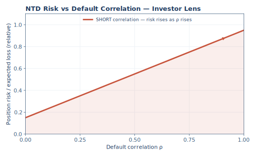

**Risks to the investor**

| Risk | Description | Severity |
|------|------------|:--------:|
| **Nth-default trigger risk** | Multiple defaults are needed — lower probability, but catastrophic if reached. After N-1 defaults the buffer is gone and the next default crystallises a loss. | High |
| **Correlation risk (short correlation)** | The NTD (N≥2) is short correlation — its risk *rises* as default correlation rises, because clustering makes the Nth default more likely. High-correlation regimes are the adverse case. | Very High |
| **Default clustering risk** | Multiple defaults in rapid succession consume the N-1 buffer faster and cut short the coupon stream collected before the trigger. | High |
| **Recovery risk** | Loss severity depends on the recovery rate of the Nth defaulted name, set at credit-event auction — a low recovery means a larger principal loss. | High |
| **Model risk** | A copula model drives pricing; the correlation sensitivity is model-dependent and hard to calibrate. | High |
| **Issuer credit risk** | The investor is exposed to the issuing bank's creditworthiness; if the issuer defaults, coupons or principal may not be received. | Medium |

#### §8. THE BANK LENS — Desk Economics (1st Line of Defence)

**What the desk books**

The desk's raw position is the mirror image of the investor's. Where the investor sells Nth-default protection (short the Nth-to-default CDS), the desk **buys** that Nth-default protection on the basket; alongside it the desk has issued a note, which is a funding liability. The investor's enhanced coupon is, to the desk, the cost of the Nth-default protection premium plus funding, returned to the client. The trade is booked in Murex.

**Credit/correlation risk & hedging**

The desk hedges with individual single-name CDS on the basket constituents and with correlation-dependent basket hedges. Because the NTD's correlation direction is the reverse of the FTD's, the desk's correlation book must be managed carefully: a desk that is short correlation on a raw basis from one product is not automatically hedged by the other. On a **raw** basis the desk's NTD position is the mirror of the investor's (the desk is long correlation where the investor is short); the **net** correlation exposure depends on the rest of the book, and the desk monitors the direction (raw vs net) continuously. The Nth-default sensitivity rises monotonically with correlation (short throughout), so the desk watches for the level at which the sensitivity changes magnitude.

**How the bank makes money**

| Revenue Source | Mechanism | Typical Size |
|---------------|-----------|:------------:|
| Structuring fee | Embedded in coupon | 20-60bp per annum |
| Correlation trading | NTD correlation exposure is opposite in direction to FTD — the desk uses NTD positions to offset FTD correlation risk | 15-40bp per annum |
| Model edge | The correlation-direction behavior is complex — the bank's superior modeling creates a pricing advantage | 10-30bp per annum |

The key difference from FTD: NTDs are valuable to the bank's correlation book because they provide *offsetting* correlation exposure. A desk that is short correlation on a raw basis from selling FTD protection can lean the other way through NTD positions, reducing net correlation risk.

**The coupon decomposition:**

Coupon = Nth-default protection premium − Funds Transfer Pricing (FTP) − Desk margin

The source does not publish a per-component breakdown of the 5.0% 2TD coupon. Inferring from the FTD decomposition pattern and the revenue table above, a representative split for the 5.0% coupon is: Nth-default protection premium ~6.0%; FTP (internal funding cost) −0.5%; desk margin −0.5%; **net coupon 5.0%**. The premium is lower than the FTD's because the first N-1 defaults must occur before the protection is called, so the protection sold is worth less.

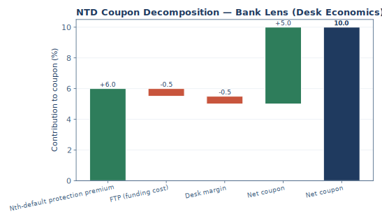

**P&L drivers**

Day to day, desk P&L is driven by single-name credit-spread moves on the basket constituents, the mark-to-market of the correlation position, the correlation model's calibration, and recovery-rate assumptions on the basket names. Product Control attributes P&L between coupon accrual and the Nth-default CDS MTM, and validates the correlation model inputs and the sign of the correlation sensitivity.

#### §9. THE BANK LENS — Controls & Reconciliation (2nd Line of Defence)

**Booking & systems**

| Aspect | Detail |
|--------|--------|
| **Booking system** | Murex |
| **Book of record** | NEMO — records the NTD with the N parameter and basket definition |
| **Pricing/Risk system** | Sophis — runs the Nth-default correlation model and tracks the default counter |
| **Booking structure** | Single note with embedded short Nth-to-default CDS on the basket |
| **Key booking fields** | Notional, N parameter (trigger threshold), basket names & weights, coupon rate & frequency, maturity, recovery convention |
| **Default counter** | Cumulative confirmed defaults maintained against N; N-1 defaults do not trigger |

**Key booking difference from FTD:** the N parameter (trigger threshold) must be correctly specified. A 2TD booked as an FTD (N=1) would settle on the wrong default event — a critical booking error.

**Reconciliation points**

| Recon point | What must agree | NTD-specific break |
|-------------|-----------------|--------------------|
| **ISDA credit definitions** | The credit-event definitions (bankruptcy, failure to pay, restructuring) and Determinations Committee process applied to each name | A restructuring counted as a default before ISDA DC confirmation, or a confirmed event not recorded |
| **Basket names & weights** | The reference entities and their weights match the termsheet across Murex, NEMO, and Sophis | A name substituted or re-weighted in one system but not another |
| **Default counter** | The cumulative count of confirmed defaults vs N agrees across systems | Counter not incremented after a confirmed credit event → the next default triggers unexpectedly |
| **N parameter (trigger threshold)** | The N specified in booking matches the termsheet (2TD = 2, 3TD = 3, …) | 2TD booked as N=1 → settles on the wrong default event |
| **Credit-event / auction recovery** | The recovery rate on the Nth defaulted name matches the credit-event auction result | Recovery taken from a stale assumption rather than the auction print |
| **Correlation model inputs** | The correlation matrix and copula parameters used in Sophis match the approved calibration | Wrong correlation inputs → wrong MTM and wrong sensitivity sign |
| **P&L attribution** | Coupon accrual + Nth-default CDS MTM reconciles to total | Unexplained P&L points to a stale correlation surface or a wrong recovery |
| **Settlement** | Cash settlement at the Nth name's recovery; note terminates on the Nth default | Settlement triggered on the wrong default number, or on an unconfirmed event |

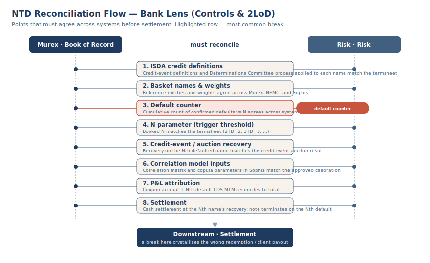

**Common breaks & red flags**

| Red Flag | What It Means | 2LoD Action |
|----------|---------------|-------------|
| N parameter is 1 in a product sold as 2TD | Booking error — the product is actually an FTD | Correct immediately |
| Default counter not updated after a confirmed credit event | The next default may trigger settlement unexpectedly | Update the counter; verify against ISDA determinations |
| Correlation model shows NTD sensitivity changing magnitude | The high-sensitivity correlation region is near the current market level | Alert the trader — risk magnitude may shift |
| Multiple basket names in the same industry / geography | Clustering risk is high — the N-1 buffer may be insufficient | Stress-test with sector-wide defaults |
| Recovery taken from assumption, not the auction print | Loss severity on the Nth name is misstated | Use the credit-event auction recovery |

**Control implication**

Each break has a direct consequence the 2nd line must size before it reaches the books or the client. The signature control for the NTD is **accurate capture of the default counter**: after N-1 confirmed defaults, the NTD effectively becomes a single-name CLN on the next-weakest credit, and the very next confirmed default crystallises the loss. A counter that is not incremented after a confirmed credit event understates how close the note is to settlement and can let the Nth default trigger unexpectedly. A mis-booked N parameter settles on the wrong event entirely; a wrong auction recovery misstates the loss severity. The reconciliation exists precisely to catch these inconsistencies before settlement crystallises them.

#### §10. Formal Definition

An **Nth-to-Default Note (NTD)** is a credit-linked note referencing a basket of reference entities in which the investor sells credit protection triggered by the **Nth** credit event in the basket. Defaults 1 through N-1 do not trigger any loss to the investor.

**The correlation-direction reversal between FTD and NTD:**

For the FTD (N=1), the relationship between correlation and risk is straightforward: higher correlation → lower first-default probability → lower risk (long correlation).

For the NTD (N≥2), the direction reverses to short correlation; NTD risk then rises monotonically with correlation (short throughout):

| Correlation | FTD (N=1) Risk | 2TD (N=2) Risk | 3TD (N=3) Risk |
|:-----------:|:--------------:|:--------------:|:--------------:|
| **Low (0.1)** | HIGH — many independent defaults likely | LOW — two independent defaults unlikely | VERY LOW — three independent defaults very unlikely |
| **Medium (0.4)** | MODERATE | MODERATE | LOW |
| **High (0.8)** | LOW — defaults cluster, so all-or-nothing | **MODERATE-HIGH — if defaults cluster, multiple defaults occur together** | MODERATE — clustering makes 3+ defaults possible |
| **Very High (0.95)** | VERY LOW — almost acts like a single name | **HIGH — if one defaults, all default together, so the 2nd default is almost certain** | HIGH — same clustering logic |

**Why the NTD is short correlation:** at very high correlation, defaults either all happen or none happen. If *any* default occurs, it is likely that *multiple* defaults follow immediately (contagion, systemic crisis). For the FTD this means fewer total default events (good for the FTD — long correlation). For the NTD this means that *when* the first default occurs, the Nth default follows quickly (bad for the NTD — short correlation). The 5TD (last-to-default) is the extreme case, economically equivalent to a CDO super-senior tranche.

#### §11. Lifecycle

| Stage | What Happens | Key Actions |
|-------|-------------|-------------|
| **Pre-trade** | Structurer selects N and basket. Correlation analysis performed | Basket approval, correlation stress testing |
| **Trade date** | NTD issued. Desk enters individual CDS hedges and correlation hedges | Booking in Murex / NEMO with the Nth trigger; Sophis with the correlation model |
| **During life** | Coupons paid. Default counter maintained. N-1 defaults do not trigger | Default counting, continuous credit monitoring |
| **Defaults 1 to N-1** | Each default is recorded but does NOT trigger settlement. Coupon continues | Default counter updated; recovery on the defaulted name is irrelevant to the NTD until the Nth |
| **Nth default** | Settlement triggered. Recovery applied on the Nth defaulted entity | Cash settlement at the Nth entity's auction recovery rate. Note terminated |

#### §12. Worked Example (both lenses)

**Product:** 5-year 2nd-to-Default (2TD) on a 5-name basket.
**Same basket as FTD example:** AlphaTech (180bp), BetaBank (220bp), GammaPharma (150bp), DeltaEnergy (250bp), EpsilonRetail (200bp).
**Notional:** $1,000,000.
**Coupon:** 5.0% per year.
**Default correlation:** 0.30.

**Timeline:**
- **Year 1:** No defaults. Coupon: $50,000.
- **Year 2:** DeltaEnergy defaults (credit event confirmed by ISDA). This is Default #1. The 2TD does NOT trigger. The investor continues receiving coupons. Default counter: 1 of 2 needed.
- **Year 3:** No additional defaults. Coupon: $50,000. Cumulative coupons: $150,000.
- **Year 4:** BetaBank defaults. This is Default #2. **The 2TD triggers.**

*Investor lens:*

**Settlement:**
- Recovery rate on BetaBank (the Nth defaulter): 45%
- Principal returned: $1,000,000 × 45% = $450,000
- Coupons received: 4 × $50,000 = $200,000
- **Total received: $650,000. Net loss: $350,000 (-35%).**

**Correlation comparison (same basket, same scenario):**

| Metric | FTD (settled Year 2) | 2TD (settled Year 4) |
|--------|:--------------------:|:--------------------:|
| Trigger event | DeltaEnergy default (Year 2) | BetaBank default (Year 4) |
| Coupons collected | $190,000 (2 × $95,000) | $200,000 (4 × $50,000) |
| Recovery received | $350,000 (35% of $1M) | $450,000 (45% of $1M) |
| Total received | $540,000 | $650,000 |
| Net loss | -$460,000 (-46%) | -$350,000 (-35%) |

The 2TD investor collected 2 extra years of coupons and had a different recovery rate. Despite lower annual coupons, the 2TD delivered a better outcome in this scenario.

*Bank lens:*
- The desk bought 2nd-to-default protection on the basket and hedged with single-name CDS and correlation hedges. Through Year 2, DeltaEnergy's default (Default #1) does not trigger the NTD; the desk maintains the default counter at 1 of 2 and continues funding the $50,000 coupons. At the Year 4 BetaBank default (Default #2), the desk's bought protection is called: it receives the protection payout that offsets the note's redemption shortfall.
- The 2nd line must confirm the default counter incremented correctly to 2, that the N parameter is booked as 2 (not 1), that BetaBank's 45% recovery matches the credit-event auction print, and that Murex, NEMO, and Sophis agree on basket and settlement before the note is terminated.

#### §13. Knowledge Check

**Review Questions:**
1. *(Investor)* What does the "N" in NTD represent?
2. *(Investor)* How does the coupon change as N increases? Why?
3. *(Investor)* Is the NTD (N≥2) long or short correlation under the MTM convention, and how does its direction compare to the FTD?
4. *(Investor)* Why is NTD complexity rated 8/10 while FTD is 7/10?
5. *(Desk economics / 1LoD)* The desk buys Nth-default protection against the investor. On a raw basis, which way does the desk's correlation position point relative to the investor, and how does the desk use NTD positions against an FTD book?
6. *(Controls / 2LoD)* A 2TD has experienced one confirmed default. Which reconciliation point is now the most critical to capture, and what is the consequence if it is wrong?

**Scenario Questions:**
1. An investor holds a 3TD on a 5-name basket. Two defaults have occurred. The investor says "I have one default buffer left, I'm safe." What risk is the investor ignoring?
2. A correlation regime shift moves market correlation from 0.3 to 0.8. How does this affect the risk of a 2TD (short correlation) compared to an FTD (long correlation)?
3. A 2TD basket has had one default (Default #1). The investor wants to sell the note in the secondary market. What factors determine the sale price?

**Mental Models**

| Concept | Mental Model |
|---------|-------------|
| Nth-to-Default Note | A fire alarm with an N-sensor threshold — the alarm only sounds when N sensors detect smoke |
| The N threshold | The number of defaults that must occur before the investor takes a loss; the first N-1 are absorbed |
| Coupon scaling | Each step up in N removes the most likely default trigger, so the coupon falls (FTD 9.5% → 5TD 0.3%) |
| Correlation direction | FTD is long correlation; the NTD (N≥2) is short correlation — high clustering reaches the Nth trigger |
| 5TD ≈ CDO super-senior | Losses only reach the senior level when defaults cluster at high correlation — short correlation |
| Default counter | The score in the game — once it reaches N-1, the next default ends the note |
| 2LoD reconciliation | The auditor confirming the count, the N parameter, and the recovery all agree before settlement |

**Key Takeaways**

1. An NTD is a basket credit-linked note: the investor sells Nth-to-default protection on a basket, earns a coupon, and loses principal only after the Nth name defaults.
2. The coupon scales inversely with N (FTD 9.5% → 2TD 5.0% → 3TD 2.5% → 4TD 1.0% → 5TD 0.3%) because more defaults are needed to trigger a loss.
3. The NTD (N≥2) is **short correlation** under the MTM convention — its risk rises as correlation rises, because clustering makes the Nth default more likely. Only the FTD (N=1) is long correlation; the direction reverses.
4. The investor is protected through default N-1; once the counter reaches N-1, the NTD behaves like a single-name CLN on the next-weakest credit.
5. The 5TD (last-to-default) is the extreme short-correlation case, economically equivalent to a CDO super-senior tranche.
6. The desk buys Nth-default protection (mirror of the investor) and uses NTD positions to offset FTD correlation risk; net correlation exposure must be qualified raw vs net.
7. For the 2nd line, the dominant control is accurate capture of the default counter, the N parameter, and the auction recovery — each can misstate whether and how much the note settles.

#### §14. Common Mistakes

1. **Assuming an NTD is always safer than an FTD.** At high correlation, the NTD (short correlation) becomes *riskier*, while the FTD (long correlation) becomes safer — the directions are opposite.
2. **Ignoring the default counter.** After N-1 defaults, the NTD effectively becomes a single-name CLN on the next-weakest credit. The "basket protection" has been consumed.
3. **Mislabeling NTD correlation direction.** Under the MTM convention, all NTD tranches (N≥2) are short correlation — their risk rises as ρ rises (high correlation → defaults cluster → the Nth default becomes more likely). Only the FTD (N=1) is long correlation. Do not carry the FTD's long-correlation intuition over to higher-N tranches; the direction reverses at N≥2.
4. **Treating the NTD as a clean FTD hedge without qualification.** Because the correlation directions are opposite, an NTD can offset an FTD book, but the net position must be sized — at extreme correlation both can move adversely depending on the book.
5. **(Controls) Trusting the booked N parameter or default count without reconciliation.** A 2TD mis-booked as N=1 settles on the wrong default, and an un-incremented default counter hides how close the note is to triggering. The 2nd line must reconcile the N parameter, the default counter, and the auction recovery across Murex, NEMO, and Sophis before settlement.

---

*Coupon scaling reference (same basket, same tenor):*

| Product | Coupon | Risk | Correlation Sensitivity |
|---------|:------:|:----:|:----------------------:|
| FTD (N=1) | 9.5% | Highest | Long correlation (MTM: risk falls as ρ rises) |
| 2TD (N=2) | 5.0% | Medium | Short correlation (reversed from FTD: high ρ → clustered defaults → higher NTD risk) |
| 3TD (N=3) | 2.5% | Lower | Short correlation (high ρ → clustering reaches the 3rd-default threshold) |
| 4TD (N=4) | 1.0% | Low | Short correlation (high ρ → if defaults cluster, the 4th-default threshold is breached) |
| 5TD (N=5) | 0.3% | Lowest | Short correlation (high ρ → all-or-nothing → if one defaults, all do → 5TD triggered; ≈ CDO super-senior) |

**Dual-lens questions:**
- *(Desk economics / 1LoD)* What does the desk book against the investor (raw correlation/credit position), and how is it hedged?
- *(Controls / 2LoD)* Which credit-event / basket / model-input fields must reconcile, and which is the most common break?

**Dual-lens visuals (generated):**
- `assets/ntd/controls_ntd_recon_08.svg` `[generated]`
- `assets/ntd/payoff_ntd_01.svg` `[generated]`
- `assets/ntd/waterfall_ntd_09.svg` `[generated]`
### 5.5.5 Synthetic CDO Tranche {#sec-5-5-5}

> **Prerequisites:** FTD &nbsp;|&nbsp; **Key concepts:** Tranching, attachment/detachment, copula dependency, base correlation, loss waterfall

---

*The CLNs (Sections 5.5.1–5.5.4) referenced single credits or small baskets. The Synthetic CDO Tranche references a large portfolio (50–125 credits) and slices the aggregate loss into tranches — equity, mezzanine, senior, super-senior — each absorbing losses in sequence. This is the most complex credit structure in the Bible, combining portfolio credit risk, tranche mechanics, and correlation sensitivity. This chapter reads the product through two lenses: what it means for **the investor**, and what it means for **the bank** — the latter split into the desk's market economics (1st line of defence) and the controls and reconciliation that surround it (2nd line of defence).*

#### §1. Explain Like I'm New

The credit market is much larger than a single name or a small basket. Banks hold portfolios of hundreds or thousands of credit exposures. A structurer reframes the problem this way: imagine a portfolio of 100 corporate credit exposures. Some of these companies will default over the next 5 years. The questions are *how many* will default, and *how much* total loss the portfolio will suffer. That total loss can be divided into **slices** — called **tranches** — and each slice sold to a different investor according to risk appetite.

This is a **Synthetic CDO Tranche**. "CDO" stands for Collateralized Debt Obligation. "Synthetic" means the portfolio is constructed using CDS contracts (synthetic credit exposure) rather than actual bonds or loans. "Tranche" means the investor buys a specific *slice* of the portfolio's total credit risk: the investor sells protection on a band of the portfolio's losses (between an attachment and a detachment point), receives a coupon for doing so, and suffers a principal hit only when cumulative portfolio losses enter that band.

Think of it as a **highrise building in a flood zone**:
- The **ground floor** (the equity tranche) absorbs the first losses — the first few feet of floodwater. The ground-floor tenant pays the lowest rent but faces the most risk.
- The **middle floors** (mezzanine tranches) are affected only after the ground floor is completely flooded. Higher risk than the top floors, but protected from small floods.
- The **top floors** (senior tranches) are only affected in catastrophic floods that submerge the entire building. These tenants pay the highest rent (in CDO terms, *receive* the lowest coupon) because they are safest.
- The **penthouse** (super-senior tranche) is only affected if the flood exceeds all previous records. Almost never happens — almost zero coupon, almost zero risk.

The key innovation: the **same portfolio** of credit risk is divided into layers with completely different risk profiles. An investor wanting high risk and high return takes the equity tranche; an investor wanting low risk takes the senior tranche. Both are exposed to the same portfolio — just different slices of it.

#### §2. Real-World Analogy

A Synthetic CDO Tranche is like a **highrise building in a flood zone with tiered insurance**.

Imagine a 10-story building by a river. Each floor is occupied by a different tenant. The building has a history: small floods happen occasionally, medium floods every few decades, and a catastrophic flood has never been recorded but is theoretically possible.

The landlord offers different rental terms by floor:
- **Floor 1 (Equity, 0-3% of building height):** Rent is very cheap. But the tenant knows that any flood — even a small one — will damage their unit first. They accept this because the rent savings are substantial.
- **Floors 2-4 (Mezzanine, 3-7%):** Moderate rent. These tenants are protected from minor floods but will be affected by significant ones.
- **Floors 5-8 (Senior, 7-15%):** Higher rent. Only a major flood reaches these floors.
- **Floors 9-10 (Super-senior, 15-100%):** Premium rent. Only a once-in-a-century catastrophic flood would reach the penthouse.

In a Synthetic CDO:
- The **building** is the reference portfolio (100+ CDS contracts).
- The **flood** is portfolio credit losses (defaults).
- Each **floor** is a tranche defined by attachment and detachment points.
- The **rent differential** is the coupon differential — equity tranche pays the highest coupon, super-senior pays the lowest.
- The **flood height** is the cumulative portfolio loss percentage.

#### §3. What Problem Does This Solve?

Synthetic CDO tranches solve the **credit risk redistribution** problem.

Banks hold large portfolios of credit risk from their lending and trading activities. They may want to reduce their credit exposure (for regulatory capital purposes or risk management) without selling the underlying loans. A Synthetic CDO allows the bank to *transfer* specific layers of credit risk to investors who want that exposure.

| Market Need | Why Other Products Fall Short | What Synthetic CDO Offers |
|------------|------------------------------|--------------------------|
| Large portfolio credit transfer | CLNs transfer single-name risk. FTDs transfer small-basket risk | CDO transfers risk on 100+ names simultaneously |
| Risk layering | FTDs are all-or-nothing | CDO tranches allow investors to choose their risk level |
| Regulatory capital relief | Single-name CDS provides limited capital relief | CDO equity tranche sale provides concentrated capital relief |
| Customized credit exposure | CLNs offer fixed risk profiles | CDO tranches offer equity (high risk/return) through super-senior (minimal risk/return) |

#### §4. Product DNA

| **Field** | **Value** |
|---|---|
| **Full Name** | Synthetic CDO Tranche |
| **Abbreviation** | CDO |
| **Family** | Credit-Linked Notes |
| **Complexity Score** | 10 / 10 |
| **Complexity Rationale** | NTD (8) + tranching + attachment/detachment points + portfolio-level modeling + copula dependency + 2008 financial crisis context. Most complex product in the universe |
| **Underlying Asset Class** | Credit (portfolio of 100+ reference entities via CDS) |
| **Capital Protection** | Tranche-dependent (senior protected by subordination, equity tranche = first loss) |
| **Coupon Type** | Fixed or floating (varies by tranche seniority) |
| **Maturity** | 5–7 years |
| **Liquidity** | OTC — model-dependent, index tranches more liquid |
| **Primary System** | NEMO (primary), Sophis (risk) |
| **ISDA Required** | Yes — ISDA Credit Definitions (unfunded tranches) |

**DNA Atlas Fields:**
- Primary Risk: Portfolio credit losses reaching tranche attachment point. Equity tranche = first loss. Senior tranche = protected but catastrophic loss scenario
- Typical Buyer: Banks (regulatory capital relief), hedge funds (leveraged credit), insurance (yield on senior tranches)
- Typical Use Case: Credit risk transfer via tranching. Equity tranche buyers seek yield. Senior buyers seek safety with spread pickup
- Building Blocks: CDS portfolio + tranching waterfall (attachment/detachment points) + copula dependency model
- Key Hedge: Index CDS, single-name CDS, correlation trading (base correlation)
- Similar Products: NTD (5.5.4 — simpler basket), FTD (5.5.3 — first loss), CLN (5.5.1)
- Most Important Greek: Base correlation (drives tranche pricing)

**Comparison Matrix Fields:**
- Complexity: 10
- Yield Potential: Varies by tranche (equity = very high, senior = low)
- Capital Protection: Tranche-dependent (senior protected by subordination)
- Credit Exposure: Portfolio of 50-125 reference entities
- Liquidity: OTC — model-dependent, index tranches more liquid
- Path Dependency: Yes (loss accumulation through portfolio)
- Volatility Sensitivity: Low (credit, not vol)
- Correlation Sensitivity: Extreme — correlation drives all tranche pricing. Highest of any product
- Client Type: Banks, hedge funds, insurance
- Market Environment: Best in stable credit markets. 2008 crisis demonstrated catastrophic tail risk

#### §5. Who Touches This Product

| Role | What They Do |
|------|-------------|
| **Structurer** | Designs portfolio composition, tranche structure (attachment/detachment points), and pricing. This is the most complex structuring exercise in the product universe |
| **Trader** | Hedges with index CDS (e.g., CDX, iTraxx) and individual CDS. Manages the correlation book — the most challenging hedging problem. Monitors the "correlation smile" |
| **Sales** | Explains tranche mechanics to sophisticated institutional investors. Must clearly communicate that the equity tranche can lose 100% even if only 3% of the portfolio defaults |
| **Quant** | Develops and maintains the Gaussian copula model (or successor models). Validates correlation assumptions. Performs model risk assessment. This is the most model-dependent product in the book |
| **Risk Manager** | Monitors portfolio credit quality, tranche sensitivity, correlation exposure, and model risk. Performs scenario analysis: what happens under 2008-like conditions? |
| **Operations** | Tracks credit events across 100+ reference entities. Determines which tranche absorbs each loss. Calculates notional depletion for affected tranches |
| **Compliance** | Verifies investor sophistication and suitability for tranched credit products. Ensures disclosure of model risk and 2008 context |
| **Product Control** | Marks tranches using correlation-dependent models. Validates model outputs against market-traded tranche prices |

#### §6. Product Evolution

**Ancestor:** NTD (5.5.4) → FTD (5.5.3) → Vanilla CLN (5.5.1)

**Evolution path:**
1. **Vanilla CLN** — Single-name credit-linked note
2. **FTD/NTD** — Small basket (5-10 names) with Nth-default trigger
3. **Synthetic CDO** — Large portfolio (100+) with tranched loss allocation

**Historical context:**

Synthetic CDOs were widely used in the early 2000s. Before the 2007-2008 financial crisis, CDO issuance grew rapidly. The Gaussian copula model, introduced by David Li in 2000, provided a tractable way to price correlation in large credit portfolios. Banks used this model to price and trade CDO tranches.

**What happened in 2008:** The Gaussian copula model assumed a specific, constant correlation structure. In reality, default correlations spiked dramatically during the crisis. Companies the model predicted would default independently instead defaulted together — contagion effects the model underestimated. Losses on equity and mezzanine tranches were far larger than the model predicted. Some senior tranches rated AAA also suffered losses.

**Post-crisis evolution:** The CDO market contracted significantly. Models were enhanced to incorporate stochastic correlation, jump-to-default risk, and tail dependence. Regulation tightened. Modern synthetic CDOs are traded primarily among sophisticated institutional investors with explicit model risk awareness.

**Mechanical lesson:** The 2008 crisis demonstrated that correlation assumptions are the most critical and least stable input in portfolio credit models. When these assumptions fail, the damage is concentrated in the tranches that assumed they were protected.

---

#### §7. THE INVESTOR LENS

**Why the investor buys it**

1. **Tailored credit exposure.** A single portfolio of 100+ names can be sliced so that each investor takes precisely the risk layer that matches their appetite — equity (leveraged, high coupon) through super-senior (minimal coupon, maximal protection).
2. **Yield enhancement.** The equity and mezzanine tranches pay coupons far above comparable bonds, funded by the protection the investor sells on the loss band.
3. **Spread pickup with protection.** A senior-tranche investor earns a spread over government bonds while sitting behind multiple layers of subordination — only catastrophic losses reach the attachment point.
4. **View expression.** An investor with a specific view on default clustering (correlation) or on portfolio loss can monetize it by selecting the tranche whose correlation and loss sensitivity match that view.
5. **Regulatory or balance-sheet motivation.** A bank investor may take a tranche to achieve concentrated capital relief on its own portfolio.

**Tranche & correlation direction**

Each tranche investor sells protection on a band of portfolio losses and is, in effect, **long credit** on that slice. The correlation direction depends on which tranche is held (this convention is canonical and is checked by the semantic linter):

| Tranche | Position | Correlation direction |
|---------|----------|----------------------|
| **Equity (0-3%, first-loss)** | Sold first-loss protection | **LONG correlation** — at high correlation losses cluster, so the probability of the equity tranche being wiped falls relative to low correlation; the equity-tranche investor benefits from high correlation |
| **Mezzanine (3-7%)** | Sold protection on the middle band | **Correlation-sign ambiguous** — the sign depends on attachment/detachment and base correlation; in the worked structure the mezzanine behaves short-correlation at most levels (clustered defaults blow through the equity tranche into the mezzanine) |
| **Senior / super-senior (7-15% / 15-100%)** | Sold protection on the top band | **SHORT correlation** — high correlation makes extreme clustered losses (those that reach the senior attachment) more likely; the senior-tranche investor is hurt by high correlation. This mirrors the 5th-to-default ≈ super-senior = SHORT relationship |

Aliyah's fund in the worked example holds the **Mezzanine tranche (3-7%)**: long the middle credit band, correlation-sign ambiguous (short-correlation at most levels for this structure). The investor never benefits from rising volatility — the sensitivity is to credit spreads, default clustering (correlation), and realized portfolio losses, not equity vol.

**Payoff & scenarios**

For a tranche with attachment A and detachment D, the investor's loss is zero until cumulative portfolio loss reaches A, rises linearly as loss runs from A to D, and is total (100%) once loss reaches D. Coupons are paid on *surviving* notional, so once losses enter the band the coupon base shrinks.

**Product:** 5-year Synthetic CDO on portfolio of 100 investment-grade CDS. **Portfolio notional:** $1,000,000,000 ($1 billion). **Average CDS spread:** 100bp.

**Tranche structure:**

| Tranche | Attachment | Detachment | Notional | Coupon |
|---------|:----------:|:----------:|:--------:|:-----:|
| Equity | 0% | 3% | $30,000,000 | 25.0% |
| Mezzanine | 3% | 7% | $40,000,000 | 8.0% |
| Senior | 7% | 15% | $80,000,000 | 2.5% |
| Super-senior | 15% | 100% | $850,000,000 | 0.15% |

**Investor:** Aliyah's fund purchases the Mezzanine tranche ($40M notional, 3-7% attachment/detachment, 8.0% coupon).

**Scenario 1 — Moderate defaults (portfolio loss = 2%):**
Over 5 years, 4 out of 100 companies default. Portfolio losses total $20M (2% of $1B). All losses are absorbed by the equity tranche (0-3% band). The mezzanine tranche is untouched.
- The investor receives 5 years of coupons: 5 × ($40M × 8%) = $16M
- Full principal returned: $40M
- **Total: $56M. No loss.**
- Equity tranche: absorbed $20M of losses out of $30M notional. The equity investor lost 67%.

**Scenario 2 — Elevated defaults (portfolio loss = 5%):**
Over 5 years, 10 companies default. Portfolio losses total $50M (5% of $1B).
- First $30M (0-3%): absorbed by equity tranche → equity tranche wiped out (100% loss)
- Next $20M (3-5%): absorbed by mezzanine tranche → mezzanine loses $20M out of $40M notional
- The investor's mezzanine position: notional reduced from $40M to $20M
- Coupons received (on declining notional): approximately $14M
- Principal returned: $20M
- **Total: $34M out of $40M invested. Net loss: $6M (-15%).**
- Senior tranche: untouched (losses stopped at 5%, below 7% attachment)

**Scenario 3 — Crisis (portfolio loss = 12%):**
Severe economic crisis. 25 companies default. Portfolio losses total $120M (12% of $1B).
- 0-3%: equity tranche wiped out ($30M loss, 100%)
- 3-7%: mezzanine tranche wiped out ($40M loss, 100%)
- 7-12%: senior tranche absorbs $50M of $80M notional
- The investor's mezzanine position: **total loss of $40M principal (-100%).** Coupons received before wipeout provide partial recovery.
- Senior tranche: 62.5% loss
- Super-senior: untouched (losses stopped at 12%, below 15% attachment)

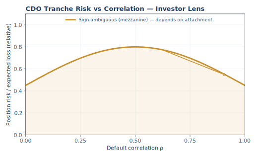

**Risks to the investor**

| Risk | Description | Severity |
|------|------------|:--------:|
| **Portfolio credit loss reaching the attachment** | Defaults in the 100+ name portfolio accumulate until they reach the tranche's attachment point and begin eroding principal | High |
| **Tranche position risk** | Equity absorbs first, senior last. The investor's place in the loss waterfall is the defining structural risk | Very High |
| **Correlation risk** | Changes in default correlation shift value between tranches; the sign depends on the tranche held (equity long, senior short, mezzanine ambiguous) | Very High |
| **Recovery risk** | Loss = (1 − Recovery) × defaulted notional; lower recoveries mean larger losses entering the waterfall sooner | High |
| **Issuer / counterparty credit risk** | The investor relies on the issuing bank's creditworthiness for coupons and principal | Medium |
| **Model risk** | Tranche marks depend on the Gaussian copula (or successors); models underestimate tail dependence (the 2008 lesson) | Very High |
| **Liquidity risk** | Bespoke tranches have minimal secondary market; index tranches are more liquid | High |

#### §8. THE BANK LENS — Desk Economics (1st Line of Defence)

**What the desk books**

The desk's position is the mirror image of the investor's. Where the tranche investor sells protection on a loss band, the desk has **bought** that tranche protection (or runs a correlation book that warehouses tranche risk across the structure). Each tranche is booked as a separate position in NEMO with its own attachment and detachment points; the portfolio of 100+ reference CDS sits behind the structure, with the risk model run in Sophis. The investor's coupon is, to the desk, the cost of the protection it has purchased on that band.

**Correlation/credit risk & hedging**

The desk hedges with index CDS (e.g. CDX, iTraxx) and single-name CDS to neutralize spread (credit delta) across the portfolio, and trades correlation using a base-correlation / copula framework. Correlation is not a single number but a *surface*: equity, mezzanine, and senior tranches trade at different implied correlations — the **correlation smile** (or skew). The desk must manage a surface of correlation exposures, with each tranche carrying its own correlation sign (equity long, senior short, mezzanine ambiguous). The equity tranche is the "canary": its mark-to-market moves the fastest and is watched as an early-warning indicator for the whole portfolio.

**How the bank makes money**

| Revenue Source | Mechanism | Typical Size |
|---------------|-----------|:------------:|
| Structuring fee | Complex structuring = large fee. Multiple tranches = multiple investor relationships | 50-200bp upfront |
| Correlation trading | The desk warehouses correlation risk between different tranches. The "correlation smile" creates arbitrage opportunities | 20-80bp per annum |
| Index-tranche basis | The desk trades index CDS and tranche CDS at different correlation assumptions | 10-40bp per annum |
| Capital relief | If the bank is transferring its own credit portfolio risk, regulatory capital savings are significant | Variable, substantial |

The CDO structuring business is among the most profitable in investment banking — and among the most model-dependent. The bank's edge is its ability to model, price, and hedge correlation risk across a large portfolio.

**The coupon decomposition:**

The mezzanine coupon paid to the investor is built from the protection premium the desk collects on the loss band, net of the cost of hedges and desk margin. The source quotes the structure's coupons directly (equity 25.0%, mezzanine 8.0%, senior 2.5%, super-senior 0.15%) but does not break a single tranche coupon into its sub-components. *Inferred decomposition (not in source — illustrative for the 8.0% mezzanine coupon):* portfolio CDS premium attributable to the band ≈ 9.0%, less index/single-name hedge cost ≈ −0.6%, less correlation-hedge carry ≈ −0.2%, less desk margin ≈ −0.2%, **net coupon 8.0%**. The premium is high because the investor sells meaningful protection on a band that a moderate portfolio stress can reach.

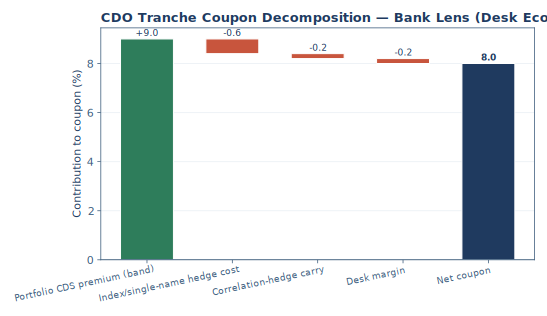

**P&L drivers**

Day to day, desk P&L is driven by: portfolio credit-spread moves (credit delta across the index and single names), changes in base correlation across the tranche surface, realized credit events and the recovery achieved at auction, notional depletion as defaults accumulate, and the mark-to-market of each tranche against traded index-tranche prices. Product Control marks tranches using the correlation-dependent model and validates outputs against market-traded tranche prices.

#### §9. THE BANK LENS — Controls & Reconciliation (2nd Line of Defence)

**Booking & systems**

| Aspect | Detail |
|--------|--------|
| **Book of record** | NEMO — records each tranche as a separate position with attachment/detachment |
| **Pricing/Risk system** | Sophis — runs the portfolio correlation model, calculates tranche sensitivities, tracks loss allocation |
| **Booking structure** | One position per tranche over a shared reference portfolio (100+ CDS) |
| **Key booking fields** | Portfolio definition (all 100+ reference entities and weights), attachment point, detachment point, tranche notional, coupon rate & frequency, base-correlation inputs, maturity |
| **Loss allocation engine** | Must correctly waterfall losses from equity upward |
| **Notional depletion tracking** | Surviving notional must be updated after each credit event; coupons paid on surviving notional only |

**Reconciliation points**

| Recon point | What must agree | CDO-specific break |
|-------------|-----------------|-------------------|
| **ISDA Credit Definitions** | Credit-event types, succession, settlement method per the ISDA Credit Definitions | Event type recognized in NEMO not matching the confirmed ISDA determination |
| **Reference portfolio & weights** | All 100+ reference entities and their notionals/weights identical across NEMO and Sophis | A name or weight missing/mismatched → wrong portfolio loss base |
| **Attachment / detachment points** | Each tranche's A and D agree across systems and the termsheet | Attachment stored as 3% in one system, an absolute amount in another |
| **Base-correlation / copula inputs** | Correlation surface and copula parameters used to mark each tranche | Stale or mismatched base correlation → tranche marks diverge from traded prices |
| **Credit-event / recovery** | Loss = (1 − Recovery) × defaulted notional; recovery from the auction | Auction recovery not propagated → loss amount wrong → wrong tranche depletion |
| **Loss waterfall / default counter** | Cumulative loss and the count of credit events allocated equity-upward | Loss allocated to the wrong tranche, or default counter out of sync |
| **Settlement** | Notional reduction on affected tranches; surviving notional returned at maturity | Settlement booked on original rather than surviving notional |
| **Coupon lifecycle** | Coupon recalculated on surviving notional after each event | Coupon paid on original notional → income overstated |

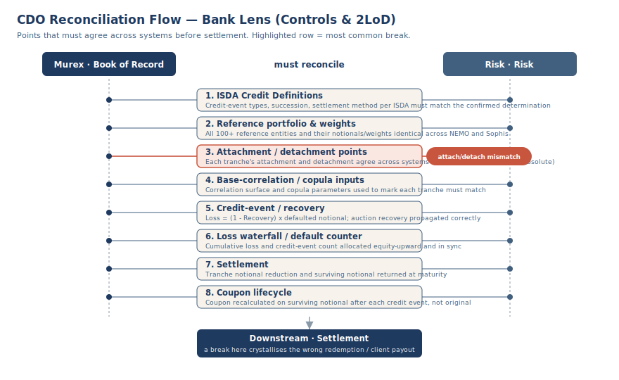

**Common breaks & red flags**

| Red Flag | What It Means | 2LoD Action |
|----------|---------------|-------------|
| Equity tranche notional declining rapidly | Portfolio defaults exceeding expectations | Alert Risk Manager — mezzanine may be at risk |
| Correlation model shows extreme implied correlation | Market stress or model miscalibration | Validate model, compare to traded tranche prices |
| Portfolio concentrated in one sector (>25%) | Contagion risk amplified | Stress-test with a sector-wide default scenario |
| Mezzanine coupon calculated on original notional | Booking error — coupon should use surviving notional | Correct immediately; P&L is overstated |
| Implied correlation differs significantly from historical | Model-market disconnect | Investigate — may indicate mispricing or regime change |
| Multiple credit events in short period | Portfolio stress — losses may accelerate | Review tranche subordination adequacy |

**Control implication**

Each break has a direct consequence the 2nd line must size before it reaches the books or the client. A wrong attachment/detachment point misstates which tranche absorbs a loss — driving the wrong depletion and the wrong investor payout. A missed or mismatched auction recovery feeds a wrong loss amount into the waterfall, depleting the wrong notional. A coupon paid on original rather than surviving notional overstates income on every period after a default. A stale base correlation breaks every tranche mark at once. The reconciliation exists precisely to catch these inconsistencies before settlement crystallises them across 100+ names and four tranches.

#### §10. Formal Definition

A **Synthetic CDO (Collateralized Debt Obligation)** is a structured product that references a portfolio of credit exposures (typically 100+ CDS contracts) and divides the portfolio's credit losses into **tranches** — sequential layers defined by attachment and detachment points. A tranche investor sells protection on one band of the portfolio's losses, receives a coupon, and suffers a principal reduction only when cumulative portfolio losses enter that band.

**Key terms:**

| Term | Definition |
|------|-----------|
| **Attachment point** | The portfolio loss level at which the tranche starts absorbing losses (e.g., 3% for mezzanine) |
| **Detachment point** | The portfolio loss level at which the tranche is fully wiped out (e.g., 7% for mezzanine) |
| **Tranche width** | Detachment − Attachment (e.g., 7% − 3% = 4%) |
| **Tranche notional** | Portfolio notional × Tranche width (e.g., $1B × 4% = $40M) |
| **Subordination** | The amount of loss protection below the tranche (equity has zero subordination, mezzanine has equity subordination) |
| **Portfolio loss** | Total losses from defaults in the reference portfolio, as % of portfolio notional |

**Loss allocation waterfall:**

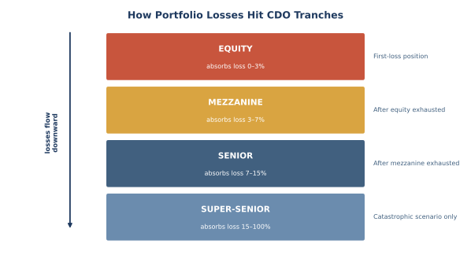


**Tranche payoff at maturity:**

For a tranche with attachment A and detachment D:
- If Portfolio Loss ≤ A: Tranche loss = 0% (fully protected by subordination)
- If A < Portfolio Loss < D: Tranche loss = (Portfolio Loss − A) / (D − A) × 100%
- If Portfolio Loss ≥ D: Tranche loss = 100% (fully wiped out)

**Example (Mezzanine 3-7%):**
- Portfolio loss = 2%: Mezzanine loss = 0% (below 3% attachment)
- Portfolio loss = 5%: Mezzanine loss = (5% − 3%) / (7% − 3%) = 50%
- Portfolio loss = 8%: Mezzanine loss = 100% (above 7% detachment)

#### §11. Lifecycle

| Stage | What Happens | Key Actions |
|-------|-------------|-------------|
| **Pre-trade** | Structurer designs portfolio and tranche structure. Quant models portfolio loss distribution using correlation assumptions. Legal documents prepared | Portfolio approval, tranche pricing, model validation, legal documentation |
| **Trade date** | CDO issued. Investors purchase specific tranches. The desk enters portfolio CDS positions | Booking all tranches in NEMO, risk setup in Sophis with the portfolio model |
| **During life** | Coupons paid on surviving notional. Portfolio monitored for credit events. Losses allocated to tranches per the waterfall | Credit event monitoring (100+ names), notional depletion tracking, coupon recalculation |
| **Credit events** | ISDA confirms default. Loss = (1 − Recovery) × Defaulted notional. Loss allocated starting from the equity tranche upward | Tranche notional reduction, coupon recalculation on reduced notional |
| **Maturity** | Surviving tranche notional returned to investors. All CDS positions expire | Final settlement, P&L recognition |

#### §12. Worked Example (both lenses)

**Product:** 5-year Synthetic CDO Mezzanine Tranche (3-7%). **Portfolio:** 100 investment-grade CDS, each $10M notional = $1B total. **Average CDS spread:** 100bp. **Portfolio default correlation:** 0.25. **Mezzanine tranche notional:** $40M (= $1B × 4%). **Mezzanine coupon:** 8.0% per year.

*Investor lens:*

**Year 1:** No defaults. Coupon: $40M × 8% = $3,200,000.

**Year 2:** Company #47 defaults. Recovery: 40%. Loss = $10M × (1 − 0.40) = $6M.
Portfolio loss = $6M / $1B = **0.6%**. This is below 3% attachment.
→ Equity tranche absorbs full $6M. Equity notional: $30M − $6M = $24M.
→ Mezzanine: untouched. Coupon: $3,200,000.

**Year 3:** Companies #12 and #83 default. Recovery: 35% each. Loss = 2 × $10M × 0.65 = $13M.
Cumulative portfolio loss = ($6M + $13M) / $1B = **1.9%**. Still below 3%.
→ Equity absorbs $13M. Equity notional: $24M − $13M = $11M.
→ Mezzanine: untouched. Coupon: $3,200,000.

**Year 4:** Companies #5, #29, and #61 default. Recovery: 40%, 30%, 45%. Loss = $6M + $7M + $5.5M = $18.5M.
Cumulative portfolio loss = ($6M + $13M + $18.5M) / $1B = **3.75%**.

Now losses have breached the 3% attachment point:
→ Equity tranche absorbs up to 3%: equity takes an additional $11M (its remaining notional). **Equity is wiped out (100% loss).**
→ Loss in the 3-7% band = (3.75% − 3%) / 4% × $40M = **$7.5M**.
→ Mezzanine notional: $40M − $7.5M = **$32.5M**.
→ Coupon for Year 4 (on average surviving notional ≈ $36.25M): approximately **$2,900,000**.

**Year 5:** Two more defaults. Cumulative loss reaches 5.2%.
→ Loss in mezzanine band: (5.2% − 3%) / 4% × $40M = $22M.
→ Mezzanine surviving notional: $40M − $22M = **$18M**.
→ Coupon for Year 5 (on average ≈ $25M): approximately **$2,000,000**.

**Final settlement:** Surviving mezzanine notional returned: $18M.

**Total received:** $3.2M + $3.2M + $3.2M + $2.9M + $2.0M + $18M = **$32.5M on $40M invested.**
**Net loss: $7.5M (-18.75%).**

**Comparison across tranches (same portfolio, same defaults):**

| Tranche | Invested | Coupons Received | Principal Returned | Total | Net Return |
|---------|:--------:|:----------------:|:-----------------:|:-----:|:----------:|
| Equity (0-3%) | $30M | ~$11M | $0 | $11M | -63% |
| Mezzanine (3-7%) | $40M | ~$14.5M | $18M | $32.5M | -19% |
| Senior (7-15%) | $80M | ~$10M | $80M | $90M | +12.5% |
| Super-Senior (15-100%) | $850M | ~$6.4M | $850M | $856.4M | +0.75% |

**Key observation:** The same 5.2% portfolio loss produces wildly different outcomes: equity loses 63%, mezzanine loses 19%, senior gains 12.5%, super-senior gains 0.75%. This is the power of tranching — and its danger.

*Bank lens:*
- The desk has bought protection on (or warehoused) the tranches; it marks each against the base-correlation surface and validates against traded index-tranche prices. As Companies #47, #12, #83, #5, #29, #61 and the two Year-5 names default, Product Control feeds each ISDA-confirmed recovery (40%, 35%, 35%, 40%, 30%, 45%) into the loss waterfall, depleting the equity tranche first and then the mezzanine band.
- The 2nd line must confirm at each event that the loss amount = (1 − Recovery) × defaulted notional, that the cumulative loss (0.6% → 1.9% → 3.75% → 5.2%) is allocated equity-upward, and that the mezzanine coupon recalculates on surviving notional ($40M → $32.5M → $18M) before each payment. NEMO and Sophis must agree on attachment/detachment, recovery, and surviving notional before settlement of the final $18M.

#### §13. Knowledge Check

**Review Questions:**
1. *(Investor)* What do attachment and detachment points define?
2. *(Investor)* How does the loss allocation waterfall work? Which tranche absorbs losses first?
3. *(Investor)* What is subordination, and how does it protect higher tranches?
4. *(Investor)* Why is the equity tranche called "first loss," and why is the equity-tranche investor **long correlation** while the senior-tranche investor is **short correlation**?
5. *(Investor)* What role does default correlation play in CDO pricing? Which tranche is most sensitive to correlation?
6. *(Investor)* What happened to Synthetic CDO pricing during the 2008 financial crisis, and what was the primary model failure?
7. **(Desk economics / 1LoD)** The investor sells protection on a tranche band; what does the desk hold against that position, how does it hedge spread and correlation (index/single-name CDS plus base-correlation/copula), and where does its structuring margin come from?
8. **(Controls / 2LoD)** Three defaults occur in the same month. The cumulative portfolio loss moves from 2.5% to 4.8%. Walk through which tranche absorbs losses first, how equity depletion is calculated, when the mezzanine starts absorbing, how the auction recovery feeds the loss waterfall, and how the mezzanine coupon is recalculated on surviving notional. Name the reconciliation points (ISDA defs, portfolio & weights, attachment/detachment, base correlation, recovery, waterfall/default counter, settlement) that must agree.

**Mental Models**

| Concept | Mental Model |
|---------|-------------|
| Synthetic CDO Tranche | A highrise in a flood zone — each floor (tranche) floods in sequence as the water (portfolio loss) rises |
| Attachment / detachment | The floor height where flooding starts (attachment) and where the floor is fully submerged (detachment) |
| Equity tranche | The ground floor — cheapest rent, first to flood; the investor is long correlation (benefits when losses cluster) |
| Senior / super-senior tranche | The top floors / penthouse — premium rent, flood only in catastrophe; the investor is short correlation |
| Mezzanine tranche | A middle floor — correlation-sign ambiguous; clustered defaults can blow through equity into the mezzanine |
| Correlation smile | The water never rises uniformly — each floor implies a different correlation; the desk manages a surface, not a number |
| 2LoD reconciliation | The building inspector — confirms portfolio, attachment points, recovery, and surviving notional agree before anyone pays out |

**Key Takeaways**

1. A Synthetic CDO Tranche has the investor sell protection on a band (attachment–detachment) of a 100+ name portfolio's losses, earning a coupon and taking a principal hit only when cumulative losses enter the band.
2. The loss waterfall runs equity → mezzanine → senior → super-senior; subordination is the protection sitting below a tranche.
3. Correlation direction is tranche-specific: equity is **long** correlation, senior/super-senior is **short** correlation, mezzanine is correlation-sign **ambiguous** (short at most levels in the worked structure).
4. The same portfolio loss produces opposite outcomes across tranches — the power and the danger of tranching.
5. Model risk is dominant: all tranche prices are model-dependent, and the Gaussian copula underestimated tail dependence in 2008.
6. Coupons are paid on *surviving* notional — notional depletion must be tracked after every credit event.
7. For the 2nd line, the dominant control risks are the reference portfolio & weights, attachment/detachment points, base-correlation inputs, credit-event recovery, and the loss waterfall / default counter — each can misstate which tranche absorbs a loss and the resulting payout.

#### §14. Common Mistakes

1. **Trusting ratings over analysis.** Pre-2008, many senior tranches received AAA ratings based on models that underestimated correlation. The lesson: tranche risk depends on correlation assumptions, which change.
2. **Ignoring correlation sensitivity / mislabeling its sign.** Equity and senior tranches have *opposite* correlation sensitivities — equity is long correlation, senior is short. Treating them as similar because they reference the same portfolio, or labeling equity as short and senior as long, is a fundamental error.
3. **Confusing portfolio diversification with tranche safety.** A portfolio of 100 names is diversified at the portfolio level. But the equity tranche concentrates the first 3% of losses — it can be wiped out by just a few defaults.
4. **Forgetting notional depletion.** After defaults, tranche notionals decline. Coupons are paid on surviving notional, not original. Failing to track depletion overstates income.
5. **Assuming constant correlation.** Correlation is not a constant — it increases during stress (defaults cluster). The model that works in calm markets may fail spectacularly in crisis.
6. **Treating super-senior as risk-free.** Super-senior tranches suffered losses in 2008. No tranche is risk-free when correlation assumptions break down.
7. **(Controls) Trusting a single system's tranche definition.** Because attachment/detachment, recovery, and surviving notional drive which tranche absorbs a loss, the 2nd line must reconcile portfolio, attachment/detachment, base correlation, and recovery across NEMO and Sophis rather than assume they agree.

**Dual-lens questions:**
- *(Desk economics / 1LoD)* What does the desk book against the investor (raw correlation/credit position), and how is it hedged?
- *(Controls / 2LoD)* Which credit-event / basket / model-input fields must reconcile, and which is the most common break?

**Dual-lens visuals (generated):**
- `assets/cdo/controls_cdo_recon_08.svg` `[generated]`
- `assets/cdo/payoff_cdo_01.svg` `[generated]`
- `assets/cdo/waterfall_cdo_09.svg` `[generated]`
## 5.6 OTHER STRUCTURED PRODUCTS {#sec-5-6}

### 5.6.1 Structured Deposit {#sec-5-6-1}

> **Prerequisites:** none — a foundation product, start here &nbsp;|&nbsp; **Key concepts:** Deposit mechanics, call option basics

---

*The PPN ([Section 5.1.1](#sec-5-1-1)) protects principal in a note format. The Structured Deposit delivers the same economics — capital protection plus market-linked upside — but wraps them in a bank deposit. The wrapper matters: in many jurisdictions a deposit is eligible for a deposit guarantee scheme, an additional layer of protection that a note cannot offer. This chapter reads the product through two lenses: what it means for **the investor** (here, the depositor), and what it means for **the bank** — the latter split into the desk's market economics (1st line of defence) and the controls and reconciliation that surround it (2nd line of defence).*

#### §1. Explain Like I'm New

A retail client wants something safer than buying stocks but better than a savings account. A bank can offer a **Structured Deposit**: principal is guaranteed — just like a normal deposit — but instead of a fixed interest rate, the return depends on how a market index, stock, currency, or other underlying performs.

If the market rises, the depositor earns more than a regular deposit. If the market falls, the depositor still receives the full deposit back. Principal cannot be lost.

A **Structured Deposit** is a bank deposit where the interest payment is linked to the performance of an underlying. The principal is fully protected by the bank's deposit insurance scheme (where available) or by the bank's own guarantee. The variable return replaces the fixed interest rate of a traditional deposit.

This is the simplest structured product. It is a PPN (Principal Protected Note) wrapped in a deposit format rather than a note format. The economic exposure is identical — Bond + Call Option = Capital Protection + Upside — but the legal wrapper is a deposit, which in many jurisdictions carries deposit insurance protection that a note does not.

#### §2. Real-World Analogy

A Structured Deposit is like a savings account whose interest rate is tied to a benchmark rather than fixed.

A client deposits $1,000 with the bank. The bank guarantees the $1,000 will be returned at the end of the year no matter what. But instead of a fixed 2% interest rate, the interest is based on how a chosen market index performs over the year.

If the index has a great year, the depositor earns 5% or more. If the index has a poor year, the depositor earns 0%. Either way, the $1,000 is safe.

In a Structured Deposit:
- The **issuing bank** holds the deposit.
- The **$1,000 deposit** is the investor's principal (protected).
- The **index performance** is the underlying market reference.
- The **variable interest** is the participation-based return.
- The **guarantee** is deposit insurance + the bank's credit.

Unlike a PPN (which is a note and carries issuer credit risk like a bond), the Structured Deposit in many jurisdictions is covered by deposit guarantee schemes — an additional layer of safety.

#### §3. What Problem Does This Solve?

Structured Deposits solve the **conservative investor access** problem.

Many retail investors want some market exposure but are unwilling to accept any principal risk. They keep money in savings accounts earning minimal interest. A Structured Deposit gives them market-linked upside while maintaining the safety profile they require.

| Investor Need | Why Savings Accounts Fail | What the Structured Deposit Offers |
|--------------|--------------------------|-----------------------------------|
| Beat inflation | Savings rates often below inflation | Market-linked return can exceed inflation in positive markets |
| Market participation | Savings accounts have zero market exposure | Participation in index/equity/FX performance |
| Principal safety | N/A — savings accounts are safe | Equally safe: deposit insurance + bank guarantee |
| Simplicity | N/A — savings accounts are simple | Simple: deposit money, wait, collect return |

#### §4. Product DNA

| Field | Value |
|-------|-------|
| **Full Name** | Structured Deposit |
| **Abbreviation** | SD |
| **Family** | Other |
| **Complexity Score** | 2 / 10 |
| **Complexity Rationale** | PPN mechanics (2) in deposit wrapper. No additional structural features |
| **Underlying Asset Class** | Equity index, single stock, FX, commodity (most commonly equity index) |
| **Capital Protection** | Full (100%). Deposit insurance where available + bank guarantee |
| **Coupon Type** | None — return is variable participation at maturity |
| **Maturity** | Typically 1-3 years (shorter than PPN due to deposit format) |
| **Liquidity** | Maturity only. Early withdrawal may forfeit variable return |
| **Four-Leg Product** | No |
| **Primary System** | Murex (equity-linked) |
| **ISDA Required** | No — deposit agreement, not derivative documentation |

**DNA Atlas Fields:**
- Primary Risk: Opportunity cost (zero return in flat/down markets)
- Typical Buyer: Retail, mass affluent
- Typical Use Case: Replace savings allocation with market-linked upside
- Building Blocks: Deposit + Call Option
- Key Hedge: Delta-hedge (futures/options on underlying)
- Similar Products: PPN (note format), Capital Guaranteed Fund
- Most Important Greek: Vega (option value drives participation)

**Comparison Matrix Fields:**
- Complexity: 2
- Yield Potential: Low (participation-based, no coupon)
- Capital Protection: Full (deposit insured)
- Credit Exposure: Issuer (mitigated by deposit insurance)
- Liquidity: Maturity only
- Path Dependency: None
- Volatility Sensitivity: Long vol (higher vol = higher option value at inception)
- Correlation Sensitivity: None (single underlying)
- Client Type: Retail
- Market Environment: Low rate (savings alternatives unattractive)

#### §5. Who Touches This Product

| Role | Responsibility |
|------|---------------|
| **Structurer** | Designs return formula. Sets participation rate based on option pricing. Selects underlying |
| **Trader** | Prices the embedded call option. Delta-hedges using futures or vanilla options |
| **Sales** | Distributes to retail/mass affluent clients. Explains return scenarios |
| **Risk** | Monitors delta, vega, gamma exposures. Ensures hedge adequacy |
| **Product Control** | Independent valuation of embedded option. Verifies day-one P&L |
| **Operations** | Books deposit + embedded option. Processes maturity settlement |
| **Legal/Compliance** | Ensures deposit classification. Verifies deposit insurance eligibility. KYD/product governance |
| **Quantitative Analytics** | Provides option pricing model. Calibrates to market vol surface |

#### §6. Product Evolution

The Structured Deposit is the ancestral structured product — the first form in which banks offered market-linked returns to retail clients.

| Era | Development |
|-----|------------|
| **1990s** | Banks begin offering index-linked deposits to retail clients in Europe and Asia. Deposit insurance provides marketing advantage over investment funds |
| **2000s** | Regulatory frameworks formalize structured deposit classification. MiFID distinguishes deposits from securities. Product expands globally |
| **2010s** | Low interest rate environment makes structured deposits less attractive (low option budgets). Some markets see decline |
| **2020s** | Rising rates restore option budgets. Renewed interest. Digital distribution channels enable smaller ticket sizes |

**Key regulatory distinction:** In the EU, structured deposits fall under MiFID II but are NOT classified as securities. They carry deposit guarantee scheme protection (up to €100,000 per depositor per bank). This is the primary structural advantage over PPNs.

---

#### §7. THE INVESTOR LENS

**Why the investor buys it**

1. **Capital protection.** Principal is fully protected at maturity by the deposit format. In any market scenario, the worst outcome is a 0% return (equivalent to keeping cash) — the investor cannot lose principal.
2. **Deposit insurance.** Unlike a PPN, a Structured Deposit may be covered by national deposit guarantee schemes. This provides protection even if the bank fails — something a PPN cannot offer.
3. **Market-linked upside.** If the market rises, the investor earns more than a regular deposit, participating in the underlying's performance at the agreed participation rate.
4. **Simplicity.** No derivative documentation. No ISDA. Open a deposit account, sign terms, deposit money.
5. **Market access.** Retail clients gain equity-market exposure without opening a brokerage account or understanding options.

**Position taken**

The investor holds a protected deposit (lends principal to the bank, returned in full at maturity) and is **long** an embedded call option on the underlying. Net, the investor is **long** the upside and long volatility at inception (a higher option value supports a higher participation rate), with principal protected on the downside. With a single underlying there is no correlation exposure.

**Payoff & scenarios**

The investor's payoff has two zones. If the underlying is below or at its initial level at maturity, the embedded call expires worthless and the investor receives 100% of principal (return = 0%). If the underlying is above its initial level, the investor receives 100% of principal plus the participation rate applied to the underlying's gain. The downside is floored at par; the upside is geared by the participation rate (and capped where a cap applies).

**Terms (illustrative):** $100,000 Structured Deposit, 2-year, 100% participation in EuroStoxx 50, capital guaranteed.

| Scenario | Market Move | Investor Receives | Return |
|----------|:----------:|:-----------------:|:------:|
| **Bull** | Index +25% | $100,000 + $25,000 = $125,000 | +25.0% |
| **Base** | Index +5% | $100,000 + $5,000 = $105,000 | +5.0% |
| **Bear** | Index -20% | $100,000 (capital guarantee) | 0.0% |

In the bear scenario, the investor receives exactly the deposit back. The "cost" of protection is the forgone fixed deposit rate (~3.5% per year = ~7% over 2 years). The investor gave up ~$7,000 in guaranteed interest for the chance to earn more if markets rose.

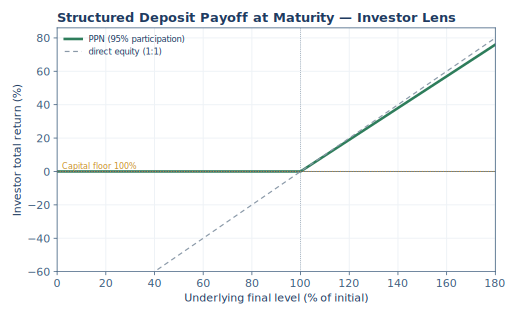

**Risks to the investor**

| Risk | Severity | Description |
|------|:--------:|------------|
| **Opportunity cost** | Medium | If markets fall or stay flat, the investor earns 0% vs the ~3.5% they would have earned from a fixed deposit |
| **Issuer credit risk** | Low | Mitigated by deposit insurance. But deposit insurance has limits (e.g., €100K) — amounts above the limit carry bank credit risk |
| **Early withdrawal risk** | Low | Most structured deposits penalize early withdrawal by forfeiting the variable return. Some forfeit a portion of principal for very early exit |
| **Inflation risk** | Medium | In bear markets, 0% nominal return = negative real return after inflation |
| **Participation / cap risk** | Low | In low-rate environments, participation rates can be very low (30-50%), making the product unattractive even if markets rise significantly. A cap, where applied, limits the upside the investor can earn |

#### §8. THE BANK LENS — Desk Economics (1st Line of Defence)

**What the desk books**

The desk's position is the mirror image of the investor's. Where the investor is long the embedded call, the desk is **short** that call (sold to the investor); alongside it the desk holds the deposit, which is a funding liability. The deposit principal funds the bank at the deposit rate, and the forgone fixed interest forms the option budget from which the embedded call is purchased and the desk's margin retained.

**Greeks & hedging**

The desk is short the embedded call and delta-hedges by trading the underlying (futures or vanilla options). Delta runs from 0 toward 1 as the underlying rises into the money; gamma is moderate near the strike (highest sensitivity near ATM); to deliver the upside the desk buys a matching call in the market (funded by the option budget), so its net option position is roughly flat: short the call to the client, long the hedge call. The residual day-to-day risk is the vega/skew spread between the price shown to the client and the market hedge, plus the cost of running the delta hedge. Because the product is held to maturity by retail clients, the bank rarely faces early-termination requests.

**How the bank makes money**

The bank earns a margin by retaining a portion of the option budget.

| Component | Flow |
|-----------|------|
| Deposit principal | Client deposits $100. Bank has use of $100 for the term |
| Bank's funding benefit | Bank funds at deposit rate (below wholesale funding). Saves ~0.5-1.0% vs bond issuance |
| Option budget | Interest that would have been paid as fixed deposit rate (~3-4% for 2-year) |
| Option cost | ATM call option on underlying costs ~2.5-3.5% for 2-year |
| Margin | Option budget minus option cost = bank profit (~0.3-0.5%) |
| Participation rate | Client receives: (Option budget − Margin) / Option cost × 100% |

In practice, participation rates for Structured Deposits are often higher than for PPNs because the bank's funding cost is lower (deposit vs bond issuance). Lower-dividend underlyings produce higher participation rates (cheaper calls).

**The value decomposition:**

A Structured Deposit = Risk-Free Deposit + Long Call Option (participation rate × ATM), with the bank's margin deducted from the option budget. The construction waterfall:

```
Fixed deposit rate:     3.50%
- Bank margin:         -0.50%
= Option budget:        3.00%
÷ ATM call cost:        3.00%
= Participation rate:   100%
```

Equivalently, par (100) decomposes at inception into the present value of the principal-protecting zero-coupon deposit, the embedded call option (~3.0% of notional), and the bank margin (~0.5%).

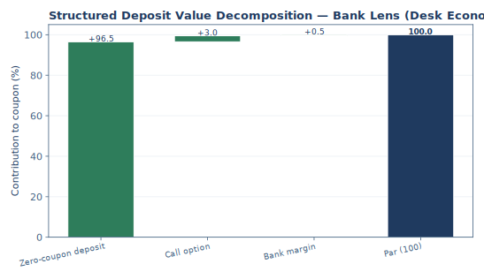

**P&L drivers**

Day to day, desk P&L is driven by the mark-to-market of the embedded short call, realized-versus-implied volatility on the delta hedge, the funding benefit on the deposit, and the structuring margin locked at inception. Product Control performs independent valuation of the embedded option and verifies day-one P&L.

#### §9. THE BANK LENS — Controls & Reconciliation (2nd Line of Defence)

**Booking & systems**

| Dimension | Detail |
|-----------|--------|
| **Primary system** | Murex (equity-linked structured deposits) |
| **Booking model** | Deposit leg + embedded option leg. Two-leg structure |
| **Valuation model** | Black-Scholes for European call. Adjust for dividends, borrowing costs |
| **Market data** | Spot level, implied volatility surface, dividend forecast, risk-free rate |
| **Settlement** | Cash settlement at maturity. Principal + variable return to client's deposit account |
| **Regulatory classification** | Deposit (not security). MiFID II product governance applies but securities regulation does not |

**Reconciliation points**

| Recon point | What must agree | SD-specific break |
|-------------|-----------------|-------------------|
| **Deposit-scheme eligibility** | Deposit classification and deposit-guarantee eligibility consistent across booking and legal records | Trade booked as a security/note loses guarantee eligibility, or deposit booked above the insurance limit without the excess flagged |
| **Option terms — strike** | Strike (= initial level S₀) matches the termsheet across systems | Strike stored at the wrong initial level → participation applied to the wrong base |
| **Option terms — participation** | Participation rate matches the termsheet | Participation booked at 100% in one system, 95% on the termsheet → payout overstated |
| **Option terms — cap** | Cap level (or absence of a cap) matches the termsheet | Cap omitted in booking → uncapped payout calculated where a cap applies |
| **Fixing — initial** | Initial fixing source and level match the termsheet | Different vendor close used for S₀ → wrong participation base |
| **Fixing — final** | Final fixing source and level match the termsheet | Different vendor reports a different closing level on the final observation |
| **P&L attribution** | Deposit/funding accrual + option MTM reconciles to total | Unexplained P&L points to a stale vol surface or a wrong fixing |
| **Settlement** | Cash settlement; principal + variable return to the deposit account; correct value date | Variable return miscomputed, or settled to the wrong account/date |

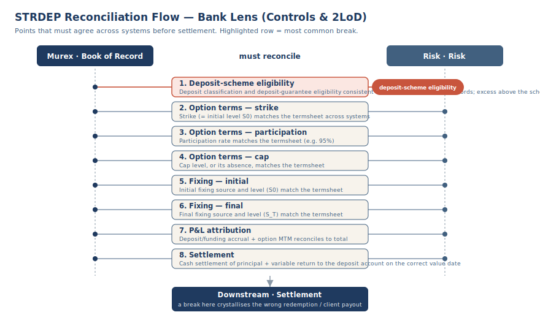

**Common breaks & red flags**

| Red Flag | Why It Matters | 2LoD Action |
|----------|---------------|-------------|
| Deposit amount exceeds insurance limit | Above-limit amount carries bank credit risk without deposit insurance. Client may not understand this | Confirm the depositor is informed; flag the uninsured excess |
| Participation rate below 50% | Product is unattractive; client gives up guaranteed interest for very limited upside | Verify participation against pricing and termsheet before distribution |
| Cap omitted or mismatched in booking | Uncapped payout calculated where a cap applies overstates the investor's return | Reconcile the cap level (or its absence) against the termsheet |
| Final observation level mismatch | Different data sources report different closing levels | Use the fixing source specified in the termsheet |
| "Capital guaranteed" marketing without deposit-insurance disclosure | Client may assume a government guarantee when the product only has bank guarantee | Confirm disclosure distinguishes scheme protection from bank guarantee |

**Control implication**

Each break has a direct consequence the 2nd line must size before it reaches the books or the client. A deposit-classification error removes guarantee eligibility the client was sold. A wrong strike or participation drives the wrong variable return. A missing cap overstates the payout. A fixing mismatch breaks both valuation and the final payout at once. The reconciliation exists precisely to catch these inconsistencies before settlement crystallises them.

#### §10. Formal Definition

A Structured Deposit is a deposit whose return R at maturity T is defined as:

R = max(0, PR × (S_T / S_0 − 1))

Where:
- PR = participation rate (0% < PR ≤ 100%, sometimes > 100%)
- S_0 = underlying level at inception
- S_T = underlying level at maturity
- max(0, ...) ensures capital protection (return cannot be negative)

The depositor receives: Principal × (1 + R)

**Decomposition:**
- Structured Deposit = Risk-Free Deposit + Long Call Option (participation rate × ATM)
- The risk-free deposit component provides principal protection
- The call option provides market-linked upside
- The participation rate is determined by the option budget (forgone fixed interest) divided by the call option premium

This is economically identical to a PPN. The distinction is legal (deposit vs note), regulatory (deposit insurance vs issuer credit), and distributional (retail banking vs capital markets).

#### §11. Lifecycle

| Stage | Timing | Action |
|-------|--------|--------|
| **Origination** | T-30 to T-5 | Structurer designs terms. Trader prices option. Legal confirms deposit classification |
| **Distribution** | T-5 to T | Sales offers to retail network. Client signs deposit agreement |
| **Trade date** | T | Client deposits funds. Bank books deposit + hedge. Option premium locked |
| **During life** | T to T+2Y | No observations, no barriers, no coupons. Trader manages delta hedge daily. Operations: nothing to process |
| **Final observation** | T+2Y-2bd | Underlying level recorded |
| **Maturity** | T+2Y | Payoff calculated. Principal + variable return credited to client's account |

**Simplicity note:** The Structured Deposit has the simplest lifecycle of any structured product. No intermediate events. No barriers to monitor. No coupons to process. One observation at maturity. One settlement.

#### §12. Worked Example (both lenses)

**Terms:**
- Notional: €100,000
- Underlying: EuroStoxx 50 (initial level: 4,500)
- Tenor: 2 years
- Participation rate: 95%
- Capital protection: 100%
- No cap

*Investor lens:*

**Scenario A — Market rises 18%:**
- S_T = 4,500 × 1.18 = 5,310
- Return = 95% × 18% = 17.1%
- Payout = €100,000 × (1 + 0.171) = €117,100
- Comparison: Fixed deposit at 3.5% p.a. = €107,123

**Scenario B — Market falls 12%:**
- S_T = 4,500 × 0.88 = 3,960
- Return = max(0, 95% × (−12%)) = 0%
- Payout = €100,000
- Comparison: Fixed deposit at 3.5% p.a. = €107,123. Opportunity cost: €7,123

**Scenario C — Market flat:**
- S_T = 4,500
- Return = 95% × 0% = 0%
- Payout = €100,000
- Comparison: Fixed deposit at 3.5% p.a. = €107,123. Opportunity cost: €7,123

*Bank lens:*
- In Scenario A the desk's short embedded call is in the money: the investor's €17,100 of participation is the desk's payout obligation, funded from the option budget and the delta hedge built over the life of the trade. Product Control confirms the option MTM and the funding accrual reconcile to the €117,100 settlement.
- In Scenarios B and C the embedded call expires worthless; the desk owes only the €100,000 protected principal, keeps its structuring margin and funding benefit, and the delta hedge unwinds against the worthless option. The 2nd line confirms the variable return is zero, that the strike (S₀ = 4,500), participation (95%) and absence of a cap match the termsheet, and that settlement credits exactly €100,000 to the deposit account before maturity crystallises it.

#### §13. Knowledge Check

1. *(Investor)* **What is the key difference between a Structured Deposit and a PPN?**
2. *(Investor)* **How is the participation rate determined?** Decompose it.
3. *(Investor)* **What is the "cost" of capital protection in a Structured Deposit?**
4. *(Investor)* **Why might a Structured Deposit have a higher participation rate than a comparable PPN?**
5. *(Investor)* **What role does deposit insurance play, and what are its limits?**
6. *(Investor)* **Draw the payoff diagram of a Structured Deposit at maturity, showing the protected floor and the participation above the initial level.**
7. **(Desk economics / 1LoD)** What position does the desk hold against the investor, which way do the desk's vega and gamma point, and where does the desk's structuring margin come from?
8. **(Controls / 2LoD)** Name three reconciliation breaks specific to a Structured Deposit — covering deposit-scheme eligibility, the option terms, and fixing — and the consequence of each for the investor's payout.

**Mental Models**

| Concept | Mental Model |
|---------|-------------|
| Structured Deposit | A savings account whose interest is tied to a market index — principal safe, return variable |
| Capital protection | A floor under the deposit: the worst outcome is getting the principal back, never less |
| Participation rate | The slice of the market's gain the investor keeps — set by the option budget divided by the call cost |
| Option budget | The forgone fixed interest, recycled to buy the upside option |
| Deposit insurance | A second safety net beneath the bank's own guarantee — but only up to the scheme limit |
| Investor long the call | The investor owns the upside option; the desk is short it and hedges in the underlying |
| 2LoD reconciliation | The auditor confirming the deposit classification, strike, participation, cap and fixings agree before anyone is paid |

**Key Takeaways**

1. A Structured Deposit is a deposit + a long call option. The investor gives up fixed interest to buy market-linked upside with principal protected.
2. The participation rate is not free — it is funded by the forgone fixed interest (the option budget), net of the bank's margin.
3. If the market rises, the investor earns participation × the gain. If it falls or is flat, the investor receives full principal and a 0% return.
4. The deposit wrapper adds deposit-guarantee eligibility — protection a PPN cannot offer — but only up to the scheme limit; the excess carries bank credit risk.
5. The real cost is opportunity cost: the forgone guaranteed interest, potentially 3-7% over the product's life.
6. The investor is long the embedded call; the desk is short that call to the client but buys a matching call to hedge, leaving its net option position roughly flat (residual risk is the vega/skew spread).
7. For the 2nd line, the dominant control risks are deposit-scheme eligibility, the option terms (strike, participation, cap), and the fixings — each can misstate the variable return or the protection the investor was sold.

#### §14. Common Mistakes

1. **Treating 0% return as "no cost."** The real cost is the forgone fixed interest rate — potentially 3-7% over the product's life.
2. **Assuming deposit insurance covers unlimited amounts.** Most deposit guarantee schemes have per-depositor limits. Amounts above the limit carry bank credit risk.
3. **Comparing participation rate across different underlyings.** A 90% participation on a high-dividend index is not comparable to 100% participation on a low-dividend index — the underlying characteristics drive the difference.
4. **Ignoring the cap.** Some Structured Deposits include a cap on maximum return. A 110% participation with a 20% cap is worse than 85% participation with no cap if markets rise more than ~24%.
5. **Confusing "capital guaranteed" with "risk-free."** The deposit is credit-risk-free (with insurance) but carries opportunity cost risk and inflation risk.
6. **(Controls) Trusting a single system's booking of the option terms.** Because the strike, participation, and cap drive the entire variable return, the 2nd line must reconcile each against the termsheet — and confirm deposit-scheme eligibility — rather than assume the systems agree.

**Dual-lens questions:**
- *(Desk economics / 1LoD)* What does the desk book against the investor, and what is its primary Greek / hedging risk?
- *(Controls / 2LoD)* Which booking / fixing / event-capture fields must reconcile, and which is the most common break?

**Dual-lens visuals (generated):**
- `assets/strdep/controls_strdep_recon_08.svg` `[generated]`
- `assets/strdep/payoff_strdep_01.svg` `[generated]`
- `assets/strdep/waterfall_strdep_09.svg` `[generated]`
### 5.6.2 Forward {#sec-5-6-2}

> **Prerequisites:** none — a foundation product, start here &nbsp;|&nbsp; **Key concepts:** Forward pricing, cost of carry, settlement

---

*The Structured Deposit ([Section 5.6.1](#sec-5-6-1)) protected the investor's principal and linked returns to market performance. The Forward removes protection entirely: it is a binding obligation to buy or sell an asset at a predetermined price on a future date. There is no optionality — both parties must perform. The payoff is linear and symmetric, making the Forward the simplest derivative structure. This chapter reads the product through two lenses: what it means for **the investor** (here the client taking the long forward), and what it means for **the bank** — the latter split into the desk's market economics (1st line of defence) and the controls and reconciliation that surround it (2nd line of defence).*

#### §1. Explain Like I'm New

Consider a wheat farmer. It is March, and the harvest comes in September. The farmer does not know what wheat will cost in September — it could be $5 per bushel or $3 per bushel. The farmer needs certainty to plan finances.

A grain merchant approaches and offers: "I will agree today to buy your wheat in September at $4 per bushel, regardless of what the market price is then." The farmer agrees and locks in the price. If wheat rises to $5, the farmer misses out on the extra dollar. If wheat falls to $3, the farmer is protected. Either way, the farmer knows exactly what will be received.

This is a **Forward contract**. It is an agreement between two parties to buy or sell an asset at a fixed price on a future date. No money changes hands today. There is no optionality — both parties are obligated to perform.

The Forward is the oldest and simplest derivative. It predates options, swaps, and every structured product in this book. Every other derivative can be understood as a modification of a Forward.

#### §2. Real-World Analogy

A Forward is like a handshake deal at a car dealership.

A buyer walks into a dealership today and says: "I want that car, but I need it delivered in 6 months." The dealer responds: "Fine. The price today is $40,000. I will hold it at $40,000 + storage cost. You must buy it in 6 months at $40,500."

They shake hands. No deposit. No option to walk away. In 6 months:
- If car prices have risen to $45,000, the buyer got a great deal — paying only $40,500
- If car prices have fallen to $35,000, the buyer overpaid — but is obligated to buy at $40,500

In a Forward:
- The **car** is the underlying asset
- The **$40,500** is the forward price
- The **6 months** is the settlement date
- The **handshake** is the binding obligation
- The **storage cost** is the cost of carry (interest, storage, minus any income from the asset)

Unlike an option, there is no premium. Unlike a swap, there is only one exchange. A Forward is a single future transaction agreed upon today.

#### §3. What Problem Does This Solve?

Forwards solve the **price certainty** problem.

Any party with a future obligation to buy or sell an asset faces price risk. A Forward eliminates that risk by fixing the price today.

| User | Problem | Forward Solution |
|------|---------|-----------------|
| Farmer | Does not know future crop price | Sells forward — locks in revenue |
| Airline | Does not know future fuel cost | Buys forward — locks in cost |
| Exporter | Does not know future FX rate | Sells FX forward — locks in domestic revenue |
| Fund manager | Wants future equity exposure at today's price | Buys equity forward — locks in entry price |

#### §4. Product DNA

| Field | Value |
|-------|-------|
| **Full Name** | Forward Contract |
| **Abbreviation** | FWD |
| **Family** | Other |
| **Complexity Score** | 2 / 10 |
| **Complexity Rationale** | Linear payoff. No optionality. No barriers. Single settlement. Foundation derivative |
| **Underlying Asset Class** | Any: equity, FX, commodity, interest rate, credit |
| **Capital Protection** | None — linear exposure in both directions |
| **Coupon Type** | None |
| **Maturity** | Typically 1 month to 2 years. Can be longer for specific hedging needs |
| **Liquidity** | OTC — negotiated unwind with counterparty |
| **Four-Leg Product** | No |
| **Primary System** | Murex |
| **ISDA Required** | Yes — OTC derivative |

**DNA Atlas Fields:**
- Primary Risk: Adverse price movement (linear, unlimited in both directions)
- Typical Buyer: Corporates (hedging), institutional investors (asset allocation)
- Typical Use Case: Lock in future purchase/sale price. Eliminate price uncertainty
- Building Blocks: Forward = agreement to exchange asset for cash at future date
- Key Hedge: Offsetting forward, or underlying + funding position
- Similar Products: Futures (exchange-traded forward), FX forward, NDF
- Most Important Greek: Delta (always ≈ 1 for long forward)

**Comparison Matrix Fields:**
- Complexity: 2
- Yield Potential: None (not a yield product)
- Capital Protection: None
- Credit Exposure: Counterparty (bilateral OTC)
- Liquidity: OTC negotiated
- Path Dependency: None
- Volatility Sensitivity: None (linear payoff, no optionality)
- Correlation Sensitivity: None
- Client Type: Institutional / Corporate
- Market Environment: Any (hedging tool, not directional view)

#### §5. Who Touches This Product

| Role | Responsibility |
|------|---------------|
| **Structurer** | Rarely involved — Forwards are standard products. May structure non-standard terms (deferred settlement, partial delivery) |
| **Trader** | Prices the forward using cost-of-carry model. Manages portfolio of forwards. Delta is trivial (≈1) but funding and counterparty risk matter |
| **Sales** | Offers to corporate and institutional clients for hedging. Explains forward pricing vs spot |
| **Risk** | Monitors counterparty credit exposure (potential future exposure increases with tenor and volatility). Monitors wrong-way risk |
| **Product Control** | Verifies forward prices against market. Checks cost-of-carry assumptions (interest rates, dividends, storage) |
| **Operations** | Books trade. Manages settlement. Handles physical vs cash settlement logistics |
| **Legal/Compliance** | ISDA Master Agreement. CSA for collateral. Trade confirmation |
| **Quantitative Analytics** | Limited involvement — pricing is analytical (cost-of-carry), not model-dependent |

#### §6. Product Evolution

| Era | Development |
|-----|------------|
| **Ancient** | Forward contracts on grain documented in Mesopotamia (~2000 BCE) and medieval Europe. The oldest derivative |
| **17th century** | Rice forwards in Osaka (Dōjima Rice Exchange). First organized forward trading |
| **1970s** | FX forwards become critical after Bretton Woods collapse. Floating exchange rates create hedging demand |
| **1980s** | Interest rate forwards (FRAs) emerge. Equity forwards grow with institutional asset management |
| **2000s** | OTC forward market dwarfs exchange-traded futures. Notional outstanding in trillions |
| **2010s** | Post-crisis reforms push standardized forwards toward central clearing. Non-deliverable forwards (NDFs) grow for emerging market currencies |

---

#### §7. THE INVESTOR LENS

**Why the client enters it**

1. **Price certainty.** The single most important reason. A corporate treasurer can budget with certainty against a known future price.
2. **No upfront cost.** Unlike an option, a Forward requires no premium. The "cost" is the obligation to perform even if the market moves favourably.
3. **Customization.** OTC forwards can be tailored to exact amounts, dates, and delivery terms. Futures contracts are standardized.
4. **Simplicity.** No barriers, no triggers, no conditions. One price, one date, one settlement.
5. **View expression or hedging.** A party with a future need to buy locks in the cost by going long; a party with a future asset to sell locks in revenue by going short. The forward expresses either a hedge or a directional view at today's terms.

**Position taken**

The client here takes the **long forward** — the binding obligation to buy the asset at the fixed forward price on the settlement date; the desk takes the offsetting short. The long forward profits when the underlying rises above the forward price and loses when it falls below. Net, the long forward carries full directional exposure to the underlying: delta ≈ 1, with no optionality, no protection, and no premium. (A client hedging a future sale would instead take the short forward, the mirror image.)

**Payoff & scenarios**

The long forward has a **linear, symmetric** payoff: P&L = (S_T − F) × N, where S_T is the spot at maturity, F is the forward price, and N is the notional. There is no protection. The long forward gains dollar-for-dollar above the forward price and loses dollar-for-dollar below it. This is the defining characteristic that distinguishes a Forward from an option.

**Terms:** Long forward on 1,000 shares of ABC Corp. Forward price: $100. Settlement: 6 months.

| Scenario | Spot at Maturity | Investor P&L | Investor Outcome |
|----------|:----------------:|:------------:|:----------------:|
| **Bull** | $120 | +$20,000 | Bought at $100, worth $120. Profit |
| **Base** | $100 | $0 | Bought at $100, worth $100. Break-even |
| **Bear** | $75 | -$25,000 | Bought at $100, worth $75. Loss |

The payoff is linear: the long forward gains $20,000 when the underlying rises 20% to $120 and loses $25,000 when it falls 25% to $75 — symmetric, with no floor or ceiling.

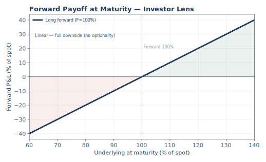

**Risks to the investor**

| Risk | Severity | Description |
|------|:--------:|------------|
| **Market risk** | High | Unlimited loss potential in both directions. Linear exposure with no floor or ceiling. Unlike an option, the full downside is borne — there is no premium-only loss cap |
| **Counterparty risk** | Medium-High | OTC bilateral contract. If the counterparty defaults when the forward has positive MTM, value is lost. Mitigated by CSA/collateral |
| **Settlement risk** | Medium | Physical delivery: risk that one party delivers but the other does not pay. CLS mitigates for FX |
| **Liquidity risk** | Medium | Cannot close out on exchange. Must negotiate unwind with the original counterparty or novate to a third party |
| **Basis risk** | Low | If hedging with futures instead of a matching forward, basis risk arises from contract specification differences |

#### §8. THE BANK LENS — Desk Economics (1st Line of Defence)

**What the desk books**

The desk's position is the mirror image of the client's. Where the client is long the forward, the desk is **short** the forward — obligated to deliver the asset at the fixed forward price on the settlement date. It is booked as a single-leg forward trade: notional, forward price, settlement date, and settlement type. There is no embedded option, no bond leg, and no premium — the Forward is not decomposed into bond + option. This single obligation is what makes it the building block for all other derivatives.

**Carry & hedging**

Forwards are delta-one products: the hedge is the underlying itself. A desk that is short a forward (the client is long) buys the underlying and borrows to fund it — the classic **cash-and-carry** hedge — or uses futures. The desk holds the asset until settlement, earning any income it pays (dividends for equities, the foreign rate for FX, convenience yield for commodities) and paying funding on the borrowed cash. The forward price is exactly the level at which this carry nets out to no-arbitrage: spot grown at the funding rate, less the income yield. The main concern is funding cost — the bank's cost of carry may differ from the theoretical risk-free rate, creating P&L. For FX forwards, the desk thinks in terms of the interest-rate differential between the two currencies. Delta is ≈ 1 and stable; gamma is 0, so there is no re-hedging convexity to manage.

**How the bank makes money**

The bank earns a bid-offer spread on the forward price.

| Component | Detail |
|-----------|--------|
| **Forward price (mid)** | F = S × e^((r - q) × T), where S = spot, r = funding rate, q = income yield (dividends, convenience yield), T = time |
| **Bid** | F_bid = F_mid - spread/2. Price at which the bank buys from the client |
| **Offer** | F_offer = F_mid + spread/2. Price at which the bank sells to the client |
| **Spread** | Typically 0.1-0.5% of notional for liquid underlyings. Wider for illiquid or long-dated |
| **Additional margin** | Funding cost (bank's credit spread above risk-free), credit charge for counterparty risk |

There is no embedded option, no structural margin, and no coupon manipulation. The economics are transparent: the client pays the forward price, which equals spot + cost of carry + the bank's spread.

**The forward price decomposition:**

The forward price builds up from spot by the cost of carry: F = spot + funding − dividend yield. Funding (the financing cost of holding the asset to settlement) pushes the forward price above spot; the income yield the asset pays (dividends) pulls it back down. For the worked example (S = $50.00, r = 4%, q = 1.5%, T = 0.5): funding adds approximately +$1.01 and the dividend yield subtracts approximately −$0.38, giving a forward price of **$50.63**. (Component split inferred from the cost-of-carry inputs; the source states only the net forward price F = $50.63.)

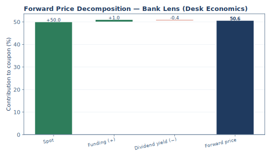

**P&L drivers**

Day to day, desk P&L is driven by the mark-to-market of the forward against the underlying (positive for the desk's short when spot falls, negative when spot rises), the realized funding cost versus the rate embedded in the forward price, and dividend/income realization versus the assumed yield. Volatility has no direct impact — there is no optionality, so no gamma or vega P&L. Product Control verifies forward prices against the market and checks the cost-of-carry assumptions (interest rates, dividends, storage).

#### §9. THE BANK LENS — Controls & Reconciliation (2nd Line of Defence)

**Booking & systems**

| Dimension | Detail |
|-----------|--------|
| **Primary system** | Murex |
| **Booking model** | Single-leg forward trade. Notional, forward price, settlement date, settlement type |
| **Valuation model** | Cost-of-carry (analytical). No Monte Carlo needed |
| **Market data** | Spot price, interest rate curve, dividend/income yield, counterparty credit spread |
| **Settlement** | Physical delivery or cash settlement (specified at trade inception) |
| **Collateral** | CSA governs margin/collateral exchange. Daily or weekly MTM-based calls |

**Reconciliation points**

| Recon point | What must agree | Forward-specific break |
|-------------|-----------------|------------------------|
| **Forward price vs spot + carry** | Booked forward price = spot × e^((r−q)×T) within tolerance | Forward price significantly above/below theoretical → mispricing or embedded credit/liquidity charge; verify cost-of-carry inputs |
| **Cost-of-carry inputs** | Funding rate, dividend/income yield, tenor match the curve and termsheet | Stale dividend yield or wrong funding curve → forward price drifts from market |
| **Fixing** | Final settlement price taken from the agreed source/fixing | Different vendors report different closing prices on the settlement date |
| **Settlement type** | Physical delivery vs cash settlement matches the confirmation | Physical delivery booked as cash, or cash booked as physical → wrong settlement mechanics |
| **Counterparty / CSA** | ISDA Master + CSA in place; collateral terms captured | No CSA/collateral agreement → uncollateralized forward = full counterparty credit exposure |
| **Margin / collateral** | Daily/weekly MTM-based collateral calls reconcile to position MTM | Collateral call lags MTM → uncollateralized exposure builds silently |
| **MTM / valuation** | Front-office MTM agrees with risk/control valuation | Sign or magnitude mismatch on the forward MTM between systems |
| **Tenor / settlement date** | Settlement date and day-count consistent across systems and confirmation | Settlement date off by convention → MTM discounting and cash-flow date wrong |

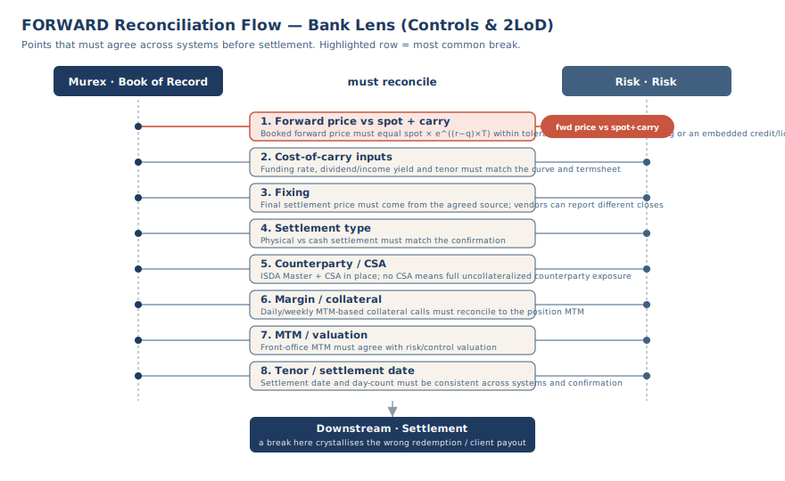

**Common breaks & red flags**

| Red Flag | Why It Matters | 2LoD Action |
|----------|---------------|-------------|
| Forward price significantly above/below theoretical | Indicates mispricing or embedded credit/liquidity charge | Verify cost-of-carry inputs (spot, funding rate, dividend yield, tenor) |
| No CSA/collateral agreement | Uncollateralized forward = full counterparty credit exposure. Unacceptable for large notionals | Confirm ISDA + CSA in place before relying on the position |
| Physical delivery on illiquid underlying | Delivery failure risk. May be unable to source the asset at settlement | Confirm settlement type and sourcing capability ahead of settlement |
| Corporate client using forward as speculation, not hedge | Regulatory and suitability concern. Forwards for hedging are treated differently from speculative positions | Escalate suitability; confirm hedge designation |
| Very long tenor (> 5 years) | Counterparty credit exposure grows with tenor. Cost-of-carry assumptions become uncertain | Re-verify PFE and cost-of-carry inputs; confirm collateral adequacy |

**Control implication**

Each break has a direct consequence the 2nd line must size before it reaches the books or the counterparty. A forward price that does not reconcile to spot + carry misstates the trade's value and the bank's margin from inception. A settlement-type error — physical booked as cash, or the reverse — breaks the settlement mechanics and can fail delivery. A missing CSA or a lagging collateral call leaves counterparty exposure uncollateralized, so a default crystallizes a loss the books did not show. A fixing mismatch misstates both the final MTM and the cash that settles. The reconciliation exists precisely to catch these inconsistencies before settlement crystallises them.

#### §10. Formal Definition

A Forward contract obliges the buyer to purchase, and the seller to sell, a specified quantity of an underlying asset at a pre-agreed price F on a specified future date T.

**Forward price at inception (no-arbitrage):**

F = S_0 × e^((r - q) × T)

Where:
- S_0 = current spot price
- r = risk-free rate (continuously compounded)
- q = continuous income yield (dividends for equities, foreign rate for FX, convenience yield for commodities)
- T = time to maturity in years

**Value of existing forward at time t (after inception):**

V_t = (F_t - F_0) × e^(-r × (T-t)) × N

Where F_t is the current forward price, F_0 is the contracted forward price, and N is the notional.

At inception, V_0 = 0 (no money changes hands). At maturity, V_T = (S_T - F_0) × N.

**No optionality means:** No premium, no gamma, no vega. Delta ≈ 1 for the long position, -1 for the short. The Forward is a pure directional instrument.

**Relationship to other products:**
- Forward = Call Option - Put Option (put-call parity)
- Forward = Futures + basis risk (if marked to market daily)
- Swap = Series of forwards
- Structured Product = Bond + Options/Forwards

#### §11. Lifecycle

| Stage | Timing | Action |
|-------|--------|--------|
| **Negotiation** | T-1 to T | Parties agree on price, quantity, settlement date, delivery terms |
| **Trade date** | T | Forward confirmed. No cash flows. ISDA confirmation exchanged |
| **During life** | T to T+6M | Daily mark-to-market. Collateral calls under CSA if applicable. No intermediate settlements |
| **Settlement** | T+6M | Physical delivery: buyer pays F, seller delivers asset. OR Cash settlement: loser pays winner the MTM difference |

**Settlement types:**
- **Physical:** Common for commodities and FX. Actual delivery of underlying
- **Cash:** Common for equity indices and NDFs. Net payment of (S_T - F) × N

#### §12. Worked Example (both lenses)

**Terms:**
- Underlying: 10,000 shares of XYZ Corp
- Spot price: $50.00
- Risk-free rate: 4% (continuously compounded)
- Dividend yield: 1.5% (continuous)
- Tenor: 6 months (0.5 years)

**Forward price:**
F = $50.00 × e^((0.04 - 0.015) × 0.5) = $50.00 × e^(0.0125) = $50.00 × 1.01258 = $50.63

*Client lens:* (the client is long the forward)
- **At maturity — Scenario A (S_T = $55.00):** Long forward P&L = ($55.00 - $50.63) × 10,000 = **+$43,700**. The underlying rose above the forward price, so the long position profits.
- **At maturity — Scenario B (S_T = $45.00):** Long forward P&L = ($45.00 - $50.63) × 10,000 = **-$56,300**. The underlying fell below the forward price, so the long position loses — dollar-for-dollar, with no floor.
- **Mid-life valuation (3 months in, S = $52.00):** New 3-month forward: F_3 = $52.00 × e^((0.04-0.015)×0.25) = **$52.32**. Value of existing long = ($52.32 - $50.63) × e^(-0.04×0.25) × 10,000 = **$16,731**.

*Bank lens:* The desk holds the offsetting **short** forward, so its P&L is the exact mirror: Scenario A short forward P&L = ($50.63 - $55.00) × 10,000 = **-$43,700**; Scenario B short forward P&L = ($50.63 - $45.00) × 10,000 = **+$56,300**. The desk runs the cash-and-carry hedge (long the underlying, funded), so the hedge offsets this MTM and the desk retains the bid-offer spread. The 2nd line confirms the forward price reconciles to spot + carry, that the MTM ($16,731 mid-life) agrees across systems, and that the CSA collateral matches the position MTM before settlement.

#### §13. Knowledge Check

1. *(Investor)* Why does a Forward contract require no upfront payment?
2. *(Investor)* What determines the forward price, and how does it differ from the spot price?
3. *(Investor)* What is the fundamental difference between a Forward and an option?
4. *(Investor)* Which way does the long forward profit — when the underlying rises or falls? What about the short?
5. *(Investor)* Why is the Forward considered the "building block" of all derivatives?
6. **(Desk economics / 1LoD)** A client buys a long forward; what position does the desk book against it, and how does the desk hedge it via cash-and-carry? Where does the desk's funding cost show up in P&L, and why is there no gamma or vega to manage?
7. **(Controls / 2LoD)** Which fields must reconcile for a forward between the front office and risk/control, and which single check most often surfaces a mispricing — and what is the consequence of a missing CSA?

**Mental Models**

| Concept | Mental Model |
|---------|-------------|
| Forward | A handshake deal at a car dealership — a binding price agreed today for delivery later, no deposit, no walking away |
| Long forward profit | The buyer wins when the asset ends up worth more than the price they locked in |
| Forward price | Spot, carried forward — financing cost added, income yield subtracted |
| No premium ≠ no cost | The cost is the obligation to perform even when the market moves your way (opportunity cost) |
| Cash-and-carry hedge | The desk buys and funds the asset, holds it to delivery — the carry is exactly the forward premium over spot |
| 2LoD reconciliation | The price-checker — confirms forward price = spot + carry and that collateral matches MTM before anyone settles |

**Key Takeaways**

1. A Forward is a binding obligation to buy or sell an asset at a fixed forward price on a future date. No premium, no optionality, both parties must perform.
2. The payoff is linear and symmetric: the long forward gains dollar-for-dollar above the forward price and loses dollar-for-dollar below it — there is no floor or ceiling.
3. The long forward profits when the underlying rises above the forward price; the short forward profits when it falls.
4. The forward price equals spot grown at the funding rate less the income yield: F = S × e^((r−q)×T). It is not the spot price.
5. The desk takes the offsetting short, hedges with cash-and-carry (long the underlying, funded), and earns the bid-offer spread — there is no structural margin or embedded option.
6. The dominant risk is full linear market exposure (unlike an option's capped premium loss), plus counterparty risk on the bilateral OTC contract.
7. For the 2nd line, the dominant control checks are forward price vs spot+carry, fixing source, settlement type, and counterparty/CSA + margin — each can misstate value, settlement, or exposure.

#### §14. Common Mistakes

1. **Thinking Forwards are "free."** No premium ≠ no cost. The cost is the obligation to perform even if the market moves favourably. This is opportunity cost, not zero cost.
2. **Confusing Forwards with Futures.** Futures are exchange-traded, standardized, marked-to-market daily. Forwards are OTC, customized, settled at maturity. The economics are similar but the mechanics differ.
3. **Forgetting counterparty risk.** A Forward is only as good as the counterparty's ability to pay. Without collateral, a large positive MTM is an unsecured credit exposure.
4. **Using spot price as forward price.** The forward price includes cost of carry. F ≠ S unless r = q (interest rate equals income yield).
5. **Ignoring the funding component.** The bank does not fund at risk-free. The bank's credit spread above risk-free is embedded in the forward price.
6. **(Controls) Trusting the booked forward price without reconciling it to spot + carry.** Because the forward price is built analytically from spot, funding, and dividend yield, the 2nd line must reconcile it against spot × e^((r−q)×T) rather than assume the booked level is correct — a drift signals a stale input or an embedded charge.

**Dual-lens questions:**
- *(Desk economics / 1LoD)* What does the desk book against the investor, and what is its primary Greek / hedging risk?
- *(Controls / 2LoD)* Which booking / fixing / event-capture fields must reconcile, and which is the most common break?

**Dual-lens visuals (generated):**
- `assets/forward/controls_forward_recon_08.svg` `[generated]`
- `assets/forward/payoff_forward_01.svg` `[generated]`
- `assets/forward/waterfall_forward_09.svg` `[generated]`
### 5.6.3 Vanilla Options {#sec-5-6-3}

> **Prerequisites:** [FWD](#sec-5-6-2) &nbsp;|&nbsp; **Key concepts:** Put-call parity, Greeks, time decay, intrinsic vs extrinsic value

---

*The Forward ([Section 5.6.2](#sec-5-6-2)) created a symmetric obligation for both parties. The Vanilla Option breaks that symmetry: the buyer pays a premium for the right — but not the obligation — to buy (call) or sell (put) at a fixed strike price. This asymmetric payoff is the building block for most structured products in this Bible. This chapter reads the product through two lenses: what it means for **the investor** — here the option **buyer**, who is **long** the option — and what it means for **the bank** — the **writer / market-maker**, who is **short** the option — the latter split into the desk's market economics (1st line of defence) and the controls and reconciliation that surround it (2nd line of defence).*

#### §1. Explain Like I'm New

Consider a buyer thinking about purchasing a house. The buyer finds one for $500,000 but is not sure — perhaps a job in another city, perhaps a wish to wait and see whether prices drop. The seller offers a deal: "Pay me $10,000 now, and I will guarantee the right to buy this house at $500,000 any time in the next 6 months. If the buyer decides not to buy, the $10,000 is lost, but there is no obligation to buy."

This is an **option**. The buyer has paid for the **right but not the obligation** to transact at a fixed price in the future.

A **Vanilla Option** is the simplest form of this right. A **call option** gives the holder the right to buy. A **put option** gives the holder the right to sell. "Vanilla" means no exotic features — no barriers, no knock-ins, no autocalls, no digital payoffs. Just a strike price and an expiry date.

[Section 1.2](#sec-1-2) introduced what options are. This chapter explains how they are traded, booked, hedged, and managed on a structured products desk.

#### §2. Real-World Analogy

A Vanilla Option is like a rain check at a store.

A store advertises a TV for $800 but sells out before the customer arrives. The store gives the customer a rain check: "Come back within 30 days, and the TV can be bought at $800." If the TV price rises to $1,000 during those 30 days, the rain check saves the customer $200. If the price drops to $600, the customer discards the rain check and buys at the lower price.

In a Vanilla Option:
- The **rain check** is the option contract
- The **$800 guaranteed price** is the strike price
- The **30 days** is the time to expiry
- The **store's promise** is the writer's obligation
- The **cost of the rain check** (if any) is the option premium

Unlike the rain check (which is usually free), a Vanilla Option has a premium — the price the buyer pays for the right. The premium is not refundable. If the buyer does not exercise, the premium is lost but nothing more.

#### §3. What Problem Does This Solve?

Vanilla Options solve the **asymmetric exposure** problem.

A Forward gives both upside and downside exposure. An option gives only one side. The buyer chooses which risk to keep and which to eliminate.

| Need | Forward Solution | Option Solution |
|------|:----------------:|:---------------:|
| Protect against price drop | Short forward (but lose upside) | Buy put (keep upside, pay premium) |
| Participate in price rise | Long forward (but keep downside) | Buy call (limit downside to premium) |
| Earn income | N/A | Sell options (earn premium, take risk) |
| Express directional view with limited risk | N/A | Buy options (max loss = premium) |

#### §4. Product DNA

| Field | Value |
|-------|-------|
| **Full Name** | Vanilla Option (Call / Put) |
| **Abbreviation** | VO |
| **Family** | Other |
| **Complexity Score** | 3 / 10 |
| **Complexity Rationale** | Single strike, single expiry, no exotic features. One step above Forward (adds optionality) |
| **Underlying Asset Class** | Any: equity, FX, commodity, interest rate |
| **Capital Protection** | Long option: max loss = premium. Short option: unlimited potential loss |
| **Coupon Type** | None |
| **Maturity** | 1 week to 5+ years. Most liquid: 1-12 months |
| **Liquidity** | Exchange-traded: high. OTC: negotiated |
| **Four-Leg Product** | No |
| **Primary System** | Murex |
| **ISDA Required** | OTC: Yes. Exchange-traded: No (exchange rules govern) |

**DNA Atlas Fields:**
- Primary Risk: Premium loss (long), unlimited loss (short)
- Typical Buyer: Hedgers (corporates, funds), speculators, structured product desks (as building block)
- Typical Use Case: Hedge directional risk, express view with limited risk, earn premium income
- Building Blocks: Option = asymmetric payoff. Building block of all structured products
- Key Hedge: Delta-hedge (underlying), gamma management (re-hedging frequency)
- Similar Products: Warrant (exchange-listed option), ELO (option on listed stock), Cap/Floor (rate options)
- Most Important Greek: Delta (directional exposure), Vega (vol sensitivity)

**Comparison Matrix Fields:**
- Complexity: 3
- Yield Potential: None (not a yield product)
- Capital Protection: Long: max loss = premium. Short: none
- Credit Exposure: Exchange: clearing house. OTC: counterparty
- Liquidity: Exchange: high. OTC: negotiated
- Path Dependency: None (European). Low (American — early exercise)
- Volatility Sensitivity: High (vega is the defining characteristic)
- Correlation Sensitivity: None (single underlying)
- Client Type: All
- Market Environment: Any

#### §5. Who Touches This Product

| Role | Responsibility |
|------|---------------|
| **Structurer** | Uses vanilla options as building blocks inside structured products. Rarely trades vanilla options directly |
| **Trader** | Prices options. Manages delta, gamma, vega, theta across the portfolio. Core trading activity. Options trading is the highest-skill role on many desks |
| **Sales** | Offers to clients for hedging and investment. Explains Greeks in client-friendly terms |
| **Risk** | Monitors portfolio Greeks (especially gamma and vega). Stress-tests option book under extreme scenarios |
| **Product Control** | Independent valuation. Vol surface verification. Model reserve assessment |
| **Operations** | Exercise/assignment processing. Premium settlement. Expiry management |
| **Legal/Compliance** | ISDA for OTC. Exchange rules for listed. Suitability assessment for retail clients selling options |
| **Quantitative Analytics** | Pricing model development (Black-Scholes, local vol, stochastic vol). Vol surface calibration. Exotic model calibration starts from vanilla calibration |

#### §6. Product Evolution

| Era | Development |
|-----|------------|
| **1637** | Tulip options in Dutch Republic — the first speculative options bubble |
| **1973** | Black-Scholes-Merton model published. CBOE opens. Modern options market begins |
| **1980s** | OTC options market grows. Interest rate options (caps, floors, swaptions) emerge |
| **1990s** | Exotic options proliferate. Volatility smile/skew recognized and modeled |
| **2000s** | Electronic trading. Options become building blocks in structured product factories |
| **2010s-present** | Zero-day-to-expiry (0DTE) options surge in retail trading. Vol products (VIX options) grow |

---

#### §7. THE INVESTOR LENS

**Why the investor buys it**

The investor here is the option **buyer**, who is **long** the option.

1. **Leverage.** A small premium controls a large notional exposure. A $5 premium controls $100 of underlying = 20× leverage.
2. **Asymmetric risk.** The buyer can never lose more than the premium. Unlimited upside (call) or downside protection (put).
3. **Hedging precision.** The buyer tailors the hedge to the exact strike, expiry, and amount needed.
4. **View expression.** A buyer who holds a directional view can express it with defined, bounded risk — maximum loss is the premium paid.

**Position taken**

The investor is **long** the option: long a call (the right to buy at strike K) or long a put (the right to sell at strike K). The buyer pays the premium up front. Downside is limited to that premium; upside is leveraged (call) or provides downside protection (put). The buyer is **long volatility** — the long option position gains value when implied volatility rises (positive vega).

**Payoff & scenarios**

A **call payoff** at expiry is max(0, S − K); the buyer's net P&L is max(0, S − K) − premium. The break-even is not the strike — it is strike + premium. The buyer needs the underlying to move enough to cover the premium paid.

**Terms (long call):** Long 1 call option on ABC Corp. Strike: $100. Premium: $5. Notional: 100 shares. Expiry: 3 months.

| Scenario | Spot at Expiry | Option Payoff | Net P&L (after premium) |
|----------|:--------------:|:------------:|:-----------------------:|
| **Bull** | $120 | $20 per share | +$15 × 100 = +$1,500 |
| **Base** | $105 | $5 per share | $0 × 100 = $0 (break-even) |
| **Bear** | $90 | $0 (expires worthless) | -$5 × 100 = -$500 (premium lost) |

**Key insight:** The break-even is not the strike price — it is strike + premium ($105). The option buyer needs the underlying to move enough to cover the premium paid. Most options expire at or near the money, which is why sellers of options win more often than buyers (though they bear the tail — see §8).

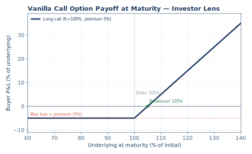

**Risks to the investor**

| Risk | Description | Severity |
|------|------------|:--------:|
| **Total premium loss** | If the option expires out-of-the-money, the buyer loses 100% of the premium paid. Buying OTM short-dated options is the most common way buyers lose money. | High |
| **Theta (time decay)** | Time decay is relentless. The long option loses value every day that passes, all else equal — a predictable daily cost for the buyer. | Medium |
| **Volatility falls** | The long option is positive vega: if implied volatility falls, the option's value declines even if the underlying is unchanged. | Medium |
| **Implied vs realized vol** | If the buyer pays a high implied vol that the underlying never realizes, the premium was overpriced relative to the move delivered. | Medium |
| **Early-exercise / convention (American)** | For American options the optimal exercise decision affects realized value; ignoring it undervalues the position. | Low-Medium |

#### §8. THE BANK LENS — Desk Economics (1st Line of Defence)

**What the desk books**

The desk's position is the mirror image of the buyer's. Where the investor is **long** the option, the desk is **short** the option — it is the **writer / market-maker**. The desk receives the premium up front and takes on the obligation: to deliver the underlying at strike if a call is exercised, or to buy the underlying at strike if a put is exercised. The desk's exposure is large (call) or substantial (put) and is managed dynamically rather than held naked.

**Greeks & hedging**

The desk is short the option and **delta-hedges** by trading the underlying — re-hedging as spot moves. Because the short option position is short gamma, delta changes as spot moves and the desk must re-hedge frequently; **gamma** is the hedging-frequency driver and spikes for near-the-money options near expiry, where re-hedging becomes expensive and pin risk arises. The desk is also short **vega** (hurt if implied vol rises) and collects **theta** (the time decay the buyer pays). The trader manages a portfolio of thousands of options across strikes and expiries — the "vol surface" — and watches: (1) whether the vol surface is correctly calibrated, (2) gamma exposure near key strikes, (3) net vega, and (4) whether client flow can be recycled (one client's sell offsetting another's buy).

| Greek | Call | Put | Significance |
|-------|:----:|:---:|-------------|
| Delta | 0 to +1 | -1 to 0 | Directional exposure |
| Gamma | + (highest ATM) | + (highest ATM) | Hedging frequency driver |
| Vega | + | + | Both benefit from vol increase |
| Theta | - | - | Both lose value over time |
| Rho | + | - | Rate sensitivity |

**How the bank makes money**

| Revenue Source | Mechanism |
|---------------|-----------|
| **Bid-offer spread** | Buy option at implied vol of 18%, sell at 19%. Spread = bank's profit on each trade |
| **Vol positioning** | If the trader believes implied vol is too high, sell options and profit as vol decreases. Proprietary risk-taking |
| **Gamma scalping** | Delta-hedge a long gamma position. Buy low (after drops), sell high (after rises). Profit if realized vol > implied vol |
| **Structured product margin** | Embed vanilla options inside structured products (RC, PPN, Phoenix). Sell the structured product at a markup over the sum of its parts |

**The premium decomposition:**

Premium = Intrinsic value + Time value.

For an at-the-money option, intrinsic value is zero and the entire premium is time value. For the §7 example — a call struck at $100 with spot at $100 and a $5 premium — intrinsic value is $0 and time value is the full $5 (5% of strike). Time value is what the writer earns through theta as the option ages toward expiry, provided spot does not move against the short position faster than implied. Intrinsic value is what the option is already worth if exercised immediately (max(0, S − K) for a call).

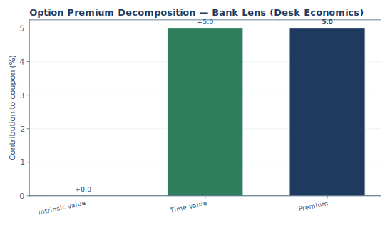

**P&L drivers**

Day to day, desk P&L is driven by realized-versus-implied volatility on the delta hedge (gamma scalping), the bid-offer captured on flow, the mark-to-market of the short option book against the vol surface, theta collected, and vega as implied vol moves. Product Control performs independent valuation, vol surface verification, and model reserve assessment.

#### §9. THE BANK LENS — Controls & Reconciliation (2nd Line of Defence)

**Booking & systems**

| Dimension | Detail |
|-----------|--------|
| **Primary system** | Murex (OTC and structured). Exchange systems for listed options |
| **Booking model** | Option type (call/put), strike, expiry, exercise style (European/American), notional, premium |
| **Valuation model** | Black-Scholes (European). Binomial/trinomial tree (American). Local vol or stochastic vol for exotic calibration |
| **Market data** | Spot, vol surface (by strike and expiry), interest rate curve, dividend schedule |
| **Settlement** | Premium: T+1 or T+2. Exercise: T+2 after expiry |

**Reconciliation points**

| Recon point | What must agree | VO-specific break |
|-------------|-----------------|-------------------|
| **Exercise style** | European vs American flag consistent across Murex and exchange/downstream systems | American option booked as European → early-exercise value and assignment risk mis-modelled |
| **Strike & expiry** | Strike level and expiry date match the termsheet across all systems | Strike or expiry off by a convention (settlement date vs expiry date) → wrong payoff and wrong P&L |
| **Premium** | Premium amount and settlement date (T+1/T+2) agree between front office and settlements | Premium booked at wrong amount or wrong value date → cash break |
| **Fixing / settlement type** | Cash vs physical settlement; expiry fixing source matches the termsheet | Physical settlement booked as cash, or wrong expiry fixing used → wrong final payoff |
| **Exercise capture** | Exercise/assignment flag set correctly on expiry; in-the-money auto-exercise applied | ITM option not exercised, or short position assignment missed → payoff and delivery diverge |
| **Notional / multiplier** | Contract multiplier and notional consistent across systems | Wrong multiplier (e.g. index point value) → payoff scaled incorrectly |
| **Greeks / risk** | Position Greeks agree between front-office and risk systems | Sign or magnitude mismatch on delta/gamma/vega |
| **Margin** | Initial and variation margin (exchange) or collateral (OTC, ISDA/CSA) reconciles to position | Margin call computed on a stale or wrong position → funding and collateral break |

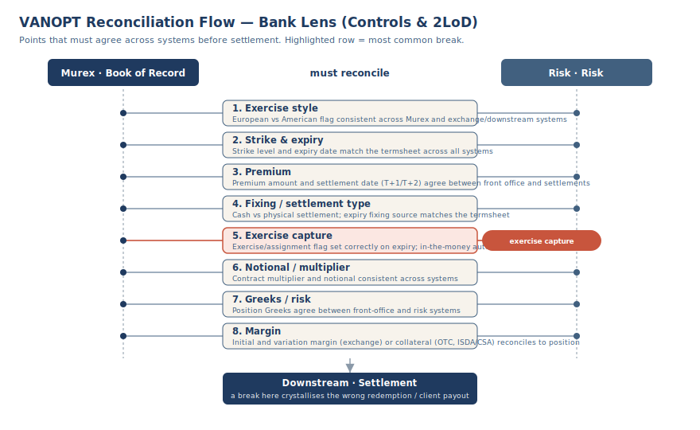

**Common breaks & red flags**

| Red Flag | Why It Matters | 2LoD Action |
|----------|---------------|-------------|
| Retail client selling naked options | Unlimited loss potential. Suitability risk | Require explicit risk acknowledgment; suitability review |
| Option price inconsistent with vol surface | Possible mis-mark | Product Control should investigate against the calibrated surface |
| Large gamma concentration near expiry | Pin risk. Large unexpected hedging costs | Monitor expiry exposure; confirm hedge and exercise plan |
| Exercise style mismatch (American booked as European) | Early-exercise value and assignment risk mis-modelled | Verify the exercise-style flag against the termsheet across systems |
| Settlement type confusion (cash vs physical) | Wrong final payoff and delivery logistics | Confirm the settlement convention before expiry |
| ITM option not auto-exercised / assignment missed | Realised payoff diverges from the model | Verify exercise capture on expiry day for every ITM/assigned line |

**Control implication**

Each break has a direct consequence the 2nd line must size before it reaches the books or the client. The dominant control point is **exercise capture**: if an in-the-money option is not exercised, or a short-position assignment is missed on expiry, the realised payoff and the delivery diverge from the model — the buyer's economic outcome and the desk's risk are both misstated at once. An exercise-style mismatch (American booked as European) corrupts the value and the assignment risk; a settlement-type error (physical booked as cash) corrupts the final payoff and the delivery. The reconciliation exists precisely to catch these inconsistencies before settlement crystallises them.

#### §10. Formal Definition

A European **call** option gives the holder the right to buy the underlying at strike K on expiry date T. A European **put** option gives the holder the right to sell at strike K on expiry date T.

**Call payoff:** max(S_T − K, 0)
**Put payoff:** max(K − S_T, 0)

**Black-Scholes call price:**
C = S_0 × N(d_1) − K × e^(−rT) × N(d_2)

Where:
- d_1 = [ln(S_0/K) + (r − q + σ²/2) × T] / (σ × √T)
- d_2 = d_1 − σ × √T
- N(·) = standard normal cumulative distribution function
- σ = implied volatility
- r = risk-free rate
- q = dividend yield

**Put-call parity:** C − P = S_0 × e^(−qT) − K × e^(−rT)

This means: Long Call + Short Put = Forward. Options and forwards are connected through put-call parity. This is the foundation of all structured product pricing.

**Key parameters:** option type — call or put; strike — fixed price K; expiry — date T; exercise style — European (exercise only at expiry) or American (exercise any time up to expiry); settlement — cash (net payment) or physical (delivery of underlying vs payment of strike).

#### §11. Lifecycle

| Stage | Timing | Action |
|-------|--------|--------|
| **Trade** | T | Buyer pays premium. Writer (desk) receives premium. Position established |
| **During life** | T to expiry | Desk delta-hedges daily. Mark-to-market based on vol surface, spot, time. For American options: monitor for early exercise |
| **Near expiry** | T-2 to expiry | Gamma increases for near-the-money options. Pin risk: large hedging flows near the strike. Exercise decisions for American/Bermudan |
| **Expiry** | Expiry date | European: automatic exercise if in-the-money (by convention, > threshold). American: final exercise decision. Assignment for short positions |
| **Settlement** | Expiry+2 | Cash settlement: net payment. Physical settlement: delivery of underlying vs payment of strike |

#### §12. Worked Example (both lenses)

**Terms:**
- Long 1 European put option on SPX
- Strike: 5,000
- Current spot: 5,200
- Implied vol: 18%
- Risk-free rate: 4%
- Dividend yield: 1.5%
- Expiry: 6 months
- Notional multiplier: $100

*Investor lens:*

**Black-Scholes pricing:**
- d_1 = [ln(5200/5000) + (0.04 − 0.015 + 0.0162) × 0.5] / (0.18 × √0.5)
- d_1 = [0.0392 + 0.0206] / 0.1273 = 0.4695
- d_2 = 0.4695 − 0.1273 = 0.3422
- N(−d_1) = N(−0.4695) = 0.3193
- N(−d_2) = N(−0.3422) = 0.3661
- P = 5000 × e^(−0.02) × 0.3661 − 5200 × e^(−0.0075) × 0.3193
- P = 4901 × 0.3661 − 5161 × 0.3193
- P = 1794 − 1648 = $146 per unit

**Premium paid:** $146 × 100 = $14,600.

The buyer pays $14,600 for downside protection on SPX below 5,000. Maximum loss is the premium — $14,600 — if SPX finishes at or above 5,000 at expiry. Below 5,000, the put gains value point-for-point against the index decline.

*Bank lens:*

The desk is **short** the put — the writer — and receives the $14,600 premium. At inception the desk's Greeks (mirror of the buyer's long position) are: Delta −0.32 (the put moves $0.32 for each $1 drop in SPX), Gamma 0.0018, Vega $730 per 1% vol increase, Theta −$3.50 per day. The desk delta-hedges the short put and collects theta as the option ages, profiting if realized vol stays below the 18% implied vol it sold. Product Control performs independent valuation and vol surface verification on the position. The 2nd line confirms the exercise style (European — exercise at expiry only), the strike (5,000) and expiry, the cash-vs-physical settlement convention, the notional multiplier ($100), and the premium settlement before relying on the valuation.

#### §13. Knowledge Check

**Review Questions:**
1. *(Investor)* What is the fundamental difference between a call option and a put option?
2. *(Investor)* Why does an option have time value in addition to intrinsic value?
3. *(Investor)* What is the break-even on a long call, and why is it not the strike price?
4. *(Investor)* What is put-call parity, and why is it important for structured products?
5. *(Investor)* How do options serve as building blocks for structured products? Give three examples.
6. *(Desk economics / 1LoD)* The investor is long the option; what is the desk, and which way do the desk's gamma, vega, and theta point? Where does the desk's margin come from?
7. *(Controls / 2LoD)* Which booking fields must reconcile for a vanilla option, and why is exercise capture the dominant control point on expiry day?

**Scenario Questions:**
1. A buyer owns a portfolio of stocks worth $1M and wants to protect against a 10% decline over 3 months. Implied vol is 20%. How would the buyer use put options, and approximately what would it cost?
2. Implied vol on a stock is 25%. Realized vol over the past month has been 15%. If the desk sells (writes) a 1-month ATM call, under what conditions does the desk profit?
3. The desk is short 1,000 call options on XYZ at strike $50, delta-hedged. XYZ is at $49.95 on expiry day. Describe the pin risk problem.

**Mental Models**

| Concept | Mental Model |
|---------|-------------|
| Vanilla option | A rain check at a store — the right, not the obligation, to buy at a fixed price |
| Premium | The non-refundable cost of the rain check — lost if never used |
| Long the option (investor) | The buyer holds the rain check; most they can lose is its cost |
| Short the option (desk) | The store that wrote the promise — collects the fee, bears the obligation |
| Intrinsic vs time value | Intrinsic = what the rain check saves today; time value = the worth of having until expiry |
| Theta | The rain check expiring a little more each day |
| Gamma near expiry / pin risk | A rush of last-minute redemptions clustered at exactly the offered price |
| Exercise capture (2LoD) | The clerk confirming which rain checks were actually redeemed before reconciling the till |

**Key Takeaways**

1. A vanilla option is the right, not the obligation, to buy (call) or sell (put) at strike K by expiry. It is the building block of all structured products.
2. The investor is the buyer — **long** the option: downside limited to the premium, leveraged upside (call) or downside protection (put), long volatility.
3. The break-even on a long call is strike + premium, not the strike itself.
4. The desk is the writer — **short** the option: it receives the premium, delta-hedges, and is short gamma and vega while collecting theta.
5. The premium decomposes into intrinsic value + time value; for an at-the-money option the whole premium is time value.
6. Buyers face theta and total premium loss; writers face large (call) or substantial (put) tail exposure, managed by hedging.
7. For the 2nd line, the dominant control points are exercise style, strike & expiry, fixing/settlement type, exercise capture, and margin — each can misstate the payoff or the delivery.

#### §14. Common Mistakes

1. **Buying options without understanding theta.** Time decay is relentless. Buying OTM short-dated options is the most common way buyers lose money.
2. **Writing options without understanding tail risk.** Option writers win small amounts frequently and lose large amounts rarely. The average is not the experience.
3. **Using Black-Scholes blindly.** The model assumes constant vol, log-normal returns, and continuous hedging — none of which hold exactly. The market prices in skew and smile for a reason.
4. **Confusing implied vol with realized vol.** Implied vol is the market's expectation embedded in option prices. Realized vol is what actually happened. The difference drives P&L for vol traders.
5. **Ignoring early exercise for American options.** Deep ITM American puts and calls on high-dividend stocks may be exercised early. Ignoring this undervalues the option.
6. **(Controls)** **Trusting that an ITM option was exercised without confirming capture.** Exercise and assignment flags must be verified on expiry day — a missed exercise or assignment makes the realised payoff and delivery diverge from the model for both the buyer and the desk.

---

**Dual-lens questions:**
- *(Desk economics / 1LoD)* What does the desk book against the investor, and what is its primary Greek / hedging risk?
- *(Controls / 2LoD)* Which booking / fixing / event-capture fields must reconcile, and which is the most common break?

**Dual-lens visuals (generated):**
- `assets/vanopt/controls_vanopt_recon_08.svg` `[generated]`
- `assets/vanopt/payoff_vanopt_01.svg` `[generated]`
- `assets/vanopt/waterfall_vanopt_09.svg` `[generated]`
### 5.6.4 Equity-Linked Option (ELO) {#sec-5-6-4}

> **Prerequisites:** [VO](#sec-5-6-3) &nbsp;|&nbsp; **Key concepts:** Retail wrapper, term sheet vs ISDA

---

*Vanilla Options ([Section 5.6.3](#sec-5-6-3)) are traded between institutional counterparties via exchanges or OTC markets. The Equity-Linked Option wraps the identical option payoff in a retail-friendly product format — term sheet, minimum ticket, simplified documentation — making vanilla option economics accessible to private banking and mass affluent clients who cannot or do not trade options directly. This chapter reads the product through two lenses: what it means for **the investor**, and what it means for **the bank** — the latter split into the desk's market economics (1st line of defence) and the controls and reconciliation that surround it (2nd line of defence).*

#### §1. Explain Like I'm New

Consider an investor who believes a particular stock — say, Apple — will rise over the next year. The investor could buy the stock for $200, putting $200 at risk. Instead, the bank offers an **Equity-Linked Option** (ELO): the investor pays $15 today, and if Apple is above $200 in one year, the investor receives the difference. If Apple finishes at $230, the investor collects $30. If Apple finishes below $200, the investor loses only the $15 premium.

An ELO is a vanilla option — typically a call — packaged and sold as a standalone investment product to retail or mass affluent clients. It is NOT structurally different from the vanilla options described in [Section 5.6.3](#sec-5-6-3). The difference is in the packaging: an ELO is marketed as a product with a term sheet, minimum ticket, and retail distribution infrastructure, whereas a vanilla option is a trading instrument.

The ELO bridges the gap between the options desk (which trades vanilla options all day) and the retail client (who wants a simple, branded product with defined terms). The investor is **long** the embedded option; the bank, as writer and market-maker, is **short** it.

#### §2. Real-World Analogy

An ELO is like a pre-packaged gift set at a perfume counter.

The perfume (the vanilla option) is available in bulk to any wholesale buyer (institutional traders). But the perfume counter wraps the same perfume in a nice box, adds a card with usage instructions, and sells it as a gift set at a slightly higher price. The perfume inside is identical. The packaging, distribution channel, and client experience are different.

In an ELO:
- The **perfume** is the vanilla option
- The **gift box** is the term sheet and product wrapper
- The **usage instructions** are the investor guide and scenario analysis
- The **retail markup** is the bank's structuring and distribution margin
- The **perfume counter** is the retail distribution network

The investor pays a premium for convenience, simplicity, and access to a product they might not know how to buy on their own.

#### §3. What Problem Does This Solve?

ELOs solve the **retail access** problem.

Most retail investors cannot or do not trade options directly. Exchange membership, margin requirements, options approval, and complexity prevent access. An ELO wraps a vanilla option in a client-friendly format that can be sold through a bank's retail or private banking channel.

| Barrier | How ELO Solves It |
|---------|------------------|
| Options approval | Not required — ELO is sold as investment product, not derivative trade |
| Margin requirements | Not required — the investor pays premium upfront. No margin calls |
| Strike/expiry selection | Pre-selected by structurer. The investor chooses from menu of products |
| Documentation | Simplified term sheet instead of ISDA/exchange rules |

#### §4. Product DNA

| Field | Value |
|-------|-------|
| **Full Name** | Equity-Linked Option |
| **Abbreviation** | ELO |
| **Family** | Other |
| **Complexity Score** | 3 / 10 |
| **Complexity Rationale** | Same as vanilla option (3). No additional structural features beyond packaging |
| **Underlying Asset Class** | Single equity (most common), equity index, basket |
| **Capital Protection** | None — max loss is premium paid |
| **Coupon Type** | None |
| **Maturity** | Typically 6 months to 2 years |
| **Liquidity** | Limited — early redemption at bank's discretion, typically at bid price |
| **Four-Leg Product** | No |
| **Primary System** | Murex |
| **ISDA Required** | No — product wrapper with term sheet |

**DNA Atlas Fields:**
- Primary Risk: Total loss of premium if underlying does not move favorably
- Typical Buyer: Retail, mass affluent, private banking clients
- Typical Use Case: Directional bet with defined maximum loss. Alternative to direct stock purchase
- Building Blocks: Long call option (most common) or long put option
- Key Hedge: Delta-hedge (underlying shares or futures)
- Similar Products: Vanilla Option (5.6.3), Warrant, ETF with options overlay
- Most Important Greek: Delta (directional), Vega (vol sensitivity)

**Comparison Matrix Fields:**
- Complexity: 3
- Yield Potential: Unlimited (call) or limited to strike (put)
- Capital Protection: None (max loss = premium)
- Credit Exposure: Issuer (bank)
- Liquidity: Limited (early redemption at bank's discretion)
- Path Dependency: None (European)
- Volatility Sensitivity: High (long vega)
- Correlation Sensitivity: None (single stock) or moderate (basket)
- Client Type: Retail / Private banking
- Market Environment: Bullish (call ELO) or bearish (put ELO)

#### §5. Who Touches This Product

| Role | Responsibility |
|------|---------------|
| **Structurer** | Selects underlying, strike, tenor. Designs term sheet. Sets retail pricing with margin above theoretical value |
| **Trader** | Prices the underlying vanilla option. Delta-hedges. Same as vanilla option trading |
| **Sales** | Primary distribution to retail/private banking. Explains scenarios, max loss, break-even |
| **Risk** | Monitors Greeks, counterparty exposure (limited — the investor prepays premium) |
| **Product Control** | Verifies pricing margin. Independent valuation |
| **Operations** | Premium collection. Maturity processing. Client communication at expiry |
| **Legal/Compliance** | Product governance. KYD. Suitability. Marketing material review |
| **Quantitative Analytics** | Same pricing models as vanilla options |

#### §6. Product Evolution

| Era | Development |
|-----|------------|
| **1990s** | Banks begin repackaging OTC options as retail products. "Warrant" and "ELO" labels emerge |
| **2000s** | Structured product desks build ELO factories. Menu-based approach: pick stock, pick tenor, get price |
| **2010s** | Listed structured products (certificati, turbos) compete with bank-issued ELOs. Fee transparency increases |
| **2020s** | Retail options trading expands via apps (Robinhood). Traditional ELOs face competition from direct option access. Banks pivot to more complex payoffs (barriers, digitals) to differentiate |

---

#### §7. THE INVESTOR LENS

**Why the investor buys it**

1. **Simplicity.** The investor receives a term sheet with three scenarios. No option chain to navigate.
2. **Defined risk.** The maximum loss is the premium paid. No margin calls, no early exercise surprises.
3. **Access.** No options approval, no exchange membership, no margin account required.
4. **Leverage.** A small premium controls large exposure. A $15 premium on a $200 stock is roughly 13× leverage.
5. **Directional view expression.** An investor with a bullish view (call) or bearish view (put) can monetise it with a known, bounded cost.

**Position taken**

The investor is **long** the embedded vanilla option (a call in the most common form, or a put). Net, the investor is **long volatility** (helped by larger moves and rising implied vol — long vega), exposed to time decay (long theta exposure works against them), and carries directional delta. With a single underlying there is no correlation exposure; on a basket the investor is additionally exposed to correlation.

**Payoff & scenarios**

The investor's payoff is the standard option hockey stick. For a call ELO, below the strike at expiry the option expires worthless and the investor loses the entire premium; above the strike the payoff is `max(S_T − K, 0)` per share, and the investor breaks even only once the underlying rises past strike + premium. The maximum loss is the premium; the upside (call) is unbounded.

**Terms:** ELO on ABC Corp. Strike: $200. Premium: $15. Notional: 100 shares. Tenor: 1 year. European call.

| Scenario | Stock at Expiry | ELO Payoff | Net P&L (after premium) |
|----------|:--------------:|:----------:|:-----------------------:|
| **Bull** | $240 | $40 per share | +$25 × 100 = +$2,500 |
| **Base** | $215 | $15 per share | $0 × 100 = $0 (break-even) |
| **Bear** | $180 | $0 (expires worthless) | -$15 × 100 = -$1,500 (premium lost) |

A subtle scenario catches retail investors off guard: the stock can finish above the strike yet the ELO still loses money, because the move was smaller than the premium paid. If the stock finishes at $215 in the table above, the $15 payoff exactly equals the $15 premium — break-even — and any finish between strike and break-even is a net loss despite the stock having risen.

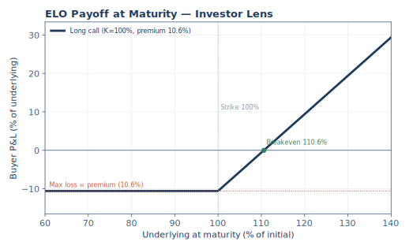

**Risks to the investor**

| Risk | Description | Severity |
|------|------------|:--------:|
| **Total premium loss** | If the underlying does not move past the strike, the option expires worthless and the investor loses 100% of the premium. Unlike a stock investor, there are no shares left to recover. | High |
| **Theta decay** | Time value erodes daily, accelerating in the final months. A flat or modestly favourable move can still lose money once theta is accounted for. | High |
| **Break-even gap** | The underlying must move past strike + premium for the investor to profit. For an ATM ELO this can require a 5–15% move. | Medium |
| **Liquidity / lock-in** | Early redemption is at the bank's discretion, typically at bid. A mid-life vol spike cannot easily be monetised — the investor is generally locked in until expiry. | Medium |
| **Issuer credit risk** | The investor is exposed to the issuing bank's creditworthiness. | Medium |
| **Mis-selling / suitability** | A retail investor may not understand that most options expire near or below break-even. | Medium |

#### §8. THE BANK LENS — Desk Economics (1st Line of Defence)

**What the desk books**

The desk's position is the mirror image of the investor's. Where the investor is long the embedded option, the desk is **short** that option — it is the writer / market-maker. The desk receives the full client premium upfront and delta-hedges the resulting exposure in the underlying. The investor's premium is, to the desk, the theoretical option value plus the structuring and distribution margin baked on top.

**Greeks & hedging**

Short the call (or put), the desk is **short gamma** and **short vega** while collecting **theta**, and it delta-hedges by trading the underlying (shares or futures). The desk is indifferent to direction once delta-hedged — it captures the same move in the opposite direction to the investor. The day-one structuring margin is realised at inception; thereafter desk P&L is driven by realized-versus-implied volatility on the hedge. Single-stock ELOs can be harder to hedge than index products because of single-stock liquidity and borrow costs; risk management may impose limits on concentrated single-name exposure.

**How the bank makes money**

| Component | Detail |
|-----------|--------|
| **Option theoretical value** | Calculated via Black-Scholes or local vol model. Example: $20.30 |
| **Structuring margin** | Bank adds 3-5% markup. Example (3%): $0.61 |
| **Distribution fee** | Sales channel takes 1-2%. Example (1.5%): $0.30 |
| **Client price** | $20.30 + $0.61 + $0.30 = $21.21 per share |

The bank profits from the difference between the client price and the theoretical value. Since the investor cannot easily compare the ELO price to the exchange-traded option price (different format, different terms), the margin is less transparent than for vanilla options.

**The premium decomposition:**

The client premium decomposes into the option's **intrinsic value** + **time value**, plus the bank's margin. For the ATM example, intrinsic value is $0 (strike equals spot), so the entire $20.30 theoretical value is time value; the remaining $0.91 ($0.61 structuring + $0.30 distribution) is the bank's margin on top. For an at-the-money option the whole theoretical premium is time value — the value the desk collects as theta over the life of the trade, against which it pays away gamma and vega.


**P&L drivers**

Day to day, desk P&L is driven by realized-versus-implied volatility on the delta hedge, moves in the underlying (gamma), the mark-to-market of the embedded option, and the day-one structuring/distribution margin captured at inception. Product Control verifies the pricing margin and performs independent valuation of the option component against the same models used for vanilla options.

#### §9. THE BANK LENS — Controls & Reconciliation (2nd Line of Defence)

**Booking & systems**

| Aspect | Detail |
|--------|--------|
| **Primary system** | Murex |
| **Booking structure** | Vanilla option + wrapper identifier linking to the term sheet |
| **Valuation model** | Black-Scholes / local vol (identical to vanilla options) |
| **Market data** | Same as vanilla options: spot, vol surface, rates, dividends |
| **Settlement** | Cash settlement at maturity |
| **Key booking fields** | Strike, expiry, exercise style (European/American), fixing/settlement source, notional, underlying ID, wrapper identifier |

**Reconciliation points**

| Recon point | What must agree | ELO-specific break |
|-------------|-----------------|--------------------|
| **Strike & expiry** | Strike level and expiry date match the term sheet and the booked option | Wrapper term sheet shows one strike/expiry; the underlying option booked in Murex shows another |
| **Exercise style** | European vs American consistent across wrapper and option leg | Term sheet says European but the option is booked American → early-exercise risk mispriced |
| **Fixing/settlement** | Final fixing source and settlement type (cash) match the term sheet | Different vendors report different closing prices on the expiry fixing |
| **Exercise capture** | ITM option flagged exercised; cash settlement amount captured | Option finishes ITM but the auto-exercise flag is not set → the investor's payoff and the desk's obligation diverge from the model |
| **Listing / wrapper** | Wrapper identifier correctly links the retail note to the underlying option position | Wrapper detached from the option leg → position appears unhedged or double-counted |
| **Premium / pricing margin** | Client premium = theoretical value + structuring + distribution margin | Margin mis-booked → day-one P&L and IPV disagree |
| **Notional / share count** | Notional and contract multiplier reconcile to payoff per share × shares | Wrong share count → payoff and premium scaled incorrectly |
| **Corporate actions** | Strike/expiry adjusted for dividends, splits, special dividends | Special dividend or split not propagated → strike off, payoff misstated |

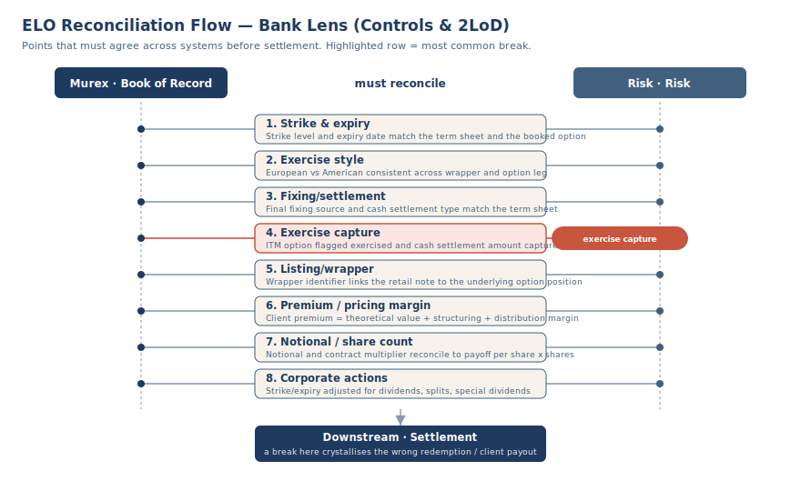

**Common breaks & red flags**

| Red Flag | What It Means | 2LoD Action |
|----------|---------------|-------------|
| Structuring margin > 10% of premium | Excessive — the investor is overpaying relative to theoretical value | Challenge pricing; confirm IPV against independent theoretical value |
| ELO on illiquid stock | Delta-hedging difficult; wide bid-offer passes through to client pricing | Confirm hedgeability and that pricing reflects realistic borrow/liquidity |
| Short-dated ELO (< 3 months) | Rapid theta decay; likely to expire worthless unless deep ITM | Confirm suitability disclosure and scenario analysis present |
| Exercise style mismatch between wrapper and option leg | European wrapper booked against an American option (or vice versa) | Reconcile exercise style across the wrapper and the underlying option |
| Expiry fixing price mismatch | Different data sources report different closing prices | Use the fixing source specified in the term sheet |
| Wrapper detached from option position | Listing/wrapper identifier not linked to the hedging option | Confirm the wrapper maps one-to-one to the booked option before relying on either valuation |

**Control implication**

Each break has a direct consequence the 2nd line must size before it reaches the books or the client. A strike or expiry mismatch between the wrapper and the underlying option misstates the entire payoff. An exercise-style mismatch misprices early-exercise risk and can change the settlement amount. A missed exercise capture on an ITM option makes the realised payoff and the desk's obligation diverge from the model for both the investor and the desk simultaneously. A fixing mismatch breaks valuation and the final payoff at once. A detached wrapper makes the position look unhedged or double-counted. The reconciliation exists precisely to catch these inconsistencies before settlement crystallises them.

#### §10. Formal Definition

An **Equity-Linked Option** (ELO) is a vanilla option repackaged as a retail investment product. Its payoff is identical to the vanilla option payoff:

**ELO Call payoff:** max(S_T − K, 0)
**ELO Put payoff:** max(K − S_T, 0)

Where K = strike price, S_T = underlying at expiry.

The ELO price = Black-Scholes theoretical value + structuring margin + distribution fee.

There is no structural difference from a vanilla option. The formal definition, decomposition, and pricing are identical. The difference is purely in distribution wrapper, documentation, and client channel. There is no product construction in the structured-product sense — the ELO does not combine a bond with an option; it IS the option, repackaged.

**Key parameters:** strike — pre-selected by the structurer; option type — call (most common) or put; exercise style — typically European; underlying — single stock (most common), index, or basket; maturity — typically 6 months to 2 years; settlement — cash.

#### §11. Lifecycle

| Stage | Timing | Action |
|-------|--------|--------|
| **Product design** | T-30 | Structurer selects stock/strike/tenor menu for the upcoming issuance cycle |
| **Marketing** | T-14 to T | Sales prepares indicative terms. Distribution to client advisors |
| **Subscription** | T-3 to T | Investors subscribe. Premium collected |
| **Trade date** | T | ELO issued. Bank books the short option position and hedges (delta-hedge the vanilla option) |
| **During life** | T to expiry | No client-facing events. Trader manages the hedge. The investor receives periodic valuation statements |
| **Expiry** | Maturity | Option exercised automatically if ITM. Cash settlement to the investor's account |
| **Post-expiry** | T+2 | Settlement. The investor is notified of the outcome |

#### §12. Worked Example (both lenses)

**Terms:**
- Underlying: Apple Inc. (AAPL)
- Spot: $200
- Strike: $200 (ATM)
- Tenor: 1 year
- Implied vol: 22%
- Risk-free rate: 4.5%
- Dividend yield: 0.5%
- Black-Scholes theoretical: $20.30

**Bank pricing:**
- Theoretical: $20.30
- Structuring margin (3%): $0.61
- Distribution fee (1.5%): $0.30
- Client price: $21.21 per share
- Notional: 500 shares. Total premium: $10,605

*Investor lens:*
- **Outcome — AAPL at $230 at expiry:** Payoff: ($230 − $200) × 500 = $15,000. Net P&L: $15,000 − $10,605 = **+$4,395 (+41.4% return on premium)**. The investor is long the call and captures the upside above the strike, less premium.
- **Outcome — AAPL at $200 at expiry:** Payoff: $0. Net P&L: **−$10,605 (total premium lost)**. The option expires worthless; the investor's loss is final, with no shares to hold.
- **Break-even:** $200 + $21.21 = **$221.21** (AAPL must rise 10.6% for the investor to break even).

*Bank lens:*
- In the $230 scenario the desk, short the call and delta-hedged, owes the $15,000 payoff but has captured the offsetting move on its hedge and keeps the $0.91/share margin ($455 on 500 shares) plus net hedging P&L. Product Control confirms the option MTM and the margin booked at inception.
- In the $200 scenario the desk's short call expires worthless; the desk keeps the full premium against a zero payoff, retaining its margin and net hedging P&L. The 2nd line confirms the expiry fixing, the exercise (non-exercise) capture, and that the wrapper and option leg agree before settlement.

#### §13. Knowledge Check

1. **What is the difference between an ELO and a vanilla option?** (Answer: none structurally — only packaging, documentation, and distribution channel.)
2. **What is the maximum loss on a call ELO, and who bears the corresponding gain?** (Answer: the investor's max loss is the premium; the desk, short the option, retains it when the option expires worthless.)
3. **Why does an ELO cost more than the equivalent exchange-traded option?** Decompose the premium.
4. **Why might a stock finish above the strike yet the investor still lose money on a call ELO?**
5. **What is the break-even on the worked example, and what move does it require?**
6. **(Desk economics / 1LoD)** The investor is long the call; what is the desk, and which way do the desk's gamma, vega, and theta point? Where does the desk's day-one margin come from, and what drives its P&L thereafter?
7. **(Controls / 2LoD)** Name three reconciliation breaks specific to an ELO and the consequence of each for the investor's payoff or the desk's obligation.

**Mental Models**

| Concept | Mental Model |
|---------|-------------|
| ELO | A pre-packaged gift set at a perfume counter — the same option, in a retail box at a markup |
| Premium | The investor's defined, bounded cost — the most that can be lost |
| Intrinsic + time value | The perfume itself (intrinsic) plus the wait (time value); for an ATM option the whole theoretical premium is time value |
| Break-even | The strike plus the premium — the stock must clear both before the investor profits |
| Desk position | The writer at the counter — short the option, delta-hedged, indifferent to direction |
| 2LoD reconciliation | The stocktaker — confirms the wrapper, strike, expiry and exercise capture match before anyone is paid |

**Key Takeaways**

1. An ELO is a vanilla option repackaged for retail — same economics, different wrapper, documentation, and distribution.
2. The investor is the buyer — **long** the option: max loss is the premium, leveraged upside (call) or downside profit (put), long volatility.
3. The break-even on a long call ELO is strike + premium, not the strike itself.
4. The desk is the writer — **short** the option: it receives the premium, delta-hedges, and is short gamma and vega while collecting theta.
5. The premium decomposes into intrinsic value + time value, plus the bank's structuring and distribution margin; for an ATM option the whole theoretical premium is time value.
6. The investor faces theta and total premium loss; the desk profits from the margin regardless of outcome because the option payoff is hedged away.
7. For the 2nd line, the dominant control points are strike & expiry, exercise style, fixing/settlement, exercise capture, and the listing/wrapper link — each can misstate the payoff or the delivery.

#### §14. Common Mistakes

1. **Thinking the ELO is a different product from a vanilla option.** It is the same product. The only difference is packaging and distribution.
2. **Ignoring the structuring margin.** The gap between the ELO price and the theoretical option value is pure profit for the bank. Sophisticated clients compare.
3. **Assuming the bank wants the ELO to expire worthless.** The desk is delta-hedged. It profits from the margin regardless of outcome — the P&L from the option payoff is hedged away.
4. **Comparing ELO return to stock return.** The ELO has leverage — $21 controls $200 of exposure. Percentage returns on premium are not comparable to percentage returns on stock; a risk-adjusted comparison is needed.
5. **Not understanding break-even.** The stock must rise past strike + premium for the investor to profit. For an ATM ELO this can require a 5–15% move.
6. **(Controls)** **Trusting that an ITM ELO was exercised without confirming capture.** The exercise flag and the wrapper-to-option link must be verified on expiry day — a missed exercise or a detached wrapper makes the realised payoff and the cash settlement diverge from the model for both the investor and the desk.

**Dual-lens questions:**
- *(Desk economics / 1LoD)* What does the desk book against the investor, and what is its primary Greek / hedging risk?
- *(Controls / 2LoD)* Which booking / fixing / event-capture fields must reconcile, and which is the most common break?

**Dual-lens visuals (generated):**
- `assets/elo/controls_elo_recon_08.svg` `[generated]`
- `assets/elo/payoff_elo_01.svg` `[generated]`
- `assets/elo/waterfall_elo_09.svg` `[generated]`
### 5.6.5 Option on Reverse Convertible (Option on RC) {#sec-5-6-5}

> **Prerequisites:** [RC](#sec-5-1-2) · [VO](#sec-5-6-3) &nbsp;|&nbsp; **Key concepts:** Compound option, vol-of-vol, two-layer structure

---

*Vanilla Options ([Section 5.6.3](#sec-5-6-3)) gave the right to buy or sell an asset. The Option on Reverse Convertible gives the right to enter into an RC ([Section 5.1.2](#sec-5-1-2)) at a future date — it is an option on a structured product, not an option on a single asset. This adds a layer of optionality: the investor decides whether the RC's terms are attractive at the option's expiry before committing. This chapter reads the product through two lenses: what it means for **the investor**, and what it means for **the bank** — the latter split into the desk's market economics (1st line of defence) and the controls and reconciliation that surround it (2nd line of defence).*

#### §1. Explain Like I'm New

A Reverse Convertible (RC, [Section 5.1.2](#sec-5-1-2)) is a product that pays a high coupon but risks converting principal into shares if the stock falls below a barrier. An **Option on a Reverse Convertible** is a product that gives the holder the right — but not the obligation — to enter into an RC with pre-agreed terms on a future date.

If market conditions at that future date make the RC attractive, the holder exercises and enters the RC. If conditions are unfavorable, the holder walks away, losing only the premium paid for the option.

This creates a two-layer product: the outer layer is an option (the right to enter), and the inner layer is an RC (the product that may or may not be entered). The combination produces a product with a deferred entry decision — the investor does not commit to the RC today but reserves the right to enter later.

In practice, this structure is used when an investor wants RC-like income but is uncertain about timing or market conditions. The option gives the flexibility to observe the market before committing. Because the right to enter an option-bearing note is itself an option, this is a **compound option** — an option on an option.

#### §2. Real-World Analogy

An Option on an RC is like a reservation deposit for a timeshare.

A $500 deposit holds the right to sign a timeshare contract at a fixed price ($20,000/year) at any point in the next 3 months. During those 3 months, the holder visits the property, checks the neighborhood, and evaluates whether the rental income covers the costs.

If the property looks good: the holder signs the timeshare contract (exercise the option → enter the RC).
If the property looks bad: the holder walks away and loses the $500 deposit (let the option expire).

In an Option on RC:
- The **$500 deposit** is the option premium
- The **timeshare contract** is the RC with pre-agreed terms
- The **3 months** is the option expiry period
- The **rental income** is the RC coupon
- The **property value risk** is the downside conversion risk of the RC

The key insight: the holder is paying for the right to defer a decision. The timeshare (RC) is risky — the holder wants more information before committing.

#### §3. What Problem Does This Solve?

Options on RCs solve the **entry timing** problem.

An investor who wants RC income faces a dilemma: enter now (when conditions may not be ideal) or wait (and risk missing a good entry). The Option on RC allows the investor to lock in RC terms today while deferring the entry decision.

| Problem | RC Solution | Option on RC Solution |
|---------|:----------:|:--------------------:|
| Want high income | High coupon from day 1 | High coupon only after exercise — but flexibility to wait |
| Uncertain about entry timing | Must commit today | Lock in terms, decide later |
| Concerned about near-term volatility | Immediate barrier risk | Observe vol first, enter only if favorable |
| Want defined downside during waiting period | N/A — RC has conversion risk | Max loss = option premium during waiting period |

#### §4. Product DNA

| Field | Value |
|-------|-------|
| **Full Name** | Option on Reverse Convertible |
| **Abbreviation** | Opt-on-RC |
| **Family** | Other |
| **Complexity Score** | 5 / 10 |
| **Complexity Rationale** | Two-layer structure: option (3) on RC (3). Combined complexity exceeds individual layers. Requires understanding of both option mechanics and RC mechanics |
| **Underlying Asset Class** | Single equity or equity index (the RC's underlying) |
| **Capital Protection** | During option period: max loss = premium. After exercise (in RC): barrier-dependent protection |
| **Coupon Type** | None during option period. Fixed coupon after exercise (RC coupon) |
| **Maturity** | Option period: 1-6 months. RC period: 6-18 months after exercise |
| **Liquidity** | Very limited. Two-layer structure makes early exit complex |
| **Four-Leg Product** | No (option layer is single instrument. RC layer is two-leg if exercised) |
| **Primary System** | Murex |
| **ISDA Required** | Yes — OTC derivative |

**DNA Atlas Fields:**
- Primary Risk: Premium loss (if not exercised) or conversion risk (if exercised into RC)
- Typical Buyer: Sophisticated retail, private banking, institutional (yield hunters with timing views)
- Typical Use Case: Defer RC entry while locking in terms during uncertain markets
- Building Blocks: Call option on an RC (which itself = Bond + Short Put)
- Key Hedge: Compound option Greeks — delta-hedge requires option-on-option modeling
- Similar Products: Forward-starting RC, callable RC, ELO (option layer only)
- Most Important Greek: Delta of outer option (sensitivity to RC value changes)

**Comparison Matrix Fields:**
- Complexity: 5
- Yield Potential: High (RC coupon after exercise)
- Capital Protection: Partial (premium loss during option; barrier-dependent after exercise)
- Credit Exposure: Issuer
- Liquidity: Very limited
- Path Dependency: Low (European option on RC)
- Volatility Sensitivity: Complex (vol affects both option layer and RC layer oppositely)
- Correlation Sensitivity: None
- Client Type: Sophisticated retail / Institutional
- Market Environment: Uncertain (client wants optionality on entry)

#### §5. Who Touches This Product

| Role | Responsibility |
|------|---------------|
| **Structurer** | Designs compound structure. Sets option premium, RC terms (coupon, barrier, tenor). Must price two layers consistently |
| **Trader** | Prices compound option. Hedges using single-layer options and underlying. Manages compound Greeks |
| **Sales** | Explains two-phase product to sophisticated clients. Emphasizes flexibility and defined risk |
| **Risk** | Monitors compound Greeks. Stress-tests through exercise/non-exercise scenarios |
| **Product Control** | Independent valuation of compound structure. Verifies layer consistency |
| **Operations** | Manages exercise decision processing. Transitions from option booking to RC booking upon exercise |
| **Legal/Compliance** | Compound product documentation. Enhanced suitability requirements (two-layer product) |
| **Quantitative Analytics** | Compound option pricing model. Vol-of-vol considerations |

#### §6. Product Evolution

| Era | Development |
|-----|------------|
| **2000s** | RCs become popular yield-enhancement products. Banks begin offering flexibility features |
| **2005-2008** | Option on RC emerges as niche product for clients who want RC income but fear near-term volatility. Pre-crisis demand for yield drives uptake |
| **2010s** | Post-crisis, product use declines. Clients burned by RC conversions are cautious about even deferred RC entry. Demand shifts to simpler products |
| **2020s** | Modest revival in private banking as rising rates make RC coupons more attractive. Option layer provides comfort for cautious yield seekers |

---

#### §7. THE INVESTOR LENS

**Why the investor buys it**

1. **Timing flexibility.** The investor can lock in attractive RC terms without immediate commitment — a way to reserve a future yield-enhancement entry.
2. **Defined risk during waiting.** Maximum loss is the option premium until the exercise decision is made.
3. **Information advantage.** The investor can observe market conditions, earnings, and dividends before deciding whether the RC is worth entering.
4. **Psychological comfort.** It is easier to commit to paying a small premium than to enter a risky RC immediately.

**Position taken**

The investor is **long a compound option** — long a call on the RC. The investor holds the right (not the obligation) to enter the RC at the option's expiry on pre-agreed terms. During the option period the investor is **long optionality** (helped by uncertainty before the decision point), and carries no barrier risk and no equity downside until exercise. Only if the option is exercised does the investor then take on the underlying RC position (long bond, short knock-in put), at which point standard RC exposures apply. Net of premium, the maximum loss during the option period is bounded at the premium paid.

**Payoff & scenarios**

The investor's payoff has two phases. During the option period the only exposure is the premium at risk. At option expiry the investor compares the RC's market value with the option strike and exercises only when entering the RC is attractive; otherwise the option lapses and the premium is lost. After exercise, the payoff is the standard RC payoff — full principal plus coupon above the barrier, or a principal reduction proportional to the stock's decline below the barrier.

**Terms:** Option on RC. Option premium: 2% of notional. Option expiry: 3 months. RC terms if exercised: 12% annual coupon, 60% barrier, 1-year tenor. Notional: $100,000.

| Scenario | Market at Option Expiry | Exercise Decision | Final Outcome |
|----------|:----------------------:|:-----------------:|:-------------:|
| **Bull** | Stock +15%, vol stable | Exercise. RC coupon = 12%. Stock stays above barrier → full principal + coupon | Net: +12% coupon - 2% premium = +10% |
| **Base** | Stock flat, vol elevated | Exercise. RC coupon = 12%. Barrier not breached | Net: +12% coupon - 2% premium = +10% |
| **Bear** | Stock -25%, vol spiking | Do NOT exercise. Walk away | Net: -2% (premium lost). Avoided RC that would have converted |

**Key insight:** In the bear scenario, the option saved the investor from a 25%+ loss. The 2% premium was insurance against entering a bad RC.

**Risks to the investor**

| Risk | Description | Severity |
|------|------------|:--------:|
| **Premium loss risk** | If the investor does not exercise, the 2% premium is lost. Known and bounded. | Low-Medium |
| **Compound complexity** | The two-layer structure is harder to evaluate than a single RC. The exercise decision requires assessing the RC's full fair value at option expiry, not just spot. | Medium |
| **Exercise decision risk** | The investor may exercise into a losing RC or fail to exercise into a winning one if the decision is made on gut feeling rather than fair value. | Medium |
| **Post-exercise RC risks** | Once exercised, all standard RC risks apply — barrier breach, conversion, credit, illiquidity. | High (post-exercise) |
| **Conflicting volatility effect** | Higher vol makes the option layer more valuable but the RC layer less valuable (more barrier-breach risk); the net effect on the holder is ambiguous. | Medium |
| **Issuer credit risk** | The investor is exposed to the bank's creditworthiness across both phases. | Medium |

#### §8. THE BANK LENS — Desk Economics (1st Line of Defence)

**What the desk books**

The desk's position is the mirror image of the investor's. Where the investor is long the compound option, the desk is **short** that compound option (the call on the RC sold to the investor). The desk receives the option premium up front and carries the obligation to deliver the RC at the pre-agreed terms if the investor exercises. In booking terms this is a Phase 1 short compound call; on exercise it becomes a Phase 2 RC position (the desk long the embedded RC put, with the note as a funding liability).

**Compound/forward-vol risk & hedging**

The compound option's Greeks are non-trivial. The delta of the option on RC depends on the delta of the RC itself, which depends on the underlying, barrier, and vol. Gamma is second-order compound — effectively "gamma of gamma." Vega is particularly tricky: higher vol makes the option layer more valuable but makes the RC layer less valuable (more barrier-breach risk), so the desk must judge which effect dominates and hedge accordingly. The desk is also exposed to **forward volatility** — the volatility that will prevail over the RC period as seen from the option-expiry date — which requires a term structure across the compound tenor. The desk delta-hedges the position using single-layer options and the underlying, and rehedges as the RC value (and therefore the compound delta) moves.

**How the bank makes money**

| Revenue Component | Detail |
|------------------|--------|
| **Option premium** | The investor pays a premium for the right to enter the RC. The desk earns margin on the compound-option pricing. |
| **RC margin (if exercised)** | If the investor exercises, the desk earns the standard RC structuring margin (short put premium minus coupon obligation). |
| **Vol carry** | The desk is short compound vol. If realized vol < implied vol, the desk profits on the option layer. |
| **Non-exercise profit** | If the investor does not exercise, the desk keeps the full premium with no further obligation. |

**The premium decomposition:**

The compound-option premium charged to the investor breaks into the desk's component costs and margin. For a 2% premium: the compound-option fair value (option-on-RC time value, ~1.8%) is the core; forward-vol carry (the desk's expected gain from being short forward vol, ~0.3%) reduces the net cost; the desk's structuring margin (~0.4%) and a hedging/FTP cost reserve (~0.1%) make up the balance; **net premium 2.0%**. The compound-option fair value is the key term — it is the cost of the deferred-entry optionality sold to the investor.

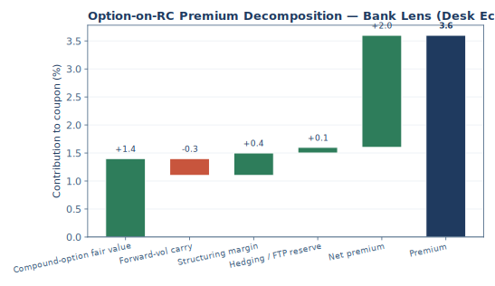

**P&L drivers**

Day to day, desk P&L is driven by realized-versus-implied volatility on the compound hedge (including forward vol), moves in the underlying that change the RC value and therefore the compound delta, the mark-to-market of the compound option, and funding. Product Control performs independent valuation of the compound structure, verifies layer consistency, and attributes P&L between the option-layer MTM and (post-exercise) the RC components.

#### §9. THE BANK LENS — Controls & Reconciliation (2nd Line of Defence)

**Booking & systems**

| Aspect | Detail |
|--------|--------|
| **Primary system** | Murex |
| **Booking structure** | Phase 1: compound call option. Phase 2 (if exercised): RC (bond + short put) |
| **Valuation model** | Compound option model (nested Black-Scholes or Monte Carlo for path-dependent RC variants) |
| **Market data** | Spot, vol surface (with term structure for compound tenor), rates, dividends, barrier parameters |
| **Key booking fields** | Compound exercise date, option strike (K_opt), RC terms (coupon, barrier and convention, tenor), underlying ID |
| **Settlement** | Premium at trade date. RC settlement at RC maturity (if exercised) |
| **Critical event** | Exercise decision at option expiry — the booking transitions from compound option to active RC |

**Reconciliation points**

| Recon point | What must agree | Opt-on-RC-specific break |
|-------------|-----------------|--------------------------|
| **Compound exercise date** | Option expiry date matches across the termsheet, the Murex booking, and the exercise-processing calendar | Exercise window booked a day off → decision processed against the wrong RC value |
| **Option strike (K_opt)** | The compound strike (often 100% of RC notional) matches the termsheet | Strike convention (% of RC notional vs absolute) inconsistent across systems |
| **Underlying RC terms locked in** | RC coupon, barrier **and convention**, tenor agreed at trade date carry through to the activated RC | RC barrier stored as % in one place, absolute in another → wrong RC activated on exercise |
| **Exercise capture** | Exercise/non-exercise flag set consistently and the booking transitions from compound option to RC | Exercise confirmed with client but booking not transitioned → option lingers, RC not activated |
| **Fixing** | The RC's initial fixing at exercise (and final fixing at RC maturity) uses the termsheet source | Different vendors report different closes on the exercise/observation date |
| **Volatility surface** | Forward-vol / term-structure inputs to the compound model agree between front-office and risk | Stale or mismatched vol surface → compound MTM and Greeks diverge |
| **P&L attribution** | Option-layer MTM, plus (post-exercise) RC coupon accrual and put MTM, reconciles to total | Unexplained P&L points to a stale vol surface or a wrong fixing |
| **Settlement** | Premium at trade date; RC redemption (cash vs physical, shares = notional / strike) at RC maturity | Premium settled but RC leg not staged, or physical delivery booked as cash |

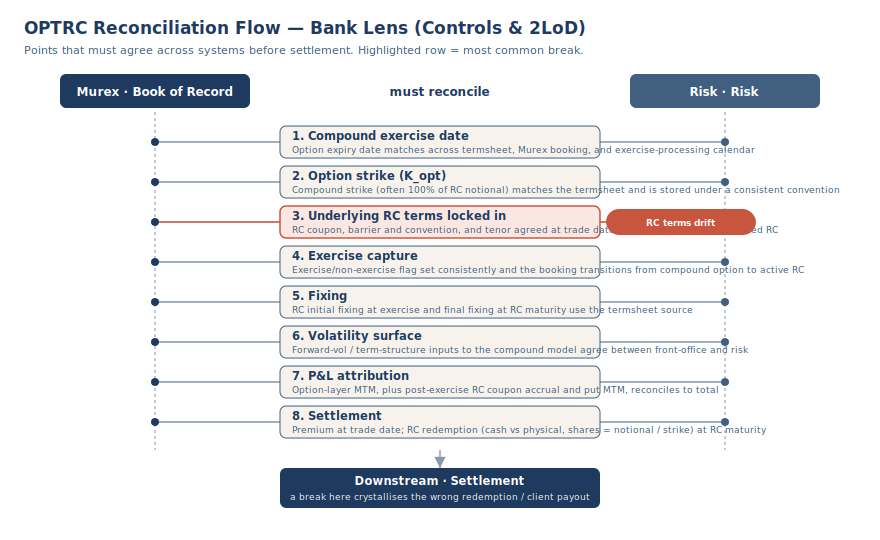

**Common breaks & red flags**

| Red Flag | What It Means | 2LoD Action |
|----------|---------------|-------------|
| Exercise decision made without analysis | The investor (or processing) treats exercise as automatic rather than evaluating RC fair value at expiry | Confirm the exercise instruction against a fair-value check before transitioning the booking |
| Booking not transitioned on exercise | Exercise confirmed but Murex still shows the compound option, not the active RC | Verify the Phase 1 → Phase 2 transition completed and the RC lifecycle started |
| RC terms drift from trade date | Coupon, barrier, or tenor of the activated RC differs from what was locked in at trade | Reconcile the activated RC terms against the original termsheet |
| Barrier convention mismatch (% vs absolute) | The underlying RC barrier is stored inconsistently across systems | Verify both systems use the same convention before relying on either valuation |
| Stale vol surface on compound model | Forward-vol inputs out of date → wrong compound MTM and Greeks | Confirm the vol surface (term structure across the compound tenor) is current |

**Control implication**

Each break has a direct consequence the 2nd line must size before it reaches the books or the client. A wrong compound exercise date or a missed booking transition means the investor's exercise is processed against the wrong RC — or not processed at all — corrupting both desk risk and the client's position. A drift in the locked-in RC terms activates the wrong product on exercise, driving the wrong coupon, barrier, and redemption. A fixing or vol-surface mismatch breaks the compound valuation and, post-exercise, the RC redemption at once. The reconciliation exists precisely to catch these inconsistencies before the exercise event crystallises them.

#### §10. Formal Definition

An **Option on RC** is a compound option: an option whose underlying is itself a derivative product (the RC).

**Value at option expiry T_opt:**

V(T_opt) = max(RC_value(T_opt) − K_opt, 0)

Where:
- RC_value(T_opt) = mark-to-market value of the RC at the option expiry date
- K_opt = exercise price of the option (often set to 100% of RC notional)

**If exercised:** The holder enters the RC with pre-agreed terms. From this point, the product behaves as a standard RC (Bond + Short Put, barrier-dependent principal).

**RC value at T_opt depends on:** current spot level relative to the RC barrier; remaining RC tenor; implied volatility; interest rates; and dividend forecasts.

**Compound option feature:** Pricing requires modeling the distribution of the RC value at T_opt, which itself depends on the distribution of the underlying at RC maturity. This is a two-layer stochastic problem.

#### §11. Lifecycle

| Stage | Timing | Action |
|-------|--------|--------|
| **Trade date** | T | The investor pays the option premium. The desk books the compound option. RC terms locked in |
| **Option period** | T to T+3M | The investor observes the market. The desk manages the compound-option hedge. No coupon, no barrier monitoring |
| **Option expiry** | T+3M | The investor decides: exercise (enter RC) or expire (walk away) |
| **If exercise** | T+3M | RC starts. Booking transitions from compound option to active RC. Coupon accrual begins. Barrier monitoring begins |
| **RC period** | T+3M to T+15M | Standard RC lifecycle. Coupon payments. Barrier observation |
| **RC maturity** | T+15M | RC settles: full principal (if barrier unbreached) or shares (if breached) |
| **If no exercise** | T+3M | Product terminates. Premium lost. No further obligations |

#### §12. Worked Example (both lenses)

**Terms:**
- Notional: €200,000
- Underlying: EuroStoxx 50 (initial level: 4,500)
- Option period: 3 months. Option premium: 1.5% (€3,000)
- RC terms (if exercised): 10% annual coupon, 65% barrier, 1-year tenor

*Investor lens:*

- **Scenario A — Exercise, barrier unbreached:**
  - At option expiry (3M): EuroStoxx at 4,600. RC looks attractive. The investor exercises.
  - RC period: EuroStoxx never drops below 2,925 (65% × 4,500). Coupon: 10% × €200,000 = €20,000.
  - Final payout: €200,000 + €20,000 = €220,000.
  - Net P&L: €220,000 − €200,000 − €3,000 = **+€17,000 (+8.5% on notional)**.
- **Scenario B — Exercise, barrier breached:**
  - At option expiry: the investor exercises.
  - RC period: EuroStoxx drops to 2,800 (below 2,925 barrier). Closes at 3,600 at maturity.
  - The investor receives: (3,600/4,500) × €200,000 + €20,000 coupon = €160,000 + €20,000 = €180,000.
  - Net P&L: €180,000 − €200,000 − €3,000 = **−€23,000 (−11.5%)**.
- **Scenario C — No exercise:**
  - At option expiry: EuroStoxx at 3,200 (−29%). RC would be dangerous. The investor does not exercise.
  - Net P&L: **−€3,000** (premium lost). The investor avoided a potential −35%+ loss in the RC.

*Bank lens:*
- In Scenario A the desk's short compound option is exercised; the desk delivers the activated RC and earns the standard RC structuring margin plus the retained €3,000 premium, having funded the €20,000 coupon. The 2nd line confirms the booking transitioned from compound option to active RC and that the locked-in terms (10% coupon, 65% barrier, 1-year tenor) carried through.
- In Scenario C the option lapses unexercised: the desk keeps the full €3,000 premium with no further obligation. Product Control confirms the compound-option MTM rolls to zero and the position closes out.

#### §13. Knowledge Check

1. **What is a compound option, and how does the Option on RC qualify as one?**
2. **Why does volatility have conflicting effects on the two layers of this product?**
3. **Under what market conditions should the holder exercise the option?**
4. **What is the maximum loss during the option period? After exercise?**
5. **How does the Option on RC differ from a forward-starting RC?**
6. **A client says: "If I pay a 1.5% premium and still take RC risk, why not just buy the RC directly and earn 1.5% more in coupon?"** Explain the value of optionality.
7. **(Desk economics / 1LoD)** What position does the desk hold against the investor, and why is forward volatility — not just spot vol — central to hedging the compound option? Where does the desk's margin come from whether or not the investor exercises?
8. **(Controls / 2LoD)** Name three reconciliation points specific to an Option on RC (across the compound exercise date, locked-in RC terms, and exercise capture) and the consequence of each if it breaks.

**Mental Models**

| Concept | Mental Model |
|---------|-------------|
| Option on RC | A reservation deposit on a timeshare — pay a small amount to hold the right to sign a risky contract later |
| Compound option | An option on an option — the right to enter an option-bearing note, not the right to buy a stock |
| Option premium | The cost of deferring the decision — insurance against entering a bad RC |
| Exercise decision | Inspecting the property before signing — exercise only if the RC's full fair value is attractive |
| Forward volatility | The weather forecast for the RC period as seen from the option-expiry date — what the desk must hedge |
| Conflicting vega | Higher vol helps the outer option but hurts the inner RC — the two layers pull in opposite directions |
| 2LoD reconciliation | The closing agent — confirms the exercise date, locked-in terms, and transition all match before the deal converts |

**Key Takeaways**

1. An Option on RC is a compound option: the investor is **long** the right (not the obligation) to enter an RC at a future date on pre-agreed terms; the desk is **short** that compound option.
2. During the option period the investor's maximum loss is bounded at the premium; full RC risk applies only after exercise.
3. The premium buys optionality (deferred-entry flexibility), not yield — it should not be netted naively against the RC coupon.
4. Volatility has conflicting effects: higher vol helps the option layer but hurts the RC layer; the net effect on the holder is ambiguous.
5. The desk earns the compound-option premium and is hedged whether or not the investor exercises; key desk risk is compound/forward vol plus the underlying RC's delta, gamma, and vega.
6. The exercise decision should be driven by the RC's full fair value at option expiry — spot, vol, barrier distance, and rates — not spot alone.
7. For the 2nd line, the dominant control risks are the compound exercise date, the locked-in RC terms, exercise capture, fixings, and the booking transition — each can corrupt the activated RC or its redemption.

#### §14. Common Mistakes

1. **Adding complexity for optionality that is rarely used.** If the investor exercises 90% of the time, the option premium is wasted cost. The Option on RC makes sense only when exercise probability is genuinely uncertain (40-70%).
2. **Ignoring the compound nature of the Greeks.** The option on RC is not the same as an option on the underlying. Its Greeks depend on the RC value, which itself depends on spot, vol, barrier, and rates. Single-layer hedging is insufficient.
3. **Comparing option premium directly to RC coupon.** The premium buys optionality (flexibility), not yield. Subtracting premium from coupon ignores the insurance value of walking away in adverse scenarios.
4. **Exercising based on spot alone.** The exercise decision should consider the full RC fair value at option expiry — spot, vol, barrier distance, rates — not just whether the stock went up or down.
5. **Assuming the bank wants the investor to exercise.** The desk is hedged either way and profits from the margin, not the exercise outcome.
6. **(Controls) Trusting a single system's RC terms after exercise.** Because the locked-in coupon, barrier, and tenor can drift or be stored under different conventions, the 2nd line must reconcile the activated RC terms against the trade-date termsheet rather than assume the booking transitioned cleanly.

**Dual-lens questions:**
- *(Desk economics / 1LoD)* What does the desk book against the investor, and what is its primary Greek / hedging risk?
- *(Controls / 2LoD)* Which booking / fixing / event-capture fields must reconcile, and which is the most common break?

**Dual-lens visuals (generated):**
- `assets/optrc/controls_optrc_recon_08.svg` `[generated]`
- `assets/optrc/waterfall_optrc_09.svg` `[generated]`
### 5.6.6 Accumulator {#sec-5-6-6}

> **Prerequisites:** [FWD](#sec-5-6-2) · [VO](#sec-5-6-3) &nbsp;|&nbsp; **Key concepts:** Daily forwards, gearing, knock-out, obligation asymmetry

---

*Previous products in this family offered single-point exposure — one forward, one option, one payoff at maturity. The Accumulator creates a series of periodic purchase obligations at a discount to market, with a knock-out barrier that terminates the structure if the price rises too far. This makes it a high-frequency directional product with embedded exotic option features. This chapter reads the product through two lenses: what it means for **the investor**, and what it means for **the bank** — the latter split into the desk's market economics (1st line of defence) and the controls and reconciliation that surround it (2nd line of defence).*

#### §1. Explain Like I'm New

Consider an investor who wants to buy shares of a company over time, like a savings plan. Instead of buying at whatever the market price is each period, the bank offers a deal: "The bank will sell shares every period at a fixed discount price — say 10% below today's market price. But there are two conditions: (1) if the stock rises above a certain level, the deal ends automatically, and (2) if the stock falls below the fixed price, the investor must buy double the amount."

This is an **Accumulator**. It allows the investor to accumulate shares over time at a pre-agreed discount to the current market price. The trade-off: the investor takes on a leveraged commitment if the stock falls and gives up the product if the stock rises above a knock-out barrier.

The street nickname is **"I-kill-you-later"** — a dark pun on "accumulator" that reflects the product's ability to produce devastating losses in a falling market, because the investor is obligated to keep buying (at double size) as the stock drops.

#### §2. Real-World Analogy

An Accumulator is like a wholesale coffee bean contract between a café owner and a roaster.

The café owner is the buyer. A coffee roaster offers: "The roaster will sell coffee beans every month at $8/kg — that is 10% below today's market price of $8.90. But here are the rules:

1. If coffee prices rise above $10/kg, the deal ends automatically (the café owner was getting a good deal, so the roaster cuts it off).
2. If coffee prices drop below $8/kg, the café owner must buy double the usual amount at $8/kg (the café owner committed to this price, and now it is above market).
3. The deal lasts 12 months, with monthly purchases."

In an Accumulator:
- The **café owner** is the investor
- The **coffee beans** are the shares
- The **$8/kg** is the accumulation (strike) price (set at a discount to spot)
- The **$10/kg** is the knock-out barrier
- The **monthly purchases** are the periodic accumulation events
- The **double amount when below strike** is the gearing (leverage) feature

The café owner gets a guaranteed discount — but if prices crash, the café owner is locked into buying expensive beans at double volume. This is why the product has earned its grim nickname.

#### §3. What Problem Does This Solve?

Accumulators solve the **discounted acquisition** problem — but create new risks in the process.

| Need | How Accumulator Addresses It | What It Costs |
|------|:---------------------------:|:-------------:|
| Buy shares at a discount | Strike set 5-15% below spot | Must buy at strike even if spot falls further |
| Build position gradually | Weekly/daily accumulation events | Position grows over time — no control over timing |
| Avoid overpaying | Knock-out cancels if stock rises too much | Lose the discount if stock rises above KO |
| No upfront premium | Zero premium — "free" discount | Risk is hidden in the double-down feature |

#### §4. Product DNA

| Field | Value |
|-------|-------|
| **Full Name** | Accumulator |
| **Abbreviation** | ACCUM |
| **Family** | Other |
| **Complexity Score** | 6 / 10 |
| **Complexity Rationale** | Periodic accumulation (4), knock-out (1), gearing below strike (1). Path-dependent. Multiple observation dates. Leveraged downside |
| **Underlying Asset Class** | Single equity (most common), equity index, FX |
| **Capital Protection** | None — unlimited downside with gearing |
| **Coupon Type** | None — the "income" is the discount on shares purchased |
| **Maturity** | Typically 6-12 months |
| **Liquidity** | Very limited — OTC, difficult to unwind |
| **Four-Leg Product** | No |
| **Primary System** | Murex |
| **ISDA Required** | Yes — OTC derivative |

**DNA Atlas Fields:**
- Primary Risk: Leveraged loss in falling market (double accumulation below strike)
- Typical Buyer: High-net-worth private banking clients, institutional (equity desk clients)
- Typical Use Case: Build equity position at guaranteed discount
- Building Blocks: Strip of daily/weekly forward purchases + knock-out + gearing
- Key Hedge: Daily forward hedging + barrier hedging (digital risk near KO)
- Similar Products: Decumulator (reverse), Forward (single date), Dollar-Cost Averaging (no contractual obligation)
- Most Important Greek: Delta (directional, increases with gearing) + Vega (barrier sensitivity)

**Comparison Matrix Fields:**
- Complexity: 6
- Yield Potential: Discount on acquisition (not yield per se)
- Capital Protection: None
- Credit Exposure: Counterparty (bilateral OTC)
- Liquidity: Very limited
- Path Dependency: High (daily observations, knock-out, gearing)
- Volatility Sensitivity: High (knock-out barrier + gearing sensitivity)
- Correlation Sensitivity: None (single stock)
- Client Type: High-net-worth / Institutional
- Market Environment: Moderately bullish (expects gradual rise, not crash)

#### §5. Who Touches This Product

| Role | Responsibility |
|------|---------------|
| **Structurer** | Sets strike discount, knock-out level, gearing ratio, accumulation frequency. Balances attractiveness vs risk |
| **Trader** | Prices strip of forwards with embedded knock-out and gearing. Complex daily hedging — each observation creates new forward exposure |
| **Sales** | Offers to sophisticated private banking and institutional clients. Must ensure client understands gearing risk. The "I-kill-you-later" disclosure |
| **Risk** | Critical role. Monitors cumulative exposure as client accumulates shares. Stress-tests gearing scenarios. Counterparty credit exposure grows daily |
| **Product Control** | Independent valuation of remaining forward strip + knock-out + gearing. Complex mark-to-market |
| **Operations** | Daily/weekly settlement processing. Each observation date = potential delivery. Track cumulative shares delivered. Monitor knock-out event |
| **Legal/Compliance** | Enhanced suitability documentation. Client must demonstrate understanding of gearing and unlimited downside. Risk disclosure critical |
| **Quantitative Analytics** | Path-dependent pricing model (Monte Carlo with barrier + gearing). Daily accrual modeling |

#### §6. Product Evolution

| Era | Development |
|-----|------------|
| **2000s** | Accumulators gain popularity in Asian private banking markets (Hong Kong, Singapore). Clients want discounted stock acquisition |
| **2007-2008** | Financial crisis destroys accumulator holders. Markets fall 40-60%. Gearing doubles the losses. The "I-kill-you-later" name enters common use. Lawsuits follow |
| **2010s** | Regulatory scrutiny increases. Stricter suitability requirements. Product survives but with better risk disclosure and lower gearing |
| **2020s** | Product remains niche. Popular with experienced institutional clients who understand and accept the risk. Retail distribution severely restricted in many jurisdictions |

---

#### §7. THE INVESTOR LENS

**Why the investor enters it**

1. **Guaranteed discount.** The investor buys shares at 5-15% below market. Every accumulation event delivers shares at the discount price (as long as spot > strike).
2. **Zero premium.** No upfront cost. The discount is "free" — funded by the gearing and knock-out the investor has sold to the bank.
3. **Gradual position building.** The investor accumulates over time rather than buying a large block at once.
4. **Contrarian view expression.** The investor believes the stock will trade sideways to slightly up — perfect for accumulator economics. The product is moderately bullish: it expects a gradual rise, not a crash.

**Position taken**

The investor is **short a geared put strip plus short an up-and-out call**. Concretely, across each observation date the investor:
- holds a strip of long forwards (the obligation to buy N shares at the discounted strike K each period — the discounted acquisition);
- is **short a strip of puts** of quantity (G−1)×N per observation (the gearing leg — the investor sells the downside to the bank, which creates the obligation to buy double below strike); and
- is **short an up-and-out call** via the knock-out barrier (the investor sells the upside to the bank, capping the benefit when the stock rises above KO).

Net, the investor carries leveraged equity downside (geared put strip) and capped upside (knock-out). The two embedded short options the investor sells fund the strike discount, which is why the product is zero-premium by design.

**Payoff & scenarios**

The investor's payoff per observation is **asymmetric**: small steady gains while the stock sits between strike and knock-out (shares bought at a discount), capped upside once the stock rises through the knock-out (the product terminates), and large geared losses once the stock falls below the strike (the investor is forced to buy double size well above market). The slope below the strike is roughly twice as steep as a plain forward because of the 2× gearing.

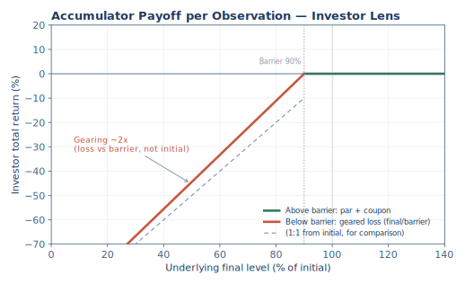

**Terms:** Accumulator on ABC Corp. Spot: $100. Strike (accumulation price): $90 (10% discount). Knock-out: $110. Gearing: 2× below strike. Daily accumulation: 100 shares (200 if below strike). Tenor: 250 business days (1 year).

- **Bull — rises gradually to $115 by day 100:** 10,000 shares accumulated in 100 days at $90, average cost $90. Knock-out triggered. The investor owns 10,000 shares bought at $90, worth $115 each. **Profit: $250,000.** The early knock-out caps the benefit but locks in the gain.
- **Base — trades between $90 and $110 all year:** 25,000 shares accumulated over 250 days at $90, average cost $90. Full accumulation. The investor owns 25,000 shares at $90 vs current $100. **Profit: $250,000.**
- **Bear — falls to $60 over the year:** 50,000 shares accumulated (2× gearing when below $90) at $90, average cost $90. The investor owns 50,000 shares at $90 cost basis, worth $60. **Loss: ($90−$60) × 50,000 = −$1,500,000.**

**Key insight:** In the bear scenario, gearing doubles the shares accumulated while the stock price falls. The investor is forced to buy 200 shares per day at $90 while the stock trades at $60 — and cannot stop. This is the "I-kill-you-later" risk: the geared downside dominates the small steady gains earned in benign markets.

**Risks to the investor**

| Risk | Severity | Description |
|------|:--------:|------------|
| **Leveraged market risk (geared downside)** | Very High | 2× gearing below strike means losses grow twice as fast as the stock drops. In a 50% crash, the loss can be 3-5× the initial notional. This is the dominant risk. |
| **Concentration risk** | High | The accumulator builds a growing position in a single stock. Position size increases daily, especially in falling markets (gearing) |
| **Cash flow risk** | High | The investor must fund daily share purchases. In falling markets, 2× accumulation doubles the cash outflow |
| **Liquidity risk** | High | OTC product with daily obligations. Cannot easily unwind. The investor must negotiate termination with the bank |
| **Knock-out timing risk** | Medium | The knock-out may trigger early in a short-lived spike, terminating the product before the investor has accumulated meaningfully — capping the benefit |
| **Counterparty risk** | Medium | Growing exposure over time. If the bank defaults, the investor loses remaining forward strip value |

#### §8. THE BANK LENS — Desk Economics (1st Line of Defence)

**What the desk books**

The desk's position is the mirror image of the investor's. Where the investor is short the geared put strip, the desk is **long** that put strip (bought from the investor); where the investor is short the up-and-out call, the desk is long it (the knock-out caps the bank's downside if the stock rises too much, which has positive value to the bank — like a free option). Alongside, the desk holds the offsetting short-forward strip against the investor's long-forward acquisition. The investor's discount is, to the desk, the cost funded by the embedded gearing puts and the knock-out it has bought.

**Greeks & hedging**

The desk is long the strip of forwards and the embedded options and delta-hedges by trading the underlying. The defining feature is that delta exposure **compounds** in a falling market: when the stock is below the strike, the desk's long-put strip grows daily — each observation date adds a new geared put on top of the existing position. In a crash, the hedge book can grow exponentially, and barrier (digital) risk near the knock-out makes hedging error-prone. The knock-out is the desk's relief valve — when it triggers, all remaining forward and put obligations disappear and the desk books a gain on the remaining option strip. The desk monitors delta and gamma closely; risk management stress-tests gearing scenarios and tracks counterparty exposure that grows daily.

**How the bank makes money**

| Component | Detail |
|-----------|--------|
| **Forward strip pricing** | The bank prices a strip of forward purchases at the accumulation strike. The discount (spot − strike) is funded by the short put (gearing) and knock-out components |
| **Knock-out value** | The knock-out caps the bank's downside if the stock rises too much. This has positive value to the bank (like a free option) |
| **Gearing value** | The 2× gearing below strike = the investor sells a put option to the bank. The premium from this embedded put funds the strike discount |
| **Net margin** | Discount offered < value of knock-out + gearing. The difference is bank profit |

**Economic decomposition:** Accumulator = strip of forwards (buy at strike) + short knock-out call (caps upside) + short put (creates gearing). The investor gets the discount. The bank gets the embedded optionality, and the net margin is the gap between the discount given up and the value of the optionality received.

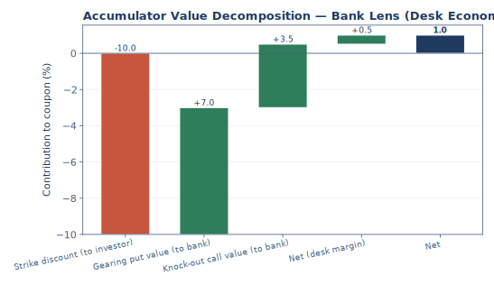

**P&L drivers**

Day to day, desk P&L is driven by the realized-versus-implied volatility on the daily delta hedge, moves in the underlying near the strike and the knock-out (gamma and barrier/digital risk), the compounding short-put delta as the stock falls below strike, funding and borrow costs, and the mark-to-market of the remaining forward + put + knock-out strip. Product Control performs independent valuation of the remaining strip and attributes P&L across the forward, gearing-put, and knock-out components.

#### §9. THE BANK LENS — Controls & Reconciliation (2nd Line of Defence)

**Booking & systems**

| Dimension | Detail |
|-----------|--------|
| **Primary system** | Murex |
| **Booking model** | Strip of forwards + embedded puts + knock-out barrier. Single trade with daily accrual schedule |
| **Valuation model** | Monte Carlo with path-dependent knock-out and gearing. Daily observation grid |
| **Market data** | Spot, vol surface, dividends, borrow costs, interest rates |
| **Settlement** | Daily or weekly: shares vs cash. T+2 settlement per observation |
| **Collateral** | Typically uncollateralized for private banking. Institutional: may require margin |

**Reconciliation points**

| Recon point | What must agree | Accumulator-specific break |
|-------------|-----------------|----------------------------|
| **Observation schedule** | The daily/weekly observation calendar and business-day convention used by Murex match the termsheet | A missed or shifted observation date changes the accumulated quantity and the knock-out check |
| **Strike & KO barrier** | Accumulation strike K and knock-out level KO, **and their convention** (% of initial spot vs absolute price), agree across Murex and the termsheet | Strike or KO stored as % in one place, absolute in another — consistent only if initial spot is the assumed level |
| **Gearing factor** | The gearing multiplier G (typically 2×) and the quantity rule below strike (G×N) match the termsheet | Gearing booked as 1× (no double-down) or applied above strike — understates downside risk |
| **Accumulation quantity tracking** | Cumulative shares delivered to date reconcile to the schedule (N per day above strike, G×N below) | Cumulative count drifts from the schedule — wrong cost basis and wrong cumulative exposure |
| **Knock-out capture** | The knock-out event flag is set consistently the moment S ≥ KO at an observation | Knock-out breached but flag not set → product keeps accumulating; or set late → over-accumulation |
| **Settlement** | Per-observation share delivery and cash collection (shares × strike), DvP, T+2 | Delivery booked as cash, wrong share count, or settlement on a knocked-out date |
| **Counterparty exposure** | Cumulative mark-to-market and forward-strip exposure agree between front-office and risk/credit systems | Growing daily exposure understated → margin or limit breach missed |
| **P&L attribution** | Split across forward, gearing-put, and knock-out MTM reconciles to total | Unexplained P&L points to a stale vol surface, wrong fixing, or mis-tracked accumulation |

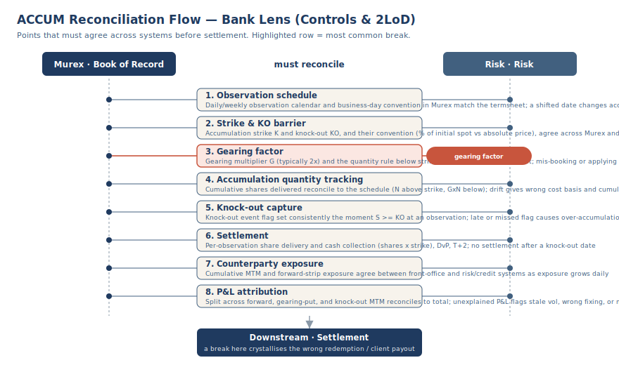

**Common breaks & red flags**

| Red Flag | Why It Matters | 2LoD Action |
|----------|---------------|-------------|
| Gearing > 2× | Extreme downside leverage. The investor's losses can grow 3-4× in falling markets | Confirm the booked gearing factor matches the termsheet and is applied only below strike |
| Strike discount > 15% | Looks too attractive. Usually funded by aggressive gearing or a tight knock-out | Verify the strike/KO/gearing combination reconciles to the booked economics |
| Knock-out flagged but not captured intraday/at observation | Daily-close checks may miss the moment S ≥ KO | Ensure the knock-out check runs on the contractual observation and the flag terminates accumulation |
| Cumulative accumulation count drifts from the schedule | Wrong cost basis and wrong cumulative exposure | Reconcile cumulative shares delivered against the N / G×N schedule every observation |
| Gearing applied on the wrong side of strike | Double-down booked above strike, or single-size below | Verify the quantity rule: N above strike, G×N below strike |
| Settlement after a knock-out date | Product should have terminated; further delivery is erroneous | Confirm no obligations settle after the knock-out flag is set |

**Control implication**

Each break has a direct consequence the 2nd line must size before it reaches the books or the client. The two control risks that dominate this product are **the gearing factor and accumulation-quantity tracking**: if the gearing multiplier is mis-booked or applied on the wrong side of the strike, the entire downside exposure is misstated; and if the cumulative accumulation count drifts from the schedule, the cost basis, the cumulative exposure, and the counterparty credit number all diverge at once. A missed knock-out compounds both — the product keeps geared-accumulating when it should have terminated. The daily reconciliation exists precisely to catch these before settlement crystallises them.

#### §10. Formal Definition

An Accumulator obliges the buyer to purchase N shares at each observation date t_i at the accumulation strike K, subject to:

**Daily accumulation (if no knock-out):**
- If S(t_i) ≥ K: buy N shares at K (standard accumulation)
- If S(t_i) < K: buy G × N shares at K (geared accumulation, typically G=2)

**Knock-out condition:**
- If S(t_i) ≥ KO at any observation date: product terminates. No further accumulation

**Parameters:**
- K = accumulation strike (typically 85-95% of initial spot)
- KO = knock-out barrier (typically 103-115% of initial spot)
- N = daily/weekly accumulation quantity
- G = gearing factor (typically 2×)
- t_i = observation dates (daily or weekly)
- T = final maturity

**Decomposition:**
- Accumulator = Σ_i [Long Forward(K, t_i) + Short Put(K, t_i, quantity=(G−1)×N)] × Knock-out(KO)
- The strip of forwards provides the discounted acquisition
- The strip of short puts creates the gearing
- The knock-out caps the upside

#### §11. Lifecycle

| Stage | Timing | Action |
|-------|--------|--------|
| **Trade date** | T | Terms agreed. No premium. ISDA confirmation |
| **Daily observations** | T+1 to maturity | Each business day: check spot vs knock-out. If no knock-out: if spot ≥ strike, deliver N shares at strike. If spot < strike, deliver G×N shares at strike |
| **Settlement** | Each observation + 2bd | Shares delivered. Cash collected from the investor |
| **Knock-out event** | Any day S ≥ KO | Product terminates. Final settlement of that day's accumulation. No further obligations |
| **Maturity** | T+12M (if no KO) | Final observation and settlement. Product ends |

#### §12. Worked Example (both lenses)

**Terms:**
- Underlying: Samsung Electronics
- Spot: KRW 70,000
- Strike: KRW 63,000 (10% discount)
- Knock-out: KRW 77,000 (10% above spot)
- Gearing: 2× below strike
- Accumulation: 500 shares per trading day (1,000 if below strike)
- Tenor: 250 trading days (1 year)
- No premium

*Investor lens:*

**Scenario A — Knock-out at day 80:**
- Stock rises to KRW 77,000 on day 80
- Accumulated: 80 × 500 = 40,000 shares at KRW 63,000
- Total cost: 40,000 × 63,000 = KRW 2.52B
- Market value: 40,000 × 77,000 = KRW 3.08B
- Profit: KRW 560M (+22.2%)

**Scenario B — Sideways market, no KO:**
- Stock trades between 63,000 and 77,000 all year
- All 250 days above strike: 250 × 500 = 125,000 shares at KRW 63,000
- Total cost: KRW 7.875B
- Market value (at 70,000): KRW 8.75B
- Profit: KRW 875M (+11.1%)

**Scenario C — Stock crashes to KRW 40,000:**
- First 50 days above strike: 50 × 500 = 25,000 shares at 63,000
- Remaining 200 days below strike (geared): 200 × 1,000 = 200,000 shares at 63,000
- Total shares: 225,000 at 63,000
- Total cost: KRW 14.175B
- Market value (at 40,000): KRW 9.0B
- Loss: KRW 5.175B (−36.5%)

*Bank lens:*
- In Scenario A the up-and-out call the desk is long triggers: the knock-out terminates the structure on day 80, the remaining forward + gearing-put strip disappears, and the desk books a gain on the cancelled remaining optionality. The 2nd line must confirm the knock-out flag is set on day 80 and that no obligations settle after it.
- In Scenario C the desk's long geared put strip is deep in the money and its short-forward hedge offsets the investor's purchases at KRW 63,000 against a KRW 40,000 market. The compounding short-put delta the desk hedged is realised as the mirror of the investor's KRW 5.175B loss. The 2nd line must confirm the cumulative accumulation count (25,000 + 200,000 = 225,000 shares), that gearing of 2× was applied only below strike, and that Murex and the risk system agree on cumulative exposure before settlement.

#### §13. Knowledge Check

**Review Questions:**
1. *(Investor)* Why is the Accumulator sometimes called "I-kill-you-later"?
2. *(Investor)* How does the zero-premium structure work? What funds the strike discount?
3. *(Investor)* What happens to the investor's obligation when the stock drops below the strike?
4. *(Investor)* Why does the knock-out exist, and whose interest does it serve?
5. *(Investor)* How does the Accumulator decompose into forwards, puts, and a knock-out?
6. *(Desk economics / 1LoD)* What position does the desk hold against the investor, and why does the desk's delta exposure compound in a falling market? Why does this make an accumulator harder to risk-manage than a simple short put of the same notional?
7. *(Controls / 2LoD)* Which booking fields must reconcile in Murex for an accumulator, and why are the gearing factor and the cumulative accumulation-quantity count the two breaks that most directly misstate the investor's exposure?

**Scenario Questions:**
1. An investor has accumulators on three bank stocks, each with 2× gearing. A financial crisis causes all three stocks to fall 40%. Describe the cascading risk.
2. The knock-out is set at 105% of spot. Compare this to a knock-out at 115%. How does this change the risk/reward for the investor?
3. An accumulator investor wants to terminate mid-life. The stock has fallen 20% below the strike. Explain what the termination cost would look like and why.

**Mental Models**

| Concept | Mental Model |
|---------|-------------|
| Accumulator | A café owner locked into a wholesale coffee contract — a guaranteed discount, but forced to buy double at above-market prices if the price crashes |
| Strike discount | Not free money — it is funded by the gearing put and the knock-out call the investor has sold to the bank |
| Gearing | The double-down hook beneath the discount bait — losses grow twice as fast as the stock falls below strike |
| Knock-out | The bank's relief valve — caps the discount the bank must provide and the investor's upside; it does not protect the downside |
| "I-kill-you-later" | Frequent small gains in benign markets masking rare, geared, catastrophic losses in a crash |
| 2LoD daily reconciliation | The daily auditor — confirms each observation's quantity, the gearing rule, and the knock-out flag before settlement crystallises them |

**Key Takeaways**

1. An accumulator is a strip of discounted forward purchases plus a short geared put strip plus a short up-and-out call — the investor sells downside and upside optionality to fund the discount.
2. The discount is not free — it is the premium for the gearing put and the knock-out call the investor has sold to the bank.
3. The payoff is asymmetric: small steady gains while the stock sits between strike and knock-out, capped upside above the knock-out, and large geared losses below the strike.
4. Gearing is the dominant risk — 2× accumulation below strike means losses can be 3-5× the initial notional in a crash.
5. The knock-out protects the bank and caps the investor's benefit; it does not protect against downside.
6. The desk holds the offsetting long geared-put strip and long knock-out call; its delta compounds daily in a falling market, which is what makes hedging hard.
7. For the 2nd line, the dominant control risks are the gearing factor and accumulation-quantity tracking — each can misstate the investor's exposure, with the observation schedule, strike/KO convention, knock-out capture, and settlement as the supporting recon points.

#### §14. Common Mistakes

1. **Focusing on the discount and ignoring the gearing.** The 10% discount looks attractive. The 2× gearing in a 30% crash is catastrophic. The discount is the bait; the gearing is the hook.
2. **Treating the accumulator as a dollar-cost averaging plan.** DCA is voluntary — the investor can stop buying. An accumulator is contractual — the investor must keep buying, at double size, in the worst scenario.
3. **Not stress-testing the cash flow.** In a falling market, the investor must fund 2× the daily accumulation. If the investor cannot fund this, they face forced unwind at distressed prices.
4. **Assuming the knock-out protects the investor.** The knock-out protects the bank (caps the discount the bank must provide) and limits the investor's upside. It does NOT protect against downside.
5. **Ignoring the "maximum pain" scenario.** The stock drops just below the strike all year (gearing active) but recovers just before maturity. The investor has accumulated 2× shares at above-market prices for 12 months, with the final price near but still below strike.
6. **(Controls) Trusting a single field for gearing or accumulation count.** Because the gearing factor and the cumulative quantity drive the entire downside exposure, the 2nd line must reconcile the gearing rule and the cumulative shares delivered against the schedule rather than assume Murex and the risk system agree.

**Dual-lens questions:**
- *(Desk economics / 1LoD)* What does the desk book against the investor, and what is its primary Greek / hedging risk?
- *(Controls / 2LoD)* Which booking / fixing / event-capture fields must reconcile, and which is the most common break?

**Dual-lens visuals (generated):**
- `assets/accum/controls_accum_recon_08.svg` `[generated]`
- `assets/accum/payoff_accum_01.svg` `[generated]`
- `assets/accum/waterfall_accum_09.svg` `[generated]`
### 5.6.7 Decumulator {#sec-5-6-7}

> **Prerequisites:** ACCUM &nbsp;|&nbsp; **Key concepts:** Mirror mechanics, selling vs buying, down knock-out

---

*The Accumulator ([Section 5.6.6](#sec-5-6-6)) obligated the investor to buy shares periodically at a discount; the Decumulator reverses the direction. The investor is obligated to sell shares periodically at a premium to market, with a knock-out barrier that terminates the structure if the price falls too far, and a gearing feature that doubles the quantity sold if the price rises above the strike. It is the mirror image of the Accumulator, used by shareholders who want to monetise an existing position at above-market prices. This chapter reads the product through two lenses: what it means for **the investor**, and what it means for **the bank** — the latter split into the desk's market economics (1st line of defence) and the controls and reconciliation that surround it (2nd line of defence).*

#### §1. Explain Like I'm New

If an Accumulator helps an investor buy shares at a discount over time, a **Decumulator** does the opposite: it helps an investor sell shares at a premium over time.

Consider an investor who owns a large block of shares — perhaps a company founder, an early employee with stock options, or a fund manager reducing a position. The investor wants to sell gradually (to avoid crashing the market price) and wants a guaranteed minimum selling price. The bank offers a Decumulator: "The bank will buy shares every period at a fixed price — say 5% above today's market price. But if the stock drops below a certain level, the deal ends automatically, and if the stock rises above the fixed price, the investor must sell double the amount."

The structure is exactly the mirror image of the Accumulator:
- **Accumulator** = discounted buying + gearing if stock falls + knock-out if stock rises
- **Decumulator** = premium selling + gearing if stock rises + knock-out if stock falls

#### §2. Real-World Analogy

A Decumulator is like a harvest contract for a vineyard owner.

The vineyard owner needs to sell the grape harvest over the next 12 months. A wine merchant offers a contract: "The merchant will buy grapes every month at $12/kg — that is 10% above today's market price of $11/kg. But:

1. If grape prices drop below $9/kg, the deal ends automatically (the market has moved too far against the merchant).
2. If grape prices rise above $12/kg, the owner must sell double the usual amount at $12/kg (the owner committed to this price, and now it is below market).
3. The deal lasts 12 months."

In a Decumulator:
- The **vineyard owner** is the investor selling shares
- The **grapes** are the shares
- The **$12/kg** is the decumulation (strike) price (set at a premium to spot)
- The **$9/kg** is the knock-out barrier
- The **monthly sales** are the periodic decumulation events
- The **double amount when above strike** is the gearing feature

The vineyard owner gets a guaranteed premium price — but if grape prices soar, the owner must sell at double volume at the now-below-market fixed price. The pain is symmetric to the Accumulator, but in the opposite direction.

#### §3. What Problem Does This Solve?

Decumulators solve the **orderly disposal** problem for large shareholders.

| Need | How Decumulator Addresses It | What It Costs |
|------|:---------------------------:|:-------------:|
| Sell at above-market price | Strike set 5-10% above spot | Must sell at strike even if spot rises further |
| Avoid market impact | Gradual daily/weekly selling | Selling schedule is fixed — cannot pause |
| Price floor guarantee | Sell at strike as long as product is active | Knock-out terminates product if stock falls below floor |
| No upfront cost | Zero premium | Gearing risk if stock rises significantly |

#### §4. Product DNA

| Field | Value |
|-------|-------|
| **Full Name** | Decumulator |
| **Abbreviation** | DECUM |
| **Family** | Other |
| **Complexity Score** | 6 / 10 |
| **Complexity Rationale** | Mirror of Accumulator (6). Same mechanisms reversed: periodic selling, knock-out (down), gearing (up) |
| **Underlying Asset Class** | Single equity (most common), equity index, FX |
| **Capital Protection** | None — opportunity cost if stock rises significantly with gearing |
| **Coupon Type** | None — the "income" is the premium on shares sold |
| **Maturity** | Typically 6-12 months |
| **Liquidity** | Very limited — OTC, difficult to unwind |
| **Four-Leg Product** | No |
| **Primary System** | Murex |
| **ISDA Required** | Yes — OTC derivative |

**DNA Atlas Fields:**
- Primary Risk: Opportunity cost + geared selling in rising market
- Typical Buyer: Founders, insiders, funds reducing positions, corporates divesting
- Typical Use Case: Orderly share disposal at guaranteed premium
- Building Blocks: Strip of daily/weekly forward sales + knock-out + gearing
- Key Hedge: Daily forward hedging + barrier hedging
- Similar Products: Accumulator (reverse), Forward (single date), VWAP selling program
- Most Important Greek: Delta (directional, becomes more negative with gearing)

**Comparison Matrix Fields:**
- Complexity: 6
- Yield Potential: Premium on disposal (not yield)
- Capital Protection: None
- Credit Exposure: Counterparty (bilateral OTC)
- Liquidity: Very limited
- Path Dependency: High (daily observations, knock-out, gearing)
- Volatility Sensitivity: High (knock-out barrier + gearing sensitivity)
- Correlation Sensitivity: None (single stock)
- Client Type: High-net-worth / Institutional / Corporate
- Market Environment: Moderately bearish or neutral (expects sideways to slight decline)

#### §5. Who Touches This Product

| Role | Responsibility |
|------|---------------|
| **Structurer** | Sets strike premium, knock-out level, gearing ratio, decumulation frequency. Mirror of Accumulator design |
| **Trader** | Prices strip of forward sales with knock-out and gearing. Manages daily hedging — must buy shares as the investor sells them |
| **Sales** | Offers to institutional clients, founders, insiders. Must ensure the investor understands gearing risk if the stock rallies |
| **Risk** | Monitors cumulative selling exposure. Stress-tests gearing scenarios in rising markets |
| **Product Control** | Independent valuation of remaining forward strip + knock-out + gearing |
| **Operations** | Daily/weekly settlement processing. Track cumulative shares sold. Monitor knock-out event. Coordinate with custody for share delivery |
| **Legal/Compliance** | Insider trading compliance (if seller is insider). Lock-up period coordination. Pre-clearance requirements |
| **Quantitative Analytics** | Path-dependent pricing model (Monte Carlo). Mirror of Accumulator model |

#### §6. Product Evolution

| Era | Development |
|-----|------------|
| **2000s** | Decumulators emerge alongside Accumulators. Used primarily by founders and insiders seeking orderly disposal with premium pricing |
| **2007-2008** | Financial crisis: Decumulator holders benefit — knock-out triggers as stocks crash, limiting further selling obligations. But the product also terminates, leaving holders with remaining shares at depressed prices |
| **2010s** | Insider compliance regimes tighten. Decumulators must be structured to comply with 10b5-1 plans (US) and similar regimes globally |
| **2020s** | Tech sector IPOs and SPAC mergers create new demand. Founders with large post-lockup positions use Decumulators for orderly selling |

---

#### §7. THE INVESTOR LENS

**Why the investor enters it**

1. **Guaranteed premium.** The investor sells shares at 5-10% above market. Every decumulation event delivers proceeds above current market value (as long as the product remains active).
2. **Zero premium.** No upfront cost. The premium selling is "free" — funded by the gearing and knock-out the investor has sold to the bank.
3. **Orderly disposal.** The investor avoids market impact from block sales, spreading selling over 6-12 months.
4. **Compliance-friendly.** A pre-programmed selling schedule can be structured as a 10b5-1 plan for insider compliance. The product is moderately bearish to neutral: it expects sideways to slight decline, not a sharp rally.

**Position taken**

The investor is **short a geared call strip plus short a down-and-out put**. Concretely, across each observation date the investor:
- holds a strip of short forwards (the obligation to sell N shares at the premium strike K each period — the premium disposal);
- is **short a strip of calls** of quantity (G−1)×N per observation (the gearing leg — the investor sells the upside to the bank, which creates the obligation to sell double above strike); and
- is **short a down-and-out put** via the knock-out barrier (the investor sells the bank's downside protection away, so the floor disappears when the stock falls below KO and the product terminates).

Net, the investor carries leveraged upside opportunity cost (geared call strip) and a floor that vanishes on a downside breach (knock-out). The two embedded short options the investor sells fund the strike premium, which is why the product is zero-premium by design.

**Payoff & scenarios**

The investor's payoff per observation is **asymmetric**: small steady gains while the stock sits between knock-out and strike (shares sold at a premium), an early knock-out once the stock falls through the barrier (the product terminates, locking in gains but ending the premium selling), and large geared losses once the stock rises above the strike (the investor is forced to sell double size well below market). The slope above the strike is roughly twice as steep as a plain forward because of the 2× gearing — the geared upside loss is the dominant risk and is the exact mirror of the Accumulator's geared downside.

**Terms:** Decumulator on XYZ Corp. Spot: $100. Strike (selling price): $108 (8% premium). Knock-out: $85 (down). Gearing: 2× above strike. Daily decumulation: 1,000 shares (2,000 if above strike). Tenor: 250 trading days. Investor holds 400,000 shares.

- **Bear — falls to $85, knock-out triggers day 60:** 60,000 shares sold at $108 in 60 days, against a market of $85. Knock-out triggered. Excellent exit on those shares; 340,000 remain (at the depressed price).
- **Base — trades $85-$108 all year:** 250,000 shares sold at $108 over the full year. Full decumulation at the premium; 150,000 remain.
- **Bull — rises to $140:** the investor must sell 2× daily at $108 while the stock trades at $140 — roughly 500,000 shares at $108 (2× geared). Selling at $32 below market. Opportunity cost on the geared volume.

**Key insight:** In the bull scenario, gearing doubles the shares sold while the stock price rises. The investor is forced to sell 2,000 shares per day at $108 while the stock trades at $140 — a 23% discount to the $140 market price — and cannot stop. This is the dominant risk: the geared upside opportunity cost dwarfs the small steady premium earned in benign markets.

**Risks to the investor**

| Risk | Severity | Description |
|------|:--------:|------------|
| **Geared upside loss (opportunity cost)** | Very High | 2× gearing above strike means the investor sells double volume at the strike while the market is far higher. Selling at $108 when the market is $140 at 2× volume. This is the dominant risk and the mirror of the Accumulator's geared downside. |
| **Exhaustion risk** | High | If gearing forces 2× selling, the investor may exhaust the share position before maturity. Must verify sufficient shares are available |
| **Insider compliance risk** | High | If the seller is an insider, any deviation from the pre-arranged plan may constitute insider trading. Zero flexibility once entered |
| **Knock-out timing risk** | Medium | The down knock-out may trigger on a brief dip, terminating the product prematurely. The investor retains remaining shares at depressed prices |
| **Counterparty risk** | Medium | If the bank defaults, the investor loses the guaranteed premium on the remaining forward strip |

#### §8. THE BANK LENS — Desk Economics (1st Line of Defence)

**What the desk books**

The desk's position is the mirror image of the investor's. Where the investor is short the geared call strip, the desk is **long** that call strip (bought from the investor); where the investor is short the down-and-out put, the desk is long it (the knock-out caps the bank's obligation if the stock crashes, which has positive value to the bank — like a free option). Alongside, the desk holds the offsetting long-forward strip against the investor's short-forward disposal (the desk buys the shares the investor sells). The investor's premium is, to the desk, the cost funded by the embedded gearing calls and the knock-out it has bought.

**Greeks & hedging**

The desk is long the strip of forwards and the embedded options and delta-hedges by trading the underlying. The defining feature is the mirror of the Accumulator: when the stock rises above the strike, the desk's long-call strip grows daily — each observation adds a new geared call on top of the existing position, so the desk's long-call delta grows more **positive** in a rallying market, and it delta-hedges by **selling** shares. (Separately, at each settlement the desk receives the shares the investor is forced to deliver — an inventory flow distinct from the hedge delta.) Barrier (digital) risk near the down knock-out makes hedging error-prone. The down knock-out is the desk's relief valve on the downside — when it triggers, all remaining forward and call obligations disappear and the desk books a gain on the remaining option strip. The desk monitors delta and gamma closely; risk management stress-tests gearing scenarios in rising markets and tracks counterparty exposure that grows daily.

**How the bank makes money**

| Component | Detail |
|-----------|--------|
| **Forward strip pricing** | The bank prices a strip of forward purchases from the investor at the decumulation strike. The premium (strike − spot) is funded by the short call (gearing) and knock-out components |
| **Knock-out value** | The down knock-out caps the bank's obligation if the stock crashes. This has positive value to the bank |
| **Gearing value** | The 2× gearing above strike = the investor sells a call option to the bank. The premium from this embedded call funds the strike premium |
| **Net margin** | Premium offered < value of knock-out + gearing. The difference is bank profit |

**Economic decomposition:** Decumulator = strip of forward sales (sell at strike) + short call (creates gearing) + short down-and-out put (the floor that vanishes on a downside breach). The investor gets the premium. The bank gets the embedded optionality, and the net margin is the gap between the premium given up and the value of the optionality received. Mirror image of the Accumulator decomposition.

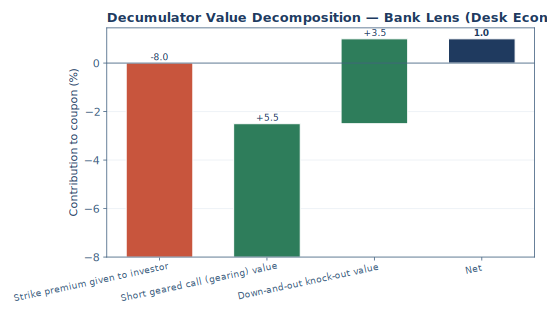

**P&L drivers**

Day to day, desk P&L is driven by the realized-versus-implied volatility on the daily delta hedge, moves in the underlying near the strike and the knock-out (gamma and barrier/digital risk), the compounding long-call delta as the stock rises above strike, funding and borrow costs, and the mark-to-market of the remaining forward + call + knock-out strip. Product Control performs independent valuation of the remaining strip and attributes P&L across the forward, gearing-call, and knock-out components.

#### §9. THE BANK LENS — Controls & Reconciliation (2nd Line of Defence)

**Booking & systems**

| Dimension | Detail |
|-----------|--------|
| **Primary system** | Murex |
| **Booking model** | Strip of forward sales + embedded calls + down-and-out knock-out barrier. Single trade with daily accrual schedule |
| **Valuation model** | Monte Carlo with path-dependent knock-out and gearing (mirror of Accumulator model). Daily observation grid |
| **Market data** | Spot, vol surface, dividends, borrow costs, interest rates |
| **Settlement** | Daily or weekly: shares (from the investor) vs cash (from the bank). T+2 settlement per observation |
| **Compliance** | 10b5-1 plan documentation (if insider). Pre-clearance records |

**Reconciliation points**

| Recon point | What must agree | Decumulator-specific break |
|-------------|-----------------|----------------------------|
| **Observation schedule** | The daily/weekly observation calendar and business-day convention used by Murex match the termsheet | A missed or shifted observation date changes the decumulated quantity and the knock-out check |
| **Strike & KO barrier** | Decumulation strike K and down knock-out level KO, **and their convention** (% of initial spot vs absolute price), agree across Murex and the termsheet | Strike or KO stored as % in one place, absolute in another — consistent only if initial spot is the assumed level |
| **Gearing factor** | The gearing multiplier G (typically 2×) and the quantity rule above strike (G×N) match the termsheet | Gearing booked as 1× (no double-up) or applied below strike — understates upside opportunity-cost risk |
| **Decumulation quantity tracking** | Cumulative shares sold to date reconcile to the schedule (N per day below strike, G×N above) | Cumulative count drifts from the schedule — wrong proceeds and wrong cumulative exposure |
| **Knock-out capture** | The knock-out event flag is set consistently the moment S ≤ KO at an observation | Knock-out breached but flag not set → product keeps decumulating; or set late → over-decumulation |
| **Settlement** | Per-observation share delivery (from the investor) and cash payment (shares × strike), DvP, T+2 | Delivery booked as cash, wrong share count, or settlement on a knocked-out date |
| **Counterparty exposure** | Cumulative mark-to-market and forward-strip exposure agree between front-office and risk/credit systems | Growing daily exposure understated → margin or limit breach missed |
| **P&L attribution** | Split across forward, gearing-call, and knock-out MTM reconciles to total | Unexplained P&L points to a stale vol surface, wrong fixing, or mis-tracked decumulation |

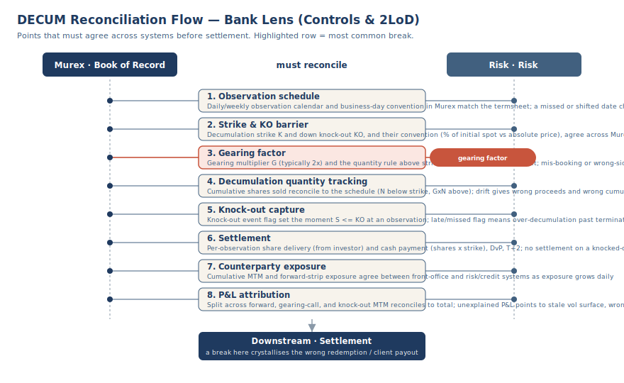

**Common breaks & red flags**

| Red Flag | Why It Matters | 2LoD Action |
|----------|---------------|-------------|
| Gearing > 2× | Extreme opportunity cost in a rally. The investor's losses can exceed total premium benefit | Confirm the booked gearing factor matches the termsheet and is applied only above strike |
| Strike premium very high | Looks too attractive. Usually funded by aggressive gearing or a tight knock-out | Verify the strike/KO/gearing combination reconciles to the booked economics |
| Knock-out flagged but not captured intraday/at observation | Daily-close checks may miss the moment S ≤ KO | Ensure the knock-out check runs on the contractual observation and the flag terminates decumulation |
| Cumulative decumulation count drifts from the schedule | Wrong proceeds and wrong cumulative exposure | Reconcile cumulative shares sold against the N / G×N schedule every observation |
| Gearing applied on the wrong side of strike | Double-up booked below strike, or single-size above | Verify the quantity rule: N below strike, G×N above strike |
| Settlement after a knock-out date | Product should have terminated; further delivery is erroneous | Confirm no obligations settle after the knock-out flag is set |
| Investor does not have enough shares for full geared decumulation | If the stock rallies and gearing doubles the selling, the investor may run out of shares to deliver | Confirm share availability against the maximum geared schedule before relying on settlement |

**Control implication**

Each break has a direct consequence the 2nd line must size before it reaches the books or the client. The two control risks that dominate this product are **the gearing factor and decumulation-quantity tracking**: if the gearing multiplier is mis-booked or applied on the wrong side of the strike, the entire upside opportunity-cost exposure is misstated; and if the cumulative decumulation count drifts from the schedule, the proceeds, the cumulative exposure, and the counterparty credit number all diverge at once. A missed knock-out compounds both — the product keeps geared-decumulating when it should have terminated. The daily reconciliation exists precisely to catch these before settlement crystallises them.

#### §10. Formal Definition

A Decumulator obliges the seller to sell N shares at each observation date t_i at the decumulation strike K, subject to:

**Daily decumulation (if no knock-out):**
- If S(t_i) ≤ K: sell N shares at K (standard decumulation — selling at premium)
- If S(t_i) > K: sell G × N shares at K (geared decumulation — selling below market at double volume)

**Knock-out condition:**
- If S(t_i) ≤ KO at any observation date: product terminates. No further decumulation

**Parameters:**
- K = decumulation strike (typically 105-110% of initial spot)
- KO = knock-out barrier (typically 80-90% of initial spot)
- N = daily/weekly decumulation quantity
- G = gearing factor (typically 2×)
- t_i = observation dates
- T = final maturity

**Decomposition:**
- Decumulator = Σ_i [Short Forward(K, t_i) + Short Call(K, t_i, quantity=(G−1)×N)] × Knock-out(KO, down)
- The strip of forwards provides the premium disposal
- The strip of short calls creates the gearing
- The down knock-out removes the floor below the barrier
- Mirror image of the Accumulator

#### §11. Lifecycle

| Stage | Timing | Action |
|-------|--------|--------|
| **Trade date** | T | Terms agreed. No premium. ISDA confirmation. Pre-clearance (if insider) |
| **Daily observations** | T+1 to maturity | Each business day: check spot vs knock-out. If no knock-out: if spot ≤ strike, sell N shares at strike. If spot > strike, sell G×N shares at strike |
| **Settlement** | Each observation + 2bd | The investor delivers shares. The bank pays strike price × quantity |
| **Knock-out event** | Any day S ≤ KO | Product terminates. Final settlement. No further obligations |
| **Maturity** | T+12M (if no KO) | Final observation and settlement |

#### §12. Worked Example (both lenses)

**Terms:**
- Underlying: Meta Platforms (META)
- Spot: $500
- Strike: $540 (8% premium)
- Knock-out: $425 (15% below spot)
- Gearing: 2× above strike
- Decumulation: 200 shares per trading day (400 if above strike)
- Tenor: 250 trading days
- Investor's total holding: 150,000 shares

*Investor lens:*

**Scenario A — Stock falls to KO ($425, day 100):**
- 100 days below strike: sell 200/day × 100 = 20,000 shares at $540
- Proceeds: 20,000 × $540 = $10.8M
- Market value if sold at spot: 20,000 × $425 = $8.5M
- Premium captured: $2.3M
- Remaining: 130,000 shares (at depressed price)

**Scenario B — Sideways all year:**
- 250 days below strike: sell 200/day × 250 = 50,000 shares at $540
- Proceeds: 50,000 × $540 = $27.0M
- Market value at spot ($500): $25.0M
- Premium captured: $2.0M (8% on proceeds vs market)
- Remaining: 100,000 shares

**Scenario C — Stock rallies to $700:**
- First 50 days below strike: 50 × 200 = 10,000 at $540
- Next 200 days above strike (geared): 200 × 400 = 80,000 at $540
- Total sold: 90,000 at $540. Proceeds: $48.6M
- Market value: 90,000 × $700 = $63.0M
- Opportunity cost: $14.4M
- Remaining: 60,000 shares (but missed $160/share on 80,000 geared shares)

*Bank lens:*
- In Scenario A the down-and-out put the desk is long triggers: the knock-out terminates the structure on day 100, the remaining forward + gearing-call strip disappears, and the desk books a gain on the cancelled remaining optionality. The 2nd line must confirm the knock-out flag is set on day 100 and that no obligations settle after it.
- In Scenario C the desk's long geared call strip is deep in the money and its long-forward hedge offsets the investor's sales at $540 against a $700 market. The compounding long-call delta the desk hedged is realised as the mirror of the investor's $14.4M opportunity cost. The 2nd line must confirm the cumulative decumulation count (10,000 + 80,000 = 90,000 shares), that gearing of 2× was applied only above strike, and that Murex and the risk system agree on cumulative exposure before settlement.

#### §13. Knowledge Check

**Review Questions:**
1. *(Investor)* How is a Decumulator the mirror image of an Accumulator?
2. *(Investor)* What funds the selling premium in a zero-premium Decumulator?
3. *(Investor)* Under what circumstances does gearing hurt the Decumulator investor, and why is this the dominant risk?
4. *(Investor)* Why is insider trading compliance particularly important for Decumulators?
5. *(Investor)* What is the maximum number of shares an investor might sell over the life of the product?
6. *(Desk economics / 1LoD)* What position does the desk hold against the investor, and why does the desk's delta exposure grow more positive (so it delta-hedges by selling shares) in a rising market? Why does this make a decumulator harder to risk-manage than a simple short call of the same notional?
7. *(Controls / 2LoD)* Which booking fields must reconcile in Murex for a decumulator, and why are the gearing factor and the cumulative decumulation-quantity count the two breaks that most directly misstate the investor's exposure?

**Scenario Questions:**
1. A founder holds 500,000 shares of a company trading at $50. They enter a Decumulator at $54 strike, $42.50 knock-out, 2× gearing, 500 shares/day for 250 days. Calculate the maximum shares sold if: (a) stock stays between $42.50 and $54, (b) stock rises above $54 immediately.
2. The knock-out is set at 85% of spot. Compare this to a knock-out at 75%. How does this change the risk/reward for the investor?
3. A competitor offers a Decumulator with the same strike premium but no gearing and no knock-out. How would the pricing differ, and why can't this be zero-premium?

**Mental Models**

| Concept | Mental Model |
|---------|-------------|
| Decumulator | A vineyard owner locked into a harvest contract — a guaranteed premium price, but forced to sell double at below-market prices if the price soars |
| Strike premium | Not free money — it is funded by the gearing call and the down-and-out put the investor has sold to the bank |
| Gearing | The double-up hook beneath the premium bait — losses (opportunity cost) grow twice as fast as the stock rises above strike |
| Knock-out | The bank's relief valve — caps the premium the bank must pay if the stock crashes; it does not protect the investor's remaining shares |
| Geared selling in a rally | Frequent small premium gains in benign markets masking rare, geared, catastrophic opportunity cost in a sharp rally |
| 2LoD daily reconciliation | The daily auditor — confirms each observation's quantity, the gearing rule, and the knock-out flag before settlement crystallises them |

**Key Takeaways**

1. A Decumulator is a strip of premium forward sales plus a short geared call strip plus a short down-and-out put — the investor sells upside and downside-protection optionality to fund the premium.
2. The premium is not free — it is the price for the gearing call and the knock-out the investor has sold to the bank.
3. The payoff is asymmetric: small steady gains while the stock sits between knock-out and strike, an early knock-out below the barrier, and large geared losses (opportunity cost) above the strike.
4. Gearing is the dominant risk — 2× decumulation above strike means the opportunity cost can exceed the total premium benefit multiple times over in a rally.
5. The knock-out protects the bank and caps the premium it must pay; it does not protect the investor's remaining shares from a falling market.
6. The desk holds the offsetting long geared-call strip and long down-and-out put; its delta grows more **positive** daily in a rising market (it delta-hedges by **selling** shares), which is what makes hedging hard.
7. For the 2nd line, the dominant control risks are the gearing factor and decumulation-quantity tracking — each can misstate the investor's exposure, with the observation schedule, strike/KO convention, knock-out capture, and settlement as the supporting recon points.

#### §14. Common Mistakes

1. **Focusing on the premium and ignoring the gearing.** The 8% premium looks attractive. The 2× gearing in a 40% rally is catastrophic in opportunity-cost terms. The premium is the bait; the gearing is the hook.
2. **Treating the decumulator as a flexible VWAP selling program.** A VWAP program is voluntary — the seller can stop or adjust. A decumulator is contractual — the investor must keep selling, at double size, in the worst (rally) scenario.
3. **Not stress-testing share availability.** In a rallying market, the investor must deliver 2× the daily decumulation. If the investor runs out of shares to deliver, they face settlement failure.
4. **Assuming the knock-out protects the investor.** The down knock-out protects the bank (caps the premium the bank must pay) and terminates the product on a crash. It does NOT protect the investor's remaining shares.
5. **Ignoring the "maximum pain" scenario.** The stock rises just above the strike all year (gearing active) but the investor is forced to sell 2× shares at the now-below-market strike for 12 months while the market runs away above.
6. **(Controls) Trusting a single field for gearing or decumulation count.** Because the gearing factor and the cumulative quantity drive the entire upside opportunity-cost exposure, the 2nd line must reconcile the gearing rule and the cumulative shares sold against the schedule rather than assume Murex and the risk system agree.

**Dual-lens questions:**
- *(Desk economics / 1LoD)* What does the desk book against the investor, and what is its primary Greek / hedging risk?
- *(Controls / 2LoD)* Which booking / fixing / event-capture fields must reconcile, and which is the most common break?

**Dual-lens visuals (generated):**
- `assets/decum/controls_decum_recon_08.svg` `[generated]`
- `assets/decum/waterfall_decum_09.svg` `[generated]`
### 5.6.8 Dual Currency Investment (DCI) {#sec-5-6-8}

> **Prerequisites:** [RC](#sec-5-1-2) &nbsp;|&nbsp; **Key concepts:** FX option, currency conversion risk

---

*A Dual Currency Investment is a short-term deposit paying an enhanced yield, where the depositor sells the bank an FX option. At maturity the principal is repaid in the original (base) currency if the FX rate stays favourable, but is converted into the alternative — potentially weaker — currency at the strike if the rate crosses it. The enhanced interest is the option premium passed back to the depositor. This chapter reads the product through two lenses: what it means for **the investor**, and what it means for **the bank** — the latter split into the desk's market economics (1st line of defence) and the controls and reconciliation that surround it (2nd line of defence).*

*How This Differs From Structured Deposit (5.6.1): The Structured Deposit links interest to an equity index. The DCI links the principal repayment to a foreign exchange rate. Both are deposit wrappers. Both guarantee principal under certain conditions. But where the Structured Deposit risks earning zero interest, the DCI risks returning principal in a weaker currency — which means the actual amount the investor gets back could be worth less than what was deposited.*

#### §1. Explain Like I'm New

Picture a currency exchange booth at an airport. An investor holds $100,000 in US dollars and is about to fly to Europe. The booth offers a deal: "Deposit the dollars for 3 months. We will pay 8% annualised interest — four times a standard bank rate. The catch: if the euro weakens below a certain level over those 3 months, we will return the money in euros instead of dollars."

Right now €1 = $1.10. The booth sets the strike at $1.08. If the euro stays above $1.08, the investor gets the dollars back plus the high interest. If the euro falls below $1.08, the investor receives euros — and those euros are now worth less than the original dollars.

This is a **Dual Currency Investment**. The investor deposits money in one currency and earns an above-market interest rate. In exchange, the bank has the right to repay the principal in a different, potentially weaker, currency. The investor is **selling a currency option to the bank**, and the option premium is paid to the investor as enhanced interest.

The DCI is the most common FX-linked structured product in private banking. It is simple, short-term, and widely offered across Asia, Switzerland, and the Middle East.

#### §2. Real-World Analogy

A DCI is like an airport currency exchange booth with a loyalty programme.

An investor deposits $100 at the booth. The booth says: "Leave the money here for a month. We will pay $2 in interest — much better than the bank. But if the exchange rate moves against you, we will give the money back in the foreign currency instead of the home currency."

In this analogy:
- The **deposit** is the investor's principal
- The **$2 interest** is the enhanced coupon (funded by the option premium)
- The **foreign currency return** is the conversion risk
- The **exchange rate threshold** is the strike price
- The **booth** is the issuing bank

The booth benefits because it has acquired an FX option from the investor cheaply. The investor benefits if exchange rates cooperate, and loses if the foreign currency weakens significantly and the principal comes back with less purchasing power than was deposited.

#### §3. What Problem Does This Solve?

DCIs solve the **yield enhancement in low-rate environments** problem for clients with multi-currency exposure.

| User | Problem | DCI Solution |
|------|---------|-------------|
| Private banking client | Low deposit rates, holds multiple currencies | Earns 3-10× market deposit rate by accepting currency conversion risk |
| Corporate treasurer | Holds surplus foreign currency that will be needed later | Earns enhanced yield on idle FX balances. Accepts conversion into a currency they also use |
| Expatriate | Holds savings in home currency, earns local currency salary | Enhanced yield on home-currency deposits. Conversion into local currency is acceptable |

The key insight: DCIs work best for clients who are genuinely comfortable receiving either currency. A client who would be devastated by conversion into the alternate currency should not buy a DCI.

#### §4. Product DNA

| Field | Value |
|-------|-------|
| **Full Name** | Dual Currency Investment |
| **Abbreviation** | DCI |
| **Family** | Other |
| **Complexity Score** | 3 / 10 |
| **Complexity Rationale** | Deposit + single FX option. One strike, one observation. Simple two-currency mechanics |
| **Underlying Asset Class** | Foreign Exchange (currency pair) |
| **Capital Protection** | Full in base currency if FX stays above strike. Nominal in alternate currency if converted |
| **Coupon Type** | Fixed enhanced coupon (above-market deposit rate) |
| **Maturity** | Typically 1 week to 3 months. Rarely beyond 6 months |
| **Liquidity** | Held to maturity. Early termination possible with penalty |
| **Four-Leg Product** | No |
| **Primary System** | Murex (FX options desk) |
| **ISDA Required** | No — structured as deposit, not OTC derivative |

**DNA Atlas Fields:**
- Primary Risk: Currency conversion — principal returned in weaker currency
- Typical Buyer: Private banking clients, corporate treasurers with multi-currency operations
- Typical Use Case: Yield enhancement on short-term deposits
- Building Blocks: Time deposit + short FX put option (on base currency vs alternate currency)
- Key Hedge: Long FX put option in same currency pair and strike
- Similar Products: Structured Deposit (5.6.1), Reverse Convertible (5.1.2 — same "short put" concept but on equity)
- Most Important Greek: Delta (FX spot sensitivity drives conversion probability)

**Comparison Matrix Fields:**
- Complexity: 3
- Yield Potential: High (3-10× market deposit rate)
- Capital Protection: Conditional (protected if no conversion)
- Credit Exposure: Issuer (deposit, not OTC)
- Liquidity: Hold-to-maturity
- Path Dependency: None (single observation at maturity)
- Volatility Sensitivity: Short vega (higher vol = higher coupon but higher conversion risk)
- Correlation Sensitivity: None (single currency pair)
- Client Type: Private banking / Corporate
- Market Environment: Best when FX vol is elevated (higher premiums) and client has genuine dual-currency needs

#### §5. Who Touches This Product

| Role | Responsibility |
|------|---------------|
| **Structurer** | Sets strike level, tenor, and coupon for each currency pair. Balances client yield expectations against conversion probability |
| **Trader** | Prices the embedded FX put option. Hedges with vanilla FX options. Manages FX delta and vega exposure across DCI book |
| **Sales** | Core private banking offering. Explains conversion risk to clients. Matches DCI parameters to client's multi-currency profile |
| **Risk** | Monitors aggregate FX exposure across DCI book. Watches for concentration in single currency pairs. Monitors implied vol changes |
| **Product Control** | Verifies DCI pricing against FX option market. Checks that enhanced coupon corresponds to fair option premium |
| **Operations** | Manages deposit booking. Handles currency conversion at maturity if triggered. Coordinates settlement in either currency |
| **Legal/Compliance** | Deposit classification (not derivative — different regulatory treatment). Suitability documentation for conversion risk |
| **Quantitative Analytics** | FX option pricing models. Smile/skew adjustments for out-of-the-money puts. Minimal involvement — standard Black-Scholes FX |

#### §6. Product Evolution

| Era | Development |
|-----|------------|
| **1990s** | DCIs emerge in Asian private banking (Hong Kong, Singapore). USD/HKD and USD/JPY pairs dominate. Simple structure meets high demand for yield enhancement |
| **2000s** | Proliferation across Swiss private banking. EUR/CHF becomes a major pair. Tenors shorten to 1-2 weeks as clients seek rapid reinvestment |
| **2008-2010** | Financial crisis exposes conversion risk. Clients who held USD/JPY DCIs received yen at unfavourable rates. Risk disclosures tighten |
| **2010s** | Regulatory focus on suitability. Some jurisdictions classify DCIs as derivatives (requiring ISDA). Others maintain deposit classification. Asian markets continue strong demand |
| **2020s** | Digital platforms enable automated DCI pricing and execution. Ultra-short tenors (1 week, 2 weeks) become standard. Remains a core private banking product |

---

#### §7. THE INVESTOR LENS

**Why the investor buys it**

1. **Enhanced yield.** In a world of near-zero deposit rates, a DCI paying 6-10% annualised is compelling — for an investor who accepts the conversion risk. The yield is 3-10× the market deposit rate.
2. **Natural multi-currency exposure.** A client who holds both USD and JPY, or both EUR and CHF, may genuinely not care which currency the principal is returned in.
3. **Short tenor.** Most DCIs mature in 1-4 weeks. If converted, the investor can simply hold the alternate currency and wait for a better rate to convert back.
4. **No complexity premium.** The DCI is simple enough that the investor can understand the risk. There is no hidden optionality or path dependency to confuse the outcome.

**Position taken**

The investor simultaneously holds a time deposit in the base currency and is **short** an FX put option on the base currency versus the alternate currency, struck at the conversion rate K. The investor has **sold** that option to the bank — selling FX optionality in exchange for the enhanced yield. Net, the investor is **short volatility** (hurt by volatile FX markets) and **short FX downside**: if the base currency falls below the strike, the principal is converted into the weaker alternate currency. With a single currency pair there is no correlation exposure.

**Payoff & scenarios**

The investor's payoff is a digital/step profile against the FX rate. If the FX rate stays at or above the strike at maturity, the investor receives 100% of principal in the base currency plus the enhanced coupon. If the FX rate finishes below the strike, conversion triggers: the principal is converted into the alternate currency at the strike rate, and the investor still receives the enhanced coupon. Below the strike the investor bears the full FX shortfall — the enhanced coupon is a partial buffer, not protection.

**Terms:** USD 1,000,000 DCI. Base currency: USD. Alternate currency: EUR. Spot: EUR/USD 1.1000. Strike: 1.0800. Tenor: 1 month. Enhanced coupon: 8% annualised (= 0.667% for 1 month = $6,667).

| Scenario | EUR/USD at Maturity | Outcome | Investor Receives |
|----------|:-------------------:|---------|:---------------:|
| **Bull (EUR strong)** | 1.1200 | No conversion. EUR above strike | $1,000,000 + $6,667 interest |
| **Base** | 1.0800 | At the strike. No conversion (at-the-money) | $1,000,000 + $6,667 interest |
| **Bear (EUR weak)** | 1.0400 | Conversion. EUR below strike | €925,926 + $6,667 interest |

**Bear scenario analysis:**
- The investor deposited $1,000,000. Receives €925,926 (= $1,000,000 / 1.0800 strike rate).
- Those euros are now worth: €925,926 × 1.0400 = $962,963.
- Net position: $962,963 + $6,667 interest = $969,630.
- Loss vs original deposit: $30,370 (3.0%).
- The enhanced coupon ($6,667) partially offsets the conversion loss, but not fully.

**Key insight:** The DCI coupon is high because the investor is selling an option. In the bear scenario, the option is exercised against the investor. The coupon never fully compensates for a large adverse FX move — it is a partial buffer, not protection.

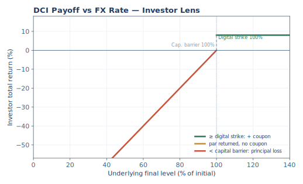

**Risks to the investor**

| Risk | Severity | Description |
|------|:--------:|------------|
| **Conversion into the weaker currency** | High | If the base currency falls below the strike, principal is converted into the alternate currency at the strike. If that alternate currency then depreciates, the investor holds a depreciating asset — unlimited downside in base-currency terms |
| **Opportunity cost** | Medium | If the base currency strengthens significantly, the investor would have been better off with a regular deposit plus a separate FX trade |
| **Reinvestment / round-trip** | Medium | After conversion, the investor holds the alternate currency. Rolling into a new DCI in the opposite direction may lock in losses, which compound across repeated round trips |
| **Issuer risk** | Low | Structured as a deposit — may be covered by deposit insurance (jurisdiction-dependent, subject to limits) |
| **Liquidity risk** | Low | Short tenor means limited lock-up. Early termination usually possible with penalty |

#### §8. THE BANK LENS — Desk Economics (1st Line of Defence)

**What the desk books**

The desk's position is the mirror image of the investor's. Where the investor is **short** the FX put option, the desk is **long** that put (bought from the investor); alongside it the desk has taken in a deposit, which is a funding liability. The investor's enhanced coupon is, to the desk, the cost of the FX put premium plus deposit funding, returned to the client. The DCI generates large volumes of short-dated FX options (1 week to 3 months), so the aggregate DCI book is a sizeable long-option position.

**FX option risk & hedging**

The desk is long the embedded FX put across the DCI book and delta-hedges the aggregate FX exposure by trading spot and forward FX. Because the puts are typically out-of-the-money, smile/skew matters: the implied vol used for pricing includes the skew premium, and gamma accelerates as spot approaches the strike. The main risk is gap moves over weekends or holidays when the FX market is closed but positions are live. Risk monitors aggregate FX exposure and watches for concentration in single currency pairs.

**How the bank makes money**

| Component | Detail |
|-----------|--------|
| **Enhanced coupon paid to client** | Funded by the premium from the embedded FX put option the client has sold |
| **Option premium retained** | Bank pays client ~70-85% of the theoretical option premium as enhanced coupon. Retains 15-30% as structuring margin |
| **Bid-offer on FX option** | Bank hedges by buying the same put option in the interbank market at mid or better. Spread = profit |
| **Deposit spread** | Bank funds the deposit at wholesale rates, lends at retail. Small additional margin |
| **Conversion execution** | If conversion triggers, bank may execute FX at a slight spread to the fixing rate |

**Typical economics (USD 1M, 1 month, USD/JPY):**
- Theoretical FX put premium: ~0.8% of notional
- Client receives as enhanced coupon: ~0.6% (annualised ~7.2%)
- Bank retains: ~0.2% = $2,000 per $1M per month
- High volume, low margin. Profitability comes from scale — a large private bank may have $5-10 billion in DCIs outstanding at any time.

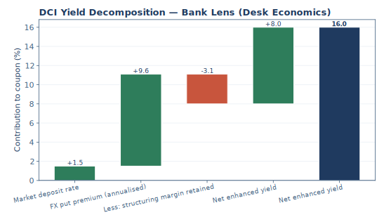

**P&L drivers**

Day to day, desk P&L is driven by realized-versus-implied FX volatility on the delta hedge, moves in spot near the strike (gamma), the skew embedded in the out-of-the-money puts, deposit funding, and the mark-to-market of the embedded FX option. Product Control verifies DCI pricing against the FX option market and checks that the enhanced coupon corresponds to a fair option premium.

#### §9. THE BANK LENS — Controls & Reconciliation (2nd Line of Defence)

**Booking & systems**

| Dimension | Detail |
|-----------|--------|
| **Primary system** | Murex (FX options desk) or Treasury system (deposit desk) |
| **Booking model** | Deposit + embedded FX put option. Some banks book as a single structured deposit; others book deposit and option separately |
| **Valuation model** | Garman-Kohlhagen (Black-Scholes adapted for FX). Standard closed-form. No Monte Carlo needed |
| **Market data** | Spot FX rate, FX implied volatility surface (smile/skew), interest rate curves for both currencies |
| **Settlement** | Base currency or alternate currency depending on fixing vs strike |
| **Regulatory treatment** | Jurisdiction-dependent: deposit (bank regulation) vs derivative (securities regulation). Affects capital treatment and investor protection |

**Reconciliation points**

| Recon point | What must agree | DCI-specific break |
|-------------|-----------------|--------------------|
| **Currency pair & strike** | Base/alternate pair, quote direction, and strike (conversion) rate K consistent across systems and termsheet | Strike stored as base/alternate in one system and inverted (alternate/base) in another → conversion direction reversed |
| **FX fixing source & time** | Fixing source (ECB, WMR, or Bloomberg) and fixing time match the termsheet | Different vendors/cut times report different rates at the observation → conversion wrongly triggered or missed |
| **Conversion determination** | Whether S_T crossed K, and the at-the-money/at-strike convention, consistent across systems | Boundary case at exactly the strike resolved differently in two systems |
| **Settlement currency** | Settlement currency (base if no conversion, alternate if converted) and converted amount = principal × K | Settlement booked in the wrong currency, or converted amount uses spot instead of strike |
| **Deposit booking** | Notional, base currency, tenor, enhanced coupon rate, day-count, and maturity date | Coupon day-count or tenor mismatch between Treasury system and Murex |
| **Option economics** | Embedded FX put premium, strike, expiry match between deposit leg and option leg | Premium not reconciled to coupon enhancement → fair-value drift |
| **Greeks / risk** | Position Greeks (delta, vega) agree between front-office and risk systems | Sign or magnitude mismatch on FX delta/vega across the DCI book |
| **P&L attribution** | Split between deposit interest accrual and FX option MTM reconciles to total | Unexplained P&L points to a stale vol surface or a wrong fixing |

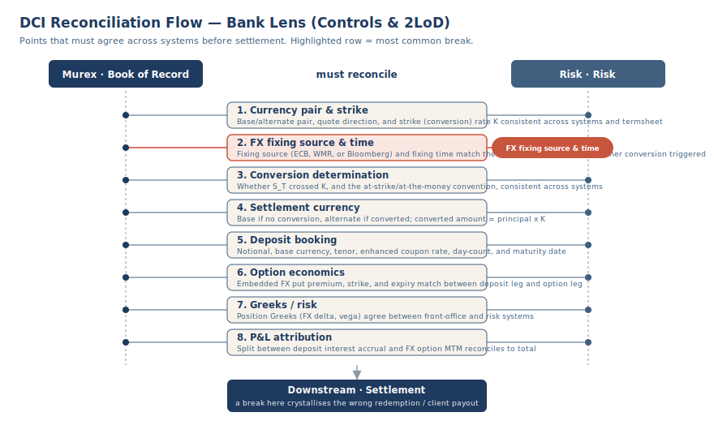

**Common breaks & red flags**

| Red Flag | What It Means | 2LoD Action |
|----------|---------------|-------------|
| Strike stored with inverted quote direction | Base/alternate vs alternate/base ambiguity reverses the conversion test | Verify quote convention and strike direction across systems before relying on either valuation |
| Fixing source or cut time mismatch | Different vendors report different rates at the observation | Use the fixing source and time specified in the termsheet for the conversion determination |
| Conversion determined inconsistently at the strike | At-strike boundary resolved as conversion in one system, no-conversion in another | Confirm the at-the-money convention against the termsheet |
| Settlement booked in the wrong currency | Investor due alternate currency but booked in base (or vice versa) | Confirm settlement currency follows the conversion result; converted amount = principal × strike |
| Converted amount uses spot rather than strike | Conversion math applied at maturity spot instead of strike K | Recompute converted principal at the strike rate K |

**Control implication**

Each break has a direct consequence the 2nd line must size before it reaches the books or the client. The dominant control risks for a DCI are the **FX fixing** (source and time) and the **settlement-currency capture** (which currency the principal is returned in, and whether the converted amount uses the strike). A fixing-source or cut-time error misstates whether conversion was triggered — driving the wrong settlement currency and the wrong client payout. A settlement-currency or quote-direction error returns the principal in the wrong currency or at the wrong rate. The reconciliation exists precisely to catch these inconsistencies before settlement crystallises them.

#### §10. Formal Definition

A **Dual Currency Investment** is a short-term deposit in a base currency, combined with a short put option on the base currency versus an alternate currency, struck at a pre-agreed conversion rate.

**Payoff at maturity:**

- If S_T ≥ K: Principal returned in base currency + enhanced coupon
- If S_T < K: Principal converted to alternate currency at rate K + enhanced coupon in base currency

Where:
- S_T = spot FX rate at maturity (alternate currency per unit of base currency)
- K = strike (conversion) rate
- Enhanced coupon = deposit interest + option premium retained by the investor

**Decomposition:**

DCI = Time Deposit (base currency) + Short Put Option (base vs alternate, strike K)

The short put premium is paid to the investor as the difference between the enhanced coupon and the market deposit rate.

#### §11. Lifecycle

| Stage | Timing | Action |
|-------|--------|--------|
| **Pricing** | T-1 to T | Bank prices FX put option. Sets strike and coupon based on the client's yield target and acceptable conversion probability |
| **Trade date** | T | Investor places deposit. DCI terms confirmed. No separate option documentation (embedded in deposit terms) |
| **During life** | T to T+1M | Deposit accrues interest. Bank hedges FX exposure. No interim payments or observations |
| **Fixing** | T+1M-2BD | FX rate fixed against agreed source (typically ECB, WMR, or Bloomberg) |
| **Maturity** | T+1M | If no conversion: principal + interest in base currency. If conversion: principal converted at strike rate + interest in base currency |
| **Reinvestment** | T+1M+1BD | Investor frequently rolls into a new DCI (common pattern: continuous rolling DCIs) |

#### §12. Worked Example (both lenses)

**Terms:**
- Principal: USD 1,000,000
- Base currency: USD. Alternate currency: CHF
- Spot: USD/CHF 0.8800
- Strike: 0.8600
- Tenor: 1 month (30 days)
- Enhanced coupon: 7.2% annualised (= 0.60% for 1 month = $6,000)
- Market deposit rate: 1.5% annualised (= $1,250 for 1 month)
- Implied option premium: ~0.80% of notional = $8,000
- Investor receives: $6,000 (75% of premium). Bank retains: $2,000 (25%)

*Investor lens:*

The strike is in USD/CHF terms: 0.8600 means the bank has the right to repay the deposit in CHF, converting at 0.8600 (delivering CHF 1,000,000 × 0.8600 = CHF 860,000). The bank exercises this right only when it favours the bank — when USD/CHF has risen **above** the strike (CHF has weakened), so the CHF it delivers is worth less than the original USD.

**Scenario A (USD/CHF = 0.8500, CHF stronger — at/below strike):**
- USD/CHF 0.8500 < strike 0.8600. Converting would cost the bank, so it does **not** convert.
- Investor receives: $1,000,000 + $6,000 = **$1,006,000**. Best case — full principal plus the enhanced coupon (+0.6%).

**Scenario B (USD/CHF = 0.9000, CHF weakens):**
- USD/CHF 0.9000 > strike 0.8600. Conversion triggers.
- Investor receives: $1,000,000 × 0.8600 = CHF 860,000 + $6,000 interest.
- CHF 860,000 converted back to USD at spot 0.9000: CHF 860,000 / 0.9000 = **$955,556**.
- Net: $955,556 + $6,000 = **$961,556**. **Loss: $38,444 (−3.8%)** — the 7.2% annualised coupon did not compensate for the CHF depreciation.

**Scenario C (USD/CHF = 0.9500, CHF weakens sharply):**
- Conversion triggers. Investor receives CHF 860,000 + $6,000.
- CHF 860,000 at spot 0.9500 = **$905,263**.
- Net: $911,263. **Loss: $88,737 (−8.9%)** — this is the real DCI risk: being repaid in the alternate currency precisely when it has weakened.

**Key insight for DCI:** conversion always delivers the alternate currency (CHF) at the strike, and the bank exercises it precisely when that currency has weakened (USD/CHF above strike). The investor therefore receives a depreciating asset worth less than the original deposit — the enhanced coupon is the compensation for taking that conversion risk.

*Bank lens:*

- In Scenario A the desk's long FX put expires worthless; the desk keeps its $2,000 structuring margin and net hedging P&L, having funded the $6,000 of enhanced interest. Product Control confirms the FX option MTM rolls to zero and the deposit interest accrual closes out.
- In Scenarios B and C the desk's long put is in the money: the bank exercises its right to deliver CHF 860,000 against the $1,000,000 deposit, funded at the strike of 0.8600. The 2nd line must confirm the converted amount (principal × strike = CHF 860,000), the settlement currency (CHF, not USD), the fixing source and time used for the conversion determination, and that the deposit system and Murex agree before settlement.

#### §13. Knowledge Check

1. *(Investor)* What is the embedded option in a DCI, and who is the buyer and seller of that option? (Answer: a short FX put on the base currency; the investor sells it, the bank buys it.)
2. *(Investor)* Why does a DCI pay a higher interest rate than a standard deposit? Decompose it.
3. *(Investor)* What happens at maturity if the FX rate is exactly at the strike level?
4. *(Investor)* Why are short-tenor DCIs (1-4 weeks) more common than long-tenor DCIs?
5. *(Investor)* How does FX volatility affect the coupon offered on a new DCI?
6. **(Desk economics / 1LoD)** The investor is short the FX put; what is the desk, and which way do the desk's FX delta, gamma, and vega point across the DCI book? Where does the desk's structuring margin come from, and why are weekend/holiday gap moves the main risk?
7. **(Controls / 2LoD)** Name three reconciliation breaks specific to a DCI and the consequence of each for the investor's settlement — including which single field most often determines whether conversion was triggered.

**Mental Models**

| Concept | Mental Model |
|---------|-------------|
| Dual Currency Investment | An airport exchange booth with a loyalty programme — enhanced interest in exchange for the booth's right to return a different currency |
| Enhanced coupon | Not free money — it is the premium the bank pays the investor for selling FX optionality |
| Strike | The exchange-rate threshold at which conversion into the alternate currency kicks in |
| Conversion | The FX option is exercised against the investor — principal comes back in the alternate currency |
| Coupon vs conversion loss | The coupon is the investor's premium income; the conversion loss is the FX shortfall when the alternate currency is weak |
| 2LoD reconciliation | The booth's auditor — confirms the fixing source, the strike direction, and the settlement currency match before anyone is paid out |

**Key Takeaways**

1. A DCI is a base-currency deposit + a short FX put. The investor earns an enhanced coupon by selling FX optionality to the bank.
2. The coupon is not free — it is the premium for the FX option the investor has sold to the bank.
3. If the FX rate stays at or above the strike, the investor keeps full principal in the base currency plus the coupon. If it crosses below, the principal is converted into the alternate currency at the strike.
4. The conversion is only harmful if the alternate currency then weakens — the investor holds a depreciating asset. The coupon is a partial buffer, not protection.
5. The payoff is a digital/step profile at the strike — a small FX difference at the boundary decides whether the principal returns in the base or the alternate currency.
6. The round-trip risk is dominant for rollers — repeated conversions in opposite directions can compound losses.
7. DCIs are short volatility products for the investor — the investor benefits from calm FX markets and is hurt by volatile ones; the desk holds the offsetting long-put position across the book.
8. For the 2nd line, the dominant control risks are the FX fixing (source and time), the strike/quote direction, and the settlement-currency capture — each can misstate whether conversion triggered and which currency the principal is returned in.

#### §14. Common Mistakes

1. **Treating the enhanced coupon as "free yield."** The coupon is funded by an FX option premium the investor has sold. It is compensation for risk, not free money.
2. **Ignoring the "round-trip" problem.** The investor converts USD to EUR, rolls into a EUR/USD DCI, then converts back to USD at a worse rate. Each conversion crystallises a loss. Continuous rolling can compound these losses.
3. **Using DCIs on currencies the investor does not want.** A DCI works when the investor is genuinely happy with either currency. If conversion into the alternate currency is unacceptable, the investor should not sell the option.
4. **Confusing deposit insurance coverage.** A DCI may or may not be covered by deposit guarantee schemes depending on jurisdiction and structure. The investor should verify before assuming protection.
5. **Pricing only the at-the-money vol.** DCI puts are typically out-of-the-money. The skew premium matters. Using ATM vol underprices the option and overprices the DCI coupon.
6. **(Controls) Trusting a single system's fixing or strike direction.** Because the conversion test depends on the fixing source/time and the quote direction of the strike, the 2nd line must reconcile the fixing source and the strike convention across the deposit system and Murex rather than assume they agree.

**Dual-lens questions:**
- *(Desk economics / 1LoD)* What does the desk book against the investor, and what is its primary Greek / hedging risk?
- *(Controls / 2LoD)* Which booking / fixing / event-capture fields must reconcile, and which is the most common break?

**Dual-lens visuals (generated):**
- `assets/dci/controls_dci_recon_08.svg` `[generated]`
- `assets/dci/payoff_dci_01.svg` `[generated]`
- `assets/dci/waterfall_dci_09.svg` `[generated]`
### 5.6.9 Shark Fin Note {#sec-5-6-9}

> **Prerequisites:** [PPN](#sec-5-1-1) &nbsp;|&nbsp; **Key concepts:** Up-and-out barrier, rebate, barrier knock-out

---

*The PPN ([Section 5.1.1](#sec-5-1-1)) protected 100% of the investor's principal and gave uncapped upside participation. The Shark Fin Note also protects principal and participates in the upside — but adds an upper knock-out barrier. If the underlying rises far enough to touch the barrier, the participation is extinguished and the investor receives a small fixed rebate instead of the full gain. The investor still profits in that case, but by less than the unbarriered participation would have delivered: the barrier reduces the return, it does not erase it. This chapter reads the product through two lenses: what it means for **the investor**, and what it means for **the bank** — the latter split into the desk's market economics (1st line of defence) and the controls and reconciliation that surround it (2nd line of defence).*

#### §1. Explain Like I'm New

A bank advisor offers a conservative client capital protection plus equity upside. A standard PPN does this, but the participation rate it can fund is low when interest rates are low. The natural question is: how can the participation be raised without giving up the capital guarantee?

The answer is that the investor gives up the extreme upside. In a **Shark Fin Note**, the investor holds a capital-protected note that participates in the rise of an underlying asset — **up to** an upper knock-out barrier. If the underlying ever touches that barrier during the life of the note, the participation is knocked out and the investor receives a fixed **rebate** instead. If the barrier is never touched, the investor keeps the full participation.

The tradeoff: the investor sells the "very strong rally" scenario back to the bank, and that premium funds a higher participation rate than a comparable PPN. The investor keeps full upside in a moderate rally, loses it (down to the rebate) only if the rally is so strong that the barrier is breached, and never loses principal.

The payoff chart has a distinctive shape: a rising line that abruptly drops to a flat rebate level at the barrier, resembling a shark's dorsal fin — hence the name. The product is popular in Asian private banking markets, particularly Hong Kong, Taiwan, and mainland China, with conservative investors who want upside exposure but accept a cap in exchange for capital protection.

#### §2. Real-World Analogy

A Shark Fin Note is like a fishing charter with a catch limit.

A client pays for a fishing charter. The captain guarantees the charter fee will not be lost (capital protection). Any fish caught, the angler keeps (participation in upside). But the harbour has a conservation rule: if any angler catches more than 20 fish in a day, the excess must be released and the angler instead receives a fixed consolation award of 10 fish.

In this analogy:
- The **charter fee** is the invested principal (protected)
- The **fish caught** is the underlying asset's return
- The **20-fish limit** is the knock-out barrier
- The **10-fish consolation** is the fixed rebate
- The **conservation rule** is the barrier observation

If the fishing is moderate (the underlying rises but stays below the barrier), the angler keeps everything. If the fishing is spectacular (the underlying breaches the barrier), the angler receives the consolation award — still positive, but less than the full catch. The investor is the angler; the bank is the harbour authority that takes back the excess catch in exchange for funding a more generous quota.

#### §3. What Problem Does This Solve?

Shark Fins solve the **"I want upside but find the protection too expensive"** problem.

When interest rates are low, the zero-coupon bond that funds a PPN's capital guarantee is expensive, leaving little budget for the call option — so PPN participation is thin. A Shark Fin frees up budget by selling barrier optionality, raising the participation rate for the same protection.

| Investor | Problem | Shark Fin Solution |
|------|---------|-------------------|
| Conservative investor | Wants equity exposure with capital protection, but finds PPN participation too expensive | Sells barrier optionality (up-and-out) to cheapen the participation. Gets a higher participation rate than a PPN for the same cost |
| Wealth manager | Needs to offer clients capital-protected equity exposure in a low-rate environment | Shark Fin offers better participation than a PPN because the barrier optionality funds a cheaper call option |
| Institutional allocator | Wants structured equity exposure with a defined worst case | Capital protection ensures no loss. The barrier cap limits the maximum gain but defines the return envelope precisely |

The key trade-off: compared to a PPN, the Shark Fin offers higher participation (or lower cost) in exchange for the barrier cap. The investor bets the underlying will rise moderately, not dramatically.

#### §4. Product DNA

| Field | Value |
|-------|-------|
| **Full Name** | Shark Fin Note (Knock-Out Capital Protected Note) |
| **Abbreviation** | SHRK |
| **Family** | Other |
| **Complexity Score** | 4 / 10 |
| **Complexity Rationale** | Capital protected + single up-and-out barrier. One barrier, one rebate level. PPN variant with barrier mechanic |
| **Underlying Asset Class** | Equity index (most common), single stock, commodity |
| **Capital Protection** | 100% at maturity (principal guaranteed) |
| **Coupon Type** | None — return delivered as participation in underlying at maturity |
| **Maturity** | Typically 1-3 years |
| **Liquidity** | Secondary market with bid-offer spread. Less liquid than a standard PPN |
| **Four-Leg Product** | No |
| **Primary System** | Murex |
| **ISDA Required** | No — issued as note (securities law) |

**DNA Atlas Fields:**
- Primary Risk: Barrier breach caps the return at the rebate level. Opportunity cost if the underlying surges
- Typical Buyer: Conservative private banking clients seeking capital-protected equity exposure with enhanced participation
- Typical Use Case: Capital-protected equity participation with a higher participation rate than a vanilla PPN
- Building Blocks: Zero-coupon bond + up-and-out call with rebate (equivalently: long call + short up-and-out call with rebate)
- Key Hedge: Long up-and-out call replication via dynamic barrier hedging
- Similar Products: PPN (5.1.1 — no barrier), Bonus Certificate (5.1.8 — barrier below, not above)
- Most Important Greek: Delta (equity exposure), Vega (vol affects barrier probability and participation cost)

**Comparison Matrix Fields:**
- Complexity: 4
- Yield Potential: Moderate (participation capped by barrier)
- Capital Protection: 100%
- Credit Exposure: Issuer (note format)
- Liquidity: Secondary market
- Path Dependency: Yes (continuous barrier observation)
- Volatility Sensitivity: Mixed — higher vol increases barrier breach probability but also makes participation cheaper
- Correlation Sensitivity: None (single underlying)
- Client Type: Private banking / Conservative institutional
- Market Environment: Best when expecting moderate upside. Poor when expecting a sharp rally (barrier likely breached)

#### §5. Who Touches This Product

| Role | Responsibility |
|------|---------------|
| **Structurer** | Sets barrier level, participation rate, and rebate. Optimises the three-way tradeoff: higher barrier → higher participation but lower rebate. Prices the up-and-out call option |
| **Trader** | Hedges the barrier risk dynamically. Manages delta near the barrier — gamma increases sharply as the underlying approaches the knock-out level |
| **Sales** | Positions to conservative clients as "PPN with better participation." Explains the barrier cap. Most common objection: "What if I miss a big rally?" |
| **Risk Management** | Monitors barrier proximity. Watches for pin risk near the barrier level. Aggregates exposure to barrier breach across the Shark Fin book |
| **Product Control** | Verifies barrier pricing (up-and-out call vs standard call). Checks rebate calculation. Validates the participation rate against market |
| **Operations** | Barrier monitoring (continuous or discrete observation). Settlement in either participation or rebate mode. Fixing source verification |
| **Legal / Compliance** | Note prospectus. Barrier observation terms. Rebate calculation methodology. Client suitability for barrier products |
| **Quantitative Analytics** | Barrier option pricing (analytical or Monte Carlo for discrete barriers). Smile/skew impact on barrier probability. Rebate valuation |

#### §6. Product Evolution

| Era | Development |
|-----|------------|
| **Early 2000s** | Shark Fin Notes emerge in Hong Kong and Taiwan as alternatives to PPNs. Low interest rates make PPN participation expensive — the barrier reduces cost |
| **2005-2007** | Rapid growth in Asian private banking. Variants appear: bull Shark Fin (upside barrier), bear Shark Fin (downside barrier), double Shark Fin (both barriers) |
| **2008-2010** | Crisis validates the capital protection feature. Shark Fins with no barrier breach return 100%. Products with breached barriers return the rebate — still positive |
| **2010s** | Continuous barrier observation becomes standard (vs discrete). Digital platforms enable automated pricing. The product remains a staple in HK, TW, China |
| **2020s** | Post-pandemic demand surge. Ultra-low rates make participation expensive — the Shark Fin's barrier-funded enhancement is attractive. ESG-linked Shark Fins appear |

---

#### §7. THE INVESTOR LENS

**Why the investor buys it**

1. **Better participation than a PPN.** The barrier optionality subsidises the call option, giving the investor a higher participation rate for the same principal protection.
2. **Defined return envelope.** The investor knows exactly the range of outcomes: 0% (flat or down market), the rebate% (barrier breached), or full participation% (market rises but stays below the barrier).
3. **Capital protection.** 100% of principal is returned at maturity regardless of market outcome.
4. **Moderate-bull view.** Ideal for an investor who expects the market to rise moderately (10-30%) but not dramatically (50%+). The barrier penalty only bites if the market surges.

**Position taken**

The investor is **long** an up-and-out (knock-out) call on the underlying plus a capital-protected note (a zero-coupon bond that matures at par). The knock-out feature embedded in that call is, in effect, sold by the investor to the bank: the premium it generates funds the enhanced participation. Net, the investor is **long equity** up to the barrier (positive delta that vanishes if the barrier is touched) and carries no principal downside. With a single underlying there is no correlation exposure; the investor is also exposed to volatility through the barrier-breach probability (see §8).

**Payoff & scenarios**

The investor's payoff has two regimes. If the barrier is **never** breached: payoff = 100% + max(0, Participation × (S_T/S_0 − 1)) — full protected principal plus the participated upside. If the barrier **is** breached at any time during the life: payoff = 100% + Rebate% — protected principal plus the fixed rebate, regardless of where the underlying finishes. The participated leg is a rising line; at the barrier it drops abruptly to the flat rebate level — the shark-fin profile.

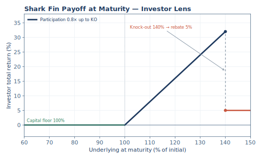

**Product:** USD 1,000,000 Shark Fin Note. Underlying: S&P 500. Maturity: 2 years. Participation: 80%. Barrier: 140% of initial (up-and-out, continuous). Rebate: 5% of notional.

| Scenario | S&P Performance | Barrier Breached? | Investor Return | Investor Receives |
|----------|:---------------:|:-----------------:|:-------------:|:---------------:|
| **Bull (moderate)** | +25% | No | 80% × 25% = 20% | $1,200,000 |
| **Bull (strong)** | +50% | Yes (crossed 140%) | Rebate = 5% | $1,050,000 |
| **Bear** | -15% | No | 0% (capital protected) | $1,000,000 |

**Key insight:** The strong-bull scenario is the "worst" positive outcome. The investor would have earned 80% × 50% = 40% without the barrier, but receives only 5%. The barrier costs the investor 35% of return in this scenario. This is the price paid for the enhanced participation rate available in the moderate-bull scenario.

**Risks to the investor**

| Risk | Description | Severity |
|------|------------|:--------:|
| **Barrier breach (opportunity cost)** | If the underlying surges past the barrier, the investor receives only the rebate — potentially missing a 30-40% gain. The defining risk of the product. | High |
| **Zero return (flat/down market)** | Capital is protected but no return is earned. Opportunity cost versus a fixed deposit that would have paid interest. | Medium |
| **Issuer credit risk** | Capital protection is only as good as the issuer's ability to pay at maturity. | Medium |
| **Liquidity risk** | A secondary market exists, but bid-offer spreads widen near the barrier or in stressed markets. | Low-Medium |
| **Gap / continuous-observation risk** | With continuous observation, an intraday spike can breach the barrier even if the closing level stays below — the investor may not appreciate that any intraday touch counts. | Medium |
| **Model risk** | Barrier option pricing depends on the volatility model; discrete vs continuous observation changes the breach probability and the mark. | Low |

#### §8. THE BANK LENS — Desk Economics (1st Line of Defence)

**What the desk books**

The desk's position is the mirror image of the investor's. Where the investor is long the up-and-out call, the desk is **short** that up-and-out call (it has sold the participation), and alongside it the desk has issued a note funded by a zero-coupon bond bought at a discount — a funding liability that matures at par to deliver the capital protection. The knock-out feature the investor implicitly sells is, to the desk, premium received that cheapens the call it must deliver, enabling a higher participation rate than a PPN.

**Barrier-option risk & hedging**

The desk is short the embedded up-and-out call and delta-hedges by trading the underlying. Because the payoff is discontinuous at the knock-out barrier, the option's gamma spikes as the underlying approaches the barrier and hedging becomes expensive and error-prone — a Shark Fin book with barriers at 140% sees hedging cost spike when the index is at 135-139% of initial. If the barrier is breached, all delta disappears instantly — the payout becomes fixed at par plus rebate. This "cliff" in the Greeks, together with pin risk (the underlying hovering near the barrier at observation times), is where the desk's structuring margin is earned or lost. Risk Management monitors barrier proximity and may impose limits on concentrated barrier exposure.

**How the bank makes money**

| Revenue Component | Detail |
|------------------|--------|
| **Zero-coupon bond / funding** | Bond purchased at a discount, matures at par (capital protection). The desk earns the funding spread |
| **Short up-and-out feature** | The investor implicitly sells the knock-out feature; the premium received reduces the call cost and enables a higher participation rate |
| **Structuring margin** | 0.5-1.5% of notional, embedded in the participation rate (the investor gets slightly less participation than theoretical) |
| **Hedging P&L** | Delta-hedging the short up-and-out call captures the spread between realized and implied vol |

**The participation budget decomposition:**

A standard PPN uses the entire option budget to buy a vanilla call. A Shark Fin uses the option budget to buy a call **and** sells the knock-out feature; the knock-out premium subsidises the call purchase, enabling a higher participation rate for the same option budget. Conceptually: Option budget = Bond discount; Call cost − Knock-out premium received + Rebate funding + Desk margin = Option budget — so for a given budget, the knock-out premium buys more participation than a PPN can fund.

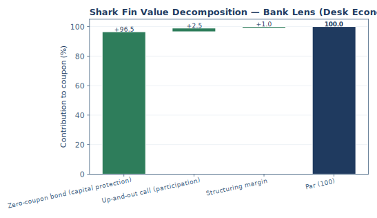

**P&L drivers**

Day to day, desk P&L is driven by realized-versus-implied volatility on the delta hedge, moves in the underlying near the barrier (gamma and pin risk), the funding spread on the zero-coupon bond, and the mark-to-market of the embedded up-and-out call (sensitive to the skew of the vol surface, since the barrier is out-of-the-money). Product Control verifies the barrier pricing (up-and-out call vs standard call), checks the rebate calculation, and validates the participation rate against market.

#### §9. THE BANK LENS — Controls & Reconciliation (2nd Line of Defence)

**Booking & systems**

| Aspect | Detail |
|--------|--------|
| **Primary system** | Murex |
| **Booking model** | Zero-coupon bond + up-and-out call option (with rebate). May be booked as a single exotic option or decomposed |
| **Valuation model** | Analytical (closed-form for continuous barrier) or Monte Carlo (for discrete barrier observation). Smile-adjusted barrier pricing |
| **Key booking fields** | Notional, initial level, participation rate, barrier level, barrier observation type (continuous/discrete), rebate %, maturity, underlying(s) |
| **Market data** | Underlying spot, implied volatility surface (skew matters for OTM barriers), interest rate curve, dividend yield |
| **Barrier monitoring** | Continuous (intraday high) or discrete (daily close). Must be specified at inception |

**Reconciliation points**

| Recon point | What must agree | Shark-Fin-specific break |
|-------------|-----------------|-------------------|
| **KO barrier & observation** | Barrier level **and convention** (% vs absolute), observation type (continuous intraday high vs discrete daily close) | Continuous barrier flagged but only daily closes monitored → intraday breaches missed; or barrier stored as % in one place and absolute index level in another |
| **Participation** | Participation rate matches the termsheet and the priced up-and-out call | Participation booked at theoretical instead of the margin-adjusted rate → misstated payout and P&L |
| **Rebate** | Rebate % and the condition under which it replaces participation | Rebate omitted or wrong %, so a knocked-out trade redeems at par instead of par + rebate |
| **Knock-out capture** | Knock-out flag consistent across systems; participation extinguished once set | Barrier touched intraday but the flag is not set → trade values as if still participating; redemption miscalculated |
| **Fixings** | Initial level and the barrier-observation source/time match the termsheet | Different vendors report different intraday highs / closes → disputed breach |
| **Corporate actions** | Initial level and barrier adjusted for dividends, splits, mergers | Underlying split not propagated → barrier off by the split ratio |
| **P&L attribution** | Zero-coupon accrual + up-and-out call MTM reconciles to total | Unexplained P&L points to a stale/wrong skew surface or a wrong fixing |
| **Settlement** | Cash at maturity; participation amount or rebate depending on barrier status; DvP | Participation paid on a knocked-out trade (should be rebate), or rebate paid when the barrier was never touched |

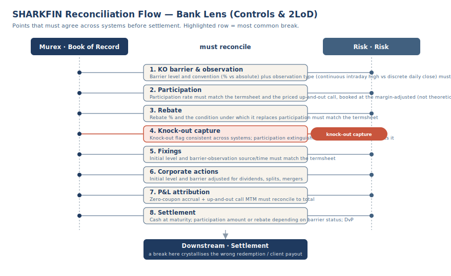

**Common breaks & red flags**

| Red Flag | What It Means | 2LoD Action |
|----------|---------------|-------------|
| Continuous barrier flagged but no intraday monitoring | Daily-close checks miss intraday touches of the knock-out level | Ensure real-time / intraday monitoring against the specified barrier source is in place |
| Barrier stored as % in one system, absolute index level in another | Consistent only if the initial level matches exactly | Verify both systems use the same convention before relying on either valuation |
| Knock-out flag not set after an intraday touch | The trade values as if still participating; redemption overstated | Confirm the knock-out flag is set and participation is extinguished |
| Rebate missing or wrong % | A knocked-out trade redeems at par instead of par + rebate | Verify the rebate % and the trigger condition against the termsheet |
| Participation booked at theoretical, not margin-adjusted | Misstates both client payout and desk margin | Reconcile the booked participation to the priced up-and-out call |
| Disputed barrier breach (intraday high vs close) | Different sources disagree on whether the barrier was touched | Use the fixing source and observation convention specified in the termsheet |

**Control implication**

Each break has a direct consequence the 2nd line must size before it reaches the books or the client. **Knock-out capture** and **participation** are the dominant control risks: a missed knock-out leaves the trade valuing as if still participating — overstating the investor's upside and understating the desk's freed risk — while a wrong participation rate or missing rebate drives the wrong redemption in exactly the scenario (a strong rally) where the amounts are largest. A barrier-convention or fixing mismatch determines whether a breach is even recognised, breaking valuation and redemption at once. The reconciliation exists precisely to catch these inconsistencies before settlement crystallises them.

#### §10. Formal Definition

A **Shark Fin Note** is a capital-protected structured note combining a zero-coupon bond with a long up-and-out call option and a rebate.

**Payoff at maturity:**

- If the barrier is **never** breached: **Payoff = 100% + max(0, Participation × (S_T/S_0 − 1)) × 100%**
- If the barrier **is** breached at any time during the life: **Payoff = 100% + Rebate%**

Where:
- S_T = underlying level at maturity
- S_0 = underlying level at inception
- Participation = participation rate (e.g., 80%)
- Barrier = knock-out level (e.g., 140% of S_0), observed continuously
- Rebate = fixed percentage paid if the barrier is breached (e.g., 5%)

**Decomposition:** Shark Fin = Zero-coupon bond (100% at maturity) + Long call (strike = S_0) − Short up-and-out call premium + Rebate on knock-out. Equivalently: Shark Fin = Zero-coupon bond + Up-and-out call with rebate.

**Key parameters:** participation rate (e.g. 80-85%); barrier — knock-out level above the initial (e.g. 130-140%); barrier observation — continuous (intraday high) or discrete (daily close); rebate — fixed percentage paid on knock-out (e.g. 5-6%); underlying — equity index, single stock, or commodity; maturity — typically 1-3 years; capital protection — 100% at maturity.

#### §11. Lifecycle

| Stage | Detail |
|-------|--------|
| **Pricing (T-5 to T)** | Structurer prices the up-and-out call option. Sets participation, barrier, and rebate to match the investor's view and market conditions |
| **Trade date (T)** | Note issued. Zero-coupon bond purchased. Barrier option executed. Capital protection locked. Book in Murex; set initial level, participation, barrier, observation type, rebate |
| **During life (T to maturity)** | Continuous barrier monitoring via market data feed. No interim payments. If the underlying touches the barrier, the product switches to rebate mode |
| **Barrier event (if triggered)** | Barrier breach recorded; knock-out flag set. From this point the maturity payout is fixed at 100% + rebate. Remaining optionality extinguished |
| **Maturity** | If no breach: 100% + participation × underlying return. If breach: 100% + rebate. Settle cash |

#### §12. Worked Example (both lenses)

**Terms:** USD 1,000,000 Shark Fin Note. Underlying: Hang Seng Index (HSI). HSI initial level: 20,000. Maturity: 2 years. Participation: 85%. Barrier: 130% of initial = 26,000 (continuous observation). Rebate: 6%. Capital protection: 100%.

**Construction:**
- 2-year zero-coupon bond at 96.5% = $965,000 cost → matures at $1,000,000
- Option budget: $1,000,000 − $965,000 − $10,000 (margin) = $25,000
- Up-and-out call (85% participation, barrier 130%, rebate 6%): costs ~$25,000

*Investor lens:*
- **Scenario A (HSI = 24,000, +20%, barrier NOT breached):** Return = 85% × 20% = 17%. The investor receives $1,000,000 × (1 + 0.17) = **$1,170,000**. Profit: $170,000.
- **Scenario B (HSI peaked at 27,000 then fell to 22,000, barrier WAS breached):** Barrier breached when HSI hit 26,000. Rebate mode activated. Return = 6% (fixed rebate, regardless of final level). The investor receives $1,000,000 × (1 + 0.06) = **$1,060,000**. Profit: $60,000. Without the barrier, the participation would have earned 85% × 10% = 8.5% = $85,000; the barrier cost the investor $25,000.
- **Scenario C (HSI = 17,000, -15%, barrier NOT breached):** Capital protection. Return = 0%. The investor receives **$1,000,000**. Compared to a direct HSI investment, this saved a $150,000 loss.

*Bank lens:*
- In Scenario A the desk's short up-and-out call is in the money to the investor; the desk delivers the 17% participation funded by its hedge and keeps its $10,000 structuring margin and net hedging P&L. Product Control confirms the call MTM rolls to the participation payout and the zero-coupon accrual closes out at par.
- In Scenario B the barrier was touched, so the desk's short up-and-out call is knocked out — the desk's delta disappears at the touch and it owes only the fixed 6% rebate ($60,000) on top of par. The 2nd line must confirm the knock-out flag was set when HSI hit 26,000, that the redemption is par + rebate (not participation), and that Murex's booking agrees with the observed barrier source before settlement.

#### §13. Knowledge Check

1. *(Investor)* **What is the investor really holding when they buy a Shark Fin Note?** (Answer: a capital-protected note (zero-coupon bond) plus a long up-and-out call — and they implicitly sell the knock-out feature to fund the enhanced participation.)
2. *(Investor)* **Why does a Shark Fin Note offer higher participation than an equivalent PPN?** Decompose it.
3. *(Investor)* **What is the rebate, and when is it paid instead of participation?**
4. *(Investor)* **How does the barrier observation method (continuous vs discrete) affect the probability of a barrier breach, and which is riskier for the investor's upside?**
5. *(Investor)* **What type of market view makes a Shark Fin attractive compared to a standard PPN?**
6. *(Investor)* **Draw the payoff diagram of a Shark Fin at maturity, showing both the participated and knocked-out outcomes.**
7. **(Desk economics / 1LoD)** What position does the desk hold against the investor, how does the desk's gamma behave as the underlying approaches the knock-out barrier, and what happens to the desk's delta the instant the barrier is touched? Why is that where the margin is made or lost?
8. **(Controls / 2LoD)** Name three reconciliation breaks specific to a Shark Fin and the consequence of each for the investor's redemption — including which single field most often determines whether the participation was extinguished.

**Mental Models**

| Concept | Mental Model |
|---------|-------------|
| Shark Fin Note | A fishing charter with a catch limit — keep every fish up to a cap, above which only a fixed consolation prize is paid |
| Enhanced participation | Not free — it is funded by the knock-out feature the investor sells to the bank |
| Knock-out barrier | The catch limit — the level above which the full upside is taken back and replaced by the rebate |
| Continuous vs discrete observation | A warden watching 24/7 (continuous) vs a single daily headcount (discrete) |
| Knock-out event | The limit is hit — participation is extinguished and the rebate locks in |
| Participation vs rebate | The participated gain is the full catch; the rebate is the fixed consolation award once the limit trips |
| 2LoD reconciliation | The harbour auditor — confirms whether the limit was truly hit and that the consolation amount and quota match before anyone is paid out |

**Key Takeaways**

1. A Shark Fin is a zero-coupon bond + a long up-and-out call with a rebate. The investor earns enhanced participation by selling the knock-out (the strong-rally scenario) to the bank.
2. The enhanced participation is not free — it is funded by the knock-out premium the investor implicitly sells.
3. If the barrier is never breached, the investor keeps full participation plus protected principal. If breached, the upside is replaced by the fixed rebate.
4. Continuous observation is riskier for the investor's upside than discrete — any intraday touch knocks out, not just a closing breach.
5. The payoff is discontinuous at the barrier — the rising participation line drops abruptly to the flat rebate level (the shark-fin shape).
6. The dominant risk is opportunity cost: a strong rally past the barrier caps the return at the rebate, forgoing a large participated gain. Capital is never at risk.
7. Shark Fins suit a moderate-bull view; the desk holds the offsetting short up-and-out call, with positive delta that vanishes at the barrier.
8. For the 2nd line, the dominant control risks are knock-out capture, participation, the barrier convention/observation, the rebate, and the fixing — each can misstate the redemption.

#### §14. Common Mistakes

1. **Treating the enhanced participation as "free yield."** The higher participation is funded by the knock-out feature the investor sells. It is compensation for giving up the strong-rally scenario, not free money.
2. **Assuming the barrier caps only "excess" gain harmlessly.** Once breached, the entire participated upside is replaced by the small rebate — in a strong rally the investor can forgo a 30-40% gain for a 5-6% rebate.
3. **Ignoring the barrier observation type.** Continuous (intraday-high) barriers are breached far more often than discrete (daily-close) barriers because any intraday touch counts. The participation uplift may not compensate for the higher breach probability.
4. **Buying a Shark Fin with a strong-bull view.** If the investor expects a sharp rally, the barrier will likely be breached and the product underperforms a plain PPN or direct equity. The Shark Fin is a moderate-upside instrument.
5. **Setting the barrier too close to spot or the rebate near zero.** A 110% barrier is very likely to breach (the investor receives the rebate, not participation); a near-zero rebate sacrifices all upside on breach for only marginally better participation.
6. **(Controls) Trusting a single system's barrier value or knock-out status.** Because the barrier can be stored as a percentage or an absolute index level, and because an intraday touch must set the knock-out flag, the 2nd line must reconcile the barrier convention, the observation source, and the knock-out flag across systems rather than assume they agree.

**Dual-lens questions:**
- *(Desk economics / 1LoD)* What does the desk book against the investor, and what is its primary Greek / hedging risk?
- *(Controls / 2LoD)* Which booking / fixing / event-capture fields must reconcile, and which is the most common break?

**Dual-lens visuals (generated):**
- `assets/sharkfin/controls_sharkfin_recon_08.svg` `[generated]`
- `assets/sharkfin/payoff_sharkfin_01.svg` `[generated]`
- `assets/sharkfin/waterfall_sharkfin_09.svg` `[generated]`
### 5.6.10 Snowball Note {#sec-5-6-10}

> **Prerequisites:** PHOENIX &nbsp;|&nbsp; **Key concepts:** Cumulative coupon accumulation, all-or-nothing dynamic

---

*The Phoenix Autocallable ([Section 5.1.3](#sec-5-1-3)) carries a "memory" feature: if a coupon is missed and the condition is later met, the missed coupon is paid — but each coupon is a fixed amount. The Snowball Note has a fundamentally different mechanism: missed coupons are not just remembered, they accumulate. Each period without a coupon payment, the "snowball" of owed coupons grows. When the condition is finally met, the entire accumulated snowball is paid at once. Each observation date therefore becomes more consequential as the snowball grows, creating a different risk profile from the Phoenix. This chapter reads the product through two lenses: what it means for **the investor**, and what it means for **the bank** — the latter split into the desk's market economics (1st line of defence) and the controls and reconciliation that surround it (2nd line of defence).*

#### §1. Explain Like I'm New

A snowball rolling downhill starts small and picks up more snow with every metre it rolls. Caught after 3 metres it is a modest snowball; left for 30 metres it is a boulder of snow.

A **Snowball Note** behaves the same way. The investor earns a coupon each period — but only if the underlying asset is above a certain level. If the underlying falls below that level, the coupon is not paid that period. Instead, the unpaid coupon is added to a growing accumulator. On the next observation date where the underlying recovers above the threshold, the entire accumulated amount — all the missed coupons — is paid at once.

The longer the underlying stays below the threshold, the larger the accumulated coupon grows. When it finally pays out, the accumulated amount can be large. But if the underlying never recovers, or if the product is autocalled early, the full accumulation may never be paid out. This is the most popular structured product in China and one of the most-traded in South Korea. It combines the autocall mechanics of a Phoenix with a cumulative coupon mechanism that creates a different investment experience.

#### §2. Real-World Analogy

A Snowball Note is like a snowball rolling downhill.

A small snowball is pushed at the top of a hill. Each second it rolls, it picks up more snow and grows. If it hits a tree (coupon barrier met), the snowball is collected — the longer it rolled, the more snow there is. If it reaches the bottom of the hill without hitting anything (maturity without a coupon trigger), nothing is collected — the snow melts. If a park ranger stops it early (autocall), whatever has accumulated so far is collected.

In this analogy:
- The **initial push** is the starting coupon amount per period.
- The **rolling and growing** is the accumulation of missed coupons.
- The **tree** is the coupon observation barrier.
- The **park ranger** is the autocall trigger.
- The **hill bottom** is maturity.
- The **melting** is the potential loss at maturity if the underlying has fallen significantly.

The critical insight: the accumulator only grows when the coupon is NOT paid. Periods of non-payment make the eventual payout larger — but also increase the risk that the payout never comes. In this analogy the investor collects the accumulated snowball and bears the tail if the underlying never recovers, while the bank holds the right to stop the structure early via autocall.

#### §3. What Problem Does This Solve?

The Snowball solves the **"higher coupons for waiting"** problem.

| Investor Need | Why Standard Products Fall Short | What the Snowball Offers |
|------|---------|------------------|
| Yield-seeking investor wanting compensation for taking risk over extended periods | Standard autocallable coupons are modest | The accumulator rolls up missed coupons. If the product survives and the condition is eventually met, the payout is much larger than individual fixed coupons |
| Investor with a recovery view | Wants to express the view that the market is temporarily depressed and will recover | The accumulator rewards patience — the longer the market stays depressed before recovering, the larger the coupon payout when it does |
| Asian private banking client | Wants a structured yield product aligned with local market preference | The Snowball is the dominant product type in China and Korea — a familiar structure with a known risk profile |

#### §4. Product DNA

| Field | Value |
|-------|-------|
| **Full Name** | Snowball Autocallable Note |
| **Abbreviation** | SNOW |
| **Family** | Other |
| **Complexity Score** | 7 / 10 |
| **Complexity Rationale** | Autocall + conditional coupon + cumulative accumulation. Path-dependent — coupon amount depends on entire history of missed coupons. Multiple observation dates |
| **Underlying Asset Class** | Equity index (CSI 300, KOSPI most common), single stock |
| **Capital Protection** | Conditional — protected if no knock-in barrier breach. At risk if barrier breached and underlying below strike at maturity |
| **Coupon Type** | Conditional cumulative (snowball accumulation) |
| **Maturity** | Typically 1-2 years |
| **Liquidity** | OTC — limited secondary market |
| **Four-Leg Product** | No |
| **Primary System** | Murex |
| **ISDA Required** | Yes (OTC derivative) or No (note format, depending on jurisdiction) |

**DNA Atlas Fields:**
- Primary Risk: Knock-in barrier breach + underlying below strike at maturity = capital loss. Accumulation creates "all-or-nothing" coupon dynamic
- Typical Buyer: Yield-seeking private banking clients (Asia-Pacific), institutional investors with recovery views
- Typical Use Case: Enhanced yield with cumulative coupon mechanism. Recovery play on temporarily depressed markets
- Building Blocks: Autocallable note + cumulative coupon counter + knock-in put (capital risk)
- Key Hedge: Dynamic delta hedging + vol surface management + autocall probability modelling
- Similar Products: Phoenix Autocallable (5.1.3 — memory, not accumulation), FCN (5.1.9 — fixed coupon, no accumulation), TARN STEG (5.4.4 — accumulates received coupons, not missed ones)
- Most Important Greek: Delta (equity exposure), Vega (vol sensitivity through autocall and barrier)

**Comparison Matrix Fields:**
- Complexity: 7
- Yield Potential: Very high (accumulated coupons can exceed annualised rates of 30-50%)
- Capital Protection: Conditional (knock-in barrier)
- Credit Exposure: Issuer or counterparty
- Liquidity: OTC / limited
- Path Dependency: Very high — cumulative coupon depends on entire path
- Volatility Sensitivity: Short vega (short options via autocall and barrier)
- Correlation Sensitivity: None for single-underlying version; high for basket version
- Client Type: Private banking (Asia) / Institutional
- Market Environment: Best when expecting temporary dip followed by recovery. Worst when expecting prolonged downturn

#### §5. Who Touches This Product

| Role | Responsibility |
|------|---------------|
| **Structurer** | Designs the accumulation mechanism, sets coupon rate per period, autocall barrier, knock-in barrier, and observation frequency. Balances yield enhancement against capital risk |
| **Trader** | Hedges the autocall and barrier exposure. Manages the vol surface risk. The Snowball creates a complex delta profile — delta depends on how much coupon has accumulated |
| **Sales** | Core product in Asia-Pacific markets. Explains the accumulation mechanics and the distinction from Phoenix memory. Manages client expectations about path dependency |
| **Risk** | Monitors aggregate exposure to barrier breach. Watches for concentration in single underlyings. Stress-tests the impact of prolonged market downturns on accumulation and capital risk |
| **Product Control** | Verifies snowball accumulation calculations. Checks autocall probability. Validates coupon amounts against observation history |
| **Operations** | Tracks the cumulative coupon counter across observation dates. Records barrier status (breached/not breached). Manages autocall settlements and coupon payments |
| **Legal/Compliance** | Suitability for retail investors. Disclosure of maximum loss. Regulatory classification (OTC vs note). Client understanding of accumulation mechanics |
| **Quantitative Analytics** | Monte Carlo pricing (analytical solutions not available for cumulative structures). Path-dependent payoff modelling. Autocall probability calibration |

#### §6. Product Evolution

| Era | Development |
|-----|------------|
| **2010s** | Snowball Notes emerge in China as a variation on autocallable structures. Chinese investors familiar with structured deposits seek higher yield |
| **2015-2018** | Rapid adoption in China and South Korea. CSI 300 and KOSPI become dominant underlyings. Product volumes grow to hundreds of billions of RMB |
| **2019** | The Snowball becomes the #1 structured product by volume in China. Regulatory attention increases. CSRC monitors systemic risk from concentrated Snowball positions |
| **2020-2021** | COVID volatility triggers widespread barrier breaches. Some investors face large losses. Regulatory tightening: minimum investment thresholds raised, suitability requirements strengthened |
| **2022-2025** | Market maturation. Better risk disclosure. Institutional adoption alongside retail. Product design evolves: longer no-call periods, more conservative barriers |

---

#### §7. THE INVESTOR LENS

**Why the investor buys it**

1. **Compensation for patience.** If the market dips temporarily and recovers, the Snowball pays all accumulated coupons at once — rewarding the investor for staying through the downturn.
2. **Higher potential yield.** The accumulation mechanism means a single coupon payment can equal 6-12 months of missed individual coupons. Annualised return can far exceed standard autocallable rates.
3. **Recovery play.** An investor who believes a market downturn is temporary can use the Snowball to earn enhanced returns on the recovery.
4. **Market familiarity (Asia).** In China and Korea, the Snowball is as familiar as the RC is in Switzerland. Clients understand the structure and can compare offerings easily.

**Position taken**

The investor simultaneously holds a long note (lends principal to the issuer) and a set of **short** embedded options sold to the bank: a **short** knock-in put (capital risk) and a **short** autocall option (the bank's right to redeem early). The accumulating coupon is the compensation for selling that optionality. Net, the investor is **short volatility** (hurt by volatile markets) and carries full equity downside below the strike once the knock-in barrier is breached. With a single underlying there is no correlation exposure; the basket (worst-of) variant additionally exposes the investor to correlation — set by the worst performer, the investor is structurally **short** the correlation premium but **long correlation under the MTM convention**, since rising correlation reduces worst-of risk.

**Payoff & scenarios**

The investor's payoff is path-dependent — the outcome depends on the entire sequence of observations, not just the final level. On each observation date the underlying is checked against two thresholds: at or above the **coupon barrier**, the accumulated coupon (current period plus all prior missed periods) is paid and the accumulator resets; below the coupon barrier, nothing is paid and the period's coupon is added to the accumulator. After the no-call period, the underlying is also checked against the **autocall barrier**: at or above it, the note redeems early at 100% plus the accumulated coupon. If the note runs to maturity, the **knock-in barrier** determines whether principal is returned in full (plus the accumulated coupon) or reduced by the underlying's decline.

**Terms:** USD 1,000,000 Snowball on CSI 300. Maturity: 1 year (12 monthly observations). Coupon: 2% per month (24% annualised). Autocall barrier: 100% of initial. Coupon barrier: 80% of initial. Knock-in barrier: 75% of initial (continuous). No-call period: 3 months.

| Scenario | Path | Outcome | Investor Receives |
|----------|------|---------|:---------------:|
| **Autocall (Month 6)** | CSI below 100% for months 1-5 (5 missed coupons), above 100% at month 6 | Autocalled. Accumulator pays accumulated coupons: 6 × 2% = 12% | $1,120,000 |
| **Full ride (no autocall, no KI)** | CSI stays between 75-100% for all 12 months. Above 80% at month 12 | Maturity. Accumulator pays 12 × 2% = 24% | $1,240,000 |
| **Knock-in loss** | CSI drops below 75% (KI breached). Finishes at 70% of initial | Capital loss. No accumulated coupon. Principal reduced by market decline | $700,000 |

**Key insight:** The "full ride" scenario is the best possible outcome — 12 months of accumulated coupons paid at once. But this requires the underlying to stay in a narrow band (above knock-in but below autocall) for the entire year. This is the paradox of the Snowball: the best outcome requires the underlying to perform poorly enough to avoid autocall but well enough to avoid knock-in.

**Risks to the investor**

| Risk | Description | Severity |
|------|------------|:--------:|
| **Capital loss (knock-in + below strike)** | If the barrier is breached and the underlying is below strike at maturity, the investor loses principal proportionally. No floor. | Very High |
| **Accumulation concentration (path/autocall)** | A large accumulated coupon creates an "all-or-nothing" dynamic — the payout is either very large (if triggered) or zero (if the barrier is breached). Early autocall limits accumulation; late autocall maximises it but extends the risk period. | High |
| **Market gap risk** | A sudden market drop can breach the continuous knock-in barrier without passing through intermediate levels — common in Asian equity indices. | Medium |
| **Issuer / counterparty credit risk** | OTC format. A large accumulated coupon represents significant exposure to the issuer/counterparty if the payout is triggered. | Medium |
| **Volatility** | Higher volatility raises both autocall and knock-in barrier breach probabilities; the short-vol investor is hurt through barrier risk. | Medium |

#### §8. THE BANK LENS — Desk Economics (1st Line of Defence)

**What the desk books**

The desk's position is the mirror image of the investor's. Where the investor is short the embedded options, the desk is **long** them (bought from the investor): long the knock-in put (capital risk) and long the autocall option (the right to redeem the note early). Alongside these the desk has issued a note, which is a funding liability. The investor's accumulating coupon is, to the desk, the cost of the option premiums plus funding, returned to the client. The accumulation provision is the structural difference from a Phoenix: in a Phoenix, the missed coupon (when paid via memory) is the same fixed amount; in a Snowball, the accumulated coupon grows each period, so the desk's potential payout liability increases the longer the coupon goes unpaid.

**Greeks, hedging & autocall replication**

The desk dynamically delta-hedges by trading the underlying, and must manage delta and gamma as the accumulator grows: a Snowball that has accumulated 6 months of unpaid coupons has a much larger potential payout — and therefore a larger delta — than one with 1 month accumulated. Because the payoff is discontinuous, gamma spikes near the **autocall barrier**: if the underlying is just below the autocall barrier on an observation date, a small move up triggers a large discontinuous payout (the entire accumulated coupon plus principal redemption), forcing the desk to unwind a large hedge if the note autocalls or carry it if it does not. This **pin risk near the autocall barrier** grows with the accumulator and is the desk's signature exposure. The knock-in put adds a second region of sharp convexity near the capital barrier. Risk management monitors barrier proximity and may impose limits on concentrated barrier and autocall exposure.

**How the bank makes money**

| Revenue Component | Detail |
|------------------|--------|
| **Option premium (implicit)** | The investor is short a knock-in put (capital risk) and short autocall optionality. The combined premium funds the cumulative coupon |
| **Structuring margin** | 1-3% of notional. Higher than a standard autocallable due to the complexity premium |
| **Hedging profit** | Dynamic hedging of the autocall and barrier. The bank earns bid-offer on the vol surface and autocall replication |
| **Funding benefit** | The investor's principal funds the bank for the product's life. The bank earns the spread between deposit rate and wholesale funding cost |

**The coupon decomposition:**

Net coupon = Knock-in put premium + Autocall option premium − Funds Transfer Pricing (FTP) − Desk margin

The dominant blocks are the premiums the investor pays away by selling the knock-in put and the autocall option; the bank funds the bond/credit leg and recovers FTP and desk margin. Because the accumulated coupon can equal up to 12 months of unpaid coupons paid at once in the worst-case accumulation scenario, the structurer must ensure the option premium is sufficient to fund these coupons even at full accumulation. Mispricing the accumulation risk is the biggest structuring error, and the bank prices the larger potential payout liability by charging a higher effective structuring margin upfront than on a Phoenix.

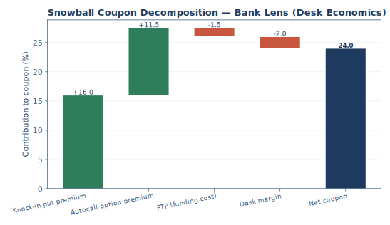

**P&L drivers**

Day to day, desk P&L is driven by realized-versus-implied volatility on the delta hedge, moves in the underlying near the autocall and knock-in barriers (gamma and pin risk, scaled by the size of the accumulator), funding, and the mark-to-market of the embedded options. Because the Snowball has a cumulative path-dependent payoff with no analytical solution, Monte Carlo simulation (typically 50,000-100,000 paths) is required to revalue it. Product Control attributes P&L between note accrual and option MTM and performs independent price verification.

#### §9. THE BANK LENS — Controls & Reconciliation (2nd Line of Defence)

**Booking & systems**

| Aspect | Detail |
|--------|--------|
| **Primary system** | Murex |
| **Booking model** | Path-dependent exotic option. Must track observation history and the accumulation counter |
| **Booking structure** | Single note with embedded knock-in put + autocall option + cumulative coupon counter |
| **Four-leg framework?** | No |
| **Key booking fields** | Notional, initial level, autocall barrier, coupon barrier, knock-in barrier, barrier types, coupon rate per period, observation frequency, no-call period, accumulation counter, maturity, underlying(s) |
| **Valuation model** | Monte Carlo simulation (required — no analytical solution for the cumulative payoff). Typically 50,000-100,000 paths |
| **Observation dates** | Monthly (typically) — each date requires checking the coupon barrier (pay or accumulate) and, after the no-call period, the autocall barrier (redeem or continue) |
| **Settlement** | Cash at autocall or maturity. Payment = 100% × notional + accumulated coupon × notional |

**Reconciliation points**

| Recon point | What must agree | Snowball-specific break |
|-------------|-----------------|-------------------------|
| **Snowball accumulator tracking** | The cumulative coupon counter — how many periods are accumulated and the accumulated amount — agrees across systems on every observation date | Murex and the downstream record disagree on the accumulator → wrong catch-up payment; a single counter error propagates to all future calculations |
| **Observation schedule** | The full set of observation dates, the no-call period, and the autocall start date agree across systems | A missing or misdated observation skips a coupon check or an autocall check entirely |
| **Autocall event capture** | The autocall trigger flag and the early-redemption date are consistent across systems | Autocall condition met but not processed (or processed late) → note carried when it should have terminated, and the wrong accumulated coupon paid |
| **Knock-in event capture** | The continuous knock-in flag is consistent across systems | Intraday/continuous breach missed → capital protection wrongly assumed and redemption miscalculated |
| **Fixings** | The fixing source for each observation level matches the termsheet | Different vendors report different closes → wrong barrier comparison and wrong accumulator update |
| **Coupon barrier capture** | The coupon-paid vs coupon-accumulated flag for each observation date is consistent | Coupon paid when the underlying was below the coupon barrier (accumulator not reset), or accumulated when it was above (catch-up not triggered) |
| **P&L attribution** | Note accrual + option MTM reconciles to total | Unexplained P&L points to a stale vol surface or a wrong fixing |
| **Settlement** | Cash at autocall/maturity: 100% × notional + accumulated coupon × notional; delivery-versus-payment | Accumulated coupon mis-totalled, or capital-loss redemption (notional × final/initial) booked at par |

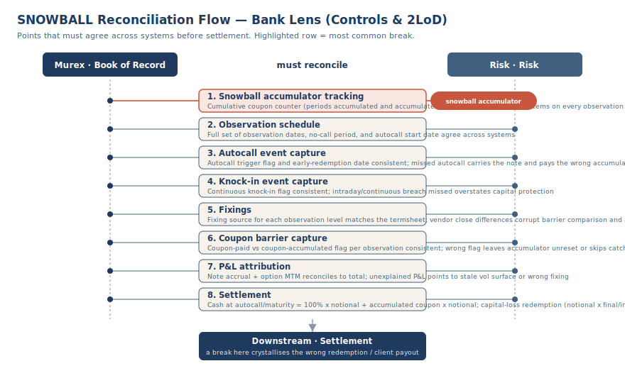

**Common breaks & red flags**

| Red Flag | What It Means | 2LoD Action |
|----------|---------------|-------------|
| Accumulator counter mismatch | Murex and the downstream record disagree on how many periods are accumulated | Manually trace each observation date's pay/accumulate decision and reconcile the counter; a single error propagates to every later calculation |
| Autocall not triggered when it should have been | A data error on the observation date stopped the autocall from processing | Check the fixing data; if the autocall condition was met, process retroactively and recompute the accumulated coupon paid |
| Knock-in breach missed | Continuous barrier monitored only on daily closes | Ensure real-time/intraday monitoring is in place; a missed breach overstates capital protection |
| Coupon paid below the coupon barrier | The accumulator was not reset, or a coupon was paid when none was due | Investigate; may require reversal, recompute of the accumulator, and client notification |
| Very high coupon rate (> 30% annualised) | May indicate aggressive barrier levels — the coupon is funded by risk | Confirm barrier levels and suitability; higher coupon = more accumulation and capital risk |

**Control implication**

Each break has a direct consequence the 2nd line must size before it reaches the books or the client. The control point that distinguishes the Snowball from a simple barrier note is **snowball accumulator tracking**: because the accumulated coupon grows each period a coupon is missed, a single error in the counter propagates to every future calculation and to the eventual catch-up payment — paying the investor too little or too much and breaking P&L attribution at the same time. Autocall and knock-in event capture both feed that accumulator (the autocall crystallises and pays it; a knock-in can wipe it). The reconciliation must therefore run on **every observation date**, not just at maturity, tracking the full observation history rather than the current state alone — to catch these inconsistencies before settlement crystallises them.

#### §10. Formal Definition

A **Snowball Note** is an autocallable structured note with a cumulative coupon mechanism where unpaid coupons accumulate and are paid in full when the coupon condition is next met or upon autocall.

**Coupon at observation date t:**

- If underlying ≥ coupon barrier at date t: Coupon_t = coupon rate per period × number of periods since the last coupon payment (or since inception). The accumulator resets to 0.
- If underlying < coupon barrier at date t: Coupon_t = 0. The unpaid amount is added to the accumulator.

**Autocall at observation date t (after the no-call period):**

- If underlying ≥ autocall barrier: the product redeems at 100% + Coupon_t (which includes all accumulated unpaid coupons).

**At maturity (if not autocalled):**

- If the knock-in barrier was never breached: Payoff = 100% + Coupon_T (accumulated).
- If the knock-in barrier was breached AND underlying < strike at maturity: Payoff = 100% × (S_T / S_0). Capital loss. No coupon.
- If the knock-in barrier was breached AND underlying ≥ strike at maturity: Payoff = 100% + Coupon_T (accumulated).

**Accumulation formula:**
Snowball_t = Σ (coupon rate × 1 period) for each period from the last payment date to the current date.

#### §11. Lifecycle

| Stage | Timing | Action |
|-------|--------|--------|
| **Trade date** | T | Snowball Note issued. Initial observation level set. Accumulation counter = 0. Book in Murex |
| **No-call period** | Months 1-3 | Coupon observations occur but autocall cannot trigger. The accumulator may begin building |
| **Monthly observations** | Months 1-12 | On each date: check the coupon barrier (pay or accumulate), then check the autocall barrier (redeem or continue) |
| **Coupon payment** | When triggered | If underlying ≥ coupon barrier: pay the accumulated coupon. Counter resets to 0 |
| **Autocall** | Months 4-12 | If underlying ≥ autocall barrier: redeem at 100% + accumulated coupon |
| **Barrier monitoring** | Continuous | The knock-in barrier is observed continuously. If breached, capital protection is removed |
| **Maturity** | Month 12 | If not autocalled: pay 100% + accumulated coupon (if no KI or if above strike). OR pay market value (if KI and below strike) |

#### §12. Worked Example (both lenses)

**Terms:**
- Notional: RMB 10,000,000 (USD ~1,400,000)
- Underlying: CSI 300 Index
- Initial level: 4,000
- Maturity: 12 months (monthly observations)
- Coupon rate: 2% per month (24% annualised)
- Autocall barrier: 100% of initial (4,000)
- Coupon barrier: 80% of initial (3,200)
- Knock-in barrier: 75% of initial (3,000), continuous
- No-call period: 3 months

**Observation history:**

| Month | CSI 300 | % of Initial | Above Coupon (80%)? | Above Autocall (100%)? | Snowball | Action |
|:-----:|:-------:|:------------:|:-------------------:|:---------------------:|:--------:|--------|
| 1 | 3,800 | 95% | Yes | No (no-call) | 2% | Coupon paid: RMB 200,000 |
| 2 | 3,600 | 90% | Yes | No (no-call) | 2% | Coupon paid: RMB 200,000 |
| 3 | 3,100 | 77.5% | No | No (no-call) | 2% | Not paid. Snowball = 2% |
| 4 | 3,050 | 76.25% | No | No | 4% | Not paid. Snowball = 4% |
| 5 | 3,300 | 82.5% | Yes | No | 6% | Snowball paid: 6% = RMB 600,000 (3 months of accumulation). Counter resets |
| 6 | 3,900 | 97.5% | Yes | No | 2% | Coupon paid: RMB 200,000 |
| 7 | 4,100 | 102.5% | Yes | Yes | 2% | Autocalled! Coupon: RMB 200,000 + principal returned |

**Total coupons received:** 200K + 200K + 600K + 200K + 200K = RMB 1,400,000
**Annualised return:** 1,400,000 / 10,000,000 / (7/12) = 24%
**Total received at autocall:** RMB 10,000,000 + 200,000 = RMB 10,200,000 (plus prior coupons)

*Investor lens:* The investor collects RMB 1,400,000 of coupons — including the RMB 600,000 month-5 payout, which is 3 months of accumulated coupons (months 3-4 missed, plus month 5) paid at once — and receives full principal back when the note autocalls at month 7. Month 5 paid out 3× a normal coupon: this is the snowball effect — the missed months 3-4 made the month 5 payout three times a single coupon.

*Bank lens:* The desk holds the long embedded options against the investor. Through months 3-4 the underlying is below the 80% coupon barrier (but above the 75% knock-in barrier), so no coupon is paid and the accumulator builds to 4%; the desk carries the growing potential payout in its delta. At month 5 the desk funds the RMB 600,000 catch-up as the accumulator resets, and at month 7 the autocall (CSI at 102.5%, above the 100% autocall barrier) terminates the structure and the desk unwinds the hedge. The 2nd line must confirm on each observation date that the accumulator counter (built to 4% by month 4; the 6% month-5 payout = 4% carried + 2% current, then reset), the coupon-paid flags, the continuous knock-in status, and the month-7 autocall event all agree in Murex before each payment and the final redemption settle.

#### §13. Knowledge Check

1. **How does the Snowball accumulation mechanism differ from the Phoenix memory feature?** *(Investor)*
2. **What happens to the accumulated coupon if the knock-in barrier is breached and the underlying is below strike at maturity?** *(Investor)*
3. **Why does the "full ride" scenario (no autocall, no knock-in, all 12 months accumulated) represent both the best and the riskiest outcome?** *(Investor)*
4. **Why are Snowball Notes particularly popular in China compared to standard Phoenix Autocallables?** *(Investor)*
5. **A Snowball has accumulated 8 months of unpaid coupons (8 × 2% = 16% of notional). The underlying is at 99% of initial with 1 month to maturity, autocall barrier at 100%. Describe the payoff if it finishes at 101% versus 70%.** *(Investor)*
6. **(Desk economics / 1LoD)** What package of embedded options does the desk hold long against the investor, and how does the desk's delta and gamma change as the accumulator grows? Explain the pin risk near the autocall barrier and why it is the desk's signature exposure.
7. **(Controls / 2LoD)** On each observation date, which fields must reconcile in Murex for a Snowball, and why is snowball accumulator tracking the break most specific to this product? What is the consequence if the counter is wrong?

**Mental Models**

| Concept | Mental Model |
|---------|-------------|
| Snowball Note | A snowball rolling downhill — it grows only while it is NOT collected |
| Accumulating coupon | Missed coupons are not lost — they roll up into a growing pot paid all at once on recovery |
| Coupon barrier | The tree the snowball must hit to be collected (and the accumulator reset) |
| Autocall barrier | The park ranger who stops the snowball early — paying whatever has accumulated |
| Knock-in barrier | The bottom of the hill where the snow can melt — capital at risk |
| The Snowball paradox | The best outcome needs the underlying to stay low enough to avoid autocall but high enough to avoid knock-in |
| 2LoD reconciliation | The auditor who re-runs every observation — confirming the accumulator, the pay/accumulate flag, and the autocall and knock-in flags agree before any payment |

**Key Takeaways**

1. A Snowball is an autocallable note plus a cumulative coupon counter plus a knock-in put. The investor earns an accumulating coupon by selling the knock-in put and the autocall optionality to the bank.
2. The accumulator grows when the coupon is NOT paid. Each missed coupon makes the next payout bigger — but also raises the stakes if the payout never comes. The product rewards patience but punishes a market that never recovers.
3. If the knock-in barrier is breached and the underlying is below strike at maturity, the investor loses principal proportionally and the accumulated coupon may not be paid.
4. The product is path-dependent: the entire sequence of observations determines the total return, and Monte Carlo is required to value it.
5. The "full ride" is both the best and the riskiest outcome — it needs the underlying to stay above knock-in but below autocall for the full life.
6. The desk holds the offsetting long-option package and carries pin risk near the autocall barrier that scales with the size of the accumulator.
7. For the 2nd line, the dominant control risk is snowball accumulator tracking, supported by observation-schedule integrity, autocall capture, knock-in capture, and fixings — each must be reconciled on every observation date, not just at maturity, because a single counter error propagates to all future calculations.

#### §14. Common Mistakes

1. **Confusing accumulation with memory.** The Phoenix memory feature pays back missed coupons at the same fixed amount; the Snowball accumulator rolls them up into a single growing payout. Expecting Phoenix-style fixed payouts leads to surprise at the growing snowball amount.
2. **Treating the accumulated coupon as guaranteed.** It is "all-or-nothing": either the condition is eventually met and the full accumulation pays, or the barrier is breached and it is lost.
3. **Assuming a 75% knock-in barrier caps the loss at 25%.** The barrier determines *when* capital loss starts, not *how much*. If the underlying finishes at 70%, the investor loses 30% of principal; a deeper decline means a deeper loss with no floor.
4. **Ignoring a very short no-call period.** A 1-month no-call period means the product likely autocalls early with minimal accumulation — the investor receives a small coupon and must reinvest.
5. **Comparing high Snowball coupons without adjusting for risk.** A coupon above 30% annualised usually signals aggressive barrier levels; the coupon is funded by capital risk, not free yield.
6. **(Controls) Reconciling only at maturity.** The Snowball must be reconciled on every observation date — the accumulator counter, the pay/accumulate flag, and the autocall and continuous knock-in status can each drift in Murex at any observation, long before maturity, and a single counter error propagates to every later calculation.

**Dual-lens questions:**
- *(Desk economics / 1LoD)* What does the desk book against the investor, and what is its primary Greek / hedging risk?
- *(Controls / 2LoD)* Which booking / fixing / event-capture fields must reconcile, and which is the most common break?

**Dual-lens visuals (generated):**
- `assets/snowball/controls_snowball_recon_08.svg` `[generated]`
- `assets/snowball/waterfall_snowball_09.svg` `[generated]`
### 5.6.11 Cliquet / Ratchet Note {#sec-5-6-11}

> **Prerequisites:** [PPN](#sec-5-1-1) · [VO](#sec-5-6-3) &nbsp;|&nbsp; **Key concepts:** Forward-starting options, periodic reset, local/global caps

---

*How This Differs From PPN (5.1.1) and Shark Fin (5.6.9): The PPN and Shark Fin both measure performance from start to finish — a single observation of where the underlying ends relative to where it started. The Cliquet breaks the investment period into multiple sub-periods and measures performance separately in each one. Each sub-period's return is locked in (or "ratcheted"), subject to caps and floors. The total return is the sum of all the locked-in sub-period returns. This means the path matters in a fundamentally different way: a stock that rises 5% per quarter for four quarters gives a different result than a stock that rises 20% in the last quarter alone. This chapter reads the product through two lenses: what it means for **the investor**, and what it means for **the bank** — the latter split into the desk's market economics (1st line of defence) and the controls and reconciliation that surround it (2nd line of defence).*

#### §1. Explain Like I'm New

Consider a worker paid a monthly salary with a performance bonus. Each month, the bonus is calculated on that month's results — not the year's results. A great January locks in that bonus. If February is terrible, the bonus for February may be zero, but the January bonus is safe. At year end, the total bonus is the sum of all monthly bonuses.

Now add a twist: each month's bonus is capped at $500 (no matter how great the month) and floored at $0 (a bad month never claws back money). Over 12 months, the maximum bonus is $6,000 (12 × $500) and the minimum is $0 (12 × $0).

A **Cliquet Note** (also called a Ratchet Note) works exactly like this. The investment period is divided into sub-periods (monthly, quarterly, or annually). In each sub-period, the underlying's return is measured, capped at a local maximum, and floored at a local minimum. At maturity, the total return is the sum of all sub-period returns, possibly subject to a global cap and floor on the total.

Beneath its surface, the Cliquet decomposes into a strip of **forward-starting options** — each sub-period is essentially a separate option that begins when the previous one ends, with its strike resetting ("ratcheting") to the prevailing level. The investor is long this strip; the bank's desk is short it. Understanding this decomposition is the key to understanding the product.

#### §2. Real-World Analogy

A Cliquet is like a monthly salary with a performance cap.

A company pays a base salary plus a performance component. Each month:
- If the performance metric is positive, a bonus is earned equal to the percentage gain, capped at 3%
- If the performance metric is negative, the bonus is zero (floor at 0%)
- The bonus is locked in and cannot be clawed back

At the end of the year, the total performance pay is the sum of all 12 monthly bonuses.

In this analogy:
- Each **month** is a sub-period (reset period)
- The **performance metric** is the underlying asset's return in that sub-period
- The **3% cap** is the local cap per period
- The **0% floor** is the local floor per period
- The **total performance pay** is the Cliquet's total return
- The **locked-in** feature is the ratchet — once earned, it cannot be taken away

The key difference from a standard investment: a standard investment measures performance from start to finish. The Cliquet measures performance period by period and sums the results. These can give very different outcomes for the same total market move.

#### §3. What Problem Does This Solve?

Cliquets solve the **"lock in gains along the way"** problem.

| User | Problem | Cliquet Solution |
|------|---------|-----------------|
| Conservative investor | Fears giving back gains in a market correction | Cliquet locks in each period's return. A great Q1 followed by a terrible Q2 still keeps the Q1 gain |
| Insurance company | Needs guaranteed minimum return with equity-linked upside for policyholders | Cliquet with global floor provides guaranteed minimum plus periodic equity participation |
| Wealth manager | Client wants equity exposure but worries about timing | Cliquet reduces timing risk by measuring returns over many short periods, not one long period |

The trade-off: the local cap limits each period's contribution. In a strong trending market, the Cliquet underperforms a direct investment because each period's gain is capped. The Cliquet works best in choppy, range-bound markets where gains and losses alternate.

#### §4. Product DNA

| Field | Value |
|-------|-------|
| **Full Name** | Cliquet Note (Ratchet Note) |
| **Abbreviation** | CLIQ |
| **Family** | Other |
| **Complexity Score** | 7 / 10 |
| **Complexity Rationale** | Serial forward-starting options. Multiple reset periods. Local + global caps/floors. Path-dependent — total return depends on sequence of periodic returns |
| **Underlying Asset Class** | Equity index (most common), single stock |
| **Capital Protection** | Typically 100% (funded by zero-coupon bond) |
| **Coupon Type** | None — return delivered as sum of periodic locked-in returns |
| **Maturity** | Typically 3-5 years |
| **Liquidity** | Secondary market with spread. Model-dependent pricing |
| **Four-Leg Product** | No |
| **Primary System** | Murex |
| **ISDA Required** | No — issued as note (securities law) |

**DNA Atlas Fields:**
- Primary Risk: Local caps limit upside in trending markets. Global floor prevents loss but caps total return. Opportunity cost in strong bull markets
- Typical Buyer: Insurance-linked structured products, conservative private banking, institutional investors with path-sensitive mandates
- Typical Use Case: Capital-protected equity participation with periodic lock-in of gains. Insurance-wrapped accumulation products
- Building Blocks: Zero-coupon bond + strip of forward-starting call options (each with local cap) + global floor/cap on total
- Key Hedge: Strip of forward-starting options, repriced at each reset. Vol surface risk across the term structure
- Similar Products: PPN (5.1.1 — single-period participation), Shark Fin (5.6.9 — single period with barrier), TARN STEG (5.4.4 — accumulation with target)
- Most Important Greek: Vega (forward vol sensitivity across the entire term structure)

**Comparison Matrix Fields:**
- Complexity: 7
- Yield Potential: Moderate — capped per period, but consistent in range-bound markets
- Capital Protection: 100% (typical)
- Credit Exposure: Issuer (note format)
- Liquidity: Secondary market (model-dependent)
- Path Dependency: Very high — periodic returns, not final level, determine payoff
- Volatility Sensitivity: Investor long vega (long forward-starting options); desk short. Forward vol curve matters
- Correlation Sensitivity: None (single underlying)
- Client Type: Insurance / Private banking / Conservative institutional
- Market Environment: Best in choppy/range-bound markets. Poor in strong trending markets (cap binds repeatedly)

#### §5. Who Touches This Product

| Role | Responsibility |
|------|---------------|
| **Structurer** | Designs the reset frequency, local cap/floor, global cap/floor. Prices the strip of forward-starting options. Optimises cap level against total expected return |
| **Trader** | Hedges the strip of forward-starting options. Manages forward vol exposure across multiple tenors. At each reset, the next option becomes a vanilla option (repriced) |
| **Sales** | Positions to insurance clients and conservative investors. Explains periodic lock-in advantage. Common objection: "The cap seems too low" |
| **Risk** | Monitors forward vol exposure. Cliquet books create term-structure vol risk. Stress-tests under trending vs choppy market scenarios |
| **Product Control** | Verifies each period's return calculation. Checks local cap/floor application. Validates global cap/floor at maturity |
| **Operations** | Records each reset observation. Calculates periodic return with cap/floor. Maintains running total. Manages settlement at maturity |
| **Legal/Compliance** | Note prospectus. Reset methodology. Fixing source. Insurance regulatory requirements (if insurance-wrapped) |
| **Quantitative Analytics** | Forward-starting option pricing. Forward vol surface modelling. Correlation between periodic returns (autocorrelation). Monte Carlo for global cap/floor interaction |

#### §6. Product Evolution

| Era | Development |
|-----|------------|
| **1990s** | Cliquets emerge in France (where the name originates — "cliquet" is French for "ratchet"). Used in insurance-linked products (contrats en unités de compte) |
| **2000s** | Global adoption. Equity-linked Cliquets become popular in Switzerland and Asia. Variants proliferate: compound ratchet, reverse cliquet, rainbow cliquet |
| **2006-2007** | Peak complexity. Multi-asset Cliquets (worst-of cliquet, best-of cliquet). Some structures so complex that even the issuing bank struggles to hedge them |
| **2008-2010** | Crisis reveals hedging challenges. Many Cliquet books suffer losses from vol surface moves. Simplification trend begins |
| **2010s-2020s** | Standardisation. Simple annual-reset Cliquets with clear caps/floors remain popular. Insurance-linked demand steady. Exotic variants decline |

---

#### §7. THE INVESTOR LENS

**Why the investor buys it**

1. **Lock-in of gains.** Each period's positive return is locked in and cannot be lost to future market declines. This is the core appeal — protection against giving back gains.
2. **Reduced timing risk.** Performance is measured over many short periods, not one long period. A client who invests at a market peak still captures gains from any positive sub-periods along the way.
3. **Capital protection with equity upside.** The Cliquet combines 100% capital protection with equity participation — funded by the cap on each period.
4. **Consistent returns in choppy markets.** A market that rises 3% and falls 3% repeatedly gives a Cliquet a positive return (3% locked in each up period, 0% in each down period) while giving a direct investment approximately zero return.

**Position taken**

The investor is **long a strip of forward-starting (cliquet) options** — one per sub-period — wrapped around a zero-coupon bond for capital protection. Each sub-period is a long forward-starting call spread (long call at the reset strike, short call at the local cap), so the investor is **long forward volatility** across the whole term structure and benefits when forward vol is high. The strike **resets** to the prevailing level at each reset date, ratcheting the locked-in returns. With a single underlying there is no correlation exposure; only a worst-of / best-of basket cliquet adds correlation.

**Payoff & scenarios**

The investor's payoff is the sum of periodic returns, each locally capped and floored, then subject to a global cap and global floor, on top of 100% protected principal. The path matters: the same total market move produces different outcomes depending on how it is distributed across periods.

**Terms:** USD 1,000,000 Cliquet on EuroStoxx 50. Maturity: 4 years. Reset: annual (4 periods). Local cap: 5% per year. Local floor: 0% per year. Global floor: 0%. Global cap: 20%.

| Year | EuroStoxx Return | Local Return (capped/floored) |
|:----:|:----------------:|:-----------------------------:|
| 1 | +8% | +5% (capped) |
| 2 | -12% | 0% (floored) |
| 3 | +15% | +5% (capped) |
| 4 | +3% | +3% (uncapped) |

**Total Cliquet return:** 5% + 0% + 5% + 3% = 13%
**Investor receives:** $1,000,000 × (1 + 13%) = $1,130,000

**Comparison to direct investment:**
EuroStoxx total return: (1.08)(0.88)(1.15)(1.03) - 1 = +12.6%
Direct investment: $1,000,000 × (1.126) = $1,126,000

**In this scenario, the Cliquet outperforms direct investment** ($1,130,000 vs $1,126,000) because the caps and floors smooth the choppy path.

**Alternative scenario (strong trending market):**

| Year | EuroStoxx Return | Local Return |
|:----:|:----------------:|:------------:|
| 1 | +20% | +5% (capped) |
| 2 | +15% | +5% (capped) |
| 3 | +10% | +5% (capped) |
| 4 | +5% | +5% (capped) |

**Total Cliquet return:** 5% + 5% + 5% + 5% = 20% (global cap applies: 20%)
**Direct investment:** (1.20)(1.15)(1.10)(1.05) - 1 = +59.3%

**In a strong bull market, the Cliquet massively underperforms** (20% vs 59.3%) because the cap binds every year.

**Risks to the investor**

| Risk | Description | Severity |
|------|------------|:--------:|
| **Cap drag (trending market)** | In a strong bull market, the cap binds every period. The Cliquet dramatically underperforms direct investment. This is the primary risk — opportunity cost, not capital loss | High |
| **Capped periodic upside** | Each period's contribution is limited to the local cap, and the total is limited by the global cap. The investor cannot fully participate in any single strong period | High |
| **Global cap limitation** | Even if each period contributes its maximum, the global cap limits total return. The investor may not realise the global cap binds | Medium |
| **Issuer credit risk** | Capital protection depends on issuer solvency over a multi-year term | Medium |
| **Model risk / illiquidity** | Forward vol surface modelling is complex; different models produce different prices. Selling before maturity involves a model-dependent spread | Medium |

#### §8. THE BANK LENS — Desk Economics (1st Line of Defence)

**What the desk books**

The desk's position is the mirror image of the investor's. Where the investor is long the strip of forward-starting (cliquet) options, the desk is **short** that strip (it has sold the cliquet to the client); alongside it the desk has issued a note backed by a zero-coupon bond, which is a funding liability that delivers capital protection at maturity. The investor's periodic locked-in returns are, to the desk, the payoff it owes on the short forward-starting option strip.

**Forward-vol risk & hedging**

The hard risk is **forward volatility** — the desk is short a strip of forward-starting options, so it is short forward-forward volatility across the entire term structure, and exposed to **forward skew** and **vol-of-vol**. Period 1 uses spot vol; period 2 uses 1Y-forward-1Y vol; period 3 uses 2Y-forward-1Y vol. If the forward vol surface shifts, the entire strip reprices against the desk. At each reset date, one forward-starting option becomes a vanilla option (repriced using current spot vol) and the remaining options are still forward-starting, so the desk's exposure evolves through the product's life. Gamma is concentrated in the current (live) period — where the option behaves like a vanilla — and attenuated for future, still-forward-starting periods. The desk hedges with vanilla options and forward-vol instruments and rebalances delta/gamma as each period goes live.

**How the bank makes money**

| Component | Detail |
|-----------|--------|
| **Zero-coupon bond** | Purchased at discount. Matures at par = capital protection |
| **Option budget** | Bond discount − par = available premium for the option strip |
| **Forward-starting call strip** | Sold to the client with the option budget. Each call covers one sub-period. The local cap makes each call a call spread (long call + short call at cap) — cheaper to provide |
| **Structuring margin** | 0.5-1.5% embedded in local cap level. Client gets slightly lower cap than theoretical |
| **Vol surface profit** | Bank prices forward vol, hedges at realised. Spread between implied forward vol and realised vol is a profit source |

**Why the cap exists:**
Without a local cap, each sub-period would require a full call option, which is expensive. With a cap, each sub-period is a call spread (long call at reset strike, short call at cap), which is much cheaper. The cap is not a design choice — it is an economic necessity to make the product affordable within the option budget.

**Value decomposition (typical 4yr build):**

| Component | Value | Purpose |
|-----------|:-----:|---------|
| Zero-coupon bond | ~85-92% of notional | Capital protection at maturity |
| Strip of forward-starting call spreads | ~8-15% of notional | Periodic participation with local cap |
| Global floor | Typically 0% | Ensures total return ≥ 0% (funded by the cap) |
| Global cap | Typically 15-25% | Limits maximum total return. Funds better periodic caps |
| Structuring margin | ~0.5-1.5% | Embedded in local cap level |

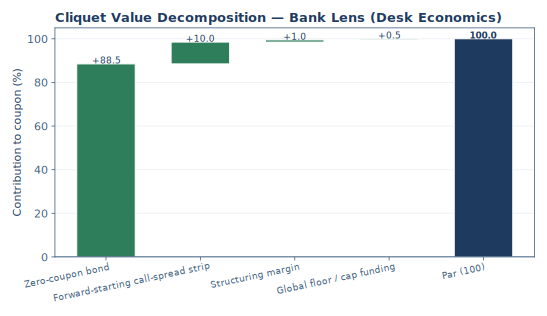

**P&L drivers**

Day to day, desk P&L is driven by moves in the forward vol surface (the entire short strip reprices), forward skew and vol-of-vol, realised-versus-implied vol on the live-period hedge, and the mark-to-market of the forward-starting call spreads. Because valuation depends on a full implied vol surface across all tenors and strikes, mark-to-market can vary between models and dealers. Product Control verifies each period's return calculation, checks local cap/floor application, and validates the global cap/floor interaction at maturity.

#### §9. THE BANK LENS — Controls & Reconciliation (2nd Line of Defence)

**Booking & systems**

| Dimension | Detail |
|-----------|--------|
| **Primary system** | Murex |
| **Booking model** | Zero-coupon bond + strip of forward-starting call spreads. May be booked as single exotic or decomposed into individual call spreads per period |
| **Valuation model** | Closed-form (if local caps/floors only) or Monte Carlo (if global caps/floors or auto-correlation modelling). Forward vol surface calibration required |
| **Market data** | Underlying spot, full implied volatility surface (all tenors and strikes), interest rate curve, dividend term structure |
| **Settlement** | Cash at maturity. Sum of periodic returns + 100% |
| **Special requirements** | Reset calendar, reset fixing source, forward vol surface calibration, running total tracker |

**Reconciliation points**

| Recon point | What must agree | Cliquet-specific break |
|-------------|-----------------|------------------------|
| **Reset schedule** | Reset calendar and frequency (annual/quarterly/monthly) consistent across systems and termsheet | A reset date missed or misdated shifts every subsequent period |
| **Reset levels** | Each reset fixing S_i becomes the next period's starting strike — must match across booking, risk, and the running total | A 0.1% error in one reset propagates through all subsequent periods |
| **Local cap/floor** | Per-period cap C_L and floor F_L applied to each period return | Cap/floor stored per-period in one system but as a single global value in another |
| **Global floor** | Global floor F_G applied to the summed return | Global floor omitted → total return understated below the guaranteed minimum |
| **Periodic-return accumulation** | Running total = Σ of locked-in periodic returns, before global cap/floor | Accumulator out of step with locked periods → wrong total at maturity |
| **Fixings** | Reset and final fixing **source**, methodology, and time match the termsheet | Different vendors report different closes on a reset date |
| **Global cap** | Global cap C_G applied to the summed return at maturity | Global cap binds before all local caps contribute and is not flagged |
| **Settlement** | Cash at maturity = 100% + R_total | Settlement computed on raw sum, ignoring an applicable global cap/floor |

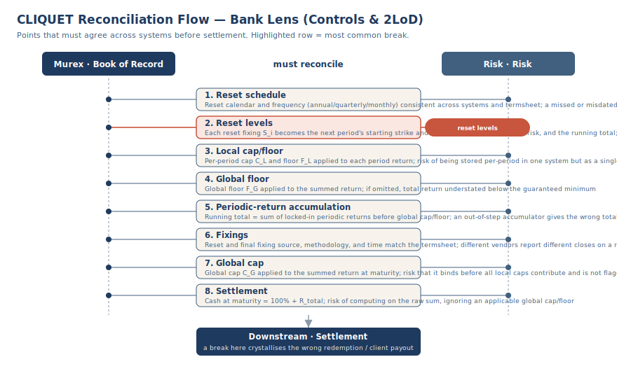

**Common breaks & red flags**

| Red Flag | What It Means | 2LoD Action |
|----------|---------------|-------------|
| Reset level mismatch across systems | The new starting strike differs between booking and risk → every later period is wrong | Reconcile each reset fixing before locking the period; confirm against the fixing source |
| Local cap very low (< 2% per period) | Limited upside per period; total may be unimpressive even in favourable markets | Confirm the cap is correctly stored per period and matches the termsheet |
| Periodic-return accumulator out of step | Running total does not equal the sum of locked periods | Re-derive the running total from the per-period returns each reset |
| Global cap too low relative to sum of local caps | Global cap binds before all local caps contribute | Verify global cap/floor application order at maturity |
| Reset/final fixing source mismatch | Different data sources report different reset closes | Use the fixing source, methodology, and time specified in the termsheet |

**Control implication**

The dominant control risks for the Cliquet are the **reset levels** and the **periodic-return accumulation**. A reset-level error misstates the starting strike for the next forward-starting option and propagates through every subsequent period — corrupting both valuation and the locked-in return. A break in the periodic-return accumulator misstates the running total, so the maturity payout (and any global cap/floor interaction) is computed on the wrong base. A fixing mismatch breaks the reset and the valuation at once. The reconciliation exists to catch these inconsistencies at each reset, before they compound across the multi-year life of the trade.

#### §10. Formal Definition

A **Cliquet Note** divides the investment period into N sub-periods. In each sub-period, the underlying's return is measured, subject to a local cap C_L and local floor F_L. The total return is the sum of all sub-period returns, subject to a global cap C_G and global floor F_G.

**Periodic return for sub-period i:**

R_i = max(F_L, min(C_L, (S_i / S_{i-1}) - 1))

Where S_i is the underlying level at the end of sub-period i, and S_{i-1} is the level at the start (= end of previous sub-period).

**Total Cliquet return:**

R_total = max(F_G, min(C_G, Σ R_i for i = 1 to N))

**Payoff at maturity:**

Payoff = 100% × (1 + R_total)

**Decomposition into forward-starting options:**

Each sub-period is equivalent to:
- Long a forward-starting call option (strike = S_{i-1}, starts at beginning of period i)
- Short a forward-starting call option (strike = S_{i-1} × (1 + C_L), starts at same time)
- The combination is a forward-starting call spread per period

The full Cliquet (investor side) = zero-coupon bond + Σ (forward-starting call spreads) + global floor put + short global cap call. The desk holds the mirror — short the forward-starting call spread strip.

#### §11. Lifecycle

| Stage | Timing | Action |
|-------|--------|--------|
| **Trade date** | T | Note issued. Zero-coupon bond purchased. First forward-starting call spread begins. Initial level S_0 recorded |
| **During period 1** | T to T+1Y | Underlying observed. At reset: period 1 return calculated, capped/floored, locked in |
| **Reset date** | T+1Y | Period 1 return locked. Period 2 call spread starts at new level S_1. Strike "ratchets" to current level |
| **Subsequent periods** | T+1Y to T+4Y | Same process. Each reset locks in the periodic return and starts a new option at the current level |
| **Maturity** | T+4Y | Sum of all periodic returns calculated. Global cap/floor applied. Total return + principal paid |

#### §12. Worked Example (both lenses)

**Terms:**
- Notional: EUR 1,000,000
- Underlying: EuroStoxx 50
- Maturity: 5 years
- Reset: annual (5 periods)
- Local cap: 4% per year
- Local floor: -1% per year (investor absorbs first 1% of decline per period)
- Global cap: 18%
- Global floor: 0%
- Capital protection: 100%

**Scenario — choppy market (Cliquet's sweet spot):**

| Year | EuroStoxx Return | Local Return | Running Total |
|:----:|:----------------:|:------------:|:-------------:|
| 1 | +7% | +4% (capped) | 4% |
| 2 | -5% | -1% (floored) | 3% |
| 3 | +3% | +3% (uncapped) | 6% |
| 4 | -8% | -1% (floored) | 5% |
| 5 | +6% | +4% (capped) | 9% |

*Investor lens:*

**Total return:** 9% (below global cap of 18%)
**Investor receives:** EUR 1,090,000

**EuroStoxx total (buy-and-hold):** (1.07)(0.95)(1.03)(0.92)(1.06) - 1 = +2.10%
**Direct investment:** EUR 1,021,030

**Cliquet outperforms by EUR 68,970** in this choppy scenario because the floors limited losses and the caps still allowed meaningful gains.

Option decomposition for the investor in this example:
- Period 1: Long call (strike = 100%), short call (strike = 104%), long put (strike = 99%). All starting at inception.
- Period 2: Long call (strike = S_1), short call (strike = 1.04 × S_1), long put (strike = 0.99 × S_1). Forward-starting at year 1.
- Periods 3-5: Same structure, each forward-starting at the previous reset.

*Bank lens:*
- The desk holds the mirror — **short** the strip of forward-starting call spreads (and short the local-floor protection) — against a zero-coupon bond funding the EUR 1,000,000 capital protection. Over the choppy path the desk owes the EUR 90,000 of locked-in periodic returns; its P&L depends on whether it hedged the forward vol of each period more cheaply than the 9% it must deliver. Product Control verifies each year's capped/floored return and the running total (4% → 3% → 6% → 5% → 9%).
- The 2nd line must confirm each reset level S_1…S_4 used to set the next period's strike, the per-period cap/floor application, the periodic-return accumulation, and that the global cap (18%) and global floor (0%) were correctly not binding before EUR 1,090,000 settles.

#### §13. Knowledge Check

1. **How does a Cliquet decompose into forward-starting options, and which side is the investor on?** (Answer: a strip of forward-starting call spreads, one per sub-period; the investor is long the strip, the desk is short.)
2. **What is the difference between the local cap/floor and the global cap/floor?**
3. **In what type of market environment does a Cliquet outperform direct investment? When does it underperform?**
4. **Why is forward volatility (not just spot volatility) important for Cliquet pricing?**
5. **What is the "ratchet" feature, and why does it give the product its name?**
6. **(Desk economics / 1LoD)** The investor is long the forward-starting option strip; what is the desk, and which way does the desk's forward-vol exposure point? At a reset date, what happens to the current period's option, and why does that change the desk's gamma profile?
7. **(Controls / 2LoD)** Name three reconciliation breaks specific to a Cliquet — including reset levels and periodic-return accumulation — and the consequence of each for the maturity payout.

**Mental Models**

| Concept | Mental Model |
|---------|-------------|
| Cliquet | A monthly salary with a performance bonus that is capped, floored, and locked in each month |
| Ratchet | A wrench that only turns one way — each period's gain clicks into place and cannot reverse |
| Forward-starting option | A new option that starts fresh at the previous period's ending level — the strike resets each period |
| Local cap / floor | The per-month bonus cap and the no-clawback floor |
| Global cap / floor | The annual total bonus cap and the guaranteed minimum |
| Forward vol (desk) | The desk is short volatility-of-future-volatility across all the periods at once |
| 2LoD reconciliation | The payroll auditor — confirms each month's reset level and the running bonus total before the year-end payout |

**Key Takeaways**

1. A Cliquet is a series of separate options, one per sub-period, chained together — each starting fresh at the previous one's ending level. The strike ratchets to the prevailing level at each reset.
2. The investor is long the strip of forward-starting call spreads (long forward vol) wrapped around a zero-coupon bond; the desk is short the strip (short forward vol).
3. Each period's return is locally capped and floored, locked in, and summed; the total is subject to a global cap and global floor.
4. The Cliquet outperforms in choppy, range-bound markets and underperforms badly in strong trending bull markets where the cap binds every period.
5. The primary investor risk is opportunity cost (cap drag), not capital loss — capital is protected by the zero-coupon bond.
6. The desk's hard risk is forward volatility / forward skew / vol-of-vol across the term structure; it hedges with vanilla and forward-vol instruments, with gamma concentrated in the live period.
7. The local cap is an economic necessity — it turns each expensive call into a cheap call spread that fits inside the option budget.
8. For the 2nd line, the dominant control risks are the reset levels and the periodic-return accumulation — each propagates through every subsequent period and corrupts the maturity payout.

#### §14. Common Mistakes

1. **Treating the Cliquet like a single-period participation note.** It is not — performance is measured period by period and summed. A stock that rises 5% per quarter for four quarters gives a different result than one that rises 20% in the final quarter alone.
2. **Expecting a trending bull market to pay off.** In a strong bull market the cap binds every period and the Cliquet massively underperforms direct investment (e.g. 20% vs 59.3%). It is the wrong product for a strongly bullish view.
3. **Ignoring the global cap.** Even if every period contributes its maximum, the global cap limits the total return. The investor should understand which constraint binds first.
4. **Pricing on spot vol alone.** The Cliquet is a strip of forward-starting options — forward vol, forward skew, and vol-of-vol drive the value, not spot vol. The whole strip reprices when the forward vol surface shifts.
5. **Assuming the local floor protects capital outright.** A local floor of -1% per period means the investor absorbs the first 1% of decline each period; only the global floor and the zero-coupon bond guarantee 100% of principal.
6. **(Controls) Trusting a single reset fixing without reconciling it.** Each reset level sets the next period's strike; a 0.1% error or a wrong fixing source propagates through every remaining period, so the 2nd line must reconcile each reset level and the running periodic-return total rather than assume the systems agree.

**Dual-lens questions:**
- *(Desk economics / 1LoD)* What does the desk book against the investor, and what is its primary Greek / hedging risk?
- *(Controls / 2LoD)* Which booking / fixing / event-capture fields must reconcile, and which is the most common break?

**Dual-lens visuals (generated):**
- `assets/cliquet/controls_cliquet_recon_08.svg` `[generated]`
- `assets/cliquet/waterfall_cliquet_09.svg` `[generated]`
### 5.6.12 Worst-of Autocallable {#sec-5-6-12}

> **Prerequisites:** PHOENIX &nbsp;|&nbsp; **Key concepts:** Worst-of observation, basket correlation, dispersion

---

*The Phoenix Autocallable ([Section 5.1.3](#sec-5-1-3)) is linked to a single underlying — one stock or one index. The Worst-of Autocallable is linked to a basket of multiple stocks (typically 3-5). Every observation — autocall, coupon, and barrier — is determined by whichever stock in the basket has performed the worst. This "worst-of" mechanism fundamentally changes the product's risk profile: the investor is now exposed to correlation. When stocks move independently (low correlation), the probability that at least one stock falls below the barrier is much higher than for a single stock; the bank compensates for this risk with a significantly higher coupon. This chapter reads the product through two lenses: what it means for **the investor**, and what it means for **the bank** — the latter split into the desk's market economics (1st line of defence) and the controls and reconciliation that surround it (2nd line of defence).*

#### §1. Explain Like I'm New

A relay team's finishing time is not the average of its runners — it is set by the **slowest runner**. If three runners are fast but one trips and crawls, the team's official time is poor.

A **Worst-of Autocallable** works the same way. It is linked to a basket of stocks — for example Apple, Toyota, and Nestlé. The product pays a high coupon and has autocall and barrier features, just like a Phoenix Autocallable ([Section 5.1.3](#sec-5-1-3)). But every single feature is evaluated using whichever stock has performed the worst:

- **Autocall?** Only if the worst-performing stock is above the autocall level — the product redeems early and the investor is returned principal plus due coupons.
- **Coupon?** Only if the worst-performing stock is above the coupon barrier.
- **Barrier breach?** Triggered if the worst-performing stock falls below the knock-in barrier — the investor's capital is then at risk.

The worst-of mechanism means the investor is taking the view that ALL stocks in the basket will perform acceptably. Even if four out of five stocks are up 20%, a single stock down 40% can trigger a barrier breach and cause a loss for the investor.

Why would an investor accept this risk? Because the coupon is much higher. A single-stock Phoenix might pay 6% per year; a worst-of Phoenix on three stocks might pay 12-15% per year. The extra coupon compensates the investor for taking correlation risk — the risk that the stocks will move independently and one will drag the basket down.

This is the most-traded structured product in the world. Every structured products desk globally prices and hedges worst-of autocallables. It draws on concepts from every prior chapter: options, barriers, autocall mechanics, Greeks, volatility, and — critically — correlation.

#### §2. Real-World Analogy

A Worst-of Autocallable is like a relay race judged by the slowest runner.

A coach enters a team of four runners in a relay race. The sponsor offers a deal: "If all four runners finish under 12 seconds, the team wins $1,000. If any runner finishes over 15 seconds, the team is disqualified and must pay a penalty."

The coach's calculation:
- Each runner individually is fast — only a 10% chance of exceeding 15 seconds.
- But the real question is: what is the probability that at least ONE of the four exceeds 15 seconds?
- If the runners are highly synchronised (high correlation — they train together, run in similar conditions), the probability is close to 10%.
- If the runners are independent (low correlation — different sports, different conditions), the probability is much higher: roughly 1 − (0.9)^4 = 34%.

In this analogy:
- Each **runner** is a stock in the basket.
- The **12-second threshold** is the autocall barrier.
- The **15-second threshold** is the knock-in barrier.
- The **$1,000 prize** is the coupon.
- The **penalty** is the capital loss.
- The **team synchronisation** is correlation.

The key insight: adding more runners (stocks) to the team (basket) always increases the probability that at least one will perform poorly. This is why worst-of products pay higher coupons than single-stock products — and why understanding correlation is essential.

#### §3. What Problem Does This Solve?

Worst-of Autocallables solve the **"I need higher yield than a single-stock autocallable provides"** problem.

| Investor Need | Why a Single-Stock Autocallable Falls Short | What the Worst-of Offers |
|--------------|---------------------------------------------|--------------------------|
| Yield above 8% | Single-stock autocallable coupon (5-8%) is insufficient for return targets | Worst-of pays 10-18% by adding correlation risk — higher coupon for higher risk |
| Structured yield across multiple blue-chip names | One name gives no name diversification | Basket provides name diversification while the worst-of mechanism provides yield enhancement |
| Competitive yield in a low-vol environment | Low single-stock vol means low coupons | The correlation premium allows higher coupons even when single-stock vol is low — the primary tool for yield enhancement |

#### §4. Product DNA

| Field | Value |
|-------|-------|
| **Full Name** | Worst-of Autocallable Note (Worst-of Phoenix) |
| **Abbreviation** | WOAC |
| **Family** | Other |
| **Complexity Score** | 8 / 10 |
| **Complexity Rationale** | Phoenix mechanics applied to multi-asset basket. Correlation-dependent pricing. Worst-of observation across 3-5 stocks. Quanto adjustment for cross-listed baskets. All Phoenix complexity plus correlation dimension |
| **Underlying Asset Class** | Basket of 3-5 equities (single stocks, occasionally indices) |
| **Capital Protection** | Conditional — protected if worst-of stock stays above knock-in barrier |
| **Coupon Type** | Conditional periodic (paid if worst-of stock above coupon barrier). May include memory feature |
| **Maturity** | Typically 1-3 years |
| **Liquidity** | OTC — secondary market with model-dependent pricing |
| **Four-Leg Product** | No |
| **Primary System** | Murex |
| **ISDA Required** | Yes (OTC derivative) or No (note format, jurisdiction-dependent) |

**DNA Atlas Fields:**
- Primary Risk: Worst-performing stock drives all outcomes. Low correlation increases the risk of at least one stock breaching the barrier. Capital loss if the barrier is breached and the worst-of is below strike at maturity
- Typical Buyer: Yield-seeking private banking and retail investors globally
- Typical Use Case: Enhanced yield from the correlation premium. Blue-chip basket with above-market coupons
- Building Blocks: Autocallable note (Phoenix mechanics) + worst-of observation on basket + knock-in put on the worst performer
- Key Hedge: Basket option replication. Delta hedging each stock. Correlation exposure hedged via dispersion trades or basket vs single-stock vol
- Similar Products: Phoenix Autocallable (5.1.3 — single stock), FCN (5.1.9 — single stock, fixed coupon), Snowball (5.6.10 — cumulative coupon)
- Most Important Greek: Correlation (drives the worst-of premium), Delta (per stock), Vega (per stock and basket)

**Comparison Matrix Fields:**
- Complexity: 8
- Yield Potential: Very high (10-18% annualised for a 3-stock basket)
- Capital Protection: Conditional (knock-in barrier on the worst-of)
- Credit Exposure: Issuer or counterparty
- Liquidity: OTC / model-dependent
- Path Dependency: Yes (autocall observations, barrier monitoring)
- Volatility Sensitivity: Short vega (short options via barrier and autocall). Each stock's vol matters independently
- Correlation Sensitivity: Very high. Low correlation = higher risk, higher coupon. High correlation = lower risk, lower coupon. The investor is **long correlation** under the MTM convention
- Client Type: Private banking / Retail
- Market Environment: Best when stable markets are expected across all basket constituents. Worst when any single stock faces idiosyncratic risk

#### §5. Who Touches This Product

| Role | Responsibility |
|------|---------------|
| **Structurer** | Selects basket stocks (sector diversification, vol level, correlation). Sets coupon, barriers, and tenor. Optimises the three-way tradeoff: coupon vs barrier vs correlation |
| **Trader** | Hedges each stock's delta and vega independently. Manages correlation exposure — the hardest risk to hedge. Uses dispersion trades (long single-stock vol, short basket vol) to manage correlation |
| **Sales** | Highest-volume structured product globally. Explains worst-of mechanics and correlation risk. Key client education: "Why does adding a third stock increase the coupon?" |
| **Risk** | Monitors aggregate correlation exposure across the worst-of book. Watches for name concentration (many products on the same stocks). Stress-tests under correlation-break scenarios |
| **Product Control** | Verifies worst-of pricing against individual stock vol, pairwise correlations, and basket vol. Checks that implied correlation is consistent across products |
| **Operations** | Tracks each stock in the basket at every observation. Determines the worst performer. Manages corporate actions (dividends, stock splits, M&A) on any basket constituent — a single corporate action can change the worst-of dynamics |
| **Legal/Compliance** | Basket composition disclosure. Suitability for retail (worst-of is complex). Prospectus must clearly explain the worst-of mechanism. MiFID/PRIIPs KID complexity classification |
| **Quantitative Analytics** | Multi-asset option pricing. Correlation modelling (Gaussian copula, local correlation, stochastic correlation). Quanto adjustment for cross-listed stocks. Monte Carlo with a correlation matrix |

#### §6. Product Evolution

| Era | Development |
|-----|------------|
| **Late 1990s** | Worst-of payoffs emerge in OTC exotic options. Initially bespoke institutional trades |
| **2000-2005** | Swiss and German banks begin issuing worst-of autocallables to retail investors. Coupon enhancement from the correlation premium proves popular |
| **2006-2007** | Rapid growth. 3-stock worst-of becomes the standard format. Banks build dedicated worst-of pricing and hedging infrastructure |
| **2008-2010** | Financial crisis: correlations spike to near 1.0, then collapse. Many worst-of barriers are breached when individual stocks fall sharply while others recover. Banks suffer hedging losses as correlation models fail under stress |
| **2010s** | Market maturation. Better risk disclosure. Regulatory scrutiny (EU PRIIPs KID, MiFID suitability). Worst-of becomes the #1 structured product globally by issuance volume |
| **2020s** | COVID volatility creates another correlation stress test. Post-COVID: worst-of volumes recover rapidly. Product remains dominant. ESG-screened baskets emerge. Autocall step-down features become standard |

---

#### §7. THE INVESTOR LENS

**Why the investor buys it**

1. **Yield enhancement.** Worst-of coupons are 1.5-3× higher than equivalent single-stock products — 10-18% vs 5-8%. In a low-yield world, this premium is compelling.
2. **Blue-chip basket.** The investor perceives the basket as "diversified" — exposure to Apple, Toyota, and Nestlé, not a single risky stock. This perception is partly correct (name diversification) and partly wrong (worst-of concentrates risk on the weakest name).
3. **Familiarity.** The worst-of autocallable is the most commonly offered structured product globally. The investor understands the format, can compare offerings, and has a track record of investing in them.
4. **Market-view alignment.** An investor who believes blue-chip stocks will remain stable can monetise that view through the correlation premium — in effect selling insurance against idiosyncratic stock risk.
5. **Autocall liquidity.** The investor is not locked in for the full maturity. If the worst-of is above the autocall barrier on an observation date, the product redeems early and returns principal for reinvestment.

**Position & correlation direction**

The investor simultaneously holds a long bond (lends principal to the issuer) and a series of **short** embedded options sold to the bank: a short worst-of knock-in put (capital risk on the worst performer), a series of short digital coupon options (the conditional coupons), and a short autocall option (the bank's right to redeem early). Net, the investor is **short volatility** below the barrier (hurt by volatile markets) and carries full equity downside below the strike of the worst performer.

On correlation, the investor is **long correlation under the MTM convention**: rising correlation reduces worst-of risk, because when stocks move together the worst performer is less likely to lag the others, so the probability that any one stock breaches a barrier falls — which benefits the note holder. The investor is *structurally* short, having sold the correlation premium embedded in the worst-of coupon, but the mark-to-market sensitivity is **long correlation**: the position gains value as correlation rises and loses value as stocks move independently. (Never read this as "the investor is short correlation" without the structurally-short-but-MTM-long qualification.)

**Payoff & scenarios**

The investor's payoff is path-dependent — the outcome depends on the entire sequence of observations, not just the final level. On each observation date the worst performer is checked against the barriers in turn: at or above the autocall barrier redeems the note early at par plus all due coupons; at or above the coupon barrier pays the coupon (with memory if applicable); below the coupon barrier pays nothing (the coupon may be memorized). If the note runs to maturity without autocalling, the knock-in barrier determines whether principal is returned in full or reduced by the worst performer's decline.

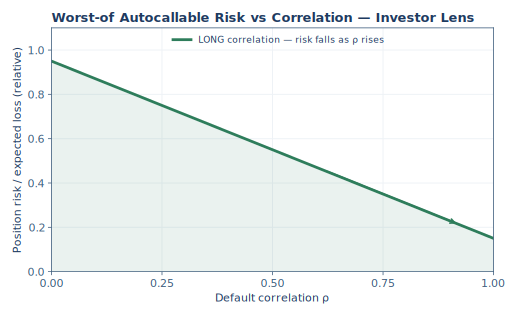

**Terms:** USD 1,000,000 Worst-of Autocallable. Basket: Apple (AAPL), Toyota (TM), Nestlé (NESN). Maturity: 2 years (quarterly observations). Coupon: 3.5% per quarter (14% annualised) with memory. Autocall barrier: 100%. Coupon barrier: 70%. Knock-in barrier: 60% (continuous). No-call period: 6 months.

| Scenario | Stock Performances | Worst-of | Outcome | Investor Receives |
|----------|-------------------|:--------:|---------|:-----------------:|
| **Autocall (Q3)** | AAPL +15%, TM +8%, NESN +5% | NESN at 105% | Autocalled. 3 coupons paid | $1,000,000 + $105,000 |
| **Full ride** | All stay 70-100% for 2 years. At maturity: AAPL +20%, TM −5%, NESN +10% | TM at 95% (above coupon barrier) | 8 coupons paid. Principal returned | $1,000,000 + $280,000 |
| **Barrier breach** | AAPL +10%, TM −5%, NESN −45% (Nestlé crisis) | NESN at 55% (below 60% KI) | KI breached. At maturity NESN at 60% | NESN shares worth $600,000 |

**Key insight — barrier-breach scenario:** Apple and Toyota performed fine. But Nestlé had a company-specific crisis. The investor loses 40% of principal because of a single stock. This is the defining risk of worst-of: one bad stock ruins the basket. The 14% annualised coupon partially compensates, but a 40% loss on principal overwhelms the coupons received.

**Why correlation matters to the investor:**
- **High correlation:** All three stocks tend to move together. If NESN falls 45%, AAPL and TM probably also fell significantly. The worst-of is bad, but it would have been bad even with a single stock. Risk is similar to single-stock — which is why high correlation *benefits* the long-correlation investor.
- **Low correlation:** NESN can fall 45% while AAPL and TM are fine. The investor suffers a worst-of-specific loss — one they would not have experienced with a single well-chosen stock. This is the correlation risk the investor was paid to take, and why low correlation hurts the long-correlation MTM position.

**Risks to the investor**

| Risk | Description | Severity |
|------|------------|:--------:|
| **Idiosyncratic stock crash** | One stock in the basket collapses while others are fine. The worst-of mechanism delivers the entire loss to the investor. The defining risk | Very High |
| **Correlation breakdown** | Stocks that historically moved together begin moving independently. The probability of at least one breaching the barrier increases — adverse for the long-correlation (MTM) investor | High |
| **Capital loss (KI + worst-of below strike)** | If the barrier is breached, the investor receives shares of the worst-performing stock — potentially at a large loss | High |
| **Autocall / path risk** | If the product autocalls early, the investor received a high annualised return but must reinvest at potentially less attractive terms. If the worst-of lingers below the coupon barrier, coupons are intermittent (memory helps but does not eliminate missed income) | Medium |
| **Issuer credit risk** | The investor is exposed to the issuer's creditworthiness. If the issuer defaults, the investor may not receive coupons or principal | Medium |
| **Model risk** | Correlation modelling is inherently uncertain. Copula models (Gaussian, Student-t) can produce materially different prices and marks | Medium |
| **Quanto risk** | If the basket contains stocks denominated in different currencies, FX adjustments introduce additional risk factors | Medium |

#### §8. THE BANK LENS — Desk Economics (1st Line of Defence)

**What the desk books**

The desk's position is the mirror image of the investor's. Where the investor is short the embedded options, the desk is **long** them (bought from the investor): long the worst-of knock-in put (capital risk on the worst performer), long the series of digital coupon options, and long the autocall option (the right to redeem the note early). Alongside these the desk has issued a note, which is a funding liability. The investor's conditional coupon is, to the desk, the cost of the option premiums plus funding, returned to the client.

On correlation, the desk's **raw** position is **short correlation** — the exact mirror of the investor's long-correlation MTM sensitivity. The desk profits when realised correlation is higher than the implied correlation priced into the worst-of, and loses when stocks move more independently than priced. This raw short-correlation exposure is then hedged (see below), so the desk's *net* correlation position after dispersion hedging is far smaller than the raw figure; raw and net must be qualified whenever the desk's correlation is discussed.

**Correlation/path risk & hedging**

The desk delta-hedges the basket by trading each underlying, and must manage delta and gamma across all basket names simultaneously because the worst-of payoff couples them. The product is path-dependent, so the hedge changes as each observation date approaches. Gamma spikes near the **knock-in barrier** (the worst-of put becomes sharply convex on whichever name is worst) and near the **autocall barrier** (the autocall replication produces a large jump in the hedge as the note approaches early redemption) — the desk's signature pin risk. Delta "jumps" between stocks as the worst-of identity changes.

The desk's primary unique risk, however, is **correlation**. The raw short-correlation exposure is hedged via **dispersion** trades — buying single-stock volatility and selling basket volatility. When realised correlation is lower than implied (stocks move independently), dispersion gains offset worst-of losses, and vice versa. Idiosyncratic risk is the second concern: a single stock crashing (CEO scandal, accounting fraud, product recall) triggers barrier breach on many worst-of products at once, so the desk monitors name concentration across the book (if AAPL appears in 200 worst-of products, an Apple-specific crash is a systemic hedging challenge).

**How the bank makes money**

| Revenue Component | Detail |
|------------------|--------|
| **Correlation premium** | The primary source. The bank sells the worst-of at an implied correlation below the expected realised correlation. If realised correlation is higher than implied (stocks move together more than priced), the bank profits |
| **Single-stock vol bid-offer** | The bank buys and sells vol on each stock. The spread is amplified by the number of stocks in the basket |
| **Structuring margin** | 1-3% of notional. Higher than a single-stock autocallable due to the complexity premium and correlation risk |
| **Autocall reinvestment** | When products autocall, clients typically reinvest immediately. The bank earns margin again on the new product. High autocall rates generate continuous flow |
| **Dividend estimation** | The bank uses its dividend forecast for pricing. If actual dividends differ from implied, P&L is generated |

**The coupon decomposition:**

A single-stock RC with a 70% barrier might pay 6%. A 3-stock worst-of with the same 70% barrier on each stock might pay 14%. The extra ~8% comes from the **correlation premium** — the investor has sold the right for the bank to deliver the worst-performing stock. Conceptually: bond interest (the bank's credit curve) + net option premium (the worst-of knock-in put, digital coupon options and autocall option the investor sells) − Funds Transfer Pricing − desk margin = net coupon. The correlation premium is the block that makes the worst-of coupon so much larger than a single-stock coupon. The bank hedges the raw short-correlation exposure by trading dispersion — long single-stock vol + short basket vol, which is a short-correlation trade; the spread between the investor's implied correlation and the hedge cost is the bank's profit.

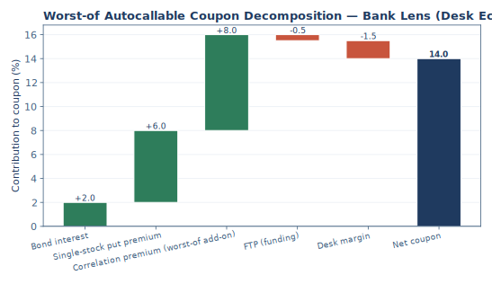

**P&L drivers**

Day to day, desk P&L is driven by realised-versus-implied volatility on the delta hedge across the basket, moves in the underlyings near the knock-in and autocall barriers (gamma and pin risk), the correlation mark on the worst-of (raw short, partly offset by the dispersion hedge), funding, and the mark-to-market of the embedded options. Because the worst-of has multiple embedded options and a multi-asset path-dependent payoff with no analytical solution, Monte Carlo simulation (typically 100,000+ paths) is required to revalue it. Product Control attributes P&L between note accrual and option MTM and performs independent price verification, checking implied correlation against single-stock and basket vols.

#### §9. THE BANK LENS — Controls & Reconciliation (2nd Line of Defence)

**Booking & systems**

| Aspect | Detail |
|--------|--------|
| **Primary system** | Murex |
| **Booking model** | Multi-asset exotic option. Requires basket definition, correlation matrix, per-stock barriers |
| **Valuation model** | Monte Carlo simulation (required — no analytical solution for multi-asset barriers). Correlation matrix calibrated from implied correlations (basket vol vs single-stock vols). Typically 100,000+ paths |
| **Key booking fields** | Notional, underlyings (basket), per-stock initial levels, autocall barrier, coupon barrier, knock-in barrier, barrier types, coupon rate, coupon frequency, observation dates, memory (Y/N), maturity |
| **Market data** | Per-stock: spot, implied vol surface, dividend forecast, borrow cost. Basket: implied correlation matrix, basket vol (if traded). FX rates for quanto adjustment |
| **Settlement** | Cash or physical delivery of the worst-performing stock |
| **Special requirements** | Corporate-action handling for each stock. Quanto adjustment engine. Correlation-matrix maintenance |

**Reconciliation points**

| Recon point | What must agree | Worst-of-specific break |
|-------------|-----------------|-------------------------|
| **Basket underlyings & initial fixings** | The full set of basket constituents (identifiers) and each stock's initial fixing level **and source** match the termsheet | Wrong fixing source on one stock, or a missing/extra constituent — cascades through the entire worst-of determination |
| **Worst-of determination** | On each observation date, both systems use the same initial levels and fixing sources to identify the worst performer and compute its level **and barrier convention** (% vs absolute) | Systems disagree on which stock is worst → wrong barrier comparison, wrong coupon/autocall decision |
| **Autocall event capture** | The autocall trigger flag and early-redemption date are consistent across systems | Autocall condition met (worst-of ≥ autocall barrier) but not processed, or processed late → note carried when it should have terminated |
| **Knock-in event capture** | The continuous knock-in flag (any stock below its individual KI level = KI% × S_i(0)) is consistent across systems | Intraday knock-in on one stock missed, or barrier checked against the average/best performer instead of the worst |
| **Correlation model inputs** | The implied correlation matrix, per-stock vols and basket vol used to mark the trade agree across pricing and risk | Stale or inconsistent correlation matrix → MTM and Greeks diverge; raw vs net correlation mis-stated |
| **Coupon / memory accrual** | Coupon-paid vs coupon-missed flag (and the memorized-coupon counter, if memory) for each observation date is consistent | Coupon paid when the worst performer was below the coupon barrier, or memory counter disagrees → wrong catch-up payment |
| **Corporate actions** | Strike/barrier and worst-of inputs adjusted for dividends, splits, mergers on **any** constituent | A split on one stock not propagated → that stock's level and barrier off by the split ratio, distorting the worst-of |
| **Settlement** | Cash vs physical; shares = notional / strike of the worst performer; delivery-versus-payment | Physical delivery of the worst-of stock booked as cash, or the wrong share count delivered |

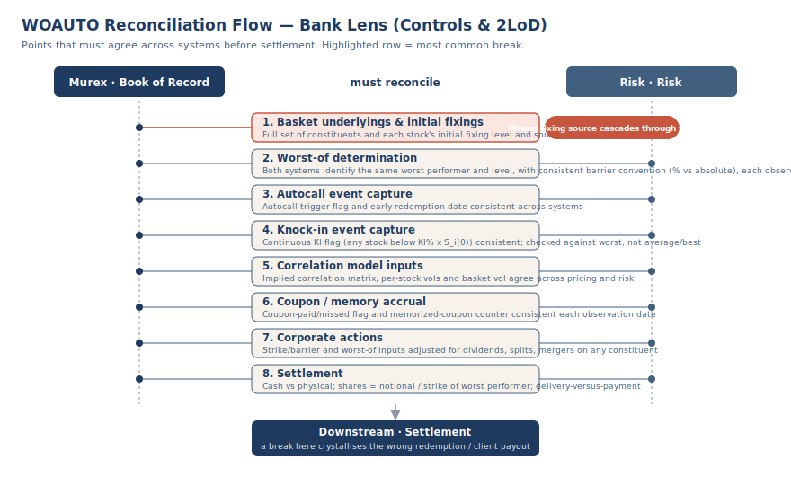

**Common breaks & red flags**

| Red Flag | What It Means | 2LoD Action |
|----------|---------------|-------------|
| Wrong fixing source on one basket stock | The most common worst-of operational error — one mis-sourced fixing cascades through the worst-of determination | Verify every constituent's fixing source against the termsheet on each observation date |
| Worst-of determination error | Systems disagree on which stock is the worst performer | Verify that both systems use the same initial levels and fixing sources before relying on either decision |
| Autocall not triggered when it should have been | A data error on the observation date meant the worst-of ≥ autocall barrier was not processed | Check fixing data; if the autocall condition was met, process retroactively |
| Knock-in applied to the wrong stock | The barrier was checked against the average or best performer, not the worst | Verify the worst-of logic in the booking |
| Correlation matrix stale or inconsistent | Pricing and risk systems use different implied correlations → MTM and Greeks diverge | Reconcile the correlation inputs; confirm raw vs net correlation is correctly labelled |

**Control implication**

Each break has a direct consequence the 2nd line must size before it reaches the books or the client. The control points that distinguish the worst-of from a single-name autocallable are the **basket fixings**, the **worst-of determination on every observation date**, and the **correlation model inputs**. A mis-sourced fixing on one constituent corrupts the worst-of determination — driving the wrong coupon, autocall and knock-in decisions all at once. A worst-of error checked against the wrong stock understates desk risk and overstates the investor's protection simultaneously. A stale correlation matrix mis-states both the MTM (raw short vs net) and the Greeks. Because every decision depends on a correct worst-of determination on every scheduled date, the reconciliation must run on each observation date — not just at maturity — to catch these inconsistencies before settlement crystallises them.

#### §10. Formal Definition

A **Worst-of Autocallable** is an autocallable structured note where all payoff-relevant observations (autocall, coupon, barrier) are evaluated using the worst-performing stock in a basket of N underlyings.

**Worst-of performance at time t:**

WO_t = min(S_i(t) / S_i(0)) for i = 1 to N

where S_i(t) is the price of stock i at time t and S_i(0) is its initial price.

**Autocall at observation date t (after the no-call period):**

If WO_t ≥ Autocall Barrier: the product redeems at 100% + due coupons.

**Coupon at observation date t:**

If WO_t ≥ Coupon Barrier: coupon paid (with memory if applicable).
If WO_t < Coupon Barrier: coupon missed.

**Knock-in barrier (continuous):**

If min(S_i(t) / S_i(0)) < KI Barrier for any stock i at any time t: barrier breached.

**At maturity (if not autocalled):**

If KI not breached: 100% + final coupon (if applicable).
If KI breached AND WO_T ≥ Strike: 100% + final coupon.
If KI breached AND WO_T < Strike: physical delivery of the worst-performing stock (or cash equivalent).

**Physical delivery:** the investor receives N_shares of the worst-performing stock, where N_shares = Notional / (Strike Price of the worst-performing stock).

#### §11. Lifecycle

| Stage | Detail |
|-------|--------|
| **Trade date** | Note issued. Initial levels for all basket stocks recorded. Barriers set as percentages of initial levels. Book in Murex with the basket definition and correlation matrix |
| **No-call period** | Months 1-6: coupon observations occur, autocall cannot trigger, barrier monitoring is active |
| **Quarterly observations** | On each date: determine the worst-of level; check the coupon barrier and the autocall barrier; apply memory if applicable; pay coupon plus any memorized coupons, or record a missed coupon |
| **Continuous barrier** | Throughout: monitor each stock individually. If any stock falls below its individual KI level (= KI% × S_i(0)), the barrier is breached |
| **Autocall** | From Q3 onward: if the worst-of ≥ autocall barrier, redeem at 100% + accumulated coupons |
| **Maturity** | If not autocalled: assess KI status and the worst-of level. Pay principal + coupon, or deliver the worst-of stock |
| **Corporate action** | If triggered: dividend adjustments, stock splits, M&A on any basket stock require contract adjustment and recalculation of barriers and the worst-of determination. Disruption-event provisions may apply |

#### §12. Worked Example (both lenses)

**Terms:**
- Notional: EUR 500,000
- Basket: Siemens (SIE), LVMH (MC), ASML (ASML)
- Initial levels: SIE = €180, MC = €900, ASML = €700
- Maturity: 18 months (quarterly observations, 6 total)
- Coupon: 3.0% per quarter (12% annualised) with memory
- Autocall barrier: 100% (starting Q3)
- Coupon barrier: 70%
- Knock-in barrier: 60% (continuous)
- No-call period: 6 months (2 quarters)

**Observation history:**

| Quarter | SIE (% init) | MC (% init) | ASML (% init) | Worst-of | Action |
|:-------:|:------------:|:-----------:|:--------------:|:--------:|--------|
| Q1 | 95% | 102% | 88% | ASML 88% | Coupon paid (88% > 70%): €15,000 |
| Q2 | 92% | 98% | 75% | ASML 75% | Coupon paid (75% > 70%): €15,000 |
| Q3 | 105% | 110% | 82% | ASML 82% | No autocall (82% < 100%). Coupon paid: €15,000 |
| Q4 | 108% | 95% | 91% | ASML 91% | No autocall (91% < 100%). Coupon paid: €15,000 |
| Q5 | 112% | 105% | 103% | ASML 103% | Autocall! (103% ≥ 100%). Coupon: €15,000. Principal returned |

**Total received:** 5 × €15,000 + €500,000 = €575,000
**Return:** 15% over 15 months = 12% annualised
**KI barrier was never breached** (ASML's lowest was 75%, above the 60% KI).

*Investor lens:* ASML was the worst-of stock in every single quarter. The product's fate was entirely determined by ASML's performance — Siemens and LVMH were irrelevant to the payout. The investor collects 5 × €15,000 = €75,000 in coupons and full €500,000 principal back when the note autocalls at Q5, for €575,000 total: a 15% return over 15 months (12% annualised). This is the reality of worst-of: one stock dominates.

*Bank lens:* The desk holds the long embedded options (worst-of knock-in put, digital coupon options, autocall option) against the investor and is raw short correlation, hedged via dispersion. ASML stays the worst performer throughout, so the desk's worst-of put tracks ASML's distance to the 60% KI; at Q5 the autocall terminates the structure and the desk unwinds the basket hedge. The 2nd line must confirm on each observation date that the basket fixings, the worst-of determination (ASML each quarter), the coupon-paid flags, the correlation inputs, and the Q5 autocall event all agree in Murex before each payment and the final redemption settle.

**What if ASML had fallen to 55% in Q2?**
- KI barrier breached (55% < 60%).
- If at maturity ASML finishes at 65%: **below strike (100%)**, so **physical delivery applies**. Shares delivered: €500,000 / €700 = 714 ASML shares. Worth 714 × (0.65 × €700) = €324,870. Loss: €175,130 (partially offset by coupons received).
- If at maturity ASML finishes at 55%: below strike. Physical delivery: €500,000 / €700 = 714 ASML shares. Worth 714 × (0.55 × €700) = €274,890. Loss: €225,110.

#### §13. Knowledge Check

1. **Why does a worst-of autocallable pay a higher coupon than an equivalent single-stock autocallable?** *(Investor)*
2. **How does correlation between basket stocks affect the risk and pricing of a worst-of product, and why is the investor *long* correlation under the MTM convention despite having *structurally sold* the correlation premium?** *(Investor)*
3. **Why is the barrier on a worst-of product more dangerous than the same barrier on a single-stock product?** *(Investor)*
4. **What is the "one bad stock" risk, and how does basket composition affect it?** *(Investor)*
5. **A 3-stock worst-of basket has AAPL, TM, and NESN. After 6 months AAPL is at 115%, TM at 105%, and NESN at 72%. The coupon barrier is 70% and the KI barrier is 60%. What is the investor's primary concern at this point?** *(Investor)*
6. **(Desk economics / 1LoD)** What package of embedded options does the desk hold long against the investor, what is the desk's **raw** correlation position, and how does it hedge that exposure with dispersion (long single-stock vol, short basket vol)? Why does the net correlation differ from the raw?
7. **(Controls / 2LoD)** On each observation date, which fields must reconcile in Murex for a worst-of product, and why are the basket fixings and the worst-of determination the breaks most specific to this product?

**Mental Models**

| Concept | Mental Model |
|---------|-------------|
| Worst-of Autocallable | A relay race judged by the slowest runner — the team's time is set by the weakest member |
| Worst-of mechanism | A chain is only as strong as its weakest link; one bad stock sets every outcome |
| Correlation (investor, MTM) | Synchronised runners (high correlation) are the investor's friend — the worst is less likely to lag; independent runners (low correlation) are the enemy. The investor is **long correlation** |
| Correlation premium | The extra coupon is the price the bank pays the investor for selling insurance against idiosyncratic stock risk |
| Autocall | The early buyout — if the worst-of is strong, both sides walk away and the investor reinvests |
| Dispersion hedge | The desk is raw short correlation and offsets it by buying single-stock vol and selling basket vol |
| 2LoD reconciliation | The auditor who re-runs every observation date — confirming the basket fixings, the worst-of determination, and the autocall/KI flags agree before any payment is made |

**Key Takeaways**

1. A worst-of autocallable applies Phoenix mechanics to a basket: autocall, coupon and knock-in are all evaluated on the **worst-performing** stock.
2. More stocks means more risk, not less — the probability that at least one stock breaches a barrier is much higher than the probability for any single stock.
3. The investor is **long correlation under the MTM convention** — higher correlation reduces worst-of risk and benefits the note holder. The investor *structurally sold* the correlation premium, but the economic sensitivity is long: rising correlation gains value.
4. The high coupon (10-18%) is the correlation premium — payment for taking the risk that stocks move independently and one drags the basket down.
5. The defining risk is an idiosyncratic crash in a single constituent; the average basket performance is irrelevant — only the worst performer matters.
6. The desk holds the offsetting long-option package, is **raw short correlation**, and hedges via dispersion (long single-stock vol, short basket vol); raw and net correlation must be qualified.
7. For the 2nd line, the dominant control risks are the basket fixings, the worst-of determination, autocall and knock-in event capture, and the correlation model inputs — each must be reconciled on every observation date in Murex, not just at maturity.

#### §14. Common Mistakes

1. **Thinking "basket" means "diversified."** In worst-of, more stocks = more risk, not less. Each additional stock increases the probability that at least one will underperform. The basket does not diversify — it concentrates risk on the weakest link.
2. **Calling the investor "short correlation."** The investor *structurally sold* the correlation premium, but the MTM sensitivity is **long correlation**: rising correlation reduces worst-of risk and benefits the note holder. The bare "short correlation" label belongs to the desk's raw position, not the investor.
3. **Focusing on the average basket performance.** The average of three stocks can be +10% while the worst-of is −30%. Average performance is irrelevant — only the worst performer matters.
4. **Underestimating idiosyncratic risk.** A company-specific event (fraud, product recall, regulatory action) can crash a single stock while the market is fine. This is the exact scenario where worst-of delivers the maximum loss.
5. **Not checking quanto risk.** A basket with stocks in different currencies introduces FX risk — AAPL in USD, Toyota in JPY, Nestlé in CHF. Each performance must be measured in the product's base currency, and quanto adjustments can be material.
6. **(Controls) Reconciling only at maturity.** The worst-of must be reconciled on every observation date — the basket fixings, the worst-of determination, the autocall/knock-in flags and the correlation inputs can each drift in Murex at any quarterly check, long before maturity.

**Dual-lens questions:**
- *(Desk economics / 1LoD)* What does the desk book against the investor, and what is its primary Greek / hedging risk?
- *(Controls / 2LoD)* Which booking / fixing / event-capture fields must reconcile, and which is the most common break?

**Dual-lens visuals (generated):**
- `assets/woauto/controls_woauto_recon_08.svg` `[generated]`
- `assets/woauto/payoff_woauto_01.svg` `[generated]`
- `assets/woauto/waterfall_woauto_09.svg` `[generated]`

---

# PART 6 — DESK OPERATIONS & CONTROL {#part-6}

*The operational guide — how a structured-products desk is actually run: market conventions, termsheets and documentation, credit and capital structure, valuation and fair value, product control, treasury and XVA, model risk, operations, regulation, and the 2nd-line reconciliation discipline.*

---

## 6.1 Market Conventions {#sec-6-1}

*How the market speaks — the conventions that govern when, how, and on what basis payments are calculated*

### Why Conventions Exist

Imagine two neighbors agree to share the cost of a fence. One neighbor calculates the total in meters, the other in feet. One measures from the front of the property, the other from the back. One expects payment on the first of the month, the other on the last.

Without shared conventions, even a simple agreement becomes an argument.

Financial markets are the same, except the sums are measured in millions. When a bank in London sells a structured note to a pension fund in New York, with an underlying stock listed in Tokyo, every party must agree on precisely how dates are counted, which calendars determine business days, when payments settle, and how interest accrues. Market conventions are the shared language that makes this possible.

Every field you will encounter in a termsheet ([Section 6.2](#sec-6-2)), every booking parameter in [Part 5](#part-5)'s product chapters, and every clause in the ISDA Master Agreement ([Section 6.3](#sec-6-3)) rests on these conventions. Get them wrong by one day, one calendar, or one day count method, and the numbers stop matching between counterparties.

---

### Business Day Conventions

A "business day" sounds simple — Monday through Friday, excluding weekends. But in practice, business days depend on where you are.

New Year's Day is a holiday in most countries, but January 2 is only a holiday in some. Chinese New Year shuts down Hong Kong but not London. Eid al-Fitr closes markets in Dubai but not in New York. Thanksgiving is a US holiday that does not exist in Europe. When a structured product references "the next business day," the answer depends entirely on which country's calendar you are using.

A **business day** is a day on which commercial banks and financial markets are open for business in the relevant jurisdiction(s). The termsheet and confirmation will specify which jurisdiction(s) apply — and multiple can apply simultaneously.

Now, the question: what happens when a scheduled payment date falls on a non-business day?

**Following Business Day Convention.** Move the date forward to the next business day. If a coupon is due on Saturday, it is paid on Monday (assuming Monday is not also a holiday).

**Modified Following Business Day Convention.** Move the date forward to the next business day — *unless* that would push the date into the next calendar month. If it would, move backward to the preceding business day instead.

This is the market standard for most structured products. The reason is straightforward: if a coupon is due on Friday, January 31 but the 31st is a holiday, the Following convention would move the payment to Monday, February 3. That pushes the payment into February, which changes the accrual period, the month-end accounting, and potentially the day count calculation. Modified Following avoids this by moving the date backward to Thursday, January 30 instead.

**Preceding Business Day Convention.** Move the date backward to the most recent business day. If a coupon is due on Saturday, it is paid on Friday. This convention is less common for coupon payments but appears in some contexts (for example, period-end dates in certain swap structures).

**No Adjustment.** Use the calendar date regardless of whether it is a business day. The date is the date; payments may be delayed but the economic date is unchanged. This is rare for payment dates but can apply to observation and fixing dates in specific structures.

**Worked Example: Saturday, December 31**

A structured note has a semi-annual coupon due on December 31. December 31 falls on a Saturday. January 1 and January 2 are public holidays. The next business day is Monday, January 3.

| Convention | Adjusted Date | Reasoning |
|-----------|--------------|-----------|
| Following | January 3 (Monday) | Next business day after December 31 |
| Modified Following | December 30 (Friday) | January 3 is in the next month (January), so move backward instead |
| Preceding | December 30 (Friday) | Previous business day before December 31 |
| No Adjustment | December 31 (Saturday) | Date stands; payment settles on next available day but economic date is unchanged |

In practice, this product would almost certainly use Modified Following. The payment would occur on Friday, December 30, keeping everything within the December accrual period and the same calendar year.

---

### Day Count Conventions

A day count convention answers a deceptively simple question: *what fraction of a year does this period represent?*

If you lend someone $1,000,000 at 5% per year, but the coupon period is only 90 days, how much do you owe? The answer is $1,000,000 × 5% × (day count fraction). The day count fraction depends entirely on which convention you use.

A **day count fraction** (also called a day count basis or accrual basis) is the formula used to calculate the proportion of a year that a given period represents. Different markets use different formulas, and the dollar differences are material.

**ACT/360 (Actual/360)**

Count the actual number of calendar days in the period. Divide by 360.

This convention treats the year as having 360 days, even though actual years have 365 (or 366). This means every coupon payment is slightly larger than it would be under ACT/365, because you are dividing by a smaller number. ACT/360 is the standard convention for money market instruments, SOFR-based floating rates, EUR and USD interest rate swaps, and most floating-rate notes.

Day count fraction = Actual days / 360

**ACT/365 (Actual/365 Fixed)**

Count the actual number of calendar days in the period. Divide by 365.

This convention is the standard for GBP-denominated instruments. It does not adjust for leap years — it always uses 365, even in a leap year. This is why it is sometimes called "ACT/365 Fixed."

Day count fraction = Actual days / 365

**ACT/ACT (Actual/Actual)**

Count the actual number of calendar days in the period. Divide by the actual number of days in the relevant year (or coupon period, depending on the variant). In a leap year, the denominator is 366; otherwise, 365.

ACT/ACT is the standard for most government bonds (US Treasuries, Gilts, Bunds). It is the most precise convention because it accounts for leap years. There are several variants (ACT/ACT ISDA, ACT/ACT ICMA), which differ in how they handle periods that span a leap year boundary. For our purposes, the key point is that ACT/ACT adjusts for reality.

Day count fraction = Actual days / Actual days in year (or period)

**30/360 (Bond Basis)**

Assume every month has exactly 30 days and every year has exactly 360 days. If a period runs from March 15 to June 15, the convention counts 90 days (3 months × 30 days), even though the actual number of calendar days is 92.

This convention is used for many US corporate bonds, some structured notes, and some fixed-rate legs of swaps. Its simplicity makes calculations easy — every semi-annual period is exactly 180 days — but it does not reflect the actual passage of time.

Day count fraction = (360 × (Y₂ − Y₁) + 30 × (M₂ − M₁) + (D₂ − D₁)) / 360

**30E/360 (Eurobond Basis)**

Similar to 30/360, but with different rules for end-of-month dates. If the start date is the 31st, it becomes the 30th. If the end date is the 31st, it also becomes the 30th. The "E" stands for European.

This convention is used for Eurobonds and many EUR-denominated fixed-rate instruments.

**Worked Example: The Dollar Difference**

A structured note pays a 5% annual coupon on $100,000,000 notional. The coupon period runs from March 15 to September 15 — 184 actual calendar days.

| Convention | Day Count Fraction | Coupon Payment |
|-----------|-------------------|----------------|
| ACT/360 | 184 / 360 = 0.51111 | $100M × 5% × 0.51111 = **$2,555,556** |
| ACT/365 | 184 / 365 = 0.50411 | $100M × 5% × 0.50411 = **$2,520,548** |
| 30/360 | 180 / 360 = 0.50000 | $100M × 5% × 0.50000 = **$2,500,000** |

The difference between ACT/360 and 30/360 on this single coupon payment is **$55,556**. Over the life of a multi-year product with multiple coupon periods, these differences compound. On a desk that manages billions in notional, getting the day count convention wrong is not a rounding error — it is a material booking mistake.

---

### Calendar Conventions

Markets in different countries operate on different schedules. When a structured product involves parties, underlyings, or currencies in multiple jurisdictions, the question of "which calendar?" becomes critical.

**Trading Calendar.** Determines when a particular exchange or market is open for trading. This matters for observation dates — if the termsheet says "the closing price on June 15," but the exchange is closed on June 15, you need a fallback.

**Settlement Calendar.** Determines when settlement can occur in a particular jurisdiction. This may differ from the trading calendar. A trade can execute on a day when the exchange is open, but settlement may be delayed if the payment system in the settlement currency's jurisdiction is closed.

**Business Calendar (Union Calendar).** When a trade involves multiple jurisdictions, the business calendar is typically the *union* of all relevant holiday calendars. A day is a non-business day if it is a holiday in *any* of the specified jurisdictions. This is the most conservative approach — it has the most holidays.

Example: A USD/EUR cross-currency swap references both New York and London calendars. Independence Day (July 4) is a holiday in New York but not London. Under a union calendar, July 4 is a non-business day for this trade because it is a holiday in at least one jurisdiction.

**Joint Calendar (Intersection Calendar).** Less common, but used in some contexts. A day is a non-business day only if it is a holiday in *all* specified jurisdictions. This produces fewer holidays than the union approach.

**TARGET Calendar.** The TARGET (Trans-European Automated Real-time Gross settlement Express Transfer) calendar is used for all EUR-denominated settlements processed through the TARGET2 payment system. TARGET holidays are standardized across the Eurozone: New Year's Day, Good Friday, Easter Monday, May 1 (Labour Day), December 25, and December 26. This calendar is specified in virtually every EUR swap and structured note confirmation.

**Why calendars matter for structured products:**

- **Barrier observations.** If a barrier is monitored continuously but the exchange is closed for a local holiday, the barrier cannot be breached on that day. The calendar determines which days count.
- **Coupon accrual.** Day count fractions depend on the number of days in a period, and business day adjustments depend on the calendar.
- **Fixing dates.** Floating-rate coupons fix against reference rates on specific dates. If the fixing date falls on a holiday in the rate's publication calendar, the fallback provisions apply.
- **Settlement.** A trade cannot settle if the payment system in the settlement currency is closed.

---

### Settlement Conventions

When a trade is executed, the securities and cash do not change hands immediately. Settlement occurs after a specified number of business days.

**T+0 (Same-day settlement).** Cash and securities are exchanged on the trade date. This is unusual for structured products but occurs in some money market transactions.

**T+1 (Next-day settlement).** Settlement occurs one business day after the trade date. Some equity markets have moved to T+1 (the US moved to T+1 in May 2024).

**T+2 (Standard settlement).** Settlement occurs two business days after the trade date. This has been the global standard for most securities since the mid-2010s, when markets moved from T+3 to reduce settlement risk. Most structured products settle on a T+2 basis.

**T+3 (Three-day settlement).** Historically the standard before the T+2 transition. Still applies in some emerging markets.

The "T" is the trade date, and the "+" refers to *business* days, not calendar days. If you execute a trade on Friday (T), T+2 is Tuesday, not Sunday.

**Delivery versus Payment (DvP).** The standard settlement mechanism for most securities transactions. The securities and the cash move simultaneously — neither party releases their side until both sides are ready. This eliminates settlement risk: the risk that one party delivers but the other fails to pay.

**Free of Payment (FoP).** Delivery of securities without a corresponding cash payment. Used in specific contexts such as collateral transfers under a CSA ([Section 6.3](#sec-6-3)), internal transfers between accounts, or corporate actions like stock splits.

**Cash Settlement vs Physical Delivery.** This distinction matters enormously for structured products and connects directly to [Part 5](#part-5).

In **cash settlement**, the redemption amount is calculated as a cash value and paid to the investor. The investor never receives the underlying securities. Most structured notes are cash-settled.

In **physical delivery**, the investor receives actual shares of the underlying instead of cash. This occurs in some Reverse Convertibles when the barrier is breached — instead of receiving a cash amount reflecting the stock's depreciated value, the investor receives the actual shares. The economic outcome is similar, but the tax, accounting, and operational implications differ significantly.

---

### Observation Conventions

Observation conventions determine *when* and *how often* the underlying is checked against barriers, triggers, and fixing levels. This is where structured products come alive — the observation convention can mean the difference between full principal repayment and a significant loss.

**Continuous Observation (American-style).** The barrier is monitored at every traded price during market hours on every trading day. If the underlying touches the barrier at any point — even for a single transaction at 2:47 PM on a quiet Tuesday — the barrier event is triggered.

This is the most aggressive form of observation for the investor. More observation points mean more chances for the barrier to be hit.

**Daily Observation (Closing Price).** The barrier is checked only once per day, using the official closing price. The underlying could trade below the barrier during the day, recover by the close, and the barrier would not be breached.

**Periodic Observation (Discrete).** The barrier is checked only on specific dates listed in the termsheet — typically matching coupon observation dates (quarterly, semi-annually). The underlying could spend months below the barrier, but if it is above the barrier on every observation date, no barrier event occurs.

**The practical difference is enormous:**

Consider a stock at $100 with a knock-in barrier at $70. During a market selloff, the stock drops to $68 on a Wednesday afternoon but recovers to $73 by the close.

| Observation Convention | Barrier Breached? | Investor Outcome |
|----------------------|-------------------|------------------|
| Continuous | Yes — the stock traded at $68 | Knock-in put activated; investor faces downside risk at maturity |
| Daily (closing) | No — closing price was $73 | No barrier event; principal protected (subject to maturity observation) |
| Periodic (quarterly) | No — unless the observation date was that Wednesday | No barrier event unless checked that day |

This connects directly to [Part 1](#part-1), [Section 1.3](#sec-1-3), where we introduced European vs American barrier observation. American barriers use continuous or daily observation. European barriers use periodic (often single-date) observation at maturity. The coupon premium reflects this difference — American barriers pay higher coupons because they are riskier for the investor.

---

### Floating Rate Mechanics

Many structured products reference floating interest rates — either as the coupon on a floating-rate note, as the reference rate in a swap, or as a component in a rate-linked structured product. Since the transition away from LIBOR, the floating rate landscape has changed fundamentally.

**SOFR (Secured Overnight Financing Rate).** The replacement for USD LIBOR. SOFR is based on overnight repurchase agreement (repo) transactions secured by US Treasury securities. It is published daily by the Federal Reserve Bank of New York. Unlike LIBOR, which was based on bank estimates, SOFR is based on actual transactions — roughly $1 trillion in daily volume.

SOFR is an overnight rate, meaning it applies for a single day. To create a term rate equivalent to the old 3-month LIBOR, SOFR must be compounded over the relevant period. This compounding — SOFR compounded in arrears — means the rate for a coupon period is not known until the end of the period, which is a significant operational change from the old LIBOR world where the rate was fixed at the start.

**EURIBOR (Euro Interbank Offered Rate).** The benchmark rate for EUR-denominated instruments. Unlike SOFR, EURIBOR survived the benchmark reform and continues as a forward-looking term rate (1-week, 1-month, 3-month, 6-month, 12-month). It is based on contributions from a panel of Eurozone banks.

**SONIA (Sterling Overnight Index Average).** The replacement for GBP LIBOR. Like SOFR, SONIA is an overnight rate based on actual transactions. It is published by the Bank of England and used for GBP-denominated derivatives and floating-rate instruments.

**Fixing Lag.** In the LIBOR era, the rate was typically fixed two business days before the start of the accrual period. This "2-day fixing lag" gave counterparties time to calculate and settle payments. In the post-LIBOR world, overnight rates like SOFR are fixed daily, and the compounded rate is typically calculated with a lookback period (e.g., the rate used for each day is the rate published two business days prior) to give operational breathing room.

**Reset Dates.** The dates on which the floating rate resets for the next accrual period. For a quarterly-pay floating-rate note, the reset dates typically coincide with the coupon dates. Between resets, the rate is fixed — payments are predictable.

**Stub Periods.** When a trade's start date does not align with the standard rate reset schedule, the first (or last) accrual period will be shorter or longer than the standard period. This non-standard period is called a stub.

- **Short first stub:** The trade starts partway through a period, so the first period is shorter than normal.
- **Long first stub:** The trade starts before the standard period start, so the first period is longer than normal.
- **Short last stub** and **long last stub:** Same concept at the end of the trade.

Stubs affect the day count fraction calculation and must be handled correctly in system booking.

**Broken Dates.** Non-standard period lengths that do not align with the regular payment schedule. Similar to stubs, but can occur at any point in the trade's life due to amendments, novations, or non-standard terms.

**End-of-Month Rule.** If a payment or reset date falls on the last business day of a month, all subsequent payment or reset dates also fall on the last business day of their respective months. This prevents "date drift" where a date that starts at month-end gradually shifts earlier in the month due to business day adjustments.

Example: A swap with quarterly payments starting on February 28 (last business day of February in a non-leap year). Under the end-of-month rule, the next payment date is March 31 (last business day of March), then June 30, then September 30 — always the last business day of the month.

**Compounding vs Simple Interest for Overnight Rates.** When SOFR or SONIA is used as the reference rate, the market standard is compounding in arrears. This means the daily rates are compounded (interest on interest) over the accrual period to produce the period rate. Simple interest would just average the daily rates. The difference is small for short periods but becomes material for longer accrual periods.

SOFR compounded in arrears for a quarterly period:

Rate = [∏(1 + SOFRᵢ × dᵢ/360) − 1] × 360/D

Where SOFRᵢ is the rate for each day, dᵢ is the number of days that rate applies (usually 1, but 3 over weekends), and D is the total actual days in the period.

---

### Coupon Mechanics

Coupons are the regular payments that structured products make to investors. The mechanics of how coupons accrue, who receives them, and how they compound are governed by specific conventions.

**Accrual.** Interest on a coupon accrues day by day from the previous coupon date (or issue date, for the first period) to the current coupon date. The accrued interest at any point in time equals:

Accrued Interest = Notional × Coupon Rate × Day Count Fraction (from last coupon date to today)

This matters for secondary market trading — if an investor sells a note between coupon dates, the buyer must compensate the seller for interest that has accrued but not yet been paid. This is the difference between clean price and dirty price (covered in [Section 6.2](#sec-6-2)).

**Record Date.** The date on which the registrar determines who owns the note and is therefore entitled to receive the next coupon. Typically 1-2 business days before the payment date. If you own the note on the record date, you receive the coupon — even if you sell the note the next day.

**Ex-Date.** The first date on which a buyer of the note does NOT receive the upcoming coupon. The ex-date is typically one business day before the record date. If you buy the note on or after the ex-date, you will not receive the next coupon.

The relationship is: Ex-Date → Record Date → Payment Date

**Compounding.** In some structures, if a coupon is not paid in a given period (for example, a memory coupon in a Phoenix Autocallable where the observation condition was not met), the unpaid coupon may compound — earning interest on itself — until it is eventually paid. The compounding convention (simple or compound, and the compounding rate) is specified in the termsheet.

**Day Count Application to Coupons.** Putting it all together, a coupon payment is calculated as:

Coupon Payment = Notional × Coupon Rate × Day Count Fraction × [Coupon Condition]

Where the Day Count Fraction is determined by the day count convention (ACT/360, 30/360, etc.), and the Coupon Condition is 1 for unconditional coupons, or a binary (0 or 1) outcome for conditional coupons like digitals and Phoenix structures.

---

### Common Mistakes

1. **Using the wrong day count convention.** This is the most common convention error on the desk. A trade booked with ACT/365 instead of ACT/360 will produce incorrect coupon amounts on every single payment date. On a $100M notional at 5%, the difference per semi-annual coupon can exceed $30,000. Always confirm the day count convention against the termsheet before booking.

2. **Confusing Modified Following with Following.** A coupon date of January 31 (Saturday) under Following moves to February 2 (Monday). Under Modified Following, it moves backward to January 30 (Friday). If you apply the wrong convention, the accrual period is wrong, the day count fraction is wrong, and the coupon amount is wrong. Modified Following is the market default — but always verify from the confirmation.

3. **Forgetting the calendar.** A trade referencing a US underlying, settled in EUR, with a Japanese counterparty may need to respect three separate holiday calendars. US holidays affect observation dates, TARGET holidays affect EUR settlement, and Tokyo holidays affect counterparty availability. Booking the trade with only one calendar will produce incorrect observation and settlement dates.

4. **Ignoring the end-of-month rule.** A swap starting on January 31 should, under the end-of-month rule, have subsequent dates on February 28/29, March 31, April 30, and so on. If you ignore this rule and simply add months, you get February 28, March 28, April 28 — a permanently shifted schedule that compounds errors across the life of the trade.

5. **Assuming SOFR behaves like LIBOR.** LIBOR was fixed at the start of the period. SOFR compounded in arrears is not known until the end of the period. This means coupon amounts cannot be calculated until the period is nearly complete. Systems that assume the rate is known at period start will produce incorrect interim valuations.

6. **Miscounting days across weekends and holidays.** T+2 means two *business* days, not two calendar days. A trade executed on Thursday settles on Monday (skipping Saturday and Sunday). A trade executed on Wednesday before a Thursday public holiday settles on Monday (skipping Thursday, Saturday, and Sunday). Getting this wrong delays settlement and triggers fails.

> **Professor Note:** If you remember only one thing from this section, remember this: conventions are not preferences — they are contractual obligations. The termsheet specifies ACT/360 or 30/360, Modified Following or Following, T+2 or T+3, continuous or daily observation. Each choice has precise economic consequences. A $100M trade with the wrong day count convention will pay the wrong coupon on every single payment date, and neither counterparty's system will flag it as an error — it will simply calculate a different number. The convention is the contract. Read it. Book it. Verify it.

Every product chapter in [Part 5](#part-5) specifies the system and key booking fields for each product (in its Bank Lens — Controls & Reconciliation section). This section teaches the conventions that those fields rely on. When you see "Day Count: ACT/360" or "Business Day Convention: Modified Following" in a booking screen, you now know exactly what those fields mean, why they matter, and what goes wrong when they are incorrect.

---

## 6.2 Reading a Termsheet {#sec-6-2}

*What the document says — a field-by-field guide to structured product documentation*

### The Blueprint

A termsheet is like an architectural blueprint. Every line specifies a precise measurement, material, or specification. An architect who misreads a blueprint builds the wrong building. A desk professional who misreads a termsheet books the wrong trade.

Unlike a blueprint, however, a termsheet does not come with illustrations. It is a dense, text-heavy document, typically 3-10 pages long, packed with dates, percentages, conventions, and legal references. It looks intimidating. But like any document, once you know what each field means and where to find it, reading a termsheet becomes systematic.

This section teaches you to read a termsheet the way a pilot reads a checklist — every item, in order, with full understanding of what each one means and what happens if it is wrong.

---

### What a Termsheet Is

A **termsheet** (also called a term sheet, pricing supplement, or product supplement) is a summary document that lists all economic and legal terms of a structured product trade. It is the single reference point that both parties — the issuer and the investor — use to confirm what was agreed.

**Indicative Termsheet.** A proposal. Issued during the pre-trade phase, it shows approximate terms based on current market conditions. Key terms like coupons, barriers, and participation rates may change before the trade is finalized. The header will typically say "INDICATIVE TERMS — SUBJECT TO CHANGE." An indicative termsheet is not binding.

**Final Termsheet.** Binding. Issued after the trade is priced and executed. The terms are fixed and reflect the actual economics of the trade. The final termsheet is the basis for the confirmation ([Section 6.3](#sec-6-3)) and the booking in systems.

**Who produces it:** The structurer drafts the termsheet based on the product design and pricing. Legal reviews it for accuracy and compliance. Sales sends it to the client. After execution, Operations uses it as the primary reference for booking.

**Standard layout:** While formats vary by bank, most termsheets follow a consistent structure:

| Section | What It Contains |
|---------|-----------------|
| **Header** | Product name, ISIN/CUSIP, indicative or final status, date |
| **Parties** | Issuer, calculation agent, paying agent, investor (for bilateral trades) |
| **Underlying** | Reference asset(s), exchange, Bloomberg/Reuters ticker |
| **Economics** | Notional, coupon, strike, barrier, participation, cap/floor |
| **Dates** | Trade date, issue date, observation dates, maturity, payment dates |
| **Conventions** | Day count, business day convention, settlement calendar, settlement type |
| **Legal** | Governing law, ISDA definitions, market disruption provisions, corporate action adjustments |
| **Settlement** | Settlement currency, settlement type (cash/physical), settlement date |

---

### Date Fields

Dates are the skeleton of a structured product. Every cash flow, every observation, every economic event is anchored to a date. A single incorrect date can cause a missed coupon observation, a delayed settlement, or a booking error that persists for the life of the trade.

**Trade Date.** The date on which the trade is agreed between the two parties. This is when the economic terms are locked in. The trade date establishes the legal existence of the transaction.

**Booking Date.** The date on which the trade is entered into the bank's systems (NEMO, Sophis, or Murex, as described in [Part 5](#part-5)'s product chapters). The booking date may differ from the trade date — a trade agreed on a Friday afternoon might not be booked until Monday. The booking date matters for system reconciliation and audit trails, but the economic terms are governed by the trade date.

**Effective Date.** The date on which the trade's economics begin. For swaps, this is when cash flows start accruing. For notes, the effective date may coincide with the issue date. The effective date is not always the same as the trade date — a swap agreed on March 15 might have an effective date of March 17 (T+2).

**Issue Date.** The date on which a note is formally issued to investors. This is when the investor's cash is exchanged for the note and the security legally exists. For structured notes, the issue date is the starting point for the first accrual period.

**Settlement Date.** The date on which cash and securities are actually exchanged. For an initial purchase, this is when the investor pays and receives the note. For a maturity payment, this is when the issuer pays the redemption amount. Settlement follows trade date by the applicable settlement convention (typically T+2).

**Maturity Date.** The final date of the product's life. On this date (or the next business day per the business day convention), the product terminates and the final redemption is paid. This is not negotiable after issuance.

**Observation Date(s).** The dates on which the underlying is checked against barriers, autocall triggers, or coupon conditions. A Phoenix Autocallable with quarterly observations will have observation dates every three months. These are among the most important dates in the termsheet — they determine whether coupons are paid, whether barriers are breached, and whether the product autocalls.

**Valuation Date.** The date on which the final value of the underlying is determined for the purpose of calculating the redemption amount. This is typically the last observation date (for autocallables) or the maturity observation date (for non-autocallable products). The closing price on the valuation date determines the final payoff.

**Determination Date.** The date on which the calculation agent formally determines an outcome — for example, whether a barrier has been breached, whether an autocall condition has been met, or what the final redemption amount is. This may be the same as the observation date or a specified number of business days after.

**Fixing Date.** The date on which a floating rate or reference price is observed and fixed for the purpose of calculating a payment. For SOFR-based coupons, the fixing date is each business day during the accrual period. For equity-linked products, the fixing date is when the initial reference level is set (often the trade date or issue date).

**Reset Date.** The date on which a floating rate resets for the next accrual period. For a quarterly-pay floating-rate note, the reset date is typically 2 business days before the start of each new accrual period (the "fixing lag" from [Section 6.1](#sec-6-1)).

**Roll Date.** The date on which a position moves from one contract period to the next. This is most relevant for products linked to futures contracts or for rolling swap positions. The roll date determines which contract month the product references.

**Payment Date(s).** The dates on which coupon payments or principal payments are made to the investor. Payment dates are subject to business day conventions — if a payment date falls on a holiday, the convention determines which day the payment actually occurs.

**Record Date.** The cutoff date for determining who is entitled to receive a payment. If you own the note on the record date, you receive the upcoming coupon. Typically set 1-2 business days before the payment date.

**Ex-Date.** The first date on which a purchaser of the note will NOT receive the upcoming payment. If you buy the note on the ex-date or later, you do not get the next coupon. The ex-date is typically one business day before the record date. This matters for secondary market trading — the note's price drops by approximately the coupon amount on the ex-date.

---

### Economics Fields

These are the numbers that define the payoff. Every economics field maps directly to a component in the product decomposition framework taught in [Part 2](#part-2).

**Notional / Face Value.** The reference amount on which all calculations are based. A $10,000,000 notional structured note means all coupons, barriers, and redemption amounts are calculated as percentages of $10,000,000. The investor's initial investment equals the notional multiplied by the issue price.

**Issue Price.** The price at which the note is issued, expressed as a percentage of notional. An issue price of 100% (par) means the investor pays the full notional. An issue price of 99% means the investor pays $9,900,000 on a $10,000,000 notional — the 1% discount may reflect structuring fees or market conditions. Discount Reverse Convertibles ([Part 5](#part-5)) are issued below par by design.

**Clean Price.** The quoted price of the note excluding accrued interest. This is what you see on trading screens and what dealers quote to each other. Clean price facilitates comparison because it strips out the coupon accrual effect that would otherwise make prices change daily.

**Dirty Price.** The actual amount the buyer pays, including accrued interest. Dirty Price = Clean Price + Accrued Interest. When you buy a note between coupon dates, you pay the dirty price — compensating the seller for interest that has accrued since the last coupon.

**Accrued Interest.** The interest that has accumulated since the last coupon payment (or issue date). Calculated using the day count convention specified in the termsheet. Accrued interest resets to zero immediately after each coupon payment.

**Strike.** The reference level for option payoffs. In a Reverse Convertible, the strike is typically set at the underlying's closing price on the trade date (100% of initial level). In a Principal Protected Note, the strike determines the level above which the investor participates in upside. The strike may be expressed as a percentage of the initial level or as an absolute price.

**Barrier.** The level that triggers a change in payoff. A knock-in barrier at 70% means the put option activates if the underlying falls to 70% of its initial level. A knock-out barrier at 130% means the option is extinguished if the underlying rises to 130%. The barrier level, observation convention ([Section 6.1](#sec-6-1)), and barrier type (knock-in vs knock-out) together define the conditional protection structure.

**Participation Rate.** The percentage of the underlying's performance that the investor receives. A participation rate of 60% on upside means if the underlying rises 20%, the investor earns 12% (60% × 20%). This appears primarily in Principal Protected Notes and Booster Notes.

**Cap.** The maximum return the investor can receive, regardless of how well the underlying performs. A cap of 15% means even if the underlying rises 50%, the investor receives only 15%. Caps appear in products like capped PPNs and some FCNs.

**Floor.** The minimum return the investor is guaranteed. A floor of 0% means the investor cannot lose money (full principal protection). A floor of -10% means the maximum loss is 10% of the notional. Floors appear in Principal Protected Notes and Airbag structures.

**Trigger / Autocall Level.** The level at which early redemption is triggered. Typically expressed as a percentage of the initial level. If the underlying is at or above the autocall level on an observation date, the product terminates early and the investor receives their notional plus any accrued or conditional coupon. Autocall levels can be fixed (e.g., 100% on every date) or declining (e.g., 100% in year 1, 95% in year 2, 90% in year 3).

**Buffer.** The range of downside protection expressed as a percentage. A 30% buffer means the investor is protected against the first 30% of decline. If the underlying falls 25%, the investor loses nothing. If the underlying falls 35%, the investor loses only 5% (the decline beyond the buffer). Buffers differ from barriers — a barrier is all-or-nothing (protection until breached, then full exposure), while a buffer absorbs losses up to the buffer level.

**Coupon Rate.** The periodic return paid to the investor, expressed as an annualized percentage. A 7% semi-annual coupon on $10,000,000 pays $10,000,000 × 7% × Day Count Fraction per period. The coupon may be fixed (unconditional), conditional (paid only if an observation condition is met), or memory (conditional with ability to recover missed payments).

**Funding Spread.** The spread over the reference rate that reflects the issuer's cost of borrowing. This appears in the pricing breakdown rather than the client-facing termsheet. It represents FTP (Funds Transfer Pricing) discussed in [Part 2](#part-2) — the internal cost that reduces the coupon budget.

**Discount Spread.** The spread used to discount future cash flows when calculating the present value of the product. This includes the issuer's credit spread and is used in mark-to-market valuation, not in coupon calculations.

---

### Convention Fields

These fields specify *how* the economics are calculated. They reference the conventions taught in [Section 6.1](#sec-6-1).

**Business Day Convention.** Specifies which business day convention applies to payment and observation dates (Modified Following, Following, Preceding, or No Adjustment). As discussed in [Section 6.1](#sec-6-1), this determines what happens when a scheduled date falls on a holiday.

**Day Count Convention.** Specifies the day count basis for interest calculations (ACT/360, ACT/365, 30/360, ACT/ACT, or 30E/360). This determines the fraction of a year used in every coupon and accrual calculation.

**Settlement Calendar.** Specifies which jurisdiction's calendar governs settlement dates. A note settling in USD will reference the New York calendar. A note settling in EUR will reference the TARGET calendar. A cross-currency product may reference multiple calendars.

**Settlement Type.** Cash or Physical. Cash settlement means the investor receives a cash payment. Physical settlement means the investor receives shares of the underlying. Most structured notes are cash-settled, but some Reverse Convertibles and DRCs may deliver shares if the barrier is breached.

**Settlement Currency.** The currency in which all payments are made. A note linked to a Japanese stock but denominated in USD will have all coupon and redemption payments in USD. Any currency conversion is handled by the issuer (and the FX risk may or may not be hedged — this is a separate consideration).

**Exercise Style.** European, American, or Bermudan. This describes when the embedded option can be exercised, and connects directly to [Part 1](#part-1), [Section 1.2](#sec-1-2). Most structured products use European exercise (option exercisable only at maturity), but autocallable features effectively create early exercise opportunities on discrete observation dates (Bermudan-like behavior).

---

### Legal Fields

These fields define the legal framework that governs the trade. They connect to [Section 6.3](#sec-6-3) and are often the most overlooked — and most dangerous — section of the termsheet.

**Calculation Agent.** The entity responsible for determining outcomes under the termsheet — including whether barriers have been breached, what coupon amounts are due, and what the final redemption amount is. The calculation agent is almost always the issuing bank. This means the bank acts as both counterparty and referee, which creates a conflict of interest that is managed through standard market practice and regulatory oversight.

**Governing Law.** The jurisdiction whose law governs the contract. English law and New York law are the most common for international structured products. The governing law determines how disputes are resolved and how contractual terms are interpreted.

**ISDA Definitions.** The version of the ISDA definitions that applies. Common references include the 2006 ISDA Definitions (for interest rate terms), the 2002 ISDA Equity Derivatives Definitions (for equity-linked terms), and the 2014 ISDA Credit Derivatives Definitions (for credit-linked terms). These definitions are incorporated by reference — meaning the termsheet does not reproduce every definition, but instead says "as defined in the 2006 ISDA Definitions." If you have not read the relevant ISDA definitions, you may not fully understand the termsheet.

**Market Disruption Event.** The provisions that define what happens if normal market conditions are disrupted. A market disruption event might include exchange closure, trading suspension, material change in the calculation methodology, or failure of the underlying to be available. The consequences typically include postponement of the observation or fixing date, with fallback procedures if the disruption persists. These clauses are critical — during COVID-19, market disruption provisions were triggered across many structured products when exchanges imposed short-selling bans and trading halts.

**Corporate Action Adjustment.** How the trade's terms adjust in response to corporate events affecting the underlying — stock splits, mergers, tender offers, special dividends, and spin-offs. If the underlying stock has a 2-for-1 split, the strike and barrier levels must be adjusted to reflect the new price. The adjustment methodology is specified in the ISDA definitions referenced by the termsheet.

---

### Common Termsheet Misreading Mistakes

1. **Confusing clean price and dirty price.** An investor sees a note quoted at 99.50 and assumes this is what they will pay per 100 of notional. But 99.50 may be the clean price. If the note has been accruing interest for three months at 6%, the accrued interest is approximately 1.50, making the dirty price 101.00. The investor actually pays $10,100,000 on a $10,000,000 notional, not $9,950,000. Always clarify whether a quoted price is clean or dirty.

2. **Ignoring the settlement date gap.** The trade is agreed on Monday, but settlement is T+2 — Wednesday. If the investor is expecting to fund on Monday, they will miss the settlement. Worse, if the investor needs the redemption proceeds on the maturity date itself, they will not receive funds until T+2 business days after maturity. The settlement lag affects cash management and must be planned.

3. **Not reading the business day convention.** A quarterly coupon schedule with dates on March 31, June 30, September 30, and December 31 looks straightforward. But under Modified Following, if any of these dates falls on a weekend or holiday, the adjusted date changes — and with it, the accrual period and the coupon amount. Ignoring this leads to booking errors that compound across the trade's life.

4. **Skipping the corporate action clause.** An investor buys a Reverse Convertible linked to a stock. Six months later, the company announces a merger. The investor assumes the product will simply continue with the merged company's stock. But the termsheet's corporate action clause may specify that a merger triggers an early termination event, with the calculation agent determining a fair value payment. The investor receives a cash settlement amount that may differ significantly from what they expected. Always read how the product handles mergers, delistings, and tender offers.

5. **Assuming observation = European when it is American.** The termsheet specifies "Barrier Observation: Continuous." The investor reads "barrier at 70%" and mentally calculates that the stock needs to fall 30% by maturity to trigger the knock-in. In reality, continuous observation means the barrier can be triggered at any point during the product's life — including an intraday flash crash that recovers within minutes. The observation convention dramatically changes the probability of the barrier being hit.

6. **Misreading the autocall level as fixed when it is declining.** The termsheet shows an initial autocall level of 100%, but a careful read of the schedule reveals that the level steps down by 5% each year: 100% in year 1, 95% in year 2, 90% in year 3. An investor who only reads the first line assumes the stock must recover to its initial level for autocall. In reality, by year 3, the stock only needs to be at 90% of the initial level. This changes the expected life of the product and, consequently, the expected return.

> **Professor Note:** The most dangerous termsheet misread is not getting a number wrong — it is skipping a section entirely. Specifically, the Market Disruption Event and Corporate Action Adjustment clauses. These clauses sit at the end of the termsheet, buried in legal language, and most people never read them. Until the day a stock gets delisted, a company gets acquired, or an exchange shuts down unexpectedly. Then those clauses become the *only* thing that matters, and the person who did not read them discovers that the trade settles at a price they did not expect, on a date they did not expect, using a methodology they do not understand. Read every clause. Especially the ones you think will never apply.

---

## 6.3 Documentation & Legal Framework {#sec-6-3}

*What the contract means — the legal architecture that governs structured product trades*

### Building Codes and Blueprints

If the termsheet is a blueprint, the ISDA Master Agreement is the building code. The termsheet says *what* you are building. The Master Agreement says what happens if things go wrong.

A city does not require building codes because buildings always collapse. It requires them because when a building *does* have a problem — a fire, a flood, an earthquake — there must be pre-established rules for how to respond. Who is responsible? What are the minimum safety standards? How is damage assessed?

The legal framework for structured products works the same way. The ISDA Master Agreement, the CSA, and the confirmations exist not for the 99% of trades that settle normally, but for the 1% where something goes wrong — a counterparty defaults, a market disruption occurs, a force majeure event strikes. The legal documentation is the contingency plan.

Every structured product lives inside this legal architecture. Understanding it is essential not because you will negotiate ISDA agreements (that is the job of the legal team), but because the documentation affects how the desk books, values, and risk-manages every trade.

---

### ISDA Master Agreement

The **ISDA Master Agreement** (published by the International Swaps and Derivatives Association) is the foundation of the global derivatives market. It is a standardized contract that governs all over-the-counter derivative trades between two parties.

**Why it exists.** Without the ISDA Master Agreement, every single derivative trade would require its own standalone contract. Two banks that trade 500 derivatives between them would need 500 separate legal agreements, each negotiated from scratch. This would be impractical, expensive, and slow.

The ISDA Master Agreement solves this by creating a single umbrella contract. Once two parties sign a Master Agreement, every subsequent derivative trade between them is governed by that agreement. Individual trades are documented as "Confirmations" — short documents that specify the economic terms of each trade by reference to the Master Agreement's standard terms.

**Structure.** The ISDA documentation architecture has three layers:

| Layer | What It Is | How It Works |
|-------|-----------|-------------|
| **Master Agreement** | The standard contract (published by ISDA, rarely modified) | Sets the baseline rules: events of default, termination, netting, representations |
| **Schedule** | The negotiated modifications to the Master Agreement | Customizes the standard terms: threshold amounts, cross-default provisions, additional termination events, elections |
| **Confirmations** | The trade-specific documents | Records the economic terms of each individual trade: notional, coupon, dates, underlying |

Think of it as a franchise agreement. The Master Agreement is the franchise manual (standard rules). The Schedule is the local customization (we agreed to modify rules 7 and 12 for our specific relationship). Each Confirmation is an individual transaction within the franchise (today we did this specific trade).

**Events of Default.** These are the triggers that allow one party to terminate all outstanding trades with the other. The standard events include:

- **Failure to Pay.** A party fails to make a payment when due and does not remedy the failure within the grace period (typically 1-3 business days).
- **Breach of Agreement.** A party violates a term of the Master Agreement or Schedule and does not cure the breach within 30 days of notice.
- **Credit Support Default.** A party fails to meet its collateral obligations under the CSA (see below).
- **Misrepresentation.** A representation made by a party proves to have been materially false.
- **Default Under Specified Transaction.** A party defaults on another specified financial transaction (cross-default).
- **Cross Default.** A party defaults on other indebtedness above a specified threshold amount.
- **Bankruptcy.** A party files for bankruptcy, becomes insolvent, or has a receiver appointed.
- **Merger Without Assumption.** A party merges with another entity that does not assume the obligations under the Master Agreement.

When an Event of Default occurs, the non-defaulting party has the right (but not the obligation) to designate an Early Termination Date — the date on which all outstanding trades are terminated and netted.

**Termination Events.** Unlike Events of Default (which involve fault), Termination Events are no-fault triggers. Neither party did anything wrong, but circumstances make it impossible or impractical to continue the trades.

- **Illegality.** A change in law makes it illegal for one party to perform its obligations.
- **Force Majeure.** An event beyond the parties' control (natural disaster, war, pandemic, exchange closure) prevents performance for a sustained period.
- **Tax Event.** A change in tax law results in one party being required to gross up payments (pay additional amounts to compensate for withholding taxes).
- **Tax Event Upon Merger.** A merger triggers a tax event that would not have occurred absent the merger.

**Close-Out Netting.** When trades are terminated early (whether due to default or a termination event), all outstanding transactions under the Master Agreement are valued and netted to a single amount. One party owes the other a net payment.

Why does this matter? Without netting, the defaulting party could selectively honor profitable trades and walk away from losing ones. Netting prevents this cherry-picking by aggregating all trades to a single net exposure.

Example: Bank A and Bank B have 50 outstanding derivatives. Bank A is in-the-money on 30 trades (aggregate value: +$200M) and out-of-the-money on 20 trades (aggregate value: -$180M). Under close-out netting, the net exposure is $20M — Bank B owes Bank A $20M. Without netting, Bank B could default on the 30 losing trades (-$200M to Bank B) while demanding payment on the 20 profitable trades (+$180M to Bank B), creating a gross exposure of $380M instead of a net exposure of $20M.

**Payment Netting.** Distinct from close-out netting, payment netting aggregates payments in the same currency due on the same date. If Bank A owes Bank B $5M in USD on March 15, and Bank B owes Bank A $3M in USD on March 15, payment netting reduces this to a single payment: Bank A pays Bank B $2M. This reduces settlement risk and operational complexity.

**The Schedule.** The Schedule is where the two parties customize the Master Agreement for their specific relationship. Key negotiated terms include:

- **Threshold Amount.** The exposure level below which collateral is not required (see CSA section below).
- **Cross-Default Threshold.** The amount of other indebtedness default that triggers cross-default.
- **Specified Entities.** Affiliates whose default can trigger cross-default.
- **Additional Termination Events.** Custom triggers beyond the standard list (for example, a credit rating downgrade below a specified level).
- **Transfer provisions.** Whether and how trades can be transferred to affiliates.

**2002 vs 1992 Master Agreement.** The 1992 ISDA Master Agreement used two alternative methods for determining the close-out amount: "Market Quotation" (obtaining dealer quotes) and "Loss" (calculating a party's actual loss). The 2002 version replaced both with a single "Close-out Amount" methodology, which gives more flexibility and is generally considered more robust. Most new relationships now use the 2002 version, but many legacy agreements from the 1992 era remain in effect.

---

### CSA (Credit Support Annex)

The **Credit Support Annex** is the collateral agreement that sits alongside the ISDA Master Agreement. If the Master Agreement is the building code, the CSA is the insurance policy — it reduces the risk of loss if the building catches fire.

**Why it exists.** When two parties have outstanding derivatives, they are exposed to each other's credit risk. If Bank A owes $50M to Bank B, and Bank A defaults, Bank B may lose the full $50M. The CSA reduces this exposure by requiring the party that is "out of the money" (the party that owes more) to post collateral — assets that the other party can seize in the event of default.

**Key terms:**

**Threshold.** The exposure level below which no collateral is required. If the threshold is $10M, the out-of-the-money party does not need to post collateral until the exposure exceeds $10M. A threshold of zero means collateral is required from the first dollar of exposure. Lower thresholds provide better credit protection but impose greater operational and funding costs.

**Independent Amount (IA).** Additional collateral that must be posted regardless of the current exposure. Similar to initial margin in exchange-traded futures. The IA provides a buffer against sudden adverse moves. For example, a CSA might require a $5M Independent Amount plus collateral on any exposure above the threshold.

**Minimum Transfer Amount (MTA).** The minimum amount of collateral that must be transferred in any single call. If the MTA is $250,000, a collateral call for $200,000 would not be made — the exposure would need to exceed the threshold by at least $250,000 before a transfer is triggered. The MTA avoids the operational burden of transferring trivially small amounts of collateral every day.

**Eligible Collateral.** Not all assets can be posted as collateral. The CSA specifies which types are acceptable:

| Collateral Type | Typical Haircut | Why the Haircut |
|----------------|----------------|-----------------|
| Cash (USD, EUR, GBP) | 0% | Cash is cash — no price risk |
| US Treasuries (< 1 year) | 0.5% - 1% | Minimal price risk, highly liquid |
| US Treasuries (1-10 years) | 1% - 3% | Some interest rate risk |
| US Treasuries (> 10 years) | 3% - 6% | Significant interest rate risk |
| Government bonds (G7) | 1% - 5% | Similar to Treasuries, with some liquidity variance |
| Corporate bonds (investment grade) | 5% - 15% | Credit risk and liquidity risk |
| Equities (major indices) | 10% - 25% | Price volatility |

**Haircuts.** The percentage reduction applied to the market value of non-cash collateral. If an entity posts $10M in 10-year US Treasuries and the haircut is 3%, the collateral is valued at $9.7M for the purpose of meeting the collateral requirement. Haircuts protect against the risk that the collateral itself loses value — if the posting party defaults and the collateral must be liquidated, the haircut provides a buffer against adverse price moves during the liquidation period.

**Valuation Agent.** The party responsible for calculating the exposure and making collateral calls. Typically one of the two counterparties (often alternating, or the party with the larger portfolio). The Valuation Agent runs the mark-to-market, compares it against the threshold and MTA, and issues a collateral call (or return) as appropriate.

**Dispute Resolution.** If the two parties disagree on the exposure calculation (which happens regularly, as each party uses its own pricing models), the CSA specifies a dispute resolution process. Typically, the disputing party must still post the undisputed amount (the lower of the two calculated amounts) while the dispute is resolved. The resolution may involve obtaining third-party valuations or averaging the two parties' calculations.

**Bilateral vs Cleared CSA.** In bilateral trades (between two specific counterparties), the CSA is negotiated as part of the ISDA documentation. In cleared trades (executed through a central counterparty or CCP), the collateral terms are standardized by the clearinghouse — initial margin and variation margin are calculated centrally, and there is no bilateral negotiation.

**How CSA terms affect XVA.** The CSA terms directly influence the valuation adjustments (XVA) discussed in [Section 6.7](#sec-6-7). A CSA with a zero threshold and daily margin calls significantly reduces Credit Valuation Adjustment (CVA) because the counterparty exposure is continuously collateralized. A CSA with a high threshold or infrequent margin calls leaves more uncollateralized exposure, increasing CVA. The Funding Valuation Adjustment (FVA) is affected by the cost of funding the collateral posted. The collateral currency (a CSA might specify USD cash as eligible collateral) affects the discount rate used for valuation.

---

### Confirmations

A **confirmation** is the trade-specific document that records the economic terms of an individual derivative transaction under the ISDA Master Agreement. If the Master Agreement is the franchise manual and the Schedule is the local customization, the confirmation is the receipt for each individual order.

**What a confirmation contains:** All the economic terms from the termsheet ([Section 6.2](#sec-6-2)) are replicated in the confirmation, plus references to the applicable ISDA definitions. The confirmation ties the trade to the legal framework — it says "this trade is governed by the ISDA Master Agreement dated [date] between [Party A] and [Party B], as modified by the Schedule, and the terms of this trade are as set forth below."

**Confirmation matching.** Both parties must agree on every term in the confirmation. After a trade is executed, each side produces its version of the confirmation. The operations teams compare the two versions (a process called "matching") and resolve any discrepancies. A matched confirmation means both parties agree on all terms.

**Long-form vs short-form confirmations:**

- **Long-form confirmation:** Contains all terms explicitly, including definitions that would otherwise be incorporated by reference. Used for complex or non-standard trades where precision is critical.
- **Short-form confirmation:** References the ISDA definitions and Master Confirmation Agreement (if one exists) for standard terms, and only specifies the trade-specific variables (notional, dates, levels). Used for standard, repeat trade types.

**Master Confirmation Agreements (MCAs).** When two parties regularly trade the same type of product (for example, they trade Phoenix Autocallables every week), they may negotiate an MCA that pre-agrees the standard terms for that product type. Each individual trade then requires only a brief "transaction supplement" specifying the variable terms (notional, coupon, underlying, dates). MCAs dramatically reduce documentation time and confirmation backlog.

**Confirmation backlog risk.** Unconfirmed trades create operational and legal risk. If a trade is executed but not confirmed, and a dispute arises, the parties may disagree on the terms. Regulators (including the SEC, FCA, and ESMA) require firms to confirm trades within specified timeframes. A large confirmation backlog is a red flag in regulatory examinations and internal audits.

---

### Novation & Assignment

Derivatives contracts are bilateral — they exist between two specific parties. But circumstances change, and sometimes one party needs to transfer its position to a third party.

**Novation.** Replacing one party to a trade with a new party. The original trade between Party A and Party B is terminated, and a new trade is established between Party A and Party C, on the same economic terms. All three parties must consent.

*Analogy:* You have a gym membership contract with Gym X. You want to transfer it to your friend. The gym, you, and your friend all must agree. The gym cancels your membership and creates a new one for your friend on the same terms.

**When novation is used:**
- A client wants to exit a trade before maturity (they novate their position to another counterparty).
- A bank is restructuring its portfolio and transfers trades from one entity to another.
- A counterparty is acquired, and the acquiring entity assumes the positions.
- Portfolio rebalancing — a hedge fund wants to consolidate its derivatives positions with fewer counterparties.

**Process:** Novation follows the ISDA Novation Protocol. The transferor (outgoing party) proposes the novation. The remaining party (the party that is not changing) must consent. The transferee (incoming party) must agree to assume the obligations. The trade is then "stepped" — the original trade is terminated and a new trade is created, with the transferee stepping into the transferor's shoes.

**Assignment.** Transferring rights under a contract to a third party. Unlike novation, assignment transfers *rights* (the right to receive payments) but may not transfer *obligations* (the obligation to make payments) without consent. Assignment is more limited than novation and is less common in derivatives markets, where obligations are as important as rights.

The key distinction: novation replaces a party entirely (rights AND obligations). Assignment transfers specific rights and may leave the original party with continuing obligations.

---

### Legal Events

Structured products exist in the real world, and the real world does not always cooperate with financial models. The legal framework must address what happens when the assumptions underlying the trade break down.

**Market Disruption Event.** A condition that prevents the calculation agent from determining a price or rate in the normal way. Examples include:

- **Exchange closure:** The relevant stock exchange is closed on a scheduled observation date (beyond the normal holiday calendar).
- **Trading suspension:** The underlying security is suspended from trading by the exchange.
- **Material change in formula:** The index calculation methodology is materially changed.
- **Failure of the underlying to trade:** The underlying is listed but no trades occur at or near the relevant time.

**Consequences of a Market Disruption Event:**

The termsheet's market disruption provisions typically specify a cascading set of responses:

1. **Postponement.** The observation or fixing date is moved to the next scheduled trading day that is not a disrupted day.
2. **Maximum postponement period.** If the disruption persists for a specified number of trading days (typically 5-8), the postponement ends and the calculation agent uses its best estimate of the price that would have prevailed.
3. **Fallback determination.** If the maximum postponement period expires, the calculation agent determines the price in good faith using whatever information is available.

**Additional Disruption Events.** These are events that affect the parties' ability to trade or hedge, rather than the underlying itself:

- **Change in Law.** A change in law or regulation makes it illegal, impractical, or materially more expensive for a party to maintain its hedge position.
- **Insolvency Filing.** The issuer of the underlying security files for bankruptcy.
- **Hedging Disruption.** A party is unable to hedge or maintain its hedge for the trade due to market conditions.
- **Increased Cost of Hedging.** A material increase in the cost of maintaining the hedge (for example, due to new taxes or regulatory requirements).

**Extraordinary Events.** These are corporate events affecting the underlying that go beyond normal corporate actions:

- **Merger Event.** The underlying company merges with or is acquired by another entity. The trade terms may need to be adjusted to reference the surviving entity, or the trade may be terminated.
- **Tender Offer.** A party offers to buy a significant percentage of the outstanding shares. This may trigger a delisting or liquidity event.
- **Delisting.** The underlying is removed from trading on its primary exchange. The calculation agent must determine how to continue observing the underlying, or may terminate the trade.
- **Nationalization.** A government takes ownership of the underlying entity.

**Force Majeure.** An event beyond the control of either party that prevents performance. The ISDA Master Agreement (2002 version) includes a force majeure provision that applies when an event "beyond the control of the parties" and "that could not, after all reasonable efforts, be overcome" prevents a party from making or receiving payments.

The standard process: a waiting period of up to 8 local business days, after which either party may designate an early termination date. The terminated trades are valued at fair value (Close-out Amount), and the net payment is made.

The COVID-19 pandemic tested force majeure provisions extensively. In most cases, derivatives trades continued because electronic markets remained open, but the experience reinforced the importance of understanding exactly what the documentation says — and what it does not say.

---

### Close-Out Netting (Deeper)

Close-out netting is so important to the functioning of the derivatives market that it deserves deeper treatment.

**What it means in practice.** Upon an Event of Default, the non-defaulting party:

1. Designates an Early Termination Date.
2. Calculates the Close-out Amount for each terminated transaction.
3. Nets all Close-out Amounts, together with any unpaid amounts, to a single net figure.
4. One party pays the other the net amount.

**Why it matters for capital and credit.** Without netting, a bank's credit exposure to a counterparty equals the sum of all positive mark-to-market values across all trades. With netting, the exposure equals the *net* mark-to-market across all trades. This difference is enormous.

Example: A bank has 200 trades with a counterparty. 100 trades have positive MTM (the counterparty owes the bank) totaling $500M. 100 trades have negative MTM (the bank owes the counterparty) totaling $480M.

| Measure | Without Netting | With Netting |
|---------|----------------|--------------|
| Credit exposure | $500M (sum of all positive) | $20M (net of all trades) |
| Capital required (simplified) | Based on $500M | Based on $20M |

The capital savings from netting are substantial. This is why banks insist on signing ISDA Master Agreements before trading — without the legal framework for netting, the capital cost of each trade would be dramatically higher.

**Netting enforceability.** Close-out netting only works if it is legally enforceable in the defaulting party's jurisdiction. If a court in the defaulting party's country does not recognize netting — for example, if local bankruptcy law requires all creditors to be treated equally and does not permit netting of bilateral obligations — then the netting agreement has no effect.

Banks obtain legal opinions (typically from ISDA or from local counsel) confirming the enforceability of netting in each jurisdiction where they have counterparties. These netting opinions are maintained and updated regularly. Trading with counterparties in jurisdictions where netting is not enforceable requires significantly more credit risk capital and is approached with caution.

---

### Compression & Tear-Up

Over time, a derivatives portfolio between two counterparties accumulates trades — many of which partially or fully offset each other. Compression and tear-up are mechanisms for cleaning up this accumulated complexity.

**Portfolio Compression.** The process of terminating offsetting positions and replacing them with a smaller number of trades that produce the same net economic exposure. Two parties with 500 outstanding swaps might find that 300 of them can be replaced by 50 trades, with identical net cash flows.

Compression is typically facilitated by a third-party service provider (such as TriOptima or Capitalab) that analyzes the portfolios of multiple dealers simultaneously to identify the maximum number of trades that can be eliminated.

**Tear-Up.** The voluntary termination of a trade before maturity. The two parties agree to cancel the trade, with one party making a payment to the other equal to the current mark-to-market value.

**Why desks do compression and tear-up:**

- **Reduce operational burden.** Fewer trades means fewer confirmations to match, fewer payments to process, fewer mark-to-market calculations, and fewer potential booking errors.
- **Reduce counterparty exposure.** Fewer gross trades reduces the gross notional outstanding, which can reduce capital requirements even when netting is in place (because regulatory capital calculations sometimes use gross notional as an input).
- **Reduce capital requirements.** Regulatory frameworks (Basel III and beyond) impose capital charges based on measures that include gross notional, trade count, and complexity. Compression directly reduces these inputs.
- **Portfolio hygiene.** A cleaner portfolio is easier to risk-manage, easier to explain to regulators, and less prone to operational errors.

---

### Common Mistakes

1. **Confusing novation with assignment.** Novation replaces a party entirely — both rights and obligations transfer. Assignment transfers rights only and may not relieve the assigning party of its obligations. If a desk professional processes an assignment as a novation (or vice versa), the legal status of the trade is incorrect. The original party may still be on the hook for obligations they believe were transferred.

2. **Not checking netting enforceability.** A desk assumes that close-out netting will work because the ISDA Master Agreement is in place. But if the counterparty is domiciled in a jurisdiction where netting is not legally enforceable, the agreement is worthless in a default scenario. The bank's credit exposure is the gross amount, not the net. Always verify that a valid netting opinion exists for the counterparty's jurisdiction.

3. **Ignoring the Minimum Transfer Amount in collateral disputes.** During a dispute, one party calculates the exposure at $12M, the other at $9M. The CSA threshold is $10M and the MTA is $500,000. Party A believes it is owed $2M in collateral ($12M - $10M threshold). Party B believes no collateral is due ($9M is below the $10M threshold). Under dispute resolution, the undisputed amount must be posted — but if the undisputed excess is below the MTA, no transfer occurs. Desk professionals who ignore the MTA during disputes create unnecessary friction with counterparties and may escalate situations that should resolve naturally.

4. **Assuming all collateral is eligible.** A counterparty attempts to post corporate bonds as collateral. The CSA may only permit cash and government bonds. Accepting ineligible collateral — even temporarily — can create legal ambiguity about whether the collateral is enforceable. Always verify eligibility against the CSA before accepting any non-cash collateral.

5. **Failing to update the confirmation backlog.** A desk executes trades faster than Operations can confirm them. After a month, there are 50 unconfirmed trades. If a dispute arises on any of those trades, there is no bilateral agreement on the terms. Regulators view confirmation backlogs as evidence of weak controls. A backlog above regulatory thresholds triggers supervisory action and can restrict the desk's ability to trade.

> **Professor Note:** If you remember only one thing from this section, remember this: the ISDA Master Agreement is not a document you sign and forget. It is the document that determines what happens on the worst day — the day a counterparty defaults, a market shuts down, or a force majeure event strikes. On that day, the Master Agreement, the Schedule, and the CSA are the only things that matter. The termsheet tells you what the trade should have been. The legal documentation tells you what actually happens. Every clause that seemed academic on the day you signed it becomes the governing reality on the day something goes wrong. Respect the documentation. Read the Schedule. Know the CSA terms. Understand what triggers default and what happens when it is triggered. This is not legal trivia — it is operational survival.


## 6.4 Credit & Capital Structure {#sec-6-4}

*Who gets paid when things go wrong — the hierarchy of claims, restructuring mechanics, and resolution frameworks*

Think of a company's capital structure as an apartment building. The ground floor tenants (senior secured creditors) get out first in a fire. The penthouse residents (equity holders) get out last — if they get out at all. Understanding which floor you are on determines whether you survive a default.

Every structured product references an issuer, a counterparty, or a basket of companies. When one of those entities runs into trouble, the question that matters is not just "did they default?" but "where does my claim sit in the queue?" This chapter teaches you to answer that question.

### The Capital Hierarchy

When a company raises money, it creates layers of claims — each with different priority, different risk, and different return. These layers are the company's **capital structure**. If the company fails, creditors are paid in strict order from the top down. Money runs out before everyone is paid. The lower you sit, the less you recover.

Here is the full stack, from most senior (safest) to most junior (riskiest):

**1. Senior Secured Debt**

Backed by specific assets — a factory, a fleet of ships, a portfolio of receivables. If the company defaults, the secured creditor can seize those assets. This is the safest form of lending because the creditor has a direct claim on something tangible.

*Analogy:* A pawnshop loan. You hand over your watch, you get cash. If you do not repay, the pawnshop keeps the watch. The pawnshop does not care whether you can repay — it has the collateral.

**2. Senior Unsecured Debt**

No specific collateral, but the creditor has a general claim on the company's assets after secured creditors are paid. Most investment-grade corporate bonds sit here.

*Analogy:* An unsecured personal loan from a bank. The bank trusts your ability to repay based on your income and credit history, but it has no specific asset to seize if you default. It gets in line behind the mortgage holder (secured creditor) and hopes there is enough left.

**3. Senior Preferred (within the unsecured layer)**

Paid before senior non-preferred debt but after senior secured. This distinction became important after 2016 when European regulators created the "senior non-preferred" category. Before that, all senior unsecured debt was treated equally.

**4. Senior Non-Preferred**

The "bail-in-able" senior layer, created specifically by EU regulation (the Bank Recovery and Resolution Directive, or BRRD). It ranks below senior preferred in the loss hierarchy. Its purpose is simple: give regulators a layer of debt they can write down to recapitalize a failing bank without touching depositors or senior preferred bondholders.

**5. Subordinated Debt / Tier 2**

Explicitly junior to all senior debt. In a bank's regulatory capital structure, Tier 2 capital absorbs losses after a bank fails but before senior creditors take losses. Tier 2 bonds typically pay higher coupons than senior bonds from the same issuer — the investor is compensated for being further back in the queue.

**6. Additional Tier 1 (AT1) / CoCos**

The most junior form of bank debt, designed to absorb losses while the bank is still alive — a going concern. AT1 instruments are contingent capital: they convert to equity or are written down when the bank's capital ratio falls below a trigger level. We cover AT1 in detail below.

**7. Preferred Equity**

A hybrid — it looks like equity (no maturity date, dividends instead of coupons) but behaves partly like debt (fixed dividend payments, priority over common equity). Preferred equity sits junior to all debt but senior to common shares.

**8. Common Equity**

Last in line, first to absorb losses. Common shareholders receive whatever is left after every other claim has been paid — which, in a default, is usually nothing. Common equity provides the highest upside in good times (unlimited participation in profits) and the highest risk in bad times (total loss).

| Layer | Priority | Typical Coupon | Typical Investor | Loss Absorption |
|-------|----------|---------------|-----------------|-----------------|
| Senior Secured | 1st (highest) | Lowest (L+100-200bp) | Banks, insurance, pension funds | Last to absorb losses |
| Senior Unsecured | 2nd | Low-moderate (L+150-300bp) | Broad institutional | After secured |
| Senior Preferred | 3rd | Moderate | Bond funds, insurance | After secured |
| Senior Non-Preferred | 4th | Moderate-high | Institutional investors seeking yield | Bail-in layer |
| Subordinated / Tier 2 | 5th | Higher (L+300-500bp) | Yield-seeking institutional | After non-preferred |
| AT1 / CoCos | 6th | Highest debt coupon (6-9%) | Specialist credit funds, HNW | Going-concern loss absorber |
| Preferred Equity | 7th | Dividend (5-8%) | Income investors | After all debt |
| Common Equity | 8th (lowest) | Variable (dividends) | Everyone | First to absorb losses |

> **Professor Note:** When you look at a CLN referencing a bank, the first question is: which layer of the capital structure is the reference obligation? A CLN referencing senior unsecured debt has a very different risk profile than one referencing AT1. Same bank, same credit risk on the surface — but completely different recovery expectations if things go wrong.

### Recovery Waterfall

When a company defaults, creditors rarely lose everything. Some money is recovered through the sale of assets, restructuring, or liquidation. The percentage recovered is called the **recovery rate** — expressed in cents on the dollar (or cents on the euro).

Recovery rates vary dramatically by seniority. Here are approximate historical averages, based on decades of Moody's and S&P default studies:

| Seniority | Typical Recovery Rate | What This Means |
|-----------|--------------------|----------------|
| Senior Secured | ~65-70% | Creditor recovers 65-70 cents per dollar owed |
| Senior Unsecured | ~40-50% | Creditor recovers 40-50 cents per dollar owed |
| Subordinated | ~20-30% | Creditor recovers 20-30 cents per dollar owed |
| Preferred Equity | ~10-15% | Small recovery, if any |
| Common Equity | ~0-5% | Almost always wiped out |

These are averages. Individual recoveries can be much higher or much lower. A company with valuable real estate might yield 80% recovery even on unsecured debt. A company with mostly intangible assets (a technology firm, for example) might yield only 20%.

**Why recovery matters for structured products:**

When a CLN investor sells credit protection, their loss in a credit event is (1 - Recovery Rate) x Notional. If recovery is 40%, the investor loses 60% of their notional. If recovery is 20%, they lose 80%. The difference between 40% and 20% recovery on a $10 million CLN is $2 million — this is not a rounding error.

Recovery rate assumptions are also embedded in CDS pricing. The standard CDS pricing model assumes a fixed recovery rate (typically 40% for investment-grade corporates, 25% for high-yield). If the actual recovery turns out to be lower than assumed, the protection buyer receives less than expected — and the protection seller loses more.

### AT1 & Contingent Convertibles (CoCos)

AT1 instruments deserve special attention because they break the normal rules of credit. In most debt instruments, a credit event requires an actual default — the borrower misses a payment or files for bankruptcy. AT1 instruments can impose losses on investors while the bank is still operating.

**What AT1 is:** Additional Tier 1 capital is the most junior form of bank debt. Regulators require banks to hold AT1 as part of their capital buffer. AT1 absorbs losses on a going-concern basis — meaning it takes hits while the bank is still alive, not just after it fails.

**How AT1 works:** AT1 bonds have a trigger mechanism tied to the bank's Common Equity Tier 1 (CET1) ratio — the ratio of core equity capital to risk-weighted assets. If the CET1 ratio falls below a specified threshold, the AT1 bond either converts to equity or is written down.

**Conversion triggers:**
- **Low trigger:** CET1 ratio falls below 5.125%. This is the standard under Basel III for most AT1 instruments.
- **High trigger:** CET1 ratio falls below 7%. Some jurisdictions or individual bank issuances set a higher threshold, providing earlier loss absorption.

**Two types of AT1:**
1. **Conversion to equity:** The AT1 bond converts into common shares at a predetermined conversion price. The bondholder becomes a shareholder — their fixed-income claim is gone, replaced by equity that may be worth significantly less. This dilutes existing shareholders.
2. **Principal write-down:** The face value of the AT1 bond is written down — either permanently (the money is gone forever) or temporarily (the face value can be written back up if the bank recovers). Permanent write-down is the harsher outcome.

**Point of Non-Viability (PONV):** Even if the CET1 ratio stays above the contractual trigger, regulators can force conversion or write-down at the Point of Non-Viability — the moment when the regulator determines that the bank would fail without public support. PONV is a discretionary power, not a mechanical formula. The regulator decides.

**Why AT1 matters for structured products:** A CLN that references an AT1 obligation has fundamentally different default mechanics than one referencing senior bonds. The AT1 can be written down without a traditional credit event (no bankruptcy, no failure to pay). The investor in a CLN referencing AT1 must understand that their principal can be impaired by regulatory action, not just by market forces.

*The Credit Suisse AT1 write-down in March 2023 illustrated this risk: $17 billion of AT1 bonds were written to zero while equity holders received approximately $3.2 billion in the UBS merger — inverting the normal creditor hierarchy. This was possible because the AT1 contractual terms explicitly allowed regulatory write-down, and Swiss financial law (FINMA's emergency ordinance) authorized it.*

### Bail-In Framework

Before 2008, when a major bank failed, governments faced an ugly choice: let the bank collapse (risking systemic contagion) or bail it out with taxpayer money (rewarding reckless behavior). The 2008 financial crisis demonstrated the cost of both options.

**Bail-in** is the regulatory alternative: the power to write down or convert creditors' claims to recapitalize a failing bank WITHOUT taxpayer money. Instead of the government injecting capital, the bank's own creditors absorb the losses.

**How bail-in works:**

Losses are applied in reverse seniority order — starting from the bottom of the capital structure and working up, stopping when the bank has enough capital to continue operating:

1. Common equity is written off first
2. AT1 is converted or written down
3. Tier 2 subordinated debt is written down or converted
4. Senior non-preferred debt is written down or converted
5. Senior preferred debt is written down or converted (only if all layers below are exhausted)
6. Deposits above the insured threshold may be bailed in as a last resort

The process stops as soon as the bank is recapitalized — the regulator does not wipe out more creditors than necessary.

**TLAC (Total Loss-Absorbing Capacity):**

The Financial Stability Board requires Global Systemically Important Banks (G-SIBs) to maintain a minimum level of loss-absorbing resources — equity plus bail-in-able debt. The TLAC requirement ensures that G-SIBs have enough "fuel" to be recapitalized through bail-in without taxpayer support. The minimum TLAC is 18% of risk-weighted assets (plus a leverage-based requirement).

**MREL (Minimum Requirement for own funds and Eligible Liabilities):**

MREL is the EU equivalent of TLAC, applied to all EU banks (not just G-SIBs). MREL requirements are set by the Single Resolution Board for eurozone banks and by national resolution authorities for non-eurozone EU banks.

**Why bail-in matters for structured products:**

A note holder in a CLN referencing a bank may face bail-in losses even without a traditional "credit event" as defined by ISDA. The ISDA Determinations Committee must decide whether a bail-in action constitutes a "Restructuring" credit event — and this decision is not automatic. Under the 2014 ISDA Credit Derivatives Definitions, a "Governmental Intervention" credit event was added specifically to address bail-in scenarios. Under the older 2003 definitions, bail-in might not trigger a credit event at all.

This creates a genuine risk: a CLN investor could see the reference entity's bonds written down by regulators, suffer a real economic loss — and yet receive no CDS payout because the bail-in does not meet the contractual definition of a credit event.

### CDS Restructuring Clauses

This is one of the most important — and most frequently misunderstood — aspects of credit derivatives. The restructuring clause in a CDS contract determines whether a debt restructuring triggers a credit event and, if so, which bonds can be delivered in settlement. Getting this wrong can mean the difference between full protection and no protection at all.

**What restructuring means in CDS:** A restructuring credit event occurs when the reference entity modifies the terms of its debt in a way that is adverse to creditors. This includes:
- Extending the maturity date (forcing creditors to wait longer for repayment)
- Reducing the coupon (creditors receive less interest)
- Changing the currency of payment (moving from a hard currency to a weaker one)
- Subordinating the obligation (moving the creditor further back in the queue)
- Reducing the principal amount

Not every modification counts. The change must be material, it must be adverse, and it must result from a deterioration in the reference entity's creditworthiness (a voluntary refinancing at better terms does not count).

**The four restructuring clause types:**

**Full Restructuring (FR / Old R)**

Any qualifying restructuring triggers a credit event. The protection buyer can deliver any bond of the reference entity with maturity up to 30 years. This is the broadest trigger — it gives the protection buyer the maximum cheapest-to-deliver optionality.

*Where it is used:* This was the original CDS convention. It is no longer the standard in any major market for new trades, but legacy positions may still reference it.

**Modified Restructuring (MR / Mod R)**

Restructuring triggers a credit event, BUT the deliverable obligations are limited to bonds maturing within 30 months of the CDS maturity date. This restriction limits the cheapest-to-deliver optionality — the protection buyer cannot deliver a 30-year bond trading at 40 cents to settle a 5-year CDS.

*Where it is used:* This was the North American convention for investment-grade CDS before the market moved to No Restructuring.

**Modified Modified Restructuring (MMR / Mod Mod R)**

Restructuring triggers a credit event. Deliverable obligations for restructured debt are limited to bonds maturing within 60 months of the CDS maturity. For non-restructured debt, the limit is 30 months. This is a compromise between FR and MR — broader than MR but narrower than FR.

*Where it is used:* This was the European convention before the 2009 Big Bang and 2009 Small Bang Protocols standardized the market.

**No Restructuring (NR / No R)**

Restructuring is NOT a credit event. Only bankruptcy and failure to pay trigger protection. This is the narrowest trigger — the protection buyer receives no payout if the reference entity restructures its debt, no matter how adverse the restructuring is.

*Where it is used:* North American convention for single-name CDS. The rationale: US Chapter 11 bankruptcy makes restructuring outside of bankruptcy relatively rare.

**Regional conventions:**

| Region | Standard Clause | Rationale |
|--------|----------------|-----------|
| Europe (pre-2014) | MMR | Compromise between FR and NR; restructuring is more common in Europe than the US |
| Europe (post-2014) | CR (full restructuring under 2014 definitions) | Simplified under Big Bang Protocol; 2014 definitions also added Governmental Intervention |
| North America | Initially MR, now NR | US bankruptcy code makes restructuring outside of bankruptcy rare |
| Asia | Varies | Market-by-market convention; Japan uses MR, others vary |
| Emerging Markets | Typically FR or CR | Restructuring is common in EM; broader protection is valued |

**Impact on pricing:** The restructuring clause directly affects the CDS spread. Broader triggers mean more protection, which costs more:

FR spread > MMR spread > MR spread > NR spread

The difference can be material — 10 to 30 basis points for investment-grade names, and more for names where restructuring is a realistic scenario.

**Impact on CLN products:** A CLN referencing a CDS with No Restructuring will NOT trigger on restructuring — the investor keeps their coupon even if the reference entity restructures its debt. Under Full Restructuring, the same restructuring would trigger a credit event and the investor would lose principal. The restructuring clause is not a technicality — it defines the scope of the insurance.

> **Professor Note:** When reviewing a CLN termsheet, the restructuring clause is one of the first things to check. A CLN with NR is a cheaper product (lower credit protection cost, therefore higher coupon to the investor) but provides narrower protection. An investor in a CLN referencing a European bank under NR might think they are protected against credit deterioration — but a bail-in restructuring would not trigger their CDS. The restructuring clause is buried in the legal documentation, but it determines whether the product does what the investor expects.

### Reference Obligations & Deliverable Obligations

Two related but distinct concepts that often cause confusion:

**Reference obligation:** The specific bond or loan identified in the CDS contract that is used to determine whether a credit event has occurred. The reference obligation is usually a senior unsecured bond of the reference entity. If a credit event occurs on any obligation that ranks equally or senior to the reference obligation, the CDS triggers.

**Deliverable obligation:** The bonds or loans that the protection buyer can deliver to the protection seller in physical settlement (or that are used to determine the recovery rate in an auction). The deliverable obligation does not have to be the reference obligation — it can be any bond that meets the deliverable obligation criteria specified in the CDS contract.

**Cheapest-to-deliver (CTD):** The protection buyer has the right to deliver the cheapest eligible obligation. In practice, this means delivering the longest-dated, lowest-coupon bond — which typically trades at the deepest discount to par. The CTD option gives the protection buyer additional value beyond pure default protection.

*Example:* A company defaults. Its 5-year bond trades at 45 cents. Its 30-year bond trades at 35 cents (longer bonds are more sensitive to default risk). Under Full Restructuring, the protection buyer can deliver the 30-year bond at 35 cents and receive par (100 cents), pocketing a 65-cent recovery. Under Modified Restructuring (30-month limit), if the CDS has only 2 years remaining, the buyer can only deliver bonds maturing within 30 months — probably the 5-year bond at 45 cents, receiving a 55-cent recovery.

The restructuring clause and the CTD option interact: broader restructuring clauses expand the set of deliverable obligations, increasing the CTD option value.

### Credit Event Auction Mechanics

When a credit event occurs, the market needs a mechanism to determine the recovery rate and settle all outstanding CDS contracts. Since the mid-2000s, this has been handled through ISDA's standardized auction process.

**The ISDA Determinations Committee:**

The Determinations Committee (DC) is a panel of 15 dealer and non-dealer institutions that vote on whether a credit event has occurred. A supermajority (80% or 12 of 15 members) is required to declare a credit event. If the vote is inconclusive, the question goes to an external review panel.

The DC decides:
- Whether a credit event has occurred
- Which credit event type (bankruptcy, failure to pay, restructuring, or governmental intervention)
- Whether to hold an auction
- The auction date and deliverable obligation details

**The auction process:**

1. **Initial market midpoint:** Dealers submit two-way markets (bid and offer) on the reference entity's deliverable obligations. The midpoint of these markets establishes an initial estimate of recovery.

2. **Physical settlement requests:** Market participants who want to settle physically (deliver bonds for par) submit their requests. The net open interest — the excess of buy or sell requests — determines the direction and size of the auction.

3. **Limit order submission:** Dealers and other participants submit limit orders to fill the net open interest. These orders are combined with the initial market midpoint to determine the final price.

4. **Final price determination:** The auction clears at a single final price — this is the recovery rate for all CDS contracts referencing this entity.

**Settlement:**
- **Cash settlement amount** = (100% - Auction Final Price) x Notional
- If the auction final price is 35%, the cash settlement amount is 65% of notional
- Every CDS contract on the reference entity settles at the same recovery rate — ensuring consistency and eliminating disputes

*Example:* Lehman Brothers' CDS auction in October 2008 settled at a final price of 8.625% — meaning protection sellers paid 91.375% of notional to protection buyers. On approximately $400 billion of outstanding CDS notional, this triggered enormous settlement flows. The auction mechanism prevented what could have been a chaotic bilateral settlement process.

### Common Mistakes

1. **Assuming all "senior" debt is equal.** After the introduction of senior non-preferred, there are now multiple tiers within "senior." A CLN referencing senior non-preferred has a lower recovery expectation than one referencing senior preferred — even though both are technically "senior."

2. **Ignoring the restructuring clause in CLN termsheets.** A CLN with NR and a CLN with CR on the same reference entity have fundamentally different risk profiles. The NR version pays a higher coupon (because the embedded CDS is cheaper) but provides no protection against restructuring. Investors who focus only on the coupon and ignore the restructuring clause are taking more risk than they realize.

3. **Treating recovery rates as fixed.** The standard CDS pricing assumption of 40% recovery is a modeling convenience, not a guarantee. Actual recoveries in major defaults have ranged from under 10% (Lehman Brothers senior debt: ~21%, AT1 in Credit Suisse: 0%) to over 80%. Structured product investors who assume 40% recovery may be dangerously wrong.

4. **Confusing AT1 write-down with a traditional credit event.** An AT1 write-down is not necessarily a credit event under ISDA definitions — it depends on the specific CDS documentation and whether the Determinations Committee rules it as a Governmental Intervention or other credit event. Investors who buy CLNs referencing AT1 must understand this distinction.

5. **Forgetting that bail-in changes the rules.** Pre-2008, bank creditors expected government bailouts. Post-2012, the regulatory framework explicitly requires bail-in before any public support. Structured product investors referencing bank debt must price this regime change — the historical default data from the bailout era is no longer a reliable guide to future recoveries.

> **Professor Note:** The capital structure is not just an academic exercise. Every CLN, every FTD basket (see SS5.5.3), every synthetic CDO tranche is a bet on where losses stop in the capital structure. The Credit Suisse AT1 episode in 2023 taught the market a brutal lesson: the contractual terms matter more than the assumed hierarchy. Read the documentation. Understand which layer you are exposed to. Never assume that "senior means safe" or that "the hierarchy always holds."

---

## 6.5 Valuation & Fair Value {#sec-6-5}

*How we know what things are worth — the hierarchy, the process, and the governance*

Valuing a structured product is like appraising a custom-built house. A standard apartment in a building with recent sales? Easy — just look at comparable transactions (Level 1). A renovated brownstone in a neighborhood with some sales data? Harder — you need to adjust comparables (Level 2). A one-of-a-kind mansion with no comparables? You need an expert valuation model (Level 3). Structured products work the same way.

This chapter covers how structured products are valued, who verifies those valuations, and what happens when reasonable people disagree about what something is worth.

### What Is Fair Value?

**Fair value** is the price at which an asset could be exchanged between willing, knowledgeable parties in an orderly transaction. It is not a fire sale price (where the seller is desperate). It is not a theoretical model price (disconnected from what anyone would actually pay). It is the price that would prevail in normal market conditions.

Two accounting standards define fair value for financial instruments:

- **IFRS 13** (International Financial Reporting Standards) — used by most of the world outside the United States
- **ASC 820** (Accounting Standards Codification) — the US equivalent under US GAAP

Both standards define fair value as an exit price — what you would receive to sell an asset or pay to transfer a liability in an orderly transaction between market participants. The key phrase is "orderly transaction" — it excludes forced sales, fire sales, and transactions between related parties.

For structured products, fair value is not always obvious. A bespoke 7-year autocallable linked to a basket of three emerging market stocks with a 60% knock-in barrier does not have a quoted market price. Someone must estimate what this product is worth — and that estimation process is where valuation risk lives.

### Mark-to-Market vs Mark-to-Model

[Section 1.1](#sec-1-1) introduced **mark-to-market** — revaluing positions at current market prices every day. But what happens when there is no market price?

**Mark-to-Market (MTM):**

Valuation based on observable market prices. The price comes from the market — an exchange, a broker quote, a consensus pricing service. The trader does not choose the price; the market provides it.

*When it is used:* Liquid instruments with active markets — exchange-traded options, government bonds, major equity indices, index CDS, liquid interest rate swaps.

**Mark-to-Model (MTMod):**

Valuation based on a mathematical model when market prices are not available. The trader inputs market data (volatility, interest rates, credit spreads, correlation) into a pricing model, and the model produces a price.

*When it is used:* Illiquid or bespoke instruments without direct market prices — most structured products, exotic options, bespoke CDO tranches, long-dated barrier options on illiquid underlyings.

**The problem with mark-to-model:** The valuation depends on the model and its assumptions. Different models give different prices. Different assumptions about volatility, correlation, or recovery rates give different prices. The person setting the mark has some degree of discretion — and that discretion can be used honestly (best estimate of fair value) or dishonestly (inflating or deflating the mark to benefit the desk's P&L).

This is why independent verification exists. The trader marks the book. Product Control checks the marks. The valuation committee resolves disputes. Every check exists because mark-to-model creates room for error or manipulation.

### Fair Value Hierarchy

The fair value hierarchy classifies financial instruments into three levels based on the observability of the inputs used to value them. This classification determines how much scrutiny the valuation receives.

**Level 1: Quoted prices in active markets**

The simplest case. The instrument has a directly quoted price in a market where similar instruments are actively traded. No adjustment is necessary — the quoted price IS the fair value.

*Examples:*
- Exchange-traded equity options on major indices (SPX options with liquid strikes and maturities)
- US Treasury bonds
- Major stock exchange closing prices
- Liquid futures contracts

*Structured products at Level 1:* Almost none. Structured products are OTC, bespoke, and rarely trade in active secondary markets. Even if a structured note is listed on an exchange (as some European retail notes are), the listing itself does not guarantee active trading.

**Level 2: Observable inputs other than Level 1 prices**

The instrument does not have a direct quoted price, but its value can be determined using observable market data. The valuation model is straightforward, and all significant inputs come from the market — the only thing missing is a direct price for the specific instrument.

*Examples:*
- Interest rate swaps (valued using observable swap curves — the swap itself has no quoted price, but the inputs are all observable)
- Vanilla European options on liquid equities (valued using observable volatility surfaces)
- Most single-name CDS on investment-grade corporates (valued using observable CDS spreads)
- Simple structured products with liquid underlyings (a Reverse Convertible on the Eurostoxx 50 with a standard maturity)

*What makes it Level 2:* The inputs are observable (yield curves, vol surfaces, credit spreads, dividend forecasts from the market), even though the product itself has no quoted price. The model is well-understood and calibrated to market data.

**Level 3: Unobservable inputs**

The instrument's value depends materially on inputs that are NOT observable in the market. These inputs come from the bank's own models, historical analysis, or expert judgment. Level 3 valuations carry the highest uncertainty.

*Examples:*
- Bespoke CDO tranches (correlation between 100+ names is not directly observable)
- Worst-of products with illiquid underlyings (no liquid vol surface for the underlying; correlation between basket members is estimated)
- Long-dated barrier options on single stocks (no liquid vol data beyond 3-5 years; the 10-year vol surface is extrapolated)
- Structured products with non-standard payoffs where no comparable market data exists

*What makes it Level 3:* At least one significant input is unobservable. The valuation depends on assumptions that cannot be verified against market data. Different assumptions produce materially different prices.

**Which products fall where:**

| Product Family | Typical Level | Key Determinant |
|---------------|--------------|-----------------|
| Exchange-traded options (vanilla, liquid) | Level 1 | Direct quoted prices available |
| Reverse Convertible (major index) | Level 2 | Observable vol surface, liquid underlying |
| Phoenix Autocallable (liquid single stock) | Level 2 | Observable vol surface, but autocall modeling adds complexity |
| Worst-of Phoenix (basket, liquid stocks) | Level 2-3 | Correlation is partially observable (index correlation) but basket-specific correlation may not be |
| Vanilla CLN (IG single name) | Level 2 | CDS spreads are observable |
| First-to-Default (5-name basket) | Level 3 | Basket default correlation is unobservable |
| Synthetic CDO tranche | Level 3 | Base correlation surface is model-dependent |
| Long-dated (10Y+) exotic on single stock | Level 3 | Vol surface extrapolation, dividend assumptions are unobservable |
| Interest Rate Swap (vanilla) | Level 2 | Observable swap curves |
| CMS Steepener | Level 2-3 | CMS convexity adjustment uses partially unobservable inputs |

> **Professor Note:** Level classification is not permanent. A product can migrate between levels as market conditions change. During the 2008 crisis, instruments that had been Level 2 for years suddenly became Level 3 when the markets they depended on froze and prices became unobservable. When the market recovers and liquidity returns, they migrate back. The level is about what is observable today, not what was observable yesterday.

### Independent Price Verification (IPV)

Traders set their own marks. They decide what each position in their book is worth at the end of every day. This creates an obvious conflict of interest: the trader's P&L — and therefore their bonus — depends on the valuations they set.

**Independent Price Verification** is the process by which Product Control independently verifies the prices used by the trading desk. It is the single most important control in the valuation chain.

**The IPV process:**

1. **Trader marks the book.** At end-of-day, the trader inputs prices (or the system calculates them from the trader's market data inputs) for every position. This produces the desk's P&L.

2. **Product Control obtains independent prices.** PC sources prices from external providers that are independent of the trading desk:
   - **Consensus pricing services:** Markit Totem (now IHS Markit) aggregates pricing submissions from multiple dealers. Bloomberg BVAL provides evaluated prices. These are the gold standard for IPV because they reflect multiple independent views.
   - **Broker quotes:** PC requests quotes from 3 or more external dealers. For illiquid positions, this may be the only source.
   - **Exchange prices:** For listed underlyings, exchange closing prices are used to verify the spot price inputs.
   - **Model-based revaluation:** PC runs the bank's pricing model using independently sourced market data (not the trader's data) to produce an independent price.

3. **Compare: trader mark vs independent price.** PC calculates the difference between the trader's mark and the independent price for every position.

4. **Tolerance check.** If the difference is within the pre-defined tolerance threshold, the mark is accepted. If outside tolerance, the mark is challenged.

5. **Resolution.** Challenged marks are investigated. The trader must justify their mark. If the justification is valid (for example, the trader has better information about a specific position), the mark may stand. If the justification is insufficient, the mark is adjusted to the independent price. Material disputes are escalated to the Valuation Committee.

**Tolerance thresholds:**

Tolerances are set based on the instrument's liquidity and complexity:

| Level | Typical Tolerance | Rationale |
|-------|------------------|-----------|
| Level 1 | 0.1-0.25% | Quoted prices — very little room for disagreement |
| Level 2 | 0.5-1.0% | Observable inputs but model-dependent — moderate room for disagreement |
| Level 3 | 2-5% | Unobservable inputs — wider tolerance, but MUCH more scrutiny |

A wider tolerance does not mean less oversight. Level 3 positions receive the most intensive review — deeper investigation, more frequent challenges, mandatory Valuation Committee review, and higher reserve requirements. The tolerance is wider because reasonable models can legitimately produce a wider range of prices, not because the bank cares less about accuracy.

**Escalation path:**

Failed IPV (mark outside tolerance, trader cannot justify) leads to:
1. Mark adjustment — the position is remarked to the independent price
2. P&L impact — the adjustment flows through the desk's P&L (positive or negative)
3. Pattern review — if a trader consistently marks outside tolerance, this is flagged as a potential control issue
4. Valuation Committee review — material adjustments are reported to the committee

### Valuation Committees

The Valuation Committee is the governance body that oversees the bank's valuation practices. It provides the escalation point for valuation disputes, approves Level 3 methodologies, and ensures that the bank's marks are defensible to auditors and regulators.

**Composition:**
- Senior traders (desk heads or their delegates)
- Risk managers (independent from the trading desk)
- Product Control heads
- CFO or Finance representative
- Quantitative Analytics representative (for model methodology questions)

**Mandate:**
- Approve Level 3 valuation methodologies and any changes to them
- Review IPV exceptions and challenged marks
- Approve reserve levels (see SS6.6 for detail)
- Review stale prices (positions that have not been independently verified for an extended period)
- Investigate large unexplained P&L

**Frequency:**
- Monthly meetings for routine review
- Ad hoc meetings for material events (credit events, market dislocations, large trade bookings)
- Quarterly deep-dive reviews (alignment with financial reporting calendar)

### Valuation Adjustments

The mid-market model price is a theoretical starting point. It assumes perfect liquidity, zero credit risk, zero funding cost, and a single correct model. Reality is messier. **Valuation adjustments** bridge the gap between the theoretical model price and the fair value that appears in the bank's books.

The main types of valuation adjustments (each covered in detail in SS6.6):

| Adjustment | What It Captures |
|-----------|-----------------|
| **Bid-offer** | Cost of closing the position at the bid (for long positions) or offer (for short positions) rather than mid-market |
| **Liquidity** | Additional cost of closing large or illiquid positions where the bid-offer does not fully capture market impact |
| **Model uncertainty** | Range of prices produced by different reasonable models — reserve covers this range |
| **CVA (Credit Valuation Adjustment)** | Risk that the counterparty defaults before the trade matures |
| **DVA (Debit Valuation Adjustment)** | Risk that the bank itself defaults — the bank's own credit risk benefits its mark (controversial) |
| **FVA (Funding Valuation Adjustment)** | Cost of funding uncollateralized derivatives positions |

These adjustments are not optional. They are required by accounting standards and regulatory expectations. A bank that reports mid-market prices without adjustments is overstating the value of its portfolio.

### Day One P&L

When a bank books a new structured product trade, the pricing model may show an immediate profit — the difference between the price charged to the client and the bank's internal model value. This is called **Day One P&L** (or inception profit).

**When Day One P&L is legitimate:**

If the product is Level 2 — all significant inputs are observable — the Day One P&L represents the real manufacturing margin. The bank bought derivatives at observable market prices, packaged them into a structured note, and sold the note at a markup. The margin is real because the inputs are verifiable.

*Example:* A bank sells a Reverse Convertible on the Eurostoxx 50. The put option is valued using observable volatility from the listed options market. The zero-coupon bond is valued using observable swap rates. The bank charges the client 1% more than the sum of the parts. This 1% margin is legitimate Day One P&L — it can be recognized immediately because the inputs are observable and the model is calibrated to market data.

**When Day One P&L is suspicious:**

If the product is Level 3 — significant inputs are unobservable — the Day One P&L may come from model assumptions rather than from a genuine margin. The model says the product is worth X, the bank charges X + margin, but nobody actually knows if X is correct because the inputs cannot be verified.

*Example:* A bank sells a bespoke CDO tranche. The model uses a correlation assumption of 30% to value the tranche. At 30% correlation, the model says the fair value is $95. The bank sells the tranche at $100, showing $5 of Day One P&L. But if the true correlation is 25%, the fair value is $90 — and the real margin is $10, not $5. If the true correlation is 35%, the fair value is $98 — and the real margin is only $2. The Day One P&L depends entirely on an unobservable input.

**Regulatory treatment:**

Both IFRS 13 and ASC 820 require caution with Day One P&L on Level 3 instruments:
- Day One P&L must typically be **deferred** — not recognized immediately in the income statement
- The deferred amount is **amortized** over the life of the trade, or released when the inputs become observable
- The intent is to prevent banks from manufacturing phantom profits by choosing favorable model assumptions

Day One P&L is a significant audit focus area. External auditors specifically test whether the bank's Day One P&L on Level 3 instruments is appropriately deferred and whether the amortization schedule is reasonable.

### Common Mistakes

1. **Confusing mark-to-market with mark-to-model accuracy.** A mark-to-market price is (nearly) objective — it comes from the market. A mark-to-model price is an estimate that depends on assumptions. Treating a Level 3 mark-to-model price with the same confidence as a Level 1 quoted price is a fundamental error.

2. **Assuming IPV catches everything.** IPV catches systematic mispricing and large discrepancies. It does not catch small, persistent bias — a trader who consistently marks 20 basis points above fair value on a 500bp-wide instrument may stay within tolerance for months. This is why pattern analysis and reserve adequacy reviews supplement IPV.

3. **Ignoring valuation adjustments.** Mid-market model price is not fair value. A position worth $10 million mid-market might have a fair value of $9.2 million after bid-offer, liquidity, model, and credit adjustments. Ignoring these adjustments overstates the portfolio's value.

4. **Treating Level classification as a badge of shame.** Level 3 does not mean "bad" or "suspicious." It means the valuation relies on unobservable inputs. Many legitimate, well-understood products are Level 3 simply because their underlyings or tenors lack liquid market data. The classification determines the governance requirement, not the quality of the investment.

5. **Misunderstanding Day One P&L.** Some people assume all Day One P&L is profit. Others assume all Day One P&L is fake. Neither is correct. Day One P&L on Level 2 instruments with observable inputs represents genuine manufacturing margin. Day One P&L on Level 3 instruments with unobservable inputs must be deferred because its reliability cannot be verified. The distinction is about input observability, not about the product's legitimacy.

> **Professor Note:** If you remember only one thing from this chapter, remember this: the fair value of a structured product is not a number — it is a number surrounded by governance. The trader proposes a mark. Product Control verifies it independently. The Valuation Committee adjudicates disputes. Reserves are held for uncertainty. Auditors review the entire process. Each layer exists because the previous one is not sufficient on its own. Remove any layer, and the system becomes vulnerable to error or manipulation.

---

## 6.6 Product Control {#sec-6-6}

*How we verify the numbers — the daily discipline of P&L, reserves, and month-end*

Product Control is the financial equivalent of air traffic control. Traders are the pilots — they fly the trades. Product Control watches every flight on the radar, verifies altitude and heading, and raises the alarm when something deviates from the flight plan. Without Product Control, the trading floor is flying blind.

[Section 0.12](#sec-0-12) introduced Product Control as the P&L verification team. [Section 2.3](#sec-2-3) showed how money flows through the Four-Leg Framework. [Section 6.5](#sec-6-5) covered IPV and valuation governance. This chapter goes deeper — into the daily mechanics of P&L explain, the reserve framework, and the month-end process that holds the entire structured products business together.

### What Product Control Does

**The PC mandate:** Independent verification of trading P&L, position valuations, and risk sensitivities. Product Control exists to answer one question every day: *"Is the P&L number correct, and do we understand why it changed?"*

Product Control is not the same as Risk Management. Risk asks: "Could we lose money?" — looking forward at potential future losses. Product Control asks: "Did we lose money, and does the number make sense?" — looking backward at what actually happened.

Product Control is not the same as Operations. Ops processes trades — booking, payments, settlements, confirmations. Product Control verifies the economics — prices, P&L, reserves.

**The PC team structure:**

Product Control is typically organized by product family or trading desk:
- **Equity Derivatives PC** — covers ELN products (Reverse Convertibles, Phoenix, Autocallables, Worst-of, etc.)
- **Rates PC** — covers SRT and STEG products plus the swap book
- **Credit PC** — covers CLN products, CDS book, and credit correlation (FTD, CDO tranches)
- **Cross-Asset PC** — covers hybrid products and the XVA desk (CVA/DVA/FVA)

Each PC team has a lead (VP or Director level) who reports to the Head of Product Control, who typically reports to the CFO — ensuring independence from the front office revenue chain.

### P&L Explain

This is the single most important concept in Product Control. If you understand P&L Explain, you understand the core of what PC does every day.

**What P&L Explain is:**

Every trading day, the desk's positions change in value. Some positions gain, some lose. The net change is the desk's daily P&L. P&L Explain decomposes that number into components — each component attributable to a specific risk factor.

*Analogy:* Imagine you weigh yourself every morning. On Monday you weigh 170 lbs, on Tuesday you weigh 172 lbs. You gained 2 lbs. But why? P&L Explain is like breaking down the weight change: +0.5 lbs from the pizza you ate, +1.0 lbs from water retention, +0.8 lbs from muscle gain at the gym, -0.3 lbs from the morning run. Total explained: +2.0 lbs. If the explained components add up to the actual change, the explanation is complete. If they do not — say the components add up to +1.5 lbs but you gained 2.0 lbs — you have 0.5 lbs of unexplained change, and you need to figure out where it came from.

**Why P&L Explain exists:**

If the desk made $500,000 yesterday, management needs to know WHY. Was it because the market moved in their favor (Delta P&L)? Was it because volatility changed (Vega P&L)? Was it because a day passed and time decay worked for us (Theta P&L)? Or was it because someone booked a new trade with a manufacturing margin (New Deal P&L)?

Without P&L Explain, the desk could make $500,000 for reasons nobody understands — and lose $5,000,000 the next day for reasons nobody anticipated. P&L Explain connects the daily number to the risk factors, giving management visibility into what is driving returns.

**The standard P&L attribution:**

| Component | What It Captures | Typical Driver |
|-----------|-----------------|---------------|
| **Delta P&L** | Change in value due to underlying price move | Stock or index moved up or down |
| **Gamma P&L** | Change in value due to convexity — Delta changing as the underlying moves | Large underlying move (Gamma is the second-order effect) |
| **Vega P&L** | Change in value due to implied volatility change | Vol surface shifted up or down |
| **Theta P&L** | Time decay — value change from one day passing | Always negative for long options, positive for short options |
| **Rho P&L** | Change in value due to interest rate change | Rate curve shifted |
| **Credit P&L** | Change in value due to credit spread change | Credit spreads of reference entities widened or tightened |
| **Dividend P&L** | Change in value due to dividend estimate change | Dividend forecast for underlying was revised |
| **Funding P&L** | Change in value due to funding cost change | Bank's funding spread moved |
| **New Deals** | P&L from trades booked today | Manufacturing margin on new trades captured at inception |
| **Unexplained** | The residual — what the model cannot attribute | Should be small; large unexplained = problem |

**How the math works:**

Each component is calculated using the relevant Greek (see SS1.4) multiplied by the change in the corresponding risk factor:

- Delta P&L = Delta x Change in Underlying Price
- Vega P&L = Vega x Change in Implied Volatility
- Theta P&L = Theta x 1 day
- Rho P&L = Rho x Change in Interest Rate
- Credit P&L = CS01 x Change in Credit Spread

The sum of all components should equal the total P&L. Any difference is the Unexplained residual.

**Worked example — P&L Explain for a Reverse Convertible book:**

The desk runs a book of Reverse Convertibles on European equities. Yesterday's P&L attribution:

| Component | Amount | Explanation |
|-----------|--------|-------------|
| Delta P&L | +$120,000 | European equities rose 1.5%. The desk is short puts, so it benefits from rising markets |
| Gamma P&L | -$8,000 | The move was moderate; Gamma effect is small and negative because short Gamma positions lose on large moves |
| Vega P&L | -$30,000 | Implied volatility rose 0.5 vols across the surface. The desk is short Vega, so rising vol hurts |
| Theta P&L | +$45,000 | One day of time decay on the short put portfolio. Time decay works in the desk's favor |
| Rho P&L | +$5,000 | Interest rates rose slightly; minor positive effect on the bond component |
| Dividend P&L | +$3,000 | No material dividend forecast changes; small adjustment from ex-dividend effects |
| New Deals | +$15,000 | One new Reverse Convertible was booked with a $15,000 manufacturing margin |
| Unexplained | -$5,000 | Small residual — within tolerance |
| **Total P&L** | **+$145,000** | |
| **Total Explained** | **+$150,000** | Sum of all attributed components |
| **Unexplained** | **-$5,000** | Difference between total P&L and total explained |

The Unexplained of -$5,000 on a $145,000 total P&L is approximately 3.4% — well within a typical tolerance of 5-10%. This P&L Explain **passes**. PC signs off.

**What happens when Unexplained is large:**

If the Unexplained were -$50,000 instead of -$5,000, the P&L Explain would fail. PC would then:

1. **Challenge the trader's marks.** Are the end-of-day prices correct? Did the trader use stale market data? Was a fixing missed?

2. **Check for booking errors.** Was a trade booked twice? Was a notional entered incorrectly? Was a trade booked in the wrong book?

3. **Check for model issues.** Did the model calibrate correctly? Was a new model version deployed overnight that changed valuations? Did the vol surface shift in a way the standard Greeks do not capture (skew or term structure moves)?

4. **Check for corporate actions.** Did a stock in the portfolio go ex-dividend? Was there a stock split or merger? Were the system corporate action adjustments applied correctly?

5. **Escalate.** If the cause cannot be identified within the morning review window, the Unexplained is escalated to the desk head, risk management, and — if material — the Valuation Committee.

**Unexplained tolerance thresholds:**

| Measure | Typical Threshold |
|---------|------------------|
| Percentage of gross P&L | 5-10% |
| Absolute dollar amount | $25,000-$100,000 (varies by desk size) |
| Percentage of portfolio value | 0.01-0.05% |

The threshold depends on the desk's size, complexity, and historical Unexplained levels. A large equity derivatives desk with $500 million in daily notional turnover will have a higher absolute threshold than a small credit desk.

### Flash P&L vs Official P&L

Not all P&L numbers are created equal. The desk produces two versions of P&L each day, and understanding the difference is essential.

**Flash P&L:**

The preliminary P&L produced early morning — often by 7:00 or 8:00 AM — using end-of-day positions and the latest available market data. Flash P&L is the number that senior management sees first thing in the morning. It answers the question: "Roughly, how did we do yesterday?"

Flash P&L is fast but imprecise. It may use:
- Previous day's closing prices (not yet verified by IPV)
- Preliminary market data (some fixings may not yet be available)
- Unadjusted positions (late bookings may not yet be reflected)

**Official P&L:**

The verified, reconciled P&L produced after the full IPV, P&L Explain, and reserve adjustment process — typically completed by midday or early afternoon. Official P&L is the number that goes into the bank's books and records.

Official P&L incorporates:
- IPV-adjusted marks (trader marks adjusted where challenged)
- Complete P&L Explain sign-off
- Reserve adjustments (new reserves booked, existing reserves updated)
- All trade bookings including late entries
- Corporate action adjustments

**Why they differ:**

| Source of Difference | Typical Impact |
|---------------------|---------------|
| IPV adjustments | Small to moderate — marks shifted to independent prices |
| Late bookings | Small — trades entered after flash cut-off |
| Reserve changes | Can be material — new reserves can significantly reduce official P&L |
| Corporate actions | Usually small — but a missed dividend adjustment can be large |
| Data corrections | Fixing errors, rate corrections, holiday calendar adjustments |

Management watches the difference between flash and official. A consistent pattern where official is materially lower than flash may indicate systematic overmarking by the desk — a red flag that triggers deeper investigation.

### Reserve Framework

Reserves are valuation adjustments that reduce the mid-market model price to a more conservative, realistic fair value. They exist because the model price assumes perfect conditions — instant liquidity, zero transaction costs, no model uncertainty — that do not exist in reality.

[Section 6.5](#sec-6-5) introduced valuation adjustments conceptually. Here, we cover every reserve type in operational detail.

**Bid-Offer Reserve**

The most fundamental reserve. Mid-market is a theoretical price — nobody actually transacts at mid-market. You sell at the bid (lower) and buy at the offer (higher). The bid-offer reserve adjusts positions from mid-market to exit price.

*Calculation:* Half the bid-offer spread multiplied by the position size. If a position has a mid-market value of $100, and the bid-offer spread is 2% ($1 either side of mid), the bid-offer reserve is $1 per unit of position.

*Products most affected:* Illiquid single-stock notes where the underlying option has a wide bid-offer spread. Index-linked products with liquid underlying options have tighter spreads and smaller reserves.

*Example:* A book of 50 Reverse Convertibles on illiquid European mid-cap stocks. Each position has a notional of EUR 1 million. The average bid-offer spread on the embedded put options is 3% of mid-market value. Total bid-offer reserve: 50 x EUR 1M x 1.5% (half-spread) = EUR 750,000.

**Model Reserve**

When model uncertainty is material — when different reasonable models produce materially different prices — a model reserve covers the range of uncertainty.

*How determined:*
1. Run the primary pricing model (the model used for daily valuation)
2. Run one or more challenger models (alternative models that are also reasonable)
3. Calculate the difference in valuation between the primary and challenger models
4. The reserve is the difference, or a fraction of it, depending on the bank's reserve policy

*Products most affected:* Level 3 products where unobservable inputs drive the valuation. Correlation-dependent structures (FTD baskets, CDO tranches, worst-of products) are the primary candidates because correlation models are notoriously imprecise.

*Example:* A bespoke CDO tranche is valued at EUR 5 million using the primary Gaussian copula model with base correlation. A challenger model using a stochastic correlation approach values the same tranche at EUR 4.6 million. The model reserve is EUR 400,000 — the full difference.

**Liquidity Reserve**

The bid-offer reserve assumes you can close a position at the quoted bid or offer. But what if your position is so large that selling it would move the market? The liquidity reserve covers this additional market impact.

*Calculation:* Estimated market impact of liquidating the position over a realistic timeframe. This depends on position size relative to average daily volume, the market's depth and resilience, and the timeframe assumed for orderly liquidation (typically 10-30 business days).

*Products most affected:* Large single-name positions in illiquid underlyings. A $50 million Reverse Convertible on a mid-cap stock with average daily option volume of $5 million would require 10+ days to unwind — and the market would move against the desk during that period.

**Day One Reserve (Inception Profit Deferral)**

[Section 6.5](#sec-6-5) explained Day One P&L conceptually. The Day One reserve is the operational implementation: when a Level 3 trade is booked and the model shows Day One P&L, that profit is deferred into a reserve rather than being recognized immediately.

*Amortization:* The deferred Day One P&L is released over the life of the trade on a straight-line basis, or upon occurrence of observable evidence that supports the model valuation (e.g., a comparable trade prices in the market).

*Regulatory requirement:* IFRS 13 and ASC 820 mandate deferral when the valuation depends on unobservable inputs. Failure to defer is an audit finding.

**Parameter Uncertainty Reserve**

When the model itself is accepted but specific input parameters are uncertain, parameter uncertainty reserves cover the valuation impact of that uncertainty.

*Vol Reserve:* Shift the implied volatility surface by a specified amount (e.g., +/- 1 vol point) and take the P&L impact as the reserve. Applied to positions where the vol surface is illiquid or extrapolated — long-dated options on single stocks, out-of-the-money options with no observable market price.

*Correlation Reserve:* Shift the correlation assumption by a specified amount (e.g., +/- 5%) and take the P&L impact as the reserve. Applied to worst-of products, FTD baskets, and any product where correlation is a key driver but is not directly observable. Correlation reserves can be very material — a 5% correlation shift on a large worst-of book can change P&L by millions.

*Lambda (Mean Reversion) Reserve:* For rate products where the mean-reversion speed parameter drives the valuation (CMS products, Steepeners), shift the parameter and take the impact. Mean reversion is one of the most difficult parameters to estimate — it has an enormous impact on long-dated rate exotic pricing but is inherently unobservable.

*Dividend Reserve:* For equity derivatives with maturities beyond the observable dividend horizon (typically 2-3 years), the desk must estimate future dividends. Shift the dividend assumption by a specified amount and take the P&L impact. This becomes material for 5-year or longer structures.

**Funding Reserve**

Uncollateralized derivatives positions require the bank to fund the mark-to-market value. If the bank is owed $10 million on an uncollateralized trade, it must fund that receivable at its own borrowing rate. The funding reserve covers the risk that funding costs increase over the life of the trade.

*When it applies:* Positions where the counterparty does not post collateral — typically trades with corporates, sovereign wealth funds, or other entities that do not enter CSA (Credit Support Annex) agreements.

**Credit Reserve (Prudent Credit Adjustment)**

CVA (Credit Valuation Adjustment) captures the expected cost of counterparty default on derivatives. But CVA models have their own uncertainty. The credit reserve is a prudential buffer on top of CVA — an additional adjustment for model risk within the CVA calculation itself.

**Concentration Reserve**

When a position in a single name or sector exceeds normal diversification assumptions, a concentration reserve is held. The standard bid-offer and liquidity reserves assume normal market conditions. Concentrated positions may face wider spreads, less depth, and higher market impact than diversified portfolios.

*Example:* The desk has 30% of its Vega exposure in a single large-cap technology stock due to a series of popular structured notes. If the desk needs to reduce this exposure, selling so much Vega in one name will impact the vol surface for that stock. The concentration reserve covers this additional risk.

### Reserve Governance

Reserves are not set by traders — and they are not set by Product Control alone. The governance framework ensures that reserves are adequate, consistently applied, and independently approved.

**Who sets reserves:** Product Control proposes reserve levels based on their analysis (IPV results, model comparisons, liquidity assessments). The Valuation Committee reviews and approves the proposed levels.

**Review frequency:**
- Monthly: routine review of all reserve categories
- Quarterly: deep-dive review aligned with financial reporting. The quarterly review typically involves external auditor participation.
- Ad hoc: material events (market dislocation, credit event, large new trade) trigger immediate reserve reassessment

**Release criteria:** Reserves are released (reduced) only when the uncertainty they cover is resolved:
- The trade matures (no remaining uncertainty)
- Market data becomes observable (Level 3 inputs become Level 2)
- The position is reduced or closed (smaller position = smaller reserve)
- A valuation methodology change is approved (new model reduces the range of uncertainty)

Reserve releases flow through P&L — a reserve release is a positive P&L event. This creates an incentive to release reserves prematurely, which is why release criteria are strictly controlled and require committee approval.

### Month-End Process

At the end of every month, Product Control runs a formal close process that produces the official P&L for financial reporting. This is when the full weight of PC's governance comes together.

**The monthly P&L close:**

1. **Position reconciliation.** PC confirms that all positions in the trading system match the official books and records. Any breaks (differences) are investigated and resolved.

2. **Final IPV.** All positions receive a final independent price verification as of month-end. Level 3 positions receive enhanced scrutiny — PC may obtain additional broker quotes or run additional model comparisons.

3. **P&L Explain sign-off.** The month-to-date P&L Explain must pass — the cumulative Unexplained for the month must be within tolerance.

4. **Reserve adequacy review.** PC proposes updated reserve levels based on the month's activity: new trades, expired trades, market data changes, model updates. The Valuation Committee reviews and approves.

5. **Formal sign-off.** The desk head, PC lead, Risk lead, and CFO representative each sign off on the month's official P&L. This is a governance act — each signatory is confirming that the numbers are correct to the best of their knowledge.

**Quarter-end and year-end:**

Quarter-end and year-end processes add additional layers:
- External auditor review of Level 3 valuations
- Day One P&L deferral review (is the amortization schedule still appropriate?)
- Impairment testing (are any positions permanently impaired?)
- Disclosure preparation (Level 3 disclosures in financial statements)

### Product Control by Product Family

Different product families present different challenges for Product Control. Here is what PC watches most closely for each family:

| Family | Key PC Challenges |
|--------|------------------|
| **ELN** (RC, Phoenix, Autocall, etc.) | Barrier proximity monitoring — a stock approaching a barrier creates Gamma risk and mark sensitivity. Vol surface IPV on single-stock underlyings. Autocall probability assessment — early redemption changes the expected P&L profile. Worst-of correlation verification |
| **Swaps** (IRS, TRS, CDS, etc.) | Curve marking — the full yield curve must be verified independently across all tenors. Basis risk between different rate benchmarks. Long-dated curve extrapolation beyond observable tenors |
| **SRT** (Rate-linked notes) | Rate model calibration — mean reversion, vol-of-vol parameters are unobservable. CMS convexity adjustment verification. Swaption vol surface IPV |
| **STEG** (Steepener notes) | Curve steepness sensitivity — small changes in the 2s10s or 2s30s slope have large P&L impact. Correlation between rate points — not independently observable. Long-dated vol verification |
| **CLN** (Credit-linked notes) | Credit spread IPV — single-name CDS spreads for less liquid names may have limited consensus data. Recovery rate assumptions verification. Default probability model calibration |
| **FTD / CDO** (First-to-default, tranched credit) | Correlation calibration — the most critical and most uncertain input. Tranche delta verification. Base correlation surface construction and IPV. Model reserve adequacy — these are almost always Level 3 |

### Common Mistakes

1. **Treating P&L Explain as a mechanical exercise.** P&L Explain is not just arithmetic — it is detective work. The components may add up, but do they make sense? A Delta P&L of +$500,000 when the market moved 0.1% implies an enormous Delta position — is that right? P&L Explain that passes numerically but fails the sanity test is not a pass.

2. **Ignoring consistently small Unexplained in one direction.** An Unexplained of +$10,000 every day for 20 days is $200,000 of unattributed P&L. Each day passes the threshold individually, but the cumulative pattern signals a systematic issue — perhaps a model limitation, a data feed error, or a deliberate mark bias. PC must monitor Unexplained trends, not just daily levels.

3. **Confusing Flash P&L with Official P&L.** Flash is a preliminary estimate. Official is the audited number. Management decisions, risk reports, and financial statements should all reference Official P&L. Using Flash for anything other than early-morning situational awareness is a control failure.

4. **Under-reserving Level 3 positions.** The temptation is to hold minimal reserves to maximize reported P&L. The consequence is that when the position is eventually unwound, the realized P&L is materially worse than the reported P&L — creating a sudden loss that surprises management and auditors. Adequate reserves today prevent unpleasant surprises tomorrow.

5. **Releasing reserves without proper justification.** Reserve releases increase P&L. A desk under pressure to meet targets may request reserve releases with insufficient justification. PC and the Valuation Committee must ensure that releases are driven by genuine reduction in uncertainty, not by P&L management.

6. **Not understanding the reserve interactions.** A single position may attract bid-offer reserve, model reserve, parameter uncertainty reserve, AND liquidity reserve simultaneously. These reserves are not mutually exclusive — they cover different sources of uncertainty. Double-counting is a risk (if model reserve already captures the vol uncertainty, a separate vol parameter reserve may be partially redundant), but under-counting is worse. PC must understand what each reserve covers and ensure comprehensive coverage without material overlap.

> **Professor Note:** If you remember only one thing from this chapter, remember this: Product Control's job is to make the invisible visible. The trader sees P&L as a single number. PC decomposes that number into its causes, verifies each cause independently, holds reserves for what cannot be verified, and presents the result to management in a form that can be understood, challenged, and relied upon. Every reserve, every P&L Explain, every IPV check exists because someone, somewhere, once lost money that nobody could explain — and the control was built to make sure it does not happen again.


## 6.7 Treasury, Capital & XVA {#sec-6-7}

### How the Bank Prices Its Own Costs — Funding, Capital Consumption, and Valuation Adjustments

Imagine you run a restaurant. Your menu prices must cover more than just ingredients (the hedge). They must also cover rent (funding cost), insurance (capital), the health inspector's requirements (regulatory capital), and the cost of extending credit to regular customers who run tabs (CVA). Treasury, Capital, and XVA are the structured products desk's equivalent of these overhead costs. They are invisible to the customer but critical to profitability.

[Part 2](#part-2) taught you the product construction formula: **Coupon = Bond Yield + Option Premium - FTP - Margin.** That formula told you *that* FTP exists and *that* it reduces the coupon. This section teaches you *how* FTP works, *why* Treasury charges it, and what other invisible costs — XVA and capital consumption — sit between the desk's gross revenue and its actual profit.

---

### Treasury Function

Treasury is the department that manages the bank's money at the enterprise level. It raises funding in the capital markets, allocates funding costs to business lines, manages the bank's liquidity buffers, and controls the interest rate risk of the banking book.

Treasury is NOT the trading desk. Think of Treasury as the landlord of a building, and the structured products desk as a tenant. The desk does not negotiate the bank's borrowing costs any more than a restaurant tenant negotiates the building's mortgage. The desk pays an internal rent — the Funds Transfer Price — and Treasury manages the building.

**Key Treasury responsibilities:**

| Responsibility | What It Means |
|---------------|---------------|
| **Raise funding** | Treasury issues bonds, commercial paper, and certificates of deposit in the capital markets to raise the money the bank lends and invests |
| **Allocate funding costs** | Treasury charges each desk an internal rate (FTP) that reflects the true cost of funding that desk's activities |
| **Manage liquidity buffers** | Treasury holds high-quality liquid assets (HQLA) to meet regulatory requirements and survive stress scenarios |
| **Manage interest rate risk of the banking book** | Treasury ensures that the bank's overall interest rate exposure (from all its assets and liabilities) stays within risk appetite |

The structured products desk interacts with Treasury primarily through FTP. Every time the desk issues a structured note, it is borrowing from the bank's balance sheet — and Treasury charges for that borrowing.

---

### FTP Methodology

In [Part 2](#part-2) [Section 2.2](#sec-2-2), you learned that FTP is a cost component in the product formula. In the Four-Leg Framework ([Section 2.3](#sec-2-3)), you saw the Deposit Leg — the leg where Treasury charges the desk for funding. This section explains how that charge is calculated.

**What FTP is:** FTP (Funds Transfer Price) is the internal cost charged to the trading desk for the funding embedded in a structured product. When the bank issues a 5-year structured note, it needs to fund that note for 5 years. FTP is the price Treasury charges the desk for that 5-year funding.

**The FTP curve:** Treasury does not charge a single rate. It constructs an internal funding curve — a set of rates for different tenors — based on three components:

1. **The bank's external borrowing costs.** Treasury monitors the bank's bond spreads, commercial paper rates, and other market funding costs. If the bank borrows at 5-year swap rate + 80 basis points, that spread feeds into the 5-year FTP.

2. **A term premium.** Longer-dated funding costs more than short-dated funding. A 1-year structured note costs less to fund than a 5-year note because the bank is committing its balance sheet for a shorter period.

3. **A liquidity premium.** Some positions are harder to fund than others. Illiquid collateral, hard-to-repo securities, or products with uncertain maturity profiles attract an additional liquidity charge.

**Illustrative FTP curve:**

| Tenor | FTP Rate (illustrative) | Components |
|-------|:-----------------------:|-----------|
| 1 year | 1.20% | External cost 0.60% + term premium 0.30% + liquidity 0.30% |
| 3 years | 1.80% | External cost 0.70% + term premium 0.60% + liquidity 0.50% |
| 5 years | 2.40% | External cost 0.80% + term premium 0.90% + liquidity 0.70% |
| 10 years | 3.10% | External cost 0.90% + term premium 1.20% + liquidity 1.00% |

**FTP for structured products:** The FTP charge depends on the product's maturity and its funding profile.

- A **1-year note** gets 1-year FTP. Simple.
- A **5-year note** gets 5-year FTP. Also simple.
- An **autocallable with expected life of 1.5 years** is more complex. The note has a 5-year legal maturity but is expected to autocall after 1.5 years. Treasury typically charges based on the expected life, with an adjustment for early termination optionality. If the autocall does not trigger, the desk may face a higher FTP charge as the remaining life extends.

This expected-life adjustment is one of the most debated aspects of FTP methodology. If Treasury charges 5-year FTP on a product that usually autocalls in 18 months, the product becomes uncompetitively expensive. If Treasury charges 18-month FTP and the product does not autocall, the desk has underfunded its position.

**FTP and profitability — the "hidden killer":**

Consider a 3-year ELN with a 6% coupon. The desk prices it as follows:

| Component | Amount |
|-----------|:------:|
| Bond yield (what the bank earns from investing the principal) | 3.50% |
| Option premium (from selling the embedded put) | 3.80% |
| Total revenue | 7.30% |
| Coupon paid to investor | -6.00% |
| FTP charge from Treasury | -1.80% |
| **Desk margin** | **-0.50%** |

The product looks profitable before FTP: 7.30% revenue minus 6.00% coupon = 1.30% margin. But after the 1.80% FTP charge, the desk is *losing* 50 basis points per year. The product destroys value.

This is why FTP is called the "hidden killer" of structured product margins. A structurer who ignores FTP will design products that appear profitable but actually cost the bank money.

---

### Liquidity Regulation

Treasury does not operate in a vacuum. Regulators require the bank to hold enough liquid assets to survive a crisis. These requirements directly affect the cost of structured products.

**LCR (Liquidity Coverage Ratio)**

The LCR requires the bank to hold enough high-quality liquid assets (HQLA) to cover 30 days of net cash outflows under a stress scenario. The formula is simple in concept:

LCR = HQLA / Net Cash Outflows over 30 days >= 100%

Structured products that create potential outflow obligations consume LCR. For example, if the bank has sold a structured note that could require a large cash payout upon autocall within the next 30 days, that potential outflow reduces the LCR ratio. Treasury must hold additional HQLA to compensate — and it charges the desk for this.

**NSFR (Net Stable Funding Ratio)**

The NSFR takes a longer view. The bank's available stable funding (equity, long-term debt, stable deposits) must exceed its required stable funding over a 1-year horizon.

NSFR = Available Stable Funding / Required Stable Funding >= 100%

Long-dated structured products require stable funding. A 10-year CLN requires the bank to commit funding for a decade — this requires stable funding sources, which are more expensive than short-term borrowing.

**HQLA (High-Quality Liquid Assets)**

HQLA is the buffer Treasury holds to meet the LCR. It consists of:

| Category | Examples | Haircut |
|----------|----------|:-------:|
| Level 1 | Cash, central bank reserves, government bonds | 0% |
| Level 2A | Certain corporate bonds (AA- or better), covered bonds | 15% |
| Level 2B | Certain corporate bonds (A+ to BBB-), equities in major indices | 25-50% |

The bank must hold HQLA that earns a low return. The opportunity cost of holding low-yielding government bonds instead of higher-yielding assets is a real cost that flows through to desks via FTP.

**Why it matters for structured products:** Every structured product creates a funding obligation. The desk must factor in the liquidity cost — a product that creates large potential outflows (e.g., a callable note with short call dates) costs more in LCR terms than a product with predictable, scheduled cash flows.

---

### ALM (Asset-Liability Management)

ALM is the discipline of matching the maturity and interest rate profile of the bank's assets (what the bank owns or is owed) with its liabilities (what the bank owes).

When the bank issues a 5-year structured note, it creates a 5-year liability — it owes the investor their coupon payments and principal at maturity. If the bank hedges that note with a 3-month rolling derivative position, there is a **maturity mismatch**: the liability is long-dated but the asset (the hedge) is short-dated. If interest rates change significantly, the cost of rolling the hedge may exceed what was assumed in the original pricing.

Treasury manages ALM at the enterprise level — aggregating all the bank's assets and liabilities to identify mismatches. The structured products desk manages its own hedge tenor: matching the hedge maturity to the product maturity where possible, or accepting and pricing the mismatch where it is not.

In practice, ALM risk for the structured products desk is most acute for products with uncertain maturities — autocallables, callable notes, and products with optional early termination. The desk books a hedge for the expected life, but if the product does not terminate as expected, the hedge must be extended at whatever market rates prevail at that time.

---

### XVA Framework

XVA stands for a family of Valuation Adjustments — corrections to the model price of a derivative that reflect real-world costs the model does not capture. If you think of the model price as the "theoretical" value of a trade in a frictionless world, XVAs are the adjustments that bring the price back to reality.

Each XVA addresses a different cost:

---

**CVA (Credit Valuation Adjustment)**

CVA is the cost of counterparty credit risk — the expected loss from the counterparty defaulting on their derivative obligations.

When the bank enters a derivative trade with a counterparty, there is a risk that the counterparty will default before the trade matures. If the trade has positive value to the bank at the time of default (the counterparty owes the bank money), the bank suffers a loss.

The concept is straightforward:

**CVA approximately equals Probability of Default x Loss Given Default x Expected Positive Exposure**

- **Probability of Default (PD):** How likely is the counterparty to default? This is inferred from CDS spreads or internal credit ratings.
- **Loss Given Default (LGD):** If the counterparty defaults, how much does the bank lose? Typically 60-70% (recovery rates of 30-40%).
- **Expected Positive Exposure (EPE):** Over the life of the trade, how much is the counterparty expected to owe the bank on average?

CVA is charged to the trade. A trade with a BBB-rated counterparty has a higher CVA charge than the same trade with a AA-rated counterparty. The desk must earn enough margin to cover this charge.

Many banks have a dedicated **CVA desk** that manages counterparty credit risk centrally. The CVA desk aggregates all the bank's derivative exposures, hedges the credit risk using CDS, and charges each trading desk a CVA for each new trade.

---

**DVA (Debit Valuation Adjustment)**

DVA is the symmetric counterpart to CVA. It represents the bank's own credit risk from the counterparty's perspective.

Here is the counterintuitive part: DVA means the bank *benefits* when its own creditworthiness deteriorates. Why? Because if the bank is more likely to default, its obligations to counterparties become less valuable — from an accounting perspective, the bank's liabilities decrease.

This creates an uncomfortable situation: a bank that is approaching distress would report a DVA gain in its earnings. The bank's credit spreads widen, its obligations become less certain, and accounting rules require it to recognize a profit.

**Accounting treatment:** IFRS 13 requires banks to recognize DVA in fair value measurements. However, Basel III partially excludes DVA gains from regulatory capital, acknowledging that a bank cannot practically monetize a gain that only arises from its own deterioration.

DVA is conceptually important but operationally less central than CVA. Most desk-level discussions focus on CVA, not DVA.

---

**FVA (Funding Valuation Adjustment)**

FVA captures the cost or benefit of funding uncollateralized derivative exposures.

When a derivative trade is fully collateralized — covered by a Credit Support Annex (CSA) with zero threshold and daily margin calls — the bank does not need to fund its exposure from its own balance sheet. The collateral covers the mark-to-market. In this case, FVA is approximately zero.

But when a trade is uncollateralized (no CSA, or a CSA with a high threshold), the bank must fund any positive mark-to-market from its own balance sheet. This funding has a cost — the bank must borrow to finance the exposure.

**When FVA matters:**
- Trades with corporate clients who do not post collateral: **high FVA**
- Trades with institutional counterparties under full CSA: **low FVA**
- Trades with sovereigns or supranationals (typically uncollateralized): **high FVA**

**The FVA debate:** Academics have argued that FVA is double-counting — that the funding cost is already reflected in the discount rate used to value the derivative. Practitioners counter that FVA is a real cost that the desk incurs: if the desk must borrow money from Treasury (at FTP rates) to fund an uncollateralized exposure, that cost is real regardless of what the discount rate says. In practice, most banks charge FVA and consider it a real cost of doing business.

---

**ColVA (Collateral Valuation Adjustment)**

ColVA captures the cost or benefit of posting specific types of collateral under a CSA.

If the CSA specifies that collateral must be posted in EUR cash, but the bank's natural funding currency is USD, the bank incurs a cost to convert or source EUR cash. Similarly, if the CSA allows government bonds as collateral but the bank holds mostly corporate bonds, there is an opportunity cost in purchasing or sourcing the required collateral.

ColVA is typically small relative to CVA and FVA, but it can be material for trades with restrictive CSA terms — particularly cross-currency CSAs where the bank must hold collateral in a currency it does not naturally fund in.

---

**MVA (Margin Valuation Adjustment)**

MVA captures the cost of posting initial margin over the life of a trade.

Initial margin (IM) is a buffer that protects against losses during the close-out period if a counterparty defaults. It must be posted as cash or high-quality securities. Unlike variation margin (which reflects mark-to-market and is exchanged daily), initial margin is held in segregated accounts and cannot be reused. The bank must fund this margin for the life of the trade.

MVA is the present value of the expected funding cost of initial margin over the trade's life.

**When MVA matters:**
- **Cleared trades:** The CCP determines IM using its own models (e.g., SPAN, PRISMA). IM can be substantial for complex or long-dated trades.
- **Bilateral trades subject to UMR (Uncleared Margin Rules):** Counterparties above the threshold must exchange IM on uncleared derivatives. The IM is calculated using ISDA SIMM or a regulatory schedule.

For long-dated structured products with large notionals, MVA can be a meaningful cost — particularly when the bank's cost of funding significantly exceeds the return earned on the posted collateral.

---

**KVA (Capital Valuation Adjustment)**

KVA captures the cost of holding regulatory capital against a trade over its lifetime.

Regulatory capital is expensive. The bank's equity capital has a high required return — typically 10-15% (the bank's cost of equity). When a trade consumes regulatory capital, the bank must hold equity against that trade for its entire life. KVA is the present value of the expected cost of that capital over the trade's life.

**How KVA affects pricing:** A trade that consumes significant capital must earn enough to justify that capital consumption. If the KVA charge exceeds the desk's margin on the trade, the trade destroys shareholder value — even if it is profitable before capital costs.

KVA is increasingly factored into trade pricing, especially for capital-intensive products like CLNs, CDOs, and long-dated cross-currency swaps. Banks that ignore KVA in pricing will accumulate trades that appear profitable but do not earn their cost of capital.

---

### XVA Impact on Structured Products — Worked Example

To make these concepts concrete, consider a simplified pricing for a **5-year CLN on a BBB-rated reference entity**, sold to an uncollateralized corporate counterparty.

| Component | Amount | Explanation |
|-----------|:------:|-------------|
| Model price (mid) | $100.00 | Fair value assuming frictionless markets |
| CVA charge | -$0.80 | Counterparty default risk over 5 years |
| FVA charge | -$0.30 | Funding cost of uncollateralized exposure |
| KVA charge | -$0.50 | Capital consumption over 5 years (CLNs are capital-intensive) |
| MVA charge | -$0.10 | Initial margin funding cost |
| **Total XVA** | **-$1.70** | |
| **Fair value (post-XVA)** | **$98.30** | |

Without XVA adjustments, the desk would sell this CLN at $100 — giving the investor $1.70 of value that the bank is not being compensated for. The desk would appear profitable in the model but would be losing money in reality, because the model ignores funding costs, capital costs, and counterparty credit risk.

> **Professor Note:** XVA is the bridge between the theoretical world of models and the real world of bank economics. A desk that prices without XVA is like a restaurant that sets menu prices based on ingredient costs alone — ignoring rent, insurance, and staff. They will be busy (because prices are too low) but unprofitable.

---

### Capital Framework

Regulatory capital is the equity buffer that banks must hold to absorb losses. The more risk a bank takes, the more capital it must hold. Since capital is expensive, products that consume more capital must earn higher returns to justify their existence.

---

**RWA (Risk-Weighted Assets)**

RWA is the bank's total assets adjusted for risk. Riskier assets receive higher weights, requiring more capital.

| Asset Type | Risk Weight | Capital Required (at 10%) |
|-----------|:----------:|:-------------------------:|
| Cash and government bonds | 0% | $0 per $100 |
| AAA-rated corporate bonds | 20% | $2 per $100 |
| A-rated corporate loans | 50% | $5 per $100 |
| Unrated corporate exposures | 100% | $10 per $100 |
| Sub-investment grade loans | 150% | $15 per $100 |
| Derivatives | Calculated via SA-CCR | Varies — often material |

The bank must hold capital equal to a percentage of total RWA — typically 8% minimum under Basel III, with additional buffers pushing the effective requirement to 10-13%. Products that generate high RWA consume expensive capital and must earn proportionally higher returns.

---

**SA-CCR (Standardised Approach for Counterparty Credit Risk)**

SA-CCR is the Basel III method for calculating the exposure amount of derivative trades. It replaced the older Current Exposure Method (CEM) and Standardised Method (SM).

SA-CCR calculates exposure as:

**EAD = alpha x (Replacement Cost + PFE)**

Where:
- **alpha** = 1.4 (a regulatory scaling factor)
- **Replacement Cost (RC)** = the current exposure — what the bank would lose if the counterparty defaulted today
- **Potential Future Exposure (PFE)** = the estimated maximum increase in exposure over the margin period of risk

PFE depends on the derivative type, notional, remaining maturity, and netting and collateral arrangements. Complex derivatives with long maturities and large notionals generate high PFE, which generates high EAD, which generates high RWA, which generates high capital consumption.

**Why SA-CCR matters for structured products:** A 10-year interest rate swap on $100M notional generates far more SA-CCR exposure than a 1-year equity option on $10M notional. The capital cost of the swap is correspondingly higher, and the desk must price this capital cost into the product.

---

**EAD (Exposure at Default)**

EAD is the estimated exposure to a counterparty at the time of default. Under SA-CCR, it is calculated as:

**EAD = 1.4 x (Replacement Cost + PFE)**

EAD is used in two key processes:
1. **Capital calculation:** EAD feeds into the RWA calculation, which determines how much capital the bank must hold.
2. **Credit limit management:** The bank sets limits on how much exposure it will take to any single counterparty. EAD is the measure used to track exposure against those limits.

---

**PFE (Potential Future Exposure)**

PFE is the maximum expected exposure over a future time horizon at a given confidence level — typically 97.5%. It answers the question: "If markets move against us, how bad could our exposure get?"

PFE is used for:
- **Credit limit monitoring:** Ensuring that the bank's total exposure to a counterparty (including potential future increases) stays within approved limits.
- **Capital calculation:** PFE is a component of SA-CCR exposure.

For structured products, PFE can be particularly high for long-dated derivatives with path-dependent features — autocallable notes, for example, have uncertain lives and payoff profiles that make PFE estimation complex.

---

**RAROC (Risk-Adjusted Return on Capital)**

RAROC is the metric that answers the question every bank manager asks: "Is this trade worth the capital it consumes?"

**RAROC = (Revenue - Costs - Expected Loss) / Capital Consumed**

Consider two trades:

| | Trade A | Trade B |
|-|:-------:|:-------:|
| Annual revenue | $1,000,000 | $500,000 |
| Annual costs | $200,000 | $100,000 |
| Expected loss | $100,000 | $50,000 |
| Net income | $700,000 | $350,000 |
| Capital consumed | $50,000,000 | $5,000,000 |
| **RAROC** | **1.4%** | **7.0%** |

Trade A earns twice as much revenue, but it consumes ten times as much capital. Its RAROC of 1.4% is below the bank's typical hurdle rate of 10-12%. Trade B earns less revenue but is far more capital-efficient.

**How RAROC affects structuring:** Desks increasingly optimize products for RAROC, not just margin. A structurer might redesign a product to reduce its capital consumption — for example, by adding collateral provisions, shortening the maturity, or reducing the notional — even if these changes slightly reduce the margin, because the RAROC improvement makes the trade more valuable to shareholders.

---

### Capital Optimization

Smart desks do not accept high capital consumption as a given. They actively manage it.

**Netting:** Trades under the same ISDA netting agreement offset each other. If the bank has a $10M positive exposure and a $7M negative exposure to the same counterparty under the same netting agreement, the net exposure is $3M — not $10M. This dramatically reduces capital requirements. Desks actively seek to build balanced portfolios with counterparties to benefit from netting.

**Collateral:** CSA collateral reduces exposure. If a counterparty posts $5M of collateral against a $5M exposure, the bank's net exposure — and capital consumption — is zero. Negotiating strong CSA terms (low thresholds, frequent margin calls, broad eligible collateral) is a capital optimization strategy.

**Central clearing:** Cleared trades attract lower capital charges than bilateral trades because the CCP interposes itself as the counterparty to both sides, reducing counterparty credit risk. Desks consider clearing eligibility when designing products.

**Trade compression:** Over time, a desk accumulates many trades with the same counterparty that partially offset each other. Trade compression eliminates redundant trades, reducing gross notional and capital consumption without changing the net risk. Compression cycles are typically run quarterly with the help of services like TriOptima or Quantile.

---

### Common Mistakes

1. **Ignoring FTP when designing products.** A product that looks attractive before FTP may destroy value after FTP. Always price with the full FTP curve. A structurer who quotes a 7% coupon to sales without checking the FTP charge is guessing, not pricing.

2. **Treating XVA as a rounding error.** On a single trade, XVA may be small relative to the notional. But across a portfolio of thousands of trades, XVA charges are a major cost. A desk that systematically undercharges XVA will accumulate hidden losses.

3. **Confusing CVA with credit risk on the reference entity.** CVA is the cost of *counterparty* default risk — the risk that the party you are trading with defaults. This is different from the credit risk of the reference entity in a CLN (which is the risk you are deliberately taking). A CLN on a BBB corporate sold to a BBB counterparty has credit risk in both directions.

4. **Assuming capital is free.** Capital has a cost — the bank's cost of equity. A trade that earns $500K but consumes $10M of capital earns a 5% return on capital. If the bank's cost of equity is 12%, the trade is destroying shareholder value despite being nominally profitable.

5. **Optimizing for revenue instead of RAROC.** The largest trades are not necessarily the best trades. A $200M trade that earns $2M margin but consumes $100M of capital (RAROC = 2%) is worse for the bank than a $20M trade that earns $500K margin but consumes $3M of capital (RAROC = 17%).

6. **Not understanding the FTP expected-life problem for autocallables.** An autocallable with a 5-year legal maturity but 1.5-year expected life creates a tension: should FTP be based on 5 years or 1.5 years? The answer affects the coupon by potentially 100+ basis points. Structurers must understand how Treasury resolves this for their bank.

> **Professor Note:** If you remember only one thing from this section, remember this: the model gives you the theoretical price. FTP tells you what it costs to fund. XVA tells you what it costs to bear real-world frictions. Capital tells you what it costs to hold the risk. A trade is only profitable if revenue exceeds all four costs — not just the hedge.

---

## 6.8 Model Risk Management {#sec-6-8}

### How We Govern the Models — Validation, Limitations, and the Discipline of Knowing What We Do Not Know

Models are like maps. A good map helps you navigate confidently. But every map has limitations: it may be outdated, it may not show elevation, it may distort distances at the edges. Model Risk Management is the discipline of knowing where the map is accurate, where it is approximate, and where it is dangerously wrong.

[Part 1](#part-1) [Section 1.9](#sec-1-9) introduced model risk as "the risk that your math is wrong." This section expands on that introduction. Model risk has two sources. The first is that the model is *inherently* wrong — it makes assumptions that do not reflect reality. The second is that the model is *used* incorrectly — correct model, wrong inputs, wrong application. Both sources can produce large losses.

---

### The Regulatory Foundation

Model risk is not just an internal concern. Regulators have formalized expectations for how banks govern their models.

**SR 11-7** (United States, Federal Reserve/OCC): "Guidance on Model Risk Management." This document establishes that banks must have a formal framework for identifying, measuring, and controlling model risk. It requires independent validation, ongoing monitoring, and clear documentation of model limitations.

**SS1/23** (United Kingdom, PRA): The PRA's supervisory statement on model risk management. It requires banks to maintain a model inventory, assign risk ratings, and ensure that model risk is integrated into the bank's overall risk management framework.

Both standards share a common philosophy: *a model is useful, but a model you do not understand is dangerous.*

---

### The Model Lifecycle

Models are not built once and forgotten. They follow a lifecycle — and every stage has governance requirements.

**1. Development**

The Quant team builds the model. They choose the mathematical methodology (Black-Scholes? Local Vol? Stochastic Vol?), define the calibration approach (which market data does the model fit to?), and test the model against known benchmarks.

Development is where the critical design decisions are made: which simplifications are acceptable? Which market features does the model capture, and which does it ignore? A model that captures every feature of reality would be too slow to use in practice. A model that ignores too many features will produce prices that diverge from market reality. The art of quant development is finding the right balance.

**2. Documentation**

Every model must be documented before it can be validated. The model documentation typically includes:

| Section | Contents |
|---------|----------|
| **Purpose** | What the model prices and why it was built |
| **Methodology** | The mathematical framework — equations, derivations, assumptions |
| **Assumptions** | Every simplification the model makes (constant rates? continuous hedging? no jumps?) |
| **Calibration** | How the model is fitted to market data — which data, which method, how often |
| **Testing** | Results of accuracy tests, convergence tests, and boundary condition tests |
| **Limitations** | Explicit statements about what the model cannot do or where it may be unreliable |
| **Usage guidelines** | Which products the model can price, and any restrictions on parameter ranges |

The documentation is not an afterthought. It is the contract between the model developers and the model users. If a limitation is not documented, users cannot be expected to know about it.

**3. Validation**

Independent review by the Model Validation team — a team that did NOT build the model. Validation is covered in detail below.

**4. Approval**

The Model Risk Management (MRM) committee reviews the validation report and decides:
- **Approve:** The model is fit for purpose. It may be used in production.
- **Conditional approval:** The model may be used, but with restrictions (e.g., "not for barriers below 50%" or "with a model reserve of X").
- **Reject:** The model is not fit for purpose. It must be reworked before resubmission.

**5. Implementation**

The approved model is coded into the bank's pricing systems — Sophis for ELN/CLN products, Murex for SRT/STEG products (as described in [Part 2](#part-2) [Section 2.8](#sec-2-8)). Implementation is itself a source of model risk: the code may not perfectly match the mathematics. This is why implementation testing is a validation requirement.

**6. Monitoring**

Once live, the model is monitored for ongoing performance. Does it still calibrate well to current market data? Are the P&L predictions consistent with realized P&L? Has the market changed in ways that violate the model's assumptions?

Monitoring is continuous. The model does not stop being risky just because it was validated once.

**7. Material Change**

If the model is significantly changed — a new calibration method, a new payoff type, a different numerical scheme — it must be re-validated. Not every change triggers re-validation: minor parameter updates (recalibrating to today's vol surface) are routine. But structural changes (switching from Local Vol to Stochastic Vol) require a full validation cycle.

**8. Retirement**

When a model is replaced by a newer version or is no longer needed (because the products it priced have all matured), it is decommissioned. Retirement must be documented: which model replaced it, why, and what legacy positions (if any) remain on the old model.

---

### Model Validation

Model validation is the independent assessment of whether a model is fit for purpose. It is performed by the **Model Validation team** — a team that is organizationally separate from both the Quant team (who built the model) and the Trading desk (who use the model). Independence is critical: if the builders validate their own work, they have a natural incentive to overlook weaknesses.

**What validators check:**

| Check | What It Means |
|-------|---------------|
| **Mathematical correctness** | Are the equations right? Is the derivation free of errors? Does the model solve the correct problem? |
| **Conceptual soundness** | Are the assumptions appropriate for the product being priced? Is a Gaussian copula suitable for a CDO? Is Black-Scholes suitable for a barrier option? |
| **Implementation testing** | Does the code match the math? Validators run independent implementations and compare results |
| **Calibration quality** | Does the model fit market data well? Are there systematic biases? Does the calibration produce stable parameters? |
| **Stability** | Do small input changes cause large output changes? An unstable model produces unreliable prices |
| **Boundary behavior** | Does the model behave correctly at extreme values? What happens when vol is very high, or when the spot is near the barrier, or when the maturity is very short? |
| **Benchmarking** | How does the model compare to alternative approaches? If the primary model says $100 and the benchmark says $97, what explains the difference? |

Validation is not a pass/fail test. The validator's goal is to *quantify* the model's strengths and weaknesses, not to declare it perfect. Every model has limitations. The question is whether those limitations are understood, documented, and appropriately managed.

---

### Challenger Models

A challenger model is an alternative model used to benchmark the primary (production) model. It serves as a reality check.

For example, if the desk prices worst-of autocallables using a **Local Volatility + Monte Carlo** model, the challenger might use a **Stochastic Volatility + Monte Carlo** model. Both models should produce similar prices for vanilla products (where the choice of model matters less) but may diverge for complex products (where model assumptions become more important).

The difference between the primary model price and the challenger model price is a measure of **model uncertainty**. This difference often drives the **Model Reserve** — a reserve that Product Control holds against positions where model risk is material (as discussed in [Section 6.6](#sec-6-6)).

| Primary Model | Challenger Model | Typical Products |
|--------------|-----------------|-----------------|
| Local Vol + Monte Carlo | Stochastic Vol + Monte Carlo | Worst-of autocallables, barrier products |
| Black-Scholes (analytic) | Local Vol + Monte Carlo | Vanilla ELNs, single-stock options |
| Hull-White 1-factor | Hull-White 2-factor or SABR | CMS swaps, SRT products |
| Gaussian Copula | Student-t Copula or Stochastic Correlation | CDOs, FTDs |

The challenger model does not need to be "better" than the primary model. It needs to be *different enough* to reveal where the primary model's assumptions matter most.

---

### Backtesting

Backtesting compares model predictions against realized outcomes. It is the most direct test of whether a model works.

**P&L backtesting:** Each day, the model predicts how the P&L should change based on the Greeks and observed market moves. The predicted P&L (from Greeks) is compared to the actual P&L (from re-marking the portfolio). Persistent differences — actual P&L consistently higher or lower than predicted — indicate a model problem.

**Pricing backtesting:** At trade inception, the model produces a price. Over time, the trade can be compared to subsequent market prices (if observable) or to the prices the product trades at in the secondary market. Systematic pricing bias (the model consistently overprices or underprices) indicates a calibration issue.

**Traffic light approach:**

| Zone | Meaning | Action |
|------|---------|--------|
| **Green** | Model performs within statistical expectations. Exceptions are within the expected frequency (e.g., fewer than 5 exceptions in 250 trading days at 99% confidence) | Normal monitoring continues |
| **Yellow** | Borderline performance. Exceptions are higher than expected but not dramatically so | Enhanced monitoring. Root cause investigation. Model may need recalibration |
| **Red** | Model performance is unacceptable. Exceptions significantly exceed expectations | Immediate remediation. Model may be suspended. Positions may be marked with an additional reserve |

---

### Sensitivity Testing

Sensitivity testing answers the question: "Which inputs matter most, and where is the model fragile?"

**Bump-and-reprice:** Shift one input at a time (spot price up 1%, vol up 1 point, rate up 25 basis points) and observe how the output changes. This is the standard method for computing Greeks, but it is also a model diagnostic tool. If the model produces Greeks that are extremely sensitive to the bump size, the model may be numerically unstable.

**Stress testing:** Apply extreme scenarios — a market crash (spot down 30%, vol up 20 points), a correlation breakdown (correlation drops from 0.7 to 0.2), a credit event (recovery rate at 10% instead of 40%). Stress tests reveal where the model behaves differently from market reality under extreme conditions.

What you learn from sensitivity testing is where the model is robust and where it is fragile. A model that produces stable, well-behaved prices across a wide range of inputs is more trustworthy than a model that produces erratic results near barriers, at extreme vols, or for very long maturities.

---

### Model Inventory

The model inventory is a central register of every model used in the bank. Regulators expect the bank to know exactly which models it uses, who owns them, and whether they are validated.

**Required information per model:**

| Field | Example |
|-------|---------|
| Model name | "EQ-LV-MC-01: Equity Local Vol Monte Carlo" |
| Purpose | Pricing and risk for single-stock and worst-of autocallable ELNs |
| Owner | Equity Quant desk |
| Validator | Model Validation team, Lead: J. Smith |
| Approval date | 2024-03-15 |
| Next review date | 2025-03-15 (annual cycle) |
| Risk rating | High (material notional, complex payoffs, significant model assumptions) |
| Known limitations | "Does not capture stochastic vol dynamics. Not suitable for products with barriers below 50%." |

**Model risk rating** is typically High / Medium / Low, based on:
- **Materiality:** How much notional is priced by this model? A $10B portfolio model is High; a $50M portfolio model may be Low.
- **Complexity:** How many simplifying assumptions does the model make? A Black-Scholes model has fewer model risk concerns than a multi-factor stochastic model with correlation.
- **Data quality:** How reliable are the inputs? Models calibrated to liquid, exchange-traded options have lower data risk than models calibrated to illiquid OTC quotes.

---

### Model Limitations

Every model has limitations. The question is whether the desk *knows* and *documents* them.

**Common limitations for structured product models:**

| Model | Limitation | Practical Impact |
|-------|-----------|-----------------|
| Black-Scholes | Assumes constant volatility | Misprices products with barrier features, which are sensitive to the vol surface |
| Gaussian copula | Assumes normal (Gaussian) dependence between defaults | Underestimates tail dependence — correlation in extreme scenarios. This was a contributing factor to CDO losses in 2008 |
| Local Volatility | Assumes a deterministic volatility surface | The vol surface moves stochastically in reality. This creates hedging error, especially for products with forward-starting features |
| All continuous-time models | Assume continuous hedging | Hedging is discrete in reality — the desk rebalances once or twice a day, not continuously. Transaction costs and market gaps create hedging slippage |

Limitations must be documented and communicated to users — traders, risk managers, and Product Control. A limitation that exists only in the quant's head is not a managed risk.

**Usage restrictions** are the operational consequence of limitations. If validation determines that the Local Vol model is unreliable for barriers below 50%, the model approval may include a restriction: "This model may not be used for products with barriers below 50% of spot." Trades that violate usage restrictions must use an alternative model or receive a model reserve.

---

### Expert Judgment and Model Override

Sometimes the model gives a price that the desk believes is wrong. Perhaps the model does not capture a known market effect, or the market is dislocated and model assumptions are temporarily invalid.

In these situations, the desk may apply an **expert judgment override** — adjusting the model price based on market knowledge.

**When overrides are used:**
- The model does not capture a specific market feature (e.g., a dividend cut that the model does not yet reflect)
- The model is being applied outside its validated range (e.g., pricing a 15-year product with a model validated only to 10 years)
- The market is dislocated (e.g., during a crisis, when model calibration breaks down)

**Governance requirements:** Any override must be:
1. **Documented** — what was the model price, what is the adjusted price, and what is the rationale?
2. **Justified** — the explanation must be specific and substantive, not "the trader thinks the model is wrong"
3. **Approved** — a senior person (Head of Trading or Head of Quants) must sign off
4. **Reviewed by MRM** — the Model Risk Management team reviews overrides periodically to ensure they are not being abused
5. **Time-limited** — overrides should not persist indefinitely. If the model needs a permanent adjustment, the model should be changed

**The danger of ungoverned overrides:** Without governance, overrides become a mechanism for traders to manipulate marks. A trader who disagrees with the model price could simply "override" it to a more favorable level, masking losses. This is why override governance is taken seriously by regulators and auditors.

---

### Model Risk for Structured Products

Different product families have different model risk profiles. The table below summarizes the key model risks for each family covered in [Part 5](#part-5).

| Product Family | Key Model Risks | Most Sensitive Parameter |
|---------------|----------------|------------------------|
| **ELN (vanilla)** | Vol surface calibration, barrier proximity effects, dividend assumptions | Implied volatility near the barrier |
| **ELN (worst-of)** | Correlation modeling, copula choice, joint distribution assumptions | Correlation between underlyings |
| **Swaps** | Curve extrapolation beyond liquid points, convexity adjustments, basis risk between indices | Long-end rate assumptions |
| **SRT** | Rate model choice (Hull-White vs SABR), CMS convexity adjustment, rate distribution | CMS convexity correction |
| **STEG** | Correlation between rate tenors (2-year vs 10-year), curve dynamics under stress | Rate-rate correlation |
| **CLN** | Credit spread dynamics, jump-to-default modeling, recovery rate assumptions | Recovery rate at default |
| **CDO / FTD** | Correlation modeling (Gaussian copula limitations), base correlation methodology, tail dependence | Default correlation |

The pattern is clear: the more complex the product, the more assumptions the model makes, and the higher the model risk. A vanilla ELN on a single stock has relatively low model risk — the vol surface is liquid, the payoff is simple, and Black-Scholes (with adjustments) is well understood. A CDO tranche has high model risk — correlation is not directly observable, the copula choice is debatable, and small changes in assumptions can produce large price differences.

---

### Common Mistakes

1. **Trusting the model output without understanding the assumptions.** A model price is only as good as the assumptions behind it. A trader who quotes a price without knowing which model produced it, and what that model assumes, is quoting a number they do not understand.

2. **Assuming validation means the model is correct.** Validation means the model has been independently reviewed and found fit for purpose *within its limitations*. It does not mean the model is perfect. The validation report documents what the model cannot do — read it.

3. **Not updating challenger model comparisons.** Challenger model benchmarks are most useful when run regularly. A challenger comparison from two years ago may not reflect current market conditions or the current portfolio composition.

4. **Applying a model outside its validated range without an override.** If the model is validated for maturities up to 10 years but the desk uses it for a 15-year product, the prices may be unreliable. This requires a formal override with appropriate reserves.

5. **Treating model risk as a quant problem.** Model risk belongs to everyone who uses the model. Traders are responsible for understanding the limitations of the models they rely on. Product Control is responsible for ensuring that model reserves reflect actual model uncertainty. Risk managers are responsible for stress-testing model assumptions. Model risk is not delegated to the quant team and forgotten.

> **Professor Note:** If you remember only one thing from this section, remember this: the map is not the territory. Every model simplifies reality to make it tractable. The discipline of model risk management is not to eliminate simplification — that would make models unusable — but to *know* where the simplifications matter and to *reserve* against the uncertainty they create.

---

## 6.9 Operations {#sec-6-9}

### How Trades Flow Through the System — Booking, Settlement, Reconciliation, and the Discipline of Getting It Right

Operations is the logistics network of a structured products desk. If the front office is the factory that designs and builds products, Operations is the shipping, warehousing, and delivery system that ensures every product reaches its destination correctly and on time. A brilliant product that is booked incorrectly, settled late, or reconciled wrong is a failed delivery — regardless of how elegant the design.

[Part 2](#part-2) [Section 2.6](#sec-2-6) introduced the trade lifecycle from the perspective of front, middle, and back office. Each product chapter in [Part 5](#part-5) includes Section 16 (Booking and Systems), which describes how that specific product is booked. This section goes deeper into the operational machinery that applies across all products: the detailed workflow from trade capture to maturity, the systems of checks and reconciliation that prevent errors, and the lifecycle events that require operational attention.

---

### Trade Lifecycle — The Operational View

The operational trade lifecycle has eight stages. Each stage has its own procedures, checks, and failure modes.

**1. Trade Capture**

The structurer finalizes the product terms with the client. Once terms are agreed, the trade is entered into the booking system — NEMO for ELN and CLN products, Murex for SRT, STEG, and Swaps (as established in [Part 2](#part-2) [Section 2.8](#sec-2-8)).

The person entering the trade fills in a trade capture form with the key economic terms: notional, underlying, strike, barrier levels, maturity date, coupon schedule, counterparty, settlement currency, and observation conventions. The system validates these fields against business rules before accepting the trade.

**2. Trade Enrichment**

Once the core economic terms are entered, the system automatically populates secondary fields that derive from the primary inputs:

| Enriched Field | How It Is Determined |
|---------------|---------------------|
| Settlement dates | Calculated from trade date + settlement lag, adjusted for business day conventions and the applicable settlement calendar |
| Counterparty SSI | Pulled from the static data repository based on the counterparty ID and settlement currency |
| Day count convention | Populated based on the product template (e.g., ACT/360 for money market products, 30/360 for bond-like products) |
| Holiday calendar | Determined by the settlement location, exchange location, and currency of the trade |
| Coupon observation dates | Generated from the coupon schedule template, adjusted for holidays and business day conventions |

Enrichment errors are subtle and dangerous. If the system populates the wrong holiday calendar, every coupon date in the product's life may be shifted by a day — causing discrepancies with the counterparty and potentially triggering settlement fails.

**3. Trade Validation (Four-Eyes Check)**

No trade is booked without independent verification. A second person — typically an operations analyst or a senior operations officer — reviews the booking against the termsheet or trade confirmation.

The validator checks:
- Do the key economic terms (notional, strike, barrier, maturity, coupon) match the termsheet?
- Are the observation dates correct?
- Is the counterparty correctly identified?
- Are the settlement instructions correct?
- Does the booking use the correct product template?

If discrepancies are found, the trade is rejected back to the originator for correction before it enters the book of record.

**4. Confirmation**

After the trade is booked and validated, a confirmation is generated and sent to the counterparty. The confirmation is the legal record of the trade — it specifies all economic terms, observation conventions, calculation agent provisions, and fallback procedures.

The counterparty reviews the confirmation and either confirms (agrees to the terms as stated) or disputes (identifies discrepancies). Disputed confirmations must be resolved before settlement.

Unconfirmed trades are a risk: if the parties disagree on terms and the disagreement is not discovered until a payment is due, the resolution can be costly and contentious.

**5. Settlement**

On the settlement date, cash and/or securities are exchanged according to the standing settlement instructions (SSI).

For a new structured note issue: the investor sends the principal to the bank. For coupon payments: the bank sends the coupon amount to the investor. For maturity: the final payoff is calculated and settled — either as a cash amount or as physical delivery of securities.

Settlement follows the **DvP (Delivery versus Payment)** principle where applicable: securities and cash are exchanged simultaneously to eliminate the risk that one party delivers without receiving payment.

**6. Daily Maintenance**

Once a trade is live, it requires daily operational attention:

- **Fixings:** On observation dates, the underlying price is recorded. For equity-linked products, this is typically the official closing price from the relevant exchange.
- **Coupon observation:** For conditional coupons, the underlying level is compared against the coupon barrier. If the condition is met, a coupon payment is scheduled.
- **Barrier monitoring:** For products with American (continuous) barriers, the underlying price is monitored against the barrier level throughout each trading day. For European (discrete) barriers, monitoring occurs only on specified observation dates.

**7. Lifecycle Events**

Lifecycle events are the milestones that change the trade's status or trigger cash flows:

| Event | What Happens | Operational Action |
|-------|-------------|-------------------|
| Autocall trigger | Underlying is above autocall level on observation date | Calculate early redemption amount. Schedule settlement. Notify counterparty. Close the trade. |
| Barrier breach | Underlying crosses the knock-in barrier | Update barrier status in the system. Adjust hedge booking if needed. No cash flow — but the trade's payoff profile changes. |
| Coupon payment | Coupon condition met on observation date | Calculate coupon amount. Generate payment instruction. Send payment. |
| Credit event (CLN) | Reference entity experiences a credit event | Determine event type. Calculate recovery. Process credit event settlement per ISDA terms. |
| Corporate action | Stock split, merger, dividend, etc. | Apply adjustment to strike, barrier, notional per the product's terms. Update the system. Notify counterparty. |

**8. Maturity / Termination**

At maturity, the final payoff is calculated based on the product's terms and the final fixing. The final settlement is processed, the trade is marked as matured in the booking system, and it is archived.

For products that terminate early (autocall, credit event, issuer call), the same process applies at the termination date rather than the legal maturity date.

---

### Booking Workflow — Deeper

The booking workflow is the most error-prone stage of the trade lifecycle, because it is where human judgment meets system constraints.

**Trade capture form:** The form varies by product family, but typically includes:

| Field Category | Specific Fields |
|---------------|----------------|
| **Economic terms** | Notional, underlying(s), strike level, barrier level(s), maturity date, coupon rate, coupon frequency |
| **Product structure** | Product type (RC, Autocallable, CLN, etc.), observation convention (European/American), settlement type (cash/physical) |
| **Counterparty** | Counterparty name, counterparty ID, ISDA agreement reference, CSA reference |
| **System fields** | Booking system (NEMO/Murex), trading book, trader ID, structurer ID |
| **Settlement** | Settlement currency, settlement lag, SSI reference |

**Validation rules** in the booking system catch common errors:

- Does the maturity date fall on a business day? If not, apply the business day convention.
- Is the notional within the counterparty's credit limit?
- Is the counterparty approved for this product type?
- Are the observation dates consistent with the coupon schedule?
- Is the product template correct for the product type?

**Amendment process:** After a trade is booked, terms may need to change — a notional reduction, a maturity extension, or a restructuring of the coupon. Every amendment follows a formal workflow:

1. Trader or structurer submits an amendment request with the proposed changes and the reason
2. Operations reviews the amendment for completeness and system feasibility
3. A second person (four-eyes check) verifies the amendment
4. The amendment is booked in the system with a full audit trail (who changed what, when, and why)
5. A new confirmation is sent to the counterparty reflecting the amended terms

Amendments without proper governance are a major operational risk — and a common focus of audit findings.

---

### Static Data

Static data is the reference data that does not change frequently — counterparty details, instrument definitions, settlement instructions, calendar definitions, and market data source mappings. It is the foundation on which the entire operational infrastructure rests.

**Why static data matters:** If the counterparty's SSI is wrong, the settlement will fail — money will be sent to the wrong account. If the holiday calendar is wrong, coupon dates will be wrong — the trade will pay on the wrong day. If the underlying instrument definition is wrong, fixings will reference the wrong price.

Static data errors are insidious because they are silent. The system does not know the data is wrong — it processes trades normally, using the incorrect data. The error is only discovered when a settlement fails, a coupon is missed, or a reconciliation break appears.

**Static data governance:**

| Aspect | Standard |
|--------|----------|
| **Who maintains it** | A dedicated static data team, separate from trading and operations |
| **How changes are approved** | Four-eyes principle: one person proposes a change, another approves it |
| **Reconciliation** | Periodic reconciliation against external sources (exchanges, clearing houses, counterparties) |
| **Quality checks** | Automated checks for completeness, consistency, and validity |

**Golden Source:** Every data element has a single authoritative system — the "golden source." When two systems disagree, the golden source is the tiebreaker.

| Data Type | Golden Source |
|-----------|-------------|
| Counterparty data | CRM or counterparty master database |
| Instrument data | Booking system (NEMO for ELN/CLN, Murex for SRT/STEG) |
| Market data | Pricing system (Sophis for ELN/CLN, Murex for SRT/STEG) |
| Settlement instructions | SSI database or settlement system |
| Holiday calendars | Market data vendor or internal calendar management system |

When a reconciliation break occurs, the first question is always: "Which system is the golden source for this data?" The golden source wins.

---

### Cash Reconciliation

Cash reconciliation is the daily comparison of expected cash flows against actual cash movements. It is the operational equivalent of checking your bank statement against your receipts.

**Nostro reconciliation:** The bank's internal records say it should have received $1M in coupon payments and paid $500K in settlements today. The bank's actual bank account (the nostro account) shows $995K received and $500K paid. The $5K difference is a "break" — and it must be investigated.

**What breaks look like:**

| Break Type | Example | Likely Cause |
|-----------|---------|-------------|
| Amount mismatch | Expected $1,000,000; received $999,722.22 | Day count calculation difference (ACT/360 vs ACT/365) |
| Missing payment | Expected a coupon payment; nothing received | Counterparty paid late, or payment is stuck in the clearing system |
| Unexpected payment | Received cash with no matching expected flow | A trade was amended but the expected flow was not updated |
| Rounding difference | Expected $100,000.00; received $100,000.01 | Rounding convention difference between systems |

**Investigation process:**
1. **Identify:** The reconciliation system flags the break
2. **Research:** Trace the expected flow back to the trade booking. Compare the calculation with the counterparty's calculation. Check for calendar differences, day count differences, or amendment history.
3. **Resolve:** Correct the error (in the system or by contacting the counterparty) and process any resulting cash flows
4. **Document:** Record the cause, the resolution, and any systemic fix to prevent recurrence

**Escalation:** Unresolved breaks exceeding a threshold (typically defined by dollar amount and age) are escalated to management. The escalation framework ensures that no break is forgotten.

| Break Age | Escalation Level |
|-----------|-----------------|
| 1 business day | Operations analyst investigates |
| 3 business days | Team lead reviews and assigns priority |
| 5 business days | Operations manager is informed |
| 10 business days | Department head and senior management are notified |

---

### Trade Reconciliation

Trade reconciliation is the front-to-back comparison of positions — ensuring that the front office systems (NEMO, Murex) agree with the back office systems (settlement system, accounting system) on what trades exist and what their terms are.

**What it catches:**

| Discrepancy | Meaning | Common Cause |
|------------|---------|-------------|
| Missing trade | Front office shows a trade that back office does not | Trade was entered in NEMO/Murex but not propagated to the settlement system |
| Duplicate booking | Two records for the same trade | Trade was entered twice (perhaps after a system error and retry) |
| Terms mismatch | Notional in NEMO is $10M; notional in settlement system is $1M | Decimal error during booking, or amendment not reflected in both systems |
| Status mismatch | NEMO shows the trade as live; settlement system shows it as matured | Lifecycle event (autocall, maturity) processed in one system but not the other |

Trade reconciliation is performed daily for active products. Breaks are investigated and resolved using the same identify-research-resolve-document process as cash reconciliation.

---

### Settlement

Settlement is where the abstract world of bookings becomes the concrete world of money and securities changing hands.

**Settlement workflow:**

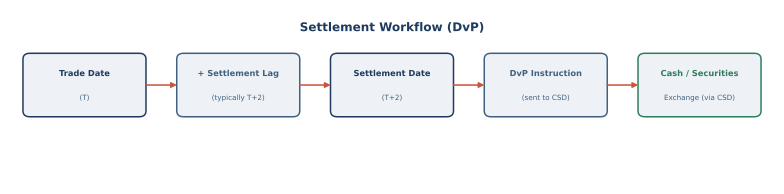


**Fails management:** A settlement fail occurs when one party does not deliver on the settlement date. This can happen because:
- The seller does not have the securities to deliver
- The buyer does not have the cash to pay
- Settlement instructions are wrong (wrong account, wrong currency)
- A system or communication failure prevents the instruction from reaching the CSD (Central Securities Depository)

**Consequences of fails:**

| Consequence | Description |
|------------|-------------|
| **Fails charges** | Many CSDs and settlement systems impose monetary penalties for late settlement (e.g., CSDR in Europe). These charges accrue daily until the fail is resolved. |
| **Buy-in** | If the seller fails to deliver securities after a specified period, the buyer can execute a buy-in — purchasing the securities in the open market and charging the price difference to the failing seller. |
| **Reputational damage** | Persistent settlement fails damage the bank's reputation with counterparties and custodians. |

**Settlement types per product family:**

| Product Family | Typical Settlement |
|---------------|-------------------|
| **ELN** | Cash settlement (final redemption paid in cash) or physical delivery of shares if barrier is breached and product terms require physical settlement |
| **Swaps** | Net cash settlement of periodic payments — only the net difference between the two legs is exchanged |
| **SRT** | Cash settlement of coupon payments. At maturity, the notional principal is returned (unless the rate conditions trigger a different outcome) |
| **CLN** | Cash settlement if no credit event occurs. If a credit event occurs, physical delivery of the reference obligation (bonds of the defaulted entity) or cash settlement at recovery value |

---

### Corporate Actions — Systematic Treatment

Corporate actions are changes to a company's share structure or capital — stock splits, mergers, dividends, spin-offs. For structured products linked to equities, these events require precise adjustments to the product's terms. A missed or miscalculated corporate action adjustment can result in material financial loss.

**Stock Split**

When a company splits its shares, the strike, barrier, and unit quantity are adjusted by the split ratio to maintain economic equivalence.

*Example:* A 2-for-1 stock split on a Reverse Convertible.
- Before split: Strike = $100, Barrier = $70, Notional shares = 10,000
- After split: Strike = $50, Barrier = $35, Notional shares = 20,000
- The economic exposure is unchanged — the investor's position is worth the same.

**Reverse Stock Split**

The opposite adjustment. A 1-for-5 reverse split:
- Before: Strike = $10, Barrier = $7, Notional shares = 50,000
- After: Strike = $50, Barrier = $35, Notional shares = 10,000

**Merger**

When the underlying company is acquired or merges with another entity, the successor entity replaces the original underlying. The ISDA Equity Definitions define the adjustment methodology — typically, the calculation agent determines a fair adjustment ratio based on the merger terms.

If Company A (the underlying) is acquired by Company B at a ratio of 0.8 shares of B per share of A, the product's underlying becomes Company B, and the strike and barrier are adjusted by the 0.8 ratio.

**Tender Offer**

A tender offer may trigger an **Extraordinary Event** under the ISDA Equity Definitions. If the tender results in a change of control, the product may be terminated early at its fair market value (Cancellation and Payment), or the terms may be adjusted to reflect the new corporate structure.

**Rights Issue**

When a company issues new shares at a discount to existing shareholders, this dilutes the value of existing shares. The strike and barrier must be adjusted to reflect the dilution effect.

The adjustment factor is typically calculated as: R = (Market Price) / (Market Price + Rights Value per Share)

Strike and barrier are multiplied by R to maintain economic equivalence.

**Spin-Off**

When a company separates a business unit into a new independent company, existing shareholders receive shares in the new entity. For structured products, the basket may need to include the new entity, or the terms may be adjusted to reflect the value allocated to the spin-off.

**Special Dividend**

Ordinary dividends are anticipated in the product's pricing and do not trigger adjustments. But dividends that exceed a threshold (defined in the product's terms or in the ISDA Equity Definitions) are classified as **extraordinary dividends** and trigger an adjustment — typically, the strike is reduced by the extraordinary dividend amount per share.

**ISDA Fallback Provisions**

The ISDA 2002 Equity Definitions provide a cascade of adjustment methods:

| Priority | Method | Description |
|:--------:|--------|-------------|
| 1 | Calculation Agent Adjustment | The calculation agent (typically the bank) determines an appropriate adjustment to maintain economic equivalence |
| 2 | Modified Calculation Agent Adjustment | The calculation agent adjusts, but the method is constrained by reference to the relevant exchange's adjustment to listed options |
| 3 | Cancellation and Payment | The trade is terminated at its fair market value — used when no reasonable adjustment is possible |

**Why corporate actions are operationally dangerous:** They require immediate identification (often within hours of announcement), correct mathematical calculation, system update across all relevant platforms (NEMO, Sophis, Murex), and client notification — all within tight deadlines. A stock split announced on Friday afternoon must be reflected in the systems by Monday morning. A missed adjustment means every subsequent fixing, coupon observation, and barrier check will be calculated against the wrong levels.

---

### Trade Amendments

After a trade is booked, its terms may need to change. Common reasons include:

- The client requests a partial unwind (reducing the notional)
- The client and bank agree to extend the maturity
- A restructuring changes the coupon or barrier terms
- A booking error is discovered and must be corrected

**Approval workflow:**

1. Trader or structurer submits the amendment request, specifying the proposed changes and the commercial rationale
2. Operations reviews the request for completeness and checks that the system can accommodate the change
3. Four-eyes verification: a second operations analyst confirms the amendment details against the original booking
4. The amendment is executed in the booking system
5. An amended confirmation is generated and sent to the counterparty
6. Product Control reviews the P&L impact of the amendment

**Audit trail:** Every amendment is recorded with:
- What was changed (old value and new value)
- Who requested the change
- Who approved the change
- When the change was made
- Why the change was made

The audit trail is non-negotiable. Amendments without documentation are a control failure — and a regulatory red flag.

---

### Trade Breaks

A trade break is a discrepancy between two systems or two parties that should agree but do not. Trade breaks are the symptoms of operational errors, system failures, or process gaps.

**Types of trade breaks:**

| Break Type | Description | Example |
|-----------|-------------|---------|
| **Position break** | Two internal systems disagree on the position | NEMO shows 10,000 shares underlying; Sophis shows 10,500 shares |
| **Cash break** | Expected cash flow does not match actual cash flow | Expected $500K coupon; received $495K |
| **Confirmation break** | The bank and counterparty disagree on trade terms | Bank's confirmation says strike = 95%; counterparty says strike = 90% |
| **Valuation break** | Front office and Product Control disagree on the trade's value | Trader marks the trade at $102; independent valuation says $99 |

**Investigation — systematic approach:**

1. Check the original booking: is the trade correctly entered?
2. Check the amendment history: was the trade changed after booking, and was the change reflected in all systems?
3. Check the enrichment: did the system populate the secondary fields correctly?
4. Check the counterparty records: does the counterparty's version match ours?
5. Check the market data: are both systems using the same market data?

**Resolution:** Once the cause is identified, the error is corrected in the relevant system. The correction is documented, and the root cause is analyzed to determine whether a systemic fix is needed to prevent recurrence.

**Escalation schedule:**

| Break Age | Action |
|-----------|--------|
| 0-1 day | Operations analyst owns the investigation |
| 1-3 days | Escalated to team lead for prioritization |
| 3-5 days | Escalated to desk head / operations manager |
| 5+ days | Escalated to department head and senior management. Reported in operational risk metrics. |

Unresolved breaks that persist beyond the escalation thresholds are reported in the bank's operational risk reporting and may be flagged by internal audit.

---

### Lifecycle Events — Detailed

Lifecycle events are the moments during a trade's life where something happens that requires operational action. Each product family has its own set of lifecycle events, but the operational principles are consistent.

**Fixings**

On observation dates, the underlying price must be captured from the correct source. For equity-linked products, the fixing source is typically the official closing price from the relevant exchange (e.g., the NYSE official closing price for US-listed stocks, the Xetra closing price for German-listed stocks).

Operations must ensure:
- The correct fixing source is used (per the product's terms)
- The fixing is captured at the correct time (closing auction, not intraday)
- The fixing is applied to the correct observation date (accounting for holidays and business day adjustments)
- If the fixing source is unavailable (market disruption), the fallback procedure is followed per the product's terms

**Coupon Payments**

For products with conditional coupons (e.g., Phoenix Autocallables, Reverse Convertibles with coupon barriers), the coupon payment depends on whether the underlying meets the coupon condition on the observation date.

The operational workflow:
1. Capture the fixing on the observation date
2. Compare the fixing to the coupon barrier
3. If the condition is met, calculate the coupon amount
4. Generate the payment instruction
5. Send the payment on the payment date (typically 2-5 business days after the observation date)

For memory coupons (as taught in [Section 5.1.3](#sec-5-1-3), Phoenix Autocallable), Operations must also check whether previously missed coupons are recoverable — adding complexity to the calculation.

**Barrier Observations**

Barrier monitoring requires knowing the observation convention specified in the product's terms:

| Convention | Monitoring Approach |
|-----------|-------------------|
| **Continuous (American)** | The underlying is monitored throughout every trading day. If the price touches the barrier at any point — even intraday — the barrier is breached. |
| **Daily close (discrete)** | The barrier is checked only against the official closing price on each trading day. Intraday breaches do not count. |
| **Periodic (European-style)** | The barrier is checked only on specified observation dates (e.g., quarterly, or only at maturity). |

Getting the observation convention wrong is one of the most consequential operational errors. If the system is set to daily close observation but the product's terms specify continuous monitoring, a barrier breach could be missed — or vice versa, a barrier breach could be incorrectly recorded.

**Autocall Checks**

On autocall observation dates (typically quarterly or semi-annually), Operations checks whether the underlying is above the autocall level:

1. Capture the fixing on the autocall observation date
2. Compare the fixing to the autocall barrier (e.g., 100% of initial level)
3. If the underlying is at or above the autocall level, the product terminates early
4. Calculate the early redemption amount (typically 100% of notional plus any accrued or memory coupons)
5. Schedule the redemption payment
6. Notify the counterparty of the early termination
7. Close the trade in the booking system

If the autocall does not trigger, the trade continues to the next observation date.

---

### Common Mistakes

1. **Treating booking as a clerical task.** Booking is the foundation of every subsequent operational process — P&L, risk, settlement, lifecycle events. A booking error propagates through every downstream system. A strike entered as 95 instead of 95% (or vice versa) will cause a reconciliation break in every system that references the trade.

2. **Not verifying the fixing source.** The product's terms specify which price source to use for fixings. Using the wrong source (e.g., Bloomberg closing price instead of the exchange official closing price) can result in a different fixing value — and a different coupon or payoff.

3. **Assuming the system handles corporate actions automatically.** Some systems have automated corporate action processing; many do not. Even automated systems require human verification. A stock split that is correctly identified but incorrectly applied (e.g., the ratio is entered as 2.0 instead of 0.5 for a reverse split) will corrupt every subsequent calculation.

4. **Ignoring unconfirmed trades.** An unconfirmed trade is a ticking time bomb. The bank and the counterparty may disagree on terms without knowing it. When a payment comes due and the amounts do not match, resolving the dispute can be costly. Best practice: escalate any trade that remains unconfirmed beyond 5 business days.

5. **Not documenting trade break resolutions.** Fixing a break without documenting the cause and the fix is like patching a leak without finding the source. The same error will recur. Every break resolution must include a root cause analysis and, where appropriate, a systemic fix.

6. **Confusing barrier observation conventions.** Continuous observation and daily-close observation produce different outcomes for the same product and market path. A product that should monitor continuously but is set to daily close may miss a barrier breach — resulting in an incorrect payoff and a potential dispute with the counterparty.

> **Professor Note:** If you remember only one thing from this section, remember this: the front office designs the product and the hedge. Operations makes it real. Every coupon payment, every fixing, every barrier check, every settlement — these are the moments where the product's promises are either kept or broken. Operations does not create the P&L, but Operations can destroy it.


## 6.10 The Practitioner's Desk {#sec-6-10}

*How the desk actually talks and works — vocabulary, organization, and the daily rhythm of structured products*

### The Language of the Desk

Every profession has its own language. A surgeon does not say "cut the skin open" — they say "make an incision." A lawyer does not say "the contract is broken" — they say "the party is in material breach." The structured products desk has its own vocabulary too, and understanding this vocabulary is the difference between understanding the concepts and being able to work on the desk.

This section bridges that gap. Parts 1 through 5 taught you what structured products are, how they work, and how to analyze them. This section teaches you how the people who trade them every day actually communicate.

---

### Desk Organization

**Flow Book vs Exotic Book**

Most structured products desks divide their trading activity into two books:

The **flow book** handles standardized, high-volume products: vanilla Reverse Convertibles, standard FCNs, plain autocallables on major indices. These products follow established templates, price quickly, and trade frequently. The flow book is the assembly line — efficient, predictable, high throughput.

The **exotic book** handles complex, bespoke structures: worst-of autocallables with custom barriers, path-dependent payoffs, multi-asset structures, CDO tranches. These products require significant structuring effort, careful model selection, and individual risk assessment. The exotic book is the custom workshop — slower, more skilled, higher margin per trade.

| Dimension | Flow Book | Exotic Book |
|-----------|-----------|-------------|
| Products | Standard RCs, FCNs, vanilla swaps | Worst-of, path-dependent, CDOs, bespoke |
| Volume | High (dozens per day) | Low (a few per week) |
| Margin per trade | Low ($5K–$50K) | High ($50K–$500K+) |
| Pricing | Automated or semi-automated | Manual, model-intensive |
| Hedging | Delta + Vega, relatively straightforward | Multi-Greek, correlation, gap risk |
| Model risk | Low (well-understood models) | High (model choice matters significantly) |
| Trader skill | Efficient execution, position management | Deep mathematical understanding, judgment |

**Inventory**

The desk's **inventory** is its outstanding portfolio of risk positions. "The desk has $500M of short vega inventory" means the desk has sold $500M notional of products that are short volatility — it will lose money if implied vol rises. Inventory management is one of the trader's core responsibilities: too much inventory in one direction creates concentration risk; too little means the desk is not earning its margin.

**Axed**

When a desk is **axed** in a product, it is actively trying to trade it. "We're axed in 1-year Euro Stoxx autocalls" means the desk is marketing that product aggressively — typically because it helps the desk's inventory position (e.g., buying back some of its short vega by selling autocallables that create offsetting risk).

---

### Risk Warehousing

Instead of hedging every single product perfectly and immediately, a structured products desk typically accumulates risk from multiple trades and hedges the **net position**. This is called **risk warehousing**.

*Analogy:* Think of a shipping company. It would be inefficient to send a separate truck for every single package. Instead, the company warehouses packages at a distribution center, groups them by destination, and sends full trucks. The structured products desk does the same with risk — it warehouses individual trade risks, nets them against each other, and hedges the residual.

**Why desks do it:**

1. **Offsetting risks cancel out.** If the desk sells a product that is short vega on the S&P 500 and another product that is long vega on the S&P 500, the net vega may be close to zero — no hedge needed.
2. **Lower transaction costs.** One large hedge trade is cheaper than ten small ones (lower bid-offer spread relative to size).
3. **Better execution.** The desk can time its hedges to coincide with favorable market conditions rather than hedging reactively after every client trade.

**The risk:**

Warehouse risk is the risk that accumulated inventory moves against the desk before it can be hedged or offloaded. If the desk has $200M of short gamma inventory and the market gaps through a barrier level overnight, the losses can be severe. Risk limits exist precisely to prevent excessive warehousing.

---

### Hedge Vocabulary

| Term | Meaning | Example |
|------|---------|---------|
| **Internal hedge** | Hedge executed with another desk within the same bank | SP desk buys vol from the flow options desk |
| **External hedge** | Hedge executed in the external market | Buying listed options on an exchange |
| **Back-to-back** | An offsetting trade with an external party that exactly mirrors the client risk | Zero residual risk, but lower margin |
| **Delta neutral** | Net delta exposure is zero — no directional risk | Does NOT mean zero risk (gamma, vega remain) |
| **Flat** | No position in a particular risk factor | "The desk is flat gamma" = zero net gamma |
| **Covered** | The risk has been hedged | "The vega is covered" |
| **Residual** | Risk that remains after hedging | Model error, basis risk, gap risk |
| **Unwind** | Close out a position or trade | "We unwound the hedge" |

---

### Greeks Positioning Language

[Part 1](#part-1) taught what the Greeks **are**. This section teaches how the desk **talks** about them.

**Long Gamma**

The desk benefits from large market moves in either direction. When the market moves, long gamma positions generate positive P&L because the delta hedge creates a "buy low, sell high" dynamic. The desk buys as the market falls (becoming more negative delta, requiring more long stock) and sells as the market rises.

Typical of desks that have **bought** options. Rare for structured product desks, which usually sell options to clients.

**Short Gamma**

The desk loses from large market moves. Near barrier levels, short gamma becomes extremely painful because delta changes rapidly — the desk must buy high and sell low to maintain delta neutrality. This is the dominant position for most structured product desks, because clients buy products that embed short put options.

*Why it matters:* A trader who says "I'm short 50 million gamma in AAPL" is telling you that a 1% move in Apple creates approximately $500K of P&L impact that must be hedged immediately. Near barriers, this can spike dramatically.

**Long Vega**

The desk benefits from rising implied volatility. Less common for structured product desks. When present, it is usually because the desk bought back some of its short vega exposure through listed options or variance swaps.

**Short Vega**

The desk loses from rising implied volatility. This is the natural position for a structured product desk — because the products sold to clients embed options, and selling options creates short vega. A vol spike can create significant mark-to-market losses across the entire portfolio.

**Long Correlation**

The desk's **net (hedged)** position benefits when asset correlations increase. Worst-of products create long correlation exposure for the hedged desk: when correlations are high, the basket moves together, reducing the probability that the worst performer hits the barrier. This benefits the desk's hedged book. (Note: the **investor** sold the embedded put and is structurally short correlation; the desk is long the put and hedges its raw short-correlation exposure via dispersion trades to achieve a net long-correlation position.)

**Short Correlation**

The desk loses when correlations increase. Less common for structured products; more typical of correlation trading desks or certain CDO structures.

| Family | Typical Desk Greek Position |
|--------|---------------------------|
| ELN (RC, FCN, Phoenix) | Short gamma, short vega, long correlation (worst-of, **net/hedged** position) |
| Swaps | Varies — rate swaps are directional; equity swaps depend on structure |
| SRT | Long convexity (CMS products), moderate vega |
| STEG | Sensitive to curve steepness, moderate rate-tenor correlation |
| CLN | Short credit spread, short jump-to-default risk |

---

### Role-Specific Vocabulary

**Structurer Language**

| Term | Meaning |
|------|---------|
| Reverse inquiry | Client asks for a bespoke product rather than choosing from a menu |
| Bespoke | Custom-designed for a specific client |
| Vanilla wrapper | Simple product structure wrapping complex economics |
| Pricing request / RFQ | Client asks for a price on a specific product specification |
| Indication | Preliminary price (not binding) |
| Firm price | Binding price the desk commits to trade at |
| Payoff diagram | Visual representation of the product's return profile |
| Barrier shift | Adjusting the barrier level to change the risk/return trade-off |

**Trader Language**

| Term | Meaning |
|------|---------|
| Axed | Actively looking to trade a specific product or risk |
| Lifted | Sold. "We got lifted on the 3-year autocall" = client bought it |
| Working | Actively trying to execute a hedge in the market |
| Hit the bid | Sold at the bid price (accepting lower price for speed) |
| Paying the offer | Bought at the offer price |
| Size | Large notional. "There's size in the name" = large trades happening |
| Bid-offer | Spread between buy and sell price — the desk's compensation |
| Scratched | Executed at no profit or loss |
| Stuffed | Holding unwanted inventory that is hard to offload |

**Sales Language**

| Term | Meaning |
|------|---------|
| Suitability | Whether the product fits the client's risk profile and objectives |
| Target market | Intended client segment for a product (MiFID II requirement) |
| IOI (Indication of Interest) | Early-stage expression of interest from a client |
| Pre-trade disclosure | Risk, cost, and conflict information provided before execution |
| Execution-only | Client makes their own investment decision; bank provides no advice |
| Advisory | Bank recommends the product; higher suitability obligation |

**Risk Language**

| Term | Meaning |
|------|---------|
| Limit breach | A risk limit has been exceeded — must be reported and remediated |
| VaR | Maximum expected loss at a given confidence level over a given horizon |
| Stress test | Hypothetical extreme scenario applied to the portfolio |
| Scenario analysis | "What if" analysis for specific market conditions |
| Concentration risk | Too much exposure to one name, sector, or risk factor |
| Notional limit | Maximum notional per counterparty, product, or underlying |

**Product Control Language**

| Term | Meaning |
|------|---------|
| Flash | Preliminary P&L estimate (pre-IPV, pre-reserves) |
| Official | Verified, reconciled P&L — the number that matters |
| Unexplained | P&L not attributable to any risk factor — a red flag |
| Reserve | Valuation adjustment for uncertainty |
| IPV break | Independent price differs from trader mark beyond tolerance |
| New deal P&L | Manufacturing margin captured on trade date |

**Operations Language**

| Term | Meaning |
|------|---------|
| Break | Discrepancy between two records that should match |
| Fail | Settlement that did not occur on the expected date |
| SSI | Standard Settlement Instructions — pre-agreed bank accounts |
| Static data | Reference data that rarely changes (counterparty, calendar) |
| Golden source | The single authoritative system for a given data type |
| Four-eyes | Two-person review requirement for trade booking |

---

### How a Trade Flows Through the Desk

Here is the end-to-end journey of a 1-year Phoenix Autocallable on the Euro Stoxx 50:

**Day 0 — Origination**
1. A private bank client tells their relationship manager they want enhanced yield on European equities with some downside protection.
2. **Sales** calls the structuring desk with the client profile: risk tolerance = moderate, investment horizon = 1 year, target coupon = 8%+.
3. **Structurer** designs a Phoenix Autocallable: 1-year, quarterly observation, 10% conditional coupon, 70% knock-in barrier, 100% autocall barrier on Euro Stoxx 50. Runs the pricing model.
4. Structurer sends an indicative termsheet to Sales with an 11% coupon (manufacturing margin embedded).

**Day 1 — Execution**
5. Sales presents the termsheet to the client. Client accepts.
6. Sales confirms the trade internally. **Trader** receives the risk.
7. Trader executes the hedge: sells the embedded put option in the interbank market (or warehouses the risk if the desk already needs that exposure), buys delta in Euro Stoxx 50 futures.
8. **Operations** books the trade in NEMO. Four-eyes check against the termsheet.
9. Confirmation sent to counterparty.

**Day 2 — Settlement**
10. Client pays the notional amount. Cash settles via DvP.

**Days 3–365 — Daily Life**
11. Every day: **Trader** manages the hedge (rebalances delta, monitors gamma near barrier). **Product Control** runs P&L explain and IPV. **Risk** monitors exposure against limits.
12. Every quarter: **Operations** checks the Euro Stoxx 50 closing price against the autocall barrier (100%) and coupon barrier.
13. If autocall triggers: Operations processes early redemption, returns notional + coupon to client. Trade ends.
14. If coupon barrier is met but no autocall: Operations processes coupon payment.
15. If coupon barrier is missed: coupon is stored in memory for potential future payment.

**Maturity**
16. Final observation: check Euro Stoxx 50 level vs knock-in barrier and coupon barrier.
17. **Operations** calculates final payoff, initiates settlement.
18. **Product Control** verifies final P&L. Trade is archived.

---

### Day in the Life

| Time | Structurer | Trader | Sales | Risk | Product Control | Operations |
|------|-----------|--------|-------|------|----------------|------------|
| 7:00 | Review overnight pricing requests | Check flash P&L, review positions | Morning prep, review IOIs | Review overnight limit usage | Produce flash P&L | Process overnight fixings |
| 9:00 | Client call — bespoke product discussion | Market opens — execute hedges | Client calls — present indications | Challenge pricing assumptions | Begin IPV checks | Reconcile settlements |
| 12:00 | Run pricing for afternoon inquiries | Manage gamma near barriers | Follow up on outstanding IOIs | Review stress test results | Complete P&L explain | Investigate breaks |
| 15:00 | Finalize termsheets for next-day | Rebalance delta before close | Confirm executed trades with clients | Investigate limit breaches | Challenge trader marks | Confirm new trades |
| 17:00 | Calibration review, next-day prep | Sign off daily P&L | Prepare next-day materials | Prepare risk report | Sign off official P&L | Process lifecycle events |

---

### Common Mistakes

1. **Confusing "short gamma" with "short delta."** Short gamma means you lose from large moves in either direction. Short delta means you lose if the market rises. A desk can be delta-neutral and still have massive short gamma — this is the normal state for a structured products desk near barrier levels.

2. **Thinking "internal hedge" means "no risk."** An internal hedge transfers risk to another desk within the bank — it does not eliminate risk from the bank's perspective. The consolidated risk remains the same. Internal hedges are useful for desk-level risk management but do not reduce the bank's aggregate exposure.

3. **Assuming flow products are simple.** Flow products have simple structures but complex risk management at scale. A desk that has sold 500 autocallables on the same index has massive concentrated gamma and vega exposure that requires sophisticated portfolio-level hedging.

4. **Using desk vocabulary without understanding the underlying concept.** Saying "I'm long correlation" without understanding that this means the desk benefits from assets moving together — and that a correlation breakdown would cause losses — is dangerous. Vocabulary must be backed by understanding.

5. **Ignoring the difference between flash and official P&L.** Flash P&L is an estimate. Official P&L is the verified number. Trading decisions should not be based on flash P&L alone, and management should not react to flash numbers without waiting for the official reconciliation.

> **Professor Note:** If you remember only one thing from this section, remember this: the structured products desk is short gamma and short vega by construction. Clients buy products that embed options — and when the bank sells those options, it becomes short gamma and short vega. Every other aspect of desk management — hedging, risk limits, P&L explain, reserves — follows from this fundamental positioning.

---

## 6.11 Regulatory Framework {#sec-6-11}

*What the regulators require — the rules that govern structured product design, distribution, and risk management*

### The Building Codes of Finance

Regulations are the building codes of finance. Just as a building must meet fire safety, structural integrity, and accessibility requirements regardless of how beautiful the architecture is, a structured product must meet suitability, transparency, and capital requirements regardless of how elegant the financial engineering is.

This section covers the major regulatory frameworks that affect structured products. The goal is not to make you a compliance expert — it is to ensure you understand which rules apply, why they exist, and how they affect the products you will work with.

---

### MiFID II — Markets in Financial Instruments Directive

MiFID II is the European Union's comprehensive framework governing financial markets, investor protection, and transparency. It took effect in January 2018 and fundamentally changed how structured products are designed, distributed, and monitored.

**Product Governance**

Under MiFID II, every financial product must have a clearly defined **target market** — the type of client for whom the product is designed.

The manufacturer (the bank that creates the product) must specify:

| Target Market Dimension | What Must Be Defined |
|------------------------|---------------------|
| Client type | Retail, Professional, Eligible Counterparty |
| Knowledge and experience | What the client needs to understand |
| Financial situation | Minimum wealth, income, loss-bearing capacity |
| Risk tolerance | Willingness to accept losses |
| Investment objective | Growth, income, preservation, hedging |
| Needs and objectives | What problem the product solves |

The manufacturer must also define a **negative target market** — clients who should NOT buy the product under any circumstances. For example, a worst-of autocallable with a 60% barrier should never be sold to a retail client with no derivatives experience and low loss tolerance.

The **distributor** (the sales team or external bank that sells the product) must independently assess whether each client falls within the target market. Selling outside the target market is a regulatory breach.

**Suitability and Appropriateness**

[Part 5](#part-5) of the Bible already covers suitability extensively (105 mentions). MiFID II adds specific procedural requirements:

- **Advisory sales**: the bank must conduct a full suitability assessment — checking knowledge, experience, financial situation, investment objectives, and risk tolerance. The assessment must be documented and provided to the client.
- **Execution-only sales**: the bank must conduct an appropriateness assessment — checking only whether the client has sufficient knowledge and experience to understand the product's risks. If the client fails, the bank must warn them (but the client may still proceed).
- **Portfolio management**: the strictest standard — the bank must ensure the product is suitable within the context of the client's entire portfolio.

**Cost Transparency**

All costs must be disclosed to the client, both in monetary terms and as a percentage:
- Manufacturing costs (structuring, hedging, model costs)
- Distribution costs (sales commission, trailer fees)
- Ongoing costs (management fees, custody fees)
- Exit costs (early redemption penalties)
- Performance-related costs (if applicable)

The disclosure must show the cumulative effect of costs on the client's return — in plain language, before the trade is executed.

**Best Execution**

When executing client orders, the bank must take all sufficient steps to achieve the best possible result for the client, considering:
- Price
- Costs
- Speed
- Likelihood of execution
- Settlement
- Size
- Nature of the order

For structured products, best execution is complex because most products are bespoke OTC instruments with no secondary market. The bank must demonstrate that the pricing was fair relative to the underlying risks.

**Product Intervention**

Regulators can ban or restrict products they consider harmful. ESMA (the European Securities and Markets Authority) has used this power to:
- Ban binary options for retail clients (2018)
- Restrict CFD leverage for retail clients
- Require enhanced warnings for complex products

---

### PRIIPs — Key Information Documents

The PRIIPs regulation (Packaged Retail and Insurance-based Investment Products) requires that every packaged retail investment product comes with a **Key Information Document (KID)** — a standardized, three-page summary that retail investors must receive before investing.

**KID Contents**

| Section | What It Contains |
|---------|-----------------|
| What is this product? | Product description, objectives, intended investor, maturity |
| What are the risks? | Summary Risk Indicator (SRI: 1-7 scale) |
| What could I get in return? | Performance scenarios (favorable, moderate, unfavorable, stress) |
| What happens if the company cannot pay? | Issuer default consequences |
| What are the costs? | Entry, exit, ongoing, performance costs |
| How long should I hold it? | Recommended holding period |
| How can I complain? | Complaints procedure |

**Summary Risk Indicator (SRI)**

The SRI combines market risk and credit risk into a single score from 1 (lowest risk) to 7 (highest risk):

| SRI | Risk Level | Typical Structured Products |
|:---:|-----------|---------------------------|
| 1 | Lowest risk | Capital-guaranteed deposits |
| 2 | Low risk | Principal Protected Notes on major indices |
| 3 | Medium-low | Callable notes with full coupon protection |
| 4 | Medium | Standard autocallables with conditional protection |
| 5 | Medium-high | Reverse Convertibles, Phoenix notes |
| 6 | High | Worst-of autocallables, leveraged products |
| 7 | Highest risk | Warrants, turbos, CDO equity tranches |

Market risk is measured by VaR-equivalent volatility (how much the product's value could fluctuate). Credit risk is based on the issuer's credit rating.

**Performance Scenarios**

The KID must show projected returns under four scenarios, calculated using historical data and forward-looking simulation:
- **Favorable** (approximately 90th percentile outcome)
- **Moderate** (approximately 50th percentile outcome)
- **Unfavorable** (approximately 10th percentile outcome)
- **Stress** (extreme adverse scenario)

These scenarios are controversial because they are based on historical data that may not predict future performance, and the methodology can make some products appear more attractive than their actual risk warrants.

---

### EMIR — European Market Infrastructure Regulation

EMIR is the EU framework governing OTC derivatives. It was introduced after the 2008 financial crisis to reduce systemic risk in the derivatives market.

**Three Pillars of EMIR**

**1. Reporting**

All derivative trades must be reported to a registered Trade Repository within one business day of execution. The report must include:
- Trade identifiers (UTI — Unique Trade Identifier)
- Counterparty details (LEI — Legal Entity Identifier)
- Trade economics (notional, maturity, underlying, price)
- Valuation updates (daily mark-to-market)

Failure to report is a regulatory breach. Most banks automate reporting through middleware that extracts trade details from booking systems (NEMO, Murex) and transmits to the repository.

**2. Clearing Obligation**

Standardized OTC derivatives must be cleared through a **Central Counterparty (CCP)**:
- **Cleared products**: interest rate swaps (IRS) in major currencies, CDS index products (iTraxx, CDX)
- **Not cleared**: most structured products (too bespoke for CCP standardization), single-name CDS, exotic options

How a CCP works:
- When two parties execute a trade, the CCP interposes itself between them via novation
- Party A faces the CCP, and the CCP faces Party B — the CCP becomes the counterparty to both
- The CCP requires initial margin (collateral against potential losses) and daily variation margin (mark-to-market settlement)
- If one party defaults, the CCP uses its default waterfall: defaulter's margin → default fund contribution → CCP's own capital → surviving members' default fund

**3. Risk Mitigation for Non-Cleared Trades**

Derivatives that are not cleared must comply with risk mitigation requirements:
- **Timely confirmation**: within T+1 for electronic, T+2 for non-electronic
- **Portfolio reconciliation**: periodic comparison of positions with counterparties (daily for large portfolios, weekly or quarterly for smaller ones)
- **Portfolio compression**: regular exercises to reduce gross outstanding notional
- **Dispute resolution**: formal process for valuation disputes, with escalation to senior management

---

### UMR — Uncleared Margin Rules

The Uncleared Margin Rules are a global regulation (implemented via national law in each jurisdiction) requiring bilateral exchange of margin for non-cleared derivatives.

**Variation Margin (VM)**

Daily exchange of collateral to reflect changes in the mark-to-market value of the portfolio. If the portfolio value moves in your favor, the counterparty posts collateral to you; if it moves against you, you post to them.

VM has been required for most counterparties since 2017.

**Initial Margin (IM)**

Additional collateral to cover potential future exposure — the risk that the portfolio value could change between the last VM exchange and the close-out of the position after a counterparty default.

IM is required for counterparties whose aggregate average notional amount (AANA) of non-cleared derivatives exceeds regulatory thresholds. Implementation was phased in from 2016 to 2022.

**ISDA SIMM (Standard Initial Margin Model)**

The industry-standard model for calculating bilateral IM:
- Sensitivity-based: calculates IM using risk sensitivities (delta, vega, curvature) rather than full revaluation
- Calibrated to a 10-day, 99% confidence level — meaning the IM should cover losses in 99% of 10-day periods
- Updated annually to reflect current market conditions
- Approved by regulators in most jurisdictions

**Impact on Structured Products**

UMR increases the cost of bilateral (non-cleared) trades by requiring funded collateral. This cost flows into product pricing via MVA (see [§6.7](#sec-6-7)). Products that would have been economically viable before UMR may become too expensive after the margin funding cost is included.

**Segregation**

Bilateral IM must be held by an independent third-party custodian — neither party may use or rehypothecate it. This ensures the collateral is available if either party defaults.

---

### Basel Framework — Practical Impact

The Basel framework (Basel III, with Basel IV changes being implemented) sets global minimum standards for bank capital and liquidity. For structured products professionals, the key question is: how does Basel affect the products we trade?

**Credit Risk Capital (SA-CCR)**

The Standardised Approach for Counterparty Credit Risk (covered in [§6.7](#sec-6-7)) determines the exposure amount for derivative trades. Higher exposure → higher RWA → higher capital → higher cost.

**Market Risk Capital (FRTB)**

The Fundamental Review of the Trading Book (FRTB) overhauls how banks calculate market risk capital:

| Approach | How It Works | Capital Impact |
|----------|-------------|---------------|
| Standardised (SA) | Formula-based, prescribed risk weights | Higher capital, simpler to implement |
| Internal Models (IMA) | Bank's own VaR/ES models, regulator-approved | Lower capital, but each desk must qualify independently |

FRTB introduces desk-level model approval — each trading desk must individually qualify to use internal models. Desks that fail qualification must use the standardised approach, which typically results in higher capital charges.

**CVA Capital**

A dedicated capital charge for CVA risk — the risk that the bank's CVA changes due to credit spread movements. Banks must hold capital against this risk, which flows into KVA and product pricing.

**Impact on Product Design**

Products that generate high RWA or high market risk capital are less profitable after capital charges. This creates a direct incentive for capital-efficient structuring:
- Products cleared through CCPs have lower capital charges than bilateral products
- Collateralized trades have lower exposure than uncollateralized trades
- Shorter-dated products consume less capital than longer-dated products
- Well-hedged books generate less residual risk capital than directional books

---

### Dodd-Frank — US Regulatory Framework

The Dodd-Frank Wall Street Reform and Consumer Protection Act (2010) is the US equivalent of EMIR for OTC derivatives regulation.

**Title VII** governs swap dealers:
- **Registration**: entities that deal in swaps above de minimis thresholds must register with the CFTC (commodity/rates) or SEC (security-based)
- **Clearing**: standardized swaps must be cleared through a DCO (Derivatives Clearing Organization)
- **Reporting**: all swaps must be reported to a Swap Data Repository (SDR)
- **Margin**: similar to UMR — bilateral margin requirements for non-cleared swaps

**Cross-Border Implications**

Trades between US and non-US entities may be subject to both Dodd-Frank and EMIR (or other local regulations). Substituted compliance provisions exist to reduce duplicative requirements, but the interaction remains complex.

---

### MAR — Market Abuse Regulation

MAR prohibits three categories of market abuse:

1. **Insider dealing**: trading on material non-public information (MNPI)
2. **Market manipulation**: artificially affecting the price or supply of a financial instrument
3. **Unlawful disclosure**: sharing MNPI with others without a legitimate reason

**Relevance to Structured Products**

The desk holds significant MNPI:
- Barrier levels of outstanding products (a stock approaching a barrier could trigger large hedging activity)
- Client order flow (knowing that large client orders are coming)
- Autocall observation dates and levels

Using this information to benefit the desk or personal accounts is illegal. Banks maintain **Chinese walls** — information barriers between departments — and monitor trading activity for potential abuse.

---

### Common Mistakes

1. **Assuming suitability is just a checkbox exercise.** Suitability under MiFID II is substantive — the bank must genuinely assess whether the product is right for the client. Rubber-stamping suitability assessments exposes the bank to regulatory sanctions and client lawsuits.

2. **Ignoring the negative target market.** Defining who should NOT buy the product is as important as defining who should. Regulators specifically check whether products were sold to clients in the negative target market.

3. **Treating the PRIIPs KID as a marketing document.** The KID is a regulatory disclosure document, not a sales tool. Presenting it selectively or emphasizing favorable scenarios while downplaying stress scenarios is a regulatory breach.

4. **Assuming non-cleared means unregulated.** Non-cleared derivatives are subject to EMIR risk mitigation requirements (timely confirmation, portfolio reconciliation, dispute resolution) and UMR margin requirements. "Non-cleared" does not mean "unregulated."

5. **Forgetting cross-border regulatory interaction.** A trade between a London desk and a New York client may be subject to MiFID II, EMIR, Dodd-Frank, and local margin rules simultaneously. Compliance must consider all applicable regimes.

> **Professor Note:** If you remember only one thing about regulation, remember this: regulation exists because the 2008 crisis demonstrated that unregulated derivatives could threaten the entire financial system. Every rule — clearing, margin, reporting, capital, suitability — is a response to a specific failure. Understanding *why* a regulation exists makes compliance intuitive rather than burdensome.

---

## 6.12 The 2nd-Line Reconciliation Casebook {#sec-6-12}

*Where the controls meet the trade — fifteen worked reconciliation breaks, end to end, for the 2nd line of defence.*

The product chapters in [Part 5](#part-5) each carry a **Controls & Reconciliation (2nd Line of Defence)** lens with a reconciliation-points table and a flagged "most common break." This casebook is the operational companion: it takes the breaks that matter most across the 49 products and works each one through, with numbers, from the moment the trade is booked to the moment 2nd line catches it. It is written for the reader who runs trade reconciliation alongside the desk (1st line) and must prevent losses to the bank from data inconsistency.

Every case follows the same anatomy so the discipline becomes muscle memory.

### The anatomy of a reconciliation break

Every break, regardless of product, has the same seven parts. Learn the shape and you can dissect any break you meet on the desk:

1. **What must agree** — the specific field or event, and the two (or more) systems that must hold the same value (book of record vs pricing/risk vs downstream settlement).
2. **The break** — the precise inconsistency: a value, a flag, a date, a convention, or a sign.
3. **The numbers** — the trade economics, so the size of the error is concrete, not abstract.
4. **Detection** — how 2nd line finds it: a tolerance breach, a four-leg net that does not zero, an unexplained P&L, a failed fixing match, a stale flag.
5. **Consequence** — what crystallises if it reaches settlement: wrong redemption, wrong client payout, misstated risk, misstated P&L, capital/regulatory impact.
6. **Root cause** — the upstream reason: a convention default, a manual entry, a missing feed, a model version, a calendar.
7. **Remediation and preventive control** — the fix today, and the control that stops recurrence (a four-eyes check, a reconciliation rule, a system constraint, a linter/regression rule).

A reconciliation break is never "just a data issue." It is a future loss, a future client complaint, or a future regulatory finding that has not happened yet. The job of the 2nd line is to ensure it never does.

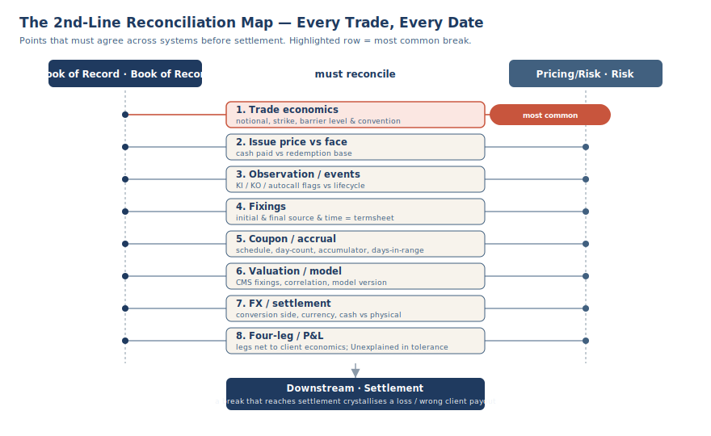

---

### Group A — Trade economics breaks (the trade was captured wrong)

#### Case 1 — Barrier stored as a percentage in one system, an absolute price in another

**Product:** Reverse Convertible (5.1.2), or any barrier note. **Systems:** NEMO (book of record) vs Sophis (pricing/risk).

**The break.** NEMO stores the knock-in barrier as **$70**; Sophis stores it as **70%**. These agree only if the initial level is exactly $100.

**The numbers.** Underlying initial level $95, barrier 70% of initial = **$66.50**. NEMO was keyed with `barrier = 70` (read as $70, not 70%). The two systems now value and monitor against barriers $3.50 apart.

**Detection.** The daily barrier-proximity report shows two different distances-to-barrier for the same trade; the IPV reconciliation of the embedded put flags a valuation gap that scales with the barrier difference. A convention check (`barrier × initial = barrier_price`?) fails: $70 ≠ 0.70 × $95.

**Consequence.** At maturity the redemption test uses the wrong trigger: a stock finishing at $68 is **above** the true $66.50 barrier (no loss) but **below** the false $70 barrier — the investor is wrongly paid a reduced redemption, or wrongly paid par, depending on which system drives settlement. Either is a misstated client payout.

**Root cause.** The barrier convention (percentage vs absolute) was not normalised at capture; the booking template defaulted the field type.

**Remediation / preventive control.** Re-key the barrier consistently as a percentage of initial across both systems; reconcile every barrier trade with the rule `barrier_price = barrier_pct × initial_level`. The preventive control is a system constraint forcing barriers to be stored one way only, plus a daily cross-system convention reconciliation. (This is the canonical "most common break" flagged in the RC reconciliation flow and protected by linter rule `LNT-SGN-01`'s sibling checks.)

#### Case 2 — Issue price recorded as par on a discounted note

**Product:** Discounted Reverse Convertible (5.1.4). **Systems:** NEMO vs Sophis vs the deposit/cash ledger.

**The break.** The DRC traded at an issue price of **91%** ($455,000 on $500,000 face). NEMO records the issue price as **100%**.

**The numbers.** Cash actually paid: $455,000. Face value: $500,000. Every return and P&L number computed on a 100% base is wrong by the 9% discount; the desk's day-one manufacturing margin is overstated because the discount is treated as zero.

**Detection.** The cash ledger ($455,000 received) does not reconcile to the booked notional ($500,000). P&L Explain shows an inexplicable day-one profit equal to the un-booked discount.

**Consequence.** Misstated P&L at inception; at maturity, if settlement reads the wrong base, the investor is redeemed at the wrong amount. The barrier could also be applied to the issue price instead of the initial stock level.

**Root cause.** Issue price defaulted to par; the discount field was left blank.

**Remediation / preventive control.** Capture both **face value** (for barrier and redemption) and **issue price** (for cash and P&L) as distinct mandatory fields; reconcile cash-received against issue-price × face daily. This is the DRC reconciliation flow's flagged break (issue price vs face value).

#### Case 3 — Notional vs invested-amount confusion in risk reports

**Product:** Any discounted or leveraged note (DRC, Accumulator). **Systems:** risk engine vs P&L attribution.

**The break.** The risk report expresses returns on **face value** while the P&L attribution uses **invested capital**, and neither states which base it uses.

**The numbers.** A −40% stock move on a DRC bought at 91% produces a −34.8% loss on **face** but a different percentage on **invested capital**; quoting one base while computing on the other misstates the loss by the discount ratio.

**Detection.** Two reports show different percentage losses for the same trade and date.

**Consequence.** Risk limits sized on the wrong base; a position looks within limit when it is not, or vice versa.

**Root cause.** No standard for the reporting base.

**Remediation / preventive control.** Mandate that every return figure states its base (face vs invested) and that risk and P&L use the same convention. A label standard, enforced in the report template.

---

### Group B — Observation and event-capture breaks (the event was missed or mis-flagged)

#### Case 4 — American barrier monitored only on daily closes

**Product:** RC / Phoenix / any American (continuous) barrier. **Systems:** market-data feed vs barrier-monitor.

**The break.** The barrier is **American** (continuous), but the monitor only checks the **daily close**.

**The numbers.** The underlying touches the 60% knock-in **intraday** (low of 59%) but closes at 63%. The daily-close monitor records "no breach"; the trade is, in fact, knocked in.

**Detection.** The intraday low feed, reconciled against the monitor's "not knocked in" flag, disagrees. A reconciliation rule comparing `min(intraday) < barrier` against the KI flag fires.

**Consequence.** The desk's risk understates the knock-in (it still carries the trade as protected); the investor's protection is overstated. At maturity the redemption is computed as if never breached — a wrong, too-generous payout, and a loss to the bank when the true economics surface.

**Root cause.** Observation type (European vs American) was correctly captured but the monitoring infrastructure only consumed end-of-day prices.

**Remediation / preventive control.** Ensure American barriers are monitored against intraday lows/highs (real-time or intraday feed); reconcile the KI flag against the intraday extreme daily. The preventive control links the observation-type field to the monitoring frequency so the two cannot diverge.

#### Case 5 — Autocall event not captured; the note keeps running

**Product:** Phoenix / Snowball / Worst-of Autocallable. **Systems:** observation engine vs book of record.

**The break.** On the Q5 observation the worst-of is at 103% (above the 100% autocall barrier); the note **should redeem early**, but the autocall flag is not set, so the structure stays open.

**The numbers.** $1,000,000 note, autocall at Q5 returns principal + $15,000 coupon = $1,015,000. With the flag missed, the desk keeps hedging a position that no longer exists and the investor is not paid on time.

**Detection.** The observation engine's "autocall = yes" does not match the book-of-record "live" status. A daily event-capture reconciliation (every observation date: does the determination match the booked lifecycle state?) fires.

**Consequence.** Late client redemption; the desk carries phantom risk and funding; unwind P&L is wrong.

**Root cause.** Manual event processing or a failed straight-through link between the observation engine and the book of record.

**Remediation / preventive control.** Reconcile every observation-date determination (autocall, coupon-paid, knock-in) against the booked lifecycle state before any payment settles. This is the autocall family's flagged control.

#### Case 6 — Worst-of determined on the wrong underlying

**Product:** Worst-of Autocallable / Worst-of RC. **Systems:** fixing engine vs payout calculator.

**The break.** The worst-of basket is {Siemens, LVMH, ASML}; on the Q3 observation the payout calculator uses LVMH (the median) instead of ASML (the true worst) because of a basket-ordering error.

**The numbers.** ASML at 75% (worst), LVMH at 98%. A coupon barrier at 70% pays in both cases, but at a knock-in test the wrong "worst" changes the redemption: using LVMH (98%) hides an ASML breach.

**Detection.** Reconcile the calculator's "worst name" against the independently computed minimum of the basket fixings on each date.

**Consequence.** Wrong coupon/redemption; understated worst-of risk.

**Root cause.** Basket constituent ordering or a stale fixing for one name.

**Remediation / preventive control.** The worst-of determination must recompute `argmin` over the live fixings each date and reconcile against the payout engine.

---

### Group C — Lifecycle and coupon breaks (the cash was wrong)

#### Case 7 — Coupon paid on a knocked-in trade that should have stopped

**Product:** Reverse Convertible / Phoenix (memory) variants. **Systems:** coupon scheduler vs lifecycle state.

**The break.** The termsheet stops coupons after a knock-in; the scheduler keeps paying because it does not read the KI flag.

**The numbers.** $500,000 notional, 9% coupon = $11,250/quarter. The trade knocks in at Q2; two further coupons ($22,500) are paid that the termsheet says should not be.

**Detection.** The coupon scheduler's payment list, reconciled against the lifecycle state (knocked-in from Q2), shows payments after the stop event.

**Consequence.** Overpayment to the investor; a direct loss to the bank.

**Root cause.** The coupon-survival-after-knock-in convention was not wired into the scheduler.

**Remediation / preventive control.** Reconcile each scheduled coupon against the termsheet's survival convention and the live KI flag before release. (The Bible flags this as a red-flag in the RC and FCN controls lenses.)

#### Case 8 — Snowball accumulator counter not incremented

**Product:** Snowball Note. **Systems:** accumulator engine vs book of record.

**The break.** Through months 3–4 no coupon is paid and the snowball counter should accumulate to **4%**; the counter is not incremented, so the month-5 catch-up underpays.

**The numbers.** RMB 10,000,000 note; missed months should roll up to a month-5 payout of 6% (4% carried + 2% current) = RMB 600,000. If the counter sits at 0, the catch-up pays only RMB 200,000.

**Detection.** Reconcile the accumulator counter against the independent sum of missed-but-eligible coupons on each observation date.

**Consequence.** Investor underpaid the carried coupon; a client complaint and a remediation payment.

**Root cause.** Accumulator-counter tracking is the snowball's defining control and was not reconciled.

**Remediation / preventive control.** Daily reconciliation of the accumulator counter against the missed-coupon ledger.

#### Case 9 — Range-accrual factor computed on the wrong day count

**Product:** Range Accrual ELN / NCRA / Range Accrual Steepener. **Systems:** accrual engine vs verification.

**The break.** The coupon is `max_coupon × (days in range / total days)`. The engine counts 88 days-in-range; the independent recount finds 85 (three holiday observations were wrongly counted as in-range).

**The numbers.** $60M × 5.10% / 4 = $956,250 max quarterly. At 88/92 the coupon is $914,674; at the correct 85/92 it is $883,492 — a $31,182 overpayment.

**Detection.** Reconcile the accrual factor (days-in-range / total) against the observation log, holiday-adjusted.

**Consequence.** Coupon overpayment; misstated accrued interest.

**Root cause.** Holiday calendar / observation-count error in the accrual factor — the range-accrual family's defining control.

**Remediation / preventive control.** The accrual factor must reconcile to a holiday-adjusted observation log; the day-count basis must match the termsheet.

---

### Group D — Valuation and model breaks (the price moved for the wrong reason)

#### Case 10 — Two CMS fixings taken from different sources or times

**Product:** Steepener family (Vanilla / Range Accrual / Callable / TARN). **Systems:** rate-fixing feed vs coupon calculator.

**The break.** The coupon is `leverage × (CMS30Y − CMS2Y)`. The two CMS rates are taken from different snap times (or different vendors), so the spread is wrong.

**The numbers.** Leverage 5×; true spread CMS30 4.50% − CMS2 3.80% = 0.70% → coupon 3.50%. If CMS2 is snapped 30 minutes later at 3.70%, the spread reads 0.80% → coupon 4.00% — a 0.50% overpayment on notional ($50M × 0.50% = $250,000 per annum).

**Detection.** Reconcile both CMS fixings to the same source and snap time; a mismatch in source/time fails the check.

**Consequence.** Coupon over/under-payment; P&L Explain shows an unexplained residual on the curve leg.

**Root cause.** The two fixings were not constrained to a single source and time — the steepener's defining control.

**Remediation / preventive control.** Both CMS legs must reconcile to the same fixing source and snap; the control links the two fixing fields to one source reference.

#### Case 11 — Realized-variance calculation: sampling and annualisation mismatch

**Product:** Variance Swap. **Systems:** realized-variance engine vs verification.

**The break.** The realized-variance formula, sampling frequency (daily close vs intraday), and annualisation factor (252 vs 260) must match the termsheet. The engine uses 260; the termsheet says 252.

**The numbers.** On a variance notional, a strike of 20% vol, the annualisation factor difference scales the realized leg by 260/252 ≈ 1.03 — a 3% error on the variance settlement, magnified by the variance notional and any cap.

**Detection.** Reconcile the realized-variance inputs (fixing source, sampling, annualisation, the exact formula, the cap) against the termsheet on settlement.

**Consequence.** Wrong settlement on a leveraged variance position.

**Root cause.** Annualisation/sampling convention mismatch — the variance swap's defining control.

**Remediation / preventive control.** The realized-variance configuration must reconcile field-by-field to the termsheet, including the 2.5× cap.

#### Case 12 — Base-correlation input stale on a CDO tranche

**Product:** Synthetic CDO Tranche. **Systems:** correlation/copula surface vs tranche pricer.

**The break.** The tranche MTM depends on the base-correlation surface; a stale or divergent correlation input moves the mezzanine MTM and the tranche risk.

**The numbers.** A mezzanine (3–7%) tranche on a $1B portfolio: a base-correlation move that the senior desk and the risk system disagree on shifts the $40M tranche's MTM by several percent — material to daily P&L and to the equity-long / senior-short correlation risk.

**Detection.** Reconcile the base-correlation/copula inputs between front office and risk; an IPV check on the tranche price flags a gap.

**Consequence.** Misstated tranche MTM and correlation risk; the equity-long/senior-short directionality is mismarked.

**Root cause.** Stale or divergent correlation model inputs — the CDO's defining control.

**Remediation / preventive control.** Daily reconciliation of base-correlation inputs and an independent tranche-price verification.

#### Case 13 — Model version changed overnight; valuations jump

**Product:** Any path-dependent / model-priced product (Cliquet, autocalls, CDO). **Systems:** front-office model vs independent valuation.

**The break.** A new model version is deployed overnight and changes valuations in a way the standard Greeks do not capture (forward-vol or skew move).

**The numbers.** A cliquet book's value jumps by an amount that P&L Explain cannot attribute to delta/vega/theta — a large **Unexplained** residual (e.g. $50,000 on a $145,000 day, far above the 5–10% tolerance).

**Detection.** P&L Explain Unexplained breaches tolerance; the cause traces to a model-version change, not a market move.

**Consequence.** Unexplained P&L that, if signed off, hides a real valuation change; potential restatement.

**Root cause.** Model change management — a model-version deployment without a re-baseline.

**Remediation / preventive control.** Model changes are governed ([Section 6.8](#sec-6-8)): no overnight deployment without a parallel run and a P&L impact assessment; the day's Unexplained must be reconciled to the model-change log.

---

### Group E — Settlement and FX breaks (the wrong amount, or the wrong currency, was paid)

#### Case 14 — DCI converted on the wrong side of the strike

**Product:** Dual Currency Investment. **Systems:** FX-fixing source vs conversion engine vs settlement-currency capture.

**The break.** A DCI repays in the alternate currency at the strike **only when that currency has weakened** (the bank exercises against the investor). A sign/inequality error converts on the favourable side instead — or the settlement currency is captured as the base when it should be the alternate.

**The numbers.** USD 1,000,000 deposit, strike USD/CHF 0.8600. At maturity USD/CHF = 0.9000 (CHF weaker): conversion delivers CHF 860,000, worth $955,556 — a $44,444 loss before coupon. If the engine instead pays USD 1,000,000 (no conversion), the bank overpays by the option value it was owed; if it converts on the wrong side, the investor is shortchanged.

**Detection.** Reconcile the conversion trigger against the FX fixing and the strike inequality; reconcile the **settlement currency** captured against the conversion determination.

**Consequence.** Wrong settlement amount and/or wrong settlement currency — a direct loss to one party.

**Root cause.** FX fixing source/time and the conversion-side inequality — the DCI's defining control.

**Remediation / preventive control.** The conversion determination must reconcile the FX fixing (source and time) against the strike, and the settlement currency must be captured and reconciled before payment.

#### Case 15 — Physical delivery booked as cash, or the wrong share count

**Product:** Worst-of RC / any physically-settled note. **Systems:** settlement instruction vs redemption calculator.

**The break.** A knocked-in note settles by **delivering shares** (`shares = notional / strike`), but the instruction is booked as a **cash** redemption, or the share count is wrong.

**The numbers.** €500,000 notional, ASML strike €700 → 714 shares to deliver. ASML at 65% = €455/share → shares worth €324,870. If booked as cash redemption of €500,000, the bank overpays €175,130; if the share count is miscomputed, the delivery is wrong.

**Detection.** Reconcile the settlement type (cash vs physical) and the share count (`notional / strike`) against the termsheet and the redemption calculator before delivery-versus-payment.

**Consequence.** Overpayment, wrong delivery, failed DvP.

**Root cause.** Settlement-convention capture (cash vs physical) — flagged in the RC and worst-of controls lenses.

**Remediation / preventive control.** Settlement type and share count must reconcile to the termsheet; DvP confirms both legs.

---

### The master reconciliation checklist (use every observation and settlement date)

| # | Reconciliation point | What must agree | Defining product(s) |
|:-:|----------------------|-----------------|---------------------|
| 1 | Trade economics | Notional, strike/initial, barrier level **and convention**, coupon, maturity, underlying ID | All barrier notes |
| 2 | Issue price vs face | Cash paid vs redemption base | DRC, discounted notes |
| 3 | Observation type | European vs American; monitoring frequency matches | RC, Phoenix, autocalls |
| 4 | Fixings | Initial & final source/time = termsheet | All |
| 5 | Worst-of determination | argmin over live fixings | Worst-of products |
| 6 | Event capture | Knock-in / knock-out / autocall flags vs lifecycle state | Autocalls, barriers |
| 7 | Coupon lifecycle | Schedule, day-count, survival after KI | RC, FCN, Phoenix |
| 8 | Accumulator / accrual | Snowball counter; range-accrual days-in-range (holiday-adjusted) | Snowball, range accruals |
| 9 | Two CMS fixings | Same source & snap time | Steepeners |
| 10 | Realized variance | Formula, sampling, annualisation, cap | Variance swap |
| 11 | Correlation / model inputs | Base correlation, copula, attachment/detachment | CDO, FTD/NTD |
| 12 | Four-leg net | Note + Issuer + Deposit + Hedge nets to client economics | SRT, STEG, rate notes |
| 13 | P&L attribution | Components + accrual reconcile to total; Unexplained within tolerance | All |
| 14 | FX / settlement currency | Conversion side vs strike; settlement currency captured | DCI, cross-currency |
| 15 | Settlement type & count | Cash vs physical; shares = notional / strike; DvP | Physically-settled notes |
| 16 | Corporate actions | Strike/barrier adjusted for splits, dividends, mergers | Equity underlyings |
| 17 | Collateral / CSA | Margin, eligible collateral, thresholds (XVA) | Swaps, OTC |

### Escalation matrix

| Severity | Trigger | Action | Owner |
|----------|---------|--------|-------|
| **Low** | Within tolerance, single trade, no payment impact | Log, correct, note in the daily pack | 2nd-line analyst |
| **Medium** | Affects a payment/redemption, or breaches a reconciliation tolerance | Hold the payment, correct before settlement, four-eyes sign-off | 2nd-line lead + desk |
| **High** | Affects multiple trades, P&L Unexplained breaches threshold, or client-facing error | Escalate to desk head + Risk; if material, the Valuation Committee | Head of Product Control |
| **Critical** | Systemic (model, feed, convention) error across a book | Freeze affected settlements; incident review; regulator notification if required | CFO / CRO |

**The 2nd line's one rule:** a reconciliation break is a future loss that has not happened yet. Catch it before settlement crystallises it.

---

# PART 7 — QUICK REFERENCE {#part-7}

*The fast lookup layer for revision and interview preparation — consolidated review questions and the book-wide mental-models glossary.*

---

## 7.1 Knowledge Check {#sec-7-1}

### Review Questions

1. A coupon payment date falls on Saturday, December 31. The business day convention is Modified Following, and the relevant calendar is London. When is the coupon paid? What if the convention were Following instead?

2. You are reading a termsheet for a 1-year Reverse Convertible. The Issue Price is 100%, but the settlement amount at maturity says "Clean Price." The trade has been outstanding for 6 months. A colleague says the investor will receive exactly 100% of their notional back (plus coupon) if no barrier is breached. Is this correct? Explain the difference between clean price and dirty price.

3. A bank enters into a derivative with a counterparty. The CSA specifies a Threshold of €10M, an MTA of €500K, and eligible collateral of cash only. The current exposure is €12M. How much collateral should the counterparty post? What if the exposure were €10.3M?

4. A company has the following capital structure: €5B senior secured bonds, €3B senior unsecured bonds, €2B subordinated debt, €1B AT1, €4B common equity. The company defaults and the total recovery is €6B. How is the recovery distributed across creditors?

5. Classify the following structured products into Fair Value Hierarchy levels (1, 2, or 3): (a) a 6-month Reverse Convertible on Apple, (b) a 5-year CDO tranche on a bespoke portfolio, (c) a 1-year autocallable on the Euro Stoxx 50, (d) a 10-year worst-of on three emerging market stocks with no liquid options market.

6. The desk made €800K yesterday. P&L Explain shows: Delta P&L +€500K, Vega P&L −€150K, Theta P&L +€200K, New deals +€50K, Unexplained +€200K. The unexplained threshold is 10% of gross P&L. Should Product Control escalate? What would you investigate?

7. A Reverse Convertible has a notional of €10M, a 6-month tenor, and the underlying stock has a bid-offer spread of 2%. What is the approximate bid-offer reserve? Why does this reserve exist?

8. A bank trades a 5-year interest rate swap with a BBB-rated corporate counterparty. No CSA is in place. Which XVA charges apply? Which would be eliminated if the counterparty posted daily variation margin under a CSA?

9. A quant team has built a new pricing model for worst-of autocallables using stochastic local volatility. The model has been tested internally and shows good calibration to market data. Before the desk can use it for live trading, what governance steps must it go through?

10. A 2-for-1 stock split is announced for the underlying of a Phoenix Autocallable. The original terms are: initial spot = $200, knock-in barrier = 70% ($140), autocall barrier = 100% ($200), coupon barrier = 80% ($160). What are the adjusted terms after the split? Which system fields need to be updated?

### Scenario Questions

1. You are a new Product Control analyst. Your flash P&L shows the desk made €2M yesterday. By 2pm, the P&L Explain is complete: Delta €1.2M, Theta €0.3M, New deals €0.1M — total explained €1.6M. Unexplained is €400K (25% of total). The trader says "that's just noise, it'll wash out tomorrow." What do you do?

2. A CLN references a European bank that has just announced a voluntary restructuring of its subordinated debt — extending the maturity by 3 years and reducing the coupon by 100bps. The CDS on this reference entity is documented under No Restructuring (NR). Sales is fielding calls from nervous CLN investors. What should investors be told? What if the CDS were documented under Full Restructuring (FR)?

3. Your bank has sold a 1-year Phoenix Autocallable on a single stock. The stock has been trading at 72% of its initial level — just above the 70% knock-in barrier. A major competitor announces a tender offer for the stock, and the share price jumps to 120% of the initial level overnight. Describe the impact on: (a) the desk's hedge, (b) Operations, (c) Product Control, (d) the client.

### Desk Question

A junior structurer says: "We do not need to worry about XVA charges — they are just accounting adjustments, not real costs." Explain why this statement is wrong. In your answer, describe at least three XVA charges and explain how each represents a real economic cost to the bank.

---

## 7.2 Mental Models Summary {#sec-7-2}

| Concept | Mental Model |
|---------|-------------|
| Modified Following | The "do not cross the month" rule — move forward to the next business day, unless it pushes you into the next month, then move backward |
| Day Count Convention | The ruler that measures time — but different rulers give different answers for the same period |
| ACT/360 vs 30/360 | On a $100M notional, the wrong ruler costs you $10,000+ per coupon |
| Clean vs Dirty Price | Clean = the sticker price on the car. Dirty = the sticker price plus the fuel already in the tank |
| Termsheet | The architectural blueprint — every field specifies a precise measurement |
| ISDA Master Agreement | The building code — the termsheet says what you are building; the Master Agreement says what happens when things go wrong |
| CSA Threshold | The deductible on your insurance — you absorb the first $X of exposure before collateral kicks in |
| Close-out Netting | The "no cherry-picking" rule — upon default, all trades are settled together, not individually |
| Capital Hierarchy | The apartment building — ground floor gets out first in a fire, penthouse last |
| Recovery Waterfall | The queue at the ATM — senior creditors get paid first, equity holders get what is left |
| AT1 / CoCos | The ejection seat — designed to absorb losses before the plane crashes |
| Restructuring Clause | The insurance policy fine print — FR covers everything including fender-benders; NR only covers total write-offs |
| Fair Value Hierarchy | The house appraisal — market comps (L1), adjusted comps (L2), expert opinion (L3) |
| IPV | The second opinion — an independent doctor checking the surgeon's diagnosis |
| P&L Explain | The financial autopsy — dissecting yesterday's result into its causes |
| Unexplained P&L | The smoke detector — small amounts of smoke are normal; large amounts mean something is burning |
| Reserves | The rainy-day fund — set aside for the things the model might be wrong about |
| Bid-Offer Reserve | The exit toll — you cannot sell at mid; you sell at the bid |
| Model Reserve | The margin of error — different reasonable models give different prices |
| Day One P&L | The "too good to be true" check — did you really make money, or did your model assume you did? |
| CVA | The tab insurance — the cost of the customer potentially not paying their bill |
| FVA | The rent — the cost of funding the money you have lent out |
| KVA | The opportunity cost — the capital tied up in this trade could be earning returns elsewhere |
| FTP | The internal rent — Treasury charges the desk for using the bank's balance sheet |
| SA-CCR | The exposure meter — measures how much the bank could lose if the counterparty defaults |
| RWA | The risk-adjusted size — not all assets are equally risky; risk weights reflect this |
| RAROC | The true profitability — revenue means nothing if the capital consumed to earn it is excessive |
| Model Lifecycle | The car inspection — build it, test it, certify it, monitor it, eventually retire it |
| Backtesting | The reality check — did the model's predictions match what actually happened? |
| Challenger Model | The second opinion — a different approach to the same problem, to see if the answer changes |
| Model Inventory | The fleet register — every model in the bank is registered, rated, and tracked |
| Golden Source | The single source of truth — one authoritative system per data type, no arguments |
| Trade Break | The mismatched puzzle piece — two records that should agree but do not |
| Corporate Action | The rule change mid-game — the underlying changes, so the contract must adjust |
| Flow vs Exotic | Assembly line vs custom workshop — high volume and low margin vs low volume and high margin |
| Risk Warehouse | The shipping depot — accumulate risks, group them, and hedge in bulk rather than one at a time |
| Short Gamma | Losing in earthquakes — the desk hurts from large sudden moves in any direction |
| Short Vega | Losing in storms — the desk hurts when volatility rises across the market |
| Long Correlation | Benefiting from herding — the desk profits when assets move together |
| Suitability | The prescription — the right medicine for the right patient, not every medicine for every patient |
| SRI | The nutritional label — a standardized score so consumers can compare risks across products |
| Central Clearing | The trusted middleman — the CCP stands between buyer and seller, guaranteeing both sides |
| UMR | The bilateral safety net — collateral required even when no CCP is involved |

---
